# 第1章 计算机系统概述

## 【考纲内容】

（一）操作系统的基本概念

（二）操作系统的发展历程

（三）程序运行环境

CPU 运行模式：内核模式与用户模式；中断和异常的处理；系统调用；程序的链接与装入；程序运行时内存映像与地址空间 $^{①}$

视频讲解

（四）操作系统结构

分层、模块化、宏内核、微内核、外核

（五）操作系统引导

（六）虚拟机

## 【复习提示】

本章通常以选择题的形式进行考查，要求考生在宏观上把握操作系统的整体架构，在微观上掌握关键概念与核心机制。作为全书的导引章节，本章有助于构建对操作系统的整体认知框架，为后续深入学习进程管理、内存管理、文件系统等核心内容奠定基础。因此，复习时应首先建立清晰的知识体系，通过反复练习巩固理解，最终实现对各模块知识的有机整合。

## 1.1 操作系统的基本概念

### 1.1.1 操作系统的概念

在信息化时代，软件是计算机系统的灵魂，而作为其核心的操作系统，已与现代计算机系统深度融合。从使用层次来看，计算机系统自下而上可分为四层：硬件、操作系统、应用程序和用户（该划分侧重人机交互视角，不同于计算机组成原理中的结构分层）。其中，硬件（如中央处理器、内存、输入/输出设备等）提供基本计算资源；应用程序（如文字处理软件、电子表格、编译器、浏览器等）则利用这些资源解决用户的实际问题。操作系统负责管理硬件资源，为应用程序提供运行环境，并充当硬件与用户之间的桥梁。

具体而言，操作系统通过有效协调多个应用程序对硬件资源的访问，确保系统高效、安全地运行。综上所述，操作系统（Operating System，OS）是控制和管理计算机系统软/硬件资源、合理调度任务与分配资源，并为用户及其他软件提供统一接口与运行环境的最基本的系统软件。
### 1.1.2 操作系统的功能和目标

为多道程序提供良好的运行环境，操作系统需具备四大核心功能：处理机管理、存储器管理、设备管理和文件管理。此外，为方便用户使用，操作系统还需提供用户接口；同时，它通过抽象与虚拟化技术扩充硬件功能，从而提供更便捷的服务并提升资源利用率。

下面用直观的例子来描述操作系统的角色。例如，将用户视为“雇主”，计算机（由处理机、存储器、设备和文件等组成）视为“机器”，而操作系统则如同一位“工人”。这位工人具备协调和控制各个部件工作的能力，这体现了操作系统对系统资源的管理功能；同时，工人接收雇主的命令并执行任务，这对应于操作系统提供的“用户接口”；由于工人的存在，让原本复杂的机器变得简单易用，并充分发挥其价值，这正是操作系统“扩充机器”的作用。

#### 1. 操作系统作为计算机系统资源的管理者

##### （1） 处理机管理

在多道程序环境下，处理机的分配和运行都以进程（或线程）为基本单位，因此处理机管理本质上是对进程的管理。并发是指多个进程在一段时间内交替执行，宏观上呈现同时运行的特征。进程管理的主要任务包括进程控制、进程同步、进程通信、死锁处理以及处理机调度等。

##### （2） 存储器管理

存储器管理旨在为多道程序提供良好的内存运行环境，方便用户使用并提高内存利用率，主要功能包括内存分配与回收、地址映射、内存保护与共享，以及内存扩充等。

##### （3） 文件管理

用户可见的持久化信息通常以文件形式组织。操作系统中负责文件管理的部分称为文件系统，其功能包括文件存储空间的管理、目录管理、文件读/写操作及访问保护等。

##### （4） 设备管理

设备管理的主要任务是处理用户的 I/O 请求，屏蔽设备差异，方便用户使用各类外设，并提高设备利用率，主要包括缓冲管理、设备分配、设备驱动处理和虚拟设备等功能。

上述任务均由 “工人”（操作系统）自动完成，“雇主”（用户）无须关注。

#### 2. 操作系统作为用户与计算机硬件系统之间的接口

所谓操作系统，是指用户与计算机硬件系统的接口，即操作系统位于用户与硬件之间，是用户使用硬件的必经媒介。正是有了操作系统的支撑，用户才能更方便、更可靠地操作硬件设备和运行用户程序。如图1.1所示，操作系统处于计算机硬件与用户之间，充当二者之间的桥梁。

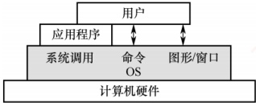

图 1.1 操作系统作为用户与硬件系统之间的接口

用户通过应用程序或直接交互方式访问系统服务，而这些请求最终均由操作系统统一管理和调度。从交互方式来看，终端用户通过命令行和图形界面与操作系统通信；应用程序则通过系统调用请求操作系统服务。根据服务对象与使用场景的不同，这些交互方式可以分为两大类：用户接口包括命令方式和图形方式，面向普通终端用户；程序接口即系统调用，专为应用程序设计。
##### （1） 用户接口

为了使用户能够直接或间接控制作业的执行，操作系统提供了以下三类用户接口。

联机用户接口（命令行接口）：面向交互式用户，由键盘命令与命令解释程序组成。用户输入命令后，系统立即解释并执行，完成后返回控制权，适用于实时交互场景。可以这样理解：“雇主”说一句话，“工人”做一件事，并做出反馈，这就体现了交互性。

脱机用户接口（作业控制语言）：用于批处理系统。用户将作业控制命令写入作业说明书，连同作业一并提交；系统调度到该作业时，自动解释并执行说明书中的命令，无须用户实时干预。可以这样理解：“雇主”预先将任务清单交给“工人”，“工人”按清单逐条完成这些任务。

图形用户接口（GUI）：为提升易用性，通过图标、菜单、对话框等图形元素替代文本命令。用户借助鼠标等设备进行操作，底层通过系统调用与内核交互，显著降低了使用门槛。

##### （2） 程序接口

### 考点追踪 操作系统为应用程序提供的接口（2010）

程序接口是应用程序在运行时请求操作系统服务、访问系统资源的唯一合法途径，其核心是一组系统调用。每个系统调用对应内核中实现某个特定功能的子程序。当应用程序需要操作系统服务时，必须通过调用相应的系统调用来完成。

早期的系统调用多基于汇编语言实现，仅能在汇编程序中直接使用；在高级语言（如C语言）环境中，程序员通常调用标准库函数（如printf()、open()等）来间接触发系统调用。注意，库函数本身并非操作系统接口，它们只是对系统调用的封装。例如，printf()最终通过write系统调用输出数据，malloc()在需要更多内存时可能调用brk或mmap系统调用；而strlen()、sqrt()等纯计算类库函数则完全在用户空间中运行，不涉及任何系统调用。因此，尽管库函数在编程中被频繁使用，但操作系统真正提供给应用程序的接口本质上仍是系统调用。

#### 3. 操作系统实现了对计算机资源的扩充

未安装任何软件的计算机称为裸机，它仅构成计算机系统的物质基础。实际呈现在用户面前的计算机系统，是经过多层软件增强后的逻辑实体。裸机位于最内层，其外层覆盖着操作系统。操作系统通过资源管理功能和用户服务功能，将裸机抽象并扩展为一台功能更强、使用更便捷的逻辑机器。因此，通常将这种被操作系统抽象和扩展后的机器称为扩充机器。可以这样理解：操作系统作为“工人”，操作原始机器，使机器发挥远超本身的能力。

需要说明的是，本章的重点在于理解操作系统如何控制和协调处理机、存储器、设备和文件四大资源。关于接口与扩充机器的概念，读者只需理解其基本思想即可。

### 1.1.3 操作系统的特征

操作系统是一种系统软件，但与其他系统软件和应用软件有显著不同，具有自身的特殊性，即基本特征。操作系统的基本特征包括并发、共享、虚拟和异步。这些概念对理解和掌握操作系统的核心至关重要，将贯穿于后续各章节。

#### 1. 并发（Concurrency）

并发是指两个或多个事件在同一时间间隔内发生。在多道程序环境下，内存中同时驻留若干道程序，操作系统通过调度机制，在一道程序因I/O操作而暂停时，立即切换到另一道程序运行，从而实现多道程序的交替执行，使CPU保持高利用率。

### 考点追踪 ▶️ 并行性的定义及分析（2009）

需要注意的是，并行是指两个或多个事件在同一时刻真正同时发生。在单处理机系统中，尽
管宏观上多道程序看似同时运行，但微观上任一时刻仅有一个程序在执行，因此属于并发而非并行；而 CPU 与 I/O 设备之间、多个 I/O 设备之间则可实现真正的硬件并行。若要实现进程级别的并行，则需多核 CPU 或多处理机等硬件支持。

可通过一个生活实例理解并发与并行的区别。例如，在9:00—10:00期间，你交替吃面包和写字：9:00—9:10吃面包，9:10—9:20写字，9:20—9:30吃面包，9:30—10:00写字。两种活动在同一时段内交错进行，但任一时刻仅执行一项，这属于并发。又如，在9:00—10:00期间，你在右手写字的同时，左手拿着面包吃，则两种行为在同一时刻真正同时进行，这属于并行。

在操作系统中，引入进程这一概念，其核心目的之一就是支持程序的并发执行。

#### 2. 共享（Sharing）

共享是指系统中的资源可供内存中多个并发执行的进程共同使用。根据资源特性与访问方式的不同，共享主要分为互斥共享和同时访问两种形式。

##### （1） 互斥共享方式

系统中的某些资源，如打印机、磁带机等，虽然可供多个进程使用，但为避免所打印或记录的结果混淆，必须保证在任一时间段内仅有一个进程访问该资源。

具体而言，当进程 A 访问某个资源时，需先提出请求；若资源空闲，则系统将其分配给 A；此后，若其他进程请求访问该资源而 A 尚未释放，则必须等待。仅当 A 使用完毕并释放资源后，才允许另一进程对该资源进行访问。我们将此类资源共享方式称为互斥共享，而将在一段时间内只允许一个进程访问的资源称为临界资源。计算机系统中的大多数独占型物理设备（如打印机），以及软件中的栈、变量、表格等，均属于临界资源，必须以互斥方式共享。

##### （2） 同时访问方式

系统中还存在另一类资源，允许多个进程在宏观上“同时”访问。此处的“同时”通常指逻辑上的并发访问，微观上这些进程可能通过分时交替方式访问资源，即分时共享。典型的可同时访问资源包括磁盘上的文件（尤其是只读文件），允许多个用户同时读取同一份文档；此外，用重入代码编写的程序也可被多个进程并发调用，而不会产生冲突。

需注意，互斥共享要求资源在任意时刻仅响应一个请求，否则将导致数据混乱（例如，若多个进程同时向打印机输出，可能导致文档 A 与文档 B 的内容交错混杂）；而同时访问则允许多个请求分时完成，只要其最终效果对用户而言等同于连续访问即可。

并发与共享是操作系统两个最基本的特征，二者互为前提：①资源共享以程序的并发执行为前提，若系统仅支持单道程序，则无须考虑资源共享；②有效的资源共享机制是并发执行的基础，若无法协调资源访问，则并发程序将因竞争冲突而无法正确运行。

#### 3. 虚拟（Virtual）

虚拟是指通过某种技术手段，将一个物理实体映射为多个逻辑上的对应物。物理实体是真实存在的硬件资源，而逻辑对应物则是用户或程序所感知的抽象资源。操作系统主要通过两类复用技术实现虚拟：时分复用（如处理器的分时共享）和空分复用（如虚拟存储器）。

利用多道程序设计技术，操作系统可让多道程序并发执行，分时共享同一个处理器。尽管系统中仅有一个物理CPU，但每个用户都仿佛独占一个CPU。这种通过时间片轮转实现的处理器抽象，使得单个物理CPU在逻辑上表现为多个处理单元。

采用虚拟存储器技术，可将有限的物理内存扩展为更大的逻辑地址空间。用户程序所面对的是虚拟存储器，其逻辑容量通常超过实际物理内存，从而在逻辑上实现了存储容量的扩充。

此外，通过虚拟设备技术（如 SPOOLing），可将某些独占型物理 I/O 设备（如打印机）转
化为多台逻辑设备。每个用户可独占一台逻辑设备，而系统在后台将请求排队处理。这样，原本需要互斥访问的临界资源，便转化为可并发使用的共享资源。

#### 4. 异步（Asynchronism）

在多道程序环境下，多个进程并发执行。但由于系统资源有限，进程的执行并非连续进行，而是以不可预知的速度断续推进，这种特性称为进程的异步性。

异步性使操作系统运行于高度不确定的环境中，若对共享资源的访问缺乏协调，可能导致与时间相关的错误（例如，多个进程并发修改全局变量而未加同步保护）。然而，在程序正确使用操作系统提供的同步机制的前提下，其执行结果的正确性与可再现性能够得到保障。

### 1.1.4 本节习题精选

#### 一、 单项选择题

##### 01

操作系统是对（）进行管理的软件。

A. 软件 B. 硬件 C. 计算机资源 D. 应用程序

##### 02

下面的（）资源不是操作系统应该管理的。

A. CPU B. 内存 C. 外存 D. 源程序

##### 03

下列选项中，（）不是操作系统关心的问题。

A. 管理计算机裸机

B．设计、提供用户程序与硬件系统的界面

C. 管理计算机系统资源

D. 高级程序设计语言的编译器

##### 04

操作系统的基本功能是（）。

A. 提供功能强大的网络管理工具

B. 提供用户界面方便用户使用

C. 提供方便的可视化编辑程序

D. 控制和管理系统内的各种资源

##### 05

下列关于并发性的叙述中，正确的是（）。

A. 并发性是指若干事件在同一时刻发生

B. 并发性是指若干事件在不同时刻发生

C. 并发性是指若干事件在同一时间间隔内发生

D. 并发性是指若干事件在不同时间间隔内发生

##### 06

系统调用是由操作系统提供给用户的，它（）。

A. 直接通过键盘交互方式使用

B. 只能通过用户程序间接使用

C. 是命令接口中的命令

D. 与系统的命令一样

##### 07

操作系统提供给编程人员的接口是（）。

A. 库函数 B. 高级语言 C. 系统调用 D. 子程序

##### 08

系统调用的目的是（）。

A. 请求系统服务 B. 中止系统服务 C. 申请系统资源 D. 释放系统资源

##### 09

下列关于操作系统的叙述中，错误的是（）。

A. 操作系统是管理资源的程序

B. 操作系统是管理用户程序执行的程序

C. 操作系统是能使系统资源提高效率的程序

D. 操作系统是用来编程的程序
##### 10

下列关于库函数和系统调用的区别与联系的说法中，错误的是（）。

A. 系统调用用于请求内核服务，部分库函数通过系统调用实现功能

B. 系统调用需要陷入内核态执行，而普通库函数（如字符串处理）通常在用户态执行

C. 所有库函数的实现都依赖系统调用，没有系统调用则无法完成任何功能

D. 库函数具有良好的可移植性，可跨平台使用；系统调用则与具体操作系统紧密耦合

##### 11

【2010 统考真题】下列选项中，操作系统提供给应用程序的接口是（）。

A. 系统调用 B. 中断 C. 库函数 D. 原语

### 1.1.5 答案与解析

#### 一、 单项选择题

##### 01

C

操作系统管理计算机的硬件和软件资源，这些资源统称为计算机资源。注意，操作系统不仅管理处理机、存储器等硬件资源，还管理文件，文件不属于硬件资源，但属于计算机资源。

##### 02

D

操作系统负责管理计算机系统的硬件和软件资源，包括CPU、内存、外存等，以提供高效、安全、抽象的运行环境。源程序虽以文件形式存储在外存中，但其具体内容（如代码语义、编程逻辑）并不属于操作系统管理的范畴。操作系统对文件的管理关注的是文件的逻辑组织、存储分配、访问控制及元数据（如文件名、大小、权限、创建时间等），而非文件内容的语义。因此，源程序作为具有特定语义的用户数据，其内容本身并非操作系统的管理对象。

##### 03

D

操作系统管理计算机软/硬件资源，扩充裸机以提供功能更强大的扩充机器，并充当用户与硬件交互的中介。高级程序设计语言的编译器显然不是操作系统关心的问题。编译器的实质是一段程序指令，它存储在计算机中，是上述水杯中的水。

##### 04

D

操作系统是指控制和管理整个计算机系统的硬件和软件资源，合理地组织、调度计算机的工作和资源的分配，以便为用户和其他软件提供方便的接口与环境的程序集合。选项 A、B、C 都可理解成应用程序为用户提供的服务，是应用程序的功能，而不是操作系统的功能。

##### 05

C

并发性是指若干事件在同一时间间隔内发生，而并行性是指若干事件在同一时刻发生。

##### 06

B

系统调用是操作系统为应用程序使用内核功能所提供的接口。

##### 07

C

操作系统为编程人员提供的接口是程序接口，即系统调用。

##### 08

A

操作系统不允许用户直接操作各种硬件资源，因此用户程序只能通过系统调用的方式来请求内核为其服务，间接地使用各种资源。

##### 09

D

操作系统是用来管理资源的程序，用户程序也是在操作系统的管理下完成的。配置了操作系统的机器与裸机相比，资源利用率大大提高。操作系统不能直接用来编程，选项D错误。

##### 10

C

并非所有库函数都依赖系统调用。例如，字符串处理、数学计算等纯用户态操作完全在用户
空间中完成，无须陷入内核；只有涉及 I/O、进程控制等资源访问的库函数才会调用系统调用。

##### 11

A

操作系统接口主要有命令接口和程序接口（也称系统调用）。库函数是高级语言中提供的与系统调用对应的函数（也有些库函数与系统调用无关），目的是隐藏“访管”指令的细节，使系统调用更为方便、抽象。但是，库函数属于用户程序而非系统调用，是系统调用的上层。

## 1.2 操作系统发展历程

### 1.2.1 手工操作阶段（未配置操作系统）

#### 1. 人工操作方式

早期阶段，用户将程序和数据穿孔在纸带或卡片上，装入输入设备后手动控制读入内存并启动程序运行。程序的装入、执行与结果输出等全过程均依赖人工操作。随着计算机硬件性能不断提升，人机速度之间的矛盾日益突出，系统资源利用率低下的问题也愈发严重。

手工操作阶段存在两个突出缺点：①用户独占全机，虽无资源竞争，但系统资源利用率极低；②CPU长时间空闲，等待人工完成I/O操作，导致其计算能力未能充分发挥。

为此，人们提出用高速设备替代人工操作，来控制作业流程。

#### 2. 脱机 I/O 方式

为缓解人机速度不匹配以及 CPU 与外设之间的速度差异，诞生了脱机 I/O 技术。其核心思想是引入一台外围机（如小型专用计算机），在 CPU 不参与的情况下，预先完成 I/O 准备工作：输入时，外围机将纸带或卡片上的程序和数据读入磁带，供 CPU 后续调入内存；输出时，CPU 将结果先写入磁带，再由外围机将磁带内容输出至外设。

由于 I/O 操作完全由外围机独立完成，脱离了主机的直接控制，故称为脱机 I/O；相比之下，由主机直接管理 I/O 设备的方式则称为联机 I/O。

脱机 I/O 的主要优点包括：① 装带、卸带及数据传输等操作在脱机状态下由外围机完成，显著减少了CPU空闲时间；② CPU可直接从高速磁带读取或写入数据，大幅提升了I/O效率。

### 1.2.2 批处理阶段（操作系统开始出现）

在脱机 I/O 技术的基础上，为实现作业的自动连续处理并进一步提升 CPU 与系统资源的利用率，批处理系统应运而生。按发展历程，可分为单道批处理系统和多道批处理系统。

### 考点追踪 批处理系统的特点（2016）

#### 1. 单道批处理系统

为实现对作业的连续处理，系统先将一批作业以脱机方式输入到磁带，并配备一个监督程序（Monitor）。在其控制下，作业能自动、顺序地逐个运行。尽管作业成批提交，但内存中始终仅驻留一道用户程序。单道批处理系统的主要特征如下：

1）自动性。在正常情况下，磁带上的作业可自动连续执行，无须人工干预。

2）顺序性。作业按磁带上的顺序依次装入内存，先装入者先完成。

3）单道性。内存中仅允许一道用户程序运行；监督程序每次仅从磁带调入一道作业，待其完成或异常终止后才装入下一道。
然而，该系统存在明显局限：当正在运行的作业发起 I/O 请求时，高速 CPU 不得不空闲等待低速 I/O 操作结束，导致资源利用率低下。为克服这一瓶颈，多道程序设计技术被引入。

#### 2. 多道批处理系统

用户提交的作业首先存放在外存的后备队列中。作业调度程序按一定算法从该队列中选取若干作业调入内存，使其在管理程序的控制下并发执行，并共享系统资源。当某道程序因I/O请求而暂停运行时，CPU立即切换至另一就绪程序继续执行。该机制依赖中断技术，使系统各部件尽可能保持忙碌，从而显著提升整体吞吐量和资源利用率。这种采用多道程序设计技术的批处理系统称为多道批处理系统，它将用户作业成批送入内存，由作业调度程序自动选择运行。

多道程序设计具有以下核心特点：

### 考点追踪 多道批处理系统的特点（2017、2022）

1）多道。内存中同时驻留多道相互独立的程序。

2）宏观上并行。多道程序均处于运行过程中，但尚未全部完成。

3）微观上串行。各程序轮流占用CPU，交替执行。

为实现多道程序设计，需解决以下关键问题：

1）处理器的分配策略。

2）多道程序的内存分配与保护机制。

3）I/O 设备的分配与调度方法。

4）大量程序与数据的组织、存储方式，以及安全性与一致性保障。

优点：资源利用率高，多道程序共享 CPU、内存、I/O 设备等资源；系统吞吐量大，各部件保持高负载状态。缺点：缺乏交互能力，用户无法了解程序运行状态或进行干预，响应时间较长。

### 1.2.3 分时操作系统

分时技术是指将处理器时间划分为很短的时间片，轮流分配给各用户程序使用。若某程序在其时间片内未完成计算，则暂停运行，释放处理器给其他用户程序，待下一轮再继续执行。由于计算机运行速度极快，程序轮转迅速，每个用户均能获得“独占计算机”的交互体验。

分时操作系统允许多个用户通过终端同时连接到一台主机，并与系统进行交互，彼此互不干扰。其实现的核心在于：当用户在终端输入命令时，系统必须能够及时接收、快速处理并立即返回结果。分时操作系统基于多道程序设计，但与多道批处理系统有本质区别：后者追求高吞吐量和资源利用率，无须人工干预；而前者以人机交互为核心目标，由此形成了以下主要特征。

1）同时性（多路性）。允许多个终端用户同时使用同一台计算机。

2）交互性。用户可通过终端以人机对话方式直接控制程序运行，并与其程序进行交互。

3）独立性。各用户的操作相互隔离，任一用户均感觉系统为其独占。

4）及时性。用户请求能在较短时间内获得响应，满足交互需求。

尽管分时操作系统较好地解决了通用交互问题，但在某些特定场景，系统必须在严格限定的时间内对外部事件做出响应，且需保证响应的确定性与时限性。为此，实时操作系统应运而生。

### 1.2.4 实时操作系统

实时操作系统是为在严格的时间限制内完成关键任务而设计的系统。它摒弃了分时操作系统
的时间片轮转机制，转而采用基于任务紧迫性或截止时间的调度策略，确保高优先级任务能够及时获得处理器资源。根据时限要求的严格程度，实时操作系统可分为两类：①硬实时操作系统：要求任务必须在规定的截止时间前完成，否则可能引发灾难性后果。例如飞机的控制系统、导弹的制导系统等，这类系统必须提供绝对可靠的时间保证；②软实时操作系统：允许偶尔错过截止时间，只要不造成永久性损害即可。例如飞机订票系统、银行管理系统等，其短暂延迟通常可被容忍。

### 1.2.5 网络操作系统和分布式系统

在实时操作系统的控制下，计算机在接收到外部事件后，能够在可预测且有保障的时限内完成处理。其主要特点包括：确定性（响应时间可预测）、高可靠性和强时效性。

网络操作系统是在单机操作系统基础上扩展网络功能而形成的系统，主要用于支持计算机之间的通信、数据传输以及资源共享（如文件、打印机共享等）。在该系统中，各计算机保持独立运行，用户需显式指定远程资源的位置才能访问，系统不提供统一的全局视图。

分布式系统是由多台计算机组成的集合，具有以下特征：节点地位对等，无固定的主从关系；系统资源可被所有用户透明地共享；具备良好的可扩展性与容错能力，支持动态重组；能够将一个任务分解为多个子任务，并分布到不同节点上并行执行、协同完成。用于管理此类系统的操作系统称为分布式操作系统，其核心特点包括分布性、并行性和透明性。其中，透明性尤为关键，用户无须感知底层的多机结构，操作体验如同使用一台计算机。

二者的区别在于：网络操作系统仅实现资源共享与通信功能，用户需主动干预远程操作；而分布式操作系统通过协同机制，使多台计算机共同完成同一任务，并向用户提供单一系统映像。

### 1.2.6 微机操作系统

微机操作系统是为微型计算机（如个人计算机、工作站等）设计的操作系统，广泛应用于日常计算与办公环境。根据用户数量和任务并发能力，可分为以下三类。

#### 1. 单用户单任务操作系统

仅允许一个用户登录并运行一个程序。这类系统结构简单，但资源利用率低，典型代表为早期的 MS-DOS（16 位）。

#### 2. 单用户多任务操作系统

### 考点追踪 多任务操作系统的特点（2018）

支持一个用户同时运行多个应用程序，系统通过时间片轮转实现任务切换，显著提升了交互体验与资源利用率。代表性系统包括 Windows XP 及后续版本、macOS 以及现代 Linux 桌面版。此类系统是当前主流的微机操作系统，兼具良好的人机交互性、高效率与稳定性。

#### 3. 多用户多任务操作系统

允许多个用户通过终端或网络同时登录，各自并发执行多个任务，资源共享且互不干扰。常用于服务器或高性能工作站，典型代表为 UNIX、Linux 服务器版和 Windows Server 系列。

操作系统的发展历程如图1.2所示。

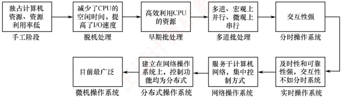

图 1.2 操作系统的发展历程

此外，还有嵌入式操作系统、服务器操作系统、智能手机操作系统等。

### 1.2.7 本节习题精选

#### 一、 单项选择题

##### 01

提高单机资源利用率的关键技术是（）。

A. 脱机技术

B. 虚拟技术

C. 交换技术

D. 多道程序设计技术

##### 02

批处理系统的主要缺点是（）。

A. 系统吞吐量小

B. CPU 的利用率不高

C. 资源利用率低

D. 无交互能力

##### 03

下列选项中，不属于多道程序设计的基本特征的是（）。

A. 制约性 B. 间断性 C. 顺序性 D. 共享性

##### 04

操作系统的基本类型主要有（）。

A. 批处理操作系统、分时操作系统和多任务系统

B. 批处理操作系统、分时操作系统和实时操作系统

C. 单用户系统、多用户系统和批处理操作系统

D. 实时操作系统、分时操作系统和多用户系统

##### 05

实时操作系统必须在（）内处理来自外部的事件。

A. 一个机器周期

B. 被控制对象规定时间

C. 周转时间

D. 时间片

##### 06

（）不是设计实时操作系统的主要追求目标。

A. 安全可靠 B. 资源利用率 C. 及时响应 D. 快速处理

##### 07

下列（）应用工作最好采用实时操作系统平台。

I. 航空订票  II. 办公自动化  III. 机床控制

IV. AutoCAD V. 工资管理系统 VI. 股票交易系统

A. I、II 和 III B. I、III 和 IV C. I、IV 和 V D. I、III 和 VI

##### 08

下列关于分时操作系统的叙述中，错误的是（）。

A. 分时操作系统主要用于批处理作业

B. 分时操作系统中每个任务依次轮流使用时间片

C. 分时操作系统的响应时间好

D. 分时操作系统是一种多用户操作系统

##### 09

分时操作系统的一个重要性能是系统的响应时间，对操作系统的（）因素进行改进有利于改善系统的响应时间。
A. 加大时间片

B. 采用静态页式管理

C. 优先级 + 非抢占式调度算法

D. 代码可重入

##### 10

分时操作系统追求的目标是（）。

A. 充分利用 I/O 设备

B. 比较快速响应用户

C. 提高系统吞吐率

D. 充分利用内存

##### 11

在分时操作系统中，时间片一定时，（），响应时间越长。

A. 内存越多 B. 内存越少 C. 用户数越多 D. 用户数越少

##### 12

在分时操作系统中，为使多个进程能够及时与系统交互，关键的问题是能在短时间内，使所有就绪进程都能运行。当就绪进程数为100时，为保证响应时间不超过2s，此时的时间片最大应为（）。

A. 10ms B. 20ms C. 50ms D. 100ms

##### 13

操作系统有多种类型。允许多个用户以交互的方式使用计算机的操作系统，称为（）；允许多个用户将若干作业提交给计算机系统集中处理的操作系统，称为（）；在（）的控制下，计算机系统能及时处理由过程控制反馈的数据，并及时做出响应；在 IBM-PC 中，操作系统称为（）。

A. 批处理系统

B. 分时操作系统

C. 实时操作系统

D. 微型计算机操作系统

##### 14

下列各种系统中，（）可以使多个进程并行执行。

A. 分时操作系统 B. 多处理器系统 C. 批处理系统 D. 实时操作系统

##### 15

下列关于操作系统的叙述中，正确的是（）。

A. 批处理操作系统必须在响应时间内处理完一个任务

B. 实时操作系统须在规定时间内处理完来自外部的事件

C. 分时操作系统必须在周转时间内处理完来自外部的事件

D. 分时操作系统必须在调度时间内处理完来自外部的事件

##### 16

引入多道程序设计技术的前提条件之一是系统具有（）。

A. 多个 CPU        B. 多个终端        C. 中断功能        D. 分时功能

##### 17

【2016 统考真题】下列关于批处理系统的叙述中，正确的是（）。

Ⅰ. 批处理系统允许多个用户与计算机直接交互

Ⅱ. 批处理系统分为单道批处理系统和多道批处理系统

Ⅲ. 中断技术使得多道批处理系统的 I/O 设备可与 CPU 并行工作

A. 仅Ⅱ、Ⅲ B. 仅Ⅱ C. 仅Ⅰ、Ⅱ D. 仅Ⅰ、Ⅲ

##### 18

【2017 统考真题】与单道程序系统相比，多道程序系统的优点是（）。

I. CPU 的利用率高

II. 系统开销小

III. 系统吞吐量大

IV. I/O 设备利用率高

A. 仅 I、III

B. 仅 I、IV

C. 仅 II、III

D. 仅 I、III、IV

##### 19

【2018统考真题】下列关于多任务操作系统的叙述中，正确的是（）。

I. 具有并发和并行的特点

II. 需要实现对共享资源的保护

III. 需要运行在多 CPU 的硬件平台上

A. 仅 I B. 仅 II C. 仅 I、II D. I、II、III

##### 20

【2022 统考真题】下列关于多道程序系统的叙述中，不正确的是（）。

A. 支持进程的并发执行

B. 不必支持虚拟存储管理

C. 需要实现对共享资源的管理

D. 进程数越多，CPU 的利用率越高
#### 二、 综合应用题

##### 01

有两个程序，程序 A 依次使用 CPU 计 10s、设备甲计 5s、CPU 计 5s、设备乙计 10s、CPU 计 10s；程序 B 依次使用设备甲计 10s、CPU 计 10s、设备乙计 5s、CPU 计 5s、设备乙计 10s。假设先执行程序 A 再执行程序 B，在单道程序环境下，CPU 的利用率是多少？在多道程序环境下，CPU 的利用率是多少？

##### 02

设某计算机系统有一个 CPU、一台输入设备、一台打印机。现有两个进程同时进入就绪态，并且进程 A 先得到 CPU 运行，进程 B 后运行。进程 A 的运行轨迹为：计算 50ms，打印信息 100ms，再计算 50ms，打印信息 100ms，结束。进程 B 的运行轨迹为：计算 50ms，输入数据 80ms，再计算 100ms，结束。画出它们的甘特图，并说明：

1）开始运行后，CPU有无空闲等待？若有，在哪段时间内等待？计算CPU的利用率。

2）进程 A 运行时有无等待现象？若有，则在何时发生等待现象？

3）进程 B 运行时有无等待现象？若有，则在何时发生等待现象？

### 1.2.8 答案与解析

#### 一、 单项选择题

##### 01

D

脱机技术是指在主机以外的设备上进行输入/输出操作，需要时再送主机处理，以提高设备的利用率。虚拟技术与交换技术以多道程序设计技术为前提。多道程序设计技术同时在主存中运行多个程序，在一个程序等待时，可以去执行其他程序，因此提高了系统资源的利用率。

##### 02

D

批处理系统中，作业执行时用户无法干预其运行，只能通过事先编制作业控制说明书来间接干预，缺少交互能力，也因此才有了分时操作系统的出现。

##### 03

C

多道程序的运行环境比单道程序的运行环境更加复杂。引入多道程序后，程序的执行就失去了封闭性和顺序性。程序执行因为共享资源及相互协同的原因产生了竞争，相互制约。

考虑到竞争的公平性，程序的执行是断续的。

##### 04

B

操作系统的基本类型主要有批处理操作系统、分时操作系统和实时操作系统。

##### 05

B

实时操作系统要求能实时处理外部事件，即在规定的时间内完成对外部事件的处理。

##### 06

B

实时性和可靠性是实时操作系统最重要的两个目标，而安全可靠体现了可靠性，快速处理和及时响应体现了实时性。资源利用率不是实时操作系统的主要目标，即为了保证快速处理高优先级任务，允许“浪费”一些系统资源。

##### 07

D

实时操作系统主要应用在需要对外界输入立即做出反应的场合，不能有拖延，否则会产生严重后果。本题的选项中，航空订票系统需要实时处理票务，因为票额数据库的数量直接反映了航班的可订机位。机床控制也要实时，不然会出差错。股票交易行情随时在变，若不能实时交易会出现时间差，使交易出现偏差。

##### 08

A

分时操作系统主要用于交互式作业而非批处理作业。分时操作系统中每个任务依次轮流使用
时间片，这是一种公平的 CPU 分配策略。分时操作系统的响应时间好，因为分时操作系统采用了时间片轮转法来调度进程，可以使得每个任务在较短的时间内得到响应，提高用户的满意度。分时操作系统是一种多用户操作系统，因为分时操作系统可以支持多个终端同时连接到同一台计算机上。

##### 09

C

采用优先级+非抢占式调度算法，既可使重要的作业/进程通过高优先级尽快获得系统响应，又可保证次要的作业/进程在非抢占式调度下不会迟迟得不到系统响应，这样有利于改善系统的响应时间。加大时间片会延迟系统响应时间；静态页式管理和代码可重入与系统响应时间无关。

##### 10

B

要求快速响应用户是导致分时操作系统出现的重要原因。

##### 11

C

在分时操作系统中，当时间片固定时，用户数越多，每个用户分到的时间片就越少，响应时间就相应变长。注意，分时操作系统的响应时间  $T$ 可表示为  $T \approx QN$，其中  $Q$ 是时间片，而  $N$ 是用户数。

##### 12

B

响应时间不超过 2s，即在 2s 内必须响应所有进程。所以时间片最大为 2s/100 = 20ms。

##### 13

B、A、C、D

这是操作系统发展过程中的几种主要类型。

##### 14

B

多个进程并发执行的系统是指在一段时间内宏观上有多个进程同时运行，但在单处理器系统中，每个时刻只能有一道程序执行，所以微观上这些程序只能分时地交替执行。只有多处理器系统才能使多个进程并行执行，每个处理器上分别运行不同的进程。

##### 15

B

实时操作系统要求能在规定时间内完成特定的功能。批处理操作系统不需要在响应时间内处理完一个任务。分时操作系统不要求在周转时间或调度时间内处理完外部事件。

##### 16

C

多道程序设计技术要求进程间能实现并发，需要实现进程调度以保证 CPU 的工作效率，而并发性的实现需要中断功能的支持。

##### 17

A

批处理系统中，作业执行时用户无法干预其运行，只能通过事先编制作业控制说明书来间接干预，缺少交互能力，说法Ⅰ错误。批处理系统按发展历程又分为单道批处理系统、多道批处理系统，说法Ⅱ正确。多道程序设计技术允许把多个程序同时装入内存，并允许它们在CPU中交替运行，共享系统中的各种硬件/软件资源，当一道程序因I/O请求而暂停运行时，CPU便立即转去运行另一道程序，即多道批处理系统的I/O设备可与CPU并行工作，这是借助中断技术实现的，说法Ⅲ正确。

##### 18

D

多道程序系统中总有一个作业在 CPU 上执行，因此提高了 CPU 的利用率、系统吞吐量和 I/O 设备利用率，说法 I、III、IV 正确。但是，系统要付出额外的开销来组织作业和切换作业，说法 II 错误。

##### 19

C

现代操作系统都是多任务的，允许用户把程序分为若干个任务，使它们并发执行。在单CPU中，这些任务并发执行，即宏观上并行执行，微观上分时地交替执行；在多CPU中，这些任务是真正的并行执行。此外，引入中断之后才出现了多任务操作系统，而中断方式的特点是CPU与外设并行工作，因此说法I正确。多个任务必须互斥地访问共享资源，为达到这一目标必须对共享
资源进行必要的保护，说法Ⅱ正确。多任务操作系统并不一定需要运行在多 CPU 的硬件上，单个 CPU 通过分时使用也能满足要求，说法Ⅲ错误。综上所述，说法Ⅰ、Ⅱ正确，说法Ⅲ错误。

##### 20

D

操作系统的基本特点：并发、共享、虚拟、异步，其中最基本、一定要实现的是并发和共享。早期的多道批处理系统会将所有进程的数据全部调入主存，再让多道程序并发执行，即使不支持虚拟存储管理，也能实现多道程序并发。进程多并不意味着 CPU 的利用率高，进程数量越多，进程之间的资源竞争越激烈，甚至可能因为资源竞争而出现死锁现象，导致 CPU 的利用率低。

#### 二、 综合应用题

##### 01

【解答】

单道环境下，CPU 的运行时间为 $(10+5+10)s+(10+5)s=40s$，两个程序运行的总时间为  $40s+40s=80s$，因此利用率是 40/80=50%。

多道环境下，CPU 运行时间为 40s，两个程序运行总时间为 45s，因此利用率为  $40/45 \approx 88.9\%$，如下图所示。

| 项目 | 数值 |
| --- | --- |
| CPU | 12 |
| 程序A | 0 |
| 程序B | 5 |
| 活动 |   |
| 甲 | 10 |
| 甲 | 15 |
| 乙 | 20 |
| 乙 | 25 |
| 乙 | 30 |
| 乙 | 35 |
| 乙 | 40 |
| 乙 | 45 |

**注意**

此图为甘特图，甘特图也称横道图，它以图示的方式通过活动列表和时间刻度形象地表示任意特定项目的活动顺序与持续时间。

以后遇到此类题目，即给出几个不同的程序，每个程序以各个任务时间片给出时，一定要用甘特图来求解，因为其直观、快捷。为节省读者研究甘特图画法的时间，下面给出既定的步骤，读者可按下列步骤快速、正确地画出甘特图。

① 横坐标上标出合适的时间间隔，纵坐标上的点是程序的名字。

② 过横坐标上每个标出的时间点，向上作垂直于横坐标的虚线。

③用几种不同的线（推荐用“直线”“波浪线”“虚线”三种，较易区分）代表对不同资源的占用，按题目给出的任务时间片，平行于横坐标把不同程序对应的线段分别画出来。

画图时要注意，如处理器、打印设备等资源是不能让两个程序同时使用的，有一个程序正在使用时，其他程序的请求只能排队。

##### 02

【解答】

这类实际的 CPU 和输入/输出设备调度的题目一定要画图，画出运行时的甘特图后就能清楚地看到不同进程间的时序关系，进程运行情况如下图所示。

| 时间 (ms) | 过程A | 过程B |
| --- | --- | --- |
| 0 | 过程A |   |
| 50 | 过程A |   |
| 100 | 过程A |   |
| 150 | 输入 |   |
| 200 |   | 输入 |
| 250 |   | 输入 |
| 300 |   | 输入 |

1）CPU 在 100～150ms 时间段内空闲，利用率为 250/300 ≈ 83.3%。

2）进程A无等待现象。

3）进程 B 有等待现象，发生在 0～50ms 和 180～200ms 时间段。

## 1.3 操作系统的运行环境

### 1.3.1 操作系统内核

现代操作系统通常采用分层架构，将与硬件紧密相关的模块（如中断处理程序、设备驱动程序）、运行频率较高的模块（如时钟管理、进程调度），以及各模块共用的基础操作，集中置于紧靠硬件的层次并常驻内存。这部分核心组件被称为操作系统内核。这种设计有两个主要目的：一是保护核心模块免受应用程序破坏；二是提升操作系统的运行效率。不同操作系统的内核功能存在一定差异，但大多数都包含以下两类功能：

#### 1. 支撑功能

这类功能为操作系统其他模块提供基础支持，以保障系统稳定且高效地运行。

### 考点追踪 时钟中断服务的内容（2018）

1）时钟管理。时钟是计算机系统的关键部件，其功能包括计时和产生定时中断。操作系统通过时钟管理向用户提供标准系统时间，并利用时钟中断实现任务调度。例如，在分时操作系统中通过时间片轮转进行进程切换，在实时操作系统中依据截止时间控制任务执行，在批处理系统中衡量作业运行进度。因此，系统的大量活动均依赖于时钟机制。

### 考点追踪 中断机制在多道程序设计中的作用（2016）

2）中断机制。中断是现代操作系统运行的基础，它允许 CPU 在 I/O 操作期间执行其他指令，从而提高资源利用率。中断来源广泛，包括键盘输入、鼠标事件、系统调用、设备驱动和文件访问等。当发生中断时，内核负责保存当前进程的现场，转移控制权至相应的处理程序，并在处理完成后恢复现场，有效提升了系统的并发处理能力。

3）原语。原语是由若干条指令组成的、用于完成特定功能的操作，具有原子性，即其执行过程不可被中断，必须一气呵成。原语通常运行在内核态，执行时间短、调用频繁，是保证系统安全性和一致性的重要机制。常见的原语包括进程切换、进程同步和资源分配等。为实现原子性，原语常通过关闭中断等手段确保执行不被干扰。

#### 2. 系统资源管理功能

操作系统通过一系列核心数据结构（如进程控制块、设备控制块、内存分配表、缓冲区等）对系统资源进行统一管理。为实现高效、安全的资源使用，内核需提供以下三类基本管理功能：

1）进程管理。负责进程的创建与撤销、状态转换、调度与分派，并维护进程控制块（PCB）等核心数据结构。

2）存储器管理。实现内存的分配与回收、地址映射、内存保护及页面置换等机制，确保多道程序安全、高效地共享主存资源。

3）设备管理。完成设备的分配与回收、缓冲区管理、I/O调度及设备驱动调用，屏蔽硬件差异，为用户提供统一的设备访问接口。
### 1.3.2 处理机的双重工作模式

为确保操作系统正确运行，必须严格区分操作系统代码与用户程序的执行环境。绝大多数计算机系统通过硬件支持实现这一区分，即为处理机设置至少两种独立的运行模式：用户态（也称目态）和内核态（也称管态或系统态）。硬件通过一个模式位标识当前运行模式（例如0表示内核态，1表示用户态），从而明确当前执行的是系统任务还是用户任务。

### 考点追踪 两种模式下发生或执行的事件分析（2011、2012、2014、2021）

系统引导时，硬件从内核态开始工作，完成操作系统的加载后，切换到用户态执行用户程序。一旦发生中断或陷阱，硬件就会自动从用户态切换至内核态（模式位置0）。因此，操作系统一旦获得控制权，就处于内核态；而在将控制权交还用户程序前，将切换回用户态（模式位置1）。

这种双重模式机制通过指令分类提供保护：将可能危及系统安全的指令定义为特权指令，仅允许在内核态下执行；其余指定定义为非特权指令，可在任意模式下执行。具体如下。

### 考点追踪 特权指令和非特权指令的特点（2022）

1）特权指令。仅能在内核态执行，可访问全部地址空间（包括用户空间和系统空间），并执行关键操作，如启动外设、设置系统时钟、关闭中断、修改模式位或返回用户态等。

2）非特权指令。通常在用户态下执行，主要用于一般计算和数据处理，其内存访问被限制在用户地址空间，无法直接操作硬件或系统核心资源。

上述限制由硬件强制实施：若用户程序试图执行特权指令，则硬件将产生非法指令异常；操作系统捕获该异常后，会终止该程序并重新调度。

### 1.3.3 中断和异常的概念 $^{①}$

### 考点追踪 用户态切换到内核态的事件分析（2013、2015）

在引入内核态与用户态之后，操作系统必须解决两者之间的安全切换问题。内核运行在内核态，用户程序运行在用户态；用户程序虽不能直接执行内核功能，却必须通过受控方式使用这些服务。为此，系统在内核中设立若干称为“门”的受控入口，而用户程序进入内核态的唯一合法途径就是中断或异常。当CPU运行用户程序时，一旦发生中断（如I/O完成）或异常（如系统调用、除零错误），硬件会自动将处理器切换至内核态，并跳转至内核中对应的处理程序。这一机制由硬件强制保障，确保状态切换的安全性与原子性。

中断机制对现代操作系统至关重要。操作系统的演进本质上是不断提升资源利用率的过程：当某程序因等待 I/O 等事件而暂时无法继续执行时，系统需及时将其挂起，转而调度其他就绪程序运行。在抢占式多任务系统中，这一调度行为主要依赖中断（尤其是时钟中断）来触发。因此，中断机制是现代操作系统实现高效并发与资源共享的基础。

#### 1. 中断和异常的定义

### 考点追踪 ▶ 可能引发中断或异常的指令分析（2013、2015）

中断（Interrupt）也称外中断，是指来自 CPU 执行指令外部的事件，通常用于信息输入/输出（见第5章），如设备发出的 I/O 结束中断，表示设备 I/O 操作已完成。时钟中断，表示一个固定的时间片已到，用于系统计时、进程调度或启动定时任务等。

异常（Exception）也称内中断，是指来自 CPU 执行指令内部的事件，如程序的非法操作码、
地址越界、运算溢出、虚存系统的缺页及专门的陷入指令等引起的事件。异常一旦发生，就必须立即处理，不可被屏蔽。关于异常和外中断的联系与区别如图1.3所示。

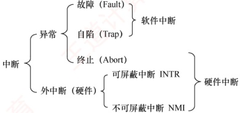

图 1.3 异常和外中断的联系与区别

#### 2. 中断和异常的分类

### 考点追踪 中断和异常的分类（2016）

外中断可分为可屏蔽中断和不可屏蔽中断。可屏蔽中断是指通过 INTR 线发出的中断请求，通过改变屏蔽字可以实现多重中断，从而使得中断处理更加灵活。不可屏蔽中断是指通过 NMI 线发出的中断请求，通常是紧急的硬件故障，如电源掉电等。此外，异常也是不能被屏蔽的。

异常可分为故障、自陷和终止。故障（Fault）通常是由指令执行引起的异常，如非法操作码、缺页故障、除数为0、运算溢出等。自陷（Trap，也称陷入）是一种事先安排的“异常”事件，用于在用户态下调用操作系统内核程序，如条件陷阱指令、系统调用指令等。终止（Abort）是指出现了使得CPU无法继续执行的硬件故障，如控制器出错、存储器校验错等。故障和自陷异常属于软件中断（程序性异常），终止异常和外中断属于硬件中断。

#### 3. 中断和异常的处理过程

### 考点追踪 中断和异常的处理过程（2015、2020、2024）

中断和异常处理过程的大致描述如下：当 CPU 在执行用户程序的第 i 条指令时，若该指令引发异常（如缺页、除零），或在指令执行结束后检测到中断请求信号，则 CPU 会打断当前程序，转入相应的中断或异常处理程序执行。若问题可被处理程序解决，则对于异常，通常在处理完成后返回第 i 条指令重新执行（例如，缺页处理完成后重访原内存地址）；而对于中断，则在处理完成后返回第 i+1 条指令继续执行。若处理程序判定为不可恢复的致命错误，则终止该用户程序。通常情况下，中断和异常的具体处理由操作系统（及设备驱动程序）完成。

### 考点追踪 中断处理和子程序调用的比较（2012）

注意区分中断处理和子程序调用：①中断处理程序与被中断的程序相互独立，无固定关联；而子程序与主程序属于同一程序的主从关系。②中断的产生通常是随机的；而子程序调用由CALL指令显式触发，是程序员事先安排的。③子程序调用完全由软件实现；而中断处理需要硬件电路支持才能完成。④中断处理程序的入口地址由中断向量表直接提供；子程序的入口地址则由CALL指令中的地址码指定。⑤调用中断处理程序和子程序均需保护程序计数器（PC）的内容：前者由硬件在中断响应过程中自动保存，后者由CALL指令在执行时将当前PC压入栈中。⑥响应中断时，需对同时到达的多个中断请求进行优先级裁决；而子程序调用不存在此类操作。

### 1.3.4 系统调用

### 考点追踪 系统调用的定义、功能及性质（2019、2021、2024）

系统调用是操作系统提供给应用程序（程序员）使用的接口，可视为一种特殊的公共子程序
调用。系统中的各种共享资源均由操作系统统一管理，因此凡涉及共享资源的操作（如存储分配、I/O传输及文件管理等），都必须通过系统调用向操作系统提出服务请求，由操作系统代为完成，并将结果返回给应用程序。这样可以保证系统的稳定性和安全性，防止用户进行非法操作。通常，一个操作系统提供的系统调用有几十条乃至上百条，每个系统调用都有唯一的系统调用号。这些系统调用按功能大致可分为如下几类。

设备管理。完成设备的请求或释放，以及设备启动等功能。

· 文件管理。完成文件的读、写、创建及删除等功能。

进程控制。完成进程的创建、撤销、阻塞及唤醒等功能。

进程通信。完成进程之间的消息传递或信号传递等功能。

· 内存管理。完成内存的分配、回收，以及获取作业占用内存区的大小和起始地址等功能。

显然，系统调用涉及系统资源管理、进程管理等关键操作，对整个系统的影响非常大，因此必须由操作系统内核程序在内核态下完成。操作系统提供系统调用的核心目的，是让应用程序能够安全地间接调用内核功能。它本质上是一种特殊的过程调用，与普通过程调用存在显著差异。

1）运行状态不同。普通过程调用的调用者与被调用者运行在同一特权级；而系统调用的调用者运行在用户态，被调用者运行在内核态。

2）状态转换不同。普通过程调用无须特权级切换，可以直接跳转；系统调用则需要通过陷入指令（Trap）触发，先从用户态切换到内核态，再由内核分派至相应处理程序。

3）返回机制不同。系统调用执行完毕后，内核可能根据调度策略决定是否切换进程；而普通过程调用总是直接返回原调用点。

4）嵌套调用限制不同。系统调用的嵌套深度受到内核栈空间的限制；而普通过程调用的嵌套深度通常仅受用户栈大小约束。

### 考点追踪 系统调用的处理过程及相关分析（2012、2017、2022、2023）

系统调用的处理过程可分为4个阶段。

1）传递系统调用参数。用户程序将系统调用号及所需参数压入堆栈（或通过寄存器），为内核服务做准备。

2）执行陷入指令并切换至内核态。用户程序执行陷入指令，触发 CPU 从用户态切换至内核态。硬件与内核协同保存现场，将 PC、PSW 及通用寄存器内容压入内核堆栈。

3）定位并执行相应服务程序。内核根据系统调用号查询系统调用表，找到对应处理程序的入口地址，并执行具体的服务逻辑。

4）恢复现场并返回用户态。服务完成后，内核恢复被中断进程的CPU现场，将运行模式切换回用户态，并将控制权交还给用户程序，使其从断点继续执行。

系统调用的执行过程如图1.4所示。用户程序通过执行陷入指令，主动将CPU控制权移交操作系统内核；内核完成请求后，再将控制权交还。这一机制确保了用户程序无法直接执行高危操作，必须通过受控接口请求操作系统代为执行，进而保障系统安全与稳定。由此，可概括操作系统的运行环境：用户程序运行在受限的用户态，通过系统调用（主动）或异常/中断（被动）两种受控途径进入内核态，请求内核提供资源管理与服务支持；内核处理完毕后，再安全返回用户态继续执行。这种用户态与内核态的隔离，构成了现代操作系统安全、高效运行的基础环境。

在操作系统层面，我们关注内核态与用户态的软件实现与切换机制；其硬件支持细节可结合“计算机组成原理”课程中关于中断与异常的内容深入理解。

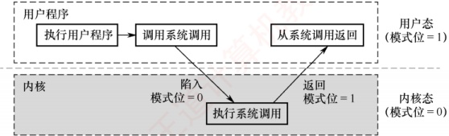

图 1.4 系统调用的执行过程

常见的用户态转向内核态的情形包括：

1）用户程序请求操作系统服务（系统调用）。

2）发生外中断（如 I/O 完成、时钟信号）。

3）用户程序执行过程中产生异常（如除零、缺页）。

4）用户程序试图执行特权指令，从而触发异常。

从内核态返回用户态由内核通过特定的返回指令（如 IRET）完成，该操作在内核态执行。

### 1.3.5 本节习题精选

#### 一、 单项选择题

##### 01

下列关于操作系统的说法中，错误的是（）。

I. 在通用操作系统管理下的计算机上运行程序，需要向操作系统预订运行时间

II. 在通用操作系统管理下的计算机上运行程序，需要确定起始地址，并从这个地址开始执行

III. 操作系统需要提供高级程序设计语言的编译器

IV. 管理计算机系统资源是操作系统关心的主要问题

A. I B. I、III C. II、III D. I、II、III、IV

##### 02

下列说法中，正确的是（）。

I. 批处理的主要缺点是需要大量内存

II. 当计算机提供了内核态和用户态时，输入/输出指令必须在内核态下执行

III. 操作系统中采用多道程序设计技术的最主要原因是提高 CPU 和外部设备的可靠性

IV. 操作系统中，通道技术是一种硬件技术

A. I、II

B. I、III

C. II、IV

D. III、IV

##### 03

下列关于系统调用的说法中，正确的是（）。

I. 用户程序使用系统调用命令，该命令经过编译后形成若干参数和陷入指令

II. 用户程序使用系统调用命令，该命令经过编译后形成若干参数和屏蔽中断指令

III. 用户程序创建一个新进程，需使用操作系统提供的系统调用接口

IV. 当操作系统完成用户请求的系统调用功能后，应使 CPU 从内核态转到用户态

A. I、III

B. III、IV

C. I、III、IV

D. II、III、IV

##### 04

（）是操作系统必须提供的功能。

A. 图形用户界面（GUI） B. 为进程提供系统调用命令 C. 中断处理 D. 编译源程序

##### 05

CPU 执行的指令被分为两类，其中有一类称为特权指令，它只允许（）使用。

A. 管理员 B. 联机用户 C. 目标程序 D. 操作系统
##### 06

在中断发生后，中断处理的程序属于（）。

A. 用户程序

B. 可能是用户程序，也可能是 OS 程序

C. 操作系统程序

D. 单独的程序，既不是用户程序也不是 OS 程序

##### 07

CPU 的状态分为用户态和内核态，从用户态转换到内核态的唯一途径是（）。

A. 修改程序状态字指令

B. 中断屏蔽

C. 中断

D. 中断处理程序

##### 08

下列指令中，可以在用户态执行的是（）。

Ⅰ. 置时钟指令        Ⅱ. 停机指令        Ⅲ. 存数指令        Ⅳ. 寄存器清零指令

A. I、IV B. III、IV C. II、III、IV D. II、III

##### 09

下列指令中，必须在内核态执行的是()。

Ⅰ. 陷入指令 II. 系统调用指令 III. 开中断指令

IV. 转移指令 V. 中断屏蔽字设置指令

A. I、II、III、IV B. II、III C. II、III、V D. I、IV

##### 10

下列程序中，必须在内核态执行的是（）。

I. 磁盘调度程序 II. 中断处理程序 III. 设备驱动程序 IV. 操作系统初始化程序

A. I、II、III、IV B. I、II、III C. I、II、IV D. II、III

##### 11

当 CPU 处于内核态时，它可以执行的指令是（）。

A. 只有特权指令

B. 只有非特权指令

C. 只有访管指令

D. 除访管指令之外的全部指令

##### 12

下列中断事件中，能引起外中断的事件是（）。

Ⅰ. 时钟中断

Ⅱ. 访管中断

Ⅲ. 缺页中断

A. I B. III C. I 和 II D. II 和 III

##### 13

下列关于库函数和系统调用的说法中，不正确的是（）。

A. 库函数运行在用户态，系统调用运行在内核态

B. 使用库函数时开销较小，使用系统调用时开销较大

C. 库函数不方便被替换，系统调用通常很方便被替换

D. 库函数可以很方便地调试，而系统调用很麻烦

##### 14

下列关于系统调用和一般过程调用的说法中，正确的是（）。

A. 两者都需要将当前 CPU 中的 PSW 和 PC 的值压栈，以保存现场信息

B. 系统调用的被调用过程一定运行在内核态

C. 一般过程调用的被调用过程一定运行在用户态

D. 两者的调用过程与被调用过程一定都运行在用户态

##### 15

用户在程序中试图读某文件的第100个逻辑块，使用操作系统提供的（）接口。

A. 系统调用 B. 键盘命令 C. 原语 D. 图形用户接口

##### 16

【2011 统考真题】下列选项中，在用户态执行的是（）。

A. 命令解释程序

B. 缺页处理程序

C. 进程调度程序

D. 时钟中断处理程序

##### 17

【2012 统考真题】下列选项中，不可能在用户态发生的事件是（）。

A. 系统调用 B. 外中断 C. 进程切换 D. 缺页
##### 18

【2012 统考真题】中断处理和子程序调用都需要压栈，以便保护现场，中断处理一定会保存而子程序调用不需要保存其内容的是（）。

A. 程序计数器

B. 程序状态字寄存器

C. 通用数据寄存器

D. 通用地址寄存器

##### 19

【2013 统考真题】下列选项中，会导致用户进程从用户态切换到内核态的操作是（）。

Ⅰ. 整数除以零 Ⅱ.  $\sin()$函数调用 Ⅲ. read 系统调用

A. 仅 I、II B. 仅 I、III C. 仅 II、III D. I、II 和 III

##### 20

【2014 统考真题】下列指令中，不能在用户态执行的是（）。

A. Trap 指令 B. 跳转指令 C. 压栈指令 D. 关中断指令

##### 21

【2015 统考真题】处理外中断时，应该由操作系统保存的是（）。

A. 程序计数器（PC）的内容

B. 通用寄存器的内容

C. 快表（TLB）中的内容

D. Cache 中的内容

##### 22

【2015 统考真题】假定下列指令已装入指令寄存器，则执行时不可能导致 CPU 从用户态变为内核态（系统态）的是（）。

A. DIV R0, R1 ; (R0)/(R1)→R0

B. INT n ; 产生软中断

C. NOT R0 ; 寄存器 R0 的内容取非

D. MOV R0, addr ; 把地址 addr 处的内存数据放入寄存器 R0

##### 23

【2016 统考真题】异常是指令执行过程中在处理器内部发生的特殊事件，中断是来自处理器外部的请求事件。下列关于中断或异常情况的叙述中，错误的是（）。

A. “访存时缺页”属于中断

B. “整数除以零”属于异常

C. “DMA 传送结束”属于中断

D. “存储保护错”属于异常

##### 24

【2017 统考真题】执行系统调用的过程包括如下主要操作:

① 返回用户态 ② 执行陷入（Trap）指令

③ 传递系统调用参数 ④ 执行相应的服务程序

正确的执行顺序是（）。

A. ②→③→①→④ B. ②→④→③→①

C. ③→②→④→① D. ③→④→②→①

##### 25

【2018统考真题】定时器产生时钟中断后，由时钟中断服务程序更新的部分内容是（）。

I. 内核中时钟变量的值

II. 当前进程占用 CPU 的时间

III. 当前进程在时间片内的剩余执行时间

A. 仅 I、II

B. 仅 II、III

C. 仅 I、III

D. I、II、III

##### 26

【2019 统考真题】下列关于系统调用的叙述中，正确的是（）。

I. 在执行系统调用服务程序的过程中，CPU处于内核态

II. 操作系统通过提供系统调用避免用户程序直接访问外设

III. 不同的操作系统为应用程序提供了统一的系统调用接口

IV. 系统调用是操作系统内核为应用程序提供服务的接口

A. 仅 I、IV B. 仅 II、III C. 仅 I、II、IV D. 仅 I、II

##### 27

【2020 统考真题】下列与中断相关的操作中，由操作系统完成的是（）。

I. 保存被中断程序的中断点

II. 提供中断服务
III. 初始化中断向量表

IV. 保存中断屏蔽字

A. 仅 I、II

B. 仅 I、II、IV

C. 仅 III、IV

D. 仅 II、III、IV

##### 28

【2021 统考真题】下列指令中，只能在内核态执行的是（）。

A. Trap 指令 B. I/O 指令 C. 数据传送指令 D. 设置断点指令

##### 29

【2021 统考真题】下列选项中，通过系统调用完成的操作是（）。

A. 后置换 B. 进程调度 C. 创建新进程 D. 生成随机整数

##### 30

【2022 统考真题】下列关于 CPU 模式的叙述中，正确的是（）。

A. CPU 处于用户态时只能执行特权指令

B. CPU 处于内核态时只能执行特权指令

C. CPU 处于用户态时只能执行非特权指令

D. CPU 处于内核态时只能执行非特权指令

##### 31

【2022 统考真题】执行系统调用的过程涉及下列操作，其中由操作系统完成的是（）。

I. 保存断点和程序状态字

II. 保存通用寄存器的内容

III. 执行系统调用服务例程

IV. 将 CPU 模式改为内核态

A. 仅 I、III

B. 仅 II、III

C. 仅 II、IV

D. 仅 II、III、IV

##### 32

【2023 统考真题】在操作系统内核中，中断向量表适合采用的数据结构是（）。

A. 数组 B. 队列 C. 单向链表 D. 双向链表

##### 33

【2024 统考真题】下列关于中断、异常和系统调用的叙述中，错误的是（）。

A. 中断或异常发生时，CPU处于内核态

B. 每个系统调用都有对应的内核服务例程

C. 中断处理程序开始执行时，CPU处于内核态

D. 系统添加新类型设备时，需要注册相应的中断服务例程

### 1.3.6 答案与解析

#### 一、 单项选择题

说法I错误：通用操作系统使用时间片轮转调度算法，用户运行程序并不需要预先预订运行时间。说法II正确：操作系统执行程序时，必须从起始地址开始执行。说法III错误：编译器是操作系统的上层软件，不是操作系统需要提供的功能。说法IV正确：操作系统是计算机资源的管理者，管理计算机系统资源是操作系统关心的主要问题。

##### 01

B

##### 02

C

说法I错误：批处理的主要缺点是缺少交互性。批处理系统的主要缺点是常考点，读者对此要非常敏感。说法II正确：输入/输出指令属于特权指令，只能由操作系统使用，因此必须在内核态下执行。说法III错误：多道性是为了提高系统利用率和吞吐量而提出的。说法IV正确：I/O通道实际上是一种特殊的处理器，它具有执行I/O指令的能力，并通过执行通道程序来控制I/O操作。

##### 03

C

系统调用需要触发陷入指令，如基于x86的Linux系统，该指令为int 0x80或sysenter，说法I正确。程序设计无法形成屏蔽中断指令，说法II错误。用户程序通过系统调用进行进程控制，说法III正确。执行系统调用时CPU状态要从用户态转到内核态，这是通过中断来实现的，当系统调用返回后，继续执行用户程序，同时CPU状态也从内核态转到用户态，说法IV正确。

##### 04

C

中断是操作系统必须提供的功能，因为计算机的各种错误都需要中断处理，内核态与用户态
切换也需要中断处理。

##### 05

D

内核可以执行 CPU 能执行的任何指令，用户程序只能执行除特权指令之外的指令。因此特权指令只能由内核即操作系统使用。

##### 06

C

中断处理程序是 OS 专门为处理中断事件而设计的程序。中断发生时，若被中断的是用户程序，则 CPU 将从用户态转入内核态，在内核态下进行中断的处理；若被中断的是低级中断，则 CPU 仍保持在内核态。被中断的程序可能是用户程序，但中断的处理程序一定是 OS 程序。

##### 07

C

CPU 通过程序状态字寄存器中的某个位来标志当前的状态，但是修改程序状态字的指令本身就属于特权指令，不能在用户态下执行。当 CPU 执行到一条访管指令或陷阱指令时，会引起访管中断或陷阱中断，CPU 会保存断点和其他上下文环境，然后切换到内核态。也就是说，从用户态转换到内核态，不是通过指令来修改 CPU 的状态标志位的，而是由 CPU 在中断时自动完成的。中断处理程序一般在内核态执行，因此无法完成“转换成内核态”这一任务。

##### 08

B

直接管理系统资源的指令（如设置时钟、启动/关闭硬件设备、切换进程、设置中断等）、系统状态修改指令（如修改中断向量表、切换CPU的运行模式等）、系统控制指令（如停机指令、重启指令等），都属于特权指令，必须在内核态执行。普通的数据处理指令、流程控制指令、读操作指令都不会影响系统的安全和整体状态，可以在用户态执行。

##### 09

C

用户程序通过陷入指令让 CPU 模式从用户态转入内核态，因此在用户态执行。虽然调用的发生可能在用户态（注意区分调用和执行），但是系统调用指令必然在内核态执行。开中断指令和关中断指令都属于特权指令，能够影响到系统的运行，必须在内核态执行。无论是分支跳转指令还是无条件转移指令，都属于普通的程序流程控制指令，在用户态执行。中断屏蔽字寄存器属于中断控制器的一部分，而中断控制器是属于 I/O 接口的，因此设置中断屏蔽字寄存器的操作就相当于对 I/O 接口中的 I/O 端口进行设置，属于 I/O 指令，必须在内核态执行。

##### 10

A

磁盘调度程序控制磁头的运行，和硬件密切相关，运行在内核态。中断处理程序在中断发生后由操作系统内核调用，运行在内核态。设备驱动程序用于和硬件设备进行通信，运行在内核态。操作系统初始化程序负责初始化系统资源、设置环境、加载驱动程序等，运行在内核态。

##### 11

D

访管指令（Trap 指令）是一条在用户态下执行的指令。用户程序在用户态下要请求操作系统内核提供服务，就有意识地使用访管指令来引起访管中断，从而将控制权交给内核。在内核态，CPU 可以执行除访管指令之外的任何指令。

##### 12

A

外中断是由 CPU 外部的事件引起的，如 I/O 设备的请求、时钟信号等。内部中断（也称异常）是由 CPU 内部的事件引起的，如访管指令（Trap 指令）、缺页异常等。

##### 13

C

库函数是指被封装在库文件中的可复用的代码块，运行在用户态；而系统调用是面向硬件的，运行在内核态，是操作系统为用户提供的接口。库函数可以很方便地调试，而系统调用很麻烦，因为它运行在内核态。库函数可以很方便地替换，而系统调用通常不可替换。库函数属于过程调用，开销较小；系统调用需要在用户空间和内核空间中进行上下文切换，开销较大。
##### 14

B

系统调用需要保存 PSW 和 PC 的值，一般过程调用只需保存 PC 的值，选项 A 错误。系统调用的被调用过程是操作系统中的程序，是系统级程序，必须运行在内核态，选项 B 正确。一般过程调用的被调用程序与调用程序运行在同一个状态，可能是系统态，也可能是用户态，选项 C 和 D 错误。

##### 15

A

操作系统通过系统调用向用户程序提供服务，文件 I/O 需要在内核态运行。

##### 16

A

缺页处理和时钟中断都属于中断，在内核态执行；进程调度是操作系统内核进程，无须用户干预，在内核态执行；命令解释程序属于命令接口，是面对用户的，在用户态执行。

##### 17

C

本题的关键是对 “在用户态发生”（注意与 “在用户态执行” 区分）的理解。对于选项 A，系统调用是操作系统提供给用户程序的接口，系统调用发生在用户态，被调用程序在内核态下执行。对于选项 B，外中断是用户态到内核态的 “门”，也发生在用户态，在内核态完成中断处理过程。对于选项 C，进程切换属于系统调用执行过程中的事件，只能发生在内核态；对于选项 D，缺页产生后，在用户态发生缺页中断，然后进入内核态执行缺页中断服务程序。

##### 18

B

子程序调用不改变程序的状态，因为子程序调用是编译器可控的流程，而中断不是。下面以程序 `if(a==b)` 为例加以说明。该程序通常包含一条测试指令，以及一条根据标志位决定是否需要跳转来调用子程序的指令。编译器不在这两条指令中间插入任何子程序调用代码，因此标志位不变，但中断随时可能发生，导致标志位改变。具体地说，执行 `if(a==b)` 时，会进行 a-b 操作，并生成相应的标志位，进而根据标志位来判断是否发生跳转。假设刚好在生成相应的标志位后发生了中断，若不保存 PSW 的内容，则后续根据标志位来进行跳转的流程就可能发生错误。但是，若进行了子程序调用，则说明已经根据 a-b 的标志位进行了跳转，此时 PSW 的内容已无意义而无须保存。综上所述，中断处理和子程序调用都有可能使 PSW 的内容发生变化，但中断处理程序执行完返回后，可能需要用到 PSW 原来的内容，子程序执行完返回后，一定不需要用到 PSW 原来的内容，因此选择选项 B。选项 A 都会保存，选项 C 和 D 不一定会保存。

##### 19

B

整数除以零是非法操作，因此 CPU 会检测到异常，并切换到内核态进行异常处理。 $\sin()$函数是 C 语言中的普通运算类库函数，且不会引发系统调用，在用户态执行。在用户态触发 read 系统调用时，会通过 Trap 指令陷入内核态，由 CPU 执行相应的系统调用服务例程。

##### 20

D

Trap 指令、跳转指令和压栈指令均可以在用户态执行，其中 Trap 指令负责由用户态转换为内核态。关中断指令为特权指令，必须在内核态才能执行。注意，在操作系统中，关中断指令是权限非常大的指令，因为中断是现代操作系统正常运行的核心保障之一，能把它关掉，说明执行这条指令的一定是权限非常大的机构（内核态）。

##### 21

B

外中断处理过程，PC 值由中断隐指令自动保存，而通用寄存器内容由操作系统保存。快表（TLB）和 Cache 中的内容在外中断处理过程中通常无须保存，直接置有效位为 0 即可。

##### 22

C

部分指令可能出现异常，从而转到内核态。指令 A 有除零异常的可能。指令 B 为软中断指令，用于触发一个中断并跳转到相应的中断处理程序，n 表示中断向量号，使用软中断可以在用
户态和内核态之间切换，以实现系统调用。指令 D 有缺页异常的可能。指令 C 不会发生异常。

##### 23

A

中断是指来自 CPU 执行指令以外事件，如设备发出的 I/O 结束中断，表示设备输入/输出已完成，希望处理机能够向设备发出下一个输入/输出请求，同时让完成输入/输出后的程序继续运行。异常也称内中断，指源自 CPU 执行指令内部的事件。选项 A 错误。

##### 24

C

执行系统调用的过程：正在运行的进程先传递系统调用参数，然后由陷入（Trap）指令负责将 CPU 模式从用户态转换为内核态，并将返回地址压入堆栈以备后用，接下来 CPU 执行相应的内核态服务程序，最后返回用户态。

##### 25

D

时钟中断的主要工作是处理和时间有关的信息及决定是否执行调度程序。和时间有关的所有信息包括系统时间、进程的时间片、延时、使用 CPU 的时间、各种定时器。

##### 26

C

用户可以在用户态调用操作系统的服务，但执行具体的系统调用服务程序是处于内核态的，说法I正确；设备管理属于操作系统的职能之一，包括对输入/输出设备的分配、初始化、维护等，用户程序需要通过系统调用使用操作系统的设备管理服务，说法II正确；操作系统不同，底层逻辑、实现方式均不相同，为应用程序提供的系统调用接口也不同，说法III错误；系统调用是用户在程序中调用操作系统提供的子功能，说法IV正确。

##### 27

D

当CPU检测到中断信号后，由硬件自动保存被中断程序的断点［程序计数器（PC）和程序状态字寄存器（PSW）］，说法I错误。之后，硬件找到该中断信号对应的中断向量，中断向量指明中断服务程序入口地址（各个中断向量统一存放在中断向量表中，该表由操作系统初始化，说法III正确）。接下来开始执行中断服务程序，保存中断屏蔽字、保存各个通用寄存器的值，并提供与中断信号对应的中断服务，中断服务程序属于操作系统内核，说法II和IV正确。

##### 28

B

在内核态下，CPU 可执行任何指令，在用户态下 CPU 只能执行非特权指令，而特权指令只能在内核态下执行。常见的特权指令有：① 有关对 I/O 设备操作的指令；② 有关访问程序状态的指令；③ 存取特殊寄存器的指令；④ 其他指令。选项 A、C 和 D 都是提供给用户使用的指令，可以在用户态执行，只是可能使 CPU 从用户态切换到内核态。

##### 29

C

系统调用是由用户进程发起的，请求操作系统的服务。对于选项 A，当内存中的空闲页框不够时，操作系统会将某些页面调出，并将要访问的页面调入，这个过程完全由操作系统完成，不涉及系统调用。对于选项 B，进程调度完全由操作系统完成，无法通过系统调用完成。对于选项 C，创建新进程可以通过系统调用来完成，如 Linux 中通过 fork 系统调用来创建子进程。对于选项 D，生成随机数是普通的函数调用，不涉及请求操作系统的服务，如 C 语言的 random()函数。

##### 30

C

CPU 在用户态时只能执行非特权指令，在内核态时可以执行特权指令和非特权指令。

##### 31

B

发生系统调用时，CPU 通过执行软中断指令将 CPU 的运行状态从用户态切换到内核态，这个过程与中断和异常的响应过程相同，由硬件负责保存断点和程序状态字，并将 CPU 模式改为内核态。然后，执行操作系统内核的系统调用入口程序，该内核程序负责保存通用寄存器的内容，再调
用执行特定的系统调用服务例程。综上，说法 I、IV 由硬件完成，说法 II、III 由操作系统完成。

##### 32

A

本题考查了“计算机组成原理”的考点，且综合了“数据结构”的内容。中断向量表用于存放中断处理程序的入口地址，CPU通过查询得到中断类型号，然后据此计算可以得到对应中断服务程序的入口地址在中断向量表的位置，采用数组作为中断向量表的存储结构，可实现时间复杂度为 $O(1)$的快速访问，从而提高中断处理的效率。

##### 33

A

当中断或异常发生时，CPU既可能处于内核态，又可能处于用户态，具体取决于当时CPU正在处理的任务，选项A错误。不同的系统调用对应不同的内核服务例程，选项B正确。在中断响应阶段，若CPU处于用户态，则需要切换到内核态，因此在中断处理阶段，CPU一定处于内核态，选项C正确。设备种类繁多，计算机不可能事先准备好所有设备对应的中断服务例程（实际上属于设备驱动程序），因此当系统添加新类型的设备时，需要注册相应的中断服务例程。

## 1.4 操作系统结构

随着操作系统功能的不断扩展和代码规模的持续增长，采用合理的结构设计对降低系统复杂度、提升安全性和可靠性至关重要。

### 1. 分层法

分层法将操作系统划分为若干层次，最底层（层0）为硬件，顶层（层N）为用户接口。各

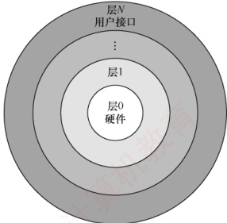

图 1.5 分层的操作系统

层仅可调用其紧邻下层所提供的功能与服务（单向依赖）。分层的操作系统如图1.5所示。

分层法的优点如下：①便于调试与验证，系统可自底向上逐层开发与测试。层1完成且验证无误后，即可开发层2，因其仅依赖已验证的下层；后续各层以此类推。若某层出现错误，可将其定位在该层内部，因其所有依赖的下层均已通过验证。②易于扩充与维护。在保持层间接口不变的前提下，可独立修改、替换或新增某一层的实现，而不会影响其他层次的功能。

分层法的问题如下：① 层次划分困难。合理界定各层的功能边界较为复杂，且一旦依赖关系固化，系统架构可能缺乏灵活性。② 运行效率较低。执行一个高层功能通常需穿越多个中间层，每层之间的参数传递与控制转移

会引入额外开销，从而影响系统整体性能。

### 2. 模块化

模块化是将操作系统按功能划分为若干具有一定独立性的模块。每个模块实现特定的管理功能，并明确定义与其他模块的接口，以便通过这些接口进行通信。还可进一步将模块细分为若干子模块，并且规定子模块之间的接口。这种设计方法称为模块-接口法，图1.6所示为由模块、子模块等组成的模块化操作系统结构。

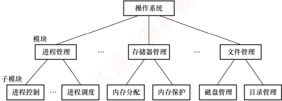

图 1.6 由模块、子模块等组成的模块化操作系统结构

在划分模块时，若模块过小，虽然可降低单个模块的复杂性，但会导致模块间交互频繁，增加系统的整体复杂度；若模块过大，则模块内部结构复杂，难以维护。因此，需要在粒度大小之间取得合理平衡。此外，应高度重视模块的独立性：模块独立性越高，相互依赖越少，系统结构越清晰。衡量模块独立性的主要标准有两个：

内聚性，模块内部各组成部分间联系的紧密程度。内聚性越高，模块独立性越好。

• 耦合度，模块间相互依赖和影响的程度。耦合度越低，模块独立性越好。

模块化的优点：①提高了操作系统设计的正确性、可理解性和可维护性；②增强了系统的可适应性，便于功能扩展；③支持并行开发，加速操作系统研制进程。

模块化的缺点：① 模块间的接口规定很难满足对接口的实际需求。② 各模块设计者齐头并进，每个决定无法建立在上一个已验证的正确决定的基础上，因此无法找到一个可靠的决定顺序。

### 3. 宏内核

从操作系统的内核架构来划分，可分为宏内核和微内核。

宏内核（也称单内核或大内核）将系统的主要功能模块集成在一个紧密耦合的整体中，运行于内核态，从而为用户程序提供高效的系统服务。由于各模块共享地址空间，可直接调用彼此的函数，减少了上下文切换和消息传递开销，因而具有较高的性能优势。

然而，随着体系结构和应用需求的不断发展，操作系统需提供的服务日益复杂，代码规模急剧膨胀，导致系统维护困难、可靠性下降，面临典型的“软件危机”。为提升系统的模块化、可扩展性与安全性，微内核技术应运而生：其核心思想是仅保留最基本的功能（如进程调度、进程间通信等）在内核中，而将文件系统、设备驱动等非核心服务移至用户态运行。

从发展现状看，当前主流操作系统（如 Linux、Windows、Android）主要采用宏内核或混合内核架构，在保持高性能的同时，也吸收了微内核的部分设计理念。例如，macOS 和 iOS 所采用的 XNU 内核即融合了 Mach 微内核与 BSD 宏内核的特性。这表明，宏内核与微内核并非对立，而是相互借鉴、融合发展。近年来，随着对安全性和可验证性的重视，微内核架构重新受到关注，尤其是谷歌的 Fuchsia 和华为的 HarmonyOS NEXT，都采用了微内核架构。

### 4. 微内核

#### （1） 微内核的基本概念

微内核架构是指将操作系统中最基本的功能保留在内核，而将其他非核心功能移至用户态运行，从而降低内核的复杂性。这些移出的功能被组织为若干独立的服务程序，它们运行在用户态，彼此之间以及与客户进程之间的交互均通过微内核提供的消息传递机制完成。

微内核结构将操作系统划分为两大部分：微内核和多个服务器。微内核是一个精心设计的小型内核，仅实现操作系统最核心的机制，通常包括：①与硬件紧密相关的部分；②基本的资源管理机制；③客户与服务器间的通信支持。这些部分为构建完整的操作系统提供了基础，确保内
核保持极小规模。操作系统的绝大部分功能都放在微内核外的一组服务器（进程）中实现，运行在用户态。例如，进程/线程服务器、虚拟存储器服务器等，均以用户态进程的形式提供相应服务。图1.7展示了单机环境下的客户/服务器模式。

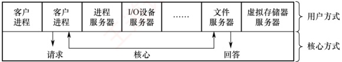

图 1.7 单机环境下的客户/服务器模式

在微内核结构中，为提升可靠性，仅微内核运行在内核态，其余模块均运行在用户态。因此，某一模块（如文件服务器）发生故障时，仅该模块崩溃，系统可通过重启该服务恢复，而不会导致整个系统宕机。相比之下，在宏内核中，文件系统运行于内核态，其崩溃将直接引发系统崩溃。

#### （2） 微内核的基本功能

微内核操作系统遵循“机制与策略分离”的设计原则，将与硬件紧密相关的机制置于微内核中，而将策略交由用户态服务器实现。通过这种划分，进程管理、存储器管理和I/O管理等功能均被分解为两部分：机制保留在微内核中，策略则由外部服务器实现。由于服务器通常远大于微内核，该设计使微内核得以保持极小的规模。具体而言，微内核通常具备以下功能：

① 进程（线程）管理。微内核提供进程/线程的创建、切换、调度队列管理等机制，而进程分类、优先级分配等策略则由用户态的进程管理服务器实现。

② 低级存储器管理。微内核仅包含与硬件相关的地址转换机制（如页表管理、逻辑地址到物理地址的映射），而页面置换算法、内存分配策略等由用户态的存储器管理服务器实现。

③ 中断和陷入处理。微内核负责捕获硬件中断和陷入事件，在识别中断或异常类型后，将其分发给相应的用户态服务器处理。中断与陷入的捕获及分发机制属于微内核的核心功能。

#### （3）微内核的特点

### 考点追踪 微内核操作系统的特点（2023）

微内核结构的主要优点如下：

① 扩展性和灵活性。新增或修改功能只需调整相应服务器，无须改动内核。

② 可靠性和安全性。用户态服务的故障不会导致系统崩溃，且攻击面更小。

③ 可移植性。仅微内核包含硬件相关代码，其余服务器与平台无关，便于移植。

④ 分布式计算。客户/服务器间通过消息传递通信，易于扩展至网络环境。

微内核结构的主要缺点是性能问题，每次服务请求需多次穿越内核态与用户态，导致系统调用延迟增加。为缓解此问题，部分现代系统采用混合内核设计，在保留微内核思想的同时，将高频服务移入内核以提升性能，但这又会使微内核的容量明显增大。

尽管如此，微内核因其高可靠性和可验证性，被广泛应用于对系统可靠性要求极高的关键任务领域，如实时操作系统、工业控制、航空航天及军事等。

### 5. 外核

与传统操作系统通过抽象层向应用程序提供统一接口不同，外核（exokernel）采用一种截然不同的设计思想：将物理资源直接暴露给用户级系统，自身仅负责资源的安全分配与隔离。

在外核架构中，外核作为运行于内核态的极小程序，其核心职责是将底层硬件资源（如磁盘块、内存页、网络包缓冲区等）划分为互不重叠的子集，并分配给不同的用户级系统。例如，一个用户级系统可能被分配磁盘的0～1023块，另一个用户级系统则被分配独特的1024～2047
块。外核通过权限检查机制，确保各用户级系统仅能访问其被明确授权的资源，防止越权访问。在外核之上，可在用户空间构建库操作系统（library OS），自主实现文件系统、进程调度、虚拟内存管理等传统操作系统功能。由于库操作系统直接操作物理资源，无须经过传统内核强制性的抽象层，因此避免了不必要的数据拷贝、地址转换以及上下文切换开销，显著提升了系统性能与灵活性。

外核机制的主要优点如下。

① 减少抽象开销。传统操作系统强制引入虚拟内存、虚拟文件系统等映射层，而外核允许用户级系统按需定制资源使用方式，显著降低了系统开销。

② 提升灵活性与性能。用户级系统可根据应用特性优化资源管理策略（如数据库可以直接管理磁盘块），充分发挥硬件的潜力。

③ 清晰分离保护与实现。外核仅负责资源保护，功能实现完全置于用户空间，系统结构简洁且易于验证。

## 1.5 操作系统引导

操作系统（如 Windows、Linux 等）以程序形式存储于硬盘等外部存储设备中。操作系统引导是指计算机通过执行一系列引导程序，依次定位启动设备、确定可引导分区、加载其中的操作系统内核，最终完成系统启动的链式过程。

### 考点追踪 操作系统的引导过程（2021、2022）

常见操作系统的引导过程如下。

① CPU 激活与 BIOS 初始化。计算机通电后，CPU 从 ROM 中读取并执行 BIOS（基本输入/输出系统）程序。BIOS 初始化基本硬件，建立中断向量表，为引导阶段的设备访问提供支持。

②硬件自检与启动设备选择。BIOS执行通电自检（POST），检测CPU、内存以及外设是否正常。自检通过后，依据CMOS设置（主板上由电池供电的配置存储器，用于保存启动顺序、系统时间等参数）确定启动设备优先级，并选择首个有效的启动设备（如硬盘、U盘）。

③ 加载主引导记录（MBR）。BIOS 将所选启动设备的首扇区（主引导记录，即 MBR）加载到内存中。MBR 包含两部分核心内容：引导代码与硬盘分区表。

④ 定位活动分区并加载分区引导记录（PBR）。MBR 中的引导代码解析分区表，识别标记为“活动”的分区，并将其首扇区（分区引导记录，即 PBR）加载到内存中。

⑤ 加载启动管理器。PBR 中的代码负责加载活动分区内的启动管理器（如 Linux 的 GRUB、Windows 的 Bootmgr），后者提供多操作系统或内核版本的选择界面。

### 考点追踪 操作系统运行的存储器（2013）

⑥ 加载操作系统内核。启动管理器将用户选定的操作系统内核映象加载到内存中，并跳转执行。内核随即完全接管系统控制权，重建中断处理机制，不再依赖 BIOS 提供的服务。

⑦ 内核初始化与用户环境启动。内核完成核心子系统的初始化：内存管理模块构建内核页表及用户进程地址空间框架；进程调度模块初始化进程控制块（PCB）链表、就绪队列与阻塞队列；设备驱动模块建立设备控制块、设备分配表以及 I/O 缓冲区管理结构。初始化完成后，内核启动首个用户态进程（如 Linux 的 init），由此逐步构建完整的用户操作环境。
## 1.6 虚拟机

### 1.6.1 虚拟机的基本概念

### 考点追踪 虚拟化技术的原理与特点（2025）

虚拟机是指通过虚拟化技术，将一台物理计算机抽象为多台逻辑上独立的计算环境，每台虚拟机都表现为完整硬件系统的精确复制品。虚拟化技术的核心在于隐藏底层物理硬件的细节，向上层提供统一且隔离的执行平台。目前主流的虚拟化方案分为两类。

#### 1. 第一类虚拟机管理程序

第一类虚拟机管理程序（又称裸金属架构）直接运行在物理硬件之上，是系统中唯一处于最高特权级的软件。它类似于一个轻量级的操作系统，负责管理硬件资源和并发调度多个虚拟机。每个虚拟机均可安装独立的操作系统（称为客户操作系统），彼此完全隔离。图1.8(a)展示了第一类虚拟机管理程序在系统中的位置。

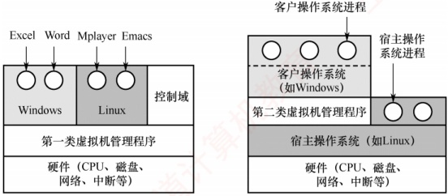

(a)

(b)

图 1.8 两类虚拟机管理程序在系统中的位置

在此类架构中，客户操作系统运行于虚拟内核态，它认为自己处于真实的 CPU 内核态，但实际上并非如此；其用户进程则运行在真实的用户态。当客户操作系统执行一条仅允许在真实内核态下执行的敏感指令时，会触发异常并陷入虚拟机管理程序。

在支持硬件虚拟化的 CPU 上，虚拟机管理程序能够根据执行上下文判断该指令源自客户操作系统还是用户程序：若为前者，则代为完成其功能；若为后者（用户程序非法执行敏感指令），则模拟真实硬件的异常响应行为。而在早期不支持硬件虚拟化的 CPU 上，所有敏感指令均被透明重定向到虚拟机管理程序，由其通过软件模拟实现相应功能。

#### 2. 第二类虚拟机管理程序

第二类虚拟机管理程序（又称寄居架构）以应用程序的形式运行在宿主操作系统（如 Windows 或 Linux）之上，依赖宿主系统进行资源分配与调度，本质上是一个用户态进程。尽管如此，它仍向客户操作系统伪装成完整的硬件平台。图 1.8(b) 展示了第二类虚拟机管理程序在系统中的位置。VMware Workstation 是 x86 平台上首个广泛使用的第二类虚拟机管理程序。

首次启动时，第二类虚拟机管理程序模拟一台新计算机的行为，用户可将客户操作系统安装到虚拟磁盘（实际上是宿主操作系统中的一个普通文件），安装完成后即可正常启动和运行。

虚拟化技术在 Web 主机领域应用广泛。若无虚拟化，服务商只能提供共享托管（用户无法控制软件环境）或独占托管（成本高昂）。借助虚拟化，单台物理服务器可同时运行多个虚拟机，每个虚
拟机对用户而言都是一台完整的服务器，支持自定义操作系统与软件，且成本显著降低——这正是当前主流云服务器服务的基础。

### 1.6.2 本节习题精选

#### 一、 单项选择题

##### 01

用（）设计的操作系统结构清晰且便于调试。

A. 分层式架构 B. 模块化架构 C. 微内核架构 D. 宏内核架构

##### 02

下列关于分层式结构操作系统的说法中，（）是错误的。

A. 各层之间只能是单向依赖或单向调用

B. 容易实现在系统中增加或替换一层而不影响其他层

C. 具有非常灵活的依赖关系

D. 系统效率较低

##### 03

下列选项中，（）不属于模块化操作系统的特点。

A. 很多模块化的操作系统，可以支持动态加载新模块到内核，适应性强

B．内核中的某个功能模块出错不会导致整个系统崩溃，可靠性高

C. 内核中的各个模块可以相互调用，无须通过消息传递进行通信，效率高

D. 各模块间相互依赖，相比于分层式操作系统，模块化操作系统更难调试

##### 04

相对于微内核系统，（）不属于大内核操作系统的缺点。

A. 占用内存空间大

B. 缺乏可扩展性而不方便移植

C. 内核切换太慢

D. 可靠性较低

##### 05

下列说法中，（）不适合描述微内核操作系统。

A. 内核足够小

B. 功能分层设计

C. 基于 C/S 模式

D. 策略与机制分离

##### 06

对于以下五种服务，在采用微内核结构的操作系统中，（）不宜放在微内核中。

I. 进程间通信机制

II. 低级 I/O

III. 低级进程管理和调度

IV. 中断和陷入处理

V. 文件系统服务

A. I、II 和 III B. II 和 V C. 仅 V D. IV 和 V

##### 07

相对于传统操作系统结构，采用微内核结构设计和实现操作系统有诸多好处，下列（）是微内核结构的特点。

Ⅰ. 使系统更高效

Ⅱ. 添加系统服务时不必修改内核

Ⅲ. 微内核结构没有单一内核稳定

Ⅳ. 使系统更可靠

A. I、III、IV B. I、II、IV C. II、IV D. I、IV

##### 08

下列关于操作系统结构的说法中，正确的是（）。

I. 当前广泛使用的 Windows 操作系统，采用的是分层式 OS 结构

II. 模块化的 OS 结构设计的基本原则是，每一层都仅使用其底层所提供的功能和服务，这样就使系统的调试和验证都变得容易

III. 因为微内核结构能有效支持多处理机运行，所以非常适合于分布式系统环境

IV. 采用微内核结构设计和实现操作系统具有诸多好处，如添加系统服务时不必修改内核，使系统更高效。

A. I 和 II

B. I 和 III

C. III

D. III 和 IV

##### 09

下列关于微内核操作系统的描述中，不正确的是（）。

A. 可提高操作系统的可靠性 B. 可提高操作系统的执行效率
C. 可提高操作系统的可移植性 D. 可提高操作系统的可拓展性

##### 10

下列关于操作系统外核（exokernel）的说法中，错误的是（）。

A. 外核可以给用户进程分配未经抽象的硬件资源

B. 用户进程通过调用“库”请求操作系统外核的服务

C. 外核负责完成进程调度

D. 外核可以减少虚拟硬件资源的“映射”开销，提升系统效率

##### 11

对于计算机操作系统引导，描述不正确的是（）。

A. 计算机的引导程序驻留在 ROM 中，开机后自动执行

B. 引导程序先做关键部位的自检，并识别已连接的外设

C. 引导程序会将硬盘中存储的操作系统全部加载到内存中

D. 若计算机中安装了双系统，引导程序会与用户交互加载有关

##### 12

存放操作系统自举程序的芯片是（）。

A. SRAM B. DRAM C. ROM D. CMOS

##### 13

计算机操作系统的引导程序位于（）中。

A. 主板 BIOS B. 片外 Cache C. 主存 ROM 区 D. 硬盘

##### 14

在操作系统引导过程中，下列关于各阶段核心功能的描述，正确的是（）

A. BIOS 直接加载并执行操作系统内核

B. MBR 解析硬盘分区表，并加载活动分区的引导扇区

C. 启动管理器由 BIOS 直接从磁盘读取并执行

D. 内核初始化阶段仅加载设备驱动，不初始化进程调度相关数据结构

##### 15

检查分区表是否正确，确定哪个分区为活动分区，并在程序结束时将该分区的启动程序（操作系统引导扇区）调入内存加以执行，这是（）的任务。

A. MBR B. 引导程序 C. 操作系统 D. BIOS

##### 16

下列关于虚拟机的说法中，正确的是（）。

Ⅰ. 虚拟机可以用软件实现

Ⅱ. 虚拟机可以用硬件实现

Ⅲ. 多台虚拟机可同时运行在同一物理机器上，它实现了真正的并行

A. I 和 II B. I 和 III C. 仅 I D. I、II 和 III

##### 17

下列关于 VMware Workstation 虚拟机的说法中，错误的是（）。

A. 真实硬件不会直接执行虚拟机中的敏感指令

B. 虚拟机中只能安装一种操作系统

C. 虚拟机是运行在计算机中的一个应用程序

D. 虚拟机文件封装在一个文件夹中，并存储在数据存储器中

##### 18

虚拟机的实现离不开虚拟机管理程序（VMM），下列关于 VMM 的说法中正确的是（）。

Ⅰ. 第一类 VMM 直接运行在硬件上，其效率通常高于第二类 VMM

II. VMM的上层需要支持操作系统的运行、应用程序的运行，因此实现VMM的代码量通常大于实现一个完整操作系统的代码量

III. VMM 可将一台物理机器虚拟化为多台虚拟机器

IV. 为了支持客户操作系统的运行，第二类 VMM 需要完全运行在最高特权级

A. I、II 和 III B. I 和 III C. I、III 和 IV D. I、II、III 和 IV

##### 19

【2013 统考真题】计算机开机后，操作系统最终被加载到（）。

A. BIOS B. ROM C. EPROM D. RAM

##### 20

【2022 统考真题】下列选项中，需要在操作系统进行初始化过程中创建的是（）。

A. 中断向量表

B. 文件系统的根目录
C. 硬盘分区表 D. 文件系统的索引节点表

##### 21

【2023 统考真题】与宏内核操作系统相比，下列特征中，微内核操作系统具有的是（）。

Ⅰ. 较好的性能 Ⅱ. 较高的可靠性 Ⅲ. 较高的安全性 Ⅳ. 较强的可扩展性

A. 仅Ⅱ、Ⅳ B. 仅Ⅰ、Ⅱ、Ⅲ C. 仅Ⅰ、Ⅲ、Ⅳ D. 仅Ⅱ、Ⅲ、Ⅳ

##### 22

【2025 统考真题】下列关于虚拟化技术的叙述中，错误的是（）。

A. 操作系统可以运行在虚拟机上

B. 虚拟化技术支持在一台计算机上构建多个虚拟机

C. 虚拟机监控程序（VMM）与操作系统的特权级相同

D. 虚拟化技术支持在一台计算机上模拟不同的指令集体系结构

### 1.6.3 答案与解析

#### 一、 单项选择题

##### 01

A

分层式结构简化了系统的设计和实现，每层只能调用紧邻它的低层的功能和服务，便于系统的调试和验证，若在调试某层时发现错误，则错误应在这层上，这是因为其低层都已调试好。

##### 02

C

单向依赖是分层式 OS 的特点。分层式 OS 中增加或替换一个层中的模块或整层时，只要不改变相应层间的接口，就不会影响其他层，因而易于扩充和维护。层次定义好后，相当于各层之间的依赖关系也就固定了，因此往往显得不够灵活，选项C错误。每执行一个功能，通常都要自上而下地穿越多层，增加了额外的开销，导致系统效率降低。

##### 03

B

模块化操作系统的各功能模块都在内核中，并且模块之间相互调用、相互依赖，任何一个模块出错，都可能导致整个内核崩溃。选项 B 的设置属于 “移花接木”，正确的说法应该是：在微内核操作系统中，内核外的某个功能模块出错不会导致整个系统崩溃，可靠性高。

##### 04

C

微内核和宏内核作为两种对立的结构，它们的优缺点也是对立的。微内核 OS 的主要缺点是性能问题，因为需要频繁地在内核态和用户态之间进行切换，因而切换开销偏大。

##### 05

B

功能分层设计是分层式 OS 的特点。通常可以从四个方面来描述微内核 OS: ① 内核足够小；② 基于客户/服务器模式；③ 应用 “机制与策略分离” 原理；④ 采用面向对象技术。

##### 06

C

进程（线程）之间的通信功能是微内核最频繁使用的功能，因此几乎所有微内核 OS 都将其放入微内核。低级 I/O 和硬件紧密相关，因此应放入微内核。低级进程管理和调度属于调度功能的机制部分，应将它放入微内核。微内核 OS 将与硬件紧密相关的一小部分放入微内核处理，此时微内核的主要功能是捕获所发生的中断和陷入事件，并进行中断响应处理，识别中断或陷入的事件后，再发送给相关的服务器处理，所以中断和陷入处理也应放入微内核。而文件系统服务是放在微内核外的文件服务器中实现的，所以仅选项 V 不宜放在微内核中。

##### 07

C

微内核结构需要频繁地在内核态和用户态之间进行切换，操作系统的执行开销相对偏大，那些移出内核的操作系统代码根据分层的原则被划分成若干服务程序，它们的执行相互独立，交互则都借助微内核进行通信，影响了系统的效率，因此说法I不是优势。因为内核的服务变少，且一般来
说内核的服务越少内核越稳定，所以说法Ⅲ错误。而说法Ⅱ、Ⅳ正是微内核结构的优点。

##### 08

C

Windows 是融合了宏内核和微内核的操作系统，说法 I 错误。说法 II 描述的是层次化架构的原则。微内核架构将操作系统的核心功能和其他服务分离，使不同的服务可在不同的处理器上并行执行，提高了系统的并发性和可扩展性；微内核架构可以方便地实现进程间的通信和同步，支持服务器之间的消息传递和远程过程调用，使得分布式系统的开发和管理更简单和高效，说法 III 正确。添加系统服务时不必修改内核，这就使得微内核架构的可扩展性和灵活性更强；微内核架构的主要问题是性能问题，“使系统更高效”显然错误。

##### 09

B

微内核会增加一些开销，如上下文切换、消息传递、数据拷贝等。这些开销会降低操作系统的执行效率，尤其是对一些频繁调用的服务。选项A、C、D均正确。

##### 10

C

在拥有外核的操作系统中，外核只负责硬件资源的分配、回收、保护等，进程管理相关的工作仍然由内核负责。

##### 11

C

常驻内存的只是操作系统内核，其他部分仅在需要时才调入。

##### 12

C

BIOS（基本输入/输出系统）是一组固化在主板的 ROM 芯片上的程序，它包含系统设置程序、基本输入/输出程序、开机自检程序和系统启动自举程序等。

##### 13

D

操作系统的引导程序位于磁盘活动分区的引导扇区中。引导程序分为两种：一种是位于 ROM 中的自举程序（BIOS 的组成部分），用于启动具体的设备；另一种是位于装有操作系统硬盘的活动分区的引导扇区中的引导程序（称为启动管理器），用于引导操作系统。

##### 14

B

在操作系统引导过程中，BIOS执行硬件自检后，仅加载主引导记录（MBR）到内存中并执行；MBR位于硬盘首扇区，通过解析分区表定位活动分区，并加载其分区引导记录（PBR）；PBR负责加载启动管理器，而不由BIOS直接加载；内核初始化阶段除加载设备驱动外，还需要初始化进程控制块、调度队列和空闲进程等调度相关数据结构。综上，仅选项B正确。

##### 15

A

BIOS 将控制权交给排在首位的启动设备后，CPU 将该设备主引导扇区的内容 [主引导记录（MBR）] 加载到内存中，然后由 MBR 检查分区表，查找活动分区，并将该分区的引导扇区的内容 [分区引导记录（PBR）] 加载到内存加以执行。

##### 16

A

软件能实现的功能也能由硬件实现，因为虚拟机软件能实现的功能也能由硬件实现，软件和硬件的分界面是系统结构设计者的任务，说法Ⅰ和Ⅱ正确。实现真正并行的是多核处理机，多台虚拟机同时运行在同一物理机器上，类似于多个程序运行在同一个系统中。

##### 17

B

VMware Workstation 虚拟机属于第二类虚拟机管理程序，若真实硬件直接执行虚拟机中的敏感指令，则该指令非法时可能导致宿主操作系统崩溃，而这是不可能的，实际上是由第二类虚拟机管理程序模拟真实硬件环境。虚拟机看起来和真实物理计算机没什么两样，因此当然可以安装多个操作系统。VMware Workstation 就是一个安装在计算机上的程序，在创建虚拟机时，会为该
虚拟机创建一组文件，这些虚拟机文件都存储在主机的磁盘上。

##### 18

B

第一类 VMM 直接运行在硬件上；第二类 VMM 运行在宿主操作系统上，不能直接和硬件打交道，因此第一类 VMM 的效率通常更高。VMM 的功能没有操作系统的功能复杂，其代码量少于一个完整的操作系统。说法 III 是基本概念。第一类 VMM 运行在最高特权级（内核态），而第二类 VMM 和普通应用程序的地位相同，通常运行在较低特权级（用户态）。

##### 19

D

系统开机后，操作系统的程序会被自动加载到内存中的系统区，这段区域是 RAM。部分未复习计组的读者对该内容可能不太熟悉，但熟悉了各类存储介质后，解答本题并不难。

##### 20

A

在操作系统初始化的过程中需要创建中断向量表，以实现通电自检（POST），CPU检测到中断信号后，根据中断号查询中断向量表，跳转到相应的中断处理程序，选项A正确。在硬盘逻辑格式化之前，需要先对硬盘进行分区，即创建硬盘分区表。分区完成后，对物理分区进行逻辑格式化（创建文件系统），为每个分区初始化一个特定的文件系统，并创建文件系统的根目录。若某个分区采用UNIX文件系统，则还要在该分区中建立文件系统的索引节点表。

##### 21

D

微内核架构将内核中最基本的功能保留在内核，只有微内核运行在内核态，其余模块都运行在用户态，一个模块中的错误只会使这个模块崩溃，而不会使整个系统崩溃，因此具有较高的可靠性和安全性。微内核的非核心功能运行在用户空间，可通过插件或模块的方式进行扩展，无须改动内核代码，因此具有较强的可扩展性。微内核需要频繁地在用户态和内核态之间进行切换，操作系统的执行开销偏大，从而影响系统性能。

##### 22

C

虚拟化技术通过软件抽象底层硬件资源，使多个相互隔离的虚拟机能够在同一台物理计算机上运行。操作系统可作为客户系统运行在虚拟机中，依托虚拟硬件正常运行；同时，在单台物理主机上构建多个虚拟机正是虚拟化的核心能力。虚拟机监控程序（VMM）作为虚拟化的核心组件，必须运行在高于操作系统的特权级上，才能有效拦截和模拟敏感指令、管理物理资源并维持虚拟机间的隔离，因此其特权级不可能与操作系统的相同。此外，结合仿真或动态二进制翻译等机制，虚拟化方案也能在一种指令集架构的平台上模拟运行另一种架构的虚拟机，进而支持跨架构场景。综上，选项C的表述不符合虚拟化的基本原理。

## 1.7 本章疑难点

### 1. 并行性与并发性的区别和联系

并行性与并发性是两个既相似又有区别的概念。并行性是指多个事件在同一时刻发生，而并发性是指多个事件在同一时间间隔内发生。在多道程序环境下，并发性表现为宏观上多个程序同时运行；但在单处理器系统中，任一时刻仅能执行一个程序，因此微观上这些程序分时交替执行。若系统配备多个处理器，则可将并发执行的程序分配至不同处理器，实现真正的并行。

### 2. 特权指令与非特权指令

特权指令是一类具有特殊权限的指令，用于执行清内存、置时钟、分配系统资源、修改虚存页表、调整用户访问权限等关键操作。由于其权限极高，使用不当可能导致系统崩溃。为保障系
统安全，特权指令仅允许在内核态执行；实际上，CPU在内核态下可执行完整的指令集。

为防止用户程序误用特权指令，用户态下仅允许执行非特权指令。当用户程序试图执行特权指令时，硬件将触发异常以阻止该操作。因此，操作系统中涉及特权操作的部分必须运行于内核态，从而确保系统的安全性与可靠性。从用户态切换至内核态的唯一途径是中断或异常。

### 3. 访管指令与访管中断

访管指令（Trap指令）是一条可在用户态执行的特殊指令。当用户程序需要请求操作系统服务时，会主动执行该指令，从而引发一个自愿中断——访管中断，使系统从用户态切换至内核态，由操作系统内核处理相应请求。系统调用正是通过访管指令实现的。

引入访管指令的原因在于：用户程序运行于用户态，而诸如I/O操作、进程创建、内存分配等任务涉及特权资源，无法在用户态直接完成，必须借助访管指令主动触发中断，进入内核态以获取所需服务。值得注意的是，访管指令本身并非特权指令，其核心作用是为用户提供一种受控且主动的内核态入口机制，在保障系统安全的同时，实现用户程序与操作系统的高效交互。

### 4. 定义微内核结构 OS 的四个方面

1）足够小的内核：微内核仅包含最基础的核心功能，如进程间通信、基本调度等。

2）基于客户/服务器模式：内核作为服务器提供基础服务，应用程序作为客户端请求服务。

3）机制与策略分离：机制指实现功能的具体执行机构，策略则是在机制基础上通过参数或算法实现优化或差异化目标。传统操作系统将机制置于底层、策略置于高层；而微内核OS将机制保留在内核中，策略移至用户态服务进程，从而显著减小内核规模。

4）采用面向对象技术：通过“抽象”“封装”“继承”等特性，有效控制系统复杂性，并提升操作系统的正确性、可靠性与可扩展性，因而被广泛应用于现代操作系统设计。

# 第2章 进程与线程

## 【考纲内容】

### （一） 进程与线程

进程与线程的基本概念；进程/线程的状态与转换

线程的实现：内核支持的线程，线程库支持的线程

进程与线程的组织与控制

进程间通信：共享内存，消息传递，管道，信号

视频讲解

### （二） CPU 调度与上下文切换

调度的基本概念：调度的目标；

调度的实现：调度器/调度程序（scheduler），调度的时机与调度方式（抢占式/非抢占式），闲逛进程，内核级线程与用户级线程调度

CPU 调度算法

多处理机调度

上下文及其切换机制

### （三） 同步与互斥

同步与互斥的基本概念

基本的实现方法：软件方法；硬件方法

锁；信号量；条件变量

经典同步问题：生产者-消费者问题，读者-写者问题；哲学家进餐问题

（四）死锁

死锁的基本概念；死锁预防

死锁避免；死锁检测和解除

## 【复习提示】

进程管理是操作系统的核心，也是每年必考的重点。其中，进程的概念、进程调度、信号量机制实现同步与互斥、死锁问题等更是重中之重，必须深入掌握。需要注意的是，本章除常考选择题外，还易出现综合题，尤其是利用信号量实现进程同步、进程调度算法分析及死锁相关问题，均可能作为综合题考查，例如“利用信号量进行进程同步”在历年统考中就频繁出现。
## 2.1 进程与线程简介

在学习本节时，请读者思考以下问题：

1）为什么要引入进程？

2）什么是进程？进程由什么组成？
3）引入进程主要解决了多道程序并发执行中的哪些关键问题？

希望读者带着这些问题进入本节的学习，并在学习过程中多思考，从而更深入地把握核心概念。进程本身是一个抽象的逻辑实体，它并非物理存在的对象，初学者在理解时往往感到困难。为此，在系统阐述相关理论之后，我们将通过直观的例子帮助读者理解。

### 2.1.1 进程的概念和特征

#### 1. 进程的概念

在多道程序环境下，允许多个程序并发执行，但并发性破坏了程序原本的封闭性，使其执行过程呈现间断性，并可能导致结果不可再现。为有效描述和控制程序的并发行为，操作系统引入了进程（Process）这一核心概念，以支撑操作系统的两大基本特性：并发性与共享性。

为使每个参与并发执行的程序能独立运行，必须为其配置一个专门的数据结构，称为进程控制块（Process Control Block，PCB）。操作系统通过PCB记录进程的基本信息和运行状态，从而实现对其的控制与管理。通常，程序段、相关数据段和PCB三者共同构成进程实体（也称进程映像）。因此，创建进程的本质是创建其PCB；相应地，撤销进程即释放该PCB及相关资源。

从不同视角出发，进程可有不同的定义，比较典型的定义如下。

1）进程是正在执行的程序实例。

2）进程是程序及其数据从外存加载到内存后，在CPU上运行的过程。

3）进程是具有独立功能的程序在一个特定数据集合上的执行活动。

在传统操作系统中，进程被正式定义为：“进程是进程实体的运行过程，是系统进行资源分配和调度的一个独立单位”。这里所说的“系统资源”不仅包括内存空间、I/O 设备等硬件资源，也包括 CPU 的使用权，而 CPU 的使用权通常通过时间片的分配来实现。正因进程是资源分配与调度的基本单位，它必然不是静态的程序，而必须是一个动态的、具有生命周期的过程性实体。

#### 2. 进程的特征

进程源于多道程序并发执行的需求，与静态的程序有着本质区别。其核心特征如下。

1）动态性。进程是程序的一次执行实例，具有明确的生命周期，包括创建、就绪、运行、阻塞和终止等状态变化。动态性是进程最根本的特征。

2）并发性。多个进程可同时驻留于内存，并在一段时间内交替或并行执行。引入进程的根本目的，正是为了支持程序的并发执行。

3）独立性。进程是能够独立运行、独立获取系统资源，并作为调度基本单位参与 CPU 竞争的实体。任何未建立 PCB 的程序，均不能被操作系统调度执行。

4）异步性。进程相互制约，以不可预知的速度向前推进。这种异步性可能导致执行结果不可再现，因此操作系统必须提供相关机制，以协调进程行为，确保执行的正确性。

尽管考试中较少直接考查四大特征，但对其内涵的理解是分析进程调度、同步互斥、死锁等问题的基础。建议读者着重把握各特征的成因、表现及其对系统设计的影响，而非机械记忆。

### 2.1.2 进程的组成

进程是操作系统进行资源分配和调度的基本单位，由三部分共同构成：程序段、数据段和进程控制块（PCB），其中PCB是最核心的组成部分。

#### 1. 进程控制块

进程创建时，操作系统为其分配一个PCB；该结构常驻内存，可随时被系统访问，并在进程终止时被回收。PCB是进程存在的唯一标志，系统唯有通过它才能感知并管理进程。
在进程的整个生命期内，系统始终依赖 PCB 对其进行管理。操作系统通过 PCB 记录并维护进程的当前状态，以便在需要调度、切换或干预时，能够准确地控制其行为。

具体而言，当操作系统准备调度某个进程运行时，首先从其PCB中读取当前状态、优先级等调度所需信息；一旦该进程被选中，系统便根据PCB中保存的CPU上下文（如寄存器值）恢复其执行现场，并依据其中记录的内存地址找到对应的程序段和数据段。在进程运行过程中，若需与其他进程实现同步、通信，或访问文件，同样需要查询PCB中的相关资源信息。而当进程因某种原因而暂停执行时，其当前的CPU状态会被保存回PCB，以便后续重新调度时能从中断处继续执行。当进程正常结束或被强制终止时，系统将回收其PCB，该进程也随之消亡。由此可见，从创建到终止，系统对进程的所有操作，都离不开对其PCB的访问与更新。

PCB 主要包括如表 2.1 所示的四类信息，各部分的主要说明如下。

表2.1 PCB 通常包含的内容

| 进程标识信息 | 进程调度信息 | 资源和内存信息 | 处理机状态信息 |
| --- | --- | --- | --- |
| 进程 ID（PID） | 进程当前状态 | 代码段指针 | 通用寄存器值 |
| 父进程 ID（PPID） | 进程优先级 | 数据段指针 | 程序计数器值 |
| 用户 ID（UID） | CPU 占用时间 | 堆栈段指针 | 程序状态字（PSW） |
|   | 等待时间 | 文件描述符列表 | 栈指针（SP） |
|   | 进入内存时间 | I/O 资源清单 |   |
|   | 阻塞原因 |   |   |

1）进程标识信息。用于唯一标识一个进程及其归属关系。进程 ID（PID）是系统为每个进程分配的唯一编号；父进程 ID（PPID）记录创建该进程的父进程标识符；用户 ID（UID）指明进程所属用户，为资源共享与安全保护提供依据。

2）进程调度信息。支持操作系统的调度决策与状态管理。进程当前状态是 CPU 分配的基本依据；进程优先级决定其抢占 CPU 的能力；此外，还包括 CPU 占用时间、等待时间、进入内存时间等统计信息，以及阻塞原因，用于调整调度策略及后续唤醒。

3）资源和内存信息。记录进程所占用的各类系统资源。包括代码段、数据段和堆栈段在内存中的起始地址（或指针）、已打开文件的描述符列表，以及所占用的I/O资源。

4）处理机状态信息。也称 CPU 上下文，主要包括通用寄存器、程序计数器、栈指针及程序状态字（PSW）等寄存器的值。当进程被切换出 CPU 时，这些信息必须完整保存到 PCB 中；再次被调度运行时，系统将其恢复至 CPU，从而能从中断处继续执行。

在一个实际系统中，通常同时存在大量进程，有的处于就绪态，有的处于阻塞态，并且阻塞原因各不相同。为高效地进行调度与管理，操作系统需将各进程的 PCB 以适当方式组织起来。常用的组织方法主要有两种：链接方式和索引方式。在链接方式中，系统将处于相同状态的 PCB 通过指针链接成一个队列，如就绪队列、阻塞队列；对于阻塞进程，还可根据其阻塞原因（如等待 I/O 完成、等待信号量等）进一步划分为多个阻塞子队列。在索引方式中，系统为每种状态建立一个索引表（如就绪索引表、阻塞索引表等），表项指向对应状态的 PCB。

#### 2. 程序段

程序段是进程中可被 CPU 执行的代码部分。需要指出的是，程序本身是静态的，可被多个进程共享。例如，多个用户同时运行同一个文本编辑器程序时，系统只需在内存中保留一份代码副本，各进程通过各自的 PCB 指向该共享代码段，从而节省内存空间并提高系统效率。
#### 3. 数据段

数据段包含进程运行所需的各种数据，既包括程序处理的原始输入，也包括执行过程中产生的中间结果和最终输出。与程序段不同，每个进程的数据段是私有的，即使多个进程运行同一程序，它们的数据段也彼此隔离。这种设计有效保障了进程间的独立性与安全性。

### 2.1.3 进程的内存映像

当程序被加载运行时，操作系统会为其建立一个虚拟地址空间，该空间的逻辑布局称为进程的内存映像。它反映了进程在运行时代码、数据、堆、栈等部分的组织方式。与磁盘上的静态可执行文件不同，内存映像是动态的。在虚拟内存机制（见3.2节）下，进程的整个地址空间无须全部驻留物理内存，只有在实际访问某一部分时，系统才会通过缺页中断将其从磁盘调入内存。

### 考点追踪 进程虚拟地址空间中各区域的存放内容（2025）

典型的进程虚拟地址空间由以下几个主要区域构成。

#### 1. 代码段

代码段是指存放程序的机器指令，即编译后的可执行代码。该段通常是只读的，防止程序运行时意外修改指令，同时也允许多个进程共享同一份代码。代码段通常包含以下几个子区域。

.init：包含程序启动时由系统自动调用的初始化代码。

.text: 存放主程序的指令。如 main()函数、自定义函数编译后的机器指令。

#### 2. 数据段

.rodata：存放只读数据。如字符串常量“Hello World!”。

数据段用于存放全局变量和静态变量（static 变量），分为如下两部分。

• .data：存放已初始化（已显式赋初值）的全局变量和静态变量，如“int x = 5;”。

.bss：存放未初始化的全局变量和静态变量，如“int y;”。

#### 3. 进程控制块（PCB）

虽然 PCB 是管理进程的核心数据结构，但它并不属于进程的虚拟地址空间。它由操作系统内核维护，存放在系统内核区中，对用户进程不可见。

#### 4. 堆

堆是指程序运行时动态申请内存的区域。通过  $malloc()$ 等函数从堆中申请内存，不再需要时通过  $free()$ 释放。堆从低地址向高地址增长，大小不固定，适合存储生命周期不确定的数据。例如，C 语言语句 “int *ptr = (int*)malloc(4);” 会在堆上分配 4 字节内存，用于存储一个整数。

#### 5. 栈

栈用于支持函数调用，存放局部变量、函数参数、返回地址等临时信息，由系统自动管理。遵循后进先出（LIFO）原则，栈从高地址向低地址扩展。例如，调用函数 add(3,5)时，参数 3、5 和返回地址会被压入栈；函数执行结束后，这些数据被弹出，栈指针自动回退。

#### 6. 共享库的存储映射区

共享库用于提供进程所依赖的公共函数代码（如 printf() 等标准库函数）。它们在运行时被动态映射到进程的地址空间，代码是只读的，且可被多个进程共享，从而节省内存资源。

图 2.1 所示为一个典型进程在内存中的映像。其中，最高地址处是用户栈，随函数调用向下增长；其下方是共享库的映射区域，用于加载动态库；再往下是堆，由  $malloc()$ 等函数动态扩展；
堆下方是读/写数据段（.data 和 .bss）；底部是只读代码段（.init、.text、.rodata）；注意，代码段和数据段的大小在程序加载时就已确定，而堆和栈则可在运行过程中动态扩展和收缩。

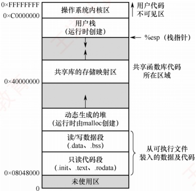

图2.1 一个典型进程在内存中的映像

### 2.1.4 进程的状态与转换

进程在其生命周期中，由于与其他进程的相互制约以及系统运行环境的变化，其状态会不断发生转换。通常，进程具有以下五种状态，其中前三种为基本状态。

1）运行态。进程正在 CPU 上执行。在单 CPU 中，任一时刻最多只有一个进程处于运行态。

2）就绪态。进程已获得除 CPU 外的所有必要资源，一旦获得 CPU，便可立即投入运行。系统中可能有多个就绪进程，通常将它们组织成一个队列，称为就绪队列。

### 考点追踪 执行中断处理程序时进程的状态（2023）

3）阻塞态，也称等待态。进程因等待某一事件（如某个资源可用、I/O操作完成等）而暂停运行。此时即使CPU空闲，该进程也无法执行。系统通常将处于阻塞态的进程组织成一个阻塞队列，甚至根据阻塞原因的不同，还可进一步划分为多个子队列。

4）创建态。进程正处于创建过程中，尚未进入就绪态。创建进程包括多个步骤：首先申请一个空白的PCB，并向其中填写用于控制和管理进程的信息；然后为该进程分配运行时所需的资源（如内存空间）；最后，当所有必要资源都已到位，系统将该进程转入就绪态，并插入就绪队列。创建态是一个短暂的中间状态，正常情况下不会长期停留。

5）终止态。进程已完成执行（无论是正常结束还是被强制终止），正在等待系统回收其资源。此时，进程不再参与调度，但其PCB等信息可能暂时保留，直至完成最终清理。

区分就绪态与阻塞态：就绪态是指进程仅缺少 CPU，只要获得 CPU 就可立即运行；而阻塞态是指进程需要其他资源（除 CPU 外）或等待某一事件。之所以将 CPU 与其他资源分开，是因为在分时系统的时间片轮转机制中，每个进程分得的时间片很短（通常为几毫秒），因此进程在运行过程中会频繁地在运行态与就绪态之间切换；而其他资源（如外设）的分配或事件（如 I/O 完成）的发生往往需要较长时间，导致进程进入阻塞态的频率远低于就绪态。由此可见，就绪态和阻塞态在进程生命周期中代表了两种性质完全不同的等待情形。
### 考点追踪 引起进程状态转换的事件（2014、2015、2018、2023、2025）

图2.2 说明了五种进程状态之间的转换关系。其中，三种基本状态之间的转换如下。

就绪态→运行态：处于就绪态的进程被调度程序选中，获得 CPU 的使用权（例如分配到一个时间片），随即由就绪态转换为运行态。

运行态→就绪态：处于运行态的进程在时间片用完后，必须主动让出CPU，从而转回就绪态；此外，在可剥夺式调度系统中，若有更高优先级的进程变为就绪，则当前运行的进程也会被强制切换回就绪态，以便让更高优先级的进程执行。

- 运行态→阻塞态：当运行中的进程通过系统调用请求某项服务（如发起I/O操作），而该请求无法立即满足（需等待I/O完成），进程便会主动进入阻塞态。需注意，并非所有系统调用都会导致阻塞，只有那些需要等待外部事件的操作才会引发状态转换。


图2.25种进程状态的转换

阻塞态→就绪态：当进程所等待的事件发生时（如I/O操作完成），相应的中断处理程序会将其状态由阻塞态修改为就绪态，并重新插入就绪队列，等待下一次调度。

值得注意的是，进程从运行态变为阻塞态是一种主动行为（由自身发起的系统调用触发），而从阻塞态变为就绪态则是一种被动行为，依赖于外部事件的发生或其他进程的协助。

### 2.1.5 进程控制

进程控制的功能是对系统中所有进程进行有效的管理，主要包括创建新进程、撤销已有进程、实现进程状态转换等操作。在操作系统中，这些控制操作通常以原语的形式实现。原语在执行期间不允许被中断，是一个不可分割的基本单位，确保了关键操作的原子性和一致性。

#### 1. 进程的创建

### 考点追踪 父进程与子进程的关系和特点（2020、2024）

允许一个进程创建另一个进程。创建者称为父进程，被创建的进程称为子进程。子进程在创建时会复制父进程的当前状态，包括程序代码、数据段、堆栈内容、打开的文件描述符、环境变量等。然而，子进程与父进程是相互独立的实体，拥有各自的PCB和虚拟地址空间。

### 考点追踪 ▶ 导致创建进程的操作（2010）

在操作系统中，终端用户登录系统、作业调度启动批处理任务、系统提供服务、用户程序发起应用请求等，都会触发进程的创建。操作系统通过创建原语建立新进程，具体步骤如下。

### 考点追踪 ▶ 创建新进程时的操作（2021）

1）分配唯一标识并申请 PCB：为新进程分配唯一的进程标识号（PID），并从系统 PCB 池中申请一个空白 PCB。若 PCB 资源耗尽，则创建失败，系统返回错误。

2）分配新进程运行所需的资源：如内存、文件、I/O 设备等（记录在 PCB 中）。这些资源或从操作系统获得，或从其父进程继承。

3）初始化 PCB：初始化的内容包括：标识信息、处理机状态信息、调度与控制信息和内存与资源信息。通常将新进程设置为最低优先级，除非用户显式提出高优先级要求。
4）插入就绪队列：若系统允许新进程参与调度，则将其PCB插入就绪队列，等待调度。

#### 2. 进程的终止

引起进程终止的事件主要包括：①正常结束，表示进程完成其预定任务后主动退出。②异常结束，表示进程在运行过程中发生严重错误，导致无法继续执行。常见原因包括：存储区越界、非法指令、特权指令违规、算术运算错误、I/O故障、运行超时等。③外界干预，由外部实体请求终止进程，如操作员强制终止、操作系统因资源不足或安全策略终止进程、父进程通过系统调用请求终止其子进程。操作系统通过终止原语完成进程的撤销，具体步骤如下。

### 考点追踪 终止进程时的操作（2024）

1）根据被终止进程的标识符，检索其 PCB，并读取当前状态。

2）若该进程正处于运行态，立即剥夺其 CPU，并触发调度程序选择下一个就绪进程。

3）释放该进程占用的所有系统资源，统一归还给操作系统。

4）若系统支持级联终止，则递归终止其所有子孙进程；否则，子孙进程继续运行。

5）将该进程的 PCB 从所在队列（或链表）中移除，完成清理。

在某些系统中，当一个进程终止时，其所有子孙进程也必须随之终止，这种机制称为级联终止。然而，并非所有操作系统都采用这一策略。以 Linux 为例，当父进程终止时，其子进程并不会被自动终止，而是由 init 进程（PID = 1）收养，并继续正常运行。

#### 3. 进程的阻塞和唤醒

### 考点追踪 进程阻塞的事件与分析（2018、2022、2023）

当一个正在运行的进程因等待某个外部事件而暂时无法继续执行时，会主动调用阻塞原语（Block），使自己从运行态转换为阻塞态。常见的等待事件包括：请求系统资源暂时不可用、等待I/O操作完成、等待接收数据、等待信号量等。需要强调的是，阻塞是进程的主动行为，因此只有处于运行态的进程才能执行阻塞操作。阻塞原语的执行过程如下。

1）保存当前进程的 CPU 现场（如程序计数器、状态寄存器等）到其 PCB 中。

2）将其 PCB 中的状态字段修改为阻塞态，并将该 PCB 插入所等待事件的等待队列中。

3）调用调度程序，从就绪队列中选择另一个进程投入运行，以释放CPU资源。

### 考点追踪 进程唤醒的事件与分析（2014、2019）

当被阻塞进程所等待的事件发生时（如 I/O 操作完成、所需数据到达），由内核的中断处理程序或合作进程调用唤醒（Wakeup）原语，将该进程重新激活。唤醒原语的执行过程如下。

1）在指定事件的等待队列中找到目标进程的 PCB。

2）将其从等待队列中移出，并将状态置为就绪态。

3）将该 PCB 插入就绪队列，等待调度程序在适当时机选中并恢复其执行。

需要注意的是，Block 与 Wakeup 是一对作用相反的原语，必须成对使用。若某进程调用了 Block 进入阻塞态，但系统中没有任何机制调用对应的 Wakeup，则该进程将永久停留在阻塞态，无法再被调度执行。因此，在设计并发程序时，必须确保每个阻塞操作都有相应的唤醒路径。

### 2.1.6 进程的通信

进程通信（IPC）是指进程之间的信息交换。根据通信效率和数据量的不同，可分为低级通信和高级通信两类：低级通信主要用于传递控制信息（如同步、互斥），典型代表是 PV 操作（见 2.3 节）；高级通信用于高效传输大量数据，主要包括共享存储、消息传递和管道通信、信号等方式。
#### 1. 共享存储

进程的地址空间通常是相互隔离的，一个进程不能直接访问另一个进程的内存。因此，若要实现高效的数据交换，操作系统提供了共享存储机制：通过特殊的系统调用，创建一段独立的内存区域，并将其映射到多个进程的虚拟地址空间中，使这些进程都能直接读/写该区域。在共享存储方式中，参与通信的进程通过对这一共享区域进行读/写来交换信息，如图2.3所示。由于多个进程可能并发访问同一块内存，必须由用户程序引入同步互斥机制（如信号量的P、V操作），以避免数据竞争或不一致。需要注意的是，操作系统仅负责分配共享内存区并完成地址映射，并不会自动提供同步保护；具体的读/写逻辑与同步控制，均需由用户程序自行设计和实现。

通俗地理解，可以想象甲和乙之间放着一个公共的大布袋：甲把要传递的物品放进布袋，乙再从里面取出。但乙不能直接伸手去拿甲手里的东西，甲也不能直接取走乙的东西，所有交换都必须通过这个公共区域完成。

#### 2. 消息传递

当进程之间没有共享内存，或出于安全等考虑不便使用共享存储时，可采用操作系统提供的消息传递机制进行通信。在消息传递系统中，进程间的数据交换以格式化的消息（Message）为单位，通过操作系统提供的发送原语和接收原语进行。这种方式将通信的底层细节封装在内核中，对用户透明，从而简化了应用程序的设计。消息传递是目前应用最广泛的进程间通信机制，在微内核操作系统中，微内核与服务器之间的交互正是基于消息传递。此外，该机制很好地支持多处理器系统、分布式系统和计算机网络，因此也成为这些环境中的主流通信方式。

消息传递可分为两种基本模式：

1）直接通信方式。发送进程通过发送原语将消息发给指定的接收进程；内核负责将消息从发送方复制到接收方的内核缓冲队列中；接收进程通过接收原语接收消息，如图2.4所示。

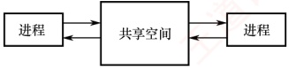

图2.3 共享存储


图2.4 消息传递

2）间接通信方式。通信双方不直接指定对方，而是通过一个中间实体（通常称为信箱）进行消息交换。发送进程将消息投递到信箱，接收进程从信箱中取出消息。

通俗地理解，甲要向乙传递信息，便写好一封信交给邮差。在直接通信中，邮差将信件直接交到乙本人手中；在间接通信中，乙家门口设有一个邮箱，邮差只需将信投入该邮箱，乙随后自行取阅。无论哪种方式，消息的投递均由邮差（操作系统内核）完成消息的可靠投递。

#### 3. 管道通信

### 考点追踪 管道通信的特点（2014）

管道通信是一种基于先进先出原则的进程间通信机制，常用于具有亲缘关系的进程（如父子进程）之间，以生产者-消费者模式进行数据交换（见图2.5）。从编程接口上看，管道（Pipe）表现为一种特殊的共享文件，支持标准的read()和write()

操作；但从实现上看，它并非存储在磁盘上的文件，而是由操作系统内核维护的一块固定大小的内存缓冲区。

为确保通信的正确性，管道机制必须提供三方面的协调能力：①互斥，指任一时刻只允许一个进程对管道进

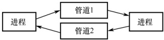

图 2.5 管道通信

行读或写操作，防止多个进程并发访问导致数据混乱；② 同步，指当管道满时，写进程自动阻塞，直到读进程取走部分数据；当管道空时，读进程自动阻塞，直到写进程向其中写入新数据；③ 写端关闭检测，当写端关闭后，读端 read() 返回 0，表明无数据可读。

在 Linux 系统中，管道是一种广泛使用的 IPC 机制。其主要特点包括：

1）固定缓冲区大小。管道使用内核中的环形缓冲区（如64KB），不会像普通文件那样无限制增长。当缓冲区满时，后续的write()调用将被阻塞，直到有足够空间可用。

2）自动阻塞与唤醒。若读进程的消费速度快于与进程，则管道中的数据会被迅速读空。此时，任何read()调用将被阻塞，等待写进程再次写入数据。

管道由父进程通过 pipe() 系统调用创建。由于子进程在创建时会继承父进程的文件描述符表，因此能够通过这些描述符访问同一管道，从而与父进程进行通信。

**注意**

从管道中读取数据是一次性操作，数据一旦被读出，其占用的缓冲区空间即被释放，供后续写入使用；普通管道仅支持单向通信，若需双向通信，则必须创建两个管道，分别用于两个方向的数据传输。

#### 4. 信号

信号（Signal）是一种用于通知进程某个事件已发生的机制。不同的系统事件对应不同的信号类型，每类信号对应一个序号。例如，Linux 内核实现了约 30 种信号，编号通常为 1～30。

在进程的 PCB 中，用一个 n 位向量（如 Linux 使用一个 32 位整型变量）记录该进程当前待处理的信号。当向某进程发送一个信号时，内核会将该信号对应的位置为 1；一旦该信号被成功处理，对应位即被清零。此外，PCB 中还维护另一个 n 位向量，用于记录被阻塞（屏蔽）的信号。当某一位为 1 时，表示对应的信号不会被立即处理，而是暂存起来，直到解除阻塞。

信号的发送主要有以下两种方式：

1）内核发送信号。当内核检测到特定的系统事件时，会向相关进程发送相应的信号。例如，若进程执行了非法指令，则内核将向其发送 SIGILL 信号（序号为 4）。

2）由进程发送信号。一个进程可以通过调用 kill() 函数，请求内核向指定进程（需提供目标进程的 PID 和信号序号）发送信号。当然，进程也可以向自身发送信号。

当操作系统从内核态返回用户态时（如系统调用结束），会检查当前进程是否存在未被阻塞的待处理信号。若存在，则立即处理其中一个信号（通常优先处理序号较小的信号）。

信号的处理方式有两种：

1）执行默认的信号处理程序。操作系统为每类信号预设了默认操作。例如，收到 SIGILL 信号的默认操作是终止进程。

2）执行进程自定义的信号处理程序。进程可以为某类信号定义自己的处理函数。例如，可定义收到 SIGILL 时输出 “hello world”， 而不是终止进程。

信号处理程序执行结束后，通常会返回到原程序被中断的位置，继续执行后续指令。

### 2.1.7 线程和多线程模型

#### 1. 线程的基本概念

引入进程的目的是使多道程序能够并发执行，从而提高资源利用率和系统吞吐量；而引入线程（Thread）则是为了进一步降低程序并发执行时的时空开销，提升操作系统的并发性能。
### 考点追踪 线程的特点（2019、2011、2024）

线程可被通俗地理解为“轻量级进程”，它是程序执行流的最小单元，也是处理器调度的基本单位。在多线程操作系统中，进程不再作为基本的执行实体，但仍保留与执行相关的状态。所谓进程处于“执行”状态，实际上是指该进程中的某个线程正在运行。线程的主要属性如下。

#### （1） 轻量级执行实体

线程本身不拥有独立的系统资源（如地址空间、打开的文件等），但拥有运行所必需的私有数据结构，包括线程ID、程序计数器、寄存器集合和栈。每个线程都具有唯一的标识符和一个线程控制块（TCB），用于记录其执行上下文（如寄存器状态、栈指针等）。

#### （2） 共享代码段

同一进程中的多个线程可并发执行相同的程序代码。例如，当多个用户同时访问一个 Web 服务器时，服务器进程可创建多个线程，各自服务不同的用户请求，显著提升并发能力。

#### （3） 资源共享

同一进程内的所有线程共享该进程的代码段、数据段、堆、文件描述符等系统资源。这种机制使得线程间的通信和数据共享非常高效，无须复杂的进程间通信（IPC）机制。

#### （4） 独立调度单位

线程是 CPU 调度和执行的基本单位。在单 CPU 系统中，多个线程通过时间片轮转等方式轮流使用 CPU；在多 CPU 系统中，不同线程可并行运行于多个 CPU 核心上。若多个核心同时执行同一进程的不同线程，则能显著缩短该进程的整体处理时间。

#### （5） 生命周期

线程从创建开始，经历就绪、运行、阻塞等状态变化，直至最终终止。

引入线程后，进程的内涵发生了重要变化：进程成为除 CPU 外的系统资源分配单位，而线程则成为 CPU 调度和执行的基本单位。当线程切换发生在同一进程内部时，由于地址空间等资源无须切换，其开销远小于进程切换。接下来，将从多个维度对线程与进程进行比较。

#### 2. 线程与进程的比较

### 考点追踪 进程和线程的比较（2012）

1）调度。在传统的操作系统中，进程既是资源拥有者，也是独立调度的基本单位，每次调度都需要进行完整的上下文切换，开销较大。引入线程后，线程成为独立调度的基本单位。在同一进程中，线程切换不会引起进程切换；但若从一个进程的线程切换到另一个进程的线程，则仍会触发进程切换。

2）并发性。在支持线程的操作系统中，并发性得到显著增强：不仅进程之间可以并发执行，同一进程内的多个线程也可以并发执行，甚至不同进程中的线程也能并发执行。这种多层次的并发机制有效提升了系统资源利用率和吞吐量。

3）拥有资源。进程是系统资源分配的基本单位；而线程不拥有独立的系统资源，但拥有运行所必需的私有数据结构。同一进程的所有线程共享该进程的地址空间及资源。

4）独立性。每个进程拥有完全独立的地址空间，默认情况下，其他进程无法直接访问其任何内存区域。相应的，一个进程中的线程对其他进程完全不可见。同一进程内的线程则因共享地址空间而紧密协作，旨在提升并发性能。

5）系统开销。创建或撤销进程时，系统需分配或回收PCB、地址空间、I/O资源等，开销显著；而创建或撤销线程仅需分配栈和少量内核对象，开销很小。类似地，进程切换涉及整个地址空间和资源上下文的切换，而线程切换只需保存和恢复寄存器状态。此外，由于同一进程内的线程共享地址空间，它们之间的同步与通信非常容易实现。
6）支持多处理器系统。对于单线程进程，尽管可以在不同时间被调度到任意CPU上运行，但在任一时刻只能在一个CPU上执行。而对于多线程进程，系统可将其中的多个线程同时调度到多个CPU上并行执行，从而真正发挥多核处理器的性能优势。

#### 3. 线程的状态与生命周期

由于线程之间共享资源，并存在同步与互斥等制约关系，其执行过程具有明显的间断性。相应地，线程在其生命周期中会经历以下三种基本状态：

运行态：线程已获得 CPU，正在执行。

就绪态：线程已具备所有运行条件，只需获得 CPU 即可立即执行。

阻塞态：线程因等待某一事件（如I/O完成、锁释放等）而暂时无法继续执行。

线程这三种基本状态之间的转换与进程基本状态之间的转换是类似的。

线程具有完整的生命周期：由创建而产生，经调度而执行，最终因终止而消亡。为支持这一过程，操作系统提供了相应的系统调用或库函数。

用户程序启动时，通常仅有一个初始线程在执行，其主要任务是创建其他线程。创建新线程时，需调用线程创建函数，并传入必要的参数，例如：指向线程主函数的入口地址、堆栈大小、调度优先级等。创建成功后，系统返回唯一的线程标识符，供后续操作使用。

操作系统的调度器根据线程的优先级和其他调度策略决定哪个线程获得 CPU 使用权。调度机制可选用多种方式。当线程被调度到 CPU 上时，它进入运行态，开始执行其主函数中的代码。在此期间，线程可能会与其他线程进行同步或互斥操作，以确保数据一致性。

线程终止的原因可能有多种。例如，线程正常执行完其主函数；在运行过程中发生未处理的异常而被迫退出；主动调用线程终止函数；或被其他线程通过取消机制强制终止。在大多数操作系统中，线程终止后并不会立即释放其所占用的资源。只有当进程中的其他线程执行了相应的分离操作后，被终止的线程才会与资源分离，其资源才能被系统回收并供其他线程使用。

已被终止但尚未释放资源的线程仍可被其他线程调用，以使其重新恢复运行。

#### 4. 线程控制块

### 考点追踪 线程的私有资源（2024）

与进程类似，操作系统为每个线程维护一个线程控制块（Thread Control Block, TCB），用于记录和管理线程的运行信息。TCB通常包含以下内容：①线程标识符（Thread ID）；②寄存器集合，包括程序计数器、状态寄存器和通用寄存器；③线程当前状态，用于描述线程正处于何种状态；④调度优先级；⑤线程局部存储区，用于保存线程私有的数据；⑥堆栈指针，指向该线程的私有栈，用于过程调用时保存局部变量、返回地址等。

同一进程中的所有线程共享该进程的地址空间和全局变量。每个线程拥有独立的私有栈，这些栈位于进程的地址空间内，因此从技术上讲，一个线程可以访问另一个线程的栈内容。然而，这种做法严重违反编程规范，会破坏线程封装性和程序正确性，实际开发中应严格避免。

#### 5. 线程的实现方式

### 考点追踪 两种线程的特点与比较（2019）

线程的实现可以分为两类：用户级线程（User-Level Thread，ULT）和内核级线程（Kernel-Level Thread，KLT）。其中，内核级线程也称为内核支持的线程。

#### （1） 用户级线程（ULT）

通俗地说，用户级线程是指“从用户视角看到的线程”。在该模型中，所有线程管理工作（包
括创建、切换、撤销等）均由应用程序在用户空间（用户态）完成，无须操作系统介入。正因如此，操作系统内核完全感知不到这些线程的存在。应用程序只需引入线程库，即可被开发为多线程程序。通常，用户程序启动时仅包含一个初始线程；在执行过程中，该线程可在任意时刻调用线程库提供的创建函数，在同一进程中派生出新的线程。图2.6(a)展示了用户级线程的实现方式。

对于采用用户级线程的系统，调度仍以进程为单位进行。调度器只能感知到进程，无法察觉进程内部的多个用户级线程，因此它仅为整个进程分配一个时间片。例如，假设系统采用时间片轮转调度，每个进程每次获得100 ms的CPU时间。若进程A仅包含1个用户级线程，则当该进程获得时间片时，其唯一的线程可独占全部100 ms的CPU时间；而若进程B包含100个用户级线程，则这100 ms必须在其内部的100个线程之间分配。倘若进程B内部采用简单的轮转调度，那么每个线程平均仅能获得1 ms的CPU时间。由此可见，进程A中的线程所获得的CPU时间是进程B中各线程的100倍。这种差异导致在多线程密集型任务中，不同进程间的线程实际执行效率极不均衡，从而在系统层面体现出明显的调度不公平性。

这种实现方式的优点：①线程切换在用户空间完成，无须切换到内核态，避免了模式切换的开销。②调度策略可由应用程序定制，不同进程可根据自身需求采用不同的线程调度算法。③用户级线程的实现与操作系统无关，线程管理代码属于用户程序的一部分，具有良好的可移植性。

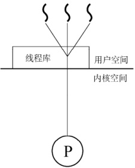

(a) 用户级方式

用户级线程

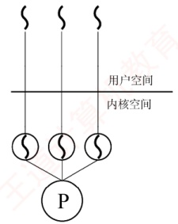

(b) 内核级方式

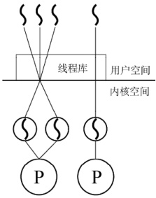

(c) 组合方式

图2.6 用户级线程和内核级线程

其缺点在于：①系统调用的阻塞问题，当某个用户级线程执行一个阻塞型系统调用时，整个进程会被内核挂起，导致进程中的所有线程均被阻塞。②无法发挥多处理器的并行优势，由于内核仅将该进程调度到一个CPU上执行，即使系统配备了多个CPU核心，同一进程中的多个用户级线程也无法同时在不同CPU上并行运行，只能在单个CPU上交替执行。

#### （2） 内核级线程（KLT）

在操作系统中，无论是系统进程还是用户进程，都依赖内核的支持运行。内核级线程的管理完全由操作系统内核负责，所有线程相关的操作均在内核空间（内核态）完成。操作系统为每个内核级线程维护一个线程控制块（TCB），内核通过该TCB感知线程的存在并对其进行控制。图2.6(b)展示了内核级线程的实现方式。

这种实现方式的优点：①能发挥多处理器的并行优势，内核可将同一进程中的多个线程同时调度到不同CPU核心上并行执行。②阻塞处理更灵活，若进程中的某个线程因系统调用被阻
塞，内核仍可调度该进程中的其他线程运行，或切换到其他进程的线程继续执行。③ 内核自身可采用多线程技术，从而提升系统服务的并发性和整体效率。

其缺点在于：线程切换需从用户态陷入内核态。由于线程在用户态运行，而调度由内核完成，每次切换都涉及模式转换和上下文保存/恢复，系统开销较大。

#### （3） 组合方式

某些系统采用组合方式（混合模型）实现多线程。在该模型中，内核支持多个内核级线程的创建与调度，同时允许用户程序在用户空间管理多个用户级线程。这种方式能结合两种模型的优点，并克服各自的不足：多个线程可在多 CPU 上并行执行；单个线程阻塞不会导致整个进程挂起；用户级线程切换可在用户空间快速完成，减少内核介入。图 2.6(c) 展示了这种组合实现方式。根据用户级线程与内核级线程之间的映射关系不同，形成了以下三种典型的多线程模型：

1）多对一模型。将多个用户级线程映射到一个内核级线程，如图2.7(a)所示。线程的调度和管理在用户空间完成。每个进程仅拥有一个内核级线程，仅当用户线程需要访问内核时，才将其映射到一个内核级线程上，但每次只允许一个线程进行映射。

优点：线程管理在用户空间进行，无须切换到内核态，因此线程切换的效率较高。

缺点：当任一用户级线程执行阻塞型系统调用时，整个进程都会被内核挂起；在任何时刻最多只能有一个线程与内核交互，无法在多处理器系统中实现并行执行。

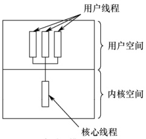

(a) 多对一模型

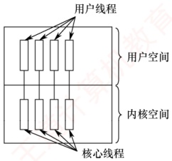

(b) 一对一模型

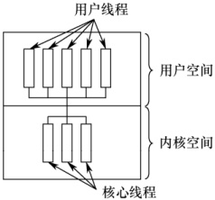

图2.7 多线程模型

(c) 多对多模型

2）一对一模型。将每个用户级线程映射到一个独立的内核级线程，如图2.7(b)所示。进程中

的用户级线程与内核级线程一一对应，线程的调度由内核完成，需要切换到内核态。优点：当某个线程被阻塞时，内核可调度同一进程中的其他线程运行，支持真正的并发执行，且可在多CPU系统上并行运行。

缺点：每创建一个用户线程，系统就必须创建一个对应的内核线程，导致较大的系统开销（如内核TCB占用内存、调度负担增加），限制了系统可支持的最大线程数。

3）多对多模型。将 n 个用户级线程映射到 m 个内核级线程，要求  $n \geq m$，如图 2.7(c) 所示。

用户级线程由应用程序在用户空间调度，而内核级线程由内核调度到多个CPU上执行。特点：既克服了多对一模型并发度低的缺陷，又避免了一对一模型资源开销过大的问题。同时兼具两者优点：用户级线程切换高效，且支持多核并行与阻塞隔离。

#### （4）线程库（thread library）的实现

程序员通常通过线程库提供的 API 来创建和管理线程。线程库的实现主要有两种方式：

① 纯用户空间实现：线程库完全位于用户空间，所有代码和数据结构均在用户态。调用库函数仅触发本地过程调用，无须陷入内核。此类实现对应用户级线程模型。

② 内核支持实现：线程库的底层依赖操作系统内核。库中的 API 调用通常会触发系统调用，
由内核完成实际的线程操作。此类实现对应内核级线程模型。

目前广泛使用的三种主流线程库包括：POSIX Pthreads、Windows 线程 API 和 Java 线程 API。Pthreads 是 POSIX 标准定义的线程 API，其具体实现可基于用户级或内核级线程。Windows 线程 API 直接构建于 Windows 内核之上，属于内核级线程实现。Java 线程 API 允许在 Java 程序中直接创建线程。由于 JVM 运行于宿主操作系统之上，Java 线程通常通过调用宿主系统的线程库实现，因此在 Windows 上使用 Windows API，在类 UNIX 系统上则使用 Pthreads。

### 2.1.8 本节小结

本节开头提出的问题的参考答案如下。

1 ）为什么要引入进程？

在多道程序环境下，多个程序并发执行并共享系统资源，导致运行过程中相互制约，表现出间断性、异步性和不可预测性。然而，传统的“程序”仅是一组静态的指令集合，无法反映其在内存中的动态执行行为。例如，无法体现程序何时开始、何时暂停、如何与其他程序交互等。为了准确刻画程序并发执行的动态特性，并为操作系统提供有效的管理机制，进程这一概念被引入。进程是程序并发执行的基本单位，也是操作系统进行资源分配和调度的实体。

2 ）什么是进程？进程由什么组成？

进程是一个具有独立功能的程序在其特定数据集上的一次执行过程。它是一个动态的、活动的实体，不仅包含程序代码，还包含当前的执行状态（如程序计数器的值、处理器寄存器的内容等）。一个进程实体由程序段、相关数据段和PCB三部分构成。其中，PCB是进程存在的唯一标志，操作系统通过PCB感知并控制进程的整个生命周期。

3 ）引入进程主要解决了多道程序并发执行中的哪些关键问题？

引入进程有效解决了多道程序并发执行带来的三大问题：① 失去封闭性：在缺乏进程机制的环境中，程序执行易受其他程序干扰（如共享内存被修改），导致行为不可控；进程通过地址空间隔离，为每个程序提供独立、受保护的执行环境，从而恢复一定程度的封闭性。② 执行过程的间断性：程序可能因 I/O 请求、时间片用尽或调度决策而被中断；进程利用 PCB 保存和恢复执行上下文，确保中断后能准确、连续地继续执行。③ 结果不可再现性：在并发环境下，相同输入可能因执行顺序不确定而产生不同输出；进程的隔离机制与操作系统的调度策略共同保障了执行的可控性与结果的可再现性。通过为每个程序建立独立的进程实体，操作系统得以高效实现调度、切换、资源分配与保护，显著提升系统资源利用率和并发处理能力。

本节主要围绕“什么是进程”展开阐述，旨在为后续内容奠定概念基础。然而，对于尚未接触过操作系统相关知识的读者而言，“进程”作为一个抽象的动态实体，可能仍显得模糊不清。为了帮助大家更直观地把握其本质，我们引入一个贴近生活的类比。

我们可以将进程类比为“人的生命历程”。首先，人的生命历程是一个动态的、过程性的存在，而非静态的描述；同样，进程也不是一段固定的程序代码，而是一次正在执行的活动。要研究生命历程，必须先明确其主体“人”；对应地，进程的主体是进程映像，它由程序段、数据段和PCB组成。其中，PCB就如同人的“身份标识”，记录了该进程的唯一身份与当前状态。人在一生中会经历多种状态：出生、成长、奋斗、受挫、康复、衰老乃至离世；类似地，进程在其生命周期中也会在创建、就绪、运行、阻塞、终止等状态之间转换。例如，一个人从“充满斗志”（就绪）进入“发奋图强”（运行）；若遭遇挫折，可能陷入“失落”（阻塞）；在他人鼓励下，又可重新“充满斗志”（回到就绪）。这正对应于进程从就绪态转换为运行态，因等待事件而进入阻塞态，待事件发生后再次返回就绪态的典型状态迁移。通过“人生历程”这一过程性视角来
理解进程，有助于我们超越对“程序=进程”的误解，真正把握进程作为动态执行实体的核心特征。当然，任何类比都有其局限性。上述比喻虽有助于建立直觉，但不能替代严谨的技术定义。因此，建议读者在借助类比形成初步理解后，回过头来重新阅读本节前文的正式阐述。这种“感性认知→理性回归”的学习路径，往往能带来更深刻、更准确的理解。

这里再给出一些学习计算机科学的建议。许多同学在学习过程中容易陷入一个误区：过于关注定理和公式的应用，而忽视了对基础概念的理解。这一倾向往往源于长期应试训练，毕竟熟练套用公式和定理在考试中见效快、收益明显。然而，公式和定理的应用固然重要，唯有深入理解基础概念，才能真正透彻地掌握一门学科，进而激发兴趣，培养创造性思维。

### 2.1.9 本节习题精选

#### 一、 单项选择题

##### 01

一个进程映像是（）。

A. 由协处理器执行的一个程序

B. 一个独立的程序 + 数据集

C. PCB 结构与程序和数据的组合

D. 一个独立的程序

##### 02

进程之间交换数据不能通过（）途径进行。

A. 共享文件

B. 消息传递

C. 访问进程地址空间

D. 访问共享存储区

##### 03

进程与程序的根本区别是（）。

A. 静态和动态特点

B. 是不是被调入内存

C. 是不是具有就绪、运行和等待三种状态

D. 是不是占有处理器

##### 04

下列关于进程的描述中，最不符合操作系统对进程的理解的是（）。

A. 进程是在多程序环境中的完整程序

B. 进程可以由程序、数据和PCB描述

C. 线程（Thread）是一种特殊的进程

D. 进程是程序在一个数据集合上的运行过程，它是系统进行资源分配和调度的一个独立单元

##### 05

下列关于并发进程特性的叙述中，正确的是（）。

A. 进程是一个动态过程，其生命周期是连续的

B. 并发进程执行完毕后，一定能够得到相同的结果

C. 并发进程对共享变量的操作结果与执行速度无关

D. 并发进程的运行结果具有不可再现性

##### 06

下列关于进程的叙述中，正确的是（）。

A. 进程获得处理器运行是通过调度得到的

B. 优先级是进程调度的重要依据，一旦确定就不能改动

C. 在单处理器系统中，任何时刻都只有一个进程处于运行态

D. 进程申请处理器而得不到满足时，其状态变为阻塞态

##### 07

并发进程执行的相对速度是（）。

A. 由进程的程序结构决定的

B. 由进程自己来控制的

C. 与进程调度策略有关

D. 在进程被创建时确定的

##### 08

下列任务中，（）不是由进程创建原语完成的。

A. 申请 PCB 并初始化 B. 为进程分配内存空间
C. 为进程分配 CPU

D. 将进程插入就绪队列

##### 09

下列关于进程和程序的叙述中，错误的是（）。

A. 一个进程在其生命周期中可执行多个程序

B. 一个进程在同一时刻可执行多个程序

C. 一个程序的多次运行可形成多个不同的进程

D. 一个程序的一次执行可产生多个进程

##### 10

下列选项中，导致创建新进程的操作是（）。

Ⅰ. 用户登录

Ⅱ. 高级调度发生时

Ⅲ. 操作系统响应用户提出的请求

Ⅳ. 用户打开了一个浏览器程序

A. 仅Ⅰ和Ⅳ B. 仅Ⅱ和Ⅳ C. Ⅰ、Ⅱ和Ⅳ D. 全部

##### 11

操作系统是根据（）来对并发执行的进程进行控制和管理的。

A. 进程的基本状态 B. 进程控制块 C. 多道程序设计 D. 进程的优先权

##### 12

在任何时刻，一个进程的状态变化（）引起另一个进程的状态变化。

A. 必定 B. 一定不 C. 不一定 D. 不可能

##### 13

在单处理器系统中，若同时存在10个进程，则处于就绪队列中的进程最多有（ ）个。

A. 1

B. 8

C. 9

D. 10

##### 14

一个进程释放了一台打印机，它可能改变（）的状态。

A. 自身进程

B. 输入/输出进程

C. 另一个等待打印机的进程

D. 所有等待打印机的进程

##### 15

系统进程所请求的一次 I/O 操作完成后，将使进程状态从（）。

A. 运行态变为就绪态

B. 运行态变为阻塞态

C. 就绪态变为运行态

D. 阻塞态变为就绪态

##### 16

一个进程的基本状态可以从其他两种基本状态转变过去，这个基本的状态一定是（）。

A. 运行态 B. 阻塞态 C. 就绪态 D. 终止态

##### 17

在分时系统中，通常处于（）的进程最多。

A. 运行态 B. 就绪态 C. 阻塞态 D. 终止态

##### 18

并发进程失去封闭性，是指（）。

A. 多个相对独立的进程以各自的速度向前推进

B. 并发进程的执行结果与速度无关

C. 并发进程执行时，在不同时刻发生的错误

D. 并发进程共享变量，其执行结果与速度有关

##### 19

通常用户进程被建立后，( )。

A. 便一直存在于系统中，直到被操作人员撤销

B. 随着进程运行的正常或不正常结束而撤销

C. 随着时间片轮转而撤销与建立

D. 随着进程的阻塞或者唤醒而撤销与建立

##### 20

进程在处理器上执行时，（）。

A. 进程之间是无关的，具有封闭特性

B. 进程之间都有交互性，相互依赖、相互制约，具有并发性

C. 具有并发性，即同时执行的特性

D. 进程之间可能是无关的，但也可能是有交互性的
##### 21

下列关于父进程和子进程的叙述中，正确的是（）。

A. 为了标志父子关系，可让子进程和父进程拥有相同的 PID

B. 父进程和子进程是相互独立的，可以并发执行

C. 撤销子进程时，一定会同时撤销父进程

D. 父进程创建了子进程，要等父进程执行完后，子进程才能执行

##### 22

若一个进程实体由 PCB、共享正文段、数据堆段和数据栈段组成，请指出下列 C 语言程序中的内容及相关数据结构各位于哪一段中。

I. 全局赋值变量（）

II. 未赋值的局部变量（）

III. 函数调用实参传递值（）

IV. 用  $malloc()$ 要求动态分配的存储区（）

V. 常量值（如 1995、“string”）（）

VI. 进程的优先级（）

A. PCB B. 正文段 C. 堆段 D. 栈段

##### 23

同一程序经过多次创建，运行在不同的数据集上，形成了（）的进程。

A. 不同 B. 相同 C. 同步 D. 互斥

##### 24

PCB 是进程存在的唯一标志，下列（）不属于 PCB。

A. 进程 ID B. CPU 状态 C. 堆栈指针 D. 全局变量

##### 25

一个计算机系统中，进程的最大数量主要受到___限制。

A. 内存大小 B. 用户数目 C. 打开的文件数 D. 外部设备数量

##### 26

进程创建完成后会进入一个序列，这个序列称为（）。

A. 阻塞队列 B. 挂起序列 C. 就绪队列 D. 运行队列

##### 27

进程自身决定（）。

A. 从运行态到阻塞态

B. 从运行态到就绪态

C. 从就绪态到运行态

D. 从阻塞态到就绪态

##### 28

下列关于原语操作的叙述中，错误的是（）。

A. 操作系统使用原语对进程进行管理和控制

B. 原语在执行过程中不允许被中断

C. 原语在内核态下执行，常驻内存

D. 原语被定义为“原子操作”，意思是其执行速度非常快

##### 29

下列进程间通信方式中，数据传输速度最快的是（）。

A. 消息传递 B. 信号量 C. 共享内存 D. 管道

##### 30

信箱通信是一种（）通信方式。

A. 直接通信 B. 间接通信 C. 低级通信 D. 信号量

##### 31

下列关于信号发送和处理的描述中，错误的是（）。

A. 一个进程可以给自己发送信号

B. 操作系统的内核可以给进程发送信号

C. 操作系统的内核对每种信号都有默认处理程序

D. 用户可以对每种信号自定义处理函数

##### 32

下列关于信号的处理的描述中，错误的是（）。

A. 当进程从内核态转换为用户态时，会检查是否有待处理的信号

B. 当进程从用户态转换为内核态时，也会检查是否有待处理的信号

C. 操作系统对某些信号的处理是可以忽略的

D. 操作系统允许进程通过系统调用，自定义某些信号的处理程序
##### 33

下面的叙述中，正确的是（）。

A. 引入线程后，处理器只能在线程间切换

B. 引入线程后，处理器仍在进程间切换

C. 线程的切换，不会引起进程的切换

D. 线程的切换，可能引起进程的切换

##### 34

下列关于线程的叙述中，正确的是（）。

A. 线程包含CPU现场，可以独立执行程序

B. 每个线程都有自己独立的地址空间

C. 每个进程只能包含一个线程

D. 同一进程中的线程间通信也必须使用系统调用函数

##### 35

下面的叙述中，正确的是（）。

A. 线程是比进程更小的能独立运行的基本单位，可以脱离进程独立运行

B. 引入线程可提高程序并发执行的程度，可进一步提高系统效率

C. 线程的引入增加了程序执行时的时空开销

D. 一个进程一定包含多个线程

##### 36

下面的叙述中，正确的是（）。

A. 同一进程内的线程可并发执行，不同进程的线程只能串行执行

B. 同一进程内的线程只能串行执行，不同进程的线程可并发执行

C. 同一进程或不同进程内的线程都只能串行执行

D. 同一进程或不同进程内的线程都可以并发执行

##### 37

下列选项中，（）不是线程的优点。

A. 提高系统并发性 B. 节约系统资源

C. 切换开销小 D. 增强进程安全性

##### 38

下列关于进程和线程的说法中，正确的是（）。

A. 一个进程可以包含一个或多个线程，一个线程可以属于一个或多个进程

B. 多线程技术具有明显的优越性，如速度快、通信简便、设备并行性高等

C. 由于线程不作为资源分配单位，线程之间可以无约束地并行执行

D. 线程也称轻量级进程，因为线程都比进程小

##### 39

在下列描述中，（）并不是多线程系统的特长。

A. 利用线程并行地执行矩阵乘法运算

B. Web 服务器利用线程响应 HTTP 请求

C. 键盘驱动程序为每个正在运行的应用配备一个线程，用以响应该应用的键盘输入

D. 基于 GUI 的调试程序用不同的线程分别处理用户输入、计算和跟踪等操作

##### 40

在进程转换时，下列（）转换是不可能发生的。

A. 就绪态→运行态

B. 运行态→就绪态

C. 运行态→阻塞态

D. 阻塞态→运行态

##### 41

当（）时，进程从执行状态转换为就绪态。

A. 进程被调度程序选中

B. 时间片到时

C. 等待某一事件

D. 等待的事件发生

##### 42

两个合作进程（Cooperating Processes）无法利用（）交换数据。

A. 文件系统 B. 共享内存
C. 高级语言程序设计中的全局变量 D. 消息传递系统

##### 43

以下可能导致一个进程从运行态变为就绪态的事件是()。

A. 一次 I/O 操作结束

B. 运行进程需做 I/O 操作

C. 运行进程结束

D. 出现了比现在进程优先级更高的进程

##### 44

（）必会引起进程切换。

A. 一个进程创建后，进入就绪态

B. 一个进程从运行态变为就绪态

C. 一个进程从阻塞态变为就绪态

D. 以上答案都不对

##### 45

进程处于（ ）时，它处于非阻塞态。

A. 等待从键盘输入数据

B. 等待协作进程的一个信号

C. 等待操作系统分配 CPU 时间

D. 等待网络数据进入内存

##### 46

一个进程被唤醒，意味着（）。

A. 该进程可以重新竞争 CPU

B. 优先级变大

C. PCB 移动到就绪队列之首

D. 进程变为运行态

##### 47

进程创建时，不需要做的是（）。

A. 填写一个该进程的进程表项

B. 分配该进程适当的内存

C. 将该进程插入就绪队列

D. 为该进程分配 CPU

##### 48

下面关于用户级线程和内核级线程的描述中，错误的是（）。

A. 采用轮转调度算法，进程中设置内核级线程和用户级线程的效果完全不同

B. 跨进程的用户级线程调度也不需要内核参与，控制简单

C. 用户级线程可以在任何操作系统中运行

D. 若系统中只有用户级线程，则 CPU 的调度对象是进程

##### 49

在内核级线程相对于用户级线程的优点的如下描述中，错误的是（）

A. 同一进程内的线程切换，系统开销小

B. 当内核线程阻塞时，同一进程中的其他内核级线程仍可被调度

C. 内核级线程的程序实体可以在内核态运行

D. 对多处理器系统，核心可以同时调度同一进程的多个线程并行运行

##### 50

下列关于用户级线程相对于内核级线程的优点的描述中，错误的是（）

A. 一个线程阻塞不影响另一个线程的运行

B. 线程的调度不需要内核直接参与，控制简单

C. 线程切换代价小

D. 允许每个进程定制自己的调度算法，线程管理比较灵活

##### 51

下列关于用户级线程的优点的描述中，不正确的是（）。

A. 线程切换不需要切换到内核态

B. 支持不同的应用程序采用不同的调度算法

C. 在不同操作系统上不经修改就可直接运行

D. 同一个进程内的多个线程可以同时调度到多个处理器

##### 52

下列选项中，可能导致用户级线程切换的事件是（）。

A. 系统调用 B. I/O 请求 C. 异常处理 D. 线程同步

##### 53

下列关于用户级线程的描述中，错误的是（）。

A. 用户级线程由线程库进行管理

B. 用户级线程只有在创建和调度时需要内核的干预
C. 操作系统无法直接调度用户级线程

D. 线程库中线程的切换不会导致进程切换

##### 54

下面的说法中，正确的是（）。

A. 不论是系统支持的线程还是用户级线程，其切换都需要内核的支持

B. 线程是资源分配的单位，进程是调度和分派的单位

C. 不管系统中是否有线程，进程都是拥有资源的独立单位

D. 在引入线程的系统中，进程仍是资源调度和分派的基本单位

##### 55

在多对一的线程模型中，当一个多线程进程中的某个线程被阻塞后，（）。

A. 该进程的其他线程仍可继续运行

B. 整个进程都将阻塞

C. 该阻塞线程将被撤销

D. 该阻塞线程将永远不可能再执行

##### 56

并发性较好的多线程模型有（）。

Ⅰ. 一对一模型 Ⅱ. 多对一模型 Ⅲ. 多对多模型

A. 仅 I B. I 和 II C. I 和 III D. I、II 和 III

##### 57

下列关于多对一模型的叙述中，错误的是（）。

A. 一个进程的多个线程不能并行运行在多个处理器上

B. 进程中的用户级线程由进程自己管理

C. 线程切换会导致进程切换

D. 一个线程的系统调用会导致整个进程阻塞

##### 58

【2010 统考真题】下列选项中，导致创建新进程的操作是（）。

Ⅰ. 用户登录成功 Ⅱ. 设备分配 Ⅲ. 启动程序执行

A. 仅 I 和 II B. 仅 II 和 III C. 仅 I 和 III D. I、II、III

##### 59

【2011 统考真题】在支持多线程的系统中，进程 P 创建的若干线程不能共享的是（）。

A. 进程 P 的代码段

B. 进程 P 中打开的文件

C. 进程 P 的全局变量

D. 进程 P 中某线程的栈指针

##### 60

【2012 统考真题】下列关于进程和线程的叙述中，正确的是（）。

A. 不管系统是否支持线程，进程都是资源分配的基本单位

B. 线程是资源分配的基本单位，进程是调度的基本单位

C. 系统级线程和用户级线程的切换都需要内核的支持

D. 同一进程中的各个线程拥有各自不同的地址空间

##### 61

【2014 统考真题】一个进程的读磁盘操作完成后，操作系统针对该进程必做的是（）。

A. 修改进程状态为就绪态

B. 降低进程优先级

C. 给进程分配用户内存空间

D. 增加进程时间片大小

##### 62

【2014 统考真题】下列关于管道（Pipe）通信的叙述中，正确的是（）。

A. 一个管道可实现双向数据传输

B. 管道的容量仅受磁盘容量大小限制

C. 进程对管道进行读操作和写操作都可能被阻塞

D. 一个管道只能有一个读进程或一个写进程对其操作

##### 63

【2015 统考真题】下列选项中，会导致进程从运行态变为就绪态的事件是（）。

A. 执行 P(wait) 操作

B. 申请内存失败

C. 启动 I/O 设备

D. 被高优先级进程抢占
##### 64

【2018 统考真题】下列选项中，可能导致当前进程 P 阻塞的事件是（）。

I. 进程 P 申请临界资源

II. 进程 P 从磁盘读数据

III. 系统将 CPU 分配给高优先权的进程

A. 仅 I B. 仅 II C. 仅 I、II D. I、II、III

##### 65

【2019 统考真题】下列选项中，可能将进程唤醒的事件是（）。

I. I/O 结束          II. 某进程退出临界区   III. 当前进程的时间片用完

A. 仅 I              B. 仅 III              C. 仅 I、II              D. I、II、III

##### 66

【2019 统考真题】下列关于线程的描述中，错误的是（）。

A. 内核级线程的调度由操作系统完成

B. 操作系统为每个用户级线程建立一个线程控制块

C. 用户级线程间的切换比内核级线程间的切换效率高

D. 用户级线程可以在不支持内核级线程的操作系统上实现

##### 67

【2020 统考真题】下列关于父进程与子进程的叙述中，错误的是（）。

A. 父进程与子进程可以并发执行

B. 父进程与子进程共享虚拟地址空间

C. 父进程与子进程有不同的进程控制块

D. 父进程与子进程不能同时使用同一临界资源

##### 68

【2021 统考真题】下列操作中，操作系统在创建新进程时，必须完成的是（）。

Ⅰ. 申请空白的进程控制块 Ⅱ. 初始化进程控制块 Ⅲ. 设置进程状态为运行态

A. 仅 I B. 仅 I、II C. 仅 I、III D. 仅 II、III

##### 69

【2022 统考真题】下列事件或操作中，可能导致进程 P 由运行态变为阻塞态的是（）。

I. 进程 P 读文件

II. 进程 P 的时间片用完

III. 进程 P 申请外设

IV. 进程 P 执行信号量的 wait() 操作

A. 仅 I、IV B. 仅 II、III C. 仅 III、IV D. 仅 I、III、IV

##### 70

【2023 统考真题】下列操作完成时，导致 CPU 从内核态转换为用户态的是（）。

A. 阻塞进程 B. 执行 CPU 调度 C. 唤醒进程 D. 执行系统调用

##### 71

【2023 统考真题】下列由当前线程引起的事件或执行的操作中，可能导致该线程由运行态变为就绪态的是（）。

A. 键盘输入

B. 缺页异常

C. 主动出让 CPU

D. 执行信号量的 wait() 操作

##### 72

【2024 统考真题】下列选项中，操作系统在终止进程时不一定执行的是（）。

A. 终止子进程

B. 回收进程占用的设备

C. 释放进程控制块

D. 回收为进程分配的内存

##### 73

【2024 统考真题】若进程 P 中的线程 T 先打开文件，得到文件描述符 fd，再创建两个线程 Ta 和 Tb，则在下列资源中，Ta 与 Tb 可共享的是（）。

Ⅰ. 进程 P 的地址空间

Ⅱ. 线程 T 的栈

Ⅲ. 文件描述符 fd

A. 仅 I

B. 仅 I、III

C. 仅 II、III

D. I、II、III

#### 二、 综合应用题

##### 01

【2025 统考真题】某系统中进程的虚拟地址空间包括内核区、用户栈、运行时堆、可读/
写数据段、只读代码段等区域，其布局如下图所示，图中阴影部分表示未占用区域。现有C语言程序的部分代码如下。

```c
char *ptr;
void main()
{
    int length;
    ptr = (char *)malloc(100);
    scanf("%s", ptr);
    length = strlen(ptr);
    printf("length = %d\\n", length);
    free(ptr);
}
```

请回答下列问题。

1）上述程序执行时，其进程控制块位于哪个区域？执行 scanf()等待键盘输入时，该进程处于什么状态？

2）main()函数的代码位于哪个区域？其直接调用的哪些函数的功能需通过执行驱动程序实现？

3）变量 ptr 被分配在哪个区域？若变量 length 未被分配在寄存器中，则会被分配在哪个区域？ptr 指向的字符串位于哪个区域？

### 2.1.10 答案与解析

#### 一、 单项选择题

##### 01

C

进程映像是 PCB、程序段和数据的组合，其中 PCB 是进程存在的唯一标志。

##### 02

C

每个进程包含独立的地址空间，进程各自的地址空间是私有的，只能执行自己地址空间中的程序，且只能访问自己地址空间中的数据，相互访问会导致指针的越界错误（学完内存管理将有更好的认识）。因此，进程之间不能直接交换数据，但可利用操作系统提供的共享文件、消息传递、共享存储区等进行通信。

##### 03

A

动态性是进程最重要的特性，以此来区分文件形式的静态程序。操作系统引入进程的概念，是为了从变化的角度动态地分析和研究程序的执行。

##### 04

A

进程是一个独立的运行单位，也是操作系统进行资源分配和调度的基本单位，它包括 PCB、程序和数据以及执行栈区，仅仅说进程是在多程序环境下的完整程序是不合适的，因为程序是静态的，它以文件形式存放在计算机的硬盘内，而进程是动态的。

##### 05

D

并发进程可能因等待资源或因被抢占 CPU 而暂停运行，其生命周期是不连续的。执行速度会影响进程之间的执行顺序和内存冲突问题，从而导致不同的操作结果。并发进程之间存在相互竞争和制约，导致每次运行可能得到不同的结果，选项 D 正确。

##### 06

A

选项 B 错在优先级分静态和动态两种，动态优先级是根据运行情况而随时调整的。选项 C
错在系统发生死锁时有可能进程全部都处于阻塞态，CPU空闲。选项D 错在进程申请处理器得不到满足时就处于就绪态，等待处理器的调度。

##### 07

C

并发进程执行的相对速度与进程调度策略有关，因为进程调度策略决定了哪些进程可以获得处理机，以及获得处理机的时间长短，从而影响进程执行的速度和效率。

##### 08

C

进程创建原语的执行过程：申请空白 PCB，并为新进程申请唯一的数字标识符。为新进程分配资源，包括内存、I/O 设备等。初始化 PCB，将新进程插入就绪队列。从上述过程可以看出，为进程分配 CPU 不是由进程创建原语完成的，而是由进程调度实现的。

##### 09

B

一个进程可以顺序地执行一个或多个程序，只要在执行过程中改变其 CPU 状态和内存空间即可，但不能同时执行多个程序，选项 B 错误，选项 A 正确。一个程序可以对应多个进程，即多个进程可以执行同一个程序。例如，同一个文本编辑器可以被多个用户或多个窗口同时运行，每次运行都形成一个新进程。一个程序在执行过程中也可产生多个进程。例如，一个程序可以通过系统调用 fork() 或 create() 来创建子进程，从而实现并发处理或分布式计算。选项 C 和 D 正确。

##### 10

D

##### 11

B

用户登录时，操作系统会为用户创建一个登录进程，用于验证用户身份和提供用户界面。高级调度即作业调度，会从后备队列上选择一个作业调入内存，并为之创建相应的进程。操作系统响应用户提出的请求时，通常会为用户创建一个子进程，用于执行用户指定的任务或程序。用户打开一个浏览器程序时，也是一种操作系统响应用户请求的情况，同样会创建一个新进程。

在进程的整个生命周期中，系统总是通过其PCB对进程进行控制。也就是说，系统是根据进程的PCB而非任何其他因素来感知到进程存在的，PCB是进程存在的唯一标志。同时PCB常驻内存。A和D选项的内容都包含在进程PCB中。

##### 12

C

一个进程的状态变化可能引起另一个进程的状态变化。例如，一个进程时间片用完，可能引起另一个就绪进程的运行。同时，一个进程的状态变化也可能不会引起另一个进程的状态变化。例如，一个进程由阻塞态转换为就绪态就不会引起其他进程的状态变化。

##### 13

C

在单处理器系统中，不可能出现10个进程都处于就绪态的情况。但9个进程处于就绪态、1个进程处于运行态是可能的。此外还要想到，可能10个进程都处于阻塞态。

##### 14

C

由于打印机是独占资源，当一个进程释放打印机后，另一个等待打印机的进程就可能从阻塞态转到就绪态。当然，也存在一个进程执行完毕后由运行态转换为终止态时释放打印机的情况，但这并不是由于释放打印机引起的，相反是因为运行完成才释放了打印机。

##### 15

D

I/O 操作完成之前进程在等待结果，状态为阻塞态；完成后进程等待事件就绪，变为就绪态。

##### 16

C

只有就绪态可以既由运行态转变过去又能由阻塞态转变过去。时间片到时，运行态变为就绪态；当所需要资源到达时，进程由阻塞态转换为就绪态。

##### 17

B

分时系统中处于就绪态的进程最多，这些进程都在争夺CPU的使用权，而CPU的数量是有
限的。处于运行态的进程只能有一个或少数几个。处于阻塞态的进程也不会太多，阻塞事件的发生频率不会太高。处于终止态的进程也不多，这些进程已释放资源，不再占用内存空间。

##### 18

D

程序封闭性是指进程执行的结果只取决于进程本身，不受外界影响。也就是说，进程在执行过程中不管是不停顿地执行，还是走走停停，进程的执行速度都不会改变它的执行结果。失去封闭性后，不同速度下的执行结果不同。

##### 19

B

进程有它的生命周期，不会一直存在于系统中，也不一定需要用户显式地撤销。进程在时间片结束时只是就绪，而不是撤销。阻塞和唤醒是进程生存期的中间状态。进程可在完成时撤销，或在出现内存错误等时撤销。

##### 20

D

选项 A 和 B 都说得太绝对，进程之间可能具有相关性，也可能是相互独立的。选项 C 错在“同时”。

##### 21

B

虽然父进程创建了子进程，它们有一定的关系，但仍然是两个不同的进程，拥有各自的 PID，选项 A 错误。父进程和子进程是相互独立的，两个进程能并发执行，且互不影响，选项 B 正确，选项 D 错误。撤销一个进程并不一定会导致另一个进程也被撤销，父进程撤销后，子进程可能有两种状态：① 子进程一并被终止；② 子进程成为孤儿进程，被 init 进程领养。子进程撤销不会导致父进程撤销，选项 C 错误。

##### 22

B、D、D、C、B、A

C 语言编写的程序在使用内存时一般分为三个段：正文段（代码和赋值数据段）、数据堆段和数据栈段。二进制代码和常量存放在正文段，动态分配的存储区存放在数据堆段，临时使用的变量存放在数据栈段。由此，我们可以确定全局赋值变量在正文段赋值数据段，未赋值的局部变量和实参传递在栈段，动态内存分配在堆段，常量在正文段，进程的优先级只能在 PCB 内。

##### 23

A

进程是程序的一次执行过程，它不仅包括程序的代码，还包括程序的数据和状态。同一个程序经过多次创建，运行在不同的数据集上，会形成不同的进程，它们之间没有必然的联系。

##### 24

D

进程实体主要是代码、数据和 PCB。因此，要清楚了解 PCB 内所含的数据结构内容，主要有四大类：进程标志信息、进程控制信息、进程资源信息、CPU 现场信息。由此可知，全局变量与 PCB 无关，而只与用户代码有关。

##### 25

A

进程的创建和运行需要占用内存空间，包括PCB、代码段、数据段、堆栈等；系统可用内存总量直接决定了可同时存在的最大进程数量，若内存不足，则无法为新进程分配所需空间，选项A正确。用户数目仅影响登录会话数，打开的文件数和外部设备数量分别约束I/O资源的使用。

##### 26

C

我们先要考虑创建进程的过程，当该进程所需的资源分配完成而只等 CPU 时，进程的状态为就绪态，因此所有的就绪 PCB 一般以链表方式链成一个序列，称为就绪队列。

##### 27

A

进程在运行过程中，若主动执行如 read()、wait()等系统调用，以请求 I/O 操作或等待资源，会自行触发从运行态到阻塞态的转换，选项 A 正确。而其他状态的转换均由内核控制：运行态转
换为就绪态通常由时间片耗尽或高优先级进程抢占引起，就绪态转换为运行态由调度程序决定，阻塞态转换为就绪态则依赖外部事件（如 I/O 完成）触发。这些转换均非进程自身所能决定。

##### 28

D

原语是由若干条指令组成的、用于实现某个特定功能的程序段。它与一般的程序的区别如下：它是“原子操作”，即一个操作中的所有动作要么全做，要么全不做，在执行过程中不允许被中断，因此“原子操作”并不是指执行速度快，选项D错误。对进程的管理和控制功能是通过各种原语实现的，如创建原语等。原语是操作系统内核的组成部分，它常驻内存，且在内核态下执行。

##### 29

C

共享内存是最快的进程间数据传输方式，它允许多个进程直接访问同一块物理内存区域，无须内核参与数据拷贝，也避免了用户态与内核态之间的模式切换；而消息传递和管道均需通过内核中转，数据传输过程涉及两次数据拷贝（用户→内核→用户）和两次模式切换，开销显著；信号量并非数据传输机制，仅用于同步与互斥，不能传递数据，故选项C正确。

##### 30

B

信箱通信属于消息传递中的间接通信方式，因为信箱通信借助于收发双方进程之外的共享数据结构作为通信中转，发送方和接收方不直接建立联系，没有处理时间上的限制，发送方可以在任何时间发送信息，接收方也可以在任何时间接收信息。

##### 31

D

有些信号是不能被用户自定义处理函数的，只能执行操作系统默认的处理程序，选项D错误。

##### 32

B

##### 33

D

信号的处理时机只会在进程从内核态转换为用户态时。当进程从用户态转换为内核态时，不会检查是否有待处理的信号，选项B错误。操作系统对某些信号的默认处理可能就是忽略。

在同一进程中，线程的切换不会引起进程的切换。当从一个进程中的线程切换到另一个进程中的线程时，才会引起进程的切换，因此选项 A、B、C 错误。

##### 34

A

线程的 CPU 现场是指线程运行时所需的一组寄存器的值，包括程序计数器、状态寄存器、通用寄存器和栈指针等。当线程切换时，操作系统会保存当前线程的 CPU 现场，并恢复下一个线程的 CPU 现场。线程是 CPU 调度的基本单位，当然可以独立执行程序，选项 A 正确。线程没有自己独立的地址空间，它共享其所属进程的空间，选项 B 错误。进程可以创建多个线程，选项 C 错误。同一个进程中的线程间通信可以直接通过它们共享的存储空间，选项 D 错误。

##### 35

B

线程是进程内一个相对独立的执行单元，但不能脱离进程单独运行，只能在进程中运行。引入线程是为了减少程序执行时的时空开销。一个进程可包含一个或多个线程。

##### 36

D

同一个进程或不同进程内的线程可以并发执行，并发是指多个线程在一段时间内交替执行，而不一定是同时执行的。在多核 CPU 中，同一个进程或不同进程内的线程可以并行执行，并行是指多个线程在同一时刻同时执行。若实现了并行，则一定也实现了并发。

##### 37

D

线程相比进程的核心优势体现在粒度更细与开销更小上：一个进程可包含多个线程并发执行，显著提升系统并发性；线程不拥有独立的内存空间，仅需少量私有数据结构，资源占用远低于进程；线程切换无须切换地址空间，仅保存和恢复少量上下文，开销更低；但因为线程共享进程资源，一个线程出错可能影响整个进程，无法增强进程安全性，选项D错误。
##### 38

B

一个进程可以包含一个或多个线程，但一个线程只能属于一个进程，选项A错误。线程共享进程的资源，但线程之间不能无约束地并行执行，因为线程之间还需要进行同步和互斥，以免造成数据的不一致和冲突，选项C错误。线程也称轻量级进程，但并不能说所有线程都比进程小，选项D错误。

##### 39

C

整个系统只有一个键盘，而且键盘输入是人的操作，速度比较慢，完全可以使用一个线程来处理整个系统的键盘输入。

##### 40

D

阻塞的进程在获得所需资源时只能由阻塞态转换为就绪态，并插入就绪队列，而不能直接转换为运行态。

##### 41

B

进程的时间片到时间后，系统会暂停其执行，并将其从运行态转换为就绪态，等待下一次被调度，选项B正确。进程被调度程序选中时，从就绪态转换为执行状态；等待某一事件时，进程由执行状态转换为阻塞态；等待的事件发生时，进程由阻塞态转换为就绪态。

##### 42

C

不同的进程拥有不同的代码段和数据段，全局变量是对同一进程而言的，在不同的进程中是不同的变量，没有任何联系，所以不能用于交换数据。此题也可用排除法做，选项 A、B、D 均是课本上所讲的。管道是一种文件。

##### 43

D

进程处于运行态时，它必须已获得所需的资源，在运行结束后就撤销。只有在时间片到时或出现了比现在进程优先级更高的进程时才转变成就绪态。选项A使进程从阻塞态到就绪态，选项B使进程从运行态到阻塞态，选项C使进程撤销。

##### 44

B

进程切换是指 CPU 调度不同的进程执行，当一个进程从运行态变为就绪态时，CPU 调度另一个进程执行，引起进程切换。

##### 45

C

进程有三种基本状态，处于阻塞态的进程由于某个事件不满足而等待。这样的事件一般是 I/O 操作，如键盘等，或是因互斥或同步数据引起的等待，如等待信号或等待进入互斥临界区代码段等，等待网络数据进入内存是为了进程同步。而等待 CPU 调度的进程处于就绪态，只有它是非阻塞态。

##### 46

A

当一个进程被唤醒时，这个进程就进入了就绪态，等待进程调度而占有 CPU 运行。进程被唤醒在某种情形下优先级可以增大，但一般不会变为最大，而由固定的算法来计算。也不会在唤醒后位于就绪队列的队首，就绪队列是按照一定的规则赋予其位置的，如先来先服务，或者高优先级优先，或者短进程优先等，更不能直接占有处理器运行。

##### 47

D

进程创建原语完成的工作是：向系统申请一个空闲PCB，为被创建进程分配必要的资源，然后将其PCB初始化，并将此PCB插入就绪队列，最后返回一个进程标志号。当调度程序为进程分配CPU后，进程开始运行。所以进程创建的过程中不会包含分配CPU的过程，这不是进程创建者的工作，而是调度程序的工作。

##### 48

B

用户级线程的调度仍以进程为单位，各个进程轮流执行一个时间片，假设进程 A 包含 1 个用
户级线程，而进程 B 包含 100 个用户级线程，此时进程 A 中单个线程的运行时间将是进程 B 中各个线程平均运行时间的 100 倍；内核级线程的调度是以线程为单位的，各个线程轮流执行一个时间片，同样假设进程 A 包含 1 个内核级线程，而进程 B 包含 100 个内核级线程，此时进程 B 的运行时间将是进程 A 的 100 倍，选项 A 正确。用户级线程的调度单位是进程，跨进程的线程调度需要内核支持，选项 B 错误。用户级线程是由用户程序或函数库实现的，不依赖于操作系统的支持，选项 C 正确。用户级线程对操作系统是透明的，CPU 调度的对象仍然是进程，选项 D 正确。

##### 49

A

在内核级线程中，同一进程中的线程切换，需要从用户态转到内核态进行，系统开销较大，选项A错误。CPU调度是在内核中进行的，在内核级线程中，调度是在线程一级进行的，因此内核可以同时调度同一进程的多个线程在多CPU上并行运行（用户级线程则不行），选项B正确、选项D正确。内核级线程可以在内核态执行系统调用子程序，直接利用系统调用为它服务，因此选项C正确。注意，用户级线程是在用户空间中实现的，不能直接利用系统调用获得内核的服务，当用户级线程要获得内核服务时，必须借助于操作系统的帮助，因此用户级线程只能在用户态运行。

##### 50

A

进程中的某个用户级线程被阻塞，则整个进程也被阻塞，即进程中的其他用户级线程也被阻塞，选项A错误。用户级线程的调度是在用户空间进行的，节省了模式切换的开销，不同进程可以根据自身的需要，对自己的线程选择不同的调度算法，因此选项B、C和D都正确。

##### 51

D

用户级线程是不需要内核支持而在用户程序中实现的线程，不能利用多处理器的并行性，因为操作系统只能看到进程。其余说法均正确。

##### 52

D

本题可用排除法。用户级线程的切换是由应用程序自己控制的，不需要操作系统的干预，操作系统感受不到用户级线程的存在。因此，系统调用、I/O请求和异常处理这些涉及内核态的事件都不会导致用户级线程切换，但会导致内核级线程切换。线程同步是指多个线程之间协调执行顺序的机制，如互斥锁、信号量、条件变量等。当一个线程在等待同步条件时，应用程序可以选择切换到另一个就绪的用户级线程，以提高CPU的利用率。

##### 53

B

用户级线程不依赖于操作系统内核，而是由用户程序自己实现的，选项A正确。用户级线程的创建和调度都是在用户态下实现的，不需要切换到内核态，选项B错误。操作系统只能看到一个单线程进程，而不知道进程内部有多个用户级线程，选项C正确。线程库中线程的切换只涉及用户栈和寄存器等上下文的保存和恢复，不涉及内核栈和页表等内核上下文的切换，选项D正确。

##### 54

C

引入线程后，进程仍然是资源分配的单位。内核级线程是处理器调度和分派的单位，线程本身不具有资源，它可以共享所属进程的全部资源，选项C正确，选项B、D明显错误。至于选项A，可以这样来理解：假如有一个内核进程，它映射到用户级后有多个线程，那么这些线程之间的切换不需要在内核级切换进程，也就不需要内核的支持。

##### 55

B

在多对一的线程模型中，只有一个内核级线程，用户级线程的“多”对操作系统透明，因此操作系统内核只能感知到一个调度单位的存在。因此，该进程的一个线程被阻塞后，该进程就被阻塞，进程的其他线程当然也被阻塞。注意，作为对比，在一对一模型中将每个用户级线程都映射到一个内核级线程，因此当某个线程被阻塞时，不会导致整个进程被阻塞。
##### 56

C

一对一模型和多对多模型能充分利用内核级线程，发挥多处理机的优势，能同时调度同一个进程中的多个线程并发执行，具有较好的并发性。

##### 57

C

多对一模型中的线程切换不会导致进程切换，而是在用户空间进行的。其余说法均正确。

##### 58

C

创建进程的原因主要有：① 用户登录；② 高级调度；③ 系统处理用户程序的请求；④ 用户程序的应用请求。对于说法 I，用户登录成功后，系统要为此创建一个用户管理的进程，包括用户桌面、环境等，所有用户进程都会在该进程下创建和管理。对于说法 II，设备分配是通过在系统中设置相应的数据结构实现的，不需要创建进程，这是操作系统中 I/O 核心子系统的内容。对于说法 III，启动程序执行是引起创建进程的典型事件，启动程序执行属于③或④。

##### 59

D

进程是资源分配的基本单位，线程是 CPU 调度的基本单位。进程的代码段、进程打开的文件、进程的全局变量等都是进程的资源，唯有进程中某线程的栈指针（包含在线程 TCB 中）是属于线程的，属于进程的资源可以共享，属于线程的栈指针是独享的，对其他线程透明。

##### 60

A

在引入线程后，进程依然是资源分配的基本单位，线程是调度的基本单位，同一进程中的各个线程共享进程的地址空间。在用户级线程中，有关线程管理的所有工作都由应用程序完成，无须内核的干预，内核意识不到线程的存在。

##### 61

A

进程申请读磁盘操作时，因为要等待 I/O 操作完成，会把自身阻塞，此时进程变为阻塞态；I/O 操作完成后，进程得到了想要的资源，会从阻塞态转换到就绪态（这是操作系统的行为）。而降低进程优先级、分配用户内存空间和增加进程的时间片大小都不一定会发生，选择选项 A。

##### 62

C

普通管道只允许单向通信，数据只能往一个方向流动，要实现双向数据传输，就需要定义两个方向相反的管道，选项A错误。管道是一种存储在内存中的、固定大小的缓冲区，管道的大小通常为内存的一页，其大小并不是受磁盘容量大小的限制，选项B错误。由于管道的读/写操作都可能遇到缓冲区满或空的情况，当管道满时，写操作会被阻塞，直到有数据读出；而当管道空时，读操作会被阻塞，直到有数据写入，因此选项C正确。一个管道可以有多个读进程或多个写进程对其进行操作，但是这会增加数据竞争和混乱的风险，为了避免这种情况，应使用互斥锁或信号量等同步机制来保证每次只有一个进程对管道进行读或写操作，选项D错误。

##### 63

D

P(wait)操作表示进程请求某一资源，选项A、B和C都因为请求某一资源会进入阻塞态，而选项D只是被剥夺了CPU资源，进入就绪态，一旦得到CPU即可运行。

##### 64

C

进程等待某资源为可用（不包括CPU）或等待输入/输出完成均会进入阻塞态，因此说法I、II正确；说法III中的情况发生时，进程进入就绪态，故说法III错误。

##### 65

C

当被阻塞进程等待的某资源（不包括 CPU）可用时，进程将被唤醒。I/O 结束后，等待该 I/O 结束而被阻塞的有关进程会被唤醒，说法 I 正确；某进程退出临界区后，之前因需要进入该临界区而被阻塞的有关进程会被唤醒，说法 II 正确；当前进程的时间片用完后进入就绪队列等待重新调度，优先级最高的进程获得 CPU 资源从就绪态变成运行态，说法 III 错误。
##### 66

B

应用程序没有进行内核级线程管理的代码，只有一个到内核级线程的编程接口，内核为进程及其内部的每个线程维护上下文信息，调度也是在内核中由操作系统完成的，选项A正确。用户级线程的控制块是由用户空间的库函数维护的，操作系统并不知道用户级线程的存在，用户级线程的控制块一般存放在用户空间的数据结构中，如链表或数组，由用户空间的线程库来管理。操作系统只负责为每个进程建立一个进程控制块，操作系统只能看到进程，而看不到用户级线程，所以不会为每个用户级线程建立一个线程控制块。但是，内核级线程的线程控制块是由操作系统创建的，当一个进程创建一个内核级线程时，操作系统会为该线程分配一个线程控制块，并将其加入内核的线程管理数据结构，选项B错误。用户级线程的切换可以在用户空间完成，内核级线程的切换需要操作系统帮助进行调度，因此用户级线程的切换效率更高，选项C正确。用户级线程的管理工作可以只在用户空间中进行，因此可以在不支持内核级线程的操作系统上实现，选项D正确。

##### 67

B

父进程与子进程当然可以并发执行，选项A正确。父进程可与子进程共享一部分资源，但不能共享虚拟地址空间，在创建子进程时，会为子进程分配资源，如虚拟地址空间等，选项B错误。临界资源一次只能为一个进程所用，选项D正确。进程控制块（PCB）是进程存在的唯一标志，每个进程都有自己的PCB，选项C正确。

##### 68

B

操作系统感知进程的唯一方式是通过进程控制块（PCB），所以创建一个新进程就是为其申请一个空白的进程控制块，并且初始化一些必要的进程信息，如初始化进程标志信息、初始化CPU状态信息、设置进程优先级等。说法I、II正确。创建一个进程时，一般会为其分配除CPU外的大多数资源，所以一般将其设置为就绪态，让它等待调度程序的调度。

##### 69

D

进程 P 读文件时，进程从运行态进入阻塞态，等待磁盘 I/O 完成，说法 I 正确。进程 P 的时间片用完，导致进程从运行态进入就绪态，转入就绪队列等待下次被调度，说法 II 错误。进程 P 申请外设，若外设是独占设备且正在被其他进程使用，则进程 P 从运行态进入阻塞态，等待系统分配外设，说法 III 正确。进程 P 执行信号量的 wait()操作，若信号量的值小于或等于 0，则进程进入阻塞态，等待其他进程用 signal()操作唤醒，说法 IV 正确。

##### 70

D

操作系统通过执行软中断指令陷入内核态执行系统调用，系统调用执行完成后，恢复被中断的进程或设置新进程的CPU现场，然后返回被中断进程或新进程。只有系统调用是用户进程调用内核功能，CPU从用户态切换到内核态，执行完后再返回到用户态。选项A、B、C的操作都是在内核态进行的，执行前后都可能处在内核态，只有中断返回时才切换为用户态。

##### 71

C

在等待键盘输入的操作中，当前线程处于阻塞态，键盘输入完成后，再调出相应的中断服务程序进行处理，由中断服务程序负责唤醒当前线程，选项A错误。当线程检测到缺页异常时，会调用缺页异常处理程序从外存调入缺失的页面，线程状态从运行态转换为阻塞态，选项B错误。当线程的时间片用完后，主动放弃CPU，此时若线程还未执行完，就进入就绪队列等待下次调度，此时线程状态从运行态转换为就绪态，选项C正确。线程执行wait()后，若成功获取资源，则线程状态不变，若未能获取资源，则线程进入阻塞态，选项D错误。

##### 72

A

当操作系统终止进程时，所有的进程资源（如内存空间、进程控制块、设备、打开文件、I/O缓冲区等）都会被释放。有些系统不允许子进程在父进程已终止的情况下存在，对于这类系统，
若一个进程终止，则它的所有子进程也终止，这种现象称为级联终止。但是，不是所有操作系统都是这么设计的，因此终止子进程不一定在终止进程时执行。

##### 73

B

线程可理解为轻量级进程，仅拥有一点必不可少、能保证独立运行的资源。例如，在每个线程中都有一个用于控制线程运行的线程控制块（TCB）、用于指示被执行指令序列的程序计数器、保留局部变量、少数状态参数和返回地址等的一组寄存器和堆栈。因此，线程 T 的栈空间是线程 T 所独有的，不会被线程 Ta 和 Tb 共享。多个线程共享所属进程所拥有的资源，进程 P 的线程可以访问进程 P 的全部地址空间和资源（如已打开的文件、定时器、信号量机构等）以及它申请到的 I/O 设备等。综上所述，Ta 和 Tb 可共享的是进程 P 的地址空间和文件描述符 fd。

#### 二、 综合应用题

##### 01

【解答】

1）进程控制块（PCB）是操作系统内核用于管理进程的核心数据结构，始终位于内核区。当进程执行 `scanf()` 等待键盘输入时，因需等待 I/O 完成而主动放弃 CPU，进入阻塞态。

2）main()函数的代码存储在只读代码段中。scanf()和printf()虽为标准库函数，但其底层通过系统调用访问设备（如键盘、终端），最终依赖设备驱动程序完成实际I/O操作。

3）ptr 是全局变量，被分配在可读/写数据段；length 是 main() 中的局部变量，若未被优化至寄存器，则分配在用户栈；ptr 指向的字符串由malloc()动态分配，位于运行时堆中。

## 2.2 CPU 调度

在学习本节时，请读者思考以下问题：

1 ）为什么要进行 CPU 调度？

2）结合本章学习到的调度算法，思考哪些调度算法比较适合分时系统和实时系统？

希望读者能够在学习调度算法前，先自己思考一些调度算法，在学习的过程中注意将自己的想法与这些经典的算法进行比对，并学会计算一些调度算法的周转时间。

### 2.2.1 调度的概念

#### 1. 调度的基本概念

在多道程序系统中，进程的数量通常远多于 CPU 的个数，因此多个进程争用 CPU 的情况在所难免。CPU 调度是指按照一定的算法（兼顾公平性与效率），从就绪队列中选择一个进程，并将 CPU 分配给它运行，从而实现多个进程的并发执行。

CPU 调度是多道程序操作系统的基础，也是操作系统设计的核心问题之一。

#### 2. 调度的层次

一个作业从提交到完成，通常要经历以下三级调度，如图2.8所示。

##### （1）高级调度（作业调度）

高级调度负责从外存后备队列中按照一定规则挑选一个或多个作业，为其分配内存、I/O 设备等必要资源，并创建相应的进程，使其获得参与 CPU 竞争的资格。简言之，作业调度实现了内存与外存之间的调度。每个作业在整个生命周期中仅被调入一次、调出一次。

传统多道批处理系统普遍配备作业调度；而在分时系统或实时系统中，由于用户进程通常由
交互式命令直接创建，一般不设置独立的作业调度模块。

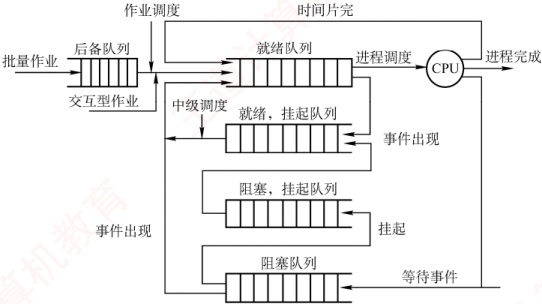

图 2.8 CPU 的三级调度

##### （2） 中级调度（内存调度）

中级调度的引入旨在提高内存利用率和系统吞吐量。当系统内存紧张时，它会将某些暂时无法运行的进程（如处于阻塞态且等待时间较长的进程）换出到外存，此时的进程状态称为挂起态。此后，当这些进程具备运行条件且内存有空闲时，中级调度再将其换入内存，恢复为就绪态，并加入就绪队列等待调度。中级调度实际上是存储器管理中的对换功能。

##### （3） 低级调度（进程调度）

低级调度按照特定算法从就绪队列中选择一个进程，将 CPU 分配给它。这是最基础、最频繁的一级调度，在所有操作系统中都必须存在。其调度频率很高，通常每几十毫秒执行一次。

#### 3. 三级调度的联系

在三级调度体系中，进程调度是最基本且不可或缺的，而作业调度和中级调度则根据系统类型和设计目标选择性配置。三级调度协同工作，共同完成作业从提交到终止的全过程：

1）作业调度为进程活动做准备，将作业调入内存并创建进程，使其具备参与调度的资格。

2）中级调度起调节作用，通过将暂时无法运行的进程换出至外存（挂起态），或在条件满足时将其重新换入内存（恢复为就绪态），动态调整内存中活跃进程的数量。

3）进程调度驱动实际执行，从就绪队列中选择进程投入运行，是实现并发的核心机制。

4）调度频率依次升高：作业调度频率最低，中级调度次之，进程调度频率最高。

### 2.2.2 进程调度

#### 1. 进程调度任务

进程调度的任务主要包括：

① 保存 CPU 现场信息。调度发生时，需要将当前进程的 CPU 状态（如程序计数器、通用寄存器等）完整保存至其 PCB 中，以确保后续能从断点恢复执行。

② 选取待运行进程。调度程序依据特定算法（如时间片轮转、优先级调度等），从就绪队列中选取一个进程，将其状态由“就绪态”改为“运行态”。

③ 完成 CPU 分配。由分派程序将选中进程 PCB 中保存的 CPU 现场加载到处理器寄存器中，移交 CPU 控制权，使其从上次断点处恢复执行。
#### 2. 调度程序（调度器）

用于实现 CPU 调度与分派的软件组件称为调度程序，它通常由三部分组成，如图 2.9 所示。

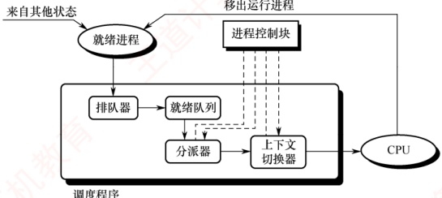

图2.9 调度程序的结构

1）排队器。将系统中所有就绪进程按照特定策略组织成一个或多个就绪队列。每当有进程转换为就绪态时，排队器便将其插入相应的就绪队列，为后续调度选择提供基础。

2）分派器。根据调度算法选定的进程，分派器负责执行实际的 CPU 分配操作，其主要任务包括：从就绪队列中移出目标进程、触发上下文切换，并将 CPU 控制权转交给该进程。

3）上下文切换器。在对 CPU 进行切换时，会发生两对上下文的切换操作：第一对，将当前进程的上下文保存到其 PCB 中，再装入分派程序的上下文，以便分派程序运行；第二对，移出分派程序的上下文，将新选进程的 CPU 现场信息装入 CPU 的各个相应寄存器。

上下文切换需要执行大量 load 和 store 指令以保存寄存器内容，因此开销较大。目前已有硬件实现的方法来减少上下文切换时间。通常采用两组寄存器，一组供内核使用，另一组供用户使用。这样，在上下文切换时只需改变指针，使其指向当前所需的寄存器组即可。

#### 3. 调度的时机、切换与过程

调度程序是操作系统内核程序。只有当请求调度的事件发生后，才会运行调度程序；而在调度出新的就绪进程之后，才会进行进程切换。理论上，这三个步骤应按顺序执行，但在实际的操作系统内核运行中，即使发生了引发调度的条件，也不一定能够立即进行调度与切换。

### 考点追踪 可以进行 CPU 调度的事件或时机（2012、2021）

现代操作系统中，通常在以下情况下需要进行进程调度与切换：

1）创建新进程后，父进程和子进程都处于就绪态，因此需要决定是运行父进程还是子进程，调度程序可以合法地选择其中一个先运行。

2）进程正常结束或异常终止后，必须从就绪队列中选择某个进程运行；若没有就绪进程，则通常运行一个系统提供的闲逛进程。

3）当进程因 I/O 请求、信号量操作或其他原因而被阻塞时，必须调度其他进程运行。

4）当 I/O 设备准备就绪后，发出 I/O 中断，原先等待 I/O 的进程由阻塞态转换为就绪态，此时需决定是让该新就绪进程投入运行，还是让中断发生时正在运行的进程继续执行。

此外，在支持抢占的系统中，若更高优先级的进程进入就绪队列，或当前进程的时间片用完，也会触发调度并可能剥夺当前进程的CPU。

进程切换通常紧随调度之后发生，其核心任务是保存原进程的执行现场，并恢复新进程的现场。具体而言，操作系统内核会将原进程的上下文（包括程序计数器、寄存器状态等）保存到其
PCB 或内核栈中；随后，从新进程的 PCB 或内核栈中加载其上下文，更新地址空间相关信息（如页表基址），重置程序计数器，并开始执行新进程。

然而，在以下情况下不能进行进程调度与切换：

1）处理中断的过程中。中断处理逻辑复杂，实现上难以安全地进行进程切换；同时，中断处理属于系统内核工作，逻辑上不隶属于任何用户进程，不应被剥夺CPU资源。

2）执行原子操作的过程中。如加锁、解锁、中断现场的保护与恢复等操作，通常需要屏蔽中断以保证原子性。在此期间，连中断都被禁止，更不应进行进程调度与切换。

若在上述不可调度期间发生了调度条件，系统会设置一个调度请求标志，待当前临界区或中断处理完成后，再根据该标志执行相应的调度与切换操作。

#### 4. 进程调度的方式

所谓进程调度方式，是指当某个进程正在 CPU 上执行时，若有某个更为重要或紧迫的进程需要处理，即有优先级更高的进程进入就绪队列，此时系统应如何分配 CPU。

通常有以下两种进程调度方式：

1）非抢占调度方式，也称非剥夺方式。指当一个进程正在CPU上执行时，即使有某个更为重要或紧迫的进程进入就绪队列，系统仍让当前进程继续执行，直到该进程运行完成（例如正常结束或异常终止），或者因发生某种事件（如等待I/O操作、在进程通信或同步中执行了Block原语）而主动进入阻塞态，此时才会将CPU分配给其他进程。

非抢占调度方式的优点是实现简单、系统开销小，适用于早期的批处理系统；但它无法满足分时系统和大多数实时系统对及时响应的要求。

2）抢占调度方式，也称剥夺方式。指当一个进程正在CPU上执行时，若出现更高优先级的就绪进程，调度程序可依据一定策略暂停当前进程，将CPU分配给更紧迫的进程。抢占调度方式对提高系统吞吐率和响应效率都有明显好处。但“抢占”并不是一种任意的行为，必须遵循一定的原则，主要有优先级、短进程优先和时间片原则等。

#### 5. 闲逛进程

当进程切换发生时，若系统中没有就绪进程，操作系统会调度闲逛进程（Idle Process）运行，它的PID为0。闲逛进程的优先级最低，仅在无其他就绪进程时运行；一旦有新进程进入就绪队列，它会立即让出CPU。其主要任务是在空闲循环中不断检测中断请求。

闲逛进程不占用除 CPU 外的其他系统资源，也不会因等待事件而被阻塞。

#### 6. 两种线程的调度

1）用户级线程调度。由于内核并不知道线程的存在，因此内核仍以进程为单位进行调度，将CPU时间分配给整个进程。当内核将CPU分配给某进程后，由该进程内部的用户级线程库决定具体运行哪个线程。线程切换在同一进程内完成，仅需保存少量寄存器状态，开销极小。但缺点是：若一个线程执行阻塞操作（如I/O），整个进程都会被阻塞。

2）内核级线程调度。内核直接感知并管理每个线程，调度时选择的是特定线程，而非进程。每个线程拥有独立的内核上下文，可被单独赋予时间片；若时间片用完或被更高优先级线程抢占，则该线程会被强制挂起。由于涉及完整的上下文切换、地址空间更新（在跨进程线程间）以及可能的TLB刷新和缓存失效，其切换开销远高于用户级线程，通常高出数倍。
### 2.2.3 调度的目标

不同的调度算法具有不同的特性，因此在选择调度算法时，必须考虑其适用场景与性能表现。为了客观比较 CPU 调度算法的优劣，人们提出了多种衡量标准，下面介绍主要的几种：

### 考点追踪 作业执行的相关计算（2012、2016、2018、2019、2023、2024）

1）CPU 利用率。CPU 是计算机系统中最重要且昂贵的资源之一，应尽可能使其保持 “忙碌” 状态，以提高资源利用效率。其计算公式为

 $$CPU 利用率 =CPU 有效工作时间 /(CPU 有效工作时间 +CPU 空闲等待时间 )$$

**注意**

在计算作业完成时间时，需注意 CPU 与 I/O 设备之间、以及不同 I/O 设备之间可以并行执行。

2）系统吞吐量。表示单位时间内系统完成的作业数量。长作业因占用较多 CPU 时间，会降低系统的吞吐量；而短作业所需 CPU 时间较少，有助于提升吞吐量。不同的调度算法对系统吞吐量有显著影响。

3）周转时间。指从作业提交到作业完成所经历的总时间，包括作业等待、在就绪队列中排队、在CPU上执行以及进行I/O操作等所有阶段的时间之和。其计算公式为

 $$周转时间 = 作业完成时间 - 作业提交时间$$

对于 n 个作业，平均周转时间定义为

 $$平均周转时间 =( 作业 1 的周转时间 +\cdots+ 作业 n 的周转时间 )/n$$

 $$带权周转时间用于衡量作业的相对等待程度，其定义为$$

 $$带权周转时间 = 作业周转时间 / 作业实际运行时间$$

相应地，平均带权周转时间定义为

 $$平均带权周转时间 =( 作业 1 的带权周转时间 +\ldots+ 作业 n 的带权周转时间 )/n$$

4）等待时间。等待时间是指进程在就绪队列中等待 CPU 的总时间。等待时间越长，响应延迟越高，满意度越低。CPU 调度算法并不影响作业的实际执行时间或 I/O 操作时间，仅影响其在就绪队列中的等待时长。因此，在评估调度算法时，等待时间常被作为一项核心指标。

5）响应时间。响应时间是指从用户提交请求到系统首次产生响应所经历的时间。在交互式系统中，用户更关注快速反馈，而非作业整体完成时间，因此响应时间通常比周转时间更具实际意义。理想的调度策略应尽可能缩短响应时间，使其处于用户可接受的范围之内。

需要强调的是，不存在一种调度算法能同时满足所有用户需求和系统目标。设计调度程序时，一方面要满足特定应用场景的要求（如实时任务的快速响应、交互式进程的低延迟），另一方面也要兼顾系统整体效率（如降低平均周转时间），同时还需考虑调度算法自身的实现开销。

### 2.2.4 进程切换

### 考点追踪 进程调度前后 CPU 模式的变化（2023）

对通常的进程而言，其创建、撤销以及请求由系统设备完成的I/O操作，都是通过系统调用进入内核，再由内核中的相应处理程序予以完成的。进程切换同样是在内核的支持下实现的，因
此可以说，任何进程都是在操作系统内核的支持下运行的，是与内核紧密相关的。

#### （1） 上下文切换

### 考点追踪 进程的上下文切换（2024、2025）

将 CPU 切换到另一个进程，需保存当前进程的状态，并恢复另一个进程的状态，这个任务称为上下文切换。进程上下文由其 PCB 表示，包括 CPU 寄存器的值、进程状态、内存管理信息等。当进行上下文切换时，内核将旧进程的状态保存在其 PCB 中，然后加载经调度而要执行的新进程的上下文。在切换过程中，进程的运行环境发生实质性的变化。上下文切换的流程如下。

1）挂起当前进程，将其 CPU 上下文保存到其 PCB 中。

2）将该进程的 PCB 移入相应的队列，例如就绪队列，或因等待某事件而进入的阻塞队列。

3）选择另一个进程执行，并更新其 PCB 中的相关信息。

4）恢复新进程的CPU上下文。

5）跳转到新进程 PCB 中的程序计数器所指向的位置，开始执行该进程。

#### （2） 上下文切换的消耗

上下文切换是一项开销较大的操作，需要执行大量寄存器的保存与恢复指令。尽管单次切换所需的时间仅为微秒量级，但在高负载系统中，若每秒发生数十甚至上百次切换，则累积的CPU时间消耗将十分可观。为减少这一开销，某些处理器架构提供多个寄存器组，通过切换寄存器组指针即可完成上下文切换；但大多数通用处理器仍需完整保存和恢复寄存器状态。

#### （3） 上下文切换与模式切换

模式切换（用户态和内核态之间的切换）与上下文切换是两个不同的概念。模式切换发生在同一进程内部，如用户进程因系统调用或中断进入内核态执行，完成后返回用户态继续执行该进程。此过程中，当前进程并未改变，因此不涉及上下文切换。而上下文切换则意味着从一个进程切换到另一个进程，必须保存旧进程的上下文并恢复新进程的上下文。由于该操作涉及内核数据结构（如PCB）的访问与修改，上下文切换只能由内核完成，且整个切换过程运行在内核态。

**注意**

调度和切换的区别： **调度是决策行为**，即决定将CPU分配给哪个进程； **切换是执行行为**，即实际完成CPU控制权的转移。通常，先由调度程序做出调度决策，随后触发上下文切换以实现该决策。

### 2.2.5 CPU 调度算法

### 考点追踪 各种调度算法的特点与对比（2009、2011、2014）

操作系统中存在多种调度算法，有的适用于作业调度，有的适用于进程调度，也有的两者均可适用。下面介绍几种常用的调度算法。

#### 1. 先来先服务（FCFS）调度算法

FCFS 调度算法是一种最简单的调度算法，既可用于作业调度，也可用于进程调度。

### 考点追踪 FCFS 调度算法的思想（2017）

在作业调度中，FCFS算法每次从后备作业队列中选择最早进入该队列的一个或多个作业，将它们调入内存，分配必要的资源，创建相应的进程，并放入就绪队列。

在进程调度中，FCFS算法每次从就绪队列中选择最早进入该队列的进程，将CPU分配给它，使其投入运行，直到该进程运行完成，或因某种原因而进入阻塞态，此时才会交出CPU。
### 考点追踪 批处理系统中作业完成时间的分析（2012、2016）

下面用一个实例来说明 FCFS 算法的性能。假设系统中有 4 个作业，它们的提交时间分别是 8.0、8.4、8.8 和 9.0，运行时间依次为 2、1、0.5 和 0.2。若系统采用 FCFS 算法，则这组作业的平均等待时间、平均周转时间和平均带权周转时间如表 2.2 所示。

FCFS 算法属于非抢占式算法。从表面上看，它对所有作业都是公平的；但若一个长作业先到达系统，则会导致后续的许多短作业长时间等待，因此它不适合作为分时系统和实时系统的主要调度策略。不过，FCFS 算法常被结合到其他调度策略中使用。例如，在采用优先级调度的系统中，对于多个具有相同优先级的进程，通常按照 FCFS 的原则进行调度。

FCFS 算法的特点是实现简单，但效率较低。它对长作业较为有利，而对短作业相对不利（与 SJF 或高响应比优先调度算法相比）。此外，它更有利于 CPU 繁忙型作业；而对于 I/O 繁忙型作业，由于其运行过程中会频繁发起 I/O 请求并进入阻塞状态，本可及时让出 CPU 以提高系统并发性，但在 FCFS 调度下，若排在长作业之后，则仍需长时间等待，难以发挥其优势。

表2.2 FCFS 调度算法的性能

| 作业号 | 提交时间 | 运行时间 | 开始时间 | 等待时间 | 完成时间 | 周转时间 | 带权周转时间 |
| --- | --- | --- | --- | --- | --- | --- | --- |
| 1 | 8 | 2 | 8 | 0 | 10 | 2 | 1 |
| 2 | 8.4 | 1 | 10 | 1.6 | 11 | 2.6 | 2.6 |
| 3 | 8.8 | 0.5 | 11 | 2.2 | 11.5 | 2.7 | 5.4 |
| 4 | 9 | 0.2 | 11.5 | 2.5 | 11.7 | 2.7 | 13.5 |

平均等待时间  $t=(0+1.6+2.2+2.5)/4=1.575$；平均周转时间  $T=(2+2.6+2.7+2.7)/4=2.5$；平均带权周转时间  $W=(1+2.6+5.4+13.5)/4=5.625$。

#### 2. 短作业优先（SJF）调度算法

### 考点追踪 SJF 调度算法的思想（2017）

短作业优先（SJF）调度算法是一种按照作业或进程的预计运行时间进行调度的策略。

在作业调度中，SJF 算法从后备作业队列中选择一个或多个估计运行时间最短的作业，将它们调入内存，分配资源并创建进程。

在进程调度中，该策略称为短进程优先（SPF），即从就绪队列中选择估计运行时间最短的进程，将CPU分配给它，使其立即执行，直至完成，或因某种事件而阻塞时才释放CPU。

例如，考虑与表2.2中示例相同的一组作业，若系统采用SJF调度算法，则这组作业的平均等待时间、平均周转时间和平均带权周转时间如表2.3所示。

表2.3 SJF 调度算法的性能

| 作业号 | 提交时间 | 运行时间 | 开始时间 | 等待时间 | 完成时间 | 周转时间 | 带权周转时间 |
| --- | --- | --- | --- | --- | --- | --- | --- |
| 1 | 8 | 2 | 8 | 0 | 10 | 2 | 1 |
| 2 | 8.4 | 1 | 10.7 | 2.3 | 11.7 | 3.3 | 3.3 |
| 3 | 8.8 | 0.5 | 10.2 | 1.4 | 10.7 | 1.9 | 3.8 |
| 4 | 9 | 0.2 | 10 | 1 | 10.2 | 1.2 | 6 |

 $$t=(0+2.3+1.4+1)/4=1.175;$$

 $$T=(2+3.3+1.9+1.2)/4=2.1$$

 $$W=(1+3.3+3.8+6)/4=3.525。$$

尽管 SJF 算法在某些指标上表现优异，但它也存在不容忽视的缺点：

### 考点追踪 饥饿现象的含义（2016）

1）对长作业不利。由表2.2与表2.3可知，在SJF调度下，长作业的周转时间明显增加。更
严重的是，若一个长作业进入系统的后备队列，而此后不断有新的短作业到达，调度程序将总是优先调度这些短作业，导致长作业长期得不到服务，从而产生饥饿现象（注意：饥饿是由于调度策略导致的无限期等待，与死锁中的环形等待有本质区别）。

2）未考虑作业的紧迫程度。该算法仅依据运行时间长短进行调度，完全忽略了作业的截止时间或紧急性，因此无法保证紧迫性作业被及时处理。

3）作业的“长短”由用户提交的估计值决定，而用户可能有意或无意地低估其作业的实际运行时间，以获取调度优势，从而使算法难以真正实现“短作业优先”的目标。

SPF 算法既可以是非抢占式的（默认情况），也可以是抢占式的。在抢占式版本中，当一个新进程到达就绪队列时，若其估计运行时间比当前进程的剩余执行时间更短，则立即暂停当前进程，将 CPU 分配给新进程。这种抢占式策略也称最短剩余时间优先调度算法。

**注意**

当所有作业同时到达且运行时间已知时，SJF算法的平均等待时间和平均周转时间是最优的。

#### 3. 高响应比优先调度算法

高响应比优先调度算法主要用于作业调度，是对 FCFS 算法和 SJF 算法的一种综合平衡。它在调度决策时同时考虑每个作业的等待时间和估计运行时间。在每次进行作业调度时，系统首先计算后备作业队列中每个作业的响应比，然后选择响应比最高的作业调入内存并执行。

响应比的计算公式为

 $$响应比 =( 等待时间 + 估计运行时间 )/ 估计运行时间$$

由该公式可知：①当作业的等待时间相同时，估计运行时间越短，响应比越高，因此有利于短作业，这与 SJF 算法的特性相似。②当估计运行时间相同时，响应比由等待时间决定，等待时间越长，响应比越高，这体现了 FCFS 调度的公平性。③对于长作业，其响应比会随着等待时间的增加而不断提高。当等待时间足够长时，即使估计运行时间较长，其响应比也可能超过其他作业，从而被调度执行。这一机制有效避免了长作业因长期得不到服务而产生的饥饿现象。

#### 4. 优先级调度算法

### 考点追踪 优先级调度算法的应用分析（2025）

优先级调度算法通过为每个作业或进程分配一个优先级，以反映其紧迫程度。

在作业调度中，优先级调度算法每次从后备作业队列中选择优先级最高的一个或多个作业，将它们调入内存，分配资源并创建进程。

在进程调度中，该算法每次从就绪队列中选择优先级最高的进程，将 CPU 分配给它，使其投入运行。

根据是否允许抢占，优先级调度算法可分为以下两类：

### 考点追踪 非抢占式优先级调度算法的应用分析（2018）

1）非抢占式优先级调度算法。当一个进程正在CPU上运行时，即使有更高优先级的进程进入就绪队列，系统仍允许当前进程继续执行，直到其因自身原因（如任务完成或等待事件）而让出CPU时，此时将CPU分配给就绪队列中优先级最高的进程。

### 考点追踪 抢占式优先级调度算法的应用分析（2022、2023）

2）抢占式优先级调度算法。当一个进程正在CPU上运行时，若有更高优先级的进程进入就绪队列，系统将立即暂停当前进程，将CPU分配给优先级更高的进程。
此外，根据进程创建后其优先级是否可变，优先级又可分为静态与动态两类：

### 考点追踪 静态优先级和动态优先级的分析（2016）

1）静态优先级。优先级在进程创建时确定，并在其整个运行期间保持不变。确定静态优先级的主要依据包括：进程类型、对资源的需求、用户指定的优先级等。优点是实现简单，系统开销小；缺点是不够灵活，可能出现低优先级进程长期得不到调度的饥饿现象。

### 考点追踪 调整进程优先级的合理时机（2010）

2）动态优先级。进程创建时赋予一个初始优先级，但该优先级会随着进程的推进或等待时间的增加而动态调整，以获得更好的调度效果。例如，规定优先级随等待时间的增加而提高，这样，即使初始优先级较低的进程，在等待足够长时间后也能获得CPU调度。在实际系统中，进程优先级的设置通常遵循以下原则：

1）系统进程＞用户进程。系统进程负责管理核心资源和服务，通常被赋予更高的优先级。

2）交互型进程＞非交互型进程（或前台进程＞后台进程）。交互型进程需要快速响应用户输入，因此应优先调度，以保证良好的用户体验。

### 考点追踪 进程优先级的设置：I/O 型和计算型（2013）

3）I/O 型进程 > 计算型进程。I/O 型进程指频繁进行 I/O 操作的进程，而计算型进程主要消耗 CPU 时间，很少使用 I/O 设备。我们知道，I/O 设备（如打印机）的处理速度远低于 CPU，因此若将 I/O 型进程的优先级设置得更高，就能让它尽快获得 CPU 并启动 I/O 操作，使 I/O 设备尽早开始工作，进而提高系统整体吞吐量。

#### 5. 时间片轮转（RR）调度算法

### 考点追踪 ▶ 时间片轮转调度算法的原理（2021、2024）

时间片轮转（RR）调度算法主要适用于分时系统，其最大特点是公平性。系统将所有就绪进程按 FCFS 的原则组织成一个就绪队列。每隔固定的时间间隔（称为时间片，例如 30 ms），系统会产生一次时钟中断，激活调度程序，将 CPU 分配给就绪队列的队首进程，并允许其执行一个时间片。当该进程执行完一个时间片后，即使尚未运行完毕，也必须被剥夺 CPU，并重新放入就绪队列的末尾，等待下一次调度；而下一个队首进程则获得 CPU 的使用权。

RR 算法的调度时机：① 若当前进程在时间片结束前已运行完成，则调度程序会立即被激活，进行进程切换；② 若时间片用尽，则由时钟中断处理程序触发调度程序，完成上下文切换。

### 考点追踪 ▶ 时间片轮转调度算法的特点（2017）

在 RR 算法中，时间片的大小对系统性能有显著影响。时间片过大，大到足以让每个进程在一个时间片内完成运行时，RR 算法将退化为 FCFS 算法，无法满足短作业和交互式用户对快速响应的需求；时间片过小时，虽然部分短作业可能在一个时间片内完成，但会导致系统频繁进行进程调度和上下文切换，大幅增加系统开销，真正用于执行用户程序的 CPU 时间反而减少。

因此，时间片的长度应合理设置，在响应速度与运行效率之间取得平衡。通常，其取值需综合考虑以下因素：系统的期望响应时间、就绪队列中的进程数量以及系统的处理能力。特别地，在交互式系统中，常以“典型交互”作为参考基准，例如，用户在文本编辑器中输入一个字符，或在终端中按下回车键，这类操作通常只需几十至上百毫秒即可完成。一个较为合理的时间片大小，应略长于一次典型交互所需的时间，这样既能确保大多数交互式进程在单个时间片内完成处理、获得流畅的响应体验，又能有效控制上下文切换频率，避免不必要的系统开销。
#### 6. 多级队列调度算法

前述的各种调度算法通常只设置一个就绪队列，采用固定且单一的调度策略，难以满足系统中不同类型进程对调度的不同需求。例如，交互型进程要求快速响应，而批处理进程更关注吞吐量和资源利用率。为兼顾这些差异，多级队列调度算法被提出。

该算法将系统中的就绪进程划分为多个独立的就绪队列，每个队列对应一类具有相似特性的进程（如系统进程、交互型进程、批处理进程等）。每个队列可独立采用适合其特性的调度算法：例如，交互型队列常使用 RR 算法以保证响应性，而批处理队列可采用 FCFS 算法或 SJF 算法以提高吞吐量。更重要的是，各队列本身具有不同的优先级。调度时，系统总是优先调度高优先级队列中的进程；只有当所有高优先级队列均为空时，才会调度低优先级队列中的进程。这种机制确保了关键任务（如系统服务或用户交互）能够及时获得 CPU 资源。

#### 7. 多级反馈队列调度算法（融合了前几种算法的优点）

### 考点追踪 多级反馈队列调度算法的应用分析（2019）

多级反馈队列调度算法是时间片轮转调度算法与优先级调度算法的综合与发展（见图2.10）。

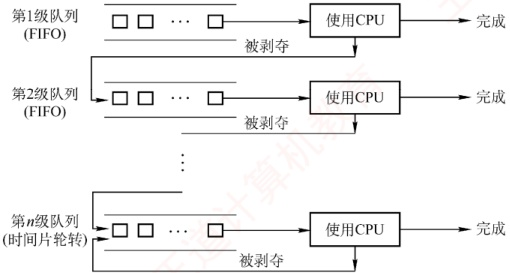

图 2.10 多级反馈队列调度算法

通过动态调整进程所处的队列（优先级）和对应的时间片大小，该算法能够兼顾系统的多种目标：既有利于短进程，可提高吞吐量并缩短平均周转时间，又有利于I/O型进程以提升设备利用率和响应速度，同时无须事先知道进程的运行时间。

### 考点追踪 多级反馈队列调度算法的实现思想（2020）

多级反馈队列调度算法的实现机制如下。

1）设置多个就绪队列。为每个队列赋予不同的优先级，第1级队列优先级最高，第2级次之，其余队列优先级依次降低。该算法为各级队列分配不同的时间片，优先级越高的队列，时间片越小。例如，第 $i+1$级队列的时间片长度通常是第i级的2倍。

2）每个队列内部采用时间片轮转（RR）调度。新进程创建后，首先被放入第1级队列的末尾。当轮到该进程执行时：若其在当前时间片内完成，则终止并退出系统；若时间片用完仍未完成，则被移至下一级（优先级更低）队列的末尾，等待后续调度。这一过程持续进行，直至进程在某一级队列中完成。通常，最低优先级队列（如第n级）的时间片较长，其行为接近FCFS，但仍采用时间片轮转以保证公平性。

3）按队列优先级调度。调度程序总是优先调度最高优先级队列中的进程执行。具体而言：仅当第1级队列为空时，才调度第2级队列中的进程；仅当第1～i-1级队列均为空时，才会调度第i级队列中的进程。此外，由于新进程总是首先进入第1级队列，因此若当前
正在执行的是低优先级队列中的进程，而有新进程进入系统，则系统将立即抢占当前进程。将其放回原队列末尾，同时将CPU分配给新的高优先级进程。

多级反馈队列调度算法的优势主要体现在以下场景中：

1）交互型（终端型）用户：进程通常较短且频繁进行 I/O，能在高优先级队列中快速完成。

2）短批处理作业用户：因优先级高、时间片小，可迅速执行完毕，周转时间较短。

3）长批处理作业用户：虽最终降至低优先级队列，但已在高优先级队列中获得部分CPU时间，不会因长期得不到调度而产生饥饿现象，最终仍能完成。

#### 8. 基于公平原则的调度算法

前面介绍的调度算法主要关注响应时间、吞吐量或周转时间等性能指标，但通常未将调度公平性作为主要设计目标。本节介绍两种以公平性为核心目标的调度算法。

##### （1） 保证调度算法

保证调度算法并不以“优先运行”为目标，而是为每个进程提供可量化的CPU时间分配保证。例如，在包含n个并发进程的系统中，每个进程应获得约1/n的CPU时间。调度器通过动态跟踪各进程的实际CPU使用情况，并据此调整调度顺序，以逐步逼近这一公平目标。

为实现这一目标，系统需具备以下功能：

1）跟踪每个进程自创建以来已获得的 CPU 时间。

2）计算每个进程应获得的 CPU 时间，即自进程创建以来的时间除以 n。

3）计算每个进程的公平比率，即实际获得的 CPU 时间与应获得的 CPU 时间之比。若比率小于 1，则表示未达应得份额；若比率大于 1，则表示超额占用。

4）调度程序应选择当前比率最小的进程，将 CPU 分配给它，并让它一直运行，直到它的比率超过最接近它的进程的比率为止。

##### （2） 公平分享调度算法

保证调度算法对进程公平，但未必对用户公平。假设各用户拥有的进程数不同，如用户1启动4个进程，而用户2仅启动1个进程，采用RR调度，那么对每个进程而言很公平，但用户1将获得80%的CPU时间，而用户2仅获得20%的CPU时间，显然对用户2有失公平。

公平分享调度算法则保证每个用户获得相同的 CPU 时间，或按所要求的比例分配。在这种方式下，不论用户启动多少进程，都能确保其获得应得的 CPU 份额。例如，系统中有两个用户，用户 1 拥有 4 个进程 A、B、C 和 D，用户 2 仅拥有 1 个进程 E，若采用 RR 调度，为保证两个用户获得相同的 CPU 时间，可采用如下调度序列：

AEBECDEAEBECDE

若用户 1 应获得的 CPU 时间是用户 2 的两倍，则可采用如下调度序列：

ABECDEABECDE …

这类调度策略通过按用户权重分配调度机会，从而在用户层面实现公平性。

表2.4 总结了本章介绍的主要调度算法特性，建议读者在理解的基础上掌握。

表2.4 几种常见进程调度算法的特点

|   | 先来先服务 | 短作业优先 | 高响应比优先 | 时间片轮转 | 多级反馈队列 |
| --- | --- | --- | --- | --- | --- |
| 能否可抢占 | 否 | 可以 | 否 | 可以 | 队列内算法不一定 |
| 优点 | 公平，实现简单 | 平均等待时间、平均周转时间最优 | 兼顾长短作业 | 兼顾长短作业 | 兼顾长短作业，有较好的响应时间，可行性强 |

续表

|   | 先来先服务 | 短作业优先 | 高响应比优先 | 时间片轮转 | 多级反馈队列 |
| --- | --- | --- | --- | --- | --- |
| 缺点 | 不利于短作业 | 长作业会饥饿，估计时间不易确定 | 计算响应比的开销大 | 平均等待时间较长，上下文切换浪费时间 | 最复杂 |
| 适用于 | 无 | 批处理系统 | 无 | 分时系统 | 相当通用 |

### 2.2.6 多处理机调度

多处理机系统的进程调度比单处理机系统更为复杂，其调度策略与系统结构有关。根据处理机之间的协作方式，多处理机系统主要分为非对称多处理机和对称多处理机两类。

非对称多处理机（Asymmetric MultiProcessing，AMP）通常采用主从式架构：一个主 CPU 负责全部调度决策和系统管理，其余从 CPU 仅执行任务而不参与调度。内核一般运行在主 CPU 上，从 CPU 执行由主 CPU 分配的进程。当某个从 CPU 空闲时，会向主 CPU 发送进程请求信号。主 CPU 维护一个全局就绪队列，只要队列非空，便从中取出一个进程分配给请求的从 CPU。该方案实现简单，但主 CPU 需承担所有调度开销，在高负载下容易成为系统性能瓶颈。

对称多处理机（Symmetric MultiProcessing，SMP）的所有 CPU 地位对等，均可参与调度。调度程序可将任意就绪进程分配给任意空闲 CPU。本节主要讨论 SMP 系统的调度问题。

#### 1. 亲和性和负载平衡

SMP 的调度面临两个核心矛盾：处理器亲和性和负载平衡。

当一个进程从一个 CPU 迁移到另一个 CPU 上时，应将第一个 CPU 的缓存设置为无效，然后重新填充第二个 CPU 的缓存。这种操作的代价较高，因此系统应尽量避免将进程从一个 CPU 移到另一个 CPU，而应尽量让一个进程运行在同一个 CPU 上，这称为处理器亲和性。

对于 SMP 系统，应尽量保证所有 CPU 的负载平衡（也称负载均衡），以便充分利用多处理机的优势。否则，一个或多个 CPU 会空闲，而其他 CPU 会处于高负载状态，且有一些进程处于等待状态。负载平衡应设法将负载平均分配到 SMP 系统的所有 CPU 上。

然而，负载平衡通常会抵消处理器亲和性带来的好处：保持一个进程运行在同一个 CPU 上的好处是可以利用它在该 CPU 的缓存，而将进程从一个 CPU 迁移到另一个 CPU 会失去这个好处。因此，在某些系统中，只有当不平衡达到一定程度后，才会触发进程迁移。

#### 2. 多处理机调度方案

方案一：公共就绪队列

系统中仅设置一个公共就绪队列，所有 CPU 共享该队列。这种方案能很好地实现负载平衡，因为 CPU 一旦空闲，就会立刻从公共就绪队列中选择一个进程运行。缺点是各进程可能频繁地在不同的 CPU 上切换，处理器亲和性不好。

提升处理器亲和性的方法有两种：①软亲和，指由调度程序尽量将一个进程保持在某个CPU上运行，但这个进程也可以迁移到其他CPU上。②硬亲和，指由用户进程通过系统调用，主动请求系统将其绑定到固定的CPU上。例如，Linux系统实现了软亲和，也支持硬亲和的系统调用。

方案二：私有就绪队列

系统为每个 CPU 设置一个私有就绪队列，当 CPU 空闲时，便从其对应的私有就绪队列中选择一个进程运行。这种方案很好地实现了处理器亲和性，缺点是必须进行负载平衡。

平衡负载的方法通常有两种：① 推迁移，指由一个特定的系统程序周期性地检查各 CPU 的负载，若发现不平衡，则从超载 CPU 的就绪队列中 “推” 出部分进程，迁移到空闲 CPU 的就绪
队列，以实现负载平衡。②拉迁移，指当某个 CPU 负载很低时，主动从超载 CPU 的就绪队列中“拉”取部分进程到自己的就绪队列。在实际系统中，推迁移和拉迁移常被结合使用。

### 2.2.7 本节小结

本节开头提出的问题的参考答案如下。

1 ）为什么要进行CPU调度？

若没有 CPU 调度，则必须等到当前运行的进程执行完毕后，下一个进程才能获得 CPU。然而在实际系统中，进程经常需要等待外部设备的输入，而外部设备的速度远低于 CPU。若让 CPU 长时间等待 I/O 完成，将造成极大的资源浪费。引入 CPU 调度后，当运行中的进程因等待 I/O 而阻塞时，系统可将 CPU 分配给其他就绪进程，从而显著提高 CPU 的利用率。简言之，CPU 调度的目的在于高效、合理地管理和分配计算机的软硬件资源。

2）结合本章学习到的调度算法，思考哪些调度算法比较适合分时系统和实时系统。

在本节介绍的调度算法中，先来先服务调度算法和短作业优先调度算法均无法保证在限定时间内响应用户请求，因此既不适用于分时系统，也无法满足实时系统对及时性和可预测性的要求。优先级调度算法根据任务的紧急程度赋予不同优先级，对高优先级任务优先服务，尤其适合实时系统（通常需配合抢占机制以确保关键任务及时执行）。高响应比优先调度算法、时间片轮转调度算法以及多级反馈队列调度算法，都能保证每个就绪进程在一定时间内获得CPU时间片，并通过轮转方式公平地共享CPU，因此更适合分时系统。

本节主要介绍了 CPU 调度的概念。操作系统主要管理 CPU、内存、文件和设备等资源。当对某类资源的请求超过其可用数量时，就需要进行调度。例如，在单处理器系统中，CPU 只有一个，而请求运行的进程却有多个，因此必须通过 CPU 调度来协调分配。引入调度机制后，随之而来的问题是：如何调度？应优先满足哪些进程？哪些进程需要等待？这正是调度算法所要解决的核心问题；而这些问题的答案，需依据一定的调度准则来确定。调度这一概念贯穿操作系统的始终。读者在后续学习中，还将接触到内存调度、磁盘调度、I/O 调度等多种资源调度问题。将这些调度机制与 CPU 调度进行对比，会发现它们在设计思想上具有异曲同工之妙。

### 2.2.8 本节习题精选

#### 一、 单项选择题

##### 01

中级调度的目的是（）。

A. 提高 CPU 的效率

B. 降低系统开销

C. 提高 CPU 的利用率

D. 节省内存

##### 02

进程从创建态转换到就绪态的工作由（）完成。

A. 进程调度 B. 中级调度 C. 高级调度 D. 低级调度

##### 03

下列哪些指标是调度算法设计时应该考虑的？（）

I. 公平性        II. 资源利用率      III. 互斥性         IV. 平均周转时间

A. I、II B. I、II、IV C. I、III、IV D. 全部都是

##### 04

时间片轮转调度算法是为了（）。

A. 多个用户能及时干预系统

B. 使系统变得高效

C. 优先级较高的进程得到及时响应

D. 需要 CPU 时间最少的进程最先做

##### 05

在单处理器系统中，进程什么时候占用处理器及占用时间的长短是由（）决定的。

A. 进程相应的代码长度 B. 进程总共需要运行的时间
C. 进程特点和进程调度策略 D. 进程完成什么功能

##### 06

在某单处理器系统中，若此刻有多个就绪态进程，则下列叙述中错误的是（）。

A. 进程调度的目标是让进程轮流使用处理器

B. 当一个进程运行结束后，会调度下一个就绪进程运行

C. 上下文切换是进程调度的实现手段

D. 处于临界区的进程在退出临界区前，无法被调度

##### 07

下列内容中，不属于进程上下文的是（）。

A. 进程现场信息 B. 进程控制信息 C. 中断向量 D. 用户堆栈

##### 08

下列关于进程上下文切换的叙述中，错误的是（）。

A. 进程上下文指进程的代码、数据以及支持进程执行的所有运行环境

B. 进程上下文切换机制实现了不同进程在一个处理器中交替运行的功能

C. 进程上下文切换过程中必须保存换下进程在切换处的程序计数器的值

D. 进程上下文切换过程中必须将换下进程的代码和数据从主存保存到磁盘

##### 09

在支持页式存储管理和多线程技术的系统中，当一个进程中的线程  $T_{1}$ 切换到同一个进程中的线程  $T_{2}$ 执行时，操作系统需要执行的操作是（）。

Ⅰ. 更新程序计数器的值

Ⅱ. 更新栈基址寄存器的值

Ⅲ. 更新页基址寄存器的值

Ⅳ. 更新进程打开文件表

A. I、II、III、IV B. II、IV C. I、II D. I、III、IV

##### 10

（）有利于 CPU 繁忙型的作业，而不利于 I/O 繁忙型的作业。

A. 时间片轮转调度算法

B. 先来先服务调度算法

C. 短作业（进程）优先调度算法

D. 优先级调度算法

##### 11

下面有关选择进程调度算法的准则中，不正确的是（）。

A. 尽快响应交互式用户的请求 B. 尽量提高处理器利用率

C. 尽可能提高系统吞吐量 D. 适当增长进程就绪队列的等待时间

##### 12

实时系统的进程调度，通常采用（）调度算法。

A. 先来先服务

B. 时间片轮转

C. 抢占式的优先级高者优先

D. 高响应比优先

##### 13

支持多道程序设计的操作系统在运行过程中，不断地选择新进程运行来实现 CPU 的共享，但其中（）不是引起操作系统选择新进程的直接原因。

A. 运行进程的时间片用完

B. 运行进程出错

C. 运行进程要等待某一事件发生

D. 有新进程被创建进入就绪态

##### 14

进程（线程）调度的时机有（）。

Ⅰ. 运行的进程（线程）运行完毕

Ⅱ. 运行的进程（线程）所需资源未准备好

Ⅲ. 运行的进程（线程）的时间片用完

Ⅳ. 运行的进程（线程）自我阻塞

Ⅴ. 运行的进程（线程）出现错误

A. Ⅱ、Ⅲ、Ⅳ 和 Ⅴ B. Ⅰ 和 Ⅲ C. Ⅱ、Ⅳ 和 Ⅴ D. 全部都是

##### 15

设有4个作业同时到达，每个作业的执行时间均为2h，它们在一台处理器上按单道式运行，则平均周转时间为（）。

A. 1h B. 5h C. 2.5h D. 8h

##### 16

若每个作业只能建立一个进程，为了照顾短作业用户，应采用（）；为了照顾紧急作业用户，应采用（）；为了能实现人机交互，应采用（）；而能使短作业、长作业和
交互作业用户都满意，应采用（）。

A. FCFS 调度算法

B. 短作业优先调度算法

C. 时间片轮转调度算法

D. 多级反馈队列调度算法

E. 剥夺式优先级调度算法

##### 17

（）优先级是在创建进程时确定的，确定之后在整个运行期间不再改变。

A. 先来先服务 B. 动态 C. 短作业 D. 静态

##### 18

现在有三个同时到达的作业  $J_{1}$,  $J_{2}$ 和  $J_{3}$，它们的执行时间分别是  $T_{1}$,  $T_{2}$,  $T_{3}$，且  $T_{1} < T_{2} < T_{3}$。系统按单道方式运行且采用短作业优先调度算法，则平均周转时间是（）。

A.  $T_{1}+T_{2}+T_{3}$ B.  $(3T_{1}+2T_{2}+T_{3})/3$ C.  $(T_{1}+T_{2}+T_{3})/3$ D.  $(T_{1}+2T_{2}+3T_{3})/3$

##### 19

设有三个作业，其运行时间分别是 2h, 5h, 3h，假定它们同时到达，并在同一台处理器上以单道方式运行，则平均周转时间最小的执行顺序是（）。

A.  $J_{1}$,  $J_{2}$,  $J_{3}$ B.  $J_{3}$,  $J_{2}$,  $J_{1}$ C.  $J_{2}$,  $J_{1}$,  $J_{3}$ D.  $J_{1}$,  $J_{3}$,  $J_{2}$

##### 20

采用时间片轮转调度算法分配 CPU 时，当处于运行态的进程用完一个时间片后，它的状态是（）状态。

A. 阻塞 B. 运行 C. 就绪 D. 消亡

##### 21

一个作业8:00到达系统，估计运行时间为1h。若10:00开始执行该作业，其响应比是（）。

A. 2

B. 1

C. 3

D. 0.5

##### 22

关于优先权大小的论述中，正确的是（）。

A. 计算型作业的优先权，应高于 I/O 型作业的优先权

B．用户进程的优先权，应高于系统进程的优先权

C. 在动态优先权中，随着作业等待时间的增加，其优先权将随之下降

D. 在动态优先权中，随着进程执行时间的增加，其优先权降低

##### 23

下列调度算法中，（）调度算法是绝对可抢占的。

A. 先来先服务 B. 时间片轮转 C. 优先级 D. 短进程优先

##### 24

作业是用户提交的，进程是由系统自动生成的，除此之外，两者的区别是（）。

A. 两者执行不同的程序段

B. 前者以用户任务为单位，后者以操作系统控制为单位

C. 前者是批处理的，后者是分时的

D. 后者是可并发执行，前者则不同

##### 25

进程调度算法采用固定时间片轮转调度算法，当时间片过大时，就会使时间片轮转调度算法转化为（）调度算法。

A. 高响应比优先

B. 先来先服务

C. 短进程优先

D. 以上选项都不对

##### 26

有以下的进程需要调度执行（见下表）：

| 进程名 | 到达时间/h | 运行时间/h |
|---|---|---|
| $P_{1}$ | 0.0 | 9 |
| $P_{2}$ | 0.4 | 4 |
| $P_{3}$ | 1.0 | 1 |
| $P_{4}$ | 5.5 | 4 |
| $P_{5}$ | 7 | 2 |
1）若用非抢占式短进程优先调度算法，问这5个进程的平均周转时间是多少？

2）若采用抢占式短进程优先调度算法，问这5个进程的平均周转时间是多少？

A. 8.62h; 6.34h

B. 8.62h; 6.8h

C. 10.62h; 6.34h

D. 10.62h; 6.8h

##### 27

有 5 个批处理作业 A, B, C, D, E 几乎同时到达，其预计运行时间分别为 10, 6, 2, 4, 8，其优先级（由外部设定）分别为 3, 5, 2, 1, 4，这里 5 为最高优先级。以下各种调度算法中，平均周转时间为 14 是（）调度算法。

A. 时间片轮转（时间片为 1） B. 优先级

C. 先来先服务（按照顺序 10,6,2,4,8） D. 短作业优先

##### 28

使用抢占式最短剩余时间优先调度算法对下列进程进行调度，总周转时间是（）。

| 进程名 | 到达时间/h | 运行时间/h |
|---|---|---|
| $P_{1}$ | 0 | 3 |
| $P_{2}$ | 1 | 1 |
| $P_{3}$ | 2 | 4 |
| $P_{4}$ | 3 | 5 |
| $P_{5}$ | 4 | 2 |

B. 26h C. 27h D. 28h

##### 29

假设系统采用多级反馈队列调度算法，系统中设置了三个不同优先级的队列 A、B 和 C，优先级 A > B > C，A 的时间片为 10ms，B 的时间片为 20ms，C 的时间片为 30ms。当 t = 0 时，进程  $P_{1}$ 到达， $P_{1}$ 所需的运行时间为 90ms；当 t = 30ms 时，进程  $P_{2}$ 到达， $P_{2}$ 所需的运行时间为 30ms，不考虑任何其他系统开销，进程  $P_{1}$ 的周转时间为（）。

A. 90ms B. 100ms C. 110ms D. 120ms

##### 30

分时操作系统通常采用（）调度算法来为用户服务。

A. 时间片轮转 B. 先来先服务 C. 短作业优先 D. 优先级

##### 31

在进程调度算法中，对短进程不利的是()。

A. 短进程优先调度算法

B. 先来先服务调度算法

C. 高响应比优先调度算法

D. 多级反馈队列调度算法

##### 32

假设系统中所有进程同时到达，则使进程平均周转时间最短的是（）调度算法。

A. 先来先服务 B. 短进程优先 C. 时间片轮转 D. 优先级

##### 33

多级反馈队列调度算法不具备的特性是（）。

A. 资源利用率高 B. 响应速度快 C. 系统开销小 D. 并发度高

##### 34

下列调度算法中，系统开销最小的调度算法是（）。

A. 高响应比优先调度算法

B. 多级反馈队列调度算法

C. 先来先服务调度算法

D. 时间片轮转调度算法

##### 35

下列进程调度算法中，可能导致饥饿现象的有（）。

Ⅰ. 先来先服务调度算法

Ⅱ. 短作业优先调度算法

Ⅲ. 优先级调度算法

Ⅳ. 时间片轮转调度算法

A. I 和 II B. II 和 III C. II、III 和 IV D. III

##### 36

与单处理机调度相比，多处理机调度需要额外考虑的调度目标是()。

I. 负载平衡 II. 处理器亲和性 III. 进程周转时间

A. I 和 II B. II 和 III C. I 和 III D. I、II 和 III

##### 37

【2009 统考真题】下列进程调度算法中，综合考虑进程等待时间和执行时间的是（）。

A. 时间片轮转调度算法 B. 短进程优先调度算法
C. 先来先服务调度算法 D. 高响应比优先调度算法

##### 38

【2010 统考真题】下列选项中，降低进程优先级的合理时机是（）。

A. 进程时间片用完

B. 进程刚完成 I/O 操作，进入就绪队列

C. 进程长期处于就绪队列

D. 进程从就绪态转换为运行态

##### 39

【2011 统考真题】下列选项中，满足短作业优先且不会发生饥饿现象的是（）调度算法。

A. 先来先服务

B. 高响应比优先

C. 时间片轮转

D. 非抢占式短作业优先

##### 40

【2012 统考真题】一个多道批处理系统中仅有  $P_{1}$ 和  $P_{2}$ 两个作业， $P_{2}$ 比  $P_{1}$ 晚 5ms 到达，它的计算和 I/O 操作顺序如下。

 $P_{1}$: 计算 60ms，I/O 80ms，计算 20ms

 $P_{2}$: 计算 120ms，I/O 40ms，计算 40ms

若不考虑调度和切换时间，则完成两个作业需要的时间最少是（）。

A. 240ms B. 260ms C. 340ms D. 360ms

##### 41

【2012 统考真题】若某单处理器多进程系统中有多个就绪态进程，则下列关于处理机调度的叙述中，错误的是（）。

A. 在进程结束时能进行处理机调度

B. 创建新进程后能进行处理机调度

C. 在进程处于临界区时不能进行处理机调度

D. 在系统调用完成并返回用户态时能进行处理机调度

##### 42

【2013 统考真题】某系统正在执行三个进程  $P_{1}$,  $P_{2}$ 和  $P_{3}$，各进程的计算（CPU）时间和 I/O 时间比例如下表所示。

| 进程名 | 计算时间 | I/O 时间 |
|---|---|---|
| $P_{1}$ | 90% | 10% |
| $P_{2}$ | 50% | 50% |
| $P_{3}$ | 15% | 85% |

为提高系统资源利用率，合理的进程优先级设置应为（）。

A.  $P_1 > P_2 > P_3$ B.  $P_3 > P_2 > P_1$ C.  $P_2 > P_1 = P_3$ D.  $P_1 > P_2 = P_3$

##### 43

【2014 统考真题】下列调度算法中，不可能导致饥饿现象的是（）。

A. 时间片轮转

B. 静态优先数调度

C. 非抢占式短任务优先

D. 抢占式短任务优先

##### 44

【2016 统考真题】某单 CPU 系统中有输入和输出设备各 1 台，现有 3 个并发执行的作业，每个作业的输入、计算和输出时间均分别为 2ms, 3ms 和 4ms，且都按输入、计算和输出的顺序执行，则执行完 3 个作业需要的时间最少是（）。

A. 15ms B. 17ms C. 22ms D. 27ms

##### 45

【2017 统考真题】假设 4 个作业到达系统的时刻和运行时间如下表所示。

| 作业号 | 到达时刻 $t$ | 运行时间 |
|---|---|---|
| $J_{1}$ | 0 | 3 |
| $J_{2}$ | 1 | 3 |
| $J_{3}$ | 1 | 2 |
| $J_{4}$ | 3 | 1 |

系统在 t = 2 时开始作业调度。若分别采用先来先服务和短作业优先调度算法，则选中
的作业分别是（）。

A.  $J_{2}, J_{3}$ B.  $J_{1}, J_{4}$ C.  $J_{2}, J_{4}$ D.  $J_{1}, J_{3}$

##### 46

【2017 统考真题】下列有关基于时间片的进程调度的叙述中，错误的是（）。

A. 时间片越短，进程切换的次数越多，系统开销越大

B. 当前进程的时间片用完后，该进程状态由运行态变为阻塞态

C. 时钟中断发生后，系统会修改当前进程在时间片内的剩余时间

D. 影响时间片大小的主要因素包括响应时间、系统开销和进程数量等

##### 47

【2018 统考真题】某系统采用基于优先权的非抢占式进程调度策略，完成一次进程调度和进程切换的系统时间开销为 1μs。在 T 时刻就绪队列中有 3 个进程  $P_1$、 $P_2$ 和  $P_3$，其在就绪队列中的等待时间、需要的 CPU 时间和优先权如下表所示。

| 进程名 | 等待时间 | 需要的 CPU 时间 | 优先权 |
|---|---|---|---|
| $P_{1}$ | 30 $\mu$s | 12 $\mu$s | 10 |
| $P_{2}$ | 15 $\mu$s | 24 $\mu$s | 30 |
| $P_{3}$ | 18 $\mu$s | 36 $\mu$s | 20 |

若优先权值大的进程优先获得 CPU，从 T 时刻起系统开始进程调度，则系统的平均周转时间为（）。

A. 54μs B. 73μs C. 74μs D. 75μs

##### 48

【2019 统考真题】系统采用二级反馈队列调度算法进行进程调度。就绪队列  $Q_1$ 采用时间片轮转调度算法，时间片为 10ms；就绪队列  $Q_2$ 采用短进程优先调度算法；系统优先调度  $Q_1$ 队列中的进程，当  $Q_1$ 为空时系统才会调度  $Q_2$ 中的进程；新创建的进程首先进入  $Q_1$； $Q_1$ 中的进程执行一个时间片后，若未结束，则转入  $Q_2$。若当前  $Q_1$， $Q_2$ 为空，系统依次创建进程  $P_1$， $P_2$ 后即开始进程调度， $P_1$， $P_2$ 需要的 CPU 时间分别为 30ms 和 20ms，则进程  $P_1$， $P_2$ 在系统中的平均等待时间为（）。

A. 25ms B. 20ms C. 15ms D. 10ms

##### 49

【2020 统考真题】下列与进程调度有关的因素中，在设计多级反馈队列调度算法时需要考虑的是（）。

Ⅰ. 就绪队列的数量

Ⅱ. 就绪队列的优先级

Ⅲ. 各就绪队列的调度算法

Ⅳ. 进程在就绪队列间的迁移条件

A. 仅Ⅰ、Ⅱ

B. 仅Ⅲ、Ⅳ

C. 仅Ⅱ、Ⅲ、Ⅳ

D. Ⅰ、Ⅱ、Ⅲ和Ⅳ

##### 50

【2021 统考真题】在下列内核的数据结构或程序中，分时系统实现时间片轮转调度需要使用的是（）。

I. 进程控制块 II. 时钟中断处理程序 III. 进程就绪队列 IV. 进程阻塞队列

A. 仅 I、III B. 仅 I、IV C. 仅 I、II、III D. 仅 I、II、IV

##### 51

【2021 统考真题】下列事件中，可能引起进程调度程序执行的是（）。

Ⅰ. 中断处理结束 Ⅱ. 进程阻塞 Ⅲ. 进程执行结束 Ⅳ. 进程的时间片用完

A. 仅 I、III B. 仅 II、IV C. 仅 III、IV D. I、II、III 和 IV

##### 52

【2022 统考真题】进程  $P_{0}$、 $P_{1}$、 $P_{2}$ 和  $P_{3}$ 进入就绪队列的时刻、优先级（值越小优先权越高）及 CPU 执行时间如下表所示。

| 进程名 | 进入就绪队列的时刻 | 优先级 | CPU执行时间 |
|---|---|---|---|
| $P_{0}$ | 0ms | 15 | 100ms |
| $P_{1}$ | 10ms | 20 | 60ms |
| $P_{2}$ | 10ms | 10 | 20ms |
| $P_{3}$ | 15ms | 6 | 10ms |
若系统采用基于优先权的抢占式进程调度算法，则从 0ms 时刻开始调度，到 4 个进程都运行结束为止，发生进程调度的总次数为（）。

A. 4 B. 5 C. 6 D. 7

##### 53

【2023 统考真题】进程  $P_{1}$、 $P_{2}$ 和  $P_{3}$ 进入就绪队列的时刻、优先级（值越大优先权越高）和 CPU 执行时间如下表所示。

| 进程名 | 进入就绪队列的时刻 | 优先级 | CPU执行时间 |
|---|---|---|---|
| $P_{1}$ | 0ms | 1 | 60ms |
| $P_{2}$ | 20ms | 10 | 42ms |
| $P_{3}$ | 30ms | 100 | 13ms |

若系统采用基于优先权的抢占式 CPU 调度算法，从 0ms 时刻开始进行调度，则  $P_{1}$、 $P_{2}$ 和  $P_{3}$ 的平均周转时间为（）。

A. 60ms B. 61ms C. 70ms D. 71ms

##### 54

【2024 统考真题】假设某系统使用时间片轮转调度算法进行 CPU 调度，时间片大小为 5ms，系统共有 10 个进程，初始时均处于就绪队列，执行结束前仅处于运行态或就绪态。若队尾的进程 P 所需的 CPU 时间最短，时间为 25ms，不考虑系统开销，则进程 P 的周转时间为（）。

A. 200ms B. 205ms C. 250ms D. 295ms

##### 55

【2024 统考真题】在支持页式存储管理的系统中，进程切换时操作系统需要执行的操作是（）。

Ⅰ. 更新程序计数器的值 Ⅱ. 更新栈基址寄存器的值 Ⅲ. 更新页表基地址寄存器的值

A. 仅 III

B. 仅 I、II

C. 仅 I、III

D. I、II、III

##### 56

【2025 统考真题】在某基于优先权的进程调度程序中，进程就绪队列采用优先权从高到低的有序单链表实现。若就绪队列长度为 n，则就绪队列的插入操作和从就绪队列中选出将要执行进程的操作的时间复杂度分别是（）。

A.  $O(1)$,  $O(1)$ B.  $O(1)$,  $O(n)$ C.  $O(n)$,  $O(1)$ D.  $O(n)$,  $O(n)$

##### 57

【2025 统考真题】在采用页式虚拟存储管理方式的系统中，当发生进程上下文切换时，在下列寄存器中，操作系统不需要更新的是（）。

A. 通用寄存器

B. 页表基址寄存器

C. 程序计数器

D. 内核中断向量表基址寄存器

#### 二、 综合应用题

##### 01

有一个 CPU 和两台外设  $D_1, D_2$，且在能够实现抢占式优先级调度算法的多道程序环境中，同时进入优先级由高到低的  $P_1, P_2, P_3$ 三个作业，每个作业的处理顺序和使用资源的时间如下。

 $P_1$:  $D_2$ (30ms)，CPU (10ms)， $D_1$ (30ms)，CPU (10ms)

 $P_2$:  $D_1$ (20ms)，CPU (20ms)， $D_2$ (40ms)

 $P_3$: CPU (30ms)， $D_1$ (20ms)

假设忽略不计其他辅助操作的时间，每个作业的周转时间  $T_{1}, T_{2}, T_{3}$ 分别为多少？CPU 和  $D_{1}$ 的利用率各是多少？

##### 02

有三个作业 A, B, C，它们分别单独运行时的 CPU 和 I/O 占用时间如下图所示。

现在请考虑三个作业同时开始执行。系统中的资源有一个 CPU 和两台输入/输出设备（I/O $_{1}$ 和 I/O $_{2}$）同时运行。三个作业的优先级为 A 最高、B 次之、C 最低，一旦低优先级
的进程开始占用 CPU 或 I/O 设备，高优先级进程也要等待到其结束后方可占用。

 $$值业 A\quad\begin{array}{c c c c c}{10}&{20}&{30}&{10}&{40}&{20\quad20}\\ {}\\ {\mathrm{I/O}_{2}\mathrm{C P U}}&{\mathrm{I/O}_{1}}&{\mathrm{C P U}}&{\mathrm{I/O}_{1}}&{\mathrm{C P U}\quad\mathrm{I/O}_{1}}\end{array}\mathrm{m s}$$

 $$作业 \mathbf{B}\quad\begin{array}{c|ccc}30&40&30&30\\ \hline I/O_{1}&CPU&I/O_{2}&CPU&I/O_{1}\end{array}ms$$

 $$作业 C\quad\begin{array}{c|c|c|c}40&20&20&70\\\hline\end{array}ms\\ CPU\quad I/O_{1}\quad CPU\quad I/O_{2}$$

请回答下面的问题：

1）最早结束的作业是哪个？

2）最后结束的作业是哪个？

3）计算这段时间 CPU 的利用率（三个作业全部结束为止）。

##### 03

某分时系统中的进程可能出现如下图所示的状态变化，请回答下列问题：

1）根据图示，该系统应采用什么进程调度策略？

2）将图中每个状态变化的可能原因填写在下表中。

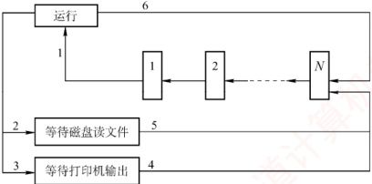

| 变 化 | 原 因 |
| --- | --- |
| 1 |   |
| 2 |   |
| 3 |   |
| 4 |   |
| 5 |   |
| 6 |   |

##### 04

假定要在一台处理器上执行下表所示的作业，且假定这些作业在时刻 0 以 1, 2, 3, 4, 5 的顺序到达。说明分别使用 FCFS、RR（时间片=1）、SJF 及非剥夺式优先级调度算法时，这些作业的执行情况（优先级的高低顺序依次为 1 到 5）。

针对上述每种调度算法，给出平均周转时间和平均带权周转时间。

| 作业号 | 执行时间 | 优先级 |
| --- | --- | --- |
| 1 | 10 | 3 |
| 2 | 1 | 1 |
| 3 | 2 | 3 |
| 4 | 1 | 4 |
| 5 | 5 | 2 |

##### 05

有一个具有两道作业的批处理系统，作业调度采用短作业优先调度算法，进程调度采用抢占式优先级调度算法。作业的运行情况见下表，其中作业的优先数即进程的优先数，优先数越小，优先级越高。

| 作业号 | 到达时间 | 运行时间 | 优先数 |
| --- | --- | --- | --- |
| 1 | 8:00 | 40min | 5 |
| 2 | 8:20 | 30min | 3 |
| 3 | 8:30 | 50min | 4 |
| 4 | 8:50 | 20min | 6 |

1）列出所有作业进入内存的时间及结束的时间（以分为单位）。
2）计算平均周转时间。

##### 06

假设某计算机系统有4个进程，各进程的预计运行时间和到达就绪队列的时刻见下表（相对时间，单位为“时间配额”）。试用可抢占式短进程优先调度算法和时间片轮转调度算法进行调度（时间配额为2）。分别计算各个进程的调度次序及平均周转时间。

| 进程名 | 到达就绪队列时刻 | 预计运行时间 |
|---|---|---|
| $P_{1}$ | 0 | 8 |
| $P_{2}$ | 1 | 4 |
| $P_{3}$ | 2 | 9 |
| $P_{4}$ | 3 | 5 |

##### 07

假设一个计算机系统具有如下性能特征：处理一次中断平均需要 500μs，一次进程调度平均需要花费 1ms，进程的切换平均需要花费 2ms。若该计算机系统的定时器每秒发出 120 次时钟中断，忽略其他 I/O 中断的影响，请问：

1）操作系统将百分之几的 CPU 时间分配给时钟中断处理程序？

2）若系统采用时间片轮转调度算法，24个时钟中断为一个时间片，操作系统每进行一次进程的切换，需要花费百分之几的CPU时间？

3）根据上述结果，说明为了提高 CPU 的使用效率，可以采用什么对策。

##### 08

设有4个作业 $J_{1}$， $J_{2}$， $J_{3}$， $J_{4}$，它们的到达时间和计算时间见下表。若这4个作业在一台处理器上按单道方式运行，采用高响应比优先调度算法，试写出各作业的执行顺序、各作业的周转时间及平均周转时间。

| 作业号 | 到达时间 | 计算时间 |
|---|---|---|
| $J_{{1}}$ | 8:00 | 2h |
| $J_{{2}}$ | 8:30 | 40min |
| $J_{{3}}$ | 9:00 | 25min |
| $J_{{4}}$ | 9:30 | 30min |

##### 09

在一个有两道作业的批处理系统中，有一作业序列，其到达时间及估计运行时间见下表。系统作业采用最高响应比优先调度算法 [响应比 = (等待时间 + 估计运行时间)/估计运行时间]。进程的调度采用短进程优先的抢占式调度算法。

| 作业号 | 到达时间 | 估计运行时间/min |
|---|---|---|
| $J_{{1}}$ | 10:00 | 35 |
| $J_{{2}}$ | 10:10 | 30 |
| $J_{{3}}$ | 10:15 | 45 |
| $J_{{4}}$ | 10:20 | 20 |
| $J_{{5}}$ | 10:30 | 30 |

1）列出各作业的执行时间，即列出每个作业运行的时间片段，如作业i的运行时间序列为10:00—10:40，11:00—11:20，11:30—11:50结束。

2）计算这批作业的平均周转时间。

##### 10

【2016 统考真题】某个进程调度程序采用基于优先数（priority）的调度策略，即选择优先数最小的进程运行，进程创建时由用户指定一个 nice 作为静态优先数。为了动态调整优先数，引入运行时间 cpuTime 和等待时间 waitTime，初值均为 0。进程处于运行态时，cpuTime 定时加 1，且 waitTime 置 0；进程处于就绪态时，cpuTime 置 0，waitTime 定时加 1。请回答下列问题：

1）若调度程序只将 nice 的值作为进程的优先数，即 priority = nice，则可能出现饥饿现象。为什么？
2）使用 nice, cpuTime 和 waitTime 设计一种动态优先数计算方法，以避免产生饥饿现象，并说明 waitTime 的作用。

### 2.2.9 答案与解析

#### 一、 单项选择题

##### 01

D

中级调度的主要目的是节省内存，将内存中处于阻塞态或长期不运行的进程挂起到外存，从而腾出空间给其他进程使用。当这些进程重新具备运行条件时，再从外存调入内存，恢复运行。

##### 02

C

进程从创建态转换为就绪态是由高级调度完成的。高级调度（作业调度）的主要任务是从后备队列中选择一个或一批作业，为其创建PCB，分配内存等其他资源，并将其插入就绪队列。

##### 03

B

设计调度算法时应考虑的指标有很多，比较常见的有公平性、资源利用率、平均周转时间、平均等待时间、平均响应时间。互斥性不是调度算法设计时需要考虑的指标，而是一种同步机制，用来保证多个进程访问临界资源时不会发生冲突。

##### 04

A

时间片轮转的主要目的是，使得多个交互的用户能够得到及时响应，使得每个用户以为“独占”计算机的使用，因此它并没有偏好，也不会对特殊进程做特殊服务。时间片轮转增加了系统开销，所以不会使得系统高效运转，吞吐量和周转时间均不如批处理。但其较快速的响应时间使得用户能够与计算机进行交互，改善了人机环境，满足用户需求。

##### 05

C

进程调度的时机与进程特点有关，如进程是 CPU 繁忙型还是 I/O 繁忙型、自身的优先级等。但仅有这些特点是不够的，能否得到调度还取决于进程调度策略，若采用优先级调度算法，则进程的优先级才起作用。至于占用处理器运行时间的长短，则要看进程自身，若进程是 I/O 繁忙型，运行过程中要频繁访问 I/O 端口，即可能频繁放弃 CPU，所以占用 CPU 的时间不会长，一旦放弃 CPU，则必须等待下次调度。若进程是 CPU 繁忙型，则一旦占有 CPU，就可能运行很长时间，但运行时间还取决于进程调度策略，大部分情况下，交互式系统为改善用户的响应时间，大多数采用时间片轮转调度算法，这种算法在进程占用 CPU 达到一定时间后，会强制将其换下，以保证其他进程的 CPU 使用权。因此选择选项 C。

##### 06

D

处于临界区的进程也可能因中断或抢占而导致调度。此外，若进程在临界区内请求的是一个需要等待的资源，比如打印机，则它主动放弃CPU，让其他进程运行。

##### 07

C

当一个进程被执行时，CPU 的所有寄存器中的值（进程的现场信息）、进程的状态和控制信息以及堆栈中的内容被称为该进程的上下文。中断向量不属于进程上下文的一部分，而是一组指向中断处理程序的指针，存放在内存的固定位置。

##### 08

D

上下文切换发生在操作系统调度一个新进程到处理器上运行的时候。一个重要的上下文信息就是程序计数器（PC）的值，当前进程被打断的PC值作为寄存器上下文的一部分保存在进程现场信息中。进程上下文切换过程中不涉及主存和磁盘的数据交换，选项D错误。

##### 09

C

当线程切换时，操作系统需要保存当前线程的程序计数器的值，并恢复新线程的程序计数器，
以便从新线程的正确位置开始执行。在多线程条件下，每个线程拥有各自独立的栈，当线程切换时，需要保存当前线程的栈基址寄存器的值，并加载新线程的栈基址，以便正确管理栈空间。同一个进程中的线程共享进程的虚拟地址空间，因此不需要更新页基址寄存器的值。一个进程所打开的文件也是被这个进程中的所有线程共享的，因此不需要更新进程打开文件表。

##### 10

B

FCFS 调度算法比较有利于长作业，而不利于短作业。CPU 繁忙型作业是指该类作业需要占用很长的 CPU 时间，而很少请求 I/O 操作，因此 CPU 繁忙型作业类似于长作业，采用 FCFS 可从容完成计算。I/O 繁忙型作业是指作业执行时需频繁请求 I/O 操作，即可能频繁放弃 CPU，所以占用 CPU 的时间不会太长，一旦放弃 CPU，则必须重新排队等待调度，所以采用 SJF 比较适合。时间片轮转调度算法对于短作业和长作业的时间片都一样，所以地位也几乎一样。优先级调度有利于优先级高的进程，而优先级和作业时间长度是没有必然联系的。因此选择选项 B。

##### 11

D

在选择进程调度算法时应考虑以下几个准则：① 公平：确保每个进程获得合理的 CPU 份额；② 有效：使 CPU 尽可能地忙碌；③ 响应时间：使交互用户的响应时间尽可能短；④ 周转时间：使批处理用户等待输出的时间尽可能短；⑤ 吞吐量：使单位时间处理的进程数尽可能最多。由此可见选项 D 不正确。

##### 12

C

实时系统必须能足够及时地处理某些紧急的外部事件，因此普遍用高优先级，并用“可抢占”来确保实时处理。

##### 13

D

操作系统选择新进程的直接原因是当前运行的进程不能继续运行。当运行的进程由于时间占用完、运行结束、出错、需要等待事件的发生、自我阻塞等，均可以激活调度程序进行重新调度，选择就绪队列的队首进程投入运行。新进程加入就绪队列不是引起调度的直接原因，当 CPU 正在运行其他进程时，该进程仍需等待。即使是在采用高优先级调度算法的系统中，一个最高优先级的进程进入就绪队列，也需要考虑是否允许抢占，当不允许抢占时，仍需等待。

##### 14

D

进程（线程）调度的时机包括：运行的进程（线程）运行完毕、运行的进程（线程）自我阻塞、运行的进程（线程）的时间片用完、运行的进程（线程）所需的资源没有准备好（会阻塞进程）、运行的进程（线程）出现错误（会终止进程）。因此，说法I、II、III、IV和V都正确。

##### 15

B

4 个作业的周转时间分别是 2h, 4h, 6h, 8h，所以 4 个作业的总周转时间为  $2 + 4 + 6 + 8 = 20$ h。此时，平均周转时间 = 各个作业周转时间之和/作业数 = 20/4 = 5 小时。

##### 16

B, E, C, D

照顾短作业用户，选择短作业优先调度算法；照顾紧急作业用户，即选择优先级高的作业优先调度，采用基于优先级的剥夺调度算法；实现人机交互，要保证每个作业都能在一定时间内轮到，采用时间片轮转调度算法；使各种作业用户满意，要处理多级反馈，所以选择多级反馈队列调度算法。

##### 17

D

优先级调度算法分静态和动态两种。静态优先级在进程创建时确定，之后不再改变。

##### 18

B

系统采用短作业优先调度算法，作业的执行顺序为  $J_{1}$， $J_{2}$， $J_{3}$， $J_{1}$ 的周转时间为  $T_{1}$， $J_{2}$ 的周转时间为  $T_{1} + T_{2}$， $J_{3}$ 的周转时间为  $T_{1} + T_{2} + T_{3}$，则平均周转时间为  $(T_{1} + T_{1} + T_{2} + T_{1} + T_{2} + T_{3}) / 3 = (3T_{1} + 2T_{2} + T_{3}) / 3$。
##### 19

D

在同一台处理器上以单道方式运行时，要想获得最短的平均周转时间，用短作业优先调度算法会有较好的效果。就本题目而言：选项 A 的平均周转时间 = (2 + 7 + 10)/3h = 19/3h；选项 B 的平均周转时间 = (3 + 8 + 10)/3h = 7h。选项 C 的平均周转时间 = (5 + 7 + 10)/3h = 22/3h；选项 D 的平均周转时间 = (2 + 5 + 10)/3h = 17/3h。

##### 20

C

处于运行态的进程用完一个时间片后，其状态会变为就绪态，等待下一次处理器调度。进程执行完最后的语句并使用系统调用exit请求操作系统删除它或出现一些异常情况时，进程才会终止。

##### 21

C

 $$响应比 =\frac{ 等待时间 + 要求服务时间 }{ 要求服务时间 }=\frac{2+1}{1}=3$$

##### 22

D

优先级算法中，I/O 繁忙型作业要优于计算繁忙型作业，系统进程的优先权应高于用户进程的优先权。作业的优先权与长作业、短作业或系统资源要求的多少没有必然的关系。在动态优先权中，随着进程执行时间的增加其优先权随之降低，随着作业等待时间的增加其优先权相应上升。

##### 23

B

时间片轮转调度算法是按固定的时间配额来运行的，时间一到，不管是否完成，当前的进程必须撤下，调度新的进程，因此它是由时间配额决定的、是绝对可抢占的。而优先级算法和短进程优先调度算法都可分为抢占式和不可抢占式。

##### 24

B

作业是从用户角度出发的，它由用户提交，以用户任务为单位；进程是从操作系统出发的，由系统生成，是操作系统的资源分配和独立运行的基本单位。

##### 25

B

时间片轮转调度算法在实际运行中也按先后顺序使用时间片，时间片过大时，我们可以认为其大于进程需要的运行时间，即转换为先来先服务调度算法。

##### 26

D

对这类题目，我们可以采用广义甘特图来求解，甘特图的画法在1.2节的习题中已经有所介绍。我们直接给出甘特图（见右图），以非抢占为例。

在 0 时刻，进程  $P_{1}$ 到达，于是处理器分配给  $P_{1}$，因为是不可抢占的，所以  $P_{1}$ 一旦获得处理器，就会运行直到结束；在时刻 9，所有进程已经到达，根据短进程优先调度，会把处理器分配给  $P_{3}$，接下

| t | P1 | P2 | P3 | P4 | P5 |
| --- | --- | --- | --- | --- | --- |
| 0 | 1 | 1 |   |   |   |
| 9 | 1 |   | 1 |   |   |
| 10 |   |   | 1 |   | 1 |
| 12 |   |   |   | 1 |   |
| 16 |   |   |   | 1 |   |
| 20 |   |   |   |   |   |

来就是  $P_{5}$ ；然后，因为  $P_{2}$， $P_{4}$ 的预计运行时间一样，所以在  $P_{2}$ 和  $P_{4}$ 之间用先来先服务调度，优先把处理器分配给  $P_{2}$，最后再分配给  $P_{4}$，完成任务。

周转时间 = 完成时间 - 作业到达时间，从图中显然可以得到各进程的完成时间，于是  $P_{1}$ 的周转时间是 9 - 0 = 9h； $P_{2}$ 的周转时间是 16 - 0.4 = 15.6h； $P_{3}$ 的周转时间是 10 - 1 = 9h； $P_{4}$ 的周转时间是 20 - 5.5 = 14.5h； $P_{5}$ 的周转时间是 12 - 7 = 5h；平均周转时间为  $(9 + 15.6 + 9 + 14.5 + 5) / 5 = 10.62$ h。

同理，抢占式的周转时间也可通过画甘特图求得，而且直观、不易出错。

抢占式的平均周转时间为6.8h。
甘特图在操作系统中有着广泛的应用，本节习题中会有不少这种类型的题目，若读者按照上面的方法求解，则解题时就可以做到胸有成竹。

##### 27

D

当这五个批处理作业采用短作业优先调度算法时，平均周转时间 =  $[2 + (2 + 4) + (2 + 4 + 6) + (2 + 4 + 6 + 8) + (2 + 4 + 6 + 8 + 10)] / 5 = 14$。

这道题主要考查读者对各种优先调度算法的认识。若按照18题中的方法求解，则可能要花费一定的时间，但这是值得的，因为可以起到熟练基本方法的效果。在考试中很少会遇到操作量和计算量如此大的题目，所以读者不用担心。

##### 28

C

根据各个进程的到达时间和预计运行时间，画出甘特图如下。由此可知，各个进程的周转时间分别为4h、1h、8h、12h、2h，所以总周转时间为 $4+1+8+12+2=27$h。

| t/h | P1 | P2 | P3 | P4 | P5 |
| --- | --- | --- | --- | --- | --- |
| 0-4 | 1 | 1 |   |   |   |
| 4-6 | 2 |   |   |   | 2 |
| 6-10 |   |   | 4 |   |   |
| 10-15 |   |   | 5 |   |   |

##### 29

D

新进程总是先进入第一级队列的队尾。在 0～10ms 时段，P₁ 在队列 A 上运行；在 10～30ms 时段，P₁ 在队列 B 上运行；当 t = 30ms 时，P₂ 进入队列 A，因此在 30～40ms 时段，P₂ 在队列 A 上运行；在 40～60ms 时段，P₂ 在队列 B 上运行，此时 P₂ 运行结束；最后 P₁ 在 60～90ms 和 90～120ms 时段内，于队列 C 上运行 2 个时间片，因此 P₁ 的总周转时间为 120ms。

 $$\begin{array}{c}\mathrm{P}_{1}\quad\mathrm{P}_{1}\quad\mathrm{P}_{2}\quad\mathrm{P}_{2}\quad\mathrm{P}_{1}\quad\mathrm{P}_{1}\\10\quad20\quad10\quad20\quad30\quad30\end{array}\rightarrow t/ms$$

##### 30

A

分时系统需要同时满足多个用户的需要，因此把处理器时间轮流分配给多个用户作业使用，即采用时间片轮转调度算法。

##### 31

B

先来先服务调度算法中，若一个长进程（作业）先到达系统，则会使后面的许多短进程（作业）等待很长的时间，因此对短进程（作业）不利。

##### 32

B

短进程优先调度算法具有最短的平均周转时间。平均周转时间 = 各进程周转时间之和/进程数。因为每个进程的执行时间都是固定的，所以变化的是等待时间，只有短进程优先调度算法能最小化等待时间。

##### 33

C

系统开销小不是多级反馈队列调度算法的特性，而正好相反，该算法需要设置多个就绪队列，并且要在不同的队列之间进行进程的转移和抢占，因此增加了系统开销。

##### 34

C

高响应比优先调度算法需根据进程的等待时间和服务时间来计算响应比；多级反馈队列调度算法涉及多个队列的管理，以及进程在队列之间的转移，它们的系统开销都较大。时间片轮转调
度算法虽然简单，但它需要为每个进程分配一个固定的时间片，并且在时间片用完时进行上下文切换，因此它的系统开销也不小。先来先服务调度算法是一种最简单的调度算法，它只需按照进程到达的先后顺序进行调度，无须进行任何优先级调度或时间片的判断和分配，故系统开销最小。

##### 35

B

先来先服务调度算法和时间片轮转调度算法都不会出现饥饿现象，因为它们都是按照进程到达的顺序或固定的时间片来调度的，不会因为进程的特征而忽略某些进程。短作业优先调度算法（也可视为一种特殊的优先级算法）和优先级算法都可能出现饥饿现象，因为它们都是根据进程的服务时间或优先级来调度的，这样就可能导致一些长作业或低优先级的进程长期得不到调度。

##### 36

A

多处理机调度需要额外考虑负载平衡和处理器亲和性两个调度目标。负载平衡是指应尽量让每个CPU都同等地忙碌，处理器亲和性是指应尽量让一个进程运行在同一个CPU上。

##### 37

D

响应比 = （等待时间 + 执行时间）/ 执行时间。它综合考虑了每个进程的等待时间和执行时间，对于同时到达的长进程和短进程，短进程会优先执行，以提高系统吞吐量；而长进程的响应比可以随等待时间的增加而提高，不会产生进程无法调度的情况。

##### 38

A

选项 A 中进程时间片用完，可降低其优先级以让其他进程被调度进入执行状态。选项 B 中进程刚完成 I/O，进入就绪队列等待被 CPU 调度，为了让其尽快处理 I/O 结果，因此应提高优先级。选项 C 中进程长期处于就绪队列，为不至于产生饥饿现象，也应适当提高优先级。选项 D 中进程的优先级不应该在此时降低，而应在时间片用完后再降低。

##### 39

B

响应比 = (等待时间 + 执行时间) / 执行时间。高响应比优先调度算法在等待时间相同的情况下，作业执行时间越短，响应比越高，满足短任务优先。随着长作业等待时间的增加，响应比会变大，执行机会也会增大，因此不会发生饥饿现象。先来先服务和时间片轮转不符合短任务优先，非抢占式短任务优先会产生饥饿现象。

##### 40

B

由于  $P_{2}$ 比  $P_{1}$ 晚 5ms 到达， $P_{1}$ 先占用 CPU，作业运行的甘特图如下。

| t/ms | P1 (进程) | P2 (进程) |
| --- | --- | --- |
| 0 | P1 |   |
| 60 |   | P2 |
| 140 |   | P2 |
| 180 |   | P2 |
| 220 |   | P2 |
| 260 |   | P2 |

##### 41

C

选项 A、B、D 显然属于可以进行 CPU 调度的情况。对于选项 C，处于临界区的进程也可能因中断或抢占而导致调度，此外，若进程在临界区内请求的是一个需要等待的资源，比如打印机，则它主动放弃 CPU，让其他进程运行。

##### 42

B

为了合理地设置进程优先级，应综合考虑进程的 CPU 时间和 I/O 时间。对于优先级调度算法，一般来说，I/O 型作业的优先权高于计算型作业的优先权，这是由于 I/O 操作需要及时完成，它没有办法长时间地保存所要输入/输出的数据，所以考虑到系统资源利用率，要选择 I/O 繁忙型作业
有更高的优先级。

##### 43

A

采用静态优先级调度且系统总是出现优先级高的任务时，优先级低的任务总是得不到 CPU 而产生饥饿现象；而短任务优先调度不管是抢占式的还是非抢占的，当系统总是出现新来的短任务时，长任务会总是得不到 CPU，产生饥饿现象，因此选项 B、C、D 都错误。

##### 44

B

这类调度题目最好画图。因 CPU、输入设备、输出设备都只有一个，因此各操作步骤不能重叠，画出运行时的甘特图后，就能清楚地看到不同作业间的时序关系，如下图所示。

| 作业时间 | 1 | 2 | 3 | 4 | 5 | 6 | 7 | 8 | 9 | 10 | 11 | 12 | 13 | 14 | 15 | 16 | 17 |
| --- | --- | --- | --- | --- | --- | --- | --- | --- | --- | --- | --- | --- | --- | --- | --- | --- | --- |
| 1 | 输入 |   | 计算 |   |   | 输出 |   |   |   |   |   |   |   |   |   |   |   |
| 2 |   |   | 输入 |   |   | 计算 |   |   |   | 输出 |   |   |   |   |   |   |   |
| 3 |   |   |   |   | 输入 |   |   |   | 计算 |   |   |   |   | 输出 |   |   |   |

##### 45

D

注意，系统是在 t=2 时开始作业调度的，此时  $J_{4}$ 还没有到达。FCFS 调度算法的特点是作业来得越早，优先级就越高，因此选择  $J_{1}$。SJF 调度算法的特点是作业运行时间越短，优先级就越高，因此选择  $J_{3}$。

##### 46

B

进程切换带来系统开销，切换次数越多，开销就越大，选项 A 正确。当前进程的时间片用完后，其状态由运行态变为就绪态，选项 B 错误。时钟中断是系统中特定的周期性时钟节拍，操作系统通过它来确定时间间隔，实现时间的延时和任务的超时，选项 C 正确。现代操作系统为了保证性能最优，通常根据响应时间、系统开销、进程数量、进程运行时间等因素确定时间片大小，选项 D 正确。

##### 47

D

由优先权可知，进程的执行顺序为  $\text{P}_2 \rightarrow \text{P}_3 \rightarrow \text{P}_1$。 $\text{P}_2$ 的周转时间为  $1 + 15 + 24 = 40\mu\text{s}$； $\text{P}_3$ 的周转时间为  $18 + 1 + 24 + 1 + 36 = 80\mu\text{s}$； $\text{P}_1$ 的周转时间为  $30 + 1 + 24 + 1 + 36 + 1 + 12 = 105\mu\text{s}$；平均周转时间为  $(40 + 80 + 105)/3 = 225/3 = 75\mu\text{s}$，因此选择选项 D。

##### 48

C

进程  $P_{1}$ 和  $P_{2}$ 依次创建后进入队列 Q₁，根据时间片调度算法的规则，进程  $P_{1}$ 和  $P_{2}$ 将依次被分配 10ms 的 CPU 时间，两个进程分别执行完一个时间片后都会被转入队列 Q₂，就绪队列 Q₂ 采用短进程优先调度算法，此时  $P_{1}$ 还需要 20ms 的 CPU 时间， $P_{2}$ 还需要 10ms 的 CPU 时间，所以

 $P_{2}$ 会被优先调度执行，10ms 后进程  $P_{2}$ 执行完成，之后  $P_{1}$ 再调度执行，再过 20ms 后  $P_{1}$ 也执行完成。运行图表述如右。

进程  $P_{1}$、 $P_{2}$ 的等待时间分别为图中的虚横线部分，平均等待时间  $= (P_{1}$ 的等待时间  $+P_{2}$ 的等待时间 $) / 2 = (20 + 10) / 2 = 15$，因此答案选 C。

| CPU时间/ms | P1 | P2 |
| --- | --- | --- |
| 0 | 1 | 1 |
| 10 | 1 | 1 |
| 20 | 1 | 1 |
| 30 | 1 | 1 |
| 40 | 1 | 1 |
| 50 | 1 | 1 |

##### 49

D

多级反馈队列调度算法需要综合考虑优先级数量、优先级之间的转换规则等，就绪队列的数量会影响长进程的最终完成时间，说法Ⅰ正确；就绪队列的优先级会影响进程执行的顺序，说法Ⅱ正确；各就绪队列的调度算法会影响各队列中进程的调度顺序，说法Ⅲ正确；进程在就绪队列中的迁移条件会影响各进程在各队列中的执行时间，说法Ⅳ正确。
##### 50

C

时钟中断处理程序是一种特殊的中断处理程序，它负责在每个时钟周期结束时执行一些操作，如内核中时钟变量的值、当前进程占用CPU的时间、当前进程在时间片内的剩余执行时间。时钟中断处理程序的触发条件是系统定时器（一种可编程的硬件芯片）以固定的频率（称为节拍率）产生一个中断信号，通知CPU进行中断处理。在分时系统的时间片轮转调度中，当时钟中断处理程序检查到当前进程的时间片用完时，就触发进程调度，调度程序从就绪队列中选择一个进程为其分配时间片，并且修改该进程的进程控制块中的进程状态等信息，同时将时间片用完的进程放入就绪队列或让其结束运行，说法I、II、III正确。阻塞队列中的进程只有被唤醒并进入就绪队列后，才能参与调度，所以该调度过程不使用阻塞队列。

##### 51

D

中断处理阶段运行的是中断处理程序，中断处理结束后，需要返回原程序或重新选择程序运行，而后者需要进行进程调度，例如在时间片轮转调度中，时钟中断处理结束后，若当前进程的时间片用完，则会发生进程调度。当前进程阻塞时，将其放入阻塞队列，若就绪队列不空，则调度新进程执行。进程执行结束会导致当前进程释放 CPU，并从就绪队列中选择一个进程获得 CPU。进程时间片用完，会导致当前进程让出 CPU，同时选择就绪队列的队首进程获得 CPU。

##### 52

C

需要注意的是，在0时刻， $P_{0}$获得CPU也是一次进程调度，所以0时刻调度进程 $P_{0}$获得CPU；10ms时 $P_{2}$进入就绪队列，调度 $P_{2}$抢占获得CPU；15ms时 $P_{3}$进入就绪队列，调度 $P_{3}$抢占获得CPU；25ms时 $P_{3}$执行完毕，调度 $P_{2}$获得CPU；40ms时 $P_{2}$执行完毕，调度 $P_{0}$获得CPU；130ms时 $P_{0}$执行完毕，调度 $P_{1}$获得CPU；190ms时 $P_{1}$执行完毕，结束；总共调度6次。

##### 53

B

采用抢占式优先级调度算法，三个作业的执行顺序如右图所示。

周转时间 = 完成时间 - 到达时间。 $P_{1}$ 的周转时间 = 115 - 0 = 115ms； $P_{2}$ 的周转时间 = 75 - 20 = 55ms； $P_{3}$ 的周转时间 = 43 - 30 = 13ms，所以平均周转时间 = (115 + 55 + 13)/3 = 61ms。

| t | P1 | P2 | P3 |
| --- | --- | --- | --- |
| 0-20 | 1 | 2 | 3 |
| 20-30 | 0 | 2 | 3 |
| 30-43 | 1 | 3 | 3 |
| 43-75 | 0 | 2 | 0 |
| 75-115 | 1 | 0 | 0 |

##### 54

C

系统使用时间片轮转调度算法，最初共有10个进程处于就绪队列，进程P处于队尾，时间片大小为5ms。假设当t=0时开始进程调度，就绪队列的前9个进程依次运行一个时间片，则当t=45ms时调度进程P运行，运行5ms后，当t=50ms时又开始新一轮循环。进程P所需的CPU时间为25ms，共需5轮循环，其他进程所需的CPU时间都比进程P的长，这5轮循环中其余9个进程都不会运行结束，因此进程P的周转时间为 $50\times5=250ms$。

##### 55

D

进程切换时，需要进行上下文切换，主要完成：① 将当前 CPU 中各寄存器的内容保存到当前进程的 PCB 中；② 将新进程的现场信息装入 CPU 的各个寄存器。③ 将控制转至新进程执行，即更新程序计数器（PC）的值。栈基址寄存器用来指明系统内核栈位置的寄存器，页表基址寄存器用来指明当前进程顶级页表基地址的寄存器，属于进程控制信息。因此，说法 I、II、III 均需要更新。

##### 56

C

在该调度系统中，就绪队列采用按优先权从高到低排序的有序单链表实现。插入新进程时，为维持链表的有序性，需要从表头开始顺序查找，直至找到首个优先权不高于待插入进程的结点，并在其前插入；最坏情况下需要遍历整个链表，时间复杂度为  $O(n)$。由于最高优先权的进程始终
位于链表头部，调度程序只需访问头结点即可获得下一个待执行的进程，无须额外搜索，因此选择进程的操作时间复杂度为 O(1)。

##### 57

D

进程上下文切换需要隔离各进程的执行环境，并确保新进程正确恢复运行，因此必须更新当前进程的上下文。通用寄存器和程序计数器属于典型的进程私有状态：前者保存临时数据，后者指向下一条指令地址，两者都必须在切换时保存和恢复。页表基址寄存器存放当前进程页表的物理起始地址。在页式系统中，每个进程都拥有独立的虚拟地址空间和页表，切换时必须更新该寄存器，以激活新进程的地址映射。内核中断向量表基址寄存器指向操作系统内核维护的中断处理入口表，该表是全局共享的系统资源，用于响应中断和异常，其内容由内核统一管理，不随用户进程变化，因此在进程上下文切换时无须更新。

#### 二、 综合应用题

##### 01

【解答】

抢占式优先级调度算法，三个作业执行的顺序如下图所示。

作业  $P_{1}$ 的优先级最高，周转时间等于运行时间， $T_{1}=80ms$；作业  $P_{2}$ 的等待时间为 10ms，运行时间为 80ms，周转时间  $T_{2}=(10+80)ms=90ms$；作业  $P_{3}$ 的等待时间为 40ms，运行时间为 50ms，因此周转时间  $T_{3}=90ms$。

三个作业从进入系统到全部运行结束，时间为 90ms。CPU 与外设都是独占设备，运行时间分别为各作业的使用时间之和。CPU 运行时间为 $[(10+10)+20+30]$ms = 70ms， $D_{1}$ 为  $(30+20+20)$ms = 70ms， $D_{2}$ 为  $(30+40)$ms = 70ms，因此利用率均为 70/90 = 77.8%。

| 进程 | t/ms | 信号类型 |
| --- | --- | --- |
| P1 | 0-40 | CPU |
| P2 | 0-20 | CPU |
| P3 | 0-10 | CPU |
| P4 | 0-5 | CPU |
| D1 | 10-20 | CPU |
| D2 | 20-30 | CPU |
| CPU | 30-40 | CPU |
| CPU | 40-50 | CPU |
| CPU | 50-60 | CPU |
| CPU | 60-70 | CPU |
| CPU | 70-80 | CPU |
| CPU | 80-90 | CPU |

##### 02

【解答】

作业 A、B、C 的优先级依次递减，采用不可抢占的优先级调度。

在时刻40，作业C释放CPU，优先级较高的作业A获得CPU；在时刻60，作业A释放CPU，优先级较高的作业B获得CPU；在时刻100，作业B释放CPU，优先级高的作业A获得CPU；在时刻110，作业A释放CPU，作业C获得CPU；在时刻130，作业C释放CPU，作业B获得CPU；在时刻160，作业B释放CPU，作业A获得CPU。运行图如下所示。

| 操作 | 0 | 20 | 40 | 60 | 80 | 100 | 120 | 140 | 160 | 180 | 200 | 210 |
| --- | --- | --- | --- | --- | --- | --- | --- | --- | --- | --- | --- | --- |
| A | I/O₂ | CPU | CPU | I/O₁ | CPU | CPU | I/O₁ | CPU | CPU | I/O₁ | CPU | I/O₁ |
| B | I/O₁ | CPU | CPU | CPU | CPU | I/O₂ | CPU | CPU | I/O₁ | CPU | CPU | CPU |
| C | CPU | CPU | I/O₁ | CPU | CPU | CPU | CPU | CPU | I/O₂ | CPU | CPU | CPU |

1）最早结束的是作业 B。

2）最后结束的是作业 A。

3）三个作业从开始到全部执行结束，经历时间为 210ms，因为是单 CPU 系统，CPU 运行时间为各个作业的 CPU 运行时间之和，即  $[(20 + 10 + 20) + (40 + 30) + (40 + 20)]\text{ms} = 180\text{ms}$。因此 CPU 的利用率为 180/210 = 85.7%。

##### 03

【解答】

根据题意，首先由图进行分析，进程由运行态可以直接回到就绪队列的末尾，而且就绪队列中是先来先服务。那么，什么情况才能发生这样的变化呢？只有采用单一时间片轮转的调度系统，分配的时间片用完后，才会发生上述情况。因此，该系统一定采用时间片轮转调度算法，采用时间片轮转调度算法的操作系统一般均为交互式操作系统。由图可知，进程被阻塞时，可以进入不同的阻塞队列，等待打印机输出结果和等待磁盘读取文件。所以，它是一个多阻塞队列的时间片轮转调度算法的调度系统。

具体解答如下。

1）根据题意，该系统采用的是时间片轮转调度算法调度进程策略。

2）可能的变化见下表。

| 变 化 | 原 因 |
| --- | --- |
| 1 | 进程被调度，获得 CPU，进入运行态 |
| 2 | 进程需要读文件，因 I/O 操作进入阻塞态 |
| 3 | 进程打印输出结果，因打印机未结束而阻塞 |
| 4 | 打印机打印结束，进程重新回归就绪态，并排在尾部 |
| 5 | 进程所需数据已从磁盘进入内存，进程回到就绪态 |
| 6 | 运行的进程因为时间片用完而让出 CPU，排到就绪队列尾部 |

##### 04

【解答】

1）作业执行情况可以用如下的甘特图来表示。

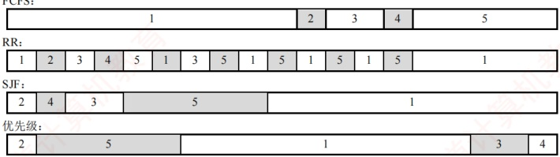

2）各个作业对应于各个算法的周转时间和加权周转时间见下表。

| 算法 | 时间类型 | $P_1$ | $P_2$ | $P_3$ | $P_4$ | $P_5$ | 平均时间 |
| --- | --- | --- | --- | --- | --- | --- | --- |
| 运行时间 | 10 | 1 | 2 | 1 | 5 | 3.8 |   |
| FCFS | 周转时间 | 10 | 11 | 13 | 14 | 19 | 13.4 |
| 加权周转时间 | 1 | 11 | 6.5 | 14 | 3.8 | 7.26 |   |
| RR | 周转时间 | 19 | 2 | 7 | 4 | 14 | 9.2 |
| 加权周转时间 | 1.9 | 2 | 3.5 | 4 | 2.8 | 2.84 |   |
| SJF | 周转时间 | 19 | 1 | 4 | 2 | 9 | 7 |
| 加权周转时间 | 1.9 | 1 | 2 | 2 | 1.8 | 1.74 |   |
| 优先级 | 周转时间 | 16 | 1 | 18 | 19 | 6 | 12 |
| 加权周转时间 | 1.6 | 1 | 9 | 19 | 1.2 | 6.36 |   |

所以，FCFS 的平均周转时间为 13.4，平均加权周转时间为 7.26。

RR 的平均周转时间为 9.2，平均加权周转时间为 2.84。

SJF 的平均周转时间为 7，平均加权周转时间为 1.74。

非剥夺式优先级调度算法的平均周转时间为12，平均加权周转时间为6.36。

**注意**

SJF 的平均周转时间肯定是最短的，计算完毕后可以利用这个性质进行检验。

##### 05

【解答】

1）具有两道作业的批处理系统，内存只存放两道作业，它们采用抢占式优先级调度算法竞争CPU，而将作业调入内存采用的是短作业优先调度。8:00，作业1到来，此时内存和CPU空闲，作业1进入内存并占用CPU；8:20，作业2到来，内存仍有一个位置空闲，因此将作业2调入内存，又由于作业2的优先数高，相应的进程抢占CPU，在此期间8:30作业3到来，但内存此时已无空闲，因此等待。直至8:50，作业2执行完毕，此时作业3、4竞争空出的一道内存空间，作业4的运行时间短，因此先调入，但它的优先数低于作业1，因此作业1先执行。到9:10时，作业1执行完毕，再将作业3调入内存，且由于作业3的优先数高而占用CPU。所有作业进入内存的时间及结束的时间见下表。

| 作业号 | 到达时间 | 运行时间 | 优先数 | 进入内存时间 | 结束时间 | 周转时间 |
| --- | --- | --- | --- | --- | --- | --- |
| 1 | 8:00 | 40min | 5 | 8:00 | 9:10 | 70min |
| 2 | 8:20 | 30min | 3 | 8:20 | 8:50 | 30min |
| 3 | 8:30 | 50min | 4 | 9:10 | 10:00 | 90min |
| 4 | 8:50 | 20min | 6 | 8:50 | 10:20 | 90min |

2）平均周转时间为 $(70+30+90+90)/4=70\text{min}$。

##### 06

【解答】

1）按照可抢先式短进程优先调度算法，进程运行时间见下表。

| 进程名 | 到达就绪队列时刻 | 预计执行时间 | 执行时间段 | 周转时间 |
|---|---|---|---|---|
| $P_{1}$ | 0 | 8 | 0～1: 10～17 | 17 |
| $P_{2}$ | 1 | 4 | 1～5 | 4 |
| $P_{3}$ | 2 | 9 | 17～26 | 24 |
| $P_{4}$ | 3 | 5 | 5～10 | 7 |

时刻0，进程 $P_{1}$到达并占用处理器运行。

时刻1，进程 $P_{2}$到达，因其预计运行时间短，因此抢夺处理器进入运行， $P_{1}$等待。

时刻2，进程 $P_{3}$到达，因其预计运行时间长于正在运行的进程，进入就绪队列等待。

时刻3，进程 $P_{4}$到达，因其预计运行时间长于正在运行的进程，进入就绪队列等待。

时刻5，进程 $P_{2}$运行结束，调度器在就绪队列中选择短进程， $P_{4}$符合要求，进入运行，进程 $P_{1}$和进程 $P_{3}$则还在就绪队列等待。

时刻 10，进程  $P_{4}$ 运行结束，调度器在就绪队列中选择短进程， $P_{1}$ 符合要求，再次进入运行，而进程  $P_{3}$ 则还在就绪队列等待。

时刻 17，进程  $P_{1}$ 运行结束，只剩下进程 P3，调度其运行。

时刻 26，进程  $P_{3}$ 运行结束。

平均周转时间  $=[(17-0)+(5-1)+(26-2)+(10-3)]/4=13$

2）时间片轮转调度算法按就绪队列的 FCFS 进行轮转，在时刻 2， $P_{1}$ 被挂到就绪队列队尾，队列顺序为  $P_{2}$， $P_{3}$， $P_{1}$，此时  $P_{4}$ 还未到达。按时间片轮转调度算法的进程时间分配见下表。

| 进程名 | 到达就绪队列时刻 | 预计执行时间 | 执行时间段 | 周转时间 |
|---|---|---|---|---|
| $P_{1}$ | 0 | 8 | 0~2; 6~8; 14~16; 20~22 | 22 |
| $P_{2}$ | 1 | 4 | 2~4; 10~12 | 11 |
| $P_{3}$ | 2 | 9 | 4~6; 12~14; 18~20; 23~25; 25~26 | 24 |
| $P_{4}$ | 3 | 5 | 8~10; 16~18; 22~23 | 20 |

 $$均周转时间 =[(22-0)+(12-1)+(26-2)+(23-3)]/4=19.25。$$

##### 07

【解答】

在时间片轮转调度算法中，系统将所有就绪进程按到达时间的先后次序排成一个队列。进程调度程序总是选择队列中的第一个进程运行，且仅能运行一个时间片。在使用完一个时间片后，即使进程并未完成其运行，也必须将处理器交给下一个进程。时间片轮转调度算法是绝对可抢先的算法，由时钟中断来产生。

时间片的长短对计算机系统的影响很大。若时间片大到让一个进程足以完成其全部工作，则这种算法就退化为先来先服务调度算法。若时间片很小，则处理器在进程之间的转换工作会过于频繁，处理器真正用于运行用户程序的时间将减少，系统开销将增大。时间片的大小应能使分时用户得到好的响应时间，同时也使系统具有较高的效率。

由题目给定条件可知：

1）每秒产生120个时钟中断，每次中断的时间为 $1/120 \approx 8.3\text{ms}$，其中中断处理耗时为 $500\mu\text{s}$，那么其开销为 $500\mu\text{s}/8.3\text{ms} = 6\%$。

2）每次进程切换需要1次调度、1次切换，所以需要耗时 $1ms + 2ms = 3ms$，每24个时钟为一个时间片， $24 \times 8.3ms = 200ms$。一次切换所占CPU的时间比3ms/200ms=1.5%。

3）为提高 CPU 的效率，一般情况下要尽量减少时钟中断的次数，如由每秒 120 次降低到 100 次，以延长中断的时间间隔。或将每个时间片的中断数量（时钟数）加大，如由 24 个中断加大到 36 个。也可优化中断处理程序，减少中断处理开销，如将每次 500μs 的时间降低到 400μs。若能这样，则时钟中断和进程切换的总开销占 CPU 的时间比为(36×400μs + 1ms + 2ms)/(1/100×36) ≈ 4.8%。

##### 08

【解答】

作业的响应比可表示为

 $$响应比 =\frac{ 等待时间 + 要求服务时间 }{ 要求服务时间 }$$

在时刻 8:00，系统中只有一个作业  $J_1$，因此系统将它投入运行。在  $J_1$ 完成（10:00）时， $J_2$、 $J_3$、 $J_4$ 的响应比分别为  $(90 + 40)/40$、 $(60 + 25)/25$、 $(30 + 30)/30$，即 3.25、3.4、2，因此应先将  $J_3$ 投入运行。在  $J_3$ 完成（10:25）时， $J_2$、 $J_4$ 的响应比分别为  $(115 + 40)/40$、 $(55 + 30)/30$，即 3.875、2.83，因此应先将  $J_2$ 投入运行，待它运行完毕时（11:05），再将  $J_4$ 投入运行， $J_4$ 的结束时间为 11:35。

可见作业的执行次序为  $J_{1}, J_{3}, J_{2}, J_{4}$，各作业的运行情况见下表，它们的周转时间分别为 120min, 155min, 85min, 125min，平均周转时间为 121.25min。

| 作业号 | 提交时间 | 开始时间 | 执行时间 | 结束时间 | 周转时间 |
| --- | --- | --- | --- | --- | --- |
| 1 | 8:00 | 8:00 | 2h | 10:00 | 120min |
| 2 | 8:30 | 10:25 | 40min | 11:05 | 155min |
| 3 | 9:00 | 10:00 | 25min | 10:25 | 85min |
| 4 | 9:30 | 11:05 | 30min | 11:35 | 125min |

##### 09

【解答】

上述5个作业的运行情况如下图所示。

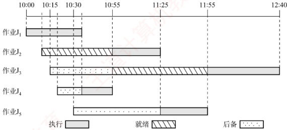

本题涉及作业和进程两方面的调度，一个作业首先需要被调入内存，创建相应的进程，然后竞争 CPU，获得 CPU 的资源来执行。本题的条件是有两道作业的批处理系统，所以内存中同时最多只有两个进程存在，且同时最多只有一个进程能够获得 CPU 资源。

在 10:00，因为只有  $J_{1}$ 到达，因此将它调入内存，并将 CPU 调度给它。

在 10:10， $J_{2}$ 到达，因此将  $J_{2}$ 调入内存，但  $J_{1}$ 只需再执行 25min，因此  $J_{1}$ 继续执行。

虽然  $J_{3}$,  $J_{4}$,  $J_{5}$ 分别在 10:15, 10:20 和 10:30 到达，但因当时内存中已存放了两道作业，因此不能马上将它们调入内存。

在 10:35，J₁ 结束。此时 J₃, J₄, J₅ 的响应比 [根据题意，响应比 = (等待时间 + 估计运行时间) / 估计运行时间] 分别为 65/45, 35/20, 35/30，因此将 J₄ 调入内存，并将 CPU 分配给内存中运行时间最短者，即 J₄。

在 10:55， $J_{4}$ 结束。此时  $J_{3}$， $J_{5}$ 的响应比分别为 85/45，55/30，因此将  $J_{3}$ 调入内存，并将 CPU 分配给估计运行时间较短的  $J_{2}$。

在 11:25， $J_{2}$ 结束，作业调度程序将  $J_{5}$ 调入内存，并将 CPU 分配给估计运行时间较短的  $J_{5}$

在 11:55， $J_{5}$ 结束，将 CPU 分配给  $J_{3}$

在12:40， $J_{3}$结束。

通过上述分析，可知：

）作业1的执行时间片段为10:00—10:35（结束）。作业2的执行时间片段为10:55—11:25（结束）。作业3的执行时间片段为11:55—12:40（结束）。作业4的执行时间片段为10:35—10:55（结束）。作业5的执行时间片段为11:25—11:55（结束）。

2）它们的周转时间分别为35min，75min，145min，35min，85min，因此它们的平均周转时间为75min。

##### 10

【解答】

1）因为采用了静态优先数，当就绪队列中总有优先数较小的进程时，优先数较大的进程一直没有机会运行，所以会出现饥饿现象。

2）一种动态优先数计算方法为 priority = nice +  $k_1 \times cpuTime - k_2 \times waitTime$，其中  $k_1 > 0$， $k_2 > 0$，分别用来调整 cpuTime 和 waitTime 在 priority 中所占的比例。若一个进程的运行时间较长，则其 cpuTime 就增加，进而降低其优先级；若一个进程的等待时间较长，则其 waitTime 增加，进而会提高其优先级。于是，waitTime 就可使长时间等待的进程优先数减少，进而避免出现饥饿现象。
## 2.3 同步与互斥

在学习本节时，请读者思考以下问题：

1）为什么要引入进程同步的概念？

2）不同的进程之间会存在什么关系？

3）当单纯用本节介绍的方法解决这些问题时会遇到什么新的问题吗？

用 PV 操作解决进程之间的同步互斥问题是这一节的重点，统考中频繁考查这一内容，请读者务必多加练习，掌握好求解该类问题的方法。

### 2.3.1 同步与互斥的基本概念

在多道程序环境下，进程是并发执行的，不同进程之间存在多种相互制约关系。为了协调这些制约关系，引入了进程同步的概念。下面通过一个简单的例子来帮助理解。例如，计算表达式 $1+2\times3$，假设系统为此创建两个进程：一个是乘法进程，一个是加法进程。显然，加法进程必须等待乘法进程完成之后才能正确执行。然而，由于操作系统的异步性，若不加以约束，加法进程完全有可能在乘法进程之前运行，从而导致计算结果错误。因此，需要设计一种机制，确保加法进程只能在乘法进程结束后才开始执行，而这种机制正是本节要讨论的问题。

#### 1. 临界资源

### 考点追踪 同步与互斥的相关分析（2016、2021、2023）

虽然多个进程可以共享系统中的各种资源，但其中许多资源在同一时刻仅允许一个进程访问，这类资源被称为临界资源。常见的临界资源包括物理设备（如打印机）以及被多个进程共享的变量、数据结构等。

### 考点追踪 临界区和临界资源的分析（2024）

对临界资源的访问必须以互斥方式进行。在每个进程中，访问临界资源的那段代码称为临界区。为了保证临界资源的正确使用，可将对临界资源的访问过程划分为以下四个部分。

1）进入区。在进入临界区之前，进程需要检查当前是否允许进入。若允许，则设置一个“正在访问临界区”的标志，以阻止其他进程同时进入临界区。

2）临界区。进程中实际访问临界资源的代码段，也称临界段。

3）退出区。在离开临界区时，清除“正在访问临界区”的标志，表示已释放该资源。

4）剩余区。指代码中除上述三部分之外的其余部分。

```c
while(true){
    entry section; //进入区
    critical section; //临界区
    exit section; //退出区
    remainder section; //剩余区
}
```

#### 2. 同步（直接制约关系）

同步是指为完成某种任务而建立的两个或多个进程，由于需要协调彼此的运行次序，而在执行过程中产生等待或传递信息的制约关系。同步关系源于进程之间的相互合作。

例如，输入进程 A 通过单缓冲向进程 B 提供数据。当缓冲区为空时，进程 B 因无法获得所
需数据而被阻塞；一旦进程 A 将数据送入缓冲区，进程 B 就会被唤醒。反之，当缓冲区已满时，进程 A 无法写入新数据，会被阻塞；只有当进程 B 从缓冲区取走数据后，才会唤醒进程 A。

#### 3. 互斥（间接制约关系）

互斥是指当一个进程正在临界区中使用临界资源时，其他试图访问该资源的进程必须等待；只有当占用临界资源的进程退出临界区后，其他进程才被允许进入。

例如，在一个只配备一台打印机的系统中，有两个进程 A 和进程 B。如果进程 A 需要打印，但此时打印机已被分配给进程 B，那么进程 A 必须进入阻塞状态。一旦进程 B 完成打印并释放打印机，系统便会唤醒进程 A，并将其状态由阻塞态转为就绪态。

### 考点追踪 临界区同步与互斥的设计准则（2020）

为防止多个进程同时进入临界区，同步机制应遵循以下准则。

1）空闲让进。临界区处于空闲状态时，应允许一个请求进入临界区的进程立即进入。

2）忙则等待。已有进程在临界区内执行时，表明临界资源正在被访问，其他试图进入临界区的进程必须等待，以保证对临界资源的互斥访问。

3）有限等待。对任何请求进程，应保证其在有限时间内能进入临界区，避免无限期等待。

4）让权等待（原则上应该遵循，但非必须）。当进程因无法进入临界区而需要等待时，应主动放弃 CPU 的使用权，转为阻塞态，而不是在原地循环测试（避免忙等待）。

### 2.3.2 实现临界区互斥的基本方法

### 考点追踪 ➤ 实现互斥的软/硬件方法的特点（2018）

#### 1. 软件实现方法

在进入区设置开检查一些标志，用以表明是否有进程正在临界区中。若已有进程在临界区，则其他进程在进入区通过循环检查的方式等待；当进程离开临界区后，在退出区修改相应的标志，以允许其他进程进入。

##### （1） 算法一：单标志法

该算法设置一个公用整型变量 turn，用于指示当前允许进入临界区的进程编号，当 turn = 0 时，表示允许  $P_0$ 进入临界区；当 turn = 1 时，表示允许  $P_1$ 进入临界区。每当一个进程  $P_i$ 退出临界区时，就将 turn 置为  $j$ ( $i = 0, j = 1$ 或  $i = 1, j = 0$)，即将临界区的使用权转让给另一个进程。

进程  $P_{0}$: 进程  $P_{1}$:
```c
while(turn!=0); while(turn!=1); //进入区
critical section; critical section; //临界区
turn=1; turn=0; //退出区
remainder section; remainder section; //剩余区
```

该算法可以保证每次只有一个进程进入临界区。但缺点是：两个进程必须交替进入临界区。若某个进程不再请求进入临界区，则另一个进程也将无法再次进入（违背“空闲让进”准则），造成资源利用不充分。例如，假设  $P_{0}$ 顺利进入临界区并执行完毕，此时临界区处于空闲状态，但若  $P_{1}$ 没有进入临界区的打算，而 turn = 1 一直成立，则  $P_{0}$ 就无法再次进入临界区。

##### （2） 算法二：双标志先检查法

该算法设置一个布尔型数组 flag[2]，用来标记各进程是否希望进入临界区。flag[i]=true 表示  $P_i$ 想进入临界区（i=0 或 1）。 $P_i$ 进入临界区前，先检查对方是否想进入；若对方想进入，则等待；否则，将自己的 flag[i] 置为 true，然后进入临界区。当  $P_i$ 退出临界区时，将 flag[i] 置为 false。

 $$P_{0}$$

进程 $P_{1}$:
```c
while (flag[1]); ① while (flag[0]); ② //进入区
flag[0]=true; ③ flag[1]=true; ④ //进入区
critical section; critical section; //临界区
flag[0]=false; flag[1]=false; //退出区
remainder section; remainder section; //剩余区
```

优点：无须交替进入，允许进程连续使用临界区。缺点：在某些执行顺序下， $P_{0}$ 和  $P_{1}$ 可能同时进入临界区。例如，若执行顺序为①②③④，即两个进程都先检查对方的标志（发现为 false），然后才设置自己的标志，结果双方都通过检查，从而同时进入临界区（违背“忙则等待”准则）。原因在于“检查对方标志”和“设置自己标志”两个操作不是原子的，中间可能发生进程切换。

##### （3） 算法三：双标志后检查法

算法二的问题在于先检查后设置，而这两次操作无法一气呵成。因此，联想到先设置后检查的方法，以避免上述问题。算法三改为先设置自己的标志，再检查对方的标志：进程  $P_i$ 首先将自己的 flag[i] 置为 true，然后检查 flag[j]，若 flag[j] 为 true，则等待；否则，进入临界区。

进程  $P_{0}$: 进程  $P_{1}$:
```c
flag[0]=true; ① flag[1]=true; ② //进入区
while(flag[1]); ③ while(flag[0]); ④ //进入区
critical section; critical section; //临界区
flag[0]=false; flag[1]=false; //退出区
remainder section; remainder section; //剩余区
```

然而，这种方案也可能出现问题。例如，若执行顺序为①②③④，即两个进程都先设置了各自的标志，然后分别检查对方的标志，会发现对方也想进入临界区，于是彼此等待，谁也无法进入。此时即使临界区空闲，也没有进程能够进入（违背“空闲让进”准则）；同时，进程可能会长期甚至永远无法获得访问权（违背“有限等待”准则），导致“饥饿”现象。

##### （4）算法四：Peterson算法

### 考点追踪 Peterson 算法的原理（2010、2018）

Peterson 算法结合了算法一和算法三的思想：利用 flag[] 数组解决互斥访问问题，利用 turn 变量解决“饥饿”问题。若 flag[i] = true，则表示  $P_i$ 准备进入临界区；若 turn = i，则表示当两个进程同时请求时，优先允许  $P_i$ 进入临界区。具体做法如下：在  $P_i$ 进入临界区之前，先将自己的 flag[i] 置为 true，并将 turn 置为 j（主动将进入机会“谦让”给对方）。随后，通过循环条件 while(flag[j] &&& return ==j) 判断是否需要等待，从而确保双方同时请求进入临界区时，只允许一个进程进入。

进程  $P_{0}$: 进程  $P_{1}$:
```c
flag[0]=true; flag[1]=true; //进入区
turn=1; turn=0; //进入区
`while(flag[1]&&turn==1); while(flag[0]&&turn==0)`; //进入区
critical section; critical section; //临界区
flag[0]=false; flag[1]=false; //退出区
remainder section; remainder section; //剩余区
```

若仅有一个进程请求进入（例如  $P_0$），由于 flag[1] 为 false，其 while 条件不成立，可直接进入临界区。若两个进程同时请求进入， $P_0$ 将 turn 置为 1， $P_1$ 将 turn 置为 0。由于这两个赋值在运行时是依次完成的，turn 的最终值由后执行赋值的进程所决定。而 while 条件仅在“对方准备进入”且“turn 指向对方”时成立，因此总有一个进程的等待条件不成立，从而得以进入临界区。

由此可见，Peterson算法很好地遵循了“空闲让进”“忙则等待”和“有限等待”三条准则。但由于它采用忙等待（在进入区中循环测试），没有遵循“让权等待”准则。尽管如此，在纯软件实现的互斥算法中，Peterson算法是在满足前三条准则方面最完善的方案。
#### 2. 硬件实现方法

现代计算机提供了特殊的硬件指令，能够以原子方式对一个字进行检测和修改，或是交换两个字的内容。因此，可利用它们实现临界区的互斥访问。

实际上，管理临界区时，可将共享标志视为一把锁：“锁开”表示允许进入，“锁关”表示需等待，初始时锁为打开状态。每个欲进入临界区的进程必须先测试该锁：若锁已关，则等待，直至其被打开；一旦发现锁开，就应立即上锁，以阻止其他进程进入临界区。显然，若多个进程几乎同时检测到“锁开”，就可能同时进入临界区，因此测试与上锁必须构成一个原子操作。

##### （1） 中断屏蔽方法

### 考点追踪 中断屏蔽实现互斥的原理与分析（2021）

关中断是实现互斥最简单的方法之一。其做法是：在执行临界区代码之前关闭中断，待临界区执行完毕后再重新开启中断。由于 CPU 仅在响应中断时才可能发生进程或线程切换，因此在关中断期间，当前进程不会被抢占，从而确保临界区代码不受干扰地连续执行。其典型模式如下：

这种方法的缺点：①限制了CPU的并发执行能力，显著降低系统效率。②对内核而言，在更新关键变量的几条指令期间关中断是可行的，但若将关中断权限开放给用户进程，则存在风险：若某进程关中断后未及时开中断，可能导致系统死锁或崩溃。③不适用于多处理器系统，因为在某一CPU上关中断无法阻止其他CPU上的进程并发访问同一临界区。

#### （2） 硬件指令方法——TestAndSet指令

借助一条名为 TestAndSet（简称 TS）的硬件指令实现互斥，该指令是原子操作。其功能是：读取指定标志的当前值，并立即将其置为 true，然后返回读取到的旧值。功能描述如下：

```c
boolean TestAndSet(boolean *lock) {
boolean old;
old=*lock;    //old用来存放lock的旧值
*lock=true;     //将lock置为true
return old;     //返回lock的旧值
}
```

### 考点追踪 TestAndSet 指令实现互斥的原理与特点（2016、2018）

使用 TS 指令管理临界区时，需要为每个临界资源设置一个共享布尔变量 lock（可视为一把锁，初值为 false）：若 lock = true，表示资源已被占用（已加锁）；若 lock = false，表示资源空闲（未加锁）。进程在进入临界区前，通过执行 TestAndSet(&lock)尝试获取锁：① 若返回值为 false，则说明 lock 原为 false，即无其他进程在临界区，当前进程成功获得锁，并将 lock 置为 true，从而阻止其他进程进入。② 若返回值为 true，则说明 lock 原为 true，即已有进程在临界区，当前进程需循环等待，直至持有锁的进程退出临界区并将 lock 置为 false。典型实现如下：

```c
while(TestAndSet(&lock)); //尝试获取锁（忙等待）
进程的临界区代码段；
lock=false; //解锁
```
进程的其他代码；

相比软件实现方法，TS 指令由硬件保证“检查锁”与“加锁”这两个操作的原子性。相比关中断方法，由于“lock”是共享变量，该机制适用于多处理器系统。缺点：等待进程会持续执行 TS 指令，形成忙等待，无法实现“让权等待”，造成 CPU 资源浪费。
#### （3）硬件指令方法——Swap 指令

Swap 指令的功能是原子地交换两个变量的值。其功能描述如下：
```c

void Swap(boolean *a, boolean *b){
    boolean temp=*a;
    *a=*b;
    *b=temp;
}
```

**注意**

以上对 TS 和 Swap 指令的描述仅为功能示意，实际由硬件逻辑实现，不会被中断。

### 考点追踪 Swap 指令实现互斥的原理与分析（2018、2023）

使用 Swap 指令管理临界区时，需要为每个临界资源设置一个共享布尔变量 lock（初值为 false）；并在每个进程中定义一个局部布尔变量 key，每次尝试进入临界区前将其初始化为 true。其工作原理与 TS 指令本质相同：通过一次原子操作，既获取锁的当前状态，又将锁置为占用。具体过程如下：进程执行 Swap(&lock,&key) 后，key 中保存了 lock 的旧值。若 key = false，说明此前无进程持有锁，当前进程成功获得访问权；若 key = true，说明锁已被占用，进程需继续循环等待。因此，进入临界区的条件是 key 变为 false。典型实现如下：

```c
boolean key=true;
while (key!=false)
    Swap(&lock, &key);
进程的临界区代码段；
lock=false;
```
进程的其他代码；

硬件指令方法实现互斥的优点：①实现简单，正确性易于验证。②支持任意数量的进程，并适用于多处理器系统。③系统中可存在多个临界区，只需为每个临界区分配独立的lock变量。缺点：①等待进程持续执行Swap指令，形成忙等待，无法实现“让权等待”，造成CPU资源浪费。②锁的获取顺序不确定，可能导致某些进程长期无法获得访问机会，产生“饥饿”现象。

无论是软件还是硬件实现方法，都应重点理解其执行逻辑与同步思想。需注意：上述代码并非实际编程接口，而是描述进程间同步与互斥的抽象模型。在真实操作系统中，这些底层机制已被封装在信号量、互斥锁等高级同步原语中，用户通常无须直接编写忙等待循环。

### 2.3.3 互斥锁

解决临界区问题最简单的工具是互斥锁（mutex lock）。一个进程在进入临界区前调用 acquire() 以获得锁；在退出临界区时调用 release() 以释放锁。每个互斥锁包含一个布尔变量 available，用于表示锁是否可用。若锁可用，则调用 acquire() 会成功，并将锁置为不可用。当一个进程试图获取不可用的锁时，它将被阻塞，直到锁被释放。其过程描述如下：

```c
acquire() {
    while (!available)
    ;
    available = false;
}
release() {
    available = true;
}
```

acquire()或 release()的执行必须是原子操作，因此互斥锁通常采用硬件机制来实现。
上述互斥锁也称自旋锁，其主要缺点是忙等待：当有一个进程在临界区中时，任何其他进程在进入临界区前都必须连续循环调用 acquire()。类似的还有前面介绍的单标志法、TS 指令和 Swap 指令。当多个进程共享同一 CPU 时，这种连续循环显然浪费了 CPU 周期。因此，自旋锁通常用于多处理器系统，一个线程可以在一个处理器上 “旋转”，而不影响其他线程的执行。自旋锁的优点：进程在等待锁期间没有上下文切换；若持有锁的时间较短，则等待代价较低。

本节后面，将研究如何使用互斥锁解决经典同步问题。

### 2.3.4 信号量

信号量机制是一种功能强大的同步机制，既能解决互斥问题，也能处理进程间的同步问题。它仅能通过两个标准原语访问：wait()和signal()。这两个操作也称P操作和V操作。

原语是指完成特定功能且在执行过程中不可被中断的操作序列，通常由硬件实现。例如，前述的 TS 指令和 Swap 指令均为硬件实现的原子操作。在单 CPU 系统中，也可通过屏蔽中断的方式确保原语执行的原子性。之所以要求原语不可中断，是因为若其对共享变量的操作被中途打断，可能与其他进程的操作交织，从而破坏临界区的互斥性。

### 考点追踪 信号量的含义（2010）

#### 1. 整型信号量

整型信号量用一个整型变量 S 表示某类资源的可用数量。与普通整型变量不同，对其操作仅限于三种：初始化、wait 操作和 signal 操作。其行为可描述如下：

```c
wait(S){
    while (S<=0);
    S=S-1;
}
signal(S){
    S=S+1;
}
```

在整型信号量机制中，当  $S \leq 0$ 时，进程将持续循环测试，处于忙等待状态。这种实现未遵循“让权等待”准则，会浪费 CPU 时间，尤其是在单 CPU 系统中效率低下。

#### 2. 记录型信号量

为了克服忙等待的缺陷，Dijkstra提出了记录型信号量，它通过阻塞机制实现了“让权等待”。记录型信号量采用结构化数据表示：除整型字段value（表示当前可用资源数）外，还包含一个进程链表L（等待队列），用于链接所有因请求该资源而被阻塞的进程。其定义如下：

```c
typedef struct{
    int value;
    struct process *L;
} semaphore;
```

### 考点追踪 wait()操作导致线程状态的变化（2023）

### 考点追踪 遵循“让权等待”的互斥方法（2018）

相应的 wait(S) 和 signal(S) 操作定义如下：

```c
void wait(semaphore S){ //相当于申请资源
    S.value--;
    if(S.value<0){
        add this process to S.L;
        block(S.L);
    }
}
void signal(semaphore S){ //相当于释放资源
    S.value++;
    if (S.value<=0){
        remove a process P from S.L;
        wakeup(P);
    }
}
```

执行 wait(S)时，进程首先将 S.value 减 1，表示请求一个该类资源。若减 1 后 S.value < 0，则表明该类资源已分配完毕，当前进程应调用 block 原语自我阻塞，主动放弃 CPU，并加入等待队列 S.L，从而实现“让权等待”。

执行 signal(S)时，进程将 S.value 加 1，表示释放一个该类资源。若加 1 后 S.value≤0，则说明仍有进程在等待该类资源，此时应调用 wakeup 原语，从 S.L 中移出一个进程并将其唤醒。

#### 3. 利用信号量实现进程互斥

### 考点追踪 ▶️ 利用信号量实现互斥的实现（2024）

为使多个进程能够互斥地访问某一临界资源，可为该资源设置一个互斥信号量 S，其初值设为 1（表示该资源的可用数量为 1）。随后，将各进程中访问该资源的临界区置于 P(S) 与 V(S) 操作之间。具体而言，每个进程在进入临界区前必须执行 P(S) 操作：若此时资源空闲（S=1），则 P(S) 成功，S 被减为 0，进程进入临界区；若资源已被占用（S=0），则后续进程执行 P(S) 时会因 S ≤ 0 而被阻塞，并加入该信号量的等待队列。当进程退出临界区后，执行 V(S) 操作，将 S 加 1，表示释放资源，并唤醒等待队列中的一个进程（若存在）。其实现如下：

```c
semaphore S=1; //初始化信号量，初值为1
P1() {
    ...
    P(S); //申请临界资源，加锁
    进程 P1 的临界区；
    V(S); //释放临界资源，解锁
    ...
}
P2() {
    ...
    P(S); //申请临界资源，加锁
    进程 P2 的临界区；
    V(S); //释放临界资源，解锁
    ...
}
```

在仅有两个进程竞争该资源的情形下，S 的取值仅可能为 1、0 或 -1。若 S = 1，表示两个进程均未进入临界区；若 S = 0，表示有一个进程正在临界区中；若 S = -1，则表示一个进程在临界区，另一个进程因请求资源而阻塞在等待队列中，需等待临界区中的进程执行 V(S) 后方可被唤醒。

**注意**

① 不同的临界资源应配置独立的互斥信号量，避免相互干扰。② P(S)与V(S)必须严格成对出现：缺少P(S)将无法保证互斥访问，缺少V(S)则会导致资源永不释放，使等待进程永久阻塞。③ 若系统中存在多个同类资源，应将信号量初值设为资源总数，进程申请资源时执行P(S)，释放时执行V(S)。

#### 4. 利用信号量实现同步

### 考点追踪 利用信号量实现同步（2024）

进程间的同步源于协作需求。在并发执行中，各进程具有异步性，其推进次序不确定。若某
一进程的操作依赖于另一进程的执行结果，则必须确保前者在后者之后执行。例如，进程  $P_1$ 与  $P_2$ 并发执行，其中  $P_2$ 的语句 y 需要使用  $P_1$ 的语句 x 的执行结果，则必须保证语句 y 在语句 x 之后执行。为此，可引入一个同步信号量 S，其初值设为 0（可理解为：初始时  $P_2$ 所需的某个资源尚未满足，而该资源只能由  $P_1$ 的执行结果提供）。其实现如下：

```c
semaphore S=0; //初始化信号量，初值为0
P1() {
    x; //执行语句 x
    V(S); //通知 P2，x 已完成
    ...
}
P2() {
    P(S); //等待 x 完成
    y; //使用 x 的结果，执行语句 y
    ...
}
```

该机制的行为取决于两个进程的执行顺序。

若  $P_1$ 先执行  $V(S)$：信号量 S 由 0 增为 1。随后  $P_2$ 执行  $P(S)$ 时，由于  $S = 1$，表示此时有可用资源，执行 S--后  $S = 0$，P 操作不会调用 block 原语，而是继续执行语句 y。

若  $P_{2}$ 先执行 P(S)，信号量 S 由 0 减为 -1，表示当前无可用资源，因此 P 操作会调用 block 原语，将  $P_{2}$ 阻塞。当  $P_{1}$ 完成语句 x 并执行 V(S) 后，S 由 -1 增为 0，于是 V 操作会调用 wakeup 原语，唤醒等待队列中的  $P_{2}$，使其得以继续执行语句 y。

PV 操作的用法总结：在同步问题中，若某个行为会提供某种资源，则应在该行为之后 V 这种资源；若某个行为需要使用这种资源，则应在该行为之前 P 这种资源。在互斥问题中，P、V 操作必须紧夹使用临界资源的那个行为，中间不得插入任何无关代码。

#### 5. 利用信号量实现前驱关系

### 考点追踪 信号量实现前驱关系的应用题（2020、2022）

信号量还可用于描述程序段之间的前驱关系。图2.11 展示了一个前驱关系示例，其中  $S_{1}, S_{2}, \cdots, S_{6}$ 均为简单的程序段（仅含一条语句），箭头表示执行顺序的约束。

每对前驱关系都对应一个同步问题：后继段必须等待前驱段完成。因此，可为每条前驱边设置一个同步信号量，初值均为0。其使用规则如下：前驱段执行完毕后，执行V操作，通知所有直接后继；后继段开始执行前，执行P操作，等待所有直接前驱完成。以图2.11中的依赖关系为例，需满足： $S_{1} \rightarrow S_{2}, S_{1} \rightarrow S_{3}, S_{2} \rightarrow S_{4}, S_{2} \rightarrow S_{5}, S_{3} \rightarrow S_{6}, S_{4} \rightarrow S_{6}, S_{5} \rightarrow S_{6}$，为此，分别定义同步信号量a12, a13, a24, a25, a36, a46, a56，其中下标ij表示该信号量用于协调 $S_{i}$与 $S_{j}$的前驱关系。各程序段的实现如下：

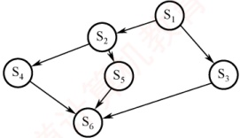

图2.11 前驱关系举例

```c
semaphore a12=0,a13=0,a24=0,a25=0,a36=0,a46=0,a56=0;
//初始化所有信号量，初值均为0
S1(){
    ...;
    V(a12);V(a13);
}
S2(){
    P(a12);
    ...;
} //执行S1
//通知S2和S3：S1已完成
//等待S1完成
//执行S2
V(a24); V(a25); //通知 S4 和 S5: S2 已完
}
S3() {
    P(a13); //等待 S1 完成
    ...; //执行 S3
    V(a36); //通知 S6: S3 已完成
}
S4() {
    P(a24); //等待 S2 完成
    ...; //执行 S4
    V(a46); //通知 S6: S4 已完成
}
S5() {
    P(a25); //等待 S2 完成
    ...; //执行 S5
    V(a56); //通知 S6: S5 已完成
}
S6() {
    P(a36); //等待 S3 完成
    P(a46); //等待 S4 完成
    P(a56); //等待 S5 完成
    ...; //执行 S6
}
```

#### 6. 分析进程同步和互斥问题的方法步骤

1）关系分析。首先识别参与并发的进程，并厘清其间的关系：互斥关系（多个进程竞争同一临界资源）、同步关系（某进程需等待另一进程的执行结果）、前驱关系（存在明确的执行顺序约束）。每类关系均可映射到前述经典信号量模型。

2）思路梳理。根据各进程的操作流程，确定关键同步点，并初步规划 P、V 操作的位置。可参考和类比典型场景，如生产者-消费者、读者-写者、前驱图。

3）信号量设置。基于上述分析，定义所需的信号量，明确其语义与初值，并将P、V操作嵌入各进程的适当位置，确保逻辑正确，避免死锁与饥饿，且满足所有约束条件。

### 2.3.5 经典同步问题

### 考点追踪 PV 操作的应用题（2009、2011、2013、2014、2015、2017、2019、2025）

#### 1. 生产者-消费者问题

**问题描述：**

系统中存在一组生产者进程和一组消费者进程，它们共享一个初始为空、容量为 n 的缓冲区。生产者每次生产一个产品，并将其放入缓冲区；消费者每次从缓冲区取出一个产品并进行消费。该问题需满足以下约束条件：仅当缓冲区未满时，生产者才能写入产品，否则必须等待；仅当缓冲区非空时，消费者才能读取产品，否则必须等待；缓冲区是临界资源，所有进程必须互斥访问。

**问题分析：**

1）关系分析。由于缓冲区是共享的临界资源，生产者与消费者对缓冲区的访问构成互斥关系；同时，消费者必须等待生产者生成产品后才能消费，二者又存在同步关系。

2）思路梳理。使用一个互斥信号量控制对缓冲区的互斥访问；使用两个计数信号量分别跟踪空缓冲区和满缓冲区的数量；并严格控制 P 和 V 操作的执行顺序，以避免死锁。

3）信号量设置。互斥信号量 mutex，控制对缓冲区的互斥访问，初值为1；计数信号量 empty，记录空缓冲区的数量，初值为n；计数信号量 full，记录满缓冲区的数量，初值为0。
生产者-消费者进程的实现如下：

```c
semaphore mutex=1; //互斥访问缓冲区
semaphore empty=n; //空缓冲区数量
semaphore full=0; //满缓冲区数量
producer() {
    while(1) {
        生产一个产品
        P(empty); （要用什么，P一下）
        P(mutex); （互斥夹紧）
        将产品放入缓冲区
        V(mutex); （互斥夹紧）
        V(full); （提供什么，V一下）
    }
}
consumer() {
    while(1) {
        P(full);
        P(mutex);
        从缓冲区中取出一个产品
        V(mutex);
        V(empty);
        消费产品
    }
}
```

需特别注意：对 empty 和 full 的 P 操作必须置于对 mutex 的 P 操作之前。若顺序颠倒，例如生产者先执行 P(mutex) 再执行 P(empty)，则消费者先执行 P(mutex) 再执行 P(full) 可能导致死锁。试想：当缓冲区已满（empty = 0），若生产者先获取 mutex，随后因 P(empty) 而阻塞；此时消费者欲取产品，却因 mutex 已被生产者持有而无法进入临界区执行 P(full) 和消费操作。结果，生产者等待消费者释放空位，消费者等待生产者释放 mutex，双方互相阻塞，导致死锁。同理，当缓冲区为空（full = 0）时，若消费者先获取 mutex 再执行 P(full)，也会因无法继续而阻塞，进而阻止生产者进入临界区放入产品，同样导致死锁。因此，必须先申请资源状态（empty 或 full），再申请互斥访问（mutex），以确保进程不会在持有互斥锁的同时等待资源，从而避免死锁。

下面再看一个较为复杂的生产者-消费者问题。

**问题描述：**

桌上有一个盘子，最多只能容纳一个水果。爸爸专门向盘中放入苹果，妈妈专门放入橘子；女儿只吃盘中的苹果，儿子只吃盘中的橘子；只有当盘子为空时，爸爸或妈妈才能向其中放入一个水果；只有当盘中有自己所需的水果时，儿子或女儿才能从中取出并食用。

**问题分析：**

1）关系分析。爸爸和妈妈在向盘中放入水果时存在互斥关系；爸爸与女儿、妈妈与儿子之间分别构成同步关系（爸爸放苹果后，女儿才能取用；妈妈放橘子后，儿子才能取用）；儿子与女儿各自等待不同的水果，因此他们之间既无互斥也无同步关系。

2）整理思路。可抽象为两个生产者（爸爸、妈妈）和两个消费者（女儿、儿子），共享一个容量为1的缓冲区。由于不同类型的产品（苹果、橘子）需由不同的消费者消费，故不能仅使用一个full信号量来表示满状态，而需为每种产品设置独立的同步信号量。

3）信号量设置。互斥信号量 plate，控制对盘子的互斥访问，初值为 1；同步信号量 apple，表示盘中是否有苹果，初值为 0；同步信号量 orange，表示盘中是否有橘子，初值为 0。进程的实现如下：
```c
semaphore plate=1,apple=0,orange=0;
dad() {
    while (1) {
        准备一个苹果
        P(plate);
        把苹果放入盘子
        V(apple);
    }
    mom() {
        while (1) {
            准备一个橘子
            P(plate);
            把橘子放入盘子
            V(orange);
        }
    }
    son() {
        while (1) {
            P(orange);
            从盘子中取出橘子
            V(plate);
            吃掉橘子
        }
    }
    daughter() {
        while (1) {
            P(apple);
            从盘子中取出苹果
            V(plate);
            吃掉苹果
        }
    }
}
//爸爸进程
//获取对盘子的独占使用权
//通知女儿：苹果已放入盘中
//母亲进程
//获取对盘子的独占使用权
//通知儿子：橘子已放入盘中
//儿子进程
//等待盘中有橘子
//释放盘子，允许他人使用
//女儿进程
//等待盘中有苹果
//释放盘子，允许他人使用
```

进程之间的关系如图 2.12 所示。dad()和 daughter()、mom()和 son()必须成对执行。只有当女儿拿走苹果或儿子拿走橘子之后，才会执行 V(plate)操作，从而释放盘子供下一次使用。

#### 2. 读者-写者问题

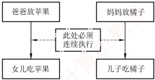

**问题描述：**

图 2.12 进程之间的关系

系统中存在两组并发进程：读者和写者，它们共享一个文件。多个读者可以同时读取文件，不会导致数据不一致；

但若任一写者与其他进程（无论是读者还是其他写者）同时访问文件，则可能破坏数据一致性。因此，需满足以下要求：① 允许多个读者同时执行读操作；② 任一时刻只允许一个写者执行写操作；③ 写者在完成写操作前，不允许任何其他读者或写者访问文件；④ 写者开始写操作前，必须等待所有已进入的读者和写者全部退出。

**问题分析：**

1）关系分析。读者与写者之间存在互斥关系；写者与写者之间也存在互斥关系；读者与读者之间无互斥关系，可并发读取。

2）整理思路。写者的实现较为直接：它与所有其他进程互斥，只需用一个互斥信号量控制
即可。读者的实现则更为复杂：它既要允许其他读者并发读取，又要阻止写者在读期间介入。为此，引入一个计数器 count，用于记录当前正在读文件的读者数量。当第一个读者开始读时，应阻塞后续的写者；当最后一个读者结束读时，才允许写者进入；同时，多个读者对 count 的修改必须互斥。

3）信号量设置。计数信号量 count，记录当前读者数量，初值为 0；互斥信号量 mutex，控制对 count 的互斥访问，初值为 1；互斥信号量 rw，控制对文件的互斥访问，初值为 1。进程的实现如下（读者优先）：

```c
int count=0; //记录当前的读者数量
semaphore mutex=1; //控制对 count 的互斥访问
semaphore rw=1; //控制读者与写者对文件的互斥访问
writer() { //写者进程
    while(1) {
        P(rw); //申请对文件的独占写权限
        写文件
        V(rw); //释放文件写权限
    }
}
reader() { //读者进程
    while(1) {
        P(mutex); //互斥访问 count
        if(count==0) {
            P(rw); //若是第一个读者
            count++; //读者数量加1
            V(mutex); //释放对 count 的访问
        }
        V(mutex); //互斥访问 count
        count--; //读者数量减1
        if(count==0) {
            V(rw); //允许写者访问文件
            V(mutex); //释放对 count 的访问
        }
    }
}
```

上述算法实现的是读者优先策略。只要已有读者在读，后续到来的读者均可立即进入读取，而写者必须等待所有读者全部退出。这种设计可能导致写者长时间等待，甚至出现写者饥饿，即在读者持续到达的情况下，写者可能被无限期推迟。

若需实现写者优先策略：一旦有写者请求写入，就禁止新读者进入，并在当前读者全部退出后立即让写者执行。为此，引入互斥信号量 w，用于控制所有进程进入“准备访问文件”阶段的权限：写者先执行 P(w)，再执行 P(rw)，从而阻止后续读者插队；读者也需先执行 P(w)；若此时有写者持有或正在等待 w，该读者将被阻塞；读者在更新 count 后立即执行 V(w)，因为只要存在活跃读者（count > 0），写者已被 rw 阻塞，提前释放 w 可避免不必要地阻碍其他写者；写者完成操作后执行 V(w)，释放访问权。这样，w 如同“门卫”：当有写者等待时，新读者无法进入；但已在读的读者可正常完成操作，既保障了写者的优先权，又维持了读者之间的并发读取。

```c
int count=0; //记录当前的读者数量
SEMAPHORE mutex=1; //控制对 count 的互斥访问
SEMAPHORE rw=1; //控制读者与写者对文件的互斥访问
SEMAPHORE w=1; //实现写者优先的关键信号量
writer() { //写者进程
while(1) {
P(w);
P(rw);
写文件
V(rw);
V(w);
}

reader() {
    while(1){
        P(w);
        P(mutex);
        if(count==0)
            P(rw);
        count++;
        V(mutex);
        V(w);
        读文件
        P(mutex);
        count--;
        if(count==0)
            V(rw);
        V(mutex);
    }
}

//申请写者优先权：阻止新读者进入
//申请对文件的独占写权限
//释放文件写权限
//释放写者优先权，允许其他进程进入
//读者进程
//申请进入权限：若无写者等待，则通过
//互斥访问 count
//若是第一个读者
//阻止写者访问文件
//读者数量加1
//释放对 count 的访问
//立即释放 w，允许其他进程竞争
//互斥访问 count
//读者数量减1
//若是最后一个读者
//允许写者访问文件
//释放对 count 的访问
```

上述写者优先策略是相对的，并非绝对优先。该算法通过信号量 w 阻止新读者在写者等待时进入，从而避免读者无限插队；然而，若多个进程（包括读者和写者）同时阻塞在 w 上，系统通常按 FCFS 顺序唤醒，此时先到达的读者仍可能优先于后到的写者获得访问权。因此，该算法本质上是在防止写者饥饿的前提下，对写者给予有限优先，而非严格意义上的写者优先。

读者-写者问题的关键在于使用了受互斥保护的计数器 count。因此，面对复杂的同步互斥问题时，可考虑引入此类计数器来动态判断资源状态，这是一种重要的解题思路。

#### 3. 哲学家进餐问题

**问题描述：**

一张圆桌旁围坐5名哲学家，每两名相邻哲学家之间放置一根筷子，共5根筷子，每位哲学家面前有一碗米饭，如图2.13所示。哲学家交替进行思考与进餐：思考时互不影响；饥饿时，必须同时持有左右两根筷子才能开始进餐（筷子需要逐根拿起）；若所需筷子已被他人持有，则必须等待；进餐结束后，立即放下两根筷子，继续思考。

**问题分析：**

1）关系分析。每根筷子被其两侧的哲学家共享，因此对同一根筷子的访问必须互斥。

2）整理思路。共有5个并发进程。本题的关键是如何让一名哲学家安全地获取左右两根筷子，避免死锁或饥饿。直观的解决思路有两种：①尝试同时获取两根筷子，即仅当左右筷子均空闲时才拿起；②对哲学家的行为制定规则，破坏死锁产生的必要条件。

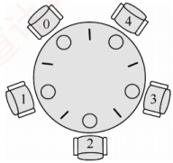

图2.13 5名哲学家进餐

3）信号量设置。定义互斥信号量数组 chopstick[5]，控制对 5 根筷子的互斥访问，初值均为 1。哲学家编号为 0～4，哲学家 i 左侧筷子的编号为 i，右侧筷子的编号为  $(i+1)\%5$。一个直观的实现如下（存在死锁风险）：
```c
semaphore chopstick[5]={1,1,1,1,1}; //初始化5根筷子的信号量
Pi(){
    do{
        P(chopstick[i]);
        P(chopstick[(i+1)\%5]);
        进餐
        V(chopstick[i]);
        V(chopstick[(i+1)\%5]);
        思考
    } while(1);
}
```

假设 5 名哲学家同时饥饿，并几乎同时执行完 P(chopstick[i])。此时，每位哲学家各持一根左侧筷子，且均在等待右侧筷子，系统进入循环等待状态，所有进程阻塞，形成死锁。

为防止死锁发生，可对哲学家进程施加一些限制条件：①限制最多4名哲学家同时尝试进餐，确保至少有一人能获得两根筷子，这样在其用餐完毕后释放他的两根筷子，从而使更多的哲学家能够进餐；②对哲学家编号，规定奇数号哲学家先拿左筷、再拿右筷，偶数号则相反，打破循环等待条件；③仅当左右两根筷子均空闲时，才允许哲学家同时拿起。

假设采用第二种方法，当一名哲学家左右两侧的筷子都可用时，才允许他拿起筷子。

\}

哲学家进餐问题是经典的进程同步案例，其本质在于预防循环等待。尽管大部分习题和真题通过消费者-生产者模型或读者-写者问题就能求解，但对哲学家进餐问题仍然要熟悉。考研复习的关键在于反复多次和全面，“偷工减料”是要吃亏的。

### 2.3.6 管程

在信号量机制中，每个访问临界资源的进程都需自行编写 P/V 操作。分散的同步代码不仅增加了编程复杂度，还极易因操作顺序不当而引发死锁。为简化同步控制，操作系统引入了更高层的抽象机制——管程：它将共享资源及其操作封装于一体，自动保证互斥访问，程序员无须显式编写互斥代码；同时，通过条件变量实现灵活的进程同步，有效降低死锁风险。

#### 1. 管程的定义

### 考点追踪 管程的特点（2016）

系统中的各类硬件资源和软件资源，均可通过数据结构进行抽象描述：即用少量状态信息和一组对资源的操作来表征该资源，而忽略其内部结构与实现细节。

管程正是基于这一思想构建的。它利用一个共享数据结构来表示系统中的共享资源，并将对该数据结构的所有操作封装为一组过程。进程对共享资源的申请、释放等操作，都必须通过调用
这些过程来完成。这组过程可根据资源的当前状态决定是否允许访问：若条件满足，则处理请求；否则，将进程阻塞。由此确保任一时刻至多只有一个进程使用该共享资源，从而统一管理所有对共享资源的访问，实现进程互斥。这个由共享数据结构及其操作过程共同组成的资源管理程序，称为管程（monitor）。形式上，管程定义了一个数据结构，以及一组可在该数据结构上被并发进程调用的操作；这些操作不仅能修改管程内部的数据，还能协调进程之间的同步行为。

形式上，一个管程由以下四部分组成。

① 管程的名称。

② 局部于管程内部的共享数据结构说明。

③ 对该数据结构进行操作的一组过程（或函数）。

④ 对共享数据进行初始化的语句。

典型的管程定义如下：

```c
monitor Demo{
    //① 定义一个名称为 Demo 的管理
    //② 定义共享数据结构，对应系统中的某种共享资源
    共享数据结构 S;
    //④ 对共享数据结构初始化的语句
    init_code() {
        S=5; //初始可用资源数为5
    }
    take_away() {
        //③ 操作过程1：申请资源
        对共享数据结构 S 的一系列处理；
        S--; //可用资源数-1
    }
    give_back() {
        //③ 操作过程2：归还资源
        对共享数据结构 S 的一系列处理；
        S++; //可用资源数+1
    }
}
```

熟悉面向对象程序设计的读者会发现，管程与类（class）高度相似。
```c

1）封装性：管程将对共享资源的操作封装起来，其内部的共享数据结构只能被管程自身的过程访问。外部进程必须通过调用这些过程才能访问资源。例如，在上例中，申请资源需调用 take_away()，归还资源则需调用 give_back()。

2）互斥性：任一时刻仅允许一个进程执行管程内的过程，从而实现互斥访问。若多个进程同时调用 take_away()或 give_back()，则只有当前进程完成其所调用的过程后，下一个进程才能开始执行，这一机制确保了对共享数据 S 的互斥访问。
```

管程与进程的区别：①进程拥有私有数据结构（如PCB），而管程管理的是公共数据结构（如缓冲区）。②进程执行通用计算任务，而管程专注于同步控制与资源管理。③引入进程是为了实现并发，而引入管程是为了解决共享资源的互斥访问问题。④进程是主动执行的实体，而管程是被动调用的模块，即进程通过调用管程中的过程来操作共享数据。⑤多个进程可并发执行，但对同一管程的多个调用是互斥的，即同一时刻仅一个进程可在该管程内执行。⑥进程具有动态的生命周期（从创建到撤销），而管程是操作系统中的静态资源管理模块，仅供进程调用。

#### 2. 条件变量

当一个进程进入管程后，若因条件不满足而需要等待，它必须释放对管程的占用；否则，其他进程将无法进入管程，从而导致系统停滞。为解决这一问题，管程引入了条件变量（condition），将不同的阻塞原因分别抽象为独立的条件变量。通常，一个进程可能因多种条件不满足而被阻塞，因此管
程中可以设置多个条件变量。每个条件变量维护一个等待队列，用于记录所有因该条件而阻塞的进程。对条件变量仅支持两种操作：wait 和 signal。

x.wait: 当条件变量 x 所代表的条件不满足时，当前执行管程过程的进程调用 x.wait()，将自身加入 x 的等待队列，并自动释放管程，从而允许其他进程进入。

x.signal: 当 x 所代表的条件发生变化（可能已满足）时，调用 x.signal()，唤醒一个因等待该条件而阻塞在 x 上的进程。

条件变量的定义和使用示例如下：

```c
monitor Demo{
    共享数据结构 S;
    condition x; //定义一个条件变量 x
    init_code(){ ... }
    take_away(){
        if(S<=0) x.wait(); //资源不足，在条件变量 x 上阻塞等待
        资源足够，分配资源，做一系列相应处理；
    }
    give_back(){
        归还资源，做一系列相应处理；
        if(有进程在等待) x.signal(); //唤醒一个阻塞进程
    }
}
```

条件变量与信号量的比较。相似点：wait/signal 操作与 P/V 操作均可实现进程的阻塞与唤醒。不同点：信号量具有整数值，反映可用资源数量；而条件变量不维护数值，仅用于线程排队和通知。在管程中，资源数量由共享变量（如 S）显式记录，条件变量只负责同步。

### 2.3.7 本节小结

本节开头提出的问题的参考答案如下。

1）为什么要引入进程同步的概念？

在多道程序环境下，多个进程并发执行，彼此之间存在相互制约关系。为协调这些关系，确保进程能够正确、有序地协作或竞争共享资源，操作系统引入了进程同步的概念。

2）不同的进程之间会存在什么关系？

进程之间主要存在两种基本的制约关系：同步与互斥。同步是指为完成共同任务而建立的多个进程，在某些关键点上需要协调工作次序，通过等待或传递信息所形成的协作关系。互斥是指当一个进程正在访问临界资源（处于临界区）时，其他进程必须等待；只有当前进程退出临界区后，其他进程才被允许进入，以保证对临界资源的独占访问。

3）当单纯用本节介绍的方法解决这些问题时会遇到什么新的问题吗？

当两个或多个进程各自已占用某些资源，又同时请求对方所持有的资源时，可能形成一种互相等待的局面。若无外部干预，这些进程将永久阻塞，无法继续推进，这种现象称为死锁。其形成原因、必要条件、检测方法及解决方案将在下一节中详细介绍。

### 2.3.8 本节习题精选

#### 一、 单项选择题

##### 01

下列对临界区的论述中，正确的是（）。

A. 临界区是指进程中用于实现进程互斥的那段代码

B. 临界区是指进程中用于实现进程同步的那段代码

C. 临界区是指进程中用于实现进程通信的那段代码
D. 临界区是指进程中用于访问临界资源的那段代码

##### 02

不需要信号量就能实现的功能是()。

A. 进程同步

B. 进程互斥

C. 执行的前驱关系

D. 进程的并发执行

##### 03

若一个信号量的初值为3，经过多次PV操作后当前值为-1，这表示等待进入临界区的进程数是（）。

A. 1 B. 2 C. 3 D. 4

##### 04

一个正在访问临界资源的进程由于申请等待 I/O 操作而被中断时，它（）。

A. 允许其他进程进入与该进程相关的临界区

B. 不允许其他进程进入任何临界区

C. 允许其他进程抢占处理器，但不得进入该进程的临界区

D. 不允许任何进程抢占处理器

##### 05

两个旅行社甲和乙为旅客到某航空公司订飞机票，形成互斥资源的是（）。

A. 旅行社

B. 航空公司

C. 飞机票

D. 旅行社与航空公司

##### 06

临界区是指并发进程访问共享变量段的（）。

A. 管理信息 B. 信息存储 C. 数据 D. 代码程序

##### 07

以下不是同步机制应遵循的准则的是（）。

A. 让权等待 B. 空闲让进 C. 忙则等待 D. 无限等待

##### 08

以下（）不属于临界资源。

A. 打印机 B. 非共享数据 C. 共享变量 D. 共享缓冲区

##### 09

以下（）属于临界资源。

A. 磁盘

B. 公用队列

C. 私用数据

D. 可重入的程序代码

##### 10

在操作系统中，要对并发进程进行同步的原因是（）。

A. 进程必须在有限的时间内完成

B. 进程具有动态性

C. 并发进程是异步的

D. 进程具有结构性

##### 11

进程 A 和进程 B 通过共享缓冲区协作完成数据处理，进程 A 负责产生数据并放入缓冲区，进程 B 从缓冲区读数据并输出。进程 A 和进程 B 之间的制约关系是（）。

A. 互斥关系 B. 同步关系 C. 互斥和同步关系 D. 无制约关系

##### 12

在操作系统中，P, V 操作是一种（）。

A. 机器指令

B. 系统调用命令

C. 作业控制命令

D. 低级进程通信原语

##### 13

P 操作可能导致（）。

A. 进程就绪 B. 进程结束 C. 进程阻塞 D. 新进程创建

##### 14

原语是（）。

A. 运行在用户态的过程

B. 操作系统的内核

C. 可中断的指令序列

D. 不可分割的指令序列

##### 15

（）定义了共享数据结构和各种进程在该数据结构上的全部操作。

A. 管程 B. 类程 C. 线程 D. 程序
##### 16

用 V 操作唤醒一个等待进程时，被唤醒进程变为（）态。

A. 运行 B. 等待 C. 就绪 D. 完成

##### 17

在用信号量机制实现互斥时，互斥信号量的初值为（）。

A. 0

B. 1

C. 2

D. 3

##### 18

用 P, V 操作实现进程同步，信号量的初值为（）。

A. -1 B. 0 C. 1 D. 由用户确定

##### 19

可以被多个进程在任意时刻共享的代码必须是（）。

A. 顺序代码

B. 机器语言代码

C. 不允许任何修改的代码

D. 无转移指令代码

##### 20

一个进程映像由程序、数据及 PCB 组成，其中（）必须用可重入编码编写。

A. PCB B. 程序 C. 数据 D. 共享程序段

##### 21

下列关于互斥锁的说法中，正确的是（）。

A. 互斥锁只能用于多线程之间，不能用于多进程之间

B. 互斥锁只能用于多进程之间，不能用于多线程之间

C. 互斥锁可用于多线程或多进程之间，但只能由创建它的线程或进程来加锁和解锁

D. 互斥锁可用于多线程或多进程之间，但只能由对它加锁的线程或进程来解锁

##### 22

在使用互斥锁进行同步互斥时，下列（）情况会导致死锁。

A. 一个线程对同一个互斥锁连续加锁两次

B. 一个线程尝试对一个已加锁的互斥锁再次加锁

C. 两个线程分别对两个不同的互斥锁先后加锁，但顺序相反

D. 一个线程对一个互斥锁加锁后忘记解锁

##### 23

用来实现进程同步与互斥的 PV 操作实际上是由（）过程组成的。

A. 一个可被中断的

B. 一个不可被中断的

C. 两个可被中断的

D. 两个不可被中断的

##### 24

对于两个并发进程，设互斥信号量为 mutex（初值为 1），若 mutex = 0，则表示（）。

A. 没有进程进入临界区

B. 有一个进程进入临界区

C. 有一个进程进入临界区，另一个进程等待进入

D. 有一个进程在等待进入

##### 25

对于两个并发进程，设互斥信号量为 mutex（初值为 1），若 mutex = -1，则（）。

A. 表示没有进程进入临界区

B. 表示有一个进程进入临界区

C. 表示有一个进程进入临界区，另一个进程等待进入

D. 表示有两个进程进入临界区

##### 26

一个进程因在互斥信号量 mutex 上执行 V(mutex) 操作而导致唤醒另一个进程时，执行 V 操作后 mutex 的值为（）。

A. 大于 0

B. 小于 0

C. 大于或等于 0

D. 小于或等于 0

##### 27

一个系统中共有5个并发进程涉及某个相同的变量A，变量A的相关临界区是由（）个临界区构成的。

A. 1 B. 3 C. 5 D. 6

##### 28

下述（）选项不是管程的组成部分。

A. 局限于管程的共享数据结构
B. 对管程内数据结构进行操作的一组过程

C. 管程外过程调用管程内数据结构的说明

D. 对局限于管程的数据结构设置初始值的语句

##### 29

以下关于管程的叙述中，错误的是（）。

A. 管程是进程同步工具，解决信号量机制大量同步操作分散的问题

B. 管程每次只允许一个进程进入管程

C. 管程中 signal 操作的作用和信号量机制中的 V 操作相同

D. 管程是被进程调用的，管程是语法范围，无法创建和撤销

##### 30

对信号量 S 执行 P 操作后，使该进程进入资源等待队列的条件是（）。

A. S.value < 0 B. S.value <= 0 C. S.value > 0 D. S.value >= 0

##### 31

若系统有 n 个进程，则就绪队列中进程的个数最多有（①）个；阻塞队列中进程的个数最多有（②）个。

① A.  $n+1$ B.  $n$ C.  $n-1$ D. 1

② A.  $n+1$ B.  $n$ C.  $n-1$ D. 1

##### 32

有一个计数信号量 S:

1）假如若干进程对S进行28次P操作和18次V操作后，信号量S的值为0。

2）假如若干进程对信号量 S 进行了 15 次 P 操作和 2 次 V 操作。请问此时有多少个进程等待在信号量 S 的队列中？（）

A. 2 B. 3 C. 5 D. 7

##### 33

有两个并发进程  $P_1$ 和  $P_2$，其程序代码如下：

```c
P1() {

    x=1; //A1

    y=2;

    z=x+y;

    print z; //A2

}

P2() {

    x=-3; //B1

    c=x*x;

    print c; //B2
```

可能打印出的 z 值有（ ），可能打印出的 c 值有（ ）（其中 x 为  $P_{1},P_{2}$ 的共享变量）。

A. z=1,-3; c=-1,9 B. z=-1,3; c=1,9 C. z=-1,3,1; c=9 D. z=3; c=1,9

##### 34

并发进程之间的关系是（）。

A. 无关的

B. 相关的

C. 可能相关的

D. 可能是无关的，也可能是有交往的

##### 35

若系统中有 4 个进程共享 3 台打印机，采用信号量机制控制打印机的共享使用，则信号量的取值范围是（）。

A.  $[-1, 4]$ B.  $[-2, 2]$ C.  $[-1, 3]$ D.  $[-3, 2]$

##### 36

两个进程  $P_{0}$、 $P_{1}$ 互斥的 Peterson 算法描述如下：

进程 P0

```c
flag[0]=1;

(1);

while (flag[1]&&turn==1);

临界区;

flag[0]=0;

其余代码;
```

其中，(1)和(2)处的代码分别为（）。

A. turn = 0, turn = 0 B. turn = 0, turn = 1 C. turn = 1, turn = 0 D. turn = 1, turn = 1
##### 37

在 Peterson 算法中，flag 数组的作用是（）。

A. 表示每个线程是否想进入临界区

B. 表示每个线程是否已进入临界区

C. 表示每个线程是否已退出临界区

D. 表示每个线程是否已完成任务

##### 38

在 Peterson 算法中，turn 变量的作用是（）。

A. 表示轮到哪个线程进入临界区

B. 表示哪个线程先发出访问请求

C. 表示哪个线程后发出访问请求

D. 表示哪个线程已进入临界区

##### 39

生产者-消费者问题用于解决（）。

A. 多个进程共享一个数据对象的问题 B. 多个进程之间的同步和互斥问题

C. 多个进程共享资源的死锁与饥饿问题 D. 利用信号量实现多个进程并发的问题

##### 40

所有的消费者必须等待生产者先运行的前提条件是（）。

A. 缓冲区空 B. 缓冲区满 C. 缓冲区不可用 D. 缓冲区半空

##### 41

下列关于生产者-消费者问题的唤醒操作的说法中，正确的是（）。

I. 生产者唤醒其他生产者

II. 生产者唤醒消费者

III. 消费者唤醒其他消费者

IV. 消费者唤醒生产者

A. I 和 II

B. III 和 IV

C. II 和 III

D. I、II、III 和 IV

##### 42

在9个生产者、6个消费者共享容量为8的缓冲区的生产者-消费者问题中，互斥使用缓冲区的信号量初始值为（）。

A. 1 B. 6 C. 8 D. 9

##### 43

消费者进程阻塞在 wait(m)（m 是互斥信号量）的条件是（）。

I. 没有空缓冲区

II. 没有满缓冲区

III. 有其他生产者已进入临界区

IV. 有其他消费者已进入临界区

A. I 和 II

B. III 和 IV

C. I 和 III

D. II 和 IV

##### 44

在读者-写者问题中，能同时执行的是（）。

A. 读者和写者 B. 不同的写者 C. 不同的读者 D. 都不能

##### 45

哲学家就餐问题的解决方案如下：

```c
semaphore *chopstick[5];

semaphore *seat;
```

哲学家i:

...

```c
P(seat);

P(chopStick[i]);

P(chopStick[(i+1)\%5]);

吃饭

V(chopStick[i]);

V(chopStick[(i+1)\%5]);

V(seat)
```

其中，信号量 seat 的初值最大为（）。

A. 0 B. 1 C. 4 D. 5

##### 46

有两个优先级相同的并发程序  $P_1$ 和  $P_2$，它们的执行过程如下所示。假设当前信号量  $s_1 = 0$， $s_2 = 0$。当前的 z = 2，进程运行结束后，x, y 和 z 的值分别是（）。

进程 P₁

...

```c
y := 1;

y := y + 2;

z := y + 1;

V(s1);

P(s2);
```

进程 P₂

...

x := 1

```c
x := x + 1;

P(s1);

x := x + y;

z := x + z;
y := z + y;
```

...

A. 5, 9, 9

B. 5, 9, 4

C. 5, 12, 9

D. 5, 12, 4

##### 47

【2010 统考真题】设与某资源关联的信号量初值为 3，当前值为 1。若 M 表示该资源的可用个数，N 表示等待该资源的进程数，则 M, N 分别是（）。

A. 0,1 B. 1,0 C. 1,2 D. 2,0

##### 48

【2010 统考真题】进程  $P_{0}$ 和进程  $P_{1}$ 的共享变量定义及其初值为：

```c
boolean flag[2];
int turn=0;
flag[0]=false; flag[1]=false;
```

 $$\mathrm{P}_{0}$$

 $$P_{1}$$

void P0() //进程  $P_{0}$
void P1() //进程  $P_{1}$
```c
{
while(true)
{
flag[0]=true;turn=1;
while(flag[1]&&(turn==1));
}
}
临界区；
flag[0]=false;
}
}
```

则并发执行进程  $P_{0}$ 和进程  $P_{1}$ 时产生的情况是（）。

A. 不能保证进程互斥进入临界区，会出现“饥饿”现象

B. 不能保证进程互斥进入临界区，不会出现“饥饿”现象

C. 能保证进程互斥进入临界区，会出现“饥饿”现象

D. 能保证进程互斥进入临界区，不会出现“饥饿”现象

##### 49

【2011 统考真题】有两个并发执行的进程  $P_{1}$ 和进程  $P_{2}$，共享初值为 1 的变量 x。 $P_{1}$ 对 x 加 1， $P_{2}$ 对 x 减 1。加 1 和减 1 操作的指令序列分别如下：

```c
//加1操作

load R1, x //取x到寄存器R1

inc R1

store x, R1 //将R1的内容存入x

//减1操作

load R2, x //取x到寄存器R2

dec R2

store x, R2 //将R2的内容存入x
```

两个操作完成后，x 的值（）。

A. 可能为-1或3

B. 只能为1

C. 可能为0,1或2

D. 可能为-1,0,1或2

##### 50

【2016 统考真题】进程  $P_{1}$ 和  $P_{2}$ 均包含并发执行的线程，部分伪代码描述如下所示。

```c
// 进程P1
    int x=0;
    Thread1()
    {
        int a;
        a=1; x += 1;
    }
    Thread2()
    {
        int a;
        a=2; x += 2;
    }

// 进程P2

int x=0;
Thread3()
{
    int a;
    a=x;
}
Thread4()
{
    int b;
    b=x;
}
```
下列选项中，需要互斥执行的操作是（）。

A. a=1 与 a=2

B. a=x 与 b=x

C. x+=1 与 x+=2

D. x+=1 与 x+=3

下列选项中，需要互斥执行的操作是（）。

A. a=1 与 a=2
B. a=x 与 b=x
C. x+=1 与 x+=2
D. x+=1 与 x+=3
##### 51

【2016 统考真题】使用 TSL（Test and Set Lock）指令实现进程互斥的伪代码如下所示。

```c
do{

    ...

    while(TSL(&lock));

    critical section;

    lock=FALSE;

    ...

} while(TRUE);
```

下列与该实现机制相关的叙述中，正确的是（）。

A. 退出临界区的进程负责唤醒阻塞态进程

B. 等待进入临界区的进程不会主动放弃 CPU

C. 上述伪代码满足“让权等待”的同步准则

D. while(TSL(&lock))语句应在关中断状态下执行

##### 52

【2016 统考真题】下列关于管程的叙述中，错误的是（）。

A. 管程只能用于实现进程的互斥

B. 管程是由编程语言支持的进程同步机制

C. 任何时候只能有一个进程在管程中执行

D. 管程中定义的变量只能被管程内的过程访问

##### 53

【2018 统考真题】属于同一进程的两个线程 thread1 和 thread2 并发执行，共享初值为 0 的全局变量 x。thread1 和 thread2 实现对全局变量 x 加 1 的机器级代码描述如下。

| thread1 | thread2 |
| --- | --- |
| mov R1, x // (x)→R1 | mov R2, x // (x)→R2 |
| inc R1 // (R1) +1→R1 | inc R2 // (R2) +1→R2 |
| mov x, R1 // (R1)→x | mov x, R2 // (R2)→x |

在所有可能的指令执行序列中，使 x 的值为 2 的序列个数是（）。

A. 1 B. 2 C. 3 D. 4

##### 54

【2018统考真题】若x是管程内的条件变量，则当进程执行x.wait()时所做的工作是（）。

A. 实现对变量x的互斥访问

B. 唤醒一个在x上阻塞的进程

C. 根据x的值判断该进程是否进入阻塞态

D. 阻塞该进程，并将之插入x的阻塞队列中

##### 55

【2018统考真题】在下列同步机制中，可以实现让权等待的是（）。

A. Peterson 方法          B. swap 指令

C. 信号量方法        D. TestAndSet 指令

##### 56

【2020统考真题】下列准则中，实现临界区互斥机制必须遵循的是（）。

I. 两个进程不能同时进入临界区

II. 允许进程访问空闲的临界资源

III. 进程等待进入临界区的时间是有限的

IV. 不能进入临界区的执行态进程立即放弃 CPU

A. 仅 I、IV

B. 仅 II、III

C. 仅 I、II、III

D. 仅 I、III、IV
#### 二、 综合应用题

##### 01

下面是两个并发执行的进程，它们能正确运行吗？若不能请举例说明并改正。

```c
int x;

process_P1 {

    process_P2 {

        int y, z;

        x=1;

        y=0;

        if (x>=1) {

            if (x<=1) {

                y=y+1;

            }

        }

    }

}
```

##### 02

在一个仓库中可以存放 A 和 B 两种产品，要求：

① 每次只能存入一种产品。

② A 产品数量 - B 产品数量 < M，其中 M 是正整数。

③ B 产品数量 - A 产品数量 < N，其中 N 是正整数。

假设仓库的容量是无限的，试用 P, V 操作描述产品 A 和

##### 03

面包师有很多面包，由 n 名销售人员推销。每名顾客进店后按序取一个号，并且等待叫号，当一名销售人员空闲时，就按序叫下一个号。可以用两个整型变量来记录当前的取号值和叫号值，试设计一个使销售人员和顾客同步的算法。

##### 04

某工厂有两个生产车间和一个装配车间，两个生产车间分别生产 A, B 两种零件，装配车间的任务是把 A, B 两种零件组装成产品。两个生产车间每生产一个零件后，都要分别把它们送到专配车间的货架  $F_{1}, F_{2}$ 上。 $F_{1}$ 存放零件 A,  $F_{2}$ 存放零件 B,  $F_{1}$ 和  $F_{2}$ 的容量均可存放 10 个零件。装配工人每次从货架上取一个零件 A 和一个零件 B 后组装成产品。请用 P, V 操作进行正确管理。

##### 05

某寺庙有小和尚、老和尚若干，有一水缸，由小和尚提水入缸供老和尚饮用。水缸可容10桶水，水取自同一井中。水井径窄，每次只能容一个桶取水。水桶总数为3个。每次入缸取水仅为1桶水，且不可同时进行。试给出有关从缸取水、入水的算法描述。

##### 06

如下图所示，三个合作进程  $P_1, P_2, P_3$，它们都需要通过同一设备输入各自的数据 a, b, c，该输入设备必须互斥地使用，而且其第一个数据必须由  $P_1$ 进程读取，第二个数据必须由  $P_2$ 进程读取，第三个数据必须由  $P_3$ 进程读取。然后，三个进程分别对输入数据进行下列计算：


 $P_1: x = a + b;$

 $P_2: y = a*b;$

 $P_3: z = y + c - a;$

最后， $P_{1}$ 进程通过所连接的打印机将计算结果 x, y, z 的值打印出来。请用信号量实现它们的同步。

##### 07

有桥如右图所示。车流方向如箭头所示。回答如下问题：

1）假设桥上每次只能有一辆车行驶，试用信号灯的 P，V 操作实现交通管理。

2）假设桥上不允许两车交会，但允许同方向多辆车一次通过（桥

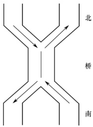

上可有多辆同方向行驶的车）。试用信号灯的 P、V 操作实现桥上的交通管理。

##### 08

假设有两个线程（编号为0和1）需要去访问同一个共享资源，为避免竞争状态的问题，我们必须实现一种互斥机制，使得在任何时候只能有一个线程访问这个资源。假设有如下一段代码：

```c
bool flag[2];     //flag 数组，初始化为 FALSE
```
```c
Enter_Critical_Section(int my_thread_id, int other_thread_id) {
    while(flag[other_thread_id] == TRUE);         //空循环语句
    flag[my_thread_id] = TRUE;
}
Exit_Critical_Section(int my_thread_id, int other_thread_id) {
    flag[my_thread_id] = FALSE;
}
```

当一个线程想要访问临界资源时，就调用上述的这两个函数。例如，线程0的代码可能是这样的：
```c

Enter_Critical_Section(0,1);
```
使用这个资源;
```c
Exit_Critical_Section(0,1);
```
做其他的事情;

试问：

1）以上的这种机制能够实现资源互斥访问吗？为什么？
```c

2）若把 Enter_Critical_Section()函数中的两条语句互换位置，可能发生死锁吗？
```

##### 09

设自行车生产线上有一个箱子，其中有 N 个位置（ $N \geqslant 3$），每个位置可存放一个车架或一个车轮；又设有 3 名工人，其活动分别为：

工人1活动：工人2活动：工人3活动：
```c
do{ do{ do{ 箱中取一个车架；
加工一个车架； 加工一个车轮； 箱中取二个车轮；
车架放入箱中； 车轮放入箱中； 组装为一台车；
} while(1)  } while(1)  } while(1)
```

试分别用信号量与 PV 操作实现三名工人的合作，要求解中不含死锁。

##### 10

设 P, Q, R 共享一个缓冲区，P, Q 构成一对生产者-消费者，R 既为生产者又为消费者，若缓冲区为空，则可以写入；若缓冲区不空，则可以读出。使用 P, V 操作实现其同步。

##### 11

理发店里有一位理发师、一把理发椅和n把供等候理发的顾客坐的椅子。若没有顾客，理发师便在理发椅上睡觉，一位顾客到来时，顾客必须叫醒理发师，若理发师正在理发时又有顾客来到，且有空椅子可坐，则坐下来等待，否则就离开。试用P，V操作实现，并说明信号量的定义和初值。

##### 12

假设一个录像厅有1,2,3三种不同的录像片可由观众选择放映，录像厅的放映规则如下：

1）任意时刻最多只能放映一种录像片，正在放映的录像片是自动循环放映的，最后一名观众主动离开时结束当前录像片的放映。

2）选择当前正在放映的录像片的观众可立即进入，允许同时有多位选择同一种录像片的观众同时观看，同时观看的观众数量不受限制。

3）等待观看其他录像片的观众按到达顺序排队，当一种新的录像片开始放映时，所有等待观看该录像片的观众可依次序进入录像厅同时观看。用一个进程代表一个观众，要求：用信号量方法PV操作实现，并给出信号量定义和初始值。

##### 13

设公共汽车上驾驶员和售票员的活动分别如下图所示。驾驶员的活动：启动车辆，正常行车，到站停车；售票员的活动：关车门，售票，开车门。在汽车不断地到站、停车、
行驶的过程中，这两个活动有什么同步关系？用信号量和P,V操作实现它们的同步。

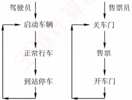

##### 14

一组进程的执行顺序如下图所示，圆圈  $P_1$,  $P_2$,  $P_3$,  $P_4$,  $P_5$,  $P_6$ 表示进程，弧上的字母 a, b, c, d, e, f, g, h 表示同步信号量，请用 P, V 操作实现进程的同步。

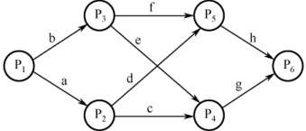

##### 15

有 3 个进程 P、P₁、P₂ 合作处理数据，P 从输入设备读数据到缓冲区，缓冲区可存 1000 个字。P₁ 和 P₂ 的功能一样，都是从缓冲区取出数据并计算，再打印结果。请用信号量的 P、V 操作实现。其中，语句 read() 从输入设备读入 20 个字到缓冲区；get() 从缓冲区取出 20 个字；comp() 计算 40 个字输出并得到结果的 1 个字；print() 打印结果的 2 个字。

##### 16

假设有3个抽烟者和1个供应者。每个抽烟者不停地卷烟并抽掉它，但要卷起并抽掉一支烟，抽烟者需要有三种材料：烟草、纸和胶水。三个抽烟者中，第一个拥有烟草，第二个拥有纸，第三个拥有胶水。供应者无限提供三种材料，供应者每次将两种材料放到桌子上，拥有剩下那种材料的抽烟者卷一根烟并抽掉它，并给供应者一个信号告诉已完成。此时供应者就将另外两种材料放到桌上。如此重复，让3个抽烟者轮流抽烟。

##### 17

【2009 统考真题】三个进程  $P_1$,  $P_2$,  $P_3$ 互斥使用一个包含  $N$ ( $N > 0$) 个单元的缓冲区。 $P_1$ 每次用 produce()生成一个正整数并用 put()送入缓冲区某一空单元； $P_2$ 每次用 getodd() 从该缓冲区中取出一个奇数并用 countodd()统计奇数个数； $P_3$ 每次用 geteven()从该缓冲区中取出一个偶数并用 counteven()统计偶数个数。请用信号量机制实现这三个进程的同步与互斥活动，并说明所定义的信号量的含义（要求用伪代码描述）。

##### 18

【2011 统考真题】某银行提供 1 个服务窗口和 10 个供顾客等待的座位。顾客到达银行时，若有空座位，则到取号机上领取一个号，等待叫号。取号机每次仅允许一位顾客使用。当营业员空闲时，通过叫号选取一位顾客，并为其服务。顾客和营业员的活动过程描述如下：

coBegin
```c
{
    process 顾客 i
    {
        从取号机获取一个号码；
        等待叫号；
        获取服务；
    }
    process 营业员
    {
        While (TRUE)
        {
叫号：
为客户服务；
}
}
} coEnd
```

请添加必要的信号量和 P, V [或 wait(), signal()] 操作，实现上述过程中的互斥与同步。要求写出完整的过程，说明信号量的含义并赋初值。

##### 19

【2013 统考真题】某博物馆最多可容纳 500 人同时参观，有一个出入口，该出入口一次仅允许一人通过。参观者的活动描述如下：

coBegin
参观者进程 i:
```c
{
    ...
    进门;
    ...
    参观;
    ...
    出门;
    ...
}
```
coEnd

请添加必要的信号量和 P, V[或 wait(), signal()]操作，以实现上述过程中的互斥与同步。要求写出完整的过程，说明信号量的含义并赋初值。

##### 20

【2014 统考真题】系统中有多个生产者进程和多个消费者进程，共享一个能存放 1000 件产品的环形缓冲区（初始为空）。缓冲区未满时，生产者进程可以放入其生产的一件产品，否则等待；缓冲区未空时，消费者进程可从缓冲区取走一件产品，否则等待。要求一个消费者进程从缓冲区连续取出 10 件产品后，其他消费者进程才可以取产品。请使用信号量 P, V (wait(), signal()) 操作实现进程间的互斥与同步，要求写出完整的过程，并说明所用信号量的含义和初值。

##### 21

【2015 统考真题】有 A, B 两人通过信箱进行辩论，每个人都从自己的信箱中取得对方的问题。将答案和向对方提出的新问题组成一个邮件放入对方的邮箱中。假设 A 的信箱最多放 M 个邮件，B 的信箱最多放 N 个邮件。初始时 A 的信箱中有 x 个邮件 (0 < x < M)，B 的信箱中有 y 个邮件 (0 < y < N)。辩论者每取出一个邮件，邮件数减 1。A 和 B 两人的操作过程描述如下：

| A{ while(TRUE){ 从A的信箱中取出一个邮件； 回答问题并提出一个新问题； 将新邮件放入B的信箱； } } | B{ while(TRUE){ 从B的信箱中取出一个邮件； 回答问题并提出一个新问题； 将新邮件放入A的信箱； } } |
| --- | --- |

CoEnd

当信箱不为空时，辩论者才能从信箱中取邮件，否则等待。当信箱不满时，辩论者才能将新邮件放入信箱，否则等待。请添加必要的信号量和 P, V [或 wait(), signal() ] 操作，以实现上述过程的同步。要求写出完整的过程，并说明信号量的含义和初值。
##### 22

【2017 统考真题】某进程中有 3 个并发执行的线程 thread1, thread2 和 thread3，其伪代码如下所示。

```c
// 复数的结构类型定义
typedef struct
{
    float a;
    float b;
} cnum;
cnum x, y, z; // 全局变量

// 计算两个复数之和
cnum add(cnum p, cnum q)
{
    cnum s;
    s.a = p.a + q.a;
    s.b = p.b + q.b;
    return s;
}
```

thread1
```c
{
    cnum w;
    w = add(x, y);
    ...
}
```

thread2
```c
{
    cnum w;
    w = add(y, z);
    ...
}
```

thread3
```c
{
    cnum w;
    w.a = l;
    w.b = l;
    z = add(z, w);
    ...
}
```

请添加必要的信号量和 P, V[或 wait(), signal()] 操作，要求确保线程互斥访问临界资源，并且最大限度地并发执行。

##### 23

【2019 统考真题】有  $n$ ( $n \geq 3$) 名哲学家围坐在一张圆桌边，每名哲学家交替地就餐和思考。在圆桌中心有  $m$ ( $m \geq 1$) 个碗，每两名哲学家之间有一根筷子。每名哲学家必须取到一个碗和两侧的筷子后，才能就餐，进餐完毕，将碗和筷子放回原位，并继续思考。为使尽可能多的哲学家同时就餐，且防止出现死锁现象，请使用信号量的 P、V 操作(wait)，signal()操作] 描述上述过程中的互斥与同步，并说明所用信号量及初值的含义。

##### 24

【2020 统考真题】现有 5 个操作 A、B、C、D 和 E，操作 C 必须在 A 和 B 完成后执行，操作 E 必须在 C 和 D 完成后执行，请使用信号量的 wait()、signal() 操作（P、V 操作）描述上述操作之间的同步关系，并说明所用信号量及其初值。

##### 25

【2021 统考真题】下表给出了整型信号量 S 的 wait() 和 signal() 操作的功能描述，以及采用开/关中断指令实现信号量操作互斥的两种方法。

{}
请回答下列问题。

1）为什么在 wait() 和 signal() 操作中对信号量 S 的访问必须互斥执行？

2）分别说明方法1和方法2是否正确。若不正确，请说明理由。

3）用户程序能否使用开/关中断指令实现临界区互斥？为什么？

##### 26

【2022 统考真题】某进程的两个线程 T1 和 T2 并发执行 A、B、C、D、E 和 F 共 6 个操作，其中 T1 执行 A、E 和 F，T2 执行 B、C 和 D。下图表示上述 6 个操作的执行顺序所必须满足的约束：C 在 A 和 B 完成后执行，D 和 E 在 C 完成后执行，F 在 E 完成后执行。请使用信号量的 wait()、signal() 操作描述 T1 和 T2 之间的同步关系，并说明所用信号量的作用及其初值。

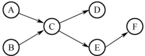

##### 27

【2023 统考真题】现要求学生使用 swap 指令和布尔型变量 lock 实现临界区互斥。lock 为线程间共享的变量，当 lock 的值为 TRUE 时线程不能进入临界区，为 FALSE 时线程能够进入临界区。某同学编写的实现临界区互斥的伪代码如下图所示。

某同学编写的伪代码
```c
bool lock = FALSE; //共享变量
...
bool key = TRUE;
if (key == TRUE)
swap key, lock; //交换 key 和 lock 的值
临界区;
```
lock = TRUE; 退出区

newSwap()的代码
```c
void newSwap( bool *a, bool *b)
{
    bool temp = *a;
    *a = *b;
    *b = temp;
}
```

请回答下列问题。

1）图(a)的伪代码中哪些语句存在错误？将其改为正确的语句（不增加语句的条数）。

2）图(b)给出了交换两个变量值的函数 newSwap()的代码，是否可以用函数调用语句 “newSwap(&key, &lock)” 代替指令 “swap key, lock” 以实现临界区互斥？为什么？

##### 28

【2024 统考真题】计算机系统中的进程之间往往需要相互协作来完成一个任务。在某网络系统中，缓冲区 B 用于存放一个数据分组，对 B 的操作有  $C_{1}$、 $C_{2}$ 和  $C_{3}$。 $C_{1}$ 将一个数据分组写入 B， $C_{2}$ 从 B 中读出一个数据分组， $C_{3}$ 对 B 中的数据分组进行修改。要求 B 为空时才能执行  $C_{1}$，B 非空时才能执行  $C_{2}$ 和  $C_{3}$。请回答下列问题。

1）假设进程  $P_{1}$ 和  $P_{2}$ 均需要执行  $C_{1}$，实现  $C_{1}$ 的代码是否为临界区？为什么？

2）假设 B 初始为空，进程  $P_1$ 执行  $C_1$ 一次，进程  $P_2$ 执行  $C_2$ 一次。请定义尽可能少的信号量，并用 wait()、signal() 操作描述进程  $P_1$ 和  $P_2$ 之间的同步或互斥关系，说明所用信号量的作用及其初值。

3）设 B 初始不为空，进程  $P_{1}$ 和  $P_{2}$ 各执行  $C_{3}$ 一次。定义尽可能少的信号量，并用 wait()、signal() 操作描述进程  $P_{1}$ 和  $P_{2}$ 之间的同步或互斥关系，说明所用信号量的作用及其初值。

##### 29

【2025 统考真题】甲、乙、丙三人一起植树，甲负责挖树坑，乙负责将树苗放入树坑并填土，丙负责为新种的树苗浇水。植树的步骤依次为：挖树坑、放树苗、填土和浇水。
现有铁锹和水桶各1个，铁锹用于挖树坑和填土，水桶用于浇水。当树坑的数量小于3时，甲才可以挖树坑。假设初始时树坑的数量为0，铁锹和水桶均可用。请定义尽可能少的信号量，用 wait()、signal()操作描述植树过程中三人之间的同步或互斥关系，并说明所用信号量的作用及其初值。

### 2.3.9 答案与解析

#### 一、 单项选择题

##### 01

D

多个进程可以共享系统中的资源，一次仅允许一个进程使用的资源称为临界资源。访问临界资源的那段代码称为临界区。

##### 02

D

在多道程序技术中，信号量机制是一种有效实现进程同步和互斥的工具。进程执行的前趋关系实质上是指进程的同步关系。除此之外，只有进程的并发执行不需要信号量来控制。

##### 03

A

信号量是一个特殊的整型变量，只有初始化和 PV 操作才能改变其值。通常，信号量分为互斥量和资源量，互斥量的初值一般为 1，表示临界区只允许一个进程进入，从而实现互斥。当互斥量等于 0 时，表示临界区已有一个进程进入，临界区外尚无进程等待；当互斥量小于 0 时，表示临界区中有一个进程，互斥量的绝对值表示在临界区外等待进入的进程数。同理，资源信号量的初值可以是任意整数，表示可用的资源数，当资源量小于 0 时，表示所有资源已全部用完，而且还有进程正在等待使用该资源，等待的进程数就是资源量的绝对值。

##### 04

C

进程进入临界区必须满足互斥条件。当进程已进入临界区但尚未离开时，若被迫进入阻塞状态，这是允许的，系统中常出现此类情形。在此状态下，只要其他进程在运行过程中不试图进入该临界区，就应允许其获得CPU并继续执行。该进程所锁定的临界区不允许其他进程访问；若其他进程尝试进入，必将在临界区的“锁”上阻塞，等待该进程下次运行时退出并释放临界区。

##### 05

C

一张飞机票不能售给不同的旅客，因此飞机票是互斥资源，其他因素只是为完成飞机票订票的中间过程，与互斥资源无关。

##### 06

D

所谓临界区，并不是指临界资源，如共享的数据、代码或硬件设备等，而是指访问临界资源的那段代码程序，如 P/V 操作、加减锁等。操作系统访问临界资源时，关心的是临界区的操作过程，具体对临界资源做何操作是应用程序的事情，操作系统并不关心。

##### 07

D

同步机制的4个准则是空闲让进、忙则等待、让权等待和有限等待。

##### 08

B

临界资源是互斥共享资源，非共享数据不属于临界资源。打印机、共享变量和共享缓冲区都只允许一次供一个进程使用。

##### 09

B

临界资源是指必须互斥访问的资源，若并发使用将导致数据混乱或逻辑错误。磁盘虽为共享设备，但其访问由操作系统统一协调，不构成临界资源；公用队列被多个进程共享，若无互斥控制，同时操作会导致队列结构破坏或数据错乱，属于典型临界资源；私用数据仅限单个进程使用，不存在竞争；可重入的程序代码不含全局状态，允许多进程并发执行，无须互斥。
##### 10

C

同步是指为了完成某项任务而建立的多个进程的相互合作关系，由于并发进程的执行是异步的（按各自独立的、不可预知的速度向前推进），需要保证进程之间操作的先后次序的约束。例如，读进程和写进程对同一段缓冲区的读和写就需要进行同步，以保证正确的执行顺序。

##### 11

C

并发进程因共享资源而产生相互制约，可分为两类：①互斥关系，指进程竞争使用独占资源（互斥资源）所形成的制约；②同步关系，指进程为协同工作而需交换信息、相互等待所形成的制约。本题中，两个进程之间的制约属于同步关系，进程B必须等待进程A将数据写入缓冲区后，才能从中读取数据。同时，缓冲区是共享资源，其访问必须互斥，因此二者也存在互斥关系。

##### 12

D

P、V 操作是一种低级的进程通信原语，它是不能被中断的。

##### 13

C

P 操作即 wait 操作，表示等待某种资源直到可用。若这种资源暂时不可用，则进程进入阻塞态。注意，执行 P 操作时的进程处于运行态。

##### 14

D

原语顾名思义，就是原子性的、不可分割的操作。其严格定义为：由若干机器指令构成的完成某种特定功能的一段程序，其执行必须是连续的，在执行过程中不允许被中断。

##### 15

A

管程定义了一个数据结构和能为并发进程所执行（在该数据结构上）的一组操作，这组操作能同步进程并改变管程中的数据。

##### 16

C

只有就绪进程能获得处理器资源，被唤醒的进程并不能直接转换为运行态。

##### 17

B

互斥信号量的初值设置为1，P操作成功则将其减1，禁止其他进程进入；V操作成功则将其加1，允许等待队列中的一个进程进入。

##### 18

D

与互斥信号量初值一般置1不同，用P,V操作实现进程同步时，信号量的初值应根据具体情况来确定。若期望的消息尚未产生，则对应的初值应设为0；若期望的消息已存在，则信号量的初值应设为一个非0的正整数。

##### 19

C

若代码可被多个进程在任意时刻共享，则要求任意一个进程在调用此段代码时都以同样的方式运行；而且进程在运行过程中被中断后再继续执行，其执行结果不受影响。这必然要求代码不能被任何进程修改，否则无法满足共享的要求。这样的代码就是可重入代码，也称纯代码，即允许多个进程同时访问的代码。

##### 20

D

共享程序段可能同时被多个进程使用，所以必须可重入编码，否则无法实现共享的功能。

##### 21

D

互斥锁可用于多线程或多进程之间，但只有对它加锁的线程或进程才能解锁它。若一个线程或进程试图解锁一个不属于它（加锁）的互斥锁，则返回错误码。

##### 22

C

若两个线程分别对两个不同的互斥锁先后加锁，但顺序相反，则可能导致死锁，这是典型
的循环等待现象。例如，线程 1 先对互斥锁 A 加锁，然后尝试对互斥锁 B 加锁；同时，线程 2 先对 B 加锁，然后尝试对 A 加锁，两个线程都在等待对方释放资源，从而无法继续推进。

##### 23

D

P 操作和 V 操作都属于原语操作，不可被中断。

##### 24

B

互斥信号量 mutex 初值为 1，表示临界区初始可用。当 mutex = 0 时，说明一个进程已执行 P 操作并进入临界区，且因信号量非负，无其他进程在等待；只有当 mutex = -1 时，才表示一个进程在临界区内，另一个在等待。因此，mutex = 0 对应有且仅有一个进程进入临界区。

##### 25

C

当有一个进程进入临界区且有另一个进程等待进入临界区时，mutex = -1。当 mutex 小于 0 时，其绝对值等于等待进入临界区的进程数。

##### 26

D

由题意可知，系统原来存在等待进入临界区的进程，mutex 小于或等于-1，因此在执行 V(mutex)操作后，mutex 的值小于或等于 0。

##### 27

C

这里的临界区是指访问临界资源 A 的那段代码（临界区的定义）。那么 5 个并发进程共有 5 个操作共享变量 A 的代码段。

##### 28

C

管程由局限于管程的共享变量说明、对管程内的数据结构进行操作的一组过程及对局限于管程的数据设置初始值的语句组成。

##### 29

C

管程的 signal 操作与信号量机制中的 V 操作不同，信号量机制中的 V 操作一定会改变信号量的值  $S = S + 1$。而管程中的 signal 操作是针对某个条件变量的，若不存在因该条件而阻塞的进程，则 signal 不会产生任何影响。

##### 30

A

参见记录型信号量的介绍。此处极易出关于 S.value 的概念题，总结如下：① S.value > 0，表示某类可用资源的数量。每次 P 操作，意味着请求分配一个单位的资源。② S.value≤0，表示某类资源已无可用，且存在因请求该资源而被阻塞的进程，S.value 的绝对值表示等待进程数量。

一定要看清题目中的陈述是执行P操作前还是执行P操作后。

##### 31

①C ②B

① 系统中有 n 个进程，只要这些进程不都处于阻塞态，则至少有一个进程正在处理器上运行（处理器至少有一个），因此就绪队列中的进程个数最多有 n-1 个。选项 B 容易被错选，以为出现了处理器为空、就绪队列全满的情况，实际调度无此状态。

② 本题易错选 C，阻塞队列有 n-1 个进程是可能发生的，但不是最多的情况。不少读者会忽略死锁的情况，死锁就是 n 个进程都被阻塞，因此阻塞队列最多可以有 n 个进程。

##### 32

B

对 S 进行了 28 次 P 操作和 18 次 V 操作，即  $S-28+18=0$，得信号量的初值为 10；然后，对信号量 S 进行了 15 次 P 操作和 2 次 V 操作，即  $S-15+2=10-15+2=-3$，S 信号量的负值的绝对值表示等待队列中的进程数。所以有 3 个进程等待在信号量 S 的队列中。

##### 33

B

本题的关键是，输出语句 A2, B2 中读取的 x 的值不同，由于 A1, B1 执行有先后问题，使得在
执行 A2, B2 前，x 的可能取值有两个，即 1, -3；这样，输出 z 的值可能是  $1 + 2 = 3$ 或  $(-3) + 2 = -1$；输出 c 的值可能是  $1 \times 1 = 1$ 或  $(-3)(-3) = 9$。

##### 34

D

并发进程之间的关系没有必然的要求，只有执行时间上的偶然重合，可能无关也可能有交往。

##### 35

C

信号量的初值表示该类资源的总数，因此信号量的初值取3。每分配一个该类资源，信号量减1，当信号量等于0时，表示该类资源刚好被分完；当信号量小于0时，表示还有进程正在等待该类资源，信号量的绝对值就是等待进程的数量。因此，当没有进程使用时，信号量最大为3；当有三个进程正在使用并有一个进程在等待时，信号量最小为-1。

##### 36

C

##### 37

A

根据 Peterson 算法的原理，可知(1)和(2)处分别为 turn = 1 和 turn = 0。

flag 数组用于标记各个线程想进入临界区的意愿。当一个线程想要进入临界区时，它将自己对应的 flag 值置为 true；当一个线程退出临界区时，它将自己对应的 flag 值置为 false。这样，若两个进程都争着想进入临界区，则可以让进程将进入临界区的机会谦让给对方。

##### 38

A

turn 变量用于指示允许进入临界区的线程编号。当一个线程想要进入临界区时，它将 turn 置为对方的编号，表示优先让对方先进入。当一个线程检查到对方的 flag 为 true 时，表示对方也想进入，这时就需要根据 turn 来决定谁先进入。若 turn 等于自己的编号，表示轮到自己进入，则可以直接进入。若 turn 等于对方的编号，表示轮到对方进入，则需等待对方退出。

##### 39

B

进程并发带来问题不仅包括同步互斥问题，还包括死锁等其他问题。生产者-消费者问题用于解决进程的同步和互斥问题。共享一个数据对象仅涉及互斥访问的问题。

##### 40

A

##### 41

D

当缓冲区为空时，消费者进程取产品会被阻塞，此时需等待生产者进程生产新产品。

##### 42

A

生产者和消费者共享缓冲区，每次只允许一个生产者或消费者进入缓冲区，当有一个生产者或消费者进入缓冲区时，其他生产者或消费者就必须阻塞等待。因此，生产者有可能唤醒其他生产者或消费者，消费者也有可能唤醒其他生产者或消费者，四个选项均正确。

##### 43

B

所谓互斥使用某临界资源，是指在同一时间段只允许一个进程使用此资源，所以互斥信号量的初值都为1。

##### 44

C

在生产者-消费者问题中，每次只能有一个生产者或消费者进入缓冲区，需要用一个互斥信号量来控制，当有一个生产者或消费者进入缓冲区时，其他申请进入缓冲区的消费者会被阻塞。

在读者-写者问题中，写者和写者之间、写者和读者之间必须互斥访问共享对象，读者和读者之间则可以同时访问。

##### 45

C

信号量 seat 表示桌子上可以坐下的位置数，因为只有五个位置，所以每次只能有四位哲学家同时拿起左边的餐叉，才能保证不会发生死锁，所以 seat 的初值应该为 4。
##### 46

C

因为进程并发，所以进程的执行具有不确定性，在 P₁, P₂ 执行到第一个 P, V 操作前，应该是相互无关的。现在考虑第一个对 s₁ 的 P, V 操作，因为进程 P₂ 是 P(s₁)操作，所以它必须等待 P₁ 执行完 V(s₁)操作后才可继续运行，此时的 x, y, z 值分别是 2, 3, 4，当进程 P₁ 执行完 V(s₁)后便在 P(s₂)上阻塞，此时 P₂ 可以运行直到 V(s₂)，此时的 x, y, z 值分别是 5, 3, 9，进程 P₁ 继续运行到结束，最终的 x, y, z 值分别为 5, 12, 9。

##### 47

B

信号量表示相关资源的当前可用数量。当信号量 K > 0 时，表示还有 K 个相关资源可用，所以该资源的可用个数是 1。而当信号量 K < 0 时，表示有 |K| 个进程在等待该资源。因为资源有剩余，可见没有其他进程等待使用该资源，所以进程数为 0。

##### 48

D

这是 Peterson 算法的实际实现，保证进入临界区的进程合理安全。该算法为了防止两个进程为进入临界区而无限期等待，设置了变量 turn，表示允许进入临界区的编号，每个进程在先设置自己的标志后再设置 turn 标志，允许另一个进程进入。这时，再同时检测另一个进程状态标志和允许进入标志，就可保证当两个进程同时要求进入临界区时只允许一个进程进入临界区。保存的是较晚的一次赋值，因此较晚的进程等待，较早的进程进入。先到先入，后到等待，从而完成临界区访问的要求。

其实这里可想象为两个人进门，每个人进门前都会和对方客套一句“你走先”。若进门时没别人，则当和空气说句废话，然后大步登门入室；若两人同时进门，则互相先请，但各自只客套一次，所以先客套的人请完对方，就等着对方请自己，然后光明正大地进门。

##### 49

C

x 的值最终是多少，取决于最后是哪个进程对 x 进行了写操作。一个进程一旦拿到了 x 值，它最后对 x 写操作的值也就确定了。因此本题只需考虑两个进程拿到 x 值的所有可能情况。对于进程  $P_1$，最初取到的 x 值可能是 1，也可能是进程  $P_2$ 完成后更新得到的 x 值 0，因此对于  $P_1$，最终写入 x 的值可能是 2（当它最初取到 1 时）和 1（当它最初取到 0 时）。同理，对于  $P_2$，最初取到的 x 值可能是 1，也可能是  $P_1$ 完成后更新得到的 x 值 2，因此对于  $P_2$，最终写入 x 的值可能是 0（当它最初取到 1 时）和 1（当它最初取到 2 时）。因此，最终的 x 值可能是 0、1 或 2。

##### 50

C

需要进行互斥的操作是对临界资源的访问，也就是说，不同线程对同一个进程内部的共享变量的访问才有可能需要进行互斥，不同进程的线程、代码段或变量不存在互斥访问的问题，同一个线程内部的局部变量也不存在互斥访问的问题。选项 A 中的 a 是线程内部的局部变量，不需要互斥访问。选项 D 是不同进程的线程代码段，不存在互斥访问的问题。选项 B 是对进程内部的共享变量 x 的读操作，不互斥也不影响执行结果，所以不需要互斥访问。选项 C 是不同线程对同一个进程内部的共享变量的写操作，需要互斥访问（类似于读者-写者问题）。

##### 51

B

使用 TSL 指令实现进程互斥时，并没有阻塞态进程，等待进入临界区的进程一直停留在执行 while(TSL(&lock)) 的循环中，不会主动放弃 CPU，一直处于运行态，直到该进程的时间片用完放弃处理机，转为就绪态，此时切换另一个就绪态进程占用处理机。这不同于信号量机制实现的互斥。由此可知选项 A 和 C 错误，选项 B 正确。TSL 指令本身就是原子操作，不需要关中断来保证其不被打断。TSL 指令实现原子性的原理是，执行 TSL 指令的 CPU 锁住内存总线，以禁止其他 CPU 在本指令结束之前访问内存。此外，假如 while(TSL(&lock)) 在关中断状态下执行，若
TSL(&lock)一直为 true，不再开中断，则系统可能因此终止。因此选项 D 错误。

##### 52

A

管程是由一组数据及定义在这组数据之上的对这组数据的操作组成的软件模块，这组操作能初始化并改变管程中的数据和同步进程。管程不仅能实现进程间的互斥，还能实现进程间的同步，因此选项 A 错误、B 正确；管程具有如下特性：① 局部于管程的数据只能被局部于管程内的过程所访问；② 一个进程只有通过调用管程内的过程才能进入管程访问共享数据；③ 每次仅允许一个进程在管程内执行某个内部过程，因此选项 C 和 D 正确。

##### 53

B

仔细阅读两个线程代码可知，thread1 和 thread2 均是对 x 进行加 1 操作，x 的初始值为 0，若要使得最终 x = 2，只能先执行完 thread1 再执行 thread2，或先执行完 thread2 再执行 thread1，因此仅有 2 种可能。

##### 54

D

“条件变量”是管程内部说明和使用的一种特殊变量，其作用类似于信号量机制中的“信号量”，都用于实现进程同步。需要注意的是，在同一时刻，管程中只能有一个进程在执行。若进程 A 执行了 x.wait()操作，则该进程会阻塞，并挂到条件变量 x 对应的阻塞队列上。这样，管程的使用权被释放，就可以有另一个进程进入管程。若进程 B 执行了 x.signal()操作，则会唤醒 x 对应的阻塞队列的队首进程。只有一个进程要离开管程时才能调用 signal()操作。

##### 55

C

硬件方法实现进程同步时不能实现让权等待；Peterson算法满足有限等待但不满足让权等待；记录型信号量由于引入阻塞机制，消除了不让权等待的情况，选项C正确。

##### 56

C

实现临界区互斥需满足多个准则。“忙则等待”准则，即两个进程不能同时访问临界区，说法Ⅰ正确。“空闲让进”准则，若临界区空闲，则允许其他进程访问，说法Ⅱ正确。“有限等待”准则，即进程应该在有限时间内访问临界区，说法Ⅲ正确。说法Ⅰ、Ⅱ和Ⅲ是互斥机制必须遵循的原则。说法Ⅳ是“让权等待”准则，不一定非得实现，如皮特森算法。

#### 二、 综合应用题

##### 01

【解答】

 $P_{1}$ 和  $P_{2}$ 两个并发进程的执行结果是不确定的，它们都对同一变量 X 进程操作，X 是一个临界资源，而没有进行保护。例如：

1）若先执行完  $P_{1}$ 再执行  $P_{2}$，则结果是 x=0, y=1, z=1, t=2, u=2。

2）若先执行  $P_1$ 到 “x = 1”，然后一个中断去执行完  $P_2$，再一个中断回来执行完  $P_1$，则结果是  $x = 0, y = 0, z = 0, t = 2, u = 2$。

显然，两次执行结果不同，所以这两个并发进程不能正确运行。可将这个程序改为：

```c
int x;
semaphore S=1; //访问x的互斥信号量
process_P1 {
    int y, z;
    P(S);
    x=1;
    y=0;
    if (x>=1) {
        y=y + 1;
    }
    V(S);
    z=y;
}
```
##### 02

【解答】

使用信号量 mutex 控制两个进程互斥访问临界资源（仓库），使用同步信号量 Sa 和 Sb（分别代表产品 A 与 B 的还可容纳的数量差，以及产品 B 与 A 的还可容纳的数量差）满足条件 2 和条件 3。代码如下：

```c
Semaphore Sa=M-1, Sb=N-1;
Semaphore mutex=1; //访问仓库的互斥信号量
```
```c
process_A(){    process_B(){    while(1){        while(1){
```

##### 03

【解答】

顾客进店后按序取号，并等待叫号；销售人员空闲后也按序叫号，并销售面包。因此同步算法只要对顾客取号和销售人员叫号进行合理同步即可。我们使用两个变量 i 和 j 分别记录当前的取号值和叫号值，并各自使用一个互斥信号量用于对 i 和 j 进行访问和修改。
```c

int i=0, j=0;
SEMAPHORE mutex_i=1, mutex_j=1;
Consumer() {
```
```c
    进入面包店;
    P(mutex_i); //互斥访问 i
    取号 i;
    i++;
    V(mutex_i); //释放对 i 的访问
    等待叫号 i 并购买面包;
}
Seller() {
    while (1) {
        P(mutex_j); //互斥访问 j
        if (j<i) {
            叫号 j;
        }
        V(mutex_j); //释放对 j 的访问
        销售面包;
    }
    else {
        V(mutex_j); //暂时没有顾客在等待
        休息片刻;
    }
}
```

##### 04

【解答】

本题是生产者-消费者问题的变体，生产者“车间 A”和消费者“装配车间”共享缓冲区“货架 F1”；生产者“车间 B”和消费者“装配车间”共享缓冲区“货架 F2”。因此，可为它们设置 6 个信号量：empty1 对应货架 F1 上的空闲空间，初值为 10；full1 对应货架 F1 上面的 A 产品，初值为 0；empty2 对应货架 F2 上的空闲空间，初值为 10；full2 对应货架 F2 上面的 B 产品，初值为 0；mutex1 用于互斥地访问货架 F1，初值为 1；mutex2 用于互斥地访问货架 F2，初值为 1。

A 车间的工作过程可描述为：
```c
while(1){
    生产一个产品A;
    P(empty1); //判断货架F1是否有空
    P(mutex1); //互斥访问货架F1
    将产品A存放到货架F1上;
    V(mutex1); //释放货架F1
    V(full1); //货架F1上的零件A的个数加1
}
```

B 车间的工作过程可描述为：

```c
while(1){
    生产一个产品B;
    P(empty2); //判断货架F2是否有空
    P(mutex2); //互斥访问货架F2
    将产品B存放到货架F2上;
    V(mutex2); //释放货架F2
    V(full2); //货架F2上的零件B的个数加1
}
```

装配车间的工作过程可描述为：

```c
while(1){
    P(full1); //判断货架 F1 上是否有产品 A
    P(mutex1); //互斥访问货架 F1
    从货架 F1 上取一个 A 产品;
    V(mutex1); //释放货架 F1
    V(empty1); //货架 F1 上的空闲空间数加 1
    P(full2); //判断货架 F2 上是否有产品 B
    P(mutex2); //互斥访问货架 F2
    从货架 F2 上取一个 B 产品;
    V(mutex2); //释放货架 F2
    V(empty2); //货架 F2 上的空闲空间数加 1
    将取得的 A 产品和 B 产品组装成产品;
}
```

##### 05

【解答】

从井中取水并放入水缸是一个连续的动作，可视为一个进程；从缸中取水可视为另一个进程。设水井和水缸为临界资源，引入 well 和 vat；三个水桶无论是从井中取水还是将水倒入水缸都是一次一个，应该给它们一个信号量 pail，抢不到水桶的进程只好等待。水缸满时，不可以再放水，设置 empty 信号量来控制入水量；水缸空时，不可以取水，设置 full 信号量来控制。本题需要设置 5 个信号量来进行控制：

```c
semaphore well=1; //用于互斥地访问水井
semaphore vat=1; //用于互斥地访问水缸
semaphore empty=10; //用于表示水缸中剩余空间能容纳的水的桶数
semaphore full=0; //表示水缸中的水的桶数
semaphore pail=3; //表示有多少个水桶可以用，初值为3
//老和尚
while(1){
    P(full);
    P(pail);
    P(vat);
    从水缸中打一桶水；
    V(vat);
    V(empty);
    喝水；
    V(pail);
}
//小和尚
while(1){
    P(empty);
    P(pail);
    P(well);
    从井中打一桶水；
    V(well);
    P(vat);
    将水倒入水缸中；
    V(vat);
    V(full);
    V(pail);
}
```

##### 06

【解答】

为了控制三个进程依次使用输入设备进行输入，需分别设置三个信号量 S1, S2, S3，其中 S1 的初值为 1，S2 和 S3 的初值为 0。使用上述信号量后，三个进程不会同时使用输入设备，因此不必再为输入设备设置互斥信号量。另外，还需要设置信号量 Sb, Sy, Sz 来表示数据 b 是否已经输入，以及 y, z 是否已计算完成，它们的初值均为 0。三个进程的动作可描述为：

```c
P1() {
    P(S1);
    从输入设备输入数据 a;
    V(S2);
    P(Sb);
    x=a+b;
    P(Sy);
    P(Sz);
    使用打印机打印出 x, y, z 的结果;
}
P2() {
    P(S2);
    从输入设备输入数据 b;
    V(S3);
    V(Sb);
    y=a*b;
    V(Sy);
    V(Sy);
}
P3() {
    P(S3);
    从输入设备输入数据 c;
    P(Sy);
    Z=y+c-a;
    V(Sz);
}
```

##### 07

【解答】

1）桥上每次只能有一辆车行驶，所以只要设置一个信号量 bridge 就可判断桥是否使用，若在使用中，等待；若无人使用，则执行 P 操作进入；出桥后，执行 V 操作。

```c
semaphore bridge=1; //用于互斥地访问桥
NtoS() {
    P(bridge);
    通过桥;
    V(bridge);
}
StoN() {
P(bridge);
通过桥;
V(bridge);
```

2）桥上可以同万向多车行驶，需要设置 bridge，还需要对同方向车辆计数。为了防止同方向计数中同时申请 bridge 造成同方向不可同时行车的问题，要对计数过程加以保护，因此设置信号量 mutexSN 和 mutexNS。

```c
int countSN=0; //用于表示从南到北的汽车数量
int countNS=0; //用于表示从北到南的汽车数量
semaphore mutexSN=1; //用于保护 countSN
semaphore mutexNS=1; //用于保护 countNS
semaphore bridge=1; //用于互斥地访问桥
StoN(){ //从南向北
    P(mutexSN);
    if(countSN==0)
        P(bridge);
    countSN++;
    V(mutexSN);
    过桥;
    P(mutexSN);
    countSN--;
    if(countSN==0)
        V(bridge);
    V(mutexSN);
}
NtoS(){ //从北向南
    P(mutexNS);
    if(countNS==0)
        P(bridge);
    countNS++;
    V(mutexNS);
    过桥;
    P(mutexNS);
    countNS--;
    if(countNS==0)
        V(bridge);
    V(mutexNS);
}
```

##### 08

【解答】

1）这种机制不能实现资源的互斥访问。考虑如下情形。

① 初始化时，flag 数组的两个元素值均为 FALSE。

② 线程 0 先执行，执行 while 循环语句时，因为 flag[1] 为 FALSE，所以顺利结束，不会被卡住。假设这时来了一个时钟中断，打断了它的运行。

③ 线程 1 去执行，执行 while 循环语句时，因为 flag[0] 为 FALSE，所以顺利结束，不会被卡住，然后进入临界区。

④ 后来当线程 0 再执行时，也进入临界区，这样就同时有两个线程在临界区。
```c

总结：不能成功的根本原因是无法保证 Enter_Critical_Section()函数执行的原子性。我们从上面的软件实现方法中可以看出，对于两个进程间的互斥，最主要的问题是标志的检查和修改不能作为一个整体来执行，因此容易导致无法保证互斥访问的问题。
```

2）可能出现死锁。考虑如下情形。

① 初始化时，flag 数组的两个元素值均为 FALSE。
② 线程 0 先执行，flag[0]为 TRUE，假设这时来了一个时钟中断，打断了它的运行。

③ 线程 1 去执行，flag[1]为 TRUE，在执行 while 循环语句时，因为 flag[0] = TRUE，所以在这个地方被卡住，直到时间片用完。

④ 线程 0 再执行时，因为 flag[1] 为 TRUE，它也在 while 循环语句的地方被卡住，所以这两个线程都无法执行下去，从而死锁。

##### 09

【解答】

用信号量与 PV 操作实现三名工人的合作。

首先不考虑死锁问题，工人1与工人3、工人2与工人3构成生产者与消费者关系，这两对生产/消费关系通过共同的缓冲区相联系。从资源的角度来看，箱子中的空位置相当于工人1和工人2的资源，而车架和车轮相当于工人3的资源。

分析上述解法易见，当工人1推进速度较快时，箱中空位置可能完全被车架占满或只留有一个存放车轮的位置，此时工人3同时取2个车轮将无法得到，而工人2又无法将新加工的车轮放入箱中；当工人2推进速度较快时，箱中空位置可能完全被车轮占满，而此时工人3取车架将无法得到，而工人1又无法将新加工的车架放入箱中。上述两种情况都意味着死锁。为防止死锁的发生，箱中车架的数量不可超过N-2，车轮的数量不可超过N-1，这些限制可以用两个信号量来表达。具体解答如下。

```c
semaphore empty=N; //空位置
semaphore wheel=0; //车轮
semaphore frame=0; //车架
semaphore s1=N-2; //车架最大数
semaphore s2=N-1; //车轮最大数
```
工人1活动：
```c
do{
加工一个车架：
P(s1); //检查车架数是否达到最大值
P(empty); //检查是否有空位
车架放入箱：
V(frame); //车架数加1
}while(1);
```
工人2活动：
```c
do{
加工一个车轮：
P(s2); //检查车轮数是否达到最大值
P(empty); //检查是否有空位
车轮放入箱中：
V(wheel); //车轮数加1
}while(1);
```
工人3活动：
```c
do{
P(frame); //检查是否有车架
箱中取一车架：
V(empty); //空位数加1
V(s1); //可装入车架数加1
P(wheel); //检查是否有一个车轮
P(wheel); //检查是否有另一个车轮
箱中取二车轮：
V(empty); //取走一个车轮，空位数加1
V(empty); //取走另一个车轮，空位数加1
V(s2); //可装入车轮数加1
V(s2); //可装入车轮数再加1

组装为一台车；

}while(1);
```

##### 10

【解答】

P, Q 构成消费者-生产者关系，因此设三个信号量 full, empty, mutex。full 和 empty 用来控制缓冲池状态，mutex 用来互斥进入。R 既为消费者又为生产者，因此必须在执行前判断状态，若 `empty==1`，则执行生产者功能；若 `full==1`，执行消费者功能。

```c
semaphore full=0; //表示缓冲区的产品
semaphore empty=1; //表示缓冲区的空位
semaphore mutex=1; //互斥信号量
```
Procedure P Procedure Q Procedure R
```c
{
    while (TRUE) {
        while (TRUE) {
            p(empty);
            P(mutex);
            Product one;
            v(mutex);
            v(full);
        }
    }
}

if (empty==1) {
    p(empty);
    P(mutex);
    product one;
    v(mutex);
    v(full);
}

if (full==1) {
    p(full);
    p(mutex);
    consume one;
}
```

##### 11

【解答】

1）控制变量 waiting 用来记录等候理发的顾客数，初值为 0，进来一名顾客时，waiting 加 1，一名顾客理发时，waiting 减 1。

2）信号量 customers 用来记录等候理发的顾客数，并用作阻塞理发师进程，初值为 0。

3）信号量 barbers 用来记录正在等候顾客的理发师数，并用作阻塞顾客进程，初值为 0。

4）信号量 mutex 用于互斥，初值为 1。

```c
int waiting=0; //等候理发的顾客数
int chairs=n; //为顾客准备的椅子数
semaphore customers=0,barbers=0,mutex=1;
barber() { //理发师进程
    while (1) {
        P(customers);
        P(mutex);
        waiting=waiting-1;
        V(barbers);
        V(mutex);
        Cut_hair();
    }
}
customer() {
    P(mutex);
    if (waiting<chairs){
        waiting=waiting+1;
        V(customers);
    }
}
V(mutex); //开放临界区
P(barbers); //无理发师，顾客坐着
get_haircut(); //一名顾客坐下等待理发
}
else
V(mutex); //人满，离开
```

##### 12

【解答】

电影院一次只能放映一部影片，希望观看的观众可能有不同的爱好，但每次只能满足部分观众的需求，即希望观看另外两部影片的用户只能等待。分别为三部影片设置三个信号量 s0, s1, s2，初值分别为 1, 1, 1。电影院一次只能放一部影片，因此需要互斥使用。观看影片的观众有多个，因此必须分别设置三个计数器（初值都是 0），用来统计观众个数。当然，计数器是个共享变量，需要互斥使用。

```c
semaphore s=1, s0=1, s1=1, s2=1;
int count0=0, count1=0, count2=0;
process videoshow1{ //看第一部影片的观众
P(s0);
count0=count0+1;
if (count0==1)
{
    P(s);
}
V(s0);
看影片;
P(s0);
count0=count0-1;
if (count0==0) //没人看了，就结束放映
{
    V(s);
}
V(s0);
}
process videoshow2{ //看第二部影片的观众
P(s1);
count1=count1+1;
if (count1==1)
{
    P(s);
}
V(s1);
看影片;
P(s1);
count1=count1-1;
if (count1==0) //没人看了，就结束放映
{
    V(s);
}
V(s1);
}
process videoshow3{ //看第三部影片的观众
P(s2);
count2=count2+1;
if (count2==1)
{
    P(s);
}
V(s2);
看影片;
P(s2);
count2=count2-1;
if (count2==0) //没人看了，就结束放映
{
    V(s);
}
V(s2);
}
```
##### 13

【解答】

在汽车行驶过程中，驾驶员活动与售票员活动之间的同步关系为：售票员关车门后，向驾驶员发开车信号，驾驶员接到开车信号后启动车辆，在汽车正常行驶过程中售票员售票，到站时驾驶员停车，售票员在车停后开门让乘客上下车。因此，驾驶员启动车辆的动作必须与售票员关车门的动作同步；售票员开车门的动作也必须与驾驶员停车同步。应设置两个信号量 S1, S2: S1 表示是否允许驾驶员启动汽车（初值为 0）；S2 表示是否允许售票员开门（初值为 0）。

```c
semaphore S1=0,S2=0;
```
Procedure driver
```c
{
    while (1)
    {
        P(S1);
        Start;
        Driving;
        Stop;
        V(S2);
    }
}
```

##### 14

【解答】

本题是一个典型的利用信号量实现前驱关系的同步问题。

```c
Semaphore a=b=c=d=e=f=g=h=0; //定义进程执行顺序的信号量
```
coBegin
```c
process P1() {
    执行 P1 的任务;
    V(a); //实现先 P1 后 P2 的同步关系
    V(b); //实现先 P1 后 P3 的同步关系
}
process P2() {
    P(a); //检查 P1 是否已运行完成
    执行 P2 的任务;
    V(c); //实现先 P2 后 P4 的同步关系
    V(d); //实现先 P2 后 P5 的同步关系
}
process P3() {
    P(b); //检查 P1 是否已运行完成
    执行 P3 的任务;
    V(e); //实现先 P3 后 P4 的同步关系
    V(f); //实现先 P3 后 P5 的同步关系
}
process P4() {
    P(c); //检查 P2 是否已运行完成
    P(e); //检查 P3 是否已运行完成
    执行 P4 的任务;
    V(g); //实现先 P4 后 P6 的同步关系
}
process P5() {
    P(d); //检查 P2 是否已运行完成
    P(f); //检查 P3 是否已运行完成
    执行 P5 的任务;
    V(h); //实现先 P5 后 P6 的同步关系
}
process P6() {
P(g); //检查 P4 是否已运行完成
P(h); //检查 P5 是否已运行完成
```
执行 P6 的任务；
coEnd

##### 15

【解答】

本题是经典的生产者-消费者问题。把缓冲区的每20个字视为一个基本单位，因此缓冲区共有1000/20=50个空位。设置互斥信号量mutex，用于对缓冲区的访问；还需要设置两个同步信号量：full表示缓冲区已有多少数据，empty表示缓冲区还有多少空位置。

```c
Semaphore mutex=1; //互斥使用缓冲区
Semaphore full=0; //表示缓冲区已有多少个20字数据，初值为0
Semaphore empty=50; //表示缓冲区还有多少个20字空位，初值为50
process P(){
    P(empty);
    P(mutex);
    read();
    V(mutex);
    V(full);
}

process P1/P2(){ //P1、P2完全一样
    for(int i=0;i<2;++i){
        p(full);P(mutex);
        get();
        V(mutex);V(empty);
        p(full);P(mutex);
        get();V(mutex);V(empty);
        comp();
    }
    print();
```

##### 16

【解答】

供应者与3个抽烟者分别是同步关系。由于供应者无法同时满足两个或以上的抽烟者，3个抽烟者对抽烟这个动作互斥（或者理解为互斥访问桌子）。显然这里有4个进程。供应者作为生产者向3个抽烟者提供材料。设置信号量offer1，offer2，offer3分别表示烟草和纸组合的资源、烟草和胶水组合的资源、纸和胶水组合的资源，信号量finish用于互斥进行抽烟动作。代码如下：

```c
int num=0; //存储随机数
semaphore offer1=0; //定义信号量对应烟草和纸组合的资源
semaphore offer2=0; //定义信号量对应烟草和胶水组合的资源
semaphore offer3=0; //定义信号量对应纸和胶水组合的资源
semaphore finish=0; //定义信号量表示抽烟是否完成
process P1(){ //供应者
while(1){
    num++;
    num=num%3;
    if(num==0)
        V(offer1); //提供烟草和纸
    else if(num==1)
        V(offer2); //提供烟草和胶水
    else
        V(offer3); //提供纸和胶水
    任意两种材料放在桌子上；
    P(finish);
}
process P2(){ //拥有烟草者
while(1){
    P(offer3);
    拿纸和胶水，卷成烟，抽掉；
    V(finish);
}
process P3() {
    while(1) {
        P(offer2);
        拿烟草和胶水，卷成烟，抽掉；
        V(finish);
    }
}
process P4() {
    while(1) {
        P(offer1);
        拿烟草和纸，卷成烟，抽掉；
        V(finish);
    }
}
```

##### 17

【解答】

互斥资源：缓冲区只能互斥访问，因此设置互斥信号量 mutex。

同步问题： $P_{1}$， $P_{2}$ 因为奇数的放置与取用而同步，设同步信号量 odd； $P_{1}$， $P_{3}$ 因为偶数的放置与取用而同步，设置同步信号量 even； $P_{1}$， $P_{2}$， $P_{3}$ 因为共享缓冲区，设同步信号量 empty，初值为 N。程序如下：

```c
semaphore mutex=1; //缓冲区操作互斥信号量
semaphore odd=0, even=0; //奇数、偶数进程的同步信号量
semaphore empty=N; //空缓冲区单元个数信号量
coBegin{
    Process P1()
    while(True)
    {
        x=produce(); //生成一个数
        P(empty); //判断缓冲区是否有空单元
        P(mutex); //缓冲区是否被占用
        Put();
        V(mutex); //释放缓冲区
        if(x%2==0)
            V(even); //若是偶数，向 P3 发出信号
        else
            V(odd); //若是奇数，向 P2 发出信号
    }
    Process P2()
    while(True)
    {
        P(odd); //收到 P1 发来的信号，已产生一个奇数
        P(mutex); //缓冲区是否被占用
        getodd();
        V(mutex); //释放缓冲区
        V(empty); //向 P1 发信号，多出一个空单元
        countodd();
    }
    Process P3()
    while(True)
    {
        P(even); //收到 P1 发来的信号，已产生一个偶数
        P(mutex); //缓冲区是否被占用
        geteven();
        V(mutex); //释放缓冲区
        V(empty); //向 P1 发信号，多出一个空单元
        counteven();
    }
} coEnd
```
##### 18

【解答】

互斥资源：取号机（一次只有一位顾客取号），因此设置互斥信号量 mutex。

同步问题：顾客需要获得空座位等待叫号。营业员空闲时，将选取一位顾客并为其服务。空座位的有无会影响等待顾客的数量，顾客的有无决定了营业员是否能开始服务，因此分别设置信号量 empty 和 full 来实现这一同步关系。另外，顾客获得空座位后，需要等待叫号和被服务。这样，顾客与营业员就服务何时开始又构成了一个同步关系，定义信号量 service 来完成这一同步过程。

```c
semaphore empty=10; //空座位的数量，初值为1
semaphore mutex=1; //互斥使用取号机
semaphore full=0; //已占座位的数量，初值0
semaphore service=0; //等待叫号
```
coBegin
```c
{
    Process 顾客 i
    {
        P(empty); //等空位
        P(mutex); //申请使用取号机
        从取号机上取号;
        V(mutex); //取号完毕
        V(full); //通知营业员有新顾客
        P(service); //等待营业员叫号
        接受服务;
    }
    Process 营业员
    {
        while (True) {
            P(full); //没有顾客则休息
            V(empty); //离开座位
            V(service); //叫号
            为顾客服务;
        }
    } coEnd
```

##### 19

【解答】

出入口一次仅允许一人通过，设置互斥信号量 mutex，初值为1。博物馆最多可以同时容纳500人，因此设置信号量 empty，初值为500。

```c
semaphore empty=500; //博物馆可以容纳的最多人数
semaphore mutex=1; //用于出入口资源的控制
```
coBegin
参观者进程 i:
```c
{
    ...
    P(empty); //可容纳人数减 1
    P(mutex); //互斥使用门
    进门;
    V(mutex);
    参观;
    P(mutex); //互斥使用门
    出门;
    V(mutex);
    V(empty); //可容纳人数增 1
    ...
}
```
coEnd
##### 20

【解答】

这是典型的生产者和消费者问题，只对典型问题加了一个条件，只需在标准模型上新加一个信号量，即可完成指定要求。

设置 4 个变量 mutex1, mutex2, empty 和 full, mutex1 用于控制一个消费者进程在一个周期（10 次）内对缓冲区的访问，初值为 1；mutex2 用于控制进程单次互斥地访问缓冲区，初值为 1；empty 代表缓冲区的空位数，初值为 1000；full 代表缓冲区的产品数，初值为 0。伪代码如下：

```c
semaphore empty=1000; //空缓冲区数
semaphore full=0; //非空缓冲区数
semaphore mutex1=1; //用于实现生产者之间的互斥
semaphore mutex2=1; //用于实现消费者之间的互斥
int in=0;
int out=0;

生产者进程
while (TRUE) {
    produce;
    P(empty);
    P(mutex1);
    put an item into buf[in];
    in=(in+1) mod n;
    V(mutex1);
    V(full);
}

消费者进程
while (TRUE) {
    P(mutex2);
    for (int i=0; i<10; i++) {
        P(full);
        get an item from buf[out];
        out=(out+1) mod n;
        V(empty);
    }
    V(mutex2);
    Consume;
}
```

##### 21

【解答】

本题是一个典型的生产者-消费者问题。A 和 B 既是生产者，又是消费者。首先分析题中的互斥关系，信箱 A 和信箱 B 作为生产者-消费者问题中的缓冲区，需要互斥访问，因此设置两个信号量  $\text{mutex}_A$ 和  $\text{mutex}_B$。然后分析 A 和 B 的同步关系，A 有两个动作，分别是从信箱 A 中取出邮件和将新邮件放入信箱 B，因此设置信号量  $\text{Full}_A$ 和  $\text{Empty}_B$，用来保证信箱 A 中有邮件可以取，信箱 B 中有空间可以放。B 的分析同理。因此本题的所有信号量设置如下：
```c

semaphore Full_A = x;     // Full_A 表示 A 的信箱中的邮件数量

SEMAPHORE Empty_A = M-x;     // Empty_A 表示 A 的信箱中还可存放的邮件数量

SEMAPHORE Full_B = y;     // Full_B 表示 B 的信箱中的邮件数量

SEMAPHORE Empty_B = N-y;     // Empty_B 表示 B 的信箱中还可存放的邮件数量

SEMAPHORE mutex_A = 1;     // mutex_A 用于 A 的信箱互斥

SEMAPHORE mutex_B = 1;     // mutex_B 用于 B 的信箱互斥

互斥信号量的 PV 操作直接放置在对信箱操作的前后。在 A 取邮件之前需执行 P(Full_A) 来检查信箱 A 中是否有邮件可取，取出邮件之后需执行 V(Empty_A)，表示新增了一个邮件大小的空间；在 A 将邮件放入邮箱 B 之前需执行 P(Empty_B) 来检车信箱 B 中是否有空间可以放，放完邮
```
件之后需执行 V(Full_B)，表示信箱 B 增加了一个邮件。B 的分析同理。

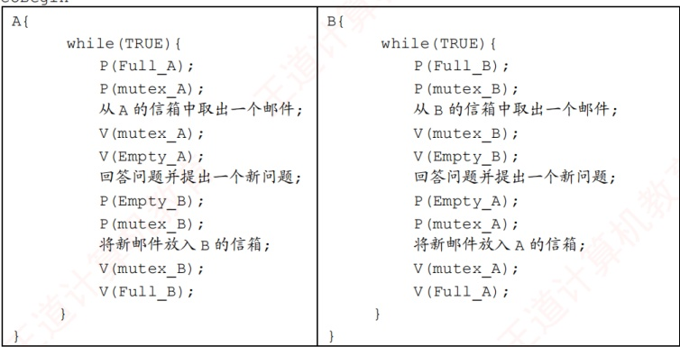

coEnd

##### 22

【解答】

对于这类问题，做法如下：

首先，找出有可能需要互斥访问的变量，只有全局变量才可能需要互斥访问，也就是说，含全局变量的代码段才可能是临界区。而局部变量是不需要互斥访问的，就算不同的进程之间都有相同名字的局部变量，但对不同的进程来说，它们只认识属于自己的局部变量。

其次，有关互斥的难点不在于找出哪些变量有可能需要互斥访问，而要理解互斥是进程之间对某个变量的互斥，不能脱离具体的进程来谈某个变量需不需要互斥访问。前面说了全局变量有可能需要互斥访问，但也不一定，因为这要看进程对它的操作，因此，一组互斥关系需要指出是哪些进程对哪个变量的互斥。例如，考虑两种情况：第一种情况是，进程1和进程2需要对共享变量C互斥访问，进程1和进程3也需要对变量C互斥访问，这是两组不同的互斥关系，而不能简单地理解为对C的互斥；第二种情况是，进程1、2、3两两之间都需要对变量C互斥访问。这种情况与第一种情况的差别是，第一种情况允许进程2、3对变量C的访问是不互斥的。若题目给出的是第一种情况，而我们采用了第二种情况去解题，则可能有同学认为，我依然满足了题目的要求啊，进程1、2之间以及进程1、3之间对C的访问都是互斥的，但这样降低了并发度，因为第二种情况允许进程2、3对变量C的访问是不互斥的，这也是PV互斥的最大难点，就是在没有准确找准互斥关系的条件下，容易导致程序的并发度降低，从而扣分。

本题的分析如下。

首先，全局变量是 x、y、z，只有对这三个变量的访问才可能需要互斥。线程 1 涉及 x、y 的访问（只读），线程 2 涉及 y、z 的访问（只读），线程 3 涉及 y、z 的访问（读和写）。

其次，找互斥关系，根据什么原则呢？答案是读者-写者原则。读和读之间不需要互斥，读和写之间、写和写之间需要互斥。因此，本题的互斥关系如下：第一对，thread1 和 thread3 之间需要对变量 y 的访问互斥；第二对，线程 2 和线程 3 之间需要对变量 y 的访问互斥；第三对，线程 2 和线程 3 之间需要对变量 z 访问的互斥。正确找出所有互斥关系后，接下来的操作就很简单。因为有三组互斥关系，所以定义三个互斥信号量，分别为  $\text{mutex\_y1} = 1$、 $\text{mutex\_y2} = 1$ 和  $\text{mutex\_z} = 1$，然后分别将它们加到线程代码段的相应位置。例如，在线程 1 的 w = add(x, y) 和线程 3 的 y = add(y, w)
上下用  $\text{mutex}_y$ 夹住；在线程 2 的  $w = \text{add}(y, z)$ 和线程 3 的  $z = \text{add}(z, w)$ 上下用  $\text{mutex}_y$ 夹住；在线程 2 的  $w = \text{add}(y, z)$ 和线程 3 的  $y = \text{add}(y, w)$ 上下用  $\text{mutex}_z$ 夹住。
```c

semaphore mutex_y1=1; //mutex_y1 用于 thread1 与 thread3 对变量 y 的互斥访问
semaphore mutex_y2=1; //mutex_y2 用于 thread2 与 thread3 对变量 y 的互斥访问
semaphore mutex_z=1; //mutex_z 用于 thread2 与 thread3 对变量 z 的互斥访问
```
互斥代码如下：

thread1
```c
{
  cnum w;
  wait( mutex_y1);
  w = add(x, y);
  signal( mutex_y1);
  ...
}
```
thread2
```c
{
  cnum w;
  wait( mutex_y2);
  wait( mutex_z);
  w = add(y, z);
  signal( mutex_z);
  signal( mutex_y2);
  ...
}
```
thread3
```c
{
  cnum w;
  w.a = 1;
  w.b = 1;
  wait( mutex_z);
  z = add(z, w);
  signal( mutex_z);
  wait( mutex_y1);
  wait( mutex_y2);
  y = add(y, w);
  signal( mutex_y1);
  signal( mutex_y2);
  ...
}
```

##### 23

【解答】

回顾传统的哲学家问题，假设餐桌上有 n 名哲学家、n 根筷子，那么可以用这种方法避免死锁（本书考点讲解中提供了这一思路）：限制至多允许 n-1 名哲学家同时“抢”筷子，那么至少会有 1 名哲学家可以获得两根筷子并顺利进餐，于是不可能发生死锁的情况。

本题可以用碗这个限制资源来避免死锁：当碗的数量 $m$ 小于哲学家的数量 $n$ 时，可以直接让碗的资源量等于 $m$，确保不会出现所有哲学家都拿一侧筷子而无限等待另一侧筷子进而造成死锁的情况；当碗的数量 $m$ 大于或等于哲学家的数量 $n$ 时，为了让碗起到同样的限制效果，我们让碗的资源量等于 $n-1$，这样就能保证最多只有 $n-1$ 名哲学家同时进餐，所以得到碗的资源量为 $\min\{n-1, m\}$。在进行 PV 操作时，碗的资源量起限制哲学家取筷子的作用，所以需要先对碗的资源量进行 P 操作。具体过程如下：

```c
//信号量
semaphore bowl; //用于协调哲学家对碗的使用
semaphore chopsticks[n]; //用于协调哲学家对筷子的使用
for(int i=0;i<n;i++)
    chopsticks[i]=1; //设置两名哲学家之间筷子的数量
bowl=min(n-1,m); //bowl≤n-1,确保不死锁
```

coBegin
```c
while(TRUE){ //哲学家i的程序
    思考；
    P(bowl); //取碗
    P(chopsticks[i]); //取左边筷子
    P(chopsticks[(i+1)\%n]); //取右边筷子
    就餐；
    V(chopsticks[i]);
    V(chopsticks[(i+1)\%n]);
V(bowl);
}
```
coEnd

##### 24

【解答】

本题是一个典型的利用信号量实现前驱关系的同步问题。首先画出各个操作之间的执行顺序图，可以看出，A、B、D 的执行不需要任何前提条件。执行完 A 和 B 之后才能执行 C，存在两对同步关系：A→C 和 B→C，设置两个同步变量 SAC = 0 和 SBC = 0，完成 A 和 B 之后分别执行 V(SAC) 和 V(SBC)，表示 A 或 B 已完成；执行 C 之前需要执行 P(SAC) 和 P(SBC)，检查 A 和 B 是否完成。执行完 C 和 D 之后才能执行 E，也存在两对同步关系： $\mathcal{E} \to \bigcirc$  $\frown$  $\neg$ E 和 D→E，因此再设置两个同步变量 SCE = 0 和 SDE = 0，完成 C 和 D 之后分别执行 V(SCE) 和 V(SDE)，表示 C 或 D 已完成；执行 E 之前需要执行 P(SCE) 和 P(SDE)，检查 C 和 D 是否完成。

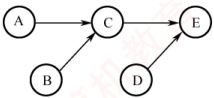

```c
semaphore SAC = 0; //控制 A 和 C 的执行顺序
SEMOPHONE SBC = 0; //控制 B 和 C 的执行顺序
SEMOPHONE SCE = 0; //控制 C 和 E 的执行顺序
SEMOPHONE SDE = 0; //控制 D 和 E 的执行顺序
```

5 个操作可描述为如下。

coBegin
```c
A() {
    完成动作 A;
    V(SAC); //实现 A、C 之间的同步关系
}
B() {
    完成动作 B;
    V(SBC); //实现 B、C 之间的同步关系
}
C() {
    //C 必须在 A、B 都完成后才能完成
    P(SAC);
    P(SBC);
    完成动作 C;
    V(SCE); //实现 C、E 之间的同步关系
}
D() {
    完成动作 D;
    V(SDE); //实现 D、E 之间的同步关系
}
E() {
    //E 必须在完成 C、D 之后执行
    P(SCE);
    P(SDE)
    完成动作 E;
}
```
coEnd

##### 25

【解答】

1）信号量 S 是能被多个进程共享的变量，多个进程都可通过 wait() 和 signal() 对 S 进行读、写操作。所以，wait() 和 signal() 操作中对 S 的访问必须是互斥的。

2）方法1错误。在 wait()中，当 S <= 0 时，关中断后，其他进程无法修改 S 的值，while 语句陷入死循环。方法2正确。方法2在循环体中有一个开中断操作，这样就可以使其他进程修改 S 的值，从而避免 while 语句陷入死循环。
3）用户程序不能使用开/关中断指令实现临界区互斥。因为开中断和关中断指令都是特权指令，不能在用户态下执行，只能在内核态下执行。

##### 26

【解答】

本题是一个典型的利用信号量实现前驱关系的同步问题。需要强调的是，只有不同进程之间的操作才需要进行同步。进程 T1 依次执行 A、E、F，进程 T2 依次执行 B、C、D。我们需要分析哪些操作必须在另一个进程的某个操作完成之后才能执行。由图可知，对进程 T1 来说，E 必须在进程 T2 执行完 C 后才能执行；对进程 T2 来说，C 必须在进程 T1 执行完 A 后才能执行。因此，有两对同步关系：A→C 和 C→E。为了实现这两对同步关系，定义两个同步信号量  $S_{AC}$ 和  $S_{CE}$。进程 T1 执行完 A 后，发出信号 signal( $S_{AC}$)，表示 A 已执行完成；进程 T2 准备执行 C 之前，等待信号 wait( $S_{AC}$)，检查 A 是否执行完成。同理，进程 T2 执行完 C 后，发出信号 signal( $S_{CE}$)，表示 C 已执行完成；进程 T1 准备执行 E 之前，等待信号 wait( $S_{CE}$)，检查 C 是否执行完成。这样就保证了两个进程之间的同步。

| \{semaphore $S_{AC}=0$; //描述 A、C 之间的同步关系\}SEMaphore $S_{CE}=0$; //描述 C、E 之间的同步关系 |   |
| --- | --- |
| T1: | T2: |
| A: | B: |
| signal( $S_{AC}$); | wait( $S_{AC}$); |
| wait( $S_{CE}$); | C: |
| E: | signal( $S_{CE}$); |
| F: | D: |

##### 27

【解答】

1）if 语句无法实现对临界区的互斥访问，因为 if 语句执行后，不论结果如何，线程都能访问临界区。本题使用 swap 指令和 lock 变量来实现对临界区的互斥访问，当线程不能进入临界区时，本身并不会主动放弃 CPU，因此需要让线程在进入区中循环检查 lock 值，可以使用 while 循环，当 lock 值为 TRUE 时，线程一直执行 while 循环的内容，直到 lock 值被修改为 FALSE 时，线程才能进入临界区，因此将进入区中的语句 `if (key == TRUE) swap key, lock` 修改为 `while (key == TRUE) swap key, lock`。在退出区中，代表该线程对临界资源的访问已经结束，此时需要将 lock 值置为 FALSE，代表其他线程可以访问临界区，因此将退出区中的语句 “lock = TRUE” 修改为 “lock = FALSE”。
```c

2）否。因为多个线程可以并发执行 newSwap()，newSwap()执行时传递给形参b的是共享变量lock的地址，在newSwap()中对lock既有读操作又有写操作，并发执行时不能保证实现两个变量值的原子交换，从而导致并发执行的线程同时进入临界区。例如，线程A和线程B并发执行，初始时lock值为FALSE，当线程A执行完*a=*b后发生了进程调度，切换到线程B执行，线程B执行完newSwap后发生线程切换，此时线程A和B都能进入临界区，不能实现互斥访问。
```

##### 28

【解答】

1）代码  $C_{1}$ 执行对 B 的写操作，且  $P_{1}$ 和  $P_{2}$ 需要互斥执行  $C_{1}$，因此  $C_{1}$ 的代码是临界区。

2）有一组互斥关系和一组同步关系。互斥关系为： $P_{1}$ 和  $P_{2}$ 需要互斥访问缓冲区 B；同步关系为： $P_{1}$ 执行  $C_{1}$ 后， $P_{2}$ 才能执行  $C_{2}$。缓冲区 B 初始为空，且最大容量为 1，因此可不用定义互斥信号量 mutex。因为在缓冲区大小为 1 的条件下，同步信号量 S 就可同时保证  $P_{1}$ 和  $P_{2}$ 互斥访问 B，符合题意“尽可能定义少的信号量”的要求。进程  $P_{1}$ 和  $P_{2}$ 的同步伪代码如下。

| Semaphore S = 0; //实现进程 P1 与 P2 的同步 |   |
| --- | --- |
| P1 ... | P2 ... |
| C1; signal(S); ... | wait(S); C2; ... |

3）缓冲区 B 初始非空，因此仅需一个互斥信号量 mutex 来保证  $P_{1}$ 和  $P_{2}$ 互斥访问 B 即可。进程  $P_{1}$ 和  $P_{2}$ 的互斥伪代码如下。

| Semaphore mutex = 1; //实现 P1 与 P2 互斥执行 C3 |   |
| --- | --- |
| P1 ... wait(mutex); C3; signal(mutex); ... | P2 ... wait(mutex); C3; signal(mutex); ... |

##### 29

【解答】

本题需协调甲、乙、丙三人的协作过程，并管理共享资源。水桶仅由丙使用，无竞争；铁锹由甲（挖树坑）和乙（填土）共用，需互斥访问，设置一个互斥信号量 mutex。本题有三组同步关系：① 未被使用的树坑数量必须小于 3，甲才可挖新坑；② 乙必须在有树坑时才能放树苗并填土；③ 丙必须在有已填土的树苗时才能浇水。为此，还需定义三个同步信号量：position 表示还可挖的树坑配额（允许新增的未使用树坑数量），初值为 3；pit 表示当前已挖好但尚未被使用的树坑数量，初值为 0；tree 表示已完成填土、等待浇水的树苗数量，初值为 0。

三人操作流程如下：甲先执行 wait(position)申请一个树坑配额，成功后获取铁锹挖坑，释放铁锹后执行 signal(pit)，通知乙有新树坑可用；乙先执行 wait(pit)等待树坑，放树苗后立即执行 signal(position)释放一个树坑配额（因可用树坑减少1个），随后在 mutex 保护下使用铁锹填土，完成后执行 signal(tree)通知丙；丙执行 wait(tree)等待可浇水的树苗，然后浇水。

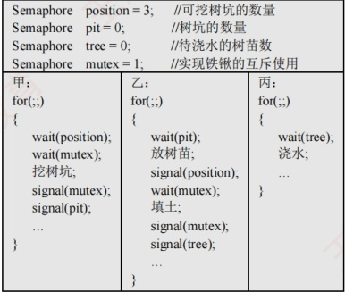

## 2.4 死锁

在学习本节时，请读者思考以下问题：

1）为什么会产生死锁？产生死锁有什么条件？

2）有什么办法可以解决死锁问题？

学完本节，读者应了解死锁的由来、产生条件及基本解决方法，区分避免死锁和预防死锁。
### 2.4.1 死锁的概念

#### 1. 死锁的定义

在多道程序系统中，进程的并发执行显著提高了系统资源的利用率和整体效率。然而，这种并发性也带来了新的问题——死锁。所谓死锁，是指多个进程因竞争资源而陷入相互等待的僵局：每个进程都在等待其他进程所占有的资源，而这些资源又不会被释放，从而形成一个循环等待链。结果，所有涉及的进程都被永久阻塞；若无外部干预，它们将无法继续推进。

下面通过实例说明死锁现象。

先看一个生活中的类比。假设有一条狭窄的小巷，仅容一辆车通行。若有两辆汽车分别从巷子的两端同时驶入，且双方都坚持前行而不愿倒车，则两车将在巷中对峙，彼此阻挡，谁也无法通过。这种互相等待、互不让步的情形，恰如计算机系统中的死锁。

在计算机系统中，死锁的表现更为典型。例如，某系统中仅配备一台打印机和一台扫描仪。进程  $P_{1}$ 当前正占有扫描仪，并请求使用打印机；与此同时，进程  $P_{2}$ 正占有打印机，并请求使用扫描仪。由于每个进程都持有对方所需的资源，且都不主动释放，两个进程便陷入无限期的相互等待之中，无法继续执行。此时，系统就处于死锁状态。

#### 2. 死锁与饥饿

一组进程处于死锁状态，是指其中每个进程都在等待某个事件的发生，而该事件只能由组内另一个进程触发，通常表现为等待对方释放其所占有的资源。

与死锁密切相关但本质不同的另一个问题是饥饿，是指某个进程因资源分配策略的不公平性，长期得不到所需资源，从而无法推进其执行。产生饥饿的主要原因是：当多个进程同时竞争同一类资源时，若系统采用的分配策略不能保证“等待时间有上界”（无法确保每个等待进程最终都能获得服务），则某些进程就可能被无限期推迟。例如，当多个进程需要打印文件时，若系统采用“最短作业优先”的打印调度策略，则长文件的打印请求可能因不断有新的短文件到达而始终无法获得服务，最终陷入饥饿状态。需要注意的是，饥饿并不等同于死锁：系统可能仍在正常运行，其他进程可以顺利执行，只是个别进程被持续忽略。

死锁与饥饿的共同点如下：相关进程都无法顺利向前推进。二者的主要区别如下：①涉及的进程数量不同，饥饿可以只影响单个进程；而死锁必须涉及两个或更多的进程，且它们之间存在循环等待关系。②进程所处的状态不同，处于饥饿状态的进程可能处于就绪态（例如，在SPF调度算法中长期得不到CPU），也可能处于阻塞态（例如，长期等待某个I/O设备）；而处于死锁状态的进程则必定处于阻塞态，因为它们正在等待已被其他死锁进程占有的资源。

#### 3. 死锁产生的原因

### 考点追踪 单类资源竞争时发生死锁的临界条件的分析（2009、2014）

#### （1） 系统资源的竞争

系统中不可剥夺资源（如打印机、磁带机等）的数量通常有限，难以满足所有并发进程的需求。当多个进程竞争这类资源且资源分配策略不当，便可能因相互等待而陷入僵局，进而引发死锁。需要强调的是，死锁的发生与不可剥夺资源的存在密切相关。对于可剥夺资源（如CPU时间片），操作系统可在必要时强制回收，因此单纯因这类资源的竞争一般不会导致死锁。

#### （2） 进程推进顺序非法

即使系统资源充足，若进程请求和释放资源的顺序不合理，则仍可能引发死锁。例如，进程 $P_{1}$和 $P_{2}$分别占有资源 $R_{1}$和 $R_{2}$，随后 $P_{1}$申请 $R_{2}$、而 $P_{2}$申请 $R_{1}$。由于双方所需资源均被对方占有，两个进程均被阻塞，且各自保持已占有的资源不放，从而形成死锁。
此外，同步机制使用不当也可能导致死锁。例如，进程 A 等待进程 B 发送的消息，而进程 B 又在等待进程 A 的消息。此时，尽管未涉及传统硬件资源，但消息通道或同步对象可被视为一种逻辑资源，其相互等待同样会使进程无法继续推进，形成死锁。

#### 4. 死锁产生的必要条件

死锁的发生必须同时满足以下四个条件：只要其中任一条件不成立，死锁就不可能发生。

1）互斥条件。进程对所分配的资源（如打印机）要求排他性使用，即在一段时间内，某资源只能被一个进程占有；若有其他进程请求该资源，则必须等待。

2）不可剥夺条件。进程已获得的资源在使用完毕之前，不能被其他进程强行剥夺，只能由该进程主动释放。

3）请求并保持条件。进程在持有至少一个资源的同时，又提出新的资源请求；若该资源已被其他进程占有，则请求进程被阻塞，但对其已占有的资源仍保持不放。

4）循环等待条件。存在一个进程集合 $\{P_1, P_2, \cdots, P_n\}$，其中每个进程 $P_i$等待的资源正被下一个进程 $P_{(i+1)\mathrm{mod}(n+1)}$占有，从而形成一个循环等待链，如图2.14所示。

直观上看，循环等待条件似乎与死锁的定义相同，实则不然。

资源分配图中存在环，并不必然意味着死锁。其根本原因在于：当某类资源有多个实例时，即使图中存在环，系统仍可能通过资源重分配打破僵局。例如，在图 2.15 中，若输出设备有两个实例，进程  $P_0$ 和  $P_K$（ $K \notin \{0,1,\cdots,n\}$）各持有一台。当  $P_n$ 请求一台输出设备时，只要  $P_0$ 或  $P_K$ 任一释放其所持有的设备， $P_n$ 即可获得所需资源，从而解除等待环。

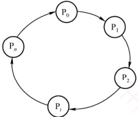

图2.14 循环等待

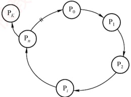

图 2.15 满足条件但无死锁

因此，只有当系统中每类资源均仅有一个实例时，资源分配图中的环才成为死锁的充分必要条件；否则，环的存在仅表明系统处于潜在风险状态，未必实际发生死锁。

区分不可剥夺条件与请求并保持条件，通过以下例子说明：若你手中持有一个苹果，他人不能强行将其拿走（使你暂时不吃），这体现了不可剥夺条件；若你已持有一个苹果，又去请求第二个苹果，但在获得第二个苹果前拒绝放下第一个，则体现了请求并保持条件。

#### 5. 死锁的处理策略

处理死锁主要有三种策略：一是通过协议预防或避免死锁，确保系统永不进入死锁状态；二是允许死锁发生，但能检测并恢复；三是完全忽略死锁问题，假定其不会出现。其中，第一种策略包含预防死锁和避免死锁两种方法；第二种策略包含检测及解除死锁方法；第三种策略被大多数通用操作系统（如 Linux 和 Windows）所采用。下面简要介绍这些处理方法。

1）预防死锁。通过设置严格的限制条件，破坏死锁的四个必要条件中的一个或多个，从根本上杜绝死锁的可能。

2）避免死锁。在资源动态分配过程中，通过特定算法判断分配后系统是否仍处于安全状态，仅当安全时才允许分配，从而避免进入可能导致死锁的不安全状态。

3）检测及解除死锁。不施加任何预防性限制，允许进程自由申请资源；系统定期运行检测
算法，一旦发现死锁，便采取相应措施（如终止部分进程或剥夺其资源）予以解除。

预防与避免死锁均属于事前防范策略。死锁预防的限制条件较为严格，实现相对简单，但往往导致系统效率和资源利用率较低；死锁避免的限制条件相对宽松，但需在每次资源分配前通过算法判断系统是否仍处于安全状态，实现较为复杂。各类策略的对比如表2.5所示。

表2.5 死锁处理策略的比较

|   | 资源分配策略 | 各种可能模式 | 主要优点 | 主要缺点 |
| --- | --- | --- | --- | --- |
| 死锁 预防 | 保守，宁可资源闲置 | 一次请求所有资源，资源剥夺，资源按序分配 | 无须运行时检测，实现简单 | 资源利用率低； 剥夺可能很频繁； 不适用于动态请求 |
| 死锁 避免 | 是预防和检测的折中（运行时判断是否可能死锁） | 每次分配前，寻找可能的安全允许顺序 | 无须资源剥夺，资源利用率较高 | 须预知最大资源需求； 进程可能因长期不安全而被无限期推迟 |
| 死锁 检测 | 宽松，只要允许就分配资源 | 定期检测死锁，发现后采取解除措施 | 不限制资源申请，无启动延迟； 支持灵活分配 | 检测与解除带来额外开销； 终止或剥夺可能导致工作丢失 |

### 2.4.2 死锁预防

### 考点追踪 ▶ 死锁预防的特点（2019）

预防死锁的发生，只需破坏死锁产生的四个必要条件之一即可。

#### 1. 破坏互斥条件

若将原本只能互斥使用的资源改造为允许多个进程共享访问，则可避免死锁。然而，许多资源（如打印机、磁带机等临界资源）本质上不支持并发访问，否则会导致数据不一致或设备冲突。因此，互斥性通常是保障系统正确性的基本要求，破坏该条件在实践中并不可行。

#### 2. 破坏不可剥夺条件

当一个已占有某些不可剥夺资源的进程请求新资源而无法满足时，系统强制释放其已占有的所有资源，待后续需要时再重新申请。这意味着，资源被临时剥夺，从而破坏不可剥夺条件。

该策略实现复杂且代价高昂：对于打印机等不可剥夺的外部设备，强制释放可能导致已完成的工作失效，甚至引发设备状态混乱。此外，频繁的申请与释放会显著增加系统开销，延长进程周转时间，降低系统吞吐量。因此，该方法在实际系统中极少采用。

#### 3. 破坏请求并保持条件

要求进程在请求新资源时不得持有任何不可剥夺资源。可通过以下方式实现。

1）静态资源分配：进程在运行前一次性申请所需全部资源。若系统无法满足，则进程暂不投入运行。运行期间不再提出新请求，从而避免“请求并保持”行为。

2）动态释放后申请：作为对方法一的改进，进程在获得初期所需资源后即可开始执行；但在运行过程中，必须先释放所有已使用完毕的资源，才能申请新资源。

方法一的优点是实现简单，但存在明显缺点：①资源浪费严重：进程在运行初期即占有全部所需资源，其中部分资源可能仅在运行末期才使用，甚至从未被使用，导致长期闲置；②易引发饥饿现象：由于某些资源长期被其他进程占有，等待这些资源的进程可能迟迟无法启动。

#### 4. 破坏循环等待条件

采用资源有序分配法：为系统中每类资源赋予唯一的编号，并规定进程必须按编号递增的顺序请求不同类资源，且同类资源须一次性申请。换言之，进程只有在未持有任何资源，或仅持有较小编号的资源时，才被允许申请更大编号的资源。按此规则，任何已持有大编号资源的进程都无法再申请小编号资源，从而确保资源分配图中不可能出现环，从根本上杜绝死锁。

该方法的缺点：①资源编号需相对稳定，不利于新增设备类型。②尽管在编号时已尽量考
虑大多数进程使用资源的顺序，但实际使用资源的顺序仍可能与编号次序不一致，导致资源提前占用而长期闲置，造成浪费。③ 强制按固定次序申请资源，增加了用户编程的复杂性。

### 2.4.3 死锁避免

死锁避免同样属于事先预防策略，但它并非通过预先施加限制来破坏死锁的必要条件，而是在每次分配资源时，动态判断此次分配是否可能引发死锁。只有在确认不会导致死锁的情况下，系统才予以分配。由于该方法所施加的约束较为宽松，因而能够获得较好的系统性能。

#### 1. 系统安全状态

在死锁避免机制中，系统允许进程动态申请资源，但在进行资源分配前，必须先评估此次分配的安全性：若分配后系统仍处于安全状态，则允许分配；否则，进程需等待。

所谓安全状态，是指系统存在某个进程执行序列（ $P_1, P_2, \cdots, P_n$），使得对于序列中的每个进程  $P_i$，在其之前的所有进程执行完毕并释放所占资源后，系统仍有足够的可用资源满足  $P_i$ 的所需资源量（最大需求减去已分配量），从而保证  $P_i$ 能顺利完成。这样的序列称为安全序列（可能存在多个）。若系统无法找到任何一个安全序列，则称系统处于不安全状态。

### 考点追踪 系统安全状态的分析（2018）

假设系统中有三个进程  $P_{1}$,  $P_{2}$ 和  $P_{3}$，共有 12 台磁带机。各进程的最大需求分别为： $P_{1}$ 需 10 台， $P_{2}$ 需 4 台， $P_{3}$ 需 9 台。在  $T_{0}$ 时刻，各进程已分配资源及系统可用资源如表 2.6 所示。

表2.6 资源分配

| 进程名 | 最大需求 | 已分配 | 可用 |
|---|---|---|---|
| $P_{1}$ | 10 | 5 | 3 |
| $P_{2}$ | 4 | 2 |  |
| $P_{3}$ | 9 | 2 |  |

仕  $I_{0}$ 时刻，系统处于安全状态，因为存在安全序列  $\left(\mathrm{P}_{2}, \mathrm{P}_{1}, \mathrm{P}_{3}\right)$ ：若按此顺序推进进程，每个进程在其轮次均可获得所需资源并顺利完成。具体而言，当前可用资源为3， $P_{2}$ 尚需2台，可立即满足， $P_{2}$ 完成后释放其全部4台资源，可用资源变为5； $P_{1}$ 尚需5台，恰好可满足， $P_{1}$ 完成后释放10台，可用资源增至10； $P_{3}$ 尚需7台，可被满足，最终顺利完成。

若在  $T_{0}$ 时刻之后，系统将1台分配给  $P_{3}$，则  $P_{3}$ 已分配量变为3，可用资源降为2。此时，系统进入不安全状态，因为无法再找到任何安全序列。例如，若将剩余的2台分配给  $P_{2}$（其尚需2台）， $P_{2}$ 可完成并释放4台，可用资源变为4。然而， $P_{1}$ 尚需5台， $P_{3}$ 尚需6台（因已分配3台），均无法满足。两个进程相互等待对方释放资源，陷入僵局，最终导致死锁。

系统处于安全状态时，一定不会发生死锁；而处于不安全状态时，死锁可能发生，但并非必然发生。换言之，死锁发生时，系统必定处于不安全状态，但不安全状态不一定会演变为死锁。

#### 2. 利用银行家算法避免死锁

### 考点追踪 银行家算法的特点（2013、2019）

银行家算法是最著名的死锁避免算法。其基本思想是：将操作系统视为银行家，系统管理的资源视为银行资金，进程请求资源相当于用户申请贷款。每个进程在运行前需声明其对各类资源的最大需求量（且该最大需求量在整个生命周期内不得更改，否则银行家算法的安全性保证失效），且该总量不得超过系统资源总量。当进程在运行中申请资源时，系统首先检查当前是否有足够资源可供分配；若有，则进一步试探：若将这些资源分配给该进程，系统是否仍处于安全状态。只有在确保安全的前提下，才正式分配资源；否则，就让进程等待。
#### （1） 银行家算法中的数据结构

假设系统中有 n 个进程和 m 类资源，银行家算法需维护以下四个数据结构。

 $$\mathrm{Available}[j]=K$$

 $$R_{i}$$

2）最大需求矩阵 Max： $n \times m$ 矩阵，定义系统中每个进程对 m 类资源的最大需求。 $\text{Max}[i, j] = K$ 表示进程  $P_i$ 对  $R_j$ 类资源的最大需求数量为  $K$。

3）分配矩阵 Allocation： $n \times m$ 矩阵，定义系统中每类资源当前已分配给每个进程的资源数。Allocation $[i,j] = K$ 表示进程  $P_i$ 当前已获得  $R_j$ 类资源的数量为  $K$。

4）需求矩阵 Need： $n \times m$ 矩阵，表示每个进程尚需的各类资源数。Need $[i, j] = K$ 表示进程  $P_i$ 尚需  $R_j$ 类资源的数量为  $K$。

上述三个矩阵满足如下关系：

 $$Need[i,j]=Max[i,j]-Allocation[i,j]$$

通常，题目会给出 Max 和 Allocation 矩阵，解题的第一步即是据此计算出 Need 矩阵。

#### （2） 银行家算法

设 Request $_{i}$ 是进程 P $_i$ 的资源请求向量，Request $_i$[j] = K 表示 P $_i$ 请求 K 个 j 类资源。当 P $_i$ 发出资源请求后，系统按以下步骤进行检查：

① 合法性检查：若 Request, $[j]\leq Need[i,j]$，则转向步骤②；否则视为非法请求，因为其申请量已超过预先声明的最大需求。

② 资源可用性检查：若 Request, $[j]\leq\text{Available}[j]$，则转向步骤③；否则表示当前资源不足， $P_i$ 必须等待。

③ 试探性分配：系统尝试将资源分配给  $P_{i}$，并更新相关数据结构：

 $$\begin{aligned}&Available[j]=Available[j]-Request_{i}[j]\quad&\# 减少系统可用资源 , 反映资源已被分配 \\&Allocation[i,j]=Allocation[i,j]+Request_{i}[j]\quad&\# 增加 P_{i} 已分配的资源量 \\&Need[i~i]=Need[i~i]-Request[i]\quad&\# 减少 P_{i} 尚需的资源量 \end{aligned}$$

 $$Need[i,j]=Need[i,j]-Request_{i}[j]\quad\# 减少 \;P_{i} 尚需的资源量$$

④ 安全性检查：系统执行安全性算法，判断此次分配后系统是否处于安全状态。若是，则正式确认此次分配；否则，撤销分配，恢复各数据结构的原始值，并让 $P_{i}$等待。

#### （3） 安全性算法

安全性算法用于判断系统当前是否处于安全状态，其基本思想是：尝试构造一个进程执行序列，使得所有进程都能依次获得所需资源并顺利完成。具体步骤如下。

1）设置两个向量。① 工作向量 Work：长度为 m 的向量，表示当前可用的各类资源数，初始时 Work = Available；② 完成向量 Finish：长度为 n 的布尔向量，标记各进程能否顺利完成，初始时 Finish[] = false；当进程  $P_i$ 的资源需求可被满足时，令 Finish[i] = true。

2）在尚未完成的进程中，查找一个满足以下两个条件的进程P：

 $$\begin{array}{l}Finish[i]=false\quad\# 尚未加入安全序列 \\ Need[i]\leq Work\quad\# 其  尚  需  的  各  类  资  源  数  均  不  超  过  当  前  可  用  资  源 \end{array}$$

若能找到，则执行步骤3）；否则，执行步骤4）。

3）当进程 $P_{i}$获得所需资源后可顺利执行至完成，并释放其所占有的全部资源，故执行：

 $$\begin{aligned}&Work=Work+Allocation[i]\quad&\# 释放其已分配的各类资源 \\&Finish[i]=true\quad&\# 将其加入安全序列 \end{aligned}$$

随后返回步骤2），继续寻找下一个可完成的进程。

4）若所有进程均满足 Finish[i]=true，则系统处于安全状态；否则系统处于不安全状态。为帮助理解上述流程，下面将通过具体示例完整演示安全性算法的执行过程。
#### 3. 安全性算法举例

### 考点追踪 银行家算法的安全序列分析（2011、2012、2018、2020、2022）

假定系统中有 5 个进程  $\{P_0, P_1, P_2, P_3, P_4\}$ 和 3 类资源  $\{A, B, C\}$，各类资源的总量分别为 10, 5, 7，在  $T_0$ 时刻的资源分配情况见表 2.7。现利用安全性算法，判断系统此时是否处于安全状态。

表2.7  $T_{0}$ 时刻的资源分配表

| 进程名 | 资源情况 |   |   |
| --- | --- | --- | --- |
| Max A B C | Allocation A B C | Available A B C |   |
| $P_{{0}}$ | 7 5 3 | 0 1 0 | 3 3 2 (2 3 0) |
| $P_{{1}}$ | 3 2 2 | 2 0 0 (3 0 2) |   |
| $P_{{2}}$ | 9 0 2 | 3 0 2 |   |
| $P_{{3}}$ | 2 2 2 | 2 1 1 |   |
| $P_{{4}}$ | 4 3 3 | 0 0 2 |   |

① 首先，由题目给出的 Max 矩阵和 Allocation 矩阵，可计算出 Need 矩阵：

 $$\begin{aligned}\begin{bmatrix}{{{7}}}&{{{5}}}&{{{3}}} \\{{{3}}}&{{{2}}}&{{{2}}} \\{{{9}}}&{{{0}}}&{{{2}}} \\{{{2}}}&{{{2}}}&{{{2}}} \\{{{4}}}&{{{3}}}&{{{3}}}\end{bmatrix}-\begin{bmatrix}{{{0}}}&{{{1}}}&{{{0}}} \\{{{2}}}&{{{0}}}&{{{0}}} \\{{{3}}}&{{{0}}}&{{{2}}} \\{{{2}}}&{{{1}}}&{{{1}}} \\{{{0}}}&{{{0}}}&{{{2}}}\end{bmatrix}&=\begin{bmatrix}{{{7}}}&{{{4}}}&{{{3}}} \\{{{1}}}&{{{2}}}&{{{2}}} \\{{{6}}}&{{{0}}}&{{{0}}} \\{{{0}}}&{{{1}}}&{{{1}}} \\{{{4}}}&{{{3}}}&{{{1}}}\end{bmatrix}\\ Max\quad&Allocation\quad Need\end{aligned}$$

由此得到各进程的尚需资源数。

② 初始化工作向量 Work = Available = (3, 3, 2)。将 Work 与 Need 矩阵的各行进行比较，寻找满足 Need[i] ≤ Work（各分量均不超过）且 Finish[i] = false 的进程。初始时

 $$P_{1}\rightarrow(1,2,2)<(3,3,2)$$

 $$P_{3}\rightarrow(0,1,1)<(3,3,2)$$

进程  $P_{1}$ 和  $P_{3}$ 均满足条件。此处选择  $P_{1}$ （也可选择  $P_{3}$ ）作为安全序列的第一个进程。

③ 将  $P_{1}$ 加入安全序列，并模拟其顺利完成：释放其所占资源，更新工作向量：

 $$Work=Work+Allocation[1]=(3,3,2)+(2,0,0)=(5,3,2)$$

同时，标记 Finish[1] = true。

以更新后的 Work=(5,3,2) 重复上述过程，继续查找下一个可执行的进程。以此类推，整个分析过程如表 2.8 所示（表中“Work+Allocation”列即为下一步的 Work 值），最终构造出一个完整的安全序列  $\{P_1, P_3, P_4, P_2, P_0\}$，表明系统在  $T_0$ 时刻处于安全状态。

表2.8  $T_{0}$ 时刻的安全序列的分析

| 进程名 | 资源情况 |   |   |   |   |   |   |   |   |   |   |   |   |
| --- | --- | --- | --- | --- | --- | --- | --- | --- | --- | --- | --- | --- | --- |
| Work |   |   | Need |   |   | Allocation |   |   | Work+Allocation |   |   | Finish |   |
| A | B | C | A | B | C | A | B | C | A | B | C |   |   |
| $P_{{1}}$ | 3 | 3 | 2 | 1 | 2 | 2 | 2 | 0 | 0 | 5 | 3 | 2 | true |
| $P_{{3}}$ | 5 | 3 | 2 | 0 | 1 | 1 | 2 | 1 | 1 | 7 | 4 | 3 | true |
| $P_{{4}}$ | 7 | 4 | 3 | 4 | 3 | 1 | 0 | 0 | 2 | 7 | 4 | 5 | true |
| $P_{{2}}$ | 7 | 4 | 5 | 6 | 0 | 0 | 3 | 0 | 2 | 10 | 4 | 7 | true |
| $P_{{0}}$ | 10 | 4 | 7 | 7 | 4 | 3 | 0 | 1 | 0 | 10 | 5 | 7 | true |

#### 4. 银行家算法举例

安全性算法是银行家算法的核心。在典型考题中，通常会给出某个进程的资源请求向量。读者只需执行银行家算法的前三个步骤，即可得到更新后的 Allocation 和 Need 矩阵，再参照上例的安全性算法判断系统是否仍处于安全状态，从而决定是否批准该请求。

假设当前系统资源分配及剩余情况如表2.7所示（ $T_{0}$ 时刻的状态）。

1）进程  $P_{1}$ 发出请求向量  $Request_{1}(1,0,2)$，系统按银行家算法进行如下检查。

① 合法性检查：Request $_{1}(1,0,2)\leq Need_{1}(1,2,2)$，成立

② 资源可用性检查：Request $_{1}$(1, 0, 2)≤Available $_{1}$(3, 3, 2)

③ 试探性分配：系统尝试为  $P_{1}$ 分配资源，并修改相关数据结构：

 $$\mathrm{Available}=\mathrm{Available}-\mathrm{Request}_{1}=(2,3,0)$$

 $$Allocation_{1}=Allocation_{1}+Request_{1}=(3,0,2)$$

 $$Need_{1}=Need_{1}-Request_{1}=(0,2,0)$$

由此形成的资源变化情况如表2.7中的圆括号所示。

④ 安全性检查：令 Work = Available = (2, 3, 0)，执行安全性算法，过程如表 2.9 所示。

表2.9  $P_{1}$ 申请资源时的安全性检查

| 进程名 | 资源情况 |   |   |   |   |   |   |   |   |   |   |   |   |
| --- | --- | --- | --- | --- | --- | --- | --- | --- | --- | --- | --- | --- | --- |
| Work |   |   | Need |   |   | Allocation |   |   | Work+Allocation |   |   | Finish |   |
| A | B | C | A | B | C | A | B | C | A | B | C |   |   |
| $P_{{1}}$ | 2 | 3 | 0 | 0 | 2 | 0 | 3 | 0 | 2 | 5 | 3 | 2 | true |
| $P_{{3}}$ | 5 | 3 | 2 | 0 | 1 | 1 | 2 | 1 | 1 | 7 | 4 | 3 | true |
| $P_{{4}}$ | 7 | 4 | 3 | 4 | 3 | 1 | 0 | 0 | 2 | 7 | 4 | 5 | true |
| $P_{{0}}$ | 7 | 4 | 5 | 7 | 4 | 3 | 0 | 1 | 0 | 7 | 5 | 5 | true |
| $P_{{2}}$ | 7 | 5 | 5 | 6 | 0 | 0 | 3 | 0 | 2 | 10 | 5 | 7 | true |

由表可知，存在安全序列 $\{P_1, P_3, P_4, P_0, P_2\}$，系统处于安全状态。因此，可以正式将 $P_1$所请求的资源分配给它。分配后系统的资源状态如表2.10所示。

表2.10 为 $P_{1}$分配资源后的有关资源数据

| 进程名 | 资源情况 |   |   |   |   |   |   |   |   |
| --- | --- | --- | --- | --- | --- | --- | --- | --- | --- |
| Allocation |   |   | Need |   |   | Available |   |   |   |
| A | B | C | A | B | C | A | B | C |   |
| $P_{{0}}$ | 0 | 1 | 0 | 7 | 4 | 3 | 2 | 3 | 0 |
| $P_{{1}}$ | 3 | 0 | 2 | 0 | 2 | 0 |   |   |   |
| $P_{{2}}$ | 3 | 0 | 2 | 6 | 0 | 0 |   |   |   |
| $P_{{3}}$ | 2 | 1 | 1 | 0 | 1 | 1 |   |   |   |
| $P_{{4}}$ | 0 | 0 | 2 | 4 | 3 | 1 |   |   |   |

```c

2）P_{4} 发出请求向量 Request_{4}(3,3,0)，系统按银行家算法进行检查：
```

① 合法性检查：Request₄(3, 3, 0)≤Need₄(4, 3, 1)，成立。

② 资源可用性检查：Request₄(3, 3, 0) > Available(2, 3, 0)，不成立，让  $P_4$ 等待。

 $P_{0}$ 发出请求向量  $Regust_{0}(0,2,0)$，系统按银行家算法进行检查：

① 合法性检查：Request $_{0}$(0, 2, 0)≤Need $_{0}$(7, 4, 3)，成立。

② 资源可用性检查：Request $_{0}(0,2,0)$≤Available(2,3,0)，成立。

③ 试探性分配：系统尝试为  $P_{0}$ 分配资源，并修改相关数据结构：

 $$\mathrm{Available}=\mathrm{Available}-\mathrm{Request}_{0}=(2,1,0)$$

 $$Allocation_{0}=Allocation_{0}+Request_{0}=(0,3,0)$$
Need $_{0}$ = Need $_{0}$ - Request $_{0}$ = (7, 2, 3)，结果如表 2.11 所示。

表2.11 为 $P_{0}$分配资源后的有关资源数据

| 进程名 | 资源情况 |   |   |   |   |   |   |   |   |
| --- | --- | --- | --- | --- | --- | --- | --- | --- | --- |
| Allocation |   |   | Need |   |   | Available |   |   |   |
| A | B | C | A | B | C | A | B | C |   |
| $P_{{0}}$ | 0 | 3 | 0 | 7 | 2 | 3 | 2 | 1 | 0 |
| $P_{{1}}$ | 3 | 0 | 2 | 0 | 2 | 0 |   |   |   |
| $P_{{2}}$ | 3 | 0 | 2 | 6 | 0 | 0 |   |   |   |
| $P_{{3}}$ | 2 | 1 | 1 | 0 | 1 | 1 |   |   |   |
| $P_{{4}}$ | 0 | 0 | 2 | 4 | 3 | 1 |   |   |   |

④ 安全性检查：此时 Available(2, 1, 0)，无法满足任何进程的尚需资源，系统进入不安全状态，因此拒绝  $P_{0}$ 的请求，撤销试探性分配，并恢复各数据结构至分配前状态。

### 2.4.4 死锁检测与解除

### 考点追踪 ▶ 死锁避免和死锁检测的区分（2015）

前面介绍的死锁预防和避免算法，都是在为进程分配资源时施加限制条件或进行安全性检查。若系统在资源分配时不采取任何预防或避免措施，则必须提供死锁检测与解除机制。

#### 1. 死锁检测

### 考点追踪 ▶ 死锁避免和死锁检测对比（2015）

区分死锁避免与死锁检测。死锁避免要求在进程运行过程中始终确保系统不会进入死锁状态，因此需要预先知道进程从开始到结束的全部资源需求。死锁检测则仅判断当前时刻系统是否已发生死锁，无须预知进程未来的资源请求，只需依据当前的资源分配和请求情况。

### 考点追踪 多类资源竞争时发生死锁的临界条件分析（2016、2021）

通常采用资源分配图来检测系统是否处于死锁状态。在资源分配图中：圆圈表示进程，矩形框表示一类资源；若某类资源有多个实例，则在框内用多个圆点表示；请求边（从进程指向资源）表示该进程申请一个单位的该类资源；分配边（从资源指向进程）表示该类资源的一个实例已分配给该进程。在图 2.16(a)所示的资源分配图中，进程  $P_{1}$ 已获得两个  $R_{1}$ 资源，并请求一个  $R_{2}$； $P_{2}$ 已获得一个  $R_{1}$ 和一个  $R_{2}$，并请求一个  $R_{1}$。系统中存在环，但尚未确定是否死锁。

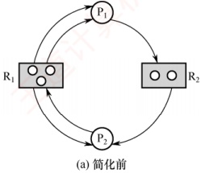

 $P_{1}$

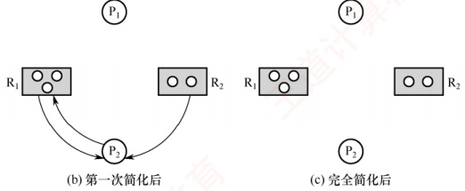

图 2.16 资源分配图及其化简过程

通过简化资源分配图可判断系统是否处于死锁状态。简化步骤如下。

1）在资源分配图中，找出当前可继续执行的进程  $P_{i}$（其所有资源请求均可被当前空闲资源满足）。空闲资源数量等于该类资源总数减去已分配实例数（资源节点发出的分配边数量）。例如，在图2.16(a)中， $R_{1}$ 总数为3，出度为3，故无空闲资源； $R_{2}$ 总数为2，出度
为1，故有1个空闲。 $P_{1}$仅请求1个 $R_{2}$，而 $R_{2}$有1个空闲，因此 $P_{1}$可继续执行。将其所有请求边和分配边删除，使之成为孤立节点，得到图2.16(b)所示的情况。

2） $P_{i}$ 释放的资源可能使其他阻塞进程的请求得以满足，从而转为可执行状态。例如， $P_{1}$ 释放其占有的  $R_{1}$ 资源后， $P_{2}$ 的  $R_{1}$ 请求即可满足，因而也能继续执行。重复上述过程，若最终能删除图中所有边，则称该图可完全简化，如图 2.16(c) 所示。

死锁定理：系统处于死锁状态，当且仅当其资源分配图不可完全简化。

#### 2. 死锁解除

### 考点追踪 解除死锁的方式（2019）

一旦检测出死锁，系统应立即采取措施予以解除。主要方法包括如下几种。

1）资源剥夺法。挂起部分死锁进程，抢占其资源并重新分配给其他死锁进程，以打破死锁环路；但需防止被挂起的进程因长期得不到所需资源而陷入饥饿。

**注意**

在资源分配图中，经死锁定理化简后，仍有边相连的进程即为死锁进程。

2）撤销进程法。强制终止部分或全部死锁进程，并回收其所占资源。终止顺序可依据进程优先级或撤销代价（如资源占有量等）确定。该方法实现简单，但代价可能较高，尤其当进程已接近完成时，一旦被终止，已完成的工作将全部丢失，后续需从头执行。

3）进程回退法。令一个或多个死锁进程回退到之前某个足以回避死锁的状态，并在回退过程中自愿释放其所占资源。系统需记录进程的历史状态并设置还原点，实现较复杂。

### 2.4.5 本节小结

本节开头提出的问题的参考答案如下。

1）为什么会产生死锁？产生死锁有什么条件？

死锁是指多个进程因竞争不可剥夺资源而陷入永久阻塞：每个进程都占有部分资源，同时等待其他进程占有的资源，导致所有相关进程均无法继续推进。死锁的产生必须同时满足以下四个必要条件：①互斥条件，资源在任一时刻只能被一个进程占有；②不可剥夺条件，进程已获得的资源在其使用完毕前不能被强制收回，只能由其主动释放；③请求并保持条件，进程在占有资源的同时可申请新资源，若无法立即获得，则阻塞但不会释放已占有的资源；④循环等待条件，存在一个由多个进程构成的循环等待链，其中每个进程都在等待下一个进程所占有的资源。

2）有什么办法可以解决死锁问题？

死锁的处理策略分为三类：①死锁预防，通过限制资源分配方式，破坏死锁的某个必要条件，从而从根本上防止死锁发生；②死锁避免，在动态分配资源的过程中，利用安全性算法判断系统是否仍处于安全状态，仅当分配后系统仍安全时才批准请求，从而避免进入可能导致死锁的状态；③死锁检测与解除，不对资源分配施加限制，而是定期检测系统是否已发生死锁，一旦发现死锁，便采取措施予以解除，例如终止部分死锁进程或回滚其操作以释放资源。

### 2.4.6 本节习题精选

#### 一、 单项选择题

##### 01

下列情况中，可能导致死锁的是（）。

A. 进程释放资源 B. 一个进程进入死循环
C. 多个进程竞争资源出现了循环等待 D. 多个进程竞争使用共享型设备

##### 02

在哲学家进餐问题中，若所有哲学家同时拿起左筷子，则发生死锁，因为他们都需要右筷子才能用餐。为了让尽可能多的哲学家可以同时用餐，并且不发生死锁，可以利用信号量 PV 操作实现同步互斥，下列说法中正确的是（）。

A. 使用信号量进行控制的方法一定可以避免死锁

B. 同时检查两支筷子是否可用的方法可以预防死锁，但是会导致饥饿问题

C. 限制允许拿起筷子的哲学家数量可以预防死锁，它破坏了“循环等待”条件

D. 对哲学家顺序编号，奇数号哲学家先拿左筷子，然后拿右筷子，而偶数号哲学家刚好相反，可以预防死锁，它破坏了“互斥”条件

##### 03

下列关于进程死锁的描述中，错误的是（）。

A. 若每个进程只能同时申请或拥有一个资源，则不会发生死锁

B. 若多个进程可以无冲突共享访问所有资源，则不会发生死锁

C. 若所有进程的执行严格区分优先级，则不会发生死锁

D. 若进程资源请求之间不存在循环等待，则不会发生死锁

##### 04

一次分配所有资源的方法可以预防死锁的发生，它破坏死锁4个必要条件中的（）。

A. 互斥

B. 占有并请求

C. 非剥夺

D. 循环等待

##### 05

系统产生死锁的可能原因是（）。

A. 独占资源分配不当

B. 系统资源不足

C. 进程运行太快

D. CPU 内核太多

##### 06

死锁的避免是根据（）采取措施实现的。

A. 配置足够的系统资源

B. 使进程的推进顺序合理

C. 破坏死锁的四个必要条件之一

D. 防止系统进入不安全状态

##### 07

死锁预防是保证系统不进入死锁状态的静态策略，其解决办法是破坏产生死锁的四个必要条件之一。下列方法中直接破坏了“循环等待”条件的是（）。

A. 银行家算法

B. 一次性分配策略

C. 剥夺资源法

D. 资源有序分配策略

##### 08

可以防止系统出现死锁的手段是（）。

A. 用 PV 操作管理共享资源

B. 使进程互斥地使用共享资源

C. 采用资源静态分配策略

D. 定时运行死锁检测程序

##### 09

某系统中有三个并发进程都需要四个同类资源，则该系统必然不会发生死锁的最少资源是（）。

A. 9 B. 10 C. 11 D. 12

##### 10

某系统中共有11台磁带机，X个进程共享此磁带机设备，每个进程最多请求使用3台，则系统必然不会死锁的最大X值是（）。

A. 4 B. 5 C. 6 D. 7

##### 11

若系统中有5个某类资源供若干进程共享，则不会引起死锁的情况是（）。

A. 有6个进程，每个进程需1个资源

B. 有5个进程，每个进程需2个资源

C. 有4个进程，每个进程需3个资源

D. 有3个进程，每个进程需4个资源

##### 12

解除死锁通常不采用的方法是（）。

A. 终止一个死锁进程

B. 终止所有死锁进程

C. 从死锁进程处抢夺资源

D. 从非死锁进程处抢夺资源
##### 13

采用资源剥夺法可以解除死锁，还可以采用（）方法解除死锁。

A. 执行并行操作

B. 撤销进程

C. 拒绝分配新资源

D. 修改信号量

##### 14

在下列死锁的解决方法中，属于死锁预防策略的是（）。

A. 银行家算法

B. 资源有序分配算法

C. 死锁检测算法

D. 资源分配图化简法

##### 15

三个进程共享四个同类资源，这些资源的分配与释放只能一次一个。已知每个进程最多需要两个该类资源，则该系统（）。

A. 有些进程可能永远得不到该类资源

B. 必然有死锁

C. 进程请求该类资源必然能得到

D. 必然是死锁

##### 16

以下有关资源分配图的描述中，正确的是（）。

A. 有向边包括进程指向资源类的分配边和资源类指向进程申请边两类

B. 矩形框表示进程，其中圆点表示申请同一类资源的各个进程

C. 圆圈节点表示资源类

D. 资源分配图是一个有向图，用于表示某时刻系统资源与进程之间的

##### 17

死锁的四个必要条件中，无法破坏的是（）。

A. 环路等待资源

B. 互斥使用资源

C. 占有且等待资源

D. 非抢夺式分配

##### 18

死锁与安全状态的关系是（）。

A. 死锁状态有可能是安全状态

B. 安全状态有可能成为死锁状态

C. 不安全状态就是死锁状态

D. 死锁状态一定是不安全状态

##### 19

死锁检测时检查的是（）。

A. 资源有向图 B. 前驱图 C. 搜索树 D. 安全图

##### 20

某系统采用如下资源分配策略：当一个进程提出资源请求而暂时无法满足时，若当前没有其他进程因等待资源而被阻塞，则该进程自行阻塞；若已有因等待资源而被阻塞的进程，则系统检查所有被阻塞的进程，若其中某些进程所占有的资源恰好是当前申请进程所需的，则立即剥夺这些资源并分配给申请进程。该策略可能导致（）。

A. 系统死锁 B. 系统陷入死循环 C. 进程回退 D. 进程饥饿

##### 21

系统的资源分配图在下列情况下，无法判断是否处于死锁状态的有（）。

Ⅰ. 出现了环路

Ⅱ. 没有环路

Ⅲ. 每种资源只有一个，并出现环路

Ⅳ. 每个进程节点至少有一条请求边

A. I、II、III、IV

B. I、III、IV

C. I、IV

D. 以上答案都不正确

##### 22

下列关于死锁的说法中，正确的有（）。

I. 死锁状态一定是不安全状态

II. 产生死锁的根本原因是系统资源分配不足和进程推进顺序非法

III. 资源的有序分配策略可以破坏死锁的循环等待条件

IV. 采用资源剥夺法可以解除死锁，还可以采用撤销进程方法解除死锁

A. I、III

B. II

C. IV

D. 四个说法都对

##### 23

下面是并发进程的程序代码，正确的是（）。

```c
Semaphore x1=x2=y=1;

int c1=c2=0;
P1()

{

    while(1){

        P(x1);

        if((++c1==1)P(y);

        V(x1);

        computer(A);

        P(x1);

        if(--c1==0)V(y);

        V(x1);

    }

}
```

A. 进程不会死锁，也不会“饥饿”

B. 进程不会死锁，但是会“饥饿”

C. 进程会死锁，但是不会“饥饿”

D. 进程会死锁，也会“饥饿”

##### 24

有两个并发进程，对于如下这段程序的运行，正确的说法是（）。

```c
int x,y,z,t,u;

P1()

{

    while(1){

        x=1;

        y=0;

        if x>=1 then y=y+1;

        z=y;

    }

}
```

A. 程序能正确运行，结果唯一

B. 程序不能正确运行，可能有两种结果

C. 程序不能正确运行，结果不确定

D. 程序不能正确运行，可能死锁

##### 25

一个进程在获得资源后，只能在使用完资源后由自己释放，这属于死锁必要条件的（）。

A. 互斥条件

B. 请求和释放条件

C. 不剥夺条件

D. 防止系统进入不安全状态

##### 26

假设具有5个进程的进程集合P= $\{P_0, P_1, P_2, P_3, P_4\}$，系统中有三类资源A, B, C，假设在某时刻有如下状态，见下表。

| 进程名 | Allocation | Max | Available |
| --- | --- | --- | --- |
| A B C | A B C | A B C x y z |   |
| $P_{0}$ | 0 0 3 | 0 0 4 |   |
| $P_{1}$ | 1 0 0 | 1 7 5 |   |
| $P_{2}$ | 1 3 5 | 2 3 5 |   |
| $P_{3}$ | 0 0 2 | 0 6 4 |   |
| $P_{4}$ | 0 0 1 | 0 6 5 |   |

系统是处于安全状态的，则 x, y, z 的取值可能是（）。

I. 1,4,0

II. 0,6,2

III. 1,1,1

IV. 0,4,7

A. I、II、IV B. I、II C. 仅 I D. I、III

##### 27

死锁定理是用于处理死锁的（）方法。

A. 预防死锁 B. 避免死锁 C. 检测死锁 D. 解除死锁

##### 28

某系统有 m 个同类资源供 n 个进程共享，若每个进程最多申请 k 个资源  $(k \geqslant 1)$，采用银行家算法分配资源，为保证系统不发生死锁，则各进程的最大需求量之和应（）。

A. 等于 m B. 等于  $m + n$ C. 小于  $m + n$ D. 大于  $m + n$

##### 29

采用银行家算法可以避免死锁的发生，这是因为该算法（）。

A. 可以抢夺已分配的资源
B. 能及时为各进程分配资源

C. 任何时刻都能保证每个进程能得到所需的资源

D. 任何时刻都能保证至少有一个进程可以得到所需的全部资源

##### 30

用银行家算法避免死锁时，检测到（ ）时才分配资源。

A. 进程首次申请资源时对资源的最大需求量超过系统现存的资源量

B. 进程已占有的资源数与本次申请的资源数之和超过对资源的最大需求量

C. 进程已占有的资源数与本次申请的资源数之和不超过对资源的最大需求量，且现存资源量能满足尚需的最大资源量

D. 进程已占有的资源数与本次申请的资源数之和不超过对资源的最大需求量，且现存资源量能满足本次申请量，但不能满足尚需的最大资源量

##### 31

下列各种方法中，可用于解除已发生死锁的是（）。

A. 撤销部分或全部死锁进程

B. 剥夺部分或全部死锁进程的资源

C. 降低部分或全部死锁进程的优先级

D. A 和 B 都可以

##### 32

假定某计算机系统有两类可使用资源： $R_{1}$ ( $R_{1}$ 共 2 个单位) 和  $R_{2}$ ( $R_{2}$ 共 1 个单位)，由进程  $P_{1}$ 和  $P_{2}$ 共享。两个进程均按如下顺序使用资源：申请  $R_{1}$ →申请  $R_{2}$ →申请  $R_{1}$ →释放  $R_{1}$ →释放  $R_{2}$ →释放  $R_{1}$，则在系统运行过程中（）。

A. 不可能产生死锁

B. 有可能产生死锁，因为  $R_{1}$ 资源不足

C. 有可能产生死锁，因为  $R_{2}$ 资源不足

D. 只有一种进程执行序列可能导致死锁

##### 33

在哲学家就餐问题中，若同时存在左撇子和右撇子（将先拿起左侧筷子的人称为左撇子，而将先拿起右侧筷子的人称为右撇子），则不会发生死锁，因为破坏了（）。

A. 互斥条件 B. 请求与保持条件 C. 不剥夺条件 D. 循环等待条件

##### 34

【2009统考真题】某计算机系统中有8台打印机，由K个进程竞争使用，每个进程最多需要3台打印机。该系统可能发生死锁的K的最小值是（）。

A. 2 B. 3 C. 4 D. 5

##### 35

【2011 统考真题】某时刻进程的资源使用情况见下表，此时的安全序列是（）。

A.  $P_{1}, P_{2}, P_{3}, P_{4}$ B.  $P_{1}, P_{3}, P_{2}, P_{4}$ C.  $P_{1}, P_{4}, P_{3}, P_{2}$ D. 不存在

| 进程名 | 已分配资源 |   |   | 尚需分配 |   |   | 可用资源 |   |   |
| --- | --- | --- | --- | --- | --- | --- | --- | --- | --- |
| $R_{{1}}$ | $R_{{2}}$ | $R_{{3}}$ | $R_{{1}}$ | $R_{{2}}$ | $R_{{3}}$ | $R_{{1}}$ | $R_{{2}}$ | $R_{{3}}$ |   |
| $P_{{1}}$ | 2 | 0 | 0 | 0 | 0 | 1 | 0 | 2 | 1 |
| $P_{{2}}$ | 1 | 2 | 0 | 1 | 3 | 2 |   |   |   |
| $P_{{3}}$ | 0 | 1 | 1 | 1 | 3 | 1 |   |   |   |
| $P_{{4}}$ | 0 | 0 | 1 | 2 | 0 | 0 |   |   |   |

##### 36

【2012 统考真题】假设 5 个进程  $P_{0}, P_{1}, P_{2}, P_{3}, P_{4}$ 共享三类资源  $R_{1}, R_{2}, R_{3}$，这些资源总数分别为 18, 6, 22。 $T_{0}$ 时刻的资源分配情况如下表所示，此时存在的一个安全序列是（）。

| 进程名 | 已分配资源 |   |   | 资源最大需求 |   |   |
| --- | --- | --- | --- | --- | --- | --- |
| $R_{{1}}$ | $R_{{2}}$ | $R_{{3}}$ | $R_{{1}}$ | $R_{{2}}$ | $R_{{3}}$ |   |
| $P_{{0}}$ | 3 | 2 | 3 | 5 | 5 | 10 |
| $P_{{1}}$ | 4 | 0 | 3 | 5 | 3 | 6 |
| $P_{{2}}$ | 4 | 0 | 5 | 4 | 0 | 11 |
| $P_{{3}}$ | 2 | 0 | 4 | 4 | 2 | 5 |
| $P_{{4}}$ | 3 | 1 | 4 | 4 | 2 | 4 |

A.  $P_{0}, P_{2}, P_{4}, P_{1}, P_{3}$ B.  $P_{1}, P_{0}, P_{3}, P_{4}, P_{2}$ C.  $P_{2}, P_{1}, P_{0}, P_{3}, P_{4}$ D.  $P_{3}, P_{4}, P_{2}, P_{1}, P_{0}$

##### 37

【2013 统考真题】下列关于银行家算法的叙述中，正确的是（）。

A. 银行家算法可以预防死锁

B. 当系统处于安全状态时，系统中一定无死锁进程

C. 当系统处于不安全状态时，系统中一定会出现死锁进程

D. 银行家算法破坏了死锁必要条件中的“请求和保持”条件

##### 38

【2014 统考真题】某系统有 n 台互斥使用的同类设备，三个并发进程分别需要 3, 4, 5 台设备，可确保系统不发生死锁的设备数 n 最小为（）。

A. 9 B. 10 C. 11 D. 12

##### 39

【2015 统考真题】若系统  $S_{1}$ 采用死锁避免方法， $S_{2}$ 采用死锁检测方法。下列叙述中，正确的是（）。

Ⅰ.  $S_{1}$ 会限制用户申请资源的顺序，而  $S_{2}$ 不会

Ⅱ.  $S_{1}$ 需要进程运行所需的资源总量信息，而  $S_{2}$ 不需要

Ⅲ.  $S_{1}$ 不会给可能导致死锁的进程分配资源，而  $S_{2}$ 会

A. 仅 I、II B. 仅 II、III C. 仅 I、III D. I、II、III

##### 40

【2016 统考真题】系统中有 3 个不同的临界资源  $R_{1}$,  $R_{2}$ 和  $R_{3}$，被 4 个进程  $P_{1}$,  $P_{2}$,  $P_{3}$,  $P_{4}$ 共享。各进程对资源的需求为： $P_{1}$ 申请  $R_{1}$ 和  $R_{2}$， $P_{2}$ 申请  $R_{2}$ 和  $R_{3}$， $P_{3}$ 申请  $R_{1}$ 和  $R_{3}$， $P_{4}$ 申请  $R_{2}$。若系统出现死锁，则处于死锁状态的进程数至少是（）。

A. 1 B. 2 C. 3 D. 4

##### 41

【2018 统考真题】假设系统中有 4 个同类资源，进程  $P_{1}$,  $P_{2}$ 和  $P_{3}$ 需要的资源数分别为 4, 3 和 1,  $P_{1}$,  $P_{2}$ 和  $P_{3}$ 已申请到的资源数分别为 2, 1 和 0，则执行安全性检测算法的结果是（）。

A. 不存在安全序列，系统处于不安全状态

B．存在多个安全序列，系统处于安全状态

C．存在唯一安全序列  $P_{3}, P_{1}, P_{2}$，系统处于安全状态

D．存在唯一安全序列  $P_{3}, P_{2}, P_{1}$，系统处于安全状态

##### 42

【2019 统考真题】下列关于死锁的叙述中，正确的是（）。

I. 可以通过剥夺进程资源解除死锁

II. 死锁的预防方法能确保系统不发生死锁

III. 银行家算法可以判断系统是否处于死锁状态

IV. 当系统出现死锁时，必然有两个或两个以上的进程处于阻塞态

A. 仅Ⅱ、Ⅲ B. 仅Ⅰ、Ⅱ、Ⅳ C. 仅Ⅰ、Ⅱ、Ⅲ D. 仅Ⅰ、Ⅲ、Ⅳ

##### 43

【2020 统考真题】某系统中有 A、B 两类资源各 6 个，t 时刻的资源分配及需求情况如下表所示。

| 进 程 名 | A 已分配数量 | B 已分配数量 | A 需求总量 | B 需求总量 |
|---|---|---|---|---|
| $P_{1}$ | 2 | 3 | 4 | 4 |
| $P_{2}$ | 2 | 1 | 3 | 1 |
| $P_{3}$ | 1 | 2 | 3 | 4 |

t时刻安全性检测结果是（）。

A. 存在安全序列  $P_{1}$、 $P_{2}$、 $P_{3}$ B. 存在安全序列  $P_{2}$、 $P_{1}$、 $P_{3}$ C. 存在安全序列  $P_{2}$、 $P_{3}$、 $P_{1}$ D. 不存在安全序列

##### 44

【2021 统考真题】若系统中有  $n (n \geqslant 2)$ 个进程，每个进程均需要使用某类临界资源 2
个，则系统不会发生死锁所需的该类资源总数至少是（）。

A. 2 B. n C.  $n+1$ D. 2n

##### 45

【2022 统考真题】系统中有三个进程  $P_{0}$、 $P_{1}$、 $P_{2}$ 及三类资源 A、B、C。若某时刻系统分配资源的情况如下表所示，则此时系统中存在的安全序列的个数为（）。

| 进程名 | 已分配资源数 |   |   | 尚需资源数 |   |   | 可用资源数 |   |   |
| --- | --- | --- | --- | --- | --- | --- | --- | --- | --- |
| A | B | C | A | B | C | A | B | C |   |
| $P_0$ | 2 | 0 | 1 | 0 | 2 | 1 | 1 | 3 | 2 |
| $P_1$ | 0 | 2 | 0 | 1 | 2 | 3 |   |   |   |
| $P_2$ | 1 | 0 | 1 | 0 | 1 | 3 |   |   |   |
| B. 2 C. 3 |   |   |   |   |   |   |   |   |   |

A. 1 B. 2 C. 3 D. 4

#### 二、 综合应用题

##### 01

系统有同类资源 m 个，供 n 个进程共享，若每个进程对资源的最大需求量为 k，试问：当 m, n, k 的值分别为下列情况时（见下表），是否会发生死锁？

| 序号 | m | n | k | 是否会死锁 | 说明 |
| --- | --- | --- | --- | --- | --- |
| 1 | 6 | 3 | 3 |   |   |
| 2 | 9 | 3 | 3 |   |   |
| 3 | 13 | 6 | 3 |   |   |

##### 02

有三个进程  $P_{1}$， $P_{2}$ 和  $P_{3}$ 并发工作。进程  $P_{1}$ 需要资源  $S_{3}$ 和资源  $S_{1}$；进程  $P_{2}$ 需要资源  $S_{2}$ 和资源  $S_{1}$；进程  $P_{3}$ 需要资源  $S_{3}$ 和资源  $S_{2}$。问：

1）若对资源分配不加限制，会发生什么情况？为什么？

2）为保证进程正确运行，应采用怎样的分配策略？列出所有可能的方法。

##### 03

某系统有  $R_{1}$,  $R_{2}$ 和  $R_{3}$ 共三种资源，在  $T_{0}$ 时刻  $P_{1}$,  $P_{2}$,  $P_{3}$ 和  $P_{4}$ 这四个进程对资源的占用和需求情况见下表，此时系统的可用资源向量为 (2, 1, 2)。试问：

1）系统是否处于安全状态？若安全，则请给出一个安全序列。

2）若此时进程  $P_{1}$ 和进程  $P_{2}$ 均发出资源请求向量 Request(1, 0, 1)，为了保证系统的安全性，应如何分配资源给这两个进程？说明所采用策略的原因。

3）若2）中两个请求立即得到满足后，系统此刻是否处于死锁状态？

| 进程名 | 资源情况 |   |   |   |   |   |
| --- | --- | --- | --- | --- | --- | --- |
| 最大资源需求量 |   |   | 已分配资源数量 |   |   |   |
| $R_{{1}}$ | $R_{{2}}$ | $R_{{3}}$ | $R_{{1}}$ | $R_{{2}}$ | $R_{{3}}$ |   |
| $P_{{1}}$ | 3 | 2 | 2 | 1 | 0 | 0 |
| $P_{{2}}$ | 6 | 1 | 3 | 4 | 1 | 1 |
| $P_{{3}}$ | 3 | 1 | 4 | 2 | 1 | 1 |
| $P_{{4}}$ | 4 | 2 | 2 | 0 | 0 | 2 |

##### 04

考虑某个系统在下表时刻的状态。

| 进程名 | Allocation |   |   |   | Max |   |   |   | Available |   |   |   |
| --- | --- | --- | --- | --- | --- | --- | --- | --- | --- | --- | --- | --- |
| A | B | C | D | A | B | C | D | A | B | C | D |   |
| $P_{0}$ | 0 | 0 | 1 | 2 | 0 | 0 | 1 | 2 | 1 | 5 | 2 | 0 |
| $P_{1}$ | 1 | 0 | 0 | 0 | 1 | 7 | 5 | 0 |   |   |   |   |
| $P_{2}$ | 1 | 3 | 5 | 4 | 2 | 3 | 5 | 6 |   |   |   |   |
| $P_{3}$ | 0 | 0 | 1 | 4 | 0 | 6 | 5 | 6 |   |   |   |   |

使用银行家算法回答下面的问题：

1) Need 矩阵是怎样的？

2）系统是否处于安全状态？如安全，请给出一个安全序列。

3）若从进程  $P_{1}$ 发来一个请求  $(0,4,2,0)$，这个请求能否立刻被满足？如安全，请给出一个安全序列。

##### 05

假设具有5个进程的进程集合  $P = \{P_0, P_1, P_2, P_3, P_4\}$，系统中有三类资源 A, B, C，假设在某时刻有如下状态：

| 进程名 | Allocation |   |   | Max |   |   | Available |   |   |
| --- | --- | --- | --- | --- | --- | --- | --- | --- | --- |
| A | B | C | A | B | C | A | B | C |   |
| $P_{{0}}$ | 0 | 0 | 3 | 0 | 0 | 4 | 1 | 4 | 0 |
| $P_{{1}}$ | 1 | 0 | 0 | 1 | 7 | 5 |   |   |   |
| $P_{{2}}$ | 1 | 3 | 5 | 2 | 3 | 5 |   |   |   |
| $P_{{3}}$ | 0 | 0 | 2 | 0 | 6 | 4 |   |   |   |
| $P_{{4}}$ | 0 | 0 | 1 | 0 | 6 | 5 |   |   |   |

当前系统是否处于安全状态？若系统中的可利用资源 Available 为(0, 6, 2)，系统是否安全？若系统处在安全状态，请给出安全序列；若系统处在非安全状态，简要说明原因。

### 2.4.7 答案与解析

#### 一、 单项选择题

##### 01

C

引起死锁的4个必要条件是：互斥、占有并等待、非剥夺和循环等待。本题中，出现了循环等待的现象，意味着可能导致死锁。进程释放资源不会导致死锁，进程自己进入死循环只能产生“饥饿”，不涉及其他进程。共享型设备允许多个进程申请使用，因此不会造成死锁。再次提醒，死锁一定要有两个或两个以上的进程才会导致，而饥饿可能由一个进程导致。

##### 02

C

信号量机制能确保临界资源的互斥访问，不能完全避免死锁，选项A错误。同时检查两支筷子是否可用的方法可以预防死锁，但是会导致资源浪费，因为可能有一些空闲的筷子无法使用，但拿到筷子的哲学家用完餐后，释放筷子，其他哲学家就可以正常用餐，因此不会导致饥饿现象，选项B错误。若限制允许拿起筷子的哲学家数量，则不被允许的哲学家左边的哲学家一定可以拿到两边的筷子，从而破坏“循环等待”条件，选项C正确。对哲学家顺序编号，奇数号哲学家先拿左筷子，然后拿右筷子，而偶数号哲学家刚好相反，则相邻的哲学家总有一个可以拿起两边的筷子，但这破坏的是“循环等待”条件，而不是“互斥条件”，选项D错误。

##### 03

C

进程的执行优先级并不能破坏死锁的四个必要条件。即使有高优先级和低优先级的进程，若它们都请求或占有了不可抢占的资源，且形成了环路等待，则死锁仍可能发生。选项 A 可以破坏请求并保持条件，选项 B 可以破坏互斥条件，选项 D 可以破坏循环等待条件。

##### 04

B

发生死锁的4个必要条件：互斥、占有并请求、非剥夺和循环等待。一次分配所有资源的方法是当进程需要资源时，一次性提出所有的请求，若请求的所有资源均满足，则分配，只要有一项不满足，就不分配任何资源，该进程阻塞，直到所有的资源空闲后，满足进程的所有需求时再分配。这种分配方式不会部分地占有资源，因此打破了死锁的4个必要条件之一，实现了对死锁
的预防。但是，这种分配方式需要凑齐所有资源，因此当一个进程所需的资源较多时，资源的利用率会较低，甚至会造成进程“饥饿”。

##### 05

A

系统死锁的可能原因主要是时间上和空间上的。时间上由于进程运行中推进顺序不当，即调度时机不合适，不该切换进程时进行了切换，可能造成死锁；空间上的原因是对独占资源分配不当，互斥资源部分分配又不可剥夺，极易造成死锁。那么，为什么系统资源不足不是造成死锁的原因呢？系统资源不足只会对进程造成“饥饿”。例如，某系统只有三台打印机，若进程运行中要申请四台，则显然不能满足，该进程会永远等待下去。若该进程在创建时便声明需要四台打印机，则操作系统立即就会拒绝，这实际上是资源分配不当的一种表现。不能以系统资源不足来描述剩余资源不足的情形。

##### 06

D

死锁避免是指在资源动态分配过程中用某些算法加以限制，防止系统进入不安全状态从而避免死锁的发生。选项 B 是避免死锁后的结果，而不是措施的原理。

##### 07

D

资源有序分配策略可以限制循环等待条件的发生。选项 A 判断是否为不安全状态；选项 B 破坏了占有请求条件；选项 C 破坏了非剥夺条件。

##### 08

C

PV 操作不能破坏死锁条件，反而可能加强互斥和占有并等待条件。选项 B 同理。选项 C 可以破坏请求并保持条件。选项 D 只能在系统出现死锁时检测，却不能防止系统出现死锁。

##### 09

B

资源数为9时，存在三个进程都占有三个资源，为死锁；资源数为10时，必然存在一个进程能拿到4个资源，然后可以顺利执行完其他进程。

##### 10

B

考虑极端情况：每个进程已经分配了两台磁带机，那么其中任何一个进程只要再分配一台磁带机即可满足它的最大需求，该进程总能运行下去直到结束，然后将磁带机归还给系统再次分配给其他进程使用。因此，系统中只要满足  $2X + 1 = 11$ 这个条件即可认为系统不会死锁，解得  $X = 5$，也就是说，系统中最多可以并发 5 个这样的进程是不会死锁的。或者，根据死锁公式， **资源数大于进程个数乘以“每个进程需要的最大资源数减1”**就不会发生死锁，即  $m > n(w - 1)$，其中 m 是磁带机的数量，n 是进程的数量，w 是每个进程最多请求的磁带机数量。代入可得  $11 > n(3 - 1)$，即  $n < 5.5$，n 是正整数，因此系统必然不会死锁的最大 n 值是 5。

##### 11

A

A 项的每个进程只申请一个资源，破坏了请求并保持条件，必然不会发生死锁。或者，根据死锁公式，假设系统共有 m 个资源，n 个进程，每个进程需要 k 个资源，若满足  $m > n(k-1)$，则系统一定不会发生死锁，代入公式可知选项 B、C、D 均可能发生死锁。

##### 12

D

解除死锁的方法有，①剥夺资源法：挂起某些死锁进程，并抢占它的资源，将这些资源分配给其他的死锁进程；②撤销进程法：强制撤销部分甚至全部死锁进程并剥夺这些进程的资源。

##### 13

B

资源剥夺法允许一个进程强行剥夺其他进程所占有的系统资源。而撤销进程强行释放一个进程已占有的系统资源，与资源剥夺法同理，都通过破坏死锁的“请求和保持”条件来解除死锁。拒绝分配新资源只能维持死锁的现状，无法解除死锁。
##### 14

B

其中，银行家算法为死锁避免算法，死锁检测算法和资源分配图化简法为死锁检测，根据排除法可以得出资源有序分配算法为死锁预防策略。

##### 15

C

不会发生死锁。因为每个进程都分得一个资源时，还有一个资源可以让任意一个进程满足，这样这个进程可以顺利运行完成进而释放它的资源。

##### 16

D

进程指向资源的有向边称为申请边，资源指向进程的有向边称为分配边，选项 A 张冠李戴；矩形框表示资源，其中的圆点表示资源的数量，选项 B 错；圆圈节点表示进程，选项 C 错；选项 D 的说法是正确的。

##### 17

B

所谓破坏互斥使用资源，是指允许多个进程同时访问资源，但有些资源根本不能同时访问，如打印机只能互斥使用。因此，破坏互斥条件而预防死锁的方法不太可行，而且在有的场合应该保护这种互斥性。其他三个条件都可以实现。

##### 18

D

如右图所示，并非所有不安全状态都是死锁状态，但当系统进入不安全状态后，便可能进入死锁状态；反之，只要系统处于安全状态，系统便可避免进入死锁状态；死锁状态必定是不安全状态。


##### 19

A

死锁检测一般采用两种方法：资源有向图法和资源矩阵法。前驱图只是说明进程之间的同步关系，搜索树用于数据结构的分析，安全图并不存在。注意死锁避免和死锁检测的区别：死锁避免是指避免死锁发生，即死锁没有发生；死锁检测是指死锁已出现，要把它检测出来。

##### 20

D

该策略在新进程的资源请求无法满足时，从已阻塞的进程中剥夺其所占的资源，并分配给新进程。由于资源可被剥夺，死锁的“不剥夺条件”被破坏，因此不可能发生死锁；被剥夺资源的进程直接进入阻塞态，并无反复执行或循环调度行为，不会导致系统陷入死循环；策略仅涉及资源的即时重分配，未要求进程撤销操作或回退至先前状态，不构成回退；然而，被剥夺的进程可能因持续被新请求者抢占资源，长期无法获得足够资源以完成执行，从而引发饥饿。

##### 21

C

出现了环路，只是满足了循环等待的必要条件，而满足必要条件不一定会导致死锁，说法 I 对；没有环路，破坏了循环等待条件，一定不会发生死锁，说法 II 错；每种资源只有一个，又出现了环路，这是死锁的充分条件，可以确定是否有死锁，说法 III 错；即使每个进程至少有一条请求边，若资源足够，则不会发生死锁，但若资源不充足，则有发生死锁的可能，说法 IV 对。综上所述，选择选项 C。

##### 22

D

说法Ⅰ正确。说法Ⅱ正确：这是产生死锁的两大原因。说法Ⅲ正确：在对资源进行有序分配时，进程间不可能出现环形链，即不会出现循环等待。说法Ⅳ正确：资源剥夺法允许一个进程强行剥夺其他进程占有的系统资源。而撤销进程强行释放一个进程已占有的系统资源，与资源剥夺法同理，都通过破坏死锁的“请求和保持”条件来解除死锁，因此选择选项D。
##### 23

B

遇到这种问题时千万不要慌张，下面我们来慢慢分析，给读者一个清晰的解题过程。

仔细考察程序代码，可以看出这是一个扩展的单行线问题。也就是说，某单行线只允许单方向的车辆通过，在单行线的入口设置信号量 y，在告示牌上显示某一时刻各方向来车的数量 c1 和 c2，要修改告示牌上的车辆数量必须互斥进行，为此设置信号量 x1 和 x2。若某方向的车辆需要通过时，则首先要将该方向来车数量 c1 或 c2 增加 1，并查看自己是否是第一个进入单行线的车辆，若是，则获取单行线的信号量 y，并进入单行线。通过此路段以后出单行线时，将该方向的车辆数 c1 或 c2 减 1（当然是利用 x1 或 x2 来互斥修改），并查看自己是否是最后一辆车，若是，则释放单行线的互斥量 y，否则保留信号量 y，让后继车辆继续通过。双方的操作如出一辙。考虑出现一个极端情况，即当某方向的车辆首先占据单行线并后来者络绎不绝时，另一个方向的车辆就再没有机会通过该单行线了。而这种现象是由于算法本身的缺陷造成的，不属于因为特殊序列造成的饥饿，所以它是真正的饥饿现象。因为有信号量的控制，所以死锁的可能性没有了（双方同时进入单行线，在中间相遇，造成双方均无法通过的情景）。

① 假设  $P_{1}$ 进程稍快， $P_{2}$ 进程稍慢，同时运行；②  $P_{1}$ 进程首先进入 if 条件语句，因此获得了 y 的互斥访问权， $P_{2}$ 被阻塞；③ 在第一个  $P_{1}$ 进程未释放 y 之前，又有另一个  $P_{1}$ 进入，c1 的值变成 2，当第一个  $P_{1}$ 离开时， $P_{2}$ 仍然被阻塞，这种情形不断发生；④ 在这种情况下会发生什么事？ $P_{1}$ 顺利执行， $P_{2}$ 很郁闷，长期被阻塞。

综上所述，不会发生死锁，但会出现饥饿现象。因此选B。

##### 24

C

本题中两个进程不能正确地工作，运行结果的可能性详见下面的说明。

 $$\begin{aligned}&1.\ x=1;\quad&5.\ x=0;\\&2.\ y=0;\quad&6.\ t=0;\\&3.\ If x>=1then y=y+1;\quad&7.\ if x<=1then t=t+2;\\&4.\ z=v;\quad&8.\ u=t\end{aligned}$$

 $$4.~z=y;$$

不确定的原因是由于使用了公共变量 x，考查程序中与变量 x 有关的语句共四处，执行的顺序是 1→2→3→4→5→6→7→8 时，结果是 y = 1, z = 1, t = 2, u = 2, x = 0；并发执行过程是 1→2→5→6→3→4→7→8 时，结果是 y = 0, z = 0, t = 2, u = 2, x = 0；执行的顺序是 5→6→7→8→1→2→3→4 时，结果是 y = 1, z = 1, t = 2, u = 2, x = 1；执行的顺序是 5→6→1→2→7→8→3→4 时，结果是 y = 1, z = 1, t = 2, u = 2, x = 1。可见结果有多种可能性。

显然，无论执行顺序如何，x 的结果只能是 0 或 1，因此语句 7 的条件一定成立，即 t = u = 2 的结果是一定的；而 y = z 必定成立，只可能有 0, 1 两种情况，又不可能出现 x = 1, y = z = 0 的情况，所以总共只有 3 种结果（答案中的 3 种）。

##### 25

C

一个进程在获得资源后，只能在使用完资源后由自己释放，即它的资源不能被系统剥夺。

##### 26

C

 $$Need=Max-Allocation=\begin{bmatrix}{{{0}}}&{{{0}}}&{{{4}}} \\{{{1}}}&{{{7}}}&{{{5}}} \\{{{2}}}&{{{3}}}&{{{5}}} \\{{{0}}}&{{{6}}}&{{{4}}} \\{{{0}}}&{{{6}}}&{{{5}}}\end{bmatrix}-\begin{bmatrix}{{{0}}}&{{{0}}}&{{{3}}} \\{{{1}}}&{{{0}}}&{{{0}}} \\{{{1}}}&{{{3}}}&{{{5}}} \\{{{0}}}&{{{0}}}&{{{2}}} \\{{{0}}}&{{{0}}}&{{{1}}}\end{bmatrix}=\begin{bmatrix}{{{0}}}&{{{0}}}&{{{1}}} \\{{{0}}}&{{{7}}}&{{{5}}} \\{{{1}}}&{{{0}}}&{{{0}}} \\{{{0}}}&{{{6}}}&{{{2}}} \\{{{0}}}&{{{6}}}&{{{4}}}\end{bmatrix}$$

说法 I：根据 need 矩阵可知，当 Available 为(1,4,0)时，可满足  $P_{2}$ 的需求； $P_{2}$ 结束后释放资源，
Available 为(2, 7, 5)可以满足  $P_{0_3} P_{1_3} P_{3_3} P_4$ 中任意一个进程的需求，所以系统不会出现死锁，处于安全状态。说法 II：当 Available 为(0, 6, 2)时，可以满足进程  $P_{0_3} P_3$ 的需求；这两个进程结束后释放资源，Available 为(0, 6, 7)，仅可以满足进程 4 的需求； $P_4$ 结束并释放后，Available 为(0, 6, 8)，此时不能满足余下任意一个进程的需求，因此当前处在非安全状态。说法 III：当 Available 为(1, 1, 1)时，可以满足进程  $P_{0_3} P_2$ 的需求；这两个进程结束后释放资源，Available 为(2, 4, 9)，此时不能满足余下任意一个进程的需求，处于非安全状态。说法 IV：当 Available 为(0, 4, 7)时，可以满足  $P_0$ 的需求，进程结束后释放资源，Available 为(0, 4, 10)，此时不能满足余下任意一个进程的需求，处于非安全状态。综上分析：只有说法 I 处于安全状态。

##### 27

C

死锁定理是用于检测死锁的方法。

##### 28

C

按照银行家算法，只要保证系统中进程申请的最大资源数小于或等于 m，就一定存在一个安全序列。考虑最极端的情况，假如有 n-1 个进程都申请了 1 个资源，剩下一个进程申请了 m 个资源，则各进程的最大需求量之和为  $m+n-1$，此时能保证一定不会发生死锁。

##### 29

D

任何时刻都能保证至少有一个进程可以得到所需的全部资源，这意味着银行家算法可以保证系统中至少存在一个安全序列，使每个进程都能按该顺序得到所需的全部资源并正常结束，不会出现死锁的情况。这也是银行家算法避免死锁的核心思想。

##### 30

C

银行家算法要求，进程运行之前先声明它对各类资源的最大需求量，并保证它在任何时刻对每类资源的请求量不超过它所声明的最大需求量。当进程已占有的资源数与本次申请的资源数之和不超过对资源的最大需求量，并且现存资源量能满足尚需的最大资源量时，才分配资源。

##### 31

D

解除死锁的方法有两种：撤销死锁进程和剥夺死锁进程的资源。降低死锁进程的优先级是无效的方法，因为它不能改变死锁进程对资源的需求和占有，也不能打破循环等待条件。

##### 32

B

当  $P_{1}$ 和  $P_{2}$ 各自完成第一步后，均已持有 1 个  $R_{1}$ （共 2 个）， $R_{1}$ 资源耗尽。无论哪个进程先申请到唯一的  $R_{2}$，其在下一步申请第二个  $R_{1}$ 时都将因资源不足而阻塞；另一个进程则因无法获

 $$R_{2}$$

 $$P_{1}$$

 $$R_{1}$$

 $$R_{2}$$

 $$R_{1},P_{2}$$

等待  $R_{2}$，形成循环等待链，且资源不可剥夺，系统陷入死锁。根本原因在于：每个进程需两次使用  $R_{1}$，而系统仅有 2 个  $R_{1}$ 单位，无法满足两个进程在交错执行时各自的第二次  $R_{1}$ 请求，故死锁源于  $R_{1}$ 资源不足。

 $$R_{1}$$

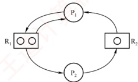

补充分析：若  $R_{1}$ 无限、 $R_{2}$ 为 1 个，则总有一个进程能完成并

释放  $R_{2}$，不会死锁；但若  $R_{1}$ 为 2 个、 $R_{2}$ 无限，则仍可能死锁。例如： $P_{1}$ 申请到  $R_{1}$、 $R_{2}$ 后被切换， $P_{2}$ 申请  $R_{1}$、 $R_{2}$，再申请  $R_{1}$ 时阻塞； $P_{1}$ 恢复执行后也因无法获得第二个  $R_{1}$ 而阻塞。此时，双方互相等待，死锁发生。

##### 33

D

当哲学家中同时存在左撇子（先取左侧筷子）和右撇子（先取右侧筷子）时，各进程请求资源的顺序不再一致，至少有一对相邻哲学家不会同时持有一根筷子并等待对方释放另一根，从而无法形成环形等待链，破坏了死锁的循环等待条件，避免了死锁的发生。
##### 34

C

这类题可用到组合数学中鸽巢原理的思想。考虑最极端的情况，因为每个进程最多需要3台打印机，若每个进程已经占有了2台打印机，则只要还有多的打印机，总能满足一个进程达到3台的条件，然后顺利执行，所以将8台打印机分给K个进程，每个进程有2台打印机，这个情况就是极端情况，K为4。或者，假设M是打印机的数量，K是进程的数量，R是每个进程最多需要打印机的数量。根据死锁公式逆推可得，若 $M \leq K(R-1)$，则系统可能发生死锁。将本题的数据代入，得到 $8 \leq K(3-1)$，即 $K \geq 4$，因此系统可能发生死锁的K的最小值是4。

##### 35

D

本题应采用排除法，逐个代入分析。剩余资源分配给  $P_{1}$，待  $P_{1}$ 执行完后，可用资源数为(2, 2, 1)，此时仅能满足  $P_{4}$ 的需求，排除选项 A、B；接着分配给  $P_{4}$，待  $P_{4}$ 执行完后，可用资源数为(2, 2, 2)，此时已无法满足任何进程的需求，排除选项 C。

此外，本题还可以使用银行家算法求解（对选择题来说显得过于复杂）。

##### 36

D

首先求得各进程的需求矩阵 Need 与可利用资源向量 Available:

| 进程名 | Need |   |   |
| --- | --- | --- | --- |
| $R_{1}$ | $R_{2}$ | $R_{3}$ |   |
| $P_{0}$ | 2 | 3 | 7 |
| $P_{1}$ | 1 | 3 | 3 |
| $P_{2}$ | 0 | 0 | 6 |
| $P_{3}$ | 2 | 2 | 1 |
| $P_{4}$ | 1 | 1 | 0 |

| Available | $R_{1}$ | $R_{2}$ | $R_{3}$ |
| --- | --- | --- | --- |
| 2 | 3 | 3 |   |

比较 Need 和 Available 发现，初始时进程  $P_1$ 与  $P_3$ 可满足需求，排除选项 A、C。尝试给  $P_1$ 分配资源时， $P_1$ 完成后 Available 将变为 (6, 3, 6)，无法满足  $P_0$ 的需求，排除选项 B。尝试给  $P_3$ 分配资源时， $P_3$ 完成后 Available 将变为 (4, 3, 7)，该向量能满足其他所有进程的需求。因此，以  $P_3$ 开头的所有序列都是安全序列。

##### 37

B

银行家算法是避免死锁的方法，选项A、D错。根据下图，选项B对，选项C错。


##### 38

B

根据死锁公式，当资源数量大于各个进程所需资源数-1的总和时，不发生死锁，三个进程分别需要3,4,5台设备，即当资源数量大于 $(3-1)+(4-1)+(5-1)=9$时，不发生死锁。而当系统中只有9台设备时，第一个进程分配2台，第二个进程分配3台，第三个进程分配4台，这种情况下，三个进程均无法继续执行下去，发生死锁。当系统再增加1台设备，最后1台设备分配给任意一个进程都可以顺利执行完成，因此保证系统不发生死锁的最小设备数为10。

##### 39

B

死锁的处理采用三种策略：死锁预防、死锁避免、死锁检测和解除。

死锁预防采用破坏产生死锁的4个必要条件中的一个或几个来防止发生死锁。其中之一的“破坏循环等待条件”，一般采用顺序资源分配法，即限制了用户申请资源的顺序，因此说法I的前
半句属于死锁预防的范畴。此外，银行家算法虽然会通过检测是否存在安全序列来判断申请资源的请求是否合法，但安全序列并不是唯一的，也不是固定的，它只是一种可能的分配方案，而不是一种必须遵循的规则，银行家算法更没有给出固定的申请资源的顺序，因此说法I错误。

银行家算法是最著名的死锁避免算法，其中的最大需求矩阵 Max 定义了每个进程对 m 类资源的最大需求量，系统在执行安全性算法中都会检查此次资源试分配后，系统是否处于安全状态，若不安全则将本次的试探分配作废。在死锁的检测和解除中，系统为进程分配资源时不采取任何措施，但提供死锁检测和解除的手段，一旦检测到系统发生死锁，就立即采取相应的措施来解除死锁，因此不用关心进程所需的总资源量。说法 II、III 正确。

##### 40

C

对于本题，需先画出如右所示的资源分配图。若系统出现死锁，则必然出现循环等待的情况。

从图中可以看出，若出现循环等待的情况，则至少有  $P_{1}$、 $P_{2}$、 $P_{3}$ 三个进程在循环等待环中，在该图中不可能出现两个进程发生循环等待的情况。现在考察  $P_{1}$、 $P_{2}$、 $P_{3}$ 三个进程形成环路的情况，若此时  $P_{1}$、 $P_{2}$、 $P_{3}$ 三个进程分别拥有  $R_{1}$、 $R_{2}$ 和  $R_{3}$，则会形成  $P_{1}$ 等待  $P_{2}$ 释放  $R_{2}$， $P_{2}$ 等待  $P_{3}$ 释放  $R_{3}$， $P_{3}$ 等待  $P_{1}$ 释放  $R_{1}$ 的循环等待情况。 $P_{1}$、 $P_{2}$、 $P_{3}$ 三个进程分别拥有  $R_{2}$、 $R_{3}$ 和  $R_{1}$ 的情况的分析类似。以上两种情况都会形成循环等待情况，至少有三个进程陷入死锁状态。若  $P_{4}$ 事先已获取  $R_{2}$，成功运行，则死锁进程数为 3；若  $P_{4}$ 尚未获取  $R_{2}$，未运行，则死锁进程数为 4。因此，若系统出现死锁，则处于死锁状态的进程至少是 3 个。

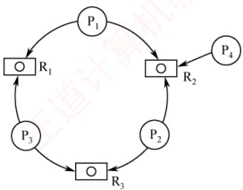

##### 41

A

由题意可知，仅剩最后一个同类资源，若将其分给  $P_{1}$ 或  $P_{2}$，则均无法正常执行；若分给  $P_{3}$，则  $P_{3}$ 正常执行完成后，释放的这一个资源仍无法使  $P_{1}, P_{2}$ 正常执行，因此不存在安全序列。

##### 42

B

剥夺进程资源，将其分配给其他死锁进程，可以解除死锁，说法Ⅰ正确。死锁预防是死锁处理策略（死锁预防、死锁避免、死锁检测）中最为严苛的一种策略，破坏死锁产生的4个必要条件之一，可以确保系统不发生死锁，说法Ⅱ正确。银行家算法是一种死锁避免算法，用于计算动态资源分配的安全性以避免系统进入死锁状态，不能用于判断系统是否处于死锁，说法Ⅲ错误。通过简化资源分配图可以检测系统是否为死锁状态，当系统出现死锁时，资源分配图不可完全简化，只有两个或两个以上的进程才会出现“环”而不能被简化，说法Ⅳ正确。

##### 43

B

首先求出需求矩阵：

 $$Need=Max-Allocation=\begin{bmatrix}{{{4}}}&{{{4}}} \\{{{3}}}&{{{1}}} \\{{{3}}}&{{{4}}}\end{bmatrix}-\begin{bmatrix}{{{2}}}&{{{3}}} \\{{{2}}}&{{{1}}} \\{{{1}}}&{{{2}}}\end{bmatrix}=\begin{bmatrix}{{{2}}}&{{{1}}} \\{{{1}}}&{{{0}}} \\{{{2}}}&{{{2}}}\end{bmatrix}$$

由 Allocation 得知当前 Available 为(1, 0)。由需求矩阵可知，初始只能满足  $P_{2}$ 的需求，选项 A 错误。 $P_{2}$ 释放资源后 Available 变为(3, 1)，此时仅能满足  $P_{1}$ 的需求，选项 C 错误。 $P_{1}$ 释放资源后 Available 变为(5, 4)，可以满足  $P_{3}$ 的需求，得到的安全序列为  $P_{2}, P_{1}, P_{3}$，选项 B 正确，选项 D 错误。

##### 44

C

考虑极端情况，当临界资源数为 n 时，每个进程都拥有 1 个临界资源并等待另一个资源，会发
生死锁。当临界资源数为  $n+1$ 时，则 n 个进程中至少有一个进程可以获得 2 个临界资源，顺利运行完后释放自己的临界资源，使得其他进程也能顺利运行，不会产生死锁。或者，根据死锁公式  $m > n(r-1)$，其中 m 是系统中临界资源的总数，n 是并发进程的个数，r 是每个进程所需临界资源的个数。若这个不等式成立，则系统不发生死锁。将本题的数据代入，得到  $m > n(2-1)$，即只要系统中临界资源的总数至少是  $n+1$，就可避免死锁。

##### 45

B

初始时系统中的可用资源数为<1, 3, 2>，只能满足  $P_0$ 的需求<0, 2, 1>，所以安全序列第一个只能是  $P_0$，将资源分配给  $P_0$ 后， $P_0$ 执行完释放所占资源，可用资源数变为<1, 3, 2> + <2, 0, 1> = <3, 3, 3>，此时可用资源数既能满足  $P_1$，又能满足  $P_2$，可以先分配给  $P_1$， $P_1$ 执行完释放资源再分配给  $P_2$；也可以先分配给  $P_2$， $P_2$ 执行完释放资源再分配给  $P_1$。所以安全序列可以是① $P_0$、 $P_1$、 $P_2$ 或 ② $P_0$、 $P_2$、 $P_1$。

#### 二、 综合应用题

##### 01

【解答】

不发生死锁要求，必须保证至少有一个进程得到所需的全部资源并执行完毕， $m \geq n(k-1) + 1$ 时，一定不会发生死锁。

| 序号 | m | n | k | 是否会死锁 | 说明 |
|---|---|---|---|---|---|
| 1 | 6 | 3 | 3 | 可能会 | $6 < 3(3-1) + 1$ |
| 2 | 9 | 3 | 3 | 不会 | $9 > 3(3-1) + 1$ |
| 3 | 13 | 6 | 3 | 不会 | $13 = 6(3-1) + 1$ |

##### 02

【解答】

1）可能发生死锁。满足发生死锁的4大条件，例如， $P_{1}$ 占有  $S_{1}$ 申请  $S_{3}$， $P_{2}$ 占有  $S_{2}$ 申请  $S_{1}$， $P_{3}$ 占有  $S_{3}$ 申请  $S_{2}$。

2）可有以下几种答案。

A. 采用静态分配：因为执行前已获得所需的全部资源，所以不会出现占有资源又等待别的资源的现象（或不会出现循环等待资源的现象）。

B．采用按序分配：不会出现循环等待资源的现象。

C. 采用银行家算法：因为在分配时，保证了系统处于安全状态。

##### 03

【解答】

1）利用安全性算法对  $T_{0}$ 时刻的资源分配情况进行分析，可得到如下表所示的安全性检测情况。可以看出，此时存在一个安全序列  $\{P_{2}, P_{3}, P_{4}, P_{1}\}$，所以该系统是安全的。

| 进程名 | 资源情况 |   |   |   |   |   |   |   |   |   |   |   |   |
| --- | --- | --- | --- | --- | --- | --- | --- | --- | --- | --- | --- | --- | --- |
| Work |   |   | Need |   |   | Allocation |   |   | Work + Allocation |   |   | Finish |   |
| $R_{{1}}$ | $R_{{2}}$ | $R_{{3}}$ | $R_{{1}}$ | $R_{{2}}$ | $R_{{3}}$ | $R_{{1}}$ | $R_{{2}}$ | $R_{{3}}$ | $R_{{1}}$ | $R_{{2}}$ | $R_{{3}}$ |   |   |
| $P_{{2}}$ | 2 | 1 | 2 | 2 | 0 | 2 | 4 | 1 | 1 | 6 | 2 | 3 | True |
| $P_{{3}}$ | 6 | 2 | 3 | 1 | 0 | 3 | 2 | 1 | 1 | 8 | 3 | 4 | True |
| $P_{{4}}$ | 8 | 3 | 4 | 4 | 2 | 0 | 0 | 0 | 2 | 8 | 3 | 6 | True |
| $P_{{1}}$ | 8 | 3 | 6 | 2 | 2 | 2 | 1 | 0 | 0 | 9 | 3 | 6 | True |

此处要注意，一般大多数题目中的安全序列并不唯一。

2）若此时  $P_1$ 发出资源请求  $Request_1(1, 0, 1)$，则按银行家算法进行检查： $Request_1(1, 0, 1) \leq Need_1(2, 2, 2)$

 $Request_1(1, 0, 1) \leq Available(2, 1, 2)$
试分配并修改相应数据结构，由此形成的进程  $P_{1}$ 请求资源后的资源分配情况见下表。

| 进程名 | 资源情况 |   |   |   |   |   |   |   |   |
| --- | --- | --- | --- | --- | --- | --- | --- | --- | --- |
| Allocation |   |   | Need |   |   | Available |   |   |   |
| $P_{{1}}$ | 2 | 0 | 1 | 1 | 2 | 1 | 1 | 1 | 1 |
| $P_{{2}}$ | 4 | 1 | 1 | 2 | 0 | 2 |   |   |   |
| $P_{{3}}$ | 2 | 1 | 1 | 1 | 0 | 3 |   |   |   |
| $P_{{4}}$ | 0 | 0 | 2 | 4 | 2 | 0 |   |   |   |

再利用安全性算法检查系统是否安全，可用资源 Available(1, 1, 1) 已不能满足任何进程，系统进入不安全状态，此时系统不能将资源分配给进程  $P_{1}$。
```c

若此时进程 P_{2} 发出资源请求 Request_{2}(1,0,1)，则按银行家算法进行检查：
```

 $$\operatorname{Request}_{2}(1,0,1){\leqslant}\operatorname{Need}_{2}(2,0,2)$$

 $$Request_{2}(1,0,1){\leqslant}Available(2,1,2)$$

试分配并修改相应数据结构，由此形成的进程  $P_{2}$ 请求资源后的资源分配情况下表：

| 进程名 | 资源情况 |   |   |   |   |   |   |   |   |
| --- | --- | --- | --- | --- | --- | --- | --- | --- | --- |
| Allocation |   |   | Need |   |   | Available |   |   |   |
| $P_{{1}}$ | 1 | 0 | 0 | 2 | 2 | 2 | 1 | 1 | 1 |
| $P_{{2}}$ | 5 | 1 | 2 | 1 | 0 | 1 |   |   |   |
| $P_{{3}}$ | 2 | 1 | 1 | 1 | 0 | 3 |   |   |   |
| $P_{{4}}$ | 0 | 0 | 2 | 4 | 2 | 0 |   |   |   |

再利用安全性算法检查系统是否安全，可得到如下表中所示的安全性检测情况。注意表中各个进程对应的 Work + Allocation 向量表示在该进程释放资源之后更新的 Work 向量。

| 进程名 | 资源情况 |   |   |   |   |   |   |   |   |   |   |   |
| --- | --- | --- | --- | --- | --- | --- | --- | --- | --- | --- | --- | --- |
| Work |   |   | Need |   |   | Allocation |   |   | Work + Allocation |   |   |   |
| $P_{2}$ | 1 | 1 | 1 | 1 | 0 | 1 | 5 | 1 | 2 | 6 | 2 | 3 |
| $P_{3}$ | 6 | 2 | 3 | 1 | 0 | 3 | 2 | 1 | 1 | 8 | 3 | 4 |
| $P_{4}$ | 8 | 3 | 4 | 4 | 2 | 0 | 0 | 0 | 2 | 8 | 3 | 6 |
| $P_{1}$ | 8 | 3 | 6 | 2 | 2 | 2 | 1 | 0 | 0 | 9 | 3 | 6 |

从上表中可以看出，此时存在一个安全序列 $\{P_2, P_3, P_4, P_1\}$，因此该状态是安全的，可以立即将进程  $P_2$ 所申请的资源分配给它。

3）若2）中的两个请求立即得到满足，则此刻系统并未立即进入死锁状态，因为这时所有的进程未提出新的资源申请，全部进程均未因资源请求没有得到满足而进入阻塞态。只有当进程提出资源申请且全部进程都进入阻塞态时，系统才处于死锁状态。

##### 04

【解答】

1)

 $$Need=Max-Allocation=\begin{bmatrix}{{{0}}}&{{{0}}}&{{{1}}}&{{{2}}} \\{{{1}}}&{{{7}}}&{{{5}}}&{{{0}}} \\{{{2}}}&{{{3}}}&{{{5}}}&{{{6}}} \\{{{0}}}&{{{6}}}&{{{5}}}&{{{6}}}\end{bmatrix}-\begin{bmatrix}{{{0}}}&{{{0}}}&{{{1}}}&{{{2}}} \\{{{1}}}&{{{0}}}&{{{0}}}&{{{0}}} \\{{{1}}}&{{{3}}}&{{{5}}}&{{{4}}} \\{{{0}}}&{{{0}}}&{{{1}}}&{{{4}}}\end{bmatrix}=\begin{bmatrix}{{{0}}}&{{{0}}}&{{{0}}}&{{{0}}} \\{{{0}}}&{{{7}}}&{{{5}}}&{{{0}}} \\{{{1}}}&{{{0}}}&{{{0}}}&{{{2}}} \\{{{0}}}&{{{6}}}&{{{4}}}&{{{2}}}\end{bmatrix}$$

2）Work 向量初始化值 = Available(1, 5, 2, 0)。

系统安全性分析：

| 进程名 | 资源情况 |   |   |   |   |   |   |   |   |   |   |   |   |   |   |
| --- | --- | --- | --- | --- | --- | --- | --- | --- | --- | --- | --- | --- | --- | --- | --- |
| Work |   |   |   | Need |   |   |   | Allocation |   |   |   | Work + Allocation |   |   |   |
| A | B | C | D | A | B | C | D | A | B | C | D | A | B | C |   |
| $P_{{0}}$ | 1 | 5 | 2 | 0 | 0 | 0 | 0 | 0 | 0 | 0 | 1 | 2 | 1 | 5 | 3 |
| $P_{{2}}$ | 1 | 5 | 3 | 2 | 1 | 0 | 0 | 2 | 1 | 3 | 5 | 4 | 2 | 8 | 8 |
| $P_{{1}}$ | 2 | 8 | 8 | 6 | 0 | 7 | 5 | 0 | 1 | 0 | 0 | 0 | 3 | 8 | 8 |
| $P_{{3}}$ | 3 | 8 | 8 | 6 | 0 | 6 | 4 | 2 | 0 | 0 | 1 | 4 | 3 | 8 | 9 |

因为存在一个安全序列$\{P_0, P_2, P_1, P_3\}$，所以系统处于安全状态。

 $$3)Request_{1}(0,4,2,0)<Need_{1}(0,7,5,0)$$

Request$_{1}$(0,4,2,0)<Available(1,5,2,0)

假设先试着满足进程  $P_{1}$ 的这个请求，则 Available 变为 (1, 1, 0, 0)。

系统状态变化见下表：

| 进程名 | 资源情况 |   |   |   |   |   |   |   |   |   |   |   |   |   |   |   |
| --- | --- | --- | --- | --- | --- | --- | --- | --- | --- | --- | --- | --- | --- | --- | --- | --- |
| Max |   |   |   | Allocation |   |   |   | Need |   |   |   | Available |   |   |   |   |
| A | B | C | D | A | B | C | D | A | B | C | D | A | B | C | D |   |
| $P_0$ | 0 | 0 | 1 | 2 | 0 | 0 | 1 | 2 | 0 | 0 | 0 | 0 | 1 | 1 | 0 | 0 |
| $P_1$ | 1 | 7 | 5 | 0 | 1 | 4 | 2 | 0 | 0 | 3 | 3 | 0 |   |   |   |   |
| $P_2$ | 2 | 3 | 5 | 6 | 1 | 3 | 5 | 4 | 1 | 0 | 0 | 2 |   |   |   |   |
| $P_3$ | 0 | 6 | 5 | 6 | 0 | 0 | 1 | 4 | 0 | 6 | 4 | 2 |   |   |   |   |

再对系统进行安全性分析，见下表：

| 进程名 | 资源情况 |   |   |   |   |   |   |   |   |   |   |   |   |   |   |
| --- | --- | --- | --- | --- | --- | --- | --- | --- | --- | --- | --- | --- | --- | --- | --- |
| Work |   |   |   | Need |   |   |   | Allocation |   |   |   | Work + Allocation |   |   |   |
| A | B | C | D | A | B | C | D | A | B | C | D | A | B | C |   |
| $P_{{0}}$ | 1 | 1 | 0 | 0 | 0 | 0 | 0 | 0 | 0 | 0 | 1 | 2 | 1 | 1 | 1 |
| $P_{{2}}$ | 1 | 1 | 1 | 2 | 1 | 0 | 0 | 2 | 1 | 3 | 5 | 4 | 2 | 4 | 6 |
| $P_{{1}}$ | 2 | 4 | 6 | 6 | 0 | 3 | 3 | 0 | 1 | 4 | 2 | 0 | 3 | 8 | 8 |
| $P_{{3}}$ | 3 | 8 | 8 | 6 | 0 | 6 | 4 | 2 | 0 | 0 | 1 | 4 | 3 | 8 | 9 |

因为存在一个安全序列$\langle\mathrm{P}_{0},\mathrm{P}_{2},\mathrm{P}_{1},\mathrm{P}_{3}\rangle$，所以系统仍处于安全状态。所以进程$\mathrm{P}_{1}$的这个请求应该马上被满足。

##### 05

【解答】

1）根据 Need 矩阵可知，初始 Work 等于 Available 为  $(1, 4, 0)$，可以满足进程  $P_{2}$ 的需求；进程  $P_{2}$ 结束后释放资源，Work 为  $(2, 7, 5)$，可以满足  $P_{0}, P_{1}, P_{3}$ 和  $P_{4}$ 中任意一个进程的需求，所以系统不会出现死锁，当前处于安全状态。

 $$Need=Max-Allocation=\begin{bmatrix}{{{0}}}&{{{0}}}&{{{4}}} \\{{{1}}}&{{{7}}}&{{{5}}} \\{{{2}}}&{{{3}}}&{{{5}}} \\{{{0}}}&{{{6}}}&{{{4}}} \\{{{0}}}&{{{6}}}&{{{5}}}\end{bmatrix}-\begin{bmatrix}{{{0}}}&{{{0}}}&{{{3}}} \\{{{1}}}&{{{0}}}&{{{0}}} \\{{{1}}}&{{{3}}}&{{{5}}} \\{{{0}}}&{{{0}}}&{{{2}}} \\{{{0}}}&{{{0}}}&{{{1}}}\end{bmatrix}=\begin{bmatrix}{{{0}}}&{{{0}}}&{{{1}}} \\{{{0}}}&{{{7}}}&{{{5}}} \\{{{1}}}&{{{0}}}&{{{0}}} \\{{{0}}}&{{{6}}}&{{{2}}} \\{{{0}}}&{{{6}}}&{{{4}}}\end{bmatrix}$$

2）若初始 Work = Available 为(0, 6, 2)，可满足进程  $P_{0}$， $P_{3}$ 的需求；这两个进程结束后释放资源，Work 为(0, 6, 7)，仅可满足进程  $P_{4}$ 的需求； $P_{4}$ 结束后释放资源，Work 为(0, 6, 8)，此时不能满足余下任意一个进程的需求，系统出现死锁，因此当前系统处在非安全状态。
**注意**

在银行家算法中，当实际计算分析系统安全状态时，并不需要逐个进程进行。如本题中，在情况1）下，当计算到进程  $P_{2}$ 结束并释放资源时，系统当前空闲资源可满足余下任意一个进程的最大需求量，这时已经不需要考虑进程的执行顺序。系统分配任意一个进程所需的最大需求资源，在其执行结束释放资源后，系统当前空闲资源会增加，所以余下的进程仍然可以满足最大需求量。因此，在这里可以直接判断系统处于安全状态。在情况2）下，系统当前可满足进程  $P_{05}$， $P_{3}$ 的需求，所以可以直接让系统推进到  $P_{05}$， $P_{3}$ 执行完并释放资源后的情形，这时系统出现死锁；因为此时是系统空闲资源所能达到的最大值，所以按照其他方式推进，系统必然还是出现死锁。因此，在计算过程中，将每步中可满足需求的进程作为一个集合，同时执行并释放资源，可以简化银行家算法的计算。

## 2.5 本章疑难点

### 1. 进程与程序的区别与联系

1）进程是程序及其数据在计算机上的一次执行活动，是一个动态概念；其运行实体是程序，脱离程序，进程便无意义。从静态视角看，进程由程序、数据和进程控制块（PCB）三部分组成；而程序仅是一组有序指令的集合，属于静态实体。

2）进程具有生命周期，动态地创建并消亡，是暂时存在的；程序作为代码的集合，可长期保存，是永久存在的。

3）一个进程在其生命周期中通常执行一个程序，而一个程序可被多个进程并发执行；进程能够创建新进程，而程序本身无法生成新进程。

4）二者的组成不同：进程包含程序、数据和PCB。

### 2. 银行家算法的工作原理

银行家算法通过避免系统进入不安全状态来预防死锁。每次进行资源分配时，系统首先检查当前是否有足够资源满足进程的请求；若有，则进行试探性分配，并对分配后的新状态执行安全性检查。若新状态安全，则正式分配资源；否则拒绝该请求，从而确保系统始终处于安全状态。

### 3. 进程同步、互斥的区别和联系

并发进程的执行存在两类制约关系：一是竞争使用临界资源，必须互斥访问，体现为竞争关系；二是协同完成任务，在关键点等待对方发出的信号以协调执行，体现为协作关系。
# 第3章 内存管理

## 【考纲内容】

### （一） 内存管理基础

内存管理概念：逻辑地址与物理地址空间，地址变换，内存共享，内存保护，内存分配与回收

连续分配管理方式：页式管理；段式管理；段页式管理

视频讲解

### （二） 虚拟内存管理

虚拟内存基本概念；请求页式管理；页框分配与回收；页置换算法

内存映射文件（Memory-Mapped Files）；虚拟存储器性能的影响因素及改进方式

## 【复习提示】

内存管理和进程管理是操作系统的核心内容，需要重点复习。本章围绕分页机制展开：通过分页管理方式在物理内存大小的基础上提高内存的利用率，再进一步引入请求分页管理方式，实现虚拟内存，使内存脱离物理大小的限制，从而提高处理器的利用率。

## 3.1 内存管理概念

在学习本节时，请读者思考以下问题：

1）为什么要进行内存管理？

2）多级页表解决了什么问题？又会带来什么问题？

在学习经典的内存管理方法之前，也建议读者先尝试独立思考，提出自己的内存管理设想，并在后续学习中与经典方案进行比较。本节内容循序渐进，后一种方法通常旨在克服前一种方法的不足。希望读者勤于思考，深入比较各类方法的异同，并着重掌握页式管理。

### 3.1.1 内存管理的基本原理和要求

内存管理是操作系统中最核心、也最复杂的机制之一。尽管现代计算机的主存容量持续增长，但仍无法同时容纳所有用户进程及其所需的程序与数据。因此，操作系统必须对有限的物理内存进行合理划分，并实施高效的动态分配策略。所谓内存管理（Memory Management），正是指操作系统对内存空间的组织、分配、回收以及地址映射等一系列操作。

在多道程序环境下，有效的内存管理尤为重要。它不仅提升了内存的利用率，简化了用户对存储资源的使用，还能在逻辑上扩展内存空间。具体而言，内存管理的主要功能包括：

内存空间的分配与回收。操作系统需实时跟踪内存使用状态，记录空闲区域，为新创建的进程分配所需空间，并在进程终止后及时回收其所占用的内存。
地址转换。用户程序使用的是逻辑地址（也称虚拟地址），而实际访问内存时必须使用物理地址。操作系统需提供机制，将逻辑地址动态转换为对应的物理地址。

• 内存空间的扩充。通过虚拟存储技术，使进程能够使用远大于物理内存容量的地址空间。

• 内存共享。允许多个进程安全地访问同一块物理内存区域，常用于共享库或进程间通信。

存储保护。确保各进程只能访问自身被授权的内存区域，防止相互干扰或非法破坏。

上述功能的实现依赖于内存管理的基本原理，其中逻辑地址与物理地址的区别尤为关键。此处仅作初步介绍，详细机制将在后续结合具体管理方法深入展开。

#### 1. 程序的链接与装入

创建进程时，首先需要将程序和数据装入内存。如图3.1所示，将用户源程序转换为可在内存中执行的程序，通常需经过以下三个步骤：

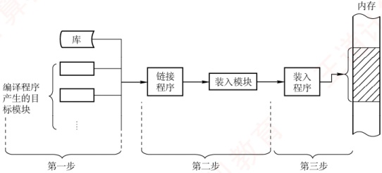

图3.1 将用户程序变为可在内存中执行的程序的步骤

### 考点追踪 编译、链接和装入阶段的工作内容（2011）

1）编译。由编译程序将用户源代码翻译成若干目标模块。

2）链接。由链接程序将这些目标模块及其所需的库函数合并，形成一个完整的装入模块。

3）装入（加载）。由装入程序将该装入模块载入内存，并启动其执行。

#### 2. 逻辑地址与物理地址

### 考点追踪 进程虚拟地址空间的特点（2023）

编译后的每个目标模块通常从0号单元开始编址，这种地址称为该模块的相对地址（或逻辑地址）。链接程序将多个目标模块合并为一个完整的可执行程序时，依次将各模块的相对地址拼接成一个统一的、从0开始编址的逻辑地址空间（或虚拟地址空间）。以32位系统为例，该逻辑地址空间的范围为 $0\sim2^{32}-1$。进程运行时所使用的地址均为逻辑地址；用户程序和程序员只需关注逻辑地址，而底层的内存管理机制对其完全透明。不同进程可以拥有相同的逻辑地址，因为它们各自拥有独立的逻辑地址空间，这些地址会被映射到主存的不同位置。

物理地址空间是指主存中所有物理存储单元的集合，它是地址转换的最终目标。无论进程执行指令还是访问数据，最终都必须通过物理地址从主存中读取或写入信息。在早期系统中，程序装入内存时需将逻辑地址转换为物理地址，这一过程称为地址重定位；而在现代支持虚拟内存的系统中，该转换由内存管理单元（MMU）在硬件层面于运行时自动完成。

具体而言，现代操作系统为每个进程维护一张页表，用于记录逻辑页到物理页框的映射关系。当进程访问某个逻辑地址时，MMU会依据当前进程的页表，将其动态转换为相应的物理地址。整个过程对用户程序完全透明，构成了虚拟内存系统的基础。
#### 3. 程序的链接

链接程序的作用是将编译生成的目标模块及其所需的库函数合并，形成一个完整的装入模块，以便后续装入内存并执行。根据链接发生的时机不同，可分为以下三种方式。

##### （1） 静态链接

在程序运行之前，将各目标模块及其所需的库函数链接成一个完整的装入模块（可执行文件），此后不再拆分，这种链接方式称为静态链接。链接过程中需完成两项关键操作。

① 地址调整。各目标模块在编译后均以 0 为起始地址，链接时需根据其在装入模块中的实际位置，将内部地址统一加上相应的偏移量。例如，若模块 A 的长度为 L，且链接后模块 B 紧邻在模块 A 之后存放，则原本从 0 开始编址的模块 B 在合并后的装入模块中将从地址 L 处开始，其内部所有地址均需加上偏移量 L。

② 外部符号解析。将模块间引用的外部符号（如函数名）替换为确定的地址。若模块 A 中包含语句 CALL B，其中 B 为指向模块 B 入口的外部调用符号，则链接程序会将其解析为模块 B 在装入模块中的起始地址 L，并将 CALL B 中的符号 B 替换为地址 L。

##### （2） 装入时动态链接

装入时动态链接是指：将用户源程序编译后生成的一组目标模块，在装入内存时采用边装入边链接的方式。具体而言，当装入某个目标模块时，若遇到对外部模块的调用，则装入程序会立即查找并装入相应的外部目标模块，并替换其中的外部符号。其优点如下。

① 便于修改和更新。静态链接需将所有目标模块预先装配成一个完整的装入模块，若其中任一模块需要修改或更新，则必须重新生成整个装入模块。若采用装入时动态链接方式，则各目标模块独立存放，只需替换被修改的模块，无须重建整个程序。

② 便于实现对目标模块的共享。在静态链接方式下，每个应用程序都包含其所依赖目标模块的完整副本，无法实现共享。而在装入时动态链接方式下，操作系统可将同一个目标模块链接到多个应用程序中，从而实现多个程序对该目标模块的共享。

##### （3） 运行时动态链接

运行时动态链接是对装入时动态链接的改进，在程序执行过程中，仅当需要调用某个尚未装入内存的目标模块时，操作系统才动态加载并链接该模块。具体而言，系统会查找该模块，将其装入内存，并完成符号解析，使其可被当前进程调用；而程序运行中未使用的模块，则既不会被装入内存，也不会进行链接。其优点是既能加快程序的装入过程，又可节省内存空间。

#### 4. 程序的装入

将一个装入模块载入内存时，主要有以下三种方式。

##### （1） 绝对装入

绝对装入仅适用于单道程序环境。由于内存中始终只有一个程序，其驻留位置在编译前即可确定，因此编译程序可以直接生成使用绝对地址的目标代码；装入程序只需按这些地址将程序和数据载入内存。此时，程序中的逻辑地址与实际物理地址完全一致，无须任何修改。

程序中通常使用的是符号地址（如变量名、函数名），由编译器或汇编器在编译或汇编阶段将其转换为绝对地址；当然，绝对地址也可由程序员直接指定，但这种方式缺乏灵活性。

##### （2） 可重定位装入

在多道程序环境下，编译程序无法预知目标模块在内存中的具体位置，因此经编译和链接生成的装入模块通常从地址0开始编址，程序中的地址均为相对于模块起始位置的逻辑地址。此时应采用可重定位装入方式，它可根据内存的具体情况，将装入模块装入内存的适当位置。
装入时，系统根据内存当前的空闲情况，为该模块分配一块连续的内存区域，并将整个模块载入其中。随后，一次性将所有逻辑地址修改为对应的物理地址。这一地址转换过程称为重定位。由于转换在装入时完成，且在程序运行期间不再改变，故称静态重定位，如图3.2(a)所示。

进程必须在装入前一次性获得其所需的全部内存空间；若内存不足，则无法装入。一旦装入，进程在整个运行期间既不能移动位置，也不能动态申请额外内存，限制了内存管理的灵活性。

##### （3） 动态运行时装入

为克服静态重定位的局限，支持程序在内存中的移动，需采用动态重定位方式。装入程序将装入模块载入内存后，并不立即转换地址，而是将地址转换推迟到指令实际执行时进行。为此，系统借助一个重定位寄存器，用于存放该模块在内存中的起始物理地址。程序中保留的仍是逻辑地址，而实际物理地址则由硬件在运行时动态计算得出，如图3.2(b)所示。

动态重定位的优点：支持程序在内存中移动，便于操作系统进行紧凑，从而有效减少外部碎片；提高内存分配的灵活性，允许在运行期间根据需要动态调整进程的内存布局。

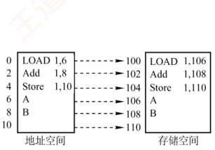

(a) 静态重定位

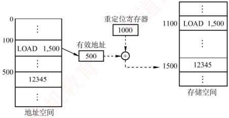

(b) 动态重定位

图3.2 重定位类型

#### 5. 内存保护

### 考点追踪 分区分配内存保护的措施（2009）

为确保各进程拥有独立的内存空间，内存保护机制需在内存分配前防止用户进程破坏操作系统，同时避免用户进程相互干扰。常用方法主要有以下两种。

1）在 CPU 中设置一对上、下限寄存器，分别存放用户进程在内存中的下限和上限地址，每当 CPU 访问一个地址时，硬件自动将其与这两个寄存器的值进行比较，以判断是否越界。

2）采用重定位寄存器（也称基地址寄存器）和界地址寄存器（也称限长寄存器）实现越界检查。重定位寄存器存放进程在内存中的起始物理地址，界地址寄存器存放进程地址空间的长度。内存管理部件首先将逻辑地址与界地址寄存器的值进行比较，若未越界，则将逻辑地址加上重定位寄存器的值，得到物理地址，并据此访存，如图3.3所示。

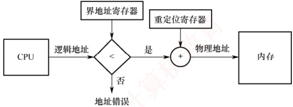

图 3.3 重定位寄存器和界地址寄存器的硬件支持

重定位寄存器与界地址寄存器的作用不同：重定位寄存器用于“加”，即将逻辑地址加上其值，得到物理地址；界地址寄存器用于“比”，即将逻辑地址与其值比较，判断是否越界。

重定位寄存器与界地址寄存器的加载必须通过特权指令完成，仅操作系统内核具备此权限。这一机制可确保寄存器内容只能由内核修改，用户程序无法篡改，从而有效保障内存的安全。

#### 6. 内存共享

并非所有进程的内存空间都适合共享，只有只读区域才可以被共享。可重入代码（也称纯代码）是一种允许多个进程同时访问但不允许被任何进程修改的代码。在实际执行时，每个进程需配备独立的私有数据区，用于存放运行过程中可能修改的数据；程序仅对私有数据区进行写操作，而共享的代码段始终保持不变。例如，考虑一个可同时容纳40个用户的多用户系统，所有用户同时运行同一个文本编辑程序。该程序包含160KB的代码区和40KB的数据区。若不共享代码，则系统共需(160KB + 40KB)×40 = 8000KB 的内存；若代码为可共享代码，则无论采用分页系统还是分段系统，整个系统只需保留一份副本，此时所需内存仅为160KB + 40KB×40 = 1760KB。

在分页系统中，假设页面大小为4KB，则代码区占用40个页面，数据区占用10个页面。为实现代码共享，每个进程的页表中需设置40个页表项，均指向同一组共享代码页的物理页框；此外，每个进程还需为其私有数据区建立10个页表项，指向各自的数据页。

在分段系统中，由于以段为单位进行管理，只需为共享代码段设置一个段表项，记录共享代码段的起始地址和段长（160KB）。每个进程的段表中包含对该共享段的引用。由此可见，分页与分段均可有效支持内存共享，区别在于共享的粒度和管理机制。

此外，在第2章中介绍过基于共享内存的进程通信机制，由操作系统提供同步与互斥支持。本章后续还将介绍另一种内存共享的实现方式——内存映射文件。

#### 7. 内存分配与回收

操作系统的演进持续推动内存管理的发展。随着系统从单道向多道程序发展，单一连续分配逐渐被固定分区分配所取代。然而，固定分区难以适应作业大小的动态变化，因此又被动态分区分配所替代。为进一步提升内存利用率，连续分配方式最终让位于离散分配方式（如页式存储管理）。此外，为满足用户在编程和使用上的更高需求（如支持程序的逻辑结构、实现段级共享与保护等），分段存储管理应运而生，而这些功能恰是其他分配方式难以有效支持的。

### 3.1.2 连续分配管理方式

连续分配方式是指为一个用户程序分配一个连续的内存空间。例如，若某用户程序需要100MB 的内存，则系统便会在内存中为其分配一块连续的100MB区域。

连续分配方式主要包括单一连续分配、固定分区分配和动态分区分配。

#### 1. 单一连续分配

在单一连续分配方式中，内存被划分为系统区和用户区。系统区仅供操作系统使用，通常位于低地址部分；用户区则仅允许一道用户程序运行，即该程序独占整个用户区。

这种方式的优点是结构简单、无外部碎片，且无须内存保护机制，因为内存中始终只有一道程序。缺点是仅适用于单用户、单任务的操作系统，存在内部碎片，且内存利用率极低。

#### 2. 固定分区分配

固定分区分配是最简单的一种多道程序存储管理方式。它将用户内存空间划分为若干大小固定的分区，每个分区仅能容纳一道作业。当有空闲分区时，系统可从外存的后备作业队列中选择一个合适大小的作业装入该分区，并反复执行这一过程。在划分分区时，有两种方法：
分区大小相等。程序过小会造成空间浪费，过大则无法装入，缺乏灵活性。

分区大小不等。划分为多个较小分区、适量中等分区和少量大分区，以提高适应性。

为便于内存的分配与回收，系统维护一张分区使用表，通常按分区大小排序。各表项包含对应分区的始址、大小及状态（是否已分配），如图3.4所示。分配时，系统检索该表，寻找一个满足作业大小要求且尚未分配的分区，将其分配给待装入程序，并将对应表项的状态置为“已分配”；若找不到合适分区，则拒绝分配。回收时，只需将对应表项的状态置为“未分配”即可。

| 分区号 | 大小/KB | 始址/KB | 状态 |
| --- | --- | --- | --- |
| 1 | 12 | 20 | 已分配 |
| 2 | 32 | 32 | 已分配 |
| 3 | 64 | 64 | 已分配 |
| 4 | 128 | 128 | 未分配 |

(a) 分区使用表

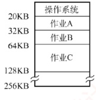

(b) 存储空间分配情况

图3.4 固定分区说明表和内存分配情况

该方式存在两个问题：① 若作业大于所有分区，则无法装入；② 若作业小于分区大小，则仍需占用整个分区，造成内部未被利用的空间，即内部碎片。固定分区方式虽无外部碎片，但因每个分区仅能由一个作业独占，无法支持多个进程共享同一内存区域，故内存利用率较低。

#### 3. 动态分区分配

##### （1） 动态分区分配的基本原理

动态分区分配也称可变分区分配，是指在进程装入内存时，按其实际需求动态分配一块大小恰好匹配的连续内存空间，因此系统中分区的数量和大小随进程的装入与释放而动态变化。

如图 3.5 所示，系统拥有 64MB 内存空间，其中低 8MB 固定分配给操作系统，其余为用户可用区域。初始时装入前三个进程后，仅剩 4MB 空闲，不足以容纳进程 4。为腾出空间，操作系统换出进程 2，并换入较小的进程 4；因其所需内存更少，释放出一个 6MB 的空闲块。随后，当需要重新换入进程 2 时，因剩余空间仍不足，操作系统又换出进程 1，再换入进程 2。

动态分区分配在初期运行良好，但随着进程频繁装入与释放，内存中会逐渐积累大量分散的小空闲块，导致可用内存总量虽足，却难以满足较大进程的需求，内存利用率随之下降。这些散布在已分配分区之间、无法利用的小空闲块称为外部碎片，与固定分区中因分区内部未用完而产生的内部碎片形成鲜明对比。外部碎片可通过紧凑技术缓解：操作系统周期性地移动进程，将所有空闲块合并为一个连续区域；然而，该操作要求系统支持动态重定位，且开销较大。其原理类似于 Windows 系统中的磁盘碎片整理，但后者作用于外存文件系统，而前者作用于主存。

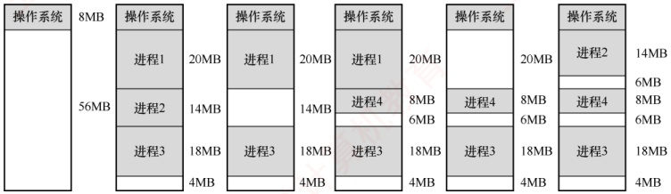

图3.5 动态分区分配

### 考点追踪 动态分区分配的内存回收方法（2017）

在动态分区分配中，系统维护一张空闲分区链（表），通常按起始地址排序。分配内存时，系统检索该链，寻找一个满足请求大小的空闲分区；若其尺寸大于所需，则从中分割出请求大小的空间分配给进程，剩余部分（如果不小于最小分配单位）仍保留在空闲分区链中。回收内存时，系统根据回收分区的起始地址，在空闲分区链中确定插入位置，并依据相邻情况执行合并操作，具体可分为四种情形：① 回收区与前一空闲分区相邻，两者合并，更新前一分区的大小；② 回收区与后一空闲分区相邻，两者合并，更新后一分区的起始地址和大小；③ 回收区与前后两个空闲分区均相邻，三者合并，更新前一分区的大小，并删除后一分区的表项；④ 回收区不与任何空闲分区相邻，为其新建一个表项，记录起始地址和大小，并插入空闲分区链。

上述三种连续分配方式有一个共同特点：用户程序在主存中均以连续方式存放。

#### （2） 基于顺序搜索的分配算法

将作业装入主存时，需依据特定的分配算法从空闲分区链（表）中选出一个大小合适的分区分配给该作业。根据分区检索方式的不同，动态分区分配算法可分为顺序分配算法和索引分配算法。其中，顺序分配算法通过依次遍历空闲分区链，查找第一个满足作业大小要求的分区。

常见的顺序分配算法有以下四种。

### 考点追踪 各种动态分区分配算法的特点（2019、2024）

1）首次适应（First Fit）算法。空闲分区按地址递增次序排列。分配时从链首开始顺序查找，找到第一个满足请求的空闲分区，从中划出所需空间分配给作业，余下部分仍留在链中。该算法优先利用低地址分区，从而保留高地址的大空闲区，有利于后续大作业装入；但低地址容易积累小碎片，且每次分配均需从链首开始查找，增加了查找开销。

2）邻近适应（Next Fit）算法。也称循环首次适应算法，由首次适应算法改进而来。不同之处在于：分配时从上次查找结束的位置开始继续循环搜索，而非每次都从链首开始。该算法减少了对低地址区域的重复扫描，但往往导致大空闲区在内存中分布不均，难以有效支持后续大作业的装入，因此其整体性能通常不如首次适应算法。

### 考点追踪 最佳适应算法的分配过程（2010）

3）最佳适应（Best Fit）算法。空闲分区按容量递增次序排列。分配时，顺序查找第一个能满足作业大小的空闲分区（最小的可用分区）进行分配。尽管名为“最佳”，该算法虽能尽量保留较大的空闲分区，但每次分配都会在原分区中留下极小的剩余块。随着时间推移，这些小块难以被利用，产生大量外部碎片，实际性能通常较差。

4）最坏适应（Worst Fit）算法。空闲分区按容量递减次序排列。分配时，选择第一个满足要求的空闲分区（最大的可用分区），从中分割出所需空间。与最佳适应算法相反，该算法试图通过避免生成小碎片来提升内存利用率，但由于总是切割最大的空闲区，系统很快难以满足大作业的内存需求，因此性能同样不佳。

综合来看，首次适应算法在实现开销、碎片控制与大作业支持之间取得了较好的平衡：其查找过程简单高效，回收分区时无须对空闲链重新排序，且能有效保留高地址的大空闲区。

#### （3） 基于索引搜索的分配算法

当系统规模较大时，空闲分区链可能很长，采用顺序搜索算法效率较低。为此，大中型系统常采用基于索引的分配算法，索引分配算法的思想是：根据空闲分区的大小进行分类，对每一类大小相同的空闲分区建立独立的空闲分区链，并通过一张索引表统一管理这些链。分配时，依据请求大小在索引表中定位对应链表，获取其头指针，从而快速取得一个空闲分区。

常见的索引分配算法有以下三种。
1）快速适应（Quick Fit）算法。根据系统中进程常用的空间大小，预先将空闲分区划分为若干固定尺寸的类别。分配过程分为两步：① 根据作业长度，在索引表中找到能容纳它的最小类别链表；② 从该链表头部取下第一个空闲分区进行分配。优点是查找效率高、不会产生内存碎片；缺点是回收时难以有效合并分区，算法比较复杂，开销较大。

### 考点追踪 伙伴关系的概念（2024）

2）伙伴系统（Buddy System）。规定所有分区大小均为  $2^k$（ $k$ 为正整数）。当需要为进程分配大小为  $n$ 的内存时（满足  $2^{i-1} < n \leq 2^i$），首先在大小为  $2^i$ 的空闲分区链中查找。若存在，则直接分配；否则，依次在大小为  $2^{i+1}, 2^{i+1}, \cdots$ 的链中查找，直至找到一个可用分区。随后，将该分区不断二分，直至得到所需大小的块，其余部分按大小加入对应的空闲链。在伙伴系统中，每个大小为  $2^k$ 的分区都有一个唯一的伙伴分区：与它大小相同、地址相邻（首尾相接）的另一个分区。回收时，若某空闲分区与其伙伴也为空闲，则合并为一个大小为  $2^{k+1}$ 的分区，并继续向上尝试合并，直至无法合并为止。

3）哈希算法。以空闲分区大小为关键字，建立哈希函数，构建一张哈希表，每个表项记录对应空闲分区链的头指针。分配时，根据所需分区大小，通过哈希函数计算出其在哈希表中的位置，从而快速获取相应的空闲分区链。

在连续分配方式中，即使系统拥有超过1GB的空闲内存，只要其中不存在连续的1GB空间，需要该大小内存的作业便无法装入运行，这正是外部碎片导致的问题。为了克服这一限制，操作系统引入了非连续分配方式：将进程的地址空间划分为多个单元，并允许这些单元分散地装入内存中互不相邻的区域，从而彻底摆脱对外部连续空间的依赖。该机制能有效利用零散的空闲内存，显著提升内存利用率；但与此同时，系统必须额外维护各逻辑单元与其物理位置之间的映射关系，因而带来了一定的存储开销。根据所划分单元的大小是否固定，非连续分配方式可分为分页存储管理与分段存储管理。进一步，若作业运行前需要一次性装入全部单元，则称为基本分页或基本分段；若支持按需动态装入，则相应地称为请求分页与请求分段。

### 3.1.3 基本分页存储管理 $^{①}$

固定分区会产生内部碎片，动态分区会产生外部碎片，这两种方式对内存的利用率都较低。为提高内存利用率并彻底消除外部碎片，操作系统引入了分页存储管理：将物理内存划分为若干大小相等的固定单元，称为页框（或页帧、物理块）；同时将进程的逻辑地址空间划分为与页框大小相同的单元，称为页面（或页）。系统以页框为单位为进程分配内存。

从形式上看，分页类似于等长的固定分区，但其本质不同：固定分区按作业整体分配，而分页将进程和内存均按固定大小的单元划分，使得内存分配以页为单位进行。因此，分页管理不会产生外部碎片。然而，由于页面大小固定，当进程的某一页未被完全填满时，其对应的页框中会留下未使用的空间，形成页内碎片（内部碎片），每个进程平均产生的页内碎片约为半页。

#### 1. 分页存储的几个基本概念

##### （1） 页面和页面大小

进程的逻辑地址空间被划分为若干页面，每个页面有一个编号，称为页号，从0开始；物理内存中的每个页框也有一个编号，称为页框号（或物理块号），同样从0开始。通过建立页号到页框号的映射，系统为进程的每个页面分配物理内存。

为便于地址转换，页面大小通常取2的整数次幂。页面大小应适中：若页面过小，则进程的
页面数量增多，导致页表过长，不仅占用大量内存，还会增加地址转换开销，降低页面换入/换出的效率；若页面过大，则页内碎片增多，同样会降低内存利用率。

##### （2） 地址结构

考点追踪 分页系统的逻辑地址结构（2009、2010、2013、2015、2017、2024）

在分页存储管理中，逻辑地址由两部分组成：页号 P 和页内偏移量 W，如图 3.6 所示。

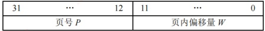

图3.6 某分页系统的32位逻辑地址结构

以 32 位地址为例，若页面大小为  $2^{12} ~B$ （4KB），则低 12 位（0～11 位）为页内偏移量，高 20 位（12～31 位）为页号，最多可支持  $2^{20}$ 个页面。

##### （3） 页表

为实现逻辑地址到物理地址的转换，系统为每个进程建立一张页表（Page Table）。页表是一个按页号顺序排列的数组，每个页表项记录对应页面所驻留的物理页框号，以及相关状态信息（如有效位、访问位等）。进程执行时，通过页号索引页表，即可获得该页所在的物理块号，从而完成地址映射，如图3.7所示。因此，页表的作用是实现从页号到页框号的映射。


(a) 逻辑空间

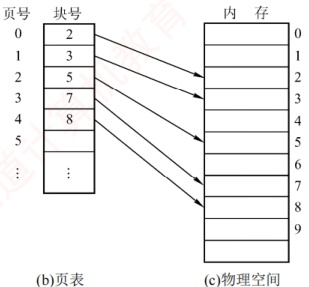

(b)页表

(c) 物理空间

图3.7 页表的作用

#### 2. 基本地址变换机构

地址变换机构的任务是将逻辑地址转换为内存中的物理地址，这一过程借助页表实现。图3.8展示了分页存储管理系统中的地址变换机构。

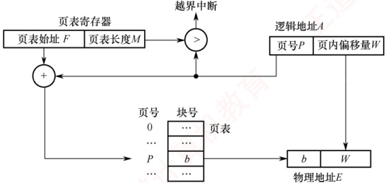

图3.8 分页存储管理系统中的地址变换机构

**注意**

在页表中，页表项按页号顺序连续存放，因此页号作为索引是隐含的，无须在页表项中显式存储。

为提高地址变换速度，系统设置一个页表寄存器（PTR），存放页表在内存中的始址 F 和页表长度 M。由于寄存器造价昂贵，单 CPU 系统中通常只设置一个 PTR。进程未执行时，其页表始址和长度保存在该进程的 PCB 中；当进程被调度执行时，操作系统将这些信息装入 PTR。

设页面大小为 L，逻辑地址 A 到物理地址 E 的变换过程如下。

### 考点追踪 ▶ 页式系统的地址变换过程（2013、2021、2024）

### 考点追踪 ▶ 页表项地址的计算与分析（2024）

① 根据逻辑地址计算页号  $P = \lfloor A/L \rfloor$ 、页内偏移量  $W = A\%L$ 。

② 判断页号是否越界，若页号  $P \geq$ 页表长度 M，则产生越界中断；否则，继续执行。

③ 根据页号 P 查找页表，找出对应页表项中的物理块号。页表项地址 = 页表始址  $F+$ 页号  $P\times$ 页表项长度，取出该页表项中的物理块号 b。

④ 计算物理地址 E = bL + W，并据此访问内存（注意，物理地址 = 页面在内存中的始址+页内偏移量，页面在内存中的始址 = 块号×块大小）。

上述地址变换过程由 MMU 硬件自动完成的。例如，若页面大小  $L = 1 \, KB$，则页号 2 对应的物理块号 b = 8，逻辑地址  $A = 2500$ 的物理地址 E 的计算过程如下： $P = 2500 / 1 \, K = 2$， $W = 2500 \% 1 \, K = 452$，故物理地址  $E = 8 \times 1024 + 452 = 8644$。

若逻辑地址以二进制形式给出，则页号和页内偏移可直接通过截取高位和低位获得，效率更高。正因页面大小固定，逻辑地址可视为一维线性地址，因而仅需一个整数即可确定其位置。

页表项大小不是随意规定的，而是有所约束的。页表项大小如何确定？

页表项需能表示所有可能的物理页框号。以 32 位地址空间、按字节编址、页面大小为 4KB 为例，物理内存最多包含  $2^{32}$B/4KB =  $2^{20}$ 个页框，因此需要  $\log_2 2^{20} = 20$ 位来表示页框号。由于内存按字节编址，为保证页表项能够指向所有页面，页表项大小至少为  $\lceil 20/8 \rceil = 3$B。但出于对齐和扩展考虑（如加入有效位、访问位等），实际系统通常将页表项设为 4B。

分页管理面临两个主要挑战：① 每次访存都需要进行地址转换，若转换速度不够快，则会显著降低系统性能；② 页表本身占用内存空间，若页表过大，则会降低内存利用率。正是这些问题，推动了后续优化技术的发展，如快表（TLB）和多级页表。

#### 3. 具有快表的地址变换机构

由前述地址变换过程可知，若页表全部存放在内存中，则每次访问内存（无论是取指令还是读/写数据）至少需两次访存；第一次访问页表以获取物理块号，第二次根据形成的物理地址访问目标内容。显然，这种方式会显著降低系统性能。为此，现代地址变换机构增设了一个具有并行查找能力的高速缓冲存储器——快表（TLB），用于缓存当前活跃的若干页表项，以加速地址变换。相应地，主存中的完整页表常被称为慢表。具有快表的地址变换机构如图3.9所示。

### 考点追踪 ▶ 具有快表的地址变换的性能分析（2009）

在具有快表的分页机制中，地址变换过程如下。

① CPU 给出逻辑地址后，硬件自动提取页号，并将其与快表中所有页号并行比较。

② 若命中（找到匹配的页号），则直接从快表中取出对应的物理块号，与页内偏移量拼接形成物理地址。此时，仅需一次访存即可。

③ 若未命中（未找到匹配的页号），则需访问内存中的页表，读取相应的页表项以获得其
物理块号，再拼接形成物理地址并访问内存，共需两次访存。同时，系统会将该页表项装入快表，以便后续可能的重复访问；若快表已满，则按特定置换算法淘汰一个旧项。

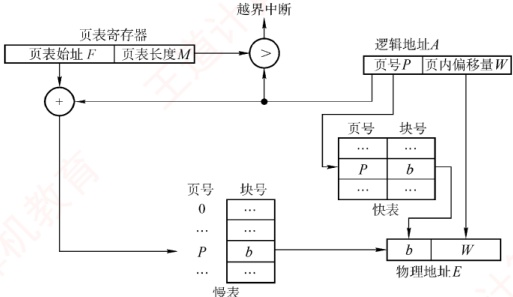

图3.9 具有快表的地址变换机构

在程序具有良好局部性的前提下，快表命中率通常可达90%以上，因此分页机制带来的性能开销可控制在10%以内。快表的有效性基于著名的局部性原理，这一原理将在3.2节中介绍。

#### 4. 两级页表

引入分页管理后，进程执行时无须将所有页面调入内存，但仍需将整个页表驻留内存。然而，页表本身可能非常庞大。以 32 位逻辑地址空间、页面大小为 4KB、页表项大小为 4B 为例：页内偏移占  $\log_{2}4K = 12$ 位，页号占 20 位，因此每个进程的页表最多包含  $2^{20}$ 个页表项，仅页表就需占用  $2^{20} \times 4B / 4KB = 1K$ 个页。若还要求页表连存放，则显然不切实际。

### 考点追踪 多级页表的特点和优点（2014）

解决上述问题的思路是将页表本身也视为可分页的对象，具体体现为两个方面：①对页表采用离散分配，不再要求其连续存放，而是通过一张专门的索引表记录各页表页在内存中的位置，从而消除对连续内存空间的需求；②仅将当前活跃的部分页表项调入内存，其余仍驻留磁盘，按需调入（虚拟内存的思想），从而有效缓解页表占用过多内存的问题。

不难发现，这一方案与最初引入页表以解决进程地址空间离散分配的思路如出一辙：本质上，就是为已离散化的页表再建立一层页表，称为外层页表（或页目录）。仍以上述条件为例：当采用两级分页时，将原页表按页面大小（4KB）进行分页。由于每页可容纳4KB/4B = 1024个页表项，而总页表项数为2^{20}，故需2^{20}/2^{10} = 2^{10} = 1024个页表页，对应外层页表包含1024个表项，恰好占用一页（4KB）。由此自然形成了如图3.10所示的逻辑地址结构。


图 3.10 逻辑地址空间的格式

### 考点追踪 ➤ 两级页表的逻辑地址结构及相关分析（2010、2013、2015、2017—2019）

两级页表是在普通页表结构上再加一层页表，其结构如图3.11所示。

在页表的每个表项中，存放的是进程某页对应的物理块号。例如，0号页存放在1号物理块中，1号页存放在5号物理块中。在外层页表的每个表项中，存放的是某个页表分页的物理起始地址。例如，0号页表页存放在3号物理块中。

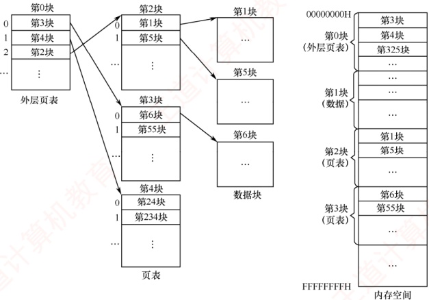

图 3.11 两级页表结构示意图

通过外层页表和内层页表的协同作用，可实现从逻辑地址到物理地址的变换。

### 考点追踪 二级页表的页表基址寄存器中的内容（2018、2021）

### 考点追踪 二级页表中的地址变换过程（2015、2017）

为方便地址变换，系统增设一个外层页表寄存器（也称页目录基址寄存器），用于存放外层页表的起始地址。地址变换过程如下。

①用逻辑地址中的页目录号作为索引，访问外层页表，获取对应内层页表的物理起始地址。

②用逻辑地址中的二级页号作为索引，访问该页表，得到目标页面的物理块号。

③ 将物理块号与页内偏移量拼接，形成物理地址，并据此访问内存单元。

在无快表的情况下，此过程需三次访存。

对于更大的地址空间（如64位），两级页表远远不够。例如，若逻辑地址为64位、页面大小为4KB，则页号占52位。若每页仍可存放1024个页表项，则需约6级页表才能覆盖整个地址空间。然而，实际系统通常将虚拟地址限制为48位，从而采用三级或四级页表即可高效管理，既满足应用需求，又避免硬件过度复杂化。建立多级页表的根本目的，是通过按需分配页表页，避免为未使用的地址空间预留大量无用的页表项，进而显著节省内存开销。

### 3.1.4 基本分段存储管理

分页管理方式是从计算机的角度出发设计的，旨在提高内存利用率和系统性能，其地址转换由硬件自动完成，对用户完全透明。而分段管理方式则从用户和程序员的实际需求出发，旨在支持方便编程、信息保护与共享、动态增长以及动态链接等高级功能。

#### 1. 分段

分段系统将用户进程的逻辑地址空间划分为若干大小不等的段。例如，一个进程可包含主程序段、子程序段、栈段和数据段，共划分为5个段。每个段内部从0开始编址，并分配一段连续的地址空间（段内连续，段间不要求连续）。由于地址空间被组织为多个具有明确语义的段，整个进程的逻辑地址结构呈现出二维特性：由段号和段内偏移共同确定一个地址。
### 考点追踪 分段系统的逻辑地址结构分析（2009）

分段存储管理的逻辑地址由段号 S 和段内偏移量 W 两部分组成。在图 3.12 中，段号占 16 位，段内偏移量也占 16 位，则一个进程最多可拥有  $2^{16} = 65536$ 个段，最大段长为 64KB。


图 3.12 分段系统中的逻辑地址结构

在页式系统中，逻辑地址中的页号与页内偏移量对用户透明；而在分段系统中，段号和段内偏移量必须由用户显式提供——这一工作在高级语言中由编译程序自动完成。

#### 2. 段表

每个进程都拥有一张段表，用于实现逻辑段到物理内存区的映射。段表中每个段对应一个段表项，记录该段在内存中的基址（起始地址）和段长（长度）。段表的内容如图3.13所示。


图3.13 段表的内容

运行时，系统通过查找段表，即可定位每段在内存中的实际位置，其映射过程见图3.14。


图 3.14 利用段表实现物理内存区映射

由于段表项连续存放且长度相同，段号可作为隐含索引，无须额外存储。例如，在某32位分段系统中，段号为16位，段内偏移量为16位（段长字段为16位，对应最大段长64KB），物理地址为32位（可寻址4GB内存）。因此，每个段表项至少需要16（段长）+32（基址）=48位，即6B。若段表首地址为M，则第K号段对应的段表项位于地址 $M+K\times6$处。

#### 3. 地址变换机构

分段系统的地址变换过程如图3.15所示。为实现从逻辑地址到物理地址的变换，系统设置了一个段表寄存器，用于存放段表始址F和段表长度M。段式存储管理的地址变换过程如下。

### 考点追踪 段式系统的地址变换过程（2016）

① 从逻辑地址 A 中分离出段号 S 和段内偏移量 W。

② 判断段号是否越界：若段号  $S \geqslant$ 段表长度 M，则产生段号越界中断，否则继续执行。

③ 根据段号 S 查找段表，段表项地址 = 段表始址  $F +$ 段号  $S \times$ 段表项长度。取出该段表项中该段的段长 C，若  $W \geq C$，则产生段内越界中断；否则，继续执行。

④ 取出段表项中该段的基址 b，计算物理地址 E = b + W，并据此访问内存。


图 3.15 分段系统的地址变换过程

#### 4. 分页和分段的对比

分页与分段均为非连续分配方式，均需通过地址映射机构实现地址变换。然而，二者在概念上有本质区别，主要体现在以下三个方面：

1）页是系统管理内存的物理单位，分页的主要目的是提高内存利用率，完全由系统实现，对用户透明；段是用户程序的逻辑单位，分段的主要目的是满足编程、共享、保护等需求，由编译器根据程序结构划分，对用户可见。

2）页的大小固定，由系统决定。段的长度不固定，取决于程序的逻辑结构。

3）分页系统的地址空间是一维的，程序员只需提供单一的线性地址；分段系统的地址空间是二维的，程序员在引用地址时，必须同时指定段名（或段号）和段内偏移量。

#### 5. 段的共享与保护

### 考点追踪 页、段共享的原理和特点（2019、2023）

在分页系统中，虽然也能实现共享，但远不如分段系统方便。若一段共享代码占 N 个页框，则每个共享进程的页表中都需建立 N 个页表项，分别指向这 N 个页框。而在分段系统中，无论该段多大，只需在每个进程的段表中设置一个段表项指向该共享段，因此实现共享极为便捷。

为支持段共享，系统可维护一张共享段表，其中每个共享段对应一个表项，记录其段号、段长、内存起始地址、存在位、外存起始地址以及共享进程计数 count。当某进程不再使用该段时，count 减 1；仅当 count = 0 时，系统才回收该段所占的内存空间。值得注意的是，同一共享段在不同进程中可以具有不同的段号，各进程通过各自的段号即可访问同一物理段 $^{①}$。

不能被修改的代码称为可重入代码（或纯代码），它允许多个进程并发执行。为确保共享代码的完整性，系统通常将此类代码置于只读段中。同时，每个进程需配备私有的局部数据区，专门用于存放执行过程中可能变化的数据，从而有效避免对共享代码段的任何写操作。

与分页管理类似，分段系统的保护机制主要包括两类：①地址越界保护，将逻辑地址中的段号与段表长度比较，若段号≥段表长度，则产生越界中断；将段内偏移与段表项中的段长比较，若偏移≥段长，则同样触发越界中断。②存取控制保护，通过段表项中的访问权限位防止非法访问。
### 3.1.5 段页式存储管理

分页存储管理能有效提高内存利用率，而分段存储管理能反映程序的逻辑结构，并有利于段的共享与保护。将二者各自的优势有机结合，便形成了段页式存储管理方式。

在段页式系统中，进程的地址空间首先被划分为若干逻辑段，每段拥有唯一的段号；随后，每个段被进一步划分为若干大小固定的页。内存空间的管理仍采用分页方式，即划分为与页面大小相同的物理块，内存分配以物理块为单位，如图3.16所示。


(a) 程序的段页划分

(b) 程序的段页表

图3.16 段页式管理方式

进程的逻辑地址由三部分组成：段号 S、页号 P 和页内偏移量 W，如图 3.17 所示。

| 段号 S | 页号 P | 页内偏移量 W |
| --- | --- | --- |

图3.17 段页式系统的逻辑地址结构

为实现地址变换，系统为每个进程建立一张段表，每个段对应一个段表项，记录该段的页表始址和页表长度（段号作为段表索引，无须显式存储）。每个段还对应一张页表，其每个页表项记录对应页的物理块号（页号作为页表索引，亦无须存储）。此外，系统设置一个段表寄存器，用于存放当前进程段表的起始地址和段表长度，既用于段表寻址，也用于段号越界检查。

**注意**

在段页式存储管理中，每个进程仅有一张段表，但可能有多张页表（每个段一张）。

段页式存储管理的地址变换过程如下。

① 根据逻辑地址中的段号 S，通过段表寄存器定位段表，并查得该段对应页表的起始地址；

② 系统利用页号 P 访问该页表，获取物理块号：

③ 将物理块号与页内偏移量 W 拼接，形成物理地址。

如图 3.18 所示，在无快表的情况下，每次基于逻辑地址的内存访问需三次访存。为加速查找，可引入快表（TLB），其表项包含关键字（段号、页号）及对应的物理块号和保护信息。


图 3.18 段页式系统的地址变换机构

对用户而言，程序仍按段组织，页的划分由系统自动完成且完全透明。正因如此，段页式管理的地址空间是二维的——这与分段系统一致，而分页机制对用户不可见。

### 3.1.6 本节小结

本节开头提出的问题的参考答案如下。

1）为什么要进行内存管理？

在单道程序系统中，系统一次仅运行一个程序，内存分配极为简单——只需将全部内存（或固定分区）分配给当前进程。引入多道程序设计后，多个进程并发执行并共享主存。若缺乏有效管理，则不同进程的地址空间可能重叠或相互覆盖，导致数据被意外修改，破坏程序正确性，严重影响并发可靠性。因此，为支持多道程序安全、高效地并发运行，必须进行内存管理。

2）多级页表解决了什么问题？又会带来什么问题？

多级页表解决了逻辑地址空间较大时，单级页表过长、占用内存过多的问题。通过分级组织页表，系统只需将当前使用的各级页表驻留内存，从而既减少内存占用，又避免对大块连续内存的需求。然而，采用多级页表也会带来性能开销：在无快表（TLB）的情况下，一次地址变换需逐级访问多级页表，导致多次内存访问，进而增加访存延迟。

无论是段式、页式还是段页式管理，读者只需掌握三个关键问题：① 逻辑地址结构，② 页（段）表项结构，③ 寻址过程。搞清这三点，便掌握了各类存储管理方式的核心机制。再次提醒注意区分逻辑地址结构与表项结构。

### 3.1.7 本节习题精选

#### 一、 单项选择题

##### 01

下列关于存储管理目标的说法中，错误的是（）。

A. 为进程分配内存空间

B. 回收被进程释放的内存空间

C. 提高内存的利用率

D. 提高内存的物理存取速度

##### 02

下列关于内存保护的描述中，不正确的是（）。

A. 一个进程不能未被授权就访问另外一个进程的内存空间

B. 内存保护可以仅通过操作系统（软件）来满足，不需要处理器（硬件）的支持

C. 内存保护的方法有世界地址保护和上下限地址保护

D. 一个进程不能直接跳转到另一个进程的指令地址中
##### 03

内存保护需要由（）完成，以保证进程空间不被非法访问。

A. 操作系统

B. 硬件机构

C. 操作系统和硬件机构合作

D. 操作系统或者硬件机构独立完成

##### 04

下列各种存储管理方式中，需要硬件地址变换机构的是（）。

I. 单一连续分配  II. 固定分区分配  III. 页式存储管理

IV. 动态分区分配  V. 页式虚拟存储管理

A. I、III、V B. II、III、IV C. III、IV、V D. II、III、IV、V

##### 05

在固定分区分配中，每个分区的大小是（）。

A. 随作业长度变化

B. 可以不同但预先固定

C. 相同

D. 可以不同但根据作业长度固定

##### 06

在动态分区分配方案中，某一进程完成后，系统回收其主存空间并与相邻空闲区合并，为此需修改空闲区表，造成空闲区数减1的情况是（）。

A. 无上邻空闲区也无下邻空闲区

B. 有上邻空闲区但无下邻空闲区

C. 有下邻空闲区但无上邻空闲区

D. 有上邻空闲区也有下邻空闲区

##### 07

设内存的分配情况如右图所示。若要申请一块 40KB 的内存空间，采用最佳适应算法，则所得到的分区首址为（）。

A. 100K

B. 190K

C. 330K

D. 410K

##### 08

某分段存储管理系统中，段表内容如下表所示，逻辑地址的格式为（段号，段内偏移），则逻辑地址(2,154)对应的物理地址是（）。


| 段号 | 段首址 | 段长 |
| --- | --- | --- |
| 0 | 120K | 40K |
| 1 | 760K | 30K |
| 2 | 480K | 20K |
| 3 | 370K | 20K |

A.  $120K+2$ B.  $480K+154$ C.  $30K+154$ D.  $480K+2$

##### 09

动态重定位是在作业的（）中进行的。

A. 编译过程 B. 装入过程 C. 链接过程 D. 执行过程

##### 10

下列关于程序装入的动态重定位方式的描述中，错误的是（）。

A. 系统将程序装入内存后，程序在内存中的位置可能发生移动

B. 系统为每个进程分配一个重定位寄存器

C. 被访问单元的物理地址 = 逻辑地址 + 重定位寄存器的值

D. 逻辑地址到物理地址的映射过程在进程执行时发生

##### 11

动态重定位的过程依赖于（）。

Ⅰ. 可重定位装入程序 Ⅱ. 重定位寄存器 Ⅲ. 地址变换机构 Ⅳ. 目标程序

A. I 和 II B. II 和 III C. I、II 和 III D. I、II、III 和 IV

##### 12

为保证一个程序在主存中被改变存放位置后仍能正确执行，应采用（）。

A. 静态重定位 B. 动态重定位 C. 动态分配 D. 静态分配

##### 13

下面的存储管理方案中，（）方式可以采用静态重定位。

A. 固定分区 B. 可变分区 C. 页式 D. 段式

##### 14

对重定位存储管理方式，应（）。

A. 在整个系统中设置一个重定位寄存器
B. 为每道程序设置一个重定位寄存器

C. 为每道程序设置两个重定位寄存器

D. 为每道程序和数据都设置一个重定位寄存器

##### 15

在可变分区管理中，采用拼接技术的目的是（）。

A. 合并空闲区 B. 合并分配区 C. 增加主存容量 D. 便于地址转换

##### 16

某页式存储管理系统中，按字节编址，页表内容如下表所示。若页的大小为 4KB，则地址转换机构将逻辑地址 4097 转换成的物理地址为（）。（地址均用十进制表示。）

| 页号 | 页框号 |
| --- | --- |
| 0 | 2 |
| 1 | 1 |
| 3 | 0 |
| 4 | 5 |

A. 8193 B. 4097 C. 2049

##### 17

不会产生内部碎片的存储管理是（）。

A. 分页式存储管理

B. 分段式存储管理

C. 固定分区式存储管理

D. 段页式存储管理

##### 18

多进程在主存中彼此互不干扰的环境下运行，操作系统是通过（）来实现的。

A. 内存分配 B. 内存保护 C. 内存扩充 D. 地址映射

##### 19

在动态分区分配存储管理中，随着时间的推移，会产生越来越多的小碎片，可通过紧凑技术解决，即操作系统不时地对进程进行移动和整理，则适合采用（）装入技术。

A. 绝对装入

B. 静态重定位

C. 动态重定位

D. 静态重定位和动态重定位

##### 20

在动态分区分配存储管理中，不需要对空闲区链进行排序的分配算法是（）。

A. 首次适应法 B. 最佳适应法 C. 最差适应法 D. 都不需要

##### 21

分区管理中采用最佳适应分配算法时，把空闲区按（）次序登记在空闲区表中。

A. 长度递增 B. 长度递减 C. 地址递增 D. 地址递减

##### 22

首次适应算法的空闲分区（）。

A. 按大小递减顺序连在一起

B. 按大小递增顺序连在一起

C. 按地址由小到大排列

D. 按地址由大到小排列

##### 23

为了提高搜索空闲分区的速度，在大、中型系统中往往采用基于索引搜索的动态分区分配算法，以下不属于基于索引搜索的动态分区分配算法的是（）。

A. 快速适应算法 B. 伙伴系统 C. 哈希算法 D. 最佳适应算法

##### 24

内存存储管理由连续分配方式发展为页式管理方式的主要动力是（）。

A. 提高内存利用率

B. 提高系统吞吐量

C. 满足用户的需要

D. 更好地满足多道程序的需要

##### 25

页式存储管理中的页表是由（）建立的。

A. 编译程序 B. 用户程序 C. 链接程序 D. 操作系统

##### 26

在段式存储管理中，共享段表是用来实现（）的。

A. 多个进程共享同一段代码或数据

B. 多个进程共享同一段物理内存空间

C. 多个进程共享同一段逻辑地址空间

D. 多个进程共享同一段号

##### 27

在段式存储管理中，若一个进程有 n 个段，则该进程需要（）个段表。

A. n B.  $n+1$ C. 1 D. 2
##### 28

采用分页或分段管理后，提供给用户的物理地址空间为（）。

A. 分页支持更大的物理地址空间

B. 分段支持更大的物理地址空间

C. 不能确定

D. 一样大

##### 29

分页系统中的页面是为()。

A. 用户所感知的

B. 操作系统所感知的

C. 编译系统所感知的

D. 装配程序所感知的

##### 30

在页式存储管理中，页表的始地址存放在（）中。

A. 物理内存 B. 页表 C. 快表（TLB） D. 页表寄存器

##### 31

在页式存储管理中，当 CPU 形成一个有效地址时，查找页表的工作是由（）实现的。

A. 操作系统 B. 页表查询程序 C. 硬件 D. 存储管理进程

##### 32

采用段式存储管理时，一个程序如何分段是在（）时决定的。

A. 分配主存 B. 用户编程 C. 装作业 D. 程序执行

##### 33

下面的（）方法有利于程序的动态链接。

A. 分段存储管理

B. 分页存储管理

C. 可变式分区管理

D. 固定式分区管理

##### 34

当前编程人员编写好的程序经过编译转换成目标文件后，各条指令的地址编号起始一般定为（①），称为（②）地址。

① A. 1 B. 0 C. IP D. CS

② A. 绝对 B. 名义 C. 逻辑 D. 实

##### 35

可重入程序是通过（）方法来改善系统性能的。

A. 改变时间片长度

B. 改变用户数

C. 提高对换速度

D. 减少对换数量

##### 36

操作系统实现（）存储管理的代价最小。

A. 分区 B. 分页 C. 分段 D. 段页式

##### 37

动态分区也称可变式分区，它是系统运行过程中（）动态建立的。

A. 在作业装入时

B. 在作业创建时

C. 在作业完成时

D. 在作业未装入时

##### 38

在页式存储管理中选择页面的大小，需要考虑下列（）因素。

Ⅰ. 页面大的好处是页表项比较少

Ⅱ. 页面小的好处是可以减少由内碎片引起的内存浪费

III. 影响磁盘访问时间的主要因素通常不是页面大小，所以使用时优先考虑较大的页面

A. I 和 III B. II 和 III C. I 和 II D. I、II 和 III

##### 39

某个操作系统对内存的管理采用页式存储管理方法，所划分的页面大小（）。

A. 要根据内存大小确定

B. 必须相同

C. 要根据 CPU 的地址结构确定

D. 要依据外存和内存的大小确定

##### 40

引入段式存储管理方式，主要是为了更好地满足用户的一系列要求。下面选项中不属于这一系列要求的是（）。

A. 提高内存利用率

B. 方便编程

C. 共享和保护

D. 动态链接和增长

##### 41

对主存储器的访问，()。

A. 以块（页）或段为单位 B. 以字节或字为单位
C. 随存储器的管理方案不同而异 D. 以用户的逻辑记录为单位

##### 42

以下存储管理方式中，不适合多道程序设计系统的是（）。

A. 单用户连续分配

B. 固定式分区分配

C. 可变式分区分配

D. 分页式存储管理方式

##### 43

在分页存储管理中，主存的分配()。

A. 以页框为单位进行

B. 以作业的大小进行

C. 以物理段进行

D. 以逻辑记录大小进行

##### 44

在段式分配中，CPU 每次从内存中取一次数据需要（）次访问内存。

A. 1 B. 3 C. 2 D. 4

##### 45

在段页式分配中，CPU 每次从内存中取一次数据需要（）次访问内存。

A. 1 B. 3 C. 2 D. 4

##### 46

采用段页式存储管理时，内存地址结构是（）。

A. 线性的 B. 二维的 C. 三维的 D. 四维的

##### 47

在段页式存储管理中，地址映射表是（）。

A. 每个进程一张段表，两张页表

B. 每个进程的每个段一张段表，一张页表

C. 每个进程一张段表，每个段一张页表

D. 每个进程一张页表，每个段一张段表

##### 48

操作系统采用分页存储管理方式，要求（）。

A. 每个进程拥有一张页表，且进程的页表驻留在内存中

B. 每个进程拥有一张页表，但只有执行进程的页表驻留在内存中

C. 所有进程共享一张页表，以节约有限的内存空间，但页表必须驻留在内存中

D. 所有进程共享一张页表，只有页表中当前使用的页面必须驻留在内存中，以最大限度地节省有限的内存空间

##### 49

在分段存储管理方式中，( )。

A. 以段为单位，每段是一个连续存储区

B. 段与段之间必定不连续

C. 段与段之间必定连续

D. 每段是等长的

##### 50

下列关于段式存储管理的叙述中，错误的是（）。

A. 段是逻辑结构上相对独立的程序块，因此段是可变长的

B. 按程序中实际的段来分配主存，所以分配后的存储块是可变长的

C. 每个段表项必须记录对应段在主存的起始位置和段的长度

D. 分段方式对低级语言程序员和编译器来说是透明的

##### 51

段页式存储管理汲取了页式管理和段式管理的长处，其实现原理结合了页式和段式管理的基本思想，即（）。

A. 用分段方法来分配和管理物理存储空间，用分页方法来管理用户地址空间

B. 用分段方法来分配和管理用户地址空间，用分页方法来管理物理存储空间

C. 用分段方法来分配和管理主存空间，用分页方法来管理辅存空间

D. 用分段方法来分配和管理辅存空间，用分页方法来管理主存空间

##### 52

以下存储管理方式中，会产生内部碎片的是（）。

Ⅰ. 分段虚拟存储管理

Ⅱ. 分页虚拟存储管理

Ⅲ. 段页式分区管理

Ⅳ. 固定式分区管理
A. I、II、III B. III、IV C. 仅Ⅱ D. II、III、IV

##### 53

下列关于页式存储管理的论述中，正确的是（）。

Ⅰ. 若关闭 TLB，则每存取一条指令或一个操作数都至少要访存 2 次

Ⅱ. 页式存储管理不会产生内部碎片

Ⅲ. 页式存储管理中的页面是用户所能感知的

Ⅳ. 页式存储方式可以采用静态重定位

A. I、II、IV B. I、IV C. 仅 I D. 全都正确

##### 54

在某分页存储管理系统中，地址结构长 18 位，其中 11~17 位为页号，0~10 位为页内偏移量，则主存的最大容量为（ ）KB，主存可分为（ ）个页。若有一作业依次放入 2、3、7 号物理块，相对地址 1500 处有一条指令 “store r1, 2500”，该指令地址所在页的页号为 0，则指令的物理地址为（ ），指令数据的存储地址所在页的页框号为（ ）。

A. 256、256、5596、3

B. 256、128、5596、3

C. 256、128、5596、7

D. 256、128、3548、7

##### 55

在某页式存储管理的系统中，主存容量为 1MB，被分成 256 个页框，页框号为 0, 1, 2, …，255。某作业的地址空间占用 4 页，其页号为 0, 1, 2, 3，被分配到主存的第 2, 4, 1, 5 号页框中，则作业中的 2 号页在主存中的始址是（）。

A. 1 B. 1024 C. 2048 D. 4096

##### 56

下列关于分页和分段的描述中，正确的是（）。

A. 分段是信息的逻辑单位，段长由系统决定

B. 引入分段的主要目的是实现离散分配并提高内存利用率

C. 分页是信息的物理单位，页长由用户决定

D. 页面在物理内存中只能从页面大小的整数倍地址开始存放

##### 57

在采用页式存储管理的系统中，逻辑地址空间大小为 256TB，页表项大小为 8B，页面大小为 4KB，则该系统中的页表应该采用（ ）级页表。

A. 2 B. 3 C. 4 D. 5

##### 58

若对经典的页式存储管理方式的页表做出稍微改造，允许不同页表的页表项指向同一个页帧，则可能的结果有（）。

Ⅰ. 可以实现对可重入代码的共享  Ⅱ. 只需修改页表项，就能实现内存“复制”操作

Ⅲ. 容易发生越界访问 Ⅳ. 可以实现进程间通信

A. I、II、IV B. II、III C. I、II、III D. 仅 I

##### 59

【2009 统考真题】分区分配内存管理方式的主要保护措施是（）。

A. 界地址保护 B. 程序代码保护 C. 数据保护 D. 栈保护

##### 60

【2009 统考真题】一个分段存储管理系统中，地址长度为 32 位，其中段号占 8 位，则最大段长是（）。

A.  $2^{8}B$ B.  $2^{16}B$ C.  $2^{24}B$ D.  $2^{32}B$

##### 61

【2010 统考真题】某基于动态分区存储管理的计算机，其主存容量为 55MB（初始为空），采用最佳适配（Best Fit）算法，分配和释放的顺序为：分配 15MB，分配 30MB，释放 15MB，分配 8MB，分配 6MB，此时主存中最大空闲分区的大小是（）。

A. 7MB B. 9MB C. 10MB D. 15MB

##### 62

【2010 统考真题】某计算机采用二级页表的分页存储管理方式，按字节编址，页大小为  $2^{10}$ B，页表项大小为 2 B，逻辑地址结构为

| 页目录号 | 页 号 | 页内偏移量 |
| --- | --- | --- |

逻辑地址空间大小为  $2^{16}$ 页，则表示整个逻辑地址空间的页目录表中包含表项的个数至少是（）。

A. 64 B. 128 C. 256 D. 512

##### 63

【2011 统考真题】在虚拟内存管理中，地址变换机构将逻辑地址变换为物理地址，形成该逻辑地址的阶段是（）。

A. 编辑

B. 编译

C. 链接

D. 装载

##### 64

【2014 统考真题】下列选项中，属于多级页表优点的是（）。

A. 加快地址变换速度

B. 减少缺页中断次数

C. 减少页表项所占字节数

D. 减少页表所占的连续内存空间

##### 65

【2016 统考真题】某进程的段表内容如下所示。

| 段长 | 内存起始地址 | 权限 | 状态 |
| --- | --- | --- | --- |
| 100 | 6000 | 只读 | 在内存 |
| 200 | — | 读写 | 不在内存 |
| 300 | 4000 | 读写 | 在内存 |

访问段号为 2、段内地址为 400 的逻辑地址时，进行地址转换的结果是（）。

A. 段缺失异常

B. 得到内存地址 4400

C. 越权异常

D. 越界异常

##### 66

【2017 统考真题】某计算机按字节编址，其动态分区内存管理采用最佳适应算法，每次分配和回收内存后都对空闲分区链重新排序。当前空闲分区信息如下表所示。

| 分区始址 | 20K | 500K | 1000K | 200K |
| --- | --- | --- | --- | --- |
| 分区大小 | 40KB | 80KB | 100KB | 200KB |

回收始址为 60K、大小为 140KB 的分区后，系统中空闲分区的数量、空闲分区链第一个分区的始址和大小分别是（）。

A. 3,20K,380KB

B. 3,500K,80KB

C. 4,20K,180KB

D. 4,500K,80KB

##### 67

【2019 统考真题】在分段存储管理系统中，用共享段表描述所有被共享的段。若进程  $P_{1}$ 和  $P_{2}$ 共享段 S，则下列叙述中，错误的是（）。

A. 在物理内存中仅保存一份段 S 的内容

B. 段 S 在  $P_{1}$ 和  $P_{2}$ 中应该具有相同的段号

C.  $P_{1}$ 和  $P_{2}$ 共享段 S 在共享段表中的段表项

D.  $P_{1}$ 和  $P_{2}$ 都不再使用段 S 时才回收段 S 所占的内存空间

##### 68

【2019 统考真题】某计算机主存按字节编址，采用二级分页存储管理，地址结构如下：

| 页目录号（10 位） | 页号（10 位） | 页内偏移（12 |
| --- | --- | --- |

虚拟地址 2050 1225H 对应的页目录号、页号分别是（）。

A. 081H, 101H B. 081H, 401H C. 201H, 101H D. 201H, 401H

##### 69

【2019 统考真题】在下列动态分区分配算法中，最容易产生内存碎片的是（）.

A. 首次适应算法

B. 最坏适应算法

C. 最佳适应算法

D. 循环首次适应算法

##### 70

【2021 统考真题】在采用二级页表的分页系统中，CPU 页表基址寄存器中的内容是（）。
A. 当前进程的一级页表的起始虚拟地址 B. 当前进程的一级页表的起始物理地址

C. 当前进程的二级页表的起始虚拟地址 D. 当前进程的二级页表的起始物理地址

##### 71

【2023 统考真题】进程 R 和 S 共享数据 data，若 data 在 R 和 S 中所在页的页号分别为 p1 和 p2，两个页所对应的页框号分别为 f1 和 f2，则下列叙述中，正确的是（）。

A. p1 和 p2 一定相等，f1 和 f2 一定相等

B. p1 和 p2 一定相等，f1 和 f2 不一定相等

C. p1 和 p2 不一定相等，f1 和 f2 一定相等

D. p1 和 p2 不一定相等，f1 和 f2 不一定相等

##### 72

【2024 统考真题】下列算法中，每次回收分区时仅合并大小相等的空闲分区的是（）。

A. 伙伴算法 B. 最佳适应算法 C. 最坏适应算法 D. 首次适应算法

#### 二、 综合应用题

##### 01

某系统的空闲分区见下表，采用动态分区管理策略，现有如下作业序列：96KB, 20KB, 200KB。若用首次适应算法和最佳适应算法来处理这些作业序列，则哪种算法能满足该作业序列请求？为什么？

| 分区号 | 大小 | 始址 |
| --- | --- | --- |
| 1 | 32KB | 100K |
| 2 | 10KB | 150K |
| 3 | 5KB | 200K |
| 4 | 218KB | 220K |
| 5 | 96KB | 530K |

##### 02

某操作系统采用段式管理，用户区主存为 512KB，空闲块链入空块表，分配时截取空块的前半部分（小地址部分）。初始时全部空闲。执行申请、释放操作序列 reg(300KB), reg(100KB), release(300KB), reg(150KB), reg(50KB), reg(90KB)后：

1）采用最先适配，空块表中有哪些空块？（指出大小及始址）

2）采用最佳适配，空块表中有哪些空块？（指出大小及始址）

3）若随后又要申请80KB，针对上述两种情况会产生什么后果？这说明了什么问题？

##### 03

下图给出了页式和段式两种地址变换示意（假定段式变换对每段不进行段长越界检查，即段表中无段长信息）。


1）指出这两种变换各属于何种存储管理。

2）计算出这两种变换所对应的物理地址。

##### 04

在一个段式存储管理系统中，其段表见下表 A。试求表 B 中的逻辑地址所对应的物理地址。
表A 段表

| 段号 | 内存地址 | 段长 |
| --- | --- | --- |
| 0 | 210 | 500 |
| 1 | 2350 | 20 |
| 2 | 100 | 90 |
| 3 | 1350 | 590 |
| 4 | 1938 | 95 |

表B 逻辑地址

| 段 号 | 段内位移 |
| --- | --- |
| 0 | 430 |
| 1 | 10 |
| 2 | 500 |
| 3 | 400 |
| 4 | 112 |
| 5 | 32 |

##### 05

页式存储管理允许用户的编程空间为 32 个页面（每页 1KB），主存为 16KB。如有一用户程序为 10 页长，且某个时刻该用户程序页表见下表。

| 逻辑页号 | 物理块号 |
| --- | --- |
| 0 | 8 |
| 1 | 7 |
| 2 | 4 |
| 3 | 10 |

若分别遇到三个逻辑地址 0AC5H, 1AC5H, 3AC5H 处的操作，计算并说明存储管理系统将如何处理。

##### 06

在某页式管理系统中，假定主存为64KB，分成16个页框，页框号为0,1,2, $\cdots$,15。设某进程有4页，其页号为0,1,2,3，被分别装入主存的第9,0,1,14号页框。

1）该进程的总长度是多大？

2）写出该进程每页在主存中的始址。

3）若给出逻辑地址(0,0)，(1,72)，(2,1023)，(3,99)，请计算出相应的内存地址（括号内的第一个数为十进制页号，第二个数为十进制页内地址）。

##### 07

某操作系统存储器采用页式存储管理，页面大小为64B，假定一进程的代码段的长度为702B，页表见表A，该进程在快表中的页表见表B。现进程有如下访问序列：其逻辑地址为八进制的0105，0217，0567，01120，02500。试问给定的这些地址能否进行转换？

表A 进程页表

| 页号 | 页帧号 | 页号 | 页帧号 |
| --- | --- | --- | --- |
| 0 | F0 | 6 | F6 |
| 1 | F1 | 7 | F7 |
| 2 | F2 | 8 | F8 |
| 3 | F3 | 9 | F9 |
| 4 | F4 | 10 | F10 |
| 5 | F5 | 6 | F6 |

表B 快表

| 页 号 | 页 帧 号 |
| --- | --- |
| 0 | F0 |
| 1 | F1 |
| 2 | F2 |
| 3 | F3 |
| 4 | F4 |

##### 08

在某页式系统中，假设在查找主存页表的过程中不发生缺页的情况，请回答：

1）若对主存的一次存取需  $1.5\mu s$，问实现一次页面访问时存取时间是多少？

2）若系统有快表且其平均命中率为85%，而页表项在快表中的查找时间可忽略不计，试问此时的存取时间为多少？

##### 09

在页式、段式和段页式存储管理中，假设不发生缺页异常，当访问一条指令或数据时，各需要访问内存几次？其过程如何？假设一个页式存储系统具有快表，多数活动页表项都可以存在其中。若页表存放在内存中，内存访问时间是  $1\mu s$，检索快表的时间为  $0.2\mu s$，若快表的命中率是 85%，则有效存取时间是多少？若快表的命中率为 50%，则有效存取时间是多少？

##### 10

在一个分页存储管理系统中，地址空间分页（每页 1KB），物理空间分块，设主存总容
量是 256KB，描述主存分配情况的位示图如下图所示（0 表示未分配，1 表示已分配），此时作业调度程序选中一个长为 5.2KB 的作业投入内存。试问：

1）为该作业分配内存后（分配内存时，首先分配低地址的内存空间），请填写该作业的页表内容。

2）页式存储管理有无内存碎片存在？若有，会存在哪种内存碎片？为该作业分配内存后，会产生内存碎片吗？若产生，则大小为多少？

3）假设一个64MB内存容量的计算机，采用页式存储管理（页面大小为4KB），内存分配采用位示图方式管理，请问位示图将占用多大的内存？

| 1 |
| --- |

| 页号 | 块号（从0开始编址） |
| --- | --- |
|   |   |
|   |   |
|   |   |
|   |   |
|   |   |

##### 11

【2013 统考真题】某计算机主存按字节编址，逻辑地址和物理地址都是 32 位，页表项大小为 4B。请回答下列问题：

1）若使用一级页表的分页存储管理方式，逻辑地址结构为

| 页号（20 位） | 页内偏移量（12 位） |
| --- | --- |

则页的大小是多少字节？页表最大占用多少字节？

2）若使用二级页表的分页存储管理方式，逻辑地址结构为

| 页目录号（10 位） | 页表索引（10 位） | 页内偏移量（12 位） |
| --- | --- | --- |

设逻辑地址为 LA，请分别给出其对应的页目录号和页表索引的表达式。

3）采用1）中的分页存储管理方式，一个代码段的起始逻辑地址为0000 8000H，其长度为8 KB，被装载到从物理地址0090 0000H开始的连续主存空间中。页表从主存0020 0000H开始的物理地址处连续存放，如下图所示（地址大小自下向上递增）。请计算出该代码段对应的两个页表项的物理地址、这两个页表项中的页框号，以及代码页面2的起始物理地址。


### 3.1.8 答案与解析

#### 一、 单项选择题

##### 01

D

内存的物理存取速度是由硬件决定的，而不是由操作系统管理的。操作系统可以通过虚拟内
存、缓存等技术提高数据的逻辑存取速度，但不能改变内存的物理特性。

##### 02

B

内存保护需要硬件和软件的配合，不能仅靠操作系统来实现。通常需要在 CPU 中设置上下限寄存器、重定位寄存器、界地址寄存器等寄存器，以记录进程在内存中的合法范围。

##### 03

C

内存保护是内存管理的一部分，是操作系统的任务，但是出于安全性和效率考虑，必须由硬件实现，所以需要操作系统和硬件机构的合作来完成。

##### 04

C

硬件地址变换机构一般用于动态重定位的情况。而单一连续分配和固定分区分配采用的是静态重定位，不需要硬件地址变换机构，而由装入程序或操作系统来完成地址转换。因此，只有页式存储管理、动态分区分配和页式虚拟存储管理需要硬件地址变换机构。

##### 05

B

在固定分区分配中，每个分区的大小是在系统启动时就确定了的，不会随着作业的长度而变化。分区的大小可以不同，也可以相同，但是一旦确定，就不会改变。

##### 06

D

将上邻空闲区、下邻空闲区和回收区合并为一个空闲区，因此空闲区数反而减少了一个。而仅有上邻空闲区或下邻空闲区时，空闲区数并不减少。

##### 07

C

最佳适配算法是指，每次为作业分配内存空间时，总是找到能满足空间大小需要的最小空闲分区给作业，可以产生最小的内存空闲分区。从图中可以看出应选择大小为60KB的空闲分区，其首地址为330K。

##### 08

B

段号为2，其对应的首地址为480K，段长度为20K，大于154，所以逻辑地址(2,154)对应的物理地址为480K+154。

##### 09

D

静态装入是指在编程阶段就把物理地址计算好。可重定位是指在装入时把逻辑地址转换成物理地址，但装入后不能改变。动态重定位是指在执行时再决定装入的地址并装入，装入后有可能换出，所以同一个模块在内存中的物理地址是可能改变的，在作业运行过程中，当执行到一条访存指令时，再把逻辑地址转换为主存的物理地址，实际上是通过地址变换机构实现的。

##### 10

B

动态重定位允许程序在内存中移动，系统中只有一个重定位寄存器，每次切换进程时，都要保存和恢复该寄存器的值，不会为每个进程分配一个重定位寄存器，选项B错误。

##### 11

C

可重定位装入程序在重定位的过程中执行，重定位寄存器（也称基址寄存器）用于存放进程的基地址，地址变换机构用于将指令中的逻辑地址与重定位寄存器中的基地址相加得到物理地址。目标程序是装入内存后执行的，动态重定位不依赖于目标程序。

##### 12

B

动态重定位可以在程序加载或运行时，根据程序的实际存放位置，对程序中的地址进行修改，使其与物理地址相符。静态重定位只能在程序加载时进行一次地址修改，若程序在运行过程中改变了存放位置，则会出错。动态分配和静态分配是指内存的分配方式，与重定位无关。

##### 13

A

静态重定位只能对程序中的地址进行一次修改，而不能动态调整。在固定分区方式中，作业
装入内存后位置不会改变，且作业在内存中占用连续的存储空间，因此可以采用静态重定位。其余三种方案均可能在运行过程中改变程序在内存中的位置，不能采用静态重定位。

##### 14

A

为使地址转换不影响到指令的执行速度，必须有硬件地址变换结构的支持，即需在系统中增设一个重定位寄存器，用它来存放程序（数据）在内存中的始址。在执行程序或访问数据时，真正访问的内存地址由相对地址与重定位寄存器中的地址相加而成，这时将始址存入重定位寄存器，之后的地址访问即可通过硬件变换实现。因为系统处理器在同一时刻只能执行一条指令或访问数据，所以为每道程序（数据）设置一个寄存器没有必要（同时也不现实，因为寄存器是很昂贵的硬件，而且程序的道数是无法预估的），而只需在切换程序执行时重置寄存器内容。

##### 15

A

在可变分区管理中，回收空闲区时采用拼接技术对空闲区进行合并。

##### 16

B

逻辑地址 4097 对应的页号为 4097/4096=1，页内偏移量为 4097%4096=1。由页表可知，页号 1 对应的页框号也是 1，页大小为 4KB，因此转换成的物理地址为  $1 \times 4K + 1 = 4097$。

##### 17

B

分页式和段页式存储管理均以固定大小的页框为单位分配内存，进程末页通常无法填满页框，从而产生内部碎片；固定分区式因分区大小固定，当进程小于分区时，剩余空间同样形成内部碎片。而分段式按逻辑段动态分配内存，为每个段分配恰好满足其长度的连续空间，不会因分配粒度固定而导致空间浪费，因此不产生内部碎片（但可能因段间空隙产生外部碎片）。

##### 18

B

##### 19

C

多进程的执行通过内存保护实现互不干扰，如页式管理中有页地址越界保护，段式管理中有段地址越界保护。

绝对装入在编译时直接将程序的逻辑地址转换成物理地址；静态重定位虽然允许将装入模块装入内存的任何位置，但不允许进程在内存中移动；动态重定位在程序执行时才产生真正的物理地址，它允许进程在内存中移动，但需要一个重定位寄存器的支持。

##### 20

A

首次适应法从空闲区链的链首开始顺序查找，找到一个大小满足要求的空闲分区，根据作业的大小，从该分区中划出一块内存空间分配给请求者，余下的空闲分区仍然留在空闲链中。这种算法不需要对空闲区链进行排序，只需按地址递增的顺序链接即可。

##### 21

A

最佳适应算法要求从剩余的空闲分区中选出最小且满足存储要求的分区，空闲区应按长度递增登记在空闲区表中。

##### 22

C

首次适应算法的空闲分区按地址递增的次序排列。

##### 23

D

基于顺序搜索的分配算法有首次适应算法、循环首次适应算法、最佳适应算法和最坏适应算法；基于索引搜索的分配算法有快速适应算法、伙伴系统和哈希算法。

##### 24

A

连续分配要求为进程分配连续内存，易产生内部碎片和外部碎片，导致空闲内存无法有效利用，内存利用率较低。页式管理采用离散分配方式，将内存和进程地址空间划分为相等大小的页
框与页面，分配时无须物理连续，可充分利用零散空闲块，显著提升内存利用率。

##### 25

D

页表是由操作系统在程序装入内存时建立的，根据进程的逻辑地址空间和物理地址空间的对应关系，为每个页设置一个页表项，记录其对应的物理页框号、有效位等信息。

##### 26

A

在段式存储管理中，若有些段可被多个进程共享，则可用一个单独的共享段表来描述这些段，而不需要在每个进程的段表中都保存一份。共享段表的作用是实现多个进程共享同一段代码或数据，这样既能节省内存空间，又能便于实现对共享段的更新和维护。多个进程共享同一段物理内存空间并不需要用到共享段表，只需在各自的段表中指向相同的物理地址即可。多个进程共享同一段逻辑地址空间是不可能的，因为每个进程的逻辑地址空间都是相互独立的。在段式存储管理中，并不要求各个进程中相同功能的段必须有相同的段号。

##### 27

C

不管进程有多少个段，系统都为每个进程建立一张段表，每个段表项对应进程中的一段。

##### 28

C

页表和段表同样存储在内存中，系统提供给用户的物理地址空间为总空间大小减去页表或段表的长度。因为页表和段表的长度不能确定，所以提供给用户的物理地址空间大小也不能确定。

##### 29

B

分页管理是在硬件和操作系统层面实现的，对用户、编译系统、装配程序等上层是不可见的。

##### 30

D

##### 31

C

页表的功能由一组专门的存储器实现，其始址放在页表基址寄存器（PTBR）中。这样才能满足在地址变换时能够较快地完成逻辑地址和物理地址之间的转换。

在页式存储管理中，CPU将虚拟地址分解为页号和页内偏移量，然后通过硬件中的页表寄存器和内存管理单元（MMU），将页号转换为物理地址，再拼接上页内偏移量，得到最终的内存物理地址。这一过程是由硬件自动完成的，不需要操作系统或其他软件的干预。

##### 32

B

分段是指在用户编程时，将程序按照逻辑划分为几个逻辑段。

##### 33

A

程序的动态链接与程序的逻辑结构相关，分段存储管理将程序按照逻辑段进行划分，因此有利于其动态链接。其他的内存管理方式与程序的逻辑结构无关。

##### 34

①B、②C

编译后一个目标程序所限定的地址范围称为该作业的逻辑地址空间。换句话说，地址空间仅指程序用来访问信息所用的一系列地址单元的集合。这些单元的编号称为逻辑地址。通常，编译地址都是相对始址“0”的，因此逻辑地址也称相对地址。

##### 35

D

可重入程序主要是通过共享来使用同一块存储空间的，或通过动态链接的方式将所需的程序段映射到相关进程中去，其优点是减少了对程序段的调入/调出，因此减少了对换数量。

##### 36

A

实现分页、分段和段页式存储管理需要特定的数据结构支持，如页表、段表等。为了提高性能，还需要硬件提供快存和地址加法器等，代价高。分区存储管理是满足多道程序设计的最简单的存储管理方案，特别适合嵌入式等微型设备。
##### 37

A

动态分区时，在系统启动后，除操作系统占据一部分内存外，其余所有内存空间是一个大空闲区，称为自由空间。若作业申请内存，则从空闲区中划出一个与作业需求量相适应的分区分配给该作业，将作业创建为进程，在作业运行完毕后，再收回释放的分区。

##### 38

C

页面较大时，页表项较少，但页内碎片较大；页面较小时，页内碎片较小，但页表项增多。此外，页面大小直接影响磁盘访问次数：页面过小会导致缺页频繁，大幅增加I/O次数和总访问时间；页面过大会加剧内部碎片。因此，页面大小需要在页表开销、内存浪费与I/O效率之间权衡。

##### 39

R

页式管理中很重要的一个问题是页面大小如何确定。确定页面大小有很多因素，如进程的平均大小、页表占用的长度等。而一旦确定，所有的页面就是等长的（一般取2的整数幂倍），以便易于系统管理。

##### 40

A

段式存储管理按程序逻辑结构划分段，段名与段长由用户定义，便于编程；各段作为独立逻辑单位，支持共享、按段保护、动态增长（如数据段扩展）和动态链接（运行时按需加载）。而提高内存利用率并非段式管理的目标：因其段长不固定，易产生外部碎片，内存利用率通常较低。高效利用内存恰好是分页式管理的优势，通过固定页框离散分配，可有效消除外部碎片。

##### 41

B

##### 42

A

这里是指主存的访问，不是主存的分配。对主存的访问是以字节或字为单位的。例如，在页式管理中，不仅要知道块号，还要知道页内偏移量。

单用户连续分配管理方式只适用于单用户、单任务的操作系统，不适用于多道程序设计。

##### 43

A

在分页存储管理中，逻辑地址分配是按页为单位进行分配的，而主存的分配即物理地址分配是以内存块为单位分配的。

##### 44

C

在段式分配中，取一次数据时先从内存查找段表，再拼成物理地址后访问内存，共需要2次内存访问。

##### 45

B

在段页式分配中，取一次数据时先从内存查找段表，再访问内存查找相应的页表，最后拼成物理地址后访问内存，共需要3次内存访问。

##### 46

B

虽然段页式存储管理的内存地址结构分为段号、段内页号和页内地址三部分，但分页是操作系统的行为，用户不用指出页内偏移量的位数；而分段之间是独立的，且段长不定长，需指出段号所占的位数。因此，当采用段页式存储管理时，内存地址结构仍然是二维的。而在分页存储管理中，作业地址空间是一维的，即单一的线性地址空间，程序员只需要一个整数来表示地址。简言之，确定一个地址需要几个参数，作业地址空间就是几维的。

##### 47

C

段页式系统中，进程首先划分为段，每段再进一步划分为页。

##### 48

A

在多个进程并发执行时，所有进程的页表大多数驻留在内存中，在系统中只设置一个页表寄存器（PTR），它存放页表在内存中的始址和长度。平时，进程未执行时，页表的始址和页表长度
存放在本进程的 PCB 中，当调度到某进程时，才将这两个数据装入页表寄存器中。每个进程都有一个单独的逻辑地址，有一张属于自己的页表。

##### 49

A

在分段存储管理方式中，以段为单位进行分配，每段是一个连续存储区，每段不一定等长，段与段之间可连续，也可不连续。

##### 50

D

分段方式对低级语言程序员和编译器是可见的，因为低级语言程序员可以按照程序的逻辑结构划分段，并给每个段命名：编译器也需要对各个段生成逻辑地址。

##### 51

B

段页式存储管理兼有页式管理和段式管理的优点，采用分段方法来分配和管理用户地址空间，采用分页方法来管理物理存储空间。但它的开销要比段式和页式管理的开销大。

##### 52

D

只要是固定的分配就会产生内部碎片，其余的都会产生外部碎片。若固定和不固定同时存在（例如段页式），则仍视为固定。分段虚拟存储管理：每段的长度都不一样（对应不固定），所以会产生外部碎片。分页虚拟存储管理：每页的长度都一样（对应固定），所以会产生内部碎片。段页式分区管理：既有固定，又有不固定，以固定为主，所以会有内部碎片。固定式分区管理：很明显固定，会产生内部碎片。综上分析，说法Ⅱ、Ⅲ、Ⅳ会产生内部碎片。

##### 53

C

说法Ⅰ正确：关闭 TLB 后，每当访问一条指令或存取一个操作数时都要先访问页表（内存中），得到物理地址后，再访问一次内存进行相应操作。说法Ⅱ错误：记住，凡是分区固定的都会产生内部碎片，而无外部碎片。说法Ⅲ错误：页式存储管理对于用户是透明的。说法Ⅳ错误：静态重定位是在程序运行之前由装配程序完成的，必须分配其要求的全部连续内存空间。而页式存储管理方案是将程序离散地分成若干页（块），从而可以将程序装入不连续的内存空间，显然静态重定位不能满足其要求。

##### 54

B

地址结构长18位，所以主存的最大容量为 $2^{18}=256$KB；页内偏移量占11位，所以页面大小为 $2^{11}=2048$B；页号占7位，所以主存页数为 $2^{7}=128$个。该指令的相对地址为1500，小于一个页面的大小，所以该指令存放在2号物理块中，物理地址为 $2\times2048+1500=5596$，指令数据的存放地址为2500，大于一个页面的大小，所以指令数据存放在3号物理块中。

##### 55

D

主存容量为 1MB，分为 256 个页框，页框大小为 1MB/256 = 4KB，作业中的 2 号页被分配到主存的 1 号页框中，因此其在主存中的始址为  $1 \times 4096 = 4096$。

##### 56

D

分段是指将逻辑地址空间划分为若干不等长的单元，称为段。段长由用户根据信息的性质和逻辑结构决定，而不由系统决定，引入分段的主要目的是更好地满足用户的需求，实现程序的模块化和保护。实现离散分配并提高内存利用率是引入分页的主要目的。

##### 57

C

逻辑地址空间大小为  $256\mathrm{TB}=2^{+8}\mathrm{B}$，逻辑地址有48位，页面大小为4KB= $2^{12}\mathrm{B}$，页内偏移量2占12位，剩余36位表示页表索引，页表项大小为8B，一个页面能存放4KB÷8= $2^{9}$个页表项，因此可用9位来表示某一级的页表索引， $36÷9=4$，所以共需要采用4级页表。

##### 58

A

让不同页表的页表项指向同一个页帧，可以共享该页帧的代码，若代码是可重入的（如编辑
软件、编译软件等），则这种方法可以节省大量的内存空间。实现内存“复制”操作时，不需要将页面的内容逐字节复制，而只需将页表中指向该页面的指针复制到目的地址的页表项中。越界保护是通过界地址寄存器实现的，说法 III 是干扰项。当多个进程需要通信时，可以采用共享内存的方式，它们是通过让各个进程页表的页表项指向相同的页帧实现的。

##### 59

A

每个进程都拥有自己独立的进程空间，若一个进程在运行时所产生的地址在其地址空间之外，则发生地址越界，因此需要进行界地址保护，即当程序要访问某个内存单元时，由硬件检查是否允许，若允许，则执行，否则产生地址越界中断。

##### 60

C

分段存储管理的逻辑地址分为段号和位移量两部分，段内位移的最大值就是最大段长。地址长度为32位，段号占8位，因此位移量占32-8=24位，因此最大段长为 $2^{24}B$。

##### 61

B

最佳适配算法是指每次为作业分配内存空间时，总是找到能满足空间大小需要的最小空闲分区给作业，可以产生最小的内存空闲分区。下图显示了这个过程的主存空间变化。

|   | 初始 | 分配 | 释放 | 分配 8MB | 分配 6MB |
| --- | --- | --- | --- | --- | --- |
| 55MB | 15MB | 15MB | 15MB | 15MB | 6MB |
| 55MB | 40MB | 30MB | 30MB | 30MB | 30MB |
| 55MB | 10MB | 10MB | 10MB | 8MB | 8MB |
| 55MB | 30MB | 30MB | 10MB | 2MB | 2MB |

图中，灰色部分为分配出去的空间，白色部分为空闲区。这样，容易发现，此时主存中最大空闲分区的大小为9MB。

##### 62

B

页大小为  $2^{10}B$，所以页内偏移量占10位，又因为页表项大小为2B，一页可以存放  $2^9$ 个页表项，所以页号占9位，根据逻辑地址空间共有  $2^{16}$ 页可知，页目录号加页号共占16位，页目录号占7位，所以页目录表中包含表项的个数至少是  $2^7 = 128$。

##### 63

C

编译后的程序需要经过链接才能装载，而链接后形成的目标程序中的地址也就是逻辑地址。以 C 语言为例：C 程序经过预处理→编译→汇编→链接产生了可执行文件，其中链接的前一步是产生可重定位的二进制目标文件。C 语言采用源文件独立编译的方法，如程序 main.c，file1.c，file2.c，file1.h，file2.h 在链接的前一步生成了 main.o，file1.o，file2.o，这些目标模块的逻辑地址都从 0 开始，但只是相对于该模块的逻辑地址。链接器将这三个文件、libc 和其库文件链接成一个可执行文件，从而形成整个程序的完整逻辑地址空间。

例如，file1.o 的逻辑地址为 0～1023，main.o 的逻辑地址为 0～1023，假设链接时将 file1.o 链接在 main.o 之后，则链接之后 file1.o 对应的逻辑地址应为 1024～2047。

##### 64

D

多级页表不仅不会加快地址的变换速度，还会因为增加更多的查表过程，使地址变换速度减慢；也不会减少缺页中断的次数，相反，若访问过程中多级的页表都不在内存中，则会大大增加缺页的
次数，并不会减少页表项所占的字节数，而多级页表能够减少页表所占的连续内存空间，即当页表太大时，将页表再分级，把每张页表控制在一页之内，减少页表所占的连续内存空间。

##### 65

D

分段系统的逻辑地址 A 到物理地址 E 之间的地址变换过程如图 3.15 所示。

① 从逻辑地址 A 中取出前几位为段号 S，后几位为段内偏移量 W，注意段式存储管理的题目中，逻辑地址一般以二进制数给出，而页式存储管理的题目中，逻辑地址一般以十进制数给出，读者要注意具体问题具体分析。

② 比较段号 S 和段表长度 M，若  $S \geqslant M$，则产生越界异常，否则继续执行。

③ 在段表中查询段号对应的段表项，段号 S 对应的段表项地址 = 段表始址  $F +$ 段号  $S \times$ 段表项长度。取出段表项中该段的段长 C，若  $W \geq C$，则产生越界中断，否则继续执行。

④ 取出段表项中该段的基址 b，计算  $E = b + W$，用得到的物理地址 E 去访问内存。

题目中段号为2的段长为300，小于段内地址400，因此发生越界异常，选项D正确。

##### 66

B

回收始址为 60K、大小为 140KB 的分区时，它与表中第一个分区和第四个分区合并，成为始址为 20K、大小为 380KB 的分区，剩余 3 个空闲分区。在回收内存后，算法会对空闲分区链接分区大小由小到大进行排序，表中的第二个分区排第一。

##### 67

B

段的共享是通过两个作业的段表中相应表项指向被共享的段的同一个物理副本来实现的，因此在内存中仅保存一份段 S 的内容，选项 A 正确。段 S 对进程  $P_{1}$、 $P_{2}$ 来说，使用位置可能不同，所以在不同进程中的逻辑段号可能不同，选项 B 错误。段表项存放的是段的物理地址（包括段始址和段长度），对共享段 S 来说物理地址唯一，选项 C 正确。为了保证进程可以顺利使用段 S，段 S 必须确保在没有任何进程使用它（可在段表中设置共享进程计数）后才能被删除，选项 D 正确。

##### 68

A

题中给出的是十六进制地址，首先将它转化为二进制地址，然后用二进制地址去匹配题中对应的地址结构。转换为二进制地址和地址结构的对应关系如下图所示。


前10位、11～20位、21～32位分别对应页目录号、页号和页内偏移。把页目录号、页号单独拿出，转换为十六进制时缺少的位数在高位补零， $\underline{00}$00 1000 0001， $\underline{00}$01 0000 0001分别对应081H，101H，选项A正确。

##### 69

C

最佳适应算法总是匹配与当前大小要求最接近的空闲分区，但是大多数情况下空闲分区的大小不可能完全和当前要求的大小相等，几乎每次分配内存都会产生很小的难以利用的内存块，所以最佳适应算法最容易产生最多的内存碎片。

##### 70

B

在多级页表中，页表基址寄存器存放的是顶级页表的起始物理地址，所以存放的是一级页表的起始物理地址。

##### 71

C

进程 R 和 S 共享数据 data，说明它们都映射了同一个共享内存段，于是这个段在物理内存中的位置（页框号）必然相同，但这两个段在不同进程的地址空间中的位置（页号）可以不同。因
此，p1 和 p2 不一定相等，f1 和 f2 一定相等。

##### 72

A

伙伴算法在回收一个大小为  $2^{i}$ 的空闲分区时，会检查其伙伴分区（地址相邻、大小同为  $2^{i}$ 的分区）是否也空闲。若是，则将两者合并为一个大小为  $2^{i+1}$ 的空闲分区；随后，继续检查新生成的  $2^{i+1}$ 分区是否存在同大小的伙伴，若有，则再次合并，以此类推。因此，伙伴算法在一次回收过程中可能触发多次合并，但每次合并仅发生在两个大小相等且互为伙伴的空闲分区之间。

#### 二、 综合应用题

##### 01

【解答】

采用首次适应算法时，96KB大小的作业进入4号空闲分区，20KB大小的作业进入1号空闲分区，这时空闲分区如下表所示。

| 分区号 | 大小 | 始址 |
| --- | --- | --- |
| 1 | 12KB | 120K |
| 2 | 10KB | 150K |
| 3 | 5KB | 200K |
| 4 | 122KB | 316K |
| 5 | 96KB | 530K |

此时再无空闲分区可以满足 200KB 大小的作业，所以该作业序列请求无法满足。

采用最佳适应算法时，作业序列分别进入5,1,4号空闲分区，可以满足其请求。分配处理之后的空闲分区表见下表：

| 分区号 | 大小 | 始址 |
| --- | --- | --- |
| 1 | 12KB | 120K |
| 2 | 10KB | 150K |
| 3 | 5KB | 200K |
| 4 | 18KB | 420K |

##### 02

【解答】

1）最先适配的内存分配情况如下图中的(a)所示。

| Reg. | 0KB | 10KB | 200KB | 300KB |
| --- | --- | --- | --- | --- |
| reg150KB | 150 | 150 | 290 | 300 |
| reg50KB | 50 | 50 | 90 | 100 |
| reg90KB | 90 | 90 | 240 | 300 |
| reg100KB | 100 | 100 | 400 | 512 |

(a)

(b)

内存中的空块为：

第一块：始址 290K，大小 10KB；第二块：始址 400K，大小 112KB。

2）最佳适配的内存分配情况如上图中的(b)所示。内存中的空块为：

第一块：始址 240K，大小 60KB；第二块：起始地址 450K，大小 62KB。

3）若随后又要申请80KB，则最先适配算法可以分配成功，而最佳适配算法则没有足够大的
空闲区分配。这说明最先适配算法尽可能地使用了低地址部分的空闲区域，留下了高地址部分的大的空闲区，更有可能满足进程的申请。

##### 03

【解答】

1）由题图所示的逻辑地址结构可知：页或段的最大个数为  $2^{5}=32$ 。若左图是段式管理，则段始址12加上偏移量586，远超第1段的段始址15，超过第4段的段始址20，所以左图是页式变换，而右图满足段式变换。对于页式管理，由逻辑地址的位移量位数可知，一页的大小为2KB。

2）对图中的页式地址变换，其物理地址为  $12\times2048+586=25162$；对图中的段式地址变换，其物理地址为  $4000+586=4586$。

##### 04

【解答】

1）由段表知，第0段内存始址为210，段长为500，因此逻辑地址(0,430)是合法地址，对应的物理地址为 $210+430=640$。

2）由段表知，第1段内存始址为2350，段长为20，因此逻辑地址(1, 10)是合法地址，对应的物理地址为 $2350+10=2360$。

3）由段表知，第2段内存始址为100，段长为90，逻辑地址(2, 500)的段内位移500超过了段长，因此为非法地址。

4）由段表知，第3段内存始址为1350，段长为590，因此逻辑地址(3, 400)是合法地址，对应的物理地址为 $1350+400=1750$。

5）由段表知，第4段内存始址为1938，段长为95，逻辑地址(4,112)的段内位移112超过了段长，因此为非法地址。

6）由段表知，不存在第5段，因此逻辑地址(5,32)为非法地址。

##### 05

【解答】

页面大小为 1KB，所以低 10 位为页内偏移地址；用户编程空间为 32 个页面，即逻辑地址高 5 位为虚页号；主存为 16 个页面，即物理地址高 4 位为物理块号。

逻辑地址 0AC5H 转换为二进制表示是 000 1010 1100 0101B，虚页号为 2(00010B)，映射至物理块号 4，因此系统访问物理地址 12C5H(01 0010 1100 0101B)。

逻辑地址 1AC5H 转换为二进制表示是 001 1010 1100 0101B，虚页号为 6(00110B)，不在页面映射表中，会产生缺页中断，系统进行缺页中断处理。

逻辑地址 3AC5H 转换为二进制表示是 011 1010 1100 0101B，页号为 14，而该用户程序只有 10 页，因此系统产生越界中断。

**注意**

当将十六进制地址转换为二进制地址时，我们可能习惯性地写为16位，这是容易犯错的细节。例如，题中的逻辑地址为15位，物理地址为14位。逻辑地址0AC5H的二进制表示为000 1010 1100 0101B，对应物理地址12C5H的二进制表示为01 0010 1100 0101B。这一点应该引起注意。

##### 06

【解答】

1) 页面的大小为(64/16)KB = 4KB，该进程共有4页，所以该进程的总长度为  $4 \times 4$KB = 16KB。

2）页面大小为 4KB，因此低 12 位为页内偏移地址；主存分为 16 块，因此内存物理地址高 4 位为主存块号。

页号为 0 的页面被装入主存的第 9 块，因此该地址在内存中的始址为 1001 0000 0000 0000B，即 9000H。

页号为 1 的页面被装入主存的第 0 块，因此该地址在内存中的始址为 0000 0000 0000
0000B，即0000H。

页号为 2 的页面被装入主存的第 1 块，因此该地址在内存中的始址为 0001 0000 0000 0000，即 1000H。

页号为 3 的页面被装入主存的第 14 块，因此该地址在内存中的始址为 1110 0000 0000 0000，即 E000H。

3 ）逻辑地址为(0,0)，因此内存地址为(9,0)= $1001\ 0000\ 0000\ 0000$B，即9000H。

逻辑地址为(1, 72)，因此内存地址为(0, 72) = 0000 0000 0100 1000B，即 0048H。

逻辑地址为(2, 1023)，因此内存地址为(1, 1023) = 0001 0011 1111 1111，即 13FFH。

逻辑地址为(3, 99)，因此内存地址为(14, 99) = 1110 0000 0110 0011，即 E063H。

##### 07

【解答】

要注意题目中的逻辑地址使用哪种进制的数给出，若是十进制，则一般通过整数除法和求余得到页号和页内偏移，若用其他进制给出，则一般转换成二进制，然后按照地址结构划分为页号部分和页内偏移部分，再把页号和页内偏移计算出来。

页面大小为64B，因此页内位移为6位，进程代码段长度为702B，因此需要11个页面，编号为0～10。

1）八进制逻辑地址 0105 的二进制表示为 0 0100 0101B。逻辑页号为 1，此页号可在快表中查找到，得页帧号为 F1；页内位移为 5，因此物理地址为(F1, 5)。

2）八进制逻辑地址 0217 的二进制表示为 0 1000 1111B。逻辑页号为 2，此页号可在快表中查找到，得页帧号为 F2；页内位移为 15，因此物理地址为(F2, 15)。

3）八进制逻辑地址 0567 的二进制表示为 1 0111 0111B。逻辑页号为 5，此页号不在快表中，在内存页表中可以查找到，得页帧号为 F5；页内位移为 55，因此物理地址为 (F5, 55)。

4）八进制逻辑地址 01120 的二进制表示为 0010 0101 0000B。逻辑页号为 9，此页号不在快表中，在内存页表中可以查找到，得页帧号为 F9；页内位移为 16，因此物理地址为(F9, 16)。

5）八进制逻辑地址02500的二进制表示为010101000000B。逻辑页号为21，此页号已超过页表的最大页号10，因此产生越界中断。

根据题中条件无法得知逻辑地址位数，所以在其二进制表示中，其位数并不一致，只是根据八进制表示进行转换。若已知逻辑地址空间大小或位数，则二进制表示必须保持一致。

**注意**

##### 08

【解答】

页表在主存时，实现一次存取需要访问主存两次：第一次是访问页表，获得所需访问数据所在页面的物理地址；第二次才是根据这个物理地址存取数据。

1）因为页表在主存，所以CPU必须访问主存两次，即实现一次页面访问的存取时间是

 $$1.5\times2=3\mu\mathrm{s}$$

2）系统增加快表后，在快表中找到页表项的概率为85%，所以实现一次页面访问的存取时间为

 $$0.85 \times (0+1.5)+(1-0.85) \times 2 \times 1.5=1.725\mu s$$

##### 09

【解答】

1）在页式存储管理中，访问指令或数据时，首先要访问内存中的页表，查找到指令或数据所在页面对应的页表项，然后根据页表项查找访问指令或数据所在的内存页面。需要访问内存2次。段式存储管理同理，需要访问内存2次。段页式存储管理，首先要访问内存中的段表，然后访问内存中的页表，最后访问指令或数据所在的内存页面，需要访问内存3次。
对于比较复杂的情况，如多级页表，若页表划分为 N 级，则需要访问内存  $N + 1$ 次。若系统中有快表，则在快表命中时，只需要访问内存 1 次。

2）按1）中的访问过程分析，有效存取时间为

 $$(0.2+1)\times85\%+(0.2+1+1)\times(1-85\%)=1.35\mu s$$

3 ）同理可计算得

 $$(0.2+1)\times50\%+(0.2+1+1)\times(1-50\%)=1.7\mu s$$

从结果可以看出，快表的命中率对访存时间影响非常大。当命中率从85%降低到50%时，有效存取时间增加0.35μs。因此在页式存储系统中，应尽可能地提高快表的命中率，从而提高系统效率。

##### 10

【解答】

1）位示图是利用二进制的一位来表示磁盘中一个盘块的使用情况，其值为“0”时表示对应盘块空闲，为“1”时表示已分配，地址空间分页，每页为1KB，则对应的盘块大小也为1KB，主存总容量为256KB，可分成256个盘块，长5.2KB的作业需要占用6页空间，假设页号与物理块号都从0开始，则根据位示图可得到如下页表内容：

| 页 号 | 块 号 |
| --- | --- |
| 0 | 21 |
| 1 | 27 |
| 2 | 28 |
| 3 | 29 |
| 4 | 34 |
| 5 | 35 |

2）页式存储管理中有内存碎片的存在，会存在内部碎片。为该作业分配内存后，会产生内存碎片，因为此作业大小为5.2KB，占6页，前5页满，最后一页只占0.2KB的空间，因此内存碎片的大小为1KB-0.2KB=0.8KB。

3）64MB 内存，一页大小为 4KB，共可分成  $64K \times 1K / 4K = 2^{14}$ 个物理盘块，在位示图中每个盘块占 1 位，共占  $2^{14}$ 位空间，因为 1B = 8 位，所以此位示图共占 2KB 空间的内存。

##### 11

【解答】

1）因为主存按字节编址，页内偏移量是12位，所以页大小为 $2^{12}B=4KB$。

页表项数为  $2^{32}/4K = 2^{20}$，因此该一级页表最大为  $2^{20} \times 4B = 4MB$。

2）页目录号可表示为(((unsigned int)(LA))>>22) & 0x3FF。这里采用的方法是逻辑右移 22 位，再和 3FF（10 个 1）进行逻辑与运算，得到 10 位的页目录号。这种方法虽然效率较高，但比较难想到，采用 LA/2² 的写法来取高 10 位的页目录号也是可以的。

页表索引可表示为(((unsigned int)(LA))>>12) & 0x3FF。这里也可采用(LA/2¹²)%2¹⁰ 的方法来获取中间 10 位的页表索引号。

3）代码页面1的逻辑地址为0000 8000H，表明其位于第8个页处，对应页表中的第8个页表项，所以第8个页表项的物理地址=页表始址+8×页表项的字节数=0020 0000H+8×4=0020 0020H。由此可得如下图所示的答案。


## 3.2 虚拟内存管理

在学习本节时，请读者思考以下问题：

1）为什么要引入虚拟内存？

2）虚拟内存空间的大小由什么因素决定？

3）虚拟内存是怎么解决问题的？会带来什么问题？

读者要掌握虚拟内存解决问题的思想，了解各种置换算法的优劣，掌握虚实地址的变换方法。

### 3.2.1 虚拟内存的基本概念

#### 1. 传统存储管理方式的特征

3.1 节讨论的各种内存管理策略，都是为了将多个进程同时保留在内存中，以支持多道程序设计。它们具有以下两个共同特征。

1）一次性。作业必须一次性全部装入内存后才能开始运行。这会带来两个问题：① 当作业过大而无法全部装入内存时，该作业将无法运行；② 当大量作业请求运行时，由于内存不足以容纳所有作业，只能让少数作业先运行，导致系统并发度下降。

2）驻留性。作业一旦装入内存，便一直驻留其中，其任何部分都不会被换出，直至作业运行结束。然而，运行中的进程常因等待 I/O 而被阻塞，可能长时间处于等待状态。

由上述分析可知，许多在程序运行中暂未使用或暂时不用的代码和数据仍占据大量内存空间，而一些急需运行的作业却因内存不足无法装入，显然造成了宝贵内存资源的浪费。

#### 2. 局部性原理

### 考点追踪 页面置换算法的时间局部性分析（2012）

要真正理解虚拟内存技术的思想，首先必须了解著名的局部性原理。从广义上讲，快表、页高速缓存及虚拟内存技术都属于缓存技术，这个技术所依赖的原理就是局部性原理。局部性原理既适用于程序结构，又适用于数据结构。局部性原理表现在以下两个方面。

1）时间局部性。程序中的某条指令或某个数据项一旦被访问，不久之后很可能再次被访问。这主要是由于程序中存在大量的循环和重复操作。

2）空间局部性。一旦程序访问了某个存储单元，在不久之后，其附近的存储单元也很可能被访问。这是因为指令通常按顺序存放并顺序执行，而数据（如向量、数组、表等）也一般以连续或簇聚的方式存储。

时间局部性通过将近期使用的指令和数据保存在高速缓存中，并借助多级缓存层次结构加以利用；空间局部性则通过采用较大容量的缓存，并集成预取机制到缓存控制逻辑中实现。虚拟内存技术正是基于局部性原理，将外存作为内存的透明扩展，有效缓解物理内存不足的问题。

#### 3. 虚拟存储器的定义和特征

### 考点追踪 虚拟存储器的特点（2012）

基于局部性原理，在程序装入时，仅需将当前运行所需的少数页面（或段）装入内存，其余部分暂留外存，即可启动程序执行。在程序执行过程中，若所访问的信息不在内存中，则操作系统会自动将其从外存调入内存，然后继续执行程序，这一机制称为请求调页（或请求调段）。当内存空间不足时，操作系统又会将暂时不用的信息换出到外存，以腾出空间存放即将调入的内容，这一机制称为页面置换（或段置换）。正是通过这两种机制的协同工作，系统为用户提供了一个
逻辑上远大于物理内存的地址空间，称为虚拟存储器。

之所以称为“虚拟”存储器，是因为该存储器并非真实存在的物理实体，而是操作系统通过部分装入、请求调入和置换功能（均对用户透明）所构造的一种逻辑抽象。用户程序可像使用大容量内存一样运行，而无须关心物理内存的实际大小。虚拟存储器有以下三个主要特征。

1）多次性。作业无须在运行前一次性全部装入内存，而是可以分多次动态调入。只需将当前需要执行的程序和数据装入内存即可开始运行，后续所需部分在访问时按需调入。

2）对换性。作业在运行过程中无须常驻内存，操作系统可根据需要，将暂不使用的程序或数据换出至外存对换区，并在后续需要时再换入内存，从而实现内存的高效利用。

3）虚拟性。从用户视角看，内存容量被逻辑扩充，呈现出远大于实际物理内存的可用空间。虚拟性正是虚拟存储器的本质特征和根本目标，其实现依赖于多次性与对换性。

#### 4. 虚拟内存技术的实现

虚拟内存技术允许将一个作业分多次调入内存。若采用连续分配方式，则会导致相当一部分内存空间处于暂时甚至“永久”的空闲状态，不仅造成内存资源的严重浪费，也无法从逻辑上扩充内存容量。因此，虚拟内存的实现必须建立在离散分配的内存管理方式基础之上。

目前，虚拟内存主要有以下三种实现方式：

请求分页存储管理。

请求分段存储管理。

请求段页式存储管理。

无论采用哪种方式，均需一定的硬件支持，主要包括以下几个方面：

• 足够容量的内存和外存，用于存放程序的当前部分与后备部分。

• 页表机制（或段表机制），作为地址映射的关键数据结构。

中断机构，用于在用户程序访问尚未调入内存的部分时，触发缺页（或缺段）中断。

地址变换机构，负责在程序运行过程中动态地将逻辑地址转换为物理地址。

### 3.2.2 请求分页管理方式

请求分页系统建立在基本分页系统的基础之上，为支持虚拟存储器功能，增加了请求调页和页面置换功能：在该系统中，只需将当前需要的一部分页面装入内存，便可启动作业运行。在作业运行过程中，若所访问的页面不在内存中，则系统将通过请求调页功能将其从外存调入；而当内存空间不足时，则通过页面置换功能将暂时不用的页面换出到外存。由于每次换入和换出的基本单位均为长度固定的页面，其实现比以长度可变的段为单位的请求分段系统更简单；正因其实现简洁且效率较高，请求分页成为目前最常用的一种虚拟存储器实现方式。

为了实现请求分页，系统必须提供一定的硬件支持。除需要足够容量的内存和外存外，还需具备页表机制、缺页中断机构以及地址变换机构。

#### 1. 页表机制

相比于基本分页系统，请求分页系统中的页表需提供更多信息，以支持请求调页和页面置换。具体而言，操作系统必须能够：① 判断某页是否已调入内存；② 若尚未调入，则还需获知该页在外存中的存放位置；③ 在页面置换时，依据访问特征选择合适的换出页面；④ 对于要换出的页面，还需知道其是否被修改过，以决定是否需写回外存。为此，请求分页的页表项在基本结构基础上增加了四个字段，如图3.19所示。

| 页号 | 物理块号 | 状态位P | 访问字段A | 修改位M | 外存地址 |
| --- | --- | --- | --- | --- | --- |

图 3.19 请求分页系统中的页表项

各新增字段的说明如下：

状态位 P（存在位）。标记该页是否已调入内存，供地址变换时判断是否触发缺页中断。

访问字段 A。记录本页在一段时间内的访问次数，或记录自上次访问以来的时间间隔，供页面置换算法选择换出页面时参考。

· 修改位 M（肱位）。标记该页调入内存后是否被修改过，以决定换出时是否需写回外存。

• 外存地址。指示该页在外存中的存放位置（通常为物理块号），供调页时将其读入内存。

#### 2. 缺页中断机构

### 考点追踪 缺页处理的过程及效率分析（2011、2013、2014、2020、2022）

### 考点追踪 缺页异常导致进程状态的变化（2023）

在请求分页系统中，当进程访问的页面尚未调入内存时，硬件会自动触发缺页中断，由操作系统的缺页中断处理程序处理：将所需页面从外存调入内存（必要时先换出一页）。具体而言，若内存中有空闲页框，则分配一个页框，将所缺页面从外存装入，并更新页表中相应的表项；若无空闲页框，则需先由页面置换算法选择一个页面淘汰，若该页在内存中被修改过，则必须将其写回外存，否则可直接丢弃。由于页面调入通常涉及较长时间的磁盘I/O操作，系统在此期间可能会调度其他进程运行；待所需页面调入完成后，重新执行引发缺页的那条指令。

缺页中断作为一种内中断，其处理过程与其他中断类似，也需经历保护 CPU 现场、分析中断原因、转入中断处理程序、恢复 CPU 现场等步骤。然而，它具有以下两个显著特点：

在指令执行期间触发，由当前指令的地址访问直接引发，而非在指令执行完毕之后。

一条指令在执行过程中可能引发多次缺页中断。例如，在执行指令 copy A to B 时，若该指令本身及其两个操作数各自跨越两个页面，则最多可能引发 6 次缺页中断。

#### 3. 地址变换机构

在基本分页系统地址变换机构的基础上，请求分页系统为支持虚拟存储器，增加了缺页中断触发机制。请求分页系统的地址变换过程如图3.20所示。


图 3.20 请求分页中的地址变换过程

### 考点追踪 分页系统的地址变换过程及分析（2009、2010、2014、2024）

请求分页系统的地址变换过程如下。

①首先检索快表，若命中，则从相应表项中取出该页的物理块号，并置访问位为1，以供置换算法换出页面时参考。对于写操作，还需置修改位为1。

②若快表未命中，则需访问页表。若该页已在内存中（状态位=1），则从相应表项中取出物理块号，并将该页表项装入快表；若快表已满，则按置换算法淘汰一项。

③若页面不在内存，则触发缺页中断。操作系统接管后，将所需页面从外存调入内存（必要时先换出一页），并更新页表和快表。随后，重新执行地址变换以获取物理块号。

④将获得的物理块号与页内地址拼接，形成物理地址，用于访存。

### 3.2.3 页框分配

在为进程分配内存时，主要涉及以下问题：① 为保证进程能正常运行，所需最小页框数的确定；② 为每个进程分配页框时，所分配的页框是固定的还是可变的；③ 在为不同进程分配页框时，是采用平均分配还是按进程大小比例分配。本节将围绕这些问题展开讨论。

#### 1. 最小页框数与驻留集

##### （1） 最小页框数

### 考点追踪 最小物理块数的确定原则（2025）

最小页框数（也称最小物理块数）是指能保证进程正常运行所需的最少页框数量。若系统为进程分配的页框数少于此值，则进程将无法执行。进程应获得的最小页框数与计算机的硬件结构有关，具体取决于指令的格式、功能和寻址方式。例如，对于采用单地址指令和直接寻址的简单机器，最小页框数为2：一个用于存放指令，另一个用于存放数据。若支持间接寻址，则至少需要3个页框：分别用于存放指令、指针和数据。对于功能较强的机器，若一条指令及其两个操作数各自跨越两个页面，则在最坏情况下，该指令执行过程中可能涉及6个不同的页面。因此，应至少为每个进程分配6个页框，以确保这些页面能同时驻留内存，顺利完成指令执行。

#### （2） 驻留集大小

在页式虚拟存储系统中，进程启动时既不需要、也不可能将其所有页面装入内存。因此，操作系统必须决定为该进程分配多少页框——这一集合即称为该进程的驻留集。驻留集大小的选择需在系统并发度与缺页开销之间进行权衡，具体体现在以下两个方面：

1）驻留集过小，内存中可容纳的进程数量增多，有助于提高多道程序的并发度；但每个进程获得的页框过少，将导致缺页率显著升高，CPU需耗费大量时间处理缺页中断。

2）驻留集过大，当分配给进程的页框数超过某一阈值后，继续增加页框对缺页率的改善趋于平缓，不仅浪费内存资源，还会因可用页框总量减少而降低系统的整体并发能力。

#### 2. 内存分配策略

在请求分页系统中，可采取两种内存分配策略，即固定和可变分配策略。在进行置换时，也可采取两种策略，即全局和局部置换。于是可组合出以下三种适用的策略。

### 考点追踪 页面分配与置换策略的名称（2015）

#### （1） 固定分配局部置换

所谓固定分配，是指为每个进程分配固定数量的页框，并在其运行期间保持不变。所谓局部置换，是指当进程发生缺页时，只能从该进程自身已分配的页框中选择一页换出，再将所缺页面
调入，从而维持其驻留集大小恒定。该策略的难点在于：若初始分配的页框太少，则进程将频繁缺页；若分配过多，则不仅浪费内存资源，还会减少系统可容纳的并发进程数。

**注意**

理论上可形成四种组合，但由于固定分配要求进程的页框数量保持不变，而全局置换会导致进程的页框数量发生变化，二者互斥，因此实际可行的策略仅有三种。

#### （2） 可变分配全局置换

所谓可变分配，是指初始时为每个进程分配一定数量的页框，并在运行期间根据需要动态调整。所谓全局置换，是指当进程发生缺页时，系统首先从空闲页框队列中取出一个页框分配给该进程，并将所缺页面调入；若空闲页框已耗尽，则允许从内存所有页框中选择一个换出，而不论其归属哪个进程。该方法比固定分配局部置换更为灵活，能够动态扩充进程的驻留集以更好地适应运行需求。然而，由于每次缺页都会为其分配新页框，若缺乏有效调控，则某些活跃进程的驻留集可能持续膨胀，不断抢占其他进程的页框，进而削弱系统的多道程序并发能力。

#### （3） 可变分配局部置换

系统初始为每个进程分配一定数量的页框；当某进程发生缺页时，仅允许从其自身已分配的页框中选择一页换出，因此不会影响其他进程的运行。此外，系统还根据进程的缺页率动态调整其驻留集大小：若缺页率过高，表明当前页框不足，则为其增加若干页框；若缺页率过低，说明存在资源冗余，则可适当回收部分页框，但需确保不会引发缺页率的显著上升。该策略在有效抑制进程频繁调页的同时，兼顾了系统的多道程序并发能力。尽管其实现机制较为复杂、运行开销较大，但相比因频繁换入/换出所消耗的磁盘I/O与CPU资源，这一开销无疑是值得的。

页面分配策略曾在2015年统考选择题中出现过，考查的正是这三种策略的名称。不少考生因误判其为非重点内容，复习时一带而过，最终在考试中失分。而在这种基础题上失分，实属可惜。再次提醒读者，考研成功的秘诀在于“全面”和“反复多次”。

#### 3. 页框调入算法

在采用固定分配策略时，系统需将空闲页框分配给各进程，常见的分配算法如下。

1）平均分配算法，将系统中所有可供分配的页框平均分配给各个进程。

2）按比例分配算法，根据进程的逻辑地址空间大小按比例分配页框。

3）优先权分配算法，为重要或紧迫的进程分配更多页框。通常的做法是将所有可分配页框分为两部分：一部分按比例分配给各进程，另一部分则依据进程的优先权动态分配。

#### 4. 调入页面的时机

为确定系统将进程运行时所缺页面调入内存的时机，可采用以下两种调页策略。

1）预调页策略。根据局部性原理，一次调入若干相邻页面通常比逐页调入更高效。然而，若预调入的页面大多未被访问，则会造成内存浪费。因此，系统可尝试预测进程近期可能访问的页面并预先调入，但目前预测成功率仅约50%。鉴于预测效果有限，该策略主要用于进程首次调入时，由程序员显式指定应优先加载的页面。

2）请求调页策略。当进程在运行中访问的页面不在内存时，便会触发缺页中断，由系统将其所需页面调入内存。这种策略调入的页面必然会被访问，且实现相对简单，因此当前的虚拟存储器大多采用此策略。其缺点是每次仅调入一页，导致磁盘I/O开销较大。预调页本质上是在进程运行前完成页面加载，而请求调页则是在运行期间动态调入。
#### 5. 从何处调入页面

请求分页系统中的外存分为两部分：用于存放文件的文件区和用于存放换出页面的对换区，也称交换区。对换区采用连续分配方式，而文件区采用离散分配方式，因此对换区的磁盘I/O速度通常快于文件区。这样，系统在发生缺页时，调入页面的来源可分为以下三种情况。

1）系统拥有足够的对换区空间。此时可将所有页面从对换区调入，以提高调页速度。为此，需在进程运行前，将与该进程相关的文件从文件区复制到对换区。

2）系统对换区空间不足。对于不会被修改的页面，直接从文件区调入；当换出此类页面时，因其内容未变，无须写回磁盘。而对于可能被修改的页面，换出时必须保存到对换区，后续调入时也需从对换区读取，从而兼顾效率与正确性。

3）UNIX 方式。与进程相关的文件始终保留在文件区。因此，未运行过的页面从文件区调入；曾经运行过但已被换出的页面则存放在对换区，后续调入时从对换区读取。若多个进程共享同一页面，则只要该页面已在内存中，其他进程便可直接复用，无须重复调入。

#### 6. 如何调入页面

当进程访问的页面不在内存中时（页表项的存在位为0），CPU会触发缺页中断。中断响应后，系统转入缺页中断处理程序。该程序首先通过页表项获取该页在外存中的地址，然后判断内存是否已满：若内存未满，则分配一个空闲页框，发起磁盘I/O将所缺页面调入，并更新页表项：填写物理块号，置存在位为1；若内存已满，则先按某种置换算法选出一页准备换出。若该页的修改位为0，则直接丢弃；若修改位为1，则需先将其写回对换区，再释放该页框。随后，将所缺页面调入该页框，并更新页表项，置存在位为1。调入完成后，进程即可通过更新后的页表生成正确的物理地址。整个页面调入过程对用户完全透明，由操作系统自动完成。

### 3.2.4 页面置换算法

进程运行时，若其访问的页面不在内存中，需将其调入，但内存又无空闲页框，则必须从内存中换出一页至外存。选择换出哪一页的算法称为页面置换算法。由于页面的换入与换出均涉及磁盘I/O，开销较大，因此，一个好的页面置换算法应致力于降低缺页率。

### 考点追踪 各种页面置换算法的特点（2014）

常见的页面置换算法有以下四种。

#### 1. 最佳（OPT）算法

最佳页面置换算法在发生缺页时，选择淘汰以后永不使用或在最长时间内不再被访问的页面，从而在理论上获得最低的缺页率。然而，由于操作系统无法预知未来的页面访问序列，该算法在实际系统中无法实现。尽管如此，OPT算法仍具有重要的理论意义，常用于评价其他算法。

假定系统为某进程分配了三个物理块，并给定如下页面访问序列：

 $$\begin{array}{l} 7,0,1,2,0,3,0,4,2,3,0,3,2,1,2,0,1,7,0,1 \end{array}$$

进程运行时，首先将页面7,0,1依次装入内存。当访问页面2时，发生缺页中断。根据OPT算法，选择未来最久才被再次访问的页面（页面7的下一次访问在第18次，远晚于其他页面）淘汰。随后访问页面0时，因其已在内存中，不产生缺页。访问页面3时再次缺页，此时页面1的下次访问（第14次）最晚，故将其淘汰……以此类推，具体过程如图3.21所示。


图3.21 利用最佳置换算法时的置换图

可见，整个过程中共发生9次缺页中断，其中6次触发页面置换（不算初始装入）。

#### 2. 先进先出（FIFO）算法

先进先出页面置换算法选择淘汰最早进入内存的页面。该算法实现简单，将内存中的页面按调入时间组织成一个队列，需要换出时直接移除队首页面。然而，FIFO算法未利用局部性原理，与进程实际运行规律不符，最早装入的页面仍可能被频繁访问，因此性能通常较差。

### 考点追踪 FIFO 算法的应用分析（2010）

仍用上面的例子，采用 FIFO 算法进行置换。当访问页面 2 时发生缺页，淘汰最早进入的页面 7。随后访问页面 3 时再次缺页，此时将 2, 0, 1 中最先进入的页面 0 换出……以此类推，具体过程如图 3.22 所示。可见，共发生 15 次缺页中断，其中 12 次触发页面置换。


图 3.22 FIFO 算法的置换图

值得注意的是，FIFO算法存在一种反直觉现象：当为进程分配的物理块数增加时，缺页次数反而可能上升，这一现象称为Belady异常。其根本原因在于FIFO仅依据调入时间决策，而忽略了页面的实际使用情况。例如，页面访问需列为3,2,1,0,3,2,4,3,2,1,0,4，当分配3个物理块时，缺页次数为9次；当分配4个物理块时，缺页次数反而增至10次，如图3.23所示。


图 3.23 Belady 异常

只有 FIFO 算法可能出现 Belady 异常，而 OPT 算法和 LRU 算法永远不会出现此类异常。

#### 3. 最近最久未使用（LRU）算法

LRU 算法选择淘汰最近最长时间未使用的页面，其基本思想是：若某页面在过去一段时间内未被使用，则在近期未来很可能也不会被访问。为实现这一策略，系统需为每个页面维护一个访问字段，记录其自上次被访问以来所经历的时间，淘汰页面时选择该值最大的页面。
### 考点追踪 LRU 算法的应用分析（2009、2015、2019、2025）

仍用上面的例子采用 LRU 算法进行置换，如图 3.24 所示。首次访问页面 2 时发生缺页，将最近最久未使用的页面 7 换出；随后访问页面 3 时再次缺页，将最近最久未使用的页面 1 换出。


图 3.24 LRU 页面置换算法时的置换图

由图可见，前5次缺页处理的结果与OPT算法相同，但这仅是巧合，并无必然联系。实际上，LRU算法根据页面过去的使用情况来判断，是“向前看”的；而OPT算法则根据页面未来的使用情况来判断，是“向后看”的。而页面过去与未来的走向之间并无必然联系。

OPT 算法的性能最好，但无法实现。FIFO 算法实现简单，但忽略局部性，性能较差。LRU 算法性能接近 OPT 算法，具有良好的实际效果，但其实现通常需要硬件支持，开销较大。

#### 4. 时钟（CLOCK）算法

LRU 算法的性能接近 OPT 算法，但其实现开销较大。因此，操作系统的设计者尝试了许多算法，试图以较小的开销接近 LRU 算法的性能，这类算法统称为 CLOCK 算法的变体。

##### （1）简单的 CLOCK 算法

### 考点追踪 类 CLOCK 算法的过程分析（2012）

简单的 CLOCK 算法为每个页面设置一个访问位，当某页首次被装入内存或被访问时，其访问位被置为 1。系统将所有页框组织成一个循环队列，并维护一个替换指针，指向当前检查位置。发生缺页且需置换时，算法按以下规则操作：若指针所指页面的访问位为 0，则直接淘汰该页；若为 1，则将其置为 0，指针顺移至下一页面，给予该页一次“宽恕”机会——即暂不淘汰，待后续轮询时再行判断。由于指针在队列中循环移动，形如时钟指针，故称 CLOCK 算法。又因其仅依据“最近是否被使用”这一粗略信息进行决策，也被称为最近未用（NRU）算法。

### 考点追踪 CLOCK 算法的应用分析（2010）

假设页面访问需列为7,0,1,2,0,3,0,4,2,3,0,3,2,1,3,2，采用简单CLOCK算法，分配4个页框，每个页框记录（页面号，访问位），具体过程如图3.25所示。


图 3.25 CLOCK 算法时的置换图

初始阶段，页面7,0,1,2依次调入，访问位均置为1。随后访问0，已存在，访问位保持为1。访问3时发生第5次缺页，此时替换指针位于帧1，而所有页框的访问位均为1。算法遂完整扫描一圈，将各帧访问位清零，指针回到最初的位置（帧1），故淘汰帧1中的页面7，装入页面3，访问位置为1，如图3.26(a)所示。接着访问0，已存在，访问位置为1。访问4时发生第6次缺页，替换指针指向帧2（上次替换位置的下一帧），帧2的访问位为1，将其置0后继续扫描；帧3的访问位为0，故淘汰帧3中的页面2，装入页面4，如图3.26(b)所示。此后访问2,3,0,3,2，均已
存在，每次访问均将对应帧的访问位置为1。当访问1时发生第7次缺页，此时替换指针指向帧4，且所有帧的访问位均为1，算法再次完成一轮扫描并将访问位清零，故淘汰帧4中的页面2。后续访问3，已存在，访问位置为1。最后访问2时发生第8次缺页，替换指针指向帧1，帧1的访问位为1，将其置0后继续扫描，帧2的访问位为0，故淘汰帧2中的页面0，装入页面2。


(b) 第6次缺页中断

图 3.26 缺页中断时替换指针扫描示意图

（2）改进型 CLOCK 算法

### 考点追踪 改进 CLOCK 算法的思想（2018）

### 考点追踪 改进 CLOCK 算法的应用分析（2016、2021）

将一个页面换出时，若该页已被修改，则需将其写回磁盘；若未被修改，则无须写回。可见，修改过的页面置换代价更高。为降低I/O开销，改进型CLOCK算法在访问位（A）的基础上，引入修改位（M），综合考虑页面的使用情况与置换代价。在选择淘汰页时，优先考虑既未被访问过又未被修改的页面。根据（A,M）的组合，页面可分为以下四类：

• 1 类（A = 0, M = 0）：最近未被访问，且未被修改，是最佳的淘汰页。

•2类（A=0,M=1）：最近未被访问，但已被修改，是次佳的淘汰页。

• 3 类（A = 1, M = 0）：最近已被访问，但未被修改，可能再次被访问。

4类（A=1,M=1）：最近已被访问，且已被修改，可能再次被访问。

内存中的每一页必属于这四类页面之一。进行页面置换时，算法采用与简单 CLOCK 类似的循环扫描机制，区别在于该算法需同时检查访问位与修改位，具体步骤如下。

① 从当前指针位置开始，进行第一轮扫描，寻找 A=0 且 M=0 的 1 类页面，将第一个找的 1 类页面作为淘汰页。此轮扫描不修改任何访问位 A。

② 若第①步失败，则进行第二轮扫描，寻找 A=0 且 M=1 的 2 类页面，将第一个找到的 2 类页面作为淘汰页。此轮扫描中，将所有经过的页面的访问位 A 置为 0。

③ 若前两步均失败（所有页面 A=1），则将指针复位至起始位置，并将所有帧的访问位清零，随后重复第①步；若仍无1类页面，则执行第②步。此时必能找到可淘汰页面。

改进型 CLOCK 算法优于简单 CLOCK 算法之处在于：优先淘汰未修改的页面，从而降低磁盘 I/O 开销。但为定位合适的淘汰页，可能需多轮扫描，算法本身的运行开销相应增加。

操作系统中的页面置换算法普遍遵循一个原则：尽可能保留近期访问过的页面，优先淘汰未访问过的页面。简单CLOCK算法仅依据访问位判断页面是否“被访问过”；而改进型CLOCK算法则在此基础上进一步细化：对“未访问过”的页面，优先换出其中未修改者；即使所有页面均“被访问过”，仍优先选择未修改者换出，以最小化磁盘写回成本。

### 3.2.5 抖动和工作集

#### 1. 抖动

在页面置换过程中，最糟糕的情形是：刚刚换出的页面马上又要换入内存，而刚刚换入的页面又立即被换出。这种频繁的页面调度行为称为抖动（也称颠簸）。
### 考点追踪 抖动的处理措施（2011）

系统发生抖动的根本原因在于：分配给进程的物理块数量过少，无法满足其正常运行的基本需求，导致进程在执行过程中频繁触发缺页中断，不得不反复请求系统将所缺页面调入内存。此时，磁盘I/O频率急剧上升，进程的大部分时间都消耗在页面的换入与换出操作上，几乎无法完成有效计算，进而造成CPU利用率急剧下降，甚至趋近于零。

抖动是虚拟存储系统中的严重性能问题，必须加以解决。由于抖动的发生直接源于系统为进程分配的页框数（驻留集）过少，于是又提出了工作集的概念，用以动态指导页框分配。

#### 2. 工作集

工作集是指在某段时间间隔内，进程实际访问过的页面集合。通常，工作集 W 可由时间 t 和工作集窗口尺寸  $\Delta$ 共同确定。例如，某进程对页面的访问序列如下：

 $$\begin{array}{c}1,4,\boxed{2,3,5,3,2,2,1,1,1,1,3,4,5,4,4,2,1,1,3,3}\\ \uparrow\quad\qquad\qquad\qquad\uparrow\\ t_{1}\quad t_{2}\end{array}$$

### 考点追踪 工作集的应用分析（2016）

假设工作集窗口尺寸  $\Delta$ 设置为 5，则在  $t_1$ 时刻，进程的工作集为  $\{2, 3, 5\}$；在  $t_2$ 时刻，工作集为  $\{1, 2, 3, 4\}$。在实际应用中，工作集窗口通常设置得较大，对于局部性较好的程序，其工作集大小一般远小于窗口尺寸  $\Delta$。由于工作集反映了进程在随后一段时间内很可能频繁访问的页面集合，因此驻留集的大小不应小于工作集的大小，否则进程在运行过程中将频繁发生缺页。

### 3.2.6 页框回收

本节为2025年大纲新增考点。实际上，2012年统考真题第45题已涉及页框回收，其将页框回收的过程描述为“被系统回收的页框，放入空闲页框链尾，其中内容在下一次分配之前不清空”，这一描述正是页面缓冲算法中空闲页面链表的定义。因此，本节主要介绍页面缓冲算法。页框回收算法较为复杂，且主流操作系统教材通常未系统介绍相关内容，其细节多见于深入剖析Linux内核的图书，而408考试中出现的概率也极低，因此本书不做介绍。

#### 1. 页面缓冲算法

在页式虚拟存储系统中，页面换入/换出的开销对系统性能影响显著。

影响页面换入/换出效率的主要因素有如下几种。

1）页面置换算法的选择。一个好的置换算法可有效降低进程运行过程中的缺页率，从而减少页面换入/换出的频率，显著提升系统性能。

2）已修改页面写回磁盘的频率。对于已被修改的页面（脏页），换出时必须写回磁盘。若采用“每次换出即写回”的策略，则会导致频繁的磁盘I/O操作。

3）磁盘内容读入内存的频率。若每次访问缺失页面都需从磁盘重新读取，则会引发高频率的磁盘I/O，进而增加页面换入的开销。

页面缓冲算法在原页面置换算法的基础上增设一个修改页面链表，保存已修改且需要被换出的页面，等被换出的页面数量达到一定值时，再批量写回磁盘，以减少页面换出的开销。

为显著降低页面换入/换出的频率，系统在内存中维护如下两个专用链表。

1）空闲页面链表（也称空闲页框链表）。当进程需要读入一个页面时，系统从该链表头部取出一个页框，并将目标页面装入其中。若某未被修改的页面需要被换出，则系统并不将其写回磁盘，而直接将其所在的物理页框挂在空闲链表的末尾。这些页框中仍保留着原有数据。若后续有进程访问相同页面，则可直接从空闲链表中取下该页框复用，从而
避免从磁盘重新读入，有效减少页面换入开销。

2）修改页面链表。当进程需要将一个已修改的页面换出时，系统不会立即写回磁盘，而是将其所在的页框挂在该链表的末尾。待链表中积累足够数量的脏页后，再批量写回磁盘。这样不仅降低了写回频率，也减少了因数据缺失而需重新读盘的次数。

上述通过链表管理物理页框、延迟实际 I/O 的机制，即为页框回收的过程。

页面缓冲算法的优点：① 显著降低页面换入/换出频率，大幅减少磁盘I/O开销；② 即使采用简单的置换策略（如FIFO），也能获得良好性能，且无须特殊硬件支持，实现简单高效。

#### 2. 页框回收

当系统可分配的内存不足时，就必须回收部分页框，但并非所有页框都可回收。属于内核的大部分页框（如内核栈、内核代码段、内核数据段、大部分内核使用的页框）均不可回收；而由进程使用的页框（如进程代码段、进程数据段、进程堆栈、进程访问文件时映射的文件页、进程间共享内存所占用的页框）则大多可以回收。

在 Linux 内核中，设置了一个负责页面换出的守护进程 kswapd，它定期检查内存使用情况。当空闲页框数量低于特定阈值时，便主动发起页框回收操作。之所以不能等到空闲页框完全耗尽才启动回收，是因为释放某些页框（如脏页）通常需要先将其写回磁盘，而该 I/O 操作本身往往需要临时页框作为缓冲区。若此时系统已无空闲页框，则既无法分配 I/O 缓冲区，也无法完成页面释放，从而可能导致内核陷入内存分配死锁，甚至引发系统崩溃。

Linux 系统采用 3.1.2 节介绍的“伙伴算法”对内存中不同长度的连续空闲页框进行统计和管理。该算法将连续的空闲页框组织为“空闲块”，并按其大小（所含连续页框的数量）分组。分配页框是一个“化整为零”的过程，会产生外部碎片；因此，系统必须具备将零碎页框重新合并为较大连续块的能力。Linux 通过伙伴算法的逆操作实现页框回收：当一个页框被释放时，系统首先检查其是否存在大小相等的伙伴空闲块；若存在，则将二者合并为一个大小翻倍的新空闲块；随后继续向上检查该新块是否能与其更高一级的伙伴再次合并，直至无法再合并为止。

### 3.2.7 内存映射文件

### 考点追踪 ▶ 内存映射文件的原理与特点（2025）

内存映射文件（Memory-Mapped Files）是操作系统向应用程序提供的一种系统调用机制，它在磁盘文件与进程的虚拟地址空间之间建立直接映射关系，与虚拟内存机制紧密相关。

进程通过该系统调用，将一个文件映射到其虚拟地址空间的某一区域，此后便可像访问内存一样读/写文件。这种功能将一个文件当作内存中的一个大字符数组来访问，而无须调用传统的文件I/O接口，显然更为便捷。磁盘文件的读/写由操作系统负责完成，对进程而言是透明的。映射时并不会立即加载文件内容，而是在进程首次访问某页面时，才按需将其一页一页地调入内存；当进程退出或显式解除文件映射时，所有被修改的页面才会被写回磁盘文件。

进程可通过共享内存实现高效通信。实践中，这种共享内存往往正是通过将同一文件映射到多个通信进程的虚拟地址空间来实现的。此时，尽管各进程的虚拟地址空间相互独立，但操作系统会通过页表将它们对应的虚拟页映射到相同的物理页（见图3.27）。因此，当一个进程在共享


图 3.27 采用内存映射 I/O 的共享内存

区域执行写操作后，另一个进程在其映射区域执行读操作时，能够立即看到更新结果——因为二者访问的是同一块物理内存，数据必然一致，无须额外的复制或同步机制。

由此可见，内存映射文件带来的好处主要有：①使程序员的编程更为简单，已建立映射的文件，可直接按内存方式进行读/写；②便于多个进程共享同一个磁盘文件。

### 3.2.8 虚拟存储器性能影响因素

### 考点追踪 请求分页系统性能的影响因素分析（2020、2022）

缺页率是影响虚拟存储器性能的核心因素，而缺页率又受页面大小、分配给进程的物理块数、页面置换算法、写回磁盘的频率以及程序的局部化程度等多方面影响。

根据局部性原理，页面较大时，单次装入可覆盖更多局部访问区域，从而降低缺页率；而页面较小时，缺页率则相对较高。较小的页面虽能减少页内碎片、提高内存利用率，但会导致每个进程所需页面数量增多，导致页表过长，占用大量内存。较大的页面虽可缩短页表长度，却会增大页内碎片。因此，页面大小的设计需在碎片控制与页表开销之间取得合理平衡。

分配给进程的物理块数越多，缺页率通常越低。然而，当物理块数量超过某一阈值后，继续增加块数对缺页率的改善趋于平缓。因为此时进程的活跃页面已基本常驻内存，缺页主要由非活跃页面引发，而这些页面本就无须长期驻留。若再分配更多物理块，则不仅收益甚微，反而造成内存资源浪费。因此，只需确保活跃页面常驻内存，即可将缺页率有效控制在可接受范围内。

好的页面置换算法能有效降低运行过程中的缺页率。例如，LRU、CLOCK等算法通过预测未来访问行为，优先保留可能被再次访问的页面，从而提升内存命中率，加快页面访问速度。

对于已修改的页面（脏页），换出时必须写回磁盘。若采用“每换出一页即写回”的策略，则会频繁触发磁盘I/O，效率极低。为此，系统引入已修改换出页面链表：当脏页被换出时，暂不写回磁盘，而是挂入该链表；待积累足够数量后，再批量写回磁盘，从而显著减少磁盘I/O次数，降低页面换出开销。此外，若某进程在这些页面尚未写回磁盘前再次访问它们，则可直接从链表中复用，无须重新从外存调入，进一步减少页面换入频率与I/O开销。

程序编写的局部化程度越高，执行时的缺页率就越低。例如，若数组采用按行存储，则访问时应尽量按行顺序进行，避免按列访问破坏空间局部性，从而导致缺页率异常升高。

### 3.2.9 地址翻译的示例

考虑到408统考越来越注重学科综合能力的考查，本节结合《计算机组成原理》中Cache的相关内容，分析虚实地址的变换过程。对于不参加统考的读者，可酌情跳过；对于参加统考但尚未复习该部分内容的读者，建议先完成相关章节的学习，再回过头来学习本节。

设某系统满足以下条件：

配置一个 TLB 和一个 data Cache:

存储器以字节为编址单位：

虚拟地址为14位：

物理地址为12位：

页面大小为64B;

TLB 采用四路组相联结构，共 16 个条目；

data Cache 采用物理寻址、直接映射方式，行大小为 4B，共 16 组。

要求分析对虚拟地址 0x03d4, 0x00f1 和 0x0229 的访问过程。

系统以字节编址，页面大小为64B，故页内偏移占 $\log_{2}64=6$位。虚拟地址共14位，故虚拟页号为14-6=8位；物理地址共12位，故物理页号为12-6=6位。TLB采用四路组相联，共
16个条目，因此组数为16/4=4，组索引占 $\log_{2}4=2$位，虚拟页号的低2位作为组索引、高6位作为TLB标记。data Cache 行大小为4B，故物理地址中最低 $\log_{2}4=2$位为块内偏移；Cache 共16组，因此接下来的 $\log_{2}16=4$位为组索引，剩余高6位为标记。地址结构如图3.28所示。


图3.28 地址结构

TLB、部分页表及 data Cache 的内容分别见表 3.1、表 3.2 和表 3.3。

表3.1 TLB

| 索引 | 标记位 | 物理页号 | 有效位 | 标记位 | 物理页号 | 有效位 |
| --- | --- | --- | --- | --- | --- | --- |
| 0 | 03 | - | 0 | 09 | 0D | 1 |
| 00 | - | 0 | 07 | 02 | 1 |   |
| 1 | 03 | 2D | 1 | 02 | - | 0 |
| 04 | - | 0 | 0A | - | 0 |   |
| 2 | 02 | - | 0 | 08 | - | 0 |
| 06 | - | 0 | 03 | - | 0 |   |
| 3 | 07 | - | 0 | 03 | 0D | 1 |
| 0A | 34 | 1 | 02 | - | 0 |   |

表3.2 部分页表

| 虚拟页号 | 物理页号 | 有效位 | 虚拟页号 | 物理页号 | 有效位 |
| --- | --- | --- | --- | --- | --- |
| 00 | 28 | 1 | 08 | - | 0 |
| 01 | - | 0 | 09 | 17 | 1 |
| 02 | 33 | 1 | 0A | 09 | 1 |
| 03 | 02 | 1 | 0B | - | 0 |
| 04 | - | 0 | 0C | - | 0 |
| 05 | 16 | 1 | 0D | 2D | 1 |
| 06 | - | 0 | 0E | 11 | 1 |
| 07 | - | 0 | 0F | 0D | 1 |

表3.3 data Cache 内容

| 索引 | 标记位 | 有效位 | 块0 | 块1 | 块2 | 块3 | 索引 | 标记位 | 有效位 | 块0 | 块1 | 块2 | 块3 |
| --- | --- | --- | --- | --- | --- | --- | --- | --- | --- | --- | --- | --- | --- |
| 0 | 19 | 1 | 99 | 11 | 23 | 11 | 8 | 24 | 1 | 3A | 00 | 51 | 89 |
| 1 | 15 | 0 | - | - | - | - | 9 | 2D | 0 | - | - | - | - |
| 2 | 1B | 1 | 00 | 02 | 04 | 08 | A | 2D | 1 | 93 | 15 | DA | 3B |
| 3 | 36 | 0 | - | - | - | - | B | 0B | 0 | - | - | - | - |
| 4 | 32 | 1 | 43 | 6D | 8F | 09 | C | 02 | 0 | - | - | - | - |
| 5 | 0D | 1 | 36 | 72 | F0 | 1D | D | 16 | 1 | 04 | 96 | 34 | 15 |
| 6 | 31 | 0 | - | - | - | - | E | 13 | 1 | 83 | 77 | 1B | D3 |
| 7 | 16 | 1 | 11 | C2 | DF | 03 | F | 14 | 0 | - | - | - | - |

首先将十六进制的虚拟地址 0x03d4, 0x00f1 和 0x0229 转换为二进制形式，如表 3.4 所示。

表3.4 虚拟地址结构

| 虚拟地址 | TLB 标记 |   |   |   |   |   | 组 索 引 |   |   |   |   |   |   |
| --- | --- | --- | --- | --- | --- | --- | --- | --- | --- | --- | --- | --- | --- |
|   | 13 | 12 | 11 | 10 | 9 | 8 | 7 | 6 | 5 | 4 | 3 | 2 | 1 |
| 0x03d4 | 0 | 0 | 0 | 0 | 1 | 1 | 1 | 1 | 0 | 1 | 0 | 1 | 0 |
| 0x00f1 | 0 | 0 | 0 | 0 | 0 | 0 | 1 | 1 | 1 | 1 | 0 | 0 | 0 |
| 0x0229 | 0 | 0 | 0 | 0 | 1 | 0 | 0 | 0 | 1 | 0 | 1 | 0 | 0 |
|   | 虚拟页号 |   |   |   |   |   |   | 页内偏移 |   |   |   |   |   |

由表3.4可得各地址的虚拟页号、组索引及TLB标记。接下来需判断对应页面是否已在主存中；若在主存中，则进一步确定其物理地址。

对于 0x03d4：组索引为 3，TLB 标记为 0x03。查 TLB 第 3 组，存在标记为 03 且有效位为 1 的项，TLB 命中。对应物理页号为 0x0d（001101），拼接页内偏移 010100，得物理
地址为0x354（001101010100）。

对于 0x00f1：组索引为 3，TLB 标记为 0x00。查 TLB 第 3 组，无匹配项，TLB 未命中，转而查询页表。虚拟页号为 0x03，页表第 3 行有效位为 1，表明页面在主存中。物理页号为 0x02（000010），拼接页内偏移 110001，得物理地址为 0x0b1（000010110001）。

对于 0x0229：组索引为 0，TLB 标记为 0x02。查 TLB 第 0 组，无匹配项。再查页表，虚拟页号为 0x08，对应页表项有效位为 0，页面不在主存中，触发缺页中断。

获得主存中页面的物理地址后，需通过该地址访问数据，此时应检查其内容是否在 Cache 中，物理地址结构如表 3.5 所示。

表3.5 物理地址结构

| 物理地址 | Cache 标记 |   |   |   |   |   | Cache 索引 |   |   |   | 偏移 |   |
| --- | --- | --- | --- | --- | --- | --- | --- | --- | --- | --- | --- | --- |
|   | 11 | 10 | 9 | 8 | 7 | 6 | 5 | 4 | 3 | 2 | 1 | 0 |
| 0x354 | 0 | 0 | 1 | 1 | 0 | 1 | 0 | 1 | 0 | 1 | 0 | 0 |
| 0x0b1 | 0 | 0 | 0 | 0 | 1 | 0 | 1 | 1 | 0 | 0 | 0 | 1 |
|   | 物理页号 |   |   |   |   |   | 页内偏移 |   |   |   |   |   |

对于 0x354：Cache 组索引为 5，标记为 0x0d。查 Cache 索引为 5 的行，标记为 0d 且有效位为 1，Cache 命中。偏移为 0（块 0），故虚拟地址 0x03d4 对应的数据为 36H。

对于 0x0b1：Cache 组索引为 0xc，标记为 0x02。查 Cache 索引为 0xc 的行，有效位为 0，Cache 未命中，需从主存中读取物理页号为 0x2、偏移为 0x31 处的数据。

上述示例涵盖了从虚拟地址到 Cache 查找过程中可能出现的典型情形。完整的地址翻译与数据访问流程如下：首先查询 TLB；若 TLB 未命中，则需访问页表以完成虚实地址转换。在此过程中，若发现所需页面尚未调入主存（页表项无效），则触发缺页中断，从外存调入该页面。随后，利用所得物理地址访问 Cache；若 Cache 未命中，则进一步从主存读取所需数据。

### 3.2.10 本节小结

本节开头提出的问题的参考答案如下。

1）为什么要引入虚拟内存？

上一节提到，多道程序并发执行使进程共享处理器和内存。随着并发进程数量的增加，每个进程获得的处理器时间会相对平滑地减少；然而，若同时运行的进程过多，则内存需求将急剧上升，当某个进程无法获得足够的内存时，甚至无法被加载运行。因此，在物理内存扩展受限的情况下，有必要通过其他方式在逻辑上扩充内存容量，虚拟内存技术由此应运而生。

2）虚拟内存（虚存）空间的大小由什么因素决定？

虚拟内存空间的大小主要由虚拟地址的位数决定。例如，若虚拟地址为32位，且存储器按字节编址，则虚存空间最大为 $2^{32}B$，即4GB。系统试图定义超过4GB的虚拟地址空间时，由于32位地址最多只能寻址4GB，超出部分将无法被访问。

3 ）虚拟内存是怎么解决问题的？会带来什么问题？

虚拟内存利用外存空间在逻辑上扩充内存容量，通过页面的换入/换出机制，使系统能够运行总规模远超物理内存的多个进程。然而，该机制也引入额外开销：每次缺页均需访问外存，导致平均访存时间增加；采用不合适的页面置换算法，还可能引发频繁缺页，降低系统性能。

本节学习了4种页面置换算法，要将它们与处理机调度算法区分开。当然，二者存在内在联系：它们都属于资源调度机制，核心思想是依据某种准则，决定将有限资源分配给哪个请求者。处理机调度的准则包括优先级、响应比、时间片等；而页面置换则聚焦于页面的使用历史，如是
否被访问过、近期是否经常使用。事实上，操作系统中几乎每类资源都有相应的调度策略。读者若能以“调度”为线索串联各类算法，则有助于构建对操作系统整体架构的系统性理解。

### 3.2.11 本节习题精选

#### 一、 单项选择题

##### 01

下列关于存储管理的叙述中，正确的是（）。

A. 存储保护的目的是限制内存的分配

B. 在内存为 M、有 N 个用户的分时系统中，每个用户占用 M/N 的内存空间

C. 在虚拟内存系统中，只要磁盘空间无限大，作业就能拥有任意大的编址空间

D. 实现虚拟内存管理必须有相应硬件的支持

##### 02

请求分页存储管理中，若把页面尺寸增大一倍而且可容纳的最大页数不变，则在程序顺序执行时缺页中断次数会()。

A. 增加

B. 减少

C. 不变

D. 可能增加也可能减少

##### 03

进程在执行中发生了缺页中断，经操作系统处理后，应让其执行（）指令。

A. 被中断的前一条

B. 被中断的那一条

C. 被中断的后一条

D. 启动时的第一条

##### 04

虚拟存储技术是（）。

A. 补充内存物理空间的技术

B. 补充内存逻辑空间的技术

C. 补充外存空间的技术

D. 扩充输入/输出缓冲区的技术

##### 05

下列关于虚拟存储器的论述中，正确的是（）。

A. 作业在运行前，必须全部装入内存，且在运行过程中也一直驻留内存

B. 作业在运行前，不必全部装入内存，且在运行过程中也不必一直驻留内存

C. 作业在运行前，不必全部装入内存，但在运行过程中必须一直驻留内存

D. 作业在运行前，必须全部装入内存，但在运行过程中不必一直驻留内存

##### 06

以下不属于虚拟内存特征的是（）。

A. 一次性 B. 多次性 C. 对换性 D. 虚拟性

##### 07

为使虚存系统有效地发挥其预期的作用，所运行的程序应具有的特性是（）。

A. 该程序不应含有过多的 I/O 操作

B. 该程序的大小不应超过实际的内存容量

C. 该程序应具有较好的局部性

D. 该程序的指令相关性不应过多

##### 08

（）是请求分页存储管理方式和基本分页存储管理方式的区别。

A. 地址重定向

B. 不必将作业全部装入内存

C. 采用快表技术

D. 不必将作业装入连续区域

##### 09

通常所说的“存储保护”的基本含义是（）。

A. 防止存储器硬件受损

B. 防止程序在内存丢失

C. 防止程序间相互越界访问

D. 防止程序源码被人偷窃

##### 10

在页式虚拟存储管理中，程序的链接方式必然是（）。

A. 静态链接

B. 装入时动态链接

C. 运行时动态链接

D. 不确定哪种链接方式

##### 11

虚拟地址指的是（）。
A. 程序访问内存时使用的地址 B. 访问内存总线上的地址

C. 内存与磁盘交换数据时使用的地址 D. 寄存器的地址

##### 12

在采用页式虚拟存储管理和固定分配局部置换策略的系统中，数组采用行优先存储，页框大小为512B。某个进程中有如下代码段（该代码段已提前读入内存）：

```c
int a[128][128];
for(int i=0;i<128;i++)
    for(int j=0;j<128;j++)
        a[j][i]=0;
```

系统为该进程分配的数据区只有1个页框，则执行该代码会发生（）次缺页中断。

A. 1 B. 2 C. 128 D. 16384

##### 13

假设某个进程分配有 4 个页框，每个页框大小为 128 个字（一个整数占一个字）。进程的代码段正好可以存放在一页中，而且总是占用 0 号页框。数据会在其他 3 个页框中换进或换出。数组 X 为按行优先存储，则执行该进程会发生（ ）次缺页中断。

```c
int X[64][64];

for(int j=0;j<64;j++)

    for(int i=0;i<64;i++)

        X[i][j]=0;
```

A. 32 B. 1024 C. 2048 D. 其他都不对

##### 14

在配置了 TLB 的页式虚拟存储管理的系统中，假设 TLB 的命中率约为 75%，忽略访问 TLB 的时间，并且使用二级页表，则每次存取的平均访存次数是（）。

A. 1.25 B. 1.5 C. 1.75 D. 2

##### 15

下面关于请求页式系统的页面调度算法中，说法错误的是（）。

A. 一个好的页面调度算法应减少和避免抖动现象

B. FIFO 算法实现简单，选择最先进入主存储器的页面调出

C. LRU 算法基于局部性原理，首先调出最近一段时间内最长时间未被访问过的页面

D. CLOCK 算法首先调出一段时间内被访问次数多的页面

##### 16

考虑页面置换算法，系统有 m 个物理块供调度，初始时全空，页面引用串长度为 p，包含了 n 个不同的页号，无论用什么算法，缺页次数不会少于（）。

A. m B. p C. n D.  $\min(m, n)$

##### 17

在请求分页存储管理中，若采用 FIFO 算法，则当可供分配的页帧数增加时，缺页中断的次数（）。

A. 减少

B. 增加

C. 无影响

D. 可能增加也可能减少

##### 18

设主存容量为 1MB，外存容量为 400MB，计算机系统的地址寄存器有 32 位，那么虚拟存储器的最大容量是（）。

A. 1MB

B. 401MB

C. 1MB + 2^{32}MB

D. 2^{32}B

##### 19

一台机器有 32 位虚拟地址和 16 位物理地址，若页面大小为 512B，采用单级页表，则页表共有（ ）个页表项。

A.  $2^7$ B.  $2^{16}$ C.  $2^{23}$ D.  $2^{32}$

##### 20

在某分页存储管理的系统中，逻辑地址为16位，页面大小为1KB，第0,1,2,3号页依次存放在3,7,11,10号页框中，则逻辑地址0A6FH对应的物理地址为（）。
A. 1E6FH B. 2E6FH C. DE6FH D. EE6FH

##### 21

在决定页面大小时，选择较小的页面是为了减少（）。

A. 页表大小 B. 缺页次数 C. I/O 开销 D. 页内碎片

##### 22

某虚拟存储器系统采用页式内存管理，使用 LRU 页面置换算法，考虑页面访问地址序列 18178272183821317137。假定内存容量为 4 个页面，开始时是空的，则页面失效次数是（）。

A. 4 B. 5 C. 6 D. 7

##### 23

LRU 页面置换算法软件实现开销高的直接原因是（）。

A. 需要硬件的特殊支持

B. 需要特殊的中断处理程序

C. 需要在页表中标明特殊的页类型

D. 需维护访问历史并遍历查找

##### 24

在虚拟存储器系统的页表项中，决定是否会发生页故障的是（）。

A. 有效位 B. 修改位 C. 页类型 D. 保护码

##### 25

在页面置换策略中，（）策略可能引起抖动。

A. FIFO B. LRU C. 没有一种 D. 所有

##### 26

虚拟存储管理系统的基础是程序的（）理论。

A. 动态性 B. 虚拟性 C. 局部性 D. 全局性

##### 27

请求分页存储管理的主要特点是（）。

A. 消除了内部碎片

B. 扩充了内存

C. 便于动态链接

D. 便于信息共享

##### 28

在请求分页存储管理的页表中增加了若干项信息，其中修改位和访问位供（）参考。

A. 分配页面 B. 调入页面 C. 置换算法 D. 程序访问

##### 29

下列关于驻留集和工作集的表述中，正确的是（）。

I. 驻留集是进程已装入内存的页面的集合

II. 工作集是某段时间间隔内，进程运行所需要访问页面的集合

III. 工作集是驻留集的子集

A. I B. I、II C. II、III D. I、II、III

##### 30

在配置了 TLB 的页式虚拟存储管理的系统中，假设访问内存需要  $\mu$s，查询 TLB 需要  $0.2\mu$s。已知 TLB 和内存的访问是串行的，请问在 TLB 命中率为 85% 和 50% 时，系统的平均访问时间分别是多少？（）

A.  $1.5\mu$s,  $1.8\mu$s B.  $1.35\mu$s,  $1.7\mu$s C.  $1.6\mu$s,  $1.7\mu$s D.  $1.35\mu$s,  $1.8\mu$s

##### 31

下列选项中，（）不是页面换进换出效率的影响因素。

A. 页面置换算法

B. 已修改页面写回磁盘的频率

C. 磁盘数据读入内存的频率

D. CPU 与内存交换的速度

##### 32

允许进程在所有页框中选择一个页面替换，而不管该页框是否已分配给其他进程的置换方法是（）。

A. 局部置换 B. 全局置换 C. 进程外置换 D. 进程内置换

##### 33

在页面置换算法中，存在 Belady 现象的算法是（）。

A. 最佳页面置换算法（OPT） B. 先进先出置换算法（FIFO）

C. 最近最久未使用算法（LRU） D. 最近未使用算法（NRU）

##### 34

页式虚拟存储管理的主要特点是（）。

A. 不要求将作业装入主存的连续区域

B. 不要求将作业同时全部装入主存的连续区域
C. 不要求进行缺页中断处理

D. 不要求进行页面置换

##### 35

提供虚拟存储技术的存储管理方法有（）。

A. 动态分区存储管理

B. 页式存储管理

C. 请求段式存储管理

D. 存储覆盖技术

##### 36

内存映射可以将一个文件映射到进程的虚拟地址空间的某个区域，实现文件磁盘地址和进程虚拟地址空间的映射关系，下列说法中正确的是（）。

A. 内存映射文件是将整个文件内容一次性加载到内存中的一种方式

B. 内存映射文件只适用于读取文件，不支持对文件进行写操作

C. 内存映射文件可以通过修改内存中的数据来实现对文件的写操作

D. 由于进程的虚拟地址空间是独立的，内存映射文件不支持多进程映射到同一文件

##### 37

在虚拟分页存储管理系统中，若进程访问的页面不在主存中，且主存中没有可用的空闲帧时，则系统正确的处理顺序为（）。

A. 决定淘汰页→页面调出→缺页中断→页面调入

B. 决定淘汰页→页面调入→缺页中断→页面调出

C. 缺页中断→决定淘汰页→页面调出→页面调入

D. 缺页中断→决定淘汰页→页面调入→页面调出

##### 38

已知系统为 32 位实地址，采用 48 位虚拟地址，页面大小为 4KB，页表项大小为 8B。假设系统使用纯页式存储，则要采用（ ）级页表，页内偏移（ ）位。

A. 3, 12

B. 3, 14

C. 4, 12

D. 4, 14

##### 39

下列说法中，正确的是（）。

I. 先进先出（FIFO）页面置换算法会产生 Belady 现象

II. 最近最少使用（LRU）页面置换算法会产生 Belady 现象

III. 在进程运行时，若其工作集页面都在虚拟存储器内，则能够使该进程有效地运行，否则会出现频繁的页面调入/调出现象

IV. 在进程运行时，若其工作集页面都在主存储器内，则能够使该进程有效地运行，否则会出现频繁的页面调入/调出现象

A. I、III

B. I、IV

C. II、III

D. II、IV

##### 40

测得某个采用按需调页策略的计算机系统的部分状态数据为：CPU利用率为20%，用于交换空间的磁盘利用率为97.7%，其他设备的利用率为5%。由此判断系统出现异常，这种情况下（）能提高系统性能。

A. 安装一个更快的硬盘

B. 通过扩大硬盘容量增加交换空间

C. 增加运行进程数

D. 加内存条来增加物理空间容量

##### 41

假定有一个请求分页存储管理系统，测得系统各相关设备的利用率为：CPU 的利用率为 10%，磁盘交换区的利用率为 99.7%，其他 I/O 设备的利用率为 5%。下面（）措施将显著地改进 CPU 的利用率。

Ⅰ. 增大内存的容量

Ⅱ. 增大磁盘交换区的容量

Ⅲ. 减少多道程序的度数

Ⅳ. 增加多道程序的度数

V. 使用更快速的磁盘交换区

VI. 使用更快速的 CPU

A. I、II、III、IV B. I、III C. II、III、V D. II、VI

##### 42

在请求分页存储管理系统中，为了提高 TLB 命中率，可行的方法是（）。

Ⅰ. 增大 TLB 容量 Ⅱ. 采用多级页表 Ⅲ. 提高页面大小 Ⅳ. 降低页面大小
A. I 和 III B. I 和 IV C. I、II 和 III D. II 和 III

##### 43

【2011 统考真题】在缺页处理过程中，操作系统执行的操作可能是（）。

I. 修改页表

II. 磁盘 I/O

III. 分配页框

A. 仅 I、II

B. 仅 II

C. 仅 III

D. I、II 和 III

##### 44

【2011 统考真题】当系统发生抖动时，可以采取的有效措施是（）。

I. 撤销部分进程

II. 增加磁盘交换区的容量

III. 提高用户进程的优先级

A. 仅 I B. 仅 II C. 仅 III D. 仅 I、II

##### 45

【2012 统考真题】下列关于虚拟存储器的叙述中，正确的是（）。

A. 虚拟存储只能基于连续分配技术 B. 虚拟存储只能基于非连续分配技术

C. 虚拟存储容量只受外存容量的限制 D. 虚拟存储容量只受内存容量的限制

##### 46

【2013 统考真题】若用户进程访问内存时产生缺页，则在下列选项中，操作系统可能执行的操作是（）。

Ⅰ. 处理越界错 Ⅱ. 置换页 Ⅲ. 分配内存

A. 仅 I、II B. 仅 II、III C. 仅 I、III D. I、II 和 III

##### 47

【2014 统考真题】下列措施中，能加快虚实地址转换的是（）。

I. 增大快表（TLB）容量

II. 让页表常驻内存

III. 增大交换区（swap）

A. 仅 I

B. 仅 II

C. 仅 I、II

D. 仅 II、III

##### 48

【2014 统考真题】在页式虚拟存储管理系统中，采用某些页面置换算法会出现 Belady 异常现象，即进程的缺页次数会随着分配给该进程的页框个数的增加而增加。下列算法中，可能出现 Belady 异常现象的是（）。

I. LRU 算法          II. FIFO 算法         III. OPT 算法

A. 仅 II             B. 仅 I、II            C. 仅 I、III            D. 仅 II、III

##### 49

【2015 统考真题】在请求分页系统中，页面分配策略与页面置换策略不能组合使用的是（）。

A. 可变分配，全局置换

B. 可变分配，局部置换

C. 固定分配，全局置换

D. 固定分配，局部置换

##### 50

【2015 统考真题】系统为某进程分配了 4 个页框，该进程已访问的页号序列为 2, 0, 2, 9, 3, 4, 2, 8, 2, 4, 8, 4, 5。若进程要访问的下一页的页号为 7，则依据 LRU 算法，应淘汰页的页号是（）。

A. 2 B. 3 C. 4 D. 8

##### 51

【2016 统考真题】某系统采用改进型 CLOCK 算法，页表项中字段 A 为访问位，M 为修改位。A = 0 表示页最近没有被访问，A = 1 表示页最近被访问过。M = 0 表示页未被修改过，M = 1 表示页被修改过。按(A, M)所有可能的取值，将页分为 (0, 0)，(1, 0)，(0, 1) 和 (1, 1)四类，则该算法淘汰页的次序为（）。

A.  $(0,0)$， $(0,1)$， $(1,0)$， $(1,1)$

B.  $(0,0)$， $(1,0)$， $(0,1)$， $(1,1)$

C.  $(0,0)$， $(0,1)$， $(1,1)$， $(1,0)$

D.  $(0,0)$， $(1,1)$， $(0,1)$， $(1,0)$

##### 52

【2016 统考真题】某进程访问页面的序列如下所示（注意，抖动和工作集已从最新大纲中删除）。

 $\overrightarrow{\cdots}, 1, 3, 4, 5, 6, 0, 3, 2, 3, 2, \downarrow_{t}, 0, 4, 0, 3, 2, 9, 2, 1, \cdots$ 时间

若工作集的窗口大小为6，则在t时刻的工作集为（）。
A.  $\{6,0,3,2\}$ B.  $\{2,3,0,4\}$ C.  $\{0,4,3,2,9\}$ D.  $\{4,5,6,0,3,2\}$

##### 53

【2019 统考真题】某系统采用 LRU 置换算法和局部置换策略，若系统为进程 P 预分配了 4 个顶框，进程 P 访问页号的序列为 0, 1, 2, 7, 0, 5, 3, 5, 0, 2, 7, 6，则进程访问上述页的过程中，产生页置换的总次数是（）。

A. 3 B. 4 C. 5 D. 6

##### 54

【2020 统考真题】下列因素中，影响请求分页系统有效（平均）访存时间的是（）。

Ⅰ. 缺页率

Ⅱ. 磁盘读/写时间

Ⅲ. 内存访问时间

IV. 执行缺页处理程序的 CPU 时间

A. 仅Ⅱ、Ⅲ B. 仅Ⅰ、Ⅳ C. 仅Ⅰ、Ⅲ、Ⅳ D. Ⅰ、Ⅱ、Ⅲ和Ⅳ

##### 55

【2021 统考真题】某请求分页存储系统的页大小为 4KB，按字节编址。系统给进程 P 分配 2 个固定的页框，并采用改进型 CLOCK 算法，进程 P 页表的部分内容见下表。

| 页号 | 页框号 | 存在位 1: 存在, 0: 不存在 | 访问位 1: 访问, 0: 未访问 | 修改位 1: 修改, 0: 未修改 |
| --- | --- | --- | --- | --- |
| ... | ... | ... | ... | ... |
| 2 | 20 H | 0 | 0 | 0 |
| 3 | 60 H | 1 | 1 | 0 |
| 4 | 80 H | 1 | 1 | 1 |
| ... | ... | ... | ... | ... |

若 P 访问虚拟地址为 02A01H 的存储单元，则经地址变换后得到的物理地址是（）。

A. 00A01H B. 20A01H C. 60A01H D. 80A01H

##### 56

【2022 统考真题】某进程访问的页 b 不在内存中，导致产生缺页异常，该缺页异常处理过程中不一定包含的操作是（）。

A. 淘汰内存中的页

B. 建立页号与页框号的对应关系

C. 将页 b 从外存读入内存

D. 修改页表中页 b 对应的存在位

##### 57

【2022 统考真题】下列选项中，不会影响系统缺页率的是（）。

A. 后置换算法

B. 工作集的大小

C. 进程的数量

D. 页缓冲队列的长度

##### 58

【2023 统考真题】对于采用虚拟内存管理方式的系统，下列关于进程虚拟地址空间的叙述中，错误的是（）。

A. 每个进程都有自己独立的虚拟地址空间

B. C语言中malloc()函数返回的是虚拟地址

C. 进程对数据段和代码段可以有不同的访问权限

D. 虚拟地址空间的大小由内存和硬盘的大小决定

##### 59

【2025 统考真题】某页式虚拟存储管理系统采用固定分配局部置换的 LRU 算法。若系统为进程 P 分配了 3 个页框，P 从某时刻开始的页访问序列为 0, 1, 2, 0, 5, 1, 4, 3, 0, 2, 3, 2, 0，且 0, 1, 2 三个页己在内存中，则完成上述页序列的访问时，系统执行缺页异常处理程序的次数为（）。

A. 5 B. 6 C. 7 D. 8

##### 60

【2025统考真题】在页式虚拟存储管理系统中，确定进程正常运行所需的最少页框数时，下列因素中需要考虑的是（）。A.代码段长度B.进程的虚拟地址空间大小C.物理内存大小D.指令系统支持的寻址方式

##### 61

【2025 统考真题】下列关于内存映射文件（memory-mapped files）机制的叙述中，正确的是（）。

Ⅰ. 可实现进程之间的通信 Ⅱ. 可实现页到磁盘块的映射

Ⅲ. 将文件映射到进程的虚拟地址空间 Ⅳ. 将文件映射到系统的物理地址空间

A. 仅 I、III B. 仅 I、IV C. 仅 II、III D. 仅 I、II、III

#### 二、 综合应用题

##### 01

假定某操作系统存储器采用页式存储管理，一个进程在相联存储器中的页表项见表A，不在相联存储器的页表项见表B。

表A 相联存储器中的页表

| 页号 | 页帧号 |
| --- | --- |
| 0 | f1 |
| 1 | f2 |
| 2 | f3 |
| 3 | f4 |

表B 内存中的页表

| 页号 | 页帧号 |
| --- | --- |
| 4 | f5 |
| 5 | f6 |
| 6 | f7 |
| 7 | f8 |
| 8 | f9 |
| 9 | f10 |

注：只列出不在相联存储器中的页表项。

假定该进程长度为 320B，每页 32B。现有逻辑地址（八进制）为 101, 204, 576，若上述逻辑地址能转换成物理地址，说明转换的过程，并指出具体的物理地址；若不能转换，则说明其原因。

##### 02

某分页式虚拟存储系统，用于页面交换的磁盘的平均访问及传输时间是 20ms。页表保存在主存中，访问时间为 1μs，即每引用一次指令或数据，需要访问内存两次。为改善性能，可以增设一个关联寄存器，若页表项在关联寄存器中，则只需访问一次内存。假设 80%的访问的页表项在关联寄存器中，剩下的 20%中，10%的访问（总数的 2%）会产生缺页。请计算有效访问时间。

##### 03

在页式虚存管理系统中，假定驻留集为 m 个页帧（初始所有页帧均为空），在长为 p 的引用串中具有 n 个不同页号（n > m），对于 FIFO、LRU 两种页面置换算法，试给出页故障数的上限和下限，说明理由并举例说明。

##### 04

在一个请求分页存储管理系统中，一个作业的页面走向为 4, 3, 2, 1, 4, 3, 5, 4, 3, 2, 1, 5，当分配给作业的物理块数分别为 3 和 4 时，试计算采用下述页面置换算法时的缺页率（假设开始执行时主存中没有页面），并比较结果。

1）最佳置换算法。

2）先进先出置换算法。

3）最近最久未使用算法。

##### 05

一个页式虚拟存储系统，其并发进程数固定为4个。最近测试了它的CPU利用率和用于页面交换的磁盘的利用率，得到的结果就是下列3组数据中的一组。针对每组数据，说明系统发生了什么事情。增加并发进程数能提升CPU的利用率吗？页式虚拟存储系统有用吗？

1）CPU 利用率为 13%；磁盘利用率为 97%。
2）CPU利用率为87%；磁盘利用率为3%。

3）CPU利用率为13%；磁盘利用率为3%。

##### 06

现有一请求页式系统，页表保存在寄存器中。若有一个可用的空页或被置换的页未被修改，则它处理一个缺页中断需要  $8\mu s$；若被置换的页已被修改，则处理一缺页中断因增加写回外存时间而需要  $20\mu s$，内存的存取时间为  $1\mu s$。假定 70%被置换的页被修改过，为保证有效存取时间不超过  $2\mu s$，可接受的最大缺页中断率是多少？

##### 07

已知系统为32位实地址，采用48位虚拟地址，页面大小为4KB，页表项大小为8B，每段最大为4GB。

1）假设系统使用纯页式存储，则要采用多少级页表？页内偏移多少位？

2）假设系统采用一级页表，TLB命中率为98%，TLB访问时间为10ns，内存访问时间为100ns，并假设当TLB访问失败时才开始访问内存，问平均页面访问时间是多少？

3）若是二级页表，则页面平均访问时间是多少？

4）上题中，若要满足访问时间小于120ns，则命中率至少需要为多少？

5）若系统采用段页式存储，则每个用户最多可以有多少个段？段内采用几级页表？

##### 08

在一个请求分页系统中，采用 LRU 页面置换算法时，假如一个作业的页面走向为 1,3,2,1,1,3,5,1,3,2,1,5，当分配给该作业的物理块数分别为 3 和 4 时，试计算在访问过程中发生的缺页次数和缺页率。

##### 09

一个进程分配给4个页帧，见下表（所有数字均为十进制，均从0开始计数）。时间均为从进程开始到该事件之前的时钟值，而不是从事件发生到当前的时钟值。请回答：

| 虚拟页号 | 页 帧 | 装入时间 | 最近访问时间 | 访问位 | 修改位 |
| --- | --- | --- | --- | --- | --- |
| 2 | 0 | 60 | 161 | 0 | 1 |
| 1 | 1 | 130 | 160 | 0 | 0 |
| 0 | 2 | 26 | 162 | 1 | 0 |
| 3 | 3 | 20 | 163 | 1 | 1 |

1）当进程访问虚页4时，产生缺页中断，请分别用FIFO（先进先出）、LRU（最近最少使用）、改进型CLOCK算法，决定缺页中断服务程序选择换出的页面。

2）在缺页之前给定上述的存储器状态，考虑虚页访问串4,0,0,0,2,4,2,1,0,3,2，若使用LRU页面置换算法，分给4个页帧，则会发生多少缺页？

##### 10

在页式虚拟管理的页面置换算法中，对于任何给定的驻留集大小，在什么样的访问串情况下，FIFO 与 LRU 置换算法一样（被替换的页面和缺页情况完全一样）？

##### 11

某系统有4个页框，某个进程的页面使用情况见下表，问采用 FIFO、LRU、简单 CLOCK 和改进型 CLOCK 算法，将替换哪一页？

| 页号 | 装入时间 | 上次引用时间 | R | M |
| --- | --- | --- | --- | --- |
| 0 | 126 | 279 | 0 | 0 |
| 1 | 230 | 260 | 1 | 0 |
| 2 | 120 | 272 | 1 | 1 |
| 3 | 160 | 280 | 1 | 1 |

其中，R 是读标志位，M 是修改标志位。

##### 12

有一个矩阵 int A[100, 100] 以行优先方式进行存储。计算机采用虚拟存储系统，物理内存共有三页，其中一页用来存放程序，其余两页用于存放数据。假设程序已在内存中占一页，其余两页空闲。若每页可存放 200 个整数，则程序 1、程序 2 执行的过程中各会发生多少次缺页？每页只能存放 100 个整数时，会发生多少次缺页？以上结果说
明了什么问题？

 $$for(i=0;i<100;i++)\quad for(j=0;j<100;j++)\quad\begin{aligned}& 程序 1：& 程序 2：\\ &\quad for(i=0;j<100;j++)&for(j=0;j<100;j++)\\ &\quad A[i,j]=0;\quad&A[i,j]=0;\end{aligned}$$

##### 13

Gribble公司正在开发一款64位的计算机体系结构，也就是说，在访问内存时，最多可以使用64位的地址。假设采用的是虚拟页式存储管理，现在要为这款机器设计相应的地址映射机制。

1）假设页面的大小是4KB，每个页表项的长度是4B，而且必须采用三级页表结构，每级页表结构中的每个页表都必须正好存放在一个物理页面中，请问在这种情形下，如何实现地址的映射？具体来说，对于给定的一个虚拟地址，应该将它划分为几部分，每部分的长度分别是多少，功能是什么？另外，采用这种地址映射机制后，可以访问的虚拟地址空间有多大？（提示：64位地址并不一定全部用上。）

2）假设每个页表项的长度变成了8B，而且必须采用四级页表结构，每级页表结构中的页表都必须正好存放在一个物理页面中，请问在这种情形下，系统能够支持的最大的页面大小是多少？此时，虚拟地址应该如何划分？

##### 14

某设备 TLB 的分页管理系统按字节编址，虚拟地址为 32 位，物理地址为 24 位，页面大小为 4KB，页表项大小为 4B，采用二级页表，TLB 命中率为 98%，TLB 的访问时间为 10ns，内存的访问时间为 100ns，处理一次缺页中断的时间为 10ms。请回答：

1）物理地址中的页框号占多少位？虚拟地址中的一级页号和二级页号各占多少位？系统的页表基址寄存器中存放的内容是什么？一级页表页表项中的内容是什么？

2）若访问一级页表和二级页表的过程中均不发生缺页，则系统进行地址转换的平均时间是多少？

3）若访问一级页表不发生缺页，访问二级页表的缺页率为10%，则系统进行地址转换的平均时间是多少？

##### 15

【2009 统考真题】请求分页管理系统中，假设某进程的页表内容如下表所示。

| 页 号 | 页框号 | 有效位（存在位） |
| --- | --- | --- |
| 0 | 101H | 1 |
| 1 | — | 0 |
| 2 | 254H | 1 |

页面大小为 4KB，一次内存的访问时间是 100ns，一次快表（TLB）的访问时间是 10ns，处理一次缺页的平均时间为  $10^{8}$ns（已含更新 TLB 和页表的时间），进程的驻留集大小固定为 2，采用最近最少使用（LRU）置换算法和局部淘汰策略。假设：① TLB 初始为空；② 地址转换时先访问 TLB，若 TLB 未命中，则再访问页表（忽略访问页表后的 TLB 更新时间）；③ 有效位为 0 表示页面不在内存，产生缺页中断，缺页中断处理后，返回到产生缺页中断的指令处重新执行。设有虚地址访问序列 2362H，1565H，25A5H，请问：

1）依次访问上述三个虚拟地址，各需多少时间？给出计算过程。

2）基于上述访问序列，虚地址  $1565^{H}$ 的物理地址是多少？请说明理由。

##### 16

【2010 统考真题】设某计算机的逻辑地址空间和物理地址空间均为 64KB，按字节编址。若某个进程最多需要 6 页（Page）数据存储空间，页的大小为 1KB，则操作系统采用固定分配局部置换策略为此进程分配 4 个页框（Page Frame），见下表。在装入时刻 260 前，该进程的访问情况也见下表（访问位即使用位）。

| 页号 | 页框号 | 装入时刻 | 访问位 |
| --- | --- | --- | --- |
| 0 | 7 | 130 | 1 |
| 1 | 4 | 230 | 1 |
| 2 | 2 | 200 | 1 |
| 3 | 9 | 160 | 1 |

当该进程执行到时刻 260 时，要访问逻辑地址为 17CAH 的数据。回答下列问题：1）该逻辑地址对应的页号是多少？

2）若采用先进先出（FIFO）置换算法，则该逻辑地址对应的物理地址是多少？要求给出计算过程。若采用时钟（Clock）置换算法，则该逻辑地址对应的物理地址是多少？要求给出计算过程。设搜索下一页的指针沿顺时针方向移动，且当前指向2号页框，如右图所示。


##### 17

【2012 统考真题】某请求分页系统的页面置换策略如下：从 0 时刻开始扫描，每隔 5 个时间单位扫描一轮驻留集（扫描时间忽略不计）且本轮未被访问过的页框将被系统回收，并放入空闲页框链尾，其中内容在下一次分配之前不清空。当发生缺页时，若该页曾被使用过且还在空闲页链表中，则重新放回进程的驻留集中；否则，从空闲页框链表头部取出一个页框。

忽略其他进程的影响和系统开销。初始时进程驻留集为空。目前系统空闲页的页框号依次为 32, 15, 21, 41。进程 P 依次访问的<虚拟页号，访问时刻>为<1, 1>, <3, 2>, <0, 4>, <0, 6>, <1, 11>, <0, 13>, <2, 14>。请回答下列问题：

1）当虚拟页为<0,4>时，对应的页框号是什么？

2）当虚拟页为<1,11>时，对应的页框号是什么？说明理由。

3）当虚拟页为<2,14>时，对应的页框号是什么？说明理由。

4）这种方法是否适合于时间局部性好的程序？说明理由。

##### 18

【2015 统考真题】某计算机系统按字节编址，采用二级页表的分页存储管理方式，虚拟地址格式如下所示：

| 10 位 | 10 位 | 12 位 |
| --- | --- | --- |
| 页目录号 | 页表索引 | 页内偏移量 |

请回答下列问题：

1）页和页框的大小各为多少字节？进程的虚拟地址空间大小为多少页？

2）若页目录项和页表项均占4B，则进程的页目录和页表共占多少页？写出计算过程。

3）若某指令周期内访问的虚拟地址为 0100 0000H 和 0111 2048H，则进行地址转换时共访问多少个二级页表？说明理由。

##### 19

【2017 统考真题】假定 2017 年题 44 $^{①}$给出的计算机 M 采用二级分页虚拟存储管理方式，虚拟地址格式如下：

| 页目录号（10位） | 页表索引（10位） | 页内偏移量（12位） |
| --- | --- | --- |

请针对2017年题43的函数f1和题44中的机器指令代码，回答下列问题。

1）函数 f1 的机器指令代码占多少页？

2）取第一条指令（push ebp）时，若在进行地址变换的过程中需要访问内存中的页目录和页表，则会分别访问它们各自的第几个表项（编号从0开始）？
3）M 的 I/O 采用中断控制方式。若进程 P 在调用 f1 前通过 scanf() 获取 n 的值，则在执行 scanf() 的过程中，进程 P 的状态会如何变化？CPU 是否会进入内核态？

##### 20

【2018 统考真题】某计算机采用页式虚拟存储管理方式，按字节编址，CPU 进行存储访问的过程如下图所示，回答下列问题。

1）某虚拟地址对应的页目录号为6，在相应的页表中对应的页号为6，页内偏移量为8，该虚拟地址的十六进制表示是什么？

2）寄存器 PDBR 用于保存当前进程的页目录始址，该地址是物理地址还是虚拟地址？进程切换时，PDBR 的内容是否会变化？说明理由。同一进程的线程切换时，PDBR 的内容是否会变化？说明理由。

3）为了支持改进型 CLOCK 算法，需要在页表项中设置哪些字段？


##### 21

【2020 统考真题】某 32 位系统采用基于二级页表的请求分页存储管理方式，按字节编址，页目录项和页表项长度均为 4B，虚拟地址结构如下所示。

| 页目录号（10 位） | 页号（10 位） | 页内偏移量（12 位） |
| --- | --- | --- |

某 C 程序中数组 a[1024][1024] 的起始虚拟地址为 1080 0000H，数组元素占 4B，该程序运行时，其进程的页目录起始物理地址为 0020 1000H，请回答下列问题。

1）数组元素 a[1][2]的虚拟地址是什么？对应的页目录号和页号分别是什么？对应的页目录项的物理地址是什么？若该目录项中存放的页框号为00301H，则a[1][2]所在页对应的页表项的物理地址是什么？

2）数组 a 在虚拟地址空间中所占的区域是否必须连续？在物理地址空间中所占的区域是否必须连续？

3）已知数组 a 按行优先方式存放，若对数组 a 分别按行遍历和按列遍历，则哪种遍历方式的局部性更好？

##### 22

【2024 统考真题】某计算机按字节编址，采用页式虚拟存储管理方式，虚拟地址和物理地址的长度均为 32 位，页表项的大小为 4B，页大小为 4MB，虚拟地址结构如下。

| 页号（10位） | 页内偏移量（22位） |
| --- | --- |

进程 P 的页表起始虚拟地址为 B8C0 0000H，被装载到从物理地址 6540 0000H 开始的连续主存空间中。请回答下列问题，要求答案用十六进制表示。

1）CPU 在执行进程 P 的过程中，访问虚拟地址 1234 5678H 时发生了缺页异常，经过缺页异常处理和 MMU 地址转换后得到的物理地址是 BAB4 5678H。在此次缺页异常处理过程中，需要为所缺页分配页框并更新相应的页表项，该页表项的虚拟地址和物理地址分别是什么？该页表项中的页框号更新后的值是什么？

2）进程P的页表所在页的页号是什么？该页对应的页表项的虚拟地址是什么？该页表项中的页框号是什么？

### 3.2.12 答案与解析

#### 一、 单项选择题

##### 01

D

##### 02

B

选项 A、B 显然错误。编址空间大小由虚拟地址位数决定，与磁盘容量无关。虚拟内存管理必须依赖硬件支持，如地址变换机构、缺页中断机构及存储管理单元等，仅靠软件无法实现。

对于顺序执行程序，缺页中断的次数等于其访问的页帧数。因为页面尺寸增大，存放程序需要的页帧数就减少，所以缺页中断的次数也会减少。

##### 03

B

缺页中断是访存指令引起的，说明所要访问的页面不在内存中，进行缺页中断处理并调入所要访问的页后，访存指令显然应该重新执行。

##### 04

B

虚拟存储技术并未实际扩充内存、外存，而是采用相关技术相对地扩充主存。

##### 05

B

在非虚拟存储器中，作业必须全部装入内存且在运行过程中也一直驻留内存；在虚拟存储器中，作业不必全部装入内存且在运行过程中也不用一直驻留内存，这是两者的主要区别之一。

##### 06

A

多次性、对换性和离散性是虚拟内存的特征，一次性则是传统存储系统的特征。

##### 07

C

虚拟存储技术基于程序的局部性原理。局部性越好，虚拟存储系统越能更好地发挥作用。

##### 08

B

请求分页存储管理方式和基本分页存储管理方式的区别是，前者采用虚拟技术，因此开始运行时，不必将作业全部一次性装入内存，而后者不是。

##### 09

C

通常所说的“存储保护”的基本含义是防止程序间相互越界访问。存储保护可以保证多个程序在共享主存时不相互覆盖或非法访问，从而保证系统的正常运行和安全性。

##### 10

C

在页式虚拟存储管理中，程序的逻辑地址和物理地址是不一致的，而且物理地址是在程序运行时才确定的，因此，程序的链接也必须在运行时进行，不能在装入时或编译时进行。运行时动态链接是一种在程序执行过程中，根据需要动态地将目标模块装入内存并进行链接的技术。

##### 11

A

程序访问内存时使用的是虚拟地址，操作系统负责将其转换为物理地址。

##### 12

D

数组大小为  $128 \times 128$，int 型数据占 4B，一个页框可以存放一行数据。当访问 a[0][0] 时，发
生第一次缺页中断，此时调入第一行数据；之后访问 a[1][0]，又发生缺页中断。每访问一个元素，都发生一次缺页中断，共有  $128 \times 128 = 16384$ 个元素，因此共发生 16384 次缺页中断。

##### 13

C

数组大小为 64×64，一个页框可以存放两行数据。当访问 X[0][0]时，发生第一次缺页中断，此时调入前两行数据，之后访问 X[1][0]，不发生缺页中断，因为已被调入内存；当访问 X[2][0]时，又发生缺页中断；同理，访问 X[3][0]时不发生缺页中断。不难发现，每访问两个元素就发生一次缺页中断，共有 64×64 = 4096 个元素，因此共发生 2048 次缺页中断。

##### 14

B

若 TLB 命中，则访问 TLB 就能得到物理地址；若 TLB 未命中，则需要 2 次访存，依次访问一级页表和二级页表，才能得到物理地址，最后用物理地址在内存中存取数据。平均访存次数 = TLB 命中率×1 + (1 - TLB 命中率)×3 = 0.75×1 + (1 - 0.75)×3 = 1.5。

##### 15

D

CLOCK 算法选择将最近未使用的页面置换出去，因此也称 NRU 算法。

##### 16

C

无论采用什么页面置换算法，每种页面第一次访问时不可能在内存中，必然发生缺页，所以缺页次数大于或等于n。

##### 17

D

请求分页存储管理中，若采用 FIFO 算法，则可能产生当驻留集增大时页故障数不减反增的 Belady 异常。然而，还有另外一种情况。例如，页面序列为 1,2,3,1,2,3，当页帧数为 2 时产生 6 次缺页中断，当页帧数为 3 时产生 3 次缺页中断。所以在请求分页存储管理中，若采用 FIFO 算法，则当可供分配的页帧数增加时，缺页中断的次数可能增加，也可能减少。

##### 18

D

进程的虚拟地址空间寻址由系统的地址结构决定，这就决定了虚拟存储器的最大容量，而与主存和外存的容量没有必然联系，因此虚拟地址空间为  $2^{32}$B。比如，在 64 位系统环境下，虚拟存储技术使得进程可用地址空间达  $2^{64}$B，但外存显然是达不到这个大小的。

##### 19

C

页面大小为 512B，页内偏移量占 9 位，虚拟地址占 32 位，页号占 23 位，因此页表共有  $2^{23}$ 个页表项。页表项数量与物理地址的位数没有必然关系。

##### 20

B

页面大小为 1KB，页内偏移量占 10 位，页号占 6 位，将 0A6FH 展开为二进制，得到逻辑页号为 2（000010），存放在 11 号（001011）页框中，拼接上页内偏移量得到物理地址为 2E6FH。

##### 21

D

页面越小，页表项数量越多，页表所占的空间就更大；页面越小，缺页率越高；页面越小，换入换出的次数就越多，I/O操作更频繁。页面越小，页内浪费的空间越少，内存利用率越高。

##### 22

C

利用 LRU 算法时的置换如下图所示。

| 访问页面 | 1 | 8 | 1 | 7 | 8 | 2 | 7 | 2 | 1 | 8 | 3 | 8 | 2 | 1 | 3 | 1 | 7 | 1 | 3 | 7 |
| --- | --- | --- | --- | --- | --- | --- | --- | --- | --- | --- | --- | --- | --- | --- | --- | --- | --- | --- | --- | --- |
| 物理块1 | 1 | 1 |   | 1 |   | 1 |   |   |   |   | 1 |   |   |   |   |   | 1 |   |   |   |
| 物理块2 |   | 8 |   | 8 |   | 8 |   |   |   |   | 8 |   |   |   |   |   | 7 |   |   |   |
| 物理块3 |   |   |   | 7 |   | 7 |   |   |   |   | 3 |   |   |   |   |   | 3 |   |   |   |
| 物理块4 |   |   |   |   |   | 2 |   |   |   |   | 2 |   |   |   |   |   | 2 |   |   |   |
| 缺页否 | ✓ | ✓ |   | ✓ |   | ✓ |   |   |   |   | ✓ |   |   |   |   |   | ✓ |   |   |   |

分别在访问第1、2、4、6、11、17个页面时产生中断，共产生6次中断。

##### 23

D

LRU 算法要求在缺页时选择淘汰最近最久未使用的页面。若采用纯软件实现，则需为每个驻留页面维护其访问历史信息，并在每次缺页时遍历所有页帧以确定替换目标，时间复杂度为  $O(n)$，开销显著。选项 A 并非开销高的原因，而是为降低该软件开销而引入的硬件手段。换言之，正因软件实现开销过高，才需借助硬件辅助。选项 B 和 C 与 LRU 算法的机制无关。

##### 24

A

页表项中的合法位信息显示本页面是否在内存中，即决定了是否会发生页面故障。

##### 25

D

抖动是进程的页面置换过程中，频繁的页面调度（缺页中断）行为，所有的页面调度策略都不可能完全避免抖动。

##### 26

C

基于局部性原理：当程序装入时，不必将其全部读入内存，而只需将当前需要执行的部分页或段读入内存，就可让程序开始执行。在程序执行过程中，若需执行的指令或访问的数据尚未在内存（称为缺页或缺段）中，则由处理器通知操作系统将相应的页或段调入内存，然后继续执行程序。由于程序具有局部性，虚拟存储管理在扩充逻辑地址空间的同时，对程序执行时内存调换的代价很小。

##### 27

B

请求分页存储管理就是为了解决内存容量不足而使用的方法，它基于局部性原理实现了以时间换取空间的目的。它的主要特点自然是间接扩充了内存。

##### 28

C

当需要置换页面时，置换算法根据修改位和访问位选择调出内存的页面。

##### 29

B

驻留集是指分配给进程的物理页面的集合。工作集是指在某段时间内，进程实际要访问的页面的集合。工作集不一定是驻留集的子集，因为有些工作集中的页面可能还未被调入内存，或已被换出内存。只有当工作集完全包含在驻留集中时，才能保证进程不发生缺页中断。

##### 30

B

平均访存时间 = 命中率 × 快表访问时间 + 不命中率 × (快表访问时间 + 页表访问时间) + 内存访问时间。当 TLB 命中率为 85% 时，平均访存时间 = 0.85×0.2 + 0.15×(1 + 0.2) + 1 = 1.35μs。当 TLB 命中率为 50% 时，平均访存时间 = 0.5×0.2 + 0.5×(1 + 0.2) + 1 = 1.7μs。

##### 31

D

页面置换算法影响进程运行过程中的缺页率，从而影响页面换进换出的开销。若建立一个已修改页面的链表，则对每个要被换出的页面（已修改），系统可暂不把它们写回磁盘，而等被换出页面数量达到一定值时，才集中写回磁盘，从而减少页面换出的开销。当已修改页面链表中暂未写回磁盘的页面再使用时，就不需从磁盘中调入，而直接从该链表上获取，从而减少页面换进的开销。CPU与内存交换的速度，不是页面换进换出效率的影响因素。

##### 32

B

这种置换方法是全局置换，它不受驻留集大小的限制，可以从任何页框中选择一个页面置换。

##### 33

B

FIFO 是队列类算法，有 Belady 现象；选项 C、D 均为堆栈类算法，理论上可以证明不会出现 Belady 现象。

##### 34

B

页式虚拟存储管理的主要特点是，不要求将作业同时全部装入主存的连续区域，一般只装入
10%～30%。不要求将作业装入主存连续区域是所有离散式存储管理（包括页式存储管理）的特点；页式虚拟存储管理需要进行缺页中断处理和页面置换。

##### 35

C

虚拟存储技术是基于页或段从内存的调入/调出实现的，需要有请求机制的支持。

##### 36

C

内存映射文件将一个文件映射到进程的虚拟地址空间的某个区域，让进程可以按读/写内存的方式来读/写文件，选项 C 正确。内存映射文件不是一次性加载整个文件，而是按需加载文件的部分，这样既节省空间，又方便处理大文件。虽然进程的虚拟地址空间是独立的，但操作系统可以通过页表将对应的虚拟地址空间映射到相同的物理内存，很方便实现多个进程共享同一文件。

##### 37

C

根据缺页中断的处理流程，产生缺页中断后，首先去内存寻找空闲物理块，若内存没有空闲物理块，则使用页面置换算法决定淘汰页面，然后调出该淘汰页面，最后再调入该进程欲访问的页面。整个流程可归纳为缺页中断→决定淘汰页→页面调出→页面调入。

##### 38

C

页面大小为 4KB，因此页内偏移为 12 位。系统采用 48 位虚拟地址，因此虚页号 48-12 = 36 位。采用多级页表时，最高级页表项不能超出一页大小；每页能容纳的页表项数为 4KB/8B = 512 = 2^9，36/9 = 4，因此应采用 4 级页表，最高级页表项正好占据一页空间，所以本题选择选项 C。

##### 39

B

FIFO 算法可能产生 Belady 现象，例如页面走向为 1, 2, 3, 4, 1, 2, 5, 1, 2, 3, 4, 5 时，当分配 3 帧时产生 9 次缺页中断，分配 4 帧时产生 10 次缺页中断，说法 I 正确。最近最少使用法不会产生 Belady 现象，说法 II 错误。若页面在内存中，则不会产生缺页中断，即不会出现页面的调入/调出，而不是虚拟存储器（包括作为虚拟内存那部分硬盘），所以说法 III 错误、说法 IV 正确。

##### 40

D

用于交换空间的磁盘利用率已达97.7%，其他设备的利用率为5%，CPU的利用率为20%，说明在任务作业不多的情况下交换操作非常频繁，因此判断物理内存严重短缺。

##### 41

B

说法 I 正确：增大内存容量可为进程分配更多页框，从而降低缺页率，减少页面换入/换出操作，有效提升 CPU 利用率。说法 II 错误：磁盘交换区利用率高达 99.7%，表明系统已陷入抖动；此时性能瓶颈源于频繁的页面置换，而非交换区容量不足，因此扩大其容量无效。说法 III 正确：减少多道程序度可降低并发进程数量，缓解内存竞争，进而抑制抖动，使 CPU 获得更多有效计算时间。说法 IV 错误：若增加多道程序度，则会引入更多的进程，进一步加剧内存压力，导致页面置换更加频繁，系统性能显著恶化。说法 V 错误：即使采用更快的磁盘交换区，由于页面置换的频率并未降低，系统仍会将大量时间耗费在 I/O 操作上，CPU 利用率难以改善。说法 VI 错误：当前 CPU 利用率仅为 10%，说明其大部分时间处于空闲等待状态，瓶颈在于 I/O 而非计算能力，因此提升 CPU 速度无济于事。

##### 42

A

增大 TLB 容量可以提高 TLB 命中率，因为可以缓存更多的地址映射。采用多级页表对 TLB 命中率没有影响。提高页面大小可用较少的页面覆盖更大的地址空间，从而减少页表项，因此可以提高 TLB 命中率。反之，降低页面大小则会降低 TLB 命中率。

##### 43

D

缺页中断产生后，需要在内存中找到空闲页框并分配给需要访问的页（可能涉及页面置换），之后缺页中断处理程序调用设备驱动程序做磁盘I/O，将位于外存上的页面调入内存，调入后需
要修改页表，将页表中代表该页是否在内存的标志位（或有效位）置为1，并将物理页框号填入相应位置，必要时还需要修改其他相关表项等。

##### 44

A

在具有对换功能的操作系统中，通常把外存分为文件区（用于存放文件）和对换区（用于存放从内存换出的进程）。抖动是指刚刚被换出的页很快又要被访问，为此又要换出其他页，而该页又很快被访问，如此频繁地置换页面，以致大部分时间都花在页面置换上，导致系统性能下降。撤销部分进程可以减少所要用到的页面数，防止抖动。对换区大小和进程优先级都与抖动无关。

##### 45

B

当采用连续分配方式时，会使相当一部分内存空间都处于暂时或“永久”的空闲状态，造成内存资源的严重浪费，也无法从逻辑上扩大内存容量，因此虚拟内存的实现只能建立在离散分配的内存管理的基础上。有以下三种实现方式：请求分页；请求分段；请求段页式。虚存的实际容量受外存和内存容量之和限制，虚存的最大容量是由计算机的地址位数决定的。

##### 46

B

用户进程访问内存时缺页，会发生缺页中断。发生缺页中断时，系统执行的操作可能是置换页面或分配内存。越界检查发生在查询页表之前，而此处产生了缺页中断，说明已经正常进行到查询页表的阶段，系统此时没有产生越界错，因此不会进行越界出错处理。

##### 47

C

虚实地址转换是指逻辑地址和物理地址的转换。增大快表容量能把更多的表项装入快表，会加快虚实地址转换的速度；让页表常驻内存可以省去一些不在内存中的页表从磁盘上调入的过程，也能加快虚实地址转换；增大交换区对虚实地址转换速度无影响，因此说法 I、II 正确。

##### 48

A

只有 FIFO 算法会导致 Belady 异常。

##### 49

C

对各进程进行固定分配时页面数不变，不可能出现全局置换。而选项 A、B、D 是现代操作系统中常见的 3 种策略。

##### 50

A

可以采用书中常规的解法思路，也可以采用便捷法。对页号序列从后往前计数，直到数到4（页框数）个不同的数字为止，这个停止的数字就是要淘汰的页号（最近最久未使用的页），题中为页号2。

##### 51

A

改进型 CLOCK 算法执行的步骤如下。

1）从指针的当前位置开始，扫描帧缓冲区。在这次扫描过程中，对使用位不做任何修改。选择遇到的第一个帧（A = 0, M = 0）用于替换。

2）若第1）步失败，则重新扫描，查找（A = 0, M = 1）的帧。选择遇到的第一个这样的帧用于替换。在这个扫描过程中，对每个跳过的帧，将其使用位设置成0。

3）若第2）步失败，则指针将回到它的最初位置，并且集合中所有帧的使用位均为0。重复第1）步，并在有必要时重复第2）步，这样将可以找到供替换的帧。

因此，该算法淘汰页的次序为 $(0,0),(0,1),(1,0),(1,1)$。

##### 52

A

在任意时刻 t，都存在一个集合，它包含所有最近 k 次（该题窗口大小为 6）内存访问所访问过的页面。这个集合  $w(k, t)$ 就是工作集。题中最近 6 次访问的页面分别为 6, 0, 3, 2, 3, 2，去除重复的页面，形成的工作集为  $\{6, 0, 3, 2\}$。

##### 53

C

最近最久未使用（LRU）算法每次执行页面置换时会换出最近最久未使用过的页面。第一次
访问5页面时，会把最久未被使用的1页面换出，第一次访问3页面时，会把最久未访问的2页面换出。具体的页面置换情况如下图所示。

| 访问页面 | 0 | 1 | 2 | 7 | 0 | 5 | 3 | 5 | 0 | 2 | 7 | 6 |
| --- | --- | --- | --- | --- | --- | --- | --- | --- | --- | --- | --- | --- |
| 物理块1 | 0 | 0 | 0 | 0 | 0 | 0 | 0 | 0 | 0 | 0 | 0 | 0 |
| 物理块2 |   | 1 | 1 | 1 | 1 | 5 | 5 | 5 | 5 | 5 | 5 | 6 |
| 物理块3 |   |   | 2 | 2 | 2 | 2 | 3 | 3 | 3 | 3 | 7 | 7 |
| 物理块4 |   |   |   | 7 | 7 | 7 | 7 | 7 | 7 | 2 | 2 | 2 |
| 缺页否 | ✓ | ✓ | ✓ | ✓ |   | ✓ | ✓ |   |   | ✓ | ✓ | ✓ |

需要注意的是，题中问的是页置换次数，而不是缺页次数，所以前4次缺页未换页的情况不考虑在内，答案为5次，因此选择选项C。

##### 54

D

说法 I 影响缺页中断的频率，缺页率越高，平均访存时间越长；说法 II 和 IV 影响缺页中断的处理时间，中断处理时间越长，平均访存时间越长；说法 III 影响访问页表和访问目标物理地址的时间，所以说法 I、II、III 和 IV 均正确。

##### 55

C

页面大小为 4KB，低 12 位是页内偏移。虚拟地址为 02A01H，页号为 02H，02H 页对应的页表项中存在位为 0，进程 P 分配的页框固定为 2，且内存中已有两个页面存在。根据 Clock 算法，选择将 3 号页换出，将 2 号页放入 60H 页框，经过地址变换后得到的物理地址是 60A01H。

##### 56

A

缺页异常需要从磁盘调页到内存中，将新调入的页与页框建立对应关系，并修改该页的存在位，选项 B、C、D 正确；若内存中有空闲页框，则不需要淘汰其他页，选项 A 错误。

##### 57

D

前置换算法会影响缺页率，例如，LRU算法的缺页率通常要比FIFO算法的缺页率低，排除选项A。工作集的大小决定了分配给进程的物理块数，分配给进程的物理块数越多，缺页率就越低，排除选项B。进程的数量越多，对内存资源的竞争越激烈，每个进程被分配的物理块数越少，缺页率也就越高，排除选项C。页缓冲队列是将被淘汰的页面缓存下来，暂时不写回磁盘，队列长度会影响页面置换的速度，但不会影响缺页率。

##### 58

D

虚拟地址空间的大小由底层的虚拟内存管理机制和操作系统决定，通常在不同的操作系统中有所不同，与内存和硬盘的大小没有关系，内存和硬盘的大小仅决定虚拟存储器实际可用容量的最大值，选项D错误。选项A、C显然正确。在进程的虚拟地址空间中，有专门用来存放动态分配的变量的堆区，通过调用malloc()函数动态地分配该空间，选项B正确。

##### 59

B

系统为进程 P 分配 3 个页框，记为 A、B、C，初始时页面 0、1、2 已在内存中。采用固定分配局部置换的 LRU 算法，访问页面序列时，各页框内容及缺页情况如下表所示。

|   | 初始 | #0 | #1 | #2 | #0 | #5 | #1 | #4 | #3 | #0 | #2 | #3 | 2 | 0 |
| --- | --- | --- | --- | --- | --- | --- | --- | --- | --- | --- | --- | --- | --- | --- |
| 页框 A | #0 | #0 | #0 | #0 | #0 | #0 | #0 | #4 | #4 | #4 | #2 | #2 |   |   |
| 页框 B | #1 | #1 | #1 | #1 | #1 | #5 | #5 | #5 | #3 | #3 | #3 | #3 |   |   |
| 页框 C | #2 | #2 | #2 | #2 | #2 | #2 | #1 | #1 | #1 | #0 | #0 | #0 |   |   |
| 是否缺页 |   |   |   |   |   | 是 | 是 | 是 | 是 | 是 | 是 |   |   |   |

初始状态：页框 A、B、C 分别存放 #0、#1、#2。第 5 次访问 #5：不在内存，缺页，此时最近使用顺序为 #0→#2→#1（#1 为最久未用），淘汰最久未使用的 #1，换入 #5。第 6 次访问 #1：不在内存，缺页，淘汰最久未用的 #2，换入 #1。第 7 次访问 #4：缺页，淘汰 #0，换入 #4。第 8 次访问
问#3：缺页，淘汰#5，换入#3。第9次访问#0：缺页，淘汰#1，换入#0。第10次访问#2：缺页，淘汰#4，换入#2。后续访问#3、#2、#0均命中。共发生6次缺页异常。

##### 60

D

在页式系统中，进程正常运行所需的最少页框数并不由代码段长度、虚拟地址空间大小或物理内存容量决定，而取决于单条指令在取指和执行过程中可能同时访问的最大页面数。该数量由指令系统支持的寻址方式直接决定：取指阶段至少需访问存放指令的页面；执行阶段则因寻址方式不同而异。寄存器寻址无须访问内存，直接寻址需访问一个数据页面，而间接寻址可能需先后访问两个页面（分别存放形式地址和实际操作数）。若一条指令最多涉及k个不同的页面，则系统至少需要为其分配k个页框，否则将因频繁缺页而导致颠簸，甚至无法完成该指令的执行。因此，确定最少页框数的关键因素是指令系统的寻址方式。

##### 61

A

内存映射文件机制将文件内容映射到进程的虚拟地址空间，使进程能够像访问内存一样直接读/写文件数据，而底层I/O（如页面的按需加载与换出）由操作系统自动处理，从而简化文件操作。当多个进程映射同一文件时，它们通过共享内核页缓存读/写相同的数据，从而高效实现进程间通信。需要明确的是，该机制本身仅建立文件与进程虚拟地址空间之间的关联，并不直接实现“页到磁盘块的映射”，这一映射由操作系统的虚拟内存管理系统（如页表、缺页中断机制）统一维护，属于通用虚拟存储机制的功能。此外，映射目标始终是进程的虚拟地址空间，物理地址由操作系统动态分配并对进程完全透明，进程无法感知或直接访问。因此，只有说法I和III准确描述了内存映射文件机制直接提供的功能。

#### 二、 综合应用题

##### 01

【解答】

一页的大小为32B，逻辑地址结构为：低5位为页内位移，其余高位为页号。

101（八进制）=001000001（二进制），则页号为2，在相联存储器中，对应的页帧号为f3，即物理地址为(f3,1)。

204（八进制）=010000100（二进制），则页号为4，不在相联存储器中，查内存的页表得页帧号为f5，即物理地址为(f5,4)，并用其更新相联存储器中的一项。

576（八进制）=101111110（二进制），则页号为11，已超出页表范围，即产生越界中断。

##### 02

【解答】

1）80%的访问的页表项在关联寄存器中，访问耗时1μs。

2）18%的访问的页表项不在关联寄存器中，但在内存中，耗时 $(1+1)\mu s$。

3）2%的访问产生缺页中断，访问耗时(1μs + 1μs + 20ms)。

从而有效访问时间为  $80\% \times 1 + 18\% \times 2 + 2\% \times (1 \times 2 + 20 \times 1000) = 401.2\mu\text{s}$。

##### 03

【解答】

发生页故障的原因是，当前访问的页不在主存，需要将该页调入主存。此时不管主存中是否已满（已满则先调出一页），都要发生一次页故障，即无论怎样安排，n个不同的页号在首次进入主存时必须要发生一次页故障，总共发生n次，这是页故障数的下限。虽然不同的页号数为n小于或等于总长度p（访问串可能有一些页重复出现），但驻留集m<n，所以可能有某些页进入主存后又被调出主存，当再次访问时又发生一次页故障的现象，即有些页可能出现多次页故障。最差的情况是每访问一个页号时，该页都不在主存中，这样共发生p次故障。

因此，对于 FIFO、LRU 算法，页故障数的上限均为 p，下限均为 n。例如，当 m=3, p=12, n=4 时，有访问串 112233344444，则页故障数为 4，这是下限 n 的情况。又如，有访问串 123412341234，则页故障数为 12，这是上限 p 的情况。
##### 04

【解答】

1）根据页面走向，使用最佳置换算法时，页面置换情况见下表。

物理块数为3时：

| 走向 | 4 | 3 | 2 | 1 | 4 | 3 | 5 | 4 | 3 | 2 | 1 | 5 |
| --- | --- | --- | --- | --- | --- | --- | --- | --- | --- | --- | --- | --- |
| 块1 | 4 | 4 | 4 | 4 | 4 | 4 | 4 | 4 | 4 | 2 | 2 | 2 |
| 块2 |   | 3 | 3 | 3 | 3 | 3 | 3 | 3 | 3 | 3 | 1 | 1 |
| 块3 |   |   | 2 | 1 | 1 | 1 | 5 | 5 | 5 | 5 | 5 | 5 |
| 缺页 | ✓ | ✓ | ✓ | ✓ |   |   | ✓ |   |   | ✓ | ✓ |   |

缺页率为7/12。

物理块数为4时：

| 走向 | 4 | 3 | 2 | 1 | 4 | 3 | 5 | 4 | 3 | 2 | 1 | 5 |
| --- | --- | --- | --- | --- | --- | --- | --- | --- | --- | --- | --- | --- |
| 块1 | 4 | 4 | 4 | 4 | 4 | 4 | 4 | 4 | 4 | 4 | 1 | 1 |
| 块2 |   | 3 | 3 | 3 | 3 | 3 | 3 | 3 | 3 | 3 | 3 | 3 |
| 块3 |   |   | 2 | 2 | 2 | 2 | 2 | 2 | 2 | 2 | 2 | 2 |
| 块4 |   |   |   | 1 | 1 | 1 | 5 | 5 | 5 | 5 | 5 | 5 |
| 缺页 | ✓ | ✓ | ✓ | ✓ |   |   | ✓ |   |   |   | ✓ |   |

缺页率为6/12。

由上述结果可以看出，增加分配作业的内存块数可以降低缺页率。

2）根据页面走向，使用先进先出页面置换算法时，页面置换情况见下表。

物理块数为3时：

| 走向 | 4 | 3 | 2 | 1 | 4 | 3 | 5 | 4 | 3 | 2 | 1 | 5 |
| --- | --- | --- | --- | --- | --- | --- | --- | --- | --- | --- | --- | --- |
| 块1 | 4 | 4 | 4 | 1 | 1 | 1 | 5 | 5 | 5 | 5 | 5 |   |
| 块2 |   | 3 | 3 | 3 | 4 | 4 | 4 | 4 | 4 | 2 | 2 |   |
| 块3 |   |   | 2 | 2 | 2 | 3 | 3 | 3 | 3 | 3 | 1 |   |
| 缺页 | ✓ | ✓ | ✓ | ✓ | ✓ | ✓ | ✓ |   |   | ✓ | ✓ |   |

缺页率为9/12。

物理块数为4时：

| 走向 | 4 | 3 | 2 | 1 | 4 | 3 | 5 | 4 | 3 | 2 | 1 | 5 |
| --- | --- | --- | --- | --- | --- | --- | --- | --- | --- | --- | --- | --- |
| 块1 | 4 | 4 | 4 | 4 | 4 | 4 | 5 | 5 | 5 | 5 | 1 | 1 |
| 块2 |   | 3 | 3 | 3 | 3 | 3 | 3 | 4 | 4 | 4 | 4 | 5 |
| 块3 |   |   | 2 | 2 | 2 | 2 | 2 | 2 | 3 | 3 | 3 | 3 |
| 块4 |   |   |   | 1 | 1 | 1 | 1 | 1 | 1 | 2 | 2 | 2 |
| 缺页 | ✓ | ✓ | ✓ | ✓ |   |   | ✓ | ✓ | ✓ | ✓ | ✓ | ✓ |

缺页率为10/12。

由上述结果可以看出，对先进先出算法而言，增加分配作业的内存块数反而使缺页率上升，即出现 Belady 现象。

3）根据页面走向，使用最近最久未使用页面置换算法时，页面置换情况见下表。

物理块数为3时：

| 走向 | 4 | 3 | 2 | 1 | 4 | 3 | 5 | 4 | 3 | 2 | 1 | 5 |
| --- | --- | --- | --- | --- | --- | --- | --- | --- | --- | --- | --- | --- |
| 块1 | 4 | 4 | 4 | 1 | 1 | 1 | 5 | 5 | 5 | 2 | 2 | 2 |
| 块2 |   | 3 | 3 | 3 | 4 | 4 | 4 | 4 | 4 | 4 | 1 | 1 |
| 块3 |   |   | 2 | 2 | 2 | 3 | 3 | 3 | 3 | 3 | 3 | 5 |
| 缺页 | ✓ | ✓ | ✓ | ✓ | ✓ | ✓ | ✓ |   |   | ✓ | ✓ | ✓ |

缺页率为10/12。

物理块数为4时：

| 走向 | 4 | 3 | 2 | 1 | 4 | 3 | 5 | 4 | 3 | 2 | 1 | 5 |
| --- | --- | --- | --- | --- | --- | --- | --- | --- | --- | --- | --- | --- |
| 块1 | 4 | 4 | 4 | 4 | 4 | 4 | 4 | 4 | 4 | 4 | 4 | 5 |
| 块2 |   | 3 | 3 | 3 | 3 | 3 | 3 | 3 | 3 | 3 | 3 | 3 |
| 块3 |   |   | 2 | 2 | 2 | 2 | 5 | 5 | 5 | 5 | 1 | 1 |
| 块4 |   |   |   | 1 | 1 | 1 | 1 | 1 | 1 | 2 | 2 | 2 |
| 缺页 | ✓ | ✓ | ✓ | ✓ |   |   | ✓ |   |   | ✓ | ✓ | ✓ |

缺页率为8/12。

由上述结果可以看出，增加分配作业的内存块数可以降低缺页率。

##### 05

【解答】

1）系统出现“抖动”现象。这时如果再增加并发进程数，那么反而会恶化系统性能。页式虚拟存储系统因“抖动”现象而未能充分发挥功用。

2）系统正常。不需要采取什么措施。

3）CPU 没有充分利用。应该增加并发进程数。

##### 06

【解答】

在缺页中断处理完成，调入请求页面后，还需  $1\mu s$ 的存取访问，即

1）当未缺页时，直接访问内存，用时  $1\mu s$。

2）当缺页时，若未修改，则用时  $8\mu s + 1\mu s$。

3）当缺页时，而且修改了，则用时  $20\mu s + 1\mu s$。

设最大缺页中断率为$p$，有$(1-p)\times1\mu\mathrm{s}+(1-70\%)\times p\times(1\mu\mathrm{s}+8\mu\mathrm{s})+70\%\times p\times(1\mu\mathrm{s}+20\mu\mathrm{s})=2\mu\mathrm{s}$，即$1\mu\mathrm{s}+(1-70\%)\times p\times8\mu\mathrm{s}+70\%\times p\times20\mu\mathrm{s}=2\mu\mathrm{s}$，解得$p\approx0.061=6.1\%$。

##### 07

【解答】

1）页面大小为 4KB，因此页内偏移为 12 位。系统采用 48 位虚拟地址，因此虚页号为 48-12=36 位。采用多级页表时，最高级页表项不能超出一页大小；每页能容纳的页表项数为 4KB/8B = 512 = 2 $^{9}$，36/9 = 4，因此应采用 4 级页表，最高级页表项正好占据一页空间。

2）系统进行页面访问操作时，首先读取页面对应的页表项，有98%的概率可以在TLB中直接读取到，然后进行地址转换，访问内存读取页面；若TLB未命中，则要通过一次内存访问来读取页表项。页面平均访问时间为

 $$98\%\times(10+100)+(1-98\%)\times(10+100+100)=112ns$$

3）二级页表的平均访问时间计算同理：

 $$98\%\times(10+100)+(1-98\%)\times(10+100+100+100)=114ns$$

4）设快表命中率为p，则应满足

 $$p \times (10+100)+(1-p) \times (10+100+100+100) \leqslant 120ns$$

解得  $p \geqslant 95\%$.

5）系统采用48位虚拟地址，每段最大为4GB，因此段内地址为32位，段号为48-32=16位。每个用户最多可以有 $2^{16}$段。段内采用页式地址，与1）中计算同理， $(32-12)/9$，取上整为3，因此段内应采用3级页表。

**注意**

在采用多级页表的页式存储管理中，若快表命中，则只需一次访问内存操作即可存取指令或数据，这一点需要注意和理解。以本题1）中假设的条件为例，不考虑分段时，需要4级页表。若快表未命中，则要从虚拟地址的高位起，每9位逐级访问各级页表，第5次才能访问到指令或数据所在的内存页面。
若快表命中，则首先考虑快表中的实际内容：快表存放经常被访问的页面对应的页表项，页表项中是完整的48-12=36位页面号，所以根据快表可以直接对虚拟地址进行转换。因此多级页表中，快表命中时同样只需要一次访问内存操作。根本原因在于，快表提供了进行地址转换的完整的页面号，而不是某一级的页面号。

##### 08

【解答】

1）物理块数为3时，缺页情况见下表：

| 访问串 | 1 | 3 | 2 | 1 | 1 | 3 | 5 | 1 | 3 | 2 | 1 | 5 |
| --- | --- | --- | --- | --- | --- | --- | --- | --- | --- | --- | --- | --- |
| 内存 | 1 | 1 | 1 | 1 | 1 | 1 | 1 | 1 | 1 | 1 | 1 | 1 |
|   | 3 | 3 | 3 | 3 | 3 | 3 | 3 | 3 | 3 | 3 | 5 |   |
|   |   | 2 | 2 | 2 | 2 | 5 | 5 | 5 | 2 | 2 | 2 |   |
| 缺页 | ✓ | ✓ | ✓ |   |   |   | ✓ |   |   | ✓ |   | ✓ |

缺页次数为6，缺页率为6/12=50%。

2）物理块数为4时，缺页情况见下表：

| 访问串 | 1 | 3 | 2 | 1 | 1 | 3 | 5 | 1 | 3 | 2 | 1 | 5 |
| --- | --- | --- | --- | --- | --- | --- | --- | --- | --- | --- | --- | --- |
| 内存 | 1 | 1 | 1 | 1 | 1 | 1 | 1 | 1 | 1 | 1 | 1 | 1 |
|   | 3 | 3 | 3 | 3 | 3 | 3 | 3 | 3 | 3 | 3 | 3 |   |
|   |   | 2 | 2 | 2 | 2 | 2 | 2 | 2 | 2 | 2 | 2 |   |
|   |   |   |   |   |   | 5 | 5 | 5 | 5 | 5 | 5 |   |
| 缺页 | ✓ | ✓ | ✓ |   |   |   | ✓ |   |   |   |   |   |

缺页次数为4，缺页率为4/12=33%。

**注意**

当分配给作业的物理块数为4时，注意到作业请求页面序列中只有4个页面，可以直接得出缺页次数为4，而不需要按表列出缺页情况。

##### 09

【解答】

1）FIFO 算法：最先进入的页帧号应最先替换，因此访问虚页 4 发生缺页时，应置换 3 号页帧中的 3 号虚页，因为它是最先进入存储器的。

LRU 算法：应置换 1 号页帧中的 1 号虚页，因为它是最久未被访问和修改过的，又是最先进入存储器的。

改进型 CLOCK 算法：第一轮扫描淘汰访问位和修改位都为 0 的页面，因此淘汰 1 号页面。

2）采用 LRU 算法时缺页情况如下表，缺页次数为 3 次。

| 页访问串 | 当前状态 | 4 | 0 | 0 | 0 | 2 | 4 | 2 | 1 | 0 | 3 | 2 |
|---|---|---|---|---|---|---|---|---|---|---|---|---|
| 标记 |  | * |  |  |  |  |  |  | * |  | * |  |
| $M_{{1}}$ | 2 | 2 | 2 | 2 | 2 | 2 | 2 | 2 | 2 | 2 | 2 | 2 |
| $M_{{2}}$ | 1 | 4 | 4 | 4 | 4 | 4 | 4 | 4 | 4 | 4 | 3 | 3 |
| $M_{{3}}$ | 0 | 0 | 0 | 0 | 0 | 0 | 0 | 0 | 0 | 0 | 0 | 0 |
| $M_{{4}}$ | 3 | 3 | 3 | 3 | 3 | 3 | 3 | 3 | 1 | 1 | 1 | 1 |

##### 10

【解答】

由于驻留集大小任意，现要求两种算法的替换页面和缺页情况完全一样，就意味着要求FIFO与LRU的置换选择一致。FIFO替换最早进入主存的页面，LRU替换上次访问以来最久未被访问的页面，这两个页面一致。就是说，最先进入主存的页面在此次缺页之前不能再被访问，这样该页面也就同时是最久未被访问的页面。
例如，合法驻留集大小为4时，对访问串1,2,3,4,1,2,5，当5号页面调入主存时，应在1,2,3,4页中选择一个替换，FIFO选择1，LRU选择3。原因在于1号页面虽然最先进入主存，但因为其进入主存后又被再次访问，所以它不是最久未被访问的页面。若去掉对1号页面的第二次访问，则FIFO与LRU的替换选择就会相同。同理，当5号页面调入主存后，若再访问新的6号页面，则2号页面会遇到同样的问题。因此，以此类推，访问串中的所有页面号都应不同，但要注意到，连续访问相同页面时不影响后面的替换选择，所以对访问串的要求是：不连续的页面号均不相同。

##### 11

【解答】

1）FIFO 算法选择最先进入内存的页面进行替换。由表中装入时间可知，第2页最先进入内存，因此 FIFO 算法将选择第2页替换。

2）LRU算法选择最近最长时间未使用的页面进行替换。由表中的上次引用时间可知，第1页是最长时间未使用的页面，因此LRU算法将选择第1页替换。

3）简单 CLOCK 算法从上一次位置开始扫描，选择第一个访问位为 0 的页面进行替换。由表中的 R（读）标志位可知，依次扫描 2, 0（按装入顺序），页面 0 未被访问，扫描结束，因此简单 CLOCK 算法将选择第 0 页替换。

4）改进型 CLOCK 算法从上一次的位置开始扫描，首先寻找未被访问和修改的页面。由表中的 R（读）标志位和 M（修改）标志位可知，只有页面 0 满足 R=0 和 M=0，因此改进型 CLOCK 算法将选择第 0 页替换。

##### 12

【解答】

程序1按行优先的顺序访问数组元素，与数组在内存中存放的顺序一致，每个内存页面可存放200个数组元素。这样，程序1每访问两行数组元素就产生一次缺页中断，所以程序1的执行过程会发生50次缺页。

程序2按列优先的顺序访问数组元素，每个内存页面存放两行数组元素，因此程序2每访问两个数组元素就产生一次缺页中断，整个执行过程会发生5000次缺页。

若每页只能存放100个整数，则每页仅能存放一行数组元素，同理可以计算出：程序1的执行过程产生100次缺页；程序2的执行过程产生10000次缺页。

以上说明缺页的次数与内存中数据存放的方式及程序执行的顺序有很大关系；同时说明，当缺页中断次数不多时，减小页面大小影响并不大，但缺页中断次数很多时，减小页面大小会带来很严重的影响。

##### 13

【解答】

1）页面大小为 4KB，每个页表项大小为 4B，因此在每个页表当中，共有 1024 个页表项，对每个层次的页表来说，都满足这一点，这样每级页表的索引均为 10 位，因为页面大小为 4KB，所以页内偏移地址为 12 位。逻辑地址被划分为 5 个部分：


可访问的虚拟地址空间大小为  $2^{42}B = 4TB$。

2）假定一个页面的大小为  $2^{Y}$，即页内偏移地址为 Y 位，每个页面可以包含  $2^{Y}/8 = 2^{(Y-3)}$ 个页表项，因此每级页表的索引位为 Y-3 位，共有 4 级页表，所以  $4(Y-3) + Y \leqslant 64$， $Y \leqslant 15.2$，因此 Y = 15。所以最大的页面大小为  $2^{15}B = 32KB$。

总结：求解这类题目的关键是清楚地划分逻辑地址，清楚地划分了逻辑地址的每个部分，这类题目就很容易求解。
##### 14

【解答】

1）页面大小为4KB，所以页内偏移量占12位，物理页框号占24-12=12位，页表项大小为4B，所以每个页面能存放4KB/4B=1K个页表项，因此二级页号和一级页号各占10位。页表基址寄存器中存放的是当前进程的一级页表的起始物理地址，一级页表页表项中的内容是此页表项对应的二级页表所在的物理页框号。

若 TLB 未命中，则还要分别查找一级页表和二级页表，且均未缺页，所以地址转换时间为 210ns。地址转换的平均时间为  $10\times98\%+210\times2\%=14ns$。

3）若 TLB 未命中且一级页表命中，但二级页表缺失，则处理缺页中断后再访问 TLB，所以地址转换时间为 220ns + 10ms。地址转换的平均时间为 10ns×98% + 210ns×2%×90% + (220ns + 10ms)×2%×10% ≈ 20014ns。

##### 15

【解答】

1）根据页式管理的工作原理，应先考虑页面大小，以便将页号和页内位移分解出来。页面大小为 4KB，即  $2^{12}$，得到页内位移占虚地址的低 12 位，页号占剩余高位。可得三个虚地址的页号 P 如下（十六进制的一位数字转换成二进制 的 4 位数字，因此十六进制的低三位正好为页内位移，最高位为页号）：

2362H: P = 2, 访问快表 10ns, 因初始为空, 访问页表 100ns 得到页框号, 合成物理地址后访问主存 100ns, 共计  $10\mathrm{ns} + 100\mathrm{ns} + 100\mathrm{ns} = 210\mathrm{ns}$。

1565H: P = 1, 访问快表 10ns, 落空, 访问页表 100ns 落空, 进行缺页中断处理  $10^{8}$ns, 访问快表 10ns, 合成物理地址后访问主存 100ns, 共计  $10\mathrm{ns} + 100\mathrm{ns} + 100\mathrm{ns} + 100000220\mathrm{ns}$。

25A5H：P=2，访问快表，因第一次访问已将该页号放入快表，因此花费10ns便可合成物理地址，访问主存100ns，共计10ns+100ns=110ns。

2）当访问虚地址 1565H 时，产生缺页中断，合法驻留集为 2，必须从页表中淘汰一个页面，根据题目的置换算法，应淘汰 0 号页面，因此 1565H 的对应页框号为 101H。由此可得 1565H 的物理地址为 101565H。

##### 16

【解答】

1）因为该计算机的逻辑地址空间和物理地址空间均为  $64\mathrm{KB}=2^{16}\mathrm{B}$，按字节编址，且页的大小为  $1\mathrm{K}=2^{10}$，所以逻辑地址和物理地址的地址格式均为


17CAH = 0001 0111 1100 1010B，可知该逻辑地址的页号为 000101B = 5。

2）采用 FIFO 算法，与最早调入的页面即 0 号页面置换，其所在的页框号为 7，于是对应的物理地址为 0001 1111 1100 1010B = 1FCAH。

3）采用 CLOCK 算法，首先从当前位置（2号页框）开始顺时针寻找访问位为0的页面，当指针指向的页面的访问位为1时，就将该访问位清零，指针遍历一周后，回到2号页框，此时2号页框的访问位为0，置换该页框的页面，于是对应的物理地址为000010111001010B = OBCAH。

##### 17

【解答】

1）页框号为21。因为起始驻留集为空，而0页对应的页框为空闲链表中的第三个空闲页框（21），其对应的页框号为21。

2）页框号为32。理由：因11>10，因此发生第三轮扫描，页号为1的页框在第二轮已处于
空闲页框链表中，此刻该页又被重新访问，因此应被重新放回驻留集中，其页框号为32。

3）页框号为41。理由：因为第2页从来没有被访问过，它不在驻留集中，因此从空闲页框链表中取出链表头的页框41，页框号为41。

4）合适。理由：程序的时间局部性越好，从空闲页框链表中重新取回的机会越大，该策略的优势越明显。

##### 18

【解答】

1）页和页框大小均为4KB。进程的虚拟地址空间大小为 $2^{32}/2^{12}=2^{20}$页。

2)  $(2^{10} \times 4)/2^{12}$（页目录所占页数）+ $(2^{20} \times 4)/2^{12}$（页表所占页数）=1025页。页目录占用的物理页面数=（页目录项数×页目录项大小）/物理页面大小 $=(2^{10} \times 4)/2^{12}$=1页。虚拟地址空间中的高20位表示有多少个页面，所以进程的页面数为 $2^{20}$，因此页表总大小为 $2^{20} \times 4B$，存放页表需要 $(2^{20} \times 4)/2^{12}$=1024页。因此，页目录和页表共占 $1+1024=1025$页。

3）需要访问一个二级页表。因为虚拟地址 0100 0000H 和 0111 2048H 的最高 10 位的值都是 4，访问的是同一个二级页表。

##### 19

【解答】

1）函数 f1 的代码段中，所有指令的虚拟地址的高 20 位相同，因此 f1 的机器指令代码在同一页中，仅占用 1 页。页目录号用于寻找页目录的表项，该表项包含页表的位置。页表索引用于寻找页表的表项，该表项包含页的位置。

2）push ebp 指令的虚拟地址的最高 10 位（页目录号）为 00 0000 0001，中间 10 位（页表索引）为 00 0000 0001，所以取该指令时访问了页目录的 1 号表项，在对应的页表中访问了 1 号表项。

3）在执行 scanf() 的过程中，进程 P 因等待输入而从执行态变为阻塞态。输入结束时，P 被中断处理程序唤醒，变为就绪态。P 被调度程序调度，变为运行态。CPU 状态会从用户态变为内核态。

##### 20

【解答】

1）由图可知，地址总长度为32位，高20位为虚页号，低12位为页内地址，且虚页号高10位为页目录号，低10位为页号。展开成二进制表示为


因此十六进制表示为0180 6008H。

2）PDBR 为页目录基址地址寄存器（Page-Directory Base Register），其存储页目录表物理内存基地址。进程切换时，PDBR 的内容会变化；同一进程的线程切换时，PDBR 的内容不会变化。每个进程的地址空间、页目录和 PDBR 的内容存在一一对应的关系。进程切换时，地址空间发生了变化，对应的页目录及其地址也相应变化，因此需要用进程切换后当前进程的页目录始址刷新 PDBR。同一进程中的线程共享该进程的地址空间，其线程发生切换时，地址空间不变，线程使用的页目录不变，因此 PDBR 的内容也不变。

3）改进型 CLOCK 算法需要用到使用位和修改位，所以需要设置访问字段（使用位）和修改字段（脏位）。

##### 21

【解答】

1)

① 页面大小 =  $2^{12}B = 4096B = 4KB$。每个数组元素 4B，每个页面可以存放 4KB/4B = 1024 个数组元素，正好是数组的一行，数组 a 按行优先方式存放。1080 0000H 的虚页号为
10800H，因此 a[0] 行存放在虚页号为 10800H 的页面中，a[1] 行存放在页号为 10801H 的页面中。a[1][2] 的虚拟地址为 10801 000H + 4×2 = 10801 008H。

② 转换为二进制 0001000010 0000000001 000000001000，根据虚拟地址结构可知，对应的页目录号为 042H，页号为 001H。

③ 进程的页目录表始址为 0020 1000H，每个页目录项长 4B，因此 042H 号页目录项的物理地址是 0020 1000H + 4×42H = 0020 1108H。

④ 页目录项存放的页框号为 00301H，二级页表的始址为 00301 000H，因此 a[1][2] 所在页的页号为 001H，每个页表项 4B，因此对应的页表项物理地址是 00301 000H + 001H × 4 = 00301 004H。

2）根据数组的随机存取特点，数组 a 在虚拟地址空间中所占的区域必须连续，因为数组 a 不止占用一页，相邻逻辑页在物理上不一定相邻，所以数组 a 在物理地址空间中所占的区域可以不连续。

3）由1）可知每个页面正好可以存放一整行的数组元素，“按行优先方式存放”意味着数组的同一行的所有元素都存放在同一个页面中，同一列的各个元素都存放在不同的页面中，因此数组a按行遍历的局部性较好。

##### 22

【解答】

1）页表项的虚拟地址为 B8C0 0000H + 48H << 2 = B8C0 0120H。页表项的物理地址为 6540 0000H + 48H << 2 = 6540 0120H。相应页表项中的页框号为 BAB4 5678H >> 22 = 2EAH。

2）进程 P 的页表所在页的页号为 B8C0 0000H >> 22 = 2E3H。页表项的虚拟地址为 B8C0 0000H + 2E3H << 2 = B8C0 0B8CH。页表项中的页框号为 6540 0000H >> 22 = 195H。

注意，符号“<<”表示左移操作，符号“>>”表示右移操作。将二进制数左移1位，与“乘以2”的效果等价。页表项中的页框号为物理地址的前10位可以通过右移22位得到。

## 3.3 本章疑难点

分页管理方式和分段管理方式在很多地方是相似的，比如在内存中都是不连续的、都有地址变换机构来进行地址映射等。但两者也存在许多区别，表3.6列出了两种方式的对比。

表3.6 分页管理方式和分段管理方式的比较

|   | 分 页 | 分 段 |
| --- | --- | --- |
| 目的 | 分页仅是系统管理上的需要，是为实现离散分配方式，以提高内存的利用率。而不是用户的需要 | 段是信息的逻辑单位，它含有一组意义相对完整的信息。分段的目的是能更好地满足用户的需要 |
| 长度 | 页的大小固定且由系统决定，由系统将逻辑地址划分为页号和页内地址两部分，是由机器硬件实现的 | 段的长度不固定，决定于用户所编写的程序，通常由编译程序在编译时根据信息的性质来划分 |
| 地址空间 | 分页的程序地址空间是一维的，即单一的线性地址空间，程序员利用一个记忆符即可表示一个地址 | 分段的程序地址空间是二维的，程序员在标识一个地址时，既需给出段名，又需给出段内地址 |
| 碎片 | 有内部碎片，无外部碎片 | 有外部碎片，无内部碎片 |

# 第4章 文件管理

## 【考纲内容】

### （一） 文件

文件的基本概念；文件元数据和索引节点（inode）

文件的操作：建立，删除，打开，关闭，读，写

文件的保护；文件的逻辑结构；文件的物理结构

视频讲解

### （二） 目录

目录的基本概念；树形目录；目录的操作；硬链接和软链接

### （三） 文件系统

文件系统的全局结构（layout）：文件系统在外存中的结构，文件系统在内存中的结构外存空闲空间管理办法；虚拟文件系统；文件系统挂载（mounting）

## 【复习提示】

本章内容较为具体，要注意对概念的理解。重点掌握文件系统的结构及其实现、文件分配和空闲空间管理等。要掌握文件系统的文件控制块、物理分配方法、索引结构、树形目录结构、文件共享原理、文件系统的布局、虚拟文件系统原理等。这些都是统考真题容易考查的内容。
## 4.1 文件系统基础

在学习本节时，请读者思考以下问题：

1 ）什么是文件？

2）文件系统在操作系统中的地位如何？

本节聚焦文件系统的理论基础，涵盖文件的定义与基本属性、文件系统的层次结构以及文件的逻辑结构等基本概念。内容偏理论且较为基础，有助于读者构建对文件的整体认知。

### 4.1.1 文件的基本概念

文件（File）是存储在计算机持久性存储设备（如硬盘、固态盘等）上的信息集合，其内容可以是文本文档、图像、程序代码或其他形式的数据。在操作系统中，系统运行时以进程为基本单位进行资源的调度与分配；而用户在进行输入/输出操作时，则通常将文件作为逻辑操作的基本对象。绝大多数应用程序从文件中读取输入数据，并将处理结果写回文件，从而实现信息的长期保存与后续访问。为了支持用户对文件的创建、读取、修改、删除及安全保护等需求，操作系统提供了专门的文件系统（File System），用以统一管理文件资源。

要清晰地理解文件的概念，就需要了解文件究竟由哪些要素构成。
#### 1. 文件的定义

首先，文件必然包含实际的数据，即存储空间中所保存的信息；其次，由于操作系统需要管理大量数据，必须对这些数据进行分类和组织，因此每个文件都关联有用于分类和索引的信息；最后，不同用户对数据的访问权限存在差异，系统还需为文件设置相应的访问控制信息。

再举一个直观的例子——“图书馆管理图书”来类比文件。可以认为，计算机中的一个文件相当于图书馆中的一本书，而操作系统管理文件，则相当于图书管理员管理图书馆中的书。

具体而言，书的内容对应于文件的数据；不同类别的书籍被分置于不同书库，赋予编号并录入图书管理系统以供查阅，类似于文件的分类与查找机制；某些绝版或高价值的外文书籍仅限高权限读者借阅，而普通书籍则向所有读者开放，体现了文件的访问权限控制。尽管这一类比并不完全等同于操作系统的实际机制，但在内容、组织方式和权限控制等关键属性上，二者体现了相似的管理思想，因而有助于初学者快速把握这一抽象概念。

从用户的角度看，文件系统是操作系统的重要组成部分之一。用户关心的是如何命名、分类和查找文件，如何保障文件数据的安全性，以及可以对文件执行哪些操作等；而对于底层细节，例如文件如何存储在外存上、如何管理文件的外存区域等，则通常较少关注。

文件系统通过对二级存储相关资源的抽象，屏蔽了文件的内部属性、存储介质的物理特性及其在设备上的具体位置等底层细节，使用户无须关心这些细节，便能方便、高效地使用文件。用户借助文件系统创建文件，并将其用于应用程序的输入与输出，从而有效管理数据资源。

为了解文件的内部结构，我们采用自底向上的方式加以定义。

1）数据项。是文件系统中最低级的数据组织形式，可分为以下两种类型：

· 基本数据项。用于描述一个对象某一方面属性的一个值，是数据中的最小逻辑单位。

· 组合数据项。由多个基本数据项组成。

2）记录。是一组相关数据项的集合，用于描述一个对象在某一方面的完整属性。

3）文件。是指由创建者所定义的、具有文件名的一组相关元素的集合，可分为有结构文件和无结构文件两类。有结构文件由若干格式相似的记录组成，如一个班级的学生记录；而无结构文件则被视为一个连续的字节流，如二进制文件或普通文本文件。

虽然上面给出了结构化的表述，但操作系统对文件并无严格统一的定义。通常，程序和数据均以文件的形式组织。文件的内容可以是数字、字符或二进制代码，基本访问单元可以是字节或记录。文件可长期存储在外存中，支持受控的进程间共享，并能被组织成复杂的逻辑结构。

#### 2. 文件的属性

除了文件所包含的数据内容，操作系统还会维护一系列与文件相关的信息，例如所有者、创建时间等。这些附加信息统称为文件属性（或文件元数据），用于支持文件的管理、保护与检索。尽管不同操作系统在具体实现上有所差异，但通常都包含以下基本属性。

1）名称。文件的标识符，为避免命名冲突，在同一目录中必须唯一。

2）类型。用于标识文件的种类，供系统决定如何处理或打开该文件。

3）创建者。创建该文件的用户标识（ID）。

4）所有者。当前拥有该文件的用户标识（ID），通常有权修改文件属性或访问权限。

5）位置。指向文件在外存设备上物理存储位置的指针。

6）大小。文件当前所占存储空间的大小（通常以字节、字或块为单位）。

7）保护。定义对文件的访问控制策略，包括读/写、执行等权限，用于保障文件安全。

8）创建时间、最后一次修改时间及最后一次访问时间，常用于审计、备份或缓存管理。
#### 3. 文件的分类

为便于对文件进行有效管理，操作系统通常将文件划分为若干类型。由于不同系统在设计理念和管理机制上存在差异，其文件分类方法也各不相同。以下是几种常见的分类方式：

1）按性质和用途分类，可分为系统文件、用户文件和库文件。

2）按数据的形式分类，可分为源文件、目标文件（编译过程的中间文件）和可执行文件。

3）按存取控制属性分类，可分为只读文件、读/写文件和可执行文件。

4）按组织形式与处理方式分类，可分为普通文件、目录文件和特殊文件（如设备文件）。

### 4.1.2 文件系统结构

文件系统（File System）为用户提供高效、便捷的磁盘访问机制，支持数据的存储、定位与提取。其设计涉及两个核心问题：一是定义用户接口，包括文件及其属性、允许的操作类型以及目录结构的组织方式；二是设计相应的算法与数据结构，将逻辑上的文件系统映射到物理外存设备上。由于现代操作系统支持多种文件系统类型，其内部层次结构也各不相同。

图 4.1 展示了一个合理的文件系统层次结构。


#### （1） I/O 控制

包含设备驱动程序和中断处理程序，负责在内存与磁盘之间传输数据。设备驱动程序将高层命令转换为底层硬件可识别的特定指令，由硬件控制器执行，实现 I/O 设备与系统的交互，并向 I/O 控制器指明对设备的具体位置执行何种操作

图4.1 一个合理的文件系统层次结构

#### （2） 基本文件系统

负责向设备驱动程序发送通用命令，以读取或写入磁盘的物理块；每个物理块由唯一的磁盘地址标识。该层还管理内存缓冲区，缓存文件系统元数据、目录项及数据块；在执行磁盘传输前，需要分配并维护合适的缓冲区——有效的缓冲区管理对系统性能至关重要。

#### （3） 文件组织模块

负责建立文件逻辑块与物理块之间的映射关系，将逻辑块地址转换为物理块地址。文件的逻辑块按顺序编号（从0到N），通常与物理块布局不一致，因此需通过地址转换机制进行定位。该模块还包含空闲空间管理器，用于跟踪未分配的磁盘块，并按需分配给文件使用。

#### （4） 逻辑文件系统

负责管理文件系统的元数据（描述文件系统结构的信息，如文件名、目录项、权限和时间戳等），不含实际数据内容。它维护目录结构，并根据给定文件名，向文件组织模块提供所需的元数据；同时通过文件控制块记录各文件的属性与状态，并负责实现文件保护机制。

### 4.1.3 文件的逻辑结构

文件的逻辑结构是指从用户视角所看到的文件组织形式；而文件的物理结构（也称存储结构）则是指文件在外存上的实际存储方式，对用户透明。逻辑结构与底层存储介质无关，其核心在于描述文件内部数据在逻辑上是如何组织的。

根据逻辑结构的不同，文件可分为两大类：无结构文件和有结构文件。
#### 1. 无结构文件

无结构文件是最简单的组织形式，由连续的字符流构成，因此也称流式文件，其长度以字节为单位。对这类文件的访问通过读/写指针来定位下一个要操作的字节。系统中大量的源程序、可执行文件和库函数均采用这种形式。由于缺乏显式的记录边界，若需检索特定内容，只能进行顺序查找，效率较低，因而不适用于需要频繁随机访问或按记录检索的应用场景。

#### 2. 有结构文件

有结构文件由一个或多个记录组成，故也称记录式文件。每条记录由若干数据项组成，其数量和长度可能固定，也可能可变。根据记录长度是否一致，有结构文件进一步分为两类。

1）定长记录。所有记录的长度相同，且各数据项在记录中的位置固定。系统可通过偏移量直接定位任意记录，从而支持高效的随机访问。

2）变长记录。各记录的长度不一，或因所含数据项数量不同，或因某些数据项长度可变。由于无法直接计算记录位置，检索时通常只能顺序查找，速度较慢。

有结构文件按记录的组织形式可分为顺序文件、索引文件、索引顺序文件。

##### （1） 顺序文件

顺序文件中的记录按线性顺序依次排列，可采用定长或变长记录。根据记录是否按键字排序，可分为两种结构：①串结构，记录按存入时间先后排列，不按键字排序。检索时必须从头开始顺序扫描，效率较低。②顺序结构，所有记录按键字有序排列。对于定长且按键字有序的顺序文件，可通过偏移量直接定位记录，并支持折半查找等高效算法，检索效率高。

正因记录连续存储、访问局部性强，顺序文件在批量处理场景下表现最优——当需要连续读取或写入大量记录时，其I/O效率在所有逻辑文件类型中最高。此外，对于顺序存储设备（如磁带），顺序文件是唯一能够有效工作的组织形式。然而，在频繁进行单条记录的查找、修改、插入或删除操作时，由于缺乏直接定位能力且需移动大量数据，顺序文件的性能明显不足。

##### （2） 索引文件

对于定长记录的顺序文件，可直接通过公式计算第 i 条记录的物理地址： $A_i = iL$（L 为记录长度）。对于变长记录的顺序文件，由于各记录长度不一，无法直接定位目标记录，必须从头开始依次读取前 i-1 条记录，累加其长度以确定第 i 条记录的起始位置，即

 $$A_{i}=\sum_{i=0}^{i-1}L_{i}+1$$

该过程需顺序扫描，效率较低。为提高检索效率，可建立一张索引表，为每个记录设置一个索引项，包含指向该记录的指针及其长度，并按关键字排序。由于索引表由长记录构成，支持高效的随机访问。如图4.2所示，系统可通过索引表直接定位任意记录，从而将对变长记录顺序文件的顺序查找，转变为对定长索引文件的随机查找，显著提升检索速度。


图4.2 索引文件示意图

索引文件需额外维护一张索引表，且每个记录对应一个索引项，因此增加了存储开销。

##### （3） 索引顺序文件

索引顺序文件是顺序文件与索引文件的结合。其最简单的形式采用一级索引：先将变长记录的顺序文件划分为若干组，再为每组的首条记录建立一个索引项，包含该记录的关键字及其指针，所有索引项共同构成一张按关键字有序排列的索引表。

图4.3所示为索引顺序文件示意图。主文件包含姓名（作为关键字）及其他数据项，记录按姓名首字母分组——组内可无序，但组间必须按键字有序。每组首条记录的姓名及其逻辑地址被存入索引表，该表按姓名递增排序。检索时，首先在索引表中定位目标记录所属的组，继而在该组内进行顺序查找，从而快速找到目标记录。


图4.3 索引顺序文件示意图

对于含 N 条记录的普通顺序文件，平均需查找 N/2 次。而在索引顺序文件中，若将记录均分为 m 组，则每组约含 s = N/m 条记录。查找过程分为两步：① 在索引表中顺序查找，平均需 m/2 次；② 在对应组内顺序查找，平均需 s/2 次。因此，总平均查找次数为

 $$m/2+s/2=m/2+(N/m)/2$$

当  $m=\sqrt{N}$ 时，该值最小，查找效率达到最优。

显然，索引顺序文件显著提升检索效率；当记录数量极大时，还可引入两级或多级索引，进一步降低查找开销——这正是分块查找（也称索引顺序查找）的基本思想。然而，索引文件与索引顺序文件在大幅提升查找速度的同时，也因维护索引表而带来额外存储开销。

##### （4） 直接文件（散列文件）

在直接文件（也称散列文件）中，记录的物理地址由其关键字经散列函数计算直接确定。这种方式支持极快的随机存取，但不同关键字可能映射到同一地址，从而引发冲突。

熟悉数据结构的读者不难发现：有结构文件的各类逻辑组织方式（包括顺序、索引、索引顺序和散列），本质上都是围绕“如何高效查找数据”这一核心目标而设计的。

### 4.1.4 本节小结

本节开头提出的问题的参考答案如下。

1 ）什么是文件？

文件是操作系统中用于存储和组织数据的基本单位，是一组逻辑上相关的信息（如程序、文本、图像等）的有序集合，通常以一个名字标识，并保存在持久性存储设备（如硬盘）上。

2 ）文件系统在操作系统中的地位如何？

文件系统是操作系统的核心子系统之一，负责对存储设备上的文件和目录进行统一管理，提供创建、读取、写入、删除、组织及保护等基本操作。它向上为应用程序和用户提供简洁、一致
的抽象接口，屏蔽底层存储细节；向下则与设备驱动协同，高效调度物理存储资源。作为连接用户逻辑视图与物理存储之间的关键桥梁，文件系统在操作系统中扮演着承上启下的核心角色。

### 4.1.5 本节习题精选

#### 一、 单项选择题

##### 01

UNIX 操作系统中，输入/输出设备视为（）。

A. 普通文件 B. 目录文件 C. 索引文件 D. 特殊文件

##### 02

下列说法中，（）属于文件的逻辑结构的范畴。

A. 连续文件 B. 系统文件 C. 链接文件 D. 流式文件

##### 03

文件的逻辑结构是为了方便（）而设计的。

A. 存储介质特性

B. 操作系统的管理方式

C. 主存容量

D. 用户

##### 04

下列关于逻辑结构为索引文件的索引表的叙述中，（）是正确的。

A. 索引表中每条记录的索引项可以有多个

B. 对索引文件存取时，必须先查找索引表

C. 索引表中含有索引文件的数据及其物理地址

D. 建立索引的目的之一是减少存储空间

##### 05

有一个顺序文件含有 10000 条记录，平均查找的记录数为 5000 个，采用索引顺序文件结构，则最好情况下平均只需约查找（）次记录。

A. 1000 B. 10000 C. 100 D. 500

### 4.1.6 答案与解析

#### 一、 单项选择题

##### 01

D

UNIX 操作系统中，所有设备都被视为特殊的文件，因为 UNIX 操作系统控制和访问外部设备的方式和访问一个文件的方式是相同的。

##### 02

D

逻辑文件有两种：无结构文件（流式文件）和有结构式文件。连续文件和链接文件都属于文件的物理结构，而系统文件是按文件用途分类的。

##### 03

D

文件结构包括逻辑结构和物理结构。逻辑结构是用户组织数据的结构形式，数据组织形式来自需求，而物理结构是操作系统组织物理存储块的结构形式。

因此说，逻辑文件的组织形式取决于用户，物理结构的选择取决于文件系统设计者针对硬件结构（如磁带介质很难实现链接结构和索引结构）所采取的策略（选项 A 和 B）。

##### 04

B

索引文件由逻辑文件和索引表组成，对索引文件存取时，必须先查找索引表。索引项只包含每条记录的长度和在逻辑文件中的起始位置。每条记录都有一个索引项，因此提高了存储代价。

##### 05

C

采用索引顺序文件时，最好情况是有 $\sqrt{10000}=100$组，每组有100条记录，则查找100组平均需要100/2=50次，组内查找平均需要100/2=50次，共需要50+50=100次。注意，严格来
说，索引表查找和组内查找的准确平均次数都是 $(1+100)/2=50.5$，不过在操作系统教材中，往往直接忽略前面的1，因此本类题中也不会同时出现100和101两个选项。

## 4.2 目录与文件

在学习本节时，请读者思考以下问题：

1）目录管理的基本要求是什么？

2）在目录中查找某个文件可采用哪些方法？

3）单个文件的逻辑结构与物理结构之间是否存在制约关系？

本节从文件控制块与索引节点的原理出发，逐步深入目录结构设计，文件的物理分配方式、基本操作以及共享与保护机制。这部分知识点密集、逻辑环环相扣。需特别提醒：历年考试表明，多数读者对进程与内存管理掌握较好，但对文件及I/O管理往往基础薄弱，甚至在基本问题上失分，实属可惜。究其原因，仍是对概念的理解不够全面和透彻，望读者高度重视。

### 4.2.1 目录的基本概念

现代计算机系统需存储大量文件，必须通过文件目录对文件进行有效组织。文件目录是一种数据结构，用于记录每个文件的属性、存储位置等元数据，以便在检索时快速定位其在外存中的物理地址。目录管理需要满足以下要求：①实现按名存取，用户仅需提供文件名，系统即可自动定位该文件在外存中的位置；②提高检索速度，通过合理组织目录结构，加快查找过程，从而提升文件存取效率；③支持文件共享，在多用户系统中，允许多个用户共享同一文件；④允许文件重名，不同用户可对各自所属的文件使用相同名称，以契合其命名习惯。

### 4.2.2 文件控制块和索引节点

为便于文件管理，引入了文件控制块（File Control Block，FCB）这一重要数据结构。

#### 1. 文件控制块

### 考点追踪 文件属性信息的存储位置（2009）

文件控制块（FCB）是用于存放控制文件所需各种信息的数据结构，以实现按名存取。每个文件对应一个FCB，所有FCB的集合构成文件目录（也称目录文件）。每当创建新文件，系统即为其建立一个FCB，用以记录其属性信息。图4.4展示了一个典型的FCB结构。

FCB 主要包含以下几类信息：

· 基本信息，如文件名、物理位置、逻辑结构、物理结构等。


• 存取控制信息，包括文件主、核准用户和一般用户的访问权限。

图4.4 一个典型的 FCB

使用信息，如文件创建时间、最后修改时间等。

#### 2. 索引节点

### 考点追踪 目录项结构的相关分析与计算（2020、2022）

然而，当文件数量庞大时，传统 FCB 目录会占用大量磁盘空间。在查找过程中，系统需逐
块读入目录项，并逐一比对文件名；而仅当匹配成功时才需要获取该文件的物理地址。这意味着，在检索阶段，除文件名外的其他描述信息并无必要调入内存。为此，UNIX等系统采用文件名与描述信息分离的设计策略：将文件的描述信息独立组织为索引节点（inode），简称i节点；而目录项则仅由文件名及其对应的索引节点号（或索引节点指针）构成，如图4.5所示。


### 考点追踪 索引节点与文件容量的关系（2018、2020）

图 4.5 UNIX 的文件目录结构

例如，假设一个 FCB 占 64B，盘块大小为 1KB，则每个盘块可容纳 16 个 FCB（FCB 必须连续存放）；若目录共含 640 个 FCB，则平均需启动磁盘 20 次才能完成一次文件查找。而在 UNIX 系统中，每个目录项仅占 16B（14B 文件名 +2B 索引节点号），每块可容纳 64 个目录项，从而将平均磁盘启动次数降至原来的 1/4，显著降低系统开销。

为兼顾持久存储与高效访问，文件系统将索引节点设计为两种形态：

#### （1）磁盘索引节点

存储于磁盘上，作为文件的“永久档案”，每个文件有唯一磁盘索引节点，主要包含：

• 文件类型，指明是普通文件、目录文件还是特殊文件。

• 文件主标识符，标识文件所属的用户或用户组。

• 文件存取权限，规定文件主、核准用户及一般用户的访问权限。

• 文件物理地址，通过 13 个地址项以直接或间接方式记录数据所在盘块编号。

• 文件长度，以字节为单位表示文件的实际大小。

• 文件链接计数，统计本文件系统中指向该文件的目录项（硬链接）数量。

• 文件存取时间，记录文件最近被访问、修改的时间，以及索引节点最近被修改的时间。

#### （2） 内存索引节点

当文件被打开时，系统将对应的磁盘索引节点载入内存，并附加运行时状态信息，以支持高效的并发访问与快速操作。因此，在磁盘索引节点的基础上，额外新增了以下内容：

索引节点号，用于在内存中唯一标识该节点。

状态，指示i节点是否被上锁或已修改，便于缓存一致性管理。

访问计数，进程每访问一次，计数加1；访问结束减1，用于判断节点是否可释放。

逻辑设备号，标识文件所属文件系统的逻辑设备号，在多文件系统环境中尤为关键。

链接指针，分别指向空闲链表与散列队列，便于内核高效调度和回收。

### 4.2.3 目录结构

#### 1. 单级目录结构

整个文件系统仅维护一张全局目录表，每个文件对应一个目录项，如图4.6所示。


图4.6 单级目录结构

创建新文件时，系统首先遍历整张目录表，确保无同名文件存在；确认无冲突后，方可新增
一个 FCB，并填入该文件的属性信息。访问文件时，系统根据文件名查找对应的 FCB，经合法性检查后执行相应操作。删除文件时，则先定位其 FCB，回收其所占存储空间，再清除该 FCB。

尽管单级目录结构实现了按名存取，但其存在查找效率低、不允许文件重名、难以支持文件共享等缺点，且完全无法满足多用户环境的需求，因此仅适用于早期单用户的简单文件系统。

#### 2. 两级目录结构

为克服单级目录存在的缺陷，系统可采用两级方案，将文件目录划分为主文件目录（Master File Directory，MFD）和用户文件目录（User File Directory，UFD），如图4.7所示。


图 4.7 两级目录结构

MFD 中的每个目录项记录一个用户名及其对应的 UFD 存储位置；每个 UFD 则包含该用户所有文件的 FCB。当用户访问其文件时，系统仅需在其专属 UFD 中进行查找。这一机制不仅有效解决了不同用户间文件重名的问题，还通过隔离用户命名空间增强了安全性。

两级目录结构提升了检索效率，并支持基于目录的访问控制。然而，由于每个用户仅拥有一个扁平的 UFD，无法对文件进行分类管理，因此在组织复杂文件集合时显得灵活性不足。

#### 3. 树形目录结构

### 考点追踪 设置当前工作目录的作用（2010）

将两级目录结构加以推广，便形成了树形目录结构，如图4.8所示。


图4.8 树形目录结构

树形目录结构显著提升了目录检索效率与文件系统的整体性能。在该结构中，用户通过文件路径名来标识文件。路径名是一个字符串，由从根目录出发到目标文件路径上所有目录名和文件名，用分隔符“/”连接而成。若路径从根目录开始，则称为绝对路径；系统中每个文件都具有唯一的绝对路径。例如，在 Linux 系统中，“/dev/hda”就是一个典型的绝对路径。然而，当目录层次较深时，每次从根目录逐级查找会耗费大量时间。为此，系统为每个进程设置一个当前目录（也称工作目录），进程对文件的访问通常以当前目录为基准。此时，用户可使用相对路径进行定位：它由从当前目录出发至目标文件路径上的目录名与文件名，用“/”连接构成。例如，若当前目录
为“/bin”，则“./ls”即为相对路径，其中符号“.”表示当前工作目录。

通常，每个用户都拥有专属的“当前目录”，登录后系统自动将其切换至该默认目录。操作系统提供专门的系统调用，允许用户随时更改当前目录。例如，Linux系统的/etc/passwd文件记录了各用户登录时的默认当前目录，而cd命令通过调用该接口动态更新当前目录。

树形目录结构支持灵活的文件分类，层次清晰，便于管理与保护。不同性质或归属的文件可分布于目录树的不同分支或子树中，并能针对各节点设置独立的存取权限，实现精细化控制。然而，该结构也存在局限：查找一个文件需按路径名逐级访问中间目录节点，导致磁盘I/O次数增加，可能影响查询速度。尽管如此，凭借其良好的组织性、扩展性以及对多用户环境的支持，目前绝大多数现代操作系统（如UNIX、Linux和Windows）都采用了树形目录结构。

#### 4. 无环图目录结构

树形目录结构便于实现文件分类，但难以支持文件共享。为此，在其基础上引入指向同一节点的有向边，使整个目录结构演变为一个有向无环图，如图4.9所示。该结构允许目录共享子目录或文件，同一个文件或子目录可出现在两个或多个目录中，从而实现跨目录的共享。

然而，共享也带来了删除操作的复杂性：当某用户请求删除一个共享节点时，若系统直接将其物理删除，其他共享用户后续访问将因节点缺失而失败。为此，系统为每个共享节点维护一个共享计数器——新增共享链时计数器加1，收到删除请求时减1。仅当计数器归零，才真正删除该节点，否则仅断开请求用户的共享链，保留节点供他人


图 4.9 无环图目录结构

继续使用。无环图目录结构虽有效支持灵活的文件共享，但也因此增加了管理开销，需额外维护引用计数等共享状态。

### 4.2.4 目录的操作

在理解文件系统的设计需求之前，需要先明确目录层面所支持的基本操作。这些操作构成了用户与文件系统交互的核心接口，也为后续把握文件系统的整体架构奠定基础。

搜索。访问文件时，需要在相应目录中查找对应的目录项。为提升效率，系统通常支持从根目录或当前工作目录出发，并允许使用精确匹配或部分文件名进行检索。

- 创建文件。系统首先检查当前目录中是否存在同名文件；仅当确认无重名后，才新增目录项，并初始化其属性（如文件类型、权限和时间戳等）。

删除文件。系统移除该文件在所属目录中的目录项，并回收其所占用的数据块及元数据。

- 创建目录。在树形目录结构中，用户可创建子目录（用户文件目录，UFD），用于组织个人文件与嵌套子目录，实现灵活的层次化管理。

删除目录。若目录为空（不含任何文件或子目录），则可直接删除；若非空，则通常采用两种策略：① 要求用户先手动清空目录内容（对子目录需要递归删除），待其成为空目录后再删除；② 允许直接删除非空目录，系统自动递归删除其中所有文件与子目录。

• 移动目录。将指定的文件或子目录从原父目录迁移到新的父目录下。移动完成后，原有目录项被转移，文件的完整路径名随之自动更新，而文件内容保持不变。

显示目录。列出指定目录的内容，包括所有文件与子目录的名称，通常还显示文件大小、最后修改时间等基本属性；当文件属性发生变化时，其目录项也会同步更新。
改变目录。用户可通过此操作切换当前工作目录，可指定绝对路径或相对路径；若未显式指定目标目录，系统通常默认返回用户的主目录，从而简化后续路径输入。

### 4.2.5 目录实现

访问文件时，操作系统根据路径名定位相应的目录项，而目录项中包含用于查找文件磁盘块所需的关键信息。目录实现的核心目标是高效支持查找操作，因此主要有两种基本方法：

#### 1. 线性列表

最简单的目录实现方式是采用由文件名及其数据块指针组成的线性列表。创建新文件时，需要先遍历目录以确保无同名文件，然后新增目录项；删除文件时，则根据文件名查找并释放其占用的空间。为重用被删除的目录项，常见策略包括：标记为未使用、加入空闲链表，或将末尾项移至空位并缩短目录长度。若以链表组织目录项，还可进一步降低删除操作的时间开销。

线性列表的优点是实现简单，但缺点是查找效率低——目录规模越大，扫描开销越高。

#### 2. 哈希表

另一种方法是采用哈希表：系统根据文件名计算其哈希值，并以此索引到哈希表中的某个元素，该元素通常存放一个指向实际目录项的指针。哈希表的优势在于查找、插入和删除操作均具有很高的性能，但需要妥善处理哈希冲突，即不同文件名映射到同一表元素的情况。

由于目录查询依赖磁盘 I/O，频繁访问会带来较大开销。为此，系统通常将当前活跃的目录缓存到内存中。后续访问可直接在内存进行，从而大幅减少磁盘操作，提升系统响应速度。

### 4.2.6 文件的物理结构

前文指出，文件本质上是一种抽象数据类型，其研究涵盖逻辑结构、物理结构及相关操作。文件的物理结构关注的是文件数据如何在磁盘上分布与组织。这一问题可从两个互补的视角加以理解：① 文件分配方式，解决如何为文件分配已使用的磁盘块，属于对非空闲块的管理；② 文件存储空间管理，解决如何跟踪和分配空闲磁盘块，属于对空闲块的管理（见4.3节）。

### 考点追踪 不同物理结构的特点和比较（2009、2011、2013、2020）

文件分配方式直接决定文件的物理结构，常用策略有三种：连续分配、链接分配和索引分配。需要特别注意将其与文件的逻辑结构区分开来。可类比数据结构中“线性表”（逻辑结构）与“顺序表/链表”（物理实现）的关系：逻辑结构描述“是什么”，物理结构则说明“如何存”。

此外，如同内存被划分为固定大小的页，磁盘也被划分为若干磁盘块，其大小通常与内存页面一致。所有磁盘I/O操作均以块为单位，在内存与磁盘之间进行数据交换。

#### 1. 连续分配

### 考点追踪 ▶ 连续分配的应用和分析（2011、2012、2014）

连续分配方法要求每个文件在磁盘上占有一组连续的块（见图4.10）。由于磁盘地址本身具有线性顺序，这种布局使得进程访问文件时所需的寻道次数和寻道时间最小。

采用连续分配时，逻辑文件中的记录依次存放在相邻的物理块中。文件的目录项需要记录该文件起始块的块号及其所占用的总块数。若文件长度为n块，且从块b开始存放，则该文件占据的块为b，b+1，b+2，…，b+n-1；要访问第i块，可直接计算并访问块b+i-1。

连续分配的优点：① 支持顺序访问和直接访问。② 顺序访问高效且速度快，因为文件所占的块通常位于一条或少数几条相邻磁道上，磁头移动距离最小。缺点：① 必须为文件分配连续
的存储空间，与内存连续分配类似，易产生大量外部碎片。②需要预先知道文件长度，难以支持文件的动态增长——若强行扩展，可能覆盖物理上相邻的其他文件。③为维持文件的逻辑顺序，在删除或插入记录时，往往需要对后续记录进行物理移动，开销较大。


图 4.10 连续分配

#### 2. 链接分配

链接分配是一种采用离散方式分配磁盘块的策略。其主要优点包括：①消除了外部碎片，显著提高磁盘空间的利用率。②支持动态分配盘块，无须事先预知文件大小。③文件的插入、删除和修改操作十分便捷。根据指针存储方式的不同，链接分配可分为隐式链接和显式链接。

##### （1） 隐式链接

### 考点追踪 链接分配的应用和分析（2014）

隐式链接方式如图4.11所示。目录项中包含指向文件第一块和最后一块的指针（盘块号）。每个文件对应一个由磁盘块构成的链表，这些块可分散存储于磁盘的任意位置。除最后一块外，每个盘块均存有指向下一个盘块的指针，这些指针对用户完全透明。


图 4.11 隐式链接方式

隐式链接的缺点：①仅支持顺序访问，若要访问文件的第 i 块，必须从首块开始，依次跟随指针遍历至第 i 块，随机访问效率极低。②可靠性较差，一旦链中任一指针损坏，整个链将断开，导致后续数据无法访问。③每个盘块需要存储指向下一块的指针，占用一定的存储空间。

### 考点追踪 文件空间分配与簇的关系（2017、2018）

为缓解上述问题，可引入簇（cluster）的概念：将若干连续的盘块组合成一个簇（基本分配单位），文件的分配与链接均以簇为单位进行。如此，指针数量大幅减少，不仅降低存储开销，也显著缩短链式查找时间，从而提升整体I/O性能。但这一优化的代价是可能产生内部碎片——当文件大小不是簇大小的整数倍时，最后一个簇的剩余空间无法被其他文件利用。

#### （2） 显式链接

显式链接将用于链接文件各物理块的指针集中存放在内存中的一张全局表中，该表在整个文件系统中仅设一张，称为文件分配表（File Allocation Table，FAT）。FAT 的每个表项对应一个磁盘块，并存放指向下一个盘块的指针。因此，文件目录项只需记录该文件的起始块号，后续所有块号均可通过依次查询 FAT 获得。例如，某磁盘共有 100 个盘块，其中存放了两个文件：文件 “aaa” 占用三个块，链接顺序为 2→8→5；文件 “bbb” 占用两个块，链接顺序为 7→1。其余盘块均为空闲块。该磁盘的文件分配表（FAT）如图 4.12 所示。


图 4.12 磁盘的文件分配表

### 考点追踪 FAT 表的作用（2019、2025）

不难看出，FAT 的表项与所有磁盘块一一对应。通常，可用特殊值 -1 标记文件的最后一块，用 -2 表示该盘块空闲（也可指定为 -3、-4 等）。因此，FAT 不仅记录了文件的链式结构，还标识了空闲盘块，系统可直接利用 FAT 管理磁盘的空闲空间。当某进程请求分配一个磁盘块时，系统只需在 FAT 中查找值为 -2 的表项，并将对应的磁盘块分配给该进程即可。

显式链接的优点：① 支持顺序访问，也支持直接访问，要访问第i块，无须依次遍历前i-1块；② FAT在系统启动时即被载入内存，后续检索操作均在内存中完成，不仅显著提升查找速度，也大幅减少磁盘I/O次数。缺点：FAT需要常驻内存，磁盘容量越大，内存开销越显著。

#### 3. 索引分配

##### （1） 单级索引分配方式

### 考点追踪 索引分配的应用和分析（2012）

事实上，在打开某个文件时，只需将该文件所占用的盘块编号调入内存即可，无须加载整个FAT。为此，可将每个文件的所有盘块号集中存放于一处；当访问该文件时，只需将其对应的盘块号集合一次性载入内存，这正是索引分配的思想。具体而言，系统为每个文件分配一个专用的索引块（或称索引表），并将分配给该文件的所有盘块号记录其中，如图4.13所示。

例如，若盘块大小为 4KB，每个盘块号占 4B，则一个索引块可容纳 4KB/4B = 1024 个盘块号。采用单级索引时，可支持的最大文件为  $1024 \times 4\mathrm{KB} = 4\mathrm{MB}$。

索引分配的优点：① 支持高效的直接访问，要访问文件的第i块，只需读取索引块中第i项，即可直接获得对应的盘块号；② 不会产生外部碎片，因为文件的盘块可离散分配。缺点：引入
了额外的存储开销，每个文件必须配备一个索引块。当文件较小时，如仅占用几个盘块，仍需要为其分配一个完整的索引块，导致索引块的利用率极低；当文件较大时，若所需盘块号超出单个索引块容量，虽可借助链式指针将多个索引块链接起来，但这种方法效率低下。


图4.13 索引分配

#### （2） 多级索引分配方式

显然，当文件过大而索引块较多时，可为这些索引块再建立一级索引，称为主索引。主索引表中依次存放各二级索引块的盘块号，从而形成二级索引分配方式。其设计思想与内存管理中的多级页表高度相似（见图4.14）。访问数据时，系统首先通过主索引定位对应的二级索引块，再通过该二级索引块找到目标数据块。若文件非常大，还可进一步扩展为三级、四级的索引分配结构。


图 4.14 二级索引分配

例如，假设盘块大小为 4KB，每个盘块号占 4B，则一个索引块可容纳 1024 个盘块号。采用两级索引时，可支持的最大文件为  $1024 \times 1024 \times 4\text{KB} = 4\text{GB}$。

多级索引的优点：显著提升大型文件的可扩展性与查找效率。缺点：当访问一个盘块时，所需的磁盘I/O次数随索引级数增加而增多。若文件系统仅采用多级索引作为组织方式，则即使对于大量小文件，访问单个盘块仍需要多次磁盘I/O，导致整体I/O性能难以达到理想水平。
#### （3） 混合索引分配方式

### 考点追踪 混合索引分配的原理（2013）

为兼顾小、中、大乃至特大型文件的访问效率，需要根据文件大小动态选用最合适的分配策略，在空间开销与访问性能之间取得最佳平衡，因此通常采用混合索引分配方式。对于小文件，为提升大量小文件的访问速度，可将其全部盘块地址直接存放在 inode（或 FCB）中，系统直接从中获取所有盘块地址，无须额外读取索引结构，即直接寻址。对于中型文件，采用单级索引分配，inode 中存放一个索引块的地址，系统需要先读取该索引块，再从中获取文件的盘块地址，即一次间址。对于大型或特大型文件，则分别采用两级和三级索引分配。UNIX 系统正是采用这种混合策略。在其索引节点中，共设有 13 个地址项，即 i.addr(0)～i.addr(12)，如图 4.15 所示。


图 4.15 UNIX 系统的 inode 结构示意图

### 考点追踪 混合索引分配的相关计算（2010、2015、2018、2022）

1）直接地址。为了提升对小文件的检索速度，索引节点中设置了10个直接地址项，记为i.addr(0)～i.addr(9)，每个项直接存放一个文件数据块的盘块号。假设每个盘块大小为4KB，当文件不大于40KB时，则可直接从索引节点中读取该文件的全部盘块号。

2）一次间接地址。对于中、大型文件，仅靠直接地址显然无法满足需求。为此，索引节点中的地址项 i.addr(10)被设计为一次间接地址，用于实现一级索引分配。一次间接地址指向一个专门的一次间址块（索引块），其中存放的是文件数据块的盘块号。一个索引块可容纳1024个盘块号，通过一次间接地址最多可寻址1K×4KB=4MB的数据。因此，同时使用直接地址和一次间址时，最大可表示的文件长度为4MB+40KB。

### 考点追踪 多级索引块的访问效率分析（2018、2022）

3）多次间接地址。当文件长度超过 4MB + 40KB 时，还需要利用地址项 i.addr(11) 作为二次间接地址，以实现两级索引分配。二次间接地址指向文件的主索引块，该主索引块中的每一项又指向一个一次间址块，而每个一次间址块再指向 1024 个数据块。通过二次间接地址最多可寻址  $1K \times 1K \times 4KB = 4GB$ 的数据。因此，同时使用直接地址、一次间址和二次间址时，最大可表示的文件长度为 4GB + 4MB + 40KB。同理，同时采用直接地址、一次间址、二次间址和三次间址时，最大可表示的文件长度为 4TB + 4GB + 4MB + 40KB。
### 4.2.7 文件的操作

文件是一种抽象数据类型。为了正确定义文件，需要明确可对其执行的操作。操作系统提供一系列的系统调用来实现对文件的创建、删除、读/写、打开和关闭等操作。

#### 1. 文件的基本操作

最基本的文件操作包括创建文件、删除文件、读文件和写文件等。

##### （1） 创建文件

### 考点追踪 文件创建的过程（2025）

创建文件涉及元数据分配、存储空间预留与目录注册等多个步骤，具体过程如下：①合法性与权限校验，检查文件名是否合法、是否与同目录下已有的文件重名，并验证用户对目标目录是否具有写权限。若任一条件不满足，则创建立即终止。②分配索引节点，从空闲iode（或FCB）池中分配一个空闲项，初始化其元数据，包括文件类型、初始大小、访问权限、时间戳以及物理块指针等，并标记为已占用。③分配磁盘块，根据文件预估大小，从空闲磁盘块管理结构中分配相应数量的物理块，并将块地址记录在inode中。④在目录中新建目录项，格式为<文件名，索引节点号>，使文件可被检索。⑤更新文件系统元数据，包括空闲inode表、空闲磁盘块结构、目录大小以及修改时间等。⑥打开并返回文件描述符（可选），若创建后立即打开（见下节），则系统将在进程的打开文件中创建表项，分配文件描述符，并初始化读/写指针。

#### （2） 删除文件

### 考点追踪 ▶ 文件删除的过程（2013、2021）

删除文件的步骤包括撤销目录可见性、回收元数据、释放存储空间等，具体过程如下：①路径解析与定位，按路径名逐级查找目录，定位目标文件的目录项，获取其 inode（或 FCB），并验证用户对文件所在目录的写权限。②检查使用状态与硬链接计数，若文件正被打开，则部分系统将延迟物理删除，待所有引用关闭后再回收资源；若硬链接计数（见 4.2.8 节）大于 1，则仅删除当前目录项并将计数减 1，不回收 inode 与磁盘块；仅当计数为 1 时，才执行完整的删除流程。③移除目录中的目录项，使文件在用户视角下“消失”，完成逻辑删除。④释放索引节点，当链接计数降至 0 时，将 inode 标记为空闲，并归还至空闲管理结构，其元数据彻底失效。⑤释放磁盘块，根据 inode 中的块指针，将所有数据块和索引块归还至空闲磁盘块管理结构。⑥释放内存临时资源（可选），包括对应的缓冲区、打开文件表项及内核文件对象等。⑦更新文件系统元数据，同步更新目录大小、空闲 inode 表及空闲块结构，确保一致性。

#### （3） 读文件

读文件时，首先根据文件名在目录中查找对应目录项，获取文件的索引节点号，进而定位其在外存中的数据块。随后，依据当前读指针的位置，从指定块中读取数据，并更新读指针。

#### （4） 写文件

写文件时，系统同样先通过文件名查找目录项，获取索引节点号以定位外存数据块。然后，根据当前写指针的位置，将数据写入相应块，并更新写指针。若写入超出当前分配空间，系统将动态分配新磁盘块并更新inode（或FCB）中的块指针。

#### 2. 文件的打开与关闭

当用户对一个文件执行多次读/写操作时，若每次均需要从检索目录开始，将带来显著的性能开销。为避免重复查找，大多数操作系统规定：用户首次访问某文件时，必须先通过系统调用 open 将其打开。系统维护一个称为打开文件表的数据结构，用于记录当前活跃文件的信息。所谓“打
开”，是指系统根据文件路径定位到其目录项后，将关键信息载入内存，在打开文件表中创建一个表目，并将该表目的索引号（文件描述符）返回给用户。此后，用户再次操作该文件时，只需提供文件描述符，系统即可直接从内存获取所需信息，显著降低目录检索开销。

为提升效率与管理灵活性，现代操作系统采用两级打开文件表结构：

系统打开文件表：全局共享，存储与进程无关的文件属性，如磁盘位置、文件大小、访问时间等；每项都包含一个打开计数器（Open Count），记录有多少进程打开了该文件。

进程打开文件表：每个进程独有，记录进程私有的访问状态，如当前读/写指针、访问权限及文件打开模式。该表中的每一项均指向系统打开文件表的对应项，实现资源共享与独立控制的统一。图4.16展示了内存中文件的系统结构。

- 进程打开文件表：每个进程独有，记录进程私有的访问状态，如当前读/写指针、访问权限及文件打开模式。该表中的每一项均指向系统打开文件表的对应项，实现资源共享与独立控制的统一。图4.16展示了内存中文件的系统结构。


图4.16 内存中文件的系统结构

当一个进程成功打开文件时，系统首先确保其在系统打开文件表中存在对应项（若不存在，则创建），随后在该进程的打开文件表中新增一项，指向该系统表项。此后，其他进程若打开同一文件，仅需要在其各自的进程表中添加新项并指向同一系统表项，无须重复加载文件元数据，既保证了各进程访问上下文的隔离，又实现了底层资源的高效共享。

### 考点追踪 ▶ ▶ 文件打开的过程与分析（2014、2017、2020）

综上，文件打开的完整过程如下：系统首先根据用户提供的文件路径逐级遍历目录，将所需的目录文件从磁盘加载至内存，定位目标文件的目录项；随后从中提取其索引节点编号，并以此为关键字在系统打开文件中查找对应项。若未找到，则从磁盘读取该索引节点至内核缓冲区，在系统表中创建新项，并将打开计数初始化为1；若已存在，则仅将该项的打开计数加1。接着，在发起请求的进程所属的进程打开文件表中分配一个新表项，用于记录其指向系统表项的索引；最终，将该表项的索引号作为文件描述符返回给用户进程，供后续读/写等操作使用。

### 考点追踪 ▶ 文件关闭的过程（2023）

当文件不再使用时，用户调用 close 关闭它。系统随即从该进程的打开文件表中删除对应项，并将系统打开文件表中相应项的打开计数器减 1。一旦计数器减至 0，表明该文件已无任何进程引用，系统便可安全地删除其在系统表中的项，并释放所占用的相关资源。

### 考点追踪 文件名和文件描述符的应用场景（2012、2017、2024）

文件名并非打开文件表的组成部分。因为一旦系统通过文件名完成对磁盘上 FCB 的定位，后续操作便不再需要该文件名。用于访问打开文件表的索引号，也称文件描述符（Linux）或文件句柄（Windows）。因此，只要文件处于打开状态，所有文件操作均通过该索引号完成。

**注意**

一旦成功执行 open()系统调用，后续所有文件操作 [包括 read()、write()、lseek()、close()等] 均不再使用文件名，而是通过文件描述符进行，这一机制是文件管理的核心考点。
每个被打开的文件在系统中均关联以下关键信息：

文件指针。系统为每个进程维护一个独立的当前读/写位置指针。由于该指针对不同进程而言是私有的，必须与磁盘上的共享文件属性分离，保存在进程的打开文件表中。

• 文件打开计数。记录当前打开该文件的进程数量。因多个进程可能同时访问同一文件，系统只有在最后一个进程调用 close() 后，才会真正释放其在系统打开文件表中的项。

文件磁盘位置。大多数文件操作涉及对磁盘数据的修改。为避免每次操作都重新解析路径并读取元数据，系统将文件在磁盘上的位置信息缓存在内存中，供快速访问。

访问权限。每个进程在打开文件时需要指定访问模式（如只读、读/写、追加、创建等）。该权限信息保存在进程的打开文件表中，操作系统据此判断是否允许后续的I/O请求。

### 4.2.8 文件共享

文件共享允许多个用户访问同一文件，系统中仅需保留一个物理副本。若缺乏共享机制，则每个需要该文件的用户都必须持有独立副本，不仅浪费存储空间，还易导致数据不一致。

前文介绍的无环图目录结构可用于实现文件共享。建立链接时，需要将被共享文件的盘块号复制到相应目录项中。然而，若某用户向文件追加数据并分配新盘块，这些新增盘块仅出现在其操作所对应的目录中，对其他用户不可见，因此无法实现真正的共享。

#### 1. 基于索引节点的共享方式（硬链接）

### 考点追踪 硬链接的原理与相关分析（2009、2017）

硬链接是一种基于索引节点的共享机制。在此方式下，文件的物理地址和属性信息不再存放于目录项中，而是集中存储在索引节点内；目录项仅包含文件名及指向该索引节点的指针。

如图 4.17 所示，用户 A 和 B 的目录中均设有指向同一共享文件索引节点的指针。该索引节点包含一个链接计数 count，也称引用计数，用于记录当前指向它的目录项数量。例如，当 count = 2 时，表示有两个用户目录项链接到此文件，即两个用户共享该文件。


图4.17 基于索引节点的共享方式

当用户 A 创建新文件时，成为该文件的拥有者，系统为其创建索引节点，并将 count 置为 1。当用户 B 需要共享此文件时，系统在 B 的目录中新增一个目录项，并设置指向该索引节点的指针，此时 count 增至 2，但拥有者仍为 A。若 A 不再需要该文件，能否直接删除？答案是否定的。因为删除操作若同时移除索引节点，将导致用户 B 的指针悬空；而 B 可能正在对该文件执行写操作，此时操作将中断失败。因此，A 不能直接删除文件，而应仅删除自己的目录项，并将索引节点的 count 减 1。只要 count > 0，文件及其索引节点仍被保留，B 可继续使用。只有当 count = 0 时，系统才真正释放该文件及其索引节点。图 4.18 展示了不同用户对同一文件的链接情况。


图 4.18 文件共享中的链接计数

#### 2. 利用符号链实现文件共享（软链接）

### 考点追踪 软链接的原理与相关分析（2009、2021）

为使用户 B 能共享用户 A 的文件 F，系统可创建一个 LINK 类型的新文件 L，并将其写入用户 B 的目录中，从而建立 B 的目录与文件 F 之间的链接。文件 L 仅包含被链接文件 F 的路径名，如图 4.19 所示。这种链接方式称为符号链接，也称软链接，其功能类似于 Windows 系统中的快捷方式。当用户 B 访问文件 L 时，操作系统识别出其为 LINK 类型，便根据其中记录的路径名逐级查找，定位到目标文件 F，并对其执行读/写操作，从而实现对文件 F 的共享。


图 4.19 利用符号链的共享方式

在基于符号链的共享机制中，只有文件拥有者持有指向其索引节点的指针。其他共享用户仅保存该文件的路径名，而不具备直接指向索引节点的指针。因此，即使拥有者删除了共享文件F，也不会导致其他用户的指针悬空。当其他用户尝试通过符号链访问已被删除的共享文件时，系统将返回访问失败，此时可安全地删除该符号链接，而不会引发任何问题。

在符号链的共享方式中，用户每次访问共享文件时，系统需要根据路径名逐级遍历目录结构，直至定位到目标文件的索引节点。这一过程可能涉及多次磁盘读取，从而增加访问开销。同时，符号链接本身也是一个独立文件，其索引节点同样占用一定的磁盘空间。

利用符号链实现网络文件共享时，只需记录文件所在机器的网络地址及文件路径名。

可以这样说：文件共享，“软硬”兼施。硬链接是多个目录项指向同一个索引节点，只要至少有一个指针存在，该索引节点就不会被删除；软链接是将到达共享文件的路径保存下来，访问时依据路径进行查找。可见，硬链接的查找速度通常优于软链接，因其直接通过指针访问。

### 4.2.9 文件保护

为防止文件共享导致文件被意外破坏或被未授权用户篡改，文件系统必须对用户访问文件的行为实施控制，即明确哪些用户可对文件执行读/写、执行等操作。为此，需要建立有效的文件保
护机制。常见的实现方式包括口令保护、加密保护和访问控制：其中，口令与加密主要用于防止他人非法获取或窃取文件内容，而访问控制则用于精细管理用户对文件的具体访问权限。

#### 1. 访问类型

文件保护通常通过限制用户可执行的访问类型来实现。主要的受控操作包括：

读。从文件中读取数据。

写。向文件中写入或修改数据。

执行。将文件加载到内存并运行。

• 添加。在文件末尾追加新数据，而不覆盖原有内容。

删除。移除文件并释放其所占用的存储空间。

列表清单。列出目录中文件的名称及其属性。

此外，系统还可对重命名、复制、编辑等高层操作进行控制。然而，这些功能通常由应用程序通过调用系统调用来实现，而真正的保护机制仅在底层提供。例如，复制文件本质上是通过一系列“读”操作完成的；因此，用户只要拥有读权限，便隐含具备了复制和打印的能力。

#### 2. 访问控制

实现访问控制最常用的方法是基于用户身份进行权限管理。其中，最普遍的机制是为每个文件和目录附加一个访问控制列表（Access-Control List，ACL），明确指定各用户名及其被允许的访问类型。该方法的优点在于支持灵活而复杂的访问策略，但缺点是列表长度不可预知，可能带来复杂的空间管理开销。为此，现代系统常采用精简的访问控制列表加以缓解。

### 考点追踪 文件访问控制表的结构（2017）

精简 ACL 通常将用户划分为三类：拥有者、组和其他。

1）拥有者。创建文件的用户。

2）组。一组需要共享该文件且具有相似访问需求的用户。

3）其他。系统中除拥有者和同组用户外的所有用户。

表 4.1 是一个精简 ACL 的实例。每种访问类型用一个二进制位表示，因此仅需一个  $3 \times 4$ 位的矩阵，即可完整描述三类用户的访问权限。创建文件时，系统将文件拥有者的用户名及其所属组名记录在该文件的 FCB 中。当用户访问文件时，系统按优先级顺序匹配其身份：若为拥有者，则授予拥有者权限；若与拥有者同属一组，则授予组权限；否则，仅授予其他用户的权限。

表4.1 一个精简的访问控制列表

| 用户类型 | 访问类型 |   |   |   |
| --- | --- | --- | --- | --- |
| 读 取 | 写 入 | 删 除 | 执 行 |   |
| 拥有者 | 1 | 1 | 1 | 1 |
| 组 | 1 | 0 | 0 | 0 |
| 其他 | 0 | 0 | 0 | 0 |

除 ACL 外，☐令和密码也是常见的辅助性访问控制手段。

口令指用户在创建文件时设定一个口令，系统将其存入 FCB，并告知授权共享的其他用户，访问时需要提供正确口令。该方法时空开销小，但因口令通常以明文或弱保护形式存储于系统内部，安全性较低。密码指用户对文件内容进行加密，访问时需要使用密钥解密。此方法保密性强，且不额外占用元数据空间，但加解密过程会引入一定的计算开销。

口令与加密主要用于防止文件被非法获取或窃取，并不区分具体的访问操作类型（如读/写、执行等）。因此，它们无法替代基于权限的访问控制机制，而应视为补充手段。
对于多级目录结构而言，保护需求不仅限于单个文件，还需要涵盖子目录及其全部内容。由于目录操作与文件操作存在较大差异，系统还必须提供专门的目录保护机制。

### 4.2.10 本节小结

本节开头提出的问题的参考答案如下。

1）目录管理的基本要求是什么？

① 实现 “按名存取”，这是目录管理最基本的功能。② 提高目录检索速度，从而加快文件的存取效率。③ 为支持安全共享，目录需要提供访问控制信息，以管理不同用户对文件的使用权限。④ 支持重名，允许不同用户为各自的文件使用相同的名称。

2）在目录中查找某个文件可采用哪些方法？

可采用线性列表法或哈希表法。线性列表法将文件名组织成一个线性表，查找时依次与各表项比较；若文件名有序，则可采用折半查找。但插入新文件需要维护有序性，带来额外开销。哈希表法通过哈希函数将文件名映射为指向目录项的指针，查找迅速，但需要妥善处理哈希冲突。

3）单个文件的逻辑结构与物理结构之间是否存在制约关系？

文件的逻辑结构是用户可见的组织形式，即从用户视角所见的文件全貌；而物理结构则是文件在存储器上的实际存放方式，与存取方法及存储介质特性密切相关。二者虽无直接制约关系，但若物理结构选择不当，则难以体现逻辑结构的特点。例如，一个逻辑上为顺序结构的文件，若采用隐式链接的物理结构，即使理论上能快速定位某条记录，实际仍需在磁盘上逐块查找。

学到这里，读者应能体会到：现代操作系统的设计思想中，处处可见面向对象程序设计的影子。本章所学的“文件”，实质上是一种抽象数据类型，即一种数据结构。若读者在此之前已学完数据结构，则面对新数据结构时，自然会关注其逻辑结构、物理结构及所支持的操作。

### 4.2.11 本节习题精选

#### 一、 单项选择题

##### 01

当文件被打开时，需要将磁盘索引节点拷贝到内存的索引节点，下列属于内存索引节点中有而磁盘索引节点中没有的内容是（）。

A. 访问计数值 B. 文件物理地址 C. 文件长度 D. 文件类型

##### 02

目录文件存放的信息是（）。

A. 某一文件存放的数据信息 B. 某一文件的文件目录

C. 该目录中所有数据文件目录 D. 该目录中所有子目录和数据文件的目录

##### 03

FAT32 的文件目录项不包括（）。

A. 文件名

B. 文件访问权限说明

C. 文件控制块的物理位置

D. 文件所在的物理位置

##### 04

有些操作系统中将文件描述信息从目录项中分离出来，这样做的好处是（）。

A. 减少读文件时的 I/O 信息量

B. 减少写文件时的 I/O 信息量

C. 减少查找文件时的 I/O 信息量

D. 减少复制文件时的 I/O 信息量

##### 05

下列选项中，（）不是为了提升文件系统性能的操作。

A. 目录项分解 B. 文件高速缓存 C. 磁盘调度算法 D. 异步 I/O

##### 06

在访问文件时，需要根据文件名对目录文件进行检索，其检索性能主要由（）决定。

I. 文件大小 II. 目录项数量 III. 目录项的大小 IV. 目录项在目录中的位置

A. I、II 和 III B. II、III 和 IV
C. I、III 和 IV

D. I、II 和 IV

##### 07

在计算机中，不允许两个文件名重名主要指的是（）。

A. 不同磁盘的不同目录下

B. 不同磁盘里的同名目录下

C. 同一个磁盘的不同目录下

D. 同一个磁盘的同一目录下

##### 08

文件系统实现按名存取主要是靠（）实现的。

A. 查找位示图 B. 查找文件目录 C. 查找作业表 D. 地址转换机构

##### 09

在一个文件系统中，FCB 占 64B，盘块大小为 1KB，采用一级目录。假定文件目录中有 3200 个目录项，则查找一个文件平均需要（ ）次访问磁盘。

A. 50 B. 54 C. 100 D. 200

##### 10

在一个采用索引节点的文件系统中，目录项分为文件名和索引节点编号两部分，文件名和索引节点编号各占8B，盘块大小为1KB，采用一级目录，假定文件目录中有3200个目录项，则读入一个文件的索引节点平均需要（ ）次访问磁盘。

A. 25 B. 26 C. 51 D. 52

##### 11

下列关于目录检索的论述中，正确的是（）。

A. 散列法具有较快的检索速度，因此现代操作系统中都用它替代传统的顺序检索方法

B. 在利用顺序检索法时，对树形目录应采用文件的路径名，且应从根目录开始逐级检索

C. 在利用顺序检索法时，只要路径名的一个分量名未找到，就应停止查找

D. 利用顺序检索法查找完成后，即可得到文件的物理地址

##### 12

一个文件的相对路径名是从（）开始，逐步沿着各级子目录追溯，最后到指定文件的整个通路上所有子目录名组成的一个字符串。

A. 当前目录 B. 根目录 C. 多级目录 D. 二级目录

##### 13

文件系统采用多级目录结构的目的是（）。

A. 减少系统开销 B. 节省存储空间 C. 解决命名冲突 D. 缩短传送时间

##### 14

若文件系统中有两个文件重名，则不应采用（）。

A. 单级目录结构 B. 两级目录结构 C. 树形目录结构 D. 多级目录结构

##### 15

用磁带做文件存储介质时，文件只能组织成（）。

A. 顺序文件 B. 链接文件 C. 索引文件 D. 目录文件

##### 16

以下不适合随机存取的外存分配方式是（）。

A. 连续分配 B. 链接分配 C. 索引分配 D. 以上都适合

##### 17

在以下文件的物理结构中，不利于文件长度动态增长的是（）。

A. 连续结构 B. 链接结构 C. 索引结构 D. 散列结构

##### 18

若文件的物理结构采用连续分配，则 FCB 中有关文件的物理位置的信息应包括（）。

Ⅰ. 首块地址

Ⅱ. 文件长度

Ⅲ. 索引表地址

A. 仅 I

B. I、II

C. II、III

D. I、III

##### 19

在磁盘上，最容易导致存储碎片发生的物理文件结构是（）。

A. 隐式链接 B. 顺序存放 C. 索引存放 D. 显式链接

##### 20

物理文件的组织方式是由（）确定的。

A. 应用程序 B. 主存容量 C. 外存容量 D. 操作系统

##### 21

文件系统为每个文件创建一张（），存放文件数据块的磁盘存放位置。

A. 打开文件表 B. 位图 C. 索引表 D. 空闲盘块链表

##### 22

下列有关文件组织管理的描述中，错误的是（）。
A. 记录是对文件进行存取操作的单位，一个文件中各记录的长度可以不等

B. 采用链接分配的文件，它的物理块必须连续排列

C. 创建一个文件时，可以分配连续的区域，也可以分配不连续的物理块

D. Hash 结构文件的优点是能够实现物理块的动态分配和回收

##### 23

逻辑文件存放到存储介质上时，采用的组织形式与（）有关。

A. 逻辑文件结构

B. 存储介质特性

C. 主存储器管理方式

D. 设备分配方式

##### 24

某 500 个盘块的文件的目录项已调入内存（若为索引分配，其索引块也在内存中）。若需要在文件中增加一块，下列分配方式中磁盘 I/O 次数最多的是（）。

A. 连续分配 B. 隐式链接分配 C. 显式链接分配 D. 索引分配

##### 25

设有一个记录文件，采用隐式链接分配方式，逻辑记录的固定长度为 100B，在磁盘上存储时采用记录成组分解技术。盘块长度为 512B。若该文件的目录项已经读入内存，则对第 22 个逻辑记录完成修改后，共启动了磁盘（ ）次。

A. 3

B. 4

C. 5

D. 6

##### 26

设某文件为链接文件，它由5个逻辑记录组成，每个逻辑记录的大小与磁盘块的大小相等，均为512B，并依次存放在50, 121, 75, 80, 63号磁盘块上。若要存取文件的第1569逻辑字节处的信息，则应该访问（）号磁盘块。

A. 3 B. 80 C. 75 D. 63

##### 27

某文件共有 8 个记录 L1~L8，采用隐式链接分配，每个记录及链接指针占一个磁盘块，主存中的磁盘缓冲区的大小与磁盘块的大小相等。假设文件目录已读入内存。为了在 L5 和 L6 之间插入一个记录  $L_x$（已在内存中），需要进行的磁盘操作有（）。

A. 4 次读盘和 2 次写盘

B. 5 次读盘和 1 次写盘

C. 5 次读盘和 2 次写盘

D. 4 次读盘和 1 次写盘

##### 28

某文件系统采用显示链接分配方式组织文件，磁盘块大小为 4KB，一个簇包含两个磁盘块，操作系统以簇为单位进行盘块分配。已知系统支持的最大文件长度为 512MB，若 FAT 的每个表项仅存放簇号，则 FAT 表占用的空间大约是（）。

A. 64KB B. 128KB C. 512KB D. 1024KB

##### 29

某文件共有3个记录，每个记录占1个磁盘块，在1次读文件的操作中，为了读出最后1个记录，不得不读出其他2个记录。由此可知该文件所采用的物理结构是（）。

A. 连续分配 B. 索引分配 C. 链接分配 D. 连续分配或链接分配

##### 30

某文件存放在100个数据块中，假设管理文件所必需的文件控制块、索引块或索引信息都驻留在内存中。那么若（），则不需要做任何磁盘I/O操作。

A. 采用连续分配，将最后一个数据块搬到文件头部

B．采用单级索引分配，将最后一个数据块插入文件头部

C. 采用隐式链接分配，将最后一个数据块插入文件头部

D．采用隐式链接分配，将第一个数据块插入文件尾部

##### 31

某文件有100个盘块（数据块），假设管理文件所必需的文件控制块、所有索引块都已调入内存。若需要在文件的第45个盘块后插入数据，则物理结构采用（ ）时开销最大。

A. 连续分配

B. 链接分配

C. 一级索引分配

D. 多级索引分配

##### 32

某文件系统使用类似于 Linux 的 inode 存储结构，文件块和磁盘块的大小都是 4KB，磁盘地址是 32 位，现在一个文件包含 10 个直接指针和 1 个一级间接指针，则这个文件所
占用的磁盘块数量最多是（）块（不考虑索引块）。

A. 128 B. 512 C. 1024 D. 1034

##### 33

文件系统采用两级索引分配方式。若每个磁盘块的大小为 1KB，每个盘块号占 4B，则该系统中单个文件的最大长度是（）。

A. 64MB B. 128MB C. 32MB D. 以上都错误

##### 34

某文件系统的物理结构采用三级索引分配方式，每个磁盘块的大小为 1024B，每个盘块索引号占用 4B，则该文件系统支持的最大文件的尺寸接近（）。

A. 8GB B. 16GB C. 32GB D. 2TB

##### 35

下列各种操作系统内核相关的数据结构中，可以不用数组实现的是（）。

A. 文件分配表

B. 页表

C. 调度器的就绪队列

D. 中断向量表

##### 36

文件系统在创建一个文件时，为它建立一个（）。

A. 文件目录项 B. 目录文件 C. 逻辑结构 D. 逻辑空间

##### 37

打开文件操作的主要工作是（）。

A. 把指定文件的目录项复制到内存指定的区域

B. 把指定文件复制到内存指定的区域

C. 在指定文件所在的存储介质上找到指定文件的目录项

D. 在内存寻找指定的文件

##### 38

某用户程序发起 open()系统调用，下列对该过程的描述中最准确的是（）。

A. open()调用必然导致文件 I/O

B. open()调用的参数含有需要打开的文件的文件名

C. open()调用完成后，系统打开文件表将增加一个表目

D. open()调用的参数的文件名不同时，必然会打开不同的文件实体

##### 39

关闭文件操作的主要工作是（）。

A. 将文件的最新信息从内存写回磁盘

B. 将文件当前的控制信息从内存写回磁盘

C. 将位示图从内存写回磁盘

D. 将超级块当前的信息从内存写回磁盘

##### 40

读文件操作的正确次序应该是（）。

Ⅰ. 向设备驱动程序发出 I/O 请求，完成数据交换工作

Ⅱ. 按存取控制说明检查访问的合法性

Ⅲ. 根据目录项中该文件的逻辑和物理组织形式，将逻辑记录号转换成物理块号

Ⅳ. 按文件描述符在打开文件表中找到该文件的目录项

A. Ⅱ、Ⅳ、Ⅲ、Ⅰ B. Ⅳ、Ⅱ、Ⅲ、Ⅰ C. Ⅳ、Ⅲ、Ⅱ、Ⅰ D. Ⅱ、Ⅳ、Ⅰ、Ⅰ

##### 41

下列关于文件与文件系统的说法中，错误的是（）。

I. 一个文件在同一系统中、不同的存储介质上的复制文件，应采用同一种物理结构

II. 对一个文件的访问，常由用户访问权限和用户优先级共同限制

III. 文件系统采用树形目录结构后，对于不同用户的文件，其文件名应该不同

IV. 为防止系统故障造成系统内文件受损，常采用存取控制矩阵方法保护文件

A. II B. I. III C. I. III. IV D. 全选

##### 42

在树形目录结构中，文件已被打开后，对文件的访问采用（）。

A. 文件符号名

B. 从根目录开始的路径名

C. 从当前目录开始的路径名

D. 文件描述符
##### 43

设文件 F1 的当前引用计数为 1，先建立 F1 的硬链接文件 F2，再建立 F1 的符号链接文件 F3，然后删除 F2，则此时文件 F1、F3 的引用计数值分别是（）。

A. 1、1 B. 1、2 C. 1、0 D. 2、2

##### 44

设文件 F1 的当前引用计数值为 1，先建立 F1 的硬链接文件 F2，再建立 F2 的符号链接文件 F3，现有两个进程  $P_1$ 和  $P_2$ 分别打开了 F1 和 F2，则下列说法中正确的是（）。

A. 两次打开操作只涉及一次文件索引节点的磁盘读取操作

B. 进程  $P_1$ 和  $P_2$ 对 F1 具有相同的访问权限

C. 若删除文件 F3，则 F2 的引用计数值减 1

D. 进程  $P_1$ 读取 F1 时需要提供 F1 的绝对路径作为系统调用参数

##### 45

操作系统为保证未经文件拥有者授权，任何其他用户不能使用该文件，所提供的解决方法是（）。

A. 文件保护 B. 文件保密 C. 文件转储 D. 文件共享

##### 46

在文件系统中，以下不属于文件保护的方法是（）。

A. 口令

B. 存取控制

C. 用户权限表

D. 读/写之后使用关闭命令

##### 47

对一个文件的访问，常由（）共同限制。

A. 用户访问权限和文件属性

B. 用户访问权限和用户优先级

C. 优先级和文件属性

D. 文件属性和口令

##### 48

为了对文件系统中的文件进行安全管理，任何一个用户在进入系统时都必须进行注册，这一级安全管理是（）。

A. 系统级

B. 目录级

C. 用户级

D. 文件级

##### 49

【2009 统考真题】文件系统中，文件访问控制信息存储的合理位置是（）。

A. 文件控制块 B. 文件分配表 C. 用户口令表 D. 系统注册表

##### 50

【2009 统考真题】下列文件物理结构中，适合随机访问且易于文件扩展的是（）。

A. 连续结构

B. 索引结构

C. 链式结构且磁盘块定长

D. 链式结构且磁盘块变长

##### 51

【2009 统考真题】设文件 F1 的当前引用计数值为 1，先建立文件 F1 的符号链接（软链接）文件 F2，再建立文件 F1 的硬链接文件 F3，然后删除文件 F1。此时，文件 F2 和文件 F3 的引用计数值分别是（）。

A. 0,1 B. 1,1 C. 1,2 D. 2,1

##### 52

【2010 统考真题】设置当前工作目录的主要目的是（）。

A. 节省外存空间

B. 节省内存空间

C. 加快文件的检索速度

D. 加快文件的读/写速度

##### 53

【2010 统考真题】设文件索引节点中有 7 个地址项，其中 4 个地址项是直接地址索引，2 个地址项是一级间接地址索引，1 个地址项是二级间接地址索引，每个地址项大小为 4B，若磁盘索引块和磁盘数据块大小均为 256B，则可表示的单个文件最大长度是（）。

A. 33KB B. 519KB C. 1057KB D. 16516KB

##### 54

【2012 统考真题】若一个用户进程通过 read 系统调用读取一个磁盘文件中的数据，则下列关于此过程的叙述中，正确的是（）。

I. 若该文件的数据不在内存，则该进程进入睡眠等待状态

II. 请求 read 系统调用会导致 CPU 从用户态切换到核心态
III. read 系统调用的参数应包含文件的名称

A. 仅 I、II B. 仅 I、III C. 仅 II、III D. I、II 和 III

##### 55

【2013 统考真题】用户在删除某文件的过程中，操作系统不可能执行的操作是（）。

A. 删除此文件所在的目录

B. 删除与此文件关联的目录项

C. 删除与此文件对应的文件控制块

D. 释放与此文件关联的内存缓冲区

##### 56

【2013 统考真题】若某文件系统索引节点（inode）中有直接地址项和间接地址项，则下列选项中，与单个文件长度无关的因素是（）。

A. 索引节点的总数

B. 间接地址索引的级数

C. 地址项的个数

D. 文件块大小

##### 57

【2013 统考真题】为支持 CD-ROM 中视频文件的快速随机播放，播放性能最好的文件数据块组织方式是（）。

A. 连续结构

B. 链式结构

C. 直接索引结构

D. 多级索引结构

##### 58

【2014 统考真题】在一个文件被用户进程首次打开的过程中，操作系统需做的是（）。

A. 将文件内容读到内存中

B. 将文件控制块读到内存中

C. 修改文件控制块中的读/写权限

D. 将文件的数据缓冲区首指针返回给用户进程

##### 59

【2015 统考真题】在文件的索引节点中存放直接索引指针 10 个，一级和二级索引指针各 1 个。磁盘块大小为 1KB，每个索引指针占 4B。若某文件的索引节点已在内存中，则把该文件偏移量（按字节编址）为 1234 和 307400 处所在的磁盘块读入内存，需要访问的磁盘块个数分别是（）。

A. 1, 2

B. 1, 3

C. 2, 3

D. 2, 4

##### 60

【2017 统考真题】某文件系统中，针对每个文件，用户类别分为 4 类：安全管理员、文件主、文件主的伙伴、其他用户；访问权限分为 5 种：完全控制、执行、修改、读取、写入。若文件控制块中用二进制位串表示文件权限，为表示不同类别用户对一个文件的访问权限，则描述文件权限的位数至少应为（）。

A. 5 B. 9 C. 12 D. 20

##### 61

【2017 统考真题】若文件 f1 的硬链接为 f2，两个进程分别打开 f1 和 f2，获得对应的文件描述符为 fd1 和 fd2，则下列叙述中正确的是（）。

Ⅰ. f1 和 f2 的读/写指针位置保持相同

Ⅱ. f1 和 f2 共享同一个内存索引节点

Ⅲ. fd1 和 fd2 分别指向各自的用户打开文件表中的一项

A. 仅 III

B. 仅 II、III

C. 仅 I、II

D. I、II 和 III

##### 62

【2017 统考真题】某文件系统的簇和磁盘扇区大小分别为 1KB 和 512B。若一个文件的大小为 1026B，则系统分配给该文件的磁盘空间大小是（）。

A. 1026B B. 1536B C. 1538B D. 2048B

##### 63

【2020 统考真题】某文件系统的目录项由文件名和索引节点号构成。若每个目录项长度为 64 字节，其中 4 字节存放索引节点号，60 字节存放文件名。文件名由小写英文字母构成，则该文件系统能创建的文件数量的上限为（）。

A.  $2^{26}$ B.  $2^{32}$ C.  $2^{60}$ D.  $2^{64}$
##### 64

【2020 统考真题】若多个进程共享同一个文件 F，则下列叙述中，正确的是（）。

A. 各进程只能用“读”方式打开文件 F

B. 在系统打开文件表中仅有一个表项包含 F 的属性

C. 各进程的用户打开文件表中关于 F 的表项内容相同

D. 进程关闭 F 时，系统删除 F 在系统打开文件表中的表项

##### 65

【2020 统考真题】下列选项中，支持文件长度可变、随机访问的磁盘存储空间分配方式是（）。

A. 索引分配

B. 链接分配

C. 连续分配

D. 动态分区分配

##### 66

【2021 统考真题】若目录 dir 下有文件 file1，则为删除该文件内核不必完成的工作是（）。

A. 删除 file1 的快捷方式

B. 释放 file1 的文件控制块

C. 释放 file1 占用的磁盘空间

D. 删除目录 dir 中与 file1 对应的目录项

##### 67

【2023 统考真题】若文件 F 仅被进程 P 打开并访问，则当进程 P 关闭 F 时，下列操作中，文件系统需要完成的是（）。

A. 删除目录中文件 F 的目录项

B. 释放 F 的索引节点所占的内存空间

C. 释放 F 的索引节点所占的外存空间

D. 文件磁盘索引节点中的链接计数减 1

##### 68

【2024 统考真题】下列系统调用的实现中，包含文件按名查找功能的是（）。

A. open() B. read() C. write() D. close()

##### 69

【2025 统考真题】在下列选项中，文件系统可用于记录外存空闲空间使用情况的是（）。

A. 目录

B. 系统打开文件表

C. 文件分配表（FAT）

D. 文件控制块（FCB）

##### 70

【2025 统考真题】某文件系统采用目录和索引节点管理文件，当用户在目录中新建文件 F 时，在下列操作中，文件系统不会做的是（）。

A. 对 F 的索引节点进行初始化

B. 在目录文件中写入 F 的索引节点号

C. 在目录文件中写入 F 的访问权限信息

D. 在目录文件中增加一条 F 对应的目录项

#### 二、 综合应用题

##### 01

简述文件的外存分配中，连续分配、链接分配和索引分配各自的主要优缺点。

##### 02

在实现文件系统时，为加快文件目录的检索速度，可利用“FCB分解法”。假设目录文件存放在磁盘上，每个盘块512B。FCB占64B，其中文件名占8B。通常将FCB分解成两部分，第一部分占10B（包括文件名和文件内部号），第二部分占56B（包括文件内部号和文件的其他描述信息）。

1）假设某一目录文件共有254个FCB，试分别给出采用分解法前和分解法后，查找该目录文件的某个FCB的平均访问磁盘次数（访问每个文件的概率相同）。

2）一般地，若目录文件分解前占用 n 个盘块，分解后改用 m 个盘块存放文件名和文件内部号，请给出访问磁盘次数减少的条件（假设 m 和 n 个盘块中都正好装满）。

##### 03

有文件系统如下图所示，图中的框表示目录，圆圈表示普通文件。

1）可否建立 F 与 R 的链接？试加以说明。

2）能否删除 R？为什么？

3）能否删除 N？为什么？


##### 04

某树形目录结构的文件系统如下图所示。该图中的方框表示目录，圆圈表示文件。

1）可否进行下列操作？

① 在目录 D 中建立一个文件，取名为 A。

② 将目录 C 改名为 A。

2）若E和G分别为两个用户的目录：

① 在一段时间内用户 G 主要使用文件 S 和 T。为简化操作和提高速度，应如何处理？

② 用户 E 欲对文件 I 加以保护，不许别人使用，能否实现？如何实现？


##### 05

有一个文件系统如图 A 所示。图中的方框表示目录，圆圈表示普通文件。根目录常驻内存，目录文件组织成链接文件，不设 FCB，普通文件组织成索引文件。目录表指示下一级文件名及其磁盘地址（各占 2B，共 4B）。下级文件是目录文件时，指示其第一个磁盘块地址。下级文件是普通文件时，指示其 FCB 的磁盘地址。每个目录的文件磁盘块的最后 4B 供拉链使用。下级文件在上级目录文件中的次序在图中为从左至右。每个磁盘块有 512B，与普通文件的一页等长。

普通文件的 FCB 组织如图 B 所示。其中，每个磁盘地址占 2B，前 10 个地址直接指示该文件前 10 页的地址。第 11 个地址指示一级索引表地址，一级索引表中的每个磁盘地址指示一个文件页地址；第 12 个地址指示二级索引表地址，二级索引表中的每个地址指示一个一级索引表地址；第 13 个地址指示三级索引表地址，三级索引表中的每个地址指示一个二级索引表地址。请问：


图 A 某树形结构文件系统框图

图 B FCB 组织

1）一个普通文件最多可有多少个文件页？

2）若要读文件J中的某一页，最多启动磁盘多少次？

3）若要读文件 W 中的某一页，最少启动磁盘多少次？

4）根据3），为最大限度地减少启动磁盘的次数，可采用什么方法？此时，磁盘最多启动多少次？

##### 06

在某个文件系统中，外存为硬盘。物理块大小为 512B，有文件 A 包含 598 条记录，每条记录占 255B，每个物理块放 2 条记录。文件 A 所在的目录如下图所示。文件目录采用多级树形目录结构，由根目录节点、作为目录文件的中间节点和作为信息文件的树叶组成，每个目录项占 127B，每个物理块放 4 个目录项，根目录的第一块常驻内存。试问：

1）若文件的物理结构采用链式存储方式，链指针地址占 2B，则要将文件 A 读入内存，至少需要存取几次硬盘？

2）若文件为连续文件，则要读文件 A 的第 487 条记录至少要存取几次硬盘？


##### 07

假定磁盘块的大小为 1KB，对于 540MB 的硬盘，其文件分配表（FAT）最少需要占用多少存储空间？

##### 08

某文件系统采用混合索引分配方式，如下图所示。在索引节点中，有10个直接块，有1个一级间接块、1个二级间接块及1个三级间接块，间接块指向的是一个索引块，每个索引块和数据块的大小均为4KB，而系统中地址所占空间为4B（指针大小为4B），假设以下问题都建立在该索引节点已在内存中的前提下。

现请回答：

1）文件的大小为多大时可以只用到索引节点的直接块？

2）该索引节点能访问到的地址空间大小总共为多大（小数点后保留2位）？

3）若要读取一个文件的第10000B的内容，需要访问磁盘多少次？
4）若要读取一个文件的第10MB的内容，需要访问磁盘多少次？


##### 09

某文件系统采用多级索引的方式组织文件的数据存放，假定在文件的 i_node 中设有 13 个地址项，其中直接索引 10 项，一次间接索引项 1 项，二次间接索引项 1 项，三次间接索引项 1 项。数据块的大小为 4KB，磁盘地址用 4B 表示，试问：

1）这个文件系统允许的最大文件长度是多少？

2）一个2GB大小的文件，在这个文件系统中实际占用多少空间？（文件索引块所占的磁盘空间也需要考虑）

##### 10

【2014 统考真题】文件 F 由 200 条记录组成，记录从 1 开始编号。用户打开文件后，欲将内存中的一条记录插入文件 F，作为其第 30 条记录。请回答下列问题，并说明理由。

1）若文件系统采用连续分配方式，每个磁盘块存放一条记录，文件 F 存储区域前后均有足够的空闲磁盘空间，则完成上述插入操作最少需要访问多少次磁盘块？F 的文件控制块内容会发生哪些改变？

2）若文件系统采用链接分配方式，每个磁盘块存放一条记录和一个链接指针，则完成上述插入操作需要访问多少次磁盘块？若每个存储块大小为1KB，其中4B存放链接指针，则该文件系统支持的文件最大长度是多少？

##### 11

【2016 统考真题】某磁盘文件系统使用链接分配方式组织文件，簇大小为 4KB。目录文件的每个目录项包括文件名和文件的第一个簇号，其他簇号存放在文件分配表 FAT 中。

1）假定目录树如下图所示，各文件占用的簇号及顺序如下表所示，其中 dir、dir1 是目录，file1、file2 是用户文件。请给出所有目录文件的内容。


| 文件名 | 簇号 |
| --- | --- |
| dir | 1 |
| dir1 | 48 |
| file1 | 100、106、108 |
| file2 | 200、201、202 |

2）若 FAT 的每个表项仅存放簇号，占 2B，则 FAT 的最大长度为多少字节？该文件系统支持的文件长度最大是多少？

3）系统通过目录文件和 FAT 实现对文件的按名存取，说明 file1 的 106, 108 两个簇号分
别存放在 FAT 的哪个表项中。

4）假设仅 FAT 和 dir 目录文件已读入内存，若需要将文件 dir/dir1/file1 的第 5000 个字节读入内存，则要访问哪几个簇？

##### 12

【2011 统考真题】某文件系统为一级目录结构，文件的数据一次性写入磁盘，已写入的文件不可修改，但是可多次创建新文件。请回答如下问题。

1）在连续、链式、索引三种文件的数据块组织方式中，哪种更合适？说明理由。为定位文件数据块，需要在FCB中设计哪些相关描述字段？

2）为快速找到文件，对于 FCB，是集中存储好，还是与对应的文件数据块连续存储好？说明理由。

##### 13

【2012 统考真题】某文件系统空间的最大容量为 4TB (1TB =  $2^{40}$B)，以磁盘块为基本分配单位。磁盘块大小为 1KB。文件控制块（FCB）包含一个 512B 的索引表区。请回答下列问题：

1）假设索引表区仅采用直接索引结构，索引表区存放文件占用的磁盘块号，索引表项中块号最少占多少字节？可支持的单个文件的最大长度是多少字节？

2）假设索引表区采用如下结构：第0～7字节采用<起始块号，块数>格式表示文件创建时预分配的连续存储空间。其中起始块号占6B，块数占2B，剩余504B采用直接索引结构，一个索引项占6B，则可支持的单个文件的最大长度是多少字节？为使单个文件的长度达到最大，请指出起始块号和块数分别所占字节数的合理值并说明理由。

##### 14

【2018 统考真题】某文件系统采用索引节点存放文件的属性和地址信息，簇大小为 4KB。每个文件索引节点占 64B，有 11 个地址项，其中直接地址项 8 个，一级、二级和三级间接地址项各 1 个，每个地址项长度为 4B。请回答下列问题：

1）该文件系统能支持的最大文件长度是多少？（给出计算表达式即可）

2）文件系统用 1M（1M = 2^{20}）个簇存放文件索引节点，用 512M 个簇存放文件数据。若一个图像文件的大小为 5600B，则该文件系统最多能存放多少个这样的图像文件？

3）若文件 F1 的大小为 6KB，文件 F2 的大小为 40KB，则该文系统获取 F1 和 F2 最后一个簇的簇号需要的时间是否相同？为什么？

##### 15

【2022 统考真题】某文件系统的磁盘块大小为 4 KB，目录项由文件名和索引节点号构成，每个索引节点占 256 字节，其中包含直接地址项 10 个，一级、二级和三级间接地址项各 1 个，每个地址项占 4 字节。该文件系统中子目录 stu 的结构如图(a)所示，stu 包含子目录 course 和文件 doc，course 子目录包含文件 course1 和 course2。各文件的文件名、索引节点号、占用磁盘块的块号如图(b)所示。请回答下列问题。


(a)

| 文件名 | 索引节点号 | 磁盘块号 |
| --- | --- | --- |
| stu | 1 | 10 |
| course | 2 | 20 |
| course1 | 10 | 30 |
| course2 | 100 | 40 |
| doc | 10 | x |

(b)

1）目录文件 stu 中每个目录项的内容是什么？

2）文件 doc 占用的磁盘块的块号 x 的值是多少？

3）若目录文件 course 的内容已在内存，则打开文件 course1 并将其读入内存，需要读几个磁盘块？说明理由。
4）若文件 course2 的大小增长到 6 MB，则为了存取 course2 需要使用该文件索引节点的哪几级间接地址项？说明理由。

### 4.2.12 答案与解析

#### 一、 单项选择题

##### 01

A

访问计数值表示的意义是，每当有一个进程要访问此索引节点，访问计数值加1，访问结束时减1，它属于内存索引节点中特有的内容。

##### 02

D

目录文件是 FCB 的集合，一个目录中既可能有子目录，又可能有数据文件，因此目录文件中存放的是子目录和数据文件的信息。

##### 03

C

文件目录项即 FCB，通常由文件基本信息、存取控制信息和使用信息组成。基本信息包括文件物理位置。文件目录项显然不包括 FCB 的物理位置信息。

##### 04

C

将文件描述信息从目录项中分离，即应用了索引节点的方法，磁盘的盘块中可以存放更多的目录项，查找文件时可以大大减少其I/O信息量。

##### 05

D

异步 I/O 是指发出 I/O 请求后，系统不必等待 I/O 完成，而继续执行其他任务，当 I/O 完成后再通知系统，异步 I/O 提高了 CPU 利用率，但对磁盘 I/O 次数没有影响。将目录项分解为符号目录项和基本目录项，符号目录项包括文件名和文件号，基本目录项包括文件号和文件其他描述信息，查找时只需查找符号目录，减少了磁盘占用空间，因此减少了读盘次数。文件高速缓存可以减少磁盘 I/O 次数。磁盘调度算法可以减少寻道时间，提高磁盘 I/O 速度。

##### 06

B

文件大小与对目录进行检索无关。目录项数量越多，检索目录时的平均比较次数就越多，影响检索性能；目录项的大小越大，占用的盘块就越多，I/O 时间也就越长，影响检索性能；目录项在目录中的位置不同，可能导致不同的访问路径，影响检索性能。

##### 07

D

A、B 和 C 项的同名文件都有不同的路径名，因此不会造成文件名重名问题。在同一个磁盘的同一目录下，若两个文件名重名，则它们具有相同的路径名，因此无法区别。

##### 08

B

文件目录是实现按名存取的关键，通过查找目录可以获得文件的物理地址和其他属性。

##### 09

C

FCB 占 64B，盘块大小为 1KB，一个盘块能存放 1024/64 = 16 个 FCB。文件目录有 3200 个目录项，即 3200 个 FCB（每个目录项一个 FCB），文件目录需要占用 3200/16 = 200 个盘块。查找一个文件需要在 200 个盘块中顺序查找目标 FCB，平均查找次数为 200/2 = 100，即平均访问磁盘的次数。注意，在操作系统教材中，平均查找长度通常描述为“总长度/2”；在数据结构教材中，平均查找长度通常描述为“(总长度 + 1)/2”，相对而言后者更严谨。

##### 10

B

一个目录项的大小是 16B，一个磁盘块可以存放 1024B/16B = 64 个目录项，存放 3200 个目录项共需要 50 个磁盘块。因此，找到一个文件对应的目录项平均读磁盘的次数为 50/2 = 25，之
后根据对应目录项的索引节点编号再启动磁盘读入索引节点，总读磁盘次数为26。

##### 11

C

实现用户对文件的按名存取，系统先利用用户提供的文件名形成检索路径，对目录进行检索。在顺序检索中，路径名的一个分量未找到，说明路径名中的某个目录或文件不存在，不需要继续检索，选项C正确。目录的查询方式有顺序检索法和散列法两种，散列法并不适用于所有的目录结构，而且有冲突和溢出的缺点，解决的开销也较大，因此通常更多采用的是顺序检索法，选项A错误。在树形目录中，为了加快文件检索速度，可设置当前目录，于是文件路径可以从当前目录开始查找，选项B错误。在顺序检索法查找完成后，得到的是文件的逻辑地址，选项D错误。

##### 12

A

相对路径是从当前目录出发到所找文件通路上所有目录名和数据文件名用分隔符连接起来而形成的，注意与绝对路径的区别。

##### 13

C

在文件系统中采用多级目录结构后，符合了多层次管理的需要，提高了文件查找的速度，还允许用户建立同名文件。因此，多级目录结构的采用解决了命名冲突。

##### 14

A

在单级目录文件中，每当新建一个文件时，必须先检索所有的目录项，以保证新文件名在目录中是唯一的。所以单级目录结构无法解决文件重名问题。

##### 15

A

磁带是一种顺序存储设备，用它存储文件时只能采用顺序存储结构。注意，若允许磁带来回倒带，也可组织为其他文件形式，本题不做讨论。

##### 16

B

采用连续分配和索引分配的文件都支持随机存取。采用链接分配的文件不支持随机存取。

##### 17

A

##### 18

B

要求有连续的存储空间，因此必须事先知道文件的大小，并据此在存储空间中找出一块大小足够的存储区。若文件动态地增长，则会使文件所占的空间越来越大，即使事先知道文件的最终大小，在采用预分配的存储空间的方法时，也是很低效的，它会使大量的存储空间长期闲置。

在连续分配方式中，为了使系统能找到文件存放的地址，应在目录项的“文件物理地址”字段中，记录该文件第一条记录所在的盘块号和文件长度（以盘块数进行计量）。

##### 19

B

顺序文件占用连续的磁盘空间，容易导致存储碎片（外部碎片）的发生。

##### 20

D

通常用户可以根据需要来确定文件的逻辑结构，而文件的物理结构是由操作系统的设计者根据文件存储器的特性来确定的，一旦确定，就由操作系统管理。

##### 21

C

打开文件表仅存放已打开文件信息的表，将指明文件的属性从外存复制到内存，再使用该文件时直接返回索引，选项A错误。位图和空闲盘块链表是磁盘管理方法，选项B、D错误。只有索引表中记录每个文件所存放的盘块地址，选项C正确。

##### 22

B

链接分配的文件通过在每个盘块上的链接指针，将同属于一个文件的多个离散的盘块链接成一个链表，它的物理块不需要连续排列。其他说法均正确。
##### 23

B

不同的存储介质有不同的存储特性，如磁带只能顺序存取，磁盘可以随机存取，因此文件的组织形式与存储介质特性有关。文件的逻辑结构与文件的物理结构没有必然关系，主存储器的管理方式只涉及内存管理，文件的物理存储与设备的分配方式也没有必然关系。

##### 24

A

若需要在文件中间增加一块，则连续分配就要将后面的所有盘块都向后移动一块，这样就会产生很多的磁盘 I/O 操作。而其他三种分配方式都不需要移动盘块，只需修改一些指针或者索引。因此，连续分配是操作磁盘 I/O 次数最多的。

##### 25

D

记录成组分解技术是指将若干逻辑记录存入一个块，一个逻辑记录不能跨越两个块。逻辑记录的固定长度为 100B，盘块长度为 512B，采用成组分解技术，因此每个盘块可以存放 5 个逻辑记录，剩下 12B 的空间可用于存放指向下一个盘块的指针。每个盘块存放 5 个逻辑记录，因此第 22 个逻辑记录在第 5 个物理块中（ $\lceil 22/5 \rceil = 5$）。采用链接分配方式，要找到第 5 个物理块，需要从第 1 个物理块开始按指针顺序查找，因此需要启动磁盘 5 次。修改完后还要写回磁盘，因为此前已获得该块的磁盘地址，所以只需启动磁盘 1 次，共需启动磁盘 6 次。

##### 26

B

因为  $1569 = 512 \times 3 + 33$，所以要访问字节位于第4个磁盘块上，对应的物理磁盘块号为80。

##### 27

C

采用隐式链接分配，首先需要依次读 L1～L5 磁盘块，根据 L5 磁盘块，获取 L6 磁盘块的地址；然后将 Lx 的数据写入一个空闲磁盘块，将该块的链接指针指向 L6 磁盘块；最后修改 L5 磁盘块，将链接指针指向 Lx 的磁盘块的地址并写回磁盘。因此共进行了 5 次读盘和 2 次写盘。

##### 28

B

根据2016年统考真题综合题47，可知FAT支持的最大文件长度可理解为整个分区大小。一个簇的大小为8KB，一个512MB的文件包含512MB/8KB=2¹⁶个簇，所以簇号占2B，最多有2¹⁶个FAT表项，FAT表占用的空间约为2¹⁶×2B=128KB。

##### 29

C

连续分配和索引分配都支持随机访问，链接分配通常可默认为隐式链接，仅支持顺序访问，由题意可知该文件仅支持顺序访问，因此文件采用的结构为链接分配。

##### 30

B

采用连续分配时，将最后一个数据块搬到文件头部，要移动文件的物理块，需要磁盘 I/O。采用单级索引分配时，将最后一个数据块插入文件头部，索引块已驻留在内存中，因此只需修改索引块，不需要磁盘 I/O。采用隐式链接分配时，仅支持顺序访问，要修改文件数据块的顺序，就必须修改对应磁盘块末尾的指针，必须将文件块读入内存，需要磁盘 I/O。

##### 31

A

采用连续分配时，至少需要进行45次读磁盘和45次写磁盘，将前45个盘块依次向前移动，之后还要进行1次写磁盘，将数据写入对应空出的盘块。采用链接分配时，需要进行45次读磁盘，然后修改第45个磁盘块中的链接指针，并写新磁盘块，共进行2次写磁盘，开销比顺序文件小。采用一级索引分配或多级索引分配时，只需修改内存中的索引表，不需磁盘I/O，开销较小。

##### 32

D

直接指针可指向10个磁盘块，一级间接指针可指向一个索引块，一个索引块中可存放1024个磁盘地址，每个地址指向一个磁盘块。因此该文件最多占用 $10+1024=1034$个磁盘块。
##### 33

A

最大文件的尺寸由二级索引块能够指向的磁盘块数决定。每个磁盘块中最多有 1KB/4B = 256 个索引项，则两级索引分配方式下单个文件的最大长度为  $256 \times 256 \times 1\text{KB} = 64\text{MB}$。

##### 34

B

最大文件的尺寸由三级索引块能够指向的磁盘块数决定。三级索引块可以指向 1024B/4B = 256 个二级索引块，每个二级索引块又可指向 256 个一级索引块，每个一级索引块又可指向 256 个磁盘块。因此，最大文件的尺寸为  $256 \times 256 \times 256 \times 1024B = 16GB$。

##### 35

C

根据文件分配表、页表和中断向量表的应用原理，它们都有一个要求，就是要能随机访问表中的任一元素，即随机访问，因此只能用数组实现。在进程调度的过程中，每次都调度就绪队列的队首进程，因此既可以用数组实现，又可以用链表实现。

##### 36

A

一个文件对应一个 FCB，而一个文件目录项就是一个 FCB。

##### 37

A

打开文件操作是将该文件的 FCB 存入内存的活跃文件目录表，而不是将文件内容复制到主存，找到指定文件目录是打开文件之前的操作。

##### 38

B

open()调用的参数含有文件名（或者说文件的路径名），它会在进程的用户打开文件表中增加一个对应的表目，并返回该表目的索引号（文件描述符或句柄）。系统打开文件表只有在文件实体第一次被打开时才增加一个表目，也才会通过文件I/O将对应的索引节点从磁盘读入内存。当open()调用的不同文件互为硬链接时，所打开的文件实体是一样的。

##### 39

B

关闭文件是指将文件当前的控制信息从内存写回磁盘，需要注意的是关闭文件并不意味着将文件数据写回磁盘，写文件操作才会写回磁盘（不考虑延迟写），选项 B 正确。

##### 40

B

读文件操作的正确次序是：按文件描述符在打开文件表中找到该文件的目录项；按存取控制说明检查访问的合法性；根据目录项中该文件的逻辑和物理组织形式，将逻辑记录号转换成物理块号；向设备驱动程序发出 I/O 请求，完成数据交换工作。因此答案是说法 IV、II、III、I。

##### 41

D

文件在磁带上通常采用连续存放方法，在硬盘上通常不采用连续存放方法，在内存上采用随机存放方法，说法Ⅰ错误。对文件的访问控制，常由用户访问权限和文件属性共同限制，说法Ⅱ错误。在树形目录结构中，对于不同用户的文件，文件名可以不同也可以相同，说法Ⅲ错误。防止文件受损常采用备份的方法，而存取控制矩阵方法用于多用户之间的存取权限保护，说法Ⅳ错误。

##### 42

D

文件被打开后，系统为每个打开的文件分配一个文件描述符（索引号），用来标识该文件。之后用户不再使用文件名，而使用文件描述符，来对该文件进行读/写、定位等操作。

##### 43

A

建立 F2 时，F1 和 F2 的引用计数值都变为 2。建立 F3 时，符号链接文件的引用计数值不受被链接文件的影响，始终为 1，所以 F1 和 F3 的引用计数值为 2 和 1。删除 F2 时，F1 的引用计数值变为 2-1=1，F3 的引用计数值仍保持不变，因此 F1、F3 的引用计数值分别是 1、1。

##### 44

A

文件 F2 是 F1 的硬链接文件，指向同一个索引节点，当进程  $P_{1}$ 第一次打开 F1 时，会将磁盘
的索引节点读入内存，之后  $P_{1}$ 打开 F2 及  $P_{2}$ 打开 F1 和 F2 都共享之前已读入内存的索引节点，选项 A 正确。 $P_{1}$ 和  $P_{2}$ 对同一个文件的访问权限可能有所不同，选项 B 错误。F3 是 F2 的软链接文件，删除 F3 不影响 F2 的引用计数值，选项 C 错误。读取 F1 只需传入 F1 在  $P_{1}$ 中的文件描述符（F1 在  $P_{1}$ 的进程打开文件表中的索引号），并不需要其路径名，选项 D 错误。

##### 45

A

文件保护是针对文件访问权限的保护。

##### 46

D

在文件系统中，☐令、存取控制和用户权限表都是常用的文件保护方法。

##### 47

A

对于这道题，只要能区分用户的访问权限和用户优先级，就能得到正确的答案。用户访问权限是指用户有没有权限访问该文件，而用户优先级是指在多个用户同时请求该文件时应该先满足谁。比如，图书馆的用户排队借一本书，某用户可能有更高的优先级，即他排在队伍的前面，但有可能轮到他时被告知他没有借阅那本书的权限。

文件的属性包括保存在 FCB 中对文件访问的控制信息。

##### 48

A

系统级安全管理包括注册和登录。此外，通过“进入系统时”也可推测出正确答案。

##### 49

A
为了实现“按名存取”，在文件系统中为每个文件设置用于描述和控制文件的数据结构，称为文件控制块。在文件控制块中，通常包含三类信息：基本信息、存取控制信息及使用信息。

##### 50

50. B
文件的物理结构包括连续、链式、索引三种，其中链式结构不能实现随机访问，连续结构的文件不易于扩展。因此随机访问且易于扩展是索引结构的特性。

##### 51

B

建立符号链接时，引用计数值直接设置为1，不受被链接文件的影响；建立硬链接时，引用计数值加1。删除文件时，删除操作对于符号链接是不可见的，这并不影响文件系统，当以后再通过符号链接访问时，发现文件不存在，直接删除符号链接；但对于硬链接则不可直接删除，引用计数值减1，若值不为0，则不能删除此文件，因为还有其他硬链接指向此文件。

当建立 F2 时，F1 和 F2 的引用计数值都为 1。当再建立 F3 时，F1 和 F3 的引用计数值就都变成了 2。当后来删除 F1 时，F3 的引用计数值为 2-1=1，F2 的引用计数值不变。

##### 52

C

当一个文件系统含有多级目录时，每访问一个文件，都要使用从树根开始到树叶为止、包括各中间节点名的全路径名。当前目录也称工作目录，进程对各个文件的访问都相对于当前目录进行，而不需要从根目录一层一层地检索，加快了文件的检索速度。选项A、B都与相对目录无关；选项D，文件的读/写速度取决于磁盘的性能。

##### 53

C

每个磁盘索引块和磁盘数据块大小均为 256B，每个磁盘索引块有 256/4 = 64 个地址项。因此，4 个直接地址索引指向的数据块大小为  $4 \times 256B$；2 个一级间接索引包含的直接地址索引数为  $2 \times (256/4)$，即其指向的数据块大小为  $2 \times (256/4) \times 256B$。1 个二级间接索引所包含的直接地址索引数为  $(256/4) \times (256/4)$，即其所指向的数据块大小为  $(256/4) \times (256/4) \times 256B$。因此，7 个地址项所指向的数据块总大小为  $4 \times 256 + 2 \times (256/4) \times 256 + (256/4) \times (256/4) \times 256 = 1082368B = 1057KB$。

##### 54

A
对于说法I，当所读文件的数据不在内存时，产生中断（缺页中断），原进程进入阻塞态，直到所需数据从外存调入内存后，才将该进程唤醒。对于说法II，read系统调用通过陷入将CPU从用户态切换到核心态，从而获取操作系统提供的服务。对于说法III，要读一个文件，首先要用open系统调用打开该文件。open中的参数包含文件的路径名与文件名，而read只需使用open返回的文件描述符，并不使用文件名作为参数。read要求用户提供三个输入参数：①文件描述符fd；②buf缓冲区首址；③传送的字节数n。read的功能是试图从fd所指示的文件中读入n字节的数据，并将它们送至由指针buf所指示的缓冲区中。

##### 55

55. A

此文件所在目录下可能还存在其他文件，因此删除文件时不能（也不需要）删除文件所在的目录，而与此文件关联的目录项和文件控制块需要随着文件一同删除，同时释放文件关联的内存缓冲区。

##### 56

56. B
索引节点的总数即文件的总数，与单个文件的长度无关。间接地址级数越多、地址项数越多、文件块越大，单个文件的长度就会越大。

##### 57

A

为了实现快速随机播放，要保证最短的查询时间，即不能选取链表和索引结构，因此连续结构最优。

##### 58

58. B

一个文件被用户进程首次打开即被执行了 open 操作，会把文件的 FCB 调入内存，而不会把文件内容读到内存中，只有进程希望获取文件内容时才会读入文件内容。选项 C、D 明显错误。

##### 59

B

10 个直接索引指针指向的数据块大小为  $10 \times 1\text{KB} = 10\text{KB}$。每个索引指针占 4B，则每个磁盘块可存放  $1\text{KB}/4\text{B} = 256$ 个索引指针，一级索引指针指向的数据块大小为  $256 \times 1\text{KB} = 256\text{KB}$，二级索引指针指向的数据块大小为  $256 \times 256 \times 1\text{KB} = 2^{16}\text{KB} = 64\text{MB}$。

按字节编址，偏移量为 1234 时，因  $1234\text{B} < 10\text{KB}$，由直接索引指针可得到其所在的磁盘块地址。文件的索引节点已在内存中，因此地址可直接得到，因此仅需 1 次访盘即可。

偏移量为 307400 时，因  $10\mathrm{KB} + 256\mathrm{KB} < 307400\mathrm{B} < 64\mathrm{MB}$，可知该偏移量的内容在二级索引指针所指向的某个磁盘块中，索引节点已在内存中，因此先访盘 2 次得到文件所在的磁盘块地址，再访盘 1 次即可读出内容，共需要 3 次访盘。

##### 60

D

需要注意的是，二进制位串表示的访问权限是这个文件所持有的，而不是某个用户所持有的，这个二进制位串要表示所有类别的用户的访问权限，每个要访问该文件的用户在访问之前都要查这个二进制位串。对于每类用户来说，都需要用5位来表示5种访问权限中的哪几种访问权限，共有四类用户，因此可将用户访问权限抽象为一个矩阵，其行代表用户类别，列代表访问权限。这个矩阵有4行5列，1代表true，0代表false，所以需要20位。

例如，下表是一个用二进制位串表示的文件权限。

| 用户类别 | 访问权限 |   |   |   |   |
| --- | --- | --- | --- | --- | --- |
| 完全控制 | 执行 | 修改 | 读取 | 写入 |   |
| 安全管理员 | 1 | 1 | 1 | 1 | 0 |
| 文件主 | 1 | 1 | 1 | 1 | 1 |
| 文件主的伙伴 | 0 | 1 | 0 | 1 | 0 |
| 其他用户 | 0 | 0 | 0 | 1 | 0 |

本题易误选 A，有读者认为用 2 位来表示用户类别，用 3 位来表示访问权限，这种情况在于
没有理解文件访问权限的二进制位串是文件所持有的，所以当用户需要检查访问权限时，要在二进制位串中查询所属用户类别的访问权限。此外，每类用户的访问权限不是拥有5种访问权限中的哪一种，而是5种访问权限都可能拥有，因此不可能用3位来表示访问权限。

##### 61

61. B

多个进程打开一个文件时，读/写指针的位置不同，它们保存在各自的用户打开文件表中，说法Ⅰ错误。硬链接是基于索引节点的共享方式，指向同一个内存索引节点，说法Ⅱ正确。不同进程获得的文件描述符是各自独立的，分别指向各自的用户打开文件表中的一项，说法Ⅲ正确。

##### 62

D

为了改善磁盘的效率，操作系统将多个相邻的扇区组合成簇，对文件存储空间的分配以簇为单位，因此一个文件所占用的空间只能是簇的整数倍。文件的大小为1026B，大于1簇、小于2簇，因此需要分配2簇磁盘空间，即2048B。

##### 63

B

在总长为64字节的目录项中，索引节点占4字节，即32位。不同目录下的文件的文件名可以相同，所以在考虑系统创建最多文件数量时，只需考虑索引节点的个数，即创建文件数量上限 = 索引节点数量上限。整个系统中最多存储 $2^{32}$个索引节点，因此整个系统最多可以表示 $2^{32}$个文件。

##### 64

B

多个进程可以同时以“读”或“写”的方式打开文件，操作系统并不保证写操作的互斥性，进程可通过系统调用对文件加锁，保证互斥写（读者-写者问题），选项A错误。整个系统只有一个系统打开文件表，同一个文件打开多次只需改变引用计数，选项B正确。用户进程的打开文件表关于同一个文件不一定相同，例如当前读/写位置指针、访问权限不一定相同，选项C错误。进程关闭文件时，文件的引用计数减1，引用计数变为0时才删除系统打开文件表中的表项，选项D错误。

##### 65

A

索引分配支持变长的文件，同时可以随机访问文件的指定数据块，选项A正确。链接分配不支持随机访问，需要依靠指针依次访问，选项B错误。连续分配的文件长度固定，不支持可变文件长度（连续分配的文件长度虽然也可变，但是需要大量移动数据，代价较大，相比之下不太合适），选项C错误。动态分区分配是内存管理方式，不是磁盘空间的管理方式，选项D错误。

##### 66

66. A
删除一个文件时，会根据文件控制块回收相应的磁盘空间，将文件控制块回收，并删除目录中对应的目录项。选项 B、C、D 正确。快捷方式属于文件共享中的软连接，本质上创建的是一个链接文件，其中存放的是访问该文件的路径，删除文件并不会导致文件的快捷方式被删除，正如在 Windows 中删除一个程序后，其快捷方式可能仍留在桌面上，但已无法打开。

##### 67

67. B
当文件 F 首次被进程 P 打开时，会将磁盘的索引节点复制到内存的索引节点，并新增链接计数（打开计数）等内容。当进程 P 关闭文件 F 时，会将内存索引节点的链接计数减 1，因为文件 F 仅被进程 P 打开，所以链接计数变为 0，文件系统释放 F 的内存索引节点，选项 B 正确。关闭 F 不改变目录中文件 F 的目录项，选项 A 错误。关闭 F 只对内存索引节点进行相关的操作，不改变磁盘索引节点的数据结构，选项 C、D 错误。

##### 68

68. A
当用户首次对某文件发出操作请求时，需要先用系统调用 open() 将该文件打开。所谓“打开”，是指系统利用文件名检索到指定文件的目录项后，将文件的属性（包括该文件在外存中的物理位置）从外存复制到内存的打开文件表的一个表目中，并给用户返回一个文件描述符 fd。此后（只要文件未被关闭），用户对该文件的所有操作就都是通过文件描述符 fd 来进行的。

##### 69

69. C

文件分配表（FAT）通过一个与逻辑块一一对应的表项数组，既描述文件数据块的链接关系，又标识每个块的使用状态（如空闲、已分配或坏块），进而直接支持空闲空间的跟踪与分配。相比之下，目录仅用于建立文件名到元数据（如 FCB 或 inode）的映射；文件控制块（FCB）或 inode 存储单个文件的属性及物理位置信息；系统打开文件表则维护当前被进程打开的文件状态。这三者均不负责记录外存空闲空间的使用情况。

##### 70

C
在采用目录与索引节点（inode）分离管理的文件系统中，新建文件 F 时，文件系统首先分配一个空闲 inode，并初始化其元数据字段，包括文件类型、访问权限、时间戳以及数据块指针等；随后，在所属目录文件中新增一个目录项，该目录项仅包含文件名 F 及其对应的 inode 号。由于访问权限等属性信息始终保存在 inode 中，目录项并不包含这些内容，因此目录文件不会记录文件的访问权限信息。综上，文件系统在创建文件时不会在目录文件中写入 F 的访问权限信息。

#### 二、 综合应用题

##### 01

【解答】

连续分配方式的优点是可以随机访问（磁盘），访问速度快；缺点是要求有连续的存储空间，容易产生碎片，降低磁盘空间利用率，并且不利于文件的增长扩充。

链接分配方式的优点是不要求连续的存储空间，能更有效地利用磁盘空间，并且有利于扩充文件；缺点是只适合顺序访问，不适合随机访问；另外，链接指针占用一定的空间，降低了存储效率，可靠性也差。

索引分配方式的优点是既支持顺序访问又支持随机访问，查找效率高，便于文件删除；缺点是索引表会占用一定的存储空间。

##### 02

【解答】

目录是存放在磁盘上的，检索目录时需要访问磁盘，速度很慢。利用“FCB分解法”加快目录检索速度的原理是：将FCB的一部分分解出去，存放在另一个数据结构中，而在目录中仅留下文件的基本信息和指向该数据结构的指针，这样一来就有效地缩减了目录的体积，减少了目录所占磁盘的块数，检索目录时读取磁盘的次数也减少，于是就加快了检索目录的速度。

因为原本整个 FCB 都是在目录中的，而 FCB 分解法将 FCB 的部分内容放在了目录外，所以检索完目录后还需要读取一次磁盘，以找齐 FCB 的所有内容。

1）分解法前，目录的磁盘块数为  $64 \times 254 / 512 = 31.75$，即 32 块。前 31 块中每块放了  $512 / 64 = 8$ 个，而最后一块放了  $254 - 31 \times 8 = 6$ 个。所以查找该目录文件的某个 FCB 的平均访问磁盘次数 =  $[8 \times (1 + 2 + 3 + \cdots + 31) + 6 \times 32] / 254 = 16.38$ 次。

分解法后，目录的磁盘块数为 $10\times254/512=4.96$，即 5 块。前 4 块中每块放了 $512/10=51$ 个，而最后一块放了 $254-4\times51=50$ 个。所找的目录项在第 1, 2, 3, 4, 5 块所需的磁盘访问次数分别为 2, 3, 4, 5, 6 次。所以查找该目录文件的某个 FCB 的平均访问磁盘次数 $[51\times(2+3+4+5)+50\times6]/254=3.99$ 次。

2）分解法前，平均访问磁盘次数 = (1 + 2 + 3 +  $\cdots$ + n) / n = (n + 1) / 2 次。

分解法后，平均访问磁盘次数 = [2 + 3 + 4 +  $\cdots$ + (m + 1)]/m = (m + 3)/2 次。

为了使访问磁盘次数减少，显然需要 $(m+3)/2<(n+1)/2$，即 m<n-2。

注，第二问中的每个盘块都正好装满，相当于访问每个盘块的概率是相等的，因此计算起来
比第一问方便很多。

##### 03

【解答】

1）可以建立链接。因为 F 是目录，而 R 是文件，所以可以建立 R 到 F 的符号链接。除了符号链接，也可以通过硬链接的方式。

2）不一定能删除 R。由于 R 被多个目录共享，能否删除 R 取决于文件系统实现共享的方法。若采用基于索引节点的共享方法，则因删除后存在指针悬空问题而不能删除 R 节点。若采用基于符号共享的方法，则可以删除 R 节点。

3）不一定能删除 N。因为 N 的子目录中存在共享文件 R，而 R 节点本身不一定能被删除，所以 N 也不一定能被删除。

##### 04

【解答】

1）① 因为目录 D 中没有已命名为 A 的文件，所以在目录 D 中，可以建立一个名为 A 的文件。② 因为在文件系统的根目录下已存在一个名为 A 的目录，所以根目录下的目录 C 不能改名为 A。

2）① 用户 G 需要通过依次访问目录 K 和目录 P，才能访问文件 S 和文件 T。为了提高文件访问速度，可在目录 G 下建立两个链接文件，分别链接到文件 S 和文件 T 上。这样用户 G 就可直接访问这两个文件。② 用户 E 可以修改文件 I 的存取控制表来对文件 I 加以保护，不让别的用户使用。具体实现方法是：在文件 I 的存取控制表中，只留下用户 E 的访问权限，其他用户对该文件无操作权限，从而达到不让其他用户访问的目的。

##### 05

【解答】

1）因为磁盘块大小为 512B，所以索引块大小也为 512B，每个磁盘地址大小为 2B。因此，一个一级索引表可容纳 256 个磁盘地址。同样，一个二级索引表可容纳 256 个一级索引表地址，一个三级索引表可容纳 256 个二级索引表地址。这样，一个普通文件最多可有的文件页数为  $10 + 256 + 256 \times 256 + 256 \times 256 \times 256 = 16843018$。

2）由图可知，目录文件 A 和 D 中的目录项都只有两个，因此这两个目录文件都只占用一个物理块。要读文件 J 中的某一页，先从内存的根目录中找到目录文件 A 的磁盘地址，将其读入内存（已访问磁盘 1 次）。然后从目录 A 中找出目录文件 D 的磁盘地址读入内存（已访问磁盘 2 次）。再从目录 D 中找出文件 J 的 FCB 地址读入内存（已访问磁盘 3 次）。在最坏情况下，该访问页存放在三级索引下，这时候需要一级级地读三级索引块才能得到文件 J 的地址（已访问磁盘 6 次）。最后读入文件 J 中的相应页（共访问磁盘 7 次）。所以，若要读文件 J 中的某一页，最多启动磁盘 7 次。

3）由图可知，目录文件 C 和 U 的目录项较多，可能存放在多个链接在一起的磁盘块中。在最好情况下，所需的目录项都在目录文件的第一个磁盘块中。先从内存的根目录中找到目录文件 C 的磁盘地址并读入内存（已访问磁盘 1 次）。在 C 中找出目录文件 I 的磁盘地址并读入内存（已访问磁盘 2 次）。在 I 中找出目录文件 P 的磁盘地址并读入内存（已访问磁盘 3 次）。从 P 中找到目录文件 U 的磁盘地址并读入内存（已访问磁盘 4 次）。从 U 的第一个磁盘块中找出文件 W 的 FCB 地址并读入内存（已访问磁盘 5 次）。在最好情况下，要访问的页在 FCB 的前 10 个直接块中，按照直接块指示的地址读文件 W 的相应页（已访问磁盘 6 次）。所以，若要读文件 W 中的某页，最少启动磁盘 6 次。

4）为了减少启动磁盘的次数，可以将需要访问的 W 文件挂在根目录的最前面的目录项中。此时，只需读内存中的根目录就可找到 W 的 FCB，将 FCB 读入内存（已访问磁盘 1 次），最差情况下，需要的 W 文件的那个页挂在 FCB 的三级索引下，因此读 3 个索引块需要访
问磁盘3次（已访问磁盘4次）得到该页的物理地址，再去读这个页即可（已访问磁盘5次）。此时，磁盘最多启动5次。

##### 06

【解答】

1）根目录的第一块常驻内存（root所指的/bin、/dev、/etc、/boot等可直接获得），根目录找到文件A需要5次读盘。由 $255\times2+2=512$可知，一个物理块在链式存储结构下可放2条记录及下一个物理块地址，而文件A共有598条记录，因此读取A的所有记录所需的读盘次数为 $598/2=299$，所以将文件A读到内存至少需要读盘 $299+5=304$次。

2）当文件为连续文件时，找到文件 A 同样需要 5 次读盘，且知道文件 A 的地址后通过计算只需一次读盘即可读出第 487 条记录，所以至少需要  $5 + 1 = 6$ 次读盘。

##### 07

【解答】

对于 540MB 的硬盘，硬盘总块数为 540MB/1KB = 540K 个。

因为540K刚好小于 $2^{\angle v}$，所以文件分配表的每个表目可用20位，即20/8 = 2.5B，这样FAT占用的存储空间大小为 $2.5B \times 540K = 1350KB$。

##### 08

【解答】

1）要想只用到索引节点的直接块，这个文件应能全部在10个直接块指向的数据块中放下，而数据块的大小为4KB，所以该文件的大小应小于或等于 $4KB \times 10 = 40KB$，即文件的大小不超过40KB时可以只用到索引节点的直接块。

2）只需要算出索引节点指向的所有数据块的块数，再乘以数据块的大小即可。直接块指向的数据块数 = 10 块。

一级间接块指向的索引块里的指针数为4KB/4B=1024，所以一级间接块指向的数据块数为1024块。

二级间接块指向的索引块里的指针数为4KB/4B=1024，指向的索引块里再拥有4KB/4B=1024个指针数。所以二级间接块指向的数据块数为(4KB/4B) $^{2}$=1024 $^{2}$。

三级间接块指向的数据块数为(4KB/4B) $^{3}$=1024 $^{3}$。所以，该索引节点能访问到的地址空间大小为

 $$10+1\times\frac{4KB}{4B}+1\times\left(\frac{4KB}{4B}\right)^{2}+1\times\left(\frac{4KB}{4B}\right)^{3}\times4KB\approx4100.00GB=4.00TB$$

3）因为  $10000B/4KB = 2.44$，所以第 10000B 的内容存放在第 3 个直接块中，若要读取一个文件的第 10000B 的内容，需要访问磁盘 1 次。

4）因为10MB的内容需要数据块数为10MB/4KB = 2.5×1024，直接块和一级间接块指向的数据块数 = 10 + (4KB/4B) = 1034 < 2.5×1024，直接块和一级间接块及二级间接块的数据块数 = 10 + (4KB/4B) + (4KB/4B)^2 > 1×1024^2 > 2.5×1024，所以第10MB数据应该在二级间接块下属的某个数据块中，若要读取一个文件的第10MB的内容，需要访问磁盘3次。

##### 09

【解答】

第一问要计算混合索引结构的寻址空间大小；第二问只要计算出存储该文件索引块的大小，然后加上该文件本身的大小即可。

1）物理块大小为4KB，数据大小为4B，则每个物理块可存储的地址数为4KB/4B=1024。最大文件的物理块数可达 $10+1024+1024^{2}+1024^{3}$，每个物理块大小为4KB，因此总长度为

 $$(10+1024+1024^{2}+1024^{3})\times4KB=40KB+4MB+4GB+4TB$$

这个文件系统允许的最大文件长度是 4TB + 4GB + 4MB + 40KB，约为 4TB。

2）占用空间分为文件实际大小和索引项大小，文件大小为 2GB，从 1）中的计算知，需要
使用到二次间接索引项。该文件占用 2GB/4KB = 512×1024 个数据块。

一次间接索引项使用 1 个间接索引块，二次间接索引项使用  $1 + \lceil (512 \times 1024 - 10 - 1024) / 1024 \rceil \approx 512$ 个间接索引块（最左的 1 表示二次间址块），所以间接索引块所占空间大小为

 $$(1+512)\times4KB=2MB+4KB$$

另外每个文件使用的 i_node 数据结构占  $13 \times 4$B = 52B，因此该文件实际占用磁盘空间大小为  $2GB + 2MB + 4KB + 52B$。

##### 10

【解答】

1）在磁盘中连续存放（采取连续结构），磁盘寻道时间更短，文件随机访问效率更高；在FCB中加入的字段为<起始块号，块数>或<起始块号，结束块号>。

2）将所有的 FCB 集中存放，文件数据集中存放。这样在随机查找文件名时，只需访问 FCB 对应的块，可减少磁头移动和磁盘 I/O 访问次数。

##### 11

【解答】

1）文件系统中所能容纳的磁盘块总数为 4TB/1KB = 2³²。要完全表示所有磁盘块，索引项中的块号最少要占 32/8 = 4B。而索引表区仅采用直接索引结构，因此 512B 的索引表区能容纳 512B/4B = 128 个索引项。每个索引项对应一个磁盘块，所以该系统可支持的单个文件最大长度是 128×1KB = 128KB。

2）这里考查的分配方式不同于我们熟悉的三种经典分配方式，但题目中给出了详细的解释。所求的单个文件最大长度一共包含两部分：预分配的连续空间和直接索引区。

连续区块数占2B，共可表示 $2^{16}$个磁盘块，即 $2^{26}B$。直接索引区共504B/6B=84个索引项。所以该系统可支持的单个文件最大长度是 $2^{26}B+84KB$。

为了使单个文件的长度达到最大，应使连续区的块数字段表示的空间大小尽可能接近系统最大容量 4TB。分别设起始块号和块数占 4B，这样起始块号可以寻址的范围是  $2^{32}$ 个磁盘块，共 4TB，即整个系统空间。同样，块数字段可以表示最多  $2^{32}$ 个磁盘块，共 4TB。

##### 12

【解答】

1）系统采用顺序分配方式时，插入记录需要移动其他的记录块，整个文件共有200条记录，要插入新记录作为第30条，而存储区前后均有足够的磁盘空间，且要求最少的访问存储块数，则要把文件前29条记录前移，若算访盘次数，则移动一条记录读出和存回磁盘各是一次访盘，29条记录共访盘58次，存回第30条记录访盘1次，共访盘59次。F的文件控制区的起始块号和文件长度的内容会因此改变。

2）文件系统采用链接分配方式时，插入记录并不用移动其他记录，只需找到相应的记录，修改指针即可。插入的记录为其第30条记录，因此需要找到文件系统的第29块，一共需要访盘29次，然后把第29块的下块地址部分赋给新块，把新块存回磁盘会访盘1次，然后修改内存中第29块的下块地址字段，再存回磁盘，一共访盘31次。

4B 共 32 位，可以寻址  $2^{32} = 4G$ 块存储块，每块的大小为 1KB，即 1024B，其中下块地址部分占 4B，数据部分占 1020B，因此该系统的文件最大长度是  $4G \times 1020B = 4080GB$。

##### 13

【解答】

1）两个目录文件 dir 和 dir1 的内容如下表所示。


2）FAT 的簇号为 2 个字节，即 16 比特，因此在 FAT 表中最多允许  $2^{16}$（65536）个表项，一个 FAT 文件最多包含  $2^{16}$（65536）个簇。FAT 的最大长度为  $2^{16} \times 2B = 128KB$。文件的最大长度是  $2^{16} \times 4KB = 256MB$。

3）在 FAT 的每个表项中存放下一个簇号。file1 的簇号 106 存放在 FAT 的 100 号表项中，簇号 108 存放在 FAT 的 106 号表项中。

4）先在 dir 目录文件里找到 dir1 的簇号，然后读取 48 号簇，得到 dir1 目录文件，接着找到 file1 的第一个簇号，据此在 FAT 里查找 file1 的第 5000 个字节所在的簇号，最后访问磁盘中的该簇。因此，需要访问目录文件 dir1 所在的 48 号簇，及文件 file1 的 106 号簇。

##### 14

【解答】

1）簇大小为 4KB，每个地址项长度为 4B，因此每簇有 4KB/4B = 1024 个地址项。最大文件的物理块数可达  $8 + 1 \times 1024 + 1 \times 1024^{2} + 1 \times 1024^{3}$，每个物理块（簇）大小为 4KB，因此最大文件长度为  $(8 + 1 \times 1024 + 1 \times 1024^{2} + 1 \times 1024^{3}) \times 4\mathrm{KB} = 32\mathrm{KB} + 4\mathrm{MB} + 4\mathrm{GB} + 4\mathrm{TB}$。

2）文件索引节点总个数为  $1M \times 4KB / 64B = 64M$，5600B 的文件占 2 个簇，512M 个簇可存放的文件总个数为  $512M / 2 = 256M$。可表示的文件总个数受限于文件索引节点总个数，因此能存储 64M 个大小为 5600B 的图像文件

3）文件 F1 的大小为  $6KB < 4KB \times 8 = 32KB$，因此获取文件 F1 的最后一个簇的簇号只需要访问索引节点的直接地址项。文件 F2 大小为 40KB， $4KB \times 8 < 40KB < 4KB \times 8 + 4KB \times 1024$，因此获取 F2 的最后一个簇的簇号还需要读一级索引表。综上，需要的时间不相同。

##### 15

【解答】

1）在该文件系统中，目录项由文件名和索引节点号构成。由图(a)可知，stu目录下有两个文件，分别是course和doc。由图(b)可知，这两个文件分别对应索引节点号2和10。因此，目录文件stu中两个目录项的内容是

| 文 件 名 | 索引节点号 |
| --- | --- |
| course | 2 |
| doc | 10 |

2）由图(b)可知，文件 doc 和文件 course1 对应的索引节点号都是 10，说明 doc 和 course1 两个目录项共享同一个索引节点，本质上对应同一个文件。而文件 course1 存储在 30 号磁盘块，因此文件 doc 占用的磁盘块的块号 x 为 30。

3）需要读2个磁盘块。先读 course1 的索引节点所在的磁盘块，再读 course1 的内容所在的磁盘块。目录文件 course 的内容已在内存中，即 course1、course2 对应的目录项已在内存中，根据 course1 对应的目录项可以知道其索引节点号，即可读入 course1 的索引节点所在的磁盘块；根据 course1 的索引节点可知该文件存储在 30 号磁盘块，因此可再读入 course1 的内容所在的磁盘块。

4）存取 course2 需要使用索引节点的一级和二级间接地址项。6MB 大小的文件需要占用 6MB/4KB = 1536 个磁盘块。直接地址项可以记录 10 个磁盘块号，一级间接地址块可以记录 4KB/4B = 1024 个磁盘块号，二级间接地址块可以记录 1024×1024 个磁盘块号，而 10 + 1024 < 1536 < 10 + 1024 + 1024×1024。因此，6MB 大小的文件，需要使用一级间接地址项和二级间接地址项（拓展：若文件的总大小超出 10 + 1024 + 1024×1024 块，则还需要使用三级间接地址项）。
## 4.3 文件系统

在学习本节时，请读者思考以下问题：

1）什么是文件系统？

2）文件系统要完成哪些功能？

本节除“外存空闲空间管理”外，其余内容均为2022年统考大纲新增考点。这些内容较为抽象，属于“看不见、摸不着”的底层原理，在常见的国内《操作系统》教材中鲜有涉及。若读者感到理解困难，建议结合王道最新课程进行学习，以更好地掌握这些抽象机制。

### 4.3.1 文件系统布局

#### 1. 文件系统在磁盘中的结构

文件系统存放在磁盘上。磁盘通常被划分为一个或多个分区，每个分区中有一个独立的文件系统。文件系统一般包含以下关键信息：引导操作系统的机制、磁盘总块数、空闲块的数量与位置、目录结构，以及所有具体文件的数据。图4.20展示了一种可能的文件系统布局。


图 4.20 一个可能的文件系统布局

其主要组成部分简述如下：

1）主引导记录（Master Boot Record，MBR），位于磁盘的0号扇区，负责引导计算机。MBR后紧随一个分区表，用于记录各分区的起始与结束地址，并标记其中一个为活动分区。系统加电后，BIOS将MBR读入内存并执行；MBR首先识别活动分区，随后读取该分区的第一个扇区，即引导块。

2）引导块（boot block），MBR 将控制权移交至引导块中的程序，由其负责加载并启动该分区中的操作系统。注意，每个分区均以引导块开头，即使当前未安装可启动的操作系统，也保留此区域，以便未来部署系统。在 Windows 中，该区域称为分区引导扇区。除引导块外，磁盘分区的后续布局因文件系统类型而异。UNIX/Linux 系统中的文件系统通常还包含以下组件（见图 4.20）：

3）超级块（super block），存储文件系统的所有关键信息。当系统启动或首次挂载该文件系统时，超级块会被读入内存。超级块中的典型内容包括：分区的总块数、块大小、空闲块数量及其指针、空闲 i 节点（inode）数量及指针等。

4）空闲块信息，记录未分配的磁盘块，通常以位示图或空闲链表实现。紧随其后的是一组i节点，每个文件对应一个i节点，其中完整描述了文件的各种属性。之后是根目录，作为整个目录树的起点。磁盘的其余空间则用于存放所有其他文件和目录的实际数据。
#### 2. 文件系统在内存中的结构

为高效管理文件系统并提升性能，系统在内存中维护一组数据结构。这些信息在文件系统挂载时加载，在运行期间动态更新，并在卸载时释放。典型的内存结构包括：

1）内存中的挂载表（mount table），记录每个已挂载文件系统分区的有关信息，如设备标识、挂载点、文件系统类型及挂载选项等。

2）内存中的目录项的缓存，缓存最近访问过的目录内容，以减少对磁盘的重复读取，加快路径解析速度。

3）系统级的打开文件表，为每个当前打开的文件维护一个 FCB 的副本，包含文件状态、访问权限、读/写指针、打开计数等全局信息。

4）进程级的打开文件表，每个进程拥有独立的打开文件表，包含该进程所使用的文件描述符及指向系统级打开文件表中对应表项的指针，从而实现进程与全局资源的关联。

### 4.3.2 文件存储空间管理

如 4.2.6 节所述，文件的物理结构包含两个方面：文件的分配方式与文件存储空间管理。后者专门负责记录磁盘中的哪些块是空闲的，并提供对这些块进行分配与回收的机制。由于系统以固定大小的物理块为单位进行数据交换，存储空间管理的核心任务是高效组织和管理空闲块。为此，系统需要维护描述空闲块状态的数据结构，而这正是本节要介绍的几种管理方法所要解决的问题。

### 考点追踪 磁盘空闲块管理的方法及特点（2019、2024）

#### 1. 空闲表法

空闲表法属于连续分配方式，其思想源于内存的动态分区分配：为每个文件分配一块物理上连续的磁盘区域。系统为外存中的所有空闲区维护一张空闲表，每个空闲区对应一个表项，包含序号、起始盘块号和空闲盘块数等信息，并按起始盘块号递增顺序排列，如表4.2所示。

表4.2 空闲盘块表

| 序 号 | 第一个空闲盘块号 | 空闲盘块数 |
| --- | --- | --- |
| 1 | 2 | 4 |
| 2 | 9 | 3 |
| 3 | 15 | 5 |
| 4 | — | — |

盘块的分配：

空闲盘区的分配策略与内存动态分区分配一致，通常采用首次适应（First Fit）、最佳适应（Best Fit）等算法。当系统为新创建的文件分配空间时，会顺序扫描空闲表，查找第一个大小满足需求的空闲区；一旦找到，便将其分配给用户，并立即更新空闲表。

盘块的回收：

回收用户释放的空间时，也借鉴内存回收机制：需要判断回收区是否与空闲表中相邻的前区或后区在物理上连续。若相邻，则将它们合并为一个更大的空闲区，以减少碎片。

空闲表法的优点：具有较高的分配效率，能够显著降低磁盘I/O次数。尤其对于小型文件（如占用1～5个盘块），连续分配不仅实现简单，还能充分发挥磁盘顺序读/写的性能优势。

#### 2. 空闲链表法

空闲链表法将所有空闲盘区组织成一条链表，根据链表节点的不同，可分为以下两类：
##### （1） 空闲盘块链

空闲盘块链以单个盘块为单位，将所有空闲盘块链接成一条链，每个盘块包含一个指向下一个空闲盘块的指针。分配时：从链首依次摘下所需数量的盘块分配给用户。回收时：将释放的盘块逐个插入链尾。

空闲盘块链的优点：单个盘块的分配与回收操作极为简单。缺点：为一个文件分配多个盘块需要多次访问链表，效率较低；且由于管理粒度细，空闲盘块链通常较长，管理开销大。

##### （2） 空闲盘区链

空闲盘区链以空闲盘区（一组连续的盘块）为单位构建链表。每个盘区包含两项信息：本盘区的盘块数和指向下一个空闲盘区的指针。分配时：采用与内存动态分区分配类似的策略（如首次适应算法），查找满足需求的空闲盘区进行分配。回收时：需要判断回收区是否与链表中相邻的空闲盘区在物理上连续，若相邻则合并，从而有效减少外部碎片。

空闲盘区链的优缺点与空闲盘块链恰好相反，优点：分配与回收的效率较高，且空闲盘区链的长度较短。缺点：分配与回收的过程较为复杂，需要处理盘区的分割与合并操作。

#### 3. 位示图法

### 考点追踪 ▶ 位示图的应用及相关计算（2010、2014、2015、2023）

位示图法利用二进制的一位来表示磁盘中一个盘块的使用状态：磁盘上的每个盘块均对应位示图中的一个比特位。当该位为“0”时，表示对应盘块空闲；为“1”时，表示已被分配。因此，一个由  $m \times n$ 位组成的位示图，恰好可描述  $m \times n$ 个盘块的使用情况，如图 4.21 所示。

盘块的分配：

1）顺序扫描位示图，查找一个（或一组）值为“0”的位。

2）将找到的一个（或一组）比特位转换为对应的盘块号。假设该位位于位示图中的第i行、第j列（行、列编号从1开始），每行包含n位，则对应盘块号b按下式计算：

 $$b=n(i-1)+j$$

3）修改位示图，置 map[i,j]=1。


图 4.21 位示图法示意图

盘块的回收：

1）将回收盘块的盘块号 b 转换为位示图中的行号和列号。计算公式为

 $$i=(b-1)DIV n+1$$

 $$j=(b-1)\operatorname{MOD}n+1$$

2）修改位示图，置 map[i,j]=0。

**注意**

本书中位示图的行和列均从1开始编号。若题目指定从0开始，则上述公式需要相应调整。
位示图法的优点：查找高效，能快速在位示图中找到一个或一组相邻的空闲盘块，便于实现连续分配；位示图结构紧凑，占用内存空间极小，可常驻内存，避免频繁访问磁盘。缺点：位示图大小会随着磁盘容量的增加而增大，因此更适用于小型或中等规模的系统。

#### 4. 成组链接法

空闲表法和空闲链表法均不适用于大型文件系统，因其管理结构随磁盘容量增大而过度膨胀。为此，UNIX系统采用成组链接法，它融合了二者的思想，有效控制了管理结构的规模。

成组链接法的思想：将所有空闲盘块划分为若干组（例如每组100个盘块）。除最后一组外，每组的第一个盘块用作索引块，用于记录下一组中所有空闲盘块的块号及其数量；这些索引块依次链接，形成一条链。文件系统挂载时，第一组的空闲盘块信息（包括块号列表和数量）被预先加载到内存的一个专用栈结构，称为空闲盘块号栈。例如，若系统空闲区为第201～7999号盘块，则分组如下：第一组为201～300号……次末组为7801～7900号，最末组为7901～7999号（共99个盘块）。最末组的块号由前一组的最后一个盘块（7900号）记录，而该盘块中存放的第一个盘块号为“0”，用作整条空闲链的结束标志，如图4.22所示。


图 4.22 成组链接法示意图

简而言之，成组链接法通过“分组+索引+链接”的设计，既避免了长链表的遍历开销，又无须维护完整的空闲表，从而在可扩展性与性能之间取得了良好平衡。

盘块的分配：

从空闲盘块号栈顶取出一个盘块号并分配给用户，栈指针相应上移，栈中空闲盘块数减1。若此时栈指针到达栈底（表示当前组已分配完毕），则需要读取该栈底盘块号所对应的物理盘块内容——其中保存的是下一组的空闲盘块号列表。此时，先将该内容整体读入栈以更新空闲盘块号栈，再将原栈底所指的盘块（其索引作用已完成）分配出去。

例如，在图4.22中，系统先依次分配201～299号盘块；当需要分配300号盘块时，首先将其内容（下一组的块号列表）读入空闲盘块号栈，随后将300号盘块本身分配给用户。

盘块的回收：

系统将释放的盘块号压入空闲盘块号栈顶部，栈指针相应下移，栈中空闲盘块数加1。若此时栈已满（如达到100项），则需要将当前栈中的全部盘块号写入该新回收的盘块，使其成为新的索引块；随后，将该盘块号设为新的栈底，并将栈中空闲盘块数重置为1。

描述空闲空间的数据结构（如空闲盘块号栈）以及文件系统的关键信息，通常存储在磁盘的固定位置。在 UNIX 系统中，这一区域称为超级块。文件系统挂载时会将其读入内存，并在运行过程中持续维护内存副本与磁盘副本的一致性，从而确保空闲空间管理的正确性与可靠性。
### 4.3.3 虚拟文件系统

### 考点追踪 虚拟文件系统的原理与特点（2025）

现代操作系统通常需要支持多种文件系统，如 ext4、NTFS、FAT 等。这些文件系统在磁盘组织方式、元数据格式和操作方法上各不相同。若应用程序为每种文件系统分别编写代码，则不仅开发困难，系统的可维护性也会显著降低。为此，操作系统引入了虚拟文件系统（VFS），它位于用户程序与具体文件系统之间，向上提供统一的文件操作接口，如图 4.23 所示。有了 VFS，用户程序就无须关心底层使用的是哪种文件系统。无论文件存储在何种设备上、采用何种格式，程序只需调用标准系统调用 [如 open()、write()等] 即可完成操作。VFS 则负责将这些通用请求转发给相应的文件系统进行处理，进而让用户无须察觉底层文件系统的差异。


图 4.23 虚拟文件系统的示意图

VFS 采用面向对象的设计思想，抽象出一个通用的文件系统模型，并将其中的公共特性封装为四种对象。每个对象都包含数据成员和一组操作函数指针，这些函数由具体的文件系统提供。只要新的文件系统实现了 VFS 定义的接口，就能被系统识别、挂载并使用。这四种对象如下。

#### （1） 超级块对象

超级块对象表示一个已挂载的文件系统。它对应磁盘上的超级块，记录该文件系统的全局信息，如块大小、总块数、空闲块数量以及文件系统类型等。当文件系统挂载时，VFS 将其超级块读入内存，创建对应的超级块对象，并设置好相关的操作函数，如分配 inode、同步元数据等。

#### （2） V 节点对象

V 节点（vnode）对象是 VFS 中最重要的抽象对象，用于在内存中表示一个具体的文件或目录。每个 vnode 对象关联底层某个具体文件系统的索引节点（如 ext4 的 inode），本质上是对各类文件系统元数据的统一封装：向上为系统调用提供统一的文件属性（如权限、大小、时间戳等），向下通过指针指向该文件系统私有的元数据结构。vnode 对象仅在文件首次被访问时动态创建于内存，引用计数归零后自动释放；其内部包含一组标准操作函数指针（如 read、write 等），VFS 通过这些指针将上层请求分发至相应文件系统的具体实现，以屏蔽不同文件系统的差异。

**注意**

V 节点并不等同于磁盘上的 inode。V 节点是 VFS 为统一管理各类文件而创建的内存对象，它与 inode 通过指针关联，协同完成文件操作：V 节点提供统一接口，inode 提供实际存储信息。

#### （3） 目录项对象

目录项对象表示路径中的一个组成部分，如 “/home/user/file” 中的 “user”。目录项对象并不直接对应磁盘上的某个固定结构，而是 VFS 在解析路径时动态生成的内存缓存；每个目录项保
存文件名、指向父目录项和子目录项的指针，以及指向对应V节点的指针；多个目录项组合形成逻辑上的目录树；VFS通过缓存常用目录项，有效加快后续路径查找的速度。

#### （4） 文件对象

文件对象表示一个进程所打开的文件，可理解为“文件在进程中的运行实例”，正如进程是程序的运行实例。当进程调用 open()时，内核为其创建一个文件对象；当调用 close()且引用计数归零时，该对象被销毁。文件对象保存当前读/写位置（文件指针）、访问模式（读/写或追加）和引用计数等信息，并包含指向对应 V 节点和目录项的指针；它提供的 read、write、seek 等操作接口最终由 V 节点转发至底层文件系统执行。

下面以 write() 为例说明 VFS 的工作过程：当进程调用 write(fd, buf, n) 时，内核首先进入 VFS 层，执行 sys_write() 函数；随后根据文件描述符 fd 定位到对应的文件对象，并通过该对象获取其关联的 V 节点；接着，VFS 利用 V 节点中预置的写操作函数指针，调用目标文件系统的具体写方法；该文件系统将数据写入缓冲区，最终通过设备驱动完成磁盘写入。write() 系统调用操作示意图如图 4.24 所示。


图 4.24 write()系统调用操作示意图

总结：对用户程序而言，所有文件操作均通过 VFS 提供的统一接口完成，无须关心底层使用的是 ext4、NTFS 还是其他文件系统。VFS 借助前述四类对象，屏蔽不同文件系统的实现细节，使其在系统中呈现出一致的行为。需要强调的是，VFS 本身并不是一种真正的文件系统——它仅存在于内存之中，不占用磁盘空间，随系统启动而建立，随系统关闭而释放。

### 4.3.4 文件系统挂载

如同文件在使用之前必须先打开一样，文件系统在被进程访问前也必须先安装，也称挂载（Mounting）。将某个设备上的文件系统挂载到目录树中的一个目录后，即可通过该目录访问该设备上的文件。此处的设备是指逻辑上的设备，如同一磁盘的不同分区可视为多个独立设备。

Windows 系统采用驱动器号（如 C:、D:）标识分区（也称卷），每个分区拥有独立的目录树结构，并关联一个已挂载的文件系统。文件路径通常表示为 drive-letter:\path\to\file。访问时，操作系统根据驱动器号定位对应的文件系统，再在其目录结构中查找目标文件。较新版本的 Windows 也支持将文件系统挂载到目录树下的任意目录（称为装入点），其行为与 UNIX 类似。系统启动时，Windows 会自动探测所有存储设备，并挂载其所识别的文件系统。

UNIX 系统则以单一的根文件系统为基础，该文件系统在系统启动时由内核直接挂载，通常包含内核映像等关键文件。除根文件系统外，所有其他文件系统都必须挂载到根文件系统中的某个目录下才能被访问。这些文件系统可在系统初始化阶段自动挂载，也可由用户手动挂载。用于挂载的目录称为挂载点（mount point）。需要注意的是：同一个设备可以被挂载到多个不同的挂载点；但同一挂载点在同一时刻只能挂载一个设备。
例如，将位于磁盘/dev/fd0 上的 ext2 文件系统，通过 mount 命令挂载到目录/flp:

 $$\mathrm{m o u n t\_{t} e x t2/d e v/f d0/f l p}$$

若需要卸载该文件系统，则使用 umount 命令。

贯穿本章有两条主线：其一，引入一种新的抽象数据类型——文件，从逻辑结构（如流式、记录式）和物理结构（如连续、链接、索引）两个维度展开；其二，阐述操作系统如何管理文件，包括多文件的组织方式（目录结构）、用户请求的处理机制（如系统调用、VFS分发）以及底层存储的调度策略（磁盘管理）。仅了解宏观框架是远远不够的，其目的正是为了更好地掌握微观细节；读者应通过反复做题与思考，不断深化对知识点的理解与运用。

### 4.3.5 本节小结

本节开头提出的问题的参考答案如下。

1）什么是文件系统？

操作系统中负责管理和存储文件信息的软件机构称为文件管理系统，简称文件系统。文件系统由三部分组成：与文件管理相关的软件、被管理的文件，以及实现文件管理所需要的数据结构。

2）文件系统要完成哪些功能？

对用户而言，文件系统最主要的功能是支持对文件的基本操作，使用户能够按名存取和查找文件，将其组织为合适的逻辑结构，并提供基本的文件共享与保护机制。对操作系统而言，文件系统还需要管理与磁盘之间的信息交换，完成文件逻辑结构到物理结构的映射，合理组织文件在磁盘上的存放，并采用高效的文件布局策略与磁盘调度方法，以提升系统整体性能。

### 4.3.6 本节习题精选

#### 一、 单项选择题

##### 01

从用户的观点看，操作系统中引入文件系统的目的是（）。

A. 保护用户数据

B. 实现对文件的按名存取

C. 实现虚拟存储

D. 保存用户和系统文档及数据

##### 02

逻辑文件系统的功能有（）。

I. 文件按名存取

II. 文件目录组织管理

III. 把文件名转换为文件描述符或文件句柄

IV. 存储保护

A. I、II 和 III

B. II、III 和 IV

C. I、II 和 IV

D. I、II、III 和 IV

##### 03

下列关于文件系统的说法中，正确的是（）。

A. 一个文件系统可以管理的文件数量受限于文件控制块的数量

B. 一个文件系统可使用的容量一定等于其所在磁盘的容量

C. 一个文件系统中单个文件的大小只受磁盘剩余容量大小的限制

D. 一个文件系统不能将数据存放在多个磁盘上

##### 04

UNIX 操作系统中，文件的索引结构放在（）。

A. 超级块 B. 索引节点 C. 目录项 D. 空闲块

##### 05

文件的存储空间管理实质上是对（）的组织和管理。

A. 文件目录 B. 外存已占用区域 C. 外存空闲区 D. 文件控制块

##### 06

对外存文件区的管理应以（）为主要目标。

A. 提高系统吞吐量 B. 提高换入换出速度
C. 降低存储费用

D. 提高存储空间的利用率

##### 07

位示图可用于（）。

A. 文件目录的查找 B. 磁盘空间的管理 C. 主存空间的管理 D. 文件的保密

##### 08

下列各种文件存储空间的管理方法中，（）需要使用空闲盘块号栈。

A. 空闲表法 B. 空闲链表法 C. 位示图法 D. 成组链接法

##### 09

硬盘的主引导扇区（）。

A. 包含引导记录

B. 包含分区表和主引导程序

C. 只包含主引导程序

D. 只包含分区表

##### 10

若用8个字（字长32位）组成的位示图管理内存，即位示图有8行、32列，行号和列号均从1开始，则块号为100的内存块所对应位示图的位置是（）。

A. 字号为3，位号为5

B. 字号为4，位号为4

C. 字号为3，位号为4

D. 字号为4，位号为5

##### 11

比较难得到连续空间的空闲空间管理方式是（）。

A. 空闲链表 B. 空闲表 C. 位示图 D. 成组链接

##### 12

下列选项中，（）不是 Linux 实现虚拟文件系统 VFS 所定义的对象类型。

A. 超级块（superblock）对象 B. 目录项（inode）对象

C. 文件（file）对象 D. 数据（data）对象

##### 13

【2014 统考真题】现有一个容量为 10GB 的磁盘分区，磁盘空间以簇为单位进行分配，簇的大小为 4KB，若采用位图法管理该分区的空闲空间，即用一位来标识一个簇是否被分配，则存放该位图所需要的簇数为（）。

A. 80 B. 320 C. 80K D. 320K

##### 14

【2015 统考真题】文件系统用位图法表示磁盘空间的分配情况，位图存于磁盘的 32～127 号块中，每个盘块占 1024B，盘块和块内字节均从 0 开始编号。假设要释放的盘块号为 409612，则位图中要修改的位所在的盘块号和块内字节序号分别是（）。

A. 81, 1

B. 81, 2

C. 82, 1

D. 82, 2

##### 15

【2019 统考真题】下列选项中，可用于文件系统管理空闲磁盘块的数据结构是（）。

Ⅰ. 位图 Ⅱ. 索引节点 Ⅲ. 空闲磁盘块链 Ⅳ. 文件分配表（FAT）

A. 仅 I、II B. 仅 I、III、IV C. 仅 I、III D. 仅 II、III、IV

##### 16

【2023 统考真题】某系统采用页式存储管理，用位图管理空闲页框。若页大小为 4KB，物理内存大小为 16GB，则位图所占空间的大小是（）。

A. 128B B. 128KB C. 512KB D. 4MB

##### 17

【2024 统考真题】文件系统需要占用部分外存空间记录空闲块位置。在下列方法中，占用外存空间的大小与当前空闲块数量无关的是（）。

A. 位图法 B. 空闲表法 C. 成组链接法 D. 空闲链表法

##### 18

【2025 统考真题】下列关于虚拟文件系统（VFS）的叙述中，正确的是（）。

A. VFS 是在虚拟内存中建立的文件系统

B. VFS 能提高不同文件系统中文件的访问速度

C. VFS 定义了可以访问不同文件系统的统一接口

D. 通过 VFS 只能访问本地文件，不能访问网络文件

#### 二、 综合应用题

##### 01

一计算机系统利用位示图来管理磁盘文件空间。假定该磁盘组共有100个柱面，每个柱
面有20个磁道，每个磁道分成8个盘块（扇区），每个盘块1KB，位示图如下图所示。

 $$\begin{array}{cccc}i\dot{y}&0&1&2\quad3\quad4\quad5\quad6\quad7\quad8\quad9\quad10\quad11\quad12\quad13\quad14\quad15\\0&1&1&1&1&1&1&1&1&1&1&1\\1&1&1&1&1&1&1&1&1&1&1&1&1\\2&1&1&0&1&1&1&1&1&1&1&1&1\\3&1&1&1&1&1&1&0&1&1&1&1&0\quad0\\4&0&0&0&0&0&0&0&0&0&0&0&0\quad0\quad0\quad\cdots\\\end{array}$$

1）试给出位示图中位置 $(i,j)$与对应盘块所在的物理位置（柱面号，磁头号，扇区号）之间的计算公式。假定柱面号、磁头号、扇区号都从0开始编号。

2）试说明分配和回收一个盘块的过程。

##### 02

假定一个盘组共有100个柱面，每个柱面上有16个磁道，每个磁道分成4个扇区。

1）整个磁盘空间共有多少个存储块？（每个扇区对应一个存储块）

2）若用字长32位的单元来构造位示图，共需要多少个字？

3）位示图中第18个字的第16位对应的块号是多少？（字号和位号都从1开始）

### 4.3.7 答案与解析

#### 一、 单项选择题

##### 01

B

从系统角度看，文件系统负责对文件的存储空间进行组织、分配，负责文件的存储并对文件进行保护、检索。从用户角度看，文件系统根据一定的格式将文件存放到存储器中适当的地方，当用户需要使用文件时，系统根据用户所给的文件名能够从存储器中找到所需要的文件。

##### 02

D

逻辑文件系统的功能包括对文件按名存取，进行文件目录组织管理，将文件名转换为文件描述符或文件句柄，进行存储保护，因此4个说法均正确。

##### 03

A

一个文件系统的容量不一定等于承载该文件系统的磁盘容量。一个磁盘可分为多个分区，每个分区可以有不同的文件系统，单个文件的大小不仅受磁盘剩余容量大小的限制，还受 FCB 和 FAT 表等结构的限制。利用磁盘阵列技术，一个文件系统可将数据存放到多个磁盘上。

##### 04

B

UNIX 采用树形目录结构，文件信息存放在索引节点中。超级块是用来描述文件系统的。

##### 05

C

文件存储空间管理即文件空闲空间管理。文件管理要解决的重要问题是，如何为创建文件分配存储空间，即如何找到空闲盘块，并对其管理。

##### 06

D

文件区占磁盘空间的大部分，因为通常的文件都较长时间地驻留在外存上，对它们的访问频率是较低的，所以对文件区管理的主要目标是提高存储空间的利用率。

##### 07

B

位示图方法是空闲块管理方法，用于管理磁盘空间。

##### 08

D

成组链接法将所有空闲盘块分成若干组，每组的第一个盘块记录下一组的空闲盘块总数和空闲盘块号。第一组的空闲盘块总数和空闲盘块号存放在 **内存的**专用栈中，称为空闲盘块号栈。
##### 09

B

硬盘的主引导扇区由三部分组成：主引导程序，也称主引导记录（MBR），用于系统启动时将控制转给用户指定的并在分区表中登记了的某个活动分区；分区表，给出每个分区的起始和结束地址；结束标志，其值通常为 AA55。

##### 10

B

首先求出块号 100 所在的行号，1～32 在行号 1 中，33～64 在行号 2 中，65～96 在行号 3 中，97～128 在行号 4 中，所以块号 100 在行号 4 中；然后求出块号 100 在行号 4 中的哪列，行号 4 的第 1 列是块号 97，以此类推，块号 100 在行号 4 中的第 4 列。另解，行号 row 和列号 col 分别为

 $$\mathrm{row}=(100-1)\mathrm{DIV}32+1=4$$

 $$\operatorname{col}=(100-1)\operatorname{MOD}32+1=4$$

即字号为4，位号也为4。

##### 11

A

空闲链表法适用于离散分配，比较难得到连续空间。空闲表法适用于连续分配，容易得到连续空间。位示图法适用于连续分配和离散分配，容易找到连续的空闲块。成组链接法是将连续分配和离散分配相结合的方法，也能方便找到连续的空闲块。

##### 12

D

为了实现虚拟文件系统（VFS），Linux 主要抽象了四种对象类型：超级块对象、索引节点对象、目录项对象和文件对象。选项D 错误。

##### 13

A

簇的总数为 10GB/4KB = 2.5M，用一位标识一簇是否被分配，整个磁盘共需要 2.5Mbit，即需要 2.5M/8 = 320KB，因此共需要 320KB/4KB = 80 簇。

##### 14

C

盘块号 = 起始块号 + ⌊盘块号/(1024×8)⌋ = 32 + ⌊409612/(1024×8)⌋ = 32 + 50 = 82，这里问的是块内字节而不是位号，因此还需要除以 8，块内字节号 = ⌊(盘块号%(1024×8))/8⌋ = 1。

##### 15

B

传统文件系统管理空闲磁盘的方法包括空闲表法、空闲链表法、位示图法和成组链接法，说法I、III正确。FAT的表项与物理磁盘块一一对应，并且可以用一个特殊的数字-1表示文件的最后一块，用-2表示这个磁盘块是空闲的（当然也可用-3,-4来表示），因此FAT不仅记录了文件中各个块的先后链接关系，还标记了空闲的磁盘块，操作系统可以通过FAT对文件存储空间进行管理，说法IV正确。索引节点是操作系统为了实现文件名与文件信息分开而设计的数据结构，存储了文件描述信息，索引节点属于文件目录管理部分的内容，说法II错误。

##### 16

C

物理内存大小为 16GB，页大小为 4KB，则物理内存的总页框数为  $16GB/4KB = 2^{34}/2^{12} = 2^{22}$。位图用 1 位来表示一个页框是否空闲，所以占用的空间大小为  $2^{22}b = 2^{19}B = 512KB$。

##### 17

A

位图法利用一个二进制位来表示磁盘中一个盘块的使用情况，磁盘上的所有盘块都有一个二进制位与之对应。当其值为“0”时，表示对应的盘块空闲；当其值为“1”时，表示已分配。位图所占空间的大小只取决于外存空间的总大小（盘块数量），而与当前空闲块数量无关。

##### 18

C

虚拟文件系统（VFS）是操作系统内核中的一个抽象层，其核心目标是向上层应用程序提供统一的文件操作接口（如 open、read 等），进而屏蔽底层各类文件系统（如 ext4、NTFS 等）在实现细节上的差异。VFS 并不是一种在虚拟内存中实现的文件系统，也不存储实际数据，仅作为
软件抽象存在。它不改变底层文件系统的数据组织方式，因此无法提升文件访问速度，读/写性能仍由具体文件系统结构及存储设备决定。此外，VFS的设计支持多种文件系统类型，包括本地文件系统和网络文件系统（如NFS），能够透明地访问远程文件。因此，只有关于VFS提供统一接口的描述准确反映了其本质功能。

#### 二、 综合应用题

##### 01

【解答】

1）根据位示图的位置 $(i,j)$，得出盘块的序号 b=i\times16+j；用 C 表示柱面号，H 表示磁头号，S 表示扇区号，则有

 $$C=b/(20{\times}8),\quad H=(b\%(20{\times}8))/8,\quad S=b\%8$$

2）分配：顺序扫描位示图，找出1个其值为“0”的二进制位（“0”表示空闲），利用上述公式将其转换成相应的序号b，并修改位示图，置 $(i,j)=1$。

回收：将回收盘块的盘块号换算成位示图中的i和j，转换公式为

 $$b=C{\times}20{\times}8+H{\times}8+S,\quad i=b/16,\quad j=b\%16$$

最后将计算出的 $(i,j)$在位示图中置“0”。

##### 02

【解答】

1）整个磁盘空间的存储块（扇区）数量为  $4 \times 16 \times 100 = 6400$ 个。

2）位示图应为6400个位，用字长为32位（n=32）的单元来构造位示图时，需要6400/32=200个字。

3）位示图中第18个字的第16位（i=18,j=16）对应的块号为 $32\times(18-1)+16=560$。

## 4.4 本章疑难点

### 1. 文件的物理分配方式的比较

文件的三种物理分配方式的比较如表4.3所示。

表4.3 文件三种分配方式的比较

|   | 访问第 n 条记录 | 优 点 | 缺 点 |
| --- | --- | --- | --- |
| 连续分配 | 需要访问磁盘 1 次 | 顺序存取时速度快，文件定长时可根据文件起始地址及记录长度进行随机访问 | 文件存储要求连续的存储空间，会产生碎片，不利于文件的动态扩充 |
| 链接分配 | 需要访问磁盘 n 次 | 可解决外存的碎片问题，提高外存空间的利用率，动态增长较方便 | 只能按照文件的指针链顺序访问，查找效率低，指针信息存放消耗外存空间 |
| 索引分配 | m 级需要访问磁盘 m+1 次 | 可以随机访问，文件易于增删 | 索引表增加存储空间的开销，索引表的查找策略对文件系统效率影响较大 |

### 2. 文件打开的过程描述

① 检索目录，要求打开的文件应该是已经创建的文件，它应登记在文件目录中，否则会出错。在检索到指定文件后，就将其磁盘 inode 复制到活动 inode 表中。

② 将参数 mode 所给出的打开方式与活动 inode 中在创建文件时所记录的文件访问权限相比较，若合法，则此次打开操作成功。

③ 当打开合法时，为文件分配用户打开文件表表项和系统打开文件表表项，并为后者设置初值，通过指针建立表项与活动 inode 之间的联系，再将文件描述符 fd 返回给调用者。
# 第5章 输入输出管理

## 【考纲内容】

### （一） 输入/输出（I/O）管理基础

设备：设备的基本概念，设备的分类，I/O接口

I/O 控制方式：轮询方式，中断方式，DMA 方式

视频讲解

I/O 软件层次结构：中断处理程序，驱动程序，设备独立性软件，用户层 I/O 软件

输入/输出应用程序接口：字符设备接口，块设备接口，网络设备接口，阻塞/非阻塞I/O

### （二） 设备独立软件

缓冲区管理；设备分配与回收；假脱机技术（SPOOLing）；设备驱动程序接口

### （三） 外存管理

磁盘：磁盘结构，格式化，分区，磁盘调度算法

固态硬盘：读/写性能特效，磨损均衡

## 【复习提示】

本章内容较为分散，重点掌握 I/O 接口、I/O 软件、I/O 控制方式、缓冲区管理、SPOOLing 技术，以及磁盘特性与调度算法。由于涉及较多硬件相关知识，建议结合《计算机组成原理》中的相关内容进行复习。本章在历年统考中所占分值较小，且命题通常较为直接：认真复习者一般能准确作答，而未接触相关内容者则难以凭直觉判断。考研成功的秘诀在于复习要“全面反复”且“多次”，偷工减料终将吃亏，希望读者重视本章内容。

## 5.1 I/O 管理概述

在学习本节时，请读者思考：I/O 管理需要完成哪些核心功能？

### 5.1.1 I/O 设备

I/O 设备管理是操作系统中最复杂且多样化的部分，其核心是通过软硬件协作，屏蔽不同设备的物理差异，使应用程序能以统一方式使用各类设备。一个 I/O 设备通常由两部分组成：设备本身和设备控制器。设备本身是执行具体输入或输出操作的物理装置（如磁盘的盘片与磁头）；设备控制器则是连接到系统总线上的专用电路（如接口芯片），负责将操作系统发出的抽象命令（如“读取第x个扇区”）转换为设备可识别的电信号，并协调主机与设备间的数据传输。通过这种设计，操作系统无须了解各类设备的具体细节，即可统一管理它们。

#### 1. 设备的分类

I/O 设备是指能够向计算机输入数据或接收其输出数据的外部设备。I/O 设备类型多样，可从
不同角度进行分类。

##### （1） 按信息交换单位分类

1）块设备。以固定大小的数据块为单位进行信息交换，如磁盘等。其基本特征是传输速率较高、支持随机访问（可寻址），允许对任意数据块进行读/写操作。

2）字符设备。以字符（或字节）为单位进行信息交换，如交互式终端、打印机等。其基本特征是传输速率较低、不可寻址，通常采用中断方式实现异步通信。

##### （2） 按传输速率分类

1）低速设备。传输速率仅为每秒几字节至数百字节，如键盘、鼠标等。

2）中速设备。传输速率为每秒数千字节至数十千字节，如激光打印机等。

3）高速设备。传输速率可达每秒数百千字节至数百兆字节（甚至更高），如磁盘等。

##### （3） 按使用特性分类

1）人机交互设备。用于用户与计算机之间的信息交互，如键盘、显示器、打印机等。

2）存储设备。用于持久化存储数据，如磁盘、磁带、光盘等。

3）网络通信设备。用于计算机间通信，如网卡、调制解调器等。

##### （4） 按共享属性分类

1）独占设备。任一时刻仅允许一个进程使用。一旦分配给某进程，即由该进程独占，直至使用完毕后释放。典型的独占设备多为低速设备，如打印机。

2）共享设备。允许多个进程在逻辑上并发访问。尽管物理访问仍需调度协调，系统可将其分配给多个进程分时交替使用。磁盘是典型的共享设备。

3）虚拟设备。通过 SPOOLing 技术，将独占设备改造为多个逻辑设备，使多个进程能并发使用。其实质是利用高速共享设备（如磁盘）作为缓冲区，实现独占设备的逻辑共享。

#### 2. I/O 接口

I/O 接口（也称设备控制器）是 CPU 与设备之间的 “桥梁”，用于实现计算机与设备之间的数据交换。它接收 CPU 发出的命令，控制设备工作，使 CPU 得以从烦琐的设备控制事务中解脱出来。设备控制器主要由如下三部分组成，如图 5.1 所示。


图 5.1 设备控制器的组成

1）设备控制器与 CPU 的接口。用于实现 CPU 与设备控制器之间的通信。该接口包括三类信号线：数据线、地址线和控制线。数据线用于传输读/写数据、控制和状态信息；地址线用于指定 I/O 接口中的寄存器编号；控制线用于传送读/写等控制信号。

2）设备控制器与设备的接口。一个设备控制器可连接一个或多个设备，因此内部包含一个或多个设备接口。每个接口均可传输数据、控制和状态三类信号。
3）I/O 逻辑。用于实现对设备的控制。它通过控制线与 CPU 交互，对接收的 I/O 命令进行译码，并依据目标地址识别相应设备。CPU 启动设备时，向控制器发送启动命令及目标地址，由 I/O 逻辑完成解析并控制指定的设备。

设备控制器的主要功能有：① 接收并识别命令，例如磁盘控制器可响应 CPU 发出的读、写、寻道等命令；② 完成数据交换，包括 CPU 与控制器之间以及控制器与设备之间的数据传输；③ 标识并报告设备状态，供 CPU 查询与处理；④ 地址识别；⑤ 数据缓冲；⑥ 差错控制。

以磁盘控制器为例：当它接收到一条读命令（如“读取第11408个扇区”）后，会自动将线性扇区号转换为对应的柱面号、盘面号和扇区号，并控制磁头定位、等待旋转延迟、读取数据，最终将数据可靠地传送到内存。操作系统只需发出命令，而无须关心底层硬件的具体实现细节。

#### 3. I/O 接口的类型

从不同角度看，I/O 接口可分为以下类型。

1）按数据传送方式（设备与接口一侧），可分为并行接口（一个字节或一个字的所有位同时传送）和串行接口（一位一位地有序传送），接口需完成相应的并/串或串/并格式转换。

2）按主机访问设备的控制方式，可分为程序查询接口、中断接口和DMA接口等。

3）按功能灵活性，可分为可编程接口（通过编程改变接口功能）和不可编程接口。

4）按设备类型的不同，可分为字符设备接口、块设备接口和网络设备接口。

#### 4. I/O 端口

I/O 端口是指设备控制器中可被 CPU 访问的寄存器，主要包括以下三类：

数据寄存器：缓存从设备送来的输入数据，或暂存CPU发出的输出数据。

状态寄存器：保存设备的状态或执行结果，供CPU读取。

· 控制寄存器：由 CPU 写入，用于启动操作或设置设备的工作模式。

为使 CPU 能够访问 I/O 端口，必须对各端口进行编址，每个端口对应一个唯一的端口地址。常见的编址方式主要有独立编址和统一编址两种，如图 5.2 所示。

##### （1） 独立编址（I/O 映射方式）

独立编址为 I/O 端口建立一个独立于主存的地址空间。I/O 端口地址与内存地址在逻辑上完全分离，地址值可以相同，但由于属于不同地址空间，不会发生冲突。CPU 通过专用的 I/O 指令（如 x86 中的 IN 和 OUT）访问 I/O 端口，指令中的地址字段指定端口号。


图 5.2 独立编址 I/O 和内存映射 I/O

优点：I/O 端口数量远少于内存单元，所需地址线较少，译码电路简单，寻址速度快；使用专用 I/O 指令，使程序中的 I/O 操作清晰可辨，便于阅读与调试。

缺点：I/O 指令功能有限，通常仅支持简单的数据传输，程序设计灵活性较差；CPU 需同时提供存储器读/写和 I/O 读/写两组控制信号，增加了控制逻辑的复杂性。

##### （2） 统一编址（内存映射方式）

统一编址将部分主存地址空间分配给 I/O 端口，使 I/O 端口与内存单元共享同一地址空间。通过地址范围即可区分访问目标（如高地址段映射到 I/O 设备），因此无须专用 I/O 指令，CPU 使用普通的访存指令（如加载和存储指令）即可访问 I/O 端口。

优点：无须专用 I/O 指令，使得编程更加灵活；I/O 端口可获得较大的编址空间；I/O 访问的保护机制可由虚拟存储管理系统统一实现，无须额外硬件支持。
缺点：I/O 端口占用主存地址空间，减少了系统可用内存容量；由于需根据完整地址判断是否为I/O区域，译码电路相对复杂，通常会降低译码速度。

### 5.1.2 I/O 控制方式 $^{①}$

I/O 控制是指控制设备和主机之间的数据传送。在 I/O 控制方式的发展过程中，始终贯穿着这样一个宗旨：尽量减少 CPU 对 I/O 控制的干预，将 CPU 从繁杂的 I/O 控制事务中解脱出来，以便其能更多地去执行运算任务。I/O 控制方式共有 4 种，下面分别加以介绍。

#### 1. 程序直接控制方式

CPU 对 I/O 设备的控制采取轮询的 I/O 方式，也称程序轮询方式。如图 5.3(a) 所示，CPU 向设备控制器发出一条 I/O 指令，从 I/O 设备读取一个字（节），然后不断地循环测试设备状态（称为轮询），直到确定该字（节）已在设备控制器的数据寄存器中。于是 CPU 将数据寄存器中的数据取出，送入内存的指定单元，这样便完成了一个字（节）的 I/O 操作。


(a) 程序直接控制方式


(b) 中断驱动方式

(c) DMA方式

图 5.3 I/O 控制方式的操作流程

这种方式简单且易于实现，但缺点也很明显。CPU 的绝大部分时间都处于等待 I/O 设备状态的循环测试中，CPU 和 I/O 设备只能串行工作，由于 CPU 和 I/O 设备的速度差异很大，导致 CPU 的利用率相当低。而 CPU 之所以要不断地测试 I/O 设备的状态，就是因为在 CPU 中未采用中断机制，使 I/O 设备无法向 CPU 报告它已完成了一个字（节）的输入操作。

#### 2. 中断驱动方式

中断驱动方式的思想是允许 I/O 设备主动打断 CPU 的运行并请求服务，从而“解放”CPU，使得 CPU 向设备控制器发出一条 I/O 指令后可以继续做其他有用的工作。如图5.3(b)所示，我们从设备控制器和CPU两个角度分别来看中断驱动方式的工作过程。

从设备控制器的角度来看：设备控制器从 CPU 接收一个读命令，然后从设备读数据。一旦数据读入设备控制器的数据寄存器，便通过控制线向 CPU 发出中断信号，表示数据已准备好，然
后等待 CPU 请求该数据。设备控制器收到 CPU 发出的取数据请求后，将数据放到数据总线上，传到 CPU 的寄存器中。至此，本次 I/O 操作完成，设备控制器又可开始下一次 I/O 操作。

### 考点追踪 中断处理程序执行时请求进程的状态（2017、2023）

从 CPU 的角度来看：当前运行进程发出读命令，该进程将被阻塞，然后保存该进程的上下文，转去执行其他程序。在每个指令周期的末尾，CPU 检查中断信号。当有来自设备控制器的中断时，CPU 保存当前运行进程的上下文，转去执行中断处理程序以处理该中断请求。中断处理程序从设备控制器的数据寄存器中读取一个字节（或字），并将其写入内核的缓冲区。处理完成后，系统解除原 I/O 请求进程的阻塞状态，并恢复相应进程的上下文以继续执行。

相比于程序轮询 I/O 方式，在中断驱动 I/O 方式中，设备控制器通过中断主动向 CPU 报告 I/O 操作已完成，不再需要轮询，在设备准备数据期间，CPU 和设备并行工作，CPU 的利用率得到明显提升。但是，中断驱动方式仍有两个明显的问题：① 设备与内存之间的数据交换都必须经过 CPU 中的寄存器；② CPU 是以字（节）为单位进行干预的，若将这种方式用于块设备的 I/O 操作，则显然是极其低效的。因此，中断驱动 I/O 方式的速度仍然受限。

#### 3. DMA 方式

DMA（直接存储器存取）方式的核心思想是在 I/O 设备与内存之间建立直接数据通路，彻底“解放”CPU。其特点如下：

1）基本传送单位是数据块，而不再是字（节）。

2）数据直接在设备与内存之间传输，而不再经过CPU。

3）仅在数据块传送开始和结束时需要 CPU 干预。

图 5.4 展示了 DMA 控制器的组成。


图 5.4 DMA 控制器的组成

为实现设备与内存之间直接交换成块的数据，DMA控制器需包含以下四类寄存器：

1）命令/状态寄存器（CR）。暂存 CPU 发来的 I/O 命令或设备状态。

2）内存地址寄存器（MAR）。存放数据在内存中的起始地址。输入时（设备→内存），表示数据要写入内存的目标地址；输出时（内存→设备），表示数据从内存读取的源地址。

3）数据寄存器（DR）。暂存单次传输的数据单元（如一个字）。

4）数据计数器（DC）。记录本次需传送的字（节）总数。

### 考点追踪 DMA 方式的工作流程（2017）

如图 5.3(c) 所示，DMA 方式的工作过程如下：CPU 收到设备的 DMA 请求后，向 DMA 控制器发送启动命令，并设置 MAR 和 DC 的初值，随后启动 DMA 控制器。接着，CPU 将 I/O 控制权交予 DMA 控制器，转而执行其他任务。DMA 控制器接管总线后，以突发方式将整块数据在设备与内存之间直接传输，无须 CPU 干预。传输结束后，DMA 控制器向 CPU 发送中断信号，通
知操作完成。因此，CPU 仅在数据传送的开始和结束阶段介入。

DMA 方式的优点：数据以 “块” 为单位传输，相比中断方式，CPU 干预频率进一步降低；数据也不再经过 CPU 寄存器，CPU 与设备的并行程度进一步提升。

#### 4. 通道控制方式

I/O 通道是一种专用处理机，能够执行存放在主存中的通道程序（由一系列专用通道指令组成）。设置通道后，CPU 仅需向通道发送一条 I/O 指令，指明目标设备及通道程序在内存中的起始地址。通道收到该指令后，便自主执行通道程序，完成全部 I/O 操作，并在结束后向 CPU 发出中断请求。由此，CPU、通道与 I/O 设备可高效并行工作，显著提升系统资源利用率。

通道与通用处理机的区别：通道的指令集专用于 I/O 控制，功能单一；它不具备独立的主存储器，其通道程序和数据均存放在主机内存中，且所有访存操作均受 CPU 控制。

通道与 DMA 方式的区别：DMA 需由 CPU 预设数据块大小、内存始址等参数；而通道通过执行程序动态确定参数，能自主完成涉及多台设备、多个阶段的复杂 I/O 任务。此外，每个 DMA 控制器通常仅服务于一台设备，而一个通道可同时管理多台设备与内存之间的数据交换。

每种方式的优点都在于解决了前一种方式的主要缺点。总体而言，I/O 控制方式的发展过程，就是要尽量减少 CPU 对 I/O 过程的干预，将 CPU 从繁杂的 I/O 控制事务中解脱出来。

下面通过一个形象的例子总结这几种I/O方式。想象一位客户要去裁缝店定制一批衣服的情形。采用程序直接控制方式时，裁缝没有客户的联系方式，客户只能每隔一段时间亲自去店里查看衣服是否做好，白白浪费大量时间。采用中断驱动方式时，裁缝有了客户的联系方式，每做完一件衣服就打电话通知客户来取，相比轮询方式，客户省去了反复跑腿的麻烦，但每件衣服都要跑一趟，依然效率不高。采用DMA方式时，客户花钱雇了一位秘书，并交代好：所有衣服先暂存在指定仓库，裁缝直接与秘书对接，由秘书负责取回衣服并入库，每处理完100件衣服，秘书才向客户汇报一次，从而大幅节省了客户的时间。采用通道方式时，客户交给秘书一份详细的办事清单（通道程序），秘书不仅能自主决定衣服存放的位置，还能根据清单灵活安排汇报时机。例如，是每完成100件还是10000件再通知客户，均由秘书自行判断。此外，一位DMA类秘书通常只能对接一位裁缝，而通道类秘书则可同时协调多位裁缝的工作。

### 5.1.3 I/O 软件层次结构

I/O 软件涉及面很广，向下与硬件密切相关，向上又与虚拟存储器系统、文件系统及用户直接交互，各类 I/O 操作均需通过 I/O 软件实现。

### 考点追踪 I/O 子系统各层次的功能及分析（2011、2012、2013）

为使复杂的 I/O 软件具备清晰的结构、良好的可移植性和适应性，现代操作系统普遍采用层

次化的 I/O 软件设计。系统将设备管理模块划分为若干层次，每层利用其下层提供的服务，完成输入/输出功能中的特定子任务，并屏蔽其实现细节，向上层提供统一接口。只要层间接口保持不变，任一层的修改都不会影响其他层次，仅最低层涉及硬件的具体特性。一种较为合理的四层划分如图 5.5 所示。整个 I/O 软件可视为具有 4 个层次的系统结构，各层次及其功能如下：


图 5.5 I/O 层次结构

#### 1. 用户层软件

实现与用户的交互接口。用户可直接调用用户层提供的I/O库函数（如与I/O操作相关的标准库函数）对设备进行操作。通常，大部分I/O软件位于操作系统内核，但仍有一小部分驻留在用户层，例如与用户程序链接的库函数。用户层I/O软件必须通过系统调用获取操作系统服务。

#### 2. 设备独立性软件

### 考点追踪 设备独立性所涵盖的内容（2020）

设备独立性（也称设备无关性）是指应用程序在使用 I/O 设备时，无须依赖具体的物理设备。为实现这一特性，系统引入了逻辑设备与物理设备的概念：应用程序使用逻辑设备名请求某类设备；系统在运行时，必须将逻辑设备名映射为实际的物理设备名。

使用逻辑设备名的优势在于：① 提高设备分配的灵活性；② 易于实现 I/O 重定向，I/O 重定向是指用于 I/O 操作的设备可以更换（重定向），而不必修改应用程序。

为实现设备独立性，需在设备驱动程序之上设置一层设备独立性软件。该层的主要功能包括以下两个方面：①执行所有设备的公共操作，包括设备的分配与回收、逻辑设备名到物理设备名的映射、设备保护（禁止用户直接访问硬件）、缓冲管理、差错控制，以及提供统一大小的逻辑块，以屏蔽不同设备在信息交换单位和传输速率上的差异；②向用户层（或文件系统）提供统一的接口。通过这一层抽象，无论底层设备类型如何，应用程序均可使用统一的系统调用（如read/write）进行访问，显著增强了系统的可移植性与可维护性。

#### 3. 设备驱动程序

### 考点追踪 设备驱动程序的功能（2025）

设备驱动程序与硬件直接相关，每类设备都需要配置一个专用的驱动程序。它作为I/O子系统与设备控制器之间的通信桥梁，向上层提供统一的操作接口，屏蔽不同设备控制器的差异。驱动程序的主要任务是：接收上层软件（如设备独立性层）发出的抽象I/O请求（例如read或write命令），将其转换为设备控制器能够识别的具体指令，启动设备执行相应操作，并将设备控制器返回的状态信息或数据传递回上层。其工作流程通常包括如下操作。

1）将抽象请求转换为具体操作。上层请求通常是逻辑性的（如“读取逻辑块5”），而设备控制器只能处理物理操作。驱动程序根据设备特性，将逻辑地址转换为物理参数。例如，磁盘驱动程序会将逻辑扇区号转换为柱面号、盘面号和扇区号。

2）校验请求的合法性。驱动程序检查操作是否允许。例如，禁止从只写设备（如打印机）读取数据，或向以只读方式打开的设备写入。若请求非法，则向上层返回错误。

3）检查设备状态。在启动 I/O 前，驱动程序读取设备控制器的状态寄存器，确认设备是否就绪。例如，写操作要求设备处于“接收就绪”状态；否则，进程需要等待。

4）传递参数。设备就绪后，驱动程序向控制器的相应寄存器写入命令、数据缓冲区地址、传输长度等参数。对于磁盘等复杂设备，所需传递的参数更多。

5）启动设备并处理后续。参数设置完成后，驱动程序向命令寄存器发送启动信号，设备开始工作。在多道程序系统中，当前进程随即被阻塞，CPU 转去执行其他就绪进程，实现与I/O设备的并行；设备完成操作并发出中断后，由中断处理程序将其唤醒。

此外，驱动程序还负责设备的初始化、状态维护、错误处理以及与中断处理的配合，通过封装底层硬件细节，使上层软件无须了解设备的具体实现，即可使用统一接口访问各类I/O设备。

#### 4. 中断处理程序

当 I/O 操作完成时，设备控制器发出中断信号。CPU 在执行完当前指令后响应中断，暂停当
前进程，转去执行相应的中断处理程序；处理完毕后，再恢复原进程执行。整个过程如下。

1）检测并响应中断。设备完成一个数据单位（如字符或数据块）传输后，其控制器发出中断请求。CPU在指令周期末检测到中断信号时，即暂停当前进程，准备转入中断处理。

2）保护被中断进程的 CPU 现场。硬件自动将程序计数器（PC）和程序状态字（PSW）压入中断栈；随后，操作系统软件将其他 CPU 寄存器内容也保存至该栈。

3）转入相应设备的中断处理程序。CPU识别中断源，并跳转至对应设备的中断处理程序。

4）处理中断。程序读取设备控制器的状态寄存器，判断操作是否正常完成：若成功，则将设备数据寄存器中的内容传送到内存缓冲区；若异常，则进行错误处理。

5）恢复现场并返回。中断处理完成后，系统从中断栈恢复所有寄存器内容，CPU 从被中断指令的下一条继续执行原进程。

为确保上述流程可靠运行，操作系统还需对中断处理程序本身进行管理，主要包括三个环节。

1）注册中断。驱动程序初始化时，需要向内核注册中断号及其处理函数入口地址，以建立硬件中断信号与服务代码之间的映射，确保中断发生时内核能准确调用相应处理例程。

2）处理中断。中断处理程序的典型流程：①确认中断是否由本设备产生；②清除控制器中的中断标志，防止重复触发；③执行必要的硬件操作，如读/写数据。由于运行在中断上下文中，处理程序必须快速、非阻塞，不得调用可能引起进程睡眠或调度的函数。

3）注销中断。当驱动程序被卸载或设备停用时，需要注销其中断处理程序以释放资源。若该中断请求线为独占，则注销后内核立即禁用该线；若该中断请求线为共享，则仅移除本设备的处理例程，该中断线需要等到所有关联设备均注销后，才会被最终禁用。

#### 5. I/O 操作举例

### 考点追踪 ▶ 键盘 I/O 过程的分析（2010、2024）

类似于文件系统的层次结构，I/O 子系统的层次结构也是需要掌握的重要内容，但不应死记硬背。为帮助读者理解，下面通过用户发起的一次 write 请求来说明各层的功能：① 当用户要向某设备写入数据时，通过操作系统提供的 write 命令接口发起请求，该请求首先进入用户层软件。② 操作系统向上层提供的是统一的通用接口，即大多数设备都支持的标准命令，用户发出的 write 请求首先由设备独立性层解析，然后传递给下一层。③ 不同类型设备对 write 命令的处理方式不同（如磁盘与打印机的行为差异显著），因此需由设备驱动层将通用的 write 命令转换为设备特定的指令。④ 驱动程序将指令发送给设备控制器，启动实际的写操作；操作完成后，控制器向 CPU 发出中断信号，由中断处理程序响应。⑤ 中断处理程序确认写操作完成，清除中断标志，唤醒等待该操作的进程，并将结果逐层返回至用户程序，完成整个写操作。

上面从理论上说明了 I/O 请求在各层次间的传递过程。下面结合 Linux 系统中一次 write 系统调用的实际执行流程（见图 5.6），具体分析各层如何协作以及 CPU 状态如何切换。


图 5.6 Linux 系统中 write 调用的执行流程

该流程始于用户空间对库函数的调用。用户程序调用 printf() 后，经标准库内部封装，最终触
发 write()系统调用的封装函数。该函数生成的机器指令序列中包含一条陷阱指令（如 IA-32 架构下的 int \$0x80）。在执行该指令之前，若干传送指令会将系统调用号及 I/O 参数（如文件描述符、缓冲区地址、字节数）写入指定寄存器（如 eax）。CPU 执行陷阱指令后，产生一个受控的软中断，硬件自动完成从用户态到内核态的模式切换，并将控制权移交给操作系统内核。
```c

进入内核态后，CPU 跳转至系统调用的统一入口程序 system_call()。该程序根据寄存器 eax 中的系统调用号，通过跳转表将请求分派给对应的系统调用服务例程 sys_write()。sys_write() 首先执行与设备无关的公共操作，如参数合法性检查、内核缓冲区分配与管理等。随后，它根据参数（如文件描述符）定位目标设备，并调用对应的设备驱动程序。
```

设备驱动程序作为直接与设备控制器交互的模块，负责将抽象的 I/O 请求转换为设备可识别的具体命令。它初始化 I/O 接口、设置传输参数，并启动设备进行数据传输。随后，通常将当前进程置为阻塞态，并主动调用调度程序让出 CPU，以便其他就绪进程运行。

传输完成后，设备控制器向 CPU 发出中断请求。CPU 响应中断，暂停当前执行流，转入预设的中断服务程序。该程序读取设备状态，确认写操作是否成功，清除中断标志，并唤醒等待 I/O 的进程。中断处理完毕后，内核沿调用栈逐级返回。最终，在 system_call()末尾通过执行 iret 等特权指令，CPU 切换回用户态，并在用户空间中陷阱指令的下一条指令处恢复执行。

一次完整的I/O请求依次穿越了用户层软件、系统调用接口、设备独立性软件、设备驱动程序和中断处理程序，其中，陷阱指令是从用户态进入内核态的唯一合法入口，中断是设备通知操作完成、触发进程状态转换的核心机制。二者共同实现了用户态与内核态之间的安全切换。

### 5.1.4 应用程序 I/O 接口

应用程序 I/O 接口是操作系统为统一管理各类 I/O 设备而设计的一套软件架构与编程规范，其主要目的有二：一是让应用程序（如执行文件打开操作）无须关心底层硬件的具体实现细节；二是使新设备能够以模块化的方式方便地加入系统，而无须改动内核代码。

#### 1. I/O 接口的分类

操作系统将物理设备抽象为三种通用类型：字符设备、块设备和网络设备，并为每类设备提供标准的接口。设备间的具体差异由相应的驱动程序封装。下面分别介绍这三类设备接口。

##### （1） 字符设备接口

字符设备是指数据的存取和传输以字符为单位的设备，如键盘、打印机等。其基本特征是传输速率较低、不可寻址，输入/输出通常采用中断驱动方式。

get 和 put 操作：由于字符设备不可寻址，只能顺序存取，系统通常为其设置一个字符缓冲区。用户程序通过 get 操作从缓冲区读取字符，通过 put 操作向缓冲区写入字符。

in-control 指令：字符设备种类繁多，差异较大，因此接口还提供一种通用的 in-control 指令，（该指令包含多个参数），用于指定与具体设备相关的特定功能。

大部分字符设备属于独占设备，因此接口还需提供打开和关闭操作，以实现互斥共享。

##### （2） 块设备接口

块设备是指数据的存取和传输以数据块为单位的设备，典型的块设备是磁盘。其基本特征是传输速率较高、可寻址。磁盘的 I/O 常采用 DMA 方式。

块设备接口将上层发来的抽象命令（如打开、读、写和关闭等）映射为设备能识别的具体操作。为简化上层访问，该接口隐藏了磁盘的物理二维结构（块地址用磁道号和扇区号表示），将所有扇区从0到n-1依次编号，从而将二维结构变为线性地址空间。

块设备接口的常用命令有 read()、write() 和 seek()，其中 seek() 命令用来指定下一个传输块。
这三个命令描述了块设备的基本行为，使得应用程序不必关注这些设备的低层差别。

##### （3） 网络设备接口

现代操作系统均提供网络通信的功能，为此需配备相应的网络软件和网络通信接口，使计算机能够与网络上的其他计算机通信或访问互联网。多数操作系统采用套接字（Socket）接口作为网络I/O的标准。应用程序通过套接字系统调用创建本地套接字，并将其连接到远程应用程序的套接字，从而建立通信通道，实现数据的发送与接收。

#### 2. 阻塞 I/O 和非阻塞 I/O

操作系统的 I/O 接口还支持两种执行模式：阻塞与非阻塞。

阻塞 I/O 是多数操作系统默认采用的模式，原因是其编程模型简单、逻辑直观。当进程发起 I/O 请求时，若所请求的数据尚未就绪，则该进程立即被阻塞，并移入相应的等待队列；此后，进程无法执行任何其他任务，只能等待底层设备完成实际的数据传输。I/O 操作完成后，内核将该进程移回就绪队列。当其再次获得 CPU 时，系统调用返回操作结果，进程继续后续处理。例如，你去咖啡店点单后，由于无法预知咖啡何时做好，只能原地等待，其间无法做其他事情。

优点：实现简单，适用于顺序处理或低并发场景。

缺点：I/O 等待期间进程完全阻塞，CPU 资源闲置，系统整体利用率较低。

非阻塞 I/O 是指当进程发起 I/O 请求时，内核不会阻塞该进程，而使系统调用立即返回。若数据尚未就绪，则调用将返回一个表示“暂无数据”的错误状态（如返回-1）；进程可据此继续执行其他任务，并在时机适当时重试该操作。当某次重试时数据已就绪时，内核便将数据从内核缓冲区复制到用户空间，并返回实际成功传输的字节数。例如，吸取上次的教训，你在咖啡店点单后去逛商场，每隔一段时间回来询问“好了吗？”，其间可自由安排其他活动。

优点：进程在 I/O 等待期间不被阻塞，可执行其他任务，适合高并发或高响应性应用。

缺点：采用轮询方式频繁检查 I/O 状态，浪费 CPU 资源。

### 5.1.5 本节小结

本节开头提出的问题的参考答案如下。

I/O 管理需要完成哪些核心功能？

I/O 管理需要完成以下 4 部分内容：

1）状态监控。实时掌握外部设备的工作状态（如忙、就绪、故障等）。

2）数据传输。协调并完成主机与设备之间的数据交换。

3）设备分配。在多用户或多进程环境下，负责设备的分配、共享与回收。

4）设备控制。通过设备驱动程序启动I/O操作，并处理设备返回的完成信号或故障中断。

### 5.1.6 本节习题精选

#### 一、 单项选择题

##### 01

下列关于设备属性的叙述中，正确的是（）。

A. 字符设备的基本特征是可寻址到字节，即能指定读/写操作的字节地址

B. 共享设备必须是可寻址的和可随机访问的设备

C. 共享设备是指同一时刻内允许多个进程同时访问的设备

D. 在分配共享设备和独占设备时都可能引起进程死锁

##### 02

下列关于虚拟设备的含义的描述中，正确的是（）。

A. 允许用户使用比系统中具有的物理设备更多的设备
B. 允许用户以标准化方式来使用物理设备

C. 把一个物理设备变换成多个对应的逻辑设备

D. 允许用户程序不必全部装入主存便可使用系统中的设备

##### 03

磁盘设备的 I/O 控制主要采取（）方式。

A. 位 B. 字节 C. 帧 D. DMA

##### 04

为了便于上层软件的编制，设备控制器通常需要提供（）。

A. 控制寄存器、状态寄存器和控制命令

B. I/O 地址寄存器、工作方式状态寄存器和控制命令

C. 中断寄存器、控制寄存器和控制命令

D. 控制寄存器、编程空间和控制逻辑寄存器

##### 05

在设备控制器中用于实现设备控制功能的是（）。

A. CPU

B. 设备控制器与处理器的接口

C. I/O 逻辑

D. 设备控制器与设备的接口

##### 06

DMA 方式是在（）之间建立一条直接数据通路。

A. I/O 设备和主存    B. 两个 I/O 设备    C. I/O 设备和 CPU    D. CPU 和主存

##### 07

在操作系统中，（）指的是一种硬件机制。

A. 通道技术 B. 缓冲池 C. SPOOLing 技术 D. 内存覆盖技术

##### 08

若 I/O 设备与存储设备进行数据交换不经过 CPU 来完成，则这种数据交换方式是（）。

A. 程序查询

B. 中断方式

C. DMA 方式

D. 直接存取方式

##### 09

下列关于 DMA 方式的描述中，正确的是（）。

A. DMA 是一个专门负责输入/输出的处理机

B. 数据传输过程由 DMA 控制器负责，CPU 只在预处理和后处理阶段进行干预

C. CPU 通过程序的方式给出 DMA 可以解释的程序

D. DMA 不需要 CPU 指出所取数据的地址与长度

##### 10

计算机系统中，不属于 DMA 控制器的是（）。

A. 命令/状态寄存器

B. 内存地址寄存器

C. 数据寄存器

D. 堆栈指针寄存器

##### 11

DMA 传输前需要进行预处理，传输后需要进行后处理，则下列说法中正确的是（）。

A. 预处理程序运行在用户态，后处理程序运行在内核态

B. 负责预处理和后处理程序的进程都是请求 I/O 的进程

C. 预处理阶段不需要 CPU 参与，后处理阶段需要 CPU 参与

D. 预处理阶段请求 I/O 的进程处于运行态，后处理阶段处于阻塞态

##### 12

在下列问题中，（）不是设备分配中应考虑的问题。

A. 及时性

B. 设备的固有属性

C. 设备独立性

D. 安全性

##### 13

将系统中的每台设备按某种原则统一进行编号，这些编号作为区分硬件和识别设备的代号，该编号称为设备的（）。

A. 绝对号

B. 相对号

C. 类型号

D. 符号

##### 14

关于通道、设备控制器和设备之间的关系，以下叙述中正确的是（）。

A. 设备控制器和通道可以分别控制设备

B. 对于同一组输入/输出命令，设备控制器、通道和设备可以并行工作

C. 通道控制设备控制器、设备控制器控制设备工作

D. 以上答案都不对
##### 15

一个计算机系统配置了 2 台相同类型的绘图机和 3 台相同类型的打印机，为了正确驱动这些设备，系统应该提供（）个设备驱动程序。

A. 5 B. 3 C. 2 D. 1

##### 16

将系统调用参数翻译成设备操作命令的工作由（）完成。

A. 用户层 I/O

B. 设备无关的操作系统软件

C. 中断处理

D. 设备驱动程序

##### 17

向设备寄存器的写命令是在 I/O 软件的（）中完成的。

A. 用户层软件 B. 设备独立性软件 C. 设备驱动程序 D. 中断处理程序

##### 18

一个典型的文本打印页面有 50 行，每行 80 个字符，假定一台标准的打印机每分钟能打印 6 页，向打印机的输出寄存器中写一个字符的时间很短，可忽略不计。若每打印一个字符都需要花费$50\mu s$的中断处理时间（包括所有服务），则使用中断驱动 I/O 方式运行这台打印机，中断的系统开销占 CPU 的百分比为（）。

A. 2% B. 5% C. 20% D. 50%

##### 19

在接收和处理一个输入设备的中断的过程中，一定不由硬件来完成的工作是（）。

A. 判断产生中断的类型

B. CPU 模式由用户态切换到内核态

C. 主机获取设备输入

D. 保存用户程序的断点

##### 20

下列几种 I/O 方式中，会导致用户进程进入阻塞态的是（）。

I. 程序直接控制

II. 中断方式

III. DMA 方式

A. Ⅱ B. I. Ⅲ C. Ⅱ. Ⅲ D. I. Ⅱ. Ⅲ

##### 21

当一个进程请求 I/O 操作时，该进程将被挂起，直到 I/O 设备完成 I/O 操作后，设备控制器便向 CPU 发送一个中断请求，CPU 响应后便转向中断处理程序，下列关于中断处理程序的说法中，错误的是（）。

A. 中断处理程序将设备控制器中的数据传送到内存的缓冲区（读入），或将要输出的数据传送到设备控制器（输出）。

B. 对于不同的设备，有不同的中断处理程序

C. 中断处理结束后，需要恢复 CPU 现场，此时一定会返回到被中断的进程

D. I/O 操作完成后，驱动程序必须检查本次 I/O 操作中是否发生了错误

##### 22

在 I/O 系统与高层之间的接口中，根据设备类型的不同，又进一步分为若干类接口，若某设备的数据传输速率较高，且可寻址，则比较适合采用（）。

A. 块设备接口 B. 网络设备接口 C. 字符设备接口 D. 流设备接口

##### 23

【2010 统考真题】本地用户通过键盘登录系统时，首先获得键盘输入信息的程序是()。

A. 命令解释程序

B. 中断处理程序

C. 系统调用服务程序

D. 用户登录程序

##### 24

【2011 统考真题】用户程序发出磁盘 I/O 请求后，系统的正确处理流程是（）。

A. 用户程序→系统调用处理程序→中断处理程序→设备驱动程序

B. 用户程序→系统调用处理程序→设备驱动程序→中断处理程序

C. 用户程序→设备驱动程序→系统调用处理程序→中断处理程序

D. 用户程序→设备驱动程序→中断处理程序→系统调用处理程序

##### 25

【2012 统考真题】操作系统的 I/O 子系统通常由 4 个层次组成，每层明确定义了与邻近层次的接口，其合理的层次组织排列顺序是（）。

A. 用户级 I/O 软件、设备无关软件、设备驱动程序、中断处理程序

B．用户级I/O软件、设备无关软件、中断处理程序、设备驱动程序
C. 用户级 I/O 软件、设备驱动程序、设备无关软件、中断处理程序

D．用户级I/O软件、中断处理程序、设备无关软件、设备驱动程序

##### 26

【2017 统考真题】系统将数据从磁盘读到内存的过程包括以下操作:

① DMA 控制器发出中断请求

② 初始化 DMA 控制器并启动磁盘

③ 从磁盘传输一块数据到内存缓冲区

④ 执行 “DMA 结束” 中断服务程序

正确的执行顺序是（）。

A. ③→①→②→④ B. ②→③→①→④

C. ②→①→③→④ D. ①→②→④→③

#### 二、 综合应用题

##### 01

在某计算机系统中，时钟中断处理程序每次执行时间为 2ms（包括进程切换开销），若时钟中断频率为 60Hz，则 CPU 用于时钟中断处理的时间比率为多少？

##### 02

考虑 56kb/s 调制解调器的性能，驱动程序输出一个字符后就阻塞，当一个字符打印完毕后，产生一个中断通知阻塞的驱动程序，输出下一个字符，然后阻塞。若发消息、输出一个字符和阻塞的时间总和为 0.1ms，则由于处理调制解调器而占用的 CPU 时间比率是多少？假设每个字符有一个开始位和一个结束位，共占 10 位。

### 5.1.7 答案与解析

#### 一、 单项选择题

##### 01

B

可寻址是块设备的基本特征，选项 A 错误。若共享设备不是可寻址的和可随机访问的，则不能保证数据的完整性和一致性，也不能提高设备的利用率，选项 B 正确。共享设备是指一段时间内允许多个进程同时访问的设备，选项 C 错误。分配共享设备是不会引起进程死锁的，选项 D 错误。

##### 02

C

虚拟设备是指采用虚拟技术将一台独占设备转换为若干逻辑设备。引入虚拟设备是为了克服独占设备速度慢、利用率低的特点。这种设备并不是物理地变成共享设备，一般的独享设备也不能转换为共享设备，只是用户在使用它们时“感觉”是共享设备，是逻辑的概念。

##### 03

D

DMA 方式主要用于块设备，磁盘是典型的块设备。这道题也要求读者了解什么是 I/O 控制方式，选项 A、B、C 显然都不是 I/O 控制方式。

##### 04

A

中断寄存器位于主机内；不存在 I/O 地址寄存器；编程空间一般是由体系结构和操作系统共同决定的。控制寄存器和状态寄存器分别用于接收上层发来的命令并存放设备状态信号，是设备控制器与上层的接口；至于控制命令，它虽然是由 CPU 发出的，用来控制设备控制器，但控制命令是由设备控制器提供的，每种设备控制器都对应一组相应的控制命令。

##### 05

C

接口用来传输信号，I/O 逻辑即设备控制器，用来实现对设备的控制。

##### 06

A

DMA 是一种不经过 CPU 而直接从主存存取数据的数据交换模式，它在 I/O 设备和主存之间建立了一条直接数据通路，如磁盘。当然，这条数据通路只是逻辑上的，实际并未直接建立一条
物理线路，而通常是通过总线进行的。

##### 07

A

通道是一种特殊的处理器，所以属于硬件技术。SPOOLing、缓冲池、内存覆盖都是在内存的基础上通过软件实现的。

##### 08

C

在 DMA 方式中，设备和内存之间可以成批地进行数据交换而不用 CPU 干预，CPU 只参与预处理和结束过程。

##### 09

B

DMA 不是一个处理机，而是一个控制器，选项 A 错误。CPU 无须给出 DMA 可以解释的程序，而是给 DMA 发出一条命令，同时设置 DMA 控制器中寄存器的值，来启动 DMA，选项 C 错误。DMA 需要 CPU 指出所取数据的地址与长度，这些参数存放在 DMA 控制器的寄存器中，选项 D 错误。

##### 10

D

##### 11

D

命令/状态寄存器控制 DMA 的工作模式并给 CPU 反映它当前的状态，地址寄存器存放 DMA 作业时的源地址和目标地址，数据寄存器存放需要 DMA 转移的数据，只有堆栈指针寄存器不需要在 DMA 控制器中存放。

在预处理之前，请求 I/O 的进程通过系统调用进入内核态，因此预处理程序和后处理程序都运行在内核态。负责预处理的进程是请求 I/O 的进程，负责后处理的进程是中断服务例程，中断服务例程不是一个单独的进程。在预处理阶段，CPU 执行相应的设备驱动程序来设置相关的传输参数，需要 CPU 的参与。预处理由请求 I/O 的进程在内核态执行相关操作，之后阻塞其自身，直到系统调用返回，因此在后处理阶段请求 I/O 的进程仍处于阻塞态。

##### 12

A

设备的固有属性决定了设备的使用方式；设备独立性可以提高设备分配的灵活性和设备的利用率；设备安全性可以保证分配设备时不会导致永久阻塞。设备分配时一般无须考虑及时性，及时性是一个与系统性能和用户需求相关的因素，设备分配时应该考虑的问题是如何在保证系统安全和正确运行的前提下，合理地分配和利用设备资源。

##### 13

A

系统为每台设备确定一个编号以便区分和识别设备，这个确定的编号称为设备的绝对号。

##### 14

C

三者的控制关系是层层递进的，选项C正确。对于同一组输入/输出命令，要么CPU向通道发出命令，要么CPU直接给设备控制器发出命令，不存在并行的可能，选项B错误。

##### 15

C

因为绘图机和打印机属于两种不同类型的设备，系统只要按设备类型配置设备驱动程序即可，即每类设备只需一个设备驱动程序。

##### 16

B

将系统调用参数翻译成设备操作命令的工作由设备无关的操作系统软件完成。设备无关的操作系统软件是 I/O 软件的一部分，它向上层提供系统调用的接口，根据设备类型选择调用相应的驱动程序。设备驱动程序负责执行操作系统发出的 I/O 命令，因设备的不同而不同。

##### 17

C

设备驱动程序负责将上层软件发来的抽象 I/O 要求转换为具体要求，发送给设备控制器，控制设备工作。设备驱动程序需要向设备寄存器写入命令，以控制设备的工作状态和数据传输方式。
##### 18

A

这台打印机每分钟打印 50×80×6 = 24000 个字符，即每秒打印 400 个字符。每个字符打印中断需要占用 CPU 时间 50μs，所以每秒用于中断的系统开销为 400×50μs = 20ms。若使用中断驱动 I/O，则 CPU 剩余的 980ms 可用于其他处理，中断的开销占 CPU 的 2%。因此，使用中断驱动 I/O 方式运行这台打印机是有意义的。

##### 19

C

在中断 I/O 方式下，由中断服务程序来完成数据的输入和输出，C 错误。在中断响应阶段，由硬件完成 CPU 模式的转换，并保存用户程序的断点，中断源的识别可以采用硬件识别法。

##### 20

C

在程序直接控制方式下，用户进程在 I/O 过程中不会被阻塞，驱动程序完成用户进程的 I/O 请求后才结束，CPU 和 I/O 操作串行。在中断控制方式下，驱动程序启动第一次 I/O 操作后，将调出其他进程执行，而当前用户进程被阻塞，CPU 和设备准备并行。在 DMA 方式下，驱动程序对 DMA 控制器初始化后，便发送“启动 DMA”命令，在外设和主存之间传送数据，同时 CPU 执行调度程序，转向其他进程执行，当前用户进程被阻塞时，CPU 和数据传送并行。

##### 21

C

中断处理结束后，是否返回到被中断的进程，有两种情况：①采用的是屏蔽中断方式（单重中断），此时会返回被中断的进程。②采用的是中断嵌套方式（多重中断），若没有更高优先级的中断请求，则会返回被中断的进程；否则，系统将处理更高优先级的中断请求。

##### 22

A

块设备是指数据的存取和传输都是以数据块为单位的设备，其特征是传输速率较高且可寻址，典型的块设备（如磁盘）通常采用 DMA 方式。字符设备（也称流设备）是指数据的存取和传输是以字符为单位的设备，如键盘、打印机等，字符设备的传输速率较低且不可寻址。

##### 23

B

键盘是典型的通过中断 I/O 方式工作的外设，当用户输入信息时，计算机响应中断并通过中断处理程序获得输入信息。

##### 24

B

输入/输出软件一般从上到下分为4个层次：用户层、与设备无关的软件层、设备驱动程序及中断处理程序。与设备无关的软件层也就是系统调用的处理程序。

当用户使用设备时，首先在用户程序中发起一次系统调用，操作系统的内核接到该调用请求后，请求调用处理程序进行处理，再转到相应的设备驱动程序，当设备准备好或者所需数据到达后，设备硬件发出中断，将数据按上述调用顺序逆向回传到用户程序中。

##### 25

A

考查内容同上题。设备管理软件一般分为4个层次：用户层、与设备无关的系统调用处理层、设备驱动程序及中断处理程序。

##### 26

B

DMA 的传送过程分为预处理、数据传送和后处理三个阶段。在预处理阶段，由 CPU 初始化 DMA 控制器中的有关寄存器、设置传送方向、测试并启动设备等。在数据传送阶段，完全由 DMA 控制，DMA 控制器接管系统总线。在后处理阶段，DMA 控制器向 CPU 发送中断请求，CPU 执行中断服务程序做 DMA 结束处理。因此，正确的执行顺序是②③①④。

#### 二、 综合应用题

##### 01

【解答】

时钟中断频率为$60 \, Hz$，因此中断周期为$1/60 \, s$，每个时钟周期中用于中断处理的时间为$2 \, ms$，
因此比率为0.002/(1/60)=12%。

##### 02

【解答】

因为一个字符占 10 位，因此在 56kb/s 的速率下，每秒传送 56000/10 = 5600 个字符，即产生 5600 次中断。每次中断需 0.1ms，因此处理调制解调器占用的 CPU 时间共为$5600 \times 0.1ms = 560ms$，占 56% 的 CPU 时间。

## 5.2 设备独立性软件

在学习本节时，请读者思考以下问题：

1）当处理机和外部设备的速度差距较大时，有什么办法可以解决这个问题？

2）什么是设备的独立性？引入设备的独立性有什么好处？

### 5.2.1 设备独立性软件

设备独立性软件（也称与设备无关的软件）位于设备驱动程序之上，是内核I/O子系统的最高层。该层与设备驱动程序之间的界限并非固定，常因操作系统设计或设备类型而异。例如，某些通常由设备独立性软件实现的功能，有时会被下放至驱动程序中。这种设计差异源于对系统性能、代码复用性及驱动程序效率等多方面因素的综合权衡。总体而言，其核心职责是实现各类设备的公共操作，为上层提供统一、抽象的I/O接口。具体包括以下五项公共功能。

1）提供统一的驱动程序接口。为便于驱动开发与系统扩展，所有设备驱动程序应遵循一致的接口规范。设备独立性软件负责将抽象设备名映射到具体的物理设备，并定位相应驱动程序的入口，同时确保I/O操作通过内核受控路径执行，保障系统安全。

2）缓冲管理。系统普遍采用缓冲机制以缓解 CPU 与外设之间的速度差异，提高 CPU 利用率。缓冲形式包括单缓冲、双缓冲、环形缓冲和缓冲池等，可根据应用场景灵活选用。

3）差错控制。I/O 设备因含机械与电气部件，故障率较高，产生的错误可分为两类：暂时性错误（如网络丢包），通常通过重试纠正，仅当连续失败后才视为持久性错误。此类错误主要由驱动程序处理，设备无关层仅介入驱动程序无法解决的情形。持久性错误（如磁盘划痕），操作系统可将其记录至坏块表，后续I/O自动绕过，避免更换整盘。

4）独占设备的分配与回收。对打印机等独占设备，系统需要统一分配以避免竞争。进程请求设备时，若设备空闲，则立即分配；否则，被阻塞并加入等待队列。设备释放时，若队列非空，则唤醒队首进程；否则，置设备状态为“空闲”，完成回收。

5）提供统一的逻辑数据块。不同设备的数据交换单位各异：字符设备以字节为单位，块设备以固定大小的数据块为单位，并且块长可能不一。设备独立性软件通过抽象层屏蔽这些差异，向上层提供大小统一的逻辑数据块，使上层无须感知底层设备特性。

### 5.2.2 高速缓存与缓冲区

#### 1. 磁盘高速缓存（Disk Cache）

### 考点追踪 设置磁盘缓冲区的目的（2015）

操作系统采用磁盘高速缓存技术以提高磁盘I/O性能，访问高速缓存中的数据比直接读/写磁盘更高效。磁盘高速缓存不同于通常意义下的位于CPU与主存之间的硬件高速缓存，而是指利用内存中的存储空间暂存从磁盘读取的盘块数据。这些数据在逻辑上是磁盘内容的副本，物理上则驻留在内存中。磁盘高速缓存在内存中有两种组织形式：一种是在内存中开辟固定大小的专用缓存。
存区；另一种是将系统空闲内存作为动态缓冲池，供请求分页系统和磁盘I/O子系统共享使用。

#### 2. 缓冲区（Buffer）

在设备管理子系统中，引入缓冲区的主要目的如下：

1）缓和 CPU 与 I/O 设备间速度不匹配的矛盾。

2）减少对 CPU 的中断频率，放宽对中断响应时间的限制。

3）解决基本数据单元大小（数据粒度）不匹配的问题。

4）提高 CPU 与 I/O 设备之间的并行性。

缓冲区的实现方法包括：

1）采用硬件缓冲器，但由于成本较高，除一些关键部位外一般不采用。

2）利用内存作为缓冲区，本节要介绍的正是由内存组成的缓冲区。

根据系统设置的缓冲区数量，缓冲技术可分为以下几种：

##### （1） 单缓冲

当用户进程发出 I/O 请求时，操作系统在内存中为其分配一个缓冲区，其大小通常为一个数据块。如图 5.7 所示，在块设备输入过程中，假设设备将一块数据送入缓冲区的时间为 T，操作系统将缓冲区数据传送到用户工作区的时间为 M，CPU 处理该块数据的时间为 C。对于块设备，必须等整块数据装入缓冲区后，才能将其传送到工作区。


图 5.7 单缓冲工作示意图

### 考点追踪 单缓冲的工作时间的理解与计算（2011、2013）

在单缓冲中，设备向缓冲区写入数据的时间 T 可与 CPU 处理前一块数据的时间 C 并行。

当 T > C 时，设备向缓冲区填充数据的速度慢于 CPU 处理数据的速度。此时，CPU 在完成当前数据块的处理后，必须等待设备将下一块数据完整写入缓冲区；只有缓冲区装满后，操作系统才能将该数据块从缓冲区传送到用户工作区。处理每块数据所需的时间为$T + M$。

当 T<C 时，设备填充缓冲区的速度快于 CPU 的处理速度。此时，缓冲区一旦装满，设备便无法继续写入新数据，必须等待 CPU 完成对当前工作区数据的处理；此后，操作系统才能将缓冲区中的数据移至工作区，从而释放缓冲区空间。处理每块数据所需的时间为$C + M$。

综上，单缓冲处理每块数据所需的时间为$\max(T, C) + M$。

由于单缓冲区是共享资源，设备与 CPU 对其访问必须互斥。若 CPU 尚未取走缓冲区中的数据，即使设备已准备好新数据，也无法写入缓冲区，此时设备需等待 CPU 释放缓冲区。

#### （2） 双缓冲

为了加快输入/输出速度，提高设备利用率，引入了双缓冲机制（也称缓冲对换）。如图5.8所示，当设备输入数据时，先将数据送入缓冲区1；装满后，转向缓冲区2写入。此时，操作系统可从已满的缓冲区1中取出数据送入用户工作区，并由CPU进行处理。当缓冲区1的数据处理完后，若缓冲区2已装满，则操作系统切换到从缓冲区2中取数据送入用户工作区，而设备又可以开始向缓冲区1写入新数据。可见，双缓冲显著提高了设备与CPU的并行程度。


图 5.8 双缓冲工作示意图

### 考点追踪 双缓冲的工作时间的理解与计算（2011）

仍假设设备输入数据到缓冲区、数据传送到工作区和处理的时间分别为 T、M 和 C。在双缓冲中，设备向一个缓冲区写入数据的时间 T 可与操作系统传送及处理的时间$C+M$并行。

当$T > C + M$时，设备输入所需时间大于数据传送与处理的总时间。此时，设备可连续工作。假设在某一时刻，缓冲区 1 为空，缓冲区 2 已满：操作系统开始将缓冲区 2 的数据传送到工作区（耗时$M$），CPU 随即处理该数据（耗时$C$），同时设备向缓冲区 1 写入新数据。由于$T > C + M$，当缓冲区 2 的数据处理完毕时，缓冲区 1 尚未装满，系统必须等待其装满后，才能将下一块数据从缓冲区 1 传送到工作区。处理每块数据所需的时间为$T$。

当$T < C + M$时，设备输入较快，CPU 无须等待设备。类似地，当缓冲区 1 为空、缓冲区 2 已满时：操作系统传送并处理缓冲区 2 的数据（共耗时$C + M$），同时设备向缓冲区 1 写入数据。由于$T < C + M$，缓冲区 1 很快装满，但系统仍需等待缓冲区 2 的数据完全处理完毕，才能切换至缓冲区 1 并传送其内容。处理每块数据所需的时间为$C + M$。

综上，双缓冲处理每块数据的时间为

Max$(T, C + M)$。

在双机通信场景中，若要实现全双工通信（双方同时收发数据），每台机器需分别设置发送缓冲区和接收缓冲区。如图5.9(b)所示，A机的发送缓冲区对应B机的接收缓冲区，反之亦然。若仅在每台机器中配置单一缓冲区[见图5.9(a)]，则无法同时进行发送与接收操作。


(a) 单缓冲区


(b) 双缓冲区

图 5.9 双机通信时缓冲区的设置

#### （3） 循环缓冲

在双缓冲机制中，当输入与输出速度基本匹配时，能够取得较好的效果；但若两者速率相差较大，则双缓冲难以充分发挥作用。为此，可引入多缓冲机制，并将多个缓冲区组织成循环缓冲区的形式，如图5.10所示（灰色表示已装满数据的缓冲区，白色表示空缓冲区）。

循环缓冲由若干个大小相等的缓冲区构成，每个缓冲区包含一个链接指针，指向下一个缓冲区；最后一个缓冲区的指针则指向第一个缓冲区，从而形成一个循环队列结构。


图 5.10 循环缓冲工作示意图

系统需维护两个指针：in 和 out。其中，in 指向下一个待写入的空缓冲区，out 指向下一个待读取的满缓冲区。输入进程和计算进程在运行过程中分别推进 in 和 out 指针，沿链接方向循环移
动。采用循环缓冲技术，可以实现输入进程与计算进程的并行执行。由于两者的处理速度可能不一致，在运行过程中可能出现以下两种同步情形。

1）in 追赶上 out（称为系统受计算限制）。表明输入进程的写入速度快于计算进程的处理速度，导致所有缓冲区均被填满，无空缓冲区可供继续写入。此时，输入进程必须阻塞，直至计算进程从某个缓冲区中取走数据，释放出一个空缓冲区，并唤醒输入进程。

2）out 追赶上 in（称为系统受 I/O 限制）。表明计算进程的处理速度快于输入进程的供给速度，导致所有缓冲区均为空，无数据可供继续处理。此时，计算进程必须阻塞，直至输入进程向某个缓冲区写入数据，使其变为满缓冲区，并唤醒计算进程。

#### （4）缓冲池

相比于单个缓冲区（仅是一块内存区域），缓冲池是一种包含管理数据结构和操作函数的软件机制，用于统一管理多个缓冲区，并支持多进程共享使用。

缓冲池由系统统一管理的供多个进程共享的一组缓冲区构成。根据使用状态，这些缓冲区被组织为以下队列：① 空缓冲队列，由空缓冲区链接而成；② 输入队列，由装满输入数据的缓冲区链接而成；③ 输出队列，由装满输出数据的缓冲区链接而成。

在操作过程中，缓冲区可动态扮演以下四种角色（见图5.11）：①收容输入缓冲区（hin），用于暂存输入数据；②提取输入缓冲区（sin），用于读取输入数据；③收容输出缓冲区（hout），用于暂存输出数据；④提取输出缓冲区（sout），用于读取输出数据。


缓冲池中的缓冲区按以下4种方式工作。

图 5.11 缓冲池的 4 种工作方式

1）收容输入。输入进程需要输入数据时，从空缓冲队列队首摘取一个空缓冲区，作为收容输入缓冲区，将输入数据写入其中，装满后将其挂到输入队列队尾。

2）提取输入。计算进程需要输入数据时，从输入队列队首摘取一个缓冲区，作为提取输入缓冲区，从中读取数据，读取完毕后将其挂到空缓冲队列队尾。

3）收容输出。计算进程需要输出数据时，从空缓冲队列队首摘取一个空缓冲区，作为收容输出缓冲区，将输出数据写入其中，装满后将其挂到输出队列队尾。

4）提取输出。输出进程需要输出数据时，从输出队列队首摘取一个缓冲区，作为提取输出缓冲区，从中读取数据，读取完毕后将其挂到空缓冲队列队尾。

对于循环缓冲和缓冲池，本节仅介绍其工作机制，不涉及时间性能的定量分析。而对于单缓冲和双缓冲，只要依据前述模型进行分析，即可求解任意场景下处理每块数据所需的时间。

#### 3. 高速缓存与缓冲区的对比

在 I/O 系统中，高速缓存（Cache）是一种利用高速存储介质保存慢速设备数据副本的机制，其访问速度远高于直接访问慢速设备。高速缓存与缓冲区的对比如表 5.1 所示。

表5.1 高速缓存和缓冲区的对比

|   |   | 高速缓存 | 缓冲区 |
| --- | --- | --- | --- |
| 相同点 |   | 均位于高速设备和低速设备之间，用于缓解二者之间的速度差异 |   |
| 区别 | 存放数据 | 已存在于慢速设备上的数据副本；缓存中的数据可长期驻留，直至被替换 | 存放正在传输过程中的数据；这些数据源自发送方（高速或低速设备），传输完成后通常立即释放 |
| 目的 | 提高重复访问的效率；若所需数据已存在于缓存中，则可避免访问低速设备 | 提高数据传输的效率并与并行性；通过暂存数据，协调速度差异、降低中断频率、匹配数据粒度等 |   |

### 5.2.3 设备分配与回收

#### 1. 设备分配概述

设备分配是指根据用户的 I/O 请求分配所需设备的过程。分配的总体原则是：在充分发挥设备使用效率（使设备尽可能忙碌）的同时，避免因分配策略不当引发进程死锁。

#### 2. 设备分配的数据结构

在系统中，可能存在多个通道，一个通道可连接多个控制器，每个控制器又可连接多个物理设备。设备分配的数据结构要能体现出这种从属关系，各数据结构的介绍如下。

1）设备控制表（DCT）：系统为每个物理设备配置一张 DCT，用于记录该设备的各项属性，如图 5.12 所示。DCT 中的主要字段包括：


图 5.12 DCT

设备类型：表示设备类型，如打印机、扫描仪、键盘等。

设备标识符：即物理设备名，该标识符在系统内是唯一的。

设备状态：表示当前设备的状态（忙/闲）。

指向控制器表的指针：每个设备由一个控制器控制，该指针指向对应的控制器表。

重复执行次数或时间：系统指定 I/O 操作的可重试次数，超过此值则判定为 I/O 失败。

设备队列的队首指针：指向因请求该设备而阻塞的进程队列（由PCB构成）的队首。

**注意**

当某进程释放设备且无其他进程等待时，系统会将DCT中的设备状态置为空闲，完成设备回收。

2）控制器控制表（COCT）：每个设备控制器对应一张COCT，用于记录控制器的状态及所辖设备信息，如图5.13(a)所示。通过COCT中的“与控制器连接的通道表指针”，可以找到相应通道的信息。操作系统根据COCT对控制器进行操作和管理。

3）通道控制表（CHCT）：每个通道对应一张 CHCT，用于管理该通道及其下属控制器，如图 5.13(b) 所示。通过 CHCT 中的“与通道连接的控制器表首址”，可以找到该通道管理的所有控制器的信息。操作系统根据 CHCT 对通道进行操作和管理。

4）系统设备表（SDT）：整个系统只维护一张SDT，作为所有物理设备的全局索引，如图5.13(c)所示。每个表目对应一个设备，通常包含设备类型、标识符等信息。

| 控制器标识符：controllerid |
| --- |
| 控制器状态：忙/闲 |
| 与控制器连接的通道表指针 |
| 控制器队列的队首指针 |
| 控制器队列的队尾指针 |

(a) 控制器控制表COCT


(b) 通道控制表CHCT


(c) 系统设备表 SDT

图 5.13 COCT、CHCT 和 SDT

在多道程序系统中，由于进程数通常多于设备数，必须采用合理的分配策略。主要考虑的因素包括：设备的固有属性、分配算法、分配的安全性以及设备的独立性。

#### 3. 设备分配时应考虑的因素

### 考点追踪 设备分配需要考虑的因素（2023）

#### （1） 设备的固有属性

设备的固有属性可分为三类，需采用不同的分配策略。

1）独占设备：分配给某进程后，便由其独占使用，直至进程主动释放或终止。

2）共享设备：可同时供多个进程使用，需通过调度机制协调访问顺序（如磁盘）。

3）虚拟设备：通过对独占设备进行虚拟化（如 SPOOLing 技术），使其在逻辑上表现为可共享设备，允许多个进程并发地提交 I/O 请求。

#### （2） 设备分配算法

常用的设备分配算法主要有两种。

1）FCFS 算法。按进程请求设备的先后顺序，排成一个等待队列，优先分配给队首进程。

2）最高优先级优先算法。高优先级进程排在队列前方，优先级相同时按 FCFS 原则排队。

#### （3） 设备分配中的安全性

指在分配过程中应避免死锁的发生，主要通过以下两种方式实现。

1）安全分配方式。每当进程发出 I/O 请求后，便立即进入阻塞态，直至 I/O 操作完成才被唤醒。在此期间，进程不再请求任何其他资源，从而有效避免死锁。其优点是安全性高，缺点是 CPU 与 I/O 设备串行工作，系统效率较低。

2）不安全分配方式。进程在发出I/O请求后仍继续运行，需要时可发出第二个、第三个I/O请求等。仅当所请求的设备已被其他进程占用时，才进入阻塞态。其优点是单个进程可同时使用多个设备，使进程推进迅速；缺点是可能因循环等待而造成死锁。

#### 4. 设备分配的步骤

下面以独占设备为例，介绍设备分配的过程。

1）分配设备。首先根据 I/O 请求中的物理设备名，查找 SDT，从中找出该设备的 DCT，再根据 DCT 中的设备状态字段判断其状态。若忙，则将进程 PCB 挂入设备等待队列；若空闲，则将设备分配给该进程。

2）分配控制器。设备分配后，根据 DCT 找到对应的 COCT，查询控制器的状态。若忙，则将进程 PCB 挂入控制器等待队列；若空闲，则将控制器分配给该进程。

3）分配通道。控制器分配后，根据 COCT 找到对应的 CHCT，查询通道的状态。若忙，则将进程 PCB 挂入通道等待队列；若空闲，则将通道分配给该进程。只有当设备、控制器和通道均成功分配后，此次设备分配才算完成，随后可启动设备进行数据传送。

上述过程基于物理设备名发出 I/O 请求。若指定设备已被其他进程占用，则分配失败，说明该方案缺乏设备独立性。为实现设备独立性，进程应使用逻辑设备名。此时，系统从 SDT 中依次查找该类设备的 DCT：若某设备空闲，则进行后续分配；仅当所有同类设备都忙时，才将进程挂入该类设备的公共等待队列。只要存在一个可用设备，系统便会继续进行后续分配流程。

#### 5. 逻辑设备名到物理设备名的映射

### 考点追踪 逻辑设备名和物理设备名的使用（2009）

为实现设备独立性，进程应使用逻辑设备名请求某类设备。由于系统只能识别物理设备名，需在系统中配置一张逻辑设备表（Logical Unit Table，LUT），用于建立逻辑设备名到物理设备
名的映射。LUT的每个表项包含三项内容：逻辑设备名、物理设备名和驱动程序入口地址。当进程使用某个逻辑设备名请求设备时，系统为其分配一台空闲的物理设备，并在LUT中建立相应表目。此后，该进程的所有I/O请求均通过该表项找到对应的物理设备及其驱动程序。

系统中可采用两种方式设置逻辑设备表。

1）整个系统仅设置一张 LUT。如图 5.14(a) 所示。所有进程的设备分配情况都记录在同一张 LUT 中，这就要求所有用户不能使用相同的逻辑设备名，适用于单用户系统。

2）为每个用户设置一张 LUT。如图 5.14(b) 所示。系统仍维护全局的系统设备表（SDT）。不同用户可以使用相同的逻辑设备名，互不干扰，适用于多用户系统。

| 逻辑设备名 | 物理设备名 | 驱动程序入口地址 |
| --- | --- | --- |
| /dev/printer | 3 | 2014 |
| /dev/tty | 5 | 2046 |
| ... | ... | ... |

(a) 整个系统的 LUT

| 逻辑设备名 | 系统设备指针 |
| --- | --- |
| /dev/printer | 3 |
| /dev/tty | 5 |
| ... | ... |

(b) 每个用户设置一张 LUT

图 5.14 逻辑设备表（LUT）

### 5.2.4 SPOOLing 技术（假脱机技术）

为缓和 CPU 的高速性与 I/O 设备低速性之间的矛盾，操作系统引入了 SPOOLing，即假脱机技术。其思想源于早期的脱机 I/O 方式：依赖专用外围控制机，在主机不参与的情况下完成 I/O 操作。输入时，外围机将低速输入设备（如纸带机）上的数据预先读入高速磁盘；输出时，CPU 先将结果高速写入磁盘，再由外围机将数据送至低速输出设备（如打印机）。由于整个 I/O 过程脱离主机控制，因此称为脱机。随着多道程序设计技术的发展，操作系统不再需要物理外围机，而通过专门的输入进程与输出进程，在主机直接控制下模拟外围机的功能：输入进程负责将低速输入设备的数据提前读入磁盘上的输入井；输出进程则将用户作业的输出结果暂存于磁盘的输出井，再逐步送往实际输出设备。由此，I/O 操作井，再逐步送往实际输出设备。由此，I/O 操作与 CPU 计算得以并行执行。

这种以磁盘为缓冲、用软件模拟脱机 I/O 的机制，正是 SPOOLing 技术的本质。“脱机”承袭自早期脱机 I/O 的思想，“假”则体现在以多道程序和磁盘空间替代外围机，进而将一台物理独占设备虚拟为多台逻辑设备，实现设备共享。SPOOLing 系统的组成如图 5.15 所示。


图 5.15 SPOOLing 系统的组成

### 考点追踪 SPOOLing 技术的特点（2016）

#### （1） 输入井和输出井

在磁盘上开辟的两个专用存储区域。输入井模拟脱机输入的磁盘，用于暂存输入设备的数据。输出井模拟脱机输出的磁盘，用于暂存用户程序的输出数据。每个进程的输入（或输出）数据以文件形式保存（称为井文件），所有文件按顺序链接成输入队列或输出队列。

#### （2） 输入缓冲区和输出缓冲区

在内存中开辟的两个缓冲区。输入缓冲区暂存由输入设备送来的数据，随后传送到输入井。输出缓冲区暂存从输出井读出的数据，随后传送到输出设备。

#### （3） 输入进程和输出进程

输入进程模拟脱机输入的外围控制机，负责将输入设备的数据经输入缓冲区传送到输入井。
当 CPU 需要输入数据时，直接从输入井读取。输出进程模拟脱机输出的外围控制机，负责将用户程序的输出数据写入输出井，并在输出设备空闲时，经输出缓冲区将数据传送到输出设备。

#### （4） 井管理程序

控制作业与磁盘井之间的信息交换。

打印机是典型的独占设备。通过 SPOOLing 技术，可将其改造为可供多个用户共享的虚拟设备。当多个用户进程发出打印请求时，SPOOLing 系统接受其请求，但并不真正立即将物理打印机分配给它们，而是由输出进程为每个进程完成以下两项操作。

1）在磁盘输出井中为其分配一个空闲盘块，并将待打印数据写入其中。

2）申请一张用户请求打印表，记录用户的打印要求，并将该表挂到假脱机打印队列上。

完成上述操作后，用户进程即认为打印任务已完成，可继续执行后续代码。实际上，真实打印尚未开始，但该过程对用户完全透明。真正的打印由后台的假脱机打印进程负责。当打印机空闲时，该进程检查假脱机打印队列；若队列非空，则取出队首的请求表，根据其中信息将对应的输出数据从输出井读入内存缓冲区，再送至物理打印机进行输出。一个任务完成后，继续处理下一个；若队列为空，则该进程进入等待状态，直至有新的打印请求将其唤醒。由于用户进程仅需将数据写入磁盘即可返回，而物理打印由后台进程按队列顺序依次执行，多个用户便可并发提交打印请求。系统为每个请求在输出井中分配独立的存储区域，使各进程均以为自己独占了一台打印机。由此，一台物理打印机被虚拟为多台逻辑设备，实现了高效且透明的共享。

SPOOLing 系统的特点：① 提高了 I/O 速度，将对低速 I/O 设备的操作转化为对磁盘输出并中数据的存取，如同脱机输入/输出一样，有效缓和了 CPU 与低速 I/O 设备之间速度不匹配的矛盾；② 将独占设备改造为共享设备，在假脱机打印机系统中，实际上并未将物理设备分配给任何进程；③ 实现了虚拟设备功能，每个进程都认为自己独占了一台设备。

SPOOLing 技术是一种以空间换时间的技术。它通过开辟磁盘空间作为输入井和输出井，牺牲了存储空间，但显著节省了时间。磁盘是一种高速设备，其与内存交换数据的速度远高于打印机等低速设备。若无 SPOOLing 技术，CPU 向打印机输出数据时，必须等待缓慢的打印操作完成，才能继续后续工作，造成 CPU 时间的浪费。而在 SPOOLing 技术下，CPU 可将待打印数据快速写入磁盘输出井（该过程由输出进程控制），随即继续执行其他任务。若打印机正被占用，SPOOLing 系统会将该打印请求挂到等待队列上，待打印机空闲时再按序输出。由于向磁盘写入数据的速度远快于直接驱动打印机，整体 I/O 效率得以提升，CPU 与 I/O 设备实现了并行工作。

### 5.2.5 设备驱动程序接口

设备驱动程序是 I/O 系统上层与设备控制器之间的通信桥梁。其主要任务是接收上层软件发来的抽象 I/O 请求（如 read/write），将这些请求转换为设备可识别的具体命令，并发送给设备控制器以启动设备执行相应操作；同时，也将设备控制器返回的状态和中断信息反馈给上层。

### 考点追踪 设备驱动程序的功能（2013、2019、2023）

为实现上述通信功能，设备驱动程序应具备以下功能：① 接收上层软件传递的命令和参数，并将抽象的 I/O 请求转换为与具体设备相关的操作指令。例如，将逻辑盘块号转换为磁盘的盘面号、磁道号和扇区号；② 检查用户 I/O 请求的合法性，查询设备当前状态，传递必要参数，并设置其工作方式；③ 发出 I/O 命令：若设备空闲，则立即启动设备执行操作；若设备正忙，则将请求进程的 PCB 挂到该设备的等待队列上以待调度；④ 及时响应设备控制器发出的中断请求，并根据中断类型调用相应的中断处理程序进行处理。
### 考点追踪 设备驱动程序的特点（2022）

相比于普通应用程序和系统程序，设备驱动程序具有以下特点：①它在抽象 I/O 请求与具体设备操作之间实现双向转换，并将设备状态及操作完成情况及时反馈给请求进程；②其实现与设备所采用的I/O控制方式（如中断驱动方式、DMA方式）紧密相关；③由于直接操作硬件，不同类型的设备必须配备相应的专用驱动程序；④部分底层驱动功能可能由设备固件或系统ROM提供；⑤驱动程序应设计为可重入的，以支持多个进程对同一设备的并发调用。

为使各类设备驱动程序具有统一的接口，操作系统要求：①所有驱动程序与内核之间遵循相同或相近的接口规范，便于新增和维护；②通过设备管理模块将逻辑设备名映射为物理设备名，并定位到对应的驱动程序入口；③对设备访问实施权限控制，防止未授权用户非法使用设备。

### 5.2.6 I/O 操作举例

由于统考对 I/O 的考查日益深入，本节以 C 语言中的库函数 scanf()为例，从执行“scanf("%c", &d）”开始，到键盘输入的字符最终存入变量 d，介绍 I/O 操作的具体执行过程。

在讨论之前，先补充两个概念：内核缓冲区（位于内核空间）和与之对应的用户缓冲区（位于用户空间）。这两个地址空间相互隔离：内核空间存放操作系统代码和数据，供所有进程共享；而用户程序运行在用户空间。由于系统调用在内核态执行，因此必须先将 I/O 设备的数据复制到内核缓冲区，在系统调用返回前，再将数据从内核缓冲区复制到用户缓冲区。

当程序调用 “scanf("%c", &d)” 时，试图通过键盘输入为变量 d 赋值。scanf() 会关联一个由 C 标准库在用户空间管理的缓冲区 buf。scanf() 函数的执行分为两个阶段。

第一阶段的工作是在 C 标准库中完成的：

1）检查与 scanf()函数关联的用户缓冲区 buf。若其中已有数据，则直接读取；若缓冲区为空，则触发系统调用 read，从内核缓冲区中读取数据。

2）执行 read 系统调用。在执行 trap 指令前，需要传入三个参数：

• fd：文件描述符，标识输入设备（此处为标准输入）。

• buf：用户空间的缓冲区，用于接收从内核复制的数据。

count：期望读取的最大字节数。

第二阶段的工作是系统调用，在内核中完成。read系统调用通过一段包含陷阱指令的代码，使CPU从用户态陷入内核态，执行相应的系统调用服务例程。系统调用的大致过程如图5.16所示。


图 5.16 系统调用的大致过程

进入内核态后，系统调用服务例程访问内核缓冲区，并转至真正执行 I/O 操作的设备驱动层。在中断驱动方式下，系统调用服务例程的执行过程大致如下。

1）设置相应的 I/O 参数后，发起 I/O 的进程 P 进入阻塞态，CPU 调度其他进程运行。

2）用户通过键盘输入字符，该字符被送入键盘 I/O 接口的数据端口。

3）键盘 I/O 接口向 CPU 发出中断请求。

4）CPU响应中断，执行键盘中断处理程序，读取字符并将其从I/O端口送入内核缓冲区。

5）进程P被唤醒，并加入就绪队列，等待调度。

6）进程P再次获得CPU后，系统调用服务例程将字符从内核缓冲区复制到用户缓冲区。

7）进程P从系统调用返回，随后scanf()对缓冲区中的字符进行解析，最终将其存入变量d。
整个 I/O 操作的工作流程如图 5.17 所示。


图 5.17 整个 I/O 操作的工作流程

值得注意的是，在此过程中，用户输入的字符首先从键盘 I/O 接口的数据端口送入内核缓冲区，再从内核缓冲区送入用户缓冲区。前者由设备驱动程序完成（因其需直接操作 I/O 端口），后者由设备无关的 I/O 软件层完成（因其不依赖具体硬件）。数据的流向如图 5.18 所示。


图 5.18 数据的流向

### 5.2.7 本节小结

本节开头提出的问题的参考答案如下。

1）当处理机和外部设备的速度差距较大时，有什么办法可以解决问题？

可采用缓冲技术来缓解 CPU 与外设速度上的矛盾，即在主存中设立一片缓冲区，外设与 CPU 的输入/输出都经过该缓冲区，从而减少相互等待，提高系统效率。

2）什么是设备的独立性？引入设备的独立性有什么好处？

设备独立性是指应用程序使用逻辑设备名进行 I/O 操作，而无须指定具体的物理设备。操作系统在运行时将逻辑设备名动态映射到实际可用的物理设备。引入设备独立性的主要优点包括：① 简化编程，屏蔽底层硬件细节；② 提高程序可移植性，使同一程序能在不同硬件配置的系统上运行；③ 支持 I/O 重定向与设备动态绑定，提升系统灵活性和资源利用率。

### 5.2.8 本节习题精选

#### 一、 单项选择题

##### 01

设备的独立性是指（）。

A. 设备独立于计算机系统

B. 系统对设备的管理是独立的

C. 用户编程时使用的设备与实际使用的设备无关

D. 每台设备都有唯一的编号

##### 02

引入高速缓冲的主要目的是（）。

A. 提高 CPU 的利用率

B. 提高 I/O 设备的利用率

C. 改善 CPU 与 I/O 设备速度不匹配的问题 D. 节省内存

##### 03

为了使多个并发进程能有效地进行输入和输出，最好采用（）结构的缓冲技术。

A. 缓冲池 B. 循环缓冲 C. 单缓冲 D. 双缓冲

##### 04

缓冲技术中的缓冲池在（）中。
A. 主存 B. 外存 C. ROM D. 寄存器

##### 05

支持双向传送的设备应使用（）。

A. 单缓冲区          B. 双缓冲区         C. 多缓冲区         D. 缓冲池

##### 06

下列关于缓冲区的描述中，正确的是（）。

A. 缓冲区是一种专门的硬件缓冲器，不能用内存来实现

B. 缓冲区的作用是提高 CPU 和 I/O 设备之间的速度匹配

C. 缓冲区只能用于输入设备，不能用于输出设备

D. 缓冲区只能用于块设备，不能用于字符设备

##### 07

使用单缓冲或双缓冲进行通信时，（）可以实现数据的双向并行传输。

A. 只有单缓冲 B. 只有双缓冲 C. 都 D. 都不

##### 08

下列各种算法中，（）是设备分配常用的一种算法。

A. 首次适应 B. 时间片分配 C. 最佳适应 D. 先来先服务

##### 09

设从磁盘将一块数据传送到缓冲区所用的时间为$80\mu s$，将缓冲区中的数据传送到用户区所用的时间为$40\mu s$，CPU 处理一个数据块所用的时间为$30\mu s$。若有多块数据需要处理，并采用单缓冲区传送某磁盘数据，则处理一块数据所用的总时间为（）。

A.$120\mu s$B.$110\mu s$C.$150\mu s$D.$70\mu s$

##### 10

某操作系统采用双缓冲区传送磁盘上的数据。设从磁盘将数据传送到缓冲区所用的时间为$T_{1}$，将缓冲区中的数据传送到用户区所用的时间为$T_{2}$，CPU 处理一块数据所用的时间为$T_{3}$，假设一个磁盘块和一个缓冲区的大小相等，某系统在一段时间内连续处理一大批数据，则平均处理一个磁盘块数据的时间为（）。

A.$T_{1}+T_{2}+T_{3}$B.$\max(T_{2},T_{3})+T_{1}$C.$\max(T_{1},T_{3})+T_{2}$D.$\max(T_{1},T_{2}+T_{3})$

##### 11

若 I/O 所花费的时间比 CPU 的处理时间短得多，则缓冲区()。

A. 最有效

B. 几乎无效

C. 均衡

D. 以上答案都不对

##### 12

缓冲区管理者重要考虑的问题是（）。

A. 选择缓冲区的大小

B. 决定缓冲区的数量

C. 实现进程访问缓冲区的同步

D. 限制进程的数量

##### 13

考虑单用户计算机上的下列 I/O 操作，需要使用缓冲技术的是（）。

I. 图形用户界面下使用鼠标

II. 多任务操作系统下的磁盘驱动器（假设没有设备预分配）

III. 包含用户文件的磁盘驱动器

IV. 使用存储器映射 I/O，直接和总线相连的图形卡

A. I、III B. II、IV C. II、III、IV D. 全选

##### 14

以下（）不属于设备管理数据结构。

A. PCB B. DCT C. COCT D. CHCT

##### 15

下列（）不是设备的分配方式。

A. 独享分配 B. 共享分配 C. 虚拟分配 D. 分区分配

##### 16

设备分配程序需要访问一系列的数据结构来给进程分配设备，这些数据结构有：设备控制表（DCT），控制器控制表（COCT），通道控制表（CHCT），系统设备表（SDT）。在设备分配的过程中，访问这些数据结构的正确顺序是（）。

A. SDT, DCT, COCT, CHCT

B. DCT, COCT, CHCT, SDT

C. SDT, COCT, CHCT, DCT

D. COCT, CHCT, SDT, DCT
##### 17

下面设备中属于共享设备的是（）。

A. 打印机 B. 磁带机 C. 磁盘 D. 磁带机和磁盘

##### 18

提高单机资源利用率的关键技术是（）。

A. SPOOLing 技术

B. 虚拟技术

C. 交换技术

D. 多道程序设计技术

##### 19

虚拟设备是靠（）技术来实现的。

A. 通道          B. 缓冲          C. SPOOLing      D. 控制器

##### 20

SPOOLing 技术的主要目的是()。

A. 提高 CPU 和设备交换信息的速度

B. 提高独占设备的利用率

C. 减轻用户编程负担

D. 提供主、辅存接口

##### 21

在采用 SPOOLing 技术的系统中，用户的打印结果首先被送到（）。

A. 磁盘固定区域 B. 内存固定区域 C. 终端 D. 打印机

##### 22

采用 SPOOLing 技术的计算机系统，外围计算机需要（）。

A. 一台          B. 多台          C. 至少一台      D. 0台

##### 23

SPOOLing 系统由（）组成。

A. 预输入程序、井管理程序和缓输出程序

B. 预输入程序、井管理程序和井管理输出程序

C. 输入程序、井管理程序和输出程序

D. 预输入程序、井管理程序和输出程序

##### 24

在 SPOOLing 系统中，用户进程实际分配到的是（）。

A. 用户所要求的外设

B. 外存区，即虚拟设备

C. 设备的一部分存储区

D. 设备的一部分空间

##### 25

下面关于 SPOOLing 系统的说法中，正确的是（）。

A. 构成 SPOOLing 系统的基本条件是有外围输入机与外围输出机

B. 构成 SPOOLing 系统的基本条件仅是要有高速的大容量硬盘作为输入井和输出井

C. 当输入设备忙时，SPOOLing 系统中的用户程序暂停执行，待 I/O 空闲时再被唤醒执行输出操作

D. SPOOLing 系统中的用户程序可以随时将输出数据送到输出井中，待输出设备空闲时再由 SPOOLing 系统完成数据的输出操作

##### 26

下面关于 SPOOLing 的叙述中，不正确的是（）。

A. SPOOLing 系统中不需要独占设备

B. SPOOLing 系统加快了作业执行的速度

C. SPOOLing 系统使独占设备变成共享设备

D. SPOOLing 系统提高了独占设备的利用率

##### 27

（）是操作系统中采用的以空间换取时间的技术。

A. SPOOLing 技术 B. 虚拟存储技术 C. 覆盖与交换技术 D. 通道技术

##### 28

采用假脱机技术，将磁盘的一部分作为公共缓冲区以代替打印机，用户对打印机的操作实际上是对磁盘的存储操作，用以代替打印机的部分由（）完成。

A. 独占设备 B. 共享设备 C. 虚拟设备 D. 一般物理设备

##### 29

下面关于独占设备和共享设备的说法中，不正确的是（）。

A. 打印机、扫描仪等属于独占设备

B. 对独占设备往往采用静态分配方式
C. 共享设备是指一个作业尚未撤离，另一个作业即可使用，但每个时刻只有一个作业使用

D. 对共享设备往往采用静态分配方式

##### 30

当用户要求使用打印机打印某文件时，用户的要求是由操作系统的（）实现的。

A. 文件系统

B. 设备管理程序

C. 文件系统和设备管理程序

D. 打印机启动程序和设备管理程序

##### 31

下列设备管理工作中，适合由设备独立性软件来完成的有（）。

Ⅰ. 向设备寄存器写命令

Ⅱ. 检查用户是否有权使用设备

Ⅲ. 将二进制整数转换成 ASCII 码格式打印 IV. 缓冲区管理

A. I、II 和 III B. II、III 和 IV C. II 和 IV D. I、III 和 IV

##### 32

下列关于设备驱动程序的说法中，正确的是（）。

I. 设备驱动程序负责处理与设备相关的中断处理过程

II. 驱动程序全部使用汇编语言编写，没有使用高级语言编写

III. 设备驱动程序负责处理磁盘调度

IV. 设备驱动程序与设备密切相关，可以在任意操作系统运行

A. II、III、IV B. I、III C. III、IV D. I、II、III

##### 33

下列选项中，（）不属于设备驱动程序的功能。

A. 接收进程发来的 I/O 命令和参数，并检查其合法性

B. 查询 I/O 设备的状态

C. 发出 I/O 命令，启动 I/O 设备

D. 对 I/O 设备传回的数据进行分析和缓冲

##### 34

对设备驱动程序的处理过程进行排序，正确的处理顺序是（）。

①对服务请求进行校验 ②传送必要的参数 ③启动I/O设备

④将抽象要求转化为具体要求 ⑤检查设备的状态

A. ①④⑤②③ B. ④①⑤②③ C. ①④②⑤③ D. ④①②⑤③

##### 35

printf()是 C 语言中进行格式化输出的库函数，该函数最终会转到内核态执行相应的系统调用服务例程，进程是通过执行（）从用户态进入内核态的。

A. 陷入指令 B. 关中断指令 C. 无条件跳转指令 D. 输出指令

##### 36

【2009统考真题】单处理机系统中，可并行的是（）。

I. 进程与进程  II. 处理机与设备  III. 处理机与通道  IV. 设备与设备

A. I、II、III B. I、II、IV C. I、III、IV D. II、III、IV

##### 37

【2009 统考真题】程序员利用系统调用打开 I/O 设备时，通常使用的设备标识是（）。

A. 逻辑设备名 B. 物理设备名 C. 主设备号 D. 从设备号

##### 38

【2011 统考真题】某文件占 10 个磁盘块，现要把该文件的磁盘块逐个读入主存缓冲区，并且送到用户区进行分析，假设一个缓冲区与一个磁盘块大小相同，把一个磁盘块读入缓冲区的时间为 100μs，将缓冲区的数据传送到用户区的时间是 50μs，CPU 对一块数据进行分析的时间为 50μs。在单缓冲区和双缓冲区结构下，读入并分析完该文件的时间分别是（）。

A. 1500μs, 1000μs

B. 1550μs, 1100μs

C. 1550μs, 1550μs

D. 2000μs, 2000μs

##### 39

【2013 统考真题】设系统缓冲区和用户工作区均采用单缓冲，从外设读入一块数据到系统缓冲区的时间为 100，从系统缓冲区读入一块数据到用户工作区的时间为 5，对用户工作区中的一块数据进行分析的时间为 90（见右图）。进程从外设读入并分析 2 个数据块的最短时间是（）。


A. 200 B. 295 C. 300 D. 390

##### 40

【2013 统考真题】用户程序发出磁盘 I/O 请求后，系统的处理流程是：用户程序→系统调用处理程序→设备驱动程序→中断处理程序。其中，计算数据所在磁盘的柱面号、磁头号、扇区号的程序是（）。

A. 用户程序

B. 系统调用处理程序

C. 设备驱动程序

D. 中断处理程序

##### 41

【2015 统考真题】在系统内存中设置磁盘缓冲区的主要目的是（）。

A. 减少磁盘 I/O 次数

B. 减少平均寻道时间

C. 提高磁盘数据可靠性

D. 实现设备无关性

##### 42

【2016 统考真题】下列关于 SPOOLing 技术的叙述中，错误的是（）。

A. 需要外存的支持

B. 需要多道程序设计技术的支持

C. 可以让多个作业共享一台独占式设备

D. 由用户作业控制设备与输入/输出井之间的数据传送

##### 43

【2020 统考真题】对于具备设备独立性的系统，下列叙述中，错误的是（）。

A. 可以使用文件名访问物理设备

B. 用户程序使用逻辑设备名访问物理设备

C. 需要建立逻辑设备与物理设备之间的映射关系

D. 更换物理设备后必须修改访问该设备的应用程序

##### 44

【2022 统考真题】下列关于驱动程序的叙述中，不正确的是（）。

A. 驱动程序与 I/O 控制方式无关

B. 初始化设备是由驱动程序控制完成的

C. 进程在执行驱动程序时可能进入阻塞态

D. 读/写设备的操作是由驱动程序控制完成的

##### 45

【2023 统考真题】下列因素中，设备分配需要考虑的是（）。

I. 设备的类型

II. 设备的访问权限

III. 设备的占用状态

IV. 逻辑设备与物理设备的映射关系

A. 仅 I、II

B. 仅 II、III

C. 仅 III、IV

D. I、II、III、IV

##### 46

【2024 统考真题】当键盘中断服务例程执行结束时，所输入数据的存放位置是（）。

A. 用户缓冲区

B. CPU 中的通用寄存器

C. 内核缓冲区

D. 键盘控制器的数据寄存器

#### 二、 综合应用题

##### 01

输入/输出软件一般分为4个层次：用户层、与设备无关的软件层、设备驱动程序和中断处理程序。请说明以下各工作是在哪一层完成的：

1）为磁盘读操作计算磁道、扇区和磁头。

2）向设备寄存器写命令。

3）检查用户是否有权使用设备。

4）将二进制整数转换成 ASCII 码以便打印。

##### 02

在某系统中，若采用双缓冲区（每个缓冲区可存放一块数据），将一块数据从磁盘传送到缓冲区的时间为 80μs，从缓冲区传送到用户的时间为 20μs，CPU 计算一块数据的时间为 50μs。总共处理 4 个数据块，每个数据块的平均处理时间是多少？
##### 03

【2023 统考真题】进程 P 通过执行系统调用从键盘接收一个字符的输入，已知此过程中与进程 P 相关的操作包括：① 将进程 P 插入就绪队列；② 将进程 P 插入阻塞队列；③ 将字符从键盘控制器读入系统缓冲区；④ 启动键盘中断处理程序；⑤ 进程 P 从系统调用返回；⑥ 用户在键盘上输入字符。以上编号①～⑥仅用于标记操作，与操作的先后顺序无关。请回答下列问题。

1）按照正确的操作顺序，操作$^{①}$的前一个和后一个操作分别是上述操作中的哪一个？操作$^{⑥}$的后一个操作是上述操作中的哪一个？

2）在上述哪个操作之后 CPU 一定从进程 P 切换到其他进程？在上述哪个操作之后 CPU 调度程序才能选中进程 P 执行？

3）完成上述哪个操作的代码属于键盘驱动程序？

4）键盘中断处理程序执行时，进程P处于什么状态？CPU是处于内核态还是处于用户态？

### 5.2.9 答案与解析

#### 一、 单项选择题

##### 01

C

设备的独立性主要是指用户使用设备的透明性，即使用户程序和实际使用的物理设备无关。

##### 02

C

CPU 与 I/O 设备执行速度通常是不对等的，前者快、后者慢，通过高速缓冲技术来改善两者不匹配的问题。

##### 03

A

缓冲池是系统的共用资源，可供多个进程共享，并且既能用于输入又能用于输出。其一般包含三种类型的缓冲：①空闲缓冲区；②装满输入数据的缓冲区；③装满输出数据的缓冲区。为了管理上的方便，可将相同类型的缓冲区链成一个队列。选项B、C、D属专用缓冲。

##### 04

A

输入井和输出井是在磁盘上开辟的存储空间，而输入/输出缓冲区是在内存中开辟的，因为CPU速度比I/O设备高很多，缓冲池通常在主存中建立。

##### 05

B

支持双向发送和接收数据的设备（如网卡等）应使用双缓冲区，双缓冲区可以实现同一时刻的双向数据传输，提高设备的效率和利用率。单缓冲区只能实现单向数据传输。多缓冲区和缓冲池用于提高I/O性能的技术，但不是必需的，也不一定适合所有的双向设备。

##### 06

B

缓冲区是一个存储区域，可由专门的硬件寄存器组成，也可利用内存来实现。缓冲区的作用是提高 CPU 和 I/O 设备之间的速度匹配，因为 CPU 的速度远高于 I/O 设备的速度，若没有缓冲区，则 CPU 就要等待 I/O 设备完成操作，造成资源浪费。缓冲区可用于输入设备和输出设备，如键盘、打印机等。缓冲区也可用于块设备和字符设备，如磁盘、串口等。

##### 07

B

两个进程之间若只设置单缓冲区，则同一时刻只能实现单向传输，但可在一段时间内用于发送数据，另一段时间内用于接收数据。若设置双缓冲区，则可以实现双向同时的并行传输。

##### 08

D

选项 A 和 C 都是动态分区分配的常用算法，选项 B 是进程调度的常用算法，设备分配的常用算法主要有先来先服务算法和最高优先级优先算法。
##### 09

A

采用单缓冲区传送数据时，设备与处理机对缓冲区的操作是串行的，当进行第$i$次读磁盘数据送至缓冲区时，系统再同时读出用户区中第$i-1$次数据进行计算，此两项操作可以并行，并与数据从缓冲区传送到用户区的操作串行进行，所以系统处理一块数据所用的总时间为$\max(80\mu\mathrm{s}, 30\mu\mathrm{s}) + 40\mu\mathrm{s} = 120\mu\mathrm{s}$。

##### 10

D

计算处理一个磁盘块数据的平均时间，可以假定系统的初始状态：用户区为空，缓冲区1为

满，缓冲区2为空，如右图所示。$^{①}$0～$T_{2}$时段，将缓冲区1中的数据送入用户区；$^{②}$ $T_{2}$～$T_{2}+T_{3}$时段，处理用户区中的数据，$^{③}$0～$T_{1}$时段，将数据从磁盘送入缓冲区2，只有②和③都完成后，系统才重新回到初始状态，因此平均处理一个磁盘块数据的时间为


##### 11

B

 $$\max(T_{1},T_{2}+T_{3})$$

缓冲区主要解决输入/输出速度比 CPU 处理的速度慢而造成数据积压的矛盾。所以当 I/O 花费的时间比 CPU 处理时间短很多时，缓冲区没有必要设置。

##### 12

C

在缓冲机制中，无论是单缓冲、多缓冲还是缓冲池，因为缓冲区是一种临界资源，所以在使用缓冲区时都有一个申请和释放（互斥）的问题需要考虑。

##### 13

D

在鼠标移动时，若有高优先级的操作产生，为了记录鼠标活动的情况，必须使用缓冲技术，说法Ⅰ正确。由于磁盘驱动器和目标或源I/O设备间的吞吐量不同，必须采用缓冲技术，说法Ⅱ正确。为了能使数据从用户作业空间传送到磁盘或从磁盘传送到用户作业空间，必须采用缓冲技术，说法Ⅲ正确。为了便于多幅图形的存取及提高性能，缓冲技术是可以采用的，特别是在显示当前一幅图形又要得到下一幅图形时，应采用双缓冲技术，说法Ⅳ正确。

##### 14

A

DCT 是设备控制表；COCT 是控制器控制表；CHCT 是通道控制表；PCB 是进程控制块，不属于设备管理的数据结构。

##### 15

D

设备的分配方式主要有独享分享、共享分配和虚拟分配，选项D是内存的分配方式。

##### 16

A

在设备分配的过程中，访问数据结构的顺序通常是按设备管理的逻辑层次来安排的。设备分配过程通常从系统设备表（SDT）开始，然后依次获取设备控制表（DCT）、控制器控制表（COCT）和通道控制表（CHCT）中的信息，最终完成对设备的分配。

##### 17

C

共享设备是指在一个时间间隔内可被多个进程同时访问的设备，只有磁盘满足。打印机在一个时间间隔内被多个进程访问时，打印出来的文档会乱；磁带机旋转到所需的读/写位置需要较长时间，若一个时间间隔内被多个进程访问，磁带机就只能一直旋转，没时间读/写。

##### 18

D

在单机系统中，最关键的资源是处理器资源，最大化地提高处理器利用率，就是最大化地提高系统效率。多道程序设计技术是提高处理器利用率的关键技术，其他均为设备和内存的相关技术。
##### 19

C

SPOOLing 技术是操作系统中采用的一种将独占设备改造为共享设备的技术。通过这种技术处理后的设备通常称为虚拟设备。

##### 20

B

SPOOLing 技术将一台物理设备虚拟为多台逻辑设备，以减少设备的闲置时间，提高设备的并发度和吞吐量，因此 SPOOLing 技术的主要目的是提高独占设备的利用率。

##### 21

A

输入井和输出井是在磁盘上开辟的两大存储空间。输入井模拟脱机输入时的磁盘设备，用于暂存 I/O 设备输入的数据；输出井模拟脱机输出时的磁盘，用于暂存用户程序的输出数据。为了缓和 CPU，打印结果首先送到位于磁盘固定区域的输出井。

##### 22

D

SPOOLing 技术需要使用磁盘空间（输入井和输出井）和内存空间（输入/输出缓冲区），不需要外围计算机的支持。

##### 23

A

##### 24

B

SPOOLing 系统主要包含三部分，即输入井和输出井、输入缓冲区和输出缓冲区以及输入进程和输出进程。这三部分由预输入程序、井管理程序和缓输出程序管理，以保证系统正常运行。

通过 SPOOLing 技术可将一台物理 I/O 设备虚拟为 I/O 设备，同样允许多个用户共享一台物理 I/O 设备，所以 SPOOLing 并不是将物理设备真的分配给用户进程。

##### 25

D

构成 SPOOLing 系统的基本条件是不仅要有大容量、高速度的外存作为输入井和输出井，还要有 SPOOLing 软件，因此选项 A 错误、选项 B 不够全面，同时利用 SPOOLing 技术提高了系统和 I/O 设备的利用率，进程不必等待 I/O 操作的完成，因此选项 C 也不正确。

##### 26

A

SPOOLing 技术将独占设备虚拟成共享设备，因此必须先有独占设备才行。下面说明SPOOLing 技术如何加快作业执行的速度，提高独占设备的利用率。进程不需要等待打印机空闲，只需将输出数据送到输出井，然后继续执行其他操作，这样就提高了进程的效率。打印机不需要空闲等待进程的输出，只需从输出井中读取数据进行打印，然后读取下一个数据，这样就提高了打印机的效率。输出进程可以根据输出井中的数据量和优先级来安排打印顺序，从而平衡各个进程的等待时间和响应时间，这样就提高了系统的性能。输出进程可以减少对打印机的切换次数，从而减少系统的开销，进而提高打印机的利用率。

##### 27

A

SPOOLing 技术需有高速大容量且可随机存取的外存支持，通过预输入和缓输出来减少 CPU 等待慢速设备的时间，将独享设备改造成共享设备。

##### 28

C

利用假脱机技术可将独享设备改造为可供多个用户共享的虚拟设备，各作业在执行期间只使用虚拟设备。采用假脱机技术，将磁盘的一部分作为公共缓冲区以代替打印机，用户对打印机的操作实际上是对磁盘的存储操作，用以代替打印机的部分由虚拟设备完成。

##### 29

D

独占设备采用静态分配方式，而共享设备采用动态分配方式。

##### 30

C

当用户使用打印机打印某文件时，需要通过文件系统来访问磁盘上的数据，然后通过设备管
理程序来控制打印机的输出。打印机启动程序只能初始化打印机，不能直接访问磁盘上的数据。

##### 31

C

设备寄存器写命令是由设备驱动程序完成的。检查用户是否有权使用设备属于设备保护，是由设备独立性软件完成的。将二进制整数转换成 ASCII 码的格式打印是通过 I/O 库函数完成的，属于用户层软件。缓冲区管理属于输入/输出的共有操作，是由设备独立性软件完成的。缓冲区是内存中的区域，显然不是由设备驱动程序完成的。

##### 32

B

不同厂家的设备通常提供不同的驱动程序，对应不同的中断处理，因此需要驱动程序来完成，说法Ⅰ正确。驱动程序仅有一部分需要用汇编语言编写，其余部分可用高级语言编写，说法Ⅱ错误。不同型号的磁盘的调度方式不一定相同，磁盘调度由磁盘驱动程序完成，说法Ⅲ正确。不同的操作系统有不同的驱动程序接口，因此驱动程序要根据操作系统的要求进行定制，说法Ⅳ错误。

##### 33

D

设备驱动程序的功能是管理 I/O 设备。数据的分析和缓冲是由进程或操作系统完成的。

##### 34

B

用户层软件发出的命令是设备独立性软件提供的统一接口，需要由驱动程序将这些抽象要求转化为具体要求，才能被设备控制器识别，例如将抽象要求中的盘块号转化为磁盘的柱面号、盘面号和扇区号。然后，驱动程序会检查服务请求是不是该设备可以执行的，之后检查设备的状态，只有设备处干就绪状态时才能启动，最后传送此次I/O的参数并启动设备。

##### 35

A

printf()是进行输出的函数，最终需要在内核态执行 I/O 指令来完成输出的功能。系统调用函数中包含一条陷入指令，也称 trap 指令，会让 CPU 陷入内核态执行相应的服务程序。


##### 36

D

在单 CPU 系统中，同一时刻只能有一个进程占用 CPU，因此进程之间不能并行执行。通道是独立于 CPU、控制输入/输出的设备，两者可以并行。显然，处理器与设备是可以并行的。设备与设备也是可以并行的，比如显示屏与打印机是可以并行工作的。

##### 37

A

用户程序对 I/O 设备的请求采用逻辑设备名，而程序实际执行时使用物理设备名，它们之间的转换是由设备无关软件层完成的。主设备和从设备是总线仲裁中的概念。

##### 38

B

在单缓冲区中，当上一个磁盘块从缓冲区读入用户区完成时，下一磁盘块才能开始读入，也就是当最后一个磁盘块读入用户区完毕时所用的时间为  $150 \times 10 = 1500\mu\text{s}$，加上处理最后一个磁盘块的时间  $50\mu\text{s}$，得  $1550\mu\text{s}$。双缓冲区中，不存在等待磁盘块从缓冲区读入用户区的问题，10 个磁盘块可以连续从外存读入主存缓冲区，加上将最后一个磁盘块从缓冲区送到用户区的传输时间  $50\mu\text{s}$ 及处理时间  $50\mu\text{s}$，也就是  $100 \times 10 + 50 + 50 = 1100\mu\text{s}$。

##### 39

C

数据块1从外设到用户工作区的总时间为105，在这段时间中，数据块2未进行操作。在数据块1进行分析处理时，数据块2从外设到用户工作区的总时间为105，这段时间是并行的。再加上数据块2进行处理的时间90，总共是300。
##### 40

C

计算柱面号、磁头号和扇区号的工作是由设备驱动程序完成的。题中的功能因设备硬件的不同而不同，因此应由厂家提供的设备驱动程序实现。

##### 41

A

磁盘和内存的速度差异，决定了可以将内存经常访问的文件调入磁盘缓冲区，从高速缓存中复制的访问比磁盘 I/O 的机械操作要快很多。

##### 42

D

SPOOLing 利用专门的外围控制机，将低速 I/O 设备上的数据传送到高速磁盘上，或者相反。SPOOLing 的意思是外部设备同时联机操作，也称假脱机输入/输出操作，是操作系统中采用的一项将独占设备改造成共享设备的技术。高速磁盘即外存，选项 A 正确。SPOOLing 技术建立在多道程序设计技术的基础上，在一个时间段内，输入进程、输出进程是可以和运行的作业进程并发执行的，选项 B 正确。SPOOLing 技术实现了将独占设备改造成共享设备的技术，选项 C 正确。设备与输入井/输出井之间数据的传送是由系统实现的，选项 D 错误。

##### 43

D

设备可视为特殊文件，选项 A 正确。用户使用逻辑设备名来访问物理文件，有利于设备独立性，选项 B 正确。通过逻辑设备名访问物理设备时，需要建立逻辑设备和物理设备之间的映射关系，选项 C 正确。应用程序按逻辑设备名访问设备，再经驱动程序的处理来控制物理设备，若更换物理设备，则只需更换驱动程序，而无须修改应用程序，选项 D 错误。

##### 44

A

厂家在设计一个设备时，通常会为该设备编写驱动程序，主机需要先安装驱动程序，才能使用设备。当一个设备被连接到主机时，驱动程序负责初始化设备（如将设备控制器中的寄存器初始化），选项B正确。若采用程序直接控制方式，进程不会被阻塞，进程会处于等待状态；若采用中断控制方式，则驱动程序启动I/O操作后，将调出其他进程执行，而当前用户进程被阻塞；若采用DMA控制方式，则驱动程序对DMA控制器初始化后，便发送“启动DMA传送”命令，外设开始传送数据，同时CPU执行处理器调度程序，当前用户进程被阻塞，选项C正确。设备的读/写操作本质就是在设备控制器和主机之间传送数据，而只有厂家知道设备控制器的内部实现，因此也只有厂家提供的驱动程序能控制设备的读/写操作，选项D正确。厂家会根据设备特性，在驱动程序中实现一种合适的I/O控制方式，不同的I/O控制方式需要不同的驱动程序来实现数据的传输和控制，例如，中断驱动方式需要驱动程序能够响应中断信号，DMA方式需要驱动程序能够设置DMA控制器的寄存器，通道控制方式需要驱动程序能够执行通道指令等，选项A错误。

##### 45

D

设备的类型决定了设备的固有属性，如独占性、共享性、可虚拟性等，不同类型的设备需要采用不同的分配方式，如独占分配、共享分配、虚拟分配等。设备的访问权限决定了哪些进程可以使用哪些设备，以保证系统的安全性和保密性，通常系统设备只能由系统进程或特权进程访问，用户设备只能由用户进程或授权进程访问。设备的占用状态决定了设备是否可以被分配给请求进程，以及如何处理等待进程，若设备空闲，则通常可以直接分配给请求进程；若设备忙，则需要将请求进程排入设备队列，并按照一定的算法进行调度。逻辑设备与物理设备的映射关系决定了如何通过逻辑地址访问物理地址，以提高系统的灵活性和可扩展性，通常系统会为每个物理设备分配一个逻辑名，并建立一个系统设备表来记录逻辑名与物理名之间的对应关系。

##### 46

C

以 C 语言中 scanf() 函数的执行过程为例，用户请求通过键盘输入数据，当程序执行到 scanf()
时，触发系统调用，CPU 切换到内核态，执行系统调用服务例程，系统调用的内核程序进行一些初始化操作，启动外设，同时阻塞该用户进程，直到键盘输入数据，键盘中断服务例程（实际上是驱动程序）将数据从 I/O 接口（键盘控制器）中的数据寄存器取出并送至内核缓冲区，然后唤醒用户进程，用户进程被唤醒后进入就绪队列，等得到 CPU 运行后，再将内核缓冲区中的数据送至用户缓冲区，最后进行系统调用的返回。综上所述，键盘中断服务例程执行结束后，所输入数据的存放位置是内核缓冲区，当系统调用结束时，所输入数据才被送至用户缓冲区。

#### 二、 综合应用题

##### 01

【解答】

分析：首先，我们来看这些功能是不是应该由操作系统来完成。操作系统是一个代码相对稳定的软件，它很少发生代码的变化。若1）由操作系统完成，则操作系统就必须记录逻辑块和磁盘细节的映射，操作系统的代码会急剧膨胀，而且对新型介质的支持也会引起代码的变动。若2）也由操作系统完成，则操作系统需要记录不同生产厂商的不同数据，而且后续新厂商和新产品也无法得到支持。

因为 1）和 2）都与具体的磁盘类型有关，因此为了能够让操作系统尽可能多地支持各种不同型号的设备，1）和 2）应由厂商所编写的设备驱动程序完成。3）涉及安全与权限问题，应由与设备无关的操作系统完成。4）应由用户层来完成，因为只有用户知道将二进制整数转换为 ASCII 码的格式（使用二进制还是十进制、有没有特别的分隔符等）。

##### 02

【解答】

4 个数据块的处理过程如下图所示，总耗时 390μs，每块的平均处理时间为 390μs/4 = 97.5μs。

| 时间/μs | 进程 |
| --- | --- |
| 0-80 | 0 |
| 80-100 | 1 |
| 100-120 | 1 |
| 120-140 | 0 |
| 140-160 | 1 |
| 160-180 | 1 |
| 180-200 | 0 |
| 200-220 | 0 |
| 220-240 | 1 |
| 240-260 | 1 |
| 260-280 | 1 |
| 280-300 | 0 |
| 300-320 | 1 |
| 320-340 | 1 |
| 340-360 | 1 |
| 360-380 | 0 |
| 380-400 | 0 |
| 400-420 | 0 |
| 420-440 | 0 |
| 440-460 | 0 |
| 460-480 | 0 |
| 480-500 | 0 |
| 500-520 | 0 |
| 520-540 | 0 |
| 540-560 | 0 |
| 560-580 | 0 |
| 580-600 | 0 |
| 600-620 | 0 |
| 620-640 | 0 |
| 640-660 | 0 |
| 660-680 | 0 |
| 680-700 | 0 |
| 700-720 | 0 |
| 720-740 | 0 |
| 740-760 | 0 |
| 760-780 | 0 |
| 780-800 | 0 |

从上图可以看出，处理 $n$ 个数据块的总耗时为 $(80n + 20 + 50)\mu\text{s} = (80n + 70)\mu\text{s}$，每个数据块的平均处理时间为 $(80n + 70)/n\ \mu\text{s}$，当 $n$ 较大时，平均时间近似为 $\max(C, T) = 80\mu\text{s}$。

##### 03

【解答】

1）正确的执行顺序为②⑥④③①⑤，因此操作①的前一个操作是③，后一个操作是⑤；操作⑥的后一个操作是④。下面以 scanf()函数的执行过程为例分析相关操作顺序。首先用户进程 P 调用 I/O 标准库的 scanf()函数，scanf()调用系统调用封装函数 read()，在这个函数中有一条陷阱指令，通过它陷入内核，内核调出 read()对应的 sys_read()系统调用服务例程进行执行，进入内核后，在设备无关层进行若干调用，最终到设备驱动层进行处理，设备驱动程序对本次 I/O 进行初始化操作，然后执行操作系统的进程调度程序 scheduler()，由调度程序 scheduler()来阻塞用户进程 P，并调度其他进程执行。此后，在用户输入字符之前，CPU 运行其他进程，键盘等待用户输入数据，当用户在键盘上输入字符后，外设向 CPU 发出相应的中断请求，CPU 响应中断后，启动键盘中断处理程序，该处理程序对 I/O 中断进行简单通用的处理后，唤醒具体的处理键盘输入的驱动程序，该驱动程序将字符从键盘控制器读入系统缓冲区，数据传输完成后，唤醒 P 并将其插入就绪队列，进行中断返回，进程 P 也从系统调用返回。相关过程如下图所示。


2）在操作②之后 CPU 一定从进程 P 切换到其他进程。在操作①之后 CPU 调度程序才能选中进程 P 执行。

3）设备驱动程序负责驱动 I/O 设备工作，I/O 操作初始化，执行具体的 I/O 指令。将字符从键盘控制器读入系统缓冲区是和键盘直接相关的具体操作，完成操作③的代码属于键盘驱动程序。

4）键盘中断处理程序执行时，进程 P 还在阻塞队列，处于阻塞态。中断处理程序、设备驱动程序、设备独立性软件都属于内核 I/O 软件层，执行相关代码时，CPU 处于内核态。

## 5.3 磁盘和固态硬盘 $^{①}$

在学习本节时，请读者思考以下问题：

1）磁盘一次读/写操作包含哪几部分时间？其中哪部分最长？

2）存储文件时，若一个磁道容纳不下，剩余数据应存放在同一盘面的不同磁道，还是同一柱面的不同盘面？

本节主要介绍磁盘管理的方式。学习时应重点掌握：计算一次磁盘操作的时间，以及对给定的磁道访问序列，按特定调度算法求出磁头移动的总磁道数和平均寻道长度。

### 5.3.1 磁盘

### 考点追踪 磁盘容量的计算（2019）

磁盘（Disk）是由表面涂有磁性物质的盘片构成的存储设备，它通过磁头（一个导体线圈）读/写数据。在读/写操作期间，盘片高速旋转，磁头沿盘片径向移动以定位目标位置。如图5.19所示，盘面上的数据存储在一组同心圆中，称为磁道。每个磁道宽度与磁头相当，一个盘面包含上千个磁道。磁道又划分为数百个扇区，每个扇区具有固定大小（如1KB），是磁盘寻址的最小物理单位。相邻磁道及扇区间留有间隙，以避免读/写干扰。传统设计中，每个磁道扇区数相同，由于外道周长更大，其线性存储密度低于内道，磁盘的存储能力受限于最内道的最大存储密度。

**注意**

为提高磁盘存储容量并充分利用外层磁道的存储能力，现代磁盘采用区域记录（ZBR）技术：将盘面划分为若干环带，同一环带内的所有磁道具有相同的扇区数，外层环带的磁道扇区数多于内层环带。

### 考点追踪 将簇号转化为磁盘物理地址的过程（2019）

磁盘安装在磁盘驱动器中，后者由磁头臂、驱动盘片旋转的转轴及数据输入/输出电路组成。
如图5.20所示，多个盘片垂直堆叠形成盘组，每个盘面对应一个磁头，所有磁头安装在同一磁头臂上，同步径向移动。所有盘片上半径相同的磁道构成一个柱面。磁盘地址用“柱面号·盘面号·扇区号”表示，总存储容量由柱面数、盘面数和每磁道扇区数共同决定。


图 5.19 磁盘盘片


图 5.20 磁盘的结构

读/写磁盘数据块的过程如下：① 根据柱面号移动磁头臂，使磁头定位到目标柱面；② 激活对应盘面的磁头；③ 等待目标扇区随盘片旋转至磁头下方，完成读/写操作。

磁盘可按结构分为不同类型：固定头磁盘为每个磁道配备一个磁头，磁头位置固定；活动头磁盘的磁头可沿径向移动，通过磁头臂定位到目标磁道；固定盘磁盘的盘片永久密封在驱动器内，不可拆卸；而可换盘磁盘则允许盘片拆卸和更换。最早的磁盘由 IBM 公司于 1973 年推出，称为温彻斯特磁盘（温盘），其采用活动磁头与固定盘片结构，是现代机械硬盘的雏形。

在操作系统中，每类资源的管理都涉及相应的调度算法。用户访问文件时，操作系统需完成权限检查、逻辑地址到物理地址的转换等步骤，最终将请求转化为对磁盘的读/写操作。当多个I/O请求同时到达时，系统需决定服务顺序，这正是磁盘调度算法所要解决的核心问题。

### 5.3.2 磁盘的管理

#### 1. 磁盘初始化

### 考点追踪 物理格式化的内容（2017、2021）

一个新的磁盘只是一个涂有磁性材料的空白盘。在磁盘能够存储数据之前，必须将其划分为扇区，以便磁盘控制器进行读/写操作，这一过程称为低级格式化（也称物理格式化）。每个扇区通常由头部、数据区域和尾部组成。头部和尾部包含了一些磁盘控制器的使用信息，其中利用磁道号、磁头号和扇区号来标志一个扇区，利用CRC字段对扇区进行校验。

大多数磁盘在出厂时作为制造过程的一部分已完成低级格式化，这使制造商能够测试磁盘，并建立逻辑块地址到物理扇区的初始映射。对于许多磁盘，控制器在低级格式化时还可指定扇区中数据区域的大小，通常为256字节、512字节或4KB等。

#### 2. 分区

### 考点追踪 逻辑格式化的内容（2017、2021）

在使用磁盘存储文件之前，还需完成两个步骤。第一步是分区，将磁盘划分为若干逻辑区域（如常见的 C 盘、D 盘），每个分区的起始位置和大小记录在主引导记录（MBR）的分区表中。第二步是对分区进行逻辑格式化（也称高级格式化），即在分区上建立文件系统，包括初始化根
目录、创建用于管理空闲与已分配空间的数据结构，并将初始目录置为空。

由于扇区单位过小，为提高 I/O 效率，操作系统将多个连续扇区组合成一簇（在文件系统中也称块）。为简化管理，通常将一簇分配给单个文件，因此文件占用空间为簇的整数倍；即使文件大小小于一簇（甚至为 0 字节），仍需占用一整簇空间。

#### 3. 引导块

计算机启动时需要运行一个初始化程序（称为自举程序），用于初始化 CPU、寄存器、设备控制器和内存等，随后加载并启动操作系统。为此，自举程序需定位磁盘上的操作系统内核，将其载入内存，并跳转至其入口地址，从而开始操作系统的执行。

自举程序通常存放于 ROM 中。为避免因修改自举代码而需更换 ROM 硬件的问题，一般仅在 ROM 中保留一个小型自举装入程序，而将功能完整的引导程序存放在磁盘的引导块中。该引导块位于磁盘的固定位置。含有引导块的磁盘称为启动磁盘或系统磁盘。

ROM 中的代码指示磁盘控制器将引导块读入内存并执行，后者可从指定位置加载操作系统内核并启动之。下面以 Windows 为例说明引导过程：Windows 允许将磁盘划分为多个分区，其中活动分区（引导分区）包含操作系统核心文件。系统将初始引导代码存储在磁盘第 0 号扇区，称为主引导记录（MBR）。启动时，ROM 中的代码首先读取 MBR；除引导代码外，MBR 还包含分区表和一个标志位，用于指明应从哪个分区引导，如图 5.21 所示。随后，系统读取该分区的首扇区（称为引导扇区），继续完成后续引导步骤，包括加载系统服务与驱动程序。


图 5.21 Windows 磁盘的引导

#### 4. 坏块

磁盘因含有机械部件且容错能力较弱，容易出现一个或多个扇区损坏，部分坏块甚至在出厂时就已存在。根据磁盘类型和控制器能力，坏块的处理方式有所不同。

对于简单磁盘，如采用 IDE 控制器的磁盘，坏块通常由操作系统在逻辑格式化时检测。例如 MS-DOS 的 Format 命令会识别坏扇区，并在 FAT 表中标记为不可用，从而避免程序使用。

对于现代的复杂磁盘，控制器内部维护一份坏块列表。该列表在出厂低级格式化时初始化，并在使用过程中动态更新。低级格式化会预留部分备用扇区，这些扇区对操作系统透明。当发现坏块时，控制器自动将其映射到备用扇区，实现逻辑替换，此机制称为扇区备用。

坏块处理的核心思想是：通过软件标记或硬件重映射，确保系统不会使用坏块。

### 5.3.3 磁盘调度算法

#### 1. 磁盘的存取时间

一次磁盘读/写操作的时间由寻道时间、旋转延迟时间和数据传输时间三部分组成。

1）寻道时间  $T_{s}$。活动头磁盘在读/写数据前，磁头移动到目标磁道所需的时间。该时间包括磁头臂的启动时间 s 和跨越 n 条磁道的移动时间，即

 $$T_{s}=m n+s$$

式中，m 为跨越每条磁道所需的时间，约为 0.2ms；磁头臂的启动时间约为 2ms。

2）旋转延迟时间  $T_{r}$。目标扇区旋转至磁头下方所需的平均等待时间（因位置随机，平均为半圈旋转时间）。设磁盘转速为 r，则

 $$T_{\mathrm{r}}=1/(2r)$$
典型的磁盘转速为 5400 转/分，相当于旋转一圈需 11.1ms，对应  $T_r \approx 5.56ms$。

3）数据传输时间  $T_{t}$。读取或写入 b 字节数据所需的时间。若每条磁道存储 N 字节，则

 $$T_t = b/(rN)$$

式中，r 为磁盘每秒转数。总平均存取时间  $T_{a}$ 可表示为

 $$T_a = T_s + 1/(2r) + b/(rN)$$

在磁盘存取时间中，寻道时间占主导地位，且直接受磁盘调度算法影响；而旋转延迟时间和数据传输时间均与磁盘转速成反比，因此转速是磁盘性能的一个非常重要的硬件参数，难以从操作系统层面进行优化。因此，磁盘调度的主要目标是减少磁盘的平均寻道时间。

#### 2. 磁盘调度算法

目前常用的磁盘调度算法有以下几种。

### 考点追踪 各种磁盘调度算法的比较（2010、2018）

#### （1） 先来先服务（First Come First Served，FCFS）算法

FCFS 算法按进程请求访问磁盘的先后顺序进行调度，是最简单的调度算法（见图 5.22）。优点是公平性好。当请求较少且访问的扇区在物理位置上较为聚集时，性能尚可；但当大量进程竞争磁盘时，磁头频繁长距离移动，导致效率低下。因此，实际系统通常采用更高效的调度算法。


图 5.22 FCFS 算法

例如，假设磁盘请求队列为55,58,39,18,90,160,150,38,184，磁头初始位于磁道100。采用FCFS算法时，磁头的移动过程如图5.22所示。总移动距离为 $(45+3+19+21+72+70+10+112+146)=498$个磁道，平均寻道长度=498/9=55.3。

#### （2）最短寻道时间优先（Shortest Seek Time First, SSTF）算法

### 考点追踪 SSTF 算法的应用（2019、2021）

SSTF 算法每次选择距离当前磁头位置最近的请求进行调度，以使单次寻道时间最短。尽管该策略不能保证平均寻道时间最小，但通常能提供优于 FCFS 算法的性能。该算法可能引发 “饥饿” 现象，如图 5.23 所示，若磁头位于 18 号磁道，且附近持续出现新请求，则磁头将长期在 18 号磁道附近来回移动，导致较远磁道（如 184 号）长时间得不到服务。


图 5.23 SSTF 算法

例如，设磁盘请求队列为55,58,39,18,90,160,150,38,184，磁头初始位于磁道100。采用SSTF算法时，磁头的移动过程如图5.23所示。总移动距离为 $10+32+3+16+1+20+132+10+24=248$个磁道，平均寻道长度=248/9=27.5。
#### （3） 扫描（SCAN）算法

SSTF 算法因磁头在局部区域来回移动而引发饥饿。为避免该问题，SCAN 算法规定：磁头仅在到达最外侧磁道后才转向内侧移动，到达最内侧磁道后才转向外侧移动。它在 SSTF 的基础上引入了磁头移动方向的约束，如图 5.24 所示。其行为类似于电梯运行，故也称电梯调度算法。但 SCAN 算法对最近扫描过的区域不公平，因此在访问局部性方面不如 FCFS 算法和 SSTF 算法。


图 5.24 SCAN 算法

### 考点追踪 SCAN 算法的应用（2009、2010、2015）

例如，设磁盘请求队列为55,58,39,18,90,160,150,38,184，磁头初始位于磁道100。采用SCAN算法时，还需知道磁头移动方向。若磁头沿磁道号增大的方向移动，则访问顺序为100,150,160,184,200,90,58,55,39,38,18，磁头的移动过程如图5.24所示。总移动距离为 $(50+10+24+16+110+32+3+16+1+20)=282$个磁道，平均寻道长度=282/9=31.33。

#### （4） 循环扫描（Circular SCAN, C-SCAN）算法

### 考点追踪 C-SCAN 算法的应用（2024）

C-SCAN 算法在 SCAN 算法的基础上规定：磁头仅沿单一方向移动并提供服务，返回时快速移至起始端且不处理任何请求。由于 SCAN 算法倾向于优先服务靠近最内侧或最外侧磁道的请求，导致中间区域的响应延迟较大。C-SCAN 算法通过将回扫过程转化为非服务性的快速跳转，并以循环方式均匀地处理所有请求，从而有效缓解了这种不公平性，如图 5.25 所示。


图 5.25 C-SCAN 算法

例如，假设磁盘请求队列为55,58,39,18,90,160,150,38,184，磁头初始位于磁道100。采用C-SCAN算法时，若磁头沿磁道号增大的方向移动，则访问顺序为100,150,160,184,200,0,18,38,39,55,58,90，磁头的移动过程如图5.25所示。总移动距离为50+10+24+16+200+18+20+1+16+3+32=390个磁道，平均寻道长度=390/9=43.33。

采用 SCAN 算法和 C-SCAN 算法时，磁头总是严格地从磁盘一端移动到另一端。实际上，可进一步改进：磁头只需移动到当前方向上最远的请求位置即可返回，无须抵达物理端点。这种改进后的 SCAN 算法和 C-SCAN 算法分别称为 LOOK 调度（见图 5.26）和 C-LOOK 调度（见图 5.27），因其在朝某一方向移动前会 “查看” （look）该方向是否存在待处理请求。


图 5.26 LOOK 调度


图 5.27 C-LOOK 调度

若无特别说明，实际系统中所称的 SCAN 算法和 C-SCAN 算法通常指 LOOK 调度和 C-LOOK 调度。

以上四种磁盘调度算法的优缺点如表5.2所示。

表5.2 四种磁盘调度算法的优缺点

| 算 法 | 优 点 | 缺 点 |
| --- | --- | --- |
| FCFS 算法 | 公平、简单 | 平均寻道距离大，仅适用于磁盘 I/O 较少的场合 |
| SSTF 算法 | 性能优于“先来先服务” | 不能保证平均寻道时间最短，可能出现“饥饿”现象 |
| SCAN 算法 | 寻道性能较好，可避免“饥饿”现象 | 对远离磁头当前位置一端的请求响应较慢 |
| C-SCAN 算法 | 消除了对两端磁道请求的不公平性 | — |

#### （5） NStepSCAN算法和FSCAN算法

SSTF 算法、SCAN 算法和 C-SCAN 算法在特定情况下可能出现磁臂黏着现象：当一个或多个进程频繁发出对某个磁道的 I/O 请求时，磁头会长期滞留于该区域，导致其他进程难以获得服务。

为了缓解这一问题，NStepSCAN算法将磁盘请求队列划分为若干长度为N的子队列。调度器按FCFS原则依次处理各子队列，而在处理每个子队列内部时，则采用SCAN算法进行扫描。在处理某个子队列的过程中，若有新请求到达，则系统将其放入尚未处理的其他子队列中，不插入当前正在服务的子队列。这一机制有效避免了磁头因局部热点请求而长期滞留的现象，进而避免了磁臂黏着。算法性能随N值变化：当N值较大时，NStepSCAN算法的行为趋近于SCAN算法；当N=1时，每个子队列仅含一个请求，算法退化为FCFS算法。

FSCAN 算法是 NStepSCAN 算法的简化形式，其做法是将请求队列固定划分为两个子队列：① 当前服务队列，包含调度开始时已存在的所有请求，按 SCAN 算法处理；② 新请求队列，在当前扫描过程中新到达的请求全部暂存于此，推迟至下一轮扫描时处理。通过“冻结当前、延后新请求”的策略，FSCAN 算法不仅保留了 SCAN 算法的特性，还避免了磁臂黏着，且实现简单、开销低。

#### 3. 减少延迟时间的方法

除减少寻道时间外，减少旋转延迟时间也是提高磁盘 I/O 效率的重要途径。

磁盘是连续旋转设备。当磁头读取一个扇区后，系统需要一定时间处理数据，才能开始读取下一个扇区。若逻辑上相邻的块在物理上也相邻，则在处理当前扇区的过程中，下一个目标扇区可能已随盘面旋转而掠过磁头；待处理完成时，该扇区已不可访问，只能等待近一整圈才能再次到达，从而造成显著延迟。为此，可对单个盘面的扇区采用交替编号［假设盘面有8个扇区，见图5.28(b)］，使逻辑相邻的块在物理布局上保持


(a)连续编号


(b)交替编号

图 5.28 盘面扇区的交替编号

适当间隔，确保在处理完一个扇区后，下一个目标扇区能及时旋转至磁头下方，从而有效减少因错过扇区而导致的长延迟。

此外，由于磁盘的所有盘面同步旋转，同一柱面内的块通常按盘面顺序连续存放，即依次为：
盘面 0 扇区 0、盘面 0 扇区 1……盘面 0 扇区 7、盘面 1 扇区 0……盘面 1 扇区 7、盘面 2 扇区 0……。若要读取不同盘面上的连续块，例如在读完盘面 0 扇区 7 后，系统仍需一段处理时间；而在此期间，盘面持续旋转，导致下一个目标块（如盘面 1 扇区 0）可能已在磁头经过时被错过，无法立即读取，只能等待其下一次旋转至磁头下方。为此，可对不同盘面实施错位命名［假设有 2 个盘面，且已采用交替编号，见图 5.29(b)］，使得在处理完盘面 0 扇区 7 后，盘面 1 扇区 0 恰好或即将到达磁头位置，从而在首次经过时即可读取，显著减少旋转延迟。


0号盘面


1号盘面

(a)普通命名


0号盘面


1号盘面

(b)错位命名

图 5.29 磁盘盘面的错位命名

在磁盘的存取时间中，寻道时间和旋转延迟时间属于“找”的时间，这类开销可通过合理的调度算法或布局优化来降低，而传输时间主要由磁盘本身的特性决定，难以通过软件手段减少。

#### 4. 提高磁盘 I/O 速度的方法

文件的访问速度是衡量文件系统性能最重要的因素，可从以下三个方面来优化：①改进文件的目录结构和检索目录的方法，以减少对目录的查找时间；②选取好的文件存储结构，以提高对文件的访问速度；③提高磁盘I/O速度，以实现文件数据在磁盘与内存之间的快速传送。其中，①和②已在第4章中介绍，这里主要介绍如何提高磁盘I/O的速度。

### 考点追踪 改善磁盘 I/O 性能的方法（2012、2018）

1）采用磁盘高速缓存。5.2.2 节介绍了磁盘高速缓存的概念。

2）调整磁盘请求顺序。即上文介绍的各种磁盘调度算法。

3）提前读。在读取当前磁盘块的同时，将逻辑上紧随其后的下一个（或多个）磁盘块一并预读到内存缓冲区，以应对后续可能的连续访问。

4）延迟写。当修改一个缓冲区中的数据时，并不立即写回磁盘，而仅设置延迟写标志；当该缓冲区被替换时，才真正将数据写入磁盘，从而合并多次写操作，减少I/O次数。

5）优化物理块的分布。除上文介绍的扇区编号优化外，对于采用链接或索引方式组织的文件，应尽量将其所属的块安排在同一磁道或相邻磁道上，以减少寻道时间。此外，将若干连续扇区组成簇，以簇为单位对文件进行分配，也能有效降低磁头的平均移动距离。

6）虚拟盘。指用内存空间仿真磁盘，也称RAM盘。由于内存访问速度远高于磁盘，因此常用于存放临时文件或对I/O延迟敏感的数据。虚拟盘与磁盘高速缓存的区别：虚拟盘的内容完全由用户程序控制，而磁盘高速缓存的内容则由操作系统透明管理。

7）采用磁盘阵列 RAID。某些 RAID 级别可支持交叉存取，能大幅提高磁盘 I/O 速度。

### 5.3.4 固态硬盘

#### 1. 固态硬盘的特性

### 考点追踪 机械磁盘与固态硬盘的对比（2025）

固态硬盘（SSD）是一种基于闪存技术的存储设备。其存储介质与U盘类似，但容量更大、存取性能更优。一个SSD由一个或多个闪存芯片以及闪存翻译层组成，如图5.30所示。其中，
闪存芯片替代了传统磁盘中的机械驱动器；而闪存翻译层负责将 CPU 发出的逻辑块读/写请求转换为对底层物理闪存的读/写控制信号，因此，闪存翻译层相当于代替了磁盘控制器的角色。


图 5.30 固态硬盘（SSD）

一个闪存芯片由 B 块组成，每块包含 P 页。通常，页的大小为 512B～4KB，每块包含 32～128 页，块的大小为 16KB～512KB。读/写操作以页为单位进行；擦除操作以块为单位进行，只有在整块被擦除后，才能向其中的页写入新数据。一旦某块被擦除，其所有页均可重新写入一次。每个块的擦写次数有限，经过若干次重复写入后，该块会因磨损而失效。

随机写入速度较慢，主要有两个原因：① 擦除操作耗时较长，通常比页访问慢一个数量级。② 若需修改一个已包含有效数据的页  $P_{i}$，必须先将该块中所有有效页复制到一个新的（已擦除的）块中，再执行对  $P_{i}$ 的写入。

相比传统机械磁盘，SSD 具有显著优势：由半导体器件构成，无机械运动部件，因此随机访问延迟极低，且无噪声、无振动、功耗更低、抗震性强、安全性更高。

#### 2. 磨损均衡（Wear Leveling）

SSD 的主要缺点在于闪存的擦写寿命有限，通常仅为几百至几千次。若直接用普通闪存构建 SSD 而不加管理，则实际的寿命表现可能令人失望——因为读/写操作往往会集中在少数物理块上，导致这些区域迅速磨损。一旦这部分闪存损坏，整块 SSD 即告失效。这种磨损不均衡的情况，可能导致一块 256GB 的 SSD，仅因几兆字节的闪存损坏而报废。

为解决这一问题，SSD 引入了磨损均衡技术，主要分为两类：

1）动态磨损均衡。在写入数据时，优先选择擦写次数较少的空闲块，避免反复写入同一区域，从而将写入负载分散到更多物理块上。

2）静态磨损均衡。这是一种更高级的策略。即使没有新数据写入，控制器也会定期扫描并自动进行数据迁移，将高磨损块中的有效数据迁移到低磨损块中。使高磨损块转为以读为主，低磨损块承担更多写入任务，进一步均衡整体寿命。

得益于磨损均衡算法，SSD 的实际使用寿命显著提升。例如，一块 256GB 的 SSD，若其闪存的擦写寿命为 500 次，则理论总写入量可达 125TB。即使每天持续写入 10GB 数据，也需要三十多年才会达到寿命极限。而日常使用中，普通用户的日均写入量通常远低于此值。

### 5.3.5 本节小结

本节开头提出的问题的参考答案如下。

1）磁盘一次读/写操作包含哪几部分时间？其中哪部分最长？

磁盘读/写操作的时间由三部分组成：寻道时间、旋转延迟和传输时间。寻道时间是将磁头臂移动到指定磁道所需的时间；旋转延迟是等待目标扇区旋转至磁头下方所需的时间；传输时间是实际读出或写入数据所经历的时间。由于磁头臂的机械运动较慢，寻道时间通常最长。
2）存储文件时，若一个磁道容纳不下，剩余数据应存放在同一盘面的不同磁道，还是同一柱面的不同盘面？

由于寻道时间对磁盘访问性能影响最大，应优先将剩余数据存放在同一柱面的不同盘面上。同一柱面的各磁道半径相同，切换盘面仅需选择对应磁头，无须移动磁头臂，故无寻道开销；而若存放在同一盘面的不同磁道，则须移动磁头臂，产生显著寻道延迟，降低访问效率。

### 5.3.6 本节习题精选

#### 一、 单项选择题

##### 01

文件系统和整个磁盘的关系是（）。

A. 没有磁盘就没有文件系统

B. 文件系统的组织信息放在磁盘上，这些信息和代码合在一起形成文件系统

C. 文件系统就是整个磁盘

D. 没有关系

##### 02

磁盘是可共享设备，但在每个时刻（）作业启动它。

A. 可以由任意多个 B. 能限定多个 C. 至少能由一个 D. 至多能由一个

##### 03

既可以顺序读/写，又可以按任意次序读/写的存储器有（）。

Ⅰ. 光盘 II. 磁带 III. U 盘 IV. 磁盘

A. Ⅱ、Ⅲ、Ⅳ B. I、Ⅲ、Ⅳ C. Ⅲ、Ⅳ D. 仅Ⅳ

##### 04

磁盘调度的目的是缩短（）时间。

A. 寻道 B. 延迟 C. 传送 D. 启动

##### 05

下列各种算法中，（）算法和其他算法存在根本的不同。

A. SCAN B. FCFS C. C-LOOK D. CLOCK

##### 06

磁盘上的文件以（）为单位读/写。

A. 块          B. 记录        C. 柱面        D. 磁道

##### 07

在磁盘中读取数据的下列时间中，影响最大的是（）。

A. 处理时间 B. 延迟时间 C. 传送时间 D. 寻道时间

##### 08

硬盘的操作系统引导扇区产生在()。

A. 对硬盘进行分区时

B. 对硬盘进行低级格式化时

C. 硬盘出厂时自带

D. 对硬盘进行高级格式化时

##### 09

在磁盘中，每个扇区的头部和尾部都包含一些磁盘控制器的使用信息，如扇区号等，这些磁盘控制器的使用信息是在（）阶段被创建的。

A. 低级格式化 B. 分区 C. 高级格式化 D. 系统引导

##### 10

在下列有关旋转延迟的叙述中，不正确的是（）。

A. 旋转延迟的大小与磁盘调度算法无关

B. 旋转延迟的大小取决于磁盘空闲空间的分配程序

C. 旋转延迟的大小与文件的物理结构有关

D. 扇区数据的处理时间对旋转延迟的影响较大

##### 11

当设计针对传统机械式硬盘的磁盘调度算法时，主要考虑下列哪种因素对磁盘 I/O 的性能影响最为显著？( )。

A. 移动磁头的延迟

B. 单个磁盘块的读/写时间

C. 磁盘平均旋转延迟

D. 磁盘最大旋转延迟
##### 12

下列算法中，用于磁盘调度的是（）。

A. 时间片轮转调度算法

B. LRU 算法

C. 最短寻道时间优先算法

D. 优先级高者优先算法

##### 13

以下算法中，（）可能出现“饥饿”现象。

A. 电梯调度 B. 最短寻道时间优先 C. 循环扫描算法 D. 先来先服务

##### 14

在以下算法中，（）可能随时改变磁头的运动方向。

A. 电梯调度 B. 先来先服务 C. 循环扫描算法 D. 以上答案都不对

##### 15

假设磁盘有256个柱面，4个磁头（盘面），每个磁道有8个扇区（编号均从0开始）。文件A在磁盘上连续存放。若文件A中的一个块存放在5号柱面、1号磁头下的7号扇区，则文件A的下一块应存放在（）。

A. 5号柱面、2号磁头下的7号扇区

B. 5号柱面、2号磁头下的0号扇区

C. 6号柱面、1号磁头下的7号扇区

D. 6号柱面、1号磁头下的0号扇区

##### 16

假设磁盘有100个柱面，每个柱面上有8个磁道，每个磁道有8个扇区。文件A含有6400个逻辑记录，逻辑记录大小与扇区大小一致，该文件以顺序结构的形式存放在磁盘上。文件的第0个逻辑记录存放在磁盘地址（0号柱面、0号盘面、0号扇区）中，则磁盘地址（78号柱面、6号盘面、6号扇区）中存放了该文件的第0个逻辑记录。

A. 5045 B. 5046 C. 5047 D. 5048

##### 17

已知某磁盘的平均转速为 r 秒/转，平均寻道时间为 T 秒，每个磁道可以存储的字节数为 N，现向该磁盘读/写 b 字节的数据，采用随机寻道的方法，每道的所有扇区组成一个簇，其平均访问时间是（）。

A.  $(r+T)b/N$ B.  $b/NT$ C.  $(b/N+T)r$ D.  $bT/N+r$

##### 18

设磁盘的转速为3000转/分，盘面划分为10个扇区，则读取一个扇区的时间为（）。

A. 20ms

B. 5ms

C. 2ms

D. 1ms

##### 19

一个磁盘的转速为 7200 转/分，每个磁道有 160 个扇区，每扇区有 512B，那么理想情况下，其数据传输率为（）。

A.  $7200 \times 160 \, KB/s$ B.  $7200 \, KB/s$ C.  $9600 \, KB/s$ D.  $19200 \, KB/s$

##### 20

设一个磁道访问请求序列为 55, 58, 39, 18, 90, 160, 150, 38, 184，磁头的起始位置为 100，若采用 SSTF（最短寻道时间优先）算法，则磁头移动（ ）个磁道。

A. 55 B. 184 C. 200 D. 248

##### 21

若当前磁头在 67 号磁道，依次有 4 个磁道号请求为 35, 77, 55, 121，则当采用（）调度算法时，下一次磁头才可能到达 55 号磁道。

A. 循环扫描（向大磁道号方向移动） B. 最短寻道时间优先

C. 电梯调度（向小磁道号方向移动） D. 先来先服务

##### 22

某磁盘有1000个磁道，编号从0到999，当前磁头正在734号磁道，且向磁道号增大的方向移动。磁道请求依次为164,845,911,165,788,432,396,700,25，若分别用SCAN算法（非LOOK调度）和SSTF算法完成上述请求后，磁头移过的磁道数分别是（）。

A. 1865,1543 B. 1688,1738 C. 1239,1131 D. 1239,1738

##### 23

假定磁带的记录密度为400字符/英寸（1in=0.0254m），每条逻辑记录为80字符，块间隙（每条逻辑记录之间的间隙）为0.4英寸，现有3000个逻辑记录需要存储，存储这些记录需要长度为（）的磁带，磁带利用率是（）。

A. 1500 英寸，33.3%

B. 1500 英寸，43.5%
C. 1800 英寸，33.3%

D. 1800 英寸，43.5%

##### 24

下列关于固态硬盘（SSD）的说法中，错误的是（）。

A. 基于闪存的存储技术

B. 随机读/写性能明显高于磁盘

C. 随机写比较慢

D. 不易磨损

##### 25

下列关于固态硬盘的说法中，正确的是（）。

A. 固态硬盘的写速度比较慢，性能甚至弱于常规硬盘

B. 相比常规硬盘，固态硬盘优势主要体现在连续存取的速度

C. 静态磨损均衡算法通常比动态磨损均衡算法的表现更优秀

D. 写入时，静态磨损均衡算法每次选择使用长期存放数据而

##### 26

下列关于固态硬盘的说法中，错误的是（）。

A. 常规硬盘需要采用磁盘调度算法，而固态硬盘不需要

B. 固态硬盘需要进行磨损均衡，而常规硬盘不需要

C. 反复写同一个块会减少固态硬盘的寿命

D. 磨损均衡机制的目的是加快固态硬盘读/写速度

##### 27

【2009 统考真题】假设磁头当前位于第 105 道，正在向磁道序号增加的方向移动。现有一个磁道访问请求序列为 35, 45, 12, 68, 110, 180, 170, 195，采用 SCAN 调度（电梯调度）算法得到的磁道访问序列是（）。

A. 110, 170, 180, 195, 68, 45, 35, 12

B. 110, 68, 45, 35, 12, 170, 180, 195

C. 110, 170, 180, 195, 12, 35, 45, 68

D. 12, 35, 45, 68, 110, 170, 180, 195

##### 28

【2012 统考真题】下列选项中，不能改善磁盘设备 I/O 性能的是（）。

A. 重排 I/O 请求次序

B. 在一个磁盘上设置多个分区

C. 预读和滞后写

D. 优化文件物理块的分布

##### 29

【2015 统考真题】某硬盘有 200 个磁道（最外侧磁道号为 0），磁道访问请求序列为 130，42, 180, 15, 199，当前磁头位于第 58 号磁道并从外侧向内侧移动。按照 SCAN 调度方法处理完上述请求后，磁头移过的磁道数是（）。

A. 208 B. 287 C. 325 D. 382

##### 30

【2017 统考真题】下列选项中，磁盘逻辑格式化程序所做的工作是（）。

I. 对磁盘进行分区

II. 建立文件系统的根目录

III. 确定磁盘扇区校验码所占位数

IV. 对保存空闲磁盘块信息的数据结构进行初始化

A. 仅Ⅱ B. 仅Ⅱ、Ⅳ C. 仅Ⅲ、Ⅳ D. 仅Ⅰ、Ⅱ、Ⅳ

##### 31

【2018 统考真题】下列优化方法中，可以提高文件访问速度的是（）。

I. 提前读

II. 为文件分配连续的簇

III. 延迟写

IV. 采用磁盘高速缓存

A. 仅 I、II B. 仅 II、III C. 仅 I、III、IV D. I、II、III、I

##### 32

【2018 统考真题】系统总是访问磁盘的某个磁道而不响应对其他磁道的访问请求，这种现象称为磁头臂黏着。下列磁盘调度算法中，不会导致磁头臂黏着的是（）。

A. 先来先服务（FCFS） B. 最短寻道时间优先（SSTF）

C. 扫描算法（SCAN） D. 循环扫描算法（C-SCAN）

##### 33

【2021 统考真题】某系统中磁盘的磁道数为 200（0~199），磁头当前在 184 号磁道上。
用户进程提出的磁盘访问请求对应的磁道号依次为184, 187, 176, 182, 199。若采用最短寻道时间优先（SSTF）算法完成磁盘访问，则磁头移动的距离（磁道数）是（）。

A. 37 B. 38 C. 41 D. 42

##### 34

【2024 统考真题】某个磁盘的磁道数为 400（磁道号为 0～399），采用循环扫描算法（C-SCAN）进行磁盘调度，完成对 200 号磁道的请求后，磁头向磁道号减小的方向移动。若还有 7 个磁盘请求，对应的磁道号分别为 300, 120, 110, 0, 160, 210, 399，则完成上述磁盘访问请求后磁头移动的距离是（）。

A. 599 B. 619 C. 788 D. 799

##### 35

【2025 统考真题】在下列选项中，文件系统需要为温彻斯特硬盘和固态硬盘都提供的功能是（）。

A. 划分扇区 B. 确定盘块大小 C. 降低寻道时间 D. 实现均衡磨损

#### 二、 综合应用题

##### 01

假定有一个磁盘组共有100个柱面，每个柱面有8个磁道，每个磁道划分成8个扇区。现有一个5000条逻辑记录的文件，逻辑记录的大小与扇区大小相等，该文件以顺序结构存放在磁盘组上，柱面、磁道、扇区均从0开始编址，逻辑记录的编号从0开始，文件信息从0柱面、0磁道、0扇区开始存放。试问，该文件编号为3468的逻辑记录应存放在哪个柱面的第几个磁道的第几个扇区上？

##### 02

假设磁盘的每个磁道分成9块，现在一个文件有A, B, …, I共9条记录，每条记录的大小与块的大小相等，设磁盘转速为27毫秒/转，每读出一块后需要2ms的处理时间。若忽略其他辅助时间，且一开始磁头在即将要读A记录的位置，试问：

1）若将这些记录顺序存放在一个磁道上，则顺序读取该文件要多少时间？

2）若要求顺序读取的时间最短，则应该如何安排文件的存放位置？

##### 03

在一个磁盘上，有 1000 个柱面，编号为 0～999，用下面的算法计算为满足磁盘队列中的所有请求，磁头臂必须移过的磁道的数目。假设最后服务的请求是在磁道 345 上，并且读/写头正在朝磁道 0 移动。在按 FCFS 顺序排列的队列中包含了如下磁道上的请求：123, 874, 692, 475, 105, 376。

1）FCFS；2）SSTF；3）SCAN；4）LOOK；5）C-SCAN；6）C-LOOK。

##### 04

某软盘有 40 个磁道，磁头从一个磁道移至相邻磁道需要 6ms。文件在磁盘上非连续存放，逻辑上相邻数据块的平均距离为 13 磁道，每块的旋转延迟时间及传输时间分别为 100ms 和 25ms，问读取一个 100 块的文件需要多少时间？若系统对磁盘进行了整理，让同一文件的磁盘块尽可能靠拢，从而使逻辑上相邻数据块的平均距离降为 2 磁道，这时读取一个 100 块的文件需要多少时间？

##### 05

有一个交叉存放信息的磁盘，信息在其上的存放方法如右图所示。每个磁道有 8 个扇区，每个扇区大小为 512B，旋转速度为 3000 转/分，顺时针读扇区。假定磁头已在读取信息的磁道上，0 扇区转到磁头下需要 1/2 转，且设备对应的控制器不能同时进行输入/输出，在数据从控制器传送至内存的这段时间内，从磁头下通过的扇区数为 2，请回答：

1）依次读取一个磁道上的所有扇区需要多少时间？

2）该磁盘的数据传输速率是多少？


##### 06

【2010 统考真题】如下图所示，假设计算机系统采用 C-SCAN（循环扫描）磁盘调度策略，使用 2KB 的内存空间记录 16384 个磁盘块的空闲状态。


1）请说明在上述条件下如何进行磁盘块空闲状态的管理。

2）某单面磁盘的旋转速度为6000转/分，每个磁道有100个扇区，相邻磁道间的平均移动时间为1ms。若在某时刻，磁头位于100号磁道处，并沿着磁道号增大的方向移动（见上图），磁道号请求队列为50,90,30,120，对请求队列中的每个磁道需读取1个随机分布的扇区，则读完这4个扇区点共需要多少时间？要求给出计算过程。

3）若将磁盘替换为随机访问的 Flash 半导体存储器（如 U 盘、固态硬盘等），是否有比 C-SCAN 更高效的磁盘调度策略？若有，给出磁盘调度策略的名称并说明理由；若无，说明理由。

##### 07

【2019 统考真题】某计算机系统中的磁盘有 300 个柱面，每个柱面有 10 个磁道，每个磁道有 200 个扇区，扇区大小为 512B。文件系统的每簇包含 2 个扇区。请回答下列问题：

1）磁盘的容量是多少？

2）设磁头在85号柱面上，此时有4个磁盘访问请求，簇号分别为100260，60005，101660和110560。采用最短寻道时间优先SSTF算法，系统访问簇的先后次序是什么？

3）簇号100530在磁盘上的物理地址是什么？将簇号转换成磁盘物理地址的过程由I/O系统的什么程序完成？

##### 08

【2021统考真题】某计算机用硬盘作为启动盘，硬盘的第一个扇区存放主引导记录，其中包含磁盘引导程序和分区表。磁盘引导程序用于选择引导哪个分区的操作系统，分区表记录硬盘上各分区的位置等描述信息。硬盘被划分成若干分区，每个分区的第一个扇区存放分区引导程序，用于引导该分区中的操作系统。系统采用多阶段引导方式，除了执行磁盘引导程序和分区引导程序，还需要执行ROM中的引导程序。回答下列问题：

1）系统启动过程中操作系统的初始化程序、分区引导程序、ROM中的引导程序、磁盘引导程序的执行顺序是什么？

2）将硬盘制作为启动盘时，需要完成操作系统的安装、磁盘的物理格式化、逻辑格式化、对磁盘进行分区，执行这4个操作的正确顺序是什么？

3）磁盘扇区的划分和文件系统根目录的建立分别是在第2）问的哪个操作中完成的？

### 5.3.7 答案与解析

#### 一、 单项选择题

##### 01

B

文件系统不一定依赖于磁盘，也可存在于其他存储介质上，如光盘、闪存、网络等。文件系统可以只占用磁盘的一部分空间，而不是整个磁盘；一个磁盘上可以有多个文件系统，也可以没有文件系统的空间。文件系统和磁盘之间的联系密切，文件系统需要用磁盘来存储数据，而磁盘需要用文件系统来组织数据。因此，选项B正确，选项A、C和D错误。
##### 02

D

磁盘是可共享设备（分时共享），是指某段时间内可以有多个用户进行访问。但某一时刻只能有一个作业可以访问。

##### 03

B

顺序访问按从前到后的顺序对数据进行读/写操作，如磁带。直接访问或随机访问，则可以按任意的次序对数据进行读/写操作，如光盘、磁盘、U盘等。

##### 04

A

磁盘调度是对访问磁道次序的调度，若没有合适的磁盘调度，则寻道时间会大大增加。

##### 05

D

SCAN、FCFS、C-LOOK算法都可以是磁盘调度算法，CLOCK算法是页面置换算法。

##### 06

A

##### 07

D

文件以块为单位存放于磁盘中，文件的读/写也以块为单位。

对磁盘读/写时间影响最大的是寻道时间，寻道过程为机械运动，时间较长，影响较大。

##### 08

D

操作系统的引导程序位于磁盘活动分区的引导扇区，因此必然产生在分区之后。分区是将磁盘分为由一个或多个柱面组成的分区（C盘、D盘等形式），每个分区的起始扇区和大小都记录在磁盘主引导记录的分区表中。而对于高级格式化（创建文件系统），操作系统将初始的文件系统数据结构存储到磁盘上，文件系统在磁盘上布局介绍详见第4章。

##### 09

A

##### 10

D

低级格式化是磁盘制造商在生产磁盘时进行的操作，它负责创建磁盘的物理结构，包括磁道、扇区的划分，并将一些控制信息（如扇区号、磁道号等）写入每个扇区的头部和尾部。这些信息在低级格式化阶段被写入磁盘，因此磁盘控制器能够理解如何访问各个扇区。

磁盘调度算法是为了减少寻道时间。扇区数据的处理时间主要影响传输时间。选项B、C均与旋转延迟有关，文件的物理结构与磁盘空间的分配方式相对应，包括连续分配、链接分配和索引分配。连续分配的磁盘中，文件的物理地址连续；而链接分配方式的磁盘中，文件的物理地址不连续，因此与旋转延迟都有关。

##### 11

A

磁盘存取时间由寻道时间、旋转延迟时间、传输时间决定，寻道时间占的比例最大，磁盘的调度算法主要是优化寻道时间，而旋转延迟时间和传输时间难以从操作系统层面优化。

##### 12

C

选项A和D可是进程调度算法。选项B可是页面淘汰算法。只有选项C是磁盘调度算法。

##### 13

B

最短寻道时间优先算法中，当新的距离磁头比较近的磁盘访问请求不断被满足时，可能导致较远的磁盘访问请求被无限延迟，从而导致“饥饿”现象。

##### 14

B

先来先服务算法根据磁盘请求的时间先后进行调度，因此可能随时改变磁头方向。而电梯调度、循环扫描算法均限制磁头的移动方向。

##### 15

B

文件 A 采用连续存放方式，按照磁盘的地址结构（柱面号，磁头号，扇区号），文件 A 的下
一块应存放在同一个柱面的同一个磁道的下一个扇区中，7号扇区已是本磁道的最后一个扇区，因此应存放在同一个柱面的下一个磁头的0号扇面，即5号柱面、2号磁头下的0号扇区。由此可见，文件A的数据是连续存储在磁盘的一组或相邻几组同心圆中的。

##### 16

B

每个柱面上有8个磁道（表示有8个磁头），每个磁道有8个扇区，因此每个柱面有 $8\times8=64$个扇区。由题意可知，柱面号、盘面号、扇区号和逻辑记录编号都是从0开始的，因此78号柱面的6号磁道的6号扇区存放的是文件的第 $78\times64+6\times8+6=5046$个逻辑记录。

##### 17

A

将每道的所有扇区组成一个簇，意味着可以将一个磁道的所有存储空间组织成一块数据组，这样有利于提高存储速度。读/写磁盘时，磁头首先找到磁道，称为寻道，然后才可以将信息从磁道里读出或写入。读/写完一个磁道后，磁头会继续寻找下一个磁道，完成剩余的工作，所以在随机寻道的情况下，读/写一个磁道的时间要包括寻道时间和读/写磁道时间，即  $T + r$ 秒。因为总的数据量是 b 字节，它要占用的磁道数为 b/N 个，所以总平均读/写时间为  $(r + T)b/N$ 秒。

##### 18

C

访问每条磁道的时间为  $60/3000s = 0.02s = 20ms$，即磁盘旋转一圈的时间为 20ms，每个盘面 10 个扇区，因此读取一个扇区的时间为  $20ms/10 = 2ms$。

##### 19

C

磁盘的转速为 7200 转/分 = 120 转/秒，转一圈经过 160 个扇区，每个扇区为 512B，所以数据传输率 = 120×160×512/1024KB/s = 9600KB/s。

##### 20

D

对于 SSTF 算法，寻道序列应为 100, 90, 58, 55, 39, 38, 18, 150, 160, 184；移动磁道次数分别为 10, 32, 3, 16, 1, 20, 132, 10, 24，所以磁头移动总次数为 248。另外也可以画出草图来解答，从 100 寻道到 18 需要 82 次，然后加上从 18 到 184 需要的 184 - 18 = 166 次，共移动 166 + 82 = 248 次。

##### 21

C

当磁头位于67号磁道时，各算法的下一访问目标如下：先来先服务算法按请求顺序处理，下一个是35号磁道；最短寻道时间优先算法选择距离最近的77号磁道；循环扫描算法若规定向大磁道号方向移动，则磁头继续向高编号端扫描，下一个是77号磁道；而电梯调度算法若当前向小磁道号方向移动，则在67号磁道之后依次服务55、35，因此下一次到达55号磁道，选项C正确。

##### 22

C

采用 SCAN 算法时，依次访问的磁道是 788, 845, 911, 999, 700, 432, 396, 165, 164, 25，磁头移动的距离是  $(999-734)+(999-25)=1239$ 。采用 SSTF 算法时，依次访问的磁道是 700, 788, 845, 911, 432, 396, 165, 164, 25，磁头移动的距离是  $(734-700)+(911-700)+(911-25)=1131$ 。

##### 23

C

一个逻辑记录所占的磁带长度为  $80/400 = 0.2$ 英寸，因此存储 3000 条逻辑记录需要的磁带长度为  $(0.2 + 0.4) \times 3000 = 1800$ 英寸，利用率为  $0.2/(0.2 + 0.4) = 33.3\%$。

##### 24

D

固态硬盘基于闪存技术，没有机械部件，随机读/写不需要机械操作，因此速度明显高于磁盘，选项A和B正确。选项C已在考点讲解中解释过。SSD的缺点是容易磨损，选项D错误。

##### 25

C

SSD 基于闪存技术，无机械部件，随机读/写性能远优于机械硬盘；而机械硬盘因需寻道，在连续存取上相对占优，故选项 A、B 错误。动态磨损均衡仅在写入时选择擦写次数少的空块，
而静态磨损均衡还会在空闲期间将长期未更新的“冷数据”迁移到高磨损块，使各存储块的擦写次数更均衡，从而延长SSD寿命，选项C正确。选项D错误地认为静态磨损均衡是在“写入时选择存放老数据的块”，实际上该机制是在后台空闲时主动迁移冷数据，而非发生在写入时刻。

##### 26

D

磨损均衡机制的目的是延长固态硬盘的寿命，而不是加快固态硬盘读/写速度。

##### 27

A

SCAN 算法的原理类似于电梯。首先，当磁头从 105 道向序号增加的方向移动时，便会按照从小到大的顺序服务所有大于 105 的磁道号（110，170，180，195）；往回移动时又会按照从大到小的顺序进行服务（68，45，35，12），结果如下图所示。


##### 28

B

对于选项 A，重排 I/O 请求次序也就是进行 I/O 调度，使进程之间公平地共享磁盘访问，减少 I/O 完成所需要的平均等待时间。对于选项 C，缓冲区结合预读和滞后写技术对于具有重复性及阵发性的 I/O 进程改善磁盘 I/O 性能很有帮助。对于选项 D，优化文件物理块的分布可以减少寻道时间与延迟时间，从而提高磁盘性能。在一个磁盘上设置多个分区与改善设备 I/O 性能并无多大联系，相反还会带来处理的复杂性，降低利用率。

##### 29

C

SCAN 算法就是电梯调度算法。顾名思义，若开始时磁头向外移动，就一直要到最外侧，然后返回向内侧移动，就像电梯若往下，则一直要下到底层才会再上升一样。当前磁头位于 58 号并从外侧向内侧移动，先依次访问 130、180 和 199，然后返回向外侧移动，依次访问 42 和 15，因此磁头移过的磁道数是 $(199 - 58) + (199 - 15) = 325$。

##### 30

B

新磁盘是空白盘，必须分成扇区以便磁盘控制器能进行读/写操作，这个过程称为低级格式化（或物理格式化）。低级格式化为每个扇区使用特别的数据结构，说法 III 错误。为了使用磁盘存储文件，操作系统还需要将自己的数据结构记录在磁盘上。这分为两步。第一步是将磁盘分为由一个或多个柱面组成的分区，每个分区可以作为一个独立的磁盘，说法 I 错误。在分区之后，第二步是逻辑格式化（创建文件系统）。在这一步，操作系统将初始的文件系统数据结构存储到磁盘上。这些数据结构包括空闲和已分配的空间及一个初始为空的目录，说法 II、IV 正确。

##### 31

D

说法Ⅱ和Ⅳ显然均能提高文件访问速度。对于说法I，提前读是指在读当前盘块时，将下一个盘块提前读入缓冲区，以便需要时直接从缓冲区中读取，提高了文件的访问速度。对于说法Ⅲ，延迟写是指先将数据写入缓冲区，并置上“延迟写”标志，以备不久之后访问，当缓冲区需要再次被分配出去时，才将缓冲区数据写入磁盘，减少了访问磁盘的次数，提高了文件的访问速度。

##### 32

A

当系统中总是持续存在某个磁道的访问请求时，均持续满足最短寻道时间优先、扫描算法和循环扫描算法的访问条件，会一直服务该访问请求，尽管系统中还存在其他磁道的访问请求，但却得不到响应。而先来先服务按照请求次序进行调度，比较公平。
##### 33

C

最短寻道时间优先算法总是选择调度与当前磁头所在磁道距离最近的磁道。可以得出访问序列184.182.187.176.199，从而求出移动距离之和是 $0+2+5+11+23=41$。

##### 34

C

采用 C-SCAN 算法进行磁盘调度，完成 200 号磁道的请求后，磁头向磁道号减小的方向移动，依次处理 160, 120, 110, 0 号磁道的请求；然后，磁头向磁道号增大的方向快速移动至 399 号磁道，在快速移动的过程中不处理任何请求；完成 399 号磁道的请求后，依次处理 300, 210 号磁道的请求，所以磁头移动的总距离是  $(200 - 0) + (399 - 0) + (399 - 210) = 788$。调度过程如下图所示。


##### 35

B

无论是温彻斯特硬盘（机械磁盘）还是固态硬盘，文件系统均以固定大小的逻辑盘块为单位组织和管理存储空间，因此确定盘块大小是两者都必须提供的基础功能。相比之下，“划分扇区”是机械硬盘固件或硬件层面的操作，文件系统无须参与，固态硬盘无传统扇区结构；“降低寻道时间”仅针对存在磁头移动的机械硬盘，固态硬盘无机械部件，无寻道问题；“均衡磨损”则是固态硬盘为延长闪存寿命所特有的机制，机械硬盘无须考虑。

#### 二、 综合应用题

##### 01

【解答】

该磁盘有8个盘面，一个柱面大小为 $8\times8=64$个扇区，即64条逻辑记录。所有磁头是固定在一起的，因此在存放数据时，先存满扇区，后存满磁道，再存满柱面。

编号为3468的逻辑记录对应的柱面号为3468/64=54；对应的磁道号为(3468 MOD 64) DIV 8=1；对应的扇区号为(3468 MOD 64) MOD 8=4。

##### 02

【解答】

磁盘转速为27毫秒/转，每个磁道存放9条记录，因此读出1条记录的时间为27/9=3ms。

1）读出并处理记录 A 需要 5ms，此时磁头已转到记录 B 的中间，因此为了读出记录 B，必须再转接近一圈（从记录 B 的中间到记录 B）。后续 8 条记录的读取及处理与此类似，但最后一条记录的读取与处理只需 5ms。于是，处理 9 条记录的总时间为

 $$8\times(27+3)+(3+2)=245ms$$

【另解】注意，从开始读 A 到最后读完 I 一共转了 9 圈，即处理完前 8 条记录 + 读第 9 条记录的时间一共是  $27 \times 9 = 243$ms，加上最后的 2ms 处理时间，共  $243 + 2 = 245$ms。

2）由于每读出一条记录后需要  $2 \, ms$ 的处理时间，当读出并处理记录 A 时，不妨设记录 A 放在第 1 个盘块中，读/写头已移到第 2 个盘块的中间，为了能顺序读到记录 B，应将它放到第 3 个盘块中，即应将记录按下表顺序存放：

| 盘块 | 1 | 2 | 3 | 4 | 5 | 6 | 7 | 8 | 9 |
| --- | --- | --- | --- | --- | --- | --- | --- | --- | --- |
| 记录 | A | F | B | G | C | H | D | I | E |

这样，处理一条记录并将磁头移到下一条记录的时间是

 $$3\left( 读出 \right)+2\left( 处理 \right)+1\left( 等待 \right)=6ms$$
所以，处理9条记录的总时间为

 $$6\times8+(3+2)=53ms$$

##### 03

【解答】

1）FCFS：移动磁道的顺序为345，123，874，692，475，105，376。磁头臂必须移过的磁道的数目为 $222+751+182+217+370+271=2013$。

2）SSTF：移动磁道的顺序为345，376，475，692，874，123，105。磁头臂必须移过的磁道的数目为 $31+99+217+182+751+18=1298$。

注意，磁头臂必须移过的磁道的数目之和的计算没有必要像上面一样对31，99，217，182，751，18求和，仔细的读者会发现：从345到874是一路递增的，接着从874到105是一路递减的。所以仅需计算(874-345)+(874-105)=1298。这种方法是不是要比上面得出6个数后再计算它们的和要快捷一些？若之前未注意到此法，相信聪明的读者会马上回顾刚做完的1），并会仔细观察以下几问的“规律”，进而总结出自己的思路。

3）SCAN：移动磁道的顺序为345，123，105，0，376，475，692，874。磁头臂必须移过的磁道的数目为 $222+18+105+376+99+217+182=1219$。

4）LOOK：移动磁道的顺序为345，123，105，376，475，692，874。磁头臂必须移过的磁道的数目为 $222+18+271+99+217+182=1009$。

5）C-SCAN：移动磁道的顺序为345，123，105，0，999，874，692，475，376。磁头臂必须移过的磁道的数目为 $222+18+105+999+125+182+217+99=1967$。

6）C-LOOK：移动磁道的顺序为345，123，105，874，692，475，376。磁头臂必须移过的磁道的数目为 $222+18+769+182+217+99=1507$。

##### 04

【解答】

磁盘整理前，逻辑上相邻数据块的平均距离为13磁道，读一块数据需要的时间为

 $$13{\times}6+100+25=203ms$$

因此，读取一个100块的文件需要的时间为

 $$203\times100=20300ms$$

磁盘整理后，逻辑上相邻数据块的平均距离为2磁道，读一块数据需要的时间为

 $$2\times6+100+25=137ms$$

因此，读取一个100块的文件需要的时间为

 $$137 \times 100=13700\mathrm{m s}$$

##### 05

【解答】

磁盘逆时针方向旋转按扇区来看即 0,3,6, $\cdots$ 这个顺序。每个号码连续的扇区正好相隔 2 个扇区，即数据从控制器传送到内存的时间，所以相当于磁头连续工作。

1）由题中条件可知，旋转速度为3000转/分=50转/秒，即20ms/转。

读一个扇区需要的时间为20/8=2.5ms。

读一个扇区并将扇区数据送入内存需要的时间为  $2.5 \times 3 = 7.5 \, ms$。

所以读出一个磁道上的所有扇区需要的时间为  $20/2 + 8 \times 7.5 = 70 \, \text{ms} = 0.07 \, \text{s}$。

2）每个磁道的数据量为  $8 \times 512 = 4 \, KB$。

所以数据传输速率为  $4\text{KB}/0.07\text{s} = 4 \times 1024\text{kB}/(1000 \times 0.07\text{s}) = 58.5\text{kB/s}$。

##### 06

【解答】

1）用位图表示磁盘的空闲状态。每位表示一个磁盘块的空闲状态，共需16384/32=512个
字 = 512×4B = 2KB，正好可放在系统提供的内存中。

2）采用 C-SCAN 算法，访问磁道的顺序和移动的磁道数如下表所示：

| 被访问的下一个磁道号 | 移动距离（磁道数） |
| --- | --- |
| 120 | 20 |
| 30 | 90 |
| 50 | 20 |
| 90 | 40 |

移动的磁道数为  $20+90+20+40=170$，因此总的移动磁道时间为 170ms。

转速为6000转/分，因此平均旋转延迟为5ms，总的旋转延迟时间=20ms。

转速为6000转/分，因此读取一个磁道上的一个扇区的平均读取时间为0.1ms，扇区的平均读取时间为0.1ms，总的读取扇区的时间为0.4ms。

综上，读取上述磁道上所有扇区所花的总时间为190.4ms。

3）采用先来先服务（FCFS）调度策略更高效。因为 Flash 半导体存储器的物理结构不需要考虑寻道时间和旋转延迟，可直接按 I/O 请求的先后顺序服务。

##### 07

【解答】

 $$\begin{aligned}1) 磁盘容量 &= 磁盘的柱面数 \times 每个柱面的磁道数 \times 每个磁道的扇区数 \times 每个扇区的大小 \\ &=(300\times10\times200\times512/1024)KB=3\times10^{5}KB。\end{aligned}$$

2）磁头在85号柱面上，对SSTF算法而言，总是访问当前柱面距离最近的地址。注意每个簇包含2个扇区，通过计算得到，85号柱面对应的簇号为85000～85999。通过比较得出，系统最先访问离85000～85999最近的100260，随后访问离100260最近的101660，然后访问110560，最后访问60005。顺序为100260，101660，110560，60005。

3）第100530簇在磁盘上的物理地址由其所在的柱面号、磁头号、扇区号构成。

 $$柱面号 =\left\lfloor 簇号 / 每个柱面的簇数 \right\rfloor=\left\lfloor100530/(10 \times 200/2)\right\rfloor=100。$$

 $$磁头号 =\left\lfloor( 簇号 \% 每个柱面的簇数 )/ 每个磁道的簇数 \right\rfloor=\left\lfloor530/(200/2)\right\rfloor=5。$$

 $$扇区号 = 扇区地址 \% 每个磁道的扇区数 =(530 \times 2)\%200=60。$$

将簇号转换成磁盘物理地址的过程由磁盘驱动程序完成。

##### 08

【解答】

1）执行顺序依次是 ROM 中的引导程序、磁盘引导程序、分区引导程序、操作系统的初始化程序。启动系统时，首先运行 ROM 中的引导代码（bootstrap）。为执行某个分区的操作系统的初始化程序，需要先执行磁盘引导程序以指示引导到哪个分区，然后执行该分区的引导程序，用于引导该分区的操作系统。

2）4个操作的执行顺序依次是磁盘的物理格式化、对磁盘进行分区、逻辑格式化、操作系统的安装。磁盘只有通过分区和逻辑格式化后才能安装系统和存储信息。物理格式化（也称低级格式化，通常出厂时就已完成）的作用是为每个磁道划分扇区，安排扇区在磁道中的排列顺序，并对已损坏的磁道和扇区做“坏”标记等。随后将磁盘的整体存储空间划分为相互独立的多个分区（如Windows中划分C盘、D盘等），这些分区可以用作多种用途，如安装不同的操作系统和应用程序、存储文件等。然后进行逻辑格式化（也称高级格式化），其作用是对扇区进行逻辑编号，建立逻辑盘的引导记录、文件分配表、文件目录表和数据区等。最后才是操作系统的安装。

3）由上述分析可知，磁盘扇区的划分是在磁盘的物理格式化操作中完成的，文件系统根目录的建立是在逻辑格式化操作中完成的。
## 5.4 本章疑难点

1. 如何改进设备分配策略，以提高其灵活性和成功率？

可从以下两个方面对基本的设备分配程序加以改进：

1）增强设备无关性。进程使用逻辑设备名发起I/O请求。系统首先从系统设备表（SDT）中查找该类设备的第一个设备控制表（DCT）；若该设备正忙，则继续查找下一个DCT；仅当所有同类设备均处于忙碌状态时，才将进程挂起，并将其加入该类设备的等待队列；只要存在一个可用设备，系统便进入后续的安全性检查与分配流程。

2）支持多通路 I/O 结构。为避免 I/O 瓶颈，现代系统常采用多通路设计。在此结构下，控制器与通道的分配也需逐级尝试：若设备所连接的第一个控制器（或该控制器所连接的第一个通道）正忙，则尝试下一个；仅当所有相关控制器（或通道）均不可用时，分配才宣告失败，进程被挂入相应等待队列；只要有一个可用，即可完成分配。

在具有通道的系统中，设备分配需要依次访问 SDT→DCT→COCT→CHCT。成功分配一个设备须同时满足：设备可用；控制器可用；通道可用。因此，常称“设备分配，要过三关”。

2. 用户缓冲区与内核缓冲区的定义及作用分别是什么？

用户缓冲区是指用户进程在读取文件时，通常会预先申请一块内存区域（如一个数组），称为缓冲区（Buffer），用于暂存从文件中读取的数据。每次调用 read 系统调用时，操作系统会将读取的数据填充到该缓冲区中，随后应用程序便可直接从中获取数据。当其中的数据被处理完毕后，再发起下一次 read 系统调用以重新填充缓冲区。可见，用户缓冲区的主要作用是减少系统调用的次数，进而降低因频繁在用户态与内核态之间切换所带来的开销。

内核缓冲区则是操作系统在内核空间中维护的缓冲区。当用户进程请求读取磁盘数据时，系统并不会直接访问磁盘，而是先检查内核缓冲区中是否已缓存所需数据：若存在，则将数据从内核缓冲区复制到用户缓冲区；若不存在，内核会发起磁盘I/O请求，并将当前进程挂起，转而调度其他进程执行。磁盘数据被读入内核缓冲区后，系统再将数据复制到用户缓冲区，并唤醒该进程。对于写操作，用户进程提交的数据通常不会立即写入磁盘，而是先写入内核缓冲区；当缓冲区中的数据积累到一定量，或满足特定刷新条件时，内核才会将数据批量写入磁盘。可见，内核缓冲区的核心目的是提升磁盘I/O的整体效率，尤其对写操作具有突出的优化效果。
**参考文献**

[1] 汤小丹，梁红兵，哲凤屏，等．计算机操作系统[M]．4版．西安：西安电子科技大学出版社，2014.

[2] 李善平．操作系统学习指导和考试指导[M]．杭州：浙江大学出版社，2004.

[3] 塔能鲍姆．现代操作系统[M]．4版．陈向群，马洪兵，译．北京：机械工业出版社，2017.

[4] 西尔伯沙茨，高尔文，加涅．操作系统概念[M]．4版．郑扣根，唐杰，李善平，译．北京：机械工业出版社，2018.

[5] 斯托林斯．操作系统：精髓与设计原理[M]．9版．陈向群，陈瑜，等译．北京：电子工业出版社，2020.

[6] 全国考研计算机大纲配套教材专家委员会．全国硕士研究生入学统一考试计算机学科专业基础综合考试大纲解析（2010版）[M]．北京：高等教育出版社，2009.

[7] 李春葆．操作系统联考辅导教程（2011版）[M]．北京：清华大学出版社，2010.

[8] 崔巍．2010考研计算机学科专业基础综合辅导讲义[M]．北京：原子能出版社，2009.

[9] 翔高教育．计算机学科专业基础综合复习指南[M]．上海：复旦大学出版社，2009.

[10] 布莱恩特，奥哈洛伦，等．深入理解计算机系统[M]．3版．龚奕利，贺莲，译．北京：机械工业出版社，2016.
