# 基础篇

## 高数

### 零基础

#### 1.

【答案】(B)

【解析】当  $\sin^{2}\alpha+\sin^{2}\beta=1$ 时，例如， $\alpha=\frac{\pi}{2}$， $\beta=0$，但  $\sin\alpha+\cos\beta\neq0$，即  $\sin^{2}\alpha+\sin^{2}\beta=1$ 推不出  $\sin\alpha+\cos\beta=0$。

当 $\sin \alpha + \cos \beta = 0$时， $\sin^2 \alpha + \sin^2 \beta = (-\cos \beta)^2 + \sin^2 \beta = 1$，即 $\sin \alpha + \cos \beta = 0$能推出 $\sin^2 \alpha + \sin^2 \beta = 1$。

#### 2.

【解析】当n=1,2,3时， $2^{1}+2>1^{2}$， $2^{2}+2>2^{2}$， $2^{3}+2>3^{2}$显然成立.

假设当 $n=k(k\geqslant3)$时结论成立，则当 $n=k+1$时，

$$2^{k+1}+2=2(2^{k}+2)-2>2k^{2}-2=(k+1)^{2}+(k+1)(k-3)\geqslant(k+1)^{2},$$

结论也成立.从而命题得证.

#### 3.

【解析】当n=1,2时，

$$x_{1}=1+a>1,x_{2}=\frac{1}{1+a}+a=\frac{1+a+a^{2}}{1+a}>1,$$

结论成立.

假设当 $n \leqslant k (k \geqslant 2)$时结论成立，则当 $n = k + 1$时，根据归纳假设和递推关系得

$$x_{k-1}>1\ ,\ 1<x_{k}=\frac{1}{x_{k-1}}+a<1+a\ ,$$

$$x_{k+1}=\frac{1}{x_{k}}+a>\frac{1}{1+a}+a=\frac{1+a+a^{2}}{1+a}>1,$$

所以当 $n=k+1$时，结论也成立.因此对任意正整数n，均有 $x_{n}>1$

#### 4.

【答案】 $2a^{5}b-2a^{4}b^{2}+a^{3}b^{3}-ab^{5}$

【解析】由于

$$\begin{array}{c}2\quad0\quad1\quad1\\\times\quad1\quad-1\\\hline2\quad0\quad1\quad1\\+\quad\quad-2\quad0\quad-1\quad-1\\\hline2\quad-2\quad1\quad0\quad-1\end{array},$$

故原式 $=2a^{5}b-2a^{4}b^{2}+a^{3}b^{3}+0\cdot a^{2}b^{4}-ab^{5}=2a^{5}b-2a^{4}b^{2}+a^{3}b^{3}-ab^{5}$

#### 5.

【答案】 $\lambda^{2}-\lambda-8$

【解析】

$$\frac{\lambda^{4}-3\lambda^{3}-6\lambda^{2}+16\lambda}{\lambda^{2}-2\lambda}=\frac{\lambda(\lambda^{3}-3\lambda^{2}-6\lambda+16)}{\lambda(\lambda-2)}=\frac{\lambda^{3}-3\lambda^{2}-6\lambda+16}{\lambda-2},$$

于是

$$\begin{align*}\lambda-2&\frac{\lambda^{2}-\lambda-8}{\lambda^{3}-3\lambda^{2}-6\lambda+16}\\&\frac{\lambda^{3}-2\lambda^{2}}{-\lambda^{2}-6\lambda}\\&\frac{-\lambda^{2}+2\lambda}{-8\lambda+16}\\&\frac{-8\lambda+16}{-8\lambda+16}\\&0\end{align*}$$

故原式 $=\lambda^{2}-\lambda-8$

【注】对于有理分式  $\frac{f(x)}{g(x)}$，称  $f(x)$， $g(x)$ 所有公因式中次数最高的因式为  $f(x)$， $g(x)$ 的最大公因式，如  $f(x)=x^{3}(x^{2}-1)$ 与  $g(x)=2x^{2}(x+1)$ 的公因式为 x， $x^{2}$，x+1 等，于是最大公因式为  $x^{2}(x+1)$。

一般记最高次项系数为1的最大公因式为 $(f(x),g(x))$，若 $(f(x),g(x))=1$，称 $f(x)$与 $g(x)$互质，如 $(x^{2},x+1)=1$。

#### 6.

【答案】 $\frac{7}{2}$

【解析】因为

$$f(x)+f\left(\frac{1}{x}\right)=\frac{x^{2}}{1+x^{2}}+\frac{\left(\frac{1}{x}\right)^{2}}{1+\left(\frac{1}{x}\right)^{2}}=\frac{x^{2}}{1+x^{2}}+\frac{1}{x^{2}+1}=1,$$

所以

$$f(1)+f(1)=1,f(2)+f\left(\frac{1}{2}\right)=1,f(3)+f\left(\frac{1}{3}\right)=1,f(4)+f\left(\frac{1}{4}\right)=1,$$
故

零基础

$$f(1)+f(2)+f(3)+f(4)+f\left(\frac{1}{2}\right)+f\left(\frac{1}{3}\right)+f\left(\frac{1}{4}\right)=\frac{7}{2}.$$

#### 7.

【解析】当 $\left|a-b\right|\leq\frac{1}{2}$时，有 $\left|f(a)-f(b)\right|\leq\left|a-b\right|\leq\frac{1}{2}$

当 $\left|a-b\right|>\frac{1}{2}$时，不妨设 $0\leq a<b\leq1$，则 $b-a>\frac{1}{2}$。于是有

$$\begin{aligned}\left|f(a)-f(b)\right|=&\left|f(a)-f(0)+f(1)-f(b)\right|\leq\left|f(a)-f(0)\right|+\left|f(1)-f(b)\right|\\\leq&\left|a-0\right|+\left|1-b\right|=1-(b-a)<\frac{1}{2}.\end{aligned}$$

证毕.

#### 8.

【解析】 $y = x + \frac{4}{x^2} = \frac{1}{2}x + \frac{1}{2}x + \frac{4}{x^2} \geq 3\sqrt[3]{\frac{1}{2}x \cdot \frac{1}{2}x \cdot \frac{4}{x^2}} = 3$，当且仅当 $\frac{1}{2}x = \frac{4}{x^2}$，即x=2时，等号成立，故 $y_{\min} = 3$。

#### 9.

【解析】

$$\begin{aligned}\left(2x+y\right)^{2}=&\left(\frac{2}{\sqrt{3}}\cdot\sqrt{3}x+\frac{1}{\sqrt{2}}\cdot\sqrt{2}y\right)^{2}\\ \leq&\left[\left(\frac{2}{\sqrt{3}}\right)^{2}+\left(\frac{1}{\sqrt{2}}\right)^{2}\right]\cdot\left[\left(\sqrt{3}x\right)^{2}+\left(\sqrt{2}y\right)^{2}\right]=11,\end{aligned}$$

当且仅当 $\frac{\frac{2}{\sqrt{3}}}{\sqrt{3}x}=\frac{\frac{1}{\sqrt{2}}}{\sqrt{2}y}$，即 $x=\frac{4}{\sqrt{11}}$， $y=\frac{3}{\sqrt{11}}$或 $x=-\frac{4}{\sqrt{11}}$， $y=-\frac{3}{\sqrt{11}}$时等号成立.

故  $2x + y$ 的最大值为  $\sqrt{11}$

#### 10.

【答案】(A)

【解析】 $f(x)=x(ax^2+bx-2)=ax(x-x_1)(x-x_2)$，由韦达定理， $x_1x_2=-\frac{2}{a}<0$，故  $a>0$。

又  $x_1+x_2=-\frac{b}{a}<0$，所以  $b>0$。故选(A)。

#### 11.

【解析】由

$$a f(x)+f\left(\frac{1}{x}\right)=a x,$$

倒代换，即将x写成 $\frac{1}{x}$，有

$$a f\left(\frac{1}{x}\right)+f(x)=\frac{a}{x}.$$

由 $^{①}$，得

$$a^{2}f(x)+a f\left(\frac{1}{x}\right)=a^{2}x.$$

③-②，得

$$(a^{2}-1)f(x)=\frac{a^{2}x^{2}-a}{x}.$$

又 $a^{2}\neq1$，故

$$f(x)=\frac{a^{2}x^{2}-a}{(a^{2}-1)x}.$$

#### 12.

【答案】 $\frac{1}{3}$

【解析】 $\sin\left(\frac{5\pi}{12}+\theta\right)=\sin\left[\frac{\pi}{2}-\left(\frac{\pi}{12}-\theta\right)\right]=\cos\left(\frac{\pi}{12}-\theta\right)=\frac{1}{3}$

【注】常用 $\beta=(\alpha+\beta)-\alpha,\beta=2\cdot\frac{\beta}{2},\beta=(\beta-\alpha)+\alpha,\frac{\alpha+\beta}{2}=\left(\alpha-\frac{\beta}{2}\right)-\left(\frac{\alpha}{2}-\beta\right)$等

#### 13.

【解析】(1)因为 $\left|x_{1}-3\right|<1$，所以-1<x_{1}-3<1，即2<x_{1}<4

同理，2<x_{2}<4，所以 $4<x_{1}+x_{2}<8$。又

$$\left|x_{1}-x_{2}\right|=\left|\left(x_{1}-3\right)-\left(x_{2}-3\right)\right|\leqslant\left|x_{1}-3\right|+\left|x_{2}-3\right|<1+1=2,$$

所以 $\left|x_{1}-x_{2}\right|<2$

(2)

$$\left|f(x_{1})-f(x_{2})\right|=\left|x_{1}^{2}-x_{2}^{2}-x_{1}+x_{2}\right|=\left|x_{1}-x_{2}\right|\left|x_{1}+x_{2}-1\right|.$$

因为 $4<x_{1}+x_{2}<8$，所以 $3<x_{1}+x_{2}-1<7$，又 $x_{1}\neq x_{2}$，所以

$$\left|x_{1}-x_{2}\right|<\left|f(x_{1})-f(x_{2})\right|<7\left|x_{1}-x_{2}\right|.$$

#### 14.

【解析】(1)设等差数列 $\left\{a_{n}\right\}$的公差为d，由已知得

$$\left\{\begin{aligned}&a_{1}+a_{2}=4,\\ &(a_{1}+a_{2})+(a_{2}+a_{3})=12,\end{aligned}\right.$$

即

$$\left\{\begin{aligned}a_{1}+a_{2}&=4,\\ a_{2}+a_{3}&=8,\end{aligned}\right.$$

所以 $\left\{\begin{aligned}&a_{1}+(a_{1}+d)=4,\\&(a_{1}+d)+(a_{1}+2d)=8,\end{aligned}\right.$解得 $\left\{\begin{aligned}a_{1}&=1,\\d&=2.\end{aligned}\right.$所以 $a_{n}=2n-1$

(2)由(1)得 $\frac{a_{n}}{2^{n-1}}=\frac{2n-1}{2^{n-1}}$，所以

$$S_{n}=1+\frac{3}{2^{1}}+\frac{5}{2^{2}}+\cdots+\frac{2n-3}{2^{n-2}}+\frac{2n-1}{2^{n-1}},$$

$$\frac{1}{2}S_{n}=\frac{1}{2}+\frac{3}{2^{2}}+\frac{5}{2^{3}}+\cdots+\frac{2n-3}{2^{n-1}}+\frac{2n-1}{2^{n}},$$

①-②, 得

$$\frac{1}{2}S_{n}=1+1+\frac{1}{2}+\frac{1}{2^{2}}+\frac{1}{2^{3}}+\cdots+\frac{1}{2^{n-2}}-\frac{2n-1}{2^{n}}=3-\frac{2n+3}{2^{n}},$$
所以  $S_{n}=6-\frac{2n+3}{2^{n-1}}$

#### 15.

【答案】(B)

【解析】分析函数 $f(x)=-x^{2}+(e^{x}-e^{-x})\sin x$的奇偶性.

因为 $f(-x)=-x^{2}-(e^{-x}-e^{x})\sin x=f(x)$，所以 $f(x)$为偶函数，选项(A)和选项(C)错误.

因为 $f(1) = -1 + \left(e - \frac{1}{e}\right)\sin 1 > \frac{1}{2} \times \left(\frac{5}{2} - \frac{2}{5}\right) - 1 = \frac{1}{2} \times \frac{21}{10} - 1 = \frac{1}{20} > 0$，所以选项(B)正确，选项(D)错误。

#### 16.

【解析】(1)

$$l:\sqrt{3}x-y+2-\sqrt{3}=0,$$

$$C:x^{2}+y^{2}=1.$$

(2) 因为  $\left\{\begin{array}{l}x'=3x,\\y'=y,\end{array}\right.$ 所以  $\left\{\begin{array}{l}x=\frac{x'}{3},\\y=y^{\prime},\end{array}\right.$ 代入 C 得  $C':\frac{(x')^2}{9}+(y')^2=1$，故曲线  $C'$ 的直角坐标方程为  $\frac{x^2}{9}+y^2=1$。

椭圆  $C'$ 的参数方程为  $\left\{\begin{array}{l}x=3\cos\theta,\\y=\sin\theta\end{array}\right.$ （ $\theta$ 为参数），则

$$\frac{x}{3}+\sqrt{3}y=\cos\theta+\sqrt{3}\sin\theta=2\sin\left(\theta+\frac{\pi}{6}\right),$$

所以 $\frac{x}{3}+\sqrt{3}y$的最小值为-2.
### 第1章 函数极限与连续

#### 1.

【答案】(D)

【解析】显然 $f(x)$无界.由于 $\tan x$， $\cos x$具有一定的周期性，因此无法保证 $f(x)$的单调性，又加之乘 $x^{2}$项，故 $f(x)$不是周期函数.由于 $x^{2}e^{\cos x}$为偶函数， $\tan x$为奇函数，因此 $f(x)$为奇函数，故选(D).

#### 2.

【解析】当 $-2\leq x<0$，即 $0\leq x+2<2$时，

$$f(x)=-\frac{1}{2}f(x+2)=-\frac{1}{2}(x+2)\left[(x+2)^{2}-4\right]=-\frac{1}{2}x(x+2)(x+4).$$

#### 3.

【解析】由题意知，当x<-1时， $1-2x^{2}<-1$；当 $-1\leq x\leq2$时， $-1\leq x^{3}\leq8$；当x>2时， $12x-16>8$。故 $f(x)$的反函数为

$$g(x)=\left\{\begin{aligned}&-\sqrt{\frac{1-x}{2}},&x&<-1,\\&\sqrt[3]{x},&-1&\leq x\leq8,\\&\frac{x+16}{12},&x&>8.\end{aligned}\right.$$

#### 4.

【解析】当  $x \in [\pi, 2\pi)$ 时， $x - \pi \in [0, \pi)$，则

$$f(x)=f(x-\pi)+\sin x=x-\pi+\sin x,$$

当 $x\in[2\pi,3\pi)$时， $x-2\pi\in[0,\pi)$，则

$$f(x)=f(x-\pi)+\sin x=f(x-2\pi)+\sin(x-\pi)+\sin x=x-2\pi,$$

故 $f(x)$在 $[\pi,3\pi)$上的表达式为

$$f(x)=\left\{\begin{aligned}&x-\pi+\sin x,&x\in\left[\pi,2\pi\right),\\ &x-2\pi,&x\in\left[2\pi,3\pi\right).\end{aligned}\right.$$

#### 5.

【答案】(C)

【解析】

$$\lim_{x\to0}\frac{\mathrm{e}-\mathrm{e}^{\cos x}}{\sqrt[3]{1+x^{2}}-1}=\lim_{x\to0}\frac{\mathrm{e}(1-\mathrm{e}^{\cos x-1})}{\frac{1}{3}x^{2}}=3\mathrm{e}\lim_{x\to0}\frac{1-\cos x}{x^{2}}=\frac{3\mathrm{e}}{2}$$

所以当 $x\to0$时，它们为同阶但非等价无穷小.

#### 6.

【答案】(D)

【解析】对于选项(D),

$$\lim_{x\to0^{+}}\frac{\left|\sin x\right|}{x}\arctan\frac{1}{x}=1\cdot\frac{\pi}{2}=\frac{\pi}{2},$$
$$\lim_{x\to0^{-}}\frac{\left|\sin x\right|}{x}\arctan\frac{1}{x}=(-1)\cdot\left(-\frac{\pi}{2}\right)=\frac{\pi}{2},$$

故选项(D)正确.

经计算，选项(A)，(B)，(C)极限均不存在.

#### 7.

【答案】3

【解析】当 $x\to0$时，

$$\ln\frac{2+x}{2+\sin x}=\ln\frac{2+\sin x-\sin x+x}{2+\sin x}\sim\frac{-\sin x+x}{2+\sin x}\sim\frac{1}{2}\left(\frac{1}{6}x^{3}\right)=\frac{1}{12}x^{3},$$

故与 $x^{3}$同阶，n=3

#### 8.

【答案】(C)

【解析】由

$$\operatorname*{l i m}_{x\to0}\frac{2\cos x+f(x)}{x^{2}}=\operatorname*{l i m}_{x\to0}\left[\frac{\sin2x+x f(x)}{x^{3}}-\frac{\sin2x-2x\cos x}{x^{3}}\right],$$

且

$$\lim_{x\to0}\frac{\sin2x-2x\cos x}{x^{3}}=\lim_{x\to0}2\cos x\cdot\frac{\sin x-x}{x^{3}}=-2\lim_{x\to0}\frac{x-\sin x}{x^{3}}=-\frac{1}{3},$$

故

$$\lim_{x\to0}\frac{2\cos x+f(x)}{x^{2}}=1+\frac{1}{3}=\frac{4}{3}.$$

#### 9.

【答案】(B)

【解析】因为 $\lim_{x\to0}\frac{f(x)+g(x)}{f(x)}=\infty$，则①不成立；

因为 $\lim_{x\to0}\frac{f(x)g(x)}{g^{2}(x)}=\lim_{x\to0}\frac{f(x)}{g(x)}=0$，则②成立；

因为 $\lim_{x\to0}\frac{f(x)}{\ln[1+g(x)]}=\lim_{x\to0}\frac{f(x)}{g(x)}=0$，则③成立；

因为 $\lim_{x\to0}\frac{f(x)}{g^2(x)}=\lim_{x\to0}\frac{f(x)}{g(x)}\cdot\frac{1}{g(x)}$，结果不一定为0，则④不成立.

综上，应选(B).

#### 10.

【答案】 $\ln\frac{2}{3}$

【解析】利用变量代换.令 $\frac{1}{x}=t$，则

$$\lim_{x\to+\infty}x\left(2^{\frac{1}{x}}-3^{\frac{1}{x}}\right)=\lim_{t\to0^{+}}\frac{2^{t}-3^{t}}{t}=\lim_{t\to0^{+}}(2^{t}\ln2-3^{t}\ln3)=\ln\frac{2}{3}.$$

#### 11.

【答案】 $\frac{1}{2}$

【解析】当 $x\to0$时，

$$\sqrt{1+2x}=1+x+\frac{\frac{1}{2}\left(\frac{1}{2}-1\right)}{2}\bullet(2x)^{2}+o(x^{2})~,$$

$$\sqrt[3]{1+3x}=1+x+\frac{\frac{1}{3}\left(\frac{1}{3}-1\right)}{2}\bullet(3x)^{2}+o(x^{2})$$

则

$$\sqrt{1+2x}-\sqrt[3]{1+3x}=\left(-\frac{1}{2}+1\right)x^{2}+o(x^{2})=\frac{1}{2}x^{2}+o(x^{2})$$

故

$$原式 =\lim_{x\to0}\frac{\frac{1}{2}x^{2}+o(x^{2})}{x^{2}}=\frac{1}{2}.$$

#### 12.

【答案】 $e^{-\frac{1}{3}}$

【解析】$\lim_{x\to0}\left(\frac{\arctan x}{x}\right)^{\frac{1}{\tan^{2}x}}=e^{\lim_{x\to0}\frac{\ln\frac{\arctan x}{x}}{\tan^{2}x}}=e^{\lim_{x\to0}\left(\frac{\arctan x}{x}-1\right)\frac{1}{\tan^{2}x}}=e^{\lim_{x\to0}\frac{\arctan x-x}{x^{3}}}=e^{-\frac{1}{3}}$

#### 13.

【答案】17

【解析】当 $x\to-2$时，分母是无穷小量，即极限为零，要使分式的极限存在，分子的极限也必为零，故有

$$\lim_{x\to-2}(2x^{3}+ax^{2}-3x+6)=4a-4=0,$$

从而得a=1

当a=1时， $\lim_{x\to-2}\frac{2x^{3}+x^{2}-3x+6}{x+2}\xrightarrow{\frac{“0”}{0}}\lim_{x\to-2}\frac{6x^{2}+2x-3}{1}=17$，即b=17。故ab=17。

#### 14.

【答案】 $\frac{1}{2}$

【解析】

$$\begin{aligned}&\lim_{x\rightarrow0}\frac{\sqrt{1+\tan x}-\sqrt{1+\sin x}}{x^{2}-x\ln(1+x)}\\=&\lim_{x\rightarrow0}\frac{\tan x-\sin x}{x\left[x-\ln(1+x)\right]}\cdot\frac{1}{\sqrt{1+\tan x}+\sqrt{1+\sin x}}\\=&\lim_{x\rightarrow0}\frac{\tan x(1-\cos x)}{x\left[x-\ln(1+x)\right]}\cdot\lim_{x\rightarrow0}\frac{1}{\sqrt{1+\tan x}+\sqrt{1+\sin x}}\\=&\frac{1}{2}\lim_{x\rightarrow0}\frac{1-\cos x}{x-\ln(1+x)}=\frac{1}{2}\lim_{x\rightarrow0}\frac{\sin x}{1-\frac{1}{1+x}}\\=&\frac{1}{2}\lim_{x\rightarrow0}\frac{(1+x)\sin x}{x}=\frac{1}{2}.\end{aligned}$$
#### 15.

【答案】 $2\ln2$

【解析】

$$\begin{aligned} 原式 &=\lim_{x\to+\infty}\left[\ln2^{x}+\ln\left(1+\frac{1}{2^{x}}\right)\right]\cdot\frac{2}{x}\\&=\lim_{x\to+\infty}x\ln2\cdot\frac{2}{x}+\lim_{x\to+\infty}\frac{1}{2^{x}}\cdot\frac{2}{x}=2\ln2.\end{aligned}$$

#### 16.

【答案】 $\sqrt{e}$

【解析】

$$\begin{align*}\lim_{x\to\infty}\left(\cos\frac{1}{x}+\sin\frac{1}{x}\right)^{\frac{x}{2}}&=\lim_{x\to\infty}\left[\left(\cos\frac{1}{x}+\sin\frac{1}{x}\right)^{2}\right]^{\frac{x}{4}}\\&=\lim_{x\to\infty}\left(1+\sin\frac{2}{x}\right)^{\frac{x}{4}}\\&=\lim_{x\to\infty}\left(1+\sin\frac{2}{x}\right)^{\frac{1}{\sin\frac{2}{x}}\cdot\sin\frac{2}{x}\cdot\frac{x}{4}}.\end{align*}$$

由于 $\lim_{x\to\infty}\sin\frac{2}{x}\cdot\frac{x}{4}=\lim_{x\to\infty}\frac{\sin\frac{2}{x}}{\frac{4}{x}}=\frac{1}{2}$，因此原极限 $=\sqrt{e}$。

【注】此题的关键是将 $\left(\cos\frac{1}{x}+\sin\frac{1}{x}\right)^{\frac{x}{2}}$化为 $\left[\left(\cos\frac{1}{x}+\sin\frac{1}{x}\right)^{2}\right]^{\frac{x}{4}}$，利用 $\sin^{2}\frac{1}{x}+\cos^{2}\frac{1}{x}=1$的性质.这样可以凑成重要极限的形式.

#### 17.

【答案】 $x-\frac{2}{3}x^{3}$

【解析】

$$\tan x=x+\frac{1}{3}x^{3}+\cdots,$$

$$\frac{1}{1+x^{2}}=\frac{1}{1-\left(-x^{2}\right)}=1-x^{2}+x^{4}-\cdots,$$

于是

$$\frac{\tan x}{1+x^{2}}=\left(x+\frac{1}{3}x^{3}+\cdots\right)(1-x^{2}+x^{4}-\cdots)=x-\frac{2}{3}x^{3}+o(x^{3})，$$

故 $\frac{\tan x}{1+x^{2}}$在x=0处的3次泰勒多项式为 $x-\frac{2}{3}x^{3}$

#### 18.

【答案】 $x^{2}+\frac{1}{1-\mathrm{e}}\mathrm{e}^{x}$

【解析】设 $\lim_{x\to1}f(x)=a$，则 $f(x)=x^{2}+e^{x}\cdot a$，等式两边取极限 $(x\to1)$，有

$$\lim_{x\to1}f(x)=\lim_{x\to1}(x^{2}+\mathrm{e}^{x}\cdot a)=1+a\mathrm{e}=a,$$

从而  $a=\frac{1}{1-\mathrm{e}}$，故  $f(x)=x^{2}+\frac{1}{1-\mathrm{e}}\mathrm{e}^{x}$.

#### 19.

【答案】 $\frac{3}{2}$

【解析】利用等价无穷小量代换， $e^{x}-1\sim x(x\to0)$，则

$$\begin{aligned}\lim_{x\to0}\left(\frac{\mathbf{e}^{x}+x\mathbf{e}^{x}}{\mathbf{e}^{x}-1}-\frac{1}{x}\right)&=\lim_{x\to0}\frac{x\mathbf{e}^{x}(1+x)+1-\mathbf{e}^{x}}{x(\mathbf{e}^{x}-1)}=\lim_{x\to0}\frac{x\mathbf{e}^{x}(1+x)+1-\mathbf{e}^{x}}{x^{2}}\\&=\lim_{x\to0}\frac{3x\mathbf{e}^{x}+x^{2}\mathbf{e}^{x}}{2x}=\lim_{x\to0}\frac{3\mathbf{e}^{x}+x\mathbf{e}^{x}}{2}=\frac{3}{2}\;.\end{aligned}$$

【注】下面的做法是错误的：

$$\begin{align*}\lim_{x\to0}\left(\frac{\mathbf{e}^{x}+x\mathbf{e}^{x}}{\mathbf{e}^{x}-1}-\frac{1}{x}\right)&=\lim_{x\to0}\left(\frac{\mathbf{e}^{x}+x\mathbf{e}^{x}}{x}-\frac{1}{x}\right)\\&=\lim_{x\to0}\frac{\mathbf{e}^{x}+x\mathbf{e}^{x}-1}{x}=\lim_{x\to0}(2\mathbf{e}^{x}+x\mathbf{e}^{x})=2\end{align*}$$

#### 20.

【答案】 $-\frac{1}{2}+\frac{3}{2}\ln2-\ln^{2}2$

【解析】由连续的定义，

$$\begin{aligned}f(1)&=\lim_{x\to1^{+}}\frac{1-x\cdot2^{1-x}}{(2-x)(1-x)}\xrightarrow{“\frac{0}{0}”}\lim_{x\to1^{+}}\frac{-2^{1-x}+x\cdot2^{1-x}\ln2}{-(1-x)-(2-x)}\\ &=\frac{-1+\ln2}{-1}=1-\ln2,\\ \end{aligned}$$

$$\begin{aligned}f(2)&=\lim_{x\to2^{-}}\frac{1-x\cdot2^{1-x}}{(2-x)(1-x)}\xrightarrow{\frac{“0”}{0}}\lim_{x\to2^{-}}\frac{-2^{1-x}+x\cdot2^{1-x}\ln2}{-(1-x)-(2-x)}\\&=\frac{-\frac{1}{2}+2\cdot\frac{1}{2}\cdot\ln2}{1}=-\frac{1}{2}+\ln2.\end{aligned}$$

故 $f(1)f(2)=(1-\ln 2)\left(-\frac{1}{2}+\ln 2\right)=-\frac{1}{2}+\frac{3}{2}\ln 2-\ln^{2}2$

#### 21.

【答案】(C)

【解析】 $f(x)$的无定义点为0,-1,1.

$$\lim_{x\to-1}\frac{\left|x\right|^{x}-1}{x(x+1)\ln\left|x\right|}=\lim_{x\to-1}\frac{\mathrm{e}^{x\ln\left|x\right|}-1}{x(x+1)\ln\left|x\right|}$$
由于  $\lim_{x\to-1}x\ln|x|=0$ ，因此  $e^{x\ln|x|}-1\sim x\ln|x|$ ，于是

$$原式 =\lim_{x\to-1}\frac{x\ln\left|x\right|}{x(x+1)\ln\left|x\right|}=\lim_{x\to-1}\frac{1}{x+1}=\infty,$$

故x=-1为无穷间断点.

$$\lim_{x\to0}\frac{\left|x\right|^{x}-1}{x(x+1)\ln\left|x\right|}=\lim_{x\to0}\frac{\mathrm{e}^{x\ln\left|x\right|}-1}{x(x+1)\ln\left|x\right|}=\lim_{x\to0}\frac{1}{x+1}=1$$

$$\lim_{x\to1}\frac{\left|x\right|^{x}-1}{x(x+1)\ln\left|x\right|}=\lim_{x\to1}\frac{\mathrm{e}^{x\ln\left|x\right|}-1}{x(x+1)\ln\left|x\right|}=\lim_{x\to1}\frac{1}{x+1}=\frac{1}{2}$$

因此x=0,x=1为可去间断点.故选(C).

#### 22.

【答案】(C)

【解析】由函数表达式知，x=0, x=-2, x=1 是间断点。因为

$$\lim_{x\to0}\frac{\ln|1-x|}{(\mathrm{e}^{x}-1)(x+2)}=\lim_{x\to0}\frac{-x}{x(x+2)}=-\frac{1}{2}$$

$$\lim_{x\to-2}\frac{\ln|1-x|}{(\mathrm{e}^{x}-1)(x+2)}=\infty,\quad\lim_{x\to1}\frac{\ln|1-x|}{(\mathrm{e}^{x}-1)(x+2)}=-\infty,$$

所以x=0是第一类间断点，x=-2，x=1是第二类间断点.

#### 23.

【答案】(B)

【解析】写出 $f(x)$的分段表达式（按其定义域）.

当x>0时， $f(x)=\lim_{t\to+\infty}\frac{x+\mathrm{e}^{tx}}{1+\mathrm{e}^{tx}}=\lim_{t\to+\infty}\frac{x\mathrm{e}^{-tx}+1}{\mathrm{e}^{-tx}+1}=1$；

当x=0时， $f(x)=\lim_{t\to+\infty}\frac{x+\mathrm{e}^{tx}}{1+\mathrm{e}^{tx}}=\frac{1}{2}$;

当x<0时， $f(x)=\lim_{t\to+\infty}\frac{x+\mathrm{e}^{tx}}{1+\mathrm{e}^{tx}}=x$

故

$$f(x)=\left\{\begin{aligned}&1,&x>0,\\&\frac{1}{2},&x=0,\\&x,&x<0.\end{aligned}\right.$$

因此x=0为 $f(x)$的跳跃间断点.
### 第2章 数列极限

#### 1.

【答案】(A)

【解析】首先考虑极限

$$\begin{aligned}\lim_{x\to+\infty}\left(\frac{4}{\pi}\arctan\frac{x}{x+1}\right)^{x}&=e^{\lim_{x\to+\infty}x\ln\left(\frac{4}{\pi}\arctan\frac{x}{x+1}\right)}\xrightarrow{x=\frac{1}{t}}\mathrm{e}^{\lim\limits_{t\to0^{+}}\frac{\ln\frac{4}{\pi}+\ln\arctan\frac{1}{1+t}}{t}}\\&=e^{\lim\limits_{t\to0^{+}}\frac{1}{\arctan\frac{1}{1+t}}\cdot\frac{-1}{1+(1+t)^{2}}}=e^{-\frac{2}{\pi}}.\end{aligned}$$

由函数极限与数列极限的关系可知  $\lim_{n\to\infty}\left(\frac{4}{\pi}\arctan\frac{n}{n+1}\right)^n=e^{-\frac{2}{\pi}}$

#### 2.

【答案】 $\frac{1}{100}$

$$\begin{aligned}\lim_{n\rightarrow\infty}\frac{n^{99}}{n^{100}-(n-1)^{100}}=&\lim_{n\rightarrow\infty}\frac{n^{99}}{n^{100}\left[1-\left(1-\frac{1}{n}\right)^{100}\right]}\\=&-\lim_{n\rightarrow\infty}\frac{n^{99-100}}{\left(1-\frac{1}{n}\right)^{100}-1}=-\lim_{n\rightarrow\infty}\frac{\frac{1}{n}}{100\left(-\frac{1}{n}\right)}=\frac{1}{100}.\end{aligned}$$

#### 3.

【答案】2

【解析】因为  $\{a_n\}$ 非负有界，故存在  $M > m \geq 0$，使得对任意的  $n \in \mathbb{N}_+$，有  $m \leq a_n \leq M$，故

$$\frac{k}{n^{2}+M}\leq\frac{k}{n^{2}+a_{n}}\leq\frac{k}{n^{2}+m},$$

$$\frac{n(n+1)}{2}+m=\sum_{k=1}^{n}\frac{k}{n^{2}+M}\leq\sum_{k=1}^{n}\frac{k}{n^{2}+a_{n}}\leq\sum_{k=1}^{n}\frac{k}{n^{2}+m}=\frac{\frac{n(n+1)}{2}}{n^{2}+m},$$

又  $\lim_{n\to\infty}\frac{\frac{n(n+1)}{2}}{n^2+M}=\lim_{n\to\infty}\frac{\frac{n(n+1)}{2}}{n^2+m}=\frac{1}{2}$，故  $\lim_{n\to\infty}b_n=\frac{1}{2}$，于是  $\lim_{n\to\infty}\frac{1}{b_n}=2$。

#### 4.

【分析】根据极限存在准则，证明数列有极限，再由递推关系式求出极限值.

【解析】由 $x_{0}>0$，算术平均值不小于几何平均值，有

$$x_{n+1}=\frac{1}{2}\left(x_{n}+\frac{a}{x_{n}}\right)\geqslant\sqrt{a}(n=0,1,2,\cdots),$$
则

第2章 数列极限

$$\frac{x_{n+1}}{x_{n}}=\frac{1}{2}\left(1+\frac{a}{x_{n}^{2}}\right)\leqslant1(n=0,1,2,\cdots).$$

故数列 $\left\{x_{n}\right\}$单调减少且有下界，于是根据极限存在准则，知 $\lim_{n\to\infty}x_{n}$存在.

记 $A=\lim_{n\to\infty}x_n$，则

$$A=\lim_{n\to\infty}x_{n+1}=\lim_{n\to\infty}\frac{1}{2}\left(x_{n}+\frac{a}{x_{n}}\right)=\frac{1}{2}\left(A+\frac{a}{A}\right),$$

解得  $A = \sqrt{a}$，即  $\lim_{n \to \infty} x_n = \sqrt{a}$.

#### 5.

【答案】 $\begin{cases}\cos x,&x\in\left[0,\frac{\pi}{4}\right),\\\sin x,&x\in\left[\frac{\pi}{4},\frac{\pi}{2}\right]\end{cases}$

【解析】 $\lim_{n\to\infty}\sqrt[n]{\sin^{n}x+\cos^{n}x}=\left\{\begin{array}{ll}\cos x,&x\in\left[0,\frac{\pi}{4}\right),\\\sin x,&x\in\left[\frac{\pi}{4},\frac{\pi}{2}\right].\end{array}\right.$

#### 6.

【答案】$\begin{cases}x^{3},&x>1,\\1,&-1\leq x\leq1,\\-x^{3},&x<-1\end{cases}$

【解析】当x>1时， $\lim_{n\to\infty}\sqrt[n]{1+|x|^3n}=\lim_{n\to\infty}\sqrt[n]{1+(x^3)^n}=x^3$；当 $|x|\leq1$时， $\lim_{n\to\infty}\sqrt[n]{1+|x|^3n}=1$；当x<-1时， $\lim_{n\to\infty}\sqrt[n]{1+|x|^3n}=-x^3$。

综上， $\lim_{n\to\infty}\sqrt[n]{1+\left|x\right|^{3n}}=\left\{\begin{array}{ll}x^{3},&x>1,\\1,&-1\leq x\leq1,\\-x^{3},&x<-1.\end{array}\right.$

#### 7.

【答案】(B)

【解析】当x>0时，由 $x-1\geqslant\ln x$，知 $x_{n+1}=\ln x_{n}+1\leqslant x_{n}$，即 $x_{n+1}\leqslant x_{n}$，则数列 $\left\{x_{n}\right\}$单调不增.

【注】若 $x_{n}=1$，得到 $\left\{x_{n}\right\}$为常数数列.

#### 8.

【解析】因为

$$0\leq\left|x_{n+1}-a\right|\leq k\left|x_{n}-a\right|\leq k^{2}\left|x_{n-1}-a\right|\leq\cdots\leq k^{n}\left|x_{1}-a\right|,$$

由于 $\lim_{n\to\infty}k^{n}=0$，根据夹逼准则，有 $\lim_{n\to\infty}\left|x_{n+1}-a\right|=0$，即 $\left\{x_{n}\right\}$收敛于a。

【注】这是简化版的压缩映射原理一.

#### 9.

【解析】 $\left|x_{n+1}-a\right|=\left|f(x_n)-f(a)\right|$  $\frac{\text{拉格朗日}}{\text{中值定理}}\left|f'(\xi)\right|\left|x_n-a\right|\leq k\left|x_n-a\right|$，其中 $\xi$介于 $a$与 $x_n$之间，由第8题知， $\left\{x_n\right\}$收敛于 $a$。

【注】这是简化版的压缩映射原理二.

#### 10.

【解析】 $e^{b_{n}} - e^{a_{n}} = a_{n} > 0$，又 $e^{x}$为单调递增函数，故 $b_{n} > a_{n} > 0$，又 $\lim_{n \to \infty} b_{n} = 0$，根据夹逼准则，有 $\lim_{n \to \infty} a_{n} = 0$。

#### 11.

【解析】由  $y=2\ln(1+x)$ 是单调递增函数，b>a>0，得  $2\ln(1+b)>2\ln(1+a)$，即  $c=2\ln(1+b)>2\ln(1+a)=a$，证毕.

#### 12.

【解析】已知  $x_1 > a > 0$，设  $x_n > a > 0$，则  $x_{n+1} = 2\ln(1 + x_n) > 2\ln(1 + a) = a$，故  $x_{n+1} > a > 0$，即  $\{x_n\}$ 有下界.

又 $\left\{x_{n}\right\}$单调递减，故由单调有界准则知， $\left\{x_{n}\right\}$收敛.
### 第3章 一元函数微分学的概念

#### 1.

【答案】 $-\frac{1}{2}f'(0)$

【解析】原式= $\lim_{x\to0}\frac{f(1-\cos x)-f(0)}{(1-\cos x)-0}\cdot\lim_{x\to0}\frac{1-\cos x}{\ln(1-x\sin x)}=f'(0)\lim_{x\to0}\frac{1-\cos x}{\ln(1-x\sin x)}$

等价无穷小替换  $f'(0)\lim_{x\to0}\frac{\frac{1}{2}x^{2}}{-x\sin x}=-\frac{1}{2}f'(0)\lim_{x\to0}\frac{x^{2}}{x^{2}}=-\frac{1}{2}f'(0)$.

#### 2.

【答案】(A)

【解析】方法一 当 $g(x)\neq0$时， $\varphi(x)=\frac{F(x)}{g(x)}$

因为  $F(x)$ 在 x=a 处可导， $g(x)$ 在 x=a 处可导，假设  $g(a) \neq 0$，则  $\varphi(x)$ 在 x=a 处也可导，且  $\varphi'(a)=\frac{F'(a)g(a)-F(a)g'(a)}{g^2(a)}$。这与  $\varphi(x)$ 在 x=a 处不可导矛盾，所以  $g(a)=0$。

方法二 根据定义，

$$\begin{aligned}F^{\prime}(a)=&\lim_{h\to0}\frac{F(a+h)-F(a)}{h}=\lim_{h\to0}\frac{g(a+h)\varphi(a+h)-g(a)\varphi(a)}{h}\\=&\lim_{h\to0}\frac{g(a+h)\varphi(a+h)-g(a)\varphi(a+h)}{h}+\lim_{h\to0}\frac{g(a)\varphi(a+h)-g(a)\varphi(a)}{h}\\=&g^{\prime}(a)\lim_{h\to0}\varphi(a+h)+g(a)\lim_{h\to0}\frac{\varphi(a+h)-\varphi(a)}{h}\\=&g^{\prime}(a)\varphi(a)+g(a)\lim_{h\to0}\frac{\varphi(a+h)-\varphi(a)}{h}\ .\end{aligned}$$

由于  $\varphi(x)$ 在 x=a 处不可导，则  $\lim_{h\to0}\frac{\varphi(a+h)-\varphi(a)}{h}$ 不存在.

但 $F'(a)$存在，则必有 $g(a)=0$。此时 $F'(a)=g'(a)\varphi(a)$。

#### 3.

【答案】(D)

【解析】令 $\Delta x=x-2$，当 $x\to2$时， $\Delta x\to0$，则

$$\lim_{x\to2}\frac{\ln(x-1)}{f(3-x)}=\lim_{\Delta x\to0}\frac{\ln(1+\Delta x)}{f(1-\Delta x)}=\lim_{\Delta x\to0}\frac{\frac{\ln(1+\Delta x)}{\Delta x}}{\frac{f(1-\Delta x)}{\Delta x}}=2,$$

故

$$\lim_{\Delta x\to0}\frac{f(1-\Delta x)}{\Delta x}=\frac{1}{2},$$

从而得

$$f^{\prime}(1)=-\frac{1}{2}.$$

#### 4.

【答案】4

【解析】原式= $\lim_{x\to0}\frac{f(x)+\sqrt{2}}{1}\cdot\frac{f(x)-\sqrt{2}}{x}=\lim_{x\to0}\left[f(x)+\sqrt{2}\right]\cdot\lim_{x\to0}\frac{f(x)-f(0)}{x-0}$

 $=(\sqrt{2}+\sqrt{2})\cdot f'(0)=2\sqrt{2}\cdot\sqrt{2}=4$

#### 5.

【答案】1

【解析】 $f_{+}^{\prime}(0)=\lim_{x\to0^{+}}\frac{f(x)-f(0)}{x-0}=\lim_{x\to0^{+}}\frac{f(x)}{x}$，由 $n^{2}\leq\frac{1}{x}<(n+1)^{2}$，得 $\frac{n^{2}}{n^{2}}\leq\frac{f(x)}{x}<\left(\frac{n+1}{n}\right)^{2}$，当 $x\to0^{+}$时， $n\to\infty$，根据夹逼准则， $\lim_{x\to0^{+}}\frac{f(x)}{x}=1$，即 $f_{+}^{\prime}(0)=1$。

【注】此命题所给函数表达式及定义区间均异于常见的连续函数及定义区间，易对考生造成扰乱。事实上，考生必须紧抓导数定义——极限计算的方法，识别“包装”，只有利用好题目给的“ $\frac{1}{(n+1)^2}<x\leq\frac{1}{n^2}$”这个连续不等式，才能用上夹逼准则，从而解决问题。

#### 6.

【答案】 $\frac{f'(0)}{f(0)}$

【解析】原式= $\lim_{n\to\infty}\frac{\ln f\left(\frac{1}{n}\right)-\ln f(0)}{\frac{1}{n}}=\lim_{x\to0^{+}}\frac{\ln f(x)-\ln f(0)}{x-0}=\left[\ln f(x)\right]^{\prime}\bigg|_{x=0}=\frac{f^{\prime}(0)}{f(0)}$

【注】要善于运用公式 $\ln\frac{b}{a}=\ln b-\ln a$

#### 7.

【答案】(B)

【解析】若 $f(0)\neq0$，则 $\left[\left|f(x)\right|\right]^{\prime}\bigg|_{x=0}=\left[\sqrt{f^{2}(x)}\right]^{\prime}\bigg|_{x=0}=\frac{2f(x)f^{\prime}(x)}{2\sqrt{f^{2}(x)}}\bigg|_{x=0}=\frac{f(0)f^{\prime}(0)}{|f(0)|}$，即 $\left|f(x)\right|$在x=0处可导，与题设矛盾，故 $f(0)=0$。

记 $g(x)=\left|f(x)\right|$，则

$$g_{+}^{\prime}(0)=\lim_{x\to0^{+}}\frac{\left|f(x)\right|}{x}=\left|f^{\prime}(0)\right|,$$

$$g_{-}^{\prime}(0)=\lim_{x\to0^{-}}\frac{\left|f(x)\right|}{x}=-\left|\lim_{x\to0^{-}}\frac{f(x)}{x}\right|=-\left|f^{\prime}(0)\right|.$$

若 $f'(0)=0$，则亦有 $\left|f(x)\right|$在x=0处可导，矛盾。于是 $f'(0)\neq0$
【注】特例法：取 $f(x)=x$，则 $\left|f(x)\right|=\left|x\right|$， $f(0)=0$， $f'(0)=1\neq0$

#### 8.

【答案】y=2x-1

【解析】 $\lim_{x\to1}\left[f(x)-1\right]=\lim_{x\to1}\frac{f(x)-1}{\ln x}\cdot\ln x=0$，又 $f(x)$连续，故 $f(1)=\lim_{x\to1}f(x)=1$

于是 $f'(1)=\lim_{x\to1}\frac{f(x)-f(1)}{x-1}=\lim_{x\to1}\frac{f(x)-1}{\ln x}\cdot\frac{\ln x}{x-1}=2\cdot1=2$

故所求切线方程为  $y - f(1) = f'(1)(x - 1)$，即 y - 1 = 2(x - 1)，也即 y = 2x - 1。

#### 9.

【答案】(D)

【解析】由于 $\Delta f(1)=f(1+\Delta x)-f(1)$，故 $\lim_{\Delta x\to0}\frac{\Delta f(1)}{\Delta x}=f'(1)$，又

$$\lim_{\Delta x\to0}\frac{\mathrm{d}f(1)}{\Delta x}=\lim_{\Delta x\to0}\frac{f^{\prime}(1)\mathrm{d}x}{\Delta x}=\lim_{\Delta x\to0}\frac{f^{\prime}(1)\Delta x}{\Delta x}=f^{\prime}(1)$$

于是原式  $= f'(1) - f'(1) = 0$

【注】在微分概念中，由  $\Delta y = A\Delta x + o(\Delta x)$，得  $\mathrm{d}y = A\Delta x$，故由  $\Delta x = 1 \cdot \Delta x + o(\Delta x)$，得  $\mathrm{d}x = 1 \cdot \Delta x$，也就有  $\mathrm{d}y = A\Delta x = A\mathrm{d}x$。

#### 10.

【答案】(D)

【解析】 $\lim_{x\to0^{-}}f(x)=\lim_{x\to0^{-}}x^{2}=0=f(0)$， $\lim_{x\to0^{+}}f(x)=\lim_{x\to0^{+}}x^{3}\sin\frac{1}{x}=0$，故 $f(x)$在点x=0处连续.

$$f_{+}^{\prime}(0)=\lim_{x\to0^{+}}\frac{f(x)-f(0)}{x-0}=\lim_{x\to0^{+}}\frac{x^{3}\sin\frac{1}{x}}{x}=\lim_{x\to0^{+}}x^{2}\sin\frac{1}{x}=0,$$

$$f_{-}^{\prime}(0)=\lim_{x\to0^{-}}\frac{f(x)-f(0)}{x-0}=\lim_{x\to0^{-}}\frac{x^{2}}{x}=0,$$

故 $f(x)$在点x=0处可导，且 $f^{\prime}(0)=0$

又当x>0时， $f'(x)=3x^{2}\sin\frac{1}{x}+x^{3}\cos\frac{1}{x}\cdot\left(-\frac{1}{x^{2}}\right)=3x^{2}\sin\frac{1}{x}-x\cos\frac{1}{x}$；当x<0时， $f'(x)=2x$。故

$$\lim_{x\to0^{+}}f^{\prime}(x)=\lim_{x\to0^{-}}f^{\prime}(x)=0=f^{\prime}(0),$$

即 $f'(x)$在x=0处连续.

#### 11.

【答案】(A)

【解析】

$$f^{\prime}(0)=\lim_{x\to0}\frac{f(x)-f(0)}{x-0}=\lim_{x\to0}\left[\frac{\varphi(x)-\varphi(0)}{x-0}+\frac{\varphi(x)\left|\ln(1+x)\right|}{x-0}\right],$$

则

$$f_{+}^{\prime}(0)=\varphi^{\prime}(0)+\varphi(0),f_{-}^{\prime}(0)=\varphi^{\prime}(0)-\varphi(0),$$

而 $f^{\prime}(0)$存在等价于 $f_{+}^{\prime}(0)=f_{-}^{\prime}(0)$，即 $\varphi(0)=0$。选项(A)正确。

#### 12.

【答案】 $2f'(x_{0})$

【解析】当 $n\to\infty$时， $\sin\frac{1}{n}\sim\frac{1}{n}$， $x_{n}\sim\frac{1}{n}$，用等价无穷小替换，有

$$\begin{aligned}&\lim_{n\to\infty}\frac{f\left(x_{0}+\frac{1}{n}\right)-f(x_{0}-x_{n})}{\sin\frac{1}{n}}\\=&\lim_{n\to\infty}\frac{f\left(x_{0}+\frac{1}{n}\right)-f(x_{0})-\left[f(x_{0}-x_{n})-f(x_{0})\right]}{\frac{1}{n}}\\=&\lim_{n\to\infty}\frac{f\left(x_{0}+\frac{1}{n}\right)-f(x_{0})}{\frac{1}{n}}+\lim_{n\to\infty}\frac{f(x_{0}-x_{n})-f(x_{0})}{-x_{n}}\cdot\frac{x_{n}}{\frac{1}{n}}\\=&2f^{\prime}(x_{0}).\end{aligned}$$

#### 13.

【答案】 $(t-5)f'(0)$

【解析】由于 $f(x)$为奇函数，故 $f(0)=0$，又 $f(x)$在x=0处可导，则当 $t\neq0$时，有

$$\begin{aligned}\lim_{x\to0}\frac{f(tx)-5f(x)}{x}&=\lim_{x\to0}\frac{f(tx)-f(0)+5f(0)-5f(x)}{x}\\&=\lim_{x\to0}\left[\frac{f(tx)-f(0)}{tx}\;t-5\;\frac{f(x)-f(0)}{x}\right]\\&=(t-5)f^{\prime}(0)\;;\end{aligned}$$

当 $t=0$ 时，$\lim_{x \to 0} \frac{f(tx) - 5f(x)}{x} = -\lim_{x \to 0} \frac{5f(x)}{x} = -5 \lim_{x \to 0} \frac{f(x) - f(0)}{x} = -5 f'(0)$。

所以 $\lim_{x \to 0} \frac{f(tx) - 5f(x)}{x} = (t - 5) f'(0)$。

#### 14.

【答案】2

【解析】由题可知 $f(x)=\left\{\begin{aligned}&2x,&0<x<2,\\&x^{2},&2\leq x<4,\end{aligned}\right.$则

$$f_{-}^{\prime}(2)=\lim_{x\to2^{-}}\frac{f(x)-f(2)}{x-2}=\lim_{x\to2^{-}}\frac{2x-4}{x-2}=2,$$

$$f_{+}^{\prime}(2)=\lim_{x\to2^{+}}\frac{f(x)-f(2)}{x-2}=\lim_{x\to2^{+}}\frac{x^{2}-4}{x-2}=4.$$

故 $f'(2)$不存在，即知a=2
【注】分段表示的函数，讨论其连续性，可微性，关键在于分段点.

#### 15.

【解析】① $f(x)=\left\{\begin{aligned}&\frac{ax+b}{5},&x<1,\\&\frac{1+a+b}{6},&x=1,\\&x^{2},&x>1.\end{aligned}\right.$

②若 $f(x)$在x=1处连续，则要求 $\lim_{x\to1^-}f(x)=\lim_{x\to1^+}f(x)=f(1)$成立，即

$$\frac{a+b}{5}=1=\frac{1+a+b}{6}.$$

当 $a+b=5$时， $f(x)$在x=1处连续.

当 $x\neq1$时， $f(x)$连续，所以，当 $a+b=5$时， $f(x)$在 $(-\infty,+\infty)$上连续.

③当 $f_{-}^{\prime}(1)=f_{+}^{\prime}(1)$时， $f(x)$在x=1处可导（可导是在连续的基础上的，即 $a+b=5$）.

$$f_{-}^{\prime}(1)=\lim_{x\to1^{-}}\frac{f(x)-f(1)}{x-1}=\lim_{x\to1^{-}}\frac{\frac{ax+b}{5}-\frac{1+a+b}{6}}{x-1}=\frac{\frac{0}{5}}{\frac{0}{5}}=\frac{a}{5}$$

$$f_{+}^{\prime}(1)=\lim_{x\to1^{+}}\frac{f(x)-f(1)}{x-1}=\lim_{x\to1^{+}}\frac{x^{2}-\frac{1+a+b}{6}}{x-1}=\lim_{x\to1^{+}}\frac{x^{2}-1}{x-1}=\lim_{x\to1^{+}}(x+1)=2$$

故仅当 $\frac{a}{5}=2$，即a=10时， $f_{-}^{\prime}(1)=f_{+}^{\prime}(1)$，即 $f(x)$在x=1处可导.

综上所述，当a=10，b=-5时， $f(x)$在 $(-\infty,+\infty)$上可导.
### 第4章 一元函数微分学的计算

#### 1.

【答案】(B)

【解析】因为 $f(x)=x^{2}$，所以

$$h(x)=f\left[1+g(x)\right]=\left[1+g(x)\right]^{2},~h^{\prime}(x)=2\left[1+g(x)\right]g^{\prime}(x)~,$$

故  $h'(1)=2\left[1+g(1)\right]g'(1)$，即  $g(1)=\frac{h'(1)}{2g'(1)}-1=-\frac{1}{2}$。故正确选项为(B)。

#### 2.

【答案】 $\frac{1}{e}(-1)^{n-1}(n-1)!$

【解析】令 $g(x)=(\ln^{2}x-2)\cdots(\ln^{n}x-n)$，则 $f(x)=(\ln x-1)g(x)$。于是

$$f^{\prime}(x)=\frac{1}{x}g(x)+(\ln x-1)g^{\prime}(x)\;.$$

故 $f'(e)=\frac{1}{e}g(e)+0=\frac{1}{e}(-1)^{n-1}(n-1)!$.

#### 3.

【答案】-1

【解析】 $\left|f(x-1)\right|=\sqrt{f^{2}(x-1)}$，故

$$\left[\left|f(x-1)\right|\right]^{\prime}=\left[\sqrt{f^{2}(x-1)}\right]^{\prime}=\frac{1}{2\sqrt{f^{2}(x-1)}}\bullet2f(x-1)f^{\prime}(x-1)=\frac{f(x-1)f^{\prime}(x-1)}{\left|f(x-1)\right|},$$

则

$$y^{\prime}(1)=\left[\left|f(x-1)\right|\right]^{\prime}\bigg|_{x=1}=\frac{f(0)f^{\prime}(0)}{\left|f(0)\right|}=-1.$$

【注】要学会对不易(不能)去掉绝对值的表达式求导，这里依然用到的是 $|u|=\sqrt{u^{2}}$。再如当 $x\neq0$时， $\left(\ln|x|\right)^{\prime}=\left(\ln\sqrt{x^{2}}\right)^{\prime}=\frac{1}{\sqrt{x^{2}}}\cdot\frac{2x}{2\sqrt{x^{2}}}=\frac{2x}{2x^{2}}=\frac{1}{x}$，与《考研数学基础30讲· 高等数学分册》中分 $x>0$， $x<0$讨论的结果一致，绝对值神秘地“消失”了，称为对绝对值视而不见。

#### 4.

【答案】(C)

【解析】

$$y^{\prime}(x)=\mathrm{e}^{\sqrt{f(2x-1)}}\cdot\frac{2f^{\prime}(2x-1)}{2\sqrt{f(2x-1)}}=\frac{f^{\prime}(2x-1)}{\sqrt{f(2x-1)}}\mathrm{e}^{\sqrt{f(2x-1)}},$$

故

$$y^{\prime}(1)=\frac{f^{\prime}(1)}{\sqrt{f(1)}}\mathrm{e}^{\sqrt{f(1)}}=\frac{1}{2}\sqrt{\mathrm{e}}.$$
故正确选项为(C).

#### 5.

【答案】-1

【解析】由x=-1时，y=0，得 $(-1+0)y'(-1)=1$，即 $y'(-1)=-1$

于是 $\left.\frac{dx}{dy}\right|_{y=0}=\frac{1}{\left.\frac{dy}{dx}\right|_{x=1}}=\frac{1}{y'(-1)}=-1$.

【注】本题所给关系式 $(x+y^{2})y'=1$ 是一阶微分方程，可求通解，此内容要到以后才能学习到，但本题的命制恰无须解此微分方程，而利用反函数求导公式即可顺利解决.

#### 6.

【答案】 $-\frac{1}{2}$

【解析】方法一

$$\begin{array}{l}y^{\prime}=\sqrt{\frac{1+x^{2}}{1-x}}\left(\sqrt{\frac{1-x}{1+x^{2}}}\right)^{\prime}=\sqrt{\frac{1+x^{2}}{1-x}}\cdot\frac{\left(\frac{1-x}{1+x^{2}}\right)^{\prime}}{2\sqrt{\frac{1-x}{1+x^{2}}}}\\=\frac{1}{2}\frac{1+x^{2}}{1-x}\cdot\frac{x^{2}-2x-1}{\left(1+x^{2}\right)^{2}}=\frac{1}{2}\cdot\frac{x^{2}-2x-1}{(1-x)\left(1+x^{2}\right)}\ ,\end{array}$$

故 $y^{\prime}\big|_{x=0}=-\frac{1}{2}$

方法二 由  $y=\ln\sqrt{\frac{1-x}{1+x^{2}}}=\ln\sqrt{1-x}-\ln\sqrt{1+x^{2}}$，得

$$\begin{array}{l}y^{\prime}=\left[\frac{1}{2}\ln(1-x)-\frac{1}{2}\ln(1+x^{2})\right]^{\prime}\\ =-\frac{1}{2(1-x)}-\frac{x}{1+x^{2}},\end{array}$$

故 $y^{\prime}\big|_{x=0}=-\frac{1}{2}$

#### 7.

【答案】 $-\frac{1}{e}$

【解析】当 t=0 时，x=0，y=-1. 又  $\frac{dy}{dx}=\frac{dy/dt}{dx/dt}$，其中  $\frac{dx}{dt}=1-2t$，对于  $\frac{dy}{dt}$，有  $e^{y}+te^{y}\frac{dy}{dt}+\frac{dy}{dt}=0$，解得  $\frac{dy}{dt}=-\frac{e^{y}}{1+te^{y}}$，于是

$$\left.\frac{\mathrm{d}y}{\mathrm{d}x}\right|_{t=0}=-\left.\frac{\mathrm{e}^{y}}{(1+t\mathrm{e}^{y})(1-2t)}\right|_{t=0,y=-1}=-\frac{1}{\mathrm{e}}.$$

#### 8.

【答案】(C)

【解析】当  $t \geqslant 0$ 时， $\left\{\begin{aligned}x=3t,\\ y=t\tan t;\end{aligned}\right.$ 当  $t<0$ 时， $\left\{\begin{aligned}x=t,\\ y=-t\tan t.\end{aligned}\right.$ 即当  $x \geqslant 0$ 时， $y=\frac{x}{3}\tan\frac{x}{3}$；当 x<0 时， $y=-x\tan x$。也即

$$y=f(x)=\left\{\begin{aligned}&\frac{x}{3}\tan\frac{x}{3},&x\geqslant0,\\ &-x\tan x,&x<0,\end{aligned}\right.$$

故 $f(x)$在 $\left(-\frac{\pi}{2},\frac{\pi}{2}\right)$内连续.

又

$$f_{+}^{\prime}(0)=\lim_{x\to0^{+}}\frac{f(x)-f(0)}{x-0}=\lim_{x\to0^{+}}\frac{\frac{x}{3}\tan\frac{x}{3}}{x}=0,$$

$$f_{-}^{\prime}(0)=\lim_{x\to0^{-}}\frac{f(x)-f(0)}{x-0}=\lim_{x\to0^{-}}\frac{-x\tan x}{x}=0,$$

即 $f_{+}^{\prime}(0)=f_{-}^{\prime}(0)=0$，故 $f^{\prime}(0)$存在且 $f^{\prime}(0)=0$。

因为当x>0时，

$$f^{\prime}(x)=\frac{1}{3}\tan\frac{x}{3}+\frac{x}{9}\sec^{2}\frac{x}{3}；$$

当x<0时，

$$f^{\prime}(x)=-\tan x-x\sec^{2}x,$$

故  $\lim_{x\to0^{+}}f'(x)=\lim_{x\to0^{-}}f'(x)=0=f'(0)$，则  $f'(x)$ 在 x=0 处连续，故  $f'(x)$ 在  $\left(-\frac{\pi}{2},\frac{\pi}{2}\right)$ 内连续.

又

$$f_{+}^{\prime\prime}(0)=\lim_{x\to0^{+}}\frac{f^{\prime}(x)-f^{\prime}(0)}{x-0}=\lim_{x\to0^{+}}\frac{\frac{1}{3}\tan\frac{x}{3}+\frac{x}{9}\sec^{2}\frac{x}{3}}{x}=\frac{2}{9},$$

$$f_{-}^{\prime\prime}(0)=\operatorname*{l i m}_{x\to0^{-}}\frac{f^{\prime}(x)-f^{\prime}(0)}{x-0}=\operatorname*{l i m}_{x\to0^{-}}\frac{-\tan x-x\sec^{2}x}{x}=-2,$$

故 $f_{+}^{\prime\prime}(0)\neq f_{-}^{\prime\prime}(0)$，即 $f^{\prime\prime}(0)$不存在.

#### 9.

【答案】6

【解析】由 $f'(x)=f^{2}(x)$可得 $f''(x)=2f(x)f'(x)$，故 $f'''(x)=2\left[f'(x)\right]^{2}+2f(x)f''(x)$.

又 $f(x)$为奇函数，故 $f(1)=-f(-1)=-1$，则

$$f^{\prime}(1)=f^{2}(1)=1,f^{\prime \prime}(1)=2f(1)f^{\prime}(1)=-2,$$

故 $f''(1)=2\left[f'(1)\right]^2+2f(1)f''(1)=2+4=6$

#### 10.

【答案】(D)

【解析】由 $f'(x)=f^{2}(x)$可得 $f''(x)=2f(x)f'(x)$，故 $f'''(x)=2\left[f'(x)\right]^{2}+2f(x)f''(x)$.

又 $f'(0)=f^2(0)=1$， $f''(0)=2f(0)f'(0)=-2$，故 $f'''(0)=2\left[f'(0)\right]^2+2f(0)f''(0)=2+4=6$。
故正确选项为(D).

#### 11.

【答案】 $-\frac{n!}{n-2}$

【解析】

$$f(x)=x^{2}\ln(1-x),$$

其中 $\ln(1-x)=-\sum_{n=1}^{\infty}\frac{x^{n}}{n}$，故

$$f(x)=-\sum_{n=1}^{\infty}\frac{x^{n+2}}{n}=-\sum_{n=3}^{\infty}\frac{1}{n-2}x^{n},$$

故

$$f^{(n)}(0)=-\frac{n!}{n-2}\left(n\geqslant3\right).$$

#### 12.

【答案】2

【解析】

$$f(t)=\cos t\lim_{n\to\infty}\left(1+\frac{2t}{n-t}\right)^n=\mathrm{e}^{2t}\cos t,$$

$$f^{\prime}(t)=-\mathrm{e}^{2t}\sin t+2\mathrm{e}^{2t}\cos t=\mathrm{e}^{2t}(2\cos t-\sin t)$$

故

$$f^{\prime}(0)=2.$$

#### 13.

【答案】 $(1+x\cos x)e^{\sin x}$

【解析】 $\lim_{t\to\infty}x\left(1+\frac{1}{t}\right)^{t\sin x}=\lim_{t\to\infty}x\left[\left(1+\frac{1}{t}\right)^t\right]^{\sin x}=x\left[\lim_{t\to\infty}\left(1+\frac{1}{t}\right)^t\right]^{\sin x}=x\mathrm{e}^{\sin x}$

即

$$f(x)=x\mathrm{e}^{\sin x},$$

故

$$f^{\prime}(x)=\mathrm{e}^{\sin x}+x\mathrm{e}^{\sin x}\cdot\cos x=(1+x\cos x)\mathrm{e}^{\sin x}.$$

#### 14.

【答案】$\begin{cases}1,&0<x<1,\\& 不存在,\\&2x,\end{cases}\quad x=1,\quad1<x<2$

【分析】先把 $f(x)$写成分段函数，再求导.

【解析】由题设知，

$$f(x)=\left\{\begin{aligned}&x,&0<x\leq1,\\ &x^{2},&1<x<2.\end{aligned}\right.$$

又因 $f_{-}^{\prime}(1)=1\neq2=f_{+}^{\prime}(1)$（按定义求），故 $f^{\prime}(1)$不存在.

故有

$$f^{\prime}(x)=\left\{\begin{aligned}&1,&0<x<1,\\ &2x,&1<x<2.\end{aligned}\right.$$

因此， $f'(x)=\left\{\begin{aligned}&1,&0<x<1,\\ & 不存在,&x=1,\\ &2x,&1<x<2.\end{aligned}\right.$

#### 15.

【答案】x-2y+2=0

【解析】

$$\frac{\mathrm{d}y}{\mathrm{d}x}=\frac{\mathrm{d}y/\mathrm{d}t}{\mathrm{d}x/\mathrm{d}t}=\frac{\mathrm{e}^{t}\cos t-\mathrm{e}^{t}\sin t}{\mathrm{e}^{t}\sin2t+2\mathrm{e}^{t}\cos2t}.$$

当t=0时，x=0，y=1， $\frac{dy}{dx}=\frac{1}{2}$，故在点(0,1)处的切线方程为

 $y-1=\frac{1}{2}(x-0)$，即 $x-2y+2=0$

#### 16.

【答案】 $8e^{-2}$

【解析】

$$\frac{\mathrm{d}y}{\mathrm{d}x}=\frac{\frac{\mathrm{d}y}{\mathrm{d}t}}{\frac{\mathrm{d}x}{\mathrm{d}t}}=\frac{-2t\mathrm{e}^{-t^{2}}}{\frac{1}{t}}=-2t^{2}\mathrm{e}^{-t^{2}},$$

$$\frac{\mathrm{d}^{2}y}{\mathrm{d}x^{2}}=\frac{\mathrm{d}}{\mathrm{d}x}(-2t^{2}\mathrm{e}^{-t^{2}})=\frac{\frac{\mathrm{d}}{\mathrm{d}t}(-2t^{2}\mathrm{e}^{-t^{2}})}{\frac{\mathrm{d}x}{\mathrm{d}t}}=\frac{4t(t^{2}-1)\mathrm{e}^{-t^{2}}}{\frac{1}{t}}=4t^{2}(t^{2}-1)\mathrm{e}^{-t^{2}},$$

则

$$\frac{\mathrm{d}^{2}y}{\mathrm{d}x^{2}}\bigg|_{t=\sqrt{2}}=8\mathrm{e}^{-2}.$$

#### 17.

【答案】31e

【解析】由莱布尼茨公式，得

$$\begin{aligned}f^{(n)}(1)&=x^{2}(\mathrm{e}^{x}+5)^{(n)}\Big|_{x=1}+n\bullet2x\bullet(\mathrm{e}^{x}+5)^{(n-1)}\Big|_{x=1}+\frac{n(n-1)}{2}\bullet2\bullet(\mathrm{e}^{x}+5)^{(n-2)}\Big|_{x=1}\\&=\mathrm{e}+2n\mathrm{e}+n(n-1)\mathrm{e}\\&=(n^{2}+n+1)\mathrm{e}(n>2),\\ \end{aligned}$$

故 $f^{(5)}(1)=31e$

#### 18.

【答案】(B)

【解析】

$$\begin{align*}f^{(11)}(1)=&\sum_{k=0}^{11}\mathrm{C}_{11}^{k}[(x-1)^{10}]^{(k)}(\sin x)^{(11-k)}\Bigg|_{x=1}\\=&\mathrm{C}_{11}^{10}\bullet10!\bullet\cos1=11!\bullet\cos1.\end{align*}$$
### 第5章 一元函数微分学的应用（一） ——几何应用

#### 1.

【答案】 $\sqrt{2}$

【解析】方法一  $\mathrm{e}^{x}+\frac{\mathrm{e}^{-x}}{2}\geqslant2\sqrt{\mathrm{e}^{x}\cdot\frac{\mathrm{e}^{-x}}{2}}=\sqrt{2}$，当且仅当 $x=\frac{1}{2}\ln\frac{1}{2}$时，等号成立，故y的最小值为 $\sqrt{2}$。

方法二

$$y^{\prime}=\mathrm{e}^{x}-\frac{1}{2}\mathrm{e}^{-x}=\frac{2\mathrm{e}^{2x}-1}{2\mathrm{e}^{x}},y^{\prime \prime}=\mathrm{e}^{x}+\frac{1}{2\mathrm{e}^{x}}>0.$$

令 $y'=0$，解得 $x=\frac{1}{2}\ln\frac{1}{2}$，且 $y'$为增函数，故当 $x=\frac{1}{2}\ln\frac{1}{2}$时，y取到最小值，最小值为

$$y\Bigg|_{x=\frac{1}{2}\ln\frac{1}{2}}=e^{\frac{1}{2}\ln\frac{1}{2}}+\frac{e^{-\frac{1}{2}\ln\frac{1}{2}}}{2}=\sqrt{\frac{1}{2}}+\frac{1}{2}\times\frac{1}{\sqrt{\frac{1}{2}}}=\sqrt{2}.$$

#### 2.

【答案】 $(-∞, -e)$

【解析】 $f'(x)=(-a)\cdot e^{-ax}-e\xrightarrow{\text{令}}0$，得驻点 $x=x_0$满足 $-ae^{-ax_0}-e=0$，即 $a=-e^{1+ax_0}<0$，又 $x_0<0$，于是 $1+ax_0>1$，又因为 $-e^u$为单调减函数，所以 $a<-e$。综上， $a\in(-\infty,-e)$。

【注】若命制为极值点大于零，则  $a \in (-e, 0)$

#### 3.

【答案】(B)

【解析】当x<0时， $f(x)=\cos(-x)-1=\cos x-1$，所以有

$$\lim_{x\to0^{-}}\frac{f(x)-f(0)}{x}=\lim_{x\to0^{-}}\frac{\cos x-1}{x}=\lim_{x\to0^{-}}\frac{-\frac{1}{2}x^{2}}{x}=0,$$

$$\lim_{x\to0^{+}}\frac{f(x)-f(0)}{x}=\lim_{x\to0^{+}}\frac{x\ln x}{x}=-\infty$$

故 $f(x)$在x=0处的右导数不存在，从而 $f(x)$在x=0处不可导.

当 $-\frac{\pi}{2}<x<0$时， $f'(x)=-\sin x>0$，当 $0<x<\mathrm{e}^{-1}$时， $f'(x)=\ln x+1<0$，且 $f(x)$在x=0处连续，所以x=0是 $f(x)$的极大值点.

#### 4.

【答案】 $\left(\frac{8}{3}\sqrt{2},+\infty\right)$

【解析】由关系式，知当x>0时， $x^{5}+a\geq\frac{10}{3}x^{3}$，即 $\frac{10}{3}x^{3}-x^{5}\leq a$。令 $f(x)=\frac{10}{3}x^{3}-x^{5}$，求出 $f(x)$在x>0时的最大值，即可得出a的最小值。由

$$f^{\prime}(x)=10x^{2}-5x^{4}=5x^{2}(2-x^{2})\xrightarrow{ 令 }0,$$

得  $x=\sqrt{2}$，且当  $0<x<\sqrt{2}$ 时， $f'(x)>0$，当  $x>\sqrt{2}$ 时， $f'(x)<0$，于是  $x=\sqrt{2}$ 是唯一极大值点，即最大值点。又

$$f(\sqrt{2})=\frac{10}{3}\times2\sqrt{2}-4\sqrt{2}=\frac{8}{3}\sqrt{2},$$

故a的取值范围为 $\left[\frac{8}{3}\sqrt{2},+\infty\right)$

#### 5.

【答案】(C)

【解析】由于在点 $x_{1}$， $x_{2}$左右两侧 $f''(x)$变号，知 $(x_{1},f(x_{1}))$， $(x_{2},f(x_{2}))$均为拐点，在点x=0处， $f''(x)$不存在，但点x=0左右两侧 $f''(x)$变号， $(0,f(0))$亦为拐点，共3个拐点，选(C).

#### 6.

【答案】1

【解析】由题设知， $\sqrt{f(1)}=\sqrt{2}$，则 $f(1)=2$。又 $y'=\frac{f'(x)}{2\sqrt{f(x)}}$，

$$y^{\prime \prime}=\frac{f^{\prime \prime}(x)\cdot\sqrt{f(x)}-f^{\prime}(x)\cdot\frac{f^{\prime}(x)}{2\sqrt{f(x)}}}{2f(x)}=\frac{2f^{\prime \prime}(x)f(x)-\left[f^{\prime}(x)\right]^{2}}{4\left[f(x)\right]^{\frac{3}{2}}}\ ,$$

由 $(1,\sqrt{2})$是拐点，有 $y''(1)=0$，即 $2f''(1)f(1)-\left[f'(1)\right]^2=0$，于是 $f''(1)=1$。

#### 7.

【答案】(B)

【解析】因为

$$\lim_{x\to+\infty}\frac{\ln\left|\mathrm{e}^{2x}-1\right|}{x}=\lim_{x\to+\infty}\frac{\ln\left(\mathrm{e}^{2x}-1\right)}{x}=\lim_{x\to+\infty}\frac{2\mathrm{e}^{2x}}{\mathrm{e}^{2x}-1}=2$$

且

$$\operatorname*{l i m}_{x\to+\infty}(\ln\left|\mathrm{e}^{2x}-1\right|-2x)=\operatorname*{l i m}_{x\to+\infty}\left[\ln(\mathrm{e}^{2x}-1)-\ln\mathrm{e}^{2x}\right]=\operatorname*{l i m}_{x\to+\infty}\ln(1-\mathrm{e}^{-2x})=0,$$

所以直线 y = 2x 是曲线  $y(x)$ 在  $x \to +\infty$ 方向上的一条斜渐近线.

因为  $\lim_{x \to -\infty} \ln |e^{2x} - 1| = \ln 1 = 0$，所以 y = 0 是曲线  $y(x)$ 在  $x \to -\infty$ 方向上的一条水平渐近线，曲线在此方向上没有斜渐近线。
#### 8.

【答案】(C)

【解析】由于

$$a=\lim_{x\to\infty}\frac{y}{x}=\lim_{x\to\infty}\ln\left(\mathrm{e}+\frac{1}{x}\right)=\ln\mathrm{e}=1,$$

$$\begin{aligned}b&=\lim_{x\to\infty}(y-x)=\lim_{x\to\infty}\left[x\ln\left(\mathrm{e}+\frac{1}{x}\right)-x\right]=\lim_{x\to\infty}x\cdot\left[\ln\left(\mathrm{e}+\frac{1}{x}\right)-\ln\mathrm{e}\right]\\&=\lim_{x\to\infty}x\cdot\ln\left(1+\frac{1}{\mathrm{e}x}\right)=\lim_{x\to\infty}x\cdot\frac{1}{\mathrm{e}x}=\frac{1}{\mathrm{e}}\end{aligned}$$

故曲线的斜渐近线为  $y = x + \frac{1}{e}$. 选(C).

#### 9.

【答案】 $\frac{3\sqrt{2}}{2}$

【解析】对 $x^{2}-xy+y^{2}=1$的两边关于x求导，有

$$2x-(y+x y^{\prime})+2y\bullet y^{\prime}=0,$$

代入x=1，y=1，得 $2-(1+y^{\prime})+2y^{\prime}=0$，故 $y^{\prime}(1)=-1$

(*)式两边再对x求导，有

$$2-y^{\prime}-y^{\prime}-xy^{\prime \prime}+2(y^{\prime})^{2}+2y\bullet y^{\prime \prime}=0,$$

代入x=1,y=1， $y'(1)=-1$，得 $4-y''+2+2y''=0$，故 $y''(1)=-6$

所以所求曲率为

$$k=\frac{\left|y^{\prime \prime}\right|}{\left[1+(y^{\prime})^{2}\right]^{\frac{3}{2}}}\Bigg|_{(1,1)}=\frac{3\sqrt{2}}{2}\;.$$

#### 10.

【答案】(C)

【解析】由题可知，点 $(0,1)$在曲线 $y = f(x)$上，故 $f(0) = 1$.

对曲率圆方程 $(x-1)^{2}+y^{2}=2$关于x求导，得

$$2(x-1)+2y\;\bullet\;y^{\prime}=0\;,$$

故可得  $y' = \frac{1 - x}{y}$，即有  $f'(0) = y'\big|_{x=0} = 1$。

对(*)式两边关于x求导，得 $2+2(y')^{2}+2y\cdot y''=0$，代入 $f(0)=1$， $f'(0)=1$，可得

$$f^{n}(0)=\left.y^{n}\right|_{x=0}=-2.$$

故当 $x\to0$时，有

$$f(x)=f(0)+f^{\prime}(0)x+\frac{f^{\prime \prime}(0)}{2}x^{2}+o(x^{2})=1+x-x^{2}+o(x^{2}).$$

故由题意知，a=1，b=1，c=-1。

#### 11.

【答案】(B)

【解析】

$$\left[\frac{f(x)}{x}\right]^{\prime}=\frac{xf^{\prime}(x)-f(x)}{x^{2}}\;.$$

令

$$F(x)=xf^{\prime}(x)-f(x),$$

则

$$F^{\prime}(x)=f^{\prime}(x)+xf^{\prime \prime}(x)-f^{\prime}(x)=xf^{\prime \prime}(x).$$

因为在 $(-∞,+∞)$内， $f''(x)<0$，则当x>0时， $F'(x)<0$；当x<0时， $F'(x)>0$。又 $F(0)=-f(0)\leq0$，故 $F(x)$在 $(-∞,0)$和 $(0,+∞)$内均小于0。

于是，在 $(-∞,0)$和 $(0,+∞)$内 $\left[\frac{f(x)}{x}\right]^{\prime}=\frac{F(x)}{x^{2}}<0$，故应选(B).

【注】因为 $x^{2}>0$，所以在讨论 $\frac{xf'(x)-f(x)}{x^{2}}$时，只需讨论 $xf'(x)-f(x)$的正负。

#### 12.

【答案】(D)

【解析】由题设知 $\lim_{x\to0}f(x)=0=f(0)$

由 $\lim_{x\to0}\frac{f(x)}{x^2}=k(k<0)$，知在点x=0的某去心邻域内，有 $\frac{f(x)}{x^2}=k+\alpha$，其中，当 $x\to0$时， $\alpha\to0$，则 $f(x)=kx^2+\alpha x^2$。

于是在点 x=0 的某去心邻域内，有  $f(x)-f(0)<0$ ，即  $f(0)$ 为极大值.

#### 13.

【答案】(B)

【解析】令 $f(x)=\sqrt[x]{x}$，则 $f'(x)=\sqrt[x]{x}\cdot\frac{1}{x^{2}}\left(1-\ln x\right)$。令 $f'(x)=0$，得唯一驻点x=e。

当 0 < x < e 时， $f'(x) > 0$，则  $f(1) < f(2)$，即  $1 < \sqrt{2}$。

当  $e < x < +\infty$ 时， $f'(x) < 0$，则  $f(3) > f(4) > \cdots > f(n)$，即  $\sqrt[3]{3} > \sqrt[4]{4} > \cdots > \sqrt[n]{n}$。

因为 $(\sqrt{2})^{6}=2^{3}=8<(\sqrt[3]{3})^{6}=3^{2}=9$，所以 $\sqrt{2}<\sqrt[3]{3}$

故选项(B)正确.

#### 14.

【答案】1

【解析】 $f'(x)=ne^{\frac{x}{n}}-(1+n)$，令 $f'(x)=0$，得驻点 $x=n\ln\frac{n+1}{n}$。又 $f''(x)=e^{\frac{x}{n}}>0$，故 $x=\xi_{n}=$

 $n\ln\frac{n+1}{n}$ 为极小值点，从而

$$\lim_{n\to\infty}\xi_{n}=\lim_{n\to\infty}\frac{\ln\left(1+\frac{1}{n}\right)}{\frac{1}{n}}=1.$$
#### 15.

【答案】(A)

【解析】 $\lim_{x\to0^{+}}y=\lim_{x\to0^{+}}\left(x+\frac{\left|\ln x\right|}{x}\right)=+\infty$，则x=0为铅直渐近线.

 $\lim_{x \to +\infty} y = \lim_{x \to +\infty} \left( x + \frac{|\ln x|}{x} \right) = +\infty$，则曲线无水平渐近线.

设 $y=ax+b$为曲线的斜渐近线，则

$$a=\lim_{x\to+\infty}\frac{y}{x}=1+\lim_{x\to+\infty}\frac{\left|\ln x\right|}{x^{2}}=1$$

$$b=\lim_{x\to+\infty}(y-x)=\lim_{x\to+\infty}\frac{\left|\ln x\right|}{x}=0,$$

故y=x为曲线的斜渐近线.

综上，应选(A).

#### 16.

【答案】(D)

【解析】令  $g(x)=f(x)-f'(0)x$,  $x\in(0,1)$, 则  $g'(x)=f'(x)-f'(0)>0$, 故  $g(x)$ 严格单调递增, 又  $g(0)=f(0)=0$, 于是  $g(x)>g(0)=0$, 即  $f(x)>f'(0)x$.

由于 $f'(x)$在 $(0,1)$上严格单调递增，故 $f(x)$在 $(0,1)$上为凹函数，于是有

$$(1-x)f(0)+f(1)x>f[(1-x)\bullet0+x\bullet1]=f(x)~,$$

即 $f(x)<f(1)x$

综上， $f(1)x>f(x)>f'(0)x$．选(D)．

#### 17.

【答案】(B)

【解析】由 $f'(x_0)=0$知 $x=x_0$为驻点，将 $x=x_0$代入等式，有 $\sqrt[3]{x_0}f''(x_0)=\mathrm{e}^{-x_0}-1$，又 $x_0\neq0$，从而

$$f^{\prime \prime}(x_{0})=\frac{1-\mathrm{e}^{x_{0}}}{\mathrm{e}^{x_{0}}\sqrt[3]{x_{0}}}\ .$$

当 $x_{0}>0$时， $f''(x_{0})<0$；当 $x_{0}<0$时，仍有 $f''(x_{0})<0$。故 $x=x_{0}$为 $f(x)$的极大值点。

#### 18.

【答案】(null)
【解析】【分析】函数 $f(x)$ 表达式中含有未知参数 $a$，可以用已知 $f(x)$ 在 $x=0$ 和 $x=-1$ 处取得极值来确定 $a$，分析 $f'(x)$ 和 $f''(x)$ 的正负就可以定出 $f(x)$ 的增减区间、极大值、极小值和拐点.

【解析】
$$f^{\prime}(x)=3ax^{2}+2x=x(3ax+2),$$

令其为0，得驻点为 $x_{1}=0$，$x_{2}=-\frac{2}{3a}$.

由已知可得 $a=\frac{2}{3}$，于是 $f^{\prime}(x)=2x(x+1)$，$f^{\prime \prime}(x)=4x+2$。

令 $f^{\prime \prime}(x)=0$，得 $x=-\frac{1}{2}$，列表分析：

| x | $(-\infty,-1)$ | $-1$ | $\left(-1,-\frac{1}{2}\right)$ | $-\frac{1}{2}$ | $\left(-\frac{1}{2},0\right)$ | $0$ | $(0,+\infty)$ |
|---|---|---|---|---|---|---|---|
| $f^{\prime}(x)$ | $+$ | $0$ | $-$ | $-$ | $-$ | $0$ | $+$ |
| $f^{\prime \prime}(x)$ | $-$ | $-$ | $-$ | $0$ | $+$ | $+$ | $+$ |
| $f(x)$ | $\nearrow$ | 极大值 | $\searrow$ | 拐点 | $\searrow$ | 极小值 | $\nearrow$ |

所以 $(-\infty,-1)$ 和 $(0,+\infty)$ 是 $f(x)$ 的增区间，$(-1,0)$ 是减区间；$f(-1)=\frac{7}{3}$ 是极大值，$f(0)=2$ 是极小值；点 $\left(-\frac{1}{2}, \frac{13}{6}\right)$ 是曲线的拐点.

#### 19.

【答案】(B)

【解析】由题设， $f(x)=nx(1-x)^{n}$，所以 $f'(x)=n(1-x)^{n-1}\left[1-(n+1)x\right]$.

令 $f'(x)=0$，得 $x_{1}=\frac{1}{n+1}$（易知其为极大值点）， $x_{2}=1$（易知其不是极大值点）.

于是  $M(n)=f(x_{1})=\frac{n}{n+1}\left(1-\frac{1}{n+1}\right)^{n}$，故

$$\operatorname*{l i m}_{n\to\infty}M(n)=\operatorname*{l i m}_{n\to\infty}\frac{n}{n+1}\left(1-\frac{1}{n+1}\right)^{n}=\operatorname*{l i m}_{n\to\infty}\left(\frac{n}{n+1}\right)^{n+1}=\operatorname*{l i m}_{n\to\infty}\frac{1}{\left(1+\frac{1}{n}\right)^{n}\left(1+\frac{1}{n}\right)}=\frac{1}{\mathrm{e}}.$$

【注】因 $f''\left(\frac{1}{n+1}\right)<0$，故 $f\left(\frac{1}{n+1}\right)$为极大值。而当0<x<1时， $f(x)>0=f(1)$，故 $f(1)$不是极大值。

#### 20.

【答案】(A)

【解析】因 $\lim_{x\to\pm1}\frac{x^{2}+1}{\sqrt{x^{2}-1}}=+\infty$，故x=-1和x=1是曲线的两条铅直渐近线.

又

$$a=\lim_{x\to-\infty}\frac{y}{x}=\lim_{x\to-\infty}\frac{x^{2}+1}{x\sqrt{x^{2}-1}}=\lim_{x\to-\infty}\frac{x^{2}+1}{x\left|x\right|\sqrt{1-\frac{1}{x^{2}}}}=-1,$$

$$b=\lim_{x\to-\infty}(y-ax)=\lim_{x\to-\infty}\left(\frac{x^{2}+1}{\sqrt{x^{2}-1}}+x\right)=0,$$

因此，y = -x 是曲线的一条斜渐近线。同理可求得 y = x 也是曲线的一条斜渐近线。
#### 21.

【答案】(D)

【解析】由 $\lim_{x\to\infty}\frac{2+e^{-x^{4}}}{1-e^{-x^{4}}}=2$，得y=2为水平渐近线，从而知曲线无斜渐近线.

由 $\lim_{x\to0}\frac{2+e^{-x^{4}}}{1-e^{-x^{4}}}=\infty$，得x=0为铅直渐近线。故选(D)。

#### 22.

【答案】y=5x-1

【解析】

$$a=\lim_{x\to\infty}\frac{y}{x}=\lim_{x\to\infty}\frac{(4+5x)}{x}\mathrm{e}^{-\frac{1}{x}}=5$$

$$\begin{aligned}b&=\lim_{x\to\infty}(y-ax)=\lim_{x\to\infty}\left[(4+5x)\mathrm{e}^{-\frac{1}{x}}-5x\right]=\lim_{x\to\infty}4\mathrm{e}^{-\frac{1}{x}}+5\lim_{x\to\infty}x\left(\mathrm{e}^{-\frac{1}{x}}-1\right)\\&=4+5\lim_{x\to\infty}\frac{\mathrm{e}^{-\frac{1}{x}}-1}{\frac{1}{x}}=4+5\lim_{x\to\infty}\frac{-\frac{1}{x}}{\frac{1}{x}}=-1,\\ \end{aligned}$$

所以斜渐近线为y=5x-1.

#### 23.

【答案】(C)

【解析】 $\lim_{x\to0^{-}}e^{\frac{1}{x}}\sqrt{x^{2}-4x+1}=+\infty$，故x=0为铅直渐近线.

 $\lim_{x\to\infty}e^{-\frac{1}{x}}\sqrt{x^{2}-4x+1}=+\infty$，故曲线无水平渐近线.

$$\lim_{x\to+\infty}\frac{e^{-\frac{1}{x}}\sqrt{x^{2}-4x+1}}{x}=\lim_{x\to+\infty}\frac{e^{-\frac{1}{x}}\cdot x}{x}=1$$

$$\begin{align*}\lim_{x\to+\infty}\left(\mathrm{e}^{-\frac{1}{x}}\sqrt{x^{2}-4x+1}-x\right)&=\lim_{x\to+\infty}\left[\mathrm{e}^{-\frac{1}{x}}(\sqrt{x^{2}-4x+1}-x)+x\left(\mathrm{e}^{-\frac{1}{x}}-1\right)\right]\\&=\lim_{x\to+\infty}\mathrm{e}^{-\frac{1}{x}}\frac{-4x+1}{\sqrt{x^{2}-4x+1}+x}+\lim_{x\to+\infty}x\left(-\frac{1}{x}\right)\\&=-2-1=-3\;,\end{align*}$$

故y=x-3为曲线的一条斜渐近线.

$$\lim_{x\to-\infty}\frac{\mathrm{e}^{\frac{1}{x}}\sqrt{x^{2}-4x+1}}{x}=\lim_{x\to-\infty}\frac{\mathrm{e}^{-\frac{1}{x}}(-x)}{x}=-1$$

$$\begin{aligned}\lim_{x\to-\infty}\left(\mathrm{e}^{-\frac{1}{x}}\sqrt{x^{2}-4x+1}+x\right)&=\lim_{x\to-\infty}\left[\mathrm{e}^{-\frac{1}{x}}(\sqrt{x^{2}-4x+1}+x)-x\left(\mathrm{e}^{-\frac{1}{x}}-1\right)\right]\\&=\lim_{x\to-\infty}\mathrm{e}^{-\frac{1}{x}}\frac{-4x+1}{\sqrt{x^{2}-4x+1}-x}-\lim_{x\to-\infty}x\left(-\frac{1}{x}\right)\end{aligned}$$

$$=2-(-1)=3,$$

故y=-x+3为曲线的一条斜渐近线.

综上，曲线共有3条渐近线，故选(C).

#### 24.

【答案】 $x^{2}+\left(y+\frac{1}{2}\right)^{2}=\frac{1}{4}$

【解析】方程 $x^{2}=y+1$两边同时关于x求导，得 $2x=y'$，两边再同时关于x求导得 $2=y''$

故  $y'(0)=0$,  $y''(0)=2$. 该曲线在  $(0,-1)$ 处的曲率为  $k=\frac{|y''(0)|}{\left\{1+\left[y'(0)\right]^{2}\right\}^{\frac{3}{2}}}=2$, 则曲率圆的半径  $R=\frac{1}{k}=\frac{1}{2}$. 由于该曲线关于 y 轴对称, 且为凹曲线, 因此曲率圆的圆心为  $\left(0,-\frac{1}{2}\right)$, 故曲率圆方程为  $x^{2}+\left(y+\frac{1}{2}\right)^{2}=\frac{1}{4}$.
### 第6章 一元函数微分学的应用（二）——中值定理、微分等式与微分不等式

#### 1.

【答案】(C)

【解析】 $f(x)=0$ 的实根为  $x_{1}=0$， $x_{2}=\frac{5}{4}$， $x_{3}=\frac{3}{2}$，即  $f(0)=f\left(\frac{5}{4}\right)=f\left(\frac{3}{2}\right)$，且  $f(x)$ 可导，则由罗尔定理，存在  $\xi_{1}\in\left(0,\frac{5}{4}\right)$，使  $f'(\xi_{1})=0$；存在  $\xi_{2}\in\left(\frac{5}{4},\frac{3}{2}\right)$，使  $f'(\xi_{2})=0$。故  $f'(x)=0$ 至少有两个实根。又  $f'(x)=0$ 为一元二次方程，至多有两个实根。综上，选(C)。

#### 2.

【答案】(C)

【解析】记 $f(x)=x-\mathrm{e}\ln x-k$，则 $f'(x)=1-\frac{\mathrm{e}}{x}<0$， $x\in(0,1]$，这表明 $f(x)$在 $(0,1]$上单调递减，因而它在 $(0,1]$上最多只有一个零点.

又  $\lim_{x\to0^{+}}f(x)=+\infty$，由极限的保号性，存在 r，0<r<1，使得  $f(r)>0$。 $f(x)$ 在  $[r,1]$ 上连续， $f(r)>0$， $f(1)=1-k$。

当 $f(1)=1-k=0$，即k=1时，x=1是 $f(x)$的一个零点，即x=1是方程 $x-\mathrm{e}\ln x-k=0$的一个解.

当 $f(1)=1-k<0$，即k>1时，由在闭区间上连续函数的零点定理，知函数 $f(x)$在 $(r,1)\subset(0,1)$内有一个零点，即方程 $x-\mathrm{e}\ln x-k=0$在 $(0,1)$内有一个解.

当 $f(1)=1-k>0$，即 $k<1$时，在 $(0,1]$上 $f(x)>0$，这时方程 $x-\mathrm{e}\ln x-k=0$在 $(0,1]$上没有解。因此，如果方程 $x-\mathrm{e}\ln x-k=0$在 $(0,1]$上有解，则 $k$的最小值为1。

故正确选项为(C).

#### 3.

【答案】(D)

【解析】 $f(x)$的定义域为 $(-∞,+∞)$.显然b>0，否则 $f(x)$是单调增加函数，与条件矛盾.

 $f'(x)=ae^{x}-b$，令 $f'(x)=0$，得驻点 $x=\ln\frac{b}{a}$.

当 $x\in\left(-\infty,\ln\frac{b}{a}\right)$时， $f'(x)<0$，则 $f(x)$单调递减.

当 $x\in\left(\ln\frac{b}{a},+\infty\right)$时， $f'(x)>0$，则 $f(x)$单调递增.

当 $x\to-\infty$时， $f(x)\to+\infty$。当 $x\to+\infty$时， $f(x)\to+\infty$。

因此 $f\left(\ln\frac{b}{a}\right)$是最小值。故当 $f\left(\ln\frac{b}{a}\right)=ae^{\ln\frac{b}{a}}-b\ln\frac{b}{a}=b\left(1-\ln\frac{b}{a}\right)<0$时， $f(x)$有两个零点（见图），此时 $\frac{b}{a}>\mathrm{e}$，即 $\frac{b}{a}\in(\mathrm{e},+\infty)$。

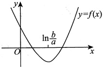

#### 4.

【答案】(D)

【解析】

$$f^{\prime}(x)=\frac{1}{x}-\frac{1}{\mathrm{e}}=\frac{\mathrm{e}-x}{\mathrm{e}x}\xrightarrow{ 令 }0,$$

得x=e，又 $f''(x)=-\frac{1}{x^2}<0$，故x=e是唯一极大值点，极大值为 $f(e)=a$。

又

$$\lim_{x\to0^{+}}f(x)=\lim_{x\to0^{+}}\left(\ln x-\frac{x}{\mathrm{e}}+a\right)=-\infty,$$

$$\lim_{x\to+\infty}f(x)=\lim_{x\to+\infty}\left(\ln x-\frac{x}{e}+a\right)=\lim_{x\to+\infty}x\left(\frac{\ln x}{x}-\frac{1}{e}+\frac{a}{x}\right)=-\infty$$

于是当a>0时， $f(e)>0$，且 $f(x)$在 $(0,e)$， $(e,+\infty)$上均单调，由零点定理知， $f(x)$有两个零点.

#### 5.

【答案】 $\frac{\sqrt{3}}{3}$

【解析】由 $\arcsin x=\frac{x}{\sqrt{1-(\theta x)^{2}}}$，可得当 $x\neq0$时，

$$\theta^{2}=\frac{1-\frac{x^{2}}{\arcsin^{2}x}}{x^{2}}=\frac{\arcsin^{2}x-x^{2}}{\arcsin^{2}x\cdot x^{2}},$$

故

$$\lim_{x\to0}\theta=\lim_{x\to0}\sqrt{\frac{\arcsin^{2}x-x^{2}}{\arcsin^{2}x\cdot x^{2}}}=\lim_{x\to0}\sqrt{\frac{(\arcsin x+x)(\arcsin x-x)}{x^{4}}}$$

因为当  $x \to 0$ 时， $\arcsin x = x + \frac{1}{6}x^3 + o(x^3)$，故  $(\arcsin x + x)(\arcsin x - x) \sim \frac{1}{3}x^4 (x \to 0)$，所以原式  $= \frac{\sqrt{3}}{3}$。

#### 6.

【解析】令 $f(t)=\ln(1+t)$，t>0，在 $[0,x]$上对 $f(t)$用拉格朗日中值定理，有

$$f(x)-f(0)=f^{\prime}(\xi)(x-0),\xi\in(0,x),$$

即 $\ln(1+x)=\frac{1}{1+\xi}\cdot x$，由于 $\frac{1}{1+x}<\frac{1}{1+\xi}<1$，故 $\frac{x}{1+x}<\ln(1+x)<x(x>0)$

#### 7.

【解析】令 $f(t)=\ln t,t>0$，在 $[x,1+x]$上对 $f(t)$用拉格朗日中值定理，有

$$\ln(1+x)-\ln x=\frac{1}{\xi},x<\xi<x+1,$$

故 $\frac{1}{1+x}<\ln\left(1+\frac{1}{x}\right)<\frac{1}{x}\quad(x>0)$.

【注】 $\ln\left(1+\frac{1}{x}\right)=\ln\frac{1+x}{x}=\ln(1+x)-\ln x$，这一步构造出了 $f(b)-f(a)$

#### 8.

【解析】因 $f(x)-f(0)=f'(\xi)x$,  $x\in(0,1)$,  $\xi\in(0,x)$, 又 $f(0)=1$,  $\left|f'(\xi)\right|\leq1$, 于是当0<x<1时, 有 $\left|f(x)\right|=\left|f(0)+f'(\xi)x\right|\leq1+\left|f'(\xi)\right|x\leq1+x$.

【注】进一步地，令 $f(0)=f(1)=1$，由 $-1\leq f'(x)\leq1$，可证得当0<x<1时，

$$f(x)=f(0)+f^{\prime}(\xi_{1})x\leq1+x,\quad\xi_{1}\in(0,x).$$

$$f(x)=f(0)+f^{\prime}(\xi_{2})x\geqslant1-x,\quad\xi_{2}\in(0,x)$$

$$f(x)=f(1)+f^{\prime}(\xi_{3})(x-1)\geq1+(x-1)=x,\quad\xi_{3}\in(x,1),$$

$$f(x)=f(1)+f^{\prime}(\xi_{4})(x-1)\leqslant1-(x-1)=2-x,\quad\xi_{4}\in(x,1).$$

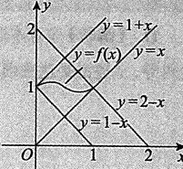

也即 $f(x)$在 $(0,1)$上被包在由 $y=1+x$, y=x, y=1-x, y=2-x四条直线所围平面区域内(见图). 这能直观地让考生感受到拉格朗日中值定理的重要作用之一：用 $f'(x)$的大小来限定 $f(x)$的变化幅度大小. 此题中，由于 $|f'(x)| \leq 1$，故 $f(x)$被限定在一个小的区域内.

#### 9.

【答案】(C)

【解析】由拉格朗日中值定理知，

$$f(x+1)-f(x)=f^{\prime}(\xi),a\leq x<\xi<x+1,$$

故  $\lim_{x\to+\infty}\left[f(x+1)-f(x)\right]=\lim_{x\to+\infty}f'(\xi)\xrightarrow{x<\xi<x+1}\lim_{\xi\to+\infty}f'(\xi)=0$. (C) 正确.

取 $f(x)=\sqrt{x}$，则

$$\lim_{x\to+\infty}(\sqrt{2x}+\sqrt{x})=+\infty,$$

$$\lim_{x\to+\infty}(\sqrt{2x}-\sqrt{x})=+\infty$$

$$\lim_{x\to+\infty}(\sqrt{x+1}+\sqrt{x})=+\infty$$

可排除(A)，(B)，(D).

【注】当  $x \to +\infty$ 时， $f'(x) \to 0$ 。意味着当  $x \to +\infty$ 时， $f(x)$ 的变化率  $\to 0$ ，于是  $f(x+1)$  $f(x) \to 0 (x \to +\infty)$ 也就顺理成章了。

#### 10.

【答案】2

【解析】 $\ln 1=0$，当x>1时，

$$\frac{f(x)-f(1)}{\ln x}=\frac{f(x)-f(1)}{\ln x-\ln1}\xrightarrow{ 柯西中值定理 }\frac{f^{\prime}(\xi)}{\frac{1}{\xi}}=\xi f^{\prime}(\xi),1<\xi<x.$$

当 $x\to1^{+}$时， $\xi\to1^{+}$，于是原式 $\lim_{\xi\to1^{+}}\xi f'(\xi)=f'(1)=2$

【注】本题用洛必达法则或导数定义法亦可.

$$\lim_{x\to1^{+}}\frac{f(x)-f(1)}{\ln x}\xrightarrow{ 洛必达法则 }\lim_{x\to1^{+}}\frac{f^{\prime}(x)}{\frac{1}{1}}=\lim_{x\to1^{+}}x f^{\prime}(x)=2$$

如何用导数定义求解？见下题.

#### 11.

【解析】注意本题与上题的区别,本题未讲 $f(x)$在x=1处一阶导数连续,只有 $f(x)$在x=1处可导,上述洛必达法则和柯西中值定理均不可用.改用导数的定义来求解:

$$原式 =\lim_{x\to1^{+}}\frac{\frac{f(x)-f(1)}{x-1}}{\frac{\ln x-\ln1}{x-1}}=\frac{f_{+}^{\prime}(1)}{\left.\frac{1}{x}\right|_{x=1}}=\frac{2}{1}=2\ .$$

#### 12.

【解析】(1) $\sin x=\sin0+(\sin x)^{\prime}\bigg|_{x=0}\cdot x+\frac{(\sin x)^{\prime \prime}\bigg|_{x=\xi}}{2!}\cdot x^{2}=x-\frac{\sin\xi}{2}x^{2}$（ $\xi$介于0，x之间）.

$$(2)\left|\frac{\sin x}{x}-1\right|=\left|\frac{x-\frac{\sin\xi}{2}x^{2}}{x}-1\right|=\left|1-\frac{\sin\xi}{2}x-1\right|\leqslant\frac{1}{2}\left|x\right|(x\neq0).$$

#### 13.

【解析】令 $f(x)=\mathrm{e}^{-\frac{x}{2}}-x^{3}+3x$，则

$$f^{\prime}(x)=-\frac{1}{2}\mathrm{e}^{-\frac{x}{2}}-3x^{2}+3,f^{\prime \prime}(x)=\frac{1}{4}\mathrm{e}^{-\frac{x}{2}}-6x,f^{\prime \prime \prime}(x)=-\frac{1}{8}\mathrm{e}^{-\frac{x}{2}}-6,$$

至此，由  $e^{-\frac{x}{2}} > 0$，有  $f'''(x) < 0$，即  $f'''(x) = 0$ 无实根，则  $f(x) = 0$ 至多有 3 个实根。

取  $x = -\sqrt{3}$，有  $f(-\sqrt{3}) = \mathrm{e}^{\frac{\sqrt{3}}{2}} > 0$；取 x = -1，有  $f(-1) = \mathrm{e}^{\frac{1}{2}} - 2 < 0$；

取x=1，有 $f(1)=\mathrm{e}^{-\frac{1}{2}}+2>0$；取x=2，有 $f(2)=\mathrm{e}^{-1}-2<0$。

故 $f(x)=0$在 $(-\sqrt{3},-1)$， $(-1,1)$， $(1,2)$内各有一个实根.

综上，两曲线恰有3个交点.

#### 14.

【答案】(B)

【解析】令  $F(x)=\frac{f(x)}{x}$，则  $F'(x)=\frac{xf'(x)-f(x)}{x^{2}}$.
又因为当 $0 < a < x < b$ 时，$xf'(x) < f(x)$，所以在 $(a,b)$ 内有 $F'(x) < 0$，$F(x)$ 单调减少，从而 $F(a) > F(x) > F(b)$，即 $\frac{f(a)}{a} > \frac{f(x)}{x} > \frac{f(b)}{b}$。

故选项(B)成立.

#### 15.

【答案】(A)

【解析】方法一 设 $f(x)=x^{4}+4x+b$，方程有两个不等实根，等价于函数 $f(x)$有两个零点，根据4次函数的几何图形可知，此时 $f(x)$的极小值应小于零.

$$f^{\prime}(x)=4x^{3}+4=4(x+1)(x^{2}-x+1).$$

由 $f'(x)=0$得唯一驻点x=-1.

又 $f''(x)=12x^{2}\geqslant0$，所以x=-1为极小值点.

由 $f(-1)=1-4+b<0$可得b<3.

方法二 令 $f_{1}(x)=x^{4}$， $f_{2}(x)=-4x-b$，如图所示，方程 $x^{4}+4x+b=0$有两个不等的实根意味着

 $f_{1}(x)$ 与  $f_{2}(x)$ 有两个交点.

当 $f_{2}(x)$与 $f_{1}(x)$相切时， $f_{1}(x)$与 $f_{2}(x)$恰好有一个交点，此时

$$f_{1}^{\prime}(x)=4x^{3}=f_{2}^{\prime}(x)=-4,$$

解得 x = -1，此时  $f_1(-1) = 1$，因此  $f_2(-1) = 4 - b = 1$，即 b = 3，则  $f_2(x) = -4x - 3$。

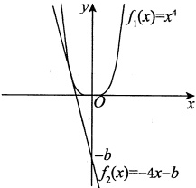

结合图形，知-b>-3，即b<3时，才能使得 $f_{1}(x)$与 $f_{2}(x)$有两个交点.

#### 16.

【答案】(B)

【解析】令 $g(x)=\ln x-\frac{x}{e}+k$，易知 $g'(x)=\frac{1}{x}-\frac{1}{e}$。当x>e时， $g'(x)<0$；当0<x<e时， $g'(x)>0$。故在 $(0,e)$和 $(e,+\infty)$内 $g(x)$分别至多有一个零点，又 $g(e)=k>0$， $\lim_{x\to0^{+}}g(x)=-\infty$， $\lim_{x\to+\infty}g(x)=-\infty$，所以 $g(x)$在 $(0,+\infty)$内有两个零点。不妨设 $g(x)$的两个零点分别为 $x_1$和 $x_2$，又 $\lim_{x\to x_1}f(x)=\infty$， $\lim_{x\to x_2}f(x)=\infty$，故 $x_1$和 $x_2$均为 $f(x)$的无穷间断点，所以 $f(x)$在 $(0,+\infty)$内有两个间断点，故答案选(B)。

#### 17.

【答案】(D)

【解析】令 $F(x)=\frac{f(x)}{g(x)}$，由 $f'(x)g(x)-f(x)g'(x)<0$可知

$$F^{\prime}(x)=\left[\frac{f(x)}{g(x)}\right]^{\prime}=\frac{f^{\prime}(x)g(x)-f(x)g^{\prime}(x)}{g^{2}(x)}<0.$$

从而函数 $\frac{f(x)}{g(x)}$单调减少，故有 $\frac{f(a)}{g(a)}>\frac{f(x)}{g(x)}>\frac{f(b)}{g(b)}$

由上述不等式可知选项(A),(B),(C)三个不等式不一定成立.

而由 $\frac{f(x)}{g(x)}>\frac{f(b)}{g(b)}$可知选项(D)正确.

#### 18.

【分析】欲证不等式需找出基本函数 $f(x)$，按常规方法求出 $f(x)$的极值与最值，再进行比较，即可得证.

【解析】令 $f(x)=x^{p}+(1-x)^{p}$，则

$$f^{\prime}(x)=px^{p-1}+p(1-x)^{p-1}(-1)=p\left[x^{p-1}-(1-x)^{p-1}\right],$$

$$f^{\prime \prime}(x)=p(p-1)x^{p-2}+p(p-1)(1-x)^{p-2},$$

令 $f'(x)=0$可得 $x=\frac{1}{2}$

又因 p>1，故  $f''=\left(\frac{1}{2}\right)=2p(p-1)\left(\frac{1}{2}\right)^{p-2}>0$，于是  $f(x)$ 在 x= $\frac{1}{2}$ 处取得极小值  $f\left(\frac{1}{2}\right)=\frac{1}{2^{p-1}}$。由于  $f(0)=f(1)=1$，于是  $f(x)$ 在  $[0,1]$ 上的最小值为  $\frac{1}{2^{p-1}}$，最大值为 1。

故有  $\frac{1}{2^{p-1}}\leq f(x)\leq1$，即  $\frac{1}{2^{p-1}}\leq x^{p}+(1-x)^{p}\leq1$。

#### 19.

【分析】方程 $x^{3}-3x+k=0$是三次方程，它可能有一个实根，两个实根或者三个实根。根的个数取决于曲线 $y=x^{3}-3x+k$与x轴交点的个数。曲线 $y=x^{3}-3x+k$与x轴相切时，该切点必为 $y=x^{3}-3x+k$的极值点。

【解析】设  $y = x^{3} - 3x + k$，则当  $x \to +\infty$ 时， $y \to +\infty$；当  $x \to -\infty$ 时， $y \to -\infty, y' = 3x^{2} - 3$，令  $y' = 0$，可得 x = -1 或 1。

又 $y''=6x$，由极值点的第二充分条件可知， $y''|_{x=-1}=-6<0$，则 $y|_{x=-1}=k+2$为极大值； $y''|_{x=1}=6>0$，则 $y|_{x=1}=k-2$为极小值。

当极大值  $k+2<0$ ，极小值 k-2<0 时，方程只有一个实根。同理，当极小值 k-2>0 ，极大值  $k+2>0$ 时，方程也只有一个实根。

当 $k+2=0$或k-2=0时，方程有两个实根。当 $k+2>0$且k-2<0时，方程有三个实根。

综上，当 k > 2 或 k < -2 时，方程有一个实根；当  $k = \pm 2$ 时，方程有两个实根；当 -2 < k < 2 时，方程有三个实根。

#### 20.

【分析】欲证结论，相当于证明在 $(a,b)$内至少有一点满足

$$(b^{2}-a^{2})f^{\prime}(x)-2x\left[f(b)-f(a)\right]=0.$$

由于  $f(x)$ 在  $[a,b]$ 上连续，在  $(a,b)$ 内可导，因此，构造函数  $F(x)=(b^{2}-a^{2})f(x)-$
第6章 一元函数微分学的应用（二）——中值定理、微分等式与微分不等式

 $x^2 \left[ f(b) - f(a) \right]$，使  $F'(x) = (b^2 - a^2)f'(x) - 2x \left[ f(b) - f(a) \right]$，于是  $F(x)$ 在  $[a, b]$ 上连续，在  $(a, b)$ 内可导，如果能验证  $F(a) = F(b)$，则由罗尔定理可证原命题成立。

【解析】构造函数 $F(x)=(b^{2}-a^{2})f(x)-\left[f(b)-f(a)\right]x^{2}$，由 $f(x)$在 $[a,b]$上连续，在 $(a,b)$内可导，可知 $F(x)$也在 $[a,b]$上连续，在 $(a,b)$内可导，又 $F(a)=b^{2}f(a)-a^{2}f(b)=F(b)$，则由罗尔定理可知，至少存在一点 $\xi\in(a,b)$，使

$$F^{\prime}(\xi)=(b^{2}-a^{2})f^{\prime}(\xi)-2\xi\left[f(b)-f(a)\right]=0,$$

命题得证.

#### 21.

【答案】(B)

【解析】令 $f(x)=a_{0}x+\frac{a_{1}}{2}x^{2}+\cdots+\frac{a_{n}}{n+1}x^{n+1}$，则 $f(x)$在 $[0,1]$上连续，在 $(0,1)$内可导，且

$$f(0)=0,f(1)=a_{0}+\frac{a_{1}}{2}+\cdots+\frac{a_{n}}{n+1}=0.$$

故由罗尔定理知，至少存在一点  $\xi \in (0,1)$，使  $f'(\xi) = 0$，即  $a_0 + a_1\xi + \cdots + a_n\xi^n = 0$，亦即方程  $a_0 + a_1x + \cdots + a_nx^n = 0$ 在  $(0,1)$ 内至少有一个实根  $\xi$。

#### 22.

【解析】(1)令

则

$$G(x)=f(x)-\frac{f(c)-f(a)}{c-a}(x-a),$$

$$G(a)=f(a)=G(c),$$

又  $G(x)$ 在  $[a,c]$ 上连续，在  $(a,c)$ 内可导，故根据罗尔定理可知，存在  $\xi\in(a,c)$，使得  $G'(\xi)=0$，即  $f'(\xi)=\frac{f(c)-f(a)}{c-a}$，原命题得证。

(2)由(1)可知，

$$\begin{array}{l}\frac{f(b)-f(a)}{b-a}=\frac{f(b)-f(c)+f(c)-f(a)}{b-a}\\=\frac{f(b)-f(c)}{b-c}\cdot\frac{b-c}{b-a}+\frac{f(c)-f(a)}{c-a}\cdot\frac{c-a}{b-a}\\=f^{\prime}(\gamma)\cdot\frac{b-c}{b-a}+f^{\prime}(\xi)\cdot\frac{c-a}{b-a},\end{array}$$

其中  $\gamma \in (c,b)$. 令  $\frac{b-c}{b-a} = t$，则  $\frac{c-a}{b-a} = 1-t$， $0 < t < 1$，故  $\frac{f(b)-f(a)}{b-a} = tf'(\gamma) + (1-t)f'(\xi)$ 介于  $f'(\gamma)$ 与  $f'(\xi)$ 之间 (当  $f'(\gamma) = f'(\xi)$ 时，取  $\eta = \gamma$ 显然得证)，于是，由导数的介值定理可知，存在  $\eta$ 使得  $\eta > \xi$，原命题得证.
### 第7章 一元函数微分学的应用（三）——物理应用

#### 1.

【答案】82 cm/s

【解析】设  $P(x,y)$，则点  $P$ 到原点的距离为  $l=\sqrt{x^2+y^2}$，且  $9y=4x^2$，两个等式均对  $t$ 求导，得  $\frac{dl}{dt}=\frac{x\frac{dx}{dt}+y\frac{dy}{dt}}{\sqrt{x^2+y^2}}$， $9\frac{dy}{dt}=8x\frac{dx}{dt}$。由题设， $x=3$， $y=4$， $\frac{dx}{dt}=30$，则  $\frac{dy}{dt}=80\ cm/s$， $\frac{dl}{dt}=82\ cm/s$。

#### 2.

【答案】(A)

【解析】 $t \in (0,3)$ 时， $f(t)$ 为凸曲线，故  $f''(t) < 0$，于是有  $f'(t)$ 单调递减； $t \in (7,10)$ 时， $f(t)$ 为凹曲线，故  $f''(t) > 0$，于是有  $f'(t)$ 单调递增。

 $f'(t)$ 即为心跳次数对时间 t 的变化率，即心跳次数增长速度。故选(A).

#### 3.

【解析】由题意， $\frac{dV}{dt}=1$，又 $V=\frac{\pi}{2}y^{2}$，则 $\frac{dV}{dt}=\pi y\frac{dy}{dt}$，故 $\left.\frac{dy}{dt}\right|_{y=1}=\frac{dV}{dt}\cdot\left.\frac{1}{\pi y}\right|_{y=1}=\frac{1}{\pi}\left(m/min\right)$

#### 4.

【答案】(B)

【解析】设圆柱体的底面半径为  $r \, \text{cm}$，高为  $h \, \text{cm}$，体积为  $V \, \text{cm}^3$，表面积为  $S \, \text{cm}^2$，时间为  $t \, \text{s}$，则  $V = \pi r^2 h$， $S = 2\pi rh + 2\pi r^2$，所以  $\frac{dV}{dt} = 2\pi rh \frac{dr}{dt} + \pi r^2 \frac{dh}{dt}$， $\frac{dS}{dt} = 2\pi h \frac{dr}{dt} + 2\pi r \frac{dh}{dt} + 4\pi r \frac{dr}{dt}$。

由题设， $\frac{dr}{dt} = 2$， $\frac{dh}{dt} = -3$， $\frac{dV}{dt} = -100\pi$， $\frac{dS}{dt} = 40\pi$，代入上式，舍去负值，得  $r = 10$， $h = 5$。

#### 5.

【答案】(D)

【解析】设时间为 t s 时，物体离地面的距离为  $h(t)$ m，观测器视线的倾角为  $\theta(t)$，如图所示，则有  $\theta(t)=\arctan\frac{h(t)}{10}$，故

$$\frac{\mathrm{d}\left[\theta(t)\right]}{\mathrm{d}t}=\frac{\frac{1}{10}}{1+\left[\frac{h(t)}{10}\right]^{2}}\bullet\frac{\mathrm{d}\left[h(t)\right]}{\mathrm{d}t}.$$

当 $h(t)=20$时， $\frac{\mathrm{d}[h(t)]}{\mathrm{d}t}=a$，得 $\frac{\mathrm{d}[\theta(t)]}{\mathrm{d}t}=\frac{a}{50}=\frac{1}{10}$，即a=5。

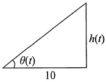

### 第8章 一元函数积分学的概念与性质

#### 1.

【答案】(B)

【解析】方法一 若函数 $f(x)$在区间 $[0,1]$上连续，由定积分的定义，对任意的划分

$$T:0=x_{0}<x_{1}<\cdots<x_{n}=1,$$

以及任意的  $\xi_k \in [x_{k-1}, x_k] (1 \leq k \leq n)$，均有  $\int_0^1 f(x) \, dx = \lim_{\lambda (T) \to 0} \sum_{k=1}^n f(\xi_k) \Delta x_k$，其中  $\Delta x_k = x_k - x_{k-1}$， $\lambda(T) = \max_{1 \leq k \leq n} \{ \Delta x_k \}$。

选项(A)中，分割T是将区间[0,1]作n等分，点 $\xi_k=\frac{3k-1}{3n}$为各个小区间的内点，区间长度应该为 $\frac{1}{n}$，而该选项错误地取为 $\frac{1}{3n}$，所以计算结果应为 $\frac{1}{3}\int_0^1 f(x) \, dx$。

选项(C)中，分割 T 是将区间 [0,1] 作 3n 等分，点  $\xi_k = \frac{k-1}{3n}$ 为各个小区间的左端点，区间长度应该为  $\frac{1}{3n}$，而该选项错误地取为  $\frac{1}{n}$，所以计算结果应为  $3\int_0^1 f(x) \, dx$。

选项(D)中，分割 T 是将区间  $[0,1]$ 作 3n 等分，点  $\xi_k = \frac{k}{3n}$ 为各个小区间的右端点，区间长度应该为  $\frac{1}{3n}$，而该选项错误地取为  $\frac{3}{n}$，所以计算结果应为  $9\int_{0}^{1} f(x) \, dx$。

只有选项(B)中，分割T是将区间[0,1]作n等分，点 $\xi_{k}=\frac{3k-1}{3n}$为各个小区间的内点，区间长度为 $\frac{1}{n}$，计算结果为 $\int_{0}^{1}f(x)dx$。

故选(B).

方法二 作为选择题，本题也可以利用特殊值法得到正确答案.

取 $f(x)=1$，则 $\int_{0}^{1}f(x)dx=1$。而

$$\lim_{n\to\infty}\sum_{k=1}^{n}f\left(\frac{3k-1}{3n}\right)\frac{1}{3n}=\lim_{n\to\infty}\sum_{k=1}^{n}\frac{1}{3n}=\frac{1}{3},\quad\lim_{n\to\infty}\sum_{k=1}^{n}f\left(\frac{3k-1}{3n}\right)\frac{1}{n}=\lim_{n\to\infty}\sum_{k=1}^{n}\frac{1}{n}=1,$$

$$\lim_{n\to\infty}\sum_{k=1}^{3n}f\left(\frac{k-1}{3n}\right)\frac{1}{n}=\lim_{n\to\infty}\sum_{k=1}^{3n}\frac{1}{n}=3,\quad\lim_{n\to\infty}\sum_{k=1}^{3n}f\left(\frac{k}{3n}\right)\frac{3}{n}=\lim_{n\to\infty}\sum_{k=1}^{3n}\frac{3}{n}=9$$

所以选项(A)，(C)，(D)都不是正确选项，故选(B).

#### 2.

【答案】 $-\frac{1}{9}$

【解析】
$$\begin{aligned}原式 =&\lim_{n\to\infty}\frac{1}{n}\bullet\left[\frac{1^{2}}{n^{2}}\ln\frac{1}{n}+\frac{2^{2}}{n^{2}}\ln\frac{2}{n}+\cdots+\frac{(n-1)^{2}}{n^{2}}\ln\frac{n-1}{n}+\frac{n^{2}}{n^{2}}\ln\frac{n}{n}\right]\\=&\int_{0}^{1}x^{2}\ln x\mathrm{d}x=\int_{0}^{1}\ln x\mathrm{d}\left(\frac{x^{3}}{3}\right)=\frac{x^{3}}{3}\ln x\bigg|_{0}^{1}-\int_{0}^{1}\frac{x^{3}}{3}\bullet\frac{1}{x}\mathrm{d}x=-\frac{1}{9}\text{．}\end{aligned}$$

#### 3.

【答案】(B)

【解析】设 $t$ 时刻甲在乙前面 $s$ m 处，由题图，可画出 $s = s(t)$ 的大致图形，如图所示，从而可知 $s(0) = 10 > 0$，$s(t_1) = -5 < 0$，$s(t_2) = 15 > 0$，$s(t_3) = 5 > 0$，由问题的实际意义可知，$s(t)$ 为连续函数，故由零点定理，有 $s(\xi_1) = s(\xi_2) = 0 (\xi_1 \in (0, t_1), \xi_2 \in (t_1, t_2))$，即在 $[0, t_3]$ 上，甲、乙相遇的次数为 2。

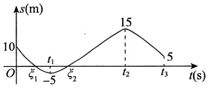

#### 4.

【答案】(C)

【解析】 $M = \int_{-\frac{1}{2}}^{\frac{1}{2}} \mathrm{d}x + \int_{-\frac{1}{2}}^{\frac{1}{2}} \frac{x}{1 + x^{2}} \, \mathrm{d}x$，因为 $\int_{-\frac{1}{2}}^{\frac{1}{2}} \frac{x}{1 + x^{2}} \, \mathrm{d}x = 0$，所以M = 1。

令 $g(x)=(1+x)\ln^{2}(1+x)-x^{2}(0\leq x\leq1)$，则有

$$g^{\prime}(x)=\ln^{2}(1+x)+(1+x)2\ln(1+x)\frac{1}{1+x}-2x=\ln^{2}(1+x)+2\ln(1+x)-2x,$$

$$g^{\prime \prime}(x)=\frac{2\ln(1+x)}{1+x}+\frac{2}{1+x}-2=\frac{2\ln(1+x)+2-2(1+x)}{1+x}=\frac{2\ln(1+x)-2x}{1+x}\ .$$

因为 $x>0$ 时，$\ln(1+x)<x$，所以 $\ln(1+x)-x<0$，即有 $g''(x)<0$，$g'(x)$ 在区间 $[0,1]$ 上单调减少，所以 $g'(x)<g'(0)=0(0<x\leq1)$，即 $g(x)$ 在区间 $[0,1]$ 上单调减少，所以 $g(x)<g(0)=0(0<x\leq1)$，即 $(1+x)\ln^2(1+x)-x^2<0(0<x\leq1)$，故 $\frac{(1+x)\ln^2(1+x)}{x^2}<1$，所以 $\int_0^1\frac{(1+x)\ln^2(1+x)}{x^2}\mathrm{d}x<\int_0^11\mathrm{d}x=1$，即 $N<M$。

当x>0时， $e^{x}>1+x$，所以 $\frac{e^{x}}{1+x}>1$， $\int_{0}^{1}\frac{e^{x}}{1+x}dx>\int_{0}^{1}1dx=1$，即K>M。

综上所述，K>M>N，故选(C).

#### 5.

【答案】(A)

【解析】由于 $f(x)$是 $(0,+\infty)$内的正值连续函数，则

$$g\left(\frac{1}{2}\right)=\int_{1}^{\frac{1}{2}}f(t)\mathrm{d}t<0,g\left(\frac{3}{2}\right)=\int_{1}^{\frac{3}{2}}f(t)\mathrm{d}t>0.$$
又 $f'(x)<0$，则 $f(x)$单调递减，故

$$\left|g\left(\frac{1}{2}\right)\right|=\int_{\frac{1}{2}}^{1}f(t)\mathrm{d}t>\int_{1}^{\frac{3}{2}}f(t)\mathrm{d}t=\left|g\left(\frac{3}{2}\right)\right|.$$

#### 6.

【答案】(A)

【解析】由题设， $f(-1)=f(1)=0$， $\lim_{x\to+\infty}x\ln x=+\infty$， $\lim_{x\to0^{+}}x\ln x=0$， $\lim_{x\to-\infty}(x^2+x)=+\infty$。

当x>0时， $f'(x)=\ln x+1\xrightarrow{\quad 令 \quad}0$，得 $x=\frac{1}{e}$；

当x<0时， $f'(x)=2x+1\xrightarrow{\quad 令 \quad}0$，得 $x=-\frac{1}{2}$。

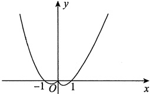

故在  $[-1,1]$ 上， $f(x)\leq0$，其他区间上  $f(x)$ 均大于 0，如图所示，于是  $\int_{a}^{b}f(x)dx$ 的最小值为  $\int_{-1}^{1}f(x)dx$，则 a = -1, b = 1.

#### 7.

【答案】(A)

【解析】因为在$\left(0,\frac{\pi}{2}\right)$内$g'(x)\geq0$，所以$g(x)$在$\left(0,\frac{\pi}{2}\right)$内单调增加。又$t\in\left(0,\frac{\pi}{2}\right)$时有$t>\sin t$，因而，当$t\in\left[0,\frac{\pi}{2}\right]$时，$g(t)\geq g(\sin t)$，从而当$x\in\left(0,\frac{\pi}{2}\right)$时，$\int_{x}^{\frac{\pi}{2}}g(t)dt\geq\int_{x}^{\frac{\pi}{2}}g(\sin t)dt$成立。故正确选项为(A)。

【注】当  $0 < x < 1$ 时，有  $\int_{x}^{1} g(t) dt \geq \int_{x}^{1} g(\sin t) dt$ 成立；当  $1 < x < \frac{\pi}{2}$ 时，有  $\int_{x}^{1} g(t) dt \leq \int_{x}^{1} g(\sin t) dt$ 成立.

#### 8.

【答案】(C)

【解析】因为  $xf(x)=(\sqrt{1-x^{2}})^{\prime}=\frac{-x}{\sqrt{1-x^{2}}}$，所以  $f(x)=\frac{-1}{\sqrt{1-x^{2}}}$，故

$$\int_{0}^{1}\frac{1}{f(x)}\mathrm{d}x=-\int_{0}^{1}\sqrt{1-x^{2}}\mathrm{d}x\xrightarrow{ 定积分的几何意义 }-\frac{\pi}{4}\ .$$

故正确选项为(C).

【注】由定积分的几何意义知 $\int_{0}^{1}\sqrt{1-x^{2}}dx$等于单位圆在第一象限的面积，如图所示.

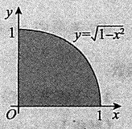

张宇 ___

#### 9.

【答案】2

【解析】原式= $\lim_{n\to\infty}\sum_{i=1}^{n}\frac{1}{\sqrt{\frac{i}{n}}}\cdot\frac{1}{n}=\int_{0}^{1}\frac{1}{\sqrt{x}}dx=2\sqrt{x}\bigg|_{0}^{1}=2$

【注】设 $f(x)$在 $(0,1)$上单调，若反常积分 $\int_{0}^{1}f(x)dx$收敛，则

$$\lim_{n\to\infty}\frac{f\left(\frac{1}{n}\right)+\cdots+f\left(\frac{n-1}{n}\right)}{n}=\int_{0}^{1}f(x)dx.$$

解析 不妨设 $f(x)$在 $(0,1)$上是单调递增函数，则

$$\begin{aligned}\int_{0}^{1-\frac{1}{n}}f(x)\mathrm{d}x&=\sum_{k=1}^{n-1}\int_{\frac{k-1}{n}}^{\frac{k}{n}}f(x)\mathrm{d}x\\&\leqslant\sum_{k=1}^{n-1}f\left(\frac{k}{n}\right)\bullet\frac{1}{n}=\frac{f\left(\frac{1}{n}\right)+\cdots+f\left(\frac{n-1}{n}\right)}{n}\\&\leqslant\sum_{k=2}^{n}\int_{\frac{k-1}{n}}^{\frac{k}{n}}f(x)\mathrm{d}x=\int_{\frac{1}{n}}^{1}f(x)\mathrm{d}x,\end{aligned}$$

由夹逼准则可知结论成立.

#### 10.

【答案】(A)

【解析】令 $x=-\frac{1}{2}$，代入题设等式，有 $f\left(\frac{1}{2}\right)-f\left(-\frac{1}{2}\right)=f(1)$.

又 $f\left(\frac{1}{2}\right)=0$，且 $f(x)$是奇函数，故 $2f\left(\frac{1}{2}\right)=0=f(1)$，所以 $f(x+1)=f(x)$，故 $f(x)$是 $(-\infty,+\infty)$上可导的且周期为1的奇函数.

(A)选项中 $\sin f(t)$是奇函数， $f(t+1)=f(t)$是奇函数，所以 $\int_{0}^{x}\left[\sin f(t)+f(t+1)\right]dt$是偶函数.

(B)选项中 $\sin f'(t)$是偶函数， $f'(t+1)=f'(t)$是偶函数，所以 $\int_{0}^{x}\left[\sin f'(t)+f'(t+1)\right]dt$是奇函数.

(C)选项中  $\cos f(t)$ 是偶函数， $f(t+2)=f(t)$ 是奇函数，所以  $\int_{0}^{x}\left[\cos f(t)+f(t+2)\right]dt$ 是非奇非偶函数.

(D)选项中  $\cos f'(t)$ 是偶函数， $f'(t+2)=f'(t)$ 是偶函数，所以  $\int_{0}^{x}\left[\cos f'(t)+f'(t+2)\right]dt$ 是奇函数.

#### 11.

【答案】(C)

【解析】在 $(-∞,0)$上考虑，由 $x_{0}$为 $f(x)$的零点可得
$$f^{\prime}(x_{0})=f^{\prime}(-1)=\lim_{x\to x_{0}}\frac{f(x)-f(x_{0})}{x-x_{0}}=\lim_{x\to x_{0}}\frac{f(x)}{x-x_{0}}=1>0,$$

由极限的保号性可知，存在  $\delta > 0$，在  $(x_0 - \delta, x_0) \cup (x_0, x_0 + \delta) \subset (-\infty, 0)$ 内有  $\frac{f(x)}{x - x_0} > 0$。因此，当  $x \in (x_0 - \delta, x_0)$ 时， $f(x) < 0$，当  $x \in (x_0, x_0 + \delta)$ 时， $f(x) > 0$。

由题设 $f(x)$在 $(-\infty,0)$上有唯一零点 $x_0=-1$，可得当 $x\in(-\infty,x_0-\delta]$时， $f(x)<0$，当 $x\in[x_0+\delta,0)$时， $f(x)>0$（理由见注）.

由题设 $f(x)$是实数集上连续的偶函数，可得当 $x\in(0,1)$时， $f(x)>0$；当 $x\in(1,+\infty)$时， $f(x)<0$。

综上所述，当 $x\in(-1,1)$时， $f(x)\geq0$（仅在x=0处可能取到等号）；当 $x\in(-\infty,-1)\cup(1,+\infty)$时， $f(x)<0$。因 $F'(x)=f(x)$，因此 $F(x)$在 $(-1,1)$内严格单调增加。

故正确选项为(C).

【注】若  $f(x)$ 在  $(-\infty,0)$ 上有唯一零点  $x_{0}=-1$ 且当  $x\in(x_{0}-\delta,x_{0})$ 时  $f(x)<0$，则当  $x\in(-\infty,x_{0}-\delta]$ 时， $f(x)<0$。

反证，设存在  $x_1 \in (-\infty, x_0 - \delta]$ 使得  $f(x_1) > 0$，取  $x_2 \in (x_0 - \delta, x_0)$，则有  $f(x_2) < 0$，利用连续函数的零点定理，存在  $x_3 \in (x_1, x_2) \subset (-\infty, x_0)$ 使得  $f(x_3) = 0$，这与  $f(x)$ 在  $(-\infty, 0)$ 上有唯一零点  $x_0 = -1$ 矛盾。

同理可证，若 $f(x)$在 $(-\infty,0)$上有唯一零点 $x_0=-1$且当 $x\in(x_0,x_0+\delta)$时 $f(x)>0$，则当 $x\in[x_0+\delta,0)$时， $f(x)>0$。

#### 12.

【答案】(D)

【解析】根据题设条件，对任意  $x_1$， $x_2 \in [0,2]$ 总有  $f\left(\frac{x_1 + x_2}{2}\right) > \frac{f(x_1) + f(x_2)}{2}$，可知曲线  $f(x)$ 在  $[0,2]$ 上是凸的，因  $f(x)$ 在  $[0,2]$ 上单调连续，且  $f(0)=1$， $f(2)=2$，所以  $f(x)$ 在  $[0,2]$ 上单调递增，进而  $f(x)>0$， $x \in [0,2]$。又  $g(x)$ 是  $f(x)$ 的反函数，因此， $g(1)=0$， $g(2)=2$， $g(x)$ 在  $[1,2]$ 上是凹的，且  $g(x)>0$， $x \in (1,2]$。

如图所示，曲线 CD 是  $f(x)$ 的图形，曲线 AC 是  $g(x)$ 的图形。由定积分的几何意义，P =

 $\int_1^2 g(x) \, \mathrm{d}x$ 表示图中曲边三角形  $ABC$ 的面积，显然  $P = \int_1^2 g(x) \, \mathrm{d}x > 0$，而且  $P = \int_1^2 g(x) \, \mathrm{d}x$ 小于直角三角形  $ABC$ 的面积，即  $P = \int_1^2 g(x) \, \mathrm{d}x < \frac{1}{2} \times 1 \times 2 = 1$。因此有  $0 < P = \int_1^2 g(x) \, \mathrm{d}x < 1$。

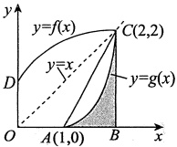

故正确选项为(D).

【注】特殊值代入法.

取 $f(x)=\sqrt{\frac{x}{2}}+1$，则 $g(x)=2(x-1)^2(1\leq x\leq2)$，所以 $0<P=\int_1^2g(x)dx=\int_1^22(x-1)^2dx=\frac{2}{3}<1$

#### 13.

【答案】(D)

【解析】由于 $\int_{0}^{+\infty}xe^{-x}dx=-\int_{0}^{+\infty}xd(e^{-x})=-xe^{-x}\bigg|_{0}^{+\infty}+\int_{0}^{+\infty}e^{-x}dx=-\left.e^{-x}\right|_{0}^{+\infty}=1$

$$\int_{-\infty}^{+\infty}x\mathrm{e}^{-x^{2}}\mathrm{d}x=\frac{1}{2}\int_{-\infty}^{+\infty}\mathrm{e}^{-x^{2}}\mathrm{d}(x^{2})=-\left.\frac{1}{2}\mathrm{e}^{-x^{2}}\right|_{-\infty}^{+\infty}=0$$

$$\int_{-\infty}^{+\infty}\frac{\arctan x}{1+x^{2}}\mathrm{d}x=\int_{-\infty}^{+\infty}\arctan x\mathrm{d}(\arctan x)=\frac{1}{2}\arctan^{2}x\bigg|_{-\infty}^{+\infty}=0$$

所以选项(A)，(B)，(C)中的积分都是收敛的，而

$$\int_{-\infty}^{+\infty}\frac{x}{1+x^{2}}\mathrm{d}x=\int_{-\infty}^{0}\frac{x}{1+x^{2}}\mathrm{d}x+\int_{0}^{+\infty}\frac{x}{1+x^{2}}\mathrm{d}x,$$

又

$$\int_{-\infty}^{0}\frac{x}{1+x^{2}}\mathrm{d}x=\frac{1}{2}\int_{-\infty}^{0}\frac{\mathrm{d}(1+x^{2})}{1+x^{2}}=\frac{1}{2}\ln(1+x^{2})\bigg|_{-\infty}^{0},$$

此积分发散，从而积分 $\int_{-\infty}^{+\infty}\frac{x}{1+x^{2}}\,dx$发散，选(D).

#### 14.

【答案】(C)

【解析】此积分为有一个瑕点x=0的无穷区间上的反常积分，可写为

$$\int_{0}^{+\infty}\frac{\ln x}{(1+x)x^{1-p}}\mathrm{d}x=\int_{0}^{1}\frac{\ln x}{(1+x)x^{1-p}}\mathrm{d}x+\int_{1}^{+\infty}\frac{\ln x}{(1+x)x^{1-p}}\mathrm{d}x$$

对任意 $\varepsilon>0$，有

$$\lim_{x\to0^{+}}\frac{\ln x}{(1+x)x^{1-p}}{\frac{1}{x^{1-p+\varepsilon}}}=\lim_{x\to0^{+}}x^{\varepsilon}\ln x=0,$$

若 $\int_{0}^{1}\frac{1}{x^{1-p+\varepsilon}}dx$收敛，即1-p<1，p>0，则 $\int_{0}^{1}\frac{\ln x}{(1+x)x^{1-p}}dx$也收敛.

对任意 $\varepsilon>0$，有

$$\lim_{x\to+\infty}\frac{\frac{\ln x}{(1+x)x^{1-p}}}{\frac{1}{x^{2-p-\varepsilon}}}=\lim_{x\to+\infty}\frac{\ln x}{x^\varepsilon}=0,$$

若 $\int_{1}^{+\infty}\frac{1}{x^{2-p-\varepsilon}}dx$收敛，即2-p>1，p<1，则 $\int_{1}^{+\infty}\frac{\ln x}{(1+x)x^{1-p}}dx$也收敛.
综上，当 0 < p < 1 时，反常积分  $\int_{0}^{+\infty}\frac{\ln x}{(1+x)x^{1-p}}dx$ 收敛.

#### 15.

【答案】(B)

【解析】 $\int_{2}^{+\infty}\frac{1}{x\ln x}dx=\ln\ln x\Big|_{2}^{+\infty}=+\infty$，发散.

$$\int_{-1}^{1}\frac{1}{\sin x}\mathrm{d}x=\int_{-1}^{0}\frac{1}{\sin x}\mathrm{d}x+\int_{0}^{1}\frac{1}{\sin x}\mathrm{d}x$$

当 $0 < x \leq 1$ 时，有 $\frac{1}{\sin x} > \frac{1}{x}$，而 $\int_0^1 \frac{dx}{x} = +\infty$，发散，故 $\int_0^1 \frac{1}{\sin x} \, dx = +\infty$，从而 $\int_{-1}^{1} \frac{1}{\sin x} \, dx$ 发散。

又 $\int_0^1 \frac{x}{\ln^2(1+x)} \, dx$ 与 $\int_0^1 \frac{x}{x^2} \, dx = \int_0^1 \frac{1}{x} \, dx$ 同敛散，故 $\int_0^1 \frac{x}{\ln^2(1+x)} \, dx$ 发散。

因此，选项(A)，(C)，(D)都发散，选项(B)收敛（因 $\int_0^{+\infty} e^{-x^2} \, dx = \frac{\sqrt{\pi}}{2}$）。

#### 16.

【答案】 $\frac{\pi}{4}$

【解析】原式= $\lim_{n\to\infty}\frac{1}{n}\left[\sqrt{1-\left(\frac{1}{n}\right)^2}+\sqrt{1-\left(\frac{2}{n}\right)^2}+\cdots+\sqrt{1-\left(\frac{n-1}{n}\right)^2}\right]$

 $=\int_{0}^{1}\sqrt{1-x^2}dx\xrightarrow{x=\sin t}\int_{0}^{\frac{\pi}{2}}\cos^2tdt=\int_{0}^{\frac{\pi}{2}}\frac{1+\cos2t}{2}dt=\left(\frac{t}{2}+\frac{\sin2t}{4}\right)\bigg|_{0}^{\frac{\pi}{2}}=\frac{\pi}{4}$.

#### 17.

【答案】 $\frac{1}{3}\arctan3$

【解析】因

$$\frac{n}{n^{2}+9i^{2}}\!=\!\frac{n}{n^{2}\left[1\!+\!9\left(\frac{i}{n}\right)^{2}\right]}\!=\!\frac{1}{n}\!\cdot\frac{1}{1\!+\!9\left(\frac{i}{n}\right)^{2}}\,,$$

故

$$\lim_{n\to\infty}\sum_{i=1}^{n}\frac{n}{n^{2}+9i^{2}}=\lim_{n\to\infty}\sum_{i=1}^{n}\frac{1}{n}\cdot\frac{1}{1+9\left(\frac{i}{n}\right)^{2}}=\int_{0}^{1}\frac{\mathrm{d}x}{1+9x^{2}}=\frac{1}{3}\arctan3$$

#### 18.

【答案】(B)

【解析】令 $f(x)=\frac{\sin x}{x}$， $x\in\left[\frac{\pi}{4},\frac{\pi}{2}\right]$，则 $f'(x)=\frac{x\cos x-\sin x}{x^2}$，记 $g(x)=x\cos x-\sin x$，则 $g\left(\frac{\pi}{4}\right)=\frac{\sqrt{2}}{2}\left(\frac{\pi}{4}-1\right)<0$， $g'(x)=-x\sin x<0\left(\frac{\pi}{4}\leq x\leq\frac{\pi}{2}\right)$，故 $g(x)<0\left(\frac{\pi}{4}\leq x\leq\frac{\pi}{2}\right)$，即 $f'(x)<0$，故 $f(x)$在 $\left[\frac{\pi}{4},\frac{\pi}{2}\right]$上为单调递减函数.

当 $\frac{\pi}{4}\leq x\leq\frac{\pi}{2}$时，有 $f\left(\frac{\pi}{2}\right)\leq f(x)\leq f\left(\frac{\pi}{4}\right)$，即 $\frac{2}{\pi}\leq f(x)\leq\frac{2\sqrt{2}}{\pi}$。因此， $\frac{1}{2}\leq\int_{\frac{\pi}{4}}^{\frac{\pi}{2}}f(x)dx\leq\frac{\sqrt{2}}{2}$。

#### 19.

【答案】(D)

【解析】对于选项(A)， $x^{3}\int_{0}^{x}f'(t)dt=x^{3}f(x)$为偶函数.

对于选项(B)， $\int_{0}^{x}f(-t)dt=-\int_{0}^{x}f(t)dt$为偶函数.

对于选项(C)， $\int_{0}^{x}[f'(t)+f(t)]\mathrm{d}t=f(x)+\int_{0}^{x}f(t)\mathrm{d}t$， $f(x)$为奇函数， $\int_{0}^{x}f(t)\mathrm{d}t$为偶函数，故二者之和是非奇非偶函数.

对于选项(D)，由于 $\left|f(x)\right|$为偶函数，它的原函数中唯一的一个奇函数为 $\int_{0}^{x}\left|f(t)\right|\,\mathrm{d}t$，因此选择(D).

#### 20.

【答案】(D)

【解析】由于 $\frac{x}{1+x^{2}}\cos^{5}x$在 $\left[-\frac{\pi}{2},\frac{\pi}{2}\right]$上是奇函数，因此M=0

$$N=\int_{-\frac{\pi}{2}}^{\frac{\pi}{2}}(x^{2}\sin x+\sin^{2}x\cos x)\mathrm{d}x=2\int_{0}^{\frac{\pi}{2}}\sin^{2}x\cos x\mathrm{d}x>0,$$

$$P=\int_{-\frac{\pi}{2}}^{\frac{\pi}{2}}(\sin^{3}x-\cos^{4}x)\mathrm{d}x=-2\int_{0}^{\frac{\pi}{2}}\cos^{4}x\mathrm{d}x<0,$$

因此P<M<N，选(D).

#### 21.

【答案】(B)

【解析】令 $I=\int_{0}^{1}\frac{\ln x}{x^{a}\left(\tan\frac{\pi}{2}x\right)^{b}}\mathrm{d}x=\int_{0}^{\frac{1}{2}}\frac{\ln x}{x^{a}\left(\tan\frac{\pi}{2}x\right)^{b}}\mathrm{d}x+\int_{\frac{1}{2}}^{1}\frac{\ln x}{x^{a}\left(\tan\frac{\pi}{2}x\right)^{b}}\mathrm{d}x=I_{1}+I_{2}$.

对于 $I_{1}$，当 $x\to0^{+}$时，被积函数

$$\frac{\ln x}{x^{a}\left(\tan\frac{\pi}{2}x\right)^{b}}\sim\frac{\ln x}{\left(\frac{\pi}{2}\right)^{b}x^{a+b}},$$

故当 $a+b<1$时， $I_{1}$收敛；

对于 $I_{2}$，当 $x\to1^{-}$时，被积函数

$$\frac{\ln x}{x^{a}\left(\tan\frac{\pi}{2}x\right)^{b}}\sim-\frac{1-x}{\left(\sin\frac{\pi}{2}x\right)^{b}\bigg/\left[\sin\frac{\pi}{2}(1-x)\right]^{b}},$$

又等价于

$$-\left(\frac{\pi}{2}\right)^{b}(1-x)(1-x)^{b}=-\left(\frac{\pi}{2}\right)^{b}(1-x)^{1+b}=-\left(\frac{\pi}{2}\right)^{b}\frac{1}{(1-x)^{-(1+b)}}.$$

故当 $-(1+b)<1$，即b>-2时， $I_{2}$收敛.
综上， $a+b<1$ 且 b>-2 时，I 收敛，故选(B).

#### 22.

【答案】1

【解析】设 $f(x)=x-[x]$，其图形如图所示.

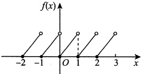

方法一 因为 x=1 是  $y=f(x)$ 的跳跃间断点，所以

$$F_{-}^{\prime}(1)=\lim_{x\to1^{-}}f(x)=1,F_{+}^{\prime}(1)=\lim_{x\to1^{+}}f(x)=0,$$

故 $F_{-}^{\prime}(1)-F_{+}^{\prime}(1)=1$

方法二

$$F_{-}^{\prime}(1)=\lim_{x\to1^{-}}\frac{F(x)-F(1)}{x-1}=\lim_{x\to1^{-}}\frac{\int_{0}^{x}t\mathrm{d}t-\frac{1}{2}}{x-1}=\lim_{x\to1^{-}}\frac{x}{1}=1,$$

$$\begin{aligned}F_{+}^{\prime}(1)&=\lim_{x\rightarrow1^{+}}\frac{F(x)-F(1)}{x-1}=\lim_{x\rightarrow1^{+}}\frac{\displaystyle\int_{0}^{1}t\mathrm{d}t+\int_{1}^{x}(t-1)\mathrm{d}t-\frac{1}{2}}{x-1}\\&=\lim_{x\rightarrow1^{+}}\frac{\displaystyle\int_{1}^{x}(t-1)\mathrm{d}t}{x-1}=\lim_{x\rightarrow1^{+}}\frac{x-1}{1}=0,\end{aligned}$$

故 $F_{-}^{\prime}(1)-F_{+}^{\prime}(1)=1$

#### 23.

【答案】(B)

【解析】对于选项(A), 根据微积分基本定理可得,  $\left[\int_{a}^{x} f(t) dt\right] = f(x)$, 故  $\int_{a}^{x} f(t) dt$ 必为  $f(x)$ 的原函数.

对于选项(C)，根据奇函数在对称区间积分的性质，可得 $\int_{-a}^{a}f(x)dx=0$

对于选项(D)，由于 $f(x)$是周期为T的函数，因此根据积分变换，可得

$$\begin{aligned}\int_{a}^{a+T}f(x)\mathrm{d}x=&\int_{a}^{0}f(x)\mathrm{d}x+\int_{0}^{T}f(x)\mathrm{d}x+\int_{T}^{a+T}f(x)\mathrm{d}x\\=&\int_{a}^{0}f(x)\mathrm{d}x+\int_{0}^{T}f(x)\mathrm{d}x+\int_{0}^{a}f(x)\mathrm{d}x\\=&\int_{0}^{T}f(x)\mathrm{d}x\;.\end{aligned}$$

对于选项(B)，例如， $f(x)=x\cdot \mathrm{sgn}(\cos x)$ 在  $[0,\pi]$ 上可积，即

$$\int_{0}^{\pi}f(x)\mathrm{d}x=\int_{0}^{\frac{\pi}{2}}x\mathrm{d}x+\int_{\frac{\pi}{2}}^{\pi}(-x)\mathrm{d}x=-\frac{\pi^{2}}{4},$$

但 $f(x)$在 $(0,\pi)$内没有原函数.

#### 24.

【答案】(A)

【解析】由

$$f(x-5)=\frac{4}{x^{2}-10x}=\frac{4}{(x-5)^{2}-25},$$

故

$$f(2x+1)=\frac{4}{(2x+1)^{2}-25}=\frac{1}{x^{2}+x-6}=\frac{1}{(x+3)(x-2)}.$$

于是

$$\int_{0}^{4}f(2x+1)\mathrm{d}x=\int_{0}^{4}\frac{1}{(x+3)(x-2)}\mathrm{d}x=\frac{1}{5}\int_{0}^{4}\left(\frac{1}{x-2}-\frac{1}{x+3}\right)\mathrm{d}x$$

而 $\int_{0}^{4}\frac{dx}{x-2}$发散，故 $\int_{0}^{4}f(2x+1)dx$为反常积分，且发散.

#### 25.

【答案】(B)

【解析】对于选项(A)，因 $\left|\sin x\right|\leq1$，于是有 $\sin^{2}x\leq\left|\sin x\right|$，从而 $\int_{\pi}^{2\pi}\sin^{2}x dx\leq\int_{\pi}^{2\pi}\left|\sin x\right| dx$．

对于选项(C)，例如， $\int_{-\pi}^{\pi}\sin x\,dx=0<2=\int_{0}^{\pi}\sin x\,dx$， $[0,\pi]\subset[-\pi,\pi]$。

对于选项(D)，误认为 $\left|f(x)\right|$为偶函数。例如， $f(x)=(x+1)^2$，而 $\left|f(x)\right|=(x+1)^2$就不是偶函数。

对于选项(B),事实上,由定积分性质,知 $\int_{-\frac{\pi}{4}}^{\frac{\pi}{4}}\frac{x}{1+\cos x}dx=0$,

$$\int_{-\frac{\pi}{4}}^{\frac{\pi}{4}}\left(\frac{\sin x}{1+x^{4}}+\frac{1}{1+x^{2}}\right)\mathrm{d}x=\int_{-\frac{\pi}{4}}^{\frac{\pi}{4}}\frac{\sin x}{1+x^{4}}\mathrm{d}x+\int_{-\frac{\pi}{4}}^{\frac{\pi}{4}}\frac{1}{1+x^{2}}\mathrm{d}x=\int_{-\frac{\pi}{4}}^{\frac{\pi}{4}}\frac{1}{1+x^{2}}\mathrm{d}x>0.$$

故选(B).
### 第9章 一元函数积分学的计算

#### 1.

【解析】(1) 方法一  $\int \cos^{3} x dx = \int (1 - \sin^{2} x) d(\sin x) = \sin x - \frac{1}{3} \sin^{3} x + C$.

方法二  $\int\cos^{3}x dx=\int\frac{3\cos x+\cos3x}{4}dx=\frac{3}{4}\sin x+\frac{1}{12}\sin3x+C$

(2) 方法一  $\int \sin^{3} x \, dx = -\int (1 - \cos^{2} x) \, d(\cos x) = -\cos x + \frac{1}{3} \cos^{3} x + C$.

方法二  $\int\sin^{3}x dx=\int\frac{3\sin x-\sin3x}{4}dx=-\frac{3}{4}\cos x+\frac{1}{12}\cos3x+C$

(3) 方法一  $\int \sec x \, dx = \int \frac{\sec x (\sec x + \tan x)}{\sec x + \tan x} \, dx = \int \frac{d (\sec x + \tan x)}{\sec x + \tan x} = \ln | \sec x + \tan x | + C$.

$$\begin{aligned}\int\sec x\mathrm{d}x=&\int\frac{\mathrm{d}x}{\cos x}=\int\frac{\mathrm{d}\left(x+\frac{\pi}{2}\right)}{\sin\left(x+\frac{\pi}{2}\right)}=\int\frac{\mathrm{d}\left(x+\frac{\pi}{2}\right)}{2\sin\left(\frac{x}{2}+\frac{\pi}{4}\right)\cos\left(\frac{x}{2}+\frac{\pi}{4}\right)}\\ =&\int\frac{\sec^{2}\left(\frac{x}{2}+\frac{\pi}{4}\right)\mathrm{d}\left(\frac{x}{2}+\frac{\pi}{4}\right)}{\tan\left(\frac{x}{2}+\frac{\pi}{4}\right)}=\ln\left|\tan\left(\frac{x}{2}+\frac{\pi}{4}\right)\right|+C\;.\end{aligned}$$

$$\begin{aligned}\int\sec^{3}x\mathrm{d}x=&\int\sec x\mathrm{d}(\tan x)=\sec x\tan x-\int\tan^{2}x\sec x\mathrm{d}x\\=&\sec x\tan x-\int(\sec^{3}x-\sec x)\mathrm{d}x\\=&\sec x\tan x-\int\sec^{3}x\mathrm{d}x+\int\sec x\mathrm{d}x\;.\end{aligned}$$

由(3)，得

$$\int\sec^{3}x\mathrm{d}x=\frac{1}{2}\left[\sec x\tan x+\ln\left|\tan\left(\frac{x}{2}+\frac{\pi}{4}\right)\right|\right]+C.$$

$$\int\frac{1}{a^{2}-x^{2}}\mathrm{d}x=\int\frac{1}{2a}\left(\frac{1}{a+x}+\frac{1}{a-x}\right)\mathrm{d}x=\frac{1}{2a}\left(\ln|a+x|-\ln|a-x|\right)+C=\frac{1}{2a}\ln\left|\frac{a+x}{a-x}\right|+C.$$

$$\int\frac{1}{x^{2}-a^{2}}\mathrm{d}x=-\frac{1}{2a}\int\left(\frac{1}{a+x}+\frac{1}{a-x}\right)\mathrm{d}x\xrightarrow{ 由 (5)}-\frac{1}{2a}\ln\left|\frac{a+x}{a-x}\right|+C.$$

(7)

$$\int\frac{1}{a^{2}+x^{2}}\mathrm{d}x=\int\frac{1}{a^{2}}\cdot\frac{1}{1+\left(\frac{x}{a}\right)^{2}}\mathrm{d}x=\frac{1}{a}\int\frac{1}{1+\left(\frac{x}{a}\right)^{2}}\mathrm{d}\left(\frac{x}{a}\right)=\frac{1}{a}\arctan\frac{x}{a}+C.$$

(8)

$$\int\frac{1}{a^{2}+\left(x+b\right)^{2}}\mathrm{d}x=\int\frac{1}{a^{2}+\left(x+b\right)^{2}}\mathrm{d}(x+b)\xrightarrow{ 由 (7)}\frac{1}{a}\arctan\frac{x+b}{a}+C.$$

(9)

$$\begin{aligned}\int\frac{1}{a^{2}-\left(x+b\right)^{2}}\mathrm{d}x=&\int\frac{1}{a^{2}-\left(x+b\right)^{2}}\mathrm{d}(x+b)\xrightarrow{ 由 (5)}\frac{1}{2a}\ln\left|\frac{a+(x+b)}{a-(x+b)}\right|+C\\=&\frac{1}{2a}\ln\left|\frac{x+a+b}{-x+a-b}\right|+C.\end{aligned}$$

(10)

$$\int\frac{1}{\left(x+b\right)^{2}-a^{2}}\mathrm{d}x=-\int\frac{1}{a^{2}-\left(x+b\right)^{2}}\mathrm{d}x\xrightarrow{ 由 (9)}-\frac{1}{2a}\ln\left|\frac{x+a+b}{-x+a-b}\right|+C.$$

(11) 设  $x = a \sec t$，则  $dx = a \sec t \tan t \, dt$.

当 $0<t<\frac{\pi}{2}$时， $x=a\sec t>0$，且存在反函数，则

$$\int\frac{\mathrm{d}x}{\sqrt{x^{2}-a^{2}}}=\int\frac{a\sec t\tan t}{a\tan t}\mathrm{d}t=\int\sec t\mathrm{d}t=\ln(\sec t+\tan t)+C_{1}=\ln(x+\sqrt{x^{2}-a^{2}})+C.$$

当 $\frac{\pi}{2}<t<\pi$时，x=a\sec t<0，且存在反函数，则

$$\begin{aligned}\int\frac{\mathrm{d}x}{\sqrt{x^{2}-a^{2}}}=&-\int\sec t\mathrm{d}t=-\ln(-\sec t-\tan t)+C_{2}\\=&-\ln(-x+\sqrt{x^{2}-a^{2}})+C_{3}=\ln(-x-\sqrt{x^{2}-a^{2}})+C.\end{aligned}$$

综上， $\int\frac{dx}{\sqrt{x^{2}-a^{2}}}=\ln\left|x+\sqrt{x^{2}-a^{2}}\right|+C$

(12)  $\int \frac{1}{\sqrt{a^2 - x^2}} \, dx = \int \frac{1}{a} \frac{dx}{\sqrt{1 - \left( \frac{x}{a} \right)^2}} = \int \frac{d\left( \frac{x}{a} \right)}{\sqrt{1 - \left( \frac{x}{a} \right)^2}} = \arcsin \frac{x}{a} + C$.

(13) 设  $x = a \tan t$，则  $\mathrm{d}x = a \sec^2 t \mathrm{d}t$，当  $-\frac{\pi}{2} < t < \frac{\pi}{2}$ 时， $x = a \tan t$ 存在反函数，则

$$\int\frac{\mathrm{d}x}{\sqrt{x^{2}+a^{2}}}=\int\frac{a\sec^{2}t\mathrm{d}t}{a\sqrt{\tan^{2}t+1}}=\int\frac{\sec^{2}t}{\sec t}\mathrm{d}t=\int\sec t\mathrm{d}t=\ln\left|\sec t+\tan t\right|+C_{1}.$$

由  $\tan t = \frac{x}{a}$，得  $\sec t = \frac{\sqrt{x^{2} + a^{2}}}{a}$，所以

$$\int\frac{\mathrm{d}x}{\sqrt{x^{2}+a^{2}}}=\ln\left|\sec t+\tan t\right|+C_{1}=\ln\left(\frac{\sqrt{x^{2}+a^{2}}}{a}+\frac{x}{a}\right)+C_{1}=\ln(\sqrt{x^{2}+a^{2}}+x)+C.$$
$$\begin{aligned}\int\csc^{3}x\mathrm{d}x=&\int\csc^{2}x\csc x\mathrm{d}x=-\int\csc x\mathrm{d}(\cot x)=-\csc x\cot x+\int\cot x\mathrm{d}(\csc x)\\=&-\csc x\cot x-\int\cot^{2}x\csc x\mathrm{d}x=-\csc x\cot x-\int\csc x(\csc^{2}x-1)\mathrm{d}x\\=&-\csc x\cot x-\int\csc^{3}x\mathrm{d}x+\int\csc x\mathrm{d}x,\end{aligned}$$

$$\int\csc x\mathrm{d}x=\int\frac{\csc x(\csc x-\cot x)}{\csc x-\cot x}\mathrm{d}x=\int\frac{\mathrm{d}(\csc x-\cot x)}{\csc x-\cot x}=\ln\left|\csc x-\cot x\right|+C_{1},$$

故

$$\begin{array}{c}\int\csc^{3}x\mathrm{d}x=\frac{1}{2}\left(-\csc x\cot x+\ln\left|\csc x-\cot x\right|+C_{1}\right)\\ =-\frac{1}{2}\csc x\cot x+\frac{1}{2}\ln\left|\csc x-\cot x\right|+C.\end{array}$$

(15)

$$\int\tan^{2}x\mathrm{d}x=\int\frac{\sin^{2}x}{\cos^{2}x}\mathrm{d}x=\int\frac{1-\cos^{2}x}{\cos^{2}x}\mathrm{d}x=\int\sec^{2}x\mathrm{d}x-\int1\mathrm{d}x=\tan x-x+C$$

(16)

$$6)\int\tan^{3}x\mathrm{d}x=\int\tan x(\sec^{2}x-1)\mathrm{d}x=\int\tan x\mathrm{d}(\tan x)-\int\tan x\mathrm{d}x=\frac{1}{2}\tan^{2}x+\ln|\cos x|+C.$$

【注】由上式可知n次方的递推公式，即

$$\int\tan^{n}x dx=\int\tan^{n-2}x(\sec^{2}x-1)dx=\int\tan^{n-2}x d(\tan x)-\int\tan^{n-2}x dx=\frac{\tan^{n-1}x}{n-1}-\int\tan^{n-2}x dx$$

(17)

$$\int\tan^{4}x\mathrm{d}x\xrightarrow{ 由(16)的注 }\frac{\tan^{3}x}{3}-\int\tan^{2}x\mathrm{d}x\xrightarrow{ 由(15)}\frac{\tan^{3}x}{3}-\tan x+x+C$$

(18)

$$\begin{aligned}\int\cot^{3}x\mathrm{d}x=&\int\frac{\cos^{3}x}{\sin^{3}x}\mathrm{d}x=\int\frac{1-\sin^{2}x}{\sin^{3}x}\mathrm{d}(\sin x)=\int\frac{1}{\sin^{3}x}\mathrm{d}(\sin x)-\int\frac{1}{\sin x}\mathrm{d}(\sin x)\\=&-\frac{\csc^{2}x}{2}+\ln\left|\csc x\right|+C.\end{aligned}$$

(19) 方法一  $\int \frac{\cos x}{1 + \sin x} \, dx = \int \frac{d(1 + \sin x)}{1 + \sin x} = \ln(1 + \sin x) + C$.

方法二 令  $\sin x = \frac{2t}{1+t^2}$， $\cos x = \frac{1-t^2}{1+t^2}$，其中  $t = \tan \frac{x}{2}$，则  $\mathrm{d}x = \frac{2\mathrm{d}t}{1+t^2}$，故

$$\begin{aligned}\int\frac{\cos x}{1+\sin x}\mathrm{d}x=&\int\frac{\frac{1-t^{2}}{1+t^{2}}}{1+\frac{2t}{1+t^{2}}}\cdot\frac{2\mathrm{d}t}{1+t^{2}}=\int\frac{1-t^{2}}{1+t^{2}}\cdot\frac{1+t^{2}}{(1+t)^{2}}\cdot\frac{2}{1+t^{2}}\mathrm{d}t\\=&2\int\frac{1-t}{(1+t)(1+t^{2})}\mathrm{d}t=2\int\left(\frac{1}{1+t}-\frac{t}{1+t^{2}}\right)\mathrm{d}t=\ln\frac{(1+t)^{2}}{1+t^{2}}+C\end{aligned}$$

$$=\ln\frac{\left(1+\tan\frac{x}{2}\right)^{2}}{1+\tan^{2}\frac{x}{2}}+C.$$

(20)

$$\begin{aligned}\int\frac{1}{a^{2}\sin^{2}x+b^{2}\cos^{2}x}\mathrm{d}x=&\int\frac{\mathrm{d}x}{b^{2}\cos^{2}x\left(\frac{a^{2}}{b^{2}}\tan^{2}x+1\right)}\\=&\frac{1}{b^{2}}\int\frac{\mathrm{d}(\tan x)}{\left(\frac{a}{b}\tan x\right)^{2}+1}=\frac{1}{ab}\arctan\left(\frac{a}{b}\tan x\right)+C.\end{aligned}$$

(21)

$$\int\frac{1}{\sin2x}\mathrm{d}x=\int\frac{\mathrm{d}x}{2\sin x\cos x}=\frac{1}{2}\int\frac{\mathrm{d}x}{\frac{\sin x}{\cos x}\cdot\cos^{2}x}=\frac{1}{2}\int\frac{\mathrm{d}(\tan x)}{\tan x}=\frac{1}{2}\ln|\tan x|+C.$$

(22)

$$\begin{aligned}\int\frac{1}{\cos2x}\mathrm{d}x=&\frac{1}{2}\int\frac{\mathrm{d}(\sin2x)}{\cos^{2}2x}=\frac{1}{2}\int\frac{\mathrm{d}(\sin2x)}{1-\sin^{2}2x}=\frac{1}{2}\int\frac{\mathrm{d}(\sin2x)}{(1-\sin2x)(1+\sin2x)}\\=&\frac{1}{4}\int\left(\frac{1}{1-\sin2x}+\frac{1}{1+\sin2x}\right)\mathrm{d}(\sin2x)=\frac{1}{4}\left[\int\frac{\mathrm{d}(1+\sin2x)}{1+\sin2x}-\int\frac{\mathrm{d}(1-\sin2x)}{1-\sin2x}\right]\\=&\frac{1}{4}\ln\frac{1+\sin2x}{1-\sin2x}+C.\end{aligned}$$

(23)令 $\sin x=\frac{2t}{1+t^{2}}$， $\cos x=\frac{1-t^{2}}{1+t^{2}}$，其中 $t=\tan\frac{x}{2}$，则 $dx=\frac{2dt}{1+t^{2}}$，故

$$\int\frac{\mathrm{d}x}{a+b\cos x}=\int\frac{\frac{2\mathrm{d}t}{1+t^{2}}}{a+b\frac{1-t^{2}}{1+t^{2}}}=2\int\frac{\mathrm{d}t}{a(1+t^{2})+b(1-t^{2})}=2\int\frac{\mathrm{d}t}{a+b+at^{2}-bt^{2}}.$$

当a<b时，

$$\begin{aligned} 原式 =&\frac{2}{a-b}\int\frac{\mathrm{d}t}{\frac{a+b}{a-b}+t^{2}}=\frac{2}{a-b}\int\frac{\mathrm{d}t}{\left(t-\sqrt{\frac{a+b}{b-a}}\right)\left(t+\sqrt{\frac{a+b}{b-a}}\right)}\\=&\frac{2}{2(a-b)\sqrt{\frac{a+b}{b-a}}}\left[\int\frac{\mathrm{d}\left(t-\sqrt{\frac{a+b}{b-a}}\right)}{t-\sqrt{\frac{a+b}{b-a}}}-\int\frac{\mathrm{d}\left(t+\sqrt{\frac{a+b}{b-a}}\right)}{t+\sqrt{\frac{a+b}{b-a}}}\right]\\=&-\frac{1}{\sqrt{b^{2}-a^{2}}}\ln\left|\frac{t-\sqrt{\frac{a+b}{b-a}}}{t+\sqrt{\frac{a+b}{b-a}}}\right|+C\end{aligned}$$
第9章 一元函数积分学的计算

$$=-\frac{1}{\sqrt{b^{2}-a^{2}}}\ln\left|\frac{\tan\frac{x}{2}-\sqrt{\frac{a+b}{b-a}}}{\tan\frac{x}{2}+\sqrt{\frac{a+b}{b-a}}}\right|+C.$$

当a=b时，

$$原式 =2\int\frac{\mathrm{d}t}{a+a}=\frac{1}{a}\tan\frac{x}{2}+C\;.$$

当a>b时，

$$\begin{aligned} 原式 =&2\int\frac{\mathrm{d}t}{a+b+(a-b)t^{2}}=\frac{2}{a+b}\int\frac{\mathrm{d}t}{1+\frac{a-b}{a+b}t^{2}}\\=&\frac{2}{a+b}\sqrt{\frac{a+b}{a-b}}\int\frac{\mathrm{d}\left(\sqrt{\frac{a-b}{a+b}}t\right)}{1+\left(\sqrt{\frac{a-b}{a+b}}t\right)^{2}}=\frac{2}{\sqrt{a^{2}-b^{2}}}\int\frac{\mathrm{d}\left(\sqrt{\frac{a-b}{a+b}}t\right)}{1+\left(\sqrt{\frac{a-b}{a+b}}t\right)^{2}}\\=&\frac{2}{\sqrt{a^{2}-b^{2}}}\arctan\left(\sqrt{\frac{a-b}{a+b}}\tan\frac{x}{2}\right)+C.\end{aligned}$$

(24)令 $\sin x=\frac{2t}{1+t^{2}}$， $\cos x=\frac{1-t^{2}}{1+t^{2}}$，其中 $t=\tan\frac{x}{2}$，则 $dx=\frac{2dt}{1+t^{2}}$，故

$$\int\frac{\mathrm{d}x}{a+b\sin x}=\int\frac{\frac{2\mathrm{d}t}{1+t^{2}}}{a+b\frac{2t}{1+t^{2}}}=2\int\frac{\mathrm{d}t}{a(1+t^{2})+2bt}=2\int\frac{\mathrm{d}t}{a+at^{2}+2bt}.$$

当a<b时，

$$\begin{aligned} 原式 =&\frac{2}{\sqrt{a}}\int\frac{\mathrm{d}\left(\sqrt{a}t+\frac{b}{\sqrt{a}}\right)}{\left(\sqrt{a}t+\frac{b}{\sqrt{a}}\right)^{2}-\frac{b^{2}-a^{2}}{a}}=\frac{2}{\sqrt{a}}\int\frac{\mathrm{d}\left(\sqrt{a}t+\frac{b}{\sqrt{a}}\right)}{\left(\sqrt{a}t+\frac{b}{\sqrt{a}}\right)^{2}-\left(\sqrt{\frac{b^{2}-a^{2}}{a}}\right)^{2}}\\=&\frac{2}{\sqrt{a}}\int\frac{\mathrm{d}\left(\sqrt{a}t+\frac{b}{\sqrt{a}}\right)}{\left(\sqrt{a}t+\frac{b}{\sqrt{a}}-\sqrt{\frac{b^{2}-a^{2}}{a}}\right)\left(\sqrt{a}t+\frac{b}{\sqrt{a}}+\sqrt{\frac{b^{2}-a^{2}}{a}}\right)}\\=&\frac{2}{\sqrt{a}}\bullet\frac{1}{2\sqrt{\frac{b^{2}-a^{2}}{a}}}\int\left(\frac{1}{\sqrt{a}t+\frac{b}{\sqrt{a}}-\sqrt{\frac{b^{2}-a^{2}}{a}}}-\frac{1}{\sqrt{a}t+\frac{b}{\sqrt{a}}+\sqrt{\frac{b^{2}-a^{2}}{a}}}\right)\mathrm{d}\left(\sqrt{a}t+\frac{b}{\sqrt{a}}\right)\end{aligned}$$

$$\begin{aligned}=&\frac{1}{\sqrt{b^{2}-a^{2}}}\ln\left|\frac{at+b-\sqrt{b^{2}-a^{2}}}{at+b+\sqrt{b^{2}-a^{2}}}\right|+C\\=&\frac{1}{\sqrt{b^{2}-a^{2}}}\ln\left|\frac{a\tan\frac{x}{2}+b-\sqrt{b^{2}-a^{2}}}{a\tan\frac{x}{2}+b+\sqrt{b^{2}-a^{2}}}\right|+C\;.\end{aligned}$$

当a=b时，

$$原式 =\frac{2}{a}\int\frac{\mathrm{d}t}{1+t^{2}+2t}=\frac{2}{a}\int\frac{\mathrm{d}(1+t)}{\left(1+t\right)^{2}}=-\frac{2}{a}\bullet\frac{1}{1+t}+C=-\frac{2}{a\left(1+\tan\frac{x}{2}\right)}+C.$$

当a>b时，

$$\begin{aligned} 原式 &=2\int\frac{\mathrm{d}t}{\left(\sqrt{at}+\frac{b}{\sqrt{a}}\right)^{2}+\frac{a^{2}-b^{2}}{a}}\\&=2\int\frac{\mathrm{d}t}{\frac{a^{2}-b^{2}}{a}\left[\left(\sqrt{a}\sqrt{\frac{a}{a^{2}-b^{2}}}t+\sqrt{\frac{a}{a^{2}-b^{2}}}\frac{b}{\sqrt{a}}\right)^{2}+1\right]}\\&=\frac{2a}{a^{2}-b^{2}}\int\frac{\mathrm{d}t}{\left(\sqrt{a}\sqrt{\frac{a}{a^{2}-b^{2}}}t+\sqrt{\frac{a}{a^{2}-b^{2}}}\frac{b}{\sqrt{a}}\right)^{2}+1}\\&=\frac{2a}{a^{2}-b^{2}}\frac{\sqrt{a^{2}-b^{2}}}{a}\int\frac{\mathrm{d}\left(\frac{a}{\sqrt{a^{2}-b^{2}}}t+\frac{b}{\sqrt{a^{2}-b^{2}}}\right)}{\left(\frac{a}{\sqrt{a^{2}-b^{2}}}t+\frac{b}{\sqrt{a^{2}-b^{2}}}\right)^{2}+1}\\&=\frac{2}{\sqrt{a^{2}-b^{2}}}\int\frac{\mathrm{d}\left(\frac{a}{\sqrt{a^{2}-b^{2}}}t+\frac{b}{\sqrt{a^{2}-b^{2}}}\right)}{\left(\frac{a}{\sqrt{a^{2}-b^{2}}}t+\frac{b}{\sqrt{a^{2}-b^{2}}}\right)^{2}+1}\\&=\frac{2}{\sqrt{a^{2}-b^{2}}}\arctan\left(\frac{a}{\sqrt{a^{2}-b^{2}}}t+\frac{b}{\sqrt{a^{2}-b^{2}}}\right)+C\\&=\frac{2}{\sqrt{a^{2}-b^{2}}}\arctan\left(\frac{a}{\sqrt{a^{2}-b^{2}}}\tan\frac{x}{2}+\frac{b}{\sqrt{a^{2}-b^{2}}}\right)+C.\end{aligned}$$

#### 2.

【解析】方法一  $\int\frac{e^{2x}}{\sqrt{e^{x}-1}}\,dx=\int\frac{e^{x}}{\sqrt{e^{x}-1}}\,d(e^{x})=\int\frac{e^{x}-1+1}{\sqrt{e^{x}-1}}\,d(e^{x})$
$$\begin{aligned}=&\int\left(\sqrt{\mathbf{e}^{x}-1}+\frac{1}{\sqrt{\mathbf{e}^{x}-1}}\right)\mathbf{d}(\mathbf{e}^{x}-1)\\=&\frac{2}{3}\left(\mathbf{e}^{x}-1\right)^{\frac{3}{2}}+2\sqrt{\mathbf{e}^{x}-1}+C.\end{aligned}$$

方法二 令  $t=\sqrt{e^{x}-1}$，则  $t^{2}=e^{x}-1$， $x=\ln(t^{2}+1)$， $\mathrm{e}^{2x}=(t^{2}+1)^{2}$，故

$$\begin{aligned} 原式 =&\int\frac{(t^{2}+1)^{2}}{t}\cdot\frac{2t}{t^{2}+1}\mathrm{d}t=\int(2t^{2}+2)\mathrm{d}t=\frac{2}{3}t^{3}+2t+C\\=&\frac{2}{3}\left(\mathrm{e}^{x}-1\right)^{\frac{3}{2}}+2\sqrt{\mathrm{e}^{x}-1}+C.\end{aligned}$$

#### 3.

【解析】令 $\sqrt{\frac{1+x}{x}}=t$，则 $x=\frac{1}{t^{2}-1}$，于是

$$\int\ln\left(1+\sqrt{\frac{1+x}{x}}\right)\mathrm{d}x=\int\ln(1+t)\mathrm{d}\left(\frac{1}{t^{2}-1}\right)=\frac{\ln(1+t)}{t^{2}-1}-\int\frac{1}{t^{2}-1}\cdot\frac{1}{t+1}\mathrm{d}t.$$

又

$$\begin{array}{l}\displaystyle\int\frac{1}{(t^{2}-1)(t+1)}\mathrm{d}t=\frac{1}{4}\int\left[\frac{1}{t-1}-\frac{1}{t+1}-\frac{2}{(t+1)^{2}}\right]\mathrm{d}t\\=\frac{1}{4}\ln(t-1)-\frac{1}{4}\ln(t+1)+\frac{1}{2(t+1)}+C_{1}\ ,\end{array}$$

所以

$$\begin{aligned}\int\ln\left(1+\sqrt{\frac{1+x}{x}}\right)\mathrm{d}x=&\frac{\ln(1+t)}{t^{2}-1}+\frac{1}{4}\ln\frac{t+1}{t-1}-\frac{1}{2(t+1)}+C\\=&x\ln\left(1+\sqrt{\frac{1+x}{x}}\right)+\frac{1}{2}\ln(\sqrt{1+x}+\sqrt{x})-\frac{\sqrt{x}}{2(\sqrt{1+x}+\sqrt{x})}+C.\end{aligned}$$

#### 4.

【解析】

$$\int \mathrm{e}^{2x} \arctan \sqrt{\mathrm{e}^{x}-1} \mathrm{d} x=\frac{1}{2} \int \arctan \sqrt{\mathrm{e}^{x}-1} \mathrm{d}\left(\mathrm{e}^{2x}\right)$$

$$=\frac{1}{2} \mathrm{e}^{2x} \arctan \sqrt{\mathrm{e}^{x}-1}-\frac{1}{4} \int \frac{\mathrm{e}^{2x}}{\sqrt{\mathrm{e}^{x}-1}} \mathrm{d} x .$$

又

$$\int \frac{\mathrm{e}^{2x}}{\sqrt{\mathrm{e}^{x}-1}} \mathrm{d} x=\int \frac{\mathrm{e}^{x}}{\sqrt{\mathrm{e}^{x}-1}} \mathrm{d}\left(\mathrm{e}^{x}\right)=\int \frac{\left(\mathrm{e}^{x}-1\right)+1}{\sqrt{\mathrm{e}^{x}-1}} \mathrm{d}\left(\mathrm{e}^{x}\right)$$

$$=\int \sqrt{\mathrm{e}^{x}-1} \mathrm{d}\left(\mathrm{e}^{x}\right)+\int \frac{1}{\sqrt{\mathrm{e}^{x}-1}} \mathrm{d}\left(\mathrm{e}^{x}\right)$$

$$=\frac{2}{3}\left(\mathrm{e}^{x}-1\right)^{\frac{3}{2}}+2 \sqrt{\mathrm{e}^{x}-1}+C_{1} ,$$

所以

$$\int \mathrm{e}^{2x} \arctan \sqrt{\mathrm{e}^{x}-1} \mathrm{d} x=\frac{1}{2} \mathrm{e}^{2x} \arctan \sqrt{\mathrm{e}^{x}-1}-\frac{1}{6}\left(\mathrm{e}^{x}+2\right) \sqrt{\mathrm{e}^{x}-1}+C .$$

#### 5.

【答案】(B)

【解析】令 $\sqrt{x}=t$，则 $x=t^{2}$，dx=2tdt，且当x=0时，t=0；当x=1时，t=1。所以

$$\begin{aligned}\int_{0}^{1}\mathrm{e}^{-\sqrt{x}}\mathrm{d}x&=2\int_{0}^{1}t\mathrm{e}^{-t}\mathrm{d}t=-\left.2t\mathrm{e}^{-t}\right|_{0}^{1}+2\int_{0}^{1}\mathrm{e}^{-t}\mathrm{d}t\\&=-2\mathrm{e}^{-1}-2\mathrm{e}^{-t}\Big|_{0}^{1}=-4\mathrm{e}^{-1}+2=2-\frac{4}{\mathrm{e}}.\end{aligned}$$

#### 6.

【答案】 $-\frac{2\sqrt{3}}{9}\pi$

$$\begin{aligned}【】\int_{0}^{1}\frac{4x-3}{x^{2}-x+1}\mathrm{d}x=&\int_{0}^{1}\frac{2(2x-1)-1}{x^{2}-x+1}\mathrm{d}x=2\int_{0}^{1}\frac{\mathrm{d}(x^{2}-x+1)}{x^{2}-x+1}-\int_{0}^{1}\frac{1}{x^{2}-x+1}\mathrm{d}x\\&=2\ln(x^{2}-x+1)\Big|_{0}^{1}-\int_{0}^{1}\frac{1}{\left(x-\frac{1}{2}\right)^{2}+\left(\frac{\sqrt{3}}{2}\right)^{2}}\mathrm{d}x\\&=-\frac{2}{\sqrt{3}}\arctan\frac{x-\frac{1}{2}}{\frac{\sqrt{3}}{2}}\Bigg|_{0}^{1}=-\frac{2}{\sqrt{3}}\left(\frac{\pi}{6}+\frac{\pi}{6}\right)=-\frac{2\sqrt{3}}{9}\pi.\end{aligned}$$

#### 7.

【答案】 $\frac{\pi^{2}}{16}$

【解析】原式 $=2\int_{0}^{1}\arctan\sqrt{x}\mathrm{d}(\arctan\sqrt{x})=(\arctan\sqrt{x})^{2}\bigg|_{0}^{1}=\left(\frac{\pi}{4}\right)^{2}=\frac{\pi^{2}}{16}$

#### 8.

【答案】 $\frac{1}{2}\left[\sqrt{2}+\ln(\sqrt{2}+1)\right]$

【解析】由

$$\begin{align*}\int\limits_{0}^{\frac{\pi}{4}}\sec^{3}\theta\mathrm{d}\theta=&\int\limits_{0}^{\frac{\pi}{4}}\sec\theta\mathrm{d}(\tan\theta)=\sec\theta\tan\theta\left|\begin{matrix}\frac{\pi}{4}\\0\end{matrix}\right.-\int\limits_{0}^{\frac{\pi}{4}}\sec\theta\tan^{2}\theta\mathrm{d}\theta\\=&\sqrt{2}-\int\limits_{0}^{\frac{\pi}{4}}(\sec^{3}\theta-\sec\theta)\mathrm{d}\theta,\end{align*}$$

得

$$\begin{align*}\int\limits_{0}^{\frac{\pi}{4}}\sec^{3}\theta\mathrm{d}\theta=&\frac{1}{2}\left(\sqrt{2}+\int\limits_{0}^{\frac{\pi}{4}}\sec\theta\mathrm{d}\theta\right)=\frac{1}{2}\left(\sqrt{2}+\ln\left|\sec\theta+\tan\theta\right|\bigg|_{0}^{\frac{\pi}{4}}\right)\\=&\frac{1}{2}\left[\sqrt{2}+\ln(\sqrt{2}+1)\right].\end{align*}$$

#### 9.

【答案】 $-\frac{1}{4}$

【解析】令x=t+1，则
$$\int_{1}^{2}f(x)\mathrm{d}x=\int_{0}^{1}f(t+1)\mathrm{d}t=\int_{0}^{1}\left[f(t)+t\ln t\right]\mathrm{d}t=\int_{0}^{1}f(t)\mathrm{d}t+\int_{0}^{1}t\ln t\mathrm{d}t$$

其中

$$\begin{aligned}\int_{0}^{1}t\ln t\mathrm{d}t&\xrightarrow{t=\mathrm{e}^{u}}\int_{-\infty}^{0}u\mathrm{e}^{2u}\mathrm{d}u=\frac{1}{2}\int_{-\infty}^{0}u\mathrm{d}(\mathrm{e}^{2u})\\&=\frac{1}{2}u\mathrm{e}^{2u}\bigg|_{-\infty}^{0}-\frac{1}{2}\int_{-\infty}^{0}\mathrm{e}^{2u}\mathrm{d}u=-\frac{1}{4}\mathrm{e}^{2u}\bigg|_{-\infty}^{0}=-\frac{1}{4}\;,\end{aligned}$$

故 $\int_{1}^{2}f(x)dx=-\frac{1}{4}$

#### 10.

【答案】 $\frac{\pi}{12}$

【解析】由 $y^{2}=\frac{x^{2}}{1+x^{2}}$，得 $x=\frac{y}{\sqrt{1-y^{2}}}$，故

$$\int_{\frac{1}{2}}^{\frac{\sqrt{3}}{2}}x y\mathrm{d}y=\int_{\frac{1}{2}}^{\frac{\sqrt{3}}{2}}\frac{y^{2}}{\sqrt{1-y^{2}}}\mathrm{d}y\xrightarrow{y=\sin t}\int_{\frac{\pi}{6}}^{\frac{\pi}{3}}\frac{\sin^{2}t}{\cos t}\cos t\mathrm{d}t=\int_{\frac{\pi}{6}}^{\frac{\pi}{3}}\sin^{2}t\mathrm{d}t=\frac{\pi}{12}.$$

#### 11.

【答案】(A)

【解析】由于 $f(x)=(\mathrm{e}^{-x})^{\prime}=-\mathrm{e}^{-x}$，因此 $f(\ln x)=-\mathrm{e}^{-\ln x}=-\frac{1}{x}$，从而

$$\int_{1}^{\sqrt{2}}\frac{1}{x^{2}}f(\ln x)\mathrm{d}x=-\int_{1}^{\sqrt{2}}\frac{1}{x^{3}}\mathrm{d}x=\frac{1}{2}\left.\frac{1}{x^{2}}\right|_{1}^{\sqrt{2}}=\frac{1}{4}-\frac{1}{2}=-\frac{1}{4}.$$

#### 12.

【答案】(A)

【解析】在 $g(x)=\int_{0}^{2x}f\left(x+\frac{t}{2}\right)dt$中，令 $x+\frac{t}{2}=u$，则

$$g(x)=\int_{0}^{2x}f\left(x+\frac{t}{2}\right)\mathrm{d}t=2\int_{x}^{2x}f(u)\mathrm{d}u,$$

$$\begin{aligned}\lim_{x\to0^{+}}\frac{g(x)}{\sqrt{x}}&=\lim_{x\to0^{+}}\frac{2\int_{x}^{2x}f(u)\mathrm{d}u}{\sqrt{x}}\xrightarrow{ 洛必达法则 }2\lim_{x\to0^{+}}\frac{2f(2x)-f(x)}{\frac{1}{2\sqrt{x}}}\\&=4\lim_{x\to0^{+}}\sqrt{x}\left[2f(2x)-f(x)\right]=0,\end{aligned}$$

这表明当 $x\to0^{+}$时， $g(x)$是 $\sqrt{x}$的高阶无穷小.

#### 13.

【答案】(D)
【解析】$\lim_{x \to 0} \varphi(x) = \lim_{x \to 0} \frac{\int_{0}^{x} t f(t) \mathrm{d} t}{x^{2}} \xrightarrow{\text{洛必达法则}} \lim_{x \to 0} \frac{x f(x)}{2 x} = \frac{1}{2} f(0) = 0 = \varphi(0)$，因此 $\varphi(x)$ 在 $x=0$ 处连续.

当 $x \neq 0$ 时，

$$\varphi^{\prime}(x)=\frac{x^{3} f(x)-2 x \int_{0}^{x} t f(t) \mathrm{d} t}{x^{4}}=\frac{f(x)}{x}-\frac{2 \int_{0}^{x} t f(t) \mathrm{d} t}{x^{3}} ;$$

当 $x=0$ 时，

$$\begin{aligned}\varphi^{\prime}(0)= & \lim _{x \rightarrow 0} \frac{\varphi(x)-\varphi(0)}{x-0}=\lim _{x \rightarrow 0} \frac{\int_{0}^{x} t f(t) \mathrm{d} t}{x^{3}}=\lim _{x \rightarrow 0} \frac{x f(x)}{3 x^{2}} \\= & \frac{1}{3} \lim _{x \rightarrow 0} \frac{f(x)}{x}=\frac{1}{3} \lim _{x \rightarrow 0} \frac{f(x)-f(0)}{x}=\frac{1}{3} f^{\prime}(0) .\end{aligned}$$

$\lim _{x \rightarrow 0} \varphi^{\prime}(x)=\lim _{x \rightarrow 0} \frac{f(x)}{x}-\lim _{x \rightarrow 0} \frac{2 \int_{0}^{x} t f(t) \mathrm{d} t}{x^{3}}=f^{\prime}(0)-\frac{2}{3} f^{\prime}(0)=\frac{1}{3} f^{\prime}(0)=\varphi^{\prime}(0)$，

这表明 $\varphi^{\prime}(x)$ 在 $x=0$ 处连续，故选(D).

#### 14.

【答案】(C)

【解析】 $\int_{-1}^{x+6}f(t)dt+\int_{x-3}^{4}f(t)dt=14$两边分别求导，得 $f(x+6)-f(x-3)=0$，即 $f(x+6)=f(x-3)$。令x-3=t，则x=t+3，代入 $f(x+6)=f(x-3)$中得 $f(t+9)=f(t)$，所以 $f(x)$的周期为9。

故正确选项为(C).

#### 15.

【答案】(C)
【解析】$$
\begin{align*}
g(x)=&\int_{-a}^{a}\left|x-t\right|f(t)\mathrm{d}t=\int_{-a}^{x}(x-t)f(t)\mathrm{d}t+\int_{x}^{a}(t-x)f(t)\mathrm{d}t \\ =&x\int_{-a}^{x}f(t)\mathrm{d}t-\int_{-a}^{x}tf(t)\mathrm{d}t+\int_{x}^{a}tf(t)\mathrm{d}t-x\int_{x}^{a}f(t)\mathrm{d}t\;.
\end{align*}
$$
因为$f(x)$在$[-a,a]$上连续，故上式中的变限积分函数均可导，求导得
$$
\begin{align*}
g^{\prime}(x)=&\int_{-a}^{x}f(t)\mathrm{d}t+xf(x)-xf(x)-xf(x)-\int_{x}^{a}f(t)\mathrm{d}t+xf(x) \\ =&\int_{-a}^{x}f(t)\mathrm{d}t-\int_{x}^{a}f(t)\mathrm{d}t\;,
\end{align*}
$$
其中，$\int_{-a}^{x}f(t)\mathrm{d}t\xrightarrow{t=-u}\int_{-x}^{a}f(-u)\mathrm{d}u\xrightarrow{f(x)为偶函数}\int_{-x}^{a}f(u)\mathrm{d}u=\int_{-x}^{a}f(t)\mathrm{d}t$。
故
$$
g^{\prime}(x)=\int_{-x}^{a}f(t)\mathrm{d}t-\int_{x}^{a}f(t)\mathrm{d}t=\int_{-x}^{a}f(t)\mathrm{d}t+\int_{a}^{x}f(t)\mathrm{d}t=\int_{-x}^{x}f(t)\mathrm{d}t\;,
$$
因无法确定$f(t)$在$(-x,x)$上的正负，故$g(x)$的单调性未知。
$$
g(-x)=\int_{-a}^{a}\left|-x-t\right|f(t)\mathrm{d}t=\int_{-a}^{a}\left|x+t\right|f(t)\mathrm{d}t
$$

#### 16.

【答案】(A)

【解析】因为

$$\begin{align*}F(x)=&\int_{-\pi}^{\pi}\left|x-t\right|\sin t\mathrm{d}t=\int_{-\pi}^{x}(x-t)\sin t\mathrm{d}t+\int_{x}^{\pi}(t-x)\sin t\mathrm{d}t\\=&x\int_{-\pi}^{x}\sin t\mathrm{d}t-\int_{-\pi}^{x}t\sin t\mathrm{d}t+\int_{x}^{\pi}t\sin t\mathrm{d}t-x\int_{x}^{\pi}\sin t\mathrm{d}t\;,\end{align*}$$

所以

$$\begin{aligned}F^{\prime}(x)=&\int_{-\pi}^{x}\sin t\mathrm{d}t+x\sin x-x\sin x-x\sin x-\int_{x}^{\pi}\sin t\mathrm{d}t+x\sin x\\ =&\int_{-\pi}^{x}\sin t\mathrm{d}t-\int_{x}^{\pi}\sin t\mathrm{d}t\;,\end{aligned}$$

于是

$$F^{\prime}(0)=\int_{-\pi}^{0}\sin t\mathrm{d}t-\int_{0}^{\pi}\sin t\mathrm{d}t=-\cos t\bigg|_{-\pi}^{0}+\cos t\bigg|_{0}^{\pi}=-4$$

#### 17.

【答案】(A)

【解析】由于本题是求在x=-1处的二阶导数值，不妨设x<0.

$$\frac{\mathrm{d}\left[y(x)\right]}{\mathrm{d}x}=\mathrm{e}^{-\sqrt{x^{2}}}(x^{2})^{\prime}=2x\mathrm{e}^{-\sqrt{x^{2}}}=2x\mathrm{e}^{x},\frac{\mathrm{d}^{2}\left[y(x)\right]}{\mathrm{d}x^{2}}=(2x\mathrm{e}^{x})^{\prime}=2\mathrm{e}^{x}+2x\mathrm{e}^{x}=2(1+x)\mathrm{e}^{x},$$

所以

$$\frac{\mathrm{d}^{2}\left[y(x)\right]}{\mathrm{d}x^{2}}\Bigg|_{x=-1}=2(1+x)\mathrm{e}^{x}\Big|_{x=-1}=0~.$$

#### 18.

【答案】 $\frac{1}{9}(1-2\sqrt{2})$

【解析】方法一 由 $f(x)=\int_{1}^{x}\sqrt{1+t^{3}}dt$，可得 $f'(x)=\sqrt{1+x^{3}}$，且 $f(1)=0$，从而

$$\begin{array}{l}\displaystyle\int_{0}^{1}x f(x)\mathrm{d}x=\frac{1}{2}\int_{0}^{1}f(x)\mathrm{d}(x^{2})=\frac{1}{2}\left[\left.x^{2}f(x)\right|_{0}^{1}-\int_{0}^{1}x^{2}f'(x)\mathrm{d}x\right]\\ \displaystyle\quad=-\frac{1}{2}\int_{0}^{1}x^{2}\sqrt{1+x^{3}}\mathrm{d}x=-\frac{1}{2}\cdot\left.\frac{2}{9}\left(1+x^{3}\right)^{\frac{3}{2}}\right|_{0}^{1}\\ \displaystyle\quad=\frac{1}{9}\left(1-2\sqrt{2}\right).\end{array}$$

方法二 将  $f(x)=\int_{1}^{x}\sqrt{1+t^{3}}dt$ 代入所求表达式，得  $\int_{0}^{1}xf(x)dx=-\int_{0}^{1}x\mathrm{d}x\int_{x}^{1}\sqrt{1+t^{3}}dt$ ，交换积分次序并计算，得

$$\begin{array}{l}\displaystyle\int_{0}^{1}x f(x)\mathrm{d}x=-\int_{0}^{1}\sqrt{1+t^{3}}\mathrm{d}t\int_{0}^{t}x\mathrm{d}x\\ \displaystyle\quad=-\frac{1}{2}\int_{0}^{1}t^{2}\sqrt{1+t^{3}}\mathrm{d}t=-\frac{1}{2}\cdot\left.\frac{2}{9}\left(1+t^{3}\right)^{\frac{3}{2}}\right|_{0}^{1}\\ \displaystyle\quad=\frac{1}{9}\left(1-2\sqrt{2}\right).\end{array}$$

#### 19.

【答案】e

【解析】令  $F(x)=\int_{0}^{x}f(t)dt=x\mathrm{e}^{x}$，则

$$\int_{1}^{\mathrm{e}}\frac{f(\ln x)}{x}\mathrm{d}x=\int_{1}^{\mathrm{e}}f(\ln x)\mathrm{d}(\ln x)=F(\ln x)\begin{vmatrix}\mathrm{e}\\ 1\end{vmatrix}=F(1)-F(0)=\mathrm{e}.$$

#### 20.

【答案】 $e^{-3}$

【解析】当 $n \geqslant 2$时，因为

$$\begin{array}{l}a_{n}=\displaystyle\int_{0}^{1}x^{n}\sqrt{1-x^{2}}\mathrm{d}x\\  =\displaystyle-\frac{1}{3}x^{n-1}(1-x^{2})^{\frac{3}{2}}\Bigg|_{0}^{1}+\frac{n-1}{3}\int_{0}^{1}x^{n-2}(1-x^{2})^{\frac{3}{2}}\mathrm{d}x\\  =\displaystyle\frac{n-1}{3}\int_{0}^{1}x^{n-2}\sqrt{1-x^{2}}\mathrm{d}x-\frac{n-1}{3}\int_{0}^{1}x^{n}\sqrt{1-x^{2}}\mathrm{d}x\\  =\displaystyle\frac{n-1}{3}a_{n-2}-\frac{n-1}{3}a_{n}, \end{array}$$

所以  $a_{n}=\frac{n-1}{n+2}a_{n-2}(n=2,3,\cdots)$，故

$$\lim_{n\to\infty}\left(\frac{a_{n}}{a_{n-2}}\right)^{n}=\lim_{n\to\infty}\left(\frac{n-1}{n+2}\right)^{n}=\lim_{n\to\infty}\left(1+\frac{-3}{n+2}\right)^{n}=\mathrm{e}^{-3}$$

#### 21.

【答案】 $\frac{\pi}{2}-\arcsin\frac{\sqrt{5}}{3}+\ln3$

【解析】

$$\begin{aligned}\int_{\sqrt{5}}^{5}\frac{1}{\sqrt{\left|x^{2}-9\right|}}\mathrm{d}x=&\int_{\sqrt{5}}^{3}\frac{1}{\sqrt{9-x^{2}}}\mathrm{d}x+\int_{3}^{5}\frac{1}{\sqrt{x^{2}-9}}\mathrm{d}x\\=&\arcsin\frac{x}{3}\bigg|_{\sqrt{5}}^{3}+\ln\left|x+\sqrt{x^{2}-9}\right|\bigg|_{3}^{5}\end{aligned}$$
$$=\frac{\pi}{2}-\arcsin\frac{\sqrt{5}}{3}+\ln3.$$

#### 22.

【答案】1

【解析】 $\int_{-\infty}^{+\infty}\left|x\right|\mathrm{e}^{-x^{2}}\mathrm{d}x=2\int_{0}^{+\infty}x\mathrm{e}^{-x^{2}}\mathrm{d}x=-\int_{0}^{+\infty}\mathrm{e}^{-x^{2}}\mathrm{d}(-x^{2})=-\left.\mathrm{e}^{-x^{2}}\right|_{0}^{+\infty}=1$

#### 23.

【答案】(D)

【解析】由题可知，

$$f(x)=\begin{cases}x,&\left|x\right|<1,\\0,&\left|x\right|=1,\\-x,&\left|x\right|>1,\end{cases}$$

于是有

$$\int_{0}^{2}f(x)\mathrm{d}x=\int_{0}^{1}x\mathrm{d}x+\int_{1}^{2}(-x)\mathrm{d}x=-1.$$

#### 24.

【答案】 $\frac{2}{3}$

【解析】

$$\begin{aligned} 原式 =&\int_{-1}^{0^{-}}\left(\frac{1}{1+2^{\frac{1}{x}}}\right)^{\prime}\mathrm{d}x+\int_{0^{+}}^{1}\left(\frac{1}{1+2^{\frac{1}{x}}}\right)^{\prime}\mathrm{d}x\\=&\frac{1}{1+2^{\frac{1}{x}}}\bigg|_{-1}^{0^{-}}+\frac{1}{1+2^{\frac{1}{x}}}\bigg|_{0^{+}}^{1}=1-\frac{2}{3}+\frac{1}{3}-0=\frac{2}{3}\;.\end{aligned}$$

#### 25.

【答案】 $\pi\left(1-\frac{\sqrt{3}}{2}\right)$

【解析】方法一 由于  $\arcsin x + \arccos x = \frac{\pi}{2}$，故

$$原式 =\pi\int_{0}^{\frac{1}{2}}\frac{x}{\sqrt{1-x^{2}}}\mathrm{d}x=\pi(-\sqrt{1-x^{2}})\bigg|_{0}^{\frac{1}{2}}=\pi\left(1-\frac{\sqrt{3}}{2}\right).$$

$$\begin{aligned} 原式 =&\int_{-\frac{1}{2}}^{\frac{1}{2}}\frac{\left|x\right|\arccos x}{\sqrt{1-x^{2}}}\mathrm{d}x=\int_{-\frac{1}{2}}^{0}\frac{-x\arccos x}{\sqrt{1-x^{2}}}\mathrm{d}x+\int_{0}^{\frac{1}{2}}\frac{x\arccos x}{\sqrt{1-x^{2}}}\mathrm{d}x\\=&\sqrt{1-x^{2}}\arccos x\left|_{\frac{1}{2}}^{0}\right.+\int_{-\frac{1}{2}}^{0}\mathrm{d}x-\sqrt{1-x^{2}}\arccos x\left|_{0}^{\frac{1}{2}}\right.-\int_{0}^{\frac{1}{2}}\mathrm{d}x\\=&\frac{\pi}{2}-\frac{\sqrt{3}}{2}\cdot\frac{2}{3}\pi-\frac{\sqrt{3}}{2}\cdot\frac{\pi}{3}+\frac{\pi}{2}\\=&\pi-\frac{\sqrt{3}}{2}\pi=\pi\left(1-\frac{\sqrt{3}}{2}\right).\end{aligned}$$

#### 26.

【答案】 $\frac{1}{2}-\frac{\sqrt{3}}{12}\pi$

【解析】令u=1-x，则

$$\begin{aligned} 原式 =&\int_{-\frac{1}{2}}^{0}\frac{u\arcsin u}{\sqrt{1-u^{2}}}\mathrm{d}u=\int_{0}^{-\frac{1}{2}}\arcsin u\mathrm{d}(\sqrt{1-u^{2}})\\=&\sqrt{1-u^{2}}\arcsin u\bigg|_{0}^{-\frac{1}{2}}-\int_{0}^{-\frac{1}{2}}\mathrm{d}u\\=&\frac{\sqrt{3}}{2}\bullet\left(-\frac{\pi}{6}\right)+\frac{1}{2}=\frac{1}{2}-\frac{\sqrt{3}}{12}\pi.\end{aligned}$$

#### 27.

【答案】 $\frac{1}{1+x^{2}}+\frac{\pi}{3}x^{3}$

【解析】定积分 $\int_{0}^{1}f(x)dx$是一个常数，所以等式两端同时在 $[0,1]$上对x进行积分，得

$$\int_{0}^{1}f(x)\mathrm{d}x=\int_{0}^{1}\frac{1}{1+x^{2}}\mathrm{d}x+\int_{0}^{1}\left[x^{3}\int_{0}^{1}f(x)\mathrm{d}x\right]\mathrm{d}x,$$

即

$$\int_{0}^{1}f(x)\mathrm{d}x=\arctan x\bigg|_{0}^{1}+\int_{0}^{1}f(x)\mathrm{d}x\int_{0}^{1}x^{3}\mathrm{d}x=\frac{\pi}{4}+\frac{1}{4}\int_{0}^{1}f(x)\mathrm{d}x$$

解得 $\int_{0}^{1}f(x)\mathrm{d}x=\frac{\pi}{3}$，故 $f(x)=\frac{1}{1+x^{2}}+\frac{\pi}{3}x^{3}$

#### 28.

【答案】0

【解析】方法一 显然，被积函数中第一项为奇函数. 令  $f(x)=\ln(x+\sqrt{x^{2}+1})$，易知  $f(-x)=\ln(\sqrt{x^{2}+1}-x)=\ln\frac{1}{\sqrt{x^{2}+1}+x}=-f(x)$， $x\in[-1,1]$，即被积函数中第二项也为奇函数.

由定积分的性质可得，原式=0

方法二 由定积分的性质, 知第一项积分为 0. 利用分部积分法计算第二项积分.

$$原式 =x\ln(x+\sqrt{x^{2}+1})\bigg|_{-1}^{1}-\int_{-1}^{1}\frac{x}{\sqrt{x^{2}+1}}d x=\ln(1+\sqrt{2})+\ln(-1+\sqrt{2})-0=0.$$

#### 29.

【答案】(D)

【解析】先求出 $f(x)$的表达式，再由定积分算出结果.

$$f(x)=\int_{0}^{x}\frac{\cos t}{1+\sin^{2}t}\mathrm{d}t=\int_{0}^{x}\frac{\mathrm{d}(\sin t)}{1+\sin^{2}t}=\arctan(\sin x).$$

$$\int_{0}^{\frac{\pi}{2}}\frac{f^{\prime}(x)}{1+f^{2}(x)}\mathrm{d}x=\int_{0}^{\frac{\pi}{2}}\frac{\mathrm{d}\left[f(x)\right]}{1+f^{2}(x)}=\arctan f(x)\bigg|_{0}^{\frac{\pi}{2}}$$
$$=\arctan f\left(\frac{\pi}{2}\right)-\arctan f(0)=\arctan\frac{\pi}{4}\;.$$

#### 30.

【答案】(D)

【解析】

$$\begin{aligned}I=&\int_{1}^{+\infty}f(x)\mathrm{d}x=\int_{1}^{+\infty}x^{3}\mathrm{e}^{-x^{2}}\mathrm{d}x+\int_{1}^{+\infty}f(x)\mathrm{d}x\bullet\int_{1}^{+\infty}\frac{\mathrm{d}x}{x(1+x)}\\=&-\frac{1}{2}\int_{1}^{+\infty}x^{2}\mathrm{d}(\mathrm{e}^{-x^{2}})+I\bullet\int_{1}^{+\infty}\left(\frac{1}{x}-\frac{1}{1+x}\right)\mathrm{d}x\\=&-\frac{1}{2}\left.x^{2}\mathrm{e}^{-x^{2}}\right|_{1}^{+\infty}+\int_{1}^{+\infty}x\mathrm{e}^{-x^{2}}\mathrm{d}x+I\ln2,\end{aligned}$$

故

$$(1-\ln2)I=\frac{1}{2}\mathrm{e}^{-1}-\frac{1}{2}\mathrm{e}^{-x^{2}}\bigg|_{1}^{+\infty}=\mathrm{e}^{-1},$$

所以 $I=\frac{1}{(1-\ln2)\mathrm{e}}$

#### 31.

【答案】(D)

【解析】当x>0时，

$$F(x)=\int(x+1)\mathrm{e}^{x}\mathrm{d}x=\int(x+1)\mathrm{d}(\mathrm{e}^{x})=(x+1)\mathrm{e}^{x}-\int\mathrm{e}^{x}\mathrm{d}x=x\mathrm{e}^{x}+C_{1}.$$

当x<0时，

$$F(x)=\int\frac{1}{\sqrt{1+x^{2}}}\mathrm{d}x=\ln(x+\sqrt{1+x^{2}})+C_{2}.$$

又  $\lim_{x\to0^+}F(x)=\lim_{x\to0^-}F(x)$，即  $\lim_{x\to0^+}(xe^x+C_1)=\lim_{x\to0^-}\left[\ln(x+\sqrt{1+x^2})+C_2\right]$，得  $C_1=C_2$，取  $C_1=C_2=1$，故选(D).

#### 32.

【答案】 $\frac{1}{2}-\frac{\sqrt{3}\pi}{12}$

【解析】因为 $\left(\sqrt{1-x^{2}}\right)^{\prime}=\frac{1}{2\sqrt{1-x^{2}}}\cdot(-2x)=-\frac{x}{\sqrt{1-x^{2}}}$，所以

$$\begin{aligned}\int_{0}^{\frac{1}{2}}\frac{x\arcsin x}{\sqrt{1-x^{2}}}\mathrm{d}x=&-\sqrt{1-x^{2}}\arcsin x\Bigg|_{0}^{\frac{1}{2}}+\int_{0}^{\frac{1}{2}}\sqrt{1-x^{2}}\bullet\frac{1}{\sqrt{1-x^{2}}}\mathrm{d}x\\=&-\frac{\sqrt{3}}{2}\bullet\frac{\pi}{6}+\frac{1}{2}=\frac{1}{2}-\frac{\sqrt{3}\pi}{12}.\end{aligned}$$

#### 33.

【答案】 $\frac{3}{8}\pi-1$

【解析】原式= $\int_{0}^{1}\arcsin(1-x)d\left(\frac{x^{2}}{2}\right)=\frac{x^{2}}{2}\arcsin(1-x)\bigg|_{0}^{1}+\frac{1}{2}\int_{0}^{1}\frac{x^{2}}{\sqrt{1-(1-x)^{2}}}dx$

$$\begin{aligned}&\underline{\underline{1-x=t}}\frac{1}{2}\int_{0}^{1}\frac{(1-t)^{2}}{\sqrt{1-t^{2}}}\mathrm{d}t=\frac{1}{2}\int_{0}^{1}\frac{t^{2}-1-2t+2}{\sqrt{1-t^{2}}}\mathrm{d}t\\&=-\frac{1}{2}\int_{0}^{1}\sqrt{1-t^{2}}\mathrm{~d}t-\int_{0}^{1}\frac{t}{\sqrt{1-t^{2}}}\mathrm{d}t+\int_{0}^{1}\frac{1}{\sqrt{1-t^{2}}}\mathrm{d}t\\&=-\frac{1}{2}\bullet\frac{\pi}{4}+\sqrt{1-t^{2}}\bigg|_{0}^{1}+\arcsin t\bigg|_{0}^{1}=\frac{3}{8}\pi-1\ .\\ \end{aligned}$$

#### 34.

【答案】 $-\frac{\pi}{4}$

【解析】

$$\int_{0}^{1}y(x)\mathrm{d}x=xy(x)\bigg|_{0}^{1}\quad-\int_{0}^{1}xy^{\prime}(x)\mathrm{d}x=-\int_{0}^{1}\sqrt{1-x^{2}}\mathrm{d}x=-\frac{\pi}{4}.$$

【注】为什么想到分部积分法？是因为条件中有 $xy'$.既然有 $y'$，那么只有对 $\int_{0}^{1}y(x)dx$用分部积分法才能出现 $y'$.

#### 35.

【答案】 $\frac{1}{2}\ln3$

【解析】 $\int_{1}^{+\infty}\frac{1}{x(x+2)}\mathrm{d}x=\frac{1}{2}\int_{1}^{+\infty}\left(\frac{1}{x}-\frac{1}{x+2}\right)\mathrm{d}x=\frac{1}{2}\ln\frac{x}{x+2}\bigg|_{1}^{+\infty}=-\frac{1}{2}\ln\frac{1}{3}=\frac{1}{2}\ln3$

#### 36.

【解析】等式两端同时乘以  $e^x$，则有  $f'(e^x) \cdot (e^x)' = \sin x \cdot e^x$，即  $[f(e^x)]' = e^x \sin x$。故

$$f(\mathrm{e}^{x})=\int\mathrm{e}^{x}\sin x\mathrm{d}x=\frac{1}{2}(\sin x-\cos x)\mathrm{e}^{x}+C.$$

令  $e^{x}=t$ , 得  $x=\ln t$ , 则  $f(t)=\frac{1}{2}(\sin \ln t-\cos \ln t)t+C$ , 即

$$f(x)=\frac{x}{2}(\sin\ln x-\cos\ln x)+C.$$
### 第10章 一元函数积分学的应用（一） ——几何应用

#### 1.

【答案】 $\frac{\pi}{2}-\arctan 2$

【解析】 $\int_{0}^{+\infty}\frac{dx}{x^{2}+4x+5}=\int_{0}^{+\infty}\frac{dx}{(x+2)^{2}+1}=\arctan(x+2)\bigg|_{0}^{+\infty}=\frac{\pi}{2}-\arctan 2$

#### 2.

【答案】4

【解析】因为在 $\left[1,e^{2}\right]$上， $y=\frac{\ln x}{\sqrt{x}}\geq0$恒成立，所以所求面积为

$$\begin{array}{c}\displaystyle\int_{1}^{e^{2}}\frac{\ln x}{\sqrt{x}}\mathrm{d}x=\int_{1}^{e^{2}}\ln x\mathrm{d}(2\sqrt{x})=2\sqrt{x}\cdot\left.\ln x\right|_{1}^{e^{2}}-\int_{1}^{e^{2}}2\sqrt{x}\cdot\frac{1}{x}\mathrm{d}x\\ \\ =4\mathrm{e}-2\int_{1}^{e^{2}}\frac{1}{\sqrt{x}}\mathrm{d}x=4\mathrm{e}-2\cdot2\sqrt{x}\Big|_{1}^{e^{2}}=4\mathrm{e}-(4\mathrm{e}-4)=4\;.\end{array}$$

#### 3.

【答案】(B)

【解析】先求两条曲线的交点横坐标.由 $\left\{\begin{aligned}y&=x(b-x),\\ y&=(\sqrt{2}-1)x^{2}\end{aligned}\right.$，得x=0和 $x=\frac{b}{\sqrt{2}}$.因此

$$\begin{aligned}S_{A}=&\int_{0}^{\frac{b}{\sqrt{2}}}\left[x(b-x)-(\sqrt{2}-1)x^{2}\right]\mathrm{d}x=\int_{0}^{\frac{b}{\sqrt{2}}}(bx-\sqrt{2}x^{2})\mathrm{d}x\\=&\frac{b}{2}x^{2}\left|_{0}^{\frac{b}{\sqrt{2}}}\right.-\frac{\sqrt{2}}{3}x^{3}\left|_{0}^{\frac{b}{\sqrt{2}}}\right.=\frac{b^{3}}{4}-\frac{b^{3}}{6}=\frac{b^{3}}{12},\end{aligned}$$

$$S_{A}+S_{B}=\int_{0}^{b}x(b-x)\mathrm{d}x=\frac{b^{3}}{2}-\frac{b^{3}}{3}=\frac{b^{3}}{6}$$

所以  $S_{B}=\frac{b^{3}}{6}-\frac{b^{3}}{12}=\frac{b^{3}}{12}=S_{A}$

故正确选项为(B).

#### 4.

【答案】(D)

【解析】过点 $(p,\sin p)$的切线方程为 $y=(x-p)\cos p+\sin p$

令 x=0，得  $y=-p\cos p+\sin p$ 。因为  $S_{2}=\int_{0}^{p}\sin x dx=1-\cos p$，而  $S_{1}+S_{2}$ 代表一个直角梯形的面积，即

$$S_{1}+S_{2}=\frac{1}{2}\left[\sin p+(-p\cos p+\sin p)\right]p=-\frac{p^{2}}{2}\cos p+p\sin p,$$
所以

$$\begin{aligned}\lim_{p\to0^{+}}\frac{S_{2}}{S_{1}+S_{2}}&=\lim_{p\to0^{+}}\frac{1-\cos p}{-\frac{p^{2}}{2}\cos p+p\sin p}&\\ &\xrightarrow{ 洛必达法则 }\lim_{p\to0^{+}}\frac{\sin p}{-p\cos p+\frac{p^{2}}{2}\sin p+\sin p+p\cos p}\\ &\\ &=\lim_{p\to0^{+}}\frac{\sin p}{\frac{p^{2}}{2}\sin p+\sin p}=\lim_{p\to0^{+}}\frac{1}{\frac{p^{2}}{2}+1}=1.\\ \end{aligned}$$

故正确选项为(D).

#### 5.

【答案】 $2\pi$

【解析】平面区域如图所示，则面积为

$$S=2\int_{-\infty}^{+\infty}\frac{1}{1+x^{2}}\mathrm{d}x=4\arctan x\bigg|_{0}^{+\infty}=4\times\frac{\pi}{2}=2\pi.$$

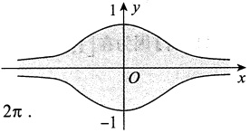

#### 6.

【答案】2

【解析】由题设知，平面区域D绕y轴旋转一周所成旋转体的体积为

$$\begin{aligned}V=&2\pi\int_{0}^{1}x\sin\pi x\mathrm{d}x=-2\int_{0}^{1}x\mathrm{d}(\cos\pi x)=-2\left(\left.x\cos\pi x\right|_{0}^{1}-\int_{0}^{1}\cos\pi x\mathrm{d}x\right)\\ =&-2\left(\left.-1-\frac{1}{\pi}\sin\pi x\right|_{0}^{1}\right)=2\;.\end{aligned}$$

#### 7.

【答案】 $-\frac{1}{4}(e-1)$

【分析】本题利用变限函数给出 $f(x)$，要求考生计算定积分 $\int_{0}^{1}f(x)dx$，以此考查考生掌握变限积分函数的熟练程度。同时，由于 $f(x)$是一个初等函数与一个变限积分函数的乘积，需要考生将其整合后再利用分部积分法才能解决问题，考生也可将其转化成二重积分，交换积分次序后计算得到答案，这对考生综合利用数学知识、灵活处理数学问题的能力进行了全面的考查。

【解析】
$$\begin{aligned} 方法一 \quad\overline{f}=&\frac{1}{1-0}\int_{0}^{1}f(x)\mathrm{d}x=\int_{0}^{1}\left(x\int_{1}^{x}\frac{\mathrm{e}^{t^{2}}}{t}\mathrm{d}t\right)\mathrm{d}x=\frac{1}{2}\int_{0}^{1}\left(\int_{1}^{x}\frac{\mathrm{e}^{t^{2}}}{t}\mathrm{d}t\right)\mathrm{d}(x^{2})\\=&\frac{1}{2}\left[\left.x^{2}\int_{1}^{x}\frac{\mathrm{e}^{t^{2}}}{t}\mathrm{d}t\right|_{0}^{1}-\int_{0}^{1}x^{2}\mathrm{d}\left(\int_{1}^{x}\frac{\mathrm{e}^{t^{2}}}{t}\mathrm{d}t\right)\right]\\=&-\frac{1}{2}\int_{0}^{1}x^{2}\cdot\left.\frac{\mathrm{e}^{x^{2}}}{x}\mathrm{d}x=-\frac{1}{4}\mathrm{e}^{x^{2}}\right|_{0}^{1}=-\frac{1}{4}\left(\mathrm{e}-1\right).\end{aligned}$$
方法二（此方法学完二重积分再看）

$$\begin{aligned}\overline{f}=&\frac{1}{1-0}\int_{0}^{1}f(x)\mathrm{d}x=\int_{0}^{1}\left(x\int_{1}^{x}\frac{\mathrm{e}^{t^{2}}}{t}\mathrm{~d}t\right)\mathrm{d}x=-\int_{0}^{1}x\mathrm{d}x\int_{x}^{1}\frac{\mathrm{e}^{t^{2}}}{t}\mathrm{~d}t\\=&-\int_{0}^{1}\frac{\mathrm{e}^{t^{2}}}{t}\mathrm{~d}t\int_{0}^{t}x\mathrm{d}x=-\frac{1}{2}\int_{0}^{1}t^{2}\bullet\frac{\mathrm{e}^{t^{2}}}{t}\mathrm{~d}t=-\frac{1}{4}\left.\mathrm{e}^{t^{2}}\right|_{0}^{1}=-\frac{1}{4}\left(\mathrm{e}-1\right).\end{aligned}$$

【注】函数 $y=f(x)$在区间 $[a,b]$上的平均值是指 $\frac{1}{b-a}\int_{a}^{b}f(x)dx$

#### 8.

【解析】设 $P(m,e^{-m})$， $m\geqslant0$，旋转体图像如图所示，则

$$V=\int_{0}^{m}\pi(e^{-x})^{2}dx=-\frac{\pi}{2}\int_{0}^{m}e^{-2x}d(-2x)=-\left.\frac{\pi}{2}e^{-2x}\right|_{0}^{m}=\frac{\pi}{2}(1-e^{-2m})$$

$$\frac{\mathrm{d}V}{\mathrm{d}t}=\frac{\mathrm{d}V}{\mathrm{d}m}\cdot\frac{\mathrm{d}m}{\mathrm{d}t}=-\frac{\pi}{2}\mathrm{e}^{-2m}\cdot(-2)\cdot\frac{\mathrm{d}m}{\mathrm{d}t}=\pi\mathrm{e}^{-2m}\cdot\frac{\mathrm{d}m}{\mathrm{d}t}.$$

又 m=1 时， $\frac{dm}{dt}=1$，故  $\left.\frac{dV}{dt}\right|_{m=1}=\frac{\pi}{e^{2}}$。

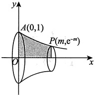

#### 9.

【答案】 $\ln\frac{2\sqrt{3}+3}{3}$

【解析】由于 $y^{\prime}=\cot x$，因此根据弧长公式，曲线 $y=\ln\sin x\left(\frac{\pi}{6}\leq x\leq\frac{\pi}{3}\right)$的弧长为

$$s=\int_{\frac{\pi}{6}}^{\frac{\pi}{3}}\sqrt{1+(y^{\prime})^{2}}\mathrm{d}x=\int_{\frac{\pi}{6}}^{\frac{\pi}{3}}\sqrt{1+\cot^{2}x}\mathrm{d}x=\int_{\frac{\pi}{6}}^{\frac{\pi}{3}}\csc x\mathrm{d}x=\ln\left|\csc x-\cot x\right|\bigg|_{\frac{\pi}{6}}^{\frac{\pi}{3}}=\ln\frac{2\sqrt{3}+3}{3}.$$

#### 10.

【答案】 $\sqrt{2}(e-1)$

【解析】

$$s=\int_{0}^{1}\sqrt{\left[(\mathrm{e}^{\theta})^{\prime}\right]^{2}+(\mathrm{e}^{\theta})^{2}}\mathrm{d}\theta=\sqrt{2}\int_{0}^{1}\mathrm{e}^{\theta}\mathrm{d}\theta=\sqrt{2}(\mathrm{e}-1).$$

#### 11.

【答案】 $\frac{17}{12}$

【解析】由  $y^{4}-6xy+3=0$ 可得  $x=\frac{1}{6}y^{3}+\frac{1}{2y}$，故曲线  $y=y(x)$ 从点  $\left(\frac{2}{3},1\right)$ 到点  $\left(\frac{19}{12},2\right)$ 的长度为

$$\begin{aligned}\int_{\frac{2}{3}}^{\frac{19}{12}}\sqrt{1+\left[y^{\prime}(x)\right]^{2}}\mathrm{d}x&\xrightarrow{ 换元 ,x=x(y)}\int_{1}^{2}\sqrt{1+\left[x^{\prime}(y)\right]^{2}}\mathrm{d}y=\int_{1}^{2}\sqrt{1+\frac{1}{4}\left(y^{2}-\frac{1}{y^{2}}\right)^{2}}\mathrm{d}y\\&=\frac{1}{2}\int_{1}^{2}\sqrt{\left(y^{2}+\frac{1}{y^{2}}\right)^{2}}\mathrm{d}y=\frac{1}{2}\int_{1}^{2}\left(y^{2}+\frac{1}{y^{2}}\right)\mathrm{d}y=\frac{17}{12}.\end{aligned}$$

#### 12.

【答案】(B)

【解析】先求出曲线  $y = e^x$ 上过原点的切线，设  $(x_0, e^{x_0})$ 为曲线  $y = e^x$ 上任意一点，则该点处的切线方程为  $y - e^{x_0} = e^{x_0}(x - x_0)$。若切线过原点，则  $(0,0)$ 在切线方程上，此时  $x_0 = 1$，于是过原点的切线方程为  $y = ex$，故所求的面积为  $\int_0^1 (e^x - ex) \, dx$。

#### 13.

【答案】 $\frac{3}{4}\pi$

【解析】由旋转体的体积公式，得

$$\begin{aligned}V=&\pi\int_{0}^{+\infty}y^{2}\mathrm{d}x=\pi\int_{0}^{+\infty}(x^{2}\mathrm{e}^{-x})^{2}\mathrm{d}x=\pi\int_{0}^{+\infty}x^{4}\mathrm{e}^{-2x}\mathrm{d}x=\frac{\pi}{2^{5}}\int_{0}^{+\infty}(2x)^{4}\mathrm{e}^{-2x}\mathrm{d}(2x)\\ &\xrightarrow{t=2x}\frac{\pi}{2^{5}}\int_{0}^{+\infty}t^{4}\mathrm{e}^{-t}\mathrm{d}t=\frac{\pi}{2^{5}}\Gamma(5)=\frac{\pi}{2^{5}}\cdot4!=\frac{3}{4}\pi\;.\end{aligned}$$

#### 14.

【答案】 $\pi\left[\frac{8}{3}\left(\ln2\right)^{2}-\frac{16\ln2}{9}+\frac{16}{27}\right]$

【解析】如图所示，所求旋转体体积为

$$\begin{aligned}V&=\int_{0}^{2}\pi(x\ln x)^{2}\mathrm{d}x=\pi\int_{0}^{2}x^{2}(\ln x)^{2}\mathrm{d}x\\&=\pi\left[\frac{1}{3}\ x^{3}(\ln x)^{2}\bigg|_{0}^{2}-\int_{0}^{2}\frac{2}{3}\ x^{2}\ln x\mathrm{d}x\right]\\&=\pi\left[\frac{8}{3}\left(\ln2\right)^{2}-\frac{2}{3}\left(\frac{1}{3}\ x^{3}\ln x\bigg|_{0}^{2}-\frac{1}{3}\int_{0}^{2}x^{2}\mathrm{d}x\right)\right]\\&=\pi\left[\frac{8}{3}\left(\ln2\right)^{2}-\frac{2}{3}\left(\frac{8}{3}\ln2-\frac{8}{9}\right)\right]\\&=\pi\left[\frac{8}{3}\left(\ln2\right)^{2}-\frac{16\ln2}{9}+\frac{16}{27}\right].\\ \end{aligned}$$

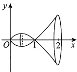

【注】由于  $\lim_{x\to0^{+}}x\ln x=0$ ，故不用考虑 x=0

#### 15.

【答案】 $\frac{1}{2}\left[\sqrt{2}+\ln(1+\sqrt{2})\right]$

【解析】由  $\mathrm{d}s=\sqrt{1+(y')^2}\,\mathrm{d}x=\sqrt{1+x^2}\,\mathrm{d}x$，知曲线  $y=\frac{1}{2}x^2$ ( $0\leq x\leq 1$) 的长度为  $s=\int_0^1\sqrt{1+x^2}\,\mathrm{d}x$。令  $x=\tan t$，则

$$s=\int_{0}^{1}\sqrt{1+x^{2}}\mathrm{d}x=\int_{0}^{\frac{\pi}{4}}\sec t\mathrm{d}(\tan t)$$
$$\begin{aligned}=&\sec t\bullet\tan t\left|\begin{matrix}\frac{\pi}{4}\\ -\int_{0}^{\frac{\pi}{4}}\tan t\bullet\sec t\bullet\tan t\mathrm{d}t\\\end{matrix}\right.\\=&\sqrt{2}-\int_{0}^{\frac{\pi}{4}}\sec t\bullet\sec^{2}t\mathrm{d}t+\int_{0}^{\frac{\pi}{4}}\sec t\mathrm{d}t\\=&\sqrt{2}-\int_{0}^{\frac{\pi}{4}}\sec t\mathrm{d}(\tan t)+\int_{0}^{\frac{\pi}{4}}\sec t\mathrm{d}t\\=&\sqrt{2}-\int_{0}^{\frac{\pi}{4}}\sec t\mathrm{d}(\tan t)+\ln(\sec t+\tan t)\left|\begin{matrix}\frac{\pi}{4}\\ 0\\\end{matrix}\right.\\=&\sqrt{2}-\int_{0}^{\frac{\pi}{4}}\sec t\mathrm{d}(\tan t)+\ln(1+\sqrt{2})\ ,\end{aligned}$$

得 $s=\frac{1}{2}\left[\sqrt{2}+\ln(1+\sqrt{2})\right]$.

#### 16.

【答案】(A)

【解析】

$$\begin{aligned}V_{1}=&\int_{1}^{\mathrm{e}}\pi\left[1-(\ln x)^{2}\right]\mathrm{d}x=\pi\left[(\mathrm{e}-1)-x(\ln x)^{2}\left|_{1}^{\mathrm{e}}\right.+2\int_{1}^{\mathrm{e}}\ln x\mathrm{d}x\right]\\ =&\pi\left(-1+2x\ln x\left|_{1}^{\mathrm{e}}\right.-2\int_{1}^{\mathrm{e}}1\mathrm{d}x\right)=\pi,\end{aligned}$$

$$V_{2}=\int_{1}^{\mathrm{e}}\pi(1-\ln x)^{2}\mathrm{d}x=\pi\left[(\mathrm{e}-1)+\int_{1}^{\mathrm{e}}(\ln x)^{2}\mathrm{d}x-2\int_{1}^{\mathrm{e}}\ln x\mathrm{d}x\right]=\pi(2\mathrm{e}-5),$$

因此 $V_{1}>\frac{\pi}{2}>V_{2}$

#### 17.

【答案】 $\frac{\pi}{6}(17\sqrt{17}-5\sqrt{5})$

【解析】

$$x=\sqrt{y},\frac{\mathrm{d}x}{\mathrm{d}y}=\frac{1}{2\sqrt{y}},$$

$$\begin{aligned}S=&\int_{1}^{4}2\pi x\sqrt{1+\left(\frac{\mathrm{d}x}{\mathrm{d}y}\right)^{2}}\mathrm{d}y=\int_{1}^{4}2\pi\sqrt{y}\sqrt{1+\frac{1}{4y}}\mathrm{d}y=2\pi\int_{1}^{4}\sqrt{y+\frac{1}{4}}\mathrm{d}y\\=&2\pi\bullet\left.\frac{2}{3}\left(y+\frac{1}{4}\right)^{\frac{3}{2}}\right|_{1}^{4}=\frac{\pi}{6}\left(17\sqrt{17}-5\sqrt{5}\right).\end{aligned}$$

#### 18.

【答案】 $\frac{1}{4}\pi$

【解析】所求的平均值为 $\int_{0}^{1}\frac{x^{2}}{\sqrt{1-x^{2}}}dx$.

令 $x=\sin\theta$，则

$$上式 =\int_{0}^{\frac{\pi}{2}}\sin^{2}\theta\mathrm{d}\theta=\left(\left.\frac{1}{2}\theta-\frac{1}{4}\sin2\theta\right)\right|_{0}^{\frac{\pi}{2}}=\frac{1}{4}\pi.$$

#### 19.

【解析】(1)设D的面积为S，则

$$\begin{aligned}S=&\int_{\sqrt{2}}^{2}\frac{\sqrt{x^{2}-1}}{x^{2}}\mathrm{d}x\xrightarrow{x=\sec t}\int_{\frac{\pi}{4}}^{\frac{\pi}{3}}\frac{\tan t}{\sec^{2}t}\sec t\tan t\mathrm{d}t=\int_{\frac{\pi}{4}}^{\frac{\pi}{3}}\frac{\tan^{2}t}{\sec t}\mathrm{d}t\\=&\int_{\frac{\pi}{4}}^{\frac{\pi}{3}}\frac{\sin^{2}t}{\cos t}\mathrm{d}t=\int_{\frac{\pi}{4}}^{\frac{\pi}{3}}\frac{1-\cos^{2}t}{\cos t}\mathrm{d}t=\int_{\frac{\pi}{4}}^{\frac{\pi}{3}}(\sec t-\cos t)\mathrm{d}t\\=&\ln\left|\sec t+\tan t\right|\bigg|_{\frac{\pi}{4}}^{\frac{\pi}{3}}-\sin t\bigg|_{\frac{\pi}{4}}^{\frac{\pi}{3}}=\ln\frac{2+\sqrt{3}}{1+\sqrt{2}}-\frac{\sqrt{3}-\sqrt{2}}{2}\\=&\ln\Big[(\sqrt{3}+2)(\sqrt{2}-1)\Big]-\frac{\sqrt{3}-\sqrt{2}}{2}.\end{aligned}$$

(2) 由旋转体的体积公式知

$$\begin{aligned}V&=\pi\int_{\sqrt{2}}^{2}\left(\frac{\sqrt{x^{2}-1}}{x^{2}}\right)^{2}\mathrm{d}x=\pi\int_{\sqrt{2}}^{2}\frac{x^{2}-1}{x^{4}}\mathrm{d}x=\pi\int_{\sqrt{2}}^{2}\left(\frac{1}{x^{2}}-\frac{1}{x^{4}}\right)\mathrm{d}x\\&=\left.\pi\left(-\frac{1}{x}+\frac{1}{3x^{3}}\right)\right|_{\sqrt{2}}^{2}=\left.\pi\left(\frac{5}{6\sqrt{2}}-\frac{11}{24}\right)=\frac{10\sqrt{2}-11}{24}\pi.\right.\end{aligned}$$
### 第11章 一元函数积分学的应用（二）——积分等式与积分不等式

#### 1.

【答案】(B)

【解析】设 $F(x)=\int_{0}^{x}\sqrt{4a^{2}-t^{2}}\,\mathrm{d}t+\int_{a}^{x}\frac{1}{\sqrt{4a^{2}-t^{2}}}\,\mathrm{d}t$，则

$$F(0)=\int_{a}^{0}\frac{1}{\sqrt{4a^{2}-t^{2}}}\mathrm{d}t<0,F(a)=\int_{0}^{a}\sqrt{4a^{2}-t^{2}}\mathrm{d}t>0,$$

因为 $F(x)$在 $[0,a]$上连续，故由连续函数的零点定理知，存在 $\xi\in(0,a)$，使得 $F(\xi)=0$。

又 $F'(x)=\sqrt{4a^{2}-x^{2}}+\frac{1}{\sqrt{4a^{2}-x^{2}}}>0$，所以 $F(x)$在 $[0,a]$上至多有一个零点.

综上所述， $F(x)$在 $[0,a]$上只有一个零点，即方程 $\int_{0}^{x}\sqrt{4a^{2}-t^{2}}dt+\int_{a}^{x}\frac{1}{\sqrt{4a^{2}-t^{2}}}dt=0$在 $[0,a]$上只有一个根.

故正确选项为(B).

#### 2.

【答案】(D)

【解析】由题知， $f'(x)>0$，故当 $x\in(0,\pi)$时， $f(x)>f(-x)$，此时

$$\begin{aligned}I_{1}=&\int_{-\pi}^{0}f(x)\sin x\mathrm{d}x+\int_{0}^{\pi}f(x)\sin x\mathrm{d}x\\ &\xrightarrow{(*)}-\int_{0}^{\pi}f(-u)\sin u\mathrm{d}u+\int_{0}^{\pi}f(x)\sin x\mathrm{d}x\\ =&\int_{0}^{\pi}[f(x)-f(-x)]\sin x\mathrm{d}x>0,\end{aligned}$$

(*)处将 $\int_{-\pi}^{0}f(x)\sin x dx$利用x=-u进行换元.

亦可用积分第一中值定理证明 $I_{1}>0$，即

$$I_{1}=f(\xi)\int_{-\pi}^{0}\sin x\mathrm{d}x+f(\eta)\int_{0}^{\pi}\sin x\mathrm{d}x=2[f(\eta)-f(\xi)]>0[\xi\in(-\pi,0),\eta\in(0,\pi)]$$

$$I_{2}=f(x)\sin x\bigg|_{-\pi}^{\pi}-\int_{-\pi}^{\pi}f^{\prime}(x)\sin x\mathrm{d}x=-\int_{-\pi}^{\pi}f^{\prime}(x)\sin x\mathrm{d}x.$$

由 $I_{1}$的结论可知

$$I_{2}=-\int_{0}^{\pi}[f^{\prime}(x)-f^{\prime}(-x)]\sin x\mathrm{d}x.$$

由 $f''(x)<0$，知 $f'(x)$单调递减，故当 $x\in(0,\pi)$时， $f'(x)<f'(-x)$，进而可知 $I_{2}>0$。故选(D)。

#### 3.

【解析】必要性( $\Rightarrow$)

由题设，对任意的  $x \in \mathbb{R}$， $f(x) = f(x + T)$，则

$$\int_{a}^{a+T}f(x)\mathrm{d}x=\int_{a}^{0}f(x)\mathrm{d}x+\int_{0}^{T}f(x)\mathrm{d}x+\int_{T}^{a+T}f(x)\mathrm{d}x,$$

其中

$$\int_{T}^{a+T}f(x)\mathrm{d}x\xrightarrow{t=x-T}\int_{0}^{a}f(t+T)\mathrm{d}t=\int_{0}^{a}f(t)\mathrm{d}t$$

故 $\int_{a}^{a+T}f(x)\mathrm{d}x=\int_{a}^{0}f(x)\mathrm{d}x+\int_{0}^{a}f(x)\mathrm{d}x+\int_{0}^{T}f(x)\mathrm{d}x=\int_{0}^{T}f(x)\mathrm{d}x$，即 $\int_{a}^{a+T}f(x)\mathrm{d}x$为常数.

充分性( $\Leftrightarrow$).

由  $\int_{a}^{a+T} f(x)dx \equiv C$，得  $\left[\int_{a}^{a+T} f(x)dx\right]'_{a} = 0$，即  $f(a+T) - f(a) = 0$，也即任给常数  $a \in \mathbb{R}$，有  $f(a+T) = f(a)$，故  $f(x)$ 以 T 为周期。

证毕.

#### 4.

【分析】本题可视为证明两个函数相等（等式两端看作两个函数）.

【解析】记

$$\varphi(x)=\int_{0}^{x}\left[\int_{0}^{t}f(u)\mathrm{d}u\right]\mathrm{d}t,\quad\psi(x)=\int_{0}^{x}f(t)(x-t)\mathrm{d}t,$$

由 $f(x)$连续，得

$$\varphi^{\prime}(x)=\int_{0}^{x}f(u)\mathrm{d}u=\int_{0}^{x}f(t)\mathrm{d}t,$$

$$\psi^{\prime}(x)=\left[x\int_{0}^{x}f(t)\mathrm{d}t-\int_{0}^{x}tf(t)\mathrm{d}t\right]^{\prime}=\int_{0}^{x}f(t)\mathrm{d}t+xf(x)-xf(x)=\int_{0}^{x}f(t)\mathrm{d}t$$

故  $\varphi'(x)=\psi'(x)$，又  $\varphi(0)=\psi(0)=0$，从而  $\varphi(x)=\psi(x)$。

【注】本题也可利用分部积分法直接证明.

#### 5.

【分析】由欲证结论出发，构造辅助函数，再对其应用微分中值定理，即可得证.

由欲证结论 $f(\xi)\int_{\xi}^{b}g(x)\mathrm{d}x=g(\xi)\int_{a}^{\xi}f(x)\mathrm{d}x$，得 $f(\xi)\int_{\xi}^{b}g(x)\mathrm{d}x-g(\xi)\int_{a}^{\xi}f(x)\mathrm{d}x=0$，所以

$$f(x)\int_{x}^{b}g(t)\mathrm{d}t-g(x)\int_{a}^{x}f(t)\mathrm{d}t=0,$$

即

$$\left[\int_{a}^{x}f(t)\mathrm{d}t\int_{x}^{b}g(t)\mathrm{d}t\right]^{\prime}=0.$$

记 $F(x)=\int_{a}^{x}f(t)dt\int_{x}^{b}g(t)dt$
【解析】构造辅助函数  $F(x)=\int_{a}^{x}f(t)dt\int_{x}^{b}g(t)dt$，则  $F(x)$ 在  $[a,b]$ 上连续，在  $(a,b)$ 内可导，且有  $F(a)=F(b)=0$，于是由罗尔定理，知存在  $\xi\in(a,b)$，使  $F'(\xi)=0$，即

$$\left[\left.\int_{a}^{x}f(t)\mathrm{d}t\int_{x}^{b}g(t)\mathrm{d}t\right]^{\prime}\right|_{x=\xi}=0,$$

所以

$$f(\xi)\int_{\xi}^{b}g(x)\mathrm{d}x=g(\xi)\int_{a}^{\xi}f(x)\mathrm{d}x.$$

#### 6.

【分析】对第一个积分作倒代换，可变为第二个积分，因而二者相等，再从两个积分的和积分出发，选择适当变换，即可得证.

【解析】令 $x=\frac{1}{t}$，则有

$$\int_{0}^{+\infty}\frac{\mathrm{d}x}{1+x^{4}}=\int_{+\infty}^{0}\frac{-\frac{1}{t^{2}}}{1+\frac{1}{t^{4}}}\mathrm{d}t=\int_{0}^{+\infty}\frac{t^{2}}{1+t^{4}}\mathrm{d}t,$$

于是

$$\int_{0}^{+\infty}\frac{\mathrm{d}x}{1+x^{4}}=\int_{0}^{+\infty}\frac{x^{2}}{1+x^{4}}\mathrm{d}x=\frac{1}{2}\int_{0}^{+\infty}\frac{1+x^{2}}{1+x^{4}}\mathrm{d}x.$$

$$\begin{aligned}\int_{0}^{+\infty}\frac{1+x^{2}}{1+x^{4}}\mathrm{d}x&=\int_{0}^{+\infty}\frac{1+\frac{1}{x^{2}}}{\frac{1}{x^{2}}+x^{2}}\mathrm{d}x=\int_{0}^{+\infty}\frac{\mathrm{d}\left(x-\frac{1}{x}\right)}{\left(x-\frac{1}{x}\right)^{2}+2}\\&\xrightarrow{ 令 u=x-\frac{1}{x}}\int_{-\infty}^{+\infty}\frac{\mathrm{d}u}{u^{2}+2}=2\int_{0}^{+\infty}\frac{\mathrm{d}u}{2+u^{2}}\\ &=\sqrt{2}\int_{0}^{+\infty}\frac{\mathrm{d}\left(\frac{u}{\sqrt{2}}\right)}{1+\left(\frac{u}{\sqrt{2}}\right)^{2}}=\sqrt{2}\arctan\frac{u}{\sqrt{2}}\bigg|_{0}^{+\infty}=\frac{\sqrt{2}}{2}\pi,\\ \end{aligned}$$

故

$$\int_{0}^{+\infty}\frac{\mathrm{d}x}{1+x^{4}}=\int_{0}^{+\infty}\frac{x^{2}}{1+x^{4}}\mathrm{d}x=\frac{\sqrt{2}}{4}\pi.$$

#### 7.

【答案】(C)

【解析】令 $f(x)=\mathrm{e}^{x}$， $g(x)=\mathrm{e}^{-x}$，满足题干条件，但

$$\int_{-1}^{0}f(x)g(x)\mathrm{d}x=\int_{-1}^{0}\mathrm{e}^{x}\cdot\mathrm{e}^{-x}\mathrm{d}x=\int_{0}^{1}\mathrm{e}^{x}\cdot\mathrm{e}^{-x}\mathrm{d}x=\int_{0}^{1}f(x)g(x)\mathrm{d}x$$

且

$$\int_{-1}^{0}\left|f(x)g(x)\right|\mathrm{d}x=\int_{-1}^{0}\left|\mathrm{e}^{x}\cdot\mathrm{e}^{-x}\right|\mathrm{d}x=\int_{0}^{1}\left|\mathrm{e}^{x}\cdot\mathrm{e}^{-x}\right|\mathrm{d}x=\int_{0}^{1}\left|f(x)g(x)\right|\mathrm{d}x$$

所以选项(A)，(B)错误.

令 $f(x)=x$， $g(x)=-x$，亦满足题干条件，但

$$\int_{-1}^{0}f\left[f(x)\right]\mathrm{d}x=\int_{-1}^{0}x\mathrm{d}x=\frac{1}{2}x^{2}\bigg|_{-1}^{0}=-\frac{1}{2},$$

$$\int_{0}^{1}g\left[g(x)\right]\mathrm{d}x=\int_{0}^{1}x\mathrm{d}x=\frac{1}{2}x^{2}\bigg|_{0}^{1}=\frac{1}{2},$$

所以选项(D)错误.

对于选项(C),

$$\int_{-1}^{0}f\left[g(x)\right]\mathrm{d}x-\int_{0}^{1}f\left[g(x)\right]\mathrm{d}x=\int_{0}^{1}f\left[g(-x)\right]\mathrm{d}x-\int_{0}^{1}f\left[g(x)\right]\mathrm{d}x=\int_{0}^{1}\left\{f\left[g(-x)\right]-f\left[g(x)\right]\right\}\mathrm{d}x.$$

因为 $f'(x)>0$， $g'(x)<0$，所以 $f(x)$单调增加， $g(x)$单调减少，所以当x>0时，有

$$g(-x)>g(x)\mathrm{,}f\left[g(-x)\right]>f\left[g(x)\right]\mathrm{,}$$

故

$$\int_{-1}^{0}f\left[g(x)\right]\mathrm{d}x-\int_{0}^{1}f\left[g(x)\right]\mathrm{d}x>0,$$

即

$$\int_{-1}^{0}f\left[g(x)\right]\mathrm{d}x>\int_{0}^{1}f\left[g(x)\right]\mathrm{d}x.$$

#### 8.

【答案】(C)

【解析】令 $F(x)=x\int_{0}^{x}f(t)g(t)dt-\int_{0}^{x}f(t)dt\int_{0}^{x}g(t)dt$， $x\geqslant0$，则 $F(0)=0$，

$$\begin{aligned}F^{\prime}(x)=&\int_{0}^{x}f(t)g(t)\mathrm{d}t+xf(x)g(x)-f(x)\int_{0}^{x}g(t)\mathrm{d}t-g(x)\int_{0}^{x}f(t)\mathrm{d}t\\ =&\int_{0}^{x}\left[f(t)g(t)+f(x)g(x)-f(x)g(t)-g(x)f(t)\right]\mathrm{d}t\\ =&\int_{0}^{x}\left[f(x)-f(t)\right]\left[g(x)-g(t)\right]\mathrm{d}t\;.\end{aligned}$$

当 $f(x)$， $g(x)$单调性相同时， $[f(x)-f(t)][g(x)-g(t)]\geq0$， $F'(x)\geq0$，有 $F(x)\geq0$，故 $F(1)\geq0$。

当 $f(x)$， $g(x)$单调性相反时， $[f(x)-f(t)][g(x)-g(t)]\leq0$， $F'(x)\leq0$，有 $F(x)\leq0$，故 $F(1)\leq0$。

综上，选(C)。

【注】构造辅助函数时，为了前后统一量纲，令  $F(x)=x\int_{0}^{x}f(t)g(t)\mathrm{d}t-\int_{0}^{x}f(t)\mathrm{d}t\int_{0}^{x}g(t)\mathrm{d}t$，而不构造为  $F(x)=\int_{0}^{x}f(t)g(t)\mathrm{d}t-\int_{0}^{x}f(t)\mathrm{d}t\int_{0}^{x}g(t)\mathrm{d}t$。

#### 9.

【解析】由已知条件 $f(a)=f(b)=0$，得
$$f(x)=f(x)-f(a)=\int_{a}^{x}f^{\prime}(t)dt,f(x)=f(x)-f(b)=-\int_{x}^{b}f^{\prime}(t)dt,$$

故

$$\begin{aligned}2\left|f(x)\right|=&\left|\int_{a}^{x}f^{\prime}(t)\mathrm{d}t\right|+\left|-\int_{x}^{b}f^{\prime}(t)\mathrm{d}t\right|\\\leq&\int_{a}^{x}\left|f^{\prime}(t)\right|\mathrm{d}t+\int_{x}^{b}\left|f^{\prime}(t)\right|\mathrm{d}t\\=&\int_{a}^{b}\left|f^{\prime}(t)\right|\mathrm{d}t,\end{aligned}$$

所以当  $x \in (a,b)$ 时， $\left|f(x)\right| \leqslant \frac{1}{2} \int_{a}^{b} |f'(x)| \, dx$，得证.

#### 10.

【解析】方法一 任取  $x \in (0,1]$，由拉格朗日中值定理有  $f(x) - f(0) = f'(\xi)x$， $\xi \in (0,x)$。又  $f(0) = 0$，故  $f(x) = f'(\xi)x$， $x \in (0,1]$，于是

$$\left|\int_{0}^{1}f(x)\mathrm{d}x\right|=\left|\int_{0}^{1}f^{\prime}(\xi)x\mathrm{d}x\right|\leqslant\int_{0}^{1}\left|f^{\prime}(\xi)\right|x\mathrm{d}x\leqslant M\int_{0}^{1}x\mathrm{d}x=\frac{M}{2}.$$

方法二 设  $x \in [0,1]$，由  $f(0) = 0$ 知  $\int_{0}^{x} f'(t) \, dt = f(x) - f(0) = f(x)$，于是

$$\left|f(x)\right|=\left|\int_{0}^{x}f^{\prime}(t)dt\right|\leqslant\int_{0}^{x}\left|f^{\prime}(t)\right|dt\leqslant\int_{0}^{x}M dt=Mx$$

故

$$\left|\int_{0}^{1}f(x)dx\right|\leqslant\int_{0}^{1}\left|f(x)\right|dx\leqslant\int_{0}^{1}Mx dx=\frac{M}{2}$$

【注】对积分 $\left|\int_{0}^{1}f(x)dx\right|$作估计，只要对被积函数 $f(x)$作估计即可.条件中给出导数 $f'(x)$及 $f(0)=0$的信息，自然想办法把 $f(x)$和 $f'(x)$联系起来.在高等数学中，联系 $f(x)$和 $f'(x)$有两种常用的办法：一是微分学中的拉格朗日中值定理(见方法一)，二是积分学中的牛顿-莱布尼茨公式(见方法二).

#### 11.

【解析】令 $u^{2}=t$，则

$$\begin{aligned}f(x)=&\int_{x}^{x+1}\sin u^{2}\mathrm{d}u=\int_{x^{2}}^{(x+1)^{2}}\frac{\sin t}{2\sqrt{t}}\mathrm{d}t=\int_{x^{2}}^{(x+1)^{2}}\frac{-1}{2\sqrt{t}}\mathrm{d}(\cos t)\\ =&\frac{\cos x^{2}}{2x}-\frac{\cos(x+1)^{2}}{2(x+1)}-\frac{1}{4}\int_{x^{2}}^{(x+1)^{2}}t^{-\frac{3}{2}}\cos t\mathrm{d}t\;.\end{aligned}$$

故当x>0时，

$$\begin{array}{c}\left|f(x)\right|\leqslant\frac{1}{2x}+\frac{1}{2(x+1)}+\frac{1}{4}\int_{x^{2}}^{(x+1)^{2}}t^{-\frac{3}{2}}\mathrm{d}t\\=\frac{1}{2x}+\frac{1}{2(x+1)}+\frac{1}{2}\left(\frac{1}{x}-\frac{1}{x+1}\right)=\frac{1}{x}.\end{array}$$
### 第12章 一元函数积分学的应用（三）——物理应用

#### 1.

【答案】 $-\frac{\sqrt{2}}{2}G\rho$

【解析】依题意画出如图所示的直角坐标系，用微元法.取y轴上的 $[y,y+dy]\subset[0,1]$，此微段

细杆对质点的引力大小为  $\mathrm{d}F = G \cdot \frac{\rho \mathrm{d}y}{1 + y^{2}}$，其在x轴正向的分力为

$$\mathrm{d}F_{x}=\frac{-1}{\sqrt{1+y^{2}}}\mathrm{d}F=-\frac{G\rho\mathrm{d}y}{(1+y^{2})^{\frac{3}{2}}},$$

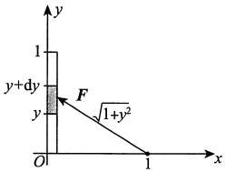

于是该细杆对此质点的引力沿x轴正向的分力为

$$F_{x}=\int_{0}^{1}\left[-\frac{G\rho}{(1+y^{2})^{\frac{3}{2}}}\right]\mathrm{d}y\xrightarrow{ 令 y=\tan t}-G\rho\int_{0}^{\frac{\pi}{4}}\cos t\mathrm{d}t=-\frac{\sqrt{2}}{2}G\rho.$$

#### 2.

【答案】 $\frac{\sqrt{2}}{2}\rho ga^{3}$

【解析】建立如图所示的坐标系，设压力微元为  $\mathrm{d}P$

当y>0时， $\mathrm{d}P=\rho g\cdot\left(\frac{a}{\sqrt{2}}-y\right)\cdot2\left(\frac{a}{\sqrt{2}}-y\right)\mathrm{d}y$，则

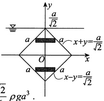

$$P_{1}=\int_{0}^{\frac{a}{\sqrt{2}}}2\rho g\left(\frac{a}{\sqrt{2}}-y\right)^{2}\mathrm{d}y=-2\rho g\cdot\left.\frac{1}{3}\left(\frac{a}{\sqrt{2}}-y\right)^{3}\right|_{0}^{\frac{a}{\sqrt{2}}}=\frac{\sqrt{2}}{6}\rho ga^{3}$$

当y<0时， $\mathrm{d}P=\rho g\cdot\left(\frac{a}{\sqrt{2}}-y\right)\cdot2\left(\frac{a}{\sqrt{2}}+y\right)\mathrm{d}y$，则

$$\begin{aligned}P_{2}=&\int_{-\frac{a}{\sqrt{2}}}^{0}2\rho g\left(\frac{a^{2}}{2}-y^{2}\right)\mathrm{d}y=2\rho g\cdot\frac{a^{2}}{2}\cdot\frac{a}{\sqrt{2}}-2\rho g\cdot\left(\left.\frac{1}{3}y^{3}\right|_{\frac{a}{\sqrt{2}}}^{0}\right)\\=&2\rho g\left(\frac{a^{3}}{2\sqrt{2}}-\frac{1}{3}\cdot\frac{a^{3}}{2\sqrt{2}}\right)=\frac{4}{3}\cdot\frac{1}{2\sqrt{2}}\cdot\rho ga^{3}=\frac{\sqrt{2}}{3}\rho ga^{3}.\end{aligned}$$

故 $P=P_{1}+P_{2}=\left(\frac{\sqrt{2}}{6}+\frac{\sqrt{2}}{3}\right)\rho ga^{3}=\frac{\sqrt{2}}{2}\rho ga^{3}$.
#### 3.

【答案】 $\frac{GM}{R}$

【解析】设举高至a，则 $W(a)=\int_{R}^{R+a}G\frac{M}{x^{2}}dx$，故

$$W=\lim_{a\to+\infty}W(a)=\int_{R}^{+\infty}G\frac{M}{x^{2}}\mathrm{d}x=-\left.GM\frac{1}{x}\right|_{R}^{+\infty}=\frac{GM}{R}\;.$$

#### 4.

【解析】(1)以缸底中心为原点，对称轴为y轴在轴截面上建立如图所示的平面直角坐标系，则可设缸内表面（旋转抛物面）是由抛物线 $y=kx^{2}$绕y轴旋转而成的.根据题意， $y(a)=a$，故 $k=\frac{1}{a}$即抛物线方程为 $y=\frac{1}{a}x^{2}$.

于是，缸的容积为

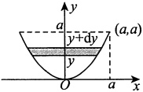

$$V=\pi\int_{0}^{a}x^{2}\mathrm{d}y=\pi\int_{0}^{a}ay\mathrm{d}y=\frac{\pi a^{3}}{2}\left( 立方米 \right).$$

因此，若以每秒Q立方米的速率将缸中的水全部抽出，则需要的时间为

$$t=\frac{V}{Q}=\frac{\frac{\pi a^{3}}{2}}{Q}=\frac{\pi a^{3}}{2Q}( 秒 ).$$

(2) 取 y 为积分变量，其取值范围为  $[0, a]$. 在 y 轴上的区间  $[0, a]$ 内任取一个典型小区间  $[y, y + dy]$，则在该典型小区间上需做功的微元为

$$\mathrm{d}W=\rho g\pi x^{2}\mathrm{d}y\bullet(a-y)=\rho g\pi ay(a-y)\mathrm{d}y=\rho g\pi a(ay-y^{2})\mathrm{d}y.$$

于是，所求功为

$$W=\int_{0}^{a}\rho g\pi a(ay-y^{2})\mathrm{d}y=\rho g\pi a\left(\left.\frac{1}{2}ay^{2}-\frac{1}{3}y^{3}\right)\right|_{0}^{a}=\frac{1}{6}\rho g\pi a^{4}\left( 焦耳 \right).$$

#### 5.

【解析】(1)如图所示，当液面在 $y(-1\leq y\leq1)$处时，容器内液体的体积为 $V=2\int_{-1}^{y}\sqrt{1-u^{2}}du$设t时刻液体的体积为 $V=V(t)$，则

$$\frac{\mathrm{d}V}{\mathrm{d}t}=\frac{\mathrm{d}V}{\mathrm{d}y}\cdot\frac{\mathrm{d}y}{\mathrm{d}t}=2\sqrt{1-y^{2}}\frac{\mathrm{d}y}{\mathrm{d}t},$$

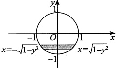

令 y=0，并由条件  $\frac{dV}{dt}=0.2$ 得  $\frac{dy}{dt}=0.1$，故液面在 y=0 时，液面下降的速率为  $0.1 \, m/min$。

(2)

$$\begin{aligned}W=&\int_{-1}^{1}2\sqrt{1-y^{2}}(1-y)\mathrm{d}y=\int_{-1}^{1}2\sqrt{1-y^{2}}\mathrm{d}y-\int_{-1}^{1}2y\sqrt{1-y^{2}}\mathrm{d}y\\ =&4\int_{0}^{1}\sqrt{1-y^{2}}\mathrm{d}y\xrightarrow{y=\sin t}4\int_{0}^{\frac{\pi}{2}}\cos^{2}t\mathrm{d}t=4\times\frac{\pi}{4}=\pi(\mathrm{J}).\end{aligned}$$

【注】因为  $2y\sqrt{1-y^{2}}$ 为奇函数，故  $\int_{-1}^{1}2y\sqrt{1-y^{2}}dy=0$

#### 6.

【答案】(A)

【解析】设细杆的质量为 M，长为 l，建立如图所示的坐标系. 设质点距杆左端（原点）的距离为  $x_{0}(x_{0}>1)$，则引力微元大小为

$$\mathrm{d}F=G\bullet\frac{M\bullet\frac{\mathrm{d}x}{l}\bullet a}{\left(x_{0}-x\right)^{2}}=G a\frac{1}{\left(x_{0}-x\right)^{2}}\mathrm{d}x\;,$$

此瞬时引力大小为

$$\begin{aligned}F=&\int_{0}^{1}\mathrm{d}F=G a\int_{0}^{1}\frac{1}{\left(x_{0}-x\right)^{2}}\mathrm{d}x\\=&G a\frac{1}{x_{0}-x}\bigg|_{x=0}^{x=1}=G a\left(\frac{1}{x_{0}-1}-\frac{1}{x_{0}}\right).\end{aligned}$$

故所求引力做功大小为

$$\begin{aligned}W=&\left|\int_{\frac{3}{2}}^{\frac{4}{3}}Ga\left(\frac{1}{x_{0}-1}-\frac{1}{x_{0}}\right)\mathrm{d}x_{0}\right|=\left|Ga\ln\frac{x_{0}-1}{x_{0}}\right|_{\frac{3}{2}}^{\frac{4}{3}}\\=&\left|-Ga\ln\frac{4}{3}\right|=Ga\ln\frac{4}{3}.\end{aligned}$$

#### 7.

【答案】(A)

【解析】设三角形斜边与水面夹角为  $\theta$ (见图)，则斜边所在直线的方程为

$$y=\cos\theta-x\bullet\cot\theta.$$

直角三角板所受水的压力为

$$\begin{aligned}P=&\rho g\int_{0}^{\sin\theta}x(\cos\theta-x\bullet\cot\theta)\mathrm{d}x\\=&\rho g\bigg(\cos\theta\int_{0}^{\sin\theta}x\mathrm{d}x-\cot\theta\int_{0}^{\sin\theta}x^{2}\mathrm{d}x\bigg)\\=&\frac{1}{6}\rho g\cos\theta\sin^{2}\theta,\end{aligned}$$

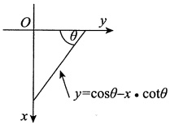

其中 $\rho$为水的密度，g为重力加速度.

$$P^{\prime}(\theta)=\frac{1}{6}\rho g(2\sin\theta\cos^{2}\theta-\sin^{3}\theta),$$

令 $P'(\theta)=0$得到唯一驻点 $\theta=\arccos\frac{1}{\sqrt{3}}$

于是当  $\theta = \arccos \frac{1}{\sqrt{3}}$，即水平直角边长度  $\cos \theta = \frac{1}{\sqrt{3}}$ 时，三角板受到水的压力最大，故选(A).
### 第13章 多元函数微分学

#### 1.

【答案】 $\frac{\pi}{2}dx$

【解析】

$$\frac{\partial z}{\partial x}=\frac{y-\sin(x+y)}{1+\left[x y+\cos(x+y)\right]^{2}},\,\frac{\partial z}{\partial y}=\frac{x-\sin(x+y)}{1+\left[x y+\cos(x+y)\right]^{2}},$$

故

$$\mathrm{d}z\big|_{(0,\pi)}=\frac{\partial z}{\partial x}\bigg|_{(0,\pi)}\mathrm{d}x+\frac{\partial z}{\partial y}\bigg|_{(0,\pi)}\mathrm{d}y=\frac{\pi}{2}\mathrm{d}x.$$

#### 2.

【答案】 $\frac{y}{\sin x}+\frac{x}{\sin y}$

【解析】因为 $z=f(\cos y-\cos x)+xy$，所以

$$\frac{\partial z}{\partial x}=f^{\prime}(\cos y-\cos x)\cdot\sin x+y,\frac{\partial z}{\partial y}=f^{\prime}(\cos y-\cos x)\cdot(-\sin y)+x.$$

故

$$\frac{1}{\sin x}\cdot\frac{\partial z}{\partial x}+\frac{1}{\sin y}\cdot\frac{\partial z}{\partial y}=\frac{y}{\sin x}+\frac{x}{\sin y}.$$

#### 3.

【答案】 $2y^{3}x^{y^{2}}(1+\ln x)f'(x^{y^{2}})+yf(x^{y^{2}})$

【解析】 $\frac{\partial z}{\partial x}=yf'(x^{y^2})\cdot(y^2x^{y^2-1}),\frac{\partial z}{\partial y}=f(x^{y^2})+yf'(x^{y^2})\cdot(x^{y^2}\cdot\ln x\cdot2y),$

所以

$$2x\frac{\partial z}{\partial x}+y\frac{\partial z}{\partial y}=2y^{3}x^{y^{2}}(1+\ln x)f^{\prime}(x^{y^{2}})+y f(x^{y^{2}}).$$

#### 4.

【答案】 $\frac{1}{5}$

【解析】将 x=0, y=2 代入  $(x+1)z+2y\ln z-\arctan(xy)=1$，得  $z+4\ln z=1$。因为  $z+4\ln z$ 是  $(0,+\infty)$ 上的增函数，且当 z=1 时， $z+4\ln z=1$，从而解得 z=1。

 $(x+1)z+2y\ln z-\arctan(xy)=1$ 两端分别对 x 求偏导，得

$$z+(x+1)\frac{\partial z}{\partial x}+2y\cdot\frac{1}{z}\cdot\frac{\partial z}{\partial x}-\frac{1}{1+(x y)^{2}}\cdot y=0,$$

将x=0, y=2, z=1代入上式，解得 $\left.\frac{\partial z}{\partial x}\right|_{(0,2)}=\frac{1}{5}$.

#### 5.

【答案】 $2e^{x-y}$

【解析】

$$F(x,y)=\int_{0}^{x-y}(x-y-t)\mathrm{e}^{t}\mathrm{d}t=(x-y)\int_{0}^{x-y}\mathrm{e}^{t}\mathrm{d}t-\int_{0}^{x-y}t\mathrm{e}^{t}\mathrm{d}t$$

于是

$$\frac{\partial F}{\partial x}=\int_{0}^{x-y}\mathrm{e}^{t}\mathrm{d}t+(x-y)\mathrm{e}^{x-y}-(x-y)\mathrm{e}^{x-y}=\int_{0}^{x-y}\mathrm{e}^{t}\mathrm{d}t,\quad\frac{\partial^{2}F}{\partial x^{2}}=\mathrm{e}^{x-y},$$

$$\frac{\partial F}{\partial y}=-\int_{0}^{x-y}\mathrm{e}^{t}\mathrm{d}t-(x-y)\mathrm{e}^{x-y}+(x-y)\mathrm{e}^{x-y}=-\int_{0}^{x-y}\mathrm{e}^{t}\mathrm{d}t,\frac{\partial^{2}F}{\partial y^{2}}=\mathrm{e}^{x-y},$$

故

$$\frac{\partial^{2}F}{\partial x^{2}}+\frac{\partial^{2}F}{\partial y^{2}}=\mathrm{e}^{x-y}+\mathrm{e}^{x-y}=2\mathrm{e}^{x-y}.$$

#### 6.

【答案】-1

【解析】由 $f_{x}^{\prime}(x,y)=1+2\cos x$，知 $f(x,y)=x+2\sin x+g(y)$.

由 $f(x,\sin x)=x+\sin x$，得 $g(\sin x)=-\sin x$，即 $g(y)=-y$，故

$$f(x,y)=x+2\sin x-y,$$

则 $f_{y}^{\prime}(x,y)\big|_{y=\sin x}=-1\big|_{y=\sin x}=-1$

#### 7.

【答案】 $\frac{\pi^{2}}{4}+2$

【解析】由 $\frac{\partial^{2}\left[f(x,y)\right]}{\partial x\partial y}=1$，得 $\frac{\partial\left[f(x,y)\right]}{\partial y}=x+C_{1}(y)$，所以

$$f(x,y)=xy+\int C_{1}(y)\mathrm{d}y+C_{2}(x)=xy+C_{3}(y)+C_{2}(x).$$

由 $f(0,y)=\sin y$,  $f(x,0)=\sin x$, 得 $C_{2}(x)=\sin x-C_{3}(0)$,  $C_{3}(y)=\sin y-C_{2}(0)$.

又 $f(0,0)=0$，所以 $f(x,y)=xy+\sin x+\sin y$。因此 $f\left(\frac{\pi}{2},\frac{\pi}{2}\right)=\frac{\pi^{2}}{4}+2$。

#### 8.

【答案】 $\frac{2x(y^{2}-y+1)}{(1+y)^{2}}$

【解析】令  $u = x + y$， $v = \frac{x}{y}$，则  $x = \frac{uv}{1 + v}$， $y = \frac{u}{1 + v}$，于是

$$f(u,v)=\left(\frac{uv}{1+v}\right)^{2}-\frac{u^{2}v}{\left(1+v\right)^{2}}+\frac{u^{2}}{\left(1+v\right)^{2}},$$

即

$$f(x,y)=\frac{x^{2}}{\left(1+y\right)^{2}}\left(y^{2}-y+1\right),$$

所以 $f_{x}^{\prime}(x,y)=\frac{2x(y^{2}-y+1)}{(1+y)^{2}}$
#### 9.

【解析】 $f(x,y)=\left\{\begin{aligned}&\sqrt{x\left|y\right|},&(x,y)\in D_{1}=\left\{(x,y)\mid x>0,-\infty<y<+\infty\right\},\\ &\sqrt{-x\left|y\right|},&(x,y)\in D_{2}=\left\{(x,y)\mid x<0,-\infty<y<+\infty\right\},\\ &0,&(x,y)\in D_{3}=\left\{(x,y)\mid x=0,-\infty<y<+\infty\right\}.\end{aligned}\right.$

$$x=0,y=0 时 ,f_{x}^{\prime}(0,0)=\lim_{\Delta x\to0}\frac{f(\Delta x,0)-f(0,0)}{\Delta x}=\lim_{\Delta x\to0}\frac{\sqrt{\left|\Delta x\right|}\cdot0-0}{\Delta x}=0.$$

②当  $x=0$,  $y\neq0$ 时,  $f_{x}^{\prime}(0,y)=\lim_{\Delta x\to0}\frac{f(\Delta x,y)-f(0,y)}{\Delta x}=\lim_{\Delta x\to0}\frac{\sqrt{|\Delta x|}\cdot\sqrt{|y|}}{\Delta x}$, 该极限不存在, 所以  $f_{x}^{\prime}(0,y)(y\neq0)$ 不存在;

③当 $(x,y)\in D_1$时， $f_x'(x,y)=\frac{\partial}{\partial x}\left(\sqrt{x|y|}\right)=\frac{\sqrt{|y|}}{2\sqrt{x}}=\frac{1}{2}\sqrt{\left|\frac{y}{x}\right|}$；

④当 $(x,y)\in D_2$时， $f_x'(x,y)=\frac{\partial}{\partial x}\left(\sqrt{-x|y|}\right)=-\frac{\sqrt{|y|}}{2\sqrt{-x}}=-\frac{1}{2}\sqrt{\left|\frac{y}{x}\right|}$.

综上， $f_{x}^{\prime}(x,y)=\begin{cases}\dfrac{1}{2}\sqrt{\dfrac{y}{x}}\Bigg|,\quad&x>0,-\infty<y<+\infty,\\-\dfrac{1}{2}\sqrt{\dfrac{y}{x}}\Bigg|,&x<0,-\infty<y<+\infty,\\0,&x=0,y=0,\\ 不存在，&x=0,y\neq0.\end{cases}$

#### 10.

【答案】(B)

【解析】设该二元函数为  $z = z(x, y)$，由题意知， $\frac{\partial z}{\partial y} = \frac{x}{y^2}$，可得  $z(x, y) = -\frac{x}{y} + \varphi(x)$，此时有

$$\frac{\partial z}{\partial x}=-\frac{1}{y}+\varphi^{\prime}(x)=P(x,y),$$

观察选项可知，只有选项(B)符合题意.

【注】(D)项不能选，因为 $\frac{1}{x^{2}}-\frac{1}{y}$在 $(0,y)$处无定义.

#### 11.

【答案】0

【解析】由题设 $\frac{\partial u}{\partial x}=\varphi'(u)\frac{\partial u}{\partial x}+P(x)$， $\frac{\partial u}{\partial y}=\varphi'(u)\frac{\partial u}{\partial y}-P(y)$，所以

$$\frac{\partial u}{\partial x}=\frac{P(x)}{1-\varphi^{\prime}(u)},\frac{\partial u}{\partial y}=-\frac{P(y)}{1-\varphi^{\prime}(u)}.$$

因此

$$\begin{aligned}P(x)\frac{\partial z}{\partial y}+P(y)\frac{\partial z}{\partial x}&=P(x)f^{\prime}(u)\frac{\partial u}{\partial y}+P(y)f^{\prime}(u)\frac{\partial u}{\partial x}\\&=-\frac{P(x)P(y)f^{\prime}(u)}{1-\varphi^{\prime}(u)}+\frac{P(x)P(y)f^{\prime}(u)}{1-\varphi^{\prime}(u)}=0.\end{aligned}$$

#### 12.

【答案】 $f_{2}^{\prime}+2xf_{11}^{\prime\prime}+(2x^{2}+y)f_{12}^{\prime\prime}+xyf_{22}^{\prime\prime}$

【解析】由题可得

$$u_{x}^{\prime}=2x f_{1}^{\prime}+y f_{2}^{\prime},$$

因为f具有二阶连续偏导数，所以 $f_{21}^{\prime\prime}=f_{12}^{\prime\prime}$，故

$$u_{x y}^{\prime \prime}=2x f_{11}^{\prime \prime}+2x^{2}f_{12}^{\prime \prime}+f_{2}^{\prime}+y f_{21}^{\prime \prime}+x y f_{22}^{\prime \prime}=f_{2}^{\prime}+2x f_{11}^{\prime \prime}+(2x^{2}+y)f_{12}^{\prime \prime}+x y f_{22}^{\prime \prime}.$$

#### 13.

【解析】(1) 因为 $z=xyf\left(\frac{y}{x}\right)$，且 $f(u)$ 可导，所以
$$\frac{\partial z}{\partial x}=yf\left(\frac{y}{x}\right)+xyf^{\prime}\left(\frac{y}{x}\right)\bullet\left(-\frac{y}{x^{2}}\right)=yf\left(\frac{y}{x}\right)-\frac{y^{2}}{x}f^{\prime}\left(\frac{y}{x}\right),$$
$$\frac{\partial z}{\partial y}=xf\left(\frac{y}{x}\right)+xyf^{\prime}\left(\frac{y}{x}\right)\bullet\frac{1}{x}=xf\left(\frac{y}{x}\right)+yf^{\prime}\left(\frac{y}{x}\right),$$
$$x\frac{\partial z}{\partial x}+y\frac{\partial z}{\partial y}=xyf\left(\frac{y}{x}\right)-y^{2}f^{\prime}\left(\frac{y}{x}\right)+xyf\left(\frac{y}{x}\right)+y^{2}f^{\prime}\left(\frac{y}{x}\right)=2xyf\left(\frac{y}{x}\right).$$
又 $x\frac{\partial z}{\partial x}+y\frac{\partial z}{\partial y}=y^{2}(\ln y-\ln x)$，所以 $2xyf\left(\frac{y}{x}\right)=y^{2}(\ln y-\ln x)$，即
$$f\left(\frac{y}{x}\right)=\frac{y}{2x}\ln\frac{y}{x},$$
令 $u=\frac{y}{x}$，则 $f(u)=\frac{u}{2}\ln u$，即 $f(x)=\frac{x}{2}\ln x$。
(2) 设 $f(x)$ 与 $x$ 轴所围图形面积及该图形绕 $x$ 轴旋转一周所得旋转体体积分别为 $S$，$V$，则
$$S=\left|\int_{0}^{1}f(x)\mathrm{d}x\right|=\left|\int_{0}^{1}\frac{1}{2}\ln x\mathrm{d}x\right|=\left|\frac{1}{2}\int_{0}^{1}\ln x\mathrm{d}\left(\frac{1}{2}x^{2}\right)\right|=\left|\frac{1}{4}x^{2}\ln x\big|_{0}^{1}-\frac{1}{4}\int_{0}^{1}x\mathrm{d}x\right|=\frac{1}{8},$$
$$V=\int_{0}^{1}\pi[f(x)]^{2}\mathrm{d}x=\int_{0}^{1}\pi\left(\frac{x}{2}\ln x\right)^{2}\mathrm{d}x=\frac{\pi}{4}\int_{0}^{1}x^{2}\ln^{2}x\mathrm{d}x$$
$$\xlongequal{\text{令}\ln x=t}\frac{\pi}{4}\int_{-\infty}^{0}\mathrm{e}^{2t}\cdot t^{2}\cdot\mathrm{e}^{t}\mathrm{d}t=\frac{\pi}{4}\int_{-\infty}^{0}\mathrm{e}^{3t}\cdot t^{2}\mathrm{d}t$$
$$=\frac{\pi}{4}\int_{-\infty}^{0}t^{2}\mathrm{d}\left(\frac{1}{3}\mathrm{e}^{3t}\right)=\frac{\pi}{12}\mathrm{e}^{3t}\cdot t^{2}\bigg|_{-\infty}^{0}-\frac{\pi}{6}\int_{-\infty}^{0}t\mathrm{e}^{3t}\mathrm{d}t$$
$$=-\frac{\pi}{6}\int_{-\infty}^{0}t\mathrm{d}\left(\frac{1}{3}\mathrm{e}^{3t}\right)=-\frac{\pi}{18}\mathrm{e}^{3t}\cdot t\bigg|_{-\infty}^{0}+\frac{\pi}{18}\int_{-\infty}^{0}\mathrm{e}^{3t}\mathrm{d}t=\frac{\pi}{54}.$$

#### 14.

【解析】(1) 因为 $z=xyf\left(\frac{y}{x}\right)$，且 $f(u)$ 可导，所以
$$\frac{\partial z}{\partial x}=yf\left(\frac{y}{x}\right)+xyf^{\prime}\left(\frac{y}{x}\right)\bullet\left(-\frac{y}{x^{2}}\right)=yf\left(\frac{y}{x}\right)-\frac{y^{2}}{x}f^{\prime}\left(\frac{y}{x}\right),$$
$$\frac{\partial z}{\partial y}=xf\left(\frac{y}{x}\right)+xyf^{\prime}\left(\frac{y}{x}\right)\bullet\frac{1}{x}=xf\left(\frac{y}{x}\right)+yf^{\prime}\left(\frac{y}{x}\right),$$
$$x\frac{\partial z}{\partial x}+y\frac{\partial z}{\partial y}=xyf\left(\frac{y}{x}\right)-y^{2}f^{\prime}\left(\frac{y}{x}\right)+xyf\left(\frac{y}{x}\right)+y^{2}f^{\prime}\left(\frac{y}{x}\right)=2xyf\left(\frac{y}{x}\right).$$
又 $x\frac{\partial z}{\partial x}+y\frac{\partial z}{\partial y}=y^{2}(\ln y-\ln x)$，所以 $2xyf\left(\frac{y}{x}\right)=y^{2}(\ln y-\ln x)$，即
$$f\left(\frac{y}{x}\right)=\frac{y}{2x}\ln\frac{y}{x},$$
令 $u=\frac{y}{x}$，则 $f(u)=\frac{u}{2}\ln u$，即 $f(x)=\frac{x}{2}\ln x$。
(2) 设 $f(x)$ 与 $x$ 轴所围图形面积及该图形绕 $x$ 轴旋转一周所得旋转体体积分别为 $S$，$V$，则
$$S=\left|\int_{0}^{1}f(x)\mathrm{d}x\right|=\left|\int_{0}^{1}\frac{1}{2}\ln x\mathrm{d}x\right|=\left|\frac{1}{2}\int_{0}^{1}\ln x\mathrm{d}\left(\frac{1}{2}x^{2}\right)\right|=\left|\frac{1}{4}x^{2}\ln x\big|_{0}^{1}-\frac{1}{4}\int_{0}^{1}x\mathrm{d}x\right|=\frac{1}{8},$$
$$V=\int_{0}^{1}\pi[f(x)]^{2}\mathrm{d}x=\int_{0}^{1}\pi\left(\frac{x}{2}\ln x\right)^{2}\mathrm{d}x=\frac{\pi}{4}\int_{0}^{1}x^{2}\ln^{2}x\mathrm{d}x$$
$$\xlongequal{\text{令}\ln x=t}\frac{\pi}{4}\int_{-\infty}^{0}\mathrm{e}^{2t}\cdot t^{2}\cdot\mathrm{e}^{t}\mathrm{d}t=\frac{\pi}{4}\int_{-\infty}^{0}\mathrm{e}^{3t}\cdot t^{2}\mathrm{d}t$$
$$=\frac{\pi}{4}\int_{-\infty}^{0}t^{2}\mathrm{d}\left(\frac{1}{3}\mathrm{e}^{3t}\right)=\frac{\pi}{12}\mathrm{e}^{3t}\cdot t^{2}\bigg|_{-\infty}^{0}-\frac{\pi}{6}\int_{-\infty}^{0}t\mathrm{e}^{3t}\mathrm{d}t$$
$$=-\frac{\pi}{6}\int_{-\infty}^{0}t\mathrm{d}\left(\frac{1}{3}\mathrm{e}^{3t}\right)=-\frac{\pi}{18}\mathrm{e}^{3t}\cdot t\bigg|_{-\infty}^{0}+\frac{\pi}{18}\int_{-\infty}^{0}\mathrm{e}^{3t}\mathrm{d}t=\frac{\pi}{54}.$$

#### 15.

【解析】$$\frac{\partial u}{\partial x}=\frac{\partial\nu}{\partial x}\mathrm{e}^{ax+by}+a\nu\mathrm{e}^{ax+by}=\mathrm{e}^{ax+by}\left(\frac{\partial\nu}{\partial x}+a\nu\right),$$
$$\begin{aligned}\frac{\partial^{2}u}{\partial x^{2}}=&\frac{\partial^{2}v}{\partial x^{2}}\mathrm{e}^{ax+by}+2a\frac{\partial v}{\partial x}\mathrm{e}^{ax+by}+a^{2}v\mathrm{e}^{ax+by}\\=&\mathrm{e}^{ax+by}\left(\frac{\partial^{2}v}{\partial x^{2}}+2a\frac{\partial v}{\partial x}+a^{2}v\right).\end{aligned}$$
$$\frac{\partial u}{\partial y}=\mathrm{e}^{ax+by}\left(\frac{\partial v}{\partial y}+bv\right),$$
同理，
$$\frac{\partial^{2}u}{\partial y^{2}}=\mathrm{e}^{ax+by}\left(\frac{\partial^{2}v}{\partial y^{2}}+2b\frac{\partial v}{\partial y}+b^{2}v\right).$$
将上述各式代入原等式，整理得
$$2\frac{\partial^{2}v}{\partial x^{2}}-2\frac{\partial^{2}v}{\partial y^{2}}+(4a+3)\frac{\partial v}{\partial x}+(3-4b)\frac{\partial v}{\partial y}+(2a^{2}-2b^{2}+3a+3b)v=0.$$由题意，令 $4a+3=0$，$3-4b=0$，解得 $a=-\frac{3}{4}$，$b=\frac{3}{4}$。此时，原等式化为
$$\frac{\partial^{2}v}{\partial x^{2}}-\frac{\partial^{2}v}{\partial y^{2}}=0.$$

#### 16.

【解析】函数复合关系如图所示，所以
$$\frac{\partial u}{\partial x}=\frac{\partial u}{\partial\xi}\frac{\partial\xi}{\partial x}+\frac{\partial u}{\partial\eta}\frac{\partial\eta}{\partial x}=\frac{\partial u}{\partial\xi}-\frac{\partial u}{\partial\eta},\frac{\partial u}{\partial y}=\frac{\partial u}{\partial\eta},$$
$$\begin{align*}\frac{\partial^{2}u}{\partial x^{2}}=&\frac{\partial}{\partial\xi}\left(\frac{\partial u}{\partial\xi}-\frac{\partial u}{\partial\eta}\right)\frac{\partial\xi}{\partial x}+\frac{\partial}{\partial\eta}\left(\frac{\partial u}{\partial\xi}-\frac{\partial u}{\partial\eta}\right)\frac{\partial\eta}{\partial x}\\=&\frac{\partial^{2}u}{\partial\xi^{2}}-\frac{\partial^{2}u}{\partial\eta\partial\xi}-\frac{\partial^{2}u}{\partial\xi\partial\eta}+\frac{\partial^{2}u}{\partial\eta^{2}}=\frac{\partial^{2}u}{\partial\xi^{2}}-2\frac{\partial^{2}u}{\partial\xi\partial\eta}+\frac{\partial^{2}u}{\partial\eta^{2}},\end{align*}$$
$$\frac{\partial^{2}u}{\partial x\partial y}=\frac{\partial}{\partial\xi}\left(\frac{\partial u}{\partial\xi}-\frac{\partial u}{\partial\eta}\right)\frac{\partial\xi}{\partial y}+\frac{\partial}{\partial\eta}\left(\frac{\partial u}{\partial\xi}-\frac{\partial u}{\partial\eta}\right)\frac{\partial\eta}{\partial y}=\frac{\partial^{2}u}{\partial\xi\partial\eta}-\frac{\partial^{2}u}{\partial\eta^{2}},$$
$$\frac{\partial^{2}u}{\partial y^{2}}=\frac{\partial^{2}u}{\partial\eta^{2}}.$$故 $\frac{\partial^{2}u}{\partial x^{2}}+2\frac{\partial^{2}u}{\partial x\partial y}+\frac{\partial^{2}u}{\partial y^{2}}=\frac{\partial^{2}u}{\partial\xi^{2}}=0$，即 $\frac{\partial^{2}u}{\partial\xi^{2}}=0$。

#### 17.

【解析】方程 $F\left(x+\frac{z}{y},y+\frac{z}{x}\right)=0$两边分别对 $x$ 求偏导，得
$$F_{1}^{\prime}\bullet\left(1+\frac{1}{y}\bullet\frac{\partial z}{\partial x}\right)+F_{2}^{\prime}\bullet\left(-\frac{z}{x^{2}}+\frac{1}{x}\bullet\frac{\partial z}{\partial x}\right)=0,$$则
$$\frac{\partial z}{\partial x}=\frac{y(zF_{2}^{\prime}-x^{2}F_{1}^{\prime})}{x(xF_{1}^{\prime}+yF_{2}^{\prime})}.$$方程 $F\left(x+\frac{z}{y},y+\frac{z}{x}\right)=0$两边分别对 $y$ 求偏导，得
$$F_{1}^{\prime}\bullet\left(-\frac{z}{y^{2}}+\frac{1}{y}\bullet\frac{\partial z}{\partial y}\right)+F_{2}^{\prime}\bullet\left(1+\frac{1}{x}\bullet\frac{\partial z}{\partial y}\right)=0,$$则
$$\frac{\partial z}{\partial y}=\frac{x(zF_{1}^{\prime}-y^{2}F_{2}^{\prime})}{y(xF_{1}^{\prime}+yF_{2}^{\prime})}\;.$$所以
$$x\frac{\partial z}{\partial x}+y\frac{\partial z}{\partial y}=\frac{z(xF_{1}^{\prime}+yF_{2}^{\prime})-(xF_{1}^{\prime}+yF_{2}^{\prime})xy}{xF_{1}^{\prime}+yF_{2}^{\prime}}=z-xy.$$

#### 18.

【答案】(D)

【解析】设在D内存在 $(x_{0},y_{0})$，使得 $f(x_{0},y_{0})$为正的最大值，则 $f(x_{0},y_{0})>0$，且

$$f_{x}^{\prime}(x_{0},y_{0})=0,f_{y}^{\prime}(x_{0},y_{0})=0.$$

由题设条件得 $f_{x}^{\prime}(x_{0},y_{0})+f_{y}^{\prime}(x_{0},y_{0})=f(x_{0},y_{0})=0$，矛盾，故选项(A)不正确.

同理，选项(B)也不正确.

故对于任意 $(x,y) \in D$， $f(x,y) \equiv 0$，故 $f(x,y)$在D的边界上和D的内部处处为最大值，处处为最小值.

#### 19.

【答案】(B)

【解析】设  $A = \frac{\partial^2 f}{\partial x^2}$， $B = \frac{\partial^2 f}{\partial x \partial y}$， $C = \frac{\partial^2 f}{\partial y^2}$，则  $B > 0$， $A + C = 0$，于是  $AC \leq 0$，故  $AC - B^2 < 0$，因此在有界闭区域  $D$ 内部无极值点，从而也无最值点。又由二阶连续偏导数存在可知， $f(x, y)$ 的最小值与最大值一定存在，故必在  $D$ 的边界上取得，选项(B)正确。

#### 20.

【答案】(B)

【解析】由题可得

$$f_{xx}^{\prime\prime}(x,y)=12x^{2}-2,A=f_{xx}^{\prime\prime}(1,1)=10,$$

$$f_{yy}^{n}(x,y)=12y^{2}-2,C=f_{yy}^{n}(1,1)=10,$$

$$f_{xy}^{^{\prime \prime}}(x,y)=-2,B=f_{xy}^{^{\prime \prime}}(1,1)=-2.$$

于是 $AC-B^{2}>0$，且A>0，故 $f(1,1)$为极小值。同理可得 $f(-1,-1)$也为极小值。

#### 21.

【解析】令 $\left\{\begin{aligned}f_{x}^{\prime}(x,y)&=3x^{2}-3y=0,\\ f_{y}^{\prime}(x,y)&=-3x-2y-1=0,\end{aligned}\right.$ 得驻点 $(-1,1)$， $\left(-\frac{1}{2},\frac{1}{4}\right)$，且

$$f_{x x}^{^{\prime \prime}}(x,y)=6x,f_{x y}^{^{\prime \prime}}(x,y)=-3,f_{y y}^{^{\prime \prime}}(x,y)=-2.$$

由

 $A = f_{xx}^{\prime\prime}(-1,1) = -6 < 0$,  $B = f_{xy}^{\prime\prime}(-1,1) = -3$,  $C = f_{yy}^{\prime\prime}(-1,1) = -2$,

得 $AC-B^{2}=3>0$，所以 $(-1,1)$为极大值点，极大值为 $f(-1,1)=-9$

由

$$A=f_{x x}^{\prime\prime}\left(-\frac{1}{2},\frac{1}{4}\right)=-3,B=f_{x y}^{\prime\prime}\left(-\frac{1}{2},\frac{1}{4}\right)=-3,C=f_{y y}^{\prime\prime}\left(-\frac{1}{2},\frac{1}{4}\right)=-2,$$

得 $AC-B^{2}=-3<0$，所以 $\left(-\frac{1}{2},\frac{1}{4}\right)$非极值点.

#### 22.

【解析】令 $\left\{\begin{aligned}f_{x}^{\prime}(x,y)&=8x^{3}-8xy-x^{6}=0,\\ f_{y}^{\prime}(x,y)&=-4x^{2}+2y=0,\end{aligned}\right.$ 得驻点 $(0,0),(-2,8)$，且

$$f_{xx}^{\prime \prime}(x,y)=24x^{2}-8y-6x^{5},f_{xy}^{\prime \prime}(x,y)=-8x,f_{yy}^{\prime \prime}(x,y)=2.$$

由  $A=f_{xx}^{\prime\prime}(0,0)=0,B=f_{xy}^{\prime\prime}(0,0)=0,C=f_{yy}^{\prime\prime}(0,0)=2$ 得  $AC-B^{2}=0$ 。又在点  $(0,0)$ 附近，

$$f(x,x^{2})=-\frac{1}{7}x^{7}-x^{4}=-x^{4}\left(\frac{1}{7}x^{3}+1\right)<0,f(0,y)=y^{2}>0(y\neq0),$$

且 $f(0,0)=0$，故 $(0,0)$不是极值点.

由  $A = f_{xx}''(-2,8) = 224, B = f_{xy}''(-2,8) = 16, C = f_{yy}''(-2,8) = 2$ ，得 AC - B^{2} > 0，又 A = 224 > 0，因此  $(-2,8)$ 为极小值点，极小值为  $f(-2,8) = -\frac{96}{7}$，无极大值.

#### 23.

【解析】(1) $f_{x}^{\prime}(x,y)=y(1+x)\mathrm{e}^{x-y}=ye^{-y}(1+x)\mathrm{e}^{x}$，将y看作常数，两端同时对x积分，有

$$f(x,y)=y\mathrm{e}^{-y}\int(1+x)\mathrm{e}^{x}\mathrm{d}x=y\mathrm{e}^{-y}[x\mathrm{e}^{x}+C(y)]~.$$

由 $f(1,y)=ye^{-y}[e+C(y)]=ye^{1-y}$，得 $C(y)=0$，故 $f(x,y)=xye^{x-y}$。

(2) 令  $\begin{cases} f_{x}^{\prime}(x,y)=y(1+x)e^{x-y}=0, \\ f_{y}^{\prime}(x,y)=x(1-y)e^{x-y}=0, \end{cases}$ 解得  $\begin{cases} x=0, \\ y=0 \end{cases}$ 或  $\begin{cases} x=-1, \\ y=1. \end{cases}$ 且

$$f_{xx}^{\prime \prime}(x,y)=y(2+x)\mathrm{e}^{x-y},f_{xy}^{\prime \prime}(x,y)=(1+x-y-xy)\mathrm{e}^{x-y},f_{yy}^{\prime \prime}(x,y)=x(y-2)\mathrm{e}^{x-y}.$$

由 $A_{1}=f_{xx}^{\prime\prime}(0,0)=0$， $B_{1}=f_{xy}^{\prime\prime}(0,0)=1$， $C_{1}=f_{yy}^{\prime\prime}(0,0)=0$，得 $A_{1}C_{1}-B_{1}^{2}<0$

由  $A_{2}=f_{xx}^{\prime\prime}(-1,1)=\mathrm{e}^{-2}>0$,  $B_{2}=f_{xy}^{\prime\prime}(-1,1)=0$,  $C_{2}=f_{yy}^{\prime\prime}(-1,1)=\mathrm{e}^{-2}$, 得  $A_{2}C_{2}-B_{2}^{2}>0$, 故点  $(-1,1)$ 是极小值点, 极小值为  $f(-1,1)=-\mathrm{e}^{-2}$.

#### 24.

【解析】题目相当于求点 $(x,y)$到原点距离的平方 $d^{2}=x^{2}+y^{2}$的最值.

设 $F(x,y,\lambda)=x^{2}+y^{2}+\lambda(x^{2}+xy+y^{2}+2x-2y-12)$，令

$$\left\{\begin{aligned}F_{x}^{\prime}=&2x+\lambda(2x+y+2)=0,\\ F_{y}^{\prime}=&2y+\lambda(x+2y-2)=0,\\ F_{\lambda}^{\prime}=&x^{2}+xy+y^{2}+2x-2y-12=0,\end{aligned}\right.$$

解得

$$\left\{\begin{aligned}x=-6,\\ y=6,\end{aligned}\right.\left\{\begin{aligned}x=2,\\ y=-2,\end{aligned}\right.$$

$$\left\{\begin{aligned}x=&\frac{3+\sqrt{21}}{3},\\ y=&\frac{-3+\sqrt{21}}{3},\end{aligned}\right.\left\{\begin{aligned}x=&\frac{3-\sqrt{21}}{3},\\ y=&\frac{-3-\sqrt{21}}{3}.\end{aligned}\right.$$

从而距离  $d=\sqrt{x^{2}+y^{2}}$ 的最大、最小值一定落在以上点当中.

逐一计算可得  $d_{\max} = 6\sqrt{2}$， $d_{\min} = \frac{2\sqrt{15}}{3}$。
### 第14章 二重积分

#### 1.

【答案】(B)

【解析】当 $\frac{1}{2}\leq t\leq1$时， $\ln t<\sin t<t\leq1$，故当 $\frac{1}{2}\leq x+y\leq1$时，有

$$\ln^{7}(x+y)<\sin^{7}(x+y)<(x+y)^{7},$$

根据二重积分比较定理，可知 $I_{1}<I_{3}<I_{2}$，故选(B).

#### 2.

【答案】(C)

【解析】 $D_{1}$， $D_{2}$ 是以原点为圆心、半径分别为 R 与  $\sqrt{2}R$ 的圆， $D_{3}$ 是正方形，边长为 2R，如图所示. 显然有

$$D_{1}\subset D_{3}\subset D_{2}.$$

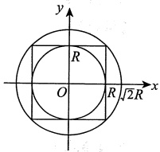

由于  $\mathrm{e}^{-(x^{2}+y^{2})}$ 恒正，因此(C)成立.

#### 3.

【答案】(B)

【解析】由积分中值定理知，存在 $(\xi,\eta)\in\left\{(x,y)\mid x^{2}+y^{2}\leq r^{2}\right\}$，使得

$$\begin{aligned}&\lim_{r\rightarrow0}\frac{1}{\pi r^{2}}\iint\limits_{x^{2}+y^{2}\leq r^{2}}\mathrm{e}^{x^{2}-y^{2}}\cos(x+y)\mathrm{d}x\mathrm{d}y=\lim_{r\rightarrow0}\frac{1}{\pi r^{2}}\cdot\mathrm{e}^{\xi^{2}-\eta^{2}}\cos(\xi+\eta)\cdot\pi r^{2}\\=&\lim_{r\rightarrow0}\mathrm{e}^{\xi^{2}-\eta^{2}}\cos(\xi+\eta)=\lim_{(\xi,\eta)\rightarrow(0,0)}\mathrm{e}^{\xi^{2}-\eta^{2}}\cos(\xi+\eta)=1.\end{aligned}$$

#### 4.

【答案】(C)

【解析】

$$\iint\limits_{D}(a x y+b y^{2})\mathrm{d}x\mathrm{d}y=\iint\limits_{D}a x y\mathrm{d}x\mathrm{d}y+\iint\limits_{D}b y^{2}\mathrm{d}x\mathrm{d}y=I_{1}+I_{2},$$

注意到积分区域D关于y轴对称，函数 $axy$关于x为奇函数，所以 $I_1=0$。因此原积分的符号只与b有关，而与a无关。

#### 5.

【答案】 $e^{\frac{1}{2}}$

【解析】交换积分次序，得

$$\begin{aligned} 原式 =&\int_{0}^{1}\mathrm{d}y\int_{y^{2}}^{1}\mathrm{e}^{-\frac{y^{2}}{2}}\mathrm{d}x=\int_{0}^{1}(1-y^{2})\mathrm{e}^{-\frac{y^{2}}{2}}\mathrm{d}y=\int_{0}^{1}\mathrm{e}^{-\frac{y^{2}}{2}}\mathrm{d}y+\int_{0}^{1}y\mathrm{d}\left(\mathrm{e}^{-\frac{y^{2}}{2}}\right)\\=&\int_{0}^{1}\mathrm{e}^{-\frac{y^{2}}{2}}\mathrm{d}y+y\mathrm{e}^{-\frac{y^{2}}{2}}\Bigg|_{0}^{1}-\int_{0}^{1}\mathrm{e}^{-\frac{y^{2}}{2}}\mathrm{d}y=\mathrm{e}^{-\frac{1}{2}}.\end{aligned}$$

#### 6.

【答案】1

【解析】积分区域如图所示，则

$$\begin{aligned} 原式 =&\int_{0}^{1}\mathrm{d}x\int_{\sqrt{x}}^{1}\frac{x\mathrm{e}^{x}}{1-\sqrt{x}}\mathrm{d}y\\=&\int_{0}^{1}x\mathrm{e}^{x}\mathrm{d}x=(x-1)\mathrm{e}^{x}\bigg|_{0}^{1}\\=&1.\end{aligned}$$

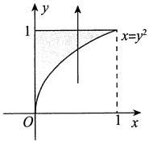

#### 7.

【答案】(B)

【解析】积分区域如图所示，所以先积y时应是从 $y=e^{x}$到y=e，故 $I=\int_{0}^{1}\mathrm{d}x\int_{e^{x}}^{e}f(x,y)\mathrm{d}y$，选(B).

#### 8.

【答案】(B)

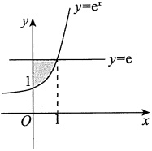

【解析】积分区域如图所示，交换积分次序，得

$$\int_{\frac{\pi}{2}}^{\frac{5\pi}{6}}\mathrm{d}x\int_{\sin x}^{1}f(x,y)\mathrm{d}y=\int_{\frac{1}{2}}^{1}\mathrm{d}y\int_{\pi-\arcsin y}^{\frac{5\pi}{6}}f(x,y)\mathrm{d}x,$$

故选(B).

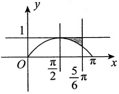

#### 9.

【答案】(C)

【解析】由题意知，此二重积分的积分区域为

$$D=\left\{(x,y)\left|\sqrt{4-x^{2}}\leq y\leq2,-2\leq x\leq2\right.\right\},$$

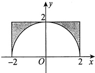

对应图像如图所示.

$$I=\int_{-2}^{2}\mathrm{d}x\int_{\sqrt{4-x^{2}}}^{2}f(x,y)\mathrm{d}y=\int_{0}^{2}\left[\int_{-2}^{-\sqrt{4-y^{2}}}f(x,y)\mathrm{d}x+\int_{\sqrt{4-y^{2}}}^{2}f(x,y)\mathrm{d}x\right]\mathrm{d}y.$$

故选项(A)错误.

又 $f(x,y)=f(-x,y)$，且积分区域关于y轴对称，则 $I=2\int_{0}^{2}\left[\int_{\sqrt{4-y^{2}}}^{2}f(x,y)dx\right]dy$。故选项(B)错误。

记 $D_{1}=\left\{(x,y)\mid(x,y)\in D,x>y\right\}$。由 $f(x,y)=f(y,x)$，得 $I=4\iint_{D_{1}}f(x,y)dxdy$。

用极坐标来表示， $I=4\int_{0}^{\frac{\pi}{4}}d\theta\int_{2}^{2\sec\theta}f(r\cos\theta,r\sin\theta)rdr$。故选(C)。

#### 10.

【答案】 $\frac{4}{27}$

【解析】

$$\iint\limits_{D}\sqrt{x^{2}+y^{2}}\mathrm{d}x\mathrm{d}y=\int_{0}^{\frac{\pi}{3}}\mathrm{d}\theta\int_{0}^{\sin3\theta}\sqrt{r^{2}\cos^{2}\theta+r^{2}\sin^{2}\theta}\cdot r\mathrm{d}r$$
第14章 二重积分

$$\begin{array}{c}{\displaystyle=\int_{0}^{\frac{\pi}{3}}\mathrm{d}\theta\int_{0}^{\sin3\theta}r^{2}\mathrm{d}r=\frac{1}{3}\int_{0}^{\frac{\pi}{3}}\sin^{3}3\theta\mathrm{d}\theta}\\ {\displaystyle}\\ {\displaystyle=\frac{1}{9}\int_{0}^{\pi}\sin^{3}t\mathrm{d}t=\frac{2}{9}\int_{0}^{\frac{\pi}{2}}\sin^{3}t\mathrm{d}t=\frac{2}{9}\cdot\frac{2}{3}=\frac{4}{27}.}\end{array}$$

#### 11.

【答案】 $\frac{5}{144}$

【解析】由被积函数知，应先对x积分，再对y积分.

$$\iint_{D}x\mathrm{e}^{-y^{2}}\mathrm{d}x\mathrm{d}y=\int_{0}^{+\infty}\mathrm{e}^{-y^{2}}\mathrm{d}y=\int_{\frac{\sqrt{y}}{3}}^{\frac{\sqrt{y}}{2}}x\mathrm{d}x=\int_{0}^{+\infty}\frac{1}{2}\left(\frac{y}{4}-\frac{y}{9}\right)\mathrm{e}^{-y^{2}}\mathrm{d}y=\frac{5}{144}\left(-\mathrm{e}^{-y^{2}}\right)\bigg|_{0}^{+\infty}=\frac{5}{144}$$

#### 12.

【答案】 $\frac{4}{9}a^{3}(3\pi-4)$

【解析】令 $x=r\cos\theta$， $y=r\sin\theta$，则

$$\begin{aligned}\iint_{D}\sqrt{4a^{2}-x^{2}-y^{2}}\mathrm{d}x\mathrm{d}y=&\int_{0}^{\frac{\pi}{2}}\mathrm{d}\theta\int_{0}^{2a\cos\theta}\sqrt{4a^{2}-r^{2}}r\mathrm{d}r\\=&\int_{0}^{\frac{\pi}{2}}\left[-\frac{1}{3}(4a^{2}-r^{2})^{\frac{3}{2}}\bigg|_{0}^{2a\cos\theta}\right]\mathrm{d}\theta\\=&\frac{8a^{3}}{3}\int_{0}^{\frac{\pi}{2}}(1-\sin^{3}\theta)\mathrm{d}\theta\\=&\frac{4}{9}a^{3}(3\pi-4).\end{aligned}$$

#### 13.

【解析】令  $x = r\cos\theta$,  $y = r\sin\theta$, 由  $y = \sqrt{3}(1-x^2)$, 得  $r^2\sin^2\theta + 3r^2\cos^2\theta = 3$, 于是  $r^2 = \frac{3}{3\cos^2\theta + \sin^2\theta}$, 积分区域如图所示, 则

$$\begin{aligned}\iint\limits_{D}(x^{2}+y^{2})\mathrm{d}x\mathrm{d}y=&\int_{\frac{\pi}{3}}^{\frac{\pi}{2}}\mathrm{d}\theta\int_{0}^{\sqrt[3]{\frac{3}{3\cos^{2}\theta+\sin^{2}\theta}}r^{3}}\mathrm{d}r=\frac{9}{4}\int_{\frac{\pi}{3}}^{\frac{\pi}{2}}\frac{\tan^{2}\theta+1}{(3+\tan^{2}\theta)^{2}}\mathrm{d}(\tan\theta)\\=&\frac{9}{4}\int_{\sqrt{3}}^{+\infty}\frac{t^{2}+1}{(3+t^{2})^{2}}\mathrm{d}t=\frac{9}{4}\int_{\sqrt{3}}^{+\infty}t^{2}+3-2\left.\mathrm{d}t\right.\\=&\frac{9}{4}\int_{\sqrt{3}}^{+\infty}\frac{\mathrm{d}t}{t^{2}+3}-\frac{9}{4}\int_{\sqrt{3}}^{+\infty}\frac{2\mathrm{d}t}{(t^{2}+3)^{2}}\\=&\frac{9}{4}\bullet\frac{1}{\sqrt{3}}\arctan\frac{t}{\sqrt{3}}\bigg|_{\sqrt{3}}^{+\infty}-\frac{1}{4}\left(\frac{3t}{t^{2}+3}+\sqrt{3}\arctan\frac{t}{\sqrt{3}}\right)\bigg|_{\sqrt{3}}^{+\infty}\\=&\frac{3\sqrt{3}\pi}{16}-\frac{(\pi-2)\sqrt{3}}{16}=\frac{\sqrt{3}}{8}\left(1+\pi\right).\end{aligned}$$

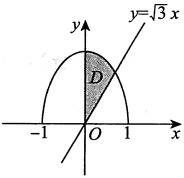

#### 14.

【解析】由轮换对称性，得

$$\begin{aligned}\iint_{D}\frac{x\cos\sqrt{x^{2}+y^{2}}}{x+y}\mathrm{d}x\mathrm{d}y=&\iint_{D}\frac{y\cos\sqrt{x^{2}+y^{2}}}{x+y}\mathrm{d}x\mathrm{d}y\\=&\frac{1}{2}\iint_{D}\cos\sqrt{x^{2}+y^{2}}\mathrm{d}x\mathrm{d}y=\frac{1}{2}\int_{0}^{\frac{\pi}{2}}\mathrm{d}\theta\int_{1}^{2}r\cos r\mathrm{d}r\\=&\frac{\pi}{4}\left(2\sin2+\cos2-\sin1-\cos1\right).\end{aligned}$$

#### 15.

【解析】由对称性，得

$$\begin{aligned}\iint\limits_{D}\frac{x^{2}-x\cos y-y^{2}}{x^{2}+y^{2}}\mathrm{d}x\mathrm{d}y=&\iint\limits_{D}\frac{x^{2}-y^{2}}{x^{2}+y^{2}}\mathrm{d}x\mathrm{d}y=2\int_{\frac{\pi}{4}}^{\frac{\pi}{2}}\mathrm{d}\theta\int_{0}^{\frac{1}{\sin\theta}}\frac{r^{2}\cos^{2}\theta-r^{2}\sin^{2}\theta}{r^{2}}r\mathrm{d}r\\=&\int_{\frac{\pi}{4}}^{\frac{\pi}{2}}(\cos^{2}\theta-\sin^{2}\theta)\frac{1}{\sin^{2}\theta}\mathrm{d}\theta=\int_{\frac{\pi}{4}}^{\frac{\pi}{2}}\cot^{2}\theta\mathrm{d}\theta-\int_{\frac{\pi}{4}}^{\frac{\pi}{2}}\mathrm{d}\theta\\=&\int_{\frac{\pi}{4}}^{\frac{\pi}{2}}\csc^{2}\theta\mathrm{d}\theta-\int_{\frac{\pi}{4}}^{\frac{\pi}{2}}2\mathrm{d}\theta=-\cot\theta\left|_{\frac{\pi}{4}}^{\frac{\pi}{2}}\right.-\frac{\pi}{2}=1-\frac{\pi}{2}.\end{aligned}$$

#### 16.

【解析】积分区域如图所示，由对称性，用极坐标，得

$$\begin{aligned}\iint\limits_{D}\sqrt{1-x^{2}-y^{2}}\mathrm{d}\sigma&=2\int_{0}^{\frac{\pi}{2}}\mathrm{d}\theta\int_{0}^{\sin\theta}\sqrt{1-r^{2}}r\mathrm{d}r\\&=-\int_{0}^{\frac{\pi}{2}}\mathrm{d}\theta\int_{0}^{\sin\theta}(1-r^{2})^{\frac{1}{2}}\mathrm{d}(1-r^{2}\\&=-\int_{0}^{\frac{\pi}{2}}\left[\left.\frac{2}{3}\left(1-r^{2}\right)^{\frac{3}{2}}\right|_{0}^{\sin\theta}\right]\mathrm{d}\theta\\&=-\frac{2}{3}\int_{0}^{\frac{\pi}{2}}(\cos^{3}\theta-1)\mathrm{d}\theta\\&=-\frac{2}{3}\left(\frac{2}{3}-\frac{\pi}{2}\right)=\frac{\pi}{3}-\frac{4}{9}\;.\end{aligned}$$

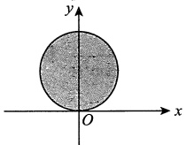

#### 17.

【解析】由于 $f(x)+f(-x)$为偶函数，因而 $x[f(x)+f(-x)]$为奇函数，又 $f(x)-f(-x)$为奇函数，从而 $(x+1)f(x)+(x-1)f(-x)=x[f(x)+f(-x)]+[f(x)-f(-x)]$为奇函数。故

$$\begin{aligned} 原式 =&\int_{-1}^{1}\left[(x+1)f(x)+(x-1)f(-x)\right]\mathrm{d}x\int_{x^{3}}^{1}\sin y\mathrm{d}y\\=&\int_{-1}^{1}(\cos x^{3}-\cos1)\left[(x+1)f(x)+(x-1)f(-x)\right]\mathrm{d}x=0.\end{aligned}$$
第14章 二重积分

#### 18.

【解析】积分区域如图所示，则

$$\begin{aligned}I=&\int_{0}^{1}\mathrm{d}y\int_{y}^{\sqrt{2y-y^{2}}}\frac{1}{\sqrt{x^{2}+y^{2}}\sqrt{4-x^{2}-y^{2}}}\mathrm{d}x\\=&\int_{0}^{\frac{\pi}{4}}\mathrm{d}\theta\int_{0}^{2\sin\theta}\frac{1}{\sqrt{4-r^{2}}}\mathrm{d}r=\int_{0}^{\frac{\pi}{4}}\left(\arcsin\frac{r}{2}\bigg|_{0}^{2\sin\theta}\right)\mathrm{d}\theta\\=&\int_{0}^{\frac{\pi}{4}}\theta\mathrm{d}\theta=\frac{1}{2}\theta^{2}\bigg|_{0}^{\frac{\pi}{4}}=\frac{\pi^{2}}{32}.\end{aligned}$$

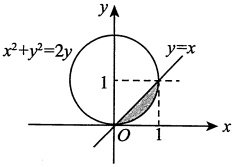

#### 19.

【解析】被积函数 $f(x,y)$的非零区域和积分区域的公共部分如图所示，故

$$\begin{aligned}\iint\limits_{D}f(x,y)\mathrm{d}\sigma=&\int_{0}^{\frac{\pi}{4}}\mathrm{d}\theta\int_{2\cos\theta}^{\frac{2}{\cos\theta}}r\sin\theta\cdot r\mathrm{d}r\\=&\frac{1}{3}\int_{0}^{\frac{\pi}{4}}\left(\left.\sin\theta\cdot r^{3}\right|_{r=2\cos\theta}^{\frac{r-2}{\cos\theta}}\right)\mathrm{d}\theta\\=&\frac{8}{3}\int_{0}^{\frac{\pi}{4}}\left(\frac{\sin\theta}{\cos^{3}\theta}-\cos^{3}\theta\sin\theta\right)\mathrm{d}\theta\\=&\frac{8}{3}\left(\frac{1}{2}\frac{1}{\cos^{2}\theta}+\frac{1}{4}\cos^{4}\theta\right)\bigg|_{0}^{\frac{\pi}{4}}\\=&\frac{5}{6}\;.\end{aligned}$$

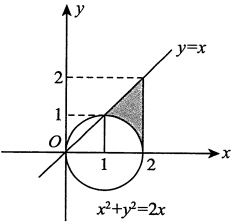

#### 20.

【解析】方法一 用极坐标系.

$$\begin{aligned} 原式 =&\int_{0}^{\frac{\pi}{2}}\mathrm{d}\theta\int_{0}^{\frac{1}{\cos\theta+\sin\theta}}\frac{\mathrm{e}^{-r(\cos\theta+\sin\theta)}}{\sqrt{\cos\theta\sin\theta}}\mathrm{d}r\\=&\int_{0}^{\frac{\pi}{2}}\left[\frac{1}{\sqrt{\cos\theta\sin\theta}}\cdot\frac{-1}{\cos\theta+\sin\theta}\cdot\mathrm{e}^{-r(\cos\theta+\sin\theta)}\bigg|_{r=0}^{r=\frac{1}{\cos\theta+\sin\theta}}\right]\mathrm{d}\theta\\=&\left(1-\frac{1}{\mathrm{e}}\right)\int_{0}^{\frac{\pi}{2}}\frac{1}{(\cos\theta+\sin\theta)\sqrt{\cos\theta\sin\theta}}\mathrm{d}\theta\\=&\left(1-\frac{1}{\mathrm{e}}\right)\int_{0}^{\frac{\pi}{2}}\frac{\mathrm{d}\theta}{\cos^{2}\theta(1+\tan\theta)\sqrt{\tan\theta}}\\=&\left(1-\frac{1}{\mathrm{e}}\right)\int_{0}^{\frac{\pi}{2}}\frac{\mathrm{d}(\tan\theta)}{(1+\tan\theta)\sqrt{\tan\theta}}\\\overset{\tan\theta=u}{=}&\left(1-\frac{1}{\mathrm{e}}\right)\int_{0}^{+\infty}\frac{\mathrm{d}u}{(1+u)\sqrt{u}}\\\end{aligned}$$

$$\begin{array}{l}\displaystyle=\left(1-\frac{1}{\mathrm{e}}\right)\cdot2\int_{0}^{+\infty}\frac{\mathrm{d}(\sqrt{u})}{1+(\sqrt{u})^{2}}\\ \\ \displaystyle=2\left(1-\frac{1}{\mathrm{e}}\right)\cdot\arctan\sqrt{u}\bigg|_{0}^{+\infty}\\ \\ \displaystyle=\pi\left(1-\frac{1}{\mathrm{e}}\right).\end{array}$$

方法二 用换元法.

令 $\left\{\begin{aligned}u=-(x+y),\\ v=x,\end{aligned}\right.$ 则 $D^{\prime}=\left\{(u,v)\mid-1\leqslant u\leqslant0,0\leqslant v\leqslant1,-1\leqslant u+v\leqslant0\right\}$，区域 $D^{\prime}$如图中阴影部分所示.

$$\begin{aligned} 原式 =&\iint\limits_{D^{\prime}}\frac{\mathbf{e}^{u}}{\sqrt{\nu(-\nu-u)}}\left\|\begin{matrix}\frac{\partial x}{\partial u}&\frac{\partial x}{\partial\nu}\\ \frac{\partial\gamma}{\partial u}&\frac{\partial y}{\partial\nu}\end{matrix}\right\|\mathrm{d}u\mathrm{d}\nu=\iint\limits_{D^{\prime}}\frac{\mathbf{e}^{u}}{\sqrt{\nu(-\nu-u)}}\mathrm{d}u\mathrm{d}\nu\\=&\int_{-1}^{0}\mathrm{d}u\int_{0}^{-u}\frac{\mathbf{e}^{u}}{\sqrt{-\nu^{2}-u\nu}}\mathrm{d}\nu=\int_{-1}^{0}\mathbf{e}^{u}\left(\left.\arcsin\frac{\nu+\frac{u}{2}}{-\frac{u}{2}}\right|_{\nu=0}^{\nu=-u}\right)\mathrm{d}u\\=&\int_{-1}^{0}\mathbf{e}^{u}\left(\frac{\pi}{2}+\frac{\pi}{2}\right)\mathrm{d}u=\int_{-1}^{0}\pi\mathbf{e}^{u}\mathrm{d}u=\pi\left(1-\frac{1}{e}\right).\end{aligned}$$

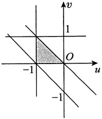

#### 21.

【解析】方法一 用极坐标系.

将 $(x-1)^{2}+y^{2}\leq1$，即 $x^{2}+y^{2}\leq2x$，转化成 $r^{2}\leq2r\cos\theta$，即 $r\leq2\cos\theta$。由此， $\cos\theta\geq0$，从而 $-\frac{\pi}{2}\leq\theta\leq\frac{\pi}{2}$，所求积分

$$\begin{aligned}I=&\iint\limits_{D}(x^{2}-3y^{2})\mathrm{d}x\mathrm{d}y=\int_{-\frac{\pi}{2}}^{\frac{\pi}{2}}\mathrm{d}\theta\int_{0}^{2\cos\theta}(r^{2}\cos^{2}\theta-3r^{2}\sin^{2}\theta)r\mathrm{d}r\\=&4\int_{-\frac{\pi}{2}}^{\frac{\pi}{2}}(\cos^{2}\theta-3\sin^{2}\theta)\cos^{4}\theta\mathrm{d}\theta=4\int_{-\frac{\pi}{2}}^{\frac{\pi}{2}}\left[4\cos^{2}\theta-(3\cos^{2}\theta+3\sin^{2}\theta)\right]\cos^{4}\theta\mathrm{d}\theta\\=&4\int_{-\frac{\pi}{2}}^{\frac{\pi}{2}}(4\cos^{6}\theta-3\cos^{4}\theta)\mathrm{d}\theta=8\int_{0}^{\frac{\pi}{2}}(4\cos^{6}\theta-3\cos^{4}\theta)\mathrm{d}\theta\\=&8\left[\frac{5}{7}\cdot\frac{3}{5}\cdot\frac{1}{3}\sin\theta\cos^{5}\theta-\frac{3}{5}\cdot\frac{1}{3}\sin\theta\cos^{3}\theta\right]_{0}^{\frac{\pi}{2}}\\=&8\left(\frac{5}{21}-\frac{1}{15}\right)=\frac{8}{7}.\end{aligned}$$

方法二 利用对称性，$I=\iint_{D}x^{2}\mathrm{d}x\mathrm{d}y-3\iint_{D}y^{2}\mathrm{d}x\mathrm{d}y$。由对称性知 $\iint_{D}x^{2}\mathrm{d}x\mathrm{d}y=\iint_{D}y^{2}\mathrm{d}x\mathrm{d}y$，故 $I=-2\iint_{D}y^{2}\mathrm{d}x\mathrm{d}y$。又 $\iint_{D}y^{2}\mathrm{d}x\mathrm{d}y=\iint_{D}(x^{2}+y^{2})\mathrm{d}x\mathrm{d}y-\iint_{D}x^{2}\mathrm{d}x\mathrm{d}y$，故 $I=-2\iint_{D}(x^{2}+y^{2})\mathrm{d}x\mathrm{d}y+2\iint_{D}x^{2}\mathrm{d}x\mathrm{d}y$。由对称性知 $\iint_{D}x^{2}\mathrm{d}x\mathrm{d}y=\iint_{D}y^{2}\mathrm{d}x\mathrm{d}y$，故 $I=-2\iint_{D}(x^{2}+y^{2})\mathrm{d}x\mathrm{d}y+2\iint_{D}x^{2}\mathrm{d}x\mathrm{d}y$。又 $\iint_{D}(x^{2}+y^{2})\mathrm{d}x\mathrm{d}y=\iint_{D}r^{2}\mathrm{d}\sigma=\int_{-\frac{\pi}{2}}^{\frac{\pi}{2}}\mathrm{d}\theta\int_{0}^{2\cos\theta}r^{3}\mathrm{d}r=\int_{-\frac{\pi}{2}}^{\frac{\pi}{2}}\frac{8}{4}\cos^{4}\theta\mathrm{d}\theta=2\int_{0}^{\frac{\pi}{2}}\cos^{4}\theta\mathrm{d}\theta=2\cdot\frac{3}{4}\cdot\frac{1}{2}\cdot\frac{\pi}{2}=\frac{3\pi}{8}$。又 $\iint_{D}x^{2}\mathrm{d}x\mathrm{d}y=\iint_{D}r^{2}\cos^{2}\theta\mathrm{d}\sigma=\int_{-\frac{\pi}{2}}^{\frac{\pi}{2}}\mathrm{d}\theta\int_{0}^{2\cos\theta}r^{3}\cos^{2}\theta\mathrm{d}r=\int_{-\frac{\pi}{2}}^{\frac{\pi}{2}}\frac{8}{4}\cos^{6}\theta\mathrm{d}\theta=2\int_{0}^{\frac{\pi}{2}}\cos^{6}\theta\mathrm{d}\theta=2\cdot\frac{5}{6}\cdot\frac{3}{4}\cdot\frac{1}{2}\cdot\frac{\pi}{2}=\frac{5\pi}{16}$。故 $I=-2\cdot\frac{3\pi}{8}+2\cdot\frac{5\pi}{16}=-\frac{3\pi}{4}+\frac{5\pi}{8}=-\frac{\pi}{8}$。

#### 22.

【解析】由 $x^{2}+y^{2}\leq x+y$，得 $\left(x-\frac{1}{2}\right)^{2}+\left(y-\frac{1}{2}\right)^{2}\leq\frac{1}{2}$。

令 $\begin{cases}x=\frac{1}{2}+r\cos\theta, \\\ y=\frac{1}{2}+r\sin\theta,\end{cases}$其中 $0\leq\theta\leq2\pi$，$0\leq r\leq\frac{1}{\sqrt{2}}$，则

$$\begin{aligned}&\iint\limits_{D}(x+y^{2})\mathrm{d}\sigma=\int_{0}^{2\pi}\mathrm{d}\theta\int_{0}^{\frac{1}{\sqrt{2}}}\left[\left(\frac{1}{2}+r\cos\theta\right)+\left(\frac{1}{2}+r\sin\theta\right)^{2}\right]r\mathrm{d}r\\=&\int_{0}^{2\pi}\mathrm{d}\theta\int_{0}^{\frac{1}{\sqrt{2}}}\left(\frac{3}{4}+r\cos\theta+r\sin\theta+r^{2}\sin^{2}\theta\right)r\mathrm{d}r\\=&\int_{0}^{2\pi}\left[\left(\frac{3}{8}r^{2}+\frac{1}{3}r^{3}\cos\theta+\frac{1}{3}r^{3}\sin\theta+\frac{1}{4}r^{4}\sin^{2}\theta\right)\bigg|_{r=0}^{r=\frac{1}{\sqrt{2}}}\right]\mathrm{d}\theta\\=&\int_{0}^{2\pi}\left(\frac{3}{16}+\frac{1}{12}+\frac{1}{12}\sin\theta+\frac{1}{32}\sin^{2}\theta\right)\mathrm{d}\theta\\=&\frac{1}{2}\cdot\frac{\pi}{2}+\frac{1}{12}\cdot 2\pi+\frac{1}{32}\cdot\pi=\frac{\pi}{4}+\frac{\pi}{6}+\frac{\pi}{32}=\frac{25\pi}{48}.\end{aligned}$$

#### 23.

【解析】方法一 如图所示，积分区域D由两个圆周围成，并且被积函数是因子 $x^{2}+y^{2}$的函数，故选用极坐标系计算.

$$\begin{aligned}I=&\iint\limits_{D}r\bullet r\mathrm{d}r\mathrm{d}\theta=\int_{-\frac{\pi}{2}}^{\frac{\pi}{2}}\mathrm{d}\theta\int_{a\cos\theta}^{a}r^{2}\mathrm{d}r+\int_{\frac{\pi}{2}}^{\frac{3\pi}{2}}\mathrm{d}\theta\int_{0}^{a}r^{2}\mathrm{d}r\\=&\frac{2}{3}\int_{0}^{\frac{\pi}{2}}(a^{3}-a^{3}\cos^{3}\theta)\mathrm{d}\theta+\frac{\pi}{3}a^{3}\\=&\frac{2\pi}{3}a^{3}-\frac{2}{3}a^{3}\int_{0}^{\frac{\pi}{2}}\cos^{3}\theta\mathrm{d}\theta=\frac{2}{3}a^{3}\left(\pi-\frac{2}{3}\right).\end{aligned}$$

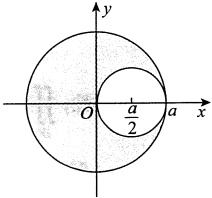

方法二 由积分区域的可加性计算.

$$\begin{aligned}I=&\iint\limits_{x^{2}+y^{2}\leqslant a^{2}}\sqrt{x^{2}+y^{2}}\mathrm{d}x\mathrm{d}y-\iint\limits_{\left(x-\frac{a}{2}\right)^{2}+y^{2}\leqslant\frac{a^{2}}{4}}\sqrt{x^{2}+y^{2}}\mathrm{d}x\mathrm{d}y\\=&\int_{0}^{2\pi}\mathrm{d}\theta\int_{0}^{a}r^{2}\mathrm{d}r-\int_{-\frac{\pi}{2}}^{\frac{\pi}{2}}\mathrm{d}\theta\int_{0}^{a\cos\theta}r^{2}\mathrm{d}r\\=&\frac{2}{3}a^{3}\left(\pi-\frac{2}{3}\right).\end{aligned}$$

#### 24.

【解析】令 $\left\{\begin{aligned}x=r\cos\theta, \\\ y=r\sin\theta,\end{aligned}\right.$其中 $\left\{\begin{aligned}0\leq\theta\leq\frac{\pi}{2}, \\\ 0\leq r\leq1,\end{aligned}\right.$，则有

$$\begin{aligned}&\iint\limits_{D}\sqrt{\frac{1-x^{2}-y^{2}}{1+x^{2}+y^{2}}}\mathrm{d}x\mathrm{d}y=\int_{0}^{\frac{\pi}{2}}\mathrm{d}\theta\int_{0}^{1}\sqrt{\frac{1-r^{2}}{1+r^{2}}}r\mathrm{d}r\\=&\frac{\pi}{2}\bullet\frac{1}{2}\int_{0}^{1}\sqrt{\frac{1-r^{2}}{1+r^{2}}}\mathrm{d}(r^{2})\xrightarrow{\text{令 }r^{2}=t}\frac{\pi}{4}\int_{0}^{1}\sqrt{\frac{1-t}{1+t}}\mathrm{d}t\\=&\frac{\pi}{4}\int_{0}^{1}\frac{1-t}{\sqrt{1-t^{2}}}\mathrm{d}t=\frac{\pi}{4}\left(\int_{0}^{1}\frac{\mathrm{d}t}{\sqrt{1-t^{2}}}-\int_{0}^{1}\frac{t}{\sqrt{1-t^{2}}}\mathrm{d}t\right)\\=&\frac{\pi}{4}\left(\arcsin t+\sqrt{1-t^{2}}\right)\Bigg|_{0}^{1}=\frac{\pi}{4}\left(\frac{\pi}{2}+0-0-1\right)=\frac{\pi^{2}}{8}-\frac{\pi}{4}.\end{aligned}$$

### 第15章 微分方程

#### 1.

【答案】 $y=\frac{-1-\cos x}{x}$

【解析】原方程可化为 $y'+\frac{1}{x}y=\frac{\sin x}{x}$，解得

$$y=\mathrm{e}^{-\int\frac{1}{x}\mathrm{d}x}\left(\int\frac{\sin x}{x}\mathrm{e}^{\int\frac{\mathrm{d}x}{x}}\mathrm{d}x+C\right)=\frac{1}{x}\left(\int\sin x\mathrm{d}x+C\right)=\frac{C-\cos x}{x},$$

由 $y(\pi)=0$，得C=-1，故特解为 $y=\frac{-1-\cos x}{x}$.

#### 2.

【答案】 $\arctan\frac{y}{x}+3\ln\sqrt{x^{2}+y^{2}}=C$（其中C为任意常数）

【解析】曲线  $y = y(x)$ 上任意一点  $M(x, y)$ 的切线在 y 轴上的截距为  $y - xy'$，法线在 x 轴上的截距为  $x + yy'$，依题意得到方程

$$\frac{y-xy^{\prime}}{x+yy^{\prime}}=3 或 y^{\prime}=\frac{y-3x}{x+3y}.$$

令  $u = \frac{y}{x}$，将方程化为  $xu' = -3\frac{1 + u^2}{1 + 3u}$，积分得到  $\arctan u + 3\ln\sqrt{1 + u^2} = -3\ln|x| + C$，即

$$\arctan\frac{y}{x}+3\ln\sqrt{x^{2}+y^{2}}=C\left( 其中 \;C\; 为任意常数 \right).$$

#### 3.

【答案】(A)

【解析】将  $\lambda y_{1} + \mu y_{2}$ 代入方程  $y' + p(x)y = q(x)$，得

$$\lambda\left[y_{1}^{\prime}+p(x)y_{1}\right]+\mu\left[y_{2}^{\prime}+p(x)y_{2}\right]=q(x).$$

由题设可知 $y_{1}^{\prime}+p(x)y_{1}=q(x)$， $y_{2}^{\prime}+p(x)y_{2}=q(x)$，从而有 $\lambda+\mu=1$

类似地，将  $\lambda y_{1} - \mu y_{2}$ 代入齐次方程  $y' + p(x)y = 0$，得  $\lambda - \mu = 0$，解得  $\lambda = \frac{1}{2}$， $\mu = \frac{1}{2}$。故选项(A)正确。

事实上，当  $\lambda = -\frac{1}{2}$， $\mu = -\frac{1}{2}$ 时， $\lambda y_{1} + \mu y_{2}$ 不是方程  $y' + p(x)y = q(x)$ 的解，与题设矛盾，故选项 (B) 不正确.

同理可知选项(D)也不正确.

当  $\lambda=\frac{2}{3}$， $\mu=\frac{1}{3}$ 时， $\lambda y_{1}-\mu y_{2}$ 不是齐次方程  $y^{\prime}+p(x)y=0$ 的解，与题设矛盾，故选项(C)也不正确.

#### 4.

【分析】若把x看作自变量，方程很难求解，若把y看作自变量，x看作未知函数，就可以化为一阶线性微分方程.

【解析】整理微分方程可得 $\frac{dy}{dx}=\frac{-y^{3}}{2x-3xy^{2}-y^{3}}$，取倒数得 $\frac{dx}{dy}=-\frac{2x-3xy^{2}-y^{3}}{y^{3}}$，即

$$\frac{\mathrm{d}x}{\mathrm{d}y}+\frac{2-3y^{2}}{y^{3}}\ x=1\ .$$

利用通解公式得

$$\begin{aligned}x=&\mathrm{e}^{-\int\frac{2-3y^{2}}{y^{3}}\mathrm{d}y}\left(\int\mathrm{e}^{\int\frac{2-3y^{2}}{y^{3}}\mathrm{d}y}\mathrm{d}y+C\right)=y^{3}\mathrm{e}^{\frac{1}{y^{2}}}\left(\int\mathrm{e}^{-\frac{1}{y^{2}}}y^{-3}\mathrm{d}y+C\right)\\=&y^{3}\mathrm{e}^{\frac{1}{y^{2}}}\left[\frac{1}{2}\int\mathrm{d}\left(\mathrm{e}^{-\frac{1}{y^{2}}}\right)+C\right]=y^{3}\mathrm{e}^{\frac{1}{y^{2}}}\left(\frac{1}{2}\mathrm{e}^{-\frac{1}{y^{2}}}+C\right)\\=&\frac{1}{2}y^{3}+C y^{3}\mathrm{e}^{\frac{1}{y^{2}}}(y\neq0),\end{aligned}$$

其中 C 为任意常数. 另外，y=0 也是方程的解.

#### 5.

【答案】1

【解析】令 $x+y=u$，则 $\frac{dy}{dx}=\frac{du}{dx}-1$，故 $\frac{du}{dx}=u^{2}+1$，解得 $\arctan u=x+C$，由 $y(0)=0$，得 $u(0)=0$，故 $C=0$，即 $\arctan(x+y)=x$，则 $y=\tan x-x$。故

$$\lim_{x\to0^{+}}[y(x)]^{x}=\lim_{x\to0^{+}}(\tan x-x)^{x}=\mathrm{e}^{\lim_{x\to0^{+}}(\tan x-x)}=\mathrm{e}^{0}=1.$$

#### 6.

【答案】 $\sin y = x + Ce^{-x}$（其中 C 为任意常数）

【解析】原方程可化为  $y' = \frac{x+1-\sin y}{\cos y}$，则  $y' \cos y = x+1 - \sin y$，即  $(\sin y)' + \sin y = x+1$。令  $z = \sin y$，于是  $z' + z = x+1$，故  $z = e^{-\int 1dx} \left[ \int e^{\int 1dx} (x+1)dx + C \right] = e^{-x} (xe^x + C) = x + Ce^{-x}$，即  $\sin y = x + Ce^{-x}$（其中  $C$ 为任意常数）。

#### 7.

【解析】(1)由一阶非齐次线性微分方程的通解公式可得

$$y=\mathrm{e}^{-\int\frac{1}{x^{2}}\mathrm{d}x}\left(\int2\mathrm{e}^{\frac{1}{x}}\mathrm{e}^{\int\frac{1}{x^{2}}\mathrm{d}x}\mathrm{d}x+C\right)=\mathrm{e}^{\frac{1}{x}}(2x+C),$$

因为 $y\left(\frac{1}{2}\right)=0$，所以C=-1，故 $y=e^{\frac{1}{x}}(2x-1)$.

(2) 因为

$$k=\lim_{x\to\infty}\frac{y}{x}=\lim_{x\to\infty}\mathrm{e}^{\frac{1}{x}}\left(2-\frac{1}{x}\right)=2,$$
$$b=\lim_{x\to\infty}(y-2x)=\lim_{x\to\infty}\left[2x\left(\mathrm{e}^{\frac{1}{x}}-1\right)-\mathrm{e}^{\frac{1}{x}}\right]=\lim_{x\to\infty}\left[\frac{2\left(\mathrm{e}^{\frac{1}{x}}-1\right)}{\frac{1}{x}}-\mathrm{e}^{\frac{1}{x}}\right]=1$$

所以曲线  $y(x)$ 的斜渐近线方程为  $y = 2x + 1$.

#### 8.

【解析】记t时刻容器的水深为 $z(t)$，则注入的水的体积为 $V(t)=\int_{0}^{z(t)}\pi f^{2}(u)du$，水面的面积

$$S(t)=\pi f^{2}(z).$$

由题意，得

$$\frac{\mathrm{d}\left[V(t)\right]}{\mathrm{d}t}=\pi f^{2}\left[z(t)\right]\cdot\frac{\mathrm{d}z}{\mathrm{d}t}=3,$$

$$\frac{\mathrm{d}\left[S(t)\right]}{\mathrm{d}t}=\pi\cdot2f\left[z(t)\right]\frac{\mathrm{d}\left\{f\left[z(t)\right]\right\}}{\mathrm{d}z}\cdot\frac{\mathrm{d}z}{\mathrm{d}t}=\pi,$$

故

$$\frac{\mathrm{d}\left[f(z)\right]}{\mathrm{d}z}\bullet\frac{2}{f(z)}=\frac{\pi}{3},$$

分离变量，得

$$\frac{\mathrm{d}\left[f(z)\right]}{f(z)}=\frac{\pi}{6}\,\mathrm{d}z,$$

于是 $\int\frac{\mathrm{d}[f(z)]}{f(z)}=\frac{\pi}{6}\int\mathrm{d}z$，得

$$\ln\left|f(z)\right|=\frac{\pi}{6}z+\ln C_{1}\Rightarrow f(z)=\pm C_{1}\mathrm{e}^{\frac{\pi}{6}z}=C\mathrm{e}^{\frac{\pi}{6}z}(z\geqslant0),$$

其中  $C$ 为任意常数，又底面积为  $16\pi cm^2$，即  $f(0) = \pm4$，得  $C = \pm4$，即  $f(z) = \pm4e^{\frac{\pi}{6}z} (z \geq 0)$。

#### 9.

【分析】先将第一项积分变形，再对等式求导两次，化为微分方程后求解.

【解析】原方程可写为  $x\int_{0}^{x}f(t)dt-\int_{0}^{x}f(t)dt-\int_{0}^{x}tf(t)dt=x$，等式两边分别对 x 求导并化简，得

$$\int_{0}^{x}f(t)\mathrm{d}t-f(x)=1\quad( 隐含 f(0)=-1),$$

等式两边继续对x求导，得  $f(x)-f'(x)=0$

解得 $f(x)=Ce^x$，由于 $f(0)=-1$，因此 $C=-1$，即 $f(x)=-e^x (x \geq 0)$。

#### 10.

【分析】本题可直接利用一阶线性微分方程的通解公式，不过要将通解中的不定积分写成变上限x的积分形式.本题采用全微分的方法求解较便捷.

【解析】原方程的两端同乘 $e^{x}$，得 $\frac{dy}{dx}e^{x}+ye^{x}=\varphi(x)e^{x}$，整理可得

$$\mathbf{e}^{x}\mathrm{d}y+y\mathbf{e}^{x}\mathrm{d}x=\varphi(x)\mathbf{e}^{x}\mathrm{d}x,$$

也即  $\mathrm{d}(ye^{x})=\varphi(x)\mathrm{e}^{x}\mathrm{d}x$，又因  $y(0)=0$，故积分得  $ye^{x}=\int_{0}^{x}\varphi(t)\mathrm{e}^{t}\mathrm{d}t$，整理得  $y=\mathrm{e}^{-x}\int_{0}^{x}\varphi(t)\mathrm{e}^{t}\mathrm{d}t$。

当 $x \geqslant 0$时，

$$\begin{align*}\big|y(x)\big|=&\Big|\mathrm{e}^{-x}\int_{0}^{x}\varphi(t)\mathrm{e}^{t}\mathrm{d}t\Big|\leqslant\mathrm{e}^{-x}\int_{0}^{x}\big|\varphi(t)\big|\mathrm{e}^{t}\mathrm{d}t\\ \leq&\mathrm{e}^{-x}k\int_{0}^{x}\mathrm{e}^{t}\mathrm{d}t=k\mathrm{e}^{-x}(\mathrm{e}^{x}-1)=k(1-\mathrm{e}^{-x}),\end{align*}$$

即当 $x\geq0$时， $\left|y(x)\right|\leq k(1-\mathrm{e}^{-x})$。

#### 11.

【解析】整理题干方程，得 $y'-\frac{2}{x}y=\frac{2\ln x-1}{2x}$，由一阶非齐次线性微分方程的通解公式，得

$$y(x)=\mathrm{e}^{\int\frac{2}{x}\mathrm{d}x}\left(\int\frac{2\ln x-1}{2x}\mathrm{e}^{-\int\frac{2}{x}\mathrm{d}x}\mathrm{d}x+C\right)=x^{2}\left(\int\frac{2\ln x-1}{2x^{3}}\mathrm{d}x+C\right)=-\frac{1}{2}\ln x+Cx^{2},$$

代入 $y(1)=\frac{1}{4}$，得 $C=\frac{1}{4}$，所以 $y=-\frac{1}{2}\ln x+\frac{1}{4}x^{2}$.

由 $\int_{1}^{e}y(x)dx=\int_{1}^{e}\left(-\frac{1}{2}\ln x+\frac{1}{4}x^{2}\right)dx=\frac{e^{3}-7}{12}$，得平均值为 $\frac{e^{3}-7}{12(e-1)}$.

#### 12.

【解析】由题意知切线方程为  $Y - y = y'(X - x)$，切线在 y 轴上的截距为  $y - xy'$，故有 x = y - xy'，即  $y' - \frac{y}{x} = -1$，解此微分方程得

$$y(x)=\mathrm{e}^{\int\frac{1}{x}\mathrm{d}x}\left[\int\left(-\mathrm{e}^{-\int\frac{1}{x}\mathrm{d}x}\right)\mathrm{d}x+C\right]=x(-\ln x+C),$$

代入 $y(1)=0$，得C=0，即 $y(x)=-x\ln x$。

 $y(x)$在区间 $(0,1)$上与x轴所围平面图形的面积为

$$\int_{0}^{1}\left|-x\ln x\right|\mathrm{d}x=-\int_{0}^{1}\ln x\mathrm{d}\left(\frac{1}{2}x^{2}\right)=\int_{0}^{1}\frac{1}{2}x\mathrm{d}x=\frac{1}{4}.$$

#### 13.

【答案】(D)

【解析】二阶常系数齐次线性微分方程 $y''+2y'+y=0$的特征方程为 $r^{2}+2r+1=0$，解得特征根为 $r_{1}=r_{2}=-1$，故通解为 $y=\mathrm{e}^{-x}(C_{1}x+C_{2})$.

由题意知， $y(0)=4$， $y'(0)=-2$，于是可得  $C_2=4$， $C_1=2$。故曲线方程为  $y=e^{-x}(2x+4)=2(x+2)e^{-x}$，应选(D)。

#### 14.

【答案】(B)

【解析】二阶常系数齐次线性微分方程  $y'' - 2y' + 5y = 0$ 的特征方程为  $r^2 - 2r + 5 = 0$，特征根为  $r_{1,2} = 1 \pm 2i$，可得通解为  $y = e^x (C_1 \cos 2x + C_2 \sin 2x)$。

由题意知， $y(0)=0$， $y'(0)=-2$，于是可得  $C_1=0$， $C_2=-1$，故  $y=-e^x \sin 2x$。
#### 15.

【答案】-1

【解析】由 $y''-2y'+y=0$得特征方程为 $r^{2}-2r+1=0$，即 $(r-1)^{2}=0$，解得 $r_{1}=r_{2}=1$，故通解为 $y=(C_{1}+C_{2}x)e^{x}$。由 $y(0)=0$， $y'(0)=1$，可得 $C_{1}=0$， $C_{2}=1$，故 $y(x)=xe^{x}$。

因此

$$\int_{-\infty}^{0}y(x)\mathrm{d}x=\int_{-\infty}^{0}x\mathrm{e}^{x}\mathrm{d}x=(x-1)\mathrm{e}^{x}\Big|_{-\infty}^{0}=-1.$$

#### 16.

【答案】 $y''-2y'+5y'=0$

【解析】由通解形式可知特征根为 $r_{1}=0,r_{2,3}=1\pm2i$，故特征方程为

$$r(r-1+2\mathrm{i})(r-1-2\mathrm{i})=0,$$

整理得 $r^{3}-2r^{2}+5r=0$，可得对应的微分方程为 $y''-2y''+5y'=0$。

【注】考生应对某些高于二阶的常系数齐次线性微分方程熟练求解，并会根据解的结构形式反求微分方程.

#### 17.

【答案】(D)

【解析】由题可知，对应齐次方程的特征方程为 $4r^{2}-12r+9=0$，即 $(2r-3)^{2}=0$，解得 $r_{1}=r_{2}=\frac{3}{2}$。 $\frac{3}{2}$为二重根，再由原方程的非齐次项 $\mathrm{e}^{\frac{3}{2}x}(3x^{2}+2)$，可以确定原方程的特解形式为

$$y^{*}=x^{2}(Ax^{2}+Bx+C)\mathrm{e}^{\frac{3}{2}x}.$$

#### 18.

【答案】 $y''-y'-2y=(1-2x)e^{x}$

【解析】由条件知  $y_1 - y_2 = e^{2x} - e^{-x}$， $y_1 - y_3 = e^{-x}$ 都是对应齐次方程的解，而  $(y_1 - y_2) + (y_1 - y_3) = e^{2x}$ 也是齐次方程的解，可知  $e^{2x}$ 与  $e^{-x}$ 是齐次方程的两个线性无关的解。因为  $y_2 = e^{-x} + xe^x$ 是非齐次方程的解，故  $xe^x$ 也是非齐次方程的解。

由  $e^{-x}$， $e^{2x}$ 是齐次方程的线性无关的解，可知特征根为  $r_1 = -1$， $r_2 = 2$，特征方程为  $r^2 - r - 2 = 0$，对应的齐次方程为  $y'' - y' - 2y = 0$。

设所求非齐次方程为  $y'' - y' - 2y = f(x)$，将非齐次方程的解  $x e^{x}$ 代入，得

$$f(x)=(x\mathrm{e}^{x})^{\prime \prime}-(x\mathrm{e}^{x})^{\prime}-2x\mathrm{e}^{x}=(1-2x)\mathrm{e}^{x}.$$

故所求方程为 $y''-y'-2y=(1-2x)e^x$。

#### 19.

【分析】这是二阶常系数非齐次线性微分方程，其通解由对应的齐次方程的通解与自身的一个特解构成.对于特解，可以根据非齐次项定出特解的形式，代入原方程即可求得特解.

【解析】原方程所对应的齐次方程为  $y''-2y'+y=0$，其特征方程为  $r^{2}-2r+1=0$，解得  $r_{1}=r_{2}=1$。

于是齐次方程的通解为  $Y=(C_1+C_2x)e^x$，其中  $C_1, C_2$ 为任意常数。

由于特征方程有重根 1，且非齐次项为  $2(3x^2-2)e^x$，故可设特解为

$$y^{*}=x^{2}(a_{0}x^{2}+a_{1}x+a_{2})\mathrm{e}^{x}.$$

代入原方程并比较两端系数，得 $a_{0}=\frac{1}{2}$， $a_{1}=0$， $a_{2}=-2$。于是有

$$y^{*}=x^{2}\left(\frac{1}{2}x^{2}-2\right)\mathrm{e}^{x}.$$

因此，原方程的通解为

$$y=Y+y^{*}=(C_{1}+C_{2}x)\mathrm{e}^{x}+x^{2}\left(\frac{x^{2}}{2}-2\right)\mathrm{e}^{x},$$

其中 $C_{1}$， $C_{2}$为任意常数.

#### 20.

【分析】这是二阶常系数非齐次线性微分方程，先求其通解，再由题设定特解

【解析】对应齐次方程的特征方程为 $r^{2}+4r+5=0$，解得 $r_{1,2}=-2\pm i$

于是对应齐次方程的通解为  $Y = e^{-2x}(C_1 \cos x + C_2 \sin x)$.

已知非齐次项为  $8\cos x$，而  $\pm i$ 不是特征根，故可设原方程的一个特解为  $y^* = A\sin x + B\cos x$，代入原方程，比较系数得  $A = B = 1$，于是原方程有特解  $y^* = \sin x + \cos x$。

因此，原方程的通解为  $y = Y + y^{*}$，即  $y = e^{-2x} (C_{1} \cos x + C_{2} \sin x) + \sin x + \cos x$。

为使  $x \to -\infty$ 时，y 有界，必有  $C_{1}=C_{2}=0$，故满足题设的特解为  $y=\sin x+\cos x$。

#### 21.

【答案】 $\frac{\sin(\sqrt{2}\ln x)}{x}$

【解析】设  $x = e^t$，并记  $D = \frac{d}{dt}$，则利用欧拉方程的解法可将  $x^2 y'' + 3xy' + 3y = 0$ 化为  $[D(D-1) + 3D + 3] y = 0$，即  $\frac{d^2 y}{dt^2} + 2 \frac{dy}{dt} + 3y = 0$，其特征方程为  $r^2 + 2r + 3 = 0$，得一对共轭复根  $-1 \pm \sqrt{2} i$，可得其通解为  $y = e^{-t} (C_1 \cos \sqrt{2} t + C_2 \sin \sqrt{2} t)$，从而原方程的通解为

$$y=\frac{1}{x}\Big[C_{1}\mathrm{c o s}(\sqrt{2}\ln x)+C_{2}\mathrm{s i n}(\sqrt{2}\ln x)\Big].$$

由条件  $y(1)=0$,  $y'(1)=\sqrt{2}$ 可得  $C_1=0$,  $C_2=1$, 故欧拉方程  $x^2 y'' + 3xy' + 3y = 0$ 满足条件  $y(1)=0$,  $y'(1)=\sqrt{2}$ 的解为  $y=\frac{\sin(\sqrt{2}\ln x)}{x}$.
### 第16章 无穷级数

#### 1.

【答案】(D)

【解析】当 $n\to\infty$时，

$$\frac{\left(\sqrt{n+1}-\sqrt{n}\right)^{p}}{n}=\frac{1}{n\left(\sqrt{n+1}+\sqrt{n}\right)^{p}}\sim\frac{1}{2^{p}\bullet n^{1+\frac{p}{2}}}$$

因此，当 $1+\frac{p}{2}>1$，即p>0时，级数 $\sum_{n=1}^{\infty}\frac{\left(\sqrt{n+1}-\sqrt{n}\right)^{p}}{n}$收敛；

当 $n\to\infty$时，

$$\frac{1}{n^{p}}-\frac{1}{(n+1)^{p}}=\frac{(n+1)^{p}-n^{p}}{n^{p}(n+1)^{p}}=\frac{n^{p}\left[\left(1+\frac{1}{n}\right)^{p}-1\right]}{n^{p}(n+1)^{p}}\sim\frac{p n^{p-1}}{n^{2p}}=\frac{p}{n^{p+1}},$$

因此，当p=0或 $p+1>1$，即 $p\geqslant0$时，级数 $\sum_{n=1}^{\infty}\left[\frac{1}{n^{p}}-\frac{1}{(n+1)^{p}}\right]$收敛.

综上，若两个级数均收敛，则p>0.故选(D).

#### 2.

【解析】当 $x\geqslant0$时 $\sin x\leqslant x$，当且仅当x=0时取等号，则 $\frac{1}{n}>\sin\frac{1}{n}$， $\ln\frac{1}{n}-\ln\sin\frac{1}{n}>0$，故原级数为正项级数.考查

$$\lim_{x\to0^{+}}\frac{\ln x-\ln\sin x}{x^{2}}=\lim_{x\to0^{+}}\frac{\frac{1}{x}-\frac{\cos x}{\sin x}}{2x}=\lim_{x\to0^{+}}\frac{\sin x-x\cos x}{2x^{2}\sin x}=\frac{1}{6}$$

由归结原则，知  $\lim_{n\to\infty}\frac{\ln\frac{1}{n}-\ln\sin\frac{1}{n}}{\frac{1}{n^2}}=\frac{1}{6}$. 又  $\sum_{n=1}^{\infty}\frac{1}{n^2}$ 收敛，根据正项级数比较判别法的极限形式，

 $\sum_{n=1}^{\infty}\left(\ln\frac{1}{n}-\ln\sin\frac{1}{n}\right)$收敛.

#### 3.

【答案】(B)

【解析】当  $n \to \infty$ 时， $\sin \frac{\lambda + 2n^2}{n^3} = \sin \left( \frac{\lambda}{n^3} + \frac{2}{n} \right)$ 单调递减且趋于 0，故  $\sum_{n=1}^{\infty} (-1)^n \sin \frac{\lambda + 2n^2}{n^3}$ 符合莱布尼茨定理的条件，故收敛。又  $\left| (-1)^n \sin \frac{\lambda + 2n^2}{n^3} \right| \sim \frac{\lambda + 2n^2}{n^3} = \frac{\lambda}{n^3} + \frac{2}{n} (n \to \infty)$。

又 $\sum_{n=1}^{\infty}\frac{\lambda}{n^{3}}$收敛， $\sum_{n=1}^{\infty}\frac{2}{n}$发散，故 $\sum_{n=1}^{\infty}\left|(-1)^{n}\sin\frac{\lambda+2n^{2}}{n^{3}}\right|$发散.

综上， $\sum_{n=1}^{\infty}(-1)^{n}\sin\frac{\lambda+2n^{2}}{n^{3}}$ 条件收敛.所以选(B).

#### 4.

【答案】(A)

【解析】对于选项(A)，若 $\sum_{n=0}^{\infty}a_{n}^{2}$收敛，则 $\lim_{n\to\infty}a_{n}^{2}=0$，当n充分大时， $\left|a_{n}^{2}\right|<1$，可得 $\left|a_{n}\right|<1$，于是 $\left|a_{n}^{3}\right|=\left|a_{n}^{2}\right|\left|a_{n}\right|<\left|a_{n}^{2}\right|=a_{n}^{2}$，故 $\sum_{n=0}^{\infty}a_{n}^{3}$绝对收敛，也即 $\sum_{n=0}^{\infty}a_{n}^{3}$收敛.

对于选项(B)，取  $a_{n}=\frac{1}{\sqrt{n+1}}$，可得  $a_{n}^{2}=\frac{1}{n+1}$， $a_{n}^{3}=\frac{1}{(n+1)^{\frac{3}{2}}}$，则  $\sum_{n=0}^{\infty}a_{n}^{2}$ 发散，但  $\sum_{n=0}^{\infty}a_{n}^{3}$ 收敛。

对于选项(C)，取  $a_{n}=\frac{(-1)^{n+1}}{(n+1)^{\frac{1}{4}}}$，可得  $a_{n}^{3}=\frac{(-1)^{3(n+1)}}{(n+1)^{\frac{3}{4}}}$， $a_{n}^{4}=\frac{1}{n+1}$，则  $\sum_{n=0}^{\infty}a_{n}^{3}$ 收敛，但  $\sum_{n=0}^{\infty}a_{n}^{4}$ 发散.

对于选项(D)，取  $a_{n}=\frac{1}{\sqrt[3]{n+1}}$ ，可得  $a_{n}^{3}=\frac{1}{n+1}$， $a_{n}^{4}=\frac{1}{(n+1)^{\frac{4}{3}}}$ ，则  $\sum_{n=0}^{\infty}a_{n}^{3}$ 发散，但  $\sum_{n=0}^{\infty}a_{n}^{4}$ 收敛.

#### 5.

【答案】(B)

【解析】令 $f(x)=\arctan(x+k)-\arctan x$，得 $f'(x)=\frac{1}{1+(x+k)^2}-\frac{1}{1+x^2}<0$，则 $f(x)$单调减少，即 $u_n$单调减少.

$$\lim_{n\to\infty}\frac{\sqrt{\arctan(n+k)-\arctan n}}{\frac{1}{n}}=\sqrt{k},$$

则 $\sum_{n=1}^{\infty}u_{n}$发散，又 $\lim_{n\to\infty}u_{n}=0$，由莱布尼茨判别法可知， $\sum_{n=1}^{\infty}(-1)^{n}u_{n}$条件收敛.

#### 6.

【答案】(D)

【解析】方法一 因为  $\sum_{k=1}^{n}(u_{k+1}-u_{k})=u_{n+1}-u_{1}$， $\sum_{n=1}^{\infty}(u_{n+1}-u_{n})$ 收敛，即有  $\lim_{n\to\infty}\sum_{k=1}^{n}(u_{k+1}-u_{k})=\lim_{n\to\infty}(u_{n+1}-u_1)$ 存在，所以可以得到  $\{u_{n}\}$ 收敛，从而  $\left\{u_{n}^{2}\right\}$ 收敛.

因为 $\sum_{k=1}^{n}(u_{k+1}^{2}-u_{k}^{2})=u_{n+1}^{2}-u_{1}^{2}$，所以 $\lim_{n\to\infty}\sum_{k=1}^{n}(u_{k+1}^{2}-u_{k}^{2})=\lim_{n\to\infty}(u_{n+1}^{2}-u_{1}^{2})$存在，即 $\sum_{n=1}^{\infty}(u_{n+1}^{2}-u_{n}^{2})$收敛.
方法二 取  $u_{n}=1-\frac{1}{n}$，则  $\sum_{n=1}^{\infty}(u_{n+1}-u_{n})$ 收敛，这时  $\sum_{n=1}^{\infty}\frac{u_{n}}{n}$ 与  $\sum_{n=1}^{\infty}(-1)^{n}\frac{1}{u_{n}}$ 均发散，故可排除(A)，(B).

取  $u_{n}=-\frac{1}{n}$，则  $\sum_{n=1}^{\infty}(u_{n+1}-u_{n})$ 收敛，且  $1-\frac{u_{n}}{u_{n+1}}=-\frac{1}{n}$， $\sum_{n=1}^{\infty}\left(1-\frac{u_{n}}{u_{n+1}}\right)$ 发散，故可排除(C).

#### 7.

【解析】(1)由题 $(1-x)\frac{\mathrm{d}y}{\mathrm{d}x}+2y=0$，分离变量得 $\frac{1}{2y}\mathrm{d}y=\frac{1}{x-1}\mathrm{d}x$，两端同时积分得

$$\frac{1}{2}\ln\left|y\right|=\ln\left|x-1\right|+\ln C_{1}$$

$$\left|y\right|^{\frac{1}{2}}=C_{1}\left|x-1\right|,$$

两端同时平方得  $y = C(x - 1)^2$，又  $y(0) = 1$，代入上式，解得  $C = 1$，故  $y(x) = (x - 1)^2$。

(2)由(1)得 $y=(x-1)^{2}$，则

$$0<a_{n}(1)=\int_{0}^{1}(t-1)^{2}\sin^{n}t\mathrm{d}t\leqslant\int_{0}^{1}(t-1)^{2}t^{n}\mathrm{d}t,$$

又  $\int_{0}^{1}(t-1)^{2}t^{n}\mathrm{d}t=\int_{0}^{1}(t^{n+2}-2t^{n+1}+t^{n})\mathrm{d}t=\frac{1}{n+1}+\frac{1}{n+3}-\frac{2}{n+2}=\frac{2}{(n+1)(n+2)(n+3)}$，且  $\sum_{n=1}^{\infty}\frac{2}{(n+1)(n+2)(n+3)}$ 收敛，所以  $\sum_{n=1}^{\infty}a_{n}(1)$ 收敛.

#### 8.

【解析】(1)所给方程为 $a_{n}^{\prime}(x)-\frac{n}{(1+x)\ln(1+x)}a_{n}(x)=-\ln^{n}(1+x)$，令

$$p_{n}(x)=-\frac{n}{(1+x)\ln(1+x)},$$

则

$$\mathrm{e}^{-\int p_{n}(x)\mathrm{d}x}=\mathrm{e}^{n\int\frac{\mathrm{d}x}{(1+x)\ln(1+x)}}=\mathrm{e}^{n\int\frac{\mathrm{d}\left[\ln(1+x)\right]}{\ln(1+x)}}=\mathrm{e}^{n\ln\left[\ln(1+x)\right]}=\ln^{n}(1+x).$$

同理  $\mathrm{e}^{\int p_{n}(x)\mathrm{d}x}=\frac{1}{\ln^{n}(1+x)}$，由一阶线性微分方程的通解公式，有

$$a_{n}(x)=\ln^{n}(1+x)\left\{\int\frac{1}{\ln^{n}(1+x)}\bullet\left[-\ln^{n}(1+x)\right]\mathrm{d}x+C\right\}=\ln^{n}(1+x)(-x+C),$$

又由  $a_{n}(1)=0$ ，得 C=1 ，于是  $a_{n}(x)=(1-x)\ln^{n}(1+x)$，x>0.

(2)  $\sum_{n=1}^{\infty}\int_{0}^{1}a_{n}(x)\mathrm{d}x=\sum_{n=1}^{\infty}\int_{0}^{1}(1-x)\ln^{n}(1+x)\mathrm{d}x$ 为正项级数，由  $\ln(1+x)<x(x>0)$，知

$$\int_{0}^{1}(1-x)\ln^{n}(1+x)\mathrm{d}x\leqslant\int_{0}^{1}(1-x)x^{n}\mathrm{d}x=\int_{0}^{1}(x^{n}-x^{n+1})\mathrm{d}x$$

$$=\frac{1}{n+1}-\frac{1}{n+2}=\frac{1}{(n+1)(n+2)}.$$

因为 $\sum_{n=1}^{\infty}\frac{1}{(n+1)(n+2)}$收敛，故根据正项级数的比较判别法，有 $\sum_{n=1}^{\infty}\int_{0}^{1}a_{n}(x)\mathrm{d}x$收敛.

#### 9.

【答案】 $(1-\sqrt{2},1+\sqrt{2})$

【解析】由题意知，幂级数  $\sum_{n=1}^{\infty}na_{n}(x+1)^{n}$ 的收敛区间为  $(-3,1)$，所以幂级数  $\sum_{n=1}^{\infty}na_{n}x^{n}$ 的收敛区间为  $(-2,2)$，于是  $\sum_{n=1}^{\infty}na_{n}x^{n}$ 的收敛半径 R=2，因为逐项积分运算不改变幂级数的收敛半径，所以  $\sum_{n=1}^{\infty}a_{n}x^{n}$ 的收敛半径 R=2，从而  $\sum_{n=1}^{\infty}a_{n}(x-1)^{2n}$ 的收敛区间内的点应满足  $(x-1)^{2}<2$，则幂级数  $\sum_{n=1}^{\infty}a_{n}(x-1)^{2n}$ 的收敛区间为  $(1-\sqrt{2},1+\sqrt{2})$。

#### 10.

【答案】 $(-1,+\infty)$

【解析】

$$\lim_{n\to\infty}\left|\frac{(n+1)!}{(n+1)^{n+1}}\mathrm{e}^{-(n+1)x}\cdot\frac{n^n}{n!}\mathrm{e}^{nx}\right|=\lim_{n\to\infty}\left|\left(\frac{n}{n+1}\right)^n\mathrm{e}^{-x}\right|=\mathrm{e}^{-x-1}$$

令 $e^{-x-1}<1$，得x>-1，所以收敛区间为 $(-1,+\infty)$。

当 x = -1 时，原级数成为  $\sum_{n=1}^{\infty} \frac{n!}{n^n} e^n$， $\frac{u_{n+1}}{u_n} = \frac{e}{\left(1 + \frac{1}{n}\right)^n}$，分母单调增加，且  $\left(1 + \frac{1}{n}\right)^n \to e(n \to \infty)$，进而  $\left(1 + \frac{1}{n}\right)^n < e$，故  $\frac{u_{n+1}}{u_n} > 1$。 $u_{n+1} > u_1 = e$，进而  $\lim_{n \to \infty} u_{n+1} \neq 0$，由级数收敛的必要条件，知当 x = -1 时级数发散。故所求收敛域为  $(-1, +\infty)$。

#### 11.

【答案】 $\ln(1+\sqrt{x})$

【解析】 $S(x)=\sum_{n=1}^{\infty}(-1)^{n-1}\cdot\frac{x^{\frac{\cdot}{2}}}{n}=\sum_{n=1}^{\infty}(-1)^{n-1}\cdot\frac{(\sqrt{x})^{n}}{n}$，因为 $\ln(1+x)=\sum_{n=1}^{\infty}(-1)^{n-1}\frac{x^{n}}{n}$， $-1<x\leq1$，所以在 $(0,1]$内有 $S(x)=\ln(1+\sqrt{x})$。

#### 12.

【答案】 $-1+2\ln2$

【解析】令 $S(x)=\sum_{n=1}^{\infty}\frac{1}{n+1}x^{n+1}(-1<x<1)$，则
$$S^{\prime}(x)=\left(\sum_{n=1}^{\infty}\frac{1}{n+1}x^{n+1}\right)^{\prime}=\sum_{n=1}^{\infty}x^{n}=\frac{x}{1-x}$$

又因为 $S(0)=0$，所以

$$S(x)=\int_{0}^{x}S^{\prime}(t)\mathrm{d}t+S(0)=\int_{0}^{x}\frac{t}{1-t}\mathrm{d}t=-x-\ln(1-x),$$

则  $S\left(\frac{1}{2}\right)=\sum_{n=1}^{\infty}\frac{1}{n+1}\left(\frac{1}{2}\right)^{n+1}=-\frac{1}{2}+\ln2$ ，故

$$\sum_{n=1}^{\infty}\frac{1}{(n+1)2^{n}}=2\sum_{n=1}^{\infty}\frac{1}{n+1}\left(\frac{1}{2}\right)^{n+1}=2S\left(\frac{1}{2}\right)=2\left(-\frac{1}{2}+\ln2\right)=-1+2\ln2.$$

#### 13.

【答案】 $\frac{5}{8}-\frac{3}{4}\ln2$

【解析】

$$\begin{aligned}S(x)=&\sum_{n=2}^{\infty}\frac{x^{n}}{n^{2}-1}=\frac{1}{2}\sum_{n=2}^{\infty}\left(\frac{x^{n}}{n-1}-\frac{x^{n}}{n+1}\right)\\=&-\frac{x\ln(1-x)}{2}+\frac{1}{2}\left[\frac{\ln(1-x)}{x}+1+\frac{x}{2}\right],\\&S\left(\frac{1}{2}\right)=\frac{5}{8}-\frac{3}{4}\ln2.\end{aligned}$$

#### 14.

【解析】

$$\lim_{n\to\infty}\left|\frac{(-2)^{n+1}+2}{2^{n+1}(2n+3)}x^{2n+2}\cdot\frac{2^{n}(2n+1)}{(-2)^{n}+2}\cdot\frac{1}{x^{2n}}\right|=\left|x^{2}\right|,$$

当 $\left|x^{2}\right|<1$，即 $\left|x\right|<1$时，幂级数收敛。代入 $x=1,-1$，显然收敛，则所求收敛域为 $[-1,1]$。

$$S(x)=\sum_{n=0}^{\infty}\frac{(-2)^{n}+2}{2^{n}(2n+1)}x^{2n}=\sum_{n=0}^{\infty}\frac{(-1)^{n}}{2n+1}x^{2n}+\sum_{n=0}^{\infty}\frac{2}{2n+1}\left(\frac{x^{2}}{2}\right)^{n},$$

令  $S_{1}(x)=\sum_{n=0}^{\infty}\frac{(-1)^{n}}{2n+1}x^{2n}$， $S_{2}(x)=\sum_{n=0}^{\infty}\frac{2}{2n+1}\left(\frac{x^{2}}{2}\right)^{n}$

当 $x\neq0$时，

$$\begin{aligned}S_{1}(x)=&\sum_{n=0}^{\infty}\frac{(-1)^{n}}{2n+1}x^{2n}=\frac{1}{x}\sum_{n=0}^{\infty}\frac{(-1)^{n}}{2n+1}x^{2n+1}=\frac{1}{x}\int_{0}^{x}\left[\sum_{n=0}^{\infty}\frac{(-1)^{n}}{2n+1}t^{2n+1}\right]^{\prime}\mathrm{d}t\\=&\frac{1}{x}\int_{0}^{x}\sum_{n=0}^{\infty}(-1)^{n}t^{2n}\mathrm{d}t=\frac{1}{x}\int_{0}^{x}\frac{1}{1+t^{2}}\mathrm{d}t=\frac{1}{x}\arctan x,\end{aligned}$$

$$\begin{align*}S_{2}(x)&=\sum_{n=0}^{\infty}\frac{2}{2n+1}\left(\frac{x^{2}}{2}\right)^{n}=\frac{2}{x}\sum_{n=0}^{\infty}\frac{x^{2n+1}}{2^{n}(2n+1)}=\frac{2}{x}\int_{0}^{x}\left[\sum_{n=0}^{\infty}\frac{t^{2n+1}}{2^{n}(2n+1)}\right]^{\prime}\mathrm{d}t\\&=\frac{2}{x}\int_{0}^{x}\frac{1}{1-\frac{t^{2}}{2}}\mathrm{d}t=\frac{\sqrt{2}}{x}\ln\left|\frac{x+\sqrt{2}}{x-\sqrt{2}}\right|,\end{align*}$$

则

$$S(x)=\frac{1}{x}\arctan x+\frac{\sqrt{2}}{x}\ln\left|\frac{x+\sqrt{2}}{x-\sqrt{2}}\right|,0<\left|x\right|\leqslant1.$$

当x=0时， $S(0)=3$

所以  $S(x)=\left\{\begin{aligned}&\frac{1}{x}\arctan x+\frac{\sqrt{2}}{x}\ln\left|\frac{x+\sqrt{2}}{x-\sqrt{2}}\right|,&0<|x|\leq1,\\ &3,&x=0.\end{aligned}\right.$

#### 15.

【解析】(1)这是一阶线性微分方程，利用公式求通解.

$$\begin{aligned}y(x)=&\mathrm{e}^{-\int\mathrm{d}x}\left[\int\mathrm{e}^{\int\mathrm{d}x}\cdot\frac{(-x)^{n-1}}{3^{n}\mathrm{e}^{x}}\mathrm{d}x+C\right]=\mathrm{e}^{-x}\left[\frac{(-1)^{n-1}}{3^{n}}\int x^{n-1}\mathrm{d}x+C\right]\\=&\mathrm{e}^{-x}\left[\frac{(-1)^{n-1}}{n}\left(\frac{x}{3}\right)^{n}+C\right](C 为任意常数 ).\end{aligned}$$

(2) 根据(1)的通解，由  $y(0)=0$ 得 C=0，所以  $a_{n}(x)=\mathrm{e}^{-x}\frac{(-1)^{n-1}}{n}\left(\frac{x}{3}\right)^{n}$. 利用已知级数

$$\sum_{n=1}^{\infty}\frac{(-1)^{n-1}}{n}t^{n}=\ln(1+t),-1<t\leq1,$$

取  $t=\frac{x}{3}$，可知  $\sum_{n=1}^{\infty}a_{n}(x)$ 的收敛域为  $(-3,3]$，且

$$\sum_{n=1}^{\infty}a_{n}(x)=\mathrm{e}^{-x}\sum_{n=1}^{\infty}\frac{(-1)^{n-1}}{n}\left(\frac{x}{3}\right)^{n}=\mathrm{e}^{-x}\ln\left(1+\frac{x}{3}\right)$$

#### 16.

【解析】当 $x\in(0,2)$时，由于

$$\begin{aligned}f(x)=&\frac{x^{2}-x-1}{x^{2}(x+1)}=\frac{1}{1+x}-\frac{1}{x^{2}}=\frac{1}{2}\bullet\frac{1}{1+\frac{x-1}{2}}+\left[\frac{1}{1+(x-1)}\right]^{\prime}\\ =&\sum_{n=0}^{\infty}\frac{(-1)^{n}}{2^{n+1}}\left(x-1\right)^{n}+\sum_{n=0}^{\infty}(n+1)(-1)^{n+1}(x-1)^{n},\end{aligned}$$

故  $a_{n}=(-1)^{n}\left[\frac{1}{2^{n+1}}-(n+1)\right]$，于是  $\lim_{n\to\infty}\frac{(-1)^{n}a_{n}}{\sqrt{n^{2}+1}}=\lim_{n\to\infty}\frac{1}{2^{n+1}\cdot\sqrt{n^{2}+1}}-\lim_{n\to\infty}\frac{n+1}{\sqrt{n^{2}+1}}=-1$

【注】展开点  $x_{0} \neq 0$ 的情形： $\frac{1}{x} = \frac{1}{x_{0} + (x - x_{0})}$

#### 17.

【答案】(A)

【解析】对 $f(x)$先作奇延拓，再作周期为2的周期延拓，则其在 $(-∞,+∞)$上的正弦级数展开式为
 $S(x)$. 由于  $S(x)$ 是周期为2的周期函数，又是奇函数，故由狄利克雷收敛定理，得

$$S\left(-\frac{5}{2}\right)=-S\left(\frac{5}{2}\right)=-S\left(\frac{1}{2}\right)=-\frac{f\left(\frac{1}{2}-0\right)+f\left(\frac{1}{2}+0\right)}{2}=-\frac{\frac{1}{4}+\left(-\frac{1}{2}\right)}{2}=\frac{1}{8}.$$

#### 18.

【答案】 $-\frac{1}{\pi}$

【解析】由题意得，

$$a_{0}=\frac{2}{\pi}\int_{0}^{\pi}\sin x\mathrm{d}x=\frac{4}{\pi},$$

$$\begin{aligned}a_{n}=&\frac{2}{\pi}\int_{0}^{\pi}\sin x\cdot\cos nx\mathrm{d}x=\frac{1}{\pi}\int_{0}^{\pi}\left[\sin(n+1)x-\sin(n-1)x\right]\mathrm{d}x\\ =&\frac{1}{\pi}\left[\frac{1-(-1)^{n+1}}{n+1}+\frac{(-1)^{n-1}-1}{n-1}\right]=\frac{2\left[(-1)^{n-1}-1\right]}{\pi(n^{2}-1)},n=2,3,\cdots,\end{aligned}$$

故 $a_{2n}=-\frac{4}{\pi(4n^{2}-1)}$，n=0,1,2, $\cdots$，则

$$\lim_{n\to\infty}n^{2}\ln(1+a_{2n})=\lim_{n\to\infty}n^{2}\cdot\left[-\frac{4}{\pi(4n^{2}-1)}\right]=-\frac{1}{\pi}.$$

#### 19.

【解析】(1)由题意， $f(x)=\left|x\right|$， $x\in[-\pi,\pi]$， $l=\pi$。将 $f(x)$延拓为以 $2\pi$为周期的偶函数，则

$$a_{0}=\frac{1}{l}\int_{-l}^{l}f(x)\mathrm{d}x=\frac{1}{\pi}\int_{-\pi}^{\pi}\left|x\right|\mathrm{d}x=\frac{2}{\pi}\int_{0}^{\pi}x\mathrm{d}x=\pi,$$

$$\begin{array}{l}a_{n}=\displaystyle\frac{2}{l}\int_{0}^{l}f(x)\cos\frac{n\pi x}{l}\mathrm{d}x=\frac{2}{\pi}\int_{0}^{\pi}x\cos n x\mathrm{d}x\\ \quad=\displaystyle\frac{2}{\pi}\left(\frac{x\sin n x}{n}+\frac{\cos n x}{n^{2}}\right)\bigg|_{0}^{\pi}=\frac{2}{\pi}\cdot\frac{(-1)^{n}-1}{n^{2}}\left(n=1,2,\cdots\right).\end{array}$$

当 $n=2k-1$时， $a_{2k-1}=-\frac{4}{\pi}\cdot\frac{1}{(2k-1)^2}$， $k=1,2,\cdots$；

当n=2k时， $a_{2k}=0$，$k=1,2,\cdots$

故

$$f(x)=\frac{a_{0}}{2}+\sum_{n=1}^{\infty}a_{n}\cos\frac{n\pi x}{l}=\frac{\pi}{2}-\frac{4}{\pi}\sum_{n=1}^{\infty}\frac{\cos(2n-1)x}{(2n-1)^{2}}$$

(2)由(1)知

$$f(0)=\frac{\pi}{2}-\frac{4}{\pi}\sum_{n=1}^{\infty}\frac{1}{(2n-1)^{2}}=0$$

故 $\sum_{n=1}^{\infty}\frac{1}{(2n-1)^{2}}=\frac{\pi}{2}\cdot\frac{\pi}{4}=\frac{\pi^{2}}{8}$
### 第17章 多元函数积分学的预备知识
#### 1.

【答案】0

【解析】

$$\begin{aligned} 原式 =&\lim_{\substack{x\to0\\ y\to0}}\frac{-x+y+f(x,y)}{\sqrt{x^{2}+y^{2}}}\\=&\lim_{\substack{x\to0\\ y\to0}}\frac{f(x,y)-f(0,0)-(x-0)-(-1)(y-0)}{\sqrt{x^{2}+y^{2}}}\\=&\lim_{\substack{x\to0\\ y\to0}}\frac{f(x,y)-f(0,0)-f_{x}^{\prime}(0,0)(x-0)-f_{y}^{\prime}(0,0)(y-0)}{\sqrt{x^{2}+y^{2}}}.\end{aligned}$$

由于函数 $f(x,y)$在点 $(0,0)$处可微，故原式为0.

#### 2.

【答案】(C)

【解析】直线L的方向向量为

$$\tau=\left|\begin{matrix}{i}&{j}&{k}\\ {1}&{3}&{2}\\ {2}&{-1}&{-10}\\ \end{matrix}\right|=-28\mathbf{i}+14\mathbf{j}-7\mathbf{k}\;,$$

平面 $\pi$的法向量为 $n=(4,-2,1)$，由 $\tau//n$，可见直线L垂直于平面 $\pi$

#### 3.

【答案】 $2x+2y+z=6$

【解析】令 $F(x,y,z)=4-x^{2}-y^{2}-z$，则

$$F_{x}^{\prime}=-2x,F_{y}^{\prime}=-2y,F_{z}^{\prime}=-1,$$

因为  $F_{x}^{\prime}\big|_{(1,1,2)}=F_{y}^{\prime}\big|_{(1,1,2)}=-2$， $F_{z}^{\prime}\big|_{(1,1,2)}=-1$，故所求切平面方程为  $-2(x-1)-2(y-1)-(z-2)=0$，整理可得  $2x+2y+z=6$。

#### 4.

【答案】z=1或z-2x-2y+1=0

【解析】设切点为 $(x_{0},y_{0},z_{0})$，法向量为 $(-2x_{0},-2y_{0},1)$，则

$$\begin{cases}z_{0}=1+x_{0}^{2}+y_{0}^{2},\\-2x_{0}(x_{0}-0)-2y_{0}(y_{0}-1)+(z_{0}-1)=0,\\-2x_{0}(1-0)-2y_{0}(0-1)+(1-1)=0,\end{cases}$$

解得 $\left\{\begin{aligned}x_{0}&=0,\\ y_{0}&=0,\\ z_{0}&=1\end{aligned}\right.$，或 $\left\{\begin{aligned}x_{0}&=1,\\ y_{0}&=1,\\ z_{0}&=3.\end{aligned}\right.$故法向量为 $(0,0,1)$或 $(-2,-2,1)$，所以所求平面方程为
$$z=1 或 z-2x-2y+1=0.$$

#### 5.

【答案】 $x\ln2-y-z-1=0$

【解析】由题意，有

$$\begin{aligned}\frac{\partial z}{\partial x}-\ln(1+z^{2})-x\cdot\frac{2z}{1+z^{2}}\cdot\frac{\partial z}{\partial x}&=0,\frac{\partial z}{\partial y}-x\cdot\frac{2z}{1+z^{2}}\cdot\frac{\partial z}{\partial y}+e^{y}=0,\\ 故 \frac{\partial z}{\partial x}\bigg|_{(0,0,-1)}=\ln2,\left.\frac{\partial z}{\partial y}\right|_{(0,0,-1)}&=-1.\end{aligned}$$

令  $F(x,y,z)=f(x,y)-z$，则在点  $(0,0,-1)$ 处的法向量为  $\boldsymbol{n}=(\ln 2,-1,-1)$，于是所求切平面方程为  $\ln 2(x-0)-(y-0)-(z+1)=0$，即

$$x\ln2-y-z-1=0.$$

#### 6.

【答案】 $-\frac{e}{e+1}$

【解析】

$$\frac{\partial z}{\partial x}=\frac{-\frac{y^{2}}{x^{2}}}{\mathrm{e}^{-y}+\frac{y^{2}}{x}},\frac{\partial z}{\partial y}=\frac{-\mathrm{e}^{-y}+\frac{2y}{x}}{\mathrm{e}^{-y}+\frac{y^{2}}{x}},$$

故

$$\mathbf{grad}z(1,1)=\left(\left.\frac{\partial z}{\partial x}\right|_{(1,1)},\left.\frac{\partial z}{\partial y}\right|_{(1,1)}\right)=\left(-\frac{\mathbf{e}}{\mathbf{e}+1},\frac{2\mathbf{e}-1}{\mathbf{e}+1}\right),$$

由z在点(1,1)处可微，得

$$\left.\frac{\partial z}{\partial l}\right|_{(1,1)}=\mathbf{g r a d}z(1,1)\bullet\frac{l}{\|l\|}=\frac{-\mathrm{e}}{\mathrm{e}+1}\bullet1=-\frac{\mathrm{e}}{\mathrm{e}+1}.$$

#### 7.

【解析】设 $M(x,y,z)$是所求锥面上任意一点，母线 $MM_{0}$与C相交于点 $M_{1}(x_{1},y_{1},z_{1})$，则当 $x\leq1$时，

$$\left\{\begin{aligned}y_{1}^{2}&=x_{1},\\ z_{1}&=0,\\ x_{1}&=1+(x-1)t,\\ y_{1}&=1+(y-1)t,\\ z_{1}&=1+(z-1)t,\end{aligned}\right.$$

消去 $x_{1}$， $y_{1}$， $z_{1}$，t，得到关于x，y，z的方程，即所求的锥面方程为 $(z-y)^{2}=(z-x)(z-1)$.

#### 8.

【答案】 $\frac{\sqrt{2}}{4}$

【解析】由题设可得，

$$\frac{\partial f}{\partial l}\bigg|_{(0,0)}=\lim_{t\to0^{+}}\frac{f\left(0+\frac{t}{\sqrt{2}},0+\frac{t}{\sqrt{2}}\right)-f(0,0)}{t}=\lim_{t\to0^{+}}\frac{\frac{t^{2}}{2}\cdot\frac{t}{\sqrt{2}}}{\left(\frac{t^{2}}{2}+\frac{t^{2}}{2}\right)t}=\frac{\sqrt{2}}{4}.$$

【注】由于  $t \to 0^{+}$，则  $|y| = \frac{|t|}{\sqrt{2}} = \frac{t}{\sqrt{2}}$，这是要注意的。若认为  $t \to 0$，则会得出方向导数不存在的错误结果。

#### 9.

【答案】2

【解析】沿着梯度方向的方向导数最大，最大值为梯度的模.因为

$$\left.\frac{\partial f}{\partial x}\right|_{(0,1)}=0,\left.\frac{\partial f}{\partial y}\right|_{(0,1)}=2,$$

所以  $\text{grad } f\big|_{(0,1)} = 0i + 2j$，故最大方向导数为2.

#### 10.

【答案】 $-\sqrt{5}$

【解析】 $\text{grad } f\big|_{(-1,0,1)} = \left(\frac{\partial f}{\partial x}, \frac{\partial f}{\partial y}, \frac{\partial f}{\partial z}\right)\bigg|_{(-1,0,1)} = (2xe^{yz^2}, x^2z^2e^{yz^2}, 2x^2yz\mathrm{e}^{yz^2})\bigg|_{(-1,0,1)} = (-2,1,0)$，所以 $f(x,y,z)$在点 $(-1,0,1)$处的方向导数的最小值为 $-\left|\text{grad } f\right|_{(-1,0,1)}\| = -\sqrt{5}$。

#### 11.

【解析】函数 $z=2+ax^{2}+by^{2}$在点(1,2)处的梯度为 $\mathrm{grad}z=(2a,4b)$.

由题设条件，知 $\begin{cases}2a=k,\\4b=2k,\\\sqrt{4a^{2}+16b^{2}}=10,\end{cases}$其中 $k>0$，解得 $a=\sqrt{5}$， $b=\sqrt{5}$。

#### 12.

【解析】(1)因为 $\text{grad } f(x,y)=(1+y,2+x)$，所以

$$g(x,y)=\left|\mathbf{grad}f(x,y)\right|=\sqrt{(2+x)^{2}+(1+y)^{2}}.$$

(2) 求  $g(x, y)$ 在曲线 C 上的最大值等价于求  $(2 + x)^2 + (1 + y)^2$ 在条件  $x^2 + y^2 = 5$ 下的最大值.

令  $F(x, y, \lambda) = (2 + x)^2 + (1 + y)^2 + \lambda (x^2 + y^2 - 5)$，建立方程

$$\left\{\begin{aligned}F_{x}^{\prime}=&2(2+x)+2\lambda x=0,\\ F_{y}^{\prime}=&2(1+y)+2\lambda y=0,\\ F_{\lambda}^{\prime}=&x^{2}+y^{2}-5=0,\end{aligned}\right.$$

解得 $\left\{\begin{aligned}x=2,\\ y=1\end{aligned}\right.$或 $\left\{\begin{aligned}x=-2,\\ y=-1.\end{aligned}\right.$

因为 $g(2,1)=2\sqrt{5}$， $g(-2,-1)=0$，所以 $g(x,y)$在曲线C上的最大值为 $2\sqrt{5}$。

【注】不要忘记  $g(x,y)$ 的表达式需要开根号。本题的约束条件相对简单，也可以直接消元，转化成一元函数问题，即令  $x = \sqrt{5}\cos t$， $y = \sqrt{5}\sin t (0 \leq t \leq 2\pi)$，考虑一元函数  $h(t) = g(\sqrt{5}\cos t, \sqrt{5}\sin t)$ 的最大值即可，在此方法下只用基本的函数关系就可以解决最值问题。
#### 13.

【解析】(1)由题意知 $z_{x}^{\prime}=\left[e^{-x}-f(x)\right]y$， $z_{y}^{\prime}=f(x)$，故

$$z(x,y)=\left[-\mathrm{e}^{-x}-\int f(x)\mathrm{d}x\right]y+\varphi(y)=yf(x)+\psi(x),$$

令  $y=0$，可得  $\psi(x)=\varphi(0)\stackrel{\text{记}}{=}C_{0}$，又  $z_{x}^{\prime}=\left[\mathrm{e}^{-x}-f(x)\right]y=yf^{\prime}(x)$，消去  $y$，即

$$f^{\prime}(x)+f(x)=\mathrm{e}^{-x},$$

解微分方程，得

$$f(x)=x\mathrm{e}^{-x}+C\mathrm{e}^{-x},$$

又 $f(0)=1$，所以 $C=1$，故 $f(x)=(x+1)e^{-x}$，即

 $z(x,y)=yf(x)+C_{0}=y(x+1)\mathrm{e}^{-x}+C_{0}$（ $C_{0}$为任意常数）.

(2)由(1)知 $z(x,y)=y(x+1)e^{-x}+C_{0}$，则

$$z_{x}^{\prime}=y\mathrm{e}^{-x}-y(x+1)\mathrm{e}^{-x}=-xy\mathrm{e}^{-x},z_{y}^{\prime}=(x+1)\mathrm{e}^{-x},$$

令 $z_{x}^{\prime}=0$， $z_{y}^{\prime}=0$，得x=-1，y=0。又

$$A=z_{x x}^{n}=-y\mathrm{e}^{-x}+x y\mathrm{e}^{-x}=y(x-1)\mathrm{e}^{-x},B=z_{x y}^{n}=-x\mathrm{e}^{-x},C=z_{y y}^{n}=0,$$

代入 x = -1, y = 0, 得 A = 0, B = e, C = 0, 则  $\Delta = AC - B^2 = -e^2 < 0$, 点  $(-1, 0)$ 不是极值点. 故  $z(x, y)$ 无极值.

#### 14.

【答案】-k

【解析】由于  $\mathrm{rot}F(x,y,z)=\left|\begin{array}{ccc}i & j & k \\ \frac{\partial}{\partial x} & \frac{\partial}{\partial y} & \frac{\partial}{\partial z} \\ xy & -ycos z & zsin x\end{array}\right|=-y\sin zi-zcos xj-xk$ ，故

$$\mathbf{rot}F\big|_{(1,1,0)}=-k\;.$$
### 第18章 多元函数积分学
#### 1.

【答案】 $3\pi\ln\frac{4}{3}$

【解析】 $\Sigma$的方程为 $y^{2}+z^{2}=2x$，用定限截面法，如图所示，则

$$I=\int_{1}^{2}\mathrm{d}x\int_{0}^{2\pi}\mathrm{d}\theta\int_{0}^{\sqrt{2x}}\frac{r}{r^{2}+x^{2}}\mathrm{d}r=3\pi\ln\frac{4}{3}.$$

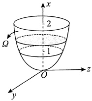

#### 2.

【答案】 $\frac{39}{38}$

【解析】

$$\overline{{z}}=\frac{\iiint\limits_{\Omega}z\mathrm{d}\nu}{\iiint\limits_{\Omega}\mathrm{d}\nu},$$

其中

$$\iiint_{\Omega}z\mathrm{d}v=\int_{0}^{2\pi}\mathrm{d}\theta\int_{0}^{\sqrt{3}}r\mathrm{d}r\int_{\frac{r^{2}}{3}}^{\sqrt{4-r^{2}}}z\mathrm{d}z=\frac{13}{4}\pi,$$

$$\iiint_{\Omega}\mathrm{d}v=\int_{0}^{2\pi}\mathrm{d}\theta\int_{0}^{\sqrt{3}}r\mathrm{d}r\int_{\frac{r^{2}}{3}}^{\sqrt{4-r^{2}}}\mathrm{d}z=\frac{19}{6}\pi,$$

则

$$\overline{z}=\frac{\iiint\limits_{\Omega}z\mathrm{d}v}{\iiint\limits_{\Omega}\mathrm{d}v}=\frac{39}{38}\;.$$

#### 3.

【答案】 $\pi$

【解析】由于$L$关于$y$轴对称，故$\oint_{L} x^{3} ds = 0$，又

$$\oint_{L}y^{2}\mathrm{d}s=\frac{1}{2}\oint_{L}(x^{2}+y^{2})\mathrm{d}s=\frac{1}{2}l=\frac{1}{2}\bullet2\pi=\pi,$$

其中l表示圆周L的周长，于是

$$\oint_{L}(x^{3}+y^{2})\mathrm{d}s=\pi.$$

#### 4.

【答案】 $\frac{4\sqrt{6}}{9}\pi$

【解析】由轮换对称性，有

$$\oint_{\varGamma}x^{2}\mathrm{d}s=\oint_{\varGamma}y^{2}\mathrm{d}s=\oint_{\varGamma}z^{2}\mathrm{d}s\;,\oint_{\varGamma}x\mathrm{d}s=\oint_{\varGamma}y\mathrm{d}s=\oint_{\varGamma}z\mathrm{d}s\;.$$
故

$$\oint_{\varGamma}(y^{2}+2x-z)\mathrm{d}s=\frac{1}{3}\oint_{\varGamma}(x^{2}+y^{2}+z^{2})\mathrm{d}s+\frac{1}{3}\oint_{\varGamma}(x+y+z)\mathrm{d}s=\frac{2}{3}l_{\varGamma}.$$

如图所示，设球心到平面  $x + y + z = 1$ 的距离为 d，曲线  $\Gamma$ 围成的圆的半径为 r，则

$$d=\frac{\left|0+0+0-1\right|}{\sqrt{1^{2}+1^{2}+1^{2}}}=\frac{1}{\sqrt{3}},$$

故  $r = \sqrt{1 - \frac{1}{3}} = \sqrt{\frac{2}{3}}$，于是  $l_{\Gamma} = 2\pi \sqrt{\frac{2}{3}}$，故

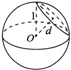

$$原式 =\frac{2}{3}l_{r}=\frac{2}{3}\bullet2\pi\sqrt{\frac{2}{3}}=\frac{4\sqrt{6}}{9}\pi.$$

#### 5.

【答案】 $3\sqrt{3}$

【解析】 $l$是过空间两点的直线段，其参数方程为 $\begin{cases}x=1+t,\\y=1+t,\\z=1+t,\end{cases}$，其中 $0 \leq t \leq 3$，于是

$$\int_{1}\frac{x\mathrm{d}x+y\mathrm{d}y+z\mathrm{d}z}{\sqrt{x^{2}+y^{2}+z^{2}-x-y+2z}}=\int_{0}^{3}\frac{3(1+t)\mathrm{d}t}{\sqrt{3(1+t)^{2}}}=\sqrt{3}\int_{0}^{3}\mathrm{d}t=3\sqrt{3}.$$

#### 6.

【答案】 $x^{4}y^{3}-3xy^{2}+5x-4y+C$

【解析】由题，易知 $\frac{\partial u}{\partial x}=2ax^{3}y^{3}-3y^{2}+5,\frac{\partial u}{\partial y}=3x^{4}y^{2}-2bxy-4$，则

$$\frac{\partial^{2}u}{\partial x\partial y}=6ax^{3}y^{2}-6y,\frac{\partial^{2}u}{\partial y\partial x}=12x^{3}y^{2}-2by.$$

显然 $\frac{\partial^2u}{\partial x\partial y}$和 $\frac{\partial^2u}{\partial y\partial x}$连续，于是 $\frac{\partial^2u}{\partial x\partial y}=\frac{\partial^2u}{\partial y\partial x}$，故得a=2,b=3。

在根据全微分求原函数时，可用①凑全微分法；②曲线积分与路径无关法；③不定积分法.应根据实际情形选用恰当的方法.此题我们可以选用方法②，选折线 $(0,0)\to(x,0)\to(x,y)$为积分路径，则

$$\begin{aligned}u(x,y)-u(0,0)=&\int_{(0,0)}^{(x,y)}(4x^{3}y^{3}-3y^{2}+5)\mathrm{d}x+(3x^{4}y^{2}-6xy-4)\mathrm{d}y\\ =&\int_{0}^{x}5\mathrm{d}x+\int_{0}^{y}(3x^{4}y^{2}-6xy-4)\mathrm{d}y=5x+x^{4}y^{3}-3xy^{2}-4y.\end{aligned}$$

故  $u(x,y)=x^{4}y^{3}-3xy^{2}+5x-4y+C.$

#### 7.

【答案】(D)

【解析】由格林公式

$$\oint_{L}P\mathrm{d}x+Q\mathrm{d}y=\iint\limits_{D_{xy}}\left(\frac{\partial Q}{\partial x}-\frac{\partial P}{\partial y}\right)\mathrm{d}x\mathrm{d}y,$$

得

$$\oint_{L}(2y^{3}-3y)\mathrm{d}x-x^{3}\mathrm{d}y=\iint\limits_{D_{xy}}(-3x^{2}-6y^{2}+3)\mathrm{d}x\mathrm{d}y\xrightarrow{ 记 }I.$$

当被积函数在积分区域上恒小于0时， $I<0$；当被积函数在积分区域上恒大于0时， $I>0$。故当L为区域 $-3x^{2}-6y^{2}+3\geq0$的正向边界时，I取最大值，即 $x^{2}+2y^{2}=1$。

#### 8.

【答案】 $\frac{3}{8}\pi^{2}$

【解析】由于积分与路径无关，因此取折线段路径

$$L_{1}:\left(\frac{\pi}{2},1\right)\to\left(\frac{\pi}{2},0\right);\;L_{2}:\left(\frac{\pi}{2},0\right)\to(\pi,0)\;.$$

又因为在 $L_{1}$上 $x\equiv\frac{\pi}{2}$， $f\left(\frac{\pi}{2}\right)=0$，故在 $L_{1}$上 $\frac{f(x)}{x}=0$，从而有

$$\begin{aligned}&I=\int_{A}^{B}(x+x y\sin x)\mathrm{d}x+\frac{f(x)}{x}\mathrm{d}y=\int_{L_{1}}\frac{f(x)}{x}\mathrm{d}y+\int_{L_{2}}(x+x y\sin x)\mathrm{d}x\\ &\\&=\int_{L_{1}}0\mathrm{d}y+\int_{L_{2}}x\mathrm{d}x=\int_{\frac{\pi}{2}}^{\pi}x\mathrm{d}x=\frac{3}{8}\pi^{2}.\\ \end{aligned}$$

【注】事实上，可以求 $f(x)$的表达式，具体如下.

因为积分与路径无关，所以

$$\frac{\mathrm{d}}{\mathrm{d}x}\left[\frac{f(x)}{x}\right]=\frac{\partial}{\partial y}\left(x+x\sin x\right)=x\sin x,$$

对 $\frac{d}{dx}\left[\frac{f(x)}{x}\right]=x\sin x$两端积分，得

$$\frac{f(x)}{x}=\int x\sin x dx=\sin x-x\cos x+C$$

又 $f\left(\frac{\pi}{2}\right)=0$，所以 $C=-1$。故 $f(x)=x\sin x-x^{2}\cos x-x$

#### 9.

【解析】(1)依题设，函数 $f(x,y)=1-x^{2}-y^{2}$在平面区域 $D_{1}$上非负，在 $D_{1}$之外小于零，所以

$$D_{1}=\left\{(x,y)\left|x^{2}+y^{2}\leqslant1\right.\right\},I(D_{1})=\iint\limits_{D_{1}}(1-x^{2}-y^{2})\mathrm{d}x\mathrm{d}y=\int_{0}^{2\pi}\mathrm{d}\theta\int_{0}^{1}(1-r^{2})r\mathrm{d}r=\frac{\pi}{2}.$$

(2) 取  $L: x^{2} + 2y^{2} = \frac{1}{4}$，顺时针方向， $\partial D_{1}$ 与 L 之间的区域记为 E。因为

$$\frac{\partial}{\partial x}\left(\frac{2y\mathrm{e}^{x^{2}+2y^{2}}-x}{x^{2}+2y^{2}}\right)=\frac{4xy(x^{2}+2y^{2}-1)\mathrm{e}^{x^{2}+2y^{2}}+x^{2}-2y^{2}}{(x^{2}+2y^{2})^{2}}=\frac{\partial}{\partial y}\left(\frac{x\mathrm{e}^{x^{2}+2y^{2}}+y}{x^{2}+2y^{2}}\right),$$

所以由格林公式可知

$$\oint_{\partial D_{1}+L}\frac{(x\mathrm{e}^{x^{2}+2y^{2}}+y)\mathrm{d}x+(2y\mathrm{e}^{x^{2}+2y^{2}}-x)\mathrm{d}y}{x^{2}+2y^{2}}$$
$$=\iint\limits_{E}\left[\frac{\partial}{\partial x}\left(\frac{2y\mathrm{e}^{x^{2}+2y^{2}}-x}{x^{2}+2y^{2}}\right)-\frac{\partial}{\partial y}\left(\frac{x\mathrm{e}^{x^{2}+2y^{2}}+y}{x^{2}+2y^{2}}\right)\right]\mathrm{d}x\mathrm{d}y=0,$$

从而

$$\begin{aligned}\oint_{\partial D_{1}}\frac{(x\mathrm{e}^{x^{2}+2y^{2}}+y)\mathrm{d}x+(2y\mathrm{e}^{x^{2}+2y^{2}}-x)\mathrm{d}y}{x^{2}+2y^{2}}&=-\oint_{L}\frac{(x\mathrm{e}^{x^{2}+2y^{2}}+y)\mathrm{d}x+(2y\mathrm{e}^{x^{2}+2y^{2}}-x)\mathrm{d}y}{x^{2}+2y^{2}}\\&=-4\oint_{L}\left(\mathrm{e}^{\frac{1}{4}}x+y\right)\mathrm{d}x+\left(2\mathrm{e}^{\frac{1}{4}}y-x\right)\mathrm{d}y\\&=4\iint\limits_{x^{2}+2y^{2}\leq\frac{1}{4}}(-2)\mathrm{d}x\mathrm{d}y=-\sqrt{2}\pi\;.\end{aligned}$$

#### 10.

【答案】 $\frac{7}{4}\pi$

【解析】由高斯公式，得

$$\begin{aligned} 原式 =&\iiint\limits_{\Omega}(3y^{2}+1)\mathrm{d}v=\int_{0}^{2\pi}\mathrm{d}\theta\int_{0}^{1}r(3r^{2}\cos^{2}\theta+1)\mathrm{d}r\int_{0}^{1}\mathrm{d}x\\=&\int_{0}^{2\pi}\left[\int_{0}^{1}(3r^{3}\cos^{2}\theta+r)\mathrm{d}r\right]\mathrm{d}\theta=\int_{0}^{2\pi}\left(\frac{3}{4}\cos^{2}\theta+\frac{1}{2}\right)\mathrm{d}\theta\\=&\frac{3}{4}\bullet4\bullet\frac{1}{2}\bullet\frac{\pi}{2}+\pi=\frac{7}{4}\pi.\end{aligned}$$

#### 11.

【答案】 $\frac{2}{5}\pi a^{5}$

【解析】由高斯公式，得

$$\begin{align*}\oint_{\Sigma}x z^{2}\mathrm{d}y\mathrm{d}z+(x^{2}y-z^{3})\mathrm{d}z\mathrm{d}x+(2xy+y^{2}z)\mathrm{d}x\mathrm{d}y=&\iiint\limits_{\Omega}(z^{2}+x^{2}+y^{2})\mathrm{d}v\\=&\int_{0}^{2\pi}\mathrm{d}\theta\int_{0}^{\frac{\pi}{2}}\mathrm{d}\varphi\int_{0}^{a}r^{2}\bullet r^{2}\sin\varphi\mathrm{d}r=\frac{2}{5}\pi a^{5},\end{align*}$$

其中  $\Omega=\{(x,y,z)\mid0\leqslant z\leqslant\sqrt{a^{2}-x^{2}-y^{2}}\}$

#### 12.

【答案】 $\frac{2}{15}$

【解析】积分区域如图所示，由类对称性，得

$$原式 =2\iint\limits_{\Sigma_{1}}xyz\mathrm{d}x\mathrm{d}y,$$

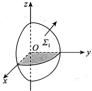

其中  $\Sigma_{1}: z = \sqrt{1 - x^{2} - y^{2}} (x \geq 0, y \geq 0)$，方向向上。 $\Sigma_{1}$ 在 xOy 面的投影域为  $D = \left\{ (x, y) \mid x^{2} + y^{2} \leq 1, \right.$

 $x \geqslant 0, y \geqslant 0$，故

$$2\int_{0}^{\frac{\pi}{2}}\mathrm{d}\theta\int_{0}^{1}r^{3}\sin\theta\cos\theta\cdot\sqrt{1-r^{2}}\mathrm{d}r=\frac{2}{15}$$

#### 13.

【答案】 $2a^{2}(e^{2a}-1)\pi$

【解析】旋转曲面方程为  $x = e^{\sqrt{y^2 + z^2}}$。直接计算曲面积分比较困难，可利用高斯公式化成三重积分。添加辅助曲面  $\Sigma_1: x = e^a, y^2 + z^2 \leq a^2$，取前侧，则  $\Sigma_1$ 与  $\Sigma$ 构成封闭曲面  $\Sigma^*$，记所围成的空间闭区域为  $\Omega$，由高斯公式可得

$$\begin{aligned}I=&\left(\iiint\limits_{\varSigma^{*}}-\iiint\limits_{\varSigma_{1}}\right)2(1-x^{2})\mathrm{d}y\mathrm{d}z+8xy\mathrm{d}z\mathrm{d}x-4xz\mathrm{d}x\mathrm{d}y\\=&\iiint\limits_{\Omega}0\mathrm{d}x\mathrm{d}y\mathrm{d}z-\iint\limits_{D_{yz}}2(1-\mathrm{e}^{2a})\mathrm{d}y\mathrm{d}z=2a^{2}(\mathrm{e}^{2a}-1)\pi,\end{aligned}$$

其中 $D_{yz}$为 $\Sigma_{1}$在yOz平面上的投影域，是一个半径为a的圆.

#### 14.

【答案】(null)
【解析】曲面\(\Sigma\)在yOz坐标面的投影域为\(D=\{(y,z)|y^{2}+z^{2}\leqslant1\}\)，因为\(\frac{\partial x}{\partial y}=2y\)，\(\frac{\partial x}{\partial z}=2z\)，所以
\(\begin{aligned}I=&\iint\limits_{\Sigma }(x-1)\mathrm{d}y\mathrm{d}z+(y-1)^{3}\mathrm{d}z\mathrm{d}x+(z-1)^{3}\mathrm{d}x\mathrm{d}y \\ =&\iint\limits_{D}[1-y^{2}-z^{2}+2y(y-1)^{3}+2z(z-1)^{3}]\mathrm{d}y\mathrm{d}z \\ =&\iint\limits_{D}(2y^{4}+2z^{4}-6y^{3}-6z^{3}+5y^{2}+5z^{2}-2y-2z+1)\mathrm{d}y\mathrm{d}z.\end{aligned}\)

因为区域D关于y,z坐标轴对称，所以\(\iint_{D}(-6y^{3}-6z^{3}-2y-2z)\mathrm{d}y\mathrm{d}z=0\)，故
\(\begin{aligned}I=&\iint\limits_{D}(2y^{4}+2z^{4}+5y^{2}+5z^{2}+1)\mathrm{d}y\mathrm{d}z \\ =&\int_{0}^{2\pi}\mathrm{d}\theta\int_{0}^{1}[2r^{4}(\cos^{4}\theta+\sin^{4}\theta)+5r^{2}+1]r\mathrm{d}r \\ =&\int_{0}^{2\pi}\left[\frac{1}{3}(\cos^{4}\theta+\sin^{4}\theta)+\frac{7}{4}\right]\mathrm{d}\theta \\ =&\frac{7}{2}\pi+\frac{8}{3}\int_{0}^{\frac{\pi}{2}}\sin^{4}\theta\mathrm{d}\theta=4\pi.\end{aligned}\)

#### 15.

【解析】易求得 $\Sigma$的外法线向量为 $\boldsymbol{n}=(2x,2y,-2z)$，则单位法向量为

$$\boldsymbol{n}^{-}=\left(\frac{x}{\sqrt{x^{2}+y^{2}+z^{2}}},\frac{y}{\sqrt{x^{2}+y^{2}+z^{2}}},\frac{-z}{\sqrt{x^{2}+y^{2}+z^{2}}}\right),$$

于是

$$\begin{aligned}&\iint\limits_{\Sigma}yf(xy)\mathrm{d}y\mathrm{d}z-xf(xy)\mathrm{d}z\mathrm{d}x\\=&\iint\limits_{\Sigma}\left[yf(xy)\bullet\frac{x}{\sqrt{x^{2}+y^{2}+z^{2}}}-xf(xy)\bullet\frac{y}{\sqrt{x^{2}+y^{2}+z^{2}}}\right]\mathrm{d}S=0.\end{aligned}$$
如图所示，记  $\Sigma_{1}$ 为  $z=0(x^{2}+y^{2}\leq1)$，方向向下，记  $\Sigma_{2}$ 为  $z=1(x^{2}+y^{2}\leq2)$，方向向上， $\Omega$ 为  $\Sigma$， $\Sigma_{1}$， $\Sigma_{2}$ 围成的空间区域，则

$$\begin{aligned}I=&\iint\limits_{\Sigma}(-2x)\mathrm{d}y\mathrm{d}z+y^{2}\mathrm{d}z\mathrm{d}x+(z-1)^{2}\mathrm{d}x\mathrm{d}y=\iint\limits_{\Sigma+\Sigma_{1}+\Sigma_{2}}-\iint\limits_{\Sigma_{1}}-\iint\limits_{\Sigma_{2}}\\=&\iiint\limits_{\Omega}(2y+2z-4)\mathrm{d}\nu+\iint\limits_{x^{2}+y^{2}\leq1}\mathrm{d}x\mathrm{d}y-0\\=&\int_{0}^{1}\mathrm{d}z\iint\limits_{x^{2}+y^{2}\leq z^{2}+1}(2y+2z-4)\mathrm{d}x\mathrm{d}y+\pi\\=&\int_{0}^{1}\pi(z^{2}+1)(2z-4)\mathrm{d}z+\pi=-\frac{17}{6}\pi.\end{aligned}$$

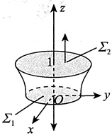

#### 16.

【解析】根据斯托克斯公式，得

$$I=\iiint\limits_{\Sigma}\left|\begin{matrix}\mathrm{d}y\mathrm{d}z&\mathrm{d}z\mathrm{d}x&\mathrm{d}x\mathrm{d}y\\ \frac{\partial}{\partial x}&\frac{\partial}{\partial y}&\frac{\partial}{\partial z}\\ x^{2}-y&2x+y^{2}&z^{2}\end{matrix}\right|=\iint\limits_{\Sigma}3\mathrm{d}x\mathrm{d}y=\iint\limits_{D}3\mathrm{d}x\mathrm{d}y=3\bullet(\sqrt{2})^{2}=6,$$

其中  $\Sigma$ 为任意以曲线  $\Gamma$ 为边界的空间曲面，方向向上，D 为  $\Sigma$ 在 xOy 面上的投影，即  $D = \left\{(x, y) \mid |x| + |y| \leq 1\right\}$，如图所示。

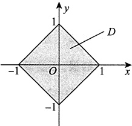

【注】本题不适合用参数表示 $\Gamma$，比较烦琐，但有的题目适合用参数式，所以考试时要注意选择简便的做法.

## 线代

### 第1章 行列式

#### 1.

【答案】(B)

【解析】方法一 由 a，b，c 是方程  $x^{3}-2x+4=0$ 的三个不同的根，有

$$x^{3}-2x+4=(x-a)(x-b)(x-c)=x^{3}-(a+b+c)x^{2}+(bc+ac+ab)x-abc=0,$$

从而 $a+b+c=0$，于是

$$\begin{vmatrix}{{{a}}}&{{{b}}}&{{{c}}} \\{{{b}}}&{{{c}}}&{{{a}}} \\{{{c}}}&{{{a}}}&{{{b}}}\end{vmatrix}=\begin{vmatrix}{{{a+b+c}}}&{{{a+b+c}}}&{{{a+b+c}}} \\{{{b}}}&{{{c}}}&{{{a}}} \\{{{c}}}&{{{a}}}&{{{b}}}\end{vmatrix}=(a+b+c)\begin{vmatrix}{{{1}}}&{{{1}}}&{{{1}}} \\{{{b}}}&{{{c}}}&{{{a}}} \\{{{c}}}&{{{a}}}&{{{b}}}\end{vmatrix}=0.$$

万法二 方程为  $x^{3}-2x+4=(x+2)(x^{2}-2x+2)=0$. 因 a, b, c 是方程  $x^{3}-2x+4=0$ 的三个不同的根，不妨设 a=-2，则 b, c 应满足  $x^{2}-2x+2=0$，由二次方程根与方程系数的关系，得  $b+c=-(-2)=2$，因此有  $a+b+c=0$. 于是

$$\begin{vmatrix}{{{a}}}&{{{b}}}&{{{c}}} \\{{{b}}}&{{{c}}}&{{{a}}} \\{{{c}}}&{{{a}}}&{{{b}}}\end{vmatrix}=\begin{vmatrix}{{{a+b+c}}}&{{{a+b+c}}}&{{{a+b+c}}} \\{{{b}}}&{{{c}}}&{{{a}}} \\{{{c}}}&{{{a}}}&{{{b}}}\end{vmatrix}=(a+b+c)\begin{vmatrix}{{{1}}}&{{{1}}}&{{{1}}} \\{{{b}}}&{{{c}}}&{{{a}}} \\{{{c}}}&{{{a}}}&{{{b}}}\end{vmatrix}=0~.$$

#### 2.

【答案】(D)

【解析】方法一

$$\begin{aligned}\left|\begin{matrix}{{{x}}}&{{{1}}}&{{{0}}}&{{{1}}} \\{{{0}}}&{{{1}}}&{{{x}}}&{{{1}}} \\{{{1}}}&{{{x}}}&{{{1}}}&{{{0}}} \\{{{1}}}&{{{0}}}&{{{1}}}&{{{x}}}\end{matrix}\right|&=\left|\begin{matrix}{{{x}}}&{{{1}}}&{{{0}}}&{{{1}}} \\{{{0}}}&{{{1}}}&{{{x}}}&{{{1}}} \\{{{0}}}&{{{x}}}&{{{0}}}&{{{-x}}} \\{{{1}}}&{{{0}}}&{{{1}}}&{{{x}}}\end{matrix}\right|\xrightarrow{ 按第 1 列展开 }x\left|\begin{matrix}{{{*}}}&{{{*}}}&{{{*}}} \\{{{*}}}&{{{*}}}&{{{*}}} \\{{{*}}}&{{{*}}}&{{{*}}}\end{matrix}\right|-\left|\begin{matrix}{{{1}}}&{{{0}}}&{{{1}}} \\{{{1}}}&{{{x}}}&{{{1}}} \\{{{x}}}&{{{0}}}&{{{-x}}}\end{matrix}\right|,\\ \end{aligned}$$

上式中， $x\left|\begin{matrix}*&*&*\\*&*&*\\*&*&*\end{matrix}\right|$ 展开后每一项均含 x，且  $\left|\begin{matrix}1&0&1\\ 1&x&1\\ x&0&-x\end{matrix}\right|=x\left|\begin{matrix}1&0&1\\ 1&x&1\\ 1&0&-1\end{matrix}\right|$ 展开后每一项也含 x，因此  $\left|\begin{matrix}x&1&0&1\\ 0&1&x&1\\ 1&x&1&0\\ 1&0&1&x\end{matrix}\right|$ 的常数项是 0.
方法二 此行列式展开后为关于 x 的多项式，其常数项对应于取 x=0 时多项式的值，因此  $\begin{vmatrix} x & 1 & 0 & 1 \\ 0 & 1 & x & 1 \\ 1 & x & 1 & 0 \\ 1 & 0 & 1 & x \end{vmatrix}$ 的常数项是它取 x=0 时的值，即  $\begin{vmatrix} 0 & 1 & 0 & 1 \\ 0 & 1 & 0 & 1 \\ 1 & 0 & 1 & 0 \\ 1 & 0 & 1 & 0 \end{vmatrix}$，此行列式的第1行与第2行相同，故其值为0.

#### 3.

【答案】(A)

【解析】直接寻找行列式中含 $x^{4}$和 $x^{3}$的项.

由题可知，最高次项来自主对角线元素的乘积，此时为

$$(-1)^{\tau(1234)}5x\bullet x\bullet x\bullet2x=10x^{4},$$

则 $x^{4}$的系数为10.

分析可得，含 $x^{3}$的项为

$$\begin{aligned}&(-1)^{\tau(2134)}1\bullet x\bullet x\bullet2x+(-1)^{\tau(4231)}3\bullet x\bullet x\bullet x\\=&-2x^{3}-3x^{3}\\=&-5x^{3},\end{aligned}$$

则 $x^{3}$的系数为-5.故选(A).

#### 4.

【答案】(B)

【解析】在 $f(x)=\left|\begin{matrix}a_{1}+x&b_{1}+x&c_{1}+x\\ a_{2}+x&b_{2}+x&c_{2}+x\\ a_{3}+x&b_{3}+x&c_{3}+x\end{matrix}\right|$中，将第1列乘-1分别加到第2，3列上得

$$\begin{aligned}f(x)=&\left|\begin{matrix}a_{1}+x&b_{1}+x&c_{1}+x\\a_{2}+x&b_{2}+x&c_{2}+x\\a_{3}+x&b_{3}+x&c_{3}+x\\\end{matrix}\right|=\left|\begin{matrix}a_{1}+x&b_{1}-a_{1}&c_{1}-a_{1}\\\end{matrix}\right|\\=&\left|\begin{matrix}a_{1}&b_{1}-a_{1}&c_{1}-a_{1}\\a_{2}&b_{2}-a_{2}&c_{2}-a_{2}\\a_{3}&b_{3}-a_{3}&c_{3}-a_{3}\\\end{matrix}\right|+x\left|\begin{matrix}1&b_{1}-a_{1}&c_{1}-a_{1}\\1&b_{2}-a_{2}&c_{2}-a_{2}\\1&b_{3}-a_{3}&c_{3}-a_{3}\\\end{matrix}\right|.\end{aligned}$$

当 $\begin{vmatrix}1&b_{1}-a_{1}&c_{1}-a_{1}\\1&b_{2}-a_{2}&c_{2}-a_{2}\\1&b_{3}-a_{3}&c_{3}-a_{3}\end{vmatrix}=0$时， $f(x)$是常数，它没有零点；

当 $\begin{vmatrix}1&b_{1}-a_{1}&c_{1}-a_{1}\\1&b_{2}-a_{2}&c_{2}-a_{2}\\1&b_{3}-a_{3}&c_{3}-a_{3}\end{vmatrix}\neq0$时， $f(x)$是x的一次多项式，它只有一个零点.

#### 5.

【答案】(B)

【解析】

$$f(x)\xrightarrow{r_{1}-r_{2}-r_{3}}\left|\begin{matrix}{{{x}}}&{{{0}}}&{{{0}}} \\{{{x+1}}}&{{{x+4}}}&{{{-1}}} \\{{{x}}}&{{{7}}}&{{{x-1}}}\end{matrix}\right|=x\left|\begin{matrix}{{{x+4}}}&{{{-1}}} \\{{{7}}}&{{{x-1}}}\end{matrix}\right|$$

$$=x(x^{2}+3x+3)=x^{3}+3x^{2}+3x,$$

$$f^{\prime}(x)=3x^{2}+6x+3=3(x+1)^{2}.$$

又 $f''(x)=6x+6$， $f''(-1)=0$， $f'''(x)=6\neq0$。所以 $f(x)$的拐点为 $(-1,-1)$。

#### 6.

【答案】(B)

【解析】将行列式按第1行展开，得

$$D_{n}=\left|\begin{matrix}{2}&{1}&{0}&{\cdots}&{0}\\ {1}&{2}&{1}&{\cdots}&{0}\\ {0}&{1}&{2}&{\cdots}&{0}\\ {\vdots}&{\vdots}&{\vdots}&{}&{\vdots}\\ {0}&{0}&{0}&{\cdots}&{2}\\ \end{matrix}\right|=2D_{n-1}-\left|\begin{matrix}{1}&{1}&{0}&{\cdots}&{0}\\ {0}&{2}&{1}&{\cdots}&{0}\\ {0}&{1}&{2}&{\cdots}&{0}\\ {\vdots}&{\vdots}&{\vdots}&{}&{\vdots}\\ {0}&{0}&{0}&{\cdots}&{2}\\ \end{matrix}\right|_{(n-1)\times(n-1)}=2D_{n-1}-D_{n-2}.$$

由此得到递推关系式 $D_{n}-D_{n-1}=D_{n-1}-D_{n-2}$，所以 $D_{1},D_{2},\cdots,D_{n}$成等差数列。而

$$D_{1}=2,D_{2}=3=D_{1}+1,$$

所以此等差数列的首项为2，公差d=1，即 $D_{n}=n+1$ .故选(B).

#### 7.

【答案】10

【解析】由 $r(\boldsymbol{A}\boldsymbol{A}^{\mathrm{T}})=3$，知 $\left|A\right|=0,\left|AB\right|=\left|A\right|\left|B\right|=0$，即

$$\begin{aligned}\left|\boldsymbol{A}\boldsymbol{B}\right|\xrightarrow{ 按第 4 行展开 }(-2)\left|\begin{matrix}2&0&-a\\ -a&-5&b\\ b&b&-2\end{matrix}\right|+(-4)\left|\begin{matrix}2&a&-a\\ -a&2&b\\ b&0&-2\end{matrix}\right|\\=(-2)\left|\begin{matrix}2&0&-a\\ -a&-5&b\\ b&b&-2\end{matrix}\right|+(-4)\times5=0,\end{aligned}$$

得 $\begin{vmatrix}2&0&-a\\-a&-5&b\\b&b&-2\end{vmatrix}=-10$，于是 $\begin{vmatrix}-a&-5&b\\2&0&-a\\b&b&-2\end{vmatrix}=10$．

#### 8.

【答案】10(a-3)

【解析】

$$\begin{aligned}&\left|\begin{matrix}{{{2}}}&{{{1}}}&{{{0}}}&{{{-1}}} \\{{{-1}}}&{{{2}}}&{{{-5}}}&{{{3}}} \\{{{3}}}&{{{0}}}&{{{a}}}&{{{b}}} \\{{{1}}}&{{{-3}}}&{{{5}}}&{{{0}}}\end{matrix}\right|-\left|\begin{matrix}{{{2}}}&{{{1}}}&{{{0}}}&{{{-1}}} \\{{{-1}}}&{{{2}}}&{{{-5}}}&{{{3}}} \\{{{3}}}&{{{0}}}&{{{a}}}&{{{b}}} \\{{{1}}}&{{{-1}}}&{{{1}}}&{{{0}}}\end{matrix}\right|=\left|\begin{matrix}{{{2}}}&{{{1}}}&{{{0}}}&{{{-1}}} \\{{{-1}}}&{{{2}}}&{{{-5}}}&{{{3}}} \\{{{3}}}&{{{0}}}&{{{a}}}&{{{b}}} \\{{{0}}}&{{{-2}}}&{{{4}}}&{{{0}}}\end{matrix}\right|\\=&\left|\begin{matrix}{{{0}}}&{{{0}}}&{{{0}}}&{{{-1}}} \\{{{5}}}&{{{5}}}&{{{-5}}}&{{{3}}} \\{{{3+2b}}}&{{{b}}}&{{{a}}}&{{{b}}} \\{{{0}}}&{{{-2}}}&{{{4}}}&{{{0}}}\end{matrix}\right|=\left(-1\right)\bullet\left(-1\right)^{1+4}\left|\begin{matrix}{{{5}}}&{{{5}}}&{{{-5}}} \\{{{3+2b}}}&{{{b}}}&{{{a}}} \\{{{0}}}&{{{-2}}}&{{{4}}}\end{matrix}\right|\end{aligned}$$
$$=5\left|\begin{matrix}{1}&{1}&{-1}\\ {3+2b}&{b}&{a}\\ {0}&{-2}&{4}\\ \end{matrix}\right|=5\left|\begin{matrix}{1}&{1}&{1}\\ {3+2b}&{b}&{a+2b}\\ {0}&{-2}&{0}\\ \end{matrix}\right|=10(a-3)\;.$$

#### 9.

【答案】1

【解析】由行列式的展开定理，得

$$A_{11}-A_{21}+A_{41}=\left|\begin{matrix}{{{1}}}&{{{0}}}&{{{-1}}}&{{{1}}} \\{{{-1}}}&{{{1}}}&{{{0}}}&{{{1}}} \\{{{0}}}&{{{1}}}&{{{1}}}&{{{0}}} \\{{{1}}}&{{{-1}}}&{{{0}}}&{{{a}}}\end{matrix}\right|=\left|\begin{matrix}{{{1}}}&{{{0}}}&{{{-1}}}&{{{1}}} \\{{{0}}}&{{{1}}}&{{{-1}}}&{{{2}}} \\{{{0}}}&{{{1}}}&{{{1}}}&{{{0}}} \\{{{0}}}&{{{-1}}}&{{{1}}}&{{{a-1}}}\end{matrix}\right|=\left|\begin{matrix}{{{1}}}&{{{-1}}}&{{{2}}} \\{{{1}}}&{{{1}}}&{{{0}}} \\{{{-1}}}&{{{1}}}&{{{a-1}}}\end{matrix}\right|=2a+2,$$

又 $A_{11}-A_{21}+A_{41}=4$，故a=1。

【注】本题也可以直接用代数余子式的定义进行计算.注意行列式 $\begin{vmatrix}1&0&-1&1\\-1&1&0&1\\0&1&1&0\\1&-1&0&a\end{vmatrix}$与行列式

20-11310141105-10aa

第1列元素的代数余子式相同.

#### 10.

【答案】 $24x^{4}$

【解析】方法一 利用行列式性质，则

$$\begin{aligned}D_{4}&=x\left|\begin{matrix}{{{1}}}&{{{1}}}&{{{0}}}&{{{0}}} \\{{{1}}}&{{{1+2x}}}&{{{2x}}}&{{{0}}} \\{{{0}}}&{{{2}}}&{{{2+3x}}}&{{{3x}}} \\{{{0}}}&{{{0}}}&{{{3}}}&{{{3+4x}}}\end{matrix}\right|=x\left|\begin{matrix}{{{1}}}&{{{1}}}&{{{0}}}&{{{0}}} \\{{{0}}}&{{{2x}}}&{{{2x}}}&{{{0}}} \\{{{0}}}&{{{2}}}&{{{2+3x}}}&{{{3x}}} \\{{{0}}}&{{{0}}}&{{{3}}}&{{{3+4x}}}\end{matrix}\right|\\&=x\cdot2x\left|\begin{matrix}{{{1}}}&{{{1}}}&{{{0}}}&{{{0}}} \\{{{0}}}&{{{1}}}&{{{1}}}&{{{0}}} \\{{{0}}}&{{{2}}}&{{{2+3x}}}&{{{3x}}} \\{{{0}}}&{{{0}}}&{{{3}}}&{{{3+4x}}}\end{matrix}\right|=x\cdot2x\left|\begin{matrix}{{{1}}}&{{{1}}}&{{{0}}}&{{{0}}} \\{{{0}}}&{{{1}}}&{{{1}}}&{{{0}}} \\{{{0}}}&{{{0}}}&{{{3x}}}&{{{3x}}} \\{{{0}}}&{{{0}}}&{{{3}}}&{{{3+4x}}}\end{matrix}\right|.\\&=x\cdot2x\cdot3x\left|\begin{matrix}{{{1}}}&{{{1}}}&{{{0}}}&{{{0}}} \\{{{0}}}&{{{1}}}&{{{1}}}&{{{0}}} \\{{{0}}}&{{{0}}}&{{{1}}}&{{{1}}} \\{{{0}}}&{{{0}}}&{{{0}}}&{{{4x}}}\end{matrix}\right|=x\cdot2x\cdot3x\cdot4x=24x^{4}.\end{aligned}$$

方法二

$$D_{4}=(3+4x)D_{3}-9xD_{2}=(3+4x)\left[(2+3x)D_{2}-4xD_{1}\right]-9xD_{2}.$$

又 $D_{1}=x$， $D_{2}=\left|\begin{matrix}x&x\\ 1&1+2x\end{matrix}\right|=2x^{2}$，故

$$\begin{aligned}D_{4}=&(3+4x)\left[(2+3x)\bullet2x^{2}-4x^{2}\right]-9x\bullet2x^{2}\\=&(3+4x)\bullet6x^{3}-18x^{3}=24x^{4}.\end{aligned}$$

【注】 $^{①}$

$$D_{n}=\left|\begin{array}{ccccc}a_{1}&b_{1}&&&\\c_{2}&a_{2}&b_{2}&&\\&\dot{c}_{3}&a_{3}&b_{3}&\\&&\ddots&\ddots&\ddots\\&&&c_{n-1}&a_{n-1}&b_{n-1}\\&&&&\dot{c}_{n}&a_{n}\end{array}\right|=a_{n}D_{n-1}-b_{n-1}c_{n}D_{n-2},$$

这可以作为递推的开端，往下就方便多了

②注意 $D_{n}$元素分布规律为“左上至右下”阶数增加，即 $D_{1}=a_{1}$， $D_{2}=\left|\begin{matrix}a_{1}&b_{1}\\ c_{2}&a_{2}\end{matrix}\right|$， $D_{3}=\left|\begin{matrix}a_{1}&b_{1}&0\\ c_{2}&a_{2}&b_{2}\\ 0&c_{3}&a_{3}\end{matrix}\right|$，…，别弄反了.

#### 11.

【答案】-4

【解析】由题设条件 $A\alpha_{1}=a_{1}+2a_{2}+a_{3}$， $A\alpha_{2}=2a_{1}+a_{2}+a_{3}$， $A\alpha_{3}=a_{1}+a_{2}+2a_{3}$，故

$$\begin{aligned}\boldsymbol{A}\left[\boldsymbol{\alpha}_{1},\boldsymbol{\alpha}_{2},\boldsymbol{\alpha}_{3}\right]=&\left[\boldsymbol{\alpha}_{1}+2\boldsymbol{\alpha}_{2}+\boldsymbol{\alpha}_{3},2\boldsymbol{\alpha}_{1}+\boldsymbol{\alpha}_{2}+\boldsymbol{\alpha}_{3},\boldsymbol{\alpha}_{1}+\boldsymbol{\alpha}_{2}+2\boldsymbol{\alpha}_{3}\right]\\=&\left[\boldsymbol{\alpha}_{1},\boldsymbol{\alpha}_{2},\boldsymbol{\alpha}_{3}\right]\begin{bmatrix}{{{1}}}&{{{2}}}&{{{1}}} \\{{{2}}}&{{{1}}}&{{{1}}} \\{{{1}}}&{{{1}}}&{{{2}}}\end{bmatrix}.\end{aligned}$$

方法一 两边取行列式，得

$$\left|\boldsymbol{A}\left[\boldsymbol{\alpha}_{1},\boldsymbol{\alpha}_{2},\boldsymbol{\alpha}_{3}\right]\right|=\left|\boldsymbol{A}\right|\left|\left[\boldsymbol{\alpha}_{1},\boldsymbol{\alpha}_{2},\boldsymbol{\alpha}_{3}\right]\right|=\left|\left[\boldsymbol{\alpha}_{1},\boldsymbol{\alpha}_{2},\boldsymbol{\alpha}_{3}\right]\begin{bmatrix}1&2&1\\ 2&1&1\\ 1&1&2\end{bmatrix}\right|=\left|\left[\boldsymbol{\alpha}_{1},\boldsymbol{\alpha}_{2},\boldsymbol{\alpha}_{3}\right]\right|\begin{vmatrix}1&2&1\\ 2&1&1\\ 1&1&2\end{vmatrix},$$

因为  $\alpha_{1}, \alpha_{2}, \alpha_{3}$ 线性无关，所以  $\left|\left[\alpha_{1}, \alpha_{2}, \alpha_{3}\right]\right| \neq 0$，可得  $\left|A\right| = \left|\begin{matrix}1 & 2 & 1 \\ 2 & 1 & 1 \\ 1 & 1 & 2\end{matrix}\right| = -4$。

方法二 因为  $a_{1}$， $a_{2}$， $a_{3}$ 线性无关，记  $P = [a_{1}, a_{2}, a_{3}]$，则 P 是可逆矩阵，从而可得

$$\boldsymbol{A}\boldsymbol{P}=\boldsymbol{P}\begin{bmatrix}1&2&1\\ 2&1&1\\ 1&1&2\end{bmatrix}, 即 \boldsymbol{P}^{-1}\boldsymbol{A}\boldsymbol{P}=\begin{bmatrix}1&2&1\\ 2&1&1\\ 1&1&2\end{bmatrix},$$

又因为相似矩阵有相同的行列式，所以 $|A|=\begin{vmatrix}1&2&1\\2&1&1\\1&1&2\end{vmatrix}=-4$。
### 第2章 矩阵

#### 1.

【答案】(C)

【解析】$\begin{bmatrix}1&0&0\\ 2&1&0\\ 3&\frac{4}{3}&2\end{bmatrix}\begin{bmatrix}1&-1&2\\ 0&3&-1\\ 0&0&-\frac{2}{3}\end{bmatrix}=\begin{bmatrix}1&-1&2\\ 2&1&3\\ 3&1&\frac{10}{3}\end{bmatrix}$，选项(A)错误；

 $\begin{bmatrix}1&0&0\\2&-1&0\\3&\dfrac{4}{3}&1\end{bmatrix}\begin{bmatrix}1&-1&2\\0&-3&-1\\0&0&-\dfrac{2}{3}\end{bmatrix}=\begin{bmatrix}1&-1&2\\2&1&5\\3&-7&4\end{bmatrix}$，选项(B)错误；

 $\begin{bmatrix}1&0&0\\2&1&0\\3&\frac{4}{3}&1\end{bmatrix}\begin{bmatrix}1&0&0\\0&3&0\\0&0&-\frac{2}{3}\end{bmatrix}\begin{bmatrix}1&-1&2\\0&1&-\frac{1}{3}\\0&0&1\end{bmatrix}=\begin{bmatrix}1&0&0\\2&3&0\\3&4&-\frac{2}{3}\end{bmatrix}\begin{bmatrix}1&-1&2\\0&1&-\frac{1}{3}\\0&0&1\end{bmatrix}=\begin{bmatrix}1&-1&2\\2&1&3\\3&1&4\end{bmatrix}$，选项(C)正确；

 $\begin{vmatrix}1&0&0\\2&-1&0\\3&\frac{4}{3}&1\end{vmatrix}\begin{vmatrix}1&0&0\\0&-3&0\\0&0&-\frac{2}{3}\end{vmatrix}\begin{vmatrix}1&-1&2\\0&1&-\frac{1}{3}\\0&0&1\end{vmatrix}=\begin{vmatrix}1&0&0\\2&3&0\\3&-4&-\frac{2}{3}\end{vmatrix}\begin{vmatrix}1&-1&2\\0&1&-\frac{1}{3}\\0&0&1\end{vmatrix}=\begin{vmatrix}1&-1&2\\2&1&3\\3&-7&\frac{20}{3}\end{vmatrix}$，选项(D)错误.

综上所述，选(C).

【注】本题虽属于对基本计算的考查，但背景深刻。将一个矩阵分解为若干个具有特定性质的矩阵乘积的过程，称为矩阵分解，以往考研题中亦出现过这种考题形式。

#### 2.

【答案】 $\begin{bmatrix}2&0\\0&2\end{bmatrix}$

【解析】 $A^9 = \begin{bmatrix} 1 & 9 \\ 0 & 1 \end{bmatrix}$， $B^9 = \begin{bmatrix} -1 & 9 \\ 0 & -1 \end{bmatrix}$，故  $A^9 - B^9 = \begin{bmatrix} 2 & 0 \\ 0 & 2 \end{bmatrix}$

#### 3.

【答案】 $\begin{bmatrix}0&0&-1\\0&1&0\\1&0&0\end{bmatrix}$

【解析】由于 $A^{2}=\begin{bmatrix}-1&0&0\\ 0&1&0\\ 0&0&-1\end{bmatrix}$，则 $A^{4}=\begin{bmatrix}1&0&0\\ 0&1&0\\ 0&0&1\end{bmatrix}=E$，故

$$\boldsymbol{A}^{13}=(\boldsymbol{A}^{4})^{3}\boldsymbol{A}=\boldsymbol{E}^{3}\boldsymbol{A}=\boldsymbol{A}=\begin{bmatrix}0&0&-1\\ 0&1&0\\ 1&0&0\end{bmatrix}.$$

#### 4.

【答案】 $\begin{bmatrix}1&-1&0&0\\0&1&-1&0\\0&0&1&-1\\0&0&0&1\end{bmatrix}$

【解析】容易验证， $B^{4}=O$，故

$$\boldsymbol{A}(\boldsymbol{E}-\boldsymbol{B})=(\boldsymbol{E}+\boldsymbol{B}+\boldsymbol{B}^{2}+\boldsymbol{B}^{3})(\boldsymbol{E}-\boldsymbol{B})=\boldsymbol{E}-\boldsymbol{B}^{4}=\boldsymbol{E}$$

从而  $A^{-1} = E - B = \begin{bmatrix} 1 & -1 & 0 & 0 \\ 0 & 1 & -1 & 0 \\ 0 & 0 & 1 & -1 \\ 0 & 0 & 0 & 1 \end{bmatrix}$.

#### 5.

【答案】 $\begin{bmatrix}0&1\\ -1&1\end{bmatrix}$

【解析】由 A，P 均可逆， $(PA)^{2}=PA$，则  $PA(PA-E)=O$，知 PA=E，于是

$$\boldsymbol{P}=\boldsymbol{A}^{-1}=\begin{bmatrix}0&1\\ -1&1\end{bmatrix}.$$

#### 6.

【答案】18

【解析】

$$\left|\boldsymbol{C}\right|=\left|\begin{matrix}2\boldsymbol{A}^{*}&\left(\boldsymbol{A}\boldsymbol{B}\right)^{*}\\ \boldsymbol{O}&\boldsymbol{B}^{-1}\end{matrix}\right|=\left|2\boldsymbol{A}^{*}\right|\left|\boldsymbol{B}^{-1}\right|=\frac{2^{3}\left|\boldsymbol{A}\right|^{2}}{\left|\boldsymbol{B}\right|}=\frac{8\times(-3)^{2}}{4}=18.$$

#### 7.

【答案】(B)

【解析】代入选项逐个验算即可，其中

$$\begin{align*}\begin{bmatrix}\boldsymbol{O}&\boldsymbol{A}\\\boldsymbol{B}&\boldsymbol{O}\end{bmatrix}\begin{bmatrix}\boldsymbol{O}&(-1)^{n}\left|\boldsymbol{A}\right|\boldsymbol{B}^{*}\\ (-1)^{n}\left|\boldsymbol{B}\right|\boldsymbol{A}^{*}&\boldsymbol{O}\end{bmatrix}=&\begin{bmatrix}(-1)^{n}\left|\boldsymbol{B}\right|\boldsymbol{A}\boldsymbol{A}^{*}&\boldsymbol{O}\\\boldsymbol{O}&(-1)^{n}\left|\boldsymbol{A}\right|\boldsymbol{B}\boldsymbol{B}^{*}\end{bmatrix}\\=&(-1)^{n}\left|\boldsymbol{A}\right|\left|\boldsymbol{B}\right|\begin{bmatrix}\boldsymbol{E}&\boldsymbol{O}\\\boldsymbol{O}&\boldsymbol{E}\end{bmatrix}=\left|\boldsymbol{C}\right|\begin{bmatrix}\boldsymbol{E}&\boldsymbol{O}\\\boldsymbol{O}&\boldsymbol{E}\end{bmatrix}=\boldsymbol{C}\boldsymbol{C}^{*}.\end{align*}$$

故选(B).

#### 8.

【答案】 $-\frac{8}{3}$

【解析】由题设 $|A|=3$， $|B|=1$，所以 $A^{*}=|A|A^{-1}=3A^{-1}$， $B^{*}=|B|B^{-1}=B^{-1}$，故

$$\left|\boldsymbol{A}^{-1}\boldsymbol{B}^{*}-\boldsymbol{A}^{*}\boldsymbol{B}^{-1}\right|=\left|\boldsymbol{A}^{-1}\boldsymbol{B}^{-1}-3\boldsymbol{A}^{-1}\boldsymbol{B}^{-1}\right|=\left|-2\boldsymbol{A}^{-1}\boldsymbol{B}^{-1}\right|=(-2)^{3}\left|\boldsymbol{A}^{-1}\right|\left|\boldsymbol{B}^{-1}\right|=-\frac{8}{3}$$
【注】本题如果通过求逆矩阵与伴随矩阵得到  $A^{-1}B^* - A^*B^{-1}$，再求行列式，计算量会非常大，所以要先化简，再计算行列式，同时要注意  $|A + B| \ne |A| + |B|$。

#### 9.

【答案】(C)

【解析】因为 $AB=\begin{bmatrix}0&1&0\\ 1&0&0\\ 0&0&1\end{bmatrix}$，所以 $\begin{bmatrix}0&1&0\\ 1&0&0\\ 0&0&1\end{bmatrix}A=B^{-1}$，故互换矩阵A的第1，2行得矩阵 $B^{-1}$，选项(C)正确.

现举例说明选项(A),(B),(D)不正确.

当 $A=\begin{bmatrix}1&2&0\\ 0&1&0\\ 0&0&1\end{bmatrix}$， $B=\begin{bmatrix}-2&1&0\\ 1&0&0\\ 0&0&1\end{bmatrix}$，满足 $AB=\begin{bmatrix}0&1&0\\ 1&0&0\\ 0&0&1\end{bmatrix}$。

互换  $A^{-1}=\begin{bmatrix}1&-2&0\\ 0&1&0\\ 0&0&1\end{bmatrix}$ 的第1,2行得矩阵  $\begin{bmatrix}0&1&0\\ 1&-2&0\\ 0&0&1\end{bmatrix}\neq B$，从而选项(A)不正确.

互换  $A^{-1}=\begin{bmatrix}1&-2&0\\ 0&1&0\\ 0&0&1\end{bmatrix}$ 的第1,2列得矩阵  $\begin{bmatrix}-2&1&0\\ 1&0&0\\ 0&0&1\end{bmatrix}\neq B^{-1}=\begin{bmatrix}0&1&0\\ 1&2&0\\ 0&0&1\end{bmatrix}$，从而选项(B)不正确.

互换  $A = \begin{bmatrix} 1 & 2 & 0 \\ 0 & 1 & 0 \\ 0 & 0 & 1 \end{bmatrix}$ 的第1,2列得矩阵  $\begin{bmatrix} 2 & 1 & 0 \\ 1 & 0 & 0 \\ 0 & 0 & 1 \end{bmatrix} \neq B^{-1} = \begin{bmatrix} 0 & 1 & 0 \\ 1 & 2 & 0 \\ 0 & 0 & 1 \end{bmatrix}$，从而选项(D)不正确.

#### 10.

【答案】(D)

【解析】令  $Q = \begin{bmatrix} 1 & 0 & 0 \\ -1 & 1 & 0 \\ 0 & 0 & 1 \end{bmatrix}$，则由题设知， $C = P^T A Q$。容易验证： $(P^T)^{-1} = Q$。故  $C = P^T A (P^T)^{-1}$。

#### 11.

【答案】(D)

【解析】当  $A = \begin{bmatrix} 1 & 0 & 0 \\ 0 & 1 & 0 \\ 0 & 0 & 0 \end{bmatrix}$， $B = \begin{bmatrix} 0 & 1 & 0 \\ 0 & 0 & 1 \\ 0 & 0 & 0 \end{bmatrix}$ 时，矩阵  $A$ 不能经初等行变换化为矩阵  $B$，也不存在可逆矩阵  $P$，使得  $PA = B$，从而选项(A)，(C)不正确。

当  $A = \begin{bmatrix} 1 & 0 & 0 \\ 0 & 1 & 0 \\ 0 & 0 & 0 \end{bmatrix}$， $B = \begin{bmatrix} 0 & 0 & 0 \\ 0 & 1 & 0 \\ 1 & 0 & 0 \end{bmatrix}$ 时，矩阵  $A$ 不能经初等列变换化为矩阵  $B$，也不存在可逆矩阵  $Q$，使得  $AQ = B$，从而选项(B)不正确。

若 $r(A)=3$，则A为可逆矩阵，由于A与B等价，B也为可逆矩阵，从而A与B均可通过初等列

变换化为单位矩阵，故A可经初等列变换化为矩阵B，从而选项(D)正确.

【注】当矩阵A与矩阵B等价时，存在可逆矩阵P，Q，使得 $PAQ=B$，此时A经初等行变换与初等列变换可以化为矩阵B.

#### 12.

【答案】(C)

【解析】由题知， $\begin{bmatrix}0&1&0\\1&0&0\\0&0&1\end{bmatrix}\begin{bmatrix}1&0&0\\0&1&0\\1&0&1\end{bmatrix}A=B$，即 $P_{1}P_{2}^{T}A=B$，又

$$\boldsymbol{P}_{1}^{2}=\begin{bmatrix}0&1&0\\ 1&0&0\\ 0&0&1\end{bmatrix}\begin{bmatrix}0&1&0\\ 1&0&0\\ 0&0&1\end{bmatrix}=\boldsymbol{E},$$

故 $P_{1}=P_{1}^{9}$，故选(C).

#### 13.

【答案】(B)

【解析】记 $E_{ij}(k)$为将单位矩阵E的第j行的k倍加到第i行（或第i列的k倍加到第j列）得到的初等矩阵，则 $\left[E_{ij}(k)\right]^{-1}=E_{ij}(-k)$.

由题意知， $B = E_{21}(2)A$， $D = CE_{31}(-3)$，故

$$\boldsymbol{A}=\left[\boldsymbol{E}_{21}(2)\right]^{-1}\boldsymbol{B}=\boldsymbol{E}_{21}(-2)\boldsymbol{B},\boldsymbol{C}=\boldsymbol{D}\left[\boldsymbol{E}_{31}(-3)\right]^{-1}=\boldsymbol{D}\boldsymbol{E}_{31}(3).$$

于是，

$$\begin{aligned}\boldsymbol{A}\boldsymbol{C}&=\boldsymbol{E}_{21}(-2)\boldsymbol{B}\boldsymbol{D}\boldsymbol{E}_{31}(3)=\begin{bmatrix}1&0&0\\ -2&1&0\\ 0&0&1\end{bmatrix}\begin{bmatrix}1&0&0\\ 0&2&0\\ 0&0&3\end{bmatrix}\begin{bmatrix}1&0&0\\ 0&1&0\\ 3&0&1\end{bmatrix}\\&=\begin{bmatrix}1&0&0\\ -2&2&0\\ 0&0&3\end{bmatrix}\begin{bmatrix}1&0&0\\ 0&1&0\\ 3&0&1\end{bmatrix}=\begin{bmatrix}1&0&0\\ -2&2&0\\ 9&0&3\end{bmatrix}.\end{aligned}$$

#### 14.

【答案】(D)

【解析】由AB=O，知 $r(A)+r(B)\leq3$．又 $r(A)>0$

$$\boldsymbol{B}=\left[\begin{matrix}{1}&{-1}&{1}\\ {2a}&{1-a}&{2a}\\ {a}&{-a}&{a^{2}-2}\\ \end{matrix}\right]\rightarrow\left[\begin{matrix}{1}&{-1}&{1}\\ {0}&{a+1}&{0}\\ {0}&{0}&{(a+1)(a-2)}\\ \end{matrix}\right],$$

故当 a = -1 时， $r(\boldsymbol{B}) = 1$， $r(\boldsymbol{A}) = 1$ 或  $r(\boldsymbol{A}) = 2$，因此选项(A)，(C)不正确；当 a = 2 时， $r(\boldsymbol{B}) = 2$，必有  $r(\boldsymbol{A}) = 1$，因此选项(D)正确，选项(B)不正确。

#### 15.

【答案】(C)

【解析】显然 $r(C)=1$，且
$$\boldsymbol{B}=\left[\begin{matrix}{1}&{2}&{2}\\ {2}&{1}&{1}\\ {-2}&{-1}&{a}\\ \end{matrix}\right]\rightarrow\left[\begin{matrix}{1}&{2}&{2}\\ {0}&{-3}&{-3}\\ {0}&{3}&{a+4}\\ \end{matrix}\right]\rightarrow\left[\begin{matrix}{1}&{2}&{2}\\ {0}&{1}&{1}\\ {0}&{0}&{a+1}\\ \end{matrix}\right],$$

当 $a\neq-1$时，有 $r(B)=3$，即B可逆，因为AB=C，故 $r(A)=r(AB)=r(C)=1$。故应选(C)。

因为选项(C)成立，所以选项(D)显然不成立.选项(A)，(B)也不成立，可举反例如下.

当a=-1时，可取 $A=\begin{bmatrix}0&0&0\\ 0&1&0\\ 0&0&0\end{bmatrix}$，有AB=C，此时 $r(A)=1$；也可取 $A=\begin{bmatrix}0&0&0\\ 0&1&0\\ 0&1&1\end{bmatrix}$，也有AB=C，此时 $r(A)=2$。

#### 16.

【答案】 $\begin{bmatrix}-1&0\\0&1\end{bmatrix}$

【解析】因为矩阵A的主对角线元素满足 $a_{11}+2=a_{22}$，故可设矩阵 $A=\begin{bmatrix}a_{11}&b\\c&a_{11}+2\end{bmatrix}$。由于矩阵A为正交矩阵，故 $AA^{T}=E$，即 $a_{11}^{2}+b^{2}=c^{2}+(a_{11}+2)^{2}=1$，于是 $\begin{cases}a_{11}^{2}\leq1,\\ (a_{11}+2)^{2}\leq1,\end{cases}$解得$\begin{cases}-1\leq a_{11}\leq1,\\-3\leq a_{11}\leq-1,\end{cases}$故$a_{11}=-1$，于是b=c=0。故$A=\begin{bmatrix}-1&0\\0&1\end{bmatrix}$。

#### 17.

【答案】$A^{4}-5A^{3}+10A^{2}-10A+5E$【解析】由题设条件

$$\left(\boldsymbol{A}-\boldsymbol{E}\right)^{5}=\boldsymbol{A}^{5}-5\boldsymbol{A}^{4}+10\boldsymbol{A}^{3}-10\boldsymbol{A}^{2}+5\boldsymbol{A}-\boldsymbol{E}=\boldsymbol{O},$$

得

知

$$A(A^{4}-5A^{3}+10A^{2}-10A+5E)=E,$$

$$\boldsymbol{A}^{-1}=\boldsymbol{A}^{4}-5\boldsymbol{A}^{3}+10\boldsymbol{A}^{2}-10\boldsymbol{A}+5\boldsymbol{E}.$$

#### 18.

【答案】4A-8E

【解析】由于 $A^{2}=A$，故 $A^{3}=A^{2}A=AA=A$

$$\begin{aligned}(A-2E)^{3}-3A&=A^{3}-3A^{2}(2E)+3A(2E)^{2}-(2E)^{3}-3A\\&=A-6A+12A-8E-3A=7A-8E-3A=4A-8E\ .\end{aligned}$$

#### 19.

【答案】0

【解析】因为 $A^{2}=O$，所以 $r(A)+r(A)\leq4$， $r(A)\leq2$

 $A^{*}$ 由 A 中元素  $a_{ij}$ 的代数余子式（有正负号的3阶余子式） $A_{ij}$ 组成，而  $r(A) \leq 2$，故  $A_{ij} = 0$  $(i, j = 1, 2, 3, 4)$，从而  $A^{*} = O$，故  $r(A^{*}) = 0$。
### 第3章 向量组

#### 1.

【答案】(D)

【解析】n维向量组 $a_{1},a_{2},\cdots,a_{r}$线性相关的定义为该向量组中至少有一个向量能够由其余向量线性表示.故选(D).

#### 2.

【答案】(D)

【解析】若向量组Ⅰ与向量组Ⅱ均线性无关，则有 $r(A)=r(B)=n$，进而可知 $r(AB)=n$，即向量组Ⅲ线性无关。上述命题的逆否命题亦成立，即向量组Ⅲ线性相关时，向量组Ⅰ与Ⅱ至少有一个线性相关。

#### 3.

【答案】(A)

【解析】方法一 直接利用线性无关的定义.

取  $\alpha_{1}, \alpha_{2}, \cdots, \alpha_{n+1}$ 中任意 n 个向量  $\alpha_{1}, \alpha_{2}, \cdots, \alpha_{i-1}, \alpha_{i+1}, \cdots, \alpha_{n}, \alpha_{n+1}$，设

$$\lambda_{1}\boldsymbol{a}_{1}+\lambda_{2}\boldsymbol{a}_{2}+\cdots+\lambda_{i-1}\boldsymbol{a}_{i-1}+\lambda_{i+1}\boldsymbol{a}_{i+1}+\cdots+\lambda_{n}\boldsymbol{a}_{n}+\lambda_{n+1}\boldsymbol{a}_{n+1}=\boldsymbol{0},$$

i=n+1 时，由已知可得  $\alpha_{1},\alpha_{2},\cdots,\alpha_{n}$ 线性无关。当  $i\neq n+1$ 时，将  $\alpha_{n+1}=k_{1}\alpha_{1}+k_{2}\alpha_{2}+\cdots+k_{n}\alpha_{n}$ 代入 $^{*}$式，并整理得

$$\begin{aligned}&(\boldsymbol{\lambda}_{1}+\boldsymbol{\lambda}_{n+1}k_{1})\boldsymbol{\alpha}_{1}+(\boldsymbol{\lambda}_{2}+\boldsymbol{\lambda}_{n+1}k_{2})\boldsymbol{\alpha}_{2}+\cdots+(\boldsymbol{\lambda}_{i-1}+\boldsymbol{\lambda}_{n+1}k_{i-1})\boldsymbol{\alpha}_{i-1}+\\&\quad\boldsymbol{\lambda}_{n+1}k_{i}\boldsymbol{\alpha}_{i}+(\boldsymbol{\lambda}_{i+1}+\boldsymbol{\lambda}_{n+1}k_{i+1})\boldsymbol{\alpha}_{i+1}+\cdots+(\boldsymbol{\lambda}_{n}+\boldsymbol{\lambda}_{n+1}k_{n})\boldsymbol{\alpha}_{n}\\=&\mathbf{0}.\end{aligned}$$

已知 $a_{1},a_{2},\cdots,a_{n}$线性无关，则有

$$\begin{cases}\lambda_{1}+\lambda_{n+1}k_{1}=0,\\\lambda_{2}+\lambda_{n+1}k_{2}=0,\\\cdots\cdots\\\lambda_{i-1}+\lambda_{n+1}k_{i-1}=0,\\\lambda_{n+1}k_{i}=0,\\\lambda_{i+1}+\lambda_{n+1}k_{i+1}=0,\\\cdots\cdots\\\lambda_{n}+\lambda_{n+1}k_{n}=0,\end{cases}$$

由  $\lambda_{n+1}k_{i}=0$ ，且  $k_{i}\neq0$ ，得  $\lambda_{n+1}=0$ ，代入 $(**)$中各式，得

$$\lambda_{1}=\lambda_{2}=\cdots=\lambda_{i-1}=\lambda_{i+1}=\cdots=\lambda_{n}=\lambda_{n+1}=0,$$

得证  $\alpha_{1},\alpha_{2},\cdots,\alpha_{i-1},\alpha_{i+1},\cdots,\alpha_{n},\alpha_{n+1}$ 线性无关，因 $i=1,2,\cdots,n+1$ ，故  $\alpha_{1},\alpha_{2},\cdots,\alpha_{n},\alpha_{n+1}$ 中任意 n 个向量均线性无关.因此①，②，③均错误，故选(A).
方法二

$$\left[\alpha_{2},\alpha_{3},\alpha_{4},\cdots,\alpha_{n+1}\right]=\left[\alpha_{1},\alpha_{2},\cdots,\alpha_{n}\right]\left[\begin{array}{c c c c c}0&0&\cdots&0&k_{1}\\ 1&0&\cdots&0&k_{2}\\ 0&1&\cdots&0&k_{3}\\ \vdots&\vdots&&\vdots&\vdots\\ 0&0&\cdots&1&k_{n}\end{array}\right],$$

记 $B=\begin{bmatrix}0&0&\cdots&0&k_{1}\\1&0&\cdots&0&k_{2}\\0&1&\cdots&0&k_{3}\\\vdots&\vdots&&\vdots&\vdots\\0&0&\cdots&1&k_{n}\end{bmatrix}$，易知 $|B|=(-1)^{n+1}k_{1}\neq0$，故B可逆，则 $r(\alpha_{2},\alpha_{3},\cdots,\alpha_{n+1})=r(\alpha_{1},\alpha_{2},\cdots,\alpha_{n})=n$，

即 $a_{2},a_{3},\cdots,a_{n+1}$线性无关，①错误.

同理可知，②，③错误.故选(A).

#### 4.

【答案】(D)

【解析】由

$$\begin{vmatrix}a_{12}&a_{14}\\ a_{32}&a_{34}\end{vmatrix}\neq0,$$

知 $r(A)\geq2$.但

$$\left|\begin{array}{l l l}a_{11}&a_{12}&a_{13}\\ a_{21}&a_{22}&a_{23}\\ a_{31}&a_{32}&a_{33}\end{array}\right|=0,$$

不能得出  $r(A) < 3$，也就得不出  $r(A) = 2$，故①错误.

由(*)知 $\begin{bmatrix}a_{12}\\ a_{32}\end{bmatrix},\begin{bmatrix}a_{14}\\ a_{34}\end{bmatrix}$线性无关，增加分量得 $\alpha_{2}=\begin{bmatrix}a_{12}\\ a_{22}\\ a_{32}\end{bmatrix},\alpha_{4}=\begin{bmatrix}a_{14}\\ a_{24}\\ a_{34}\end{bmatrix}$仍线性无关，故②正确.

由 $(**)$知向量 $[a_{11},a_{12},a_{13}]$， $[a_{21},a_{22},a_{23}]$， $[a_{31},a_{32},a_{33}]$线性相关，但不能保证增加分量得到的 $\beta_{1}$， $\beta_{2}$， $\beta_{3}$线性相关，故③错误.

由 $(**)$知 $a_{1}$， $a_{2}$， $a_{3}$线性相关，故④正确.

故应选(D).

#### 5.

【答案】(D)

【解析】由于向量组  $\alpha_{1}$， $\alpha_{2}$， $\alpha_{3}$ 线性无关，且向量  $\beta_{2}$ 不能由  $\alpha_{1}$， $\alpha_{2}$， $\alpha_{3}$ 线性表示，因此向量组  $\alpha_{1}$， $\alpha_{2}$， $\alpha_{3}$， $\beta_{2}$ 线性无关，故向量组  $\alpha_{1}$， $\alpha_{2}$， $\beta_{2}$ 线性无关，应选(D).

【注】当向量组  $\alpha_{1}$， $\alpha_{2}$， $\alpha_{3}$， $\beta_{1}$ 线性相关时，向量组  $\alpha_{1}$， $\alpha_{2}$， $\beta_{1}$ 可能线性相关，也可能线性无关，例如当  $\beta_{1}=0$ 时是线性相关的，当  $\beta_{1}=\alpha_{3}$ 时是线性无关的.

#### 6.

【答案】(A)

【解析】令 $A=\left[x_{1},x_{2},x_{3}\right]$，则向量组 $x_{1},x_{2},x_{3}$线性无关 $\Leftrightarrow r(A)=3$。对A作初等行变换，得

$$\boldsymbol{A}=\begin{bmatrix}1&1&-1\\ 2&k&-3\\ 2&-1&1\\ -4&-4&k+6\end{bmatrix}\rightarrow\begin{bmatrix}1&1&-1\\ 0&k-2&-1\\ 0&-3&3\\ 0&0&k+2\end{bmatrix}\rightarrow\begin{bmatrix}1&1&-1\\ 0&1&-1\\ 0&0&k-3\\ 0&0&k+2\end{bmatrix}.$$

因为 k-3 与 k+2 不同时为 0，所以对任意常数 k，都有  $r(A)=3$，向量组  $x_{1}, x_{2}, x_{3}$ 线性无关。应选(A).

#### 7.

【答案】(A)

【解析】令 $A=\left[a_{1},a_{2},a_{3}\right]$，则向量组 $a_{1}$， $a_{2}$， $a_{3}$线性无关 $\Leftrightarrow r(A)=3$。对A作初等行变换，得

$$\boldsymbol{A}=\begin{bmatrix}1&1&-1\\ 1&k&-3\\ 0&-2&2\\ -2&0&k+4\end{bmatrix}\rightarrow\begin{bmatrix}1&1&-1\\ 0&k-1&-2\\ 0&1&-1\\ 0&2&k+2\end{bmatrix}\rightarrow\begin{bmatrix}1&1&-1\\ 0&1&-1\\ 0&0&k-3\\ 0&0&k+4\end{bmatrix}.$$

注意到 k-3 与 k+4 不可能同时为 0，所以对任意常数 k，恒有  $r(A)=3$，向量组  $\alpha_{1}, \alpha_{2}, \alpha_{3}$ 线性无关.

#### 8.

【答案】(C)

【解析】

$$\left[\alpha+k\beta,\beta+k\gamma,\alpha-\gamma\right]=\left[\alpha,\beta,\gamma\right]\left[\begin{matrix}{1}&{0}&{1}\\ {k}&{1}&{0}\\ {0}&{k}&{-1}\\ \end{matrix}\right].$$

设 $A=\begin{bmatrix}1&0&1\\ k&1&0\\ 0&k&-1\end{bmatrix}$，则 $\left|A\right|=k^{2}-1$

当向量组  $\alpha+k\beta$， $\beta+k\gamma$， $\alpha-\gamma$ 线性无关时， $|A|=k^2-1\neq0$，即  $k\neq\pm1$，所以  $k\neq1$ 是向量组  $\alpha+k\beta$， $\beta+k\gamma$， $\alpha-\gamma$ 线性无关的必要条件。

当  $k \neq 1$ 但 k = -1 时， $|A| = 0$，向量组  $\alpha + k\beta, \beta + k\gamma, \alpha - \gamma$ 线性相关，所以  $k \neq 1$ 不是向量组  $\alpha + k\beta, \beta + k\gamma, \alpha - \gamma$ 线性无关的充分条件.

故正确选项为(C).

#### 9.

【答案】(A)

【解析】因为向量组 $a_{1}$， $a_{2}$， $a_{3}$线性相关，所以向量组 $a_{1}$， $a_{2}$， $a_{3}$的秩 $r\left(\left[a_{1},a_{2},a_{3}\right]\right)\leq2$。又因为

$$\left[\boldsymbol{\alpha}_{1},\boldsymbol{\alpha}_{2},\boldsymbol{\alpha}_{3}\right]=\left[\begin{matrix}{1}&{2}&{0}\\ {0}&{1}&{a}\\ {2}&{a}&{5}\\ {a}&{4}&{-6}\\ \end{matrix}\right]\rightarrow\left[\begin{matrix}{1}&{2}&{0}\\ {0}&{1}&{a}\\ {0}&{a-4}&{5}\\ {0}&{4-2a}&{-6}\\ \end{matrix}\right],$$

所以当 $\frac{1}{a-4}=\frac{a}{5}$且 $\frac{1}{4-2a}=\frac{a}{-6}$，即a=-1时，上述矩阵的秩为2，这时向量组 $\alpha_{1}$， $\alpha_{2}$， $\alpha_{3}$线性相关.
故正确选项为(A).

#### 10.

【答案】(D)
【解析】$\alpha_{1}, \alpha_{2}, \cdots, \alpha_{s}$ 线性无关, $\beta=k_{1} \alpha_{1}+k_{2} \alpha_{2}+\cdots+k_{s} \alpha_{s}$, 其中 $k_{1}, k_{2}, \cdots, k_{s}$ 全不为零, 则 $\alpha_{1}, \alpha_{2}, \cdots, \alpha_{s}, \beta$ 这 $s+1$ 个向量中任取 $s$ 个向量均线性无关, 故向量组 $\alpha_{1}, \cdots, \alpha_{i-1}, \beta, \alpha_{i+1}, \cdots, \alpha_{s}$ 线性无关.
可用反证法, 证明如下: 已知 $\alpha_{1}, \alpha_{2}, \cdots, \alpha_{s}$ 线性无关, 故 $\alpha_{1}, \cdots, \alpha_{i-1}, \alpha_{i+1}, \cdots, \alpha_{s}$ 线性无关, 若 $\alpha_{1}, \cdots, \alpha_{i-1}, \alpha_{i+1}, \cdots, \alpha_{s}, \beta$ 线性相关, 则 $\beta=\lambda_{1} \alpha_{1}+\cdots+\lambda_{i-1} \alpha_{i-1}+\lambda_{i+1} \alpha_{i+1}+\cdots+\lambda_{s} \alpha_{s}$, 这和“$\beta=k_{1} \alpha_{1}+k_{2} \alpha_{2}+\cdots+k_{s} \alpha_{s}$, 其中 $k_{1}, \cdots, k_{s}$ 全不为零”矛盾.
故应选(D).

#### 11.

【答案】(B)

【解析】

$$\left[\left.\alpha_{1},\alpha_{2},\alpha_{3}\right|\alpha_{4}\right]=\left[\begin{matrix}{1}&{2}&{a}&{0}\\ {1}&{a}&{3}&{2}\\ {2}&{4}&{6}&{2a}\\ \end{matrix}\right]\to\left[\begin{matrix}{1}&{2}&{a}&{0}\\ {0}&{a-2}&{3-a}&{2}\\ {0}&{0}&{6-2a}&{2a}\\ \end{matrix}\right],$$

故当 a=3 时，向量组  $\alpha_{1}$， $\alpha_{2}$， $\alpha_{3}$， $\alpha_{4}$ 的秩是 3，向量组  $\alpha_{1}$， $\alpha_{2}$， $\alpha_{3}$ 的秩是 2，即向量组  $\alpha_{1}$， $\alpha_{2}$， $\alpha_{3}$， $\alpha_{4}$ 与向量组  $\alpha_{1}$， $\alpha_{2}$， $\alpha_{3}$ 不等价.

故正确选项为(B).

#### 12.

【解析】两个向量组等价的充要条件是
$$r\left(\left[\boldsymbol{\alpha}_{1},\boldsymbol{\alpha}_{2},\boldsymbol{\alpha}_{3}\right]\right)=r\left(\left[\boldsymbol{\alpha}_{1},\boldsymbol{\alpha}_{2},\boldsymbol{\alpha}_{3}\mid\boldsymbol{\beta}_{1},\boldsymbol{\beta}_{2},\boldsymbol{\beta}_{3}\right]\right)=r\left(\left[\boldsymbol{\beta}_{1},\boldsymbol{\beta}_{2},\boldsymbol{\beta}_{3}\right]\right)$$
对矩阵$\left[\alpha_{1},\alpha_{2},\alpha_{3}\mid\beta_{1},\beta_{2},\beta_{3}\right]$作初等行变换，有
$$\begin{align*}\begin{bmatrix}1&3&9&0&3&1\\2&0&6&1&a&1\\-3&-3&-15&-1&1&b\end{bmatrix}&\to\begin{bmatrix}1&3&9&0&3&1\\0&-6&-12&1&a-6&-1\\0&6&12&-1&10&b+3\end{bmatrix}\&\to\begin{bmatrix}1&3&9&0&3&1\\0&-6&-12&1&a-6&-1\\0&0&0&0&a+4&b+2\end{bmatrix},\end{align*}$$
可见当a = -4, b = -2时，$r\left(\left[\alpha_{1},\alpha_{2},\alpha_{3}\right]\right)=r\left(\left[\alpha_{1},\alpha_{2},\alpha_{3}\mid\beta_{1},\beta_{2},\beta_{3}\right]\right)=r\left(\left[\beta_{1},\beta_{2},\beta_{3}\right]\right)=2$，两个向量组等价.

故选(C).

#### 13.

【答案】(D)

【解析】因为 $\beta_{1},\beta_{2},\beta_{3}$为正交向量组，所以可借助施密特正交化方法解题.

$$\boldsymbol{\beta}_{1}=\boldsymbol{\alpha}_{1}=\left[\begin{array}{l}1\\ 1\\ 0\end{array}\right],\boldsymbol{\beta}_{2}=\boldsymbol{\alpha}_{2}-\frac{(\boldsymbol{\alpha}_{2},\boldsymbol{\beta}_{1})}{(\boldsymbol{\beta}_{1},\boldsymbol{\beta}_{1})}\boldsymbol{\beta}_{1},\boldsymbol{\beta}_{3}=\boldsymbol{\alpha}_{3}-\frac{(\boldsymbol{\alpha}_{3},\boldsymbol{\beta}_{1})}{(\boldsymbol{\beta}_{1},\boldsymbol{\beta}_{1})}\boldsymbol{\beta}_{1}-\frac{(\boldsymbol{\alpha}_{3},\boldsymbol{\beta}_{2})}{(\boldsymbol{\beta}_{2},\boldsymbol{\beta}_{2})}\boldsymbol{\beta}_{2},$$

即  $k_{1}=\frac{(\alpha_{2},\beta_{1})}{(\beta_{1},\beta_{1})}=\frac{1}{2}$，将  $k_{1}=\frac{1}{2}$ 代入，可得  $\beta_{2}=\alpha_{2}-\frac{1}{2}\beta_{1}=\left[\begin{array}{c}\frac{1}{2}\\ -\frac{1}{2}\\ 1\end{array}\right]$，故

$$k_{2}=\frac{(\boldsymbol{\alpha}_{3},\boldsymbol{\beta}_{1})}{(\boldsymbol{\beta}_{1},\boldsymbol{\beta}_{1})}=-\frac{1}{2},k_{3}=\frac{(\boldsymbol{\alpha}_{3},\boldsymbol{\beta}_{2})}{(\boldsymbol{\beta}_{2},\boldsymbol{\beta}_{2})}=-\frac{1}{3}.$$

#### 14.

【答案】 $(-\infty,2)\cup(2,+\infty)$

【解析】令

$$\boldsymbol{A}=\begin{bmatrix}1&a&2\\ 0&1&1\\ -1&1&1\end{bmatrix},\boldsymbol{B}=\begin{bmatrix}1&2&a\\ 1&3&0\\ 2&7&-a\end{bmatrix},$$

若  $\alpha_{i}$ 可由  $\beta_{1},\beta_{2},\beta_{3}$ 线性表示，i=1,2,3，即  $BX=A$ 有解，则  $r(B)=r([B|A])$.

又  $B = \begin{bmatrix} 1 & 2 & a \\ 1 & 3 & 0 \\ 2 & 7 & -a \end{bmatrix} \rightarrow \begin{bmatrix} 1 & 2 & a \\ 0 & 1 & -a \\ 0 & 0 & 0 \end{bmatrix}$， $r(B) = 2$，于是  $r([B|A]) = 2$。

$$\begin{aligned}\left[\boldsymbol{B}|\boldsymbol{A}\right]&=\begin{bmatrix}{{{1}}}&{{{2}}}&{{{a}}}&{{{|}}}&{{{1}}}&{{{a}}}&{{{2}}} \\{{{1}}}&{{{3}}}&{{{0}}}&{{{|}}}&{{{0}}}&{{{1}}}&{{{1}}} \\{{{2}}}&{{{7}}}&{{{-a}}}&{{{|}}}&{{{-1}}}&{{{1}}}&{{{1}}}\end{bmatrix}\rightarrow\begin{bmatrix}{{{1}}}&{{{2}}}&{{{a}}}&{{{|}}}&{{{1}}}&{{{a}}}&{{{2}}} \\{{{0}}}&{{{1}}}&{{{-a}}}&{{{|}}}&{{{-1}}}&{{{1-a}}}&{{{-1}}} \\{{{0}}}&{{{3}}}&{{{-3a}}}&{{{|}}}&{{{-3}}}&{{{1-2a}}}&{{{-3}}}\end{bmatrix}\\&\rightarrow\begin{bmatrix}{{{1}}}&{{{2}}}&{{{a}}}&{{{|}}}&{{{1}}}&{{{a}}}&{{{2}}} \\{{{0}}}&{{{1}}}&{{{-a}}}&{{{|}}}&{{{-1}}}&{{{1-a}}}&{{{-1}}} \\{{{0}}}&{{{0}}}&{{{0}}}&{{{|}}}&{{{0}}}&{{{-2+a}}}&{{{0}}}\end{bmatrix},\end{aligned}$$

故 a=2 。由题意，则 a 的取值范围为  $(-∞,2)∪(2,+∞)$ 。

#### 15.

【答案】 $\begin{bmatrix}-2&-\frac{3}{2}&\frac{3}{2}\\1&\frac{3}{2}&\frac{3}{2}\\1&\frac{1}{2}&-\frac{5}{2}\end{bmatrix}$

【解析】设过渡矩阵为 C，则  $\begin{bmatrix}1 & 2 & 1 \\ 0 & 1 & 1 \\ 1 & 0 & 1\end{bmatrix}C=\begin{bmatrix}1 & 2 & 2 \\ 2 & 2 & -1 \\ -1 & -1 & -1\end{bmatrix}$，解得  $C=\begin{bmatrix}-2 & -\frac{3}{2} & \frac{3}{2} \\ 1 & \frac{3}{2} & \frac{3}{2} \\ 1 & \frac{1}{2} & -\frac{5}{2}\end{bmatrix}$.
### 第4章 线性方程组

#### 1.

【答案】-2

【解析】

$$\overline{\boldsymbol{A}}=\begin{bmatrix}a&1&1&1\\1&a&1&1\\1&1&a&-2\end{bmatrix}\rightarrow\begin{bmatrix}1&1&a&-2\\0&a-1&1-a&3\\0&0&\left(1-a\right)\left(a+2\right)&2\left(a+2\right)\end{bmatrix}.$$

由题意知， $r(A)=r(\overline{A})<3$，故 a=-2。

#### 2.

【答案】(B)

【解析】由于 $\beta_{1}=k\alpha_{1}+l\alpha_{2}$， $\beta_{2}=k\alpha_{2}+l\alpha_{3}$， $\beta_{3}=k\alpha_{3}+l\alpha_{1}$，因此

$$\boldsymbol{B}=\left[\boldsymbol{\beta}_{1},\boldsymbol{\beta}_{2},\boldsymbol{\beta}_{3}\right]=\left[\boldsymbol{\alpha}_{1},\boldsymbol{\alpha}_{2},\boldsymbol{\alpha}_{3}\right]\left[\begin{array}{l l l}{k}&{0}&{l}\\ {l}&{k}&{0}\\ {0}&{l}&{k}\end{array}\right].$$

由于 $a_{1}$， $a_{2}$， $a_{3}$线性无关，因此 $\left[a_{1},a_{2},a_{3}\right]$是可逆矩阵，故 $r(B)=r(C)$，其中

$$\mathbf{C}=\left[\begin{matrix}{k}&{0}&{l}\\ {l}&{k}&{0}\\ {0}&{l}&{k}\\ \end{matrix}\right],\;\left|\mathbf{C}\right|=\left|\begin{matrix}{k}&{0}&{l}\\ {l}&{k}&{0}\\ {0}&{l}&{k}\\ \end{matrix}\right|=k^{3}+l^{3}\;.$$

于是，齐次线性方程组  $Bx = 0$ 有非零解  $\Leftrightarrow r(B) < 3 \Leftrightarrow |C| = 0 \Leftrightarrow k^3 + l^3 = 0 \Leftrightarrow k + l = 0$。应选(B)。

#### 3.

【答案】(A)

【解析】当 $m>n$时，有 $r(AB)\leq r(A)\leq n<m$。又AB是 $m\times m$矩阵，故必有 $|AB|=0$。排除(B)，应选(A)。

当n>m时， $r(AB)\leq r(A)\leq m<n$，不能推出(C)，且(D)错误。故排除(C)，(D)。

#### 4.

【答案】(D)

【解析】由  $r(A^{*})=1$ ，得 r(A)=n-1 ，从而齐次线性方程组 Ax=0 的基础解系中所含解向量的个数为  $n-r(A)=n-(n-1)=1$ 。因为  $a_{1}$， $a_{2}$ 是非齐次线性方程组 Ax=b 的两个不同解，所以  $a_{1}-a_{2}$ 是对应齐次线性方程组 Ax=0 的非零解，从而  $a_{1}-a_{2}$ 是 Ax=0 的一个基础解系。于是，方程组 Ax=b 的通解为  $k(a_{1}-a_{2})+a_{1}=(k+1)a_{1}-ka_{2}$，其中 k 为任意常数。应选(D)。

#### 5.

【答案】 $k\begin{bmatrix}1\\ 1\\ -1\\ -1\end{bmatrix}+\begin{bmatrix}0\\ 1\\ 0\\ 3\end{bmatrix}$，k为任意常数

【解析】显然， $\alpha_1 + \alpha_2 - \alpha_3 - \alpha_4 = 0$，于是 $A\begin{bmatrix} 1 \\ 1 \\ -1 \\ -1 \end{bmatrix} = 0$，即 $\begin{bmatrix} 1 \\ 1 \\ -1 \\ -1 \end{bmatrix}$是 $Ax = 0$的解。

又 $\left|\alpha_1, \alpha_2, \alpha_3\right| \neq 0$，则 $r(A) = 3$，即 $Ax = 0$的基础解系中仅有1个向量，故 $\begin{bmatrix} 1 \\ 1 \\ -1 \\ -1 \end{bmatrix}$是 $Ax = 0$的基础解系。

又 $\left[\alpha_1, \alpha_2, \alpha_3, \alpha_4\right]\begin{bmatrix} 0 \\ 1 \\ 0 \\ 3 \end{bmatrix} = \alpha_2 + 3\alpha_4$，即 $\begin{bmatrix} 0 \\ 1 \\ 0 \\ 3 \end{bmatrix}$是 $Ax = \alpha_2 + 3\alpha_4$的特解。

于是 $Ax = \alpha_2 + 3\alpha_4$的通解为 $k\begin{bmatrix} 1 \\ 1 \\ -1 \\ -1 \end{bmatrix} + \begin{bmatrix} 0 \\ 1 \\ 0 \\ 3 \end{bmatrix}$，k为任意常数。

【注】本题不宜直接计算，否则解题速度太慢

#### 6.

【答案】1<k≤n

【解析】由题设必有  $A^{*} = O$，从而  $r(A) < n - 1$，故 Ax = 0 的基础解系所含解向量的个数 k 满足  $1 < k \leq n$。

#### 7.

【解析】(1)设  $\alpha_{1}$， $\alpha_{2}$， $\alpha_{3}$ 是原方程组的3个线性无关的解，则  $\alpha_{1}-\alpha_{2}$ 与  $\alpha_{1}-\alpha_{3}$ 为原方程组对应的齐次线性方程组 Ax=0 的解，且易证  $\alpha_{1}-\alpha_{2}$， $\alpha_{1}-\alpha_{3}$ 线性无关，故  $4-r(A)\geq2$，即  $r(A)\leq2$。又 A 有一个2阶子式  $\begin{vmatrix}1&1\\ 4&3\end{vmatrix}=-1\neq0$，得  $r(A)\geq2$，故  $r(A)=2$。对 A 的增广矩阵  $\overline{A}$ 作初等行变换得

$$\begin{aligned}\overline{\boldsymbol{A}}=&\begin{bmatrix}1&1&1&1&-1\\4&3&5&-1&-1\\a&1&3&b&1\end{bmatrix}\rightarrow\begin{bmatrix}1&1&1&1&-1\\0&-1&1&-5&3\\0&1-a&3-a&b-a&1+a\end{bmatrix}\\&\rightarrow\begin{bmatrix}1&1&1&1&-1\\0&-1&1&-5&3\\0&0&4-2a&b+4a-5&4-2a\end{bmatrix}.\end{aligned}$$
由此得， $4-2a=b+4a-5=0$，即a=2，b=-3。

(2) 将 a=2，b=-3 代入 \overrightarrow{A} 中继续作初等行变换得 \overrightarrow{A}\to$\begin{bmatrix}1&0&2&-4\\ 0&1&-1&5\\ 0&0&0&0\end{bmatrix}$\begin{bmatrix}2&-3&-4&-3\\ -3&5&-4&-3\\ 0&0&-4&-3\end{bmatrix}。则原方程组等价$\begin{cases}x_{1}=2-2x_{3}+4x_{4},\\x_{2}=-3+x_{3}-5x_{4},\\x_{3}=x_{3},\\x_{4}=x_{4},\end{cases}$s} 故原方程组的通解为

 $\begin{bmatrix}x_{1}\\x_{2}\\x_{3}\\x_{4}\end{bmatrix}=\begin{bmatrix}2\\-3\\0\\0\end{bmatrix}+k_{1}\begin{bmatrix}-2\\1\\1\\0\end{bmatrix}+k_{2}\begin{bmatrix}4\\-5\\0\\1\end{bmatrix}(k_{1},k_{2}$ 为任意常数 $)$。

(3) 方程组  $A^{\mathrm{T}}Ax = 0$ 与方程组 Ax = 0 同解。事实上，若  $x = \xi$ 是方程组  $A^{\mathrm{T}}Ax = 0$ 的解，则  $A^{\mathrm{T}}A\xi = 0$，从而  $(A\xi)^{\mathrm{T}}(A\xi) = \xi^{\mathrm{T}}A^{\mathrm{T}}A\xi = \xi^{\mathrm{T}}(A^{\mathrm{T}}A\xi) = \xi^{\mathrm{T}}0 = 0$。由于  $A\xi$ 为列向量，故  $A\xi = 0$。于是，方程组  $A^{\mathrm{T}}Ax = 0$ 的解也是方程组 Ax = 0 的解。若  $x = \xi$ 是方程组 Ax = 0 的解，则  $A\xi = 0$，从而  $A^{\mathrm{T}}A\xi = A^{\mathrm{T}}(A\xi) = A^{\mathrm{T}}0 = 0$，故方程组 Ax = 0 的解也是方程组  $A^{\mathrm{T}}Ax = 0$ 的解。因此，方程组 Ax = 0 与方程组  $A^{\mathrm{T}}Ax = 0$ 同解。

由(2)知，方程组  $Ax = 0$ 的通解为  $\begin{bmatrix} x_{1} \\ x_{2} \\ x_{3} \\ x_{4} \end{bmatrix} = k_{1} \begin{bmatrix} -2 \\ 1 \\ 1 \\ 0 \end{bmatrix} + k_{2} \begin{bmatrix} 4 \\ -5 \\ 0 \\ 1 \end{bmatrix} (k_{1}, k_{2}$ 为任意常数 $)$，所以方程组  $A^{T}Ax = 0$ 的通解为  $\begin{bmatrix} x_{1} \\ x_{2} \\ x_{3} \\ x_{4} \end{bmatrix} = k_{1} \begin{bmatrix} -2 \\ 1 \\ 1 \\ 0 \end{bmatrix} + k_{2} \begin{bmatrix} 4 \\ -5 \\ 0 \\ 1 \end{bmatrix} (k_{1}, k_{2}$ 为任意常数 $)$

#### 8.

【答案】(B)

【解析】A 经过初等行变换得 B，对应的齐次线性方程组 Ax=0 和 Bx=0 是同解方程组，且对应的任何部分列向量组构成的线性方程组也是同解方程组，故 A，B 中对应的任何部分列向量组有相同的线性相关性，故应选(B).

而(A),(C),(D)均不成立.

例如取  $A=\begin{bmatrix} \alpha_{1} \\ \alpha_{2} \\ \alpha_{3} \end{bmatrix}=\begin{bmatrix} 1 & 1 & 0 \\ 0 & 1 & 0 \\ 1 & 0 & 0 \end{bmatrix}$，则

$$\boldsymbol{A}=\begin{bmatrix}1&1&0\\ 0&1&0\\ 1&0&0\end{bmatrix}\rightarrow\begin{bmatrix}0&0&0\\ 0&1&0\\ 1&0&0\end{bmatrix}=\begin{bmatrix}\boldsymbol{\alpha}_{1}^{\prime}\\ \boldsymbol{\alpha}_{2}^{\prime}\\ \boldsymbol{\alpha}_{3}^{\prime}\end{bmatrix}=\boldsymbol{B}.$$

 $a_{1}$， $a_{2}$ 线性无关，但  $a_{1}^{\prime}$， $a_{2}^{\prime}$ 线性相关.故(A)不成立.

 $A_{33}=\begin{bmatrix}1&1\\ 0&1\end{bmatrix}=1\neq B_{33}=\begin{vmatrix}0&0\\ 0&1\end{vmatrix}=0$，其对应的2阶子式一个不为零，一个为零。故(C)不成立。

取 $b=\begin{bmatrix}2\\ 1\\ 1\end{bmatrix}$，则Ax=b有解，但Bx=b无解。故(D)不成立。

#### 9.

【答案】(C)

【解析】$A$ 是 $3 \times 3$ 矩阵，$A^2 = AA = O$，故 $r(A) + r(A) = 2r(A) \leq 3$，得 $r(A) \leq \frac{3}{2}$，又 $A \neq O$，$r(A) \geq 1$，从而知 $r(A) = 1$。齐次线性方程组 $Ax = 0$ 的基础解系中线性无关的解向量的个数为 $n - 1 = 3 - 1 = 2$。故非齐次线性方程组 $Ax = b$ 的线性无关的解向量的个数是 3，应选(C)。

【注】设  $Ax = b$ 的通解为  $k_{1}\xi_{1} + k_{2}\xi_{2} + \eta$，则  $\eta, \eta + \xi_{1}, \eta + \xi_{2}$ 就是 Ax = b 的 3 个线性无关的解向量.

#### 10.

【答案】(D)

【解析】将 $Ax=k\beta_{1}+\beta_{2}$的增广矩阵作初等行变换，得

$$\begin{aligned}\left[\boldsymbol{A}\left|k\boldsymbol{\beta}_{1}+\boldsymbol{\beta}_{2}\right.\right]=&\left[\begin{array}{ccc|c}1&1&-1&2k+1\\-1&-2&1&k+3\\1&-1&-1&3k-1\end{array}\right]\rightarrow\left[\begin{array}{ccc|c}1&1&-1&2k+1\\0&-1&0&3k+4\\0&-2&0&k-2\end{array}\right]\\&\rightarrow\left[\begin{array}{ccc|c}1&1&-1&2k+1\\0&-1&0&3k+4\\0&0&0&-5k-10\end{array}\right].\end{aligned}$$

又  $Ax = k\beta_{1} + \beta_{2}$ 有解  $\Leftrightarrow r(A) = r\left(\left[\begin{array}{c}A\mid k\beta_{1} + \beta_{2}\end{array}\right]\right)$，得 k = -2，故应选(D).

#### 11.

【解析】(1)令 $\xi_1 = \alpha = [1,1,1]^T$， $\xi_2 = [1,2,-2]^T$， $\xi_3 = [2,1,2]^T$，易知 $\xi_1$， $\xi_2$， $\xi_3$线性无关，故任意3维列向量 $\beta$均可由 $\xi_1$， $\xi_2$， $\xi_3$线性表示。设存在常数 $x_1$， $x_2$， $x_3$，使

$$\beta=x_{1}\xi_{1}+x_{2}\xi_{2}+x_{3}\xi_{3},$$

又

$$A\boldsymbol{\xi}_{1}=\left[\begin{array}{l}3\\ 3\\ 3\end{array}\right]=3\left[\begin{array}{l}1\\ 1\\ 1\end{array}\right]=3\boldsymbol{\xi}_{1}\mathrm{~,~}A\boldsymbol{\xi}_{2}=A\boldsymbol{\xi}_{3}=\mathbf{0}\mathrm{~,~}$$
从而有

$$A\boldsymbol{\beta}=A(x_{1}\boldsymbol{\xi}_{1}+x_{2}\boldsymbol{\xi}_{2}+x_{3}\boldsymbol{\xi}_{3})=x_{1}A\boldsymbol{\xi}_{1}=3x_{1}\left[\begin{array}{l}1\\ 1\\ 1\end{array}\right]=3x_{1}\boldsymbol{\alpha},$$

故 $A\beta$和 $\alpha$线性相关.

(2) 当  $\boldsymbol{\beta} = [3, 6, -3]^{\mathrm{T}}$ 时，且  $\boldsymbol{\beta} = x_{1}\boldsymbol{\xi}_{1} + x_{2}\boldsymbol{\xi}_{2} + x_{3}\boldsymbol{\xi}_{3}$，即解非齐次线性方程组

$$\left\{\begin{aligned}&x_{1}+x_{2}+2x_{3}=3,\\ &x_{1}+2x_{2}+x_{3}=6,\\ &x_{1}-2x_{2}+2x_{3}=-3.\end{aligned}\right.$$

对 $^{(*)}$的增广矩阵作初等行变换，得

$$\begin{bmatrix}1&1&2&\vert&3\\1&2&1&\vert&6\\1&-2&2&\vert&-3\end{bmatrix}\rightarrow\begin{bmatrix}1&1&2&\vert&3\\0&1&-1&\vert&3\\0&-3&0&\vert&-6\end{bmatrix}\rightarrow\begin{bmatrix}1&1&2&\vert&3\\0&1&-1&\vert&3\\0&0&-3&\vert&3\end{bmatrix}\rightarrow\begin{bmatrix}1&0&0&\vert&3\\0&1&0&\vert&2\\0&0&1&\vert&-1\end{bmatrix},$$

解得  $\left[x_{1},x_{2},x_{3}\right]^{\mathrm{T}}=\left[3,2,-1\right]^{\mathrm{T}}$，即

$$\beta=3\xi_{1}+2\xi_{2}-\xi_{3},$$

$$A\boldsymbol{\beta}=A(3\boldsymbol{\xi}_{1}+2\boldsymbol{\xi}_{2}-\boldsymbol{\xi}_{3})=3A\boldsymbol{\xi}_{1}=3\cdot3\left[\begin{array}{l}1\\1\\1\end{array}\right]=\left[\begin{array}{l}9\\9\\9\end{array}\right].$$

【注】①以后会知道，3个线性无关的列向量 $\xi_{1}$， $\xi_{2}$， $\xi_{3}$可由以下方法得到.

由题知， $A$的每行元素之和为3，则 $A\begin{bmatrix}1\\ 1\\ 1\end{bmatrix}=3\begin{bmatrix}1\\ 1\\ 1\end{bmatrix}$，即 $A$有特征值 $\lambda_1=3$，对应的特征向量为 $\xi_1=\begin{bmatrix}1,1,1\end{bmatrix}^T$。

由  $Ax=0$ 有通解  $k_{1}\left[1,2,-2\right]^{\mathrm{T}}+k_{2}\left[2,1,2\right]^{\mathrm{T}}$，知 A 有特征值  $\lambda_{2}=\lambda_{3}=0$，对应的特征向量为

$$\xi_{2}=\left[1,2,-2\right]^{\mathrm{T}},\xi_{3}=\left[2,1,2\right]^{\mathrm{T}}$$

②初等行变换中第二个矩阵虽不为阶梯形，也可直接求解(先求 $x_{2}$)

#### 12.

【答案】(C)

【解析】方法一 由于  $a_{1}$， $a_{2}$， $a_{3}$ 与  $\beta_{1}$， $\beta_{2}$， $\beta_{3}$ 等价，故

$$r\left(\left[\boldsymbol{\alpha}_{1},\boldsymbol{\alpha}_{2},\boldsymbol{\alpha}_{3}\right]\right)=r\left(\left[\boldsymbol{\beta}_{1},\boldsymbol{\beta}_{2},\boldsymbol{\beta}_{3}\right]\right)=r\left(\left[\boldsymbol{\alpha}_{1},\boldsymbol{\alpha}_{2},\boldsymbol{\alpha}_{3},\boldsymbol{\beta}_{1},\boldsymbol{\beta}_{2},\boldsymbol{\beta}_{3}\right]\right)$$

即 $r(A)=r(B)=r([A|B])$，从而 $r(A^{\mathrm{T}})=r(B^{\mathrm{T}})=r\left(\begin{bmatrix}A^{\mathrm{T}}\\ B^{\mathrm{T}}\end{bmatrix}\right)$。故②，④正确。
方法二 由矩阵 A，B 列向量组等价，知存在可逆矩阵 P，使得 AP = B，则  $P^{T}A^{T} = B^{T}$，故

$$\boldsymbol{B}^{\mathrm{T}}\boldsymbol{x}=\boldsymbol{0}\Leftrightarrow\boldsymbol{P}^{\mathrm{T}}\boldsymbol{A}^{\mathrm{T}}\boldsymbol{x}=\boldsymbol{0}\Leftrightarrow\boldsymbol{A}^{\mathrm{T}}\boldsymbol{x}=\boldsymbol{0},$$

所以②正确.由矩阵  $A$， $B$ 列向量组等价，可得矩阵  $A^{\mathrm{T}}$， $B^{\mathrm{T}}$ 行向量组等价，故  $A^{\mathrm{T}}x=0\Leftrightarrow\begin{bmatrix}A^{\mathrm{T}}\\ B^{\mathrm{T}}\end{bmatrix}x=0$，所以④正确.

#### 13.

【答案】(D)

【解析】显然方程组(Ⅱ)的解都是方程组(Ⅰ)的解.由 $Ay=e$有解，知 $r(A)=r\left(\left[A\mid e\right]\right)$，于是 $r(A^{\mathrm{T}})=r\left(\left[A\mid e\right]^{\mathrm{T}}\right)=r\left(\begin{bmatrix}A^{\mathrm{T}}\\ e^{\mathrm{T}}\end{bmatrix}\right)$，于是方程组(Ⅰ)与方程组(Ⅱ)同解.

#### 14.

【解析】当且仅当新添方程是多余方程，即新添方程可以由原方程组线性表示时，方程组(I)，(Ⅱ)是同解方程组.令

$$\begin{aligned}&a x_{1}+b x_{2}+c x_{3}+d x_{4}\\ &\\ =k_{1}(x_{1}+3x_{3}+5x_{4})+k_{2}(x_{1}-x_{2}-2x_{3}+2x_{4})+k_{3}(2x_{1}-x_{2}+x_{3}+3x_{4})\\ &\\ =(k_{1}+k_{2}+2k_{3})x_{1}+(-k_{2}-k_{3})x_{2}+(3k_{1}-2k_{2}+k_{3})x_{3}+(5k_{1}+2k_{2}+3k_{3})x_{4},\\ \end{aligned}$$

使其对应系数相等，则

$$\begin{aligned}\begin{bmatrix}a\\b\\c\\d\end{bmatrix}&=\begin{bmatrix}k_{1}+k_{2}+2k_{3}\\0-k_{2}-k_{3}\\3k_{1}-2k_{2}+k_{3}\\5k_{1}+2k_{2}+3k_{3}\end{bmatrix}=k_{1}\begin{bmatrix}1\\0\\3\\5\end{bmatrix}+k_{2}\begin{bmatrix}1\\-1\\-2\\2\end{bmatrix}+k_{3}\begin{bmatrix}2\\-1\\1\\3\end{bmatrix}.\end{aligned}$$

新添方程的系数行向量可由原方程组系数矩阵的行向量组线性表示，即上述方程组 $^{*}$有解.因

$$\left[\begin{matrix}1&1&2\quad|~a\\ 0&-1&-1\quad|~b\\ 3&-2&1\quad|~c\\ 5&2&3\quad|~d\end{matrix}\right]\rightarrow\left[\begin{matrix}1&1&2\quad|&a\\ 0&-1&-1\quad|&b\\ 0&-5&-5\quad|&c-3a\\ 0&-3&-7\quad|&d-5a\end{matrix}\right]\rightarrow\left[\begin{matrix}1&1&2\quad|&a\\ 0&-1&-1\quad|&b\\ 0&0&-4\quad|&d-5a-3b\\ 0&0&0\quad|&c-3a-5b\end{matrix}\right],$$

故当c-3a-5b=0，d为任意值时，方程组(I)，(Ⅱ)同解.

因方程组(I)，(Ⅱ)同解，解方程组(I)，由

$$\begin{bmatrix}1&0&3&5\\ 1&-1&-2&2\\ 2&-1&1&3\end{bmatrix}\rightarrow\begin{bmatrix}1&0&3&5\\ 0&-1&-5&-3\\ 0&-1&-5&-7\end{bmatrix}\rightarrow\begin{bmatrix}1&0&3&5\\ 0&-1&-5&-3\\ 0&0&0&-4\end{bmatrix},$$

得基础解系为

$$\xi=\left[-3,-5,1,0\right]^{\mathrm{T}},$$

则其通解为  $k\left[-3,-5,1,0\right]^{\mathrm{T}}$，其中 k 是任意常数.
#### 15.

【答案】-1

【解析】将平面方程联立得方程组 $\left\{\begin{aligned}x+ay&=a,\\ ax+z&=1,\\ ay+z&=1,\end{aligned}\right.$对其增广矩阵作初等行变换，有

$$\begin{bmatrix}1&a&0&|&a\\ a&0&1&1\\ 0&a&1&1\end{bmatrix}\rightarrow\begin{bmatrix}1&a&0&|&a\\ 0&a&1&1\\ 0&0&1+a&1+a-a^{2}\end{bmatrix}.$$

由题意知，方程组无解.当 a=0 时，经验证方程组有解，不符合题意；当  $a \neq 0$ 时，应有  $\left\{\begin{aligned}&1+a=0,\\&1+a-a^{2} \neq 0,\end{aligned}\right.$ 解得 a=-1.

#### 16.

【答案】(A)

【解析】由于三张平面相交于一条直线，记

$$\boldsymbol{\alpha}_{1}=\left[\begin{matrix}a\\ 1\\ -1\end{matrix}\right],\boldsymbol{\alpha}_{2}=\left[\begin{matrix}1\\ 1\\ b\end{matrix}\right],\boldsymbol{\alpha}_{3}=\left[\begin{matrix}1\\ a\\ -1\end{matrix}\right],\boldsymbol{\beta}_{1}=\left[\begin{matrix}a\\ 1\\ -1\\ 1\end{matrix}\right],\boldsymbol{\beta}_{2}=\left[\begin{matrix}1\\ 1\\ b\\ a\end{matrix}\right],\boldsymbol{\beta}_{3}=\left[\begin{matrix}1\\ a\\ -1\\ 1\end{matrix}\right],$$

则 $r([\alpha_{1},\alpha_{2},\alpha_{3}])=r([\beta_{1},\beta_{2},\beta_{3}])=2$，且 $\beta_{1},\beta_{2},\beta_{3}$任意两个向量均线性无关.

$$[\beta_{1},\beta_{2},\beta_{3}]=\left[\begin{matrix}{a}&{1}&{1}\\ {1}&{1}&{a}\\ {-1}&{b}&{-1}\\ {1}&{a}&{1}\\ \end{matrix}\right]\xrightarrow{}\left[\begin{matrix}{1}&{1}&{a}\\ {0}&{1-a}&{1-a^{2}}\\ {0}&{b+1}&{a-1}\\ {0}&{a-1}&{1-a}\\ \end{matrix}\right]\xrightarrow{}\left[\begin{matrix}{1}&{1}&{a}\\ {0}&{1-a}&{1-a^{2}}\\ {0}&{b+1}&{a-1}\\ {0}&{0}&{2-a^{2}-a}\\ \end{matrix}\right].$$

①当a=1时， $\beta_{1}$与 $\beta_{3}$线性相关，不满足题意；

②当 $a\neq1$时，

$$[\beta_{1},\beta_{2},\beta_{3}]\to\left[\begin{matrix}{1}&{1}&{a}\\ {0}&{1}&{1+a}\\ {0}&{b+1}&{a-1}\\ {0}&{0}&{a+2}\\ \end{matrix}\right]\to\left[\begin{matrix}{1}&{1}&{a}\\ {0}&{1}&{1+a}\\ {0}&{0}&{-b(a+1)-2}\\ {0}&{0}&{a+2}\\ \end{matrix}\right],$$

要满足题意，则  $a+2=0$ 且  $-b(a+1)-2=0$，故  $\left\{\begin{aligned}a=-2,\\ b=2.\end{aligned}\right.$

#### 17.

【答案】(B)

【解析】因为齐次线性方程组 Bx=0 的解空间的维数为2，所以  $r(B)=3-2=1$。由 AB=O 得  $r(A)+r(B)\leq3$，从而  $r(A)\leq3-r(B)=2$，又显然  $r(A)\geq2$，故  $r(A)=2$。因此，齐次线性方程组 Ax=0 的解空间的维数为1。

应选(B).
### 第5章 特征值与特征向量

#### 1.

【答案】(A)

【解析】根据特征值的定义  $A\alpha_{i}=\lambda_{i}\alpha_{i}, i=1,2,3$，有  $(2E-A)\alpha_{i}=(2-\lambda_{i})\alpha_{i}, i=1,2,3$。可见  $\alpha_{1}, \alpha_{2}, \alpha_{3}$ 为 2E-A 的特征向量，故(A)正确，(D)错误。当  $\alpha_{1}=\alpha_{2}$ 时， $\alpha_{1}-\alpha_{2}=0$，(B)错误。根据不同特征值的特征向量相加不是特征向量，可知(C)错误。故选(A)。

#### 2.

【答案】(D)

【解析】由于A的三重特征值 $\lambda$对应两个线性无关的特征向量，因此 $r(A-\lambda E)=1$。而

$$\boldsymbol{A}-\lambda\boldsymbol{E}=\left[\begin{aligned}3&-\lambda&-4&0\\4&&-5&-\lambda&0\\a&2&-1&-\lambda\end{aligned}\right],$$

要使  $r(A - \lambda E) = 1$，需  $A - \lambda E$ 的第一行各元素分别与第二行和第三行对应的元素成比例，因此有  $-1 - \lambda = 0, -4a = 2(3 - \lambda), (3 - \lambda)(-5 - \lambda) = -16$，解得  $\lambda = -1, a = -2$，故正确选项为(D).

#### 3.

【答案】(D)

【解析】由于 $P^{-1}AP=\Lambda=\begin{bmatrix}1&0&0\\ 0&3&0\\ 0&0&3\end{bmatrix}$，令 $P=\left[\alpha_{1},\alpha_{2},\alpha_{3}\right]$，则有 $AP=PA$，即

$$A\left[\alpha_{1},\alpha_{2},\alpha_{3}\right]=\left[\alpha_{1},\alpha_{2},\alpha_{3}\right]\left[\begin{array}{l l l}{1}&{0}&{0}\\ {0}&{3}&{0}\\ {0}&{0}&{3}\end{array}\right],$$

即

$$\left[\boldsymbol{A}\boldsymbol{\alpha}_{1},\dot{\boldsymbol{A}}\boldsymbol{\alpha}_{2},\boldsymbol{A}\boldsymbol{\alpha}_{3}\right]=\left[\boldsymbol{\alpha}_{1},3\boldsymbol{\alpha}_{2},3\boldsymbol{\alpha}_{3}\right].$$

因  $\alpha_{1}$ 是 A 属于  $\lambda=1$ 的特征向量， $\alpha_{2}$， $\alpha_{3}$ 是 A 属于  $\lambda=3$ 的特征向量，且矩阵 P 可逆，因此， $\alpha_{1}$， $\alpha_{2}$， $\alpha_{3}$ 线性无关.

若  $\alpha$ 是属于特征值  $\lambda$ 的特征向量，则 -2 $\alpha$ 仍是属于特征值  $\lambda$ 的特征向量，故排除(A).

若  $\alpha, \beta$ 是属于特征值  $\lambda$ 的特征向量，则  $k_{1}\alpha + k_{2}\beta$（$k_{1}, k_{2}$ 不同时为零）仍是属于特征值 $\lambda$ 的特征向量. 本题中，$\alpha_{2}, \alpha_{3}$是属于$\lambda = 3$的线性无关的特征向量，故$\alpha_{2} + \alpha_{3}, \alpha_{2} - 2\alpha_{3}$仍是属于$\lambda = 3$的特征向量，并且$\alpha_{2} + \alpha_{3}, \alpha_{2} - 2\alpha_{3}$线性无关，故排除(B).

对于(C)，因为$\alpha_{2}$，$\alpha_{3}$均是属于$\lambda=3$的特征向量，所以$\alpha_{2}$，$\alpha_{3}$谁在前谁在后均正确，故排除(C)。由于$\alpha_{1}$，$\alpha_{2}$是不同特征值的特征向量，因此$\alpha_{1}+\alpha_{2}$，$\alpha_{1}-\alpha_{2}$不再是矩阵 A 的特征向量，故选(D)。
#### 4.

【答案】(B)

【解析】若$\lambda = -1$是 A 的特征值，则存在$\xi \neq 0$，使$A\xi = -\xi$，即

$$(A+E)\xi=\mathbf{0}\Leftrightarrow\left|A+E\right|=0\Leftrightarrow r(A+E)<n.$$

故选(B).

选项(A)既不是充分条件，也不是必要条件.选项(C)和(D)都是充分条件，但不是必要条件.

#### 5.

【答案】(A)

【解析】由题设条件

$$A\xi=\lambda\xi,$$

且A可逆知$\lambda\neq0$，在$(*)$式的两端左边乘$A^{*}$，得

$$\begin{aligned}\boldsymbol{A}^{*}\boldsymbol{A}\boldsymbol{\xi}=&\left|\boldsymbol{A}\right|\boldsymbol{\xi}=\lambda\boldsymbol{A}^{*}\boldsymbol{\xi},\\\boldsymbol{A}^{*}\boldsymbol{\xi}=&\frac{\left|\boldsymbol{A}\right|}{\lambda}\boldsymbol{\xi}.\end{aligned}$$

即

(**)式的两端左边乘$P^{-1}$得

$$\boldsymbol{P}^{-1}\boldsymbol{A}^{*}\boldsymbol{\xi}=\boldsymbol{P}^{-1}\boldsymbol{A}^{*}\boldsymbol{P}(\boldsymbol{P}^{-1}\boldsymbol{\xi})=\frac{\left|\boldsymbol{A}\right|}{\lambda}\boldsymbol{P}^{-1}\boldsymbol{\xi}.$$

故$P^{-1}A^{*}P$的特征值为$\frac{|A|}{\lambda}$，其对应的特征向量为$P^{-1}\xi$

【注】$P^{-1}A^{*}P$相似于$A^{*}$，则它们应有相同的特征值$\frac{|A|}{\lambda}$，再求$P^{-1}A^{*}P$的特征向量也更简便.

#### 6.

【答案】(A)

【解析】记$P=\begin{bmatrix}1&0&0\\ 0&1&1\\ 0&0&1\end{bmatrix}$，则$P^{-1}=\begin{bmatrix}1&0&0\\ 0&1&-1\\ 0&0&1\end{bmatrix}$。又记$C=\begin{bmatrix}1&1&0\\ 0&2&0\\ 0&2&a\end{bmatrix}$，根据题意，得AP=B，且$P^{-1}B=C$，所以$P^{-1}AP=C$，即A与C相似，因而具有相同的特征值。易知C的特征值为1，2，a，所以A的特征值为1，2，a。

#### 7.

【答案】(D)

【解析】记四个选项中的矩阵依次为$A$,$B$,$C$,$D$。由于$A$为实对称矩阵，因此$A$可相似对角化。显然，$B$,$C$,$D$的特征值依次为 3, 2, 0; 2, 2, 1; 0, 2, 2。由于$B$有三个不同的特征值，因此$B$可相似对角化。容易求得，$r(2E - C) = 1$，$r(2E - D) = 2$，故$C$的二重特征值 2 对应两个线性无关的特征向量，而$D$的二重特征值 2 仅对应一个线性无关的特征向量。因此，$C$可相似对角化，$D$不可相似对角化。

#### 8.

【答案】$\begin{bmatrix}0&1\\ 0&1\end{bmatrix}$

【解析】由题设知$A\alpha=0$，$A\beta=\beta$，所以$\alpha,\beta$分别是矩阵 A 的属于特征值 0，1 的特征向量，故

$P = [\alpha, \beta]$为可逆矩阵，且有$P^{-1}AP = \begin{bmatrix} 0 & 0 \\ 0 & 1 \end{bmatrix}$，于是

$$\boldsymbol{A}=\boldsymbol{P}\begin{bmatrix}0&0\\ 0&1\end{bmatrix}\boldsymbol{P}^{-1}=\begin{bmatrix}1&1\\ 0&1\end{bmatrix}\begin{bmatrix}0&0\\ 0&1\end{bmatrix}\begin{bmatrix}1&-1\\ 0&1\end{bmatrix}=\begin{bmatrix}0&1\\ 0&1\end{bmatrix}.$$

#### 9.

【答案】$\begin{bmatrix}1&0\\0&2\end{bmatrix}$

【解析】由题意，$AP=P\begin{bmatrix}1&0\\ 0&2\end{bmatrix}$，即$A[\alpha,\beta]=[\alpha,\beta]\begin{bmatrix}1&0\\ 0&2\end{bmatrix}$，故$A\alpha=\alpha,A\beta=2\beta,又\alpha\neq0$，$\beta\neq0$，所以A对应于$\alpha,\beta$的特征值分别为$\lambda_{1}=1,\lambda_{2}=2$，则$A^{*}$对应于$\alpha,\beta$的特征值分别为$\lambda_{1}^{*}=2,\lambda_{2}^{*}=1$，即$A^{*}\alpha=2\alpha,A^{*}\beta=\beta$，于是

$$A^{*}\left[\beta,\alpha\right]=\left[\beta,\alpha\right]\left[\begin{matrix}1&0\\ 0&2\end{matrix}\right],$$

即

$$\boldsymbol{A}^{*}\boldsymbol{Q}=\boldsymbol{Q}\begin{bmatrix}1&0\\ 0&2\end{bmatrix},\boldsymbol{Q}^{-1}\boldsymbol{A}^{*}\boldsymbol{Q}=\begin{bmatrix}1&0\\ 0&2\end{bmatrix}.$$

#### 10.

【答案】(B)

【解析】$\lambda_{1}=1,\lambda_{2}=-1$，设$\lambda_{3}$是A的第三个特征值，则$\lambda_{1}+\lambda_{2}+\lambda_{3}=\mathrm{tr}(A)=3+(-1)+(-3)=-1$，因而$\lambda_{3}=-1$，即$\lambda_{2}=\lambda_{3}=-1$是$\left|\lambda E-A\right|=0$的二重根。

$$-\boldsymbol{E}-\boldsymbol{A}=\begin{bmatrix}{{{-4}}}&{{{-1}}}&{{{2}}} \\{{{a}}}&{{{0}}}&{{{-a}}} \\{{{-4}}}&{{{-1}}}&{{{2}}}\end{bmatrix}\rightarrow\begin{bmatrix}{{{-4}}}&{{{-1}}}&{{{2}}} \\{{{a}}}&{{{0}}}&{{{-a}}} \\{{{0}}}&{{{0}}}&{{{0}}}\end{bmatrix},$$

因要使$r(-E-A)=1$，即 a=0 ，这时$(-E-A)x=0$才有两个线性无关的解，矩阵 A 才可相似对角化。故正确选项为(B).

#### 11.

【分析】先求A的特征值，再根据特征值的情况，讨论A是否可相似对角化.

【解析】

$$\begin{aligned}\bar{f}\left\|\lambda\boldsymbol{E}-\boldsymbol{A}\right\|&=\left|\begin{matrix}\lambda-1&1&a\\-2&\lambda-a&2\\a&1&\lambda-1\end{matrix}\right|=\left|\begin{matrix}\lambda-1&1&\lambda-1+a\\-2&\lambda-a&0\\a&1&\lambda-1+a\end{matrix}\right|\\&=\left|\begin{matrix}\lambda-1-a&0&0\\-2&\lambda-a&0\\a&1&\lambda-1+a\end{matrix}\right|=\left[\lambda-(1+a)\right](\lambda-a)\left[\lambda-(1-a)\right],\end{aligned}$$

故有$\lambda_{1}=1+a,\lambda_{2}=a,\lambda_{3}=1-a$

讨论特征值的重数.对任意$a, \lambda_{1}=1+a \neq \lambda_{2}=a; \lambda_{1}=1+a=\lambda_{3}=1-a \Leftrightarrow a=0; \lambda_{2}=a=\lambda_{3}=1-a \Leftrightarrow a=\frac{1}{2}$.
故当$a\neq0$且$a\neq\frac{1}{2}$时，$\lambda_{1}\neq\lambda_{2}\neq\lambda_{3}$，有三个不同的特征值，A可以相似对角化.

当$a=\frac{1}{2}$时，$\lambda_{2}=\lambda_{3}=\frac{1}{2}$，是二重特征值.$r\left(\frac{1}{2}E-A\right)=r\left(\begin{bmatrix}-\frac{1}{2}&1&\frac{1}{2}\\ -2&0&2\\ \frac{1}{2}&1&-\frac{1}{2}\end{bmatrix}\right)=2$，故对应的线性无关的特征向量只有一个，此时 A 不可以相似对角化.

当 a=0 时，$\lambda_{1}=\lambda_{3}=1$，是二重特征值.$r(\boldsymbol{E}-\boldsymbol{A})=r\left(\begin{bmatrix}0&1&0\\ -2&1&2\\ 0&1&0\end{bmatrix}\right)=2$，故对应的线性无关的特征向量也只有一个，此时 A 不可以相似对角化.

【注】讨论矩阵是否能相似对角化，不必具体计算出特征向量，在有重特征值时，只需计算$r(\lambda E - A)$，讨论线性无关的特征向量个数是否和重数相等即可.

#### 12.

【解析】方法一 A是3阶矩阵，每行元素之和为3，即有$A\begin{bmatrix}1\\1\\1\end{bmatrix}=\begin{bmatrix}3\\3\\3\end{bmatrix}=3\begin{bmatrix}1\\1\\1\end{bmatrix}$，故知A有特征值$\lambda_{3}=3$，其对应的特征向量为$\boldsymbol{\xi}_{3}=\left[1,1,1\right]^{\mathrm{T}}$。

又 A 是实对称矩阵，不同特征值对应的特征向量相互正交，故设$\lambda_{1} = \lambda_{2} = 1$的特征向量为$\xi = \left[ x_{1}, x_{2}, x_{3} \right]^{\mathrm{T}}$，应有$\xi_{3}^{T} \xi = x_{1} + x_{2} + x_{3} = 0$，

解得$\lambda_{1}=\lambda_{2}=1$的线性无关的特征向量为$\boldsymbol{\xi}_{1}=\left[-1,1,0\right]^{\mathrm{T}}$，$\boldsymbol{\xi}_{2}=\left[-1,0,1\right]^{\mathrm{T}}$。

取

$$\boldsymbol{P}=\left[\boldsymbol{\xi}_{1},\boldsymbol{\xi}_{2},\boldsymbol{\xi}_{3}\right]=\left[\begin{matrix}{{-1}}&{{{-1}}}&{{{1}}}\\ {{1}}&{{{0}}}&{{{1}}}\\ {{0}}&{{{1}}}&{{{1}}}\end{matrix}\right],\;\boldsymbol{P}^{-1}\boldsymbol{A}\boldsymbol{P}=\boldsymbol{\varLambda}=\left[\begin{matrix}{{{1}}}&{{{0}}}&{{{0}}}\\ {{0}}&{{{1}}}&{{{0}}}\\ {{0}}&{{{0}}}&{{{3}}}\end{matrix}\right],$$

$$A=\mathbf{P}\boldsymbol{\Lambda}\mathbf{P}^{-1},\boldsymbol{A}^{n}=\mathbf{P}\boldsymbol{\Lambda}\mathbf{P}^{-1}\cdots\mathbf{P}\boldsymbol{\Lambda}\mathbf{P}^{-1}=\mathbf{P}\boldsymbol{\Lambda}^{n}\mathbf{P}^{-1}.$$

故

其中$P^{-1}$可如下求得：

$$\begin{align*}\begin{bmatrix}{{{-1}}}&{{{-1}}}&{{{1}}}&{{{1}}}&{{{0}}}&{{{0}}} \\{{{1}}}&{{{0}}}&{{{1}}}&{{{0}}}&{{{1}}}&{{{0}}} \\{{{0}}}&{{{1}}}&{{{1}}}&{{{0}}}&{{{0}}}&{{{1}}}\end{bmatrix}&\rightarrow\begin{bmatrix}{{{1}}}&{{{0}}}&{{{1}}}&{{{0}}}&{{{1}}}&{{{0}}} \\{{{0}}}&{{{1}}}&{{{1}}}&{{{0}}}&{{{0}}}&{{{1}}} \\{{{0}}}&{{{-1}}}&{{{2}}}&{{{1}}}&{{{1}}}&{{{0}}}\end{bmatrix}\rightarrow\begin{bmatrix}{{{1}}}&{{{0}}}&{{{1}}}&{{{0}}}&{{{1}}}&{{{0}}} \\{{{0}}}&{{{1}}}&{{{1}}}&{{{0}}}&{{{0}}}&{{{1}}} \\{{{0}}}&{{{0}}}&{{{3}}}&{{{1}}}&{{{1}}}&{{{1}}}\end{bmatrix}\\&\rightarrow\begin{bmatrix}{{{1}}}&{{{0}}}&{{{0}}}&{{{-\frac{1}{3}}}}&{{{\frac{2}{3}}}}&{{{-\frac{1}{3}}}} \\{{{0}}}&{{{1}}}&{{{0}}}&{{{-\frac{1}{3}}}}&{{{-\frac{1}{3}}}}&{{{\frac{2}{3}}}} \\{{{0}}}&{{{0}}}&{{{1}}}&{{{\frac{1}{3}}}}&{{{\frac{1}{3}}}}&{{{\frac{1}{3}}}}\end{bmatrix},\end{align*}$$

则$P^{-1}=\frac{1}{3}\begin{bmatrix}-1&2&-1\\ -1&-1&2\\ 1&1&1\end{bmatrix}$，故

$$\begin{aligned}\boldsymbol{A}^{n}&=\boldsymbol{P}\boldsymbol{\Lambda}^{n}\boldsymbol{P}^{-1}=\frac{1}{3}\begin{bmatrix}{{{-1}}}&{{{-1}}}&{{{1}}} \\{{{1}}}&{{{0}}}&{{{1}}} \\{{{0}}}&{{{1}}}&{{{1}}}\end{bmatrix}\begin{bmatrix}{{{1}}}&{{{0}}}&{{{0}}} \\{{{0}}}&{{{1}}}&{{{0}}} \\{{{0}}}&{{{0}}}&{{{3}}}\end{bmatrix}^{n}\begin{bmatrix}{{{-1}}}&{{{2}}}&{{{-1}}} \\{{{-1}}}&{{{-1}}}&{{{2}}} \\{{{1}}}&{{{1}}}&{{{1}}}\end{bmatrix}\\&=\frac{1}{3}\begin{bmatrix}{{{-1}}}&{{{-1}}}&{{{1}}} \\{{{1}}}&{{{0}}}&{{{1}}} \\{{{0}}}&{{{1}}}&{{{1}}}\end{bmatrix}\begin{bmatrix}{{{1}}}&{{{0}}}&{{{0}}} \\{{{0}}}&{{{1}}}&{{{0}}} \\{{{0}}}&{{{0}}}&{{{3^{n}}}}\end{bmatrix}\begin{bmatrix}{{{-1}}}&{{{2}}}&{{{-1}}} \\{{{-1}}}&{{{-1}}}&{{{2}}} \\{{{1}}}&{{{1}}}&{{{1}}}\end{bmatrix}=\frac{1}{3}\begin{bmatrix}{{{3^{n}+2}}}&{{{3^{n}-1}}}&{{{3^{n}-1}}} \\{{{3^{n}-1}}}&{{{3^{n}+2}}}&{{{3^{n}-1}}} \\{{{3^{n}-1}}}&{{{3^{n}-1}}}&{{{3^{n}+2}}}\end{bmatrix}.\end{aligned}$$

方法二 由方法一，得

$$\boldsymbol{A}\boldsymbol{\xi}_{3}=\lambda_{3}\boldsymbol{\xi}_{3}\mathrm{,}\mathrm{ 其  中 }\lambda_{3}=3\mathrm{,}\boldsymbol{\xi}_{3}=\begin{bmatrix}1\\ 1\\ 1\end{bmatrix}\mathrm{.}$$

设$\lambda_{1}=\lambda_{2}=1$对应的特征向量为$\xi=\left[x_{1},x_{2},x_{3}\right]^{\mathrm{T}}$，则应有

$$\boldsymbol{\xi}_{3}^{\mathrm{T}}\boldsymbol{\xi}=x_{1}+x_{2}+x_{3}=0.$$

取$\xi_1 = [1, -1, 0]^T$，再取$\xi_2$与$\xi_1$正交，设$\xi_2 = [1, 1, x]^T$，代入上式得$\xi_2 = [1, 1, -2]^T$，将$\xi_1, \xi_2, \xi_3$单位化，并取正交矩阵

$$\begin{array}{r}{\boldsymbol{Q}=\left[\boldsymbol{\xi}_{1}^{\circ},\boldsymbol{\xi}_{2}^{\circ},\boldsymbol{\xi}_{3}^{\circ}\right]=\left[\begin{array}{c c c}{\displaystyle\frac{1}{\sqrt{2}}}&{\displaystyle\frac{1}{\sqrt{6}}}&{\displaystyle\frac{1}{\sqrt{3}}}\\ {\displaystyle-\frac{1}{\sqrt{2}}}&{\displaystyle\frac{1}{\sqrt{6}}}&{\displaystyle\frac{1}{\sqrt{3}}}\\ {0}&{\displaystyle-\frac{2}{\sqrt{6}}}&{\displaystyle\frac{1}{\sqrt{3}}}\end{array}\right],}\end{array}$$

则

$$\boldsymbol{Q}^{-1}\boldsymbol{A}\boldsymbol{Q}=\boldsymbol{Q}^{\mathrm{T}}\boldsymbol{A}\boldsymbol{Q}=\begin{bmatrix}1&0&0\\ 0&1&0\\ 0&0&3\end{bmatrix}=\boldsymbol{A}.$$

$$\begin{aligned}\boldsymbol{A}^{n}=&\boldsymbol{Q}\boldsymbol{A}^{n}\boldsymbol{Q}^{\mathrm{T}}=\left[\begin{array}{ccc}{{{\frac{1}{\sqrt{2}}}}}&{{{\frac{1}{\sqrt{6}}}}}&{{{\frac{1}{\sqrt{3}}}}} \\{{{-\frac{1}{\sqrt{2}}}}}&{{{\frac{1}{\sqrt{6}}}}}&{{{\frac{1}{\sqrt{3}}}}} \\{{{0}}}&{{{-\frac{2}{\sqrt{6}}}}}&{{{\frac{1}{\sqrt{3}}}}}\end{array}\right]\left[\begin{array}{ccc}{{{1}}}&{{{0}}}&{{{0}}} \\{{{0}}}&{{{1}}}&{{{0}}} \\{{{0}}}&{{{0}}}&{{{3^{n}}}}\end{array}\right]\left[\begin{array}{ccc}{{{\frac{1}{\sqrt{2}}}}}&{{{-\frac{1}{\sqrt{2}}}}}&{{{0}}} \\{{{\frac{1}{\sqrt{6}}}}}&{{{\frac{1}{\sqrt{6}}}}}&{{{-\frac{2}{\sqrt{6}}}}} \\{{{\frac{1}{\sqrt{3}}}}}&{{{\frac{1}{\sqrt{3}}}}}&{{{\frac{1}{\sqrt{3}}}}}\end{array}\right]\\=&\frac{1}{3}\left[\begin{aligned}&3^{n}+2&3^{n}-1&3^{n}-1\\&3^{n}-1&3^{n}+2&3^{n}-1\\&3^{n}-1&3^{n}-1&3^{n}+2\end{aligned}\right].\end{aligned}$$
【注】因A是实对称矩阵，故不同特征值对应的特征向量应正交，且不但存在可逆矩阵P，使$P^{-1}AP=A$，还存在正交矩阵Q，使

$$\boldsymbol{Q}^{-1}\boldsymbol{A}\boldsymbol{Q}=\boldsymbol{Q}^{\mathrm{T}}\boldsymbol{A}\boldsymbol{Q}=\boldsymbol{\Lambda}.$$

方法二中利用正交矩阵 Q 有$Q^{-1} = Q^{T}$，避免了利用初等变换求逆的过程，较简便。

#### 13.

【答案】0

【解析】设$\lambda$是 A 的任一特征值，则$\lambda + \lambda^{2} + \frac{1}{2}\lambda^{3} = 0$，解得$\lambda = 0$或$\lambda = -1 \pm i$，其中 i 是虚数单位。因为 A 是实对称矩阵，其特征值$\lambda$为实数，所以只能为$\lambda = 0$（三重），且 A 相似于对角矩阵$\begin{bmatrix} 0 & 0 & 0 \\ 0 & 0 & 0 \\ 0 & 0 & 0 \end{bmatrix}$，故$r(A) = 0$。

#### 14.

【解析】(1)因A有n个互不相同的非零特征值，$\left|A\right|=n\neq0$，故A可逆，从而有

$$\left|\lambda\boldsymbol{E}-\boldsymbol{A}\boldsymbol{B}\right|=\left|\boldsymbol{A}\left(\lambda\boldsymbol{A}^{-1}-\boldsymbol{B}\right)\right|=\left|\boldsymbol{A}\right|\left|\lambda\boldsymbol{E}-\boldsymbol{B}\boldsymbol{A}\right|\left|\boldsymbol{A}^{-1}\right|=\left|\lambda\boldsymbol{E}-\boldsymbol{B}\boldsymbol{A}\right|,$$

即 AB 和 BA 有相同的特征多项式，故有相同的特征值.

若取可逆矩阵 P = A，则有$P^{-1} ABP = A^{-1} ABA = BA$。故有 AB$\sim BA$

(2) 对于一般的 n 阶矩阵 A，B，不一定有 AB ~ BA，可举反例说明.

例如，取$A=\begin{bmatrix}1&1\\ -1&-1\end{bmatrix}$，$B=\begin{bmatrix}1&-1\\ -1&1\end{bmatrix}$，则有

$$\boldsymbol{A}\boldsymbol{B}=\begin{bmatrix}1&1\\ -1&-1\end{bmatrix}\begin{bmatrix}1&-1\\ -1&1\end{bmatrix}=\begin{bmatrix}0&0\\ 0&0\end{bmatrix},$$

$$\boldsymbol{B}\boldsymbol{A}=\left[\begin{array}{c c}{1}&{-1}\\ {-1}&{1}\end{array}\right]\left[\begin{array}{c c}{1}&{1}\\ {-1}&{-1}\end{array}\right]=\left[\begin{array}{c c}{2}&{2}\\ {-2}&{-2}\end{array}\right].$$

显然$r(AB)=0$，$r(BA)=1$，故 AB 不相似于 BA。

【注】①要证明相似，应找出可逆矩阵P，使得$P^{-1}ABP=BA$

②要说明不相似只要证明其不满足某个相似的必要条件即可

③相似必有相同的$\lambda$，但$\lambda$相同不一定相似.

#### 15.

【解析】由$\left|\lambda\boldsymbol{E}-\boldsymbol{A}\right|=\left|\begin{matrix}\lambda-3&-a&-4\\ -2&\lambda+1&-2\\ 2&a&\lambda+3\end{matrix}\right|=\left|\begin{matrix}\lambda-3&-a&-\lambda-1\\ -2&\lambda+1&0\\ 2&a&\lambda+1\end{matrix}\right|=\left|\begin{matrix}\lambda-1&0&0\\ -2&\lambda+1&0\\ 2&a&\lambda+1\end{matrix}\right|=0$

得$\lambda_{1}=\lambda_{2}=-1$（二重），$\lambda_{3}=1$

当$\lambda_{1}=\lambda_{2}=-1$时，因

$$-\boldsymbol{E}-\boldsymbol{A}=\begin{bmatrix}-4&-a&-4\\ -2&0&-2\\ 2&a&2\end{bmatrix}\rightarrow\begin{bmatrix}-2&0&-2\\ -2&0&-2\\ 2&a&2\end{bmatrix}\rightarrow\begin{bmatrix}1&0&1\\ 0&a&0\\ 0&0&0\end{bmatrix},$$

故$r(-E-A)=\left\{\begin{aligned}&2,&a\neq0,\\ &1,&a=0.\end{aligned}\right.$

当$a\neq0$时，$r(-E-A)=2$，则A对应于$\lambda_{1}=\lambda_{2}=-1$的线性无关的特征向量只有一个，故A不能相似于对角矩阵.

当a=0时，$r(-E-A)=1$，则A对应于$\lambda_{1}=\lambda_{2}=-1$的线性无关的特征向量有两个，故A相似于对角矩阵.

当$a=0$，$\lambda = -1$时，由$(-E - A)x = \begin{bmatrix} -4 & 0 & -4 \\ -2 & 0 & -2 \\ 2 & 0 & 2 \end{bmatrix} \begin{bmatrix} x_1 \\ x_2 \\ x_3 \end{bmatrix} = \mathbf{0}$，解得$\xi_1 = \begin{bmatrix} 1 \\ 0 \\ -1 \end{bmatrix}$，$\xi_2 = \begin{bmatrix} 0 \\ 1 \\ 0 \end{bmatrix}$。

当$a=0$，$\lambda = 1$时，由$(E - A)x = \begin{bmatrix} -2 & 0 & -4 \\ -2 & 2 & -2 \\ 2 & 0 & 4 \end{bmatrix} \begin{bmatrix} x_1 \\ x_2 \\ x_3 \end{bmatrix} = \mathbf{0}$，解得$\xi_3 = \begin{bmatrix} 2 \\ 1 \\ -1 \end{bmatrix}$。

故存在可逆矩阵$P = \begin{bmatrix} \xi_1, \xi_2, \xi_3 \end{bmatrix}$，使得$P^{-1}AP = \begin{bmatrix} -1 \\ -1 \\ 1 \end{bmatrix}$。

#### 16.

【答案】$\begin{bmatrix}2&&\\ &-1&\\ &&\frac{1}{3}\end{bmatrix}$

【解析】因$\lambda_{1}=-1,\lambda_{2}=2,\lambda_{3}=\frac{1}{3}$对应的特征向量分别是$\xi_{1},\xi_{2},\xi_{3}$，即

$$A\xi_{1}=-\xi_{1}\;,\;A\xi_{2}=2\xi_{2}\;,\;A\xi_{3}=\frac{1}{3}\xi_{3}\;,$$

则

$$\begin{aligned}A(-\xi_{1})&=-(-\xi_{1}),\;A(2\xi_{2})=2(2\xi_{2}),\;A(3\xi_{3})=\frac{1}{3}\left(3\xi_{3}\right),\\&\left[A(2\xi_{2}),A(-\xi_{1}),A(3\xi_{3})\right]\\&=A\left[2\xi_{2},-\xi_{1},3\xi_{3}\right]=\left[2(2\xi_{2}),-(-\xi_{1}),\frac{1}{3}\left(3\xi_{3}\right)\right]\\&=\left[2\xi_{2},-\xi_{1},3\xi_{3}\right]\begin{bmatrix}2&&\\ &-1&\\ &&\frac{1}{3}\end{bmatrix}.\end{aligned}$$
取$P = [2\xi_2, -\xi_1, 3\xi_3]$，得$P^{-1}AP = \begin{bmatrix} 2 & & \\ & -1 & \\ & & \frac{1}{3} \end{bmatrix}$。

#### 17.

【答案】(B)

【解析】A 是3阶矩阵，$r(A)=1$，即$r(0E-A)=1$，$(0E-A)x=0$有2个线性无关的特征向量，故$\lambda=0$至少是二重特征值，不可能是一重特征值，故可排除选项(C)，(D)，也可能是三重特征值，例如$A=\begin{bmatrix}0&0&1\\ 0&0&0\\ 0&0&0\end{bmatrix}$满足$r(A)=1$，但$\lambda=0$是三重特征值，排除选项(A)，故应选(B).

#### 18.

【答案】E

【解析】由题，$A$是2阶矩阵，有2个不同的特征值，故$A \sim A$，即存在可逆矩阵$P$，使得$P^{-1}AP = A$，$A = P\Lambda P^{-1}$，其中$\Lambda = \begin{bmatrix} 1 & 0 \\ 0 & 2 \end{bmatrix}$。

方法一

$$f(x)=x^{2}-3x+3=(x-1)(x-2)+1,$$

则

$$\begin{aligned}f(\boldsymbol{A})&=(\boldsymbol{A}-\boldsymbol{E})(\boldsymbol{A}-2\boldsymbol{E})+\boldsymbol{E}\\&=(\boldsymbol{P}\boldsymbol{A}\boldsymbol{P}^{-1}-\boldsymbol{P}\boldsymbol{P}^{-1})(\boldsymbol{P}\boldsymbol{A}\boldsymbol{P}^{-1}-2\boldsymbol{P}\boldsymbol{P}^{-1})+\boldsymbol{E}\\&=\boldsymbol{P}\left(\left[\begin{array}{ll}1&0\\0&2\end{array}\right]-\boldsymbol{E}\right)\boldsymbol{P}^{-1}\boldsymbol{P}\left(\left[\begin{array}{ll}1&0\\0&2\end{array}\right]-2\boldsymbol{E}\right)\boldsymbol{P}^{-1}+\boldsymbol{E}\\&=\boldsymbol{P}\left[\begin{array}{ll}0&0\\0&1\end{array}\right]\left[\begin{array}{ll}-1&0\\0&0\end{array}\right]\boldsymbol{P}^{-1}+\boldsymbol{E}=\boldsymbol{P}\left[\begin{array}{ll}0&0\\0&0\end{array}\right]\boldsymbol{P}^{-1}+\boldsymbol{E}=\boldsymbol{E}.\end{aligned}$$

方法二 直接计算.

$$\begin{aligned}f(\boldsymbol{A})&=\boldsymbol{A}^{2}-3\boldsymbol{A}+3\boldsymbol{E}=(\boldsymbol{P}\boldsymbol{A}\boldsymbol{P}^{-1})^{2}-3\boldsymbol{P}\boldsymbol{A}\boldsymbol{P}^{-1}+3\boldsymbol{P}\boldsymbol{P}^{-1}\\&=\boldsymbol{P}\boldsymbol{A}^{2}\boldsymbol{P}^{-1}-3\boldsymbol{P}\boldsymbol{A}\boldsymbol{P}^{-1}+3\boldsymbol{P}\boldsymbol{P}^{-1}=\boldsymbol{P}(\boldsymbol{A}^{2}-3\boldsymbol{A}+3\boldsymbol{E})\boldsymbol{P}^{-1}\\&=\boldsymbol{P}\left(\left[\begin{array}{ll}1&0\\0&4\end{array}\right]-\left[\begin{array}{ll}3&0\\0&6\end{array}\right]+\left[\begin{array}{ll}3&0\\0&3\end{array}\right]\right)\boldsymbol{P}^{-1}\\&=\boldsymbol{P}\left[\begin{array}{ll}1&0\\0&1\end{array}\right]\boldsymbol{P}^{-1}=\boldsymbol{E}\ .\\ \end{aligned}$$

#### 19.

【答案】(D)

【解析】由$A\sim B$，有$|A|=|B|$，且存在可逆矩阵P，使

$$\boldsymbol{P}^{-1}\boldsymbol{A}\boldsymbol{P}=\boldsymbol{B}.$$

两边求逆得

$$\boldsymbol{P}^{-1}\boldsymbol{A}^{-1}\boldsymbol{P}=\boldsymbol{B}^{-1},$$

从而$A^{-1}\sim B^{-1}$，故①正确.

由(*)式两边转置，得$\boldsymbol{P}^{\mathrm{T}}\boldsymbol{A}^{\mathrm{T}}(\boldsymbol{P}^{-1})^{\mathrm{T}}=\boldsymbol{B}^{\mathrm{T}}$，记$(\boldsymbol{P}^{-1})^{\mathrm{T}}=\boldsymbol{Q}$，$\boldsymbol{P}^{\mathrm{T}}=\boldsymbol{Q}^{-1}$，即$\boldsymbol{Q}^{-1}\boldsymbol{A}^{\mathrm{T}}\boldsymbol{Q}=\boldsymbol{B}^{\mathrm{T}}$，从而$\boldsymbol{A}^{\mathrm{T}}\sim\boldsymbol{B}^{\mathrm{T}}$，故②正确.

对$(**)$式两边乘$|A|$，得

$$\boldsymbol{P}^{-1}\left|\boldsymbol{A}\right|\boldsymbol{A}^{-1}\boldsymbol{P}=\boldsymbol{P}^{-1}\boldsymbol{A}^{*}\boldsymbol{P}=\left|\boldsymbol{A}\right|\boldsymbol{B}^{-1}=\left|\boldsymbol{B}\right|\boldsymbol{B}^{-1}=\boldsymbol{B}^{*},$$

从而$A^{*}\sim B^{*}$，故③正确.

因A可逆，故

$$\boldsymbol{B}\boldsymbol{A}=\boldsymbol{E}\boldsymbol{B}\boldsymbol{A}=\boldsymbol{A}^{-1}\boldsymbol{A}\boldsymbol{B}\boldsymbol{A}=\boldsymbol{A}^{-1}(\boldsymbol{A}\boldsymbol{B})\boldsymbol{A},$$

即$AB \sim BA$，故④正确.

故应选(D).

#### 20.

【解析】(1)

$$\begin{aligned}\boldsymbol{A}^{2}=&\Bigg(\boldsymbol{E}-\frac{3}{\boldsymbol{\alpha}^{\mathrm{T}}\boldsymbol{\alpha}}\boldsymbol{\alpha}\boldsymbol{\alpha}^{\mathrm{T}}\Bigg)\Bigg(\boldsymbol{E}-\frac{3}{\boldsymbol{\alpha}^{\mathrm{T}}\boldsymbol{\alpha}}\boldsymbol{\alpha}\boldsymbol{\alpha}^{\mathrm{T}}\Bigg)\\=&\boldsymbol{E}-\frac{6}{\boldsymbol{\alpha}^{\mathrm{T}}\boldsymbol{\alpha}}\boldsymbol{\alpha}\boldsymbol{\alpha}^{\mathrm{T}}+9\frac{1}{\boldsymbol{\alpha}^{\mathrm{T}}\boldsymbol{\alpha}(\boldsymbol{\alpha}^{\mathrm{T}}\boldsymbol{\alpha})}\boldsymbol{\alpha}(\boldsymbol{\alpha}^{\mathrm{T}}\boldsymbol{\alpha})\boldsymbol{\alpha}^{\mathrm{T}}\\=&\boldsymbol{E}-\frac{6}{\boldsymbol{\alpha}^{\mathrm{T}}\boldsymbol{\alpha}}\boldsymbol{\alpha}\boldsymbol{\alpha}^{\mathrm{T}}+9\frac{1}{\boldsymbol{\alpha}^{\mathrm{T}}\boldsymbol{\alpha}}\boldsymbol{\alpha}\boldsymbol{\alpha}^{\mathrm{T}}=\boldsymbol{E}+\frac{3}{\boldsymbol{\alpha}^{\mathrm{T}}\boldsymbol{\alpha}}\boldsymbol{\alpha}\boldsymbol{\alpha}^{\mathrm{T}}\\=&-\Bigg(\boldsymbol{E}-\frac{3}{\boldsymbol{\alpha}^{\mathrm{T}}\boldsymbol{\alpha}}\boldsymbol{\alpha}\boldsymbol{\alpha}^{\mathrm{T}}\Bigg)+2\boldsymbol{E}=-\boldsymbol{A}+2\boldsymbol{E},\end{aligned}$$

即

$$\boldsymbol{A}^{2}+\boldsymbol{A}=\boldsymbol{A}(\boldsymbol{A}+\boldsymbol{E})=2\boldsymbol{E},$$

故A可逆，且

$$\begin{aligned}\boldsymbol{A}^{-1}=&\frac{1}{2}\left(\boldsymbol{A}+\boldsymbol{E}\right)=\frac{1}{2}\left[\left(\boldsymbol{E}-\frac{3}{\boldsymbol{a}^{\mathrm{T}}\boldsymbol{a}}\boldsymbol{a}\boldsymbol{\alpha}^{\mathrm{T}}\right)+\boldsymbol{E}\right]\\=&\frac{1}{2}\left(2\boldsymbol{E}-\frac{3}{\boldsymbol{a}^{\mathrm{T}}\boldsymbol{a}}\boldsymbol{a}\boldsymbol{\alpha}^{\mathrm{T}}\right)=\boldsymbol{E}-\frac{3}{2\boldsymbol{a}^{\mathrm{T}}\boldsymbol{a}}\boldsymbol{a}\boldsymbol{\alpha}^{\mathrm{T}}.\end{aligned}$$

(2)

$$A\boldsymbol{\alpha}=\left(E-\frac{3}{\boldsymbol{\alpha}^{\mathrm{T}}\boldsymbol{\alpha}}\boldsymbol{\alpha}\boldsymbol{\alpha}^{\mathrm{T}}\right)\boldsymbol{\alpha}=\boldsymbol{\alpha}-\frac{3}{\boldsymbol{\alpha}^{\mathrm{T}}\boldsymbol{\alpha}}\boldsymbol{\alpha}(\boldsymbol{\alpha}^{\mathrm{T}}\boldsymbol{\alpha})=\boldsymbol{\alpha}-3\boldsymbol{\alpha}=-2\boldsymbol{\alpha},$$

故$\alpha$是 A 的特征向量，对应的特征值为 -2.

#### 21.

【解析】由题设条件，有$A\xi=\lambda_{0}\xi$，在等式两端的左边乘$A^{*}$，且利用$\left|A\right|=1$，得

$$A^{*}A\xi=\left|A\right|\xi=\xi=\lambda_{0}A^{*}\xi,$$

即

$$\lambda_{0}\begin{bmatrix}-a&1&-2\\ -1&b&-\dfrac{7}{2}\\ 2&-3&a\end{bmatrix}\begin{bmatrix}1\\ 1\\ 1\end{bmatrix}=\begin{bmatrix}1\\ 1\\ 1\end{bmatrix},$$
得

$$\left\{\begin{aligned}&\lambda_{0}(-a+1-2)=1,\\ &\lambda_{0}\left(-1+b-\frac{7}{2}\right)=1,\\ &\lambda_{0}(2-3+a)=1.\end{aligned}\right.$$

因$\left|A\right|=1$,故$\lambda_{0}\neq0$,解得a=0 ,$b=\frac{7}{2}$,$\lambda_{0}=-1$

#### 22.

【解析】(1)已知$A\beta=A(\xi_{1}+\xi_{2}+\xi_{3})=\lambda_{1}\xi_{1}+\lambda_{2}\xi_{2}+\lambda_{3}\xi_{3}$，若$\beta$是A的特征向量，假设对应的特征值为$\mu$，则有

$$A\beta=\mu\beta=\mu(\xi_{1}+\xi_{2}+\xi_{3})=\lambda_{1}\xi_{1}+\lambda_{2}\xi_{2}+\lambda_{3}\xi_{3},$$

从而得$(\mu-\lambda_{1})\xi_{1}+(\mu-\lambda_{2})\xi_{2}+(\mu-\lambda_{3})\xi_{3}=\mathbf{0}$

由$\xi_{1}$，$\xi_{2}$，$\xi_{3}$是不同特征值对应的特征向量，知$\xi_{1}$，$\xi_{2}$，$\xi_{3}$线性无关，从而得$\lambda_{1} = \lambda_{2} = \lambda_{3} = \mu$。这和$\lambda_{1}$，$\lambda_{2}$，$\lambda_{3}$互不相同矛盾，故$\beta = \xi_{1} + \xi_{2} + \xi_{3}$不是 A 的特征向量。

(2) 方法一 用线性无关的定义证.

假设有数$k_{1}$，$k_{2}$，$k_{3}$使得

$$k_{1}\boldsymbol{\beta}+k_{2}\boldsymbol{A}\boldsymbol{\beta}+k_{3}\boldsymbol{A}^{2}\boldsymbol{\beta}=\mathbf{0},$$

将$\beta=\xi_{1}+\xi_{2}+\xi_{3}$及$A\xi_{i}=\lambda_{i}\xi_{i}(i=1,2,3)$代入，得

$$k_{1}(\xi_{1}+\xi_{2}+\xi_{3})+k_{2}(\lambda_{1}\xi_{1}+\lambda_{2}\xi_{2}+\lambda_{3}\xi_{3})+k_{3}(\lambda_{1}^{2}\xi_{1}+\lambda_{2}^{2}\xi_{2}+\lambda_{3}^{2}\xi_{3})=\mathbf{0},$$

整理得

$$({\bf\cal\Lambda}_{1}+k_{2}\lambda_{1}+k_{3}\lambda_{1}^{2})\xi_{1}+({\bf\Lambda}_{1}+k_{2}\lambda_{2}+k_{3}\lambda_{2}^{2})\xi_{2}+({\bf\Lambda}_{1}+k_{2}\lambda_{3}+k_{3}\lambda_{3}^{2})\xi_{3}=\bf{0}~.$$

因$\xi_{1}$，$\xi_{2}$，$\xi_{3}$线性无关，当且仅当

$$\left\{\begin{aligned}&k_{1}+\lambda_{1}k_{2}+\lambda_{1}^{2}k_{3}=0,\\ &k_{1}+\lambda_{2}k_{2}+\lambda_{2}^{2}k_{3}=0,\\ &k_{1}+\lambda_{3}k_{2}+\lambda_{3}^{2}k_{3}=0\end{aligned}\right.$$

时，$*$式成立. 又$\lambda_{i}(i=1,2,3)$互不相同，故方程组的系数行列式

$$\begin{vmatrix}1&\lambda_{1}&\lambda_{1}^{2}\\1&\lambda_{2}&\lambda_{2}^{2}\\1&\lambda_{3}&\lambda_{3}^{2}\end{vmatrix}=(\lambda_{3}-\lambda_{2})(\lambda_{3}-\lambda_{1})(\lambda_{2}-\lambda_{1})\neq0,$$

故方程组$(**)$仅有零解，即$k_{1}=k_{2}=k_{3}=0$，所以$\beta,A\beta,A^{2}\beta$线性无关.

$$方法二 \quad[\boldsymbol{\beta},\boldsymbol{A}\boldsymbol{\beta},\boldsymbol{A}^{2}\boldsymbol{\beta}]=[\boldsymbol{\xi}_{1}+\boldsymbol{\xi}_{2}+\boldsymbol{\xi}_{3},\lambda_{1}\boldsymbol{\xi}_{1}+\lambda_{2}\boldsymbol{\xi}_{2}+\lambda_{3}\boldsymbol{\xi}_{3},\lambda_{1}^{2}\boldsymbol{\xi}_{1}+\lambda_{2}^{2}\boldsymbol{\xi}_{2}+\lambda_{3}^{2}\boldsymbol{\xi}_{3}]$$

$$=[\xi_{1},\xi_{2},\xi_{3}]\left[\begin{matrix}{1}&{\lambda_{1}}&{\lambda_{1}^{2}}\\ {1}&{\lambda_{2}}&{\lambda_{2}^{2}}\\ {1}&{\lambda_{3}}&{\lambda_{3}^{2}}\\ \end{matrix}\right]=[\xi_{1},\xi_{2},\xi_{3}]\mathbb{C}\;.$$

由$\left|C\right|=\left|\begin{matrix}1&\lambda_{1}&\lambda_{1}^{2}\\ 1&\lambda_{2}&\lambda_{2}^{2}\\ 1&\lambda_{3}&\lambda_{3}^{2}\end{matrix}\right|\neq0$，知C是可逆矩阵，故

$$r\left(\left[\boldsymbol{\beta},\boldsymbol{A}\boldsymbol{\beta},\boldsymbol{A}^{2}\boldsymbol{\beta}\right]\right)=r\left(\left[\boldsymbol{\xi}_{1},\boldsymbol{\xi}_{2},\boldsymbol{\xi}_{3}\right]\right)=3,$$

即$\beta$，$A\beta$，$A^{2}\beta$线性无关.

#### 23.

【解析】由于齐次线性方程组$Ax = 0$的通解为$x = k_1[-2,1,0]^T + k_2[-3,0,1]^T$，故$A$有二重特征值$\lambda_1 = \lambda_2 = 0$，且$\alpha_1 = [-2,1,0]^T$，$\alpha_2 = [-3,0,1]^T$是$A$的属于$\lambda_1 = \lambda_2 = 0$的线性无关的特征向量。又$\mathrm{tr}(A) = 1$，故$A$的全部特征值为$\lambda_1 = \lambda_2 = 0$，$\lambda_3 = 1$。设$A$的属于特征值$\lambda_3 = 1$的特征向量为$\alpha_3 = [x_1, x_2, x_3]^T$，则$\alpha_3^T \alpha_i = 0$($i = 1,2$)，即$\begin{cases} -2x_1 + x_2 = 0, \\ -3x_1 + x_3 = 0, \end{cases}$解得$\alpha_3 = [1,2,3]^T$。将$\alpha_1$，$\alpha_2$正交化，得

$$\boldsymbol{\beta}_{1}=\boldsymbol{\alpha}_{1}=\left[-2,1,0\right]^{\mathrm{T}},\boldsymbol{\beta}_{2}=\boldsymbol{\alpha}_{2}-\frac{\left(\boldsymbol{\alpha}_{2},\boldsymbol{\beta}_{1}\right)}{\left(\boldsymbol{\beta}_{1},\boldsymbol{\beta}_{1}\right)}\boldsymbol{\beta}_{1}=\left[-\frac{3}{5},-\frac{6}{5},1\right]^{\mathrm{T}}.$$

再将$\beta_{1},\beta_{2},a_{3}$单位化，得

$$\boldsymbol{\eta}_{1}=\left[-\frac{2}{\sqrt{5}},\frac{1}{\sqrt{5}},0\right]^{\mathrm{T}},\boldsymbol{\eta}_{2}=\left[-\frac{3}{\sqrt{70}},-\frac{6}{\sqrt{70}},\frac{5}{\sqrt{70}}\right]^{\mathrm{T}},\boldsymbol{\eta}_{3}=\left[\frac{1}{\sqrt{14}},\frac{2}{\sqrt{14}},\frac{3}{\sqrt{14}}\right]^{\mathrm{T}}.$$

令

$$\begin{aligned}&\mathcal{Q}=\left[\boldsymbol{\eta}_{1},\boldsymbol{\eta}_{2},\boldsymbol{\eta}_{3}\right]=\left[\begin{aligned}\\ &-\frac{2}{\sqrt{5}}&-\frac{3}{\sqrt{70}}&\frac{1}{\sqrt{14}}\\&\frac{1}{\sqrt{5}}&-\frac{6}{\sqrt{70}}&\frac{2}{\sqrt{14}}\\&0&\frac{5}{\sqrt{70}}&\frac{3}{\sqrt{14}}\\ &\end{aligned}\right],\\ \end{aligned}$$

则$Q^{-1}AQ = Q^{T}AQ = \begin{bmatrix} 0 & 0 & 0 \\ 0 & 0 & 0 \\ 0 & 0 & 1 \end{bmatrix}$. 于是，

$$\begin{aligned}&\boldsymbol{A}=\boldsymbol{Q}\begin{bmatrix}0&0&0\\0&0&0\\0&0&1\end{bmatrix}\boldsymbol{Q}^{\mathrm{T}}=\begin{bmatrix}-\frac{2}{\sqrt{5}}&-\frac{3}{\sqrt{70}}&\frac{1}{\sqrt{14}}\\\frac{1}{\sqrt{5}}&-\frac{6}{\sqrt{70}}&\frac{2}{\sqrt{14}}\\0&\frac{5}{\sqrt{70}}&\frac{3}{\sqrt{14}}\end{bmatrix}\begin{bmatrix}0&0&0\\0&0&0\\0&0&1\end{bmatrix}\begin{bmatrix}-\frac{2}{\sqrt{5}}&\frac{1}{\sqrt{5}}&0\\-\frac{3}{\sqrt{70}}&-\frac{6}{\sqrt{70}}&\frac{5}{\sqrt{70}}\\\frac{1}{\sqrt{14}}&\frac{2}{\sqrt{14}}&\frac{3}{\sqrt{14}}\end{bmatrix}\\ \end{aligned}$$
第5章 特征值与特征向量

$$=\left[0\quad0\quad\frac{1}{\sqrt{14}}\right]\left[\begin{array}{ccc}-\frac{2}{\sqrt{5}}&\frac{1}{\sqrt{5}}&0\\ -\frac{3}{\sqrt{70}}&-\frac{6}{\sqrt{70}}&\frac{5}{\sqrt{70}}\\ \frac{1}{\sqrt{14}}&\frac{2}{\sqrt{14}}&\frac{3}{\sqrt{14}}\end{array}\right]=\left[\begin{array}{ccc}\frac{1}{14}&\frac{1}{7}&\frac{3}{14}\\ \frac{1}{7}&\frac{2}{7}&\frac{3}{7}\\ \frac{3}{14}&\frac{3}{7}&\frac{9}{14}\end{array}\right].$$

令$\xi = \left[ \frac{\frac{1}{\sqrt{14}}}{2} \right]$，则$A = \xi \xi^{T}$，且$\xi^{T} \xi = 1$，故$\frac{3}{\sqrt{14}}$

$$\boldsymbol{A}^{n}=\boldsymbol{\xi}(\boldsymbol{\xi}^{\mathrm{T}}\boldsymbol{\xi})^{n-1}\boldsymbol{\xi}^{\mathrm{T}}=1^{n-1}(\boldsymbol{\xi}\boldsymbol{\xi}^{\mathrm{T}})=\boldsymbol{A}=\left[\begin{array}{c c c}{\displaystyle\frac{1}{14}}&{\displaystyle\frac{1}{7}}&{\displaystyle\frac{3}{14}}\\ {\displaystyle\frac{1}{7}}&{\displaystyle\frac{2}{7}}&{\displaystyle\frac{3}{7}}\\ {\displaystyle\frac{3}{14}}&{\displaystyle\frac{3}{7}}&{\displaystyle\frac{9}{14}}\end{array}\right].$$
### 第6章 二次型

#### 1.

【答案】(C)

【解析】令$\left\{\begin{aligned}x_{1}&=y_{1}+y_{2}\\ x_{2}&=y_{1}-y_{2}\\ x_{3}&=y_{3}\end{aligned}\right.$，则$f=-2y_{1}^{2}+2y_{2}^{2}+4y_{1}y_{3}-8y_{2}y_{3}=-2(y_{1}-y_{3})^{2}+2(y_{2}-2y_{3})^{2}-6y_{3}^{2}$，再令$\left\{\begin{aligned}z_{1}&=y_{1}-y_{3}\\ z_{2}&=y_{2}-2y_{3}\\ z_{3}&=y_{3}\end{aligned}\right.$，则$f=-2z_{1}^{2}+2z_{2}^{2}-6z_{3}^{2}$，故f的正惯性指数为1.

#### 2.

【答案】(B)

【解析】令$\left\{\begin{aligned}x_{1}&=y_{1}+y_{2},\\ x_{2}&=y_{1}-y_{2},\\ x_{3}&=y_{3},\end{aligned}\right.$，则$f=ay_{1}^{2}-ay_{2}^{2}+y_{1}y_{3}+y_{2}y_{3}-y_{1}y_{3}+y_{2}y_{3}=ay_{1}^{2}-ay_{2}^{2}+2y_{2}y_{3}$。

当a=-1时，$f=-y_{1}^{2}+y_{2}^{2}+2y_{2}y_{3}=-y_{1}^{2}+(y_{2}+y_{3})^{2}-y_{3}^{2}$，此时二次型的正惯性指数为1，负惯性指数为2，不符合题设，故选项(A)不正确.

当a=1时，$f=y_{1}^{2}-y_{2}^{2}+2y_{2}y_{3}=y_{1}^{2}-(y_{2}-y_{3})^{2}+y_{3}^{2}$，此时二次型的正惯性指数为2，负惯性指数为1，符合题设.

当a=0时，令$\left\{\begin{aligned}y_{1}&=z_{3},\\ y_{2}&=z_{1}+z_{2}\\ y_{3}&=z_{1}-z_{2}\end{aligned}\right.$，则$f=2y_{2}y_{3}=2z_{1}^{2}-2z_{2}^{2}$，此时二次型的正、负惯性指数均为1，不符合题设.

当$a\geq0$时，显然包括a=0；当a<0时，显然包括a=-1。故选项(C)，(D)均不正确。选(B)。

#### 3.

【解析】方法一 由于

$$\begin{aligned}f(x_{1},x_{2},x_{3})=&(x_{1}-x_{2}+x_{3})^{2}+(x_{2}-ax_{3})^{2}+(ax_{3}+x_{1})^{2}\\=&2x_{1}^{2}+2x_{2}^{2}+(1+2a^{2})x_{3}^{2}-2x_{1}x_{2}+2(1+a)x_{1}x_{3}-2(1+a)x_{2}x_{3},\end{aligned}$$

因此二次型的矩阵$A=\begin{bmatrix}2&-1&1+a\\\ -1&2&-1-a\\\ 1+a&-1-a&1+2a^{2}\end{bmatrix}$，又二次型的秩为2，故$\left|A\right|=(2a-1)^{2}=0$，所以$a=\frac{1}{2}$。

方法二 若$C=\begin{bmatrix}1&-1&1\\\ 0&1&-a\\\ 1&0&a\end{bmatrix}$为可逆矩阵，则令$\begin{bmatrix}y_{1}\\\ y_{2}\\\ y_{3}\end{bmatrix}=C\begin{bmatrix}x_{1}\\\ x_{2}\\\ x_{3}\end{bmatrix}$，有$f=y_{1}^{2}+y_{2}^{2}+y_{3}^{2}$，秩为 3，与

题设矛盾，故$C=\begin{bmatrix}1&-1&1\\\ 0&1&-a\\\ 1&0&a\end{bmatrix}$不可逆，由

$$\begin{bmatrix}1&-1&1\\ 0&1&-a\\ 1&0&a\end{bmatrix}\rightarrow\begin{bmatrix}1&-1&1\\ 0&1&-a\\ 0&0&a-1\end{bmatrix}\rightarrow\begin{bmatrix}1&-1&1\\ 0&1&-a\\ 0&0&2a-1\end{bmatrix}$$

则 $a=\frac{1}{2}$。

#### 4.

【答案】(B)

【解析】记二次型$f(x_{1},x_{2},x_{3})$的矩阵为A.由于$f(x_{1},x_{2},x_{3})$经正交变换可化为标准形$f=5y_{1}^{2}-y_{2}^{2}-y_{3}^{2}$，因此A的特征值为5,-1,-1.于是，$\mathrm{tr}(A)=3a=5+(-1)+(-1)=3$，故a=1.应选(B).

#### 5.

【答案】(C)

【解析】设二次型矩阵为A，则

$$\boldsymbol{P}^{-1}\boldsymbol{A}\boldsymbol{P}=\boldsymbol{P}^{\mathrm{T}}\boldsymbol{A}\boldsymbol{P}=\begin{bmatrix}1&0&0\\ 0&1&0\\ 0&0&-2\end{bmatrix},$$

则$e_{1}, e_{2}, e_{3}$分别是 A 的对应于特征值 1, 1, -2 的特征向量，于是$-e_{3}$也是 A 的对应于特征值 -2 的特征向量。因此

$$\boldsymbol{Q}^{-1}\boldsymbol{A}\boldsymbol{Q}=\boldsymbol{Q}^{\mathrm{T}}\boldsymbol{A}\boldsymbol{Q}=\begin{bmatrix}-2&0&0\\ 0&1&0\\ 0&0&1\end{bmatrix},$$

从而$f(x_{1},x_{2},x_{3})$在正交变换x=Qy下的标准形为$-2y_{1}^{2}+y_{2}^{2}+y_{3}^{2}$.故选(C).

#### 6.

【解析】(1)

$$f(x_{1},x_{2},x_{3})=0\Leftrightarrow\left\{\begin{aligned}&x_{1}+(a-2)x_{2}-2x_{3}=0,\\ &x_{1}+ax_{2}+x_{3}=0,\\ &x_{1}+ax_{2}+(a-2)x_{3}=0.\end{aligned}\right.$$

记上面齐次线性方程组的系数矩阵为 A，对 A 作初等行变换，有

$$A=\left[\begin{matrix}{1}&{a-2}&{-2}\\ {1}&{a}&{1}\\ {1}&{a}&{a-2}\\ \end{matrix}\right]\to\left[\begin{matrix}{1}&{a-2}&{-2}\\ {0}&{2}&{3}\\ {0}&{2}&{a}\\ \end{matrix}\right]\to\left[\begin{matrix}{1}&{a-2}&{-2}\\ {0}&{2}&{3}\\ {0}&{0}&{a-3}\\ \end{matrix}\right].$$

当$a\neq3$时，$r(A)=3$，方程$f(x_{1},x_{2},x_{3})=0$只有零解.
张宇 ___ ___

当 a=3 时，$A \to \begin{bmatrix} 1 & 1 & -2 \\ 0 & 2 & 3 \\ 0 & 0 & 0 \end{bmatrix} \to \begin{bmatrix} 1 & 0 & -\frac{7}{2} \\ 0 & 1 & \frac{3}{2} \\ 0 & 0 & 0 \end{bmatrix}$，$r(A) = 2 < 3$，此时方程$f(x_1, x_2, x_3) = 0$有无穷多

解，通解为$\begin{bmatrix}x_{1}\\ x_{2}\\ x_{3}\end{bmatrix}=k\begin{bmatrix}7\\ -3\\ 2\end{bmatrix}$（k为任意常数）.

(2)由(1)知，当$a\neq3$时，$f(x_{1},x_{2},x_{3})$正定，故$f(x_{1},x_{2},x_{3})$的规范形为$z_{1}^{2}+z_{2}^{2}+z_{3}^{2}$.当a=3时，$f(x_{1},x_{2},x_{3})=(x_{1}+x_{2}-2x_{3})^{2}+(x_{1}+3x_{2}+x_{3})^{2}+(x_{1}+3x_{2}+x_{3})^{2}$

$=3x_{1}^{2}+19x_{2}^{2}+6x_{3}^{2}+14x_{1}x_{2}+8x_{2}x_{3}$

此时记二次型$f(x_{1},x_{2},x_{3})$的矩阵为$B=\begin{bmatrix}3&7&0\\ 7&19&4\\ 0&4&6\end{bmatrix}$，令

$\left|\lambda\boldsymbol{E}-\boldsymbol{B}\right|=\left|\begin{matrix}\lambda-3&-7&0\\ -7&\lambda-19&-4\\ 0&-4&\lambda-6\end{matrix}\right|=\lambda(\lambda^{2}-28\lambda+124)$

$=\lambda\left[\lambda-(14+6\sqrt{2})\right]\left[\lambda-(14-6\sqrt{2})\right]=0$

解得B的全部特征值为0，$14+6\sqrt{2}$，$14-6\sqrt{2}$，于是$f(x_{1},x_{2},x_{3})$的规范形为$z_{1}^{2}+z_{2}^{2}$

#### 7.

【解析】(1)由题设，二次型的矩阵$A=\begin{bmatrix}a&1&1\\\ 1&a&-1\\\ 1&-1&a\end{bmatrix}$，则$3a=1+1-2=0$，解得$a=0$。

则$A=\begin{bmatrix}0&1&1\\\ 1&0&-1\\\ 1&-1&0\end{bmatrix}$，且其特征值为$\lambda_{1}=\lambda_{2}=1,\lambda_{3}=-2$。

当$\lambda_{1}=\lambda_{2}=1$时，由$(E-A)x=\begin{bmatrix}1&-1&-1\\\ -1&1&1\\\ -1&1&1\end{bmatrix}\begin{bmatrix}x_{1}\\\ x_{2}\\\ x_{3}\end{bmatrix}=0$，解得属于$\lambda_{1}=\lambda_{2}=1$的特征向量为$\xi_{1}=\begin{bmatrix}1\\\ 0\\\ 1\end{bmatrix},\xi_{2}=\begin{bmatrix}1\\\ 1\\\ 0\end{bmatrix}$。

当$\lambda_{3}=-2$时，由$(-2E-A)x=\begin{bmatrix}-2&-1&-1\\\ -1&-2&1\\\ -1&1&-2\end{bmatrix}\begin{bmatrix}x_{1}\\\ x_{2}\\\ x_{3}\end{bmatrix}=0$，解得属于$\lambda_{3}=-2$的特征向量为$\xi_{3}=\begin{bmatrix}1\\\ 1\\\ 1\end{bmatrix}$。

由于$A$是实对称矩阵，故$\xi_{1},\xi_{2},\xi_{3}$是正交的，将其单位化，得

$\eta_{1}=\frac{1}{\sqrt{2}}\begin{bmatrix}1\\\ 0\\\ 1\end{bmatrix},\eta_{2}=\frac{1}{\sqrt{2}}\begin{bmatrix}1\\\ 1\\\ 0\end{bmatrix},\eta_{3}=\frac{1}{\sqrt{3}}\begin{bmatrix}1\\\ 1\\\ 1\end{bmatrix}$。

令$Q=\begin{bmatrix}\frac{1}{\sqrt{2}}&\frac{1}{\sqrt{2}}&\frac{1}{\sqrt{3}}\\\ 0&\frac{1}{\sqrt{2}}&\frac{1}{\sqrt{3}}\\\ \frac{1}{\sqrt{2}}&0&\frac{1}{\sqrt{3}}\end{bmatrix}$，则$x=Qy$是正交变换，在此变换下，二次型$f(x)=x^{\mathrm{T}}Ax$可化为标准形$f=3y_{1}^{2}-2y_{2}^{2}$。

(2)由(1)知，$A$的特征值为$-2,1,1$，故$A$的负惯性指数为1，正惯性指数为2，选(C)。

13.【解析】(1)

$|A|=\begin{vmatrix}1&1&a\\\ 1&a&1\\\ a&1&1\end{vmatrix}=\begin{vmatrix}1&1&a\\\ 0&a-1&1-a\\\ 0&1-a&1-a^2\end{vmatrix}$

$=\begin{vmatrix}1&1&a\\\ 0&a-1&1-a\\\ 0&0&2-a-a^2\end{vmatrix}=-(a-1)^2(a+2)$，

显然当$a=1$时，$r(A)=1$，此时齐次线性方程组$Ax=0$的解空间的维数为2，不符合题意。

当$a=-2$时，

$[A|\beta]=\begin{bmatrix}1&1&-2&1\\\ 1&-2&1&1\\\ -2&1&1&-2\end{bmatrix}\rightarrow\begin{bmatrix}1&1&-2&1\\\ 0&-3&3&0\\\ 0&3&-3&0\end{bmatrix}\rightarrow\begin{bmatrix}1&0&-1&1\\\ 0&1&-1&0\\\ 0&0&0&0\end{bmatrix}$，

此时$r(A)=r([A|\beta])=2<3$，符合题意，且方程组$Ax=\beta$有无穷多解，其通解为

$\begin{bmatrix}x_{1}\\\ x_{2}\\\ x_{3}\end{bmatrix}=k\begin{bmatrix}1\\\ 1\\\ 1\end{bmatrix}+\begin{bmatrix}1\\\ 0\\\ 0\end{bmatrix}(k为任意常数)$。

(2)由(1)知，$a=-2$，则

$|A|=\begin{vmatrix}1&1&-2\\\ 1&-2&1\\\ -2&1&1\end{vmatrix}=\begin{vmatrix}1&1&-2\\\ 0&-3&3\\\ 0&3&-3\end{vmatrix}=0$，

故$\lambda_{1}=0$是$A$的特征值，又$A$的各行元素之和均为2，所以$\lambda_{2}=2$是$A$的一个特征值。又$A$的主对角线元素之和为5，所以$\lambda_{1}+\lambda_{2}+\lambda_{3}=5$，解得$\lambda_{3}=3$。

设正交矩阵$Q$使得$Q^{\mathrm{T}}AQ=\begin{bmatrix}\lambda_{1}&0&0\\\ 0&\lambda_{2}&0\\\ 0&0&\lambda_{3}\end{bmatrix}$。令$x=Qy$，其中$y=\begin{bmatrix}y_{1}\\\ y_{2}\\\ y_{3}\end{bmatrix}$，且满足

$y_{1}^{2}+y_{2}^{2}+y_{3}^{2}=x_{1}^{2}+x_{2}^{2}+x_{3}^{2}=1$，

所以

$f(x_{1},x_{2},x_{3})=x^{\mathrm{T}}Ax=[y_{1},y_{2},y_{3}]\begin{bmatrix}\lambda_{1}&0&0\\\ 0&\lambda_{2}&0\\\ 0&0&\lambda_{3}\end{bmatrix}\begin{bmatrix}y_{1}\\\ y_{2}\\\ y_{3}\end{bmatrix}=\lambda_{1}y_{1}^{2}+\lambda_{2}y_{2}^{2}+\lambda_{3}y_{3}^{2}$

$\leqslant\lambda_{3}(y_{1}^{2}+y_{2}^{2}+y_{3}^{2})=3$。

当$y_{1}=y_{2}=0,y_{3}=1$时，$x_{1}^{2}+x_{2}^{2}+x_{3}^{2}=1$，且上述等号成立，故二次型$f(x_{1},x_{2},x_{3})$满足条件$x_{1}^{2}+x_{2}^{2}+x_{3}^{2}=1$的最大值为3。

#### 8.

【答案】(D)

【解析】A 是实对称矩阵，B 是对角矩阵，若 A 与 B 相似，则必有 A 与 B 合同.因

$$\begin{aligned}\left|\lambda\boldsymbol{E}-\boldsymbol{A}\right|=&\left|\begin{matrix}{{{\lambda}}}&{{{0}}}&{{{0}}}&{{{-1}}} \\{{{0}}}&{{{\lambda}}}&{{{-1}}}&{{{0}}} \\{{{0}}}&{{{-1}}}&{{{\lambda}}}&{{{0}}} \\{{{-1}}}&{{{0}}}&{{{0}}}&{{{\lambda}}}\end{matrix}\right|=\left|\begin{matrix}{{{\lambda-1}}}&{{{0}}}&{{{0}}}&{{{-1}}} \\{{{0}}}&{{{\lambda-1}}}&{{{-1}}}&{{{0}}} \\{{{0}}}&{{{-1+\lambda}}}&{{{\lambda}}}&{{{0}}} \\{{{-1+\lambda}}}&{{{0}}}&{{{0}}}&{{{\lambda}}}\end{matrix}\right|\\=&\left|\begin{matrix}{{{\lambda-1}}}&{{{0}}}&{{{0}}}&{{{-1}}} \\{{{0}}}&{{{\lambda-1}}}&{{{-1}}}&{{{0}}} \\{{{0}}}&{{{0}}}&{{{\lambda+1}}}&{{{0}}} \\{{{0}}}&{{{0}}}&{{{0}}}&{{{\lambda+1}}}\end{matrix}\right|=(\lambda-1)^{2}(\lambda+1)^{2},\end{aligned}$$

则A有特征值$\lambda_{1}=1$（二重），$\lambda_{2}=-1$（二重），故A与B相似且合同.故应选(D).

#### 9.

【答案】(A)

【解析】记互换单位矩阵E的第i行(列)与第j行(列)所得的初等矩阵为$E_{ij}$，则根据题意，有$E_{ij}AE_{ij}=C$。由于$E_{ij}^{T}=E_{ij}^{-1}=E_{ij}$，故A与C等价，相似且合同。应选(A)。

#### 10.

【答案】(B)

【解析】正定矩阵的必要条件是$a_{ii} > 0 (i = 1, 2, \cdots, n)$及行列式大于0，可借此排除选项.

矩阵A中$a_{33}=0$，矩阵C中$c_{33}=-1$，故均不正定，排除.

$$\left|\boldsymbol{D}\right|=\left|\begin{matrix}1&2&-1\\ 2&5&-3\\ -1&-3&2\end{matrix}\right|=\left|\begin{matrix}1&0&0\\ 2&1&-1\\ -1&-1&1\end{matrix}\right|=0,$$

故D也不正定，排除.

对于$B=\begin{bmatrix}2&-1&1\\ -1&2&2\\ 1&2&5\end{bmatrix}$，其顺序主子式

$$2>0,\left|\begin{matrix}{2}&{-1}\\ {-1}&{2}\\ \end{matrix}\right|=3>0,\left|\boldsymbol{B}\right|=\left|\begin{matrix}{2}&{-1}&{1}\\ {-1}&{2}&{2}\\ {1}&{2}&{5}\\ \end{matrix}\right|=\left|\begin{matrix}{0}&{-1}&{0}\\ {3}&{2}&{4}\\ {5}&{2}&{7}\\ \end{matrix}\right|=1>0,$$

故B是正定矩阵，应选(B).

#### 11.

【答案】(B)

【解析】①,②中的矩阵A均需要为对称矩阵,结论才能成立,③中A与正定矩阵合同,则A为对称矩阵且其特征值均大于零,故A为正定矩阵.选(B).

#### 12.

【解析】(1)令$B=\begin{bmatrix}1&0&1\\ 0&2&0\\ 1&0&1\end{bmatrix}$，由$\left|\lambda\boldsymbol{E}-\boldsymbol{B}\right|=\left|\begin{matrix}\lambda-1&0&-1\\ 0&\lambda-2&0\\ -1&0&\lambda-1\end{matrix}\right|=\lambda(\lambda-2)^{2}=0$，知B有特征值$\lambda_{1}=0,\lambda_{2}=\lambda_{3}=2$

当$\lambda_{1}=0$时，解得特征向量$\eta_{1}=\left[1,0,-1\right]^{\mathrm{T}}$;

当$\lambda_{2}=\lambda_{3}=2$时，解得特征向量$\eta_{2}=\left[1,0,1\right]^{\mathrm{T}}$，$\eta_{3}=\left[0,1,0\right]^{\mathrm{T}}$

令$P=\begin{bmatrix}1&1&0\\ 0&0&1\\ -1&1&0\end{bmatrix}$，有$P^{-1}=\begin{bmatrix}\frac{1}{2}&0&-\frac{1}{2}\\ \frac{1}{2}&0&\frac{1}{2}\\ 0&1&0\end{bmatrix}$，则$P^{-1}BP=A=\begin{bmatrix}0&0&0\\ 0&2&0\\ 0&0&2\end{bmatrix}\xrightarrow{记}\left(\widetilde{A}\right)^{2}$.则

$$\boldsymbol{B}=\boldsymbol{P}\boldsymbol{\Lambda}\boldsymbol{P}^{-1}=\boldsymbol{P}\widetilde{\boldsymbol{\Lambda}}\boldsymbol{P}^{-1}\widetilde{\boldsymbol{P}}\widetilde{\boldsymbol{\Lambda}}\boldsymbol{P}^{-1}=(\widetilde{\boldsymbol{P}}\boldsymbol{\Lambda}\boldsymbol{P}^{-1})^{2}=(\boldsymbol{a}\boldsymbol{E}+\boldsymbol{A})^{2}.$$
第6章 二次型

又由于$\mathrm{tr}(A)=2\sqrt{2}-3a$，则$\mathrm{tr}(aE+A)=2\sqrt{2}$，故$\widetilde{A}=\left[\begin{array}{ccc}0 & 0 & 0 \\ 0 & \sqrt{2} & 0 \\ 0 & 0 & \sqrt{2}\end{array}\right]$

$$\boldsymbol{A}=\boldsymbol{P}\begin{bmatrix}0&0&0\\ 0&\sqrt{2}&0\\ 0&0&\sqrt{2}\end{bmatrix}\boldsymbol{P}^{-1}-a\boldsymbol{E}=\boldsymbol{P}\begin{bmatrix}-a&0&0\\ 0&\sqrt{2}-a&0\\ 0&0&\sqrt{2}-a\end{bmatrix}\boldsymbol{P}^{-1}$$

$$=\left[\begin{matrix}{1}&{1}&{0}\\ {0}&{0}&{1}\\ {-1}&{1}&{0}\\ \end{matrix}\right]\left[\begin{matrix}{-a}&{0}&{0}\\ {0}&{\sqrt{2}-a}&{0}\\ {0}&{0}&{\sqrt{2}-a}\\ \end{matrix}\right]\left[\begin{matrix}{\displaystyle\frac{1}{2}}&{0}&{-\frac{1}{2}}\\ {\displaystyle\frac{1}{2}}&{0}&{\displaystyle\frac{1}{2}}\\ {0}&{1}&{0}\\ \end{matrix}\right]$$

$$=\left[\begin{array}{c c c}{{\displaystyle\frac{\sqrt{2}}{2}-a}}&{{0}}&{{\displaystyle\frac{\sqrt{2}}{2}}}\\ {{0}}&{{\sqrt{2}-a}}&{{0}}\\ {{\displaystyle\frac{\sqrt{2}}{2}}}&{{0}}&{{\displaystyle\frac{\sqrt{2}}{2}-a}}\end{array}\right].$$

(2)由(1)知，A的特征值为$-a,\sqrt{2}-a$（二重），若A正定，则$\left\{\begin{aligned}-a&>0,\\ \sqrt{2}-a&>0,\end{aligned}\right.$得$a<0$

#### 13.

【解析】(1)

$$\begin{aligned}\left|\boldsymbol{A}\right|=&\left|\begin{matrix}1&1&a\\1&a&1\\a&1&1\end{matrix}\right|=\left|\begin{matrix}1&1&a\\0&a-1&1-a\\0&1-a&1-a^{2}\end{matrix}\right|\\=&\left|\begin{matrix}1&1&a\\0&a-1&1-a\\0&0&2-a-a^{2}\end{matrix}\right|=-(a-1)^{2}(a+2)\;,\end{aligned}$$

显然当 a=1 时，$r(A)=1$，此时齐次线性方程组 Ax=0 的解空间的维数为2，不符合题意。

当a=-2时，

$$\left[\begin{matrix}{A\left|\beta\right.}\\ \end{matrix}\right]=\left[\begin{matrix}{1}&{1}&{-2\left|\begin{matrix}{1}\\ \end{matrix}\right.}\\ {1}&{-2}&{1\left|\begin{matrix}{1}\\ \end{matrix}\right.}\\ {-2}&{1}&{1\left|\begin{matrix}{-2}\\ \end{matrix}\right.}\\ \end{matrix}\right]\to\left[\begin{matrix}{1}&{1}&{-2\left|\begin{matrix}{1}\\ \end{matrix}\right.}\\ {0}&{-3}&{3\left|\begin{matrix}{0}\\ \end{matrix}\right.}\\ {0}&{3}&{-3\left|\begin{matrix}{0}\\ \end{matrix}\right.}\\ \end{matrix}\right]\to\left[\begin{matrix}{1}&{0}&{-1\left|\begin{matrix}{1}\\ \end{matrix}\right.}\\ {0}&{1}&{-1\left|\begin{matrix}{0}\\ \end{matrix}\right.}\\ {0}&{0}&{0\left|\begin{matrix}{0}\\ \end{matrix}\right.}\\ \end{matrix}\right],$$

此时$r(A)=r([A|\beta])=2<3$，符合题意，且方程组$Ax=\beta$有无穷多解，其通解为

$$\begin{bmatrix}x_{1}\\ x_{2}\\ x_{3}\end{bmatrix}=k\begin{bmatrix}1\\ 1\\ 1\end{bmatrix}+\begin{bmatrix}1\\ 0\\ 0\end{bmatrix}(k 为任意常数 ).$$

(2)由(1)知，a=-2，则

$$\left|\lambda\boldsymbol{E}-\boldsymbol{A}\right|=\left|\begin{matrix}\lambda-1&-1&2\\ -1&\lambda+2&-1\\ 2&-1&\lambda-1\end{matrix}\right|=\lambda(\lambda+3)(\lambda-3)\;.$$

令$\left|\lambda\boldsymbol{E}-\boldsymbol{A}\right|=0$，解得A的三个特征值为$\lambda_{1}=3$，$\lambda_{2}=-3$，$\lambda_{3}=0$

对于特征值$\lambda_{1}=3$，对 3E-A 作初等行变换，得

$$3\boldsymbol{E}-\boldsymbol{A}=\left[\begin{matrix}{2}&{-1}&{2}\\ {-1}&{5}&{-1}\\ {2}&{-1}&{2}\\ \end{matrix}\right]\rightarrow\left[\begin{matrix}{1}&{-5}&{1}\\ {0}&{9}&{0}\\ {0}&{0}&{0}\\ \end{matrix}\right]\rightarrow\left[\begin{matrix}{1}&{0}&{1}\\ {0}&{1}&{0}\\ {0}&{0}&{0}\\ \end{matrix}\right],$$

故 A 对应于特征值$\lambda_{1}=3$的线性无关的特征向量为$\alpha_{1}=\begin{bmatrix}-1\\ 0\\ 1\end{bmatrix}$.

对于特征值$\lambda_{2}=-3$，对 -3E-A 作初等行变换，得

$$-3\boldsymbol{E}-\boldsymbol{A}=\begin{bmatrix}{{{-4}}}&{{{-1}}}&{{{2}}} \\{{{-1}}}&{{{-1}}}&{{{-1}}} \\{{{2}}}&{{{-1}}}&{{{-4}}}\end{bmatrix}\rightarrow\begin{bmatrix}{{{1}}}&{{{1}}}&{{{1}}} \\{{{0}}}&{{{3}}}&{{{6}}} \\{{{0}}}&{{{-3}}}&{{{-6}}}\end{bmatrix}\rightarrow\begin{bmatrix}{{{1}}}&{{{1}}}&{{{1}}} \\{{{0}}}&{{{1}}}&{{{2}}} \\{{{0}}}&{{{0}}}&{{{0}}}\end{bmatrix}\rightarrow\begin{bmatrix}{{{1}}}&{{{0}}}&{{{-1}}} \\{{{0}}}&{{{1}}}&{{{2}}} \\{{{0}}}&{{{0}}}&{{{0}}}\end{bmatrix},$$

故 A 对应于特征值$\lambda_{2} = -3$的线性无关的特征向量为$\alpha_{2} = \begin{bmatrix} 1 \\ -2 \\ 1 \end{bmatrix}$.

对于特征值$\lambda_{3}=0$，由(1)知，$\begin{bmatrix}1\\ 1\\ 1\end{bmatrix}$是方程组$(0\boldsymbol{E}-\boldsymbol{A})\boldsymbol{x}=\boldsymbol{0}$的一个基础解系，故 A 对应于特征值$\lambda_{3}=0$的线性无关的特征向量为$\alpha_{3}=\begin{bmatrix}1\\ 1\\ 1\end{bmatrix}$.

由于 A 是实对称矩阵，故$a_{1}, a_{2}, a_{3}$是正交的，将其单位化，得

$$\boldsymbol{\eta}_{1}=\frac{1}{\sqrt{2}}\left[\begin{aligned}{}&{{}-1}\\ {}&{{}0}\\ {}&{{}1}\\ \end{aligned}\right],\boldsymbol{\eta}_{2}=\frac{1}{\sqrt{6}}\left[\begin{aligned}{}&{{}1}\\ {}&{{}-2}\\ {}&{{}1}\\ \end{aligned}\right],\boldsymbol{\eta}_{3}=\frac{1}{\sqrt{3}}\left[\begin{aligned}{}&{{}1}\\ {}&{{}1}\\ {}&{{}1}\\ \end{aligned}\right].$$

令$Q = \begin{bmatrix} -\frac{1}{\sqrt{2}} & \frac{1}{\sqrt{6}} & \frac{1}{\sqrt{3}} \\ 0 & -\frac{2}{\sqrt{6}} & \frac{1}{\sqrt{3}} \\ \frac{1}{\sqrt{2}} & \frac{1}{\sqrt{6}} & \frac{1}{\sqrt{3}} \end{bmatrix}$，则$x = Qy$是正交变换，在此变换下，二次型$f(x) = x^{\mathrm{T}}Ax$可化为

标准形$f=3y_{1}^{2}-3y_{2}^{2}$
#### 14.

【答案】(C)

【解析】由于$\left|\lambda\boldsymbol{E}-\boldsymbol{A}\right|=\left|\begin{matrix}\lambda+3&0&0\\ 0&\lambda+1&-2\\ 0&-2&\lambda-2\end{matrix}\right|=(\lambda+3)(\lambda+2)(\lambda-3)$，故矩阵A的特征值为-3，-2，3.由于$\left|\lambda\boldsymbol{E}-\boldsymbol{B}\right|=\left|\begin{matrix}\lambda&-3&0\\ -3&\lambda&0\\ 0&0&\lambda-k\end{matrix}\right|=(\lambda+3)(\lambda-3)(\lambda-k)$，故矩阵B的特征值为-3，k，3.由于A与B合同但不相似，故A与B的正、负特征值的个数分别相同，但A与B的特征值不全相同.因此，k<0且$k\neq-2$.

#### 15.

【答案】(C)

【解析】由于二次型f,g的矩阵分别为$A=\begin{bmatrix}4&1&-2\\ 1&1&1\\ -2&1&a\end{bmatrix}$，$B=\begin{bmatrix}2&0&0\\ 0&b&0\\ 0&0&0\end{bmatrix}$，A与B合同，故$\left|A\right|=3(a-4)=0$，得a=4.

又由

$$\left|\lambda\boldsymbol{E}-\boldsymbol{A}\right|=\lambda(\lambda-3)(\lambda-6)=0$$

知A的特征值为0,3,6，故b>0，选(C).

#### 16.

【答案】(D)

【解析】因为$r(A)=2$，所以$\lambda_{1}=0$是A的特征值，又A的各行元素之和均为2，所以

$$\boldsymbol{A}\begin{bmatrix}1\\ 1\\ 1\end{bmatrix}=\begin{bmatrix}2\\ 2\\ 2\end{bmatrix}=2\begin{bmatrix}1\\ 1\\ 1\end{bmatrix},$$

即$\lambda_{2}=2$是 A 的一个特征值. 又 A 的主对角线元素之和为 5, 所以$\lambda_{1}+\lambda_{2}+\lambda_{3}=5$, 解得$\lambda_{3}=3$.

设正交矩阵$Q$使得$Q^T A Q = \begin{bmatrix} \lambda_1 & 0 & 0 \\ 0 & \lambda_2 & 0 \\ 0 & 0 & \lambda_3 \end{bmatrix}$. 令$x = Q y$，其中$y = \begin{bmatrix} y_1 \\ y_2 \\ y_3 \end{bmatrix}$，且满足

$$y_{1}^{2}+y_{2}^{2}+y_{3}^{2}=x_{1}^{2}+x_{2}^{2}+x_{3}^{2}=1$$

所以$f(x_{1},x_{2},x_{3})=\boldsymbol{x}^{\mathrm{T}}\boldsymbol{A}\boldsymbol{x}=\left[y_{1},y_{2},y_{3}\right]\begin{bmatrix}\lambda_{1}&0&0\\ 0&\lambda_{2}&0\\ 0&0&\lambda_{3}\end{bmatrix}\begin{bmatrix}y_{1}\\ y_{2}\\ y_{3}\end{bmatrix}=\lambda_{1}y_{1}^{2}+\lambda_{2}y_{2}^{2}+\lambda_{3}y_{3}^{2}\leqslant\lambda_{3}(y_{1}^{2}+y_{2}^{2}+y_{3}^{2})=3$

当$y_{1}=y_{2}=0$，$y_{3}=1$时，$x_{1}^{2}+x_{2}^{2}+x_{3}^{2}=1$，且上述等号成立，故二次型$f(x_{1},x_{2},x_{3})$满足条件$x_{1}^{2}+x_{2}^{2}+x_{3}^{2}=1$的最大值为3.

#### 17.

【解析】由题设知二次型的正惯性指数为2，负惯性指数为0，故矩阵A的秩为2，由于

$$A=\left[\begin{array}{c c c}{1}&{1}&{1}\\ {1}&{a+2}&{1}\\ {1}&{1}&{a}\end{array}\right]\rightarrow\left[\begin{array}{c c c}{1}&{1}&{1}\\ {0}&{a+1}&{0}\\ {0}&{0}&{a-1}\end{array}\right],$$

因此a=-1或a=1

当a=-1时，$A=\begin{bmatrix}1&1&1\\ 1&1&1\\ 1&1&-1\end{bmatrix}$，二次型为

$$f(x_{1},x_{2},x_{3})=\boldsymbol{x}^{\mathrm{T}}\boldsymbol{A}\boldsymbol{x}=x_{1}^{2}+x_{2}^{2}-x_{3}^{2}+2x_{1}x_{2}+2x_{1}x_{3}+2x_{2}x_{3}.$$

对二次型配方得

$$\begin{align*}f(x_{1},x_{2},x_{3})&=x_{1}^{2}+x_{2}^{2}-x_{3}^{2}+2x_{1}x_{2}+2x_{1}x_{3}+2x_{2}x_{3}\\&=x_{1}^{2}+2x_{1}(x_{2}+x_{3})+(x_{2}+x_{3})^{2}-2x_{3}^{2}=(x_{1}+x_{2}+x_{3})^{2}-2x_{3}^{2},\end{align*}$$

此时，二次型的正惯性指数为1，负惯性指数为1，不符合题意.

当a=1时，$A=\begin{bmatrix}1&1&1\\ 1&3&1\\ 1&1&1\end{bmatrix}$，二次型为

$$f(x_{1},x_{2},x_{3})=\boldsymbol{x}^{\mathrm{T}}\boldsymbol{A}\boldsymbol{x}=x_{1}^{2}+3x_{2}^{2}+x_{3}^{2}+2x_{1}x_{2}+2x_{1}x_{3}+2x_{2}x_{3},$$

对二次型配方得

$$\begin{aligned}f(x_{1},x_{2},x_{3})&=x_{1}^{2}+3x_{2}^{2}+x_{3}^{2}+2x_{1}x_{2}+2x_{1}x_{3}+2x_{2}x_{3}\\&=x_{1}^{2}+2x_{1}(x_{2}+x_{3})+(x_{2}+x_{3})^{2}+2x_{2}^{2}=(x_{1}+x_{2}+x_{3})^{2}+2x_{2}^{2},\end{aligned}$$

此时，二次型的正惯性指数为2，负惯性指数为0，作可逆线性变换，令$\left\{\begin{aligned}z_{1}&=x_{1}+x_{2}+x_{3}\\z_{2}&=\sqrt{2}x_{2}\\z_{3}&=x_{3}\end{aligned}\right.$，则二次型化为规范形$z_{1}^{2}+z_{2}^{2}$.

综上，a=1，所求可逆线性变换为$\begin{bmatrix}x_{1}\\ x_{2}\\ x_{3}\end{bmatrix}=\begin{bmatrix}1&1&1\\ 0&\sqrt{2}&0\\ 0&0&1\end{bmatrix}^{-1}\begin{bmatrix}z_{1}\\ z_{2}\\ z_{3}\end{bmatrix}=\begin{bmatrix}1&-\frac{\sqrt{2}}{2}&-1\\ 0&\frac{\sqrt{2}}{2}&0\\ 0&0&1\end{bmatrix}\begin{bmatrix}z_{1}\\ z_{2}\\ z_{3}\end{bmatrix}$.

【注】本题也可以通过求矩阵的特征值确定正、负惯性指数，进而确定a的值.

当a=-1时，$A=\begin{bmatrix}1&1&1\\ 1&1&1\\ 1&1&-1\end{bmatrix}$，由
$$\left|\lambda\boldsymbol{E}-\boldsymbol{A}\right|=\left|\begin{matrix}\lambda-1&-1&-1\\ -1&\lambda-1&-1\\ -1&-1&\lambda+1\end{matrix}\right|=\lambda\left(\lambda-\frac{1+\sqrt{17}}{2}\right)\left(\lambda-\frac{1-\sqrt{17}}{2}\right)=0$$

得$A$的特征值为$0$，$\frac{1+\sqrt{17}}{2}$，$\frac{1-\sqrt{17}}{2}$，故正惯性指数为 1，负惯性指数为 1，不符合题意

当$a=1$时，$A = \begin{bmatrix} 1 & 1 & 1 \\ 1 & 3 & 1 \\ 1 & 1 & 1 \end{bmatrix}$，由

$$\left|\lambda\boldsymbol{E}-\boldsymbol{A}\right|=\left|\begin{matrix}\lambda-1&-1&-1\\ -1&\lambda-3&-1\\ -1&-1&\lambda-1\end{matrix}\right|=\lambda(\lambda-1)(\lambda-4)=0,$$

得A的特征值为0，1，4，故正惯性指数为2，负惯性指数为0，符合题意，从而所求a=1

#### 18.

【答案】(C)

【解析】$Q = [\alpha + \beta, 2\alpha] = [\alpha, \beta] \begin{bmatrix} 1 & 2 \\ 1 & 0 \end{bmatrix} = P \begin{bmatrix} 1 & 2 \\ 1 & 0 \end{bmatrix}$，故

$$\boldsymbol{Q}^{\mathrm{T}}\boldsymbol{A}\boldsymbol{Q}=\begin{bmatrix}1&2\\ 1&0\end{bmatrix}^{\mathrm{T}}\boldsymbol{P}^{\mathrm{T}}\boldsymbol{A}\boldsymbol{P}\begin{bmatrix}1&2\\ 1&0\end{bmatrix}=\begin{bmatrix}1&1\\ 2&0\end{bmatrix}\begin{bmatrix}1&0\\ 0&0\end{bmatrix}\begin{bmatrix}1&2\\ 1&0\end{bmatrix}=\begin{bmatrix}1&2\\ 2&4\end{bmatrix}.$$

#### 19.

【解析】方法一$f=x^{T}Ax=3x_{1}^{2}+2x_{2}^{2}+x_{3}^{2}+4x_{1}x_{2}+2x_{1}x_{3}+2x_{2}x_{3}$

$$\begin{aligned}&\overset{(*)}{=}\left(x_{1}^{2}+2x_{1}x_{2}+x_{2}^{2}+2x_{1}x_{3}+2x_{2}x_{3}+x_{3}^{2}\right)+\left(x_{1}^{2}+2x_{1}x_{2}+x_{2}^{2}\right)+x_{1}^{2}\\ &\\&=x_{1}^{2}+\left(x_{1}+x_{2}\right)^{2}+\left(x_{1}+x_{2}+x_{3}\right)^{2}\\ &\\&=2\left(\frac{x_{1}}{\sqrt{2}}\right)^{2}+3\left(\frac{x_{1}+x_{2}}{\sqrt{3}}\right)^{2}+\left(x_{1}+x_{2}+x_{3}\right)^{2}.\\ \end{aligned}$$

令$\begin{cases}y_1=\frac{x_1}{\sqrt{2}},\\y_2=\frac{x_1+x_2}{\sqrt{3}},\\y_3=x_1+x_2+x_3,\end{cases}$即$\begin{cases}x_1=\sqrt{2}y_1,\\x_2=-\sqrt{2}y_1+\sqrt{3}y_2,\\x_3=-\sqrt{3}y_2+y_3,\end{cases}$于是$\begin{bmatrix}x_1\\x_2\\x_3\end{bmatrix}=\begin{bmatrix}\sqrt{2}&0&0\\-\sqrt{2}&\sqrt{3}&0\\0&-\sqrt{3}&1\end{bmatrix}\begin{bmatrix}y_1\\y_2\\y_3\end{bmatrix}$，记$\boldsymbol{x}=\boldsymbol{C}\boldsymbol{y}$，其中$\boldsymbol{C}=\begin{bmatrix}\sqrt{2}&0&0\\-\sqrt{2}&\sqrt{3}&0\\0&-\sqrt{3}&1\end{bmatrix}$，则$\boldsymbol{f}=\boldsymbol{x}^{\mathrm{T}}\boldsymbol{A}\boldsymbol{x}=(\boldsymbol{C}\boldsymbol{y})^{\mathrm{T}}\boldsymbol{A}(\boldsymbol{C}\boldsymbol{y})=\boldsymbol{y}^{\mathrm{T}}\boldsymbol{C}^{\mathrm{T}}\boldsymbol{A}\boldsymbol{C}\boldsymbol{y}=\boldsymbol{y}^{\mathrm{T}}\boldsymbol{A}\boldsymbol{y}$，即可逆矩阵$\boldsymbol{C}$可使$\boldsymbol{C}^{\mathrm{T}}\boldsymbol{A}\boldsymbol{C}=\boldsymbol{A}$。

方法二 成对初等变换法.

$$\begin{aligned}\left[\boldsymbol{A}|\boldsymbol{E}\right]=&\left[\begin{array}{l l l l l}{{{3}}}&{{{2}}}&{{{1}}}&{{{1}}}&{{{0}}}&{{{0}}} \\{{{2}}}&{{{2}}}&{{{1}}}&{{{0}}}&{{{1}}}&{{{0}}} \\{{{1}}}&{{{1}}}&{{{1}}}&{{{0}}}&{{{0}}}&{{{1}}}\end{array}\right]\rightarrow\left[\begin{array}{l l l l l}{{{3}}}&{{{2}}}&{{{1}}}&{{{1}}}&{{{0}}}&{{{0}}} \\{{{0}}}&{{{\frac{2}{3}}}}&{{{\frac{1}{3}}}}&{{{-\frac{2}{3}}}}&{{{1}}}&{{{0}}} \\{{{1}}}&{{{1}}}&{{{1}}}&{{{0}}}&{{{0}}}&{{{1}}}\end{array}\right]\\&\rightarrow\left[\begin{array}{l l l l l}{{{3}}}&{{{0}}}&{{{1}}}&{{{1}}}&{{{0}}}&{{{0}}} \\{{{0}}}&{{{\frac{2}{3}}}}&{{{\frac{1}{3}}}}&{{{-\frac{2}{3}}}}&{{{1}}}&{{{0}}} \\{{{1}}}&{{{\frac{1}{3}}}}&{{{1}}}&{{{0}}}&{{{0}}}&{{{1}}}\end{array}\right]\rightarrow\left[\begin{array}{l l l l l}{{{3}}}&{{{0}}}&{{{1}}}&{{{1}}}&{{{0}}}&{{{0}}} \\{{{0}}}&{{{\frac{2}{3}}}}&{{{\frac{1}{3}}}}&{{{-\frac{2}{3}}}}&{{{1}}}&{{{0}}} \\{{{0}}}&{{{\frac{1}{3}}}}&{{{\frac{2}{3}}}}&{{{-\frac{1}{3}}}}&{{{0}}}&{{{1}}}\end{array}\right]\\&\rightarrow\left[\begin{array}{l l l l l}{{{3}}}&{{{0}}}&{{{0}}}&{{{1}}}&{{{0}}}&{{{0}}} \\{{{0}}}&{{{\frac{2}{3}}}}&{{{\frac{1}{3}}}}&{{{-\frac{2}{3}}}}&{{{1}}}&{{{0}}} \\{{{0}}}&{{{\frac{1}{3}}}}&{{{\frac{2}{3}}}}&{{{-\frac{1}{3}}}}&{{{0}}}&{{{1}}}\end{array}\right]\rightarrow\left[\begin{array}{l l l l l}{{{3}}}&{{{0}}}&{{{0}}}&{{{1}}}&{{{0}}}&{{{0}}} \\{{{0}}}&{{{\frac{2}{3}}}}&{{{\frac{1}{3}}}}&{{{-\frac{2}{3}}}}&{{{1}}}&{{{0}}} \\{{{0}}}&{{{0}}}&{{{\frac{1}{2}}}}&{{{0}}}&{{{-\frac{1}{2}}}}&{{{1}}}\end{array}\right]\\&\rightarrow\left[\begin{array}{l l l l l}{{{3}}}&{{{0}}}&{{{0}}}&{{{1}}}&{{{0}}}&{{{0}}} \\{{{0}}}&{{{\frac{2}{3}}}}&{{{0}}}&{{{-\frac{2}{3}}}}&{{{1}}}&{{{0}}} \\{{{0}}}&{{{0}}}&{{{\frac{1}{2}}}}&{{{0}}}&{{{-\frac{1}{2}}}}&{{{1}}}\end{array}\right]\rightarrow\left[\begin{array}{l l l l l}{{{2}}}&{{{0}}}&{{{0}}}&{{{\frac{\sqrt{2}}{\sqrt{3}}}}}&{{{0}}}&{{{0}}} \\{{{0}}}&{{{3}}}&{{{0}}}&{{{-\sqrt{2}}}}&{{{\frac{3}{\sqrt{2}}}}}&{{{0}}} \\{{{0}}}&{{{0}}}&{{{1}}}&{{{0}}}&{{{-\frac{\sqrt{2}}{2}}}}&{{{\sqrt{2}}}}\end{array}\right]\end{aligned}$$

故$C = \begin{bmatrix} \frac{\sqrt{2}}{\sqrt{3}} & -\sqrt{2} & 0 \\ 0 & \frac{3}{\sqrt{2}} & -\frac{\sqrt{2}}{2} \\ 0 & 0 & \sqrt{2} \end{bmatrix}$.

【注】①方法一中$*$处用的是先配$x_{3}$，再配$x_{2}$，最后配$x_{1}$的顺序，只要一次配齐一个$x_{i}$，i=1,2,3，先配谁，后配谁，是没有限制的，以利于解题为原则即可.

②方法二中“成对初等变换”的原理如下：

因为$C$可逆，故$C \xrightarrow{\text{可写作}} E_1E_2\cdots E_k$，即$C$等于若干$(k)$个初等矩阵的乘积，于是$C^{\mathrm{T}}AC = A$，即为$E_k^{\mathrm{T}}\cdots E_2^{\mathrm{T}}E_1^{\mathrm{T}}AE_1E_2\cdots E_k = A$，而$E_k^{\mathrm{T}}\cdots E_2^{\mathrm{T}}E_1^{\mathrm{T}}E=C^{\mathrm{T}}E=C^{\mathrm{T}}$，故通过初等行变换 “$E_k^{\mathrm{T}}\cdots E_2^{\mathrm{T}}E_1^{\mathrm{T}}$” 和初等列变换 “$E_1E_2\cdots E_k$” 将$A$化成$A$的同时，行变换 “$E_k^{\mathrm{T}}\cdots E_2^{\mathrm{T}}E_1^{\mathrm{T}}$” 将$E$化成$C^{\mathrm{T}}$，$C^{\mathrm{T}}$即可求出，写为$[A|E]\xrightarrow{\text{成对初等变换}} [A|C^{\mathrm{T}}]$。需要指出的是，成对初等变换是指用结合律写成$E_k^{\mathrm{T}}\cdots\left[E_2^{\mathrm{T}}(E_1^{\mathrm{T}}AE_1)E_2\right]\cdots E_k$，即$E_k^{\mathrm{T}}$与$E_i(i=1,2,\cdots,k)$要连续操作，这种方法要比配方法或正交变换法简单些，供参考，本题亦可用常规的配方法或正交变换法并进一步换元得到。显然，这里所求的$C$不唯一。
#### 20.

【解析】(1) 由于$A = \alpha \alpha^{T}$是实对称矩阵，且$r(A) = 1$，$(\alpha, \alpha) = \alpha^{T} \alpha = 3$，因此 A 的特征值为$\lambda_{1} = 3$，$\lambda_{2} = \lambda_{3} = 0$。

由于$A\boldsymbol{\alpha}=(\boldsymbol{\alpha}\boldsymbol{\alpha}^{\mathrm{T}})\boldsymbol{\alpha}=\boldsymbol{\alpha}(\boldsymbol{\alpha}^{\mathrm{T}}\boldsymbol{\alpha})=3\boldsymbol{\alpha}$，因此A的属于特征值$\lambda_{1}=3$的全部特征向量为

$$k_{1}\boldsymbol{\alpha}=k_{1}\left[1,1,1\right]^{\mathrm{T}}\left(k_{1}\neq0\right).$$

由于

$$0\boldsymbol{E}-\boldsymbol{A}=\begin{bmatrix}-1&-1&-1\\ -1&-1&-1\\ -1&-1&-1\end{bmatrix}\rightarrow\begin{bmatrix}1&1&1\\ 0&0&0\\ 0&0&0\end{bmatrix},$$

因此A的属于特征值$\lambda_{2}=\lambda_{3}=0$的全部特征向量为

$$k_{2}\left[-1,1,0\right]^{\mathrm{T}}+k_{3}\left[-1,0,1\right]^{\mathrm{T}}\left(k_{2},k_{3}\right. 不全$$

(2)

$$\begin{aligned}\left|\boldsymbol{A}+k\boldsymbol{E}\right|=&\left|\begin{matrix}{{{k+1}}}&{{{1}}}&{{{1}}} \\{{{1}}}&{{{k+1}}}&{{{1}}} \\{{{1}}}&{{{1}}}&{{{k+1}}}\end{matrix}\right|=\left|\begin{matrix}{{{k+3}}}&{{{k+3}}}&{{{k+3}}} \\{{{1}}}&{{{k+1}}}&{{{1}}} \\{{{1}}}&{{{1}}}&{{{k+1}}}\end{matrix}\right|\\=&(k+3)\left|\begin{matrix}{{{1}}}&{{{1}}}&{{{1}}} \\{{{1}}}&{{{k+1}}}&{{{1}}} \\{{{1}}}&{{{1}}}&{{{k+1}}}\end{matrix}\right|=(k+3)\left|\begin{matrix}{{{1}}}&{{{1}}}&{{{1}}} \\{{{0}}}&{{{k}}}&{{{0}}} \\{{{0}}}&{{{0}}}&{{{k}}}\end{matrix}\right|=k^{2}(k+3).\end{aligned}$$

当$k\neq-3$且$k\neq0$时，方程组$(A+kE)x=0$只有零解.

当 k = -3 时，方程组$(A - 3E)x = 0$与$(3E - A)x = 0$同解。由 (1) 知，方程组$(A - 3E)x = 0$的通解为$l_1a = l_1\left[1,1,1\right]^{\mathrm{T}}$($l_1$为任意常数).

当 k=0 时，方程组$(A-0E)x=0$与$(0E-A)x=0$同解。由 (1) 知，方程组$(A-0E)x=0$的通解为$l_{2}\left[-1,1,0\right]^{\mathrm{T}}+l_{3}\left[-1,0,1\right]^{\mathrm{T}}\left(l_{2},l_{3}\right.$为任意常数）。

(3)由(1)知，A的全部特征值为$\lambda_{1}=3$，$\lambda_{2}=\lambda_{3}=0$。A的属于特征值$\lambda_{1}=3$的线性无关的特征向量为$\alpha=\left[1,1,1\right]^{\mathrm{T}}$，A的属于特征值$\lambda_{2}=\lambda_{3}=0$的线性无关的特征向量为$\alpha_{2}=\left[-1,1,0\right]^{\mathrm{T}}$，$\alpha_{3}=\left[-1,0,1\right]^{\mathrm{T}}$。将$\alpha_{2}$，$\alpha_{3}$正交化，得

$$\boldsymbol{\beta}_{2}=\boldsymbol{\alpha}_{2}=\left[-1,1,0\right]^{\mathrm{T}},$$

$$\boldsymbol{\beta}_{3}=\boldsymbol{\alpha}_{3}-\frac{(\boldsymbol{\alpha}_{3},\boldsymbol{\beta}_{2})}{(\boldsymbol{\beta}_{2},\boldsymbol{\beta}_{2})}\boldsymbol{\beta}_{2}=\left[-1,0,1\right]^{\mathrm{T}}-\frac{1}{2}\left[-1,1,0\right]^{\mathrm{T}}=\left[-\frac{1}{2},-\frac{1}{2},1\right]^{\mathrm{T}}.$$

再将$\alpha,\beta_{2},\beta_{3}$单位化，得

$$\boldsymbol{e}_{1}=\left[\frac{1}{\sqrt{3}},\frac{1}{\sqrt{3}},\frac{1}{\sqrt{3}}\right]^{\mathrm{T}},\boldsymbol{e}_{2}=\left[-\frac{1}{\sqrt{2}},\frac{1}{\sqrt{2}},0\right]^{\mathrm{T}},\boldsymbol{e}_{3}=\left[-\frac{1}{\sqrt{6}},-\frac{1}{\sqrt{6}},\frac{2}{\sqrt{6}}\right]^{\mathrm{T}}$$
张宇 ___ ___

令$Q = [e_1, e_2, e_3] = \begin{bmatrix} \frac{1}{\sqrt{3}} & -\frac{1}{\sqrt{2}} & -\frac{1}{\sqrt{6}} \\ \frac{1}{\sqrt{3}} & \frac{1}{\sqrt{2}} & -\frac{1}{\sqrt{6}} \\ \frac{1}{\sqrt{3}} & 0 & \frac{2}{\sqrt{6}} \end{bmatrix}$，则$x = Qy$为正交变换，在此变换下二次型$f = x^T A x$可化为标准形$f = y^T (Q^\mathrm{T} A Q) y = 3 y_1^2$。

#### 21.

【答案】(B)

【解析】由题设知二次型f的矩阵为$A=\begin{bmatrix}1&-1&0\\ -1&1&0\\ 0&0&2\end{bmatrix}$.由于

$$\left|\lambda\boldsymbol{E}-\boldsymbol{A}\right|=\left|\begin{matrix}{{{\lambda-1}}}&{{{1}}}&{{{0}}} \\{{{1}}}&{{{\lambda-1}}}&{{{0}}} \\{{{0}}}&{{{0}}}&{{{\lambda-2}}}\end{matrix}\right|=\lambda(\lambda-2)^{2},$$

故$A$的特征值为 2, 2, 0, 从而$A^2$的特征值为 4, 4, 0. 由于$A$为实对称矩阵, 故$A^2$也为实对称矩阵,

从而存在正交矩阵$\boldsymbol{Q}$, 使得$\boldsymbol{Q}^{-1} A^2 \boldsymbol{Q} = \boldsymbol{Q}^{\mathrm{T}} A^2 \boldsymbol{Q} = \begin{bmatrix} 4 & 0 & 0 \\ 0 & 4 & 0 \\ 0 & 0 & 0 \end{bmatrix}$, 即$A^2$与$\begin{bmatrix} 4 & 0 & 0 \\ 0 & 4 & 0 \\ 0 & 0 & 0 \end{bmatrix}$既相似又合同.

应选(R)

#### 22.

【答案】(D)

【解析】方法一 对于选项(A)，存在$x_1 = [1,1,1,1]^T$，使得$f_1(x_1) = 0$，$f_1$不正定。

对于选项(B)，存在$x_2 = [1,-1,1,-1]^T$，使得$f_2(x_2) = 0$，$f_2$不正定。

对于选项(C)，存在$x_3 = [1,1,-1,-1]^T$，使得$f_3(x_3) = 0$，$f_3$不正定。

由排除法，知应选(D).

方法二 对于选项(D),

$$f_{4}(x_{1},x_{2},x_{3},x_{4})=(x_{1}-x_{2})^{2}+(x_{2}+x_{3})^{2}+(x_{3}+x_{4})^{2}+(x_{4}+x_{1})^{2}$$

令$\left\{\begin{aligned}y_{1}&=x_{1}-x_{2},\\ y_{2}&=x_{2}+x_{3},\\ y_{3}&=x_{3}+x_{4},\\ y_{4}&=x_{4}+x_{1},\end{aligned}\right.$，即$y=\begin{bmatrix}1&-1&0&0\\ 0&1&1&0\\ 0&0&1&1\\ 1&0&0&1\end{bmatrix}x=Cx$，其中

$$\left|\boldsymbol{C}\right|=\left|\begin{matrix}{{{1}}}&{{{-1}}}&{{{0}}}&{{{0}}} \\{{{0}}}&{{{1}}}&{{{1}}}&{{{0}}} \\{{{0}}}&{{{0}}}&{{{1}}}&{{{1}}} \\{{{1}}}&{{{0}}}&{{{0}}}&{{{1}}}\end{matrix}\right|=\left|\begin{matrix}{{{1}}}&{{{0}}}&{{{0}}}&{{{0}}} \\{{{0}}}&{{{1}}}&{{{1}}}&{{{0}}} \\{{{0}}}&{{{0}}}&{{{1}}}&{{{1}}} \\{{{1}}}&{{{1}}}&{{{0}}}&{{{1}}}\end{matrix}\right|=\left|\begin{matrix}{{{1}}}&{{{1}}}&{{{0}}} \\{{{0}}}&{{{1}}}&{{{1}}} \\{{{1}}}&{{{0}}}&{{{1}}}\end{matrix}\right|=2\neq0.$$
第6章 二次型

故$x = C^{-1} y$是可逆线性变换，则由$f_4 \xrightarrow{x = C^{-1} y} y_1^2 + y_2^2 + y_3^2 + y_4^2$，知$f_4$是正定二次型。

方法三

$$\begin{aligned}f_{4}(x_{1},x_{2},x_{3},x_{4})=&(x_{1}-x_{2})^{2}+(x_{2}+x_{3})^{2}+(x_{3}+x_{4})^{2}+(x_{4}+x_{1})^{2}\\=&\left[x_{1}-x_{2},x_{2}+x_{3},x_{3}+x_{4},x_{4}+x_{1}\right]\begin{bmatrix}x_{1}-x_{2}\\ x_{2}+x_{3}\\ x_{3}+x_{4}\\ x_{4}+x_{1}\end{bmatrix}\\=&\left[x_{1},x_{2},x_{3},x_{4}\right]\begin{bmatrix}1&0&0&1\\ -1&1&0&0\\ 0&1&1&0\\ 0&0&1&1\end{bmatrix}\begin{bmatrix}1&-1&0&0\\ 0&1&1&0\\ 0&0&1&1\\ 1&0&0&1\end{bmatrix}\begin{bmatrix}x_{1}\\ x_{2}\\ x_{3}\\ x_{4}\end{bmatrix}\\=&\boldsymbol{x}^{\mathrm{T}}\boldsymbol{D}^{\mathrm{T}}\boldsymbol{D}\boldsymbol{x}=\boldsymbol{x}^{\mathrm{T}}\boldsymbol{A}\boldsymbol{x},\end{aligned}$$

其中$A = D^T D$，$|D| = \begin{vmatrix} 1 & -1 & 0 & 0 \\ 0 & 1 & 1 & 0 \\ 0 & 0 & 1 & 1 \\ 1 & 0 & 0 & 1 \end{vmatrix} = 1 + (-1)^5 \begin{vmatrix} -1 & 0 & 0 \\ 1 & 1 & 0 \\ 0 & 1 & 1 \end{vmatrix} = 2 \neq 0$，所以$D$是可逆矩阵。故知$A = D^T D$是正定矩阵，$f_4$是正定二次型。

方法四 写出各二次型对应的矩阵，用顺序主子式是否都大于零来判别.

【注】要说明二次型不正定，只需找到$x\neq0$，使得$f(x)\leq0$即可；要说明二次型正定，则应给出证明（利用二次型正定的定义或充分必要条件）.

有人认为：四个选项均是正的平方和，作变换均可化为$y_{1}^{2}+y_{2}^{2}+y_{3}^{2}+y_{4}^{2}$，从而认为四个选项都正确。你认为呢？这里作的变换是可逆线性变换吗？注意，选项(D)中平方和，并非配方法中的平方和，但所作变换确是可逆线性变换。

#### 23.

【解析】(1)$f(x,y,z)=x^{\mathrm{T}}\begin{bmatrix}0&0&1\\ 0&1&0\\ 1&0&0\end{bmatrix}x$，其二次型矩阵$A=\begin{bmatrix}0&0&1\\ 0&1&0\\ 1&0&0\end{bmatrix}$，$x=\left[x,y,z\right]^{\mathrm{T}}$，令

$$\left|\lambda\boldsymbol{E}-\boldsymbol{A}\right|=\left|\begin{matrix}\lambda&0&-1\\ 0&\lambda-1&0\\ -1&0&\lambda\end{matrix}\right|=(\lambda-1)^{2}(\lambda+1)=0,$$

得A的特征值为$\lambda_{1}=\lambda_{2}=1,\lambda_{3}=-1$

当$\lambda_{1}=\lambda_{2}=1$时，由$(\boldsymbol{E}-\boldsymbol{A})\boldsymbol{x}=\begin{bmatrix}1&0&-1\\ 0&0&0\\ -1&0&1\end{bmatrix}\boldsymbol{x}=\boldsymbol{0}$，得线性无关的特征向量$\boldsymbol{\xi}_{1}=[1,0,1]^{\mathrm{T}}$ $\xi_{2}=[0,1,0]^{\mathrm{T}}$

当$\lambda_3 = -1$时，由$(-E - A)x = \begin{bmatrix} -1 & 0 & -1 \\ 0 & -2 & 0 \\ -1 & 0 & -1 \end{bmatrix} x = 0$，得线性无关的特征向量$\xi_3 = [1, 0, -1]^\mathrm{T}$。

$\xi_1$，$\xi_2$，$\xi_3$已相互正交，只需单位化，得

$$\boldsymbol{\eta}_{1}=\left[\frac{1}{\sqrt{2}},0,\frac{1}{\sqrt{2}}\right]^{\mathrm{T}},\boldsymbol{\eta}_{2}=\left[0,1,0\right]^{\mathrm{T}},\boldsymbol{\eta}_{3}=\left[\frac{1}{\sqrt{2}},0,-\frac{1}{\sqrt{2}}\right]^{\mathrm{T}}.$$

令$Q = \left[ \eta_1, \eta_2, \eta_3 \right] = \begin{bmatrix} \frac{1}{\sqrt{2}} & 0 & \frac{1}{\sqrt{2}} \\ 0 & 1 & 0 \\ \frac{1}{\sqrt{2}} & 0 & -\frac{1}{\sqrt{2}} \end{bmatrix}$，即为所求正交矩阵.

记$y=[u,v,w]^{\mathrm{T}}$，则经正交变换x=Qy，有

$$f(x,y,z)=\boldsymbol{x}^{\mathrm{T}}A\boldsymbol{x}=\boldsymbol{y}^{\mathrm{T}}\boldsymbol{Q}^{\mathrm{T}}A\boldsymbol{Q}\boldsymbol{y}=\boldsymbol{y}^{\mathrm{T}}\begin{bmatrix}1&0&0\\ 0&1&0\\ 0&0&-1\end{bmatrix}\boldsymbol{y}=u^{2}+v^{2}-w^{2}.$$

(2)由(1)知，$f \leqslant u^{2} + v^{2} + w^{2}$，又

$$\boldsymbol{x}^{2}+\boldsymbol{y}^{2}+\boldsymbol{z}^{2}=\boldsymbol{x}^{\mathrm{T}}\boldsymbol{x}=(\boldsymbol{Q}\boldsymbol{y})^{\mathrm{T}}(\boldsymbol{Q}\boldsymbol{y})=\boldsymbol{y}^{\mathrm{T}}\boldsymbol{Q}^{\mathrm{T}}\boldsymbol{Q}\boldsymbol{y}=\boldsymbol{y}^{\mathrm{T}}\boldsymbol{y}=\boldsymbol{u}^{2}+\boldsymbol{v}^{2}+\boldsymbol{w}^{2},$$

故

$$g(x,y,z)=\frac{f(x,y,z)}{x^{2}+y^{2}+z^{2}}\leqslant\frac{u^{2}+v^{2}+w^{2}}{u^{2}+v^{2}+w^{2}}=1$$

即函数$g(x,y,z)$的最大值为1，且当$\left[u,v,w\right]^{\mathrm{T}}=\left[0,1,0\right]^{\mathrm{T}}$时，$g(x,y,z)=1$.此时

$$\begin{bmatrix}x\\ y\\ z\end{bmatrix}=\boldsymbol{Q}\begin{bmatrix}0\\ 1\\ 0\end{bmatrix}=\begin{bmatrix}\frac{1}{\sqrt{2}}&0&\frac{1}{\sqrt{2}}\\ 0&1&0\\ \frac{1}{\sqrt{2}}&0&-\frac{1}{\sqrt{2}}\end{bmatrix}\begin{bmatrix}0\\ 1\\ 0\end{bmatrix}=\begin{bmatrix}0\\ 1\\ 0\end{bmatrix},$$

故$g(x,y,z)$的一个最大值点是$(0,1,0)$.

#### 24.

【解析】$f(x_1,x_2,x_3)=\boldsymbol{x}^{\mathrm{T}}\boldsymbol{A}\boldsymbol{x}$通过正交变换化成$2y_1^2+2y_2^2$，说明$A$有特征值$\lambda_1=\lambda_2=2$。又$\boldsymbol{A}\boldsymbol{x}=\boldsymbol{0}$有解$\boldsymbol{\xi}=\begin{bmatrix}1,0,1\end{bmatrix}^{\mathrm{T}}$，知$\lambda_3=0$是$A$的特征值，$\xi$是$A$的对应于$\lambda_3=0$的特征向量。因二次型矩阵是实对称矩阵，故不同特征值对应的特征向量相互正交，设对应$\lambda_1=\lambda_2=2$的特征向量为$\boldsymbol{\eta}=\begin{bmatrix}x_1,x_2,x_3\end{bmatrix}^{\mathrm{T}}$，则应有$\xi^{\mathrm{T}}\boldsymbol{\eta}=x_1+x_3=0$，得$\eta_1=\begin{bmatrix}1,0,-1\end{bmatrix}^{\mathrm{T}}$，$\eta_2=\begin{bmatrix}0,1,0\end{bmatrix}^{\mathrm{T}}$。(注意到要求正交变换，这里$\eta_1$，$\eta_2$之间恰好正交。)
将$\eta_{1}$,$\eta_{2}$,$\xi$单位化，得正交矩阵$Q = \begin{bmatrix} \frac{1}{\sqrt{2}} & 0 & \frac{1}{\sqrt{2}} \\ 0 & 1 & 0 \\ -\frac{1}{\sqrt{2}} & 0 & \frac{1}{\sqrt{2}} \end{bmatrix}$. 令$x = Qy$，则

$$f(x_{1},x_{2},x_{3})=\boldsymbol{x}^{\mathrm{T}}A\boldsymbol{x}\xrightarrow{\boldsymbol{x}=\boldsymbol{Q}\boldsymbol{y}}\boldsymbol{y}^{\mathrm{T}}\boldsymbol{Q}^{\mathrm{T}}A\boldsymbol{Q}\boldsymbol{y}=2y_{1}^{2}+2y_{2}^{2},$$

x=Qy 即所求正交变换，且有

$$\begin{aligned}\boldsymbol{Q}^{\mathrm{T}}\boldsymbol{A}\boldsymbol{Q}&=\boldsymbol{Q}^{-1}\boldsymbol{A}\boldsymbol{Q}=\begin{bmatrix}2&&\\ &2&\\ &&0\end{bmatrix}=\boldsymbol{A}\end{aligned},$$

则

$$\begin{aligned}\boldsymbol{A}&=\boldsymbol{Q}\boldsymbol{A}\boldsymbol{Q}^{-1}=\boldsymbol{Q}\boldsymbol{A}\boldsymbol{Q}^{\mathrm{T}}\\&=\frac{1}{\sqrt{2}}\begin{bmatrix}1&0&1\\0&\sqrt{2}&0\\-1&0&1\end{bmatrix}\begin{bmatrix}2&0&0\\0&2&0\\0&0&0\end{bmatrix}\frac{1}{\sqrt{2}}\begin{bmatrix}1&0&-1\\0&\sqrt{2}&0\\1&0&1\end{bmatrix}=\begin{bmatrix}1&0&-1\\0&2&0\\-1&0&1\end{bmatrix}.\end{aligned}$$

#### 25.

【解析】$(\boldsymbol{A}^{\mathrm{T}}\boldsymbol{A})^{\mathrm{T}}=\boldsymbol{A}^{\mathrm{T}}(\boldsymbol{A}^{\mathrm{T}})^{\mathrm{T}}=\boldsymbol{A}^{\mathrm{T}}\boldsymbol{A}$，故$A^{T}A$是实对称矩阵.

当$s > n$时，$A$的列向量组线性相关（向量个数 > 向量的维数），故$Ax = 0$有非零解，即存在$x \neq 0$，使得$Ax = 0$，从而使$x^{\mathrm{T}} A^{\mathrm{T}} Ax = 0$，故$s > n$时，$A^{\mathrm{T}} A$不正定。

当s=n时，范德蒙德行列式$|A|\neq0$，A是可逆矩阵，根据矩阵正定的充分必要条件，可知$A^{T}A$是正定矩阵.

当$s < n$时，$A$的列向量组线性无关 ($s = n$时，$A$的列向量组线性无关，减少向量个数仍线性无关)，$Ax = 0$只有零解，即任给$x \ne 0$，均有$Ax \ne 0$，从而有$(Ax)^\mathrm{T}Ax = x^\mathrm{T}A^\mathrm{T}Ax > 0$，故$A^\mathrm{T}A$是正定矩阵。

故当$s \leq n$时，$A^{T} A$是正定矩阵.

#### 26.

【答案】(D)

【解析】令$\left\{\begin{aligned}x_{1}&=y_{1}+y_{2},\\ x_{2}&=y_{1}-y_{2},\\ x_{3}&=y_{3},\end{aligned}\right.$，则

$$f=-2y_{1}^{2}+2y_{2}^{2}+4y_{1}y_{3}-8y_{2}y_{3}=-2(y_{1}-y_{3})^{2}+2(y_{2}-2y_{3})^{2}-6y_{3}^{2}.$$

再令$\left\{\begin{aligned}z_{1}&=y_{1}-y_{3},\\ z_{2}&=y_{2}-2y_{3}\\ z_{3}&=y_{3},\end{aligned}\right.$，则$f=-2z_{1}^{2}+2z_{2}^{2}-6z_{3}^{2}=0$，且作的两次变换均为可逆线性变换，故$z_{2}^{2}=z_{1}^{2}+3z_{3}^{2}$，为锥面.

【注】本题新意在于命制成f=0，而以往真题一般命制成f=1. 若考生不注意，可能错选(C).

#### 27.

【解析】(1)因为二次曲面$f(x_{1},x_{2},x_{3})=1$为柱面，则二次型对应的矩阵A有0特征值，所以$\left|A\right|=0$，即$\left|\begin{matrix}1&0&-1\\ 0&1&0\\ -1&0&a\end{matrix}\right|=0$，解得a=1。

(2)$\left|\lambda\boldsymbol{E}-\boldsymbol{A}\right|=\left|\begin{matrix}\lambda-1&0&1\\ 0&\lambda-1&0\\ 1&0&\lambda-1\end{matrix}\right|=\lambda(\lambda-1)(\lambda-2)=0$, 解得$\lambda_{1}=0$，$\lambda_{2}=1$，$\lambda_{3}=2$

当$\lambda_{1}=0$时，解$(0\boldsymbol{E}-\boldsymbol{A})\boldsymbol{x}=\boldsymbol{0}$得$\xi_{1}=\begin{bmatrix}1\\ 0\\ 1\end{bmatrix}$；当$\lambda_{2}=1$时，解$(\boldsymbol{E}-\boldsymbol{A})\boldsymbol{x}=\boldsymbol{0}$得$\xi_{2}=\begin{bmatrix}0\\ 1\\ 0\end{bmatrix}$；当$\lambda_{3}=2$时，解$(2\boldsymbol{E}-\boldsymbol{A})\boldsymbol{x}=\boldsymbol{0}$得$\xi_{3}=\begin{bmatrix}1\\ 0\\ -1\end{bmatrix}$.

由于实对称矩阵中不同特征值对应的特征向量正交，故令单位正交矩阵$Q = \begin{bmatrix} \frac{\sqrt{2}}{2} & 0 & \frac{\sqrt{2}}{2} \\ 0 & 1 & 0 \\ \frac{\sqrt{2}}{2} & 0 & -\frac{\sqrt{2}}{2} \end{bmatrix}$，则在正交变换 x = Q y 下，$f = y_2^2 + 2y_3^2$。

(3)由(2)知，$f=y_2^2+2y_3^2=1$，故该柱面的母线平行于$y_1$轴，即在$O-y_1y_2y_3$坐标系下的方向向量为$\boldsymbol{\tau}_y=\begin{bmatrix}1\\ 0\\ 0\end{bmatrix}$，于是在$O-x_1x_2x_3$坐标系下的方向向量为$\boldsymbol{\tau}_x=\boldsymbol{Q}\boldsymbol{\tau}_y=\boldsymbol{Q}\begin{bmatrix}1\\ 0\\ 0\end{bmatrix}=\begin{bmatrix}\frac{\sqrt{2}}{2}\\ 0\\ \frac{\sqrt{2}}{2}\end{bmatrix}$。

【注】第(3)问是对知识的深度考查，一般赋分不高（多为3~5分），但区分度明显。

## 概率论

### 第1章 随机事件与概率

#### 1.

【答案】(C)

【分析】本题采用直选法比较简便.

【解析】方法一 直选法.由$\overline{A+B}\supset C$，可见$A+B\subset\overline{C}$，所以选项(C)正确.

方法二 排除法. 容易证明选项(A),(B)和(D)不正确. 首先, 设$A = B$, 由$\overrightarrow{A} = \overrightarrow{A} + \overrightarrow{B} \supset C$, 可见$\overrightarrow{A} + \overrightarrow{B} = \overrightarrow{A} \supset C$,$AB = \overrightarrow{A} + \overrightarrow{B} = A \subset \overrightarrow{C}$, 因此选项(A)和选项(D)都不正确. 其次, 由条件$\overrightarrow{A} + \overrightarrow{B} \supset C$, 可见$\overrightarrow{AB} = \overrightarrow{A} + \overrightarrow{B} \supset C$, 所以选项(B)不正确. 于是选项(C)正确.

【注】该题可以用概率的语言表述.对于任意事件$A$,$B$,$C$, 若$\overline{A+B} \supset C$, 则( ).

(A)$P(\overline{A}+\overline{B})>P(\overline{C})$(B)$P(\overline{A}\overline{B})>P(\overline{C})$

(C)$P(A+B) < P(\overline{C})$(D)$P(AB) < P(C)$

那么，利用上面的分析容易得到选项（C）正确.

#### 2.

【答案】(D)

【解析】把“甲、乙两个篮球队比赛”视为随机试验E，其基本事件空间为$\Omega=\left\{\omega_{1},\omega_{2},\omega_{3}\right\}$，其中$\omega_{1}=\left\{甲胜\right\},\omega_{2}=\left\{乙胜\right\},\omega_{3}=\left\{平局\right\}$.

事件$A=\{$甲胜而乙负$\}=\{\omega_{1}\}$，因此$\overline{A}=\{\omega_{2},\omega_{3}\}$，即表示“{乙胜或平局}$\}=B_{4}$”。于是选项(D)正确。

【注】选项中事件$B_{1}$，$B_{2}$，$B_{3}$，$B_{4}$可以通过基本事件分别表示为

$$B_{1}=\left\{\omega_{2}\right\},\ B_{2}=\left\{\omega_{3}\right\},\ B_{3}=\left\{\omega_{1},\omega_{3}\right\},\ B_{4}=\left\{\omega_{2},\omega_{3}\right\}$$

#### 3.

【答案】(C)

【解析】充分性：由$P(A)=P(\overline{A})$，知$P(A)=1-P(A)$，得$P(A)=\frac{1}{2}$，故

$$P(A)=\frac{1}{2}=\frac{1}{4}+\frac{1}{4}=\frac{1}{4}+\left[P(A)\right]^{2}.$$

必要性：由$P(A)=\frac{1}{4}+\left[P(A)\right]^{2}$，解得$P(A)=\frac{1}{2}$，故$P(A)=P(\overline{A})=\frac{1}{2}$。

#### 4.

【答案】(D)

【解析】设$A = \{\text{向上走}\}$，则$\overline{A} = \{\text{向右走}\}$，又设$B = \{\text{走到}(3,2)\}$，$B_0 = \{\text{按向右，向上，向右，向上，向右的方式走到}(3,2)\}$，从而有$P(A) = p$，$P(\overline{A}) = 1 - p$，

$$P(B)=C_{5}^{2}p^{2}(1-p)^{3},P(B_{0})=(1-p)p(1-p)p(1-p),$$

且$B_{0}\subset B$，故$B\cap B_{0}=B_{0}$。于是

$$P(B_{0}\mid B)=\frac{P(BB_{0})}{P(B)}=\frac{P(B_{0})}{P(B)}=\frac{1}{C_{5}^{2}}=\frac{1}{10}.$$

#### 5.

【答案】(D)

【解析】$P(\overline{A} \mid \overline{B}) = 1 - P(A \mid \overline{B}) = 1 - \frac{P(A \overline{B})}{P(\overline{B})} = 1 - \frac{P(A - B)}{P(\overline{B})} = 1 - 0 = 1$，所以应选(D).

由$P(A-B)=0$得不出 A-B=$\varnothing$，也就得不出$A \subset B$，即选项(A)不正确。

由选项(B)得$P(A) > P(B)$，也就有$P(A) > P(AB)$，这与题设条件$P(A - B) = P(A) - P(AB) = 0$矛盾。故选项(B)也不正确。

对于选项(C)，由$P(\overline{B} \mid \overline{A}) = \frac{P(\overline{A} \overline{B})}{P(\overline{A})} = 0$，得$P(\overline{A} \overline{B}) = 0$。而实际上，

$$P(\overline{A}\overline{B})=1-P(A\cup B)=1-\left[P(B)+P(A-B)\right]=1-P(B)\neq0,$$

故选项(C)也不正确.

#### 6.

【答案】(A)

【解析】由题设条件，有$\frac{P(BA+CA)}{P(A)}=\frac{P(BA)+P(CA)}{P(A)}$，④正确.

又

$$P(B+C\mid A)=P(B\mid A)+P(C\mid A)-P(BC\mid A)$$

故

$$P(BC\mid A)=\frac{P(BCA)}{P(A)}=0.$$

即$P(BCA)=0$，无法得到$P(BC)=0$，故①错误.

同理，可知

$$P(BC\mid\overline{A})=\frac{P(BC)-P(BCA)}{1-P(A)}=\frac{P(BC)}{1-P(A)},$$

因不知$P(BC)$是否为零，故无法得到$P(BC \mid \overline{A}) = 0$，③错误．②显然是错误的，选(A).

#### 7.

【答案】$\frac{7}{12}$

【解析】由条件$P(A|B)=P(B|A)=\frac{1}{3}$，$P(A-B)=\frac{1}{6}$，得
$$P(A)=P(B)=3P(AB),P(A)-P(AB)=\frac{1}{6}.$$

由此得，$P(A)=P(B)=\frac{1}{4}$，$P(AB)=\frac{1}{12}$。于是

$$P(\overline{A}\overline{B})=P(\overline{A\cup B})=1-P(A\cup B)=1-P(A)-P(B)+P(AB)=1-\frac{1}{4}-\frac{1}{4}+\frac{1}{12}=\frac{7}{12}.$$

#### 8.

【答案】$\frac{2}{5}$

【解析】由题设知，$P(A)=\frac{7}{10}$，$P(A\overline{B})=\frac{1}{2}$，$P(B|A\cup\overline{B})=\frac{1}{4}$，则

$$P(B\mid A\cup\overline{B})=\frac{P(AB\cup B\overline{B})}{P(A\cup\overline{B})}=\frac{P(AB)}{P(A)+P(\overline{B})-P(A\overline{B})}=\frac{P(A)-P(AB)}{P(A)+P(\overline{B})-P(A\overline{B})}=\frac{1}{4}$$

即$\frac{\frac{7}{10}-\frac{1}{2}}{\frac{7}{10}+P(\overline{B})-\frac{1}{2}}=\frac{1}{4}$，解得$P(\overline{B})=\frac{3}{5}$，故$P(B)=\frac{2}{5}$。

#### 9.

【答案】(A)

【解析】对于正确选项(A)，可证明如下：

由于

$$A=A\Omega=A(B\bigcup\overline{B})=AB\bigcup A\overline{B},B=B\Omega=B(A\bigcup\overline{A})=AB\bigcup\overline{A}B,$$

故

$$\begin{align*}P(A)P(B)=&\Big[P(AB)+P(A\overline{B})\Big]\Big[P(AB)+P(\overline{A}B)\Big]=\Big[P(AB)+P(A\overline{B})+P(\overline{A}B)\Big]P(AB)+P(\overline{A}B)P(A\overline{B})\\\geq&\Big[P(AB)+P(A\overline{B})+P(\overline{A}B)\Big]P(AB)=P(A\bigcup B)P(AB).\end{align*}$$

对于选项(B)，(C)，(D)，可取反例排除：

设$\Omega=\{\omega_1,\omega_2,\omega_3,\omega_4,\omega_5,\omega_6\}$，$A=\{\omega_1,\omega_2\}$，$B=\{\omega_2,\omega_3,\omega_4\}$，且$P(\omega_1)=P(\omega_2)=\cdots=P(\omega_6)=\frac{1}{6}$，则$P(A)=\frac{1}{3}$，$P(B)=\frac{1}{2}$，$P(A\cup B)=\frac{2}{3}$，$P(AB)=\frac{1}{6}$，于是

$$P(A)+P(B)=\frac{5}{6}>2\times\frac{1}{6}=2P(AB),P(A)+P(AB)=\frac{1}{2}<\frac{2}{3}=P(A\cup B),$$

$$P(A)+P(B)=\frac{5}{6}>\frac{2}{3}\times\frac{1}{6}=P(A\bigcup B)P(AB).$$

#### 10.

【答案】$\frac{5}{16}$

【解析】X=2，即两个数中较小的数为2，另一个数可能是2，也可能是3或4.

$$\begin{aligned}P\left\{X=2\right\}&=P\left\{X_{1}=2,X_{2}=2\right\}+P\left\{X_{1}=2,X_{2}=3\right\}+P\left\{X_{1}=2,X_{2}=4\right\}+\\&\quad P\left\{X_{1}=3,X_{2}=2\right\}+P\left\{X_{1}=4,X_{2}=2\right\}\\&=P\left\{X_{1}=2\right\}P\left\{X_{2}=2\right\}+P\left\{X_{1}=2\right\}P\left\{X_{2}=3\right\}+\end{aligned}$$

$$\begin{aligned}&P\left\{X_{1}=2\right\}P\left\{X_{2}=4\right\}+P\left\{X_{1}=3\right\}P\left\{X_{2}=2\right\}+P\left\{X_{1}=4\right\}P\left\{X_{2}=2\right\}\\ &=\frac{1}{16}+\frac{1}{16}+\frac{1}{16}+\frac{1}{16}+\frac{1}{16}=\frac{5}{16}\ .\\ \end{aligned}$$

#### 11.

【答案】(A)

【解析】因为A，B互不相容，故$P(ABC)=0$。又B，C相互独立，故$P(BC)=P(B)P(C)=\frac{1}{4}$，所以

$$P[A\mid(A\cup BC)]=\frac{P(A\cup ABC)}{P(A\cup BC)}=\frac{P(A)}{P(A)+P(BC)-P(ABC)}=\frac{P(A)}{P(A)+P(B)P(C)}=\frac{P(A)}{P(A)+\frac{1}{4}}=\frac{1}{2},$$

解得$P(A)=\frac{1}{4}$.

#### 12.

【答案】$\frac{3}{64}$

【解析】因为 A 与 B 相互独立，所以$P(AB) = P(A)P(B)$。因为 A 与 C 互不相容，所以$P(AC) = 0$，故$P(ABC) = 0$，则

$$\begin{aligned}P(C\mid A\cup B)&=\frac{P[C(A\cup B)]}{P(A\cup B)}=\frac{P(CA\cup CB)}{P(A\cup B)}=\frac{P(CA)+P(CB)-P(CAB)}{P(A)+P(B)-P(AB)}=\frac{P(CB)}{P(A)+P(B)-P(A)P(B)}\\&=\frac{P(B\mid C)P(C)}{P(A)+P(B)-P(A)P(B)}=\frac{\frac{1}{8}\times\frac{1}{4}}{\frac{1}{2}+\frac{1}{3}-\frac{1}{2}\times\frac{1}{3}}=\frac{3}{64}.\end{aligned}$$

#### 13.

【答案】对立事件

【解析】由事件A和B及$\overline{A}$和$\overline{B}$各互不相容，知

$$\begin{array}{l}A B=\emptyset\ ,\ \overrightarrow{A B}=\emptyset\ ,\ A+B=\overrightarrow{\overline{A}\overrightarrow{B}}=\overrightarrow{\emptyset}=\Omega\ ,\end{array}$$

因此A和B互为对立事件，即$\overline{A}=B$，$\overline{B}=A$

#### 14.

【答案】相互独立

【解析】由条件知$P(B\mid A)+P(\overline{B}\mid\overline{A})=1$，而由条件概率的性质，可知

$$P(B\mid\overline{A})+P(\overline{B}\mid\overline{A})=1.$$

因此

$$P(B\mid A)+P(\overline{B}\mid\overline{A})=P(B\mid\overline{A})+P(\overline{B}\mid\overline{A}),$$

$$P(B\mid A)=P(B\mid\overline{A}).$$

由此可知

$$\frac{P(AB)}{P(A)}=\frac{P(\overline{A}B)}{P(\overline{A})}=\frac{P(B)-P(AB)}{1-P(A)},$$

$$P(AB)\left[1-P(A)\right]=P(A)P(B)-P(A)P(AB),$$

从而$P(AB)=P(A)P(B)$，即 A 和 B 相互独立.
### 第2章 一维随机变量及其分布

#### 1.

【答案】0

【解析】设X的分布函数为$F(x)$，其中$F(x)$作为连续型随机变量的分布函数是连续函数。因此，$Y=X+C$的分布函数为

$$G(y)=P\left\{Y\leqslant y\right\}=P\left\{X+C\leqslant y\right\}=P\left\{X\leqslant y-C\right\}=F(y-C).$$

由于$F(x)$是连续函数，可见$Y=X+C$的分布函数$G(y)$是连续函数。因此$G(y)$没有间断点。

#### 2.

【答案】(D)

【解析】由题意，

$$P\left\{X\geqslant1\right\}=1-P\left\{X=0\right\}=1-\mathrm{C}_{n}^{0}\left(\frac{1}{3}\right)^{0}\left(\frac{2}{3}\right)^{n}=1-\left(\frac{2}{3}\right)^{n}=\frac{5}{9},$$

故n=2，从而$Y\sim B\left(4,\frac{1}{3}\right)$.于是，

$$P\left\{Y\geqslant1\right\}=1-P\left\{Y=0\right\}=1-\mathrm{C}_{4}^{0}\left(\frac{1}{3}\right)^{0}\left(\frac{2}{3}\right)^{4}=1-\left(\frac{2}{3}\right)^{4}=\frac{65}{81}.$$

应选(D).

#### 3.

【答案】(B)

【解析】

$$\begin{aligned}P\left\{Y>1\right\}&=P\left\{X+\left|X\right|>1\right\}\\&=P\left\{X+\left|X\right|>1,X\geqslant0\right\}+P\left\{X+\left|X\right|>1,X<0\right\}\\&=P\left\{2X>1,X\geqslant0\right\}+P\left\{0>1,X<0\right\}\\&=P\left\{X>\frac{1}{2},X\geqslant0\right\}+0=P\left\{X>\frac{1}{2}\right\}=1-\Phi\left(\frac{1}{2}\right).\\ \end{aligned}$$

#### 4.

【答案】(B)

【解析】设Z表示2次试验中结果$A_{3}$发生的次数，则$Z\sim B\left(2,\frac{1}{3}\right)$

又$X+Y+Z=2$，于是$X+Y=2-Z$。根据二项分布的性质，知$X+Y=2-Z\sim B\left(2,\frac{2}{3}\right)$，故选(B).

【注】二项分布的性质：若$X\sim B(n,p)$，则$Y=n-X\sim B(n,1-p)$

#### 5.

【答案】(C)

【解析】比较概率大小，首先标准化.

$$p_{1}=P\left\{X\leqslant\mu-3\right\}=P\left\{\frac{X-\mu}{3}\leqslant-1\right\}=\Phi(-1)=1-\Phi(1),$$

$$p_{2}=P\left\{Y\geqslant\mu+4\right\}=P\left\{\frac{Y-\mu}{2}\geqslant2\right\}=1-P\left\{\frac{Y-\mu}{2}<2\right\}=1-\Phi(2),$$

由于$\Phi(x)$为单调递增函数，因此对于任何实数$\mu$，都有$p_{1} > p_{2}$，应选(C).

#### 6.

【答案】(B)

【解析】设X服从正态分布$N(\mu,\sigma^{2})$，则

$$f(x)=\frac{1}{\sqrt{2\pi}\sigma}\mathrm{e}^{-\frac{(x-\mu)^2}{2\sigma^2}},-\infty<x<+\infty.$$

$f(x)$的驻点在$x = \mu$处，且$f(\mu) = \frac{1}{\sqrt{2\pi}\sigma}$，故$\mu = 1$，且$\frac{1}{\sqrt{2\pi}\sigma} = 1$，即$\sigma^{2} = \frac{1}{2\pi}$，所以选(B).

#### 7.

【答案】(D)

【解析】由题设知X的概率密度为$f(x)=\left\{\begin{aligned}&1,&0<x<1,\\ &0,& 其他,\end{aligned}\right.$由$0<x<1$，知$y=-\ln x>0$

由分布函数的定义$F_{Y}(y) = P \left\{ Y \leq y \right\}$，知

当y<0时，$F_{Y}(y)=P\left\{Y\leq y\right\}=P\left\{\varnothing\right\}=0$；

当$y\geq0$时，$F_{Y}(y)=P\left\{Y\leq y\right\}=P\left\{-\ln X\leq y\right\}=P\left\{\ln X\geq-y\right\}$

$=1-P\left\{\ln X<-y\right\}=1-P\left\{X<\mathrm{e}^{-y}\right\}=1-\mathrm{e}^{-y}$

所以 Y 服从参数为1的指数分布.

#### 8.

【答案】(C)

【解析】该题要求找出错误的选项，用直选法和排除法都很容易找出.

方法一 直选法.应熟知,对于正态分布,只有期望为零时,其分布函数在点x=0处的值才等于0.5.由于$F(x)$不是期望为零的正态分布的分布函数,因此$F(0)\neq0.5$,于是选项(C)错误,故选(C).

方法二 排除法. 容易确定正确的选项. 正态分布的概率密度曲线关于其数学期望对称, 因此$f(x)$的曲线关于直线 x=1 对称, 故选项(A) 正确; 根据分布函数的定义,$F(x)$是$f(x)$在$(-∞, x)$上的积分, 故选项(B) 正确; 由于 X 服从正态分布$N(1, 2)$, 可见当$x = E(X) = 1$时, 概率密度$f(x)$取最大值, 即$f(1) = \frac{1}{\sqrt{2\pi}\sqrt{2}} e^{-\frac{(x-1)^2}{2 \cdot 2}}\bigg|_{x=1} = \frac{1}{2\sqrt{\pi}}$.

于是选项(A)，(B)和(D)都正确，选项(C)错误.
#### 9.

【答案】$\left\{\begin{array}{l}\frac{1}{\pi}, \\ 0,\end{array}\right.\quad-\frac{\pi}{2}<y<\frac{\pi}{2},$

其他

【解析】$y=\arctan x$的反函数为$x=\tan y, -\frac{\pi}{2}<y<\frac{\pi}{2}$，于是

$$f_{Y}(y)=f_{X}(\tan y)\cdot\left|(\tan y)^{\prime}\right|=\frac{1}{\pi(1+\tan^{2}y)}\cdot\sec^{2}y=\frac{1}{\pi},-\frac{\pi}{2}<y<\frac{\pi}{2},$$

故$f_{Y}(y)=\left\{\begin{aligned}&\frac{1}{\pi},&-\frac{\pi}{2}<y<\frac{\pi}{2},\\ &0,& 其他.\end{aligned}\right.$

【注】不可漏掉“$f_{Y}(y)=0$，其他”这一段.

#### 10.

【解析】由条件知

$$P\left\{T>t\right\}=1-P\left\{T\leqslant t\right\}=1-F(t)=\mathrm{e}^{-\frac{t^{m}}{\theta^{m}}},$$

$$P\left\{T>s+t\left|T>s\right.\right\}=\frac{P\left\{T>s+t,T>s\right\}}{P\left\{T>s\right\}}=\frac{P\left\{T>s+t\right\}}{P\left\{T>s\right\}}=\frac{\mathrm{e}^{-\frac{(s+t)^{m}}{\theta^{m}}}}{\mathrm{e}^{-\frac{s^{m}}{\theta^{m}}}}=\mathrm{e}^{-\frac{(s+t)^{m}-s^{m}}{\theta^{m}}}.$$

【注】此分布为威布尔分布，是考虑元件损耗的寿命分布。若 m=1，则成为指数分布，是理想元件（无损耗）的寿命分布。

#### 11.

【分析】$f(x)$是偶函数，利用此性质可简化计算

$Y=X^{2}+1$，所以$f_{Y}(y)$在$(-∞,1)$范围内必为零.

【解析】$F_{Y}(y)=P\left\{Y\leq y\right\}=P\left\{X^{2}+1\leq y\right\}=P\left\{X^{2}\leq y-1\right\}$

当y<1时，$F_{Y}(y)=0$；

当$1 \leq y \leq 2$时，$F_{Y}(y) = P\left\{X^{2} \leq y - 1\right\} = P\left\{\left|X\right| \leq \sqrt{y - 1}\right\}$

$\int_{-\sqrt{y - 1}}^{\sqrt{y - 1}} f(x) \, dx = 2 \int_{0}^{\sqrt{y - 1}} x \, dx = y - 1$;

当y>2时，$F_{Y}(y)=P\left\{X^{2}\leq y-1\right\}=1$

综上，$f_{Y}(y)=\left\{\begin{aligned}&1,&1\leq y\leq2,\\ &0,& 其他,\end{aligned}\right.$即 Y 服从$[1,2]$上的均匀分布.
### 第3章 多维随机变量及其分布

#### 1.

【答案】(B)

【解析】该题宜用排除法，亦可用直选法.

方法一 排除法.易知，选项(A)，(C)和(D)中的随机变量的可能值都有负数，因此不可能服从二项分布.于是，只有选项(B)正确.

方法二 直选法.由于二项分布的可能值只能是自然数,只有选项(B)中的随机变量满足此条件,它有0,1,2共3个可能值,因此应该选(B).事实上,通过计算各可能值的概率,容易证明选项(B)的随机变量服从参数为(2,p)的二项分布:

$$P\left\{\frac{X+Y}{2}+1=0\right\}=P\left\{X=-1,Y=-1\right\}=q^{2},$$

$$P\left\{\frac{X+Y}{2}+1=1\right\}=P\left\{X=-1,Y=1\right\}+P\left\{X=1,Y=-1\right\}=2pq,$$

$$P\left\{\frac{X+Y}{2}+1=2\right\}=P\left\{X=1,Y=1\right\}=p^{2}.$$

于是，选项(B)正确.

#### 2.

【答案】(D)

【解析】$X \sim B\left(1, \frac{1}{2}\right)$，即$P\{X = 0\} = P\{X = 1\} = \frac{1}{2}$。可以将事件“X = 0”和事件“X = 1”看成一完备事件组。

$$\begin{aligned}P\left\{XY\leqslant0\right\}=&P\left\{XY\leqslant0,X=0\right\}+P\left\{XY\leqslant0,X=1\right\}=P\left\{X=0\right\}+P\left\{Y\leqslant0,X=1\right\}\\=&\frac{1}{2}+P\left\{Y\leqslant0\right\}P\left\{X=1\right\}=\frac{1}{2}+\frac{1}{2}\times\frac{1}{2}=\frac{3}{4}.\end{aligned}$$

#### 3.

【答案】(C)

【解析】$X \sim B\left(1, \frac{1}{2}\right)$，即$P\{X = 0\} = P\{X = 1\} = \frac{1}{2}$，可以将事件“X = 0”和事件“X = 1”看成一完备事件组.

$$P\left\{X+Y\geqslant1\right\}=P\left\{X+Y\geqslant1,X=0\right\}+P\left\{X+Y\geqslant1,X=1\right\}=\frac{1}{2}P\left\{Y\geqslant1\right\}+\frac{1}{2}P\left\{Y\geqslant0\right\}.$$

又由于$Y \sim E(1)$，故$P\left\{Y \geqslant t\right\} = \int_{t}^{+\infty} e^{-x} dx = e^{-t}, t \geqslant 0$，所以$P\left\{X + Y \geqslant 1\right\} = \frac{1}{2} e^{-1} + \frac{1}{2} = \frac{1}{2}(1 + e^{-1})$。

#### 4.

【答案】$\frac{2}{5}$
【解析】因为$X\sim U\left[-3,2\right]$，所以X的概率密度为$f(x)=\left\{\begin{aligned}&\frac{1}{5},&-3\leq x\leq2,\\&0,& 其他,\end{aligned}\right.$则

$$\begin{aligned}P\left\{Y+Z=0\right\}&=P\left\{Y=1,Z=-1\right\}+P\left\{Y=-1,Z=1\right\}\\&=P\left\{-1<X\leqslant1\right\}+0=\int_{-1}^{1}f(x)\mathrm{d}x=\int_{-1}^{1}\frac{1}{5}\mathrm{d}x=\frac{2}{5}.\end{aligned}$$

#### 5.

【答案】$\frac{3}{4}$

【解析】方法一$P\{X \geq Y\} = P\{X = 0, Y = 0\} + P\{X = 1, Y = 0\} + P\{X = 1, Y = 1\} = P\{X = 0\} + P\{Y = 0\} + P\{X = 1\} + P\{Y = 1\} + P\{X = 1\} + P\{X = 1\} = \frac{1}{2} \times \frac{1}{2} + \frac{1}{2} \times \frac{1}{2} + \frac{1}{2} \times \frac{1}{2} = \frac{3}{4}$.

方法二$P\{X \geq Y\} = 1 - P\{X < Y\} = 1 - P\{X = 0, Y = 1\} = 1 - P\{X = 0\} P\{Y = 1\} = 1 - \frac{1}{2} \times \frac{1}{2} = \frac{3}{4}$.

#### 6.

【答案】$\sum_{k=1}^{\infty}p_{k}^{2}$

【解析】由于X和Y独立同分布，易得

$$P\left\{X=Y\right\}=\sum_{k=1}^{\infty}P\left\{X=Y=x_{k}\right\}=\sum_{k=1}^{\infty}P\left\{X=x_{k}\right\}P\left\{Y=x_{k}\right\}=\sum_{k=1}^{\infty}p_{k}^{2}.$$

#### 7.

【答案】(D)

【解析】由X，Y相互独立，且均服从正态分布$N\left(0,\frac{1}{2}\right)$，故$X-Y\sim N(0,1)$。

当z≤0时，随机变量Z的分布函数为$F(z)=P\left\{Z\leq z\right\}=0$；

当z>0时，

$$\begin{aligned}F(z)=P\left\{Z\leqslant z\right\}&=P\left\{\left|X-Y\right|\leqslant z\right\}=P\left\{-z\leqslant X-Y\leqslant z\right\}\\&=\varPhi(z)-\varPhi(-z)=2\varPhi(z)-1,\end{aligned}$$

其中$\Phi(z)$为标准正态分布的分布函数.

综上，$f(z)=F'(z)=\left\{\begin{aligned}&\sqrt{\frac{2}{\pi}}\mathrm{e}^{-\frac{z^{2}}{2}},&z>0,\\ &0,&z\leqslant0.\end{aligned}\right.$

【注】本题还可用排除法，而不必具体求解.

(A),(B)选项显然不正确,因为$Z = |X - Y|$非负,而(A),(B)选项中,z < 0时,概率不为0.(C)选项不可能,因为不满足$\int_{-\infty}^{+\infty} f(z) dz = 1$,事实上,

$$\int_{0}^{+\infty}\frac{1}{\sqrt{2\pi}}\mathrm{e}^{-\frac{z^{2}}{2}}\mathrm{d}z=\frac{1}{2}\int_{-\infty}^{+\infty}\frac{1}{\sqrt{2\pi}}\mathrm{e}^{-\frac{z^{2}}{2}}\mathrm{d}z=\frac{1}{2}$$

#### 8.

【解析】(1)由题意，$X \sim U(a,b)$，故X的概率密度为

$$f_{X}(x)=\left\{\begin{aligned}&\frac{1}{b-a}&,a<x<b,\\&0,& 其他 .\end{aligned}\right.$$

对于任意给定的$x \in (a,b)$，在 X = x 的条件下，Y 的条件概率密度为

$$f_{Y\mid X}(y\mid x)=\left\{\begin{aligned}&\frac{1}{b-x},&x<y<b,\\ &0,& 其他 .\end{aligned}\right.$$

故X和Y的联合概率密度为

$$f(x,y)=f_{Y\mid X}(y\mid x)f_{X}(x)=\left\{\begin{aligned}&\frac{1}{(b-a)(b-x)},&a<x<y<b,\\ &0,& 其他 .\end{aligned}\right.$$

于是，Y的概率密度为

$$\begin{aligned}f_{Y}(y)=&\int_{-\infty}^{+\infty}f(x,y)\mathrm{d}x=\left\{\begin{aligned}&\int_{a}^{y}\frac{1}{(b-a)(b-x)}\mathrm{d}x,&a<y<b,\\&0,& 其他 \end{aligned}\right.\\=&\left\{\begin{aligned}&\frac{1}{b-a}\ln\frac{b-a}{b-y},&a<y<b,\\&0,& 其他 .\end{aligned}\right.\end{aligned}$$

(2)

$$\begin{aligned}P\left\{X+Y<a+b\right\}=&\int_{a}^{\frac{a+b}{2}}\mathrm{d}x\int_{x}^{a+b-x}\frac{1}{(b-a)(b-x)}\mathrm{d}y\\ =&\int_{a}^{\frac{a+b}{2}}\frac{a+b-2x}{(b-a)(b-x)}\mathrm{d}x=\int_{a}^{\frac{a+b}{2}}\frac{(a-b)+2(b-x)}{(b-a)(b-x)}\mathrm{d}x\\ =&\int_{a}^{\frac{a+b}{2}}\left(\frac{2}{b-a}-\frac{1}{b-x}\right)\mathrm{d}x=1+\ln(b-x)\left|\begin{matrix}\frac{a+b}{2}\\ a\end{matrix}\right.=1-\ln2.\end{aligned}$$

#### 9.

【分析】(1)系统是串联工作，所以$X=\min\left\{X_{1},X_{2}\right\}$，先求出X的分布函数$F(x)=P\left\{X\leq x\right\}$，再求X的概率密度$f(x)=F'(x)$.

(2)$P\{X > t + s \mid X > t\} = \frac{P\{X > t + s, X > t\}}{P\{X > t\}} = \frac{P\{X > t + s\}}{P\{X > t\}}$，所以只要求出$P\{X > x\}$，就不
难进一步计算.

【解析】(1) 当 x > 0 时，

$$\begin{aligned}F(x)&=P\left\{X\leqslant x\right\}=P\left\{\min\left\{X_{1},X_{2}\right\}\leqslant x\right\}=1-P\left\{\min\left\{X_{1},X_{2}\right\}>x\right\}\\&=1-P\left\{X_{1}>x,X_{2}>x\right\}=1-P\left\{X_{1}>x\right\}P\left\{X_{2}>x\right\}\\&=1-\int_{x}^{+\infty}\lambda_{1}\mathrm{e}^{-\lambda_{1}t}\mathrm{d}t\bullet\int_{x}^{+\infty}\lambda_{2}\mathrm{e}^{-\lambda_{2}t}\mathrm{d}t=1-\mathrm{e}^{-(\lambda_{1}+\lambda_{2})x}.\\ \end{aligned}$$

$$f(x)=F^{\prime}(x)=(\lambda_{1}+\lambda_{2})\mathrm{e}^{-(\lambda_{1}+\lambda_{2})x},x>0.$$

当$x\leq0$时，显然$F(x)=0$，$f(x)=0$。

所以

$$f(x)=\left\{\begin{aligned}&(\lambda_{1}+\lambda_{2})\mathrm{e}^{-(\lambda_{1}+\lambda_{2})x},&x>0,\\ &0,&x\leq0.\end{aligned}\right.$$

(2) 记$\lambda = \lambda_1 + \lambda_2$，则$P\{X > x\} = \int_x^{+\infty} \lambda e^{-\lambda t} \, dt = e^{-\lambda x}$，$x > 0$。

当t，s>0时，

$$P\left\{X>t+s\mid X>t\right\}=\frac{P\left\{X>t+s\right\}}{P\left\{X>t\right\}}=\frac{\mathrm{e}^{-\lambda(t+s)}}{\mathrm{e}^{-\lambda t}}=\mathrm{e}^{-\lambda s}=P\left\{X>s\right\}.$$

#### 10.

【解析】直接应用公式计算，但要注意非零区域(见图).

由于以$(0,0)$，$(1,-1)$，$(1,1)$为顶点的三角形的面积为$\frac{1}{2}\times1\times2=1$，故

$$f(x,y)=\begin{cases}1,&0\leq x\leq1,\left|y\right|<x,\\ 0,& 其他 .\end{cases}$$

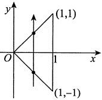

(1)

$$f_{X}(x)=\int_{-\infty}^{+\infty}f(x,y)\mathrm{d}y=\left\{\begin{aligned}&\int_{-x}^{x}\mathrm{d}y=2x,&0\leq x\leq1,\\&0,& 其他 .\end{aligned}\right.$$

$$\begin{aligned}f_{Y}(y)=&\int_{-\infty}^{+\infty}f(x,y)\mathrm{d}x=\left\{\begin{aligned}&\int_{-y}^{1}\mathrm{d}x=1+y,&-1\leqslant y<0,\\&\int_{y}^{1}\mathrm{d}x=1-y,&0\leqslant y\leqslant1,\\&0,& 其他 \end{aligned}\right.\\=&\left\{\begin{aligned}&1-\left|y\right|,&\left|y\right|\leqslant1,\\&0,& 其他 .\end{aligned}\right.\end{aligned}$$

$$f_{X\mid Y}(x\mid y)=\frac{f(x,y)}{f_{Y}(y)}=\left\{\begin{aligned}&\frac{1}{1-\left|y\right|},&\left|y\right|<x\leq1,\\ &0,& 其他 .\end{aligned}\right.$$

$$f_{Y\mid X}(y\mid x)=\frac{f(x,y)}{f_{X}(x)}=\left\{\begin{aligned}&\frac{1}{2x},&\left|y\right|<x\leq&1,\\ &0,& 其他 .\end{aligned}\right.$$

由于$f_{X}(x)f_{Y}(y)\neq f(x,y)$，故X与Y不独立.

(2)

$$\begin{aligned}P\left\{X>\frac{1}{2}\bigg|Y>0\right\}&=\frac{P\left\{X>\frac{1}{2},Y>0\right\}}{P\left\{Y>0\right\}}=\frac{\displaystyle\iint\limits_{x>\frac{1}{2},y>0}f(x,y)\mathrm{d}x\mathrm{d}y}{\displaystyle\iint\limits_{y>0}f(x,y)\mathrm{d}x\mathrm{d}y}\\ &=\frac{\displaystyle\int_{\frac{1}{2}}^{1}\mathrm{d}x\int_{0}^{x}\mathrm{d}y}{\int_{0}^{1}\mathrm{d}x\int_{0}^{x}\mathrm{d}y}=\frac{\displaystyle\int_{\frac{1}{2}}^{1}x\mathrm{d}x}{\int_{0}^{1}x\mathrm{d}x}=\frac{\frac{3}{8}}{\frac{1}{2}}=\frac{3}{4}.\end{aligned}$$

$$P\left\{X>\frac{1}{2}\left|Y=\frac{1}{4}\right.\right\}=\int_{\frac{1}{2}}^{+\infty}f_{X\mid Y}\left(x\left|y=\frac{1}{4}\right.\right)\mathrm{d}x=\int_{\frac{1}{2}}^{1}\frac{1}{1-\frac{1}{4}}\mathrm{d}x=\frac{2}{3}.$$

【注】由于$f(x,y)$在$(X,Y)$的正概率密度区域上为常数，因此可以利用面积计算概率.

#### 11.

【解析】如图(a)所示，①当x<0或y<0时，$F(x,y)=0$；

如图(b)所示，②当$0 \leq y < x$时，

$$F(x,y)=\int_{-\infty}^{x}\mathrm{d}s\int_{-\infty}^{y}f(s,t)\mathrm{d}t=2\int_{0}^{y}\mathrm{e}^{-t}\mathrm{d}t\int_{0}^{t}\mathrm{e}^{-s}\mathrm{d}s=1-2\mathrm{e}^{-y}+\mathrm{e}^{-2y}；$$

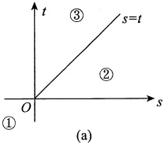

如图(c)所示，③当$0 \leq x \leq y$时，

$$\begin{align*}F(x,y)=&\int_{-\infty}^{x}\mathrm{d}s\int_{-\infty}^{y}f(s,t)\mathrm{d}t=2\int_{0}^{x}\mathrm{e}^{-s}\mathrm{d}s\int_{s}^{y}\mathrm{e}^{-t}\mathrm{d}t\\=&1-2\mathrm{e}^{-y}-\mathrm{e}^{-2x}+2\mathrm{e}^{-(x+y)}.\end{align*}$$

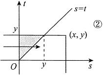

(b)

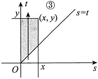

(c)

于是，$(X,Y)$的分布函数为

$$F(x,y)=\left\{\begin{aligned}&0,&x<0 或 y<0,\\&1-2\mathrm{e}^{-y}+\mathrm{e}^{-2y},&0\leq y<x,\\&1-2\mathrm{e}^{-y}-\mathrm{e}^{-2x}+2\mathrm{e}^{-(x+y)},&0\leq x\leq y.\end{aligned}\right.$$
#### 12.

【解析】由题设知$(X,Y)$的概率密度为

$$f(x,y)=\left\{\begin{aligned}&\frac{1}{2}&,0\leq&x\leq&2,0\leq&y\leq&1,\\ &0&,& 其他 .\end{aligned}\right.$$

用卷积公式$f_{Z}(z)=\int_{-\infty}^{+\infty}\frac{1}{|x|}f\left(x,\frac{z}{x}\right)\mathrm{d}x$，$0<z<x\leq2$．

当$z\leq0$或$z\geq2$时，$f_{Z}(z)=0$；

当 0 < z < 2 时，$f_{Z}(z) = \frac{1}{2} \int_{z}^{2} \frac{1}{x} \, \mathrm{d}x = \frac{1}{2} (\ln 2 - \ln z)$.

因此 Z = XY 的概率密度为

$$f_{Z}(z)=\left\{\begin{aligned}&\frac{1}{2}\left(\ln2-\ln z\right),&0<z<2,\\ &0,& 其他 .\end{aligned}\right.$$

【注】本题亦可用分布函数法.

正概率密度区域$D$与所求概率$F_Z(z) = P\{XY \leq z\}$的积分区域的公共部分有三种不同的组合形式(见图), 于是

当$z \leq 0$时，$F_{Z}(z)=0$；

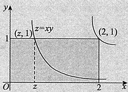

当0<z<2时，

$$F_{Z}(z)=\int_{0}^{z}\mathrm{d}x\int_{0}^{1}\frac{1}{2}\mathrm{d}y+\int_{z}^{2}\mathrm{d}x\int_{0}^{\frac{z}{x}}\frac{1}{2}\mathrm{d}y=\frac{1}{2}z(1-\ln z+\ln2)$$

当$z \geqslant 2$时，$F_{Z}(z)=1$

因此Z=XY的概率密度为

$$f_{Z}(z)=\left\{\begin{aligned}&\frac{1}{2}\left(\ln2-\ln z\right),&0<z<2,\\ &0,& 其他 .\end{aligned}\right.$$

#### 13.

【解析】因为X服从二项分布$B\left(2,\frac{1}{2}\right)$，所以X的概率分布为

| X | 0 | 1 | 2 |
|---|---|---|---|
| P | $\frac{1}{4}$ | $\frac{1}{2}$ | $\frac{1}{4}$ |

(1) 由X与Y相互独立，得

$$P\left\{Z\leqslant\frac{5}{2}\middle|X>1\right\}=P\left\{X+Y\leqslant\frac{5}{2}\middle|X=2\right\}=P\left\{Y\leqslant\frac{1}{2}\middle|X=2\right\}$$

$$=P\left\{Y\leqslant\frac{1}{2}\right\}=\int_{-\infty}^{\frac{1}{2}}f_{Y}(y)\mathrm{d}y=\int_{0}^{\frac{1}{2}}4y^{3}\mathrm{d}y=\frac{1}{16}.$$ 

(2)由分布函数法，得

$$\begin{aligned}F_{Z}(z)&=P\left\{Z\leqslant z\right\}=P\left\{X+Y\leqslant z\right\}\\&=P\left\{X+Y\leqslant z,X=0\right\}+P\left\{X+Y\leqslant z,X=1\right\}+P\left\{X+Y\leqslant z,X=2\right\}\\&=P\left\{Y\leqslant z,X=0\right\}+P\left\{Y\leqslant z-1,X=1\right\}+P\left\{Y\leqslant z-2,X=2\right\}\\&=P\left\{Y\leqslant z\right\}P\left\{X=0\right\}+P\left\{Y\leqslant z-1\right\}P\left\{X=1\right\}+P\left\{Y\leqslant z-2\right\}P\left\{X=2\right\}\\&=\frac{1}{4}F_{Y}(z)+\frac{1}{2}F_{Y}(z-1)+\frac{1}{4}F_{Y}(z-2),\end{aligned}$$

故Z的概率密度为

$$\begin{aligned}f_{Z}(z)&=F_{Z}^{\prime}(z)=\frac{1}{4}F_{Y}^{\prime}(z)+\frac{1}{2}F_{Y}^{\prime}(z-1)+\frac{1}{4}F_{Y}^{\prime}(z-2)\\&=\frac{1}{4}f_{Y}(z)+\frac{1}{2}f_{Y}(z-1)+\frac{1}{4}f_{Y}(z-2)\\&=\begin{cases}z^{3}, & 0\leqslant z\leqslant 1,\\2(z-1)^{3}, & 1<z\leqslant 2,\\(z-2)^{3}, & 2<z\leqslant 3,\\0, & \text{其他.}\end{cases}\end{aligned}$$

14.【解析】(1)由$\int_{-\infty}^{+\infty}f_{Y}(y)\mathrm{d}y=1$，知$a\neq 0$，且

$$\int_{0}^{+\infty}\mathrm{e}^{ay}\mathrm{d}y=\frac{1}{a}\mathrm{e}^{ay}\bigg|_{0}^{+\infty}=\lim_{y\to+\infty}\left(\frac{1}{a}\mathrm{e}^{ay}-\frac{1}{a}\right)=1,$$

若成立，必有$\lim_{y\to+\infty}\frac{1}{a}\mathrm{e}^{ay}=0$，解得$a=-1$。

(2)由(1)知，$Z=2X-Y$，且X，Y相互独立，故

$$f_{Z}(z)\stackrel{(*)}{=}\int_{-\infty}^{+\infty}f_{X}(x)f_{Y}(2x-z)\mathrm{d}x,$$

积分区域为$\begin{cases}0<x<1,\\2x-z>0,\end{cases}$即$\begin{cases}0<x<1,\\2x>z,\end{cases}$如图所示.于是

$$f_{Z}(z)=\begin{cases}\int_{0}^{1}\mathrm{e}^{-(2x-z)}\mathrm{d}x, & z<0,\\\int_{\frac{z}{2}}^{1}\mathrm{e}^{-(2x-z)}\mathrm{d}x, & 0\leqslant z<2,\\0, & \text{其他.}\end{cases}=\begin{cases}\frac{1}{2}(1-\mathrm{e}^{-2})\mathrm{e}^{z}, & z<0,\\\frac{1}{2}(1-\mathrm{e}^{z-2}), & 0\leqslant z<2,\\0, & \text{其他.}\end{cases}$$

【注】①(*)处来自如下公式.设$(X,Y)\sim f(x,y)$，则$Z=aX+bY(ab\neq 0)$的概率密度为

$$f_{Z}(z)=\frac{1}{|a|}\int_{-\infty}^{+\infty}f\left(\frac{z-by}{a},y\right)\mathrm{d}y=\frac{1}{|b|}\int_{-\infty}^{+\infty}f\left(x,\frac{z-ax}{b}\right)\mathrm{d}x.$$ 

进一步地，若X，Y相互独立，且$X\sim f_{X}(x)$，$Y\sim f_{Y}(y)$，则

$$f_{Z}(z)=\frac{1}{|a|}\int_{-\infty}^{+\infty}f_{X}\left(\frac{z-by}{a}\right)f_{Y}(y)\mathrm{d}y=\frac{1}{|b|}\int_{-\infty}^{+\infty}f_{X}(x)f_{Y}\left(\frac{z-ax}{b}\right)\mathrm{d}x.$$ 

这些公式符合如下“口诀”：“积谁不换谁，换完求偏导”.

如$f_{Z}(z)=\frac{1}{|a|}\int_{-\infty}^{+\infty}f\left(\frac{z-by}{a},y\right)\mathrm{d}y$中.

先用第一句：“积谁不换谁”.对y积分，则不换y，写成$f(\square,y)$，换$x=\frac{z-by}{a}$，为$f\left(\frac{z-by}{a},y\right)$.

再用第二句：“换完求偏导”.$\frac{\partial}{\partial z}\left(\frac{z-by}{a}\right)=\frac{1}{a}$，因概率密度非负，要加绝对值，即为$\frac{1}{|a|}$.这样便记住了公式.

②考生亦可用分布函数法求Z的概率密度，一来检查答案的正确性，二来比较两种方法的繁简.

利用分布函数法.

由题意可知，X与Y的联合概率密度为

$$f(x,y)=\begin{cases}\mathrm{e}^{-y}, & 0<x<1,y>0,\\0, & \text{其他.}\end{cases}$$

由$Z=2X-Y$的分布函数$F_{Z}(z)=\iint_{2x-y\leqslant z}f(x,y)\mathrm{d}x\mathrm{d}y$，可知

当$z<0$时，$F_{Z}(z)=\int_{0}^{1}\mathrm{d}x\int_{2x-z}^{+\infty}\mathrm{e}^{-y}\mathrm{d}y=\frac{1}{2}(1-\mathrm{e}^{-2})\mathrm{e}^{z}$；

当$0\leqslant z<2$时，$F_{Z}(z)=\int_{0}^{\frac{z}{2}}\mathrm{d}x\int_{0}^{+\infty}\mathrm{e}^{-y}\mathrm{d}y+\int_{\frac{z}{2}}^{1}\mathrm{d}x\int_{2x-z}^{+\infty}\mathrm{e}^{-y}\mathrm{d}y=\frac{z}{2}+\frac{1}{2}-\frac{1}{2}\mathrm{e}^{z-2}$；

当$z\geqslant 2$时，$F_{Z}(z)=1$.

故$Z=2X-Y$的概率密度为$f_{Z}(z)=\begin{cases}\frac{1}{2}(1-\mathrm{e}^{-2})\mathrm{e}^{z}, & z<0,\\\frac{1}{2}(1-\mathrm{e}^{z-2}), & 0\leqslant z<2,\\0, & \text{其他.}\end{cases}$

#### 14.

【解析】(1)由$\int_{-\infty}^{+\infty}f_{Y}(y)dy=1$，知$a\neq0$，且

$$\int_{0}^{+\infty}\mathrm{e}^{ay}\mathrm{d}y=\frac{1}{a}\mathrm{e}^{ay}\bigg|_{0}^{+\infty}=\lim_{y\to+\infty}\left(\frac{1}{a}\mathrm{e}^{ay}-\frac{1}{a}\right)=1$$

若成立，必有$\lim_{y\to+\infty}\frac{1}{a}e^{ay}=0$，解得a=-1

(2)由(1)知，Z=2X-Y，且X，Y相互独立，故

$$f_{Z}(z)\xrightarrow{(*)}\int_{-\infty}^{+\infty}f_{X}(x)f_{Y}(2x-z)\mathrm{d}x,$$

积分区域为$\left\{\begin{aligned}&0<x<1,\\ &2x-z>0,\end{aligned}\right.$，即$\left\{\begin{aligned}&0<x<1,\\ &2x>z,\end{aligned}\right.$，如图所示.于是

$$f_{Z}(z)=\left\{\begin{aligned}&\int_{0}^{1}e^{-(2x-z)}d x,&z<0,\\&\int_{\frac{z}{2}}^{1}e^{-(2x-z)}d x,&0\leq z<2,\\&0,& 其他 \end{aligned}\right.=\left\{\begin{aligned}&\frac{1}{2}\left(1-e^{-2}\right)e^{z},&z<0,\\&\frac{1}{2}\left(1-e^{z-2}\right),&0\leq z<2,\\&0,& 其他 .\end{aligned}\right.$$

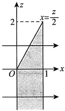

【注】①(*)处来自如下公式.设$(X,Y)\sim f(x,y)$，则$Z=aX+bY(ab\neq0)$的概率密度为

$$f_{Z}(z)=\frac{1}{|a|}\int_{-\infty}^{+\infty}f\left(\frac{z-by}{a},y\right)dy=\frac{1}{|b|}\int_{-\infty}^{+\infty}f\left(x,\frac{z-ax}{b}\right)dx$$

进一步地，若X，Y相互独立，且$X\sim f_{X}(x)$，$Y\sim f_{Y}(y)$，则

$$f_{Z}(z)=\frac{1}{|a|}\int_{-\infty}^{+\infty}f_{X}\left(\frac{z-by}{a}\right)f_{Y}(y)dy=\frac{1}{|b|}\int_{-\infty}^{+\infty}f_{X}(x)f_{Y}\left(\frac{z-ax}{b}\right)dx$$

这些公式符合如下“口诀”：“积谁不换谁，换完求偏导”

如$f_{Z}(z)=\frac{1}{|a|}\int_{-\infty}^{+\infty}f\left(\frac{z-by}{a},y\right)dy$中

先用第一句：“积谁不换谁”.对y积分，则不换y，写成$f(\Box,y)$，换$x=\frac{z-by}{a}$，为$f\left(\frac{z-by}{a},y\right)$.

再用第二句：“换完求偏导”.$\frac{\partial\left(\frac{z-by}{a}\right)}{\partial z}=\frac{1}{a}$，因概率密度非负，要加绝对值，即为$\frac{1}{|a|}$.这样便记住了公式.

②考生亦可用分布函数法求 Z 的概率密度，一来检查答案的正确性，二来比较两种方法的繁简.

利用分布函数法.

由题意可知，X与Y的联合概率密度为

$$f(x,y)=\left\{\begin{aligned}&\mathrm{e}^{-y},&0<x<1,y>0,\\ &0,& 其他 .\end{aligned}\right.$$

由$Z = 2X - Y$的分布函数$F_Z(z) = \iint_{2x - y \leq z} f(x, y) \, \mathrm{d}x \, \mathrm{d}y$，可知

当$z<0$时，$F_{Z}(z)=\int_{0}^{1}\mathrm{d}x\int_{2x-z}^{+\infty}\mathrm{e}^{-y}\mathrm{d}y=\frac{1}{2}(1-\mathrm{e}^{-2})\mathrm{e}^{z}$;

当$0 \leqslant z < 2$时，$F_{Z}(z) = \int_{0}^{\frac{z}{2}} dx \int_{0}^{+\infty} e^{-y} dy + \int_{\frac{z}{2}}^{1} dx \int_{2x-z}^{+\infty} e^{-y} dy = \frac{z}{2} + \frac{1}{2} - \frac{1}{2} e^{z-2}$；

当$z \geqslant 2$时，$F_{Z}(z)=1$

故$Z = 2X - Y$的概率密度为$f_Z(z) = \begin{cases} \frac{1}{2}(1 - e^{-2})e^z, & z < 0, \\ \frac{1}{2}(1 - e^{z-2}), & 0 \leq z < 2, \\ 0, & \text{其他}. \end{cases}$
### 第4章 随机变量的数字特征

#### 1.

【答案】$\frac{1}{4}(e^{2}+1)^{2}$

【解析】因为$X\sim B\left(2,\frac{1}{2}\right)$，所以

$$\begin{aligned}E(\mathbf{e}^{2X})=&\sum_{k=0}^{2}\mathbf{e}^{2k}C_{2}^{k}\left(\frac{1}{2}\right)^{k}\left(\frac{1}{2}\right)^{2-k}\\=&\sum_{k=0}^{2}C_{2}^{k}\left(\mathbf{e}^{2}\bullet\frac{1}{2}\right)^{k}\left(\frac{1}{2}\right)^{2-k}\\=&\left(\mathbf{e}^{2}\bullet\frac{1}{2}+\frac{1}{2}\right)^{2}=\frac{1}{4}(\mathbf{e}^{2}+1)^{2}.\end{aligned}$$

#### 2.

【答案】(C)

【解析】

$$E(Y)=E\left(\max\left\{X,1\right\}\right)=\int_{-\infty}^{+\infty}\max\left\{x,1\right\}f(x)\mathrm{d}x,$$

其中

$$f(x)=\left\{\begin{aligned}&\mathrm{e}^{-x},&x>0,\\ &0,&x\leq0,\end{aligned}\right.$$

即

$$\begin{aligned}E(Y)=&\int_{-\infty}^{+\infty}\max\left\{x,1\right\}f(x)\mathrm{d}x=\int_{0}^{+\infty}\max\left\{x,1\right\}\mathrm{e}^{-x}\mathrm{d}x\\ =&\int_{0}^{1}\mathrm{e}^{-x}\mathrm{d}x+\int_{1}^{+\infty}x\mathrm{e}^{-x}\mathrm{d}x=1-\mathrm{e}^{-1}+2\mathrm{e}^{-1}=1+\mathrm{e}^{-1}.\end{aligned}$$

故选(C).

#### 3.

【答案】(A)

【解析】根据概率密度$f(x)$的归一性知，题图(a)中的$X_{1}$的概率密度为

$$f_{1}(x)=\left\{\begin{aligned}&1+x,&-1\leq x<0,\\ &1-x,&0\leq x\leq1,\\ &0,& 其他 .\end{aligned}\right.$$

题图(b)中的$X_{2}$的概率密度为

$$f_{2}(x)=\left\{\begin{aligned}&\frac{1}{2}&-1<x<1,\\&0& 其他 .\end{aligned}\right.$$

题图(c)中的$X_{3}$的概率密度为
$$f_{3}(x)=\left\{\begin{aligned}&-x,&-1<x<0,\\ &x,&0\leq x<1,\\ &0,& 其他 .\end{aligned}\right.$$

因此有

$$E(X_{1})=\int_{-1}^{0}x(1+x)\mathrm{d}x+\int_{0}^{1}x(1-x)\mathrm{d}x=0,$$

$$E(X_{1}^{2})=\int_{-1}^{0}x^{2}(1+x)\mathrm{d}x+\int_{0}^{1}x^{2}(1-x)\mathrm{d}x=\frac{1}{6},$$

$$D(X_{1})=E(X_{1}^{2})-\left[E(X_{1})\right]^{2}=\frac{1}{6}.$$

同理，$E(X_2)=0$，$E(X_2^2)=\frac{1}{3}$，$D(X_2)=\frac{1}{3}$；$E(X_3)=0$，$E(X_3^2)=\frac{1}{2}$，$D(X_3)=\frac{1}{2}$。

所以$D(X_{1})<D(X_{2})<D(X_{3})$

#### 4.

【答案】(D)

【解析】由题设知，$P\left\{X=k\right\}=p(1-p)^{k-1}$，k=1,2,3,$\cdots$，因此有

$$E\left(\frac{1}{X}\right)=\sum_{k=1}^{\infty}\frac{1}{k}p(1-p)^{k-1}=\frac{p}{1-p}\sum_{k=1}^{\infty}\frac{1}{k}(1-p)^{k}=\frac{p}{1-p}\sum_{k=1}^{\infty}\frac{1}{k}x^{k}\bigg|_{x=1-p}.$$

令$S(x)=\sum_{k=1}^{\infty}\frac{1}{k}x^{k}$，则$S'(x)=\sum_{k=1}^{\infty}x^{k-1}=\frac{1}{1-x}\left(|x|<1\right)$，从而有

$$S(x)=S(0)+\int_{0}^{x}\frac{1}{1-t}\mathrm{d}t=-\ln(1-x)(-1\leqslant x<1),$$

故$S(1-p)=-\ln p$，于是$E\left(\frac{1}{X}\right)=-\frac{p\ln p}{1-p}$.

#### 5.

【答案】(B)

【解析】此为超几何分布模型，$N=10,M=7,n=3$，故$E(X)=\frac{nM}{N}=\frac{3\times7}{10}=\frac{21}{10}$

【注】要记住这一结论：超几何分布的数学期望$E(X)=\frac{nM}{N}$。可以这样记，$p=\frac{M}{N}$，则$E(X)=np$，与二项分布$X\sim B(n,p)$的$E(X)=np$在形式上一样，但要注意，超几何分布的$E(X)=n\cdot\frac{M}{N}$是用组合恒等式经过计算化简得来的。

#### 6.

【答案】$\frac{1}{3}$

【解析】由题意知，$E(X)=\int_{0}^{1}xf(x)dx=\int_{0}^{1}2x^{2}dx=\frac{2}{3}$

由$F(x)=\int_{-\infty}^{x}f(t)dt$，得$F(x)=\left\{\begin{aligned}&0,&x<0,\\ &x^{2},&0\leq x<1,\\ &1,&x\geq1.\end{aligned}\right.$

从而，

$$\begin{aligned}&P\left\{F(X)>E(X)\right\}=P\left\{X^{2}>\frac{2}{3}\right\}=1-P\left\{-\sqrt{\frac{2}{3}}\leq X\leq\sqrt{\frac{2}{3}}\right\}\\=&1-P\left\{0\leq X\leq\sqrt{\frac{2}{3}}\right\}=1-\int_{0}^{\sqrt{\frac{2}{3}}}2x\mathrm{d}x=\frac{1}{3}.\\ \end{aligned}$$

#### 7.

【答案】$\left|\mathrm{e}^{-1}-\mathrm{e}^{-\frac{1}{\lambda}}\right|$

【解析】由$X$服从参数为$\lambda$的指数分布，知$E(X) = \frac{1}{\lambda}$，$D(X) = \frac{1}{\lambda^2}$。

当$\lambda < 1$时，所求概率为$P\left\{\frac{1}{\lambda} < X < \frac{1}{\lambda^2}\right\} = \int_{\frac{1}{\lambda}}^{\frac{1}{\lambda^2}} \lambda e^{-\lambda x} \, \mathrm{d}x \xrightarrow{t=\lambda x} \int_{1}^{\frac{1}{\lambda}} e^{-t} \, \mathrm{d}t = e^{-1} - e^{-\frac{1}{\lambda}}$；

当$\lambda \geq 1$时，所求概率为$P\left\{\frac{1}{\lambda^2} < X < \frac{1}{\lambda}\right\} = \int_{\frac{1}{\lambda^2}}^{\frac{1}{\lambda}} \lambda e^{-\lambda x} \, \mathrm{d}x \xrightarrow{t=\lambda x} \int_{\frac{1}{\lambda}}^{1} e^{-t} \, \mathrm{d}t = e^{-\frac{1}{\lambda}} - e^{-1}$。

综上可知，$X$落在$E(X)$和$D(X)$之间的概率为$\left|e^{-1} - e^{-\frac{1}{\lambda}}\right|$。

#### 8.

【解析】设所投两点为$X_{1}$和$X_{2}$，显然$(X_{1}, X_{2})$在正方形区域 0 < x_{1} < 1，0 < x_{2} < 1 上服从均匀分布，即有$X_{1}$和$X_{2}$的联合概率密度为

$$f(x_{1},x_{2})=\left\{\begin{aligned}&1,&0<x_{1}<1,0<x_{2}<1,\\ &0,& 其他 .\end{aligned}\right.$$

由题设，距离为$X=\left|X_{1}-X_{2}\right|$.

(1)如图所示，当$x\leq0$时，$F(x)=P\left\{X\leq x\right\}=0$;

当$x\geq1$时，$F(x)=P\left\{X\leq x\right\}=1$;

当0<x<1时，

$$\begin{aligned}F(x)&=P\left\{X\leq x\right\}=P\left\{\left|X_{1}-X_{2}\right|\leq x\right\}\\&=\iint\limits_{\left|x_{1}-x_{2}\right|\leq x\atop0<x_{1},x_{2}<1}\mathrm{d}x_{1}\mathrm{d}x_{2}=1-(1-x)^{2}=2x-x^{2}.\end{aligned}$$

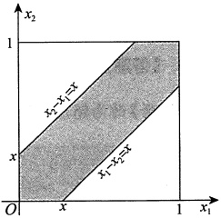

所以

$$F(x)=\left\{\begin{aligned}&0,&x\leq0,\\&2x-x^{2},&0<x<1,f(x)\\&1,&x\geq1,\end{aligned}\right.=\left\{\begin{aligned}&2-2x,&0<x<1,\\&0,& 其他 .\end{aligned}\right.$$

$$E(X)=\int_{-\infty}^{+\infty}x f(x)\mathrm{d}x=\int_{0}^{1}x(2-2x)\mathrm{d}x=\left(x^{2}-\frac{2}{3}x^{3}\right)\bigg|_{0}^{1}=\frac{1}{3}.$$
#### 9.

【解析】(1)$f(x)=Ae^{x(B-x)}=Ae^{-x^2+Bx}=Ae^{\frac{B^2}{4}}e^{-\left(x-\frac{B}{2}\right)^2}$，可以将$f(x)$看成正态分布$N\left(\frac{B}{2},\frac{1}{2}\right)$的概率密度，则有$X\sim N\left(\frac{B}{2},\frac{1}{2}\right)$，且$E(X)=2D(X)$，得到$E(X)=\frac{B}{2}=2D(X)=1$，即 B=2。

又$Ae^{\frac{B^2}{4}}=\frac{1}{\sqrt{2\pi}\sigma}$，故$Ae=\frac{1}{\sqrt{2\pi}\cdot\sqrt{\frac{1}{2}}}=\frac{1}{\sqrt{\pi}}$，解得$A=\frac{e^{-1}}{\sqrt{\pi}}$。

综上，$A=\frac{e^{-1}}{\sqrt{\pi}}$，B=2。

(2)

$$E(X^{2}+\mathrm{e}^{X})=E(X^{2})+E(\mathrm{e}^{X})~,$$

又

$$E(X^{2})=D(X)+\left[E(X)\right]^{2}=\frac{1}{2}+1=\frac{3}{2},$$

$$\begin{aligned}E(\mathrm{e}^{X})=&\int_{-\infty}^{+\infty}\mathrm{e}^{x}f(x)\mathrm{d}x=\int_{-\infty}^{+\infty}\mathrm{e}^{x}\frac{1}{\sqrt{\pi}}\mathrm{e}^{-(x-1)^{2}}\mathrm{d}x=\frac{1}{\sqrt{\pi}}\int_{-\infty}^{+\infty}\mathrm{e}^{-x^{2}+3x-1}\mathrm{d}x\\ =&\frac{1}{\sqrt{\pi}}\int_{-\infty}^{+\infty}\mathrm{e}^{-\left(x-\frac{3}{2}\right)^{2}}\cdot\mathrm{e}^{\frac{5}{4}}\mathrm{d}x=\mathrm{e}^{\frac{5}{4}}\int_{-\infty}^{+\infty}\frac{1}{\sqrt{\pi}}\mathrm{e}^{-\left(x-\frac{3}{2}\right)^{2}}\mathrm{d}x=\mathrm{e}^{\frac{5}{4}},\end{aligned}$$

所以$E(X^{2}+e^{X})=\frac{3}{2}+e^{\frac{5}{4}}$

(3)由(1)知$X\sim N\left(1,\frac{1}{2}\right)$，故$(X-1)\sim N\left(0,\frac{1}{2}\right)$，$\sqrt{2}(X-1)\sim N(0,1)$，所以当$y\geqslant0$时，

$$\begin{array}{c}{\displaystyle F(y)=P\left\{Y\leqslant y\right\}=P\left\{\left|\sqrt{2}(X-1)\right|\leqslant y\right\}=P\left\{-y\leqslant\sqrt{2}(X-1)\leqslant y\right\}}\\ {}\\ {=\displaystyle\int_{-y}^{y}\frac{1}{\sqrt{2\pi}}\mathrm{e}^{-\frac{x^{2}}{2}}\mathrm{d}x=2\int_{0}^{y}\frac{1}{\sqrt{2\pi}}\mathrm{e}^{-\frac{x^{2}}{2}}\mathrm{d}x=2\varPhi(y)-1~,}\end{array}$$

其中$\Phi(y)$为标准正态分布的分布函数.

当y<0时，$F(y)=0$

综上，$F(y)=\left\{\begin{aligned}&2\Phi(y)-1,&y\geqslant0,\\ &0,& 其他 .\end{aligned}\right.$

#### 10.

【答案】(D)

【解析】因为X，Y是两个相互独立且均服从正态分布$N\left(0,\left(\frac{1}{\sqrt{2}}\right)^2\right)$的随机变量，故Z=X-Y也服从正态分布.由

$$E(Z)=E(X)-E(Y)=0,D(Z)=D(X)+D(Y)=\frac{1}{2}+\frac{1}{2}=1.$$

知$Z\sim N(0,1)$.于是

$$E\left(\left|X-Y\right|\right)=\frac{1}{\sqrt{2\pi}}\int_{-\infty}^{+\infty}\left|z\right|\mathrm{e}^{-\frac{1}{2}z^{2}}\mathrm{d}z=\frac{2}{\sqrt{2\pi}}\int_{0}^{+\infty}z\mathrm{e}^{-\frac{1}{2}z^{2}}\mathrm{d}z=-\left.\frac{2}{\sqrt{2\pi}}\mathrm{e}^{-\frac{1}{2}z^{2}}\right|_{0}^{+\infty}=\sqrt{\frac{2}{\pi}},$$

应选(D).

#### 11.

【答案】(C)

【解析】方法一 由题知，随机变量X与Y的联合概率密度为$f(x,y)=\left\{\begin{aligned}&\mathrm{e}^{-x-y},&x>0,y>0,\\ &0,& 其他,\end{aligned}\right.$故

$$\begin{aligned}E(Z)=&\int_{0}^{+\infty}\mathrm{d}y\int_{0}^{y}(y-1)\mathrm{e}^{-x-y}\mathrm{d}x+\int_{0}^{+\infty}\mathrm{d}x\int_{0}^{x}2x\mathrm{e}^{-x-y}\mathrm{d}y\\ =&\int_{0}^{+\infty}(y-1)\mathrm{e}^{-y}(1-\mathrm{e}^{-y})\mathrm{d}y+\int_{0}^{+\infty}2x\mathrm{e}^{-x}(1-\mathrm{e}^{-x})\mathrm{d}x\\ =&\int_{0}^{+\infty}(3y-1)(\mathrm{e}^{-y}-\mathrm{e}^{-2y})\mathrm{d}y=\frac{7}{4}.\end{aligned}$$

方法二 当X=x时，$Z=\left\{\begin{aligned}&2x,&x\geq Y,\\&Y-1,&x<Y\end{aligned}\right.$是Y的函数.

$$E(Z\mid X=x)=\int_{0}^{x}2x\mathrm{e}^{-y}\mathrm{d}y+\int_{x}^{+\infty}(y-1)\mathrm{e}^{-y}\mathrm{d}y=2x(1-\mathrm{e}^{-x})+x\mathrm{e}^{-x}=2x-x\mathrm{e}^{-x},$$

$$E(Z)=E\left[\left.E(Z\ \right|X)\right]=E(2X-X\mathrm{e}^{-X})=2E(X)-E(X\mathrm{e}^{-X})=2-\frac{1}{4}=\frac{7}{4}$$

【注】方法二中使用了亚当夏娃公式，公式的推导运用了全集分解思想。

①$E(Y|X=x)$是X=x条件下Y的条件期望，则Y的期望为随机变量$E(Y|X)$的期望，即亚当公式：

$$E(Y)=E\left[E(Y\mid X)\right]$$

②$D(Y|X=x)$是X=x条件下Y的条件方差，则Y的方差为随机变量$D(Y|X)$的期望加上随机变量$E(Y|X)$的方差，即夏娃公式：

$$D(Y)=E\left[D(Y\mid X)\right]+D\left[E(Y\mid X)\right].$$

#### 12.

【答案】(A)

【解析】由题知$X \sim B\left(2, \frac{1}{3}\right)$，$Y \sim B\left(2, \frac{1}{3}\right)$。设 Z 表示2次试验中结果$A_{3}$发生的次数，则$Z \sim B\left(2, \frac{1}{3}\right)$。又$X + Y + Z = 2$，于是$X + Y = 2 - Z$。根据二项分布的性质，知$X + Y \sim B\left(2, \frac{2}{3}\right)$。

从而$D(X)=D(Y)=\frac{4}{9}$，$D(X+Y)=\frac{4}{9}$。由$D(X+Y)=D(X)+D(Y)+2\mathrm{Cov}(X,Y)$，可得$\mathrm{Cov}(X,Y)=-\frac{2}{9}$，所以 X 与 Y 的相关系数为$\rho_{XY}=\frac{\mathrm{Cov}(X,Y)}{\sqrt{D(X)}\cdot\sqrt{D(Y)}}=-\frac{1}{2}$。
【注】由$P(A_1) = P(A_2) = P(A_3) = \frac{1}{3}$，得$X \sim B\left(2, \frac{1}{3}\right)$，$Y \sim B\left(2, \frac{1}{3}\right)$。X 与 Y 的相关系数为$\rho_{XY} = \frac{\text{Cov}(X, Y)}{\sqrt{D(X)} \cdot \sqrt{D(Y)}}$。显然$E(X) = E(Y) = \frac{2}{3}$，$D(X) = D(Y) = 2 \times \frac{1}{3} \times \frac{2}{3} = \frac{4}{9}$，易知$\text{Cov}(X, Y) = E(XY) - E(X)E(Y)$，为求$E(XY)$，先求出 XY 的分布律。

X和Y的可能取值均为0,1,2，且由题意可知$X+Y\leq2$，所以XY的可能取值应为0,1.

$$P\left\{XY=1\right\}=P\left\{X=1,Y=1\right\}=2\times\frac{1}{3}\times\frac{1}{3}=\frac{2}{9},P\left\{XY=0\right\}=1-\frac{2}{9}=\frac{7}{9}$$

故$XY$的分布律为

| $XY$ | 0 | 1 |
|---|---|---|
| $P$ | $\frac{7}{9}$ | $\frac{2}{9}$ |

得$E(XY)=\frac{2}{9}$，故

$$\mathrm{Cov}(X,Y)=E(XY)-E(X)E(Y)=\frac{2}{9}-\frac{2}{3}\times\frac{2}{3}=-\frac{2}{9},$$

$$\rho_{XY}=\frac{\operatorname{Cov}(X,Y)}{\sqrt{D(X)}\sqrt{D(Y)}}=\frac{-\frac{2}{9}}{\frac{2}{3}\times\frac{2}{3}}=-\frac{1}{2}$$

#### 13.

【答案】(B)

【解析】方法一 由随机变量的方差的性质$D(X+Y)=D(X)+D(Y)+2\mathrm{Cov}(X,Y)$，可知$D(X+Y)=D(X)+D(Y)$的充分必要条件是$\mathrm{Cov}(X,Y)=0$，即 X 和 Y 不相关。故选项(B)正确，选项(A)错误。

方法二 排除法.由$D(X+Y)=D(X)+D(Y)+2\mathrm{Cov}(X,Y)$，可知$\mathrm{Cov}(X,Y)=0$是$D(X+Y)=D(X)+D(Y)$的充分必要条件，选项(A)不成立.而$\mathrm{Cov}(X,Y)=0$时 X 和 Y 未必独立，例如，设 X 和 Y 的联合分布是圆域$x^{2}+y^{2}\leq1$上的均匀分布，由对称性知 X 和 Y 不相关，但是 X 和 Y 不独立，排除选项(C)和(D).故只有(B)是正确选项.

【注】方法二中，例中的X和Y不相关和不独立的证明，可参考强化篇第6章第16题

#### 14.

【答案】(B)

【解析】由X与$\left|X-c\right|$不相关，得

$$\operatorname{C o v}(X,\left|X-c\right|)=E(X\left|X-c\right|)-E(X)\bullet E(\left|X-c\right|)=0~.$$

由题设知，随机变量X的概率密度为$f(x)=\left\{\begin{aligned}&\frac{1}{4},&0<x<4,\\&0,& 其他,\end{aligned}\right.$，故$E(X)=2$，且

$$E(\left|X-c\right|)=\int_{0}^{4}\left|x-c\right|f(x)\mathrm{d}x=\frac{1}{4}\int_{0}^{c}(c-x)\mathrm{d}x+\frac{1}{4}\int_{c}^{4}(x-c)\mathrm{d}x=\frac{c^{2}}{4}-c+2$$

$$E(X\mid X-c|)=\int_{0}^{4}x\mid x-c\mid f(x)dx=\frac{1}{4}\int_{0}^{c}x(c-x)dx+\frac{1}{4}\int_{c}^{4}x(x-c)dx=\frac{c^{3}}{12}-2c+\frac{16}{3}.$$

将上述期望代入$(\ast)$式，化简得$c^{3}-6c^{2}+16=0$，又$c\in[0,4]$，解得c=2。

#### 15.

【答案】(D)

【解析】由题设可得

$$P\left\{Z_{1}=-1\right\}=P\left\{Z_{2}=-1\right\}=P\left\{X=-1,Y=1\right\}+P\left\{X=1,Y=-1\right\}=\frac{1}{2},$$

$$P\left\{Z_{1}=1\right\}=P\left\{Z_{2}=1\right\}=P\left\{X=1,Y=1\right\}+P\left\{X=-1,Y=-1\right\}=\frac{1}{2},$$

所以

$$P\left\{Z_{1}=1,Z_{2}=-1\right\}=0\neq P\left\{Z_{1}=1\right\}P\left\{Z_{2}=-1\right\}$$

故选项(B)，(C)错误.

对$a, b \in \left\{ -1,1 \right\}$，有

$$P\left\{Z_{2}=a,X=b\right\}=P\left\{\frac{X}{Y}=a,X=b\right\}=P\left\{X=b,Y=\frac{b}{a}\right\}=P\left\{X=b\right\}P\left\{Y=\frac{b}{a}\right\}=\frac{1}{4},$$

$$P\left\{Z_{2}=a\right\}P\left\{X=b\right\}=\frac{1}{2}\times\frac{1}{2}=\frac{1}{4},$$

但

$$P\left\{X=-1,Y=1,Z_{2}=1\right\}=0\neq P\left\{X=-1\right\}P\left\{Y=1\right\}P\left\{Z_{2}=1\right\},$$

所以X，Y，$Z_{2}$不相互独立.同理，X，Y，$Z_{1}$也不相互独立.故选项(A)错误，选项(D)正确.

#### 16.

【答案】(D)

【解析】方法一 由于

$$D(X+Y)=D(X-Y),$$

因此

$$D(X)+D(Y)+2\mathrm{Cov}(X,Y)=D(X)+D(Y)-2\mathrm{Cov}(X,Y)$$

则

$$\mathrm{C o v}(X,Y)=E(X Y)-E(X)E(Y)=0~,~E(X Y)=E(X)E(Y)~,$$

可见(D)是正确选项.

方法二 排除法. 不难验证选项(A),(B)和(C)都不成立. 虽然 X 和 Y 不相关是

$$D(X+Y)=D(X-Y)=D(X)+D(Y)$$

的充分必要条件，但是当X和Y不相关时，X和Y未必独立，因此选项(A)的结论一般不成立.显然选项(C)也不成立.为说明选项(B)不成立，只需举一反例.设X和Y均服从参数为$p(0<p<1)$的0-1分布且相互独立，从而$D(X+Y)=D(X-Y)$，且$D(X)=D(Y)=p(1-p)$.

由于

$P\left\{XY=1\right\}=P\left\{X=1,Y=1\right\}=p^{2},P\left\{XY=0\right\}=1-p^{2}$,

因此XY服从参数为$p^{2}$的0-1分布，且

$$D(X Y)=p^{2}(1-p^{2})\neq p^{2}(1-p)^{2}=D(X)D(Y),$$

可见选项(B)不成立.故选项(A),(B)和(C)都不成立,只有(D)是正确选项.

【注】因为X和Y是任意随机变量，所以选项(A)和(C)并不是非此即彼的.

#### 17.

【答案】(C)

【解析】

$$\begin{aligned}\operatorname{Cov}(Y_{1},Y_{2})=&\operatorname{Cov}(X_{1}\cos\alpha+X_{2}\sin\alpha,X_{1}(-\sin\alpha)+X_{2}\cos\alpha)\\=&\cos\alpha\bullet(-\sin\alpha)\bullet D(X_{1})+(\cos^{2}\alpha-\sin^{2}\alpha)\operatorname{Cov}(X_{1},X_{2})+\cos\alpha\bullet\sin\alpha\bullet D(X_{2})\\=&\cos\alpha\bullet\sin\alpha(\sigma_{2}^{2}-\sigma_{1}^{2})+\rho\sigma_{1}\sigma_{2}(\cos^{2}\alpha-\sin^{2}\alpha)=\frac{1}{2}(\sigma_{2}^{2}-\sigma_{1}^{2})\sin2\alpha+\rho\sigma_{1}\sigma_{2}\cos2\alpha\\=&\cos2\alpha\bigg[\frac{1}{2}(\sigma_{2}^{2}-\sigma_{1}^{2})\tan2\alpha+\rho\sigma_{1}\sigma_{2}\bigg]=0.\end{aligned}$$

由$\cos2\alpha\neq0$，有$\frac{1}{2}(\sigma_{2}^{2}-\sigma_{1}^{2})\tan2\alpha=-\rho\sigma_{1}\sigma_{2}$，即$\tan2\alpha=2\rho\frac{\sigma_{1}\sigma_{2}}{\sigma_{1}^{2}-\sigma_{2}^{2}}$，选(C).

#### 18.

【答案】(B)

【解析】由题设，有$P\{Y=-ax\}=1$，即当a>0时，$\rho=-1$；当a<0时，$\rho=1$。故$\rho=-\frac{a}{|a|}$，选(B).

【注】具体计算如下：

$$\mathrm{Cov}(X,Y)=\mathrm{Cov}(X,-aX)=-aD(X),$$

$$D(Y)=D(-aX)=a^{2}D(X)$$

$$\rho=\frac{\operatorname{Cov}(X,Y)}{\sqrt{D(X)}\sqrt{D(Y)}}=\frac{-aD(X)}{\sqrt{D(X)}\cdot\left|a\right|\sqrt{D(X)}}=-\frac{a}{\left|a\right|}.$$

#### 19.

【答案】$\frac{\sqrt{3}}{2}$

【解析】由于$X\sim P(\lambda)$，$Y\sim P(\lambda)$，$\rho_{XY}=-\frac{1}{2}$，因此$D(X)=D(Y)=\lambda$，且

$$\begin{aligned}D(U)=&D(2X+Y)=D(2X)+D(Y)+2\mathrm{Cov}(2X,Y)=4D(X)+D(Y)+4\mathrm{Cov}(X,Y)\\ =&4D(X)+D(Y)+4\rho_{XY}\sqrt{D(X)}\sqrt{D(Y)}=5\lambda-2\lambda=3\lambda,\\ &\mathrm{Cov}(U,X)=\mathrm{Cov}(2X+Y,X)=2\mathrm{Cov}(X,X)+\mathrm{Cov}(Y,X)\\ &=2D(X)+\rho_{XY}\sqrt{D(X)}\sqrt{D(Y)}=2\lambda-\frac{1}{2}\lambda=\frac{3}{2}\lambda.\end{aligned}$$
于是，$\rho_{UX}=\frac{\mathrm{Cov}(U,X)}{\sqrt{D(U)}\sqrt{D(X)}}=\frac{\frac{3}{2}\lambda}{\sqrt{3\lambda}\sqrt{\lambda}}=\frac{\sqrt{3}}{2}$.

#### 20.

【解析】(1)$P\{Z=0\}=P\{X=0,Y=0\}+P\{X=1,Y=1\}=p^{2}+q^{2}$

$$P\left\{Z=1\right\}=P\left\{X=0,Y=1\right\}+P\left\{X=1,Y=0\right\}=2pq$$

故$Z\sim\begin{pmatrix}0&1\\p^{2}+q^{2}&2pq\end{pmatrix}$

又

$$\begin{aligned}P\left\{XZ=0\right\}&=P\left\{X=0,Z=0\right\}+P\left\{X=0,Z=1\right\}+P\left\{X=1,Z=0\right\}\\&=P\left\{X=0,Y=0\right\}+P\left\{X=0,Y=1\right\}+P\left\{X=1,Y=1\right\}\\&=p^{2}+pq+q^{2},\\ \end{aligned}$$

$$P\left\{X Z=1\right\}=P\left\{X=1,Z=1\right\}=P\left\{X=1,Y=0\right\}=pq,$$

故$XZ \sim \left( \begin{array}{cc} 0 & 1 \\ p^{2} + pq + q^{2} & pq \end{array} \right)$.

(2)由(1)知，$E(X)=q$，$E(Z)=2pq$，$E(XZ)=pq$，故

$$\mathrm{Cov}(X,Z)=E(XZ)-E(X)E(Z)=pq(1-2q)=p(1-p)(2p-1).$$

由于0<p<1，故当$p\neq\frac{1}{2}$时，$\mathrm{Cov}(X,Z)\neq0$，X和Z相关.

#### 21.

【解析】(1) Z 的分布函数为

$$\begin{aligned}F_{Z}(z)&=P\left\{Z\leq z\right\}=P\left\{XY\leq z\left|X=-1\right.\right\}P\left\{X=-1\right\}+P\left\{XY\leq z\left|X=0\right.\right\}P\left\{X=0\right\}+\\&P\left\{XY\leq z\left|X=1\right.\right\}P\left\{X=1\right\}\\&=p\bullet P\left\{Y\geq-z\right\}+p\bullet P\left\{z\geq0\right\}+(1-2p)\bullet P\left\{Y\leq z\right\}.\\ \end{aligned}$$

①当z<0时，$F_{Z}(z)=p\cdot\int_{-z}^{+\infty}\mathrm{e}^{-y}\mathrm{d}y=p\mathrm{e}^{z}$;

②当$z\geqslant0$时，$F_{Z}(z)=2p+(1-2p)\cdot\int_{0}^{z}\mathrm{e}^{-y}\mathrm{d}y=2p+(1-\mathrm{e}^{-z})(1-2p)=1-\mathrm{e}^{-z}+2p\mathrm{e}^{-z}$.

故Z的概率密度为

$$f_{Z}(z)=\left\{\begin{aligned}&(1-2p)\mathrm{e}^{-z},&z\geqslant0,\\ &p\mathrm{e}^{z},&z<0.\end{aligned}\right.$$

(2)

$$\begin{aligned}\operatorname{Cov}(Y,Z)&=E(YZ)-E(Y)E(Z)=E(XY^{2})-E(Y)\bullet E(XY)\\&=E(X)E(Y^{2})-E(X)\bullet\left[E(Y)\right]^{2}\\&=E(X)\bullet D(Y)=(1-3p)\bullet1=1-3p,\end{aligned}$$

因为 Y 与 Z 不相关，所以$\mathrm{Cov}(Y,Z)=0$，得$p=\frac{1}{3}$
### 第5章 大数定律与中心极限定理

#### 1.

【答案】$\frac{1}{2}$

【解析】本题主要考查辛钦大数定律.由题设，$X_{i}(i=1,2,\cdots,n,\cdots)$均服从参数为2的指数分布，因此，

$$E(X_{i}^{2})=D(X_{i})+\left[E(X_{i})\right]^{2}=\frac{2}{\lambda^{2}}=\frac{1}{2}.$$

根据辛钦大数定律，若$X_{1}, X_{2}, \cdots, X_{n}$，…独立同分布且具有相同的数学期望，即$E(X_{i}) = \mu$

则对任意的正数$\varepsilon$，有

$$\lim_{n\to\infty}P\left\{\left|\frac{1}{n}\sum_{i=1}^{n}X_{i}-\mu\right|<\varepsilon\right\}=1,$$

从而，有

$$\lim_{n\to\infty}P\left\{\left|\frac{1}{n}\sum_{i=1}^{n}X_{i}^{2}-\frac{1}{2}\right|<\varepsilon\right\}=1,$$

即$Y_{n}=\frac{1}{n}\sum_{i=1}^{n}X_{i}^{2}$依概率收敛于$\frac{1}{2}$

#### 2.

【答案】$\frac{1}{2}$

【解析】由题意知，$X_1, X_2, \cdots, X_n$，…相互独立且同分布，故$Y_k = \cos(kX_k) (k = 1, 2, \cdots, n, \cdots)$也相互独立，方差存在且一致有界。又

$$E(Y_{k}^{2})=\int_{-\pi}^{\pi}\left[\cos(kx)\right]^{2}\frac{1}{2\pi}\mathrm{d}x=\frac{1}{2k\pi}\int_{-k\pi}^{k\pi}\cos^{2}t\mathrm{d}t=\frac{2k\cdot2}{2k\pi}\int_{0}^{\frac{\pi}{2}}\cos^{2}t\mathrm{d}t=\frac{2}{2}\cdot\frac{1}{2}\cdot\frac{\pi}{2}=\frac{1}{2}$$

故由切比雪夫大数定律知，$\frac{1}{n}\sum_{k=1}^{n}Y_{k}^{2}$依概率收敛于$\frac{1}{n}\sum_{k=1}^{n}E(Y_{k}^{2})$，即$\frac{1}{2}$.

#### 3.

【答案】(C)

【解析】由于$X_{i}\sim U[1,4]$，故$E(X_{i})=\frac{5}{2}$，$D(X_{i})=\frac{3}{4}(i=1,2,\cdots,n,\cdots)$。由中心极限定理知

$$\lim_{n\to\infty}P\left\{\frac{\sum_{i=1}^{n}X_{i}-n\cdot\frac{5}{2}}{\sqrt{n}\cdot\frac{\sqrt{3}}{2}}\leq t\right\}=\Phi(t)$$

即

$$\lim_{n\to\infty}P\left\{\frac{2\sum_{i=1}^{n}X_{i}-5n}{\sqrt{n}}\leq\sqrt{3}t\right\}=\varPhi(t).$$

令$\sqrt{3}t=x$，则$t=\frac{x}{\sqrt{3}}$，从而

$$\lim_{n\to\infty}P\left\{\frac{2\sum_{i=1}^{n}X_{i}-5n}{\sqrt{n}}\leq x\right\}=\Phi\left(\frac{x}{\sqrt{3}}\right).$$

#### 4.

【答案】(C)

【解析】记$X_{i}$为生产第i件产品的时间（单位：分钟），$i=1,2,\cdots,100$

由题设，$E(X_{i})=10,D(X_{i})=100$，记生产100件产品总共使用的时间为X，则$X=\sum_{i=1}^{100}X_{i}$，由中心极限定理知，X近似服从$N(100\times10,100\times100)$，故

$$\begin{aligned}P\left\{900\leq X\leq1200\right\}&=P\left\{-1\leq\frac{X-100\times10}{100}\leq2\right\}\\&\approx\varPhi(2)-\varPhi(-1)\\&=\varPhi(2)-[1-\varPhi(1)]\\&=\varPhi(1)+\varPhi(2)-1.\end{aligned}$$

选(C).

#### 5.

【答案】(D)

【解析】令指定的某一个盒子中球的个数为X，则$X\sim B\left(100,\frac{1}{5}\right)$。由于$p=\frac{1}{5}$，则

$$E(X)=np=20\ ,D(X)=np(1-p)=100\times\frac{1}{5}\times\frac{4}{5}=16\ ,$$

根据中心极限定理，有近似公式$P\{X \leq 22\} = P\left\{\frac{X - 20}{\sqrt{16}} \leq \frac{22 - 20}{\sqrt{16}}\right\} \approx \Phi(0.5)$. 故选(D).

【注】二项分布概率计算有三种方法

设$X\sim B(n,p)$

①当n不太大时$(n \leq 10)$，直接计算

$$P\left\{X=k\right\}=C_{n}^{k}p^{k}(1-p)^{n-k},k=0,1,\cdots,n;$$

②当n很大，$\lambda=np$不大或$nq$不大（即p很小，或$q=1-p$很小）时，根据泊松定理，有近似公式

$$P\left\{X=k\right\}=\mathrm{C}_{n}^{k}p^{k}(1-p)^{n-k}\approx\frac{\lambda^{k}}{k!}\mathrm{e}^{-\lambda},k=0,1,\cdots,n;$$
③当n,np,nq都较大时，根据中心极限定理，有近似公式

$$P\{a<X<b\}\approx\Phi\left(\frac{b-np}{\sqrt{np(1-p)}}\right)-\Phi\left(\frac{a-np}{\sqrt{np(1-p)}}\right)$$

#### 6.

【答案】$\sqrt{2}$

【解析】由题意，记$Y_{i}=X_{2i}-X_{2i-1}$，$i=1,2,\cdots,n,\cdots$，显然$Y_{i}$独立同分布.

又$E(X_{i})=\frac{1}{2}$，$D(X_{i})=E(X_{i}^{2})-\left[E(X_{i})\right]^{2}=\frac{1}{2}-\frac{1}{4}=\frac{1}{4}$，故

$$E(Y_{i})=E(X_{2i}-X_{2i-1})=E(X_{2i})-E(X_{2i-1})=0,$$

$$D(Y_{i})=D(X_{2i}-X_{2i-1})=D(X_{2i})+D(X_{2i-1})=\frac{1}{2}.$$

由中心极限定理知

$$\lim_{n\to\infty}P\left\{\frac{\displaystyle\sum_{i=1}^{n}Y_{i}-E\left(\sum_{i=1}^{n}Y_{i}\right)}{\sqrt{D\left(\sum_{i=1}^{n}Y_{i}\right)}}\leq x\right\}=\lim_{n\to\infty}P\left\{\frac{\displaystyle\sum_{i=1}^{n}Y_{i}}{\sqrt{\frac{n}{2}}}\leq x\right\}=\varPhi(x),$$

于是$a=\sqrt{2}$

#### 7.

【答案】0.5

【解析】设 X 为 “需要赔偿的车主人数”，则需要赔偿的金额为 Y=100X 万元，保费总收入 C=12000 万元。易见，随机变量 X 服从参数为$(n,p)$的二项分布，其中 n=10000, p=0.006，且

$$E(X)=np=60\ ,D(X)=np(1-p)=59.64.$$

由棣莫弗－拉普拉斯定理知，随机变量X近似服从正态分布$N(60,59.64)$，则随机变量Y近似服从正态分布$N(6000,596400)$.

保险公司一年所获利润不少于6000万元的概率为

$$P\left\{12000-Y\geq6000\right\}=P\left\{Y\leq6000\right\}=P\left\{\frac{Y-6000}{\sqrt{596400}}\leq0\right\}\approx\Phi(0)=0.5.$$

#### 8.

【答案】$1-\frac{2}{n}$

【解析】由于$\sum_{i=1}^{n}X_{i}^{2}\sim\chi^{2}(n)$，故$E\left(\sum_{i=1}^{n}X_{i}^{2}\right)=n$，$D\left(\sum_{i=1}^{n}X_{i}^{2}\right)=2n$，由切比雪夫不等式得

$$P\left\{0<\sum_{i=1}^{n}X_{i}^{2}<2n\right\}=P\left\{\left|\sum_{i=1}^{n}X_{i}^{2}-n\right|<n\right\}\geq1-\frac{1}{n^{2}}D\left(\sum_{i=1}^{n}X_{i}^{2}\right)=1-\frac{2n}{n^{2}}=1-\frac{2}{n}.$$
### 第6章 数理统计

#### 1.

【答案】(A)

【解析】由题可知，$X_{1}$，$X_{2}$相互独立，故由 t 分布形式可知

$$\frac{X_{1}-1}{\left|1-X_{2}\right|}=\frac{\frac{X_{1}-1}{1}}{\sqrt{\left(\frac{X_{2}-1}{1}\right)^{2}/1}}\sim t(1).$$

故选(A).

#### 2.

【答案】(C)

【解析】由于总体服从正态分布$N(0,\sigma^{2})$，由$\chi^{2}$分布的定义知选项(A)，(B)不成立。又选项(D)中F分布自由度为$(9,1)$与$\frac{X_{1}^{2}}{Y^{2}}$自由度不相符，所以正确选项为(C).

事实上，由题设知，$\frac{X_{i}}{\sigma}\sim N(0,1)$，$i=1,2,\cdots,10$，且相互独立，所以

$$\frac{X_{1}^{2}}{\sigma^{2}}\sim\chi^{2}(1),\sum_{i=2}^{10}\left(\frac{X_{i}}{\sigma}\right)^{2}=\frac{9Y^{2}}{\sigma^{2}}\sim\chi^{2}(9),$$

又$X_{1}$与$Y^{2}$相互独立，故$\frac{X_{1}/\sigma}{\sqrt{\frac{9Y^{2}}{\sigma^{2}}/9}}=\frac{X_{1}}{\left|Y\right|}\sim t(9)$，选择(C).

#### 3.

【答案】(D)

【解析】由题设知$\bar{X}$，$\bar{Y}$，$S_{X}^{2}$，$S_{Y}^{2}$相互独立，且

$$\overline{{X}}\sim N\left(0,\frac{\sigma^{2}}{n}\right),\ \overline{{Y}}\sim N\left(0,\frac{\sigma^{2}}{n}\right),$$

$$\frac{(n-1)S_{X}^{2}}{\sigma^{2}}\sim\chi^{2}(n-1),\frac{(n-1)S_{Y}^{2}}{\sigma^{2}}\sim\chi^{2}(n-1),$$

由此可知$\bar{X}-\bar{Y}\sim N\left(0,\frac{2\sigma^{2}}{n}\right)$，选项(A)不正确.

$$\frac{n-1}{\sigma^{2}}\left(S_{X}^{2}+S_{Y}^{2}\right)\sim\chi^{2}(2n-2),$$

选项(B)不正确.
第6章 数理统计

$$\frac{\sqrt{n}(\overline{X}-\overline{Y})/\sqrt{2}\sigma}{\sqrt{\frac{n-1}{\sigma^{2}}\left(S_{X}^{2}+S_{Y}^{2}\right)/2(n-1)}}=\frac{\sqrt{n}(\overline{X}-\overline{Y})}{\sqrt{S_{X}^{2}+S_{Y}^{2}}}\sim t(2n-2)$$

选项(C)不正确.

$$\frac{\frac{(n-1)S_{X}^{2}}{\sigma^{2}}\bigg/(n-1)}{\frac{(n-1)S_{Y}^{2}}{\sigma^{2}}\bigg/(n-1)}=\frac{S_{X}^{2}}{S_{Y}^{2}}\sim F(n-1,n-1)$$

选择(D).

#### 4.

【答案】(D)

【解析】因为标准正态随机变量的平方服从自由度为1的$\chi^{2}$分布，当随机变量X和Y相互独立时，可以保证选项(A)，(B)，(C)成立，但是题中并未说明随机变量X和Y相互独立，所以选项(A)，(B)，(C)未必成立.

#### 5.

【答案】(A)

【解析】根据 t 分布的概念，有$X=\frac{X_{1}}{\sqrt{Y_{1}/n}}$，其中$X_{1}\sim N(0,1)$，$Y_{1}\sim\chi^{2}(n)$，且$X_{1}$，$Y_{1}$相互独立。而$X^{2}=\frac{X_{1}^{2}}{Y_{1}/n}$，$X_{1}^{2}\sim\chi^{2}(1)$，且$X_{1}^{2}$与$Y_{1}$相互独立，根据 F 分布的概念，$X^{2}\sim F(1,n)$。

又t分布的概率密度为偶函数，$P\{X>c\}=\frac{2}{5}<\frac{1}{2}$，所以c>0，且$P\{X<-c\}=P\{X>c\}$。于是

$$\begin{aligned}P\left\{Y\leqslant c^{2}\right\}&=P\left\{X^{2}\leqslant c^{2}\right\}=P\left\{-c\leqslant X\leqslant c\right\}\\&=1-P\left\{X>c\right\}-P\left\{X<-c\right\}=1-\frac{2}{5}-\frac{2}{5}=\frac{1}{5}.\end{aligned}$$

#### 6.

【答案】(B)

【解析】因为$E(\bar{X})=E(X)=0$，$D(\bar{X})=\frac{D(X)}{n}=\frac{1}{n}$，$E(S^{2})=D(X)=1$，所以$E(\bar{X}^{2})=\frac{1}{n}$，且

$$E(Y^{2})=E\left[(\overline{X}-S)^{2}\right]=E(\overline{X}^{2})-2E(\overline{X}S)+E(S^{2})=1+\frac{1}{n}-2E(\overline{X}S).$$

又$X$与$S^2$相互独立，从而$\bar{X}$与$S$相互独立，故$E(\bar{X}S) = E(\bar{X})E(S) = 0$。因此$E(Y^2) = 1 + \frac{1}{n}$。故选(B)。

#### 7.

【答案】(D)

【解析】由于

$$\frac{(n-1)S^{2}}{\sigma^{2}}\sim\chi^{2}(n-1),$$

故

$$D(S_{X}^{2})=\frac{\sigma^{4}}{64}D\left(\frac{8S_{X}^{2}}{\sigma^{2}}\right)=\frac{\sigma^{4}}{64}\bullet2\bullet8=\frac{\sigma^{4}}{4},$$

$$D(S_{Y}^{2})=\frac{\sigma^{4}}{100}D\left(\frac{10S_{Y}^{2}}{\sigma^{2}}\right)=\frac{\sigma^{4}}{100}\bullet2\bullet10=\frac{\sigma^{4}}{5}.$$

$$D(S_{1}^{2})=D\left[\frac{1}{2}(S_{X}^{2}+S_{Y}^{2})\right]=\frac{1}{4}[D(S_{X}^{2})+D(S_{Y}^{2})]=\frac{9\sigma^{4}}{80}\;,$$

$$D(S_{2}^{2})=D\left[\frac{1}{9}(4S_{X}^{2}+5S_{Y}^{2})\right]=\frac{16}{81}D(S_{X}^{2})+\frac{25}{81}D(S_{Y}^{2})=\frac{\sigma^{4}}{9}.$$

经比较$D(S_{2}^{2})$最小，选(D).

#### 8.

【答案】(D)

【解析】设$x_{1}, x_{2}, \cdots, x_{n}$是相应于样本$X_{1}, X_{2}, \cdots, X_{n}$的观测值，则似然函数为

$$L(\sigma)=\prod_{i=1}^{n}f(x_{i};\sigma)=\left\{\begin{aligned}&\frac{2^{n}\prod_{i=1}^{n}x_{i}}{\sigma^{n}}\text{e}^{-\frac{1}{\sigma}\sum_{i=1}^{n}x_{i}^{2}},&&x_{i}>0(i=1,2,\cdots,n),\\ &0,&& 其他 ,\end{aligned}\right.$$

当$x_{i}>0(i=1,2,\cdots,n)$时，

$$\ln L(\sigma)=n\ln2+\sum_{i=1}^{n}\ln x_{i}-n\ln\sigma-\frac{1}{\sigma}\sum_{i=1}^{n}x_{i}^{2},$$

$$\frac{\mathrm{d}\left[\ln L(\sigma)\right]}{\mathrm{d}\sigma}=-\frac{n}{\sigma}+\frac{1}{\sigma^{2}}\sum_{i=1}^{n}x_{i}^{2}.$$

令$\frac{\mathrm{d}\left[\ln L(\sigma)\right]}{\mathrm{d}\sigma}=0$，解得$\sigma=\frac{1}{n}\sum_{i=1}^{n}x_{i}^{2}$，因此$\sigma$的最大似然估计量为$\hat{\sigma}=\frac{1}{n}\sum_{i=1}^{n}X_{i}^{2}$

#### 9.

【答案】$\frac{2n_{1}+n_{3}}{2n}$

【解析】似然函数为

$$L(\lambda)=(\lambda^{2})^{n_{1}}\left[(1-\lambda)^{2}\right]^{n_{2}}\left[2\lambda(1-\lambda)\right]^{n_{3}}=2^{n_{3}}\lambda^{2n_{1}+n_{3}}(1-\lambda)^{2n_{2}+n_{3}},$$

取对数得

$$\ln L(\lambda)=n_{3}\ln2+(2n_{1}+n_{3})\ln\lambda+(2n_{2}+n_{3})\ln(1-\lambda)$$

对$\lambda$求导得

$$\frac{\mathrm{d}\left[\ln L(\lambda)\right]}{\mathrm{d}\lambda}=\frac{2n_{1}+n_{3}}{\lambda}-\frac{2n_{2}+n_{3}}{1-\lambda}$$

令$\frac{\mathrm{d}\left[\ln L(\lambda)\right]}{\mathrm{d}\lambda}=0$，解得$\lambda$的最大似然估计值为$\hat{\lambda}=\frac{2n_{1}+n_{3}}{2(n_{1}+n_{2}+n_{3})}=\frac{2n_{1}+n_{3}}{2n}$.

#### 10.

【答案】$\frac{1}{2n}\sum_{i=1}^{n}(X_{i}+Y_{i})$

【解析】当$x_{i}>0$，$y_{i}>0$时，似然函数为$L(\lambda)=\frac{1}{\lambda^{2n}}\mathrm{e}^{-\frac{1}{\lambda}\sum_{i=1}^{n}(x_{i}+y_{i})}$。取对数，得202
$$\ln L(\lambda)=-2n\ln\lambda-\frac{1}{\lambda}\sum_{i=1}^{n}(x_{i}+y_{i})$$

令$\frac{\mathrm{d}\left[\ln L(\lambda)\right]}{\mathrm{d}\lambda}=-\frac{2n}{\lambda}+\frac{1}{\lambda^{2}}\sum_{i=1}^{n}(x_{i}+y_{i})=0$，得$\lambda=\frac{1}{2n}\sum_{i=1}^{n}(x_{i}+y_{i})$。故$\lambda$的最大似然估计量为

$$\hat{\lambda}=\frac{1}{2n}\sum_{i=1}^{n}(X_{i}+Y_{i}).$$

#### 11.

【答案】$\min\left\{X_{1},X_{2},\cdots,X_{n}\right\}$

【解析】当$x_{1}, x_{2}, \cdots, x_{n} \geqslant \theta$时，似然函数为

$$L(\theta)=\prod_{i=1}^{n}f(x_{i};\theta)=\prod_{i=1}^{n}\mathrm{e}^{-(x_{i}-\theta)}=\mathrm{e}^{-\sum_{i=1}^{n}x_{i}+n\theta},$$

$$\ln L(\theta)=-\sum_{i=1}^{n}x_{i}+n\theta,$$

$\frac{\mathrm{d}\left[\ln L(\theta)\right]}{\mathrm{d}\theta}=n>0$，由此可见，需要直接求其似然函数

$$L(\theta)=\left\{\begin{aligned}&\mathrm{e}^{-\sum_{i=1}^{n}x_{i}+n\theta},&x_{1},x_{2},\cdots,x_{n}\geq\theta,\\ &0,& 其他 \end{aligned}\right.$$

的最大值. 当$x_1$,$x_2$,$\cdots$,$x_n$中有一个小于$\theta$时,$L(\theta) = 0$, 而当$x_1$,$x_2$,$\cdots$,$x_n$全都大于等于$\theta$时, 即当$\min\{x_1, x_2, \cdots, x_n\} \geq \theta$时,$L(\theta)$随$\theta$的增大而增大, 即当$\theta = \min\{x_1, x_2, \cdots, x_n\}$时,$L(\theta)$取最大值. 故$\theta$的最大似然估计量为$\hat{\theta} = \min\{X_1, X_2, \cdots, X_n\}$.

#### 12.

【分析】待估计参数只有$\lambda$，但$X$的一阶矩$\int_{-\infty}^{+\infty} x f(x) \, dx = 0$，故考虑二阶矩$\int_{-\infty}^{+\infty} x^2 f(x) \, dx$。

【解析】(1)$\int_{-\infty}^{+\infty} x^{2} f(x) dx = \int_{-\infty}^{+\infty} \frac{x^{2}}{2\lambda} e^{-\frac{|x|}{\lambda}} dx = \int_{0}^{+\infty} \frac{x^{2}}{\lambda} e^{-\frac{x}{\lambda}} dx = \lambda^{2} \int_{0}^{+\infty} t^{2} e^{-t} dt = 2\lambda^{2}$.

样本二阶矩为$\frac{1}{n}\sum_{i=1}^{n}X_{i}^{2}$，所以$\lambda$的矩估计量为$\hat{\lambda}_{1}=\sqrt{\frac{1}{2n}\sum_{i=1}^{n}X_{i}^{2}}$

(2) 似然函数$L = \left( \frac{1}{2\lambda} \right)^n e^{-\frac{1}{\lambda} \sum_{i=1}^{n} |x_i|}$，取对数得

$$\ln L=-n\ln2-n\ln\lambda-\frac{1}{\lambda}\sum_{i=1}^{n}\left|x_{i}\right|,$$

两边对$\lambda$求导得

$$\frac{\mathrm{d}(\ln L)}{\mathrm{d}\lambda}=-\frac{n}{\lambda}+\frac{1}{\lambda^{2}}\sum_{i=1}^{n}\left|x_{i}\right|.$$

令$\frac{\mathrm{d}(\ln L)}{\mathrm{d}\lambda}=0$，得$\hat{\lambda}_{2}=\frac{1}{n}\sum_{i=1}^{n}\left|X_{i}\right|$

#### 13.

【解析】总体X的概率密度为
$$f(x;\theta)=F^\prime(x;\theta)=\begin{cases}\sqrt{\theta}x^{\sqrt{\theta}-1}, & 0<x<1, \\ 0, & 其他.\end{cases}$$
$$E(X)=\int_{-\infty}^{+\infty}xf(x;\theta)\mathrm{d}x=\int_{0}^{1}\sqrt{\theta}x^{\sqrt{\theta}}\mathrm{d}x=\frac{\sqrt{\theta}}{\sqrt{\theta}+1}x^{\sqrt{\theta}+1}\bigg|_{0}^{1}=\frac{\sqrt{\theta}}{\sqrt{\theta}+1},$$
所以$\theta = \left[ \frac{E(X)}{1 - E(X)} \right]^2$。令$E(X) = \overline{X}$，得$\theta$的矩估计量为$\hat{\theta} = \left( \frac{\overline{X}}{1 - \overline{X}} \right)^2$。
似然函数为
$$L(\theta)=\prod_{i=1}^{n}f(x_{i};\theta)=\prod_{i=1}^{n}\sqrt{\theta}x_{i}^{\sqrt{\theta}-1}=\theta^{\frac{1}{2}n}\left(\prod_{i=1}^{n}x_{i}\right)^{\sqrt{\theta}-1} \quad (0<x_{1},x_{2},\cdots,x_{n}<1),$$
取对数得
$$\ln L(\theta)=\frac{1}{2}n\ln\theta+(\sqrt{\theta}-1)\sum_{i=1}^{n}\ln x_{i},$$
两边对$\theta$求导得
$$\frac{\mathrm{d}\left[\ln L(\theta)\right]}{\mathrm{d}\theta}=\frac{n}{2\theta}+\frac{1}{2\sqrt{\theta}}\sum_{i=1}^{n}\ln x_{i}.$$
令$\frac{\mathrm{d}\left[\ln L(\theta)\right]}{\mathrm{d}\theta}=0$，得$\theta$的最大似然估计量为$\hat{\theta}=\left(\frac{n}{\sum_{i=1}^{n}\ln X_{i}}\right)^{2}$。

#### 14.

【答案】(A)

【解析】设$x_{1}, x_{2}, \cdots, x_{n}$为$X_{1}, X_{2}, \cdots, X_{n}$的一组观测值，$P\{X = x_{i}\} = p(x_{i}; N) = \frac{1}{N + 1}$，$i = 1, 2, \cdots, n$，则似然函数为

$$L(N)=\prod_{i=1}^{n}p(x_{i};N)=\frac{1}{(N+1)^{n}},x_{i}\in\Omega,i=1,2,\cdots,n,$$

当$N$增大时，$L(N)$减小，故当$N=\max\{x_1,x_2,\cdots,x_n\}$时，$L(N)$达到最大，故$N$的最大似然估计量为$\widehat{N}=\max\{X_1,X_2,\cdots,X_n\}$，选(A).

#### 15.

【解析】(1) $F^{\prime}(t)+\frac{2 t}{\theta^{2}} F(t)=\frac{2 t}{\theta^{2}}$ 为一阶线性微分方程, 由通解公式得
$$\begin{aligned} F(t)=& \mathrm{e}^{-\int \frac{2 t}{\theta^{2}} \mathrm{d} t}\left(\int \frac{2 t}{\theta^{2}} \mathrm{e}^{\int \frac{2 t}{\theta^{2}} \mathrm{d} t} \mathrm{d} t+C\right)=\mathrm{e}^{-\frac{t^{2}}{\theta^{2}}}\left(\int \frac{2 t}{\theta^{2}} \mathrm{e}^{\frac{t^{2}}{\theta^{2}}} \mathrm{d} t+C\right) \\=& \mathrm{e}^{-\frac{t^{2}}{\theta^{2}}}\left(\mathrm{e}^{\frac{t^{2}}{\theta^{2}}}+C\right)=1+C \mathrm{e}^{-\frac{t^{2}}{\theta^{2}}}, t \geqslant 0,\end{aligned}$$
由 $F(0)=0$, 得 $C+1=0$, 即 $C=-1$, 所以 $F(t)=\left\{\begin{aligned}& 1-\mathrm{e}^{-\frac{t^{2}}{\theta^{2}}}, & t \geqslant 0, \\\ & 0, & \text { 其他, }\end{aligned}\right.$
故概率密度为
$$f(t ; \theta)=\left\{\begin{aligned}& \frac{2 t}{\theta^{2}} \mathrm{e}^{-\frac{t^{2}}{\theta^{2}}}, & t>0, \\ & 0, & \text { 其他, }\end{aligned}\right.$$
当 $t_{1}, t_{2}, \cdots, t_{n}>0$ 时, 似然函数为
$$L(\theta)=\prod_{i=1}^{n} \frac{2 t_{i}}{\theta^{2}} \mathrm{e}^{-\frac{t_{i}^{2}}{\theta^{2}}} = \frac{2^{n} t_{1} t_{2} \cdots t_{n}}{\theta^{2 n}} \mathrm{e}^{-\frac{t_{1}^{2}+t_{2}^{2}+\cdots+t_{n}^{2}}{\theta^{2}}},$$
则
$$\ln L(\theta)=n \ln 2+\sum_{i=1}^{n} \ln t_{i}-2 n \ln \theta-\frac{1}{\theta^{2}} \sum_{i=1}^{n} t_{i}^{2},$$
令
$$\frac{\mathrm{d}[\ln L(\theta)]}{\mathrm{d} \theta}=-\frac{2 n}{\theta}+\frac{2}{\theta^{3}} \sum_{i=1}^{n} t_{i}^{2}=0,$$
得 $\theta$ 的最大似然估计值为
$$\hat{\theta}=\sqrt{\frac{1}{n} \sum_{i=1}^{n} t_{i}^{2}} .$$
(2) 当 $\theta>0$ 时,
$$Q^{\prime}(\theta)=2 \theta\left(\frac{\ln \theta}{2}-\frac{3}{4}\right)+\theta^{2} \cdot \frac{1}{2 \theta}+1=\theta \ln \theta-\frac{3}{2} \theta+\frac{\theta}{2}+1=\theta \ln \theta-\theta+1,$$
$$Q^{\prime \prime}(\theta)=\ln \theta+1-1=\ln \theta, Q^{\prime \prime \prime}(\theta)=\frac{1}{\theta}>0,$$
由上可知, $\theta=1$ 为 $Q^{\prime \prime}(\theta)=0$ 的唯一根, 且 $Q^{\prime \prime}(1)>0$, 故 $Q^{\prime}(\theta)$ 在 $\theta=1$ 处取极小值, 且是唯一极小值, 即最小值, 故当 $\theta>0$ 且 $\theta \neq 1$ 时, $Q^{\prime}(\theta)>Q^{\prime}(1)=0$, 故 $Q(\theta)$ 在 $(0, +\infty)$ 上单调递增, 根据最大似然估计的不变性原则, 有
$$\hat{Q}=\hat{\theta}^{2}\left(\frac{1}{2} \ln \hat{\theta}-\frac{3}{4}\right)+\hat{\theta}=\frac{1}{n} \sum_{i=1}^{n} t_{i}^{2}\left[\frac{1}{4} \ln \left(\frac{1}{n} \sum_{i=1}^{n} t_{i}^{2}\right)-\frac{3}{4}\right]+\sqrt{\frac{1}{n} \sum_{i=1}^{n} t_{i}^{2}} .$$

#### 16.

【答案】(B)

【解析】因为$E(\bar{X})=0$，$E(\bar{X}^{2})=D(\bar{X})=\frac{\sigma^{2}}{n}$，$E(S^{2})=\sigma^{2}$，所以

$$E\left[\frac{1}{2}\left(n\overline{X}^{2}+S^{2}\right)\right]=\frac{1}{2}\left[E(n\overline{X}^{2})+E(S^{2})\right]=\sigma^{2}.$$

应选(B).

#### 17.

【答案】(D)

【解析】事实上，由于

$$E\left[\frac{1}{n}\sum_{i=1}^{n}(X_{i}-\mu)^{2}\right]=\frac{1}{n}\sum_{i=1}^{n}E\left[(X_{i}-\mu)^{2}\right]=\frac{1}{n}\sum_{i=1}^{n}\sigma^{2}=\sigma^{2},$$

可知(D)是正确选项.

【注】虽然选项(B)中的随机变量的数学期望也等于$\sigma^{2}$，但是由于它含未知参数$\mu$，故不是统计量，因此不能做估计量.

#### 18.

【答案】(C)

【解析】该题宜用排除法.样本方差$S^{2}$是总体方差$\sigma^{2}$的无偏估计量，但样本标准差 S 不是总体标准差$\sigma$的无偏估计量，未修正的样本标准差是总体标准差$\sigma$的最大似然估计量，样本标准差 S 不是总体标准差$\sigma$的最大似然估计量.关于选项(D)只需指出，只有在无偏估计量中讨论最小方差性才有意义，因为如果不要求估计量是无偏的，则可以随意指定一个常数 C 做$\sigma$的估计量，其方差显然等于0，从而方差最小，故选项(D)也不成立，因此只剩下选项(C)成立.

其实，样本标准差 S 是总体标准差$\sigma$的相合估计量，是熟知的事实，也不难证明。

#### 19.

【答案】$X_{1}^{2}$

【解析】由于$E(X)=0$，因此不能用样本一阶原点矩$\bar{X}$求$\sigma^{2}$的矩估计量.

令$X_{1}^{2}=E(X^{2})=D(X)+\left[E(X)\right]^{2}=\sigma^{2}$，所以$\sigma^{2}$的矩估计量为$\hat{\sigma}^{2}=X_{1}^{2}$. 又$E(X_{1}^{2})=D(X_{1})+\left[E(X_{1})\right]^{2}=\sigma^{2}$，所以$X_{1}^{2}$是$\sigma^{2}$的一个无偏估计量.

【注】本题也可求最大似然估计量后再求$\sigma^{2}$的无偏估计量。似然函数为$L(\sigma^{2})=\frac{1}{\sqrt{2\pi}\sigma^{2}}e^{-\frac{x_{1}^{2}}{2\sigma^{2}}}$，取对数得$\ln L(\sigma^{2})=\ln\frac{1}{\sqrt{2\pi}}-\frac{1}{2}\ln\sigma^{2}-\frac{x_{1}^{2}}{2\sigma^{2}}$，对$\sigma^{2}$求导并令$\frac{\mathrm{d}\left[\ln L\left(\sigma^{2}\right)\right]}{\mathrm{d}\left(\sigma^{2}\right)}=-\frac{1}{2\sigma^{2}}+\frac{x_{1}^{2}}{2\sigma^{4}}=0$，解得$\sigma^{2}$的最大似然估计量为$\hat{\sigma}^{2}=X_{1}^{2}$，下同上述解法。

#### 20.

【解析】总体 X 的概率分布可表示为

$$P\left\{X=x\right\}=C_{3}^{x}\theta^{3-x}(1-\theta)^{x},x=0,1,2,3.$$

设样本值为$x_{1}, x_{2}, \cdots, x_{n}$，似然函数为
$$L(\theta)=\prod_{i=1}^{n}P\left\{X=x_{i}\right\}=\prod_{i=1}^{n}\mathrm{C}_{3}^{x_{i}}\theta^{3-x_{i}}(1-\theta)^{x_{i}}=\left(\prod_{i=1}^{n}\mathrm{C}_{3}^{x_{i}}\right)\theta^{3n-\sum_{i=1}^{n}x_{i}}(1-\theta)^{\sum_{i=1}^{n}x_{i}},$$

取对数得

$$\ln L(\theta)=\sum_{i=1}^{n}\ln\mathrm{C}_{3}^{x_{i}}+\left(3n-\sum_{i=1}^{n}x_{i}\right)\ln\theta+\left(\sum_{i=1}^{n}x_{i}\right)\ln(1-\theta),$$

对$\theta$求导得

$$\frac{\mathrm{d}\left[\ln L(\theta)\right]}{\mathrm{d}\theta}=\left(3n-\sum_{i=1}^{n}x_{i}\right)\frac{1}{\theta}-\left(\sum_{i=1}^{n}x_{i}\right)\frac{1}{1-\theta},$$

令$\frac{\mathrm{d}\left[\ln L(\theta)\right]}{\mathrm{d}\theta}=0$，得

$$\theta=\frac{3n-\sum_{i=1}^{n}x_{i}}{3n}=\frac{3-\frac{1}{n}\sum_{i=1}^{n}x_{i}}{3},$$

故$\theta$的最大似然估计量为$\hat{\theta} = \frac{3 - \frac{1}{n} \sum_{i=1}^{n} X_i}{3} = \frac{3 - \overline{X}}{3}$.

因为$E(X)=0\cdot\theta^{3}+1\cdot3\theta^{2}(1-\theta)+2\cdot3\theta(1-\theta)^{2}+3\cdot(1-\theta)^{3}=3(1-\theta)$

$$E(\hat{\theta})=E\left(\frac{3-\overline{X}}{3}\right)=\frac{3-E(\overline{X})}{3}=\frac{3-E(X)}{3}=\frac{3-3(1-\theta)}{3}=\theta,$$

所以$\theta$为$\theta$的无偏估计量.

#### 21.

【答案】(C)

【解析】本题假设检验的假设应为$H_{0}:\mu\leq\mu_{0}$;$H_{1}:\mu>\mu_{0}$

统计量为$\frac{\bar{X}-\mu_{0}}{\sigma/\sqrt{n}}\sim N(0,1)$，该假设检验为单侧检验.

由于置信度为0.90，因此$\alpha=0.10$，故拒绝域为$\overline{x}>\mu_{0}+\frac{\sigma}{\sqrt{n}}z_{0.10}$

#### 22.

【答案】(B)

【解析】由于$W_{1} \supset W_{2}$，且显著性水平为犯第一类错误的概率，即$H_{0}$成立时样本落入拒绝域的概率，故$\alpha_{1} > \alpha_{2}$.

#### 23.

【答案】(A)

【解析】由题设知

$$E(\overline{X})=\mu\;,\;D(\overline{X})=\frac{1}{2}\;,$$

$$\beta=P\left\{\left.\bar{X}\leq3\right|\mu=4\right\}=P\left\{\frac{\bar{X}-4}{\frac{1}{\sqrt{2}}}\leq\frac{3-4}{\frac{1}{\sqrt{2}}}\right\}=\varPhi(-\sqrt{2})=1-\varPhi(\sqrt{2})~,$$

$$\alpha=P\left\{\left.\bar{X}>3\right|\mu=2\right\}=P\left\{\frac{\bar{X}-2}{\frac{1}{\sqrt{2}}}>\frac{3-2}{\frac{1}{\sqrt{2}}}\right\}=1-\varPhi(\sqrt{2}).$$

#### 24.

【答案】$1-(0.9)^{6}$

【解析】犯第二类错误的概率

$$\begin{aligned}p=&P\left\{X_{i}\notin W\left|H_{1}:\theta=0.9\right.\right\}\\=&1-P\left\{X_{i}\in W\left|H_{1}:\theta=0.9\right.\right\}\\=&1-P\left\{X_{1}=1,X_{2}=1,X_{3}=1\left|H_{1}:\theta=0.9\right.\right\}\\=&1-(0.9)^{6}.\end{aligned}$$

# 强化篇

## 高数

### 第1章 函数极限与连续

#### 1.

【答案】$e^{\frac{1}{6}}$

【解析】$\lim_{x\to0}\left(\frac{\arcsin x}{x}\right)^{\frac{1}{\sin^{2}x}}=\lim_{x\to0}\left(1+\frac{\arcsin x-x}{x}\right)^{\frac{1}{\sin^{2}x}}=\exp\left\{\lim_{x\to0}\frac{\arcsin x-x}{x\sin^{2}x}\right\}$

其中

$$\begin{aligned}\lim_{x\to0}\frac{\arcsin x-x}{x\sin^{2}x}&=\lim_{x\to0}\frac{\arcsin x-x}{x^{3}}=\lim_{x\to0}\frac{\frac{1}{\sqrt{1-x^{2}}}-1}{3x^{2}}=\lim_{x\to0}\frac{1-\sqrt{1-x^{2}}}{3x^{2}\sqrt{1-x^{2}}}\\&=\lim_{x\to0}\frac{\frac{1}{2}x^{2}}{3x^{2}\sqrt{1-x^{2}}}=\frac{1}{6}\;.\end{aligned}$$

故$\lim_{x\to0}\left(\frac{\arcsin x}{x}\right)^{\frac{1}{\sin^{2}x}}=\mathrm{e}^{\frac{1}{6}}$

#### 2.

【答案】$e^{2}$

【解析】由定积分中值定理，对任意$x\neq0$，存在$\theta\in(0,1)$，使得

$$\int_{0}^{x}(1+\sin2t)^{\frac{1}{t}}\mathrm{d}t=(1+\sin2\theta x)^{\frac{1}{\theta x}}\;\bullet\;x,$$

于是

$$\frac{1}{x}\int_{0}^{x}(1+\sin2t)^{\frac{1}{t}}\mathrm{d}t=\left[(1+\sin2\theta x)^{\frac{1}{2\theta x}}\right]^{2},$$

故

$$\lim_{x\to0}\frac{1}{x}\int_{0}^{x}(1+\sin2t)^{\frac{1}{t}}\mathrm{d}t=\lim_{x\to0}\left[(1+\sin2\theta x)^{\frac{1}{2\theta x}}\right]^{2}=\mathrm{e}^{2}.$$

#### 3.

【答案】$e^{-2}$

【解析】

$$原式 =e^{\lim\limits_{x\to+\infty}\frac{2\ln\left(e^{\frac{2}{x}\ln x}-1\right)}{\ln x}}$$

其中

$$\begin{aligned}&\lim_{x\to+\infty}\frac{2\ln\left(\mathrm{e}^{\frac{2}{x}\ln x}-1\right)}{\ln x}\xrightarrow{ 洛必达法则 }\lim_{x\to+\infty}2\cdot\frac{\mathrm{e}^{\frac{2}{x}\ln x}}{\mathrm{e}^{x}-1}\cdot\left(\frac{2}{x}-\frac{2}{x}\ln x\right)\\=&4\cdot\lim_{x\to+\infty}\frac{\mathrm{e}^{\frac{2}{x}\ln x}\cdot(1-\ln x)}{x\left(\mathrm{e}^{\frac{2}{x}\ln x}-1\right)}=4\cdot\lim_{x\to+\infty}\frac{1-\ln x}{x\cdot\frac{2}{x}\ln x}=-2.\end{aligned}$$

故原式$=e^{-2}$

#### 4.

【解析】$\int_{0}^{x}\left[e^{(t-x)^{2}}-1\right]\sin tdt\xrightarrow{u=x-t}\int_{0}^{x}(e^{u^{2}}-1)\sin(x-u)du$，故

$$\begin{aligned} 原式 =&\lim_{x\to0}\frac{\int_{0}^{x}(\mathrm{e}^{u^{2}}-1)\sin(x-u)\mathrm{d}u}{x^{4}}\\=&\lim_{x\to0}\frac{\sin x\int_{0}^{x}(\mathrm{e}^{u^{2}}-1)\cos u\mathrm{d}u-\cos x\int_{0}^{x}(\mathrm{e}^{u^{2}}-1)\sin u\mathrm{d}u}{x^{4}}\\=&\lim_{x\to0}\frac{\cos x\int_{0}^{x}(\mathrm{e}^{u^{2}}-1)\cos u\mathrm{d}u+\sin x\cdot(\mathrm{e}^{x^{2}}-1)\cos x+\sin x\int_{0}^{x}(\mathrm{e}^{u^{2}}-1)\sin u\mathrm{d}u-\cos x\cdot(\mathrm{e}^{x^{2}}-1)\sin x}{4x^{3}}\\=&\lim_{x\to0}\frac{\int_{0}^{x}(\mathrm{e}^{u^{2}}-1)\cos(x-u)\mathrm{d}u}{4x^{3}}\xrightarrow{ 第一积分中值定理 }\lim_{x\to0}\frac{\cos(x-\xi)\int_{0}^{x}(\mathrm{e}^{u^{2}}-1)\mathrm{d}u}{4x^{3}}=\frac{1}{12},\end{aligned}$$

其中$\xi$介于 0, x 之间.

【注】①通过换元及三角公式恒等变形，将x移出积分号，是解决本题的关键.

②当$x\to0$时，在积分号下作$\mathrm{e}^{(t-x)^2}-1\sim(t-x)^2$是没有依据的，不得分.

#### 5.

【答案】$e^{3}$

【解析】由已知

$$\lim_{x\to0}\left[1+2x+3x^{2}+\frac{f(x)}{x}\right]^{\frac{1}{x}}=\mathrm{e}^{\lim\limits_{x\to0}\frac{1}{x}\ln\left[1+2x+3x^{2}+\frac{f(x)}{x}\right]}=\mathrm{e}^{\lim\limits_{x\to0}\frac{2x+3x^{2}+\frac{f(x)}{x}}{x}}=\mathrm{e}^{2+\lim\limits_{x\to0}\frac{f(x)}{x^{2}}}=\mathrm{e}^{5},$$

可知$\lim_{x\to0}\frac{f(x)}{x^2}=3$。所以$\lim_{x\to0}\left[1+\frac{f(x)}{x}\right]^{\frac{1}{x}}=\mathrm{e}^{\lim\limits_{x\to0}\frac{1}{x}\ln\left[1+\frac{f(x)}{x}\right]}=\mathrm{e}^{\lim\limits_{x\to0}\frac{f(x)}{x^2}}=\mathrm{e}^3$

#### 6.

【分析】利用洛必达法则求之（本题重点考查变上限积分求导及洛必达法则运用）.

【解析】

$$\lim_{x\to3}\frac{\int_{3}^{x}\left[t\int_{t}^{3}f(s)\mathrm{d}s\right]\mathrm{d}t}{(3-x)^{3}}=\lim_{x\to3}\frac{x\int_{x}^{3}f(s)\mathrm{d}s}{-3(3-x)^{2}}=\lim_{x\to3}\frac{\int_{x}^{3}f(s)\mathrm{d}s-xf(x)}{6(3-x)}$$
$$\lim_{x\to3}\frac{-f(x)-f(x)-xf^{\prime}(x)}{-6}=\lim_{x\to3}\frac{2f(x)+xf^{\prime}(x)}{6}=\frac{3\cdot4016}{6}=2008$$

#### 7.

【答案】(B)

【解析】由题设，知

$$\lim_{x\to0}\frac{f(x)}{g(x)}=1,$$

$$\lim_{x\to0}\frac{\int_{0}^{x}f(t)(1-\cos t)\mathrm{d}t}{\int_{0}^{x}t^{2}g(t)\mathrm{d}t}=\lim_{x\to0}\frac{f(x)(1-\cos x)}{x^{2}g(x)}=\lim_{x\to0}\frac{f(x)}{g(x)}\cdot\frac{\frac{x^{2}}{2}}{x^{2}}=\frac{1}{2}.$$

#### 8.

【答案】(C)

【解析】当$t\to0$时，由于$\lim_{t\to0}\cos t^{2}=1$，因此$a\int_{0}^{x^{2}}\cos t^{2}dt\sim ax^{2}$。又

$$\sin x=x+o(x^{2}),b\ln(1+x)=bx-\frac{b}{2}x^{2}+o(x^{2}),$$

于是$\sin x - b\ln(1 + x) = (1 - b)x + \frac{b}{2}x^2 + o(x^2)$.故$a = \frac{1}{2}$，$b = 1$.

#### 9.

【答案】(D)

【解析】当$t\to0$时，

$$\mathrm{e}^{t\cos t^{2}}-\mathrm{e}^{t}=\mathrm{e}^{t}(\mathrm{e}^{t\cos t^{2}-t}-1)\sim t(\cos t^{2}-1)\sim t\left(-\frac{1}{2}t^{4}\right)=-\frac{1}{2}t^{5},$$

于是当$x\to0$时，

$$\int_{0}^{x}(\mathrm{e}^{t\cos t^{2}}-\mathrm{e}^{t})\mathrm{d}t\sim\int_{0}^{x}\left(-\frac{1}{2}t^{5}\right)\mathrm{d}t=-\frac{1}{12}x^{6}.$$

故$(a,b)=\left(-\frac{1}{12},6\right)$

#### 10.

【答案】-15

【解析】由于$x^{3}-3x^{2}+bx^{2}+x-3bx-3=(x-3)(x^{2}+bx+1)$，显然当x=3时，原极限分子为0，则分母亦应为0，因此，当x=3时，x+a=0，即a=-3，从而

$$\lim_{x\to3}\frac{x^{3}-3x^{2}+bx^{2}+x-3bx-3}{x+a}=\lim_{x\to3}(x^{2}+bx+1)=25$$

即$10 + 3b = 25$，故 b = 5。则 ab = -15。

#### 11.

【解析】由题设$\lim_{x\to0}\left[\cos x+\frac{f(x)}{x}\right]^{\frac{1}{x^2}}=e^{-1}$可得，$\lim_{x\to0}\frac{\ln\left[\cos x+\frac{f(x)}{x}\right]}{x^2}=-1$

由极限存在与无穷小量的关系知，上式可改写成$\frac{\ln\left[\cos x+\frac{f(x)}{x}\right]}{x^{2}}=-1+o(1)$，其中$o(1)$满足

$\lim_{x\to0}o(1)=0$，故$\frac{f(x)}{x}=\mathrm{e}^{x^{2}[o(1)-1]}-\cos x$

$$\begin{aligned}\lim_{x\to0}\frac{f(x)}{\sin^{3}x}=&\lim_{x\to0}\frac{f(x)}{x^{3}}=\lim_{x\to0}\frac{\mathrm{e}^{x^{2}\left[o(1)-1\right]}-\cos x}{x^{2}}=\lim_{x\to0}\frac{\mathrm{e}^{x^{2}\left[o(1)-1\right]}-1}{x^{2}}+\lim_{x\to0}\frac{1-\cos x}{x^{2}}\\=&\lim_{x\to0}\frac{\mathrm{e}^{x^{2}\left[o(1)-1\right]}-1}{x^{2}\left\lceil o(1)-1\right\rceil}\cdot\lim_{x\to0}\left[o(1)-1\right]+\frac{1}{2}=-1+\frac{1}{2}=-\frac{1}{2}.\end{aligned}$$

【注】①由于此题未注明$f(x)$可导，因此不能直接利用洛必达法则进行计算，而是利用等价无穷小计算.

②此题也可由$\lim_{x \to 0} \frac{\ln \left[ \cos x + \frac{f(x)}{x} \right]}{x^2} = -1$，利用$\ln(1 + x) \sim x (x \to 0)$，得

$$\lim_{x\to0}\frac{\cos x+\frac{f(x)}{x}-1}{x^{2}}=-1,$$

从而得到$\lim_{x \to 0} \left[ \frac{f(x)}{x^3} - \frac{1 - \cos x}{x^2} \right] = -1$。求出$\lim_{x \to 0} \frac{f(x)}{x^3} = -\frac{1}{2}$，也就得到所求结果了

#### 12.

【答案】3

【解析】由积分中值定理，知

$$\int_{0}^{2x}\cos t^{2}\mathrm{d}t=2x\cos\xi^{2}\left(\xi 介于 0,2x 之间；当 x\rightarrow0 时 , 有 \xi\rightarrow0\right).$$

故 原式 =$\lim_{x \to 0} \frac{xf(x) + g(x) \cdot 2x\cos\xi^2}{xg(x)} = \lim_{x \to 0} \frac{f(x) + g(x) \cdot 2\cos\xi^2}{g(x)} = 3$.

【注】这里用到$g(x)$在点x=0处的连续性，$\lim_{x\to0}g(x)=\frac{1}{2}=g(0)$

#### 13.

【答案】(A)

【解析】

$$\begin{aligned}f(x)&=\lim_{n\to\infty}n^{x}\left[\mathrm{e}^{\frac{n\ln\left(1+\frac{1}{n}\right)}{n}}-\mathrm{e}\right]=\lim_{n\to\infty}n^{x}\left[\mathrm{e}^{\frac{n\ln\left(1+\frac{1}{n}\right)-1}{n}}-1\right]\cdot\mathrm{e}\\&=\lim_{n\to\infty}n^{x}\left\{\mathrm{e}^{\left[\frac{n}{n}-\frac{1}{2n^{2}}+o\left(\frac{1}{n^{2}}\right)\right]-1}-1\right\}\cdot\mathrm{e}=\lim_{n\to\infty}n^{x}\left[\mathrm{e}^{-\frac{1}{2n}+o\left(\frac{1}{n}\right)}-1\right]\cdot\mathrm{e}\\&=\lim_{n\to\infty}n^{x}\left[-\frac{1}{2n}+o\left(\frac{1}{n}\right)\right]\cdot\mathrm{e}=\lim_{n\to\infty}\left[-\frac{\mathrm{e}}{2}\cdot\frac{1}{n^{1-x}}+\mathrm{e}\cdot n^{x}\cdot o\left(\frac{1}{n}\right)\right]\\&=\begin{cases}0,&x<1,\\-\frac{\mathrm{e}}{2},&x=1,\\-\infty,&x>1,\end{cases}\\ \end{aligned}$$
易知$f(x)$在x=1处左极限存在，右极限不存在.

#### 14.

【解析】

$$\begin{aligned}\iint_{x\rightarrow+\infty}\left[\frac{x^{x+1}}{(1+x)^{x}}-\frac{x}{\mathrm{e}}\right]&=\lim_{x\rightarrow+\infty}\left[\frac{x}{\left(1+\frac{1}{x}\right)^{x}}-\frac{x}{\mathrm{e}}\right]=\lim_{x\rightarrow+\infty}\frac{x\left[\mathrm{e}-\left(1+\frac{1}{x}\right)^{x}\right]}{\mathrm{e}\left(1+\frac{1}{x}\right)^{x}}\\&=\frac{1}{\mathrm{e}^{2}}\lim_{x\rightarrow+\infty}\frac{\mathrm{e}-\left(1+\frac{1}{x}\right)^{x}}{\frac{1}{x}}\xrightarrow{\frac{1}{x}=u}\frac{1}{\mathrm{e}^{2}}\lim_{u\rightarrow0^{+}}\frac{\mathrm{e}-(1+u)^{\frac{1}{u}}}{u}\\&=-\frac{1}{\mathrm{e}^{2}}\lim_{u\rightarrow0^{+}}\frac{\mathrm{e}^{\frac{1}{u}\ln(1+u)}-\mathrm{e}}{u}=-\frac{\mathrm{e}}{\mathrm{e}^{2}}\lim_{u\rightarrow0^{+}}\frac{\frac{1}{\mathrm{e}^{u}\ln(1+u)-1}-1}{u}\\&=-\frac{1}{\mathrm{e}}\lim_{u\rightarrow0^{+}}\frac{\frac{1}{u}\ln(1+u)-1}{u}=-\frac{1}{\mathrm{e}}\lim_{u\rightarrow0^{+}}\frac{\ln(1+u)-u}{u^{2}}\end{aligned}$$

$$\frac{ 洛必达法则 }{-\frac{1}{\mathrm{e}}\lim_{u\to0^{+}}\frac{\frac{1}{1+u}-1}{2u}}=-\frac{1}{\mathrm{e}}\lim_{u\to0^{+}}\frac{-u}{2u(1+u)}=\frac{1}{2\mathrm{e}}$$

【注】应随时注意化简：将幂指函数化为指数函数，能求出极限的因子（其极限值不为零的因子）可利用乘积极限先求出，作变量替换将形式化简，以及用等价无穷小替换等.不要一上来就用洛必达法则.

#### 15.

【答案】2

【解析】
$$\begin{aligned}原式=\lim_{x\to0}\frac{\left|x\right|^{x}\cdot x^{2}\cdot(\sqrt{1+x^{2}}+1)}{x^{2}}=\lim_{x\to0}\left|x\right|^{x}\cdot\lim_{x\to0}(\sqrt{1+x^{2}}+1)=1\cdot2=2\end{aligned}$$

#### 16.

【答案】$e^{-1}$

【解析】易知，$f(x)=\frac{x+\left|x\right|}{2}=\left\{\begin{aligned}x,&\quad x\geq0,\\ 0,&\quad x<0,\end{aligned}\right.$故

$$f(1-x)=\left\{\begin{aligned}&1-x,&x\leq&1,\\ &0,&x&>1,\end{aligned}\right.f(1+x)=\left\{\begin{aligned}&1+x,&x\geq&-1,\\ &0,&x&<-1,\end{aligned}\right.$$

$$f(1-x)f(1+x)=\left\{\begin{aligned}&1-x^{2},&-1\leq x\leq1,\\ &0,& 其他 ,\end{aligned}\right.$$

于是

$$\lim_{x\to0}[f(1-x)f(1+x)]^{\frac{1}{x^{2}}}=\lim_{x\to0}(1-x^{2})^{\frac{1}{x^{2}}}=e^{\lim_{x\to0}\frac{\ln(1-x^{2})}{x^{2}}}=e^{\lim_{x\to0}\frac{1}{x^{2}}(-x^{2})}=e^{-1}$$

#### 17.

【答案】(A)

【解析】

$$\lim_{x\to0}[x-f(x)]=\lim_{x\to0}\frac{x-f(x)}{\ln(1+x)}\cdot\ln(1+x)=1\cdot0=0$$

即$\lim_{x\to0}[x-f(x)]=0$，则有$\lim_{x\to0}f(x)=0$，但$f(x)$在x=0处的连续性未知，故①与②均错误。

由$\lim_{x\to0}\frac{x-f(x)}{\ln(1+x)}=\lim_{x\to0}\frac{x-f(x)}{x}=1-\lim_{x\to0}\frac{f(x)}{x}=1$，得$\lim_{x\to0}\frac{f(x)}{x}=0$，故③错误，④正确.

综上所述，选(A).

#### 18.

【答案】(A)

【解析】若$\lim_{x\to0}\frac{f(x)}{x}=0$，则对任意$\varepsilon>0$，存在$\delta>0$，当$0<|x|<\delta$时，有$\left|\frac{f(x)}{x}-0\right|<\varepsilon$，于是$\left|\frac{|f(x)|}{x}-0\right|=\left|\frac{f(x)}{x}-0\right|<\varepsilon$，故$\lim_{x\to0}\frac{|f(x)|}{x}=0$，即$\lim_{x\to0}\frac{|f(x)|}{x}$存在.

若$\lim_{x \to 0} \frac{|f(x)|}{x}$存在，设$\lim_{x \to 0} \frac{|f(x)|}{x} = a$，则$\lim_{x \to 0^x} \frac{|f(x)|}{x} = a \geq 0$，$\lim_{x \to 0^x} \frac{|f(x)|}{x} = a \leq 0$，知 a = 0，即$\lim_{x \to 0} \frac{|f(x)|}{x} = 0$，则对任意$\varepsilon > 0$，存在$\delta > 0$，当$0 < |x| < \delta$时，有$\left| \frac{|f(x)|}{x} - 0 \right| < \varepsilon$，于是

$$\left|\frac{f(x)}{x}-0\right|=\left|\frac{\left|f(x)\right|}{x}-0\right|<\varepsilon,$$

故$\lim_{x\to0}\frac{f(x)}{x}=0$

#### 19.

【答案】(D)

【解析】当$x\to0$时，

$$\int_{0}^{\sin x}\left[(1+t)^{t}-1\right]\mathrm{d}t\sim\int_{0}^{\sin x}t^{2}\mathrm{d}t=\frac{1}{3}\sin^{3}x-\frac{1}{3}x^{3};$$

$$\int_{0}^{\sin x^{2}}(1+t)^{\frac{1}{t}}\mathrm{d}t\sim\int_{0}^{\sin x^{2}}\mathrm{e}\mathrm{d}t=\mathrm{e}\sin x^{2}\sim\mathrm{e}x^{2}；$$

$$\int_{0}^{\sin x}\left[e-(1+t)^{\frac{1}{t}}\right]dt\sim\int_{0}^{\sin x}\frac{e t}{2}dt=\frac{e}{4}\sin^{2}x-\frac{e}{4}x^{2};$$

$$\int_{0}^{\sin^{2}x}\left(t\mathrm{e}^{t}-t\right)\mathrm{d}t\sim\int_{0}^{\sin^{2}x}t^{2}\mathrm{d}t=\frac{1}{3}\sin^{6}x-\frac{1}{3}x^{6}.$$

故选(D).

#### 20.

【解析】由于函数$f(x)$在点x=0的某一邻域内可导，且$f(0)=0,f^{\prime}(0)\neq0$，因此

$$\lim_{x\to0}\frac{f(x)}{x}=\lim_{x\to0}\frac{f(x)-f(0)}{x-0}=f^{\prime}(0)\neq0,\quad\lim_{x\to0}\frac{\int_{0}^{x}f(t)dt}{x^{2}}=\lim_{x\to0}\frac{f(x)}{2x}=\frac{1}{2}f^{\prime}(0)\neq0$$

于是

$$\lim_{x\to0}\frac{\displaystyle\int_{0}^{x^{2}}f(t)\mathrm{d}t}{x^{2}\displaystyle\int_{0}^{x}f(t)\mathrm{d}t}=\lim_{x\to0}\frac{2x f(x^{2})}{2x\displaystyle\int_{0}^{x}f(t)\mathrm{d}t+x^{2}f(x)}=\lim_{x\to0}\frac{2f(x^{2})}{2\displaystyle\int_{0}^{x}f(t)\mathrm{d}t+x f(x)}$$
$$\frac{2\frac{f(x^{2})}{x^{2}}}{\int_{0}^{x}f(t)dt}=\frac{2\lim_{x\to0}\frac{f(x^{2})}{x^{2}}}{2\lim_{x\to0}\frac{\int_{0}^{x}f(t)dt}{x^{2}}+\lim_{x\to0}\frac{f(x)}{x}}=1$$

#### 21.

【解析】

$$\begin{aligned}\lim_{x\to+\infty}\frac{\ln f(x)}{\ln g(x)}&=\lim_{x\to+\infty}\left[\frac{\ln f(x)}{\ln g(x)}-1+1\right]=\lim_{x\to+\infty}\left[\frac{\ln f(x)-\ln g(x)}{\ln g(x)}+1\right]\\&=\lim_{x\to+\infty}\frac{\ln\frac{f(x)}{g(x)}}{\ln g(x)}+1=0+1=1.\end{aligned}$$

【注】若考生用洛必达法则，$\lim_{x\to+\infty}\frac{\ln f(x)}{\ln g(x)}=\lim_{x\to+\infty}\frac{\frac{f(x)}{f(x)}}{g(x)}$是错误的，不得分，因题设未给出$f(x)$，$g(x)$可导.

#### 22.

【答案】$1+\frac{x^{2}}{2}$

【解析】当$x\to0$时，$g(x)=g(0)+g'(0)x+\frac{g''(0)}{2}x^{2}+o(x^{2})$

因$g(x)=\sec x$，故$g(0)=1$，$g'(0)=0$，$g''(0)=1$，即

$$g(x)=1+\frac{x^{2}}{2}+o(x^{2}),\;g(x)-\left(1+\frac{x^{2}}{2}\right)=o(x^{2}),$$

故$f(x)=1+\frac{x^{2}}{2}$

#### 23.

【答案】(D)

【解析】利用等价无穷小替换. 当$x \to 0$时，$\mathrm{e}^x - 1 \sim x$，$x - \ln(1+x) \sim \frac{x^2}{2}$. 因为当$n \to \infty$时，有$\mathrm{e} - \left(1 + \frac{1}{n}\right)^n = \mathrm{e} - \mathrm{e}^{\frac{n \ln\left(1+\frac{1}{n}\right)}{n}} = \mathrm{e} \left[1 - \mathrm{e}^{\frac{n \ln\left(1+\frac{1}{n}\right)}{n}-1}\right] \sim \mathrm{e} \left[1 - n \ln\left(1 + \frac{1}{n}\right)\right] = n \mathrm{e} \left[\frac{1}{n} - \ln\left(1 + \frac{1}{n}\right)\right] \sim \frac{\mathrm{e}}{2n}$，所以$c = \frac{\mathrm{e}}{2}$，$k = 1$，应选(D).

#### 24.

【答案】(B)

【解析】由$\alpha(x)$与$\beta(x)$是非零且不相等的等价无穷小量，得$\lim_{x\to0}\frac{\alpha(x)}{\beta(x)}=1$，$\lim_{x\to0}\frac{\beta(x)}{\alpha(x)}=1$，$\alpha(x)\neq0$，$\beta(x)\neq0$且$\alpha(x)\neq\beta(x)$，从而

$$\lim_{x\to0}\frac{\alpha(x)+\beta(x)}{\alpha(x)}=\lim_{x\to0}\frac{\alpha(x)}{\alpha(x)}+\lim_{x\to0}\frac{\beta(x)}{\alpha(x)}=1+1=2,$$

所以，当$x\to0$时，$\alpha(x)+\beta(x)\sim2\alpha(x)$，不是“=”，①错误；

同理，当$x\to0$时，$\alpha(x)+\beta(x)\sim2\beta(x)$，从而②错误；

$\lim_{x\to0}\frac{\alpha(x)-\beta(x)}{\alpha(x)}=\lim_{x\to0}\frac{\alpha(x)}{\alpha(x)}-\lim_{x\to0}\frac{\beta(x)}{\alpha(x)}=1-1=0$，③正确；

$\lim_{x\to0}\frac{\alpha(x)-\beta(x)}{\beta(x)}=\lim_{x\to0}\frac{\alpha(x)}{\beta(x)}-\lim_{x\to0}\frac{\beta(x)}{\beta(x)}=1-1=0$，④正确.

#### 25.

【答案】(D)

【解析】由$\lim_{x\to0}\frac{x^{3}\cos\frac{1}{x}}{3\sin^{2}x}=\frac{1}{3}\lim_{x\to0}x\cos\frac{1}{x}=0$，知$3\sin^{2}x+x^{3}\cos\frac{1}{x}\sim3\sin^{2}x\sim3x^{2}(x\to0)$，故

$$\begin{aligned}\lim_{x\to0}\frac{(3+2\tan x)^{x}-3^{x}}{3\sin^{2}x+x^{3}\cos\frac{1}{x}}=&\lim_{x\to0}\frac{3^{x}\left[\left(1+\frac{2}{3}\tan x\right)^{x}-1\right]}{3x^{2}}=\lim_{x\to0}\frac{e^{x\ln\left(1+\frac{2}{3}\tan x\right)}-1}{3x^{2}}\\=&\lim_{x\to0}\frac{x\ln\left(1+\frac{2}{3}\tan x\right)}{3x^{2}}=\lim_{x\to0}\frac{x\cdot\frac{2}{3}\tan x}{3x^{2}}=\frac{2}{9},\end{aligned}$$

所以当$x\to0$时，它们为同阶但非等价无穷小，故选(D).

#### 26.

【答案】(D)

【解析】当$x\to0$时，

对于(A)选项，$\sin x \sim x$，$(1 + x)^{\frac{2}{x}} \to e^{2}$，则有$\int_{0}^{\sin x} (1 + t)^{\frac{2}{t}} dt \sim \int_{0}^{x} e^{2} dt = e^{2} x$；

对于(B)选项，$\ln(1+x^2)\sim x^2$，$\sqrt{\cos^3x}\to1$，则有$\int_0^{\ln(1+x^2)}\sqrt{\cos^3t}dt\sim\int_0^{x^2}1dt=x^2$；

对于(C)选项，$e^{\cos x} - e^{\sin x} \to e - 1$，则有$\int_{0}^{x} (e^{\cos t} - e^{\sin t}) dt \sim \int_{0}^{x} (e - 1) dt = (e - 1)x$；

对于(D)选项，$x - \tan x \sim -\frac{1}{3} x^3$，$\arctan x \sim x$，则有$\int_0^{x - \tan x} \arctan t \, dt \sim \int_0^{-\frac{1}{3} x^3} t \, dt = \frac{1}{18} x^6$。

综上，阶数最高的是(D)选项.

【注】①讨论(A),(B),(C)选项用到如下结论：

若$\lim_{x\to0}f(x)=A\neq0,\lim_{x\to0}h(x)=0$，且在$x\to0$时，$h(x)\neq0$，则当$x\to0$时，

$$\int_{0}^{h(x)}f(t)\mathrm{d}t \sim A h(x)$$

②讨论(D)选项用到如下结论：

当$x\to0$时，$f(x)\sim ax^m$，$g(x)\sim bx^n$，$ab\neq0$，$m$，$n$为正整数，则当$x\to0$时，
$$\int_{0}^{g(x)}f(t)\mathrm{d}t\sim\int_{0}^{bx^{n}}at^{m}\mathrm{d}t.$$

#### 27.

【答案】-1

【解析】由题意可知，$\lim_{x\to0}\frac{ax+bx^{2}+\ln(1+x)}{1-\cos x}=\lim_{x\to0}\frac{(a+1)x+\left(b-\frac{1}{2}\right)x^{2}+o(x^{2})}{\frac{1}{2}x^{2}}=1$，因此a=-1，b=1，故有ab=-1。

#### 28.

【答案】2

【解析】由题意知，$\lim_{x\to0}\frac{f(x)}{g(x)}=\lim_{x\to0}\frac{\frac{1}{2}\ln\frac{1+x}{1-x}-\arctan x}{ax^{b}}=1$.因为

$$\ln(1+x)=x-\frac{x^{2}}{2}+\frac{x^{3}}{3}+o(x^{3}),\ln(1-x)=-x-\frac{x^{2}}{2}-\frac{x^{3}}{3}+o(x^{3}),$$

$$\arctan x=x-\frac{x^{3}}{3}+o(x^{3})~,$$

所以

$$\lim_{x\to0}\frac{f(x)}{g(x)}=\lim_{x\to0}\frac{\frac{1}{2}\left[x-\frac{x^{2}}{2}+\frac{x^{3}}{3}+o(x^{3})\right]-\frac{1}{2}\left[-x-\frac{x^{2}}{2}-\frac{x^{3}}{3}+o(x^{3})\right]-\left[x-\frac{x^{3}}{3}+o(x^{3})\right]}{ax^{b}}=\lim_{x\to0}\frac{\frac{2x^{3}}{3}}{ax^{b}}=1$$

故$a=\frac{2}{3}$，b=3，即 ab=2。

#### 29.

【答案】(A)

【解析】由题意得，$\lim_{x\to0}\frac{\ln(1+x)-\tan x}{ax^{b}}=1$，由泰勒公式得

$$\lim_{x\to0}\frac{x-\frac{1}{2}x^{2}+\frac{1}{3}x^{3}-\left(x+\frac{x^{3}}{3}\right)+o(x^{3})}{ax^{b}}=\lim_{x\to0}\frac{-\frac{1}{2}x^{2}+o(x^{3})}{ax^{b}}=1$$

故$a=-\frac{1}{2}$，b=2

#### 30.

【答案】(A)

$$\lim_{x\to0}\frac{x-\ln(x+\sqrt{1+x^{2}})}{ax^{b}}=\lim_{x\to0}\frac{1-\frac{1}{\sqrt{1+x^{2}}}}{abx^{b-1}}=\lim_{x\to0}\frac{\sqrt{1+x^{2}}-1}{ax^{b-1}\cdot\sqrt{1+x^{2}}}=\lim_{x\to0}\frac{\frac{1}{2}x^{2}}{abx^{b-1}}=1$$

所以 b-1=2，$ab=\frac{1}{2}$，于是$a=\frac{1}{6}$，b=3。

【注】由本题可知，当$x\to0$时，$\ln(x+\sqrt{1+x^{2}})=x-\frac{1}{6}x^{3}+o(x^{3})$

#### 31.

【答案】(D)

【解析】由$\lim_{x\to0}\frac{\arcsin x-x}{ax^b}=\lim_{x\to0}\frac{x+\frac{1}{6}x^3+o(x^3)-x}{ax^b}=1$，得$a=\frac{1}{6}$，b=3。

#### 32.

【解析】因为$\lim_{x \to 0} \left[ a \frac{2 + e^{\frac{1}{x}}}{1 + e^{\frac{4}{x}}} + (1 + |x|)^{\frac{1}{x}} \right]$存在，且

$$\operatorname*{l i m}_{x\to0^{+}}\left[a\frac{2+\mathrm{e}^{\frac{1}{x}}}{1+\mathrm{e}^{\frac{4}{x}}}+(1+\left|x\right|)^{\frac{1}{x}}\right]=\operatorname*{l i m}_{x\to0^{+}}\left[a\frac{2+\mathrm{e}^{\frac{1}{x}}}{1+\mathrm{e}^{\frac{4}{x}}}+(1+x)^{\frac{1}{x}}\right]=0+\mathrm{e}=\mathrm{e}$$

$$\lim_{x\to0^{-}}\left[a\frac{2+\mathrm{e}^{\frac{1}{x}}}{1+\mathrm{e}^{\frac{4}{x}}}+(1+\left|x\right|)^{\frac{1}{x}}\right]=\lim_{x\to0^{-}}\left[a\frac{2+\mathrm{e}^{\frac{1}{x}}}{1+\mathrm{e}^{\frac{4}{x}}}+(1-x)^{\frac{1}{x}}\right]=2a+\frac{1}{\mathrm{e}},$$

所以$e=2a+\frac{1}{e}$，解得$a=\frac{e}{2}-\frac{1}{2e}$

#### 33.

【答案】(B)

【解析】由题意知，在 x=0 的某邻域内$\sqrt{\frac{1+x}{1-x}}=a+bx+cx^{2}+\cdots$，知$\sqrt{1+x}=\sqrt{1-x}(a+bx+cx^{2}+\cdots)$.

由$\lim_{x\to0}\sqrt{1+x}=\lim_{x\to0}\sqrt{1-x}\cdot a$，可得a=1。又

$$\begin{aligned}(1+x)^{\frac{1}{2}}&=1+\frac{1}{2}x+\frac{\frac{1}{2}\left(\frac{1}{2}-1\right)}{2}x^{2}+\cdots,(1-x)^{\frac{1}{2}}=1-\frac{1}{2}x+\frac{\frac{1}{2}\left(\frac{1}{2}-1\right)}{2}x^{2}+\cdots,\\ &\\ &\quad1+\frac{1}{2}x-\frac{1}{8}x^{2}+\cdots=\left(1-\frac{1}{2}x-\frac{1}{8}x^{2}+\cdots\right)(1+bx+cx^{2}+\cdots)\\ &\\ &=1+bx+cx^{2}-\frac{1}{2}x-\frac{b}{2}x^{2}-\frac{1}{8}x^{2}+\cdots=1+\left(b-\frac{1}{2}\right)x+\left(c-\frac{b}{2}-\frac{1}{8}\right)x^{2}+\cdots,\\ \end{aligned}$$

故

解得 b=1,$c=\frac{1}{2}$

#### 34.

【答案】(A)

【解析】对于$^{①}$，严格来讲，要用定义法证明.

若 a=0，则对任意的$\varepsilon>0$，存在 X>0，当 x>X 时，$\left|f'(x)\right|<\frac{\varepsilon}{2}$
故结合拉格朗日中值定理，存在$\xi \in (X, x)$，有

$$\begin{align*}\left|\frac{f(x)}{x}\right|\leq&\frac{1}{\left|x\right|}[\left|f(x)-f(X)\right|+\left|f(X)\right|]=\frac{\left|x-X\right|}{\left|x\right|}\left|f^{\prime}(\xi)\right|+\frac{\left|f(X)\right|}{\left|x\right|}\\=&\left(1-\frac{X}{x}\right)\left|f^{\prime}(\xi)\right|+\frac{\left|f(X)\right|}{x}<1\bullet\frac{\varepsilon}{2}+\frac{\left|f(X)\right|}{x}.\end{align*}$$

当$f(X)=0$时，有$\left|\frac{f(x)}{x}\right|<\frac{\varepsilon}{2}<\varepsilon$;

当$f(X)\neq0$时，令$x_0=\max\left\{X,\frac{2|f(X)|}{\varepsilon}\right\}$，则当$x>x_0$时，$\left|\frac{f(x)}{x}\right|<\frac{\varepsilon}{2}+\frac{\varepsilon}{2}=\varepsilon$。

若$a \neq 0$，令$g(x) = f(x) - ax$，同理可证，故①正确.

对于②，可举反例，$f(x)=\sin x$可予以否定，选(A).

【注】考试中，考生对①可用广义的洛必达法则，即$\lim_{x\to+\infty}\frac{f(x)}{g(x)}\xrightarrow{\text{whatever}}\lim_{x\to+\infty}\frac{f'(x)}{g'(x)}$来验证其成立，但该广义法则不在《全国硕士研究生招生考试数学考试大纲》的要求内.

#### 35.

【答案】(A)

【解析】显然函数$f(x)$的间断点为x=-1, x=0, x=1.

因为

$$\lim_{x\to(-1)^{-}}f(x)=\lim_{x\to(-1)^{-}}\frac{\ln(-x)}{x^{2}-1}=\lim_{x\to(-1)^{-}}\frac{1}{x-1}\cdot\frac{\ln\left[1-(x+1)\right]}{x+1}=\frac{1}{2}$$

$$\lim_{x\to(-1)^{+}}f(x)=\lim_{x\to(-1)^{+}}\frac{-\ln(-x)}{x^{2}-1}=-\lim_{x\to(-1)^{+}}\frac{1}{x-1}\cdot\frac{\ln\left[1-(x+1)\right]}{x+1}=-\frac{1}{2}$$

所以x=-1为$f(x)$的跳跃间断点；同理可得x=1为$f(x)$的跳跃间断点.

由$\lim_{x\to0}f(x)=-\infty$, 得 x=0 为$f(x)$的无穷间断点.

故$f(x)$有两个跳跃间断点，一个无穷间断点.

#### 36.

【答案】(D)

【解析】令$\frac{1}{x}=t$，则$f(t)=\frac{1}{t}+\frac{\sqrt{1+t^{2}}}{|t|}$，$t\neq0$，于是$f(x)=\left\{\begin{aligned}&\frac{1+\sqrt{1+x^{2}}}{x},&x>0,\\&\frac{1-\sqrt{1+x^{2}}}{x},&x<0.\end{aligned}\right.$

由于

$$\lim_{x\to0^{+}}\frac{1+\sqrt{1+x^{2}}}{x}=+\infty,\quad\lim_{x\to0^{-}}\frac{1-\sqrt{1+x^{2}}}{x}=0,$$

故x=0为$f(x)$的第二类间断点.

#### 37.

【答案】(A)

【解析】函数$f(x)$无定义的点为x=0,1,2，下面依次进行讨论.

$\lim_{x\to0}\left|x-1\right|^{\frac{1}{x(2-x)}}=\lim_{x\to0}e^{\frac{1}{x(2-x)}\ln|x-1|}=e^{\frac{1}{2}\lim_{x\to0}\frac{\ln(1-x)}{x}}=e^{-\frac{1}{2}}$，故x=0为$f(x)$的可去间断点；

$\lim_{x\to1}\left|x-1\right|^{\frac{1}{x(2-x)}}=\lim_{x\to1}\mathrm{e}^{\frac{1}{x(2-x)}\ln|x-1|}=\mathrm{e}^{\lim\limits_{x\to1}\ln|x-1|}=\mathrm{e}^{-\infty}=0$，故x=1为$f(x)$的可去间断点；

$\lim_{x\to2}\left|x-1\right|^{\frac{1}{x(2-x)}}=\lim_{x\to2}\mathrm{e}^{\frac{1}{x(2-x)}\ln|x-1|}=\mathrm{e}^{\frac{1}{2}\lim_{x\to2}\frac{\ln(x-1)}{2-x}}=\mathrm{e}^{-\frac{1}{2}}$，故x=2为$f(x)$的可去间断点.

综上，$f(x)$无第二类间断点，故选(A).

#### 38.

【解析】当$\left|x\right|>1$时，$f(x)=\lim_{n\to\infty}\frac{x^{n+1}+(\cos\pi x+1)\sin\alpha x}{x^n+(\cos\pi x+1)}=x$；

当x=1时，$f(x)=1$；

当x=-1时，$f(x)=-1$；

当|x|<1时，$f(x)=\lim_{n\to\infty}\frac{x^{n+1}+(\cos\pi x+1)\sin\alpha x}{x^n+(\cos\pi x+1)}=\sin\alpha x$

故

$$f(x)=\begin{cases}x,&\left|x\right|\geqslant1,\\\sin\alpha x,&\left|x\right|<1.\end{cases}$$

为使$f(x)$连续，则必有$\lim_{x\to\Gamma}\sin\alpha x=1$，即$\alpha=\frac{\pi}{2}+2k\pi(k\in\mathbf{Z})$，于是$\alpha$的最小正值为$\frac{\pi}{2}$。可以验证当$\alpha=\frac{\pi}{2}$时，$f(x)$在点x=-1处也是连续的。故$\alpha$的最小正值为$\frac{\pi}{2}$。
### 第2章 数列极限

#### 1.

【答案】(A)

【解析】取$x_{n}=n^{\frac{1+(-1)^{n}}{2}}$，$y_{n}=n^{\frac{1-(-1)^{n}}{2}}$，$n=1,2,\cdots$，则

$$\lim_{n\to\infty}x_{n} y_{n}=\lim_{n\to\infty}n=\infty,$$

但$\lim_{n\to\infty}x_n$与$\lim_{n\to\infty}y_n$均不存在，且不为$\infty$，故①，②，③均不正确.

又当$\lim_{n\to\infty}x_n=0(x_n\neq0)$时，$\lim_{n\to\infty}y_n=\lim_{n\to\infty}\left(x_n y_n\cdot\frac{1}{x_n}\right)=\infty\cdot\infty=\infty$，④正确.选(A).

#### 2.

【答案】$e^{-1}$

【解析】

$$\frac{1}{2}+\frac{1}{6}+\cdots+\frac{1}{n(n+1)}=1-\frac{1}{2}+\frac{1}{2}-\frac{1}{3}+\cdots+\frac{1}{n}-\frac{1}{n+1}=1-\frac{1}{n+1},$$

故

$$原式 =\lim_{n\to\infty}\left(1-\frac{1}{n+1}\right)^{n}=\mathrm{e}^{\lim_{n\to\infty}n\cdot\left(-\frac{1}{n+1}\right)}=\mathrm{e}^{-1}\ .$$

#### 3.

【答案】(C)

【解析】令$y(x)=xe^{x}$，其图像如图所示.

当x>0时，$y(x)$严格单调递增，故当$a_{n}>0$且$\{b_{n}\}$收敛时，$\{a_{n}\}$必收敛。

其逆否命题为若$\left\{a_{n}\right\}\left(a_{n}>0\right)$发散，则$\left\{b_{n}\right\}$发散.故选(C).

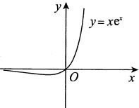

#### 4.

【答案】(C)

【解析】$a_{n}=\int_{0}^{1}x^{n}\sqrt{1-x^{2}}dx\xrightarrow{x=\sin t}\int_{0}^{\frac{\pi}{2}}\sin^{n}t\cdot\cos^{2}t dt=\int_{0}^{\frac{\pi}{2}}\sin^{n}t(1-\sin^{2}t)dt=b_{n}-b_{n+2}$

又$b_{n+2}=\frac{n+1}{n+2}b_n$，则$\lim_{n\to\infty}\left[\frac{(n+1)a_n}{b_n}\right]^n=\lim_{n\to\infty}\left(\frac{n+1}{n+2}\right)^n=e^{\lim\limits_{n\to\infty}n\cdot\frac{-1}{n+2}}=e^{-1}$. 选(C).

#### 5.

【解析】注意到$x_{n+1} - x_n = \frac{c - x_n^2}{c + x_n} (n \in \mathbb{N}_+)$，当$n=1$时，$x_2 - x_1 = \frac{c - x_1^2}{c + x_1} \geq 0$，$x_2 - x_1 = \frac{(\sqrt{c} - x_1)(\sqrt{c} + x_1)}{c + x_1} < \sqrt{c} - x_1$，故$0 \leq x_1 \leq x_2 < \sqrt{c}$；假设$n=k$时，$0 \leq x_k < \sqrt{c}$，则$x_{k+1} - x_k = \frac{c - x_k^2}{c + x_k} > 0$，$x_{k+1} - x_k = \frac{(\sqrt{c} + x_k)(\sqrt{c} - x_k)}{c + x_k} < \sqrt{c} - x_k$，故$0 \leq x_k < x_{k+1} < \sqrt{c}$。综上可得$0 \leq x_n \leq x_{n+1} < \sqrt{c} (n \in \mathbb{N}_+)$，从

而$\{x_{n}\}$单调有界，$\lim_{n\to\infty}x_n\stackrel{ 存在 }{=}$记为 A.递推式两端取极限并化简得$A^{2}=c$，由保号性知数列的极限值为$A=\sqrt{c}$.

#### 6.

【解析】已知$x_{1}<0$，若$x_{k}<0$，则$x_{k+1}=e^{x_k}-1<0$，由数学归纳法得，对任意正整数n，均有$x_{n}<0$。因此，数列$\{x_{n}\}$有上界。

令$f(x)=\mathrm{e}^x - 1 - x$，则$f'(x)=\mathrm{e}^x - 1 < 0 (x < 0)$，故$f(x)$在$(-\infty, 0]$上单调减少，从而当$x < 0$时，$f(x) > f(0) = 0$，即$\mathrm{e}^x - 1 > x$。于是，$x_{n+1} = \mathrm{e}^{x_n} - 1 > x_n$。因此，数列$\{x_n\}$单调增加。

根据单调有界准则知，$\lim_{n\to\infty}x_n$存在.设$\lim_{n\to\infty}x_n=a$，则对等式$x_{n+1}=e^{x_n}-1$两边令$n\to\infty$取极限，得$a=e^a-1$.由函数$f(x)=e^x-1-x(x\leq0)$的单调性知，方程$a=e^a-1$有唯一实根 a=0.从而，$\lim_{n\to\infty}x_n=0$.于是

$$\begin{aligned}\lim_{n\to\infty}\left(\frac{1}{x_{n}}-\frac{1}{x_{n+1}}\right)&=\lim_{n\to\infty}\frac{x_{n+1}-x_{n}}{x_{n}x_{n+1}}=\lim_{n\to\infty}\frac{\mathbf{e}^{x_{n}}-1-x_{n}}{x_{n}(\mathbf{e}^{x_{n}}-1)}=\lim_{t\to0^{-}}\frac{\mathbf{e}^{t}-1-t}{t(\mathbf{e}^{t}-1)}\\&=\lim_{t\to0^{-}}\frac{\mathbf{e}^{t}-1-t}{t^{2}}=\lim_{t\to0^{-}}\frac{\mathbf{e}^{t}-1}{2t}=\frac{1}{2}\;.\end{aligned}$$

#### 7.

【解析】(1)$\cos x_{n+1}-\cos x_{n}=x_{n+1}>0$，且$0<x_{n}<\frac{\pi}{2}$，故有$0<x_{n+1}<x_{n}$，于是$\left\{x_{n}\right\}$单调减少且有下界，$\lim_{n\to\infty}x_n\stackrel{\text{存在}}{\underset{l}{=}}$记为a.在$\cos x_{n+1}-x_{n+1}=\cos x_n$两边取极限，有$\cos a-a=\cos a$，得a=0.于是$\lim_{n\to\infty}x_n=0$.

$$\lim_{n\to\infty}\frac{x_{n+1}}{x_{n}^{2}}=\lim_{n\to\infty}\frac{1-\cos x_{n}}{x_{n}^{2}}\cdot\frac{x_{n+1}}{1-\cos x_{n}}=\frac{1}{2}\lim_{n\to\infty}\frac{x_{n+1}}{1-\cos x_{n+1}+x_{n+1}}=\frac{1}{2}$$

【注】这种命题将函数的具体性质与抽象理论相结合，较好地考查了考生的数学水平，还可进一步发挥.

①将单通项$x_{n}$改成双通项$a_{n}$与$b_{n}$

设$0 < a_n < \frac{\pi}{2}$，$0 < b_n < \frac{\pi}{2}$，$\cos a_n - a_n = \cos b_n$，且$\lim_{n \to \infty} b_n = 0$，则由$\cos a_n - \cos b_n = a_n > 0$，知$0 < a_n < b_n$，由夹逼准则，得$\lim_{n \to \infty} a_n = 0$，且

$$\lim_{n\to\infty}\frac{a_{n}}{b_{n}^{2}}=\lim_{n\to\infty}\frac{1-\cos b_{n}}{b_{n}^{2}}\cdot\frac{a_{n}}{1-\cos b_{n}}=\frac{1}{2}\lim_{n\to\infty}\frac{a_{n}}{1-\cos a_{n}+a_{n}}=\frac{1}{2}$$

与本题如出一辙
②将函数$\cos x$改成$e^{x}$

设$x_n > 0$，$\mathrm{e}^{x_n} - x_n = \mathrm{e}^{x_{n+1}}$（或更具迷惑性地写成$\ln(\mathrm{e}^{x_n} - x_n) = x_{n+1}$），则由$\mathrm{e}^{x_n} - \mathrm{e}^{x_{n+1}} = x_n > 0$，知$x_n > x_{n+1} > 0$，由单调有界准则知数列$\{x_n\}$极限存在，$\lim_{n \to \infty} x_n \frac{\text{存在}}{\text{记为}} a$，于是有$e^a - e^a = a = 0$，得$\lim_{n \to \infty} x_n = 0$，且

$$\lim_{n\to\infty}\frac{x_{n}^{2}}{x_{n+1}}=\lim_{n\to\infty}\frac{x_{n}^{2}}{\ln(e^{x_{n}}-x_{n})}=\lim_{n\to\infty}\frac{x_{n}^{2}}{e^{x_{n}}-x_{n}-1}=\lim_{n\to\infty}\frac{x_{n}^{2}}{\frac{1}{2}x_{n}^{2}}=2$$

#### 8.

【解析】(1)已知$0<x_{1}<\frac{\pi}{4}$，设$0<x_{n}<\frac{\pi}{4}$，则$x_{n+1}=2x_{n}-\tan x_{n}$

令$f(x)=2x-\tan x\left(0\leq x\leq\frac{\pi}{4}\right)$，有$f'(x)=2-\frac{1}{\cos^{2}x}\stackrel{\text{令}}{=}0$，得$x=\frac{\pi}{4}$，当$x\in\left(0,\frac{\pi}{4}\right)$时，$f'(x)>0$

$f(x)$单调递增，又$f(0)=0$，$f\left(\frac{\pi}{4}\right)=\frac{\pi}{2}-1<\frac{\pi}{4}$，于是当$x\in\left(0,\frac{\pi}{4}\right)$时，$0<f(x)<\frac{\pi}{4}$，即$0<x_{n+1}=f(x_n)<\frac{\pi}{4}$，故$\{x_n\}$有界。又$x_{n+1}-x_n=x_n-\tan x_n<0$，$0<x_n<\frac{\pi}{4}$，知$\{x_n\}$单调递减，由单调有界准则知，$\lim_{n\to\infty}x_n\frac{\text{存在}}{\text{记为}}$A. 故有$A+\tan A=2A$，得 A=0，即$\lim_{n\to\infty}x_n=0$。

$$\lim_{n\to\infty}\left(\frac{1}{x_{n}^{2}}-\frac{1}{x_{n}x_{n+1}}\right)=\lim_{n\to\infty}\frac{x_{n+1}-x_{n}}{x_{n}^{2}x_{n+1}}=\lim_{n\to\infty}\frac{x_{n}-\tan x_{n}}{x_{n}^{2}(2x_{n}-\tan x_{n})}=\lim_{x\to0^{+}}\frac{x-\tan x}{x^{2}(2x-\tan x)}=-\frac{1}{3}.$$

【注】处理此类问题的关键手段一般是将$x_{n}$改写成x，用导数工具研究函数性态，再如：

①证明$f(x)=(x-1)e^x+1>0$，$x\neq0$；

②设数列$\{x_n\}$满足$x_{n+1}\mathrm{e}^{x_n}=(x_n-1)\mathrm{e}^{x_n}+1$，$x_1>0$，$n=1,2,\cdots$，证明$\lim_{n\to\infty}x_n$存在。

事实上，对于①，令$f'(x)=x\mathrm{e}^x=0$，则可得$f(x)$在$x>0$时单调增加，$x<0$时单调减少，故$x\neq0$时$f(x)>f(0)=0$；对于②，有$x_{n+1}\mathrm{e}^{x_n}>0$，即$x_{n+1}>0$，也即$\{x_n\}$有下界$0$，又$x_{n+1}-x_n=\frac{1}{\mathrm{e}^{x_n}}-1<0(x_n>0)$，即$\{x_n\}$单调减少，由单调有界准则，知$\lim_{n\to\infty}x_n$存在。

#### 9.

【解析】

$$a_{n}=\int_{0}^{1}t^{n}\left|\ln t\right|\mathrm{d}t=-\frac{1}{n+1}\int_{0}^{1}\ln t\mathrm{d}(t^{n+1})$$

$$=-\frac{1}{n+1}\left(t^{n+1}\ln t\Big|_{0}^{1}-\int_{0}^{1}t^{n}dt\right)=\frac{1}{(n+1)^{2}},$$

所以$\lim_{n \to \infty} (n^2 a_n)^n = \lim_{n \to \infty} \left[ \left( \frac{n}{n+1} \right)^2 \right]^n = e^{\lim_{n \to \infty} 2n \left( \frac{n}{n+1} - 1 \right)} = e^{-2}$.

#### 10.

【解析】$a_{n}=\int_{0}^{+\infty}\frac{\mathrm{d}x}{\left(1+x^{2}\right)^{n}}\xrightarrow{\text{令 }x=\tan t}\int_{0}^{\frac{\pi}{2}}\frac{\sec^{2}t}{\left(\sec^{2}t\right)^{n}}\mathrm{d}t=\int_{0}^{\frac{\pi}{2}}\cos^{2n-2}t\mathrm{d}t$

$\frac{a_{n+1}}{a_{n}}=\frac{\displaystyle\int_{0}^{\frac{\pi}{2}}\cos^{2n}t\mathrm{d}t}{\displaystyle\int_{0}^{\frac{\pi}{2}}\cos^{2n-2}t\mathrm{d}t}=\frac{(2n-1)!!}{(2n)!!}\cdot\frac{\pi}{2}\cdot\frac{(2n-2)!!}{(2n-3)!!}\cdot\frac{2}{\pi}=\frac{2n-1}{2n},$

于是

$\begin{aligned}\lim_{n\to\infty}\left(\frac{a_{n+1}}{a_{n}}\right)^{\ln(1+\mathrm{e}^{2n})}&=\lim_{n\to\infty}\left(\frac{2n-1}{2n}\right)^{\ln(1+\mathrm{e}^{2n})}=\lim_{n\to\infty}\left(1-\frac{1}{2n}\right)^{\ln(1+\mathrm{e}^{2n})}=\lim_{n\to\infty}\left(1-\frac{1}{2n}\right)^{-2n\cdot\frac{1}{2}\ln(1+\mathrm{e}^{2n})}\cdot\left(1-\frac{1}{2n}\right)^{2n\cdot\frac{1}{2}\ln(1+\mathrm{e}^{2n})}=\mathrm{e}^{-\frac{1}{2}\ln(1+\mathrm{e}^{2n})}\cdot 1=\mathrm{e}^{-\frac{1}{2}\ln(1+\mathrm{e}^{2n})}=\frac{1}{\sqrt{1+\mathrm{e}^{2n}}}\to 0.\end{aligned}$

故$\lim_{n\to\infty}\left(\frac{a_{n+1}}{a_{n}}\right)^{\ln(1+\mathrm{e}^{2n})}=0$.

#### 11.

【解析】因为$f(x)=x$有唯一解x=0，故$f(0)=0$，且$\left|x_{n}-0\right|=\left|f(x_{n-1})-f(0)\right|=\left|f'(\xi)\right|\cdot\left|x_{n-1}-0\right|\leqslant\frac{1}{e}\left|x_{n-1}-0\right|\leqslant\cdots\leqslant\left(\frac{1}{e}\right)^{n-1}\left|x_{1}-0\right|$，其中$\xi$介于$x_{n-1}$与0之间，即$\left|x_{n}\right|\leqslant e^{-(n-1)}\left|x_{1}\right|$。

因为$0 \leqslant e^{\frac{n}{2}} \left| x_{n} \right| \leqslant e^{\frac{n}{2}} e^{-(n-1)} \left| x_{1} \right| = e^{-\frac{n}{2} + 1} \left| x_{1} \right|$，且$\lim_{n \to \infty} e^{-\frac{n}{2} + 1} \left| x_{1} \right| = 0$，故由夹逼准则可知

$$\lim_{n\to\infty}\frac{\left|x_{n}\right|}{e^{-\frac{n}{2}}}=\lim_{n\to\infty}e^{\frac{n}{2}}\left|x_{n}\right|=0,$$

即当$n \to \infty$时，$x_n$是$e^{-\frac{n}{2}}$的高阶无穷小.
### 第3章 一元函数微分学的概念

#### 1.

【答案】(A)

【解析】

$$f(x)=(\mathrm{e}^{x}-1)\left|x^{3}-x^{2}+x\right|=(\mathrm{e}^{x}-1)\left|x\right|\left|x^{2}-x+1\right|.$$

显然$e^x - 1$处处可导，而对任意的$x$都有$x^2 - x + 1 > 0$，即$\left|x^2 - x + 1\right| = x^2 - x + 1$也处处可导，对于$\left|x\right|$，除在$x = 0$外，处处可导，现考虑$f(x)$在$x = 0$处是否可导，因

$$\lim_{x\to0}\frac{f(x)-f(0)}{x-0}=\lim_{x\to0}\frac{(\mathrm{e}^{x}-1)\left|x\right|(x^{2}-x+1)}{x}=\lim_{x\to0}\frac{\mathrm{e}^{x}-1}{x}\lim_{x\to0}\left|x\right|\lim_{x\to0}(x^{2}-x+1)=0$$

故$f(x)$在x=0处可导，且$f^{\prime}(0)=0$

#### 2.

【答案】(A)

【解析】因$f'(x_0)=\lim_{x\to0}\frac{f(x_0+x)-f(x_0)}{x}=\lim_{x\to0}\frac{\alpha f(x)-f(x_0)}{x}$，而

$$f^{\prime}(0)=\lim_{x\to0}\frac{f(0+x)-f(0)}{x}=\beta,$$

即当$x \to 0$时，$f(x) = f(0) + (\beta + \varepsilon)x$，其中$\lim_{x \to 0} \varepsilon = 0$

故$f'(x_0) = \lim_{x \to 0} \frac{\alpha [f(0) + (\beta + \varepsilon)x] - f(x_0)}{x} = \lim_{x \to 0} \frac{\alpha (\beta + \varepsilon)x + \alpha f(0) - f(x_0)}{x}$.

对任意的x，都有$f(x+x_{0})=\alpha f(x)$，取x=0，有$f(x_{0})=\alpha f(0)$，因此，$f'(x_{0})=\alpha\beta$，即选项(A)正确.

#### 3.

【答案】(C)

【解析】当x=0时，$f(0)=0$。当$x\neq0$时，$f(x)=x^2\sin\frac{t}{x}$，又$\left|\sin\frac{t}{x}\right|\leq1$，故$x^2\sin\frac{t}{x}\to0(x\to0)$，从而$f(x)$在x=0处连续。

又$f'(0)=\lim_{x\to0}\frac{f(0+x)-f(0)}{x}=\lim_{x\to0}x\sin\frac{t}{x}=0$，所以$f(x)$在x=0处可导.

而当$x\neq0$时，$f'(x)=2x\sin\frac{t}{x}-t\cos\frac{t}{x}$，故$\lim_{x\to0}f'(x)$不存在，所以$f'(x)$在x=0处不连续.

#### 4.

【答案】(B)

【解析】对于①，取$f(x)=x^{\frac{2}{3}}$，则$f(x)$在x=0处连续但不可导，故①不正确；

对于②，因$\lim_{x\to0}f(x)=f(0)$，又由$\lim_{x\to0}\frac{f(x)}{x^{2}}=0$，有$f(0)=0$，则

$$f^{\prime}(0)=\lim_{x\to0}\frac{f(x)-f(0)}{x-0}=\lim_{x\to0}\frac{f(x)}{x}=\lim_{x\to0}\frac{f(x)}{x^{2}}\cdot x=0$$

故$^{②}$正确：

对于③，取$f(x)=1$，此时$\lim_{x\to0}\frac{f(x)}{\sqrt[3]{x}}=\infty$，故③不正确.

#### 5.

【答案】(B)

【解析】$F'(0)=\lim_{x\to0}\frac{F(x)-F(0)}{x-0}=\lim_{x\to0}\frac{g\left(x^{2}\sin\frac{1}{x}\right)-g(0)}{x-0}$，记

$$I_{1}=\left\{x\left|0<\left|x\right|<\delta,\left|x\right|\neq\frac{1}{n\pi},n=1,2,\cdots,\delta>0\right.\right\},$$

$$I_{2}=\left\{x\left|\left|x\right|=\frac{1}{n\pi},n=1,2,\cdots\right.\right\},$$

则

$$\lim_{x\to0}\frac{g\left(x^{2}\sin\frac{1}{x}\right)-g(0)}{x-0}=\lim_{x\to0}\frac{g\left(x^{2}\sin\frac{1}{x}\right)-g(0)}{x^{2}\sin\frac{1}{x}-0}\cdot\frac{x^{2}\sin\frac{1}{x}-0}{x-0}=g^{\prime}(0)\cdot0=0,$$

$$\lim_{x\to0}\frac{g\left(x^{2}\sin\frac{1}{x}\right)-g(0)}{x-0}=\lim_{x\to0}\frac{g(0)-g(0)}{x-0}=0$$

综上，$F'(0)=0$

#### 6.

【答案】(B)

【解析】$f'(x)=\frac{\frac{dy}{dt}}{\frac{dx}{dt}}=\frac{2te^{t^2}}{3t^2}=\frac{2e^{t^2}}{3t}$，当$x=\frac{\pi}{2}$时，$t=1$。则

$$f^{\prime}\left(\frac{\pi}{2}\right)=\left.\frac{2\mathrm{e}^{t^{2}}}{3t}\right|_{t=1}=\frac{2\mathrm{e}}{3},$$

$$\lim_{n\to\infty}n\left[f\left(\frac{\pi}{2}+\frac{2}{n}\right)-f\left(\frac{\pi}{2}\right)\right]=\lim_{n\to\infty}\frac{f\left(\frac{\pi}{2}+\frac{2}{n}\right)-f\left(\frac{\pi}{2}\right)}{\frac{2}{n}}\cdot2=2f^{\prime}\left(\frac{\pi}{2}\right)=\frac{4\mathrm{e}}{3}.$$

#### 7.

【解析】由题意知，当$x\to0$时，$f(x)>0$，有
$$\begin{aligned}f(x)^{f(x)}-f(0)^{f(x)}&=f(0)^{f(x)}\left\{\left[\frac{f(x)}{f(0)}\right]^{f(x)}-1\right\}\\&=f(0)^{f(x)}\left[\mathrm{e}^{f(x)\cdot\ln\frac{f(x)}{f(0)}}-1\right]\sim f(0)^{f(x)}f(x)\ln\frac{f(x)}{f(0)},\end{aligned}$$

故

$$\begin{aligned} 原式 =&\lim_{x\to0}\frac{f(0)^{f(x)}f(x)\ln\frac{f(x)}{f(0)}}{x}\\=&\lim_{x\to0}f(0)^{f(x)}f(x)\lim_{x\to0}\frac{\ln f(x)-\ln f(0)}{x-0}\\=&f(0)^{f(0)}f(0)\bullet\lim_{x\to0}\frac{\ln f(x)-\ln f(0)}{f(x)-f(0)}\bullet\frac{f(x)-f(0)}{x}\\=&f(0)^{f(0)}f(0)\bullet\frac{f^{\prime}(0)}{f(0)}=f^{\prime}(0)f(0)^{f(0)}=ba^{a}.\end{aligned}$$

#### 8.

【解析】当$x\neq0$时，$f(x)=\int_{0}^{x^{2}}g(xt)dt\xrightarrow{u=xt}\int_{0}^{x^{3}}g(u)\frac{1}{x}du=\frac{1}{x}\int_{0}^{x^{3}}g(u)du.$

对$f(x)$求导得，

$$f^{\prime}(x)=\frac{g(x^{3})3x^{3}-\int_{0}^{x^{3}}g(u)du}{x^{2}}=3x g(x^{3})-\frac{\int_{0}^{x^{3}}g(u)du}{x^{2}}.$$

在x=0处，由定义式可得

$$f^{\prime}(0)=\lim_{x\to0}\frac{f(x)-f(0)}{x-0}=\lim_{x\to0}\frac{\int_{0}^{x^{3}}g(u)\mathrm{d}u}{x^{2}}=0.$$

$$f^{\prime}(x)=\left\{\begin{aligned}&3x g(x^{3})-\frac{\displaystyle\int_{0}^{x^{3}}g(u)\mathrm{d}u}{x^{2}},&x\neq0,\\ &0,&x=0.\end{aligned}\right.$$

又

$$\begin{aligned}\lim_{x\to0}f^{\prime}(x)=&\lim_{x\to0}\left[3x g(x^{3})-\frac{\displaystyle\int_{0}^{x^{3}}g(u)\mathrm{d}u}{x^{2}}\right]\\=&\lim_{x\to0}3x g(x^{3})-\lim_{x\to0}\frac{\displaystyle\int_{0}^{x^{3}}g(u)\mathrm{d}u}{x^{2}}=-\lim_{x\to0}\frac{3x^{2}g(x^{3})}{2x}=0,\end{aligned}$$

故$f'(x)$在x=0处连续.

#### 9.

【解析】记$g(x)=\left|f(x)\right|$，则
$$g_{+}^{\prime}(a)=\lim_{x\to0^{+}}\frac{\left|f(a+x)\right|-\left|f(a)\right|}{x}\xrightarrow{f(a)=0}\lim_{x\to0^{+}}\frac{f(a+x)-f(a)}{x}$$

同理，$g_{-}^{\prime}(a)=-\left|f^{\prime}(a)\right|$，故由$g(x)$的可导性只能有$f^{\prime}(a)=0$

#### 10.

【解析】(1) 由于$\lim_{x \to 0} f(x) = \lim_{x \to 0} \frac{g(x) - \mathrm{e}^{-x}}{x} = \lim_{x \to 0} \left[ g'(x) + \mathrm{e}^{-x} \right] = g'(0) + 1 = a$，又$g'(0) = -1$，故 a = 0。

(2)由定义得

$$\begin{aligned}f^{\prime}(0)&=\lim_{x\to0}\frac{f(x)-f(0)}{x}=\lim_{x\to0}\frac{g(x)-\mathrm{e}^{-x}}{x^{2}}\xrightarrow{ 洛必达法则 }\lim_{x\to0}\frac{g^{\prime}(x)+\mathrm{e}^{-x}}{2x}\\&=\frac{1}{2}\lim_{x\to0}\left[\frac{g^{\prime}(x)-g^{\prime}(0)}{x}+\frac{\mathrm{e}^{-x}-1}{x}\right]=\frac{g^{\prime \prime}(0)-1}{2}\text{．}\\ \end{aligned}$$

而$x \neq 0$时显然有$f'(x) = \frac{x \left[ g'(x) + e^{-x} \right] - \left[ g(x) - e^{-x} \right]}{x^2}$，故函数可导。

因此

$$f^{\prime}(x)=\left\{\begin{aligned}&\frac{x\left[g^{\prime}(x)+\mathrm{e}^{-x}\right]-\left[g(x)-\mathrm{e}^{-x}\right]}{x^{2}},&x\neq0,\\&\frac{g^{\prime \prime}(0)-1}{2},&x=0.\end{aligned}\right.$$

#### 11.

【解析】(1)作泰勒展开得$f(x)=f(0)+f'(0)x+\frac{f''(\xi)}{2}x^{2}$($\xi$介于0与x之间).因此

$$\lim_{x\to0}\frac{g(x)-g(0)}{x}=\lim_{x\to0}\frac{f(x)-f^{\prime}(0)x}{x^{2}}=\lim_{x\to0}\frac{f^{\prime \prime}(\xi)}{2}=\frac{f^{\prime \prime}(0)}{2}( 也可用洛必达法则 ).$$

故

$$g^{\prime}(x)=\left\{\begin{aligned}&\frac{xf^{\prime}(x)-f(x)}{x^{2}},&x\neq0,\\&\frac{f^{\prime \prime}(0)}{2},&x=0.\end{aligned}\right.$$

(2)$g'(x)=\frac{xf'(x)-f(x)}{x^2}(x\neq0)$，易见$\lim_{x\to0}g'(x)\stackrel{\text{洛必达法则}}{=}\frac{f''(0)}{2}=g'(0)$，故$g'(x)$在 x=0 处连续.

#### 12.

【解析】函数在 x=0 处显然左连续，而$\lim_{x\to0^{+}}f(x)=\frac{\pi}{2}\lim_{x\to0^{+}}x=0=f(0)$，故函数$f(x)$在 x=0 处连续。注意到单侧导数

$$f_{+}^{\prime}(0)=\lim_{x\to0^{+}}\frac{f(x)-f(0)}{x}=\lim_{x\to0^{+}}\arctan\frac{1}{\sqrt{x}}=\frac{\pi}{2},$$

$$f_{-}^{\prime}(0)=\lim_{x\to0^{-}}\frac{f(x)-f(0)}{x}=\frac{\pi}{2}\lim_{x\to0^{-}}\frac{e^{\sin x}-1}{x}=\frac{\pi}{2}$$
故$f(x)$在x=0处可导，且$f'(0)=\frac{\pi}{2}$。故导函数$f'(x)=\left\{\begin{aligned}&-\frac{\sqrt{x}}{2(x+1)}+\arctan\frac{1}{\sqrt{x}},&x>0,\\&\frac{\pi}{2},&x=0,\\&\frac{\pi}{2}e^{\sin x}\cos x,&x<0,\end{aligned}\right.$易验证$f'(x)$在x=0处也连续。

#### 13.

【答案】(B)

【解析】若$f(a)\neq0$，则存在x=a的某邻域$U(a)$，在该邻域内$f(x)$与$f(a)$同号。于是推知，若$f(a)>0$，则$\left|f(x)\right|=f(x)$（当$x\in U(a)$）；若$f(a)<0$，则$\left|f(x)\right|=-f(x)$（当$x\in U(a)$）。总之，若$f(a)\neq0$，$\left|f(x)\right|$在x=a处总可导。

若$f(a)=0$，则$\lim_{x\to a}\frac{|f(x)|-|f(a)|}{x-a}=\lim_{x\to a}\frac{|f(x)|}{x-a}=\lim_{x\to a}\frac{|f(x)-f(a)|}{x-a}$，从而知

$$\lim_{x\to a^{\pm}}\frac{\left|f(x)\right|-\left|f(a)\right|}{x-a}=\lim_{x\to a^{\pm}}\frac{\left|f(x)-f(a)\right|}{x-a}=\lim_{x\to a^{\pm}}\pm\left|\frac{f(x)-f(a)}{x-a}\right|=\pm\left|f^{\prime}(a)\right|,$$

其中$x \to a^+$时取 “+”，$x \to a^-$时取 “-”，所以$|f(x)|$在$x = a$处可导的充要条件为$|f'(a)| = 0$，即$f'(a) = 0$。

所以当且仅当$f(a)=0$,$f'(a)\neq0$时,$|f(x)|$在x=a处不可导,选(B).

#### 14.

【答案】(D)

【解析】

$$f^{\prime}(0)=\lim_{x\to0}\frac{(1+x)^{x}-1}{x}=\lim_{x\to0}\frac{\mathrm{e}^{x\ln(1+x)}-1}{x}=\lim_{x\to0}\frac{x\ln(1+x)}{x}=0$$

选项(A)错误.

当$x\neq0$时，

$$f^{\prime}(x)=\left[\mathrm{e}^{x\ln(1+x)}-1\right]^{\prime}=\mathrm{e}^{x\ln(1+x)}\left[\ln(1+x)+\frac{x}{1+x}\right],$$

$$\lim_{x\to0}f^{\prime}(x)=0=f^{\prime}(0),$$

选项(B)错误.

$$\begin{aligned}f^{\prime \prime}(0)=&\lim_{x\to0}\frac{f^{\prime}(x)-f^{\prime}(0)}{x-0}=\lim_{x\to0}\mathrm{e}^{x\ln(1+x)}\ \frac{(1+x)\ln(1+x)+x}{x(1+x)}\\=&\lim_{x\to0}\frac{(1+x)\ln(1+x)+x}{x+x^{2}}\xrightarrow{ 洛必达法则 }\lim_{x\to0}\frac{\ln(1+x)+1+1}{1+2x}=2，\end{aligned}$$

所以选项(C)错误，(D)正确.

#### 15.

【答案】-4

【解析】由题设知，$f'(1)=\left[\ln(2x^2-1)\right]'\bigg|_{x=1}=\frac{4x}{2x^2-1}\bigg|_{x=1}=4$。于是，

$$\begin{aligned}&\lim_{n\to\infty}n\left[f\left(\frac{n+1}{n}\right)-f\left(\frac{n+2}{n}\right)\right]=\lim_{n\to\infty}\frac{f\left(1+\frac{1}{n}\right)-f\left(1+\frac{2}{n}\right)}{\frac{1}{n}}\\ &=\lim_{n\to\infty}\left[\frac{f\left(1+\frac{1}{n}\right)-f(1)}{\frac{1}{n}}-\frac{f\left(1+\frac{2}{n}\right)-f(1)}{\frac{1}{n}}\right]\\ &=\lim_{n\to\infty}\left[\frac{f\left(1+\frac{1}{n}\right)-f(1)}{\frac{1}{n}}\right]-2\lim_{n\to\infty}\frac{f\left(1+\frac{2}{n}\right)-f(1)}{\frac{2}{n}}\\ &=f^{\prime}(1)-2f^{\prime}(1)=-f^{\prime}(1)=-4.\\ \end{aligned}$$

#### 16.

【解析】令$t=\frac{1}{x}\to0$，记$y=\left[\frac{f(a+t)}{f(a)}\right]^{\frac{1}{t}}$，则

$$\ln y=\frac{\ln\left|f(a+t)\right|-\ln\left|f(a)\right|}{t},\quad\lim_{t\to0}\ln y=\frac{\mathrm{d}\left[\ln\left|f(u)\right|\right]}{\mathrm{d}u}=\frac{f^{\prime}(a)}{f(a)},$$

故$I = e^{\frac{f'(a)}{f(a)}}$

【注】若直接变形：$y=\left[1+\frac{f(a+t)-f(a)}{f(a)}\right]^{\frac{f(a)}{f(a+t)-f(a)}}\cdot\frac{f(a+t)-f(a)}{f(a)}$，则要求$f(a+t)\neq f(a)$，但这里不扣分.

#### 17.

【答案】(C)

【解析】选项(C)的证明.用反证法，设$f'(a)$存在，则$f(x)$在x=a处连续，再由题设，$f(x)$在x=a的某邻域内连续，从而

$$f^{\prime}(a)=\lim_{x\to a}\frac{f(x)-f(a)}{x-a}\xrightarrow{ 洛必达法则 }\lim_{x\to a}f^{\prime}(x)=\infty,$$

矛盾，所以$f'(a)$必不存在.

选项(A)，(B)，(D)均可举出反例.

选项(A)的反例：令$f(x)=\left\{\begin{aligned}&1,&x\neq0,\\ &0,&x=0,\end{aligned}\right.\lim_{x\to0}f'(x)=0$，但$f'(0)$不存在.

选项(B)的反例：令$f(x)=\left\{\begin{aligned}&x^{2}\sin\frac{1}{x},&x\neq0,\\ &0,&x=0,\end{aligned}\right.$，$f^{\prime}(0)$存在且等于0，但$\lim_{x\to0}f^{\prime}(x)$不存在.
选项(D)的反例同选项(A)的反例，$f^{\prime}(0)$不存在，但$\lim_{x\to0}f^{\prime}(x)=0$

#### 18.

【答案】$-\frac{1}{2}$

【解析】由于$f(x)$是偶函数，因此$f'(x)$是奇函数，即

$$f^{\prime}(-1)=-f^{\prime}(1)=-\lim_{x\to1}\frac{\frac{\ln x}{2x^{2}-\ln x}-0}{x-1}=-\lim_{x\to1}\frac{\ln x}{(2x^{2}-\ln x)(x-1)}=-\frac{1}{2}.$$

#### 19.

【答案】$-A\sin b$

【解析】$\lim_{x\to a}\frac{\cos f(x)-\cos b}{x-a}=\lim_{x\to a}\frac{-\sin\xi\cdot[f(x)-b]}{x-a}$（$\xi$介于$f(x)$与b之间）$=-A\sin b$

#### 20.

【解析】因为$f(x)$在x=1处可导，所以$f(x)$在x=1处连续，从而

$$\lim_{x\to0}\left[f(\cos x)-3f(1+\sin^{2}x)\right]=f(1)-3f(1)=-2f(1).$$

由$\lim_{x\to0}\frac{f(\cos x)-3f(1+\sin^2x)}{x^2}=2$可知$\lim_{x\to0}\left[f(\cos x)-3f(1+\sin^2x)\right]=0$，所以$f(1)=0$，从而有

$$\begin{aligned}&\lim_{x\rightarrow0}\frac{f(\cos x)-3f(1+\sin^{2}x)}{x^{2}}\\=&\lim_{x\rightarrow0}\left[\frac{f(\cos x)-f(1)}{\cos x-1}\cdot\frac{\cos x-1}{x^{2}}-3\frac{f(1+\sin^{2}x)-f(1)}{\sin^{2}x}\cdot\frac{\sin^{2}x}{x^{2}}\right]\\=&-\frac{1}{2}f^{\prime}(1)-3f^{\prime}(1)=-\frac{7}{2}f^{\prime}(1)=2.\end{aligned}$$

故$f'(1)=-\frac{4}{7}$

#### 21.

【解析】由题知，$1=\lim_{x\to a}\frac{f(x)-\sqrt{a}}{x-a}\cdot\lim_{x\to a}\frac{f(x)+\sqrt{a}}{x+a}=\frac{f(a)+\sqrt{a}}{2a}\cdot\lim_{x\to a}\frac{f(x)-\sqrt{a}}{x-a}$

于是有

$$\lim_{x\to a}\frac{f(x)-\sqrt{a}}{x-a}=\frac{2a}{f(a)+\sqrt{a}}$$

故

$$\lim_{x\to a}f(x)=f(a)=\sqrt{a},$$

$$f^{\prime}(a)=\lim_{x\to a}\frac{f(x)-f(a)}{x-a}=\lim_{x\to a}\frac{f(x)-\sqrt{a}}{x-a}=\frac{2a}{\sqrt{a}+\sqrt{a}}=\sqrt{a}.$$

即

#### 22.

【解析】因为可导函数$y = f(x) - \sin x$在 x = 0 处取得极值，所以$\left[f'(x) - \cos x\right]|_{x=0} = f'(0) - 1 = 0$，解得$f'(0) = 1$。

$$\lim_{n\to\infty}n\left[f\left(\frac{1}{n}\right)-f(a_{n})\right]=\lim_{n\to\infty}\frac{\left[f\left(0+\frac{1}{n}\right)-f(0)\right]-\left[f(0+a_{n})-f(0)\right]}{\frac{1}{n}}$$

$$=f^{\prime}(0)+\lim_{n\to\infty}\frac{f\left(1-\mathrm{e}^{\frac{1}{n}}-\sin\frac{1}{n^{2}}\right)-f(0)}{-\frac{1}{n}}=f^{\prime}(0)+f^{\prime}(0)=2f^{\prime}(0)=2,$$

其中$\lim_{n\to\infty}\frac{1-e^{\frac{1}{n}}-\sin\frac{1}{n^{2}}}{-\frac{1}{n}}=1$
### 第4章 一元函数微分学的计算

#### 1.

【答案】$-\frac{1}{2e}\cos\frac{1}{e}$

【解析】因为$y = \sin(e^{-\sqrt{x}})$，所以$\left.\frac{dy}{dx}\right|_{x=1} = \cos(e^{-\sqrt{x}}) \cdot e^{-\sqrt{x}} \cdot \left(-\frac{1}{2\sqrt{x}}\right)\bigg|_{x=1} = -\frac{1}{2e} \cos \frac{1}{e}$.

#### 2.

【解析】将x=0代入等式，得$f^{\prime}(0)=\frac{1}{2}f\left[f(0)-1\right]=\frac{1}{2}f(0)=\frac{1}{2}$.

在$f'(x)=\frac{1}{2}f[f(x)-1]$两端关于x求导，得$f''(x)=\frac{1}{2}f'[f(x)-1]\cdot f'(x)$，将$f(0)=1$，$f'(0)=\frac{1}{2}$代入上式，得$f''(0)=\frac{1}{8}$.

#### 3.

【答案】-3

【解析】原式$\frac{洛必达法则}{x\to1}\lim_{x\to1}\frac{3(x-1)^2}{y(x)}$洛必达法则$\lim_{x\to1}\frac{6(x-1)}{y'(x)}$

对隐函数求导，有$3y^{2}y'+xy'+y+2x-2=0$，得$y'(x)=-\frac{y+2x-2}{3y^{2}+x}$，且$\lim_{x\to1}y'(x)=0$。

再用洛必达法则，原式=$\lim_{x\to1}\frac{6}{y''(x)}$

又$y''(x)=-\frac{(3y^2+x)(y'+2)-(y+2x-2)(6yy'+1)}{(3y^2+x)^2}$，$\lim_{x \to 1} y''(x)=-2$，

所以原式 =-3。

#### 4.

【解析】两边求导得$\frac{\frac{y-xy'}{y^2}}{\left(\frac{x}{y}\right)^2+1}=\frac{2x+2yy'}{\sqrt{x^2+y^2}\cdot2\sqrt{x^2+y^2}}$，整理得$y'=\frac{y-x}{y+x}$.进而有

$$y^{\prime \prime}=\frac{2(xy^{\prime}-y)}{(x+y)^{2}}=-\frac{2(x^{2}+y^{2})}{(x+y)^{3}}\;.$$

#### 5.

【解析】$\frac{dx}{dy}=\frac{1}{2+\cos x}$，从而$\frac{d^2x}{dy^2}=\frac{d}{dx}\left(\frac{dx}{dy}\right)\cdot\frac{dx}{dy}=\frac{\sin x}{(2+\cos x)^3}$.

#### 6.

【答案】4e

【解析】方程$x = \arctan(t+1)$两端对 t 求导得$\frac{dx}{dt} = \frac{1}{1+(t+1)^2}$，则$\left.\frac{dx}{dt}\right|_{t=0} = \frac{1}{2}$.

方程$2t - \int_{1}^{y+t^{2}} e^{-u^{2}} \, du = 0$两端对 t 求导得$2 - e^{-(y+t^{2})^{2}} \cdot \left( \frac{dy}{dt} + 2t \right) = 0$。当 t=0 时，y=1，则$2 - e^{-1} \cdot \left. \frac{dy}{dt} \right|_{t=0} = 0$，得$\left. \frac{dy}{dt} \right|_{t=0} = 2e$。故$\left. \frac{dy}{dx} \right|_{t=0} = \left. \frac{\frac{dy}{dt}}{\frac{dx}{dt}} \right|_{t=0} = 4e$。

#### 7.

【答案】$\frac{-6}{(2y-x)^{3}}$

【解析】对$x^{2}-xy+y^{2}=1$两边关于x求导，得$2x-xy'-y+2yy'=0$，则$y'=\frac{y-2x}{2y-x}$，故

$$\begin{aligned}y^{\prime \prime}=&\frac{(2y-x)(y^{\prime}-2)-(y-2x)(2y^{\prime}-1)}{(2y-x)^{2}}\\=&\frac{(2y-x)(y-2x-4y+2x)-(y-2x)(2y-4x-2y+x)}{(2y-x)^{3}}\\=&\frac{-6(x^{2}-xy+y^{2})}{(2y-x)^{3}}=\frac{-6}{(2y-x)^{3}}.\end{aligned}$$

#### 8.

【答案】$-2\pi$

【解析】由$x=\int_{1}^{y-x}\sin^{2}\left(\frac{\pi}{4}t\right)dt$，将x=0代入，有y=1。再将所给方程两边对x求导，得

$$1=\sin^{2}\left[\frac{\pi}{4}\left(y-x\right)\right]\bullet\left(y^{\prime}-1\right),$$

于是$y' = \csc^{2}\left[\frac{\pi}{4}(y - x)\right] + 1$。从而$y'' = -2\csc^{2}\left[\frac{\pi}{4}(y - x)\right]\cot\left[\frac{\pi}{4}(y - x)\right] \cdot \frac{\pi}{4}(y' - 1)$。

将x=0, y=1代入，得$y'\big|_{x=0}=3,\left.y''\right|_{x=0}=-2\pi$

#### 9.

【答案】$\frac{2e^{2}+e}{4}$

【解析】易知$\frac{dx}{dt}=2t-2$，$\frac{d^2x}{dt^2}=2$。对$e^y\sin t-y+1=0$的两边关于$t$连续求导两次，得

$e^y\sin t\frac{dy}{dt}+e^y\cos t-\frac{dy}{dt}=0$，$e^y\sin t\left(\frac{dy}{dt}\right)^2+2e^y\cos t\frac{dy}{dt}+e^y\sin t\frac{d^2y}{dt^2}-e^y\sin t-\frac{d^2y}{dt^2}=0$。

注意到 t=0 时，x=y=1，一并代入上述式子，得$\left.\frac{dx}{dt}\right|_{t=0}=-2$，$\left.\frac{dy}{dt}\right|_{t=0}=e$，$\left.\frac{d^2y}{dt^2}\right|_{t=0}=2e^2$。
因此

$$\frac{\mathrm{d}^{2}y}{\mathrm{d}x^{2}}\bigg|_{t=0}=\frac{\frac{\mathrm{d}x}{\mathrm{d}t}\frac{\mathrm{d}^{2}y}{\mathrm{d}t^{2}}-\frac{\mathrm{d}^{2}x}{\mathrm{d}t^{2}}\frac{\mathrm{d}y}{\mathrm{d}t}}{\left(\frac{\mathrm{d}x}{\mathrm{d}t}\right)^{3}}\bigg|_{t=0}=\frac{2\mathrm{e}^{2}+\mathrm{e}}{4}.$$

#### 10.

【答案】3

【解析】方程两边对y求导，得

$$1=\cos^{2}\left[\frac{\pi(x-y)}{4}\right]\bullet\left[x^{\prime}(y)-1\right],$$

于是$x'(y)=\frac{1}{\cos^2\left[\frac{\pi(x-y)}{4}\right]}+1=\sec^2\left[\frac{\pi(x-y)}{4}\right]+1$，且当$y=0$时，有$0=\int_1^x\cos^2\left(\frac{\pi t}{4}\right)dt$，故$x=1$。

又$x'(0)=\sec^2\frac{\pi}{4}+1=3$，于是，原式$\lim_{n\to\infty}\frac{x\left(0+\frac{1}{n}\right)-x(0)}{\frac{1}{n}-0}=x'(0)=3$。

#### 11.

【答案】2

【解析】将带佩亚诺余项的泰勒公式$f(x)=f(0)+f'(0)x+\frac{1}{2}f''(0)x^{2}+o(x^{2})$代入所给极限式，有

$$2=\lim_{x\to0}\frac{f(0)+\left[f^{\prime}(0)+1\right]x+\frac{1}{2}f^{\prime \prime}(0)x^{2}+o(x^{2})}{\frac{1}{2}x^{2}},$$

所以$f(0)=0,\ f'(0)=-1,\ f''(0)=2$

#### 12.

【答案】$\mathrm{e}^{x}(x+n-1)$

【解析】由$f^{\prime}(\ln x)=x\ln x$，则$f^{\prime}(x)=xe^{x}$。由莱布尼茨公式，有

$$f^{(n)}(x)=(x\mathrm{e}^{x})^{(n-1)}=\mathrm{e}^{x}x+\mathrm{C}_{n-1}^{1}\mathrm{e}^{x}(x)^{\prime}+0=\mathrm{e}^{x}(x+n-1).$$

#### 13.

【答案】24

【解析】

$$\begin{aligned}f(x)&=\ln\frac{1-x^{3}}{1-x}=\ln(1-x^{3})-\ln(1-x)\\&=(-x^{3})-\frac{(-x^{3})^{2}}{2}-(-x)+\frac{(-x)^{2}}{2}-\frac{(-x)^{3}}{3}+\frac{(-x)^{4}}{4}-\frac{(-x)^{5}}{5}+o(x^{5})(x\to0),\end{aligned}$$

又$f(x)=\sum_{n=0}^{5}\frac{f^{(n)}(0)}{n!}x^{n}+o(x^{5})(x\to0)$，对照可得$\frac{f^{(5)}(0)}{5!}=\frac{1}{5}$，于是$f^{(5)}(0)=24$.

#### 14.

【答案】-48

【解析】

$$f(x)=1+\frac{2x}{1-x+x^{2}}=1+2x\cdot\frac{1}{1-(x-x^{2})}$$

$$\begin{align*}=&1+2x\bullet\Big[1+(x-x^{2})+(x-x^{2})^{2}+(x-x^{2})^{3}+o\Big((x-x^{2})^{3}\Big)\Big]\\=&1+2x\Big[1+x-x^{3}+o(x^{3})\Big]=1+2x+2x^{2}-2x^{4}+o(x^{4})(x\to0).\end{align*}$$

又$f(x)=\sum_{n=0}^{4}\frac{f^{(n)}(0)}{n!}x^{n}+o(x^{4})(x\to0)$，于是有$\frac{f^{(4)}(0)}{4!}=-2$，即$f^{(4)}(0)=-48$。

#### 15.

【答案】$(-1)^{n}(2n)!$

【解析】

$$f^{\prime}(x)=\frac{1}{1+x^{2}}=\sum_{n=0}^{\infty}(-1)^{n}x^{2n}(|x|<1),$$

$$\begin{align*}f(x)&=f(0)+\int_{0}^{x}f^{\prime}(t)\mathrm{d}t=\frac{\pi}{4}+\int_{0}^{x}\sum_{n=0}^{\infty}(-1)^{n}t^{2n}\mathrm{d}t\\&=\frac{\pi}{4}+\sum_{n=0}^{\infty}(-1)^{n}\int_{0}^{x}t^{2n}\mathrm{d}t=\frac{\pi}{4}+\sum_{n=0}^{\infty}\frac{(-1)^{n}}{2n+1}x^{2n+1}(|x|\leq1),\end{align*}$$

由泰勒展开式的唯一性，有$f^{(2n+1)}(0)=\frac{(-1)^n}{2n+1}(2n+1)!=(-1)^n(2n)!(n=0,1,\cdots)$.

#### 16.

【答案】(B)

【解析】由于$\left(\left|x\right|\right)^{\prime}=\frac{\left|x\right|}{x}$（$x\neq0$），故当$x\neq0$时，

$$f^{\prime}(x)=\left|x\right|\left(\frac{\sin^{2}x}{x}+\sin2x\right),f^{\prime\prime}(x)=\left|x\right|\left(\frac{2\sin2x}{x}+2\cos2x\right).$$

于是

$$f^{\prime}(0)=\lim_{x\to0}\frac{f(x)-f(0)}{x-0}=\lim_{x\to0}\frac{\left|x\right|\sin^{2}x}{x}=\lim_{x\to0}\left|x\right|x=0,$$

$$f^{\prime \prime}(0)=\lim_{x\to0}\frac{f^{\prime}(x)-f^{\prime}(0)}{x-0}=\lim_{x\to0}\frac{\left|x\right|\left(\frac{\sin^{2}x}{x}+\sin2x\right)}{x}=\lim_{x\to0}\left|x\right|\left(\frac{\sin^{2}x}{x^{2}}+\frac{\sin2x}{x}\right)=0$$

而

$$\lim_{x\to0^{+}}\frac{f^{\prime \prime}(x)-f^{\prime \prime}(0)}{x-0}=\lim_{x\to0^{+}}\frac{x\left(\frac{2\sin2x}{x}+2\cos2x\right)}{x}=\lim_{x\to0^{+}}\left(\frac{2\sin2x}{x}+2\cos2x\right)=6$$

$$\lim_{x\to0^{-}}\frac{f''(x)-f''(0)}{x-0}=\lim_{x\to0^{-}}\frac{-x\left(\frac{2\sin2x}{x}+2\cos2x\right)}{x}=\lim_{x\to0^{-}}\left(-\frac{2\sin2x}{x}-2\cos2x\right)=-6$$

故$f^{m}(0)$不存在.因此，使$f^{(n)}(0)$存在的阶数n的最大值为2.应选(B).
### 第5章 一元函数微分学的应用（一）——几何应用

#### 1.

【答案】(C)

【解析】$f(x)=\left|\ln\left|x\right|\right|=\left\{\begin{aligned}&-\ln\left|x\right|,&&0<\left|x\right|<1,\\ &\ln\left|x\right|,&&|x|\geq1\end{aligned}\right.=\left\{\begin{aligned}&\ln(-x),&&x\leq-1,\\ &-\ln(-x),&&-1<x<0,\\ &-\ln x,&&0<x<1,\\ &\ln x,&&x\geq1,\end{aligned}\right.$

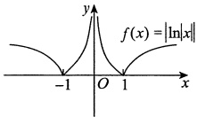

函数图像如图所示.

易知 x=1 是$f(x)$的极值点，x=0 是曲线$y=f(x)$的渐近线，点 (1,0) 左侧附近为凹曲线，右侧为凸曲线，故 (1,0) 为拐点。函数在 x=-1 处不可导，故 x=-1 不是$f(x)$的驻点。

综上，选(C).

#### 2.

【答案】$y=\frac{1}{3}x-1$

【解析】方法一 由极限与无穷小的关系，有

$$\frac{\left[f(x)+1\right]x^{2}}{x-\sin x}=2+\alpha,\lim_{x\to0}\alpha=0.$$

于是

$$f(x)=\frac{(2+\alpha)(x-\sin x)}{x^{2}}-1$$

但由

$$\lim_{x\to0}\frac{x-\sin x}{x^{2}}\xrightarrow{ 洛必达法则 }\lim_{x\to0}\frac{1-\cos x}{2x}=\lim_{x\to0}\frac{x^{2}}{4x}=0,$$

$$\lim_{x\to0}(2+\alpha)=2,$$

可得

$$\lim_{x\to0}f(x)=\lim_{x\to0}\left[\frac{(2+\alpha)(x-\sin x)}{x^{2}}-1\right]=0-1=-1.$$

由于$f(x)$在x=0处连续，因此$f(0)=\lim_{x\to0}f(x)=-1$

$$f^{\prime}(0)=\lim_{x\to0}\frac{f(x)-f(0)}{x-0}=\lim_{x\to0}\frac{(2+\alpha)(x-\sin x)}{x^{3}}=\lim_{x\to0}\frac{(2+\alpha)\cdot\frac{1}{6}x^{3}}{x^{3}}=\frac{1}{3},$$

所以曲线$y = f(x)$在点$(0, f(0))$处的切线方程为

$$y-f(0)=f^{\prime}(0)(x-0),$$

即$y=\frac{1}{3}x-1$

方法二 将$\sin x$按带佩亚诺余项的泰勒公式展开至 n=3 ，有

$$x-\sin x=x-\left[x-\frac{1}{3!}x^{3}+o(x^{3})\right]=\frac{1}{6}x^{3}+o(x^{3}),$$

代入原极限式，有

$$2=\lim_{x\to0}\frac{\left[f(x)+1\right]x^{2}}{x-\sin x}=\lim_{x\to0}\frac{\left[f(x)+1\right]x^{2}}{\frac{1}{6}x^{3}+o(x^{3})}=\lim_{x\to0}\frac{f(x)+1}{\frac{1}{6}x+o(x)},$$

可见$\lim_{x\to0}\left[f(x)+1\right]=0$，即有$f(0)=\lim_{x\to0}f(x)=-1$。于是

$$f^{\prime}(0)=\lim_{x\to0}\frac{f(x)-f(0)}{x-0}=\lim_{x\to0}\frac{f(x)+1}{x}=\lim_{x\to0}\left[\frac{f(x)+1}{\frac{1}{6}x+o(x)}\cdot\frac{\frac{1}{6}x+o(x)}{x}\right]=2\cdot\frac{1}{6}=\frac{1}{3}.$$

以下同方法一.

#### 3.

【答案】(D)

【解析】因为$f(a)$是最小值，所以$f(x)\geqslant f(a)$，$x\in(a,b]$，又$f_{+}^{\prime}(a)$存在，故

$$f_{+}^{\prime}(a)=\lim_{x\to a^{+}}\frac{f(x)-f(a)}{x-a}\geqslant0.$$

因为$f(b)$是最大值，所以$f(x) \leq f(b)$，$x \in [a, b)$，又$f'_{\bot}(b)$存在，故

$$f_{-}^{\prime}(b)=\lim_{x\to b^{-}}\frac{f(x)-f(b)}{x-b}\geqslant0.$$

【注】(1)本题考查可导函数在端点处取最值的必要条件，总结如下：

设$f(x)$在$[a,b]$上可导，则$f(x)$在$[a,b]$上必存在最大（小）值，且

①若$f(x)$在x=a处取$[a,b]$上的最大(小)值，则$f_{+}^{\prime}(a)\leq0(\geq0)$;

②若$f(x)$在x=b处取$[a,b]$上的最大(小)值，则$f_{-}^{\prime}(b)\geq0(\leq0)$

(2) 若$f(x)$在$[a,b]$上可导，且在点$x=c\in(a,b)$处取最大或最小值，则必有$f'(c)=0$，此为费马定理.

(3)在考研中,要习惯函数$f(x)$的“升阶”或“降阶”.若本题命制成$F(x)=\int_{a}^{x}f(t)dt,x\in[a,b]$此谓“升阶”.则$F(x)$是$f(x)$在$[a,b]$上的一个原函数,于是

①若$f(x)$在$[a,b]$上可导，且当$f(x)$在x=a处取得最大(小)值时，有$F_{+}^{\prime\prime}(a)\leq0(\geq0)$；

②若$f(x)$在$[a,b]$上可导，且当$f(x)$在x=b处取得最大(小)值时，有$F_{-}^{\prime\prime}(b)\geq0(\leq0)$；

③若$f(x)$在$[a,b]$上可导，且当$f(x)$在$x=c\in(a,b)$处取得最大或最小值时，有$F''(c)=0$
#### 4.

【答案】(D)

【解析】$f'(x)=(x^{2}+2x+a)e^{x}$，对于$x^{2}+2x+a=0$不存在两个不同的解，则$\Delta=4-4a\leq0$，即$a\geq1$。

$f''(x)=(x^{2}+4x+a+2)e^{x}$，对于$x^{2}+4x+a+2=0$不存在两个不同的解，则$\Delta=16-4(a+2)\leq0$，即$a\geq2$。故选(D).

#### 5.

【答案】$\frac{2}{e}$

【解析】设$f(x)=\frac{\ln x}{\sqrt{x}}$，转化为求$f(x)$在$x>0$时的最大值.于是，令$f'(x)=\frac{2-\ln x}{2x^{\frac{3}{2}}}=0$，得$x=e^{2}$.

又$x>e^{2}$时，$f'(x)<0$；$0<x<e^{2}$时，$f'(x)>0$。故$\left[f(x)\right]_{\max}=f(e^{2})=\frac{2}{e}$，即$a=\frac{2}{e}$。

#### 6.

【答案】$\{1\}$

【解析】首先，a>0，若不然，当x>0时，$e^{ax}\leq1$，此时$e^{ax}\geq1+x$不成立。

令$f(x)=\mathrm{e}^{ax}-1-x$，则$f'(x)=a\mathrm{e}^{ax}-1$，令$f'(x)=0$，得$\mathrm{e}^{ax}=\frac{1}{a}$，即$ax=-\ln a$，解得$x=-\frac{\ln a}{a}$。因为$f''(x)=a^2\mathrm{e}^{ax}>0$，故

$$\left[f(x)\right]_{\min}=f\left(-\frac{\ln a}{a}\right)=\mathrm{e}^{-\ln a}-1+\frac{\ln a}{a}=\frac{1}{a}-1+\frac{\ln a}{a}\geqslant0,$$

即$1-a+\ln a \geqslant 0$，又$\ln a \leqslant a-1$，故$\ln a = a-1$，得 a=1。

综上，a 的取值范围是 {1}.

【注】考生熟知对任意的$x\in\mathbb{R}$，有$e^x\geq1+x$，但本题的解答显然不是那么轻易的，要明确本题是含参不等式问题，才能走上正确的解题之路。

#### 7.

【答案】(A)

【解析】依题设，$f(x)$的定义域为$(0,1)$，于是

$$f(x)=\int_{0}^{1}\left|t(t-x)\right|\mathrm{d}t=\int_{0}^{x}(tx-t^{2})\mathrm{d}t-\int_{x}^{1}(tx-t^{2})\mathrm{d}t=\frac{1}{3}x^{3}-\frac{x}{2}+\frac{1}{3},$$

可得

$$f^{\prime}(x)=x^{2}-\frac{1}{2}=\left(x-\frac{\sqrt{2}}{2}\right)\left(x+\frac{\sqrt{2}}{2}\right),$$

从而知$f(x)$的单调增区间为$\left(\frac{\sqrt{2}}{2},1\right)$，单调减区间为$\left(0,\frac{\sqrt{2}}{2}\right)$

又由$f''(x)=2x>0$，$x\in(0,1)$，知曲线$y=f(x)$在$(0,1)$内是凹的。

#### 8.

【解析】函数$f(x)$的定义域为$(-∞,+∞)$.

$$f(x)=x^{2}\int_{1}^{x}\ln(1+t^{2})\mathrm{d}t-\int_{1}^{x}t^{2}\ln(1+t^{2})\mathrm{d}t,$$

$$f^{\prime}(x)=2x\int_{1}^{x}\ln(1+t^{2})\mathrm{d}t+x^{2}\ln(1+x^{2})-x^{2}\ln(1+x^{2})=2x\int_{1}^{x}\ln(1+t^{2})\mathrm{d}t,$$

$$f^{\prime \prime}(x)=2\int_{1}^{x}\ln(1+t^{2})\mathrm{d}t+2x\ln(1+x^{2}).$$

令$f'(x)=0$得$x_{1}=0$，$x_{2}=1$

$$\begin{aligned}f(0)=&-\int_{1}^{0}t^{2}\ln(1+t^{2})\mathrm{d}t=\int_{0}^{1}t^{2}\ln(1+t^{2})\mathrm{d}t=\frac{1}{3}\int_{0}^{1}\ln(1+t^{2})\mathrm{d}(t^{3})\\ =&\frac{1}{3}\left[t^{3}\ln(1+t^{2})\right]\bigg|_{0}^{1}-\frac{2}{3}\int_{0}^{1}\frac{t^{4}}{1+t^{2}}\mathrm{~d}t=\frac{1}{3}\ln2-\frac{2}{3}\int_{0}^{1}\frac{(t^{4}-1)+1}{1+t^{2}}\mathrm{~d}t\\ =&\frac{1}{3}\ln2-\frac{2}{3}\int_{0}^{1}\left(t^{2}-1+\frac{1}{1+t^{2}}\right)\mathrm{d}t=\frac{1}{3}\ln2-\frac{2}{3}\left(\frac{1}{3}t^{3}-t+\arctan t\right)\bigg|_{0}^{1}\\ =&\frac{1}{3}\ln2-\frac{2}{3}\left(\frac{\pi}{4}-\frac{2}{3}\right)=\frac{1}{3}\ln2-\frac{\pi}{6}+\frac{4}{9}，\end{aligned}$$

因为$f''(1)=2\ln2>0$，$f''(0)=2\int_{1}^{0}\ln(1+t^{2})\,\mathrm{d}t=-2\int_{0}^{1}\ln(1+t^{2})\,\mathrm{d}t<0$，所以$f(1)=0$为极小值，$f(0)=\frac{1}{3}\ln2-\frac{\pi}{6}+\frac{4}{9}$为极大值.

#### 9.

【答案】(D)

【解析】(A)选项，取$f(x)=x^{2}$，$f(0)=0$，$f^{\prime}(0)=0$，而x=0是极小值点，错误.

(B)选项，取$f(x)=x^{3}$，$f'(0)=0$，$f''(0)=0$，但x=0不是极值点，错误.

(C)选项，由$f^{\prime}(0)>0$不能决定任何区间的单调性，错误.

(D)选项，由$f''(0)=\lim_{x\to0}\frac{f'(x)-f'(0)}{x-0}=\lim_{x\to0}\frac{f'(x)}{x}>0$，则存在$\delta>0$，当$x\in(-\delta,0)$时，$f'(x)<0$，故$f(x)$在$(-\delta,0)$内单调递减，正确.

#### 10.

【答案】(D)

【解析】$y=\sqrt[3]{x^{3}-3x^{2}}$，则

$$a=\lim_{x\to\infty}\frac{y}{x}=\lim_{x\to\infty}\frac{\sqrt[3]{x^{3}-3x^{2}}}{x}=1,$$

$$b=\lim_{x\to\infty}(y-x)=\lim_{x\to\infty}(\sqrt[3]{x^{3}-3x^{2}}-x)\xrightarrow{t=\frac{1}{x}}\lim_{t\to0}\frac{\sqrt[3]{1-3t}-1}{t}=-1,$$

故斜渐近线方程为y=x-1.

#### 11.

【答案】(B)

【解析】令$h(x)=\mathrm{e}^{x}f(x)$，则$h'(x)=\mathrm{e}^{x}\left[f(x)+f'(x)\right]$，由于$f'(x)$在$[0,1]$上单调增加，则$f'(x)\geq$
$f'(0)=0$，故$f(x)$单调增加，则$f(x)\geqslant f(0)=0$。故$h'(x)\geqslant0$，即$\mathrm{e}^{x}f(x)$在$[0,1]$上单调增加。

令$g(x)=\frac{f(x)}{e^x}$，则$g'(x)=\frac{f'(x)e^x-f(x)e^x}{e^{2x}}=\frac{f'(x)-f(x)}{e^x}$。由拉格朗日中值定理，得$f(x)-f(0)=f'(\xi)x$，其中$0<\xi<x\leq1$。

故

$$g^{\prime}(x)=\frac{f^{\prime}(x)-f^{\prime}(\xi)\cdot x}{\mathrm{e}^{x}},$$

又$f'(x)$在$[0,1]$上单调增加，则$f'(x)\geqslant f'(\xi)\geqslant 0$，故当$0\leqslant x\leqslant 1$时，$xf'(\xi)\leqslant xf''(x)\leqslant f'(x)$，所以$g'(x)\geqslant 0$，即$\frac{f(x)}{x^x}$在$[0,1]$上单调增加。

#### 12.

【答案】(B)

【解析】由$f'(x_0)=0$可知，$x=x_0$是函数$f(x)$的驻点，将$x=x_0$代入已知式，得$f''(x_0)=\frac{1-e^{-x_0}}{x_0}$。当$x_0>0$时，$e^{-x_0}<1$；当$x_0<0$时，$e^{-x_0}>1$。

所以$f''(x_{0})>0$，对一切$x_{0}(x_{0}\neq0)$成立.

故函数在$x=x_{0}$处取得极小值，极小值为$f(x_{0})$.

#### 13.

【答案】(B)

【解析】等式两边对x求导，有

$$\mathrm{e}^{-\frac{y^{2}}{4}}\cdot y^{\prime}=\frac{2}{3}\left(\sqrt{x}-2\right)\cdot\frac{1}{2\sqrt{x}},$$

$$y^{\prime}=\frac{1}{3\sqrt{x}}\left(\sqrt{x}-2\right)\mathrm{e}^{\frac{y^{2}}{4}}.$$

令$y'=0$，得唯一驻点x=4。当0<x<4时，$y'=0$；当x>4时，$y'>0$

故x=4为极小值点.当x=4时，由等式可知，$y(4)=0$，故极小值为0.

由题易知$x\geqslant0$，故x=0为端点，因为在端点处不讨论是否为极值点，所以选项(C)，(D)均不对.

#### 14.

【答案】(A)

【解析】充分性.由柯西中值定理，有

$$\frac{f(x)-f(a)}{g(x)-g(a)}=\frac{f^{\prime}(\xi)}{g^{\prime}(\xi)},\quad\xi\in(a,x).$$

因$\frac{f'(x)}{g'(x)}$在区间$(a,b)$内严格单调递增，则$\frac{f'(\xi)}{g'(\xi)}<\frac{f'(x)}{g'(x)}$，即

$$f^{\prime}(x)>g^{\prime}(x)\frac{f^{\prime}(\xi)}{g^{\prime}(\xi)}=g^{\prime}(x)\frac{f(x)-f(a)}{g(x)-g(a)},$$

因此

$$f^{\prime}(x)\left[g(x)-g(a)\right]>g^{\prime}(x)\left[f(x)-f(a)\right],$$

于是

$$\left[\frac{f(x)-f(a)}{g(x)-g(a)}\right]^{\prime}=\frac{f^{\prime}(x)\left[g(x)-g(a)\right]-g^{\prime}(x)\left[f(x)-f(a)\right]}{\left[g(x)-g(a)\right]^{2}}>0,$$

所以$\frac{f(x)-f(a)}{g(x)-g(a)}$在区间$(a,b)$内严格单调递增.

必要性. 令$f(x)=\left\{\begin{aligned}&x^{2},&-1\leq x<0,\\ &0,&0\leq x\leq1,\end{aligned}\right.$ $g(x)=x$，则

$$h(x)=\frac{f(x)-f(-1)}{g(x)-g(-1)}=\left\{\begin{aligned}&\frac{x^{2}-1}{x+1}=x-1,&-1<x<0,\\&\frac{0-1}{x+1}=-\frac{1}{x+1},&0\leq x<1,\end{aligned}\right.$$

于是

$$h^{\prime}(x)=\left\{\begin{aligned}&1,&-1<x<0,\\ &\frac{1}{\left(x+1\right)^{2}},&0\leq x<1,\end{aligned}\right.$$

其中

$$h_{+}^{\prime}(0)=\lim_{x\to0^{+}}\frac{h(x)-h(0)}{x}=\lim_{x\to0^{+}}\frac{-\frac{1}{x+1}+1}{x}=1,$$

$$h_{-}^{\prime}(0)=\lim_{x\to0^{-}}\frac{h(x)-h(0)}{x}=\lim_{x\to0^{-}}\frac{x-1+1}{x}=1.$$

于是$\frac{f(x)-f(-1)}{g(x)-g(-1)}$在$(-1,1)$内严格单调递增，但$\frac{f'(x)}{g'(x)}=\begin{cases}2x,&-1<x<0,\\0,&0\leq x<1\end{cases}$，在$(-1,1)$内非严格单调递增，故必要性不成立.

#### 15.

【答案】(B)

【解析】①$\lim_{x\to0^{-}}(5x-3)e^{-\frac{1}{x}}=-\infty$，故x=0是一条铅直渐近线.

②$\lim_{x\to\infty}(5x-3)e^{-\frac{1}{x}}$不存在，故无水平渐近线.

③斜渐近线.

$$a=\lim_{x\to\infty}\frac{5x-3}{x}\mathrm{e}^{-\frac{1}{x}}=5,$$

$$\begin{aligned}b=&\lim_{x\rightarrow\infty}\left[(5x-3)\mathrm{e}^{-\frac{1}{x}}-5x\right]=\lim_{x\rightarrow\infty}\left[(5x-3)-5x\mathrm{e}^{\frac{1}{x}}\right]\bullet\mathrm{e}^{-\frac{1}{x}}\\=&\lim_{x\rightarrow\infty}\left[5x\left(1-\mathrm{e}^{\frac{1}{x}}\right)-3\right]=\lim_{x\rightarrow\infty}\left[\frac{5\left(1-\mathrm{e}^{\frac{1}{x}}\right)}{\frac{1}{x}}-3\right]=-8,\end{aligned}$$

所以斜渐近线为 y=5x-8.
#### 16.

【答案】(C)

【解析】①

$$\operatorname*{l i m}_{x\to+\infty}\frac{\sqrt{x^{2}-x+1}}{\mathrm{e}^{x}-1}=\operatorname*{l i m}_{x\to+\infty}\frac{x\sqrt{1-\frac{1}{x}+\frac{1}{x^{2}}}}{\mathrm{e}^{x}-1}=0,$$

故y=0为水平渐近线.

②$\lim_{x\to0}\frac{\sqrt{x^{2}-x+1}}{e^{x}-1}=\infty$，所以x=0为铅直渐近线.

③

$$a=\lim_{x\to-\infty}\frac{y(x)}{x}=\lim_{x\to-\infty}\frac{-x\sqrt{1-\frac{1}{x}+\frac{1}{x^{2}}}}{x(\mathrm{e}^{x}-1)}=1~,$$

$$b=\lim_{x\to-\infty}\left[y(x)-ax\right]=\lim_{x\to-\infty}\left(\frac{\sqrt{x^{2}-x+1}}{\mathrm{e}^{x}-1}-x\right)=\lim_{x\to-\infty}\frac{(-x)\sqrt{1-\frac{1}{x}+\frac{1}{x^{2}}}+(-x)(\mathrm{e}^{x}-1)}{\mathrm{e}^{x}-1}$$

$$\frac{\frac{1}{x}=t}{\lim\limits_{t\rightarrow0^{-}}\frac{\sqrt{1-t+t^{2}}+\mathrm{e}^{\frac{1}{t}}-1}{t}}=\lim\limits_{t\rightarrow0^{-}}\left[\frac{\frac{1}{2}\left(t^{2}-t\right)}{\frac{1}{t}}+\frac{\mathrm{e}^{\frac{1}{t}}}{t}\right]=-\frac{1}{2}$$

所以有斜渐近线$y = x - \frac{1}{2}$.

#### 17.

【答案】(D)

【解析】$\left\{\begin{array}{l}x=r\cos\theta=\frac{\cos\theta}{3\theta-\pi},\\y=r\sin\theta=\frac{\sin\theta}{3\theta-\pi},\end{array}\right.$当$x\to\infty$时，$\theta\to\frac{\pi}{3}$，

$$a=\lim_{x\to\infty}\frac{y}{x}=\lim_{\theta\to\frac{\pi}{3}}\tan\theta=\sqrt{3},$$

$$b=\lim_{x\to\infty}(y-\sqrt{3}x)=\lim_{\theta\to\frac{\pi}{3}}\frac{\sin\theta-\sqrt{3}\cos\theta}{3\theta-\pi}=\lim_{\theta\to\frac{\pi}{3}}\frac{\cos\theta+\sqrt{3}\sin\theta}{3}=\frac{2}{3},$$

故所求斜渐近线为$y = \sqrt{3}x + \frac{2}{3}$.

#### 18.

【答案】y=x-1

【解析】

$$a=\lim_{x\to\infty}\frac{x^{2}\ln\left(\sin\frac{1}{x}+\cos\frac{1}{x}\right)}{x}=\lim_{x\to\infty}\ln\left(1+\sin\frac{2}{x}\right)^{\frac{x}{2}}=\ln e=1$$

$$b=\lim_{x\to\infty}\left[x^{2}\ln\left(\sin\frac{1}{x}+\cos\frac{1}{x}\right)-x\right]=\lim_{x\to\infty}\frac{\ln\left(\sin\frac{1}{x}+\cos\frac{1}{x}\right)-\frac{1}{x}}{\frac{1}{x^{2}}}$$

$$\frac{\frac{1}{x}=t}{\quad}\lim_{t\to0}\frac{\ln(\sin t+\cos t)-t}{t^{2}}=\lim_{t\to0}\frac{\frac{\cos t-\sin t}{\sin t+\cos t}-1}{2t}=\lim_{t\to0}\frac{-\sin t-\sin t}{2t(\sin t+\cos t)}=-1$$

所以有斜渐近线 y = x - 1

#### 19.

【解析】

$$\begin{aligned}&a=\lim_{x\to+\infty}\frac{y}{x}=\lim_{x\to+\infty}x\left[\frac{\left(1+\frac{1}{x}\right)^{x}}{\mathbf{e}}-1\right]\\ &\\&\xrightarrow{x=\frac{1}{t}}\lim_{t\to0^{+}}\frac{\mathbf{e}^{\frac{\ln(1+t)}{t}-1}-1}{t}=\lim_{t\to0^{+}}\frac{\ln(1+t)-t}{t^{2}}=-\frac{1}{2},\\ \end{aligned}$$

$$\begin{aligned}b=\lim_{x\to+\infty}\left(y+\frac{1}{2}x\right)&\xrightarrow{x=\frac{1}{t}}\lim_{t\to0^{+}}\frac{2\mathrm{e}^{\frac{\ln(1+t)-t}{t}}-2+t}{2t^{2}}=\lim_{t\to0^{+}}\frac{2\left[\mathrm{e}^{-\frac{t}{2}+\frac{t^{2}}{3}+o(t^{2})}-1\right]+t}{2t^{2}}\\&=\lim_{t\to0^{+}}\frac{2\left\{-\frac{t}{2}+\frac{t^{2}}{3}+o(t^{2})+\frac{1}{2}\left[-\frac{t}{2}+\frac{t^{2}}{3}+o(t^{2})\right]^{2}+o(t^{2})\right\}+t}{2t^{2}}\\&=\lim_{t\to0^{+}}\frac{\frac{2}{3}t^{2}+\frac{1}{4}t^{2}+o(t^{2})}{2t^{2}}=\frac{11}{24},\\ \end{aligned}$$

故斜渐近线为$y = -\frac{1}{2}x + \frac{11}{24}$.

#### 20.

【答案】(C)

【解析】由

$$\operatorname*{l i m}_{x\to0}\frac{\ln\left[f(x+2)+\mathrm{e}^{x^{2}}\right]}{1-\cos x}=\operatorname*{l i m}_{x\to0}\frac{f(x+2)+\mathrm{e}^{x^{2}}-1}{\frac{1}{2}x^{2}}=2\operatorname*{l i m}_{x\to0}\frac{f(x+2)}{x^{2}}+2=4,$$

可得$\lim_{x\to0}\frac{f(x+2)}{x^2}=1$，因此$f(2)=0$。

$$f^{\prime}(2)=\lim_{x\to0}\frac{f(x+2)-f(2)}{x}=\lim_{x\to0}\frac{f(x+2)}{x}=\lim_{x\to0}\frac{f(x+2)}{x^{2}}\cdot x=0,$$

故 x=2 为$f(x)$的驻点，且在 x=0 的某去心邻域内有$\frac{f(x+2)}{x^{2}}>0$，即$f(x+2)>0=f(2)$，也即 x=2 为极小值点。故选 C。

为极小值点.故选(C).

#### 21.

【答案】(B)

【解析】拐点与二阶导数有关，而题中给出的是$f'(x)$的图形，所以要由$f'(x)$推出$f''(x)$的大致图形，以此分析曲线$y=f(x)$的拐点个数.为叙

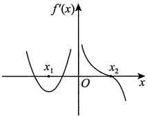

述方便，重新画图并注以字母，如图所示.

在$x_1$处，$f''(x_1) = \left[f'(x)\right]^f|_{x=x_1} = 0$，且在$x = x_1$的左侧邻域，$f''(x) = \left[f'(x)\right]^f < 0$，右侧邻域$f''(x) = \left[f'(x)\right]^f > 0$，所以点$(x_1, f(x_1))$是一个拐点。类似地，在$x=0$的左侧邻域$f''(x) = \left[f'(x)\right]^f > 0$，右侧邻域$f''(x) = \left[f'(x)\right]^f < 0$，点$(0, f(0))$也是一个拐点。在$x = x_2$的左右两侧均有$f''(x) = \left[f'(x)\right]^f < 0$，$f''(x)$不变号。故曲线$y = f(x)$只有两个拐点：$(x_1, f(x_1))$与$(0, f(0))$。

#### 22.

【答案】(B)

【解析】依题意，可得

$$f(x)=\left\{\begin{aligned}&\frac{1}{1-x}+\frac{1}{1+a-x},x<0,\\&\frac{1}{1+x}+\frac{1}{1+a-x},0\leq x<a,\\&\frac{1}{1+x}+\frac{1}{1+x-a},x\geq a,\end{aligned}\right.$$

$$f^{\prime}(x)=\left\{\begin{aligned}&\frac{1}{\left(1-x\right)^{2}}+\frac{1}{\left(1+a-x\right)^{2}},x<0,\\&\frac{-1}{\left(1+x\right)^{2}}+\frac{1}{\left(1+a-x\right)^{2}},0<x<a,\\&\frac{-1}{\left(1+x\right)^{2}}+\frac{-1}{\left(1+x-a\right)^{2}},x>a.\end{aligned}\right.$$

故$f(x)$在$(-∞,0)$上单调递增，在$(a,+∞)$上单调递减，因此最大值总在$[0,a]$中.

令$f'(x)=0$，有$1+x=1+a-x$，得$x=\frac{a}{2}$。比较$f(0)=f(a)=\frac{2+a}{1+a}$，$f\left(\frac{a}{2}\right)=\frac{4}{2+a}$，于是$\left[f(x)\right]_{\max}=\frac{2+a}{1+a}$。

#### 23.

【答案】(C)

【解析】由题图可知，$f'(1)=f'(3)=0$，即函数$f(x)$在区间$(0,4)$内有两个驻点x=1和x=3，故$f(x)$在$[0,4]$上的最大值和最小值只能在$f(0)$，$f(1)$，$f(3)$，$f(4)$中取得.

由$f(0)=1$，有

$$f(1)=f(0)+\int_{0}^{1}f^{\prime}(x)\mathrm{d}x=1+(-3)=-2,$$

$$f(3)=f(1)+\int_{1}^{3}f^{\prime}(x)\mathrm{d}x=-2+4=2,$$

$$f(4)=f(3)+\int_{3}^{4}f^{\prime}(x)\mathrm{d}x=2+(-2)=0.$$

故最大值为$f(3)=2$，最小值为$f(1)=-2$。

#### 24.

【答案】$e^{-1}$

【解析】先求$y = \tan^{n} x$在点$M \left( \frac{\pi}{4}, 1 \right)$处的切线方程，由

$$y^{\prime}\left(\frac{\pi}{4}\right)=n\tan^{n-1}x\bullet\left.\sec^{2}x\right|_{\substack{x=\frac{\pi}{4}}}=2n,$$

得切线方程

$$y-1=2n\left(x-\frac{\pi}{4}\right).$$

在x轴上的截距为$x_{n}=\frac{\pi}{4}-\frac{1}{2n}$，故

$$\lim_{n\to\infty}y(x_n)=\lim_{n\to\infty}\tan^n\left(\frac{\pi}{4}-\frac{1}{2n}\right)\xrightarrow{1^\infty}e^A$$

其中

$$\begin{aligned}A&=\lim_{n\to\infty}n\left[\tan\left(\frac{\pi}{4}-\frac{1}{2n}\right)-1\right]=\lim_{n\to\infty}\frac{\tan\left(\frac{\pi}{4}-\frac{1}{2n}\right)-\tan\frac{\pi}{4}}{\frac{1}{n}}&\\ &=-\left.\frac{1}{2}\left(\tan x\right)^{\prime}\right|_{x=\frac{\pi}{4}}=-\left.\frac{1}{2}\bullet\frac{1}{\cos^{2}x}\right|_{x=\frac{\pi}{4}}=-1.\\ \end{aligned}$$

故原极限$=e^{-1}$

#### 25.

【解析】设曲线$\frac{x^{2}}{4}+y^{2}=1(x>0,y>0)$上的任意点为$(x,y)$，则切线方程为$\frac{xX}{4}+yY=1$，切线的两个截距分别为$X=\frac{4}{x}$，$Y=\frac{1}{y}$。于是线段L的长度平方为

$$d^{2}=\frac{16}{x^{2}}+\frac{1}{y^{2}}=\frac{16}{x^{2}}+\frac{4}{4-x^{2}}.$$

记$f(x)=d^{2}=\frac{16}{x^{2}}+\frac{4}{4-x^{2}}$，则$f'(x)=\frac{8(8-x^{2})(3x^{2}-8)}{x^{3}(4-x^{2})^{2}}$

由此得到区间$(0,2)$上的唯一驻点$x_{0}=\frac{2}{3}\sqrt{6}$。由$f'(x)$的表达式可以看出，在点$x_{0}$左侧$f'(x)<0$，在点$x_{0}$右侧$f'(x)>0$，故$f(x)$在点$x_{0}=\frac{2}{3}\sqrt{6}$达到最小值，且

$$d_{\mathrm{m i n}}=\sqrt{f\left(\frac{2}{3}\sqrt{6}\right)}=\sqrt{\frac{16}{8}+\frac{4}{4\over3}}=3,$$

切点坐标为$\left(\frac{2\sqrt{6}}{3},\frac{\sqrt{3}}{3}\right)$.
#### 26.

【解析】

$$\begin{aligned}f(x)=&\int_{0}^{x}\left|\ln(x-t)\right|\mathrm{d}t+\int_{x}^{1}\left|\ln(t-x)\right|\mathrm{d}t\\=&-\int_{0}^{x}\ln(x-t)\mathrm{d}t-\int_{x}^{1}\ln(t-x)\mathrm{d}t\end{aligned}$$

$$\frac{ 前项令 x-t=u}{\overline{ 后项令 t-x=\nu}}\int_{x}^{0}\ln u\mathrm{d}u-\int_{0}^{1-x}\ln\nu\mathrm{d}\nu,$$

则当$x\in(0,1)$时，

$$f^{\prime}(x)=-\ln x+\ln(1-x)^{\frac{ 令 }{=}}0,$$

得$\ln\frac{1-x}{x}=0$，即$\frac{1-x}{x}=1$，解得$x=\frac{1}{2}$

又

$$f^{\prime \prime}(x)=-\left(\frac{1}{x}+\frac{1}{1-x}\right)<0(0<x<1),$$

故$x=\frac{1}{2}$是唯一的极大值点，

$$f\left(\frac{1}{2}\right)=-\int_{0}^{\frac{1}{2}}\ln u\mathrm{d}u-\int_{0}^{\frac{1}{2}}\ln v\mathrm{d}v=-2\int_{0}^{\frac{1}{2}}\ln u\mathrm{d}u=-2u\ln u\bigg|_{0}^{\frac{1}{2}}+2\int_{0}^{\frac{1}{2}}\mathrm{d}u=1+\ln2.$$

而$f(0)=f(1)=1$，故$\left[f(x)\right]_{\max}=1+\ln2$

#### 27.

【解析】(1)由$(xy'-2)\ln x+y=0$整理得$y'+\frac{1}{x\ln x}y=\frac{2}{x}$，该方程为一阶线性微分方程，根据一阶线性微分方程的通解公式，其通解为

$$y=\mathrm{e}^{-\int\frac{1}{x\ln x}\mathrm{d}x}\left(\int\frac{2}{x}\mathrm{e}^{\int\frac{1}{x\ln x}\mathrm{d}x}\mathrm{d}x+C\right)=\frac{1}{\ln x}\left(\ln^{2}x+C\right).$$

由$y(e)=2$，得C=1。故

$$y(x)=\ln x+\frac{1}{\ln x},x\in(0,1)\bigcup(1,+\infty).$$

(2)

$$y^{\prime}(x)=\frac{1}{x}\left(1-\frac{1}{\ln^{2}x}\right),\quad y^{\prime\prime}(x)=\frac{1}{x^{2}}\left(\frac{1}{\ln^{2}x}+\frac{2}{\ln^{3}x}-1\right).$$

令$y'(x)=0$，得x=e或$x=\frac{1}{e}$

$y''(e)=\frac{2}{e^2}>0$，则$x=e$为极小值点，极小值为$y(e)=2$

$y''\left(\frac{1}{e}\right) = -2e^2 < 0$，则$x = \frac{1}{e}$为极大值点，极大值为$y\left(\frac{1}{e}\right) = -2$

#### 28.

【解析】(1)由$(xy-1)\mathrm{d}x+x^{2}\mathrm{d}y=0$整理得$y'+\frac{1}{x}y=\frac{1}{x^{2}}$，利用一阶线性微分方程的通解公式，可得

$$y=\mathrm{e}^{-\int\frac{1}{x}\mathrm{d}x}\left(\int\frac{1}{x^{2}}\mathrm{e}^{\int\frac{1}{x}\mathrm{d}x}\mathrm{d}x+C\right)=\frac{\ln x+C}{x}.$$

又$y(1)=0$，则C=0，故$y=\frac{\ln x}{x}$

(2)由(1)知，$y=\frac{\ln x}{x}$，则

$$y^{\prime}=\frac{1-\ln x}{x^{2}},y^{\prime\prime}=\frac{2\ln x-3}{x^{3}}.$$

令$y''=0$，解得$x=e^{\frac{3}{2}}$

又当$x>e^{\frac{3}{2}}$时，$y''>0$；当$0<x<e^{\frac{3}{2}}$时，$y''<0$。故拐点为$\left(e^{\frac{3}{2}},\frac{3}{2e^{\frac{3}{2}}}\right)$。

由于$\lim_{x\to+\infty}\frac{\ln x}{x}=0$，故y=0为曲线$y=y(x)$在$x\to+\infty$时的一条水平渐近线.

由于$\lim_{x\to0^{+}}\frac{\ln x}{x}=-\infty$，故x=0为曲线$y=y(x)$的一条铅直渐近线.

#### 29.

【答案】(B)

【解析】

$$\lim_{x\to\infty}\frac{y}{x}=\lim_{x\to\infty}\ln\left(2+\frac{1}{x-1}\right)=\ln2,$$

$$\begin{aligned}\lim_{x\to\infty}(y-x\ln2)&=\lim_{x\to\infty}\left[x\ln\left(2+\frac{1}{x-1}\right)-x\ln2\right]=\lim_{x\to\infty}x\left[\ln\left(2+\frac{1}{x-1}\right)-\ln2\right]\\&=\lim_{x\to\infty}x\ln\left[1+\frac{1}{2(x-1)}\right]=\lim_{x\to\infty}x\cdot\frac{1}{2(x-1)}=\frac{1}{2}.\end{aligned}$$

故曲线的斜渐近线方程为$y = x \ln 2 + \frac{1}{2}$.

#### 30.

【解析】先看无定义点x=0，因

$$\begin{aligned}\lim_{x\to0}y=&\lim_{x\to0}x^{3}\left(\mathbf{e}^{\frac{1}{x}}+\mathbf{e}^{-\frac{1}{x}}-2\right)\\&\frac{\frac{1}{x}=t}{\xrightarrow{}\lim_{t\to\infty}\frac{\mathbf{e}^{t}+\mathbf{e}^{-t}-2}{t^{3}}}=\lim_{t\to\infty}\frac{\mathbf{e}^{t}-\mathbf{e}^{-t}}{3t^{2}}\\=&\lim_{t\to\infty}\frac{\mathbf{e}^{t}+\mathbf{e}^{-t}}{6t}=\lim_{t\to\infty}\frac{\mathbf{e}^{t}-\mathbf{e}^{-t}}{6}=\infty,\end{aligned}$$
故x=0为曲线的铅直渐近线.

再看

$$\begin{aligned}\lim_{x\to\infty}y&=\lim_{x\to\infty}x^{3}\left(\mathrm{e}^{\frac{1}{x}}+\mathrm{e}^{-\frac{1}{x}}-2\right)\frac{\frac{1}{x}=t}{\xrightarrow{t\to0}}\frac{\mathrm{e}^{t}+\mathrm{e}^{-t}-2}{t^{3}}\\&=\lim_{t\to0}\frac{1+t+\frac{t^{2}}{2}+1-t+\frac{t^{2}}{2}-2+o(t^{2})}{t^{3}}\\&=\lim_{t\to0}\frac{t^{2}+o(t^{2})}{t^{3}}=\infty,\end{aligned}$$

故曲线无水平渐近线.

因为

$$\begin{aligned}\lim_{x\to\infty}\frac{y}{x}&=\lim_{x\to\infty}x^{2}\left(\mathrm{e}^{\frac{1}{x}}+\mathrm{e}^{-\frac{1}{x}}-2\right)\xrightarrow[\substack{t\to0}]{x}=t\frac{\mathrm{e}^{t}+\mathrm{e}^{-t}-2}{t^{2}}\\&=\lim_{t\to0}\frac{1+t+\frac{t^{2}}{2}+1-t+\frac{t^{2}}{2}-2+o(t^{2})}{t^{2}}=\lim_{t\to0}\frac{t^{2}+o(t^{2})}{t^{2}}=1,\end{aligned}$$

又

$$\begin{aligned}\lim_{x\to\infty}(y-x)&=\lim_{x\to\infty}\left[x^{3}\left(\mathbf{e}^{\frac{1}{x}}+\mathbf{e}^{\frac{1}{x}}-2\right)-x\right]\xrightarrow{x=-\frac{1}{t}}\lim_{t\to0}\frac{\mathbf{e}^{t}+\mathbf{e}^{-t}-2-t^{2}}{t^{3}}&\\ &=\lim_{t\to0}\frac{1+t+\frac{t^{2}}{2}+\frac{t^{3}}{3!}+1-t+\frac{t^{2}}{2}-\frac{t^{3}}{3!}-2-t^{2}+o(t^{3})}{t^{3}}\\ &\\ &=\lim_{t\to0}\frac{o(t^{3})}{t^{3}}=0,\\ \end{aligned}$$

于是y=x为曲线的斜渐近线.

综上，曲线的铅直渐近线为x=0，斜渐近线为y=x。

#### 31.

【答案】$\frac{2}{3}$

【解析】由于$\frac{dx}{dt}=2e^{t}+1$，$\frac{dy}{dt}=4te^{t}+2t$，故由参数方程求导法则可得

$$\frac{\mathrm{d}y}{\mathrm{d}x}=\frac{4t\mathrm{e}^{t}+2t}{2\mathrm{e}^{t}+1}=2t,$$

从而

$$\frac{\mathrm{d}^{2}y}{\mathrm{d}x^{2}}=\frac{\mathrm{d}}{\mathrm{d}t}\left(\frac{\mathrm{d}y}{\mathrm{d}x}\right)\bullet\frac{1}{\frac{\mathrm{d}x}{\mathrm{d}t}}=\frac{2}{2\mathrm{e}^{t}+1},$$

$$\left.\frac{\mathrm{d}y}{\mathrm{d}x}\right|_{t=0}=0,\left.\frac{\mathrm{d}^{2}y}{\mathrm{d}x^{2}}\right|_{t=0}=\frac{2}{3},$$

则

所以曲线在 t=0 对应点处的曲率$k=\frac{|y''|}{\left[1+(y')^2\right]^{\frac{3}{2}}}\bigg|_{t=0}=\frac{2}{3}$.

#### 32.

【答案】$\frac{\sqrt{2}}{4}$

【解析】对方程$x(1+y)-\mathrm{e}^{y}+1=0$的两端同时关于x求一阶、二阶导数，得

$$1+y+x y^{\prime}-y^{\prime}\mathrm{e}^{y}=0,$$

$$2y^{\prime}+xy^{\prime \prime}-(y^{\prime})^{2}\mathrm{e}^{y}-y^{\prime \prime}\mathrm{e}^{y}=0.$$

将x=0, y=0代入上述两式，得$y'(0)=1$,$y''(0)=1$

因此，曲线$y = f(x)$在点$(0,0)$处的曲率为

$$k=\frac{\left|y^{\prime \prime}(0)\right|}{\sqrt{\left\{1+\left[y^{\prime}(0)\right]^{2}\right\}^{3}}}=\frac{1}{2\sqrt{2}}=\frac{\sqrt{2}}{4}.$$

#### 33.

【答案】$\left(x-\frac{1}{2}\right)^{2}+y^{2}=\frac{1}{4}$

【解析】因$x\big|_{y=0}=0$，$x'\big|_{y=0}=2y\big|_{y=0}=0$，$x''\big|_{y=0}=2>0$，故设圆的方程为$(x-a)^{2}+y^{2}=a^{2}$，其图形如图所示.

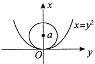

对该方程两边关于 y 求二阶导数，有

$$2(x-a)\cdot x^{\prime}+2y=0,$$

$$2(x^{\prime})^{2}+2(x-a)x^{\prime \prime}+2=0.$$

由于$x\big|_{y=0}=0$，$x'\big|_{y=0}=0$，$x''\big|_{y=0}=2$，故有$2\cdot(-a)\cdot2+2=0$，得$a=\frac{1}{2}$

于是圆的方程为$\left(x-\frac{1}{2}\right)^{2}+y^{2}=\frac{1}{4}$.

【注】考生要识别出此题是求曲率圆方程的，由$x'\big|_{y=0}=0$，$x''\big|_{y=0}=2$，得曲率 k=2，即曲率半径$R=\frac{1}{2}$，可直接得到答案。此题道出了曲线在$(0,0)$附近的近似表达及其精度（至二阶）。
### 第6章 一元函数微分学的应用（二）——中值定理、微分等式与微分不等式

#### 1.

【答案】(A)

【解析】对于①，可举反例$f(x)=\frac{\sin x^{2}}{x}$，$\lim_{x\to+\infty}f(x)$存在，但$\lim_{x\to+\infty}f'(x)$不存在.

对于②，可举反例$f(x)=x$，$\lim_{x\to+\infty}f'(x)$存在，但$\lim_{x\to+\infty}f(x)$不存在.

对于③，不妨设 a > 0，则存在 X > 0，当 x > X 时，$f'(x) > \frac{a}{2}$，故

$$f(x)=f(X)+\int_{X}^{x}f^{\prime}(t)\mathrm{d}t>f(X)+\frac{a}{2}(x-X),$$

当$x\to+\infty$时，$f(x)\to+\infty$，故③正确.

对于④，可举反例$f(x)=\sqrt{x}$，$\lim_{x\to+\infty}f'(x)=0$，但$f(x)$在$x\to+\infty$时无界.

#### 2.

【答案】(C)

【解析】常用结论：已知$\lim_{x\to+\infty}f'(x)$存在，若$\lim_{x\to+\infty}f'(x)=a\neq0$，则$f(x)$在$x\to+\infty$时无界。其逆否命题为已知$\lim_{x\to+\infty}f'(x)$存在，若$f(x)$在$x\to+\infty$时有界，则$\lim_{x\to+\infty}f'(x)$不等于非零常数，即$\lim_{x\to+\infty}f'(x)=0$。又$\lim_{x\to+\infty}f(x)$存在，则$f(x)$在$x\to+\infty$时有界。综上，结论①正确。

已知$\lim_{x\to+\infty}\left[f(x)+f'(x)\right]$存在，且

$$\lim_{x\to+\infty}f(x)=\lim_{x\to+\infty}\frac{f(x)e^{x}}{e^{x}}\xrightarrow{ 广义洛必达法则 }\lim_{x\to+\infty}\left[f(x)+f^{\prime}(x)\right],$$

故$\lim_{x\to+\infty}f'(x)=0$。结论②正确，选(C).

【注】结论“已知$\lim_{x\to+\infty}f'(x)$存在，若$\lim_{x\to+\infty}f'(x)=a\neq0$，则$f(x)$在$x\to+\infty$时无界”的证明见第1题③的证明.

#### 3.

【解析】用反证法.假设对于任意$x\in(0,1)$，$f'(x)\leq1$，则$F(x)=f(x)-x$在$[0,1]$上单调递减（由$F'(x)\leq0$）.因此$0=F(0)\geq F(x)\geq F(1)=0$，$x\in(0,1)$，即$f(x)\equiv x$，与题设矛盾.故假设不成立，命题得证.

#### 4.

【解析】(1) 若$f(x)$在$(0, +\infty)$上有一零点$x_{0}$，则对区间$(0, x_{0})$用罗尔定理即可。否则，由连续性知$f(x)$在$(0, +\infty)$上不变号，不妨设为恒正，则存在 M > 1，对任意 x > M，有$f(x) < f(1)$，特别地，

0 < f(2M) < f(1). 又由 f(x) 的连续性，存在 m ∈ (0,1)，使得 f(m) = f(2M)，从而对区间 (m,2M) 用罗尔定理，即存在$\xi \in (m,2M) \subset (0,+\infty)$，使$f'(\xi) = 0$.

(2) 记$g(x) = f(x) - \ln \frac{2x + 1}{x + \sqrt{1 + x^2}}$，当$x = 0$时，$\ln \frac{2x + 1}{x + \sqrt{1 + x^2}} = 0$，又$\lim_{x \to +\infty} \ln \frac{2x + 1}{x + \sqrt{1 + x^2}} = 0$，由夹逼准则即得$g(0) = 0$，$\lim_{x \to +\infty} g(x) = 0$。因此，由(1)的结论知存在$\xi \in (0, +\infty)$，使得$g'(\xi) = 0$。移项整理即得$f'(\xi) = \frac{2}{2\xi + 1} - \frac{1}{\sqrt{1 + \xi^2}}$。

#### 5.

【解析】令$g(x)=\ln f(x)$，则$g'(x)=\frac{f'(x)}{f(x)}$

$$g^{\prime \prime}(x)=\frac{f^{\prime \prime}(x)f(x)-\left[f^{\prime}(x)\right]^{2}}{f^{2}(x)}<0.$$

又$f(0)-0=1$，$f^{\prime}(0)-1=0$，得$f(0)=1$，$f^{\prime}(0)=1$，也即

$$g(0)=\ln f(0)=0,g^{\prime}(0)=\frac{f^{\prime}(0)}{f(0)}=1.$$

于是$g(x) = g(0) + g'(0)x + \frac{g''(\xi)}{2}x^2 = x + \frac{g''(\xi)}{2}x^2 \leq x$，其中$\xi$介于 0, x 之间。故$\ln f(x) \leq x$，$f(x) \leq e^x$。证毕。

#### 6.

【解析】(1) 若$x > x_{0}$，则存在$\xi \in (x_{0}, x)$，有$\frac{f(x) - f(x_{0})}{x - x_{0}} = f'(\xi) \geqslant f''(x_{0})$（由$f''(x) \geqslant 0$知$f'(x)$单调递增），移项即得待证式.$x < x_{0}$的情形同理可证.

(2) 用反证法. 假设存在$x_1 < x_2$，使$f(x_1) \neq f(x_2)$，不妨设$f(x_1) < f(x_2)$，则$k = \frac{f(x_2) - f(x_1)}{x_2 - x_1} > 0$。由拉格朗日中值定理，知存在$\xi \in (x_1, x_2)$使得$f'(\xi) = k$，从而对于任意$x > \xi$，$f'(x) \geq k$，由(1)得，对于任意$x > \xi$，$f(x) \geq f(\xi) + k(x - \xi)$，这与$f(x)$的有界性矛盾。故假设不成立，命题得证。

#### 7.

【解析】(1)设$x\in[0,1]$，则

$$f(0)=f(x)+f^{\prime}(x)(0-x)+\frac{f^{\prime \prime}(\xi_1)}{2}(0-x)^2,\xi_1\in(0,x),$$

$$f(1)=f(x)+f^{\prime}(x)(1-x)+\frac{f^{\prime \prime}(\xi_{2})}{2}(1-x)^{2},\xi_{2}\in(x,1),$$

①-②，得

$$f^{\prime}(x)=\frac{1}{2}[f^{\prime \prime}(\xi_{1})x^{2}-f^{\prime \prime}(\xi_{2})(1-x)^{2}],$$

又$\left|f''(x)\right|\leq M$，则
$$\left|f^{\prime}(x)\right|\leqslant\frac{M}{2}\bullet\left[x^{2}+(1-x)^{2}\right]\leqslant\frac{M}{2}\bullet1=\frac{M}{2},$$

当且仅当x=0或1时(*)处等号成立.

(2)由(1)知，当$x\in(0,1)$时，$\left|f'(x)\right|<\frac{M}{2}$，故只需研究x=0和x=1处$\left|f'(x)\right|$的情况。如果$\left|f'(0)\right|=\frac{M}{2}$，不妨设$f'(0)=\frac{M}{2}$，则

$$f\left(\frac{1}{2}\right)=f(0)+f^{\prime}(0)\left(\frac{1}{2}-0\right)+\frac{f^{\prime \prime}(\xi)}{2}\left(\frac{1}{2}-0\right)^{2}=0,\xi\in\left(0,\frac{1}{2}\right),$$

即$\frac{M}{4}=-\frac{1}{8}f''(\xi)$，也即$f''(\xi)=-2M$，则$\left|f''(\xi)\right|=2M>M$，矛盾。

同理，可证$f'(0)=-\frac{M}{2}$及$\left|f'(1)\right|=\frac{M}{2}$均不成立，即得$\left|f'(x)\right|<\frac{M}{2},x\in[0,1]$.

#### 8.

【答案】(B)

【解析】令$g(x) = \mathrm{e}^{-2x} f(x)$，则$g'(x) = [-2f(x) + f'(x)] \mathrm{e}^{-2x} > 0$，故$g(x)$在$[-2, 2]$上单调增加，从而$g(0) > g(-1)$，即$f(0) > \mathrm{e}^2 f(-1)$，又$f(x) > 0$，所以$\frac{f(0)}{f(-1)} > \mathrm{e}^2$。选项(B)正确。同理可知选项(A)，(C)，(D)均不正确。

#### 9.

【答案】(B)

【解析】令$\varphi(x) = \mathrm{e}^{-2x} f(x)$，则由题设知，$\varphi'(x) = \mathrm{e}^{-2x} \left[ f'(x) - 2f(x) \right] < 0$，故$\varphi(x)$单调减少。于是，当$b > a > 0$时，$\varphi(\ln b) < \varphi(\ln a)$，即$\mathrm{e}^{-2\ln b} f(\ln b) < \mathrm{e}^{-2\ln a} f(\ln a)$，也即$b^{-2} f(\ln b) < a^{-2} f(\ln a)$，由此即得$b^{2} f(\ln a) > a^{2} f(\ln b)$。

由题干条件无法确定$b^{2}f(a)$与$a^{2}f(b)$的大小关系，如$f(x)=\mathrm{e}^{x}$，则$f'(x)=\mathrm{e}^{x}<2\mathrm{e}^{x}=2f(x)$.

令$g(x)=\frac{e^x}{x^2}$(x > 0)，则$g'(x)=\frac{e^x(x-2)}{x^3}$，当 0 < x < 2 时，$g(x)$单调减少，当 x > 2 时，$g(x)$单调增加。所以，当 2 > b > a > 0 时，$g(b) < g(a)$，即$b^2 f(a) > a^2 f(b)$；当 b > a > 2 时，$g(b) > g(a)$，即$b^2 f(a) < a^2 f(b)$。

#### 10.

【解析】(1)当x>0时，对$f(x)$在$[0,x]$上用拉格朗日中值定理，有

$$f(x)-f(0)=f^{\prime}\left[x\cdot\theta(x)\right]\cdot x,\;0<\theta(x)<1,$$

即

$$\int_{0}^{x}\mathrm{e}^{t^{2}}\mathrm{d}t=xf^{\prime}[x\cdot\theta(x)],0<\theta(x)<1.$$

若另有$\theta^{*}(x)$，使得$f(x)-f(0)=f'[x\cdot\theta^{*}(x)]\cdot x(0<\theta^{*}(x)<1)$，则

$$f^{\prime}[x\cdot\theta(x)]x-f^{\prime}[x\cdot\theta^{*}(x)]x=f^{\prime \prime}(\xi)\cdot x\cdot[\theta(x)-\theta^{*}(x)]x=0$$

其中$\xi$介于$x \cdot \theta(x)$与$x \cdot \theta^{*}(x)$之间，而$f''(x) > 0, x > 0$，故$\theta(x) = \theta^{*}(x)$

(2)由(1)知，$\int_{0}^{x}e^{t^{2}}dt=x\cdot e^{\left[x\cdot\theta(x)\right]^{2}}(0<\theta(x)<1,x>0)$，解得

$$\theta(x)=\frac{1}{x}\cdot\sqrt{\ln\frac{\displaystyle\int_{0}^{x}\mathrm{e}^{t^{2}}\mathrm{d}t}{x}},$$

故

$$\begin{aligned}\lim_{x\to0^{+}}\theta(x)&=\lim_{x\to0^{+}}\frac{1}{x}\cdot\sqrt{\frac{\displaystyle\int_{0}^{x}\mathrm{e}^{t^{2}}\mathrm{d}t-x}{x}}=\lim_{x\to0^{+}}\sqrt{\frac{\displaystyle\int_{0}^{x}\mathrm{e}^{t^{2}}\mathrm{d}t-x}{x^{3}}}\\&=\sqrt{\lim_{x\to0^{+}}\frac{\displaystyle\int_{0}^{x}\mathrm{e}^{t^{2}}\mathrm{d}t-x}{x^{3}}}=\sqrt{\lim_{x\to0^{+}}\frac{\mathrm{e}^{x^{2}}-1}{3x^{2}}}=\frac{\sqrt{3}}{3}.\end{aligned}$$

#### 11.

【解析】(1)在$[2,3]$上对$f(x)$应用拉格朗日中值定理，有$f(3)-f(2)=f'(\eta)\geqslant M>0$，其中$\eta\in(2,3)$。又$f(2)>0$，故$f(3)=f(2)+f'(\eta)>M$。

又在$[2,4]$上$f'(x)>0$，$f(x)$单调增加，于是对任意的$x\in[3,4]$，均有$f(x)>M$。

(2) 令$F(x)=\int_{3}^{x}f(t)dt$，$G(x)=\mathrm{e}^{x}$，在$[3,4]$上对$F(x)$，$G(x)$应用柯西中值定理，有

$$\frac{F(4)-F(3)}{G(4)-G(3)}=\frac{F^{\prime}(\xi)}{G^{\prime}(\xi)}~,\quad\xi\in(3,4)~,$$

即

$$\frac{\displaystyle\int_{3}^{4}f(x)\mathrm{d}x}{\mathrm{e}^{3}(\mathrm{e}-1)}=\frac{f(\xi)}{\mathrm{e}^{\xi}},\xi\in(3,4).$$

又由(1)，有

$$\int_{3}^{4}f(x)\mathrm{d}x>\int_{3}^{4}M\mathrm{d}x=M,$$

故$\frac{f(\xi)}{\mathrm{e}^{\xi}}>\frac{M}{\mathrm{e}^{3}(\mathrm{e}-1)}$，即$f(\xi)>M\cdot\frac{\mathrm{e}^{\xi-3}}{\mathrm{e}-1}$

【注】$\xi\in(3,4)$，故$\frac{e^{\xi-3}}{e-1}$与1的大小关系不确定，不能简单认为(1)成立则(2)必成立.

#### 12.

【解析】记$F(x)=f(x)-(ax^2+bx+c)$，则$F(x)$在$(\alpha,\beta)$内二阶可导。由已知条件，在$(\alpha,\beta)$内存在$u,v,w,u<v<w$，使得$F(u)=F(v)=F(w)=0$，故由罗尔定理知存在$\xi_1\in(u,v),\xi_2\in(v,w)$，使得$F'(\xi_1)=F'(\xi_2)=0$。因此，存在$\xi\in(\xi_1,\xi_2)\subset(\alpha,\beta)$，使得$F''(\xi)=f''(\xi)-2a=0$，即$f''(\xi)=2a$。

#### 13.

【答案】(D)
【解析】$f(x)$在$[0,1]$上二阶可导，则由带拉格朗日余项的泰勒公式，有

$$f(x)=f\left(\frac{1}{2}\right)+f^{\prime}\left(\frac{1}{2}\right)\left(x-\frac{\dot{1}}{2}\right)+\frac{1}{2}f^{\prime \prime}(\xi)\left(x-\frac{1}{2}\right)^{2},$$

其中$\xi$介于 x 与$\frac{1}{2}$之间. 又在$[0,1]$上取积分得

$$\int_{0}^{1}f(x)\mathrm{d}x=\int_{0}^{1}f\left(\frac{1}{2}\right)\mathrm{d}x+\int_{0}^{1}f^{\prime}\left(\frac{1}{2}\right)\left(x-\frac{1}{2}\right)\mathrm{d}x+\frac{1}{2}\int_{0}^{1}f^{\prime \prime}(\xi)\left(x-\frac{1}{2}\right)^{2}\mathrm{d}x,$$

$$0=f\left(\frac{1}{2}\right)+f^{\prime}\left(\frac{1}{2}\right)\cdot\left.\frac{1}{2}\left(x-\frac{1}{2}\right)^{2}\right|_{0}^{1}+\frac{1}{2}\int_{0}^{1}f^{\prime\prime}(\xi)\left(x-\frac{1}{2}\right)^{2}\mathrm{d}x,$$

$$f\left(\frac{1}{2}\right)=-\frac{1}{2}\int_{0}^{1}f^{\prime\prime}(\xi)\left(x-\frac{1}{2}\right)^{2}\mathrm{d}x.$$

故当$f''(x)>0$时，有$f''(\xi)>0$，则$f\left(\frac{1}{2}\right)<0$。因此选(D)。

#### 14.

【解析】(1)记$x_{0}$为$[0,1]$上$f(x)$的最大值点，又$f(0)=f(1)=0$，则$M=f(x_{0})>0,x_{0}\in(0,1)$，且由费马定理，有$f'(x_{0})=0$。

在$[0,x_0]$上对$f(x)$应用拉格朗日中值定理，得$f'(\xi)=\frac{f(x_0)-f(0)}{x_0-0}=\frac{M}{x_0}$，$\xi\in(0,x_0)$。

对任意正整数$n, 0 < \frac{M}{n} < \frac{M}{x_0}$，即$f'(x_0) < \frac{M}{n} < f'(\xi)$。又由于$f'(x)$在$\left[\xi, x_0\right]$上连续，故由介值定理，存在$x_n \in (\xi, x_0) \subset (0,1)$，使得$f'(x_n) = \frac{M}{n}$。又$f''(x) < 0$，$f'(x)$严格单调减少，故$x_n$唯一。

(2)由于$f'(x_n)=\frac{M}{n}>\frac{M}{n+1}=f'(x_{n+1})$，且$f'(x)$严格单调减少，故$x_n<x_{n+1}$，即$\{x_n\}$严格单调增加，且有界，故$\lim_{n\to\infty}x_n$存在。又

$$\lim_{n\to\infty}f^{\prime}(x_{n})=\lim_{n\to\infty}\frac{M}{n}=0\ , 即 f^{\prime}\left(\lim_{n\to\infty}x_{n}\right)=0\ ,$$

由于$f'(x_{0})=0$，且导数零点唯一，故$\lim_{n\to\infty}x_n=x_0$，所以$\lim_{n\to\infty}f(x_n)=f(x_0)=M$。

【注】本题还可以这样做.

解析 (1) 记$x_0$为$[0,1]$上的最大值点，$f(x_0) = M$。令$F(x) = f(x) - \frac{M}{n}x$，则$F(x_0) = M - \frac{M}{n}x_0 > 0$，$F(1) = -\frac{M}{n} < 0$，由零点定理，存在$\xi \in (x_0,1)$，使$F(\xi) = 0$。又$F(0) = 0$，由罗尔定理，

存在$x_n \in (0, \xi) \subset (0,1)$，使$F'(x_n) = 0$，即$f'(x_n) = \frac{M}{n}$。又$f''(x) < 0$，$f'(x)$严格单调减少，故$x_n$唯一。

(2)由拉格朗日中值定理，有$f'(x_{n+1})-f'(x_n)=f''(\xi_n)(x_{n+1}-x_n)$，$\xi_n$介于$x_n$，$x_{n+1}$之间，则

$$x_{n+1}-x_{n}=\frac{1}{f^{n}(\xi_{n})}\left(\frac{M}{n+1}-\frac{M}{n}\right)>0,$$

故$\{x_{n}\}$单调增加，且有界，故$\lim_{n\to\infty}x_{n}$存在.

其余同标准答案.

#### 15.

【解析】必要性.若对任意$x\in(a,b)$及适当小的$h>0$，有

$$f(x)\leq\frac{1}{2}\big[f(x+h)+f(x-h)\big],$$

则对上述x及h有

$$\frac{f(x+h)+f(x-h)-2f(x)}{h^{2}}\geqslant0.$$

两边取极限，由于$f(x)$二次可微，左端极限为

$$\begin{aligned}\lim_{h\to0^{+}}\frac{f(x+h)+f(x-h)-2f(x)}{h^{2}}&=\lim_{h\to0^{+}}\frac{f^{\prime}(x+h)-f^{\prime}(x-h)}{2h}\\&=\lim_{h\to0^{+}}\frac{1}{2}\Biggl[\frac{f^{\prime}(x+h)-f^{\prime}(x)}{h}+\frac{f^{\prime}(x-h)-f^{\prime}(x)}{-h}\Biggr]=f_{+}^{\prime \prime}(x)=f^{\prime \prime}(x).\end{aligned}$$

因此得$f''(x) \geq 0$，$x \in (a, b)$。

充分性.若$f''(x)\geq0,x\in(a,b)$，则$f'(x)$单调不减，于是对任意的$x\in(a,b)$及适当小的$h>0$，有

$$f(x+h)+f(x-h)-2f(x)=\int_{x}^{x+h}\left[f^{\prime}(t)-f^{\prime}(t-h)\right]\mathrm{d}t\geqslant0,$$

即$f(x)\leq\frac{1}{2}\left[f(x+h)+f(x-h)\right]$.

#### 16.

【解析】令$f(x)=\frac{1}{x^{2}}-\frac{\arctan x}{x^{3}}$，则

$$f^{\prime}(x)=-\frac{2}{x^{3}}-\frac{\frac{x}{1+x^{2}}-3\arctan x}{x^{4}}=\frac{3\arctan x-2x-\frac{x}{1+x^{2}}}{x^{4}}\ .$$

再令$g(x)=3\arctan x-2x-\frac{x}{1+x^2}$，则$g'(x)=\frac{-2x^4}{(1+x^2)^2}<0(x\neq0)$。故$g(x)$在$[0,+\infty)$上单调减少，从而当 x>0 时，$g(x)<g(0)=0$，即$f'(x)<0$。由此可见，$f(x)$在$(0,+\infty)$上单调减少。于是，当$0<x\leq1$时，$f(1)\leq f(x)<f(0^+)$。由于$f(1)=1-\frac{\pi}{4}$，
$$f(0^{+})=\lim_{x\to0^{+}}\left(\frac{1}{x^{2}}-\frac{\arctan x}{x^{3}}\right)=\lim_{x\to0^{+}}\frac{x-\arctan x}{x^{3}}=\lim_{x\to0^{+}}\frac{1-\frac{1}{1+x^{2}}}{3x^{2}}=\frac{1}{3},$$

故当$0 < x \leq 1$时，$1 - \frac{\pi}{4} \leq f(x) < \frac{1}{3}$。由此可见，当且仅当$1 - \frac{\pi}{4} \leq k < \frac{1}{3}$时，方程$\frac{1}{x^2} - \frac{\arctan x}{x^3} = k$在$(0,1]$内有实根。由于在$(0,1]$内方程$x - \arctan x = kx^3$有实根，即方程$\frac{1}{x^2} - \frac{\arctan x}{x^3} = k$有实根，故所求常数$k$的取值范围为$1 - \frac{\pi}{4} \leq k < \frac{1}{3}$。

#### 17.

【答案】(C)

【解析】令$f(x)=\frac{\tan x}{x}$，则

$$f^{\prime}(x)=\frac{x\sec^{2}x-\tan x}{x^{2}}=\frac{x-\sin x\cos x}{x^{2}\cos^{2}x}=\frac{2x-\sin2x}{2x^{2}\cos^{2}x}>0\left(0<x<\frac{\pi}{4}\right).$$

故函数$f(x)$在$\left(0,\frac{\pi}{4}\right]$上单调增加，从而当$0<x<\frac{\pi}{4}$时，$f(0^{+})<f(x)<f\left(\frac{\pi}{4}\right)$，即$1<f(x)<\frac{4}{\pi}$。于是，当且仅当$1<k<\frac{4}{\pi}$时，方程$\frac{\tan x}{x}=k$在$\left(0,\frac{\pi}{4}\right)$内有实根。

#### 18.

【答案】(A)

【解析】令$f(x)=\frac{\int_{0}^{x}t\mathrm{e}^{t}\mathrm{d}t}{\int_{0}^{x}\mathrm{e}^{t}\mathrm{d}t}(x\neq0)$，其中$\int_{0}^{x}\mathrm{e}^{t}\mathrm{d}t=\mathrm{e}^{x}-1$，则

$$f^{\prime}(x)=\frac{x\mathrm{e}^{x}\cdot\int_{0}^{x}\mathrm{e}^{t}\mathrm{d}t-\int_{0}^{x}t\mathrm{e}^{t}\mathrm{d}t\cdot\mathrm{e}^{x}}{(\mathrm{e}^{x}-1)^{2}}=\frac{\mathrm{e}^{x}\left(\int_{0}^{x}x\mathrm{e}^{t}\mathrm{d}t-\int_{0}^{x}t\mathrm{e}^{t}\mathrm{d}t\right)}{(\mathrm{e}^{x}-1)^{2}}=\frac{\mathrm{e}^{x}\cdot\int_{0}^{x}(x-t)\mathrm{e}^{t}\mathrm{d}t}{(\mathrm{e}^{x}-1)^{2}}>0$$

故$f(x)$在$(-\infty,0)$，$(0,+\infty)$上分别单调递增，又$\lim_{x\to0}f(x)=\lim_{x\to0}\frac{x\mathrm{e}^x}{\mathrm{e}^x}=0$，所以当$b>0>a$时，$f(b)>\lim_{x\to0^+}f(x)=\lim_{x\to0^-}f(x)>f(a)$，即$\frac{\int_{0}^{b}t\mathrm{e}^t\mathrm{d}t}{\int_{0}^{b}\mathrm{e}^t\mathrm{d}t}>\frac{\int_{0}^{a}t\mathrm{e}^t\mathrm{d}t}{\int_{0}^{a}\mathrm{e}^t\mathrm{d}t}$，整理得$a\mathrm{e}^a(\mathrm{e}^b-1)>b\mathrm{e}^b(\mathrm{e}^a-1)$，故(A)正确，(B)错误.

对于选项(C),(D), 构造函数$g(x)=\frac{x(e^{x}-1)}{e^{x}}$, 求导得$g'(x)=\frac{e^{x}-1+x}{e^{x}}$ $\left\{\begin{aligned}&>0,&&x>0,\\ &<0,&&x<0,\end{aligned}\right.$得$g(x)$在$(0,+\infty)$上单调递增，在$(-\infty,0)$上单调递减，无法判断$g(a)$，$g(b)$的大小.

#### 19.

【分析】由题设知 ab > 0，欲证之式变为$\frac{a}{b} < \frac{\ln a}{\ln b} < \frac{b}{a}$。要证$\frac{a}{b} < \frac{\ln a}{\ln b}$，即证$\frac{\ln b}{b} < \frac{\ln a}{a}$，由此构造辅助函数$\varphi_{1}(x) = \frac{\ln x}{x}$，利用$\varphi_{1}(x)$的单调性证明即可；要证$\frac{\ln a}{\ln b} < \frac{b}{a}$，即证$a \ln a < b \ln b$，由此构造辅助函数$\varphi_{2}(x) = x \ln x$，利用$\varphi_{2}(x)$的单调性证明即可。

【解析】令$\varphi_{1}(x)=\frac{\ln x}{x}$，$\varphi_{1}^{\prime}(x)=\frac{1-\ln x}{x^{2}}<0(x>e)$，知$\varphi_{1}(x)$在$(e,+\infty)$上单调递减，于是当 e<a<b 时，有$\varphi_{1}(b)<\varphi_{1}(a)$，则$\frac{\ln b}{b}<\frac{\ln a}{a}$，即$\frac{a}{b}<\frac{\ln a}{\ln b}$；

令$\varphi_2(x) = x \ln x$，$\varphi'_2(x) = 1 + \ln x > 0 (x > e)$，知$\varphi_2(x)$在$(e, +\infty)$上单调递增，于是当$e < a < b$时，有$\varphi_2(a) < \varphi_2(b)$，则$a \ln a < b \ln b$，即$\frac{\ln a}{\ln b} < \frac{b}{a}$。

综上，$\frac{a}{b}<\frac{\ln a}{\ln b}<\frac{b}{a}$，故$a^{2}<ab\frac{\ln a}{\ln b}<b^{2}$。

#### 20.

【解析】由$\lim_{x\to0}\frac{f(x)}{x}=1$，可得$\frac{f(x)}{x}=1+o(1)(x\to0)$，故$f(x)=x+o(1)x$，则

$$\lim_{x\to0}f(x)=f(0)=0,f^{\prime}(0)=\lim_{x\to0}\frac{f(x)-f(0)}{x-0}=\lim_{x\to0}\frac{f(x)}{x}=1$$

由$f(x)$的一阶带拉格朗日余项的泰勒公式，有

$$f(x)=f(0)+f^{\prime}(0)x+\frac{f^{\prime \prime}(\xi)}{2}x^{2}=x+\frac{f^{\prime \prime}(\xi)}{2}x^{2}\quad(x\in(0,1))$$

因$f''(x)<0$，故$f(x)\leq x$。

#### 21.

【分析】采用反证法. 在证明过程中利用一阶带拉格朗日余项的泰勒公式.

【解析】假设存在$x_{0}\in[0,+\infty)$使得$f^{\prime}(x_{0})<0$，则由一阶带拉格朗日余项的泰勒公式，有

$$f(x)=f(x_{0})+f^{\prime}(x_{0})(x-x_{0})+\frac{f^{\prime \prime}(\xi)}{2!}(x-x_{0})^{2}( 其中 \xi 在 x_{0} 与 x 之间 ),$$

又$f''(x)\leq0$，故$\lim_{x\to\infty}f(x)=-\infty$，即存在$G>0$，当x>G时，有$f(x)<0$，此与题设$f(x)>0$矛盾.

因此，对于任意$x \in [0, +\infty)$，$f'(x) \geq 0$。
### 第7章 一元函数微分学的应用（三）——物理应用

#### 1.

【答案】$\frac{19\sqrt{10}}{12}$cm/s

【解析】P到原点O的距离$s=\sqrt{x^{2}+y^{2}}$，于是

$$\frac{\mathrm{d}s}{\mathrm{d}t}=\frac{\mathrm{d}}{\mathrm{d}t}\left(\sqrt{x^{2}+y^{2}}\right)=\frac{\mathrm{d}}{\mathrm{d}x}\left(\sqrt{x^{2}+x}\right)\cdot\frac{\mathrm{d}x}{\mathrm{d}t}=\frac{5(2x+1)}{2\sqrt{x^{2}+x}}.$$

当x=9时，$\frac{d}{dt}\left(\sqrt{x^{2}+y^{2}}\right)\bigg|_{x=9}=\frac{5(2x+1)}{2\sqrt{x^{2}+x}}\bigg|_{x=9}=\frac{19\sqrt{10}}{12}\left(\text{cm/s}\right)$.

#### 2.

【解析】表面积为$S=4\pi r^{2}$

$$\frac{\mathrm{d}S}{\mathrm{d}t}=8\pi r\,\frac{\mathrm{d}r}{\mathrm{d}t}=8\pi\cdot50\cdot5=2000\pi(\mathrm{c m}^{2}/\mathrm{s})\,.$$

体积为$V = \frac{4}{3} \pi r^{3}$

$$\mathrm{\frac{d} {d t}}=4\pi r^{2}\mathrm{\frac{d} {d t}}=4\pi\cdot50^{2}\mathrm{\cdot}5=50000\pi(\mathrm{c m}^{3}/\mathrm{s}).$$

#### 3.

【解析】(1)由$y=\ln\sqrt{x}=\frac{1}{2}\ln x$得$y'=\frac{1}{2x}$，曲线L在点$P(x,y)$处的切线方程为

$$Y-\frac{1}{2}\ln x=\frac{1}{2x}\left(X-x\right),$$

于是

$$\begin{aligned}S=&\int_{2}^{4}\left(\frac{1}{2}\ln x+\frac{1}{2x}X-\frac{1}{2}-\frac{1}{2}\ln X\right)\mathrm{d}X\\=&\frac{1}{2}\ln x\bullet(4-2)+\frac{1}{4x}X^{2}\bigg|_{2}^{4}-\frac{1}{2}\left(4-2\right)-\frac{1}{2}\left(X\ln X-X\right)\bigg|_{2}^{4}\\=&\ln x+\frac{3}{x}-1-\frac{1}{2}\left(4\ln4-4-2\ln2+2\right)=\frac{3}{x}+\ln x-3\ln2.\end{aligned}$$

则由$\frac{dS}{dx}=-\frac{3}{x^{2}}+\frac{1}{x}=0$，得$x_{0}=3$，故有$P_{0}\left(3,\frac{1}{2}\ln3\right)$

$$\left.\frac{\mathrm{d}S}{\mathrm{d}t}\right|_{x=\mathrm{e}}=\left.\frac{\mathrm{d}S}{\mathrm{d}x}\right|_{x=\mathrm{e}}\cdot\left.\frac{\mathrm{d}x}{\mathrm{d}t}\right|_{x=\mathrm{e}}=\left(-\frac{3}{\mathrm{e}^{2}}+\frac{1}{\mathrm{e}}\right)\cdot1=\frac{\mathrm{e}-3}{\mathrm{e}^{2}}$$
### 第8章 一元函数积分学的概念与性质
#### 1.

【解析】

$$\begin{aligned} 原式 &=\lim_{n\to\infty}\left(1-\cos\frac{\pi}{\sqrt{n}}\right)\sum_{i=1}^{n}\frac{1}{1+\cos\frac{i\pi}{2n}}\\&=\lim_{n\to\infty}\sum_{i=1}^{n}\frac{1}{1+\cos\left[\frac{\pi}{2}\left(\frac{i}{n}\right)\right]}\cdot\frac{1}{n}\bullet\frac{\pi^{2}}{2}=\frac{\pi^{2}}{2}\int_{0}^{1}\frac{1}{1+\cos\frac{\pi}{2}x}\mathrm{d}x\end{aligned}$$

$$\begin{aligned}\overset{(*)}{=}\frac{\pi^{2}}{2}\bigg(\frac{2}{\pi}\tan\frac{\pi}{4}x\bigg)\bigg|_{0}^{1}=\frac{\pi^{2}}{2}\bigg(\frac{2}{\pi}-0\bigg)=\pi.\end{aligned}$$

【注】(*）处是《考研数学基础30讲·高等数学分册》核心计算通关讲义的七组积分公式中的常用结论，也可计算如下：

$$\int\frac{1}{1+\cos\frac{\pi}{2}x}\mathrm{d}x=\int\frac{1}{2\cos^{2}\frac{\pi}{4}x}\mathrm{d}x=\frac{1}{2}\cdot\frac{4}{\pi}\int\sec^{2}\frac{\pi}{4}x\mathrm{d}\left(\frac{\pi}{4}x\right)=\frac{2}{\pi}\tan\frac{\pi}{4}x+C.$$

#### 2.

【答案】(C)

【解析】

$$原式 =\lim_{n\to\infty}\sum_{k=1}^{n}\left(\frac{2k-1}{2n}+1\right)f\left(\frac{2k-1}{2n}\right)\bullet\frac{1}{n}=\int_{0}^{1}(x+1)f(x)\mathrm{d}x.$$

【注】$\xi_{k}=\frac{\frac{k-1}{n}+\frac{k}{n}}{2}=\frac{2k-1}{2n}$

#### 3.

【答案】(C)

【解析】当$n \to \infty$时，$\ln\left[1 + \frac{1}{n}f\left(\frac{i}{n}\right)\right] = \frac{1}{n}f\left(\frac{i}{n}\right) + o\left(\frac{1}{n}\right), i = 0, 1, \cdots, n-1$，故

$$\sum_{i=0}^{n-1}\ln\left[1+\frac{1}{n}f\left(\frac{i}{n}\right)\right]=\sum_{i=0}^{n-1}\frac{1}{n}f\left(\frac{i}{n}\right)+o(1),n\rightarrow\infty,$$

于是

$$原式 =\lim_{n\to\infty}\sum_{i=0}^{n-1}\frac{1}{n}f\left(\frac{i}{n}\right)=\int_{0}^{1}f(x)\mathrm{d}x.$$
应选(C).

#### 4.

【答案】(C)

【解析】

$$\begin{aligned}I_{1}=&\int_{0}^{\pi}\frac{\sin x}{x}\mathrm{d}x+\int_{\pi}^{2\pi}\frac{\sin x}{x}\mathrm{d}x\\=&\int_{0}^{\pi}\frac{\sin x}{x}\mathrm{d}x+\int_{0}^{\pi}\frac{\sin(\pi+t)}{\pi+t}\mathrm{d}t\\=&\int_{0}^{\pi}\frac{\sin x}{x}\mathrm{d}x-\int_{0}^{\pi}\frac{\sin t}{\pi+t}\mathrm{d}t=\int_{0}^{\pi}\left(\frac{\sin x}{x}-\frac{\sin x}{\pi+x}\right)\mathrm{d}x\\=&\int_{0}^{\pi}\frac{\pi\sin x}{x(\pi+x)}\mathrm{d}x>0,\end{aligned}$$

$$\begin{aligned}I_{2}=&\int_{0}^{2\pi}\frac{\sin x}{2\pi-x}\mathrm{d}x\xrightarrow{2\pi-x=t}\int_{0}^{2\pi}\frac{\sin\left(2\pi-t\right)}{t}\mathrm{d}t\\=&-\int_{0}^{2\pi}\frac{\sin t}{t}\mathrm{d}t=-I_{1}<0,\end{aligned}$$

$$\begin{aligned}I_{3}=&\int_{0}^{2\pi}\frac{\sin x}{x(2\pi-x)}\mathrm{d}x=\frac{1}{2\pi}\left(\int_{0}^{2\pi}\frac{\sin x}{x}\mathrm{d}x+\int_{0}^{2\pi}\frac{\sin x}{2\pi-x}\mathrm{d}x\right)\\=&\frac{1}{2\pi}\left(\int_{0}^{2\pi}\frac{\sin x}{x}\mathrm{d}x-\int_{0}^{2\pi}\frac{\sin t}{t}\mathrm{d}t\right)=0,\end{aligned}$$

故$I_{2}<I_{3}<I_{1}$

#### 5.

【答案】(A)

【解析】

$$\begin{array}{c}{\displaystyle I_{1}\mathop{\longrightarrow}^{t=x^{2}}\int_{0}^{2\pi}\frac{\sin t}{2\sqrt{t}}\mathrm{d}t=\int_{0}^{\pi}\frac{\sin t}{2\sqrt{t}}\mathrm{d}t+\int_{\pi}^{2\pi}\frac{\sin t}{2\sqrt{t}}\mathrm{d}t}\\ {}\\ {\displaystyle=\int_{0}^{\pi}\sin u\bullet\left(\frac{1}{2\sqrt{u}}-\frac{1}{2\sqrt{u+\pi}}\right)\mathrm{d}u>0,}\end{array}$$

$$\begin{aligned}I_{2}=&\int_{-\frac{\pi}{4}}^{\frac{\pi}{4}}\frac{\mathrm{d}x}{1+\sin x}=\int_{0}^{\frac{\pi}{4}}\left[\frac{1}{1+\sin x}+\frac{1}{1+\sin(-x)}\right]\mathrm{d}x\\=&\int_{0}^{\frac{\pi}{4}}\frac{2}{\cos^{2}x}\mathrm{d}x=2\tan x\bigg|_{0}^{\frac{\pi}{4}}=2>0.\end{aligned}$$

【注】①(*)处，除区间端点外，$I_{1}$的被积函数严格大于0.

②因

$$\begin{array}{c}{{\displaystyle\int_{-a}^{a}f(x)\mathrm{d}x=\int_{-a}^{a}\left[\frac{f(x)+f(-x)}{2}+\frac{f(x)-f(-x)}{2}\right]\mathrm{d}x}}\\ {{\displaystyle=\frac{1}{2}\int_{-a}^{a}\left[f(x)+f(-x)\right]\mathrm{d}x=\int_{0}^{a}\left[f(x)+f(-x)\right]\mathrm{d}x(a>0)~,}}\end{array}$$

$$I_{2}=\int_{-\frac{\pi}{4}}^{\frac{\pi}{4}}\frac{dx}{1+\sin x}=\int_{0}^{\frac{\pi}{4}}\left[\frac{1}{1+\sin x}+\frac{1}{1+\sin(-x)}\right]dx$$

#### 6.

【答案】$x^{2}$

【解析】易知

$$\begin{aligned}\int_{0}^{1}f^{2}(x)\mathrm{d}x-\int_{0}^{1}2x^{2}f(x)\mathrm{d}x+\frac{1}{5}=&\int_{0}^{1}[f^{2}(x)-2x^{2}f(x)+x^{4}]\mathrm{d}x\\ =&\int_{0}^{1}[f(x)-x^{2}]^{2}\mathrm{d}x\leqslant0,\end{aligned}$$

又$[f(x)-x^2]^2\geq0$，由积分保号性，可得$\int_0^1[f(x)-x^2]^2\,dx\geq0$，故$\int_0^1[f(x)-x^2]^2\,dx\equiv0$，因此$f(x)=x^2$。

#### 7.

【答案】(B)

【解析】令$f_{1}(x)=\int_{0}^{x}e^{t^{2}}dt$，$g_{1}(x)=\left|\sin x\right|$，则$f(x)=f_{1}\left[g_{1}(x)\right]$，

$$\frac{f_{1}\left[g_{1}(x)\right]-f_{1}\left[g_{1}(0)\right]}{x-0}=\frac{\int_{0}^{\left[\sin x\right]}e^{t^{2}}dt}{x},$$

$$f_{+}^{\prime}(0)=\lim_{x\to0^{+}}\frac{\int_{0}^{\sin x}\mathrm{e}^{t^{2}}\mathrm{d}t}{x}=\lim_{x\to0^{+}}\mathrm{e}^{(\sin x)^{2}}\cdot\cos x=1$$

$$f_{-}^{\prime}(0)=\lim_{x\to0^{-}}\frac{\int_{0}^{-\sin x}e^{t^{2}}dt}{x}=\lim_{x\to0^{-}}e^{(-\sin x)^{2}}\cdot(-\cos x)=-1$$

故$f'(0)$不存在，又显然，在$(-π,π)$内，当$x≠0$时，$f'(x)$存在，且$g_1(x)$是偶函数，$f_1(x)$是奇函数，故$f(x)$是偶函数。

令$f_{2}(x)=\int_{0}^{x}\sin t^{2}dt$，$g_{2}(x)=\left|x\right|$，则$g(x)=f_{2}\left[g_{2}(x)\right]$，

$$g_{+}^{\prime}(0)=\lim_{x\to0^{+}}\frac{\int_{0}^{x}\sin t^{2}\mathrm{d}t}{x}=\lim_{x\to0^{+}}\sin x^{2}=0,$$

$$g_{-}^{\prime}(0)=\lim_{x\to0^{-}}\frac{\int_{0}^{-x}\sin t^{2}\mathrm{d}t}{x}=\lim_{x\to0^{-}}\sin(-x)^{2}\cdot(-1)=0$$

故$g'(0)$存在，又显然，在$(-π,π)$内，当$x≠0$时，$g'(x)$存在，且$g_2(x)$是偶函数，$f_2(x)$是奇函数，故$g(x)$是偶函数。

#### 8.

【分析】将$\int_{0}^{1}f^{2}(x)dx=A$视为待定常数，再将$f(x)$的表达式代入，作积分，解出A，即得$f(x)$

【解析】设$\int_{0}^{1}f^{2}(x)dx=A$，则$f(x)=3x-A\sqrt{1-x^{2}}$，于是
$$\begin{aligned}A=&\int_{0}^{1}f^{2}(x)\mathrm{d}x=\int_{0}^{1}\left(3x-A\sqrt{1-x^{2}}\right)^{2}\mathrm{d}x\\=&\int_{0}^{1}\left[9x^{2}-6Ax\sqrt{1-x^{2}}+A^{2}(1-x^{2})\right]\mathrm{d}x\\=&\left[3x^{3}+2A(1-x^{2})^{\frac{3}{2}}+\left(x-\frac{1}{3}x^{3}\right)A^{2}\right]\Bigg|_{x=0}^{x=1}=3-2A+\frac{2}{3}A^{2}．\end{aligned}$$

从而$2A^{2}-9A+9=0$，得$A_{1}=3$，$A_{2}=\frac{3}{2}$。故$f(x)=3x-3\sqrt{1-x^{2}}$或$f(x)=3x-\frac{3}{2}\sqrt{1-x^{2}}$。

#### 9.

【答案】(D)

【解析】令$\frac{m}{x}=y$，则$x=\frac{m}{y}$，$dx=-\frac{m}{y^{2}}dy$，故

$$\int_{0}^{n}\sqrt{x}\left[\frac{m}{x}\right]\mathrm{d}x=\int_{+\infty}^{\frac{m}{n}}\sqrt{\frac{m}{y}}\left[y\right]\left(-\frac{m}{y^{2}}\right)\mathrm{d}y=m^{\frac{3}{2}}\int_{\frac{m}{n}}^{+\infty}\frac{\left[y\right]}{y^{\frac{5}{2}}}\mathrm{d}y.$$

由于$[y]\leq y$，故$\frac{[y]}{y^{\frac{5}{2}}}\leq\frac{1}{y^{\frac{3}{2}}}$。又$\int_{\frac{m}{n}}^{+\infty}\frac{1}{y^{\frac{3}{2}}}dy$收敛，由比较判别法，有$\int_{\frac{m}{n}}^{+\infty}\frac{[y]}{y^{\frac{5}{2}}}dy$收敛，故$\int_{0}^{n}\sqrt{x}\left[\frac{m}{x}\right]dx$的敛散性与 m，n 均无关。

#### 10.

【答案】(A)

【解析】由于 0 < x < 1，因此$\ln x < 0$，令$\ln x = -t (t > 0)$，$x = e^{-t}$，有

$$\begin{aligned}\int_{0}^{1}\frac{1}{x^{p}\left|\ln x\right|^{q}}\mathrm{d}x=&\int_{+\infty}^{0}\frac{-\mathrm{e}^{-t}}{\mathrm{e}^{-pt}\bullet t^{q}}\mathrm{d}t=\int_{0}^{+\infty}\frac{\mathrm{e}^{(p-1)t}}{t^{q}}\mathrm{d}t\\=&\int_{0}^{1}\frac{\mathrm{e}^{(p-1)t}}{t^{q}}\mathrm{d}t+\int_{1}^{+\infty}\frac{\mathrm{e}^{(p-1)t}}{t^{q}}\mathrm{d}t.\end{aligned}$$

对于$\int_{0}^{1}\frac{e^{(p-1)t}}{t^{q}}dt$，等价于研究$\int_{0}^{1}\frac{1}{t^{q}}dt$，故当q<1时，收敛.

对于$\int_{1}^{+\infty}\frac{e^{(p-1)t}}{t^{q}}\mathrm{d}t$，当p<1时，必收敛；当p=1时，q>1才能使其收敛，这时$\int_{0}^{1}\frac{1}{t^{q}}\mathrm{d}t$发散，故$p\neq1$；当p>1时，必发散.

综上所述，p<1，q<1。

#### 11.

【答案】(A)

【解析】由$\int_{2}^{+\infty}\frac{1}{t(\ln t)^{x+1}}dt$收敛，得x>0。此时

$$f(x)=\int_{2}^{+\infty}\frac{1}{(\ln t)^{x+1}}\mathrm{d}(\ln t)=-\frac{1}{x}(\ln t)^{-x}\bigg|_{2}^{+\infty}=\frac{1}{x(\ln2)^{x}}.$$

设$g(x)=x(\ln 2)^{x}$，令$g'(x)=(\ln 2)^{x}+x(\ln 2)^{x}\cdot\ln \ln 2=0$，解得$x=-\frac{1}{\ln \ln 2}$

当$0 < x < -\frac{1}{\ln \ln 2}$时，$g'(x) > 0$；当$x > -\frac{1}{\ln \ln 2}$时，$g'(x) < 0$。

故$x = -\frac{1}{\ln \ln 2}$为$g(x)$的最大值点，即$f(x)$的最小值点.

故$x_{0}=-\frac{1}{\ln\ln2}$，选(A).

#### 12.

【答案】(A)

【解析】原反常积分可写为$\int_{0}^{\frac{1}{2}}\frac{\ln x}{x^{p}(1-x)^{1-p}}\,dx+\int_{\frac{1}{2}}^{1}\frac{\ln x}{x^{p}(1-x)^{1-p}}\,dx$。若p<1，则存在$\varepsilon>0$，使$p+\varepsilon<1$，且

$$\lim_{x\to0^{+}}\frac{\frac{\ln x}{x^{p}(1-x)^{1-p}}}{\frac{1}{x^{p+\varepsilon}}}=\lim_{x\to0^{+}}x^{\varepsilon}\cdot\ln x=0.$$

由$\int_{0}^{\frac{1}{2}}\frac{1}{x^{p+\varepsilon}}dx$收敛，可知$\int_{0}^{\frac{1}{2}}\frac{\ln x}{x^{p}(1-x)^{1-p}}dx$也收敛.

$\lim_{x \to 1^-} \frac{\ln x}{x^p (1-x)^{1-p}} = -1 \neq 0$，知若$\int \frac{1}{2} \frac{1}{(1-x)^{-p}} \, \mathrm{d}x$收敛，即 p > -1，则$\int \frac{1}{2} \frac{\ln x}{x^p (1-x)^{1-p}} \, \mathrm{d}x$也收敛。故选(A)。

#### 13.

【答案】(B)

【解析】令$f(x)=\frac{1}{\sqrt{x^{2}+1}}$，则$\int_{0}^{+\infty}f^{2}(x)dx$收敛，$\int_{0}^{+\infty}f(x)dx$发散，故①错误；

若$\int_{0}^{+\infty}f(x)dx$收敛，则$\lim_{x\to+\infty}f(x)=0$，进而得$\lim_{x\to+\infty}\frac{f^2(x)}{f(x)}=0$，根据比较判别法，可知$\int_{0}^{+\infty}f^2(x)dx$收敛，故②正确；

因为$\lim_{x \to +\infty} x^2 f(x)$存在，则在$x \to +\infty$时，$f(x)$是比$\frac{1}{x^2}$高阶或与$\frac{1}{x^2}$同阶的无穷小，又$\int_1^{+\infty} \frac{1}{x^2} \, dx$收敛，故$\int_1^{+\infty} f(x) \, dx$收敛，注意到$\int_0^{+\infty} f(x) \, dx = \int_0^1 f(x) \, dx + \int_1^{+\infty} f(x) \, dx$，可知$\int_0^{+\infty} f(x) \, dx$收敛，故③正确；

反常积分极限形式的比较判别法只是一种充分判别法，但非必要，故$^{④}$错误.
综上，选(B).

#### 14.

【答案】k<1

【解析】盯着$x \to +\infty$看，由$e^{-\cos\frac{1}{x}} - e^{-1} = e^{-1} \left( e^{-\cos\frac{1}{x} + 1} - 1 \right)$，知当$x \to +\infty$时，

$$\mathrm{e}^{-\cos\frac{1}{x}+1}-1\sim1-\cos\frac{1}{x}\sim\frac{1}{2}\cdot\frac{1}{x^{2}},$$

即原反常积分与$\int_{1}^{+\infty}\frac{1}{x^{2-k}}dx$同敛散，故当2-k>1，即k<1时，原反常积分收敛.

#### 15.

【答案】(C)

【解析】对于(A)选项，$\int_{0}^{+\infty}\frac{e^{-x}}{\sqrt{x}}dx=\int_{0}^{1}\frac{e^{-x}}{\sqrt{x}}dx+\int_{1}^{+\infty}\frac{e^{-x}}{\sqrt{x}}dx$

因为$\lim_{x\to0^{+}}(x-0)^{\frac{1}{2}}\frac{e^{-x}}{\sqrt{x}}=\lim_{x\to0^{+}}e^{-x}=1$，其中$\frac{1}{2}<1$，则$\int_{0}^{1}\frac{e^{-x}}{\sqrt{x}}dx$收敛；

因为$\lim_{x \to +\infty} x^{\frac{3}{2}} \frac{e^{-x}}{\sqrt{x}} = \lim_{x \to +\infty} \frac{x}{e^x} = 0$，其中$\frac{3}{2} > 1$，则$\int_1^{+\infty} \frac{e^{-x}}{\sqrt{x}} \, dx$收敛。

综上，$\int_{0}^{+\infty}\frac{e^{-x}}{\sqrt{x}}dx$收敛.

对于(B)选项，$\lim_{x\to+\infty}x^{2}\cdot x^{2}e^{-x^{2}}=\lim_{x\to+\infty}\frac{x^{4}}{e^{x^{2}}}=0$，其中2>1，所以$\int_{0}^{+\infty}x^{2}e^{-x^{2}}dx$收敛.

对于(C)选项，$\int_{0}^{+\infty}\frac{dx}{x\ln^{2}x}=\int_{0}^{\frac{1}{2}}\frac{dx}{x\ln^{2}x}+\int_{\frac{1}{2}}^{1}\frac{dx}{x\ln^{2}x}+\int_{1}^{2}\frac{dx}{x\ln^{2}x}+\int_{2}^{+\infty}\frac{dx}{x\ln^{2}x}$，而$\int_{\frac{1}{2}}^{1}\frac{dx}{x\ln^{2}x}=-\left.\frac{1}{\ln x}\right|_{\frac{1}{2}}^{1}$，所以$\int_{0}^{+\infty}\frac{dx}{x\ln^{2}x}$发散.

对于(D)选项，$\int_{0}^{+\infty}\frac{dx}{(x+2)\ln^{2}(x+2)}=\int_{0}^{+\infty}\frac{d[\ln(x+2)]}{\ln^{2}(x+2)}=-\left.\frac{1}{\ln(x+2)}\right|_{0}^{+\infty}=\frac{1}{\ln2}$，显然收敛.

#### 16.

【答案】(C)

【解析】对于(A)选项，因为$\lim_{x\to1^+}(x-1)^{\frac{1}{2}}\frac{1}{\sqrt{x^2-1}}=\lim_{x\to1^+}\frac{1}{\sqrt{x+1}}=\frac{1}{\sqrt{2}}$，$\lim_{x\to+\infty}x\frac{1}{\sqrt{x^2-1}}=1$，所以反常积分$\int_{1}^{2}\frac{1}{\sqrt{x^2-1}}dx$收敛，反常积分$\int_{2}^{+\infty}\frac{1}{\sqrt{x^2-1}}dx$发散，从而反常积分$\int_{1}^{+\infty}\frac{1}{\sqrt{x^2-1}}dx$发散.

对于(B)选项，因为$\lim_{x\to1^+}(x-1)^{\frac{1}{2}}\frac{1}{\sqrt{x(x-1)}}=\lim_{x\to1^+}\frac{1}{\sqrt{x}}=1$，$\lim_{x\to+\infty}x\frac{1}{\sqrt{x(x-1)}}=1$，所以反常积分$\int_{1}^{2}\frac{dx}{\sqrt{x(x-1)}}$收敛，反常积分$\int_{2}^{+\infty}\frac{dx}{\sqrt{x(x-1)}}$发散，从而反常积分$\int_{1}^{+\infty}\frac{dx}{\sqrt{x(x-1)}}$发散.

对于(C)选项，

$$\int_{1}^{+\infty}\frac{\mathrm{d}x}{x^{2}\sqrt{x^{2}-1}}=\int_{1}^{+\infty}\frac{\mathrm{d}x}{x^{3}\sqrt{1-\frac{1}{x^{2}}}}=\frac{1}{2}\int_{1}^{+\infty}\frac{1}{\sqrt{1-\frac{1}{x^{2}}}}\mathrm{d}\left(1-\frac{1}{x^{2}}\right)=\sqrt{1-\frac{1}{x^{2}}}\bigg|_{1}^{+\infty}=1$$

从而反常积分$\int_{1}^{+\infty}\frac{dx}{x^{2}\sqrt{x^{2}-1}}$收敛.

对于(D)选项，$\lim_{x\to1^{-}}(x-1)\cdot\frac{1}{x(x^2-1)}=\lim_{x\to1^{-}}\frac{1}{x(x+1)}=\frac{1}{2}$，$\lim_{x\to+\infty}x^3\cdot\frac{1}{x(x^2-1)}=1$，所以反常积分$\int_{1}^{2}\frac{dx}{x(x^2-1)}$发散，反常积分$\int_{2}^{+\infty}\frac{dx}{x(x^2-1)}$收敛，从而反常积分$\int_{1}^{+\infty}\frac{dx}{x(x^2-1)}$发散.

#### 17.

【解析】(1)由题可知，$[(1+x)y-1]\mathrm{d}x+x(1+x)\mathrm{d}y=0$，整理得$y^{\prime}+\frac{y}{x}=\frac{1}{x(1+x)}$，根据一阶线性微分方程的通解公式，可得$y=\mathrm{e}^{-\int\frac{1}{x}\mathrm{d}x}\left[\int\mathrm{e}^{\int\frac{1}{x}\mathrm{d}x}\cdot\frac{1}{x(x+1)}\mathrm{d}x+C\right]=\frac{1}{x}\left[\ln(x+1)+C\right]$。又$y(1)=\ln2$，则$C=0$，故$y=\frac{\ln(x+1)}{x},x\in(-1,0)\bigcup(0,\mathrm{+}\infty)$。

(2)由(1)知，$f(x)=\int_{-1}^{x}\frac{\ln(1+|t|)}{|t|}\mathrm{d}t$。因为$\lim_{t\to0}\frac{\ln(1+|t|)}{|t|}=1$，所以$t=0$为$\frac{\ln(1+|t|)}{|t|}$的可去间断点，故$f(x)$连续且
$$\begin{aligned}f^{\prime}(0)=&\lim_{x\to0}\frac{f(x)-f(0)}{x-0}=\lim_{x\to0}\frac{\displaystyle\int_{-1}^{x}\frac{\ln(1+|t|)}{|t|}\mathrm{d}t-\int_{-1}^{0}\frac{\ln(1+|t|)}{|t|}\mathrm{d}t}{x-0}\\&=\lim_{x\to0}\frac{\displaystyle\int_{0}^{x}\frac{\ln(1+t)}{t}\mathrm{d}t}{x-0}=\lim_{x\to0}\frac{\ln(1+x)}{x}=1\text{。}\end{aligned}$$

#### 18.

【解析】(1)由定积分的定义可得

$$f(x)=\lim_{n\to\infty}\frac{x}{n}\sum_{i=1}^{n}\mathrm{e}^{-\left(\frac{ix}{n}\right)^{2}}=\int_{0}^{x}\mathrm{e}^{-t^{2}}\mathrm{d}t.$$
(2)由(1)可知，

$$y=\mathrm{e}^{x^{2}}f(x)=\mathrm{e}^{x^{2}}\int_{0}^{x}\mathrm{e}^{-t^{2}}\mathrm{d}t,$$

则

$$y^{\prime}=2x\mathrm{e}^{x^{2}}\int_{0}^{x}\mathrm{e}^{-t^{2}}\mathrm{d}t+1,$$

$$\begin{align*}y^{\prime \prime}=&2\Biggl(\mathbf{e}^{x^{2}}\int_{0}^{x}\mathbf{e}^{-t^{2}}\mathrm{d}t+2x^{2}\mathbf{e}^{x^{2}}\int_{0}^{x}\mathbf{e}^{-t^{2}}\mathrm{d}t+x\Biggr)\\=&2\Biggl[(1+2x^{2})\mathbf{e}^{x^{2}}\int_{0}^{x}\mathbf{e}^{-t^{2}}\mathrm{d}t+x\Biggr].\end{align*}$$

因为对任意的 x，有$1+2x^2>0$，$\mathrm{e}^{x^2}>0$，故当$x<0$时，$y''<0$；当$x=0$时，$y''=0$；当 x>0 时，$y''>0$。又$y(0)=f(0)=0$，故$(0,0)$是曲线$y=\mathrm{e}^{x^2}f(x)$的拐点。

#### 19.

【答案】(A)

【解析】由题设，$f\left[\varphi(x)\right]=\varphi^{2}(x)=-x^{2}+2x+3$，且$\varphi(x)\geqslant0$，则

$$\varphi(x)=\sqrt{-x^{2}+2x+3},$$

其中$-x^{2}+2x+3\geqslant0$，即$(x-3)(x+1)\leqslant0$，解得$-1\leqslant x\leqslant3$，即$[-1,3]$为$\varphi(x)$的定义域.

又$(x^2 + 2x + 3)^\prime = -2x + 2 \xrightarrow{\text{空}} 0$，解得$x = 1$，故当$-1 \leq x < 1$时，导数大于0；当$1 < x \leq 3$时，导数小于0。所以$\varphi(1) = 2$为最大值，$\varphi(-1) = \varphi(3) = 0$为最小值，即$[0,2]$为$\varphi(x)$的值域。

又

$$\sum_{i=1}^{n}\left(\frac{i}{n}\right)^{2}\left(1-\frac{i}{n}\right)\frac{1}{n+2}\leqslant\frac{1}{n^{3}}\sum_{i=1}^{n}i^{2}(n-i)\cdot\frac{1}{n+\varphi(x)}\leqslant\sum_{i=1}^{n}\left(\frac{i}{n}\right)^{2}\left(1-\frac{i}{n}\right)\frac{1}{n},$$

且

$$\lim_{n\to\infty}\sum_{i=1}^{n}\left(\frac{i}{n}\right)^{2}\left(1-\frac{i}{n}\right)\frac{1}{n}=\int_{0}^{1}x^{2}(1-x)dx=\frac{1}{12},$$

$$\lim_{n\to\infty}\frac{n}{n+2}\cdot\sum_{i=1}^{n}\left(\frac{i}{n}\right)^{2}\left(1-\frac{i}{n}\right)\frac{1}{n}=1\cdot\int_{0}^{1}x^{2}(1-x)dx=\frac{1}{12}$$

故由夹逼准则得，$\lim_{n\to\infty}\frac{1}{n^3}\sum_{i=1}^{n}i^2(n-i)\cdot\frac{1}{n+\varphi(x)}=\frac{1}{12}$，选(A).
### 第9章 一元函数积分学的计算

#### 1.

【答案】1

【解析】令$t = \ln \frac{1}{1 - x}$，则$x = 1 - e^{-t}$，故

$$原式 =\int_{0}^{+\infty}t\mathrm{d}(1-\mathrm{e}^{-t})=\int_{0}^{+\infty}t\bullet\mathrm{e}^{-t}\mathrm{d}t=1.$$

#### 2.

【解析】设$\frac{x+2}{(2x+1)(x^{2}+x+1)}=\frac{A}{2x+1}+\frac{Bx+D}{x^{2}+x+1}$，通分后可得

$$x+2=A(x^{2}+x+1)+(Bx+D)(2x+1),$$

代入特值$x=-\frac{1}{2}$，x=0，x=1，得A=2，D=0，B=-1，故

$$\begin{aligned} 原式 =&\int\left(\frac{2}{2x+1}-\frac{x}{x^{2}+x+1}\right)\mathrm{d}x=\ln\left|2x+1\right|-\int\frac{x}{x^{2}+x+1}\mathrm{d}x\\=&\ln\left|2x+1\right|-\frac{1}{2}\int\frac{(2x+1)-1}{x^{2}+x+1}\mathrm{d}x\\=&\ln\left|2x+1\right|-\frac{1}{2}\int\frac{\mathrm{d}(x^{2}+x+1)}{x^{2}+x+1}+\frac{1}{2}\int\frac{\mathrm{d}x}{\left(x+\frac{1}{2}\right)^{2}+\left(\frac{\sqrt{3}}{2}\right)^{2}}\\=&\ln\left|2x+1\right|-\frac{1}{2}\ln(x^{2}+x+1)+\frac{1}{\sqrt{3}}\arctan\frac{2x+1}{\sqrt{3}}+C\;.\end{aligned}$$

#### 3.

【答案】$\frac{1}{2}e(\cos1+\sin1)-\frac{1}{2}$

【解析】令$\ln x=t$，则$x=e^{t}$，故

$$原式 =\int_{0}^{1}\mathrm{e}^{t}\cos t\mathrm{d}t=\frac{1}{2}\left(\left.\mathrm{e}^{t}\cos t+\mathrm{e}^{t}\sin t\right)\right|_{0}^{1}=\frac{1}{2}\mathrm{e}(\cos1+\sin1)-\frac{1}{2}\ .$$

#### 4.

【解析】以1-x代换原方程中的x，得$(1-x)f(1-x)+f(x)=(1-x)^2$。此方程与原方程联立，解得$f(x)=\frac{x^3-2x+1}{x^2-x+1}$。于是

$$\int f(x)\mathrm{d}x=\int\frac{x^{3}-2x+1}{x^{2}-x+1}\mathrm{d}x=\int\left(x+1+\frac{-2x}{x^{2}-x+1}\right)\mathrm{d}x$$
$$\begin{aligned}=&\frac{1}{2}x^{2}+x+\int\frac{-(2x-1)-1}{x^{2}-x+1}\mathrm{d}x\\=&\frac{1}{2}x^{2}+x-\int\frac{\mathrm{d}(x^{2}-x+1)}{x^{2}-x+1}-\int\frac{\mathrm{d}\left(x-\frac{1}{2}\right)}{\left(x-\frac{1}{2}\right)^{2}+\left(\frac{\sqrt{3}}{2}\right)^{2}}\\=&\frac{1}{2}x^{2}+x-\ln(x^{2}-x+1)-\frac{2}{\sqrt{3}}\arctan\frac{2x-1}{\sqrt{3}}+C\;.\end{aligned}$$

#### 5.

【答案】$\frac{1}{\ln2}+\frac{1}{\ln^{2}2}$

【解析】

$$\begin{aligned} 原式 =&\int_{1}^{+\infty}2^{-\sqrt{x}}\mathrm{d}x\xrightarrow{\sqrt{x}=t}\int_{1}^{+\infty}2^{-t}\cdot2t\mathrm{d}t\\=&\frac{-2}{\ln2}\int_{1}^{+\infty}t\mathrm{d}(2^{-t})=-\frac{2}{\ln2}\left(t\cdot2^{-t}\Big|_{1}^{+\infty}-\int_{1}^{+\infty}2^{-t}\mathrm{d}t\right)\\=&-\frac{2}{\ln2}\left(-\frac{1}{2}+\frac{2^{-t}}{\ln2}\Big|_{1}^{+\infty}\right)=\frac{1}{\ln2}+\frac{1}{\ln^{2}2}.\end{aligned}$$

#### 6.

【答案】4

【解析】令$x=1+t$，由$f(x)$是连续的偶函数，且$\int_{0}^{1}f(x)dx=2$，得

$$\int_{0}^{2}x f(1-x)\mathrm{d}x=\int_{-1}^{1}(1+t)f(-t)\mathrm{d}t=2\int_{0}^{1}f(t)\mathrm{d}t=4.$$

#### 7.

【答案】$\frac{5}{3}$

【解析】令$F(x)=\int_{x^{2}}^{x^{2}+1}f(t)dt(x>0)$，则$F'(x)=2x\left[f\left(x^{2}+1\right)-f\left(x^{2}\right)\right]=2x^{2}$，则

$$\int_{x^{2}}^{x^{2}+1}f(t)\mathrm{d}t=F(x)=\frac{2}{3}x^{3}+C.$$

取极限$x \to 0^{+}$，得$\int_{0}^{1} f(t) \, dt = C$，即 C = 1，则$F(x) = \frac{2}{3} x^{3} + 1 (x > 0)$，故

$$\int_{1}^{2}f(x)\mathrm{d}x=F(1)=\frac{2}{3}+1=\frac{5}{3}.$$

#### 8.

【解析】由$f(t)=\int_{0}^{1}\left|t-x\right|\,\mathrm{d}x\xrightarrow{t-x=u}\int_{t}^{t-1}t\left|u\right|\left(-\mathrm{d}u\right)=t\int_{t-1}^{t}\left|u\right|\,\mathrm{d}u$，故当$t\geq1$时，$f(t)=t\cdot\frac{1}{2}u^{2}\bigg|_{t-1}^{t}=t\cdot\left(t-\frac{1}{2}\right)=t^{2}-\frac{t}{2}$；

当 0 < t < 1 时，$f(t) = t \cdot \frac{1}{2} u^{2} \bigg|_{0}^{t-1} + t \cdot \frac{1}{2} u^{2} \bigg|_{0}^{t} = t^{3} - t^{2} + \frac{t}{2}$;

当$t\leq0$时，$f(t)=t\cdot\frac{1}{2}u^{2}\bigg|_{t}^{t-1}=-t^{2}+\frac{t}{2}$.

所以有

$$\begin{aligned}\int_{-1}^{2}f(t)\mathrm{d}t=&\int_{-1}^{0}\left(\frac{t}{2}-t^{2}\right)\mathrm{d}t+\int_{0}^{1}\left(t^{3}-t^{2}+\frac{t}{2}\right)\mathrm{d}t+\int_{1}^{2}\left(t^{2}-\frac{t}{2}\right)\mathrm{d}t\\=&\left(\frac{1}{4}t^{2}-\frac{1}{3}t^{3}\right)\bigg|_{-1}^{0}+\left(\frac{1}{4}t^{4}-\frac{1}{3}t^{3}+\frac{1}{4}t^{2}\right)\bigg|_{0}^{1}+\left(\frac{1}{3}t^{3}-\frac{1}{4}t^{2}\right)\bigg|_{1}^{2}\\=&-\frac{7}{12}+\frac{1}{6}+\frac{19}{12}=\frac{7}{6}.\end{aligned}$$

#### 9.

【答案】(C)

【解析】由$g(x)$是过点$\left(-\frac{1}{2},0\right)$和$(0,1)$的直线，可得$g(x)=2x+1$，故

$$\begin{align*}\int_{0}^{2}f\left[g(x)\right]\mathrm{d}x=&\int_{0}^{2}f(2x+1)\mathrm{d}x\xrightarrow{2x+1=t}\int_{1}^{5}f(t)\mathrm{d}\left(\frac{t-1}{2}\right)\\=&\frac{1}{2}\int_{1}^{5}f(t)\mathrm{d}t=\frac{1}{2}\bullet2\int_{0}^{2}f(t)\mathrm{d}t=1.\end{align*}$$

#### 10.

【答案】$\frac{\pi}{8}-\frac{1}{4}\ln2$

$$f(x)=\int_{0}^{x}f^{\prime}(t)\mathrm{d}t+f(0)=\int_{0}^{x}\arctan(t-1)^{2}\mathrm{d}t,$$

【解析】

$$\begin{aligned}\int_{0}^{1}f(x)\mathrm{d}x=&\int_{0}^{1}\mathrm{d}x\int_{0}^{x}\arctan(t-1)^{2}\mathrm{d}t\xrightarrow{ 交换次序 }\int_{0}^{1}\mathrm{d}t\int_{t}^{1}\arctan(t-1)^{2}\mathrm{d}x\\=&\int_{0}^{1}(1-t)\arctan(t-1)^{2}\mathrm{d}t\xrightarrow{(1-t)^{2}=u}\frac{1}{2}\int_{0}^{1}\arctan u\mathrm{d}u=\frac{\pi}{8}-\frac{1}{4}\ln2.\end{aligned}$$

#### 11.

【答案】$\frac{\pi}{6}$

【解析】由题意，$f^{2}(x)=-x^{2}+2x+3$，且$f(x)>0$，所以

$$f(x)=\sqrt{-x^{2}+2x+3}=\sqrt{4-\left(x-1\right)^{2}},$$

$$\int_{0}^{1}\frac{1}{f(x)}\mathrm{d}x=\int_{0}^{1}\frac{1}{\sqrt{4-(x-1)^{2}}}\mathrm{d}x\xrightarrow{x-1=t}\int_{-1}^{0}\frac{1}{\sqrt{2^{2}-t^{2}}}\mathrm{d}t=\arcsin\left.\frac{t}{2}\right|_{-1}^{0}=\frac{\pi}{6}.$$
#### 12.

【答案】 $\frac{1}{3}$
$$\begin{aligned}\int_{-1}^{1}x\ln(1+\mathrm{e}^{x})\mathrm{d}x=&\int_{-1}^{0}x\ln(1+\mathrm{e}^{x})\mathrm{d}x+\int_{0}^{1}x\ln(1+\mathrm{e}^{x})\mathrm{d}x\\=&\int_{1}^{0}(-x)\ln(1+\mathrm{e}^{-x})(-\mathrm{d}x)+\int_{0}^{1}x\ln(1+\mathrm{e}^{x})\mathrm{d}x\\=&-\int_{0}^{1}x\ln(1+\mathrm{e}^{-x})\mathrm{d}x+\int_{0}^{1}x\ln(1+\mathrm{e}^{x})\mathrm{d}x\\=&\int_{0}^{1}x\ln\frac{1+\mathrm{e}^{x}}{1+\mathrm{e}^{-x}}\mathrm{d}x=\int_{0}^{1}x\ln\mathrm{e}^{x}\mathrm{d}x=\int_{0}^{1}x^{2}\mathrm{d}x=\frac{1}{3}.\end{aligned}$$

【注】原函数不易求的非奇非偶函数在对称区间上的积分，可采用此题方法处理.

#### 13.

【解析】注意到$\frac{1}{(x+1)(x^{2}+1)}=\frac{1}{2(x+1)}-\frac{x-1}{2(x^{2}+1)}$，故

$$\begin{aligned}\int_{0}^{1}\frac{\mathrm{d}x}{(x+1)(x^{2}+1)}=&\frac{1}{2}\int_{0}^{1}\frac{\mathrm{d}x}{x+1}-\frac{1}{4}\int_{0}^{1}\frac{\mathrm{d}(x^{2}+1)}{x^{2}+1}+\frac{1}{2}\int_{0}^{1}\frac{\mathrm{d}x}{x^{2}+1}\\=&\frac{1}{2}\ln(x+1)\bigg|_{0}^{1}-\frac{1}{4}\ln(x^{2}+1)\bigg|_{0}^{1}+\frac{1}{2}\arctan x\bigg|_{0}^{1}=\frac{\pi}{8}+\frac{1}{4}\ln2.\end{aligned}$$

#### 14.

【解析】分离变量得$F(x)\mathrm{d}\left[F(x)\right]=\frac{\mathrm{d}(\sin x)}{1+\sin^{2}x}$，故$F^{2}(x)=2\arctan(\sin x)+C$。将$F(0)=\sqrt{\pi}$代入得$C=\pi$，又$F(x)>0$，故$F(x)=\sqrt{2\arctan(\sin x)+\pi}$。

#### 15.

【解析】$\int_{0}^{1}\frac{\arcsin\sqrt{x}}{\sqrt{x(1-x)}}dx=2\int_{0}^{1}\frac{\arcsin\sqrt{x}}{\sqrt{1-x}}d(\sqrt{x})=2\int_{0}^{1}\arcsin\sqrt{x}d(\arcsin\sqrt{x})=\frac{\pi^{2}}{4}$.

#### 16.

【解析】$\int_{0}^{\frac{\pi}{4}}\frac{dx}{\sin^{2}x+3\cos^{2}x}=\int_{0}^{\frac{\pi}{4}}\frac{dx}{\cos^{2}x(3+\tan^{2}x)}\xrightarrow{t=\tan x}\int_{0}^{1}\frac{dt}{3+t^{2}}$

$=\frac{1}{\sqrt{3}}\arctan\frac{t}{\sqrt{3}}\bigg|_{0}^{1}=\frac{\pi}{6\sqrt{3}}$

#### 17.

【解析】x=2为奇点，应将积分区间分为两部分，即

$$\begin{aligned}\int_{1}^{3}\frac{\mathrm{d}x}{\sqrt{\left|2x-x^{2}\right|}}=&\int_{1}^{2}\frac{\mathrm{d}x}{\sqrt{2x-x^{2}}}+\int_{2}^{3}\frac{\mathrm{d}x}{\sqrt{x^{2}-2x}}\\=&\int_{1}^{2}\frac{\mathrm{d}x}{\sqrt{1-(x-1)^{2}}}+\int_{2}^{3}\frac{\mathrm{d}x}{\sqrt{(x-1)^{2}-1}}\\=&\arcsin(x-1)\bigg|_{1}^{2}+\ln\left[x-1+\sqrt{(x-1)^{2}-1}\right]\bigg|_{2}^{3}=\frac{\pi}{2}+\ln(2+\sqrt{3}).\end{aligned}$$

#### 18.

【答案】$\frac{(-1)^{n}}{3^{n+1}}n!$

【解析】记

$$\begin{aligned}a_{n}=&\int_{0}^{1}x^{2}\ln^{n} x\mathrm{d}x=\int_{0}^{1}\ln^{n} x\mathrm{d}\left(\frac{1}{3}x^{3}\right)\\=&\frac{1}{3}x^{3}\ln^{n} x\bigg|_{0}^{1}-\int_{0}^{1}\frac{1}{3}x^{3}\cdot n\ln^{n-1}x\cdot\frac{1}{x}\mathrm{d}x\\=&-\frac{n}{3}\int_{0}^{1}x^{2}\ln^{n-1}x\mathrm{d}x=-\frac{n}{3}a_{n-1},n=1,2,\cdots,\end{aligned}$$

于是

$$a_{n}=-\frac{n}{3}a_{n-1}=\left(-\frac{n}{3}\right)\left(-\frac{n-1}{3}\right)a_{n-2}=\cdots=\left(-\frac{n}{3}\right)\left(-\frac{n-1}{3}\right)\cdots\left(-\frac{1}{3}\right)a_{0},$$

又$a_{0}=\int_{0}^{1}x^{2}dx=\frac{1}{3}$，故$a_{n}=\frac{(-1)^{n}}{3^{n+1}}n!$

#### 19.

【答案】(B)

【解析】当$0<x\leq1$时，

$$\begin{aligned}f(x)&=y\ln\sqrt{x^{2}+y^{2}}\bigg|_{y=0}^{y=1}-\int_{0}^{1}y\cdot\frac{1}{\sqrt{x^{2}+y^{2}}}\cdot\frac{2y}{2\sqrt{x^{2}+y^{2}}}\mathrm{d}y\\&=\ln\sqrt{x^{2}+1}-\int_{0}^{1}\frac{y^{2}}{x^{2}+y^{2}}\mathrm{d}y=\ln\sqrt{x^{2}+1}-\int_{0}^{1}\frac{x^{2}+y^{2}-x^{2}}{x^{2}+y^{2}}\mathrm{d}y\\&=\ln\sqrt{x^{2}+1}-1+\int_{0}^{1}\frac{x^{2}}{x^{2}+y^{2}}\mathrm{d}y=\ln\sqrt{x^{2}+1}-1+x\int_{0}^{1}\frac{1}{1+\left(\frac{y}{x}\right)^{2}}\mathrm{d}\left(\frac{y}{x}\right)\\&=\ln\sqrt{x^{2}+1}-1+x\arctan\frac{1}{x},\\ \end{aligned}$$

又$f(0)=\int_{0}^{1}\ln y\,dy=-1$，故

$$\begin{aligned}f_{+}^{\prime}(0)&=\lim_{x\to0^{+}}\frac{f(x)-f(0)}{x-0}=\lim_{x\to0^{+}}\frac{\ln\sqrt{x^{2}+1}-1+x\arctan\frac{1}{x}+1}{x}\\&=\lim_{x\to0^{+}}\frac{\ln\sqrt{x^{2}+1}}{x}+\lim_{x\to0^{+}}\arctan\frac{1}{x}\\&=\lim_{x\to0^{+}}\frac{\sqrt{x^{2}+1}-1}{x}+\frac{\pi}{2}=0+\frac{\pi}{2}=\frac{\pi}{2}.\\ \end{aligned}$$

#### 20.

【解析】由题设知，积分变量 t 与求导变量 x 的取值在同一区间，不需要分情况讨论，故

$$I(x)=\int_{-1}^{1}\left|t-x\right|\mathrm{e}^{2t}\mathrm{d}t=\int_{-1}^{x}(x-t)\mathrm{e}^{2t}\mathrm{d}t+\int_{x}^{1}(t-x)\mathrm{e}^{2t}\mathrm{d}t$$
$$=x\int_{-1}^{x}\mathrm{e}^{2t}\mathrm{d}t-\int_{-1}^{x}t\mathrm{e}^{2t}\mathrm{d}t+\int_{x}^{1}t\mathrm{e}^{2t}\mathrm{d}t-x\int_{x}^{1}\mathrm{e}^{2t}\mathrm{d}t,$$

$$\begin{aligned}I^{\prime}(x)=&\int_{-1}^{x}\mathrm{e}^{2t}\mathrm{d}t+x\mathrm{e}^{2x}-x\mathrm{e}^{2x}-x\mathrm{e}^{2x}-\int_{x}^{1}\mathrm{e}^{2t}\mathrm{d}t+x\mathrm{e}^{2x}=\int_{-1}^{x}\mathrm{e}^{2t}\mathrm{d}t-\int_{x}^{1}\mathrm{e}^{2t}\mathrm{d}t\\=&\mathrm{e}^{2x}-\frac{1}{2}\left(\mathrm{e}^{2}+\mathrm{e}^{-2}\right)\xrightarrow{ 令 }0,\end{aligned}$$

得$x_0 = \frac{1}{2} \ln \frac{e^2 + e^{-2}}{2}$为唯一驻点，$I''(x) = 2e^{2x} > 0$，故$x_0 = \frac{1}{2} \ln \frac{e^2 + e^{-2}}{2}$为$I(x)$在$[-1,1]$上的最小值点，最大值只能在端点$x = -1$，$x = 1$处取得。又

$$I(-1)=\frac{3}{4}\mathrm{e}^{2}+\frac{1}{4}\mathrm{e}^{-2},I(1)=\frac{1}{4}\mathrm{e}^{2}-\frac{5}{4}\mathrm{e}^{-2},$$

所以$\left[I(x)\right]_{\max}=I(-1)=\frac{3}{4}e^{2}+\frac{1}{4}e^{-2}$.

#### 21.

【解析】由题设知，积分变量 t 与求导变量 x 的取值不在同一区间，需要分情况讨论.

当$0<x\leq1$时，

$$\begin{aligned}f(x)=&\int_{0}^{x}\left|t^{2}-x^{2}\right|\mathrm{d}t+\int_{x}^{1}\left|t^{2}-x^{2}\right|\mathrm{d}t\\ =&\int_{0}^{x}(x^{2}-t^{2})\mathrm{d}t+\int_{x}^{1}(t^{2}-x^{2})\mathrm{d}t=\frac{4}{3}x^{3}-x^{2}+\frac{1}{3}；\end{aligned}$$

当x>1时，

$$f(x)=\int_{0}^{1}(x^{2}-t^{2})\mathrm{d}t=x^{2}-\frac{1}{3}.$$

所以

$$f(x)=\left\{\begin{aligned}&\frac{4}{3}x^{3}-x^{2}+\frac{1}{3},&0<x\leq&1,\\ &x^{2}-\frac{1}{3},&x>1,\end{aligned}\right.$$

而

$$f_{-}^{\prime}(1)=\lim_{x\to1^{-}}\frac{\frac{4}{3}x^{3}-x^{2}+\frac{1}{3}-\frac{2}{3}}{x-1}=2,f_{+}^{\prime}(1)=\lim_{x\to1^{+}}\frac{x^{2}-\frac{1}{3}-\frac{2}{3}}{x-1}=2,$$

$$f^{\prime}(x)=\left\{\begin{aligned}&4x^{2}-2x,&0<x\leq1,\\ &2x,&x>1.\end{aligned}\right.$$

故

由$f'(x)=0$得唯一驻点$x=\frac{1}{2}$，又$f''\left(\frac{1}{2}\right)>0$，从而$x=\frac{1}{2}$为$f(x)$的极小值点，即为最小值点，最小值为$f\left(\frac{1}{2}\right)=\frac{1}{4}$。

#### 22.

【解析】

$$\begin{align*}F(x)=&\int_{0}^{x}f(t)g(x-t)\mathrm{d}t\xrightarrow{x-t=u}\int_{0}^{x}f(x-u)g(u)\mathrm{d}u\\=&x\int_{0}^{x}g(u)\mathrm{d}u-\int_{0}^{x}u g(u)\mathrm{d}u\;.\end{align*}$$

当$0 \leq x \leq \pi$时，

$$F(x)=x\int_{0}^{x}\cos u\mathrm{d}u-\int_{0}^{x}u\cos u\mathrm{d}u=x\sin x-\int_{0}^{x}u\mathrm{d}(\sin u)=1-\cos x.$$

当$x>\pi$时，

$$\begin{array}{c}F(x)=x\left[\int_{0}^{\pi}g(u)\mathrm{d}u+\int_{\pi}^{x}g(u)\mathrm{d}u\right]-\left[\int_{0}^{\pi}u g(u)\mathrm{d}u+\int_{\pi}^{x}u g(u)\mathrm{d}u\right]\\ =x\left(\int_{0}^{\pi}\cos u\mathrm{d}u+\int_{\pi}^{x}0\mathrm{d}u\right)-\left(\int_{0}^{\pi}u\cos u\mathrm{d}u+\int_{\pi}^{x}0\mathrm{d}u\right)=2\ .\end{array}$$

于是，$F(x)=\left\{\begin{aligned}&1-\cos x,&0\leqslant x\leqslant\pi,\\ &2,&x>\pi.\end{aligned}\right.$

#### 23.

【答案】$-\frac{1}{4}$

【解析】由

$$x\int_{0}^{2}\mathrm{e}^{-(xt)^{2}}\mathrm{d}t\xrightarrow{ 令 xt=u}\int_{0}^{2x}\mathrm{e}^{-u^{2}}\mathrm{d}u,$$

得

$$f(x)=\int_{0}^{2x}\mathrm{e}^{-u^{2}}\mathrm{d}u+x^{2},$$

于是$f'(x)=2\mathrm{e}^{-4x^2}+2x$，$f''(x)=-16x\mathrm{e}^{-4x^2}+2$，$f'(0)=2$，$f''(0)=2$，且$f(0)=0$，故

$$g^{\prime \prime}(0)=\frac{-f^{\prime \prime}(0)}{\left[f^{\prime}(0)\right]^{3}}=-\frac{1}{4}.$$

#### 24.

【解析】当$x\to0^{+}$时，

$$\begin{aligned}F(x)=&\int_{0}^{x}(\sin x-\sin t)\mathrm{d}t+\int_{x}^{\frac{\pi}{2}}(\sin t-\sin x)\mathrm{d}t\\=&x\sin x+\cos x-1+\cos x-\sin x\bullet\left(\frac{\pi}{2}-x\right)\\=&\left(2x-\frac{\pi}{2}\right)\sin x+2\cos x-1.\end{aligned}$$

方法一 直接展开.

$$\sin x=x+o(x^{2}),$$

$$\cos x=1-\frac{1}{2}x^{2}+o(x^{2}),$$

则

$$F(x)=\left(2x-\frac{\pi}{2}\right)\left[x+o(x^{2})\right]+2\left[1-\frac{1}{2}x^{2}+o(x^{2})\right]-1=1-\frac{\pi}{2}x+x^{2}+o(x^{2}),$$

因此a=1，$b=-\frac{\pi}{2}$，c=1
方法二 由$F'(x)=2\sin x+\left(2x-\frac{\pi}{2}\right)\cos x-2\sin x=\left(2x-\frac{\pi}{2}\right)\cos x$

$$F^{\prime \prime}(x)=2\cos x-\left(2x-\frac{\pi}{2}\right)\sin x,$$

故

$$F(0)=1\quad,\quad F_{+}^{\prime}(0)=-\frac{\pi}{2}\quad,\quad F_{+}^{\prime\prime}(0)=2\quad,$$

$$\begin{aligned}F(x)&=F(0)+F_{+}^{\prime}(0)x+\frac{F_{+}^{\prime \prime}(0)}{2!}x^{2}+\cdots\\&=1-\frac{\pi}{2}x+x^{2}+\cdots,\end{aligned}$$

即a=1,$b=-\frac{\pi}{2}$, c=1

#### 25.

【解析】当$x\in(1,2)$时，

$$x\sqrt{3x^{2}-2x-1}=x\sqrt{(3x+1)(x-1)}=x(x-1)\sqrt{\frac{3x+1}{x-1}},$$

令$t=\sqrt{\frac{3x+1}{x-1}}$，有$\frac{3x+1}{x-1}=t^{2}$，解得$x=\frac{t^{2}+1}{t^{2}-3}=1+\frac{4}{t^{2}-3}$，则$\mathrm{d}x=-\frac{8t}{(t^{2}-3)^{2}}\mathrm{d}t$．

于是

$$\begin{aligned}\int_{1}^{2}\frac{\mathrm{d}x}{x\sqrt{3x^{2}-2x-1}}=&\int_{1}^{2}\frac{1}{x(x-1)\sqrt{\frac{3x+1}{x-1}}}\mathrm{d}x\\=&\int_{+\infty}^{\sqrt{7}}\frac{1}{\frac{t^{2}+1}{t^{2}-3}\cdot\frac{4}{t^{2}-3}\cdot t}\cdot\frac{-8t}{(t^{2}-3)^{2}}\mathrm{d}t\\=&\int_{\sqrt{7}}^{+\infty}\frac{2}{1+t^{2}}\mathrm{d}t=2\arctan t\Big|_{\sqrt{7}}^{+\infty}=\pi-2\arctan\sqrt{7}.\end{aligned}$$

#### 26.

【答案】(B)

【解析】原式$=\int_{-1}^{2}\frac{\mathrm{d}x}{1+2^{\sqrt[3]{x-2}}}+\int_{2}^{5}\frac{\mathrm{d}x}{1+2^{\sqrt[3]{x-2}}}$，第一个积分中令x=4-t，则

$$\int_{-1}^{2}\frac{\mathrm{d}x}{1+2^{\sqrt[3]{x-2}}}=\int_{5}^{2}\frac{-\mathrm{d}t}{1+2^{\sqrt[3]{2-t}}}=\int_{2}^{5}\frac{\mathrm{d}x}{1+2^{-\sqrt[3]{x-2}}},$$

则原式=$\int_{2}^{5}\frac{dx}{1+2^{-\sqrt{x-2}}}+\int_{2}^{5}\frac{dx}{1+2^{\sqrt[3]{x-2}}}=\int_{2}^{5}\left(\frac{1}{1+2^{-\sqrt{x-2}}}+\frac{1}{1+2^{\sqrt[3]{x-2}}}\right)dx=\int_{2}^{5}1dx=3$

#### 27.

【解析】(1)$x^{2}y^{\prime}+(x^{2}-3)y^{2}=0$整理得$y^{\prime}=\left(\frac{3}{x^{2}}-1\right)y^{2}$，即$y^{-2}y^{\prime}=\frac{3}{x^{2}}-1$，此为可分离变量型微

分方程，即$\frac{dy}{y^2}=\left(\frac{3}{x^2}-1\right)dx$，积分得$-\frac{1}{y}=-\frac{3}{x}-x+C$，即$y=\frac{x}{x^2-Cx+3}$。由$y(1)=1$，知$\frac{1}{4-C}=1$，有

$$y(x)=\frac{x}{x^{2}-3x+3}.$$

(2)由(1)知，

$$\int_{0}^{3}y^{2}(x)\mathrm{d}x=\int_{0}^{3}\frac{x^{2}}{\left(x^{2}-3x+3\right)^{2}}\mathrm{d}x$$

因

$$x^{2}-3x+3=\left(x-\frac{3}{2}\right)^{2}+\frac{3}{4},$$

令$x - \frac{3}{2} = \frac{\sqrt{3}}{2} \tan u \left( |u| < \frac{\pi}{2} \right)$，则

$$(x^{2}-3x+3)^{2}=\left(\frac{3}{4}\sec^{2}u\right)^{2}=\frac{9}{16}\sec^{4}u，\mathrm{d}x=\frac{\sqrt{3}}{2}\sec^{2}u\mathrm{d}u．$$

当x=0时，$u=-\frac{\pi}{3}$；当x=3时，$u=\frac{\pi}{3}$。于是

$$\begin{aligned}\int_{0}^{3}\frac{x^{2}}{\left(x^{2}-3x+3\right)^{2}}\mathrm{d}x=&\int_{-\frac{\pi}{3}}^{\frac{\pi}{3}}\left(\frac{3}{4}\tan^{2}u+\frac{3\sqrt{3}}{2}\tan u+\frac{9}{4}\right)\bullet\frac{16}{9}\bullet\frac{\sqrt{3}}{2}\cos^{2}u\mathrm{d}u\\ =&\frac{8}{3\sqrt{3}}\bullet2\int_{0}^{\frac{\pi}{3}}\left(\frac{3}{4}\tan^{2}u+\frac{9}{4}\right)\cos^{2}u\mathrm{d}u\\ =&\frac{4}{\sqrt{3}}\int_{0}^{\frac{\pi}{3}}(\sin^{2}u+3\cos^{2}u)\mathrm{d}u=\frac{4}{\sqrt{3}}\int_{0}^{\frac{\pi}{3}}(2+\cos2u)\mathrm{d}u\\ =&\frac{4}{\sqrt{3}}\left(2u+\frac{1}{2}\sin2u\right)\bigg|_{0}^{\frac{\pi}{3}}=\frac{8\sqrt{3}\pi}{9}+1.\end{aligned}$$

#### 28.

【答案】0

【解析】

$$\int_{0}^{+\infty}\frac{x\ln x}{1+x^{4}}\mathrm{d}x=\int_{0}^{1}\frac{x\ln x}{1+x^{4}}\mathrm{d}x+\int_{1}^{+\infty}\frac{x\ln x}{1+x^{4}}\mathrm{d}x\xrightarrow{ 记 }I_{1}+I_{2},$$

其中$I_{1}$，$I_{2}$收敛.

而

$$I_{1}\xrightarrow{x=\frac{1}{t}}\int_{+\infty}^{1}\frac{\frac{1}{t}\left(-\ln t\right)}{1+\frac{1}{t^{4}}}\left(-\frac{1}{t^{2}}\right)\mathrm{d}t=-\int_{1}^{+\infty}\frac{t\ln t}{1+t^{4}}\mathrm{d}t=-I_{2},$$

故原式$=I_{1}+I_{2}=0$
### 第10章 一元函数积分学的应用（一）——几何应用

#### 1.

【答案】$\frac{e}{2}$

【解析】方程$e^{y}+xy+x^{3}=e$两边对x求导，得

$$\mathrm{e}^{y}y^{\prime}+y+xy^{\prime}+3x^{2}=0.$$

将 x=0, y=1 代入上式，得$y'(0)=-\frac{1}{e}$. 于是，曲线在点 (0,1) 处的切线方程为$y=1-\frac{1}{e}x$. 切线与两坐标轴的交点分别为 (e,0) 与 (0,1)，故曲线在点 (0,1) 处的切线与两坐标轴所围成的三角形的面积为$\frac{e}{2}$.

#### 2.

【答案】$\frac{\pi}{6}$

【解析】

$$\begin{aligned}S=&\frac{1}{2}\int_{0}^{\frac{\pi}{6}}(2\cos3\theta)^{2}\mathrm{d}\theta=2\int_{0}^{\frac{\pi}{6}}\cos^{2}3\theta\mathrm{d}\theta\\ &\xrightarrow{t=3\theta}\frac{2}{3}\int_{0}^{\frac{\pi}{2}}\cos^{2}t\mathrm{d}t=\frac{2}{3}\times\frac{1}{2}\times\frac{\pi}{2}=\frac{\pi}{6}\;.\end{aligned}$$

#### 3.

【答案】2

【解析】设所围成图形面积为S，则

$$\begin{aligned}S=&2\int_{0}^{\pi}\frac{1}{2}r^{2}(\theta)\mathrm{d}\theta=\int_{0}^{\pi}a^{2}(1+\cos\theta)^{2}\mathrm{d}\theta\\=&a^{2}\int_{0}^{\pi}\left(\frac{3}{2}+2\cos\theta+\frac{1}{2}\cos2\theta\right)\mathrm{d}\theta\\=&a^{2}\left(\frac{3}{2}\theta+2\sin\theta+\frac{1}{4}\sin2\theta\right)\bigg|_{0}^{\pi}=\frac{3}{2}\pi a^{2},\end{aligned}$$

又由于$S=6\pi, a>0$，故a=2。

#### 4.

【解析】方程$y''+3y'+2y=e^{-x}$为二阶常系数非齐次线性微分方程，其相应的齐次方程的通解为$Y=C_{1}e^{-x}+C_{2}e^{-2x}$，可设原方程的一个特解为$y^{*}=Axe^{-x}$，代入原方程得A=1。故原方程的通解为

$$y=C_{1}\mathrm{e}^{-x}+C_{2}\mathrm{e}^{-2x}+x\mathrm{e}^{-x}.$$

①式对x求导得

$$y^{\prime}=-C_{1}\mathrm{e}^{-x}-2C_{2}\mathrm{e}^{-2x}+(1-x)\mathrm{e}^{-x}.$$

由函数$y = y(x)$连续及条件$\lim_{x \to 0} \frac{y(x)}{x} = 1$，得

$$y(0)=\lim_{x\to0}y(x)=0,y^{\prime}(0)=\lim_{x\to0}\frac{y(x)-y(0)}{x-0}=\lim_{x\to0}\frac{y(x)}{x}=1,$$

将其代入①式及②式，得$C_{1}=C_{2}=0$，故曲线方程为$y=xe^{-x}$

如图所示，所求面积为

$$\begin{aligned}S=&\int_{0}^{+\infty}y(x)\mathrm{d}x=\int_{0}^{+\infty}x\mathrm{e}^{-x}\mathrm{d}x=-\int_{0}^{+\infty}x\mathrm{d}(\mathrm{e}^{-x})\\=&-x\mathrm{e}^{-x}\Big|_{0}^{+\infty}+\int_{0}^{+\infty}\mathrm{e}^{-x}\mathrm{d}x=-\left.\mathrm{e}^{-x}\right|_{0}^{+\infty}=1.\end{aligned}$$

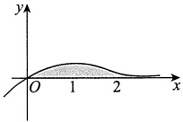

所求体积为

$$\begin{align*}V=&\int_{0}^{+\infty}2\pi xy(x)\mathrm{d}x=2\pi\int_{0}^{+\infty}x^{2}\mathrm{e}^{-x}\mathrm{d}x=-2\pi\int_{0}^{+\infty}x^{2}\mathrm{d}(\mathrm{e}^{-x})\\=&-2\pi x^{2}\mathrm{e}^{-x}\Big|_{0}^{+\infty}+4\pi\int_{0}^{+\infty}x\mathrm{e}^{-x}\mathrm{d}x=4\pi.\end{align*}$$

#### 5.

【答案】$\frac{\sqrt{2}}{60}\pi$

【解析】$y=\sqrt{x}$与$y=x^{2}(x\geqslant0)$互为反函数，两个函数的图像关于直线 y=x 对称，故只需计算其中一条曲线段绕 y=x 旋转一周所得旋转体的体积即可.

取曲线$y=x^{2}$进行计算：

$$\begin{aligned}V&\xrightarrow{(*)}\frac{\pi}{(1+1)^{\frac{3}{2}}}\int_{0}^{1}(x-x^{2})^{2}\left|2x+1\right|\mathrm{d}x\\&=\frac{\pi}{2\sqrt{2}}\int_{0}^{1}(2x^{5}-3x^{4}+x^{2})\mathrm{d}x\\&=\frac{\pi}{2\sqrt{2}}\left(2\times\frac{1}{6}-3\times\frac{1}{5}+\frac{1}{3}\right)=\frac{\sqrt{2}}{60}\pi.\end{aligned}$$

【注】(*)处来源于以下结论(见《考研数学基础30讲·高等数学分册》).

设平面曲线$L: y = f(x)$，$a \leq x \leq b$，且$f(x)$可导.

定直线$L_{0}: Ax + By + C = 0$，且过$L_{0}$的任一条垂线与 L 至多有一个交点，如图所示，则 L 绕$L_{0}$旋转一周所得旋转体的体积为

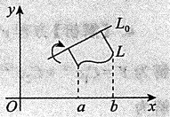

$$V=\frac{\pi}{(A^{2}+B^{2})^{\frac{3}{2}}}\int_{a}^{b}[Ax+Bf(x)+C]^{2}\left|Af^{\prime}(x)-B\right|\mathrm{d}x$$

#### 6.

【解析】设切点坐标为$P(x_{0},y_{0})$，于是曲线$y=e^{x}$在点P处的切线斜率为$y'(x_{0})=e^{x_{0}}$，切线方程为$y-y_{0}=e^{x_{0}}(x-x_{0})$。

因为它经过点$O(0,0)$，所以$-y_{0} = -x_{0}e^{x_{0}}$。又因$y_{0} = e^{x_{0}}$，代入求得$x_{0} = 1$，从而$y_{0} = e^{x_{0}} = e$，切线方程为 y = ex，如图所示。

(1) D 的面积为

$$S=\int_{-\infty}^{0}\mathrm{e}^{x}\mathrm{d}x+\int_{0}^{1}(\mathrm{e}^{x}-\mathrm{e}x)\mathrm{d}x=\mathrm{e}^{x}\bigg|_{-\infty}^{0}+\left(\mathrm{e}^{x}-\frac{\mathrm{e}}{2}x^{2}\right)\bigg|_{0}^{1}=\frac{\mathrm{e}}{2}.$$

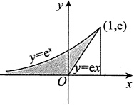

(2) D 绕直线 x=1 旋转一周所成旋转体的体积微元为

$$\mathrm{d}V=\left[\pi(1-\ln y)^{2}-\pi\left(1-\frac{y}{\mathrm{e}}\right)^{2}\right]\mathrm{d}y,$$

从而

$$V=\pi\int_{0}^{\mathrm{e}}\left(\ln^{2}y-2\ln y+\frac{2y}{\mathrm{e}}-\frac{y^{2}}{\mathrm{e}^{2}}\right)\mathrm{d}y=\frac{5}{3}\pi\mathrm{e}.$$

#### 7.

【解析】$y = e^{-\frac{x}{2}} \sqrt{\sin x}$，$x \in [2k\pi, (2k+1)\pi]$，$k=0,1,2,\cdots$，体积$V = \sum_{k=0}^{\infty} V_{k}$，其中

$$\begin{aligned}V_{k}=&\int_{2k\pi}^{(2k+1)\pi}\pi y^{2}\mathrm{d}x=\int_{2k\pi}^{(2k+1)\pi}\pi\mathrm{e}^{-x}\sin x\mathrm{d}x\\ =&\frac{1}{2}\pi(1+\mathrm{e}^{-\pi})\mathrm{e}^{-2k\pi},k=0,1,2,\cdots,\end{aligned}$$

故

$$\begin{array}{c}{\displaystyle V=\sum_{k=0}^{\infty}\frac{1}{2}\pi(1+\mathrm{e}^{-\pi})\mathrm{e}^{-2k\pi}=\frac{1}{2}\pi(1+\mathrm{e}^{-\pi})\sum_{k=0}^{\infty}\mathrm{e}^{-2k\pi}}\\ {\displaystyle\qquad\quad\stackrel{(*)}{=}\frac{1}{2}\pi(1+\mathrm{e}^{-\pi})\frac{1}{1-\mathrm{e}^{-2\pi}}=\frac{\pi}{2(1-\mathrm{e}^{-\pi})},}\end{array}$$

其中$(*)$处来自无穷递缩等比数列求和公式：$\frac{首项}{1-公比}$（$|公比|<1$）.

#### 8.

【解析】$y=ax^{2}(x\geqslant0)$与$y=1-x^{2}$的交点为$A\left(\frac{1}{\sqrt{1+a}},\frac{a}{1+a}\right)$.直线OA的方程为$y=\frac{a}{\sqrt{1+a}}x$.

(1)旋转体体积

$$V(a)=\pi\int_{0}^{\frac{1}{\sqrt{1+a}}}\left(\frac{a^{2}}{1+a}x^{2}-a^{2}x^{4}\right)\mathrm{d}x=\frac{2\pi a^{2}}{15(1+a)^{\frac{5}{2}}}\;.$$

$$\frac{\mathrm{d}\left[V(a)\right]}{\mathrm{d}a}=\frac{2\pi}{15}\cdot\frac{2a(1+a)^{\frac{5}{2}}-a^{2}\cdot\frac{5}{2}(1+a)^{\frac{3}{2}}}{(1+a)^{5}}=\frac{\pi(4a-a^{2})}{15(1+a)^{\frac{7}{2}}}$$

由 a > 0，得$V(a)$的唯一驻点 a = 4。当 0 < a < 4 时，$V'(a) > 0$，当 a > 4 时，$V'(a) < 0$。故 a = 4 为$V(a)$的唯一极大值点，为最大值点。

#### 9.

【解析】在$x\neq0$处，$\left[\frac{f(x)}{x}\right]^{\prime}=\frac{xf^{\prime}(x)-f(x)}{x^{2}}=1$，结合连续性得

$$f(x)=x^{2}+C x(x\in\left[0,1\right]),$$

故$\int_{0}^{1}\left|x^{2}+Cx\right|dx=2$

当$C \geqslant 0$时，解得$C = \frac{10}{3}$，则$f(x) = x^{2} + \frac{10}{3}x$，从而$V = \int_{0}^{1} \pi f^{2}(x) \, dx = \frac{752}{135}\pi$；

当-1<C<0时，不符合题意；

当$C \leq -1$时，解得$C = -\frac{14}{3}$，则$f(x) = x^2 - \frac{14}{3}x$，从而$V = \int_0^1 \pi f^2(x) \, dx = \frac{692}{135} \pi$。

综上，共有两组符合题意的解.

#### 10.

【答案】$\frac{e^{2}+1}{2(e^{2}-1)}$

【解析】区间$\left[k,k+1\right]$(k=0,1,2,$\cdots$)上的阴影面积等于矩形面积减去曲边梯形的面积，即

$$\mathbf{e}^{-2k}-\int_{k}^{k+1}\mathbf{e}^{-2x}\mathrm{d}x=\mathbf{e}^{-2k}+\frac{1}{2}\mathbf{e}^{-2x}\bigg|_{k}^{k+1}=\mathbf{e}^{-2k}+\frac{1}{2}\mathbf{e}^{-2k-2}-\frac{1}{2}\mathbf{e}^{-2k}=\left(\frac{1}{2}+\frac{1}{2\mathbf{e}^{2}}\right)\mathbf{e}^{-2k},$$

而$\sum_{k=0}^{\infty}e^{-2k}=\frac{1}{1-e^{-2}}$，故$S=\left(\frac{1}{2}+\frac{1}{2e^{2}}\right)\frac{1}{1-e^{-2}}=\frac{e^{2}+1}{2e^{2}}\cdot\frac{e^{2}}{e^{2}-1}=\frac{e^{2}+1}{2(e^{2}-1)}$.

#### 11.

【解析】解题干给的一阶线性微分方程，有

$$\begin{aligned}y=&\mathrm{e}^{-\int p\mathrm{d}x}\Biggl(\int\mathrm{e}^{\int p\mathrm{d}x}q\mathrm{d}x+C\Biggr)\\=&\mathrm{e}^{-x}\Biggl(\int\mathrm{e}^{x}\frac{\mathrm{e}^{-x}\cos x}{2\sqrt{\sin x}}\mathrm{d}x+C\Biggr)=\mathrm{e}^{-x}\left(\int\frac{\cos x}{2\sqrt{\sin x}}\mathrm{d}x+C\right)\\=&\mathrm{e}^{-x}\left[\int\frac{\mathrm{d}(\sin x)}{2\sqrt{\sin x}}+C\right]=\mathrm{e}^{-x}(\sqrt{\sin x}+C),\end{aligned}$$

又$f(\pi)=\mathrm{e}^{-\pi}\cdot C=0$，故C=0，得

$$f(x)=\mathrm{e}^{-x}\sqrt{\sin x}(x\geqslant0).$$
故旋转体体积为

$$\begin{aligned}V=&\sum_{n=0}^{\infty}\pi\int_{2n\pi}^{(2n+1)\pi}\mathrm{e}^{-2x}\sin x\mathrm{d}x=\sum_{n=0}^{\infty}\pi\frac{\left|(\mathrm{e}^{-2x})^{\prime}\quad(\sin x)^{\prime}\right.}{\left.(-2)^{2}+1^{2}\right.}\left|\begin{matrix}(2n+1)\pi\\ 2n\pi\end{matrix}\right.\\=&\frac{\pi}{5}\sum_{n=0}^{\infty}(-2\sin x-\cos x)\mathrm{e}^{-2x}\Bigg|_{2n\pi}^{(2n+1)\pi}=\frac{\pi}{5}\sum_{n=0}^{\infty}(\mathrm{e}^{-4n\pi}\bullet\mathrm{e}^{-2\pi}+\mathrm{e}^{-4n\pi})\\=&\frac{\pi(1+\mathrm{e}^{-2\pi})}{5}\sum_{n=0}^{\infty}\mathrm{e}^{-4n\pi}=\frac{\pi(1+\mathrm{e}^{-2\pi})}{5}\bullet\frac{1}{1-\mathrm{e}^{-4\pi}}=\frac{\pi}{5(1-\mathrm{e}^{-2\pi})}.\end{aligned}$$

#### 12.

【解析】令$x^{2}-t^{2}=u$，则

$$\begin{array}{c}{\displaystyle\int_{0}^{x}t f(x^{2})f(x^{2}-t^{2})\mathrm{d}t=f(x^{2})\left[-\frac{1}{2}\int_{x^{2}}^{0}f(u)\mathrm{d}u\right]}\\ {\displaystyle}\\ {\displaystyle=2f(x^{2})\int_{0}^{x^{2}}f(u)\mathrm{d}u,}\\ \end{array}$$

于是有$f(x^2)\int_0^{x^2}f(u)du=2\sin^2x^2$，再令$x^2=v$，有$f(v)\int_0^v f(u)du=2\sin^2v$。

又令$F(v)=\int_{0}^{v}f(u)du$，$F(0)=0$，于是

$$F(v)F^{\prime}(v)=2\sin^{2}v,$$

上式在$[0,\pi]$上对v作积分，有

$$\begin{align*}\int_{0}^{\pi}F(v)F^{\prime}(v)\mathrm{d}v=&\int_{0}^{\pi}F(v)\mathrm{d}\left[F(v)\right]\\=&\frac{1}{2}\left.F^{2}(v)\right|_{0}^{\pi}=2\int_{0}^{\pi}\sin^{2}v\mathrm{d}v=\pi,\end{align*}$$

故$F(\pi)=\sqrt{2\pi}$，则$f(x)$在$[0,\pi]$上的平均值为$\frac{1}{\pi}\int_{0}^{\pi}f(x)dx=\sqrt{\frac{2}{\pi}}$

【注】①连续函数$f(x)$的一个原函数表达形式常写为$F(x)=\int_{0}^{x}f(u)\mathrm{d}u$，考生须熟知。见到$f(x)\int_{0}^{x}f(u)\mathrm{d}u$，一般令$F(x)=\int_{0}^{x}f(u)\mathrm{d}u$，这样便有$F'(x)=f(x)$，即得$F'(x)F(x)$，于是$\int F'(x)F(x)\mathrm{d}x=\int F(x)\mathrm{d}\left[F(x)\right]=\frac{1}{2}F^{2}(x)+C$，此思路非常重要。

②平均值是考研重点.

#### 13.

【答案】$\frac{1}{e+1}$

【解析】由题可知，$f(x)=\left(\frac{1}{1+e^{\frac{1}{x}}}\right)^{\prime}$，故

$$\begin{aligned}\overline{f}=&\frac{1}{2}\int_{-1}^{1}\left(\frac{1}{1+\mathbf{e}^{\frac{1}{x}}}\right)^{\prime}\mathrm{d}x=\frac{1}{2}\int_{-1}^{0}\left(\frac{1}{1+\mathbf{e}^{\frac{1}{x}}}\right)^{\prime}\mathrm{d}x+\frac{1}{2}\int_{0}^{1}\left(\frac{1}{1+\mathbf{e}^{\frac{1}{x}}}\right)^{\prime}\mathrm{d}x\\=&\frac{1}{2}\frac{1}{1+\mathbf{e}^{\frac{1}{x}}}\bigg|_{-1}^{0^{+}}+\frac{1}{2}\frac{1}{1+\mathbf{e}^{\frac{1}{x}}}\bigg|_{0^{+}}^{1}=\frac{1}{2}\left(1-\frac{\mathbf{e}}{\mathbf{e}+1}\right)+\frac{1}{2}\left(\frac{1}{\mathbf{e}+1}-0\right)=\frac{1}{\mathbf{e}+1}\;.\end{aligned}$$

【注】若$f(x)$在$[a,b]$上除点$c\in(a,b)$外均连续，c为其间断点，$F(x)$是$f(x)$在$[a,c)$与$(c,b]$上的原函数，则$\int_{a}^{b}f(x)\mathrm{d}x=F(x)\big|_{a}^{c}-F(x)\big|_{c^{+}}^{b}$。若$\lim_{x\to c^{-}}F(x)$与$\lim_{x\to c^{+}}F(x)$均存在，则$\int_{a}^{b}f(x)\mathrm{d}x$存在。

#### 14.

【答案】$-\frac{2}{\pi}$

【解析】由题可知，$f(x)=\int_{a}^{x}\frac{\sin\pi t}{t}\mathrm{d}t$，且$t\in(0,1)$，于是$a$与$x$均属于$[0,1]$。当$t\in(0,1)$时，$\frac{\sin\pi t}{t}>0$，故要使$f(1)=0$，则$f(1)$上下限必相等，即$a=1$，故$f(x)=\int_{1}^{x}\frac{\sin\pi t}{t}\mathrm{d}t$，可得$f(x)$在区间$[0,1]$上的平均值为

$$\begin{aligned}\frac{1}{1-0}\int_{0}^{1}f(x)\mathrm{d}x=&\int_{0}^{1}\mathrm{d}x\int_{1}^{x}\frac{\sin\pi t}{t}\mathrm{d}t=-\int_{0}^{1}\mathrm{d}t\int_{0}^{t}\frac{\sin\pi t}{t}\mathrm{d}x\\=&-\int_{0}^{1}\sin\pi t\mathrm{d}t=-\frac{2}{\pi},\end{aligned}$$

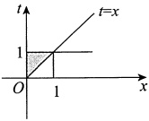

积分区域如图所示.

#### 15.

【答案】2

【解析】因为$\int_{0}^{1}f(xt)dt\xrightarrow{tx=u}\frac{1}{x}\int_{0}^{x}f(u)du$，所以原方程等价于$f(x)\int_{0}^{x}f(u)du=2x^{3}$

令$\int_{0}^{x}f(u)\mathrm{d}u=F(x)$，则原方程又等价于$F'(x)F(x)=2x^{3}$，两边积分，得$F^{2}(x)=x^{4}+C$。由于$F(0)=0$，故$F^{2}(x)=x^{4}$，即$\left[\int_{0}^{x}f(u)\mathrm{d}u\right]^{2}=x^{4}$。令x=2，并注意到$f(x)$非负，得$\int_{0}^{2}f(u)\mathrm{d}u=4$。因此，
函数$f(x)$在$[0,2]$上的平均值为$\frac{1}{2-0}\int_{0}^{2}f(u)du=2$.

#### 16.

【答案】4

【解析】令$x(t-1)=u$，则$\int_{1}^{x}f(xt-x)dt=\frac{1}{x}\int_{0}^{x}f(u)du$，所以$f(x)\int_{0}^{x}f(u)du=2x^{3}$。记$F(x)=\int_{0}^{x}f(u)du$，$F'(x)=f(x)\geq0$，则$F(x)$是$[0,3]$上单调不减的可导函数，满足$\frac{d}{dx}\left[F^{2}(x)\right]=4x^{3}$，所以$F^{2}(x)=x^{4}+C$。因为$F(0)=0$，所以$C=0$，$F(x)=x^{2}$。于是，$f(x)$在区间$[1,3]$上的平均值为

$$\frac{1}{3-1}\int_{1}^{3}f(x)\mathrm{d}x=\frac{1}{2}\left[F(3)-F(1)\right]=\frac{1}{2}\left(9-1\right)=4.$$

#### 17.

【答案】$\frac{1}{3\pi}$

【解析】$f(x)$在区间$\left[0,\frac{3\pi}{2}\right]$上的平均值为

$$\begin{aligned}\overline{f}=&\frac{2}{3\pi}\int_{0}^{\frac{3\pi}{2}}f(x)\mathrm{d}x=\frac{2}{3\pi}\int_{0}^{\frac{3\pi}{2}}\left(\int_{0}^{x}\frac{\cos t}{2t-3\pi}\mathrm{d}t\right)\mathrm{d}x\\=&\frac{2}{3\pi}\int_{0}^{\frac{3\pi}{2}}\mathrm{d}t\int_{t}^{\frac{3\pi}{2}}\frac{\cos t}{2t-3\pi}\mathrm{d}x=-\frac{1}{3\pi}\int_{0}^{\frac{3\pi}{2}}\cos t\mathrm{d}t=\frac{1}{3\pi},\end{aligned}$$

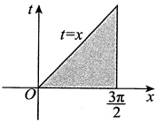

积分区域如图所示.

#### 18.

【分析】因被积函数$t|t|$是奇函数，故$f(x)$是偶函数。由$f'(x)$的符号知，曲线$y=f(x)$与x轴只有两个交点，再由定积分的几何意义，即可求出封闭图形的面积。

【解析】由$t\left|t\right|$为奇函数知，其原函数$f(x)=\int_{-1}^{x}t\left|t\right|\mathrm{d}t$为偶函数，而$f(-1)=0, f(1)=0$，即曲线$y=f(x)$与 x 轴的交点为$(-1,0)$，$(1,0)$.

当x<0时，$f'(x)=x|x|<0$，故$f(x)$单调减少，从而当-1<x<0时，$f(x)<f(-1)=0$。

当 x>0 时，$f'(x)=x|x|>0$，故$f(x)$单调增加，从而当 x>1 时，$f(x)>f(1)=0$，因此曲线$y=f(x)$与 x 轴的交点只有两个.

当x<0时，$f(x)=\int_{-1}^{x}t\left|t\right|\mathrm{d}t=\int_{-1}^{x}(-t^{2})\mathrm{d}t=-\frac{1}{3}(1+x^{3})$，故所求图形的面积为

$$\int_{-1}^{1}f(x)\mathrm{d}x=2\left|\int_{-1}^{0}f(x)\mathrm{d}x\right|=2\left|\int_{-1}^{0}\frac{-1}{3}(1+x^{3})\mathrm{d}x\right|=\frac{1}{2}$$

#### 19.

【解析】由$f'(x)=2\sqrt{f(x)}$，有$\int\frac{\mathrm{d}[f(x)]}{2\sqrt{f(x)}}=\int\mathrm{d}x$，得$\sqrt{f(x)}=x+C_1$，因$f(0)=1$，则$C_1=1$，故$f(x)=(x+1)^2$。

由$g'(x)=\frac{g(x)}{x-2}+\frac{x-2}{x}$，有

$$\begin{aligned}g(x)&=\mathrm{e}^{\int\frac{1}{x-2}\mathrm{d}x}\left(\int\mathrm{e}^{-\int\frac{1}{x-2}\mathrm{d}x}\bullet\frac{x-2}{x}\mathrm{d}x+C_{2}\right)\\&=(x-2)\left(\int\frac{1}{x}\mathrm{d}x+C_{2}\right)=(x-2)(\ln x+C_{2})．\end{aligned}$$

又因$g(1)=0$，有$C_{2}=0$，故$g(x)=(x-2)\ln x$。

因此，曲线方程为$(x+1)^{2}=(2-y)\ln y(1\leq y<2)$，其绕 x=-1 旋转一周所得旋转体体积为

$$V=\pi\int_{1}^{2}(x+1)^{2}\mathrm{d}y=\pi\int_{1}^{2}(2-y)\ln y\mathrm{d}y=\left(2\ln2-\frac{5}{4}\right)\pi.$$

#### 20.

【解析】先求切线方程，由$\sqrt{x}+\sqrt{y}=1$，两边对x求导，得

$$\frac{1}{2\sqrt{x}}+\frac{1}{2\sqrt{y}}\ y^{\prime}=0\ ,\ y^{\prime}=-\frac{\sqrt{y}}{\sqrt{x}}=1-\frac{1}{\sqrt{x}}\ .$$

故在 x=a 处的切线方程为$y-(1-\sqrt{a})^{2}=\left(1-\frac{1}{\sqrt{a}}\right)(x-a)$.

切线与两坐标轴的交点坐标为$A(\sqrt{a},0)$，$B(0,1-\sqrt{a})$，如图所示。

由圆锥体的体积公式可得

$$V_{y}=\frac{\pi}{3}\left(\sqrt{a}\right)^{2}(1-\sqrt{a})=\frac{\pi}{3}\left(a-a^{\frac{3}{2}}\right),$$

$$V_{y}^{\prime}=\frac{\pi}{3}\left(1-\frac{3}{2}a^{\frac{1}{2}}\right),$$

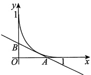

令$V_y' = 0$，得$a = \frac{4}{9}$。又$V_y'' = -\frac{\pi}{4}a^{-\frac{1}{2}} < 0$，所以$a = \frac{4}{9}$为极大值点，也是最大值点，即当$a = \frac{4}{9}$时，旋转体的体积$V_y$最大。

【注】对于这一类问题，大部分考生忘记可以用圆锥体的体积公式来计算旋转体的体积，而用定积分来求，这样要麻烦得多。

$$\begin{array}{l}V_{y}=2\pi\displaystyle\int_{0}^{\sqrt{a}}x(1-\sqrt{a})\left(1-\frac{x}{\sqrt{a}}\right)\mathrm{d}x=2\pi(1-\sqrt{a})\left(\frac{x^{2}}{2}-\frac{x^{3}}{3\sqrt{a}}\right)\bigg|_{0}^{\sqrt{a}}\\=2\pi(1-\sqrt{a})\frac{a}{6}=\frac{\pi}{3}\left(a-a^{\frac{3}{2}}\right).\end{array}$$

若用公式$V_{y}=\pi\int_{0}^{1-\sqrt{a}}\left[x(y)\right]^{2}dy$，计算更烦琐.
#### 21.

【解析】(1)由题意知，$\mathrm{d}y=\frac{4y^{3}}{4-y^{6}}\mathrm{d}x$，$\frac{\mathrm{d}x}{\mathrm{d}y}=\frac{4-y^{6}}{4y^{3}}=\frac{1}{y^{3}}-\frac{1}{4}y^{3}$，$-2\leqslant y\leqslant-1$．故

$$\begin{aligned}\sqrt{1+\left(\frac{\mathrm{d}x}{\mathrm{d}y}\right)^{2}}=&\sqrt{1+\left(\frac{1}{y^{3}}-\frac{1}{4}y^{3}\right)^{2}}=\sqrt{\left(\frac{1}{y^{3}}+\frac{1}{4}y^{3}\right)^{2}}\\=&-\left(\frac{1}{y^{3}}+\frac{1}{4}y^{3}\right),-2\leqslant y\leqslant-1,\end{aligned}$$

则

$$\begin{aligned}s=&\int_{-2}^{-1}\sqrt{1+\left(\frac{\mathrm{d}x}{\mathrm{d}y}\right)^{2}}\mathrm{d}y=-\int_{-2}^{-1}\left(\frac{1}{y^{3}}+\frac{1}{4}y^{3}\right)\mathrm{d}y\\=&\left(\frac{1}{2y^{2}}-\frac{1}{16}y^{4}\right)\Bigg|_{-2}^{-1}=\frac{1}{2}-\frac{1}{16}-\frac{1}{8}+1=\frac{21}{16}\ .\end{aligned}$$

(2) 由(1)知，$x = \int\left(\frac{1}{y^3} - \frac{1}{4} y^3\right) \mathrm{d}y = -\frac{1}{2y^2} - \frac{1}{16} y^4 + C$，且$x(-1) = -\frac{9}{16} + C = -\frac{9}{16}$，则 C = 0，故$x = -\frac{1}{2y^2} - \frac{1}{16} y^4$。

当$\frac{dx}{dy}=0$时，$y^6=4$，得$y=-\sqrt[6]{4}$。当$-2\leq y<-\sqrt[6]{4}$时，$\frac{dx}{dy}>0$，当$-\sqrt[6]{4}<y\leq-1$时，$\frac{dx}{dy}<0$。故$y=-\sqrt[6]{4}$为最大值点，最大值为$x_{\max} = -\frac{3}{4}$。

#### 22.

【解析】(1)$y'+\frac{t^{2}}{y}x^{3}=\frac{y}{x}$整理为$y'-\frac{1}{x}y=-t^{2}x^{3}y^{-1}$，由$z=y^{2}$，得$\frac{1}{2}\frac{dz}{dx}-\frac{z}{x}=-t^{2}x^{3}$，即

$$\frac{\mathrm{d}z}{\mathrm{d}x}-\frac{2}{x}z=-2t^{2}x^{3},$$

根据一阶线性微分方程的求解公式，解得

$$z=\mathrm{e}^{\int\limits_{x}^{\frac{2}{x}}\mathrm{d}x}\left(-2\int\mathrm{e}^{-\int\limits_{x}^{\frac{2}{x}}\mathrm{d}x}t^{2}x^{3}\mathrm{d}x+C\right)=x^{2}(-x^{2}t^{2}+C),$$

即$y^{2}=x^{2}(-x^{2}t^{2}+C)$，根据初始条件$y(1)=\sqrt{9-t^{2}}$，可得 C=9。故$y=x\sqrt{9-x^{2}t^{2}}$。

(2)由(1)得

$$f(x)=\frac{1}{9}\int_{0}^{3}y(x)\mathrm{d}t=\frac{1}{9}\int_{0}^{3}x\sqrt{9-x^{2}t^{2}}\mathrm{d}t.$$

由于$y(0)=f(0)=0$，x=0对应的点$(0,0)$在曲线上，且要求$9-x^{2}t^{2}\geq0$，其中$0\leq t\leq3$，故曲线$y=f(x)$在$0\leq x\leq1$上存在.

于是

$$y=f(x)=\frac{1}{9}\int_{0}^{3}x\sqrt{9-x^{2}t^{2}}\mathrm{d}t\xrightarrow{xt=u}\frac{1}{9}\int_{0}^{3x}\sqrt{9-u^{2}}\mathrm{d}u,$$

则

$$f^{\prime}(x)=\frac{1}{9}\sqrt{9-9x^{2}}\bullet3=\sqrt{1-x^{2}},$$

故所求曲线全长为

$$\begin{aligned}&s=\int_{0}^{1}\sqrt{1+[f^{\prime}(x)]^{2}}\mathrm{d}x=\int_{0}^{1}\sqrt{2-x^{2}}\mathrm{d}x\\ &\quad\underline{\underline{x=\sqrt{2}\sin t}}\int_{0}^{\frac{\pi}{4}}\sqrt{2-2\sin^{2}t}\bullet\sqrt{2}\cos t\mathrm{d}t=2\int_{0}^{\frac{\pi}{4}}\cos^{2}t\mathrm{d}t=\frac{\pi}{4}+\frac{1}{2}.\\ \end{aligned}$$

#### 23.

【解析】由$2yy' = \cos x$分离变量，得$2ydy = \cos xdx$，两边积分，得$y^2 = \sin x + C$，又$y(0) = 0$，有 C = 0，且$y(x)$非负，故$y(x) = \sqrt{\sin x}$。于是

$$f_{n}(x)=n\int_{0}^{\frac{x}{n}}\sqrt{\sin t}\mathrm{d}t\ ,f_{n}^{\prime}(x)=\sqrt{\sin\frac{x}{n}}\ .$$

根据弧长计算公式，得

$$\begin{aligned}s_{n}=&\int_{0}^{n\pi}\sqrt{1+\left[f_{n}^{\prime}(x)\right]^{2}}\mathrm{d}x=\int_{0}^{n\pi}\sqrt{1+\sin\frac{x}{n}}\mathrm{d}x\\=&\int_{0}^{n\pi}\sqrt{\left(\sin\frac{x}{2n}+\cos\frac{x}{2n}\right)^{2}}\mathrm{d}x=\int_{0}^{n\pi}\left(\sin\frac{x}{2n}+\cos\frac{x}{2n}\right)\mathrm{d}x\\\overset{ 令 \frac{x}{2n}=u}{=}&\quad2n\int_{0}^{\frac{\pi}{2}}(\sin u+\cos u)\mathrm{d}u=2n(1+1)=4n.\end{aligned}$$

#### 24.

【解析】由$\bar{x}=\frac{\int_{0}^{a}xf(x)dx}{\int_{0}^{a}f(x)dx}>\frac{2}{3}a$，将 a 变量化为 x，令$F(x)=\int_{0}^{x}tf(t)dt-\frac{2x}{3}\int_{0}^{x}f(t)dt$，则有$F(0)=0$。又对任意$x\in(0,a)$，有

$$\begin{align*}F^{\prime}(x)&=xf(x)-\frac{2}{3}\int_{0}^{x}f(t)\mathrm{d}t-\frac{2}{3}xf(x)\\&=\frac{1}{3}xf(x)-\frac{2}{3}\int_{0}^{x}f(t)\mathrm{d}t,\end{align*}$$

$$\begin{aligned}F^{\prime \prime}(x)=&\frac{1}{3}f(x)+\frac{1}{3}xf^{\prime}(x)-\frac{2}{3}f(x)=\frac{1}{3}xf^{\prime}(x)-\frac{1}{3}f(x)\\=&\frac{1}{3}x\left[f^{\prime}(x)-f^{\prime}(\xi)\right](0<\xi<x).\end{aligned}$$

因为$f''(x)>0$，所以$f'(x)>f'(\xi)$，于是$F''(x)>0$，从而$F'(x)$在区间$[0,a]$上单调增加，因此当$0<x\leq a$时，有$F'(x)>F'(0)=0$，故$F(x)$在区间$[0,a]$上单调增加，$F(a)>F(0)=0$。所以
$$\int_{0}^{a}xf(x)\mathrm{d}x-\frac{2a}{3}\int_{0}^{a}f(x)\mathrm{d}x>0, 即 \overline{x}>\frac{2a}{3}.$$

#### 25.

【解析】由题设知，围成的平面图形如图所示，由对称性，所求旋转体的体积为

$$\begin{array}{c}V=2\displaystyle\int_{0}^{\pi a}\pi y^{2}\mathrm{d}x=2\pi a^{3}\displaystyle\int_{0}^{\pi}(1-\cos t)^{3}\mathrm{d}t=16\pi a^{3}\displaystyle\int_{0}^{\pi}\sin^{6}\frac{t}{2}\mathrm{d}t\\\displaystyle\frac{t=2u}{32\pi a^{3}\displaystyle\int_{0}^{\frac{\pi}{2}}\sin^{6}u\mathrm{d}u}=32\pi a^{3}\cdot\frac{5}{6}\cdot\frac{3}{4}\cdot\frac{1}{2}\cdot\frac{\pi}{2}=5\pi^{2}a^{3}.\end{array}$$

由对称性，所求旋转体的表面积为

$$\begin{aligned}S&=4\pi\int_{0}^{\pi}y(t)\sqrt{\left[x^{\prime}(t)\right]^{2}+\left[y^{\prime}(t)\right]^{2}}\mathrm{d}t=4\pi\int_{0}^{\pi}a(1-\cos t)\sqrt{\left[a(1-\cos t)\right]^{2}+(a\sin t)^{2}}\mathrm{d}t\\&=4\pi a^{2}\int_{0}^{\pi}(1-\cos t)\sqrt{2(1-\cos t)}\mathrm{d}t=16\pi a^{2}\int_{0}^{\pi}\sin^{3}\frac{t}{2}\mathrm{d}t\\&\xrightarrow{t=2u}32\pi a^{2}\int_{0}^{\frac{\pi}{2}}\sin^{3}u\mathrm{d}u=32\pi a^{2}\cdot\frac{2}{3}\cdot1=\frac{64}{3}\pi a^{2}.\\ \end{aligned}$$

#### 26.

【解析】摆线一拱弧长

$$\begin{aligned}s=&\int_{0}^{2\pi}\sqrt{\left[x^{\prime}(t)\right]^{2}+\left[y^{\prime}(t)\right]^{2}}\mathrm{d}t=a\int_{0}^{2\pi}\sqrt{(1-\cos t)^{2}+(\sin t)^{2}}\mathrm{d}t\\=&2a\int_{0}^{2\pi}\sin\frac{t}{2}\mathrm{d}t=-4a\cos\frac{t}{2}\bigg|_{0}^{2\pi}=8a.\end{aligned}$$

摆线一拱绕x轴旋转一周所形成的旋转曲面面积为

$$\begin{aligned}S&=2\pi\int_{0}^{2\pi}\left|y(t)\right|\sqrt{\left[x^{\prime}(t)\right]^{2}+\left[y^{\prime}(t)\right]^{2}}\mathrm{d}t\\&=2\pi\int_{0}^{2\pi}a^{2}(1-\cos t)\sqrt{(1-\cos t)^{2}+(\sin t)^{2}}\mathrm{d}t\\&=8\pi a^{2}\int_{0}^{2\pi}\sin^{3}\frac{t}{2}\mathrm{d}t=8\pi a^{2}\int_{0}^{2\pi}\left(1-\cos^{2}\frac{t}{2}\right)\sin\frac{t}{2}\mathrm{d}t=\frac{64}{3}\pi a^{2}.\end{aligned}$$

按题意，$\frac{64}{3}\pi a^{2}=8a$，所以$a=\frac{3}{8\pi}$
### 第11章 一元函数积分学的应用（二）——积分等式与积分不等式

#### 1.

【答案】(B)

【解析】对于“$f'(x)+f^{2}(x)$”，用逆向思维，化归经典形式.

令$F(x) = f(x) \mathrm{e}^{\int_{0}^{x} f(t) \, \mathrm{d}t}$，则

$$F^{\prime}(x)=\mathrm{e}^{\int_{0}^{x}f(t)\mathrm{d}t}[f^{\prime}(x)+f^{2}(x)]\geqslant0,$$

于是$F(x)$在$[0,1]$上单调增加，故有$F(1) \geq F(0)$，则有$f(1) \mathrm{e}^{\int_{0}^{1} f(x) \mathrm{d}x} \geq f(0)$，又因为$f(0) > 0$，$\mathrm{e}^{\int_{0}^{1} f(x) \mathrm{d}x} > 0$，可知$f(1) > 0$，进而可得$\mathrm{e}^{\int_{0}^{1} f(x) \mathrm{d}x} \geq \frac{f(0)}{f(1)}$，即$\int_{0}^{1} f(x) \mathrm{d}x \geq \ln \frac{f(0)}{f(1)}$。故选(B)。

#### 2.

【解析】
$$\begin{aligned}\int_{0}^{1}\left[\int_{x^{2}}^{\sqrt{x}}f(t)\mathrm{d}t\right]\mathrm{d}x&\xrightarrow{ 分部积分 }\left[\left.x\int_{x^{2}}^{\sqrt{x}}f(t)\mathrm{d}t\right.\right]\bigg|_{0}^{1}-\int_{0}^{1}x\mathrm{d}\left[\int_{x^{2}}^{\sqrt{x}}f(t)\mathrm{d}t\right]\\&=\int_{0}^{1}x f(x^{2})\mathrm{d}(x^{2})-\int_{0}^{1}x f(\sqrt{x})\mathrm{d}(\sqrt{x})\\&\xrightarrow{u=x^{2},v=\sqrt{x}}\int_{0}^{1}\sqrt{u}f(u)\mathrm{d}u-\int_{0}^{1}v^{2}f(v)\mathrm{d}v\\&=\int_{0}^{1}(\sqrt{x}-x^{2})f(x)\mathrm{d}x.\end{aligned}$$

#### 3.

【答案】(C)

【解析】令$F(x)=f(x)-x-1$，$x\in[0,1)$，则$F'(x)=f'(x)-1\leq0$。

又$F(0)=0$，故$F(x)<F(0)=0(0<x<1)$，则$f(x)<x+1(0<x<1)$。

同理，可得当 0 < x < 1 时，$f(x) > 1 - x$，$f(x) > x$，$f(x) < 2 - x$，所以曲线$f(x)$在 y = x，y = x + 1，y = -x + 1，y = -x + 2 所围正方形内，如图所示.

由图可知，正方形 ABCO 面积$S_{1}=1$，三角形 ABE 面积$S_{2}=\frac{1}{4}=S_{3}$（三角形 ABD 面积）。故

$$S_{1}-S_{3}<\int_{0}^{1}f(x)\mathrm{d}x<S_{1}+S_{2},$$

即

$$\frac{3}{4}<\int_{0}^{1}f(x)\mathrm{d}x<\frac{5}{4}.$$
#### 4.

【解析】

$$\begin{aligned}\int_{0}^{1}\left(\int_{x}^{\sqrt{x}}\frac{\sin t}{t}\mathrm{d}t\right)\mathrm{d}x&\xrightarrow{ 分部积分 }\left(x\int_{x}^{\sqrt{x}}\frac{\sin t}{t}\mathrm{d}t\right)\bigg|_{0}^{1}-\int_{0}^{1}x\mathrm{d}\left(\int_{x}^{\sqrt{x}}\frac{\sin t}{t}\mathrm{d}t\right)\\&=-\int_{0}^{1}x\left(\frac{\sin\sqrt{x}}{\sqrt{x}}\cdot\frac{1}{2\sqrt{x}}-\frac{\sin x}{x}\right)\mathrm{d}x=\int_{0}^{1}\left(\sin x-\frac{\sin\sqrt{x}}{2}\right)\mathrm{d}x\\&\xrightarrow{t=\sqrt{x}}-\int_{0}^{1}t\sin t\mathrm{d}t+\int_{0}^{1}\sin x\mathrm{d}x=1-\sin1.\end{aligned}$$

#### 5.

【解析】令$F(x)=f(x)-g(x)(x\in[a,b])$，$G(x)=\int_{a}^{x}F(t)dt(x\in[a,b])$。易见$G'(x)=F(x)$，且$G(x)\geq0$。从而

$$\int_{a}^{b}x F(x)\mathrm{d}x=\int_{a}^{b}x\mathrm{d}\left[G(x)\right]=x G(x)\bigg|_{a}^{b}-\int_{a}^{b}G(x)\mathrm{d}x=-\int_{a}^{b}G(x)\mathrm{d}x\leqslant0,$$

移项即得待证不等式.

#### 6.

【解析】由柯西积分不等式，得

$$\left[\int_{a}^{b}\varphi(x)\psi(x)\mathrm{d}x\right]^{2}\leqslant\int_{a}^{b}\varphi^{2}(x)\mathrm{d}x\int_{a}^{b}\psi^{2}(x)\mathrm{d}x.$$

令$\varphi(x)=1$，$\psi(x)=f'(x)$，有

$$\left[\int_{a}^{t}1\bullet f^{\prime}(x)\mathrm{d}x\right]^{2}\leqslant\int_{a}^{t}1^{2}\mathrm{d}x\int_{a}^{t}\left[f^{\prime}(x)\right]^{2}\mathrm{d}x(a\leqslant t\leqslant b),$$

$$\left[f(t)-f(a)\right]^{2}\leqslant(t-a)\int_{a}^{t}\left[f^{\prime}(x)\right]^{2}\mathrm{d}x,$$

则

$$f^{2}(t)\leqslant(t-a)\int_{a}^{b}\left[f^{\prime}(x)\right]^{2}\mathrm{d}x,$$

可得

$$\int_{a}^{b}f^{2}(t)\mathrm{d}t\leqslant\int_{a}^{b}(t-a)\mathrm{d}t\int_{a}^{b}\left[f^{\prime}(x)\right]^{2}\mathrm{d}x,$$

$$\int_{a}^{b}f^{2}(t)\mathrm{d}t\leqslant\frac{(b-a)^{2}}{2}\int_{a}^{b}\left[f^{\prime}(x)\right]^{2}\mathrm{d}x,$$

故

$$\int_{a}^{b}f^{2}(x)\mathrm{d}x\leqslant\frac{(b-a)^{2}}{2}\int_{a}^{b}\left[f^{\prime}(x)\right]^{2}\mathrm{d}x.$$

即

【注】柯西积分不等式（也称柯西-施瓦茨不等式）：

若函数$\varphi(x)$与$\psi(x)$在$[a,b]$上均连续，则有

$$\left[\int_{a}^{b}\varphi(x)\psi(x)\mathrm{d}x\right]^{2}\leqslant\int_{a}^{b}\left[\varphi(x)\right]^{2}\mathrm{d}x\int_{a}^{b}\left[\psi(x)\right]^{2}\mathrm{d}x.$$

证明如下.

解析 方法一 令$F(t)=\int_{a}^{t}\left[\varphi(x)\right]^{2}dx\cdot\int_{a}^{t}\left[\psi(x)\right]^{2}dx-\left[\int_{a}^{t}\varphi(x)\psi(x)dx\right]^{2}$，则当$t\geq a$时，有$F'(t)=\int_{a}^{t}\left[\varphi(t)\psi(x)-\varphi(x)\psi(t)\right]^{2}dx\geq0$，由此可知$F(t)$单调不减，又$F(a)=0$，所以$F(b)\geq0$，即$\left[\int_{a}^{b}\varphi(x)\psi(x)dx\right]^{2}\leq\int_{a}^{b}\left[\varphi(x)\right]^{2}dx\cdot\int_{a}^{b}\left[\psi(x)\right]^{2}dx$。

方法二 由$0 \leq \int_{a}^{b} [\varphi(x) - t\psi(x)]^2 \, \mathrm{d}x = \int_{a}^{b} [\varphi(x)]^2 \, \mathrm{d}x - 2t \int_{a}^{b} \varphi(x) \psi(x) \, \mathrm{d}x + t^2 \int_{a}^{b} [\psi(x)]^2 \, \mathrm{d}x$，则

$\Delta = 4 \left[ \int_{a}^{b} \varphi(x) \psi(x) \, \mathrm{d}x \right]^2 - 4 \int_{a}^{b} [\varphi(x)]^2 \, \mathrm{d}x \int_{a}^{b} [\psi(x)]^2 \, \mathrm{d}x \leq 0$.

于是$\left[ \int_{a}^{b} \varphi(x) \psi(x) \, \mathrm{d}x \right]^2 \leq \int_{a}^{b} [\varphi(x)]^2 \, \mathrm{d}x \cdot \int_{a}^{b} [\psi(x)]^2 \, \mathrm{d}x$.

#### 7.

【答案】(B)

【解析】令

$$F(x)=\int_{0}^{\int_{0}^{x}\mathrm{e}^{-t^{2}}\mathrm{d}t}f(u)\mathrm{d}u-\int_{0}^{x}f(t)\mathrm{e}^{-t^{2}}\mathrm{d}t,x\in[0,1],$$

则

$$F^{\prime}(x)=f\left(\int_{0}^{x}\mathrm{e}^{-t^{2}}\mathrm{d}t\right)\cdot\mathrm{e}^{-x^{2}}-f(x)\mathrm{e}^{-x^{2}}=\mathrm{e}^{-x^{2}}\left[f\left(\int_{0}^{x}\mathrm{e}^{-t^{2}}\mathrm{d}t\right)-f(x)\right].$$

由$0 < \mathrm{e}^{-x^2} \leq 1$知，$\int_0^x \mathrm{e}^{-t^2} \, \mathrm{d}t \leq \int_0^x 1 \, \mathrm{d}t = x$，且$f(x)$单调递增，故$F'(x) \leq 0$，又$F(0) = 0$，故$F(1) \leq 0$，即$\int_0^1 f(x) \, \mathrm{d}x \leq \int_0^1 f(x) \mathrm{e}^{-x^2} \, \mathrm{d}x$。故选项(B)正确。

因无法判断$f(x)$在$[0,1]$上的正负，故选项(C)，(D)均不正确.

#### 8.

【解析】(1)由题可知，$f(x)=\int_{0}^{x}\frac{\sin t}{t}\mathrm{d}t$，$x\in\left(0,\frac{3}{2}\pi\right)$.由于$f(x)$在$\left[0,\frac{3}{2}\pi\right]$上连续，故

$$\begin{aligned}f\biggl(\frac{3}{2}\pi\biggr)=&\int_{0}^{\frac{3}{2}\pi}\frac{\sin t}{t}\mathrm{d}t=\int_{0}^{\frac{\pi}{2}}\frac{\sin t}{t}\mathrm{d}t+\int_{\frac{\pi}{2}}^{\pi}\frac{\sin t}{t}\mathrm{d}t+\int_{\pi}^{\frac{3}{2}\pi}\frac{\sin t}{t}\mathrm{d}t\\ =&\int_{0}^{\frac{\pi}{2}}\frac{\sin t}{t}\mathrm{d}t+\int_{\frac{\pi}{2}}^{\pi}\frac{\sin t}{t}\mathrm{d}t-\int_{0}^{\frac{\pi}{2}}\frac{\sin u}{\pi+u}\mathrm{d}u\\ =&\int_{0}^{\frac{\pi}{2}}\biggl(\frac{1}{t}-\frac{1}{\pi+t}\biggr)\sin t\mathrm{d}t+\int_{\frac{\pi}{2}}^{\pi}\frac{\sin t}{t}\mathrm{d}t>0.\end{aligned}$$

(2)令$F(x) = \int_{1}^{x} \frac{\sin t}{t} \, dt - 2\ln|x|$, $x \neq 0$.

当$x>0$时，$F'(x) = \frac{\sin x - 2}{x} < 0$，则$F(x)$单调减少，又$F(1) = 0$，故$F(x) = 0$在$(0, +\infty)$内恰有一个实根；

当$x<0$时，$F'(x) = \frac{\sin x - 2}{x} > 0$，则$F(x)$单调增加，又

$$\lim_{x \to 0^+}\left[\int_{1}^{x}\frac{\sin t}{t}\mathrm{d}t-2\ln(-x)\right]=+\infty, \quad F\left(-\frac{3}{2}\pi\right)=\int_{1}^{-\frac{3}{2}\pi}\frac{\sin t}{t}\mathrm{d}t-2\ln\frac{3}{2}\pi,$$

其中

$$\int_{1}^{-\frac{3}{2}\pi}\frac{\sin t}{t}\mathrm{d}t \stackrel{t=-v}{=} -\int_{-1}^{\frac{3}{2}\pi}\frac{\sin v}{v}\mathrm{d}v = -\int_{0}^{\frac{3}{2}\pi}\frac{\sin v}{v}\mathrm{d}v-\int_{-1}^{0}\frac{\sin v}{v}\mathrm{d}v < 0,$$

则$F\left(-\frac{3}{2}\pi\right)<0$，故$F(x)=0$在$(-\infty, 0)$内恰有一个实根.

综上所述，方程恰有两个实根.

【注】第(2)问中判断$x<0$时根的情况也可以选取

$$F(-\pi)=\int_{1}^{-\pi}\frac{\sin t}{t}\mathrm{d}t-2\ln\pi=-\int_{-\pi}^{1}\frac{\sin t}{t}\mathrm{d}t-2\ln\pi<0.$$

#### 9.

【解析】(1)由$f(0)=f(1)$，根据罗尔定理，存在$\xi\in(0,1)$，使得$f'(\xi)=0$。又$f''(x)<0$，所以$f'(x)$在$(0,1)$上严格单调减少，即对任意$x\in(0,\xi)$，有$f'(x)>0$。

(2)

$$\begin{aligned}a&=\int_{0}^{1}\sqrt{1+\left[f^{\prime}(x)\right]^{2}}\mathrm{d}x=\int_{0}^{\xi}\sqrt{1+\left[f^{\prime}(x)\right]^{2}}\mathrm{d}x+\int_{\xi}^{1}\sqrt{1+\left[f^{\prime}(x)\right]^{2}}\mathrm{d}x\\&<\int_{0}^{\xi}\sqrt{1+\left[f^{\prime}(x)\right]^{2}+2f^{\prime}(x)}\mathrm{d}x+\int_{\xi}^{1}\sqrt{1+\left[f^{\prime}(x)\right]^{2}-2f^{\prime}(x)}\mathrm{d}x\\&=\int_{0}^{\xi}\left[1+f^{\prime}(x)\right]\mathrm{d}x+\int_{\xi}^{1}\left[1-f^{\prime}(x)\right]\mathrm{d}x\\&=1+2f(\xi)\leq3.\end{aligned}$$

【注】本题欲证$\int_{0}^{1}\sqrt{1+[f'(x)]^{2}}dx<3$，但是直接在$[0,1]$上无法实现此证明。故将$[0,1]$拆分成$[0,\xi]$与$[\xi,1]$，在这两个子区间上分别放缩，便可达到目的。在这里提醒一下考生，在一个大区间上完成不了的任务，一个常用的办法是切分成若干小区间来处理，这就是“三向解题法”中的黎曼思想。
### 第12章 一元函数积分学的应用（三）——物理应用

#### 1.

【答案】(C)

【解析】如图所示，以水面上某一点为原点，铅直向下的方向为x轴正向，建立平面直角坐标系，选取x为积分变量，设三角形薄板与水面相平齐的那条边的长为a，相应的高为h，重力加速度为g，水的密度为$\rho$，则

$$F_{1}=\int_{0}^{h}\rho g x\frac{a}{h}(h-x)\mathrm{d}x=\frac{\rho g a}{h}\int_{0}^{h}(h x-x^{2})\mathrm{d}x=\frac{1}{6}\rho g a h^{2},$$

$$F_{2}=\int_{0}^{h}\rho g x\frac{a}{h}x\mathrm{d}x=\frac{\rho g a}{h}\int_{0}^{h}x^{2}\mathrm{d}x=\frac{1}{3}\rho g a h^{2}.$$

故$F_{2}=2F_{1}$.应选(C).

(a)

(b)

#### 2.

【解析】(1)建立如图(a)所示的直角坐标系,则在水深y处平板一侧所受的水压力为

$$\mathrm{d}F=\rho g y \cdot 2\left(1-\frac{\sqrt{3}}{3} y\right) \mathrm{d} y, 
$$

则平板一侧所受的水压力为

$$\int_{0}^{\sqrt{3}} \rho g y \cdot 2\left(1-\frac{\sqrt{3}}{3} y\right) \mathrm{d} y=2 \rho g \int_{0}^{\sqrt{3}}\left(y-\frac{\sqrt{3}}{3} y^{2}\right) \mathrm{d} y=2 \rho g\left(\frac{3}{2}-1\right)=\rho g .$$

(2)如图(b)所示,设$0 \sim t$时刻水面增加的高度为$-h, h=h(t), h<0$,则

$$\begin{aligned}F= & \int_{0}^{\sqrt{3}} 2 \rho g\left(1-\frac{\sqrt{3}}{3} y\right)(y-h) \mathrm{d} y \\ = & \rho g-2 \rho g \int_{0}^{\sqrt{3}}\left(1-\frac{\sqrt{3}}{3} y\right) \mathrm{d} y \cdot h \\ = & \rho g-\sqrt{3} \rho g h . \end{aligned}
$$

又$\frac{\mathrm{d} h}{\mathrm{~d} t}=-\frac{1}{10}$,故$\frac{\mathrm{d} F}{\mathrm{~d} t}=-\sqrt{3} \rho g \frac{\mathrm{d} h}{\mathrm{~d} t}=\frac{\sqrt{3}}{10} \rho g .$

#### 3.

【答案】$\frac{4}{3}\rho g\pi a^{4}$

【解析】建立如图所示的坐标系，重力微元为$\rho g \pi y^{2} dx$，其向上移动 2a，但在水中不做功，故做功的位移为 2a - x，故$dW = \rho g \pi y^{2} dx \cdot (2a - x)$，于是

$$\begin{array}{c}W=\displaystyle\int_{0}^{2a}\mathrm{d}W=\displaystyle\int_{0}^{2a}(2a-x)\rho g\pi[a^{2}-(x-a)^{2}]\mathrm{d}x\\ \\ =\frac{4}{3}\rho g\pi a^{4}.\end{array}$$

#### 4.

【答案】(D)

【解析】由题设知，密度函数$\rho(x,y)=k\sqrt{x^{2}+y^{2}}(k>0)$.

设重心坐标为$\left(\bar{x},\bar{y}\right)$，$D=\left\{(x,y)\mid x^{2}+y^{2}\leqslant a^{2},y\geqslant0\right\}$，由对称性知$\bar{x}=0$，$\bar{y}=\frac{M_{x}}{M}$

其中，

$$M_{x}=\iint\limits_{D}k y\sqrt{x^{2}+y^{2}}\mathrm{d}x\mathrm{d}y=k\int\limits_{0}^{\pi}\mathrm{d}\theta\int_{0}^{a}r\sin\theta\cdot r\cdot r\mathrm{d}r=\frac{1}{2}k a^{4},$$

$$M=\iint\limits_{D}k\sqrt{x^{2}+y^{2}}\mathrm{d}x\mathrm{d}y=k\int_{0}^{\pi}\mathrm{d}\theta\int_{0}^{a}r^{2}\mathrm{d}r=\frac{1}{3}k\pi a^{3}.$$

故$\overline{y}=\frac{M_{x}}{M}=\frac{3a}{2\pi}$.因此，重心坐标$(\overline{x},\overline{y})=\left(0,\frac{3a}{2\pi}\right)$.

#### 5.

【答案】$\left(\frac{2}{e^{2}-1},\frac{e^{2}+1}{4e}\right)$

【解析】区域D如图所示.

$$\overline{x}=\frac{\displaystyle\int_{-1}^{1}\mathrm{d}x\int_{0}^{\mathrm{e}^{x}}x\mathrm{d}y}{\displaystyle\int_{-1}^{1}\mathrm{d}x\int_{0}^{\mathrm{e}^{x}}\mathrm{d}y}=\frac{\displaystyle\int_{-1}^{1}x\mathrm{e}^{x}\mathrm{d}x}{\displaystyle\int_{-1}^{1}\mathrm{e}^{x}\mathrm{d}x}=\frac{2}{\mathrm{e}^{2}-1}$$

$$\bar{y}=\frac{\displaystyle\int_{-1}^{1}\mathrm{d}x\int_{0}^{\mathrm{e}^{x}}y\mathrm{d}y}{\displaystyle\int_{-1}^{1}\mathrm{d}x\int_{0}^{\mathrm{e}^{x}}\mathrm{d}y}=\frac{\frac{1}{2}\int_{-1}^{1}\left(\mathrm{e}^{x}\right)^{2}\mathrm{d}x}{\int_{-1}^{1}\mathrm{e}^{x}\mathrm{d}x}=\frac{\mathrm{e}^{2}+1}{4\mathrm{e}}$$

故所求形心为$\left(\frac{2}{e^{2}-1},\frac{e^{2}+1}{4e}\right)$.
### 第13章 多元函数微分学

#### 1.

【答案】(C)

【解析】$\lim_{\Delta x\to0}\frac{f(\Delta x,0)-f(0,0)}{\Delta x}=\lim_{\Delta x\to0}\frac{|\Delta x|}{\Delta x}$不存在，故$f_{x}^{\prime}(0,0)$不存在；

$\lim_{\Delta y \to 0} \frac{f(0, \Delta y) - f(0, 0)}{\Delta y} = \lim_{\Delta y \to 0} \frac{\Delta y \left| \Delta y \right|}{\Delta y} = 0$，故$f_{y}^{\prime}(0,0)$存在.

#### 2.

【答案】(D)

【解析】由$\frac{\partial f(x,y)}{\partial x}>0$知，$f(x,y)$关于x单调递增，则

$$f(1,y)>f(0,y)\;.$$

由$\frac{\partial f(x,y)}{\partial y}<0$知，$f(x,y)$关于y单调递减，则

$$f(x,0)>f(x,1)\;.$$

综合以上两个不等式，有

$$f(1,0)>f(0,0)>f(0,1).$$

应选(D).

#### 3.

【答案】(B)

【解析】方法一由题意得

$$\begin{aligned}F(a,b)&\xrightarrow{ 令 \sin x=t}\int_{0}^{1}(at-t^{2}+b)^{2}\mathrm{d}t\\&=\int_{0}^{1}(t^{4}-2at^{3}+a^{2}t^{2}-2bt^{2}+2abt+b^{2})\mathrm{d}t\\&=\frac{a^{2}}{3}+b^{2}+ab-\frac{2}{3}b-\frac{1}{2}a+\frac{1}{5}.\end{aligned}$$

令

$$\left\{\begin{aligned}\frac{\partial F}{\partial a}=&\frac{2}{3}a+b-\frac{1}{2}=0,\\ \frac{\partial F}{\partial b}=&2b+a-\frac{2}{3}=0,\end{aligned}\right.$$

解得唯一驻点$\left(1,-\frac{1}{6}\right)$. 因为在$\left(1,-\frac{1}{6}\right)$处，有$A=\frac{\partial^{2}F}{\partial a^{2}}=\frac{2}{3}$，$B=\frac{\partial^{2}F}{\partial a\partial b}=1$，$C=\frac{\partial^{2}F}{\partial b^{2}}=2$，满足$\Delta=AC-B^{2}>0$，A>0，故$\left(1,-\frac{1}{6}\right)$为$F(a,b)$的极小值点，也是最小值点.
方法二 令$\sin x = t$，则$F(a, b) = \int_{0}^{1} (at - t^{2} + b)^{2} dt$。令

$$\left\{\begin{aligned}\frac{\partial F}{\partial a}=&\int_{0}^{1}2(at-t^{2}+b)\bullet t\mathrm{d}t=0,\\ \frac{\partial F}{\partial b}=&\int_{0}^{1}2(at-t^{2}+b)\mathrm{d}t=0,\end{aligned}\right.$$

即$\left\{\begin{aligned}&\frac{a}{3}+\frac{b}{2}-\frac{1}{4}=0,\\&\frac{a}{2}+b-\frac{1}{3}=0,\end{aligned}\right.$解得$\left\{\begin{aligned}&a=1,\\&b=-\frac{1}{6}\end{aligned}\right.$，又在$\left(1,-\frac{1}{6}\right)$处，

$$A=\frac{\partial^{2}F}{\partial a^{2}}=\int_{0}^{1}2t^{2}\mathrm{d}t=\frac{2}{3},B=\frac{\partial^{2}F}{\partial a\partial b}=\int_{0}^{1}2t\mathrm{d}t=1,C=\frac{\partial^{2}F}{\partial b^{2}}=\int_{0}^{1}2\mathrm{d}t=2,$$

则$\Delta = AC - B^2 > 0$，$A > 0$，故$\left(1, -\frac{1}{6}\right)$为$F(a, b)$的极小值点，又因为驻点唯一，故$\left(1, -\frac{1}{6}\right)$为$F(a, b)$的最小值点。

【注】方法二中积分号内可求导应用了如下定理：

设函数$f(t,x)$在$\left\{(t,x)\mid \alpha \leq t \leq \beta, a \leq x \leq b\right\}$上连续可微，则函数$I(t) = \int_{a}^{b} f(t,x) \, dx$在区间$[\alpha, \beta]$上连续可微，且$I'(t) = \int_{a}^{b} \frac{\partial f(t,x)}{\partial t} \, dx$。

在考试中，若是客观题，此定理可直接使用：若是解答题，只需把定理叙述一遍后使用即可

#### 4.

【解析】(1)由已知得$\frac{f(x,y)-\sqrt{x^{2}+y^{2}}}{\sqrt{x^{2}+y^{2}}}=a+o(1)$，即

$$f(x,y)=(a+1)\sqrt{x^{2}+y^{2}}+o(\sqrt{x^{2}+y^{2}}),$$

则$\lim_{(x,y)\to(0,0)}f(x,y)=0=f(0,0)$，故函数$f(x,y)$在点$(0,0)$处连续.

(2)由可微的定义，为使上式具有微分的形式，只需取a=-1，此时函数$f(x,y)$在点$(0,0)$处的微分$\left.\mathrm{d}f\right|_{(0,0)}=0$。

#### 5.

【解析】

$$\frac{\partial u}{\partial x}=\left[\mathrm{e}^{x}+f^{\prime}(x)\right]y,\frac{\partial u}{\partial y}=f^{\prime}(x),\frac{\partial^{2}u}{\partial x\partial y}=\mathrm{e}^{x}+f^{\prime}(x),\frac{\partial^{2}u}{\partial y\partial x}=f^{\prime \prime}(x),$$

由于$f(x)$具有二阶连续的导数，则$u(x,y)$的二阶偏导数连续。从而$\frac{\partial^2 u}{\partial x \partial y} = \frac{\partial^2 u}{\partial y \partial x}$，即$f''(x) - f''(x) = e^x$，即$f(x) = C_1 + C_2 e^x + x e^x$，又$f(0) = 4$，$f'(0) = 3$，得$C_1 = 2$，$C_2 = 2$，即

$$f(x)=2+(2+x)\mathrm{e}^{x}.$$

#### 6.

【解析】令$\frac{y}{x}=u$，则$z=f(u)$.故

$$\frac{\partial z}{\partial x}=-\frac{y}{x^{2}}f^{\prime}(u),\frac{\partial^{2}z}{\partial x^{2}}=\frac{y^{2}}{x^{4}}f^{\prime \prime}(u)+\frac{2y}{x^{3}}f^{\prime}(u),$$

$$\frac{\partial z}{\partial y}=\frac{1}{x}f^{\prime}(u),\frac{\partial^{2}z}{\partial y^{2}}=\frac{1}{x^{2}}f^{\prime \prime}(u),$$

所以

$$\frac{\partial^{2}z}{\partial x^{2}}+\frac{\partial^{2}z}{\partial y^{2}}=\frac{x^{2}+y^{2}}{x^{4}}f^{\prime \prime}(u)+\frac{2xy}{x^{4}}f^{\prime}(u).$$

原方程可化为

$$(1+u^{2})f^{\prime \prime}(u)+2u f^{\prime}(u)=0,$$

分离变量，得

$$\frac{\mathrm{d}\left[f^{\prime}(u)\right]}{f^{\prime}(u)}=-\frac{2u}{1+u^{2}}\mathrm{d}u,$$

$$f^{\prime}(u)=\frac{C_{1}}{1+u^{2}},$$

故$f(u)=C_{1}\arctan u+C_{2}$，$u\in(0,+\infty)$，其中$C_{1}$，$C_{2}$为任意常数.

#### 7.

【答案】3dx-dy

【解析】由$\lim_{(x,y)\to(1,0)}\frac{f(x,y)-3x+y+5}{(x-1)^2+y^2}=\frac{1}{4}$，可知$\lim_{(x,y)\to(1,0)}f(x,y)=-2$。因为$f(x,y)$连续，所以$f(1,0)=-2$。记$\rho=\sqrt{(x-1)^2+y^2}$，则$\lim_{\rho\to0^+}\frac{f(x,y)-f(1,0)-3(x-1)+y}{\rho^2}=\frac{1}{4}$，所以函数的增量

$$\Delta z=f(x,y)-f(1,0)=3(x-1)-y+o(\rho),$$

其中$o(\rho)$是当$\rho \to 0^{+}$时$\rho$的高阶无穷小. 因此，$f(x, y)$在点$(1, 0)$处可微，且$\mathrm{d}z\big|_{(1,0)} = 3\mathrm{d}x - \mathrm{d}y$.

#### 8.

【答案】4

【解析】$\frac{\partial z}{\partial x}=yf_{u}^{\prime}(xy,x+y)+f_{v}^{\prime}(xy,x+y)$，$\frac{\partial z}{\partial y}=xf_{u}^{\prime}(xy,x+y)+f_{v}^{\prime}(xy,x+y)$.

由$\mathrm{d}z\bigg|_{x=2\atop y=3}=6\mathrm{d}x+5\mathrm{d}y$，得$\frac{\partial z}{\partial x}\bigg|_{x=2\atop y=3}=6$，$\frac{\partial z}{\partial y}\bigg|_{x=2\atop y=3}=5$。于是，

$$\left\{\begin{aligned}&3f_{u}^{\prime}(6,5)+f_{v}^{\prime}(6,5)=6,\\ &2f_{u}^{\prime}(6,5)+f_{v}^{\prime}(6,5)=5,\end{aligned}\right.$$

解得$f_{u}^{\prime}(6,5)=1$，$f_{v}^{\prime}(6,5)=3$。于是，$f_{u}^{\prime}(6,5)+f_{v}^{\prime}(6,5)=4$。

#### 9.

【答案】$(2x-y)\mathrm{d}x-x\mathrm{d}y$

【解析】设$xy=u,\frac{y}{x}=v$，有$x^{2}=\frac{u}{v}$，$y^{2}=uv$，则
$$f(u,v)=u v\left(\frac{u}{v}-1\right)=u^{2}-u v,$$

即$f(x,y)=x^{2}-xy$，所以$\mathrm{d}z=(2x-y)\mathrm{d}x-x\mathrm{d}y$。

#### 10.

【解析】【答案】4e

【解析】方法一 $f_{y}^{\prime}(x, y)=x \mathrm{e}^{x^{3} y^{2}}, f_{y}^{\prime}(x, 1)=x \mathrm{e}^{x^{3}} ; f_{y x}^{\prime \prime}(x, 1)=3 x^{3} \mathrm{e}^{x^{3}}+\mathrm{e}^{x^{3}}, f_{y x}^{\prime \prime}(1,1)=4 \mathrm{e}$. 

由于$f(x, y)$的二阶混合偏导数在点(1,1)处是相等的, 因此$f_{x y}^{\prime \prime}(1,1)=4 \mathrm{e}$. 

方法二 当$x>0$时,$f(x, y)=\int_{0}^{x y} \mathrm{e}^{x t^{2}} \mathrm{d} t \stackrel{\frac{u}{\sqrt{x}}=t}{=} \int_{0}^{x^{\frac{3}{2}} y} \mathrm{e}^{u^{2}} \frac{1}{\sqrt{x}} \mathrm{d} u=\frac{1}{\sqrt{x}} \int_{0}^{x^{\frac{3}{2}} y} \mathrm{e}^{u^{2}} \mathrm{d} u$, 得

$$f_{x}^{\prime}(x, y)=-\frac{1}{2} x^{-\frac{3}{2}} \int_{0}^{x^{\frac{3}{2}} y} \mathrm{e}^{u^{2}} \mathrm{d} u+\frac{1}{\sqrt{x}} \cdot \mathrm{e}^{x^{3} y^{2}} \cdot \frac{3}{2} x^{\frac{1}{2}} y,$$

故当$x=1$时, 有$f_{x}^{\prime}(1, y)=-\frac{1}{2} \int_{0}^{y} \mathrm{e}^{u^{2}} \mathrm{d} u+\frac{3}{2} \mathrm{e}^{y^{2}} \cdot y$, 则

$$f_{x y}^{\prime \prime}(1, y)=-\frac{1}{2} \mathrm{e}^{y^{2}}+\frac{3}{2} \cdot \mathrm{e}^{y^{2}} \cdot 2 y \cdot y+\frac{3}{2} \mathrm{e}^{y^{2}} \cdot 1,$$

$$f_{x y}^{\prime \prime}(1,1)=-\frac{1}{2} \mathrm{e}+3 \mathrm{e}+\frac{3}{2} \mathrm{e}=4 \mathrm{e} .$$

#### 11.

【答案】$\frac{3}{8}$

【解析】将$z+e^{z}=xy$写成$F(x,y,z)=xy-z-e^{z}=0$，按隐函数求导公式，有

$$\frac{\partial z}{\partial x}=-\frac{F_{x}^{\prime}(x,y,z)}{F_{z}^{\prime}(x,y,z)}=-\frac{y}{-1-\mathrm{e}^{z}}=\frac{y}{1+\mathrm{e}^{z}},$$

$$\frac{\partial z}{\partial y}=-\frac{F_{y}^{\prime}(x,y,z)}{F_{z}^{\prime}(x,y,z)}=-\frac{x}{-1-\mathrm{e}^{z}}=\frac{x}{1+\mathrm{e}^{z}}.$$

故$\frac{\partial^{2}z}{\partial x\partial y} = \frac{\partial}{\partial y}\left(\frac{\partial z}{\partial x}\right) = \frac{\partial}{\partial y}\left(\frac{y}{1+e^{z}}\right) = \frac{1+e^{z}-ye^{z}}{(1+e^{z})^{2}} = \frac{1}{1+e^{z}} - \frac{xye^{z}}{(1+e^{z})^{3}}$，以 z=0 代入$F(x,y,z)=0$中，得 xy=1，从而得$\left.\frac{\partial^{2}z}{\partial x\partial y}\right|_{z=0} = \frac{3}{8}$。

#### 12.

【答案】$\frac{1}{3}dx+\frac{2}{3}dy$

【解析】当$(x,y)=(0,0)$时，z=0.对方程$\mathrm{e}^{x-2y+3z}-2x\mathrm{e}^{-y}\cos z=1$两边求全微分，得$\mathrm{e}^{x-2y+3z}(\mathrm{d}x-2\mathrm{d}y+3\mathrm{d}z)-2\mathrm{e}^{-y}\cos z\mathrm{d}x+2x\mathrm{e}^{-y}\cos z\mathrm{d}y+2x\mathrm{e}^{-y}\sin z\mathrm{d}z=0$

将$(x,y,z)=(0,0,0)$代入上式，解得$\mathrm{d}z\big|_{(0,0)}=\frac{1}{3}\mathrm{d}x+\frac{2}{3}\mathrm{d}y$

#### 13.

【答案】(A)

【解析】记$P=\frac{x}{x^{2}+y^{2}-1}$，$Q=\frac{ay}{x^{2}+y^{2}-1}$，由题意知，$\frac{\partial Q}{\partial x}=\frac{\partial P}{\partial y}$，则

$$\frac{2axy}{\left(x^{2}+y^{2}-1\right)^{2}}=\frac{2xy}{\left(x^{2}+y^{2}-1\right)^{2}},$$

故a=1

#### 14.

【答案】-edx+edy

【解析】先求$z(0,0)$，在原方程中令 x=0, y=0，得$\int_{1}^{z} e^{-t^{2}} dt = 0$，解得 z=1

记$F(x,y,z)=\sin(x-y)+\int_{1}^{z}\mathrm{e}^{-t^{2}}\,\mathrm{d}t$，则$F_{x}^{\prime}=\cos(x-y)$，$F_{y}^{\prime}=-\cos(x-y)$，$F_{z}^{\prime}=\mathrm{e}^{-z^{2}}$，因此有

$$\frac{\partial z}{\partial x}=-\frac{F_{x}^{\prime}}{F_{z}^{\prime}}=-\frac{\cos(x-y)}{\mathrm{e}^{-z^{2}}}=-\mathrm{e}^{z^{2}}\cos(x-y),$$

$$\frac{\partial z}{\partial y}=-\frac{F_{y}^{\prime}}{F_{z}^{\prime}}=-\frac{-\cos(x-y)}{e^{-z^{2}}}=e^{z^{2}}\cos(x-y),$$

且$\mathrm{d}z=\frac{\partial z}{\partial x}\,\mathrm{d}x+\frac{\partial z}{\partial y}\,\mathrm{d}y$，将 x=0, y=0, z=1 代入上式得

$$\mathrm{d}z\big|_{(0,0)}=-\mathrm{e}\mathrm{d}x+\mathrm{e}\mathrm{d}y.$$

#### 15.

【解析】在$z+\ln z-\int_{y}^{x}\mathrm{e}^{-t^{2}}\mathrm{d}t=1$两边对$x$求偏导,有

$$\left(1+\frac{1}{z}\right)\frac{\partial z}{\partial x}-\mathrm{e}^{-x^{2}}=0,\frac{\partial z}{\partial x}=\frac{z}{1+z}\mathrm{e}^{-x^{2}}.$$

类似可得

$$\frac{\partial z}{\partial y}=-\frac{z}{1+z}\mathrm{e}^{-y^{2}}.$$

故

$$\begin{array}{r l}{\frac{\partial^{2}z}{\partial x\partial y}}&{=\mathrm{e}^{-x^{2}}\\ \frac{\partial}{\partial y}\left(\frac{z}{1+z}\right)=\mathrm{e}^{-x^{2}}\\ \frac{\frac{\partial z}{\partial y}}{\left(1+z\right)^{2}}=-\frac{z}{\left(1+z\right)^{3}}\\ \mathrm{e}^{-\left(x^{2}+y^{2}\right)}\\ .}\end{array}$$

将$x=0,\ y=0$代入$z+\ln z-\int_{y}^{x}\mathrm{e}^{-t^{2}}\mathrm{d}t=1$,得$z+\ln z-1=0$.令$f(z)=z+\ln z-1$,则

$$\lim_{z\to0^{+}}f(z)=-\infty,\ \lim_{z\to+\infty}f(z)=+\infty,\ f'(z)=1+\frac{1}{z}>0,$$

所以$f(z)$有唯一零点.易见$f(1)=0$,所以$x=0,\ y=0$时,$z=1$,代入(*)式,得$\left.\frac{\partial^{2}z}{\partial x\partial y}\right|_{(0,0)}=-\frac{1}{8}.$

#### 16.

【答案】(B)

【解析】

$$\frac{\partial z}{\partial x}=f_{1}^{\prime}\bullet y+f_{2}^{\prime}\bullet\left(\frac{1}{x}+g^{\prime}\bullet y\right),\frac{\partial z}{\partial y}=f_{1}^{\prime}\bullet x+f_{2}^{\prime}\bullet g^{\prime}\bullet x,$$

故$x\frac{\partial z}{\partial x}-y\frac{\partial z}{\partial y}=f_{2}^{\prime}$

#### 17.

【答案】(B)

【解析】

$$\frac{\partial z}{\partial x}=-\frac{\frac{\partial F}{\partial x}}{\frac{\partial F}{\partial z}}=-\frac{F_{1}^{\prime}\bullet\frac{1}{z}}{F_{1}^{\prime}\bullet\left(-\frac{x}{z^{2}}\right)+F_{2}^{\prime}\bullet y}~,$$

$$\frac{\partial z}{\partial y}=-\frac{\frac{\partial F}{\partial y}}{\frac{\partial F}{\partial z}}=-\frac{F_{2}^{\prime}\bullet z}{F_{1}^{\prime}\bullet\left(-\frac{x}{z^{2}}\right)+F_{2}^{\prime}\bullet y},$$

则

$$x\frac{\partial z}{\partial x}-y\frac{\partial z}{\partial y}=z.$$

#### 18.

【答案】-2

【解析】令$F(x,y,z)=3x+xyz+z^{3}-1$，则$F_{x}^{\prime}=3+yz$，$F_{z}^{\prime}=xy+3z^{2}$。当 x=0，y=0 时，z=1，于是，

$$\frac{\partial z}{\partial x}=-\left.\frac{F_{x}^{\prime}}{F_{z}^{\prime}}=-\left.\frac{3+yz}{xy+3z^{2}}\right.\right.,\left.\frac{\partial z}{\partial x}\right|_{x=0\atop y=0}=-\left.\frac{3+yz}{xy+3z^{2}}\right|_{z=1\atop y=0}^{x=0}=-1$$

$$\frac{\partial^{2}z}{\partial x^{2}}\bigg|_{\substack{x=0\\y=0}}=-\left.\frac{y\frac{\partial z}{\partial x}\left(x y+3z^{2}\right)-(3+y z)\left(y+6z\frac{\partial z}{\partial x}\right)}{\left(x y+3z^{2}\right)^{2}}\right|_{\substack{x=0\\y=0\\z=1}}=-2.$$

#### 19.

【解析】设$F(x,y,z)=2z-\mathrm{e}^{z}+1+\int_{y}^{x^{2}}\sin(t^{2})\,\mathrm{d}t$，则

$$F_{x}^{\prime}=2x\mathrm{s i n}(x^{4}),F_{y}^{\prime}=-\mathrm{s i n}(y^{2}),F_{z}^{\prime}=2-\mathrm{e}^{z},$$

$$\frac{\partial z}{\partial x}=-\frac{F_{x}^{\prime}}{F_{z}^{\prime}}=-\frac{2x\mathrm{s i n}(x^{4})}{2-\mathrm{e}^{z}},\frac{\partial z}{\partial y}=-\frac{F_{y}^{\prime}}{F_{z}^{\prime}}=\frac{\mathrm{s i n}(y^{2})}{2-\mathrm{e}^{z}}.$$

将x=1, y=1, z=0代入，得$\left.\frac{\partial z}{\partial x}\right|_{(1,1)}=-2\sin1,\left.\frac{\partial z}{\partial y}\right|_{(1,1)}=\sin1$,则

$$\left.\frac{\partial^{2}z}{\partial x\partial y}\right|_{(1,1)}=\left.\frac{-2x\sin(x^{4})\cdot\mathrm{e}^{z}\cdot\frac{\partial z}{\partial y}}{(2-\mathrm{e}^{z})^{2}}\right|_{(1,1,0)}=-2\sin^{2}1.$$

#### 20.

【解析】对方程$f(z-x,z-y)=1$两边关于y求偏导，得$\frac{\partial z}{\partial y}f_{1}^{\prime}+\left(\frac{\partial z}{\partial y}-1\right)f_{2}^{\prime}=0$，知$\frac{\partial z}{\partial y}=\frac{f_{2}^{\prime}}{f_{1}^{\prime}+f_{2}^{\prime}}$。同理，$\frac{\partial z}{\partial x}=\frac{f_{1}^{\prime}}{f_{1}^{\prime}+f_{2}^{\prime}}$，故

$$\begin{aligned}\frac{\partial^{2}z}{\partial x\partial y}=&\frac{\frac{\partial f_{1}^{\prime\prime}}{\partial y}\left(f_{1}^{\prime}+f_{2}^{\prime}\right)-\frac{\partial\left(f_{1}^{\prime}+f_{2}^{\prime}\right)}{\partial y}f_{1}^{\prime}}{\left(f_{1}^{\prime}+f_{2}^{\prime}\right)^{2}}\\=&\frac{\left[f_{11}^{\prime \prime}\frac{\partial z}{\partial y}+f_{12}^{\prime \prime}\bullet\left(\frac{\partial z}{\partial y}-1\right)\right]f_{2}^{\prime}-\left[f_{21}^{\prime \prime}\frac{\partial z}{\partial y}+f_{22}^{\prime \prime}\bullet\left(\frac{\partial z}{\partial y}-1\right)\right]f_{1}^{\prime}}{\left(f_{1}^{\prime}+f_{2}^{\prime}\right)^{2}}\\=&\frac{f_{11}^{\prime \prime}\left(f_{2}^{\prime}\right)^{2}-2f_{1}^{\prime}f_{2}^{\prime}f_{12}^{\prime \prime}+f_{22}^{\prime \prime}\left(f_{1}^{\prime}\right)^{2}}{\left(f_{1}^{\prime}+f_{2}^{\prime}\right)^{3}}.\end{aligned}$$

#### 21.

【答案】$\frac{e^{2}}{e-1}$

【解析】在等式$\int_{0}^{x}e^{t^{2}}dt+\ln(1+y)=0$与$e^{y+z}=e+z\ln z$两边分别对x求导，得

$$\mathrm{e}^{x^{2}}+\frac{1}{1+y}\bullet y^{\prime}=0,\mathrm{e}^{y+z}\bullet(y^{\prime}+z^{\prime})=z^{\prime}\ln z+z^{\prime}.$$

当x=0时，$y(0)=0$，$z(0)=1$，代入$^{*}$式，得

$$1+y^{\prime}(0)=0,\mathrm{e}\left[y^{\prime}(0)+z^{\prime}(0)\right]=z^{\prime}(0),$$

解得$y'(0) = -1$，$z'(0) = \frac{e}{e-1}$。

故由$\frac{du}{dx}=e^{x+y+z}\cdot(1+y'+z')$，得

$$\left.\frac{\mathrm{d}u}{\mathrm{d}x}\right|_{x=0}=\mathrm{e}^{y(0)+z(0)}\cdot\left[1+y^{\prime}(0)+z^{\prime}(0)\right]=\frac{\mathrm{e}^{2}}{\mathrm{e}-1}.$$

#### 22.

【答案】(B)

【解析】设

$$F(x,y,\lambda)=x^{2}+y^{2}+\lambda[(x-1)^{3}-y^{2}]\;,$$

令

$$\begin{cases}F_{x}^{\prime}=2x+3\lambda(x-1)^{2}=0,\\F_{y}^{\prime}=2y-2\lambda y=0,\\F_{\lambda}^{\prime}=(x-1)^{3}-y^{2}=0,\end{cases}$$

此方程组无解.

事实上，题目是在讨论如图所示的曲线$(x-1)^{3}=y^{2}$上的点到原点的距离有无最大值和最小值，显然在点$(1,0)$处取得最小值，最小值为1，而由图可知曲线上的点到原点的最大距离为无穷大，故不存在最大值，选(B).

【注】约束条件中有不可微点(1,0)，须从定义重新考虑，而不能因拉格朗日乘数法失效而妄下结论.

#### 23.

【答案】(D)

【解析】令

$$\left\{\begin{aligned}f_{x}^{\prime}&=4x^{3}-2x-2y=0,\\ f_{y}^{\prime}&=4y^{3}-2x-2y=0;\end{aligned}\right.$$

得到函数$f(x,y)$的3个驻点$(0,0),(1,1),(-1,-1)$.求二阶偏导数，得

$$f_{xx}^{\prime \prime}(x,y)=12x^{2}-2,f_{xy}^{\prime \prime}(x,y)=-2,f_{yy}^{\prime \prime}(x,y)=12y^{2}-2.$$

在点$(1,1)$处，

$$A=f_{xx}^{n}(1,1)=10,B=f_{xy}^{n}(1,1)=-2,C=f_{yy}^{n}(1,1)=10,$$

则

$$AC-B^{2}>0,A>0,$$

故(1,1)是函数$f(x,y)$的极小值点；

在点$(-1,-1)$处，

$$A=f_{xx}^{n}(-1,-1)=10,B=f_{xy}^{n}(-1,-1)=-2,C=f_{yy}^{n}(-1,-1)=10,$$

则

$$AC-B^{2}>0,A>0,$$

故$(-1,-1)$是函数$f(x,y)$的极小值点；

在点$(0,0)$处，

$$A=f_{xx}^{n}(0,0)=-2,B=f_{xy}^{n}(0,0)=-2,C=f_{yy}^{n}(0,0)=-2,$$

则

$$AC-B^{2}=0,$$

无法使用充分条件判断. 对于$0 < |x| < 1$，有

$$f(x,0)=x^{4}-x^{2}<0,f(x,-x)=2x^{4}>0,f(0,0)=0,$$

故$(0,0)$不是函数$f(x,y)$的极值点.故选(D).

#### 24.

【答案】(B)

【解析】当$y=x\neq0$时，

$$f(x,x)=x^{2}-4x\mathrm{e}^{\frac{1}{x^{2}}}+3\mathrm{e}^{-\frac{2}{x^{2}}}=x^{2}\left(1-4\frac{\mathrm{e}^{\frac{1}{x^{2}}}}{x}+3\frac{\mathrm{e}^{-\frac{2}{x^{2}}}}{x^{2}}\right),$$

而

$$\lim_{x\to0}\left(1-4\frac{\mathrm{e}^{\frac{1}{x^{2}}}}{x}+3\frac{\mathrm{e}^{-\frac{2}{x^{2}}}}{x^{2}}\right)=1>0,$$

故当|x|>0且充分小时，$f(x,x)>0$，又$f(0,0)=0$，于是点$(0,0)$是$f(x,x)$的极小值点。

当$x=0, y \neq 0$时，$f(x,y)=y^2 > 0$，当$x \neq 0, y=2e^{\frac{1}{x^2}}$时，$f(x,y)=-e^{\frac{2}{x^2}} < 0$，因此点$(0,0)$不是$f(x,y)$的极小值点。

#### 25.

【答案】(C)

【解析】令

$$f_{x}^{\prime}(x,y)=2x+3y^{2}(1+x)^{2}=0,f_{y}^{\prime}(x,y)=2y(1+x)^{3}=0,$$

可知$(0,0)$是其唯一驻点.由于

$$f_{xx}^{n}(x,y)=2+6y^{2}(1+x),f_{xy}^{n}(x,y)=6y(1+x)^{2},f_{yy}^{n}(x,y)=2(1+x)^{3},$$

故

$$A=f_{xx}^{\prime \prime}(0,0)=2,B=f_{xy}^{\prime \prime}(0,0)=0,C=f_{yy}^{\prime \prime}(0,0)=2,AC-B^{2}=4>0,A>0,$$

则(0,0)为$f(x,y)$的唯一极小值点.又$f(0,0)=0,f(-2,3)=-5$，显然(0,0)不是$f(x,y)$的最小值点.

【注】一元函数中“若函数连续，则唯一的极值必为最值”在多元函数中不成立.

#### 26.

【答案】(null)
【解析】设$F(x,y,z)=2x^{2}+2y^{2}+z^{2}+8xz-z+8$，则由

$$\frac{\partial z}{\partial x}=-\frac{F_{x}^{\prime}}{F_{z}^{\prime}}=-\frac{4x+8z}{2z+8x-1}=0,\ \frac{\partial z}{\partial y}=-\frac{F_{y}^{\prime}}{F_{z}^{\prime}}=-\frac{4y}{2z+8x-1}=0,$$

解得$y=0$，$4x+8z=0$.再与$2x^{2}+2y^{2}+z^{2}+8xz-z+8=0$联立解得两组解：

$$(x_{1},y_{1},z_{1})=(-2,0,1),(x_{2},y_{2},z_{2})=\left(\frac{16}{7},0,-\frac{8}{7}\right).$$

再求二阶偏导数并将两组解分别代入，得

$$\left.\frac{\partial^{2}z}{\partial x^{2}}\right|_{(-2,0,1)}=\frac{4}{15},\ \left.\frac{\partial^{2}z}{\partial x\partial y}\right|_{(-2,0,1)}=0,\ \left.\frac{\partial^{2}z}{\partial y^{2}}\right|_{(-2,0,1)}=\frac{4}{15};$$

$$\left.\frac{\partial^{2}z}{\partial x^{2}}\right|_{\left(\frac{16}{7},0,-\frac{8}{7}\right)}=-\frac{4}{15},\ \left.\frac{\partial^{2}z}{\partial x\partial y}\right|_{\left(\frac{16}{7},0,-\frac{8}{7}\right)}=0,\ \left.\frac{\partial^{2}z}{\partial y^{2}}\right|_{\left(\frac{16}{7},0,-\frac{8}{7}\right)}=-\frac{4}{15}.$$

所以在$(-2,0,1)$处，$AC-B^{2}>0$，$A=\frac{4}{15}>0$，故$z=1$为极小值；在$\left(\frac{16}{7},0,-\frac{8}{7}\right)$处，$AC-B^{2}>0$，$A=-\frac{4}{15}<0$，故$z=-\frac{8}{7}$为极大值.

#### 27.

【解析】由极值的必要条件，得方程组

$$\left\{\begin{aligned}\frac{\partial f}{\partial x}&=3-2ax-2by\xrightarrow{ 令 }0,\\ \frac{\partial f}{\partial y}&=4-4ay-2bx\xrightarrow{ 令 }0,\end{aligned}\right.$$

整理得

$$\begin{cases}2ax+2by=3,\\bx+2ay=2,\end{cases}$$

当$\begin{vmatrix}2a&2b\\b&2a\end{vmatrix}=4a^{2}-2b^{2}\neq0$，即$2a^{2}-b^{2}\neq0$时，方程组有唯一解$x_{0}=\frac{3a-2b}{2a^{2}-b^{2}}$，$y_{0}=\frac{4a-3b}{4a^{2}-2b^{2}}$。

又由于$A = \frac{\partial^2 f}{\partial x^2}\bigg|_{(x_0, y_0)} = -2a$，$B = \frac{\partial^2 f}{\partial x \partial y}\bigg|_{(x_0, y_0)} = -2b$，$C = \frac{\partial^2 f}{\partial y^2}\bigg|_{(x_0, y_0)} = -4a$，故当$AC - B^2 = 8a^2 - 4b^2 > 0$且$A = -2a < 0$，即$2a^2 - b^2 > 0$且$a > 0$时，$f(x, y)$有唯一的极大值。

综上所述，当$2a^{2}-b^{2}>0$且a>0时，$f(x,y)$有唯一极大值.

#### 28.

【解析】$|z|$的最值点与$z^{2}$的最值点一致. 构造拉格朗日函数

$$F(x,y,z,\lambda,\mu)=z^{2}+\lambda(x^{2}+9y^{2}-2z^{2})+\mu(x+3y+3z-5).$$

$$\begin{aligned}&\begin{cases}\dfrac{\partial F}{\partial x}=2\lambda x+\mu=0,\\\dfrac{\partial F}{\partial y}=18\lambda y+3\mu=0,\end{cases}\\&\begin{cases}\dfrac{\partial F}{\partial z}=2z-4\lambda z+3\mu=0,\\\dfrac{\partial F}{\partial\lambda}=x^{2}+9y^{2}-2z^{2}=0,\end{cases}\\&\dfrac{\partial F}{\partial\mu}=x+3y+3z-5=0,\end{aligned}$$

由

解得$(x_{1},y_{1},z_{1})=\left(1,\frac{1}{3},1\right),\left(x_{2},y_{2},z_{2}\right)=\left(-5,-\frac{5}{3},5\right)$

所以当$x=1$，$y=\frac{1}{3}$时，$|z|=1$为最小值；当$x=-5$，$y=-\frac{5}{3}$时，$|z|=5$为最大值。

#### 29.

【解析】$|z|$的最值点与$z^{2}$的最值点一致.由题可转化为求函数$z^{2}$以曲线方程为约束条件时的条件极值(由问题的几何意义,最大值与最小值存在,且均为条件极值).构造拉格朗日函数

$$L(x,y,z,\lambda,\mu)=z^{2}+\lambda(x^{2}+y^{2}-2z^{2})+\mu(x+y+3z-5),$$

令$\left\{\begin{aligned}L_{x}^{\prime}&=2\lambda x+\mu=0,\\L_{y}^{\prime}&=2\lambda y+\mu=0,\\L_{z}^{\prime}&=2z-4\lambda z+3\mu=0,\\L_{\lambda}^{\prime}&=x^{2}+y^{2}-2z^{2}=0,\\L_{\mu}^{\prime}&=x+y+3z-5=0,\end{aligned}\right.$解得$\left\{\begin{aligned}x&=1,\\y&=1,\\z&=1\end{aligned}\right.$或$\left\{\begin{aligned}x&=-5,\\y&=-5,\\z&=5,\end{aligned}\right.$可知最近点为$(1,1,1)$，最远点为$(-5,-5,5)$.

#### 30.

【解析】由题意可转化为求$x^{2}+y^{2}+z^{2}$在约束条件下的最值.作拉格朗日函数

$$F(x,y,z,\lambda,\mu)=x^{2}+y^{2}+z^{2}+\lambda(x+2y-1)+\mu(x^{2}+2y^{2}+z^{2}-1)~,$$

$$\begin{cases}F^{\prime}_{x}=2x+\lambda+2\mu x=0,\\F^{\prime}_{y}=2y+2\lambda+4\mu y=0,\\F^{\prime}_{z}=2z+2\mu z=0,\\F^{\prime}_{\lambda}=x+2y-1=0,\\F^{\prime}_{\mu}=x^{2}+2y^{2}+z^{2}-1=0,\end{cases}$$

令

解方程组得$(x_{1},y_{1},z_{1})=\left(-\frac{1}{3},\frac{2}{3},0\right)$，$(x_{2},y_{2},z_{2})=(1,0,0)$，分别计算目标函数值，有

$$u\left(-\frac{1}{3},\frac{2}{3},0\right)=\frac{\sqrt{5}}{3},u(1,0,0)=1,$$

故所求最大值为1，最小值为$\frac{\sqrt{5}}{3}$.

#### 31.

【解析】将方程$x^2-xy+y^2=1$两边对$x$求导，得$2x-y-xy'+2y\cdot y'=0$，则$y'=\frac{y-2x}{2y-x}$，即切线方程为$Y-y=\frac{y-2x}{2y-x}(X-x)$。

令$Y=0$，则其在$x$轴上的截距为$X=x-\frac{y(2y-x)}{y-2x}$；令$X=0$，则其在$y$轴上的截距为$Y=y-\frac{x(y-2x)}{2y-x}$.故所求面积为

$$\begin{aligned}S=&\frac{1}{2}\;XY=\frac{1}{2}\bullet\frac{xy-2x^2-2y^2+xy}{y-2x}\bullet\frac{2y^2-xy-xy+2x^2}{2y-x}\\=&\frac{1}{2}\bullet2\bullet2\frac{\left[xy-(x^2+y^2)\right](x^2+y^2-xy)}{(y-2x)(2y-x)}.\end{aligned}$$

由于$x^2-xy+y^2=1$，故$S=\frac{2}{(y-2x)(x-2y)}$，即求$(y-2x)(x-2y)$在约束条件$x^2-xy+y^2=1$ $(x>0,y>0)$下的最值.构造拉格朗日函数

$$F(x,y,\lambda)=(y-2x)(x-2y)+\lambda(x^2-xy+y^2-1),$$

令

$$\begin{cases}F'_x=5y-4x+\lambda(2x-y)=0, \\ F'_y=5x-4y+\lambda(2y-x)=0, \\ F'_\lambda=x^2-xy+y^2-1=0,\end{cases}$$

解得$x=y=1$，故$S_{\min}=\frac{2}{|(-1)\cdot(-1)|}=2$，即点$P$坐标为$(1,1)$。

#### 32.

【解析】由对称性，$\frac{x^{2}}{a^{2}}+\frac{y^{2}}{b^{2}}=1$与$x^{2}+y^{2}=2y$相切于关于 y 轴对称的两个点，其纵坐标相

同，如图所示，且由图可知$b \geqslant 2$。于是，由$\frac{x^{2}}{a^{2}} + \frac{y^{2}}{b^{2}} = 1$，得$x^{2} = \frac{a^{2}}{b^{2}} (b^{2} - y^{2})$，代入$x^{2} + y^{2} = 2y$，有$\frac{a^{2}}{b^{2}} (b^{2} - y^{2}) + y^{2} - 2y = 0$，即$\frac{b^{2} - a^{2}}{b^{2}} y^{2} - 2y + a^{2} = 0$。

由$\Delta = 4 - 4a^{2} \frac{b^{2} - a^{2}}{b^{2}} = 0$，得$b^{2} - a^{2}b^{2} + a^{4} = 0$。

又$L_{2}$所围面积为$\pi ab$，故问题转化为求 ab 在约束条件$b^{2}-a^{2}b^{2}+a^{4}=0$下的最小值.

令$F(a,b,\lambda)=ab+\lambda(b^{2}-a^{2}b^{2}+a^{4})$，由

$$\left\{\begin{aligned}F_{a}^{\prime}=&b-2\lambda a b^{2}+4\lambda a^{3}=0,\\ F_{b}^{\prime}=&a+2\lambda b-2\lambda a^{2}b=0,\\ F_{\lambda}^{\prime}=&b^{2}-a^{2}b^{2}+a^{4}=0,\end{aligned}\right.$$

解得$a=\frac{\sqrt{6}}{2}$，$b=\frac{3\sqrt{2}}{2}$。当 b=2 时，$a=\sqrt{2}$。又$\pi\frac{\sqrt{6}}{2}\cdot\frac{3\sqrt{2}}{2}<2\sqrt{2}\pi$，故$a=\frac{\sqrt{6}}{2}$，$b=\frac{3\sqrt{2}}{2}$为所求值。

#### 33.

33. 求满足下列条件的函数$u(x,y)$：
(1) $\frac{\partial^2 u}{\partial x \partial y} = x^2 y$，且$u(x,0) = -x^2 + 2$，$u(1,y) = \cos y$。
(2) 求$f(x,y) = u(x,y) - \cos y$在约束条件$x^2 + y^2 \leq 1$下的最大值与最小值。

【解析】(1)在$\frac{\partial^2 u}{\partial x \partial y} = x^2 y$两边对y积分，有$\frac{\partial u}{\partial x} = \frac{1}{2} x^2 y^2 + \varphi(x)$.根据$u(x,0) = -x^2 + 2$，有$u'_x(x,0) = -2x$，即$\varphi(x) = -2x$，$\frac{\partial u}{\partial x} = \frac{1}{2} x^2 y^2 - 2x$，在其两边对x积分，有$u(x,y) = \frac{1}{6} x^3 y^2 - x^2 + \psi(y)$.根据$u(1,y) = \cos y$，即$\frac{1}{6} y^2 - 1 + \psi(y) = \cos y$，于是$\psi(y) = \cos y - \frac{1}{6} y^2 + 1$.

综上，$u(x,y)=\frac{1}{6}x^{3}y^{2}-x^{2}+\cos y-\frac{1}{6}y^{2}+1$

(2) 记$f(x,y) = u(x,y) - \cos y$，由(1)知，$f(x,y) = \frac{1}{6}x^{3}y^{2} - x^{2} - \frac{1}{6}y^{2} + 1$，令

$$f_{x}^{\prime}(x,y)=\frac{1}{2}x^{2}y^{2}-2x=0,f_{y}^{\prime}(x,y)=\frac{1}{3}x^{3}y-\frac{1}{3}y=0,$$

解得$P_{1}(0,0)$,$P_{2}(1,2)$,$P_{3}(1,-2)$. 又

$$f_{xx}^{\prime \prime}(x,y)=xy^{2}-2,f_{xy}^{\prime \prime}(x,y)=x^{2}y,f_{yy}^{\prime \prime}(x,y)=\frac{1}{3}x^{3}-\frac{1}{3}.$$

对于$P_1(0,0)$，有$A_1 = -2, B_1 = 0, C_1 = -\frac{1}{3}$，$A_1C_1 - B_1^2 > 0, A_1 < 0$，故$(0,0)$为极大值点，极大值为$f(0,0) = 1$。

对于$P_{2}(1,2)$，有$A_{2}=2,B_{2}=2,C_{2}=0,A_{2}C_{2}-B_{2}^{2}<0$，故(1,2)不是极值点.

对于$P_{3}(1,-2)$，有$A_{3}=2,B_{3}=-2,C_{3}=0,A_{3}C_{3}-B_{3}^{2}<0$，故$(1,-2)$不是极值点.

综上，$u(x,y)-\cos y$的极大值为1，无极小值.

#### 34.

34. 求满足下列条件的函数$f(x,y)$：
(1) $f_{yy}''(x,y) = 4$，且$f(x,0) = x^2$，$f_y'(x,0) = \sqrt{2}x$。
(2) 求$f(x,y)$在约束条件$x^2 + 2y^2 = 4$下的最大值与最小值。

【解析】由$f_{yy}^{\prime\prime}(x,y)=4$，两边对y积分，得$f_{y}^{\prime}(x,y)=4y+\varphi(x)$，两边再对y积分，得

$$f(x,y)=2y^{2}+\varphi(x)y+\psi(x).$$

由条件$f(x,0)=x^{2}$，$f_{y}^{\prime}(x,0)=\sqrt{2}x$，得$\varphi(x)=\sqrt{2}x$，$\psi(x)=x^{2}$，故$f(x,y)=2y^{2}+\sqrt{2}xy+x^{2}$

令$L(x,y,\lambda)=x^{2}+\sqrt{2}xy+2y^{2}+\lambda(x^{2}+2y^{2}-4)$，由

$$\left\{\begin{aligned}L_{x}^{\prime}&=2x+\sqrt{2}y+2\lambda x=0,\\ L_{y}^{\prime}&=\sqrt{2}x+4y+4\lambda y=0,\\ L_{\lambda}^{\prime}&=x^{2}+2y^{2}-4=0,\end{aligned}\right.$$

解得驻点$(\sqrt{2},1)$，$(\sqrt{2},-1)$，$(-\sqrt{2},1)$，$(-\sqrt{2},-1)$.

由于$f(\sqrt{2},1)=6$，$f(\sqrt{2},-1)=2$，$f(-\sqrt{2},1)=2$，$f(-\sqrt{2},-1)=6$，故$f(x,y)$在约束条件$x^{2}+2y^{2}=4$下的最大值为$f(\sqrt{2},1)=f(-\sqrt{2},-1)=6$，最小值为$f(\sqrt{2},-1)=f(-\sqrt{2},1)=2$。

#### 35.

35. 求方程组$\begin{cases} z + 2\lambda x = 0, \\ y^2 + 2\lambda y = 0, \\ x + 2\lambda z = 0, \\ x^2 + y^2 + z^2 = 1 \end{cases}$的解。

【解析】(1)构造拉格朗日函数$L(x,y,z,\lambda)=xz+\frac{1}{3}y^{3}+\lambda(x^{2}+y^{2}+z^{2}-1)$，令

$$L_{x}^{\prime}=z+2\lambda x=0,$$

$$L_{y}^{\prime}=y^{2}+2\lambda y=0,$$

$$L_{z}^{\prime}=x+2\lambda z=0,$$

$$L_{\lambda}^{\prime}=x^{2}+y^{2}+z^{2}-1=0.$$

由②知，$y(y+2\lambda)=0$，当y=0时，则有$\left\{\begin{aligned}&z+2\lambda x=0,\\&x+2\lambda z=0,\\&x^{2}+z^{2}=1,\end{aligned}\right.$得$x=\frac{\sqrt{2}}{2}$，$z=-\frac{\sqrt{2}}{2}$或$x=-\frac{\sqrt{2}}{2}$，$z=\frac{\sqrt{2}}{2}$或$x=\frac{\sqrt{2}}{2}$，$z=\frac{\sqrt{2}}{2}$或$x=-\frac{\sqrt{2}}{2}$，$z=-\frac{\sqrt{2}}{2}$。

当$y\neq0$时，$y+2\lambda=0$，则$\lambda=-\frac{1}{2}y$，由①$\times x-③\times z$得

$$x^{2}=z^{2},$$

将⑤代入④得$2x^2 + y^2 = 1$。将$\lambda = -\frac{1}{2}y$代入①得$z = xy$，所以$z^2 = x^2y^2$，于是$x^2 = x^2y^2 = x^2(1 - 2x^2)$，解得$x = z = 0$，代入④得$y = \pm 1$。

再由$z \geqslant 0$，综上可得$\left\{\begin{aligned} x &= 0, \\\ y &= 1, \\\ z &= 0 \end{aligned}\right.$或$\left\{\begin{aligned} x &= 0, \\\ y &= -1, \\\ z &= 0 \end{aligned}\right.$或$\left\{\begin{aligned} x &= -\frac{\sqrt{2}}{2}, \\\ y &= 0, \\\ z &= \frac{\sqrt{2}}{2} \end{aligned}\right.$

代入$u = xz + \frac{1}{3}y^{3}$，进行比较后可得$u_{\max} = \frac{1}{2}$

(2)$u = xz + ty^3$,$t \in \mathbb{R}$. 取$(x, y, z) = (0, 1, 0)$，此时$u = t$，当$t \to +\infty$时，$u \to +\infty$，无最大值。取$(x, y, z) = (0, -1, 0)$，此时$u = -t$，当$t \to -\infty$时，$u \to +\infty$，无最大值。故$u = xz + ty^3$($z \geq 0$) 无最大值。
#### 36.

36. 求函数$f(x,y) = 2x^3 + 2y^3 - 6x - 6y + 5$在区域$D = \{(x,y) | x+y \leq 3, x \geq 0, y \geq 0\}$上的最大值与最小值。

【解析】

$$f_{x}^{\prime}(x,y)=6x^{2}-6,f_{y}^{\prime}(x,y)=6y^{2}-6.$$

$$f_{xx}^{n}(x,y)=12x,f_{xy}^{n}(x,y)=0,f_{yy}^{n}(x,y)=12y.$$

由$\left\{\begin{array}{l}f_{x}^{\prime}(x,y)=0,\\f_{y}^{\prime}(x,y)=0,\end{array}\right.$即$\left\{\begin{array}{l}x^{2}-1=0,\\y^{2}-1=0,\end{array}\right.$解得$f(x,y)$在D内的驻点为$(1,1)$，且$f(1,1)=-3$

下面求$f(x,y)$在D的边界上的最大值与最小值.

在D的边界$x+y=3(x>0,y>0)$上，令

$$L(x,y,\lambda)=2x^{3}+2y^{3}-6x-6y+5+\lambda(x+y-3)$$

由方程组$\left\{\begin{aligned}L_{x}^{\prime}&=6x^{2}-6+\lambda=0,\\\ L_{y}^{\prime}&=6y^{2}-6+\lambda=0,\\\ L_{\lambda}^{\prime}&=x+y-3=0,\end{aligned}\right.$解得$\left\{\begin{aligned}x=&\frac{3}{2},\\\ y=&\frac{3}{2},\end{aligned}\right.$ $f\left(\frac{3}{2},\frac{3}{2}\right)=\frac{1}{2}$

在$D$的边界$y = 0 (0 \leq x \leq 3)$上，$f(x, y) = f(x, 0) = 2x^3 - 6x + 5$。令$\frac{\mathrm{d}}{\mathrm{d}x} \left[ f(x, 0) \right] = 6x^2 - 6 = 0$，得$f(x, y)$在边界$y = 0 (0 \leq x \leq 3)$上的驻点$(1, 0)$。由于$f(0, 0) = 5$，$f(3, 0) = 41$，$f(1, 0) = 1$，因此$f(x, y)$在$D$的边界$y = 0 (0 \leq x \leq 3)$上的最大值为$f(3, 0) = 41$，最小值为$f(1, 0) = 1$。

同理，$f(x,y)$在 D 的边界 $x=0(0\leq y\leq3)$ 上的最大值为$f(0,3)=41$，最小值为$f(0,1)=1$

综上，得$\max_{(x,y)\in D}\left\{f(x,y)\right\}=f(3,0)=f(0,3)=41,\quad\min_{(x,y)\in D}\left\{f(x,y)\right\}=f(1,1)=-3$

#### 37.

37. 求函数$f(x,y) = 4x^3 - 8x^2y + 16y^3 - 33x + 48y^2$在区域$D = \{(x,y) | 0 \leq y \leq x \leq 3\}$上的最大值与最小值。

【解析】令

$$\left\{\begin{aligned}f_{x}^{\prime}=&12x^{2}-16xy+16y^{2}-33=0,\\ f_{y}^{\prime}=&-8x^{2}+32xy-48=0,\end{aligned}\right.$$

解得$\left\{\begin{aligned}x=2,\\\ y=\frac{5}{4}\end{aligned}\right.$（此处只保留$0 \leq y \leq x \leq 3$的解），则$f\left(2,\frac{5}{4}\right)=-84$

又在边界$y=0(0\leq x\leq3)$上，

$$f(x,0)=4x^{3}-33x$$

令$f_{x}^{\prime}(x,0)=12x^{2}-33=0$，得$x=\frac{\sqrt{11}}{2}$，得点$\left(\frac{\sqrt{11}}{2},0\right)$，$f\left(\frac{\sqrt{11}}{2},0\right)=-11\sqrt{11}$。

在边界$x=3(0\leq y\leq3)$上，

$$f(3,y)=9-120y+48y^{2}$$

令$f_{y}^{\prime}(3,y)=-120+96y=0$，得$y=\frac{5}{4}$，得点$\left(3,\frac{5}{4}\right)$，$f\left(3,\frac{5}{4}\right)=-66$

在边界$y=x(0\leq x\leq3)$上，

$$f(x,x)=12x^{3}-81x,$$

令$f'(x,x)=36x^{2}-81=0$，得$x=\frac{3}{2}$，得点$\left(\frac{3}{2},\frac{3}{2}\right)$，$f\left(\frac{3}{2},\frac{3}{2}\right)=-81$

且$f(0,0)=0$,$f(3,0)=9$,$f(3,3)=81$

综上，$f(x,y)$在 D 上的取值范围是$[-84,81]$.

#### 38.

【解析】反证法.设$u = u(x, y)$在区域 D 的内部有函数值小于 0，则函数的最小值在区域 D 的内部某点$(x_{0}, y_{0})$处取得，该点必为极小值点，故必然有$\left.\frac{\partial^{2}u}{\partial x^{2}}\right|_{(x_{0}, y_{0})} \geqslant 0$，$\left.\frac{\partial^{2}u}{\partial y^{2}}\right|_{(x_{0}, y_{0})} \geqslant 0$，由$-2\frac{\partial^{2}u}{\partial x^{2}} - 3\frac{\partial^{2}u}{\partial y^{2}} = u^{2}$得$\left[u(x_{0}, y_{0})\right]^{2} \leqslant 0$，则$u(x_{0}, y_{0}) = 0$，矛盾.故假设不成立，命题得证.

#### 39.

39. 已知$g(x,y) = f(x, x-y)$，且$\frac{\partial g}{\partial x} = -3x^2 + 12x - 6y$，$f(u,0) = 3u^2 - u^3$。求$f(u,v)$的表达式。

【解析】(1)令u=x, v=x-y,则

$$\begin{aligned}\frac{\partial[g(x,y)]}{\partial x}=&\frac{\partial[f(u,v)]}{\partial u}\bullet\frac{\partial u}{\partial x}+\frac{\partial[f(u,v)]}{\partial\nu}\bullet\frac{\partial\nu}{\partial x}=\frac{\partial[f(u,v)]}{\partial u}+\frac{\partial[f(u,v)]}{\partial\nu}\\=&6(u+\nu)-3u^{2}=6(2x-y)-3x^{2}=-3x^{2}+12x-6y.\end{aligned}$$

(2)由(1)可知，

$$g(x,y)=\int(-3x^{2}+12x-6y)\mathrm{d}x=6x^{2}-6xy-x^{3}+\varphi(y).$$

又$f(u,0)=3u^{2}-u^{3}$，$g(x,y)=f(x,x-y)$，令x=y=u，有

$$g(u,u)=f(u,0)=3u^{2}-u^{3},$$

且$g(u,u)=6u^{2}-6u^{2}-u^{3}+\varphi(u)$，即$3u^{2}-u^{3}=-u^{3}+\varphi(u)$，得$\varphi(u)=3u^{2}$，于是

$$g(x,y)=f(x,x-y)=6x^{2}-6xy-x^{3}+3y^{2}.$$

故$f(u,v)=3u^{2}+3v^{2}-u^{3}$，则$f(x,y)=3(x^{2}+y^{2})-x^{3}$

根据极值的必要条件，令

$$\left\{\begin{aligned}f_{x}^{\prime}(x,y)&=6x-3x^{2}=0,\\ f_{y}^{\prime}(x,y)&=6y=0,\end{aligned}\right.$$

解得函数$f(x,y)$在D内的驻点为$(0,0)$，$(2,0)$，相应的函数值为$f(0,0)=0$，$f(2,0)=4$。

当点$(x,y)$在圆周$x^{2}+y^{2}=16$上时，

$$f(x,y)\xrightarrow{y^{2}=16-x^{2}}48-x^{3},-4\leq x\leq4.$$

其在圆周$x^{2}+y^{2}=16$上的最小值为$f(4,0)=-16$，最大值为$f(-4,0)=112$。比较$f(0,0)=0$，$f(2,0)=4$，$f(4,0)=-16$，$f(-4,0)=112$的大小，可知$f(x,y)$在有界闭区域 D 上的最大值为$f(-4,0)=112$，最小值为$f(4,0)=-16$。
#### 40.

40. 已知$z = z(x-y, x+2y)$，且满足方程$9\frac{\partial^2 z}{\partial u \partial v} = 3\frac{\partial z}{\partial u} + 3\frac{\partial z}{\partial v}$。求$\frac{\partial^2 z}{\partial x \partial y}$与$\frac{\partial^2 z}{\partial u \partial v}$的关系。

【解析】(1) 由$z = z(x - y, x + 2y)$，有

$$\frac{\partial z}{\partial x}=\frac{\partial z}{\partial u}+\frac{\partial z}{\partial v},\quad\frac{\partial z}{\partial y}=-\frac{\partial z}{\partial u}+2\frac{\partial z}{\partial v},$$

$$\frac{\partial^{2}z}{\partial x^{2}}=\frac{\partial^{2}z}{\partial u^{2}}+2\frac{\partial^{2}z}{\partial u\partial v}+\frac{\partial^{2}z}{\partial v^{2}},$$

$$\frac{\partial^{2}z}{\partial y^{2}}=\frac{\partial^{2}z}{\partial u^{2}}-4\frac{\partial^{2}z}{\partial u\partial\nu}+4\frac{\partial^{2}z}{\partial\nu^{2}},$$

$$\frac{\partial^{2}z}{\partial x\partial y}=-\frac{\partial^{2}z}{\partial u^{2}}+\frac{\partial^{2}z}{\partial u\partial v}+2\frac{\partial^{2}z}{\partial v^{2}}.$$

代入原方程得$9\frac{\partial^{2}z}{\partial u\partial v}=3\frac{\partial z}{\partial u}$，即$\frac{\partial^{2}z}{\partial u\partial v}=\frac{1}{3}\cdot\frac{\partial z}{\partial u}$

(2) 将(1)中的结果写成

$$\frac{\partial}{\partial u}\left(\frac{\partial z}{\partial v}\right)=\frac{1}{3}\bullet\frac{\partial z}{\partial u},$$

两边对u积分得

$$\frac{\partial z}{\partial\nu}=\frac{1}{3}z+\varphi_{1}(\nu).$$

由题设，$\frac{\mathrm{d}[z(0,v)]}{\mathrm{d}v}=\frac{1}{3}z(0,v)+\mathrm{e}^{\frac{v}{3}}$，故有$\varphi_{1}(v)=\mathrm{e}^{\frac{v}{3}}$，即$z_{v}^{\prime}-\frac{1}{3}z=\mathrm{e}^{\frac{v}{3}}$，故

$$z(u,v)=\mathrm{e}^{\frac{v}{3}}\left[\int\mathrm{e}^{\frac{v}{3}}\cdot\mathrm{e}^{-\frac{v}{3}}\mathrm{d}v+C(u)\right]=\mathrm{e}^{\frac{v}{3}}\cdot v+\mathrm{e}^{\frac{v}{3}}\cdot C(u).$$

又

$$z(u,0)=0+C(u)=\sin u,$$

故

$$z(u,v)=\mathrm{e}^{\frac{v}{3}}(v+\sin u).$$
### 第14章 二重积分
#### 1.

【答案】$\ln 2 \cdot \ln (1 + \sqrt{2})$

【解析】

$$\begin{aligned}&\lim_{n\rightarrow\infty}\sum_{i=1}^{n}\sum_{j=1}^{n}\frac{1}{(n+i)\sqrt{n^{2}+j^{2}}}=\lim_{n\rightarrow\infty}\sum_{i=1}^{n}\sum_{j=1}^{n}\frac{1}{\left(1+\frac{i}{n}\right)\sqrt{1+\left(\frac{j}{n}\right)^{2}}}\cdot\frac{1}{n^{2}}\\=&\iint\limits_{D}\frac{1}{(1+x)\sqrt{1+y^{2}}}\mathrm{d}x\mathrm{d}y=\int_{0}^{1}\frac{1}{1+x}\mathrm{d}x\int_{0}^{1}\frac{1}{\sqrt{1+y^{2}}}\mathrm{d}y\\=&\left.\ln(1+x)\right|_{0}^{1}\cdot\left.\ln(y+\sqrt{1+y^{2}})\right|_{0}^{1}=\ln2\cdot\ln(1+\sqrt{2}),\end{aligned}$$

其中$D=\left\{(x,y)\mid0\leq x\leq1,0\leq y\leq1\right\}$

#### 2.

【答案】(D)

【解析】如图所示，由轮换对称性知，$I_{1}=I_{3}=0$

在$D_{2}$上，$-\pi<-3\leq x-y<0$；在$D_{4}$上，$0<x-y\leq3<\pi$。

故$I_{2}<0,I_{4}>0$

#### 3.

【答案】(B)

【解析】因为当x>1时，$\ln x<x-1$，所以在D上，当$x^{2}+y^{2}\neq1$时，$\ln(x^{2}+y^{2})<x^{2}+y^{2}-1$，从

而

$$M=\iint\limits_{D}\ln(x^{2}+y^{2})\mathrm{d}x\mathrm{d}y<\iint\limits_{D}(x^{2}+y^{2}-1)\mathrm{d}x\mathrm{d}y=P.$$

又因为在D上，$1 \leq x^{2} + y^{2} \leq 2$，所以在D上，

$$0<\ln(x^{2}+y^{2})<1(x^{2}+y^{2}\neq1),\ln(x^{2}+y^{2})>\left[\ln(x^{2}+y^{2})\right]^{2}(x^{2}+y^{2}\neq1),$$

从而

$$N=\iint\limits_{D}\left[\ln(x^{2}+y^{2})\right]^{2}\mathrm{d}x\mathrm{d}y<\iint\limits_{D}\ln(x^{2}+y^{2})\mathrm{d}x\mathrm{d}y=M.$$

于是，N<M<P

#### 4.

【解析】由题意，$\overline{f}=\int_{0}^{1}f(x)\mathrm{d}x=\frac{1}{2}$，又$f(x)=1-a\int_{1}^{x}f(y)f(y-x)\mathrm{d}y$，两边关于x作$[0,1]$上的积分，有$\int_{0}^{1}f(x)\mathrm{d}x=1-a\int_{0}^{1}\mathrm{d}x\int_{1}^{x}f(y)f(y-x)\mathrm{d}y=1+a\int_{0}^{1}\mathrm{d}x\int_{x}^{1}f(y)f(y-x)\mathrm{d}y$
$$=1+a\int_{0}^{1}\mathrm{d}y\int_{0}^{y}f(y)f(y-x)\mathrm{d}x=1+a\int_{0}^{1}f(y)\mathrm{d}y\int_{0}^{y}f(y-x)\mathrm{d}x.$$

$$\int_{0}^{y}f(y-x)\mathrm{d}x\xrightarrow{ 令 y-x=t}\int_{y}^{0}f(t)(-\mathrm{d}t)=\int_{0}^{y}f(t)\mathrm{d}t,$$

故

$$\begin{align*}\int_{0}^{1}f(x)\mathrm{d}x=&1+a\int_{0}^{1}f(y)\mathrm{d}y\int_{0}^{y}f(t)\mathrm{d}t=1+a\int_{0}^{1}\left[\int_{0}^{y}f(t)\mathrm{d}t\right]\mathrm{d}\left[\int_{0}^{y}f(t)\mathrm{d}t\right]\\=&1+\frac{a}{2}\left[\int_{0}^{y}f(t)\mathrm{d}t\right]^{2}\Bigg|_{v=0}^{y=1}=1+\frac{a}{2}\left[\int_{0}^{1}f(t)\mathrm{d}t\right]^{2},\end{align*}$$

即$\bar{f}=1+\frac{a}{2}\left(\bar{f}\right)^{2}$，也即$\frac{1}{2}=1+\frac{a}{8}$，得a=-4

#### 5.

【答案】(D)

【解析】$I_{1}=\iint\limits_{0\leq x\leq1\atop0\leq y\leq1}(\sin x^{2}+\cos x^{2})\,\mathrm{d}\sigma=\sqrt{2}\iint\limits_{0\leq x\leq1\atop0\leq y\leq1}\sin\left(x^{2}+\frac{\pi}{4}\right)\,\mathrm{d}\sigma.$

由于$0\leq x^2\leq 1$，则$\frac{\pi}{4}\leq x^2+\frac{\pi}{4}\leq \frac{\pi}{4}+1$，故$\frac{\sqrt{2}}{2}\leq\sin\left(x^2+\frac{\pi}{4}\right)\leq 1$，于是$1\leq I_1\leq\sqrt{2}$。

令$D=\left\{(x,y)\middle|x^2+y^2\leq\left(\frac{1}{2}\right)^2\right\}$（见图），则

$$\sqrt{x^{2}+y^{2}}\leqslant\frac{1}{2},\sqrt{x^{2}+y^{2}}+\frac{1}{2}\leqslant1,\ln\left(\sqrt{x^{2}+y^{2}}+\frac{1}{2}\right)\leqslant0,$$

故$I_{2}\leq2\iint_{|x|+|y|\leq\frac{1}{2}}\mathrm{d}\sigma=2\cdot\frac{1}{2}=1$

综上，$I_{2}\leq1\leq I_{1}$选(D).

#### 6.

【答案】$\frac{5}{16}\pi$

【解析】积分区域如图所示，故

$$\begin{aligned}&\int_{-1}^{0}\mathrm{d}x\int_{\left(1-x^{\frac{2}{3}}\right)^{\frac{3}{2}}}^{(1-x^{2})^{\frac{1}{2}}}(1-\sin x\cos y)\mathrm{d}y+\int_{0}^{1}\mathrm{d}x\int_{\left(1-x^{\frac{2}{3}}\right)^{\frac{3}{2}}}^{(1-x^{2})^{\frac{1}{2}}}(1-\sin x\cos y)\mathrm{d}y\\=&\int_{-1}^{1}\mathrm{d}x\int_{\left(1-x^{\frac{2}{3}}\right)^{\frac{3}{2}}}^{(1-x^{2})^{\frac{1}{2}}}(1-\sin x\cos y)\mathrm{d}y=2\int_{0}^{1}\mathrm{d}x\int_{\left(1-x^{\frac{2}{3}}\right)^{\frac{3}{2}}}^{(1-x^{2})^{\frac{1}{2}}}\mathrm{d}y\\=&2\int_{0}^{1}\left[(1-x^{2})^{\frac{1}{2}}-\left(1-x^{\frac{2}{3}}\right)^{\frac{3}{2}}\right]\mathrm{d}x\end{aligned}$$

$$\begin{aligned}&=2\int_{0}^{\frac{\pi}{2}}\cos^{2}t\mathrm{d}t-2\int_{0}^{\frac{\pi}{2}}\cos^{3}t\cdot3\sin^{2}t\cdot\cos t\mathrm{d}t\\&=2\int_{0}^{\frac{\pi}{2}}\left[\cos^{2}t-3\cos^{4}t(1-\cos^{2}t)\right]\mathrm{d}t\\&=2\int_{0}^{\frac{\pi}{2}}(\cos^{2}t-3\cos^{4}t+3\cos^{6}t)\mathrm{d}t\\&=2\cdot\frac{1}{2}\cdot\frac{\pi}{2}-6\cdot\frac{3}{4}\cdot\frac{1}{2}\cdot\frac{\pi}{2}+6\cdot\frac{5}{6}\cdot\frac{3}{4}\cdot\frac{1}{2}\cdot\frac{\pi}{2}\\&=\frac{\pi}{2}-\frac{9}{8}\pi+\frac{15}{16}\pi=\frac{5}{16}\pi.\end{aligned}$$

#### 7.

方法一 在极坐标系中，区域D可表示为$\left\{(r,\theta)\middle|0\leq r\leq1,0\leq\theta\leq\frac{\pi}{4}\right\}$，所以

$$\begin{aligned}&\iint\limits_{D}\mathbf{e}^{(x+y)^{2}}(x^{2}-y^{2})\mathrm{d}x\mathrm{d}y=\int_{0}^{\frac{\pi}{4}}\mathrm{d}\theta\int_{0}^{1}\mathbf{e}^{r^{2}(\sin\theta+\cos\theta)^{2}}r^{3}(\cos^{2}\theta-\sin^{2}\theta)\mathrm{d}r\\=&\int_{0}^{1}\mathrm{d}r\int_{0}^{\frac{\pi}{4}}\mathbf{e}^{r^{2}(\sin\theta+\cos\theta)^{2}}r^{3}(\cos^{2}\theta-\sin^{2}\theta)\mathrm{d}\theta=\frac{1}{2}\int_{0}^{1}r\mathrm{d}r\int_{0}^{\frac{\pi}{4}}\mathbf{e}^{r^{2}(\sin\theta+\cos\theta)^{2}}\mathrm{d}\left[r^{2}(\sin\theta+\cos\theta)^{2}\right]\\=&\frac{1}{2}\int_{0}^{1}r\left[\mathbf{e}^{r^{2}(\sin\theta+\cos\theta)^{2}}\Bigg|_{\theta=0}^{\theta=\frac{\pi}{4}}\right]\mathrm{d}r=\frac{1}{2}\int_{0}^{1}r(\mathbf{e}^{r^{2}}-\mathbf{e}^{r^{2}})\mathrm{d}r=\frac{(e-1)^{2}}{8}.\end{aligned}$$

方法二 令$\begin{cases}u=x-y, \\ v=x+y,\end{cases} D_{uv}=\left\{(u,v)\middle|u^{2}+v^{2}\leqslant2,v\geqslant u\geqslant0\right\}$. 因为$\begin{cases}x=\frac{u+v}{2}, \\ y=\frac{v-u}{2},\end{cases} (u,v)\in D_{uv}, \left|\frac{\partial x}{\partial u} \quad \frac{\partial x}{\partial v} \\ \frac{\partial y}{\partial u} \quad \frac{\partial y}{\partial v}\right|=\frac{1}{2}$, 所以

$$\begin{aligned}\iint\limits_{D}\mathbf{e}^{(x+y)^{2}}(x^{2}-y^{2})\mathrm{d}x\mathrm{d}y=&\iint\limits_{D_{uv}}\frac{1}{2}\mathbf{e}^{v^{2}}uv\mathrm{d}u\mathrm{d}v=\frac{1}{2}\int_{0}^{1}udv\int_{u}^{\sqrt{2-u^{2}}}\mathbf{e}^{v^{2}}v\mathrm{d}v\\=&\frac{1}{4}\int_{0}^{1}(\mathbf{e}^{2-u^{2}}-\mathbf{e}^{u^{2}})udv=\frac{(e-1)^{2}}{8}.\end{aligned}$$

#### 8.

【答案】0

【解析】令$\left\{\begin{aligned}x&=\frac{1}{2}r\cos\theta,\\ y&=r\sin\theta,\end{aligned}\right.$，则

$$I=\int_{0}^{\frac{\pi}{2}}\mathrm{d}\theta\int_{0}^{1}(1-r^{2}-2r^{2}\cos^{2}\theta)\frac{r}{2}\mathrm{d}r$$
$$\frac{1}{2}\int_{0}^{\frac{\pi}{2}}\mathrm{d}\theta\int_{0}^{1}(1-r^{2})r\mathrm{d}r-\int_{0}^{\frac{\pi}{2}}\cos^{2}\theta\mathrm{d}\theta\int_{0}^{1}r^{3}\mathrm{d}r=\frac{\pi}{16}-\frac{\pi}{16}=0$$

#### 9.

【解析】先画出积分区域D，如图所示.

方法一 用直角坐标.

$$I=\int_{1}^{2}\mathrm{d}x\int_{\frac{1}{\sqrt{3}}x}^{\sqrt{3}x}y\mathrm{e}^{\frac{y}{x}}\mathrm{d}y,$$

对内层积分作积分变量代换，令$u = \frac{y}{x}$（视 x 为常量），当$y = \frac{1}{\sqrt{3}}x$时，$u = \frac{1}{\sqrt{3}}$；当$y = \sqrt{3}x$时，$u = \sqrt{3}$，得

$$\begin{aligned}I=&\int_{1}^{2}\mathrm{d}x\int_{\frac{1}{\sqrt{3}}}^{\sqrt{3}}x^{2}u\mathrm{e}^{u}\mathrm{d}u=\int_{1}^{2}x^{2}\mathrm{d}x\int_{\frac{1}{\sqrt{3}}}^{\sqrt{3}}u\mathrm{e}^{u}\mathrm{d}u\\=&\frac{7}{3}\left(u\mathrm{e}^{u}-\mathrm{e}^{u}\right)\left|_{\frac{1}{\sqrt{3}}}^{\sqrt{3}}\right.=\frac{7}{3}\left(\sqrt{3}\mathrm{e}^{\sqrt{3}}-\mathrm{e}^{\sqrt{3}}-\frac{1}{\sqrt{3}}\mathrm{e}^{\frac{1}{\sqrt{3}}}+\mathrm{e}^{\frac{1}{\sqrt{3}}}\right)\\=&\frac{7}{3}\left(\sqrt{3}-1\right)\left(\mathrm{e}^{\sqrt{3}}+\frac{1}{\sqrt{3}}\mathrm{e}^{\frac{1}{\sqrt{3}}}\right).\end{aligned}$$

方法二 用极坐标.先将D化成极坐标形式，为$D=\left\{(r,\theta)\left|\frac{1}{\cos\theta}\leq r\leq\frac{2}{\cos\theta},\frac{\pi}{6}\leq\theta\leq\frac{\pi}{3}\right.\right\}$所以

$$I=\int_{\frac{\pi}{6}}^{\frac{\pi}{3}}\mathrm{d}\theta\int_{\frac{1}{\cos\theta}}^{\frac{2}{\cos\theta}}r\sin\theta\cdot\mathrm{e}^{\tan\theta}r\mathrm{d}r=\frac{1}{3}\int_{\frac{\pi}{6}}^{\frac{\pi}{3}}\frac{\sin\theta}{\cos^{3}\theta}\cdot(8-1)\cdot\mathrm{e}^{\tan\theta}\mathrm{d}\theta.$$

令$u=\tan\theta$，得

$$\begin{aligned}I=&\frac{7}{3}\int_{\frac{1}{\sqrt{3}}}^{\sqrt{3}}u\mathrm{e}^{u}\mathrm{d}u=\frac{7}{3}\left(u\mathrm{e}^{u}-\mathrm{e}^{u}\right)\left|_{\frac{1}{\sqrt{3}}}^{\sqrt{3}}=\frac{7}{3}\left(\sqrt{3}\mathrm{e}^{\sqrt{3}}-\mathrm{e}^{\sqrt{3}}-\frac{1}{\sqrt{3}}\mathrm{e}^{\frac{1}{\sqrt{3}}}+\mathrm{e}^{\frac{1}{\sqrt{3}}}\right)\right.\\=&\frac{7}{3}\left(\sqrt{3}-1\right)\left(\mathrm{e}^{\sqrt{3}}+\frac{1}{\sqrt{3}}\mathrm{e}^{\frac{1}{\sqrt{3}}}\right).\end{aligned}$$

#### 10.

【答案】$\ln\cos1$

【解析】

$$\begin{array}{c}\displaystyle\int_{0}^{1}\mathrm{d}x\int_{1}^{x}\frac{\tan y}{y}\mathrm{d}y=-\int_{0}^{1}\frac{\tan y}{y}\mathrm{d}y\int_{0}^{y}\mathrm{d}x\\ \\ =-\int_{0}^{1}\frac{\tan y}{y}\bullet y\mathrm{d}y=-\int_{0}^{1}\frac{\sin y}{\cos y}\mathrm{d}y=\ln\cos1\;.\end{array}$$

#### 11.

【答案】$\frac{5}{4}\pi$

【解析】

$$\iint\limits_{D}^{}(x-2y)^{2}\mathrm{d}x\mathrm{d}y=\iint\limits_{D}^{}(x^{2}+4y^{2}-4xy)\mathrm{d}x\mathrm{d}y.$$

由于在区域D上，4xy为x的奇函数，区域D关于y轴对称，因此$\iint_{D}(-4xy)dxdy=0$。所以

$$\iint\limits_{D}^{}\left(x-2y\right)^{2}\mathrm{d}x\mathrm{d}y=\iint\limits_{D}^{}\left(x^{2}+4y^{2}\right)\mathrm{d}x\mathrm{d}y.$$

由于区域$D$中交换$x$与$y$的位置$D$不变，因此$I=\iint\limits_{D}(x^{2}+4y^{2})\mathrm{d}x\mathrm{d}y=\iint\limits_{D}(y^{2}+4x^{2})\mathrm{d}x\mathrm{d}y$，即

$$\begin{aligned}2I=&\iint\limits_{D}\left[(x^{2}+4y^{2})+(y^{2}+4x^{2})\right]\mathrm{d}x\mathrm{d}y\\=&5\iint\limits_{D}(x^{2}+y^{2})\mathrm{d}x\mathrm{d}y=5\int_{0}^{2\pi}\mathrm{d}\theta\int_{0}^{1}r^{2}\bullet r\mathrm{d}r=\frac{5}{4}\bullet2\pi=\frac{5}{2}\pi.\end{aligned}$$

故$I=\frac{5}{4}\pi$

【注】本题也可以不用如上技巧，而直接用极坐标求解.先用极坐标，再用华里士公式，有

$$\begin{array}{l}\iint\limits_{D}(x-2y)^{2}\mathrm{d}x\mathrm{d}y=\displaystyle\int_{0}^{2\pi}\mathrm{d}\theta\int_{0}^{1}(r\cos\theta-2r\sin\theta)^{2}r\mathrm{d}r\\=\displaystyle\int_{0}^{2\pi}(\cos^{2}\theta-4\cos\theta\sin\theta+4\sin^{2}\theta)\mathrm{d}\theta\int_{0}^{1}r^{3}\mathrm{d}r\\=\displaystyle\frac{1}{4}\int_{0}^{2\pi}(\cos^{2}\theta-4\cos\theta\sin\theta+4\sin^{2}\theta)\mathrm{d}\theta\\=\displaystyle\frac{1}{4}\left(4\cdot\frac{1}{2}\cdot\frac{\pi}{2}-\frac{4}{2}\cdot0+4\cdot4\cdot\frac{1}{2}\cdot\frac{\pi}{2}\right)\\=\displaystyle\frac{5}{4}\pi.\end{array}$$

#### 12.

【解析】

$$\begin{aligned}I=&\iint\limits_{D}\Big[\left(x-1\right)^{2}+\left(2y+3\right)^{2}\Big]\mathrm{d}x\mathrm{d}y\\=&\iint\limits_{D}\left(x^{2}+4y^{2}\right)\mathrm{d}x\mathrm{d}y+\iint\limits_{D}\left(-2x+12y\right)\mathrm{d}x\mathrm{d}y+10\iint\limits_{D}\mathrm{d}x\mathrm{d}y,\end{aligned}$$

其中

$I_{2}=\iint\limits_{D}(-2x+12y)dxdy=0$(奇函数在对称区域上的积分性质),
$$I_{3}=10\iint\limits_{D}\mathrm{d}x\mathrm{d}y=10ab\pi\left( 椭圆的面积公式 \right).$$

$$I_{1}=\iint\limits_{D}(x^{2}+4y^{2})\mathrm{d}x\mathrm{d}y=\iint\limits_{D}x^{2}\mathrm{d}x\mathrm{d}y+4\iint\limits_{D}y^{2}\mathrm{d}x\mathrm{d}y,$$

$$\begin{aligned}\iint\limits_{D}x^{2}\mathrm{d}x\mathrm{d}y&=4\int_{0}^{a}\mathrm{d}x\int_{0}^{\frac{b}{a}\sqrt{a^{2}-x^{2}}}x^{2}\mathrm{d}y\\&=\frac{4b}{a}\int_{0}^{a}x^{2}\sqrt{a^{2}-x^{2}}\mathrm{d}x\xrightarrow{ 令 x=a\sin t}4a^{3}b\int_{0}^{\frac{\pi}{2}}\sin^{2}t\cos^{2}t\mathrm{d}t\\&=4a^{3}b\left(\int_{0}^{\frac{\pi}{2}}\sin^{2}t\mathrm{d}t-\int_{0}^{\frac{\pi}{2}}\sin^{4}t\mathrm{d}t\right)\\&=4a^{3}b\left(\frac{1}{2}\cdot\frac{\pi}{2}-\frac{3}{4}\cdot\frac{1}{2}\cdot\frac{\pi}{2}\right)=\frac{\pi}{4}a^{3}b.\end{aligned}$$

同理，$4\iint_{D}y^{2}\mathrm{d}x\mathrm{d}y=\pi ab^{3}$，则$I_{1}=\frac{\pi}{4}a^{3}b+\pi ab^{3}$，所以$I=10\pi ab+\frac{\pi}{4}a^{3}b+\pi ab^{3}$。

#### 13.

【解析】设$D_{1}$是D在第一象限的部分，如图所示，则由对称性，得

$$\begin{aligned}\iint\limits_{D}\frac{x^{2}+y^{2}}{\left|x\right|+\left|y\right|}\mathrm{d}x\mathrm{d}y&=4\iint\limits_{D_{1}}\frac{x^{2}+y^{2}}{x+y}\mathrm{d}x\mathrm{d}y=4\iint\limits_{D_{1}}\frac{r^{2}}{\cos\theta+\sin\theta}\mathrm{d}r\mathrm{d}\theta\\&=4\int_{0}^{\frac{\pi}{2}}\mathrm{d}\theta\int_{\frac{1}{\cos\theta+\sin\theta}}^{\frac{2}{\cos\theta+\sin\theta}}\frac{r^{2}}{\cos\theta+\sin\theta}\mathrm{d}r\\&=\frac{28}{3}\int_{0}^{\frac{\pi}{2}}\frac{1}{(\cos\theta+\sin\theta)^{4}}\mathrm{d}\theta\\&=\frac{7}{3}\int_{0}^{\frac{\pi}{2}}\frac{1}{\sin^{4}\left(\theta+\frac{\pi}{4}\right)}\mathrm{d}\theta\\&=\frac{7}{3}\int_{0}^{\frac{\pi}{2}}\csc^{4}\left(\theta+\frac{\pi}{4}\right)\mathrm{d}\theta\\&=-\frac{7}{3}\int_{0}^{\frac{\pi}{2}}\left\lbrack\cot^{2}\left(\theta+\frac{\pi}{4}\right)+1\right\rbrack\mathrm{d}\left\lbrack\cot\left(\theta+\frac{\pi}{4}\right)\right\rbrack\\&=-\frac{7}{3}\left\lbrack\frac{1}{3}\cot^{3}\left(\theta+\frac{\pi}{4}\right)+\cot\left(\theta+\frac{\pi}{4}\right)\right\rbrack\Bigg|_{0}^{\frac{\pi}{2}}=\frac{56}{9}\end{aligned}$$

#### 14.

【答案】$\frac{1}{2}$

【解析】交换积分次序，得$\int_{-1}^{1}dy\int_{-1}^{y}y\sqrt{1+x^{2}-y^{2}}dx=\int_{-1}^{1}dx\int_{x}^{1}y\sqrt{1+x^{2}-y^{2}}dy$

又因为$\int_{x}^{1}y\sqrt{1+x^{2}-y^{2}}dy=-\frac{1}{3}(1+x^{2}-y^{2})^{\frac{3}{2}}\bigg|_{x}^{1}=\frac{1}{3}(1-|x|^{3})$，所以

$$\begin{aligned} 原式 =&\int_{-1}^{1}\mathrm{d}x\int_{x}^{1}y\sqrt{1+x^{2}-y^{2}}\mathrm{d}y=\frac{1}{3}\int_{-1}^{1}(1-\left|x\right|^{3})\mathrm{d}x\\=&\frac{2}{3}\int_{0}^{1}(1-x^{3})\mathrm{d}x=\frac{2}{3}\times\frac{3}{4}=\frac{1}{2}.\end{aligned}$$

#### 15.

【答案】$\frac{22}{15}$

【解析】积分区域如图所示，则

$$\begin{aligned}\int_{-1}^{1}\mathrm{d}x\int_{x^{2}}^{\sqrt{2-x^{2}}}(x+1)y\mathrm{d}y&\xrightarrow{ 对称性 }\int_{-1}^{1}\mathrm{d}x\int_{x^{2}}^{\sqrt{2-x^{2}}}y\mathrm{d}y\\&=2\int_{0}^{1}\mathrm{d}x\int_{x^{2}}^{\sqrt{2-x^{2}}}y\mathrm{d}y=\int_{0}^{1}\left(\left.y^{2}\right|_{x^{2}}^{\sqrt{2-x^{2}}}\right)\mathrm{d}x\\&=\int_{0}^{1}(2-x^{2}-x^{4})\mathrm{d}x=\left(2x-\frac{1}{3}\ x^{3}-\frac{1}{5}\ x^{5}\right)\bigg|_{0}^{1}=\frac{22}{15}\ .\end{aligned}$$

#### 16.

【解析】积分区域D关于x轴对称，记$D_{1}$为D在x轴上方的部分，用直线y=x将$D_{1}$分割为

$D_{11}$与$D_{12}$两部分，如图所示，则

$$\begin{aligned}&\iint\limits_{D}\left|x-\left|y\right|\right|\mathrm{d}\sigma=2\iint\limits_{D_{1}}\left|x-y\right|\mathrm{d}\sigma\\=&2\iint\limits_{D_{11}}(x-y)\mathrm{d}\sigma-2\iint\limits_{D_{12}}(x-y)\mathrm{d}\sigma\\=&2\int_{0}^{1}\mathrm{d}x\int_{0}^{x}(x-y)\mathrm{d}y-2\int_{\frac{\pi}{4}}^{\frac{\pi}{2}}\mathrm{d}\theta\int_{0}^{2\cos\theta}r^{2}(\cos\theta-\sin\theta)\mathrm{d}r\\=&\int_{0}^{1}x^{2}\mathrm{d}x-\frac{16}{3}\int_{\frac{\pi}{4}}^{\frac{\pi}{2}}\cos^{3}\theta(\cos\theta-\sin\theta)\mathrm{d}\theta\\=&\frac{1}{3}-\frac{4}{3}\int_{\frac{\pi}{4}}^{\frac{\pi}{2}}\left(\frac{3}{2}+2\cos2\theta+\frac{1}{2}\cos4\theta\right)\mathrm{d}\theta-\frac{16}{3}\int_{\frac{\pi}{4}}^{\frac{\pi}{2}}\cos^{3}\theta\mathrm{d}(\cos\theta)\end{aligned}$$

$$\begin{aligned}& ○ \underline{\quad\frac{ 選選選選 }{ 選選選選 }} 强化篇 \\ & 第 14 章  二重积分 \\ &=\frac{1}{3}-\frac{4}{3}\left(\frac{3}{2}\theta+\sin2\theta+\frac{1}{8}\sin4\theta\right)\Bigg|_{\frac{\pi}{4}}^{\frac{\pi}{2}}-\frac{4}{3}\cos^{4}\theta\Bigg|_{\frac{\pi}{4}}^{\frac{\pi}{2}}\\ &=\frac{1}{3}-\frac{4}{3}\left(\frac{3\pi}{8}-1\right)+\frac{1}{3}=2-\frac{\pi}{2}.\\ \end{aligned}$$

#### 17.

【解析】用曲线$\left(x-\frac{1}{\sqrt{2}}\right)^{2}+\left(y-\frac{1}{\sqrt{2}}\right)^{2}=1$将D划分为$D_{1}$，$D_{2}$两部分，如图所示，则有

$$\begin{aligned}&\iint\limits_{D}\left|x^{2}+y^{2}-\sqrt{2}(x+y)\right|\mathrm{d}x\mathrm{d}y\\=&-\iint\limits_{D_{1}}\left[x^{2}+y^{2}-\sqrt{2}(x+y)\right]\mathrm{d}x\mathrm{d}y+\iint\limits_{D_{2}}\left[x^{2}+y^{2}-\sqrt{2}(x+y)\right]\mathrm{d}x\mathrm{d}y\\=&-\iint\limits_{D_{1}}\left[x^{2}+y^{2}-\sqrt{2}(x+y)\right]\mathrm{d}x\mathrm{d}y+\iint\limits_{D-D_{1}}\left[x^{2}+y^{2}-\sqrt{2}(x+y)\right]\mathrm{d}x\mathrm{d}y\\=&-2\iint\limits_{D_{1}}\left[x^{2}+y^{2}-\sqrt{2}(x+y)\right]\mathrm{d}x\mathrm{d}y+\iint\limits_{D}\left[x^{2}+y^{2}-\sqrt{2}(x+y)\right]\mathrm{d}x\mathrm{d}y\\=&-4\int_{-\frac{\pi}{4}}^{\frac{\pi}{4}}\mathrm{d}\theta\int_{0}^{\sqrt{2}(\cos\theta+\sin\theta)}\left[r^{3}-\sqrt{2}r^{2}(\cos\theta+\sin\theta)\right]\mathrm{d}r+\iint\limits_{D}(x^{2}+y^{2})\mathrm{d}x\mathrm{d}y\\=&\frac{4}{3}\int_{-\frac{\pi}{4}}^{\frac{\pi}{4}}(\cos\theta+\sin\theta)^{4}\mathrm{d}\theta+\int_{0}^{2\pi}\mathrm{d}\theta\int_{0}^{2}r^{3}\mathrm{d}r=\frac{16}{3}\int_{-\frac{\pi}{4}}^{\frac{\pi}{4}}\sin^{4}\left(\theta+\frac{\pi}{4}\right)\mathrm{d}\theta+8\pi\\\xrightarrow{\theta+\frac{\pi}{4}=t}&\frac{16}{3}\int_{0}^{\frac{\pi}{2}}\sin^{4}t\mathrm{d}t+8\pi=\frac{16}{3}\cdot\frac{3}{4}\cdot\frac{1}{2}\cdot\frac{\pi}{2}+8\pi=9\pi.\end{aligned}$$

#### 18.

【解析】作出区域D，如图所示.在D中作曲线$y=\frac{1}{x}$及直线$x=\frac{1}{7}$，将D划分成$D_{1}$，$D_{2}$及

$D_{3}$三部分(见图)，则

$$\left|xy-1\right|=\left\{\begin{aligned}&1-xy,&(x,y)\in D_{1},\\ &1-xy,&(x,y)\in D_{2},\\ &xy-1,&(x,y)\in D_{3},\end{aligned}\right.$$

$$\begin{aligned}\iint\limits_{D}\left|xy-1\right|\mathrm{d}\sigma=&\iint\limits_{D_{1}}(1-xy)\mathrm{d}\sigma+\iint\limits_{D_{2}}(1-xy)\mathrm{d}\sigma+\iint\limits_{D_{3}}(xy-1)\mathrm{d}\sigma\\\left.\quad=\int_{0}^{\frac{1}{2}}\mathrm{d}x\int_{0}^{2}(1-xy)\mathrm{d}y+\int_{\frac{1}{2}}^{2}\mathrm{d}x\int_{0}^{\frac{1}{x}}(1-xy)\mathrm{d}y+\int_{\frac{1}{2}}^{2}\mathrm{d}x\int_{\frac{1}{x}}^{2}(xy-1)\mathrm{d}y\right.\\=&\int_{0}^{\frac{1}{2}}(2-2x)\mathrm{d}x+\int_{\frac{1}{2}}^{2}\frac{1}{2x}\mathrm{d}x+\int_{\frac{1}{2}}^{2}\left(2x-2+\frac{1}{2x}\right)\mathrm{d}x=\frac{3}{2}+2\ln2.\end{aligned}$$

#### 19.

【解析】积分区域D如图所示.

$$\begin{aligned}\iint\limits_{D}(x^{2}+y^{2})\mathrm{d}\sigma&=\int_{\frac{\pi}{4}}^{\frac{\pi}{2}}\mathrm{d}\theta\int_{2\cos\theta}^{4\cos\theta}r^{3}\mathrm{d}r=\int_{\frac{\pi}{4}}^{\frac{\pi}{2}}\left(\left.\frac{1}{4}r^{4}\right|_{2\cos\theta}^{4\cos\theta}\right)\mathrm{d}\theta\\&=60\int_{\frac{\pi}{4}}^{\frac{\pi}{2}}\cos^{4}\theta\mathrm{d}\theta=60\int_{\frac{\pi}{4}}^{\frac{\pi}{2}}\frac{(1+\cos2\theta)^{2}}{4}\mathrm{d}\theta\\&=15\int_{\frac{\pi}{4}}^{\frac{\pi}{2}}(1+2\cos2\theta+\cos^{2}2\theta)\mathrm{d}\theta\\&=15\left(\left.\frac{1}{4}\pi+\sin2\theta\right|_{\frac{\pi}{4}}^{\frac{\pi}{2}}+\int_{\frac{\pi}{4}}^{\frac{\pi}{2}}\frac{1+\cos4\theta}{2}\mathrm{d}\theta\right)\\&=15\left(\left.\frac{1}{4}\pi-1+\frac{1}{2}\right.\cdot\left.\frac{\pi}{4}+\frac{1}{8}\sin4\theta\right|_{\frac{\pi}{4}}^{\frac{\pi}{2}}\right)\\&=15\left(\frac{1}{4}\pi-1+\frac{\pi}{8}\right)=15\left(\frac{3}{8}\pi-1\right).\end{aligned}$$

#### 20.

【答案】$2\pi-\frac{16}{9}$

【解析】画出积分区域(见图)，用极坐标.

$$\begin{aligned} 原式 &=\iint\limits_{D_{1}\bigcup D_{2}}r^{2}\mathrm{d}r\mathrm{d}\theta=\iint\limits_{D_{1}}r^{2}\mathrm{d}r\mathrm{d}\theta+\iint\limits_{D_{2}}r^{2}\mathrm{d}r\mathrm{d}\theta\\&=\int_{0}^{\frac{\pi}{2}}\mathrm{d}\theta\int_{2\cos\theta}^{2}r^{2}\mathrm{d}r+\int_{\frac{\pi}{2}}^{\frac{3\pi}{4}}\mathrm{d}\theta\int_{0}^{2}r^{2}\mathrm{d}r=2\pi-\frac{16}{9}\text{．}\end{aligned}$$

#### 21.

【解析】D是一正方形区域，如图所示.

$$\begin{aligned}&\iint\limits_{D}\sin\left(\max\left\{x^{2},y^{2}\right\}\right)\mathrm{d}\sigma=\iint\limits_{D_{1}}\sin x^{2}\mathrm{d}\sigma+\iint\limits_{D_{2}}\sin y^{2}\mathrm{d}\sigma\\=&2\iint\limits_{D_{1}}\sin x^{2}\mathrm{d}\sigma=2\int_{0}^{\sqrt{\pi}}\mathrm{d}x\int_{0}^{x}\sin x^{2}\mathrm{d}y\\=&2\int_{0}^{\sqrt{\pi}}x\sin x^{2}\mathrm{d}x=\int_{0}^{\sqrt{\pi}}\sin x^{2}\mathrm{d}(x^{2})\\=&-\cos x^{2}\bigg|_{0}^{\sqrt{\pi}}=-(-1-1)=2.\end{aligned}$$

#### 22.

【答案】$\frac{\pi}{20}$
【解析】交换积分次序，得

$$\begin{array}{c}\displaystyle\int_{0}^{1}\mathrm{d}y\displaystyle\int_{\sqrt{y}}^{1}\sqrt{x^{4}-y^{2}}\mathrm{d}x=\displaystyle\int_{0}^{1}\mathrm{d}x\displaystyle\int_{0}^{x^{2}}\sqrt{x^{4}-y^{2}}\mathrm{d}y\\=\displaystyle\int_{0}^{1}\mathrm{d}x\displaystyle\int_{0}^{x^{2}}\sqrt{(x^{2})^{2}-y^{2}}\mathrm{d}y=\displaystyle\int_{0}^{1}\frac{\pi}{4}x^{4}\mathrm{d}x=\frac{\pi}{20}.\end{array}$$

【注】$\int_{0}^{a}\sqrt{a^{2}-y^{2}}\,\mathrm{d}y(a>0)$是以a为半径的圆在第一象限部分的面积，利用定积分的几何意义计算定积分是一种“技巧”.

#### 23.

【答案】$\frac{1}{6}-\frac{1}{3e}$

【解析】交换积分次序，得

$$\begin{aligned}&\int_{0}^{1}x^{2}\mathrm{d}x\int_{x}^{1}\mathrm{e}^{-y^{2}}\mathrm{d}y=\int_{0}^{1}\mathrm{e}^{-y^{2}}\mathrm{d}y\int_{0}^{y}x^{2}\mathrm{d}x\\=&\int_{0}^{1}\mathrm{e}^{-y^{2}}\cdot\frac{y^{3}}{3}\mathrm{d}y=\frac{1}{3}\int_{0}^{1}y^{3}\cdot\mathrm{e}^{-y^{2}}\mathrm{d}y\\=&\frac{1}{3}\cdot\left(-\frac{1}{2}\right)\int_{0}^{1}y^{2}\mathrm{d}(\mathrm{e}^{-y^{2}})\xrightarrow{y^{2}=t}-\frac{1}{6}\int_{0}^{1}t\mathrm{d}(\mathrm{e}^{-t})\\=&-\frac{1}{6}\left(t\mathrm{e}^{-t}+\mathrm{e}^{-t}\right)\bigg|_{0}^{1}=\frac{1}{6}-\frac{1}{3\mathrm{e}}.\end{aligned}$$

#### 24.

【解析】积分区域D如图所示，由极坐标表示：$x^{2}+y^{2}=4$，$y\geqslant0$化为$r=2$，$0\leqslant\theta\leqslant\pi$；

$(x-1)^{2}+y^{2}=1$，$y\geqslant0$化为$r=2\cos\theta$，$0\leqslant\theta\leqslant\frac{\pi}{2}$

$$\begin{aligned}\iint\limits_{D}(xy+y^{2})\mathrm{d}\sigma=&\int_{0}^{\frac{\pi}{2}}\mathrm{d}\theta\int_{2\cos\theta}^{2}(r^{2}\sin\theta\cos\theta+r^{2}\sin^{2}\theta)r\mathrm{d}r+\int_{\frac{\pi}{2}}^{\pi}\mathrm{d}\theta\int_{0}^{2}(r^{2}\sin\theta\cos\theta+r^{2}\sin^{2}\theta)r\mathrm{d}r\\=&\int_{0}^{\frac{\pi}{2}}4(1-\cos^{4}\theta)(\sin\theta\cos\theta+\sin^{2}\theta)\mathrm{d}\theta+\int_{\frac{\pi}{2}}^{\pi}4(\sin\theta\cos\theta+\sin^{2}\theta)\mathrm{d}\theta\\=&4\int_{0}^{\pi}(\sin\theta\cos\theta+\sin^{2}\theta)\mathrm{d}\theta-4\int_{0}^{\frac{\pi}{2}}\cos^{5}\theta\sin\theta\mathrm{d}\theta-4\int_{0}^{\frac{\pi}{2}}\cos^{4}\theta\sin^{2}\theta\mathrm{d}\theta\\=&0+8\int_{0}^{\frac{\pi}{2}}\sin^{2}\theta\mathrm{d}\theta+4\int_{0}^{\frac{\pi}{2}}\cos^{5}\theta\mathrm{d}(\cos\theta)-4\int_{0}^{\frac{\pi}{2}}\cos^{4}\theta\mathrm{d}\theta+4\int_{0}^{\frac{\pi}{2}}\cos^{6}\theta\mathrm{d}\theta\\=&8\cdot\frac{1}{2}\cdot\frac{\pi}{2}+\frac{2}{3}\left(\cos^{6}\frac{\pi}{2}-1\right)-4\cdot\frac{3}{4}\cdot\frac{1}{2}\cdot\frac{\pi}{2}+4\cdot\frac{5}{6}\cdot\frac{3}{4}\cdot\frac{1}{2}\cdot\frac{\pi}{2}\end{aligned}$$

$$=\frac{15}{8}\pi-\frac{2}{3}.$$

【注】计算$\int_{0}^{\frac{\pi}{2}}\sin^{n}xdx$与$\int_{0}^{\frac{\pi}{2}}\cos^{n}xdx$用到华里士公式，请考生切记此公式.

#### 25.

【答案】$\frac{5\pi}{2}$

【解析】方法一 令$x=1+r\cos\theta$,$y=1+r\sin\theta$, 则

$$\begin{aligned}\iint\limits_{D}(x^{2}+y^{2})\mathrm{d}\sigma=&\int_{0}^{2\pi}\mathrm{d}\theta\int_{0}^{1}(r^{2}+2r\cos\theta+2r\sin\theta+2)r\mathrm{d}r\\=&\int_{0}^{2\pi}\mathrm{d}\theta\int_{0}^{1}(r^{3}+2r^{2}\cos\theta+2r^{2}\sin\theta+2r)\mathrm{d}r\\=&\int_{0}^{2\pi}\left(\frac{5}{4}+\frac{2}{3}\cos\theta+\frac{2}{3}\sin\theta\right)\mathrm{d}\theta\\=&\left(\frac{5}{4}\theta+\frac{2}{3}\sin\theta-\frac{2}{3}\cos\theta\right)\Bigg|_{0}^{2\pi}=\frac{5\pi}{2}.\end{aligned}$$

方法二 作变换 x = u + 1, y = v + 1，在此变换下，与 D 对应的闭区域为$D' = \left\{(u, v) \mid u^2 + v^2 \leq 1\right\}$，则有$J(u, v) = \frac{\partial(x, y)}{\partial(u, v)} = 1$，从而有

$$\begin{aligned}\iint\limits_{D}(x^{2}+y^{2})\mathrm{d}\sigma=&\iint\limits_{D^{\prime}}\left[(u+1)^{2}+(v+1)^{2}\right]\left|J(u,v)\right|\mathrm{d}\sigma\\=&\iint\limits_{D^{\prime}}(u^{2}+v^{2}+2)\mathrm{d}\sigma\\=&\iint\limits_{D^{\prime}}(u^{2}+v^{2})\mathrm{d}\sigma+\iint\limits_{D^{\prime}}2\mathrm{d}\sigma\\=&\int_{0}^{2\pi}\mathrm{d}\theta\int_{0}^{1}r^{3}\mathrm{d}r+2\pi=\frac{5\pi}{2}.\end{aligned}$$

#### 26.

【解析】将D分成第一、二、三、四象限中的4块，分别记为$D_{1}$，$D_{2}$，$D_{3}$，$D_{4}$（见图），用极坐标，先对$D_{1}$进行积分：

$$\begin{aligned}\iint_{D_{1}}\mathrm{e}^{\frac{|y|}{|x|+|y|}}\mathrm{d}\sigma=&\int_{0}^{\frac{\pi}{2}}\mathrm{d}\theta\int_{0}^{\frac{1}{\sin\theta+\cos\theta}}\mathrm{e}^{\frac{\sin\theta}{\sin\theta+\cos\theta}}r\mathrm{d}r\\=&\frac{1}{2}\int_{0}^{\frac{\pi}{2}}\mathrm{e}^{\frac{\sin\theta}{\sin\theta+\cos\theta}}\cdot\frac{1}{(\sin\theta+\cos\theta)^{2}}\mathrm{d}\theta\end{aligned}$$

$$\begin{array}{l}\displaystyle=\frac{1}{2}\int_{0}^{\frac{\pi}{2}}\mathrm{e}^{\frac{\sin\theta}{\sin\theta+\cos\theta}}\mathrm{d}\left(\frac{\sin\theta}{\sin\theta+\cos\theta}\right)\\ \displaystyle=\frac{1}{2}\left.\mathrm{e}^{\frac{\sin\theta}{\sin\theta+\cos\theta}}\right|_{0}^{\frac{\pi}{2}}=\frac{1}{2}\left(\mathrm{e}-1\right).\end{array}$$

根据对称性，被积函数关于x，y均为偶函数，且积分区域关于y轴，x轴对称，故

$$\iint\limits_{D}\mathrm{e}^{\frac{\left|y\right|}{\left|x\right|+\left|y\right|}}\mathrm{d}\sigma=4\iint\limits_{D_{1}}\mathrm{e}^{\frac{\left|y\right|}{\left|x\right|+\left|y\right|}}\mathrm{d}\sigma=4\cdot\frac{1}{2}\left(\mathrm{e}-1\right)=2(\mathrm{e}-1).$$

#### 27.

【答案】(D)

【解析】积分区域如图所示.

$$\begin{aligned}\int_{0}^{+\infty}\mathrm{d}y\int_{y}^{2y}\mathrm{e}^{-x^{2}}\mathrm{d}x=&\int_{0}^{+\infty}\mathrm{d}x\int_{\frac{x}{2}}^{x}\mathrm{e}^{-x^{2}}\mathrm{d}y=\int_{0}^{+\infty}\frac{x}{2}\mathrm{e}^{-x^{2}}\mathrm{d}x\\=&-\frac{1}{4}\int_{0}^{+\infty}\mathrm{e}^{-x^{2}}\mathrm{d}(-x^{2})=-\frac{1}{4}\bullet\mathrm{e}^{-x^{2}}\bigg|_{0}^{+\infty}=\frac{1}{4}\ .\end{aligned}$$

#### 28.

【答案】$-\pi\left(e^{\pi}-e^{\frac{1}{\pi}}\right)$

【解析】当t>1时，设区域$D=\left\{(x,y)\mid1\leq x\leq t^{2},\sqrt{x}\leq y\leq t\right\}$，从而

$$f(t)=-\int_{1}^{t^{2}}\mathrm{d}x\int_{\sqrt{x}}^{t}\mathrm{e}^{\frac{x}{y}}\mathrm{d}y=-\iint\limits_{D}\mathrm{e}^{\frac{x}{y}}\mathrm{d}x\mathrm{d}y,$$

将二重积分写为先对x，后对y的累次积分，有$f(t)=-\int_{1}^{t}\mathrm{d}y\int_{1}^{y^{2}}\mathrm{e}^{\frac{x}{y}}\mathrm{d}x=-\int_{1}^{t}y\left(\mathrm{e}^{y}-\mathrm{e}^{\frac{1}{y}}\right)\mathrm{d}y$，所以

$$f^{\prime}(t)=-t\left(\mathrm{e}^{t}-\mathrm{e}^{\frac{1}{t}}\right),$$

从而$f'(\pi)=-\pi\left(\mathrm{e}^{\pi}-\mathrm{e}^{\frac{1}{\pi}}\right)$

【注】由于所求为$f'(\pi)$，$\pi>1$，故只研究t>1即可

#### 29.

【答案】$4\pi$

【解析】方法一 在极坐标系中，将$(x-1)^{2}+(y-1)^{2}=2$化为$r=2(\cos\theta+\sin\theta)=2\sqrt{2}\sin\left(\frac{\pi}{4}+\theta\right)$

$$\iint\limits_{D}(x+y)\mathrm{d}\sigma=\int_{-\frac{\pi}{4}}^{\frac{3\pi}{4}}\mathrm{d}\theta\int_{0}^{2\sqrt{2}\sin\left(\frac{\pi}{4}+\theta\right)}r^{2}(\cos\theta+\sin\theta)\mathrm{d}r$$

$$\begin{array}{l}\displaystyle=\int_{-\frac{\pi}{4}}^{\frac{3\pi}{4}}\mathrm{d}\theta\int_{0}^{2\sqrt{2}\sin\left(\frac{\pi}{4}+\theta\right)}\sqrt{2}r^{2}\sin\left(\frac{\pi}{4}+\theta\right)\mathrm{d}r\\ \displaystyle=\frac{2^{5}}{3}\int_{-\frac{\pi}{4}}^{\frac{3\pi}{4}}\sin^{4}\left(\frac{\pi}{4}+\theta\right)\mathrm{d}\theta=\frac{2^{5}}{3}\int_{0}^{\pi}\sin^{4}t\mathrm{d}t\\ \displaystyle=\frac{64}{3}\int_{0}^{\frac{\pi}{2}}\sin^{4}t\mathrm{d}t=\frac{64}{3}\cdot\frac{3}{4}\cdot\frac{1}{2}\cdot\frac{\pi}{2}=4\pi\;.\end{array}$$

方法二 用直角坐标.

$$\begin{aligned}\iint\limits_{D}(x+y)\mathrm{d}\sigma=&\iint\limits_{D}\left[(x-1)+(y-1)+2\right]\mathrm{d}\sigma\\=&\iint\limits_{D}(x-1)\mathrm{d}\sigma+\iint\limits_{D}(y-1)\mathrm{d}\sigma+2\iint\limits_{D}\mathrm{d}\sigma\;.\end{aligned}$$

$$\begin{aligned}\iint\limits_{D}(x-1)\mathrm{d}\sigma=&\int_{1-\sqrt{2}}^{1+\sqrt{2}}\mathrm{d}x\int_{1-\sqrt{2-(x-1)^{2}}}^{1+\sqrt{2-(x-1)^{2}}}(x-1)\mathrm{d}y\\=&\int_{1-\sqrt{2}}^{1+\sqrt{2}}2(x-1)\sqrt{2-\left(x-1\right)^{2}}\mathrm{d}x\xrightarrow{x-1=t}\int_{-\sqrt{2}}^{\sqrt{2}}2t\sqrt{2-t^{2}}\mathrm{d}t=0.\end{aligned}$$

同理，$\iint_{D}(y-1)\mathrm{d}\sigma=0$，而$2\iint_{D}\mathrm{d}\sigma=2\cdot2\pi=4\pi$，所以原式$4\pi$。

#### 30.

【解析】如图所示，将D分成$D_{1}\cup D_{2}$，$D_{1}$与$D_{2}$除边界之外无公共部分.

$$\begin{aligned}\iint\limits_{D}x\left|y-\mathrm{e}^{x}\right|\mathrm{d}\sigma=&\iint\limits_{D_{1}}x\left|y-\mathrm{e}^{x}\right|\mathrm{d}\sigma+\iint\limits_{D_{2}}x\left|y-\mathrm{e}^{x}\right|\mathrm{d}\sigma\\=&\int_{0}^{1}\mathrm{d}x\int_{\mathrm{e}^{x}}^{2\mathrm{e}}x(y-\mathrm{e}^{x})\mathrm{d}y+\int_{0}^{1}\mathrm{d}x\int_{0}^{\mathrm{e}^{x}}x(\mathrm{e}^{x}-y)\mathrm{d}y\\=&\int_{0}^{1}\left[\left(\frac{xy^{2}}{2}-yx\mathrm{e}^{x}\right)\bigg|_{y=\mathrm{e}^{x}}^{y=2\mathrm{e}}\right]\mathrm{d}x+\int_{0}^{1}\left[\left(\left.yx\mathrm{e}^{x}-\frac{xy^{2}}{2}\right)\right|_{y=0}^{y=\mathrm{e}^{x}}\right]\mathrm{d}x\\=&\int_{0}^{1}\left(2\mathrm{e}^{2}x-2x\mathrm{e}x^{x}+\frac{1}{2}x\mathrm{e}^{2x}\right)\mathrm{d}x+\int_{0}^{1}\frac{x}{2}\mathrm{e}^{2x}\mathrm{d}x\\=&\frac{5}{4}\mathrm{e}^{2}-2\mathrm{e}+\frac{1}{4}.\end{aligned}$$

#### 31.

【解析】如图所示，曲线$x^{2}+y^{2}=1$将D分成三块，中间一块记为$D_{3}$，左、右两块分别记为$D_{1}$与$D_{2}$，则

$$f(x,y)=\max\left\{\sqrt{x^{2}+y^{2}},1\right\}$$
$$=\left\{\begin{aligned}&\sqrt{x^{2}+y^{2}},&(x,y)\in D_{1}\bigcup D_{2},\\ &1,&(x,y)\in D_{3},\end{aligned}\right.$$

$$\begin{aligned}\iint\limits_{D}f(x,y)\mathrm{d}\sigma&=\iint\limits_{D_{1}\bigcup D_{2}}\sqrt{x^{2}+y^{2}}\mathrm{d}\sigma+\iint\limits_{D_{3}}\mathrm{d}\sigma\\&=\int_{\frac{\pi}{4}}^{\frac{3\pi}{4}}\mathrm{d}\theta\int_{1}^{\frac{1}{\sin\theta}}r^{2}\mathrm{d}r+\frac{\pi}{4}\\&=\frac{1}{3}\int_{\frac{\pi}{4}}^{\frac{3\pi}{4}}(\csc^{3}\theta-1)\mathrm{d}\theta+\frac{\pi}{4}\\&=\frac{1}{3}\int_{\frac{\pi}{4}}^{\frac{3\pi}{4}}\csc^{3}\theta\mathrm{d}\theta+\frac{\pi}{12}.\end{aligned}$$

而

$$\begin{aligned}\int_{\frac{\pi}{4}}^{\frac{3\pi}{4}}\csc^{3}\theta\mathrm{d}\theta=&\int_{\frac{\pi}{4}}^{\frac{3\pi}{4}}\csc\theta\csc^{2}\theta\mathrm{d}\theta\\=&-\int_{\frac{\pi}{4}}^{\frac{3\pi}{4}}\csc\theta\mathrm{d}\left(\cot\theta\right)=-\left(\csc\theta\cot\theta\left|_{\frac{\pi}{4}}^{\frac{3\pi}{4}}\right.+\int_{\frac{\pi}{4}}^{\frac{3\pi}{4}}\cot^{2}\theta\csc\theta\mathrm{d}\theta\right)\\=&-\left[-\sqrt{2}-\sqrt{2}+\int_{\frac{\pi}{4}}^{\frac{3\pi}{4}}(\csc^{2}\theta-1)\csc\theta\mathrm{d}\theta\right],\end{aligned}$$

所以

$$\begin{aligned}\int_{\frac{\pi}{4}}^{\frac{3\pi}{4}}\csc^{3}\theta\mathrm{d}\theta&=\sqrt{2}+\frac{1}{2}\int_{\frac{\pi}{4}}^{\frac{3\pi}{4}}\csc\theta\mathrm{d}\theta\\&=\sqrt{2}+\frac{1}{2}\left(\ln\left|\csc\theta-\cot\theta\right|\right)_{\left|\frac{\pi}{4}\right.}^{\left|\frac{3\pi}{4}\right.}\\&=\sqrt{2}+\frac{1}{2}\left[\ln(\sqrt{2}+1)-\ln(\sqrt{2}-1)\right]\\&=\sqrt{2}+\ln(\sqrt{2}+1).\end{aligned}$$

故原式$=\frac{\sqrt{2}}{3}+\frac{1}{3}\ln(\sqrt{2}+1)+\frac{\pi}{12}$.

#### 32.

【解析】积分区域如图所示，则

$$\begin{aligned} 原式 &=-\int_{0}^{1}\mathrm{d}x\int_{x}^{1}(\mathrm{e}^{-y^{2}}+\mathrm{e}^{y}\sin y)\mathrm{d}y\\&=-\int_{0}^{1}\mathrm{d}y\int_{0}^{y}(\mathrm{e}^{-y^{2}}+\mathrm{e}^{y}\sin y)\mathrm{d}x\end{aligned}$$

$$\begin{aligned}100 题 ( 数学一 )\\=&-\int_{0}^{1}y\mathrm{e}^{-y^{2}}\mathrm{d}y-\int_{0}^{1}y\mathrm{e}^{y}\sin y\mathrm{d}y\\=&\frac{1}{2}\mathrm{e}^{-y^{2}}\bigg|_{0}^{1}-\int_{0}^{1}y\mathrm{e}^{y}\sin y\mathrm{d}y\\=&\frac{1}{2}\mathrm{e}^{-1}-\frac{1}{2}-\int_{0}^{1}y\mathrm{e}^{y}\sin y\mathrm{d}y.\end{aligned}$$

其中，

$$\begin{aligned}\int_{0}^{1}y\mathrm{e}^{y}\sin y\mathrm{d}y&=\int_{0}^{1}y\sin y\mathrm{d}(\mathrm{e}^{y})\\&=y\sin y\cdot\mathrm{e}^{y}\bigg|_{0}^{1}-\int_{0}^{1}\mathrm{e}^{y}(\sin y+y\cos y)\mathrm{d}y\\&=\mathrm{e}\sin1-\int_{0}^{1}\mathrm{e}^{y}\sin y\mathrm{d}y-\int_{0}^{1}y\cos y\mathrm{d}(\mathrm{e}^{y})\\&=\mathrm{e}\sin1-\int_{0}^{1}\mathrm{e}^{y}\sin y\mathrm{d}y-y\cos y\cdot\mathrm{e}^{y}\bigg|_{0}^{1}+\int_{0}^{1}\mathrm{e}^{y}(\cos y-y\sin y)\mathrm{d}y\\&=\mathrm{e}(\sin1-\cos1)+\mathrm{e}^{y}\cos y\bigg|_{0}^{1}-\int_{0}^{1}y\mathrm{e}^{y}\sin y\mathrm{d}y\\&=\mathrm{e}\sin1-1-\int_{0}^{1}y\mathrm{e}^{y}\sin y\mathrm{d}y,\end{aligned}$$

则

$$\int_{0}^{1}ye^{y}\sin y\mathrm{d}y=\frac{1}{2}(\mathrm{e}\sin1-1).$$

故

$$\begin{aligned} 原式 =&\frac{1}{2}\mathrm{e}^{-1}-\frac{1}{2}-\frac{1}{2}(\mathrm{e}\sin1-1)\\=&\frac{\mathrm{e}^{-1}-\mathrm{e}\sin1}{2}.\end{aligned}$$

#### 33.

【解析】转化为直角坐标系再计算.

由$r \leqslant 1$，知$x^{2} + y^{2} \leqslant 1$；由$r \leqslant 2\cos\theta$，知$(x-1)^{2} + y^{2} \leqslant 1$；由$\sin\theta \geqslant 0$，知$y \geqslant 0$。积分区域$D_{xy}$如图所示。

$$\begin{aligned} 原式 =&\iint\limits_{D}r\cos\theta(1+r\sin\theta)r\mathrm{d}r\mathrm{d}\theta\\=&\iint\limits_{D_{xy}}x(1+y)\mathrm{d}x\mathrm{d}y\\=&\iint\limits_{D_{xy}}x\mathrm{d}x\mathrm{d}y+\iint\limits_{D_{xy}}xy\mathrm{d}x\mathrm{d}y\end{aligned}$$
$$\begin{aligned}&=\iiint\limits_{D_{xy}}\left(x-\frac{1}{2}\right)\mathrm{d}x\mathrm{d}y+\frac{1}{2}S_{D_{xy}}+\iint\limits_{D_{xy}}xy\mathrm{d}x\mathrm{d}y\\&=0+\frac{1}{2}\times2\int_{0}^{\frac{\sqrt{3}}{2}}\mathrm{d}y\int_{1-\sqrt{1-y^{2}}}^{\frac{1}{2}}\mathrm{d}x+\int_{0}^{\frac{\sqrt{3}}{2}}y\mathrm{d}y\int_{1-\sqrt{1-y^{2}}}^{\sqrt{1-y^{2}}}x\mathrm{d}x\\&=\int_{0}^{\frac{\sqrt{3}}{2}}\sqrt{1-y^{2}}\mathrm{d}y-\frac{\sqrt{3}}{4}+\int_{0}^{\frac{\sqrt{3}}{2}}\left(y\sqrt{1-y^{2}}-\frac{1}{2}y\right)\mathrm{d}y\\&=\frac{\pi}{6}+\frac{\sqrt{3}}{8}-\frac{\sqrt{3}}{4}+\frac{5}{48}\\&=\frac{\pi}{6}-\frac{\sqrt{3}}{8}+\frac{5}{48}.\end{aligned}$$

#### 34.

【解析】令$a=\iint_{D}\frac{(2x^{2}+1)f(x,y)}{x^{2}+y^{2}+1}dxdy$，则$f(x,y)=e^{x^{2}+y^{2}}-a=f(y,x)$。由轮换对称性，得

$$\begin{aligned}a=&\iint\limits_{D}\frac{(2y^{2}+1)f(x,y)}{y^{2}+x^{2}+1}\mathrm{d}x\mathrm{d}y\\=&\frac{1}{2}\iint\limits_{D}2f(x,y)\mathrm{d}x\mathrm{d}y\\=&\iint\limits_{D}f(x,y)\mathrm{d}x\mathrm{d}y,\end{aligned}$$

于是

$$\begin{aligned}a=&\iint\limits_{D}(\mathrm{e}^{x^{2}+y^{2}}-a)\mathrm{d}x\mathrm{d}y\\=&\int_{0}^{2\pi}\mathrm{d}\theta\int_{0}^{1}(\mathrm{e}^{r^{2}}-a)r\mathrm{d}r\\=&(\mathrm{e}-a-1)\pi,\end{aligned}$$

解得$a=\frac{(e-1)\pi}{\pi+1}$，故$\iint_{D}f(x,y)\mathrm{d}x\mathrm{d}y=\frac{(e-1)\pi}{\pi+1}$.

#### 35.

【解析】方法一由题可知，积分区域如图所示.

易求得$y^{2}=2x$与 x+y=4 的交点为$(2,2)$，$(8,-4)$；$y^{2}=2x$与$x+y=12$的交点为$(8,4)$，$(18,-6)$. 故

$$\iint_{D}\frac{2x+y}{x^{\frac{3}{2}}}\mathrm{d}x\mathrm{d}y=\int_{2}^{8}\mathrm{d}x\int_{4-x}^{\sqrt{2x}}\frac{2x+y}{x^{\frac{3}{2}}}\mathrm{d}y+\int_{8}^{18}\mathrm{d}x\int_{-\sqrt{2x}}^{12-x}\frac{2x+y}{x^{\frac{3}{2}}}\mathrm{d}y$$

其中，

$$\begin{aligned}\int_{2}^{8}\mathrm{d}x\int_{4-x}^{\sqrt{2x}}\frac{2x+y}{x^{\frac{3}{2}}}\mathrm{d}y=&\int_{2}^{8}\left(2\sqrt{2}-3x^{-\frac{1}{2}}+\frac{3}{2}x^{\frac{1}{2}}-8x^{-\frac{3}{2}}\right)\mathrm{d}x\\=&12\sqrt{2}-6\sqrt{2}+14\sqrt{2}-4\sqrt{2}=16\sqrt{2}\ ,\end{aligned}$$

$$\begin{aligned}\int_{8}^{18}\mathrm{d}x\int_{-\sqrt{2x}}^{12-x}\frac{2x+y}{x^{\frac{3}{2}}}\mathrm{d}y=&\int_{8}^{18}\left(2\sqrt{2}-\frac{3}{2}x^{\frac{1}{2}}+11x^{-\frac{1}{2}}+72x^{-\frac{3}{2}}\right)\mathrm{d}x\\=&20\sqrt{2}-38\sqrt{2}+22\sqrt{2}+12\sqrt{2}=16\sqrt{2}.\end{aligned}$$

故

$$\iint\limits_{D}\frac{2x+y}{x^{\frac{3}{2}}}\mathrm{d}x\mathrm{d}y=16\sqrt{2}+16\sqrt{2}=32\sqrt{2}.$$

方法二 令$\left\{\begin{aligned}y&=\xi\sqrt{x},\\ x+y&=\eta,\end{aligned}\right.$从中解出$\xi$，$\eta$，即得变量代换$\left\{\begin{aligned}\xi&=\frac{y}{\sqrt{x}},\\ \eta&=x+y.\end{aligned}\right.$

在这个变换下，xOy 平面上的区域 D 变成$\xi O\eta$平面上的矩形区域$D'$，其中$D' = \left\{ (\xi, \eta) | -\sqrt{2} \leq \xi \leq \sqrt{2}, 4 \leq \eta \leq 12 \right\}$，其雅可比行列式为

$$J=\frac{\partial(x,y)}{\partial(\xi,\eta)}=\frac{1}{\frac{\partial(\xi,\eta)}{\partial(x,y)}}=\begin{vmatrix}1\\ \frac{\partial\xi}{\partial x}&\frac{\partial\xi}{\partial y}\\ \frac{\partial\eta}{\partial x}&\frac{\partial\eta}{\partial y}\end{vmatrix}=\frac{1}{\left|\begin{matrix}-\frac{y}{2x^{\frac{3}{2}}}&\frac{1}{x^{\frac{1}{2}}}\\ 1&1\end{matrix}\right|}=\frac{1}{-\frac{2x+y}{2x^{\frac{3}{2}}}}=-\frac{2x^{\frac{3}{2}}}{2x+y},$$

于是

$$\begin{aligned}\iint_{D}\frac{2x+y}{x^{\frac{3}{2}}}\mathrm{d}x\mathrm{d}y=&\iint_{D^{\prime}}\frac{2x+y}{x^{\frac{3}{2}}}\left|\frac{\partial(x,y)}{\partial(\xi,\eta)}\right|\mathrm{d}\xi\mathrm{d}\eta\\=&\iint_{D^{\prime}}2\mathrm{d}\xi\mathrm{d}\eta=32\sqrt{2}.\end{aligned}$$

#### 36.

【解析】将$x^{2}+y^{2}=\sqrt{x^{2}+y^{2}}+\frac{y}{2}$进行极坐标变换得$r^{2}=r+\frac{1}{2}r\sin\theta$，即$r=1+\frac{\sin\theta}{2}$。由于

平面区域D关于y轴对称(见图)，故$\iint_{D}\frac{x}{\sqrt{x^{2}+y^{2}}}dxdy=0$.又

$$\begin{aligned}\iint_{D}\frac{y}{\sqrt{x^{2}+y^{2}}}\mathrm{d}x\mathrm{d}y&=2\int_{\frac{\pi}{4}}^{\frac{\pi}{2}}\mathrm{d}\theta\int_{0}^{1+\frac{\sin\theta}{2}}\frac{r\sin\theta}{r}r\mathrm{d}r&=\begin{vmatrix}\frac{\pi}{4}&0\\0&\end{vmatrix}\\ &=\int_{\frac{\pi}{4}}^{\frac{\pi}{2}}\sin\theta\cdot\left(1+\frac{\sin\theta}{2}\right)^{2}\mathrm{d}\theta\\ &\\&=\int_{\frac{\pi}{4}}^{\frac{\pi}{2}}\left(\sin\theta+\sin^{2}\theta+\frac{1}{4}\sin^{3}\theta\right)\mathrm{d}\theta\\ &\\&=-\cos\theta\begin{vmatrix}\frac{\pi}{2}\\\frac{\pi}{4}\end{vmatrix}+\frac{1}{2}\cdot\frac{\pi}{4}-\frac{1}{4}\sin2\theta\begin{vmatrix}\frac{\pi}{2}\\\frac{\pi}{4}\end{vmatrix}-\frac{1}{4}\left(\cos\theta\begin{vmatrix}\frac{\pi}{2}\\\frac{\pi}{4}\end{vmatrix}-\frac{1}{3}\cos^{3}\theta\begin{vmatrix}\frac{\pi}{2}\\\frac{\pi}{4}\end{vmatrix}\right)\\ \end{aligned}$$
$$=\frac{29}{48}\sqrt{2}+\frac{\pi}{8}+\frac{1}{4},$$

所以$\iint_{D}\frac{x+y}{\sqrt{x^{2}+y^{2}}}\,\mathrm{d}x\mathrm{d}y=\frac{29}{48}\sqrt{2}+\frac{\pi}{8}+\frac{1}{4}$

#### 37.

【解析】区域D和$D_{1}$如图所示.

$$I=\iint\limits_{D+D_{1}}x^{2}y^{2}\mathrm{d}x\mathrm{d}y-\iint\limits_{D_{1}}x^{2}y^{2}\mathrm{d}x\mathrm{d}y,$$

其中

$$\begin{aligned}\iint\limits_{D+D_{1}}x^{2}y^{2}\mathrm{d}x\mathrm{d}y=&\int_{-2}^{0}\mathrm{d}x\int_{0}^{2}x^{2}y^{2}\mathrm{d}y\\=&\int_{-2}^{0}\frac{8}{3}x^{2}\mathrm{d}x=\frac{64}{9}\ .\end{aligned}$$

对于$\iint_{D_{1}}x^{2}y^{2}dxdy$，可采用极坐标，得

$$\begin{aligned}\iint\limits_{D_{1}}x^{2}y^{2}\mathrm{d}x\mathrm{d}y=&\iint\limits_{D_{1}}r^{5}\sin^{2}\theta\cos^{2}\theta\mathrm{d}r\mathrm{d}\theta=\int_{\frac{\pi}{2}}^{\pi}\mathrm{d}\theta\int_{0}^{2\sin\theta}r^{5}\sin^{2}\theta\cos^{2}\theta\mathrm{d}r\\=&\frac{32}{3}\int_{\frac{\pi}{2}}^{\pi}\sin^{8}\theta(1-\sin^{2}\theta)\mathrm{d}\theta=\frac{32}{3}\left(\int_{0}^{\frac{\pi}{2}}\cos^{8}u\mathrm{d}u-\int_{0}^{\frac{\pi}{2}}\cos^{10}u\mathrm{d}u\right)\\&\xrightarrow{ 华里士公式 }\frac{32}{3}\left(\frac{7}{8}\times\frac{5}{6}\times\frac{3}{4}\times\frac{1}{2}\times\frac{\pi}{2}-\frac{9}{10}\times\frac{7}{8}\times\frac{5}{6}\times\frac{3}{4}\times\frac{1}{2}\times\frac{\pi}{2}\right)\\=&\frac{7}{48}\pi.\end{aligned}$$

从而

$$I=\frac{64}{9}-\frac{7}{48}\pi.$$

#### 38.

【解析】$I=\iint_{D}\frac{|xy|}{\sqrt{x^{2}+y^{2}}+x^{2}-y^{2}}d\sigma=4\iint_{D_{1}}\frac{xy}{\sqrt{x^{2}+y^{2}}+x^{2}-y^{2}}d\sigma$

其中$D_{1}=\left\{(x,y)\mid x^{2}+y^{2}\leq1,0\leq y\leq x\right\}$，如图所示.

$$\begin{aligned}\iint_{D_{1}}\frac{xy}{\sqrt{x^{2}+y^{2}}+x^{2}-y^{2}}\mathrm{d}\sigma=&\frac{1}{2}\int_{0}^{1}r\mathrm{d}r\int_{0}^{\frac{\pi}{4}}\frac{r^{2}\sin2\theta}{r+r^{2}\cos2\theta}\mathrm{d}\theta\\=&-\frac{1}{4}\int_{0}^{1}r\mathrm{d}r\int_{0}^{\frac{\pi}{4}}\frac{\mathrm{d}(1+r\cos2\theta)}{1+r\cos2\theta}\\=&\frac{1}{4}\int_{0}^{1}r\ln(1+r)\mathrm{d}r\end{aligned}$$

$$\begin{array}{l}\displaystyle=\frac{1}{8}\left[\left.r^{2}\mathrm{l n}(1+r)\right|_{0}^{1}-\int_{0}^{1}\frac{r^{2}}{1+r}\,\mathrm{d}r\right]\\ \\ \displaystyle=\frac{1}{8}\left[\ln2-\int_{0}^{1}(r-1)\mathrm{d}r-\int_{0}^{1}\frac{1}{1+r}\,\mathrm{d}r\right]=\frac{1}{16}\;,\\ \end{array}$$

故$I=4\times\frac{1}{16}=\frac{1}{4}$.

#### 39.

【解析】方法一 常规做法

积分区域如图所示，xy=1 与 y=x 及 y=4x 的交点坐标分别为$(1,1)$，$\left(\frac{1}{2},2\right)$；xy=2 与 y=x 及 y=4x 的交点坐标分别为$(\sqrt{2},\sqrt{2})$，$\left(\frac{\sqrt{2}}{2},2\sqrt{2}\right)$。故

$$\begin{aligned}\iint\limits_{D}\ln(xy)\mathrm{d}x\mathrm{d}y=&\int_{\frac{1}{2}}^{\frac{\sqrt{2}}{2}}\mathrm{d}x\int_{\frac{1}{x}}^{4x}\ln(xy)\mathrm{d}y+\int_{\frac{\sqrt{2}}{2}}^{1}\mathrm{d}x\int_{\frac{1}{x}}^{\frac{2}{x}}\ln(xy)\mathrm{d}y+\int_{1}^{\sqrt{2}}\mathrm{d}x\int_{x}^{\frac{2}{x}}\ln(xy)\mathrm{d}y\\=&I_{1}+I_{2}+I_{3},\end{aligned}$$

其中$\int\ln(xy)dy = y\ln(xy) - y + C$，则

$$\int_{\frac{1}{x}}^{4x}\ln(xy)\mathrm{d}y=4(2\ln2-1)x+8x\ln x+\frac{1}{x},$$

$$\int_{\frac{1}{x}}^{\frac{2}{x}}\ln(xy)\mathrm{d}y=\frac{2\ln2-1}{x},$$

$$\int_{x}^{\frac{2}{x}}\ln(xy)\mathrm{d}y=\frac{2\ln2-2}{x}-2x\ln x+x,$$

故

$$\begin{aligned}I_{1}&=\int_{\frac{1}{2}}^{\frac{\sqrt{2}}{2}}\left[4(2\ln2-1)x+8x\ln x+\frac{1}{x}\right]\mathrm{d}x\\&=\left[2(2\ln2-1)x^{2}+4x^{2}\ln x-2x^{2}+\ln x\right]\Bigg|_{\frac{1}{2}}^{\frac{\sqrt{2}}{2}}\\&=\frac{3}{2}\ln2-1\ ,\\ \end{aligned}$$

$$I_{2}=\int_{\frac{\sqrt{2}}{2}}^{1}\frac{2\ln2-1}{x}\mathrm{d}x=(2\ln2-1)\ln x\bigg|_{\frac{\sqrt{2}}{2}}^{1}=\ln^{2}2-\frac{1}{2}\ln2,$$

$$I_{3}=\int_{1}^{\sqrt{2}}\left(\frac{2\ln2-2}{x}-2x\ln x+x\right)\mathrm{d}x$$
$$\left[(2\ln2-2)\ln x-x^{2}\ln x+x^{2}\right]^{\sqrt{2}}$$

$$=\ln^{2}2-2\ln2+1$$

可得

$$\iint\limits_{D}\ln(xy)\mathrm{d}x\mathrm{d}y=\ln2(2\ln2-1).$$

方法二$D=\left\{(x,y)\middle|1\leq xy\leq2,1\leq\frac{y}{x}\leq4,x>0\right\}$，令$xy=u,\frac{y}{x}=\nu$，则$x=\sqrt{\frac{u}{\nu}}$，$y=\sqrt{uv}\left(u>0,\nu>0\right)$，

$$J=\left|\begin{matrix}\displaystyle\frac{1}{2\sqrt{uv}}&-\frac{1}{2}\sqrt{\frac{u}{v^{3}}}\\ \displaystyle\frac{1}{2}\sqrt{\frac{v}{u}}&\frac{1}{2}\sqrt{\frac{u}{v}}\\ \end{matrix}\right|=\frac{1}{2\nu},$$

$$D^{\prime}=\left\{(u,v)\middle|1\leq u\leq2,1\leq\nu\leq4\right\},$$

所以

$$\iint_{D}\ln(xy)\mathrm{d}x\mathrm{d}y=\iint_{D^{\prime}}\ln u\bullet\frac{1}{2v}\mathrm{d}u\mathrm{d}v=\int_{1}^{2}\ln u\mathrm{d}u\int_{1}^{4}\frac{\mathrm{d}v}{2v}=\ln2(2\ln2-1).$$

#### 40.

【解析】
$$\begin{aligned}2\int_{-\frac{1}{2}}^{1}\left(\int_{0}^{x}\mathrm{e}^{-y^{2}}\mathrm{d}y\right)\mathrm{d}x&=2\left(-\int_{-\frac{1}{2}}^{0}\mathrm{d}x\int_{x}^{0}\mathrm{e}^{-y^{2}}\mathrm{d}y+\int_{0}^{1}\mathrm{d}x\int_{0}^{x}\mathrm{e}^{-y^{2}}\mathrm{d}y\right)\\&=2\left(-\iint\limits_{-\frac{1}{2}\leq x\leq y\leq0}\mathrm{e}^{-y^{2}}\mathrm{d}x\mathrm{d}y+\iint\limits_{0\leq y\leq x\leq1}\mathrm{e}^{-y^{2}}\mathrm{d}x\mathrm{d}y\right)\\&=2\left(-\int_{-\frac{1}{2}}^{0}\mathrm{d}y\int_{-\frac{1}{2}}^{y}\mathrm{e}^{-y^{2}}\mathrm{d}x+\int_{0}^{1}\mathrm{d}y\int_{y}^{1}\mathrm{e}^{-y^{2}}\mathrm{d}x\right)\\&=2\left[\int_{0}^{\frac{1}{2}}\left(y+\frac{1}{2}\right)\mathrm{e}^{-y^{2}}\mathrm{d}y+\int_{0}^{1}(1-y)\mathrm{e}^{-y^{2}}\mathrm{d}y\right]\\&=-\mathrm{e}^{-y^{2}}\Big|_{0}^{\frac{1}{2}}+\int_{0}^{-\frac{1}{2}}\mathrm{e}^{-y^{2}}\mathrm{d}y+2\int_{0}^{1}\mathrm{e}^{-y^{2}}\mathrm{d}y+\mathrm{e}^{-y^{2}}\Big|_{0}^{1}\\&=2\int_{0}^{1}\mathrm{e}^{-y^{2}}\mathrm{d}y-\int_{0}^{\frac{1}{2}}\mathrm{e}^{-y^{2}}\mathrm{d}y+\frac{1}{\mathrm{e}}-\frac{1}{\sqrt[4]{\mathrm{e}}}\\&=2a-b+\frac{1}{\mathrm{e}}-\frac{1}{\sqrt[4]{\mathrm{e}}}\text{,}\end{aligned}$$

所以 m=2, n=1.

#### 41.

【解析】(1)$2x^{2}+y^{2}=2\sqrt{x^{2}+y^{2}}$在极坐标系下为$r(1+\cos^{2}\theta)=2$，直角坐标系下的积分区域D如图所示.故

$$\begin{aligned}\iint_{D}\frac{1}{\sqrt{1-x^{2}}}\mathrm{d}\sigma=&\int_{\frac{\pi}{4}}^{\frac{\pi}{2}}\mathrm{d}\theta\int_{0}^{\frac{2}{1+\cos^{2}\theta}}\frac{1}{\sqrt{1-r^{2}\cos^{2}\theta}}r\mathrm{d}r\\=&2\int_{\frac{\pi}{4}}^{\frac{\pi}{2}}\frac{1}{1+\cos^{2}\theta}\mathrm{d}\theta\\=&2\int_{\frac{\pi}{4}}^{\frac{\pi}{2}}\frac{\sec^{2}\theta}{\sec^{2}\theta+1}\mathrm{d}\theta=2\int_{\frac{\pi}{4}}^{\frac{\pi}{2}}\frac{\mathrm{d}(\tan\theta)}{2+\tan^{2}\theta}\\&\xrightarrow{u=\tan\theta}2\int_{1}^{+\infty}\frac{\mathrm{d}u}{2+u^{2}}=\sqrt{2}\arctan\frac{u}{\sqrt{2}}\bigg|_{1}^{+\infty}\\=&\sqrt{2}\cdot\left(\frac{\pi}{2}-\arctan\frac{\sqrt{2}}{2}\right)\\=&\frac{\sqrt{2}}{2}\pi-\sqrt{2}\arctan\frac{\sqrt{2}}{2}.\end{aligned}$$

(2) 由积分保号性可得

$$\begin{aligned}a=&\iint\limits_{D}\frac{f(x,y)}{\sqrt{1-x^{2}}}\mathrm{d}\sigma=\left|\iint\limits_{D}\frac{f(x,y)}{\sqrt{1-x^{2}}}\mathrm{d}\sigma\right|\leq\iint\limits_{D}\frac{\left|f(x,y)\right|}{\sqrt{1-x^{2}}}\mathrm{d}\sigma\\ &\xrightarrow{(*)}\left|f(\xi,\eta)\right|\iint\limits_{D}\frac{1}{\sqrt{1-x^{2}}}\mathrm{d}\sigma\\ =&\left(\frac{\sqrt{2}}{2}\pi-\sqrt{2}\arctan\frac{\sqrt{2}}{2}\right)\left|f(\xi,\eta)\right|,\end{aligned}$$

其中$(\xi,\eta)\in D$，即存在$(\xi,\eta)\in D$，使得$a\leq\left(\frac{\sqrt{2}}{2}\pi-\sqrt{2}\arctan\frac{\sqrt{2}}{2}\right)\left|f(\xi,\eta)\right|$，即

$$\left|f(\xi,\eta)\right|\geqslant\frac{a}{\frac{\sqrt{2}}{2}\pi-\sqrt{2}\arctan\frac{\sqrt{2}}{2}}\geqslant\frac{a}{\frac{\sqrt{2}}{2}\pi}=\frac{\sqrt{2}}{\pi}a.$$

【注】$^{*}$处利用了二重积分的中值定理.

设$f(x,y)$和$g(x,y)$都在闭区域D上连续，且$g(x,y)$在D上不变号，则至少存在一点$(\xi,\eta)\in D$，使得$\iint_{D}f(x,y)\cdot g(x,y)\mathrm{d}x\mathrm{d}y=f(\xi,\eta)\iint_{D}g(x,y)\mathrm{d}x\mathrm{d}y$。
### 第15章 微分方程

#### 1.

【答案】$\arctan\frac{y}{x}+\frac{1}{2}\ln(x^{2}+y^{2})=C$，其中C为任意常数

【解析】由题中所给的微分方程，可得

$$y^{\prime}=\frac{y-x}{y+x}=\frac{\frac{y}{x}-1}{\frac{y}{x}+1},$$

令$\frac{y}{x}=u$，则$\frac{dy}{dx}=u+x\frac{du}{dx}$，代入上述方程并分离变量得

$$\frac{1+u}{1+u^{2}}\mathrm{d}u=-\frac{1}{x}\mathrm{d}x,$$

两边积分得

$$\arctan u+\frac{1}{2}\ln(1+u^{2})=-\ln\left|x\right|+C,$$

则微分方程的通解为$\arctan\frac{y}{x}+\frac{1}{2}\ln(x^{2}+y^{2})=C$，其中 C 为任意常数.

#### 2.

【答案】(C)

【解析】一阶线性齐次微分方程$y' + p(x)y = 0$的通解为$y = C e^{-\int_{x_0}^{x} p(t) \, dt}$，当且仅当无穷积分$\int_{x_0}^{+\infty} p(x) \, dx$发散于$+\infty$时，

$$\lim_{x\to+\infty}y(x)=\lim_{x\to+\infty}C\mathrm{e}^{-\int_{x_0}^{x}p(t)\mathrm{d}t}=C\mathrm{e}^{-\lim_{x\to+\infty}\int_{x_0}^{x}p(t)\mathrm{d}t}=0.$$

选项(A)，$\int_{x_{0}}^{+\infty}\frac{1}{\sqrt{1+x^{3}}}dx$与$\int_{x_{0}}^{+\infty}\frac{1}{x^{\frac{3}{2}}}dx(x_{0}>0)$同敛散，$\int_{x_{0}}^{+\infty}\frac{1}{x^{\frac{3}{2}}}dx = -2x^{-\frac{1}{2}}\bigg|_{x_{0}}^{+\infty} = 2x_{0}^{-\frac{1}{2}}$，收敛，故排除；

选项(B)，$\int_{x_{0}}^{+\infty}\left(-\frac{1}{\sqrt{1+x^{3}}}\right)dx$收敛，故排除；

选项(C)，$\int_{x_0}^{+\infty}\frac{1}{\sqrt[4]{1+x^3}}dx$与$\int_{x_0}^{+\infty}\frac{1}{x^{\frac{3}{4}}}dx(x_0>0)$同敛散，$\int_{x_0}^{+\infty}\frac{1}{x^{\frac{3}{4}}}dx=4x^{\frac{1}{4}}\bigg|_{x_0}^{+\infty}$发散于$+\infty$，符合题意；

选项(D)，$\int_{x_0}^{+\infty}\left(-\frac{1}{\sqrt[4]{1+x^3}}\right)dx$发散于$-\infty$，故排除.

故选(C).
#### 3.

【答案】$y=\left(\frac{x^{3}}{3}+1\right)e^{-2x}$

【解析】$y' = -2e^{-2x} f(x, x) + e^{-2x} f'_u(x, x) + e^{-2x} f'_v(x, x) = -2y + x^2 e^{-2x}$，因此，y 满足一阶线性微分方程$y' + 2y = x^2 e^{-2x}$，其通解为

$$y=\mathrm{e}^{-\int2\mathrm{d}x}\left(\int x^{2}\mathrm{e}^{-2x}\mathrm{e}^{\int2\mathrm{d}x}\mathrm{d}x+C\right)=\left(\frac{x^{3}}{3}+C\right)\mathrm{e}^{-2x}.$$

由$y\big|_{x=0}=1$，得C=1，所以$y=\left(\frac{x^{3}}{3}+1\right)e^{-2x}$

#### 4.

【答案】(A)

【解析】$y' + ay = f(x)$的通解为$y(x) = e^{-ax}\left[\int_{0}^{x} e^{at} f(t) dt + C\right]$，C 为任意常数。当 a > 0 时，

$$\lim_{x\to+\infty}y(x)=\lim_{x\to+\infty}\frac{\int_{0}^{x}\mathrm{e}^{at}f(t)\mathrm{d}t+C}{\mathrm{e}^{ax}}\xrightarrow{ 洛必达法则 }\lim_{x\to+\infty}\frac{\mathrm{e}^{ax}f(x)}{a\mathrm{e}^{ax}}=\lim_{x\to+\infty}\frac{f(x)}{a}=\frac{b}{a}.$$

当$a<0$时，在通解公式中令$C=-\int_{0}^{+\infty}e^{at}f(t)dt$，则

$$y_{0}(x)=\mathrm{e}^{-a x}\left[\int_{0}^{x}\mathrm{e}^{a t}f(t)\mathrm{d}t-\int_{0}^{+\infty}\mathrm{e}^{a t}f(t)\mathrm{d}t\right]=-\mathrm{e}^{-a x}\int_{x}^{+\infty}\mathrm{e}^{a t}f(t)\mathrm{d}t,$$

$$\lim_{x\to+\infty}y_{0}(x)=-\lim_{x\to+\infty}\frac{\int_{x}^{+\infty}\mathrm{e}^{at}f(t)\mathrm{d}t}{\mathrm{e}^{ax}}=\lim_{x\to+\infty}\frac{-\mathrm{e}^{ax}f(x)}{a\mathrm{e}^{ax}}=\lim_{x\to+\infty}\frac{f(x)}{a}=\frac{b}{a}$$

若$C \neq -\int_{0}^{+\infty} e^{at} f(t) dt$，令$C = -\int_{0}^{+\infty} e^{at} f(t) dt + k, k \neq 0$，则

$$y(x)=\frac{-\int_{x}^{+\infty}\mathrm{e}^{at}f(t)\mathrm{d}t+k}{\mathrm{e}^{ax}},$$

$$\lim_{x\to+\infty}y(x)\xrightarrow{(*)}\lim_{x\to+\infty}\frac{-\int_{x}^{+\infty}\mathrm{e}^{at}f(t)\mathrm{d}t}{\mathrm{e}^{ax}}+\lim_{x\to+\infty}\frac{k}{\mathrm{e}^{ax}}=\frac{b}{a}+\infty=\infty$$

综上所述，当a>0时，任意解均满足$\lim_{x\to+\infty}y(x)=\frac{b}{a}$；

当a<0时，只有一个解$y_0(x)$满足$\lim_{x\to+\infty}y(x)=\frac{b}{a}$。选(A)。
【注】(*)处不可以直接使用洛必达法则，因为极限不是“$\frac{0}{0}$”型.

#### 5.

【答案】(D)

【解析】微分方程$y''+ay'+by=0$的特征方程为$r^{2}+ar+b=0$，其判别式$\Delta=a^{2}-4b$

当$\Delta > 0$时，特征方程有两个不同的解，设为$r_1$，$r_2$，则$y = C_1 e^{r_1 x} + C_2 e^{r_2 x}$（$C_1$，$C_2$为任意常数），当且仅当$C_1 = C_2 = 0$时，$y$才具有周期性；

当$\Delta = 0$时，特征方程有两个相同的解，设为$r_1 = r_2 = r$，则$y = (C_1 + C_2 x) e^{rx}$（$C_1, C_2$为任意常数），当且仅当$C_1 = C_2 = 0$时，$y$才具有周期性；

当$\Delta<0$时，设特征方程的解为$r_{1}=\alpha+\beta\mathrm{i}$，$r_{2}=\alpha-\beta\mathrm{i}$，则$y=\mathrm{e}^{\alpha x}(C_{1}\cos\beta x+C_{2}\sin\beta x)$，当$\alpha=0$时，y 才具有周期性。由$r_{1}+r_{2}=-a=0$得 a=0，又$\Delta=a^{2}-4b<0$，故 b>0。

综上，当a=0，b>0时，$y''+ay'+by=0$的解在$(-∞,+∞)$上均具有周期性.

#### 6.

【答案】(D)

【解析】方法一 排除法.

当 k=0 时，微分方程可化为$y'' + 4y' = 0$，通解为$y(x) = C_1 + C_2 e^{-4x}$，当$C_1 \neq 0$时，$\int_0^{+\infty} (C_1 + C_2 e^{-4x}) \, dx$不收敛，故排除(A)，(C).

当$k=\frac{3}{2}$时，微分方程可化为$y''+y'+\frac{3}{2}y=0$，通解为$y(x)=\mathrm{e}^{-\frac{1}{2}x}\left(C_{1}\cos\frac{\sqrt{5}}{2}x+C_{2}\sin\frac{\sqrt{5}}{2}x\right)$，可得$\int_{0}^{+\infty}y(x)dx$收敛，排除(B)，故选(D).

方法二$y''-(2k-4)y'+ky=0$的特征方程为$r^{2}-(2k-4)r+k=0$.

$$\Delta=\left(2k-4\right)^{2}-4k=4k^{2}-20k+16=4(k-1)(k-4).$$

①当 k<1 或 k>4 时，设特征根为$r_1, r_2$，方程的通解$y(x)=C_1 e^{rx}+C_2 e^{rx}$. 此时要使$\int_0^{+\infty} y(x) \, dx$收敛，则$r_1<0, r_2<0$，即有$\begin{cases} r_1 \cdot r_2 = k>0, \\ r_1 + r_2 = 2k-4<0, \end{cases}$得 0<k<2，此时 0<k<1.

②当k=1时，特征方程为$r^{2}+2r+1=0$,$y(x)=(C_{1}+C_{2}x)e^{-x}$，此时$\int_{0}^{+\infty}y(x)dx$收敛.

③当 k=4 时，特征方程为$r^{2}-4r+4=0, y(x)=(C_{1}+C_{2}x)e^{2x}$，此时$\int_{0}^{+\infty} y(x)dx$发散.

④当$1<k<4$时，$\Delta<0$，特征方程的解为$r_{12}=k-2\pm\sqrt{(k-1)(4-k)}\mathrm{i}$，方程的通解$y(x)=\mathrm{e}^{(k-2)x}[C_{1}\sin\sqrt{(k-1)(4-k)}x+C_{2}\cos\sqrt{(k-1)(4-k)}x]$，要使$\int_{0}^{+\infty}y(x)\mathrm{d}x$收敛，则有$k-2<0$，即

k<2，则1<k<2

综上，k 的取值范围为 (0,2). 故选(D).

#### 7.

【答案】(D)

【解析】由于所求微分方程为常系数齐次线性微分方程，y=x 与$y=xe^{-2x}$为其特解，故特征方程的根至少有$r_{1}=r_{2}=0$，$r_{3}=r_{4}=-2$，从而特征方程至少为4次方程，即$r^{2}\cdot(r+2)^{2}=r^{4}+4r^{3}+4r^{2}=0$。因此，所求微分方程为$y^{(4)}+4y''+4y=0$。

#### 8.

【答案】(A)

【解析】由题设得$\frac{dy}{dx}=\frac{xy}{1+x^2}$，分离变量得$\frac{dy}{y}=\frac{x}{1+x^2}dx$，两边积分得$\ln|y|=\frac{1}{2}\ln(1+x^2)+\ln C_1$，即$y=\pm C_1\sqrt{1+x^2}=C\sqrt{1+x^2}$。由于$y(0)=1$，故$C=1$，即$y=\sqrt{1+x^2}$。于是有$y'=\frac{x}{\sqrt{1+x^2}}$，故$y'(1)=\frac{\sqrt{2}}{2}$。

#### 9.

【答案】$x = -\frac{y^{2}}{2(y+1)} + \frac{5}{y+1}$

【解析】将方程改写为$\frac{dx}{dy}+\frac{x}{y+1}=-\frac{y}{y+1}$，将x看成关于y的未知函数，此为x对y的一阶线性微分方程，则通解为

$$\begin{aligned}x=&\mathrm{e}^{-\int\frac{1}{y+1}\mathrm{d}y}\left(-\int\frac{y}{y+1}\mathrm{e}^{\int\frac{1}{y+1}\mathrm{d}y}\mathrm{d}y+C\right)\\=&\frac{1}{y+1}\left(-\frac{y^{2}}{2}+C\right)=-\frac{y^{2}}{2(y+1)}+\frac{C}{y+1}.\end{aligned}$$

再由初始条件$y\big|_{x=1}=2$，得 C=5 ，所以$x=-\frac{y^{2}}{2(y+1)}+\frac{5}{y+1}$

#### 10.

【答案】$y^{\prime}-2y=2x-2x^{2}$

【解析】由题意知，$y_1 - y_2 = e^{2x}$为对应的一阶齐次微分方程的解，于是 r = 2 为特征方程的根，故特征方程为 r - 2 = 0，可得对应的齐次微分方程为$y' - 2y = 0$。

将$y_{1}=x^{2}$代入$y^{\prime}-2y=f(x)$，有$2x-2x^{2}=f(x)$，故微分方程为$y^{\prime}-2y=2x-2x^{2}$

#### 11.

【答案】$-\frac{1}{x+1}$

【解析】由题意知，

$$f(x)=-1+x+2x\int_{0}^{x}f(t)f'(t)\mathrm{d}t-2\int_{0}^{x}tf(t)f'(t)\mathrm{d}t,$$
等式两边同时对x求导，得$f'(x)=1+2\int_{0}^{x}f(t)f'(t)dt$，则

$$f^{\prime}(x)=f^{2}(x)+1-f^{2}(0).$$

由题设知$f(0)=-1$，于是$f'(x)=f^2(x)$。分离变量后积分得$f(x)=-\frac{1}{x+C}$，再由$f(0)=-1$得出$C=1$，即$f(x)=-\frac{1}{x+1}$。

#### 12.

【解析】令$u = tx$，换元整理得$3\int_{0}^{x}f(u)du = xf(x) + x^{4}$。方程两边关于 x 求导得一阶线性微分方程$f'(x) - \frac{2}{x}f(x) = -4x^{2}$，解得$f(x) = x^{2}(C-4x)$。由$f(1) = 0$知$C = 4$，故$f(x) = 4x^{2} - 4x^{3}$。

#### 13.

【解析】由于$\int_{0}^{1}xf(xt)dt\xrightarrow{xt=u}\int_{0}^{x}f(u)du$，故

$$f^{\prime \prime}(x)+2f^{\prime}(x)+2f(x)=\mathrm{e}^{-x},$$

对应齐次方程的通解为$\tilde{f}(x) = \mathrm{e}^{-x} (C_1 \cos x + C_2 \sin x)$. 设非齐次方程的特解为$f^*(x) = A \mathrm{e}^{-x}$，则$A \mathrm{e}^{-x} - 2A \mathrm{e}^{-x} + 2A \mathrm{e}^{-x} = \mathrm{e}^{-x}$，得$A = 1$.

故$f(x)=\mathrm{e}^{-x}(C_1\cos x+C_2\sin x)+\mathrm{e}^{-x}$.由$f'(0)-1=0$，即$f'(0)=1$，又$f'(0)+2f(0)+1=0$，得$f(0)=-1$，将$f(0)=-1$，$f'(0)=1$代入通解，得$C_1=-2$，$C_2=0$，故$f(x)=-2\mathrm{e}^{-x}\cos x+\mathrm{e}^{-x}$.

#### 14.

【答案】$\frac{(x^{2}-12)^{2}}{2}$

【解析】解微分方程$\int \frac{dy}{\sqrt{y}} = -\int 2\sqrt{2}x dx$，得$2\sqrt{y} = -\sqrt{2}x^2 + C$，即$y = \frac{(-\sqrt{2}x^2 + C)^2}{4}$，于是

$$y^{\prime}=(\sqrt{2}x^{2}-C)\sqrt{2}x=2x^{3}-\sqrt{2}Cx,$$

$$y^{\prime \prime}=6x^{2}-\sqrt{2}C.$$

由题知$y''(-2)=0$，即$24-\sqrt{2}C=0$，得$C=12\sqrt{2}$。于是$y=\frac{(-\sqrt{2}x^2+12\sqrt{2})^2}{4}=\frac{(x^2-12)^2}{2}$。

#### 15.

【解析】由等式右边可导，知左边也可导，则对等式两边关于x求导得$f''(x)+af'(x)=-f(x)$，此微分方程的特征方程为$r^{2}+ar+1=0$，其判别式$\Delta=a^{2}-4(a>0)$。

①当$a>2$时，$r_{1,2}=\frac{-a\pm\sqrt{a^{2}-4}}{2}$，$r_{1}$，$r_{2}$均为负数，此时$f(x)=C_{1}e^{r_{1}x}+C_{2}e^{r_{2}x}$。

②当$a=2$时，$r_1=r_2=-1$，则$f(x)=(C_1+C_2x)e^{-x}$。

③当0<a<2时，$f(x)=\left(C_{1}\cos\frac{\sqrt{4-a^{2}}}{2}x+C_{2}\sin\frac{\sqrt{4-a^{2}}}{2}x\right)e^{-\frac{a}{2}x}$

在$^{①}$，$^{②}$，$^{③}$三种情况中，均有$\lim_{x\to+\infty}f(x)=0,\quad\lim_{x\to+\infty}f'(x)=0$

$$\int_{0}^{+\infty}f(x)\mathrm{d}x=-\lim_{x\to+\infty}\left[f^{\prime}(x)+a f(x)\right]=0.$$

#### 16.

【解析】将题干中的方程变形，得$\frac{dy}{dx}=\frac{2\ln x-3}{x(\ln x-1)}y$，分离变量得

$$\frac{1}{y}\mathrm{d}y=\frac{2\ln x-3}{x(\ln x-1)}\mathrm{d}x,$$

两边取不定积分，得

$$\int\frac{1}{y}\mathrm{d}y=\int\frac{2\ln x-3}{x(\ln x-1)}\mathrm{d}x,$$

$$\begin{aligned}\ln\left|y\right|=&\int\frac{2\ln x-3}{\ln x-1}\mathrm{d}(\ln x)\\=&2\ln x-\ln(\ln x-1)+C,\end{aligned}$$

代入$y(e^{2})=\frac{e^{4}}{2}$，得 $C = -\ln 2，将 C = -\ln 2$ 代入上式得

$$y=\frac{x^{2}}{2(\ln x-1)},y^{\prime}=\frac{x(2\ln x-3)}{2(\ln x-1)^{2}}.$$

令$y'=0$得$x=e^{\frac{3}{2}}$

当$e < x < e^{\frac{3}{2}}$时，$y' < 0$，y 单调递减；当$x > e^{\frac{3}{2}}$时，$y' > 0$，y 单调递增，故$y\left(e^{\frac{3}{2}}\right) = e^{3}$为最小值。

#### 17.

【答案】$e^{\frac{2}{e}}$

【解析】已知$y' + 2(\ln x + 1)y = 0$，则$\frac{dy}{dx} = -2(\ln x + 1)y$，分离变量得$-\frac{1}{2y}dy = (\ln x + 1)dx$，两边积分得

$$-\frac{1}{2}\ln y=x\ln x+\ln C_{0}=\ln(x^{x}\cdot C_{0})，$$

解得

$$y^{-\frac{1}{2}}=C_{0}\bullet x^{x}.$$

又$y(1)=1$，故$C_{0}=1$，即$y=x^{-2x}$。令$y^{\prime}=-2(\ln x+1)x^{-2x}=0$，得$x=e^{-1}$

当$0<x<e^{-1}$时，$y^{\prime}>0$；当$e^{-1}<x\leq1$时，$y^{\prime}<0$，故

$$y_{\max}=x^{-2.x}\Big|_{x=\mathrm{e}^{-1}}=(\mathrm{e}^{-1})^{-2\mathrm{e}^{-1}}=\mathrm{e}^{\frac{2}{\mathrm{e}}}.$$
#### 18.

【答案】$-\frac{1}{2}$

【解析】解方程得$y = C \cdot e^{-\int (a + \sin^2 x) \, dx} = C \cdot e^{-\int_0^x (a + \sin^2 t) \, dt}$，其中$C$是任意常数。要想使$y$以$\pi$为周期，只需使$\int_0^x (a + \sin^2 t) \, dt$以$\pi$为周期即可，注意到被积函数$a + \sin^2 t$本身以$\pi$为周期，故当且仅当$\int_0^\pi (a + \sin^2 t) \, dt = a\pi + 2 \cdot \frac{1}{2} \cdot \frac{\pi}{2} = 0$，即$a = -\frac{1}{2}$时，才有$\int_0^x (a + \sin^2 t) \, dt$以$\pi$为周期。

#### 19.

【答案】(D)

【解析】设$y=f(x)$，则有$x^{2}y'=(1-\ln x)y$，即$\frac{dy}{y}=\frac{1-\ln x}{x^{2}}dx$，两边同时积分，得

$$\ln y=\frac{\ln x}{x}+\ln C=\ln C x^{\frac{1}{x}},$$

所以$y = f(x) = C x^{\frac{1}{x}}$

令 x=1，则$f(1)=C=1$，所以$f(x)=x^{\frac{1}{x}}$，$f'(x)=\frac{x^{\frac{1}{x}}(1-\ln x)}{x^{2}}$，令$f'(x)=0$，得 x=e，易知$f(e)$为极大值，即最大值，此时$f(e)=e^{\frac{1}{e}}$。

#### 20.

【解析】(1)对所给等式两边求导得$f'(x)-f(x)=\cos x$，这是关于$f(x)$的一阶线性微分方程，所以

$$f(x)=\mathrm{e}^{\int\mathrm{d}x}\left(\int\mathrm{e}^{-\int\mathrm{d}x}\cos x\mathrm{d}x+C_{1}\right)=\mathrm{e}^{x}\left(\int\mathrm{e}^{-x}\cos x\mathrm{d}x+C_{1}\right).$$

利用分部积分法，得

$$\begin{aligned}\int\mathrm{e}^{-x}\cos x\mathrm{d}x=&-\mathrm{e}^{-x}\cos x-\int\mathrm{e}^{-x}\sin x\mathrm{d}x=-\mathrm{e}^{-x}\cos x+\mathrm{e}^{-x}\sin x-\int\mathrm{e}^{-x}\cos x\mathrm{d}x\\=&\frac{1}{2}\mathrm{e}^{-x}(\sin x-\cos x)+C_{2},\end{aligned}$$

所以

$$f(x)=\frac{1}{2}\left(\sin x-\cos x\right)+C\mathrm{e}^{x},$$

其中$C = C_1 + C_2$由所给等式知$f(0) = -\frac{1}{2}$，代入上式得$C = 0$，因此$f(x) = \frac{1}{2} (\sin x - \cos x)$。

(2)所求旋转体的体积为

$$V=\pi\int_{\frac{\pi}{4}}^{\frac{5\pi}{4}}\frac{1}{4}\left(\sin x-\cos x\right)^{2}\mathrm{d}x=\frac{\pi}{4}\int_{\frac{\pi}{4}}^{\frac{5\pi}{4}}(1-\sin2x)\mathrm{d}x$$

$$=\frac{\pi^{2}}{4}+\frac{\pi}{8}\cos2x\bigg|_{\frac{\pi}{4}}^{\frac{5\pi}{4}}=\frac{\pi^{2}}{4}.$$

#### 21.

【答案】$y = x + 2 \operatorname{arccot}(x + 1)$

【解析】令 u = y - x，则$y = x + u$，$\frac{dy}{dx} = 1 + \frac{du}{dx}$，故原方程化为$1 + \frac{du}{dx} = \cos u$，即$\frac{du}{\cos u - 1} = dx$，而

$$\int\frac{\mathrm{d}u}{1-\cos u}=\int\frac{\mathrm{d}u}{2\sin^{2}\frac{u}{2}}=-\cot\frac{u}{2}+C_{0},$$

故有$\cot\frac{u}{2}=x+C$，即$\cot\frac{y-x}{2}=x+C$。又$y(0)=\frac{\pi}{2}$，即$\cot\frac{\frac{\pi}{2}}{2}=C$，得 C=1 ，于是

$$\cot\frac{y-x}{2}=x+1$$

解得

$$y=x+2\operatorname{arccot}(x+1).$$

#### 22.

【答案】$x = -\frac{3}{4}y^{2} + y + 1 (y \geq -2)$

【解析】由题意知$x'+2y=\sqrt{x+y^2}$，令$x+y^2=u$，则$\frac{du}{dy}=\sqrt{u}$，即$\int\frac{1}{\sqrt{u}}du=\int dy$，有$2\sqrt{u}=y+C$，即$2\sqrt{x+y^2}=y+C$，又$x(0)=1$，于是$C=2$，得$\sqrt{x+y^2}=\frac{y}{2}+1$，整理得$x=-\frac{3}{4}y^2+y+1(y\geq-2)$。

#### 23.

【答案】$y = \ln\left[x (\ln|x| + C)\right]$，其中 C 为任意常数

【解析】由$\frac{dy}{dx}-\frac{1}{x}=e^{-y}$，有$e^{y}\frac{dy}{dx}-\frac{1}{x}e^{y}=1$。按$e^{y}$的一阶线性微分方程解之，则

$$\mathrm{e}^{y}=\mathrm{e}^{\int\frac{1}{x}\mathrm{d}x}\left[\int\mathrm{e}^{\int\left(-\frac{1}{x}\right)\mathrm{d}x}\mathrm{d}x+C\right]=x\left(\int\frac{1}{x}\mathrm{d}x+C\right)=x(\ln|x|+C),$$

故$y = \ln\left[x (\ln|x| + C)\right]$，其中 C 为任意常数.

#### 24.

【答案】$\frac{1}{4}$

【解析】微分方程$y'' + 4y' + 4y = 0$的特征方程为$r^{2} + 4r + 4 = 0$，得$r_{1,2} = -2$，故通解为$y(x) = (C_{1} + C_{2}x)e^{-2x}$。由题设知$y(0) = 0$，$y'(0) = 1$，将其代入通解得$C_{1} = 0$，$C_{2} = 1$，故$y(x) = xe^{-2x}$。于是

$$\int_{0}^{+\infty}y(x)\mathrm{d}x=\int_{0}^{+\infty}x\mathrm{e}^{-2x}\mathrm{d}x=\lim_{t\to+\infty}\int_{0}^{t}x\mathrm{e}^{-2x}\mathrm{d}x=\lim_{t\to+\infty}\left(-\frac{x}{2}\mathrm{e}^{-2x}-\frac{1}{4}\mathrm{e}^{-2x}\right)\bigg|_{0}^{t}=\frac{1}{4}.$$

#### 25.

【答案】(D)

【解析】原方程可以写成$y''+4y=\frac{1}{2}-\frac{1}{2}\cos2x$.对应齐次方程的特征方程为$r^{2}+4=0$，得$r_{1,2}=340$
$\pm2i$，故由待定系数法可知该方程有形如选项(D)的特解.

#### 26.

【答案】$y=C_{1}e^{x}+C_{2}e^{2x}-\left(\frac{1}{2}x^{2}+x\right)e^{x}$，其中$C_{1}$，$C_{2}$为任意常数

【解析】对应的齐次方程的通解为$Y = C_1 e^x + C_2 e^{2x}$. 设原方程的一个特解为$y^* = x(Ax + B) e^x$，代入方程求得$y^* = \left(-\frac{1}{2} x^2 - x\right) e^x$，所以通解为$y = C_1 e^x + C_2 e^{2x} - \left(\frac{1}{2} x^2 + x\right) e^x$，其中$C_1$，$C_2$为任意常数.

#### 27.

【答案】(B)

【解析】由一个特解为$\cos x$，知特征方程有共轭复根$\pm i$，其特征方程含因式$r^{2}+1$；由一个特解为$e^{2x}$，知特征方程有单实根 2，其特征方程含因式 r-2，则特征方程为$(r^{2}+1)(r-2)=0$，整理得$r^{3}-2r^{2}+r-2=0$，故该三阶常系数齐次线性微分方程为$y'''-2y''+y'-2y=0$。

#### 28.

【解析】由特征根法得方程有通解$y=C_{1}+C_{2}x+C_{3}e^{x}+C_{4}e^{-x}$

当$x\to0$时，

$$\mathrm{e}^{x}=1+x+\frac{1}{2}x^{2}+\frac{1}{6}x^{3}+o(x^{3})~,~\mathrm{e}^{-x}=1-x+\frac{1}{2}x^{2}-\frac{1}{6}x^{3}+o(x^{3})~,$$

则有

$$y=(C_{1}+C_{3}+C_{4})+(C_{2}+C_{3}-C_{4})x+\frac{C_{3}+C_{4}}{2}x^{2}+\frac{C_{3}-C_{4}}{6}x^{3}+o(x^{3}).$$

因此$C_1 + C_3 + C_4 = 0$，$C_2 + C_3 - C_4 = 0$，$C_3 + C_4 = 0$，$C_3 - C_4 = 6$，解方程组得$C_1 = 0$，$C_2 = -6$，$C_3 = 3$，$C_4 = -3$，即$y = -6x + 3e^x - 3e^{-x}$。

#### 29.

【解析】(1)设$y_{2}(x)=u(x)y_{1}(x)$为原方程的另一个特解，则

$$y_{2}^{\prime}=u^{\prime}y_{1}+uy_{1}^{\prime},y_{2}^{\prime \prime}=u^{\prime \prime}y_{1}+2u^{\prime}y_{1}^{\prime}+uy_{1}^{\prime \prime}.$$

代入原方程中，得$[y_{1}^{\prime\prime}+P(x)y_{1}^{\prime}+Q(x)y_{1}]u+[2y_{1}^{\prime}+P(x)y_{1}]u^{\prime}+y_{1}u^{\prime\prime}=0$，又$y_{1}(x)$是方程的一个特解，即

$$u^{\prime \prime}+\left[\frac{2y_{1}^{\prime}}{y_{1}}+P(x)\right]u^{\prime}=0~.$$

设$u'=p$，则$(\cdot)$式化为

$$p^{\prime}+\left[\frac{2y_{1}^{\prime}}{y_{1}}+P(x)\right]p=0.$$

分离变量，再积分可得$p = C \cdot \mathbf{e}^{- \int \left[ \frac{2y_1'}{y_1} + P(x) \right] dx} = \frac{C}{y_1^2} \mathbf{e}^{- \int P(x) dx}$，不妨取$C = 1$，于是

$$u(x)=\int\frac{1}{y_{1}^{2}}\mathrm{e}^{-\int P(x)\mathrm{d}x}\mathrm{d}x.$$

故$y_{2}(x)=y_{1}(x)\int\frac{1}{y_{1}^{2}(x)}\mathrm{e}^{-\int P(x)\mathrm{d}x}$dx，由于$u(x)$不为常数，因此$y_{1}(x)$与$y_{2}(x)$线性无关.

(2) 令$y_{1}(x)=x$，由(1)可知，

$$y_{2}(x)=x\int\frac{1}{x^{2}}\mathrm{e}^{-\int\left(-\frac{1}{x}\right)\mathrm{d}x}\mathrm{d}x=x\ln|x|+C_{0}x.$$

故所求通解为$y = C_{1}y_{1}(x) + C_{2}y_{2}(x) = x(C_{3} + C_{2}\ln|x|)$，其中$C_{2}, C_{3}$为任意常数.

#### 30.

【解析】

$$y^{\prime}=\frac{\mathrm{d}y}{\mathrm{d}x}=\frac{1}{\frac{\mathrm{d}x}{\mathrm{d}y}}\ ,$$

$$y^{\prime \prime}=\frac{\mathrm{d}}{\mathrm{d}x}\left(\frac{\mathrm{d}y}{\mathrm{d}x}\right)=\frac{\mathrm{d}}{\mathrm{d}y}\left(\frac{\mathrm{d}y}{\mathrm{d}x}\right)\bullet\frac{\mathrm{d}y}{\mathrm{d}x}=-\frac{1}{\left(\frac{\mathrm{d}x}{\mathrm{d}y}\right)^{2}}\bullet\frac{\mathrm{d}^{2}x}{\mathrm{d}y^{2}}\bullet\frac{1}{\frac{\mathrm{d}x}{\mathrm{d}y}}=-\frac{\frac{\mathrm{d}^{2}x}{\mathrm{d}y^{2}}}{\left(\frac{\mathrm{d}x}{\mathrm{d}y}\right)^{3}},$$

则原方程可化为$-\frac{\frac{d^2x}{dy^2}}{\left(\frac{dx}{dy}\right)^3}+(x+e^y+\sin y)\frac{1}{\left(\frac{dx}{dy}\right)^3}=0$，即

$$\frac{\mathrm{d}^{2}x}{\mathrm{d}y^{2}}-x=\mathrm{e}^{y}+\sin y.$$

方程$(*)$为二阶常系数非齐次线性方程.与方程$(*)$对应的齐次方程的特征方程为$r^{2}-1=0$，特征根为$r_{1,2}=\pm1$，故与方程$(*)$对应的齐次方程的通解为$X=C_{1}e^{y}+C_{2}e^{-y}$，其中$C_{1}, C_{2}$为任意常数.

可设方程$(*)$的一个特解为$x^{*} = Aye^{y} + B\cos y + C\sin y$，代入方程$(*)$，得$A = \frac{1}{2}$，$B = 0$，$C = -\frac{1}{2}$。于是$x^{*} = \frac{1}{2}ye^{y} - \frac{1}{2}\sin y$。故方程$(*)$的通解（即原方程的通解）为

$$x=C_{1}\mathrm{e}^{y}+C_{2}\mathrm{e}^{-y}+\frac{1}{2}y\mathrm{e}^{y}-\frac{1}{2}\sin y\ , 其中 \ C_{1}\ ,C_{2} 为任意常数 .$$

#### 31.

【答案】$C\cos e^{-x}+e^{-x}$，其中C为任意常数

【解析】由$x=-\ln t$，于是有

$$\frac{\mathrm{d}y}{\mathrm{d}x}=\frac{\mathrm{d}y/\mathrm{d}t}{\mathrm{d}x/\mathrm{d}t}=\frac{\mathrm{d}y/\mathrm{d}t}{-\frac{1}{t}}=-t\frac{\mathrm{d}y}{\mathrm{d}t},$$

$$\frac{\mathrm{d}^{2}y}{\mathrm{d}x^{2}}=\frac{\mathrm{d}\left(\frac{\mathrm{d}y}{\mathrm{d}x}\right)}{\mathrm{d}x}=\frac{\mathrm{d}\left(-t\frac{\mathrm{d}y}{\mathrm{d}t}\right)/\mathrm{d}t}{\mathrm{d}x/\mathrm{d}t}=\frac{-\frac{\mathrm{d}y}{\mathrm{d}t}-t\frac{\mathrm{d}^{2}y}{\mathrm{d}t^{2}}}{-\frac{1}{t}}=t\frac{\mathrm{d}y}{\mathrm{d}t}+t^{2}\frac{\mathrm{d}^{2}y}{\mathrm{d}t^{2}},$$
故原关系式化为$\frac{\mathrm{d}^2y}{\mathrm{d}t^2} + y = t$，解得$y = C_1\cos t + C_2\sin t + t$，又由$y\left(\ln\frac{2}{\pi}\right) = \frac{\pi}{2}$，知当$t = \frac{\pi}{2}$时，$y = \frac{\pi}{2}$，代入得$C_2 = 0$。又由$x = -\ln t$，得$t = e^{-x}$，故$y(x) = C\cos e^{-x} + e^{-x}$，其中$C$为任意常数。

#### 32.

【解析】(1)由于$f'(x)=f\left(\frac{2}{x}\right)$，因此

$$f^{\prime \prime}(x)=f^{\prime}\left(\frac{2}{x}\right)\bullet\left(-\frac{2}{x^{2}}\right),$$

从而有$x^2 f''(x) + 2 f' \left( \frac{2}{x} \right) = 0$，由题设可知$f' \left( \frac{2}{x} \right) = f(x)$，故

$$x^{2}f^{\prime \prime}(x)+2f(x)=0.$$

证毕.

(2) 令$y = f(x)$，则

$$f^{\prime}(x)=\frac{\frac{\mathrm{d}y}{\mathrm{d}t}}{\frac{\mathrm{d}x}{\mathrm{d}t}}=\mathrm{e}^{-t}\frac{\mathrm{d}y}{\mathrm{d}t},$$

$$f^{\prime \prime}(x)=\frac{\frac{\mathrm{d}}{\mathrm{d}t}\left(\mathrm{e}^{-t}\frac{\mathrm{d}y}{\mathrm{d}t}\right)}{\frac{\mathrm{d}x}{\mathrm{d}t}}=\mathrm{e}^{-2t}\frac{\mathrm{d}^{2}y}{\mathrm{d}t^{2}}-\mathrm{e}^{-2t}\frac{\mathrm{d}y}{\mathrm{d}t}.$$

将$y = f(x)$及上式代入方程$x^{2}f''(x) + 2f(x) = 0$，化简得$\frac{d^{2}y}{dt^{2}} - \frac{dy}{dt} + 2y = 0$，解得

$$\begin{aligned}&y=f(x)=\mathrm{e}^{\frac{1}{2}t}\left(C_{1}\cos\frac{\sqrt{7}}{2}t+C_{2}\sin\frac{\sqrt{7}}{2}t\right)\\ &\begin{aligned}\\ &=\sqrt{x}\left[C_{1}\cos\left(\frac{\sqrt{7}}{2}\ln x\right)+C_{2}\sin\left(\frac{\sqrt{7}}{2}\ln x\right)\right](x>0).\\ &\end{aligned}\\ \end{aligned}$$

#### 33.

【解析】
$$\frac{\partial u}{\partial x}=f^{\prime}(x), \frac{\partial^{2} u}{\partial x^{2}}=f^{\prime \prime}(x), \frac{\partial u}{\partial y}=g^{\prime}(y), \frac{\partial^{2} u}{\partial y^{2}}=g^{\prime \prime}(y), \frac{\partial^{2} u}{\partial x \partial y}=0, \text { 代入方程, 有 }$$
$$\left\{1+\left[g^{\prime}(y)\right]^{2}\right\} f^{\prime \prime}(x)+\left\{1+\left[f^{\prime}(x)\right]^{2}\right\} g^{\prime \prime}(y)=0 \text {, }$$
分离变量, 得
$$\frac{f^{\prime \prime}(x)}{1+\left[f^{\prime}(x)\right]^{2}}=-\frac{g^{\prime \prime}(y)}{1+\left[g^{\prime}(y)\right]^{2}} \stackrel{\text { 令 }}{=} C_{1},$$
由题设$f^{\prime \prime}(x) \neq 0$, 可知$C_{1} \neq 0$, 等式$\frac{f^{\prime \prime}(x)}{1+\left[f^{\prime}(x)\right]^{2}}=C_{1}$两边同时积分, 得
$$\arctan f^{\prime}(x)=C_{1} x+C_{2},$$
$$f^{\prime}(x)=\tan \left(C_{1} x+C_{2}\right),$$
$$f(x)=\int \tan \left(C_{1} x+C_{2}\right) \mathrm{d} x=-\frac{1}{C_{1}} \ln \left|\cos \left(C_{1} x+C_{2}\right)\right|+C_{3},$$
同理, 由$g^{\prime \prime}(y) \neq 0$, 得
$$g^{\prime}(y)=\tan \left(C_{1} y+C_{4}\right),$$
$$g(y)=-\frac{1}{C_{1}} \ln \left|\cos \left(C_{1} y+C_{4}\right)\right|+C_{5},$$
故所求方程为
$$u=-\frac{1}{C_{1}} \ln \left|\cos \left(C_{1} x+C_{2}\right)\right|-\frac{1}{C_{1}} \ln \left|\cos \left(C_{1} y+C_{4}\right)\right|+C_{3}+C_{5} .$$
【注】本题综合性强, 要求考生对概念、性质有清晰的理解, 会用逆否命题解题.

#### 34.

【解析】等式$\int_{1}^{st}f(x)\mathrm{d}x+\ln t^{s}+\ln s^{t}=\int_{1}^{t}\left[sf(x)+\frac{1}{x}\right]\mathrm{d}x+\int_{1}^{s}\left[tf(x)+\frac{1}{x}\right]\mathrm{d}x$可化简为

$$\int_{1}^{st}f(x)\mathrm{d}x+s\ln t+t\ln s=s\int_{1}^{t}f(x)\mathrm{d}x+t\int_{1}^{s}f(x)\mathrm{d}x+\ln t+\ln s,$$

①式两端关于s求偏导，有

$$f(st){\bullet}t+\ln t+\frac{t}{s}=\int_{1}^{t}f(x)\mathrm{d}x+tf(s)+\frac{1}{s}.$$

令s=1，得

$$t f(t)+\ln t+t=\int_{1}^{t}f(x)\mathrm{d}x+t f(1)+1,$$

②式两端关于t求导，有

$$f(t)+t f^{\prime}(t)+\frac{1}{t}+1=f(t)+f(1).$$

又$f(1)=2$，则$f'(t)=\frac{1}{t}-\frac{1}{t^2}$，于是$f(t)=\ln t+\frac{1}{t}+C$。代入$f(1)=2$，得 C=1，故$f(x)=\ln x+\frac{1}{x}+1$。

#### 35.

【解析】由导数的几何意义，有$y'=\tan\theta$，即$\theta=\arctan y'$，则

$$\frac{\mathrm{d}\theta}{\mathrm{d}x}=\frac{y^{\prime \prime}}{1+(y^{\prime})^{2}}.$$

由题意知，$\frac{d\theta}{dx}=\frac{dy}{dx}$，则$\frac{y''}{1+(y')^2}=y'$，即

$$y^{\prime \prime}=y^{\prime}[1+(y^{\prime})^{2}].$$

因为曲线 l 与直线 y = x 相切于原点，所以$y(0) = 0$，$y'(0) = 1$。

令$y'=p$，则$y''=p'$，代入$y''=y'[1+(y')^{2}]$，得

$$p^{\prime}=p(1+p^{2}),$$

分离变量得

$$\frac{\mathrm{d}p}{p(1+p^{2})}=\mathrm{d}x,$$

两边积分得
$$\ln\frac{p^{2}}{1+p^{2}}=2x+C_{1}.$$

当x=0时，$y'(0)=p=1$，将p=1,x=0代入上式得$C_{1}=\ln\frac{1}{2}$，于是有

$$y^{\prime}=p=\frac{\frac{\mathrm{e}^{x}}{\sqrt{2}}}{\sqrt{1-\frac{1}{2}\mathrm{e}^{2x}}},$$

两边积分得

$$y=\int\frac{\frac{\mathrm{e}^{x}}{\sqrt{2}}}{\sqrt{1-\left(\frac{\mathrm{e}^{x}}{\sqrt{2}}\right)^{2}}}\mathrm{d}x=\arcsin\frac{\mathrm{e}^{x}}{\sqrt{2}}+C_{2}.$$

又$y(0)=0$，将y=0,x=0代入上式得$C_{2}=-\frac{\pi}{4}$，故$y=\arcsin\frac{e^{x}}{\sqrt{2}}-\frac{\pi}{4}$.

#### 36.

【解析】(1)由题可得

$$\int_{0}^{x}\sqrt{1+\left[y^{\prime}(t)\right]^{2}}\mathrm{d}t=y^{\prime}(x),$$

对等式两端关于x求导，得$\sqrt{1+\left[y'(x)\right]^2}=y''(x)$

令$y'(x) = w$，则$y''(x) = w'$，即$\frac{dw}{dx} = \sqrt{1 + w^2}$，分离变量，两边积分有$\int dx = \int \frac{1}{\sqrt{1 + w^2}} \, dw$，解得

$$x=\ln(\sqrt{1+w^{2}}+w)+C_{1}=\ln\left[\mathrm{e}^{C_{1}}(\sqrt{1+w^{2}}+w)\right]$$

即$\sqrt{1+\left[y'(x)\right]^2}+y'(x)=C_2\mathrm{e}^x$，两端取倒数，有理化得$\sqrt{1+\left[y'(x)\right]^2}-y'(x)=\frac{1}{C_2}\mathrm{e}^{-x}$，两式相减，得

$$y^{\prime}(x)=\frac{1}{2}\left(C_{2}\mathrm{e}^{x}-\frac{1}{C_{2}}\mathrm{e}^{-x}\right).$$

由$y'(0)=0$，得$C_{2}=\pm1$，故$y'(x)=\frac{1}{2}(e^{x}-e^{-x})(y'=\frac{1}{2}(-e^{x}+e^{-x})$舍去)，积分得

$$y=\frac{1}{2}\left(\mathbf{e}^{x}+\mathbf{e}^{-x}\right)+C_{3}.$$

代入$y(0)=1$，得$C_{3}=0$，即$y=\frac{1}{2}\left(e^{x}+e^{-x}\right)(x>0)$。

(2)

$$\overline{x}=\frac{\displaystyle\int_{0}^{\ln2}xy\mathrm{d}x}{\displaystyle\int_{0}^{\ln2}y\mathrm{d}x}=\frac{\frac{1}{2}\int_{0}^{\ln2}x(\mathrm{e}^{x}+\mathrm{e}^{-x})\mathrm{d}x}{\frac{1}{2}\int_{0}^{\ln2}(\mathrm{e}^{x}+\mathrm{e}^{-x})\mathrm{d}x}=\frac{\frac{3}{4}\ln2-\frac{1}{4}}{\frac{3}{4}}=\ln2-\frac{1}{3},$$

$$\overline{y}=\frac{\frac{1}{2}\int_{0}^{\ln2}y^{2}dx}{\int_{0}^{\ln2}y dx}=\frac{\frac{1}{8}\int_{0}^{\ln2}(e^{x}+e^{-x})^{2}dx}{\frac{1}{2}\int_{0}^{\ln2}(e^{x}+e^{-x})dx}=\frac{\frac{1}{8}\left(\frac{15}{8}+2\ln2\right)}{\frac{3}{4}}=\frac{1}{3}\ln2+\frac{5}{16},$$

故$\left(\overline{x},\overline{y}\right)=\left(\ln2-\frac{1}{3},\frac{1}{3}\ln2+\frac{5}{16}\right)$

#### 37.

【分析】由题设，列出变上限积分等式，接着求导，得出微分方程，求得通解，再由题设定出特解，即为所求的曲线方程.

【解析】曲线$L:r=r(\theta)$，$P(r,\theta)$为L上任一点，$P_{0}(2,0)$为L上的定点。由题意，知

$$\frac{1}{2}\int_{0}^{\theta}r^{2}(t)\mathrm{d}t=\frac{1}{2}\int_{0}^{\theta}\sqrt{r^{2}(t)+\left[r^{\prime}(t)\right]^{2}}\mathrm{d}t,$$

两边求导，得$r^2(\theta) = \sqrt{r^2(\theta) + [r'(\theta)]^2}$，故$r'(\theta) = \pm \sqrt{r^4(\theta) - r^2(\theta)}$，即$\frac{\mathrm{d}r}{r\sqrt{r^2 - 1}} = \pm \mathrm{d}\theta$，令$u = \frac{1}{r}$，得$-\frac{\mathrm{d}u}{\sqrt{1 - u^2}} = \pm \mathrm{d}\theta$，解得$\arccos u = \pm \theta + C$，即$\arccos \frac{1}{r} = \pm \theta + C$。

将$P_{0}(2,0)$代入可得$C=\frac{\pi}{3}$，故$\arccos\frac{1}{r}=\pm\theta+\frac{\pi}{3}$，即$r\cos\left(\frac{\pi}{3}\pm\theta\right)=1$，此即所求的曲线方程.

#### 38.

【答案】$y = \frac{4}{x^{2}} (x < 0)$

【解析】这是属于$y''=f(y,y')$型的方程，令$y'=p$，则$y''=p\frac{dp}{dy}$，原方程化为$2p\frac{dp}{dy}=3y^2$，解得$p^2=y^3+C_1$，

将$y(-2)=1$，$y'(-2)=1$代入，解得$C_{1}=0$，于是$p^{2}=y^{3}\Rightarrow p=\pm y^{\frac{3}{2}}$。由条件$y'(-2)=1$，应取$p=y^{\frac{3}{2}}$，即

$$\frac{\mathrm{d}y}{\mathrm{d}x}=y^{\frac{3}{2}}\ ,-2y^{-\frac{1}{2}}=x+C_{2}\ .$$

由$y(-2)=1$，得$C_{2}=0$，则$-2y^{-\frac{1}{2}}=x$，即$\sqrt{y}=-\frac{2}{x}$，得$y=\frac{4}{x^{2}}(x<0)$

#### 39.

【答案】$x=\frac{1}{2-y^{2}-e^{-\frac{y^{2}}{2}}}$

【解析】原方程化为

$$\frac{\mathrm{d}x}{\mathrm{d}y}=xy(1+xy^{2})=xy+x^{2}y^{3},$$

即

$$\frac{\mathrm{d}x}{\mathrm{d}y}+(-y)x=y^{3}x^{2},$$

即

$$\frac{1}{x^{2}}\frac{\mathrm{d}x}{\mathrm{d}y}+(-y)x^{-1}=y^{3}.$$
令$z=x^{-1}$，则

$$\frac{\mathrm{d}z}{\mathrm{d}y}=-\frac{1}{x^{2}}\frac{\mathrm{d}x}{\mathrm{d}y},$$

原方程又化为

$$-\frac{\mathrm{d}z}{\mathrm{d}y}-yz=y^{3},$$

即

$$\frac{\mathrm{d}z}{\mathrm{d}y}+yz=-y^{3},$$

则有

$$z=\mathrm{e}^{-\int y\mathrm{d}y}\left[\int\mathrm{e}^{\int y\mathrm{d}y}\left(-y^{3}\right)\mathrm{d}y+C\right]=\mathrm{e}^{-\frac{y^{2}}{2}}\left(-y^{2}\mathrm{e}^{\frac{y^{2}}{2}}+2\mathrm{e}^{\frac{y^{2}}{2}}+C\right)=\frac{1}{x}$$

又x=1,y=0，代入得$2+C=1$，C=-1，有

$$x=\frac{1}{2-y^{2}-\mathrm{e}^{\frac{y^{2}}{2}}}.$$

#### 40.

【解析】(1)由$\frac{\partial}{\partial y}\left[xy(x+y)-f(x)y\right]=\frac{\partial}{\partial x}\left[f'(x)+x^2y\right]$，得$f''(x)+f(x)=x^2$，所对应的齐次方程的特征方程为$r^2+1=0$，故$r_{1,2}=\pm i$，齐次微分方程的通解为$f_0(x)=C_1\cos x+C_2\sin x$。设非齐次微分方程的特解为$f^*(x)=ax^2+bx+c$，代入微分方程中，得$f^*(x)=x^2-2$，故非齐次微分方程的通解为$f(x)=C_1\cos x+C_2\sin x+x^2-2$，由于$f(0)=0$，$f'(0)=1$，故$f(x)=2\cos x+\sin x+x^2-2$。

(2) 求全微分方程$\left[xy^{2} - (2\cos x + \sin x)y + 2y\right]dx + (-2\sin x + \cos x + 2x + x^{2}y)dy = 0$的通解，关键是求原函数.

方法一 凑原函数法.

$$\begin{aligned}&\left[x y^{2}-(2\cos x+\sin x)y+2y\right]\mathrm{d}x+(-2\sin x+\cos x+2x+x^{2}y)\mathrm{d}y\\=&x y(y\mathrm{d}x+x\mathrm{d}y)+(-2\sin x+\cos x)\mathrm{d}y+y\mathrm{d}(-2\sin x+\cos x)+2(x\mathrm{d}y+y\mathrm{d}x)\\=&\mathrm{d}\left[\frac{1}{2}\left(x y\right)^{2}+(-2\sin x+\cos x)y+2x y\right],\end{aligned}$$

所以该全微分方程的通解为$\frac{1}{2}(xy)^2 + (-2\sin x + \cos x)y + 2xy = C$（$C$为任意常数）.

方法二 折线法.

$$u(x,y)=\int_{0}^{x}0\mathrm{d}x+\int_{0}^{y}(-2\sin x+\cos x+2x+x^{2}y)\mathrm{d}y=(-2\sin x+\cos x)y+2xy+\frac{1}{2}x^{2}y^{2},$$

所以该全微分方程的通解为$\frac{1}{2}(xy)^2 + (-2\sin x + \cos x)y + 2xy = C$(C 为任意常数).
### 第16章 无穷级数

#### 1.

【答案】(B)

【解析】对于$\sum_{n=1}^{\infty}\frac{1}{n^{\frac{1}{1+\frac{1}{n}}}}$，由于$\lim_{n\to\infty}\frac{\frac{1}{1+\frac{1}{n}}}{\frac{1}{n}}=1$，因此由正项级数比较判别法的极限形式可知，$\sum_{n=1}^{\infty}\frac{1}{n^{\frac{1}{1+\frac{1}{n}}}}$发散.

对于$\sum_{n=2}^{\infty}\frac{1}{n^{1+\frac{1}{\sqrt{\ln n}}}}$，

$$\frac{1}{n^{1+\frac{1}{\sqrt{\ln n}}}}=\frac{1}{n\bullet\mathrm{e}^{\ln n\bullet\frac{1}{\sqrt{\ln n}}}}=\frac{1}{n\bullet\mathrm{e}^{\sqrt{\ln n}}}\mathrm{~.~}$$

令$f(x)=\frac{1}{x\mathrm{e}^{\sqrt{\ln x}}}$，由于$f(x)$在$[2,+\infty)$上非负连续且单调递减，故由积分判别法可知，级数$\sum_{n=2}^{\infty}\frac{1}{n^{1+\frac{1}{\sqrt{\ln n}}}}$的敛散性与反常积分$\int_{2}^{+\infty}\frac{1}{x\mathrm{e}^{\sqrt{\ln x}}}\mathrm{d}x$的敛散性相同。又因为

$$\begin{align*}\int_{2}^{+\infty}\frac{1}{x\mathrm{e}^{\sqrt{\ln x}}}\mathrm{d}x=&\int_{2}^{+\infty}\frac{1}{\mathrm{e}^{\sqrt{\ln x}}}\mathrm{d}(\ln x)\frac{\sqrt{\ln x}=t}{\mathrm{}}\int_{\sqrt{\ln2}}^{+\infty}\frac{2t\mathrm{d}t}{\mathrm{e}^{t}}\\=&(-2t\mathrm{e}^{-t}-2\mathrm{e}^{-t})\Big|_{\sqrt{\ln2}}^{+\infty}=2(\sqrt{\ln2}+1)\mathrm{e}^{-\sqrt{\ln2}},\end{align*}$$

所以级数$\sum_{n=2}^{\infty}\frac{1}{n^{1+\frac{1}{\sqrt{\ln n}}}}$收敛. 故选(B).

#### 2.

【答案】(D)

【解析】若$\sum_{n=1}^{\infty}nu_{n}$绝对收敛且$\sum_{n=1}^{\infty}\frac{v_{n}}{n}$收敛，则存在某个正数N，当n>N时，

$$0\leq\left|u_{n}\bullet v_{n}\right|=\left|n u_{n}\bullet\frac{v_{n}}{n}\right|\leq\frac{1}{2}\left|n u_{n}\right|,$$

由正项级数的比较判别法可知，$\sum_{n=1}^{\infty}u_{n}v_{n}$绝对收敛.

上述结论的逆否命题为若$\sum_{n=1}^{\infty}|u_{n}v_{n}|$发散，则$\sum_{n=1}^{\infty}n|u_{n}|$发散或$\sum_{n=1}^{\infty}\frac{v_{n}}{n}$发散.
故选(D).

【注】亦可取特例，令$u_n = \frac{1}{n}$，$\nu_n = (-1)^n$，则$\sum_{n=1}^{\infty} u_n \nu_n$条件收敛，$\sum_{n=1}^{\infty} |u_n \nu_n| = \sum_{n=1}^{\infty} \frac{1}{n}$发散，$\sum_{n=1}^{\infty} n |u_n| = \sum_{n=1}^{\infty} 1$发散，$\sum_{n=1}^{\infty} \frac{\nu_n}{n} = \sum_{n=1}^{\infty} \frac{(-1)^n}{n}$收敛，$\sum_{n=1}^{\infty} |v_n| = \sum_{n=1}^{\infty} \frac{1}{n}$发散，从而排除选项(A)，(B)，(C)。

#### 3.

【答案】(B)

【解析】记$S_{n}=\sum_{k=1}^{n}b_{k}$，则$b_{n}=S_{n}-S_{n-1}(n\geqslant2)$。故$a_{n+1}-S_{n}\leqslant a_{n}-S_{n-1}$，即数列$\left\{a_{n}-S_{n-1}\right\}$单调减少。又$a_{n}\geqslant0$，$S_{n-1}$有界，故$\left\{a_{n}-S_{n-1}\right\}$有下界，于是$\left\{a_{n}-S_{n-1}\right\}$收敛，进而

$$\lim_{n\to\infty}a_{n}=\lim_{n\to\infty}[(a_{n}-S_{n-1})+S_{n-1}]$$

存在，即$\{a_n\}$收敛。故 “$\{a_n\}$收敛” 是 “$\sum_{n=1}^{\infty} b_n$收敛” 的必要条件。

取$a_{n}=\frac{1}{n}$，$b_{n}=1$，则$0<\frac{1}{n+1}<\frac{1}{n}+1$。$\left\{a_{n}\right\}$收敛于 0，但$\sum_{n=1}^{\infty}b_{n}$发散，故 “$\left\{a_{n}\right\}$收敛” 是 “$\sum_{n=1}^{\infty}b_{n}$收敛” 的非充分条件。

#### 4.

【答案】(C)

【解析】由题意，$\sum_{n=1}^{\infty}a_{n}x^{n}$的收敛半径为 R=1，故当$|r|<1$时，$\sum_{n=1}^{\infty}a_{n}r^{n}$绝对收敛，即$\sum_{n=1}^{\infty}\left|a_{n}r^{n}\right|$收敛。又$\sum_{n=1}^{\infty}\left|a_{n}r^{n}\right|=\sum_{n=1}^{\infty}\left|a_{2n-1}r^{2n-1}\right|+\sum_{n=1}^{\infty}\left|a_{2n}r^{2n}\right|$，则$\sum_{n=1}^{\infty}a_{2n-1}r^{2n-1}$收敛。于是，当$\sum_{n=1}^{\infty}a_{2n-1}r^{2n-1}$发散时，$|r|\geq1$。

【注】本题综合性强，要求考生对概念、性质有清晰的理解，会用逆否命题解题.

#### 5.

【答案】(C)

【解析】对于①，因为$\sum_{n=1}^{\infty}u_{n}$条件收敛，所以$\sum_{n=1}^{\infty}|u_{n}|$发散，故$\sum_{n=1}^{\infty}a_{n}=\sum_{n=1}^{\infty}\left[\frac{1}{2}(u_{n}+|u_{n}|)\right]=$

$\frac{1}{2}\left(\sum_{n=1}^{\infty}u_{n}+\sum_{n=1}^{\infty}\left|u_{n}\right|\right)$发散.同理,$\sum_{n=1}^{\infty}b_{n}$发散.①错误.

对于②，$\sum_{n=1}^{\infty}(a_{n}-b_{n})=\sum_{n=1}^{\infty}|u_{n}|$发散.②正确.

对于③，由于$\sum_{n=1}^{\infty}u_{n}$收敛，$\sum_{n=1}^{\infty}b_{n}$发散，故

$$\begin{aligned}\lim_{n\rightarrow\infty}\frac{\sum_{k=1}^{n}u_{k}}{\sum_{k=1}^{n}b_{k}}=0, 即 \lim_{n\rightarrow\infty}\frac{\sum_{k=1}^{n}(a_{k}+b_{k})}{\sum_{k=1}^{n}b_{k}}=0.\end{aligned}$$

所以有$\lim_{n\to\infty}\frac{\sum_{k=1}^{n}a_k}{\sum_{k=1}^{n}b_k}=-1$.③正确.

#### 6.

【答案】(D)

【解析】令$a_{n}=\frac{\sqrt{n+1}-\sqrt{n}}{n^{p}}>0$，则当$n\to\infty$时，

$$a_{n}=\frac{1}{(\sqrt{n+1}+\sqrt{n})n^{p}}=\frac{1}{\sqrt{n}\left(\sqrt{1+\frac{1}{n}}+1\right)n^{p}}\sim\frac{1}{2n^{p+\frac{1}{2}}}\;.$$

故当$p+\frac{1}{2}>1$，即$p>\frac{1}{2}$时，$\sum_{n=1}^{\infty}a_{n}$收敛，则原级数绝对收敛；

当$p+\frac{1}{2}\leq1$，即$p\leq\frac{1}{2}$时，$\sum_{n=1}^{\infty}a_{n}$发散，则原级数非绝对收敛.

当$0 < p + \frac{1}{2} \leq 1$，即$-\frac{1}{2} < p \leq \frac{1}{2}$时，显然$a_n \to 0 (n \to \infty)$。令

$$f(x)=x^{p}(\sqrt{x+1}+\sqrt{x})(x>0),$$

由于

$$f^{\prime}(x)=x^{p-1}(\sqrt{x+1}+\sqrt{x})\left(p+\frac{\sqrt{x}}{2\sqrt{x+1}}\right),$$

且

$$x^{p-1}>0,\sqrt{x+1}+\sqrt{x}>0,$$

而

$$\lim_{x\to+\infty}\left(p+\frac{\sqrt{x}}{2\sqrt{x+1}}\right)=p+\frac{1}{2}>0$$

因此当x充分大时，$f(x)$单调增加，于是当n充分大时，$a_n = \frac{1}{f(n)}$单调减少，故由莱布尼茨判别法可知，当$-\frac{1}{2} < p \leq \frac{1}{2}$时，原级数条件收敛；

当$p+\frac{1}{2}\leq0$，即$p\leq-\frac{1}{2}$时，$a_n$不趋于$0(n\to\infty)$，故当$p\leq-\frac{1}{2}$时，原级数发散。故选(D)。
#### 7.

【解析】(1)令$f(x)=\mathrm{e}^{x}-\mathrm{e}^{-x}$，在$\left[0,a_{n}\right](0<a_{n}<1)$上用拉格朗日中值定理，有

$$\mathrm{e}^{a_{n}}-\mathrm{e}^{-a_{n}}-0=(\mathrm{e}^{\zeta_{n}}+\mathrm{e}^{-\zeta_{n}})\cdot a_{n},0<\zeta_{n}<a_{n},$$

又当$0 < x < 1$时，$f''(x) = \mathrm{e}^x - \mathrm{e}^{-x} > 0$，则$f'(x) = \mathrm{e}^x + \mathrm{e}^{-x}$在$(0,1)$上单调递增。由$\mathrm{e}^{a_n} - \mathrm{e}^{-a_n} = (\mathrm{e}^{b_n} + \mathrm{e}^{-b_n})a_n$知，$\zeta_n = b_n$，故$0 < b_n < a_n$，$n=1,2,\cdots$。

(2)因为当0<x<1时，$e^{x}+e^{-x}>2$，所以

$$\int_{0}^{x}(\mathrm{e}^{t}+\mathrm{e}^{-t})\mathrm{d}t>\int_{0}^{x}2\mathrm{d}t=2x,$$

即

$$\mathrm{e}^{x}-\mathrm{e}^{-x}>2x,\mathrm{e}^{\frac{x}{2}}-\mathrm{e}^{-\frac{x}{2}}>x,$$

故

$$\mathrm{e}^{x}-\mathrm{e}^{-x}=\left(\mathrm{e}^{\frac{x}{2}}-\mathrm{e}^{-\frac{x}{2}}\right)\left(\mathrm{e}^{\frac{x}{2}}+\mathrm{e}^{-\frac{x}{2}}\right)>x\left(\mathrm{e}^{\frac{x}{2}}+\mathrm{e}^{-\frac{x}{2}}\right),$$

则$\mathrm{e}^{a_{n}} - \mathrm{e}^{-a_{n}} = a_{n} (\mathrm{e}^{b_{n}} + \mathrm{e}^{-b_{n}}) > a_{n} \left( \mathrm{e}^{\frac{a_{n}}{2}} + \mathrm{e}^{-\frac{a_{n}}{2}} \right)$，有$\frac{a_{n}}{2} < b_{n}$，$0 < b_{n} < a_{n} < 2b_{n}$，于是$0 < a_{n} - b_{n} < b_{n}$，又$\sum_{n=1}^{\infty} b_{n}$收敛，故$\sum_{n=1}^{\infty} (b_{n} - a_{n})$收敛.

#### 8.

【解析】令

$$f(x)=\ln\left|\frac{x+2}{x-1}\right|,$$

则

$$\begin{aligned}f^{\prime}(x)&=\frac{1}{x+2}-\frac{1}{x-1}=\frac{1}{2}\frac{1}{1+\frac{x}{2}}+\frac{1}{1-x}\\&=\frac{1}{2}\sum_{n=0}^{\infty}\left(\frac{-x}{2}\right)^{n}+\sum_{n=0}^{\infty}x^{n}\\&=\sum_{n=0}^{\infty}\left[\left(-1\right)^{n}\frac{1}{2^{n+1}}+1\right]x^{n}\left(-1<x<1\right),\\ \end{aligned}$$

$$\begin{aligned}f(x)=\sum_{n=0}^{\infty}\frac{1}{n+1}\Biggl[(-1)^{n}\frac{1}{2^{n+1}}+1\Biggr]x^{n+1}+f(0)&=\sum_{n=1}^{\infty}\frac{1}{n}\Biggl[(-1)^{n+1}\frac{1}{2^{n}}+1\Biggr]x^{n}+\ln2,\\-\frac{1}{(1+x)^{2}}&=\Biggl(\frac{1}{1+x}\Biggr)^{\prime}=\Biggl[\sum_{n=0}^{\infty}(-1)^{n}\bullet x^{n}\Biggr]^{\prime}\\&=\sum_{n=1}^{\infty}(-1)^{n}nx^{n-1}=\sum_{n=0}^{\infty}(-1)^{n+1}(n+1)x^{n}\\&=\sum_{n=1}^{\infty}(-1)^{n+1}(n+1)x^{n}-1(-1<x<1),\end{aligned}$$

又

故

$$\ln\left|\frac{x+2}{x-1}\right|-\frac{1}{(1+x)^{2}}+1=\sum_{n=1}^{\infty}\left\{\frac{1}{n}\left[(-1)^{n+1}\frac{1}{2^{n}}+1\right]+(-1)^{n+1}(n+1)\right\}x^{n}+\ln2,$$

$$a_{0}=\ln2\;,\;a_{n}=\frac{1}{n}\left[\frac{(-1)^{n+1}}{2^{n}}+1\right]+(-1)^{n+1}(n+1)(n\geqslant1)\;.$$

即

#### 9.

【解析】(1)由$xy'-ny=0$得$\int\frac{dy}{y}=n\int\frac{dx}{x}$，则

$$\ln\left|y\right|=n\ln\left|x\right|+\ln C_{0},$$

解得$y=C \cdot x^{n}$. 由条件$y_{n}(1)=(n+1)(n+3)$，得$C=(n+1)(n+3)$，从而$y_{n}(x)=(n+1)(n+3)x^{n}$

(2) 由于$\lim_{n\to\infty}\frac{(n+2)(n+4)}{(n+1)(n+3)}=1$，因此幂级数$\sum_{n=1}^{\infty}(n+1)(n+3)x^{n}$的收敛半径为 1.

当$x = \pm1$时，$\sum_{n=1}^{\infty}(n+1)(n+3)$与$\sum_{n=1}^{\infty}(n+1)(n+3)(-1)^{n}$均发散，所以$\sum_{n=1}^{\infty}(n+1)(n+3)x^{n}$的收敛域为$(-1,1)$.

当$x\in(-1,1)$时，

$$\begin{aligned}S(x)&=\sum_{n=1}^{\infty}(n+1)(n+3)x^{n}=\sum_{n=1}^{\infty}(n+1)\left[(n+2)+1\right]x^{n}\\&=\sum_{n=1}^{\infty}(n+1)(n+2)x^{n}+\sum_{n=1}^{\infty}(n+1)x^{n},\end{aligned}$$

令

$$h(x)=\sum_{n=1}^{\infty}(n+1)(n+2)x^{n},$$

$$g(x)=\sum_{n=1}^{\infty}(n+1)x^{n},$$

对①式两边求积分，得$f(x)=\int_{0}^{x}h(t)\mathrm{d}t=\sum_{n=1}^{\infty}(n+2)x^{n+1}$，两边再次求积分，得$\int_{0}^{x}f(t)\mathrm{d}t=\sum_{n=1}^{\infty}x^{n+2}=\sum_{n=3}^{\infty}x^{n}=\frac{1}{1-x}-1-x-x^{2}$，所以对$\frac{1}{1-x}-1-x-x^{2}$求两次导有$h(x)=2(1-x)^{-3}-2$。

同理，由②式，得$g(x)=(1-x)^{-2}-1$，所以

$$S(x)=2(1-x)^{-3}+(1-x)^{-2}-3,x\in(-1,1).$$
#### 10.

【解析】(1) 由于

$$x_{2}=\frac{a+x_{1}}{1+x_{1}}=\frac{a(1+x_{1})+(1-a)x_{1}}{1+x_{1}}=a+\frac{(1-a)x_{1}}{1+x_{1}}\geq a,$$

设$x_{n-1}\geq a$，则$x_{n}=\frac{a+x_{n-1}}{1+x_{n-1}}=a+\frac{(1-a)x_{n-1}}{1+x_{n-1}}\geq a$

综上，$x_{n} \geq a$。故

$$\left|x_{n+1}-x_{n}\right|=\left|\frac{a+x_{n}}{1+x_{n}}-\frac{a+x_{n-1}}{1+x_{n-1}}\right|=\left|\frac{(a-1)(x_{n-1}-x_{n})}{(1+x_{n})(1+x_{n-1})}\right|\leqslant\frac{1-a}{1+x_{n}}\left|x_{n}-x_{n-1}\right|\leqslant\frac{1-a}{1+a}\left|x_{n}-x_{n-1}\right|,$$

其中$0<\frac{1-a}{1+a}$令k<1，因此$\left|x_{n+1}-x_{n}\right|\leq k^{n-1}\left|x_{2}-x_{1}\right|$

由正项级数的比较判别法知，$\sum_{n=1}^{\infty}(x_{n+1}-x_{n})$绝对收敛.

(2) 设$S_{n} = \sum_{i=1}^{n} (x_{i+1} - x_{i})$，$S_{n} = x_{n+1} - x_{n} + x_{n} - x_{n-1} + \cdots + x_{2} - x_{1} = x_{n+1} - x_{1}$

由$\lim_{n\to\infty}S_n$存在可知$\lim_{n\to\infty}x_{n+1}$存在，记$\lim_{n\to\infty}x_{n+1}=A$，又$x_{n+1}=\frac{a+x_n}{1+x_n}$，则当$n\to\infty$时，有$A=\frac{a+A}{1+A}$，解得$A=\sqrt{a}$，故$\lim_{n\to\infty}\sum_{i=1}^{n}(x_{i+1}-x_i)=\sqrt{a}-x_1$。

#### 11.

【解析】(1)方法一 微分方程$f''(x)+f'(x)=0$的特征方程为

$$r^{2}+r=0~,$$

特征根为$r_1 = 0$，$r_2 = -1$，其通解为$f(x) = C_1 + C_2 e^{-x}$。

将$f(x)=C_{1}+C_{2}\mathrm{e}^{-x}$，$f'(x)=-C_{2}\mathrm{e}^{-x}$，$f''(x)=C_{2}\mathrm{e}^{-x}$代入方程$f''(x)+2f'(x)+f(x)=-1$，得$C_{1}=-1$，又$f(0)=0$，得$C_{2}=1$，故$f(x)=-1+\mathrm{e}^{-x}$。

方法二 将$f''(x)+f'(x)=0$代入方程$f''(x)+2f'(x)+f(x)=-1$，得$f'(x)+f(x)=-1$，此一阶线性微分方程的通解为

$$\begin{aligned}f(x)&=\mathrm{e}^{-\int\mathrm{d}x}\left[\int\left(-\mathrm{e}^{\int\mathrm{d}x}\right)\mathrm{d}x+C\right]\\&=\mathrm{e}^{-x}\Big(-\int\mathrm{e}^{x}\mathrm{d}x+C\Big)=-1+C\mathrm{e}^{-x},\end{aligned}$$

又$f(0)=0$，得C=1，故$f(x)=-1+e^{-x}$

(2)由(1)知$\sum_{n=2}^{\infty}f(n^{-a}\ln n)=\sum_{n=2}^{\infty}(e^{-n^{-a}\ln n}-1)$，考虑到$\lim_{n\to\infty}\frac{e^{-n^{-a}\ln n}-1}{-n^{-a}\ln n}=1$，故原级数与$-\sum_{n=2}^{\infty}n^{-a}\ln n$
敛散性相同.

①当$0<a\leq1$，且n充分大时，有$\frac{\ln n}{n^{a}}>\frac{1}{n^{a}}>0$，而$\sum_{n=2}^{\infty}\frac{1}{n^{a}}$发散，则$\sum_{n=2}^{\infty}\frac{\ln n}{n^{a}}$发散.

②当a>1时，总存在充分小的正数$\varepsilon$，使$a-\varepsilon>1$，此时$\lim_{n\to\infty}\frac{\frac{\ln n}{n^a}}{\frac{1}{n^{a-\varepsilon}}}=\lim_{n\to\infty}\frac{\ln n}{n^\varepsilon}=0$，由于$\sum_{n=2}^{\infty}\frac{1}{n^{a-\varepsilon}}$收敛，故$\sum_{n=2}^{\infty}\frac{\ln n}{n^a}$收敛.

综上所述，a>1。

#### 12.

【答案】(A)

【解析】设幂级数$\sum_{n=1}^{\infty}a_{n}(x+2)^{n}$的收敛半径为 R，则幂级数$\sum_{n=1}^{\infty}a_{n}(x+2)^{n}$的收敛区间为$(-2-R,-2+R)$，故幂级数$\sum_{n=1}^{\infty}na_{n}(x+2)^{n}$的收敛区间也为$(-2-R,-2+R)$。因为数项级数$\sum_{n=1}^{\infty}a_{n}$条件收敛，所以幂级数$\sum_{n=1}^{\infty}a_{n}(x+2)^{n}$在 x=-1 处条件收敛，从而 R=1。于是幂级数$\sum_{n=1}^{\infty}na_{n}(x+2)^{n}$的收敛区间为$(-3,-1)$。由于$-\sqrt{2}\in(-3,-1)$，故幂级数$\sum_{n=1}^{\infty}na_{n}(x+2)^{n}$在 x=-$\sqrt{2}$处绝对收敛。

#### 13.

【答案】(A)

【解析】因为级数$\sum_{n=1}^{\infty}a_{n}2^{n}$条件收敛，即幂级数$\sum_{n=1}^{\infty}a_{n}x^{n}$在 x=2 处条件收敛，所以幂级数$\sum_{n=1}^{\infty}a_{n}x^{n}$的收敛半径为 2。由于$\sum_{n=1}^{\infty}\left[a_{n}(x+1)^{n}\right]^{\prime}=\sum_{n=1}^{\infty}na_{n}(x+1)^{n-1}$，故幂级数$\sum_{n=1}^{\infty}na_{n}(x+1)^{n}$的收敛半径也为 2，从而幂级数$\sum_{n=1}^{\infty}na_{n}(x+1)^{n}$的收敛区间为$(-3,1)$。

#### 14.

【答案】(C)

【解析】对于$\sum_{n=0}^{\infty}(u_{n}+\nu_{n})x^{n}$，设其收敛半径为R，则有$R=\min\left\{R_{1},R_{2}\right\}\left(R_{1}\neq R_{2}\right)$，其中$R_{1}$为$\sum_{n=0}^{\infty}u_{n}x^{n}$的收敛半径，$R_{2}$为$\sum_{n=0}^{\infty}\nu_{n}x^{n}$的收敛半径，此结论的前提是$R_{1}\neq R_{2}$。当$R_{1}=R_{2}$时，$R\geq R_{1}=R_{2}$，
比如$\sum_{n=0}^{\infty}x^{n}$和$\sum_{n=0}^{\infty}(-1)x^{n}$，它们各自的收敛半径为1，但$\sum_{n=0}^{\infty}(x^{n}-x^{n})=0$，收敛半径为$+\infty$。

由于对级数逐项求导或积分，收敛半径不变，因此$\sum_{n=0}^{\infty}nb_{n}x^{n}$，$\sum_{n=0}^{\infty}\frac{b_{n}}{n+1}x^{n}$的收敛半径均为r.故(A)，(B)，(D)选项中的级数收敛半径不一定仍为r.

对于(C)选项，$\sum_{n=0}^{\infty}\left(a_{n}+\frac{b_{n}}{2^{n}}\right)x^{n}=\sum_{n=0}^{\infty}a_{n}x^{n}+\sum_{n=0}^{\infty}\frac{b_{n}}{2^{n}}x^{n}$，其中$\sum_{n=0}^{\infty}a_{n}x^{n}$的收敛半径为r.对于$\sum_{n=0}^{\infty}\frac{b_{n}}{2^{n}}x^{n}$，设$y=\frac{x}{2}$，则$\sum_{n=0}^{\infty}\frac{b_{n}}{2^{n}}x^{n}=\sum_{n=0}^{\infty}b_{n}y^{n}$，由$\sum_{n=0}^{\infty}b_{n}y^{n}$的收敛半径为r，可知$\left|\frac{x}{2}\right|<r$，即$\sum_{n=0}^{\infty}\frac{b_{n}}{2^{n}}x^{n}$的收敛半径为2r.所以$\sum_{n=0}^{\infty}\left(a_{n}+\frac{b_{n}}{2^{n}}\right)x^{n}$的收敛半径为r.

#### 15.

【解析】(1)曲线$y=x^{n}$与$y=x^{n+1}$的交点为$(0,0)$，$(1,1)$.因为

$$a_{n}=\int_{0}^{1}(x^{n}-x^{n+1})\mathrm{d}x=\frac{1}{n+1}-\frac{1}{n+2}=\frac{1}{(n+1)(n+2)}$$

所以收敛半径$R = \lim_{n \to \infty} \left| \frac{a_n}{a_{n+1}} \right| = \lim_{n \to \infty} \frac{n+3}{n+1} = 1$

当$x=\pm1$时，级数$\sum_{n=1}^{\infty}a_{n}x^{n}$成为$\sum_{n=1}^{\infty}\frac{(\pm1)^{n}}{(n+1)(n+2)}$，收敛，因此幂级数的收敛域为$[-1,1]$.

下面求和函数$S(x)$. 任取$x \in (-1,1)$，$x \neq 0$，则$\left[x^{2}S(x)\right]^{\prime\prime} = \sum_{n=1}^{\infty} x^{n} = \frac{x}{1-x}$，所以

$$\left[x^{2}S(x)\right]^{\prime}=\int_{0}^{x}\frac{t}{1-t}\mathrm{d}t=-x-\ln(1-x)(-1\leqslant x<1),$$

$$x^{2}S(x)=-\int_{0}^{x}\left[t+\ln(1-t)\right]\mathrm{d}t=-\frac{x^{2}}{2}+x+(1-x)\ln(1-x),$$

即$S(x) = \frac{2 - x}{2x} + \frac{(1 - x)\ln(1 - x)}{x^2}$.

注意到所给幂级数在 x=1 处收敛，利用幂级数的和函数在收敛区间端点的连续性，有

$$S(1)=\lim_{x\to1^{-}}S(x)=\frac{1}{2}+\lim_{x\to1^{-}}\frac{(1-x)\ln(1-x)}{x^{2}}=\frac{1}{2}.$$

又$S(0)=0$，因此所给幂级数的和函数为

$$S(x)=\left\{\begin{aligned}&\frac{2-x}{2x}+\frac{(1-x)\ln(1-x)}{x^{2}},&-1\leq x<0,0<x<1,\\&0,&x=0,\\&\frac{1}{2},&x=1.\end{aligned}\right.$$

(2) 利用(1)的结果，取$x = -\frac{1}{2}$，得$\sum_{n=1}^{\infty} \frac{(-1)^{n}}{2^{n}(n+1)(n+2)} = S\left(-\frac{1}{2}\right) = -\frac{5}{2} + 6\ln\frac{3}{2}$

因此，所求级数的和$\sum_{n=1}^{\infty} \frac{(-1)^{n}}{n(n+1)2^{n}} = -\frac{1}{4} - \frac{1}{2} \sum_{n=1}^{\infty} \frac{(-1)^{n}}{2^{n}(n+1)(n+2)} = 1 - 3\ln\frac{3}{2}$.

#### 16.

【解析】$a_{n}\xrightarrow{x=\sin t}\int_{0}^{\frac{\pi}{2}}\sin^{n}t\cos^{2}t\mathrm{d}t=\int_{0}^{\frac{\pi}{2}}\sin^{n}t(1-\sin^{2}t)\mathrm{d}t=b_{n}-b_{n+2}$

由华里士公式，知

$$b_{n+2}=\frac{n+1}{n+2}b_{n},$$

故

$$a_{n}=b_{n}-\frac{n+1}{n+2}b_{n}=\frac{1}{n+2}b_{n},$$

于是

$$\sum_{n=0}^{\infty}\frac{b_{n}}{(2n+1)a_{n}}x^{2n}=\sum_{n=0}^{\infty}\frac{n+2}{2n+1}x^{2n},$$

易知级数$\sum_{n=0}^{\infty}\frac{n+2}{2n+1}x^{2n}$的收敛域为$(-1,1)$.

记

$$S(x)=\sum_{n=0}^{\infty}\frac{n+2}{2n+1}x^{2n}=\frac{1}{2}\sum_{n=0}^{\infty}x^{2n}+\frac{3}{2}\sum_{n=0}^{\infty}\frac{x^{2n}}{2n+1}=\frac{1}{2}S_{1}(x)+\frac{3}{2}S_{2}(x)$$

其中

$$S_{1}(x)=\sum_{n=0}^{\infty}x^{2n}=\frac{1}{1-x^{2}}(-1<x<1),$$

而$xS_{2}(x)=\sum_{n=0}^{\infty}\frac{x^{2n+1}}{2n+1}$，逐项求导得

$$\left[x S_{2}(x)\right]^{\prime}=\left(\sum_{n=0}^{\infty}\frac{x^{2n+1}}{2n+1}\right)^{\prime}=\sum_{n=0}^{\infty}x^{2n}=\frac{1}{1-x^{2}}\left(-1<x<1\right).$$

对上式积分得

$$xS_{2}(x)=\int_{0}^{x}\frac{1}{1-t^{2}}\mathrm{d}t=\frac{1}{2}\ln\frac{1+x}{1-x}(-1<x<1)$$

故当$0 < |x| < 1$时，

$$S_{2}(x)=\frac{1}{2x}\ln\frac{1+x}{1-x},$$

当x=0时，$S_{2}(x)=1$
综上，

$$S(x)=\left\{\begin{aligned}&\frac{1}{2(1-x^{2})}+\frac{3}{4x}\ln\frac{1+x}{1-x},0<|x|<1,\\ &2,&x=0.\end{aligned}\right.$$

#### 17.

【解析】(1)

$$\begin{aligned}a_{n}=&\int_{0}^{+\infty}x^{n}\mathrm{e}^{-x}\mathrm{d}x=\int_{0}^{+\infty}x^{n}\mathrm{d}(-\mathrm{e}^{-x})=-\left.\mathrm{e}^{-x}\cdot x^{n}\right|_{0}^{+\infty}+\int_{0}^{+\infty}\mathrm{e}^{-x}\cdot nx^{n-1}\mathrm{d}x\\=&n\int_{0}^{+\infty}x^{n-1}\mathrm{e}^{-x}\mathrm{d}x=na_{n-1},n=1,2,\cdots,\end{aligned}$$

故$a_n = na_{n-1} = n(n-1)a_{n-2} = \cdots = n(n-1) \cdot \cdots \cdot 1 = n!$

(2) 令$S(x) = \sum_{n=1}^{\infty} \frac{n^{2}}{n!} x^{n} (-\infty < x < +\infty)$，则

$$\sum_{n=1}^{\infty}\frac{n^{2}}{n!}x^{n}=\sum_{n=1}^{\infty}\frac{n(n-1)}{n!}x^{n}+\sum_{n=1}^{\infty}\frac{n}{n!}x^{n}=x^{2}\sum_{n=0}^{\infty}\frac{x^{n}}{n!}+x\sum_{n=0}^{\infty}\frac{x^{n}}{n!},$$

故$S(x)=x^{2}\mathrm{e}^{x}+x\mathrm{e}^{x}$，则$\sum_{n=1}^{\infty}\frac{n^{2}}{a_{n}}=\sum_{n=1}^{\infty}\frac{n^{2}}{n!}=S(1)=2e$

#### 18.

【解析】(1)由强化篇第9章第18题知，$a_{n}=\frac{(-1)^{n}}{3^{n+1}}n!,n=0,1,2,\cdots$

$$\sum_{n=0}^{\infty}\frac{a_{n}}{n!}=\sum_{n=0}^{\infty}\frac{(-1)^{n}}{3^{n+1}}=\frac{1}{3}\sum_{n=0}^{\infty}\left(-\frac{1}{3}\right)^{n}=\frac{1}{3}\times\frac{1}{1+\frac{1}{3}}=\frac{1}{4}.$$

#### 19.

【解析】(1)由特征方程$r^{2}+2r+5=0$得微分方程的通解为$y=e^{-x}(C_{1}\cos 2x+C_{2}\sin 2x)$. 由$f(0)=1, f'(0)=-1$, 得$C_{1}=1, C_{2}=0$, 即$f(x)=e^{-x}\cos 2x$.

(2)由(1)可知

$$\begin{aligned}a_{n}=&\int_{n\pi}^{+\infty}\mathrm{e}^{-x}\cos2x\mathrm{d}x=\frac{\left|\begin{matrix}(\mathrm{e}^{-x})^{\prime}&(\cos2x)^{\prime}\\ \mathrm{e}^{-x}&\cos2x\end{matrix}\right|}{(-1)^{2}+2^{2}}\Bigg|_{n\pi}^{+\infty}\\=&\frac{1}{5}\left(-\mathrm{e}^{-x}\cos2x+2\mathrm{e}^{-x}\sin2x\right)\Bigg|_{n\pi}^{+\infty}\\=&\frac{1}{5}\left[0-(-\mathrm{e}^{-n\pi})\right]=\frac{1}{5}\mathrm{e}^{-n\pi},\end{aligned}$$

故$\sum_{n=1}^{\infty}a_{n}=\frac{e^{-\pi}}{5(1-e^{-\pi})}=\frac{1}{5(e^{\pi}-1)}$.

#### 20.

【解析】由条件可知，$a_{n}\neq0$，且$\lim_{n\to\infty}\frac{|a_{n+1}|}{|a_n|}=\lim_{n\to\infty}\frac{n+\frac{1}{2}}{n+1}=1$，所以幂级数$\sum_{n=1}^{\infty}a_{n}x^{n}$的收敛半径

为1，从而当$|x|<1$时，幂级数$\sum_{n=1}^{\infty}a_{n}x^{n}$收敛.

当$\left|x\right|<1$时，设$S(x)=\sum_{n=1}^{\infty}a_{n}x^{n}$，逐项求导得

$$\begin{align*}S^{\prime}(x)&=\sum_{n=1}^{\infty}na_{n}x^{n-1}=1+\sum_{n=1}^{\infty}(n+1)a_{n+1}x^{n}\\&=1+\sum_{n=1}^{\infty}na_{n}x^{n}+\frac{1}{2}\sum_{n=1}^{\infty}a_{n}x^{n}=1+xS^{\prime}(x)+\frac{1}{2}S(x)\;,\end{align*}$$

所以

$$S^{\prime}(x)-\frac{1}{2(1-x)}S(x)=\frac{1}{1-x}.$$

根据一阶线性微分方程的通解公式得

$$S(x)=\mathrm{e}^{\int\frac{\mathrm{d}x}{2(1-x)}}\left[C+\int\mathrm{e}^{-\int\frac{\mathrm{d}x}{2(1-x)}}\cdot\frac{1}{1-x}\mathrm{d}x\right]=\frac{C}{\sqrt{1-x}}-2$$

由题设知$S(0)=0$，得 C=2，所以$S(x)=2\left(\frac{1}{\sqrt{1-x}}-1\right)$，$\left|x\right|<1$。

#### 21.

【答案】$\frac{x}{1-x}+e^{x}-1$

【解析】

$$\begin{aligned}a_{n}-1=&\frac{1}{n}\left(a_{n-1}-1\right)=\frac{1}{n}\bullet\frac{1}{n-1}\left(a_{n-2}-1\right)\\=&\frac{1}{n}\bullet\frac{1}{n-1}\bullet\cdots\bullet\frac{1}{2}\left(a_{1}-1\right)=\frac{1}{n!},\end{aligned}$$

故$a_{n}=1+\frac{1}{n!}$，于是当$|x|<1$时，$S(x)=\sum_{n=1}^{\infty}a_{n}x^{n}=\sum_{n=1}^{\infty}x^{n}+\sum_{n=1}^{\infty}\frac{x^{n}}{n!}=\frac{x}{1-x}+\mathrm{e}^{x}-1$

#### 22.

【答案】(D)

【解析】不妨先取前几项看一下特点或找规律.

$$\begin{aligned}&\sum_{n=1}^{\infty}\left(1+\frac{1}{2!}+\frac{1}{3!}+\cdots+\frac{1}{n!}\right)x^{n}\\ &=x+\left(1+\frac{1}{2!}\right)x^{2}+\left(1+\frac{1}{2!}+\frac{1}{3!}\right)x^{3}+\cdots\\ &=\left(x+\frac{1}{2!}x^{2}+\frac{1}{3!}x^{3}+\cdots\right)+\left(x^{2}+\frac{1}{2!}x^{3}+\frac{1}{3!}x^{4}+\cdots\right)+\left(x^{3}+\frac{1}{2!}x^{4}+\frac{1}{3!}x^{5}+\cdots\right)+\cdots\\ &=\left(x+\frac{1}{2!}x^{2}+\frac{1}{3!}x^{3}+\cdots\right)+x\left(x+\frac{1}{2!}x^{2}+\frac{1}{3!}x^{3}+\cdots\right)+x^{2}\left(x+\frac{1}{2!}x^{2}+\frac{1}{3!}x^{3}+\cdots\right)+\cdots\\ &=\left(x+\frac{1}{2!}x^{2}+\frac{1}{3!}x^{3}+\cdots\right)(1+x+x^{2}+\cdots).\\ \end{aligned}$$
又

$$\mathrm{e}^{x}-1=x+\frac{1}{2!}x^{2}+\frac{1}{3!}x^{3}+\cdots,$$

当$|x|<1$时，

$$\frac{1}{1-x}=1+x+x^{2}+\cdots,$$

故原式$=\frac{e^x - 1}{1 - x}$，选(D).

【注】在《考研数学基础30讲·高等数学分册》中有关于求

$$\sum_{n=0}^{\infty}a_{n}x^{n}\cdot\sum_{n=0}^{\infty}b_{n}x^{n}=\sum_{n=0}^{\infty}\left(\sum_{i=0}^{n}a_{i}b_{n-i}\right)x^{n}$$

的方法，但作为选择题，反向展开，比正向求和要简单很多.

#### 23.

【解析】令$f(x)=\frac{e^{x}-1}{x}$，因为

$$\mathrm{e}^{x}=1+x+\frac{x^{2}}{2!}+\cdots+\frac{x^{n}}{n!}+\cdots,\left|x\right|<+\infty,$$

所以

$$\frac{\mathrm{e}^{x}-1}{x}=1+\frac{x}{2!}+\cdots+\frac{x^{n-1}}{n!}+\cdots,\left|x\right|<+\infty,x\neq0,$$

故

$$\frac{\mathrm{d}}{\mathrm{d}x}\left(\frac{\mathrm{e}^{x}-1}{x}\right)=\frac{1}{2!}+\frac{2}{3!}x+\cdots+\frac{n}{(n+1)!}x^{n-1}+\cdots,$$

从而有

$$g(x)=\frac{x\mathrm{e}^{x}-\mathrm{e}^{x}+1}{x^{2}}=\sum_{n=1}^{\infty}\frac{n}{(n+1)!}x^{n-1},\left|x\right|<+\infty,x\neq0.$$

当x=1时，即得

$$\sum_{n=1}^{\infty}\frac{n}{(n+1)!}=1.$$

#### 24.

【解析】(1)由$\sum_{n=1}^{\infty}a_{n}$收敛，知$\lim_{n\to\infty}a_{n}=0$

由积分中值定理，知$\int_{a_n}^{\tan a_n} e^{x^2} \, dx = e^{\xi_n^2} (\tan a_n - a_n)$，其中$a_n < \xi_n < \tan a_n$，所以有

$$\mathrm{e}^{\xi_{n}^{2}}\left(\tan a_{n}-a_{n}\right)=\ln(1+b_{n})^{b_{n}},$$

对上式两边求$n \to \infty$的极限，有$\lim_{n \to \infty} e^{\xi_n^2} (\tan a_n - a_n) = \lim_{n \to \infty} \ln(1 + b_n)^b_n$，即$0 = \lim_{n \to \infty} b_n \ln(1 + b_n)$。

又$\ln(1+b_{n})<b_{n}(b_{n}>0)$，因此有$0<\ln^{2}(1+b_{n})<b_{n}\ln(1+b_{n})$，所以$\lim_{n\to\infty}\ln^{2}(1+b_{n})=0$，故$\lim_{n\to\infty}b_{n}=0$。

(2)由(1)可知，当$n\to\infty$时，$\ln(1+b_{n})\sim b_{n}$，则

$$\begin{aligned}\lim_{n\to\infty}\frac{\frac{b_{n}^{2}}{a_{n}^{2}}}{a_{n}}&=\lim_{n\to\infty}\frac{b_{n}^{2}}{a_{n}^{3}}=\lim_{n\to\infty}\frac{b_{n}\cdot\ln(1+b_{n})}{a_{n}^{3}}=\lim_{n\to\infty}\frac{\displaystyle\int_{a_{n}}^{\tan a_{n}}\mathrm{e}^{x^{2}}\mathrm{d}x}{a_{n}^{3}}\\&=\lim_{n\to\infty}\frac{\mathrm{e}^{\frac{\varepsilon_{n}^{2}}{a_{n}}}\left(\tan a_{n}-a_{n}\right)}{a_{n}^{3}}=\frac{1}{3}\;,\end{aligned}$$

由$\sum_{n=1}^{\infty}a_{n}$收敛，得$\sum_{n=1}^{\infty}\frac{b_{n}^{2}}{a_{n}^{2}}$收敛.

#### 25.

【解析】记$S(x)=\sum_{n=1}^{\infty}n^{2}x^{n}$，则$\int_{0}^{x}\frac{S(t)}{t}dt=\sum_{n=1}^{\infty}nx^{n}$，于是

$$\int_{0}^{x}\left[\frac{1}{u}\int_{0}^{u}\frac{S(t)}{t}\mathrm{d}t\right]\mathrm{d}u=\sum_{n=1}^{\infty}x^{n}=\frac{x}{1-x},$$

故求导反解得$S(x)=\frac{x(1+x)}{(1-x)^3}$，从而原级数的和为$S\left(-\frac{1}{2}\right)=-\frac{2}{27}$.

#### 26.

【解析】(1)因为$y'\big|_{x=1}=\frac{1}{n}x^{\frac{1-n}{n}}\bigg|_{x=1}=\frac{1}{n}$，所以曲线$y=x^{\frac{1}{n}}$在点(1,1)处的切线方程为

$y-1=\frac{1}{n}(x-1)$，即$y=1+\frac{1}{n}(x-1)$.

所以

$$a_{n}=\int_{0}^{1}\left\{\left[1+\frac{1}{n}\left(x-1\right)\right]-x^{\frac{1}{n}}\right\}\mathrm{d}x=\frac{n-1}{2n(n+1)}.$$

(2) 因为

$$\rho=\lim_{n\to\infty}\left|\frac{a_{n+1}}{a_n}\right|=\lim_{n\to\infty}\frac{n}{2(n+1)(n+2)}\cdot\frac{2n(n+1)}{n-1}=1$$

所以级数的收敛半径为$R = \frac{1}{\rho} = 1$.

当 x=1 时，级数$\sum_{n=2}^{\infty}a_{n}x^{n}$成为$\sum_{n=2}^{\infty}\frac{n-1}{2n(n+1)}$，与级数$\sum_{n=2}^{\infty}\frac{1}{n}$比较，可知级数发散；当 x=-1 时，级数$\sum_{n=2}^{\infty}a_{n}x^{n}$成为$\sum_{n=2}^{\infty}\frac{(-1)^{n}(n-1)}{2n(n+1)}=\sum_{n=2}^{\infty}\frac{(-1)^{n}}{n+1}-\sum_{n=2}^{\infty}\frac{(-1)^{n}}{2n}$，这是两个收敛的交错级数，所以原级数收敛，因此级数$\sum_{n=2}^{\infty}a_{n}x^{n}$的收敛域为$[-1,1)$。

利用已知结果，$\sum_{n=2}^{\infty}\frac{x^{n}}{n}=-\ln(1-x)-x$，当$-1\leq x<1$，$x\neq0$时，得
$$\begin{aligned}S(x)=&\sum_{n=2}^{\infty}\frac{n-1}{2n(n+1)}x^{n}=\frac{1}{x}\sum_{n=2}^{\infty}\frac{x^{n+1}}{n+1}-\frac{1}{2}\sum_{n=2}^{\infty}\frac{x^{n}}{n}\\ =&\frac{1}{x}\left[-\ln(1-x)-x-\frac{x^{2}}{2}\right]-\frac{1}{2}\left[-\ln(1-x)-x\right]\\ =&-1+\frac{x-2}{2x}\ln(1-x).\end{aligned}$$

当x=0时，$S(0)=0$，因此$S(x)=\left\{\begin{aligned}&-1+\frac{x-2}{2x}\ln(1-x),&x\in\left[-1,1\right),x\neq0,\\ &0,&x=0.\end{aligned}\right.$

#### 27.

【解析】注意到级数收敛域为$\mathbb{R}$，而$x\ln x$定义域为$(0,+\infty)$，故$f(x)$的定义域也为$(0,+\infty)$。求导后代入得

$$\begin{aligned}xy^{\prime}-y&=x\left[1+\ln x+\sum_{n=0}^{\infty}\frac{(n+2)x^{n+1}}{(n+1)\cdot(n+1)!}\right]-\left[x\ln x+\sum_{n=0}^{\infty}\frac{x^{n+2}}{(n+1)\cdot(n+1)!}\right]\\&=x+x\sum_{n=0}^{\infty}\frac{x^{n+1}}{(n+1)!}=x\sum_{n=0}^{\infty}\frac{x^{n}}{n!}=x\mathbf{e}^{x}.\end{aligned}$$

此外，由级数的逐项求极限性质，$\lim_{x\to0^{+}}f(x)=\lim_{x\to0^{+}}(x\ln x)+\lim_{x\to0^{+}}\sum_{n=0}^{\infty}\frac{x^{n+2}}{(n+1)\cdot(n+1)}=0$

#### 28.

【解析】注意到$-\frac{1}{x}=\frac{1}{1-(x+1)}=\sum_{n=0}^{\infty}(x+1)^n$，$x\in(-2,0)$，故求导得$\frac{1}{x^2}=\sum_{n=1}^{\infty}n(x+1)^{n-1}$，收敛域为$(-2,0)$。

进而有$\frac{x+1}{x^{2}}=\sum_{n=1}^{\infty}n(x+1)^{n}$，再求导得$-\frac{1}{x^{2}}-\frac{2}{x^{3}}=\sum_{n=1}^{\infty}n^{2}(x+1)^{n-1}$，因此所求和函数为

$$S(x)=-\frac{(x+1)(x+2)}{x^{3}}.$$

#### 29.

【答案】$[-1,1]$

【解析】$\sum_{n=1}^{\infty}\frac{(-1)^{n}}{2n+1}x^{2n+1}$为缺项级数，设$u_{n}(x)=\frac{(-1)^{n}}{2n+1}x^{2n+1}$，有

$$\lim_{n\to\infty}\left|\frac{u_{n+1}(x)}{u_{n}(x)}\right|=\lim_{n\to\infty}\left|\frac{x^{2n+3}}{2n+3}\cdot\frac{2n+1}{x^{2n+1}}\right|=x^{2}$$

当$\left|x^{2}\right|<1$，即$\left|x\right|<1$时，幂级数绝对收敛；当$\left|x^{2}\right|>1$，即$\left|x\right|>1$时，幂级数发散。故$R=1$。

当x=1时，级数$\sum_{n=1}^{\infty}\frac{(-1)^{n}}{2n+1}$收敛；当x=-1时，级数$\sum_{n=1}^{\infty}\frac{(-1)^{n+1}}{2n+1}$收敛.

从而收敛域为$[-1,1]$.

#### 30.

【解析】考查幂级数：$\sum_{n=1}^{\infty}(-1)^{n}n(n+1)x^{n-1}$.

容易求得它的收敛半径为 R=1，记$S(x)=\sum_{n=1}^{\infty}(-1)^{n}n(n+1)x^{n-1}$，$x\in(-1,1)$，逐项积分，得

$$\int_{0}^{x}S(t)\mathrm{d}t=\sum_{n=1}^{\infty}(-1)^{n}n(n+1)\frac{x^{n}}{n}=\sum_{n=1}^{\infty}(-1)^{n}(n+1)x^{n}.$$

再逐项积分，得

$$\int_{0}^{x}\left[\int_{0}^{u}S(t)\mathrm{d}t\right]\mathrm{d}u=\sum_{n=1}^{\infty}(-1)^{n}x^{n+1}=x\sum_{n=1}^{\infty}(-x)^{n}=x\cdot\frac{-x}{1-(-x)}=\frac{-x^{2}}{1+x},$$

所以

$$S(x)=\left(\frac{-x^{2}}{1+x}\right)^{n}=\frac{-2}{\left(1+x\right)^{3}}.$$

再以$x=\frac{1}{2}$代入，得

$$\begin{aligned}\sum_{n=1}^{\infty}(-1)^{n}\frac{n(n+1)}{2^{n}}&=\frac{1}{2}\sum_{n=1}^{\infty}(-1)^{n}n(n+1)\left(\frac{1}{2}\right)^{n-1}\\&=\frac{1}{2}S\left(\frac{1}{2}\right)=\frac{1}{2}\bullet\frac{-2}{\left(1+\frac{1}{2}\right)^{3}}=-\frac{8}{27}.\end{aligned}$$

#### 31.

【解析】由

$$\begin{aligned}a_{n}=&\int_{0}^{+\infty}\mathrm{e}^{-n^{2}x^{2}}\mathrm{d}x=\frac{1}{n}\cdot\frac{1}{2}\cdot2\int_{0}^{+\infty}\mathrm{e}^{-(nx)^{2}}\mathrm{d}(nx)\\=&\frac{1}{2n}\Gamma\left(\frac{1}{2}\right)=\frac{\sqrt{\pi}}{2n}\left(n=1,2,\cdots\right),\end{aligned}$$

故

$$a_{n}a_{n+2}=\frac{\sqrt{\pi}}{2n}\cdot\frac{\sqrt{\pi}}{2(n+2)}=\frac{\pi}{4}\cdot\frac{1}{n(n+2)}=\frac{\pi}{8}\left(\frac{1}{n}-\frac{1}{n+2}\right),$$

则

$$\sum_{n=1}^{\infty}(-1)^{n}a_{n}a_{n+2}=\frac{\pi}{8}\sum_{n=1}^{\infty}(-1)^{n}\cdot\left(\frac{1}{n}-\frac{1}{n+2}\right)=-\frac{\pi}{8}\left(1-\frac{1}{2}\right)=-\frac{\pi}{16}.$$

#### 32.

【答案】$e+1$

【解析】考虑幂级数$\sum_{n=1}^{\infty}\frac{2n-1}{n!}x^{2n}$，令其和函数为$S(x)$，则
$$\begin{aligned}S(x)&=x^{2}\sum_{n=1}^{\infty}\frac{2n-1}{n!}x^{2n-2}=x^{2}\left(\sum_{n=1}^{\infty}\frac{x^{2n-1}}{n!}\right)^{\prime}=x^{2}\left[\frac{1}{x}\sum_{n=1}^{\infty}\frac{(x^{2})^{n}}{n!}\right]^{\prime}\\&=x^{2}\left[\frac{1}{x}\left(\mathrm{e}^{x^{2}}-1\right)\right]^{\prime}=(2x^{2}-1)\mathrm{e}^{x^{2}}+1(-\infty<x<+\infty,x\neq0)~.\\ \end{aligned}$$

故$\sum_{n=1}^{\infty}\frac{2n-1}{n!}=S(1)=e+1$

#### 33.

【答案】$\frac{1}{2}$

【解析】令$S(x)=\sum_{n=1}^{\infty}\frac{x^{n+2}}{(n+2)\cdot n!}$，则$S'(x)=\sum_{n=1}^{\infty}x^{n+1}\cdot\frac{1}{n!}=x\sum_{n=1}^{\infty}\frac{x^{n}}{n!}=x(e^{x}-1)$，故

$$\begin{align*}S(x)=&\int_{0}^{x}S^{\prime}(t)\mathrm{d}t+S(0)=\int_{0}^{x}t(\mathrm{e}^{t}-1)\mathrm{d}t=\int_{0}^{x}t\mathrm{d}(\mathrm{e}^{t}-t)\\=&x(\mathrm{e}^{x}-x)-\left(\mathrm{e}^{x}-\frac{1}{2}x^{2}-1\right),\end{align*}$$

将x=1代入上式，得$S(1)=\sum_{n=1}^{\infty}\frac{1}{(n+2)\cdot n!}=e-1-e+\frac{1}{2}+1=\frac{1}{2}$.

#### 34.

【答案】$\frac{x^{2}2^{x}}{2^{x}-1}$

【解析】$S(x)=x^{2}\sum_{n=0}^{\infty}\left(\frac{1}{2^{x}}\right)^{n}=x^{2}\frac{1}{1-\frac{1}{2^{x}}}=\frac{x^{2}2^{x}}{2^{x}-1}$.

#### 35.

【解析】构造幂级数$\sum_{n=1}^{\infty}\frac{(-1)^{n}x^{2n}}{n(2n-1)}$，易知其收敛域为$[-1,1]$.令$\sum_{n=1}^{\infty}\frac{(-1)^{n}x^{2n}}{n(2n-1)}=S(x)$，则

$$\begin{aligned}S^{\prime}(x)&=2\sum_{n=1}^{\infty}\frac{(-1)^{n}x^{2n-1}}{2n-1}=2\sum_{n=1}^{\infty}\int_{0}^{x}(-1)^{n}t^{2n-2}\mathrm{d}t=2\int_{0}^{x}\left[\sum_{n=1}^{\infty}(-1)^{n}t^{2n-2}\right]\mathrm{d}t\\&=-2\int_{0}^{x}\left[\sum_{n=1}^{\infty}(-t^{2})^{n-1}\right]\mathrm{d}t=-2\int_{0}^{x}\frac{1}{1+t^{2}}\mathrm{d}t\\&=-2\arctan x(-1<x<1),\end{aligned}$$

所以

$$\begin{aligned}S(x)=&\int_{0}^{x}S^{\prime}(t)\mathrm{d}t+S(0)=-2\int_{0}^{x}\arctan t\mathrm{d}t+0\\=&-2t\arctan t\Big|_{0}^{x}+2\int_{0}^{x}\frac{t}{1+t^{2}}\mathrm{d}t\end{aligned}$$

$$=\ln(1+x^{2})-2x\arctan x(-1<x<1)$$

于是$\sum_{n=1}^{\infty}\frac{(-1)^{n}}{n(2n-1)}=S(1)=\lim_{x\to1^{-}}S(x)=\lim_{x\to1^{-}}\left[\ln(1+x^{2})-2x\arctan x\right]=\ln2-\frac{\pi}{2}$

#### 36.

【解析】设$S(x)=\sum_{n=1}^{\infty}\frac{\left[2+(-1)^{n}\right]^{n}}{n}x^{n}=\sum_{n=1}^{\infty}\frac{3^{2n}}{2n}x^{2n}+\sum_{n=1}^{\infty}\frac{1}{2n-1}x^{2n-1}$.

对于级数$\sum_{n=1}^{\infty}\frac{3^{2n}}{2n}x^{2n}$，因为$\lim_{n\to\infty}\left|\frac{3^{2(n+1)}}{2(n+1)}\cdot\frac{2n}{3^{2n}}\cdot\frac{x^{2(n+1)}}{x^{2n}}\right|=3^{2}\left|x\right|^{2}$，所以收敛半径是$\frac{1}{3}$，代入$x=\pm\frac{1}{3}$可知，级数都发散，所以收敛域是$\left(-\frac{1}{3},\frac{1}{3}\right)$.

对于级数$\sum_{n=1}^{\infty}\frac{1}{2n-1}x^{2n-1}$，因为$\lim_{n\to\infty}\left|\frac{2n-1}{2n+1}\cdot\frac{x^{2n+1}}{x^{2n-1}}\right|=|x|^2$，所以收敛半径是1，代入$x=\pm1$可知，级数都发散，所以收敛域是$(-1,1)$.

综上，级数$\sum_{n=1}^{\infty}\frac{\left[2+(-1)^{n}\right]^{n}}{n}x^{n}$的收敛域是$\left(-\frac{1}{3},\frac{1}{3}\right)$.

令$S_{1}(x)=\sum_{n=1}^{\infty}\frac{3^{2n}}{2n}x^{2n}$，则$S_{1}^{\prime}(x)=\sum_{n=1}^{\infty}3^{2n}x^{2n-1}$，从而

$$x S_{1}^{\prime}(x)=\sum_{n=1}^{\infty}3^{2n}x^{2n}=\sum_{n=1}^{\infty}(9x^{2})^{n}=\frac{9x^{2}}{1-9x^{2}},$$

所以

$$S_{1}^{\prime}(x)=\frac{9x}{1-9x^{2}}.$$

又因为$S_{1}(0)=0$，所以

$$S_{1}(x)=S_{1}(0)+\int_{0}^{x}S_{1}^{\prime}(t)\mathrm{d}t=\int_{0}^{x}\frac{9t}{1-9t^{2}}\mathrm{d}t=-\frac{1}{2}\int_{0}^{x}\frac{-18t}{1-9t^{2}}\mathrm{d}t=-\frac{1}{2}\ln(1-9x^{2})~.$$

令$S_{2}(x)=\sum_{n=1}^{\infty}\frac{1}{2n-1}x^{2n-1}$，则

$$S_{2}^{\prime}(x)=\sum_{n=1}^{\infty}x^{2n-2}=\sum_{n=0}^{\infty}x^{2n}=\frac{1}{1-x^{2}}=\frac{1}{2}\cdot\frac{1}{1-x}+\frac{1}{2}\cdot\frac{1}{1+x}$$

又因为$S_{2}(0)=0$，所以

$$S_{2}(x)=S_{2}(0)+\int_{0}^{x}S_{2}^{\prime}(t)\mathrm{d}t=\int_{0}^{x}\left(\frac{1}{2}\cdot\frac{1}{1-t}+\frac{1}{2}\cdot\frac{1}{1+t}\right)\mathrm{d}t$$
$$=\frac{1}{2}\ln(1+x)-\frac{1}{2}\ln(1-x).$$

因而

$$S(x)=-\frac{1}{2}\ln(1-9x^{2})+\frac{1}{2}\ln(1+x)-\frac{1}{2}\ln(1-x),x\in\left(-\frac{1}{3},\frac{1}{3}\right).$$

因为$\frac{1}{6}\in\left(-\frac{1}{3},\frac{1}{3}\right)$，所以所求级数

$$\begin{aligned}\sum_{n=1}^{\infty}\frac{\left\lbrack2+(-1)^{n}\right\rbrack^{n}}{n\cdot6^{n}}&=S\left(\frac{1}{6}\right)=-\frac{1}{2}\ln\frac{3}{4}+\frac{1}{2}\ln\frac{7}{6}-\frac{1}{2}\ln\frac{5}{6}\\&=\frac{1}{2}\ln\left(\frac{7}{6}\cdot\frac{6}{5}\cdot\frac{4}{3}\right)=\frac{1}{2}\ln\frac{28}{15}\;.\end{aligned}$$

【注】因为所给级数奇偶项的表达式不同，所以考虑将奇偶项分开，“瓦解敌人，各个击破”

#### 37.

【答案】(A)

【解析】傅里叶系数$a_{0}=\frac{1}{\pi}\int_{0}^{\pi}(x+1)\mathrm{d}x=\frac{\pi}{2}+1$，又由狄利克雷收敛定理，有

$$S(0)=\frac{1}{2}\Big[f(0^{+})+f(0^{-})\Big]=\frac{1}{2}\left(1+0\right)=\frac{1}{2},$$

故

$$\sum_{n=1}^{\infty}a_{n}=S(0)-\frac{a_{0}}{2}=\frac{1}{2}-\frac{1}{2}\left(\frac{\pi}{2}+1\right)=-\frac{\pi}{4}.$$

#### 38.

【答案】0

【解析】由于$f(x)=\frac{a_{0}}{2}+\sum_{n=1}^{\infty}a_{n}\cos n\pi x$，因此$f(x)$是作偶延拓，故

$$\begin{aligned}a_{n}&=2\int_{0}^{1}(1-x)\cdot\cos n\pi x\mathrm{d}x=\frac{2}{n\pi}\int_{0}^{1}(1-x)\mathrm{d}(\sin n\pi x)\\&=\frac{2}{n\pi}\left[(1-x)\sin n\pi x\bigg|_{0}^{1}+\int_{0}^{1}\sin n\pi x\mathrm{d}x\right]=\frac{2}{n\pi}\int_{0}^{1}\sin n\pi x\mathrm{d}x\\&=-\left.\frac{2}{n^{2}\pi^{2}}\cos n\pi x\right|_{0}^{1}=-\frac{2\left[(-1)^{n}-1\right]}{n^{2}\pi^{2}}=\frac{2\left[1-(-1)^{n}\right]}{n^{2}\pi^{2}},n=1,2,\cdots,\end{aligned}$$

故$\sum_{n=1}^{\infty}a_{2n}=0$

#### 39.

【答案】0

【解析】$a_{n}=\frac{1}{\pi}\left[\int_{-\pi}^{0}f(x)\cos nx dx+\int_{0}^{\pi}f(x)\cos nx dx\right]$，对前一个积分作$x+\pi=t$的换元，则

$$\begin{aligned}a_{n}=&\frac{1}{\pi}\left[\int_{0}^{\pi}f(t-\pi)\cos n(t-\pi)\mathrm{d}t+\int_{0}^{\pi}f(x)\cos nx\mathrm{d}x\right]\\=&\frac{1}{\pi}\int_{0}^{\pi}\left[-f(x)\cos n(x-\pi)+f(x)\cos nx\right]\mathrm{d}x\\=&\frac{1}{\pi}\left[1-(-1)^{n}\right]\int_{0}^{\pi}f(x)\cos nx\mathrm{d}x\;,\end{aligned}$$

故$a_{2n}=0(n=1,2,\cdots)$

#### 40.

【解析】将$f(x)$作偶延拓，则$f(x)$为$[-π,π]$上的偶函数，先展开成余弦级数，$b_{n}=0$，$n=1,2,\cdots$.

$$a_{0}=\frac{2}{\pi}\int_{0}^{\pi}(1-x^{2})\mathrm{d}x=2\left(1-\frac{\pi^{2}}{3}\right),$$

$$\begin{aligned}a_{n}=&\frac{2}{\pi}\int_{0}^{\pi}f(x)\cos nx\mathrm{d}x=\frac{2}{\pi}\Biggl(\int_{0}^{\pi}\cos nx\mathrm{d}x-\int_{0}^{\pi}x^{2}\cos nx\mathrm{d}x\Biggr)\\=&\frac{2}{\pi}\Biggl(0-\int_{0}^{\pi}x^{2}\cos nx\mathrm{d}x\Biggr)=-\frac{2}{\pi}\Biggl(\frac{x^{2}\sin nx}{n}\Biggr|_{0}^{\pi}-\int_{0}^{\pi}\frac{2x\sin nx}{n}\mathrm{d}x\Biggr)\\=&\frac{2}{\pi}\cdot\frac{2\pi\bullet(-1)^{n+1}}{n^{2}}=\frac{4\bullet(-1)^{n+1}}{n^{2}},n=1,2,\cdots,\end{aligned}$$

故$S(x)=\frac{a_{0}}{2}+\sum_{n=1}^{\infty}a_{n}\cos nx$为函数$f(x)$以$2\pi$为周期的傅里叶级数的和函数，根据狄利克雷收敛定理，有

$$S(-\pi)=\frac{f(-\pi+0)+f(\pi-0)}{2}=\frac{1-\pi^{2}+1-\pi^{2}}{2}=1-\pi^{2}.$$

取x=0，$S(0)=f(0)$，得

$$1=1-\frac{\pi^{2}}{3}+\sum_{n=1}^{\infty}\frac{4\bullet(-1)^{n+1}}{n^{2}},$$

于是

$$\sum_{n=1}^{\infty}\frac{(-1)^{n+1}}{n^{2}}=\frac{\pi^{2}}{12},$$

故

$$S(-\pi)+\sum_{n=1}^{\infty}\frac{(-1)^{n+1}}{n^{2}}=1-\pi^{2}+\frac{\pi^{2}}{12}=1-\frac{11}{12}\pi^{2}.$$
### 第17章 多元函数积分学的预备知识

#### 1.

【答案】(A)

【解析】曲线$y=y(x)$上任一点$P(x,y)$处的切线方向为$(dx,dy)$，且$f(x,y)$变化率最大的方向为

$$\mathbf{g r a d}\;f=\frac{\partial f}{\partial x}\;{\boldsymbol{i}}+\frac{\partial f}{\partial y}\;{\boldsymbol{j}}=\mathrm{e}^{-(x^{2}+2y^{2})}\;\bullet\;(-2x{\boldsymbol{i}}-4y{\boldsymbol{j}}).$$

由题意，得$\frac{dx}{-2x}=\frac{dy}{-4y}$，则$\ln|y|=\ln C_1+\ln x^2$，解得$y=Cx^2$。又$y(1)=2$，即$C=2$，于是$y=2x^2$

#### 2.

【解析】设曲面上的点为$(x,y,z)$，它到平面$x+y-4z-1=0$的距离为$d=\frac{|x+y-4z-1|}{\sqrt{1^{2}+1^{2}+(-4)^{2}}}$.

在约束条件$3x^{2}-2xy+3y^{2}-4z=0$上求 d 的最小值等价于求$S=(x+y-4z-1)^{2}$在上述约束条件下的最小值.

构造辅助函数$F(x,y,z,\lambda)=(x+y-4z-1)^{2}+\lambda(3x^{2}-2xy+3y^{2}-4z)$，令

$$\begin{aligned}&\left\{\begin{aligned}\frac{\partial F}{\partial x}&=2(x+y-4z-1)+6\lambda x-2\lambda y=0,\\\frac{\partial F}{\partial y}&=2(x+y-4z-1)-2\lambda x+6\lambda y=0,\end{aligned}\right.\\&\frac{\partial F}{\partial z}=-8(x+y-4z-1)-4\lambda=0,\\&\frac{\partial F}{\partial\lambda}=3x^{2}-2xy+3y^{2}-4z=0,\end{aligned}$$

解得$x=\frac{1}{4}$，$y=\frac{1}{4}$，$z=\frac{1}{16}$。根据几何意义，此点到平面$x+y-4z-1=0$的距离最小，即

$$d_{\min}=\frac{\left|\frac{1}{4}+\frac{1}{4}-\frac{1}{4}-1\right|}{\sqrt{1^{2}+1^{2}+(-4)^{2}}}=\frac{\frac{3}{4}}{3\sqrt{2}}=\frac{\sqrt{2}}{8}.$$

#### 3.

【答案】$\frac{x-0}{1}=\frac{y-1}{\frac{1}{2}}=\frac{z-1}{1}$

【解析】将$L$写成以$z$为参数的方程，则$L:\left\{\begin{aligned}&x=2(\sqrt{z}-1),\\&y=\sqrt{z},\\&z=z,\end{aligned}\right.$于是$\left\{\begin{aligned}x_{z}^{\prime}&=\frac{1}{\sqrt{z}},\\y_{z}^{\prime}&=\frac{1}{2\sqrt{z}},\\z_{z}^{\prime}&=1,\end{aligned}\right.$，当$y=1$时，$x=0$，

z=1，于是该点处切线的方向向量为$\left(1,\frac{1}{2},1\right)$，故切线方程为$\frac{x-0}{1}=\frac{y-1}{\frac{1}{2}}=\frac{z-1}{1}$.

#### 4.

【答案】$\frac{x-1}{1}=\frac{y-1}{-2}=\frac{z-1}{1}$

【解析】方程$\left\{\begin{aligned}&x^{2}+2y^{2}+3z^{2}=6,\\&x+y+z=3\end{aligned}\right.$，两边对x求导得$\left\{\begin{aligned}&2x+4y\frac{dy}{dx}+6z\frac{dz}{dx}=0,\\&1+\frac{dy}{dx}+\frac{dz}{dx}=0,\end{aligned}\right.$则

$$\left\{\begin{aligned}&\left.4\frac{\mathrm{d}y}{\mathrm{d}x}\right|_{(1,1,1)}+6\left.\frac{\mathrm{d}z}{\mathrm{d}x}\right|_{(1,1,1)}=-2,\\ &\left.\frac{\mathrm{d}y}{\mathrm{d}x}\right|_{(1,1,1)}+\frac{\mathrm{d}z}{\mathrm{d}x}\bigg|_{(1,1,1)}=-1,\end{aligned}\right.$$

解得$\left.\frac{dy}{dx}\right|_{(1,1,1)}=-2,\left.\frac{dz}{dx}\right|_{(1,1,1)}=1$。故曲线在点$(1,1,1)$处的切向量为$I=\left(1,\left.\frac{dy}{dx}\right|_{(1,1,1)},\left.\frac{dz}{dx}\right|_{(1,1,1)}\right)=(1,-2,1)$。

于是，曲线在点$(1,1,1)$处的切线方程为$\frac{x-1}{1}=\frac{y-1}{-2}=\frac{z-1}{1}$.

#### 5.

【解析】空间图形Ω如图所示，可知$\bar{x}=\bar{y}=0$

$$\overline{{z}}=\frac{\displaystyle\iiint\limits_{\varOmega}z\mathrm{d}\nu}{\displaystyle\iiint\limits_{\varOmega}\mathrm{d}\nu}=\frac{\displaystyle\int\int\limits_{x^{2}+y^{2}\leq1}^{}\mathrm{d}\sigma\int_{x^{2}+y^{2}}^{1}z\mathrm{d}z}{\displaystyle\int\int\limits_{x^{2}+y^{2}\leq1}^{}\mathrm{d}\sigma\int_{x^{2}+y^{2}}^{1}\mathrm{d}z}=\frac{\displaystyle\int_{0}^{2\pi}\mathrm{d}\theta\int_{0}^{1}\frac{1}{2}(1-r^{4})r\mathrm{d}r}{\displaystyle\int_{0}^{2\pi}\mathrm{d}\theta\int_{0}^{1}(1-r^{2})r\mathrm{d}r}=\frac{2}{3},$$

故形心为$P\left(0,0,\frac{2}{3}\right)$，因此抛物面Σ上任一点$(x,y,z)$到点P的距离为

$$d=\sqrt{(x-0)^{2}+(y-0)^{2}+\left(z-\frac{2}{3}\right)^{2}}=\sqrt{x^{2}+y^{2}+\left(z-\frac{2}{3}\right)^{2}}.$$

故问题转化为求$u = x^{2} + y^{2} + \left(z - \frac{2}{3}\right)^{2}$在约束条件$x^{2} + y^{2} = z$下的最小值，设

$$F(x,y,z,\lambda)=x^{2}+y^{2}+\left(z-\frac{2}{3}\right)^{2}+\lambda(x^{2}+y^{2}-z),$$

令

$$\left\{\begin{aligned}F_{x}^{\prime}&=2x+2\lambda x=0,\\ F_{y}^{\prime}&=2y+2\lambda y=0,\\ F_{z}^{\prime}&=2\left(z-\frac{2}{3}\right)-\lambda=0,\\ F_{\lambda}^{\prime}&=x^{2}+y^{2}-z=0,\end{aligned}\right.$$
解得$x^2 + y^2 = \frac{1}{6}$，$z = \frac{1}{6}$或$x = y = z = 0$。由题设可知最短距离必存在，且$d\left|\begin{array}{c}x^2 + y^2 = \frac{1}{6}\\z = \frac{1}{6}\end{array}\right| = \frac{\sqrt{15}}{6} < d\left|\begin{array}{c}x^2 + y^2 = \frac{1}{6}\\z = \frac{1}{6}\end{array}\right| = \frac{2}{3}$，故$d_{\min} = \frac{\sqrt{15}}{6}$。

#### 6.

【答案】$x+3z-3f(0,0)=0$

【解析】曲线$\left\{\begin{aligned}z&=f(x,y)\\ y&=0\end{aligned}\right.$，可写成参数式：$\left\{\begin{aligned}x&=t,\\ y&=0,\\ z&=f(t,0)\end{aligned}\right.$，则$\left.\tau=(x_{t}^{\prime},y_{t}^{\prime},z_{t}^{\prime})\right|_{t=0}=(1,0,f_{x}^{\prime}(0,0))=(1,0,3)$，故所求法平面方程为$x+3z-3f(0,0)=0$。

#### 7.

【答案】y=2

【解析】记$F(x,y,z)=\mathrm{e}^{z}-xz+y-3$，则$F_{x}^{\prime}=-z$，$F_{y}^{\prime}=1$，$F_{z}^{\prime}=\mathrm{e}^{z}-x$，代入点$(1,2,0)$，得

$$F_{x}^{\prime}(1,2,0)=0,F_{y}^{\prime}(1,2,0)=1,F_{z}^{\prime}(1,2,0)=0,$$

所以曲面$e^z - xz + y = 3$在点$(1,2,0)$处的切平面方程为$0 \cdot (x-1) + 1 \cdot (y-2) + 0 \cdot (z-0) = 0$，即$y = 2$。

#### 8.

【答案】(B)

【解析】函数$f(u,v)$在点(1,2)处的方向导数的最大值应等于$f(u,v)$在点(1,2)处梯度的模，即$\sqrt{\left(\frac{\partial f}{\partial u}\right)_{\nu=1\atop\nu=2}}\left|_{u=1\atop v=2}\right.^{2}+\left(\frac{\partial f}{\partial v}\left|_{u=1\atop v=2}\right.\right)^{2}$。为此，先计算偏导数$\left.\frac{\partial f}{\partial u}\right|_{u=1\atop v=2}$和$\left.\frac{\partial f}{\partial v}\right|_{u=1\atop v=2}$。

令$x-y=u$，$x+e^y=v$，则当$u=1$，$v=2$时，有$x-y=1$，$x+e^y=2$，解得$x=1$，$y=0$。

$f(x-y,x+\mathrm{e}^y)=x^2-y^2$两边分别对$x$,$y$求偏导数, 得$\frac{\partial f}{\partial u}+\frac{\partial f}{\partial v}=2x$,$-\frac{\partial f}{\partial u}+\frac{\partial f}{\partial v}\mathrm{e}^y=-2y$, 将$x=1$,$y=0$代入上式, 可解得$\left.\frac{\partial f}{\partial u}\right|_{\substack{u=1\\v=2}}=\left.\frac{\partial f}{\partial v}\right|_{\substack{u=1\\v=2}}=1$.

因此，$f(u,v)$在点$(1,2)$处的方向导数的最大值等于$\sqrt{2}$。故选(B).

#### 9.

【答案】(0,e,2)

【解析】$\text{grad } f(x,y,z)|_{(1,1,2)}=\left(2x\int_{1}^{y} e^{t} dt,x^{2}e^{y},2\right)|_{(1,1,2)}=(0,e,2)$.

#### 10.

【答案】$\sqrt{10}$

【解析】如图所示，$l_{1}=\overrightarrow{P_{0}P_{1}}=(1,1)$，$l_{2}=\overrightarrow{P_{0}P_{2}}=(0,-2)$，且

$$\boldsymbol{l}_{1}^{\circ}=(\cos\alpha_{1},\cos\beta_{1})=\left(\frac{1}{\sqrt{2}},\frac{1}{\sqrt{2}}\right),\boldsymbol{l}_{2}^{\circ}=(\cos\alpha_{2},\cos\beta_{2})=(0,-1).$$

由方向导数计算公式，有

$$\left.\frac{\partial f}{\partial x}\right|_{P_{0}}\cdot\left.\frac{1}{\sqrt{2}}+\frac{\partial f}{\partial y}\right|_{P_{0}}\cdot\left.\frac{1}{\sqrt{2}}=2\sqrt{2}\right.,\left.\frac{\partial f}{\partial x}\right|_{P_{0}}\cdot\left.0+\frac{\partial f}{\partial y}\right|_{P_{0}}\cdot(-1)=-3$$

解得$\left.\frac{\partial f}{\partial x}\right|_{P_{0}}=1,\left.\frac{\partial f}{\partial y}\right|_{P_{0}}=3$，故z在点$P_{0}$处的最大方向导数为

$$\left|\mathbf{g r a d}z\right|_{P_{0}}\big|=\sqrt{\left(\left.\frac{\partial f}{\partial x}\right|_{P_{0}}\right)^{2}+\left(\left.\frac{\partial f}{\partial y}\right|_{P_{0}}\right)^{2}}=\sqrt{10}.$$

【注】本题的问题可作如下推广：设$z = f(x, y)$可微，记任意一点$P_0(x_0, y_0)$，从$P_0$出发，沿两条不共线的方向$\boldsymbol{l}_1' = (\cos \alpha_1, \cos \beta_1)$与$\boldsymbol{l}_2' = (\cos \alpha_2, \cos \beta_2)$的方向导数分别为

$$\left|\frac{\partial f}{\partial l_{1}^{\circ}}\right|_{P_{0}}=\left|\frac{\partial f}{\partial x}\right|_{P_{0}}\cdot\cos\alpha_{1}+\left|\frac{\partial f}{\partial y}\right|_{P_{0}}\cdot\cos\beta_{1},$$

$$\left\lfloor\frac{\partial f}{\partial l_{2}^{\circ}}\right\vert_{P_{0}}=\frac{\partial f}{\partial x}\bigg|_{P_{0}}\cdot\cos\alpha_{2}+\frac{\partial f}{\partial y}\bigg|_{P_{0}}\cdot\cos\beta_{2},$$

其中$\begin{vmatrix}\cos\alpha_{1}&\cos\beta_{1}\\ \cos\alpha_{2}&\cos\beta_{2}\end{vmatrix}\neq0$

①若$\left.\frac{\partial f}{\partial\boldsymbol{l}_{1}^{\circ}}\right|_{P_{0}}$，$\left.\frac{\partial f}{\partial\boldsymbol{l}_{2}^{\circ}}\right|_{P_{0}}$不全为0，则该非齐次方程组有唯一解，如本题的解答过程.

②若$\left.\frac{\partial f}{\partial\dot{l}_{1}}\right|_{P_{0}}=\left.\frac{\partial f}{\partial\dot{l}_{2}}\right|_{P_{0}}=0$，则该齐次方程组只有零解，即$\left.\frac{\partial f}{\partial x}\right|_{P_{0}}=\left.\frac{\partial f}{\partial y}\right|_{P_{0}}=0$，故$\left.\mathrm{d}f\right|_{P_{0}}=\left.\frac{\partial f}{\partial x}\right|_{P_{0}}\mathrm{d}x+\left.\frac{\partial f}{\partial y}\right|_{P_{0}}\mathrm{d}y=0$。由$P_{0}$的任意性，有$\mathrm{d}f=0$，故$f(x,y)$为一常数。

#### 11.

【答案】$\sqrt{66}$

【解析】函数沿梯度方向的方向导数最大，且最大值就是梯度的模，又$\left.\operatorname{grad}u\right|_{(1,1,-2)} = (y,x,-4z)\big|_{(1,1,-2)} = (1,1,8)$，因此最大方向导数为$\sqrt{1+1+8^2} = \sqrt{66}$.

#### 12.

【答案】(B)

【解析】$\|\mathrm{grad}f(0,0)\|=-a$，又$|a,\beta|=\|\alpha\|\|\beta\|\cdot\cos\theta\|\leq\|\alpha\|\|\beta\|$，其中$\theta$为$\alpha$与$\beta$的夹角。

于是$\left|\left[\operatorname{grad}f(0,0),(b,c)\right]\right|\leq\left\|\operatorname{grad}f(0,0)\right\|\cdot\sqrt{b^{2}+c^{2}}=-a\sqrt{b^{2}+c^{2}}$，故选(B).

#### 13.

【答案】(D)

【解析】
$$\begin{aligned}\mathbf{grad}f\big|_{p_{0}}\cdot\overrightarrow{p_{0}p}=&\left(\frac{\partial f}{\partial x}\bigg|_{p_{0}},\frac{\partial f}{\partial y}\bigg|_{p_{0}}\right)\left(\begin{aligned}x-x_{0}\\ y-y_{0}\end{aligned}\right)=\frac{\partial f}{\partial x}\bigg|_{p_{0}}\cdot\left(x-x_{0}\right)+\frac{\partial f}{\partial y}\bigg|_{p_{0}}\cdot\left(y-y_{0}\right),\\ &\left|\overrightarrow{p_{0}p}\right|=\sqrt{\left(x-x_{0}\right)^{2}+\left(y-y_{0}\right)^{2}},\end{aligned}$$

又由于$f(x,y)$在点$(x_{0},y_{0})$处可微，于是有

$$\lim_{p\to p_{0}}\frac{f(x,y)-f(x_{0},y_{0})-\operatorname{grad}f\big|_{p_{0}}\cdot\overrightarrow{p_{0}p}}{\left|\overrightarrow{p_{0}p}\right|}=0$$

#### 14.

【解析】曲面$\Sigma$在点$P\left(\frac{1}{2}, -\frac{1}{2}, \frac{1}{2}\right)$的外侧法向量为$\boldsymbol{n} = (2x, 4y, 2z) \left| \left( \frac{1}{2}, -\frac{1}{2}, \frac{1}{2} \right) \right\} = (1, -2, 1)$，其方向余弦为$\cos \alpha = \frac{1}{\sqrt{6}}$，$\cos \beta = -\frac{2}{\sqrt{6}}$，$\cos \gamma = \frac{1}{\sqrt{6}}$。

函数$f$沿方向$\boldsymbol{n}$的方向导数为$\frac{\partial f}{\partial \boldsymbol{n}}=\frac{\partial f}{\partial x}\cos\alpha+\frac{\partial f}{\partial y}\cos\beta+\frac{\partial f}{\partial z}\cos\gamma=\frac{1}{\sqrt{6}}(4x-4y+1)$。

按照题意，即求函数$S = \frac{1}{\sqrt{6}}(4x - 4y + 1)$在条件$x^{2} + 2y^{2} + z^{2} = 1$下的最大值.

设$F(x,y,z,\lambda)=4x-4y+1+\lambda(x^{2}+2y^{2}+z^{2}-1)$，则由方程组

$$\left\{\frac{\partial F}{\partial x}=4+2\lambda x=0,\right.$$

$$\left|\frac{\partial F}{\partial y}=-4+4\lambda y=0\right.$$

$$\frac{\partial F}{\partial z}=2\lambda z=0,$$

$$\left\lfloor\frac{\partial F}{\partial\lambda}=x^{2}+2y^{2}+z^{2}-1=0\right.,$$

解得驻点为$M_{1}\left(\frac{2}{\sqrt{6}},-\frac{1}{\sqrt{6}},0\right)$，$M_{2}\left(-\frac{2}{\sqrt{6}},\frac{1}{\sqrt{6}},0\right)$.

因最大值必存在，比较$\left.\frac{\partial f}{\partial n}\right|_{M_{1}}=2+\frac{1}{\sqrt{6}}$，$\left.\frac{\partial f}{\partial n}\right|_{M_{2}}=-2+\frac{1}{\sqrt{6}}$的大小，可知$M_{1}\left(\frac{2}{\sqrt{6}},-\frac{1}{\sqrt{6}},0\right)$即为所求.

#### 15.

【答案】$i + \sin 1k$

【解析】记$F(x,y,z)=(P,Q,R)=(|x|\cos y,-y\sin z,z)$，因为所求点为$(1,1,0)$，x=1>0，故$P=|x|\cos y=x\cos y$，则

$$\begin{aligned}{\mathbf{r o t}~F(1,1,0)=}&{{}\left|\begin{matrix}{i}&{j}&{k}\\ {\overline{{\partial}}}&{\frac{\partial}{\partial y}}&{\frac{\partial}{\partial z}}\\ {P}&{Q}&{R}\\ \end{matrix}\right|_{(1,1,0)}=\left|\begin{matrix}{i}&{j}&{k}\\ {\frac{\partial}{\partial x}}&{\frac{\partial}{\partial y}}&{\frac{\partial}{\partial z}}\\ {x\operatorname{c o s}y}&{-y\operatorname{s i n}z}&{z}\\ \end{matrix}\right|_{(1,1,0)}}\\ {=}&{{}\left(y\operatorname{c o s}z\dot{i}+x\operatorname{s i n}y\dot{k}\right)\Big|_{(1,1,0)}=\dot{i}+\operatorname{s i n}1\dot{k}.}\\ \end{aligned}$$
### 第18章 多元函数积分学

#### 1.

【答案】$\frac{\pi}{5}$

【解析】由轮换对称性知，$\iiint_{\Omega} x^{2} dxdydz = \iiint_{\Omega} y^{2} dxdydz = \iiint_{\Omega} z^{2} dxdydz$，所以

$$\begin{aligned}\iiint\limits_{\varOmega}(x^{2}+2y^{2}+3z^{2})\mathrm{d}x\mathrm{d}y\mathrm{d}z&=2\iiint\limits_{\varOmega}(x^{2}+y^{2}+z^{2})\mathrm{d}x\mathrm{d}y\mathrm{d}z\\ =2\int_{0}^{\frac{\pi}{2}}\mathrm{d}\theta\int_{0}^{\frac{\pi}{2}}\mathrm{d}\varphi\int_{0}^{1}r^{4}\sin\varphi\mathrm{d}r&=\pi\int_{0}^{\frac{\pi}{2}}\sin\varphi\mathrm{d}\varphi\int_{0}^{1}r^{4}\mathrm{d}r=\frac{\pi}{5}\;.\end{aligned}$$

#### 2.

【答案】$\frac{2\sqrt{2}-1}{3}$

【解析】

$$\begin{array}{rl}\displaystyle\int_{L}y\mathrm{d}s=&\displaystyle\int_{0}^{1}y\sqrt{1+(x_{y}^{\prime})^{2}}\mathrm{d}y=\displaystyle\int_{0}^{1}y\sqrt{1+y^{2}}\mathrm{d}y\\=&\displaystyle\frac{1}{2}\int_{0}^{1}\sqrt{1+y^{2}}\mathrm{d}(1+y^{2})\\=&\displaystyle\frac{1}{2}\times\frac{2}{3}\left.(1+y^{2})^{\frac{3}{2}}\right|_{0}^{1}=\frac{1}{3}\times2^{\frac{3}{2}}-\frac{1}{3}\\=&\displaystyle\frac{2\sqrt{2}-1}{3}\;.\end{array}$$

#### 3.

【答案】(A)

【解析】记L所围的封闭区域为D，则由格林公式，得

$$I=\oint_{L}4y\mathrm{d}x+(x+y)^{2}\mathrm{d}y=2\iint\limits_{D}(x+y-2)\mathrm{d}x\mathrm{d}y,$$

$$J=\oint_{L}4x\mathrm{d}x+(x+y)^{2}\mathrm{d}y=2\iint\limits_{D}(x+y)\mathrm{d}x\mathrm{d}y,$$

$$K=\oint_{L}4xy\mathrm{d}x+(x+y)^{2}\mathrm{d}y=2\iint\limits_{D}(y-x)\mathrm{d}x\mathrm{d}y.$$

由于积分区域D介于两直线$x+y=0$与$x+y=2$之间，故在D上（除点$(0,0)$与$(1,1)$外）有$0<x+y<2$，因而$I<0, J>0$。由于积分区域D关于直线y=x对称，因此

$$K=\iint\limits_{D}(y-x)\mathrm{d}x\mathrm{d}y+\iint\limits_{D}(x-y)\mathrm{d}x\mathrm{d}y=0.$$

故I < K < J.

#### 4.

【解析】展开可得$I=\iiint_{\Omega}(x^{2}+y^{2}+z^{2}+2xy+2yz+2xz)\mathrm{d}x\mathrm{d}y\mathrm{d}z$

因为$\Omega$关于 xOz 和 yOz 坐标平面对称，所以

$$\iiint\limits_{\Omega}2xy\mathrm{d}x\mathrm{d}y\mathrm{d}z=\iiint\limits_{\Omega}2xz\mathrm{d}x\mathrm{d}y\mathrm{d}z=\iiint\limits_{\Omega}2yz\mathrm{d}x\mathrm{d}y\mathrm{d}z=0.$$

采用柱坐标变换，可得

$$\begin{aligned}\iiint\limits_{\Omega}(x^{2}+y^{2}+z^{2})\mathrm{d}x\mathrm{d}y\mathrm{d}z&=\int_{0}^{2\pi}\mathrm{d}\theta\int_{0}^{1}\mathrm{d}r\int_{r}^{1}(r^{2}+z^{2})r\mathrm{d}z\\&=2\pi\int_{0}^{1}\left[r^{3}(1-r)+\frac{1}{3}r(1-r^{3})\right]\mathrm{d}r=\frac{3\pi}{10}．\end{aligned}$$

所以$I=\iiint_{\Omega}(x+y+z)^{2}\mathrm{d}x\mathrm{d}y\mathrm{d}z=\frac{3\pi}{10}$

#### 5.

【答案】$\frac{5}{4}\pi a^{3}$

【解析】如图所示，球心$(0,0,0)$到平面$x+y+z=\frac{3a}{2}$的距离为$d=\frac{\left|0+0+0-\frac{3a}{2}\right|}{\sqrt{1^{2}+1^{2}+1^{2}}}=\frac{\sqrt{3}}{2}a$。

圆$\Gamma:\left\{\begin{aligned}&x^{2}+y^{2}+z^{2}=a^{2},\\ &x+y+z=\frac{3}{2}a\end{aligned}\right.$的半径为$r=\sqrt{a^{2}-\left(\frac{\sqrt{3}a}{2}\right)^{2}}=\frac{a}{2}$，圆$\Gamma$的周长为$2\pi r=\pi a$，于是

$$\begin{align*}&\oint_{\Gamma}(2yz+2zx+2xy)\mathrm{d}s\\=&\oint_{\Gamma}\left[(x+y+z)^{2}-(x^{2}+y^{2}+z^{2})\right]\mathrm{d}s\\\overset{(*)}{=}&\oint_{\Gamma}\left[\left(\frac{3a}{2}\right)^{2}-a^{2}\right]\mathrm{d}s=\frac{5a^{2}}{4}\oint_{\Gamma}1\mathrm{d}s=\frac{5}{4}a^{2}\cdot\pi a=\frac{5}{4}\pi a^{3}.\end{align*}$$

【注】$^{*}$处来自边界方程$x+y+z=\frac{3}{2}a$,$x^{2}+y^{2}+z^{2}=a^{2}$，可直接代入被积函数，从而化简计算.

#### 6.

【答案】$\pi$
【解析】Γ的参数方程为$\left\{\begin{array}{l}x=\frac{1}{\sqrt{2}}\cos t,\\y=\frac{1}{\sqrt{2}}\cos t,t\in[0,2\pi],\\z=\sin t,\end{array}\right.$

$$\begin{align*}\oint_{Γ}(x^{2}+y^{2})\mathrm{d}s=&\int_{0}^{2\pi}\cos^{2}t\sqrt{\left(-\frac{1}{\sqrt{2}}\sin t\right)^{2}+\left(-\frac{1}{\sqrt{2}}\sin t\right)^{2}+\cos^{2}t}\mathrm{d}t\\=&\int_{0}^{2\pi}\cos^{2}t\mathrm{d}t=\frac{1}{2}\int_{0}^{2\pi}(1+\cos2t)\mathrm{d}t\\=&\frac{1}{2}\left(t+\frac{1}{2}\sin2t\right)\bigg|_{0}^{2\pi}=\pi.\end{align*}$$

#### 7.

【解析】由题可知，$\Gamma$关于z=x对称，故

$$\oint_{\varGamma}x z(y z-x y)\mathrm{d}s=\oint_{\varGamma}(x y z^{2}-x^{2}y z)\mathrm{d}s=\oint_{\varGamma}x y z^{2}\mathrm{d}s-\oint_{\varGamma}z^{2}y x\mathrm{d}s=0,$$

将z=m-x代入$x^{2}+y^{2}+z^{2}=m^{2}$，得

$$\left(x-\frac{m}{2}\right)^{2}+\frac{1}{2}y^{2}=\left(\frac{m}{2}\right)^{2}.$$

令

$$x=\frac{m}{2}+\frac{m}{2}\cos\theta,y=\frac{m}{\sqrt{2}}\sin\theta,z=\frac{m}{2}-\frac{m}{2}\cos\theta,\theta\in\left[0,2\pi\right],$$

于是

$$\begin{aligned}I=&\oint_{r}^{}xz\mathrm{d}s\\=&\int_{0}^{2\pi}\left[\left(\frac{m}{2}\right)^{2}-\left(\frac{m}{2}\cos\theta\right)^{2}\right]\cdot\sqrt{\left(-\frac{m}{2}\sin\theta\right)^{2}+\left(\frac{m}{\sqrt{2}}\cos\theta\right)^{2}+\left(\frac{m}{2}\sin\theta\right)^{2}}\mathrm{d}\theta\\=&\frac{\sqrt{2}\pi}{8}m^{3}.\end{aligned}$$

#### 8.

【答案】$-\pi$

【解析】记$P=\frac{x\mathrm{e}^{x^2+4y^2}+y}{x^2+4y^2}$，$Q=\frac{4y\mathrm{e}^{x^2+4y^2}-x}{x^2+4y^2}$。经计算有

$$\frac{\partial}{\partial x}\left(\frac{4y\mathrm{e}^{x^{2}+4y^{2}}-x}{x^{2}+4y^{2}}\right)=\frac{8xy(x^{2}+4y^{2}-1)\mathrm{e}^{x^{2}+4y^{2}}+x^{2}-4y^{2}}{(x^{2}+4y^{2})^{2}}=\frac{\partial}{\partial y}\left(\frac{x\mathrm{e}^{x^{2}+4y^{2}}+y}{x^{2}+4y^{2}}\right),$$

但是这里不能用格林公式，因为在D内的点$O(0,0)$处，P，Q均不连续。故在D内作一曲线$L:x^{2}+4y^{2}=1$，取逆时针方向，从而

$$\begin{aligned}I=&\oint_{\partial D}\frac{(x\mathrm{e}^{x^{2}+4y^{2}}+y)\mathrm{d}x+(4y\mathrm{e}^{x^{2}+4y^{2}}-x)\mathrm{d}y}{x^{2}+4y^{2}}=\oint_{L}\frac{(x\mathrm{e}^{x^{2}+4y^{2}}+y)\mathrm{d}x+(4y\mathrm{e}^{x^{2}+4y^{2}}-x)\mathrm{d}y}{x^{2}+4y^{2}}\\=&\oint_{L}(\mathrm{e}x+y)\mathrm{d}x+(4\mathrm{e}y-x)\mathrm{d}y\;,\end{aligned}$$

由格林公式可得$I = \iint_{x^2 + 4y^2 \leq 1} (-2) \, \mathrm{d}x \, \mathrm{d}y = -\pi$.

#### 9.

【解析】(1)记

$$P(x,y)=y^{2}f(x)+2y\mathrm{e}^{x}+2yg(x)$$

$$Q(x,y)=2\left[yg(x)+f(x)\right].$$

由题意知，$\frac{\partial Q}{\partial x}=\frac{\partial P}{\partial y}$，即$2\left[yg'(x)+f'(x)\right]=2yf(x)+2e^x+2g(x)$，整理得

$$y\left[g^{\prime}(x)-f(x)\right]=-\left[f^{\prime}(x)-g(x)-\mathrm{e}^{x}\right],$$

比较等式两边y的同次幂系数，有

$$\left\{\begin{aligned}g^{\prime}(x)-f(x)&=0,\\ f^{\prime}(x)-g(x)-\mathrm{e}^{x}&=0.\end{aligned}\right.$$

由①式，有$f'(x)=g''(x)$，代入②式，得$g''(x)-g(x)=\mathrm{e}^{x}$，解得

$$g(x)=C_{1}\mathrm{e}^{x}+C_{2}\mathrm{e}^{-x}+\frac{1}{2}x\mathrm{e}^{x},$$

于是

$$f(x)=g^{\prime}(x)=\left(C_{1}+\frac{1}{2}\right)\mathrm{e}^{x}-C_{2}\mathrm{e}^{-x}+\frac{1}{2}x\mathrm{e}^{x}.$$

又$g(0)=0$,$f(0)=0$, 故

$$\left\{\begin{aligned}&C_{1}+C_{2}=0,\\ &C_{1}+\frac{1}{2}-C_{2}=0,\end{aligned}\right.$$

解得$C_{1}=-\frac{1}{4}$，$C_{2}=\frac{1}{4}$，故

$$f(x)=\frac{1}{4}\left(\mathrm{e}^{x}-\mathrm{e}^{-x}\right)+\frac{1}{2}x\mathrm{e}^{x},$$

$$g(x)=-\frac{1}{4}\left(\mathrm{e}^{x}-\mathrm{e}^{-x}\right)+\frac{1}{2}x\mathrm{e}^{x}.$$

(2)用折线法.如图所示，沿折线$(0,0)\to(1,0)\to(1,1)$，有

$$\begin{aligned} 原式 =&\int_{(0,0)}^{(1,1)}\left[y^{2}f(x)+2y\mathrm{e}^{x}+2yg(x)\right]\mathrm{d}x+2\left[yg(x)+f(x)\right]\mathrm{d}y\\=&\int_{0}^{1}0\mathrm{d}x+2\int_{0}^{1}\left[yg(1)+f(1)\right]\mathrm{d}y\end{aligned}$$
$$\begin{array}{c}  =2\left[\frac{1}{2}g(1)+f(1)\right]  \\  =\frac{1}{4}\left(7\mathrm{e}-\mathrm{e}^{-1}\right).\end{array}$$

#### 10.

【解析】(1)令$F(x,y,z)=x^{2}+y^{2}+z^{2}-2z$，则球面$\Sigma$在点$P(x,y,z)$处的法向量为$\boldsymbol{n}=(F_{x}^{\prime},F_{y}^{\prime},F_{z}^{\prime})=(2x,2y,2z-2)$。因为$\boldsymbol{n}$与平面$x+z=0$平行，故$2x\cdot1+2y\cdot0+(2z-2)\cdot1=0$，即z=1-x。于是，点P的轨迹$\Gamma$的方程为$\left\{\begin{aligned}&x^{2}+y^{2}+z^{2}-2z=0,\\&z=1-x,\end{aligned}\right.$，即$\left\{\begin{aligned}&2x^{2}+y^{2}=1,\\&z=1-x.\end{aligned}\right.$

(2)取上侧的平面区域$z=1-x(2x^2+y^2\leq1)$记为$\Sigma_1$，则$\Sigma_1$的单位法向量为$n_1=\left(\frac{1}{\sqrt{2}},0,\frac{1}{\sqrt{2}}\right)$。记$D_{xy}=\left\{(x,y)\mid2x^2+y^2\leq1\right\}$，根据斯托克斯公式，有

$$\begin{aligned}\oint_{r}y^{2}\mathrm{d}x+z^{2}\mathrm{d}y+x^{2}\mathrm{d}z=&\iint\limits_{\Sigma_{1}}\left|\begin{matrix}\frac{1}{\sqrt{2}}&0&\frac{1}{\sqrt{2}}\\\frac{\partial}{\partial x}&\frac{\partial}{\partial y}&\frac{\partial}{\partial z}\\y^{2}&z^{2}&x^{2}\end{matrix}\right|\mathrm{d}S=-\sqrt{2}\iint\limits_{\Sigma_{1}}(z+y)\mathrm{d}S\\=&-2\iint\limits_{D_{xy}}(1-x+y)\mathrm{d}x\mathrm{d}y=-2\iint\limits_{D_{xy}}\mathrm{d}x\mathrm{d}y\\=&-2\cdot\pi\cdot\frac{1}{\sqrt{2}}\cdot1=-\sqrt{2}\pi\;.\end{aligned}$$

#### 11.

【解析】方法一 一投二代三计算.记

$$L_{x}:\left\{\begin{aligned}y^{2}+z^{2}&=1,\\ x&=0,\end{aligned}\right., 方向为 (0,1,0)\to(0,0,1)；$$

$$L_{y}:\left\{\begin{aligned}4x^{2}+z^{2}&=1,\\ y&=0,\end{aligned}\right., 方向为 \left(0,0,1\right)\rightarrow\left(\frac{1}{2},0,0\right)；$$

$$L_{z}:\left\{\begin{aligned}4x^{2}+y^{2}&=1,\\ z&=0,\end{aligned}\right., 方向为 \left(\frac{1}{2},0,0\right)\rightarrow\left(0,1,0\right).$$

因为

$$\begin{aligned}I_{x}=\int_{L_{x}}(yz^{2}-\cos z)\mathrm{d}x+2xz^{2}\mathrm{d}y+(2xyz+x\sin z)\mathrm{d}z&=\int_{L_{x}}0\mathrm{d}y+0\mathrm{d}z=0,\\I_{y}=\int_{L_{y}}(yz^{2}-\cos z)\mathrm{d}x+2xz^{2}\mathrm{d}y+(2xyz+x\sin z)\mathrm{d}z\\&=\int_{L_{y}}(-\cos z)\mathrm{d}x+x\sin z\mathrm{d}z=\int_{L_{y}}\mathrm{d}(-x\cos z)\end{aligned}$$

$$=-\left.x\cos z\right|_{(0,0,\mathrm{I})}^{\left(\frac{1}{2},0,0\right)}=-\frac{1}{2},$$

$$\begin{aligned}I_{z}=&\int_{L_{z}}(yz^{2}-\cos z)\mathrm{d}x+2xz^{2}\mathrm{d}y+(2xyz+x\sin z)\mathrm{d}z\\=&-\int_{L_{z}}\mathrm{d}x=-x\bigg|_{\left(\frac{1}{2},0,0\right)}^{(0,1,0)}=\frac{1}{2},\end{aligned}$$

所以

$$I=I_{x}+I_{y}+I_{z}=0-\frac{1}{2}+\frac{1}{2}=0.$$

方法二 根据斯托克斯公式，得

$$\begin{aligned}I=&\oint_{L}(yz^{2}-\cos z)\mathrm{d}x+2xz^{2}\mathrm{d}y+(2xyz+x\sin z)\mathrm{d}z\\=&\iint\limits_{\Sigma}\left|\begin{matrix}\mathrm{d}y\mathrm{d}z&\mathrm{d}z\mathrm{d}x&\mathrm{d}x\mathrm{d}y\\\frac{\partial}{\partial x}&\frac{\partial}{\partial y}&\frac{\partial}{\partial z}\\yz^{2}-\cos z&2xz^{2}&2xyz+x\sin z\\\end{matrix}\right|\\=&\iint\limits_{\Sigma}(-2xz)\mathrm{d}y\mathrm{d}z+z^{2}\mathrm{d}x\mathrm{d}y\;.\end{aligned}$$

记$D=\left\{(x,y)\mid4x^{2}+y^{2}\leq1,x\geq0,y\geq0\right\}$，则$\Sigma:z=\sqrt{1-4x^{2}-y^{2}}$，$(x,y)\in D$。因为$\Sigma$上侧为正，所以

$$\begin{aligned}I=&\iint\limits_{D}\Bigg(2x\sqrt{1-4x^{2}-y^{2}}\ \frac{\partial z}{\partial x}+1-4x^{2}-y^{2}\Bigg)\mathrm{d}x\mathrm{d}y\\=&\iint\limits_{D}(1-12x^{2}-y^{2})\mathrm{d}x\mathrm{d}y.\end{aligned}$$

由强化篇第14章第8题知，$I=\iint_{D}(1-12x^{2}-y^{2})dxdy=0$。

#### 12.

【答案】$-\frac{\sqrt{2}}{4}\pi$

【解析】由$\left\{\begin{array}{l}z=\sqrt{1-x^{2}-y^{2}},\\z=-x,\end{array}\right.$得$\sqrt{1-x^{2}-y^{2}}=-x$，即$2x^{2}+y^{2}=1$

于是曲线L的参数方程为$\left\{\begin{aligned}x=&\frac{\sqrt{2}}{2}\cos t,\\ y=&\sin t,\\ z=&-\frac{\sqrt{2}}{2}\cos t,\end{aligned}\right.$t从$\frac{\pi}{2}$（起点A）到$\frac{3\pi}{2}$（终点B），故
$$\begin{aligned} 原式 =&\int_{\frac{\pi}{2}}^{\frac{3\pi}{2}}\left[\left(\frac{\sqrt{2}}{2}\cos t+\sin t+\frac{\sqrt{2}}{2}\cos t\right)\left(-\frac{\sqrt{2}}{2}\sin t\right)+\left|\sin t\right|\frac{\sqrt{2}}{2}\sin t\right]\mathrm{d}t\\=&-\int_{\frac{\pi}{2}}^{\pi}\sin t\cos t\mathrm{d}t-\int_{\pi}^{\frac{3\pi}{2}}(\sin t\cos t+\sqrt{2}\sin^{2}t)\mathrm{d}t\\=&-\frac{\sqrt{2}}{4}\pi.\end{aligned}$$

#### 13.

【答案】$-\frac{\pi}{2}-3$

【解析】如图所示，增补有向线段$L_{1}:y=0(x:1\rightarrow0)$，$L_{2}:x=0(y:0\rightarrow2)$，则由格林公式，得

$$\begin{aligned}&\int_{L}(2y+1)\mathrm{d}x+(3x+2)\mathrm{d}y\\=&\left(\oint_{L+L_{1}+L_{2}}-\int_{L_{1}}-\int_{L_{2}}\right)(2y+1)\mathrm{d}x+(3x+2)\mathrm{d}y\\=&-\iint\limits_{D}\mathrm{d}x\mathrm{d}y-\int_{1}^{0}\mathrm{d}x-\int_{0}^{2}2\mathrm{d}y\\=&-\frac{1}{4}\pi\cdot1\cdot2-(-1)-4=-\frac{\pi}{2}-3.\end{aligned}$$

#### 14.

【答案】$2\pi$

【解析】由格林公式，有

$$原式 =\iint\limits_{D}\left\{f_{yx}^{\prime \prime}(x,y)-\left\lbrack f_{xy}^{\prime \prime}(x,y)-1\right\rbrack\right\}\mathrm{d}x\mathrm{d}y=\iint\limits_{D}1\mathrm{d}x\mathrm{d}y=2\pi,$$

其中$\iint_{D}dxdy$为区域D的面积，即$\pi\cdot2\cdot1=2\pi$

#### 15.

【答案】2a

【解析】将边界方程代入被积函数，于是有

$$I=\oint_{L}xy^{\prime}\mathrm{d}x-\frac{y}{y^{\prime}}\mathrm{d}y=\oint_{L}x\mathrm{d}y-y\mathrm{d}x\xrightarrow{ 格林公式 }\iint\limits_{D}(1+1)\mathrm{d}\sigma=2a.$$

#### 16.

【解析】将$y = x \tan \theta$代入$x^2 + y^2 + z^2 = a^2$，有$x^2 \sec^2 \theta + z^2 = a^2$，令$\begin{cases} x \sec \theta = a \cos \alpha, \\ z = a \sin \alpha, \end{cases}$可得曲线$\Gamma$的参数方程为$\begin{cases} x = a \cos \alpha \cos \theta, \\ y = a \cos \alpha \sin \theta, \\ z = a \sin \alpha, \end{cases}$其中参数$\theta$的取值范围分如下两种情况。
①当$-\frac{\pi}{2}<\theta<0$时，参数$\alpha:0\to2\pi$，则有

$$\begin{array}{l}I(\theta)=\displaystyle\int_{0}^{2\pi}(a\cos\alpha\sin\theta-a\sin\alpha)(-a\sin\alpha\cos\theta)\mathrm{d}\alpha+\\\qquad\displaystyle\int_{0}^{2\pi}(a\sin\alpha-a\cos\alpha\cos\theta)(-a\sin\alpha\sin\theta)\mathrm{d}\alpha+\\\qquad\displaystyle\int_{0}^{2\pi}(a\cos\alpha\cos\theta-a\cos\alpha\sin\theta)a\cos\alpha\mathrm{d}\alpha\\ \quad=\displaystyle\int_{0}^{2\pi}a^{2}(\cos\theta-\sin\theta)\mathrm{d}\alpha=2\pi a^{2}(\cos\theta-\sin\theta).\end{array}$$

令

$$I^{\prime}(\theta)=2\pi a^{2}(-\sin\theta-\cos\theta)=0,$$

可得$\sin\theta + \cos\theta = 0$，结合$-\frac{\pi}{2} < \theta < 0$，解得$\theta = -\frac{\pi}{4}$

又

$$I^{\prime \prime}(\theta)\bigg|_{\theta=-\frac{\pi}{4}}=2\pi a^{2}(\sin\theta-\cos\theta)\bigg|_{\theta=-\frac{\pi}{4}}<0,$$

故此时

$$I_{\max}=I\left(-\frac{\pi}{4}\right)=2\pi a^{2}\bullet\sqrt{2}=2\sqrt{2}\pi a^{2}.$$

②当$0 < \theta < \frac{\pi}{2}$时，参数$\alpha: 2\pi \to 0$，类似①可得$I(\theta) = 2\pi a^2 (\sin \theta - \cos \theta)$。此时$I'(\theta) = 2\pi a^2 \cdot (\cos \theta + \sin \theta) > 0$，故此时$I(\theta) < I\left(\frac{\pi}{2}\right) = 2\pi a^2 < 2\sqrt{2}\pi a^2$。

综上，当$\theta = -\frac{\pi}{4}$时，I 最大，最大值为$2\sqrt{2}\pi a^{2}$.

#### 17.

【解析】(1)记

$$P(x,y)=\frac{-y^{3}}{2x^{2}+y^{6}},Q(x,y)=\frac{f(x)y^{2}}{2x^{2}+y^{6}}.$$

由题可知，$\oint_L Q(x,y)dy + P(x,y)dx = 0$，故$\frac{\partial Q}{\partial x} = \frac{\partial P}{\partial y}$，即

$$\frac{y^{2}f^{\prime}(x)\bullet(2x^{2}+y^{6})-4xy^{2}f(x)}{(2x^{2}+y^{6})^{2}}=\frac{-3y^{2}(2x^{2}+y^{6})+y^{3}\bullet6y^{5}}{(2x^{2}+y^{6})^{2}}.$$

整理得

$$y^{8}f^{\prime}(x)+2x^{2}y^{2}f^{\prime}(x)-4x y^{2}f(x)=3y^{8}-6x^{2}y^{2}.$$

比较得$y^{8}f'(x)=3y^{8}$，则$f'(x)=3$，积分得$f(x)=3x+C$，代入上式，可得

$$2x^{2}y^{2}\bullet3-4xy^{2}(3x+C)=-6x^{2}y^{2}.$$

比较系数，得 C=0. 故$f(x)=3x$.

(2) 设$L_{\varepsilon}: 2x^{2} + y^{6} = \varepsilon, \varepsilon$大于 0 且足够小，使$L_{\varepsilon}$在$L_{0}$内部，且取逆时针方向，如图所示，故
$$\begin{align*}\oint_{L_{0}}=&\oint_{L_{0}+L_{\varepsilon}^{-}}-\oint_{L_{\varepsilon}^{-}}=&\oint_{L_{\varepsilon}^{+}}\\=&\frac{1}{\mathcal{E}}\oint_{L_{\varepsilon}^{+}}-y^{3}\mathrm{d}x+3xy^{2}\mathrm{d}y=\frac{1}{\mathcal{E}}\iint\limits_{D_{\varepsilon}:2x^{2}+y^{6}\leq\varepsilon}6y^{2}\mathrm{d}x\mathrm{d}y,\end{align*}$$

令$u = \sqrt{2}x, v = y^{3}$，则

$$\begin{aligned}J&=\frac{1}{\left|\begin{matrix}\frac{\partial u}{\partial x}&\frac{\partial u}{\partial y}\\ \frac{\partial v}{\partial x}&\frac{\partial v}{\partial y}\end{matrix}\right|}=\frac{1}{\left|\begin{matrix}\sqrt{2}&0\\ 0&3y^{2}\end{matrix}\right|}=\frac{1}{3\sqrt{2}y^{2}}.\\ \end{aligned}$$

于是

$$\begin{aligned} 原式 &=\frac{1}{\varepsilon}\iint\limits_{D_{uv}:u^{2}+\nu^{2}\leq\varepsilon}6y^{2}\bullet\frac{1}{3\sqrt{2}y^{2}}\mathrm{d}u\mathrm{d}\nu\\&=\frac{1}{\varepsilon}\iint\limits_{D_{uv}:u^{2}+\nu^{2}\leq\varepsilon}\sqrt{2}\mathrm{d}u\mathrm{d}\nu=\frac{1}{\varepsilon}\sqrt{2}\bullet\pi\varepsilon=\sqrt{2}\pi.\end{aligned}$$

#### 18.

【答案】$-\pi+\ln3$

【解析】记$P=\frac{x-y}{x^{2}+y^{2}}$，$Q=\frac{x+y}{x^{2}+y^{2}}$，经计算有$\frac{\partial Q}{\partial x}=\frac{\partial P}{\partial y}\left((x,y)\neq(0,0)\right)$。记点$C(1,0)$，将L改路径为$\widehat{AC}$和$\widehat{CB}$，其中$\widehat{AC}:x=\cos t$，$y=\sin t$，$t$从$\pi$到$0$；$\overline{CB}:y=0$从$C$到$B$。于是

$$\int_{\pi}^{0}\left[(\cos t-\sin t)(-\sin t)+(\cos t+\sin t)\cos t\right]\mathrm{d}t+\int_{1}^{3}\frac{1}{x}\mathrm{d}x=-\pi+\ln3$$

#### 19.

【答案】$\frac{1}{2}\left(\mathrm{e}^{x}-\mathrm{e}^{-x}\right)$

【解析】记$P=\left[f(x)-\mathrm{e}^{x}\right]y^{2}$，$Q=-2yf(x)$，则$\frac{\partial P}{\partial y}=2y\left[f(x)-\mathrm{e}^{x}\right]$，$\frac{\partial Q}{\partial x}=-2yf'(x)$。

由题设知，$\frac{\partial Q}{\partial x}=\frac{\partial P}{\partial y}$，由此得$f'(x)+f(x)=\mathrm{e}^{x}$。这是一阶线性微分方程，其通解为

$$\begin{aligned}f(x)&=\mathrm{e}^{-\int\mathrm{d}x}\left(\int\mathrm{e}^{x}\mathrm{e}^{\int\mathrm{d}x}\mathrm{d}x+C\right)=\mathrm{e}^{-x}\left(\int\mathrm{e}^{2x}\mathrm{d}x+C\right)\\&=\mathrm{e}^{-x}\left(\frac{1}{2}\mathrm{e}^{2x}+C\right)=\frac{1}{2}\mathrm{e}^{x}+C\mathrm{e}^{-x}.\end{aligned}$$

由于$f(0)=0$，因此$C=-\frac{1}{2}$。于是$f(x)=\frac{1}{2}(e^x-e^{-x})$。

#### 20.

【解析】由题设可得$\left\{\begin{aligned}f_{x}^{\prime}(x,y)&=6x^{2}+6x,\\ f_{y}^{\prime}(x,y)&=6y-6.\end{aligned}\right.$

又$f(0,0)=0$，故$f(x,y)=2x^{3}+3y^{2}+3x^{2}-6y$。从而$f_{xx}^{\prime\prime}=12x+6$，$f_{yy}^{\prime\prime}=0$，$f_{yy}^{\prime\prime}=6$。

令$\left\{\begin{aligned}f_{x}^{\prime}(x,y)&=0,\\ f_{y}^{\prime}(x,y)&=0,\end{aligned}\right.$解得$f(x,y)$的驻点为$(0,1)$，$(-1,1)$.

在驻点$(0,1)$处，$A = f_{xx}^{\prime\prime}(0,1) = 6$，$B = f_{xy}^{\prime\prime}(0,1) = 0$，$C = f_{yy}^{\prime\prime}(0,1) = 6$。由于$AC - B^{2} = 36 > 0$，且 A = 6 > 0，因此$f(0,1) = -3$为极小值。

在驻点$(-1,1)$处，$A = f_{xx}^{\prime\prime}(-1,1) = -6$，$B = f_{xy}^{\prime\prime}(-1,1) = 0$，$C = f_{yy}^{\prime\prime}(-1,1) = 6$。由于$AC - B^{2} = -36 < 0$，因此$f(-1,1) = -2$不是极值。

#### 21.

【解析】积分区域及其在xOy面上的投影域如图所示.

由对称性，得

$$\iint_{\Sigma}|x|y\mathrm{d}S=0,$$

Σ在xOy面上的投影域为$D=\left\{(x,y)\middle|x^{2}+y^{2}\leq\frac{8}{9}m\right\}$，故

$$\begin{aligned} 原式 &=\iint\limits_{\Sigma }\frac{1}{z}\mathrm{d}S=\iint\limits_{D}\frac{1}{\sqrt{m-x^{2}-y^{2}}}\sqrt{1+(z_{x}^{\prime})^{2}+(z_{y}^{\prime})^{2}}\mathrm{d}x\mathrm{d}y\\&=\iint\limits_{D}\frac{1}{\sqrt{m-x^{2}-y^{2}}}\sqrt{1+\frac{x^{2}+y^{2}}{m-x^{2}-y^{2}}}\mathrm{d}x\mathrm{d}y=\sqrt{m}\iint\limits_{D}\frac{1}{m-x^{2}-y^{2}}\mathrm{d}x\mathrm{d}y\end{aligned}$$

$$=\sqrt{m}\iint\limits_{D}\frac{1}{m-r^{2}}\mathrm{d}\sigma=\sqrt{m}\int_{0}^{\frac{2\pi}{3}}\mathrm{d}\theta\int_{0}^{\sqrt{m}}\frac{r}{m-r^{2}}\mathrm{d}r$$

$$=\frac{2\pi\sqrt{m}}{3}\left[-\ln(m-r^{2})\right]_{0}^{\sqrt{m}}=\frac{2\pi\sqrt{m}}{3}\ln m$$

故原式$=\frac{2\pi\sqrt{m}}{3}\ln m$.

29.【解析】$I=\iint_{\Sigma}yz\sqrt{x^{2}+y^{2}+z^{2}}\mathrm{d}y\mathrm{d}z+xz\sqrt{x^{2}+y^{2}+z^{2}}\mathrm{d}z\mathrm{d}x+(x^{2}y^{2}-2xy\sqrt{x^{2}+y^{2}+z^{2}})\mathrm{d}x\mathrm{d}y$

$$=0+0+\iint_{\Sigma}(x^{2}y^{2}-2xy\sqrt{x^{2}+y^{2}+z^{2}})\mathrm{d}x\mathrm{d}y$$

$$=\iint_{D_{xy}}\left[x^{2}y^{2}-2xy\sqrt{x^{2}+y^{2}+(1-x^{2}-y^{2})^{2}}\right]\mathrm{d}x\mathrm{d}y$$

$$=\iint_{D_{xy}}x^{2}y^{2}\mathrm{d}x\mathrm{d}y=4\int_{0}^{\frac{\pi}{2}}\mathrm{d}\theta\int_{0}^{2}r^{2}\cos^{2}\theta\cdot r^{2}\sin^{2}\theta\cdot r\mathrm{d}r$$

$$=4\int_{0}^{\frac{\pi}{2}}\cos^{2}\theta\theta(1-\cos^{2}\theta)\mathrm{d}\theta\int_{0}^{2}r^{5}\mathrm{d}r$$

$$=4\cdot\frac{32}{3}\int_{0}^{\frac{\pi}{2}}(\cos^{2}\theta-\cos^{4}\theta)\mathrm{d}\theta$$

$$=\frac{8\pi}{3},$$

其中$D_{xy}=\left\{(x,y)\middle|x^{2}+y^{2}\leqslant 4\right\}$.对于$\iint_{\Sigma}yz\sqrt{x^{2}+y^{2}+z^{2}}\mathrm{d}y\mathrm{d}z$和$\iint_{\Sigma}xz\sqrt{x^{2}+y^{2}+z^{2}}\mathrm{d}z\mathrm{d}x$，如图所示，

由于曲面Σ是关于yOz坐标面和xOz坐标面对称的有向曲面，且$yz\sqrt{x^{2}+y^{2}+z^{2}}$为关于x的偶函数，$xz\sqrt{x^{2}+y^{2}+z^{2}}$为关于y的偶函数，因此由第二型曲面积分“奇倍偶零”的性质，有

$$\iint_{\Sigma}yz\sqrt{x^{2}+y^{2}+z^{2}}\mathrm{d}y\mathrm{d}z=0,\iint_{\Sigma}xz\sqrt{x^{2}+y^{2}+z^{2}}\mathrm{d}z\mathrm{d}x=0.$$

#### 22.

【解析】由题意可知，$\Sigma$为圆锥曲面，如图(a) 所示，直线$\begin{cases} x=0, \\ y=0 \end{cases}$绕直线$x=y=z$旋转一周所得曲面满足的条件为$|PO|=|MO|$，$\overrightarrow{PM} \perp \tau$，其中点$P(0,0,z_1)$是直线$\begin{cases} x=0, \\ y=0 \end{cases}$上异于原点 O 的点，点$M(x,y,z)$是点 P 绕直线$x=y=z$旋转一周所形成的圆周上异于点 P 的点，$\tau$表示直线 x=y=z 的方向向量，所以$\begin{cases} x^2 + y^2 + z^2 = z_1^2, \\ x+y+z-z_1=0, \end{cases}$即$x^2 + y^2 + z^2 = (x+y+z)^2$，于是有$\Sigma: xy + yz + xz = 0$。

如图(b)所示，当$x+y+z=1$与$\Sigma$相交时，有$z_{1}=1$，由原点O到平面$x+y+z=1$的距离$d=\frac{|0+0+0-1|}{\sqrt{3}}=\frac{1}{\sqrt{3}}$，得平面$x+y+z=1$与曲面$\Sigma$相交所得的圆的半径$r=\sqrt{1-d^{2}}=\sqrt{\frac{2}{3}}$。
故$\Sigma_{1}$为如图(c) 所示的圆锥曲面的外侧，令$\Sigma_{0}$为平面$x + y + z = 1$被$\Sigma$所截得的平面，方向向上，则$\Sigma_{0}$的单位法向量为$(\cos \alpha, \cos \beta, \cos \gamma) = \left( \frac{1}{\sqrt{3}}, \frac{1}{\sqrt{3}}, \frac{1}{\sqrt{3}} \right)$，记$\Sigma_{1}$，$\Sigma_{0}$所围区域为$\Omega$，则

$$\begin{aligned}&\iint\limits_{\Sigma_{1}+\Sigma_{0}}x\mathrm{d}y\mathrm{d}z+(y+1)\mathrm{d}z\mathrm{d}x+(z+2)\mathrm{d}x\mathrm{d}y\\=&\iiint\limits_{\Omega}(1+1+1)\mathrm{d}v=3V_{\Omega}=3\cdot\frac{1}{3}\pi\left(\sqrt{\frac{2}{3}}\right)^{2}\cdot\frac{1}{\sqrt{3}}=\frac{2\sqrt{3}}{9}\pi,\\&\\&\iint\limits_{\Sigma_{0}}x\mathrm{d}y\mathrm{d}z+(y+1)\mathrm{d}z\mathrm{d}x+(z+2)\mathrm{d}x\mathrm{d}y\\=&\iint\limits_{\Sigma_{0}}\left[\ x\cos\alpha+(y+1)\cos\beta+(z+2)\cos\gamma\right]\mathrm{d}S\\=&\frac{1}{\sqrt{3}}\iint\limits_{\Sigma_{0}}(x+y+1+z+2)\mathrm{d}S\\=&\frac{1}{\sqrt{3}}\iint\limits_{\Sigma_{0}}4\mathrm{d}S=\frac{4}{\sqrt{3}}\cdot\pi\left(\sqrt{\frac{2}{3}}\right)^{2}=\frac{8\sqrt{3}}{9}\pi,\end{aligned}$$

故$I=\frac{2\sqrt{3}}{9}\pi-\frac{8\sqrt{3}}{9}\pi=-\frac{2\sqrt{3}}{3}\pi$

(a)

(b)

(c)

【注】参数$t$是不出现在$\Sigma$的表达式中的，事实上，$t$只表达了$x = y = z$而已。

#### 23.

【答案】(null)
【解析】(1)如图(a)所示，从顶点A到准线上任一点$M_{1}(x_{1},y_{1},0)$作直线段$\overline{AM_{1}}$，记其上任一点$M(x,y,z)$，由于$\overline{AM}\parallel\overline{AM_{1}}$，则

$$\frac{x-0}{x_{1}-0}=\frac{y-1}{y_{1}-1}=\frac{z-1}{-1},$$

此即为L的方程.又由于$M_{1}$在准线上，因此

$$x_{1}^{2}+y_{1}^{2}=1.$$
由①式得$x_{1}=\frac{x}{1-z}$，$y_{1}=\frac{y-z}{1-z}$，代入②式，有$\frac{x^{2}}{(1-z)^{2}}+\frac{(y-z)^{2}}{(1-z)^{2}}=1$，即锥面$\Sigma$的方程为

$$x^{2}+(y-z)^{2}=(1-z)^{2}(0\leq z\leq1)$$

(2) 如图(b)所示，设$\Omega$的形心坐标为$(\bar{x}, \bar{y}, \bar{z})$，因为$\Omega$关于 yOz 平面对称，所以$\bar{x} = 0$.

对于$0 < z < 1$，$\Omega$的截面$D_{z}$为圆域，其面积为$S_{z}=\pi[(1-z)^{2}-z^{2}]$，其形心坐标为$\bar{x}_{z}=0$，$\bar{y}_{z}=\frac{1}{2}(1-z)$，$\bar{z}_{z}=z$.

由形心坐标公式得

$$\bar{y}=\frac{\int_{0}^{1} \bar{y}_{z} S_{z} \mathrm{d} z}{\int_{0}^{1} S_{z} \mathrm{d} z}=\frac{\int_{0}^{1} \frac{1}{2}(1-z) \pi\left[(1-z)^{2}-z^{2}\right] \mathrm{d} z}{\int_{0}^{1} \pi\left[(1-z)^{2}-z^{2}\right] \mathrm{d} z}=\frac{1}{2} \frac{\int_{0}^{1}\left(1-z^{2}\right)^{2} \mathrm{d} z}{\int_{0}^{1}\left(1-2 z^{2}\right) \mathrm{d} z}=\frac{1}{2} \frac{\frac{2}{3}}{\frac{1}{3}}=1,$$

$$\bar{z}=\frac{\int_{0}^{1} \bar{z}_{z} S_{z} \mathrm{d} z}{\int_{0}^{1} S_{z} \mathrm{d} z}=\frac{\int_{0}^{1} z \pi\left[(1-z)^{2}-z^{2}\right] \mathrm{d} z}{\int_{0}^{1} \pi\left[(1-z)^{2}-z^{2}\right] \mathrm{d} z}=\frac{1}{2} \frac{\int_{0}^{1}\left(z-z^{3}\right)^{2} \mathrm{d} z}{\int_{0}^{1}\left(1-2 z^{2}\right) \mathrm{d} z}=\frac{1}{2} \frac{\frac{2}{5}}{\frac{1}{3}}=\frac{3}{5}.$$

故$\Omega$的形心坐标为$(0,1,\frac{3}{5})$.

(3) 如图(c)所示，$\Omega$的体积为

$$V=\int_{0}^{1} S_{z} \mathrm{d} z=\int_{0}^{1} \pi\left[(1-z)^{2}-z^{2}\right] \mathrm{d} z=\frac{\pi}{3}.$$

$\Omega$的重心到平面$yOz$的距离为$\bar{x}=0$，到平面$xOy$的距离为$\bar{y}=1$，到平面$xOz$的距离为$\bar{z}=\frac{3}{5}$，

故$\Omega$对三个坐标平面的惯性矩为

$$I_{yOz}=\int_{\Omega} x^{2} \mathrm{d} V=\int_{0}^{1} \int_{D_{z}} x^{2} \mathrm{d} x \mathrm{d} y \mathrm{d} z=\int_{0}^{1} \frac{1}{3} \pi\left[(1-z)^{2}-z^{2}\right]^{2} \mathrm{d} z=\frac{\pi}{15},$$

$$I_{xOy}=\int_{\Omega} z^{2} \mathrm{d} V=\int_{0}^{1} \int_{D_{z}} z^{2} \mathrm{d} x \mathrm{d} y \mathrm{d} z=\int_{0}^{1} \frac{1}{3} \pi z^{2}\left[(1-z)^{2}-z^{2}\right] \mathrm{d} z=\frac{\pi}{15},$$

$$I_{xOz}=\int_{\Omega} y^{2} \mathrm{d} V=\int_{0}^{1} \int_{D_{z}} y^{2} \mathrm{d} x \mathrm{d} y \mathrm{d} z=\int_{0}^{1} \frac{1}{3} \pi\left[(1-z)^{2}-z^{2}\right]\left[\frac{1}{3}+(1-z)^{2}-z^{2}\right] \mathrm{d} z=\frac{\pi}{15}.$$

故$\Omega$对三个坐标平面的惯性矩为$\frac{\pi}{15}$.

#### 24.

【解析】(1)设$P(x,y,z)$为Σ上任一点，其对应于准线上的点为$P_{0}(1,y_{0},z_{0})$. OP与$OP_{0}$共线，得$\frac{1}{x}=\frac{y_{0}}{y}=\frac{z_{0}}{z}$，且$z_{0}=y_{0}^{2}$，则$\frac{1}{x}=\frac{y_{0}}{y}=\frac{y_{0}^{2}}{z}$，故$\left\{\begin{aligned}y_{0}&=\frac{y}{x},\\ y_{0}^{2}&=\frac{z}{x},\end{aligned}\right.$得$\frac{y^{2}}{x^{2}}=\frac{z}{x}$，则

$$y^{2}=xz,\left|y\right|\leqslant1,0\leqslant x\leqslant1,0\leqslant z\leqslant x.$$

(2)该锥面在 xOy 面上的投影域为$D=\{(x,y)\mid-x\leq y\leq x,0\leq x\leq1\}$，利用转换投影法，又由 (1)，得

$$-\frac{\partial z}{\partial x}=\frac{y^{2}}{x^{2}},-\frac{\partial z}{\partial y}=-\frac{2y}{x},$$

则
$$\begin{aligned}I=&\iint\limits_{D}\left[\left(2x^{2}\cdot\frac{y^{2}}{x^{2}}-xy\cdot\frac{2y}{x}\right)+\frac{y^{2}}{x}+1\right]\mathrm{d}x\mathrm{d}y\\=&\iint\limits_{D}\frac{y^{2}}{x}\mathrm{d}x\mathrm{d}y+\iint\limits_{D}\mathrm{d}x\mathrm{d}y=\int_{0}^{1}\mathrm{d}x\int_{-x}^{x}\frac{y^{2}}{x}\mathrm{d}y+\int_{0}^{1}\mathrm{d}x\int_{-x}^{x}\mathrm{d}y\\=&\int_{0}^{1}\frac{2}{3}x^{2}\mathrm{d}x+\int_{0}^{1}2x\mathrm{d}x=\frac{2}{9}+1=\frac{11}{9}.\end{aligned}$$

#### 25.

【解析】(1) 函数$f(x,y)=ax^{2}+by^{2}$在点 (1,1) 处的梯度为

$$\mathbf{g r a d}f(1,1){=}\Bigg(\left.\frac{\partial f}{\partial x}\right.,\frac{\partial f}{\partial y}\Bigg)\Bigg|_{(1,1)}=\left.(2a x,2b y)\right|_{(1,1)}=\left.(2a,2b\right).$$

由题设条件知，$\sqrt{(2a)^{2}+(2b)^{2}}=2\sqrt{2}$且$\frac{2a}{1}=\frac{2b}{1}=k>0$，解得$\left\{\begin{aligned}a&=1,\\ b&=1.\end{aligned}\right.$

(2)由(1)知$f(x,y)=x^{2}+y^{2}$.记$\Sigma_{1}$为$\Sigma$在第一卦限的部分，由对称性，有$I=4\iint_{\Sigma_{1}}z\mathrm{d}S$.

由$x^{2}+z^{2}=2z$与$z=\sqrt{x^{2}+y^{2}}$消去 z 可知$\Sigma_{1}$在 xOy 平面的投影域为曲线$2x^{2}+y^{2}=2\sqrt{x^{2}+y^{2}}$与坐标轴围成的位于第一象限的有界区域，记其为 D. 由于曲面$\Sigma$满足$z=1+\sqrt{1-x^{2}}$. 于是

$$\sqrt{1+\left(z_{x}^{\prime}\right)^{2}+\left(z_{y}^{\prime}\right)^{2}}=\sqrt{1+\frac{x^{2}}{1-x^{2}}}=\frac{1}{\sqrt{1-x^{2}}},$$

从而

$$\begin{aligned}I&=4\iint\limits_{\Sigma_{1}}\mathrm{z}\mathrm{d}S=4\iint\limits_{D}(1+\sqrt{1-x^{2}})\cdot\frac{1}{\sqrt{1-x^{2}}}\mathrm{d}x\mathrm{d}y=4\iint\limits_{D}\left(\frac{1}{\sqrt{1-x^{2}}}+1\right)\mathrm{d}x\mathrm{d}y\\&=4\int_{0}^{\frac{\pi}{2}}\mathrm{d}\theta\int_{0}^{\frac{2}{1+\cos^{2}\theta}}\left(\frac{1}{\sqrt{1-r^{2}\cos^{2}\theta}}+1\right)\cdot r\mathrm{d}r\\&=4\int_{0}^{\frac{\pi}{2}}\frac{1}{\cos^{2}\theta}\sqrt{1-r^{2}\cos^{2}\theta}\Bigg|_{\frac{2}{1+\cos^{2}\theta}}^{0}\mathrm{d}\theta+4\cdot\frac{1}{2}\int_{0}^{\frac{\pi}{2}}\frac{4}{(1+\cos^{2}\theta)^{2}}\mathrm{d}\theta\\&=4\int_{0}^{\frac{\pi}{2}}\frac{1-\sqrt{1-\frac{4\cos^{2}\theta}{(1+\cos^{2}\theta)^{2}}}}{\cos^{2}\theta}\mathrm{d}\theta+8\int_{0}^{\frac{\pi}{2}}\frac{\mathrm{d}\theta}{(1+\cos^{2}\theta)^{2}}\\&=4\int_{0}^{\frac{\pi}{2}}\frac{1-\frac{1-\cos^{2}\theta}{1+\cos^{2}\theta}}{\cos^{2}\theta}\mathrm{d}\theta+8\int_{0}^{\frac{\pi}{2}}\frac{\mathrm{d}\theta}{(1+\cos^{2}\theta)^{2}}\\&=8\int_{0}^{\frac{\pi}{2}}\frac{\mathrm{d}\theta}{1+\cos^{2}\theta}+8\int_{0}^{\frac{\pi}{2}}\frac{\mathrm{d}\theta}{(1+\cos^{2}\theta)^{2}}\\ \end{aligned}$$

$$\begin{aligned}&=8\int_{0}^{\frac{\pi}{2}}\frac{\mathrm{d}(\tan\theta)}{\sec^{2}\theta+1}+8\int_{0}^{\frac{\pi}{2}}\frac{\sec^{2}\theta}{(\sec^{2}\theta+1)^{2}}\mathrm{d}(\tan\theta)\\&=8\int_{0}^{+\infty}\frac{\mathrm{d}t}{t^{2}+2}+8\int_{0}^{+\infty}\frac{(t^{2}+2)-1}{(t^{2}+2)^{2}}\mathrm{d}t\\&=2\cdot8\cdot\frac{1}{\sqrt{2}}\arctan\frac{t}{\sqrt{2}}\bigg|_{0}^{+\infty}-8\int_{0}^{+\infty}\frac{\mathrm{d}t}{(t^{2}+2)^{2}}\\&\xrightarrow{t=\sqrt{2}\tan u}8\sqrt{2}\cdot\frac{\pi}{2}-8\int_{0}^{\frac{\pi}{2}}\frac{\sqrt{2}\sec^{2}u}{4\sec^{4}u}\mathrm{d}u\\&=4\sqrt{2}\pi-2\sqrt{2}\int_{0}^{\frac{\pi}{2}}\cos^{2}u\mathrm{d}u\\&=4\sqrt{2}\pi-2\sqrt{2}\cdot\frac{1}{2}\cdot\frac{\pi}{2}=\frac{7\sqrt{2}}{2}\pi.\end{aligned}$$

#### 26.

【答案】(B)

【解析】由轮换对称性，有

$$I_{1}=\iint\limits_{\Sigma}x^{2}\mathrm{d}S=\iint\limits_{\Sigma}y^{2}\mathrm{d}S=\frac{1}{2}\iint\limits_{\Sigma}(x^{2}+y^{2})\mathrm{d}S=\frac{1}{2}\iint\limits_{\Sigma}\mathrm{d}S=\frac{1}{2}\times2\pi\times1\times2=2\pi.$$

如图所示，把$\Sigma$分为前后两侧：$\Sigma = \Sigma_1 + \Sigma_2$，其中$\Sigma_1: x = \sqrt{1 - y^2}$，$(y, z) \in D_{yz}$（前侧），

$$\varSigma_{2}:x=-\sqrt{1-y^{2}}\ ,(y,z)\in D_{yz}\left( 后侧 \right),D_{yz}=\left\{(y,z)\left|-1\leq y\leq1,0\leq z\leq2\right.\right\}.$$

在两个曲面上都有

$$\mathrm{d}S=\sqrt{1+\left(\frac{\partial x}{\partial y}\right)^{2}+\left(\frac{\partial x}{\partial z}\right)^{2}}\mathrm{d}y\mathrm{d}z=\sqrt{1+\left(\frac{\mp y}{\sqrt{1-y^{2}}}\right)^{2}}+0\mathrm{d}y\mathrm{d}z=\frac{1}{\sqrt{1-y^{2}}}\mathrm{d}y\mathrm{d}z$$

于是

$$\begin{aligned}I_{2}=&\iint\limits_{\mathcal{E}}z^{2}\mathrm{d}S=\iint\limits_{\mathcal{E}_{1}}z^{2}\mathrm{d}S+\iint\limits_{\mathcal{E}_{2}}z^{2}\mathrm{d}S\\=&\iint\limits_{D_{yz}}\frac{z^{2}}{\sqrt{1-y^{2}}}\mathrm{d}y\mathrm{d}z+\iint\limits_{D_{yz}}\frac{z^{2}}{\sqrt{1-y^{2}}}\mathrm{d}y\mathrm{d}z=2\iint\limits_{D_{yz}}\frac{z^{2}}{\sqrt{1-y^{2}}}\mathrm{d}y\mathrm{d}z\\=&2\int_{-1}^{1}\frac{\mathrm{d}y}{\sqrt{1-y^{2}}}\int_{0}^{2}z^{2}\mathrm{d}z=\frac{16\pi}{3}.\end{aligned}$$

由于$\Sigma_{1}$和$\Sigma_{2}$的方向相反，因此

$$\iint_{\varSigma}z^{2}\mathrm{d}y\mathrm{d}z=\iint_{\varSigma_{1}}z^{2}\mathrm{d}y\mathrm{d}z+\iint_{\varSigma_{2}}z^{2}\mathrm{d}y\mathrm{d}z=\iint_{D_{yz}}z^{2}\mathrm{d}y\mathrm{d}z+\left(-\iint_{D_{yz}}z^{2}\mathrm{d}y\mathrm{d}z\right)=0,$$
$$\iint_{\varSigma}x^{2}\mathrm{d}y\mathrm{d}z=\iint_{\varSigma_{1}}(1-y^{2})\mathrm{d}y\mathrm{d}z+\iint_{\varSigma_{2}}(1-y^{2})\mathrm{d}y\mathrm{d}z=0,$$

故$I_{3}=\iint\limits_{\Sigma}(x^{2}+z^{2})\mathrm{d}y\mathrm{d}z=0$，因此$I_{2}>I_{1}>I_{3}$。

#### 27.

【解析】联立$\left\{\begin{aligned}z&=x^{2}+y^{2}\\ y+z&=1\end{aligned}\right.$，消去z，得到$x^{2}+y^{2}=1-y$，将L所围区域投影到xOy面上，得到

区域$D=\left\{(x,y)\mid x^{2}+y^{2}\leq1-y\right\}$，其图形如图所示.L满足$\left\{\begin{aligned}z&=x^{2}+y^{2}\\ y&=z=1,\end{aligned}\right.$，于是

$$P=2xzf(1)-y^{3},Q=2yzf(1)+x^{3},$$

$$R\xrightarrow{z-t=u}\int_{z-(x^{2}+y^{2})}^{z}f(u)\mathrm{d}u=\int_{0}^{z}f(u)\mathrm{d}u,$$

故

$$\begin{align*}&\oint_{L}P\mathrm{d}x+Q\mathrm{d}y+R\mathrm{d}z\\=&\oint_{L}\left[2xz f(1)-y^{3}\right]\mathrm{d}x+\left[2yz f(1)+x^{3}\right]\mathrm{d}y+\left[\int_{0}^{z}f(u)\mathrm{d}u\right]\mathrm{d}z\\=&\iiint\limits_{\Sigma}\left|\begin{matrix}\mathrm{d}y\mathrm{d}z&\mathrm{d}z\mathrm{d}x&\mathrm{d}x\mathrm{d}y\\\frac{\partial}{\partial x}&\frac{\partial}{\partial y}&\frac{\partial}{\partial z}\\2xz f(1)-y^{3}&2yz f(1)+x^{3}&\int_{0}^{z}f(u)\mathrm{d}u\\\end{matrix}\right|\\=&\iint\limits_{\Sigma}2xf(1)\mathrm{d}z\mathrm{d}x-\iint\limits_{\Sigma}2yf(1)\mathrm{d}y\mathrm{d}z+\iint\limits_{\Sigma}3(x^{2}+y^{2})\mathrm{d}x\mathrm{d}y\\=&0+0+3\iint\limits_{D}(x^{2}+y^{2})\mathrm{d}\sigma\xrightarrow{x=r\cos\theta}\frac{3}{y+\frac{1}{2}=r\sin\theta}\int_{0}^{2\pi}\mathrm{d}\theta\int_{0}^{\frac{\sqrt{5}}{2}}\left(r^{2}-r\sin\theta+\frac{1}{4}\right)r\mathrm{d}r\\=&\frac{105}{32}\pi,\end{align*}$$

其中$\Sigma$为平面$y+z=1$上由L围成的椭圆面的上侧.

#### 28.

【答案】$\frac{\pi}{2}$

【解析】由第一型曲面积分与第二型曲面积分的关系可知

$$原式 =\iint\limits_{\Sigma}\left|x y\right|\cos\alpha\mathrm{d}S+\iint\limits_{\Sigma}z^{2}\cos\beta\mathrm{d}S=\iint\limits_{\Sigma}\left|x y\right|\mathrm{d}y\mathrm{d}z+\iint\limits_{\Sigma}z^{2}\mathrm{d}x\mathrm{d}y,$$

其中$\Sigma$关于 yOz 面对称，故$\iint_{\Sigma} |xy| \, dy \, dz = 0$，又

$$\begin{aligned}\iint\limits_{\Sigma}z^{2}\mathrm{d}x\mathrm{d}y=&\iint\limits_{x^{2}+y^{2}\leq1}(1-x^{2}-y^{2})\mathrm{d}x\mathrm{d}y\\ =&\int_{0}^{2\pi}\mathrm{d}\theta\int_{0}^{1}(1-r^{2})\bullet r\mathrm{d}r=\frac{\pi}{2},\end{aligned}$$

故原式$=\frac{\pi}{2}$

#### 29.

29. 设曲面\(\Sigma\)为锥面\(z=\sqrt{x^2+y^2}\)在圆柱面\(x^2+y^2=4\)内部的部分，其法向量指向外侧。计算\(\iint_{\Sigma}yz\sqrt{x^2+y^2+z^2}\mathrm{d}y\mathrm{d}z+xz\sqrt{x^2+y^2+z^2}\mathrm{d}z\mathrm{d}x+(x^2y^2-2xy\sqrt{x^2+y^2+z^2})\mathrm{d}x\mathrm{d}y\)。

【解析】
$$\begin{aligned}I=&\iint\limits_{\Sigma}yz\sqrt{x^{2}+y^{2}+z^{2}}\mathrm{d}y\mathrm{d}z+xz\sqrt{x^{2}+y^{2}+z^{2}}\mathrm{d}z\mathrm{d}x+(x^{2}y^{2}-2xy\sqrt{x^{2}+y^{2}+z^{2}})\mathrm{d}x\mathrm{d}y\\=&0+0+\iint\limits_{\Sigma}(x^{2}y^{2}-2xy\sqrt{x^{2}+y^{2}+z^{2}})\mathrm{d}x\mathrm{d}y\\=&\iint\limits_{D_{xy}}\left[x^{2}y^{2}-2xy\sqrt{x^{2}+y^{2}+(1-x^{2}-y^{2})^{2}}\right]\mathrm{d}x\mathrm{d}y\\=&\iint\limits_{D_{xy}}x^{2}y^{2}\mathrm{d}x\mathrm{d}y=4\int_{0}^{\frac{\pi}{2}}\mathrm{d}\theta\int_{0}^{2}r^{2}\cos^{2}\theta\cdot r^{2}\sin^{2}\theta\cdot r\mathrm{d}r\\=&4\int_{0}^{\frac{\pi}{2}}\cos^{2}\theta(1-\cos^{2}\theta)\mathrm{d}\theta\int_{0}^{2}r^{5}\mathrm{d}r\\=&4\cdot\frac{32}{3}\int_{0}^{\frac{\pi}{2}}(\cos^{2}\theta-\cos^{4}\theta)\mathrm{d}\theta\\=&\frac{8\pi}{3},\end{aligned}$$

其中$D_{xy}=\left\{(x,y)\mid x^{2}+y^{2}\leq4\right\}$. 对于$\iint_{\Sigma}yz\sqrt{x^{2}+y^{2}+z^{2}}dydz$和$\iint_{\Sigma}xz\sqrt{x^{2}+y^{2}+z^{2}}dzdx$，如图所示，由于曲面$\Sigma$是关于 yOz 坐标面和 xOz 坐标面对称的有向曲面，且$yz\sqrt{x^{2}+y^{2}+z^{2}}$为关于 x 的偶函数，$xz\sqrt{x^{2}+y^{2}+z^{2}}$为关于 y 的偶函数，因此由第二型曲面积分“奇倍偶零”的性质，有

$$\iint_{\Sigma}y z\sqrt{x^{2}+y^{2}+z^{2}}\mathrm{d}y\mathrm{d}z=0,\iint_{\Sigma}x z\sqrt{x^{2}+y^{2}+z^{2}}\mathrm{d}z\mathrm{d}x=0.$$

## 线代

### 第1章 行列式

#### 1.

【解析】用加边法，

$$\begin{aligned}D_{n}&=\begin{vmatrix}a_{1}+x_{1}&a_{2}&\cdots&a_{n}\\a_{1}&a_{2}+x_{2}&\cdots&a_{n}\\\vdots&\vdots&&\vdots\\a_{1}&a_{2}&\cdots&a_{n}+x_{n}\end{vmatrix}\\&=\begin{vmatrix}1&a_{1}&a_{2}&\cdots&a_{n}\\0&a_{1}+x_{1}&a_{2}&\cdots&a_{n}\\0&a_{1}&a_{2}+x_{2}&\cdots&a_{n}\\\vdots&\vdots&\vdots&&\vdots\\0&a_{1}&a_{2}&\cdots&a_{n}+x_{n}\end{vmatrix}\\&\xrightarrow{r_{i}-r_{1}}\begin{vmatrix}1&a_{1}&a_{2}&\cdots&a_{n}\\-1&x_{1}&0&\cdots&0\\-1&0&x_{2}&\cdots&0\\\vdots&\vdots&\vdots&&\vdots\\-1&0&0&\cdots&x_{n}\end{vmatrix}.\end{aligned}$$

因$x_{i}\neq0(i=1,2,\cdots,n)$，故

$$D_{n}\xrightarrow{c_{1}+\sum_{i=1}^{n}\frac{c_{i+1}}{x_{i}}}\left|\begin{array}{cccc}{{{1+\displaystyle\sum_{i=1}^{n}\frac{a_{i}}{x_{i}}}}}&{{{a_{1}}}}&{{{a_{2}}}}&{{{\cdots}}}&{{{a_{n}}}} \\{{{0}}}&{{{\cdot}}}&{{{x_{1}}}}&{{{0}}}&{{{\cdots}}}&{{{0}}} \\{{{0}}}&{{{0}}}&{{{x_{2}}}}&{{{\cdots}}}&{{{0}}} \\{{{\vdots}}}&{{{\vdots}}}&{{{\vdots}}}&{{{\vdots}}} \\{{{0}}}&{{{0}}}&{{{0}}}&{{{\cdots}}}&{{{x_{n}}}}\end{array}\right|=\left(1+\displaystyle\sum_{i=1}^{n}\frac{a_{i}}{x_{i}}\right)x_{1}x_{2}\cdots x_{n}.$$

#### 2.

【答案】$b^{n}+a_{1}b^{n-1}+a_{2}b^{n-2}+\cdots+a_{n-1}b+a_{n}$

【解析】递推法.按第1列展开，得

$$\begin{aligned}D_{n}&=b\left|\begin{matrix}{{{b}}}&{{{-1}}}&{{{0}}}&{{{\cdots}}}&{{{0}}}&{{{0}}} \\{{{0}}}&{{{b}}}&{{{-1}}}&{{{\cdots}}}&{{{0}}}&{{{0}}} \\{{{\vdots}}}&{{{\vdots}}}&{{{\vdots}}}&{{{\vdots}}}&{{{\vdots}}} \\{{{a_{n-1}}}}&{{{a_{n-2}}}}&{{{a_{n-3}}}}&{{{\cdots}}}&{{{a_{2}}}}&{{{b+a_{1}}}}\end{matrix}\right|_{(n-1)\times(n-1)}+\left(-1\right)^{n+1}a_{n}\left|\begin{matrix}{{{-1}}}&{{{0}}}&{{{\cdots}}}&{{{0}}}&{{{0}}} \\{{{b}}}&{{{-1}}}&{{{\cdots}}}&{{{0}}}&{{{0}}} \\{{{\vdots}}}&{{{\vdots}}}&{{{\vdots}}}&{{{\vdots}}} \\{{{0}}}&{{{0}}}&{{{\cdots}}}&{{{b}}}&{{{-1}}}\end{matrix}\right|_{(n-1)\times(n-1)}\\&=bD_{n-1}+(-1)^{n+1}a_{n}\bullet(-1)^{n-1}=bD_{n-1}+a_{n}(n>1).\end{aligned}$$

下面进行递推，得

$$\begin{aligned}D_{n}&=bD_{n-1}+a_{n}=b(bD_{n-2}+a_{n-1})+a_{n}=b^{2}D_{n-2}+a_{n-1}b+a_{n}\\&=b^{2}(bD_{n-3}+a_{n-2})+a_{n-1}b+a_{n}=b^{3}D_{n-3}+a_{n-2}b^{2}+a_{n-1}b+a_{n}\\&=\cdots=b^{n-1}D_{1}+a_{2}b^{n-2}+\cdots+a_{n-1}b+a_{n},\\ \end{aligned}$$

其中$D_{1}\xrightarrow{(*)}b+a_{1}$，故$D_{n}=b^{n}+a_{1}b^{n-1}+a_{2}b^{n-2}+\cdots+a_{n-1}b+a_{n}$，当n=1时，也符合.

【注】(1)$^{*}$处提醒考生注意，$D_{n}$是异爪形行列式，其元素分布规律应从右下角往左上看，写出$D_{k}(k=1,2,\cdots,n-1,n)$供考生参考：

$$D_{k}=\left|\begin{array}{ccccc}b&-1&0&\cdots&0&0\\0&b&-1&\cdots&0&0\\\vdots&\vdots&\vdots&&\vdots&\vdots\\0&0&0&\cdots&b&-1\\a_{k_1}&a_{k-1}&a_{k-2}&\cdots&a_2&b+a_1\end{array}\right|.$$

事实上，选第1列展开是基于$D_{n}$的这种元素分布规律，若选第n列展开，余子式便不是$D_{n-1}$，破坏了元素分布规律，无法建立递推公式。

(2)本题也可用第一数学归纳法做.由

$$D_{1}=b+a_{1}$$

$$D_{2}=\begin{vmatrix}b&-1\\ a_{2}&b+a_{1}\end{vmatrix}=b^{2}+a_{1}b+a_{2},$$

设

$$D_{k}=b^{k}+a_{1}b^{k-1}+\cdots+a_{k-1}b+a_{k},$$

现在来看$D_{k+1}$，将$D_{k+1}$按第1列展开，由上述解析，知

$$D_{k+1}=bD_{k}+a_{k+1},$$

将归纳假设$^{①}$式代入$^{②}$式，得

$$D_{k+1}=b(b^{k}+a_{1}b^{k-1}+\cdots+a_{k-1}b+a_{k})+a_{k+1}$$
$$=b^{k+1}+a_{1}b^{k}+\cdots+a_{k-1}b^{2}+a_{k}b+a_{k+1}.$$

因此$^{①}$式对任何正整数k都成立，即得

$$D_{n}=b^{n}+a_{1}b^{n-1}+\cdots+a_{n-1}b+a_{n}.$$

#### 3.

【答案】$\frac{64}{3}$

【解析】由于3阶矩阵A，B相似，故$\left|A\right|=\left|B\right|=2$，进而A的特征值为1,1,2,A+E的特征值为2,2,3,$\left|A+E\right|=2\times2\times3=12$，$\left|\left(A+E\right)^{-1}\right|=\frac{1}{12}$.

又$\left|(2B)^*\right|=\left|2B\right|^2=(8|B|)^2=256$，则

$$\begin{vmatrix}(A+E)^{-1}&O\\O&(2B)^{*}\end{vmatrix}=\begin{vmatrix}(A+E)^{-1}\end{vmatrix}\cdot\begin{vmatrix}(2B)^{*}\end{vmatrix}=\frac{1}{12}\times256=\frac{64}{3}.$$

#### 4.

【答案】(D)

【解析】由题设，$PA=P\left[\alpha_{1},\alpha_{2},\alpha_{3}\right]=\left[\alpha_{1},\alpha_{2},\alpha_{3}\right]\begin{bmatrix}-1&0&0\\ 0&-2&0\\ 0&0&-3\end{bmatrix}\xrightarrow{ 记}AQ$。由 A 可逆得$P=AQA^{-1}$，故$\left|P-E\right|=\left|AQA^{-1}-AEA^{-1}\right|=\left|A\right|\left|Q-E\right|\left|A^{-1}\right|=\left|Q-E\right|=-24$。选(D)。

#### 5.

【答案】$(-1)^{n}10^{r}9^{n-r}$

【分析】先求出A的相似对角矩阵，再利用相似对角矩阵，计算$\left|f(A)-6E\right|$

【解析】由于$A^{2}=A$，因此A的特征值的取值范围为$\{1,0\}$，又$r(A)=r$，且A是实对称矩阵，故知1是对应特征方程的r重根，0是n-r重根，且存在可逆矩阵P，使得

$$\boldsymbol{P}^{-1}\boldsymbol{A}\boldsymbol{P}=\left[\begin{matrix}\boldsymbol{E}_{r}&\boldsymbol{O}\\ \boldsymbol{O}&\boldsymbol{O}\\ \end{matrix}\right],\boldsymbol{A}=\boldsymbol{P}\left[\begin{matrix}\boldsymbol{E}_{r}&\boldsymbol{O}\\ \boldsymbol{O}&\boldsymbol{O}\\ \end{matrix}\right]\boldsymbol{P}^{-1}=\boldsymbol{P}\boldsymbol{\Lambda}\boldsymbol{P}^{-1},$$

故

$$\begin{aligned}\left|f(A)-6E\right|=&\left|A^{2}-2A-3E-6E\right|\\=&\left|(P\boldsymbol{A}P^{-1})^{2}-2(P\boldsymbol{A}P^{-1})-9P P^{-1}\right|\\=&\left|P(A^{2}-2A-9E)\boldsymbol{P}^{-1}\right|\\=&\left|A^{2}-2A-9E\right|=\left|\begin{bmatrix}\boldsymbol{E}_{r}&\boldsymbol{O}\\ \boldsymbol{O}&\boldsymbol{O}\end{bmatrix}-\begin{bmatrix}2\boldsymbol{E}_{r}&\boldsymbol{O}\\ \boldsymbol{O}&\boldsymbol{O}\end{bmatrix}-9\boldsymbol{E}\right|\\=&\left|\begin{bmatrix}-10\boldsymbol{E}_{r}&\boldsymbol{O}\\ \boldsymbol{O}&-9\boldsymbol{E}_{n-r}\end{bmatrix}\right|\end{aligned}$$

$$=(-10)^{r}(-9)^{n-r}=(-1)^{n}10^{r}9^{n-r}.$$

#### 6.

【答案】(C)

【解析】因

$$\left|\boldsymbol{E}-\boldsymbol{A}\right|=0,$$

$$\left|\boldsymbol{E}+\boldsymbol{A}\right|=-\left|-\boldsymbol{E}-\boldsymbol{A}\right|=0,$$

$$\left|2\boldsymbol{E}-\boldsymbol{A}\right|=0,$$

所以A的特征值为1,-1,2，进而可知3E-A的特征值为2,4,1，故$\left|3E-A\right|=2\times4\times1=8$

#### 7.

【答案】(null)
【解析】(1)由题设$A\xi_{i}=\lambda_{i}\xi_{i},i=1,2,3$，且$\boldsymbol{\alpha}=\boldsymbol{\xi}_{1}+\boldsymbol{\xi}_{2}+\boldsymbol{\xi}_{3}$，故$A\boldsymbol{\alpha}=A(\boldsymbol{\xi}_{1}+\boldsymbol{\xi}_{2}+\boldsymbol{\xi}_{3})=A\boldsymbol{\xi}_{1}+A\boldsymbol{\xi}_{2}+A\boldsymbol{\xi}_{3}=\lambda_{1}\boldsymbol{\xi}_{1}+\lambda_{2}\boldsymbol{\xi}_{2}+\lambda_{3}\boldsymbol{\xi}_{3}$，$A^{2}\boldsymbol{\alpha}=\lambda_{1}^{2}\boldsymbol{\xi}_{1}+\lambda_{2}^{2}\boldsymbol{\xi}_{2}+\lambda_{3}^{2}\boldsymbol{\xi}_{3}$。设存在数$k_{1}$，$k_{2}$，$k_{3}$，使得$k_{1}\boldsymbol{\alpha}+k_{2}\boldsymbol{A}\boldsymbol{\alpha}+k_{3}\boldsymbol{A}^{2}\boldsymbol{\alpha}=\boldsymbol{0}$。将$\boldsymbol{\alpha}=\boldsymbol{\xi}_{1}+\boldsymbol{\xi}_{2}+\boldsymbol{\xi}_{3}$，$A\boldsymbol{\alpha}=\lambda_{1}\boldsymbol{\xi}_{1}+\lambda_{2}\boldsymbol{\xi}_{2}+\lambda_{3}\boldsymbol{\xi}_{3}$，$A^{2}\boldsymbol{\alpha}=\lambda_{1}^{2}\boldsymbol{\xi}_{1}+\lambda_{2}^{2}\boldsymbol{\xi}_{2}+\lambda_{3}^{2}\boldsymbol{\xi}_{3}$代入(*)式，整理得$(k_{1}+k_{2}\lambda_{1}+k_{3}\lambda_{1}^{2})\boldsymbol{\xi}_{1}+(k_{1}+k_{2}\lambda_{2}+k_{3}\lambda_{2}^{2})\boldsymbol{\xi}_{2}+(k_{1}+k_{2}\lambda_{3}+k_{3}\lambda_{3}^{2})\boldsymbol{\xi}_{3}=\boldsymbol{0}$。因$\lambda_{1}$，$\lambda_{2}$，$\lambda_{3}$互不相同，故$\boldsymbol{\xi}_{1}$，$\boldsymbol{\xi}_{2}$，$\boldsymbol{\xi}_{3}$线性无关，于是$\begin{cases}k_{1}+k_{2}\lambda_{1}+k_{3}\lambda_{1}^{2}=0, \\\ k_{1}+k_{2}\lambda_{2}+k_{3}\lambda_{2}^{2}=0, \\\ k_{1}+k_{2}\lambda_{3}+k_{3}\lambda_{3}^{2}=0,\end{cases}$系数行列式$\begin{vmatrix}1&\lambda_{1}&\lambda_{1}^{2}\\1&\lambda_{2}&\lambda_{2}^{2}\\1&\lambda_{3}&\lambda_{3}^{2}\end{vmatrix}=(\lambda_{3}-\lambda_{1})(\lambda_{3}-\lambda_{2})(\lambda_{2}-\lambda_{1})\neq0$，故$k_{1}=k_{2}=k_{3}=0$，即$\boldsymbol{\alpha}$，$A\boldsymbol{\alpha}$，$A^{2}\boldsymbol{\alpha}$线性无关，于是$P=\left[\boldsymbol{\alpha},A\boldsymbol{\alpha},A^{2}\boldsymbol{\alpha}\right]$可逆。(2)由$(A^{3}-A)\boldsymbol{\alpha}=\boldsymbol{0}$，得$A^{3}\boldsymbol{\alpha}=A\boldsymbol{\alpha}$，故$AP=A\left[\boldsymbol{\alpha},A\boldsymbol{\alpha},A^{2}\boldsymbol{\alpha}\right]=\left[A\boldsymbol{\alpha},A^{2}\boldsymbol{\alpha},A\boldsymbol{\alpha}\right]=\left[\boldsymbol{\alpha},A\boldsymbol{\alpha},A^{2}\boldsymbol{\alpha}\right]\begin{bmatrix}0&0&0\\1&0&1\\0&1&0\end{bmatrix}\xlongequal{记}PB$，于是$P^{-1}AP=B$，即$A\sim B$。令$\lambda E-B=\boldsymbol{0}$，即$\begin{vmatrix}\lambda&0&0\\-1&\lambda&-1\\0&-1&\lambda\end{vmatrix}=\lambda(\lambda+1)(\lambda-1)=0$，解得$B$的特征值，即为$A$的特征值$\lambda_{1}=0$，$\lambda_{2}=-1$，$\lambda_{3}=1$，则对于$A-3E$，特征值为$-3$，$-4$，$-2$，故$|A-3E|=(-3)\times(-4)\times(-2)=-24$。

### 第2章 余子式和代数余子式的计算

#### 1.

【答案】(D)

【解析】记$A_{3j}$表示D中第3行第j列元素的代数余子式，则$A_{3j}=(-1)^{3+j}M_{3j}(j=1,2,3,4)$.对D的第1行元素利用代数余子式的性质，得$A_{31}-3A_{32}+A_{33}-2A_{34}=0$，即

$$M_{31}+3M_{32}+M_{33}+2M_{34}=0,$$

所以

$$M_{31}+3M_{32}-2M_{33}+2M_{34}=-3M_{33}=-3\left|\begin{matrix}1&-3&-2\\ 2&-5&-2\\ -3&9&7\end{matrix}\right|=-3.$$

#### 2.

【答案】520

【解析】$5A_{11}+2A_{12}+A_{13}=\left|\begin{matrix}5&2&1\\ 1&2&5\\ 34&1&34\end{matrix}\right|=520$

#### 3.

【答案】-15

【解析】记$\left|A\right|=\left|\begin{matrix}a_{1}&a_{2}&a_{3}\\ 1&1&2\\ 2&2&1\end{matrix}\right|$，则$2A_{31}+2A_{32}+A_{33}=\left|A\right|=-9$，而

$$A_{31}+A_{32}+2A_{33}=\left|\begin{matrix}a_{1}&a_{2}&a_{3}\\ 1&1&2\\ 1&1&2\end{matrix}\right|=0,$$

即$\left\{\begin{array}{l}2(A_{31}+A_{32})+A_{33}=-9,\\A_{31}+A_{32}+2A_{33}=0,\end{array}\right.$解得$A_{31}+A_{32}=-6,A_{33}=3$,故$A_{31}+A_{32}-3A_{33}=-15$

#### 4.

【答案】-1

【解析】由$A^{\mathrm{T}}=\begin{bmatrix}a_{11}&a_{21}&a_{31}\\ a_{12}&a_{22}&a_{32}\\ a_{13}&a_{23}&a_{33}\end{bmatrix}$，$A^{*}=\begin{bmatrix}A_{11}&A_{21}&A_{31}\\ A_{12}&A_{22}&A_{32}\\ A_{13}&A_{23}&A_{33}\end{bmatrix}$，$a_{ij}=-A_{ij}$，得$A^{*}=-A^{T}$。于是$\left|A^{*}\right|=\left|-A^{\mathrm{T}}\right|$，即$\left|A\right|^{3-1}=(-1)^{3}\left|A\right|$，也即$\left|A\right|^{2}=-\left|A\right|$，故

$$\left|\boldsymbol{A}\right|\left(\left|\boldsymbol{A}\right|+1\right)=0.$$

由$a_{ij}$不全为0知，存在$a_{kj} \neq 0$，将行列式$\left|A\right|$按第 k 行展开，得$\left|A\right| = a_{k1} A_{k1} + a_{k2} A_{k2} + a_{k3} A_{k3} = -a_{k1}^{2} - a_{k2}^{2} - a_{k3}^{2} < 0$，故由$(\star)$式知，$\left|A\right| = -1$。
### 第3章 矩阵运算

#### 1.

【答案】(B)

【解析】方法一　选项(A)，对任意的$n$维列向量$\boldsymbol{\xi}$，有$A\boldsymbol{\xi}=\mathbf{0}$。分别取$\boldsymbol{\xi}_{1}=\left[1,0,\cdots,0\right]^{\mathrm{T}}$，$\boldsymbol{\xi}_{2}=\left[0,1,\cdots,0\right]^{\mathrm{T}}$，$\boldsymbol{\xi}_{n}=\left[0,0,\cdots,1\right]^{\mathrm{T}}$代入，即得$a_{ij}=0(i=1,2,\cdots,n; j=1,2,\cdots,n)$。故$A=O$。选项(C)，(D)，对任意的$n$阶矩阵$B$，有$AB=O$及$B^{T}AB=O$。只要取$B=E$，即可得出$A=O$。故由排除法，应选(B)。

方法二 对选项(B)，当$A$是反对称矩阵，即$A^{\mathrm{T}} = -A \neq O$时，对任意的$n$维列向量$\boldsymbol{\xi}$，因$\boldsymbol{\xi}^{\mathrm{T}} A \boldsymbol{\xi}$是数，故有$\boldsymbol{\xi}^{\mathrm{T}} A \boldsymbol{\xi} = (\boldsymbol{\xi}^{\mathrm{T}} A \boldsymbol{\xi})^{\mathrm{T}} = \boldsymbol{\xi}^{\mathrm{T}} A^{\mathrm{T}} \boldsymbol{\xi} = -\boldsymbol{\xi}^{\mathrm{T}} A \boldsymbol{\xi}$，所以$2 \boldsymbol{\xi}^{\mathrm{T}} A \boldsymbol{\xi} = 0$，即$\boldsymbol{\xi}^{\mathrm{T}} A \boldsymbol{\xi} = 0$，但$A \neq O$。故选项(B)的说法是错误的，应选(B)。

#### 2.

【答案】$\begin{bmatrix}1&10&35\\0&1&10\\0&0&1\end{bmatrix}$

【解析】记$A=E+B$，其中$B=\begin{bmatrix}0&1&-1\\ 0&0&1\\ 0&0&0\end{bmatrix}$。由$B^{2}=\begin{bmatrix}0&0&1\\ 0&0&0\\ 0&0&0\end{bmatrix}$，$B^{3}=O$，则

$$\begin{aligned}\boldsymbol{A}^{10}&=(\boldsymbol{E}+\boldsymbol{B})^{10}=\boldsymbol{E}^{10}+10\boldsymbol{E}^{9}\boldsymbol{B}+\frac{10\times9}{2}\boldsymbol{E}^{8}\boldsymbol{B}^{2}\\&=\begin{bmatrix}1&0&0\\0&1&0\\0&0&1\end{bmatrix}+\begin{bmatrix}0&10&-10\\0&0&10\\0&0&0\end{bmatrix}+\begin{bmatrix}0&0&45\\0&0&0\\0&0&0\end{bmatrix}\\&=\begin{bmatrix}1&10&35\\0&1&10\\0&0&1\end{bmatrix}.\end{aligned}$$

#### 3.

【答案】$\begin{bmatrix}2&1\\ -3&-4\end{bmatrix}$

【解析】记$A=\begin{bmatrix}1&2\\ -1&3\end{bmatrix}$，$B=\begin{bmatrix}1&0\\ -1&1\end{bmatrix}$，$C=\begin{bmatrix}0&1\\ 1&0\end{bmatrix}$，则$B^{3}A$是将$A$的第1行的$-1$倍加到第2行，重复3次，故$B^{3}A=\begin{bmatrix}1&2\\ -4&-3\end{bmatrix}$，$B^{3}AC^{5}$是将$B^{3}A$的第1列与第2列互换，重复5次，即只互换1

次，故

$$原式 =\boldsymbol{B}^{3}\boldsymbol{A}\boldsymbol{C}^{5}=\begin{bmatrix}{{{2}}}&{{{1}}} \\{{{-3}}}&{{{-4}}}\end{bmatrix}.$$

#### 4.

【答案】$\begin{bmatrix}1&0&-1\\0&1&-1\\0&0&0\end{bmatrix}$

【解析】由$|B|=\begin{vmatrix}1&1&1\\0&1&1\\0&0&1\end{vmatrix}=1\neq0$，知B可逆，且由$AB=B^{2}-BC=B(B-C)$，得$A=B(B-C)B^{-1}$，

于是

$$\boldsymbol{A}^{99}=\boldsymbol{B}(\boldsymbol{B}-\boldsymbol{C})\boldsymbol{B}^{-1}\boldsymbol{B}(\boldsymbol{B}-\boldsymbol{C})\boldsymbol{B}^{-1}\cdots\boldsymbol{B}(\boldsymbol{B}-\boldsymbol{C})\boldsymbol{B}^{-1}=\boldsymbol{B}(\boldsymbol{B}-\boldsymbol{C})^{99}\boldsymbol{B}^{-1}$$

又易知

$$\boldsymbol{B}^{-1}=\left[\begin{matrix}{1}&{-1}&{0}\\ {0}&{1}&{-1}\\ {0}&{0}&{1}\\ \end{matrix}\right],\;\boldsymbol{B}-\boldsymbol{C}=\left[\begin{matrix}{1}&{0}&{0}\\ {0}&{1}&{0}\\ {0}&{0}&{0}\\ \end{matrix}\right],$$

故

$$\begin{aligned}\boldsymbol{A}^{99}=&\begin{bmatrix}{{{1}}}&{{{1}}}&{{{1}}} \\{{{0}}}&{{{1}}}&{{{1}}} \\{{{0}}}&{{{0}}}&{{{1}}}\end{bmatrix}\begin{bmatrix}{{{1}}}&{{{0}}}&{{{0}}} \\{{{0}}}&{{{1}}}&{{{0}}} \\{{{0}}}&{{{0}}}&{{{0}}}\end{bmatrix}^{99}\begin{bmatrix}{{{1}}}&{{{-1}}}&{{{0}}} \\{{{0}}}&{{{1}}}&{{{-1}}} \\{{{0}}}&{{{0}}}&{{{1}}}\end{bmatrix}\\=&\begin{bmatrix}{{{1}}}&{{{1}}}&{{{1}}} \\{{{0}}}&{{{1}}}&{{{1}}} \\{{{0}}}&{{{0}}}&{{{1}}}\end{bmatrix}\begin{bmatrix}{{{1}}}&{{{0}}}&{{{0}}} \\{{{0}}}&{{{1}}}&{{{0}}} \\{{{0}}}&{{{0}}}&{{{0}}}\end{bmatrix}\begin{bmatrix}{{{1}}}&{{{-1}}}&{{{0}}} \\{{{0}}}&{{{1}}}&{{{-1}}} \\{{{0}}}&{{{0}}}&{{{1}}}\end{bmatrix}\\=&\begin{bmatrix}{{{1}}}&{{{1}}}&{{{1}}} \\{{{0}}}&{{{1}}}&{{{1}}} \\{{{0}}}&{{{0}}}&{{{1}}}\end{bmatrix}\begin{bmatrix}{{{1}}}&{{{-1}}}&{{{0}}} \\{{{0}}}&{{{1}}}&{{{-1}}} \\{{{0}}}&{{{0}}}&{{{0}}}\end{bmatrix}=\begin{bmatrix}{{{1}}}&{{{0}}}&{{{-1}}} \\{{{0}}}&{{{1}}}&{{{-1}}} \\{{{0}}}&{{{0}}}&{{{0}}}\end{bmatrix}\end{aligned}$$

#### 5.

【答案】$\frac{E}{2}$

【解析】由题意可知，

$$\boldsymbol{E}-2\boldsymbol{A}+\boldsymbol{A}^{2}-2\boldsymbol{A}^{3}=\boldsymbol{E}-2\boldsymbol{A}+(\boldsymbol{E}-2\boldsymbol{A})\boldsymbol{A}^{2}=\boldsymbol{O},$$

即

$$(E-2A)(E+A^{2})=\boldsymbol{O},$$

因为A为n阶实对称矩阵，$\left|E+A^{2}\right|\neq0$，所以E-2A=O，即$A=\frac{E}{2}$

#### 6.

【答案】(D)

【解析】选项(A)显然成立，因$(A+E)(A-E)=A^{2}-E=(A-E)(A+E)$.将选项(B)等号两边左、右各乘$A+E$，即得选项(A).选项(C)等号两边左、右各乘$A+E$，且$\left|A+E\right|\neq0$，消去，也是选项(A).故选项(A),(B),(C)等式均成立，由排除法，应选(D).
选项(D)不成立，因矩阵乘法不一定满足交换律，举出反例，如取$A=\begin{bmatrix}0&1\\ 0&0\end{bmatrix}$，则

$$\boldsymbol{A}+\boldsymbol{E}=\begin{bmatrix}1&1\\ 0&1\end{bmatrix},\boldsymbol{A}-\boldsymbol{E}=\begin{bmatrix}-1&1\\ 0&-1\end{bmatrix},$$

$$\begin{align*}(\boldsymbol{A}+\boldsymbol{E})^{\mathrm{T}}(\boldsymbol{A}-\boldsymbol{E})&=\begin{bmatrix}1&0\\ 1&1\end{bmatrix}\begin{bmatrix}-1&1\\ 0&-1\end{bmatrix}=\begin{bmatrix}-1&1\\ -1&0\end{bmatrix},\end{align*}$$

而

$$(\boldsymbol{A}-\boldsymbol{E})(\boldsymbol{A}+\boldsymbol{E})^{\mathrm{T}}=\left[\begin{matrix}{-1}&{1}\\ {0}&{-1}\\ \end{matrix}\right]\left[\begin{matrix}{1}&{0}\\ {1}&{1}\\ \end{matrix}\right]=\left[\begin{matrix}{0}&{1}\\ {-1}&{-1}\\ \end{matrix}\right],$$

故$(A+E)^{\mathrm{T}}(A-E)\neq(A-E)(A+E)^{\mathrm{T}}$，选项(D)不成立.

#### 7.

【答案】(D)

【解析】因为$A^{2}\alpha+A\alpha-2\alpha=0$，故$A^{2}\alpha=2\alpha-A\alpha$

由$AP = PB$，得$A\left[\alpha, A\alpha\right] = \left[A\dot{\alpha}, A^2\alpha\right] = \left[\alpha, A\alpha\right] \begin{bmatrix} 0 & 2 \\ 1 & -1 \end{bmatrix} = PB$，故$B = \begin{bmatrix} 0 & 2 \\ 1 & -1 \end{bmatrix}$。

【注】设$P = [a, Aa]$不可逆，则存在$k$（$k$为常数），使$Aa = ka$，与$a$不是$A$的特征向量矛盾，故$P$可逆。

#### 8.

【解析】(1)因$AA^{*}=A^{*}A=\left|A\right|E$，故

$$\begin{aligned}{P Q=}&{{}\left[\begin{matrix}{E}&{\mathbf{0}}\\ {-a^{\operatorname{T}}A^{*}}&{\left|A\right|}\\ \end{matrix}\right]\left[\begin{matrix}{A}&{a}\\ {a^{\operatorname{T}}}&{b}\\ \end{matrix}\right]}\\ {=}&{{}\left[\begin{matrix}{A}&{a}\\ {-a^{\operatorname{T}}A^{*}A+\left|A\right|a^{\operatorname{T}}}&{-a^{\operatorname{T}}A^{*}a+b\left|A\right|}\\ \end{matrix}\right]}\\ {=}&{{}\left[\begin{matrix}{A}&{a}\\ {\mathbf{0}}&{\left|A\right|\left(b-a^{\operatorname{T}}A^{-1}a\right)}\\ \end{matrix}\right].}\\ \end{aligned}$$

(2)由(1)可得$|PQ|=|A|^2(b-a^T A^{-1} a)$，而$|PQ|=|P||Q|$，且$|P|=|A| \ne 0$，故$|Q|=|A|(b-a^T A^{-1} a)$。由此可知，$|Q| \ne 0$的充分必要条件为$a^T A^{-1} a \ne b$，即矩阵$Q$可逆的充分必要条件是$a^T A^{-1} a \ne b$。

【注】注意看清$a^{T}A^{-1}a$是一个数.

#### 9.

【解析】设与A可交换的2阶矩阵为$X=\begin{bmatrix}x_{1}&x_{2}\\ x_{3}&x_{4}\end{bmatrix}$，则根据题意，有

$$\begin{bmatrix}1&1\\ 0&1\end{bmatrix}\begin{bmatrix}x_{1}&x_{2}\\ x_{3}&x_{4}\end{bmatrix}=\begin{bmatrix}x_{1}&x_{2}\\ x_{3}&x_{4}\end{bmatrix}\begin{bmatrix}1&1\\ 0&1\end{bmatrix},$$

即

$$\begin{bmatrix}x_{1}+x_{3}&x_{2}+x_{4}\\ x_{3}&x_{4}\end{bmatrix}=\begin{bmatrix}x_{1}&x_{1}+x_{2}\\ x_{3}&x_{3}+x_{4}\end{bmatrix},$$

对应元素相等，得

$$\left\{\begin{aligned}x_{1}&+x_{3}=x_{1},\\ x_{2}&+x_{4}=x_{1}+x_{2},\\ x_{3}&=x_{3},\\ x_{4}&=x_{3}+x_{4},\end{aligned}\right.$$

解得$\left\{\begin{aligned}x_{3}&=0,\\ x_{1}&=x_{4},\\ x_{2}&\text{为任意常数}.\end{aligned}\right.$

故与$A=\begin{bmatrix}1&1\\ 0&1\end{bmatrix}$可交换的2阶矩阵为$X=\begin{bmatrix}x_{1}&x_{2}\\ 0&x_{1}\end{bmatrix}$，其中$x_{1},x_{2}$是任意常数.

【注】①不是任意矩阵都可以与A交换，而是有一部分矩阵可与A交换.本题是用待定系数(待定矩阵)法解矩阵方程，从而求出与A可交换的所有2阶矩阵.

②因为单位矩阵E可与任何矩阵交换，故也可将A分解为

$$A=\begin{bmatrix}1&1\\ 0&1\end{bmatrix}=E+\begin{bmatrix}0&1\\ 0&0\end{bmatrix}\xrightarrow{\text{记}}E+C,$$

则求与A可交换的矩阵，即求与C可交换的矩阵，且C形式简单，更便于计算.

#### 10.

10. 设A为3阶矩阵，且A不可逆。问是否存在B（B≠E），使得AB=A成立？

【解析】令AB=A，即A(B-E)=O，因B≠E，则B-E≠O，故当A可逆时，Ax=0有唯一零解，不存在B(B≠E)，使得AB=A。当A不可逆时，Ax=0有非零解，存在B(B≠E)，使得AB=A成立。

因为
$$\boldsymbol{A}=\begin{bmatrix}2&-2&-4\\ -1&3&4\\ 1&-2&-3\end{bmatrix}\rightarrow\begin{bmatrix}1&-2&-3\\ 0&2&2\\ 0&1&1\end{bmatrix}\rightarrow\begin{bmatrix}1&-2&-3\\ 0&1&1\\ 0&0&0\end{bmatrix}\rightarrow\begin{bmatrix}1&0&-1\\ 0&1&1\\ 0&0&0\end{bmatrix},$$

所以A不可逆，且Ax=0有通解$x=k\left[1,-1,1\right]^\mathrm{T}$，其中k为任意常数。

对于不全为零的任意常数$k_1, k_2, k_3$，有
$$\boldsymbol{B}-\boldsymbol{E}=\left[\begin{array}{l l l}{k_{1}}&{k_{2}}&{k_{3}}\\ {-k_{1}}&{-k_{2}}&{-k_{3}}\\ {k_{1}}&{k_{2}}&{k_{3}}\end{array}\right],$$

则
$$\boldsymbol{B}=\boldsymbol{E}+\left[\begin{array}{c c c}{k_{1}}&{k_{2}}&{k_{3}}\\ {-k_{1}}&{-k_{2}}&{-k_{3}}\\ {k_{1}}&{k_{2}}&{k_{3}}\end{array}\right]=\left[\begin{array}{c c c}{1+k_{1}}&{k_{2}}&{k_{3}}\\ {-k_{1}}&{1-k_{2}}&{-k_{3}}\\ {k_{1}}&{k_{2}}&{1+k_{3}}\end{array}\right]\neq\boldsymbol{E},$$

且使AB=A成立。

【解析】令$AB=A$，即$A(B-E)=O$，因$B\neq E$，则$B-E\neq O$，故当$A$可逆时，$Ax=0$有唯一零解，不存在$B(B\neq E)$，使得$AB=A$。当$A$不可逆时，$Ax=0$有非零解，存在$B(B\neq E)$，使得$AB=A$成立。

因为

$$\boldsymbol{A}=\begin{bmatrix}2&-2&-4\\ -1&3&4\\ 1&-2&-3\end{bmatrix}\rightarrow\begin{bmatrix}1&-2&-3\\ 0&2&2\\ 0&1&1\end{bmatrix}\rightarrow\begin{bmatrix}1&-2&-3\\ 0&1&1\\ 0&0&0\end{bmatrix}\rightarrow\begin{bmatrix}1&0&-1\\ 0&1&1\\ 0&0&0\end{bmatrix},$$

所以A不可逆，且Ax=0有通解$x=k\left[1,-1,1\right]^{\mathrm{T}}$，其中k为任意常数。

对于不全为零的任意常数$k_{1}, k_{2}, k_{3}$，有

$$\begin{array}{r}{\boldsymbol{B}-\boldsymbol{E}=\left[\begin{array}{l l l}{k_{1}}&{k_{2}}&{k_{3}}\\ {-k_{1}}&{-k_{2}}&{-k_{3}}\\ {k_{1}}&{k_{2}}&{k_{3}}\end{array}\right],}\end{array}$$

则

$$\boldsymbol{B}=\boldsymbol{E}+\left[\begin{array}{c c c}{k_{1}}&{k_{2}}&{k_{3}}\\ {-k_{1}}&{-k_{2}}&{-k_{3}}\\ {k_{1}}&{k_{2}}&{k_{3}}\end{array}\right]=\left[\begin{array}{c c c}{1+k_{1}}&{k_{2}}&{k_{3}}\\ {-k_{1}}&{1-k_{2}}&{-k_{3}}\\ {k_{1}}&{k_{2}}&{1+k_{3}}\end{array}\right]\neq\boldsymbol{E},$$

且使AB=A成立.
### 第4章 矩阵的秩

#### 1.

【答案】(D)

【解析】已知$A$是3阶非零矩阵，则$A \neq O$，故$r(A) \geq 1$。又$A \neq E$，则$A - E \neq O$，故$r(A - E) \geq 1$。由$A^2 = A$，得$A(A - E) = O$，故$r(A) + r(A - E) \leq 3$。又

$$r(\boldsymbol{A})+r(\boldsymbol{A}-\boldsymbol{E})=r(\boldsymbol{A})+r(\boldsymbol{E}-\boldsymbol{A})\geqslant r(\boldsymbol{A}+\boldsymbol{E}-\boldsymbol{A})=r(\boldsymbol{E})=3,$$

故$r(A)+r(A-E)=3$。所以$r(A)$和$r(A-E)$一个是 1 ，另一个是 2 ，但不知道哪一个是 1 ，故(A)，(B)，(C) 均是错误的，正确选项是(D).

#### 2.

【答案】(A)

【解析】由$A^{*}\neq O$，知$r(A^{*})\geq1$，则$r(A)\geq n-1$

又由$AB = O$，知$r(A) + r(B) \leq n$，则$r(B) \leq 1$。已知$r(B) \geq 1$，故$r(B) = 1$。

#### 3.

【答案】(A)

【解析】直接计算，得

$$3\boldsymbol{E}-\boldsymbol{A}=\begin{bmatrix}2&1&-1\\ 2&1&-1\\ -1&1&3-k\end{bmatrix},$$

$$\left(3\boldsymbol{E}-\boldsymbol{A}\right)^{2}=\begin{bmatrix}2&1&-1\\ 2&1&-1\\ -1&1&3-k\end{bmatrix}\begin{bmatrix}2&1&-1\\ 2&1&-1\\ -1&1&3-k\end{bmatrix}=\begin{bmatrix}7&2&k-6\\ 7&2&k-6\\ k-3&3-k&\left(3-k\right)^{2}\end{bmatrix}.$$

因为无论 k 取何值，都有$r(3\boldsymbol{E}-\boldsymbol{A})=2$，所以当且仅当 k=3 时，$r((3\boldsymbol{E}-\boldsymbol{A})^{2})=1$，满足$r((3\boldsymbol{E}-\boldsymbol{A})^{2})<r(3\boldsymbol{E}-\boldsymbol{A})$。因此，k=3。故选(A)。

#### 4.

【答案】(C)

【解析】由$\left[A\quad AB\right]\rightarrow\left[A\quad O\right]$，得$r\left(\left[A\quad AB\right]\right)=r(A)$，(A)正确.

由$\left[\boldsymbol{A}\boldsymbol{B}^{\mathrm{T}} \quad \boldsymbol{A}\boldsymbol{B}^{\mathrm{T}}\boldsymbol{B}\right]\rightarrow\left[\boldsymbol{A}\boldsymbol{B}^{\mathrm{T}} \quad \boldsymbol{O}\right]$，得$r\left(\left[\boldsymbol{A}\boldsymbol{B}^{\mathrm{T}} \quad \boldsymbol{A}\boldsymbol{B}^{\mathrm{T}}\boldsymbol{B}\right]\right)=r\left(\boldsymbol{A}\boldsymbol{B}^{\mathrm{T}}\right)$，(B)正确.

由$\begin{bmatrix}BA \\ B^{T}BA\end{bmatrix}\rightarrow\begin{bmatrix}BA \\ O\end{bmatrix}$，得$r\left(\begin{bmatrix}BA \\ B^{T}BA\end{bmatrix}\right)=r(BA)$，但不一定有$r(BA)=r(AB^{\mathrm{T}})$，故(C)不正确.

由$\begin{bmatrix}A^{T}A\\B^{T}A\end{bmatrix}\xrightarrow{(*)}\begin{bmatrix}A\\B^{T}A\end{bmatrix}\rightarrow\begin{bmatrix}A\\O\end{bmatrix}$，得$r\left(\begin{bmatrix}A^{T}A\\B^{T}A\end{bmatrix}\right)=r(A)$，(D)正确.

【注】$*$处是因为$A^{T}Ax=0$，Ax=0为同解方程组，则对应的行向量组等价，故可直接替换.

#### 5.

【答案】(A)

【解析】

$$\begin{bmatrix}\boldsymbol{O}&\boldsymbol{A}\\ \boldsymbol{A}^{\mathrm{T}}&\boldsymbol{E}\end{bmatrix}\xrightarrow{ 第 2 行左边乘 (-\boldsymbol{A}), 加至第 1 行 }\begin{bmatrix}-\boldsymbol{A}\boldsymbol{A}^{\mathrm{T}}&\boldsymbol{O}\\ &\boldsymbol{A}^{\mathrm{T}}&\boldsymbol{E}\end{bmatrix}\xrightarrow{ 第 2 列右边乘 (-\boldsymbol{A}^{\mathrm{T}}), 加至第 1 列 }$$

$\begin{bmatrix}-AA^{\mathrm{T}}&\boldsymbol{O}\\ \boldsymbol{O}&\boldsymbol{E}\end{bmatrix}$，故$r_{1}=r(-AA^{\mathrm{T}})+n$。

$$\begin{bmatrix}\boldsymbol{O}&\boldsymbol{A}^{\mathrm{T}}\boldsymbol{A}\\ \boldsymbol{A}^{\mathrm{T}}&\boldsymbol{E}\end{bmatrix}\xrightarrow{ 第 2 行左边乘 (-\boldsymbol{A}^{\mathrm{T}}\boldsymbol{A}), 加至第 1 行 }\begin{bmatrix}-\boldsymbol{A}^{\mathrm{T}}\boldsymbol{A}\boldsymbol{A}^{\mathrm{T}}&\boldsymbol{O}\\ &\boldsymbol{A}^{\mathrm{T}}&\boldsymbol{E}\end{bmatrix}\xrightarrow{ 第 2 列右边乘 (-\boldsymbol{A}^{\mathrm{T}}), 加至第 1 列 }$$

$\begin{bmatrix}-A^{\mathrm{T}}A A^{\mathrm{T}} & \boldsymbol{O} \\ \boldsymbol{O} & \boldsymbol{E}\end{bmatrix}$，故$r_{2}=r(-A^{\mathrm{T}}AA^{\mathrm{T}})+n$。

$\begin{bmatrix} A^\mathrm{T} & E \\ A^\mathrm{T} A A^\mathrm{T} & A^\mathrm{T} A \end{bmatrix} \xrightarrow{\text{第2列右边乘}(-A^\mathrm{T})\text{，加至第1列}} \begin{bmatrix} O & E \\ O & A^\mathrm{T} A \end{bmatrix} \xrightarrow{\text{第1行左边乘}(-A^\mathrm{T} A)\text{，加至第2行}}$

$\begin{bmatrix} O & E \\ O & O \end{bmatrix}$，故$r_3 = n$．

因为$r(A^{\mathrm{T}}) \geq r(A^{\mathrm{T}} A A^{\mathrm{T}}) \geq r(A^{\mathrm{T}} A A^{\mathrm{T}} A) = r\left[(A^{\mathrm{T}} A)^{\mathrm{T}}(A^{\mathrm{T}} A)\right] = r(A^{\mathrm{T}} A) = r(A^{\mathrm{T}})$，所以$r(-AA^{\mathrm{T}}) = r(-A^{\mathrm{T}} A) = r(-A^{\mathrm{T}} A A^{\mathrm{T}}) \geq 0$，故$r_{1} = r_{2} \geq r_{3}$。

#### 6.

【答案】(B)

【解析】对于$\begin{bmatrix}O&A\\BC&E\end{bmatrix}$，将分块矩阵的第2行左边乘$(-A)$加至第1行，即

$$\left[\begin{matrix}{E}&{-A}\\ {O}&{E}\\ \end{matrix}\right]\left[\begin{matrix}{O}&{A}\\ {B C}&{E}\\ \end{matrix}\right]=\left[\begin{matrix}{-A B C}&{O}\\ {B C}&{E}\\ \end{matrix}\right]=\left[\begin{matrix}{O}&{O}\\ {B C}&{E}\\ \end{matrix}\right],$$

其秩$r_{1}=n$;

对于$\begin{bmatrix}AB&C\\O&E\end{bmatrix}$，将分块矩阵的第2行左边乘$(-C)$加至第1行，即

$$\left[\begin{matrix}{E}&{-C}\\ {O}&{E}\\ \end{matrix}\right]\left[\begin{matrix}{A B}&{C}\\ {O}&{E}\\ \end{matrix}\right]=\left[\begin{matrix}{A B}&{O}\\ {O}&{E}\\ \end{matrix}\right],$$

其秩$r_{2}=r(AB)+n$;

对于$\begin{bmatrix}E&AB\\AB&O\end{bmatrix}$，先将分块矩阵第1行左边乘$(-AB)$加至第2行，即
第4章 矩阵的秩

$$\left[\begin{matrix}{\cal E}&{\cal O}\\ {-{\cal A}{\cal B}}&{\cal E}\\ \end{matrix}\right]\left[\begin{matrix}{\cal E}&{{\cal A}{\cal B}}\\ {{\cal A}{\cal B}}&{\cal O}\\ \end{matrix}\right]=\left[\begin{matrix}{\cal E}&{{\cal A}{\cal B}}\\ {\cal O}&{-{\cal A}{\cal B}{\cal A}{\cal B}}\\ \end{matrix}\right],$$

再将分块矩阵第1列右边乘$(-AB)$加至第2列，即

$$\left[\begin{matrix}{E}&{A B}\\ {O}&{-A B A B}\\ \end{matrix}\right]\left[\begin{matrix}{E}&{-A B}\\ {O}&{E}\\ \end{matrix}\right]=\left[\begin{matrix}{E}&{O}\\ {O}&{-A B A B}\\ \end{matrix}\right],$$

其秩$r_{3}=r(-ABAB)+n$

由于$r(AB)\geq r(-ABAB)\geq0$，因此$r_{2}\geq r_{3}\geq r_{1}$，故选(B).

#### 7.

【答案】(B)

【解析】$\begin{bmatrix}O&AB\\ B&BC\end{bmatrix}\xrightarrow{\text{第1列右边乘}(-C)\text{，加至第2列}}\begin{bmatrix}O&AB\\ B&O\end{bmatrix}$，故$r_{1}=r(B)+r(AB)$；

$\begin{bmatrix}B&BC\\ AB&O\end{bmatrix}\xrightarrow{\text{第1行左边乘}(-A)\text{，加至第2行}}\begin{bmatrix}B&BC\\ O&-ABC\end{bmatrix}\xrightarrow{\text{第1列右边乘}(-C)\text{，加至第2列}}$

$\begin{bmatrix}B&O\\ O&-ABC\end{bmatrix}$，故$r_{2}=r(B)+r(-ABC)=r(B)+r(ABC)$；

$$\begin{bmatrix}\boldsymbol{B}\boldsymbol{A}&\boldsymbol{B}\boldsymbol{A}\boldsymbol{C}\\ \boldsymbol{O}&\boldsymbol{B}\end{bmatrix}\xrightarrow{ 第 1 列右边乘 (-\boldsymbol{C}), 加至第 2 列 }\begin{bmatrix}\boldsymbol{B}\boldsymbol{A}&\boldsymbol{O}\\ \boldsymbol{O}&\boldsymbol{B}\end{bmatrix}, 故 r_{3}=r(\boldsymbol{B})+r(\bar{\boldsymbol{B}}\boldsymbol{A})$$

由于$r(ABC)\leq r(AB)$，则有$r_{2}\leq r_{1}$，又$r(AB)\leq r(BA)$，则有$r_{1}\leq r_{3}$，故$r_{2}\leq r_{1}\leq r_{3}$

#### 8.

【答案】(C)

【解析】必要性($\Leftrightarrow$). 若 A=CB, BC=E_{r}, r(C)=r, 则$A^{2}=CBCB=CE_{r}B=A$, 成立.

充分性($\Rightarrow$).由$A^2 = A$得$A(A - E) = O$，故$r(A) + r(A - E) \leq n$。又$r(A) + r(A - E) \geq r(A - (A - E)) = r(E) = n$，可得$r(A) + r(A - E) = n$。由$A^2 = A$可得矩阵$A$的特征值只能为 0 或 1，而$A$属于 0 的线性无关的特征向量个数为$n - r(A)$，属于 1 的线性无关的特征向量个数为$n - r(A - E)$。故$A$的线性无关的特征向量个数为$n - r(A) + n - r(A - E) = n$，则$A$可相似对角化。又$r(A) = r$，则存在可逆矩阵$P$，使$A = P^{-1} \begin{bmatrix} E_r & O \\ O & O \end{bmatrix} P$，即$A = P^{-1} \begin{bmatrix} E_r \\ O \end{bmatrix} \begin{bmatrix} E_r & O \end{bmatrix} P \xrightarrow{\text{记}} CB$，其中

$$\boldsymbol{C}=\boldsymbol{P}^{-1}\begin{bmatrix}\boldsymbol{E}_{r}\\ \boldsymbol{O}\end{bmatrix},r(\boldsymbol{C})=r,\boldsymbol{B}=\begin{bmatrix}\boldsymbol{E}_{r}&\boldsymbol{O}\end{bmatrix}\boldsymbol{P},$$

且$BC = [E_r \ O]PP^{-1} \begin{bmatrix} E_r \\ O \end{bmatrix} = E_r$，成立.

故选(C).
### 第5章 线性方程组

#### 1.

【答案】(C)

【解析】由于矩阵$A$不可逆，$A_{12} \neq 0$，因此矩阵$A$的秩为3，故$A^{*}$的秩为1，则$A^{*}x = 0$的通解由3个线性无关的解向量构成。又$A^{*}A = |A|E = O$，于是

$$\boldsymbol{A}^{*}\left[\boldsymbol{a}_{1},\boldsymbol{a}_{2},\boldsymbol{a}_{3},\boldsymbol{a}_{4}\right]=\left[\boldsymbol{A}^{*}\boldsymbol{a}_{1},\boldsymbol{A}^{*}\boldsymbol{a}_{2},\boldsymbol{A}^{*}\boldsymbol{a}_{3},\boldsymbol{A}^{*}\boldsymbol{a}_{4}\right]=\left[\mathbf{0},\mathbf{0},\mathbf{0},\mathbf{0}\right],$$

即$\alpha_{i}(i=1,2,3,4)$为方程组$A^{*}x=0$的解。由$A_{12}\neq0$知，向量组$\alpha_{1},\alpha_{3},\alpha_{4}$线性无关，所以方程组$A^{*}x=0$的通解为$k_{1}\alpha_{1}+k_{2}\alpha_{3}+k_{3}\alpha_{4}$，应选(C).

【注】注意$A_{12}\neq0$，表明4阶矩阵A中有3阶非零子式，同时要注意如果矩阵有r阶非零子式，则这r阶子式所在的列向量组与行向量组均线性无关.

#### 2.

【答案】$[1,2,1,2]^{\mathrm{T}}$

【解析】

$$\left|\boldsymbol{A}^{*}\right|=\left|\boldsymbol{A}\right|^{3}=\left|\begin{array}{c c c c}{1}&{0}&{1}&{0}\\ {0}&{2}&{0}&{2}\\ {0}&{0}&{1}&{1}\\ {0}&{0}&{0}&{4}\end{array}\right|=8,$$

可得$|A|=2\neq0$，则A可逆，故

$$\boldsymbol{x}=\boldsymbol{A}^{-1}\boldsymbol{b}=\frac{\boldsymbol{A}^{*}}{\left|\boldsymbol{A}\right|}\boldsymbol{b}=\frac{1}{2}\begin{bmatrix}1&0&1&0\\ 0&2&0&2\\ 0&0&1&1\\ 0&0&0&4\end{bmatrix}\begin{bmatrix}1\\ 1\\ 1\\ 1\end{bmatrix}=\begin{bmatrix}1\\ 2\\ 1\\ 2\end{bmatrix}.$$

#### 3.

【答案】(A)

【解析】

$$\left[\begin{array}{c|c|c|c}{A\left|\boldsymbol{b}\right.}\end{array}\right]=\left[\begin{array}{c c c|c}{1}&{a}&{-2}&{0}\\ {1}&{2}&{1}&{1}\\ {2}&{3}&{a+2}&{3}\end{array}\right]\rightarrow\left[\begin{array}{c c c|c}{1}&{2}&{1}&{1}\\ {0}&{-1}&{a}&{1}\\ {0}&{0}&{\left(a-3\right)\left(a+1\right)}&{a-3}\end{array}\right],$$

由于$Ax = b$无解，故$r(A) + 1 = r\left(\left[A | b\right]\right)$，因此 a = -1。

又因为$A^{T}Ax=A^{T}b$必有解，所以不必再运算.

【注】若考生去求解$A^{T}Ax=A^{T}b$，在讨论时发现此方程组必有解，会耗费大量时间
#### 4.

【答案】(A)

【解析】若$r(B)=2$，即$r\left(\begin{bmatrix} A & \beta \\ \alpha^{\mathrm{T}} & 1 \end{bmatrix}\right)=2$。又$2=r(A)\leq r\left(\begin{bmatrix} A \\ \alpha^{\mathrm{T}} \end{bmatrix}\right)\leq r\left(\begin{bmatrix} A & \beta \\ \alpha^{\mathrm{T}} & 1 \end{bmatrix}\right)=2$，于是$r\left(\begin{bmatrix} A \\ \alpha^{\mathrm{T}} \end{bmatrix}\right)=2=r\left(\begin{bmatrix} A & \beta \\ \alpha^{\mathrm{T}} & 1 \end{bmatrix}\right)$，即$\left\{\begin{aligned} A\boldsymbol{x}&=\boldsymbol{\beta}, \\ \alpha^{\mathrm{T}}\boldsymbol{x}&=1\end{aligned}\right.$有解。

反过来，若$\begin{cases}Ax=\beta,\\\alpha^{\mathrm{T}}x=1\end{cases}$有解，即$r\left(\begin{bmatrix}A&\beta\\ \alpha^{\mathrm{T}}&1\end{bmatrix}\right)=r\left(\begin{bmatrix}A\\ \alpha^{\mathrm{T}}\end{bmatrix}\right)$，且$r\left(\left[A\mid\beta\right]\right)=r(A)=2$，但$r\left(\begin{bmatrix}A\\ \alpha^{\mathrm{T}}\end{bmatrix}\right)$并不一定等于$r\left(\begin{bmatrix}A\\ \beta^{\mathrm{T}}\end{bmatrix}\right)=r\left(\begin{bmatrix}A^{\mathrm{T}}\\ \beta^{\mathrm{T}}\end{bmatrix}\right)=r\left(\left[A\mid\beta\right]\right)=2$，故为充分非必要条件。

#### 5.

【答案】$\{k \mid k \in \mathbb{R}$且$k \neq -1\}$

【解析】方程组(Ⅱ)的通解为

$$\begin{aligned}&k_{1}[2,-1,k+2,1]^{\mathrm{T}}+k_{2}[-1,2,4,k+8]^{\mathrm{T}}\\=&[2k_{1}-k_{2},-k_{1}+2k_{2},k_{1}(k+2)+4k_{2},k_{1}+k_{2}(k+8)]^{\mathrm{T}},\end{aligned}$$

其中$k_{1}, k_{2}$为任意常数. 将通解代入方程组 (I) 并整理得$\left\{\begin{aligned}&-(k+1)k_{1}=0,\\ &(k+1)k_{1}-(k+1)k_{2}=0,\end{aligned}\right.$则方程组 (I) 与 (II) 有非零公共解

⇔ 关于$k_{1}, k_{2}$的方程组$\left\{\begin{aligned}&-(k+1)k_{1}=0,\\ &(k+1)k_{1}-(k+1)k_{2}=0\end{aligned}\right.$有非零解

$\Leftrightarrow\left|\begin{matrix}-(k+1)&0\\ k+1&-(k+1)\end{matrix}\right|=0$

$\Leftrightarrow k = -1$

则方程组(Ⅰ)与(Ⅱ)没有非零公共解⇔$k \neq -1$，即$k$的取值范围为$\{k \mid k \in \mathbb{R} \text{ 且 } k \neq -1\}$

#### 6.

【解析】(1)记$C=[a_{1},a_{2}]$，则有$AC=A[a_{1},a_{2}]=O$，得$C^{T}A^{T}=O$，即$A^{T}$的列向量（A的行向量的转置）是$C^{T}x=0$的解向量.由

$$C^{T}=\left[\begin{array}{llll} 1 & 1 & 2 & 1 \\ 0 & -3 & 1 & 0 \end{array}\right],$$

解得$C^{T}x=0$的基础解系为$\xi_{1}=[1,0,0,-1]^{\mathrm{T}}, \xi_{2}=[-7,1,3,0]^{\mathrm{T}}$. 

故

$$A=\left[\begin{array}{c} k_{1} \xi_{1}^{\mathrm{T}}+k_{2} \xi_{2}^{\mathrm{T}} \\ l_{1} \xi_{1}^{\mathrm{T}}+l_{2} \xi_{2}^{\mathrm{T}} \end{array}\right], k_{1} l_{2} \neq k_{2} l_{1} .$$

(2)若$Ax=0$和$Bx=0$有非零公共解，则非零公共解既可由$a_{1}, a_{2}$线性表示，也可由$\beta_{1}, \beta_{2}$线性表示，设非零公共解为$\eta=x_{1} a_{1}+x_{2} a_{2}=x_{3} \beta_{1}+x_{4} \beta_{2}$，于是

$$x_{1} a_{1}+x_{2} a_{2}-x_{3} \beta_{1}-x_{4} \beta_{2}=0 .$$

对$\left[a_{1}, a_{2},-\beta_{1},-\beta_{2}\right]$作初等行变换，

$$\left[a_{1}, a_{2},-\beta_{1},-\beta_{2}\right]=\left[\begin{array}{rrrr} 1 & 0 & -1 & -1 \\ 1 & -3 & -3 & -2 \\ 2 & 1 & 0 & 1 \\ 1 & 0 & -2 & -a \end{array}\right] \rightarrow\left[\begin{array}{rrrr} 1 & 0 & -1 & -1 \\ 0 & -3 & -2 & -1 \\ 0 & 1 & 2 & 3 \\ 0 & 0 & -1 & -a+1 \end{array}\right] \rightarrow\left[\begin{array}{rrrr} 1 & 0 & -1 & -1 \\ 0 & 1 & 2 & 3 \\ 0 & 0 & 4 & 8 \\ 0 & 0 & -1 & -a+1 \end{array}\right] \rightarrow\left[\begin{array}{rrrr} 1 & 0 & -1 & -1 \\ 0 & 1 & 2 & 3 \\ 0 & 0 & 1 & 2 \\ 0 & 0 & 0 & -a+3 \end{array}\right] .$$

当$a=3$时，方程组(*)有非零解$k[-1,1,-2,1]^{\mathrm{T}}(k$是任意非零常数)，此时$Ax=0$和$Bx=0$的非零公共解为$\eta=k(-a_{1}+a_{2})=k[-1,-4,-1,-1]^{\mathrm{T}}=t_{1}[1,4,1,1]^{\mathrm{T}}\left(t_{1}\right.$是任意非零常数$)$，或$\eta=k(-2 \beta_{1}+\beta_{2})=t_{2}[1,4,1,1]^{\mathrm{T}}\left(t_{2}\right.$是任意非零常数$)$. 

7.【答案】(C)

【解析】a.若$r(AB)=r(BA)+1$，则$r(BA) \leqslant 3-1=2$. 

若$r(BA)=2$，则$|BA|=0$，但$r(AB)=3,|AB| \neq 0$，矛盾，故$r(BA) \leqslant 1, r(AB) \leqslant 2$. 

此时

$$r\left(\left[\begin{array}{l} AB \\ BA \end{array}\right]\right) \leqslant r(AB)+r(BA) \leqslant 3,$$ 

$$r\left(\left[\begin{array}{l} ABA \\ BAB \end{array}\right]\right) \leqslant r(ABA)+r(BAB) \leqslant r(BA)+r(BA) \leqslant 2<3,$$ 

故$\left[\begin{array}{l} AB \\\ BA \end{array}\right]x=0$可能有非零解，也可能仅有零解，$\left[\begin{array}{l} ABA \\\ BAB \end{array}\right]x=0$有非零解，则①不一定成立，②成立.

b.若$r(AB)=r(BA)+2$，则$r(BA) \leqslant 3-2=1$. 

若$r(BA)=1$，则$|BA|=0$，但$r(AB)=3,|AB| \neq 0$，矛盾，故$r(BA)=0, r(AB)=2$，此时

$$r\left(\left[\begin{array}{l} AB \\ BA \end{array}\right]\right) \leqslant r(AB)+r(BA)=2<3,$$ 

$$r\left(\left[\begin{array}{l} ABA \\ BAB \end{array}\right]\right) \leqslant r(ABA)+r(BAB) \leqslant r(BA)+r(BA)=0,$$ 

即$r\left(\left[\begin{array}{l} ABA \\\ BAB \end{array}\right]\right)=0$.此时$\left[\begin{array}{l} AB \\\ BA \end{array}\right]x=0$有非零解，$\left[\begin{array}{l} ABA \\\ BAB \end{array}\right]x=0$有非零解，则①，②均成立.

c.若$r(AB)=r(BA)+3$，则$r(BA)=0,|BA|=0$，但$r(AB)=3,|AB| \neq 0$，矛盾.此情况不成立.

综上，①错误，②正确，故选(C).

8.【答案】(C)

【解析】由于$Ax=0$与$A^{\mathrm{T}}Ax=0$同解，故$A$与$A^{\mathrm{T}}A$的行向量组等价.

对于(C)选项，有

$$\left[\begin{array}{ll} A & A^{\mathrm{T}}A \\ O & A^{\mathrm{T}}A \end{array}\right] \rightarrow\left[\begin{array}{ll} A & O \\ O & A^{\mathrm{T}}A \end{array}\right],\left[\begin{array}{ll} A^{\mathrm{T}}A & A \\ O & A \end{array}\right] \rightarrow\left[\begin{array}{ll} A^{\mathrm{T}}A & O \\ O & A \end{array}\right],\left[\begin{array}{ll} A & A^{\mathrm{T}}A \\ O & A^{\mathrm{T}}A \end{array}\right] \rightarrow\left[\begin{array}{ll} A & O \\ O & A^{\mathrm{T}}A \end{array}\right] \rightarrow\left[\begin{array}{ll} A & O \\ O & O \end{array}\right],$$

三秩相等，故(C)选项成立.

对于(A)，(B)选项，矩阵$A$未必可逆，故$|A|,|A^{\mathrm{T}}A|$未必非零，故齐次线性方程组可能有非零解.对于(D)选项，无法推出三秩相等.

9.【答案】(D)

【解析】由$A^{2}-A=3E$可得$(A+E)(A-2E)=E$，故$A+E$和$A-2E$均可逆.

对于选项(A)，$\left[\begin{array}{cc} A-B & E \\\ A+AB & E \end{array}\right]=\left[\begin{array}{cc} E & -E \\\ E & A \end{array}\right]\left[\begin{array}{cc} A & B \\\ B & E \end{array}\right]$，其中$\left[\begin{array}{cc} E & -E \\\ E & A \end{array}\right] \rightarrow\left[\begin{array}{cc} E & -E \\\ O & A+E \end{array}\right]$，由$\left[\begin{array}{cc} E & -E \\\ O & A+E \end{array}\right]$可逆，

得$\left[\begin{array}{cc} E & -E \\\ E & A \end{array}\right]$可逆，于是$\left[\begin{array}{cc} A-B & E \\\ A+AB & E \end{array}\right]x=0=\left[\begin{array}{cc} E & -E \\\ E & A \end{array}\right]\left[\begin{array}{cc} A & B \\\ B & E \end{array}\right]x=0$与$\left[\begin{array}{cc} A & B \\\ B & E \end{array}\right]x=0$同解.

对于选项(B)，$\left[\begin{array}{cc} A+B & E \\\ A+AB-B & E \end{array}\right]=\left[\begin{array}{cc} E & E \\\ E & A-E \end{array}\right]\left[\begin{array}{cc} A & B \\\ B & E \end{array}\right]$，其中$\left[\begin{array}{cc} E & E \\\ E & A-E \end{array}\right] \rightarrow\left[\begin{array}{cc} E & E \\\ O & A-2E \end{array}\right]$，由$\left[\begin{array}{cc} E & E \\\ O & A-2E \end{array}\right]$可逆，知$\left[\begin{array}{cc} A+B & E \\\ A+AB-B & E \end{array}\right]x=0$与$\left[\begin{array}{cc} A & B \\\ B & E \end{array}\right]x=0$同解.

对于选项(C)，$\left[\begin{array}{cc} A-B & E \\\ 2A+B & E \end{array}\right]=\left[\begin{array}{cc} E & -E \\\ 2E & E \end{array}\right]\left[\begin{array}{cc} A & B \\\ B & E \end{array}\right]$，其中$\left[\begin{array}{cc} E & -E \\\ 2E & E \end{array}\right] \rightarrow\left[\begin{array}{cc} E & -E \\\ 3E & O \end{array}\right]$，由$\left[\begin{array}{cc} E & -E \\\ 3E & O \end{array}\right]$可逆，

知$\left[\begin{array}{cc} A-B & E \\\ 2A+B & E \end{array}\right]x=0$与$\left[\begin{array}{cc} A & B \\\ B & E \end{array}\right]x=0$同解.

对于选项(D)，$\left[\begin{array}{cc} A+B & E \\\ BA+B^{2} & E \end{array}\right]=\left[\begin{array}{cc} E & E \\\ B & B \end{array}\right]\left[\begin{array}{cc} A & B \\\ B & E \end{array}\right]$，其中$\left[\begin{array}{cc} E & E \\\ B & B \end{array}\right] \rightarrow\left[\begin{array}{cc} E & O \\\ B & O \end{array}\right]$，由$\left[\begin{array}{cc} E & O \\\ B & O \end{array}\right]$不可逆，知

$$\left[\begin{array}{cc} A+B & E \\ BA+B^{2} & E \end{array}\right]x=0 \text { 与 }\left[\begin{array}{cc} A & B \\ B & E \end{array}\right]x=0 \text { 不一定同解. }$$

10.【解析】将方程组(*)的系数矩阵作初等行变换化成阶梯形矩阵.

$$A=\left[\begin{array}{rrrrr} 1 & 1 & 1 & 1 & 1 \\ 3 & 2 & 1 & 1 & -3 \\ 0 & 1 & 2 & 2 & 6 \\ 5 & 4 & 3 & 3 & -1 \end{array}\right] \rightarrow\left[\begin{array}{rrrrr} 1 & 1 & 1 & 1 & 1 \\ 0 & -1 & -2 & -2 & -6 \\ 0 & 1 & 2 & 2 & 6 \\ 0 & -1 & -2 & -2 & -6 \end{array}\right] \rightarrow\left[\begin{array}{rrrrr} 1 & 1 & 1 & 1 & 1 \\ 0 & -1 & -2 & -2 & -6 \\ 0 & 0 & 0 & 0 & 0 \\ 0 & 0 & 0 & 0 & 0 \end{array}\right],$$

知$r(A)=2$，方程组中未知量个数是5，基础解系应由$5-r(A)=3$个线性无关的解向量组成.将$\left[a_{1}, a_{2}, a_{3}, a_{4}\right]$作初等行变换化为阶梯形矩阵.

$$\left[a_{1}, a_{2}, a_{3}, a_{4}\right]=\left[\begin{array}{rrrr} 1 & 1 & 0 & 1 \\ -2 & -2 & 0 & -2 \\ 1 & 0 & 1 & 3 \\ 0 & 1 & -1 & -2 \\ 0 & 0 & 0 & 0 \end{array}\right] \rightarrow\left[\begin{array}{rrrr} 1 & 1 & 0 & 1 \\ 0 & 0 & 0 & 0 \\ 0 & -1 & 1 & 2 \\ 0 & 1 & -1 & -2 \\ 0 & 0 & 0 & 0 \end{array}\right] \rightarrow\left[\begin{array}{rrrr} 1 & 1 & 0 & 1 \\ 0 & -1 & 1 & 2 \\ 0 & 0 & 0 & 0 \\ 0 & 0 & 0 & 0 \end{array}\right] \rightarrow\left[\begin{array}{rrrr} 1 & 1 & 0 & 1 \\ 0 & -1 & 1 & 2 \\ 0 & 0 & 0 & 0 \\ 0 & 0 & 0 & 0 \end{array}\right],$$

$r\left(\left[a_{1}, a_{2}, a_{3}, a_{4}\right]\right)=2$，其中$a_{1}, a_{2}$（或$a_{1}, a_{3}$，或$a_{1}, a_{4}$）是极大线性无关组.

故$a_{1}, a_{2}, a_{3}, a_{4}$不构成方程组(*)的基础解系，应去除与$a_{1}, a_{2}$线性相关的解向量$a_{3}, a_{4}$，增添一个与$a_{1}, a_{2}$线性无关的解向量，因$a_{1}=[1,-2,1,0,0]^{\mathrm{T}}, a_{2}=[1,-2,0,1,0]^{\mathrm{T}}$，故将$Ax=0$的同解方程组$\left\{\begin{array}{l} x_{1}+x_{2}+x_{3}+x_{4}+x_{5}=0 \\\ x_{2}+2x_{3}+2x_{4}+6x_{5}=0 \end{array}\right.$的自由未知量$x_{3}, x_{4}, x_{5}$取成$0,0,1$，代入方程组解得$\beta=[5,-6,0,0,1]^{\mathrm{T}}$，则$a_{1}, a_{2}, \beta$是$Ax=0$的3个线性无关的解向量，又$n-r(A)=3$，故$a_{1}, a_{2}, \beta$为$Ax=0$的基础解系.

11.【解析】(1)对矩阵$A, B$分别施以初等行变换，得

$$A=\left[\begin{array}{rrr} 1 & 2 & a \\ 1 & 3 & 0 \\ 2 & 7 & -a \end{array}\right] \rightarrow\left[\begin{array}{rrr} 1 & 2 & a \\ 0 & 1 & -a \\ 0 & 3 & -3a \end{array}\right] \rightarrow\left[\begin{array}{rrr} 1 & 0 & 3a \\ 0 & 1 & -a \\ 0 & 0 & 0 \end{array}\right],$$

$$B=\left[\begin{array}{rrr} 1 & a & 2 \\ 0 & 1 & 1 \\ -1 & 1 & 1 \end{array}\right] \rightarrow\left[\begin{array}{rrr} 1 & a & 2 \\ 0 & 1 & 1 \\ 0 & a+1 & 3 \end{array}\right] \rightarrow\left[\begin{array}{rrr} 1 & 0 & 2-a \\ 0 & 1 & 1 \\ 0 & 0 & 2-a \end{array}\right] \rightarrow\left[\begin{array}{rrr} 1 & 0 & 0 \\ 0 & 1 & 1 \\ 0 & 0 & 2-a \end{array}\right].$$

由题设知$r(A)=r(B)$，故$a=2$. 

(2)由(1)知$a=2$.对矩阵$[A|B]$施以初等行变换，得

$$[A|B]=\left[\begin{array}{rrr|rrr} 1 & 2 & 2 & 1 & 2 & 2 \\ 1 & 3 & 0 & 0 & 1 & 1 \\ 2 & 7 & -2 & -1 & 1 & 1 \end{array}\right] \rightarrow\left[\begin{array}{rrr|rrr} 1 & 2 & 2 & 1 & 2 & 2 \\ 0 & 1 & -2 & -1 & -1 & -1 \\ 0 & 3 & -6 & -3 & -3 & -3 \end{array}\right] \rightarrow\left[\begin{array}{rrr|rrr} 1 & 0 & 6 & 3 & 4 & 4 \\ 0 & 1 & -2 & -1 & -1 & -1 \\ 0 & 0 & 0 & 0 & 0 & 0 \end{array}\right].$$

记$B=[\beta_{1}, \beta_{2}, \beta_{3}]$，由于

$$A\left[\begin{array}{r} -6 \\ 2 \\ 1 \end{array}\right]=0, A\left[\begin{array}{r} 3 \\ -1 \\ 0 \end{array}\right]=\beta_{1}, A\left[\begin{array}{r} 4 \\ -1 \\ 0 \end{array}\right]=\beta_{2}, A\left[\begin{array}{r} 4 \\ -1 \\ 0 \end{array}\right]=\beta_{3},$$

#### 7.

【解析】c.若$r(AB)=r(BA)+3$，则$r(BA)=0$，$|BA|=0$，但$r(AB)=3$，$|AB|\neq0$，矛盾.此情况不成立.
综上，①错误，②正确，故选(C).
8.【答案】(C)
【解析】由于$Ax=0$与$A^\mathrm{T}Ax=0$同解，故$A$与$A^\mathrm{T}A$的行向量组等价.
对于(C)选项，有
$$\begin{bmatrix}A & A^\mathrm{T}A \\ O & A^\mathrm{T}A\end{bmatrix} \rightarrow \begin{bmatrix}A & O \\ O & A^\mathrm{T}A\end{bmatrix}, \begin{bmatrix}A^\mathrm{T}A & A \\ O & A\end{bmatrix} \rightarrow \begin{bmatrix}A^\mathrm{T}A & O \\ O & A\end{bmatrix}, \begin{bmatrix}A & A^\mathrm{T}A \\ O & A^\mathrm{T}A\end{bmatrix} \rightarrow \begin{bmatrix}A & O \\ O & A^\mathrm{T}A\end{bmatrix} \rightarrow \begin{bmatrix}A & O \\ O & A\end{bmatrix}, \begin{bmatrix}A^\mathrm{T}A & A \\ A^\mathrm{T}A & O\end{bmatrix} \rightarrow \begin{bmatrix}A^\mathrm{T}A & O \\ O & A\end{bmatrix} \rightarrow \begin{bmatrix}O & A^\mathrm{T}A \\ O & A\end{bmatrix} \rightarrow \begin{bmatrix}O & O \\ O & A\end{bmatrix},$$
三秩相等，故(C)选项成立.
对于(A)，(B)选项，矩阵$A$未必可逆，故$|A|, |A^\mathrm{T}A|$未必非零，故齐次线性方程组可能有非零解.对于(D)选项，无法推出三秩相等.

#### 8.

【答案】(C)

【解析】由于Ax=0与$A^{T}Ax=0$同解，故A与$A^{T}A$的行向量组等价.

对于(C)选项，有

$$\left[\begin{matrix}{A}&{A^{\mathrm{T}}A}\\ {O}&{A^{\mathrm{T}}A}\\ \end{matrix}\right]\to\left[\begin{matrix}{A}&{O}\\ {O}&{A^{\mathrm{T}}A}\\ \end{matrix}\right],\left[\begin{matrix}{A^{\mathrm{T}}A}&{A}\\ {O}&{A}\\ \end{matrix}\right]\to\left[\begin{matrix}{A^{\mathrm{T}}A}&{O}\\ {O}&{A}\\ \end{matrix}\right],\left[\begin{matrix}{A}&{A^{\mathrm{T}}A}\\ {O}&{A^{\mathrm{T}}A}\\ {A^{\mathrm{T}}A}&{A}\\ {O}&{A}\\ \end{matrix}\right]\to\left[\begin{matrix}{A}&{O}\\ {O}&{A^{\mathrm{T}}A}\\ {A^{\mathrm{T}}A}&{O}\\ {O}&{A}\\ \end{matrix}\right]\to\left[\begin{matrix}{A}&{O}\\ {O}&{A^{\mathrm{T}}A}\\ {O}&{O}\\ {O}&{O}\\ \end{matrix}\right],$$

三秩相等，故(C)选项成立.

对于(A),(B)选项，矩阵A未必可逆，故$\left|A\right|$，$\left|A^{T}A\right|$未必非零，故齐次线性方程组可能有非零解.对于(D)选项，无法推出三秩相等.

#### 9.

【答案】(D)

【解析】由$A^{2}-A=3E$可得$(A+E)(A-2E)=E$，故$A+E$和A-2E均可逆.

对于选项(A),$\begin{bmatrix} A - B \\ A + AB \end{bmatrix} = \begin{bmatrix} E & -E \\ E & A \end{bmatrix} \begin{bmatrix} A \\ B \end{bmatrix}$，其中$\begin{bmatrix} E & -E \\ E & A \end{bmatrix} \rightarrow \begin{bmatrix} E & -E \\ O & A + E \end{bmatrix}$，由$\begin{bmatrix} E & -E \\ O & A + E \end{bmatrix}$可逆，得$\begin{bmatrix} E & -E \\ E & A \end{bmatrix}$可逆，于是$\begin{bmatrix} A - B \\ A + AB \end{bmatrix} x = \begin{bmatrix} E & -E \\ E & A \end{bmatrix} \begin{bmatrix} A \\ B \end{bmatrix} x = 0$与$\begin{bmatrix} A \\ B \end{bmatrix} x = 0$同解.

对于选项(B),$\begin{bmatrix}A+B\\A+AB-B\end{bmatrix}=\begin{bmatrix}E&E\\E&A-E\end{bmatrix}\begin{bmatrix}A\\B\end{bmatrix}$，其中$\begin{bmatrix}E&E\\E&A-E\end{bmatrix}\rightarrow\begin{bmatrix}E&E\\O&A-2E\end{bmatrix}$，由$\begin{bmatrix}E&E\\O&A-2E\end{bmatrix}$可逆，知$\begin{bmatrix}A+B\\A+AB-B\end{bmatrix}x=0$与$\begin{bmatrix}A\\B\end{bmatrix}x=0$同解.

对于选项(C),$\begin{bmatrix} A - B \\ 2A + B \end{bmatrix} = \begin{bmatrix} E & -E \\ 2E & E \end{bmatrix} \begin{bmatrix} A \\ B \end{bmatrix}$，其中$\begin{bmatrix} E & -E \\ 2E & E \end{bmatrix} \rightarrow \begin{bmatrix} E & -E \\ 3E & O \end{bmatrix}$，由$\begin{bmatrix} E & -E \\ 3E & O \end{bmatrix}$可逆，知$\begin{bmatrix} A - B \\ 2A + B \end{bmatrix} x = 0$与$\begin{bmatrix} A \\ B \end{bmatrix} x = 0$同解.

对于选项(D)，$\begin{bmatrix} A + B \\ BA + B^2 \end{bmatrix} = \begin{bmatrix} E & E \\ B & B \end{bmatrix} \begin{bmatrix} A \\ B \end{bmatrix}$，其中$\begin{bmatrix} E & E \\ B & B \end{bmatrix} \rightarrow \begin{bmatrix} E & O \\ B & O \end{bmatrix}$，由$\begin{bmatrix} E & O \\ B & O \end{bmatrix}$不可逆，知$\begin{bmatrix} A + B \\ BA + B^2 \end{bmatrix} x = 0$与$\begin{bmatrix} A \\ B \end{bmatrix} x = 0$不一定同解.

#### 10.

【解析】将方程组$^{*}$的系数矩阵作初等行变换化成阶梯形矩阵.

$$\boldsymbol{A}=\begin{bmatrix}1&1&1&1&1\\ 3&2&1&1&-3\\ 0&1&2&2&6\\ 5&4&3&3&-1\end{bmatrix}\rightarrow\begin{bmatrix}1&1&1&1&1\\ 0&-1&-2&-2&-6\\ 0&1&2&2&6\\ 0&-1&-2&-2&-6\end{bmatrix}\rightarrow\begin{bmatrix}1&1&1&1&1\\ 0&-1&-2&-2&-6\\ 0&0&0&0&0\\ 0&0&0&0&0\end{bmatrix},$$

知$r(A)=2$，方程组中未知量个数是5，基础解系应由$5-r(A)=3$个线性无关的解向量组成。将$\left[\alpha_{1},\alpha_{2},\alpha_{3},\alpha_{4}\right]$作初等行变换化为阶梯形矩阵。

$$\left[\boldsymbol{\alpha}_{1},\boldsymbol{\alpha}_{2},\boldsymbol{\alpha}_{3},\boldsymbol{\alpha}_{4}\right]=\left[\begin{array}{c c c c}{1}&{1}&{0}&{1}\\ {-2}&{-2}&{0}&{-2}\\ {1}&{0}&{1}&{3}\\ {0}&{1}&{-1}&{-2}\\ {0}&{0}&{0}&{0}\end{array}\right]\rightarrow\left[\begin{array}{c c c c}{1}&{1}&{0}&{1}\\ {0}&{0}&{0}&{0}\\ {0}&{-1}&{1}&{2}\\ {0}&{1}&{-1}&{-2}\\ {0}&{0}&{0}&{0}\end{array}\right]\rightarrow\left[\begin{array}{c c c c}{1}&{1}&{0}&{1}\\ {0}&{-1}&{1}&{2}\\ {0}&{0}&{0}&{0}\\ {0}&{0}&{0}&{0}\end{array}\right],$$

$r\left(\left[\boldsymbol{a}_{1},\boldsymbol{a}_{2},\boldsymbol{a}_{3},\boldsymbol{a}_{4}\right]\right)=2$，其中$a_{1},a_{2}$（或$a_{1},a_{3}$，或$a_{1},a_{4}$）是极大线性无关组.

故$\alpha_1$,$\alpha_2$,$\alpha_3$,$\alpha_4$不构成方程组$(*)$的基础解系，应去除与$\alpha_1$,$\alpha_2$线性相关的解向量$\alpha_3$,$\alpha_4$，增添一个与$\alpha_1$,$\alpha_2$线性无关的解向量，因$\alpha_1 = [1, -2, 1, 0, 0]^T$，$\alpha_2 = [1, -2, 0, 1, 0]^T$，故将$Ax = 0$的同解方程组$\begin{cases} x_1 + x_2 + x_3 + x_4 + x_5 = 0, \\ x_2 + 2x_3 + 2x_4 + 6x_5 = 0 \end{cases}$的自由未知量$x_3$,$x_4$,$x_5$取成 0, 0, 1，代入方程组解得$\beta = [5, -6, 0, 0, 1]^T$，则$\alpha_1$,$\alpha_2$,$\beta$是$Ax = 0$的 3 个线性无关的解向量，又$n - r(A) = 3$，故$\alpha_1$,$\alpha_2$,$\beta$为$Ax = 0$的基础解系。

#### 11.

【解析】(1) 对矩阵 A，B 分别施以初等行变换，得

$$\boldsymbol{A}=\begin{bmatrix}1&2&a\\ 1&3&0\\ 2&7&-a\end{bmatrix}\rightarrow\begin{bmatrix}1&2&a\\ 0&1&-a\\ 0&3&-3a\end{bmatrix}\rightarrow\begin{bmatrix}1&0&3a\\ 0&1&-a\\ 0&0&0\end{bmatrix},$$

$$\boldsymbol{B}=\begin{bmatrix}1&a&2\\ 0&1&1\\ -1&1&1\end{bmatrix}\rightarrow\begin{bmatrix}1&a&2\\ 0&1&1\\ 0&a+1&3\end{bmatrix}\rightarrow\begin{bmatrix}1&0&2-a\\ 0&1&1\\ 0&0&2-a\end{bmatrix}\rightarrow\begin{bmatrix}1&0&0\\ 0&1&1\\ 0&0&2-a\end{bmatrix}.$$

由题设知$r(A)=r(B)$，故 a=2。

(2)由(1)知a=2.对矩阵$\left[\boldsymbol{A}\mid\boldsymbol{B}\right]$施以初等行变换，得

$$\left[\left.A\right|B\right]=\left[\begin{matrix}{1}&{2}&{2}&{\left|~1\quad2\quad2\right.}\\ {1}&{3}&{0}&{0\quad1\quad1}\\ {2}&{7}&{-2}&{-1\quad1\quad1}\\ \end{matrix}\right]\rightarrow\left[\begin{matrix}{1}&{2}&{2}&{\left|~1\quad2\quad2\right.}\\ {0}&{1}&{-2}&{-1\quad-1\quad-1}\\ {0}&{3}&{-6}&{-3\quad-3\quad-3}\\ \end{matrix}\right]\rightarrow\left[\begin{matrix}{1}&{0}&{6}&{\left|~3\quad4\quad4\right.}\\ {0}&{1}&{-2}&{-1\quad-1\quad-1}\\ {0}&{0}&{0}&{0\quad0\quad0}\\ \end{matrix}\right].$$

记$B=\left[\beta_{1},\beta_{2},\beta_{3}\right]$，由于

$$\boldsymbol{A}\left[\begin{matrix}-6\\2\\1\end{matrix}\right]=\mathbf{0}\mathrm{,}\boldsymbol{A}\left[\begin{matrix}3\\-1\\0\end{matrix}\right]=\boldsymbol{\beta}_{1}\mathrm{,}\boldsymbol{A}\left[\begin{matrix}4\\-1\\0\end{matrix}\right]=\boldsymbol{\beta}_{2}\mathrm{,}\boldsymbol{A}\left[\begin{matrix}4\\-1\\0\end{matrix}\right]=\boldsymbol{\beta}_{3}\mathrm{,}$$
第5章 线性方程组

故AX=B的解为

$$\begin{aligned}\boldsymbol{X}=&\begin{bmatrix}3-6k_{1}&4-6k_{2}&4-6k_{3}\\-1+2k_{1}&-1+2k_{2}&-1+2k_{3}\\k_{1}&k_{2}&k_{3}\end{bmatrix},\end{aligned}$$

其中$k_{1}$，$k_{2}$，$k_{3}$为任意常数.

由于$\left|X\right|=k_{3}-k_{2}$，因此满足AP=B的可逆矩阵为

$$\begin{aligned}{\mathbf{P}=\left[\begin{matrix}{3-6k_{1}}&{4-6k_{2}}&{4-6k_{3}}\\ {-1+2k_{1}}&{-1+2k_{2}}&{-1+2k_{3}}\\ {k_{1}}&{k_{2}}&{k_{3}}\\ \end{matrix}\right],}\\ \end{aligned}$$

其中$k_{1}$，$k_{2}$，$k_{3}$为任意常数，且$k_{2}\neq k_{3}$

#### 12.

【解析】(1) 对增广矩阵施以初等行变换, 得

$$\left[\boldsymbol{A}|\boldsymbol{\beta}\right]=\left[\begin{matrix}{1}&{-2}&{3}&{-4}\\ {0}&{1}&{-1}&{1}\\ {1}&{2}&{0}&{-3}\\ \end{matrix}\right]\rightarrow\left[\begin{matrix}{1}&{-2}&{3}&{-4}\\ {0}&{1}&{-1}&{1}\\ {0}&{4}&{-3}&{1}\\ \end{matrix}\right]\rightarrow\left[\begin{matrix}{1}&{-2}&{3}&{-4}\\ {0}&{1}&{-1}&{1}\\ {0}&{0}&{1}&{-3}\\ \end{matrix}\right]\rightarrow\left[\begin{matrix}{1}&{0}&{0}&{1}\\ {0}&{1}&{0}&{-2}\\ {0}&{0}&{1}&{-3}\\ \end{matrix}\right],$$

故$Ax = \beta$有唯一解$x = [1, -2, -3]^{\mathrm{T}}$.

记$\alpha_{1}=\begin{bmatrix}1\\ 0\\ 1\end{bmatrix},\alpha_{2}=\begin{bmatrix}-2\\ 1\\ 2\end{bmatrix},\alpha_{3}=\begin{bmatrix}3\\ -1\\ 0\end{bmatrix}$，则

$$[A,\beta]=[\alpha_{1},\alpha_{2},\alpha_{3},\beta]~,\quad B=[\alpha_{2},\alpha_{1},\alpha_{3}]~,\quad\beta=\alpha_{1}-2\alpha_{2}-3\alpha_{3}~,$$

故

$$[\alpha_{1},\alpha_{2},\alpha_{3},\beta]=[\alpha_{2},\alpha_{1},\alpha_{3}]\left[\begin{matrix}{0}&{1}&{0}&{-2}\\ {1}&{0}&{0}&{1}\\ {0}&{0}&{1}&{-3}\\ \end{matrix}\right],$$

即$C = \begin{bmatrix} 0 & 1 & 0 & -2 \\ 1 & 0 & 0 & 1 \\ 0 & 0 & 1 & -3 \end{bmatrix}$.

又$a_{1},a_{2},a_{3}$线性无关，故B可逆，可得C唯一.

(2)对矩阵$\left[A,\beta\mid E\right]$进行初等行变换，得

$$\left[\boldsymbol{A},\boldsymbol{\beta}|\boldsymbol{E}\right]=\left[\begin{matrix}{1}&{-2}&{3}&{-4}&{1}&{0}&{0}\\ {0}&{1}&{-1}&{1}&{0}&{1}&{0}\\ {1}&{2}&{0}&{-3}&{0}&{0}&{1}\\ \end{matrix}\right]\rightarrow\left[\begin{matrix}{1}&{0}&{0}&{1}&{2}&{6}&{-1}\\ {0}&{1}&{0}&{-2}&{-1}&{-3}&{1}\\ {0}&{0}&{1}&{-3}&{-1}&{-4}&{1}\\ \end{matrix}\right].$$

记$E=[e_1,e_2,e_3]$，则有以下结论：

方程组$[A,\beta]x=e_1$的通解为$x=\begin{bmatrix}2\\ -1\\ -1\\ 0\end{bmatrix}+k_1\begin{bmatrix}-1\\ 2\\ 3\\ 1\end{bmatrix}$，其中$k_1$为任意常数；

方程组$[A,\beta]x=e_2$的通解为$x=\begin{bmatrix}6\\ -3\\ -4\\ 0\end{bmatrix}+k_2\begin{bmatrix}-1\\ 2\\ 3\\ 1\end{bmatrix}$，其中$k_2$为任意常数；

方程组$[A,\beta]x=e_3$的通解为$x=\begin{bmatrix}-1\\ 1\\ 1\\ 0\end{bmatrix}+k_3\begin{bmatrix}-1\\ 2\\ 3\\ 1\end{bmatrix}$，其中$k_3$为任意常数。

于是所求矩阵为$Y=\begin{bmatrix}2-k_{1}&6-k_{2}&-1-k_{3}\\-1+2k_{1}&-3+2k_{2}&1+2k_{3}\\-1+3k_{1}&-4+3k_{2}&1+3k_{3}\\k_{1}&k_{2}&k_{3}\end{bmatrix}$，其中$k_{1},k_{2},k_{3}$为任意常数.

#### 13.

【解析】由题设条件知

$$A\boldsymbol{\xi}=\left[\boldsymbol{\alpha}_{1},\boldsymbol{\alpha}_{2},\boldsymbol{\alpha}_{3}\right]\left[\begin{array}{l}1\\2\\-3\end{array}\right]=\boldsymbol{\alpha}_{1}+2\boldsymbol{\alpha}_{2}-3\boldsymbol{\alpha}_{3}=\mathbf{0},$$

$$A\boldsymbol{\eta}=\left[\boldsymbol{\alpha}_{1},\boldsymbol{\alpha}_{2},\boldsymbol{\alpha}_{3}\right]\left[\begin{array}{l}2\\-1\\1\end{array}\right]=2\boldsymbol{\alpha}_{1}-\boldsymbol{\alpha}_{2}+\boldsymbol{\alpha}_{3}=\boldsymbol{\beta},$$

及

$$r(A)=r([A|\boldsymbol{\beta}])=2.$$

因 $\boldsymbol{\beta}=2\boldsymbol{\alpha}_{1}-\boldsymbol{\alpha}_{2}+\boldsymbol{\alpha}_{3}$，故 $r(B)=r([B|\boldsymbol{\beta}])=2$，但 $B$ 是 $3 \times 4$ 矩阵，故方程组 $B\boldsymbol{y}=\boldsymbol{\beta}$ 的通解形如 $k_{1}\boldsymbol{\xi}_{1}^{*}+k_{2}\boldsymbol{\xi}_{2}^{*}+\boldsymbol{\eta}^{*}$。

显然由①可得 $\left[\boldsymbol{\alpha}_{1}+\boldsymbol{\alpha}_{2}+\boldsymbol{\alpha}_{3}+\boldsymbol{\beta},\boldsymbol{\alpha}_{1},\boldsymbol{\alpha}_{2},\boldsymbol{\alpha}_{3}\right]\left[\begin{array}{l}0\\1\\2\\-3\end{array}\right]=\mathbf{0}$，即 $\boldsymbol{\xi}_{1}^{*}=\left[\begin{array}{l}0\\1\\2\\-3\end{array}\right]$。

由②，将 $\boldsymbol{\beta}=2\boldsymbol{\alpha}_{1}-\boldsymbol{\alpha}_{2}+\boldsymbol{\alpha}_{3}$ 代入 $B$，得

$$\left[\boldsymbol{\alpha}_{1}+\boldsymbol{\alpha}_{2}+\boldsymbol{\alpha}_{3}+\boldsymbol{\beta},\boldsymbol{\alpha}_{1},\boldsymbol{\alpha}_{2},\boldsymbol{\alpha}_{3}\right]\boldsymbol{\xi}_{2}^{*}=\left[3\boldsymbol{\alpha}_{1}+2\boldsymbol{\alpha}_{3},\boldsymbol{\alpha}_{1},\boldsymbol{\alpha}_{2},\boldsymbol{\alpha}_{3}\right]\left[\begin{array}{l}1\\-3\\0\\-2\end{array}\right]=\mathbf{0},$$

即 $\boldsymbol{\xi}_{2}^{*}=\left[\begin{array}{l}1\\-3\\0\\-2\end{array}\right]$。

故方程组 $B\boldsymbol{y}=\boldsymbol{\beta}$ 的通解为

$$k_{1}\boldsymbol{\xi}_{1}^{*}+k_{2}\boldsymbol{\xi}_{2}^{*}+\boldsymbol{\eta}^{*}=k_{1}\left[\begin{array}{l}0\\1\\2\\-3\end{array}\right]+k_{2}\left[\begin{array}{l}1\\-3\\0\\-2\end{array}\right]+\left[\begin{array}{l}0\\2\\-1\\1\end{array}\right],$$

其中 $k_{1}, k_{2}$ 是任意常数。

#### 14.

【答案】(A)

【解析】由于三张平面没有公共交点，因此相应的方程组无解，故方程组系数矩阵与增广矩阵的秩不相等，选项(B)与(D)不正确。又图中有两张平面不平行，从而系数矩阵的秩大于1，应选(A)。

【注】设线性方程组$\begin{cases} a_1x + b_1y + c_1z = d_1, \\ a_2x + b_2y + c_2z = d_2, \\ a_3x + b_3y + c_3z = d_3. \end{cases}$

记

$$A=\left[\begin{array}{ccc}a_{1}&b_{1}&c_{1}\\ a_{2}&b_{2}&c_{2}\\ a_{3}&b_{3}&c_{3}\end{array}\right],~\overline{A}=\left[\begin{array}{ccc}a_{1}&b_{1}&c_{1}\\ a_{2}&b_{2}&c_{2}\\ a_{3}&b_{3}&c_{3}\end{array}\right]~d_{1}\\ d_{2}\\ d_{3}$$

且$\pi_i$表示第$i$张平面：$a_i x + b_i y + c_i z = d_i$，$a_i$表示第$i$张平面的法向量$[a_i, b_i, c_i]$，即$A$的行向量，$\beta_i$表示$[a_i, b_i, c_i, d_i]$，即$\overrightarrow{A}$的行向量，$i=1,2,3$。于是可按不同情形列表如下。

表1 方程组有解的情形

| 图形 | 几何意义 | 代数表达 |
|---|---|---|
|  | 三张平面相交于一点 | $r(A)=r(\overline{A})=3$ |
|  | 三张平面相交于一条直线 | $r(A)=r(\overline{A})=2$，且$\beta_1,\beta_2,\beta_3$中任意两个向量都线性无关 |
|  | 两张平面重合，第三张平面与它们相交 | $r(A)=r(\overline{A})=2$，且$\beta_1,\beta_2,\beta_3$中有两个向量线性相关 |

续表

| 图形 | 几何意义 | 代数表达 |
| --- | --- | --- |
|   | 三张平面重合 | $r(A)=r(\overline{A})=1$ |

表2 方程组无解的情形

| 图形 | 几何意义 | 代数表达 |
|---|---|---|
|  | 三张平面两两相交，且交线相互平行 | $r(A)=2, r(\overline{A})=3$，且$\alpha_1, \alpha_2, \alpha_3$中任意两个向量都线性无关 |
|  | 两张平面平行，第三张平面与它们相交 | $r(A)=2, r(\overline{A})=3$，且$\alpha_1, \alpha_2, \alpha_3$中有两个向量线性相关 |
|  | 三张平面相互平行但不重合 | $r(A)=1, r(\overline{A})=2$，且$\beta_1, \beta_2, \beta_3$中任意两个向量都线性无关 |
|  [F8] | 两张平面重合，第三张平面与它们平行但不重合 | $r(A)=1, r(\overline{A})=2$，且$\beta_1, \beta_2, \beta_3$中有两个向量线性相关 |

#### 15.

【答案】(B)

【解析】由于直线$\frac{x-a_{1}}{a_{2}}=\frac{y-b_{1}}{b_{2}}=\frac{z-c_{1}}{c_{2}}$过点$(a_{3},b_{3},c_{3})$，故设

$$\frac{a_{3}-a_{1}}{a_{2}}=\frac{b_{3}-b_{1}}{b_{2}}=\frac{c_{3}-c_{1}}{c_{2}}=k,k\neq0,$$

则

$$a_{3}-a_{1}=k a_{2},b_{3}-b_{1}=k b_{2},c_{3}-c_{1}=k c_{2},k\neq0.$$

因为平面$\pi_{1}: a_{1}x + b_{1}y + c_{1}z = 1$,$\pi_{2}: a_{2}x + b_{2}y + c_{2}z = 1$,$\pi_{3}: a_{3}x + b_{3}y + c_{3}z = 1$, 故

$$\begin{bmatrix}a_{1}&b_{1}&c_{1}\\ a_{2}&b_{2}&c_{2}\\ a_{3}&b_{3}&c_{3}\end{bmatrix}\begin{bmatrix}x\\ y\\ z\end{bmatrix}=\begin{bmatrix}1\\ 1\\ 1\end{bmatrix},$$
令

$$\overline{{\cal A}}=\left[\begin{matrix}{a_{1}}&{b_{1}}&{c_{1}}&{1}\\ {a_{2}}&{b_{2}}&{c_{2}}&{1}\\ {a_{3}}&{b_{3}}&{c_{3}}&{1}\\ \end{matrix}\right]\to\left[\begin{matrix}{a_{1}}&{b_{1}}&{c_{1}}&{1}\\ {a_{2}}&{b_{2}}&{c_{2}}&{1}\\ {k a_{2}}&{k b_{2}}&{k c_{2}}&{0}\\ \end{matrix}\right]\to\left[\begin{matrix}{a_{1}}&{b_{1}}&{c_{1}}&{1}\\ {a_{2}}&{b_{2}}&{c_{2}}&{1}\\ {0}&{0}&{0}&{-k}\\ \end{matrix}\right].$$

当$a_{1}=a_{2}$，$b_{1}=b_{2}$，$c_{1}=c_{2}$时，$r(\boldsymbol{A})=1$，$r(\overline{\boldsymbol{A}})=2$，且$\overline{\boldsymbol{A}}$中前两行成比例，则应有两平面重合，另一平面与它们平行.②正确.

若$a_{1}$，$a_{2}$，$a_{3}$均不相同，但对应成比例，此时$r(A)=1$，$r(\overline{A})=2$，三平面平行，互不重合。

上述条件不成立时，$r(A)=2$，$r(\overline{A})=3$，$\alpha_{i}$中任意两个向量均线性无关，故三平面两两相交，且交线相互平行.③正确.
### 第6章 向量组

#### 1.

【答案】(B)

【解析】对于选项(B)，利用反证法.假设向量组(Ⅱ)线性无关，有$a_{1}, a_{2}, \cdots, a_{s}$线性相关，则存在不全为零的数$k_{1}, k_{2}, \cdots, k_{s}$，使得

$$k_{1}\boldsymbol{\alpha}_{1}+k_{2}\boldsymbol{\alpha}_{2}+\cdots+k_{s}\boldsymbol{\alpha}_{s}=\mathbf{0},$$

在$*$式的左边乘A，得

$$\boldsymbol{A}(k_{1}\boldsymbol{\alpha}_{1}+k_{2}\boldsymbol{\alpha}_{2}+\cdots+k_{s}\boldsymbol{\alpha}_{s})=k_{1}\boldsymbol{A}\boldsymbol{\alpha}_{1}+k_{2}\boldsymbol{A}\boldsymbol{\alpha}_{2}+\cdots+k_{s}\boldsymbol{A}\boldsymbol{\alpha}_{s}=\mathbf{0},$$

因$k_{1}, k_{2}, \cdots, k_{s}$不全为零，得$A\alpha_{1}, A\alpha_{2}, \cdots, A\alpha_{s}$线性相关，这和已知矛盾，故$\alpha_{1}, \alpha_{2}, \cdots, \alpha_{s}$必线性无关，选项(B)成立，选项(D)不成立.

对于选项(A),(C)不成立，只需举出反例即可.取向量组(I)$\alpha_{1}=\begin{bmatrix}1\\0\end{bmatrix}$，$\alpha_{2}=\begin{bmatrix}0\\1\end{bmatrix}$线性无关，取 A=O，此时向量组(II)$A\alpha_{1}$，$A\alpha_{2}$线性相关，故向量组(I)$\alpha_{1}$，$\alpha_{2}$线性无关推不出$A\alpha_{1}$，$A\alpha_{2}$线性无关，且向量组(II)$A\alpha_{1}$，$A\alpha_{2}$线性相关也推不出$\alpha_{1}$，$\alpha_{2}$线性相关，故选项(A),(C)不成立.

#### 2.

【答案】(B)

【解析】记$\alpha_{1}=\begin{bmatrix}a\\ 1\\ 1\end{bmatrix}$，$\alpha_{2}=\begin{bmatrix}1\\ a\\ 1\end{bmatrix}$，$\alpha_{3}=\begin{bmatrix}1\\ a\\ a\end{bmatrix}$，$\alpha_{4}=\begin{bmatrix}1\\ 1\\ a\end{bmatrix}$，由题意，向量组$\alpha_{1}$，$\alpha_{2}$，$\alpha_{4}$可由$\alpha_{1}$，$\alpha_{2}$，$\alpha_{3}$线性表示，可知$\alpha_{4}$可由$\alpha_{1}$，$\alpha_{2}$，$\alpha_{3}$线性表示，所以方程组$x_{1}\alpha_{1}+x_{2}\alpha_{2}+x_{3}\alpha_{3}=\alpha_{4}$有解，其系数行列式

$$\left|\boldsymbol{A}\right|=\left|\boldsymbol{\alpha}_{1},\boldsymbol{\alpha}_{2},\boldsymbol{\alpha}_{3}\right|=\left|\begin{matrix}{{{a}}}&{{{1}}}&{{{1}}} \\{{{1}}}&{{{a}}}&{{{a}}} \\{{{1}}}&{{{1}}}&{{{a}}}\end{matrix}\right|=(a+1)(a-1)^{2}.$$

当$\left|a_{1},a_{2},a_{3}\right|=(a+1)(a-1)^{2}\neq0$，即$a\neq\pm1$时，$a_{4}$可由$a_{1},a_{2},a_{3}$线性表示；

当a=1时，有$\alpha_{1}=\alpha_{2}=\alpha_{3}=\alpha_{4}=\begin{bmatrix}1\\ 1\\ 1\end{bmatrix}$，可知$\alpha_{4}$仍可由$\alpha_{1}$，$\alpha_{2}$，$\alpha_{3}$线性表示；

当a=-1时，对增广矩阵$\overline{A}$作初等行变换，则

$$\overline{\boldsymbol{A}}=\left[\boldsymbol{\alpha}_{1},\boldsymbol{\alpha}_{2},\boldsymbol{\alpha}_{3}\middle|\boldsymbol{\alpha}_{4}\right]=\left[\begin{matrix}-1&1&1&\vdots&1\\ 1&-1&-1&1\\ 1&1&-1&-1\end{matrix}\right]\rightarrow\left[\begin{matrix}1&-1&-1&\vdots&1\\ -1&1&1&1\\ 1&1&-1&-1\end{matrix}\right]\rightarrow\left[\begin{matrix}1&-1&-1&\vdots&1\\ 0&0&0&2\\ 0&2&0&-2\end{matrix}\right]\rightarrow\left[\begin{matrix}1&-1&-1&\vdots&1\\ 0&1&0&-1\\ 0&0&0&1\end{matrix}\right],$$
可知$r(\overline{A})=3$,$r(A)=2$，此时$a_{4}$不能由$a_{1}$,$a_{2}$,$a_{3}$线性表示.

由题设知，A可经初等列变换化成B，则B也可经初等列变换化成A，即$\alpha_{3}$可由$\alpha_{1},\alpha_{2},\alpha_{4}$线性表示.同理可得$a\neq-2$.

综上，$a \neq -1$且$a \neq -2$. 故选(B).

【注】本题实质上是$a_{4}$可由$a_{1}$，$a_{2}$，$a_{3}$线性表示且$a_{3}$可由$a_{1}$，$a_{2}$，$a_{4}$线性表示，进而转化成非齐次线性方程组有解的问题.

#### 3.

【答案】$[7,5,2]^{\mathrm{T}}$

【解析】因为$\alpha_{1}$，$\alpha_{2}$，$\alpha_{3}$，$\alpha_{4}$均为具体型向量（分量为常数），故先寻找它们的关系.设$x_{1}\alpha_{1}+x_{2}\alpha_{2}+x_{3}\alpha_{3}=\alpha_{4}$，于是

$$\begin{bmatrix}1&5&1&-2\\1&3&3&2\\0&2&-1&-3\end{bmatrix}\rightarrow\begin{bmatrix}1&5&1&-2\\0&-2&2&4\\0&2&-1&-3\end{bmatrix}\rightarrow\begin{bmatrix}1&5&1&-2\\0&1&-1&-2\\0&2&-1&-3\end{bmatrix}\rightarrow\begin{bmatrix}1&0&6&8\\0&1&-1&-2\\0&0&1&1\end{bmatrix}\rightarrow\begin{bmatrix}1&0&0&2\\0&1&0&-1\\0&0&1&1\end{bmatrix},$$

此方程组有唯一解$x_{1}=2$，$x_{2}=-1$，$x_{3}=1$，得$\alpha_{4}=2\alpha_{1}-\alpha_{2}+\alpha_{3}$，则

$$\boldsymbol{A}\boldsymbol{\alpha}_{4}=\boldsymbol{A}(2\boldsymbol{\alpha}_{1}-\boldsymbol{\alpha}_{2}+\boldsymbol{\alpha}_{3})=2\boldsymbol{A}\boldsymbol{\alpha}_{1}-\boldsymbol{A}\boldsymbol{\alpha}_{2}+\boldsymbol{A}\boldsymbol{\alpha}_{3}=2\left[\begin{array}{l}5\\3\\2\end{array}\right]-\left[\begin{array}{l}1\\3\\-1\end{array}\right]+\left[\begin{array}{l}-2\\2\\-3\end{array}\right]=\left[\begin{array}{l}7\\5\\2\end{array}\right].$$

#### 4.

【答案】(A)

【解析】令$\boldsymbol{\alpha}_{1}=\left[1,1,1\right]^{\mathrm{T}}$，$\boldsymbol{\alpha}_{2}=\left[1,2,1\right]^{\mathrm{T}}$，观察$\begin{bmatrix}1&1&1\\ 1&2&1\\ 1&1&1\end{bmatrix}$与$\begin{bmatrix}1&1\\ 1&2\\ 1&1\end{bmatrix}$，可记为$\left[\alpha_{1},\alpha_{2},\alpha_{1}\right]$与$\left[\alpha_{1},\alpha_{2}\right]$，故$\left[\alpha_{1},\alpha_{2},\alpha_{1}\right]=\left[\alpha_{1},\alpha_{2}\right]\begin{bmatrix}1&0&1\\ 0&1&0\end{bmatrix}$，即可得$A=\begin{bmatrix}1&0&1\\ 0&1&0\end{bmatrix}$。

【注】这是考查向量组的极大线性无关组及表示的题

若考生设$A=\begin{bmatrix}a_{11}&a_{12}&a_{13}\\ a_{21}&a_{22}&a_{23}\end{bmatrix}$，则有$\left\{\begin{aligned}&a_{11}+a_{21}=1,\\ &a_{11}+2a_{21}=1,\\ &a_{11}+a_{21}=1,\end{aligned}\right.\left\{\begin{aligned}&a_{12}+a_{22}=1,\\ &a_{12}+2a_{22}=2,\\ &a_{12}+a_{22}=1,\end{aligned}\right.\left\{\begin{aligned}&a_{13}+a_{23}=1,\\ &a_{13}+2a_{23}=1,\\ &a_{13}+a_{23}=1,\end{aligned}\right.$解得 A=$\begin{bmatrix}1&0&1\\ 0&1&0\end{bmatrix}$，此方法显然比较复杂.

#### 5.

【解析】对$\left[\alpha_{1},\alpha_{2},\alpha_{3}\mid\beta_{1},\beta_{2},\beta_{3}\right]$作初等行变换，有

$$\left[\boldsymbol{A}\left|\boldsymbol{B}\right.\right]=\left[\boldsymbol{\alpha}_{1},\boldsymbol{\alpha}_{2},\boldsymbol{\alpha}_{3}\mid\boldsymbol{\beta}_{1},\boldsymbol{\beta}_{2},\boldsymbol{\beta}_{3}\right]=\left[\begin{array}{c c c|c c c}{1}&{1}&{2}&{a}&{4}&{0}\\ {-1}&{1}&{0}&{-1}&{0}&{c}\\ {1}&{0}&{1}&{1}&{b}&{1}\end{array}\right]\rightarrow\left[\begin{array}{c c c|c c c}{1}&{1}&{2}&{a}&{4}&{0}\\ {0}&{2}&{2}&{a-1}&{4}&{c}\\ {0}&{-1}&{-1}&{1-a}&{b-4}&{1}\end{array}\right]$$

$$\to\left[\begin{matrix}{1}&{1}&{2\left|\begin{array}{c c c}{a}&{4}&{0}\\ {0}&{1}&{1}\\ {0}&{0}&{0}\\ \end{array}\right|a-1}&{4-b}&{-1}\\ {1-a}&{2b-4}&{2+c}\\ \end{matrix}\right]=\left[\begin{matrix}{A^{\prime}\left|\begin{matrix}{B^{\prime}}\\ \end{matrix}\right.}\\ \end{matrix}\right].$$

向量组$\alpha_{1}$，$\alpha_{2}$，$\alpha_{3}$与$\beta_{1}$，$\beta_{2}$，$\beta_{3}$等价，即$\beta_{i}(i=1,2,3)$可由$\alpha_{1}$，$\alpha_{2}$，$\alpha_{3}$线性表示，且$\alpha_{i}(i=1,2,3)$可由$\beta_{1}$，$\beta_{2}$，$\beta_{3}$线性表示，故$r(A)=r(B)$，则应取 a=1，b=2，c=-2。当 a=1，b=2，c=-2 时，

$$\left[\left.A^{\prime}\right|\boldsymbol{B}^{\prime}\right]=\left[\begin{array}{c c c|c c c|c}{1}&{1}&{2}&{1}&{4}&{0}\\ {0}&{1}&{1}&{0}&{2}&{-1}\\ {0}&{0}&{0}&{0}&{0}&{0}\\ \end{array}\right],$$

则向量组$a_{1}$，$a_{2}$，$a_{3}$与$\beta_{1}$，$\beta_{2}$，$\beta_{3}$等价.

求$\beta_{1}$由$\alpha_{1}, \alpha_{2}, \alpha_{3}$的线性表示式，即解方程组$\left\{\begin{aligned}x_{1}+x_{2}+2x_{3}&=1,\\ x_{2}+x_{3}&=0,\end{aligned}\right.$得通解为$k\left[-1,-1,1\right]^{\mathrm{T}}+\left[1,0,0\right]^{\mathrm{T}}$，即$\beta_{1}=(-k+1)\alpha_{1}-k\alpha_{2}+k\alpha_{3}$，其中 k 是任意常数.

求$\alpha_{1}$由$\beta_{1}$，$\beta_{2}$，$\beta_{3}$的线性表示式，即解方程组$\left\{\begin{aligned}x_{1}+4x_{2}&=1,\\ 2x_{2}-x_{3}&=0,\end{aligned}\right.$得通解为$l\left[-4,1,2\right]^{\mathrm{T}}+\left[1,0,0\right]^{\mathrm{T}}$，即$\alpha_{1}=(-4l+1)\beta_{1}+l\beta_{2}+2l\beta_{3}$，其中 l 是任意常数.

#### 6.

【分析】(1) 若$\beta_{1}, \beta_{2}$不能同时由$\alpha_{1}, \alpha_{2}, \alpha_{3}$线性表示，则两个方程组$\alpha_{1}x_{1} + \alpha_{2}x_{2} + \alpha_{3}x_{3} = \beta_{i} (i=1,2)$中，至少有一个方程组无解；若$\beta_{1}, \beta_{2}$可同时由$\alpha_{1}, \alpha_{2}, \alpha_{3}$线性表示，则两个方程组$\alpha_{1}x_{1} + \alpha_{2}x_{2} + \alpha_{3}x_{3} = \beta_{i} (i=1,2)$都有解.

(2) 矩阵方程 AX = B，将 X，B 以列分块，设$X = [\xi_1, \xi_2]$，$B = [\beta_1, \beta_2]$，即

$$\boldsymbol{A}\left[\boldsymbol{\xi}_{1},\boldsymbol{\xi}_{2}\right]=\left[\boldsymbol{\beta}_{1},\boldsymbol{\beta}_{2}\right] 有解 \Leftrightarrow\boldsymbol{A}\boldsymbol{\xi}_{1}=\boldsymbol{\beta}_{1} 有解且 \boldsymbol{A}\boldsymbol{\xi}_{2}=\boldsymbol{\beta}_{2} 有解 .$$

【解析】(1)对增广矩阵$[A|B]$作初等行变换，得

$$\begin{bmatrix}{{{1}}}&{{{1}}}&{{{1}}}&{{{-1}}}&{{{1}}} \\{{{0}}}&{{{1}}}&{{{2}}}&{{{2}}}&{{{0}}} \\{{{1}}}&{{{2}}}&{{{a}}}&{{{1}}}&{{{b}}}\end{bmatrix}\rightarrow\begin{bmatrix}{{{1}}}&{{{1}}}&{{{1}}}&{{{-1}}}&{{{1}}} \\{{{0}}}&{{{1}}}&{{{2}}}&{{{2}}}&{{{0}}} \\{{{0}}}&{{{1}}}&{{{a-1}}}&{{{2}}}&{{{b-1}}}\end{bmatrix}\rightarrow\begin{bmatrix}{{{1}}}&{{{1}}}&{{{1}}}&{{{-1}}}&{{{1}}} \\{{{0}}}&{{{1}}}&{{{2}}}&{{{2}}}&{{{0}}} \\{{{0}}}&{{{0}}}&{{{a-3}}}&{{{0}}}&{{{b-1}}}\end{bmatrix}.$$

①当$a\neq3$，b为任意常数时，$\beta_{1}$，$\beta_{2}$均可由$\alpha_{1}$，$\alpha_{2}$，$\alpha_{3}$线性表示，且表示法唯一。$A\xi_{1}=\beta_{1}$的解为$x_{1}=-3$，$x_{2}=2$，$x_{3}=0$，即$\beta_{1}=-3\alpha_{1}+2\alpha_{2}$。

$A\xi_{2}=\beta_{2}$的解为$x_{1}=1+\frac{b-1}{a-3}$，$x_{2}=\frac{-2(b-1)}{a-3}$，$x_{3}=\frac{b-1}{a-3}$，即

$$\boldsymbol{\beta}_{2}=\left(1+\frac{b-1}{a-3}\right)\boldsymbol{\alpha}_{1}-\frac{2(b-1)}{a-3}\boldsymbol{\alpha}_{2}+\frac{b-1}{a-3}\boldsymbol{\alpha}_{3},$$
其中$a \neq 3$，b为任意常数.

②当a=3,b=1时，有无穷多解.$\beta_{1},\beta_{2}$均可由$\alpha_{1},\alpha_{2},\alpha_{3}$线性表示且表示法无穷多.

$A\xi_1 = \beta_1$有解$k_1\left[1,-2,1\right]^T + \left[-3,2,0\right]^T = \left[k_1-3,-2k_1+2,k_1\right]^T$，即$\beta_1 = (k_1-3)\alpha_1 - 2(k_1-1)\alpha_2 + k_1\alpha_3$，其中$k_1$为任意常数。

$A\xi_{2}=\beta_{2}$有解$k_{2}\left[1,-2,1\right]^{\mathrm{T}}+\left[1,0,0\right]^{\mathrm{T}}=\left[k_{2}+1,-2k_{2},k_{2}\right]^{\mathrm{T}}$，即$\boldsymbol{\beta}_{2}=(k_{2}+1)\boldsymbol{\alpha}_{1}-2k_{2}\boldsymbol{\alpha}_{2}+k_{2}\boldsymbol{\alpha}_{3}$，其中$k_{2}$为任意常数.

(2)由(1)知，当$a\neq3$，b为任意常数时，AX=B有唯一解，且

$$\begin{aligned}&\mathbf{X}=\begin{bmatrix} \\{{{-3}}}&{{{1+\frac{b-1}{a-3}}}} \\{{{2}}}&{{{\frac{-2(b-1)}{a-3}}}} \\{{{0}}}&{{{\frac{b-1}{a-3}}}} \\\end{bmatrix}.\\ \end{aligned}$$

当a=3,b=1时，AX=B有无穷多解，且

$$\boldsymbol{X}=\left[\begin{aligned}k_{1}&-3&k_{2}+1\\ -2k_{1}&+2&-2k_{2}\\ k_{1}&&k_{2}\end{aligned}\right](k_{1},k_{2} 为任意常数 ).$$

#### 7.

【解析】(1)因为$\alpha_{1}$，$\alpha_{2}$，$\beta_{1}$，$\beta_{2}$均是3维列向量，4个3维列向量必线性相关，由定义知，存在不全为零的常数$k_{1}$，$k_{2}$，$\lambda_{1}$，$\lambda_{2}$，使得$k_{1}\alpha_{1}+k_{2}\alpha_{2}+\lambda_{1}\beta_{1}+\lambda_{2}\beta_{2}=0$，即$k_{1}\alpha_{1}+k_{2}\alpha_{2}=-\lambda_{1}\beta_{1}-\lambda_{2}\beta_{2}$。取$\xi=k_{1}\alpha_{1}+k_{2}\alpha_{2}=-\lambda_{1}\beta_{1}-\lambda_{2}\beta_{2}$，若$\xi=0$，则$k_{1}\alpha_{1}+k_{2}\alpha_{2}=-\lambda_{1}\beta_{1}-\lambda_{2}\beta_{2}=0$。因为$\alpha_{1}$，$\alpha_{2}$线性无关，$\beta_{1}$，$\beta_{2}$也线性无关，从而得出$k_{1}=k_{2}=0$，且$\lambda_{1}=\lambda_{2}=0$，这和$k_{1}$，$k_{2}$，$\lambda_{1}$，$\lambda_{2}$不全为零矛盾，故$\xi\neq0$，所以存在既可由$\alpha_{1}$，$\alpha_{2}$线性表示，也可由$\beta_{1}$，$\beta_{2}$线性表示的非零列向量$\xi$。

(2) 设$\xi = k_1\alpha_1 + k_2\alpha_2 = -\lambda_1\beta_1 - \lambda_2\beta_2$，得齐次线性方程组$k_1\alpha_1 + k_2\alpha_2 + \lambda_1\beta_1 + \lambda_2\beta_2 = 0$，将$\alpha_1, \alpha_2, \beta_1, \beta_2$合并成矩阵，并作初等行变换，得

$$\left[\alpha_{1},\alpha_{2},\beta_{1},\beta_{2}\right]=\left[\begin{matrix}{1}&{2}&{-2}&{-5}\\ {-2}&{1}&{1}&{-3}\\ {3}&{1}&{4}&{5}\\ \end{matrix}\right]\rightarrow\left[\begin{matrix}{1}&{2}&{-2}&{-5}\\ {0}&{5}&{-3}&{-13}\\ {0}&{-5}&{10}&{20}\\ \end{matrix}\right]\rightarrow\left[\begin{matrix}{1}&{2}&{-2}&{-5}\\ {0}&{5}&{-3}&{-13}\\ {0}&{0}&{7}&{7}\\ \end{matrix}\right]\rightarrow\left[\begin{matrix}{1}&{0}&{0}&{1}\\ {0}&{1}&{0}&{-2}\\ {0}&{0}&{1}&{1}\\ \end{matrix}\right],$$

解得$\left[k_{1},k_{2},\lambda_{1},\lambda_{2}\right]^{\mathrm{T}}=k\left[-1,2,-1,1\right]^{\mathrm{T}}$，故既可由$\alpha_{1},\alpha_{2}$线性表示，也可由$\beta_{1},\beta_{2}$线性表示的所有非零向量为

$$\boldsymbol{\xi}=k_{1}\boldsymbol{\alpha}_{1}+k_{2}\boldsymbol{\alpha}_{2}=-k\boldsymbol{\alpha}_{1}+2k\boldsymbol{\alpha}_{2}=-k\left[\begin{array}{l}1\\-2\\3\end{array}\right]+2k\left[\begin{array}{l}2\\1\\1\end{array}\right]=k\left[\begin{array}{l}3\\4\\-1\end{array}\right], 其中 k 是任意非零常数 ,$$

或$\xi=-\lambda_{1}\beta_{1}-\lambda_{2}\beta_{2}=k\beta_{1}-k\beta_{2}=k\begin{bmatrix}-2\\ 1\\ 4\end{bmatrix}-k\begin{bmatrix}-5\\ -3\\ 5\end{bmatrix}=k\begin{bmatrix}3\\ 4\\ -1\end{bmatrix}$，其中 k 是任意非零常数.

#### 8.

【答案】(D)

【解析】由$x_{1}+x_{2}+x_{3}=0$，解得$\xi_{1}=\begin{bmatrix}-1\\0\\1\end{bmatrix}$，$\xi_{2}=\begin{bmatrix}-1\\1\\0\end{bmatrix}$，故其为V的一个基.

#### 9.

【答案】$\begin{bmatrix}0\\1\\0\end{bmatrix},\begin{bmatrix}2\\0\\1\end{bmatrix}$

【解析】由题意知，$\begin{bmatrix}x\\ y\\ z\end{bmatrix}=\begin{bmatrix}2z\\ y\\ z\end{bmatrix}=y\begin{bmatrix}0\\ 1\\ 0\end{bmatrix}+z\begin{bmatrix}2\\ 0\\ 1\end{bmatrix}$，故基为$\begin{bmatrix}0\\ 1\\ 0\end{bmatrix},\begin{bmatrix}2\\ 0\\ 1\end{bmatrix}$

#### 10.

【答案】(B)

【解析】根据向量空间的两个基之间的变换关系式，得

$$\left[\boldsymbol{\beta}_{1}-\boldsymbol{\beta}_{2},\boldsymbol{\beta}_{2}+\boldsymbol{\beta}_{3},\boldsymbol{\beta}_{3}-\boldsymbol{\beta}_{1}\right]=\left[\boldsymbol{\beta}_{1},2\boldsymbol{\beta}_{2},3\boldsymbol{\beta}_{3}\right]\left[\begin{array}{c c c}{1}&{0}&{-1}\\ {-\frac{1}{2}}&{\frac{1}{2}}&{0}\\ {0}&{\frac{1}{3}}&{\frac{1}{3}}\end{array}\right],$$

故(B)为正确选项.

#### 11.

【答案】$\frac{1}{\sqrt{2}}\begin{bmatrix}1\\ 0\\ 1\end{bmatrix},\frac{1}{\sqrt{6}}\begin{bmatrix}-1\\ 2\\ 1\end{bmatrix}$

【解析】由题设可得$\alpha_{3}=\alpha_{1}+\alpha_{2}$，所以 V 中的任意向量均可由$\alpha_{1}$，$\alpha_{2}$线性表示，又$\alpha_{1}$，$\alpha_{2}$线性无关，故$\alpha_{1}$，$\alpha_{2}$为向量空间 V 的一个基，将其标准正交化，得

$$\boldsymbol{\beta}_{1}=\boldsymbol{\alpha}_{1}=\left[\begin{aligned}1\\ 0\\ 1\end{aligned}\right],\boldsymbol{\beta}_{2}=\boldsymbol{\alpha}_{2}-\frac{(\boldsymbol{\alpha}_{2},\boldsymbol{\beta}_{1})}{(\boldsymbol{\beta}_{1},\boldsymbol{\beta}_{1})}\boldsymbol{\beta}_{1}=\left[\begin{aligned}-1\\ 2\\ 1\end{aligned}\right],$$

$$\boldsymbol{\gamma}_{1}=\frac{1}{\left\|\boldsymbol{\beta}_{1}\right\|}\boldsymbol{\beta}_{1}=\frac{1}{\sqrt{2}}\left[\begin{aligned}1\\ 0\\ 1\end{aligned}\right],\boldsymbol{\gamma}_{2}=\frac{1}{\left\|\boldsymbol{\beta}_{2}\right\|}\boldsymbol{\beta}_{2}=\frac{1}{\sqrt{6}}\left[\begin{aligned}-1\\ 2\\ 1\end{aligned}\right],$$

从而$\frac{1}{\sqrt{2}}\begin{bmatrix}1\\ 0\\ 1\end{bmatrix}$，$\frac{1}{\sqrt{6}}\begin{bmatrix}-1\\ 2\\ 1\end{bmatrix}$为向量空间V的一个规范正交基.
### 第7章 特征值与特征向量

#### 1.

【答案】(D)

【解析】因$abc = -6$，故

$$\left|\boldsymbol{A}\right|=\left|\begin{matrix}1&0&a\\ b&2&0\\ 0&c&3\end{matrix}\right|=6+abc=0,r(\boldsymbol{A})<3.$$

又$A_{11}=\begin{vmatrix}2&0\\c&3\end{vmatrix}=6\neq0$，则$r(A)=2$，$r(A^{*})=1$．

故$A^{*}$有特征值

$$\lambda_{1}=\lambda_{2}=0,$$

$$\lambda_{3}=\sum_{i=1}^{3}A_{ii}=A_{11}+A_{22}+A_{33}=\left|\begin{matrix}2&0\\ c&3\end{matrix}\right|+\left|\begin{matrix}1&a\\ 0&3\end{matrix}\right|+\left|\begin{matrix}1&0\\ b&2\end{matrix}\right|=6+3+2=11.$$

#### 2.

【答案】(A)

【解析】因为A有三个线性无关的特征向量，所以A可相似于对角矩阵，对应于特征值$\lambda=2$有两个线性无关的特征向量，因此$r(2\boldsymbol{E}-\boldsymbol{A})=3-2=1$。利用初等行变换，得

$$2\boldsymbol{E}-\boldsymbol{A}=\begin{bmatrix}1&2&-2\\ -a&-2&-b\\ 3&6&-6\end{bmatrix}\rightarrow\begin{bmatrix}1&2&-2\\ 0&2a-2&-2a-b\\ 0&0&0\end{bmatrix},$$

所以 2a-2=0 且 -2a-b=0，解得 a=1，b=-2。应选(A).

#### 3.

【答案】(D)

【解析】由题设条件知$A\xi_{1}=0\xi_{1}=0$，$A\xi_{2}=\xi_{2}$，$A\xi_{3}=-\xi_{3}$，因为A有三个不同的特征值，故

$$A\sim\left[\begin{array}{l l l}{0}&{0}&{0}\\ {0}&{1}&{0}\\ {0}&{0}&{-1}\end{array}\right],$$

则$r(A)=2$，方程组$Ax=\xi_{2}+\xi_{3}$的通解结构形式为

$$k\xi+\eta\;,$$

其中$\xi$是对应的齐次方程组的解，$\eta$是非齐次方程组的一个特解。由题设条件，Ax=0 有解$\xi_{1}$，Ax=$\xi_{2}$有解$\xi_{2}$，Ax=-$\xi_{3}$有解$\xi_{3}$，故可取$\xi=\xi_{1}$，$\eta=\xi_{2}-\xi_{3}$。

故$Ax = \xi_{2} + \xi_{3}$的通解为$k\xi_{1} + \xi_{2} - \xi_{3}$，其中 k 为任意常数。应选(D).

#### 4.

【答案】(C)

【解析】$\xi_{1}$，$\xi_{2}$是 A 的对应于$\lambda_{1}=\lambda_{2}=0$的线性无关的特征向量，$\xi_{3}$是 A 的对应于$\lambda_{3}=1$的特征向量，且注意下列性质：

①对 A 的同一个特征值对应的特征向量，如$\xi_{1}$，$\xi_{2}$是$\lambda=0$对应的特征向量，则$k_{1}\xi_{1}+k_{2}\xi_{2}$为非零向量时，仍是$\lambda=0$对应的特征向量。若$\xi_{3}$是$\lambda=1$对应的特征向量，则$k\xi_{3}$仍是$\lambda=1$对应的特征向量，k 为任意非零常数。

②对不同特征值$\lambda_{1} \neq \lambda_{2}$，则当$k_{1} \neq 0$，$k_{2} \neq 0$时，$k_{1}\xi_{1} + k_{2}\xi_{2}$不再是 A 的特征向量.

③P中的特征向量排列次序应与对角矩阵中$\lambda$的排列次序一致.

由上述三条知应选(C)，因(C)中$\xi_{1}+\xi_{2},-\xi_{2}$仍是$\lambda=0$的特征向量，$2\xi_{3}$仍是$\lambda=1$的特征向量，且与对角矩阵中特征值的排列次序一致.

(A) 中$\xi_{1}+\xi_{3}$不是 A 的特征向量，(B) 中$\xi_{3}$，$\xi_{1}$对应的特征值的排列次序与题中不一致，(D) 中$\xi_{2}-\xi_{3}$不是 A 的特征向量，故都是错误的.

#### 5.

【解析】不妨设 $A=\begin{bmatrix}1&1&1\\\ a_{21}&a_{22}&a_{23}\\\ a_{31}&a_{32}&a_{33}\end{bmatrix}$，则 $A\xi_1=\begin{bmatrix}1&1&1\\\ a_{21}&a_{22}&a_{23}\\\ a_{31}&a_{32}&a_{33}\end{bmatrix}\begin{bmatrix}1\\\ 0\\\ -1\end{bmatrix}=\lambda_1\begin{bmatrix}1\\\ 0\\\ -1\end{bmatrix}$，解得 $\lambda_1=0$，$A\xi_2=\begin{bmatrix}1&1&1\\\ a_{21}&a_{22}&a_{23}\\\ a_{31}&a_{32}&a_{33}\end{bmatrix}\begin{bmatrix}1\\\ 0\\\ -1\end{bmatrix}=\lambda_2\begin{bmatrix}1\\\ 0\\\ -1\end{bmatrix}$，解得 $\lambda_2=2$，$A\xi_3=\begin{bmatrix}1&1&1\\\ a_{21}&a_{22}&a_{23}\\\ a_{31}&a_{32}&a_{33}\end{bmatrix}\begin{bmatrix}1\\\ -1\\\ 1\end{bmatrix}=\lambda_3\begin{bmatrix}1\\\ -1\\\ 1\end{bmatrix}$，解得 $\lambda_3=1$，故 $\mathrm{tr}(A)=0+2+1=3$．

#### 6.

【解析】(1)因$\xi_{1},\xi_{2},\xi_{3}$是A的特征向量，假设对应的特征值分别是$\lambda_{1},\lambda_{2},\lambda_{3}$，则有

$$\boldsymbol{A}\boldsymbol{\xi}_{1}=\left[\begin{array}{c c c}{1}&{-2}&{3}\\ {a_{21}}&{a_{22}}&{a_{23}}\\ {a_{31}}&{a_{32}}&{a_{33}}\\ \end{array}\right]\left[\begin{array}{c}{1}\\ {2}\\ {1}\\ \end{array}\right]=\boldsymbol{\lambda}_{1}\left[\begin{array}{c}{1}\\ {2}\\ {1}\\ \end{array}\right].$$

由等式两端的第一个分量相等，得$\lambda_{1}=0$

$A\xi_{2}=\begin{bmatrix}1&-2&3\\ a_{21}&a_{22}&a_{23}\\ a_{31}&a_{32}&a_{33}\end{bmatrix}\begin{bmatrix}-1\\ 1\\ 1\end{bmatrix}=\lambda_{2}\begin{bmatrix}-1\\ 1\\ 1\end{bmatrix}$，同理得$\lambda_{2}=0$

$A\xi_{3}=\begin{bmatrix}1&-2&3\\ a_{21}&a_{22}&a_{23}\\ a_{31}&a_{32}&a_{33}\end{bmatrix}\begin{bmatrix}-1\\ 2\\ 2\end{bmatrix}=\lambda_{3}\begin{bmatrix}-1\\ 2\\ 2\end{bmatrix}$，同理得$\lambda_{3}=-1$

(2) 因 A 是$3 \times 3$非零矩阵$(a_{11} = 1 \neq 0)$，所以$r(A) \geq 1$。又因为$A\xi_1 = 0$，$A\xi_2 = 0$，且$\xi_1$，$\xi_2$线性无关，所以$r(A) \leq 1$。因此$r(A) = 1$，$\xi_1$，$\xi_2$是 Ax = 0 的基础解系。故 Ax = 0 的通解为$k_1\xi_1 + k_2\xi_2$，其中$k_1$，$k_2$是任意常数。
(3) 方法一 因$r(A)=1$，故$\left[a_{21},a_{22},a_{23}\right]=k\left[1,-2,3\right]$，$\left[a_{31},a_{32},a_{33}\right]=l\left[1,-2,3\right]$

故$A=\begin{bmatrix}1&-2&3\\ k&-2k&3k\\ l&-2l&3l\end{bmatrix}$，则

$$A\xi_{3}=\left[\begin{matrix}{1}&{-2}&{3}\\ {k}&{-2k}&{3k}\\ {l}&{-2l}&{3l}\\ \end{matrix}\right]\left[\begin{matrix}{-1}\\ {2}\\ {2}\\ \end{matrix}\right]=-1\left[\begin{matrix}{-1}\\ {2}\\ {2}\\ \end{matrix}\right],$$

得

$$k=-2,l=-2.$$

故

$$\boldsymbol{A}=\begin{bmatrix}1&-2&3\\ -2&4&-6\\ -2&4&-6\end{bmatrix}.$$

方法二 由 A 的三个线性无关特征向量，取

$$\boldsymbol{P}=\left[\boldsymbol{\xi}_{1},\boldsymbol{\xi}_{2},\boldsymbol{\xi}_{3}\right]=\left[\begin{matrix}1&-1&-1\\ 2&1&2\\ 1&1&2\end{matrix}\right].$$

则

$$\boldsymbol{P}^{-1}\boldsymbol{A}\boldsymbol{P}=\begin{bmatrix}0&&\\ &0&\\ &&-1\end{bmatrix}=\boldsymbol{A},\boldsymbol{A}=\boldsymbol{P}\boldsymbol{A}\boldsymbol{P}^{-1},$$

其中

$$\boldsymbol{P}^{-1}=\left[\begin{array}{ccc}1&-1&-1\\2&1&2\\1&1&2\end{array}\right]^{-1}=\left[\begin{array}{ccc}0&1&-1\\-2&3&-4\\1&-2&3\end{array}\right],$$

故

$$\begin{aligned}\boldsymbol{A}=\boldsymbol{P}\boldsymbol{A}\boldsymbol{P}^{-1}=&\begin{bmatrix}1&-1&-1\\ 2&1&2\\ 1&1&2\end{bmatrix}\begin{bmatrix}0&&\\ &0&\\ &&-1\end{bmatrix}\begin{bmatrix}0&1&-1\\ -2&3&-4\\ 1&-2&3\end{bmatrix}\\=&\begin{bmatrix}1&-1&-1\\ 2&1&2\\ 1&1&2\end{bmatrix}\begin{bmatrix}0&0&0\\ 0&0&0\\ -1&2&-3\end{bmatrix}=\begin{bmatrix}1&-2&3\\ -2&4&-6\\ -2&4&-6\end{bmatrix}.\end{aligned}$$

#### 7.

【解析】【答案】$\begin{bmatrix}0&&\\\ &1&\\\ &&-1\end{bmatrix}$
【解析】因$A$不可逆，故$|A|=0$，$A$有特征值$\lambda_1=0$。由$A\alpha=\beta$，$A\beta=\alpha$，两式相加，得$A(\alpha+\beta)=\alpha+\beta$；两式相减有$A(\alpha-\beta)=\beta-\alpha=-(\alpha-\beta)$，故有特征值$\lambda_2=1$，$\lambda_3=-1$。（对应的特征向量分别为$\alpha+\beta$，$\alpha-\beta$。）

$A$有三个不同的特征值0，1，-1，从而知

$$\boldsymbol{A}\sim\begin{bmatrix}0&&\\ &1&\\ &&-1\end{bmatrix}=\boldsymbol{A}\;.$$

#### 8.

【答案】(A)

【解析】充分性.若$ABa=\lambda\alpha$，则$BABa=B\lambda a=\lambda Ba$

由$a\neq0$，B可逆，故$Ba\neq0$，故Ba是BA的特征向量.

必要性.若$BAB\alpha=\lambda B\alpha=B\lambda\alpha$，由B可逆，有$AB\alpha=\lambda\alpha$，故$\alpha$是AB的特征向量.

#### 9.

【解析】【分析】由递推关系得
$$\begin{bmatrix}x_{n}\\y_{n}\end{bmatrix}=\begin{bmatrix}1&2\\4&3\end{bmatrix}\begin{bmatrix}x_{n-1}\\y_{n-1}\end{bmatrix}=\begin{bmatrix}1&2\\4&3\end{bmatrix}^{2}\begin{bmatrix}x_{n-2}\\y_{n-2}\end{bmatrix}=\cdots=\begin{bmatrix}1&2\\4&3\end{bmatrix}^{n}\begin{bmatrix}x_{0}\\y_{0}\end{bmatrix},$$
则
$$\begin{bmatrix}x_{100}\\y_{100}\end{bmatrix}=\begin{bmatrix}1&2\\4&3\end{bmatrix}^{100}\begin{bmatrix}x_{0}\\y_{0}\end{bmatrix}.$$
【解析】设$A=\begin{bmatrix}1&2\\4&3\end{bmatrix}$，则$|\lambda\boldsymbol{E}-\boldsymbol{A}|=\begin{vmatrix}\lambda-1&-2\\-4&\lambda-3\end{vmatrix}=\lambda^{2}-4\lambda+3-8=(\lambda-5)(\lambda+1)=0$，得$\lambda_{1}=5$，$\lambda_{2}=-1$.
当$\lambda_{1}=5$时，由$(\lambda_{1}\boldsymbol{E}-\boldsymbol{A})\boldsymbol{x}=\begin{bmatrix}4&-2\\-4&2\end{bmatrix}\begin{bmatrix}x_{1}\\x_{2}\end{bmatrix}=\boldsymbol{0}$，得$\boldsymbol{\xi}_{1}=\begin{bmatrix}1\\2\end{bmatrix}$；
当$\lambda_{2}=-1$时，由$(\lambda_{2}\boldsymbol{E}-\boldsymbol{A})\boldsymbol{x}=\begin{bmatrix}-2&-2\\-4&-4\end{bmatrix}\begin{bmatrix}x_{1}\\x_{2}\end{bmatrix}=\boldsymbol{0}$，得$\boldsymbol{\xi}_{2}=\begin{bmatrix}1\\-1\end{bmatrix}$.
(1)当$\begin{cases}x_{0}=1,\\y_{0}=2\end{cases}$时，记$\boldsymbol{\eta}_{0}=\begin{bmatrix}1\\2\end{bmatrix}$，且$\boldsymbol{\eta}_{0}=\boldsymbol{\xi}_{1}$，则$\boldsymbol{\eta}_{100}=\begin{bmatrix}x_{100}\\y_{100}\end{bmatrix}=A^{100}\boldsymbol{\eta}_{0}=A^{100}\boldsymbol{\xi}_{1}=\lambda_{1}^{100}\boldsymbol{\xi}_{1}=5^{100}\begin{bmatrix}1\\2\end{bmatrix}$，
故$x_{100}=5^{100}$，$y_{100}=2\times5^{100}$.
(2)当$\begin{cases}x_{0}=1,\\y_{0}=1\end{cases}$时，记$\boldsymbol{\eta}_{0}=\begin{bmatrix}1\\1\end{bmatrix}$，将$\boldsymbol{\eta}_{0}$用$\boldsymbol{\xi}_{1}$，$\boldsymbol{\xi}_{2}$线性表示，得
$$\boldsymbol{\eta}_{0}=\begin{bmatrix}1\\1\end{bmatrix}=\frac{1}{3}\left(\begin{bmatrix}1\\-1\end{bmatrix}+2\begin{bmatrix}1\\2\end{bmatrix}\right)=\frac{1}{3}\left(\boldsymbol{\xi}_{2}+2\boldsymbol{\xi}_{1}\right),$$
$$\boldsymbol{\eta}_{100}=\begin{bmatrix}x_{100}\\y_{100}\end{bmatrix}=A^{100}\begin{bmatrix}x_{0}\\y_{0}\end{bmatrix}=A^{100}\frac{1}{3}\left(\boldsymbol{\xi}_{2}+2\boldsymbol{\xi}_{1}\right)=\frac{1}{3}(-1)^{100}\begin{bmatrix}1\\-1\end{bmatrix}+\frac{2}{3}\times5^{100}\begin{bmatrix}1\\2\end{bmatrix}=\begin{bmatrix}\frac{1}{3}+\frac{2}{3}\times5^{100}\\-\frac{1}{3}+\frac{4}{3}\times5^{100}\end{bmatrix}.$$
故$x_{100}=\frac{1}{3}+\frac{2}{3}\times5^{100}$.
【注】不必直接求出$A^{100}$，利用$A^{k}\boldsymbol{\xi}=\lambda^{k}\boldsymbol{\xi}$的关系可简化计算.

### 第8章 相似理论

#### 1.

【答案】(A)

【解析】令$\lambda_{1}$，$\lambda_{2}$为 A 的特征值，$\lambda_{3}$，$\lambda_{4}$为 B 的特征值，因$\left|A\right|=\lambda_{1}\lambda_{2}$，$\left|B\right|=\lambda_{3}\lambda_{4}$，且

$$\lambda_{1}\lambda_{2}\neq\lambda_{3}\lambda_{4},\lambda_{1}\lambda_{2}<0,\lambda_{3}\lambda_{4}<0,$$

由此可知，当$\lambda_{1}+\lambda_{2}=\lambda_{3}+\lambda_{4}$时，$\lambda_{1},\lambda_{2},\lambda_{3},\lambda_{4}$为4个互异的数。$^{(*)}$

又因为$\lambda_{1},\lambda_{2},\lambda_{3},\lambda_{4}$为$C=\begin{bmatrix}A&D\\ O&B\end{bmatrix}$的特征值，故 C 可以相似对角化.反过来，若 C 可相似对角化，并不要求其特征值一定是 4 个互异的数，如$C=\begin{bmatrix}1&0&0&0\\ 0&-1&0&0\\ 0&0&1&0\\ 0&0&0&-2\end{bmatrix}$，故选(A).

【注】$^{*}$处可用反证法：设$\lambda_{1}=\lambda_{3}$，则由$\lambda_{1}\lambda_{2}\neq\lambda_{3}\lambda_{4}$，得$\lambda_{2}\neq\lambda_{4}$，但$\lambda_{1}+\lambda_{2}=\lambda_{3}+\lambda_{4}$，有$\lambda_{2}=\lambda_{4}$，矛盾，故$\lambda_{1}\neq\lambda_{3}$。同理可证得$\lambda_{1},\lambda_{2},\lambda_{3},\lambda_{4}$为4个互异的数。

#### 2.

【答案】(C)

【解析】方法一 结论：若 n 阶矩阵 A，B 满足 AB = BA，且 A 有 n 个互异特征值，则 A 的特征向量都是 B 的特征向量.

在上述结论中，这 n 个互异特征值对应的 n 个特征向量线性无关，故可以构成同一可逆矩阵 P 将两个矩阵相似对角化。经验证，(C) 选项符合上述条件。

方法二 结论：若$P^{-1}AP=\Lambda$，则

$$\begin{cases}\boldsymbol{P}^{-1}f(\boldsymbol{A})\boldsymbol{P}=f(\boldsymbol{A}),\\\boldsymbol{P}^{-1}\boldsymbol{A}^{-1}\boldsymbol{P}=\boldsymbol{A}^{-1},\lambda\neq0,\\\boldsymbol{P}^{-1}\boldsymbol{A}^{*}\boldsymbol{P}=\boldsymbol{A}^{*},\lambda\neq0,\end{cases}$$

$f(A)$，$A^{-1}$，$A^*$相似对角化所取的$P$与$A$相似对角化所取的$P$相同。于是，本题中的（C）选项，记$A=\begin{bmatrix}0&1\\ 1&1\end{bmatrix}$，$B=\begin{bmatrix}-1&1\\ 1&0\end{bmatrix}$，其中$B=A-E$或$B=A^{-1}$。

无论是A-E，还是$A^{-1}$，均与A有相同的“手段”化为对角矩阵，取正交矩阵P，即有

$$\left\{\begin{aligned}\boldsymbol{P}^{-1}(\boldsymbol{A}-\boldsymbol{E})\boldsymbol{P}&=\boldsymbol{P}^{\mathrm{T}}(\boldsymbol{A}-\boldsymbol{E})\boldsymbol{P}=\boldsymbol{\Lambda}-\boldsymbol{E},\\\boldsymbol{P}^{-1}\boldsymbol{A}^{-1}\boldsymbol{P}&=\boldsymbol{P}^{\mathrm{T}}\boldsymbol{A}^{-1}\boldsymbol{P}=\boldsymbol{\Lambda}^{-1},\end{aligned}\right.$$

可知(C)选项符合要求.

【注】利用如下命题，可命制出错误选项(A),(B),(D).(结论超出考试要求，无须掌握，考研中经常有选项超出考试要求，但都是错误的或不符合题意的选项.)

命题：若$A, B$均为实对称矩阵，$B$可逆，$x^T A x$，$x^T B x$均可通过可逆线性变换$x = Py$化为标准形，则$|A - kB| = 0$只有实根。

以2阶矩阵为例进行简单的证明.由命题知，存在可逆矩阵P，使

$$\boldsymbol{P}^{\mathrm{T}}\boldsymbol{A}\boldsymbol{P}=\begin{bmatrix}\lambda_{1}&0\\ 0&\lambda_{2}\end{bmatrix}=\boldsymbol{A}_{1},\boldsymbol{P}^{\mathrm{T}}\boldsymbol{B}\boldsymbol{P}=\begin{bmatrix}\mu_{1}&0\\ 0&\mu_{2}\end{bmatrix}=\boldsymbol{A}_{2}.$$

此时，$\lambda_{1},\lambda_{2},\mu_{1},\mu_{2}$均不一定是 A，B 的特征值.于是；若

$$\begin{align*}\left|A-k B\right|=&\left|(\boldsymbol{P}^{\mathrm{T}})^{-1}\left[\begin{array}{c c}{\lambda_{1}}&{0}\\ {0}&{\lambda_{2}}\end{array}\right]\boldsymbol{P}^{-1}-(\boldsymbol{P}^{\mathrm{T}})^{-1}\left[\begin{array}{c c}{k\mu_{1}}&{0}\\ {0}&{k\mu_{2}}\end{array}\right]\boldsymbol{P}^{-1}\right|\\=&\left|(\boldsymbol{P}^{\mathrm{T}})^{-1}\left|\begin{array}{c c}{\lambda_{1}-k\mu_{1}}&{0}\\ {0}&{\lambda_{2}-k\mu_{2}}\end{array}\right|\right|\boldsymbol{P}^{-1}\mid=0,\end{align*}$$

则$(\lambda_{1}-k\mu_{1})(\lambda_{2}-k\mu_{2})=0$，又$B$可逆，$\mu_{1}$，$\mu_{2}\neq0$，故$k_{1}=\frac{\lambda_{1}}{\mu_{1}}$，$k_{2}=\frac{\lambda_{2}}{\mu_{2}}$，均为实数。

经验证，(A)，(B)，(D)选项所求得的$k_{1}$，$k_{2}$不符合此命题，故不存在可逆矩阵P，使$\boldsymbol{P}^{\mathrm{T}}\boldsymbol{A}\boldsymbol{P}=\boldsymbol{A}_{1}$，且$\boldsymbol{P}^{\mathrm{T}}\boldsymbol{B}\boldsymbol{P}=\boldsymbol{A}_{2}$，当然也就不存在正交矩阵（正交矩阵是一种特殊的可逆矩阵）使其成立，故(A)，(B)，(D)均不对。在考场上，考生无须做此工作，只需找到正确选项即可，而正确选项是简单、显然的。

#### 3.

（1）【答案】(C)

【解析】显然矩阵M的特征值为1, 0, 0，而矩阵A的特征值为2, 0, 0，矩阵B的特征值为3, 0, 0，所以矩阵M既不相似于A，也不相似于B。矩阵C，D的特征值均为1, 0, 0，但$r(C)=1=r(M)$，$r(D)=2\neq r(M)$。故矩阵M相似于C。

(2) 【答案】(D)

【解析】利用排除法，题干中给定矩阵的特征值为1, 2, 2，分别求选项中给出的矩阵的特征值，(A)，(B)，(C)选项中的矩阵的特征值均为1, 2, 2，D选项中的矩阵的特征值为1,$2 \pm i$。若特征值不相同，则矩阵必不相似。故选(D)。

#### 4.

【答案】[1,1,1]

【解析】令$\left|\lambda\boldsymbol{E}-\boldsymbol{A}\right|=(\lambda-a)(\lambda-4)(\lambda-1)=0$，得矩阵A的特征值为a，4，1。由A与B相似，得B的特征值为a，4，1，则$a+4+1=2+2+2$，得a=1，故B的特征值为4，1，1。
令$C=\begin{bmatrix}0&b&c\\c&0&b\\b&c&0\end{bmatrix}$，则有$B=2E+C$，又 B 的特征值为 4, 1, 1，故 C 的特征值为 2, -1, -1。又

$$\left|\lambda\boldsymbol{E}-\boldsymbol{C}\right|=[\lambda-(b+c)][(\lambda+b)(\lambda+c)+(b-c)^{2}]=0,$$

其中，$(\lambda+b)(\lambda+c)+(b-c)^2=0$的$\Delta=(b+c)^2-4bc-4(b-c)^2=-3(b-c)^2\leq0$

故由题意知，$\Delta=0$，即$b=c$，则$C$的特征值为$2b,-b,-b$。因此$b=c=1$。

故$[a,b,c]=[1,1,1]$

#### 5.

【解析】(1)由$(A-E)\boldsymbol{\alpha}_{3}-\boldsymbol{\alpha}_{2}=\boldsymbol{0}$可知$A\boldsymbol{\alpha}_{3}=\boldsymbol{\alpha}_{3}+\boldsymbol{\alpha}_{2}$.设存在数$k_{1},k_{2},k_{3}$，使得
$k_{1}\boldsymbol{\alpha}_{1}+k_{2}\boldsymbol{\alpha}_{2}+k_{3}\boldsymbol{\alpha}_{3}=\boldsymbol{0}$，①
在①式两端左边乘$A$，得
$k_{1}A\boldsymbol{\alpha}_{1}+k_{2}A\boldsymbol{\alpha}_{2}+k_{3}A\boldsymbol{\alpha}_{3}=\boldsymbol{0}$，
即
$-k_{1}\boldsymbol{\alpha}_{1}+k_{2}\boldsymbol{\alpha}_{2}+k_{3}\boldsymbol{\alpha}_{2}+k_{3}\boldsymbol{\alpha}_{3}=\boldsymbol{0}$，
整理得
$-k_{1}\boldsymbol{\alpha}_{1}+(k_{2}+k_{3})\boldsymbol{\alpha}_{2}+k_{3}\boldsymbol{\alpha}_{3}=\boldsymbol{0}$，②
①-②，得
$2k_{1}\boldsymbol{\alpha}_{1}-k_{3}\boldsymbol{\alpha}_{2}=\boldsymbol{0}$.
由$\boldsymbol{\alpha}_{1},\boldsymbol{\alpha}_{2}$线性无关，知$k_{1}=k_{3}=0$，代入①式，有$k_{2}\boldsymbol{\alpha}_{2}=\boldsymbol{0}$，因为$\boldsymbol{\alpha}_{2}\neq\boldsymbol{0}$，故$k_{2}=0$，于是$\boldsymbol{\alpha}_{1},\boldsymbol{\alpha}_{2},\boldsymbol{\alpha}_{3}$线性无关，即$P$可逆.
(2)$AP=A\left[\boldsymbol{\alpha}_{1},\boldsymbol{\alpha}_{2},\boldsymbol{\alpha}_{3}\right]=\left[-\boldsymbol{\alpha}_{1},\boldsymbol{\alpha}_{2},\boldsymbol{\alpha}_{2}+\boldsymbol{\alpha}_{3}\right]=\left[\boldsymbol{\alpha}_{1},\boldsymbol{\alpha}_{2},\boldsymbol{\alpha}_{3}\right]\left[\begin{array}{ccc}-1 & 0 & 0 \\\ 0 & 1 & 1 \\\ 0 & 0 & 1\end{array}\right]\xlongequal{记}PB$，
故$P^{-1}AP=B$，$|A|=|B|=-1$，则
$P^{-1}A^{*}P=P^{-1}|A|A^{-1}P=-P^{-1}A^{-1}P=-\left(P^{-1}AP\right)^{-1}=-B^{-1}=\left[\begin{array}{ccc}1 & 0 & 0 \\\ 0 & -1 & 1 \\\ 0 & 0 & -1\end{array}\right].$
6.【解析】(1)$A\left[\boldsymbol{\alpha}_{1},\boldsymbol{\alpha}_{2},\boldsymbol{\alpha}_{3}\right]=\left[\boldsymbol{\alpha}_{1},\boldsymbol{\alpha}_{2},\boldsymbol{\alpha}_{3}\right]\left[\begin{array}{ccc}0 & 0 & 1 \\\ 0 & 2 & 0 \\\ 3 & 0 & 0\end{array}\right]$，记矩阵$B=\left[\begin{array}{ccc}0 & 0 & 1 \\\ 0 & 2 & 0 \\\ 3 & 0 & 0\end{array}\right]$，即$AP=PB$，因为$P$可逆，所以$P^{-1}AP=B$，即$A\sim B$.
对于矩阵$B$，由
$|\lambda E-B|=\left|\begin{array}{ccc}\lambda & 0 & -1 \\\ 0 & \lambda-2 & 0 \\\ -3 & 0 & \lambda\end{array}\right|=(\lambda-2)(\lambda^{2}-3)=0$，
解得矩阵$B$的特征值$\lambda_{1}=2$，$\lambda_{2}=\sqrt{3}$，$\lambda_{3}=-\sqrt{3}$，因为三个特征值不同，所以$B$可相似对角化，即
$B\sim A$，由传递性，得$A\sim A$.
(2)当$\lambda_{1}=2$时，由$(2E-B)x=\boldsymbol{0}$，即
$\left[\begin{array}{ccc}2 & 0 & -1 \\\ 0 & 0 & 0 \\\ -3 & 0 & 2\end{array}\right]\left[\begin{array}{c}x_{1} \\\ x_{2} \\\ x_{3}\end{array}\right]=\left[\begin{array}{c}0 \\\ 0 \\\ 0\end{array}\right]$，得基础解系$\boldsymbol{\xi}_{1}=\left[0,1,0\right]^\mathrm{T}$；
当$\lambda_{2}=\sqrt{3}$时，由$(\sqrt{3}E-B)x=\boldsymbol{0}$，即
$\left[\begin{array}{ccc}\sqrt{3} & 0 & -1 \\\ 0 & \sqrt{3}-2 & 0 \\\ -3 & 0 & \sqrt{3}\end{array}\right]\left[\begin{array}{c}x_{1} \\\ x_{2} \\\ x_{3}\end{array}\right]=\left[\begin{array}{c}0 \\\ 0 \\\ 0\end{array}\right]$，得基础解系$\boldsymbol{\xi}_{2}=\left[1,0,\sqrt{3}\right]^\mathrm{T}$；
当$\lambda_{3}=-\sqrt{3}$时，由$(-\sqrt{3}E-B)x=\boldsymbol{0}$，即
$\left[\begin{array}{ccc}-\sqrt{3} & 0 & -1 \\\ 0 & -\sqrt{3}-2 & 0 \\\ -3 & 0 & -\sqrt{3}\end{array}\right]\left[\begin{array}{c}x_{1} \\\ x_{2} \\\ x_{3}\end{array}\right]=\left[\begin{array}{c}0 \\\ 0 \\\ 0\end{array}\right]$，得基础解系$\boldsymbol{\xi}_{3}=\left[1,0,-\sqrt{3}\right]^\mathrm{T}$.
记$Q=\left[\boldsymbol{\xi}_{1},\boldsymbol{\xi}_{2},\boldsymbol{\xi}_{3}\right]=\left[\begin{array}{ccc}0 & 1 & 1 \\\ 1 & 0 & 0 \\\ 0 & \sqrt{3} & -\sqrt{3}\end{array}\right]$，则$Q^{-1}BQ=A=\left[\begin{array}{ccc}2 & 0 & 0 \\\ 0 & \sqrt{3} & 0 \\\ 0 & 0 & -\sqrt{3}\end{array}\right]$，于是
$Q^{-1}\left(P^{-1}AP\right)Q=A$，即$(PQ)^{-1}A(PQ)=A=\left[\begin{array}{ccc}2 & 0 & 0 \\\ 0 & \sqrt{3} & 0 \\\ 0 & 0 & -\sqrt{3}\end{array}\right]$. 
令$C=PQ$，则有$C=\left[\begin{array}{ccc}1 & -1 & -1 \\\ 0 & 1 & 0 \\\ 0 & 3 & 1\end{array}\right]\left[\begin{array}{ccc}0 & 1 & 1 \\\ 1 & 0 & 0 \\\ 0 & \sqrt{3} & -\sqrt{3}\end{array}\right]=\left[\begin{array}{ccc}-1 & 1-\sqrt{3} & 1+\sqrt{3} \\\ 1 & 0 & 0 \\\ 3 & \sqrt{3} & -\sqrt{3}\end{array}\right]$，即为所求.
7.【解析】由于
$|\lambda E-A|=\left|\begin{array}{ccc}\lambda-1 & 2 & -1 \\\ 2 & \lambda-1 & -1 \\\ -1 & -1 & \lambda+2\end{array}\right|=\lambda(\lambda+3)(\lambda-3)$，
故$A$的全部特征值为$\lambda_{1}=-3$，$\lambda_{2}=0$，$\lambda_{3}=3$.
对于特征值$\lambda_{1}=-3$，对矩阵$-3E-A$作初等行变换得
$-3E-A=\left[\begin{array}{ccc}-4 & 2 & -1 \\\ 2 & -4 & -1 \\\ -1 & -1 & -1\end{array}\right]\rightarrow\left[\begin{array}{ccc}1 & 1 & 1 \\\ 0 & 2 & 1 \\\ 0 & 0 & 0\end{array}\right]\rightarrow\left[\begin{array}{ccc}1 & -1 & 0 \\\ 0 & 2 & 1 \\\ 0 & 0 & 0\end{array}\right]$，
故$A$的对应于特征值$\lambda_{1}=-3$的线性无关的特征向量为$\boldsymbol{\xi}_{1}=\left[1,1,-2\right]^\mathrm{T}$.
对于特征值$\lambda_{2}=0$，对矩阵$0E-A$作初等行变换得
$0E-A=\left[\begin{array}{ccc}-1 & 2 & -1 \\\ 2 & -1 & -1 \\\ -1 & -1 & 2\end{array}\right]\rightarrow\left[\begin{array}{ccc}1 & -2 & 1 \\\ 0 & 3 & -3 \\\ 0 & 1 & -3\end{array}\right]\rightarrow\left[\begin{array}{ccc}1 & -2 & 1 \\\ 0 & 1 & -1 \\\ 0 & 0 & 0\end{array}\right]\rightarrow\left[\begin{array}{ccc}1 & 0 & -1 \\\ 0 & 1 & -1 \\\ 0 & 0 & 0\end{array}\right]$，
故$A$的对应于特征值$\lambda_{2}=0$的线性无关的特征向量为$\boldsymbol{\xi}_{2}=\left[1,1,1\right]^\mathrm{T}$.
对于特征值$\lambda_{3}=3$，对矩阵$3E-A$作初等行变换得
$3E-A=\left[\begin{array}{ccc}2 & 2 & -1 \\\ 2 & 2 & -1 \\\ -1 & -1 & 5\end{array}\right]\rightarrow\left[\begin{array}{ccc}1 & 1 & -5 \\\ 0 & 0 & 9 \\\ 0 & 0 & 9\end{array}\right]\rightarrow\left[\begin{array}{ccc}1 & 1 & -5 \\\ 0 & 0 & 1 \\\ 0 & 0 & 0\end{array}\right]\rightarrow\left[\begin{array}{ccc}1 & 0 & 4 \\\ 0 & 0 & 1 \\\ 0 & 0 & 0\end{array}\right]\rightarrow\left[\begin{array}{ccc}1 & 0 & 0 \\\ 0 & 0 & 1 \\\ 0 & 0 & 0\end{array}\right]$，
故$A$的对应于特征值$\lambda_{3}=3$的线性无关的特征向量为$\boldsymbol{\xi}_{3}=\left[1,0,-4\right]^\mathrm{T}$.
因为$A$有3个线性无关的特征向量，所以$A$可相似对角化，即存在可逆矩阵$P$，使得$P^{-1}AP=\Lambda=\left[\begin{array}{ccc}-3 & 0 & 0 \\\ 0 & 0 & 0 \\\ 0 & 0 & 3\end{array}\right]$. 
(1)当$A$为实对称矩阵时，$A$的不同特征值对应的特征向量正交，即$\boldsymbol{\xi}_{1}\perp\boldsymbol{\xi}_{2}$，$\boldsymbol{\xi}_{1}\perp\boldsymbol{\xi}_{3}$，$\boldsymbol{\xi}_{2}\perp\boldsymbol{\xi}_{3}$，故$P$为正交矩阵，即$P^\mathrm{T}=P^{-1}$，则
$P^\mathrm{T}AP=\left[\begin{array}{ccc}1 & 1 & 1 \\\ 1 & 1 & -4 \\\ 1 & -4 & 1\end{array}\right]\left[\begin{array}{ccc}-3 & 0 & 0 \\\ 0 & 0 & 0 \\\ 0 & 0 & 3\end{array}\right]\left[\begin{array}{ccc}1 & 1 & 1 \\\ 1 & 1 & -4 \\\ 1 & -4 & 1\end{array}\right]=\left[\begin{array}{ccc}-3 & 0 & 0 \\\ 0 & 0 & 0 \\\ 0 & 0 & 3\end{array}\right]\left[\begin{array}{ccc}1 & 1 & 1 \\\ 1 & 1 & -4 \\\ 1 & -4 & 1\end{array}\right]=\left[\begin{array}{ccc}-3 & -3 & -3 \\\ -3 & -3 & 3 \\\ 3 & -3 & 3\end{array}\right]$. 
(2)当$A$不是实对称矩阵时，$P$不一定为正交矩阵，则$P^{-1}AP$不一定为对角矩阵，故$A$不一定可相似对角化.
【注】本题主要考查矩阵相似对角化的条件，以及实对称矩阵的性质.

#### 6.

【解析】(1)$A\left[\alpha_{1},\alpha_{2},\alpha_{3}\right]=\left[\alpha_{1},\alpha_{2},\alpha_{3}\right]\begin{bmatrix}0&0&1\\ 0&2&0\\ 3&0&0\end{bmatrix}$，记矩阵$B=\begin{bmatrix}0&0&1\\ 0&2&0\\ 3&0&0\end{bmatrix}$，即AP=PB，因为P可逆，所以$P^{-1}AP=B$，即$A\sim B$。

对于矩阵B，由

$$\left|\lambda\boldsymbol{E}-\boldsymbol{B}\right|=\left|\begin{matrix}\lambda&0&-1\\ 0&\lambda-2&0\\ -3&0&\lambda\end{matrix}\right|=(\lambda-2)(\lambda^{2}-3)=0\;,$$

解得矩阵B的特征值$\lambda_{1}=2,\lambda_{2}=\sqrt{3},\lambda_{3}=-\sqrt{3}$，因为三个特征值不同，所以B可相似对角化，即

$B \sim A$，由传递性，得$A \sim A$

(2) 当$\lambda_{1}=2$时，由$(2\boldsymbol{E}-\boldsymbol{B})\boldsymbol{x}=\boldsymbol{0}$，即$\begin{bmatrix}2&0&-1\\0&0&0\\-3&0&2\end{bmatrix}\begin{bmatrix}x_{1}\\x_{2}\\x_{3}\end{bmatrix}=\begin{bmatrix}0\\0\\0\end{bmatrix}$，得基础解系$\boldsymbol{\xi}_{1}=\left[0,1,0\right]^{\mathrm{T}}$；

当$\lambda_2 = \sqrt{3}$时，由$(\sqrt{3}E - B)x = 0$，即$\begin{bmatrix} \sqrt{3} & 0 & -1 \\ 0 & \sqrt{3} - 2 & 0 \\ -3 & 0 & \sqrt{3} \end{bmatrix} \begin{bmatrix} x_1 \\ x_2 \\ x_3 \end{bmatrix} = \begin{bmatrix} 0 \\ 0 \\ 0 \end{bmatrix}$，得基础解系$\xi_2 = \begin{bmatrix} 1, 0, \sqrt{3} \end{bmatrix}^T$；

当$\lambda_3 = -\sqrt{3}$时，由$(-\sqrt{3}E - B)x = 0$，即$\begin{bmatrix} -\sqrt{3} & 0 & -1 \\ 0 & -\sqrt{3} - 2 & 0 \\ -3 & 0 & -\sqrt{3} \end{bmatrix} \begin{bmatrix} x_1 \\ x_2 \\ x_3 \end{bmatrix} = \begin{bmatrix} 0 \\ 0 \\ 0 \end{bmatrix}$，得基础解系$\xi_3 = \begin{bmatrix} 1, 0, -\sqrt{3} \end{bmatrix}^T$。

记$Q = \left[ \xi_1, \xi_2, \xi_3 \right] = \begin{bmatrix} 0 & 1 & 1 \\ 1 & 0 & 0 \\ 0 & \sqrt{3} & -\sqrt{3} \end{bmatrix}$，则$Q^{-1} B Q = A = \begin{bmatrix} 2 & 0 & 0 \\ 0 & \sqrt{3} & 0 \\ 0 & 0 & -\sqrt{3} \end{bmatrix}$，于是

$$\boldsymbol{Q}^{-1}(\boldsymbol{P}^{-1}\boldsymbol{A}\boldsymbol{P})\boldsymbol{Q}=\boldsymbol{A}, 即 (\boldsymbol{P}\boldsymbol{Q})^{-1}\boldsymbol{A}(\boldsymbol{P}\boldsymbol{Q})=\boldsymbol{A}=\begin{bmatrix}2&0&0\\ 0&\sqrt{3}&0\\ 0&0&-\sqrt{3}\end{bmatrix}.$$

令$C = PQ$，则有$C = \begin{bmatrix} 1 & -1 & -1 \\ 0 & 1 & 0 \\ 0 & 3 & 1 \end{bmatrix} \begin{bmatrix} 0 & 1 & 1 \\ 1 & 0 & 0 \\ 0 & \sqrt{3} & -\sqrt{3} \end{bmatrix} = \begin{bmatrix} -1 & 1 - \sqrt{3} & 1 + \sqrt{3} \\ 1 & 0 & 0 \\ 3 & \sqrt{3} & -\sqrt{3} \end{bmatrix}$，即为所求.

#### 7.

【解析】由于

$$\left|\lambda\boldsymbol{E}-\boldsymbol{A}\right|=\left|\begin{matrix}\lambda-1&2&-1\\ 2&\lambda-1&-1\\ -1&-1&\lambda+2\end{matrix}\right|=\lambda(\lambda+3)(\lambda-3)，$$

故A的全部特征值为$\lambda_{1}=-3,\lambda_{2}=0,\lambda_{3}=3$

对于特征值$\lambda_{1} = -3$，对矩阵 $-3\boldsymbol{E}-\boldsymbol{A}$ 作初等行变换得

$$-3\boldsymbol{E}-\boldsymbol{A}=\begin{bmatrix}{{{-4}}}&{{{2}}}&{{{-1}}} \\{{{2}}}&{{{-4}}}&{{{-1}}} \\{{{-1}}}&{{{-1}}}&{{{-1}}}\end{bmatrix}\rightarrow\begin{bmatrix}{{{1}}}&{{{1}}}&{{{1}}} \\{{{0}}}&{{{2}}}&{{{1}}} \\{{{0}}}&{{{0}}}&{{{0}}}\end{bmatrix}\rightarrow\begin{bmatrix}{{{1}}}&{{{-1}}}&{{{0}}} \\{{{0}}}&{{{2}}}&{{{1}}} \\{{{0}}}&{{{0}}}&{{{0}}}\end{bmatrix}\rightarrow\begin{bmatrix}{{{1}}}&{{{-1}}}&{{{0}}} \\{{{0}}}&{{{1}}}&{{{1/2}}} \\{{{0}}}&{{{0}}}&{{{0}}}\end{bmatrix}\rightarrow\begin{bmatrix}{{{1}}}&{{0}}&{{{-1/2}}} \\{{{0}}}&{{{1}}}&{{{1/2}}} \\{{{0}}}&{{{0}}}&{{{0}}}\end{bmatrix}，$$

得属于$\lambda_{1}=-3$的特征向量为$\boldsymbol{\xi}_{1}=\left[1,-\frac{1}{2},-\frac{1}{2}\right]^\mathrm{T}$

对于特征值$\lambda_{2}=0$，对矩阵 $-\boldsymbol{E}-\boldsymbol{A}$ 作初等行变换得

$$-\boldsymbol{E}-\boldsymbol{A}=\begin{bmatrix}{{{-2}}}&{{{2}}}&{{{-1}}} \\{{{2}}}&{{{-2}}}&{{{-1}}} \\{{{-1}}}&{{{-1}}}&{{{-2}}}\end{bmatrix}\rightarrow\begin{bmatrix}{{{1}}}&{{{-1}}}&{{{-1}}} \\{{{0}}}&{{{-3}}}&{{{-3}}} \\{{{0}}}&{{{2}}}&{{{-3}}}\end{bmatrix}\rightarrow\begin{bmatrix}{{{1}}}&{{{-1}}}&{{{-1}}} \\{{{0}}}&{{{1}}}&{{{-1}}} \\{{{0}}}&{{{0}}}&{{{0}}}\end{bmatrix}\rightarrow\begin{bmatrix}{{{1}}}&{{0}}&{{0}} \\{{{0}}}&{{{1}}}&{{{-1}}} \\{{{0}}}&{{{0}}}&{{{0}}}\end{bmatrix}$$，

得属于$\lambda_{2}=0$的特征向量为$\boldsymbol{\xi}_{2}=\left[1,1,0\right]^\mathrm{T}$

对于特征值$\lambda_{3}=3$，对矩阵 $3\boldsymbol{E}-\boldsymbol{A}$ 作初等行变换得

$$3\boldsymbol{E}-\boldsymbol{A}=\begin{bmatrix}{{2}}&{{{2}}}&{{{-1}}} \\{{{2}}}&{{{2}}}&{{{-1}}} \\{{{-1}}}&{{{-1}}}&{{{5}}}\end{bmatrix}\rightarrow\begin{bmatrix}{{{1}}}&{{{-1}}}&{{{-1}}} \\{{{0}}}&{{{2}}}&{{{-1}}} \\{{{0}}}&{{{0}}}&{{{0}}}\end{bmatrix}\rightarrow\begin{bmatrix}{{{1}}}&{{0}}&{{{-1}}} \\{{{0}}}&{{{1}}}&{{{-1/2}}} \\{{{0}}}&{{{0}}}&{{{0}}}\end{bmatrix}\rightarrow\begin{bmatrix}{{{1}}}&{{0}}&{{{-1/2}}} \\{{{0}}}&{{{1}}}&{{{-1/2}}} \\{{{0}}}&{{{0}}}&{{{0}}}\end{bmatrix}，$$

得属于$\lambda_{3}=3$的特征向量为$\boldsymbol{\xi}_{3}=\left[1,1,2\right]^\mathrm{T}$

令$\boldsymbol{P}=\left[\boldsymbol{\xi}_{1},\boldsymbol{\xi}_{2},\boldsymbol{\xi}_{3}\right]=\begin{bmatrix}1&1&1\\-1/2&1&1\\-1/2&0&2\end{bmatrix}$，则$\boldsymbol{P}^{-1}\boldsymbol{A}\boldsymbol{P}=\begin{bmatrix}-3&0&0\\0&0&0\\0&0&3\end{bmatrix}$

$$\boldsymbol{A}^{99}=\boldsymbol{P}\begin{bmatrix}(-3)^{99}&0&0\\0&0&0\\0&0&3^{99}\end{bmatrix}\boldsymbol{P}^{-1}=\begin{bmatrix}1&1&1\\-1/2&1&1\\-1/2&0&2\end{bmatrix}\begin{bmatrix}(-3)^{99}&0&0\\0&0&0\\0&0&3^{99}\end{bmatrix}\begin{bmatrix}1&-1/2&-1\\1&1&-1\\1&-1/2&2\end{bmatrix}=\begin{bmatrix}(-3)^{99}+3^{99}&-3^{99}/2&-3^{99}/2\\-3^{99}/2&3^{99}/2&3^{99}/2\\-3^{99}/2&3^{99}/2&3^{99}/2\end{bmatrix}$$

$$\boldsymbol{A}^{99}=\begin{bmatrix}(-3)^{99}+3^{99}&-3^{99}/2&-3^{99}/2\\-3^{99}/2&3^{99}/2&3^{99}/2\\-3^{99}/2&3^{99}/2&3^{99}/2\end{bmatrix}$$

#### 8.

【解析】(1) $\left|\lambda\boldsymbol{E}-\boldsymbol{A}\right|=\left|\begin{matrix}\lambda-2&-1&0\\\ -1&\lambda-2&0\\\ -a&-1&\lambda-b\end{matrix}\right|=(\lambda-b)[(\lambda-2)^{2}-1]=(\lambda-b)(\lambda-1)(\lambda-3)$.
故A的特征值为$b=1$
若$b=1$，则要求$r(E-A)=1$，即$r\left(\begin{bmatrix}-1&-1&0\\\ -1&-1&0\\\ -a&-1&0\end{bmatrix}\right)=1$，也即$a=1$；若$b=3$，则要求$r(3E-A)=1$，即$r\left(\begin{bmatrix}1&-1&0\\\ -1&1&0\\\ -a&-1&0\end{bmatrix}\right)=1$，也即$a=-1$（舍去）。因此，$a=1,b=1$。
(2) 当$\lambda_{1} = \lambda_{2} = 1$时，由$(E - A)x = 0$，得A的对应于特征值1的线性无关的特征向量为$\xi_{1} = [-1,1,0]^\mathrm{T}$，$\xi_{2} = [0,0,1]^\mathrm{T}$；
当$\lambda_{3} = 3$时，由$(3E - A)x = 0$，得A的对应于特征值3的线性无关的特征向量为$\xi_{3} = [1,1,1]^\mathrm{T}$。
故$P = [\xi_{1},\xi_{2},\xi_{3}] = \begin{bmatrix}-1&0&1\\\ 1&0&1\\\ 0&1&1\end{bmatrix}$，使得$P^{-1}AP = B$，于是$A = PBP^{-1}$，所以
$A^{100} = PB^{100}P^{-1} = \begin{bmatrix}-1&0&1\\\ 1&0&1\\\ 0&1&1\end{bmatrix}\begin{bmatrix}1&0&0\\\ 0&1&0\\\ 0&0&3^{100}\end{bmatrix}\begin{bmatrix}-1&0&1\\\ 1&0&1\\\ 0&1&1\end{bmatrix} = \begin{bmatrix}1&0&0\\\ 0&1&0\\\ 0&0&3^{100}\end{bmatrix}$。
(3) 由$A^{100} = \begin{bmatrix}1&0&0\\\ 0&1&0\\\ 0&0&3^{100}\end{bmatrix}$，得$A$的特征值为$1,1,3^{100}$。
(4) 由$A^{100} = \begin{bmatrix}1&0&0\\\ 0&1&0\\\ 0&0&3^{100}\end{bmatrix}$，得$A$的特征值为$1,1,3^{100}$。
(5) 由$A^{100} = \begin{bmatrix}1&0&0\\\ 0&1&0\\\ 0&0&3^{100}\end{bmatrix}$，得$A$的特征值为$1,1,3^{100}$。
(6) 由$A^{100} = \begin{bmatrix}1&0&0\\\ 0&1&0\\\ 0&0&3^{100}\end{bmatrix}$，得$A$的特征值为$1,1,3^{100}$。
(7) 由$A^{100} = \begin{bmatrix}1&0&0\\\ 0&1&0\\\ 0&0&3^{100}\end{bmatrix}$，得$A$的特征值为$1,1,3^{100}$。
(8) 由$A^{100} = \begin{bmatrix}1&0&0\\\ 0&1&0\\\ 0&0&3^{100}\end{bmatrix}$，得$A$的特征值为$1,1,3^{100}$。
(9) 由$A^{100} = \begin{bmatrix}1&0&0\\\ 0&1&0\\\ 0&0&3^{100}\end{bmatrix}$，得$A$的特征值为$1,1,3^{100}$。
(10) 由$A^{100} = \begin{bmatrix}1&0&0\\\ 0&1&0\\\ 0&0&3^{100}\end{bmatrix}$，得$A$的特征值为$1,1,3^{100}$。
(11) 由$A^{100} = \begin{bmatrix}1&0&0\\\ 0&1&0\\\ 0&0&3^{100}\end{bmatrix}$，得$A$的特征值为$1,1,3^{100}$。
(12) 由$A^{100} = \begin{bmatrix}1&0&0\\\ 0&1&0\\\ 0&0&3^{100}\end{bmatrix}$，得$A$的特征值为$1,1,3^{100}$。
(13) 由$A^{100} = \begin{bmatrix}1&0&0\\\ 0&1&0\\\ 0&0&3^{100}\end{bmatrix}$，得$A$的特征值为$1,1,3^{100}$。
(14) 由$A^{100} = \begin{bmatrix}1&0&0\\\ 0&1&0\\\ 0&0&3^{100}\end{bmatrix}$，得$A$的特征值为$1,1,3^{100}$。
(15) 由$A^{100} = \begin{bmatrix}1&0&0\\\ 0&1&0\\\ 0&0&3^{100}\end{bmatrix}$，得$A$的特征值为$1,1,3^{100}$。
(16) 由$A^{100} = \begin{bmatrix}1&0&0\\\ 0&1&0\\\ 0&0&3^{100}\end{bmatrix}$，得$A$的特征值为$1,1,3^{100}$。
(17) 由$A^{100} = \begin{bmatrix}1&0&0\\\ 0&1&0\\\ 0&0&3^{100}\end{bmatrix}$，得$A$的特征值为$1,1,3^{100}$。
(18) 由$A^{100} = \begin{bmatrix}1&0&0\\\ 0&1&0\\\ 0&0&3^{100}\end{bmatrix}$，得$A$的特征值为$1,1,3^{100}$。
(19) 由$A^{100} = \begin{bmatrix}1&0&0\\\ 0&1&0\\\ 0&0&3^{100}\end{bmatrix}$，得$A$的特征值为$1,1,3^{100}$。
(20) 由$A^{100} = \begin{bmatrix}1&0&0\\\ 0&1&0\\\ 0&0&3^{100}\end{bmatrix}$，得$A$的特征值为$1,1,3^{100}$。
(21) 由$A^{100} = \begin{bmatrix}1&0&0\\\ 0&1&0\\\ 0&0&3^{100}\end{bmatrix}$，得$A$的特征值为$1,1,3^{100}$。
(22) 由$A^{100} = \begin{bmatrix}1&0&0\\\ 0&1&0\\\ 0&0&3^{100}\end{bmatrix}$，得$A$的特征值为$1,1,3^{100}$。
(23) 由$A^{100} = \begin{bmatrix}1&0&0\\\ 0&1&0\\\ 0&0&3^{100}\end{bmatrix}$，得$A$的特征值为$1,1,3^{100}$。
(24) 由$A^{100} = \begin{bmatrix}1&0&0\\\ 0&1&0\\\ 0&0&3^{100}\end{bmatrix}$，得$A$的特征值为$1,1,3^{100}$。
(25) 由$A^{100} = \begin{bmatrix}1&0&0\\\ 0&1&0\\\ 0&0&3^{100}\end{bmatrix}$，得$A$的特征值为$1,1,3^{100}$。
(26) 由$A^{100} = \begin{bmatrix}1&0&0\\\ 0&1&0\\\ 0&0&3^{100}\end{bmatrix}$，得$A$的特征值为$1,1,3^{100}$。
(27) 由$A^{100} = \begin{bmatrix}1&0&0\\\ 0&1&0\\\ 0&0&3^{100}\end{bmatrix}$，得$A$的特征值为$1,1,3^{100}$。
(28) 由$A^{100} = \begin{bmatrix}1&0&0\\\ 0&1&0\\\ 0&0&3^{100}\end{bmatrix}$，得$A$的特征值为$1,1,3^{100}$。
(29) 由$A^{100} = \begin{bmatrix}1&0&0\\\ 0&1&0\\\ 0&0&3^{100}\end{bmatrix}$，得$A$的特征值为$1,1,3^{100}$。
(30) 由$A^{100} = \begin{bmatrix}1&0&0\\\ 0&1&0\\\ 0&0&3^{100}\end{bmatrix}$，得$A$的特征值为$1,1,3^{100}$。
(31) 由$A^{100} = \begin{bmatrix}1&0&0\\\ 0&1&0\\\ 0&0&3^{100}\end{bmatrix}$，得$A$的特征值为$1,1,3^{100}$。
(32) 由$A^{100} = \begin{bmatrix}1&0&0\\\ 0&1&0\\\ 0&0&3^{100}\end{bmatrix}$，得$A$的特征值为$1,1,3^{100}$。
(33) 由$A^{100} = \begin{bmatrix}1&0&0\\\ 0&1&0\\\ 0&0&3^{100}\end{bmatrix}$，得$A$的特征值为$1,1,3^{100}$。
(34) 由$A^{100} = \begin{bmatrix}1&0&0\\\ 0&1&0\\\ 0&0&3^{100}\end{bmatrix}$，得$A$的特征值为$1,1,3^{100}$。
(35) 由$A^{100} = \begin{bmatrix}1&0&0\\\ 0&1&0\\\ 0&0&3^{100}\end{bmatrix}$，得$A$的特征值为$1,1,3^{100}$。
(36) 由$A^{100} = \begin{bmatrix}1&0&0\\\ 0&1&0\\\ 0&0&3^{100}\end{bmatrix}$，得$A$的特征值为$1,1,3^{100}$。
(37) 由$A^{100} = \begin{bmatrix}1&0&0\\\ 0&1&0\\\ 0&0&3^{100}\end{bmatrix}$，得$A$的特征值为$1,1,3^{100}$。
(38) 由$A^{100} = \begin{bmatrix}1&0&0\\\ 0&1&0\\\ 0&0&3^{100}\end{bmatrix}$，得$A$的特征值为$1,1,3^{100}$。
(39) 由$A^{100} = \begin{bmatrix}1&0&0\\\ 0&1&0\\\ 0&0&3^{100}\end{bmatrix}$，得$A$的特征值为$1,1,3^{100}$。
(40) 由$A^{100} = \begin{bmatrix}1&0&0\\\ 0&1&0\\\ 0&0&3^{100}\end{bmatrix}$，得$A$的特征值为$1,1,3^{100}$。
(41) 由$A^{100} = \begin{bmatrix}1&0&0\\\ 0&1&0\\\ 0&0&3^{100}\end{bmatrix}$，得$A$的特征值为$1,1,3^{100}$。
(42) 由$A^{100} = \begin{bmatrix}1&0&0\\\ 0&1&0\\\ 0&0&3^{100}\end{bmatrix}$，得$A$的特征值为$1,1,3^{100}$。
(43) 由$A^{100} = \begin{bmatrix}1&0&0\\\ 0&1&0\\\ 0&0&3^{100}\end{bmatrix}$，得$A$的特征值为$1,1,3^{100}$。
(44) 由$A^{100} = \begin{bmatrix}1&0&0\\\ 0&1&0\\\ 0&0&3^{100}\end{bmatrix}$，得$A$的特征值为$1,1,3^{100}$。
(45) 由$A^{100} = \begin{bmatrix}1&0&0\\\ 0&1&0\\\ 0&0&3^{100}\end{bmatrix}$，得$A$的特征值为$1,1,3^{100}$。
(46) 由$A^{100} = \begin{bmatrix}1&0&0\\\ 0&1&0\\\ 0&0&3^{100}\end{bmatrix}$，得$A$的特征值为$1,1,3^{100}$。
(47) 由$A^{100} = \begin{bmatrix}1&0&0\\\ 0&1&0\\\ 0&0&3^{100}\end{bmatrix}$，得$A$的特征值为$1,1,3^{100}$。
(48) 由$A^{100} = \begin{bmatrix}1&0&0\\\ 0&1&0\\\ 0&0&3^{100}\end{bmatrix}$，得$A$的特征值为$1,1,3^{100}$。
(49) 由$A^{100} = \begin{bmatrix}1&0&0\\\ 0&1&0\\\ 0&0&3^{100}\end{bmatrix}$，得$A$的特征值为$1,1,3^{100}$。
(50) 由$A^{100} = \begin{bmatrix}1&0&0\\\ 0&1&0\\\ 0&0&3^{100}\end{bmatrix}$，得$A$的特征值为$1,1,3^{100}$。
(51) 由$A^{100} = \begin{bmatrix}1&0&0\\\ 0&1&0\\\ 0&0&3^{100}\end{bmatrix}$，得$A$的特征值为$1,1,3^{100}$。
(52) 由$A^{100} = \begin{bmatrix}1&0&0\\\ 0&1&0\\\ 0&0&3^{100}\end{bmatrix}$，得$A$的特征值为$1,1,3^{100}$。
(53) 由$A^{100} = \begin{bmatrix}1&0&0\\\ 0&1&0\\\ 0&0&3^{100}\end{bmatrix}$，得$A$的特征值为$1,1,3^{100}$。
(54) 由$A^{100} = \begin{bmatrix}1&0&0\\\ 0&1&0\\\ 0&0&3^{100}\end{bmatrix}$，得$A$的特征值为$1,1,3^{100}$。
(55) 由$A^{100} = \begin{bmatrix}1&0&0\\\ 0&1&0\\\ 0&0&3^{100}\end{bmatrix}$，得$A$的特征值为$1,1,3^{100}$。
(56) 由$A^{100} = \begin{bmatrix}1&0&0\\\ 0&1&0\\\ 0&0&3^{100}\end{bmatrix}$，得$A$的特征值为$1,1,3^{100}$。
(57) 由$A^{100} = \begin{bmatrix}1&0&0\\\ 0&1&0\\\ 0&0&3^{100}\end{bmatrix}$，得$A$的特征值为$1,1,3^{100}$。
(58) 由$A^{100} = \begin{bmatrix}1&0&0\\\ 0&1&0\\\ 0&0&3^{100}\end{bmatrix}$，得$A$的特征值为$1,1,3^{100}$。
(59) 由$A^{100} = \begin{bmatrix}1&0&0\\\ 0&1&0\\\ 0&0&3^{100}\end{bmatrix}$，得$A$的特征值为$1,1,3^{100}$。
(60) 由$A^{100} = \begin{bmatrix}1&0&0\\\ 0&1&0\\\ 0&0&3^{100}\end{bmatrix}$，得$A$的特征值为$1,1,3^{100}$。
(61) 由$A^{100} = \begin{bmatrix}1&0&0\\\ 0&1&0\\\ 0&0&3^{100}\end{bmatrix}$，得$A$的特征值为$1,1,3^{100}$。
(62) 由$A^{100} = \begin{bmatrix}1&0&0\\\ 0&1&0\\\ 0&0&3^{100}\end{bmatrix}$，得$A$的特征值为$1,1,3^{100}$。
(63) 由$A^{100} = \begin{bmatrix}1&0&0\\\ 0&1&0\\\ 0&0&3^{100}\end{bmatrix}$，得$A$的特征值为$1,1,3^{100}$。
(64) 由$A^{100} = \begin{bmatrix}1&0&0\\\ 0&1&0\\\ 0&0&3^{100}\end{bmatrix}$，得$A$的特征值为$1,1,3^{100}$。
(65) 由$A^{100} = \begin{bmatrix}1&0&0\\\ 0&1&0\\\ 0&0&3^{100}\end{bmatrix}$，得$A$的特征值为$1,1,3^{100}$。
(66) 由$A^{100} = \begin{bmatrix}1&0&0\\\ 0&1&0\\\ 0&0&3^{100}\end{bmatrix}$，得$A$的特征值为$1,1,3^{100}$。
(67) 由$A^{100} = \begin{bmatrix}1&0&0\\\ 0&1&0\\\ 0&0&3^{100}\end{bmatrix}$，得$A$的特征值为$1,1,3^{100}$。
(68) 由$A^{100} = \begin{bmatrix}1&0&0\\\ 0&1&0\\\ 0&0&3^{100}\end{bmatrix}$，得$A$的特征值为$1,1,3^{100}$。
(69) 由$A^{100} = \begin{bmatrix}1&0&0\\\ 0&1&0\\\ 0&0&3^{100}\end{bmatrix}$，得$A$的特征值为$1,1,3^{100}$。
(70) 由$A^{100} = \begin{bmatrix}1&0&0\\\ 0&1&0\\\ 0&0&3^{100}\end{bmatrix}$，得$A$的特征值为$1,1,3^{100}$。
(71) 由$A^{100} = \begin{bmatrix}1&0&0\\\ 0&1&0\\\ 0&0&3^{100}\end{bmatrix}$，得$A$的特征值为$1,1,3^{100}$。
(72) 由$A^{100} = \begin{bmatrix}1&0&0\\\ 0&1&0\\\ 0&0&3^{100}\end{bmatrix}$，得$A$的特征值为$1,1,3^{100}$。
(73) 由$A^{100} = \begin{bmatrix}1&0&0\\\ 0&1&0\\\ 0&0&3^{100}\end{bmatrix}$，得$A$的特征值为$1,1,3^{100}$。
(74) 由$A^{100} = \begin{bmatrix}1&0&0\\\ 0&1&0\\\ 0&0&3^{100}\end{bmatrix}$，得$A$的特征值为$1,1,3^{100}$。
(75) 由$A^{100} = \begin{bmatrix}1&0&0\\\ 0&1&0\\\ 0&0&3^{100}\end{bmatrix}$，得$A$的特征值为$1,1,3^{100}$。
(76) 由$A^{100} = \begin{bmatrix}1&0&0\\\ 0&1&0\\\ 0&0&3^{100}\end{bmatrix}$，得$A$的特征值为$1,1,3^{100}$。
(77) 由$A^{100} = \begin{bmatrix}1&0&0\\\ 0&1&0\\\ 0&0&3^{100}\end{bmatrix}$，得$A$的特征值为$1,1,3^{100}$。
(78) 由$A^{100} = \begin{bmatrix}1&0&0\\\ 0&1&0\\\ 0&0&3^{100}\end{bmatrix}$，得$A$的特征值为$1,1,3^{100}$。
(79) 由$A^{100} = \begin{bmatrix}1&0&0\\\ 0&1&0\\\ 0&0&3^{100}\end{bmatrix}$，得$A$的特征值为$1,1,3^{100}$。
(80) 由$A^{100} = \begin{bmatrix}1&0&0\\\ 0&1&0\\\ 0&0&3^{100}\end{bmatrix}$，得$A$的特征值为$1,1,3^{100}$。
(81) 由$A^{100} = \begin{bmatrix}1&0&0\\\ 0&1&0\\\ 0&0&3^{100}\end{bmatrix}$，得$A$的特征值为$1,1,3^{100}$。
(82) 由$A^{100} = \begin{bmatrix}1&0&0\\\ 0&1&0\\\ 0&0&3^{100}\end{bmatrix}$，得$A$的特征值为$1,1,3^{100}$。
(83) 由$A^{100} = \begin{bmatrix}1&0&0\\\ 0&1&0\\\ 0&0&3^{100}\end{bmatrix}$，得$A$的特征值为$1,1,3^{100}$。
(84) 由$A^{100} = \begin{bmatrix}1&0&0\\\ 0&1&0\\\ 0&0&3^{100}\end{bmatrix}$，得$A$的特征值为$1,1,3^{100}$。
(85) 由$A^{100} = \begin{bmatrix}1&0&0\\\ 0&1&0\\\ 0&0&3^{100}\end{bmatrix}$，得$A$的特征值为$1,1,3^{100}$。
(86) 由$A^{100} = \begin{bmatrix}1&0&0\\\ 0&1&0\\\ 0&0&3^{100}\end{bmatrix}$，得$A$的特征值为$1,1,3^{100}$。
(87) 由$A^{100} = \begin{bmatrix}1&0&0\\\ 0&1&0\\\ 0&0&3^{100}\end{bmatrix}$，得$A$的特征值为$1,1,3^{100}$。
(88) 由$A^{100} = \begin{bmatrix}1&0&0\\\ 0&1&0\\\ 0&0&3^{100}\end{bmatrix}$，得$A$的特征值为$1,1,3^{100}$。
(89) 由$A^{100} = \begin{bmatrix}1&0&0\\\ 0&1&0\\\ 0&0&3^{100}\end{bmatrix}$，得$A$的特征值为$1,1,3^{100}$。
(90) 由$A^{100} = \begin{bmatrix}1&0&0\\\ 0&1&0\\\ 0&0&3^{100}\end{bmatrix}$，得$A$的特征值为$1,1,3^{100}$。
(91) 由$A^{100} = \begin{bmatrix}1&0&0\\\ 0&1&0\\\ 0&0&3^{100}\end{bmatrix}$，得$A$的特征值为$1,1,3^{100}$。
(92) 由$A^{100} = \begin{bmatrix}1&0&0\\\ 0&1&0\\\ 0&0&3^{100}\end{bmatrix}$，得$A$的特征值为$1,1,3^{100}$。
(93) 由$A^{100} = \begin{bmatrix}1&0&0\\\ 0&1&0\\\ 0&0&3^{100}\end{bmatrix}$，得$A$的特征值为$1,1,3^{100}$。
(94) 由$A^{100} = \begin{bmatrix}1&0&0\\\ 0&1&0\\\ 0&0&3^{100}\end{bmatrix}$，得$A$的特征值为$1,1,3^{100}$。
(95) 由$A^{100} = \begin{bmatrix}1&0&0\\\ 0&1&0\\\ 0&0&3^{100}\end{bmatrix}$，得$A$的特征值为$1,1,3^{100}$。
(96) 由$A^{100} = \begin{bmatrix}1&0&0\\\ 0&1&0\\\ 0&0&3^{100}\end{bmatrix}$，得$A$的特征值为$1,1,3^{100}$。
(97) 由$A^{100} = \begin{bmatrix}1&0&0\\\ 0&1&0\\\ 0&0&3^{100}\end{bmatrix}$，得$A$的特征值为$1,1,3^{100}$。
(98) 由$A^{100} = \begin{bmatrix}1&0&0\\\ 0&1&0\\\ 0&0&3^{100}\end{bmatrix}$，得$A$的特征值为$1,1,3^{100}$。
(99) 由$A^{100} = \begin{bmatrix}1&0&0\\\ 0&1&0\\\ 0&0&3^{100}\end{bmatrix}$，得$A$的特征值为$1,1,3^{100}$。
(100) 由$A^{100} = \begin{bmatrix}1&0&0\\\ 0&1&0\\\ 0&0&3^{100}\end{bmatrix}$，得$A$的特征值为$1,1,3^{100}$。

#### 9.

【解析】(1)由矩阵$A^{*}$与矩阵B相似，得它们的特征值相同.又因为矩阵B的特征多项式为

$$\left|\lambda\boldsymbol{E}-\boldsymbol{B}\right|=\left|\begin{matrix}{{{\lambda+1}}}&{{{0}}}&{{{0}}} \\{{{2}}}&{{{\lambda-1}}}&{{{0}}} \\{{{0}}}&{{{0}}}&{{{\lambda+1}}}\end{matrix}\right|=(\lambda+1)^{2}(\lambda-1),$$

所以B的特征值为$\lambda_{1}=\lambda_{2}=-1,\lambda_{3}=1$

由矩阵$A^{*}$的特征多项式为

$$\left|\lambda\boldsymbol{E}-\boldsymbol{A}^{*}\right|=\left|\begin{matrix}{{{\lambda-3}}}&{{{-2}}}&{{{2}}} \\{{{0}}}&{{{\lambda+1}}}&{{{0}}} \\{{{-a}}}&{{{-2}}}&{{{\lambda+3}}}\end{matrix}\right|=(\lambda+1)(\lambda^{2}-9+2a),$$

则$\lambda^{2}-9+2a=(\lambda+1)(\lambda-1)$，解得 a=4。

(2) 由(1)知，$\left|A^{*}\right|\neq0$，故$A^{*}$可逆。设$\lambda^{*}$为矩阵$A^{*}$的特征值，对应的特征向量为$\alpha$，则有$A^{*}\alpha=\lambda^{*}\alpha$，在等式两端的左边乘矩阵A得$AA^{*}\alpha=\lambda^{*}Aa$，即$Aa=\frac{|A|}{\lambda^{*}}\alpha$，故$\frac{|A|}{\lambda^{*}}$是矩阵A的特征值，$\alpha$是矩阵A的对应于特征值$\frac{|A|}{\lambda^{*}}$的特征向量。

$$\left|\boldsymbol{A}^{*}\right|=\left|\begin{matrix}3&2&-2\\ 0&-1&0\\ 4&2&-3\end{matrix}\right|=1=\left|\boldsymbol{A}\right|^{2},$$

又$|A|>0$，故$|A|=1$。从而A的特征值为$\mu_{1}=\mu_{2}=-1$，$\mu_{3}=1$。
当$\lambda_{1}^{*}=\lambda_{2}^{*}=-1$时，特征方程为$(-E-A^{*})x=0$，由

$$-{\cal E}-A^{*}=\left[\begin{matrix}{-4}&{-2}&{2}\\ {0}&{0}&{0}\\ {-4}&{-2}&{2}\\ \end{matrix}\right]\to\left[\begin{matrix}{2}&{1}&{-1}\\ {0}&{0}&{0}\\ {0}&{0}&{0}\\ \end{matrix}\right],$$

得属于$\lambda_{1}^{*}=\lambda_{2}^{*}=-1$的特征向量为$\xi_{1}=[1,-2,0]^{\mathrm{T}}$，$\xi_{2}=[1,0,2]^{\mathrm{T}}$。因此，对应于矩阵 A 的特征值$\mu_{1}=\mu_{2}=-1$的特征向量为$\xi_{1}=[1,-2,0]^{\mathrm{T}}$，$\xi_{2}=[1,0,2]^{\mathrm{T}}$。

当$\lambda_{3}^{*}=1$时，特征方程为$(E-A^{*})x=0$，由

$$\boldsymbol{E}-\boldsymbol{A}^{*}=\begin{bmatrix}{{{-2}}}&{{{-2}}}&{{{2}}} \\{{{0}}}&{{{2}}}&{{{0}}} \\{{{-4}}}&{{{-2}}}&{{{4}}}\end{bmatrix}\rightarrow\begin{bmatrix}{{{1}}}&{{{0}}}&{{{-1}}} \\{{{0}}}&{{{1}}}&{{{0}}} \\{{{0}}}&{{{0}}}&{{{0}}}\end{bmatrix},$$

得属于$\lambda_{3}^{*}=1$的特征向量为$\xi_{3}=\left[1,0,1\right]^{\mathrm{T}}$. 因此, 对应于矩阵 A 的特征值$\mu_{3}=1$的特征向量为$\xi_{3}=\left[1,0,1\right]^{\mathrm{T}}$.

令$P = \left[ \xi_1, \xi_2, \xi_3 \right]$，则有$P^{-1}AP = \begin{bmatrix} -1 & 0 & 0 \\ 0 & -1 & 0 \\ 0 & 0 & 1 \end{bmatrix} = A$。于是$A = PAP^{-1}$，故

$$\boldsymbol{A}^{99}=\boldsymbol{P}\boldsymbol{A}^{99}\boldsymbol{P}^{-1}=\begin{bmatrix}1&1&1\\ -2&0&0\\ 0&2&1\end{bmatrix}\begin{bmatrix}(-1)^{99}&0&0\\ 0&(-1)^{99}&0\\ 0&0&1^{99}\end{bmatrix}\begin{bmatrix}1&1&1\\ -2&0&0\\ 0&2&1\end{bmatrix}^{-1}=\begin{bmatrix}3&2&-2\\ 0&-1&0\\ 4&2&-3\end{bmatrix}.$$

#### 10.

【解析】(1)由$A$与$B$相似, 可知$|A|=|B|$, 即$-6-2a=2$, 解得$a=-4$.

由$Ax = x + [b, -b, 2b]^{\mathrm{T}}$的一个解为$[0, -1, 1]^{\mathrm{T}}$，可得$(A - E)\begin{bmatrix}0 \\ -1 \\ 1\end{bmatrix} = \begin{bmatrix}b \\ -b \\ 2b\end{bmatrix}$，又因$(A - E)\begin{bmatrix}0 \\ -1 \\ 1\end{bmatrix} = \begin{bmatrix}1 \\ -1 \\ 2\end{bmatrix}$，故$b = 1$。

(2)设可逆矩阵$P = [\xi_1, \xi_2, \xi_3]$，使得$P^{-1}AP = B$，即$AP = PB$，也即

$$A[\xi_{1},\xi_{2},\xi_{3}]=[\xi_{1},\xi_{2},\xi_{3}]\left[\begin{array}{l l l}{1}&{1}&{0}\\ {0}&{1}&{0}\\ {0}&{0}&{2}\end{array}\right],$$

于是有$[A\xi_{1},A\xi_{2},A\xi_{3}]=[\xi_{1},\xi_{1}+\xi_{2},2\xi_{3}]$，则$\left\{\begin{aligned}A\xi_{1}&=\xi_{1},\\ A\xi_{2}&=\xi_{1}+\xi_{2},\\ A\xi_{3}&=2\xi_{3}.\end{aligned}\right.$

由$A\xi_{1}=\xi_{1}$，得$(E-A)\xi_{1}=0$，解$(E-A)x=0$得$\xi_{1}=[1,-1,2]^{\mathrm{T}}$；

由$A\xi_2 = \xi_1 + \xi_2$，得$(E - A)\xi_2 = -\xi_1$，解$(E - A)x = [-1,1,-2]^T$得$\xi_2 = [0,-1,1]^T$；

由$A\xi_3 = 2\xi_3$，得$(2E - A)\xi_3 = 0$，解$(2E - A)x = 0$得$\xi_3 = [0,1,0]^T$。

故$P = \begin{bmatrix} 1 & 0 & 0 \\ -1 & -1 & 1 \\ 2 & 1 & 0 \end{bmatrix}$，使得$P^{-1}AP = B$，于是$A = PBP^{-1}$，所以

$$\boldsymbol{A}^{100}=\boldsymbol{P}\boldsymbol{B}^{100}\boldsymbol{P}^{-1}=\begin{bmatrix}{{{1}}}&{{{0}}}&{{{0}}} \\{{{-1}}}&{{{-1}}}&{{{1}}} \\{{{2}}}&{{{1}}}&{{{0}}}\end{bmatrix}\begin{bmatrix}{{{1}}}&{{{100}}}&{{{0}}} \\{{{0}}}&{{{1}}}&{{{0}}} \\{{{0}}}&{{{0}}}&{{{2^{100}}}}\end{bmatrix}\begin{bmatrix}{{{1}}}&{{{0}}}&{{{0}}} \\{{{-2}}}&{{{0}}}&{{{1}}} \\{{{-1}}}&{{{1}}}&{{{1}}}\end{bmatrix}=\begin{bmatrix}{{{-199}}}&{{{0}}}&{{{100}}} \\{{{201-2^{100}}}}&{{{2^{100}}}}&{{{-101+2^{100}}}} \\{{{-400}}}&{{{0}}}&{{{201}}}\end{bmatrix}.$$

#### 11.

【答案】(C)

【解析】因为$A \sim B$，所以$A^{\mathrm{T}} \sim B^{\mathrm{T}}$，$A^{*} \sim B^{*}$，$A^{-1} \sim B^{-1}$。当$P^{-1} A P = B$且 A 可逆时，若$L(A) = af(A) \pm b A^{-1} \pm c A^{*}$，则$P^{-1} L(A) P = L(B)$，即$L(A) \sim L(B)$，故(A)，(B)，(D) 均正确。

对于选项(C)，可举反例如下，设$A=\begin{bmatrix}1 & 0 \\ 0 & 2\end{bmatrix}$，$B=\begin{bmatrix}1 & 1 \\ 0 & 2\end{bmatrix}$，则$A+A^{T}=\begin{bmatrix}2 & 0 \\ 0 & 4\end{bmatrix}$，$B+B^{T}=\begin{bmatrix}2 & 1 \\ 1 & 4\end{bmatrix}$，显然$A+A^{T}$和$B+B^{T}$特征值不同，不相似，故(C)错误.

#### 12.

【答案】(null)
【解析】(1) A 与 B 等价\Leftrightarrow r(A)=r(B) .

$$\boldsymbol{B}=\begin{bmatrix}1&2&-1\\ 2&1&2\\ 3&3&1\end{bmatrix}\rightarrow\begin{bmatrix}1&2&-1\\ 0&-3&4\\ 0&-3&4\end{bmatrix}\rightarrow\begin{bmatrix}1&2&-1\\ 0&-3&4\\ 0&0&0\end{bmatrix}, \text{知} r(\boldsymbol{B})=2$$

显然，当 t=0 时，有 r(A)=r(B)=2，A 与 B 等价.

(2)

$$\left|\lambda\boldsymbol{E}-\boldsymbol{C}\right|=\left|\begin{matrix}{{\lambda-2}}&{{{-3}}}&{{{1}}} \\{{{0}}}&{{{\lambda-2}}}&{{{0}}} \\{{{1}}}&{{{-3}}}&{{{\lambda-2}}}\end{matrix}\right|=(\lambda-2)(\lambda-3)(\lambda-1)\:,$$

则 C 有三个不同的特征值\lambda_{1}=1，\lambda_{2}=2，\lambda_{3}=3，且存在可逆矩阵 P，使得 P^{-1}CP=A=\begin{bmatrix}1&0&0\\ 0&2&0\\ 0&0&3\end{bmatrix}.

$$\left|\lambda\boldsymbol{E}-\boldsymbol{A}\right|=\left|\begin{matrix}{{\lambda-2}}&{{{-1}}}&{{{0}}} \\{{{ -1}}}&{{{\lambda-2}}}&{{{0}}} \\{{{0}}}&{{{-1}}}&{{{\lambda-t}}}\end{matrix}\right|=(\lambda-t)(\lambda-3)(\lambda-1) .$$

当 t=2 时，A 有与 C 一样的三个不同的特征值，故也存在可逆矩阵 Q，使得 Q^{-1}AQ=A=P^{-1}CP.从而有 (QP^{-1})^{-1}A(QP^{-1})=C，即 A\sim C.

#### 13.

【答案】(A)
【解析】设$\lambda$是矩阵 A 的特征值，则$\lambda^{4}$是$A^{4}$的特征值，由于$A^{4}=O$，且零矩阵的特征值均为零，从而$\lambda^{4}=0$，故$\lambda=0$，即矩阵 A 的特征值均为零。因为 A 为实对称矩阵，所以存在可逆矩阵 P，使得$P^{-1}AP=O$，即$A=POP^{-1}=O$，于是$r(A)=0$。应选(A).

【注】注意零矩阵的特征值均为零，如果没有实对称矩阵这个条件，本题的结论不成立，例如

矩阵$A = \begin{bmatrix} 0 & 1 & 1 & 1 \\ 0 & 0 & 1 & 1 \\ 0 & 0 & 0 & 1 \\ 0 & 0 & 0 & 0 \end{bmatrix}$，满足$A^{4} = \boldsymbol{O}$，此时$r(\boldsymbol{A}) = 3$。

#### 14.

【答案】(C)

【解析】充分性是显然的，实对称矩阵对应不同特征值的特征向量一定是正交的，同一特征值的线性无关的特征向量可进行施密特正交化处理，从而得到3个相互正交的特征向量.

必要性. 设$\beta_1$,$\beta_2$,$\beta_3$是 3 阶矩阵$A$的 3 个相互正交的特征向量(注意, 3 个相互正交的特征向量必是 3 个线性无关的特征向量), 则该 3 阶矩阵$A$必可相似对角化, 将相互正交的特征向量$\beta_1$,$\beta_2$,$\beta_3$单位化处理成$\gamma_1$,$\gamma_2$,$\gamma_3$, 则$\gamma_1$,$\gamma_2$,$\gamma_3$仍是该 3 阶矩阵$A$的特征向量, 且此时$Q = [\gamma_1, \gamma_2, \gamma_3]$就是由特征向量组成的正交矩阵(可逆), 于是便有$Q^{-1} A Q = A$, 从而$A = Q A Q^{-1}$, 进而

$$\boldsymbol{A}^{\mathrm{T}}=(\boldsymbol{Q}\boldsymbol{\Lambda}\boldsymbol{Q}^{-1})^{\mathrm{T}}=(\boldsymbol{Q}^{-1})^{\mathrm{T}}\boldsymbol{\Lambda}^{\mathrm{T}}\boldsymbol{Q}^{\mathrm{T}}=(\boldsymbol{Q}^{\mathrm{T}})^{\mathrm{T}}\boldsymbol{\Lambda}\boldsymbol{Q}^{-1}=\boldsymbol{Q}\boldsymbol{\Lambda}\boldsymbol{Q}^{-1}=\boldsymbol{A},$$

于是A是实对称矩阵.

#### 15.

【答案】(D)

【解析】因为$(\boldsymbol{\alpha}_{1}\boldsymbol{\alpha}_{1}^{\mathrm{T}})^{\mathrm{T}}=\boldsymbol{\alpha}_{1}\boldsymbol{\alpha}_{1}^{\mathrm{T}}$，故其为对称矩阵，又A为实对称矩阵，于是$A+\alpha_{1}\alpha_{1}^{\mathrm{T}}$为实对称矩阵，必可相似对角化。又$A\alpha_{1}=\lambda_{1}\alpha_{1}$，$A\alpha_{2}=\lambda_{2}\alpha_{2}$，且$\lambda_{1}\neq\lambda_{2}$，故$\alpha_{1}\perp\alpha_{2}$，即$\alpha_{1}^{\mathrm{T}}\alpha_{2}=\alpha_{2}^{\mathrm{T}}\alpha_{1}=0$。又$\alpha_{1}$，$\alpha_{2}$是单位特征向量，故$\alpha_{1}^{\mathrm{T}}\alpha_{1}=1$，$\alpha_{2}^{\mathrm{T}}\alpha_{2}=1$。于是

$$(\boldsymbol{A}+\boldsymbol{a}_{1}\boldsymbol{a}_{1}^{\mathrm{T}})\boldsymbol{a}_{1}=\boldsymbol{A}\boldsymbol{a}_{1}+\boldsymbol{a}_{1}(\boldsymbol{a}_{1}^{\mathrm{T}}\boldsymbol{a}_{1})=\lambda_{1}\boldsymbol{a}_{1}+\boldsymbol{a}_{1}=(\lambda_{1}+1)\boldsymbol{a}_{1},$$

$$(\boldsymbol{A}+\boldsymbol{\alpha}_{1}\boldsymbol{\alpha}_{1}^{\mathrm{T}})\boldsymbol{\alpha}_{2}=\boldsymbol{A}\boldsymbol{\alpha}_{2}+\boldsymbol{\alpha}_{1}(\boldsymbol{\alpha}_{1}^{\mathrm{T}}\boldsymbol{\alpha}_{2})=\lambda_{2}\boldsymbol{\alpha}_{2},$$

即$A + \alpha_1 \alpha_1^T$的特征值为$\lambda_1 + 1$，$\lambda_2$，从而存在可逆矩阵$P = [\alpha_1, \alpha_2]$，使得$P^{-1}(A + \alpha_1 \alpha_1^T)P = \begin{bmatrix} \lambda_1 + 1 & 0 \\ 0 & \lambda_2 \end{bmatrix}$，故选(D).

#### 16.

【答案】(null)
【解析】【答案】0,1,-3
【解析】令$P=\left[\boldsymbol{a},\boldsymbol{A}\boldsymbol{a},\boldsymbol{A}^{2}\boldsymbol{a}\right]$,因为$\boldsymbol{a},\boldsymbol{A}\boldsymbol{a},\boldsymbol{A}^{2}\boldsymbol{a}$线性无关,所以$P$可逆,且

$\boldsymbol{A}\boldsymbol{P}=\left[\boldsymbol{A}\boldsymbol{a},\boldsymbol{A}^{2}\boldsymbol{a},\boldsymbol{A}^{3}\boldsymbol{a}\right]=\left[\boldsymbol{A}\boldsymbol{a},\boldsymbol{A}^{2}\boldsymbol{a},3\boldsymbol{A}\boldsymbol{a}-2\boldsymbol{A}^{2}\boldsymbol{a}\right]=\left[\boldsymbol{a},\boldsymbol{A}\boldsymbol{a},\boldsymbol{A}^{2}\boldsymbol{a}\right]\left[\begin{array}{lll}0 & 0 & 0 \\\ 1 & 0 & 3 \\\ 0 & 1 & -2\end{array}\right]=\boldsymbol{P}\boldsymbol{B}$,

其中$\boldsymbol{B}=\left[\begin{array}{lll}0 & 0 & 0 \\\ 1 & 0 & 3 \\\ 0 & 1 & -2\end{array}\right]$,则$\boldsymbol{A}=\boldsymbol{P}\boldsymbol{B}\boldsymbol{P}^{-1}$,即$\boldsymbol{A}$与$\boldsymbol{B}$相似,从而$\boldsymbol{A},\boldsymbol{B}$有相同的特征值.又

$|\lambda\boldsymbol{E}-\boldsymbol{B}|=\left|\begin{array}{lll}\lambda & 0 & 0 \\\ -1 & \lambda & -3 \\\ 0 & -1 & \lambda+2\end{array}\right|=\lambda(\lambda-1)(\lambda+3)=0$,

知$\boldsymbol{B}$的特征值为$0,1,-3$,故$\boldsymbol{A}$的特征值为$0,1,-3$.

#### 17.

【解析】由题设条件知$r(C)+r(B)=n$，$(A+E)C=O$，$B(A^{\mathrm{T}}-2E)=O$。

若$r(C)=n$，则$r(B)=0$，由$(A+E)C=O$，在等式的右边乘$C^{-1}$，得$A+E=O$，即 A=-E，故$A\sim A=-E$。

若$r(B)=n$，则$r(C)=0$，由$B(A^{\mathrm{T}}-2E)=O$，在等式的左边乘$B^{-1}$，得$A^{\mathrm{T}}-2E=O$，即$A^{\mathrm{T}}=2E$，故$A=(2E)^{\mathrm{T}}=2E \sim A=2E$。

若$r(C)=r, r\neq n, r\neq0$，则$r(B)=n-r$。

由$(A+E)C=O$，将C以列分块，知方程组$(A+E)x=0$至少有r个线性无关的解，即A有特征值$\lambda=-1$，重数至少为r.

由$B(A^{\mathrm{T}}-2E)=O$，两边转置得$\left[ A-(2E)^{\mathrm{T}} \right] B^{\mathrm{T}} = (A-2E) B^{\mathrm{T}} = O$，因$r(B^{\mathrm{T}}) = r(B) = n - r$，故将$B^{T}$以列分块，知方程组$(A-2E)x=0$至少有 n-r 个线性无关的解，即 A 有特征值$\lambda=2$，重数至少为 n-r.

因$r(B)+r(C)=n$，故$\lambda=-1$是 r 重根，$\lambda=2$是 n-r 重根且 A 有 n 个线性无关的特征向量。故$A\sim A$，其中

$$\varLambda=\left[\begin{matrix}{-E_{r}}&{\mathbf{O}_{r\times(n-r)}}\\ {\mathbf{O}_{(n-r)\times r}}&{2E_{n-r}}\\ \end{matrix}\right].$$

#### 18.

【解析】(1)由题意知，A有三重特征值$\lambda$.因为

$$\begin{aligned}\left|\lambda\boldsymbol{E}-\boldsymbol{A}\right|=&\left|\begin{matrix}\lambda+4&-2&-10\\4&\lambda-3&-a\\3&-1&\lambda-7\end{matrix}\right|\xrightarrow{r_{1}-2r_{3}}\left|\begin{matrix}\lambda-2&0&-2(\lambda-2)\\4&\lambda-3&-a\\3&-1&\lambda-7\end{matrix}\right|\\=&(\lambda-2)\left|\begin{matrix}1&0&-2\\4&\lambda-3&-a\\3&-1&\lambda-7\end{matrix}\right|\xrightarrow{c_{3}+2c_{1}}(\lambda-2)\left|\begin{matrix}1&0&0\\4&\lambda-3&8-a\\3&-1&\lambda-1\end{matrix}\right|\\=&(\lambda-2)\left[(\lambda-3)(\lambda-1)+8-a\right]=(\lambda-2)(\lambda^{2}-4\lambda+11-a),\end{aligned}$$

所以对于$\lambda^{2}-4\lambda+11-a=0$，有$\Delta=(-4)^{2}-4(11-a)=0$，故 a=7。
验证得$\left|\lambda\boldsymbol{E}-\boldsymbol{A}\right|=(\lambda-2)(\lambda^{2}-4\lambda+4)=(\lambda-2)^{3}=0$，即$\lambda_{1}=\lambda_{2}=\lambda_{3}=2$，符合题意.

(2)令$P = [x_1, x_2, x_3]$，由$AP = PB$，得$[Ax_1, Ax_2, Ax_3] = [2x_1, x_1 + 2x_2, x_2 + 2x_3]$。

由$(A-2E)x_1=0$，得$x_1=k_1\begin{bmatrix}2\\ 1\\ 1\end{bmatrix}$；由$(A-2E)x_2=x_1$，得$x_2=k_2\begin{bmatrix}2\\ 1\\ 1\end{bmatrix}+\begin{bmatrix}0\\ k_1\\ 0\end{bmatrix}=\begin{bmatrix}2k_2\\ k_2+k_1\\ k_2\end{bmatrix}$；由$(A-2E)x_3=x_2$，得$x_3=k_3\begin{bmatrix}2\\ 1\\ 1\end{bmatrix}+\begin{bmatrix}-k_1\\ k_2-3k_1\\ 0\end{bmatrix}=\begin{bmatrix}2k_3-k_1\\ k_3+k_2-3k_1\\ k_3\end{bmatrix}$。故

$$\boldsymbol{P}=\left[\boldsymbol{x}_{1},\boldsymbol{x}_{2},\boldsymbol{x}_{3}\right]=\left[\begin{matrix}{2k_{1}}&{2k_{2}}&{2k_{3}-k_{1}}\\ {k_{1}}&{k_{1}+k_{2}}&{k_{3}+k_{2}-3k_{1}}\\ {k_{1}}&{k_{2}}&{k_{3}}\\ \end{matrix}\right],$$

由$\left|P\right|\neq0$得$k_{1}\neq0$，$k_{2}$，$k_{3}$为任意常数.

#### 19.

【解析】由于$A$为 3 阶矩阵，$A$的各行元素之和均为 2，即$A[1,1,1]^{\mathrm{T}} = 2[1,1,1]^{\mathrm{T}}$，故$\lambda_1 = 2$是$A$的一个特征值，且$\xi_1 = [1,1,1]^{\mathrm{T}}$是$A$的对应于特征值$\lambda_1 = 2$的特征向量。由于$\alpha = [2,1,0]^{\mathrm{T}}$与$\beta = [0,1,2]^{\mathrm{T}}$是方程组$(A - E)x = [1,1,1]^{\mathrm{T}}$的两个解，故$\frac{1}{2}(\alpha - \beta) = [1,0, -1]^{\mathrm{T}}$是齐次线性方程组$(A - E)x = 0$的解，从而$\lambda_2 = 1$是$A$的一个特征值，且$\xi_2 = [1,0, -1]^{\mathrm{T}}$是$A$的对应于特征值$\lambda_2 = 1$的特征向量。又$A$的主对角线元素之和为 2，即$\mathrm{tr}(A) = 2$，故$A$的第三个特征值为$\lambda_3 = \mathrm{tr}(A) - \lambda_1 - \lambda_2 = 2 - 2 - 1 = -1$。因此，$A$的全部特征值为$\lambda_1 = 2$，$\lambda_2 = 1$，$\lambda_3 = -1$。

设$\xi_{3}=\left[x_{1},x_{2},x_{3}\right]^{\mathrm{T}}$为 A 的对应于特征值$\lambda_{3}=-1$的特征向量，则由 A 为实对称矩阵知，$\xi_{3}$与$\xi_{1}$，$\xi_{2}$均正交，即有$\left\{\begin{aligned}&x_{1}+x_{2}+x_{3}=0,\\&x_{1}-x_{3}=0,\end{aligned}\right.$解得$\xi_{3}=\left[1,-2,1\right]^{\mathrm{T}}$

令$P = \left[ \xi_1, \xi_2, \xi_3 \right] = \begin{bmatrix} 1 & 1 & 1 \\ 1 & 0 & -2 \\ 1 & -1 & 1 \end{bmatrix}$，则$P^{-1}AP = \begin{bmatrix} 2 & 0 & 0 \\ 0 & 1 & 0 \\ 0 & 0 & -1 \end{bmatrix}$，故

$$\begin{aligned}\boldsymbol{A}&=\boldsymbol{P}\begin{bmatrix}{{{2}}}&{{{0}}}&{{{0}}} \\{{{0}}}&{{{1}}}&{{{0}}} \\{{{0}}}&{{{0}}}&{{{-1}}}\end{bmatrix}\boldsymbol{P}^{-1}=\frac{1}{6}\begin{bmatrix}{{{1}}}&{{{1}}}&{{{1}}} \\{{{1}}}&{{{0}}}&{{{-2}}} \\{{{1}}}&{{{-1}}}&{{{1}}}\end{bmatrix}\begin{bmatrix}{{{2}}}&{{{0}}}&{{{0}}} \\{{{0}}}&{{{1}}}&{{{0}}} \\{{{0}}}&{{{0}}}&{{{-1}}}\end{bmatrix}\begin{bmatrix}{{{2}}}&{{{2}}}&{{{2}}} \\{{{3}}}&{{{0}}}&{{{-3}}} \\{{{1}}}&{{{-2}}}&{{{1}}}\end{bmatrix}\\&=\frac{1}{6}\begin{bmatrix}{{{2}}}&{{{1}}}&{{{-1}}} \\{{{2}}}&{{{0}}}&{{{2}}} \\{{{2}}}&{{{-1}}}&{{{-1}}}\end{bmatrix}\begin{bmatrix}{{{2}}}&{{{2}}}&{{{2}}} \\{{{3}}}&{{{0}}}&{{{-3}}} \\{{{1}}}&{{{-2}}}&{{{1}}}\end{bmatrix}=\begin{bmatrix}{{{1}}}&{{{1}}}&{{{0}}} \\{{{1}}}&{{{0}}}&{{{1}}} \\{{{0}}}&{{{1}}}&{{{1}}}\end{bmatrix}.\end{aligned}$$

#### 20.

【答案】(null)
【解析】(1)由题意，$a_{n}=b_{n-1}$，$b_{n}=3a_{n-1}+2b_{n-1}$，$a_{0}=1$，$b_{0}=0$，故

$$\left[\begin{array}{c}a_{n} \\ a_{n-1}\end{array}\right]=\left[\begin{array}{ll}2 & 3 \\ 1 & 0\end{array}\right]\left[\begin{array}{c}a_{n-1} \\ a_{n-2}\end{array}\right]=\left[\begin{array}{ll}2 & 3 \\ 1 & 0\end{array}\right]^{2}\left[\begin{array}{c}a_{n-2} \\ a_{n-3}\end{array}\right]=\cdots=\left[\begin{array}{ll}2 & 3 \\ 1 & 0\end{array}\right]^{n-1}\left[\begin{array}{c}a_{1} \\ a_{0}\end{array}\right]=\left[\begin{array}{ll}2 & 3 \\ 1 & 0\end{array}\right]^{n-1}\left[\begin{array}{l}1 \\ 0\end{array}\right]$$

令$A=\left[\begin{array}{ll}2 & 3 \\ 1 & 0\end{array}\right]$，则$|A|=-2$，$A$的特征方程为$\lambda^{2}+2 \lambda-2=0$，特征值$\lambda_{1,2}=-1 \pm \sqrt{3}$，故$A$可相似对角化，即存在可逆矩阵$P$，使得$P^{-1} A P=\left[\begin{array}{cc}\lambda_{1} & 0 \\ 0 & \lambda_{2}\end{array}\right]$，则

$$\left[\begin{array}{c}a_{n} \\ a_{n-1}\end{array}\right]=P\left[\begin{array}{cc}\lambda_{1} & 0 \\ 0 & \lambda_{2}\end{array}\right]^{n-1} P^{-1}\left[\begin{array}{l}1 \\ 0\end{array}\right]=P\left[\begin{array}{c}\lambda_{1}^{n-1} \\ \lambda_{2}^{n-1}\end{array}\right]$$

由$A\left[\begin{array}{l}1 \\ 0\end{array}\right]=\left[\begin{array}{l}2 \\ 1\end{array}\right]$，得$P\left[\begin{array}{l}1 \\ 0\end{array}\right]=\left[\begin{array}{l}2 \\ 1\end{array}\right]$，故$P=\left[\begin{array}{ll}2 & 3 \\ 1 & 0\end{array}\right]^{-1}\left[\begin{array}{l}2 \\ 1\end{array}\right]=\left[\begin{array}{ll}0 & 3 \\ 1 & 2\end{array}\right]\left[\begin{array}{l}2 \\ 1\end{array}\right]=\left[\begin{array}{l}3 \\ 2\end{array}\right]$，故

$$\left[\begin{array}{c}a_{n} \\ a_{n-1}\end{array}\right]=\left[\begin{array}{l}3 \\ 2\end{array}\right]\left[\begin{array}{c}\lambda_{1}^{n-1} \\ \lambda_{2}^{n-1}\end{array}\right]=\left[\begin{array}{c}3 \lambda_{1}^{n-1}+2 \lambda_{2}^{n-1} \\ \lambda_{1}^{n-1}+\lambda_{2}^{n-1}\end{array}\right]$$

即

$$a_{n}=3 \lambda_{1}^{n-1}+2 \lambda_{2}^{n-1}=3(-1+\sqrt{3})^{n-1}+2(-1-\sqrt{3})^{n-1}$$

$$a_{n-1}=\lambda_{1}^{n-1}+\lambda_{2}^{n-1}=(-1+\sqrt{3})^{n-1}+(-1-\sqrt{3})^{n-1}$$

(2)由(1)知，$a_{n}$与$a_{n-1}$满足递推关系$a_{n}=2 a_{n-1}+3 a_{n-2}$，故

$$\left[\begin{array}{c}a_{n} \\ a_{n-1}\end{array}\right]=\left[\begin{array}{ll}2 & 3 \\ 1 & 0\end{array}\right]\left[\begin{array}{c}a_{n-1} \\ a_{n-2}\end{array}\right]$$

$$\left[\begin{array}{c}b_{n} \\ b_{n-1}\end{array}\right]=\left[\begin{array}{ll}3 & 2 \\ 1 & 0\end{array}\right]\left[\begin{array}{c}b_{n-1} \\ b_{n-2}\end{array}\right]$$

$$\left[\begin{array}{c}a_{n} \\ a_{n-1}\end{array}\right]=\left[\begin{array}{ll}2 & 3 \\ 1 & 0\end{array}\right]^{n-1}\left[\begin{array}{l}1 \\ 0\end{array}\right], \quad\left[\begin{array}{c}b_{n} \\ b_{n-1}\end{array}\right]=\left[\begin{array}{ll}3 & 2 \\ 1 & 0\end{array}\right]^{n-1}\left[\begin{array}{l}0 \\ 1\end{array}\right]$$

令$A=\left[\begin{array}{ll}2 & 3 \\ 1 & 0\end{array}\right]$，$B=\left[\begin{array}{ll}3 & 2 \\ 1 & 0\end{array}\right]$，则$A+B=\left[\begin{array}{ll}5 & 5 \\ 2 & 0\end{array}\right]$，$AB=\left[\begin{array}{ll}9 & 6 \\ 3 & 2\end{array}\right]$，$BA=\left[\begin{array}{ll}6 & 4 \\ 2 & 3\end{array}\right]$，故$A+B \neq B+A$，$AB \neq BA$。

(3)由(1)知，$a_{n}=3 \lambda_{1}^{n-1}+2 \lambda_{2}^{n-1}$，$b_{n}=3 \lambda_{1}^{n-1}+2 \lambda_{2}^{n-1}$，故

$$a_{n}-b_{n}=0$$

$$a_{n+1}-b_{n+1}=3 \lambda_{1}^{n}+2 \lambda_{2}^{n}-\left(3 \lambda_{1}^{n}+2 \lambda_{2}^{n}\right)=0$$

故$a_{n}-b_{n}=0$是递推关系$a_{n+1}-b_{n+1}=0$的一个解，故

$$a_{n}-b_{n}=C \cdot 0=0$$

即$a_{n}=b_{n}$。

(4)由(1)知，$a_{n}=3 \lambda_{1}^{n-1}+2 \lambda_{2}^{n-1}$，$b_{n}=3 \lambda_{1}^{n-1}+2 \lambda_{2}^{n-1}$，故

$$a_{n}+b_{n}=6 \lambda_{1}^{n-1}+4 \lambda_{2}^{n-1}$$

$$a_{n+1}+b_{n+1}=6 \lambda_{1}^{n}+4 \lambda_{2}^{n}$$

故$a_{n}+b_{n}$是递推关系$a_{n+1}+b_{n+1}=2(a_{n}+b_{n})+3(a_{n-1}+b_{n-1})$的一个解，故

$$a_{n}+b_{n}=C_{1} \cdot 2^{n}+C_{2} \cdot(-1)^{n}$$

由$a_{0}=1$，$b_{0}=0$，得$a_{0}+b_{0}=1$，故$C_{1}+C_{2}=1$。

由$a_{1}=2$，$b_{1}=3$，得$a_{1}+b_{1}=5$，故$2 C_{1}-C_{2}=5$。

解得$C_{1}=2$，$C_{2}=-1$。

故$a_{n}+b_{n}=2 \cdot 2^{n}-(-1)^{n}=2^{n+1}-(-1)^{n}$。

#### 21.

【解析】(1) $A=\left[\begin{array}{llll}1 & 1 & 1 & 1 \\\ 1 & 1 & 1 & 1 \\\ 2 & 1 & 0 & -1 \\\ -1 & 0 & 1 & 2\end{array}\right]\xrightarrow{\text{记}}\left[\boldsymbol{\alpha}_{1}, \boldsymbol{\alpha}_{2}, \boldsymbol{\alpha}_{3}, \boldsymbol{\alpha}_{4}\right]$, 对 $\left[\boldsymbol{\alpha}_{1}, \boldsymbol{\alpha}_{2}, \boldsymbol{\alpha}_{3}, \boldsymbol{\alpha}_{4}\right]$ 进行初等行变换, 即 $\left[\boldsymbol{\alpha}_{1}, \boldsymbol{\alpha}_{2}, \boldsymbol{\alpha}_{3}, \boldsymbol{\alpha}_{4}\right] \rightarrow\left[\begin{array}{rrrr}1 & 0 & -1 & -2 \\\ 0 & 1 & 2 & 3 \\\ 0 & 0 & 0 & 0 \\\ 0 & 0 & 0 & 0\end{array}\right]$. 因为 $B=\left[\boldsymbol{\alpha}_{3}, \boldsymbol{\alpha}_{2}\right]$, 所以取 $\boldsymbol{\alpha}_{2}, \boldsymbol{\alpha}_{3}$ 作为 $\boldsymbol{\alpha}_{1}, \boldsymbol{\alpha}_{2}, \boldsymbol{\alpha}_{3}, \boldsymbol{\alpha}_{4}$ 的一个极大线性无关组, 且 $\boldsymbol{\alpha}_{1}=-\boldsymbol{\alpha}_{3}+2 \boldsymbol{\alpha}_{2}, \boldsymbol{\alpha}_{4}=2 \boldsymbol{\alpha}_{3}-\boldsymbol{\alpha}_{2}$, 故 $\boldsymbol{\alpha}_{1}, \boldsymbol{\alpha}_{2}, \boldsymbol{\alpha}_{3}, \boldsymbol{\alpha}_{4}$ 的秩为 2 , 即 $r(A)=2$. 又 $B=\left[\boldsymbol{\alpha}_{3}, \boldsymbol{\alpha}_{2}\right]$ 的秩为 2 , 即 $r(B)=2$. 又 $A$ 与 $B$ 同阶, 所以 $A$ 与 $B$ 等价. (2) 由 $A \sim B$, 知 $A$ 与 $B$ 有相同的特征值. 又 $B$ 的特征值为 $0,0,1,2$, 所以 $A$ 的特征值为 $0,0,1,2$. 又 $A$ 为实对称矩阵, 所以存在可逆矩阵 $P$, 使得 $P^{-1} A P=\left[\begin{array}{llll}0 & 0 & 0 & 0 \\\ 0 & 0 & 0 & 0 \\\ 0 & 0 & 1 & 0 \\\ 0 & 0 & 0 & 2\end{array}\right]$. 令 $P=\left[\boldsymbol{\alpha}_{1}, \boldsymbol{\alpha}_{2}, \boldsymbol{\alpha}_{3}, \boldsymbol{\alpha}_{4}\right]$, 则 $A P=P\left[\begin{array}{llll}0 & 0 & 0 & 0 \\\ 0 & 0 & 0 & 0 \\\ 0 & 0 & 1 & 0 \\\ 0 & 0 & 0 & 2\end{array}\right]$, 即 $A\left[\boldsymbol{\alpha}_{1}, \boldsymbol{\alpha}_{2}, \boldsymbol{\alpha}_{3}, \boldsymbol{\alpha}_{4}\right]=\left[\boldsymbol{\alpha}_{1}, \boldsymbol{\alpha}_{2}, \boldsymbol{\alpha}_{3}, \boldsymbol{\alpha}_{4}\right]\left[\begin{array}{llll}0 & 0 & 0 & 0 \\\ 0 & 0 & 0 & 0 \\\ 0 & 0 & 1 & 0 \\\ 0 & 0 & 0 & 2\end{array}\right]$, 即 $A\left[\boldsymbol{\alpha}_{1}, \boldsymbol{\alpha}_{2}, \boldsymbol{\alpha}_{3}, \boldsymbol{\alpha}_{4}\right]=\left[\boldsymbol{\alpha}_{1}, \boldsymbol{\alpha}_{2}, \boldsymbol{\alpha}_{3}, 2 \boldsymbol{\alpha}_{4}\right]$, 所以 $A\boldsymbol{\alpha}_{1}=\boldsymbol{\alpha}_{1}, A\boldsymbol{\alpha}_{2}=\boldsymbol{\alpha}_{2}, A\boldsymbol{\alpha}_{3}=\boldsymbol{\alpha}_{3}, A\boldsymbol{\alpha}_{4}=2\boldsymbol{\alpha}_{4}$. 又 $A\boldsymbol{\alpha}_{1}=\boldsymbol{\alpha}_{1}, A\boldsymbol{\alpha}_{2}=\boldsymbol{\alpha}_{2}$, 所以 $\boldsymbol{\alpha}_{1}, \boldsymbol{\alpha}_{2}$ 是 $A$ 的属于特征值 $\lambda=1$ 的线性无关的特征向量, 又 $A\boldsymbol{\alpha}_{3}=\boldsymbol{\alpha}_{3}$, 所以 $\boldsymbol{\alpha}_{3}$ 是 $A$ 的属于特征值 $\lambda=1$ 的特征向量, 又 $\boldsymbol{\alpha}_{1}, \boldsymbol{\alpha}_{2}, \boldsymbol{\alpha}_{3}$ 线性无关, 所以 $A$ 的属于特征值 $\lambda=1$ 的线性无关的特征向量有 3 个, 所以 $A$ 的属于特征值 $\lambda=1$ 的特征子空间的维数为 3 . 又 $A\boldsymbol{\alpha}_{4}=2\boldsymbol{\alpha}_{4}$, 所以 $\boldsymbol{\alpha}_{4}$ 是 $A$ 的属于特征值 $\lambda=2$ 的特征向量, 所以 $A$ 的属于特征值 $\lambda=2$ 的特征子空间的维数为 1 .

### 第9章 二次型

#### 1.

【答案】(D)

【解析】设二次型$f(x_{1},x_{2},x_{3})$和$g(y_{1},y_{2},y_{3})$对应的矩阵分别为

$$\boldsymbol{A}=\begin{bmatrix}4&1&-2\\ 1&1&1\\ -2&1&a\end{bmatrix} 与 \boldsymbol{B}=\begin{bmatrix}b&0&0\\ 0&6&0\\ 0&0&0\end{bmatrix}.$$

由题设可知，A 与 B 合同但不相似，则 A 与 B 有相同的正、负惯性指数且特征值不完全相同。显然，B 的特征值为 b,6,0，故 A 有特征值 0，即$|A|=0$。

计算得$|A|=3(a-4)$，故有a=4。此时

$$\left|\lambda\boldsymbol{E}-\boldsymbol{A}\right|=\left|\begin{aligned}\lambda-4&-1&2\\ -1&\lambda-1&-1\\ 2&-1&\lambda-4\end{aligned}\right|=\lambda(\lambda-3)(\lambda-6)$$

可知$A$的特征值为 3, 6, 0，即$A$的正惯性指数为 2，负惯性指数为 0，故$b > 0$且$b \ne 3$，于是$a + b$的取值范围为$(4, 7) \cup (7, +\infty)$。

#### 2.

【答案】(B)

【解析】设$\lambda$为 A 的特征值，则$\lambda^{2}+2\lambda-3=0$，从而$\lambda=1$或$\lambda=-3$。又 A 为实对称方阵，故 A 可相似对角化。又$r(E-A)=1$，故 1 为 A 的二重特征值，从而 A 的全部特征值为 1, 1, -3。于是，二次型$f(x_{1},x_{2},x_{3})=\boldsymbol{x}^{\mathrm{T}}\boldsymbol{A}\boldsymbol{x}$的规范形为$z_{1}^{2}+z_{2}^{2}-z_{3}^{2}$。应选(B)。

#### 3.

【答案】(A)

【解析】方法一 令$\left\{\begin{aligned}y_{1}&=x_{2}+x_{3},\\ y_{2}&=x_{2}-x_{3},\\ y_{3}&=x_{1},\end{aligned}\right.$则

$$\begin{aligned}f(x_{1},x_{2},x_{3})&=y_{3}y_{1}-3\frac{y_{1}+y_{2}}{2}\bullet\frac{y_{1}-y_{2}}{2}\\&=-\frac{3}{4}\left(y_{1}^{2}-y_{2}^{2}\right)+y_{1}y_{3}\\&=\frac{3}{4}y_{2}^{2}-\frac{3}{4}\left(y_{1}^{2}-\frac{4}{3}y_{1}y_{3}\right)\end{aligned}$$
第9章 二次型

$$=\frac{3}{4}y_{2}^{2}-\frac{3}{4}\left(y_{1}-\frac{2}{3}y_{3}\right)^{2}+\frac{1}{3}y_{3}^{2},$$

令$\left\{\begin{array}{l}z_{1}=\dfrac{\sqrt{3}}{2}y_{2},\\z_{2}=\dfrac{1}{\sqrt{3}}y_{3},\quad 则 f=z_{1}^{2}+z_{2}^{2}-z_{3}^{2}.\\z_{3}=\dfrac{\sqrt{3}}{2}\left(y_{1}-\dfrac{2}{3}y_{3}\right),\end{array}\right.$

$$\begin{aligned}&\boldsymbol{A}=\begin{bmatrix} \\{{{0}}}&{{{\frac{1}{2}}}}&{{{\frac{1}{2}}}} \\{{{\frac{1}{2}}}}&{{{0}}}&{{{-\frac{3}{2}}}} \\{{{\frac{1}{2}}}}&{{{-\frac{3}{2}}}}&{{{0}}} \\\end{bmatrix},\\ \end{aligned}$$

由$\left|\lambda\boldsymbol{E}-\boldsymbol{A}\right|=0$得

$$\left(\lambda-\frac{3}{2}\right)\left(\lambda^{2}+\frac{3}{2}\lambda-\frac{1}{2}\right)=0,$$

可知$\lambda_{1}>0,\lambda_{2}>0,\lambda_{3}<0$，即正惯性指数为2，负惯性指数为1，故$f=z_{1}^{2}+z_{2}^{2}-z_{3}^{2}$

#### 4.

【答案】(D)

【解析】作线性变换$\begin{cases}y_1=x_1+3x_2+ax_3,\\y_2=x_1+5x_2+bx_3,\\y_3=x_3,\end{cases}$其中$\begin{vmatrix}1&3&a\\1&5&b\\0&0&1\end{vmatrix}\neq0$，故为可逆线性变换，则$f=y_1y_2$。

再作可逆线性变换$\begin{cases}y_1=z_1+z_2,\\y_2=z_1-z_2,\\y_3=z_3,\end{cases}$，则$f=z_1^2-z_2^2$，所以$f$的正惯性指数$p=1$，故$p$与$a$，$b$均无关。

#### 5.

【答案】$y_{1}^{2}-y_{2}^{2}-y_{3}^{2}$

【解析】易知二次型的矩阵$A=\begin{bmatrix}0&1&2\\ 1&0&1\\ 2&1&0\end{bmatrix}$.

由

$$\left|\lambda\boldsymbol{E}-\boldsymbol{A}\right|=(\lambda+2)(\lambda^{2}-2\lambda-2)=0$$

解得特征值$\lambda_{1}=-2$，$\lambda_{2}=1-\sqrt{3}$，$\lambda_{3}=1+\sqrt{3}$，因此所求规范形为$y_{1}^{2}-y_{2}^{2}-y_{3}^{2}$。

#### 6.

【答案】$z_{1}^{2}$

【解析】二次型f的矩阵为$A=\begin{bmatrix}a_{1}^{2}&a_{1}a_{2}&a_{1}a_{3}\\a_{2}a_{1}&a_{2}^{2}&a_{2}a_{3}\\a_{3}a_{1}&a_{3}a_{2}&a_{3}^{2}\end{bmatrix}=\begin{bmatrix}a_{1}\\a_{2}\\a_{3}\end{bmatrix}\left[a_{1},a_{2},a_{3}\right]$，从而二次型

$$\begin{aligned}f(x_{1},x_{2},x_{3})=&\left[x_{1},x_{2},x_{3}\right]\begin{bmatrix}a_{1}\\ a_{2}\\ a_{3}\end{bmatrix}\left[a_{1},a_{2},a_{3}\right]\begin{bmatrix}x_{1}\\ x_{2}\\ x_{3}\end{bmatrix}\\=&(a_{1}x_{1}+a_{2}x_{2}+a_{3}x_{3})^{2}.\end{aligned}$$

由于$a_{1}$，$a_{2}$，$a_{3}$不全为零，不妨设$a_{1} \neq 0$，作可逆线性变换$\begin{bmatrix} z_{1} \\ z_{2} \\ z_{3} \end{bmatrix} = \begin{bmatrix} a_{1} & a_{2} & a_{3} \\ 0 & 1 & 0 \\ 0 & 0 & 1 \end{bmatrix} \begin{bmatrix} x_{1} \\ x_{2} \\ x_{3} \end{bmatrix}$，二次型化

为规范形为$f=z_{1}^{2}$.

【注】本题的关键是正确写出二次型的矩阵，并将其表示为$f=x^{\mathrm{T}}(aa^{\mathrm{T}})x=(x^{\mathrm{T}}a)(a^{\mathrm{T}}x)$

#### 7.

【答案】9

【解析】A的每行元素之和为3，即有

$$\boldsymbol{A}\begin{bmatrix}1\\ 1\\ 1\end{bmatrix}=3\begin{bmatrix}1\\ 1\\ 1\end{bmatrix},$$

故

$$f(1,1,1)=\boldsymbol{x}_{0}^{\mathrm{T}}\boldsymbol{A}\boldsymbol{x}_{0}=\left[1,1,1\right]\boldsymbol{A}\begin{bmatrix}1\\ 1\\ 1\end{bmatrix}=\left[1,1,1\right]\begin{bmatrix}3\\ 3\\ 3\end{bmatrix}=9.$$

#### 8.

【答案】3

【解析】由干

$$\begin{aligned}f(x_{1},x_{2},x_{3},x_{4})=&(x_{1}+x_{2})^{2}+(x_{2}+x_{3})^{2}+(x_{3}+x_{4})^{2}+(x_{4}+x_{1})^{2}\\=&2x_{1}^{2}+2x_{2}^{2}+2x_{3}^{2}+2x_{4}^{2}+2x_{1}x_{2}+2x_{2}x_{3}+2x_{3}x_{4}+2x_{1}x_{4},\end{aligned}$$

因此二次型的矩阵为$A=\begin{bmatrix}2&1&0&1\\ 1&2&1&0\\ 0&1&2&1\\ 1&0&1&2\end{bmatrix}$. 对矩阵 A 作初等行变换，得

$$\begin{aligned}\boldsymbol{A}&=\begin{bmatrix}{{{2}}}&{{{1}}}&{{{0}}}&{{{1}}} \\{{{1}}}&{{{2}}}&{{{1}}}&{{{0}}} \\{{{0}}}&{{{1}}}&{{{2}}}&{{{1}}} \\{{{1}}}&{{{0}}}&{{{1}}}&{{{2}}}\end{bmatrix}\rightarrow\begin{bmatrix}{{{1}}}&{{{1}}}&{{{1}}}&{{{1}}} \\{{{1}}}&{{{2}}}&{{{1}}}&{{{0}}} \\{{{0}}}&{{{1}}}&{{{2}}}&{{{1}}} \\{{{1}}}&{{{0}}}&{{{1}}}&{{{2}}}\end{bmatrix}\rightarrow\begin{bmatrix}{{{1}}}&{{{1}}}&{{{1}}}&{{{1}}} \\{{{0}}}&{{{1}}}&{{{0}}}&{{{-1}}} \\{{{0}}}&{{{0}}}&{{{1}}}&{{{1}}} \\{{{0}}}&{{{0}}}&{{{0}}}&{{{0}}}\end{bmatrix},\end{aligned}$$

从而知矩阵A的秩为3，故二次型的秩为3.

【注】易错点为对二次型作变换
$$\left\{\begin{array}{l}{y_{1}=x_{1}+x_{2},}\\ {y_{2}=x_{2}+x_{3},}\\ {y_{3}=x_{3}+x_{4},}\\ {y_{4}=x_{4}+x_{1},}\end{array}\right.$$

将其化为$f=y_{1}^{2}+y_{2}^{2}+y_{3}^{2}+y_{4}^{2}$，进而得到二次型的秩为4，错误的原因是所作的变换不是可逆线性变换.

#### 9.

【答案】$x=\left[k,-k,0\right]^{\mathrm{T}}$，k为任意常数

【解析】二次型f的矩阵为$A=\begin{bmatrix}1-a&1+a&0\\ 1+a&1-a&0\\ 0&0&2\end{bmatrix}$.

由题可知，矩阵A的秩为2，从而$\left|A\right|=2\left|\begin{matrix}1-a&1+a\\ 1+a&1-a\end{matrix}\right|=-8a=0$，解得a=0，则

$$f(x_{1},x_{2},x_{3})=x_{1}^{2}+x_{2}^{2}+2x_{3}^{2}+2x_{1}x_{2}=(x_{1}+x_{2})^{2}+2x_{3}^{2}$$

由$f(x_{1},x_{2},x_{3})=0$得$\left\{\begin{aligned}&x_{1}+x_{2}=0,\\&x_{3}=0,\end{aligned}\right.$解得$\boldsymbol{x}=\left[k,-k,0\right]^{\mathrm{T}}$，k为任意常数.

#### 10.

【解析】(1)由题设条件$AB = A$ $\begin{bmatrix} 1 & -1 & 0 \\ 1 & 1 & 2 \\ 1 & 0 & 1 \end{bmatrix} = O$，故 B 的三个列向量都是$Ax = 0$的解向量，

也是$A$的对应于$\lambda = 0$的特征向量，其中$\xi_1 = \begin{bmatrix} 1 \\ 1 \\ 1 \end{bmatrix}$，$\xi_2 = \begin{bmatrix} -1 \\ 1 \\ 0 \end{bmatrix}$线性无关且正交，$\xi_3 = \begin{bmatrix} 0 \\ 2 \\ 1 \end{bmatrix} = \xi_1 + \xi_2$，故$\lambda = 0$至少是二重特征值。

又$\sum_{i=1}^{3}\lambda_{i}=\sum_{i=1}^{3}a_{ii}=2$，所以另一个特征值是$\lambda_{3}=2$，故$\lambda_{1}=\lambda_{2}=0$是二重特征值. 因为 A 是实对称矩阵，所以对应于$\lambda_{3}=2$的特征向量$\xi$应与$\xi_{1},\xi_{2}$正交，设$\xi=\left[x_{1},x_{2},x_{3}\right]^{\mathrm{T}}$，则有

$$\left\{\begin{aligned}\xi_{1}^{\mathrm{T}}\xi&=x_{1}+x_{2}+x_{3}=0,\\ \xi_{2}^{\mathrm{T}}\xi&=-x_{1}+x_{2}=0,\end{aligned}\right.$$

解得$\xi = [1, 1, -2]^{\mathrm{T}}$

故存在正交变换$x = Qy$，其中$Q = \begin{bmatrix} \frac{1}{\sqrt{3}} & -\frac{1}{\sqrt{2}} & \frac{1}{\sqrt{6}} \\ \frac{1}{\sqrt{3}} & \frac{1}{\sqrt{2}} & \frac{1}{\sqrt{6}} \\ \frac{1}{\sqrt{3}} & 0 & -\frac{2}{\sqrt{6}} \end{bmatrix}$，使得

$$\boldsymbol{f}=\boldsymbol{x}^{\mathrm{T}}A\boldsymbol{x}=\boldsymbol{y}^{\mathrm{T}}\left[\begin{array}{c c c}{\lambda_{1}}&{0}&{0}\\ {0}&{\lambda_{2}}&{0}\\ {0}&{0}&{\lambda_{3}}\\ \end{array}\right]\boldsymbol{y}=2y_{3}^{2}.$$

(2)先求二次型对应的矩阵,因为$\boldsymbol{Q}^{\mathrm{T}}\boldsymbol{A}\boldsymbol{Q}=\boldsymbol{Q}^{-1}\boldsymbol{A}\boldsymbol{Q}=\begin{bmatrix}0&0&0\\ 0&0&0\\ 0&0&2\end{bmatrix}$,故

$$\begin{aligned}\boldsymbol{A}&=\boldsymbol{Q}\begin{bmatrix}0&0&0\\0&0&0\\0&0&2\end{bmatrix}\boldsymbol{Q}^{\mathrm{T}}=\begin{bmatrix}\frac{1}{\sqrt{3}}&-\frac{1}{\sqrt{2}}&\frac{1}{\sqrt{6}}\\\frac{1}{\sqrt{3}}&\frac{1}{\sqrt{2}}&\frac{1}{\sqrt{6}}\\\frac{1}{\sqrt{3}}&0&-\frac{2}{\sqrt{6}}\end{bmatrix}\begin{bmatrix}0&0&0\\0&0&0\\0&0&2\end{bmatrix}\begin{bmatrix}\frac{1}{\sqrt{3}}&\frac{1}{\sqrt{3}}&\frac{1}{\sqrt{3}}\\-\frac{1}{\sqrt{2}}&\frac{1}{\sqrt{2}}&0\\\frac{1}{\sqrt{6}}&\frac{1}{\sqrt{6}}&-\frac{2}{\sqrt{6}}\end{bmatrix}\\&=\begin{bmatrix}\frac{1}{\sqrt{3}}&-\frac{1}{\sqrt{2}}&\frac{1}{\sqrt{6}}\\\frac{1}{\sqrt{3}}&\frac{1}{\sqrt{2}}&\frac{1}{\sqrt{6}}\\\frac{1}{\sqrt{3}}&0&-\frac{2}{\sqrt{6}}\end{bmatrix}\begin{bmatrix}0&0&0\\0&0&0\\\frac{2}{\sqrt{6}}&\frac{2}{\sqrt{6}}&-\frac{4}{\sqrt{6}}\end{bmatrix}=\begin{bmatrix}\frac{1}{3}&\frac{1}{3}&-\frac{2}{3}\\\frac{1}{3}&\frac{1}{3}&-\frac{2}{3}\\-\frac{2}{3}&-\frac{2}{3}&\frac{4}{3}\end{bmatrix}\\&=\frac{1}{3}\begin{bmatrix}1&1&-2\\1&1&-2\\-2&-2&4\end{bmatrix}.\end{aligned}$$

故所求二次型为$f(x_{1},x_{2},x_{3})=\frac{1}{3}(x_{1}^{2}+x_{2}^{2}+4x_{3}^{2}+2x_{1}x_{2}-4x_{1}x_{3}-4x_{2}x_{3})$.

(3) 方法一 由标准形知$f=2y_{3}^{2}=1$，$y_{3}=\pm\frac{1}{\sqrt{2}}$表示两个平行平面.

方法二 由(2)得

$$f(x_{1},x_{2},x_{3})=\frac{1}{3}\left(x_{1}^{2}+x_{2}^{2}+4x_{3}^{2}+2x_{1}x_{2}-4x_{1}x_{3}-4x_{2}x_{3}\right)=\frac{1}{3}\left(x_{1}+x_{2}-2x_{3}\right)^{2},$$

若$f(x_1,x_2,x_3)=1$，得$x_1+x_2-2x_3=\pm\sqrt{3}$，表示两个平行平面。

【注】第(2)问求二次型的对应矩阵$A$，也可用$AB=O$，$\sum_{i=1}^{3}a_{ii}=2$，$A^{T}=A$直接求得.

#### 11.

【解析】(1)设$\eta=\left[x_{1},x_{2},x_{3}\right]^{\mathrm{T}}$，由$A\eta+\beta=0$，即$\begin{bmatrix}2&-2&0\\ -2&1&-2\\ 0&-2&0\end{bmatrix}\begin{bmatrix}x_{1}\\ x_{2}\\ x_{3}\end{bmatrix}=\begin{bmatrix}2\\ 0\\ 0\end{bmatrix}$，方程组有唯一解，得$\eta=\left[1,0,-1\right]^{\mathrm{T}}$.
(2)由$|\lambda E - A| = \begin{vmatrix} \lambda - 2 & 2 & 0 \\ 2 & \lambda - 1 & 2 \\ 0 & 2 & \lambda \end{vmatrix} = (\lambda + 2)(\lambda - 1)(\lambda - 4) = 0$，得$\lambda_1 = -2$，$\lambda_2 = 1$，$\lambda_3 = 4$。

当$\lambda_1 = -2$时，由$(-2E - A)x = 0$，得$\xi_1 = [1, 2, 2]^T$；

当$\lambda_2 = 1$时，由$(E - A)x = 0$，得$\xi_2 = [-2, -1, 2]^T$；

当$\lambda_3 = 4$时，由$(4E - A)x = 0$，得$\xi_3 = [2, -2, 1]^T$。

因为$\xi_{1}$，$\xi_{2}$，$\xi_{3}$已正交，故只需单位化，有$\eta_{1}=\frac{1}{3}\begin{bmatrix}1\\ 2\\ 2\end{bmatrix}$，$\eta_{2}=\frac{1}{3}\begin{bmatrix}-2\\ -1\\ 2\end{bmatrix}$，$\eta_{3}=\frac{1}{3}\begin{bmatrix}2\\ -2\\ 1\end{bmatrix}$，令$P=\left[\eta_{1},\eta_{2},\eta_{3}\right]$，得

$$\boldsymbol{P}^{-1}\boldsymbol{A}\boldsymbol{P}=\boldsymbol{P}^{\mathrm{T}}\boldsymbol{A}\boldsymbol{P}=\boldsymbol{A}=\begin{bmatrix}-2&0&0\\ 0&1&0\\ 0&0&4\end{bmatrix}.$$

(3)由题知$f=2x^2+y^2-4xy-4yz-4x-5=x^T A x+2\beta^T x-5=0$.

因为$x=Py+\eta$，则

$$\begin{aligned}f=&(Py+\eta)^{\mathrm{T}}A(Py+\eta)+2\beta^{\mathrm{T}}(Py+\eta)-5\\=&(y^{\mathrm{T}}P^{\mathrm{T}}+\eta^{\mathrm{T}})A(Py+\eta)+2\beta^{\mathrm{T}}Py+2\beta^{\mathrm{T}}\eta-5\\=&y^{\mathrm{T}}P^{\mathrm{T}}APy+y^{\mathrm{T}}P^{\mathrm{T}}A\eta+\eta^{\mathrm{T}}APy+\eta^{\mathrm{T}}A\eta+2\beta^{\mathrm{T}}Py+2\beta^{\mathrm{T}}\eta-5\\&\xrightarrow{(*)}y^{\mathrm{T}}Ay+2(A\eta+\beta)^{\mathrm{T}}Py+\eta^{\mathrm{T}}A\eta+2\beta^{\mathrm{T}}\eta-5\\=&-2x_{1}^{2}+y_{1}^{2}+4z_{1}^{2}+0+2-4-5=0\;,\end{aligned}$$

即$-2x_{1}^{2}+y_{1}^{2}+4z_{1}^{2}=7$，故该曲面为单叶双曲面。

【注】①(*)处如何得到？考生应注意$y^{\mathrm{T}}P^{\mathrm{T}}A\eta$是$1\times1$矩阵，$\eta^{T}APy$也是$1\times1$矩阵，故$y^{T}P^{T}A\eta=(y^{T}P^{T}A\eta)^{\mathrm{T}}=\eta^{T}A^{T}Py\xrightarrow{A^{T}=A}\eta^{T}APy$，故它们相等。

②事实上，此题引导考生将一个一般二次曲面方程化为标准方程，设置三个问题给考生做出完整过程的提示，计算量饱满，思维过程丰富。

#### 12.

【解析】(1)记$B=\begin{bmatrix}1&0&6\\ 4&4&4\\ 0&8&9\end{bmatrix}$，二次型矩阵为$A=\frac{B+B^{T}}{2}=\begin{bmatrix}1&2&3\\ 2&4&6\\ 3&6&9\end{bmatrix}$，$r(A)=1$，所以A的

特征值为$\lambda_{1}=\lambda_{2}=0,\lambda_{3}=14$

$\lambda_{1}=\lambda_{2}=0$对应的特征向量为$\alpha_{1}=\begin{bmatrix}-2\\ 1\\ 0\end{bmatrix}$，$\alpha_{2}=\begin{bmatrix}-3\\ 0\\ 1\end{bmatrix}$；$\lambda_{3}=14$对应的特征向量为$\alpha_{3}=\begin{bmatrix}1\\ 2\\ 3\end{bmatrix}$.

记$\beta_{1}=\alpha_{1}$，$\beta_{2}=\alpha_{2}-\frac{(\alpha_{2},\beta_{1})}{(\beta_{1},\beta_{1})}\beta_{1}=-\frac{1}{5}\left[\begin{array}{c}3\\6\\-5\end{array}\right]$，$\beta_{3}=\alpha_{3}$，再单位化，可得

$$\boldsymbol{\gamma}_{1}=\frac{\boldsymbol{\beta}_{1}}{\left\|\boldsymbol{\beta}_{1}\right\|}=\frac{1}{\sqrt{5}}\begin{bmatrix}-2\\ 1\\ 0\end{bmatrix},\boldsymbol{\gamma}_{2}=\frac{\boldsymbol{\beta}_{2}}{\left\|\boldsymbol{\beta}_{2}\right\|}=-\frac{1}{\sqrt{70}}\begin{bmatrix}3\\ 6\\ -5\end{bmatrix},\boldsymbol{\gamma}_{3}=\frac{\boldsymbol{\beta}_{3}}{\left\|\boldsymbol{\beta}_{3}\right\|}=\frac{1}{\sqrt{14}}\begin{bmatrix}1\\ 2\\ 3\end{bmatrix}.$$

令$\boldsymbol{Q} = [\gamma_1, \gamma_2, \gamma_3] = \begin{bmatrix} -\frac{2}{\sqrt{5}} & -\frac{3}{\sqrt{70}} & \frac{1}{\sqrt{14}} \\ \frac{1}{\sqrt{5}} & -\frac{6}{\sqrt{70}} & \frac{2}{\sqrt{14}} \\ 0 & \frac{5}{\sqrt{70}} & \frac{3}{\sqrt{14}} \end{bmatrix}$，则在正交变换$\boldsymbol{x} = \boldsymbol{Q}\boldsymbol{y}$下，二次型的标准形为

$$f(x_{1},x_{2},x_{3})=14y_{3}^{2}.$$

(2)$g(x_{1}, x_{2}, x_{3}) = \frac{f(x_{1}, x_{2}, x_{3})}{x_{1}^{2} + x_{2}^{2} + x_{3}^{2}} \xrightarrow{x = Q y} \frac{14y_{3}^{2}}{y_{1}^{2} + y_{2}^{2} + y_{3}^{2}} \leq 14$，取$\left\{ \begin{aligned} y_{1} &= 0, \\ y_{2} &= 0, \\ y_{3} &= 1, \end{aligned} \right.$可得

$$\begin{bmatrix}x_{1}\\ x_{2}\\ x_{3}\end{bmatrix}=\boldsymbol{Q}\begin{bmatrix}0\\ 0\\ 1\end{bmatrix}=\left[\begin{aligned}&\frac{1}{\sqrt{14}}\\ &\frac{2}{\sqrt{14}}\\ &\frac{3}{\sqrt{14}}\end{aligned}\right].$$

故最大值点为$\left(\frac{1}{\sqrt{14}},\frac{2}{\sqrt{14}},\frac{3}{\sqrt{14}}\right)$，此时最大值为14.

#### 13.

13. 【答案】(D)
【解析】(1) 由 $f(x)=f(x_1,x_2,x_3)=\alpha^{\mathrm{T}}x\alpha^{\mathrm{T}}x+k\beta^{\mathrm{T}}x\beta^{\mathrm{T}}x=(\boldsymbol{x}^{\mathrm{T}}\boldsymbol{\alpha})^{\mathrm{T}}\boldsymbol{\alpha}^{\mathrm{T}}\boldsymbol{x}+k(\boldsymbol{x}^{\mathrm{T}}\boldsymbol{\beta})^{\mathrm{T}}\boldsymbol{\beta}^{\mathrm{T}}\boldsymbol{x}$

$=x^{\mathrm{T}}\alpha\alpha^{\mathrm{T}}x+kx^{\mathrm{T}}\beta\beta^{\mathrm{T}}x=x^{\mathrm{T}}(\alpha\alpha^{\mathrm{T}}+k\beta\beta^{\mathrm{T}})x$

(*)处来自$(\boldsymbol{x}^{\mathrm{T}}\boldsymbol{a})^{\mathrm{T}}=\boldsymbol{x}^{\mathrm{T}}\boldsymbol{a},(\boldsymbol{x}^{\mathrm{T}}\boldsymbol{\beta})^{\mathrm{T}}=\boldsymbol{x}^{\mathrm{T}}\boldsymbol{\beta}$，其中$\boldsymbol{x}^{\mathrm{T}}\boldsymbol{a},\boldsymbol{x}^{\mathrm{T}}\boldsymbol{\beta}$皆为$1\times1$矩阵.

(2) 由 $f(x)=x^{\mathrm{T}}(\alpha\alpha^{\mathrm{T}}+k\beta\beta^{\mathrm{T}})x$ 知，二次型 $f(x)$ 的矩阵为 $A=\alpha\alpha^{\mathrm{T}}+k\beta\beta^{\mathrm{T}}$，其秩 $r(A)=r(\alpha\alpha^{\mathrm{T}}+k\beta\beta^{\mathrm{T}})\leqslant r(\alpha\alpha^{\mathrm{T}})+r(\beta\beta^{\mathrm{T}})=2$，故 $k=1$.

(3) 由 $f(x)=x^{\mathrm{T}}(\alpha\alpha^{\mathrm{T}}+\beta\beta^{\mathrm{T}})x$ 知，二次型 $f(x)$ 的矩阵为 $A=\alpha\alpha^{\mathrm{T}}+\beta\beta^{\mathrm{T}}$，其秩 $r(A)=r(\alpha\alpha^{\mathrm{T}}+\beta\beta^{\mathrm{T}})\leqslant r(\alpha\alpha^{\mathrm{T}})+r(\beta\beta^{\mathrm{T}})=2$，故 $k=1$.

故选(D).

【解析】(1)$f(x)=f(x_1,x_2,x_3)=\alpha^{\mathrm{T}}x\alpha^{\mathrm{T}}x+k\beta^{\mathrm{T}}x\beta^{\mathrm{T}}x=(\boldsymbol{x}^{\mathrm{T}}\boldsymbol{\alpha})^{\mathrm{T}}\boldsymbol{\alpha}^{\mathrm{T}}\boldsymbol{x}+k(\boldsymbol{x}^{\mathrm{T}}\boldsymbol{\beta})^{\mathrm{T}}\boldsymbol{\beta}^{\mathrm{T}}\boldsymbol{x}$

$=x^{\mathrm{T}}\alpha\alpha^{\mathrm{T}}x+kx^{\mathrm{T}}\beta\beta^{\mathrm{T}}x=x^{\mathrm{T}}(\alpha\alpha^{\mathrm{T}}+k\beta\beta^{\mathrm{T}})x$

(*)处来自$(\boldsymbol{x}^{\mathrm{T}}\boldsymbol{a})^{\mathrm{T}}=\boldsymbol{x}^{\mathrm{T}}\boldsymbol{a},(\boldsymbol{x}^{\mathrm{T}}\boldsymbol{\beta})^{\mathrm{T}}=\boldsymbol{x}^{\mathrm{T}}\boldsymbol{\beta}$，其中$\boldsymbol{x}^{\mathrm{T}}\boldsymbol{a},\boldsymbol{x}^{\mathrm{T}}\boldsymbol{\beta}$皆为$1\times1$矩阵.

令$A = \alpha \alpha^{\mathrm{T}} + k \beta \beta^{\mathrm{T}}$，于是有$A^{\mathrm{T}} = A$。又$\mathrm{tr}(A) = \alpha^{\mathrm{T}} \alpha + k \beta^{\mathrm{T}} \beta = 1 + k = 3$，得 k = 2。

再令$\gamma = \left[\gamma_{1}, \gamma_{2}, \gamma_{3}\right]^{\mathrm{T}}$，使得$\left(\alpha, \gamma\right) = 0, \left(\beta, \gamma\right) = 0$，有
$$\left\{\begin{aligned}&\frac{1}{\sqrt{2}}\gamma_{1}-\frac{1}{\sqrt{2}}\gamma_{3}=0,\\ &\frac{1}{\sqrt{3}}\gamma_{1}+\frac{1}{\sqrt{3}}\gamma_{2}+\frac{1}{\sqrt{3}}\gamma_{3}=0,\end{aligned}\right.$$

解之并取$\gamma=\left[\frac{1}{\sqrt{6}},-\frac{2}{\sqrt{6}},\frac{1}{\sqrt{6}}\right]^{\mathrm{T}}$. 于是 a,$\beta$,$\gamma$为两两正交的单位向量组，且

$$\boldsymbol{A}\boldsymbol{\alpha}=(\boldsymbol{\alpha}\boldsymbol{\alpha}^{\mathrm{T}}+2\boldsymbol{\beta}\boldsymbol{\beta}^{\mathrm{T}})\boldsymbol{\alpha}=\boldsymbol{\alpha}\boldsymbol{\alpha}^{\mathrm{T}}\boldsymbol{\alpha}+2\boldsymbol{\beta}\boldsymbol{\beta}^{\mathrm{T}}\boldsymbol{\alpha}=\boldsymbol{\alpha},$$

$$\begin{array}{c}A\boldsymbol{\beta}=(\boldsymbol{\alpha}\boldsymbol{\alpha}^{\mathrm{T}}+2\boldsymbol{\beta}\boldsymbol{\beta}^{\mathrm{T}})\boldsymbol{\beta}=\boldsymbol{\alpha}\boldsymbol{\alpha}^{\mathrm{T}}\boldsymbol{\beta}+2\boldsymbol{\beta}\boldsymbol{\beta}^{\mathrm{T}}\boldsymbol{\beta}=2\boldsymbol{\beta},\\A\boldsymbol{\gamma}=(\boldsymbol{\alpha}\boldsymbol{\alpha}^{\mathrm{T}}+2\boldsymbol{\beta}\boldsymbol{\beta}^{\mathrm{T}})\boldsymbol{\gamma}=\mathbf{0}.\end{array}$$

令$Q=[a,\beta,\gamma]$，则

$$\begin{array}{c}f(\boldsymbol{x})\xrightarrow{\boldsymbol{x}=\boldsymbol{Q}\boldsymbol{y}}(\boldsymbol{Q}\boldsymbol{y})^{\mathrm{T}}(\boldsymbol{a}\boldsymbol{a}^{\mathrm{T}}+2\boldsymbol{\beta}\boldsymbol{\beta}^{\mathrm{T}})\boldsymbol{Q}\boldsymbol{y}=\boldsymbol{y}^{\mathrm{T}}\boldsymbol{Q}^{\mathrm{T}}(\boldsymbol{a}\boldsymbol{a}^{\mathrm{T}}+2\boldsymbol{\beta}\boldsymbol{\beta}^{\mathrm{T}})\boldsymbol{Q}\boldsymbol{y}\\=\boldsymbol{y}^{\mathrm{T}}\begin{bmatrix}1&&&\\&2&&\\&&0\end{bmatrix}\boldsymbol{y}=y_{1}^{2}+2y_{2}^{2}.\end{array}$$

(2)由于P为实对称矩阵，则$f(x)=(Px)^{\mathrm{T}}Px=x^{\mathrm{T}}P^{2}x$，故

$$\begin{aligned}\boldsymbol{P}^{2}&=\boldsymbol{A}=\boldsymbol{Q}\begin{bmatrix}1&&\\ &2&\\ &&0\end{bmatrix}\boldsymbol{Q}^{\mathrm{T}}=\boldsymbol{Q}\begin{bmatrix}1&&\\ &\sqrt{2}&\\ &&0\end{bmatrix}\begin{bmatrix}1&&\\ &\sqrt{2}&\\ &&0\end{bmatrix}\boldsymbol{Q}^{\mathrm{T}}\\&=\boldsymbol{Q}\begin{bmatrix}1&&\\ &\sqrt{2}&\\ &&0\end{bmatrix}\boldsymbol{Q}^{\mathrm{T}}\boldsymbol{Q}\begin{bmatrix}1&&\\ &\sqrt{2}&\\ &&0\end{bmatrix}\boldsymbol{Q}^{\mathrm{T}}.\end{aligned}$$

于是

$$\boldsymbol{P}=\boldsymbol{Q}\begin{bmatrix}1&&\\ &\sqrt{2}&\\ &&0\end{bmatrix}\boldsymbol{Q}^{\mathrm{T}}=\begin{bmatrix}\frac{1}{\sqrt{2}}&\frac{1}{\sqrt{3}}&\frac{1}{\sqrt{6}}\\ 0&\frac{1}{\sqrt{3}}&-\frac{2}{\sqrt{6}}\\ -\frac{1}{\sqrt{2}}&\frac{1}{\sqrt{3}}&\frac{1}{\sqrt{6}}\end{bmatrix}\begin{bmatrix}1&&\\ &\sqrt{2}&\\ &&0\end{bmatrix}\begin{bmatrix}\frac{1}{\sqrt{2}}&0&-\frac{1}{\sqrt{2}}\\ \frac{1}{\sqrt{3}}&\frac{1}{\sqrt{3}}&\frac{1}{\sqrt{3}}\\ \frac{1}{\sqrt{6}}&-\frac{2}{\sqrt{6}}&\frac{1}{\sqrt{6}}\end{bmatrix}$$

$$=\left[\begin{array}{c c c}{\frac{1}{\sqrt{2}}}&{\frac{\sqrt{2}}{\sqrt{3}}}&{0}\\ {0}&{\frac{\sqrt{2}}{\sqrt{3}}}&{0}\\ {-\frac{1}{\sqrt{2}}}&{\frac{\sqrt{2}}{\sqrt{3}}}&{0}\end{array}\right]\left[\begin{array}{c c c}{\frac{1}{\sqrt{2}}}&{0}&{-\frac{1}{\sqrt{2}}}\\ {\frac{1}{\sqrt{3}}}&{\frac{1}{\sqrt{3}}}&{\frac{1}{\sqrt{3}}}\\ {\frac{1}{\sqrt{6}}}&{-\frac{2}{\sqrt{6}}}&{\frac{1}{\sqrt{6}}}\end{array}\right]=\left[\begin{array}{c c c}{\frac{3+2\sqrt{2}}{6}}&{\frac{\sqrt{2}}{3}}&{\frac{-3+2\sqrt{2}}{6}}\\ {\frac{\sqrt{2}}{3}}&{\frac{\sqrt{2}}{3}}&{\frac{\sqrt{2}}{3}}\\ {\frac{-3+2\sqrt{2}}{6}}&{\frac{\sqrt{2}}{3}}&{\frac{3+2\sqrt{2}}{6}}\end{array}\right].$$

#### 14.

【解析】(1)二次型$f(x_{1},x_{2},x_{3})$与$g(y_{1},y_{2},y_{3})$的矩阵分别为

$$\begin{aligned}&\boldsymbol{A}=\begin{bmatrix}1&0&0\\ 0&0&-\frac{1}{2}\\ 0&-\frac{1}{2}&0\end{bmatrix},\boldsymbol{B}=\begin{bmatrix}0&\frac{1}{2}&0\\ \frac{1}{2}&0&0\\ 0&0&a\end{bmatrix},\\ \end{aligned}$$

且$Q^{T}AQ=B$.因为Q为正交矩阵,所以矩阵A与B相似,故$\mathrm{tr}(A)=\mathrm{tr}(B)$,从而a=1

(2) 由于$|\lambda E - A| = (\lambda - 1)\left(\lambda - \frac{1}{2}\right)\left(\lambda + \frac{1}{2}\right)$，因此矩阵$A$与$\boldsymbol{B}$的特征值均为 1，$\frac{1}{2}, -\frac{1}{2}$，易求得矩阵$A$对应于特征值 1，$\frac{1}{2}, -\frac{1}{2}$的特征向量依次为$\begin{bmatrix} 1 \\ 0 \\ 0 \end{bmatrix}, \begin{bmatrix} 0 \\ -1 \\ 1 \end{bmatrix}, \begin{bmatrix} 0 \\ 1 \\ 1 \end{bmatrix}$，又因为实对称矩阵属于不同特征值的特征向量相互正交，故单位化即可，对应依次为$\begin{bmatrix} 1 \\ 0 \\ 0 \end{bmatrix}, \begin{bmatrix} 0 \\ -\frac{1}{\sqrt{2}} \\ \frac{1}{\sqrt{2}} \end{bmatrix}, \begin{bmatrix} 0 \\ \frac{1}{\sqrt{2}} \\ \frac{1}{\sqrt{2}} \end{bmatrix}$。

令$\boldsymbol{Q}_1 = \begin{bmatrix} 1 & 0 & 0 \\ 0 & -\frac{1}{\sqrt{2}} & \frac{1}{\sqrt{2}} \\ 0 & \frac{1}{\sqrt{2}} & \frac{1}{\sqrt{2}} \end{bmatrix}$，则$\boldsymbol{Q}_1$为正交矩阵，且$\boldsymbol{Q}_1^\mathrm{T} A \boldsymbol{Q}_1 = \begin{bmatrix} 1 & 0 & 0 \\ 0 & \frac{1}{2} & 0 \\ 0 & 0 & -\frac{1}{2} \end{bmatrix}$。

同理，可求得矩阵$\boldsymbol{B}$对应于特征值 1，$\frac{1}{2}, -\frac{1}{2}$的单位特征向量依次为$\begin{bmatrix} 0 \\ 0 \\ 1 \end{bmatrix}, \begin{bmatrix} \frac{1}{\sqrt{2}} \\ \frac{1}{\sqrt{2}} \\ 0 \end{bmatrix}, \begin{bmatrix} -\frac{1}{\sqrt{2}} \\ \frac{1}{\sqrt{2}} \\ 0 \end{bmatrix}$。

令$\boldsymbol{Q}_2 = \begin{bmatrix} 0 & \frac{1}{\sqrt{2}} & -\frac{1}{\sqrt{2}} \\ 0 & \frac{1}{\sqrt{2}} & \frac{1}{\sqrt{2}} \\ 1 & 0 & 0 \end{bmatrix}$，则$\boldsymbol{Q}_2$为正交矩阵，且$\boldsymbol{Q}_2^\mathrm{T} B \boldsymbol{Q}_2 = \begin{bmatrix} 1 & 0 & 0 \\ 0 & \frac{1}{2} & 0 \\ 0 & 0 & -\frac{1}{2} \end{bmatrix}$。

由于$\boldsymbol{Q}_1^\mathrm{T} A \boldsymbol{Q}_1 = \boldsymbol{Q}_2^\mathrm{T} B \boldsymbol{Q}_2$，因此$\boldsymbol{Q}_2 \boldsymbol{Q}_1^\mathrm{T} A \boldsymbol{Q}_1 \boldsymbol{Q}_2^\mathrm{T} = \boldsymbol{B}$，从而$\boldsymbol{Q} = \boldsymbol{Q}_1 \boldsymbol{Q}_2^\mathrm{T} = \begin{bmatrix} 0 & 0 & 1 \\ -1 & 0 & 0 \end{bmatrix}$为所求正交矩阵。
【注】用正交变换化已知二次型为标准形是常规问题，本题转化为做两次常规问题

#### 15.

【解析】(1)由于$B^{T}=B$，1>0，$\left|\begin{matrix}1&-1\\ -1&2\end{matrix}\right|>0$，故B为正定矩阵。又$g(x_{1},x_{2})=(x_{1}-x_{2})^{2}+x_{2}^{2}$，令$\left\{\begin{aligned}x_{1}-x_{2}&=y_{1}\\ x_{2}&=y_{2}\end{aligned}\right.$，于是有$\left\{\begin{aligned}x_{1}&=y_{1}+y_{2}\\ x_{2}&=y_{2}\end{aligned}\right.$，即$x=\left[\begin{matrix}x_{1}\\ x_{2}\end{matrix}\right]=\left[\begin{matrix}1&1\\ 0&1\end{matrix}\right]\left[\begin{matrix}y_{1}\\ y_{2}\end{matrix}\right]=Cy$，使$\boldsymbol{x}^{\mathrm{T}}\boldsymbol{B}\boldsymbol{x}=\boldsymbol{y}^{\mathrm{T}}\boldsymbol{C}^{\mathrm{T}}\boldsymbol{B}\boldsymbol{C}\boldsymbol{y}=\boldsymbol{y}^{\mathrm{T}}\boldsymbol{y}$，即

$$\boldsymbol{C}^{\mathrm{T}}\boldsymbol{B}\boldsymbol{C}=\boldsymbol{E},\boldsymbol{B}=(\boldsymbol{C}^{-1})^{\mathrm{T}}\boldsymbol{C}^{-1}=\begin{bmatrix}1&-1\\ 0&1\end{bmatrix}^{\mathrm{T}}\begin{bmatrix}1&-1\\ 0&1\end{bmatrix}=\boldsymbol{D}^{\mathrm{T}}\boldsymbol{D}.$$

故存在可逆矩阵$D = \begin{bmatrix} 1 & -1 \\ 0 & 1 \end{bmatrix}$，使$B = D^{T} D$

(2) 设$f(x)$的二次型矩阵为 A，则

$$\frac{f(\boldsymbol{x})}{g(\boldsymbol{x})}=\frac{\boldsymbol{x}^{\mathrm{T}}\boldsymbol{A}\boldsymbol{x}}{\boldsymbol{x}^{\mathrm{T}}\boldsymbol{B}\boldsymbol{x}}=\frac{\boldsymbol{x}^{\mathrm{T}}\boldsymbol{A}\boldsymbol{x}}{\boldsymbol{x}^{\mathrm{T}}\boldsymbol{D}^{\mathrm{T}}\boldsymbol{D}\boldsymbol{x}}=\frac{\boldsymbol{x}^{\mathrm{T}}\boldsymbol{A}\boldsymbol{x}}{(\boldsymbol{D}\boldsymbol{x})^{\mathrm{T}}\boldsymbol{D}\boldsymbol{x}}\xrightarrow{ 令 \boldsymbol{D}\boldsymbol{x}=\boldsymbol{z}}\frac{(\boldsymbol{D}^{-1}\boldsymbol{z})^{\mathrm{T}}\boldsymbol{A}\boldsymbol{D}^{-1}\boldsymbol{z}}{\boldsymbol{z}^{\mathrm{T}}\boldsymbol{z}}=\frac{\boldsymbol{z}^{\mathrm{T}}(\boldsymbol{D}^{-1})^{\mathrm{T}}\boldsymbol{A}\boldsymbol{D}^{-1}\boldsymbol{z}}{\boldsymbol{z}^{\mathrm{T}}\boldsymbol{z}}$$

其中$z=\begin{bmatrix} z_{1} \\ z_{2} \end{bmatrix}$

又

$$\begin{aligned}(\boldsymbol{D}^{-1})^{\mathrm{T}}\boldsymbol{A}\boldsymbol{D}^{-1}&=\boldsymbol{C}^{\mathrm{T}}\boldsymbol{A}\boldsymbol{C}=\begin{bmatrix}1&0\\ 1&1\end{bmatrix}\begin{bmatrix}1&-2\\ -2&4\end{bmatrix}\begin{bmatrix}1&1\\ 0&1\end{bmatrix}=\begin{bmatrix}1&-2\\ -1&2\end{bmatrix}\begin{bmatrix}1&1\\ 0&1\end{bmatrix}\\&=\begin{bmatrix}1&-1\\ -1&1\end{bmatrix}\xrightarrow{ 记 }\boldsymbol{M},\end{aligned}$$

其对应的二次型为$h(z_{1}, z_{2}) = z_{1}^{2} + z_{2}^{2} - 2z_{1}z_{2}$，则由

$$\left|\lambda\boldsymbol{E}-\boldsymbol{M}\right|=\left|\begin{matrix}\lambda-1&1\\ 1&\lambda-1\end{matrix}\right|=(\lambda-1)^{2}-1=\lambda(\lambda-2)=0,$$

得$\lambda_{1}=2$，$\xi_{1}=\frac{1}{\sqrt{2}}\begin{bmatrix}-1\\ 1\end{bmatrix}$；$\lambda_{2}=0$，$\xi_{2}=\frac{1}{\sqrt{2}}\begin{bmatrix}1\\ 1\end{bmatrix}$。令$\boldsymbol{Q}=\frac{1}{\sqrt{2}}\begin{bmatrix}-1&1\\ 1&1\end{bmatrix}$，$z=\boldsymbol{Q}\boldsymbol{r}=\boldsymbol{Q}\begin{bmatrix}r_{1}\\ r_{2}\end{bmatrix}$，则

$$\begin{array}{l}z^{\mathrm{T}}M z=r^{\mathrm{T}}Q^{\mathrm{T}}M Q r=r^{\mathrm{T}}\left[\begin{array}{l l}2&0\\ 0&0\end{array}\right]r=2r_{1}^{2}\\ \leq2(r_{1}^{2}+r_{2}^{2})\xrightarrow{z^{\mathrm{T}}z=r^{\mathrm{T}}Q^{\mathrm{T}}Q r=r^{\mathrm{T}}r}2(z_{1}^{2}+z_{2}^{2})\;,\end{array}$$

于是$z^{\mathrm{T}}Mz \leqslant 2z^{\mathrm{T}}z$，即$\frac{z^{\mathrm{T}}Mz}{z^{\mathrm{T}}z} \leqslant 2$。令$z_{0} = Q\begin{bmatrix}1 \\ 0\end{bmatrix}$，得$\frac{[1,0]\begin{bmatrix}2 & 0 \\ 0 & 0\end{bmatrix}\begin{bmatrix}1 \\ 0\end{bmatrix}}{[1,0]\begin{bmatrix}1 \\ 0\end{bmatrix}} = 2$，此时$x_{0} = D^{-1}z_{0} =$

$D^{-1}Q\begin{bmatrix}1\\0\end{bmatrix}=\begin{bmatrix}0\\\frac{1}{\sqrt{2}}\end{bmatrix}$，于是$\max_{x\neq0}\frac{f(x)}{g(x)}=2$。

【注】$\frac{x^{T}Ax}{x^{T}Bx}$比$\frac{x^{T}Ax}{x^{T}x}$使用范围更为广泛，后者已经在真题中出现过，前者尚未出现，值得注意.

#### 16.

【解析】(1)由于A与B合同，故存在可逆矩阵D，使得$A=D^{T}BD$。因$A^{T}=A$，故$A^{T}=(D^{T}BD)^{T}=D^{T}B^{T}D=D^{T}BD$，又D可逆，故$B=B^{T}$，b=3。

对于

$$f(x_{1},x_{2})=\left[x_{1},x_{2}\right]\left[\begin{matrix}1&1\\ 1&a\end{matrix}\right]\left[\begin{matrix}x_{1}\\ x_{2}\end{matrix}\right]=x_{1}^{2}+a x_{2}^{2}+2x_{1}x_{2}=(x_{1}+x_{2})^{2}+(a-1)x_{2}^{2}\;;$$

$$g(y_{1},y_{2})=\left[y_{1},y_{2}\right]\left[\begin{matrix}{4}&{3}\\ {3}&{1}\\ \end{matrix}\right]\left[\begin{matrix}{y_{1}}\\ {y_{2}}\\ \end{matrix}\right]=4y_{1}^{2}+y_{2}^{2}+6y_{1}y_{2}=4\left(y_{1}+\frac{3}{4}y_{2}\right)^{2}-\frac{5}{4}y_{2}^{2}.$$

由于A与B合同，记$p_{A}, q_{A}$分别为二次型f的正、负惯性指数，$p_{B}, q_{B}$分别为二次型g的正、负惯性指数，故$p_{A} = p_{B}, q_{A} = q_{B}$，于是a - 1 < 0，即a < 1。又a为非负整数，故a = 0。

综上所述，a=0，b=3。

(2)由(1)得$f(x_{1},x_{2})=(x_{1}+x_{2})^{2}-x_{2}^{2}$，令$\left\{\begin{aligned}&z_{1}=x_{1}+x_{2}\\ &z_{2}=x_{2}\end{aligned}\right.$，即$\begin{bmatrix}z_{1}\\ z_{2}\end{bmatrix}=\begin{bmatrix}1&1\\ 0&1\end{bmatrix}\begin{bmatrix}x_{1}\\ x_{2}\end{bmatrix}=\boldsymbol{D}_{1}\begin{bmatrix}x_{1}\\ x_{2}\end{bmatrix}$，则

$f(x_{1},x_{2})=z_{1}^{2}-z_{2}^{2}$.

对于$g(y_{1},y_{2})=4\left(y_{1}+\frac{3}{4}y_{2}\right)^{2}-\frac{5}{4}y_{2}^{2}$，令$\left\{\begin{aligned}&z_{1}=2y_{1}+\frac{3}{2}y_{2}\\ &z_{2}=\frac{\sqrt{5}}{2}y_{2}\end{aligned}\right.$，即

$\begin{bmatrix}z_{1}\\ z_{2}\end{bmatrix}=\begin{bmatrix}2&\dfrac{3}{2}\\ 0&\dfrac{\sqrt{5}}{2}\end{bmatrix}\begin{bmatrix}y_{1}\\ y_{2}\end{bmatrix}=\boldsymbol{D}_{2}\begin{bmatrix}y_{1}\\ y_{2}\end{bmatrix},$

则$g(y_1, y_2) = z_1^2 - z_2^2$，于是有$D_1 \begin{bmatrix} x_1 \\ x_2 \end{bmatrix} = D_2 \begin{bmatrix} y_1 \\ y_2 \end{bmatrix}$，故$\begin{bmatrix} y_1 \\ y_2 \end{bmatrix} = D_2^{-1} D_1 \begin{bmatrix} x_1 \\ x_2 \end{bmatrix} = D \begin{bmatrix} x_1 \\ x_2 \end{bmatrix}$，即

$$\boldsymbol{D}=\left[\begin{array}{c c}2&\displaystyle\frac{3}{2}\\ 0&\displaystyle\frac{\sqrt{5}}{2}\end{array}\right]^{-1}\left[\begin{array}{c c}1&1\\ 0&1\end{array}\right]=\left[\begin{array}{c c}\displaystyle\frac{1}{2}&-\displaystyle\frac{3\sqrt{5}}{10}\\ 0&\displaystyle\frac{2\sqrt{5}}{5}\end{array}\right]\left[\begin{array}{c c}1&1\\ 0&1\end{array}\right]=\left[\begin{array}{c c}\displaystyle\frac{1}{2}&\displaystyle\frac{1}{2}-\displaystyle\frac{3\sqrt{5}}{10}\\ 0&\displaystyle\frac{2\sqrt{5}}{5}\end{array}\right].$$

故有可逆矩阵$D = \begin{bmatrix} \frac{1}{2} & \frac{1}{2} - \frac{3\sqrt{5}}{10} \\ 0 & \frac{2\sqrt{5}}{5} \end{bmatrix}$，使得$A = D^T B D$。
#### 17.

【解析】由于矩阵A与B合同，因此$r(A)=r(B)$，对矩阵A，B分别作初等行变换，有

$$\boldsymbol{A}=\begin{bmatrix}{{{1}}}&{{{0}}}&{{{1}}} \\{{{0}}}&{{{-2}}}&{{{0}}} \\{{{1}}}&{{{0}}}&{{{a}}}\end{bmatrix}\rightarrow\begin{bmatrix}{{{1}}}&{{{0}}}&{{{1}}} \\{{{0}}}&{{{-2}}}&{{{0}}} \\{{{0}}}&{{{0}}}&{{{a-1}}}\end{bmatrix},\boldsymbol{B}=\begin{bmatrix}{{{1}}}&{{{2}}}&{{{1}}} \\{{{2}}}&{{{-5}}}&{{{2}}} \\{{{1}}}&{{{2}}}&{{{1}}}\end{bmatrix}\rightarrow\begin{bmatrix}{{{1}}}&{{{2}}}&{{{1}}} \\{{{0}}}&{{{-9}}}&{{{0}}} \\{{{0}}}&{{{0}}}&{{{0}}}\end{bmatrix},$$

由$r(\boldsymbol{A})=r(\boldsymbol{B})=2$，所以a=1

实对称矩阵A对应的二次型为

$$f(x_{1},x_{2},x_{3})=x_{1}^{2}-2x_{2}^{2}+x_{3}^{2}+2x_{1}x_{3}=(x_{1}+x_{3})^{2}-2x_{2}^{2},$$

在可逆线性变换$\begin{cases}y_1=x_1+x_3,\\y_2=\sqrt{2}x_2,\\y_3=x_3,\end{cases}$，即$\begin{bmatrix}x_1\\x_2\\x_3\end{bmatrix}=\begin{bmatrix}1&0&-1\\0&\frac{1}{\sqrt{2}}&0\\0&0&1\end{bmatrix}\begin{bmatrix}y_1\\y_2\\y_3\end{bmatrix}$下，二次型$f$化为$y_1^2-y_2^2$。

令$\boldsymbol{P}_1=\begin{bmatrix}1&0&-1\\0&\frac{1}{\sqrt{2}}&0\\0&0&1\end{bmatrix}$，则$\boldsymbol{P}_1^\mathrm{T}\boldsymbol{A}\boldsymbol{P}_1=\begin{bmatrix}1&0&0\\0&-1&0\\0&0&0\end{bmatrix}$。

实对称矩阵B对应的二次型为

$$\begin{aligned}g(x_{1},x_{2},x_{3})&=x_{1}^{2}-5x_{2}^{2}+x_{3}^{2}+4x_{1}x_{2}+2x_{1}x_{3}+4x_{2}x_{3}\\&=x_{1}^{2}+2x_{1}(2x_{2}+x_{3})+(2x_{2}+x_{3})^{2}-9x_{2}^{2}\\&=(x_{1}+2x_{2}+x_{3})^{2}-9x_{2}^{2},\\ \end{aligned}$$

在可逆线性变换$\begin{cases}z_1=x_1+2x_2+x_3,\\z_2=3x_2,\\z_3=x_3,\end{cases}$即$\begin{bmatrix}x_1\\x_2\\x_3\end{bmatrix}=\begin{bmatrix}1&-\frac{2}{3}&-1\\0&\frac{1}{3}&0\\0&0&1\end{bmatrix}\begin{bmatrix}z_1\\z_2\\z_3\end{bmatrix}$下，二次型$g$化为$z_1^2-z_2^2$。

令$\boldsymbol{P}_2=\begin{bmatrix}1&-\frac{2}{3}&-1\\0&\frac{1}{3}&0\\0&0&1\end{bmatrix}$，则$\boldsymbol{P}_2^\mathrm{T}\boldsymbol{B}\boldsymbol{P}_2=\begin{bmatrix}1&0&0\\0&-1&0\\0&0&0\end{bmatrix}$。

由于$P_{1}^{T}AP_{1}=P_{2}^{T}BP_{2}$，故令

$$\boldsymbol{P}=\boldsymbol{P}_{1}\boldsymbol{P}_{2}^{-1}=\left[\begin{array}{ccc}{{{1}}}&{{{0}}}&{{{-1}}} \\{{{0}}}&{{{\frac{1}{\sqrt{2}}}}}&{{{0}}} \\{{{0}}}&{{{0}}}&{{{1}}}\end{array}\right]\left[\begin{array}{ccc}{{{1}}}&{{{-\frac{2}{3}}}}&{{{-1}}} \\{{{0}}}&{{{\frac{1}{3}}}}&{{{0}}} \\{{{0}}}&{{{0}}}&{{{1}}}\end{array}\right]^{-1}=\left[\begin{array}{ccc}{{{1}}}&{{{2}}}&{{{0}}} \\{{{0}}}&{{{\frac{3\sqrt{2}}{2}}}}&{{{0}}} \\{{{0}}}&{{{0}}}&{{{1}}}\end{array}\right],$$

则$P^{T}AP=B$

【注】在可逆线性变换下，二次型对应的矩阵是合同的。注意本题的答案不唯一

#### 18.

【解析】$f(x_{1},x_{2})=\left[x_{1},x_{2}\right]\left[\begin{matrix}1&1\\ 1&2\end{matrix}\right]\left[\begin{matrix}x_{1}\\ x_{2}\end{matrix}\right]\xrightarrow{\text{记}}\boldsymbol{x}^{\mathrm{T}}\boldsymbol{A}\boldsymbol{x},\boldsymbol{A}=\left[\begin{matrix}1&1\\ 1&2\end{matrix}\right]$，记$C=\left[\begin{matrix}1&-1\\ 0&1\end{matrix}\right]$，则

$$\boldsymbol{C}^{\mathrm{T}}\boldsymbol{A}\boldsymbol{C}\xrightarrow{(*)}\begin{bmatrix}1&0\\ -1&1\end{bmatrix}\begin{bmatrix}1&1\\ 1&2\end{bmatrix}\begin{bmatrix}1&-1\\ 0&1\end{bmatrix}=\begin{bmatrix}1&0\\ 0&1\end{bmatrix}=\boldsymbol{E}.$$

又$g(x_{1},x_{2})=\left[x_{1},x_{2}\right]\left[\begin{matrix}-1&1\\ 1&2\end{matrix}\right]\left[\begin{matrix}x_{1}\\ x_{2}\end{matrix}\right]\xrightarrow{\text{记}}\boldsymbol{x}^{\mathrm{T}}\boldsymbol{B}\boldsymbol{x},\boldsymbol{B}=\left[\begin{matrix}-1&1\\ 1&2\end{matrix}\right]$，则

$$\boldsymbol{C}^{\mathrm{T}}\boldsymbol{B}\boldsymbol{C}=\begin{bmatrix}1&0\\ -1&1\end{bmatrix}\begin{bmatrix}-1&1\\ 1&2\end{bmatrix}\begin{bmatrix}1&-1\\ 0&1\end{bmatrix}=\begin{bmatrix}-1&2\\ 2&-1\end{bmatrix}=\boldsymbol{B}_{1}.$$

由$\left|\lambda\boldsymbol{E}-\boldsymbol{B}_{1}\right|=\left|\begin{matrix}\lambda+1&-2\\ -2&\lambda+1\end{matrix}\right|=(\lambda+1)^{2}-2^{2}=(\lambda+3)(\lambda-1)=0$，解得$\lambda_{1}=-3$，$\lambda_{2}=1$。

当$\lambda_{1}=-3$时，由$(-3\boldsymbol{E}-\boldsymbol{B}_{1})\boldsymbol{x}=\boldsymbol{0}$，解得基础解系为$\xi_{1}=\left[1,-1\right]^{\mathrm{T}}$；

当$\lambda_{2}=1$时，由$(\boldsymbol{E}-\boldsymbol{B}_{1})\boldsymbol{x}=\boldsymbol{0}$，解得基础解系为$\xi_{2}=\left[1,1\right]^{\mathrm{T}}$

由于$\xi_{1}$，$\xi_{2}$正交，故只需单位化，单位化为$\eta_{1}=\left[\frac{1}{\sqrt{2}},-\frac{1}{\sqrt{2}}\right]^{\mathrm{T}}$，$\eta_{2}=\left[\frac{1}{\sqrt{2}},\frac{1}{\sqrt{2}}\right]^{\mathrm{T}}$，令$Q=\left[\eta_{1},\eta_{2}\right]=\left[\begin{array}{cc}\frac{1}{\sqrt{2}}&\frac{1}{\sqrt{2}}\\ -\frac{1}{\sqrt{2}}&\frac{1}{\sqrt{2}}\end{array}\right]$，则

$$\boldsymbol{Q}^{\mathrm{T}}\boldsymbol{B}_{1}\boldsymbol{Q}=\left[\begin{array}{c c}{-3}&{0}\\ {0}&{1}\\ \end{array}\right],$$

即$\boldsymbol{Q}^{\mathrm{T}}(\boldsymbol{C}^{\mathrm{T}}\boldsymbol{B}\boldsymbol{C})\boldsymbol{Q}=\begin{bmatrix}-3&0\\ 0&1\end{bmatrix}$，也即$(\boldsymbol{C}\boldsymbol{Q})^{\mathrm{T}}\boldsymbol{B}(\boldsymbol{C}\boldsymbol{Q})=\begin{bmatrix}-3&0\\ 0&1\end{bmatrix}$，又$\boldsymbol{C}^{\mathrm{T}}\boldsymbol{A}\boldsymbol{C}=\boldsymbol{E}$，故$\boldsymbol{Q}^{\mathrm{T}}(\boldsymbol{C}^{\mathrm{T}}\boldsymbol{A}\boldsymbol{C})\boldsymbol{Q}=\boldsymbol{E}$，即$(\boldsymbol{C}\boldsymbol{Q})^{\mathrm{T}}\boldsymbol{A}(\boldsymbol{C}\boldsymbol{Q})=\begin{bmatrix}1&0\\ 0&1\end{bmatrix}$。于是所求可逆矩阵为

$$\boldsymbol{P}=\boldsymbol{C}\boldsymbol{Q}=\left[\begin{matrix}1&-1\\ 0&1\end{matrix}\right]\left[\begin{matrix}\frac{1}{\sqrt{2}}&\frac{1}{\sqrt{2}}\\ -\frac{1}{\sqrt{2}}&\frac{1}{\sqrt{2}}\end{matrix}\right]=\left[\begin{matrix}\sqrt{2}&0\\ -\frac{1}{\sqrt{2}}&\frac{1}{\sqrt{2}}\end{matrix}\right],$$

$$k_{1}=-3,k_{2}=1.$$

【注】$^{*}$处是将矩阵A左行右列作变换后得到E，方法较简便，考生亦可用传统的配方法或正交变换法，并进一步化规范形来求C.
#### 19.

【答案】(A)

【解析】记$A=\begin{bmatrix}1&0&0\\ 0&2&0\\ 0&0&a\end{bmatrix}$，由题意可知，$Q^{-1}AQ=A$，则

$$\boldsymbol{Q}^{-1}\boldsymbol{A}^{*}\boldsymbol{Q}=\boldsymbol{A}^{*}=\left|\boldsymbol{\varLambda}\right|\boldsymbol{\varLambda}^{-1}=\left[\begin{array}{l l l}{1}&{0}&{0}\\ {0}&{\displaystyle\frac{1}{2}}&{0}\\ {0}&{0}&{\displaystyle\frac{1}{a}}\end{array}\right]=\boldsymbol{\varLambda}^{-1},$$

即$\left|A\right|=\left|\begin{matrix}1&0&0\\ 0&2&0\\ 0&0&a\end{matrix}\right|=1$，解得$a=\frac{1}{2}$.

于是$f(x_{1},x_{2},x_{3})$正定，即对任意$x\neq0$，有$f(x_{1},x_{2},x_{3})>0$

#### 20.

【答案】(D)

【解析】二次型$f(x_{1},x_{2},x_{3})$的矩阵为$A=\begin{bmatrix}1&a&a\\a&1&a\\a&a&1\end{bmatrix}$.

A的$k(1<k\leq3)$阶顺序主子式为

$$A_{2}=\left|\begin{matrix}1&a\\ a&1\end{matrix}\right|=1-a^{2},A_{3}=\left|\begin{matrix}1&a&a\\ a&1&a\\ a&a&1\end{matrix}\right|=(1-a)^{2}(1+2a).$$

由于二次型$f(x_{1},x_{2},x_{3})$正定的充要条件为A的各阶顺序主子式$A_{k}(1\leq k\leq3)$全都大于零，又$A_{1}=1$，故

$$A_{k}>0\Leftrightarrow1-a^{2}>0\mathrm{ 且 }\left(1-a\right)^{2}(1+2a)>0\Leftrightarrow-\frac{1}{2}<a<1,$$

因此二次型$f(x_{1},x_{2},x_{3})$正定的充要条件为$-\frac{1}{2}<a<1$

#### 21.

【答案】(A)

【解析】若$C$与单位矩阵$E$合同，则二次型$f = \boldsymbol{x}^{\mathrm{T}} \boldsymbol{C} \boldsymbol{x}$正定，从而对任意$n$维非零列向量$\alpha$，有$(B\alpha)^{\mathrm{T}} A(B\alpha) = \alpha^{\mathrm{T}} (B^{\mathrm{T}} AB)\alpha = \alpha^{\mathrm{T}} C\alpha > 0$，从而$B\alpha \neq 0$，即$n$元齐次线性方程组$B x = 0$只有零解。反之，若$n$元齐次线性方程组$B x = 0$只有零解，则对任意$n$维非零列向量$\alpha$，有$B\alpha \neq 0$。又因为$A$是$m$阶正定矩阵，所以$\alpha^{\mathrm{T}} C\alpha = \alpha^{\mathrm{T}} (B^{\mathrm{T}} AB)\alpha = (B\alpha)^{\mathrm{T}} A(B\alpha) > 0$，即二次型$f = \boldsymbol{x}^{\mathrm{T}} C x$正定，故$C$与单位矩阵$E$合同。因此，$C$与$n$阶单位矩阵$E$合同的充分必要条件为齐次线性方程组$B x = 0$只有零解。应选(A)

应选(A)

#### 22.

【答案】(D)

【解析】方法一$f(x_{1},x_{2},x_{3})$已是平方和，故$f(x_{1},x_{2},x_{3})\geqslant0$。则

$$f(x_{1},x_{2},x_{3}) 正定 \Leftrightarrow\left\{\begin{aligned}&x_{1}+2x_{2}+x_{3}=0,\\ &-x_{1}+(a-4)x_{2}+2x_{3}=0,\\ &2x_{1}+x_{2}+ax_{3}=0\end{aligned}\right.$$

仅有零解.又系数行列式

$$\begin{vmatrix}{{{1}}}&{{{2}}}&{{{1}}} \\{{{-1}}}&{{{a-4}}}&{{{2}}} \\{{{2}}}&{{{1}}}&{{{a}}}\end{vmatrix}=\begin{vmatrix}{{{1}}}&{{{2}}}&{{{1}}} \\{{{0}}}&{{{a-2}}}&{{{3}}} \\{{{0}}}&{{{-3}}}&{{{a-2}}}\end{vmatrix}=\left(a-2\right)^{2}+9>0,$$

故对任意实数a，该方程组有唯一零解.应选(D).

方法二 因为

$$\begin{aligned}f(x_{1},x_{2},x_{3})=&\left[x_{1}+2x_{2}+x_{3},-x_{1}+(a-4)x_{2}+2x_{3},2x_{1}+x_{2}+ax_{3}\right]\left[\begin{array}{c}x_{1}+2x_{2}+x_{3}\\-x_{1}+(a-4)x_{2}+2x_{3}\\2x_{1}+x_{2}+ax_{3}\end{array}\right]\\=&\left[x_{1},x_{2},x_{3}\right]\begin{bmatrix}1&-1&2\\2&a-4&1\\1&2&a\end{bmatrix}\left[\begin{array}{ccc}1&2&1\\-1&a-4&2\\2&1&a\end{array}\right]\begin{bmatrix}x_{1}\\x_{2}\\x_{3}\end{bmatrix}\\=&\boldsymbol{x}^{\mathrm{T}}\boldsymbol{B}^{\mathrm{T}}\boldsymbol{B}\boldsymbol{x}=\boldsymbol{x}^{\mathrm{T}}\boldsymbol{A}\boldsymbol{x},\end{aligned}$$

其中$A = B^{T}B$，故$f(x_{1}, x_{2}, x_{3})$正定$\Leftrightarrow A$是正定矩阵，又$\left|B\right| = \left|\begin{matrix}1 & 2 & 1 \\ -1 & a-4 & 2 \\ 2 & 1 & a\end{matrix}\right| = \left|\begin{matrix}1 & 2 & 1 \\ 0 & a-2 & 3 \\ 0 & -3 & a-2\end{matrix}\right| = (a-2)^{2} + 9 > 0$，故对任意实数 a, B 是可逆矩阵，从而 A 是正定矩阵，应选(D).

【注】本题直接写出二次型对应的矩阵，利用全体顺序主子式大于零来判别是困难的.

#### 23.

【解析】(1)由于$\alpha, \beta, \gamma$线性无关，因此矩阵$P = [\alpha, \beta, \gamma]$为可逆矩阵，又$a\alpha^{\mathrm{T}} + \beta\beta^{\mathrm{T}} + \gamma\gamma^{\mathrm{T}} = [\alpha, \beta, \gamma] \begin{bmatrix} \alpha^{\mathrm{T}} \\ \beta^{\mathrm{T}} \\ \gamma^{\mathrm{T}} \end{bmatrix} = PP^{\mathrm{T}}$，故$f(x_1, x_2, x_3) = x^{\mathrm{T}} (PP^{\mathrm{T}})x = (P^{\mathrm{T}}x)^{\mathrm{T}} (P^{\mathrm{T}}x)$。对于任意$x \neq 0$，都有$P^{\mathrm{T}}x \neq 0$，于是$f(x_1, x_2, x_3) = (P^{\mathrm{T}}x)^{\mathrm{T}} (P^{\mathrm{T}}x) > 0$，所以$f$为正定二次型。

(2) 由于$f(x_1, x_2, x_3) = \boldsymbol{x}^{\mathrm{T}} (\boldsymbol{P} \boldsymbol{P}^{\mathrm{T}}) \boldsymbol{x} = (\boldsymbol{P}^{\mathrm{T}} \boldsymbol{x})^{\mathrm{T}} (\boldsymbol{P}^{\mathrm{T}} \boldsymbol{x})$，因此$f(x_1, x_2, x_3) = 0 \Leftrightarrow \boldsymbol{P}^{\mathrm{T}} \boldsymbol{x} = \boldsymbol{0}$。对矩阵$\boldsymbol{P}^{\mathrm{T}}$作初等行变换，得

$$\boldsymbol{P}^{\mathrm{T}}=\begin{bmatrix}{{{1}}}&{{{-1}}}&{{{0}}} \\{{{1}}}&{{{1}}}&{{{-2}}} \\{{{1}}}&{{{0}}}&{{{a}}}\end{bmatrix}\rightarrow\begin{bmatrix}{{{1}}}&{{{-1}}}&{{{0}}} \\{{{0}}}&{{{2}}}&{{{-2}}} \\{{{0}}}&{{{1}}}&{{{a}}}\end{bmatrix}\rightarrow\begin{bmatrix}{{{1}}}&{{{-1}}}&{{{0}}} \\{{{0}}}&{{{1}}}&{{{-1}}} \\{{{0}}}&{{{0}}}&{{{a+1}}}\end{bmatrix}.$$
当$a \neq -1$时，$P^{T}x = 0$只有零解，$f(x_{1}, x_{2}, x_{3}) = 0$只有零解，即$x_{1} = x_{2} = x_{3} = 0$。此时矩阵 P 可逆，二次型为正定二次型，规范形为$z_{1}^{2} + z_{2}^{2} + z_{3}^{2}$。

当a=-1时，$P^{T}x=0$的解为$x=k\begin{bmatrix}1\\ 1\\ 1\end{bmatrix}$，故$f(x_{1},x_{2},x_{3})=0$的解为$x_{1}=x_{2}=x_{3}=k$，k为任意常数.此时，二次型的矩阵为

$$\mathbf{P}\mathbf{P}^{\mathrm{T}}=\left[\begin{array}{r r r}{1}&{1}&{1}\\ {-1}&{1}&{0}\\ {0}&{-2}&{-1}\end{array}\right]\left[\begin{aligned}{1}&{{}\quad-1\quad0}\\ {1}&{{}\quad1\quad-2}\\ {1}&{{}\quad0\quad-1}\end{aligned}\right]=\left[\begin{array}{r r r}{3}&{0}&{-3}\\ {0}&{2}&{-2}\\ {-3}&{-2}&{5}\end{array}\right],$$

由于$\left|\lambda\boldsymbol{E}-\boldsymbol{P}\boldsymbol{P}^{\mathrm{T}}\right|=\left|\begin{matrix}\lambda-3&0&3\\ 0&\lambda-2&2\\ 3&2&\lambda-5\end{matrix}\right|=\lambda(\lambda-5-\sqrt{7})(\lambda-5+\sqrt{7})$，故特征值为$\lambda_{1}=5+\sqrt{7}$，$\lambda_{2}=5-\sqrt{7}$，$\lambda_{3}=0$，因此其正惯性指数为2，负惯性指数为0，规范形为$z_{1}^{2}+z_{2}^{2}$。

【注】注意只求二次型的规范形，不要求写出可逆线性变换，所以求出其矩阵的特征值，得到正、负惯性指数即可.

#### 24.

【解析】(1)$A^{T}A=\begin{bmatrix}2&1&1\\ 1&2&1\\ 1&1&2\end{bmatrix}$，由

$$\left|\lambda\boldsymbol{E}-\boldsymbol{A}^{\mathrm{T}}\boldsymbol{A}\right|=\left|\begin{matrix}\lambda-2&-1&-1\\ -1&\lambda-2&-1\\ -1&-1&\lambda-2\end{matrix}\right|=(\lambda-4)(\lambda-1)^{2}=0,$$

得$\lambda_{1}=4,\lambda_{2}=\lambda_{3}=1$

由

$$4\boldsymbol{E}-\boldsymbol{A}^{\mathrm{T}}\boldsymbol{A}=\begin{bmatrix}2&-1&-1\\ -1&2&-1\\ -1&-1&2\end{bmatrix}\rightarrow\begin{bmatrix}1&0&-1\\ 0&1&-1\\ 0&0&0\end{bmatrix},$$

得$\lambda_{1}=4$对应的特征向量为$\xi_{1}=\left[1,1,1\right]^{\mathrm{T}}$，单位化得$\eta_{1}=\left[\frac{1}{\sqrt{3}},\frac{1}{\sqrt{3}},\frac{1}{\sqrt{3}}\right]^{\mathrm{T}}$

由

$$\boldsymbol{E}-\boldsymbol{A}^{\mathrm{T}}\boldsymbol{A}=\begin{bmatrix}-1&-1&-1\\ -1&-1&-1\\ -1&-1&-1\end{bmatrix}\rightarrow\begin{bmatrix}1&1&1\\ 0&0&0\\ 0&0&0\end{bmatrix},$$

得$\lambda_2 = \lambda_3 = 1$对应的线性无关的特征向量为$\xi_2 = [-1,1,0]^T$,$\xi_3 = [-1,0,1]^T$，将其正交化，得

$$\boldsymbol{\beta}_{2}=\boldsymbol{\xi}_{2}\;,\;\boldsymbol{\beta}_{3}=\boldsymbol{\xi}_{3}-\frac{\left(\boldsymbol{\xi}_{3},\boldsymbol{\beta}_{2}\right)}{\left(\boldsymbol{\beta}_{2},\boldsymbol{\beta}_{2}\right)}\boldsymbol{\beta}_{2}=\begin{bmatrix}-1\\ 0\\ 1\end{bmatrix}-\frac{1}{2}\begin{bmatrix}-1\\ 1\\ 0\end{bmatrix}=\frac{1}{2}\begin{bmatrix}-1\\ -1\\ 2\end{bmatrix},$$

再将$\beta_{2}, \beta_{3}$单位化，得$\eta_{2} = \left[ -\frac{1}{\sqrt{2}}, \frac{1}{\sqrt{2}}, 0 \right]^{\mathrm{T}}, \eta_{3} = \left[ -\frac{1}{\sqrt{6}}, -\frac{1}{\sqrt{6}}, \frac{2}{\sqrt{6}} \right]^{\mathrm{T}}$

令

$$\mathcal{Q}=\left[\eta_{1},\eta_{2},\eta_{3}\right]=\left[\begin{matrix}{\displaystyle\frac{1}{\sqrt{3}}}&{\displaystyle-\frac{1}{\sqrt{2}}}&{\displaystyle-\frac{1}{\sqrt{6}}}\\ {}&{}\\ {\displaystyle\frac{1}{\sqrt{3}}}&{\displaystyle\frac{1}{\sqrt{2}}}&{\displaystyle-\frac{1}{\sqrt{6}}}\\ {}&{}\\ {\displaystyle\frac{1}{\sqrt{3}}}&{0}&{\displaystyle\frac{2}{\sqrt{6}}}\\ \end{matrix}\right],$$

则

$$\boldsymbol{Q}^{\mathrm{T}}\boldsymbol{A}^{\mathrm{T}}\boldsymbol{A}\boldsymbol{Q}=\boldsymbol{\Lambda}=\begin{bmatrix}4&&\\ &1&\\ &&1\end{bmatrix},$$

于是

$$\boldsymbol{A}^{\mathrm{T}}\boldsymbol{A}=\boldsymbol{Q}\boldsymbol{\Lambda}\boldsymbol{Q}^{\mathrm{T}}=\boldsymbol{Q}\begin{bmatrix}2&&\\ &1&\\ &&1\end{bmatrix}\boldsymbol{Q}^{\mathrm{T}}\boldsymbol{Q}\begin{bmatrix}2&&\\ &1&\\ &&1\end{bmatrix}\boldsymbol{Q}^{\mathrm{T}},$$

则

$$\boldsymbol{B}=\boldsymbol{Q}\left[\begin{matrix}2&&\\ &1&\\ &&1\end{matrix}\right]\boldsymbol{Q}^{\mathrm{T}}=\frac{1}{3}\left[\begin{matrix}4&1&1\\ 1&4&1\\ 1&1&4\end{matrix}\right].$$

(2) 因为 B 为正定矩阵，所以 B 可逆，由$A^{T}A=B^{2}$，有$B^{-1}A^{T}AB^{-1}=E$，即$(AB^{-1})^{\mathrm{T}}AB^{-1}=E$，于是$AB^{-1}$为正交矩阵，且$A=(AB^{-1})B$，则有

$$\boldsymbol{C}=\boldsymbol{A}\boldsymbol{B}^{-1}=\begin{bmatrix}1&1&0\\ 0&1&1\\ 1&0&1\end{bmatrix}\frac{1}{6}\begin{bmatrix}5&-1&-1\\ -1&5&-1\\ -1&-1&5\end{bmatrix}=\frac{1}{3}\begin{bmatrix}2&2&-1\\ -1&2&2\\ 2&-1&2\end{bmatrix}.$$

【注】本题命题想法为

#### 25.

【答案】(D)

【解析】$A^{T}A$正定$\Leftrightarrow A$为可逆矩阵.

易知(A)，(B)，(C)选项均是A为可逆矩阵的充要条件.而(D)选项，A与n阶单位矩阵E相似可以得到$A^{T}A$正定，但$A^{T}A$正定只能得到$A^{T}A$与E合同，推不出A与E相似.

#### 26.

【答案】(B)

【解析】由$f(x_{1},x_{2},x_{3})=-1$，得$-f(x_{1},x_{2},x_{3})=1$

圆柱面的表达式对应二次型$-f(x_1, x_2, x_3)$的正负惯性指数分别为 2, 0，故$-f(x_1, x_2, x_3)$的矩阵的特征值为 2 个正，1 个 0，因此$f(x_1, x_2, x_3)$的矩阵的特征值为 2 个负，1 个 0.

由$A=\begin{bmatrix}a&2&2\\ 2&a&2\\ 2&2&a\end{bmatrix}$知其特征值为 a-2, a-2, a+4，于是 a=-4，进而可知三个特征值分别为 -6, -6, 0。于是$f(x_{1}, x_{2}, x_{3})$在正交变换下的标准形为$-6y_{1}^{2}-6y_{2}^{2}$。

#### 27.

【答案】$-2x_{1}+x_{2}+x_{3}-2=0$

【解析】二次型的矩阵$A=\begin{bmatrix}1&a&a\\ a&1&a\\ a&a&1\end{bmatrix}$，因为p=2，q=0，所以$\left|A\right|=\left|\begin{matrix}1&a&a\\ a&1&a\\ a&a&1\end{matrix}\right|=(2a+1)(1-a)^2=0$，解得a=1或$a=-\frac{1}{2}$。

当a=1时，$f(x_{1},x_{2},x_{3})=(x_{1}+x_{2}+x_{3})^{2}$，此时p=1，q=0，不符合题意，舍去。故

$$f(x_{1},x_{2},x_{3})=x_{1}^{2}+x_{2}^{2}+x_{3}^{2}-x_{1}x_{2}-x_{1}x_{3}-x_{2}x_{3}.$$

令$F(x_{1},x_{2},x_{3})=f(x_{1},x_{2},x_{3})-1$，则$F_{x_{1}}^{\prime}=2x_{1}-x_{2}-x_{3}$，$F_{x_{2}}^{\prime}=2x_{2}-x_{1}-x_{3}$，$F_{x_{3}}^{\prime}=2x_{3}-x_{1}-x_{2}$，代入点$(0,1,1)$得$F_{x_{1}}^{\prime}(0,1,1)=-2$，$F_{x_{2}}^{\prime}(0,1,1)=1$，$F_{x_{3}}^{\prime}(0,1,1)=1$。故切平面方程为$-2(x_{1}-0)+(x_{2}-1)+(x_{3}-1)=0$，即$-2x_{1}+x_{2}+x_{3}-2=0$。

## 概率论

### 第1章 随机事件和概率

#### 1.

【答案】(B)

【解析】设$A_{k}$表示事件“第k次取到白球”$(k=1,2)$，则所求概率为

$$P\left[A_{1}A_{2}\left|(A_{1}\bigcup\overline{A}_{1}A_{2})\right.\right]=\frac{P(A_{1}A_{2})}{P(A_{1}\bigcup\overline{A}_{1}A_{2})}=\frac{P(A_{1}A_{2})}{P(A_{1})+P(\overline{A}_{1}A_{2})}=\frac{\frac{C_{4}^{1}C_{3}^{1}}{C_{10}^{1}C_{9}^{1}}}{\frac{C_{4}^{1}C_{9}^{1}+C_{6}^{1}C_{4}^{1}}{C_{10}^{1}C_{9}^{1}}}=\frac{1}{5}.$$

#### 2.

【答案】(D)

【解析】选项(A)，$P(A \mid B)=\frac{P(AB)}{P(B)}>P(A)$，即$P(AB)>P(A)P(B)$，所以

$$\begin{aligned}P(\overline{A}\left|\overline{B}\right.)=&\frac{P(\overline{A}\overline{B})}{P(\overline{B})}=\frac{1-P(A)-P(B)+P(AB)}{1-P(B)}\\>&\frac{1-P(A)-P(B)+P(A)P(B)}{1-P(B)}\\=&\frac{1-P(B)-P(A)\left[1-P(B)\right]}{1-P(B)}=1-P(A)=P(\overline{A}),\end{aligned}$$

故选项(A)正确.

选项(B)，由$P(A|B)=P(A)$知，A，B相互独立，故选项(B)正确.

选项(C)，$P(A \mid B) > P(A \mid \overline{B})$，即$\frac{P(AB)}{P(B)} > \frac{P(A) - P(AB)}{1 - P(B)}$，可得$P(AB) - P(AB)P(B) > P(A)P(B) - P(B)$

$P(B)P(AB)$，故$P(AB)>P(A)P(B)$，因此$P(A\mid B)=\frac{P(AB)}{P(B)}>P(A)$，故选项(C)正确.

选项(D)，$P(A \mid A \cup B) = \frac{P(A(A \cup B))}{P(A \cup B)} = \frac{P(A)}{P(A \cup B)} = \frac{P(A)}{P(A) + P(B) - P(AB)}$，

$$P(\overline{A}\mid A\cup B)=\frac{P\left[\overline{A}(A\cup B)\right]}{P(A\cup B)}=\frac{P(\overline{A}B)}{P(A\cup B)}=\frac{P(B)-P(AB)}{P(A)+P(B)-P(AB)},$$

则有$P(A) > P(B) - P(AB)$，不能说明$P(A) > P(B)$一定成立，故选项(D)不正确。故选(D)。
#### 3.

【答案】(B)

【解析】对于选项(A)，由$P(AB) > P(A)P(B)$，则$P(A) - P(AB) < P(A) - P(A)P(B)$，即$P(A\overline{B}) < P(A)P(\overline{B})$，故选项(A)错误.

对于选项(B)，由

$$P(A)=1-P(\overline{A}),P(B)=1-P(\overline{B}),$$

$$P(AB)=1-P(\overline{AB})=1-P(\overline{A}\cup\overline{B})=1-P(\overline{A})-P(\overline{B})+P(\overline{A}\overline{B})$$

结合$P(AB)>P(A)P(B)$，有

$$1-P(\overline{A})-P(\overline{B})+P(\overline{A}\overline{B})>\left[1-P(\overline{A})\right]\left[1-P(\overline{B})\right],$$

即$P(\overline{A}\overline{B})>P(\overline{A})P(\overline{B})$，以上过程可逆，故选项(B)正确.

对于选项(C)，由$P(AB)>P(A)P(B)$，有

$$P(AB)-P(A)P(AB)>P(A)P(B)-P(A)P(AB)\;,$$

即

$$\frac{P(AB)}{P(A)}>\frac{P(B)-P(AB)}{1-P(A)}=\frac{P(\overline{A}B)}{P(\overline{A})}$$

也即$P(B \mid \overline{A}) < P(B \mid A)$，故选项(C)错误.

对于选项(D)，由$P(AB) > P(A)P(B)$，有

$$P(AB)-P(B)P(AB)>P(A)P(B)-P(B)P(AB)\;,$$

即

$$\frac{P(AB)}{P(B)}>\frac{P(A)-P(AB)}{1-P(B)}=\frac{P(A\overline{B})}{P(\overline{B})}$$

也即$P(A \mid \overline{B}) < P(A \mid B)$，故选项(D)错误.

#### 4.

【答案】(D)

【解析】①不正确.例如，袋中有2个球，1个白球，1个黑球，先后有放回地取两次，每次取一个球.

记$A=\{第一次取到白球\}$，$B=\{两次取到不同颜色的球\}$，$C=\{第一次取到黑球\}$，则样本空间为\{白，白\},\{白，黑\},\{黑，白\},\{黑，黑\}.故

$$P(A)=\frac{1}{2},P(B)=\frac{1}{2},P(C)=\frac{1}{2},$$

$$P(AB)=\frac{1}{4},P(AC)=0,P(BC)=\frac{1}{4},$$

$$P(A)P(B)=P(AB),\;P(B)P(C)=P(BC),$$

但$P(A)P(C) \neq P(AC)$，故A，C不相互独立.

②不正确.承接①,题设不变,A,B不变,令$C=\{$第一次取到白球,第二次取到黑球$\}$,D=$\{$第一次取到黑球,第二次取到白球$\}$,则$C\subset A$,$D\subset B$,且$P(C)=\frac{1}{4}$,$P(D)=\frac{1}{4}$,$P(CD)=0$,

$P(C)P(D) \neq P(CD)$，故 C，D 不相互独立。

#### 5.

【答案】$\frac{3}{28}$

【解析】两次抽取情况有所不同，第一次是在完全不知情的情况下等可能地从两批产品中抽取，第二次是在第一次抽取产品并检验合格后再进行抽取，这时对所要抽取的产品是第一批产品还是第二批产品的可能性已有推断，因此计算要分两步.第一步，在已知抽取产品合格的条件下，计算抽取的是第一批产品还是第二批产品的概率，属于贝叶斯模型；第二步，以分别从两个批次抽取产品为完备事件组来计算第二次抽到不合格品的概率，属于全概率概型.将两种概型复合，常常是该类题型的特点.

设$H_{i}(i=1,2)$为“第一次从第i批产品中抽取”，A为“第一次取合格品”，则

$$P(H_{1})=P(H_{2})=\frac{1}{2},P(A\left|H_{1}\right)=1,P(A\left|H_{2}\right)=\frac{3}{4},$$

即有$P(A)=P(H_{1})P(A\mid H_{1})+P(H_{2})P(A\mid H_{2})=\frac{7}{8}$，从而

$$P(H_{1}\mid A)=\frac{P(H_{1})P(A\mid H_{1})}{P(A)}=\frac{4}{7},P(H_{2}\mid A)=1-P(H_{1}\mid A)=\frac{3}{7}.$$

又设$C_{i}(i=1,2)$为 “第二次从第 i 批产品中抽取”，B 为 “第二次取合格品”，则

$$P(\overline{B})=P(C_{1})P(\overline{B}\left|C_{1}\right.)+P(C_{2})P(\overline{B}\left|C_{2}\right.)=\frac{4}{7}\times0+\frac{3}{7}\times\frac{1}{4}=\frac{3}{28}.$$

#### 6.

【解析】(1) 由于$A = \{ \max \{X, Y\} \geqslant 0 \} = \{X, Y$至少有一个大于等于$0\} = \{X \geqslant 0\} \cup \{Y \geqslant 0\}$，故

$$P(A) = P\{X \geqslant 0\} + P\{Y \geqslant 0\} - P\{X \geqslant 0, Y \geqslant 0\} = \frac{4}{7} + \frac{4}{7} - \frac{3}{7} = \frac{5}{7}.$$ 

(2) 由全集分解法，有

$$\begin{aligned}A = & \{ \max \{X, Y\} \geqslant 0 \} = \{ \max \{X, Y\} \geqslant 0, \Omega \} \\
= & \{ \max \{X, Y\} \geqslant 0 \} \bigcap \left( \{ \min \{X, Y\} < 0 \} \bigcup \{ \min \{X, Y\} \geqslant 0 \} \right) \\
= & \{ \max \{X, Y\} \geqslant 0, \min \{X, Y\} < 0 \} \bigcup \{ \max \{X, Y\} \geqslant 0, \min \{X, Y\} \geqslant 0 \} \\
= & B \bigcup \{ \min \{X, Y\} \geqslant 0 \} = B \bigcup \{ X \geqslant 0, Y \geqslant 0 \}, \end{aligned}$$

故

$$P(B) = P(A) - P\{X \geqslant 0, Y \geqslant 0\} = \frac{5}{7} - \frac{3}{7} = \frac{2}{7}.$$

### 第2章 一维随机变量及其分布

#### 1.

【答案】(D)

【解析】①和③分别是几何分布与指数分布的无记忆性，正确.对于②，

$$\begin{aligned}P\left\{X\geqslant2n\mid X\geqslant n\right\}&=\frac{P\left\{X\geqslant2n,X\geqslant n\right\}}{P\left\{X\geqslant n\right\}}=\frac{P\left\{X\geqslant2n\right\}}{P\left\{X\geqslant n\right\}}=\frac{1-P\{X<2n\}}{1-P\{X<n\}}\\&=\frac{1-\left[\frac{1}{1\cdot2}+\frac{1}{2\cdot3}+\cdots+\frac{1}{(2n-1)\cdot2n}\right]}{1-\left[\frac{1}{1\cdot2}+\frac{1}{2\cdot3}+\cdots+\frac{1}{(n-1)\cdot n}\right]}\\&=\frac{1-\left(1-\frac{1}{2}+\frac{1}{2}-\frac{1}{3}+\cdots+\frac{1}{2n-1}-\frac{1}{2n}\right)}{1-\left(1-\frac{1}{2}+\frac{1}{2}-\frac{1}{3}+\cdots+\frac{1}{n-1}-\frac{1}{n}\right)}\\&=\frac{1-\left(1-\frac{1}{2n}\right)}{1-\left(1-\frac{1}{n}\right)}=\frac{1}{2}，\end{aligned}$$

正确.

对于$^{④}$,

$$P\left\{X\geqslant2t\mid X\geqslant t\right\}=\frac{P\left\{X\geqslant2t,X\geqslant t\right\}}{P\left\{X\geqslant t\right\}}=\frac{P\left\{X\geqslant2t\right\}}{P\left\{X\geqslant t\right\}}=\frac{\displaystyle\int_{2t}^{+\infty}\frac{1}{x^{2}}\mathrm{d}x}{\displaystyle\int_{t}^{+\infty}\frac{1}{x^{2}}\mathrm{d}x}=\frac{-\left.\frac{1}{x}\right|_{2t}^{+\infty}}{-\left.\frac{1}{x}\right|_{t}^{+\infty}}=\frac{1}{2},$$

正确.

#### 2.

【答案】(C)

【解析】由题设知，$P\{X=k\}=\frac{\lambda^{k}e^{-\lambda}}{k!}$，$k=0,1,2,\cdots$，则

$$\begin{aligned}p_{2}-p_{3}=&\sum_{k=0}^{\infty}\frac{\lambda^{2k}\mathrm{e}^{-\lambda}}{(2k)!}-\sum_{k=0}^{\infty}\frac{\lambda^{2k+1}\mathrm{e}^{-\lambda}}{(2k+1)!}\\=&\left(1-\frac{\lambda}{1!}+\frac{\lambda^{2}}{2!}-\frac{\lambda^{3}}{3!}+\cdots\right)\mathrm{e}^{-\lambda}\end{aligned}$$

$$=\sum_{n=0}^{\infty}\frac{(-\lambda)^{n}}{n!}\mathrm{e}^{-\lambda}=\mathrm{e}^{-2\lambda}>0,$$

故$p_{2}>p_{3}$.又显然$p_{1}=\sum_{k=0}^{\infty}\frac{\lambda^{k}e^{-\lambda}}{k!}>p_{2}$，故$p_{1}>p_{2}>p_{3}$.

#### 3.

【答案】(D)

【解析】令$Z\sim P(n-m)$且与Y独立，由于$Z+Y\sim P(n-m+m)=P(n)$，故与X同分布，于是

$$F_{X}(z)=P\{X\leqslant z\}=P\{Z+Y\leqslant z\},F_{Y}(z)=P\{Y\leqslant z\},$$

又由于$\{Z + Y \leq z\} \subset \{Y \leq z\}$，因此$F_X(z) \leq F_Y(z)$，故选 (D).

【注】此题的随机变量X，Y的取值范围均为非负整数，X与Y无法比较大小，故(A)，(B)均不正确.

#### 4.

【答案】(C)

【解析】若X服从正态分布$N(\mu,\sigma^{2})$，则

$$f(x)=\frac{1}{\sqrt{2\pi}\sigma}\mathrm{e}^{-\frac{(x-\mu)^{2}}{2\sigma^{2}}},\;x\in\mathbf{R},$$

故

$$f_{\max}=f(\mu)=\frac{1}{\sqrt{2\pi}\sigma}\;.$$

选项(A)，$f_{1\max}(x)=\frac{1}{\sqrt{2\pi}}<1$；选项(B)，$f_{2\max}(x)=\frac{1}{\sqrt{2\pi}\sqrt{2}}<1$；选项(C)，$f_{3\min}(x)<1$，$f_{3\max}(x)>1$；选项(D)，$f_{4\max}(x)=\frac{1}{2}<1$。故选(C)。

#### 5.

【答案】2

【解析】设指定某一个盒子中球的个数为$X$，则$X \sim B\left(100, \frac{1}{40}\right)$，又因为在二项分布中，$P\{X = [(n+1)p]\}$最大，故最有可能出现的球的个数为

$$[(n+1)p]=\left[\frac{101}{40}\right]=2~.$$

#### 6.

【答案】$e^{2}-e$

【解析】

$$\begin{aligned}f(\sigma)&=P\Biggl\{\mathfrak{e}^{\frac{1}{2}}<X<\mathfrak{e}\Biggr\}=P\Biggl\{\frac{\mathfrak{e}^{\frac{1}{2}}}{\sigma}<\frac{X}{\sigma}<\frac{\mathfrak{e}}{\sigma}\Biggr\}\\&=\Phi\Biggl(\frac{\mathfrak{e}}{\sigma}\Biggr)-\Phi\Biggl(\frac{\mathfrak{e}^{\frac{1}{2}}}{\sigma}\Biggr)\\ \end{aligned}$$
$$\frac{1}{\sqrt{2\pi}}\left(\int_{-\infty}^{\frac{\mathrm{e}}{\sigma}}\mathrm{e}^{-\frac{x^2}{2}}\mathrm{d}x-\int_{-\infty}^{\frac{\mathrm{e}^{\frac{1}{2}}}{\sigma}}\mathrm{e}^{-\frac{x^2}{2}}\mathrm{d}x\right),$$

则

$$f^{\prime}(\sigma)=\frac{1}{\sqrt{2\pi}}\left[\mathrm{e}^{-\frac{\mathrm{e}^{2}}{2\sigma^{2}}}\bullet\left(-\frac{\mathrm{e}}{\sigma^{2}}\right)+\mathrm{e}^{-\frac{\mathrm{e}}{2\sigma^{2}}}\bullet\frac{\mathrm{e}^{\frac{1}{2}}}{\sigma^{2}}\right]\xrightarrow{\mathrm{ 令 }}0,$$

于是有$\sigma^{2}=e^{2}-e$

当$0 < \sigma < \sqrt{e^2 - e}$时，$f'(\sigma) > 0$；当$\sigma > \sqrt{e^2 - e}$时，$f'(\sigma) < 0$。故当$\sigma^2 = e^2 - e$时，$P\left\{e^{\frac{1}{2}} < X < e\right\}$最大。

#### 7.

【答案】(A)

【解析】当$0 \leq y < 1$时，Y的分布函数

$$F_{Y}(y)=P\{Y\leqslant y\}=P\{X=1\}P\{Y\leqslant y\mid X=1\}+P\{X=2\}P\{Y\leqslant y\mid X=2\}=ay+(1-a)\bullet\frac{y}{2}=\frac{2}{3}y,$$

则有$\frac{1}{2}+\frac{a}{2}=\frac{2}{3}$，解得$a=\frac{1}{3}$

#### 8.

【解析】由题设知$P\left\{\left|X\right|\leq1\right\}=1$，$P\left\{X=-1\right\}=\frac{1}{8}$，$P\left\{X=1\right\}=\frac{1}{4}$，记$A=\left\{-1<X<1\right\}$，依题意，在 A 发生的条件下，X 在$(-1,1)$上服从均匀分布，即在 A 发生的条件下，X 的条件概率密度为

$$f_{X}(x\mid A)=\left\{\begin{aligned}&\frac{1}{2},&-1<x<1,\\ &0,& 其他 .\end{aligned}\right.$$

由题设得

$$P(A)=P\left\{-1<X<1\right\}=P\left\{-1\leq X\leq1\right\}-P\left\{X=-1\right\}-P\left\{X=1\right\}=1-\frac{1}{8}-\frac{1}{4}=\frac{5}{8}.$$

记所求 X 的分布函数$F(x) = P\{X \leq x\}$，则

当x<-1时，$F(x)=P\left\{X\leq x\right\}=0$；

$$-1\leqslant x<1$$

$$\begin{aligned}F(x)&=P\left\{X\leqslant x\right\}=P\left\{X<-1\right\}+P\left\{X=-1\right\}+P\left\{-1<X\leqslant x\right\}\\&=0+\frac{1}{8}+P\left\{-1<X\leqslant x,A\right\}+P\left\{-1<X\leqslant x,\overline{A}\right\}\\&=\frac{1}{8}+P(A)P\left\{-1<X\leqslant x\left|A\right.\right\}=\frac{1}{8}+\frac{5}{8}\int_{-1}^{x}\frac{1}{2}\mathrm{d}t=\frac{5x+7}{16}；\end{aligned}$$

当$x\geq1$时，由于$P\left\{\left|X\right|\leq1\right\}=1$，因此$F(x)=P\left\{X\leq x\right\}=1$．

综上，

$$F(x)=\left\{\begin{aligned}&0,&x&<-1,\\&\frac{5x+7}{16},&-1&\leq x<1,\\&1,&x&\geq1.\end{aligned}\right.$$

【注】从本题可以看出，X的分布函数$F(x)$既不是连续函数（X不是连续型随机变量），也不是阶梯形函数（X不是离散型随机变量）.

#### 9.

【解析】(1)令事件$A=\{$取到甲厂生产的电池$)$.设X的分布函数为$F(x)$，对$x\geq0$，由全概率公式得

$$\begin{aligned}F(x)&=P\left\{X\leq x\right\}=P(A)P\left\{X\leq x\left|A\right.\right\}+P(\overline{A})P\left\{X\leq x\left|\overline{A}\right.\right\}\\&=\frac{2}{3}\left(1-\mathrm{e}^{-\frac{x}{20}}\right)+\frac{1}{3}\left(1-\mathrm{e}^{-\frac{x}{40}}\right),\end{aligned}$$

所以

$$f(x)=F^{\prime}(x)=\left\{\begin{aligned}&\frac{1}{30}e^{-\frac{x}{20}}+\frac{1}{120}e^{-\frac{x}{40}},&x>0,\\ &0,& 其他 .\end{aligned}\right.$$

(2) 若用了40小时电池仍然有电，还可以再用20小时以上的概率为

$$\begin{array}{l}\quad P\left\{X>40+20\left|X>40\right.\right\}=\frac{P\left\{X>60,X>40\right\}}{P\left\{X>40\right\}}=\frac{P\left\{X>60\right\}}{P\left\{X>40\right\}}\\ \quad=\frac{\frac{2}{3}\mathrm{e}^{-3}+\frac{1}{3}\mathrm{e}^{-\frac{3}{2}}}{\frac{2}{3}\mathrm{e}^{-2}+\frac{1}{3}\mathrm{e}^{-1}}=\frac{2\mathrm{e}^{-3}+\mathrm{e}^{-\frac{3}{2}}}{2\mathrm{e}^{-2}+\mathrm{e}^{-1}}\end{array}$$
### 第3章 一维随机变量函数的分布

#### 1.

【答案】(B)

【解析】

$$\begin{aligned}P\left\{Y=k\right\}&=P\left\{\left[X+1\right]=k\right\}=P\left\{\left[X\right]+1=k\right\}\\&=P\left\{\left[X\right]=k-1\right\}=P\left\{k-1\leqslant X<k\right\}\\&=\int_{k-1}^{k}\mathrm{e}^{-x}\mathrm{d}x=\mathrm{e}^{1-k}-\mathrm{e}^{-k}=\mathrm{e}^{1-k}(1-\mathrm{e}^{-1})\\&=(\mathrm{e}^{-1})^{k-1}(1-\mathrm{e}^{-1}),k=1,2,\cdots.\\ \end{aligned}$$

故$Y \sim G(1 - e^{-1})$.

#### 2.

【答案】(B)

【解析】显然，(A)，(C)不正确.

对于选项(D)，若$X \sim B(n, p_{1})$，$Y \sim B(m, p_{2})$，且二者相互独立，则只有当$p_{1} = p_{2} = p$时，$X + Y \sim B(n + m, p)$，故(D)不正确.选(B).

事实上，设$X\sim P(\lambda_{1}),Y\sim P(\lambda_{2})$，X，Y相互独立，则

$$\begin{align*}P\left\{X+Y=n\right\}=&\sum_{i=0}^{n}P\left\{X=i\right\}P\left\{Y=n-i\right\}\\=&\sum_{i=0}^{n}\frac{\lambda_{1}^{i}}{i!}\mathrm{e}^{-\lambda_{1}}\bullet\frac{\lambda_{2}^{n-i}}{(n-i)!}\mathrm{e}^{-\lambda_{2}}=\frac{1}{n!}\mathrm{e}^{-(\lambda_{1}+\lambda_{2})}\sum_{i=0}^{n}\mathrm{C}_{n}^{i}\lambda_{1}^{i}\lambda_{2}^{n-i}\\=&\frac{(\lambda_{1}+\lambda_{2})^{n}}{n!}\mathrm{e}^{-(\lambda_{1}+\lambda_{2})},\end{align*}$$

即$X+Y\sim P(\lambda_{1}+\lambda_{2})$

#### 3.

【答案】(A)

【解析】①当x<-1时，

$$\begin{aligned}P\{Y\leqslant x\}=&P\{-X\leqslant x\}=P\{X\geqslant-x\}=1-P\{X<-x\}\\=&1-P\{X>x\}=P\{X\leqslant x\}=\varPhi(x),\end{aligned}$$

可结合图(a)来理解.

(a)

②当$-1\leq x\leq1$时，

$$\begin{aligned}P\{Y\leqslant x\}&=P\{Y<-1\}+P\{-1\leqslant Y\leqslant x\}=P\{-X<-1\}+P\{-1\leqslant X\leqslant x\}\\&=P\{X>1\}+P\{-1\leqslant X\leqslant x\}\end{aligned}$$

可结合图(b)来理解.

(b)

③当x>1时，

$$\begin{aligned}P\{Y\leqslant x\}&=P\{Y<-1\}+P\{-1\leqslant Y\leqslant1\}+P\{1<Y\leqslant x\}\\&=P\{X>1\}+P\{-1\leqslant X\leqslant1\}+P\{-x\leqslant X<-1\}\\&=1-P\{X<-x\}=1-P\{X>x\}\\&=P\{X\leqslant x\}=\varPhi(x),\end{aligned}$$

可结合图(c)来理解.

(c)

故选(A).

【注】画出数轴，数形结合，就不会迷失做题方向。

#### 4.

【答案】$e^{-\frac{1}{2}}$

【解析】

$$P\left\{Y\leqslant x\right\}=P\left\{-\ln\left[1-F_{X}(X)\right]\leqslant x\right\}=P\left\{F_{X}(X)\leqslant1-\mathrm{e}^{-x}\right\}.$$

又$F_{X}(X)\sim U(0,1)$，故

$$P\left\{Y\leqslant x\right\}=P\left\{F_{X}(X)\leqslant1-\mathrm{e}^{-x}\right\}=1-\mathrm{e}^{-x},x>0.$$

于是

$$P\left\{Y>\frac{1}{2}\right\}=1-P\left\{Y\leq\frac{1}{2}\right\}=\mathrm{e}^{-\frac{1}{2}}\;.$$

#### 5.

【答案】$\left\{\begin{aligned}e^{-\sqrt{\ln y}}&\cdot\frac{1}{2\sqrt{\ln y}}\cdot\frac{1}{y},&y>1,\\0,&\quad& 其他\end{aligned}\right.$

【解析】由分布函数法得，

$$F_{Y}(y)=P\left\{Y\leqslant y\right\}=P\left\{X^{\ln X}\leqslant y\right\}=P\left\{\mathrm{e}^{(\ln X)^{2}}\leqslant y\right\}.$$

当y<1时，$F_{Y}(y)=0$；

当$y\geq1$时，

$$F_{Y}(y)=P\left\{\mathrm{e}^{(\ln X)^{2}}\leq y\right\}=P\left\{(\ln X)^{2}\leq\ln y\right\}=P\left\{-\ln X\leq\sqrt{\ln y}\right\}$$
第3章 一维随机变量函数的分布

$$=P\left\{X\geqslant\mathrm{e}^{-\sqrt{\ln y}}\right\}=1-\mathrm{e}^{-\sqrt{\ln y}}\;.$$

所以$f_{Y}(y)=F_{Y}^{\prime}(y)=\left\{\begin{aligned}&\mathrm{e}^{-\sqrt{\ln y}}\cdot\frac{1}{2\sqrt{\ln y}}\cdot\frac{1}{y},&y>1,\\ &0,& 其他 .\end{aligned}\right.$

#### 6.

【解析】X的分布函数为

$$F(x)=\left\{\begin{aligned}&1-e^{-\lambda x},&x\geq0,\\ &0,&x<0.\end{aligned}\right.$$

区间$[0,1]$上的均匀分布函数为

$$G(x)=\left\{\begin{aligned}&0,&x<0,\\ &x,&0\leq x<1,\\ &1,&x\geq1.\end{aligned}\right.$$

设$Y = G(X)$的分布函数为$H(y)$. 由于分布函数$G(x)$的值域为$[0,1]$，可见当 y < 0 时，

$$H(y)=P\left\{Y\leq y\right\}=P\left\{G(X)\leq y\right\}=0;$$

当$y\geqslant1$时，$H(y)=P\left\{Y\leqslant y\right\}=P\left\{G(X)\leqslant y\right\}=1$；

当$0 \leq y < 1$时，有

$$\begin{aligned}H(y)&=P\left\{Y\leqslant y\right\}\\&=P\left\{G(X)\leqslant y,0\leqslant X<1\right\}+P\left\{G(X)\leqslant y,X<0\right\}+P\left\{G(X)\leqslant y,X\geqslant1\right\}\\&=P\left\{0\leqslant X\leqslant y\right\}=1-\mathrm{e}^{-\lambda y}.\end{aligned}$$

于是，$Y=G(X)$的分布函数为

$$H(y)=\left\{\begin{aligned}&0,&y<0,\\ &1-\mathrm{e}^{-\lambda y},&0\leqslant y<1,\\ &1,&y\geqslant1.\end{aligned}\right.$$

【注】注意$F(x)$和$G(x)$都是连续型随机变量的分布函数，因此都是连续函数，而随机变量 Y=G(X) 的分布函数$H(y)$并不是连续函数，y=1 显然是$H(y)$的间断点，因此 Y 不是连续型随机变量。易见，Y 也不是离散型随机变量。

#### 7.

【解析】(1)如图所示，折点坐标记为 V，则$V \sim U(0,1)$，于是$X = \min\{V, 1 - V\}$，则 X 的分布函数为

$$F_{X}(x)=P\left\{X\leq x\right\}=P\left\{\min\left\{V,1-V\right\}\leq x\right\}.$$

由题意，$P\left\{0 \leq X \leq \frac{1}{2}\right\} = 1$，故

①当x<0时，$F_{X}(x)=0$；

②当$x\geqslant\frac{1}{2}$时，$F_{X}(x)=1$；

③当$0 \leq x < \frac{1}{2}$时，

$$\begin{aligned}F_{X}(x)&=P\left\{\min\left\{V,1-V\right\}\leq x\right\}=1-P\left\{\min\left\{V,1-V\right\}>x\right\}\\&=1-P\left\{V>x,1-V>x\right\}=1-P\left\{x<V<1-x\right\}\\&=1-\frac{1-x-x}{1}=2x.\end{aligned}$$

于是$f_{X}(x)=F_{X}^{\prime}(x)=\left\{\begin{aligned}&2,&0<x<\frac{1}{2}\\ &0,& 其他 .\end{aligned}\right.$

(2) 方法一 由(1)知，$X \sim U\left(0, \frac{1}{2}\right)$，故$E(X) = \frac{1}{4}$，$D(X) = \frac{1}{48}$，故

$$\begin{aligned}E(Z)&=E\left[X(1-X)\right]=E(X)-E(X^{2})\\&=E(X)-\left[E(X)\right]^{2}-D(X)=\frac{1}{4}-\frac{1}{16}-\frac{1}{48}=\frac{1}{6}.\end{aligned}$$

方法二$Z = X(1 - X) = X - X^{2}$，由于$z' = (x - x^{2})' = 1 - 2x > 0$，$x \in \left(0, \frac{1}{2}\right)$，故$z = x - x^{2}$在$\left(0, \frac{1}{2}\right)$内单调可导，于是由$x^{2} - x + z = 0$，解得$x = \frac{1 \pm \sqrt{1 - 4z}}{2} = \frac{1}{2} \pm \sqrt{\frac{1}{4} - z}$。

又$x<\frac{1}{2}$，故$x=\frac{1}{2}-\sqrt{\frac{1}{4}-z}\cdot\frac{dx}{dz}=\frac{1}{2}\cdot\frac{1}{\sqrt{\frac{1}{4}-z}}$，故Z的概率密度为

$$f_{Z}(z)=\left\{\begin{aligned}&f_{X}(x)\left|\frac{\mathrm{d}x}{\mathrm{d}z}\right|,&0<z<\frac{1}{4},\\ &0,& 其他 \end{aligned}\right.=\left\{\begin{aligned}&\frac{1}{\sqrt{\frac{1}{4}-z}},&0<z<\frac{1}{4},\\ &0,& 其他 ,\end{aligned}\right.$$

于是$E(Z)=\int_{0}^{\frac{1}{4}}\frac{z}{\sqrt{\frac{1}{4}-z}}\,\mathrm{d}z\xrightarrow{\sqrt{\frac{1}{4}-z}=t}\int_{0}^{\frac{1}{2}}\frac{\frac{1}{4}-t^{2}}{t}2t\mathrm{d}t=2\left(\frac{1}{8}-\frac{1}{24}\right)=\frac{1}{6}$.
### 第4章 多维随机变量及其分布

#### 1.

【答案】(C)

【解析】由题意知$a>1$，再由概率分布的归一性，有$\sum_{k=1}^{\infty}\frac{1}{a^k}=\frac{\frac{1}{a}}{1-\frac{1}{a}}=\frac{1}{a-1}=1$，得$a=2$。

又$P\{X>Y\}+P\{X=Y\}+P\{X<Y\}=1$，且显然$P\{X>Y\}=P\{X<Y\}$，由

$$P\left\{X=Y\right\}=\sum_{k=1}^{\infty}P\left\{X=k,Y=k\right\}=\sum_{k=1}^{\infty}\frac{1}{2^{k}}\cdot\frac{1}{2^{k}}=\sum_{k=1}^{\infty}\frac{1}{4^{k}}=\frac{\frac{1}{4}}{1-\frac{1}{4}}=\frac{1}{3},$$

故

$$P\left\{X>Y\right\}=\frac{1}{2}\left(1-P\left\{X=Y\right\}\right)=\frac{1}{3}.$$

#### 2.

【答案】(B)

【解析】由于$X \sim U(-2,4)$，因此 X 的概率密度为$f(x) = \left\{ \begin{aligned} & \frac{1}{6}, & -2 < x < 4, \\ & 0, & \text{其他}. \end{aligned} \right.$，又随机变量 X，Y 相互独立，故

$$\begin{aligned}P\left\{XY>2\right\}&=P\left\{Y=-2\right\}P\left\{XY>2\left|Y=-2\right.\right\}+P\left\{Y=2\right\}P\left\{XY>2\left|Y=2\right.\right\}\\&=P\left\{Y=-2\right\}P\left\{X<-1\right\}+P\left\{Y=2\right\}P\left\{X>1\right\}\\&=\frac{3}{4}\int_{-2}^{-1}\frac{1}{6}\mathrm{~d}x+\frac{1}{4}\int_{1}^{4}\frac{1}{6}\mathrm{~d}x=\frac{3}{4}\times\frac{1}{6}+\frac{1}{4}\times\frac{3}{6}=\frac{1}{4}.\end{aligned}$$

#### 3.

【答案】(A)

【解析】题设二次型$g(x_1, x_2, x_3)$对应的矩阵为$A = \begin{bmatrix} 1 & 1 & X \\ 1 & 2 & 0 \\ X & 0 & Y \end{bmatrix}$.

注意到$A$的顺序主子式：$\mathcal{A}_1 = 1 > 0$，$\mathcal{A}_2 = \begin{vmatrix} 1 & 1 \\ 1 & 2 \end{vmatrix} = 1 > 0$，$\mathcal{A}_3 = |A|$，故若要二次型正定，当且仅当$|A| = \begin{vmatrix} 1 & 1 & X \\ 1 & 2 & 0 \\ X & 0 & Y \end{vmatrix} = Y - 2X^2 > 0$。

故$g(x_1, x_2, x_3)$正定的概率为$P\left\{Y - 2X^2 > 0\right\} = \int_1^1 dx \int_1^2 \frac{1}{x} dy = \frac{2}{3}$。
#### 4.

【答案】$\frac{4+\sqrt{2\pi}}{4}-\frac{\sqrt{2\pi}}{2}\Phi(2)$

【解析】由于$f_{X}(x)=\left\{\begin{aligned}&\frac{1}{2},&0\leqslant x\leqslant2,\\&0,& 其他,\end{aligned}\right.$，$f_{Y}(y)=\left\{\begin{aligned}&2e^{-2y},&y>0,\\&0,& 其他,\end{aligned}\right.$，且X，Y相互独立，故

$$f(x,y)=\begin{cases}\mathrm{e}^{-2y},&0\leq x\leq2,y>0,\\0,& 其他 ,\end{cases}$$

方程$a^{2}+Xa+Y=0$有实根，则需要$X^{2}-4Y \geqslant 0$，即$Y \leqslant \frac{X^{2}}{4}$。如图所示，故方程有实根的概率为

$$\begin{aligned}P\left\{Y\leqslant\frac{X^{2}}{4}\right\}&=\iint\limits_{y\leqslant\frac{x^{2}}{4}}f(x,y)\mathrm{d}x\mathrm{d}y=\iint\limits_{0\leqslant x\leqslant2}\mathrm{e}^{-2y}\mathrm{d}x\mathrm{d}y\\&=\int_{0}^{2}\mathrm{d}x\int_{0}^{\frac{x^{2}}{4}}\mathrm{e}^{-2y}\mathrm{d}y=-\frac{1}{2}\int_{0}^{2}\left(\mathrm{e}^{-2y}\bigg|_{0}^{\frac{x^{2}}{4}}\right)\mathrm{d}x\\&=-\frac{1}{2}\int_{0}^{2}\left(\mathrm{e}^{-\frac{x^{2}}{2}}-1\right)\mathrm{d}x=1-\frac{1}{2}\int_{0}^{2}\mathrm{e}^{-\frac{x^{2}}{2}}\mathrm{d}x\\&=1-\frac{\sqrt{2\pi}}{2}\int_{0}^{2}\frac{1}{\sqrt{2\pi}}\mathrm{e}^{-\frac{x^{2}}{2}}\mathrm{d}x=1-\frac{\sqrt{2\pi}}{2}\left[\varPhi(2)-\varPhi(0)\right]\\&=1+\frac{\sqrt{2\pi}}{4}-\frac{\sqrt{2\pi}}{2}\varPhi(2)=\frac{4+\sqrt{2\pi}}{4}-\frac{\sqrt{2\pi}}{2}\varPhi(2).\end{aligned}$$

#### 5.

【分析】(1)由性质$\int_{-\infty}^{+\infty}f_{X\mid Y}(x\mid y)\mathrm{d}x=1$可以定出常数A.

也可以更简单地把$Ae^{-\frac{2}{3}\left(x-\frac{y}{2}\right)^2}$看成形式$\frac{1}{\sqrt{2\pi}\sigma}e^{-\frac{(x-\mu)^2}{2\sigma^2}}, -\infty<x<+\infty$. 再由$-\frac{2}{3}\left(x-\frac{y}{2}\right)^2 = -\frac{(x-\mu)^2}{2\sigma^2}$求出$\sigma$，然后求出$A = \frac{1}{\sqrt{2\pi}\sigma}$. 同理可得常数$B$.

(2)$f_{X\mid Y}(x\mid y)=\frac{f(x,y)}{f_{Y}(y)}$，$f_{Y\mid X}(y\mid x)=\frac{f(x,y)}{f_{X}(x)}$，故$\frac{f_{X\mid Y}(x\mid y)}{f_{Y\mid X}(y\mid x)}=\frac{f_{X}(x)}{f_{Y}(y)}$，从而将x，y的函数分离.

(3)$f(x,y) = f_{X\mid Y}(x\mid y) \cdot f_{Y}(y)$.

【解析】(1)令$A\mathrm{e}^{-\frac{2}{3}\left(x-\frac{y}{2}\right)^2}=\frac{1}{\sqrt{2\pi}\sigma}\mathrm{e}^{-\frac{(x-\mu)^2}{2\sigma^2}}$，即$\left\{\begin{aligned}&-\frac{2}{3}\left(x-\frac{y}{2}\right)^2=-\frac{(x-\mu)^2}{2\sigma^2},\\ &A=\frac{1}{\sqrt{2\pi}\sigma},\end{aligned}\right.$解得$\mu=\frac{y}{2}$，$\sigma=\frac{\sqrt{3}}{2}$，
$A = \sqrt{\frac{2}{3\pi}}$. 同理得$B = \sqrt{\frac{2}{3\pi}}$.

(2)

$$\frac{f_{X\mid Y}(x\mid y)}{f_{Y\mid X}(y\mid x)}=\frac{f_{X}(x)}{f_{Y}(y)}=\mathrm{e}^{-\frac{2}{3}\left[\left(x^{2}-xy+\frac{y^{2}}{4}\right)-\left(y^{2}-xy+\frac{x^{2}}{4}\right)\right]}=\mathrm{e}^{-\frac{x^{2}-y^{2}}{2}}=\frac{\mathrm{e}^{-\frac{x^{2}}{2}}}{\mathrm{e}^{-\frac{y^{2}}{2}}},$$

故$f_{X}(x)=Ce^{-\frac{x^{2}}{2}}$，$f_{Y}(y)=Ce^{-\frac{y^{2}}{2}}$，显然$C=\frac{1}{\sqrt{2\pi}}$，即

$$f_{X}(x)=\frac{1}{\sqrt{2\pi}}\mathrm{e}^{-\frac{x^{2}}{2}},-\infty<x<+\infty,f_{Y}(y)=\frac{1}{\sqrt{2\pi}}\mathrm{e}^{-\frac{y^{2}}{2}},-\infty<y<+\infty.$$

(3)

$$\begin{array}{l}f(x,y)=f_{X\mid Y}(x\mid y)\cdot f_{Y}(y)=\sqrt{\frac{2}{3\pi}}\mathrm{e}^{-\frac{2}{3}\left(x-\frac{y}{2}\right)^{2}}\cdot\frac{1}{\sqrt{2\pi}}\mathrm{e}^{-\frac{y^{2}}{2}}\\=\frac{1}{\sqrt{3}\pi}\mathrm{e}^{-\frac{2}{3}(x^{2}-xy+y^{2})}(-\infty<x<+\infty,-\infty<y<+\infty).\end{array}$$

#### 6.

【解析】(1) (U,V) 在 D 上服从均匀分布，则下列事件的概率可由面积之比得到.

$$P\left\{X=-1,Y=-1\right\}=P\left\{U\leq-1,V\leq\frac{1}{2}\right\}=\frac{1}{8},$$

$$P\left\{X=-1,Y=1\right\}=P\left\{U\leq-1,V>\frac{1}{2}\right\}=0,$$

$$P\left\{X=1,Y=-1\right\}=P\left\{U>-1,V\leqslant\frac{1}{2}\right\}=\frac{3}{4},$$

$$P\left\{X=1,Y=1\right\}=P\left\{U>-1,V>\frac{1}{2}\right\}=\frac{1}{8},$$

故$(X,Y)$的分布律为

| X \ Y | -1 | 1 | $p_{i}.$ |
|---|---|---|---|
| -1 | $\frac{1}{8}$ | 0 | $\frac{1}{8}$ |
| 1 | $\frac{3}{4}$ | $\frac{1}{8}$ | $\frac{7}{8}$ |
| $p_{.j}$ | $\frac{7}{8}$ | $\frac{1}{8}$ | 1 |

(2)由(1)可知，$E(X)=\frac{3}{4}$，$E(Y)=-\frac{3}{4}$，$E(XY)=\frac{1}{8}-\frac{3}{4}+\frac{1}{8}=-\frac{1}{2}$，$E(X^{2})=E(Y^{2})=1$，所以

$$D(X)=E(X^{2})-\left[E(X)\right]^{2}=\frac{7}{16},D(Y)=E(Y^{2})-\left[E(Y)\right]^{2}=\frac{7}{16},$$

$$\mathrm{Cov}(X,Y)=E(XY)-E(X)E(Y)=\frac{1}{16}~,~\rho_{XY}=\frac{\mathrm{Cov}(X,Y)}{\sqrt{D(X)}\sqrt{D(Y)}}=\frac{1}{7}~.$$

(3)由题设易知$(U,V)$的概率密度为$f(u,v)=\left\{\begin{aligned}&\frac{1}{4},&(u,v)\in D,\\&0,& 其他,\end{aligned}\right.$非零区域D如图所示，则V的边缘概率密度为

$$\begin{aligned}f_{V}(\nu)=&\int_{-\infty}^{+\infty}f(u,\nu)\mathrm{d}u=\left\{\begin{aligned}&\int_{-2-2\nu}^{2+2\nu}\frac{1}{4}\mathrm{d}u,&-1<\nu\leqslant0,\\&\int_{-2+2\nu}^{2-2\nu}\frac{1}{4}\mathrm{d}u,&0<\nu<1,\\&0,& 其他 \end{aligned}\right.\\=&\left\{\begin{aligned}&1+\nu,&-1<\nu\leqslant0,\\&1-\nu,&0<\nu<1,\\&0,& 其他 .\end{aligned}\right.\end{aligned}$$

#### 7.

【解析】(1)$X=\min\{T_{1},T_{2}\}$，则当x>0时，

$$F_{X}(x)=P\{X\leqslant x\}=P\{\min\{T_{1},T_{2}\}\leqslant x\}=1-P\{T_{1}>x\}P\{T_{2}>x\}=1-\mathrm{e}^{-x}\mathrm{e}^{-x}=1-\mathrm{e}^{-2x}.$$

则

$$P\{Y>0\}=P\{X>1\}=1-P\{X\leq1\}=1-F_{X}(1)=\mathrm{e}^{-2}\;.$$

$$N\sim P(2\mathrm{e}^{2}),P\{M=m|N=n\}=C_{n}^{m}\left(\frac{1}{\mathrm{e}^{2}}\right)^{m}\left(1-\frac{1}{\mathrm{e}^{2}}\right)^{n-m}.$$

$$P\{M=m,N=n\}=P\{N=n\}P\{M=m\big|N=n\}=\frac{(2\mathrm{e}^{2})^{n}}{n!}\mathrm{e}^{-2\mathrm{e}^{2}}\mathrm{C}_{n}^{m}\left(\frac{1}{\mathrm{e}^{2}}\right)^{m}\left(1-\frac{1}{\mathrm{e}^{2}}\right)^{n-m}.$$

故 M 的概率分布为

$$\begin{align*}P\{M=m\}=&\sum_{n=m}^{\infty}P\{M=m,N=n\}=\sum_{n=m}^{\infty}\frac{(2\mathrm{e}^{2})^{n}}{n!}\mathrm{e}^{-2\mathrm{e}^{2}}\mathrm{C}_{n}^{m}\left(\frac{1}{\mathrm{e}^{2}}\right)^{m}\left(1-\frac{1}{\mathrm{e}^{2}}\right)^{n-m}\\=&(2\mathrm{e}^{2})^{m}\left(\frac{1}{\mathrm{e}^{2}}\right)^{m}\frac{\mathrm{e}^{-2\mathrm{e}^{2}}}{m!}\sum_{n=m}^{\infty}\frac{(2\mathrm{e}^{2})^{n-m}}{(n-m)!}\left(1-\frac{1}{\mathrm{e}^{2}}\right)^{n-m}\\=&2^{m}\mathrm{e}^{2m}\frac{1}{\mathrm{e}^{2m}}\frac{\mathrm{e}^{-2\mathrm{e}^{2}}}{m!}\mathrm{e}^{2\mathrm{e}^{2}-2}=\frac{2^{m}}{m!}\mathrm{e}^{-2},m=0,1,2,\cdots.\end{align*}$$

即$M\sim P(2)$.
### 第5章 多维随机变量函数的分布

#### 1.

【答案】(A)

【解析】由题意得，$X_{i}\sim N(0,1)$，i=1,2，则$f_{X_{i}}(x)=\frac{1}{\sqrt{2\pi}}\mathrm{e}^{-\frac{1}{2}x^{2}}$

因为$X_{1}, X_{2}$是来自标准正态总体X的简单随机样本，所以$X_{1}, X_{2}$相互独立，故$(X_{1}, X_{2})$服从二维正态分布，即$(X_{1}, X_{2}) \sim N(0, 0; 1, 1; 0)$，其概率密度为

$$f(x_{1},x_{2})=\frac{1}{2\pi}\mathrm{e}^{-\frac{x_{1}^{2}+x_{2}^{2}}{2}},$$

利用卷积公式可得

$$\begin{aligned}f_{Y}(y)&=\int_{-\infty}^{+\infty}\left|x_{2}\right|f(x_{2}y,x_{2})\mathrm{d}(x_{2})\xrightarrow{x_{2} 记为 x}\int_{-\infty}^{+\infty}\left|x\right|f(xy,x)\mathrm{d}x\\&=2\int_{0}^{+\infty}x\cdot\frac{1}{2\pi}\mathrm{e}^{-\frac{1}{2}(y^{2}+1)x^{2}}\mathrm{d}x=\frac{1}{\pi}\int_{0}^{+\infty}\mathrm{e}^{-\frac{1}{2}(y^{2}+1)x^{2}}\mathrm{d}\left(\frac{1}{2}x^{2}\right)\\&=\frac{1}{\pi(1+y^{2})}.\end{aligned}$$

#### 2.

【答案】(D)

【解析】方法一

$$\begin{aligned}F_{Y}(y)&=P\left\{Y\leqslant y\right\}=P\left\{2X_{1}X_{2}-X_{2}\leqslant y\right\}\\&=P\left\{2X_{1}X_{2}-X_{2}\leqslant y\left|X_{1}=1\right.\right\}\bullet P\left\{X_{1}=1\right\}+\\&\quad P\left\{2X_{1}X_{2}-X_{2}\leqslant y\left|X_{1}=0\right.\right\}\bullet P\left\{X_{1}=0\right\}\\&=\frac{1}{2}P\left\{X_{2}\leqslant y\right\}+\frac{1}{2}P\left\{X_{2}\geqslant-y\right\}=P\left\{X_{2}\leqslant y\right\}=\varPhi(y).\end{aligned}$$

方法二 当$x+y\geq0$时，

$$\begin{aligned}F_{X_{2},Y}(x,y)&=P\left\{X_{2}\leq x,Y\leq y\right\}\\&=P\left\{X_{2}\leq x,2X_{1}X_{2}-X_{2}\leq y\right\}\\&=P\left\{X_{1}=1\right\}P\left\{X_{2}\leq x,2X_{1}X_{2}-X_{2}\leq y\left|X_{1}=1\right.\right\}+\\&\quad P\left\{X_{1}=0\right\}P\left\{X_{2}\leq x,2X_{1}X_{2}-X_{2}\leq y\left|X_{1}=0\right.\right\}\\&=\frac{1}{2}\left(P\left\{X_{2}\leq x,X_{2}\leq y\right\}+P\left\{X_{2}\leq x,-X_{2}\leq y\right\}\right)\\ \end{aligned}$$

$$\begin{array}{l l}{\displaystyle=\frac{1}{2}\Big[\varPhi(\operatorname*{m i n}\big\{x,y\big\})+\varPhi(x)-\varPhi(-y)\Big]}\\ {\displaystyle}\\ {\displaystyle=\frac{1}{2}\Big[\varPhi(\operatorname*{m i n}\big\{x,y\big\})+\varPhi(x)-1+\varPhi(y)\Big],}\\ \end{array}$$

$$F_{Y}(y)=\lim_{x\to+\infty}F_{X_{2},Y}(x,y)=\frac{1}{2}\left[\Phi(y)+1-1+\Phi(y)\right]=\Phi(y).$$

#### 3.

【答案】(B)

【解析】令$W = \min\{X, Y\}$，则$W \sim E(2\lambda)$.

由$Z + W = X + Y$知，$E(Z) + E(W) = E(X) + E(Y)$，于是$E(Z) = E(X) + E(Y) - E(W) = \frac{3}{2\lambda}$，而选项(A)，(C)，(D) 中的期望均不为$\frac{3}{2\lambda}$，排除，对于选项(B)，有$E\left(\frac{2X + Y}{2}\right) = \frac{3}{2\lambda}$。

事实上，随机变量Z的分布函数如下：

当z>0时，

$$\begin{aligned}F_{Z}(z)&=P\left\{Z\leq z\right\}=P\left\{\max\left\{X,Y\right\}\leq z\right\}\\&=P\left\{X\leq z,Y\leq z\right\}=P\left\{X\leq z\right\}P\left\{Y\leq z\right\}\\&=\left[F_{X}(z)\right]^{2}=(1-\mathrm{e}^{-\lambda z})^{2};\\ \end{aligned}$$

当$z\leq0$时，$F_{Z}(z)=0$

故

$$F_{Z}(z)=\left\{\begin{aligned}&(1-\mathrm{e}^{-\lambda z})^{2},&z>0,\\ &0,&z\leq0.\end{aligned}\right.$$

令$U=\frac{2X+Y}{2}$，则 U 的分布函数如下：

当$u\leq0$时，$F_{U}(u)=0$

$$\begin{align*}F_{U}(u)&=P\left\{2X+Y\leqslant2u\right\}=\iint\limits_{\substack{2x+y\leqslant2u\\ x>0,y>0}}\lambda^{2}\mathrm{e}^{-\lambda(x+y)}\mathrm{d}x\mathrm{d}y\\&=\lambda^{2}\int_{0}^{u}\left[\int_{0}^{2u-2x}\mathrm{e}^{-\lambda(x+y)}\mathrm{d}y\right]\mathrm{d}x=(1-\mathrm{e}^{-\lambda u})^{2}.\end{align*}$$

故

$$F_{U}(u)=\left\{\begin{aligned}&(1-\mathrm{e}^{-\lambda u})^{2},&u>0,\\ &0,&u\leq0.\end{aligned}\right.$$

#### 4.

【答案】(D)

【解析】方法一 显然，$F(X) \sim U(0,1)$.

令$\left\{\begin{aligned}u=&\frac{y}{x+y}\\ v=&y,\end{aligned}\right.$，则有$\left\{\begin{aligned}x=&\frac{v}{u}-v,\\ y=&v,\end{aligned}\right.$，$J=\frac{\partial(x,y)}{\partial(u,v)}=\left|\begin{matrix}-\frac{v}{u^{2}}&\frac{1}{u}-1\\ 0&1\end{matrix}\right|=-\frac{v}{u^{2}}$

由题意知，随机变量 X，Y 的联合概率密度为$f(x,y)=\left\{\begin{aligned}&\lambda^{2}e^{-\lambda(x+y)},&x>0,y>0,\\ &0,& 其他,\end{aligned}\right.$，则有

$$f_{U,V}(u,v)=f\left(\frac{v}{u}-v,v\right)\bullet\left|-\frac{v}{u^{2}}\right|=\left\{\begin{aligned}&\lambda^{2}\mathrm{e}^{-\lambda\frac{v}{u}}\bullet\frac{v}{u^{2}},&\frac{v}{u}>v>0,\\ &0,& 其他 ,\end{aligned}\right.$$

$$f_{U}(u)=\left\{\begin{aligned}&\int_{0}^{+\infty}\lambda^{2}\mathrm{e}^{-\lambda\frac{v}{u}}\frac{v}{u^{2}}\mathrm{d}v,&0<u<1,\\ &0,& 其他 \end{aligned}\right.=\left\{\begin{aligned}&1,&0<u<1,\\ &0,& 其他 .\end{aligned}\right.$$

方法二 分布函数法.

记$Z=\frac{Y}{X+Y}$，Z的分布函数为$F_{Z}(z)$，则由分布函数法可知：

当$z \leqslant 0$时，$F_{Z}(z)=0$；当$z \geqslant 1$时，$F_{Z}(z)=1$；

当0<z<1时，有

$$\begin{aligned}F_{Z}(z)&=P\left\{\frac{Y}{X+Y}\leqslant z\right\}\\&=\int_{0}^{+\infty}\mathrm{d}x\int_{0}^{\frac{xz}{1-z}}\lambda^{2}\mathrm{e}^{-\lambda(x+y)}\mathrm{d}y=\int_{0}^{+\infty}\lambda\mathrm{e}^{-\lambda x}\left(1-\mathrm{e}^{-\frac{\lambda z x}{1-z}}\right)\mathrm{d}x\\&=\int_{0}^{+\infty}\lambda\mathrm{e}^{-\lambda x}\mathrm{d}x-\int_{0}^{+\infty}\lambda\mathrm{e}^{-\frac{\lambda x}{1-z}}\mathrm{d}x=z\;.\end{aligned}$$

故

$$f_{Z}(z)=F_{Z}^{\prime}(z)=\left\{\begin{aligned}&1,&0<z<1,\\ &0,& 其他 .\end{aligned}\right.$$

【注】事实上，(A)，(B)，(C)的随机变量的取值均可能超过1，故它们均不可能服从$U(0,1)$.据此，本题即可选(D)，但这种角度很少有考生考虑到.

#### 5.

【答案】$1-\frac{1}{e}$

【解析】总体 X 的分布函数为$F(x) = P\left\{X \leq x\right\} = \int_{-\infty}^{x} f(t) dt = \left\{\begin{aligned}&1 - e^{-x},&x \geq 0,\\ &0,&x < 0,\end{aligned}\right.$，所以 Y 的分布函数为

$$\begin{aligned}F_{Y}(y)&=P\left\{Y\leqslant y\right\}=P\left\{X_{2}\leqslant y,X_{3}\leqslant y,\cdots,X_{n}\leqslant y\right\}\\&=P\left\{X_{2}\leqslant y\right\}P\left\{X_{3}\leqslant y\right\}\cdots P\left\{X_{n}\leqslant y\right\}=\left[F(y)\right]^{n-1}\\&=\left\{\begin{aligned}&(1-e^{-y})^{n-1},&y\geqslant0,\\&0,&y<0.\end{aligned}\right.\\ \end{aligned}$$

因为$P\left\{X_{1}<1\right\}=F(1)=1-\frac{1}{e}$，且$X_{1}$与Y相互独立，所以

$$\begin{aligned}P\left\{X_{1}Y-Y<0\right\}&=P\left\{X_{1}<1,Y>0\right\}+P\left\{X_{1}>1,Y<0\right\}\\&=P\left\{X_{1}<1\right\}P\left\{Y>0\right\}+P\left\{X_{1}>1\right\}P\left\{Y<0\right\}\\&=F(1)\left[1-F_{Y}(0)\right]+\left[1-F(1)\right]F_{Y}(0)\\&=1-\frac{1}{\mathrm{e}}.\\ \end{aligned}$$

#### 6.

【答案】(null)
【解析】(1)由题意得,当0<x<1时，

$$f_{Y|X}(y|x)=\begin{cases}\frac{1}{2x},&-x<y<x,\\ 0,& 其他,\end{cases}$$

则

$$f(x,y)=f_{X}(x)f_{Y|X}(y|x)=\begin{cases}1,&0<x<1,-x<y<x,\\ 0,& 其他.\end{cases}$$

(2) $F_{W}(w)=P\left\{W\leqslant w\right\}=P\left\{X+[Y]\leqslant w\right\}$

$$=P\left\{X+[Y]\leqslant w,[Y]=-1\right\}+P\left\{X+[Y]\leqslant w,[Y]=0\right\}$$

$$=P\left\{X\leqslant w+1,-1<-X<Y<0\right\}+P\left\{X\leqslant w,0\leqslant Y<X<1\right\}.$$

若 $w<-1$，则 $F_{W}(w)=0$；

若 $-1\leqslant w<0$，则 $F_{W}(w)=\int_{0}^{w+1} \mathrm{d} x \int_{-x}^{0} \mathrm{d} y+0=\frac{1}{2}(w+1)^{2}$；

若 $0\leqslant w<1$，则 $F_{W}(w)=\int_{0}^{1} \mathrm{d} x \int_{-x}^{0} \mathrm{d} y+\int_{0}^{w} \mathrm{d} x \int_{0}^{x} \mathrm{d} y=\frac{1}{2}+\frac{1}{2} w^{2}$；

若 $w\geqslant 1$，则 $F_{W}(w)=1$。

故

$$F_{W}(w)=\begin{cases}0,&w<-1,\\\frac{1}{2}(w+1)^{2},&-1\leqslant w<0,\\\frac{1}{2}+\frac{1}{2} w^{2},&0\leqslant w<1,\\1,&w\geqslant 1.\end{cases}$$

7.【解析】(1)由于区域D的面积为

$$\iint_{D} \mathrm{d} \sigma=\int_{0}^{1} \mathrm{d} x \int_{x^{2}}^{\sqrt{x}} \mathrm{d} y=\int_{0}^{1}\left(\sqrt{x}-x^{2}\right) \mathrm{d} x=\left.\left(\frac{2}{3} x^{\frac{3}{2}}-\frac{1}{3} x^{3}\right)\right|_{0}^{1}=\frac{1}{3}$$

故 $(X,Y)$ 的概率密度为 $f(x,y)=\begin{cases}3,&(x,y)\in D,\\\ 0,& 其他.\end{cases}$

(2)对于 $0<t<1,P\left\{U\leqslant 0,X\leqslant t\right\}=P\left\{X>Y,X\leqslant t\right\}=\int_{0}^{t} \mathrm{d} x \int_{x^{2}}^{x} 3 \mathrm{~d} y=\frac{3}{2} t^{2}-t^{3}$，

$$P\left\{U\leqslant 0\right\}=P\left\{X>Y\right\}=\frac{1}{2},P\left\{X\leqslant t\right\}=\int_{0}^{t} \mathrm{d} x \int_{x^{2}}^{\sqrt{x}} 3 \mathrm{~d} y=2 t^{\frac{3}{2}}-t^{3}$$

由于 $P\left\{U\leqslant 0,X\leqslant t\right\}\neq P\left\{U\leqslant 0\right\} P\left\{X\leqslant t\right\}$，因此U与X不相互独立.

(3)由分布函数的定义得 $F_{Z}(z)=P\left\{Z\leqslant z\right\}=P\left\{U+X\leqslant z\right\}$。

当 $z<0$ 时，$F_{Z}(z)=0$；

当 $0\leqslant z<1$ 时，$F_{Z}(z)=P\left\{Z\leqslant z\right\}=P\left\{U+X\leqslant z\right\}$

$$=P\left\{U=0,X\leqslant z\right\}=P\left\{X>Y,X\leqslant z\right\}=\frac{3}{2} z^{2}-z^{3}$$；

当 $1\leqslant z<2$ 时，$F_{Z}(z)=P\left\{U+X\leqslant z\right\}=P\left\{U=0,X\leqslant z\right\}+P\left\{U=1,X\leqslant z-1\right\}$

$$=P\left\{X>Y,X\leqslant z\right\}+P\left\{X\leqslant Y,X\leqslant z-1\right\}$$

$$=\int_{0}^{1} \mathrm{d} x \int_{x^{2}}^{x} 3 \mathrm{~d} y+\int_{0}^{z-1} \mathrm{d} x \int_{x}^{\sqrt{x}} 3 \mathrm{~d} y$$

$$=\frac{1}{2}+2(z-1)^{\frac{3}{2}}-\frac{3}{2}(z-1)^{2}$$；

当 $z\geqslant 2$ 时，$F_{Z}(z)=P\left\{U+X\leqslant z\right\}=1$。

所以

$$F_{Z}(z)=\begin{cases}0,&z<0,\\\frac{3}{2} z^{2}-z^{3},&0\leqslant z<1,\\\frac{1}{2}+2(z-1)^{\frac{3}{2}}-\frac{3}{2}(z-1)^{2},&1\leqslant z<2,\\1,&z\geqslant 2.\end{cases}$$

8.【解析】(1)总体X的分布函数为

$$F_{X}(x)=P\left\{X\leqslant x\right\}=\int_{-\infty}^{x} f(t) \mathrm{d} t=\begin{cases}1-\mathrm{e}^{-x},&x\geqslant 0,\\ 0,&x<0.\end{cases}$$

由分布函数的定义得

$$F_{Y}(y)=P\left\{\frac{1}{\max _{1\leqslant i\leqslant n}\left\{X_{i}\right\}}\leqslant y\right\}$$

当 $y\leqslant 0$ 时，$F_{Y}(y)=0$；

当 $y>0$ 时，

$$F_{Y}(y)=P\left\{\max _{1\leqslant i\leqslant n}\left\{X_{i}\right\}\geqslant \frac{1}{y}\right\}$$

#### 7.

【解析】(1)由于区域D的面积为

$$\iint_{D}\mathrm{d}\sigma=\int_{0}^{1}\mathrm{d}x\int_{x^{2}}^{\sqrt{x}}\mathrm{d}y=\int_{0}^{1}(\sqrt{x}-x^{2})\mathrm{d}x=\left(\left.\frac{2}{3}x^{\frac{3}{2}}-\frac{1}{3}x^{3}\right|_{0}^{1}\right|_{0}^{1}=\frac{1}{3},$$

故$(X,Y)$的概率密度为$f(x,y)=\left\{\begin{aligned}&3,&(x,y)\in D,\\ &0,& 其他.\end{aligned}\right.$
(2)对于$0<t<1$,$P\left\{U\leq0,X\leq t\right\}=P\left\{X>Y,X\leq t\right\}=\int_{0}^{t}\mathrm{d}x\int_{x^{2}}^{x}3\mathrm{d}y=\frac{3}{2}t^{2}-t^{3}$,

$$P\left\{U\leqslant0\right\}=P\left\{X>Y\right\}=\frac{1}{2},P\left\{X\leqslant t\right\}=\int_{0}^{t}\mathrm{d}x\int_{x^{2}}^{\sqrt{x}}3\mathrm{d}y=2t^{\frac{3}{2}}-t^{3},$$

由于$P\left\{U\leq0,X\leq t\right\}\neq P\left\{U\leq0\right\}P\left\{X\leq t\right\}$，因此U与X不相互独立.

(3)由分布函数的定义得$F_{Z}(z)=P\left\{Z\leq z\right\}=P\left\{U+X\leq z\right\}$

当z<0时，$F_{Z}(z)=0$；

$0 \leq z < 1$时，$F_{Z}(z) = P\{Z \leq z\} = P\{U + X \leq z\}$

$$\begin{aligned}F_{Z}(z)&=P\left\{Z\leqslant z\right\}=P\left\{U+X\leqslant z\right\}\\&=P\left\{U=0,X\leqslant z\right\}=P\left\{X>Y,X\leqslant z\right\}=\frac{3}{2}z^{2}-z^{3}；\end{aligned}$$

$$1\leq z<2$$

$$\begin{aligned}F_{Z}(z)&=P\left\{U+X\leqslant z\right\}=P\left\{U=0,X\leqslant z\right\}+P\left\{U=1,X\leqslant z-1\right\}\\&=P\left\{X>Y,X\leqslant z\right\}+P\left\{X\leqslant Y,X\leqslant z-1\right\}\\&=\int_{0}^{1}\mathrm{d}x\int_{x^{2}}^{x}3\mathrm{d}y+\int_{0}^{z-1}\mathrm{d}x\int_{x}^{\sqrt{x}}3\mathrm{d}y\\&=\frac{1}{2}+2(z-1)^{\frac{3}{2}}-\frac{3}{2}(z-1)^{2}；\end{aligned}$$

当$z \geqslant 2$时，$F_{Z}(z) = P\{U + X \leqslant z\} = 1$

所以

$$F_{Z}(z)=\left\{\begin{aligned}&0,&z<0,\\&\frac{3}{2}z^{2}-z^{3},&0\leq z<1,\\&\frac{1}{2}+2(z-1)^{\frac{3}{2}}-\frac{3}{2}\left(z-1\right)^{2},&1\leq z<2,\\&1,&z\geq2.\end{aligned}\right.$$

#### 8.

【解析】(1) 总体 X 的分布函数为

$$F_{X}(x)=P\left\{X\leqslant x\right\}=\int_{-\infty}^{x}f(t)\mathrm{d}t=\left\{\begin{aligned}&1-\mathrm{e}^{-x},&x\geqslant0,\\ &0,&x<0.\end{aligned}\right.$$

由分布函数的定义得

$$F_{Y}(y)=P\left\{\frac{1}{\max\limits_{1\leq i\leq n}\left\{X_{i}\right\}}\leq y\right\}.$$

当$y \leq 0$时，$F_{Y}(y)=0$；

当y>0时，

$$F_{Y}(y)=P\left\{\max_{1\leq i\leq n}\left\{X_{i}\right\}\geq\frac{1}{y}\right\}$$

$$\begin{aligned}=&1-P\left\{\max\left\{X_{1},X_{2},\cdots,X_{n}\right\}<\frac{1}{y}\right\}\\=&1-P\left\{X_{1}<\frac{1}{y}\right\}P\left\{X_{2}<\frac{1}{y}\right\}\cdots P\left\{X_{n}<\frac{1}{y}\right\}\\=&1-\left(P\left\{X<\frac{1}{y}\right\}\right)^{n},\end{aligned}$$

其中$P\left\{X<\frac{1}{y}\right\}=F_{X}\left(\frac{1}{y}\right)=1-\mathrm{e}^{-\frac{1}{y}}$，故

$$F_{Y}(y)=\left\{\begin{aligned}&1-\left(1-\mathrm{e}^{-\frac{1}{y}}\right)^{n},&y>0,\\ &0,&y\leq0.\end{aligned}\right.$$

(2) 因为$P\{X_{0}<1\}=F_{X}(1)=1-\frac{1}{\mathrm{e}}$，且$X_{0}$与 Y 相互独立，所以

$$\begin{aligned}P\left\{X_{0}Y-X_{0}-Y+1<0\right\}&=P\left\{(X_{0}-1)(Y-1)<0\right\}\\&=P\left\{X_{0}<1,Y>1\right\}+P\left\{X_{0}>1,Y<1\right\}\\&=P\left\{X_{0}<1\right\}P\left\{Y>1\right\}+P\left\{X_{0}>1\right\}P\left\{Y<1\right\}\\&=F_{X}(1)\left[1-F_{Y}(1)\right]+\left[1-F_{X}(1)\right]F_{Y}(1)\\&=\left(1-\frac{1}{\mathbf{e}}\right)(1-\mathbf{e}^{-1})^{n}+\frac{1}{\mathbf{e}}\left[1-(1-\mathbf{e}^{-1})^{n}\right]\\&=\left(1-\frac{1}{\mathbf{e}}\right)^{n}\left(1-\frac{2}{\mathbf{e}}\right)+\frac{1}{\mathbf{e}}.\\ \end{aligned}$$

#### 9.

【答案】(null)
【解析】(1) 如图(a) 所示，$U = X + Y$，$F_U(u) = P\{U \leq u\} = P\{X + Y \leq u\} = \iint\limits_{x + y \leq u} f(x, y) \, \mathrm{d}x \, \mathrm{d}y$。当$u < -1$时，$F_U(u) = 0$；当$-1 \leq u \leq 1$时，$F_U(u) = \iint\limits_{\{ (x,y) \mid x + y \leq u \} \cap D} \frac{1}{2} \mathrm{d}x \mathrm{d}y = \frac{u+1}{2}$；当$u > 1$时，$F_U(u) = 1$。所以$f_U(u) = F_U'(u) = \begin{cases} \frac{1}{2}, & -1 < u < 1, \\\ 0, & \text{其他}. \end{cases}$

(2) 如图(b) 所示，$V = X - Y$，$F_V(v) = P\{V \leq v\} = P\{X - Y \leq v\} = \iint\limits_{x - y \leq v} f(x, y) \, \mathrm{d}x \, \mathrm{d}y$。当$v < -1$时，$F_V(v) = 0$；当$-1 \leq v \leq 1$时，$F_V(v) = \iint\limits_{\{ (x,y) \mid x - y \leq v \} \cap D} \frac{1}{2} \mathrm{d}x \mathrm{d}y = \frac{v+1}{2}$；当$v > 1$时，$F_V(v) = 1$。所以$f_V(v) = F_V'(v) = \begin{cases} \frac{1}{2}, & -1 < v < 1, \\\ 0, & \text{其他}. \end{cases}$

(3) 如图(c) 所示，$W = XY$，$F_W(w) = P\{W \leq w\} = P\{XY \leq w\} = \iint\limits_{xy \leq w} f(x, y) \, \mathrm{d}x \, \mathrm{d}y$。当$w < 0$时，$F_W(w) = \iint\limits_{\{ (x,y) \mid xy \leq w \} \cap D} \frac{1}{2} \mathrm{d}x \mathrm{d}y = \iint\limits_{\{ (x,y) \mid x \leq w/y, y > 0 \} \cap D} \frac{1}{2} \mathrm{d}x \mathrm{d}y + \iint\limits_{\{ (x,y) \mid x \geq w/y, y < 0 \} \cap D} \frac{1}{2} \mathrm{d}x \mathrm{d}y = \frac{1}{2} \int_0^1 \frac{w}{y} \mathrm{d}y + \frac{1}{2} \int_{-1}^0 \frac{w}{y} \mathrm{d}y = \frac{1}{2} w \ln|w|$；当$0 \leq w \leq 1$时，$F_W(w) = \iint\limits_{\{ (x,y) \mid xy \leq w \} \cap D} \frac{1}{2} \mathrm{d}x \mathrm{d}y = \iint\limits_{\{ (x,y) \mid x \leq w/y, y > 0 \} \cap D} \frac{1}{2} \mathrm{d}x \mathrm{d}y + \iint\limits_{\{ (x,y) \mid x \geq w/y, y < 0 \} \cap D} \frac{1}{2} \mathrm{d}x \mathrm{d}y = \frac{1}{2} \int_0^1 \min(1, \frac{w}{y}) \mathrm{d}y + \frac{1}{2} \int_{-1}^0 \max(-1, \frac{w}{y}) \mathrm{d}y = \frac{1}{2} (1 - w \ln w)$；当$w > 1$时，$F_W(w) = 1$。所以$f_W(w) = F_W'(w) = \begin{cases} \frac{1}{2} \ln|w| + \frac{1}{2}, & w < 0, \\\ \frac{1}{2} \ln w - \frac{1}{2}, & 0 < w < 1, \\\ 0, & w > 1. \end{cases}$

(4) 如图(d) 所示，$Z = X/Y$，$F_Z(z) = P\{Z \leq z\} = P\{X/Y \leq z\} = \iint\limits_{x/y \leq z} f(x, y) \, \mathrm{d}x \, \mathrm{d}y$。当$z < 0$时，$F_Z(z) = \iint\limits_{\{ (x,y) \mid x/y \leq z \} \cap D} \frac{1}{2} \mathrm{d}x \mathrm{d}y = \iint\limits_{\{ (x,y) \mid x \leq zy, y > 0 \} \cap D} \frac{1}{2} \mathrm{d}x \mathrm{d}y + \iint\limits_{\{ (x,y) \mid x \geq zy, y < 0 \} \cap D} \frac{1}{2} \mathrm{d}x \mathrm{d}y = \frac{1}{2} \int_0^1 \min(1, zy) \mathrm{d}y + \frac{1}{2} \int_{-1}^0 \max(-1, zy) \mathrm{d}y = \frac{1}{2} (1 - z \ln|z|)$；当$z \geq 0$时，$F_Z(z) = \iint\limits_{\{ (x,y) \mid x/y \leq z \} \cap D} \frac{1}{2} \mathrm{d}x \mathrm{d}y = \iint\limits_{\{ (x,y) \mid x \leq zy, y > 0 \} \cap D} \frac{1}{2} \mathrm{d}x \mathrm{d}y + \iint\limits_{\{ (x,y) \mid x \geq zy, y < 0 \} \cap D} \frac{1}{2} \mathrm{d}x \mathrm{d}y = \frac{1}{2} \int_0^1 \min(1, zy) \mathrm{d}y + \frac{1}{2} \int_{-1}^0 \max(-1, zy) \mathrm{d}y = \frac{1}{2} (1 - z \ln z)$。所以$f_Z(z) = F_Z'(z) = \begin{cases} -\frac{1}{2} \ln|z| - \frac{1}{2}, & z < 0, \\\ -\frac{1}{2} \ln z - \frac{1}{2}, & z > 0. \end{cases}$

#### 10.

【解析】(1) 因为 $X \sim B\left(2, \frac{1}{2}\right)$，所以 $X$ 的概率分布为

| $X$ | 0 | 1 | 2 |
| --- | --- | --- | --- |
| $P$ | $\frac{1}{4}$ | $\frac{1}{2}$ | $\frac{1}{4}$ |

又 $Y \sim N(0,1)$，且标准正态分布的分布函数为 $\Phi(x)$

由分布函数法，得

$$
\begin{aligned}
F_{Z}(z) &= P\left\{Z \leq z\right\} = P\left\{(X-1)Y \leq z\right\} \\
&= P\left\{(X-1)Y \leq z, X=0\right\} + P\left\{(X-1)Y \leq z, X=1\right\} + P\left\{(X-1)Y \leq z, X=2\right\} \\
&= P\left\{-Y \leq z, X=0\right\} + P\left\{0 \leq z, X=1\right\} + P\left\{Y \leq z, X=2\right\} \\
\end{aligned}
$$

$$
\begin{aligned}
&= P\left\{-Y \leqslant z\right\} P\left\{X=0\right\} + P\left\{0 \leqslant z\right\} P\left\{X=1\right\} + P\left\{Y \leqslant z\right\} P\left\{X=2\right\} \\
&= \Phi(z) \cdot \frac{1}{4} + \Phi(0) \cdot \frac{1}{2} + \Phi(z) \cdot \frac{1}{4} \\
&= \frac{1}{2} \Phi(z) + \frac{1}{4} \\
\end{aligned}
$$

当 $z \leqslant 0$ 时，$F_{Z}(z) = \frac{1}{4}$；当 $z > 0$ 时，$F_{Z}(z) = \frac{1}{2} \Phi(z) + \frac{1}{4}$。

(2) 由 $Z = \frac{X+Y}{2}$ 得 $X = 2Z - Y$，由 $X \sim B\left(2, \frac{1}{2}\right)$ 得 $X$ 的概率分布为

| $X$ | 0 | 1 | 2 |
| --- | --- | --- | --- |
| $P$ | $\frac{1}{4}$ | $\frac{1}{2}$ | $\frac{1}{4}$ |

由分布函数法，得

$$
\begin{aligned}
F_{Z}(z) &= P\left\{Z \leqslant z\right\} = P\left\{2Z - Y \leqslant 0\right\} \\
&= P\left\{2Z \leqslant Y\right\} \\
&= P\left\{2Z \leqslant Y, X=0\right\} + P\left\{2Z \leqslant Y, X=1\right\} + P\left\{2Z \leqslant Y, X=2\right\} \\
&= P\left\{2Z \leqslant Y\right\} P\left\{X=0\right\} + P\left\{2Z \leqslant Y\right\} P\left\{X=1\right\} + P\left\{2Z \leqslant Y\right\} P\left\{X=2\right\} \\
&= \frac{1}{4} P\left\{2Z \leqslant Y\right\} + \frac{1}{2} P\left\{2Z \leqslant Y\right\} + \frac{1}{4} P\left\{2Z \leqslant Y\right\} \\
&= P\left\{2Z \leqslant Y\right\} \\
\end{aligned}
$$

$$
\begin{aligned}
&= P\left\{Y \geqslant 2Z\right\} \\
&= 1 - P\left\{Y < 2Z\right\} \\
&= 1 - \Phi(2z) \\
\end{aligned}
$$

当 $z \leqslant 0$ 时，$F_{Z}(z) = 1 - \Phi(2z)$；当 $z > 0$ 时，$F_{Z}(z) = 1 - \Phi(2z)$。

(3) 由 $Z = \frac{X+Y}{2}$ 得 $X = 2Z - Y$，由 $X \sim B\left(2, \frac{1}{2}\right)$ 得 $X$ 的概率分布为

| $X$ | 0 | 1 | 2 |
| --- | --- | --- | --- |
| $P$ | $\frac{1}{4}$ | $\frac{1}{2}$ | $\frac{1}{4}$ |

由分布函数法，得

$$
\begin{aligned}
F_{Z}(z) &= P\left\{Z \leqslant z\right\} = P\left\{2Z - Y \leqslant 0\right\} \\
&= P\left\{2Z \leqslant Y\right\} \\
&= P\left\{2Z \leqslant Y, X=0\right\} + P\left\{2Z \leqslant Y, X=1\right\} + P\left\{2Z \leqslant Y, X=2\right\} \\
&= P\left\{2Z \leqslant Y\right\} P\left\{X=0\right\} + P\left\{2Z \leqslant Y\right\} P\left\{X=1\right\} + P\left\{2Z \leqslant Y\right\} P\left\{X=2\right\} \\
&= \frac{1}{4} P\left\{2Z \leqslant Y\right\} + \frac{1}{2} P\left\{2Z \leqslant Y\right\} + \frac{1}{4} P\left\{2Z \leqslant Y\right\} \\
&= P\left\{2Z \leqslant Y\right\} \\
\end{aligned}
$$

$$
\begin{aligned}
&= P\left\{Y \geqslant 2Z\right\} \\
&= 1 - P\left\{Y < 2Z\right\} \\
&= 1 - \Phi(2z) \\
\end{aligned}
$$

当 $z \leqslant 0$ 时，$F_{Z}(z) = 1 - \Phi(2z)$；当 $z > 0$ 时，$F_{Z}(z) = 1 - \Phi(2z)$。

#### 11.

【解析】(1) 当 $z<0$ 时，

$$\begin{aligned}P\left\{Z\leq z\right\}&=P\left\{X\leq z, XY>0\right\}+P\left\{-X\leq z, XY<0\right\} \\ &=P\left\{X\leq z, Y<0\right\}+P\left\{X\geq-z, Y<0\right\} \\ &=P\left\{X\leq z\right\}P\left\{Y<0\right\}+P\left\{X\geq-z\right\}P\left\{Y<0\right\} \\ &=\frac{1}{2}\left(P\left\{X\leq z\right\}+P\left\{X\geq-z\right\}\right) \\ &=\frac{1}{2} \cdot 2P\left\{X\leq z\right\}=P\left\{X\leq z\right\}; \\ \end{aligned}$$

当 $z>0$ 时，

$$\begin{aligned}P\left\{Z>z\right\}&=P\left\{X>z, XY>0\right\}+P\left\{-X>z, XY<0\right\} \\ &=P\left\{X>z, Y>0\right\}+P\left\{X<-z, Y>0\right\} \\ &=P\left\{X>z\right\}, \\ \end{aligned}$$

故

$$F_Z(z)=\begin{cases} P\left\{X\leq z\right\}, & z<0, \\ 1-P\left\{X\leq z\right\}, & z>0. \\ \end{cases}$$

(2) 当 $z=0$ 时，$F_Z(0)=P\left\{X\leq 0\right\}=\frac{1}{2}$；

当 $z>0$ 时，

$$\begin{aligned}F_Z(z)&=P\left\{X\leq z\right\}+P\left\{X<-z\right\} \\ &=P\left\{X\leq z\right\}+P\left\{X\leq -z\right\} \\ &=\frac{1}{2}\left(P\left\{X\leq z\right\}+P\left\{X\leq -z\right\}\right) \\ &=\frac{1}{2}\left(\frac{1}{2}+\frac{1}{2}\right)=\frac{1}{2}. \\ \end{aligned}$$

当 $z<0$ 时，

$$\begin{aligned}F_Z(z)&=P\left\{X\leq z\right\}+P\left\{X\leq -z\right\} \\ &=\frac{1}{2}\left(P\left\{X\leq z\right\}+P\left\{X\leq -z\right\}\right) \\ &=\frac{1}{2}\left(\frac{1}{2}+\frac{1}{2}\right)=\frac{1}{2}. \\ \end{aligned}$$

故

$$F_Z(z)=\begin{cases} \frac{1}{2}, & z<0, \\ \frac{1}{2}, & z>0. \\ \end{cases}$$

(3) 当 $z<0$ 时，$F_Z(z)=0$；

当 $0\leq z<1$ 时，$F_Z(z)=P\left\{Z\leq z\right\}=P\left\{U+X\leq z\right\}$

$$=P\left\{U=0, X\leq z\right\}=P\left\{X>Y, X\leq z\right\}=\frac{3}{2}z^2-z^3;$$

当 $1\leq z<2$ 时，$F_Z(z)=P\left\{U+X\leq z\right\}=P\left\{U=0, X\leq z\right\}+P\left\{U=1, X\leq z-1\right\}$

$$=P\left\{X>Y, X\leq z\right\}+P\left\{X\leq Y, X\leq z-1\right\}$$

$$=\int_0^1 \mathrm{d}x \int_x^x 3 \mathrm{d}y+\int_0^{z-1} \mathrm{d}x \int_0^{\sqrt{x}} 3 \mathrm{d}y$$

$$=\frac{1}{2}+2(z-1)^{\frac{3}{2}}-\frac{3}{2}(z-1)^2;$$

当 $z\geq 2$ 时，$F_Z(z)=P\left\{U+X\leq z\right\}=1$.

所以

$$F_Z(z)=\begin{cases} 0, & z<0, \\ \frac{3}{2}z^2-z^3, & 0\leq z<1, \\ \frac{1}{2}+2(z-1)^{\frac{3}{2}}-\frac{3}{2}(z-1)^2, & 1\leq z<2, \\ 1, & z\geq 2. \\ \end{cases}$$

(4) 由 $F_Z(z)$ 的表达式可知，$Z$ 的分布函数是连续函数，故 $Z$ 是连续型随机变量，其概率密度为

$$f_Z(z)=\begin{cases} 3z-3z^2, & 0<z<1, \\ 3(z-1)^{\frac{1}{2}}, & 1<z<2, \\ 0, & \text{其他}. \\ \end{cases}$$

(5) 由 $F_Z(z)$ 的表达式可知，$Z$ 的分布函数是分段连续函数，故 $Z$ 是混合型随机变量。

#### 12.

【解析】(1)记$X_{i}$为第i天的供应量，i=1,2,3，故3天总供应量$Z=Y+X_{3}$，其中$Y=X_{1}+X_{2}$，则

$$f_{Y}(x)=\int_{-\infty}^{+\infty}f(t)f(x-t)dt=\int_{0}^{x}t\mathrm{e}^{-t}(x-t)\mathrm{e}^{-x+t}\mathrm{d}t=\mathrm{e}^{-x}\int_{0}^{x}t(x-t)\mathrm{d}t=\frac{1}{6}x^{3}\mathrm{e}^{-x},x>0.$$

当$x\leq0$时，$f_{Y}(x)=0$

$$f_{Z}(x)=\int_{-\infty}^{+\infty}f_{Y}(t)f(x-t)dt=\int_{0}^{x}\frac{1}{6}t^{3}\mathrm{e}^{-t}\cdot(x-t)\mathrm{e}^{-x+t}dt=\frac{1}{6}\mathrm{e}^{-x}\int_{0}^{x}t^{3}(x-t)dt=\frac{x^{5}}{120}\mathrm{e}^{-x},x>0.$$

当$x\leq0$时，$f_{Z}(x)=0$

综上，$f_{Z}(x)=\left\{\begin{aligned}&\frac{x^{5}}{120}e^{-x},&x>0,\\ &0,&x\leq0.\end{aligned}\right.$

(2) 记$W = \max\{X_1, X_2, X_3\}$，则 W 的分布函数为

$$F_{w}(x)=P\{X_{1}\leqslant x\}P\{X_{2}\leqslant x\}P\{X_{3}\leqslant x\}=[F(x)]^{3}.$$

当x>0时，$F(x)=\int_{-\infty}^{x}f(t)dt=\int_{0}^{x}te^{-t}dt=1-(1+x)e^{-x}$;

当$x \leq 0$时，$F(x)=0$.

$$f_{w}(x)=F_{w}^{\prime}(x)=3F^{2}(x)\bullet f(x)=\left\{\begin{array}{ll}3x\mathrm{e}^{-x}(1-\mathrm{e}^{-x}-x\mathrm{e}^{-x})^{2},&x>0,\\0,&x\leqslant0.\end{array}\right.$$

【注】本题的难点在于第(1)问中计算$X_{1}+X_{2}+X_{3}$的概率密度.分解成$Y=X_{1}+X_{2},Z=Y+X_{3}$即可.
### 第6章 数字特征

#### 1.

【答案】(D)

【解析】令$X_{i}=\left\{\begin{aligned}&1,& 第i个盒子中没有红球,\\ &0,& 第i个盒子中有红球,\end{aligned}\right.$i=1,2,3，于是

$P\{X_{i}=1\}=P\{$第i个盒子中什么球都没有\}+P{第i个盒子中只有1个白球\}}

$\frac{2^{3}}{3^{3}}+\frac{C_{1}^{1}\cdot2^{2}}{3^{3}}=\frac{4}{9}$

故

$$E(X)=\sum_{i=1}^{3}E(X_{i})=3\cdot\frac{4}{9}=\frac{4}{3}\;.$$

#### 2.

【答案】(B)

【解析】

$$\begin{aligned}E\left(\frac{1}{X+1}\right)=&\sum_{k=0}^{\infty}P\left\{X=k\right\}\bullet\frac{1}{k+1}=\sum_{k=0}^{\infty}\frac{1}{k+1}\bullet\frac{\mathrm{e}^{-1}}{k!}\\=&\sum_{k=0}^{\infty}\frac{\mathrm{e}^{-1}}{(k+1)!}=\sum_{k=0}^{\infty}\frac{x^{k+1}}{(k+1)!}\mathrm{e}^{-1}\Bigg|_{x=1}\\=&(\mathrm{e}^{x}-1)\mathrm{e}^{-1}\Big|_{x=1}=1-\frac{1}{\mathrm{e}}.\end{aligned}$$

#### 3.

【答案】(C)

【解析】由题意，$f(x)=\frac{1}{\sqrt{2\pi}\sigma}\mathrm{e}^{\frac{(x-\mu)^{2}}{2\sigma^{2}}}$，则

$$\begin{array}{l}\displaystyle\int_{-\infty}^{+\infty}f(x)\ln f(x)\mathrm{d}x\\=\displaystyle\int_{-\infty}^{+\infty}f(x)\ln\frac{1}{\sqrt{2\pi}\sigma}\mathrm{d}x+\int_{-\infty}^{+\infty}f(x)\ln\mathrm{e}^{-\frac{(x-\mu)^{2}}{2\sigma^{2}}}\mathrm{d}x\\=\ln\frac{1}{\sqrt{2\pi}\sigma}-\int_{-\infty}^{+\infty}f(x)\cdot\frac{(x-\mu)^{2}}{2\sigma^{2}}\mathrm{d}x,\end{array}$$

因$\int_{-\infty}^{+\infty}f(x)(x-\mu)^{2}dx=E[(X-\mu)^{2}]=D(X-\mu)+[E(X-\mu)]^{2}=D(X)+0=\sigma^{2}$

故$\int_{-\infty}^{+\infty}f(x)\ln f(x)dx=\ln\frac{1}{\sqrt{2\pi}\sigma}-\frac{1}{2}$，仅与$\sigma$有关，选(C).
#### 4.

【答案】$\frac{1}{2}$

【解析】首先求出X的概率分布，再用期望定义求解p的值.依题意X取值为2,3，…，且

$$P\left\{X=n\right\}=pq^{n-1}+qp^{n-1}(q=1-p),$$

$$\begin{align*}E(X)=&\sum_{n=2}^{\infty}nP\left\{X=n\right\}=\sum_{n=2}^{\infty}npq^{n-1}+\sum_{n=2}^{\infty}nqp^{n-1}\\=&\sum_{n=1}^{\infty}npq^{n-1}+\sum_{n=1}^{\infty}nqp^{n-1}-p-q=\frac{1}{p}+\frac{1}{q}-1=3,\end{align*}$$

解方程$\frac{1}{p}+\frac{1}{1-p}=4$，得$p=\frac{1}{2}$.

#### 5.

【答案】$1-p^{n}-(1-p)^{n}$

【解析】$Y_{3}$的所有可能取值为0,1，则

$$\begin{aligned}P\left\{Y_{3}=0\right\}&=P\left\{Y_{1}=Y_{2}\right\}=P\left\{Y_{1}=1,Y_{2}=1\right\}+P\left\{Y_{1}=0,Y_{2}=0\right\}\\&=P\left\{X_{1}=1,X_{2}=1,\cdots,X_{n}=1\right\}+P\left\{X_{1}=0,X_{2}=0,\cdots,X_{n}=0\right\}\\&=p^{n}+(1-p)^{n},\\ \end{aligned}$$

$$P\left\{Y_{3}=1\right\}=1-P\left\{Y_{3}=0\right\}=1-p^{n}-(1-p)^{n},$$

于是

$$Y_{3}\sim\left(\begin{matrix}{0}&{1}\\ {p^{n}+(1-p)^{n}}&{1-p^{n}-(1-p)^{n}}\\ \end{matrix}\right),$$

故$E(Y_{3})=1-p^{n}-(1-p)^{n}$

#### 6.

【答案】$\frac{1}{4}$

【解析】方法一 由题设可知，$f_{X}(x)=\left\{\begin{aligned}&1,&0<x<1,\\ &0,& 其他,\end{aligned}\right.$且当0<x<1时，

$$f_{Y\mid X}(y\mid x)=\left\{\begin{aligned}&\frac{1}{x},&0<&y<x,\\ &0,&& 其他 ,\end{aligned}\right.$$

所以$(X,Y)$的概率密度为$f(x,y)=f_{X}(x)f_{Y\mid X}(y\mid x)=\left\{\begin{aligned}&\frac{1}{x},&0<y<x<1,\\&0,& 其他,\end{aligned}\right.$故

$$E(Y)=\int_{-\infty}^{+\infty}\mathrm{d}x\int_{-\infty}^{+\infty}y\cdot f(x,y)\mathrm{d}y=\int_{0}^{1}\mathrm{d}x\int_{0}^{x}\frac{y}{x}\mathrm{d}y=\frac{1}{4}$$

方法二 由题意得$X \sim U(0,1)$，故$E(X) = \frac{1}{2}$.

在X=x的条件下，$Y\sim U(0,x)$，故$E(Y\mid X=x)=\frac{x}{2}$，因此

$$E(Y)=E\left[\left.E(Y\right|\,X)\right]=E\left(\frac{X}{2}\right)=\frac{1}{2}\,E(X)=\frac{1}{4}\;.$$

#### 7.

【答案】(A)

【解析】由题知，X的分布函数为$F(x)=\left\{\begin{aligned}&1-\mathrm{e}^{-x},&x\geqslant0,\\ &0,&x<0.\end{aligned}\right.$

$\nu_{n}(1)$为 n 重伯努利试验中$\{X\leq1\}$出现的次数，故$\nu_{n}(1)\sim B(n,F(1))$，其中$F(1)=1-\mathrm{e}^{-1}$，故

$$D\left[\frac{v_{n}(1)}{n}\right]=\frac{F(1)[1-F(1)]}{n}=\frac{(1-\mathrm{e}^{-1})\mathrm{e}^{-1}}{n}=\frac{\mathrm{e}-1}{n\mathrm{e}^{2}},$$

选(A).

#### 8.

【答案】1

【解析】由

$$f(x,y)=\frac{1}{2\pi\cdot\sqrt{2}\cdot1\cdot\sqrt{1-0^{2}}}\mathrm{e}^{-\frac{1}{2(1-0^{2})}\left[\left(\frac{x-0}{\sqrt{2}}\right)^{2}-2\cdot0\cdot\frac{x-0}{\sqrt{2}}\cdot(y-0)+(y-0)^{2}\right]}$$

得$(X,Y)\sim N(0,0;2,1;0)$，其中$\rho=0$，知X，Y独立，且$X\sim N(0,2)$，$Y\sim N(0,1)$。

方法一$E(X^{2})=\left[E(X)\right]^{2}+D(X)=2$，$E(Y^{2})=\left[E(Y)\right]^{2}+D(Y)=1$，于是

$$E(Z)=E(X^{2}-Y^{2})=E(X^{2})-E(Y^{2})=2-1=1.$$

方法二$\left(\frac{X-0}{\sqrt{2}}\right)^{2}\sim\chi^{2}(1)$，$Y^{2}\sim\chi^{2}(1)$，且相互独立，故

$$\frac{X^{2}}{2}+Y^{2}=\frac{X^{2}+2Y^{2}}{2}\sim\chi^{2}(2),$$

有$E\left(\frac{X^{2}+2Y^{2}}{2}\right)=2$，得$E(X^{2}+2Y^{2})=4$。于是

$$\begin{aligned}E(Z)&=E(X^{2}-Y^{2})=E(X^{2}+2Y^{2}-3Y^{2})=4-3E(Y^{2})\\&=4-3\left\{D(Y)+\left[E(Y)\right]^{2}\right\}=4-3=1.\end{aligned}$$

#### 9.

【答案】$\frac{\sqrt{2}}{2}$

【解析】令 Z = X - Y，由$\rho_{XY} = 0$知，X 与 Y 相互独立，且$X \sim N(0, \sigma^{2})$，$Y \sim N(0, \sigma^{2})$，于是$Z \sim N(0, 2\sigma^{2})$，则
$$E\left(\left|Z\right|\right)=\int_{-\infty}^{+\infty}\left|z\right|\frac{1}{\sqrt{2\pi}\sqrt{2}\sigma}\mathrm{e}^{-\frac{z^{2}}{2\cdot2\sigma^{2}}}\mathrm{d}z=\frac{-2\sigma^{2}}{\sqrt{\pi}\sigma}\int_{0}^{+\infty}\mathrm{e}^{-\frac{z^{2}}{4\sigma^{2}}}\mathrm{d}\sigma=\frac{-2\sigma}{\sqrt{\pi}}\mathrm{e}^{-\frac{z^{2}}{4\sigma^{2}}}\left|_{0}^{+\infty}\right.=\frac{2\sigma}{\sqrt{\pi}},$$

$$E(Z^{2})=[E(Z)]^{2}+D(Z)=0+2\sigma^{2}=2\sigma^{2}.$$

于是

$$\begin{align*}D\left(\left|X-Y\right|\right)=&D\left(\left|Z\right|\right)=E\left(\left|Z\right|^{2}\right)-\Big[E\left(\left|Z\right|\right)\Big]^{2}\\=&2\sigma^{2}-\frac{4}{\pi}\sigma^{2}=\left(2-\frac{4}{\pi}\right)\sigma^{2}=1-\frac{2}{\pi},\end{align*}$$

故$\sigma = \frac{\sqrt{2}}{2}$.

#### 10.

【答案】$\frac{1}{2}+\frac{1}{\pi}\ln2$

【解析】由于$F(+\infty)=1$，故$k\pi=1,k=\frac{1}{\pi}$

X的概率密度为$f_{X}(x)=F_{X}^{\prime}(x)=\frac{1}{\pi(1+x^{2})}$，又

$$Y=\left\{\begin{aligned}&\left|X\right|,&\left|X\right|<1,\\ &1,&\left|X\right|\geq1,\end{aligned}\right.$$

故

$$E(Y)=\int_{-\infty}^{-1}\frac{1}{\pi(1+x^{2})}\mathrm{d}x+\int_{-1}^{1}\left|x\right|\frac{1}{\pi(1+x^{2})}\mathrm{d}x+\int_{1}^{+\infty}\frac{1}{\pi(1+x^{2})}\mathrm{d}x=\frac{1}{2}+\frac{1}{\pi}\ln2$$

#### 11.

【解析】(1) $X \sim B\left(1, \frac{1}{4}\right)$，所以 $E(X)=\frac{1}{4}$；$Y \sim B\left(1, \frac{1}{6}\right)$，所以 $E(Y)=\frac{1}{6}$。

$$E(XY)=\operatorname{Cov}(X,Y)+E(X)\cdot E(Y)=\frac{1}{24}+\frac{1}{4}\cdot\frac{1}{6}=\frac{1}{12},$$

$$E(XY)=1\cdot P\left\{XY=1\right\}+0\cdot P\left\{XY=0\right\}=P\left\{XY=1\right\}=\frac{1}{12},$$

由 $E(XY)=P\{XY=1\}$ 及 $XY$ 取值只有 0, 1，得 $P\{XY=0\}=1-\frac{1}{12}=\frac{11}{12}$。

根据 $X, Y$ 的分布列及 $P\{XY=1\}$ 可补全 $(X,Y)$ 的联合分布表：

| X \ Y | 0 | 1 | p_{i·} |
|---|---|---|---|
| 0 | $\frac{5}{6}$ | $\frac{1}{6}$ | $\frac{1}{2}$ |
| 1 | $\frac{11}{12}$ | $\frac{1}{12}$ | $\frac{1}{4}$ |
| p_{j·} | $\frac{3}{4}$ | $\frac{1}{4}$ | 1 |

(2) 令 $Z=X^2+2Y^2$。由于 $X, Y$ 独立，且 $X, Y$ 取值均为 0 或 1，故 $X^2=X, Y^2=Y$，即 $Z=X+2Y$。

$$E(Z)=E(X+2Y)=E(X)+2E(Y)=\frac{1}{4}+2\cdot\frac{1}{6}=\frac{2}{3}$$

$$D(Z)=D(X+2Y)=D(X)+4D(Y)=\frac{3}{16}+4\cdot\frac{5}{36}=\frac{3}{16}+\frac{5}{9}=\frac{87}{144}=\frac{29}{48}$$

故 $E(Z^2)=D(Z)+[E(Z)]^2=\frac{29}{48}+(\frac{2}{3})^2=\frac{29}{48}+\frac{16}{36}=\frac{29}{48}+\frac{4}{9}=\frac{115+64}{144}=\frac{179}{144}$。

$$E(Z^2-2Y^2)=E(Z^2)-2E(Y^2)=\frac{179}{144}-2\cdot\frac{7}{36}=\frac{179}{144}-\frac{28}{36}=\frac{179-112}{144}=\frac{67}{144}$$

#### 12.

【答案】(null)
【解析】记Y为利润,则$Y=g(X)=\left\{\begin{aligned}&(1000-300-400)\cdot m, &X>m, \\\ &(1000-300)X-400m, &X\leqslant m,\end{aligned}\right.$又$X\sim f(x)=\left\{\begin{aligned}&\frac{1}{1000}\mathrm{e}^{-\frac{x}{1000}}, &x\geqslant0, \\\ &0, &x<0,\end{aligned}\right.$故$E(Y)=\int_{-\infty}^{+\infty}g(x)f(x)\mathrm{d}x=\int_{0}^{m}(700x-400m)\frac{\mathrm{e}^{-\frac{x}{1000}}}{1000}\mathrm{d}x+\int_{m}^{+\infty}300m\cdot\frac{\mathrm{e}^{-\frac{x}{1000}}}{1000}\mathrm{d}x$,$\frac{\mathrm{d}[E(Y)]}{\mathrm{d}m}=-\frac{2}{5}\int_{0}^{m}\mathrm{e}^{-\frac{x}{1000}}\mathrm{d}x+\frac{3}{10}\int_{m}^{+\infty}\mathrm{e}^{-\frac{x}{1000}}\mathrm{d}x=400\cdot\mathrm{e}^{-\frac{x}{1000}}\bigg|_{0}^{m}-300\cdot\mathrm{e}^{-\frac{x}{1000}}\bigg|_{m}^{+\infty}=400\mathrm{e}^{-\frac{m}{1000}}-400+300\mathrm{e}^{-\frac{m}{1000}}=700\mathrm{e}^{-\frac{m}{1000}}-400=0.$得$\mathrm{e}^{-\frac{m}{1000}}=\frac{4}{7}$,故当$m=-1000\ln\frac{4}{7}\approx560$时,期望利润最大.

#### 13.

【答案】$3+2e^{-\frac{1}{2}}$

【解析】方法一 令$T_{i}=\{$第 i 只灯泡的寿命$\}$，i=1,2，则

$$E(T)=P\left\{T_{1}<1\right\}\left[1+E(T_{2})\right]+P\left\{T_{1}\geqslant1\right\}\left[E(T_{1}\mid T_{1}\geqslant1)+E(T_{2})\right],$$

其中$E(T_{1})=E(T_{2})=2$，由指数分布的无记忆性，可得
$$E(T_{1}\left|T_{1}\geqslant1\right)=1+E(T_{1})=1+2=3,$$

$$P\left\{T_{1}<1\right\}=1-\mathrm{e}^{-\frac{1}{2}},P\left\{T_{1}\geqslant1\right\}=\mathrm{e}^{-\frac{1}{2}}.$$

因此，$E(T) = \left(1 - e^{-\frac{1}{2}}\right) \cdot 3 + e^{-\frac{1}{2}}(3 + 2) = 3 + 2e^{-\frac{1}{2}}$.

方法二 依题意，$T=\left\{\begin{aligned}&1+T_{2},&T_{1}<1,\\&T_{1}+T_{2},&T_{1}\geq1.\end{aligned}\right.$于是

$$\begin{aligned}F_{T}(t)&=P\left\{T\leqslant t\right\}=P\left\{1+T_{2}\leqslant t,T_{1}<1\right\}+P\left\{T_{1}+T_{2}\leqslant t,T_{1}\geqslant1\right\}\\&=P\left\{T_{1}<1\right\}\bullet P\left\{T_{2}\leqslant t-1\right\}+P\left\{T_{1}+T_{2}\leqslant t,T_{1}\geqslant1\right\}.\end{aligned}$$

$$\begin{aligned}F_{T}(t)=&\left(1-\mathrm{e}^{-\frac{1}{2}}\right)\cdot\left[1-\mathrm{e}^{-\frac{1}{2}(t-1)}\right]+\int_{1}^{t}\mathrm{d}x\int_{0}^{t-x}\frac{1}{2}\mathrm{e}^{-\frac{1}{2}x}\cdot\frac{1}{2}\mathrm{e}^{-\frac{1}{2}y}\mathrm{d}y\\=&\left(1-\mathrm{e}^{-\frac{1}{2}}\right)\cdot\left[1-\mathrm{e}^{-\frac{1}{2}(t-1)}\right]+\int_{1}^{t}\frac{1}{2}\mathrm{e}^{-\frac{1}{2}x}\cdot\left[1-\mathrm{e}^{-\frac{1}{2}(t-x)}\right]\mathrm{d}x\\=&\left(1-\mathrm{e}^{-\frac{1}{2}}\right)\cdot\left[1-\mathrm{e}^{-\frac{1}{2}(t-1)}\right]+\int_{1}^{t}\frac{1}{2}\left(\mathrm{e}^{-\frac{1}{2}x}-\mathrm{e}^{-\frac{1}{2}t}\right)\mathrm{d}x\\=&1-\mathrm{e}^{-\frac{1}{2}(t-1)}+\frac{1}{2}\mathrm{e}^{-\frac{1}{2}t}-\frac{1}{2}t\mathrm{e}^{-\frac{1}{2}t}；\end{aligned}$$

当$t \leqslant 1$时，$F_{T}(t)=0$．故T的概率密度为

$$f_{T}(t)=\left\{\begin{aligned}&\frac{1}{2}\mathrm{e}^{-\frac{1}{2}(t-1)}-\frac{3}{4}\mathrm{e}^{-\frac{1}{2}t}+\frac{1}{4}t\mathrm{e}^{-\frac{1}{2}t},&t>1,\\ &0,& 其他 ,\end{aligned}\right.$$

所以

$$\begin{aligned}E(T)=&\int_{-\infty}^{+\infty}t f_{T}(t)\mathrm{d}t=\int_{1}^{+\infty}t\left[\frac{1}{2}\mathrm{e}^{-\frac{1}{2}(t-1)}-\frac{3}{4}\mathrm{e}^{-\frac{1}{2}t}+\frac{1}{4}t\mathrm{e}^{-\frac{1}{2}t}\right]\mathrm{d}t\\ =&\int_{1}^{+\infty}t\cdot\frac{1}{2}\mathrm{e}^{-\frac{1}{2}(t-1)}\mathrm{d}t-\frac{3}{4}\int_{1}^{+\infty}t\mathrm{e}^{-\frac{1}{2}t}\mathrm{d}t+\frac{1}{4}\int_{1}^{+\infty}t^{2}\mathrm{e}^{-\frac{1}{2}t}\mathrm{d}t\\ =&\int_{0}^{+\infty}(u+1)\cdot\frac{1}{2}\mathrm{e}^{-\frac{1}{2}u}\mathrm{d}u-\frac{3}{4}\int_{1}^{+\infty}t\mathrm{e}^{-\frac{1}{2}t}\mathrm{d}t-\frac{1}{2}\int_{1}^{+\infty}t^{2}\mathrm{d}\left(\mathrm{e}^{-\frac{1}{2}t}\right)\\ =&3+\frac{1}{2}\mathrm{e}^{-\frac{1}{2}}+\frac{1}{4}\int_{1}^{+\infty}t\mathrm{e}^{-\frac{1}{2}t}\mathrm{d}t=3+2\mathrm{e}^{-\frac{1}{2}}.\end{aligned}$$

【注】$^{*}$式代表在已经使用了1个小时后，灯泡没有坏，则它的寿命分布$T_{1}$从1小时后重新计算期望.

#### 14.

【解析】(1)由题意得,当$0<x<1$时,$f_{Y|X}(y|x)=\begin{cases}\frac{1}{2x},&-x<y<x,\\0,& 其他,\end{cases}$则$f(x,y)=f_{X}(x)f_{Y|X}(y|x)=\begin{cases}1,&0<x<1,-x<y<x,\\0,& 其他 ,\end{cases}$
$E(Y)=\int_{-\infty}^{+\infty}\int_{-\infty}^{+\infty}yf(x,y)\mathrm{d}x\mathrm{d}y=\int_{0}^{1}\mathrm{d}x\int_{-x}^{x}y\mathrm{d}y=0,$
$f_{Y}(y)=\int_{-\infty}^{+\infty}f(x,y)\mathrm{d}x=\begin{cases}1-|y|,&-1<y<1,\\0,& 其他 .\end{cases}$
在$Y=y(-1<y<1)$的条件下,$X$的条件概率密度为
$f_{X|Y}(x|y)=\frac{f(x,y)}{f_{Y}(y)}=\begin{cases}\frac{1}{1-|y|},&|y|<x<1,\\0,& 其他.\end{cases}$
所以$P\left\{\frac{1}{2}<X<\frac{3}{2}\bigg|Y=0\right\}=\int_{\frac{1}{2}}^{\frac{3}{2}}f_{X|Y}(x|y=0)\mathrm{d}x=\int_{\frac{1}{2}}^{1}\mathrm{d}x=\frac{1}{2}$.
(2)因为$f(x,y)\neq f_{X}(x)f_{Y}(y)$,所以$X$与$Y$不独立.
由$E(XY)=\int_{-\infty}^{+\infty}\int_{-\infty}^{+\infty}xyf(x,y)\mathrm{d}x\mathrm{d}y=\int_{0}^{1}x\mathrm{d}x\int_{-x}^{x}y\mathrm{d}y=0$,$E(Y)=0$,得
$\text{Cov}(X,Y)=E(XY)-E(X)E(Y)=0$,
故$X$与$Y$不相关.
(3)因$Z=X-Y$,则当$z\leqslant0$时,$f_{Z}(z)=0$;当$0<z<2$时,
$f_{Z}(z)=\int_{-\infty}^{+\infty}f(x,x-z)\mathrm{d}x=\int_{\frac{z}{2}}^{1}\mathrm{d}x=1-\frac{z}{2}$;
当$z\geqslant2$时,$f_{Z}(z)=0$.
综上得
$f_{Z}(z)=\begin{cases}1-\frac{z}{2},&0<z<2,\\0,& 其他.\end{cases}$

#### 15.

【答案】(B)

【解析】由题设知，$X_{1}\sim\begin{pmatrix}1&0\\\frac{1}{2}&\frac{1}{2}\end{pmatrix}$，$X_{2}\sim\begin{pmatrix}1&0\\\frac{1}{2}&\frac{1}{2}\end{pmatrix}$，且$X_{1}$与$X_{2}$相互独立，有

$$E(X_{1})=E(X_{2})=\frac{1}{2},D(X_{1})=D(X_{2})=\frac{1}{4}.$$
第6章 数字特征

$$\mathrm{C o v}(X_{1}+X_{2},X_{1}-X_{2})=D(X_{1})-D(X_{2})=0,$$

故$X_{1}+X_{2}$与$X_{1}-X_{2}$不相关.又因为

$$P\left\{X_{1}+X_{2}=2,X_{1}-X_{2}=0\right\}=P\left\{X_{1}=X_{2}=1\right\}=\frac{1}{4},$$

$$P\left\{X_{1}+X_{2}=2\right\}=P\left\{X_{1}=X_{2}=1\right\}=\frac{1}{4},$$

$$\begin{aligned}P\left\{X_{1}-X_{2}=0\right\}&=P\left\{X_{1}=X_{2}\right\}=P\left\{X_{1}=0\right\}P\left\{X_{2}=0\right\}+P\left\{X_{1}=1\right\}P\left\{X_{2}=1\right\}\\&=\frac{1}{4}+\frac{1}{4}=\frac{1}{2},\end{aligned}$$

$$P\left\{X_{1}+X_{2}=2,X_{1}-X_{2}=0\right\}\neq P\left\{X_{1}+X_{2}=2\right\}P\left\{X_{1}-X_{2}=0\right\}$$

所以$X_{1}+X_{2}$与$X_{1}-X_{2}$不独立.

#### 16.

【答案】(B)

【解析】该题宜用直选法，亦可用排除法，但是后者运算量较大.记区域

$$G=\left\{(x,y)\left|\frac{x^{2}}{a^{2}}+\frac{y^{2}}{b^{2}}\leqslant1\right.\right\},$$

则X和Y的联合概率密度为

$$f(x,y)=\left\{\begin{aligned}&\frac{1}{\pi a b},&(x,y)\in G,\\ &0,&(x,y)\notin G.\end{aligned}\right.$$

方法一 直选法.对于选项(B)，X和Y的协方差为

$$\begin{aligned}\operatorname{Cov}(X,Y)=&\int_{-\infty}^{+\infty}\int_{-\infty}^{+\infty}x y f(x,y)\mathrm{d}x\mathrm{d}y-\int_{-\infty}^{+\infty}\int_{-\infty}^{+\infty}x f(x,y)\mathrm{d}x\mathrm{d}y\bullet\int_{-\infty}^{+\infty}\int_{-\infty}^{+\infty}y f(x,y)\mathrm{d}x\mathrm{d}y\\ =&\frac{1}{\pi a b}\int_{-a}^{a}x\mathrm{d}x\int_{-\frac{b}{a}\sqrt{a^{2}-x^{2}}}^{\frac{b}{a}\sqrt{a^{2}-x^{2}}}y\mathrm{d}y-\frac{1}{(\pi a b)^{2}}\int_{-a}^{a}x\mathrm{d}x\int_{-\frac{b}{a}\sqrt{a^{2}-x^{2}}}^{\frac{b}{a}\sqrt{a^{2}-x^{2}}}\mathrm{d}y\bullet\int_{-a}^{a}\mathrm{d}x\int_{-\frac{b}{a}\sqrt{a^{2}-x^{2}}}^{\frac{b}{a}\sqrt{a^{2}-x^{2}}}y\mathrm{d}y\\ =&0,\end{aligned}$$

因此X和Y不相关.于是，(B)是正确选项.

万法二 排除法.现在说明(A),(C)和(D)都是错误选项.经计算,可见X和Y的边缘概率密度分别为

$$f_{X}(x)=\left\{\begin{aligned}&\frac{2}{\pi a^{2}}\sqrt{a^{2}-x^{2}},&&\left|x\right|\leq a,\\ &0,&&\left|x\right|>a,\end{aligned}\right.f_{Y}(y)=\left\{\begin{aligned}&\frac{2}{\pi b^{2}}\sqrt{b^{2}-y^{2}},&&\left|y\right|\leq b,\\ &0,&&\left|y\right|>b.\end{aligned}\right.$$

由$f(x,y)\neq f_{X}(x)f_{Y}(y)$，可见随机变量X和Y不相互独立，而且它们的概率分布都不是均匀分布。因此选项(A)，(C)和(D)都不成立，从而只有(B)是正确选项。

【注】作为选择题，解该题要靠直观判断，应尽量回避计算

#### 17.

【答案】(B)

【解析】由题意，知$F(X)\sim U(0,1)$，则$E\left[F(X)\right]=\frac{1}{2}$，且

$$\begin{aligned}E\left(\left|X-Y\right|\right)&=E\left(\max\left\{X,Y\right\}\right)-E\left(\min\left\{X,Y\right\}\right)\\&=\int_{-\infty}^{+\infty}u\bullet2F(u)f(u)\mathrm{d}u-\int_{-\infty}^{+\infty}\nu\bullet2\left[1-F(\nu)\right]f(\nu)\mathrm{d}\nu\\&=4\int_{-\infty}^{+\infty}x F(x)f(x)\mathrm{d}x-2\int_{-\infty}^{+\infty}x f(x)\mathrm{d}x\\&=4\left\{E\left[X F(X)\right]-E(X)E\left[F(X)\right]\right\}\\&=4\mathrm{Cov}\left[X,F(X)\right]=1\;,\\ \end{aligned}$$

故$\mathrm{Cov}\left[X,F(X)\right]=\frac{1}{4}$

#### 18.

【答案】(C)

【解析】由题设可知，Z的概率密度为

$$f_{Z}(z)=2F_{X}(z)f_{X}(z)=\left\{\begin{aligned}&2(1-\mathrm{e}^{-z})\mathrm{e}^{-z},&z>0,\\ &0,& 其他 ,\end{aligned}\right.$$

故

$$E(Z)=\int_{0}^{+\infty}z\cdot2(1-\mathrm{e}^{-z})\mathrm{e}^{-z}\mathrm{d}z=\frac{3}{2},E(Z^{2})=\int_{0}^{+\infty}z^{2}\cdot2(1-\mathrm{e}^{-z})\mathrm{e}^{-z}\mathrm{d}z=\frac{7}{2},$$

因此$D(Z)=E(Z^{2})-\left[E(Z)\right]^{2}=\frac{5}{4}$.

W的概率密度为

$$f_{W}(w)=2\left[1-F_{X}(w)\right]f_{X}(w)=\left\{\begin{aligned}&2e^{-2w},&w>0,\\ &0,& 其他 ,\end{aligned}\right.$$

故$W \sim E(2)$，则$D(W) = \frac{1}{4}$.

又$Z+W=X+Y$，且X与Y相互独立，于是

$$D(Z)+D(W)+2\mathrm{Cov}(Z,W)=D(X)+D(Y)$$

代入可得$\mathrm{Cov}(Z,W)=\frac{1}{4}$，进而可得$\rho_{ZW}=\frac{\mathrm{Cov}(Z,W)}{\sqrt{D(Z)}\cdot\sqrt{D(W)}}=\frac{\sqrt{5}}{5}$.

#### 19.

【答案】(C)

【解析】由题设可知，$E(X)=D(X)=\lambda$，$E(X^{2})=2$。

由$E(X^{2})=D(X)+\left[E(X)\right]^{2}=\lambda+\lambda^{2}=2$，解得$\lambda=1$($\lambda=-2$舍去).

因此有
$$E\left[\left|X-D(X)\right|\right]=E\left(\left|X-1\right|\right)=E(X-1)+2\cdot\mathrm{e}^{-1}=\frac{2}{\mathrm{e}},$$

所以

$$\begin{aligned}D\left[\left|X-D(X)\right|\right]=&D\left(\left|X-1\right|\right)=E\left[\left.(X-1)^{2}\right]-\left[E\left(\left|X-1\right|\right)\right]^{2}\right.\\=&E(X^{2}-2X+1)-\frac{4}{\mathfrak{e}^{2}}=E(X^{2})-2E(X)+1-\frac{4}{\mathfrak{e}^{2}}\\=&1-\frac{4}{\mathfrak{e}^{2}}.\end{aligned}$$

#### 20.

【解析】(1)由题设可知，

$$f_{X}(x)=\left\{\begin{aligned}&1,\quad 0<x<1,\\ &0,\quad 其他,\end{aligned}\right.$$

当$0<x<1$时，

$$f_{Y\mid X}(y\mid x)=\left\{\begin{aligned}&\frac{1}{x},\quad 0<y<x,\\ &0,\quad 其他,\end{aligned}\right.$$

所以$(X,Y)$的概率密度为

$$f(x,y)=f_{X}(x)f_{Y\mid X}(y\mid x)=\left\{\begin{aligned}&\frac{1}{x},\quad 0<y<x<1,\\ &0,\quad 其他,\end{aligned}\right.$$

Y的概率密度为

$$f_{Y}(y)=\int_{-\infty}^{+\infty}f(x,y)\mathrm{d}x=\left\{\begin{aligned}&-\ln y,\quad 0<y<1,\\ &0,\quad 其他.\end{aligned}\right.$$

(2)方法一 用积分方法计算.

由题意知，$E(X)=\frac{1}{2}$，$D(X)=\frac{1}{12}$.

由(1)可得，

$$E(XY)=\int_{-\infty}^{+\infty}\int_{-\infty}^{+\infty}xy\cdot f(x,y)\mathrm{d}x\mathrm{d}y=\int_{0}^{1}\mathrm{d}x\int_{0}^{x}y\mathrm{d}y=\frac{1}{6}，$$

$$E(Y)=\int_{-\infty}^{+\infty}\int_{-\infty}^{+\infty}y\cdot f(x,y)\mathrm{d}x\mathrm{d}y=\int_{0}^{1}\frac{1}{x}\mathrm{d}x\int_{0}^{x}y\mathrm{d}y=\frac{1}{4}，$$

$$E(Y^{2})=\int_{-\infty}^{+\infty}\int_{-\infty}^{+\infty}y^{2}\cdot f(x,y)\mathrm{d}x\mathrm{d}y=\int_{0}^{1}\frac{1}{x}\mathrm{d}x\int_{0}^{x}y^{2}\mathrm{d}y=\frac{1}{9}，$$

$$D(Y)=E(Y^{2})-\big[E(Y)\big]^{2}=\frac{7}{144}，$$

因此

$$\rho_{XY}=\frac{\operatorname{Cov}(X,Y)}{\sqrt{D(X)}\sqrt{D(Y)}}=\frac{E(XY)-E(X)E(Y)}{\sqrt{D(X)}\sqrt{D(Y)}}=\frac{\frac{1}{6}-\frac{1}{2}\times\frac{1}{4}}{\sqrt{\frac{1}{12}}\times\sqrt{\frac{7}{144}}}=\frac{\sqrt{21}}{7}。$$

方法二 若考生掌握了亚当夏娃公式等相关知识，亦可用此解法.

由(1)知

$$E(X)=\frac{1}{2},\ D(X)=\frac{1}{12},$$

$$E(Y\mid X=x)=\frac{x}{2},\ D(Y\mid X=x)=\frac{x^{2}}{12},\ E(XY\mid X=x)=\frac{x^{2}}{2},$$

所以

$$E(Y)=E\left[E(Y\mid X)\right]=E\left(\frac{X}{2}\right)=\frac{1}{4},$$

$$D(Y)=E\left[D(Y\mid X)\right]+D\left[E(Y\mid X)\right]=E\left(\frac{X^{2}}{12}\right)+D\left(\frac{X}{2}\right)$$

$$=\frac{1}{12}E(X^{2})+\frac{1}{4}D(X)=\frac{1}{12}\int_{0}^{1}x^{2}\mathrm{d}x+\frac{1}{4}\cdot\frac{1}{12}=\frac{7}{144},$$

$$E(XY)=E\left[E(XY\mid X)\right]=E\left(\frac{X^{2}}{2}\right)=\frac{1}{2}E(X^{2})=\frac{1}{6},$$

因此

$$\rho_{XY}=\frac{\operatorname{Cov}(X,Y)}{\sqrt{D(X)}\sqrt{D(Y)}}=\frac{\frac{1}{6}-\frac{1}{2}\times\frac{1}{4}}{\sqrt{\frac{1}{12}}\times\sqrt{\frac{7}{144}}}=\frac{\sqrt{21}}{7}。$$

#### 21.

【解析】(1)由$\iint_{D}f(x,y)\mathrm{d}x\mathrm{d}y=1$知，$\int_{-1}^{1}\mathrm{d}x\int_{x^{2}}^{1}ax^{2}y\mathrm{d}y=1$，解得$a=\frac{21}{4}$

(2) 方法一 令$\begin{cases} z = x^2 y, \\ v = y, \end{cases}$由$z = x^2 y$可知 z, y 同号，所以 z, v 同号，则$\begin{cases} x = \sqrt{z / v}, \\ y = v \end{cases}$或$\begin{cases} x = -\sqrt{z / v}, \\ y = v. \end{cases}$

若$\begin{cases} x = \sqrt{z / v}, \\ y = v, \end{cases}$则雅可比行列式为

$$J_{1}=\left|\begin{array}{c c}{\displaystyle\frac{1}{2}\left(z\nu\right)^{-\frac{1}{2}}}&{-\displaystyle\frac{1}{2}\;z^{\frac{1}{2}}\nu^{-\frac{3}{2}}}\\ {0}&{1}\\ \end{array}\right|=\frac{1}{2}\left(z\nu\right)^{-\frac{1}{2}}.$$

同理，若$\left\{\begin{aligned}x&=-\sqrt{z/v},\\ y&=v,\end{aligned}\right.$，则雅可比行列式为$J_{2}=-\frac{1}{2}(zv)^{-\frac{1}{2}}$，所以$(Z,V)$的概率密度为

$$f_{Z,V}(z,v)=\left\{\begin{aligned}&\frac{21}{4}z\bullet\frac{1}{2}\left(zv\right)^{-\frac{1}{2}}+\frac{21}{4}z\bullet\frac{1}{2}\left(zv\right)^{-\frac{1}{2}},&0\leq z\leq v^{2}\leq1,v>0,\\ &0,& 其他 \end{aligned}\right.$$
$$=\left\{\begin{aligned}&\frac{21}{4}\sqrt{z/v},&0\leq z\leq v^{2}\leq1,v>0,\\ &0,& 其他 .\end{aligned}\right.$$

故Z的概率密度为

$$f_{Z}(z)=\left\{\begin{aligned}&\int_{\sqrt{z}}^{1}\frac{21}{4}\sqrt{z/\nu}\mathrm{d}\nu,&0\leq z\leq1,\\&0,& 其他 \end{aligned}\right.=\left\{\begin{aligned}&\frac{21}{2}z^{\frac{1}{2}}-\frac{21}{2}z^{\frac{3}{4}},&0\leq z\leq1,\\&0,& 其他 .\end{aligned}\right.$$

方法二 记Z的分布函数为$F(z)$.由题设知：

当z<0时，$F(z)=0$；当z>1时，$F(z)=1$

当$0 \leq z \leq 1$时，

$$\begin{aligned}F(z)&=P\left\{X^{2}Y\leqslant z\right\}=\iiint\limits_{D^{\prime}}f(x,y)\mathrm{d}x\mathrm{d}y\\&=1-2\left(\int\limits_{z^{\frac{1}{2}}}^{\frac{1}{z^{\frac{4}{4}}}}\mathrm{d}x\int\limits_{x^{\frac{7}{2}}}^{1}\frac{21}{4}x^{2}y\mathrm{d}y+\int\limits_{z^{\frac{1}{4}}}^{1}\mathrm{d}x\int\limits_{x^{2}}^{1}\frac{21}{4}x^{2}y\mathrm{d}y\right)\\&=1-2\left[\int\limits_{z^{\frac{1}{2}}}^{\frac{1}{z^{\frac{4}{4}}}}\frac{21}{8}x^{2}\left(1-\frac{z^{2}}{x^{4}}\right)\mathrm{d}x+\int\limits_{z^{\frac{1}{4}}}^{1}\frac{21}{8}x^{2}(1-x^{4})\mathrm{d}x\right]\\&=1-2\left[\frac{21}{8}\left(\frac{x^{3}}{3}+\frac{z^{2}}{x}\right)\bigg|_{\frac{1}{z^{2}}}^{\frac{1}{z^{\frac{4}{4}}}}+\frac{21}{8}\left(\frac{1}{3}x^{3}-\frac{1}{7}x^{7}\right)\bigg|_{\frac{1}{z^{4}}}^{1}\right]\\&=1-2\left(\frac{1}{2}-\frac{7}{2}z^{\frac{3}{2}}+3z^{\frac{7}{4}}\right)=7z^{\frac{3}{2}}-6z^{\frac{7}{4}},\\ \end{aligned}$$

其中$D'=\left\{(x,y)\mid x^{2}\leq y\leq1,x^{2}y\leq z\right\}$，如图中阴影部分所示.

所以Z的概率密度为

$$f_{Z}(z)=F^{\prime}(z)=\left\{\begin{aligned}&\frac{21}{2}z^{\frac{1}{2}}-\frac{21}{2}z^{\frac{3}{4}},&0\leq z\leq1,\\ &0,& 其他 .\end{aligned}\right.$$

(3) 当 -1 < x < 1 时，$f_{X}(x) = \int_{x^{2}}^{1} \frac{21}{4} x^{2} y \, \mathrm{d}y = \frac{21}{8} x^{2} (1 - x^{4})$，所以

$$f_{Y\mid X}(y\mid x)=\frac{f(x,y)}{f_{X}(x)}=\left\{\begin{aligned}&\frac{2y}{1-x^{4}},&x^{2}<y<1,\\ &0,& 其他 ,\end{aligned}\right.$$

所以$f_{Y|X}\left(y\middle|x=\frac{1}{2}\right)=\left\{\begin{aligned}&\frac{32y}{15},&\frac{1}{4}<y<1,\\&0,& 其他 .\end{aligned}\right.$故$E\left(Y\middle|X=\frac{1}{2}\right)=\int_{\frac{1}{4}}^{1}\frac{32y^{2}}{15}\mathrm{d}y=\frac{7}{10}$
### 第7章 大数定律与中心极限定理

#### 1.

【答案】(B)

【解析】本题中，若认为取到2视为成功，则不难看出在n次取值中取到2的个数K服从二项分布，即$K\sim B\left(n,\frac{1}{16}\right)$，则当n充分大时，有$K\stackrel{\text{近似地}}{\sim}N\left(\frac{n}{16},\frac{15n}{16^{2}}\right)$，进而$\frac{K-\frac{n}{16}}{\frac{\sqrt{15n}}{16}}\stackrel{\text{近似地}}{\sim}N(0,1)$.结合题干极限式，可知$a=\frac{n}{16}$，$b=\frac{\sqrt{15n}}{16}$，选(B).

#### 2.

【答案】2

【解析】方法一 由$E(X)=0, D(X)=1$，且$(X,Y)$的概率密度为

$$f\left(x,y\right)=f_{X}\left(x\right)f_{Y\mid X}\left(y\mid x\right)=\frac{1}{2\pi}\mathrm{e}^{-\frac{x^{2}}{2}}\bullet\mathrm{e}^{-\frac{\left(y-x\right)^{2}}{2}},-\infty<x<+\infty,-\infty<y<+\infty,$$

从而

$$\begin{array}{l}E(Y^{2})=\frac{1}{2\pi}\displaystyle\int_{-\infty}^{+\infty}\int_{-\infty}^{+\infty}y^{2}\mathrm{e}^{-\frac{x^{2}}{2}}\cdot\mathrm{e}^{-\frac{(y-x)^{2}}{2}}\mathrm{d}x\mathrm{d}y\\=\frac{1}{\sqrt{2\pi}}\displaystyle\int_{-\infty}^{+\infty}\mathrm{e}^{-\frac{x^{2}}{2}}\mathrm{d}x\int_{-\infty}^{+\infty}y^{2}\cdot\frac{1}{\sqrt{2\pi}}\mathrm{e}^{-\frac{(y-x)^{2}}{2}}\mathrm{d}y\\=\displaystyle\int_{-\infty}^{+\infty}(x^{2}+1)\cdot\frac{1}{\sqrt{2\pi}}\mathrm{e}^{-\frac{x^{2}}{2}}\mathrm{d}x=2\;,\end{array}$$

其中，

$$\begin{aligned}&\int_{-\infty}^{+\infty}y^{2}\cdot\frac{1}{\sqrt{2\pi}}\mathrm{e}^{-\frac{(y-x)^{2}}{2}}\mathrm{d}y\xrightarrow{y-x=t}\int_{-\infty}^{+\infty}(x+t)^{2}\frac{1}{\sqrt{2\pi}}\mathrm{e}^{-\frac{t^{2}}{2}}\mathrm{d}t\\=&\int_{-\infty}^{+\infty}x^{2}\frac{1}{\sqrt{2\pi}}\mathrm{e}^{-\frac{t^{2}}{2}}\mathrm{d}t+\int_{-\infty}^{+\infty}2xt\frac{1}{\sqrt{2\pi}}\mathrm{e}^{-\frac{t^{2}}{2}}\mathrm{d}t+\int_{-\infty}^{+\infty}t^{2}\frac{1}{\sqrt{2\pi}}\mathrm{e}^{-\frac{t^{2}}{2}}\mathrm{d}t\\=&x^{2}+0+1=x^{2}+1.\end{aligned}$$

根据辛钦大数定律，有$\frac{1}{n}\sum_{i=1}^{n}Y_{i}^{2}\xrightarrow{P}E\left(Y_{i}^{2}\right)=E(Y^{2})=2$。

方法二 利用亚当夏娃公式.由$E(X)=0,D(X)=1$，又

$$E(Y\mid X=x)=x,D(Y\mid X=x)=1,$$
故

$$E(Y)=E\left[\left.E(Y\left|X\right)\right.\right]=E(X)=0,$$

$$D(Y)=E\left[D(Y\mid X)\right]+D\left[E(Y\mid X)\right]=1+D(X)=2,$$

于是$E(Y^2)=[E(Y)]^2+D(Y)=2$，根据辛钦大数定律，有$\frac{1}{n}\sum_{i=1}^{n}Y_i^2 \xrightarrow{P} E(Y_i^2)=E(Y^2)=2$。

#### 3.

【答案】(B)

【解析】依题意知，$P\{X=k\}=\frac{e^{-1}}{k!}$，$P\{X\leq1\}=P\{X=0\}+P\{X=1\}=2e^{-1}$。

于是$\frac{v_{n}(1)}{n}$为事件$\left\{X\leq1\right\}$在n个观测值中出现的频率，$P\left\{X\leq1\right\}$为事件$\left\{X\leq1\right\}$发生的概率.由伯努利大数定律，知

$$\frac{v_{n}(1)}{n}\xrightarrow{P}P\{X\leq1\}=2e^{-1}$$

#### 4.

【解析】(1)当t>0时，令$A=\{T>t\}$表示第1个顾客在t时刻之后到来，令$B=\{N_{t}=0\}$表示在[0,t]时间段内无顾客到来，则$P(A)=P(B)$，即

$$P\{T>t\}=P\{N_{t}=0\}=\frac{\left(\frac{t}{2}\right)^{0}}{0!}\mathrm{e}^{-\frac{t}{2}}=\mathrm{e}^{-\frac{t}{2}}.$$

故

$$F_{T}(t)=P\{T\leqslant t\}=1-P\{T>t\}=1-\mathrm{e}^{-\frac{t}{2}},t>0.$$

于是

$$f_{T}(t)=\left\{\begin{aligned}&\frac{1}{2}\mathrm{e}^{-\frac{1}{2}t},&t>0,\\ &0,&t\leq0.\end{aligned}\right.$$

(2) 由(1)可知，$T \sim E\left(\frac{1}{2}\right)$，则$E(T) = 2, D(T) = 4$，故$E(T^2) = [E(T)]^2 + D(T) = 8$，故$E(T_i^2) = 8$，$i = 1, 2, \cdots, n, \cdots$。

根据辛钦大数定律，当$n \to \infty$时，

$$\frac{1}{n}\sum_{i=1}^{n}T_{i}^{2}\xrightarrow{P}E\left(\frac{1}{n}\sum_{i=1}^{n}T_{i}^{2}\right)=E(T^{2})=8$$

故a=8.
### 第8章 统计量及其分布

#### 1.

【答案】(B)

【解析】因为$X\sim B\left(1,\frac{1}{2}\right)$，$X_{1}$，$X_{2}$，$X_{3}$为来自总体X的简单随机样本，所以$\sum_{i=1}^{3}X_{i}\sim B\left(3,\frac{1}{2}\right)$.于是

$$\begin{align*}P\left\{\overline{X}>\frac{1}{3}\right\}&=P\left\{\sum_{i=1}^{3}X_{i}>1\right\}=1-P\left\{\sum_{i=1}^{3}X_{i}=0\right\}-P\left\{\sum_{i=1}^{3}X_{i}=1\right\}\\&=1-\mathrm{C}_{3}^{0}\left(\frac{1}{2}\right)^{0}\left(\frac{1}{2}\right)^{3}-\mathrm{C}_{3}^{1}\left(\frac{1}{2}\right)^{1}\left(\frac{1}{2}\right)^{2}=\frac{1}{2}.\end{align*}$$

应选(B).

#### 2.

【答案】(A)

【解析】易得

$$E(\overline{X})=E\left(\frac{1}{n}\sum_{i=1}^{n}X_{i}\right)=E(X)=\frac{1}{5},$$

于是

$$E\left[\left(\overline{X}-\frac{1}{5}\right)^{2}\right]=E\{[\overline{X}-E(\overline{X})]^{2}\}=D(\overline{X})~,$$

又

$$D(\overline{X})=D\left(\frac{1}{n}\sum_{i=1}^{n}X_{i}\right)=\frac{1}{n}D(X)=\frac{1}{n}\bullet\frac{1}{5}\bullet\frac{4}{5}=\frac{4}{25n},$$

则当$E\left[\left(\overline{X}-\frac{1}{5}\right)^2\right]<0.01$，即$\frac{4}{25n}<0.01$时，$n>16$，则$n$的最小值为17，选(A).

#### 3.

【答案】(B)

【解析】$\overline{X}\sim N\left(\mu,\frac{\sigma^{2}}{n}\right)$，$\overline{Y}\sim N\left(\mu,\frac{\sigma^{2}}{n}\right)$，且$\overline{X}$与$\overline{Y}$相互独立，故

$$\overline{{X}}-\overline{{Y}}\sim N\Biggl(0,\frac{2\sigma^{2}}{n}\Biggr),~\frac{\sqrt{n}(\overline{{X}}-\overline{{Y}})}{\sqrt{2}\sigma}\sim N(0,1).$$

由题设，

$$\begin{aligned}P\left\{\left|\overline{X}-\overline{Y}\right|>\sigma\right\}&=P\left\{\frac{\sqrt{n}(\overline{X}-\overline{Y})}{\sqrt{2}\sigma}>\frac{\sqrt{n}\sigma}{\sqrt{2}\sigma}\right\}+P\left\{\frac{\sqrt{n}(\overline{X}-\overline{Y})}{\sqrt{2}\sigma}<-\frac{\sqrt{n}\sigma}{\sqrt{2}\sigma}\right\}\\&=P\left\{\frac{\sqrt{n}(\overline{X}-\overline{Y})}{\sqrt{2}\sigma}>\sqrt{\frac{n}{2}}\right\}+P\left\{\frac{\sqrt{n}(\overline{X}-\overline{Y})}{\sqrt{2}\sigma}<-\sqrt{\frac{n}{2}}\right\}\end{aligned}$$
$$=2P\left\{\frac{\sqrt{n}(\overline{X}-\overline{Y})}{\sqrt{2}\sigma}>\sqrt{\frac{n}{2}}\right\}\leq0.05,$$

即$P\left\{\frac{\sqrt{n}(\overline{X}-\overline{Y})}{\sqrt{2}\sigma}>\sqrt{\frac{n}{2}}\right\}\leq0.025$，$1-\Phi\left(\sqrt{\frac{n}{2}}\right)\leq0.025$，$\Phi\left(\sqrt{\frac{n}{2}}\right)\geq0.975=\Phi(1.96),n\geq2\times1.96^2\approx7.68$，选(B).

#### 4.

【答案】(C)

【解析】依题意可知$E(\bar{X})=0,E(S^{2})=1$，且$\bar{X},S^{2}$相互独立。所以

$$E(T)=E\left[(\overline{X}+1)(S^{2}+1)\right]=E(\overline{X}+1)E(S^{2}+1)=1\bullet(1+1)=2.$$

#### 5.

【答案】(A)

【解析】

$$X_{10}\sim N(0,1),\frac{1}{9}\sum_{i=1}^{9}X_{i}\sim N\left(0,\frac{1}{9}\right),$$

又$\frac{1}{9}\sum_{i=1}^{9}X_{i}$与$X_{10}$独立，故

$$X_{10}-\frac{1}{9}\sum_{i=1}^{9}X_{i}\sim N\left(0,\frac{10}{9}\right),$$

即

$$\frac{X_{10}-\frac{1}{9}\sum_{i=1}^{9}X_{i}}{\sqrt{\frac{10}{9}}}\sim N(0,1)\;,$$

故

$$Y=\frac{9}{10}\left(X_{10}-\frac{1}{9}\sum_{i=1}^{9}X_{i}\right)^{2}\sim\chi^{2}(1),$$

因此$D(Y)=2$

【注】遇到$Y=g(X)$，当 g 比较复杂时，看一看 g 的结构是不是已知分布，这是一个重要的解题思路.

#### 6.

【答案】(A)

【解析】令$Z=\frac{X-\mu}{\sigma}$，则$Z\sim N(0,1)$，故

$$\begin{align*}E(|Z|)&=\int_{-\infty}^{+\infty}|z|\frac{1}{\sqrt{2\pi}}\mathrm{e}^{-\frac{z^{2}}{2}}\mathrm{d}z\\&=\frac{2}{\sqrt{2\pi}}\int_{0}^{+\infty}z\mathrm{e}^{-\frac{z^{2}}{2}}\mathrm{d}z=\frac{-2}{\sqrt{2\pi}}\mathrm{e}^{-\frac{z^{2}}{2}}\Bigg|_{0}^{+\infty}=\sqrt{\frac{2}{\pi}}.\end{align*}$$

因$Z\sim N(0,1)$，则$Z^{2}\sim\chi^{2}(1)$，可知$E(Z^{2})=1$，故

$$D(\left|Z\right|)=E(Z^{2})-\left[E(\left|Z\right|)\right]^{2}=1-\frac{2}{\pi},$$

$$\begin{align*}D(Y)=&\frac{1}{n^{2}}D\Biggl(\sum_{i=1}^{n}\bigl|X_{i}-\mu\bigr|\Biggr)=\frac{1}{n^{2}}\sum_{i=1}^{n}D(\bigl|X_{i}-\mu\bigr|)\\=&\frac{1}{n}D(\bigl|X-\mu\bigr|)=\frac{1}{n}D\Biggl(\frac{\bigl|X-\mu\bigr|}{\sigma}\Biggr)\bullet\sigma\\=&\frac{\sigma^{2}}{n}D(\bigl|Z\bigr|)=\frac{\sigma^{2}}{n}\Biggl(1-\frac{2}{\pi}\Biggr).\end{align*}$$

故选(A).

#### 7.

【答案】$\sqrt{\frac{\pi}{2\pi-4}}$

【解析】令$Z=X_{1}-X_{2}$，则$Z\sim N(0,2)$，故

$$E(|Z|)=\int_{-\infty}^{+\infty}\left|z\right|\cdot\frac{1}{\sqrt{2\pi}\cdot\sqrt{2}}\cdot e^{-\frac{z^{2}}{4}}\mathrm{d}z=2\int_{0}^{+\infty}\frac{z}{\sqrt{2\pi}\cdot\sqrt{2}}\cdot e^{-\frac{z^{2}}{4}}\mathrm{d}z=-\frac{2}{\sqrt{\pi}}\mathrm{e}^{-\frac{z^{2}}{4}}\bigg|_{0}^{+\infty}=\frac{2}{\sqrt{\pi}},$$

$$\begin{aligned}D(\left|Z\right|)&=E(Z^{2})-\left[E(\left|Z\right|)\right]^{2}=D(Z)+\left[E(Z)\right]^{2}-\left[E(\left|Z\right|)\right]^{2}\\&=2-\frac{4}{\pi}.\end{aligned}$$

因此

$$D(\hat{\sigma})=D(a\mid Z\mid)=a^{2}D(\mid Z\mid)=a^{2}\bullet\left(2-\frac{4}{\pi}\right)=1,$$

$$a=\sqrt{\frac{1}{2-\frac{4}{\pi}}}=\sqrt{\frac{\pi}{2\pi-4}}.$$

#### 8.

【答案】(B)

【解析】令$Z_{i}=X_{i}-Y_{i}, i=1,2, \bar{Z}=\frac{Z_{1}+Z_{2}}{2}$，且$Z_{1}, Z_{2}$独立同分布，则

$$\overline{X}-\overline{Y}=\frac{X_{1}+X_{2}}{2}-\frac{Y_{1}+Y_{2}}{2}=\frac{X_{1}-Y_{1}}{2}+\frac{X_{2}-Y_{2}}{2}=\frac{Z_{1}+Z_{2}}{2}=\overline{Z}.$$

又

$$E(Z_{i})=E(X_{i})-E(Y_{i})=0,$$

$$\begin{aligned}D(Z_{i})&=D(X_{i})+D(Y_{i})-2\mathrm{Cov}(X_{i},Y_{i})\\&=1+2-2\times1\times1\times\sqrt{2}=3-2\sqrt{2},\end{aligned}$$

故

$$E(\overline{X}-\overline{Y})=E(\overline{Z})=0,$$

$$D(\overline{X}-\overline{Y})=D(\overline{Z})=\frac{1}{2}D(Z_{i})=\frac{3}{2}-\sqrt{2}.$$
于是，有

$$E\left[(\overline{X}-\overline{Y})^{2}\right]=\left[E(\overline{X}-\overline{Y})\right]^{2}+D(\overline{X}-\overline{Y})=\frac{3}{2}-\sqrt{2}.$$

【注】本题的新意在于令$Z_{i}=X_{i}-Y_{i}$，将二维降至一维，回到常规题.

#### 9.

【答案】(D)

【解析】方法一 因为$X \sim N(0,4)$，所以$\frac{1}{2}X \sim N(0,1)$，$\frac{1}{2}X_i \sim N(0,1)(i=1,2,\cdots,n)$，从而$\frac{1}{2\sqrt{n}} \sum_{i=1}^{n} X_i \sim N(0,1)$. 于是，

$$\left(\frac{1}{2\sqrt{n}}\sum_{i=1}^{n}X_{i}\right)^{2}=\frac{1}{4n}\left(\sum_{i=1}^{n}X_{i}\right)^{2}\sim\chi^{2}(1),$$

$$\sum_{i=1}^{n}\left(\frac{1}{2}X_{i}\right)^{2}=\frac{1}{4}\sum_{i=1}^{n}X_{i}^{2}\sim\chi^{2}(n),$$

$$\frac{\frac{1}{2}X_{n}}{\sqrt{\frac{1}{4}\sum_{i=1}^{n-1}X_{i}^{2}}}_{n-1}=\frac{\sqrt{n-1}X_{n}}{\sqrt{\sum_{i=1}^{n-1}X_{i}^{2}}}\sim t(n-1)\;.$$

因此，选项(A)，(B)，(C)均不正确.

方法二 因为$X \sim N(0,4)$，所以$\frac{1}{2}X \sim N(0,1)$，$\frac{1}{2}X_i \sim N(0,1)(i=1,2,\cdots,n)$，从而$\left(\frac{1}{2}X_1\right)^2 = \frac{1}{4}X_1^2 \sim \chi^2(1)$，$\sum_{i=2}^{n}\left(\frac{1}{2}X_i\right)^2 = \frac{1}{4}\sum_{i=2}^{n}X_i^2 \sim \chi^2(n-1)$。于是，

$$\frac{(n-1)X_{1}^{2}}{\displaystyle\sum_{i=2}^{n}X_{i}^{2}}=\frac{\frac{1}{4}X_{1}^{2}}{\frac{1}{4}\displaystyle\sum_{i=2}^{n}X_{i}^{2}}\sim F(1,n-1)\;.$$

#### 10.

【答案】(D)

【解析】由题意知，$f(x,y)=\frac{1}{2\pi\cdot1\cdot2}e^{-\frac{1}{2}\left[x^{2}+\left(\frac{y-1}{2}\right)^{2}\right]}$，故$(X,Y)\sim N(0,1;1,2^{2};0)$，于是$X\sim N(0,1)$，$Y\sim N(1,2^{2})$，且X，Y相互独立，则

$$X^{2}\sim\chi^{2}(1),\frac{(Y-1)^{2}}{2^{2}}\sim\chi^{2}(1),$$

故$\frac{4X^{2}}{(Y-1)^{2}}\sim F(1,1)$.

#### 11.

【答案】(A)

【解析】依题意可知，$X_{1}^{2}+X_{2}^{2}$与$X_{3}^{2}+X_{4}^{2}$相互独立且都服从自由度为2的$\chi^{2}$分布，因此$Y=\frac{X_{1}^{2}+X_{2}^{2}}{X_{3}^{2}+X_{4}^{2}}=\frac{\frac{X_{1}^{2}+X_{2}^{2}}{2}}{\frac{X_{3}^{2}+X_{4}^{2}}{2}}\sim F(2,2)$. 因为$P\left\{Y>y_{\alpha}\right\}=\alpha$，即$y_{\alpha}=F_{\alpha}(2,2)$，又

$$1-\alpha=1-P\left\{Y>y_{\alpha}\right\}=P\left\{Y\leqslant y_{\alpha}\right\}=P\left\{Y<y_{\alpha}\right\}=P\left\{\frac{1}{Y}>\frac{1}{y_{\alpha}}\right\},$$

而$\frac{1}{Y} \sim F(2,2)$，所以$\frac{1}{y_{\alpha}} = F_{1-\alpha}(2,2)$，又由$y_{\alpha} = F_{\alpha}(2,2)$，知$y_{1-\alpha} = F_{1-\alpha}(2,2)$，于是$y_{1-\alpha} = \frac{1}{y_{\alpha}}$，即$y_{\alpha} y_{1-\alpha} = 1$。

故应选(A).

#### 12.

【解析】记$\sigma^{2}=D(X)$.易见

$$E(Y_{1})=E(Y_{2}),D(Y_{1})=\frac{\sigma^{2}}{6},D(Y_{2})=\frac{\sigma^{2}}{3}.$$

由于随机变量$X_{1}, X_{2}, \cdots, X_{9}$独立同分布，可见$Y_{1}$和$Y_{2}$独立，且

$$E(Y_{1}-Y_{2})=0,D(Y_{1}-Y_{2})=\frac{\sigma^{2}}{6}+\frac{\sigma^{2}}{3}=\frac{\sigma^{2}}{2},$$

因此

$$U=\frac{Y_{1}-Y_{2}}{\sigma/\sqrt{2}}\sim N(0,1).$$

对于正态总体的样本方差$S^{2}$，随机变量$\chi^{2}=\frac{2S^{2}}{\sigma^{2}}$服从自由度为2的$\chi^{2}$分布.

容易证明，$Y_{1}, Y_{2}, S^{2}$相互独立。事实上，对于任意实数 u, v, w，有

$$P\left\{Y_{1}\leqslant u,Y_{2}\leqslant v,S^{2}\leqslant w\right\}=P\left\{Y_{1}\leqslant u\right\}P\left\{Y_{2}\leqslant v,S^{2}\leqslant w\right\}=P\left\{Y_{1}\leqslant u\right\}P\left\{Y_{2}\leqslant v\right\}P\left\{S^{2}\leqslant w\right\}.$$

$P\left\{I_{1}\leq u,I_{2}\leq v,S\leq w\right\}-P\left\{I_{1}\leq u\right\}P\left\{I_{2}\leq v,S\leq w\right\}-P\left\{I_{1}\leq u\right\}P\left\{I_{2}\leq v\right\}P\left\{S\leq w\right\}$，其中第一个等式成立，因为$X_{1},X_{2},\cdots,X_{6}$和$X_{7},X_{8},X_{9}$相互独立；第二个等式成立，因为正态总体的样本均值和样本方差相互独立，从而$Y_{1}-Y_{2}$和$S^{2}$独立.

于是，由服从t分布的随机变量的典型模式，知统计量

$$Z=\frac{\sqrt{2}\left(Y_{1}-Y_{2}\right)}{\left|S\right|}=\frac{\frac{Y_{1}-Y_{2}}{\sigma/\sqrt{2}}}{\sqrt{\frac{2S^{2}}{\sigma^{2}}/2}}=\frac{U}{\sqrt{\chi^{2}/2}}$$

服从自由度为2的t分布.
### 第9章 参数估计与假设检验

#### 1.

【答案】(B)

【解析】

$$E(X)=\sum_{k=1}^{\infty}kP\left\{X=k\right\}=-\frac{1}{\ln(1-\theta)}\sum_{k=1}^{\infty}\theta^{k}=-\frac{\theta}{(1-\theta)\ln(1-\theta)}$$

$$E(X^{2})=\sum_{k=1}^{\infty}k^{2}P\{X=k\}=-\frac{1}{\ln(1-\theta)}\sum_{k=1}^{\infty}k\theta^{k},$$

其中

$$\begin{align*}\sum_{k=1}^{\infty}k\theta^{k}=&\left(\sum_{k=1}^{\infty}k x^{k}\right)\Bigg|_{x=\theta}=\left(x\bullet\sum_{k=1}^{\infty}k x^{k-1}\right)\Bigg|_{x=\theta}=\left[x\bullet\left(\sum_{k=1}^{\infty}x^{k}\right)^{\prime}\right]\Bigg|_{x=\theta}=\left[x\bullet\left(\frac{x}{1-x}\right)^{\prime}\right]\Bigg|_{x=\theta}\\ =&\frac{x}{\left(1-x\right)^{2}}\Bigg|_{x=\theta}=\frac{\theta}{\left(1-\theta\right)^{2}},\end{align*}$$

故

$$E(X^{2})=-{\frac{\theta}{(1-\theta)^{2}\ln(1-\theta)}}.$$

令$\mu_{1}=\frac{1}{n}\sum_{i=1}^{n}X_{i}=E(X),\mu_{2}=\frac{1}{n}\sum_{i=1}^{n}X_{i}^{2}=E(X^{2})$，则$\frac{\mu_{1}}{\mu_{2}}=\frac{\theta}{1-\theta}\cdot\frac{(1-\theta)^{2}}{\theta}=1-\theta$，于是$\hat{\theta}=1-\frac{\mu_{1}}{\mu_{2}}$，选 (B).

#### 2.

【答案】(D)

【解析】设袋中有红球a个，黑球b个，则$\frac{a}{b}=r$，且每次抽到红球的概率为

$$p=\frac{a}{a+b}=\frac{br}{br+b}=\frac{r}{r+1}.$$

设$X_{i}$为第i次抽取的红球个数，则$X_{i}\sim\begin{pmatrix}0&1\\1-p&p\end{pmatrix},i=1,2,\cdots,n.$

似然函数

$$L(r)=p^{k}(1-p)^{n-k}=\left(\frac{r}{1+r}\right)^{k}\left(\frac{1}{1+r}\right)^{n-k}=\frac{r^{k}}{(1+r)^{n}},$$

$$\ln L(r)=k\ln r-n\ln(1+r),$$

则

$$\frac{\mathrm{d}[\ln L(r)]}{\mathrm{d}r}=\frac{k}{r}-\frac{n}{1+r},$$

令$\frac{\mathrm{d}[\ln L(r)]}{\mathrm{d}r}=0$，得$\hat{r}=\frac{k}{n-k}$，故选(D).

#### 3.

【答案】(B)

【解析】设$(X_{1},Y_{1}),(X_{2},Y_{2}),\cdots,(X_{n},Y_{n})$的观测值为$(x_{1},y_{1}),(x_{2},y_{2}),\cdots,(x_{n},y_{n})$，则似然函数为

$$L(\theta)=\left\{\begin{aligned}&\frac{1}{2^{n}\bullet\theta^{2n}}\mathrm{e}^{-\frac{1}{\theta}\sum_{i=1}^{n}x_{i}-\frac{1}{2\theta}\sum_{j=1}^{n}y_{j}},&x_{i}>0,y_{j}>0,i,j=1,2,\cdots,n,\\ &0,& 其他 .\end{aligned}\right.$$

当$x_{i}>0,y_{j}>0$时，

$$\ln L(\theta)=-n\ln2-2n\ln\theta-\frac{1}{\theta}\sum_{i=1}^{n}x_{i}-\frac{1}{2\theta}\sum_{j=1}^{n}y_{j},$$

$$\frac{\mathrm{d}[\ln L(\theta)]}{\mathrm{d}\theta}=-\frac{2n}{\theta}+\frac{1}{\theta^{2}}\sum_{i=1}^{n}x_{i}+\frac{1}{2\theta^{2}}\sum_{j=1}^{n}y_{j},$$

令$\frac{\mathrm{d}[\ln L(\theta)]}{\mathrm{d}\theta}=0$，解得

$$\theta=\frac{1}{2n}\left(\sum_{i=1}^{n}x_{i}+\frac{1}{2}\sum_{j=1}^{n}y_{j}\right).$$

因此$\theta$的最大似然估计量为

$$\hat{\theta}=\frac{1}{2n}\Biggl(\sum_{i=1}^{n}X_{i}+\frac{1}{2}\sum_{j=1}^{n}Y_{j}\Biggr)=\frac{\overline{X}}{2}+\frac{\overline{Y}}{4}\;.$$

由

$$(X,Y)\sim f(x,y)=\left\{\begin{aligned}&\frac{1}{2\theta^{2}}e^{-\frac{2x+y}{2\theta}},&&x>0,y>0,\\ &0,&& 其他 ,\end{aligned}\right.$$

可得

$$f_{X}(x)=\left\{\begin{aligned}&\frac{1}{\theta}\mathrm{e}^{-\frac{x}{\theta}},&x>0,\\ &0,&x\leq0,\end{aligned}\right.\quad f_{Y}(y)=\left\{\begin{aligned}&\frac{1}{2\theta}\mathrm{e}^{-\frac{y}{2\theta}},y>0,\\ &0,&y\leq0,\end{aligned}\right.$$

则$X\sim E\left(\frac{1}{\theta}\right)$，$Y\sim E\left(\frac{1}{2\theta}\right)$，可得$D(X)=\theta^{2}$，$D(Y)=4\theta^{2}$，进而可得

$$D(\overline{X})=\frac{\theta^{2}}{n},D(\overline{Y})=\frac{4\theta^{2}}{n}.$$

因为$f(x,y)=f_{X}(x)f_{Y}(y)$，可知X与Y相互独立，则$\overline{X}$与$\overline{Y}$相互独立，故

$$D(\hat{\theta})=D\left(\frac{\overline{X}}{2}+\frac{\overline{Y}}{4}\right)=\frac{D(\overline{X})}{4}+\frac{D(\overline{Y})}{16}=\frac{\theta^{2}}{2n}\;.$$

#### 4.

【答案】$e^{-\bar{X}}$

【解析】设$X_{1}, X_{2}, \cdots, X_{n}$对应的样本值为$x_{1}, x_{2}, \cdots, x_{n}$，则似然函数为
$$\begin{aligned}L(\lambda)=&P\left\{X_{1}=x_{1}\right\}P\left\{X_{2}=x_{2}\right\}\cdots P\left\{X_{n}=x_{n}\right\}\\=&\frac{\lambda^{x_{1}}}{x_{1}!}\mathrm{e}^{-\lambda}\bullet\frac{\lambda^{x_{2}}}{x_{2}!}\mathrm{e}^{-\lambda}\bullet\cdots\bullet\frac{\lambda^{x_{n}}}{x_{n}!}\mathrm{e}^{-\lambda}=\frac{\mathrm{e}^{-n\lambda}}{x_{1}!x_{2}!\cdots x_{n}!}\lambda^{\sum_{i=1}^{n}x_{i}},\end{aligned}$$

取对数得

$$\ln L(\lambda)=-n\lambda-\sum_{i=1}^{n}\ln(x_{i}!)+\left(\sum_{i=1}^{n}x_{i}\right)\ln\lambda.$$

令$\frac{\mathrm{d}\left[\ln L(\lambda)\right]}{\mathrm{d}\lambda}=0$，即$-n+\frac{\sum_{i=1}^{}x_{i}}{\lambda}=0$，解得$\lambda=\frac{1}{n}\sum_{i=1}^{n}x_{i}=\overline{x}$，即$\lambda$的最大似然估计量为$\frac{1}{n}\sum_{i=1}^{n}X_{i}=\overline{X}$。又$P\left\{X=0\right\}=\frac{\lambda^{0}}{0!}\mathrm{e}^{-\lambda}=\mathrm{e}^{-\lambda}$为$\lambda$的单调函数，由最大似然估计量的不变性原则，得$P\left\{X=0\right\}$的最大似然估计量为$\mathrm{e}^{-\overline{X}}$。

【注】常见分布的矩估计量和最大似然估计量

| X服从的分布 | 矩估计量 | 最大似然估计量 |
|---|---|---|
| 0-1分布 | $\hat{p}=\bar{X}$ | $\hat{p}=\bar{X}$ |
| B(n,p) | $\hat{p}=\frac{\bar{X}}{n}$ | $\hat{p}=\frac{\bar{X}}{n}$ |
| G(p) | $\hat{p}=\frac{1}{\bar{X}}$ | $\hat{p}=\frac{1}{\bar{X}}$ |
| P($\lambda$) | $\hat{\lambda}_{i}=\bar{X}$ | $\hat{\lambda}_{i}=\bar{X}$ |
| U(a,b) | $\hat{a}=\bar{X}-\sqrt{\frac{3}{n}\sum_{i=1}^{n}(X_{i}-\bar{X})^{2}}$ $\hat{b}=\bar{X}+\sqrt{\frac{3}{n}\sum_{i=1}^{n}(X_{i}-\bar{X})^{2}}$ | $\hat{a}=\min\{X_{1},X_{2},\cdots,X_{n}\}$ $\hat{b}=\max\{X_{1},X_{2},\cdots,X_{n}\}$ |
| E($\lambda$) | $\hat{\lambda}=\frac{1}{\bar{X}}$ | $\hat{\lambda}=\frac{1}{\bar{X}}$ |
| N($\mu$,$\sigma^{2}$) | $\hat{\mu}=\bar{X}$,$\hat{\sigma}^{2}=\frac{1}{n}\sum_{i=1}^{n}(X_{i}-\bar{X})^{2}$ | $\hat{\mu}=\bar{X}$,$\hat{\sigma}^{2}=\frac{1}{n}\sum_{i=1}^{n}(X_{i}-\bar{X})^{2}$ |
#### 5.

【答案】$\frac{1}{X_{(n)}}$

【解析】由归一性，得$\int_{-\infty}^{+\infty}f(x)\mathrm{d}x=\int_{0}^{\alpha}\frac{\beta x}{\alpha^{2}}\mathrm{d}x=\frac{\beta}{2}=1$，即$\beta=2$．

$$p=P\left\{0<X<\sqrt{a}\right\}=\int_{0}^{\sqrt{a}}f(x)\mathrm{d}x=\frac{1}{a}.$$

设$x_{1}, x_{2}, \cdots, x_{n}$为样本$X_{1}, X_{2}, \cdots, X_{n}$的一组观测值，当$0 \leqslant x_{1} \leqslant \alpha, 0 \leqslant x_{2} \leqslant \alpha, \cdots, 0 \leqslant x_{n} \leqslant \alpha$时，似然函数为

$$L(\alpha)=f(x_{1})f(x_{2})\cdots f(x_{n})=\frac{2^{n}}{a^{2n}}x_{1}x_{2}\cdots x_{n}.$$

显然$L(a)$关于 a 单调减少，且$a \geq \max\{x_1, x_2, \cdots, x_n\}$，则 a 的最大似然估计量为

$$\hat{\alpha}=\max\left\{X_{1},X_{2},\cdots,X_{n}\right\}.$$

又$p=\frac{1}{\alpha}$是关于$\alpha$的单调函数，根据最大似然估计量的不变性，可知p的最大似然估计量为

$$\widehat{p}=\frac{1}{\widehat{\alpha}}=\frac{1}{\max\left\{X_{1},X_{2},\cdots,X_{n}\right\}}=\frac{1}{X_{(n)}}.$$

#### 6.

【答案】$\frac{2}{n}\sigma^{4}$

【解析】设$x_{1}, x_{2}, \cdots, x_{n}$为样本$X_{1}, X_{2}, \cdots, X_{n}$的观测值，则似然函数为

$$\begin{align*}L(\sigma^{2})=&\prod_{i=1}^{n}f(x_{i};\sigma^{2})=\prod_{i=1}^{n}\frac{1}{\sqrt{2\pi\sigma^{2}}}\mathrm{e}^{-\frac{(x_{i}-1)^{2}}{2\sigma^{2}}}\\=&(2\pi)^{-\frac{n}{2}}(\sigma^{2})^{-\frac{n}{2}}\exp\left\{-\frac{1}{2\sigma^{2}}\sum_{i=1}^{n}(x_{i}-1)^{2}\right\},\end{align*}$$

$$\ln L(\sigma^{2}) = -\frac{n}{2}\ln2\pi - \frac{n}{2}\ln\sigma^{2} - \frac{1}{2\sigma^{2}}\sum_{i=1}^{n}(x_{i}-1)^{2}.$$

令$\frac{\mathrm{d}\left[\ln L(\sigma^{2})\right]}{\mathrm{d}(\sigma^{2})} = -\frac{n}{2\sigma^{2}} + \frac{1}{2(\sigma^{2})^{2}}\sum_{i=1}^{n}(x_{i}-1)^{2} = 0$，得$\sigma^{2}$的最大似然估计量为$\hat{\sigma}^{2} = \frac{1}{n}\sum_{i=1}^{n}(X_{i}-1)^{2}$

故

$$\begin{aligned}D(\hat{\sigma}^{2})=&D\left[\frac{1}{n}\sum_{i=1}^{n}(X_{i}-1)^{2}\right]=\frac{1}{n^{2}}D\left[\sum_{i=1}^{n}(X_{i}-1)^{2}\right]\\ =&\frac{1}{n^{2}}D\left[\sigma^{2}\sum_{i=1}^{n}\left(\frac{X_{i}-1}{\sigma}\right)^{2}\right]=\frac{\sigma^{4}}{n^{2}}D\left[\sum_{i=1}^{n}\left(\frac{X_{i}-1}{\sigma}\right)^{2}\right]\end{aligned}$$
$$=\frac{\sigma^{4}}{n^{2}}\bullet2n=\frac{2}{n}\sigma^{4}.$$

【注】因为$\frac{X_{i}-1}{\sigma}\sim N(0,1)$，所以$\sum_{i=1}^{n}\left(\frac{X_{i}-1}{\sigma}\right)^{2}\sim\chi^{2}(n)$，故$D\left[\sum_{i=1}^{n}\left(\frac{X_{i}-1}{\sigma}\right)^{2}\right]=2n$

#### 7.

【答案】$X_{(n)}-\frac{1}{2}\leq\hat{\theta}_{L}\leq X_{(1)}+\frac{1}{2}$

【解析】设$x_{1}, x_{2}, \cdots, x_{n}$为简单随机样本的样本值，则似然函数为

$$\begin{aligned}L(\theta)=&\prod_{i=1}^{n}f(x_{i};\theta)=\begin{cases}1,&\theta-\frac{1}{2}\leq x_{1},x_{2},\cdots,x_{n}\leq\theta+\frac{1}{2},\\0,& 其他 \end{cases}\\=&\begin{cases}1,&\theta-\frac{1}{2}\leq\min\left\{x_{1},x_{2},\cdots,x_{n}\right\}\leq x_{1},x_{2},\cdots,x_{n}\leq\max\left\{x_{1},x_{2},\cdots,x_{n}\right\}\leq\theta+\frac{1}{2},\\0,& 其他 ,\end{cases}\end{aligned}$$

由最大似然估计定义知，

$$\left\{\begin{aligned}&\hat{\theta}_{L}-\frac{1}{2}\leq X_{(1)},\\ &\hat{\theta}_{L}+\frac{1}{2}\geq X_{(n)},\end{aligned}\right.$$

故满足$X_{(n)} - \frac{1}{2} \leqslant \hat{\theta}_{L} \leqslant X_{(1)} + \frac{1}{2}$的统计量均为$\theta$的最大似然估计量.

#### 8.

【解析】由于$X\sim U\left[-\theta,\theta\right]$，因此X的概率密度为$f(x;\theta)=\left\{\begin{aligned}&\frac{1}{2\theta},&-\theta\leq x\leq\theta,\\ &0,& 其他,\end{aligned}\right.$，似然函数为

$$L(\theta)=\prod_{i=1}^{n}f(x_{i};\theta)=\left\{\begin{aligned}&\left(\frac{1}{2\theta}\right)^{n},&-\theta\leq&x_{1},x_{2},\cdots,x_{n}\leq\theta,\\ &0,& 其他 .\end{aligned}\right.$$

显然$L(\theta)$关于$\theta$单调减少，由于$-\theta \leq x_1$，$x_2$，$\cdots$，$x_n \leq \theta$等价于$|x_1|$，$|x_2|$，$\cdots$，$|x_n| \leq \theta$，即$\theta \geq \max_{1 \leq i \leq n} \{|x_i|\}$。因此，$\theta$取满足条件$-\theta \leq x_1$，$x_2$，$\cdots$，$x_n \leq \theta$的最小值时，$L(\theta)$取最大值，故$\theta$的最大似然估计量为$\hat{\theta}_L = \max_{1 \leq i \leq n} \{|X_i|\}$。

由于$E(X)=\frac{-\theta+\theta}{2}=0$，$E(X)$中不含参数$\theta$，因此采用总体二阶矩。

总体二阶矩为$E(X^{2})=D(X)+\left[E(X)\right]^{2}=\frac{(2\theta)^{2}}{12}+0=\frac{1}{3}\theta^{2}$，样本二阶矩为$\frac{1}{n}\sum_{i=1}^{n}X_{i}^{2}$. 令

$\frac{1}{n}\sum_{i=1}^{n}X_{i}^{2}=E(X^{2})$，即$\frac{1}{n}\sum_{i=1}^{n}X_{i}^{2}=\frac{1}{3}\theta^{2}$，解得$\theta$的矩估计量为$\hat{\theta}_{M}=\sqrt{\frac{3}{n}\sum_{i=1}^{n}X_{i}^{2}}$

#### 9.

【解析】(1)由题意知，X的概率密度为$f(x)=\left\{\begin{aligned}&\theta,&0<x\leq\frac{1}{\theta}\\ &0,& 其他.\end{aligned}\right.$

设$x_{1}, x_{2}, \cdots, x_{n}$为简单随机样本的样本值，则似然函数为

$$L(\theta)=\left\{\begin{aligned}&\theta^{n},&0<x_{1},x_{2},\cdots,x_{n}\leq\frac{1}{\theta},\\ &0,& 其他 ,\end{aligned}\right.$$

故$L(\theta)$是$\theta$的单调增加函数.

当$\frac{1}{\theta}$最小时，$L(\theta)$最大，即$\frac{1}{\theta}=\max\left\{x_{1},x_{2},\cdots,x_{n}\right\}=x_{(n)}$，故$\hat{\theta}=\frac{1}{X_{(n)}}$。

(2)$\hat{\theta}$的分布函数为

$$F(y)=P\left\{\hat{\theta}\leq y\right\}=P\left\{\frac{1}{X_{(n)}}\leq y\right\}=P\left\{\frac{1}{\max\left\{X_{1},X_{2},\cdots,X_{n}\right\}}\leq y\right\}.$$

当$y \leq 0$时，$F(y)=0$；

当y>0时，

$$\begin{aligned}F(y)&=P\left\{\max\left\{X_{1},X_{2},\cdots,X_{n}\right\}\geq\frac{1}{y}\right\}\\&=1-P\left\{\max\left\{X_{1},X_{2},\cdots,X_{n}\right\}<\frac{1}{y}\right\}\\&=1-P\left\{X_{1}<\frac{1}{y},X_{2}<\frac{1}{y},\cdots,X_{n}<\frac{1}{y}\right\}\\&=1-P\left\{X_{1}<\frac{1}{y}\right\}P\left\{X_{2}<\frac{1}{y}\right\}\cdots P\left\{X_{n}<\frac{1}{y}\right\}\\&=1-\left(P\left\{X<\frac{1}{y}\right\}\right)^{n},\\ \end{aligned}$$

其中$P\left\{X<\frac{1}{y}\right\}=\int_{-\infty}^{\frac{1}{y}}f(x)dx=\left\{\begin{aligned}&\int_{0}^{\frac{1}{y}}\theta dx,&\frac{1}{y}&\leq\frac{1}{\theta},\\&1,&\frac{1}{y}&>\frac{1}{\theta}\end{aligned}\right.=\left\{\begin{aligned}&\frac{\theta}{y},&y&\geq\theta,\\&1,&0<y<\theta.\end{aligned}\right.$

故

$$F(y)=\left\{\begin{aligned}&1-\left(\frac{\theta}{y}\right)^{n},&y\geq\theta,\\ &0,&0<y<\theta.\end{aligned}\right.$$
综上所述，$\hat{\theta}$的分布函数为$F(y)=\left\{\begin{aligned}&1-\left(\frac{\theta}{y}\right)^n,&y\geq\theta,\\ &0,&y<\theta.\end{aligned}\right.$

$$P\left\{\theta<\hat{\theta}\leq\theta+1\right\}=P\left\{\hat{\theta}\leq\theta+1\right\}-P\left\{\hat{\theta}\leq\theta\right\}=F(\theta+1)-F(\theta)=1-\left(\frac{\theta}{\theta+1}\right)^{n}-0\\ =1-\left(\frac{\theta}{\theta+1}\right)^{n}.$$

#### 10.

【解析】(1)$E(X)=\frac{\theta_{0}+\theta_{0}+\theta}{2}=\theta_{0}+\frac{\theta}{2}$，令$E(X)=\bar{X}$，得$\hat{\theta}_{1}=2(\bar{X}-\theta_{0})$，且

$$E(\hat{\theta}_{1})=2\left[E(\overline{{X}})-\theta_{0}\right]=2\left[E(X)-\theta_{0}\right]=\theta.$$

(2) 当$\theta_{0} \leqslant x_{1} \leqslant \theta_{0} + \theta, \theta_{0} \leqslant x_{2} \leqslant \theta_{0} + \theta, \cdots, \theta_{0} \leqslant x_{n} \leqslant \theta_{0} + \theta$时，似然函数

$$L(\theta)=f(x_{1})f(x_{2})\cdots f(x_{n})=\left(\frac{1}{\theta}\right)^{n},$$

显然$L(\theta)$关于$\theta$单调递减，且$\theta_0 + \theta \geq \max\{x_1, x_2, \cdots, x_n\}$，即$\theta \geq \max\{x_1, x_2, \cdots, x_n\} - \theta_0$，所以$\theta = \max\{x_1, x_2, \cdots, x_n\} - \theta_0$时，似然函数$L(\theta)$达到最大，故$\hat{\theta}_2 = \max\{X_1, X_2, \cdots, X_n\} - \theta_0$。

记$T=\max\left\{X_{1},X_{2},\cdots,X_{n}\right\}$，则有

$$F_{T}(t)=F_{X_{1}}(t)F_{X_{2}}(t)\cdots F_{X_{n}}(t)=\left[F_{X}(t)\right]^{n}=\left\{\begin{aligned}&0,&t<\theta_{0},\\ &\left(\frac{t-\theta_{0}}{\theta}\right)^{n},&\theta_{0}\leq t<\theta_{0}+\theta,\\ &1,&t\geq\theta_{0}+\theta,\end{aligned}\right.$$

所以

$$f_{T}(t)=F_{T}^{\prime}(t)=\left\{\begin{aligned}&\frac{n}{\theta}\left(\frac{t-\theta_{0}}{\theta}\right)^{n-1},&\theta_{0}<t<\theta_{0}+\theta,\\ &0,& 其他 .\end{aligned}\right.$$

于是$E(T)=\int_{\theta_{0}}^{\theta_{0}+\theta}tf_{T}(t)dt=\frac{n}{n+1}\theta+\theta_{0}$，故$E(\hat{\theta}_{2})=E(T)-\theta_{0}=\frac{n}{n+1}\theta$

#### 11.

【解析】(1)由题意得,X的概率密度为
$$f(x;\theta)=\left\{\begin{aligned}&\frac{1}{\theta}&,0<x\leq\theta,\\ &0,& 其他 .\end{aligned}\right.$$
设$x_{1}, x_{2}, \cdots, x_{n}$为样本值,则似然函数为
$$L(\theta)=\prod_{i=1}^{n}f(x_{i};\theta)=\left\{\begin{aligned}&\frac{1}{\theta^{n}},&0<x_{i}\leq\theta,i=1,2,\cdots,n,\\ &0,& 其他 ,\end{aligned}\right.$$
当$0 < x_i \leq \theta (i = 1, 2, \cdots, n)$时,$L(\theta)$是$\theta$的单调减少函数,故$\hat{\theta} = \max\{X_1, X_2, \cdots, X_n\} = X_{(n)}$.
(2)由题意得,总体X的分布函数为
$$F_{X}(x)=\left\{\begin{aligned}&0,&x<0,\\&\frac{x}{\theta},&0\leq x<\theta,\\&1,&x\geq\theta,\end{aligned}\right.$$
则$E(\hat{\theta})=E(X_{(n)})=\int_{0}^{+\infty} x \cdot n\left[1-F(x)\right]^{n-1} f(x) \mathrm{d} x=\int_{0}^{\theta} x \cdot n\left(1-\frac{x}{\theta}\right)^{n-1} \frac{1}{\theta} \mathrm{d} x=\frac{n}{\theta} \int_{0}^{\theta} x\left(1-\frac{x}{\theta}\right)^{n-1} \mathrm{d} x$.
令$u=1-\frac{x}{\theta}$,则$\mathrm{d} x=-\theta \mathrm{d} u$,当$x=0$时,$u=1$;当$x=\theta$时,$u=0$.
故$E(\hat{\theta})=\frac{n}{\theta} \int_{1}^{0}(1-u) u^{n-1}(-\theta) \mathrm{d} u=n \int_{0}^{1}(1-u) u^{n-1} \mathrm{d} u=n\left(\frac{1}{n+1}-\frac{1}{n+2}\right)=\frac{n}{n+2} \theta$.
故$\hat{\theta}=\frac{n+2}{n} X_{(n)}$是$\theta$的无偏估计量.
(3)由(2)知$E(\hat{\theta})=\frac{n}{n+2} \theta$,故$D(\hat{\theta})=\frac{n}{n+2} \theta-\left(\frac{n}{n+2} \theta\right)^{2}=\frac{n}{(n+2)^{2}} \theta^{2}$.
又$D(X)=\int_{0}^{\theta} x^{2} \frac{1}{\theta} \mathrm{d} x-\left(\int_{0}^{\theta} x \frac{1}{\theta} \mathrm{d} x\right)^{2}=\frac{\theta^{2}}{3}-\left(\frac{\theta}{2}\right)^{2}=\frac{\theta^{2}}{12}$.
故$D\left(\frac{n+2}{n} X_{(n)}\right)=\frac{n}{(n+2)^{2}} \theta^{2}=\frac{12}{n+2} D(X)$,故$\frac{n+2}{n} X_{(n)}$是$\theta$的有效估计量.

#### 12.

【解析】

$$\begin{aligned}\mu_{1}&=E(X)=\int_{-\infty}^{+\infty}x f(x;\theta)\mathrm{d}x=\int_{0}^{+\infty}\frac{x^{2}}{\theta}\mathrm{e}^{-\frac{x^{2}}{2\theta}}\mathrm{d}x=-\int_{0}^{+\infty}x\mathrm{d}\left(\mathrm{e}^{-\frac{x^{2}}{2\theta}}\right)\\&=-\left.x\mathrm{e}^{-\frac{x^{2}}{2\theta}}\right|_{0}^{+\infty}+\int_{0}^{+\infty}\mathrm{e}^{-\frac{x^{2}}{2\theta}}\mathrm{d}x=\int_{0}^{+\infty}\mathrm{e}^{-\frac{x^{2}}{2\theta}}\mathrm{d}x=\frac{\sqrt{2\theta\pi}}{2},\end{aligned}$$

$$\overline{X}=\frac{1}{n}\sum_{i=1}^{n}X_{i},$$
令$\mu_{1}=\bar{X}$，即$\frac{\sqrt{2\theta\pi}}{2}=\frac{1}{n}\sum_{i=1}^{n}\frac{\sqrt{2\theta\pi}}{2}$，得$\theta=\frac{2}{n}\sum_{i=1}^{n}X_{i}^{2}$。

$$\begin{aligned}\mu_{2}&=E(X^{2})=\int_{-\infty}^{+\infty}x^{2}f(x;\theta)\mathrm{d}x=\int_{0}^{+\infty}\frac{x^{4}}{\theta}\mathrm{e}^{-\frac{x^{2}}{2\theta}}\mathrm{d}x=-\int_{0}^{+\infty}x^{3}\mathrm{d}\left(\mathrm{e}^{-\frac{x^{2}}{2\theta}}\right)\\&=-\left.x^{3}\mathrm{e}^{-\frac{x^{2}}{2\theta}}\right|_{0}^{+\infty}+3\int_{0}^{+\infty}x^{2}\mathrm{e}^{-\frac{x^{2}}{2\theta}}\mathrm{d}x=3\int_{0}^{+\infty}x^{2}\mathrm{e}^{-\frac{x^{2}}{2\theta}}\mathrm{d}x=3\theta\int_{0}^{+\infty}\mathrm{e}^{-\frac{x^{2}}{2\theta}}\mathrm{d}x=\frac{3}{2}\theta\sqrt{2\theta\pi},\end{aligned}$$

$$\overline{X^{2}}=\frac{1}{n}\sum_{i=1}^{n}X_{i}^{2},$$
令$\mu_{2}=\overline{X^{2}}$，即$\frac{3}{2}\theta\sqrt{2\theta\pi}=\frac{1}{n}\sum_{i=1}^{n}\frac{\sqrt{2\theta\pi}}{2}$，得$\theta=\frac{2}{3n}\sum_{i=1}^{n}X_{i}^{2}$。

$$\begin{aligned}D(X)&=E(X^{2})-[E(X)]^{2}=\frac{3}{2}\theta\sqrt{2\theta\pi}-\left(\frac{\sqrt{2\theta\pi}}{2}\right)^{2}=\frac{1}{2}\theta\sqrt{2\theta\pi},\end{aligned}$$

$$\begin{aligned}D(\hat{\theta}_{1})&=D\left(\frac{2}{n}\sum_{i=1}^{n}X_{i}^{2}\right)=\frac{4}{n^{2}}\sum_{i=1}^{n}D(X_{i}^{2})=\frac{4}{n^{2}}\sum_{i=1}^{n}[E(X_{i}^{4})-(E(X_{i}^{2}))^{2}]\\&=\frac{4}{n^{2}}\sum_{i=1}^{n}\left[\frac{15}{8}\theta^{2}\sqrt{2\theta\pi}-\left(\frac{3}{2}\theta\sqrt{2\theta\pi}\right)^{2}\right]=\frac{1}{2n}\theta^{2}\sqrt{2\theta\pi},\end{aligned}$$

$$\begin{aligned}D(\hat{\theta}_{2})&=D\left(\frac{2}{3n}\sum_{i=1}^{n}X_{i}^{2}\right)=\frac{4}{9n^{2}}\sum_{i=1}^{n}D(X_{i}^{2})=\frac{4}{9n^{2}}\sum_{i=1}^{n}[E(X_{i}^{4})-(E(X_{i}^{2}))^{2}]\\&=\frac{4}{9n^{2}}\sum_{i=1}^{n}\left[\frac{15}{8}\theta^{2}\sqrt{2\theta\pi}-\left(\frac{3}{2}\theta\sqrt{2\theta\pi}\right)^{2}\right]=\frac{1}{27n}\theta^{2}\sqrt{2\theta\pi},\end{aligned}$$

因为$D(\hat{\theta}_{2})<D(\hat{\theta}_{1})$，所以$\hat{\theta}_{2}$更有效。

#### 13.

【解析】(1)

$$\int_{-\infty}^{+\infty}f(x;b)\mathrm{d}x=\int_{b}^{+\infty}a\mathrm{e}^{-2(x-b)}\mathrm{d}x=1,$$

即

$$a\bullet\int_{b}^{+\infty}\mathrm{e}^{-2(x-b)}\mathrm{d}x=a\bullet\frac{1}{2}=1,$$

于是a=2

(2)

$$E(X)=\int_{-\infty}^{+\infty}x f(x;b)\mathrm{d}x=\int_{b}^{+\infty}x\cdot2\mathrm{e}^{-2(x-b)}\mathrm{d}x=\frac{1}{2}+b,$$

得b的矩估计量$\hat{b}_{M}=\bar{X}-\frac{1}{2}$，其中$\bar{X}$为$X_{1},X_{2},\cdots,X_{n}$的样本均值.

设$x_{1},x_{2},\cdots,x_{n}$为样本$X_{1},X_{2},\cdots,X_{n}$的观测值，则似然函数为

$$L(b)=2^{n}\mathrm{e}^{-2\sum_{i=1}^{n}(x_{i}-b)}=2^{n}\mathrm{e}^{-2\sum_{i=1}^{n}x_{i}+2n b},$$

其中$x_{i} \geq b(i=1,2,\cdots,n)$，即$\min\{x_{1}, x_{2}, \cdots, x_{n}\} \geq b$

由此可知，当$b = \min\{x_1, x_2, \cdots, x_n\}$时，$L(b)$达到最大，故 b 的最大似然估计量为

$$\hat{b}_{L}=\min\{X_{1},X_{2},\cdots,X_{n}\}.$$

(3) 当$x \geqslant b$时，$\hat{b}_{L}$的分布函数为

$$\begin{aligned}F_{\dot{b}_{L}}(x)=&P\{\min\{X_{1},X_{2},\cdots,X_{n}\}\leq x\}\\=&1-P\{\min\{X_{1},X_{2},\cdots,X_{n}\}>x\}\\=&1-\left[\int_{x}^{+\infty}2\mathrm{e}^{-2(t-b)}\mathrm{d}t\right]^{n}=1-\mathrm{e}^{-2n(x-b)}.\end{aligned}$$

故当$x\geq b$时，$f_{\hat{b}_{i}}(x)=F_{\hat{b}_{i}}^{\prime}(x)=2ne^{-2n(x-b)}$，即$\hat{b}_{L}$的概率密度为

$$f_{\hat{b}_{L}}\left(x\right)=\left\{\begin{aligned}&2n\mathrm{e}^{-2n\left(x-b\right)},&&x\geqslant b,\\ &0,&&x<b.\end{aligned}\right.$$

$$E(\hat{b}_{L})=\int_{-\infty}^{+\infty}x f_{\hat{b}_{L}}(x)dx=\int_{b}^{+\infty}x\cdot2n e^{-2n(x-b)}dx=\frac{1}{2n}+b\neq b,$$

故$\hat{b}_{L}$不是b的无偏估计量.

#### 14.

【解析】由$X\sim U\left[0,2\theta\right]$，$Y\sim U\left[0,4\theta\right]$，得

$$f_{X}(x)=\left\{\begin{aligned}&\frac{1}{2\theta}&,0\leq&x\leq2\theta,&,f_{Y}(y)=&\left\{\begin{aligned}&\frac{1}{4\theta}&,&0\leq&y\leq4\theta,\\&0&,& 其他 ,\end{aligned}\right.\\&0&,&\end{aligned}\right.$$

设$x_{1}, x_{2}, y_{1}, y_{2}, y_{3}$为样本值，当$0 \leq x_{i} \leq 2\theta, 0 \leq y_{j} \leq 4\theta (i=1,2; j=1,2,3)$时，似然函数为

$$L(\theta)=\frac{1}{2^{2}\theta^{2}}\cdot\frac{1}{4^{3}\cdot\theta^{3}}=\frac{1}{2^{8}\theta^{5}},$$

可知$\ln L(\theta)$单调递减，$\theta$取最小值时，$L(\theta)$达到最大。由$\theta \geqslant \frac{x_i}{2}$，$\theta \geqslant \frac{y_j}{4}$，知$\theta_{\min} = \max\left\{\frac{x_1}{2}, \cdots, \frac{x_i}{2}\right\}$
$\frac{x_{2}}{2},\frac{y_{1}}{4},\frac{y_{2}}{4},\frac{y_{3}}{4}$，当$\theta=\max\left\{\frac{x_{1}}{2},\frac{x_{2}}{2},\frac{y_{1}}{4},\frac{y_{2}}{4},\frac{y_{3}}{4}\right\}$时，$L(\theta)$达到最大，故$\theta$的最大似然估计量为$\hat{\theta}=\max\left\{\frac{X_{1}}{2},\frac{X_{2}}{2},\frac{Y_{1}}{4},\frac{Y_{2}}{4},\frac{Y_{3}}{4}\right\}$.

当$t\leq0$时，$P\left\{\hat{\theta}\leq t\right\}=0$;

当$0<t\leq\theta$时，

$$\begin{aligned}P\left\{\hat{\theta}\leq t\right\}=&P\left\{\frac{X_{1}}{2}\leq t\right\}P\left\{\frac{X_{2}}{2}\leq t\right\}P\left\{\frac{Y_{1}}{4}\leq t\right\}P\left\{\frac{Y_{2}}{4}\leq t\right\}P\left\{\frac{Y_{3}}{4}\leq t\right\}\\=&\left(\frac{2t}{2\theta}\right)^{2}\bullet\left(\frac{4t}{4\theta}\right)^{3}=\frac{t^{5}}{\theta^{5}}；\end{aligned}$$

当$t>\theta$时，$P\left\{\hat{\theta}\leq t\right\}=1$

故$\hat{\theta}$的分布函数为

$$F_{\hat{\theta}}(t)=\left\{\begin{aligned}{}&{{}0,}&{}&{{}t\leqslant0,}\\ {}&{{}\frac{t^{5}}{\theta^{5}},}&{}&{{}0<t\leqslant\theta,}\\ {}&{{}1,}&{}&{{}t>\theta,}\\ \end{aligned}\right.$$

概率密度为

$$f_{\hat{\theta}}(t)=\left\{\begin{aligned}&\frac{5t^{4}}{\theta^{5}},&0<t<\theta,\\ &0,& 其他 .\end{aligned}\right.$$

故

$$\begin{array}{rl}D(\hat{\theta})=&\displaystyle\int_{0}^{\theta}t^{2}\cdot\frac{5t^{4}}{\theta^{5}}\mathrm{d}t-\left(\displaystyle\int_{0}^{\theta}t\cdot\frac{5t^{4}}{\theta^{5}}\mathrm{d}t\right)^{2}\\ \\=&\displaystyle\frac{5}{\theta^{5}}\int_{0}^{\theta}t^{6}\mathrm{d}t-\left(\frac{5}{\theta^{5}}\int_{0}^{\theta}t^{5}\mathrm{d}t\right)^{2}\\ \\=&\displaystyle\frac{5}{7}\ \theta^{2}-\frac{25}{36}\ \theta^{2}=\frac{5}{252}\ \theta^{2}\;.\end{array}$$

#### 15.

【解析】(1)由题可知，$f_X(x)=\begin{cases}\dfrac{2}{\theta}e^{-\frac{2}{\theta}x},&x>0,\\0,& 其他,\end{cases}$

因此，当$0<x<y$时，$f(x,y)=f_X(x)f_{Y|X}(y|x)=\dfrac{2}{\theta^2}e^{-\frac{y+x}{\theta}}$。

故

$$f(x,y)=\left\{\begin{aligned}&\frac{2}{\theta^{2}}e^{-\frac{y+x}{\theta}},&0<x<y,\\ &0,& 其他 .\end{aligned}\right.$$

设$(X_{1},Y_{1}),(X_{2},Y_{2}),\cdots,(X_{n},Y_{n})$的观测值分别为$(x_{1},y_{1}),(x_{2},y_{2}),\cdots,(x_{n},y_{n})$，则似然函数为

$$L(\theta)=\prod_{i=1}^{n}f(x_{i},y_{i})=\left\{\begin{aligned}&\frac{2^{n}}{\theta^{2n}}\mathrm{e}^{-\frac{1}{\theta}\left(\sum_{i=1}^{n}x_{i}+\sum_{i=1}^{n}y_{i}\right)},&0<x_{i}<y_{i},i=1,2,\cdots,n,\\ &0,& 其他 .\end{aligned}\right.$$

当$0<x_{i}<y_{i}$时，

$$\ln L(\theta)=n\ln2-2n\ln\theta-\frac{1}{\theta}\left(\sum_{i=1}^{n}x_{i}+\sum_{i=1}^{n}y_{i}\right),$$

$$\frac{\mathrm{d}[\ln L(\theta)]}{\mathrm{d}\theta}=-\frac{2n}{\theta}+\frac{1}{\theta^{2}}\left(\sum_{i=1}^{n}x_{i}+\sum_{i=1}^{n}y_{i}\right).$$

令

$$\frac{\mathrm{d}[\ln L(\theta)]}{\mathrm{d}\theta}=0,$$

得

$$\theta=\frac{1}{2n}\left(\sum_{i=1}^{n}x_{i}+\sum_{i=1}^{n}y_{i}\right),$$

即$\theta$的最大似然估计量$\hat{\theta} = \frac{1}{2n} \left( \sum_{i=1}^{n} X_{i} + \sum_{i=1}^{n} Y_{i} \right)$.

(2)由于$E(X)=\frac{\theta}{2}$，$D(X)=\frac{\theta^{2}}{4}$，又

$$f_{Y}(y)=\left\{\begin{aligned}&\int_{0}^{y}\frac{2}{\theta^{2}}\mathrm{e}^{-\frac{y+x}{\theta}}\mathrm{d}x,y>0,\\ &0,&y\leq0\end{aligned}\right.=\left\{\begin{aligned}&\frac{2}{\theta}\Biggl(\mathrm{e}^{-\frac{y}{\theta}}-\mathrm{e}^{-\frac{2y}{\theta}}\Biggr),y>0,\\ &0,&y\leq0.\end{aligned}\right.$$

$$E(Y)=\int_{-\infty}^{+\infty}y f_{Y}(y)\mathrm{d}y=\frac{3}{2}\theta,$$

$$E(Y^{2})=\int_{-\infty}^{+\infty}y^{2}f_{Y}(y)\mathrm{d}y=\frac{2}{\theta}\left(2\theta^{3}-\frac{\theta^{3}}{4}\right)=\frac{7}{2}\theta^{2},$$

$$D(Y)=E(Y^{2})-[E(Y)]^{2}=\frac{7}{2}\theta^{2}-\frac{9}{4}\theta^{2}=\frac{5}{4}\theta^{2},$$

$$\begin{align*}E(XY)=&\iint\limits_{\mathbf{R}^{2}}xyf(x,y)\mathrm{d}x\mathrm{d}y=\frac{2}{\theta^{2}}\int_{0}^{+\infty}x\mathrm{e}^{-\frac{x}{\theta}}\mathrm{d}x\int_{x}^{+\infty}y\mathrm{e}^{-\frac{y}{\theta}}\mathrm{d}y=\theta^{2},\\\mathrm{Cov}(X,Y)=&E(XY)-E(X)E(Y)=\frac{1}{4}\theta^{2},\end{align*}$$
故

$$\begin{align*}D(\widehat{\theta})=&D\bigg[\frac{1}{2}(\overline{X}+\overline{Y})\bigg]=\frac{1}{4}[D(\overline{X})+D(\overline{Y})+2\mathrm{Cov}(\overline{X},\overline{Y})]\\=&\frac{1}{4}\bigg[\frac{\theta^{2}}{4n}+\frac{5\theta^{2}}{4n}+2\bullet\frac{1}{n^{2}}\bullet n\mathrm{Cov}(X,Y)\bigg]=\frac{1}{4}\bigg(\frac{3\theta^{2}}{2n}+\frac{\theta^{2}}{2n}\bigg)=\frac{\theta^{2}}{2n}.\end{align*}$$

#### 16.

【解析】(1)设x_{1},x_{2},\cdots,x_{n}为简单随机样本的样本值，则似然函数为
L(\alpha,\beta)=\left\{\begin{aligned}&\frac{\alpha^{n}\beta^{n\alpha}}{(x_{1}x_{2}\cdots x_{n})^{\alpha+1}},&x_{i}&\geqslant\beta(i=1,2,\cdots,n),\\ &0,& 其他 ,\end{aligned}\right.
当x_{i}\geq\beta(i=1,2,\cdots,n)时，
\ln L=n\ln\alpha+n\alpha\ln\beta-(\alpha+1)\sum_{i=1}^{n}\ln x_{i},
由于\frac{\partial(\ln L)}{\partial\beta}=\frac{n\alpha}{\beta}>0，因此\beta的最大似然估计量为\hat{\beta}=X_{(1)}=\min_{1\leq i\leq n}\{X_i\}.
又\frac{\partial(\ln L)}{\partial\alpha}=\frac{n}{\alpha}+n\ln\beta-\sum_{i=1}^{n}\ln x_{i}\xrightarrow{\text{令} \frac{\partial(\ln L)}{\partial\alpha}=0} \frac{n}{\alpha}+n\ln\beta-\sum_{i=1}^{n}\ln x_{i}=0，解得\hat{\alpha}=\frac{n}{\sum_{i=1}^{n}\ln X_{i}-n\ln X_{(1)}}.
(2)由(1)知，\hat{\beta}=X_{(1)}，\hat{\alpha}=\frac{n}{\sum_{i=1}^{n}\ln X_{i}-n\ln X_{(1)}}.
\hat{\beta}的分布函数为F_{\hat{\beta}}(x)=P(X_{(1)}\leq x)=1-[1-F(x)]^{n}=1-(1-e^{-\alpha x})^{n},x>0.
\hat{\alpha}的分布函数为F_{\hat{\alpha}}(y)=P(\frac{n}{\sum_{i=1}^{n}\ln X_{i}-n\ln X_{(1)}}\leq y)=P(\sum_{i=1}^{n}\ln X_{i}-n\ln X_{(1)}\geq \frac{n}{y})=P(\sum_{i=1}^{n}\ln X_{i}\geq n\ln X_{(1)}+\frac{n}{y}).
令Y_{i}=\ln X_{i},则Y_{i}\sim U(0,1)，\sum_{i=1}^{n}Y_{i}\sim\Gamma(n,1).
\hat{\alpha}的分布函数为F_{\hat{\alpha}}(y)=P(\sum_{i=1}^{n}Y_{i}\geq n\ln X_{(1)}+\frac{n}{y})=1-F_{\Gamma(n,1)}(n\ln X_{(1)}+\frac{n}{y}).
\hat{\alpha}的密度函数为f_{\hat{\alpha}}(y)=f_{\Gamma(n,1)}(n\ln X_{(1)}+\frac{n}{y})\cdot(-\frac{n}{y^{2}})=-\frac{n}{y^{2}}\frac{(n\ln X_{(1)}+\frac{n}{y})^{n-1}e^{-(n\ln X_{(1)}+\frac{n}{y})}}{(n-1)!}.
(3)由(1)知，\hat{\beta}=X_{(1)}，\hat{\alpha}=\frac{n}{\sum_{i=1}^{n}\ln X_{i}-n\ln X_{(1)}}.
\hat{\beta}的分布函数为F_{\hat{\beta}}(x)=1-[1-F(x)]^{n}=1-(1-e^{-\alpha x})^{n},x>0.
\hat{\alpha}的分布函数为F_{\hat{\alpha}}(y)=P(\frac{n}{\sum_{i=1}^{n}\ln X_{i}-n\ln X_{(1)}}\leq y)=P(\sum_{i=1}^{n}\ln X_{i}-n\ln X_{(1)}\geq \frac{n}{y})=P(\sum_{i=1}^{n}\ln X_{i}\geq n\ln X_{(1)}+\frac{n}{y}).
令Y_{i}=\ln X_{i},则Y_{i}\sim U(0,1)，\sum_{i=1}^{n}Y_{i}\sim\Gamma(n,1).
\hat{\alpha}的分布函数为F_{\hat{\alpha}}(y)=P(\sum_{i=1}^{n}Y_{i}\geq n\ln X_{(1)}+\frac{n}{y})=1-F_{\Gamma(n,1)}(n\ln X_{(1)}+\frac{n}{y}).
\hat{\alpha}的密度函数为f_{\hat{\alpha}}(y)=f_{\Gamma(n,1)}(n\ln X_{(1)}+\frac{n}{y})\cdot(-\frac{n}{y^{2}})=-\frac{n}{y^{2}}\frac{(n\ln X_{(1)}+\frac{n}{y})^{n-1}e^{-(n\ln X_{(1)}+\frac{n}{y})}}{(n-1)!}.

#### 17.

【分析】$E(X)=p$，$\bar{x}=\frac{1}{n}\sum_{i=1}^{n}x_{i}$，不难求出矩估计.

对最大似然估计，关键是写出似然函数.由于$x_{i}$是取自总体X的样本观测值，故$x_{i}$不是取0就是取1.因此，$X_{i}$的分布可表示成$p^{x_{i}}(1-p)^{1-x_{i}}$，似然函数为$L(p)=\prod_{i=1}^{n}p^{x_{i}}(1-p)^{1-x_{i}}$.

【解析】(1)矩估计：$\bar{x}=p$，矩估计量：$\hat{p}_{1}=\bar{X}$

最大似然估计：似然函数

$$L(p)=p^{\sum_{i=1}^{n}x_{i}}(1-p)^{n-\sum_{i=1}^{n}x_{i}}=p^{n\overline{x}}(1-p)^{n-n\overline{x}},$$

$$\ln L(p)=n\overline{x}\ln p+n(1-\overline{x})\ln(1-p)$$

$$\frac{\mathrm{d}\left[\ln L(p)\right]}{\mathrm{d}p}=\frac{n\overline{x}}{p}-\frac{n(1-\overline{x})}{1-p}=0,$$

解得$\hat{p}_{2}=\bar{X}$

(2)由于$\hat{p}_{1}=\hat{p}_{2}=\bar{X}$，要证无偏性只要验证

$$E(\bar{X})=\frac{1}{n}\sum_{i=1}^{n}E(X_{i})=\frac{1}{n}\sum_{i=1}^{n}p=p,$$

即相应的估计量均为无偏估计量.

#### 18.

【解析】(1)由$F(x)$可知，$X\sim\begin{pmatrix}0&1&\dfrac{3}{2}\\ \theta&1-3\theta&2\theta\end{pmatrix}$，则$E(X)=0\cdot\theta+1\cdot(1-3\theta)+\dfrac{3}{2}\cdot2\theta=1$，不能使用$E(X)=\bar{X}$来估计$\theta$，故用

$$E(X^{2})=0^{2}\bullet\theta+1^{2}\bullet(1-3\theta)+\left(\frac{3}{2}\right)^{2}\bullet2\theta=1+\frac{3}{2}\theta.$$

令$E(X^{2})=\frac{1}{n}\sum_{i=1}^{n}X_{i}^{2}$，即$1+\frac{3}{2}\theta=\frac{1}{n}\sum_{i=1}^{n}X_{i}^{2}$，得$\hat{\theta}_{M}=\frac{2}{3}\left(\frac{1}{n}\sum_{i=1}^{n}X_{i}^{2}-1\right)$.

由于$E(\hat{\theta}_{M})=E\left[\frac{2}{3}\left(\frac{1}{n}\sum_{i=1}^{n}X_{i}^{2}-1\right)\right]=\frac{2}{3}E(X_{i}^{2})-\frac{2}{3}=\frac{2}{3}\left(1+\frac{3}{2}\theta\right)-\frac{2}{3}=\theta$，故$\hat{\theta}_{M}$为$\theta$的无偏估
计量.

又$D(\hat{\theta}_M) = D\left[\frac{2}{3}\left(\frac{1}{n}\sum_{i=1}^{n}X_i^2 - 1\right)\right] = \frac{4}{9n}D(X_i^2)$，其中$D(X_i^2)$是与$n$无关，关于$\theta$的常数，用切比雪夫不等式，对任意实数$\varepsilon > 0$，有$0 \leq P\left\{\left|\hat{\theta}_M - \theta\right| \geq \varepsilon\right\} \leq \frac{D(\hat{\theta}_M)}{\varepsilon^2} = \frac{4D(X_i^2)}{9n\varepsilon^2} \to 0 (n \to \infty)$，故$\hat{\theta}_M \xrightarrow{P} \theta$，有一致性。

(2)由题意，似然函数为

$$\begin{aligned}L(\theta)=&\Big(P\left\{X=1\right\}\Big)^{n_{1}}\Big(P\left\{X=0\right\}\Big)^{n_{2}}\Biggl(P\left\{X=\frac{3}{2}\right\}\Biggr)^{n-n_{1}-n_{2}}\\=&(1-3\theta)^{n_{1}}\bullet\theta^{n_{2}}\bullet(2\theta)^{n-n_{1}-n_{2}}=(1-3\theta)^{n_{1}}\bullet\theta^{n-n_{1}}\bullet2^{n-n_{1}-n_{2}},\end{aligned}$$

取对数，得

$$\begin{aligned}\ln L(\theta)=&n_{1}\ln(1-3\theta)+(n-n_{1})\ln\theta+(n-n_{1}-n_{2})\ln2,\\&\frac{\mathrm{d}\left[\ln L(\theta)\right]}{\mathrm{d}\theta}=\frac{-3n_{1}}{1-3\theta}+\frac{n-n_{1}}{\theta}\xrightarrow{ 令 }0,\end{aligned}$$

得$\hat{\theta}_{L}=\frac{1}{3}-\frac{n_{1}}{3n}$

#### 19.

【题干】（需根据原书补充，此处无法提供）
【答案】（需根据原书补充）
【解析】（需根据原书补充）

【解析】(1)由$\bar{X}=E(X)=0\cdot\frac{\theta}{4N}+1\cdot\frac{\theta}{2N}+2\cdot\frac{4N-3\theta}{4N}=\frac{2N-\theta}{N}$，解得$\theta$的矩估计量为$\hat{\theta}_{1}=N(2-\bar{X})$.

又$\bar{X}=\frac{0\cdot n_{0}+1\cdot n_{1}+2\cdot n_{2}}{n}=\frac{n_{1}+2n_{2}}{n}$，代入得

$$\hat{\theta}_{1}=N(2-\overline{X})=N\left[2-\frac{1}{n}\left(n_{1}+2n_{2}\right)\right]=\frac{N}{n}\left(2n-n_{1}-2n_{2}\right)=\frac{N}{n}\left(2n_{0}+n_{1}\right).$$

似然函数为

$$L(\theta)=\left(\frac{\theta}{4N}\right)^{n_{0}}\left(\frac{\theta}{2N}\right)^{n_{1}}\left(\frac{4N-3\theta}{4N}\right)^{n_{2}},$$

两边取对数，得

$$\ln L(\theta)=n_{0}(\ln\theta-\ln4N)+n_{1}(\ln\theta-\ln2N)+n_{2}\left[\ln(4N-3\theta)-\ln4N\right],$$

令

$$\frac{\mathrm{d}\left[\ln L(\theta)\right]}{\mathrm{d}\theta}=\frac{n_{0}}{\theta}+\frac{n_{1}}{\theta}-\frac{3n_{2}}{4N-3\theta}=0,$$

得$\theta$的最大似然估计量为

$$\hat{\theta}_{2}=\frac{4N}{3n}\left(n_{0}+n_{1}\right).$$

(2)由$n_{0}\sim B\left(n,\frac{\theta}{4N}\right)$，$n_{1}\sim B\left(n,\frac{\theta}{2N}\right)$，$n_{2}\sim B\left(n,\frac{4N-3\theta}{4N}\right)$，得

$$E(\hat{\theta}_{1})=E\left[\frac{N}{n}\left(2n_{0}+n_{1}\right)\right]=\frac{N}{n}\left[2E(n_{0})+E(n_{1})\right]=\frac{N}{n}\left(2n\frac{\theta}{4N}+n\frac{\theta}{2N}\right)=\theta,$$

$$E(\hat{\theta}_{2})=E\left[\frac{4N}{3n}\left(n_{0}+n_{1}\right)\right]=\frac{4N}{3n}\left[E(n_{0})+E(n_{1})\right]=\frac{4N}{3n}\left(n\frac{\theta}{4N}+n\frac{\theta}{2N}\right)=\theta.$$

注意，$E(\hat{\theta}_{1})$也可以这样求：

$$E(\hat{\theta}_{1})=E\left[N(2-\overline{X})\right]=N\left[2-E(\overline{X})\right]=N\left[2-E(X)\right]=N\left(2-\frac{2N-\theta}{N}\right)=\theta.$$

(3)

$$D(\hat{\theta}_{1})=D\left[N(2-\bar{X})\right]=N^{2}D(\bar{X})=N^{2}\bullet\frac{D(X)}{n},$$

又$E(X)=\frac{2N-\theta}{N}$，$E(X^{2})=0^{2}\times\frac{\theta}{4N}+1^{2}\times\frac{\theta}{2N}+2^{2}\times\frac{4N-3\theta}{4N}=\frac{8N-5\theta}{2N}$，所以

$$D(X)=E(X^{2})-\left[E(X)\right]^{2}=\frac{8N-5\theta}{2N}-\left(\frac{2N-\theta}{N}\right)^{2},$$

于是$D(\hat{\theta}_1)=N^2 \cdot \frac{1}{n} \cdot \left[\frac{8N-5\theta}{2N} - \left(\frac{2N-\theta}{N}\right)^2\right]=\frac{\theta}{2n}(3N-2\theta)$.

$$\begin{aligned}D(\hat{\theta}_{2})&=D\left[\frac{4N}{3n}\left(n_{0}+n_{1}\right)\right]=\left(\frac{4N}{3n}\right)^{2}D(n_{0}+n_{1})=\left(\frac{4N}{3n}\right)^{2}D(n-n_{2})\\&=\left(\frac{4N}{3n}\right)^{2}D(n_{2})=\left(\frac{4N}{3n}\right)^{2}\bullet n\bullet\frac{4N-3\theta}{4N}\bullet\frac{3\theta}{4N}=\frac{\theta}{3n}\left(4N-3\theta\right).\end{aligned}$$

#### 20.

【题干】（需根据原书补充，此处无法提供）
【答案】（需根据原书补充）
【解析】（需根据原书补充）

【解析】记$p_{1}=1-\theta$，$p_{2}=\theta-\theta^{2}$，$p_{3}=\theta^{2}$。由于$N_{i}\sim B(n,p_{i})$，i=1,2,3，故$E(N_{i})=np_{i}$，于是

$$E(T)=a_{1}E(N_{1})+a_{2}E(N_{2})+a_{3}E(N_{3})=n\left[a_{1}(1-\theta)+a_{2}(\theta-\theta^{2})+a_{3}\theta^{2}\right].$$

为使 T 是$\theta$的无偏估计量，必有

$$n\left[a_{1}(1-\theta)+a_{2}(\theta-\theta^{2})+a_{3}\theta^{2}\right]=\theta,$$

因此

$$a_{1}=0,a_{2}-a_{1}=\frac{1}{n},a_{3}-a_{2}=0,$$

由此得

$$a_{1}=0,a_{2}=a_{3}=\frac{1}{n}.$$

由于$N_{1}+N_{2}+N_{3}=n$，因此

$$T=\frac{1}{n}\left(N_{2}+N_{3}\right)=\frac{1}{n}\left(n-N_{1}\right)=1-\frac{N_{1}}{n}.$$

注意到$N_{1}\sim B(n,1-\theta)$，故
$$D(T)=\frac{1}{n^{2}}D(N_{1})=\frac{n(1-\theta)\theta}{n^{2}}=\frac{(1-\theta)\theta}{n}.$$

#### 21.

【题干】（需根据原书补充，此处无法提供）
【答案】（需根据原书补充）
【解析】（需根据原书补充）

【解析】(1)由于样本均值$\bar{X}$和样本方差$S^{2}$相应为数学期望a和方差b的无偏估计，故计算$\bar{x}$和$s^{2}$即可.

$$\overline{x}=\frac{1}{100}\left(1\times12+2\times20+\cdots+5\times20\right)=3.2,$$

$$s_{n}^{2}=\frac{1}{100}\left(1^{2}\times12+2^{2}\times20+\cdots+5^{2}\times20\right)-3.2^{2}=1.68,$$

$$s^{2}=\frac{100}{99}s_{n}^{2}=1.\dot{6}\dot{9}\approx1.70.$$

于是，a 和 b 的无偏估计值相应为 3.2 和 1.70.

(2)因为对于泊松分布a=b，所以数学期望a和方差b的无偏估计值应近似相等：$\bar{x}\approx s^{2}$.但是，计算结果表明$\bar{x}=3.2$和$s^{2}\approx1.70$差异十分明显，故不宜用泊松分布描述总体X的概率分布.

#### 22.

【题干】（需根据原书补充，此处无法提供）
【答案】（需根据原书补充）
【解析】（需根据原书补充）

【答案】(D)

【解析】记$e^{-2\lambda}$的无偏估计量为$g(X_1)$，则有$E\left[g(X_1)\right] = e^{-2\lambda}$，即$\sum_{k=0}^{\infty} g(k) \cdot \frac{\lambda^k}{k!} e^{-\lambda} = e^{-2\lambda}$，得$\sum_{k=0}^{\infty} g(k) \frac{\lambda^k}{k!} = e^{-\lambda} = \sum_{k=0}^{\infty} (-1)^k \frac{\lambda^k}{k!}$，则$g(k) = (-1)^k$。

于是$g(X_1)=(-1)^X_1$，$g(3)=-1$，故无偏估计量为$(-1)^{X_1}$，无偏估计值为-1。

#### 23.

【题干】（需根据原书补充，此处无法提供）
【答案】（需根据原书补充）
【解析】（需根据原书补充）

【答案】(B)

【解析】有效的前提是无偏，故

$$E(\hat{\theta})=a E(\hat{\theta}_{1})+b E(\hat{\theta}_{2})=a\theta+b\theta=\theta,$$

得$a+b=1$，排除(A)，(D)选项.

$$D(\hat{\theta})=a^{2}D(\hat{\theta}_{1})+b^{2}D(\hat{\theta}_{2})=(a^{2}+2b^{2})D(\hat{\theta}_{1})=\left[a^{2}+2(1-a)^{2}\right]D(\hat{\theta}_{1}),$$

令$f(a)=a^2+2(1-a)^2$，则$f'(a)=2a-4(1-a)$，令$f'(a)=0$，解得$a=\frac{2}{3}$，又$f''(\frac{2}{3})=6>0$，故$a=\frac{2}{3}$为$f(a)$的极小值点，即最小值点，此时$f_{\min}=f\left(\frac{2}{3}\right)$，故当$a=\frac{2}{3}$，$b=\frac{1}{3}$时，$\hat{\theta}$最有效。

方法二 (B)选项，$D(\hat{\theta})=D\left(\frac{2}{3}\hat{\theta}_{1}+\frac{1}{3}\hat{\theta}_{2}\right)=\frac{4}{9}D(\hat{\theta}_{1})+\frac{1}{9}D(\hat{\theta}_{2})=\frac{2}{3}D(\hat{\theta}_{1})$；

(C)选项，$D(\hat{\theta})=D\left(\frac{1}{3}\hat{\theta}_{1}+\frac{2}{3}\hat{\theta}_{2}\right)=\frac{1}{9}D(\hat{\theta}_{1})+\frac{4}{9}D(\hat{\theta}_{2})=D(\hat{\theta}_{1})$.

故(B)选项使得$\hat{\theta}$最有效.

#### 24.

【答案】(A)
【解析】设X的数学期望为μ.尽管未说明X是否为正态总体,但是由中心极限定理,易得

$$Z=\frac{\overline{X}-\mu}{1/\sqrt{16}}\sim N(0,1).$$

又由Φ(1.96)=0.975,故P{−1.96<Z<1.96}=0.95,即μ的置信度等于0.95的置信区间为

$$\left(\overline{X}-\frac{1}{4}\times1.96,\overline{X}+\frac{1}{4}\times1.96\right),$$

将$\overline{X}=a$代入上式得置信区间为$(a-0.49,\ a+0.49)$。

【注】若$X_{i}$满足中心极限定理条件,则当$n\to\infty$时,$\sum_{i=1}^{n}X_{i}$近似服从$N(n\mu,n\sigma^{2})$,故

$$\sum_{i=1}^{16}X_{i}\sim N(16\mu,16\sigma^{2}),\overline{X}=\frac{1}{16}\sum_{i=1}^{16}X_{i}\sim N\left(\mu,\frac{\sigma^{2}}{16}\right).$$

已知$\sigma^{2}=1$,故$\Delta=z_{\frac{\alpha}{2}}\frac{\sigma}{\sqrt{n}}=1.96\times\frac{1}{4}=0.49$。

#### 25.

【答案】(B)
【解析】正态总体下，在σ²已知时，关于μ的置信度1-α的置信区间为

$$\left(\bar{X}-\frac{\sigma}{\sqrt{n}}z_{\frac{\alpha}{2}},\bar{X}+\frac{\sigma}{\sqrt{n}}z_{\frac{\alpha}{2}}\right).$$

于是置信区间长度$L=2\frac{\sigma}{\sqrt{n}}z_{\frac{\alpha}{2}}$，则

$$E(L)=2\,\frac{\sigma}{\sqrt{n}}\,\cdot\,z_{\frac{\alpha}{2}}=2\,\cdot\,\frac{2}{3}\,\cdot\,z_{0.025}=\frac{4}{3}\,z_{0.025}\,.$$

#### 26.

【答案】(B)
【解析】由题设，$H_{0}:X\sim N(0,1),H_{1}:X\sim N(1,1)$，故$\beta=P\left\{\overline{W}\right|H_{1}\}=P\left\{\overline{X}<0.55\right|H_{1}\}$.

在$H_{1}$成立的条件下，$\overline{X}\sim N\left(1,\frac{1}{9}\right)$，故$\beta=P\left\{\frac{\overline{X}-1}{\frac{1}{3}}<\frac{0.55-1}{\frac{1}{3}}\right\}=\Phi(-1.35)=1-\Phi(1.35)$.

因此不犯第二类错误的概率为$1-\beta=\Phi(1.35)$.

故选(B).

【注】设犯第二类错误的概率为$\beta$，则不犯第二类错误的概率为$1-\beta$，而不是犯第一类错误的概率，不要弄混.

#### 27.

设随机变量$X$的分布函数为$F(x)$，其分布函数为$F_{(n)}(x)=\begin{cases} 0, & x<0, \\\ (\frac{x}{\theta})^n, & 0\leqslant x<\theta, \\\ 1, & x\geqslant\theta, \end{cases}$。若$\theta\geqslant 2$，求$\alpha_{\max}$的值。

【答案】(B)

【解析】$X_{(n)} \sim F_{(n)}(x) = \left[F(x)\right]^{n} = \begin{cases} 0, & x < 0, \\\ \left(\frac{x}{\theta}\right)^{n}, & 0 \leqslant x < \theta, \\\ 1, & x \geqslant \theta, \end{cases}$故$\alpha(\theta) = P\left\{X_{(n)} \leqslant a \mid \theta \geqslant 2\right\} = \left(\frac{a}{\theta}\right)^{n}$，$\theta \geqslant 2$，$\alpha_{\max} = \alpha(2) = \left(\frac{a}{2}\right)^{n} = \left(\frac{1}{3}\right)^{n}$，于是$a = \frac{2}{3}$。

#### 28.

设随机变量$X$的密度函数为$f(x)=\begin{cases}\frac{\theta}{x^2}, & x\geqslant\theta, \\\ 0, & 其他.\end{cases}$，$X_1, X_2, \cdots, X_n$为来自总体$X$的简单随机样本。

【解析】(1)设$x_{1},x_{2},\cdots,x_{n}$为样本值，则似然函数为

$$L(\theta)=\left\{\begin{aligned}&\frac{\theta^{n}}{\prod_{i=1}^{n}x_{i}^{2}},&x_{1},x_{2},\cdots,x_{n}\geq\theta,\\ &0,& 其他 .\end{aligned}\right.$$

当$x_{1}, x_{2}, \cdots, x_{n} \geqslant \theta$时，取对数

$$\ln L(\theta)=n\ln\theta-2\sum_{i=1}^{n}\ln x_{i},$$

由于$\frac{\mathrm{d}\left[\ln L(\theta)\right]}{\mathrm{d}\theta}=\frac{n}{\theta}>0$，故$\ln L(\theta)$是$\theta$的单调递增函数，于是$\theta$的最大似然估计量为

$$\hat{\theta}=X_{(1)}=\operatorname*{m i n}\left\{X_{1},X_{2},\cdots,X_{n}\right\},$$

且

$$\begin{aligned}E(\hat{\theta})&=E\left[X_{(1)}\right]\xrightarrow{(*)}\int_{\theta}^{+\infty}x\cdot n\cdot\left(\frac{\theta}{x}\right)^{n-1}\cdot\frac{\theta}{x^{2}}\mathrm{d}x\\ &=\int_{\theta}^{+\infty}n\cdot\frac{\theta^{n}}{x^{n}}\mathrm{d}x=n\cdot\theta^{n}\cdot\frac{1}{-n+1}x^{-n+1}\bigg|_{\theta}^{+\infty}=\frac{n}{n-1}\theta.\end{aligned}$$

若$E(a\hat{\theta})=\theta$，则$a\frac{n}{n-1}\theta=\theta$，所以$a=\frac{n-1}{n}$

$$\alpha=P\left\{X_{(1)}\geqslant3\mid\theta=2\right\}=\int_{3}^{+\infty}n\cdot\left(\frac{2}{x}\right)^{n-1}\cdot\frac{2}{x^{2}}\mathrm{d}x=\int_{3}^{+\infty}n\cdot\frac{2^{n}}{x^{n+1}}\mathrm{d}x=\left(\frac{2}{3}\right)^{n-1}$$

【注】$^{*}$处来自公式$E\left[X_{(1)}\right]=\int_{-\infty}^{+\infty}x\cdot n\left[1-F(x)\right]^{n-1}f(x)dx$

#### 29.

【答案】(A)

【解析】要检验的是X的均值是否大于Y的均值，即$\mu_{1} > \mu_{2}$

假设检验要求原假设中含等号，以便在原假设成立时，统计量有一个确定的分布。选项(C)和(D)中的$H_{0}$不含等号，故不能选作原假设。选项(B)也不能选，因为它是$\mu_{1}<\mu_{2}$或$\mu_{1}\geq\mu_{2}$，而需要检验的是$\mu_{1}>\mu_{2}$，即选(A)。

#### 30.

【答案】(D)

【解析】可以完全决定总体分布的假设称为简单假设，否则称为复合假设.

方法一 直选法. 泊松分布完全决定于其唯一分布参数$\lambda>0$，并且其数学期望和方差都等于分布参数$\lambda$. 由选项(D)知$\lambda=3$，即总体 X 服从参数为$\lambda=3$的泊松分布. 于是，选项(D)正确.

方法二 排除法. 选项(A)只给出数学期望的值, 但是另一个参数——方差仍然是未知的; 二项分布取决于$n$(试验的次数) 和$p$(试验成功的概率), 而选项(C)只给出了$np(1-p)=5$, 显然不能唯一决定分布参数$n$和$p$. 因此选项(A)和(C)中的假设都不是简单假设. 虽然指数分布完全取决于唯一分布参数$\lambda$, 但是由选项(B)仅知道$E(X)=\lambda^{-1}>1$, 即$0<\lambda<1$, 不能完全决定总体的分布, 因此选项(B)中的假设也不是简单假设. 于是, (A), (B) 和 (C) 都是错误选项, 从而(D)是唯一正确选项.

# 综合篇
## 测试卷一

### 一、 选择题

#### 1.

【答案】(D)

【解析】当$x\to0^{+}$时，

$$\int_{0}^{x^{2}}(\mathrm{e}^{t^{2}}+1)\mathrm{d}t\sim\int_{0}^{x^{2}}2\mathrm{d}t=2x^{2},$$

$$\int_{0}^{x}\ln(1+\sqrt{t^{3}})\mathrm{d}t\sim\int_{0}^{x}t^{\frac{3}{2}}\mathrm{d}t=\frac{2}{5}x^{\frac{5}{2}},$$

$$\int_{0}^{\sin x}\cos t^{2}\mathrm{d}t\sim\int_{0}^{\sin x}1\mathrm{d}t=\sin x-x,$$

$$\int_{0}^{1-\cos x}\sqrt{\arcsin^{3}t}\,\mathrm{d}t\sim\int_{0}^{1-\cos x}t^{\frac{3}{2}}\mathrm{d}t=\frac{2}{5}(1-\cos x)^{\frac{5}{2}}\sim\frac{\sqrt{2}}{20}x^{5}\ .$$

#### 2.

【答案】(A)

【解析】若该微分方程的解必有周期性，则解的形式只能为$y = A \cos \beta x + B \sin \beta x$，故对应的特征方程的根为$r_{1,2} = \pm \beta i$，此时，特征方程为$r^2 + \beta^2 = 0$。故微分方程$y'' + ay' + by = 0$中的系数 a, b 需满足：$a = 0, b = \beta^2 > 0$。

#### 3.

【答案】(B)

【解析】积分区域如图所示.交换积分次序，可得

$$\begin{aligned} 原式 =&\int_{\frac{1}{2}}^{1}\mathrm{d}x\int_{x^{2}}^{x}\mathrm{e}^{\frac{y}{x}}\mathrm{d}y=\int_{\frac{1}{2}}^{1}(\mathrm{e}x-x\mathrm{e}^{x})\mathrm{d}x\\=&\left[\frac{\mathrm{e}}{2}x^{2}-(x-1)\mathrm{e}^{x}\right]_{\frac{1}{2}}^{1}=\frac{3}{8}\mathrm{e}-\frac{\sqrt{\mathrm{e}}}{2}.\end{aligned}$$

| x | y |
| --- | --- |
| 0 | 0 |
| 0.25 | 0.25 |
| 0.5 | 0.5 |
| 0.75 | 0.75 |
| 1 | 1 |
| 1.25 | 1.25 |
| 1.5 | 1.5 |
| 1.75 | 1.75 |

#### 4.

【答案】(A)

【解析】将$\arcsin x,\frac{1}{1+ax^{2}}$在x=0处泰勒展开，得

$$f(x)=\left(x+\frac{1}{6}x^{3}+\cdots\right)-x(1-ax^{2}+\cdots)=\left(\frac{1}{6}+a\right)x^{3}+\cdots,$$

由泰勒级数展开的唯一性，有$\frac{1}{6} + a = \frac{f^m(0)}{3!}$，即$\frac{1}{6} + a = \frac{1}{3}$，故$a = \frac{1}{6}$

#### 5.

【答案】(B)

【解析】先判别$a_{4}$可否由向量组(Ⅱ)线性表示.

因为$\beta$可由向量组$a_{1},a_{2},a_{3},a_{4}$线性表示，则存在一组实数$k_{1},k_{2},k_{3},k_{4}$，使得

$$\boldsymbol{\beta}=k_{1}\boldsymbol{\alpha}_{1}+k_{2}\boldsymbol{\alpha}_{2}+k_{3}\boldsymbol{\alpha}_{3}+k_{4}\boldsymbol{\alpha}_{4}\;.$$

若$k_{4}=0$，则$\beta$可由向量组（I）线性表示，与已知矛盾，故$k_{4}\neq0$。从而有

$$\alpha_{4}=\frac{1}{k_{4}}(\beta-k_{1}\alpha_{1}-k_{2}\alpha_{2}-k_{3}\alpha_{3})~,$$

即$\alpha_{4}$可由向量组（Ⅱ）线性表示.

再判别$\alpha_{4}$可否由向量组（I）线性表示.

如果$\alpha_{4}$可由向量组（I）线性表示，则存在一组实数$l_{1}, l_{2}, l_{3}$，使得

$$\boldsymbol{\alpha}_{4}=l_{1}\boldsymbol{\alpha}_{1}+l_{2}\boldsymbol{\alpha}_{2}+l_{3}\boldsymbol{\alpha}_{3}.$$

将②式代入①式，得

$$\boldsymbol{\beta}=(\boldsymbol{k}_{1}+\boldsymbol{k}_{4}\boldsymbol{l}_{1})\boldsymbol{\alpha}_{1}+(\boldsymbol{k}_{2}+\boldsymbol{k}_{4}\boldsymbol{l}_{2})\boldsymbol{\alpha}_{2}+(\boldsymbol{k}_{3}+\boldsymbol{k}_{4}\boldsymbol{l}_{3})\boldsymbol{\alpha}_{3}\;.$$

这表示$\beta$可由向量组(I)线性表示，与已知矛盾，所以$a_{4}$不可由向量组(I)线性表示.

#### 6.

【答案】(B)

【解析】因为齐次线性方程组$Ax = 0$有两个线性无关的解，所以方程组$Ax = 0$的基础解系所含向量个数$n - r(A) \geq 2$。于是，$r(A) \leq n - 2$，由此得$A^* = O$，可知任意$n$维列向量均是方程组$A^*x = 0$的解。因此，方程组$Ax = 0$的解均是$A^*x = 0$的解，选项(B)正确。选项(A)显然不正确。

对于选项(C),(D), 由于方程组 Ax=0 的基础解系至少含有两个解向量, 故 Ax=0 有无穷多个非零解, 与$A^{*}x=0$有无穷多个非零公共解. 显然选项(C),(D) 均不正确.

#### 7.

【答案】(D)

【解析】取$n$维列向量$\boldsymbol{\alpha}=[1,1,\cdots,1]^\mathrm{T}$，显然$A\boldsymbol{\alpha}=\boldsymbol{\alpha}$，所以$\lambda=1$是$A$的特征值，且$(A-E)x=0$有非零解，①正确，②正确。

设$\lambda$为$A$的任意一个特征值，$x = [x_1, x_2, \cdots, x_n]^\mathrm{T}$是对应的特征向量，则有$Ax = \lambda x$，即$\sum_{j=1}^{n} a_{ij} x_j = \lambda x_i (i=1,2,\cdots,n)$。

取$x_{k}=\max_{1\leq i\leq n}\left\{\left|x_{i}\right|\right\}$，则 x_{k}>0，于是

$$\left|\lambda\right|x_{k}=\left|\lambda x_{k}\right|=\left|\sum_{j=1}^{n}a_{kj}x_{j}\right|\leqslant\sum_{j=1}^{n}\left|a_{kj}\right|\bullet\left|x_{j}\right|\leqslant x_{k}\bullet\left|\sum_{j=1}^{n}a_{kj}\right|=x_{k},$$

由此推出$\left|\lambda\right|\leq1$，③正确.
#### 8.

【答案】(C)

【解析】由题意可知$N_{1}\sim B\left(n,\frac{1}{4}\right)$，$N_{2}\sim B\left(n,\frac{1}{2}\right)$，$N_{3}\sim B\left(n,\frac{1}{4}\right)$.

由$N_{1}+N_{2}+N_{3}=n$，即$N_{1}+N_{2}=n-N_{3}$，可知$N_{1}+N_{2}\sim B\left(n,\frac{3}{4}\right)$

$$D(N_{1})=n\times\frac{1}{4}\times\frac{3}{4}=\frac{3n}{16},D(N_{2})=n\times\frac{1}{2}\times\frac{1}{2}=\frac{n}{4},D(N_{1}+N_{2})=n\times\frac{3}{4}\times\frac{1}{4}=\frac{3n}{16}.$$

又$D(N_{1}+N_{2})=D(N_{1})+D(N_{2})+2\mathrm{Cov}(N_{1},N_{2})$，得$\mathrm{Cov}(N_{1},N_{2})=-\frac{n}{8}$。所以

$$\rho_{N_{1}N_{2}}=\frac{\mathrm{Cov}(N_{1},N_{2})}{\sqrt{D(N_{1})}\sqrt{D(N_{2})}}=\frac{-\frac{n}{8}}{\sqrt{\frac{3n}{16}}\sqrt{\frac{n}{4}}}=-\frac{\sqrt{3}}{3}\;.$$

#### 9.

【答案】(A)

【解析】假设检验中犯第二类错误的概率为当$H_{0}$为假时却接受$H_{0}$的概率，即在$\mu>10$的情况下，接受$H_{0}$的概率，而当$\mu=20.5$时，$P\left\{\overline{X}\leq20\right\}=1-\Phi\left(\frac{1}{2}\right)$，则

$$P\left\{\overline{X}\leq20\right\}=P\left\{\frac{\overline{X}-\mu}{\sigma/\sqrt{n}}\leq\frac{20-20.5}{\sigma/5}\right\}=\Phi\left(-\frac{2.5}{\sigma}\right)=1-\Phi\left(\frac{2.5}{\sigma}\right),$$

故$\frac{2.5}{\sigma}=\frac{1}{2}$，则$\sigma=5$

#### 10.

【答案】(C)
【解析】当$a=k_{1}$，$b=k_{2}$时，$Z_{(k_{1},k_{2})}=k_{1}X+k_{2}Y$。
依题意，$Z_{(k_{1},k_{2})}$首先是无偏估计量，即$E(Z_{(k_{1},k_{2})})=k_{1}E(X)+k_{2}E(Y)=k_{1}\cdot\frac{\alpha}{2}+k_{2}\cdot\frac{3\alpha}{2}=\alpha$，得
$$k_{1}+3k_{2}=2.\tag{*}$$
又
$$D(Z_{(k_{1},k_{2})})=k_{1}^{2}D(X)+k_{2}^{2}D(Y)=k_{1}^{2}\bullet\frac{\alpha^{2}}{12}+k_{2}^{2}\bullet\frac{\alpha^{2}}{12}=\frac{\alpha^{2}}{12}(k_{1}^{2}+k_{2}^{2})~,$$
且由(*)式知$k_{1}=2-3k_{2}$，故$D(Z_{(k_{1},k_{2})})=\frac{\alpha^{2}}{12}\left[(2-3k_{2})^{2}+k_{2}^{2}\right]=\frac{\alpha^{2}}{6}(2-6k_{2}+5k_{2}^{2})$。
令$\frac{\mathrm{d}\left[D\left(Z_{(k_{1},k_{2})}\right)\right]}{\mathrm{d}k_{2}}=\frac{\alpha^{2}}{6}(-6+10k_{2})=0$，得$k_{2}=\frac{3}{5}$，则$k_{1}=\frac{1}{5}$。

### 二、 填空题

#### 11.

【答案】2i-j+k

【解析】令  $u = x^{2}y + \frac{z}{y}$，则  $\frac{\partial u}{\partial x} = 2xy$， $\frac{\partial u}{\partial y} = x^{2} - \frac{z}{y^{2}}$， $\frac{\partial u}{\partial z} = \frac{1}{y}$，于是

$$\left.\frac{\partial u}{\partial x}\right|_{(1,1,2)}=2,\left.\frac{\partial u}{\partial y}\right|_{(1,1,2)}=-1,\left.\frac{\partial u}{\partial z}\right|_{(1,1,2)}=1.$$

故  $\text{grad } u\big|_{(1,1,2)}=2i-j+k.$

#### 12.

【答案】y=x-1

【解析】

$$\lim_{x\to\infty}\frac{y}{x}=\lim_{x\to\infty}e^{-\frac{1}{x+1}}=1$$

$$\begin{aligned}\lim_{x\to\infty}(y-x)&=\lim_{x\to\infty}\left(x\mathrm{e}^{-\frac{1}{x+1}}-x\right)=\lim_{x\to\infty}x\left(\mathrm{e}^{-\frac{1}{x+1}}-1\right)\\&=\lim_{x\to\infty}\frac{-x}{x+1}=-1,\end{aligned}$$

故斜渐近线方程为

$$y=x-1.$$

#### 13.

【答案】 $\cos1-\sin1$

$$\begin{aligned}\sum_{n=0}^{\infty}(-1)^{n}\frac{2n}{(2n+1)!}=&\sum_{n=0}^{\infty}(-1)^{n}\frac{2n+1}{(2n+1)!}-\sum_{n=0}^{\infty}(-1)^{n}\frac{1}{(2n+1)!}\\ =&\sum_{n=0}^{\infty}(-1)^{n}\frac{1}{(2n)!}-\sum_{n=0}^{\infty}(-1)^{n}\frac{1}{(2n+1)!}\\ =&\cos1-\sin1.\end{aligned}$$

#### 14.

【答案】 $\ln\left[(x-1)^{2}+4y^{2}\right]+\arctan\frac{2y}{x-1}=C$，C为任意常数

【解析】将原方程写成

$$\frac{\mathrm{d}y}{\mathrm{d}x}=\frac{-(x-1)+y}{(x-1)+4y},$$

令X=x-1，Y=y，则 $\mathrm{d}x=\mathrm{d}X$， $\mathrm{d}y=\mathrm{d}Y$，原方程化为 $\frac{\mathrm{d}Y}{\mathrm{d}X}=\frac{-X+Y}{X+4Y}$，即

$$\frac{\mathrm{d}Y}{\mathrm{d}X}=\frac{\frac{Y}{X}-1}{\frac{4Y}{X}+1}~,$$

令  $u = \frac{Y}{X}$，则有  $\frac{\mathrm{d}Y}{\mathrm{d}X} = u + X \frac{\mathrm{d}u}{\mathrm{d}X}$，此时原方程化为  $X \frac{\mathrm{d}u}{\mathrm{d}X} = \frac{-1 - 4u^2}{4u + 1}$，此为可分离变量的微分方程，即  $\frac{4u + 1}{4u^2 + 1} \mathrm{d}u = -\frac{1}{X} \mathrm{d}X$，解得  $\ln\left[X^2(4u^2 + 1)\right] + \arctan 2u = C$。

将  $u=\frac{Y}{X}=\frac{y}{x-1}$，X=x-1 代入，得方程的通解为

$$\ln\left[(x-1)^{2}+4y^{2}\right]+\arctan\frac{2y}{x-1}=C\ ,C 为任意常数 .$$
#### 15.

【答案】 $\begin{bmatrix}1&2&3\\1&2&3\\2&4&6\end{bmatrix}$

【解析】由题意，得  $A=\begin{bmatrix}0&1&a\\ 1&1&a+1\end{bmatrix}$， $B=\begin{bmatrix}1&1&2\\ 1&1&b\end{bmatrix}$，可知  $r(A)=2$。由 Ax=0 的解均是 Bx=0 的解，可知  $\begin{bmatrix}A\\B\end{bmatrix}x=0$ 与 Ax=0 同解且  $r(A)\geq r(B)$，进而可得  $r\left(\begin{bmatrix}A\\B\end{bmatrix}\right)=r(A)=2$，又 Ax=0 与 Bx=0 不同解，故  $r(B)=1$，得 b=2。

又 $\begin{bmatrix} A \\ B \end{bmatrix} = \begin{bmatrix} 0 & 1 & a \\ 1 & 1 & a+1 \\ 1 & 1 & 2 \\ 1 & 1 & 2 \end{bmatrix} \rightarrow \begin{bmatrix} 1 & 0 & 1 \\ 0 & 1 & a \\ 0 & 0 & a-1 \\ 0 & 0 & 0 \end{bmatrix}$，且 $r\left(\begin{bmatrix} A \\ B \end{bmatrix}\right)=2$，故a=1。

于是 $B^{T}A=\begin{bmatrix}1&1\\ 1&1\\ 2&2\end{bmatrix}\begin{bmatrix}0&1&1\\ 1&1&2\end{bmatrix}=\begin{bmatrix}1&2&3\\ 1&2&3\\ 2&4&6\end{bmatrix}$.

#### 16.

【答案】 $\frac{1}{3}+\frac{2}{3}\ln^{2}2$

【解析】由归一性 $\int_{-\infty}^{+\infty}f(x)dx=1$

$$\int_{0}^{1}\mu x\mathrm{d}x+\int_{1}^{2}\theta x\mathrm{d}x=\frac{1}{2}\mu+\frac{3}{2}\theta=1$$

根据X的样本观测值，知似然函数为

$$L=0.1\mu\bullet0.9\mu(1.2\theta)^{2}=0.1296\mu^{2}\theta^{2}=0.1296(2-3\theta)^{2}\theta^{2},$$

从而有

$$\ln L=\ln0.1296+2\ln(2-3\theta)+2\ln\theta,$$

$$\frac{\mathrm{d}(\ln L)}{\mathrm{d}\theta}=\frac{-6}{2-3\theta}+\frac{2}{\theta}\overset{ 令 }{=}0\ ,$$

得 $\theta$的最大似然估计值为 $\hat{\theta}=\frac{1}{3}$，且

$$\begin{aligned}P\left\{Y<4\right\}&=P\left\{\mathrm{e}^{x}<4\right\}=P\left\{X<2\ln2\right\}\\&=\int_{0}^{1}\mu x\mathrm{d}x+\int_{1}^{2\ln2}\theta x\mathrm{d}x=\frac{1}{2}(2-3\theta)+\left(2\ln^{2}2-\frac{1}{2}\right)\theta\\&=1+(2\ln^{2}2-2)\theta.\\ \end{aligned}$$

根据最大似然估计的不变性原理，知  $P\{Y<4\}$ 的最大似然估计值为

$$1+\left(2\ln^{2}2-2\right)\hat{\theta}=1+\frac{1}{3}\left(2\ln^{2}2-2\right)=\frac{1}{3}+\frac{2}{3}\ln^{2}2.$$

### 三、 解答题

#### 17.

【解析】由题设可知 $f_{x}^{\prime}(x,y)=-2xe^{-y}$， $f_{y}^{\prime}(x,y)=e^{-y}(x^{2}-y-1)$， $f(0,0)=2$。

等式 $f_{x}^{\prime}(x,y)=-2xe^{-y}$两边同时对x积分，得

$$f(x,y)=-x^{2}\mathrm{e}^{-y}+\varphi(y),$$

则

$$f_{y}^{\prime}(x,y)=x^{2}\mathrm{e}^{-y}+\varphi^{\prime}(y),$$

由已知 $f_{y}^{\prime}(x,y)=\mathrm{e}^{-y}(x^{2}-y-1)$，可得 $\varphi^{\prime}(y)=-(y+1)\mathrm{e}^{-y}$。 $\cdots\cdots3$分

 $\varphi'(y)$对y积分，得 $\varphi(y)=(y+2)e^{-y}+C$，则

$$f(x,y)=-x^{2}\mathrm{e}^{-y}+(y+2)\mathrm{e}^{-y}+C.$$

由 $f(0,0)=2$可得 $C=0$，故 $z=f(x,y)=(-x^2+y+2)e^{-y}$。 $\cdots\cdots5$分

令 $\begin{cases}f'_x(x,y)=-2xe^{-y}=0,\\f'_y(x,y)=(x^2-y-1)e^{-y}=0,\end{cases}$得 $\begin{cases}x=0,\\y=-1.\end{cases}$……7分

又

$$f_{xx}^{\prime \prime}(x,y)=-2\mathrm{e}^{-y},f_{xy}^{\prime \prime}(x,y)=2x\mathrm{e}^{-y},f_{yy}^{\prime \prime}(x,y)=(-x^{2}+y)\mathrm{e}^{-y},$$

则在点  $(0, -1)$ 处， $A = f_{xx}''(0, -1) = -2e$， $B = f_{xy}''(0, -1) = 0$， $C = f_{yy}''(0, -1) = -e$，可得  $AC - B^2 > 0$，且  $A < 0$。

……9分

故  $z = f(x, y)$ 在  $(0, -1)$ 处取得极大值，极大值为  $f(0, -1) = e$。 ……10分

#### 18.

【解析】(1)

$$\varphi(x)=f[g(x)]=\left\{\begin{aligned}&g(x),&g(x)<1,\\&\ln g(x),&g(x)>1\end{aligned}\right.$$

$$=\left\{\begin{aligned}&\mathrm{e}^{x-1},&x<1,\\ &x-1,&x>1.\end{aligned}\right.$$

(2) 当 x < 1 时， $y' - y = e^{x-1}$，根据一阶线性微分方程的通解公式，得

$$\begin{aligned}y=&\mathrm{e}^{\int\mathrm{d}x}\left[\int\mathrm{e}^{x-1}\mathrm{e}^{\int(-1)\mathrm{d}x}\mathrm{d}x+C_{1}\right]\\=&\mathrm{e}^{x}\left(\frac{x}{\mathrm{e}}+C_{1}\right).\end{aligned}$$

由 $y(0)=0$，得 $C_{1}=0$，即 $y=xe^{x-1}$，且由题设知 $y(1)=\lim_{x\to1^-}xe^{x-1}=1$

当x>1时， $y^{\prime}-y=x-1$，根据一阶线性微分方程的通解公式，得

$$y=\mathrm{e}^{\int\mathrm{d}x}\left[\int(x-1)\mathrm{e}^{\int(-1)\mathrm{d}x}\mathrm{d}x+C_{2}\right]$$
$$=\mathbf{e}^{x}(-x\mathbf{e}^{-x}+C_{2})=-x+C_{2}\mathbf{e}^{x}.$$

由题设知  $\lim_{x\to1^+}y(x)=1$ ，得  $C_{2}=2e^{-1}$，故  $y=-x+2e^{x-1}$

综上， $y=\begin{cases}x\mathrm{e}^{x-1},&x\leq1,\\-x+2\mathrm{e}^{x-1},&x>1.\end{cases}$

#### 19.

【解析】(1)由题设知， $f(x)$在 $[a,b]$上具有二阶连续导数，故

$$\begin{aligned}\int_{a}^{\frac{a+b}{2}}f(x)\mathrm{d}x=&\int_{a}^{\frac{a+b}{2}}f(x)\mathrm{d}(x-a)=f(x)(x-a)\left|\frac{\frac{a+b}{2}}{a}-\int_{a}^{\frac{a+b}{2}}(x-a)f^{\prime}(x)\mathrm{d}x\right.\\=&f\left(\frac{a+b}{2}\right)\cdot\frac{b-a}{2}-f^{\prime}(x)\cdot\frac{(x-a)^{2}}{2}\Bigg|_{a}^{\frac{a+b}{2}}+\int_{a}^{\frac{a+b}{2}}f^{\prime \prime}(x)\frac{(x-a)^{2}}{2}\mathrm{d}x\\=&f\left(\frac{a+b}{2}\right)\cdot\frac{b-a}{2}-f^{\prime}\left(\frac{a+b}{2}\right)\cdot\frac{(b-a)^{2}}{8}+f^{\prime \prime}(\xi_{1})\cdot\frac{(b-a)^{3}}{48},\end{aligned}$$

$$\begin{align*}\int_{\frac{a+b}{2}}^{b}f(x)\mathrm{d}x&=\int_{\frac{a+b}{2}}^{b}f(x)\mathrm{d}(x-b)=f(x)(x-b)\Big|_{\frac{a+b}{2}}^{b}-\int_{\frac{a+b}{2}}^{b}(x-b)f^{\prime}(x)\mathrm{d}x\\&=f\Bigg(\frac{a+b}{2}\Bigg)\bullet\frac{b-a}{2}-f^{\prime}(x)\bullet\frac{(x-b)^{2}}{2}\Big|_{\frac{a+b}{2}}^{b}+\int_{\frac{a+b}{2}}^{b}f^{\prime \prime}(x)\frac{(x-b)^{2}}{2}\mathrm{d}x\\&=f\Bigg(\frac{a+b}{2}\Bigg)\bullet\frac{b-a}{2}+f^{\prime}\Bigg(\frac{a+b}{2}\Bigg)\bullet\frac{(b-a)^{2}}{8}+f^{\prime \prime}(\xi_{2})\bullet\frac{(b-a)^{3}}{48}\ ,\\\end{align*}$$

其中  $\xi_{1}$ 介于 a 与  $\frac{a+b}{2}$ 之间， $\xi_{2}$ 介于  $\frac{a+b}{2}$ 与 b 之间.

①式与②式相加，得

$$\begin{aligned}\int_{a}^{b}f(x)\mathrm{d}x&=f\bigg(\frac{a+b}{2}\bigg)(b-a)+\frac{f^{\prime \prime}(\xi_{1})+f^{\prime \prime}(\xi_{2})}{2}\bullet\frac{(b-a)^{3}}{24}\\&\xrightarrow{ 导函数  的 }\frac{ 介值性 }{ 介值性 }f\bigg(\frac{a+b}{2}\bigg)(b-a)+f^{\prime \prime}(\xi)\frac{(b-a)^{3}}{24},\end{aligned}$$

其中  $\xi \in (\xi_1, \xi_2) \subset (a, b)$.

(2)由题可知， $g'(x)$在 $[-1,1]$上具有二阶连续导数，由(1)知，存在 $\eta\in(-1,1)$，使

$$\int_{-1}^{1}g'(x)\mathrm{d}x=g'\left(\frac{-1+1}{2}\right)(1+1)+\frac{g''(\eta)}{24}(1+1)^3$$

即 $g(1)-g(-1)=2g'(0)+\frac{g''(\eta)}{3}$，又因为 $g(-1)=g(1),g'(0)=0$，故 $g'''(\eta)=0$

#### 20.

【分析】根据高斯公式， $\iint_{\Sigma} z^2 f'(x) \mathrm{d}y \mathrm{d}z - 3yz^2 \sqrt{f(x)} \, \mathrm{d}z \, \mathrm{d}x = -\iiint_{\Omega} \left[ f''(x) - 3\sqrt{f(x)} \right] z^2 \, \mathrm{d}v = 0$，由此可以推出被积函数 $\left[ f''(x) - 3\sqrt{f(x)} \right] z^2 = 0$，从而得到微分方程 $f''(x) - 3\sqrt{f(x)} = 0$。

【解析】根据高斯公式，有

$$-\iiint_{\Omega}\left[f^{\prime \prime}(x)-3\sqrt{f(x)}\right]z^{2}\mathrm{d}v=0,$$

其中  $\Omega$ 是  $\Sigma$ 围成的空间区域.

由  $\Omega$ 的任意性及  $z^{2}>0$ ，可知

$$f^{\prime \prime}(x)-3\sqrt{f(x)}\equiv0.$$

令  $y = f(x)$， $y' = f'(x) = p$，则  $y'' = f''(x) = p \frac{dp}{dy}$，代入上式，得

$$p\frac{\mathrm{d}p}{\mathrm{d}y}=3\sqrt{y},$$

解得

$$p^{2}=4y^{\frac{3}{2}}+C_{1}$$

由初始条件  $f(0)=1$， $f'(0)=2$，得  $C_1=0$。因此  $\left[f'(x)\right]^2=4f^{\frac{3}{2}}(x)$，即  $f'(x)=2f^{\frac{3}{4}}(x)$，解得  $4f^{\frac{1}{4}}(x)=2x+C_2$。

……11分

再由初始条件 $f(0)=1$，得 $C_{2}=4$，所以 $f(x)=\frac{(x+2)^{4}}{16}$。……12分

#### 21.

【解析】(1)由于 A 的各阶顺序主子式 d_1>0，d_2=1>0，d_3=1>0，且 A=A^T，故 A 正定；B 的一阶顺序主子式为 0，故 B 非正定，于是 A 与 B 不相似，故不存在正交矩阵 Q，使 $\boldsymbol{Q}^{\mathrm{T}} \boldsymbol{A} \boldsymbol{Q}=\boldsymbol{Q}^{-1} \boldsymbol{A} \boldsymbol{Q}=\boldsymbol{B}$。 $\cdots\cdots4$分

(2) 由  $A = \begin{bmatrix} 1 & 1 & 1 \\ 1 & 2 & 1 \\ 1 & 1 & 2 \end{bmatrix} \xrightarrow{\frac{r_i - r_1}{i=2,3}} \begin{bmatrix} 1 & 1 & 1 \\ 0 & 1 & 0 \\ 0 & 0 & 1 \end{bmatrix} \xrightarrow{\frac{c_j - c_i}{j=2,3}} \begin{bmatrix} 1 & 0 & 0 \\ 0 & 1 & 0 \\ 0 & 0 & 1 \end{bmatrix} = E$，令  $P_1 = \begin{bmatrix} 1 & -1 & -1 \\ 0 & 1 & 0 \\ 0 & 0 & 1 \end{bmatrix}$，于是有  $P_1^T A P_1 = E$。

……6分

记

$$\boldsymbol{B}_{1}=\boldsymbol{P}_{1}^{\mathrm{T}}\boldsymbol{B}\boldsymbol{P}_{1}=\begin{bmatrix}0&0&1\\ 0&2&0\\ 1&0&0\end{bmatrix},$$

则  $B_{1}$ 对应的实二次型为  $f=2x_{2}^{2}+2x_{1}x_{3}$，令  $\left\{\begin{aligned}x_{1}&=y_{1}+y_{3},\\ x_{3}&=y_{1}-y_{3},\\ x_{2}&=y_{2},\end{aligned}\right.$ 则  $f=2y_{1}^{2}+2y_{2}^{2}-2y_{3}^{2}$. 其中
 $\begin{bmatrix}x_{1}\\x_{2}\\x_{3}\end{bmatrix}=\begin{bmatrix}1&0&1\\0&1&0\\1&0&-1\end{bmatrix}\begin{bmatrix}y_{1}\\y_{2}\\y_{3}\end{bmatrix}$，记 $\boldsymbol{P}_{2}=\begin{bmatrix}1&0&1\\0&1&0\\1&0&-1\end{bmatrix}$，即 $\boldsymbol{x}=\boldsymbol{P}_{2}\boldsymbol{y}$，且

$$f = \boldsymbol{x}^{\mathrm{T}}\boldsymbol{B}_{1}\boldsymbol{x} = (\boldsymbol{P}_{2}\boldsymbol{y})^{\mathrm{T}}\boldsymbol{B}_{1}\boldsymbol{P}_{2}\boldsymbol{y} = \boldsymbol{y}^{\mathrm{T}}\boldsymbol{P}_{2}^{\mathrm{T}}\boldsymbol{B}_{1}\boldsymbol{P}_{2}\boldsymbol{y} = \boldsymbol{y}^{\mathrm{T}}\begin{bmatrix}2&\\ &2\\ &&-2\end{bmatrix}\boldsymbol{y},$$

即 $\boldsymbol{P}_{2}^{\mathrm{T}}\boldsymbol{B}_{1}\boldsymbol{P}_{2} = \begin{bmatrix}2&&\\ &2&\\ &&-2\end{bmatrix}$.

……9分

令 $\boldsymbol{P} = \boldsymbol{P}_{1}\boldsymbol{P}_{2} = \begin{bmatrix}0&-1&2\\ 0&1&0\\ 1&0&-1\end{bmatrix}$, 则

$$\boldsymbol{P}^{\mathrm{T}}\boldsymbol{A}\boldsymbol{P}=\boldsymbol{P}_{2}^{\mathrm{T}}\boldsymbol{P}_{1}^{\mathrm{T}}\boldsymbol{A}\boldsymbol{P}_{1}\boldsymbol{P}_{2}=\boldsymbol{P}_{2}^{\mathrm{T}}\boldsymbol{P}_{2}=\begin{bmatrix}2&&\\ &1&\\ &&2\end{bmatrix},$$

$$\boldsymbol{P}^{\mathrm{T}}\boldsymbol{B}\boldsymbol{P}=\boldsymbol{P}_{2}^{\mathrm{T}}\boldsymbol{P}_{1}^{\mathrm{T}}\boldsymbol{B}\boldsymbol{P}_{1}\boldsymbol{P}_{2}=\boldsymbol{P}_{2}^{\mathrm{T}}\boldsymbol{B}_{1}\boldsymbol{P}_{2}=\begin{bmatrix}2&&\\ &2&\\ &&-2\end{bmatrix}.$$

【注】第(1)小问中也可由两个矩阵的迹不相等直接得到不相似.本题是关于两个具体型矩阵（一个正定矩阵，一个对称矩阵）同时合同对角化的问题，解法众多，如在求 $P_{1},P_{2}$的过程中均可用正交变换法.此题综合性强，思维容量大，解题角度多，是一道优秀的试题.

#### 22.

【解析】(1)  $1 = \iint_{\mathbb{R}^2} f(x,y) \, \mathrm{d}x \, \mathrm{d}y = a \int_0^1 \, \mathrm{d}x \int_0^2 \left( x^2 + \frac{xy}{2} \right) \mathrm{d}y = a \int_0^1 (2x^2 + x) \, \mathrm{d}x = \frac{7}{6} a$，可得  $a = \frac{6}{7}$.

(2) 当 0 < x < 1 时， $f_{X}(x) = \int_{-\infty}^{+\infty} f(x, y) \, \mathrm{d}y = \frac{6}{7} \int_{0}^{2} \left( x^{2} + \frac{xy}{2} \right) \, \mathrm{d}y = \frac{6}{7} (2x^{2} + x)$;

当 $x \leq 0$或 $x \geq 1$时， $f_{X}(x) = 0$

故 $f_{X}(x)=\left\{\begin{aligned}&\frac{6}{7}(2x^{2}+x),&0<x<1,\\ &0,& 其他 .\end{aligned}\right.$

当 0 < y < 2 时， $f_{Y}(y) = \int_{-\infty}^{+\infty} f(x, y) \, dx = \frac{6}{7} \int_{0}^{1} \left( x^{2} + \frac{xy}{2} \right) dx = \frac{2}{7} + \frac{3}{14} y$；

当 $y \leq 0$或 $y \geq 2$时， $f_{Y}(y) = 0$

故 $f_{Y}(y)=\left\{\begin{aligned}&\frac{2}{7}+\frac{3}{14}y,&0<y<2,\\&0,& 其他.\end{aligned}\right.$

因为 $f(x,y) \neq f_{X}(x)f_{Y}(y)$，所以X与Y不相互独立. ……9分

(3) 当  $y \leq 0$ 或  $y \geq 2$ 时， $f_{Y \mid X}\left(y \mid x = \frac{1}{2}\right) = 0$，当 0 < y < 2 时，

$$f_{Y\mid X}\left(y\left|x=\frac{1}{2}\right.\right)=\frac{f\left(\frac{1}{2},y\right)}{f_{X}\left(\frac{1}{2}\right)}=\frac{\frac{3}{14}(1+y)}{\frac{6}{7}}=\frac{1+y}{4},$$

于是，

$$P\left\{Y>1\bigg|X=\frac{1}{2}\right\}=\int_{1}^{2}\frac{1+y}{4}\mathrm{d}y=\frac{5}{8}.$$

【注】由于 $P\left\{X=\frac{1}{2}\right\}=0$，故不能用条件概率公式 $P\left\{Y>1\mid X=\frac{1}{2}\right\}=\frac{P\left\{Y>1,X=\frac{1}{2}\right\}}{P\left\{X=\frac{1}{2}\right\}}$
## 测试卷二

### 一、 选择题

#### 1.

【答案】(B)

【解析】 $f(x)=\frac{\left(\mathrm{e}^{\frac{1}{x-1}}-1\right)|x|}{(x+1)\ln|x-1|}$ 的间断点为 x=-1,0,1,2.

对于 $x = -1$，$\lim_{x \to -1} f(x) = \lim_{x \to -1} \frac{e^{-\frac{1}{2}} - 1}{(x+1)\ln 2} = \infty$，从而 $x = -1$ 是无穷间断点。

对于 $x=0$，$\lim_{x\to0}f(x)=\lim_{x\to0}\frac{(e^{-1}-1)|x|}{\ln(1-x)}=\lim_{x\to0}\frac{(e^{-1}-1)|x|}{-x}$，显然 $x=0$ 是跳跃间断点。

对于 $x=1$，$\lim_{x\to1^+}f(x)=\lim_{x\to1^+}\frac{\mathrm{e}^{\frac{1}{x-1}}-1}{2\ln(x-1)}\stackrel{u=\frac{1}{x-1}}{=}\lim_{u\to+\infty}\frac{\mathrm{e}^u-1}{-2\ln u}=-\infty$，从而 $x=1$ 是无穷间断点。

对于$x=2$，$\lim_{x\to2}f(x)=\lim_{x\to2}\frac{2(e-1)}{3\ln(x-1)}=\infty$，从而$x=2$是无穷间断点。

故 $f(x)$的第一类间断点的个数为1.

#### 2.

【答案】(A)

【解析】令  $2x - 3y + z - t = u$，则  $\int_{2x - 3y}^{z} f(2x - 3y + z - t) \, \mathrm{d}t = \int_{2x - 3y}^{z} f(u) \, \mathrm{d}u$。

再令  $F(x,y,z)=\int_{2x-3y}^{z}f(u)\,\mathrm{d}u-\sin(2x-3y+z)$，则

$$F_{x}^{\prime}=-2f(2x-3y)-2\cos(2x-3y+z),$$

$$F_{y}^{\prime}=3f(2x-3y)+3\cos(2x-3y+z),$$

$$F_{z}^{\prime}=f(z)-\cos(2x-3y+z).$$

故

$$\frac{\partial z}{\partial x}=-\frac{F_{x}^{\prime}}{F_{z}^{\prime}}=\frac{2\left[f(2x-3y)+\cos(2x-3y+z)\right]}{f(z)-\cos(2x-3y+z)},$$

$$\frac{\partial z}{\partial y}=-\frac{F_{y}^{\prime}}{F_{z}^{\prime}}=\frac{-3\left[f(2x-3y)+\cos(2x-3y+z)\right]}{f(z)-\cos(2x-3y+z)}~.$$

于是， $3\frac{\partial z}{\partial x}+2\frac{\partial z}{\partial y}=0$

#### 3.

【答案】(D)

【解析】

$$\int_{0}^{+\infty}\frac{x^{a}(1-\mathrm{e}^{-x})}{(1+x)^{b}}\mathrm{d}x=\int_{0}^{1}\frac{x^{a}(1-\mathrm{e}^{-x})}{(1+x)^{b}}\mathrm{d}x+\int_{1}^{+\infty}\frac{x^{a}(1-\mathrm{e}^{-x})}{(1+x)^{b}}\mathrm{d}x=I_{1}+I_{2}.$$

对于

$$I_{1}=\int_{0}^{1}\frac{x^{a}(1-\mathrm{e}^{-x})}{(1+x)^{b}}\mathrm{d}x,$$

当  $x \to 0^+$ 时， $\frac{x^a(1 - e^{-x})}{(1 + x)^b} \sim x^{a+1} = \frac{1}{x^{-(a+1)}}$，故等价于讨论  $\int_0^1 \frac{1}{x^{-(a+1)}} \, dx$ 的敛散性，则当  $-(a+1) < 1$，即  $a > -2$ 时， $I_1$ 收敛；

对于

$$I_{2}=\int_{1}^{+\infty}\frac{x^{a}(1-\mathrm{e}^{-x})}{(1+x)^{b}}\mathrm{d}x,$$

当  $x \to +\infty$ 时， $\frac{x^a(1 - e^{-x})}{(1 + x)^b} \sim x^{a-b} = \frac{1}{x^{b-a}}$，故等价于讨论  $\int_1^{+\infty} \frac{1}{x^{b-a}} \, dx$ 的敛散性，则当  $b - a > 1$，即  $b > a + 1$ 时， $I_2$ 收敛。

综上，当a>-2,b>a+1时，反常积分 $\int_{0}^{+\infty}\frac{x^{a}(1-e^{-x})}{(1+x)^{b}}dx$收敛.

#### 4.

【答案】(C)

【解析】椭球面在 xOy 面上的投影区域边界即椭球面上满足切平面与 xOy 面垂直的曲线在 xOy 面上的投影，接下来找椭球面上满足上述条件的曲线.

椭球面上任一点处切平面的法向量为  $(2x,2y-z,2z-y)$，若切平面与 xOy 面垂直，则需满足 2z-y=0，即满足要求的曲线方程为  $\left\{\begin{aligned}&2z-y=0,\\&x^{2}+y^{2}+z^{2}-yz=1,\end{aligned}\right.$ 消去 z，得在 xOy 面上的投影曲线为  $x^{2}+\frac{3}{4}y^{2}=1$，故椭球面在 xOy 面上的投影区域为  $x^{2}+\frac{3}{4}y^{2}\leq1$。

#### 5.

【答案】(A)

【解析】

$$\begin{aligned}&f(x_{1},x_{2})=(\boldsymbol{\alpha}_{1},\boldsymbol{x})^{2}+(\boldsymbol{\alpha}_{2},\boldsymbol{x})^{2}\\ &=(\boldsymbol{x},\boldsymbol{\alpha}_{1})(\boldsymbol{\alpha}_{1},\boldsymbol{x})+(\boldsymbol{x},\boldsymbol{\alpha}_{2})(\boldsymbol{\alpha}_{2},\boldsymbol{x})\\ &=\boldsymbol{x}^{\mathrm{T}}\boldsymbol{\alpha}_{1}\boldsymbol{\alpha}_{1}^{\mathrm{T}}\boldsymbol{x}+\boldsymbol{x}^{\mathrm{T}}\boldsymbol{\alpha}_{2}\boldsymbol{\alpha}_{2}^{\mathrm{T}}\boldsymbol{x}=\boldsymbol{x}^{\mathrm{T}}(\boldsymbol{\alpha}_{1}\boldsymbol{\alpha}_{1}^{\mathrm{T}}+\boldsymbol{\alpha}_{2}\boldsymbol{\alpha}_{2}^{\mathrm{T}})\boldsymbol{x}\\ &=\boldsymbol{x}^{\mathrm{T}}\left(\begin{bmatrix}1\\ 2\end{bmatrix}\begin{bmatrix}1,2\end{bmatrix}+\begin{bmatrix}a\\ 1\end{bmatrix}[a,1]\right)\boldsymbol{x}\\ &=\boldsymbol{x}^{\mathrm{T}}\left(\begin{bmatrix}1&2\\ 2&4\end{bmatrix}+\begin{bmatrix}a^{2}&a\\ a&1\end{bmatrix}\right)\boldsymbol{x}\\ \end{aligned}$$

$$=\boldsymbol{x}^{\mathrm{T}}\begin{bmatrix}1+a^{2}&2+a\\ 2+a&5\end{bmatrix}\boldsymbol{x}\;.$$

若f正定，则 $1+a^{2}>0$， $\left|\begin{matrix}1+a^{2}&2+a\\ 2+a&5\end{matrix}\right|>0$，即 $(2a-1)^{2}>0$，解得 $a\neq\frac{1}{2}$。

#### 6.

【答案】(D)

【解析】(A)选项，

$$\begin{bmatrix}{{{1}}}&{{{1}}}&{{{0}}}&{{{1}}} \\{{{1}}}&{{{2}}}&{{{1}}}&{{{3}}} \\{{{2}}}&{{{3}}}&{{{1}}}&{{{4}}}\end{bmatrix}\rightarrow\begin{bmatrix}{{{1}}}&{{{1}}}&{{{0}}}&{{{1}}} \\{{{0}}}&{{{1}}}&{{{1}}}&{{{2}}} \\{{{0}}}&{{{1}}}&{{{1}}}&{{{2}}}\end{bmatrix}\rightarrow\begin{bmatrix}{{{1}}}&{{{1}}}&{{{0}}}&{{{1}}} \\{{{0}}}&{{{1}}}&{{{1}}}&{{{2}}} \\{{{0}}}&{{{0}}}&{{{0}}}&{{{0}}}\end{bmatrix},$$

无法经过初等行变换化为题干中的矩阵，故排除.

(B)选项，

$$\begin{bmatrix}{{{1}}}&{{{1}}}&{{{0}}}&{{{1}}} \\{{{1}}}&{{{1}}}&{{{2}}}&{{{5}}} \\{{{1}}}&{{{1}}}&{{{1}}}&{{{3}}}\end{bmatrix}\rightarrow\begin{bmatrix}{{{1}}}&{{{1}}}&{{{0}}}&{{{1}}} \\{{{0}}}&{{{0}}}&{{{2}}}&{{{4}}} \\{{{0}}}&{{{0}}}&{{{1}}}&{{{2}}}\end{bmatrix}\rightarrow\begin{bmatrix}{{{1}}}&{{{1}}}&{{{0}}}&{{{1}}} \\{{{0}}}&{{{0}}}&{{{1}}}&{{{2}}} \\{{{0}}}&{{{0}}}&{{{0}}}&{{{0}}}\end{bmatrix},$$

无法经过初等行变换化为题干中的矩阵，故排除.

(C)选项，$\left[\begin{array}{llll}1 & 0 & 0 & 1 \\ 0 & 1 & 0 & 3 \\ 0 & 1 & 0 & 0\end{array}\right]\rightarrow\left[\begin{array}{llll}1 & 0 & 0 & 1 \\ 0 & 1 & 0 & 3 \\ 0 & 0 & 0 & -3\end{array}\right]$，无法经过初等行变换化为题干中的矩阵，故排除.

(D)选项，

$$\begin{bmatrix}{{{1}}}&{{{1}}}&{{{0}}}&{{{1}}} \\{{{1}}}&{{{2}}}&{{{0}}}&{{{1}}} \\{{{2}}}&{{{3}}}&{{{0}}}&{{{2}}}\end{bmatrix}\rightarrow\begin{bmatrix}{{{1}}}&{{{1}}}&{{{0}}}&{{{1}}} \\{{{0}}}&{{{1}}}&{{{0}}}&{{{0}}} \\{{{0}}}&{{{1}}}&{{{0}}}&{{{0}}}\end{bmatrix}\rightarrow\begin{bmatrix}{{{1}}}&{{{1}}}&{{{0}}}&{{{1}}} \\{{{0}}}&{{{1}}}&{{{0}}}&{{{0}}} \\{{{0}}}&{{{0}}}&{{{0}}}&{{{0}}}\end{bmatrix},$$

可以经过初等行变换化为题干中的矩阵.

#### 7.

【答案】(B)

【解析】如果三条直线  $a_{i}x + b_{i}y + c_{i} = 0 (i = 1, 2, 3)$ 交于一点  $(x_{0}, y_{0})$，即有  $a_{i}x_{0} + b_{i}y_{0} + c_{i} = 0$ (i = 1, 2, 3)，亦即有

$$x_{0}\boldsymbol{\alpha}_{1}+y_{0}\boldsymbol{\alpha}_{2}+1\boldsymbol{\alpha}_{3}=\mathbf{0},$$

故  $a_{1}$， $a_{2}$， $a_{3}$ 线性相关。又因为若  $a_{1}$， $a_{2}$ 线性相关，则这三条直线的斜率相同，所以不可能相交于一点，故  $a_{1}$， $a_{2}$ 线性无关。

反之，若  $a_{1}$， $a_{2}$， $a_{3}$ 线性相关，但  $a_{1}$， $a_{2}$ 线性无关，则  $a_{3}$ 可由  $a_{1}$， $a_{2}$ 唯一地线性表示，即方程组  $x a_{1} + y a_{2} + a_{3} = 0$ 有唯一解，亦即三条直线  $a_{i}x + b_{i}y + c_{i} = 0 (i = 1, 2, 3)$ 交于一点。

#### 8.

【答案】(D)

【解析】因为 $X\sim E(\lambda)$，所以X的概率密度为 $f(x)=\left\{\begin{aligned}&\lambda\mathrm{e}^{-\lambda x},&x>0,\\ &0,&x\leqslant0,\end{aligned}\right.$，且 $E(X)=\frac{1}{\lambda}$， $D(X)=\frac{1}{\lambda^{2}}$

于是

$$P\left\{X>D(X)\right\}=P\left\{X>\frac{1}{\lambda^{2}}\right\}=\int_{\frac{1}{\lambda^{2}}}^{+\infty}\lambda\mathrm{e}^{-\lambda x}\mathrm{d}x=\mathrm{e}^{-\frac{1}{\lambda}},$$

$$P\left\{X>E(X)\right\}=P\left\{X>\frac{1}{\lambda}\right\}=\int_{\frac{1}{\lambda}}^{+\infty}\lambda\mathrm{e}^{-\lambda x}\mathrm{d}x=\mathrm{e}^{-1}.$$

由于 $P\{X>D(X)\}=\left[P\{X>E(X)\}\right]^3$，故 $e^{-\frac{1}{\lambda}}=e^{-3}$，即 $\lambda=\frac{1}{3}$

#### 9.

【答案】(A)

【解析】由相互独立的性质，知④正确.

对于①，由 X,Y 相互独立，有  $\mathrm{Cov}(X,Y)=0$。于是  $\mathrm{Cov}(3X+1,4Y-2)=12\mathrm{Cov}(X,Y)=0$，①错误。

对于②， $\mathrm{Cov}(X+Y,X-Y)=\mathrm{Cov}(X,X)-\mathrm{Cov}(X,Y)+\mathrm{Cov}(Y,X)-\mathrm{Cov}(Y,Y)$

$$=D(X)-D(Y)\left\{\begin{aligned}=0,D(X)=&D(Y),\\ \neq0,D(X)&\neq D(Y),\end{aligned}\right.$$

②错误.

对于③， $\mathrm{Cov}(X+Y,2Y+1)=2\mathrm{Cov}(X,Y)+2\mathrm{Cov}(Y,Y)=2D(Y)\neq0$，故X+Y与2Y+1相关，则一定不相互独立，③错误.

#### 10.

【答案】(C)

【解析】

$$\begin{aligned}\beta&=P\left\{ 接受 H_{0}\left|H_{1} 为真 \right.\right\}=P\left\{X_{1}+X_{2}\geq1\middle|p=1-k\right\}\\&=1-P\left\{X_{1}+X_{2}<1\middle|p=1-k\right\}\\&=1-P\left\{X_{1}=0,X_{2}=0\middle|p=1-k\right\}\\&=1-k^{2}.\end{aligned}$$

### 二、 填空题

#### 11.

【答案】3

【解析】

$$\begin{aligned}&\lim_{x\rightarrow0}\frac{(1+\sin^{2}x)^{2}-\cos^{2}x}{\ln(1+x^{2})}\\=&\lim_{x\rightarrow0}\frac{(1+\sin^{2}x+\cos x)(1+\sin^{2}x-\cos x)}{x^{2}}\\=&\lim_{x\rightarrow0}\frac{2(1+\sin^{2}x-\cos x)}{x^{2}}\\=&2\left(\lim_{x\rightarrow0}\frac{1-\cos x}{x^{2}}+\lim_{x\rightarrow0}\frac{\sin^{2}x}{x^{2}}\right)\\=&3.\end{aligned}$$

#### 12.

【答案】 $\frac{1}{2}(3x+y)+\frac{3}{4}\ln\left|2x+2y-3\right|=C$（C为任意常数）

【解析】

$$\frac{\mathrm{d}y}{\mathrm{d}x}=\frac{3\left[1-(x+y)\right]}{x+y},$$
令  $u = x + y$，则  $\frac{du}{dx} = 1 + \frac{dy}{dx}$，于是

$$\frac{\mathrm{d}u}{\mathrm{d}x}-1=\frac{3(1-u)}{u},$$

即 $\frac{du}{dx}=\frac{3-2u}{u}$，分离变量并积分，得

$$\int\frac{u}{2u-3}\mathrm{d}u=-\int\mathrm{d}x,$$

恒等式变形，有 $\frac{1}{2}\int\frac{2u-3+3}{2u-3}du=-\int dx$，则

$$\frac{1}{2}u+\frac{3}{4}\ln\left|2u-3\right|=-x+C.$$

将 $u=x+y$代入上式，得原微分方程的通解为

$$\frac{1}{2}(x+y)+\frac{3}{4}\ln\left|2x+2y-3\right|=-x+C,$$

即

$$\frac{1}{2}(3x+y)+\frac{3}{4}\ln\left|2x+2y-3\right|=C\left(C 为任意常数 \right).$$

#### 13.

【答案】 $\frac{1}{3}$

【解析】方法一

$$f(x+1)-f(x)=\left[\int_{x}^{x+1}f(t)dt\right]^{\prime}=x^{2},$$

故

$$\int_{x}^{x+1}f(t)\mathrm{d}t=\frac{x^{3}}{3}+C.$$

又

$$\int_{0}^{1}f(t)\mathrm{d}t=C=0,$$

故

$$\int_{x}^{x+1}f(t)\mathrm{d}t=\frac{x^{3}}{3},$$

则

$$\int_{1}^{2}f(x)\mathrm{d}x=\frac{1}{3}.$$

方法二

$$\int_{1}^{2}f(x)\mathrm{d}x\xrightarrow{x=t+1}\int_{0}^{1}f(t+1)\mathrm{d}t=\int_{0}^{1}\left[f(t)+t^{2}\right]\mathrm{d}t=\frac{1}{3}.$$

#### 14.

【答案】0

【解析】由于曲线L位于球面 $x^{2}+y^{2}+z^{2}=1$上，因此

$$I=\oint_{L}\frac{(x+1)\mathrm{d}x+(y+1)\mathrm{d}y+z\mathrm{d}z}{x^{2}+y^{2}+z^{2}}=\oint_{L}(x+1)\mathrm{d}x+(y+1)\mathrm{d}y+z\mathrm{d}z.$$

利用斯托克斯公式，则

$$I=\iint\limits_{\Sigma}\left|\begin{matrix}\mathrm{d}y\mathrm{d}z&\mathrm{d}z\mathrm{d}x&\mathrm{d}x\mathrm{d}y\\ \frac{\partial}{\partial x}&\frac{\partial}{\partial y}&\frac{\partial}{\partial z}\\ x+1&y+1&z\end{matrix}\right|=0,$$

其中  $\Sigma$ 为 L 所围曲面.

#### 15.

【答案】11

【解析】设

$$\left|\lambda\boldsymbol{E}-\boldsymbol{A}\right|=\lambda^{3}+a\lambda^{2}+b\lambda+c,$$

$$\left|-\boldsymbol{E}-\boldsymbol{A}\right|=(-1)^{3}\left|\boldsymbol{E}+\boldsymbol{A}\right|=-\left|\boldsymbol{E}+\boldsymbol{A}\right|=-1$$

则

$$\left|\boldsymbol{E}-\boldsymbol{A}\right|=1+a+b+c=1,$$

$$\left|-\boldsymbol{E}-\boldsymbol{A}\right|=-1+a-b+c=-1,$$

$$\left|2\boldsymbol{E}-\boldsymbol{A}\right|=8+4a+2b+c=2,$$

解得

$$\begin{cases}a=-2,\\ \\b=0,\\ \\c=2,\end{cases}$$

故 $\left|\lambda\boldsymbol{E}-\boldsymbol{A}\right|=\lambda^{3}-2\lambda^{2}+2$，于是 $\left|3\boldsymbol{E}-\boldsymbol{A}\right|=11$。

【注】常规考题会给出特征方程， $\left|E-A\right|=\left|E+A\right|=\left|2E-A\right|=0$，则 $\left|3E-A\right|=8$，而本题给出的不是直接推出特征方程的条件.考生需对特征多项式有深刻理解.

#### 16.

【答案】 $\frac{1}{4}$

【解析】由题意知

$$P(AB)=P(A)P(B),P(AC)=P(A)P(C),P(BC)=P(B)P(C),P(ABC)=0$$

故

$$\begin{aligned}P(\overline{A}\overline{B}\overline{C})=&1-P(A\bigcup B\bigcup C)\\=&1-P(A)-P(B)-P(C)+P(A)P(B)+P(B)P(C)+P(A)P(C).\end{aligned}$$

记 $P(A)=x$，则

$$P(\overline{A}\overline{B}\overline{C})=1-3x+3x^{2}=\frac{1}{4}+3\left(x-\frac{1}{2}\right)^{2},$$

故当 $x=\frac{1}{2}$时， $P(\overline{A}\overline{B}\overline{C})$取最小值，最小值为 $\frac{1}{4}$.
### 三、 解答题

#### 17.

【解析】 $\lim_{n\to\infty}\sum_{k=1}^{n}\frac{k}{n^{2}}\ln\left(1+\frac{k^{2}}{n^{2}}\right)=\int_{0}^{1}x\ln(1+x^{2})dx$

$$\frac{t=x^{2}}{2}\frac{1}{\int_{0}^{1}\ln(1+t)\mathrm{d}t}$$

$$=\frac{1}{2}t\ln\left(1+t\right)\Big|_{0}^{1}-\frac{1}{2}\int_{0}^{1}\frac{t}{1+t}\mathrm{d}t$$

$$\begin{aligned}&=\frac{\ln2}{2}-\frac{1}{2}\big[t-\ln(1+t)\big]\big|_{0}^{1}\\&=\ln2-\frac{1}{2}.\end{aligned}$$

#### 18.

【解析】(1)由于 $\int_{0}^{n\pi}x\left|\sin x\right|dx\xrightarrow{x=n\pi-t}n\pi\int_{0}^{n\pi}\left|\sin t\right|dt-\int_{0}^{n\pi}t\left|\sin t\right|dt$，于是有

$$\int_{0}^{n\pi}x\left|\sin x\right|\mathrm{d}x=\frac{n\pi}{2}\int_{0}^{n\pi}\left|\sin x\right|\mathrm{d}x.$$

又 $\left|\sin(x+\pi)\right|=\left|\sin x\right|$，则 $\int_{0}^{n\pi}\left|\sin x\right|\mathrm{d}x=n\int_{0}^{\pi}\left|\sin x\right|\mathrm{d}x=2n$，所以

$$a_{n}=\frac{n\pi}{2}\bullet2n=n^{2}\pi(n=1,2,\cdots).$$

(2)

$$\sum_{n=1}^{\infty}\frac{\pi\bullet x^{2n}}{\left(2+\frac{1}{n}\right)a_{n}}=\sum_{n=1}^{\infty}\frac{\pi\bullet x^{2n}}{\left(2+\frac{1}{n}\right)\bullet n^{2}\pi}=\sum_{n=1}^{\infty}\frac{x^{2n}}{2n^{2}+n}=\sum_{n=1}^{\infty}\frac{x^{2n}}{n(2n+1)}.$$

因为 $\lim_{n \to \infty} \frac{\frac{1}{(n+1)(2n+3)}}{\frac{1}{n(2n+1)}} = 1$，且当 $x = \pm 1$时， $\sum_{n=1}^{\infty} \frac{1}{n(2n+1)}$收敛。故收敛域为 $[-1,1]$。 $\cdots\cdots$6分

当 $0<|x|<1$时，

$$\begin{aligned}S(x)&=\sum_{n=1}^{\infty}\frac{x^{2n}}{n(2n+1)}=\sum_{n=1}^{\infty}\frac{x^{2n}}{n}-2\sum_{n=1}^{\infty}\frac{x^{2n}}{2n+1}=\sum_{n=1}^{\infty}\frac{x^{2n}}{n}-\frac{2}{x}\sum_{n=1}^{\infty}\frac{x^{2n+1}}{2n+1}\\&=2\int_{0}^{x}\left(\sum_{n=1}^{\infty}t^{2n-1}\right)\mathrm{d}t-\frac{2}{x}\int_{0}^{x}\left(\sum_{n=1}^{\infty}t^{2n}\right)\mathrm{d}t=2\int_{0}^{x}\frac{t}{1-t^{2}}\mathrm{d}t-\frac{2}{x}\int_{0}^{x}\frac{t^{2}}{1-t^{2}}\mathrm{d}t\\&=-\ln(1-x^{2})-\frac{2}{x}\left(-x+\frac{1}{2}\ln\frac{1+x}{1-x}\right)\\&=2-\ln(1-x^{2})-\frac{1}{x}\ln\frac{1+x}{1-x}.\\ \end{aligned}$$

当x=0时， $S(0)=0$

当x=1时，根据幂级数的和函数的连续性，得

$$\begin{aligned}S(1)&=\lim_{x\to1^{-}}\left[2-\ln(1-x^{2})-\frac{1}{x}\ln\frac{1+x}{1-x}\right]\\&=2-\lim_{x\to1^{-}}\left[\ln(1+x)+\ln(1-x)+\frac{1}{x}\ln(1+x)-\frac{1}{x}\ln(1-x)\right]\\&=2-2\ln2-\lim_{x\to1^{-}}\frac{x-1}{x}\ln(1-x)=2-2\ln2+\lim_{x\to1^{-}}(1-x)\ln(1-x)=2-2\ln2.\end{aligned}$$

同理可得， $S(-1)=2-2\ln2$

故和函数

$$S(x)=\left\{\begin{aligned}&2-\ln(1-x^{2})-\frac{1}{x}\ln\frac{1+x}{1-x},&0<&\left|x\right|<1,\\ &2-2\ln2,&&x=\pm1,\\ &0,&&x=0.\end{aligned}\right.$$

#### 19.

【解析】(1) 令  $F(x) = \int_0^x f(t) \, \mathrm{d}t - \int_x^1 \frac{1}{f(t)} \, \mathrm{d}t$，则  $F(0) = -\int_0^1 \frac{1}{f(t)} \, \mathrm{d}t < 0$， $F(1) = \int_0^1 f(t) \, \mathrm{d}t > 0$，由连续函数零点定理知，存在  $\xi \in (0,1)$，使得  $\int_0^\xi f(t) \, \mathrm{d}t = \int_{\xi}^1 \frac{1}{f(t)} \, \mathrm{d}t$。 $\cdots\cdots$ 3分

又  $F'(x) = f(x) + \frac{1}{f(x)} > 0$，可知  $F(x)$ 在  $[0,1]$ 上单调递增，因此  $\xi$ 唯一。 $\cdots\cdots$ 5分

(2) 令  $F_n(x) = \int_{\frac{1}{n}}^{x} f(t) \, \mathrm{d}t - \int_{x}^{1} \frac{1}{f(t)} \, \mathrm{d}t$，则  $F_n\left(\frac{1}{n}\right) = -\int_{\frac{1}{n}}^{1} \frac{1}{f(t)} \, \mathrm{d}t < 0$， $F_n(1) = \int_{\frac{1}{n}}^{1} f(t) \, \mathrm{d}t > 0$，故存在  $x_n \in \left(\frac{1}{n}, 1\right) \subset (0,1)$，使得  $F_n(x_n) = 0$。又  $F_n'(x) = f(x) + \frac{1}{f(x)} > 0$，于是  $F_n(x)$ 关于  $x$ 在  $[0,1]$ 上单调递增，故  $x_n$ 唯一。……8分

由  $F_{n+1}(x)-F_n(x)=\int_{\frac{1}{n+1}}^{\frac{1}{n}}f(t)dt>0$，可知  $F_n(x)$ 关于  $n$ 单调递增，于是  $F_n(x_n)=0=F_{n+1}(x_{n+1})>$

 $F_{n}(x_{n+1})$，故  $x_{n}>x_{n+1}$， $\{x_{n}\}$ 单调减少有下界，故  $\lim_{n\to\infty}x_n$ 存在.

……10分

设  $\lim_{n \to \infty} x_n = a$，于是有  $\int_0^a f(t) \, dt = \int_a^1 \frac{1}{f(t)} \, dt$，根据极限的保号性， $0 \leq a \leq 1$，当  $a = 0$ 或  $a = 1$ 时，等式显然不成立，故  $0 < a < 1$，由(1)中  $\xi$ 的唯一性，知  $a = \xi$。

……12分

#### 20.

【解析】(1) 准线方程不易求, 故将  $\Sigma$ 看作是由直线段 OP 绕  $\left\{\begin{aligned}x=t,\\ y=t\end{aligned}\right.$, 旋转一周所得的圆锥面  $z=t$

即可.……1分
如图(a)所示，直线段 $\begin{cases}x=0,\\y=0,\\0\leq z\leq1\end{cases}$ 绕直线 $x=y=z$旋转一周所得曲面满足的条件为 $|QO|=|MO|$， $\overrightarrow{QM}\perp\boldsymbol{\tau}$，其中点 $Q(0,0,z_1)$是直线段 $\begin{cases}x=0,\\y=0,\\0\leq z\leq1\end{cases}$ 上异于原点 $O$的点，点 $M(x,y,z)$是点 $Q$绕直线 $x=y=z$旋转一周所形成的圆周上异于点 $Q$的点， $\boldsymbol{\tau}$表示直线 $x=y=z$的方向向量，所以 $\begin{cases}x^2+y^2+z^2=z_1^2,\\x+y+z-z_1=0,\end{cases}$ 即 $x^2+y^2+z^2=(x+y+z)^2$，于是有 $\sum:xy+yz+xz=0(0\leq x+y+z\leq1)$。……4分

(a)

(2) 如图(b)所示，由原点 O 到平面  $x + y + z = 1$ 的距离  $d = \frac{1}{\sqrt{3}}$，得平面  $x + y + z = 1$ 与曲面  $\Sigma$ 相交所得的圆的半径  $r = \sqrt{1 - d^{2}} = \sqrt{\frac{2}{3}}$.

(b)

令  $\Sigma_0$ 为平面  $x + y + z = 1$ 被  $\Sigma$ 所截得的平面，方向向上，则  $\Sigma_0$ 的单位法向量 ( $\cos\alpha$,  $\cos\beta$,  $\cos\gamma$) =  $\left(\frac{1}{\sqrt{3}}, \frac{1}{\sqrt{3}}, \frac{1}{\sqrt{3}}\right)$，记  $\Sigma_0$ 与  $\Sigma$ 所围区域为  $\Omega$，则

$$\iint_{\Sigma+\Sigma_{0}}x\mathrm{d}y\mathrm{d}z+y\mathrm{d}z\mathrm{d}x+z\mathrm{d}x\mathrm{d}y=\iiint_{\Omega}(1+1+1)\mathrm{d}v=3V_{\Omega}=3\cdot\frac{1}{3}\cdot\pi\left(\sqrt{\frac{2}{3}}\right)^{2}\cdot\frac{1}{\sqrt{3}}=\frac{2\sqrt{3}}{9}\pi.$$

$$\iint\limits_{\Sigma_{0}}x\mathrm{d}y\mathrm{d}z+y\mathrm{d}z\mathrm{d}x+z\mathrm{d}x\mathrm{d}y=\iint\limits_{\Sigma_{0}}(x\cos\alpha+y\cos\beta+z\cos\gamma)\mathrm{d}S$$

$$\frac{1}{\sqrt{3}}\iint_{\Sigma_{0}}(x+y+z)\mathrm{d}S=\frac{1}{\sqrt{3}}\iint_{\Sigma_{0}}\mathrm{d}S=\frac{1}{\sqrt{3}}\cdot\pi\left(\sqrt{\frac{2}{3}}\right)^{2}=\frac{2\sqrt{3}}{9}\pi$$

故 $I=\frac{2\sqrt{3}}{9}\pi-\frac{2\sqrt{3}}{9}\pi=0$

#### 21.

【解析】(1)

$$\begin{aligned}A(\alpha+\beta)+A(\alpha-\beta)=A(2\alpha)=6\alpha\ ,\\A(\alpha+\beta)-A(\alpha-\beta)=A(2\beta)=2\alpha+6\beta\ ,\end{aligned}$$

即

$$A\alpha=3\alpha,A\beta=\alpha+3\beta.$$

设存在数  $k_{1}, k_{2}, k_{3}, k_{4}$，使  $k_{1}\alpha + k_{2}\beta + k_{3}\eta_{1} + k_{4}\eta_{2} = 0$，故

$$\boldsymbol{A}(k_{1}\boldsymbol{\alpha}+k_{2}\boldsymbol{\beta}+k_{3}\boldsymbol{\eta}_{1}+k_{4}\boldsymbol{\eta}_{2})=3k_{1}\boldsymbol{\alpha}+k_{2}(\boldsymbol{\alpha}+3\boldsymbol{\beta})=(3k_{1}+k_{2})\boldsymbol{\alpha}+3k_{2}\boldsymbol{\beta}=\mathbf{0}.$$

由  $\alpha, \beta$ 线性无关，得  $k_{1} = k_{2} = 0$，再结合  $\eta_{1}, \eta_{2}$ 线性无关，可知  $k_{3} = k_{4} = 0$ 。证毕。 ……6分

(2)令

$$P=[\alpha,\beta,\eta_{1},\eta_{2}],$$

则

$$\begin{aligned}{{A P}=}&{{}[{A}{\alpha},{A}{\beta},{A}{\eta}_{1},{A}{\eta}_{2}]}\\ {=}&{{}[3{\alpha},{\alpha}+3{\beta},\mathbf{0},\mathbf{0}]=[{\alpha},{\beta},{\eta}_{1},{\eta}_{2}]\left[\begin{matrix}{3}&{1}&{0}&{0}\\ {0}&{3}&{0}&{0}\\ {0}&{0}&{0}&{0}\\ {0}&{0}&{0}&{0}\\ \end{matrix}\right],}\\ \end{aligned}$$

即  $P^{-1}AP = \begin{bmatrix} 3 & 1 & 0 & 0 \\ 0 & 3 & 0 & 0 \\ 0 & 0 & 0 & 0 \\ 0 & 0 & 0 & 0 \end{bmatrix}$，也即  $A$ 相似于  $\begin{bmatrix} 3 & 1 & 0 & 0 \\ 0 & 3 & 0 & 0 \\ 0 & 0 & 0 & 0 \\ 0 & 0 & 0 & 0 \end{bmatrix}$。

#### 22.

【解析】(1)因为X与Y相互独立，所以Z=X-Y服从正态分布，且 $E(Z)=0$， $D(Z)=D(X)+D(Y)=3\sigma^{2}$，故Z的概率密度为

$$f(z;\sigma^{2})=\frac{1}{\sqrt{6\pi\sigma^{2}}}\mathrm{e}^{-\frac{z^{2}}{6\sigma^{2}}},\quad-\infty<z<+\infty.$$

(2)设 $z_{1},z_{2},\cdots,z_{n}$为样本 $Z_{1},Z_{2},\cdots,Z_{n}$的观测值，则似然函数为

$$L(\sigma^{2})=\prod_{i=1}^{n}f(z_{i};\sigma^{2})=(6\pi\sigma^{2})^{-\frac{n}{2}}\exp\left\{-\frac{1}{6\sigma^{2}}\sum_{i=1}^{n}z_{i}^{2}\right\}.$$

取对数，得

$$\ln L(\sigma^{2})=-\frac{n}{2}\ln(6\pi\sigma^{2})-\frac{1}{6\sigma^{2}}\sum_{i=1}^{n}z_{i}^{2},$$

令  $\frac{\mathrm{d}\left[\ln L(\sigma^2)\right]}{\mathrm{d}(\sigma^2)} = -\frac{n}{2\sigma^2} + \frac{1}{6\sigma^4} \sum_{i=1}^{n} z_i^2 = 0$，解得  $\sigma^2 = \frac{1}{3n} \sum_{i=1}^{n} z_i^2$，故  $\sigma^2$ 的最大似然估计量为  $\hat{\sigma}^2 = \frac{1}{3n} \sum_{i=1}^{n} Z_i^2$。……8分

(3)

$$E(\hat{\sigma}^{2})=E\left(\frac{1}{3n}\sum_{i=1}^{n}Z_{i}^{2}\right)=\frac{1}{3}E(Z^{2})=\frac{1}{3}\left\{\left[E(Z)\right]^{2}+D(Z)\right\}=\sigma^{2},$$

$$D(\hat{\sigma}^{2})=D\left(\frac{1}{3n}\sum_{i=1}^{n}Z_{i}^{2}\right)=\frac{1}{9n}D(Z^{2})~,$$

注意到  $Z \sim N(0,3\sigma^2)$，于是  $\frac{Z}{\sqrt{3}\sigma} \sim N(0,1)$，进而  $\left(\frac{Z}{\sqrt{3}\sigma}\right)^2 = \frac{Z^2}{3\sigma^2} \sim \chi^2(1)$，所以  $D\left(\frac{Z^2}{3\sigma^2}\right) = 2$，故  $D(Z^2) = 18\sigma^4$。因此  $D(\hat{\sigma}^2) = \frac{2\sigma^4}{n}$。

……10分

根据切比雪夫不等式，对任意的 $\varepsilon>0$，有

$$P\{|\hat{\sigma}^{2}-\sigma^{2}|\geqslant\varepsilon\}\leqslant\frac{2\sigma^{4}}{\varepsilon^{2}}\to0(n\to\infty)~,$$

而 $P\{|\hat{\sigma}^{2}-\sigma^{2}|\geq\varepsilon\}\geq0$，于是 $\lim_{n\to\infty}P\{|\hat{\sigma}^{2}-\sigma^{2}|\geq\varepsilon\}=0$，所以存在实数 $a=\sigma^{2}$。……12分
## 测试卷三

### 一、 选择题

#### 1.

【答案】(B)

【解析】

$$f(x)=\int_{0}^{x}(x-2t)\mathrm{e}^{-t^{2}}\mathrm{d}t=x\int_{0}^{x}\mathrm{e}^{-t^{2}}\mathrm{d}t-\int_{0}^{x}2t\mathrm{e}^{-t^{2}}\mathrm{d}t,$$

求导得

$$f^{\prime}(x)=\int_{0}^{x}\mathrm{e}^{-t^{2}}\mathrm{d}t+x\mathrm{e}^{-x^{2}}-2x\mathrm{e}^{-x^{2}}=\int_{0}^{x}\mathrm{e}^{-t^{2}}\mathrm{d}t-x\mathrm{e}^{-x^{2}},$$

易知 $f'(0)=0$

又  $f''(x) = \mathrm{e}^{-x^2} - (\mathrm{e}^{-x^2} - 2x^2\mathrm{e}^{-x^2}) = 2x^2\mathrm{e}^{-x^2} \geq 0$，故  $f'(x)$ 单调增加，进而有  $f'(x) \geq f'(0) = 0$，则  $f(x)$ 单调增加。

$$g(x)=\int_{0}^{x}(x-2t)\sin t^{2}\mathrm{d}t=x\int_{0}^{x}\sin t^{2}\mathrm{d}t-\int_{0}^{x}2t\sin t^{2}\mathrm{d}t,$$

由于 $\int_{0}^{x}\sin t^{2}dt$为奇函数， $\int_{0}^{x}2t\sin t^{2}dt$为偶函数，故 $g(x)$为偶函数.

【注】对 $g(x)$亦可求导，得

$$g^{\prime}(x)=x\sin x^{2}+\int_{0}^{x}\sin t^{2}dt-2x\sin x^{2}=\int_{0}^{x}\sin t^{2}dt-x\sin x^{2},$$

$$g^{\prime \prime}(x)=\sin x^{2}-(\sin x^{2}+2x^{2}\cos x^{2})=-2x^{2}\cos x^{2}$$

因 $g''(x)$为偶函数，且 $g'(0)=0$，故 $g'(x)$为奇函数，进而可知 $g(x)$为偶函数.

#### 2.

【答案】(D)

【解析】将 $f(t)$在 $t=\frac{1}{3}$处展开，得

$$f(t)=f\left(\frac{1}{3}\right)+f^{\prime}\left(\frac{1}{3}\right)\left(t-\frac{1}{3}\right)+\frac{f^{\prime \prime}(\xi)}{2}\left(t-\frac{1}{3}\right)^{2},$$

 $\xi$介于t与 $\frac{1}{3}$之间.

当 $f''(t)>0$时， $f''(\xi)>0,\frac{f''(\xi)}{2}\left(t-\frac{1}{3}\right)^2\geqslant0$故
$$f(t)\geqslant f\left(\frac{1}{3}\right)+f^{\prime}\left(\frac{1}{3}\right)\left(t-\frac{1}{3}\right).$$

于是 $f(t^2) \geq f\left(\frac{1}{3}\right) + f'\left(\frac{1}{3}\right)\left(t^2 - \frac{1}{3}\right)$，当且仅当 $t^2 = \frac{1}{3}$时等号成立，则

$$\int_{0}^{1}f(t^{2})\mathrm{d}t>\int_{0}^{1}\left[f\left(\frac{1}{3}\right)+f^{\prime}\left(\frac{1}{3}\right)\left(t^{2}-\frac{1}{3}\right)\right]\mathrm{d}t=f\left(\frac{1}{3}\right)+\int_{0}^{1}f^{\prime}\left(\frac{1}{3}\right)\left(t^{2}-\frac{1}{3}\right)\mathrm{d}t=f\left(\frac{1}{3}\right),$$

即 $\int_{0}^{1}f(x^{2})\mathrm{d}x>f\left(\frac{1}{3}\right)$.

【注】由于 $\int_{0}^{1}\left(t^{2}-\frac{1}{3}\right)dt=0$，消除了 $\int_{0}^{1}f''\left(\frac{1}{3}\right)\left(t^{2}-\frac{1}{3}\right)dt$这一项。这是解决此题的关键。

#### 3.

【答案】(A)

【解析】当 $f(x,y)$在点 $(0,0)$处可微时，有

$$\lim_{x\to0\atop y\to0}\frac{f(x,y)-f(0,0)-xf_{x}^{\prime}(0,0)-yf_{y}^{\prime}(0,0)}{\sqrt{x^{2}+y^{2}}}=0$$

即

$$\lim_{x\to0\atop y\to0}\frac{f(x,y)-xf_{x}^{\prime}(0,0)-yf_{y}^{\prime}(0,0)}{\sqrt{x^{2}+y^{2}}}=0$$

则有

$$\begin{align*}&\lim_{x\to0\atop y\to0}\left[f(x,y)-xf_{x}^{\prime}(0,0)-yf_{y}^{\prime}(0,0)\right]\\=&\lim_{x\to0\atop y\to0}\sqrt{x^{2}+y^{2}}\bullet\frac{f(x,y)-xf_{x}^{\prime}(0,0)-yf_{y}^{\prime}(0,0)}{\sqrt{x^{2}+y^{2}}}=0,\end{align*}$$

此时不一定有 $f(x,y)=xf_{x}^{\prime}(0,0)+yf_{y}^{\prime}(0,0)$成立，即 $n\cdot\alpha=0$不一定成立.

当 $n\cdot\alpha=0$时，有

$$f(x,y)-x f_{x}^{\prime}(0,0)-y f_{y}^{\prime}(0,0)=0,$$

此时

$$\lim_{\substack{x\to0\\ y\to0}}\frac{f(x,y)-xf^{\prime}_{x}(0,0)-yf^{\prime}_{y}(0,0)}{\sqrt{x^{2}+y^{2}}}=0$$

即 $f(x,y)$在点 $(0,0)$处一定可微.

故  $n \cdot a = 0$ 是  $f(x, y)$ 在点  $(0, 0)$ 处可微的充分非必要条件.

#### 4.

【答案】(D)

【解析】由拉格朗日中值定理，得

$$I_{2}=f(n)-f\left(\frac{2n-1}{2}\right)=\frac{1}{2}f^{\prime}(\xi),\frac{2n-1}{2}<\xi<n,$$

$$I_{3}=f\left(\frac{2n+1}{2}\right)-f(n)=\frac{1}{2}f^{\prime}(\eta),n<\eta<\frac{2n+1}{2}.$$

由 $f''(x)<0$，知 $f'(x)$单调减少，故 $f'(\xi)>f'(\eta)$，得 $I_{2}>I_{3}$

又

$$\begin{aligned}&I_{1}=\frac{1}{2}\Big[f(n+1)-f(n)\Big]=\frac{1}{2}\Bigg[f(n+1)-f\Bigg(\frac{2n+1}{2}\Bigg)\Bigg]+\frac{1}{2}\Bigg[f\Bigg(\frac{2n+1}{2}\Bigg)-f(n)\Bigg]\\ &\\&\quad=\frac{1}{4}f^{\prime}(\xi_{1})+\frac{1}{4}f^{\prime}(\eta)\ ,\\ \end{aligned}$$

其中， $n<\eta<\frac{2n+1}{2}<\xi_{1}<n+1$，故 $f'(\xi_{1})<f'(\eta)$，于是有

$$I_{1}<\frac{1}{4}f^{\prime}(\eta)+\frac{1}{4}f^{\prime}(\eta)=\frac{1}{2}f^{\prime}(\eta)=I_{3}.$$

综上， $I_{2}>I_{3}>I_{1}$

#### 5.

【答案】(B)

【解析】因 $r(ABC)\geq r(AB)+r(C)-n$，则

$$r(\boldsymbol{A})+r(\boldsymbol{B})+r(\boldsymbol{C})=r(\boldsymbol{A}\boldsymbol{B}\boldsymbol{C})+2n\geqslant r(\boldsymbol{A}\boldsymbol{B})+r(\boldsymbol{C})-n+2n,$$

即  $r(A)+r(B)\geq r(AB)+n$

又  $r(AB) \geqslant r(A) + r(B) - n$，即  $r(AB) + n \geqslant r(A) + r(B)$.

综上， $r(AB)+n=r(A)+r(B)$. 故选项(B)正确.

同理，选项(C)不成立.

若 $r(A)+r(B)+r(C)=r(AB)$，则有 $r(AB)=r(ABC)+2n\geqslant2n$，矛盾，故选项(A)不成立。显然，选项(D)不一定成立。

【注】本题亦可举反例，令 A=B=E, C=O，可排除选项(A)，(C)，(D).

#### 6.

【答案】(D)

【解析】记矩阵 $A=\begin{bmatrix}1&2&0\\ 2&a&1\\ 0&1&b\end{bmatrix}$，其为实对称矩阵，则对应的二次型为

$$\begin{aligned}f(x_{1},x_{2},x_{3})&=x_{1}^{2}+ax_{2}^{2}+bx_{3}^{2}+4x_{1}x_{2}+2x_{2}x_{3}\\&=(x_{1}+2x_{2})^{2}+(a-4)x_{2}^{2}+2x_{2}x_{3}+bx_{3}^{2}.\end{aligned}$$

①当a=4，b≠0时，

$$\begin{aligned}f(x_{1},x_{2},x_{3})=&(x_{1}+2x_{2})^{2}+bx_{3}^{2}+2x_{2}x_{3}\\=&(x_{1}+2x_{2})^{2}+b\Bigg(x_{3}+\frac{1}{b}x_{2}\Bigg)^{2}-\frac{1}{b}x_{2}^{2},\end{aligned}$$

此时满足矩阵A的特征值两正一负的条件.

②当a=4,b=0时，

$$f(x_{1},x_{2},x_{3})=(x_{1}+2x_{2})^{2}+2x_{2}x_{3}.$$

令 $\left\{\begin{aligned}x_{1}+2x_{2}&=y_{1},\\ x_{2}&=y_{2}+y_{3},\\ x_{3}&=y_{2}-y_{3},\end{aligned}\right.$，得 $f=y_{1}^{2}+2y_{2}^{2}-2y_{3}^{2}$，此时满足矩阵A的特征值两正一负的条件.

③当 $a \neq 4$时，

$$\begin{aligned}f(x_{1},x_{2},x_{3})=&(x_{1}+2x_{2})^{2}+(a-4)x_{2}^{2}+2x_{2}x_{3}+bx_{3}^{2}\\=&(x_{1}+2x_{2})^{2}+(a-4)\Bigg(x_{2}+\frac{1}{a-4}x_{3}\Bigg)^{2}+\Bigg(b-\frac{1}{a-4}\Bigg)x_{3}^{2}.\end{aligned}$$

要满足矩阵 $A$的特征值两正一负，则有 $\begin{cases}a-4>0,\\b-\dfrac{1}{a-4}<0\end{cases}$或 $\begin{cases}a-4<0,\\b-\dfrac{1}{a-4}>0,\end{cases}$此时均有 $(a-4)b<1$。

综上， $(a-4)b<1$。

#### 7.

【答案】(C)

【解析】若由方程组 $x\alpha_{1}+y\alpha_{2}+z\alpha_{3}=\alpha_{4}$确定的几何图形过原点，则有 $\alpha_{4}=0$，与题干矛盾，故该几何图形不过原点.

因 $x_{1}\alpha_{1}+x_{2}\alpha_{2}=\alpha_{3}$有唯一解，故 $r(\boldsymbol{\alpha}_{1},\boldsymbol{\alpha}_{2})=r(\boldsymbol{\alpha}_{1},\boldsymbol{\alpha}_{2},\boldsymbol{\alpha}_{3})=2$

又  $a_{1}$， $a_{2}$， $a_{4}$ 线性相关，则  $r(a_{1},a_{2},a_{3},a_{4})=r(a_{1},a_{2},a_{3})=r(a_{1},a_{2})=2$，不妨将  $x\alpha_{1}+y\alpha_{2}+z\alpha_{3}=\alpha_{4}$ 设为

$$\left\{\begin{aligned}&a_{11}x+a_{12}y+a_{13}z=a_{14},\\ &a_{21}x+a_{22}y+a_{23}z=a_{24},\end{aligned}\right.$$

该方程组表示的是两个不平行的平面方程，即该几何图形为不过原点的一条直线。

#### 8.

【解析】故有

$$P\{X\leq1,|X|\leq1\}=P\{|X|\leq1\}=1-\mathrm{e}^{-1},$$

从而有

$$P\{X\leq1,|X|\leq1\}\neq P\{X\leq1\}\cdot P\{|X|\leq1\},$$

因此，$X$ 与 $|X|$ 不相互独立.

9.【答案】(B)

【解析】方法一 $X_1$ 与 $X_2$ 的可能取值均为 $0,1,2$，样本点总数为 $3^2=9$，则

$$P\{X_1=0,X_2=0\}=\frac{1}{9}, P\{X_1=0,X_2=1\}=\frac{2}{9},$$

$$P\{X_1=0,X_2=2\}=\frac{1}{9}, P\{X_1=1,X_2=0\}=\frac{2}{9},$$

$$P\{X_1=1,X_2=1\}=\frac{2}{9}, P\{X_1=1,X_2=2\}=0,$$ 

$$P\{X_1=2,X_2=0\}=\frac{1}{9}, P\{X_1=2,X_2=1\}=P\{X_1=2,X_2=2\}=0,$$ 

于是 $(X_1,X_2)$ 的分布律为

| $X_1$ | $X_2$ |   |   |
| --- | --- | --- | --- |
| 0 | 1 | 2 |   |
| 0 | $\frac{1}{9}$ | $\frac{2}{9}$ | $\frac{1}{9}$ |
| 1 | $\frac{2}{9}$ | $\frac{2}{9}$ | 0 |
| 2 | $\frac{1}{9}$ | 0 | 0 |

$Y_1=X_1+X_2$ 的可能取值为 $0,1,2$，于是

$$P\{Y_1=0\}=\frac{1}{9}, P\{Y_1=1\}=P\{X_1=0,X_2=1\}+P\{X_1=1,X_2=0\}=\frac{4}{9},$$

$$P\{Y_1=2\}=P\{X_1=1,X_2=1\}+P\{X_1=2,X_2=0\}+P\{X_1=0,X_2=2\}=\frac{4}{9},$$

从而有

$$Y_1\sim\begin{pmatrix}0 & 1 & 2 \\ \frac{1}{9} & \frac{4}{9} & \frac{4}{9}\end{pmatrix}.$$ 

又 $Y_2=X_1-X_2$ 的可能取值为 $-2,-1,0,1,2$，于是

$$P\{Y_2=-2\}=P\{X_1=0,X_2=2\}=\frac{1}{9}, P\{Y_2=-1\}=P\{X_1=0,X_2=1\}=\frac{2}{9},$$

$$P\{Y_2=0\}=P\{X_1=0,X_2=0\}+P\{X_1=1,X_2=1\}=\frac{1}{3},$$

$$P\{Y_2=1\}=P\{X_1=1,X_2=0\}=\frac{2}{9}, P\{Y_2=2\}=P\{X_1=2,X_2=0\}=\frac{1}{9},$$

从而有

$$Y_2\sim\begin{pmatrix}-2 & -1 & 0 & 1 & 2 \\ \frac{1}{9} & \frac{2}{9} & \frac{1}{3} & \frac{2}{9} & \frac{1}{9}\end{pmatrix}.$$ 

故 $E(Y_1)=0\times\frac{1}{9}+1\times\frac{4}{9}+2\times\frac{4}{9}=\frac{4}{3}, E(Y_2)=(-2)\times\frac{1}{9}+(-1)\times\frac{2}{9}+0\times\frac{1}{3}+1\times\frac{2}{9}+2\times\frac{1}{9}=0.$ 

方法二 由题设知 $X_1\sim B\left(2,\frac{1}{3}\right),X_2\sim B\left(2,\frac{1}{3}\right)$，则有 $E(X_1)=E(X_2)=\frac{2}{3}$，故 $E(Y_1)=E(X_1+X_2)=E(X_1)+E(X_2)=\frac{4}{3}, E(Y_2)=E(X_1-X_2)=E(X_1)-E(X_2)=0.$

#### 9.

【答案】(B)

【解析】方法一  $X_{1}$ 与  $X_{2}$ 的可能取值均为 0, 1, 2，样本点总数为  $3^{2}=9$，则

$$P\left\{X_{1}=0,X_{2}=0\right\}=\frac{1}{9},P\left\{X_{1}=0,X_{2}=1\right\}=\frac{2}{9},$$

$$P\left\{X_{1}=0,X_{2}=2\right\}=\frac{1}{9},P\left\{X_{1}=1,X_{2}=0\right\}=\frac{2}{9},$$

$$P\left\{X_{1}=1,X_{2}=1\right\}=\frac{2}{9},P\left\{X_{1}=1,X_{2}=2\right\}=0,$$

$$P\left\{X_{1}=2,X_{2}=0\right\}=\frac{1}{9},P\left\{X_{1}=2,X_{2}=1\right\}=P\left\{X_{1}=2,X_{2}=2\right\}=0,$$

于是 $(X_{1},X_{2})$的分布律为

| $X_{1}$ $X_{2}$ | 0 | 1 | 2 |
|---|---|---|---|
| 0 | $\frac{1}{9}$ | $\frac{2}{9}$ | $\frac{1}{9}$ |
| 1 | $\frac{2}{9}$ | $\frac{2}{9}$ | 0 |
| 2 | $\frac{1}{9}$ | 0 | 0 |

 $Y_{1}=X_{1}+X_{2}$ 的可能取值为0，1，2，于是

$$P\left\{Y_{1}=0\right\}=\frac{1}{9},P\left\{Y_{1}=1\right\}=P\left\{X_{1}=0,X_{2}=1\right\}+P\left\{X_{1}=1,X_{2}=0\right\}=\frac{4}{9},$$

$$P\left\{Y_{1}=2\right\}=P\left\{X_{1}=1,X_{2}=1\right\}+P\left\{X_{1}=2,X_{2}=0\right\}+P\left\{X_{1}=0,X_{2}=2\right\}=\frac{4}{9},$$
从而有

$$Y_{1}\sim\left(\begin{matrix}{0}&{1}&{2}\\ {\displaystyle\frac{1}{9}}&{\displaystyle\frac{4}{9}}&{\displaystyle\frac{4}{9}}\\ \end{matrix}\right).$$

又 $Y_{2}=X_{1}-X_{2}$的可能取值为-2,-1,0,1,2，于是

$$P\left\{Y_{2}=-2\right\}=P\left\{X_{1}=0,X_{2}=2\right\}=\frac{1}{9},P\left\{Y_{2}=-1\right\}=P\left\{X_{1}=0,X_{2}=1\right\}=\frac{2}{9},$$

$$P\left\{Y_{2}=0\right\}=P\left\{X_{1}=0,X_{2}=0\right\}+P\left\{X_{1}=1,X_{2}=1\right\}=\frac{1}{3},$$

$$P\left\{Y_{2}=1\right\}=P\left\{X_{1}=1,X_{2}=0\right\}=\frac{2}{9},P\left\{Y_{2}=2\right\}=P\left\{X_{1}=2,X_{2}=0\right\}=\frac{1}{9},$$

从而有

$$Y_{2}\sim\begin{pmatrix}-2&-1&0&1&2\\\frac{1}{9}&\frac{2}{9}&\frac{1}{3}&\frac{2}{9}&\frac{1}{9}\end{pmatrix}.$$

$$E(Y_{1})=0\times\frac{1}{9}+1\times\frac{4}{9}+2\times\frac{4}{9}=\frac{4}{3},E(Y_{2})=(-2)\times\frac{1}{9}+(-1)\times\frac{2}{9}+0\times\frac{1}{3}+1\times\frac{2}{9}+2\times\frac{1}{9}=0$$

方法二 由题设知  $X_{1}\sim B\left(2,\frac{1}{3}\right)$， $X_{2}\sim B\left(2,\frac{1}{3}\right)$，则有  $E(X_{1})=E(X_{2})=\frac{2}{3}$，故  $E(Y_{1})=E(X_{1}+X_{2})=E(X_{1})+E(X_{2})=\frac{4}{3}$， $E(Y_{2})=E(X_{1}-X_{2})=E(X_{1})-E(X_{2})=0$。

#### 10.

【答案】(C)

【解析】由题设， $E(X)=\int_{0}^{1}x\cdot6x(1-x)\mathrm{d}x=\frac{1}{2}$， $E\left(\frac{1}{X}\right)=\int_{0}^{1}\frac{1}{x}\cdot6x(1-x)\mathrm{d}x=3$，故

$$E\left(\frac{X_{2}}{X_{1}}\right)=E\left(\frac{1}{X_{1}}\bullet X_{2}\right)=E\left(\frac{1}{X_{1}}\right)\bullet E(X_{2})=\frac{3}{2}.$$

由辛钦大数定律，有

$$\sum_{i=1}^{n}\frac{X_{2i}}{nX_{2i-1}}=\frac{1}{n}\sum_{i=1}^{n}\frac{X_{2i}}{X_{2i-1}}\xrightarrow{P}E\left(\frac{X_{2}}{X_{1}}\right)=\frac{3}{2},$$

故 $a=\frac{3}{2}$

### 二、 填空题

#### 11.

【答案】-12 $\pi$

【解析】

$$\begin{aligned}\int_{-\pi}^{\pi}(x+\cos x)^{3}\mathrm{d}x=&\int_{-\pi}^{\pi}(x^{3}+3x^{2}\cos x+3x\cos^{2}x+\cos^{3}x)\mathrm{d}x\\=&6\int_{0}^{\pi}x^{2}\cos x\mathrm{d}x+2\int_{0}^{\pi}\cos^{3}x\mathrm{d}x.\end{aligned}$$

分别利用分部积分法和换元积分法，可得

$$\begin{aligned}\int_{0}^{\pi}x^{2}\cos x\mathrm{d}x=&\int_{0}^{\pi}x^{2}\mathrm{d}(\sin x)=x^{2}\sin x\Big|_{0}^{\pi}-\int_{0}^{\pi}\sin x\mathrm{d}(x^{2})\\=&-2\int_{0}^{\pi}x\sin x\mathrm{d}x=2\int_{0}^{\pi}x\mathrm{d}(\cos x)\\=&2\Bigg(x\cos x\Big|_{0}^{\pi}-\int_{0}^{\pi}\cos x\mathrm{d}x\Bigg)=2\Big(-\pi-\sin x\Big|_{0}^{\pi}\Big)=-2\pi,\\&\int_{0}^{\pi}\cos^{3}x\mathrm{d}x\xrightarrow{t=x-\frac{\pi}{2}}-\int_{-\frac{\pi}{2}}^{\frac{\pi}{2}}\sin^{3}t\mathrm{d}t=0.\end{aligned}$$

故 $\int_{-\pi}^{\pi}(x+\cos x)^{3}\mathrm{d}x=6\times(-2\pi)+2\times0=-12\pi$

#### 12.

【答案】2e(cos2-\sin2)

【解析】

$$\frac{\partial u}{\partial x}=\frac{\partial z}{\partial x}\mathrm{e}^{\frac{x}{y}}\sin(x^{2}+y^{2})+\frac{z}{y}\mathrm{e}^{\frac{x}{y}}\sin(x^{2}+y^{2})+2xz\mathrm{e}^{\frac{x}{y}}\cos(x^{2}+y^{2}),$$

方程  $3x^{2}+2y^{2}+2z=7$ 两边同时对 x 求偏导，得

$$6x+2\frac{\partial z}{\partial x}=0\ , 即 \left.\frac{\partial z}{\partial x}\right|_{(1,1)}=-3\ .$$

当x=1,y=1时，z=1，将x=1，y=1，z=1和 $\left.\frac{\partial z}{\partial x}\right|_{(1,1)}=-3$代入 $(*)$式，得

$$\left.\frac{\partial u}{\partial x}\right|_{(1,1)}=2\mathrm{e}(\cos2-\sin2)\;.$$

#### 13.

【答案】 $\sum_{n=0}^{\infty}\frac{x^{2n+1}}{2n+1}$

【解析】

$$\begin{aligned}\ln\sqrt{\frac{1+x}{1-x}}=&\frac{1}{2}\big[\ln(1+x)-\ln(1-x)\big]=\frac{1}{2}\Bigg[\sum_{n=1}^{\infty}(-1)^{n-1}\frac{x^{n}}{n}-\sum_{n=1}^{\infty}(-1)^{n-1}\bullet\frac{(-x)^{n}}{n}\Bigg]\\=&\sum_{n=0}^{\infty}\frac{x^{2n+1}}{2n+1}\left(\left|x\right|<1\right).\end{aligned}$$

#### 14.

【答案】 $8\pi$

【解析】将  $\Sigma: x^2 + y^2 + z^2 = 4 (z \geq 0)$ 代入表达式，则  $\sqrt{x^2 + (y-1)^2 + z^2} = \sqrt{5-2y}$，记  $P = \frac{x}{\sqrt{5-2y}}$， $Q = \frac{y}{\sqrt{5-2y}}$， $R = \frac{z}{\sqrt{5-2y}}$，则  $I = \iint_{\Sigma} P \, \mathrm{d}y \, \mathrm{d}z + Q \, \mathrm{d}z \, \mathrm{d}x + R \, \mathrm{d}x \, \mathrm{d}y$。

方法一 补面，用高斯公式.

设  $\sum_{1}:z=0(x^{2}+y^{2}\leq4)$，取下侧，则
$$\begin{aligned}I=&\iint\limits_{\varSigma+\varSigma_{1}}P\mathrm{d}y\mathrm{d}z+Q\mathrm{d}z\mathrm{d}x+R\mathrm{d}x\mathrm{d}y-\iint\limits_{\varSigma_{1}}P\mathrm{d}y\mathrm{d}z+Q\mathrm{d}z\mathrm{d}x+R\mathrm{d}x\mathrm{d}y\\=&\iint\limits_{\varSigma+\varSigma_{1}}P\mathrm{d}y\mathrm{d}z+Q\mathrm{d}z\mathrm{d}x+R\mathrm{d}x\mathrm{d}y+0.\end{aligned}$$

记 $\Sigma$与 $\Sigma_{1}$所围的空间闭区域为 $\Omega$，在 $\Sigma+\Sigma_{1}$上用高斯公式，得

$$\begin{aligned}I=&\iiint\limits_{\Omega}\left(\frac{\partial P}{\partial x}+\frac{\partial Q}{\partial y}+\frac{\partial R}{\partial z}\right)\mathrm{d}\nu=5\iiint\limits_{\Omega}\frac{3-y}{(5-2y)^{\frac{3}{2}}}\mathrm{d}\nu\\=&5\int_{-2}^{2}\mathrm{d}y\iint\limits_{x^{2}+z^{2}\leq4-y^{2}\atop z\geq0}\frac{3-y}{(5-2y)^{\frac{3}{2}}}\mathrm{d}x\mathrm{d}z=5\int_{-2}^{2}\frac{3-y}{(5-2y)^{\frac{3}{2}}}\cdot\frac{\pi}{2}(4-y^{2})\mathrm{d}y\end{aligned}$$

$$\frac{\sqrt{5-2y}=t}{16}\frac{5\pi}{16}\int_{1}^{3}\left(-\frac{9}{t^{2}}+1+9t^{2}-t^{4}\right)\mathrm{d}t=\frac{5\pi}{16}\left(\frac{9}{t}+t+3t^{3}-\frac{1}{5}t^{5}\right)\bigg|_{1}^{3}=8\pi.$$

方法二 根据转换投影定理，有 $\frac{dydz}{-z_{x}^{\prime}}=\frac{dzdx}{-z_{y}^{\prime}}=\frac{dxdy}{1}$，其中，

$$z=\sqrt{4-x^{2}-y^{2}}\ ,z_{x}^{\prime}=\frac{-x}{\sqrt{4-x^{2}-y^{2}}}\ ,z_{y}^{\prime}=\frac{-y}{\sqrt{4-x^{2}-y^{2}}}\ ,$$

于是  $\mathrm{d}y\mathrm{d}z=\frac{x}{\sqrt{4-x^{2}-y^{2}}}\mathrm{d}x\mathrm{d}y=\frac{x}{z}\mathrm{d}x\mathrm{d}y$， $\mathrm{d}z\mathrm{d}x=\frac{y}{\sqrt{4-x^{2}-y^{2}}}\mathrm{d}x\mathrm{d}y=\frac{y}{z}\mathrm{d}x\mathrm{d}y$，故

$$\begin{aligned}&I=\iint\limits_{\Sigma}\frac{x^{2}}{z}+\frac{y^{2}}{z}+z\mathrm{d}x\mathrm{d}y=\iint\limits_{\Sigma}\frac{x^{2}+y^{2}+z^{2}}{z\sqrt{5-2y}}\mathrm{d}x\mathrm{d}y\\ &\begin{aligned}\\ &=4\iint\limits_{D:x^{2}+y^{2}\leq4}\frac{1}{\sqrt{5-2y}\sqrt{4-x^{2}-y^{2}}}\mathrm{d}x\mathrm{d}y\\&=8\int_{-2}^{2}\mathrm{d}y\int_{0}^{\sqrt{4-y^{2}}}\frac{1}{\sqrt{5-2y}\sqrt{(\sqrt{4-y^{2}})^{2}-x^{2}}}\mathrm{d}x\\&=8\int_{-2}^{2}\left(\frac{1}{\sqrt{5-2y}}\cdot\arcsin\frac{x}{\sqrt{4-y^{2}}}\bigg|_{x=0}^{x=\sqrt{4-y^{2}}}\right)\mathrm{d}y\\&=4\pi\int_{-2}^{2}\frac{1}{\sqrt{5-2y}}\mathrm{d}y=4\pi\cdot(-1)\cdot\sqrt{5-2y}\Big|_{-2}^{2}=8.\\ &\end{aligned}\\ \end{aligned}$$

#### 15.

【答案】 $\left(\frac{\sqrt{5}}{2},+\infty\right)$

【解析】将二次曲面写为  $x^{2}+(2+a)y^{2}+az^{2}+2xy-2xz-yz=5$，若二次曲面为椭球

面，需二次型  $f = x^2 + (2 + a)y^2 + az^2 + 2xy - 2xz - yz$ 为正定二次型，亦即二次型的矩阵  $A = \begin{bmatrix} 1 & 1 & -1 \\ 1 & 2 + a & -\frac{1}{2} \\ -1 & -\frac{1}{2} & a \end{bmatrix}$ 为正定矩阵。 $A$ 的一阶顺序主子式  $A_1 = 1 > 0$； $A$ 的二阶顺序主子式  $A_2 = \begin{vmatrix} 1 & 1 \\ 1 & 2 + a \end{vmatrix} = 1 + a > 0$，即  $a > -1$； $A$ 的三阶顺序主子式  $|A| = a^2 - \frac{5}{4} > 0$，即  $a > \frac{\sqrt{5}}{2}$ 或  $a < -\frac{\sqrt{5}}{2}$。所以当  $a > \frac{\sqrt{5}}{2}$ 时，所给曲面为椭球面。

#### 16.

【答案】 $\frac{1}{n}\sum_{i=1}^{n}X_{i}^{2}$

【解析】设 $x_{1},x_{2},\cdots,x_{n}$为 $X_{1},X_{2},\cdots,X_{n}$的一组观测值，则似然函数

$$L(\sigma^{2})=\prod_{i=1}^{n}f(x_{i};\sigma^{2})=\left\{\begin{aligned}&a^{n}\bullet(\sigma^{2})^{-\frac{n}{2}}\bullet\mathrm{e}^{-\sum_{i=1}^{n}\frac{x_{i}^{2}}{2\sigma^{2}}},&x_{1},x_{2},\cdots,x_{n}\geqslant0,\\ &0,& 其他 .\end{aligned}\right.$$

当 $x_{1},x_{2},\cdots,x_{n}\geqslant0$时，取对数，有

$$\ln L(\sigma^{2})=\ln a^{n}-\frac{n}{2}\ln\sigma^{2}-\frac{1}{2\sigma^{2}}\sum_{i=1}^{n}x_{i}^{2},$$

令 $\frac{\mathrm{d}[\ln L(\sigma^{2})]}{\mathrm{d}(\sigma^{2})}=-\frac{n}{2}\cdot\frac{1}{\sigma^{2}}+\frac{1}{2\sigma^{4}}\sum_{i=1}^{n}x_{i}^{2}=0$，解得 $\sigma^{2}$的最大似然估计量 $\hat{\sigma}^{2}=\frac{1}{n}\sum_{i=1}^{n}X_{i}^{2}$.

【注】本题不需要求出a，因为最大似然估计的对数似然函数中，常数式求导后为0.

### 三、 解答题

#### 17.

【解析】设

$$F(x,y,\lambda)=\cos^{2}x+\cos^{2}y+\lambda\left(x-y-\frac{\pi}{4}\right)$$

解方程组

$$\left\{\begin{aligned}F_{x}^{\prime}&=-\sin2x+\lambda=0,\\ F_{y}^{\prime}&=-\sin2y-\lambda=0,\\ F_{\lambda}^{\prime}&=x-y-\frac{\pi}{4}=0,\end{aligned}\right.$$

可得  $x_{k}=\frac{\pi}{8}+\frac{k\pi}{2}$， $y_{k}=\frac{-\pi}{8}+\frac{k\pi}{2}(k=0,\pm1,\pm2,\cdots)$

相应地，当 k 为偶数时， $z=1+\frac{1}{\sqrt{2}}$；当 k 为奇数时， $z=1-\frac{1}{\sqrt{2}}$。

由于所给连续函数 z 必在任意有限区域内取得最大值和最小值，而且 z 又是关于 x, y 的周期函数（周期为  $\pi$），故当 k 为偶数时，函数 z 在点  $(x_{k}, y_{k})$ 处取得最大值  $1 + \frac{1}{\sqrt{2}}$，从而是极大值；当 k 为奇

数时，函数z在点 $(x_{k},y_{k})$处取得最小值 $1-\frac{1}{\sqrt{2}}$，从而是极小值。 $^{*}$

……10分

【注】①本题(*)处的分析是必要的，利用拉格朗日乘数法一般只能求条件最值(因考纲工具所限)，但本题给出的例子，可由条件最值确定条件极值，考研中尚未考过，请重视其分析过程.

②本题亦可将 $y=x-\frac{\pi}{4}$代入z的表达式中，转化为求 $z(x)=\cos^{2}x+\cos^{2}\left(x-\frac{\pi}{4}\right)$的极值.

#### 18.

【解析】(1)由题设知，

$$F(x)=\int_{0}^{x}f(t)\mathrm{d}t\ ,F^{\prime}(x)=f(x)\ ,$$

且

$$\int_{0}^{1}F(x)\mathrm{d}x=xF(x)\Big|_{0}^{1}-\int_{0}^{1}xf(x)\mathrm{d}x=F(1)-\int_{0}^{1}xf(x)\mathrm{d}x=-\int_{0}^{1}xf(x)\mathrm{d}x=0,$$

故 $\int_{0}^{1}xf(x)dx=0$,得证.

……4分

(2) 方法一 ①若 $f(x) \geq 0$， $x \in (0,1)$，由 $\int_0^1 f(x) \, dx = 0$，知 $f(x) \equiv 0$，如若不然，则存在 $x_0 \in (0,1)$，使得 $f(x_0) > 0$，由极限保号性，知存在 $\delta > 0$，当 $x \in (x_0 - \delta, x_0 + \delta)$时，均有 $f(x) > k > 0$，即

$$\begin{align*}\int_{0}^{1}f(x)\mathrm{d}x=&\int_{0}^{x_{0}-\delta}f(x)\mathrm{d}x+\int_{x_{0}-\delta}^{x_{0}+\delta}f(x)\mathrm{d}x+\int_{x_{0}+\delta}^{1}f(x)\mathrm{d}x\\ \geq&\int_{x_{0}-\delta}^{x_{0}+\delta}f(x)\mathrm{d}x>k\bullet2\delta>0.\end{align*}$$

矛盾，故 $f(x)\equiv0$，则 $f'(x)=0$，成立.

同理可证 $f(x)\leq0,x\in(0,1)$的情形.

②下面讨论 $f(x)$不恒大于等于（小于等于）0的情况.

因为 $\int_{0}^{1}f(x)dx=0$，所以由积分中值定理，可知存在 $\eta\in(0,1)$，使得 $f(\eta)=0$。 ……8分

假设  $\eta$ 为  $f(x)$ 在  $(0,1)$ 上的唯一零点，不妨设当  $x<\eta$ 时， $f(x)>0$，当  $x>\eta$ 时， $f(x)<0$，则  $(x-\eta)f(x)<0$，故  $\int_{0}^{1}(x-\eta)f(x)\mathrm{d}x<0$，即  $\int_{0}^{1}xf(x)\mathrm{d}x-\eta\int_{0}^{1}f(x)\mathrm{d}x<0$。由(1)知  $\int_{0}^{1}xf(x)\mathrm{d}x=0$，又  $\int_{0}^{1}f(x)\mathrm{d}x=0$，故  $\int_{0}^{1}(x-\eta)f(x)\mathrm{d}x=0$，矛盾。……10分

故  $f(x)$ 在  $(0,1)$ 上至少有两个零点，记为  $\eta_1, \eta_2$，且  $\eta_1 < \eta_2$。由罗尔定理知，存在  $\xi \in (\eta_1, \eta_2) \subset (0,1)$，使得  $f'(\xi) = 0$。

……12分

方法二 因为  $\int_{0}^{1} F(x) \, dx = 0$，由积分中值定理知，存在  $\eta \in (0,1)$，使得  $F(\eta) = 0$，故有  $F(0) = F(\eta) = F(1) = 0$。……9分

由罗尔定理知，存在  $\xi_1 \in (0, \eta)$,  $\xi_2 \in (\eta, 1)$，使得  $F'(\xi_1) = F'(\xi_2) = 0$，即  $f(\xi_1) = f(\xi_2) = 0$。

由罗尔定理知，存在  $\xi \in (\xi_1, \xi_2) \subset (0, 1)$，使得  $f'(\xi) = 0$。

……12分

#### 19.

【解析】(1) $\frac{\partial u}{\partial x}=\frac{1}{y},\frac{\partial u}{\partial y}=-\frac{x}{y^{2}},\frac{\partial v}{\partial x}=1,\frac{\partial v}{\partial y}=0$

对 w=xz-y 关于 y 求偏导数，得

$$\frac{\partial w}{\partial y}=x\frac{\partial z}{\partial y}-1,$$

故

$$\frac{\partial z}{\partial y}=\frac{1}{x}\frac{\partial w}{\partial y}+\frac{1}{x}=\frac{1}{x}\left(\frac{\partial w}{\partial u}\frac{\partial u}{\partial y}+\frac{\partial w}{\partial v}\frac{\partial v}{\partial y}\right)+\frac{1}{x}=\frac{1}{x}-\frac{1}{y^{2}}\frac{\partial w}{\partial u},$$

$$\frac{\partial^{2}z}{\partial y^{2}}=\frac{2}{y^{3}}\frac{\partial w}{\partial u}-\frac{1}{y^{2}}\left(\frac{\partial^{2}w}{\partial u^{2}}\frac{\partial u}{\partial y}+\frac{\partial^{2}w}{\partial u\partial v}\frac{\partial v}{\partial y}\right)=\frac{2}{y^{3}}\frac{\partial w}{\partial u}+\frac{x}{y^{4}}\frac{\partial^{2}w}{\partial u^{2}},$$

$$\begin{aligned}\frac{\partial^{2}z}{\partial y\partial x}=&\frac{\partial}{\partial x}\bigg(\frac{1}{x}-\frac{1}{y^{2}}\frac{\partial w}{\partial u}\bigg)=-\frac{1}{x^{2}}-\frac{1}{y^{2}}\bigg(\frac{\partial^{2}w}{\partial u^{2}}\frac{\partial u}{\partial x}+\frac{\partial^{2}w}{\partial u\partial v}\frac{\partial v}{\partial x}\bigg)\\=&-\frac{1}{x^{2}}-\frac{1}{y^{3}}\frac{\partial^{2}w}{\partial u^{2}}-\frac{1}{y^{2}}\frac{\partial^{2}w}{\partial u\partial v}.\end{aligned}$$

将上述三个偏导数代入题中所给方程，化简得  $\frac{\partial^2 w}{\partial u \partial v} = y$，又  $y = \frac{v}{u}$，则  $\frac{\partial^2 w}{\partial u \partial v} = \frac{v}{u}$。 ……6分

(2)由(1)得， $\frac{\partial w}{\partial u} = \frac{v^2}{2u} + \varphi(u)$，因为 $w'_u(u,0) = 1$，所以 $\varphi(u) = 1$，则 $\frac{\partial w}{\partial u} = \frac{v^2}{2u} + 1$。……9分

故 $w = \frac{v^2}{2} \ln |u| + u + \psi(v)$。

又  $w(1,v)=v^{2}$，则  $\psi(v)=v^{2}-1$。于是  $w=\frac{1}{2}v^{2}\ln u+u+v^{2}-1$。

#### 20.

【解析】两个曲面的交线为 $\left\{\begin{aligned}z&=\sqrt{1-x^{2}-y^{2}},\\ z&=\sqrt{x^{2}+y^{2}},\end{aligned}\right.$，消去z可得 $\Sigma$在xOy面上的投影区域为

$$D=\left\{(x,y)\left|x^{2}+y^{2}\leqslant\frac{1}{2}\right.\right\}.$$

由题意知， $\rho=\frac{1}{z}=\frac{1}{\sqrt{1-x^{2}-y^{2}}}$，故

$$\begin{aligned}M=&\iint\limits_{Σ}\frac{1}{z}\mathrm{d}S=\iint\limits_{D}\frac{1}{\sqrt{1-x^{2}-y^{2}}}\sqrt{1+(z_{x}^{\prime})^{2}+(z_{y}^{\prime})^{2}}\mathrm{d}x\mathrm{d}y\\=&\iint\limits_{D}\frac{1}{\sqrt{1-x^{2}-y^{2}}}\frac{1}{\sqrt{1-x^{2}-y^{2}}}\mathrm{d}x\mathrm{d}y\end{aligned}$$
$$\begin{aligned}&\bigcirc\underline{\underline{\hspace{200ex}}}\underline{\hspace{20ex}} 综合篇 \\& 测试卷三 \\&=\int_{0}^{2\pi}\mathrm{d}\theta\int_{0}^{\frac{1}{\sqrt{2}}}\frac{1}{1-r^{2}}\cdot r\mathrm{d}r\quad\cdots\cdots8 分 \\&=2\pi\cdot\left(-\frac{1}{2}\right)\ln\left|1-r^{2}\right|\bigg|_{0}^{\frac{1}{\sqrt{2}}}\\&=\pi\ln2.\quad\cdots\cdots12 分 \end{aligned}$$

#### 21.

【解析】(1)由题知，

$$x_{n+1}=\left(1-\frac{1}{6}\right)x_{n}+\frac{1}{4}y_{n},y_{n+1}=\frac{1}{6}x_{n}+\left(1-\frac{1}{4}\right)y_{n},$$

即

$$x_{n+1}=\frac{5}{6}x_{n}+\frac{1}{4}y_{n},y_{n+1}=\frac{1}{6}x_{n}+\frac{3}{4}y_{n}.$$

故

$$\left[\begin{matrix}{x_{n+1}}\\ {y_{n+1}}\\ \end{matrix}\right]=\left[\begin{matrix}{\displaystyle\frac{5}{6}x_{n}+\frac{1}{4}y_{n}}\\ {\displaystyle\frac{1}{6}x_{n}+\frac{3}{4}y_{n}}\\ \end{matrix}\right]=\left[\begin{matrix}{\displaystyle\frac{5}{6}}&{\displaystyle\frac{1}{4}}\\ {\displaystyle\frac{1}{6}}&{\displaystyle\frac{3}{4}}\\ \end{matrix}\right]\left[\begin{matrix}{x_{n}}\\ {y_{n}}\\ \end{matrix}\right],$$

即

$$A=\begin{bmatrix}\dfrac{5}{6}&\dfrac{1}{4}\\ \dfrac{1}{6}&\dfrac{3}{4}\end{bmatrix}.$$

(2) 当  $\begin{bmatrix} x_0 \\ y_0 \end{bmatrix} = \begin{bmatrix} \frac{1}{2} \\ \frac{1}{2} \end{bmatrix}$ 时，

$$\left[\begin{matrix}{x_{1}}\\ {y_{1}}\\ \end{matrix}\right]=A\left[\begin{matrix}{x_{0}}\\ {y_{0}}\\ \end{matrix}\right],\left[\begin{matrix}{x_{2}}\\ {y_{2}}\\ \end{matrix}\right]=A\left[\begin{matrix}{x_{1}}\\ {y_{1}}\\ \end{matrix}\right]=A^{2}\left[\begin{matrix}{x_{0}}\\ {y_{0}}\\ \end{matrix}\right],\cdots,\left[\begin{matrix}{x_{n}}\\ {y_{n}}\\ \end{matrix}\right]=A^{n}\left[\begin{matrix}{x_{0}}\\ {y_{0}}\\ \end{matrix}\right]=A^{n}\beta,$$

其中  $\beta=\begin{bmatrix}x_{0}\\ y_{0}\end{bmatrix}$

由

$$\left|\lambda\boldsymbol{E}-\boldsymbol{A}\right|=\left|\begin{matrix}\lambda-\cfrac{5}{6}&-\cfrac{1}{4}\\ -\cfrac{1}{6}&\lambda-\cfrac{3}{4}\\ \end{matrix}\right|=\lambda^{2}-\cfrac{19}{12}\lambda+\cfrac{15}{24}-\cfrac{1}{24}=(\lambda-1)\left(\lambda-\cfrac{7}{12}\right)=0,$$

解得  $\lambda_{1}=1,\lambda_{2}=\frac{7}{12}$

对于 $\lambda_{1}=1$，由

$$(E-A)\boldsymbol{x}=\left[\begin{matrix}{\displaystyle\frac{1}{6}}&{\displaystyle-\frac{1}{4}}\\ {\displaystyle-\frac{1}{6}}&{\displaystyle\frac{1}{4}}\\ \end{matrix}\right]\left[\begin{matrix}{x_{1}}\\ {\dot{x}_{2}}\\ \end{matrix}\right]=\mathbf{0}\;,$$

解得对应的特征向量为  $\xi_{1}=\begin{bmatrix}3\\ 2\end{bmatrix}$.

对于  $\lambda_{2}=\frac{7}{12}$，由

$$\left(\frac{7}{12}\boldsymbol{E}-\boldsymbol{A}\right)\boldsymbol{x}=\begin{bmatrix}-\frac{1}{4}&-\frac{1}{4}\\ -\frac{1}{6}&-\frac{1}{6}\end{bmatrix}\begin{bmatrix}x_{1}\\ x_{2}\end{bmatrix}=\mathbf{0}\;,$$

解得对应的特征向量为  $\xi_{2}=\begin{bmatrix}-1\\ 1\end{bmatrix}$.

令  $P = [\xi_1, \xi_2]$，则  $P^{-1}AP = A = \begin{bmatrix} 1 & & \\ & \frac{7}{12} \end{bmatrix}$，故  $A = P\Lambda P^{-1}$。

则

$$\begin{aligned}\boldsymbol{A}^{n}&=\boldsymbol{P}\boldsymbol{\Lambda}^{n}\boldsymbol{P}^{-1}\\=&\begin{bmatrix}3&-1\\2&1\end{bmatrix}\begin{bmatrix}1\\&\left(\frac{7}{12}\right)^{n}\end{bmatrix}\bullet\frac{1}{5}\begin{bmatrix}1&1\\-2&3\end{bmatrix}\\=&\frac{1}{5}\begin{bmatrix}3+2\left(\frac{7}{12}\right)^{n}&3-3\left(\frac{7}{12}\right)^{n}\\2-2\left(\frac{7}{12}\right)^{n}&2+3\left(\frac{7}{12}\right)^{n}\end{bmatrix},\end{aligned}$$

于是

$$\begin{bmatrix}x_{n}\\ y_{n}\end{bmatrix}=A^{n}\boldsymbol{\beta}=\frac{6}{5}\left[\begin{aligned}&\frac{1}{2}-\frac{7^{n}}{12^{n+1}}\\ &\frac{1}{3}+\frac{7^{n}}{12^{n+1}}\end{aligned}\right].$$

#### 22.

【解析】(1)由题可知，区域D如图(a)所示.

$$P\left\{X\leq\frac{1}{2}\right\}=\frac{S_{D_{1}}}{S_{D}}\ ,$$

其中 $D_{1}=\left\{(x,y)\middle|0\leq x\leq\frac{1}{2},1-\sqrt{2x-x^{2}}\leq y\leq\sqrt{1-x^{2}}\right\}$，如图(b)所示.

$$P\left\{Z=0\right\}=P\left\{X+Y\leqslant1\right\}=\frac{1}{2},$$

而

$$P\left\{X\leqslant\frac{1}{2},Z=0\right\}=P\left\{X\leqslant\frac{1}{2},X+Y\leqslant1\right\}=\frac{S_{D_{2}}}{S_{D}}\ ,$$
其中  $D_2 = \left\{(x, y) \mid 0 \leq x \leq \frac{1}{2}, 1 - \sqrt{2x - x^2} \leq y \leq 1 - x\right\}$，如图(c)所示。

(a)

(b)

(c)

又

$$S_{D_{1}}=\int_{0}^{\frac{1}{2}}\left[\sqrt{1-x^{2}}-(1-\sqrt{2x-x^{2}})\right]\mathrm{d}x=\int_{0}^{\frac{\pi}{6}}\cos^{2}t\mathrm{d}t-\frac{1}{2}+\int_{\frac{\pi}{6}}^{\frac{\pi}{2}}\cos^{2}t\mathrm{d}t=\frac{\pi}{4}-\frac{1}{2}$$

$$\begin{aligned}S_{D_{2}}=&\int_{0}^{\frac{1}{2}}\left[(1-x)-(1-\sqrt{2x-x^{2}})\right]\mathrm{d}x=-\frac{1}{2}x^{2}\bigg|_{0}^{\frac{1}{2}}+\int_{\frac{\pi}{6}}^{\frac{\pi}{2}}\cos^{2}t\mathrm{d}t\\=&-\frac{1}{8}+\left(\frac{1}{4}\sin2t+\frac{1}{2}t\right)\bigg|_{\frac{\pi}{6}}^{\frac{\pi}{2}}=\frac{\pi}{6}-\frac{1}{8}-\frac{\sqrt{3}}{8},\end{aligned}$$

显然 $S_{D_{2}}\neq\frac{1}{2}S_{D_{1}}$，故 $\frac{S_{D_{2}}}{S_{D}}\neq\frac{1}{2}\frac{S_{D_{1}}}{S_{D}}$，即

$$P\left\{X\leqslant\frac{1}{2},Z=0\right\}\neq P\left\{X\leqslant\frac{1}{2}\right\}\bullet P\left\{Z=0\right\},$$

因此，X, Z 不相互独立.

(2)

$$\begin{aligned}F_{U}\biggl(\frac{1}{2}\biggr)&=P\biggl\{U\leq\frac{1}{2}\biggr\}=P\biggl\{XZ\leq\frac{1}{2}\biggr\}\\&=P\left\{Z=0\right\}\bullet P\biggl\{XZ\leq\frac{1}{2}\biggl|Z=0\biggr\}+P\left\{Z=1\right\}\bullet P\biggl\{XZ\leq\frac{1}{2}\biggl|Z=1\biggr\}\\&=\frac{1}{2}\bullet1+\frac{1}{2}\bullet\frac{P\left\{X\leq\frac{1}{2},Z=1\right\}}{\frac{1}{2}}=\frac{1}{2}+P\biggl\{X\leq\frac{1}{2},X+Y>1\biggr\}\\&=\frac{1}{2}+\frac{S_{D_{1}}-S_{D_{2}}}{S_{D}}=\frac{1}{2}+\frac{\frac{\pi}{4}-\frac{1}{2}-\left(\frac{\pi}{6}-\frac{1}{8}-\frac{\sqrt{3}}{8}\right)}{2\left(\frac{1}{4}\pi\times1^{2}-\frac{1}{2}\right)}\\&=\frac{8\pi+3\sqrt{3}-21}{12(\pi-2)}\;.&\\ \end{aligned}$$
## 测试卷四

### 一、 选择题

#### 1.

【答案】(A)

【解析】

$$\lim_{x\to0^{+}}f(x)=\lim_{x\to0^{+}}\frac{1-\cos\sqrt{x}}{a\ln(1+x)}=\lim_{x\to0^{+}}\frac{\frac{1}{2}x}{ax}=\frac{1}{2a}$$

$$\lim_{x\to0^{-}}f(x)=b=f(0),$$

由于 $f(x)$在x=0处连续，故 $\frac{1}{2a}=b$，则有 $ab=\frac{1}{2}$.

#### 2.

【答案】(B)

【解析】由于  $0 \leq |f(x, y)| \leq |\sin x \cos y| + 1 - \cos y$，又

$$\lim_{y\to0}(\left|\sin x\cos y\right|+1-\cos y)=\left|\sin x\right|,\ \lim_{x\to0}\left|\sin x\right|=0$$

故

$$\lim_{x\to0}\lim_{y\to0}(\left|\sin x\cos y\right|+1-\cos y)=0,$$

由夹逼准则知， $\lim_{x\to0}\lim_{y\to0}\left|f(x,y)\right|=0$，故有 $\lim_{x\to0}\lim_{y\to0}f(x,y)=0$，即选项(B)正确.

对于选项(A),

$$f_{x}^{\prime}(0,0)=\lim_{x\to0}\frac{f(x,0)-f(0,0)}{x}=\lim_{x\to0}\frac{\sin x-0}{x}=1$$

故选项(A)错误.

对于选项(C)，(D)，当 $x\neq0$时，

$$f_{y}^{\prime}(x,0)=\lim_{y\to0}\frac{f(x,y)-f(x,0)}{y}=\lim_{y\to0}\frac{\sin x\cos y-\sin x}{y}=\lim_{y\to0}\frac{(\cos y-1)\sin x}{y}=0,$$

当x=0时，

$$f_{y}^{\prime}(0,0)=\lim_{y\to0}\frac{f(0,y)-f(0,0)}{y}=\lim_{y\to0}\frac{1-\cos y-0}{y}=0,$$

则 $f_{yx}^{\prime\prime}(0,0)=\lim_{x\to0}\frac{f_{y}^{\prime}(x,0)-f_{y}^{\prime}(0,0)}{x}=0$，故选项(C)，(D)错误.

#### 3.

【答案】(B)

【解析】根据解的结构可知， $y_{1}-y_{2}=e^{2x}-e^{-x}$ 为对应的齐次线性微分方程的一个解，则其特征方程的根为2，-1，特征方程为  $(r-2)(r+1)=r^{2}-r-2=0$，故对应的齐次线性微分方程为
 $y''-y'-2y=0$ .排除选项(A)，(C).

又 $y_{1}=xe^{x}+e^{2x}$， $y_{1}^{\prime}=xe^{x}+e^{x}+2e^{2x}$， $y_{1}^{\prime\prime}=xe^{x}+2e^{x}+4e^{2x}$，则

$$\begin{aligned}{y_{1}^{\prime\prime}-y_{1}^{\prime}-2y_{1}}&{{}=x\mathrm{e}^{x}+2\mathrm{e}^{x}+4\mathrm{e}^{2x}-x\mathrm{e}^{x}-\mathrm{e}^{x}-2\mathrm{e}^{2x}-2x\mathrm{e}^{x}-2\mathrm{e}^{2x}}\\ {}&{{}=\mathrm{e}^{x}-2x\mathrm{e}^{x},}\\ \end{aligned}$$

故所对应的非齐次线性微分方程为

$$y^{\prime \prime}-y^{\prime}-2y=\mathrm{e}^{x}-2x\mathrm{e}^{x}.$$

#### 4.

【答案】(A)

【解析】当$|r|<R$时，根据阿贝尔定理，此时级数$\sum_{n=1}^{\infty}a_{n}r^{n}$绝对收敛，即正项级数$\sum_{n=1}^{\infty}\left|a_{n}r^{n}\right|$收敛，而正项级数$\sum_{n=1}^{\infty}\left|a_{2n+1}r^{2n+1}\right|$可看作是由$\sum_{n=1}^{\infty}\left|a_{n}r^{n}\right|$的所有奇数项构成的，故也收敛，从而$\sum_{n=1}^{\infty}a_{2n+1}r^{2n+1}$收敛。于是根据逆否命题的等价性，知当$\sum_{n=1}^{\infty}a_{2n+1}r^{2n+1}$发散时，必有$|r|\geq R$。

#### 5.

【答案】(D)

【解析】记 $a=\begin{bmatrix}a_{1}\\ a_{2}\end{bmatrix}$， $\beta=\begin{bmatrix}b_{1}\\ b_{2}\end{bmatrix}$，则由题意，得

$$(a_{1}+b_{1})^{2}+(a_{2}+b_{2})^{2}=(a_{1}-b_{1})^{2}+(a_{2}-b_{2})^{2},$$

整理得

$$a_{1}b_{1}+a_{2}b_{2}=0,$$

则  $\alpha$ 与  $\beta$ 正交，故实矩阵 A 为对称矩阵。

#### 6.

【答案】(C)

【解析】方法一

$$\begin{aligned}f(x_{1},x_{2},x_{3})&=x_{1}^{2}+2x_{1}x_{2}+2x_{1}\dot{x}_{3}\\&=(x_{1}+x_{2}+x_{3})^{2}-(x_{2}^{2}+x_{3}^{2}+2x_{2}x_{3})\\&=(x_{1}+x_{2}+x_{3})^{2}-(x_{2}+x_{3})^{2},\\ \end{aligned}$$

则二次型 $f(x_{1},x_{2},x_{3})$的正、负惯性指数均为1，故符号差为0.

方法二 二次型 $f(x_{1},x_{2},x_{3})$的矩阵为 $A=\begin{bmatrix}1&1&1\\ 1&0&0\\ 1&0&0\end{bmatrix}$，令

$$\left|\lambda\boldsymbol{E}-\boldsymbol{A}\right|=\left|\begin{matrix}{{{\lambda-1}}}&{{{-1}}}&{{{-1}}} \\{{{-1}}}&{{{\lambda}}}&{{{0}}} \\{{{-1}}}&{{{0}}}&{{{\lambda}}}\end{matrix}\right|=\lambda(\lambda+1)(\lambda-2)=0,$$

则A的特征值为0,-1,2，即二次型 $f(x_{1},x_{2},x_{3})$的正、负惯性指数均为1，故符号差为0.

#### 7.

【答案】(B)

【解析】设Ax=0有非零解，记x的分量 $x_{i}\neq0$，且其绝对值最大。考虑第i个方程

$$a_{i1}x_{1}+\cdots+a_{i,i-1}x_{i-1}+a_{ii}x_{i}+a_{i,i+1}x_{i+1}+\cdots+a_{in}x_{n}=0,$$

于是 $\left|a_{ii}\right|\left|x_{i}\right|=\left|\sum_{j\neq i}a_{ij}x_{j}\right|\leq\sum_{j\neq i}\left|a_{ij}\right|\left|x_{j}\right|\leq\sum_{j\neq i}\left|a_{ij}\right|\left|x_{i}\right|<\left|a_{ii}\right|\left|x_{i}\right|$，矛

故x的所有分量均为0，即Ax=0只有零解，故A为可逆矩阵，则 $Ax=\beta$有唯一解.

【注】从选项考虑， $x$ 是不是零向量是一个重要的思考方向，故可设  $x_i \ne 0$，且根据题意，设其绝对值最大，再利用  $|a_{ii}| > \sum_{j \ne i} |a_{ij}|$ 分析。此题提示考生，对于较难的选择题，题干与选项可结合起来考虑。

#### 8.

【答案】(D)

【解析】令 $Z\sim\begin{pmatrix}1&0\\ p&1-p\end{pmatrix}$且与X相互独立，则 $Z+X\sim B(2,p)$，与Y同分布，于是

$$F_{Y}(z)=P\left\{Y\leqslant z\right\}=P\left\{Z+X\leqslant z\right\},F_{X}(z)=P\left\{X\leqslant z\right\}$$

又由于  $\{Z+X\leq z\}\subset\{X\leq z\}$，于是  $F_{Y}(z)\leq F_{X}(z)$.

【注】此处的随机变量X，Y均为伯努利试验中成功的次数，缺少 $(X,Y)$的分布律的信息，故(A)与(B)均不正确.

#### 9.

【答案】(C)

【解析】积分区域如图所示，则

$$\begin{aligned}f_{Y}(y)=&\int_{-\infty}^{+\infty}f(x,y)\mathrm{d}x=\begin{cases}\displaystyle\int_{-y}^{y}\frac{1}{8}(y^{2}-x^{2})\mathrm{e}^{-y}\mathrm{d}x,&y>0,\\0,& 其他 \end{cases}\\=&\begin{cases}\displaystyle\frac{1}{6}y^{3}\mathrm{e}^{-y},&y>0,\\0,& 其他 ,\end{cases}\end{aligned}$$

$$f_{X\mid Y}(x\mid1)=\left\{\begin{aligned}&\frac{f(x,1)}{f_{Y}(1)},&-1<x<1,\\ &0,& 其他 \end{aligned}\right.=\left\{\begin{aligned}&\frac{1}{8}(1-x^{2})\mathrm{e}^{-1}\\ &\frac{1}{6}\mathrm{e}^{-1}\\ &0,& 其他 \end{aligned}\right.,\quad-1<x<1,\quad\left\{\begin{aligned}&\frac{3}{4}(1-x^{2}),&-1<x<1,\\ &0,& 其他 .\end{aligned}\right.$$

$$P\left\{0<X<2\mid Y=1\right\}=\int_{0}^{1}\frac{3}{4}(1-x^{2})\mathrm{d}x=\frac{3}{4}-\frac{3}{4}\times\frac{1}{3}=\frac{1}{2}.$$
#### 10.

【答案】(C)

【解析】由题设， $X\sim N(0,1)$， $Y\sim N(0,4)$， $\rho_{XY}=\frac{1}{2}$，故

$$E(X)=E(Y)=0,D(X)=1,D(Y)=4,$$

$$E(X-Y)=E(X)-E(Y)=0,$$

$$D(X-Y)=D(X)+D(Y)-2\mathrm{Cov}(X,Y)=D(X)+D(Y)-2\bullet\rho_{XY}\sqrt{D(X)}\sqrt{D(Y)}=3.$$

于是 $X-Y\sim N(0,3)$， $\frac{X-Y}{\sqrt{3}}\sim N(0,1)$。

因 $\begin{bmatrix}X\\ X-Y\end{bmatrix}=\begin{bmatrix}1&0\\ 1&-1\end{bmatrix}\begin{bmatrix}X\\ Y\end{bmatrix}$，这里矩阵 $\begin{bmatrix}1&0\\ 1&-1\end{bmatrix}$可逆，故 $(X,X-Y)$服从二维正态分布.又

$$\mathrm{Cov}(X-Y,X)=\mathrm{Cov}(X,X)-\mathrm{Cov}(X,Y)=D(X)-\rho_{XY}\sqrt{D(X)}\sqrt{D(Y)}=0$$

于是X与X-Y相互独立.

综上， $\frac{X-Y}{\sqrt{3}}$与X相互独立且同分布.

### 二、 填空题

#### 11.

【答案】 $-\frac{3}{2}$

【解析】方程两端同时对y求偏导，有

$$\mathbf{e}^{z}\cdot\frac{\partial z}{\partial y}+z+y\cdot\frac{\partial z}{\partial y}=2,$$

①式两端再同时对y求偏导，有

$${\bf e}^{z}\cdot\left(\frac{\partial z}{\partial y}\right)^{2}+{\bf e}^{z}\cdot\frac{\partial^{2}z}{\partial y^{2}}+2\frac{\partial z}{\partial y}+y\cdot\frac{\partial^{2}z}{\partial y^{2}}=0.$$

将 $x=1$，$y=1$ 代入原方程，得 $z(1,1)=0$。将 $x=1$，$y=1$，$z(1,1)=0$ 代入①式，得 $\left.\frac{\partial z}{\partial y}\right|_{(1,1)}=1$。

将 $x=1$，$y=1$，$z(1,1)=0$，$\left.\frac{\partial z}{\partial y}\right|_{(1,1)}=1$ 代入②式，得 $\left.\frac{\partial^2 z}{\partial y^2}\right|_{(1,1)}=-\frac{3}{2}$。

#### 12.

【答案】 $y = -\ln\left|\cos(x + C_{1})\right| + C_{2}$，其中 $C_{1}, C_{2}$为任意常数

【解析】令 $y'=p$，则 $y''=p'$，于是原微分方程化为 $p'-p^{2}=1$。分离变量得

$$\frac{\mathrm{d}p}{1+p^{2}}=\mathrm{d}x,$$

两边同时积分得  $\arctan p = x + C_1$，即  $p = \tan(x + C_1)$，则  $y' = \tan(x + C_1)$，再两边同时积分得通解  $y = -\ln|\cos(x + C_1)| + C_2$，其中  $C_1, C_2$ 为任意常数。

#### 13.

【答案】 $\frac{\pi}{2}+1$

【解析】

$$S(0)=\frac{f(0-0)+f(0+0)}{2}=\frac{\pi+1}{2},$$

$$S(-\pi)=\frac{f(\pi-0)+f(-\pi+0)}{2}=\frac{1+0}{2}=\frac{1}{2},$$

故  $S(0) + S(-\pi) = \frac{\pi}{2} + 1$

#### 14.

【答案】 $\arctan\frac{1}{2}-\frac{\pi}{2}$

【解析】方法一 使用格林公式.

$$\frac{\partial Q}{\partial x}=-2xy\mathrm{e}^{-y^{2}}-\frac{2x}{\left(x^{2}+y^{2}\right)^{2}},\frac{\partial P}{\partial y}=-2xy\mathrm{e}^{-y^{2}},$$

故

$$\frac{\partial Q}{\partial x}-\frac{\partial P}{\partial y}=-\frac{2x}{\left(x^{2}+y^{2}\right)^{2}}\;.$$

由格林公式，有

$$\begin{aligned} 原式 =&\iint\limits_{D}\frac{-2x}{\left(x^{2}+y^{2}\right)^{2}}\mathrm{d}x\mathrm{d}y=\int_{-1}^{1}\mathrm{d}y\int_{1}^{2}\frac{-2x}{\left(x^{2}+y^{2}\right)^{2}}\mathrm{d}x\\=&2\int_{0}^{1}\left(\frac{1}{4+y^{2}}-\frac{1}{1+y^{2}}\right)\mathrm{d}y=\arctan\frac{1}{2}-\frac{\pi}{2}\text{,}\end{aligned}$$

其中 $D=\left\{(x,y)\mid1\leq x\leq2,-1\leq y\leq1\right\}$

方法二 直接代入.

$$\begin{aligned} 原式 =&\int_{1}^{2}x\mathrm{e}^{-1}\mathrm{d}x+\int_{-1}^{1}\left(\frac{1}{4+y^{2}}-4y\mathrm{e}^{-y^{2}}\right)\mathrm{d}y+\int_{2}^{1}x\mathrm{e}^{-1}\mathrm{d}x+\int_{1}^{-1}\left(\frac{1}{1+y^{2}}-y\mathrm{e}^{-y^{2}}\right)\mathrm{d}y\\=&\int_{-1}^{1}\left(\frac{1}{4+y^{2}}-\frac{1}{1+y^{2}}-3y\mathrm{e}^{-y^{2}}\right)\mathrm{d}y\\=&2\int_{0}^{1}\left(\frac{1}{4+y^{2}}-\frac{1}{1+y^{2}}\right)\mathrm{d}y=\arctan\frac{1}{2}-\frac{\pi}{2}.\end{aligned}$$

#### 15.

【答案】 $[1,2,3,4]^{\mathrm{T}}+k_{1}[0,2,3,3]^{\mathrm{T}}+k_{2}[0,1,2,3]^{\mathrm{T}}$，其中 $k_{1},k_{2}$为任意常数

【解析】因为方程组 Ax=b 有解，且秩  $r(A)=2$，所以其导出组基础解系中解向量的个数为  $n-r(A)=4-2=2$，故方程组 Ax=b 的通解形式为  $\alpha+k_{1}\eta_{1}+k_{2}\eta_{2}$，其中  $\alpha$ 为非齐次线性方程组的特解， $\eta_{1}$， $\eta_{2}$ 为 Ax=0 的基础解系， $k_{1}$， $k_{2}$ 为任意常数。下面用解的性质分析出特解  $\alpha$ 及导出组的基础解系。
由 $A(\alpha_{1}+\alpha_{2})=2b$，有 $A\frac{\alpha_{1}+\alpha_{2}}{2}=b$，因此 $[1,2,3,4]^{\mathrm{T}}$是方程组Ax=b的一个特解。测试卷四

又

$$(\boldsymbol{a}_{1}+\boldsymbol{a}_{2})-(\boldsymbol{a}_{1}+2\boldsymbol{a}_{2}-\boldsymbol{a}_{3})=\boldsymbol{a}_{3}-\boldsymbol{a}_{2}=[0,4,6,6]^{\mathrm{T}},$$

$$3(\boldsymbol{\alpha}_{1}+\boldsymbol{\alpha}_{2})-2(\boldsymbol{\alpha}_{2}+\boldsymbol{\alpha}_{3}+\boldsymbol{\alpha}_{4})=2(\boldsymbol{\alpha}_{1}-\boldsymbol{\alpha}_{3})+(\boldsymbol{\alpha}_{1}-\boldsymbol{\alpha}_{4})+(\boldsymbol{\alpha}_{2}-\boldsymbol{\alpha}_{4})=[0,2,4,6]^{\mathrm{T}}$$

是导出组 Ax = 0 的两个线性无关的解，故方程组 Ax = b 的通解为

 $[1,2,3,4]^{\mathrm{T}}+k_{1}[0,2,3,3]^{\mathrm{T}}+k_{2}[0,1,2,3]^{\mathrm{T}}$，其中 $k_{1},k_{2}$为任意常数.

#### 16.

【答案】 $\frac{25}{28}$

$$\begin{aligned}P(A\bigcup C\mid A\cup B)=&\frac{P((A\bigcup C)(A\cup B))}{P(A\cup B)}\frac{P(A\cup BC)}{P(A\cup B)}=\frac{P(A)+P(B)P(C)-P(A)P(B)P(C)}{P(A)+P(B)-P(A)P(B)}\\=&\frac{\frac{1}{2}+\frac{9}{16}-\frac{1}{2}\times\frac{9}{16}}{\frac{1}{2}+\frac{3}{4}-\frac{1}{2}\times\frac{3}{4}}=\frac{25}{28}．\end{aligned}$$

### 三、 解答题

#### 17.

【解析】设 $x=\tan t\left(-\frac{\pi}{2}<t<\frac{\pi}{2}\right)$，则 $\mathrm{d}x=\sec^{2}t\mathrm{d}t$，于是

$$\begin{aligned} 原式 =&\int\frac{x^{3}+1}{\left(x^{2}+1\right)^{2}}\mathrm{d}x=\int\frac{\tan^{3}t+1}{\sec^{2}t}\mathrm{d}t=\int\frac{\cos^{2}t-1}{\cos t}\mathrm{d}(\cos t)+\int\frac{1+\cos2t}{2}\mathrm{d}t\\=&\frac{1}{2}\cos^{2}t-\ln\cos t+\frac{t}{2}+\frac{1}{4}\sin2t+C\\=&\frac{1}{2}\cos^{2}t-\ln\cos t+\frac{t}{2}+\frac{1}{2}\sin t\cos t+C.\quad\cdots\cdots7 分 \end{aligned}$$

按 $\tan t=x$作辅助三角形(见图)，可知

$$\cos t=\frac{1}{\sqrt{1+x^{2}}},\sin t=\frac{x}{\sqrt{1+x^{2}}},$$

于是

原式= $\frac{1+x}{2(1+x^2)}+\frac{1}{2}\ln(1+x^2)+\frac{1}{2}\arctan x+C$（ $C$为任意常数）. ……10分

#### 18.

【解析】解方程组

$$z_{x}^{\prime}=2\mathrm{e}^{2x+3y}(8x^{2}-6xy+3y^{2}+8x-3y)=0,$$

$$\begin{array}{l}z_{y}^{\prime}=3\mathrm{e}^{2x+3y}(8x^{2}-6xy+3y^{2}-2x+2y)=0,\end{array}$$

得驻点(0,0)及 $\left(-\frac{1}{4},-\frac{1}{2}\right)$.

$$z_{x x}^{\prime\prime}=4\mathrm{e}^{2x+3y}(8x^{2}-6x y+3y^{2}+16x-6y+4)~,$$

$$z_{xy}^{n}=6\mathrm{e}^{2x+3y}(8x^{2}-6xy+3y^{2}+6x-y-1)$$

$$z_{yy}^{\prime\prime}=9\mathrm{e}^{2x+3y}\left(8x^{2}-6xy+3y^{2}-4x+4y+\frac{2}{3}\right).$$

在点  $(0,0)$ 处， $A = z_{xx}^n(0,0) = 16$， $B = z_{xy}^n(0,0) = -6$， $C = z_{yy}^n(0,0) = 6$，可知  $AC - B^2 = 60 > 0$，且 A > 0，故函数 z 在该点取得极小值，极小值为  $z(0,0) = 0$；……10分

在点 $\left(-\frac{1}{4},-\frac{1}{2}\right)$处， $A=z_{xx}^{\prime\prime}\left(-\frac{1}{4},-\frac{1}{2}\right)=14e^{-2}$， $B=z_{xy}^{\prime\prime}\left(-\frac{1}{4},-\frac{1}{2}\right)=-9e^{-2}$， $C=z_{yy}^{\prime\prime}\left(-\frac{1}{4},-\frac{1}{2}\right)=\frac{3}{2}e^{-2}$，可知 $AC-B^{2}=-60e^{-4}<0$，故函数z在该点不取极值.

综上，函数z在点(0,0)处取得极小值0，无极大值。……12分

#### 19.

【解析】欲证结论变形为 $\frac{\frac{f^m(\eta)}{6}}{e^s}=\frac{f'(\xi)}{e^{\xi}}$。 ……1分

令 $g(x)=\mathrm{e}^{x}$，对 $f(x)$， $g(x)$在 $[0,1]$上应用柯西中值定理，有 $\frac{f(1)-f(0)}{g(1)-g(0)}=\frac{f'(\xi)}{g'(\xi)}$，即

$$\frac{f(1)-f(0)}{\mathrm{e}-1}=\frac{f^{\prime}(\xi)}{\mathrm{e}^{\xi}},\quad\xi\in(0,1).$$

又 $f(x)=f(0)+f'(0)x+\frac{f''(0)}{2}x^2+\frac{f'''(\tau)}{6}x^3=f(0)+\frac{f'''(\tau)}{6}x^3$，其中 $\tau$介于0与x之间。……6分

故

$$f(1)=f(0)+\frac{f^{\prime \prime \prime}(\eta)}{6}\ ,\ \eta\in(0,1)\ ,$$

且

$$\mathrm{e}-1=\mathrm{e}^{\varsigma}\left(1-0\right)=\mathrm{e}^{\varsigma},\quad\varsigma\in\left(0,1\right).$$

联立①~③式，有  $\frac{\frac{f''(\eta)}{6}}{e^{\xi}} = \frac{f'(\xi)}{e^{\xi}}$，即  $e^{\xi} f''(\eta) = 6 e^{\xi} f'(\xi)$， $\xi, \eta, \zeta \in (0,1)$。 ……12分

【注】欲证结论中有数字“6”，这提示我们需将函数泰勒展开到二阶带拉格朗日余项，此时的拉格朗日余项中有“ $\frac{1}{6}$”.
#### 20.

【解析】曲面  $\Sigma$ 如图(a) 所示，其在 xOy 面上的投影为  $D = \left\{(x,y) \mid x^{2} + y^{2} \leq \frac{a}{2}, x \geq 0, y \geq 0\right\}$，如图(b) 所示，由转换投影法，

$$\frac{\partial z}{\partial x}=-2x,\frac{\partial z}{\partial y}=-2y.$$

……1分

故

$$\begin{aligned}I=&\iint\limits_{\Sigma}\left[yz+(2x)xz+(2y)xy\right]\mathrm{d}x\mathrm{d}y\\=&\iint\limits_{\Sigma}\left(yz+2x^{2}z+2xy^{2}\right)\mathrm{d}x\mathrm{d}y\\=&\iint\limits_{D}\left[y(a-x^{2}-y^{2})+2x^{2}(a-x^{2}-y^{2})+2xy^{2}\right]\mathrm{d}x\mathrm{d}y\\=&2\iint\limits_{D}x^{2}(a-x^{2}-y^{2})\mathrm{d}x\mathrm{d}y+\iint\limits_{D}(ay-x^{2}y-y^{3}+2xy^{2})\mathrm{d}x\mathrm{d}y\\=&I_{1}+I_{2},\end{aligned}$$

(a)

其中

……5分

$$\begin{aligned}I_{1}&=2a\iint\limits_{D}x^{2}\mathrm{d}x\mathrm{d}y-2\iint\limits_{D}x^{2}(x^{2}+y^{2})\mathrm{d}x\mathrm{d}y\\&\xrightarrow{ 轮换 }a\iint\limits_{D}(x^{2}+y^{2})\mathrm{d}x\mathrm{d}y-\iint\limits_{D}(x^{2}+y^{2})^{2}\mathrm{d}x\mathrm{d}y\\&=a\int_{0}^{\frac{\pi}{2}}\mathrm{d}\theta\int_{0}^{\sqrt{\frac{a}{2}}}r^{3}\mathrm{d}r-\int_{0}^{\frac{\pi}{2}}\mathrm{d}\theta\int_{0}^{\sqrt{\frac{a}{2}}}r^{5}\mathrm{d}r=\frac{\pi a^{3}}{32}-\frac{\pi a^{3}}{96}=\frac{\pi a^{3}}{48},\\ \end{aligned}$$

$$\begin{aligned}I_{2}=&\iint_{D}^{}(ay-x^{2}y-y^{3}+2xy^{2})\mathrm{d}x\mathrm{d}y=\iint_{D}^{}(ay-y^{3})\mathrm{d}x\mathrm{d}y+\iint_{D}^{}x^{2}y\mathrm{d}x\mathrm{d}y\\=&\int_{0}^{\frac{\pi}{2}}\mathrm{d}\theta\int_{0}^{\sqrt{\frac{a}{2}}}(ar\sin\theta-r^{3}\sin^{3}\theta)r\mathrm{d}r+\int_{0}^{\frac{\pi}{2}}\mathrm{d}\theta\int_{0}^{\sqrt{\frac{a}{2}}}r^{4}\cos^{2}\theta\sin\theta\mathrm{d}r\\=&\int_{0}^{\frac{\pi}{2}}\left(\frac{\sqrt{2}a^{\frac{5}{2}}}{12}\sin\theta-\frac{\sqrt{2}a^{\frac{5}{2}}}{40}\sin^{3}\theta\right)\mathrm{d}\theta+\frac{\sqrt{2}a^{\frac{5}{2}}}{40}\int_{0}^{\frac{\pi}{2}}\cos^{2}\theta\sin\theta\mathrm{d}\theta\\=&\frac{\sqrt{2}a^{\frac{5}{2}}}{12}-\frac{\sqrt{2}a^{\frac{5}{2}}}{60}+\frac{\sqrt{2}a^{\frac{5}{2}}}{120}=\frac{3\sqrt{2}}{40}a^{\frac{5}{2}}.\end{aligned}$$

综上， $I=\frac{\pi a^{3}}{48}+\frac{3\sqrt{2}}{40}a^{\frac{5}{2}}$

#### 21.

【答案】(null)
【解析】(1)因为$|\lambda\boldsymbol{E}-\boldsymbol{A}|=\begin{vmatrix}\lambda-a&-1&1\\\ -1&\lambda-a&1\\\ 1&1&\lambda-a\end{vmatrix}=(\lambda-a+1)^{2}(\lambda-a-2)$，所以A的特征值为$\lambda_{1}=\lambda_{2}=a-1$，$\lambda_{3}=a+2$。当$\lambda_{1}=\lambda_{2}=a-1$时，解方程组$[(a-1)\boldsymbol{E}-\boldsymbol{A}]\boldsymbol{x}=\boldsymbol{0}$，得A的线性无关的特征向量$\boldsymbol{\xi}_{1}=\begin{bmatrix}-1\\\ 1\\\ 0\end{bmatrix}$，$\boldsymbol{\xi}_{2}=\begin{bmatrix}1\\\ 0\\\ 1\end{bmatrix}$，进行施密特正交单位化得$\boldsymbol{\eta}_{1}=\begin{bmatrix}-\frac{\sqrt{2}}{2}\\\ \frac{\sqrt{2}}{2}\\\ 0\end{bmatrix}$，$\boldsymbol{\eta}_{2}=\begin{bmatrix}\frac{\sqrt{6}}{6}\\\ \frac{\sqrt{6}}{6}\\\ \frac{\sqrt{6}}{3}\end{bmatrix}$。当$\lambda_{3}=a+2$时，解方程组$[(a+2)\boldsymbol{E}-\boldsymbol{A}]\boldsymbol{x}=\boldsymbol{0}$，得A的特征向量$\boldsymbol{\xi}_{3}=\begin{bmatrix}-1\\\ -1\\\ 1\end{bmatrix}$，单位化得$\boldsymbol{\eta}_{3}=\begin{bmatrix}-\frac{\sqrt{3}}{3}\\\ -\frac{\sqrt{3}}{3}\\\ \frac{\sqrt{3}}{3}\end{bmatrix}$。令$\boldsymbol{P}=[\boldsymbol{\eta}_{1},\boldsymbol{\eta}_{2},\boldsymbol{\eta}_{3}]=\begin{bmatrix}-\frac{\sqrt{2}}{2}&\frac{\sqrt{6}}{6}&-\frac{\sqrt{3}}{3}\\\ \frac{\sqrt{2}}{2}&\frac{\sqrt{6}}{6}&-\frac{\sqrt{3}}{3}\\\ 0&\frac{\sqrt{6}}{3}&\frac{\sqrt{3}}{3}\end{bmatrix}$，则$\boldsymbol{P}^{\mathrm{T}}\boldsymbol{A}\boldsymbol{P}=\begin{bmatrix}a-1&0&0\\\ 0&a-1&0\\\ 0&0&a+2\end{bmatrix}=\boldsymbol{A}$。故P为所求正交矩阵，且$\boldsymbol{A}=\begin{bmatrix}a-1&0&0\\\ 0&a-1&0\\\ 0&0&a+2\end{bmatrix}$。(2)$\boldsymbol{B}^{2}=(3+a)\boldsymbol{E}-\boldsymbol{A}=(3+a)\boldsymbol{E}-\boldsymbol{P}\begin{bmatrix}a-1&a-1&0\\\ 0&a+2\end{bmatrix}\boldsymbol{P}^{\mathrm{T}}=\boldsymbol{P}\begin{bmatrix}4&0\\\ 0&1\end{bmatrix}\boldsymbol{P}^{\mathrm{T}}$。又B为正定矩阵，故$\boldsymbol{B}=\boldsymbol{P}\begin{bmatrix}2&0\\\ 0&1\end{bmatrix}\boldsymbol{P}^{\mathrm{T}}$。于是$\boldsymbol{B}^{3}=\boldsymbol{P}\begin{bmatrix}8&0\\\ 0&1\end{bmatrix}\boldsymbol{P}^{\mathrm{T}}=\begin{bmatrix}\frac{17}{3}&-\frac{7}{3}&\frac{7}{3}\\\ -\frac{7}{3}&\frac{17}{3}&\frac{7}{3}\\\ \frac{7}{3}&\frac{7}{3}&\frac{17}{3}\end{bmatrix}$。【注】本题给出A，只是为了给考生一个提示。事实上，$\boldsymbol{B}^{2}$可用正交相似对角化得到，已知$\boldsymbol{B}^{2}=\boldsymbol{P}\begin{bmatrix}4&0\\\ 0&1\end{bmatrix}\boldsymbol{P}^{\mathrm{T}}$，即可知B，进而得到$\boldsymbol{B}^{3}$。

#### 22.

【解析】(1)设X的分布函数为 $F(x)$，由题知， $F(x)=\begin{cases}1-e^{-\lambda x},& x\geq 0,\\0,& x<0.\end{cases}$ ……2分

因此 $P\{X\leq 200\}=F(200)=1-e^{-200\lambda}$，故 $Y\sim B(10,1-e^{-200\lambda})$。 ……4分

(2) 似然函数  $L(\lambda) = P\{Y = 2|\lambda\} = \mathrm{C}_{10}^{2}(1 - \mathrm{e}^{-200\lambda})^{2} (\mathrm{e}^{-200\lambda})^{8}$，……6分取对数得

$$\ln L(\lambda)=\ln\mathrm{C}_{10}^{2}+2\ln(1-\mathrm{e}^{-200\lambda})-8\bullet200\lambda.$$

令

$$\frac{\mathrm{d}\left[\ln L(\lambda)\right]}{\mathrm{d}\lambda}=2\frac{(-\mathrm{e}^{-200\lambda})(-200)}{1-\mathrm{e}^{-200\lambda}}-1\ 600=0$$

解得  $\hat{\lambda}=\frac{1}{200}\ln\frac{5}{4}$

由  $\lambda=\frac{1}{E(X)}=\frac{1}{T}$，故  $\hat{T}=\frac{1}{\hat{\lambda}}=\frac{200}{\ln\frac{5}{4}}$
