# 基础篇
## 零基础

### 1.

“ $\sin^2\alpha + \sin^2\beta = 1$”是“ $\sin\alpha + \cos\beta = 0$”的( )。

(A) 充分非必要条件

(B) 必要非充分条件

(C) 充分必要条件

(D) 既非充分又非必要条件

### 2.

证明：对任意正整数 n，均有  $2^{n}+2>n^{2}$

### 3.

设实数  $a \in (0,1)$. 数列  $\{x_{n}\}$ 满足  $x_{0}=1$，且对任意正整数 n，均有  $x_{n}=\frac{1}{x_{n-1}}+a$. 证明：对任意正整数 n，有  $x_{n}>1$.

### 4.

$(2a^{3}+ab^{2}+b^{3})(a^{2}b-ab^{2})=\underline{\qquad}$.

### 5.

设  $\lambda \neq 0, 2$，则  $\frac{\lambda^{4} - 3\lambda^{3} - 6\lambda^{2} + 16\lambda}{\lambda^{2} - 2\lambda} =\underline{\qquad}$.

### 6.

设函数 $f(x)=\frac{x^2}{1+x^2}$，则 $f(1)+f(2)+f(3)+f(4)+f\left(\frac{1}{2}\right)+f\left(\frac{1}{3}\right)+f\left(\frac{1}{4}\right)=$___。

### 7.

设 $f(x)$在 $[0,1]$上有定义， $f(0)=f(1)$，且对任意 $x_{1}, x_{2}\in[0,1]$，均有

$$\left|f(x_{1})-f(x_{2})\right|\leq\left|x_{1}-x_{2}\right|.$$

证明：当 $a, b \in [0,1]$时， $\left|f(a) - f(b)\right| \leq \frac{1}{2}$

### 8.

设x>0，求函数 $y=x+\frac{4}{x^{2}}$的最小值.

### 9.

设实数 x, y 满足  $3x^{2} + 2y^{2} = 6$，求  $2x + y$ 的最大值.

### 10.

函数 $f(x)=ax^3+bx^2-2x(a,b\in\mathbb{R},ab\neq0)$的图像如图所示，且 $x_1+x_2<0$，则有( )。

(A)  $a>0$,  $b>0$

(B)  $a<0$,  $b<0$

(C)  $a<0$,  $b>0$

(D)  $a>0$,  $b<0$

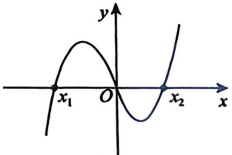

### 11.

设函数 $f(x)$满足 $af(x)+f\left(\frac{1}{x}\right)=ax$，其中 $x\neq0$， $a^{2}\neq1$，求函数 $f(x)$的表达式.

### 12.

已知  $\cos\left(\frac{\pi}{12}-\theta\right)=\frac{1}{3}$，则  $\sin\left(\frac{5\pi}{12}+\theta\right)$ 的值为 ___.

### 13.

已知  $\left|x_{1}-3\right|<1,\left|x_{2}-3\right|<1$ .求证：

(1)  $4 < x_{1} + x_{2} < 8$,  $\left|x_{1} - x_{2}\right| < 2$;

(2) 若  $f(x) = x^2 - x + 1$，且  $x_1 \ne x_2$，则  $\left|x_1 - x_2\right| < \left|f(x_1) - f(x_2)\right| < 7\left|x_1 - x_2\right|$.

### 14.

已知等差数列  $\{a_n\}$ 满足  $(a_1 + a_2) + (a_2 + a_3) + \cdots + (a_n + a_{n+1}) = 2n (n+1) (n \in \mathbb{N}_+)$. 求：

(1)数列 $\left\{a_{n}\right\}$的通项公式；

(2) 数列  $\left\{\frac{a_{n}}{2^{n-1}}\right\}$ 的前 n 项和  $S_{n}$

### 15.

函数  $y = -x^2 + (e^x - e^{-x}) \sin x$ 在区间  $[-2.8, 2.8]$ 的图像大致为()。

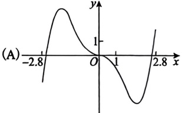

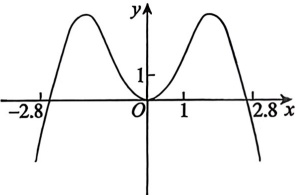

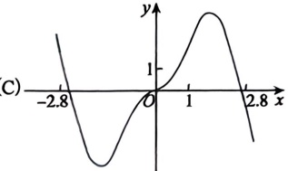

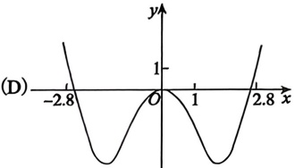

### 16.

已知曲线 C 的极坐标方程是 r = 1，以极点为原点，极轴为 x 轴的正半轴建立平面直角坐标系，直线 l 的参数方程为  $\left\{\begin{array}{l}x=1+\frac{t}{2},\\y=2+\frac{\sqrt{3}}{2}t\end{array}\right.$ (t 为参数).

(1) 写出直线 l 与曲线 C 的直角坐标方程；

(2)设曲线C经过伸缩变换 $\left\{\begin{aligned}&x^{\prime}=3x,\\&y^{\prime}=y\end{aligned}\right.$，得到曲线 $C^{\prime}$，设曲线 $C^{\prime}$上任一点为 $M(x,y)$，求 $\frac{x}{3}+\sqrt{3}y$的最小值.
## 第1章 函数极限与连续

### 1.

函数 $f(x)=x^{2}\tan x\mathrm{e}^{\cos x}$是().

(A)有界函数 (B)单调函数 (C)周期函数 (D)奇函数

### 2.

设函数 $f(x)$在 $(-\infty,+\infty)$内有定义，在区间 $[0,2]$上， $f(x)=x(x^2-4)$，若对任意的x都满足 $f(x)=-\frac{1}{2}f(x+2)$。写出 $f(x)$在 $[-2,0)$上的表达式。

### 3.

设函数 $f(x)=\begin{cases}1-2x^2,&x<-1,\\x^3,&-1\leq x\leq2,\\12x-16,&x>2.\end{cases}$，写出 $f(x)$的反函数 $g(x)$的表达式.

### 4.

设函数  $f(x)$ 在  $(-\infty, +\infty)$ 上满足  $f(x) = f(x - \pi) + \sin x$，且  $f(x) = x$， $x \in [0, \pi)$，求  $f(x)$ 在  $[\pi, 3\pi)$ 上的表达式.

### 5.

当  $x \to 0$ 时， $e - e^{\cos x}$ 是  $\sqrt[3]{1 + x^2} - 1$ 的().

(A) 高阶无穷小

(B) 低阶无穷小

(C) 同阶但非等价无穷小

(D) 等价无穷小

### 6.

下列选项中，极限存在的是( )

(A)  $\lim_{x \to 0} \frac{\sin x}{|x|} \arctan \frac{1}{|x|}$ (B)  $\lim_{x \to 0} \frac{\sin x}{x} \arctan \frac{1}{x}$

(C)  $\lim_{x \to 0} \frac{|\sin x|}{|x|} \arctan \frac{1}{x}$

(D)  $\lim_{x \to 0} \frac{|\sin x|}{x} \arctan \frac{1}{x}$

### 7.

设  $x \to 0$ 时， $\ln\frac{2+x}{2+\sin x}$ 与  $x^n$ 为同阶无穷小，则  $n =\underline{\qquad}$.

### 8.

设  $\lim_{x \to 0} \frac{\sin 2x + xf(x)}{x^3} = 1$，则  $\lim_{x \to 0} \frac{2\cos x + f(x)}{x^2} = (\ )$.

(A)0 　 (B) $-\frac{2}{3}$ \quad (C) $\frac{4}{3}$ \quad (D) $\infty$

### 9.

设函数 $f(x),g(x)$在x=0的某去心邻域内有定义且不为零，若当 $x\to0$时， $f(x)$是 $g(x)$的高阶无穷小，则当 $x\to0$时，对于以下结论：

① $f(x)+g(x)=o(f(x))$；

② $f(x)g(x)=o(g^2(x))$；

③ $f(x)=o(\ln[1+g(x)])$；

④ $f(x)=o(g^{2}(x))$

正确结论的个数为( ).

(A) 1          (B) 2          (C) 3          (D) 4

### 10.

$\lim_{x \to +\infty} x \left( 2^{\frac{1}{x}} - 3^{\frac{1}{x}} \right) =\underline{\qquad}$.

### 11.

$\lim_{x \to 0} \frac{\sqrt{1+2x} - \sqrt[3]{1+3x}}{\ln(1+x^2)} =\underline{\qquad}$.

### 12.

$\lim_{x \to 0} \left( \frac{\arctan x}{x} \right)^{\frac{1}{\tan^2 x}} =\underline{\qquad}$.

### 13.

已知  $\lim_{x \to -2} \frac{2x^3 + ax^2 - 3x + 6}{x + 2} = b$，则  $ab =\underline{\qquad}$.

### 14.

$\lim_{x \to 0} \frac{\sqrt{1 + \tan x} - \sqrt{1 + \sin x}}{x^2 - x \ln(1 + x)} =\underline{\qquad}$.

### 15.

$\lim_{x \to +\infty} \ln(1 + 2^x) \ln\left(1 + \frac{2}{x}\right) =\underline{\qquad}$.

### 16.

$\lim_{x \to \infty} \left( \cos \frac{1}{x} + \sin \frac{1}{x} \right)^{\frac{x}{2}} =\underline{\qquad}$.

### 17.

$f(x)=\frac{\tan x}{1+x^2}$ 在 x=0 处的 3 次泰勒多项式为 ___.

### 18.

已知  $\lim_{x \to 1} f(x)$ 存在，且  $f(x) = x^2 + e^x$  $\lim_{x \to 1} f(x)$，则  $f(x) =\underline{\qquad}$.

### 19.

设 $f(x)=\frac{e^x + xe^x}{e^x - 1} - \frac{1}{x}$在 $x=0$处连续，则应补充 $f(0)=$___。

### 20.

设 $f(x)=\frac{1-x\cdot2^{1-x}}{(2-x)(1-x)}$ ( $x\neq1,2$)，若 $f(x)$在 $[1,2]$上连续，则 $f(1)f(2)=$___

### 21.

函数 $f(x)=\frac{|x|^x - 1}{x(x+1)\ln|x|}$的可去间断点的个数为( ).

(A)0 (B)1 (C)2 (D)3

### 22.

函数 $f(x)=\frac{\ln|1-x|}{(\mathrm{e}^{x}-1)(x+2)}$的第二类间断点的个数为().

(A)0 (B)1 (C)2 (D)3

### 23.

设  $f(x) = \lim_{t \to +\infty} \frac{x + e^{tx}}{1 + e^{tx}}$，则 x = 0 是  $f(x)$ 的().

(A) 可去间断点 (B) 跳跃间断点 (C) 振荡间断点 (D) 无穷间断点
## 第2章 数列极限

### 1.

$\lim_{n\to\infty}\left(\frac{4}{\pi}\arctan\frac{n}{n+1}\right)^n=(\quad)$.

(A)  $e^{-\frac{2}{\pi}}$ (B)  $e^{-\frac{\pi}{2}}$ (C)  $\frac{\pi}{2}$ (D)  $\frac{2}{\pi}$

### 2.

$\lim_{n \to \infty} \frac{n^{99}}{n^{100} - (n-1)^{100}} =$

### 3.

设  $\{a_n\}$ 非负有界， $b_n = \sum_{k=1}^{n} \frac{k}{a_n + n^2}$，则  $\lim_{n \to \infty} \frac{1}{b_n} =\underline{\qquad}$。

### 4.

设  $x_{0}>0$,  $x_{n+1}=\frac{1}{2}\left(x_{n}+\frac{a}{x_{n}}\right)(n=0,1,2,\cdots)$, 且 a>0, 证明  $\lim_{n\to\infty}x_n$ 存在, 并求此极限.

### 5.

当  $0 \leq x \leq \frac{\pi}{2}$ 时， $\lim_{n \to \infty} \sqrt[n]{\sin^n x + \cos^n x} =\underline{\qquad}$.

### 6.

$\lim_{n \to \infty} \sqrt[n]{1 + |x|^3n} =\underline{\qquad}$.

### 7.

设数列  $\{x_n\}$ 满足  $x_{\bar{n}+1} = \ln x_n + 1$， $x_n > 0$， $n=1,2,\cdots$，则  $\{x_n\}$

(A) 单调不减

(B) 单调不增

(C) 严格单调递增

(D) 严格单调递减

### 8.

若对于数列  $\{x_{n}\}$，存在常数 k (0 < k < 1)，使得  $\left|x_{n+1} - a\right| \leq k \left|x_{n} - a\right|$，n = 1, 2,  $\cdots$. 证明  $\left\{x_{n}\right\}$ 收敛于 a.

### 9.

若对于数列  $\{x_n\}$， $x_{n+1} = f(x_n)$， $n=1,2,\cdots,f(x)$ 可导， $a$ 是  $f(x)=x$ 的唯一解，且对任意的  $x \in \mathbb{R}$，有  $|f'(x)| \leq k < 1$。证明  $\{x_n\}$ 收敛于  $a$。

### 10.

设  $a_n > 0$， $\lim_{n \to \infty} b_n = 0$，且  $e^{a_n} + a_n = e^{b_n}$， $n = 1, 2, \cdots$，求  $\lim_{n \to \infty} a_n$

### 11.

设  $c = 2\ln(1 + b)$，b > a > 0，且 a 是方程  $x - 2\ln(1 + x) = 0$ 的唯一非零解，证明 c > a.

### 12.

设单调递减数列  $\{x_{n}\}$ 满足  $x_{n+1}=2\ln(1+x_{n})$，n=1,2, $\cdots$， $x_{1}>a>0$，且 a 是  $x-2\ln(1+x)=0$ 的唯一非零解，证明  $\{x_{n}\}$ 收敛.
## 第3章 一元函数微分学的概念

### 1.

设 $f(x)$满足 $f(0)=0$，且 $f'(0)$存在，则 $\lim_{x\to0}\frac{f(1-\cos x)}{\ln(1-x\sin x)}=$___。

### 2.

设  $F(x) = g(x)\varphi(x)$， $\varphi(x)$ 在 x = a 处连续但不可导， $g(x)$ 在 x = a 处可导， $F(x)$ 在 x = a 处可导，则一定有( )。

(A)  $g(a)=0$ (B)  $g(a) \neq 0$

(C)  $g'(a)=0$ (D)  $g(a)$ 可以为任意实数

### 3.

设连续函数 $f(x)$满足 $\lim_{x\to2}\frac{\ln(x-1)}{f(3-x)}=2$，且 $f(1)=0$，则 $f'(1)$的值为( )。

(A)2

(B) $-2$

(C) $\frac{1}{2}$

(D) $-\frac{1}{2}$

### 4.

设 $f(x)$在x=0处可导， $f(0)=f'(0)=\sqrt{2}$，则 $\lim_{x\to0}\frac{f^2(x)-2}{x}=$___。

### 5.

设 $f(x)=\frac{1}{n^2}$， $\frac{1}{(n+1)^2}<x\leq\frac{1}{n^2}$， $n=1,2,\cdots$， $f(0)=0$，则 $f'_+(0)=$___。

### 6.

设可导函数  $f(x) > 0$，则  $\lim_{n \to \infty} n \ln \frac{f\left(\frac{1}{n}\right)}{f(0)} =\underline{\qquad}$.

### 7.

设函数 $f(x)$可导， $\left|f(x)\right|$在x=0处不可导，则().

(A)  $f(0)=0, f'(0)=0$

(B)  $f(0)=0, f'(0) \neq 0$

(C)  $f(0) \neq 0, f'(0) = 0$

(D)  $f(0) \neq 0, f'(0) \neq 0$

### 8.

设函数 $f(x)$连续， $\lim_{x\to1}\frac{f(x)-1}{\ln x}=2$，则曲线 $y=f(x)$在点x=1处的切线方程为___。

### 9.

设函数 $f(x)$在x=1处可导，且 $\Delta f(1)$是 $f(x)$在增量为 $\Delta x$时的函数值增量，则 $\lim_{\Delta x \to 0} \frac{\Delta f(1) - df(1)}{\Delta x} =$（ ）。

(A)  $f'(1)$ (B) 1

(C)  $\infty$ (D) 0
### 10.

设  $f(x)=\begin{cases}x^3\sin\frac{1}{x},&x>0,\\x^2,&x\leq0,\end{cases}$，则  $f(x)$ 在 x=0 处（ ）。

(A) 不连续  (B) 连续，但不可导  

(C) 可导，但导函数不连续  (D) 可导，且导函数连续

### 11.

设  $\varphi(x)$ 具有一阶连续导数,  $f(x)=\varphi(x)\left[1+\left|\ln(1+x)\right|\right]$, 则  $\varphi(0)=0$ 是  $f(x)$ 在 x=0 处可导的().

(A) 充分必要条件 (B) 充分非必要条件

(C) 必要非充分条件 (D) 既非充分又非必要条件

### 12.

设 $f(x)$在 $x_0$处可导， $x_n=\sin\frac{1}{n}+\frac{1}{n^2}$，则 $\lim_{n\to\infty}\frac{f\left(x_0+\frac{1}{n}\right)-f(x_0-x_n)}{\sin\frac{1}{n}}=$___。

### 13.

设 $f(x)$为在x=0处可导的奇函数，则 $\lim_{x\to0}\frac{f(tx)-5f(x)}{x}=$___。

### 14.

设 $f(x)=\max\left\{2x,x^2\right\}$， $x\in(0,4)$，且 $f'(a)$不存在， $a\in(0,4)$，则 $a=$___。

### 15.

设  $f(x)=\lim_{n\to\infty}\frac{x^2\mathrm{e}^{n(x-1)}+ax+b}{5+\mathrm{e}^{n(x-1)}}$，求  $f(x)$ 并讨论  $f(x)$ 的连续性及可导性与 a，b 的关系.
## 第4章 一元函数微分学的计算

### 1.

设 $f(x)=x^{2}$， $h(x)=f\left[1+g(x)\right]$，其中 $g(x)$可导，且 $g'(1)=h'(1)=2$，则 $g(1)=(\ )$.

(A) $-2$

(B) $-\frac{1}{2}$

(C)0

(D)2

### 2.

设 $f(x)=(\ln x-1)(\ln^2{x}-2)\cdots(\ln^n{x}-n)$， $n\geqslant 2$，则 $f'(e)=$___。

### 3.

设函数 $f(x)$可导， $f(0) = -1$， $f'(0) = 1$，若 $y(x) = |f(x-1)|$，则 $y'(1) =$___。

### 4.

设函数  $f(x)$ 可导,  $f(1) = f'(1) = \frac{1}{4}$, 若  $y(x) = e^{\sqrt{f(2x-1)}}$, 则  $y'(1) = (\ )$.

(A)  $\sqrt{e}$

(B)  $\frac{1}{4}\sqrt{e}$

(C)  $\frac{1}{2}\sqrt{e}$

(D)  $2\sqrt{e}$

### 5.

已知函数  $y = y(x)$ 满足  $(x + y^2)y' = 1$， $y(-1) = 0$，则  $\left.\frac{dx}{dy}\right|_{y=0} =\underline{\qquad}$.

### 6.

设  $y = \ln \sqrt{\frac{1 - x}{1 + x^2}}$，则  $y'|_{x=0} =\underline{\qquad}$.

### 7.

设  $\begin{cases} x = t - t^2, \\ t e^y + y + 1 = 0, \end{cases}$ 则  $\left. \frac{dy}{dx} \right|_{t=0} =\underline{\qquad}$.

### 8.

设函数  $y = f(x)$ 由  $\left\{\begin{aligned} x &= 2t + |t| \\ y &= |t| \tan t \end{aligned}\right.$ 所确定，则在  $\left(-\frac{\pi}{2}, \frac{\pi}{2}\right)$ 内().

(A) $f(x)$连续, $f^{\prime}(0)$不存在

(B) $f'(0)$存在， $f'(x)$在x=0处不连续

(C) $f'(x)$连续， $f''(0)$不存在

(D) $f''(0)$存在， $f''(x)$在x=0处不连续

### 9.

设可导的奇函数 $f(x)$满足 $f'(x)=f^2(x)$，且 $f(-1)=1$，则 $f^m(1)=$___。

### 10.

设可导函数  $f(x)$ 满足  $f'(x) = f^2(x)$，且  $f(0) = -1$，则在 x = 0 处的三阶导数  $f''(0) = (\ )$.

(A) -6          (B) -4          (C) 4          (D) 6
### 11.

已知函数 $f(x)=x^2\ln(1-x)$，则当 $n\geq3$时， $f^{(n)}(0)=$___。

### 12.

设  $f(t) = \lim_{n \to \infty} \cos t \cdot \left( \frac{n+t}{n-t} \right)^n$，则  $f'(0) =\underline{\qquad}$

### 13.

设  $f(x) = \lim_{t \to \infty} x \left(1 + \frac{1}{t}\right)^{t \sin x}$，则  $f'(x) =\underline{\qquad}$

### 14.

设 $f(x)=\max\left\{x,x^2\right\},\ 0<x<2$，则 $f'(x)=$___.

### 15.

曲线  $\begin{cases} x = e^t \sin 2t, \\ y = e^t \cos t \end{cases}$ 在对应  $t=0$ 处的点的切线方程为 ___.

### 16.

若  $\begin{cases} x = \ln |t| \\ y = e^{-t^2} \end{cases}$，则  $\left. \frac{d^2 y}{dx^2} \right|_{t=\sqrt{2}} =\underline{\qquad}$.

### 17.

已知函数 $f(x)=x^2(e^x+5)$，则 $f^{(5)}(1)=$___。

### 18.

设  $f(x)=(x-1)^0 \sin x$，则  $f^{(11)}(1)=(\cdots)$，（A）$10! \cdot \cos 1$（B）$11! \cdot \cos 1$（C）$10! \cdot \sin 1$（D）$11! \cdot \sin 1$

## 第5章 一元函数微分学的应用（一） ——几何应用

### 1.

函数$y = e^x + \frac{e^{-x}}{2}$的最小值为___。

### 2.

若函数$f(x)=\mathrm{e}^{-\alpha x}-\mathrm{ex}$的极值点小于零，则常数a的取值范围为___.

### 3.

设函数$f(x)=\begin{cases}\cos|x|-1, & x\leq0, \\ x\ln x, & x>0,\end{cases}$，则$x=0$是$f(x)$的().

(A) 可导点, 极值点

(B) 不可导点, 极值点

(C) 可导点, 非极值点

(D) 不可导点, 非极值点

### 4.

已知$x^2 + ax^{-3} \geq \frac{10}{3}$(x > 0)恒成立，则$a$的取值范围为___。

### 5.

已知函数$y = f(x)$连续，其二阶导函数的图像如图所示，则曲线$y = f(x)$的拐点个数为 ( ).

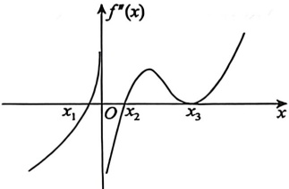

(A)1 (B)2 (C)3 (D)4

### 6.

设函数$f(x)>0$且二阶可导，曲线$y=\sqrt{f(x)}$有拐点$(1,\sqrt{2})$，$f'(1)=2$，则$f''(1)=$___。

### 7.

曲线$y(x)=\ln\left|e^{2x}-1\right|$的斜渐近线为( ).

(A)$y = 2x + \frac{1}{e}$(B) y = 2x (C)$y = -2x + \frac{1}{e}$(D) y = -2x

### 8.

曲线$y = x \ln \left( e + \frac{1}{x} \right)$的斜渐近线为( ).

(A) y = x + e (B) y = x - e

(C)$y = x + \frac{1}{e}$(D)$y = x - \frac{1}{e}$
### 9.

曲线$x^{2}-xy+y^{2}=1$在点(1,1)处的曲率为___.
### 10.

已知曲线$y = f(x)$在其点$(0,1)$处的曲率圆方程为$(x-1)^{2} + y^{2} = 2$，且当$x \to 0$时，二阶可导函数$f(x)$与$a + bx + cx^{2}$的差为$o(x^{2})$，则()。

(A) a=0, b=1,$c=\frac{3}{2}$(B) a=1, b=0, c=1

(C) a=1, b=1, c=-1

(D) a=1, b=0, c=-1

### 11.

设在$(-\infty, +\infty)$内，$f''(x) < 0$，$f(0) \geq 0$，则函数$\frac{f(x)}{x}$（ ）。

(A) 在$(-\infty, 0)$内单调减少，在$(0, +\infty)$内单调增加

(B) 在$(-\infty, 0)$和$(0, +\infty)$内单调减少

(C) 在$(-\infty, 0)$内单调增加，在$(0, +\infty)$内单调减少

(D) 在$(-\infty, 0)$和$(0, +\infty)$内单调增加

### 12.

设$f(x)$连续，且$\lim_{x \to 0} \frac{f(x)}{x^2} = k (k < 0)$，则$f(x)$在点 x = 0 处( ).

(A) 导数不存在

(B) 导数存在，且$f'(0) \neq 0$(C) 取得极小值

(D) 取得极大值

### 13.

设$M = \max\left\{1, \sqrt{2}, \sqrt[3]{3}, \cdots, \sqrt[n]{n}\right\} (n > 4)$，则$M = (\quad)$(A)$\sqrt{2}$(B)$\sqrt[3]{3}$(C)$\sqrt[4]{4}$(D)$\sqrt[n]{n}$14. 设函数$f(x)=n^2 e^{\frac{x}{n}}-(1+n)x$，若$f(x)$在$x=\xi_n$处取得极值，则$\lim_{n \to \infty} \xi_n =$___。

### 14.

设函数 $f(x)=n^{2} e^{\frac{x}{n}}-(1+n) x$, 若 $f(x)$ 在 $x=\xi_{n}$ 处取得极值, 则 $\lim _{n \rightarrow \infty} \xi_{n}=$ ______.

### 15.

曲线$y = x + \frac{|\ln x|}{x}$( ).

(A)有铅直渐近线,也有斜渐近线 (B)有水平渐近线,也有斜渐近线

(C)有且仅有铅直渐近线 (D)有且仅有水平渐近线

### 16.

设函数$f(x)$在$[0,1]$上可导，$f(0)=0$，$f'(x)$严格单调递增，则对任意$x\in(0,1)$，有( )。

(A)$f(x)>f'(0)x>f(1)x$(B)$f'(0)x>f(x)>f(1)x$(C)$f(1)x > f'(0)x > f(x)$(D)$f(1)x > f(x) > f'(0)x$17. 已知函数$y = f(x)$对一切$x$满足$\sqrt[3]{xf''}(x) + xf'(x) = \mathrm{e}^{-x} - 1$，若$f'(x_0) = 0 (x_0 \neq 0)$，则（ ）。

(A)$x = x_0$是$f(x)$的极小值点

(B)$x = x_0$是$f(x)$的极大值点

(C)$(x_0, f(x_0))$是曲线$y = f(x)$的拐点

(D) 以上结论均不正确

### 17.

已知函数 $y=f(x)$ 对一切 $x$ 满足 $\sqrt[3]{x}f''(x)+xf'(x)=e^{-x}-1$，若 $f'(x_0)=0(x_0 \neq 0)$，则（ ）。

(A) $x=x_0$ 是 $f(x)$ 的极小值点
(B) $x=x_0$ 是 $f(x)$ 的极大值点
(C) $(x_0, f(x_0))$ 是曲线 $y=f(x)$ 的拐点
(D) 以上结论均不正确

### 18.

已知函数$f(x)=ax^{3}+x^{2}+2$在x=0和x=-1处取得极值，求$f(x)$的增减区间、极大值、极小值和拐点.

### 19.

设$f(x) = nx(1-x)^n (n \in \mathbb{N}_+)$，且记$M(n) = \max_{x \in [0,1]} f(x)$，则必有（）.

(A)$\lim_{n \to \infty} M(n) = \mathrm{e}$(B)$\lim_{n \to \infty} M(n) = \frac{1}{\mathrm{e}}$(C)$\lim_{n \to \infty} M(n) = 0$(D)$\lim_{n \to \infty} M(n) = \infty$20. 曲线$y=\frac{x^{2}+1}{\sqrt{x^{2}-1}}$的渐近线的条数为().

(A)4          (B)3          (C)2          (D)1

### 20.

曲线 $y = \frac{x^2+1}{\sqrt{x^2-1}}$ 的渐近线的条数为______.

(A) 4 (B) 3 (C) 2 (D) 1

### 21.

曲线$y=\frac{2+\mathrm{e}^{-x^{4}}}{1-\mathrm{e}^{-x^{4}}}$（）.

(A) 仅有斜渐近线 (B) 仅有水平渐近线

(C) 仅有铅直渐近线 (D) 既有水平渐近线，又有铅直渐近线

### 22.

曲线$y=(4+5x)e^{\frac{1}{x}}$的斜渐近线是 ___.

### 23.

曲线$y=e^{\frac{1}{x}}\sqrt{x^{2}-4x+1}$的渐近线条数为().

(A) 1 (B) 2 (C) 3 (D) 4

### 24.

曲线$x^{2}=y+1$在点(0,-1)的曲率圆方程为 ___ . 
## 第6章 一元函数微分学的应用（二）——中值定理、微分等式与微分不等式

### 1.

设函数$f(x)=x(2x-3)(4x-5)$，则方程$f'(x)=0$的实根个数为().

(A)0 (B)1 (C)2 (D)3

### 2.

若方程$x - e\ln x - k = 0$在$(0,1]$上有解，则$k$的最小值为 ( )。

(A)$-1$　　(B)$\frac{1}{e}$　　(C)$1$　　(D)$e$
### 3.

设函数$f(x) = ae^{x} - bx$(a > 0) 有两个零点，则$\frac{b}{a}$的取值范围是 ( ).

(A)$\left(0,\frac{1}{e}\right)$(B)$(0,e)$(C)$\left(\frac{1}{e},+\infty\right)$(D)$(e,+\infty)$
### 4.

已知函数$f(x)=\ln x-\frac{x}{e}+a(x>0)$有两个零点，则a的取值范围是().

(A)(-1,0) (B)(0,1) (C)$(-∞,0)$(D)$(0,+∞)$
### 5.

设存在$0 < \theta < 1$，使得$\arcsin x = \frac{x}{\sqrt{1 - (\theta x)^2}}$，$-1 \leq x \leq 1$，则$\lim_{x \to 0} \theta =$___。

### 6.

设x>0，证明$\frac{x}{1+x}<\ln(1+x)<x$。

### 7.

设x>0，证明$\frac{1}{1+x}<\ln\left(1+\frac{1}{x}\right)<\frac{1}{x}$.

### 8.

设函数$f(x)$可导，且$\left|f'(x)\right|\leq1$，$f(0)=1$，证明$\left|f(x)\right|\leq1+x$，0<x<1.

### 9.

设函数$f(x)$在$[a, +\infty)$($a > 0$) 上一阶导数连续，$\lim_{x \to +\infty} f'(x) = 0$，则( ).

(A)$\lim_{x \to +\infty} [f(2x) + f(x)] = 0$(B)$\lim_{x \to +\infty} [f(2x) - f(x)] = 0$(C)$\lim_{x \to +\infty} [f(x+1) - f(x)] = 0$(D)$\lim_{x \to +\infty} [f(x+1) + f(x)] = 0$10. 设函数$f(x)$在x=1处一阶导数连续，且$f'(1)=2$，则$\lim_{x\to1^+}\frac{f(x)-f(1)}{\ln x}=$___。

### 10.

设函数 $f(x)$ 在 $x=1$ 处一阶导数连续，且 $f'(1)=2$，则 $\lim_{x \to 1^+} \frac{f(x)-f(1)}{\ln x} = $ _______.

### 11.

设$f'(1)=2$，计算$\lim_{x\to1^{+}}\frac{f(x)-f(1)}{\ln x}$，并指出与第10题的区别.

### 12.

(1) 将$\sin x$在 x = 0 处展开成一阶带拉格朗日余项的泰勒公式；

(2) 证明$\left|\frac{\sin x}{x}-1\right|\leqslant\frac{1}{2}|x|$，$x\neq0$。

### 13.

求曲线$y = e^{-\frac{x}{2}}$与曲线$y = x^3 - 3x$的交点个数.

### 14.

设$f(x)$是连续可导函数，当 0 < a < x < b 时，恒有$xf'(x) < f(x)$，则 ( )。

(A)$af(x) > xf(a)$(B)$bf(x) > xf(b)$(C)$xf(x) > bf(b)$(D)$xf(x) < af(a)$
### 15.

方程$x^{4}+4x+b=0$有两个不等的实根，则 b 的取值满足( )。

(A) b < 3

(B) b > 3

(C) b < -3

(D) b > -3

### 16.

设常数 k > 0，函数$f(x) = \frac{1}{\ln x - \frac{x}{e} + k}$在$(0, +\infty)$内的间断点个数为( ).

(A)3

(B)2

(C)1

(D)0

### 17.

设$f(x)$，$g(x)$为恒大于零的可导函数，且$f'(x)g(x)<f(x)g'(x)$，则当a<x<b时，下列不等式恒成立的是( )。

(A)$f(a)g(x) > f(x)g(b)$(B)$f(x)g(a) > f(b)g(x)$(C)$f(a)g(b) > f(b)g(x)$(D)$f(x)g(b) > f(b)g(x)$18. 设$0 \leq x \leq 1$，p > 1，证明$\frac{1}{2^{p-1}} \leq x^{p} + (1-x)^{p} \leq 1$.

### 18.

设 $0 \leqslant x \leqslant 1, p > 1$，证明 $\frac{1}{2^{p-1}} \leqslant x^p + (1-x)^p \leqslant 1$.

### 19.

对于 k 的不同取值情况，确定方程$x^{3}-3x+k=0$实根的个数，并证明你的结论.

### 20.

设$f(x)$在$[a,b]$上连续，在$(a,b)$内可导$(a>0)$，证明：在$(a,b)$内$2x[f(b)-f(a)]=(b^{2}-a^{2})f'(x)$至少有一个实根.

### 21.

设$a_{0}+\frac{a_{1}}{2}+\cdots+\frac{a_{n}}{n+1}=0$($a_{i}$为实数,$i=0,1,2,\cdots,n$), 则在区间$(0,1)$内, 方程$a_{0}+a_{1}x+\cdots+a_{n}x^{n}=0$( ).

(A) 没有实根 (B) 至少有一个实根

(C) 仅有一个实根 (D) 是否有实根不能判定

### 22.

设函数$f(x)$在$[a,b]$上可导，$c\in(a,b)$，证明：

(1)存在一点$\xi\in(a,c)$，使得$f(c)-f(a)=f'(\xi)(c-a)$;

(2)存在一点$\eta \in (a,b)$，使得$f(b) - f(a) = f'(\eta)(b - a)$且$\eta > \xi$。
## 第7章 一元函数微分学的应用（三）——物理应用

### 1.

一动点 P 在曲线$9y=4x^{2}$上运动，设坐标轴的单位长度是 1 cm，若点 P 横坐标的变化率是 30 cm/s，则当点 P 经过点 (3,4) 时，点 P 到原点距离的变化率为 ___。

### 2.

设二阶可导函数$y = f(t)$表示某人在10分钟内心跳次数的变化曲线，如图所示。则关于此人

心跳次数的增长速度，说法正确的是( ).

(A)0~3分钟增速变小；7~10分钟增速变大

(B)0~3分钟增速变大；7~10分钟增速变小

(C)0~3分钟增速变大；7~10分钟增速变大

(D)0~3分钟增速变小；7~10分钟增速变小

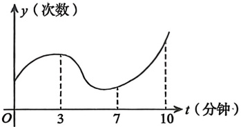

### 3.

已知一容器中水增加的速率为$1 \, m^3/min$，且水的体积$V$与水面高度$y$满足$V = \frac{\pi}{2} y^2$，当水面上升到高为$1 \, m$时，求水面高度上升的速率。

### 4.

已知某圆柱体底面半径与高随时间变化的速率分别为$2 \, cm/s$，$-3 \, cm/s$，且圆柱体的体积与表面积随时间变化的速率分别为$-100\pi \, cm^3/s$，$40\pi \, cm^2/s$，则圆柱体的底面半径与高分别为（）.

(A)5 cm, 5 cm

(B)10 cm, 5 cm

(C)5 cm, 10 cm

(D)10 cm, 10 cm

### 5.

一物体在距离同一水平面上的地面观测器10 m处离地匀速垂直上升, 其速度为$a \, m/s$. 若该物体上升到离地20 m时, 观测器视线倾角的变化率为$\frac{1}{10}$, 则$a = (\ )$.

(A)1 (B)2 (C)3 (D)5
## 第8章 一元函数积分学的概念与性质

### 1.

设函数$f(x)$在区间$[0,1]$上连续，则$\int_{0}^{1}f(x)\mathrm{d}x=$___.

(A)$\lim_{n\to\infty}\sum_{k=1}^{n}f\left(\frac{3k-1}{3n}\right)\frac{1}{3n}$(B)$\lim_{n\to\infty}\sum_{k=1}^{n}f\left(\frac{3k-1}{3n}\right)\frac{1}{n}$(C)$\lim_{n\to\infty}\sum_{k=1}^{3n}f\left(\frac{k-1}{3n}\right)\frac{1}{n}$(D)$\lim_{n\to\infty}\sum_{k=1}^{3n}f\left(\frac{k}{3n}\right)\frac{3}{n}$2.$\lim_{n \to \infty} \frac{1}{n^3} \left[ \ln \frac{1}{n} + 4 \ln \frac{2}{n} + \cdots + (n-1)^2 \ln \frac{n-1}{n} \right] =\underline{\qquad}$.

### 2.

$\lim_{n \rightarrow \infty} \frac{1}{n^{3}}\left[\ln \frac{1}{n}+4 \ln \frac{2}{n}+\cdots+(n-1)^{2} \ln \frac{n-1}{n}\right]=$______.

### 3.

甲、乙两人赛跑，图中实线和虚线分别为甲和乙的速度曲线(单位：m/s)，三块阴影部分面积依次为15, 20, 10，且当t=0时，甲在乙前面10 m处，则在$[0, t_{3}]$上，甲、乙相遇的次数为().

(A)1

(B)2

(C)3

(D)4

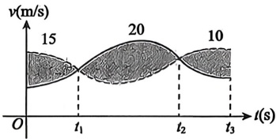

### 4.

设$M = \int_{\frac{1}{2}}^{\frac{1}{2}} \left(1 + \frac{x}{1 + x^2}\right) \, dx$,$N = \int_{0}^{1} \frac{(1+x)\ln^2(1+x)}{x^2} \, dx$,$K = \int_{0}^{1} \frac{e^x}{1+x} \, dx$, 则().

(A) M > N > K (B) N > K > M (C) K > M > N (D) K > N > M

### 5.

设$f(x)$是$(0, +\infty)$内的正值连续函数，且$f'(x) < 0$，$g(x) = \int_{1}^{x} f(t) \, dt$，则$g\left(\frac{1}{2}\right)$和$g\left(\frac{3}{2}\right)$的可能取值是（）.

(A) -2, 1 (B) -2, 3 (C) 2, -1 (D) 2, -3

### 6.

设$f(x)=\begin{cases}x\ln x,&x>0,\\x^{2}+x,&x\leq0,\end{cases}$，若$\int_{a}^{b}f(x)dx(a<b)$取得最小值，则$(a,b)=(\quad)$.

(A)(-1,1)          (B)(-1,2)          (C)(0,1)          (D)(1,2)

### 7.

设函数$g(x)$在$\left[0, \frac{\pi}{2}\right]$上连续，若在$\left(0, \frac{\pi}{2}\right)$内$g'(x) \geq 0$，则对任意的$x \in \left(0, \frac{\pi}{2}\right)$，有（）.

(A)$\int_{x}^{\frac{\pi}{2}} g(t) \, dt \geqslant \int_{x}^{\frac{\pi}{2}} g(\sin t) \, dt$(B)$\int_{x}^{1} g(t) \, dt \leqslant \int_{x}^{1} g(\sin t) \, dt$(C)$\int_{x}^{1} g(t) \, dt \geqslant \int_{x}^{1} g(\sin t) \, dt$(D)$\int_{x}^{\frac{\pi}{2}} g(t) \, dt \leqslant \int_{x}^{\frac{\pi}{2}} g(\sin t) \, dt$8. 若$\sqrt{1-x^{2}}$是$xf(x)$的一个原函数，则$\int_{0}^{1}\frac{1}{f(x)}\,\mathrm{d}x=$___.

(A) -1 (B)$\frac{\pi}{4}$(C)$-\frac{\pi}{4}$(D) 1

### 8.

若 $\sqrt{1-x^2}$ 是 $xf(x)$ 的一个原函数，则 $\int_{0}^{1} \frac{1}{f(x)} \mathrm{d} x=(\quad)$.

(A) $-1$ (B) $\frac{\pi}{4}$ (C) $-\frac{\pi}{4}$ (D) 1

### 9.

$\lim_{n \to \infty} \sum_{i=1}^{n} \frac{1}{\sqrt{in}} =$___.

### 10.

设$f(x)$是$(-\infty, +\infty)$上可导的奇函数，任意的$x \in (-\infty, +\infty)$，均有$f(x+1) - f(x) = f(1)$，$f\left(\frac{1}{2}\right) = 0$，则以下是偶函数的是（ ）。

(A)$\int_0^x [\sin f(t) + f(t+1)] \, dt$(B)$\int_0^x [\sin f'(t) + f'(t+1)] \, dt$(C)$\int_0^x [\cos f(t) + f(t+2)] \, dt$(D)$\int_0^x [\cos f'(t) + f'(t+2)] \, dt$11. 设$f(x)$是实数集上连续的偶函数，在$(-\infty,0)$上有唯一零点$x_{0}=-1$，且$f'(x_{0})=1$，则函数$F(x)=\int_{0}^{x}f(t)dt$的严格单调增区间是（）.

(A)$(-∞, -1)$(B)$(-1, +∞)$(C)$(-1, 1)$(D)$(1, +∞)$

### 11.

设f(x)是实数集上连续的偶函数,在(-∞,0)上有唯一零点x₀=-1,且f′(x₀)=1,则函数F(x)=∫₀ˣf(t)dt的严格单调增区间是( ).

(A) (-∞,-1) (B) (-1,+∞) (C) (-1,1) (D) (1,+∞)

### 12.

设$f(x)$在$[0,2]$上单调连续，$f(0)=1$，$f(2)=2$，且对任意$x_1$，$x_2\in[0,2]$总有$f\left(\frac{x_1+x_2}{2}\right)>\frac{f(x_1)+f(x_2)}{2}$，$g(x)$是$f(x)$的反函数，$P=\int_1^2 g(x)dx$，则( )。

(A)$3<P<4$(B)$2<P<3$(C)$1<P<2$(D)$0<P<1$
### 13.

下列反常积分中，发散的是( ).

(A)$\int_{0}^{+\infty} xe^{-x}dx$(B)$\int_{-\infty}^{+\infty}xe^{-x^{2}}dx$(C)$\int_{-\infty}^{+\infty}\frac{\arctan x}{1+x^{2}}dx$(D)$\int_{-\infty}^{+\infty}\frac{x}{1+x^{2}}dx$14. 若反常积分$\int_{0}^{+\infty}\frac{\ln x}{(1+x)x^{1-p}}dx$收敛，则().

(A) p < 1 (B) p > 1 (C) 0 < p < 1 (D)$0 \leq p < 1$

### 14.

若反常积分 $\int_{0}^{+\infty} \frac{\ln x}{(1+x)x^{1-p}} \mathrm{d}x$ 收敛, 则 ( ).

(A) $p<1$ (B) $p>1$ (C) $0<p<1$ (D) $0 \leqslant p<1$

### 15.

下列反常积分收敛的是( ).

(A)$\int_{2}^{+\infty}\frac{1}{x\ln x}dx$(B)$\int_{0}^{+\infty}e^{-x^{2}}dx$(C)$\int_{-1}^{1}\frac{1}{\sin x}dx$(D)$\int_{0}^{1}\frac{x}{\ln^{2}(1+x)}dx$16.$\lim_{n \to \infty} \frac{1}{n^2} \left[ \sqrt{n^2 - 1} + \sqrt{n^2 - 2^2} + \cdots + \sqrt{n^2 - (n-1)^2} \right] =$___.

### 16.

$\lim_{n \rightarrow \infty} \frac{1}{n^2} \left[ \sqrt{n^2-1} + \sqrt{n^2-2^2} + \cdots + \sqrt{n^2-(n-1)^2} \right] = \underline{\hspace{2cm}}$.

### 17.

$\lim_{n \to \infty} \sum_{i=1}^{n} \frac{n}{n^2 + 9i^2} =$___.
张宇 ___

### 18.

定积分$I = \int_{\frac{\pi}{4}}^{\frac{\pi}{2}} \frac{\sin x}{x} \, dx$的值满足( ).

(A)$0 \leqslant I \leqslant \frac{1}{2}$(B)$\frac{1}{2} \leqslant I \leqslant \frac{\sqrt{2}}{2}$(C)$\frac{\sqrt{2}}{2} \leqslant I \leqslant 1$(D)$1 \leqslant I \leqslant 2\sqrt{2}$19. 设$f(x) \neq 0$为$(-\infty, +\infty)$上可导的奇函数，则下列函数为奇函数的是().

(A)$x^{3}\int_{0}^{x}f'(t)dt$(B)$\int_{0}^{x}f(-t)dt$(C)$\int_{0}^{x}[f'(t)+f(t)]dt$(D)$\int_{0}^{x}\left|f(t)\right|dt$20. 设$M = \int_{-\frac{\pi}{2}}^{\frac{\pi}{2}} \frac{x}{1 + x^2} \cos^5 x \, dx$，$N = \int_{-\frac{\pi}{2}}^{\frac{\pi}{2}} (x^2 \sin x + \sin^2 x \cos x) \, dx$，$P = \int_{-\frac{\pi}{2}}^{\frac{\pi}{2}} (\sin^3 x - \cos^4 x) \, dx$，则有（ ）。

(A)$N < P < M$(B)$M < P < N$(C)$N < M < P$(D)$P < M < N$

### 19.

设 $f(x) \neq 0$ 为 $(-\infty, +\infty)$ 上可导的奇函数，则下列函数为奇函数的是( ).

(A) $x^3 \int_{0}^{x} f'(t) \mathrm{d}t$ (B) $\int_{0}^{x} f(-t) \mathrm{d}t$ (C) $\int_{0}^{x} [f'(t) + f(t)] \mathrm{d}t$ (D) $\int_{0}^{x} |f(t)| \mathrm{d}t$

### 20.

设 $M = \int_{-\frac{\pi}{2}}^{\frac{\pi}{2}} \frac{x}{1+x^2} \cos^5 x \mathrm{d}x$，$N = \int_{-\frac{\pi}{2}}^{\frac{\pi}{2}} (x^2 \sin x + \sin^2 x \cos x) \mathrm{d}x$，$P = \int_{-\frac{\pi}{2}}^{\frac{\pi}{2}} (\sin^3 x - \cos^4 x) \mathrm{d}x$，则有( ).

(A) $N < P < M$ (B) $M < P < N$ (C) $N < M < P$ (D) $P < M < N$

### 21.

设 a, b 为常数,$\int_{0}^{1}\frac{\ln x}{x^{a}\left(\tan\frac{\pi}{2}x\right)^{b}}dx$收敛, 则().

(A)$a+b>1$且 b>-2 (B)$a+b<1$且 b>-2 (C) $a+b>1$ 且 b<-2 (D)  $a+b<1$ 且 b<-2

### 22.

设  $F(x)=\int_{0}^{x}(t-[t])\mathrm{d}t$，其中  $[x]$ 表示不超过 x 的最大整数，则  $F_{-}^{\prime}(1)-F_{+}^{\prime}(1)=\underline{\qquad}$

### 23.

下列命题中不成立的是( ).

(A) 若  $f(x)$ 连续， $x \in [a, b]$，则  $\int_{a}^{x} f(t) \, dt$ 必为  $f(x)$ 的原函数

(B) 若  $f(x)$ 可积， $x \in [a, b]$，则  $f(x)$ 在  $(a, b)$ 内存在原函数

(C) 若  $f(x)$ 连续，且为奇函数， $x \in [-a, a]$，则  $\int_{-a}^{a} f(x) \, dx = 0$

(D) 若  $f(x)$ 连续，T 为其周期，则  $\int_{a}^{a+T} f(x) \, dx = \int_{0}^{T} f(x) \, dx$

### 24.

设  $f(x-5)=\frac{4}{x^{2}-10x}$，则  $\int_{0}^{4}f(2x+1)dx$ ( ).

(A)为反常积分，且发散

(B)为反常积分，且收敛

(C)不是反常积分，且其值为10

(D)不是反常积分，且其值为 $\frac{\pi}{4}$

### 25.

下列表达式中正确的是( ).

(A)  $\int_{-\pi}^{2\pi}\left|\sin x\right|dx\leq\int_{-\pi}^{2\pi}\sin^{2}xdx$

(B)  $\int_{-\frac{\pi}{4}}^{\frac{\pi}{4}}\frac{x}{1+\cos x}dx<\int_{-\frac{\pi}{4}}^{\frac{\pi}{4}}\left(\frac{\sin x}{1+x^{4}}+\frac{1}{1+x^{2}}\right)dx$

(C)  $\int_{a}^{b}f(x)dx\leq\int_{c}^{d}f(x)dx,\ [a,b]\subset[c,d],f(x)$ 连续， $x\in[c,d]$

(D)  $\int_{-1}^{1}\left|f(x)\right|\,dx=2\int_{0}^{1}\left|f(x)\right|\,dx$,  $f(x)$ 连续， $x\in[-1,1]$
## 第9章 一元函数积分学的计算

### 1.

计算下列不定积分.

(1)  $\int \cos^3 x \, dx$;

(2)  $\int \sin^{3} x \, dx$;

(3)  $\int \sec x \, dx$;

(4)  $\int \sec^3 x \, dx$;

(5)  $\int \frac{1}{a^2 - x^2} \, dx (a \ne 0)$;

(6)  $\int \frac{1}{x^2 - a^2} \, dx (a \ne 0)$;

(7)  $\int \frac{1}{a^2 + x^2} dx (a \ne 0)$;

(8)  $\int \frac{1}{a^{2} + (x + b)^{2}} \, dx (a \neq 0)$;

(9)  $\int \frac{1}{a^2 - (x + b)^2} \, dx (a > 0)$;

(10) $\int\frac{1}{(x+b)^{2}-a^{2}}\mathrm{d}x(a>0)$;

(11)  $\int \frac{1}{\sqrt{x^2 - a^2}} \, dx (a > 0)$;

(12)  $\int \frac{1}{\sqrt{a^2 - x^2}} \, dx (a > 0)$;

(13)  $\int \frac{1}{\sqrt{x^{2}+a^{2}}} \, dx (a>0)$

(14)  $\int \csc^{3} x \, dx$;

(15)  $\int \tan^{2} x \, dx$;

(16)  $\int \tan^{3} x \, dx$;

(17)  $\int \tan^{4} x \, dx$;

(18)  $\int \cot^3 x \, dx$;

(19)  $\int \frac{\cos x}{1 + \sin x} \, dx$;

(20)  $\int \frac{1}{a^2 \sin^2 x + b^2 \cos^2 x} \, dx$;

(21)  $\int \frac{1}{\sin 2x} \, dx$;

(22)  $\int \frac{1}{\cos 2x} \, dx$;

(23)  $\int \frac{1}{a + b\cos x} \, dx (a > 0, b > 0)$;

(24)  $\int \frac{1}{a + b \sin x} \, dx (a > 0, b > 0)$.

### 2.

计算不定积分 $\int\frac{e^{2x}}{\sqrt{e^{x}-1}}dx$.

### 3.

计算不定积分  $\int \ln\left(1+\sqrt{\frac{1+x}{x}}\right)dx (x>0)$.

### 4.

计算不定积分  $\int e^{2x}\arctan\sqrt{e^{x}-1}dx$.

### 5.

$\int_{0}^{1} e^{-\sqrt{x}} dx = (\quad)$.

(A)2

(B) $2-\frac{4}{e}$

(C) $1-\frac{2}{e}$

(D) $1-\frac{1}{e}$

### 6.

$\int_{0}^{1}\frac{4x-3}{x^{2}-x+1}dx=\underline{\qquad}$.

### 7.

$\int_{0}^{1}\frac{\arctan\sqrt{x}}{\sqrt{x}(1+x)}\,\mathrm{d}x=$___.

### 8.

$\int_0^{\frac{\pi}{4}} \sec^3 \theta \mathrm{d}\theta =$___.

### 9.

设连续函数 $f(x)$满足 $f(x+1)-f(x)=x\ln x$， $\int_{0}^{1}f(x)\mathrm{d}x=0$，则 $\int_{1}^{2}f(x)\mathrm{d}x=$___。

### 10.

设  $y = \frac{x}{\sqrt{1 + x^2}}$，则  $\int_{\frac{1}{2}}^{\frac{\sqrt{3}}{2}} xy \, dy =\underline{\qquad}$.

### 11.

若  $e^{-x}$ 是  $f(x)$ 的一个原函数，则  $\int_{\mathbb{T}} \frac{1}{x^2} f(\ln x) \, dx = (\quad)$.

(A)  $-\frac{1}{4}$

(B)  $-1$

(C)  $\frac{1}{4}$

(D)  $1$

### 12.

若函数  $f(x)$ 在  $[0,+\infty)$ 上连续， $g(x)=\int_{0}^{2x}f\left(x+\frac{t}{2}\right)dt$，则当  $x\to0^{+}$ 时， $g(x)$ 是  $\sqrt{x}$ 的 () .

(A) 高阶无穷小

(B) 低阶无穷小

(C) 等价无穷小

(D) 同阶但非等价无穷小

### 13.

设 $f(x)$在x=0的某邻域内连续，在x=0处可导，且 $f(0)=0$， $\varphi(x)=\begin{cases}\frac{1}{x^2}\int_{0}^{x}tf(t)dt,&x\neq0,\\0,&x=0,\end{cases}$

则 $\varphi(x)$在x=0处( )。

(A)不连续

(B)连续但不可导

(C)可导但 $\varphi'(x)$在x=0处不连续

(D)可导且 $\varphi'(x)$在x=0处连续

### 14.

若连续周期函数  $y = f(x)$ (不恒为常数) 对任何 x 恒有  $\int_{-1}^{x+6} f(t) dt + \int_{x-3}^{4} f(t) dt = 14$ 成立，则  $f(x)$ 的周期是().

(A)7 (B)8 (C)9 (D)10
### 15.

设  $f(x)$ 在  $[-a, a]$ 上是连续的偶函数,  $a > 0$,  $g(x) = \int_{-a}^{a} |x - t| f(t) \, dt$, 则在  $[-a, a]$ 上( ).

(A)  $g(x)$ 是单调递增函数 (B)  $g(x)$ 是单调递减函数

(C)  $g(x)$ 是偶函数 (D)  $g(x)$ 是奇函数

### 16.

若  $F(x)=\int_{-\pi}^{\pi}|x-t|\sin t dt$，则  $F'(0)=$ ( ).

(A) -4          (B) -2          (C) 2          (D) 4

### 17.

若函数  $y(x)=\int_{2}^{x^{2}} e^{-\sqrt{t}} dt$，则  $\left.\frac{d^{2}\left[y(x)\right]}{dx^{2}}\right|_{x=-1} = (\quad)$.

(A)0          (B)1          (C) $4e^{-1}$        (D)4e

### 18.

已知函数 $f(x)=\int_{1}^{x}\sqrt{1+t^{3}}dt$，则 $\int_{0}^{1}xf(x)dx=$___

### 19.

设连续函数 $f(x)$满足 $\int_{0}^{x}f(t)dt=xe^{x}$，则 $\int_{1}^{c}\frac{f(\ln x)}{x}dx=$___。

### 20.

设  $a_n = \int_0^1 x^n \sqrt{1-x^2} \, dx (n \geq 0, 1, 2, \cdots)$，则  $\lim_{n \to \infty} \left( \frac{a_n}{a_{n-2}} \right)^n =\underline{\qquad}$.

### 21.

$\int_{\sqrt{5}}^{5}\frac{1}{\sqrt{|x^2-9|}}dx=$___.

### 22.

$\int_{-\infty}^{+\infty}\left|x\right|\mathrm{e}^{-x^2}\mathrm{d}x=\underline{\qquad}$.

### 23.

设  $f(x)=\lim_{n\to\infty}\frac{1-x^{2n}}{1+x^{2n}}x$，且  $\int_{0}^{2}f(x)dx=a$，则  $a=$（ ）.

(A)2 　 (B)1 \quad$0 \quad (D$　

### 24.

$\int_{-1}^{1}\left(\frac{1}{1+2^{\frac{1}{x}}}\right)^{\prime}dx=\underline{\qquad}$.

### 25.

$\int_{-\frac{1}{2}}^{\frac{1}{2}}\frac{|x|(\arcsin x+\arccos x)}{\sqrt{1-x^{2}}}dx=$___.

### 26.

$\int_{1}^{\frac{3}{2}}(1-x)\arcsin(1-x)\,\mathrm{d}x =\underline{\qquad}$.

### 27.

若 $f(x)=\frac{1}{1+x^2}+x^3\int_0^1 f(x)dx$，则 $f(x)=$___。
张宇 ___ ___

### 28.

$\int_{-1}^{1}\left[x^{3}\cos x+\ln(x+\sqrt{x^{2}+1})\right]dx=\underline{\qquad}$.

### 29.

设  $f(x)=\int_{0}^{x}\frac{\cos t}{1+\sin^{2}t}dt$，则  $\int_{0}^{\frac{\pi}{2}}\frac{f'(x)}{1+f^{2}(x)}dx=\underline{\qquad}$.

(A) $-\frac{\pi}{4}$ (B) $-\arctan\frac{\pi}{4}$ (C) $\frac{\pi}{4}$ (D) $\arctan\frac{\pi}{4}$

### 30.

设  $\int_{1}^{+\infty}f(x)dx$ 收敛， $f(x)=x^{3}e^{-x^{2}}+\frac{1}{x(1+x)}\int_{1}^{+\infty}f(x)dx$，则  $\int_{1}^{+\infty}f(x)dx=\underline{\qquad}$.

(A) $\frac{1}{1-\ln2}$ (B) $\frac{1}{\ln2}$ (C) $\frac{e}{1-\ln2}$ (D) $\frac{1}{(1-\ln2)e}$

### 31.

函数 $f(x)=\begin{cases}\frac{1}{\sqrt{1+x^2}},&x\leq0,\\ (x+1)\mathrm{e}^x,&x>0\end{cases}$ 的一个原函数为().

(A)$F(x)=\begin{cases}\ln(\sqrt{1+x^2}-x),&x\leq0,\\ (x-1)\mathrm{e}^x,&x>0\end{cases}$(B)$F(x)=\begin{cases}\ln(\sqrt{1+x^2}-x)+1,&x\leq0,\\ (x-1)\mathrm{e}^x,&x>0\end{cases}$(C)$F(x)=\begin{cases}\ln(\sqrt{1+x^2}+x)+1,&x\leq0,\\x\mathrm{e}^x,&x>0\end{cases}$(D)$F(x)=\begin{cases}\ln(\sqrt{1+x^2}+x)+1,&x\leq0,\\x\mathrm{e}^x+1,&x>0\end{cases}$32.$\int_{0}^{\frac{1}{2}}\frac{x\arcsin x}{\sqrt{1-x^{2}}}dx=$___.

### 32.

$\int_{0}^{\frac{1}{2}} \frac{x \arcsin x}{\sqrt{1-x^{2}}} \mathrm{d} x=$ _______.

### 33.

$\int_0^1 x \arcsin(1-x) \, dx =$___.

### 34.

设$y = y(x)$满足$xy' = \sqrt{1 - x^2}$，$y(1) = 0$，则$\int_0^1 y(x) \, dx =$___。

### 35.

$\int_{1}^{+\infty}\frac{1}{x(x+2)}\mathrm{d}x=$___.

### 36.

设$f'(e^{x})=\sin x$，求$f(x)$的表达式.
## 第10章 一元函数积分学的应用（一） ——几何应用

### 1.

曲线$y=\frac{1}{x^{2}+4x+5}$在区间$(0,+\infty)$上与x轴所围成的图形的面积为___.

### 2.

曲线$y=\frac{\ln x}{\sqrt{x}}$在$[1,e^2]$上与x轴所围成的图形的面积是___。

### 3.

如图所示，抛物线$y=(\sqrt{2}-1)x^{2}$把曲线$y=x(b-x)(b>0)$与 x 轴所围成的闭区域分成面积为$S_{A}$与$S_{B}$的两部分，则()。

$$S_{A}<S_{B}$$

$$S_{A}=S_{B}$$

$$S_{A}>S_{B}$$

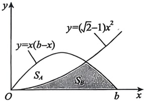

(D)$S_{A}$与$S_{B}$的大小关系与b的数值有关

### 4.

过点$(p,\sin p)$作曲线$y=\sin x$的切线(见图)，设该曲线与切线及y轴所围成的图形的面积为$S_{1}$

曲线与直线x=p及x轴所围成的图形的面积为$S_{2}$，则()。

(A)$\lim_{p \to 0^{+}} \frac{S_2}{S_1 + S_2} = \frac{1}{3}$

(B)$\lim_{p \to 0^{+}} \frac{S_2}{S_1 + S_2} = \frac{1}{2}$

(C)$\lim_{p \to 0^{+}} \frac{S_2}{S_1 + S_2} = \frac{2}{3}$

(D)$\lim_{p \to 0^{+}} \frac{S_2}{S_1 + S_2} = 1$

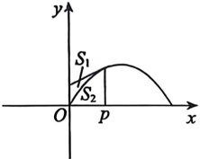

### 5.

平面无界区域$D=\left\{(x,y)|(1+x^2)|y|\leq1\right\}$的面积为___.

### 6.

设平面区域$D$由曲线段$y = \sin \pi x$($0 \leq x \leq 1$) 与$x$轴围成，则$D$绕$y$轴旋转一周所成旋转体的体积为___。

### 7.

已知函数$f(x)=x\int_{1}^{x}\frac{e^{t^{2}}}{t}dt$，则$f(x)$在$(0,1)$上的平均值为___。

### 8.

已知曲线$L: y = e^{-x} (x \geq 0)$，设 P 是 L 上的动点，V 是 L 上从点$A(0,1)$到点 P 的一段弧绕 x 轴旋转一周所得的旋转体体积，当 P 运动到点$\left(1, \frac{1}{e}\right)$时，沿 x 轴正向的速度为 1，求此时 V 关于时间 t 的变化率.
### 9.

曲线$y = \ln \sin x \left( \frac{\pi}{6} \leq x \leq \frac{\pi}{3} \right)$的弧长为 ___.

### 10.

曲线$r = e^{\theta}$从$\theta = 0$到$\theta = 1$的弧长为 ___.

### 11.

已知函数$y = y(x)$由方程$y^4 - 6xy + 3 = 0$($1 \leq y \leq 2$) 所确定，则曲线$y = y(x)$从点$\left(\frac{2}{3}, 1\right)$到点$\left(\frac{19}{12}, 2\right)$的长度为___。

### 12.

曲线$y = e^x$与其过原点的切线及$y$轴所围图形的面积为( )。

(A)$\int_0^1 (\ln y - y \ln y) \, dx$

(B)$\int_0^1 (e^x - ex) \, dx$

(C)$\int_1^e (\ln y - y \ln y) \, dx$

(D)$\int_1^e (e^x - xe^x) \, dx$

### 13.

曲线$y = x^2 e^{-x}$($0 \leq x < +\infty$) 绕$x$轴旋转一周所得延展到无穷远的旋转体的体积为___。

### 14.

曲线$f(x)=x\ln x$($0<x\leq2$) 绕x轴旋转一周所得旋转体的体积为___.

### 15.

曲线$y = \frac{1}{2} x^2$($0 \leq x \leq 1$) 的长度为 ___.

### 16.

设平面$D$是由$y = \ln x$，$x = 1$，$y = 1$围成的第一象限的有界区域，记$D$绕$x$轴与绕$y = 1$旋转一周所得旋转体的体积分别为$V_1$，$V_2$，则（ ）。

(A)$V_1 > \frac{\pi}{2} > V_2$(B)$V_2 > \frac{\pi}{2} > V_1$

(C)$\frac{\pi}{2} > V_1 > V_2$(D)$\frac{\pi}{2} > V_2 > V_1$

### 17.

曲线$y = x^{2}$从点 (1,1) 到点 (2,4) 的一段弧绕 y 轴旋转一周所得旋转体的侧面积为 ___.

### 18.

函数$y = \frac{x^2}{\sqrt{1-x^2}}$在区间$[0,1]$上的平均值为 ___.

### 19.

设平面区域$D = \left\{(x, y) \mid 0 \leqslant y \leqslant \frac{\sqrt{x^2 - 1}}{x^2}, \sqrt{2} \leqslant x \leqslant 2\right\}$，求：

(1) D 的面积;

(2) D 绕 x 轴旋转一周所成旋转体的体积.
## 第11章 一元函数积分学的应用（二）——积分等式与积分不等式

### 1.

设$a > 0$，则在$[0, a]$上方程$\int_{0}^{x} \sqrt{4a^{2} - t^{2}} \, dt + \int_{a}^{x} \frac{1}{\sqrt{4a^{2} - t^{2}}} \, dt = 0$的根的个数为（）.

(A)0 (B)1 (C)2 (D)3

### 2.

设函数$f(x)$具有二阶导数，$f'(x) > 0$，$f''(x) < 0$，记$I_1 = \int_{-\pi}^{\pi} f(x) \sin x \, dx$，$I_2 = \int_{-\pi}^{\pi} f(x) \cos x \, dx$，则（ ）。

(A)$I_1 > 0$,$I_2 < 0$(B)$I_1 < 0$,$I_2 > 0$(C)$I_1 < 0$,$I_2 < 0$(D)$I_1 > 0$,$I_2 > 0$

### 3.

设$f(x)$为连续函数，T > 0，证明：$f(x)$以 T 为周期的充分必要条件是任给常数 a，$\int_{a}^{a+T} f(x) \, dx$为常数.

### 4.

设$f(x)$连续，证明：$\int_{0}^{x}\left[\int_{0}^{t}f(u)du\right]dt=\int_{0}^{x}f(t)(x-t)dt$.

### 5.

设$f(x)$，$g(x)$连续，$x\in[a,b]$，证明至少存在一点$\xi\in(a,b)$，使$f(\xi)\int_{\xi}^{b}g(x)dx=g(\xi)\int_{a}^{\xi}f(x)dx$.

### 6.

证明：$\int_{0}^{+\infty}\frac{dx}{1+x^{4}}=\int_{0}^{+\infty}\frac{x^{2}}{1+x^{4}}dx=\frac{\sqrt{2}}{4}\pi$

### 7.

已知函数$f(x)$，$g(x)$可导，且$f'(x)>0$，$g'(x)<0$，则( )。

(A)$\int_{-1}^{0} f(x) g(x) dx > \int_{0}^{1} f(x) g(x) dx$

(B)$\int_{-1}^{0} \left| f(x) g(x) \right| dx > \int_{0}^{1} \left| f(x) g(x) \right| dx$

(C)$\int_{-1}^{0} f\left[g(x)\right] dx > \int_{0}^{1} f\left[g(x)\right] dx$

(D)$\int_{-1}^{0} f\left[f(x)\right] dx > \int_{0}^{1} g\left[g(x)\right] dx$

### 8.

设$f(x)$，$g(x)$在$[0,1]$上连续，则使得$\int_{0}^{1}f(x)\mathrm{d}x\int_{0}^{1}g(x)\mathrm{d}x\geqslant\int_{0}^{1}f(x)g(x)\mathrm{d}x$成立的条件是在$[0,1]$上( ).

(A)$f(x)$，$g(x)$均为增函数

(B)$f(x)$，$g(x)$均为减函数

(C)$f(x)$为减函数，$g(x)$为增函数

(D)$f(x)$为奇函数，$g(x)$为偶函数

### 9.

设$f'(x)$在$[a,b]$上连续，$f(a)=f(b)=0$，证明：当$x\in(a,b)$时，$\left|f(x)\right|\leqslant\frac{1}{2}\int_{a}^{b}\left|f'(x)\right|\mathrm{d}x$

### 10.

设$f'(x)$在$[0,1]$上连续，且$f(0)=0$，证明：$\left|\int_{0}^{1}f(x)dx\right|\leq\frac{M}{2}$，其中$M=\max_{0\leq x\leq1}|f'(x)|$.

### 11.

设$f(x)=\int_{x}^{x+1}\sin u^{2}du$，证明：当x>0时，有$\left|f(x)\right|\leq\frac{1}{x}$.
## 第12章 一元函数积分学的应用（三）——物理应用

### 1.

设沿y轴上的区间[0,1]放置一长度为1且线密度为$\rho$的均匀细杆，在x轴上x=1处有一单位质点，则该细杆对此质点的引力（G为引力常量）沿x轴正向的分力为

### 2.

边长为 a 的正方形平板置于水面下，且一个顶点与水面相齐，其中一条对角线与水面垂直，如图所示. 记水的密度为$\rho$，重力加速度为 g，则其一侧所受的静水压力为 ___.

### 3.

将地面上质量为1的物体铅直向上举高，记地球半径为R，质量为M，引力常数为G，则物体摆脱地球引力所做的功至少为___.

### 4.

有一内表面为旋转抛物面的水缸，其深为 a (单位：米)，缸口直径为 2a (单位：米)，缸内盛满了水，设水的密度为$\rho$(单位：千克 / 立方米). 若以每秒 Q 立方米的速率将缸中的水全部抽出，问：

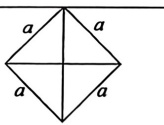

(1) 共需多少时间？

(2) 需做多少功？

### 5.

在一个高为$1 \, m$的圆柱形容器内储存某种液体，并将容器横放。底面圆的方程为$x^{2} + y^{2} = 1$（单位：m）。如果容器内存满了液体后，以$0.2 \, m^{3} / min$的速率将液体从容器顶端抽出。

(1) 当液面在 y=0 时，求液面下降的速率；

(2) 如果$1 \, m^{3}$液体所受重力为$1 \, N$，求抽完全部液体需做多少功？

### 6.

设一单位质量细杆的长为1，G为引力常数. 当质量为a的质点在细杆延长线上距杆右端点的$\frac{1}{2}$处移至$\frac{1}{3}$处时，引力做功大小为().

(A)$Ga\ln\frac{4}{3}$(B)$Ga\ln\frac{5}{3}$(C)$Ga\ln2$(D)$Ga\ln3$

### 7.

直角三角板的斜边长度为1，将该直角三角板竖直插入水中，并使其中一个直角边与水面对齐，当三角板受到水的压力最大时，其水平直角边的长度为( )。

(A)$\frac{\sqrt{3}}{3}$(B)$\frac{\sqrt{5}}{5}$(C)$\frac{\sqrt{6}}{3}$(D)$\frac{\sqrt{2}}{2}$
## 第13章 多元函数微分学

### 1.

设$z = \arctan[xy + \cos(x + y)]$，则$\mathrm{d}z\big|_{(0,x)} =$___.

### 2.

设函数$f(u)$可导，$z = f(\cos y - \cos x) + xy$，则$\frac{1}{\sin x} \cdot \frac{\partial z}{\partial x} + \frac{1}{\sin y} \cdot \frac{\partial z}{\partial y} =$___。

### 3.

设函数$f(u)$可导，$z = yf(x^{y^2})$，则$2x\frac{\partial z}{\partial x} + y\frac{\partial z}{\partial y} =$___。

### 4.

设函数$z = z(x, y)$由方程$(x+1)z + 2y\ln z - \arctan(xy) = 1$确定，则$\left.\frac{\partial z}{\partial x}\right|_{(0,2)} =$___.

### 5.

设$F(x,y)=\int_{0}^{x-y}(x-y-t)e^{t}dt$，则$\frac{\partial^{2}F}{\partial x^{2}}+\frac{\partial^{2}F}{\partial y^{2}}=$___.

### 6.

设函数$f(x,\sin x)=x+\sin x$，$f_{x}^{\prime}(x,y)=1+2\cos x$，则$f_{y}^{\prime}(x,y)\big|_{y=\sin x}=$___。

### 7.

设函数$f(x,y)$具有二阶连续偏导数，且满足$\frac{\partial^2[f(x,y)]}{\partial x\partial y}=1$，$f(0,y)=\sin y$，$f(x,0)=\sin x$，则$f\left(\frac{\pi}{2},\frac{\pi}{2}\right)=$___。

### 8.

设$f\left(x+y,\frac{x}{y}\right)=x^{2}-xy+y^{2}$，则$f_{x}^{\prime}(x,y)=$___.

### 9.

设函数$f(x,y)=\sqrt{|xy|}$，求$\frac{\partial[f(x,y)]}{\partial x}$.

### 10.

设$Q(x,y)=\frac{x}{y^{2}}$, y>0,$P(x,y)\mathrm{d}x+Q(x,y)\mathrm{d}y$是某二元函数的全微分，则$P(x,y)$可取为 ( ).

(A)$y^{2}-\frac{x^{2}}{y^{3}}$(B)$x^{2}-\frac{1}{y}$(C)$\frac{1}{y^{2}}-\frac{x^{2}}{y^{3}}$(D)$\frac{1}{x^{2}}-\frac{1}{y}$

### 11.

设$z = f(u)$可导，$u = u(x, y)$由方程$u = \varphi(u) + \int_{y} P(t) \, dt$所确定，其中函数$P$连续，$\varphi$有连续导数，且$\varphi'(u) \neq 1$，则$P(x) \frac{\partial z}{\partial y} + P(y) \frac{\partial z}{\partial x} =$___.

### 12.

设$f$具有二阶连续偏导数，且$u = f(x^2 + y, xy)$，则$u_{xy}^n =$___。
### 13.

设函数$f(u,v)$具有二阶连续偏导数，函数$g(x,y)=xy-f\left(\frac{y}{x},\frac{x}{y}\right)$，求

$$x^{2}\frac{\partial^{2}g}{\partial x^{2}}+2xy\frac{\partial^{2}g}{\partial x\partial y}+y^{2}\frac{\partial^{2}g}{\partial y^{2}}.$$

### 14.

设函数$z = x y f\left(\frac{y}{x}\right)$，其中$f(u)$可导，且满足$x \frac{\partial z}{\partial x} + y \frac{\partial z}{\partial y} = y^{2} (\ln y - \ln x)$，求：

(1)$f(x)$的表达式；

(2)$f(x)$与x轴所围图形的面积及该图形绕x轴旋转一周所得旋转体的体积.

### 15.

已知函数$u(x,y)$满足$2\frac{\partial^{2}u}{\partial x^{2}}-2\frac{\partial^{2}u}{\partial y^{2}}+3\frac{\partial u}{\partial x}+3\frac{\partial u}{\partial y}=0$，求$a,b$的值使得在变换$u(x,y)=\nu(x,y)e^{ax+by}$之下，上述等式可化为函数$\nu(x,\nu)$的不含一阶偏导数的等式.

### 16.

设函数$u = f(x, y)$具有二阶连续偏导数，作变量代换$\xi = x$，$\eta = y - x$，将方程$\frac{\partial^2 u}{\partial x^2} + 2\frac{\partial^2 u}{\partial x \partial y} + \frac{\partial^2 u}{\partial y^2} = 0$化为以$\xi$，$\eta$为自变量的方程.

### 17.

设函数$z = z(x, y)$由方程$F\left(x + \frac{z}{y}, y + \frac{z}{x}\right) = 0$确定，且$F(u, v)$具有连续偏导数，求$x \frac{\partial z}{\partial x} + y \frac{\partial z}{\partial y}$.

### 18.

设$f(x,y)$在有界闭区域D上连续，在D内有一阶偏导数.若$f(x,y)$在D的边界$\partial D$上的值均为0，且$\frac{\partial[f(x,y)]}{\partial x}+\frac{\partial[f(x,y)]}{\partial y}=f(x,y)$，则$f(x,y)$()。

(A) 在 D 内有正的最大值

(B)在D内有负的最小值

(C) 只在 D 的边界$\partial D$上取到最大值

(D)在D的边界$\partial D$上可以取到最小值

### 19.

设$f(x, y)$在平面有界闭区域$D$上具有二阶连续偏导数，且满足$\frac{\partial^2 f}{\partial x \partial y} > 0$与$\frac{\partial^2 f}{\partial x^2} + \frac{\partial^2 f}{\partial y^2} = 0$，则（ ）。

(A)$f(x,y)$的最小值点和最大值点都在D的内部

(B)$f(x,y)$的最小值点和最大值点都在D的边界上

(C)$f(x,y)$的最小值点在D的内部，最大值点在D的边界上

(D)$f(x,y)$的最大值点在D的内部，最小值点在D的边界上

### 20.

设$f(x,y)=x^{4}+y^{4}-(x+y)^{2}$，且 (1,1) 与$(-1,-1)$为函数$f(x,y)$的两个驻点，则()。

(A)$f(1,1)$与$f(-1,-1)$都是极大值

(B)$f(1,1)$与$f(-1,-1)$都是极小值

(C)$f(1,1)$是极大值，$f(-1,-1)$是极小值

(D)$f(1,1)$是极小值，$f(-1,-1)$是极大值

### 21.

求函数$f(x, y) = x^{3} - 3xy - y^{2} - y - 9$的极值.

### 22.

求函数$f(x,y)=x^{2}\left(2x^{2}-4y-\frac{1}{7}x^{5}\right)+y^{2}$的极值.

### 23.

设$f(x,y)$满足$f_{x}^{\prime}(x,y)=y(1+x)e^{x-y}$,$f(1,y)=ye^{1-y}$.求：

(1)$f(x,y)$的表达式；

(2)$f(x,y)$的极值.

### 24.

求曲线$x^{2} + xy + y^{2} + 2x - 2y - 12 = 0$上的点到原点距离的最大值和最小值.
## 第14章 二重积分

### 1.

设$D$为由$x=0, y=0, x+y=\frac{1}{2}, x+y=1$所围成的区域，$I_1=\iint_D \ln^7(x+y)d\sigma$，$I_2=\iint_D (x+y)^7d\sigma$，$I_3=\iint_D \sin^7(x+y)d\sigma$，则（ ）。

(A)$I_1<I_2<I_3$(B)$I_1<I_3<I_2$(C)$I_3<I_2<I_1$(D)$I_3<I_1<I_2$

### 2.

设$I_i = \iint_{\mathcal{D}_i} e^{-(x^2 + y^2)} \, \mathrm{d}\sigma, i=1,2,3$，其中$D_1 = \left\{(x,y) \mid x^2 + y^2 \leq R^2\right\}$，$D_2 = \left\{(x,y) \mid x^2 + y^2 \leq 2R^2\right\}$，$D_3 = \left\{(x,y) \mid x \leq R, |y| \leq R\right\}$，$R > 0$，则（）.

(A)$I_1 < I_2 < I_3$(B)$I_2 < I_3 < I_1$(C)$I_1 < I_3 < I_2$(D)$I_3 < I_2 < I_1$

### 3.

$\lim_{r \to 0} \frac{1}{\pi r^2} \iint_{x^2 + y^2 \leq r^2} e^{x^2 - y^2} \cos(x + y) \, dx dy = (\quad)$.

(A)0 　 (B)1 \quad (C) $\pi r^{2}$ \quad (D) $\frac{1}{\pi r^{2}}$

### 4.

设$D$是由曲线$y = x^2 - 1$和$y = \sqrt{1 - x^2}$围成的平面区域，则$\iint_D (axy + by^2) \, \mathrm{d}x \, \mathrm{d}y$( )。

(A) 等于 0

(B) 符号与$a$有关，与$b$无关

(C) 符号与$b$有关，与$a$无关

(D) 符号与$a$，$b$都有关

### 5.

$\int_{0}^{1} \mathrm{d}x \int_{0}^{\sqrt{x}} e^{\frac{y^{2}}{2}} \mathrm{d}y =$___.

### 6.

$\int_{0}^{1} \mathrm{d}y \int_{0}^{y^{2}} \frac{x e^{x}}{1 - \sqrt{x}} \mathrm{d}x =$___.

### 7.

$I=\int_{1}^{e}dy\int_{0}^{\ln y}f(x,y)dx$(其中$f(x,y)$连续)交换积分次序得().

(A)$I=\int_{0}^{\ln y}dx\int_{1}^{e}f(x,y)dy$(B)$I=\int_{0}^{1}dx\int_{e^{x}}^{e}f(x,y)dy$

(C)$I=\int_{1}^{e}dx\int_{0}^{\ln y}f(x,y)dy$(D)$I=\int_{e^{x}}^{e}dx\int_{0}^{1}f(x,y)dy$

### 8.

设$f(x,y)$是连续函数，则$\int_{\frac{\pi}{2}}^{\frac{5\pi}{6}}\mathrm{d}x\int_{\sin x}^{1}f(x,y)\mathrm{d}y=$___.

(A)$\int_{\frac{1}{2}}^{1} dy \int_{\frac{\pi}{2}}^{\arcsin y} f(x,y) dx$

(B)$\int_{\frac{1}{2}}^{1} dy \int_{\pi - \arcsin y}^{\frac{5\pi}{6}} f(x,y) dx$

(C)$\int_{0}^{\frac{1}{2}} dy \int_{\frac{\pi}{2}}^{\arcsin y} f(x,y) dx$

(D)$\int_{0}^{\frac{1}{2}} dy \int_{\pi - \arcsin y}^{\frac{\pi}{2}} f(x,y) dx$

### 9.

设函数$f(x,y)$连续，且$f(x,y)=f(y,x)=f(-x,y)$，则$\int_{-2}^{2}dx\int_{\sqrt{4-x^{2}}}^{2}f(x,y)dy=$( )

(A)$\int_{0}^{2}\left[\int_{-2}^{-\sqrt{4-y^{2}}}f(x,y)dx+\int_{-\sqrt{4-y^{2}}}^{2}f(x,y)dx\right]dy$(B)$2\int_{0}^{2}\left[\int_{\sqrt{4-y^{2}}}^{2}f(x,y)dy\right]dx$

(C)$4\int_{0}^{\frac{\pi}{4}}\mathrm{d}\theta\int_{2}^{2\sec\theta}f(r\cos\theta,r\sin\theta)r\mathrm{d}r$

(D)$4\int_{0}^{\arctan\frac{1}{2}}\mathrm{d}\theta\int_{2}^{2\sec\theta}f(r\cos\theta,r\sin\theta)r\mathrm{d}r$

### 10.

已知曲线$L$的极坐标方程为$r = \sin 3\theta\left(0 \leq \theta \leq \frac{\pi}{3}\right)$，$D$为曲线$L$围成的区域，则$\iint_{D} \sqrt{x^2 + y^2} \, dx \, dy =$___.

### 11.

设$D$是第一象限内在曲线$y = 4x^2$与$y = 9x^2$之间的区域，则$\iint_D x e^{-y^2} \, dx \, dy =$___

### 12.

已知$D=\left\{(x,y)\mid(x-a)^2+y^2\leqslant a^2,y\geqslant0\right\}$，$a>0$，则$\iint_{D}\sqrt{4a^2-x^2-y^2}dxdy=$___

### 13.

设平面区域$D$由曲线$y = \sqrt{3(1 - x^2)}$与直线$y = \sqrt{3}x$及$y$轴所围成. 计算二重积分$\iint_D (x^2 + y^2) \, dx \, dy$.

### 14.

设平面区域$D=\left\{(x,y)\mid1\leq x^{2}+y^{2}\leq4,x\geq0,y\geq0\right\}$，计算$\iint_{D}\frac{x\cos\sqrt{x^{2}+y^{2}}}{x+y}dxdy$

### 15.

设$D$是由$y = |x|$及$y = 1$围成的有界区域，计算二重积分$\iint_{D} \frac{x^2 - x\cos y - y^2}{x^2 + y^2} \, dx \, dy$.

### 16.

计算二重积分$\iint_{D} \sqrt{1-x^{2}-y^{2}} \, \mathrm{d}\sigma$，其中$D=\left\{(x,y) \mid x^{2}+y^{2} \leqslant y\right\}$

### 17.

设平面区域$D = \left\{(x, y) \mid x^3 \leq y \leq 1, -1 \leq x \leq 1\right\}$，$f(x)$是定义在$[-a, a]$($a \geq 1$) 上的任意连续函数，求$\iint_D \left[(x+1)f(x) + (x-1)f(-x)\right] \sin y \, dx \, dy$。

### 18.

计算$I = \int_{0}^{1} \mathrm{d}y \int_{y}^{\sqrt{2y-y^{2}}} \frac{1}{\sqrt{x^{2}+y^{2}} \sqrt{4-x^{2}-y^{2}}} \mathrm{d}x$.
### 19.

计算$\iint_{D} f(x,y)d\sigma$，其中$D=\left\{(x,y)\mid x^{2}+y^{2}\geqslant2x\right\}$，$f(x,y)=\left\{\begin{aligned}&y,&1\leqslant x\leqslant2,0\leqslant y\leqslant x,\\ &0,& 其他.\end{aligned}\right.$

### 20.

设平面区域$D=\left\{(x,y)\mid x+y\leq1,x\geq0,y\geq0\right\}$，计算$\iint_{D}\frac{e^{-(x+y)}}{\sqrt{xy}}d\sigma$.

### 21.

已知平面区域$D=\left\{(x,y)\mid(x-1)^2+y^2\leq1\right\}$，计算二重积分$I=\iint_D(x^2-3y^2)dxdy$。

### 22.

计算二重积分$\iint_{D}(x+y^{2})\,\mathrm{d}\sigma$，其中$D=\left\{(x,y)\mid x^{2}+y^{2}\leq x+y\right\}$.

### 23.

计算$I = \iint_{D} \sqrt{x^2 + y^2} \, dx \, dy$，其中$D$是$x^2 + y^2 \leq a^2$和$\left(x - \frac{a}{2}\right)^2 + y^2 \geq \frac{a^2}{4}$的公共部分，$a > 0$。

### 24.

计算$\iint_{D}\sqrt{\frac{1-x^{2}-y^{2}}{1+x^{2}+y^{2}}}dxdy$，其中D为圆$x^{2}+y^{2}=1$所包围的在第一象限内的区域.
## 第15章 微分方程

### 1.

$x\mathrm{d}y + y\mathrm{d}x = \sin x\mathrm{d}x$满足$y(\pi) = 0$的特解为 ___.

### 2.

已知曲线上任一点的切线在 y 轴上的截距与法线在 x 轴上的截距之比为 3:1，则该曲线方程为 ___.

### 3.

设$y_1, y_2$是一阶非齐次线性微分方程$y' + p(x)y = q(x)$的两个特解，若常数$\lambda$，$\mu$使$\lambda y_1 + \mu y_2$是该方程的解，$\lambda y_1 - \mu y_2$是该方程对应的齐次方程的解，则（）.

(A)$\lambda = \frac{1}{2}$,$\mu = \frac{1}{2}$

(B)$\lambda = -\frac{1}{2}$,$\mu = -\frac{1}{2}$

(C)$\lambda = \frac{2}{3}$,$\mu = \frac{1}{3}$

(D)$\lambda = \frac{2}{3}$,$\mu = \frac{2}{3}$

### 4.

求微分方程$(2x - 3xy^{2} - y^{3})y' + y^{3} = 0$的通解.

### 5.

过原点的曲线$y = y(x)$满足$\frac{dy}{dx} = (x + y)^2$，则$\lim_{x \to 0^+}[y(x)]^x =$___。

### 6.

微分方程$y' = (x + 1) \sec y - \tan y$的通解为 ___.

### 7.

设函数$y(x)$是微分方程$y' + \frac{1}{x^2} y = 2e^{\frac{1}{x}}$满足$y\left(\frac{1}{2}\right) = 0$的解.

(1) 求$y = y(x)$的表达式；

(2) 求曲线$y(x)$的斜渐近线.

### 8.

以 yOz 面上的平面曲线段$y = f(z) (z \geq 0)$绕 z 轴旋转一周所成旋转曲面与 xOy 面围成一个无上盖容器(见图)，现以$3 \, \text{cm}^3/\text{s}$的速率把水注入容器内，水面的面积以$\pi \, \text{cm}^2/\text{s}$的速率增大。已知容器底面积为$16\pi \, \text{cm}^2$，求曲线$y = f(z)$的方程。

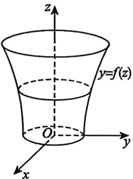

### 9.

设$f(x)$有连续导数，$x \in [0, +\infty)$，且满足方程$\int_{0}^{x}(x-1)f(t)dt - \int_{0}^{x} t f(t)dt = x$，求函数$f(x)$.

### 10.

设$\varphi(x)$为连续函数，$\left|\varphi(x)\right|\leq k$(k 为常数)，求微分方程$\frac{\mathrm{d}y}{\mathrm{d}x} + y = \varphi(x)$满足初始条件$y(0) = 0$的特解$y(x)$，并证明当$x \geq 0$时，有$\left|y(x)\right| \leq k(1 - e^{-x})$。

### 11.

设函数$y = y(x)$是微分方程$2xy' - 4y = 2\ln x - 1$满足条件$y(1) = \frac{1}{4}$的解，求曲线$y = y(x)$在
[1,e]上的平均值.

### 12.

设曲线$y = y(x) (x > 0)$经过点$(1, 0)$，该曲线上任一点$P(x, y)$到 y 轴的距离等于该点处的切线在 y 轴上的截距，求$y(x)$在区间$(0, 1)$上与 x 轴所围平面图形的面积.

### 13.

设曲线$y = y(x)$上点$P(0,4)$处的切线垂直于直线$x - 2y + 5 = 0$，且该曲线满足微分方程$y'' + 2y' + y = 0$，则此曲线方程为（ ）。

(A)$y = \frac{9}{2}x e^{-x}$

(B)$y = \left(4 + \frac{9}{2}x\right)e^{-x}$

(C)$y = (C_1 x + C_2) e^{-x}$

(D)$y = 2(x + 2) e^{-x}$

### 14.

设曲线$y = y(x)$经过原点，且在原点处的切线与直线$2x + y + 6 = 0$平行，而$y(x)$满足微分方程$y'' - 2y' + 5y = 0$，则此曲线的方程为（ ）。

(A)$y = e^x \sin 2x$

(B)$y = -e^x \sin 2x$

(C)$y = e^x (\cos 2x - \sin 2x)$

(D)$y = e^x (\sin 2x - \cos 2x)$

### 15.

设$y = y(x)$满足$y'' - 2y' + y = 0$，且$y(0) = 0$，$y'(0) = 1$，则$\int_{-\infty}^{0} y(x) \, dx =$___。

### 16.

已知某常系数齐次线性微分方程的通解为$y = C_1 + \mathrm{e}^x (C_2 \cos 2x + C_3 \sin 2x)$，则该微分方程为___。

### 17.

微分方程$4y'' - 12y' + 9y = e^{\frac{3}{2}x}$($3x^2 + 2$) 的特解形式为 ( )。

(A)$Ax^2 + Bx + C + D e^{\frac{3}{2}x}$

(B)$(Ax^2 + Bx + C)e^{\frac{3}{2}x}$

(C)$x(Ax^2 + Bx + C)e^{\frac{3}{2}x}$

(D)$x^2(Ax^2 + Bx + C)e^{\frac{3}{2}x}$

### 18.

已知$y_1 = x e^x + e^{2x}$，$y_2 = x e^x + e^{-x}$，$y_3 = x e^x + e^{2x} - e^{-x}$是某二阶常系数非齐次线性微分方程的三个解，则此微分方程为___。

### 19.

求微分方程$y'' - 2y' + y = 2(3x^2 - 2)e^x$的通解.

### 20.

求微分方程$y'' + 4y' + 5y = 8\cos x$，当$x \to -\infty$时为有界的特解.

### 21.

欧拉方程$x^2 y'' + 3xy' + 3y = 0$满足条件$y(1) = 0$，$y'(1) = \sqrt{2}$的解为$y =$___.
## 第16章 无穷级数

### 1.

设 p 为常数，若级数$\sum_{n=1}^{\infty}\frac{\left(\sqrt{n+1}-\sqrt{n}\right)^{p}}{n}$与$\sum_{n=1}^{\infty}\left[\frac{1}{n^{p}}-\frac{1}{(n+1)^{p}}\right]$均收敛，则( ).

$(A) -2 < p \leq -1$

$(B) -1 \leq p < 0$

$(C) -1 < p \leq 0$

(D) p > 0

### 2.

判断级数$\sum_{n=1}^{\infty}\left(\ln\frac{1}{n}-\ln\sin\frac{1}{n}\right)$的敛散性.

### 3.

设$\lambda > 0$是常数，则$\sum_{n=1}^{\infty}(-1)^{n}\sin\frac{\lambda+2n^{2}}{n^{3}}$( ).

(A) 发散 (B) 条件收敛

(C) 绝对收敛 (D) 敛散性与$\lambda$有关

### 4.

以下结论正确的是( ).

(A) 若$\sum_{n=0}^{\infty} a_{n}^{2}$收敛，则$\sum_{n=0}^{\infty} a_{n}^{3}$收敛

(B) 若$\sum_{n=0}^{\infty} a_{n}^{2}$发散，则$\sum_{n=0}^{\infty} a_{n}^{3}$发散

(C) 若$\sum_{n=0}^{\infty}a_{n}^{3}$收敛，则$\sum_{n=0}^{\infty}a_{n}^{4}$收敛

(D) 若$\sum_{n=0}^{\infty}a_{n}^{3}$发散，则$\sum_{n=0}^{\infty}a_{n}^{4}$发散

### 5.

设$u_{n}=\sqrt{\arctan(n+k)-\arctan n}$，k 为正常数，则$\sum_{n=1}^{\infty}(-1)^{n}u_{n}$___.

(A) 绝对收敛 (B) 条件收敛

(C) 发散 (D) 敛散性与 k 有关

### 6.

设$\sum_{n=1}^{\infty}(u_{n+1}-u_{n})$收敛，则下列级数中收敛的是( ).

(A)$\sum_{n=1}^{\infty}\frac{u_{n}}{n}$(B)$\sum_{n=1}^{\infty}(-1)^{n}\frac{1}{u_{n}}$

(C)$\sum_{n=1}^{\infty}\left(1-\frac{u_{n}}{u_{n+1}}\right)$(D)$\sum_{n=1}^{\infty}(u_{n+1}^{2}-u_{n}^{2})$

### 7.

(1)求y(x)的表达式;

设函数$y = y(x)$满足$(1 - x)y' + 2y = 0$,$y(0) = 1$,$a_n(x) = \int_0^x y(t) \sin^n t \, dt$,$n = 1, 2, \cdots$.
(2)证明$\sum_{n=1}^{\infty}a_{n}(1)$收敛.

### 8.

设$a_{n}(x)$满足

$$a_{n}^{\prime}(x)-\frac{n}{(1+x)\ln(1+x)}\ a_{n}(x)+\ln^{n}(1+x)=0\ ,x>0\ ,n=1,2,\cdots\ ,a_{n}(1)=0.$$

(1) 求$a_{n}(x)$的表达式；

(2)判别$\sum_{n=1}^{\infty}\int_{0}^{1}a_{n}(x)dx$的敛散性.

### 9.

设幂级数$\sum_{n=1}^{\infty}na_{n}(x+1)^{n}$的收敛区间为$(-3,1)$，则$\sum_{n=1}^{\infty}a_{n}(x-1)^{2n}$的收敛区间为 ___.

### 10.

级数$\sum_{n=1}^{\infty}\frac{n!}{n^n}e^{-nx}$的收敛域为 ___.

### 11.

幂级数$\sum_{n=1}^{\infty}(-1)^{n-1}\cdot\frac{x^{\frac{n}{2}}}{n}$在$(0,1]$内的和函数$S(x)=$___.

### 12.

$\sum_{n=1}^{\infty}\frac{1}{(n+1)2^n}=$___.

### 13.

$\sum_{n=2}^{\infty}\frac{1}{(n^{2}-1)2^{n}}=$___.

### 14.

求幂级数$\sum_{n=0}^{\infty}\frac{(-2)^{n}+2}{2^{n}(2n+1)}x^{2n}$的收敛域及和函数$S(x)$.

### 15.

(1) 求微分方程$y'(x) + y(x) = \frac{(-x)^{n-1}}{3^n e^x}$的通解，其中 n 为任意正整数；

(2)记$a_{n}(x)(n=1,2,\cdots)$是(1)中满足条件$y(0)=0$的特解，求级数$\sum_{n=1}^{\infty}a_{n}(x)$的和函数.

### 16.

设函数$f(x)=\frac{x^{2}-x-1}{x^{2}(x+1)}$的幂级数展开式为$\sum_{n=0}^{\infty}a_{n}(x-1)^{n}, x\in(0,2)$，求$\lim_{n\to\infty}\frac{(-1)^{n}a_{n}}{\sqrt{n^{2}+1}}$

### 17.

设$f(x)=\begin{cases}x^2,&0\leq x\leq\frac{1}{2},\\x-1,&\frac{1}{2}<x<1,\end{cases}$,$S(x)=\sum_{n=1}^{\infty}b_n \sin n\pi x$, 其中$b_n=2\int_0^1 f(x) \sin n\pi x dx$($n=1,2,\cdots$), 则$S\left(-\frac{5}{2}\right)=(\quad)$.

(A)$\frac{1}{8}$(B)$\frac{1}{4}$(C)$-\frac{1}{8}$(D)$-\frac{1}{4}$

### 18.

设$f(x) = \sin x$，若$f(x) = \frac{a_0}{2} + \sum_{n=1}^{\infty} a_n \cos nx$，$x \in [0, \pi]$，则$\lim_{n \to \infty} n^2 \ln (1 + a_{2n}) =$___.

### 19.

已知$f(x)=\left|x\right|,-\pi\leq x\leq\pi$

(1) 将$f(x)$展开成余弦级数；

(2) 求$\sum_{n=1}^{\infty}\frac{1}{(2n-1)^{2}}$.
## 第17章 多元函数积分学的预备知识
### 1.

已知函数$f(x,y)$在点$(0,0)$处可微，$f(0,0)=0$，$f_{x}^{\prime}(0,0)=1$，$f_{y}^{\prime}(0,0)=-1$，且$n=(-1,1,1)$，则$\lim_{{x\to0}\atop{y\to0}}\frac{(x,y,f(x,y))*n}{e^{\sqrt{x^2+y^2}}-1}=$___。

### 2.

设有直线$L:\left\{\begin{aligned}&x+3y+2z+1=0,\\ &2x-y-10z+3=0\end{aligned}\right.$及平面$\pi:4x-2y+z-2=0$，则直线$L$（ ）。

(A) 平行于$\pi$(B) 在$\pi$上          (C) 垂直于$\pi$(D) 与$\pi$斜交

### 3.

曲面$z = 4 - x^{2} - y^{2}$在点$P(1,1,2)$处的切平面方程为 ___.

### 4.

过点$(1,0,1)$与点$(0,1,1)$且与曲面$z=1+x^{2}+y^{2}$相切的平面为 ___.

### 5.

已知曲面$z = f(x, y)$由方程$z - x\ln(1 + z^2) + e^y = 0$所确定，则该曲面在点$(0, 0, -1)$处的切平面方程为 ___。

### 6.

$z = \ln\left(e^{-y} + \frac{y^2}{x}\right)$在点$(1,1)$处沿$I = (1,0)$的方向导数为 ___.

### 7.

求以$M_{0}(1,1,1)$为顶点，以曲线 C (C 是平面 z=0 上$y^{2}=x$被 x=1 截下的有限部分) 为准线的锥面方程.

### 8.

设函数$f(x,y)=\begin{cases}\frac{x^{2}\left|y\right|}{x^{2}+y^{2}},&(x,y)\neq(0,0),\\0,&(x,y)=(0,0),\end{cases}$，则$f(x,y)$在点$(0,0)$处沿$l=(1,1)$的方向导数是 ___.

### 9.

函数$f(x,y)=2x^{2}+y^{2}$在点(0,1)处的最大方向导数为___.

### 10.

设$f(x,y,z)=x^{2}\mathrm{e}^{yz}$，则$f(x,y,z)$在点$(-1,0,1)$处的方向导数的最小值为___。

### 11.

设 a, b 为实数，函数$z = 2 + ax^{2} + by^{2}$在点 (1,2) 处的方向导数中，沿方向$l = i + 2j$的方向导数最大，最大值为 10。求 a, b。

### 12.

设$g(x,y)$是函数$f(x,y)=x+2y+xy$在点$(x,y)$处的最大方向导数.

(1) 求$g(x, y)$的表达式；

(2) 求$g(x, y)$在曲线$C: x^{2} + y^{2} = 5$上的最大值.

### 13.

设可微函数$z = z(x, y)$在平面上任一点$(x, y)$处沿 x 轴正向 i 与 y 轴正向 j 的方向导数分别

为$\left[e^{-x} - f(x)\right]y$与$f(x)$，其中$f(x)$的一阶导数连续，且$f(0) = 1$。

(1) 求$z(x, y)$的表达式；

(2) 判断$z(x, y)$是否有极值，若有，求之，若无，说明理由.

### 14.

设$F(x, y, z) = xy\mathbf{i} - y\cos z\mathbf{j} + z\sin x\mathbf{k}$，则$\mathrm{rot}F\big|_{(1,1,0)} =$___.
## 第18章 多元函数积分学

### 1.

设平面曲线$z^2 = 2x$绕$x$轴旋转一周所得空间曲面$\Sigma$与平面$x = 1, x = 2$围成的空间区域为$\Omega$，则$I = \iiint_\Omega \frac{1}{x^2 + y^2 + z^2} \, \mathrm{d}v =$___。

### 2.

设$\Omega$是由上半球面$z = \sqrt{4 - x^2 - y^2}$与曲面$x^2 + y^2 = 3z$所围成的空间有界闭区域，则$\Omega$的形心竖坐标$\overline{z} =$___.

### 3.

设$L$为圆周$x^2 + y^2 = 1$，则$\oint_L (x^3 + y^2) ds =$___.

### 4.

设曲线$\Gamma$为曲面$x^2 + y^2 + z^2 = 1$与平面$x + y + z = 1$的交线，则$\oint_\Gamma (y^2 + 2x - z) ds =$___.

### 5.

设$l$是从点$(1, 1, 1)$到点$(4, 4, 4)$的直线段，则$\int_l \frac{xdx + ydy + zdz}{\sqrt{x^2 + y^2 + z^2 - x - y + 2z}} =$___.

### 6.

若$(2ax^3y^3 - 3y^2 + 5)dx + (3x^4y^2 - 2bxy - 4)dy$是某函数$u(x, y)$的全微分，则$u(x, y) =$___.

### 7.

使得$\oint_L (2y^3 - 3y) dx - x^3 dy$的值最大的平面正向边界曲线$L$为( )。

(A)$3x^2 + y^2 = 1$

(B)$2x^2 + y^2 = 1$

(C)$x^2 + 3y^2 = 1$

(D)$x^2 + 2y^2 = 1$

### 8.

设$x > 0$,$I = \int_L x(1 + y \sin x) \, \mathrm{d}x + \frac{f(x)}{x} \, \mathrm{d}y$与路径$L$无关,$f(x)$有连续导数且$f\left(\frac{\pi}{2}\right) = 0$. 当$L$是从点$A\left(\frac{\pi}{2}, 1\right)$到点$B(\pi, 0)$的任一曲线时,$I =$___.

### 9.

设$D \subset \mathbb{R}^2$是单连通有界闭区域，$I(D) = \iint_D (1 - x^2 - y^2) \, dx \, dy$取得最大值的积分域记为$D_1$

(1) 求$I(D_{1})$的值；

(2) 计算$\oint_{\partial D_1} \frac{(x\mathrm{e}^{x^2+2y^2}+y)\mathrm{d}x+(2y\mathrm{e}^{x^2+2y^2}-x)\mathrm{d}y}{x^2+2y^2}$，其中$\partial D_1$是$D_1$的正向边界.

### 10.

已知$\Omega = \{(x, y, z) \mid y^2 + z^2 \leq 1, 0 \leq x \leq 1\}$，$\Sigma$为$\Omega$的边界面且取外侧，则$\oint_{\Sigma} (y^3 + z \sin x) \, dz \, dx + z \, dxdy =$___.

### 11.

设$\Sigma$为上半球体$0 \leq z \leq \sqrt{a^2 - x^2 - y^2}$($a > 0$) 的表面外侧，则曲面积分$\oint_\Sigma xz^2 \, dydz + (x^2y - z^3)dz \, dx + (2xy + y^2z)dxdy =\underline{\qquad}$.

### 12.

设$\Sigma = \{(x, y, z) | x^2 + y^2 + z^2 = 1, x \geq 0, y \geq 0\}$，指向右侧，则$\iint_{\Sigma} x y z \, dx \, dy =$___.

### 13.

设$\Sigma$是曲线$x = e^y$($0 \leq y \leq a$) 绕$x$轴旋转而成的旋转曲面，取后侧，则$I = \iint_{\Sigma} 2(1 - x^2) \, \mathrm{d}y \, \mathrm{d}z + 8xydxdx - 4xzdxdy =$___.

### 14.

设$\Sigma$为曲面$x = y^{2} + z^{2} (x \leq 1)$的后侧，计算曲面积分

$$I=\iint\limits_{\Sigma}(x-1)\mathrm{d}y\mathrm{d}z+(y-1)^{3}\mathrm{d}z\mathrm{d}x+(z-1)^{3}\mathrm{d}x\mathrm{d}y.$$

### 15.

设曲面$\Sigma$为$z^{2}=x^{2}+y^{2}-1$介于 z=0 与 z=1 之间的部分，取外侧，$f(x)$为连续函数，计算

$$\iint_{\Sigma}\left[y f(x y)-2x\right]\mathrm{d}y\mathrm{d}z+\left[y^{2}-x f(x y)\right]\mathrm{d}z\mathrm{d}x+(z-1)^{2}\mathrm{d}x\mathrm{d}y.$$

### 16.

设空间曲线$\Gamma$:$\begin{cases}|x| + |y| = 1,\\z = \arctan(x + y),\end{cases}$从 z 轴正向往 z 轴负向看，$\Gamma$的方向为逆时针，计算

$$I=\oint_{r}(x^{2}-y)\mathrm{d}x+(2x+y^{2})\mathrm{d}y+z^{2}\mathrm{d}z.$$
## 第1章 行列式

### 1.

设 a, b, c 是方程$x^{3}-2x+4=0$的三个不同的根，则行列式$\begin{vmatrix} a & b & c \\ b & c & a \\ c & a & b \end{vmatrix}$的值等于( ).

(A)1 (B)0 (C)$-1$(D)$-2$

### 2.

行列式$\begin{vmatrix} x & 1 & 0 & 1 \\ 0 & 1 & x & 1 \\ 1 & x & 1 & 0 \\ 1 & 0 & 1 & x \end{vmatrix}$展开式中的常数项为( ).

(A)4

(B)2

(C)1

(D)0

### 3.

设$D=\begin{vmatrix}5x&1&2&3\\x&x&1&2\\1&2&x&3\\x&1&2&2x\end{vmatrix}$，则 D 的展开式中$x^{3}$的系数与$x^{4}$的系数分别为() .

(A)-5,10 (B)-5,-10 (C)5,-10 (D)5,10

### 4.

不恒为零的函数$f(x)=\left|\begin{matrix}a_{1}+x&b_{1}+x&c_{1}+x\\ a_{2}+x&b_{2}+x&c_{2}+x\\ a_{3}+x&b_{3}+x&c_{3}+x\end{matrix}\right|$( ).

(A)没有零点

(B)至多有1个零点

(C)恰有2个零点

(D)恰有3个零点

### 5.

若$f(x)=\left|\begin{matrix}3x+1&x+11&x-2\\ x+1&x+4&-1\\ x&7&x-1\end{matrix}\right|$，则曲线$f(x)$的拐点为( ).

(A) (1,7) (B) (-1,-1) (C) (0,0) (D) (-2,-2)
张宇 ___

### 6.

设$n$阶行列式$D_n = \begin{vmatrix} 2 & 1 & 0 & \cdots & 0 \\ 1 & 2 & 1 & \cdots & 0 \\ 0 & 1 & 2 & \cdots & 0 \\ \vdots & \vdots & \vdots & & \vdots \\ 0 & 0 & 0 & \cdots & 2 \end{vmatrix}$，则（ ）。

(A)$D_1, D_2, \cdots, D_n$为等比数列  

(B)$D_1, D_2, \cdots, D_n$为等差数列  

(C)$D_n$为范德蒙德行列式  

(D)$D_n = n$

### 7.

已知$A, B$均为4阶矩阵,$r(AA^{\mathrm{T}})=3$,$|AB|=\left|\begin{matrix}2&a&0&-a\\ -a&2&-5&b\\ b&0&b&-2\\ 0&-2&4&0\end{matrix}\right|$, 且$\left|\begin{matrix}2&a&-a\\ -a&2&b\\ b&0&-2\end{matrix}\right|=5$, 则$\left|\begin{matrix}-a&-5&b\\ 2&0&-a\\ b&b&-2\end{matrix}\right|=$___.

### 8.

$\begin{vmatrix}2&1&0&-1\\-1&2&-5&3\\3&0&a&b\\1&-3&5&0\end{vmatrix}-\begin{vmatrix}2&1&0&-1\\-1&2&-5&3\\3&0&a&b\\1&-1&1&0\end{vmatrix}=$___.

### 9.

设行列式$D = \begin{vmatrix} 2 & 0 & -1 & 1 \\ 3 & 1 & 0 & 1 \\ 4 & 1 & 1 & 0 \\ 5 & -1 & 0 & a \end{vmatrix}$，$A_{ij}$表示元素$a_{ij}(i,j=1,2,3,4)$的代数余子式。若$A_{11} - A_{21} + A_{41} = 4$，则$a =$___。

### 10.

设$x \neq 0$，则$D_4 = \begin{vmatrix} x & x & 0 & 0 \\ 1 & 1+2x & 2x & 0 \\ 0 & 2 & 2+3x & 3x \\ 0 & 0 & 3 & 3+4x \end{vmatrix} =$___.

### 11.

设$A$是 3 阶矩阵，$\alpha_1$，$\alpha_2$，$\alpha_3$是 3 维线性无关列向量，且满足$A\alpha_1 = \alpha_1 + 2\alpha_2 + \alpha_3$，$A\alpha_2 = 2\alpha_1 + \alpha_2 + \alpha_3$，$A\alpha_3 = \alpha_1 + \alpha_2 + 2\alpha_3$，则$|A| =$___。
## 第2章 矩阵

### 1.

以下矩阵乘积的结果为$\begin{bmatrix}1&-1&2\\ 2&1&3\\ 3&1&4\end{bmatrix}$的是( ).

$$\begin{bmatrix}1&0&0\\ 2&1&0\\ 3&\frac{4}{3}&2\end{bmatrix}\begin{bmatrix}1&-1&2\\ 0&3&-1\\ 0&0&-\frac{2}{3}\end{bmatrix}$$

$$\begin{bmatrix}1&0&0\\ 2&-1&0\\ 3&\frac{4}{3}&1\end{bmatrix}\begin{bmatrix}1&-1&2\\ 0&-3&-1\\ 0&0&-\frac{2}{3}\end{bmatrix}$$

$$\begin{aligned}(2)\begin{bmatrix}{{{1}}}&{{{0}}}&{{{0}}} \\{{{2}}}&{{{1}}}&{{{0}}} \\{{{3}}}&{{{\frac{4}{3}}}}&{{{1}}}\end{bmatrix}\begin{bmatrix}{{{1}}}&{{{0}}}&{{{0}}} \\{{{0}}}&{{{3}}}&{{{0}}} \\{{{0}}}&{{{0}}}&{{{-\frac{2}{3}}}}\end{bmatrix}\begin{bmatrix}{{{1}}}&{{{-1}}}&{{{2}}} \\{{{0}}}&{{{1}}}&{{{-\frac{1}{3}}}} \\{{{0}}}&{{{0}}}&{{{1}}}\end{bmatrix}\end{aligned}$$

$$\begin{bmatrix}{{{1}}}&{{{0}}}&{{{0}}} \\{{{2}}}&{{{-1}}}&{{{0}}} \\{{{3}}}&{{{\frac{4}{3}}}}&{{{1}}}\end{bmatrix}\begin{bmatrix}{{{1}}}&{{{0}}}&{{{0}}} \\{{{0}}}&{{{-3}}}&{{{0}}} \\{{{0}}}&{{{0}}}&{{{-\frac{2}{3}}}}\end{bmatrix}\begin{bmatrix}{{{1}}}&{{{-1}}}&{{{2}}} \\{{{0}}}&{{{1}}}&{{{-\frac{1}{3}}}} \\{{{0}}}&{{{0}}}&{{{1}}}\end{bmatrix}$$

### 2.

设$A = \begin{bmatrix} 1 & 1 \\ 0 & 1 \end{bmatrix}$,$B = \begin{bmatrix} -1 & 1 \\ 0 & -1 \end{bmatrix}$，则$A^9 - B^9 =$___.

### 3.

设$A = \begin{bmatrix} 0 & 0 & -1 \\ 0 & 1 & 0 \\ 1 & 0 & 0 \end{bmatrix}$，则$A^{13} =$___.

### 4.

设$B = \begin{bmatrix} 0 & 1 & 0 & 0 \\ 0 & 0 & 1 & 0 \\ 0 & 0 & 0 & 1 \\ 0 & 0 & 0 & 0 \end{bmatrix}$，$A = E + B + B^2 + B^3$，则$A^{-1} =$___.

### 5.

已知$A = \begin{bmatrix} 1 & -1 \\ 1 & 0 \end{bmatrix}$，若$(PA)^2 = PA$，$P$为可逆矩阵，则$P =$___。

### 6.

设$A, B$都是 3 阶矩阵, 若$|A| = -3$,$|B| = 4$,$C = \begin{bmatrix} 2A^\circ & (AB)^\circ \\ O & B^{-1} \end{bmatrix}$, 则$|C| =$___.

### 7.

设$A, B$是$n$阶矩阵,$A^*, B^*$分别是$A, B$对应的伴随矩阵, 则分块矩阵$C = \begin{bmatrix} O & A \\ B & O \end{bmatrix}$的伴随矩阵$C^* = (\quad)$.

(A)

$$\begin{bmatrix}\boldsymbol{O}&|\boldsymbol{A}|\boldsymbol{A}^{*}\\ |\boldsymbol{B}|\boldsymbol{B}^{*}&\boldsymbol{O}\end{bmatrix}$$

(B)

$$\begin{bmatrix}\boldsymbol{O}&(-1)^{n}\left|\boldsymbol{A}\right|\boldsymbol{B}^{*}\\ (-1)^{n}\left|\boldsymbol{B}\right|\boldsymbol{A}^{*}&\boldsymbol{O}\end{bmatrix}$$
张宇 ___ ___

(C)$\begin{bmatrix}O&|B|A^{*}\\ |A|B^{*}&O\end{bmatrix}$(D)$\begin{bmatrix}O&(-1)^{n}|B|B^{*}\\ (-1)^{n}|A|A^{*}&O\end{bmatrix}$

### 8.

设矩阵$A = \begin{bmatrix} 1 & 2 & 4 \\ 0 & 1 & 5 \\ 0 & 0 & 3 \end{bmatrix}$，$B = \begin{bmatrix} 1 & 0 & 0 \\ 3 & 1 & 0 \\ 4 & 5 & 1 \end{bmatrix}$，则$\left| A^{-1} B^{*} - A^{*} B^{-1} \right| =$___.

### 9.

设$A$,$B$为 3 阶矩阵, 且$AB = \begin{bmatrix} 0 & 1 & 0 \\ 1 & 0 & 0 \\ 0 & 0 & 1 \end{bmatrix}$, 则必有( ).

(A) 互换矩阵$A^{-1}$的第 1,2 行得矩阵 B

(B) 互换矩阵$A^{-1}$的第1,2列得矩阵$B^{-1}$

(C)互换矩阵A的第1,2行得矩阵$B^{-1}$

(D)互换矩阵A的第1,2列得矩阵$B^{-1}$

### 10.

设$A$为 3 阶矩阵，将$A$的第 1 行加到第 2 行得到$B$，再将$B$的第 2 列的 -1 倍加到第 1 列得到$C$，记$P = \begin{bmatrix} 1 & 1 & 0 \\ 0 & 1 & 0 \\ 0 & 0 & 1 \end{bmatrix}$，则$C = (\ )$.

(A)$P^{-1}AP$(B)$PAP^{-1}$(C)$P^TAP$(D)$P^T A(P^T)^{-1}$

### 11.

设3阶矩阵A与B等价，则下列结论正确的是( )

(A)存在可逆矩阵P，使得PA=B

(B)存在可逆矩阵Q，使得AQ=B

(C)若$r(A)=2$，A可经初等行变换化为矩阵B

(D)若$r(A)=3$，A可经初等列变换化为矩阵B

### 12.

设$A = \begin{bmatrix} a_{11} & a_{12} & a_{13} \\ a_{21} & a_{22} & a_{23} \\ a_{31} & a_{32} & a_{33} \end{bmatrix}$，$B = \begin{bmatrix} a_{21} & a_{22} & a_{23} \\ a_{11} & a_{12} & a_{13} \\ a_{31} + a_{11} & a_{32} + a_{12} & a_{33} + a_{13} \end{bmatrix}$，$P_1 = \begin{bmatrix} 0 & 1 & 0 \\ 1 & 0 & 0 \\ 0 & 0 & 1 \end{bmatrix}$，$P_2 = \begin{bmatrix} 1 & 0 & 1 \\ 0 & 1 & 0 \\ 0 & 0 & 1 \end{bmatrix}$，则（ ）。

(A)$AP_{1}^{9}P_{2}^{T}=B$(B)$AP_{2}^{T}P_{1}^{9}=B$(C)$P_{1}^{9}P_{2}^{T}A=B$(D)$P_{2}^{T}P_{1}^{9}A=B$

### 13.

将3阶方阵$A$的第1行的2倍加到第2行得到矩阵$B$，将3阶方阵$C$的第3列的-3倍加到第1列得到矩阵$D$。若$\boldsymbol{B}\boldsymbol{D}=\begin{bmatrix}1&0&0\\ 0&2&0\\ 0&0&3\end{bmatrix}$，则$AC=(\quad)$。
第2章 矩阵

(A)

$$\begin{bmatrix}1&0&0\\ 2&2&0\\ -9&0&3\end{bmatrix}$$

(B)

(C)

$$\begin{bmatrix}1&0&0\\ -2&2&0\\ 9&0&3\end{bmatrix}$$

$$\begin{bmatrix}-3&0&0\\ -6&2&0\\ 0&0&3\end{bmatrix}$$

(D)

$$\begin{bmatrix}{{{1}}}&{{{0}}}&{{{0}}} \\{{{-2}}}&{{{2}}}&{{{0}}} \\{{{-1}}}&{{{0}}}&{{{3}}}\end{bmatrix}$$

### 14.

设$A$,$B$是 3 阶矩阵,$A$是非零矩阵, 且满足$AB = O$,$B = \begin{bmatrix} 1 & -1 & 1 \\ 2a & 1 - a & 2a \\ a & -a & a^2 - 2 \end{bmatrix}$, 则( )。

(A)$a = -1$时, 必有$r(A) = 1$

(B)$a = 2$时, 必有$r(A) = 2$

(C)$a = -1$时, 必有$r(A) = 2$

(D)$a = 2$时, 必有$r(A) = 1$

### 15.

设$A, B, C$均是 3 阶方阵，满足$AB = C$，其中$B = \begin{bmatrix} 1 & 2 & 2 \\ 2 & 1 & 1 \\ -2 & -1 & a \end{bmatrix}$，$C = \begin{bmatrix} 0 & 0 & 0 \\ 2 & 1 & 1 \\ 0 & 0 & 0 \end{bmatrix}$，则必有 ( )。

(A) a = -1 时，$r(A) = 1$

(B) a = -1 时，$r(A) = 2$

(C)$a \neq -1$时，$r(A) = 1$

(D)$a \neq -1$时，$r(A) = 2$

### 16.

设2阶正交矩阵$A$的主对角线元素满足$a_{11}+2=a_{22}$，则$A=$___。

### 17.

设$A$是$n$阶矩阵，满足$(A - E)^5 = O$，则$A^{-1} =$___.

### 18.

设$A$是$n$阶矩阵，满足$A^2 = A$，则$(A - 2E)^3 - 3A =$___.

### 19.

设$A$是4阶矩阵，满足$A^2 = O$，则$r(A^*) =$___。
## 第3章 向量组

### 1.

$n$维向量组$\alpha_1, \alpha_2, \cdots, \alpha_r$($3 \leq r \leq n$) 线性相关的充分必要条件是().

(A) 对于任意一组不全为零的数$k_1, k_2, \cdots, k_r$, 都有$k_1 \alpha_1 + k_2 \alpha_2 + \cdots + k_r \alpha_r = 0$

(B)$\alpha_1, \alpha_2, \cdots, \alpha_r$中任意两个向量都线性相关

(C)$\alpha_1, \alpha_2, \cdots, \alpha_r$中任何一个向量都能由其余向量线性表示

(D)$\alpha_1, \alpha_2, \cdots, \alpha_r$中至少有一个向量能由其余向量线性表示

### 2.

设$n$阶方阵$A = [\alpha_1, \alpha_2, \cdots, \alpha_n], B = [\beta_1, \beta_2, \cdots, \beta_n], AB = [\gamma_1, \gamma_2, \cdots, \gamma_n]$，记向量组 I：$\alpha_1, \alpha_2, \cdots, \alpha_n$，向量组 II：$\beta_1, \beta_2, \cdots, \beta_n$，向量组 III：$\gamma_1, \gamma_2, \cdots, \gamma_n$。如果向量组 III 线性相关，则（ ）。

(A) 向量组 I 线性相关  

(B) 向量组 II 线性相关  

(C) 向量组 I 与 II 都线性相关  

(D) 向量组 I 与 II 至少有一个线性相关

### 3.

设$\alpha_{1}, \alpha_{2}, \cdots, \alpha_{n}$是 n 个 n 维的线性无关向量，$\alpha_{n+1} = k_{1}\alpha_{1} + k_{2}\alpha_{2} + \cdots + k_{n}\alpha_{n}$，其中$k_{1}, k_{2}, \cdots, k_{n}$全不为 0，则下列结论

①$\alpha_{2},\alpha_{3},\cdots,\alpha_{n+1}$线性相关；②$\alpha_{1},\alpha_{3},\cdots,\alpha_{n+1}$线性相关；③$\alpha_{1},\alpha_{2},\alpha_{4},\cdots,\alpha_{n+1}$线性相关.

正确的个数为( ).

(A)0 (B)1 (C)2 (D)3

### 4.

设$A = \begin{bmatrix} a_{11} & a_{12} & a_{13} & a_{14} \\ a_{21} & a_{22} & a_{23} & a_{24} \\ a_{31} & a_{32} & a_{33} & a_{34} \end{bmatrix}$. 对 A 分别以列和行分块，记为$A = [\alpha_1, \alpha_2, \alpha_3, \alpha_4] = \begin{bmatrix} \beta_1 \\ \beta_2 \\ \beta_3 \end{bmatrix}$，其中$\begin{vmatrix} a_{12} & a_{14} \\ a_{32} & a_{34} \end{vmatrix} \neq 0$，$\begin{vmatrix} a_{11} & a_{12} & a_{13} \\ a_{21} & a_{22} & a_{23} \\ a_{31} & a_{32} & a_{33} \end{vmatrix} = 0$，则以下结论中：

①$r(A)=2$;

②$\alpha_{2}$，$\alpha_{4}$线性无关；

③$\beta_{1}$，$\beta_{2}$，$\beta_{3}$线性相关；

④$\alpha_{1}$，$\alpha_{2}$，$\alpha_{3}$线性相关.

所有正确结论的序号是( ).

(A)①③ (B)②③ (C)①④ (D)②④

### 5.

设向量组$\alpha_{1}, \alpha_{2}, \alpha_{3}$线性无关，若向量$\beta_{1}$可由$\alpha_{1}, \alpha_{2}, \alpha_{3}$线性表示，向量$\beta_{2}$不能由$\alpha_{1}, \alpha_{2}, \alpha_{3}$线性表示，则必有（）.

(A) 向量组$\alpha_{1}, \alpha_{2}, \beta_{1}$线性相关 (B) 向量组$\alpha_{1}, \alpha_{2}, \beta_{1}$线性无关

(C) 向量组$\alpha_{1}, \alpha_{2}, \beta_{2}$线性相关 (D) 向量组$\alpha_{1}, \alpha_{2}, \beta_{2}$线性无关
### 6.

设$x_1 = [1, 2, 2, -4]^T$,$x_2 = [1, k, -1, -4]^T$,$x_3 = [-1, -3, 1, k + 6]^T$, 则 ( )。

(A) 对任意常数$k$,$x_1$,$x_2$,$x_3$线性无关

(B) 当$k = 3$时,$x_1$,$x_2$,$x_3$线性相关

(C) 当$k = -2$时,$x_1$,$x_2$,$x_3$线性相关

(D)$k \neq 3$且$k \neq -2$是$x_1$,$x_2$,$x_3$线性无关的充要条件

### 7.

设$\alpha_{1}=\left[1,1,0,-2\right]^{T}$，$\alpha_{2}=\left[1,k,-2,0\right]^{T}$，$\alpha_{3}=\left[-1,-3,2,k+4\right]^{T}$，则()。

(A) 对任意常数 k，$\alpha_{1}$，$\alpha_{2}$，$\alpha_{3}$线性无关

(B) 当 k=3 时，$\alpha_{1}$，$\alpha_{2}$，$\alpha_{3}$线性相关

(C) 当 k = -4 时，$\alpha_{1}$，$\alpha_{2}$，$\alpha_{3}$线性相关

(D)$k \neq 3$且$k \neq -4$是$\alpha_{1}$，$\alpha_{2}$，$\alpha_{3}$线性无关的充要条件

### 8.

已知向量组$\alpha, \beta, \gamma$线性无关，则$k \neq 1$是向量组$\alpha + k\beta, \beta + k\gamma, \alpha - \gamma$线性无关的（）.

(A) 充分必要条件 (B) 充分非必要条件

(C) 必要非充分条件 (D) 既非充分又非必要条件

### 9.

若向量组$\alpha_1 = [1, 0, 2, a]^T$，$\alpha_2 = [2, 1, a, 4]^T$，$\alpha_3 = [0, a, 5, -6]^T$线性相关，则$a = (\ )$.

(A) -1 　 (B) 3 \quad $-3 \quad (D$　

### 10.

n 维向量组$\alpha_{1}, \alpha_{2}, \cdots, \alpha_{s}$线性无关，$\beta = k_{1}\alpha_{1} + k_{2}\alpha_{2} + \cdots + k_{s}\alpha_{s}$，其中$k_{1}, k_{2}, \cdots, k_{s}$全不为零，则（）.

(A) 向量组$\alpha_{1}, \alpha_{2}, \cdots, \alpha_{s-1}, \beta$线性相关

(B) 向量组$\alpha_{1}, \alpha_{2}, \cdots, \alpha_{s}, \beta$线性无关

(C) 向量组$\alpha_{2}, \alpha_{3}, \cdots, \alpha_{s}, \beta$线性相关

(D) 向量组$\alpha_{1}, \cdots, \alpha_{i-1}, \beta; \alpha_{i+1}, \cdots, \alpha_{s}$线性无关

### 11.

设向量$\boldsymbol{\alpha}_1 = [1,1,2]^T$,$\boldsymbol{\alpha}_2 = [2,a,4]^T$,$\boldsymbol{\alpha}_3 = [a,3,6]^T$,$\boldsymbol{\alpha}_4 = [0,2,2a]^T$, 若向量组$\alpha_1$,$\alpha_2$,$\alpha_3$,$\alpha_4$与$\alpha_1$,$\alpha_2$,$\alpha_3$不等价, 则$a = (\ )$.

(A)2 　 (B)3 \quad$4 \quad (D$　

### 12.

已知向量组$\alpha_{1}=[1,2,-3]^{T}$，$\alpha_{2}=[3,0,-3]^{T}$，$\alpha_{3}=[9,6,-15]^{T}$与向量组$\beta_{1}=[0,1,-1]^{T}$，$\beta_{2}=[3,a,1]^{T}$，$\beta_{3}=[1,1,b]^{T}$等价，则 a，b 的值分别为( )。

(A) -4, 2

(B) 4, -2

(C) -4, -2

(D) 4, 2

### 13.

设$\alpha_1 = \begin{bmatrix} 1 \\ 1 \\ 0 \end{bmatrix}$，$\alpha_2 = \begin{bmatrix} 1 \\ 0 \\ 1 \end{bmatrix}$，$\alpha_3 = \begin{bmatrix} -1 \\ 0 \\ 0 \end{bmatrix}$，记$\beta_1 = \alpha_1$，$\beta_2 = \alpha_2 - k_1\beta_1$，$\beta_3 = \alpha_3 - k_2\beta_1 - k_3\beta_2$，若$\beta_1$，$\beta_2$，$\beta_3$为正交向量组，则$k_1$，$k_2$，$k_3$依次为（ ）。

(A)$-\frac{1}{2}$，$\frac{1}{2}$，$-\frac{1}{3}$

(B)$-\frac{1}{2}$，$\frac{1}{2}$，$\frac{1}{3}$

(C)$\frac{1}{2}$，$\frac{1}{2}$，$\frac{1}{3}$

(D)$\frac{1}{2}$，$-\frac{1}{2}$，$-\frac{1}{3}$

### 14.

设向量组$\alpha_{1}=\begin{bmatrix}1\\ 0\\ -1\end{bmatrix}$，$\alpha_{2}=\begin{bmatrix}a\\ 1\\ 1\end{bmatrix}$，$\alpha_{3}=\begin{bmatrix}2\\ 1\\ 1\end{bmatrix}$不可由向量组$\beta_{1}=\begin{bmatrix}1\\ 1\\ 2\end{bmatrix}$，$\beta_{2}=\begin{bmatrix}2\\ 3\\ 7\end{bmatrix}$，$\beta_{3}=\begin{bmatrix}a\\ 0\\ -a\end{bmatrix}$线性表示，则$a$的取值范围为___。

### 15.

设$\mathbb{R}^3$中的两个基：$\alpha_1 = \begin{bmatrix} 1 \\ 0 \\ 1 \end{bmatrix}$，$\alpha_2 = \begin{bmatrix} 2 \\ 1 \\ 0 \end{bmatrix}$，$\alpha_3 = \begin{bmatrix} 1 \\ 1 \\ 1 \end{bmatrix}$；$\beta_1 = \begin{bmatrix} 1 \\ 2 \\ -1 \end{bmatrix}$，$\beta_2 = \begin{bmatrix} 2 \\ 2 \\ -1 \end{bmatrix}$，$\beta_3 = \begin{bmatrix} 2 \\ -1 \\ -1 \end{bmatrix}$。由$\alpha_1$，$\alpha_2$，$\alpha_3$到$\beta_1$，$\beta_2$，$\beta_3$的过渡矩阵为___。
## 第4章 线性方程组

### 1.

方程组$\begin{cases} ax + y + z = 1, \\ x + ay + z = 1, \\ x + y + az = -2 \end{cases}$有无穷多解，则$a =$___.

### 2.

设3维列向量组$\alpha_{1}$，$\alpha_{2}$，$\alpha_{3}$线性无关，k，l均为非零常数，$\beta_{1}=k\alpha_{1}+l\alpha_{2}$，$\beta_{2}=k\alpha_{2}+l\alpha_{3}$，$\beta_{3}=k\alpha_{3}+l\alpha_{1}$，记$B=\left[\beta_{1},\beta_{2},\beta_{3}\right]$，则齐次线性方程组 Bx=0 有非零解的充分必要条件为().

(A) k-1=0

(B)$k+1=0$

(C)$k-1 \neq 0$

(D)$k+1 \neq 0$

### 3.

设$A$是$m \times n$矩阵,$B$是$n \times m$矩阵, 则().

(A) 当 m > n 时，必有$\left|AB\right| = 0$

(B) 当$m \geq n$时，AB 必可逆

(C) 当 n > m 时，$ABx = 0$有唯一零解

(D) 当 n > m 时，必有$r(AB) < m$

### 4.

设$A$为$n(n > 2)$阶方阵，$r(A^*) = 1$，$\alpha_1$，$\alpha_2$是非齐次线性方程组$Ax = b$的两个不同解，$k$为任意常数，则方程组$Ax = b$的通解为 ( )。

(A)$(k-1)\alpha_1 + k\alpha_2$(B)$(k-1)\alpha_1 - k\alpha_2$

(C)$(k+1)\alpha_1 + k\alpha_2$(D)$(k+1)\alpha_1 - k\alpha_2$

### 5.

设$a_1 = \begin{bmatrix} 4 \\ 1 \\ 2 \end{bmatrix}$，$a_2 = \begin{bmatrix} 1 \\ 1 \\ -1 \end{bmatrix}$，$a_3 = \begin{bmatrix} -2 \\ 0 \\ 4 \end{bmatrix}$，$a_4 = \begin{bmatrix} 7 \\ 2 \\ -3 \end{bmatrix}$，$A = [\alpha_1, \alpha_2, \alpha_3, \alpha_4]$，则$Ax = \alpha_2 + 3\alpha_4$的通解为___。

### 6.

设$A$为$n (n \geq 2)$阶方阵，$A^*$为$A$的伴随矩阵，若对任一$n$维列向量$\alpha$，均有$A^\star \alpha = 0$，则齐次线性方程组$Ax = 0$的基础解系所含解向量的个数$k$必定满足___。

### 7.

已知非齐次线性方程组$\left\{\begin{aligned}&x_{1}+x_{2}+x_{3}+x_{4}=-1,\\&4x_{1}+3x_{2}+5x_{3}-x_{4}=-1,\\&ax_{1}+x_{2}+3x_{3}+bx_{4}=1\end{aligned}\right.$，有3个线性无关的解，记该方程组的系数

矩阵为A.求：

(1) a, b 的值;

(2)该方程组的通解：

(3) 齐次线性方程组$A^{T}Ax=0$的通解.

### 8.

设$A = [a_1, a_2, \cdots, a_n]$经过若干次初等行变换得$B = [\beta_1, \beta_2, \cdots, \beta_n]$，则$A$与$B$（）.

(A)对应的任何部分行向量组具有相同的线性相关性

(B)对应的任何部分列向量组具有相同的线性相关性

(C)对应的任何k阶子式同时为零或同时不为零

(D)对应的非齐次线性方程组Ax=b和Bx=b是同解方程组

### 9.

设 A 是 3 阶非零矩阵，满足$A^{2}=O$，若非齐次线性方程组 Ax=b 有解，则其线性无关的解向量的个数为( )。

(A)1

(B)2

(C)3

(D)4

### 10.

已知线性方程组$Ax = k\beta_{1} + \beta_{2}$有解，其中$A = \begin{bmatrix} 1 & 1 & -1 \\ -1 & -2 & 1 \\ 1 & -1 & -1 \end{bmatrix}$，$\beta_{1} = \begin{bmatrix} 2 \\ 1 \\ 3 \end{bmatrix}$，$\beta_{2} = \begin{bmatrix} 1 \\ 3 \\ -1 \end{bmatrix}$，则 k 等于（ ）。

(A)1

(B)$-1$

(C)2

(D)$-2$

### 11.

已知 A 是 3 阶矩阵，A 的每行元素之和为 3，且齐次线性方程组 Ax=0 有通解$k_{1}\left[1,2,-2\right]^{\mathrm{T}}+k_{2}\left[2,1,2\right]^{\mathrm{T}}$，$\alpha=\left[1,1,1\right]^{\mathrm{T}}$，其中$k_{1}$，$k_{2}$是任意常数.

(1)证明：对任意的一个3维列向量$\beta$，向量$A\beta$和$\alpha$线性相关.

(2) 若$\boldsymbol{\beta} = [3, 6, -3]^{\mathrm{T}}$，求$A\beta$.

### 12.

设3维列向量组$\alpha_1$，$\alpha_2$，$\alpha_3$与$\beta_1$，$\beta_2$，$\beta_3$等价，记$A = [\alpha_1, \alpha_2, \alpha_3]$，$B = [\beta_1, \beta_2, \beta_3]$，则下列结论：

①$Ax = 0$与$Bx = 0$同解；

②$A^T x = 0$与$B^T x = 0$同解；

③$\begin{bmatrix} A \\ B \end{bmatrix} x = 0$与$Ax = 0$同解；

④$\begin{bmatrix} A^T \\ B^T \end{bmatrix} x = 0$与$A^T x = 0$同解。

所有正确结论的序号是( )。

(A) ①② (B) ①③ (C) ②④ (D) ①②③④

### 13.

设$A$为$m \times n$矩阵，$e = [1,1,\cdots,1]^{\mathrm{T}}$。若方程组$Ay = e$有解，则对于（I）$A^{\mathrm{T}}x = 0$与（II）$\left\{\begin{aligned}&A^{\mathrm{T}}x = 0,\\&e^{\mathrm{T}}x = 0,\end{aligned}\right.$说法正确的是（）。

(A)(I)的解都是(Ⅱ)的解，但(Ⅱ)的解未必是(Ⅰ)的解

(B)(Ⅱ)的解都是(Ⅰ)的解，但(Ⅰ)的解未必是(Ⅱ)的解

(C)(I)的解不是(Ⅱ)的解，且(Ⅱ)的解也不是(I)的解

(D)(I)的解都是(Ⅱ)的解，且(Ⅱ)的解也都是(Ⅰ)的解
### 14.

设齐次线性方程组(I)$\left\{\begin{aligned}&x_{1}+3x_{3}+5x_{4}=0,\\&x_{1}-x_{2}-2x_{3}+2x_{4}=0,\\&2x_{1}-x_{2}+x_{3}+3x_{4}=0.\end{aligned}\right.$，在线性方程组(I)的基础上增添一个方程

$ax_{1}+bx_{2}+cx_{3}+dx_{4}=0$，得(Ⅱ)$\left\{\begin{aligned}&x_{1}+3x_{3}+5x_{4}=0,\\&x_{1}-x_{2}-2x_{3}+2x_{4}=0,\\&2x_{1}-x_{2}+x_{3}+3x_{4}=0,\\&ax_{1}+bx_{2}+cx_{3}+dx_{4}=0.\end{aligned}\right.$问 a，b，c，d 满足什么条件时，方程组

(Ⅰ)，(Ⅱ)是同解方程组？并求出此时方程组(Ⅱ)的通解.

### 15.

设平面$\pi_{1}: x + ay = a$,$\pi_{2}: ax + z = 1$,$\pi_{3}: ay + z = 1$, 已知这三个平面没有公共交点，则$a =$___.

### 16.

在空间直角坐标系 O-xyz 中，三张平面$\pi_1: ax + y - z = 1$，$\pi_2: x + y + bz = a$，$\pi_3: x + ay - z = 1$的位置关系如图所示，则（ ）。

(A)$a = -2, b = 2$(B)$a \neq -2, b = 2$(C)$a = 1, b = -1$(D)$a = 1, b \neq -1$

### 17.

设 B 是 3 阶矩阵，齐次线性方程组 Bx=0 的解空间的维数为 2，$A=\begin{bmatrix}1&2&-2\\ 4&a&3\\ 3&-1&1\end{bmatrix}$，若 AB=O，则齐次线性方程组 Ax=0 的解空间的维数为().

(A)0 (B)1 (C)2 (D)3
## 第5章 特征值与特征向量

### 1.

已知A为3阶方阵，1,1,2是A的3个特征值，$\alpha_{1},\alpha_{2},\alpha_{3}$为这3个特征值对应的特征向量，则( ).

(A)$a_{1},a_{2},a_{3}$必为矩阵2E-A的特征向量

(B)$a_{1}-a_{2}$必为矩阵2E-A的特征向量

(C)$a_{1}+a_{3}$必为矩阵2E-A的特征向量

(D)$a_{1},a_{2}$不是矩阵2E-A的特征向量，$a_{3}$必为矩阵2E-A的特征向量

### 2.

设$A = \begin{bmatrix} 3 & -4 & 0 \\ 4 & -5 & 0 \\ a & 2 & -1 \end{bmatrix}$，若 A 的三重特征值$\lambda$对应两个线性无关的特征向量，则 a = (

(A)1

(B)2

(C)$-1$

(D)$-2$

### 3.

已知$\boldsymbol{P}^{-1}\boldsymbol{A}\boldsymbol{P}=\begin{bmatrix}1&0&0\\ 0&3&0\\ 0&0&3\end{bmatrix}$，$\alpha_{1}$是矩阵 A 属于特征值$\lambda=1$的特征向量，$\alpha_{2}$，$\alpha_{3}$是矩阵 A 属于特征值$\lambda=3$的线性无关的特征向量，则矩阵 P 不可以是( ).

(A)$\left[a_{1},-2a_{2},a_{3}\right]$(B)$\left[a_{1},a_{2}+a_{3},a_{2}-2a_{3}\right]$(C)$\left[a_{1},a_{3},a_{2}\right]$(D)$\left[a_{1}+a_{2},a_{1}-a_{2},a_{3}\right]$

### 4.

$\lambda = -1$是 A 的特征值的充分必要条件为( ).

(A)$A^{2}=E$(B)$r(A+E)<n$

(C) A 中每行元素之和为 -1 (D) A = -E

### 5.

设 A, P 都是 n 阶可逆矩阵,$\lambda$,$\xi$分别是 A 的特征值和对应的特征向量, 则$P^{-1}A^{*}P$的特征值和对应的特征向量分别是().

(A)$\frac{|A|}{\lambda}$,$P^{-1}\xi$(B)$\frac{|A|}{\lambda}$,$\xi$(C)$\frac{1}{\lambda}$,$P\xi$(D)$\frac{1}{\lambda}$,$P^{-1}\xi$

### 6.

设$A$是 3 阶矩阵，将$A$的第 2 列加到第 3 列得矩阵$B$，再将$B$的第 3 行的 -1 倍加到第 2 行得$\begin{bmatrix} 1 & 1 & 0 \\ 0 & 2 & 0 \\ 0 & 2 & a \end{bmatrix}$，其中$a$为常数，则$A$的特征值为（ ）。

(A) 1, 2, a

(B) 1, 2, -2

(C) 1, -1, 2

(D) 1, a, -a
### 7.

下列矩阵中，不能相似对角化的是( ).

(A)$\begin{bmatrix}1&2&-1\\2&0&1\\-1&1&0\end{bmatrix}$(B)$\begin{bmatrix}3&2&1\\0&2&1\\0&0&0\end{bmatrix}$

(C)$\begin{bmatrix}2&0&0\\0&2&0\\1&0&1\end{bmatrix}$(D)$\begin{bmatrix}0&0&0\\1&2&0\\0&1&2\end{bmatrix}$

### 8.

设$A$为 2 阶矩阵，$\alpha = \begin{bmatrix} 1 \\ 0 \end{bmatrix}$是方程组$Ax = 0$的解，$\beta = \begin{bmatrix} 1 \\ 1 \end{bmatrix}$是方程组$Ax = \beta$的解，则矩阵$A =$___.

### 9.

已知$A$为 2 阶方阵，可逆矩阵$P = [\alpha, \beta]$使得$P^{-1}AP = \begin{bmatrix} 1 & 0 \\ 0 & 2 \end{bmatrix}$，$Q = [\beta, \alpha]$，则$Q^{-1}A^*Q =$___.

### 10.

设1与-1是矩阵$A=\begin{bmatrix}3&1&-2\\ -a&-1&a\\ 4&1&-3\end{bmatrix}$的特征值，若矩阵A可相似对角化，则$a=(\quad)$.

(A) -1          (B) 0           (C) 1           (D) 2

### 11.

已知$A=\begin{bmatrix}1&-1&-a\\ 2&a&-2\\ -a&-1&1\end{bmatrix}$，求 A 的特征值，并讨论 A 是否可相似对角化.

### 12.

设 A 是 3 阶实对称矩阵，已知 A 的每行元素之和为 3，且有二重特征值$\lambda_{1} = \lambda_{2} = 1$。求 A 的全部特征值、特征向量，并求$A^{n}$。

### 13.

设$A$是 3 阶实对称矩阵，满足$A + A^2 + \frac{1}{2}A^3 = O$，则$r(A) =$___.

### 14.

(1) 设$A$,$B$是$n$阶矩阵,$A$有特征值$\lambda=1,2,\cdots,n$. 证明$AB$和$BA$有相同的特征值且$AB \sim BA$;

(2) 对一般的 n 阶矩阵 A，B，是否必有 AB ~ BA，说明理由.

### 15.

已知$A=\begin{bmatrix}3&a&4\\ 2&-1&2\\ -2&-a&-3\end{bmatrix}$，求 A 的特征值，问 a 为何值时，A 不能相似于对角矩阵；a 为何值时，A 相似于对角矩阵，并求可逆矩阵 P，使得$P^{-1}AP=A$。

### 16.

已知3阶矩阵$A$有三个特征值$-1, 2, \frac{1}{3}$，对应的特征向量分别是$\xi_1, \xi_2, \xi_3$，取$P = [2\xi_2, -\xi_1, 3\xi_3]$，则$P^{-1}AP =$___。

### 17.

已知 A 是 3 阶矩阵,$r(A)=1$, 则$\lambda=0$是 A 的特征值, 其重数() .

(A)必为2

(B)可能为2或3

(C) 可能为1或2

(D) 可能为1,2或3

### 18.

设$A$是 2 阶矩阵，有特征值$\lambda_1 = 1$，$\lambda_2 = 2$，$f(x) = x^2 - 3x + 3$，则$f(A) =$___.

### 19.

设$A, B$是$n$阶可逆矩阵，且$A \sim B$，则以下结论中：

①$A^{-1} \sim B^{-1}$； ②$A^{\mathrm{T}} \sim B^{\mathrm{T}}$； ③$A^{*} \sim B^{*}$； ④$AB \sim BA$。

正确结论的个数是( )。

(A)1 (B)2 (C)3 (D)4

### 20.

设$A = E - \frac{3}{a^T a} a a^T$，其中 E 是 n 阶单位矩阵，$a = [a_1, a_2, \cdots, a_n]^\mathrm{T} \neq \mathbf{0}$。

(1) 计算$A^{2}$，并求$A^{-1}$;

(2)验证$\alpha$是A的特征向量，并求A的对应于$\alpha$的特征值.

### 21.

设$A$是 3 阶矩阵，$\lambda_0$是$A$的特征值，对应的特征向量为$\xi = [1,1,1]^\mathrm{T}$，且$|A| = 1$，$A^*$是$A$的伴随矩阵，$A^* = \begin{bmatrix} -a & 1 & -2 \\ -1 & b & -\frac{7}{2} \\ 2 & -3 & a \end{bmatrix}$，求参数$a$，$b$及$\lambda_0$。

### 22.

设$A$是 3 阶矩阵，$\lambda_1$，$\lambda_2$，$\lambda_3$是$A$的三个不同的特征值，对应的特征向量分别是$\xi_1$，$\xi_2$，$\xi_3$，令$\beta = \xi_1 + \xi_2 + \xi_3$。证明：

(1)$\beta$不是A的特征向量；

(2) 向量组$\beta, A\beta, A^{2}\beta$线性无关.

### 23.

设$A$为 3 阶实对称矩阵，$\mathrm{tr}(A)=1$，齐次线性方程组$Ax=0$的通解为$x=k_1[-2,1,0]^T + k_2[-3,0,1]^T$，$k_1, k_2$为任意常数，求$A^n$
## 第6章 二次型

### 1.

$f(x_{1},x_{2},x_{3})=-2x_{1}x_{2}-2x_{1}x_{3}+6x_{2}x_{3}$的正惯性指数为().

(A)3 (B)2 (C)1 (D)0

### 2.

设二次型$f(x_{1},x_{2},x_{3})=ax_{1}x_{2}+x_{1}x_{3}-x_{2}x_{3}$的正惯性指数为 2，负惯性指数为 1，则以下结论可能成立的是( ) .

(A) a = -1 (B) a = 1 (C)$a \geqslant 0$(D) a < 0

### 3.

已知二次型$f(x_1,x_2,x_3)=(x_1-x_2+x_3)^2+(x_2-ax_3)^2+(ax_3+x_1)^2$的秩为2，则$a=$___.

### 4.

设二次型$f(x_{1},x_{2},x_{3})=a(x_{1}^{2}+x_{2}^{2}+x_{3}^{2})+4(x_{1}x_{2}+x_{1}x_{3}+x_{2}x_{3})$经正交变换可化为标准形$f=5y_{1}^{2}-y_{2}^{2}-y_{3}^{2}$，则$a=$___.

(A)0 (B)1 (C)2 (D)3

### 5.

设二次型$f(x_{1}, x_{2}, x_{3})$在正交变换 x=Py 下的标准形为$y_{1}^{2}+y_{2}^{2}-2y_{3}^{2}$，其中$P=\left[e_{1}, e_{2}, e_{3}\right]$。若$Q=\left[-e_{3}, e_{2}, e_{1}\right]$，则$f(x_{1}, x_{2}, x_{3})$在正交变换 x=Qy 下的标准形为（）.

(A)$2y_{1}^{2}-y_{2}^{2}+y_{3}^{2}$(B)$2y_{1}^{2}+y_{2}^{2}-y_{3}^{2}$(C)$-2y_{1}^{2}+y_{2}^{2}+y_{3}^{2}$(D)$-2y_{1}^{2}-y_{2}^{2}+y_{3}^{2}$

### 6.

设$f(x_{1},x_{2},x_{3})=\left[x_{1}+(a-2)x_{2}-2x_{3}\right]^{2}+(x_{1}+ax_{2}+x_{3})^{2}+\left[x_{1}+ax_{2}+(a-2)x_{3}\right]^{2}$. 求：

(1) 方程$f(x_{1}, x_{2}, x_{3}) = 0$的解；

(2) 二次型$f(x_{1}, x_{2}, x_{3})$的规范形.

### 7.

已知二次型$f(x_{1},x_{2},x_{3})=ax_{1}^{2}+ax_{2}^{2}+ax_{3}^{2}+2x_{1}x_{2}+2x_{1}x_{3}-2x_{2}x_{3}$对应的矩阵为 A，且其在正交变换 x=Qy 下的标准形为$y_{1}^{2}+y_{2}^{2}-2y_{3}^{2}$.

(1) 求 a 的值和正交矩阵 Q.

(2) 设矩阵$B = \begin{bmatrix} 1 & 0 & 0 \\ c & b & 0 \\ -1 & -1 & 1 \end{bmatrix}$，若 A 与 B 相似，求 b，c 的值。在此情形下，是否存在正交矩阵 P，使$P^{T} A P = B$？若存在，求 P；若不存在，请说明理由。

### 8.

设$A = \begin{bmatrix} 0 & 0 & 0 & 1 \\ 0 & 0 & 1 & 0 \\ 0 & 1 & 0 & 0 \\ 1 & 0 & 0 & 0 \end{bmatrix}$，$B = \begin{bmatrix} -1 & 0 & 0 & 0 \\ 0 & -1 & 0 & 0 \\ 0 & 0 & 1 & 0 \\ 0 & 0 & 0 & 1 \end{bmatrix}$，则 A 和 B()。

(A) 不相似且不合同

(B) 相似但不同

(C) 不相似但合同

(D) 相似且合同

### 9.

设$A$为$n(n > 1)$阶方阵,$i, j = 1, 2, \cdots, n$;$i \ne j$, 互换$A$的第$i$行与第$j$行得到矩阵$B$, 再互换$B$的第$i$列与第$j$列得到矩阵$C$, 则$A$与$C$( ).

(A) 等价，相似且合同

(B) 等价，合同但不相似

(C) 合同，相似但不等价

(D) 等价，相似但不合同

### 10.

下列矩阵中的正定矩阵是( ).

(A)$A = \begin{bmatrix} 2 & -1 & 1 \\ -1 & 1 & 2 \\ 1 & 2 & 0 \end{bmatrix}$

(B)$B = \begin{bmatrix} 2 & -1 & 1 \\ -1 & 2 & 2 \\ 1 & 2 & 5 \end{bmatrix}$

(C)$C = \begin{bmatrix} 1 & 1 & 2 \\ 1 & 3 & 1 \\ 2 & 1 & -1 \end{bmatrix}$

(D)$D = \begin{bmatrix} 1 & 2 & -1 \\ 2 & 5 & -3 \\ -1 & -3 & 2 \end{bmatrix}$

### 11.

设 A 为 n 阶方阵，有下列结论：

①若 A 的全部顺序主子式为正，则 A 正定；

②若 A 相似于对角矩阵$\Lambda$，则 A 与 A 合同；

③若 A 与正定矩阵同，则 A 为正定矩阵.

则正确结论的个数为( ).

(A)0          (B)1          (C)2          (D)3

### 12.

已知 A 为 3 阶矩阵，E 为 3 阶单位矩阵，且$(aE + A)^2 = \begin{bmatrix} 1 & 0 & 1 \\ 0 & 2 & 0 \\ 1 & 0 & 1 \end{bmatrix}$，$\mathrm{tr}(A) = 2\sqrt{2} - 3a$，a 为常数.

(1) 求矩阵 A;

(2) 若 A 正定，求 a 的取值范围.

### 13.

设矩阵$A=\begin{bmatrix}1&1&a\\ 1&a&1\\ a&1&1\end{bmatrix}$，向量$\beta=\begin{bmatrix}1\\ 1\\ a\end{bmatrix}$，若齐次线性方程组 Ax=0 的解空间的维数为1.

(1) 求常数 a 的值及非齐次线性方程组$Ax = \beta$的解；

(2) 求一个正交变换 x = Qy，将二次型$f(x) = x^{T}Ax$化为标准形，并写出该标准形.

### 14.

设$A=\begin{bmatrix}-3&0&0\\ 0&-1&2\\ 0&2&2\end{bmatrix}$，$B=\begin{bmatrix}0&3&0\\ 3&0&0\\ 0&0&k\end{bmatrix}$，若 A 与 B 合同但不相似，则常数 k 的取值范围为 ( ).

(A)k>0 且$k\neq2$

(B)k>0 且$k\neq3$
(C) k < 0 且$k \neq -2$

(D) k < 0 且$k \neq -3$

### 15.

设二次型$f(x_{1},x_{2},x_{3})=4x_{1}^{2}+x_{2}^{2}+ax_{3}^{2}+2x_{1}x_{2}-4x_{1}x_{3}+2x_{2}x_{3}$与$g(y_{1},y_{2},y_{3})=2y_{1}^{2}+by_{2}^{2}$合同，则（）.

(A)a=3,b>0 (B)a=3,b<0 (C)a=4,b>0 (D)a=4,b<0

### 16.

设3阶实对称矩阵A的各行元素之和均为2，其主对角线元素之和为5，$r(A)=2$，则二次型$f(x_{1},x_{2},x_{3})=\boldsymbol{x}^{\mathrm{T}}\boldsymbol{A}\boldsymbol{x}$满足条件$x_{1}^{2}+x_{2}^{2}+x_{3}^{2}=1$的最大值为().

(A)$\frac{1}{5}$(B)$\frac{1}{2}$(C)2 (D)3

### 17.

设$A = \begin{pmatrix} 1 & 1 & 1 \\ 1 & a + 2 & 1 \\ 1 & 1 & a \end{pmatrix}$，若二次型$f(x_{1}, x_{2}, x_{3}) = \boldsymbol{x}^{\mathrm{T}} \boldsymbol{A} \boldsymbol{x}$的规范形为$z_{1}^{2} + z_{2}^{2}$，求 a 的值与将其化为规范形的可逆线性变换.

### 18.

设$\alpha, \beta$为$n$维列向量,$P = [\alpha, \beta]$,$Q = [\alpha + \beta, 2\alpha]$. 若矩阵$A$使得$P^T A P = \begin{bmatrix} 1 & 0 \\ 0 & 0 \end{bmatrix}$, 则$Q^T A Q = (\quad)$.

(A)$\begin{bmatrix} 1 & 4 \\ 4 & 2 \end{bmatrix}$(B)$\begin{bmatrix} 4 & 2 \\ 2 & 1 \end{bmatrix}$(C)$\begin{bmatrix} 1 & 2 \\ 2 & 4 \end{bmatrix}$(D)$\begin{bmatrix} 2 & 1 \\ 1 & 4 \end{bmatrix}$

### 19.

已知$A = \begin{bmatrix} 3 & 2 & 1 \\ 2 & 2 & 1 \\ 1 & 1 & 1 \end{bmatrix}$，$A = \begin{bmatrix} 2 & 0 & 0 \\ 0 & 3 & 0 \\ 0 & 0 & 1 \end{bmatrix}$，求可逆矩阵 C，使得$C^{T} A C = A$。

### 20.

设3维列向量$\alpha = [1,1,1]^{\mathrm{T}}$，矩阵$A = \alpha\alpha^{\mathrm{T}}$

(1) 求 A 的特征值与全部特征向量；

(2) 求方程组$(A + kE)x = 0$(k 为常数) 的通解；

(3) 求一个正交变换 x = Qy，将二次型$f = x^{T}Ax$化为标准形.

### 21.

设二次型$f(x_{1},x_{2},x_{3})=x_{1}^{2}+x_{2}^{2}+2x_{3}^{2}-2x_{1}x_{2}$的矩阵为 A，则与$A^{2}$既相似又合同的矩阵是 ( ).

(A)$\begin{bmatrix}2&0&0\\0&2&0\\0&0&0\end{bmatrix}$(B)$\begin{bmatrix}4&0&0\\0&4&0\\0&0&0\end{bmatrix}$(C)$\begin{bmatrix}4&0&0\\0&0&0\\0&0&0\end{bmatrix}$(D)$\begin{bmatrix}3&0&0\\0&3&0\\0&0&2\end{bmatrix}$

### 22.

下列二次型中，属于正定二次型的是( ).

(A)

$$f_{1}(x_{1},x_{2},x_{3},x_{4})=(x_{1}-x_{2})^{2}+(x_{2}-x_{3})^{2}+(x_{3}-x_{4})^{2}+(x_{4}-x_{1})^{2}$$

(B)

$$f_{2}(x_{1},x_{2},x_{3},x_{4})=(x_{1}+x_{2})^{2}+(x_{2}+x_{3})^{2}+(x_{3}+x_{4})^{2}+(x_{4}+x_{1})^{2}$$

(C)$f_{3}(x_{1},x_{2},x_{3},x_{4})=(x_{1}-x_{2})^{2}+(x_{2}+x_{3})^{2}+(x_{3}-x_{4})^{2}+(x_{4}+x_{1})^{2}$

$$f_{4}(x_{1},x_{2},x_{3},x_{4})=(x_{1}-x_{2})^{2}+(x_{2}+x_{3})^{2}+(x_{3}+x_{4})^{2}+(x_{4}+x_{1})^{2}$$

### 23.

(1) 设二次型$f(x, y, z) = y^{2} + 2xz$，用正交变换 x = Qy 将其化为标准形，并写出 Q；

(2) 求函数$g(x, y, z) = \frac{y^{2} + 2xz}{x^{2} + y^{2} + z^{2}} (x^{2} + y^{2} + z^{2} \neq 0)$的最大值，并求出一个最大值点.

### 24.

二次型$f(x_1,x_2,x_3)=\boldsymbol{x}^{\mathrm{T}}\boldsymbol{A}\boldsymbol{x}$通过正交变换化成$2y_1^2+2y_2^2$，方程组$Ax=0$有解$\xi=\left[1,0,1\right]^{\mathrm{T}}$，求正交变换及二次型矩阵$A$。

### 25.

设$A = \begin{bmatrix} 1 & 1 & 1 & \cdots & 1 \\ 1 & 2 & 3 & \cdots & s \\ 1 & 2^2 & 3^2 & \cdots & s^2 \\ \vdots & \vdots & \vdots & & \vdots \\ 1 & 2^{n-1} & 3^{n-1} & \cdots & s^{n-1} \end{bmatrix}$，其中 s，n 是正整数，证明$A^T A$是实对称矩阵，并就正整

数s，n的情况讨论矩阵$A^{T}A$的正定性.

### 26.

$f(x_{1},x_{2},x_{3})=-2x_{1}x_{2}-2x_{1}x_{3}+6x_{2}x_{3}=0$是().

(A) 柱面 (B) 单叶双曲面

(C) 双叶双曲面 (D) 锥面

### 27.

已知二次型$f(x_{1},x_{2},x_{3})=x_{1}^{2}+x_{2}^{2}+ax_{3}^{2}-2x_{1}x_{3}$，且二次曲面$f(x_{1},x_{2},x_{3})=1$是柱面.

(3) 求此柱面母线的方向向量.

(1) 求 a 的值;

(2)用正交变换将二次型f化为标准形，并求所用的正交变换；

(A) 求a的值；
(B) 用正交变换将二次型f化为标准形，并求所用的正交变换；
(C) 求此柱面母线的方向向量。
## 第1章 随机事件与概率

### 1.

对于任意事件$A, B, C$，若$\overrightarrow{A+B} \supset C$，则（ ）。

(A)$\overrightarrow{A} + \overrightarrow{B} \supset \overrightarrow{C}$

(B)$\overrightarrow{AB} \supset \overrightarrow{C}$

(C)$A + B \subset \overrightarrow{C}$

(D)$AB \subset C$

### 2.

甲、乙两个篮球队进行比赛，假设有三种可能的结局：甲胜，乙胜与平局。考虑事件 $A=\{\text{甲胜而乙负}\}$，则 $\overline{A}=(\qquad)$.

(A)  $B_{1}=\{$甲负而乙胜 $\}$ (B)  $B_{2}=\{$平局 $\}$

(C)  $B_{3}=\{$甲胜或平局 $\}$ (D)  $B_{4}=\{$乙胜或平局 $\}$

### 3.

对于任意事件  $A$， $P(A)=P(\overline{A})$ 是 “ $P(A)=\frac{1}{4}+\left[P(A)\right]^2$” 的（）.

(A) 充分非必要条件 (B) 必要非充分条件

(C) 充分必要条件 (D) 既非充分又非必要条件

### 4.

一平面质点从原点出发，每次走一个单位，只有向上、向右两种走法，且向上走的概率为  $p (0 < p < 1)$，现质点走到了点 (3,2)，则这5步按照：右，上，右，上，右的方式走的概率为( )。

(A)  $\frac{3}{20}$ (B)  $\frac{1}{13}$ (C)  $\frac{1}{20}$ (D)  $\frac{1}{10}$

### 5.

设  $A, B$ 为随机事件， $0 < P(A) < 1$， $0 < P(B) < 1$，且  $P(A - B) = 0$，则（ ）。

(A)  $\overline{A} \supset \overline{B}$

(B)  $P(\overline{A}) < P(\overline{B})$

(C)  $P(\overline{B} \mid \overline{A}) = 0$

(D)  $P(\overline{A} \mid \overline{B}) = 1$

### 6.

已知  $0 < P(A) < 1$ 且  $P(B + C \mid A) = P(B \mid A) + P(C \mid A)$，则以下结论：

① $P(B+C)=P(B)+P(C)$;

② $P(B+C)=P(B|A)+P(C|A)$;

③ $P(B+C|\overline{A})=P(B|\overline{A})+P(C|\overline{A});$

④ $P(BA+CA)=P(BA)+P(CA)$

正确结论的个数为( ).

(A)1 (B)2 (C)3 (D)4

### 7.

设事件  $A$， $B$ 满足  $P(A|B)=P(B|A)=\frac{1}{3}$， $P(A-B)=\frac{1}{6}$，则  $P(\overline{A}\overline{B})=$___。

### 8.

已知 A 发生且 B 不发生的概率为  $\frac{1}{2}$，在 A 发生或 B 不发生的条件下 B 发生的概率为  $\frac{1}{4}$，若 A 发生的概率为  $\frac{7}{10}$，则 B 发生的概率为 ___。

### 9.

对任意事件  $A$,  $B$, 下列结论正确的是( ).

(A)  $P(A)P(B) \geq P(A \cup B)P(AB)$

(B)  $P(A) + P(B) \leq 2P(AB)$

(C)  $P(A) + P(AB) \geq P(A \cup B)$

(D)  $P(A) + P(B) \leq P(A \cup B)P(AB)$

### 10.

从数1, 2, 3, 4中有放回地取两次，每次取一个数，得到的两个数为 $X_{1}$， $X_{2}$，记 $X = \min\left\{X_{1}, X_{2}\right\}$，则 $P\left\{X=2\right\}=$___。

### 11.

设  $P\left[A|(A \cup B C)\right]=\frac{1}{2}$， $P(B)=P(C)=\frac{1}{2}$，其中 A，B 互不相容，B，C 相互独立，则  $P(A)=$ ( )。

(A) $\frac{1}{4}$ (B) $\frac{3}{4}$ (C) $\frac{1}{2}$ (D)1

### 12.

设  $A, B, C$ 是 3 个随机事件，其中  $A$ 与  $B$ 相互独立， $A$ 与  $C$ 互不相容， $P(A)=\frac{1}{2}$， $P(B)=\frac{1}{3}$， $P(C)=\frac{1}{4}$， $P(B \mid C)=\frac{1}{8}$，则  $P(C \mid A \cup B)=\underline{\qquad}$。

### 13.

设事件A和B互不相容， $\overline{A}$和 $\overline{B}$也互不相容，则A和B为 ___.

### 14.

设  $A$ 和  $B$ 是概率不等于 0 和 1 的任意两个事件，且满足  $P(B|A) + P(\overline{B}|\overline{A}) = 1$，则事件  $A$ 和  $B$ 一定___。
## 第2章 一维随机变量及其分布

### 1.

设 X 是连续型随机变量，C 是常数，则随机变量 Y = X + C 的分布函数间断点个数为 ___

### 2.

设随机变量  $X \sim B\left(n, \frac{1}{3}\right)$， $Y \sim B\left(2n, \frac{1}{3}\right)$，若  $P\left\{X \geq 1\right\} = \frac{5}{9}$，则  $P\left\{Y \geq 1\right\} = (\ )$.

(A) $\frac{5}{27}$ (B) $\frac{16}{81}$ (C) $\frac{64}{81}$ (D) $\frac{65}{81}$

### 3.

设  $X \sim N(0,1)$， $Y = X + |X|$，则  $P\{Y > 1\} = (\ )$.

(A)  $\Phi\left(\frac{1}{2}\right)$ (B)  $1 - \Phi\left(\frac{1}{2}\right)$ (C)  $\Phi(1)$ (D)  $1 - \Phi(1)$

### 4.

随机试验 E 有三种两两不相容的结果  $A_1$,  $A_2$,  $A_3$，且三种结果发生的概率均为  $\frac{1}{3}$。将试验 E 独立重复做 2 次，X 表示 2 次试验中结果  $A_1$ 发生的次数，Y 表示 2 次试验中结果  $A_2$ 发生的次数，则  $X + Y$ 服从( )。

(A)  $B\left(2, \frac{1}{3}\right)$

(B)  $B\left(2, \frac{2}{3}\right)$

(C)  $B\left(4, \frac{1}{3}\right)$

(D)  $B\left(4, \frac{2}{3}\right)$

### 5.

设随机变量 X, Y 分别服从正态分布  $N(\mu, 9)$,  $N(\mu, 4)$, 记  $p_1 = P\{X \leq \mu - 3\}$,  $p_2 = P\{Y \geq \mu + 4\}$, 则().

(A)对于任何实数 $\mu$，都有 $p_{1}=p_{2}$

(B)对于任何实数 $\mu$，都有 $p_{1}<p_{2}$

(C)对于任何实数 $\mu$，都有 $p_{1}>p_{2}$

(D)对于 $\mu$的个别值，有 $p_{1}=p_{2}$

### 6.

设随机变量 X 服从正态分布，其概率密度  $f(x)$ 在 x=1 处有驻点，且  $f(1)=1$，则 X 服从 ().

(A)  $N(1,1)$

(B)  $N\left(1,\frac{1}{2\pi}\right)$

(C)  $N\left(1,\frac{1}{\sqrt{2\pi}}\right)$

(D)  $N(0,1)$

### 7.

设随机变量 X 服从 (0,1) 上的均匀分布，则 Y = - $\ln X$ 服从().

(A) 几何分布 (B) 标准正态分布

(C) t 分布 (D) 指数分布

### 8.

设随机变量X服从正态分布 $N(1,2)$，其分布函数和概率密度分别记作 $F(x)$和 $f(x)$，则下列各选项的性质中错误的是( )。

(A) $f(x)$的曲线关于直线x=1对称

(B) $F(x)$是 $f(x)$在 $(-\infty,x)$上的积分

(C) F(x) 在点 x=0 处的值等于 0.5

(D) 概率密度  $f(x)$ 的最大值等于  $\frac{1}{2\sqrt{\pi}}$

### 9.

设  $X \sim f_X(x) = \frac{1}{\pi(1+x^2)}$， $-\infty < x < +\infty$，令  $Y = \arctan X$，则  $f_Y(y) =\underline{\qquad}$.

### 10.

设某种元件的使用寿命  $T$ 的分布函数为  $F(t) = \begin{cases} 1 - e^{-\left(\frac{t}{\theta}\right)^m} & \text{, } t \geq 0, \text{其中 } \theta, m \text{ 为大于零的参数} \\ 0, & \text{其他}, \end{cases}$

数。求概率  $P\{T > t\}$ 与  $P\{T > s + t | T > s\}$，其中  $s > 0, t > 0$。

### 11.

已知随机变量  $X$ 的概率密度为  $f(x)=\begin{cases}|x|, & |x| \leq 1, \\ 0, & \text{其他}.\end{cases}$，求  $Y = X^2 + 1$ 的概率密度  $f_Y(y)$。
## 第3章 多维随机变量及其分布

### 1.

设随机变量 X 和 Y 相互独立且均服从分布： $\begin{pmatrix}-1 & 1 \\ q & p\end{pmatrix}(p+q=1)$，则下列随机变量服从二项分布的是( )。

(A)  $X + Y$ (B)  $\frac{X + Y}{2} + 1$ (C) X - Y (D)  $\frac{X - Y}{2} - 1$

### 2.

设随机变量X与Y相互独立，且 $X\sim B\left(1,\frac{1}{2}\right)$， $Y\sim N(0,1)$，则 $P\left\{XY\leq0\right\}=(\ )$.

(A)0

(B) $\frac{1}{4}$

(C) $\frac{1}{2}$

(D) $\frac{3}{4}$

### 3.

设随机变量  $X$ 与  $Y$ 相互独立，且  $X$ 服从二项分布  $B\left(1,\frac{1}{2}\right)$， $Y$ 服从指数分布  $E(1)$，则  $P\{X+Y\geq1\}=(\ )$.

(A)  $1+e^{-1}$ 　 (B)  $1-e^{-1}$ \quad (C)  $\frac{1}{2}(1+e^{-1})$ \quad (D)  $\frac{1}{2}(1-e^{-1})$

### 4.

设随机变量  $X$ 服从区间  $[-3,2]$ 上的均匀分布，令  $Y=\begin{cases}-1, & X \leq -1, \\ 1, & X > -1, \end{cases}$  $Z=\begin{cases}-1, & X \leq 1, \\ 1, & X > 1, \end{cases}$ 则  $P\{Y+Z=0\}=\underline{\qquad}$。

### 5.

设两个相互独立的随机变量X和Y均服从二项分布 $B\left(1,\frac{1}{2}\right)$，则 $P\left\{X\geq Y\right\}=$___。

### 6.

设离散型随机变量  $X$ 和  $Y$ 独立同分布： $P\{X=x_k\}=P\{Y=x_k\}=p_k$， $k=1,2,\cdots$，则  $P\{X=Y\}=$___。

### 7.

设随机变量  $X$ 与  $Y$ 相互独立，且均服从正态分布  $N\left(0, \frac{1}{2}\right)$。记随机变量  $Z = |X - Y|$ 的概率密度为  $f(z)$，则（ ）。

(A)  $f(z) = \frac{1}{\sqrt{2\pi}} e^{-\frac{z^2}{2}}, -\infty < z < +\infty$  

(B)  $f(z) = \sqrt{\frac{2}{\pi}} e^{-\frac{z^2}{2}}, -\infty < z < +\infty$  

(C)  $f(z) = \begin{cases} \frac{1}{\sqrt{2\pi}} e^{-\frac{z^2}{2}}, & z > 0, \\ 0, & z \leq 0 \end{cases}$  

(D)  $f(z) = \begin{cases} \sqrt{\frac{2}{\pi}} e^{-\frac{z^2}{2}}, & z > 0, \\ 0, & z \leq 0 \end{cases}$

### 8.

设随机变量 X 在区间  $(a, b)$ 上随机取值，当观察到  $X = x (a < x < b)$ 时，随机变量 Y 在区间  $(x, b)$ 上随机取值，求：

(1) Y的概率密度;

(2)  $P\{X + Y < a + b\}$.

### 9.

某系统由两个相互独立工作的元件串联而成，只要有一个元件不工作，系统就不工作，设第i个元件的工作寿命为 $X_{i}$，已知 $X_{i}\sim E(\lambda_{i})$， $\lambda_{i}>0$，i=1,2.

(1) 求该系统的工作寿命 X 的概率密度  $f(x)$;

(2) 证明：对任意的  $t, s > 0$，有  $P\left\{X > t + s \mid X > t\right\} = P\left\{X > s\right\}$.

### 10.

已知二维随机变量  $(X,Y)$ 在以点  $(0,0)$， $(1,-1)$， $(1,1)$ 为顶点的三角形区域上服从均匀分布.

(1) 求边缘概率密度  $f_{X}(x)$,  $f_{Y}(y)$ 及条件概率密度  $f_{X|Y}(x|y)$,  $f_{Y|X}(y|x)$, 并判断 X 与 Y 是否相互独立；

(2) 计算概率  $P\left\{X > \frac{1}{2} \mid Y > 0\right\}$， $P\left\{X > \frac{1}{2} \mid Y = \frac{1}{4}\right\}$.

### 11.

已知二维随机变量  $(X,Y)$ 的概率密度为  $f(x,y)=\left\{\begin{aligned}&2\mathrm{e}^{-(x+y)},&0<x<y,\\ &0,&\text{其他},\end{aligned}\right.$ 求  $(X,Y)$ 的分布函数  $F(x,y)$.

### 12.

设二维随机变量  $(X,Y)$ 在矩形区域  $D=\left\{(x,y)\mid0\leq x\leq2,0\leq y\leq1\right\}$ 上服从均匀分布，求 Z=XY 的概率密度.

### 13.

设随机变量 X 与 Y 相互独立，且 X 服从二项分布  $B\left(2, \frac{1}{2}\right)$，Y 的概率密度为  $f_{Y}(y) = \left\{\begin{aligned}&4y^{3},&0 \leqslant y \leqslant 1,\\&0,& 其他,\end{aligned}\right.$，记  $Z = X + Y$，求：

(1)  $P\left\{Z \leqslant \frac{5}{2} \mid X > 1\right\}$;

(2) Z 的概率密度.

### 14.

设随机变量 X，Y 相互独立，且 X 的概率密度为  $f_{X}(x)=\left\{\begin{aligned}&1,&0<x<1,\\ &0,& 其他,\end{aligned}\right.$ Y 的概率密度为

$$f_{Y}(y)=\left\{\begin{aligned}&\mathrm{e}^{ay},&y>0,\\ &0,& 其他 .\end{aligned}\right.$$

(1) 求 a 的值;

(2) 若  $Z = 2X + aY$，求 Z 的概率密度.
## 第4章 随机变量的数字特征

### 1.

设随机变量 $X\sim B\left(2,\frac{1}{2}\right)$，则 $E(e^{2X})=$___。

### 2.

设随机变量  $X \sim E(1)$，记  $Y = \max\{X, 1\}$，则  $E(Y) = (\ )$.

(A)1 (B) $1 - e^{-1}$ (C) $1 + e^{-1}$ (D) $1 + 2e^{-1}$

### 3.

设随机变量  $X_{1}, X_{2}, X_{3}$ 的概率密度图像分别如图(a)～图(c)所示，则()。

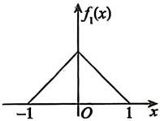

(a)

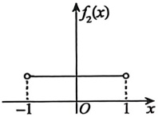

(b)

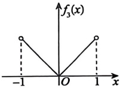

(c)

(A)  $D(X_1) < D(X_2) < D(X_3)$ (B)  $D(X_1) < D(X_3) < D(X_2)$

(C)  $D(X_2) < D(X_1) < D(X_3)$ (D)  $D(X_2) < D(X_3) < D(X_1)$

### 4.

设随机变量X服从参数为 $p(0<p<1)$的几何分布，则 $E\left(\frac{1}{X}\right)=$（ ）.

(A)  $p(1-p)$ (B)  $-p \ln p$ (C)  $-(1-p) \ln p$ (D)  $-\frac{p \ln p}{1-p}$

### 5.

设 10 个球中有 3 个红球，7 个白球，现从这 10 个球中无放回地抽取 3 个球，记取到白球的个数为 X，则  $E(X)=$ ( ).

(A) $\frac{7}{10}$ (B) $\frac{21}{10}$ (C) $\frac{7}{5}$ (D) $\frac{21}{5}$

### 6.

设随机变量  $X$ 的概率密度为  $f(x)=\begin{cases}2x, & 0 < x < 1, \\ 0, & \text{其他},\end{cases}$  $F(x)$ 为  $X$ 的分布函数， $E(X)$ 为  $X$ 的数学期望，则  $P\{F(X)>E(X)\}=\underline{\qquad}$.

### 7.

设随机变量  $X$ 服从参数为  $\lambda(\lambda > 0)$ 的指数分布，则  $X$ 落在数学期望  $E(X)$ 和方差  $D(X)$ 之间的概率为___.

### 8.

在(0,1)线段上随机投掷两点，该两点的距离为X，求：

(1) X 的分布函数  $F(x)$ 和概率密度  $f(x)$;

(2) X 的数学期望  $E(X)$.

### 9.

已知随机变量 X 的概率密度为  $f(x) = A e^{x(B-x)} (-\infty < x < +\infty)$， $E(X) = 2D(X)$，求：

(1) 常数 A, B 的值;

(2) $E(X^{2}+e^{X})$的值;

(3)  $Y = \left| \sqrt{2}(X - 1) \right|$ 的分布函数  $F(y)$

### 10.

设 X，Y 是两个相互独立且均服从正态分布  $N\left(0,\left(\frac{1}{\sqrt{2}}\right)^{2}\right)$ 的随机变量，则随机变量  $\left|X-Y\right|$ 的数学期望  $E(|X-Y|)=(\quad)$.

(A) $\frac{1}{\sqrt{3\pi}}$ (B) $\frac{1}{\sqrt{2\pi}}$ (C) $\frac{2}{\sqrt{\pi}}$ (D) $\sqrt{\frac{2}{\pi}}$

### 11.

设随机变量  $X$ 与  $Y$ 独立同分布，且都服从参数为 1 的指数分布。若  $Z = \begin{cases} 2X, & X \geq Y, \\ Y - 1, & X < Y, \end{cases}$ 则  $E(Z) =$ ( )。

(A)  $\frac{2}{7}$  (B)  $\frac{7}{2}$  (C)  $\frac{7}{4}$  (D)  $\frac{4}{7}$

### 12.

随机试验 E 有三种两两不相容的结果  $A_{1}$,  $A_{2}$,  $A_{3}$，且三种结果发生的概率均为  $\frac{1}{3}$. 将试验 E 独立重复做 2 次，X 表示 2 次试验中结果  $A_{1}$ 发生的次数，Y 表示 2 次试验中结果  $A_{2}$ 发生的次数，则 X 与 Y 的相关系数为 ( ).

(A) $-\frac{1}{2}$ (B) $-\frac{1}{3}$ (C) $\frac{1}{3}$ (D) $\frac{1}{2}$

### 13.

设随机变量 X 和 Y 的方差存在，则  $D(X + Y) = D(X) + D(Y)$ 是 X 和 Y()。

(A) 不相关的充分非必要条件

(B) 不相关的充分必要条件

(C) 独立的充分非必要条件

(D) 独立的充分必要条件

### 14.

已知随机变量  $X \sim U(0,4)$，实数  $c \in [0,4]$，且  $X$ 与  $|X - c|$ 不相关，则  $c =$（ ）。

(A) 1  

(B) 2  

(C) 3  

(D) 4

### 15.

设随机变量  $X$， $Y$ 独立同分布于  $\begin{pmatrix} -1 & 1 \\ \frac{1}{2} & \frac{1}{2} \end{pmatrix}$， $Z_1 = XY$， $Z_2 = \frac{X}{Y}$，则（ ）。

(A)  $X$， $Y$， $Z_1$ 相互独立  

(B)  $Y$， $Z_1$， $Z_2$ 相互独立  

(C)  $X$， $Z_1$， $Z_2$ 两两独立  

(D)  $X$， $Y$， $Z_2$ 不相互独立
### 16.

对于任意随机变量 X 和 Y，如果  $D(X + Y) = D(X - Y)$，则()。

(A) X 和 Y 相互独立 (B)  $D(XY) = D(X)D(Y)$

(C) X 和 Y 相关 (D)  $E(XY) = E(X)E(Y)$

### 17.

设随机变量  $(X_1, X_2) \sim N(0, 0; \sigma_1^2, \sigma_2^2; \rho)$， $\sigma_1, \sigma_2 > 0$，且  $\sigma_1 \ne \sigma_2$，若  $Y_1 = X_1 \cos \alpha + X_2 \sin \alpha$ 与  $Y_2 = X_2 \cos \alpha - X_1 \sin \alpha$ 相互独立， $\cos 2\alpha \ne 0$，则  $\tan 2\alpha = (\quad)$.

(A)  $\rho \frac{\sigma_1^2 \sigma_2^2}{\sigma_1^2 - \sigma_2^2}$ (B)  $\rho \frac{\sigma_1^2 \sigma_2^2}{\sigma_2^2 - \sigma_1^2}$ (C)  $2\rho \frac{\sigma_1 \sigma_2}{\sigma_1^2 - \sigma_2^2}$ (D)  $2\rho \frac{\sigma_1 \sigma_2}{\sigma_2^2 - \sigma_1^2}$

### 18.

设存在非零常数  $a$ 使得  $P\{aX + Y = 0\} = 1$，则随机变量  $X$ 与  $Y$ 的相关系数  $\rho$ 满足（ ）。

(A)  $\rho = \frac{a}{|a|}$    (B)  $\rho = -\frac{a}{|a|}$    (C)  $-1 < \rho < 1$    (D)  $|\rho| = |a|$

### 19.

设随机变量  $X$， $Y$ 均服从参数为  $\lambda$ 的泊松分布，且  $\rho_{XY} = -\frac{1}{2}$， $U = 2X + Y$，则  $U$ 与  $X$ 的相关系数为 ___。

### 20.

设随机变量  $X$ 和  $Y$ 相互独立且服从相同的分布， $X \sim \begin{pmatrix} 0 & 1 \\ p & q \end{pmatrix}$， $p + q = 1$， $0 < p < 1$，

又  $Z = \begin{cases} 1, & X + Y \text{为奇数}, \\ 0, & X + Y \text{为偶数}. \end{cases}$

(1) 求 XZ 的分布律.

(2) p 取何值时，X 和 Z 相关？说明理由.

### 21.

设随机变量 X 与 Y 相互独立，X 的分布列为  $\begin{pmatrix}-1 & 0 & 1 \\ p & p & 1-2p\end{pmatrix}$，Y 服从参数为 1 的指数分布，令 Z = XY，若 Y 与 Z 既不相关，也不独立，求：

(1) $Z(Z\neq0)$的概率密度；

(2) p 的值.
## 第5章 大数定律与中心极限定理
### 1.

设总体 X 服从参数为 2 的指数分布， $X_1, X_2, \cdots, X_n$，…为来自总体 X 的简单随机样本，则  $Y_n = \frac{1}{n} \sum_{i=1}^{n} X_i^2$ 依概率收敛于 ___。

### 2.

设  $X_1, X_2, \cdots, X_n$，…是来自总体  $X$ 的简单随机样本， $X$ 服从  $[-\pi, \pi]$ 上的均匀分布，记  $Y_k = \cos(kX_k)$， $k = 1, 2, \cdots, n$， $\cdots$，则  $\frac{1}{n} \sum_{k=1}^{n} Y_k^2$ 依概率收敛于___。

### 3.

设随机变量  $X_1, X_2, \cdots, X_n$， $\cdots$ 相互独立且均服从  $U[1,4]$， $\Phi(x)$ 是标准正态分布的分布函数，则  $\lim_{n \to \infty} P \left\{ \frac{2 \sum_{i=1}^{n} X_i - 5n}{\sqrt{n}} \leq x \right\} = (\quad)$.

(A)  $\Phi(x)$ (B)  $\Phi(\sqrt{3}x)$ (C)  $\Phi\left(\frac{x}{\sqrt{3}}\right)$ (D)  $\Phi\left(\frac{2x}{\sqrt{3}}\right)$

### 4.

设生产每件产品的时间服从指数分布，且平均时间为10分钟，生产各件产品的时间相互独立，由中心极限定理，在15小时至20小时之间生产100件产品的概率约为( )。

(A)  $\Phi(2) - \Phi(1)$ (B)  $2\Phi(1) - \Phi(2)$ (C)  $\Phi(1) + \Phi(2) - 1$ (D)  $2[\Phi(1) - \Phi(-2)]$

### 5.

设有5个盒子，100个球，每个球等可能地放入任一盒子中，根据中心极限定理，指定的某一个盒子中不超过22个球的概率近似为( )。

(A)  $1 - \Phi(1)$ (B)  $\Phi(1)$ (C)  $1 - \Phi(0.5)$ (D)  $\Phi(0.5)$

### 6.

设随机变量  $X_1, X_2, \cdots, X_{2n}$， $\cdots$ 相互独立，且均服从二项分布  $B\left(1, \frac{1}{2}\right)$，若根据中心极限定理，有  $\lim_{n \to \infty} P\left\{a \sum_{i=1}^{n} (X_{2i} - X_{2i-1}) \leq \sqrt{n} x\right\} = \Phi(x)$，其中  $\Phi(x)$ 为标准正态分布函数，则  $a =\underline{\qquad}$.

### 7.

某保险公司接受了10 000辆汽车的保险，每辆汽车每年的保费为1.2万元.若汽车丢失，则车主获得赔偿100万元.设汽车的丢失率为0.006，对于此项业务，利用中心极限定理，则保险公司一年所获利润不少于6 000万元的概率为 ___.

### 8.

设  $X_1, X_2, \cdots, X_n (n > 2)$ 是来自总体  $X \sim N(0,1)$ 的简单随机样本，由切比雪夫不等式得  $P\left\{0 < \sum_{i=1}^{n} X_i^2 < 2n\right\}$ 不小于 ___.
## 第6章 数理统计

### 1.

设  $X_{1}, X_{2}$ 是取自正态总体  $X \sim N(1,1)$ 的简单随机样本，则  $\frac{X_{1}-1}{\left|1-X_{2}\right|}$ 服从().

(A)  $t(1)$ (B)  $F(1,1)$ (C)  $\chi^{2}(1)$ (D)  $N(1,1)$

### 2.

设  $X_1, X_2, \cdots, X_{10}$ 是来自正态总体  $X \sim N(0, \sigma^2)$ ( $\sigma > 0$) 的简单随机样本， $Y^2 = \frac{1}{9} \sum_{i=2}^{10} X_i^2$，则( )。

(A)  $X_1^2 \sim \chi^2(1)$

(B)  $Y^2 \sim \chi^2(9)$

(C)  $\frac{X_1}{|Y|} \sim t(9)$

(D)  $\frac{X_1^2}{Y^2} \sim F(9,1)$

### 3.

设总体  $X$ 和  $Y$ 相互独立，且都服从正态分布  $N(0, \sigma^2)$， $X_1, X_2, \cdots, X_n$ 和  $\overline{Y}_1, \overline{Y}_2, \cdots, \overline{Y}_n$ 分别是来自总体  $X$ 和  $Y$ 且容量都为  $n$ 的两个简单随机样本，样本均值，样本方差分别为  $\overline{X}$， $S_X^2$ 和  $\overline{Y}$， $S_Y^2$，则（ ）。

(A)  $\overline{X} - \overline{Y} \sim N(0, \sigma^2)$  (B)  $S_X^2 + S_Y^2 \sim \chi^2(2n-2)$  

(C)  $\frac{\overline{X} - \overline{Y}}{\sqrt{S_X^2 + S_Y^2}} \sim t(2n-2)$  (D)  $\frac{S_X^2}{S_Y^2} \sim F(n-1, n-1)$

### 4.

设随机变量  $X \sim N(0,1)$， $Y \sim N(0,1)$，则().

(A)  $X + Y$ 服从正态分布 (B)  $X^{2} + Y^{2}$ 服从  $\chi^{2}$ 分布

(C)  $X^{2}/Y^{2}$ 服从 F 分布 (D)  $X^{2}$ 和  $Y^{2}$ 服从  $\chi^{2}$ 分布

### 5.

设  $n$ 为正整数，随机变量  $X \sim t(n)$， $Y \sim F(1,n)$，常数  $c$ 满足  $P\{X > c\} = \frac{2}{5}$，则  $P\{Y \leq c^2\} =$ ( )。

(A)  $\frac{1}{5}$  (B)  $\frac{2}{5}$  (C)  $\frac{3}{5}$  (D)  $\frac{4}{5}$

### 6.

设  $X_1, X_2, \cdots, X_n (n \geq 2)$ 为来自标准正态总体  $X$ 的简单随机样本，记  $\overline{X} = \frac{1}{n} \sum_{i=1}^{n} X_i$， $S^2 = \frac{1}{n-1} \sum_{i=1}^{n} (X_i - \overline{X})^2$， $Y = \overline{X} - S$，则  $E(Y^2) = (\ )$.

(A)  $1 - \frac{1}{n}$ (B)  $1 + \frac{1}{n}$ (C)  $1 - \frac{1}{n-1}$ (D)  $1 + \frac{1}{n-1}$

### 7.

设 X, Y 独立同分布于  $N(0, \sigma^{2})$,  $X_{1}, \cdots, X_{9}$ 与  $Y_{1}, \cdots, Y_{11}$ 是分别来自总体 X 与 Y 的简单随机样本，样本方差分别为  $S_{X}^{2}$ 与  $S_{Y}^{2}$，记  $S_{1}^{2} = \frac{1}{2}(S_{X}^{2} + S_{Y}^{2})$,  $S_{2}^{2} = \frac{1}{9}(4S_{X}^{2} + 5S_{Y}^{2})$，则方差最小的是（）.

(A)  $S_{x}^{2}$ (B)  $S_{y}^{2}$ (C)  $S_{1}^{2}$ (D)  $S_{2}^{2}$

### 8.

设总体  $X$ 的概率密度为  $f(x, \sigma) = \begin{cases} \dfrac{2x}{\sigma} e^{-\dfrac{x^2}{\sigma}}, & x > 0, \\ 0, & x \leq 0, \end{cases}$ 其中  $\sigma$ 为大于零的未知参数，已知  $X_1, X_2, \cdots, X_n$ 是来自总体  $X$ 的简单随机样本，则  $\sigma$ 的最大似然估计量为（ ）。

(A)  $\hat{\sigma} = \dfrac{1}{n-1} \sum_{i=1}^{n} X_i$  (B)  $\hat{\sigma} = \dfrac{1}{n-1} \sum_{i=1}^{n} X_i^2$  (C)  $\hat{\sigma} = \dfrac{1}{n} \sum_{i=1}^{n} X_i$  (D)  $\hat{\sigma} = \dfrac{1}{n} \sum_{i=1}^{n} X_i^2$

### 9.

设某个试验有三种可能结果，其发生的概率分别为  $p_{1}=\lambda^{2}$， $p_{2}=(1-\lambda)^{2}$， $p_{3}=2\lambda(1-\lambda)$，其中参数  $\lambda$ 未知， $0<\lambda<1$。现做了 n 次独立重复试验，观测到三种结果发生的次数分别为  $n_{1}$， $n_{2}$， $n_{3}(n_{1}+n_{2}+n_{3}=n)$，则  $\lambda$ 的最大似然估计值为 ___。

### 10.

设二维总体  $(X,Y)$ 的概率密度为  $f(x,y;\lambda)=\left\{\begin{aligned}&\frac{1}{\lambda^{2}}e^{-\frac{x+y}{\lambda}},&x>0,y>0,\\ &0,& 其他,\end{aligned}\right.$  $\lambda$ 为大于 0 的参数， $(X_{1},Y_{1}),(X_{2},Y_{2}),\cdots,(X_{n},Y_{n})$ 为来自总体的简单随机样本，则  $\lambda$ 的最大似然估计量为 ___.

### 11.

设总体  $X$ 的概率密度为  $f(x, \theta) = \begin{cases} e^{-(x-\theta)}, & x \geq \theta, \\ 0, & \text{其他}, \end{cases}$  $X_1, X_2, \cdots, X_n$ 是来自总体  $X$ 的简单随机样本，则未知参数  $\theta$ 的最大似然估计量  $\hat{\theta} =\underline{\qquad}$.

### 12.

设  $X_{1}, X_{2}, \cdots, X_{n}$ 是取自总体 X 的简单随机样本，X 的概率密度为

$$f(x)=\frac{1}{2\lambda}\mathrm{e}^{-\frac{|x|}{\lambda}},-\infty<x<+\infty,\lambda>0.$$

求: (1)  $\lambda$ 的矩估计量;

(2)  $\lambda$ 的最大似然估计量.

### 13.

设连续型总体  $X$ 的分布函数为  $F(x; \theta) = \begin{cases} 0, & x \leq 0, \\ x^{\sqrt{\theta}}, & 0 < x < 1, \\ 1, & x \geq 1, \end{cases}$，其中  $\theta$ 为未知参数，且  $\theta > 0$， $X_1$，
 $X_{2}, \cdots, X_{n}$ 为来自总体 X 的简单随机样本. 求  $\theta$ 的矩估计量与最大似然估计量.

### 14.

在数集  $\Omega = \{0,1,2,\cdots,N\}$ 中有放回地抽取  $n$ 次，得  $X_1, X_2, \cdots, X_n$，则  $N$ 的最大似然估计量是（ ）。

(A)  $\max\{X_1, X_2, \cdots, X_n\}$

(B)  $\min\{X_1, X_2, \cdots, X_n\}$

(C)  $\frac{1}{n}\sum_{i=1}^{n}X_i$

(D)  $n$

### 15.

设某元件的使用寿命  $T$ 的分布函数  $F(t)$ 满足微分方程  $F'(t) + \frac{2t}{\theta^2} \left[ F(t) - 1 \right] = 0$,  $t \geq 0$,  $\theta$ 为大于 0 的常数,  $F(0) = 0$; 且该元件性能  $Q(\theta) = \theta^2 \left( \frac{\ln \theta}{2} - \frac{3}{4} \right) + \theta$. 任取  $n$ 个此种元件做寿命试验, 测得值分别为  $t_1$,  $t_2$,  $\cdots$,  $t_n$.

(1) 求： $\theta$ 的最大似然估计值  $\hat{\theta}$

(2) 求：该元件性能 Q 的最大似然估计值  $\hat{Q}$

### 16.

设总体  $X$ 的数学期望  $E(X)=0$，方差  $D(X)=\sigma^2$，而  $X_1, X_2, \cdots, X_n$ ( $n>2$) 是来自总体  $X$ 的简单随机样本， $\bar{X}=\frac{1}{n}\sum_{i=1}^{n}X_i$， $S^2=\frac{1}{n-1}\sum_{i=1}^{n}(X_i-\bar{X})^2$，则下列属于  $\sigma^2$ 的无偏估计量的是（ ）。

(A)  $n\bar{X}^2+S^2$  (B)  $\frac{1}{2}(n\bar{X}^2+S^2)$  

(C)  $\frac{1}{3}(n\bar{X}^2+S^2)$  

(D)  $\frac{1}{4}(n\bar{X}^2+S^2)$

### 17.

设  $\mu$ 是总体  $X$ 的数学期望， $\sigma$ 是总体  $X$ 的标准差， $X_1, X_2, \cdots, X_n$ 是来自总体  $X$ 的简单随机样本，则总体方差  $\sigma^2$ 的无偏估计量是（ ）。

(A)  $\frac{1}{n-1} \sum_{i=1}^{n} (X_i - \mu)^2$， $\mu$ 未知

(B)  $\frac{1}{n} \sum_{i=1}^{n} (X_i - \mu)^2$， $\mu$ 未知

(C)  $\frac{1}{n-1} \sum_{i=1}^{n} (X_i - \mu)^2$， $\mu$ 已知

(D)  $\frac{1}{n} \sum_{i=1}^{n} (X_i - \mu)^2$， $\mu$ 已知

### 18.

设  $\sigma$ 是总体 X 的标准差， $X_{1}, X_{2}, \cdots, X_{n}$ 是来自总体 X 的简单随机样本，则样本标准差 S 是总体标准差  $\sigma$ 的（）.

(A) 无偏估计量

(B) 最大似然估计量

(C) 相合估计量

(D) 最小方差估计量

### 19.

设  $X_1$ 是来自正态总体  $X \sim N(0, \sigma^2)$ ( $\sigma > 0$) 的一个简单随机样本， $x_1$ 为其样本值，则  $\sigma^2$ 的一个无偏估计量为 ___。

### 20.

设总体 X 的概率分布为

| X | 0 | 1 | 2 | 3 |
|---|---|---|---|---|
| P | $\theta^{3}$ | $3\theta^{2}(1-\theta)$ | $3\theta(1-\theta)^{2}$ | $(1-\theta)^{3}$ |

其中  $0 < \theta < 1$， $X_1$， $X_2$， $\cdots$， $X_n$ 为来自总体 X 的简单随机样本。求  $\theta$ 的最大似然估计量，并判定它是否为  $\theta$ 的无偏估计量，说明理由。

### 21.

设一批零件的长度服从正态分布  $N(\mu, \sigma^2)$，其中  $\sigma^2$ 已知， $\mu$ 未知。现从中随机抽取  $n$ 个零件，测得样本均值为  $\bar{x}$，则当置信度为 0.90 时， $\mu$ 大于  $\mu_0$ 的接受条件为（ ）。

(A)  $\bar{x} > \mu_0 - \frac{\sigma}{\sqrt{n}} z_{0.10}$  (B)  $\bar{x} > \mu_0 + \frac{\sigma}{\sqrt{n}} z_{0.05}$  (C)  $\bar{x} > \mu_0 + \frac{\sigma}{\sqrt{n}} z_{0.10}$  (D)  $\bar{x} > \mu_0 - \frac{\sigma}{\sqrt{n}} z_{0.05}$

### 22.

设  $X_1, X_2, \cdots, X_n$ 是来自总体  $X$ 的简单随机样本， $\overline{X}$ 为样本均值， $E(X) = \theta$。检验  $H_0: \theta = 0$； $H_1: \theta \neq 0$，且拒绝域  $W_1 = \left\{ \left| \overline{X} \right| > 1 \right\}$ 和  $W_2 = \left\{ \left| \overline{X} \right| > 2 \right\}$ 分别对应显著性水平  $\alpha_1$ 和  $\alpha_2$，则（ ）。

(A)  $\alpha_1 = \alpha_2$  (B)  $\alpha_1 > \alpha_2$  (C)  $\alpha_1 < \alpha_2$  (D)  $\alpha_1$ 和  $\alpha_2$ 的大小关系不确定

### 23.

设  $X_1$,  $X_2$ 是来自正态总体  $N(\mu,1)$ 的简单随机样本，并设原假设  $H_0: \mu = 2$，备择假设  $H_1: \mu = 4$，若拒绝域为  $W = \{\bar{X} > 3\}$， $\bar{X} = \frac{1}{2} \sum_{i=1}^{2} X_i$，记  $\alpha$， $\beta$ 分别为犯第一类错误和第二类错误的概率，则( )。

(A)  $\alpha = \beta = 1 - \Phi(\sqrt{2})$

(B)  $\alpha = 1 - \Phi(\sqrt{2})$， $\beta = \Phi(\sqrt{2})$

(C)  $\alpha = \Phi(\sqrt{2})$， $\beta = 1 - \Phi(\sqrt{2})$

(D)  $\alpha = \beta = \Phi(\sqrt{2})$

### 24.

设总体  $X \sim \begin{pmatrix} 1 & 2 & 3 \\ \theta^{2} & 2\theta(1 - \theta) & (1 - \theta)^{2} \end{pmatrix}$，作检验  $H_{0} : \theta = 0.1$； $H_{1} : \theta = 0.9$。抽取3个样本，取拒绝域  $W$ 为  $\left\{ X_{1} = 1, X_{2} = 1, X_{3} = 1 \right\}$，则犯第二类错误的概率为___。

# 强化篇
## 第1章 函数极限与连续

### 1.

$\lim_{x \to 0} \left( \frac{\arcsin x}{x} \right)^{\frac{1}{\sin^2 x}} =\underline{\qquad}$.

### 2.

$\lim_{x \to 0} \frac{1}{x} \int_0^x (1 + \sin 2t)^{\frac{1}{t}} dt =\underline{\qquad}$.

### 3.

$\lim_{x \to +\infty} \left( x^{\frac{2}{x}} - 1 \right)^{\frac{2}{\ln x}} =\underline{\qquad}$.

### 4.

计算 $\lim_{x \to 0} \frac{\int_0^x \left[ e^{(t-x)^2} - 1 \right] \sin t \, dt}{x^2 (e^{x^2} - 1)}$.

### 5.

设  $\lim_{x \to 0} \left[1 + 2x + 3x^2 + \frac{f(x)}{x}\right]^{\frac{1}{x}} = e^5$，则  $\lim_{x \to 0} \left[1 + \frac{f(x)}{x}\right]^{\frac{1}{x}} =\underline{\qquad}$.

### 6.

设函数 $f(x)$在点x=3的某邻域内可微，且 $\lim_{x\to3}f(x)=0$， $\lim_{x\to3}f'(x)=4016$。求

$$\lim_{x\to3}\frac{\int_{3}^{x}\left[t\int_{t}^{3}f(s)ds\right]dt}{(3-x)^{3}}.$$

### 7.

设  $f(x)$,  $g(x)$ 在点 x=0 的某邻域内连续，且当  $x \to 0$ 时， $f(x)$ 与  $g(x)$ 为等价无穷小，则当  $x \to 0$ 时， $\int_{0}^{x} f(t)(1 - \cos t) dt$ 是  $\int_{0}^{x} t^{2} g(t) dt$ 的（）.

(A) 等价无穷小 (B) 同阶但非等价无穷小

(C) 高阶无穷小 (D) 低阶无穷小

### 8.

设当  $x \to 0$ 时， $a \int_{0}^{x^{2}} \cos t^{2} dt$ 与  $\sin x - b \ln (1 + x)$ 是等价无穷小，则  $(a, b) = (\ )$.

(A) (1,2)          (B) (-1,2)         (C)  $\left(\frac{1}{2},1\right)$         (D)  $\left(-\frac{1}{2},1\right)$

### 9.

设当  $x \to 0$ 时， $\int_{0}^{x} (\mathrm{e}^{t \cos t^{2}} - \mathrm{e}^{t}) \, \mathrm{d}t$ 与  $ax^{b}$ 是等价无穷小量，则  $(a, b) = (\quad)$

(A)  $\left(-\frac{1}{6},3\right)$ (B)  $\left(-\frac{1}{24},4\right)$ (C)  $\left(-\frac{1}{2},5\right)$ (D)  $\left(-\frac{1}{12},6\right)$

### 10.

已知  $\lim_{x \to 3} \frac{x^3 - 3x^2 + bx^2 + x - 3bx - 3}{x + a} = 25$，则  $ab =\underline{\qquad}$

### 11.

设函数 $f(x)$在 $0<|x|<1$上有定义，且满足 $\lim_{x\to0}\left[\cos x+\frac{f(x)}{x}\right]^{\frac{1}{x^2}}=\mathrm{e}^{-1}$，求 $\lim_{x\to0}\frac{f(x)}{\sin^3 x}$.

### 12.

设函数  $f(x)$ 在点 x=0 处连续， $f(0)=\frac{1}{2}$，且函数  $g(x)=\begin{cases}\frac{1}{x}\sin\frac{x}{2}, & x<0, \\ x+\frac{1}{2}, & x\geq0,\end{cases}$ 则  $\lim_{x\to0}\frac{xf(x)+g(x)\int_{0}^{2x}\cos t^2dt}{xg(x)}=\underline{\qquad}$.

### 13.

$f(x)=\lim_{n\to\infty}n^x\left[\left(1+\frac{1}{n}\right)^n-e\right]$ 在  $x=1$ 处( ).

(A) 左极限存在，右极限不存在 (B) 左极限不存在，右极限存在

(C) 左、右极限都存在，但不相等 (D) 连续

### 14.

计算  $\lim_{x \to +\infty} \left[ \frac{x^{x+1}}{(1+x)^x} - \frac{x}{e} \right]$.

### 15.

$\lim_{x \to 0} \frac{|x|^{x+2}}{\sqrt{1+x^2} - 1} =\underline{\qquad}$.

### 16.

设 $f(x)=\frac{x+\left|x\right|}{2}$，则 $\lim_{x\to0}[f(1-x)f(1+x)]^{\frac{1}{x^2}}=$___。

### 17.

设函数 $f(x)$在x=0的某邻域内有定义，且 $\lim_{x\to0}\frac{x-f(x)}{\ln(1+x)}=1$，则以下叙述：

① $f(0)=0$; ② $\lim_{x\to0}f(x)=f(0)$;

③ $\lim_{x\to0}\frac{f(x)}{x}=1$; ④当 $x\to0$时， $f(x)$是x的高阶无穷小.

正确叙述的个数为( ).

(A) 1          (B) 2          (C) 3          (D) 4

### 18.

函数 $f(x)$在x=0的某邻域内有定义，则“ $\lim_{x\to0}\frac{|f(x)|}{x}$存在”是“ $\lim_{x\to0}\frac{f(x)}{x}=0$”的( ).

(A) 充分必要条件 (B) 充分非必要条件
(C) 必要非充分条件 (D) 既非充分又非必要条件

### 19.

当  $x \to 0$ 时，以下无穷小量阶数最高的是（）.

(A)  $\int_{0}^{\sin x}[(1+t)^{\prime}-1]\,\mathrm{d}t$ (B)  $\int_{0}^{\sin x^{2}}(1+t)^{\frac{1}{x}}\,\mathrm{d}t$ (C)  $\int_{0}^{\sin x}[e-(1+t)^{\frac{1}{x}}]\,\mathrm{d}t$ (D)  $\int_{0}^{\sin^{2}x}(t e^{\prime}-t)\,\mathrm{d}t$

### 20.

设函数  $f(x)$ 在点 x = 0 的某一邻域内可导，且  $f(0) = 0$， $f'(0) \neq 0$，求  $\lim_{x \to 0} \frac{\int_{0}^{x^2} f(t) dt}{x^2 \int_{0}^{x} f(t) dt}$.

### 21.

设  $\lim_{x \to +\infty} f(x) = +\infty$， $\lim_{x \to +\infty} g(x) = +\infty$，且  $\lim_{x \to +\infty} \frac{f(x)}{g(x)} = a > 0$，计算  $\lim_{x \to +\infty} \frac{\ln f(x)}{\ln g(x)}$.

### 22.

若二次多项式 $f(x)$在x=0的某邻域内与 $g(x)=\sec x$的差为 $x^2$的高阶无穷小，则 $f(x)=$___。

### 23.

当  $n \to \infty$ 时， $e - \left(1 + \frac{1}{n}\right)^n$ 与  $\frac{c}{n^k}$ 为等价无穷小，则（ ）。

(A)  $c = \frac{e}{3}$， $k = 2$ (B)  $c = \frac{e}{2}$， $k = 2$ (C)  $c = \frac{e}{3}$， $k = 1$ (D)  $c = \frac{e}{2}$， $k = 1$

### 24.

当  $x \to 0$ 时， $\alpha(x)$ 与  $\beta(x)$ 是非零且不相等的等价无穷小量，以下 4 个结论：

①  $\alpha(x) + \beta(x) = 2\alpha(x)$;

②  $\alpha(x) + \beta(x) = 2\beta(x)$;

③  $\alpha(x) - \beta(x) = o(\alpha(x))$;

④  $\alpha(x) - \beta(x) = o(\beta(x))$.

所有正确结论的序号是( )。

(A)①③ (B)③④ (C)①②③④ (D)②④

### 25.

当  $x \to 0$ 时， $(3 + 2\tan x)^x - 3^x$ 是  $3\sin^2 x + x^3\cos\frac{1}{x}$ 的（）.

(A) 高阶无穷小

(B) 低阶无穷小

(C) 等价无穷小

(D) 同阶但非等价无穷小

### 26.

当  $x \to 0$ 时，以下无穷小中，阶数最高的是（）.

(A)  $\int_{0}^{\sin x}(1+t)^{\frac{2}{t}}dt$ (B)  $\int_{0}^{\ln(1+x^{2})}\sqrt{\cos^{3}t}dt$ (C)  $\int_{0}^{x}(\mathrm{e}^{\cos t}-\mathrm{e}^{\sin t})dt$ (D)  $\int_{0}^{x-\tan x}\arctan tdt$

### 27.

当 $x\to0$时，函数 $f(x)=ax+bx^2+\ln(1+x)$与 $g(x)=1-\cos x$是等价无穷小，则 $ab=$___.

### 28.

当  $x \to 0$ 时， $f(x) = \frac{1}{2} \ln \frac{1 + x}{1 - x} - \arctan x$ 与  $g(x) = ax^b$ 是等价无穷小，则  $ab =\underline{\qquad}$.

### 29.

当  $x \to 0$ 时， $\ln(1+x)-\tan x$ 与  $ax^{b}$ 是等价无穷小，则  $(a,b)=(\ )$.

(A)  $\left(-\frac{1}{2},2\right)$ (B)  $\left(\frac{1}{2},2\right)$ (C)  $\left(-\frac{1}{3},3\right)$ (D)  $\left(\frac{1}{3},3\right)$

### 30.

当  $x \to 0$ 时， $x - \ln(x + \sqrt{1 + x^2}) \sim ax^b$，则 a，b 的值分别是（）.

(A) $\frac{1}{6},3$ (B) $\frac{1}{6},2$ (C) $\frac{1}{3},2$ (D) $\frac{1}{3},3$

### 31.

当  $x \to 0$ 时， $\arcsin x - x$ 与  $ax^b$ 是等价无穷小，则  $(a, b) = (\quad)$.

(A)  $\left(-\frac{1}{6}, 2\right)$ (B)  $\left(\frac{1}{6}, 2\right)$ (C)  $\left(-\frac{1}{6}, 3\right)$ (D)  $\left(\frac{1}{6}, 3\right)$

### 32.

已知  $\lim_{x \to 0} \left[ a \frac{2 + e^{\frac{1}{x}}}{1 + e^{\frac{4}{x}}} + (1 + |x|)^{\frac{1}{x}} \right]$ 存在，求  $a$ 的值.

### 33.

设函数 $f(x)=\sqrt{\frac{1+x}{1-x}}$在x=0处的2次泰勒多项式为 $a+bx+cx^2$，则()。

(A) a=1, b=1, c=1

(B) a=1, b=1,  $c=\frac{1}{2}$

(C) a=0, b=-1,  $c=\frac{1}{2}$

(D) a=0, b=-1, c=1

### 34.

①若 $\lim_{x\to+\infty}f'(x)=a$，则 $\lim_{x\to+\infty}\frac{f(x)}{x}=a$；

②若 $\lim_{x\to+\infty}\frac{f(x)}{x}=a$，则 $\lim_{x\to+\infty}f'(x)=a$．

下列说法中正确的是( ).

(A)①正确，②错误 (B)①错误，②正确

(C)①与②均正确 (D)①与②均错误

### 35.

$f(x)=\frac{\left|\ln|x|\right|}{x^{2}-1}$ 有().

(A)两个跳跃间断点，一个无穷间断点

(B)两个可去间断点，一个无穷间断点

(C)一个可去间断点，一个跳跃间断点，一个无穷间断点

(D)三个无穷间断点

### 36.

设  $f\left(\frac{1}{x}\right)=x+\sqrt{1+x^{2}}$ ( $x\neq0$)，则 x=0 是  $f(x)$ 的().

(A) 连续点 (B) 跳跃间断点 (C) 可去间断点 (D) 第二类间断点

### 37.

函数 $f(x)=|x-1|^{\frac{1}{x(2-x)}}$的第二类间断点的个数是().

(A) 0          (B) 1          (C) 2          (D) 3

### 38.

设  $f(x)=\lim_{n\to\infty}\frac{x^{n+1}+(\cos\pi x+1)\sin\alpha x}{x^n+(\cos\pi x+1)}$，为使  $f(x)$ 对于一切 x 都连续，求常数  $\alpha$ 的最小正值.
## 第2章 数列极限

### 1.

若  $\{x_{n}\}, \{y_{n}\}$ 满足  $\lim_{n\to\infty}x_n y_n = \infty$，则以下结论：

① $\lim_{n\to\infty}x_n=\infty$ 或  $\lim_{n\to\infty}y_n=\infty$;

② $\lim_{n\to\infty}x_n=\infty$且 $\lim_{n\to\infty}y_n=\infty$;

③ $x_{n}$与 $y_{n}$中一个是无穷大量，另一个是无界量；

④当  $x_n$ 是非零无穷小量时， $\lim_{n \to \infty} y_n = \infty$。

正确结论的个数为( )。

(A)1          (B)2          (C)3          (D)4

### 2.

$\lim_{n \to \infty} \left[ \frac{1}{2} + \frac{1}{6} + \cdots + \frac{1}{n(n+1)} \right]^n =\underline{\qquad}$.

### 3.

已知数列 $\{a_n\}$ 发散，$b_n = a_n e^{a_n}$，则().

(A) 当 $a_n > 0$ 时，$\{b_n\}$ 收敛

(B) 当 $a_n < 0$ 时，$\{b_n\}$ 收敛

(C) 当 $a_n > 0$ 时，$\{b_n\}$ 发散

(D) 当 $a_n < 0$ 时，$\{b_n\}$ 发散

### 4.

设  $a_{n}=\int_{0}^{1}x^{n}\sqrt{1-x^{2}}dx$， $b_{n}=\int_{0}^{\frac{\pi}{2}}\sin^{n}t dt$，则极限  $\lim_{n\to\infty}\left[\frac{(n+1)a_{n}}{b_{n}}\right]^{n}=(\quad)$.

(A)0 (B)e (C) $e^{-1}$ (D) $+\infty$

### 5.

设  $0 \leq x_1 \leq \sqrt{c}$， $x_{n+1} = \frac{c(1 + x_n)}{c + x_n}$， $n \in \mathbb{N}_+$， $c > 1$。证明数列  $\{x_n\}$ 收敛，并求其极限值。

### 6.

设  $x_{1}<0$,  $x_{n+1}=e^{x_n}-1$, 求  $\lim_{n\to\infty}\left(\frac{1}{x_n}-\frac{1}{x_{n+1}}\right)$

### 7.

设数列  $\{x_n\}$ 满足  $0 < x_n < \frac{\pi}{2}$， $\cos x_{n+1} - x_{n+1} = \cos x_n$， $n=1,2,\cdots$.

(1) 证明  $\lim_{n\to\infty}x_n$ 存在并求其值；

(2) 计算  $\lim_{n \to \infty} \frac{x_{n+1}}{x_n^2}$.

### 8.

已知数列  $\left\{x_{n}\right\}$ 满足  $0 < x_{1} < \frac{\pi}{4}$， $x_{n+1} + \tan x_{n} = 2x_{n}$， $n = 1, 2, \cdots$.

(1) 证明  $\lim_{n \to \infty} x_n$ 存在并求其值；

(2) 求极限  $\lim_{n \to \infty} \left( \frac{1}{x_n^2} - \frac{1}{x_n x_{n+1}} \right)$.

### 9.

已知  $a_n = \int_0^1 t^n |\ln t| \, dt$,  $n=1,2,\cdots$, 计算  $\lim_{n \to \infty} (n^2 a_n)^n$.

### 10.

设数列  $\left\{a_{n}\right\}$ 的通项  $a_{n}=\int_{0}^{+\infty}\frac{\mathrm{d}x}{\left(1+x^{2}\right)^{n}}$， $n=2,3,\cdots$，计算  $\lim_{n\to\infty}\left(\frac{a_{n+1}}{a_n}\right)^{\ln(1+e^{2n})}$

### 11.

已知 $f(x)$可导，且 $\left|f'(x)\right|\leq\frac{1}{e}$，方程 $f(x)=x$有唯一解 $x=0$，又 $x_{n+1}=f(x_n)\neq0$， $n=1,2,\cdots$。

证明：当 $n\to\infty$时， $x_n$是 $e^{\frac{n}{2}}$的高阶无穷小。
## 第3章 一元函数微分学的概念

### 1.

函数 $f(x)=(\mathrm{e}^{x}-1)\left|x^{3}-x^{2}+x\right|$的不可导点的个数为().

(A)0 (B)1 (C)2 (D)3

### 2.

设 $f(x+x_0)=\alpha f(x)$恒成立， $f'(0)=\beta(\alpha, \beta$为非零常数 $)$，则 $f(x)$在点 $x_0$处( )

(A) 可导且 $f'(x_0)=\alpha\beta$

(B) 可导且 $f'(x_0)=\alpha$

(C) 可导且 $f'(x_0)=\beta$

(D) 不可导

### 3.

设  $f(x)=\begin{cases}x^{2}\sin\frac{t}{x},&x\neq0,\\0,&x=0,\end{cases}$，其中  $t$ 为非零常数，则  $f(x)$ 在  $x=0$ 处（ ）。

(A) 不连续 　 (B) 连续但不可导 \quad 可导但  $f'(x)$ 不连续 $\quad (D$　  $f'(x)$ 连续

### 4.

设函数 $f(x)$在区间 $(-1,1)$内有定义，且在点 $x=0$处连续，则以下结论：

①当 $\lim_{x\to0}\frac{f(x)}{\sqrt[3]{x}}=0$时， $f(x)$在点 $x=0$处可导；

②当 $\lim_{x\to0}\frac{f(x)}{x^2}=0$时， $f(x)$在点 $x=0$处可导；

③当 $f(x)$在点 $x=0$处可导时， $\lim_{x\to0}\frac{f(x)}{\sqrt[3]{x}}=0$．

所有正确结论的序号为( )．

(A)① (B)② (C)②③ (D)①②

### 5.

设  $f(x)=\begin{cases}x^2\sin\frac{1}{x}, & x\neq0, \\ 0, & x=0,\end{cases}$ 记  $F(x)=g[f(x)]$， $g(x)$ 可导，则  $F(x)$ 在 x=0 处( ).

(A) 不连续 (B) 可导且  $F'(0) = 0$

(C) 连续但不可导 (D) 可导且  $F'(0) \neq 0$

### 6.

设函数  $y = f(x)$ 由参数方程  $\begin{cases} x = t^3 + \frac{\pi}{2} - 1, \\ y = e^{t^2} \end{cases}$ 确定，则  $\lim_{n \to \infty} n \left[ f\left( \frac{\pi}{2} + \frac{2}{n} \right) - f\left( \frac{\pi}{2} \right) \right] = (\quad)$.

(A) 2e

(B)  $\frac{4e}{3}$

(C)  $\frac{2e}{3}$

(D)  $\frac{e}{3}$

### 7.

设 $f(0)=a>0,f'(0)=b$，求 $\lim_{x\to0}\frac{f(x)^{f(x)}-f(0)^{f(x)}}{x}$.

### 8.

已知函数  $g(x)$ 连续. 设  $f(x) = \int_{0}^{x^{2}} g(xt) \, dt$，求  $f'(x)$ 的表达式，并判断  $f'(x)$ 在 x = 0 处的连续性.

### 9.

设函数 $f(x)$在x=a的某个邻域内可导且 $f(a)=0$. 若其绝对值函数 $\left|f(x)\right|$在x=a处也可导，求 $f'(a)$的值，并说明理由.

### 10.

设  $f(x)=\begin{cases}\dfrac{g(x)-e^{-x}}{x},&x\neq0,\\a,&x=0,\end{cases}$，其中  $g(x)$ 有二阶连续导函数， $g(0)=1$， $g'(0)=-1$。

(1) a 为何值时， $f(x)$ 在  $(-\infty, +\infty)$ 上连续？

(2) 当  $f(x)$ 为连续函数时， $f(x)$ 是否可导？若可导，求  $f'(x)$

### 11.

设  $f(x)$ 有二阶连续导函数，且  $f(0)=0$，令  $g(x)=\left\{\begin{aligned}&\frac{f(x)}{x},&x\neq0,\\&f'(0),&x=0.\end{aligned}\right.$

(1) 求  $g'(x)$;

(2) 讨论  $g'(x)$ 在点 x=0 处的连续性.

### 12.

设  $f(x)=\begin{cases}x\arctan\dfrac{1}{\sqrt{x}},&x>0,\\\dfrac{\pi}{2}(e^{\sin x}-1),&x\leq0,\end{cases}$ 讨论  $f(x)$ 在点 x=0 处的连续性和可导性；若可导，讨论其导函数  $f'(x)$ 在 x=0 处的连续性.

### 13.

设 $f(x)$在x=a处可导，则 $\left|f(x)\right|$在x=a处不可导的充分必要条件是( )。

(A)  $f(a)=0$,  $f'(a)=0$

(B)  $f(a)=0$,  $f'(a) \neq 0$

(C)  $f(a) \neq 0$,  $f'(a)=0$

(D)  $f(a) \neq 0$,  $f'(a) \neq 0$

### 14.

设  $f(x)=\begin{cases}(1+x)^x-1,&x>-1,x\neq0\\0,&x=0\end{cases}$，则在  $x=0$ 处( )。

(A)  $f(x)$ 连续，但  $f'(0)$ 不存在  

(B)  $f'(0)$ 存在，但  $f'(x)$ 在  $x=0$ 处不连续  

(C)  $f'(x)$ 连续，但  $f''(0)$ 不存在  

(D)  $f''(0)$ 存在

### 15.

已知 (1,0) 在曲线  $y = f(x)$ 上，且曲线在该点与  $y = \ln(2x^2 - 1)$ 有公共的切线，则  $\lim_{n \to \infty} n \left[ f\left( \frac{n+1}{n} \right) - f\left( \frac{n+2}{n} \right) \right] =\underline{\qquad}$.
### 16.

设  $f(x)$ 在点 x=a 处可导，且  $f(a) \neq 0$，计算  $I = \lim_{x \to \infty} \left[ \frac{f\left(a + \frac{1}{x}\right)}{f(a)} \right]^x$

### 17.

设 $f(x)$在x=a的某邻域内有定义，在x=a的某去心邻域内可导，下述论断正确的是()。

(A) 若  $\lim_{x \to a} f'(x) = A$，则  $f'(a) = A$

(B) 若  $f'(a) = A$，则  $\lim_{x \to a} f'(x) = A$

(C) 若  $\lim_{x \to a} f'(x) = \infty$，则  $f'(a)$ 不存在

(D) 若  $f'(a)$ 不存在，则  $\lim_{x \to a} f'(x) = \infty$

### 18.

设  $f(x)=\frac{\ln|x|}{2x^2-\ln|x|}$，则  $f'(-1)=\underline{\qquad}$.

### 19.

设  $\lim_{x \to a} \frac{f(x) - b}{x - a} = A$，则  $\lim_{x \to a} \frac{\cos f(x) - \cos b}{x - a} =$___。

### 20.

已知函数 $f(x)$在x=1处可导，且 $\lim_{x\to0}\frac{f(\cos x)-3f(1+\sin^2 x)}{x^2}=2$，求 $f'(1)$.

### 21.

设 $f(x)$是非负连续函数，且 $\lim_{x\to a}\frac{\int_{a}^{x}f(x)-a}{x^2-a^2}=1(a>0)$，求 $f'(a)$.

### 22.

已知  $a_n = 1 - e^{\frac{1}{n}} - \sin \frac{1}{n^2}$，可导函数  $y = f(x) - \sin x$ 在  $x = 0$ 处取得极值。计算

$$\lim_{n\to\infty}n\left[f\left(\frac{1}{n}\right)-f(a_n)\right]$$
## 第4章 一元函数微分学的计算
### 1.

若  $y = \sin(e^{-\sqrt{x}})$，则  $\left.\frac{dy}{dx}\right|_{x=1} =\underline{\qquad}$.

### 2.

设 $f(x)$在x=0的某邻域内具有连续导数，且 $f(0)=1$， $f'(x)=\frac{1}{2}f\left[f(x)-1\right]$，求 $f''(0)$.

### 3.

设  $y = y(x)$ 是由方程  $y^3 + xy + x^2 - 2x + 1 = 0$ 确定并且满足  $y(1) = 0$ 的函数，则  $\lim_{x \to 1} \frac{(x-1)^3}{\int_1^x y(t) \, dt} =\underline{\qquad}$.

### 4.

设函数  $y = y(x)$ 由方程  $\arctan \frac{x}{y} = \ln \sqrt{x^2 + y^2}$ 确定，求  $\frac{dy}{dx}$ 与  $\frac{d^2 y}{dx^2}$.

### 5.

设  $y = 2x + \sin x$，求其反函数  $x = x(y)$ 的二阶导数  $\frac{d^2 x}{dy^2}$.

### 6.

已知函数  $y = y(x)$ 由  $\begin{cases} x = \arctan(t + 1), \\ 2t - \int_{1}^{y + r^2} e^{-u^2} \, du = 0 \end{cases}$ 确定，则  $\left.\frac{dy}{dx}\right|_{t=0} =\underline{\qquad}$.

### 7.

设  $y = y(x)$ 由方程  $x^2 - xy + y^2 = 1$ 确定，则  $\frac{d^2 y}{dx^2} =\underline{\qquad}$.

### 8.

设  $y = y(x)$ 由方程  $x = \int_{1}^{y-x} \sin^2\left(\frac{\pi}{4}t\right) dt$ 确定，则  $\left.\frac{d^2y}{dx^2}\right|_{x=0} =\underline{\qquad}$.

### 9.

设函数  $y = y(x)$ 由  $\begin{cases} x = t^2 - 2t + 1, \\ e^y \sin t - y + 1 = 0 \end{cases}$ 确定，则  $\left. \frac{d^2 y}{dx^2} \right|_{t=0} =\underline{\qquad}$.

### 10.

设  $x = x(y)$ 由方程  $y = \int_{1}^{x-y} \cos^2\left(\frac{\pi t}{4}\right) \, dt$ 确定，则  $\lim_{n \to \infty} \left[nx\left(\frac{1}{n}\right) - n\right] =\underline{\qquad}$.

### 11.

设 $f(x)$在x=0处存在二阶导数，且 $\lim_{x\to0}\frac{f(x)+x}{1-\cos x}=2$，则 $f''(0)=$___。

### 12.

设 $f'(\ln x) = x\ln x$，则 $f^{(n)}(x) =\underline{\qquad}$.

### 13.

设 $f(x)=\ln(1+x+x^2)$，则 $f^{(5)}(0)=$___。

### 14.

设  $f(x)=\frac{1+x+x^2}{1-x+x^2}$，则  $f^{(4)}(0)=\underline{\qquad}$.
### 15.

设 $f(x)=\arctan\frac{1+x}{1-x}$，整数 $n\geqslant0$，则 $f^{(2n+1)}(0)=$___。

### 16.

设  $f(x) = |x| \sin^2 x$，则使  $f^{(n)}(0)$ 存在的阶数  $n$ 的最大值为（ ）。

(A) 1  (B) 2  (C) 3  (D) 4
## 第5章 一元函数微分学的应用（一） ——几何应用

### 1.

设 $f(x)=\left|\ln|x|\right|$，则( )。

(A) x=1 不是 $f(x)$的极值点

(B) (1,0) 不是 $y=f(x)$的拐点

(C) x=-1 不是 $f(x)$的驻点

(D) x=0 不是 $y=f(x)$的渐近线

### 2.

设 $f(x)$在x=0处连续，且 $\lim_{x\to0}\frac{\left[f(x)+1\right]x^{2}}{x-\sin x}=2$，则曲线 $y=f(x)$在点 $(0,f(0))$处的切线方程为___.

### 3.

设 $f(x)$在 $[a,b]$上可导，且在点 $x=a$处取最小值，在点 $x=b$处取最大值，则( )。

(A)  $f_{+}^{\prime}(a) \leq 0$,  $f_{-}^{\prime}(b) \leq 0$

(B)  $f_{+}^{\prime}(a) \leq 0$,  $f_{-}^{\prime}(b) \geq 0$

(C)  $f_{+}^{\prime}(a) \geq 0$,  $f_{-}^{\prime}(b) \leq 0$

(D)  $f_{+}^{\prime}(a) \geq 0$,  $f_{-}^{\prime}(b) \geq 0$

### 4.

设函数  $f(x)=(x^{2}+a)e^{x}$，若  $f(x)$ 既没有极值点也没有拐点，则 a 的取值范围是().

(A) [0,1) (B) [1,+∞) (C) [1,2) (D) [2,+∞)

### 5.

使得  $\ln x \leq a\sqrt{x}$ 恒成立的最小正数  $a$ 为 ___.

### 6.

设 $e^{\alpha} \geqslant 1 + x$对任意实数x均成立，则a的取值范围为 ___.

### 7.

设函数 $f(x)=\int_{0}^{1}|t(t-x)|\,\mathrm{d}t$ ( $0<x<1$)，则 $f(x)$的单调区间及曲线 $y=f(x)$的凹凸区间分别为（ ）。

(A)单调增区间 $\left(\frac{\sqrt{2}}{2},1\right)$;单调减区间 $\left(0,\frac{\sqrt{2}}{2}\right)$;在 $(0,1)$内曲线为凹

(B)单调减区间 $\left(\frac{\sqrt{2}}{2},1\right)$;单调增区间 $\left(0,\frac{\sqrt{2}}{2}\right)$;在 $(0,1)$内曲线为凹

(C)单调增区间 $\left(\frac{\sqrt{2}}{2},1\right)$;单调减区间 $\left(0,\frac{\sqrt{2}}{2}\right)$;在 $(0,1)$内曲线为凸

(D)单调减区间 $\left(\frac{\sqrt{2}}{2},1\right)$;单调增区间 $\left(0,\frac{\sqrt{2}}{2}\right)$;在 $(0,1)$内曲线为凸

### 8.

求函数 $f(x)=\int_{1}^{x}(x^{2}-t^{2})\ln(1+t^{2})dt$的极值.
### 9.

设函数 $f(x)$在 $x=0$的某邻域内有定义，则以下结论正确的是( )。

(A)若 $f(0)=0$， $f'(0)=0$，则 $x=0$必不是极值点

(B)若 $f'(0)=0$， $f''(0)=0$，则 $x=0$必是极值点

(C)若 $f(0)=0$， $f'(0)>0$，则存在 $\delta>0$，使得 $f(x)$在 $(0,\delta)$内单调递增

(D)若 $f'(0)=0$， $f''(0)>0$，则存在 $\delta>0$，使得 $f(x)$在 $(-\delta,0)$内单调递减

### 10.

曲线 $x^3 - y^3 = 3x^2$的斜渐近线方程为( )。

(A)  $x + y - 1 = 0$ (B)  $x + y + 1 = 0$ (C)  $x - y + 1 = 0$ (D)  $x - y - 1 = 0$

### 11.

设  $f'(x)$ 在  $[0,1]$ 上单调增加， $f(0)=f'(0)=0$，则在  $[0,1]$ 上( ).

(A)  $\mathrm{e}^{x}f(x)$ 单调增加， $\mathrm{e}^{-x}f(x)$ 单调减少

(B)  $\mathrm{e}^{x}f(x)$ 单调增加， $\mathrm{e}^{-x}f(x)$ 单调增加

(C)  $\mathrm{e}^{x}f(x)$ 单调减少， $\mathrm{e}^{-x}f(x)$ 单调增加

(D)  $\mathrm{e}^{x}f(x)$ 单调减少， $\mathrm{e}^{-x}f(x)$ 单调减少

### 12.

已知函数  $y = f(x)$ 对一切  $x$ 满足  $xf''(x) + 3x\left[f'(x)\right]^2 = 1 - e^{-x}$. 若  $f'(x_0) = 0 (x_0 \neq 0)$，则 ( ).

(A)  $f(x_0)$ 是函数  $f(x)$ 的极大值

(B)  $f(x_0)$ 是函数  $f(x)$ 的极小值

(C)  $(x_0, f(x_0))$ 是曲线  $y = f(x)$ 的拐点

(D)  $f(x_0)$ 不是函数  $f(x)$ 的极值， $(x_0, f(x_0))$ 也不是曲线  $y = f(x)$ 的拐点

### 13.

由 $\int_{0}^{y}\mathrm{e}^{-\frac{t^{2}}{4}}\mathrm{d}t=\frac{1}{3}\left(\sqrt{x}-2\right)^{2}$所确定的函数 $y=y(x)$()。

(A) 只有极大值点 x=4，极大值为 0

(B) 只有极小值点 x=4，极小值为 0

(C) 只有极大值点 x=0

(D) 有极大值点和极小值点分别为 x=0, x=4

### 14.

设函数  $f(x)$， $g(x)$ 在  $[a,b]$ 上连续，在  $(a,b)$ 内可导， $g'(x)>0$，则在  $(a,b)$ 上，“ $\frac{f'(x)}{g'(x)}$ 严格单调递增”是“ $\frac{f(x)-f(a)}{g(x)-g(a)}$ 严格单调递增”的（）

(A) 充分非必要条件 (B) 必要非充分条件

(C) 充分必要条件 (D) 既非充分又非必要条件

### 15.

曲线  $y=(5x-3)e^{-\frac{1}{x}}$ 有渐近线().

(A) x=0, y=5x+2

(B) x=0, y=5x-8

(C) x=0, y=5x-3

(D) x=0, y=5x-2

### 16.

曲线  $y = \frac{\sqrt{x^2 - x + 1}}{e^x - 1}$ 的渐近线共有( ).

(A)1条 (B)2条 (C)3条 (D)4条或4条以上

### 17.

曲线  $r(3\theta-\pi)=1$ 的斜渐近线为( ).

(A)  $y = \sqrt{2}x - \frac{3}{2}$ (B)  $y = \sqrt{2}x + \frac{3}{2}$ (C)  $y = \sqrt{3}x - \frac{2}{3}$ (D)  $y = \sqrt{3}x + \frac{2}{3}$

### 18.

曲线  $y = x^2 \ln \left( \sin \frac{1}{x} + \cos \frac{1}{x} \right)$ 的斜渐近线为 ___.

### 19.

求曲线  $y = x^2 \left[ \frac{\left(1 + \frac{1}{x}\right)^x}{e} - 1 \right] (x > 0)$ 的斜渐近线.

### 20.

设函数 $f(x)$在x=2的某邻域内连续，且有 $\lim_{x\to0}\frac{\ln\left[f(x+2)+\mathrm{e}^{x^2}\right]}{1-\cos x}=4$，则x=2是 $f(x)$的( )。

(A)不可导点

(B)驻点且是极大值点

(C)驻点且是极小值点

(D)可导点但不是驻点

### 21.

设函数 $f(x)$在 $(-\infty,+\infty)$内连续，其一阶导函数 $f'(x)$的图形如图所示，并设在 $f'(x)$存在处 $f''(x)$也存在，则曲线 $y=f(x)$的拐点个数为( )。

(A)1

(B)2

(C)3

(D)4

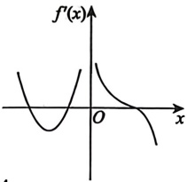

### 22.

$f(x)=\frac{1}{1+|x|}+\frac{1}{1+|x-a|}$ (a>0) 的最大值为().

(A) $\frac{1+a}{2+a}$ (B) $\frac{2+a}{1+a}$ (C) $\frac{1+2a}{2+a}$ (D) $\frac{2+a}{1+2a}$

### 23.

设  $f'(x)$ 在区间  $[0,4]$ 上连续，曲线  $y = f'(x)$ 与直线 x = 0, x = 4，y = 0 围成如图所示的三个区域，其面积分别为  $S_1 = 3$,  $S_2 = 4$,  $S_3 = 2$，且  $f(0) = 1$，则  $f(x)$ 在  $[0,4]$ 上的最大值与最小值分别为（ ）。

(A)2, -3

(B)4, -3

(C)2, -2

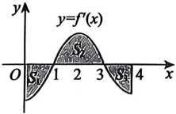

### 24.

设  $y = \tan^n x$ 在  $x = \frac{\pi}{4}$ 处的切线在  $x$ 轴上的截距为  $x_n$，则  $\lim_{n \to \infty} y(x_n) =\underline{\qquad}$.
### 25.

过曲线  $\frac{x^{2}}{4} + y^{2} = 1 (x > 0, y > 0)$ 任意点作该曲线的切线，切线夹在两坐标轴之间的部分为 L，求 L 的最小长度，以及 L 的长度达到最小时的切点坐标.

### 26.

求  $f(x)=\int_{0}^{1}\left|\ln|x-t|\right|\,\mathrm{d}t$ ( $0 \leq x \leq 1$) 的最大值.

### 27.

设  $y = y(x)$ 满足微分方程  $(xy' - 2)\ln x + y = 0$， $y(e) = 2$。

(1) 求  $y = y(x)$ 的表达式及其定义域；

(2) 求函数  $y = y(x)$ 的极值.

### 28.

设  $y = y(x)$ 满足  $(xy - 1)dx + x^2 dy = 0, x > 0, y(1) = 0$，求：

(1)  $y = y(x)$ 的表达式；

(2) 曲线  $y = y(x)$ 的拐点及渐近线.

### 29.

曲线  $y = x \ln \left(2 + \frac{1}{x-1}\right)$ 的斜渐近线方程为().

(A)  $y = x \ln 2 + 1$

(B)  $y = x \ln 2 + \frac{1}{2}$

(C)  $y = x \ln 2 - 1$

(D)  $y = x \ln 2 - \frac{1}{2}$

### 30.

求曲线  $y = x^3 \left( e^{\frac{1}{x}} + e^{\frac{1}{x}} - 2 \right)$ 的全部渐近线.

### 31.

设函数  $y = y(x)$ 由参数方程  $\begin{cases} x = 2e^t + t + 1, \\ y = 4(t-1)e^t + t^2 \end{cases}$ 确定，则曲线  $y = y(x)$ 在  $t=0$ 对应点处的曲率为 ___。

### 32.

设  $y = f(x)$ 是由方程  $x(1 + y) - e^{y} + 1 = 0$ 确定的隐函数，则曲线  $y = f(x)$ 在点  $(0, 0)$ 处的曲率为 ___.

### 33.

设圆与曲线  $x = y^{2}$ 在  $(0,0)$ 处有公切线且它们关于 y 的二阶导数值相同，则该圆的方程为 ___.
## 第6章 一元函数微分学的应用（二）——中值定理、微分等式与微分不等式

### 1.

设 $f(x)$在 $(0,+\infty)$内可导，对于以下结论：

①若 $\lim_{x\to+\infty}f(x)$存在，则 $\lim_{x\to+\infty}f'(x)$存在；

②若  $\lim_{x \to +\infty} f'(x)$ 存在，则  $\lim_{x \to +\infty} f(x)$ 存在；

③若  $\lim_{x\to+\infty}f'(x)=a\neq0$，则  $f(x)$ 在  $x\to+\infty$ 时无界；

④若 $\lim_{x\to+\infty}f'(x)=0$，则 $f(x)$在 $x\to+\infty$时有界.

正确的个数为( ).

(A) 1          (B) 2          (C) 3          (D) 4

### 2.

设 $f(x)$在 $(0,+\infty)$内可导，对于以下结论：

①若 $\lim_{x\to+\infty}f(x)$存在， $\lim_{x\to+\infty}f'(x)$存在，则 $\lim_{x\to+\infty}f'(x)=0$；

②若  $\lim_{x\to+\infty}\left[f(x)+f'(x)\right]$ 存在，则  $\lim_{x\to+\infty}f'(x)=0$

正确的说法是( ).

(A)①正确，②错误 (B)①错误，②正确

(C)①与②均正确 (D)①与②均错误

### 3.

设 $f(x)$在区间 $[0,1]$上可导， $f(0)=0$， $f(1)=1$，且 $f(x)$不恒等于x。证明：存在 $\xi\in(0,1)$，使得 $f'(\xi)>1$。

### 4.

设函数  $f(x)$ 在  $[0, +\infty)$ 上可导.

(1) 若  $f(0) = \lim_{x \to +\infty} f(x) = 0$，求证：存在  $\xi \in (0, +\infty)$，使  $f'(\xi) = 0$；

(2)若  $0 \leq f(x) \leq \ln \frac{2x+1}{x+\sqrt{1+x^2}}$，求证：存在  $\xi \in (0,+\infty)$，使  $f'(\xi) = \frac{2}{2\xi+1} - \frac{1}{\sqrt{1+\xi^2}}$。

### 5.

设正值函数 $f(x)$二阶可导且满足 $\left[f'(x)\right]^2 > f(x)f''(x)$，函数 $f(x) - x$在x = 0处取得极值1，证明 $f(x) \leq e^x$。

### 6.

设 $f(x)$在 $(-∞,+∞)$上二阶可导，且 $f''(x)≥0$ .证明：

(1)对于任意 $x_{0},x\in(-\infty,+\infty)$，有 $f(x)\geqslant f(x_{0})+f'(x_{0})(x-x_{0})$;
(2)若存在常数M>0，使得任意 $x\in(-\infty,+\infty)$，均有 $\left|f(x)\right|\leq M$，则 $f(x)$为常值函数.

### 7.

设 $f(x)$在 $[0,1]$上二阶可导， $\left|f''(x)\right|\leq M,x\in[0,1],M>0,f(0)=f(1)=0$. 证明：

(1)  $\left|f'(x)\right| \leqslant \frac{M}{2}, x \in [0,1]$;

(2) 若  $f\left(\frac{1}{2}\right)=0$，则  $\left|f'(x)\right|<\frac{M}{2}, x\in[0,1]$.

### 8.

设函数 $f(x)$在区间 $[-2,2]$上可导，且 $f'(x)>2f(x)>0$，则( )。

(A)  $\frac{f(-2)}{f(-1)}>1$ (B)  $\frac{f(0)}{f(-1)}>e^2$

(C)  $\frac{f(1)}{f(-1)}<e^2$ (D)  $\frac{f(2)}{f(-1)}<e^3$

### 9.

若可导函数 $f(x)$满足 $f'(x)<2f(x)$，则当 $b>a>0$时，有( )。

(A) $b^2f(a)>a^2f(b)$ (B) $b^2f(\ln a)>a^2f(\ln b)$

(C) $b^2f(a)<a^2f(b)$ (D) $b^2f(\ln a)<a^2f(\ln b)$

### 10.

设  $f(x) = \int_{0}^{x} e^{t^{2}} dt$,  $x \geq 0$.

(1) 证明  $\int_{0}^{x} e^{t^{2}} dt = x f' \left[ x \cdot \theta(x) \right]$，且  $\theta(x)$ 唯一，其中  $0 < \theta(x) < 1$，x > 0；

(2) 求  $\lim_{x \to 0^{+}} \theta(x)$.

### 11.

设 $f(x)$在 $[2,4]$上一阶可导且 $f'(x)\geq M>0$,  $f(2)>0$. 证明：

(1) 对任意的  $x \in [3,4]$，均有  $f(x) > M$；

(2)存在 $\xi\in(3,4)$，使得 $f(\xi)>M\cdot\frac{e^{\xi-3}}{e-1}$.

### 12.

设函数  $y = f(x)$ 在区间  $(\alpha, \beta)$ 内二阶可导，且其图像在  $(\alpha, \beta)$ 内有三个点满足关系  $y = ax^2 + bx + c$。证明：必然存在一个点  $\xi \in (\alpha, \beta)$，使得  $f''(\xi) = 2a$。

### 13.

设函数 $f(x)$在 $[0,1]$上二阶可导，且 $\int_{0}^{1}f(x)dx=0$，则().

(A) 当 $f'(x)<0$时， $f\left(\frac{1}{2}\right)<0$ (B) 当 $f''(x)<0$时， $f\left(\frac{1}{2}\right)<0$

(C) 当 $f'(x)>0$时， $f\left(\frac{1}{2}\right)<0$ (D) 当 $f''(x)>0$时， $f\left(\frac{1}{2}\right)<0$

### 14.

设函数  $f(x)$ 在  $[0,1]$ 上连续且  $f(0)=f(1)=0$，在  $(0,1)$ 内二阶可导且  $f''(x)<0$，记 M=
 $\max_{0 \leq x \leq 1} \left\{ f(x) \right\}$.

(1)证明对任意正整数 n，存在唯一的  $x_{n} \in (0,1)$，使得  $f'(x_{n}) = \frac{M}{n}$;

(2)对(1)中得到的 $\left\{x_{n}\right\}$，证明 $\lim_{n\to\infty}x_n$存在，且 $\lim_{n\to\infty}f(x_n)=M$

### 15.

设函数  $f(x)$ 在  $(a,b)$ 上二次可微，证明：对任意  $x \in (a,b)$ 及适当小的正数  $h$（使  $x+h$， $x-h \in (a,b)$），不等式

$$f(x)\leqslant\frac{1}{2}\left[f(x+h)+f(x-h)\right]$$

成立的充要条件是 $f''(x) \geq 0, x \in (a, b)$.

### 16.

确定常数 k 的取值范围，使方程  $x - \arctan x = kx^{3}$ 在  $(0,1]$ 内有实根.

### 17.

设方程  $\frac{\tan x}{x} = k$ 在  $\left(0, \frac{\pi}{4}\right)$ 内有实根，则常数 k 的取值范围为 ( )。

(A)  $0 < k < \frac{4}{\pi} - 1$

(B)  $\frac{4}{\pi} - 1 < k < \frac{4}{\pi}$

(C)  $1 < k < \frac{4}{\pi}$

(D)  $\frac{4}{\pi} - 1 < k < 1$

### 18.

设 $b>0>a$，则（ ）。

(A) $a\mathrm{e}^a(\mathrm{e}^b-1)>b\mathrm{e}^b(\mathrm{e}^a-1)$  (B) $a\mathrm{e}^a(\mathrm{e}^b-1)<b\mathrm{e}^b(\mathrm{e}^a-1)$  (C) $b\mathrm{e}^a(\mathrm{e}^b-1)>a\mathrm{e}^b(\mathrm{e}^a-1)$  (D) $b\mathrm{e}^a(\mathrm{e}^b-1)<a\mathrm{e}^b(\mathrm{e}^a-1)$

### 19.

设  $e < a < b$，证明： $a^2 < ab \frac{\ln a}{\ln b} < b^2$。

### 20.

设 $f''(x) < 0$，且 $\lim_{x \to 0} \frac{f(x)}{x} = 1$，证明： $f(x) \leq x$.

### 21.

设 $f(x)>0$,  $f''(x)$存在且 $f''(x)\leq0$,  $x\in[0,+\infty)$. 证明: 对于任意 $x\in[0,+\infty)$,  $f'(x)\geq0$
## 第7章 一元函数微分学的应用（三） ——物理应用

### 1.

质点  $P$ 沿抛物线  $x = y^2 (y > 0)$ 移动， $P$ 的横坐标  $x$ 的变化速度为  $5 \, \text{cm/s}$. 当  $x = 9$ 时，点  $P$ 到原点  $O$ 的距离变化速度为 ___.

### 2.

球的半径以  $5 \, cm/s$ 的速度匀速增长，当球的半径为  $50 \, cm$ 时，球的表面积和体积的增长速度各是多少？

### 3.

已知曲线  $L: y = \ln \sqrt{x} (2 \leq x \leq 4)$，在  $L$ 上的任意点  $P(x, y)$ 作切线，记切线与曲线  $L$ 在  $2 \leq x \leq 4$ 时所围成的有界区域的面积为  $S$。

(1) 求一点  $P_{0}$，使上述面积 S 关于 x 的变化率为零；

(2) 当点  $P(x,y)$ 在曲线上移动至  $\left(e,\frac{1}{2}\right)$ 时，横坐标关于时间的变化率为 1，求此时面积关于时间的变化率  $\frac{dS}{dt}$.
## 第8章 一元函数积分学的概念与性质
### 1.

计算  $\lim_{n \to \infty} \sum_{i=1}^{n} \frac{1 - \cos \frac{\pi}{n}}{1 + \cos \frac{i\pi}{2n}}$

### 2.

设  $f(x)$ 连续，则  $\lim_{n \to \infty} \sum_{k=1}^{n} \frac{k - \frac{1}{2} + n}{n^2} f\left(\frac{2k-1}{2n}\right) = (\quad)$.

(A)  $\int_{0}^{1}\left(x+\frac{1}{2}\right)f(x)dx$

(B)  $\int_{0}^{1}\left(x+1-\frac{1}{2n}\right)f\left(x-\frac{1}{2n}\right)dx$

(C)  $\int_{0}^{1}(x+1)f(x)dx$

(D)  $\int_{0}^{1}\left(x+\frac{1}{2}+\frac{1}{n}\right)f\left(x-\frac{1}{n}\right)dx$

### 3.

设  $f(x)$ 在  $[0,1]$ 上可积，则  $\lim_{n \to \infty} \sum_{i=0}^{n-1} \ln \left[1 + \frac{1}{n} f\left(\frac{i}{n}\right)\right] = (\quad)$.

(A)  $\int_{0}^{1}\ln\left[1+\frac{f(x)}{n}\right]\,\mathrm{d}x$ (B)  $\int_{0}^{1}\ln[1+f(x)]\,\mathrm{d}x$ (C)  $\int_{0}^{1}f(x)\,\mathrm{d}x$ (D)  $\int_{0}^{1}f^{2}(x)\,\mathrm{d}x$

### 4.

$I_{1}=\int_{0}^{2\pi}\frac{\sin x}{x}dx$,  $I_{2}=\int_{0}^{2\pi}\frac{\sin x}{2\pi-x}dx$,  $I_{3}=\int_{0}^{2\pi}\frac{\sin x}{x(2\pi-x)}dx$, 则().

(A)  $I_{3}<I_{1}<I_{2}$ (B)  $I_{3}<I_{2}<I_{1}$ (C)  $I_{2}<I_{3}<I_{1}$ (D)  $I_{1}<I_{2}<I_{3}$

### 5.

设  $I_{1}=\int_{0}^{\sqrt{2\pi}}\sin x^{2}dx$,  $I_{2}=\int_{-\frac{\pi}{4}}^{\frac{\pi}{4}}\frac{dx}{1+\sin x}$，则().

(A)  $I_{1}>0$,  $I_{2}>0$ (B)  $I_{1}<0$,  $I_{2}<0$

(C)  $I_{1}>0$,  $I_{2}<0$ (D)  $I_{1}<0$,  $I_{2}>0$

### 6.

设 $f(x)$在 $[0,1]$上连续， $\int_{0}^{1}2x^{2}f(x)dx\geqslant\int_{0}^{1}f^{2}(x)dx+\frac{1}{5}$，则 $f(x)=$___。

### 7.

设  $f(x)=\int_{0}^{\left|\sin x\right|}e^{t^{2}}dt$， $g(x)=\int_{0}^{\left|x\right|}\sin t^{2}dt$，则在  $(-\pi,\pi)$ 内( ).

(A)  $f(x)$ 是可导的奇函数

(B)  $g(x)$ 是可导的偶函数

(C)  $f(x)$ 是奇函数且  $f'(0)$ 不存在
(D)  $g(x)$ 是偶函数且  $g'(0)$ 不存在

### 8.

设 $f(x)=3x-\sqrt{1-x^2}\int_0^1 f^2(x)dx$，求 $f(x)$的表达式.

### 9.

设常数  $m > 0$,  $n > 0$, 则  $\int_{0}^{n}\sqrt{x}\left[\frac{m}{x}\right]dx$ ( $[\cdot]$ 是取整符号) 的敛散性().

(A)仅与m有关 (B)仅与n有关

(C)与m，n均有关 (D)与m，n均无关

### 10.

设  $p$,  $q$ 为正常数, 若  $\int_0^1 \frac{1}{x^p |\ln x|^q} \, dx$ 收敛, 则 ( ) .

(A)  $p < 1$,  $q < 1$ 　 (B)  $p > 1$,  $q < 1$ \quad (C)  $p < 1$,  $q > 1$ \quad (D)  $p > 1$,  $q > 1$

### 11.

若函数  $f(x)=\int_{2}^{+\infty}\frac{1}{t(\ln t)^{x+1}}dt$ 存在，则该函数的最小值点为  $x_{0}=$ ( ).

(A) $-\frac{1}{\ln\ln2}$ (B) $-\ln\ln2$ (C) $\frac{1}{\ln2}$ (D) $\ln2$

### 12.

设p为常数，若反常积分 $\int_{0}^{1}\frac{\ln x}{x^{p}(1-x)^{1-p}}dx$收敛，则p的取值范围是().

(A)(-1,1) (B)(-1,2) (C)(-∞,1) (D)(-∞,2)

### 13.

设非负函数  $f(x)$ 在  $[0,+\infty)$ 上具有有界导数，给出以下四个命题：

①若  $\int_0^{+\infty} f^2(x) \, dx$ 收敛，则  $\int_0^{+\infty} f(x) \, dx$ 收敛；②若  $\int_0^{+\infty} f(x) \, dx$ 收敛，则  $\int_0^{+\infty} f^2(x) \, dx$ 收敛；

③若  $\lim_{x \to +\infty} x^2 f(x)$ 存在，则  $\int_0^{+\infty} f(x) \, dx$ 收敛；④若  $\int_0^{+\infty} f(x) \, dx$ 收敛，则  $\lim_{x \to +\infty} x^2 f(x)$ 存在。

其中，真命题的个数为（ ）。

(A) 1          (B) 2          (C) 3          (D) 4

### 14.

若反常积分  $\int_1^{+\infty} e^{-\cos\frac{1}{x}} - e^{-1} x^k \, dx$ 收敛，则  $k$ 的取值范围是___。

### 15.

下列反常积分中发散的是( ).

(A)  $\int_{0}^{+\infty}\frac{e^{-x}}{\sqrt{x}}dx$ (B)  $\int_{0}^{+\infty}x^{2}e^{-x^{2}}dx$

(C)  $\int_{0}^{+\infty}\frac{dx}{x\ln^{2}x}$ (D)  $\int_{0}^{+\infty}\frac{dx}{(x+2)\ln^{2}(x+2)}$

### 16.

下列反常积分中收敛的是().

(A)  $\int_{1}^{+\infty}\frac{dx}{\sqrt{x^{2}-1}}$ (B)  $\int_{1}^{+\infty}\frac{dx}{\sqrt{x(x-1)}}$ (C)  $\int_{1}^{+\infty}\frac{dx}{x^{2}\sqrt{x^{2}-1}}$ (D)  $\int_{1}^{+\infty}\frac{dx}{x(x^{2}-1)}$

### 17.

设  $y = y(x)$ 满足  $[(1 + x)y - 1]dx + x(1 + x)dy = 0$,  $y(1) = \ln 2$.

(1) 求  $y = y(x)$ 的表达式及定义域；

(2) 记  $f(x) = \int_{-1}^{x} y(|t|) \, dt$，求  $f'(0)$.

### 18.

设  $f(x) = \lim_{n \to \infty} \frac{x}{n} \left( e^{-\frac{x^2}{n^2}} + e^{-\frac{4x^2}{n^2}} + \cdots + e^{-x^2} \right)$，求：

(1) $f(x)$ 的表达式；

(2) 曲线  $y = e^{x^2} f(x)$ 的拐点.

### 19.

设  $f(x)=x^{2}$， $f\left[\varphi(x)\right]=-x^{2}+2x+3$。且  $\varphi(x)\geqslant0$，则  $\lim_{n\to\infty}\frac{1}{n^{3}}\sum_{i=1}^{n}i^{2}(n-i)\cdot\frac{1}{n+\varphi(x)}=$

(A) $\frac{1}{12}$ (B) $\frac{1}{6}$ (C) $\frac{1}{3}$ (D) $\frac{2}{3}$
## 第9章 一元函数积分学的计算
### 1.

$\int_{0}^{1}\ln\frac{1}{1-x}dx=\underline{\qquad}$.

### 2.

求  $\int\frac{x+2}{(2x+1)(x^{2}+x+1)}$ dx.

### 3.

$\int_{1}^{e}\cos(\ln x)dx=$___.

### 4.

设函数 $f(x)$满足方程 $xf(x)+f(1-x)=x^{2}$，求 $\int f(x)dx$。

### 5.

$\sum_{n=1}^{\infty}\int_{n}^{n+1}2^{-\sqrt{x}}dx=$___

### 6.

已知 $f(x)$是连续的偶函数，且 $\int_{0}^{1}f(x)dx=2$，则 $\int_{0}^{2}xf(1-x)dx=$___。

### 7.

已知 $f(x)$连续， $f(x^2+1)-f(x^2)=x(x>0)$， $\int_0^1 f(x) \, dx=1$，则 $\int_1^2 f(x) \, dx=$___。

### 8.

设  $f(t)=\int_{0}^{1}t\left|t-x\right|\mathrm{d}x$ ，求  $\int_{-1}^{2}f(t)\mathrm{d}t$

### 9.

设  $f(x)$ 是以2为周期的连续函数， $\int_{0}^{2}f(x)dx=1$， $g(x)$ 是过点  $\left(-\frac{1}{2},0\right)$ 和  $(0,1)$ 的直线，则  $\int_{0}^{2}f[g(x)]dx=\underline{\qquad}$.

(A) -2 (B) -1 (C) 1 (D) 2

### 10.

已知  $f'(x) = \arctan(x-1)^2$,  $f(0) = 0$, 则  $\int_0^1 f(x) \, dx =\underline{\qquad}$.

### 11.

设  $g(x)=x^2$， $g\left[f(x)\right]=-x^2+2x+3$，且  $f(x)>0$，则  $\int_0^1 \frac{1}{f(x)} \, dx=\underline{\qquad}$.

### 12.

求  $\int_{-1}^{1} x \ln(1 + e^{x}) \, dx$.

### 13.

求  $\int_{0}^{1}\frac{dx}{(x+1)(x^{2}+1)}$.

### 14.

设  $F(x) > 0$ 为 R 上的连续可导函数， $F(0) = \sqrt{\pi}$，且  $F(x)F'(x) = \frac{\cos x}{2\sin^2 x + \cos^2 x}$。求  $F(x)$。
张宇 ___

### 15.

求  $\int_{0}^{1}\frac{\arcsin\sqrt{x}}{\sqrt{x(1-x)}}dx$.

### 16.

求  $\int_{0}^{\frac{\pi}{4}}\frac{dx}{\sin^{2}x+3\cos^{2}x}$.

### 17.

求  $\int_{1}^{3}\frac{dx}{\sqrt{2x-x^{2}}}$.

### 18.

设  $n$ 为非负整数，则  $\int_0^1 x^2 \ln^n x \, dx =\underline{\qquad}$.

### 19.

设  $f(x)=\int_{0}^{1}\ln\sqrt{x^{2}+y^{2}}dy$， $0\leq x\leq1$，则  $f_{+}^{\prime}(0)=\underline{\qquad}$.

(A)  $-\frac{\pi}{2}$ (B)  $\frac{\pi}{2}$ (C)  $-\pi$ (D)  $\pi$

### 20.

设  $|x| \leq 1$，求积分  $I(x) = \int_{-1}^{1} |t - x| e^{2t} dt$ 的最大值.

### 21.

设函数 $f(x)=\int_{0}^{1}\left|t^{2}-x^{2}\right|\,\mathrm{d}t(x>0)$，求 $f'(x)$，并求 $f(x)$的最小值.

### 22.

设  $f(x) = x$,  $g(x) = \begin{cases} \cos x, & x \leq \pi, \\ 0, & x > \pi, \end{cases}$ 求  $F(x) = \int_{0}^{x} f(t) g(x-t) dt (x \geq 0)$.

### 23.

设  $y = f(x) = x \int_0^2 e^{-(xt)^2} \, dt + x^2$，其在  $x=0$ 的某邻域内与  $x=g(y)$ 互为反函数，则  $g''(0) =\underline{\qquad}$.

### 24.

$F(x)=\int_{0}^{\frac{\pi}{2}}\left|\sin x-\sin t\right|\,\mathrm{d}t(x\geqslant 0)$ 在  $x\to 0^{+}$ 处的2次泰勒多项式为  $a+bx+cx^{2}$，求  $a, b, c$ 的值.

### 25.

求  $\int_{1}^{2}\frac{dx}{x\sqrt{3x^{2}-2x-1}}$.

### 26.

$\int_{-1}^{5}\frac{1}{1+2^{\sqrt{x-2}}}dx = (\quad).$

(A)1 　 (B)3 \quad (C) $\sqrt{3}$ \quad (D) $\frac{3}{2}$

### 27.

设  $y = y(x)$ 满足  $x^2 y' + (x^2 - 3) y^2 = 0$ 且  $y(1) = 1$.

(1) 求  $y = y(x)$ 的表达式；

(2) 计算  $\int_{0}^{3} y^{2}(x) dx$.

### 28.

$\int_{0}^{+\infty}\frac{x\ln x}{1+x^{4}}dx=$___.
## 第10章 一元函数积分学的应用（一） ——几何应用

### 1.

曲线 $e^{y} + xy + x^{3} = e$在点 $(0,1)$处的切线与两坐标轴所围成的三角形的面积为___.

### 2.

曲线  $r = 2\cos3\theta\left(0 \leq \theta \leq \frac{\pi}{6}\right)$ 与  $\theta = 0$ 及  $\theta = \frac{\pi}{6}$ 所围图形面积为 ___.

### 3.

若曲线  $r = a(1 + \cos\theta)(a > 0)$ 所围图形的面积为  $6\pi$，则  $a =\underline{\qquad}$.

### 4.

设函数  $y = y(x)$ 满足方程  $y'' + 3y' + 2y = e^{-x}$，且  $\lim_{x \to 0} \frac{y(x)}{x} = 1$，求曲线  $y = y(x)$ 与 x 轴正半轴之间的平面图形的面积及该平面图形绕 y 轴旋转一周所形成的旋转体体积.

### 5.

曲线  $y=\sqrt{x}$ 与  $y=x^{2}$ 所围平面有界区域绕直线 y=x 旋转一周所得旋转体的体积为 ___.

### 6.

过坐标原点作曲线  $y = e^x$ 的切线，该切线与曲线  $y = e^x$ 以及 x 轴围成的向 x 轴负向无限伸展的图形记为 D.

(1) 求 D 的面积;

(2) 求 D 绕直线 x=1 旋转一周所成的旋转体体积.

### 7.

求曲线  $y = e^{-\frac{x}{2}} \sqrt{\sin x} (x \geq 0)$ 绕 x 轴旋转一周所成旋转体的体积.

### 8.

设曲线  $y = ax^2 (x \geq 0$，常数  $a > 0)$ 与曲线  $y = 1 - x^2$ 交于点  $A$，过坐标原点  $O$ 和点  $A$ 的直线与曲线  $y = ax^2$ 围成一平面图形  $D$。

(1) 求 D 绕 x 轴旋转一周所成的旋转体体积 V(a);

(2) 求使  $V(a)$ 为最大值时 a 的值.

### 9.

设函数 $f(x)$在 $[0,1]$上连续，在 $(0,1)$内可导，且满足 $xf'(x)=f(x)+x^{2}$. 已知曲线 $y=f(x)$与x=0, x=1, y=0所围的图形S面积为2. 求 $f(x)$的表达式，以及图形S绕x轴旋转一周所得旋转体的体积.

### 10.

当  $x \geqslant 0$ 时，在曲线  $y = e^{-2x}$ 上面作一个台阶曲线，台阶的宽度皆为

1(见图).则图中无穷多个阴影部分的面积之和 S=___.

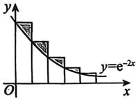

### 11.

设函数  $y = f(x)$ 满足微分方程  $y' + y = \frac{e^{-x} \cos x}{2 \sqrt{\sin x}}$，且  $f(\pi) = 0$，求曲线  $y = f(x) (x \geq 0)$ 绕 x 轴旋转一周所得旋转体的体积.

### 12.

设  $f(x)$ 在  $(-\infty, +\infty)$ 内非负连续，且  $\int_{0}^{x} t f(x^{2}) f(x^{2} - t^{2}) dt = \sin^{2} x^{2}$，求  $f(x)$ 在  $[0, \pi]$ 上的平均值.

### 13.

已知  $\frac{1}{1+e^{\frac{1}{x}}}$ 是函数  $f(x)$ 的一个原函数，则  $f(x)$ 在  $[-1,1]$ 上的平均值为___。

### 14.

已知函数 $f(x)$在 $[0,1]$上连续，在 $(0,1)$内是函数 $\frac{\sin\pi x}{x}$的一个原函数，且 $f(1)=0$，则 $f(x)$在区间 $[0,1]$上的平均值为___。

### 15.

设函数 $f(x)$非负连续，且 $f(x)\int_{0}^{1}f(xt)dt=2x^{2}$，则 $f(x)$在区间 $[0,2]$上的平均值为___。

### 16.

设  $f(x)$ 为  $[0,3]$ 上的非负连续函数，且满足  $f(x)\int_{1}^{2}f(xt-x)dt=2x^{2}$， $x\in[0,3]$，则  $f(x)$ 在区间  $[1,3]$ 上的平均值为___。

### 17.

已知函数 $f(x)$在 $\left[0,\frac{3\pi}{2}\right]$上连续，在 $\left(0,\frac{3\pi}{2}\right)$内是函数 $\frac{\cos x}{2x-3\pi}$的一个原函数，且 $f(0)=0$则 $f(x)$在区间 $\left[0,\frac{3\pi}{2}\right]$上的平均值为___.

### 18.

设  $f(x)=\int_{-1}^{x}t|t|\,\mathrm{d}t$，求曲线  $y=f(x)$ 与 x 轴所围成的封闭图形的面积.

### 19.

已知函数  $f(x)$， $g(x)$ 分别满足  $f'(x) = 2\sqrt{f(x)}$， $g'(x) = \frac{g(x)}{x-2} + \frac{x-2}{x}$， $f(0) = 1$， $g(1) = 0$。求曲线  $f(x) + g(y) = 0$ 所围图形绕直线 x = -1 旋转一周所成旋转体体积。

### 20.

在曲线  $\sqrt{x} + \sqrt{y} = 1$ 上的横坐标为  $a (0 < a < 1)$ 处作曲线的切线，将切线与 x 轴、y 轴所围成的图形绕 y 轴旋转一周，使得旋转体的体积最大，求 a 的值.

### 21.

设函数  $x = x(y)$ 满足  $y = \int \frac{4y^{3}}{4 - y^{6}} \, \mathrm{d}x$，L 为曲线  $x = x(y) (-2 \leq y \leq -1)$，且  $x(-1) = -\frac{9}{16}$，记 L 的长度为 s。求：

(1) s;

(2) x 的最大值.

### 22.

设连续函数  $y = y(x)$ 满足  $y' + \frac{t^2}{y} x^3 = \frac{y}{x}$， $y(1) = \sqrt{9 - t^2}$，其中  $0 \leq t \leq 3$， $x > 0$。
(1) 利用换元  $z = y^{2}$ 求  $y = y(x)$ 的表达式；

(2)令 $f(x)=\frac{1}{9}\int_{0}^{3}y(x)dt$，求曲线 $y=f(x)$的全长.

### 23.

设非负函数  $y(x)$ 是微分方程  $2yy' = \cos x$ 满足条件  $y(0) = 0$ 的解，求曲线  $f_n(x) = n\int_{0}^{\frac{x}{n}} y(t) \, dt (0 \leq x \leq n\pi)$ 的弧长。

### 24.

设函数  $y = f(x)$ 在区间  $[0, a]$ 上非负， $f''(x) > 0$，且  $f(0) = 0$。有一块质量均匀分布的平板  $D$，其占据的区域是曲线  $y = f(x)$ 与直线  $x = a$ 以及  $x$ 轴围成的平面图形。用  $\bar{x}$ 表示平板  $D$ 的质心的横坐标（见图）。证明： $\bar{x} > \frac{2}{3}a$。

### 25.

求摆线的一拱  $\begin{cases} x = a(t - \sin t), \\ y = a(1 - \cos t) \end{cases} (0 \leq t \leq 2\pi, a > 0)$ 与  $x$ 轴围成的平面图形绕  $x$ 轴旋转一周所形成的旋转体的体积与表面积。

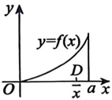

### 26.

已知摆线的参数方程为  $\left\{\begin{aligned}x&=a(t-\sin t),\\ y&=a(1-\cos t),\end{aligned}\right.$ 其中  $0\leq t\leq2\pi$，常数 a>0. 设该摆线一拱的弧长的数值等于该弧段绕 x 轴旋转一周所形成的旋转曲面面积的数值. 求 a 的值.
## 第11章 一元函数积分学的应用（二） ——积分等式与积分不等式

### 1.

设 $f(x)$在 $[0,1]$上可导，当 $0 \leq x \leq 1$时， $f'(x) + f^2(x) \geq 0$， $f(0) > 0$，则（）.

(A)  $\int_{0}^{1} f(x) \, dx \leq \ln \frac{f(1)}{f(0)}$

(B)  $\int_{0}^{1} f(x) \, dx \geq \ln \frac{f(0)}{f(1)}$

(C)  $\int_{0}^{1} f(x) \, dx \leq \ln f(1)$

(D)  $\int_{0}^{1} f(x) \, dx \geq \ln f(0)$

### 2.

设函数 $f(x)$是 $[0,1]$上的连续函数，利用分部积分法证明：

$$\int_{0}^{1}\left[\int_{x^{2}}^{\sqrt{x}}f(t)\mathrm{d}t\right]\mathrm{d}x=\int_{0}^{1}\left(\sqrt{x}-x^{2}\right)f(x)\mathrm{d}x.$$

### 3.

设  $f(x)$ 是  $[0,1]$ 上的可导函数,  $f(0)=f(1)=1$,  $\max_{0\leq x\leq1}\left\{\left|f'(x)\right|\right\}=1$, 则()

(A)  $\frac{1}{4} < \int_{0}^{1} f(x) \, dx < \frac{1}{2}$

(B)  $\frac{1}{2} < \int_{0}^{1} f(x) \, dx < \frac{3}{4}$

(C)  $\frac{3}{4} < \int_{0}^{1} f(x) \, dx < \frac{5}{4}$

(D)  $\frac{5}{4} < \int_{0}^{1} f(x) \, dx < \frac{7}{4}$

### 4.

证明： $\int_{0}^{1}\left(\int_{x}^{\sqrt{x}}\frac{\sin t}{t}dt\right)dx=1-\sin1$

### 5.

设函数  $f(x)$， $g(x)$ 在区间  $[a,b]$ 上连续，对任意的  $x\in[a,b]$，满足  $\int_{a}^{x}g(t)dt\leqslant\int_{a}^{x}f(t)dt$，且  $\int_{a}^{b}g(t)dt=\int_{a}^{b}f(t)dt$。证明： $\int_{a}^{b}xf(x)dx\leqslant\int_{a}^{b}xg(x)dx$。

### 6.

设 $f(x)$在 $[a,b]$上可导，且 $f'(x)$连续， $f(a)=0$。证明： $\int_{a}^{b}f^{2}(x)dx\leqslant\frac{(b-a)^{2}}{2}\int_{a}^{b}\left[f'(x)\right]^{2}dx$。

### 7.

设  $f(x)$ 是  $[0,1]$ 上单调增加的连续函数，则( ).

(A)  $\int_{0}^{1}e^{-2}dt$

(B)  $\int_{0}^{1}e^{-2}dt$

(C)  $\int_{0}^{1}e^{-2}dt$

(D)  $\int_{0}^{1}e^{-2}dt$

(E)  $\int_{0}^{1}f(x)dx \leq \int_{0}^{1}f(x)dx$

(A) $\int_{0}^{1} e^{-t^2} dt \geq \int_{0}^{1} f(x) e^{-x^2} dx$
(B) $\int_{0}^{1} e^{-t^2} dt \leq \int_{0}^{1} f(x) e^{-x^2} dx$
(C) $\int_{0}^{1} e^{-t^2} dt \geq \int_{0}^{1} f(x) dx$
(D) $\int_{0}^{1} e^{-t^2} dt \leq \int_{0}^{1} f(x) dx$
### 8.

设 $f(x)$在 $\left[0,\frac{3}{2}\pi\right]$上连续，在 $\left(0,\frac{3}{2}\pi\right)$内是函数 $\frac{\sin x}{x}$的一个原函数， $f(0)=0$.

(1) 证明  $f\left(\frac{3}{2}\pi\right) > 0$;

(2) 求方程  $\int_{1}^{x} \frac{\sin t}{t} dt = \ln x^{2}$ 的实根个数.

### 9.

设  $f(x)$ 在  $[0,1]$ 上具有二阶导数， $f(0)=f(1)=0$， $f''(x)<0$， $0\leq f(x)\leq1$。记曲线  $y=f(x)$ 在  $[0,1]$ 上的长度为 a，证明：

(1)存在 $\xi\in(0,1)$，使得对任意 $x\in(0,\xi)$，有 $f'(x)>0$；

(2) a < 3.
## 第12章 一元函数积分学的应用（三）——物理应用

### 1.

一三角形平面薄板铅直地浸没于水中，设当该薄板的一条边与水面相平齐时薄板一侧所受的水压力的大小为  $F_{1}$，当倒转薄板使原来与水面相平齐的那条边与水面平行而该边相对的顶点与水面相齐时薄板一侧所受的水压力的大小为  $F_{2}$，则（）.

(A) $F_{2}=\frac{3}{2}F_{1}$ (B) $F_{2}=\frac{4}{3}F_{1}$ (C) $F_{2}=2F_{1}$ (D) $F_{2}=3F_{1}$

### 2.

边长为2的等边三角形薄平板铅直沉没在水中，且一条边与水面相齐。记重力加速度为g，水的密度为 $\rho$。

(1) 求该平板一侧所受的水压力；

(2) 当水面开始以 0.1 的速度上涨时，求平板一侧所受水压力的变化率.

### 3.

半径为 a 的球浸没在与其密度  $\rho$ 相同的某液体中，球与水面相切，g 为重力加速度. 若将球取出，所做的功至少为 ___.

### 4.

设有半圆形板： $x^{2}+y^{2}\leq a^{2}(y\geq0)$，它在点 $P(x,y)$的密度与点P到原点的距离成正比，则半圆形板的重心坐标为()。

(A) $\left(0,\frac{\pi a}{3}\right)$ (B) $\left(0,\frac{\pi a}{2}\right)$

(C)  $\left(0,\frac{4a}{3\pi}\right)$ (D)  $\left(0,\frac{3a}{2\pi}\right)$

### 5.

曲线  $y = e^x$ 与直线  $x = 1$， $x = -1$ 及  $x$ 轴所围平面有界区域  $D$ 的形心为___。
## 第13章 多元函数微分学

### 1.

设函数  $f(x,y)=|x|+y|y|$，则().

(A)  $f_{x}^{\prime}(0,0)$ 存在， $f_{y}^{\prime}(0,0)$ 存在

(B)  $f_{x}^{\prime}(0,0)$ 存在， $f_{y}^{\prime}(0,0)$ 不存在

(C)  $f_{x}^{\prime}(0,0)$ 不存在， $f_{y}^{\prime}(0,0)$ 存在

(D)  $f_{x}^{\prime}(0,0)$ 不存在， $f_{y}^{\prime}(0,0)$ 不存在

### 2.

设 $f(x,y)$具有一阶偏导数，且对任意的 $(x,y)$都有 $\frac{\partial f(x,y)}{\partial x}>0$， $\frac{\partial f(x,y)}{\partial y}<0$，则( )。

(A)  $f(0,0)>f(1,1)$ (B)  $f(0,0)<f(1,1)$ (C)  $f(0,1)>f(1,0)$ (D)  $f(0,1)<f(1,0)$

### 3.

已知  $F(a,b)=\int_{0}^{\frac{\pi}{2}}(a\sin x-\sin^{2}x+b)^{2}\cos xdx$，则使得  $F(a,b)$ 取得最小值的 a，b 分别为 ( ).

(A)1,  $\frac{1}{6}$ (B)1, - $\frac{1}{6}$ (C) -1,  $\frac{1}{6}$ (D) -1, - $\frac{1}{6}$

### 4.

若 $f(x,y)$在点 $(0,0)$处的某个邻域内有定义， $f(0,0)=0$，且 $\lim_{(x,y)\to(0,0)}\frac{f(x,y)-\sqrt{x^2+y^2}}{\sqrt{x^2+y^2}}=a$，其中a为常数.

(1) 讨论函数  $f(x, y)$ 在点  $(0, 0)$ 处的连续性.

(2) 当 a 为何值时，函数  $f(x, y)$ 在点  $(0, 0)$ 处可微？并求  $\left.\mathrm{d}f\right|_{(0,0)}$

### 5.

设函数  $u(x, y)$ 的全微分  $\mathrm{d}u = [\mathrm{e}^x + f'(x)] y \mathrm{d}x + f'(x) \mathrm{d}y$，其中  $f(x)$ 在  $(-\infty, +\infty)$ 内具有二阶连续的导数，且  $f(0) = 4$， $f'(0) = 3$，求  $f(x)$。

### 6.

已知 $f(u)$在 $(0,+\infty)$内有二阶连续导数，且 $z=f\left(\frac{y}{x}\right)$满足 $\frac{\partial^{2}z}{\partial x^{2}}+\frac{\partial^{2}z}{\partial y^{2}}=0$。求 $f(u)$的表达式。

### 7.

设函数  $z = f(x, y)$ 连续，且  $\lim_{(x,y) \to (1,0)} \frac{f(x,y) - 3x + y + 5}{(x-1)^2 + y^2} = \frac{1}{4}$，则  $\mathrm{d}z\big|_{(1,0)} =\underline{\qquad}$.

### 8.

设函数 $f(u,v)$具有连续偏导数， $z=f(xy,x+y)$. 若 $\mathrm{d}z\bigg|_{\substack{x=2\\y=3}}=6\mathrm{d}x+5\mathrm{d}y$，则 $f_{u}^{\prime}(6,5)+f_{v}^{\prime}(6,5)=\underline{\qquad}$.

### 9.

设函数  $z = f(x, y) (xy \neq 0)$ 满足  $f\left(xy, \frac{y}{x}\right) = y^2 (x^2 - 1)$，则  $\mathrm{d}z =\underline{\qquad}$.

### 10.

设函数 $f(x,y)=\int_{0}^{xy}e^{xt^2}dt$，则 $\left.\frac{\partial^2f}{\partial x\partial y}\right|_{(1,1)}=\underline{\qquad}$.

### 11.

设  $z = z(x, y)$ 是由  $z + e^z = xy$ 所确定的二元函数，则  $\left. \frac{\partial^2 z}{\partial x \partial y} \right|_{x=0} =\underline{\qquad}$.

### 12.

设  $z = z(x, y)$ 是由方程  $e^{x-2y+3z} - 2xe^{-y} \cos z = 1$ 所确定的函数，则  $\left. dz \right|_{(0,0)} =\underline{\qquad}$.

### 13.

已知 $\frac{aydy+xdx}{x^{2}+y^{2}-1}\left(x^{2}+y^{2}<1\right)$是某二元函数的全微分，则 $a=$（ ）.

(A)1

(B) $-1$

(C)2

(D) $-2$

### 14.

设函数  $z = z(x, y)$ 由方程  $\sin(x - y) + \int_{1}^{z} e^{-t^2} \, dt = 0$ 确定，则  $\left. dz \right|_{(0,0)} =\underline{\qquad}$.

### 15.

设  $z = z(x, y)$ 是由方程  $z + \ln z - \int_{y}^{x} e^{-t^2} \, dt = 1$ 确定的函数，计算  $\left. \frac{\partial^2 z}{\partial x \partial y} \right|_{(0,0)}$.

### 16.

设函数 $f$与 $g$均可微， $z = f[xy, \ln x + g(xy)]$，则 $x \frac{\partial z}{\partial x} - y \frac{\partial z}{\partial y} = (\ )$.

(A)  $f_1'$

(B)  $f_2'$

(C)  $f_1' + f_2'$

(D)  $f_1' - f_2'$

### 17.

设  $F(u,v)$ 具有一阶连续偏导数，且  $z = z(x,y)$ 由方程  $F\left(\frac{x}{z}, y z\right) = 0$ 所确定。设题中出现的分母不为零，则  $x \frac{\partial z}{\partial x} - y \frac{\partial z}{\partial y} = (\ )$.

(A) 0

(B) z

(C)  $\frac{1}{z}$

(D) 1

### 18.

设  $z = z(x, y)$ 是由方程  $3x + xyz + z^3 = 1$ 所确定的函数，则  $\left. \frac{\partial^2 z}{\partial x^2} \right|_{x=0 \atop y=0} =\underline{\qquad}$.

### 19.

已知方程  $2z - e^{z} + 1 + \int_{y}^{x^{2}} \sin(t^{2}) dt = 0$ 在  $(x_{0}, y_{0}, z_{0}) = (1, 1, 0)$ 的某个邻域中确定了一个隐函数  $z = z(x, y)$，求  $\left.\frac{\partial^{2}z}{\partial x\partial y}\right|_{(1,1)}$

### 20.

设  $f(u,v)$ 存在二阶连续偏导数， $z = z(x,y)$ 是由方程  $f(z - x, z - y) = 1$ 确定的隐函数，求  $\frac{\partial^2 z}{\partial x \partial y}$.

### 21.

设  $u = e^{x+y+z}$，其中  $y(x)$ 和  $z(x)$ 由方程组  $\begin{cases} \int_0^x e^{t^2} \, dt + \ln(1+y) = 0, \\ e^{y+z} = e + z \ln z \end{cases}$ 确定，则  $\left. \frac{du}{dx} \right|_{x=0} =\underline{\qquad}$.
### 22.

函数 $f(x,y)=x^{2}+y^{2}$在约束条件 $(x-1)^{3}=y^{2}$下().

(A)有最大值,无最小值 (B)无最大值,有最小值

(C)有最大值，有最小值 (D)无最大值，无最小值

### 23.

$f(x,y)=x^{4}+y^{4}-(x+y)^{2}$ 有().

(A)2个极小值点，1个极大值点

(B)1个极小值点，1个极大值点

(C)3个极小值点，无极大值点

(D)2个极小值点，无极大值点

### 24.

设  $f(x,y)=\begin{cases}\left(y-\mathrm{e}^{\frac{1}{x^{2}}}\right)\left(y-3\mathrm{e}^{\frac{1}{x^{2}}}\right),&x\neq0,\\y^{2},&x=0,\end{cases}$ 则点  $(0,0)$ ().

(A) 是  $f(x,x)$ 的极小值点，也是  $f(x,y)$ 的极小值点

(B) 是  $f(x,x)$ 的极小值点，不是  $f(x,y)$ 的极小值点

(C)不是 $f(x,x)$的极小值点，是 $f(x,y)$的极小值点

(D)不是 $f(x,x)$的极小值点，也不是 $f(x,y)$的极小值点

### 25.

设  $f(x,y)=x^{2}+y^{2}(1+x)^{3}$，则点  $(0,0)$ ( )。

(A) 是  $f(x,y)$ 的唯一极小值点，也是其最小值点

(B) 是  $f(x,y)$ 的唯一极大值点，也是其最大值点

(C) 是  $f(x,y)$ 的唯一极小值点，但不是其最小值点

(D) 是  $f(x,y)$ 的唯一极大值点，但不是其最大值点

### 26.

求由方程  $2x^{2}+2y^{2}+z^{2}+8xz-z+8=0$ 所确定的函数  $z=z(x,y)$ 的极值，并指出是极大值还是极小值.

### 27.

设 $f(x,y)=3x+4y-ax^{2}-2ay^{2}-2bxy$. 当a,b满足何种条件时， $f(x,y)$有唯一的极大值，并说明理由.

### 28.

求  $|z|$ 在约束条件  $\begin{cases} x^{2}+9y^{2}-2z^{2}=0, \\ x+3y+3z=5 \end{cases}$ 下的最大值与最小值.

### 29.

求曲线  $C:\begin{cases}x^{2}+y^{2}-2z^{2}=0,\\x+y+3z=5\end{cases}$，上距离 xOy 平面最远和最近的点的坐标.

### 30.

求函数  $u = \sqrt{x^2 + y^2 + z^2}$ 在约束条件  $x + 2y = 1$ 与  $x^2 + 2y^2 + z^2 = 1$ 下的最值.

### 31.

求曲线  $x^{2}-xy+y^{2}=1(x>0,y>0)$ 上的一点 P，使该点处的切线与 x 轴，y 轴在第一象限所围的图形的面积最小.

### 32.

设曲线  $L_{1}: x^{2} + y^{2} = 2y$ 内切于曲线  $L_{2}: \frac{x^{2}}{a^{2}} + \frac{y^{2}}{b^{2}} = 1 (a, b > 0)$，求 a，b 的值，使  $L_{2}$ 所围面积最小.

### 33.

设  $u = u(x, y)$ 具有二阶连续偏导数，且满足  $\frac{\partial^2 u}{\partial x \partial y} = x^2 y$， $u(x, 0) = -x^2 + 2$， $u(1, y) = \cos y$。求：

(1)  $u = u(x, y)$ 的表达式；

(2) $u(x,y)-\cos y$的极值.

### 34.

设函数  $f(x,y)$ 具有二阶连续偏导数，且满足  $f(x,0)=x^{2}$， $f_{y}^{\prime}(x,0)=\sqrt{2}x$， $f_{yy}^{\prime\prime}(x,y)=4$，求  $f(x,y)$ 在约束条件  $x^{2}+2y^{2}=4$ 下的最大值与最小值.

### 35.

设函数  $u = xz + ay^3$ ( $z \geq 0$)，且  $x^2 + y^2 + z^2 = 1$。

(1) 当  $a = \frac{1}{3}$ 时，求 u 的最大值；

(2) 当  $a = t$ (t 为变量) 时，u 是否有最大值，若有，求出最大值，若没有，说明理由.

### 36.

设  $D=\left\{(x,y)\mid x+y\leq3,x\geq0,y\geq0\right\}$，求函数  $f(x,y)=2x^{3}+2y^{3}-6x-6y+5$ 在区域 D 上的最大值与最小值.

### 37.

设  $f(x,y)=4x^2(x-2y)+16y(xy-3)-33x$，求其在平面区域  $D=\{(x,y)\mid0\leq y\leq x\leq3\}$ 上的取值范围.

### 38.

设函数  $u = u(x, y)$ 在区域  $D = \left\{(x, y) \mid 2x^2 + 3y^2 \leq 4\right\}$ 上连续，在区域  $D$ 的内部有二阶连续偏导数，且满足  $-2 \frac{\partial^2 u}{\partial x^2} - 3 \frac{\partial^2 u}{\partial y^2} = u^2$。在区域  $D$ 的边界  $2x^2 + 3y^2 = 4$ 上  $u(x, y) \geq 0$。

证明：当 $2x^{2}+3y^{2}\leq4$时， $u(x,y)\geq0$

### 39.

已知可微函数  $f(u,v)$ 满足

$$\frac{\partial[f(u,v)]}{\partial u}+\frac{\partial[f(u,v)]}{\partial\nu}=6(u+\nu)-3\bar{u}^{2},$$

且 $f(u,0)=3u^{2}-u^{3}$. 记 $g(x,y)=f(x,x-y)$.

(1) 计算  $\frac{\partial[g(x,y)]}{\partial x}$;

(2) 求  $f(x,y)$ 在有界闭区域  $D=\left\{(x,y)\mid x^{2}+y^{2} \leqslant 16\right\}$

### 40.

设  $z = z(u, v)$ 具有二阶连续偏导数，且  $z = z(x - y, x + 2y)$ 满足

$$2\frac{\partial^{2}z}{\partial x^{2}}+\frac{\partial^{2}z}{\partial x\partial y}-\frac{\partial^{2}z}{\partial y^{2}}=2\frac{\partial z}{\partial x}-\frac{\partial z}{\partial y},\frac{\mathrm{d}[z(0,v)]}{\mathrm{d}v}=\frac{1}{3}z(0,v)+\mathrm{e}^{\frac{v}{3}},z(u,0)=\sin u.$$

(1) 证明  $\frac{\partial^{2}z}{\partial u\partial v} = \frac{1}{3} \cdot \frac{\partial z}{\partial u}$;

(2) 求  $z = z(u, v)$ 的表达式.
## 第14章 二重积分

### 1.

$\lim_{n \to \infty} \sum_{i=1}^{n} \sum_{j=1}^{n} \frac{1}{(n+i)\sqrt{n^2 + j^2}} =\underline{\qquad}$.

### 2.

设  $D=\left\{(x,y)\mid|x|+|y|\leqslant3\right\}$， $D_{k}(k=1,2,3,4)$ 是 D 的第 k 象限部分， $I_{k}=\iint_{D_{k}}\sin(x-y)dxdy$，则（ ）。

(A)  $I_{1}>0$ (B)  $I_{2}>0$ (C)  $I_{3}>0$ (D)  $I_{4}>0$

### 3.

设  $M = \iint_D \ln(x^2 + y^2) \, \mathrm{d}x \, \mathrm{d}y$， $N = \iint_D [\ln(x^2 + y^2)]^2 \, \mathrm{d}x \, \mathrm{d}y$， $P = \iint_D (x^2 + y^2 - 1) \, \mathrm{d}x \, \mathrm{d}y$，其中  $D = \left\{(x, y) \mid 1 \leq x^2 + y^2 \leq 2\right\}$，则必有（ ）。

(A)  $M < N < P$ (B)  $N < M < P$ (C)  $M < P < N$ (D)  $N < P < M$

### 4.

设  $f(x)$ 是  $[0,1]$ 上的连续函数且其在  $[0,1]$ 上的平均值  $\overline{f} = \frac{1}{2}$，满足  $f(x) + a\int_{1}^{x} f(y) f(y - x) dy = 1$，求常数 a 的值.

### 5.

设  $I_{1}=\iint\limits_{0\leq x\leq\frac{1}{2}}\left(\sin x^{2}+\cos y^{2}\right)\mathrm{d}\sigma$,  $I_{2}=\iint\limits_{|\pi+\sqrt{2}|\leq\frac{1}{2}}\left[2+\ln\left(\sqrt{x^{2}+y^{2}}+\frac{1}{2}\right)\right]\mathrm{d}\sigma$, 则( ) .

(A)  $1 \leqslant I_{1} \leqslant I_{2}$

(B)  $I_{1} \leqslant I_{2} \leqslant 1$

(C)  $I_{2} \leqslant I_{1} \leqslant 1$

(D)  $I_{2} \leqslant 1 \leqslant I_{1}$

### 6.
$$\int_{-1}^{0}\mathrm{d}x\int_{\left(1-x^{\frac{2}{3}}\right)^{\frac{3}{2}}}^{\left(1-x^{2}\right)^{\frac{1}{2}}}\left(1-\sin x\cos y\right)\mathrm{d}y+\int_{0}^{1}\mathrm{d}x\int_{\left(1-x^{\frac{2}{3}}\right)^{\frac{3}{2}}}^{\left(1-x^{2}\right)^{\frac{1}{2}}}\left(1-\sin x\cos y\right)\mathrm{d}y=\underline{\quad\quad\quad\quad}.$$

### 7.

设有界区域  $D$ 是由圆  $x^2 + y^2 = 1$ 和直线  $y = x$ 以及  $x$ 轴所围成的在第一象限的图形，计算二重积分  $\iint_D e^{(x+y)^2}(x^2 - y^2) \, \mathrm{d}x \, \mathrm{d}y$。

### 8.

设  $D = \left\{(x, y) \mid 4x^2 + y^2 < 1, x \geq 0, y \geq 0\right\}$，则积分  $I = \iint_D (1 - 12x^2 - y^2) \, \mathrm{d}x \, \mathrm{d}y =\underline{\qquad}$.

### 9.

设平面区域  $D=\left\{(x,y)\left|\frac{1}{\sqrt{3}}x \leq y \leq \sqrt{3}x, 1 \leq x \leq 2\right.\right\}$，求二重积分  $I=\iint_{D} y e^{\frac{y}{x}} \, dx \, dy$.
张宇 ___

### 10.

$\int_0^1 dx \int_1^x \frac{\tan y}{y} dy =\underline{\qquad}$.

### 11.

设平面区域  $D=\left\{(x,y)\mid x^{\bar{2}}+y^{2}\leq1\right\}$，则  $\iint_{D}(x-2y)^{2}dxdy=\underline{\qquad}$.

### 12.

设  $D = \left\{(x, y) \mid \frac{x^2}{a^2} + \frac{y^2}{b^2} \leq 1\right\}$，常数  $a > 0$， $b > 0$， $a \neq b$，计算  $I = \iint_D \left[(x-1)^2 + (2y+3)^2\right] \, \mathrm{d}x \, \mathrm{d}y$。

### 13.

计算二重积分  $\iint_{D} \frac{x^2 + y^2}{|x| + |y|} \, dx \, dy$，其中  $D = \left\{(x, y) \mid 1 \leq |x| + |y| \leq 2\right\}$.

### 14.

$\int_{-1}^{1} \mathrm{d}y \int_{-1}^{y} y \sqrt{1 + x^{2} - y^{2}} \mathrm{d}x =\underline{\qquad}$.

### 15.

$\int_{-1}^{1} \mathrm{d}x \int_{x^{2}}^{\sqrt{2-x^{2}}} (x+1) y \mathrm{d}y =\underline{\qquad}$.

### 16.

计算二重积分  $\iint_{D} |x-|y||d\sigma$，其中  $D=\left\{(x,y)\mid x^{2}+y^{2}\leq2x,x\leq1\right\}$.

### 17.

计算二重积分  $\iint_{D} \left| x^{2} + y^{2} - \sqrt{2}(x+y) \right| \, dx \, dy$，其中  $D = \left\{ (x, y) \mid x^{2} + y^{2} \leq 4 \right\}$.

### 18.

设  $D=\left\{(x,y) \mid 0 \leq x \leq 2, 0 \leq y \leq 2\right\}$，计算  $\iint_{D} |xy-1| d\sigma$.

### 19.

设平面区域  $D=\left\{(x,y)\mid(x-1)^{2}+y^{2}\geqslant1,(x-2)^{2}+y^{2}\leqslant4,y\geqslant x\right\}$，计算  $\iint_{D}(x^{2}+y^{2})\mathrm{d}\sigma$.

### 20.

$\int_{-\sqrt{2}}^{0}\mathrm{d}x\int_{-x}^{\sqrt{4-x^2}}(x^2+y^2)^{\frac{1}{2}}\mathrm{d}y+\int_{0}^{2}\mathrm{d}x\int_{\sqrt{2x-x^2}}^{\sqrt{4-x^2}}(x^2+y^2)^{\frac{1}{2}}\mathrm{d}y=\underline{\qquad}$.

### 21.

设  $D = \left\{(x, y) \mid 0 \leq x \leq \sqrt{\pi}, 0 \leq y \leq \sqrt{\pi}\right\}$，计算二重积分  $\iint_{D} \sin\left(\max\left\{x^{2}, y^{2}\right\}\right) d\sigma$.

### 22.

$\int_0^1 \mathrm{d}y \int_{\sqrt{y}}^1 \sqrt{x^4 - y^2} \mathrm{d}x =\underline{\qquad}$.

### 23.

$\int_0^1 x^2 \, dx \int_x^1 e^{-y^2} \, dy =\underline{\qquad}$.

### 24.

设  $D=\left\{(x,y)\mid x^{2}+y^{2}\leqslant4,(x-1)^{2}+y^{2}\geqslant1,y\geqslant0\right\}$，计算  $\iint_{D}(xy+y^{2})\,\mathrm{d}\sigma$.

### 25.

设平面区域  $D=\left\{(x,y)\mid(x-1)^2+(y-1)^2\leq1\right\}$，则  $\iint_{D}(x^2+y^2)\,\mathrm{d}\sigma=\underline{\qquad}$.
### 26.

设平面区域  $D=\left\{(x,y)\mid|x|+|y|\leq1\right\}$，求  $\iint_{D}e^{\frac{|y|}{|x|+|y|}}d\sigma$。

### 27.

$\int_{0}^{+\infty} dy \int_{y}^{2y} e^{-x^{2}} dx = (\quad).$

(A)1 　 (B) $\frac{1}{2}$ \quad (C) $\frac{1}{3}$ \quad (D) $\frac{1}{4}$

### 28.

已知函数 $f(t)=\int_{1}^{t^{2}}dx\int_{t}^{\sqrt{x}}e^{\frac{x}{y}}dy$，则 $f'(π)=$___.

### 29.

设  $D=\left\{(x,y)\mid(x-1)^2+(y-1)^2\leq2\right\}$，则  $\iint_{D}(x+y)\,\mathrm{d}\sigma=\underline{\qquad}$.

### 30.

设  $D=\left\{(x,y)\mid0\leqslant x\leqslant1,0\leqslant y\leqslant2\mathrm{e}\right\}$，计算二重积分  $\iint_{D}x\left|y-\mathrm{e}^{x}\right|\mathrm{d}\sigma$.

### 31.

设 $f(x,y)=\max\left\{\sqrt{x^{2}+y^{2}},1\right\}$， $D=\left\{(x,y)\mid|x|\leq y\leq1\right\}$，求 $\iint_{D}f(x,y)\mathrm{d}\sigma$.

### 32.

计算  $\int_{0}^{1} dx \int_{1}^{x} (e^{-y^2} + e^y \sin y) dy$.

### 33.

设平面区域  $D=\left\{(r,\theta)\mid r\leq1,r\leq2\cos\theta,\sin\theta\geq0\right\}$，计算  $\iint_{D}r^{2}\left(\cos\theta+\frac{1}{2}r\sin2\theta\right)\mathrm{d}r\mathrm{d}\theta$.

### 34.

设  $f(x, y)$ 在  $D=\left\{(x, y) \mid x^{2} + y^{2} \leq 1\right\}$ 上连续， $f(x, y) = e^{x^{2} + y^{2}} - \iint\limits_{D} \frac{(2x^{2} + 1)f(x, y)}{x^{2} + y^{2} + 1} \, dx \, dy$，求  $\iint\limits_{D} f(x, y) \, dx \, dy$.

### 35.

计算  $\iint_{D}\frac{2x+y}{x^{\frac{3}{2}}}dxdy$，其中 D 是由抛物线  $y^{2}=2x$ 与直线  $x+y=4$， $x+y=12$ 所围成的区域.

### 36.

设平面区域  $D=\left\{(x,y)\mid|x|\leqslant y,x^{2}+y^{2}\leqslant\sqrt{x^{2}+y^{2}}+\frac{y}{2}\right\}$，计算  $\iint_{D}\frac{x+y}{\sqrt{x^{2}+y^{2}}}dxdy$.

### 37.

计算  $I=\iint\limits_{D}x^{2}y^{2}dxdy$，其中 D 是由直线 y=2，y=0，x=-2 及曲线  $x=-\sqrt{2y-y^{2}}$ 所围成的区域.

### 38.

设平面区域  $D=\left\{(x,y)\mid x^{2}+y^{2}\leq1,\mid y\mid\leq\mid x\mid\right\}$，计算  $\iint_{D}\frac{\sqrt{x^{2}y^{2}}}{\sqrt{x^{2}+y^{2}}+x^{2}-y^{2}}d\sigma$.

### 39.

计算  $\iint_{D} \ln(xy) \, dx \, dy$，其中  $D = \left\{(x, y) \mid 1 \leqslant xy \leqslant 2, x \leqslant y \leqslant 4x, x > 0\right\}$.

### 40.

设  $a = \int_{0}^{1} e^{-t^{2}} dt$,  $b = \int_{0}^{\frac{1}{2}} e^{-t^{2}} dt$, 求整数 m, n 使得

$$2\int_{-\frac{1}{2}}^{1}\left(\int_{0}^{x}e^{-y^{2}}\mathrm{d}y\right)\mathrm{d}x=ma-nb+\frac{1}{e}-\frac{1}{\sqrt[4]{e}}.$$

### 41.

设平面区域  $D=\left\{(x,y)\mid2x^{2}+y^{2}\leq2\sqrt{x^{2}+y^{2}},y\geq x\geq0\right\}$，若  $\iint_{D}\frac{f(x,y)}{\sqrt{1-x^{2}}}d\sigma=a>0$， $f(x,y)$ 是 D 上的连续函数.

(1) 计算  $\iint_{D} \frac{1}{\sqrt{1-x^{2}}} d\sigma$;

(2)证明：存在 $(\xi,\eta)\in D$，使得 $\left|f(\xi,\eta)\right|\geq\frac{\sqrt{2}}{\pi}a$。
## 第15章 微分方程

### 1.

微分方程  $x + yy' = y - xy'$ 的通解为 ___.

### 2.

每一个解  $y = y(x)$ 都满足  $\lim_{x \to +\infty} y(x) = 0$ 的微分方程是().

(A)  $y' + \frac{y}{\sqrt{1+x^{3}}}=0$ (B)  $y' - \frac{y}{\sqrt{1+x^{3}}}=0$ (C)  $y' + \frac{y}{\sqrt[4]{1+x^{3}}}=0$ (D)  $y' - \frac{y}{\sqrt[4]{1+x^{3}}}=0$

### 3.

设  $f(u,v)$ 具有连续偏导数，且满足  $f_{u}^{\prime}(u,v)+f_{v}^{\prime}(u,v)=uv$，则函数  $y=e^{-2x}f(x,x)$ 满足条件  $y\big|_{x=0}=1$ 的表达式为 ___。

### 4.

设 $f(x)$在 $[0,+\infty)$上连续且有水平渐近线 $y=b\neq0$，则()。

(A) 当 a > 0 时， $y' + ay = f(x)$ 的任意解都满足  $\lim_{x \to +\infty} y(x) = \frac{b}{a}$

(B) 当 a > 0 时， $y' + ay = f(x)$ 的任意解都满足  $\lim_{x \to +\infty} y(x) = \frac{a}{b}$

(C) 当  $a < 0$ 时， $y' + ay = f(x)$ 的任意解都满足  $\lim_{x \to +\infty} y(x) = \frac{b}{a}$

(D) 当  $a < 0$ 时， $y' + ay = f(x)$ 的任意解都满足  $\lim_{x \to +\infty} y(x) = \frac{a}{b}$

### 5.

若二阶常系数齐次微分方程  $y'' + ay' + by = 0$ 的解在  $(-\infty, +\infty)$ 上均有周期性，则( )。

(A) a < 0, b < 0 (B) a > 0, b > 0 (C) a = 0, b < 0 (D) a = 0, b > 0

### 6.

如果对于微分方程  $y''-(2k-4)y' + ky = 0$ 的任一解  $y(x)$，反常积分  $\int_{0}^{+\infty} y(x) \, dx$ 均收敛，则 k 的取值范围为( ).

(A)  $(-\infty,1]$ (B)  $(0,1]$ (C)  $(-\infty,2)$ (D)  $(0,2)$

### 7.

以 y = x 与  $y = x e^{-2x}$ 为特解的最低阶常系数齐次线性微分方程为( )。

(A)  $y^m + 2y^n = 0$

(B)  $y^m + 4y^n + 4y' - 4y = 0$

(C)  $y^{(4)} + 2y^m = 0$

(D)  $y^{(4)} + 4y^m + 4y^n = 0$

### 8.

已知函数  $y = y(x)$ 在任意点 x 处的增量  $\Delta y = \frac{xy}{1 + x^2} \Delta x + o(\Delta x)$，且  $y(0) = 1$，则  $y'(1) = (\ )$.

(A)  $\frac{\sqrt{2}}{2}$ (B)  $\sqrt{2}$ (C) 2 (D)  $2\sqrt{2}$
张宇 ___

### 9.

微分方程  $(x + y)dy + (y + 1)dx = 0$ 满足  $y\big|_{x=1} = 2$ 的特解是 ___.

### 10.

以  $y_1 = x^2$ 和  $y_2 = x^2 - e^{2x}$ 为特解的一阶非齐次线性微分方程为 ___.

### 11.

设当  $x \geq 0$ 时， $f(x)$ 有连续的一阶导数，并且满足  $f(x) = -1 + x + 2\int_{0}^{x}(x-t)f(t)f'(t)dt$，则  $f(x) =\underline{\qquad}$.

### 12.

设 $f(x)$是 $(0,+\infty)$上的连续函数，且对任意x>0满足 $x\int_{0}^{1}f(tx)\mathrm{d}t=-2\int_{0}^{x}f(t)\mathrm{d}t+xf(x)+x^{4}$， $f(1)=0$。求函数 $f(x)$。

### 13.

设函数  $y = f(x)$ 满足  $f'(x) + 2f(x) + 2x \int_{0}^{1} f(xt) \, dt + e^{-x} = 0$，且  $f(x) - x$ 在 x = 0 处取得极值，求  $f(x)$ 的表达式.

### 14.

已知函数  $y = y(x)$ 满足  $y' + 2\sqrt{2}x\sqrt{y} = 0$，且其曲线的拐点的横坐标为 -2，则  $y(x) =\underline{\qquad}$.

### 15.

若函数  $f(x)$ 满足关系式  $f'(x) + af(x) = \int_{x}^{0} f(t) \, dt$， $a > 0$，求  $\int_{0}^{+\infty} f(x) \, dx$.

### 16.

已知函数  $y = y(x)$ 满足  $x(\ln x - 1)y'(x) + (3 - \ln x^2)y(x) = 0$， $x > e$，且  $y(e^2) = \frac{e^x}{2}$，求  $y = y(x)$ 的最小值.

### 17.

设  $y = y(x)$ 满足  $y' + 2(\ln x + 1)y = 0$,  $y(1) = 1$, 则  $y(x)$ 在  $(0,1]$ 上的最大值为 ___.

### 18.

若微分方程  $\frac{dy}{dx} + (a + \sin^2 x)y = 0$ 的所有解都以  $\pi$ 为周期，则  $a =\underline{\qquad}$.

### 19.

当 x > 0 时，函数  $f(x)$ 满足关系式  $x^{2}f'(x) + (-1 + \ln x)f(x) = 0$，且  $f(1) = 1$，则  $f(x)$ 的最大值为（）.

(A)  $e^{-e}$ (B)  $e^{e}$ (C)  $e^{-\frac{1}{e}}$ (D)  $e^{\frac{1}{e}}$

### 20.

设函数 $f(x)$在 $(-\infty,+\infty)$上连续，且满足 $f(x)-\int_{0}^{x}f(t)dt=-\frac{1}{2}+\sin x$.

(1) 求  $f(x)$ 的表达式；

(2) 求曲线  $y = f(x)$ 与 y = 0 在  $\left[\frac{\pi}{4}, \frac{5\pi}{4}\right]$ 上围成的图形绕 x 轴旋转一周所成旋转体的体积.

### 21.

微分方程  $\mathrm{d}y = \cos(y - x)\mathrm{d}x$ 满足  $y(0) = \frac{\pi}{2}$ 的解为 ___.

### 22.

设  $y \geq -2$，则微分方程  $x' - \sqrt{x + y^2} = -2y$ 满足  $x(0) = 1$ 的特解为 ___.
### 23.

微分方程  $\frac{dy}{dx} - \frac{1}{x} = e^{-y}$ 的通解为 ___

### 24.

设曲线  $y = y(x)$ 过原点且在原点处与曲线  $y = \sin x$ 有公共切线，且函数  $y(x)$ 满足方程  $y'' + 4y' + 4y = 0$，则  $\int_{0}^{+\infty} y(x) \, dx =\underline{\qquad}$.

### 25.

设下列  $A, B, C$ 为任意常数，则微分方程  $y'' + 4y = \sin^2 x$ 有特解形如（）.

(A)  $A\sin^{2}x$ (B)  $A\cos^{2}x$

(C)  $x(A+B\cos2x+C\sin2x)$ (D)  $A+x(B\cos2x+C\sin2x)$

### 26.

微分方程 $y''-3y'+2y=xe^x$的通解为___.

### 27.

设三阶常系数齐次线性微分方程有特解  $\cos x$ 与  $e^{2x}$，则该微分方程为( )。

(A)  $y^m + 2y^n + y' + 2y = 0$

(B)  $y^m - 2y^n + y' - 2y = 0$

(C)  $y^m + 2y^n - y' + 2y = 0$

(D)  $y^m - 2y^n - y' + 2y = 0$

### 28.

设函数  $y(x)$ 满足微分方程  $y^{(4)} - y'' = 0$，且当  $x \to 0$ 时  $y(x) \sim x^{3}$. 求  $y(x)$.

### 29.

设  $y = y_1(x)$ 是  $y'' + P(x)y' + Q(x)y = 0$ 的一个非零特解.

(1) 证明  $y_{2}(x)=y_{1}(x)\int\frac{1}{y_{1}^{2}(x)}\mathrm{e}^{-\int P(x)\mathrm{d}x}$ 是与  $y_{1}(x)$ 线性无关的另一个特解；

(2) 求  $y'' - \frac{1}{x} y' + \frac{1}{x^2} y = 0$ 的通解，其中 y = x 是方程的一个解.

### 30.

将以  $y = y(x)$ 为未知函数的微分方程  $y'' + (x + e^y + \sin y)(y')^3 = 0$ 化为以  $x = x(y)$ 为未知函数的形式，并求其通解.

### 31.

设  $y = y(x)$ 满足关系式  $\mathrm{e}^{2x}(y'' + y') + y = \mathrm{e}^{-x}$，且  $x = -\ln t$， $t > 0$， $y\left(\ln \frac{2}{\pi}\right) = \frac{\pi}{2}$，则  $y(x) =\underline{\qquad}$.

### 32.

设函数 $f(x)$满足 $f'(x)=f\left(\frac{2}{x}\right)(x>0)$.

(1) 证明  $x^{2}f''(x) + 2f(x) = 0 (x > 0)$;

(2)令 $x=e^{t}$，化(1)中方程为常系数线性微分方程，并求 $f(x)$

### 33.

设  $u(x,y)=f(x)+g(y)$ 具有二阶连续偏导数，且满足  $\left[1+\left(\frac{\partial u}{\partial y}\right)^2\right]\frac{\partial^2 u}{\partial x^2}-2\frac{\partial u}{\partial x}\frac{\partial u}{\partial y}\frac{\partial^2 u}{\partial x\partial y}+1+\left(\frac{\partial u}{\partial x}\right)^2\left[\frac{\partial^2 u}{\partial y^2}\right]=0$。又已知  $f''(x)\neq0$，求  $u=u(x,y)$ 的表达式。

### 34.

设函数  $f(x)$ 在  $(0, +\infty)$ 内可导，对任意的 s > 0, t > 0，均有

$$\int_{1}^{x}f(x)\mathrm{d}x+\ln t^{s}+\ln s^{t}=\int_{1}^{t}\left[s f(x)+\frac{1}{x}\right]\mathrm{d}x+\int_{1}^{s}\left[t f(x)+\frac{1}{x}\right]\mathrm{d}x$$

成立，且 $f(1)=2$，求 $f(x)$的表达式.

### 35.

设函数  $y(x)$ 具有二阶导数，曲线  $l: y = y(x)$ 与直线 y = x 相切于原点，且曲线 l 在点  $(x, y)$ 处切线的倾角  $\theta$ 关于 x 的变化率与曲线 l 在该点的切线斜率相等。求  $y(x)$ 的表达式。

### 36.

设平面曲线  $y = y(x)$ 满足  $y(0) = 1$,  $y'(0) = 0$, 且对曲线上任意点  $P(x, y)(x > 0)$, 沿曲线从点  $(0, 1)$ 到点  $P(x, y)$ 的弧长等于该曲线在点  $P(x, v)$ 的切线斜率.

(1) 求  $y(x)(x > 0)$;

(2) 求  $y(x)$ 与 x =  $\ln 2$ 及坐标轴所围平面区域 D 的形心.

### 37.

设曲线  $L: r = r(\theta)$， $P(r, \theta)$ 为 L 上任意一点， $P_0(2,0)$ 为 L 上的一定点，且曲线 L 与极径  $OP_0$，OP 所围成的曲边扇形面积值等于曲线 L 上  $P_0$，P 两点间弧长值的一半，求曲线 L 的方程。

### 38.

微分方程  $2y'' = 3y^2$ 满足初始条件  $y(-2) = 1$， $y'(-2) = 1$ 的特解为___。

### 39.

微分方程  $y' = \frac{1}{xy(1 + xy^2)}$ 满足  $y(1) = 0$ 的解为 ___.

### 40.

设  $f(x)$ 具有二阶连续导数， $f(0)=0$， $f'(0)=1$，且微分方程

$$\left[x y(x+y)-f(x)y\right]\mathrm{d}x+\left[f^{\prime}(x)+x^{2}y\right]\mathrm{d}y=0$$

为全微分方程.

(1) 求  $f(x)$;

(2) 求该全微分方程的通解.
## 第16章 无穷级数

### 1.

设级数① $\sum_{n=1}^{\infty}\frac{1}{n^{1+\frac{1}{n}}}$，② $\sum_{n=2}^{\infty}\frac{1}{n^{1+\frac{1}{\sqrt{1+n}}}}$，则().

(A)①收敛，②发散 (B)①发散，②收敛 (C)①②均收敛 (D)①②均发散

### 2.

若级数  $\sum_{n=1}^{\infty}|u_{n}\dot{v}_{n}|$ 发散，则( ).

(A)  $\sum_{n=1}^{\infty}n|u_{n}|$ 收敛且  $\sum_{n=1}^{\infty}\frac{|v_{n}|}{n}$ 收敛

(B)  $\sum_{n=1}^{\infty}n|u_{n}|$ 发散且  $\sum_{n=1}^{\infty}\frac{|v_{n}|}{n}$ 收敛

(C)  $\sum_{n=1}^{\infty}n|u_{n}|$ 收敛或  $\sum_{n=1}^{\infty}\frac{v_{n}}{n}$ 发散

(D)  $\sum_{n=1}^{\infty}n|u_{n}|$ 发散或  $\sum_{n=1}^{\infty}\frac{v_{n}}{n}$ 发散

### 3.

设数列 $\{a_n\}$, $\{b_n\}$ 满足 $0 \leq a_{n+1} \leq a_n + b_n, n \in \mathbb{N}_+$，则 “$\{a_n\}$ 收敛” 是 “$\sum_{n=1}^{\infty} b_n$ 收敛” 的（ ）。

(A) 充分非必要条件 (B) 必要非充分条件

(C) 充分必要条件 (D) 既非充分又非必要条件

### 4.

设常数项级数  $\sum_{n=1}^{\infty}a_{n}$ 条件收敛， $r$ 是实数，则( ).

(A) 当  $|r| \geq 1$ 时， $\sum_{n=1}^{\infty}a_{n}r^{n}$ 发散 (B) 当  $|r| \leq 1$ 时， $\sum_{n=1}^{\infty}a_{2n}r^{2n}$ 发散

(C) 当  $\sum_{n=1}^{\infty}a_{2n-1}r^{2n-1}$ 发散时， $|r|\geq1$

(D) 当  $\sum_{n=1}^{\infty}a_{2n}r^{2n}$ 发散时， $|r|\leq1$

### 5.

设  $\sum_{n=1}^{\infty}u_{n}$ 为任意项级数，记  $a_{n}=\frac{1}{2}(u_{n}+|u_{n}|)$， $b_{n}=\frac{1}{2}(u_{n}-|u_{n}|)$，则当  $\sum_{n=1}^{\infty}u_{n}$ 条件收敛时，以下结论：

① $\sum_{n=1}^{\infty}a_{n}$与 $\sum_{n=1}^{\infty}b_{n}$均收敛；

② $\sum_{n=1}^{\infty}(a_{n}-b_{n})$发散；

③  $\lim_{n \to \infty} \frac{\sum_{k=1}^{n} a_k}{\sum_{k=1}^{n} b_k} = -1$.

正确结论的个数为( )。

(A)0

(B)1

(C)2

(D)3

### 6.

若级数  $\sum_{n=1}^{\infty}(-1)^{n+1}\frac{\sqrt{n+1}-\sqrt{n}}{n^p}$ 条件收敛，则 p 的取值范围为().

(A)  $\left(-1,\frac{1}{2}\right]$ (B)  $(-1,1)$ (C)  $(0,1)$ (D)  $\left(-\frac{1}{2},\frac{1}{2}\right]$

### 7.

设数列  $\{a_{n}\}$， $\{b_{n}\}$ 满足  $\mathrm{e}^{a_{n}} - \mathrm{e}^{-a_{n}} = a_{n} (\mathrm{e}^{b_{n}} + \mathrm{e}^{-b_{n}})$， $0 < a_{n} < 1$， $0 < b_{n} < 1$， $n = 1, 2, \cdots$，且  $\sum_{n=1}^{\infty} b_{n}$ 收敛.

证明：(1) $a_{n}>b_{n}$，n=1,2, $\cdots$;

(2)  $\sum_{n=1}^{\infty}(b_{n}-a_{n})$ 收敛.

### 8.

已知  $\ln\left|\frac{x+2}{x-1}\right|-\frac{1}{\left(1+x\right)^2}+1=\sum_{n=0}^{\infty}a_nx^n(-1<x<1)$，求  $a_n$。

### 9.

设 n 为正整数， $y = y_n(x)$ 是微分方程  $xy' - ny = 0$ 满足条件  $y_n(1) = (n+1)(n+3)$ 的解.

(1) 求  $y_{n}(x)$;

(2) 求级数  $\sum_{n=1}^{\infty} y_{n}(x)$ 的收敛域及和函数.

### 10.

设数列  $\{x_{n}\}$ 满足  $x_{n+1}=\frac{a+x_{n}}{1+x_{n}}$， $0<a<1$， $x_{1}\geqslant0$。

(1) 证明  $\sum_{n=1}^{\infty}(x_{n+1}-x_{n})$ 绝对收敛；

(2) 求  $\lim_{n \to \infty} \sum_{i=1}^{n} (x_{i+1} - x_i)$.

### 11.

已知函数 $f(x)$满足 $f''(x)+f'(x)=0$及 $f''(x)+2f'(x)+f(x)=-1$，且 $f(0)=0$.

(1) 求  $f(x)$ 的表达式；

(2) 设  $a > 0$，级数  $\sum_{n=2}^{\infty} f(n^{-a} \ln n)$ 收敛，求 a 的取值范围.
### 12.

若数项级数  $\sum_{n=1}^{\infty}a_{n}$ 条件收敛，则幂级数  $\sum_{n=1}^{\infty}na_{n}(x+2)^{n}$ 在  $x=-\sqrt{2}$ 处( ).

(A) 绝对收敛 (B) 条件收敛

(C) 发散 (D) 敛散性不能确定

### 13.

若级数  $\sum_{n=1}^{\infty}a_{n}2^{n}$ 条件收敛，则幂级数  $\sum_{n=1}^{\infty}na_{n}(x+1)^{n}$ 的收敛区间为().

(A)(-3,1) (B)(-1,3) (C)(-2,2) (D)(-4,2)

### 14.

设  $\sum_{n=0}^{\infty}a_{n}x^{n}$， $\sum_{n=0}^{\infty}b_{n}x^{n}$ 的收敛半径均为  $r(0<r<+\infty)$，则以下级数的收敛半径仍为 r 的是 ( ) .

(A)  $\sum_{n=0}^{\infty}(a_{n}+b_{n})x^{n}$

(B)  $\sum_{n=0}^{\infty}(a_{n}+nb_{n})x^{n}$

(C)  $\sum_{n=0}^{\infty}\left(a_{n}+\frac{b_{n}}{2^{n}}\right)x^{n}$

(D)  $\sum_{n=0}^{\infty}\left(a_{n}+\frac{b_{n}}{n+1}\right)x^{n}$

### 15.

设  $a_{n}$ 表示由曲线  $y = x^{n}$ 与  $y = x^{n+1}$ 所围成的平面图形的面积， $n = 1, 2, \cdots$.

(1) 求幂级数  $\sum_{n=1}^{\infty} a_{n} x^{n}$ 的收敛域与和函数  $S(x)$;

(2)求数项级数 $\sum_{n=1}^{\infty}\frac{(-1)^{n}}{n(n+1)2^{n}}$的和.

### 16.

设  $a_{n}=\int_{0}^{1}x^{n}\sqrt{1-x^{2}}dx$， $b_{n}=\int_{0}^{\frac{\pi}{2}}\sin^{n}t dt,n=0,1,2,\cdots$，计算  $\sum_{n=0}^{\infty}\frac{b_{n}}{(2n+1)a_{n}}x^{2n}$.

### 17.

设  $a_n = \int_0^{+\infty} x^n e^{-x} \, dx$,  $n = 0, 1, 2, \cdots$.

(1) 求  $a_{n}$ 的表达式；

(2) 计算  $\sum_{n=1}^{\infty}\frac{n^{2}}{a_{n}}$.

### 18.

设  $a_n = \int_0^1 x^2 \ln^n x \, dx$,  $n = 0, 1, 2, \cdots$.

(1) 求  $a_{n}$ 的表达式；

(2) 计算  $\sum_{n=0}^{\infty}\frac{a_{n}}{n!}$.

### 19.

设函数  $y = f(x)$ 满足  $y'' + 2y' + 5y = 0$，且  $f(0) = 1$， $f'(0) = -1$

(1) 求  $f(x)$ 的表达式；

(2) 设  $a_n = \int_{n\pi}^{+\infty} f(x) \, dx$，求  $\sum_{n=1}^{\infty} a_n$.

### 20.

设数列  $\{a_n\}$ 满足  $a_1 = 1$， $(n+1)a_{n+1} = \left(n + \frac{1}{2}\right)a_n$，证明：当  $|x| < 1$ 时，幂级数  $\sum_{n=1}^{\infty} a_nx^n$ 收敛，并求其和函数.

### 21.

设级数  $\sum_{n=1}^{\infty}a_nx^n$ 的系数  $a_n$ 满足关系式  $a_n=\frac{a_{n-1}}{n}+1-\frac{1}{n}$， $n=2,3,\cdots,a_1=2$，则当  $|x|<1$ 时，级数  $\sum_{n=1}^{\infty}a_nx^n$ 的和函数  $S(x)=\underline{\qquad}$.

### 22.

当  $|x|<1$ 时， $\sum_{n=1}^{\infty}\left(1+\frac{1}{2!}+\frac{1}{3!}+\cdots+\frac{1}{n!}\right)x^n = (\quad)$.

(A)  $\frac{e^x - e^{-x}}{1 + x}$ (B)  $\frac{e^x - e^{-x}}{1 - x}$ (C)  $\frac{e^x - 1}{1 + x}$ (D)  $\frac{e^x - 1}{1 - x}$

### 23.

将  $g(x)=\frac{\mathrm{d}}{\mathrm{d}x}\left(\frac{\mathrm{e}^{x}-1}{x}\right)$ 展开为 x 的幂级数，并求  $\sum_{n=1}^{\infty}\frac{n}{(n+1)!}$ 的和.

### 24.

设数列  $\left\{a_{n}\right\}, \left\{b_{n}\right\}$ 满足  $\int_{a_{n}}^{\tan a_{n}} e^{x^{2}} \, dx = \ln(1 + b_{n})^{b_{n}}, a_{n} > 0, b_{n} > 0, n \equiv 1, 2, \cdots$，且级数  $\sum_{n=1}^{\infty} a_{n}$ 收敛. 证明：

(1)  $\lim_{n \to \infty} b_n = 0$;

(2) 级数  $\sum_{n=1}^{\infty}\frac{b_{n}^{2}}{a_{n}^{2}}$ 收敛.

### 25.

求级数  $\sum_{n=1}^{\infty}\frac{(-1)^{n}n^{2}}{2^{n}}$ 的和.

### 26.

设曲线  $y = x^{\frac{1}{n}}$ 与其在点 (1,1) 处的切线和 y 轴所围成的平面图形的面积为  $a_{n}$，其中 $n = 2,3,\cdots.$

(1) 求  $a_{n}$ 的表达式；

(2) 求幂级数  $\sum_{n=2}^{\infty} a_{n} x^{n}$ 的收敛域与和函数  $S(x)$.
### 27.

已知函数  $y = f(x) = x \ln x + \sum_{n=0}^{\infty} \frac{x^{n+2}}{(n+1) \cdot (n+1)!}$. 求  $f(x)$ 的定义域，证明  $y = f(x)$ 满足微分方程  $xy' - y = xe^{x}$，且  $\lim_{x \to 0^{+}} f(x) = 0$.

### 28.

将函数  $f(x)=\frac{1}{x^{2}}$ 展开成  $x+1$ 的幂级数，求该幂级数的收敛域，并求  $\sum_{n=1}^{\infty}n^{2}(x+1)^{n}$ 的和函数  $S(x)$.

### 29.

幂级数  $\sum_{n=1}^{\infty}(-1)^{n}\frac{x^{2n+1}}{2n+1}$ 的收敛域为 ___.

### 30.

求数项级数  $\sum_{n=1}^{\infty}(-1)^{n}\frac{n(n+1)}{2^{n}}$ 的和.

### 31.

设  $a_n = \int_0^{+\infty} e^{-n^2 x^2} \, dx$,  $n = 1, 2, \cdots$, 求  $\sum_{n=1}^{\infty} (-1)^n a_n a_{n+2}$.

### 32.

级数  $\sum_{n=1}^{\infty}\frac{2n-1}{n!}$ 的和为 ___.

### 33.

$\sum_{n=1}^{\infty}\frac{1}{(n+2)\cdot n!}=$___.

### 34.

$\sum_{n=0}^{\infty}x^{2}2^{-nx}(x>0)$的和函数 $S(x)=$___。

### 35.

求级数  $\sum_{n=1}^{\infty}\frac{(-1)^{n}}{n(2n-1)}$ 的和.

### 36.

求  $\sum_{n=1}^{\infty}\frac{\left[2+(-1)^{n}\right]^{n}}{n\cdot6^{n}}$ 的值.

### 37.

设  $f(x)=\begin{cases}x+1, & 0\leq x\leq\pi, \\ 0, & -\pi\leq x<0,\end{cases}$,  $S(x)=\frac{a_0}{2}+\sum_{n=1}^{\infty}(a_n\cos nx+b_n\sin nx)$ 是  $f(x)$ 以  $2\pi$ 为周期的傅里叶级数，则  $\sum_{n=1}^{\infty}a_n=(\quad)$.

(A) $-\frac{\pi}{4}$ (B) $\frac{\pi}{4}$ (C) $-\frac{\pi}{2}$ (D) $\frac{\pi}{2}$

### 38.

设  $f(x)$ 是周期为2的周期函数，且  $f(x)=1-x$， $x\in[0,1]$。若  $f(x)=\frac{a_0}{2}+\sum_{n=1}^{\infty}a_n\cos n\pi x$，则

 $\sum_{n=1}^{\infty}a_{2n} =$___。

### 39.

设  $f(x)$ 在  $[-π, π]$ 上连续且满足  $f(x+π) = -f(x)$，则  $f(x)$ 的傅里叶系数  $a_{2n} =\underline{\qquad}$  $(n=1,2,⋯)$.

### 40.

设  $f(x)=1-x^2$ ( $0 \leq x \leq \pi$)， $S(x)=\frac{a_0}{2}+\sum_{n=1}^{\infty}a_n \cos nx$， $x \in \mathbb{R}$，其中  $a_n=\frac{2}{\pi}\int_0^\pi f(x) \cos nx \, dx$，计算

$$S(-\pi)+\sum_{n=1}^{\infty}\frac{(-1)^{n+1}}{n^{2}}$$
## 第17章 多元函数积分学的预备知识

### 1.

设  $f(x,y) = \mathrm{e}^{-(x^{2}+2y^{2})}$，曲线  $y = y(x)$ 上任一点  $P(x,y)$ 的切线方向始终指向  $f(x,y)$ 变化率最大的方向，且  $y(1)=2$，则  $y(x)=(\quad)$.

(A)  $2x^{2}$ (B)  $x^{2}+x$ (C)  $e^{-x^{2}+1}+x$ (D)  $2e^{-x^{2}+1}$

### 2.

求曲面  $4z = 3x^{2} - 2xy + 3y^{2}$ 上的点到平面  $x + y - 4z = 1$ 的最短距离

### 3.

空间曲线  $L:\begin{cases}y^2=z,\\x=2(y-1)\end{cases}$ 在 y=1 处的切线方程为 ___.

### 4.

曲线  $\left\{\begin{array}{l}x^{2}+2y^{2}+3z^{2}=6,\\x+y+z=3\end{array}\right.$，在点  $(1,1,1)$ 处的切线方程为 ___.

### 5.

求抛物面  $\Sigma: z = x^2 + y^2$ 上的点到空间图形  $\Omega: x^2 + y^2 \leq z \leq 1$ 的形心的最短距离.

### 6.

设函数  $z = f(x, y)$ 在点  $(0, 0)$ 附近有定义，且  $f_{x}^{\prime}(0, 0) = 3$，则曲线  $\begin{cases} z = f(x, y), \\ y = 0 \end{cases}$ 在点  $(0, 0, f(0, 0))$ 处的法平面方程为 ___。

### 7.

曲面  $e^z - xz + y = 3$ 在点  $(1,2,0)$ 处的切平面方程为 ___.

### 8.

设可微函数  $f(u,v)$ 满足  $f(x-y,x+e^{y})=x^{2}-y^{2}$，则  $f(u,v)$ 在点 (1,2) 处的方向导数的最大值等于( )。

(A)1  $\sqrt{2}$ (B)  $\sqrt{2}$ (C)  $\sqrt{3}$ (D)2

### 9.

$f(x,y,z)=x^{2}\int_{1}^{y}e^{t}dt+2z$ 在点  $(1,1,2)$ 处的梯度为 ___.

### 10.

已知函数  $z = f(x, y)$ 可微，其在点  $P_0(1, 2)$ 处沿从  $P_0$ 到  $P_1(2, 3)$ 的方向的方向导数为  $2\sqrt{2}$，沿从  $P_0$ 到  $P_2(1, 0)$ 的方向的方向导数为 -3，则  $z$ 在点  $P_0$ 处的最大方向导数为___。

### 11.

函数  $u(x,y,z)=xy-2z^{2}$ 在点  $(1,1,-2)$ 处的最大方向导数为 ___.

### 12.

设可微函数  $f(x,y)$ 在点  $(0,0)$ 处的最小方向导数为  $a$， $a \neq 0$ 且  $a \neq -1$， $b$， $c$ 是满足  $b^2 + c^2$ 为正常数的任意实数，则  $\text{grad } f(0,0)$ 与  $(b,c)$ 内积的最大值为 (　).

(A)  $a\sqrt{b^2 + c^2}$  (B)  $-a\sqrt{b^2 + c^2}$  (C)  $\sqrt{|a|(b^2 + c^2)}$  (D)  $-\sqrt{|a|(b^2 + c^2)}$

### 13.

设 $f(x,y)$可微， $p(x,y)$， $p_{0}(x_{0},y_{0})$为曲面 $z=f(x,y)$上的点，则()。

(A)  $\lim_{p \to p_0} \frac{f(p) + \left[ f(p_0) - \mathbf{grad}f \big|_{p_0} \cdot \overrightarrow{p_0p} \right]}{\left| \overrightarrow{p_0p} \right|} = 0$

(B)  $\lim_{p \to p_0} \frac{f(p) - \left[ f(p_0) - \text{grad} f \big|_{p_0} \cdot \overrightarrow{p_0p} \right]}{\left| \overrightarrow{p_0p} \right|} = 0$

(C)  $\lim_{p \to p_0} \frac{f(p) + \left[ f(p_0) + \mathbf{grad}f \big|_{p_0} \cdot \overrightarrow{p_0p} \right]}{\left| \overrightarrow{p_0p} \right|} = 0$

(D)  $\lim_{p \to p_0} \frac{f(p) - \left[f(p_0) + \mathbf{grad}f\big|_{p_0} \cdot \overrightarrow{p_0p}\right]}{\left|\overrightarrow{p_0p}\right|}=0$

### 14.

在曲面  $\Sigma: x^{2} + 2y^{2} + z^{2} = 1$ 上求一点，使函数  $f(x, y, z) = 2x^{2} + y^{2} + z$ 在该点沿方向 n 的方向导数最大，其中 n 是曲面  $\Sigma$ 在点  $P\left(\frac{1}{2}, -\frac{1}{2}, \frac{1}{2}\right)$ 的外侧法向量.

### 15.

设  $F(x,y,z)=|x|\cos yi - y\sin zj + zk$，则  $\mathrm{rot}F(1,1,0)=\underline{\qquad}$.
## 第18章 多元函数积分学
### 1.

设  $\Omega = \left\{(x, y, z) \mid x^2 + y^2 + z^2 \leq 1, x \geq 0, y \geq 0, z \geq 0\right\}$，则  $\iiint\limits_O (x^2 + 2y^2 + 3z^2) \, \mathrm{d}x \, \mathrm{d}y \, \mathrm{d}z =\underline{\qquad}$.

### 2.

设曲线  $L$ 的方程为  $2x = y^2$ ( $0 \leq y \leq 1$)，则  $\int_{L} y \, ds =\underline{\qquad}$.

### 3.

设  $L$ 为曲线  $\left(x - \frac{1}{2}\right)^2 + \left(y - \frac{1}{2}\right)^2 = \frac{1}{2}$，取逆时针方向， $I = \oint_L 4y \, dx + (x + y)^2 \, dy$， $J = \oint_L 4x \, dx + (x + y)^2 \, dy$， $K = \oint_L 4xy \, dx + (x + y)^2 \, dy$，则  $I$， $J$， $K$ 的大小顺序为（ ）。

(A)  $I < K < J$  (B)  $J < K < I$  (C)  $I < J < K$  (D)  $K < I < J$

### 4.

已知有界闭区域  $\Omega$ 由锥面  $z = \sqrt{x^{2} + y^{2}}$ 与平面 z = 1 围成，计算三重积分

$$I=\iiint\limits_{\Omega}\left(x+y+z\right)^{2}\mathrm{d}x\mathrm{d}y\mathrm{d}z.$$

### 5.

设  $\Gamma$ 是空间圆周  $\begin{cases} x^2 + y^2 + z^2 = a^2, \\ x + y + z = \frac{3}{2}a \end{cases}$ (a > 0)，则  $\oint_{\Gamma} (2yz + 2zx + 2xy) ds =\underline{\qquad}$.

### 6.

设  $\Gamma$ 是球面  $x^2 + y^2 + z^2 = 1$ 与平面  $x = y$ 的交线，则  $\oint_\Gamma (x^2 + y^2) ds =\underline{\qquad}$.

### 7.

设  $\Gamma$ 为球面  $x^{2} + y^{2} + z^{2} = m^{2}$ 与平面  $x + z = m (m > 0)$ 的交线，计算  $\mathrm{I} = \oint_{\Gamma} x z (1 + y z - x y) \, \mathrm{d}s$.

### 8.

设  $D=\left\{(x,y)\mid x^{2}+y^{2}\leq4\right\}$， $\partial D$ 为  $D$ 的正向边界，则  $\oint_{\partial D}\frac{(xe^{x^{2}+4y^{2}}+y)\mathrm{d}x+(4ye^{x^{2}+4y^{2}}-x)\mathrm{d}y}{x^{2}+4y^{2}}=\underline{\qquad}$.

### 9.

设函数 $f(x)$， $g(x)$二阶导数连续， $f(0)=0$， $g(0)=0$，且对于平面上任一简单闭曲线 $L$，均有 $\oint_L\left[y^2f(x)+2ye^x+2yg(x)\right]\mathrm{d}x+2\left[yg(x)+f(x)\right]\mathrm{d}y=0$。

(1) 求  $f(x)$,  $g(x)$ 的表达式;

(2) 设  $L_{1}$ 为任一条从点 (0,0) 到点 (1,1) 的曲线，计算

$$\int_{L_{1}}\left[y^{2}f(x)+2y\mathrm{e}^{x}+2yg(x)\right]\mathrm{d}x+2\left[yg(x)+f(x)\right]\mathrm{d}y.$$

### 10.

设  $P(x, y, z)$ 为球面  $\Sigma: x^{2} + y^{2} + z^{2} - 2z = 0$ 上的动点，球面  $\Sigma$ 在点  $P(x, y, z)$ 处的法线与平面  $x + z = 0$ 平行.

(1) 求点 P 的轨迹  $\Gamma$ 的方程；

(2) 计算曲线积分  $\oint_{\Gamma} y^{2} dx + z^{2} dy + x^{2} dz$，从 z 轴正向看下去， $\Gamma$ 取逆时针方向。

### 11.

已知  $\Sigma$ 为曲面  $4x^{2} + y^{2} + z^{2} = 1 (x \geq 0, y \geq 0, z \geq 0)$ 的上侧（见图），L 为  $\Sigma$ 的边界曲线，其方向与  $\Sigma$ 的正法向量满足右手法则，计算曲线积分

$$I=\oint_{L}(yz^{2}-\cos z)\mathrm{d}x+2xz^{2}\mathrm{d}y+(2xyz+x\sin z)\mathrm{d}z.$$

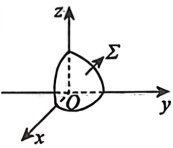

### 12.

设曲面  $z = \sqrt{1 - x^2 - y^2}$ 与平面  $z = -x$ 的交线为  $L$，起点为  $A(0,1,0)$，终点为  $B(0,-1,0)$，则  $\int_L (x + y - z) \, \mathrm{d}x + |y| \, \mathrm{d}z =\underline{\qquad}$.

### 13.

设  $L$ 为曲线  $y=2\sqrt{1-x^2}$ 上从点  $(0,2)$ 到点  $(1,0)$ 的一段弧，则曲线积分  $\int_L (2y+1)dx + (3x+2)dy =\underline{\qquad}$.

### 14.

设函数  $f(x,y)$ 在区域  $D=\left\{(x,y)\mid x^{2}+4y^{2}\leq4\right\}$ 上二阶偏导数连续， $\partial D$ 是  $D$ 取正向的边界曲线，则  $\oint_{\partial D}\left[f_{x}^{\prime}(x,y)-y\right]\mathrm{d}x+f_{y}^{\prime}(x,y)\mathrm{d}y=\underline{\qquad}$.

### 15.

设  $y' = f(x, y)$ 是一条简单封闭曲线  $L$ (取正向),  $f(x, y) \neq 0$, 其所围区域记为  $D$,  $D$ 的面积为  $a$,  $a > 0$, 则  $I = \oint_L x f(x, y) \, dx - \frac{y}{f(x, y)} \, dy =\underline{\qquad}$.

### 16.

设  $\Gamma$ 为曲线  $\begin{cases} x^2 + y^2 + z^2 = a^2, \\ y = x\tan\theta, \end{cases}$ 其中  $a > 0$， $-\frac{\pi}{2} < \theta < \frac{\pi}{2}$ 且  $\theta \neq 0$，从 x 轴的正向看去， $\Gamma$ 的方向为顺时针方向。当  $\theta$ 为何值时， $I = \oint_{\Gamma} (y - z)\,\mathrm{d}x + (z - x)\,\mathrm{d}y + (x - y)\,\mathrm{d}z$ 最大？并求出最大值。

### 17.

设函数  $f(x)$ 具有一阶连续导数，且对右半平面 x > 0 内任意分段光滑简单闭曲线 L，均有

$$\oint_{L}\frac{f(x)y^{2}\mathrm{d}y-y^{3}\mathrm{d}x}{2x^{2}+y^{6}}=0$$

(1) 求  $f(x)$ 的表达式；

(2) 计算  $\oint_{L_{0}}\frac{f(x)y^{2}\mathrm{d}y-y^{3}\mathrm{d}x}{2x^{2}+y^{6}}$，其中  $L_{0}$ 为  $2x^{2}+y^{2}=1$，取逆时针方向.

### 18.

设 L 为从点  $A(-1,0)$ 到点  $B(3,0)$ 的上半个圆周  $(x-1)^{2}+y^{2}=2^{2}$， $y\geqslant0$，则
 $\int_{L}\frac{(x-y)\mathrm{d}x+(x+y)\mathrm{d}y}{x^{2}+y^{2}}=\underline{\qquad}$.

### 19.

设  $f(x)$ 有连续导数，且  $f(0)=0$，若对于平面内的任意简单封闭曲线  $L$，均有曲线积分  $\oint_L \left[ f(x) - e^x \right] y^2 dx - 2y f(x) dy = 0$，则  $f(x) =\underline{\qquad}$.

### 20.

设  $I_{1}=\int_{L}f(x,y)\mathrm{d}x+(6xy-6x)\mathrm{d}y$,  $I_{2}=\int_{L}(6x^{2}y+6xy+x)\mathrm{d}x+f(x,y)\mathrm{d}y$. 已知曲线积分  $I_{1}$ 与  $I_{2}$ 均在整个 xOy 平面内与路径无关，且  $f(0,0)=0$，求函数  $f(x,y)$ 的极值.

### 21.

设  $\Sigma$ 为球面  $x^2 + y^2 + z^2 = m$ 被平面  $z = \frac{\sqrt{m}}{3}$ 所截下的顶部，计算  $\iint_{\Sigma} \left( |x|y + \frac{1}{z} \right) dS$。

### 22.

设  $\Sigma$ 是由直线  $\begin{cases} x=0, \\ y=0 \end{cases}$ 绕直线  $\begin{cases} x=t, \\ y=t, (t \text{为参数}) \text{旋转一周得到的曲面}, \Sigma_1 \text{是}\Sigma \text{介于平面} z=t \end{cases}$

 $x+y+z=0$ 与  $x+y+z=1$ 之间部分的外侧。计算曲面积分  $I=\iint_{\Sigma_1} x\,dy\,dz + (y+1)dz\,dx + (z+2)dx\,dy$。

### 23.

设锥面  $\Sigma$ 的顶点是  $A(0,1,1)$，准线是  $\begin{cases} x^{2}+y^{2}=1, \\ z=0, \end{cases}$ 直线 L 过顶点 A 和准线上任一点  $M_{1}(x_{1},y_{1},0)$.  $\Omega$ 是  $\Sigma(0\leq z\leq1)$ 与平面 z=0 所围成的锥体. 求：

(1) L 和  $\Sigma$ 的方程；

(2) $\Omega$的形心坐标.

### 24.

设锥面  $\Sigma$ 的顶点为原点，准线为曲线  $\Gamma: \begin{cases} z = y^2, \\ x = 1 \end{cases} (|y| \leq 1)$.

(1) 求  $\Sigma$ 的方程；

(2) 计算  $I = \iint_{\Sigma} 2x^2 \, \mathrm{d}y \, \mathrm{d}z + xy \, \mathrm{d}z \, \mathrm{d}x + (z+1) \, \mathrm{d}x \, \mathrm{d}y$， $\Sigma$ 取上侧.

### 25.

设  $a, b$ 为实数，函数  $f(x, y) = ax^2 + by^2$ 在点  $(1,1)$ 处沿方向  $l = i + j$ 的方向导数最大，最大值为  $2\sqrt{2}$。若  $\Sigma$ 为曲面  $x^2 + z^2 = 2z$ 被曲面  $z = \sqrt{f(x, y)}$ 所截取的部分。

(1) 求 a, b 的值;

(2) 计算  $\iint_{\Sigma} zdS$.

### 26.

设  $\Sigma$ 是柱面  $x^2 + y^2 = 1$ 介于平面  $z = 0$， $z = 2$ 之间的部分，方向向外。记  $I_1 = \iint_{\Sigma} x^2 \, dS$，
$$I_{2}=\iint_{\Sigma}z^{2}\mathrm{d}S,\ I_{3}=\iint_{\Sigma}(x^{2}+z^{2})\mathrm{d}y\mathrm{d}z,\text{则}()$$

(A) $I_{1}>I_{2}>I_{3}$ (B) $I_{2}>I_{1}>I_{3}$ (C) $I_{3}>I_{1}>I_{2}$ (D) $I_{3}>I_{2}>I_{1}$

### 27.

设  $P = 2xzf(y + z) - y^3$,  $Q = 2yzf(y + z) + x^3$,  $R = \int_0^{x^2 + y^2} f(z - t) \, dt$, 其中  $f$ 具有一阶连续导数.  $L$ 为曲面  $z = x^2 + y^2$ 与平面  $y + z = 1$ 的交线, 从  $z$ 轴正向往下看为逆时针方向, 计算

$$\oint_{L}P\mathrm{d}x+Q\mathrm{d}y+R\mathrm{d}z.$$

### 28.

设  $\Sigma$ 为曲面  $z = \sqrt{1 - x^2 - y^2}$， $\alpha$， $\beta$ 分别为曲面  $\Sigma$ 的外法线向量与 x 轴，z 轴的夹角，则  $\iint_{\Sigma} (|xy| \cos \alpha + z^2 \cos \beta) \, \mathrm{d}S =\underline{\qquad}$.

### 29.

设曲面  $\Sigma: z = 1 - x^{2} - y^{2} (z \geq -3)$，取上侧，求曲面积分

$$I=\iint\limits_{\Sigma}yz\sqrt{x^{2}+y^{2}+z^{2}}\mathrm{d}y\mathrm{d}z+xz\sqrt{x^{2}+y^{2}+z^{2}}\mathrm{d}z\mathrm{d}x+(x^{2}y^{2}-2xy\sqrt{x^{2}+y^{2}+z^{2}})\mathrm{d}x\mathrm{d}y$$
## 第1章 行列式

### 1.

计算 n 阶行列式：

$$D_{n}=\left|\begin{array}{c c c c}{{a_{1}+x_{1}}}&{{a_{2}}}&{{\cdots}}&{{a_{n}}}\\ {{a_{1}}}&{{a_{2}+x_{2}}}&{{\cdots}}&{{a_{n}}}\\ {{\vdots}}&{{\vdots}}&{{}}&{{\vdots}}\\ {{a_{1}}}&{{a_{2}}}&{{\cdots}}&{{a_{n}+x_{n}}}\end{array}\right|,$$

其中 $x_{i}\neq0$, i=1,2, $\cdots$,n.

### 2.
$$D_{n}=\left|\begin{matrix}b&-1&0&\cdots&0&0\\ 0&b&-1&\cdots&0&0\\ \vdots&\vdots&\vdots&&\vdots&\vdots\\ 0&0&0&\cdots&b&-1\\ a_{n}&a_{n-1}&a_{n-2}&\cdots&a_{2}&b+a_{1}\end{matrix}\right|=\underline{\qquad}.$$

### 3.

已知3阶矩阵  $A, B$ 相似， $\lambda_1 = 1, \lambda_2 = 2$ 为  $A$ 的两个特征值，行列式  $|B| = 2$，则行列式  $\left| \begin{matrix} (A + E)^{-1} & O \\ O & (2B)^* \end{matrix} \right| =\underline{\qquad}$。

### 4.

设  $A = [a_1, a_2, a_3]$,  $a_1, a_2, a_3$ 为线性无关的3维列向量， $P$ 为3阶矩阵，且  $PA = [-a_1, -2a_2, -3a_3]$，则  $|P - E| = (\ )$.

(A) 6

(B) -6

(C) 24

(D) -24

### 5.

设  $A$ 是  $n$ 阶實對稱矩隊， $r(A)=r$，且滿足  $A^2=A$， $f(x)=x^2-2x-3$，則  $\left|f(A)-6E\right|=\underline{\qquad}$.

### 6.

设 A 为 3 阶矩阵，若  $\left|E-A\right|=\left|E+A\right|=\left|2E-A\right|=0$，则  $\left|3E-A\right|=\underline{\qquad}$.

(A) -2

(B) -8

(C)8

(D)11

### 7.

设  $A$ 为 3 阶矩阵， $\lambda_1$， $\lambda_2$， $\lambda_3$ 是  $A$ 的 3 个不同的特征值，其对应的特征向量为  $\xi_1$， $\xi_2$， $\xi_3$， $\alpha = \xi_1 + \xi_2 + \xi_3$， $P = [\alpha, A\alpha, A^2\alpha]$

(1) 证明 P 可逆；

(2) 若  $(A^{3}-A)\alpha=0$，求  $\left|A-3E\right|$.
## 第2章 余子式和代数余子式的计算

### 1.

设  $D=\begin{vmatrix}1&-3&1&-2\\2&-5&-2&-2\\0&-4&5&1\\-3&9&-6&7\end{vmatrix}$， $M_{3j}$ 表示 D 中第3行第 j 列元素的余子式 (j=1,2,3,4)，则

 $M_{31}+3M_{32}-2M_{33}+2M_{34}=(\quad)$.

(A)0 (B)1 (C) $\neg2$ (D) $-3$

### 2.

设  $D_3 = \begin{vmatrix} 1 & 1 & 1 \\ 1 & 2 & 5 \\ 34 & 1 & 34 \end{vmatrix}$， $A_{ij}$ 表示元素  $a_{ij}(i,j=1,2,3)$ 的代数余子式，则  $5A_{11} + 2A_{12} + A_{13} =\underline{\qquad}$.

### 3.

已知3阶行列式 $|A| = -9$，其第2行元素为 $[1,1,2]$，第3行元素为 $[2,2,1]$，则 $A_{31} + A_{32} - 3A_{33} =\underline{\qquad}$.

### 4.

已知3阶行列式 $|A|$的元素 $a_{ij}$均为实数，且 $a_{ij}^{-}$不全为0。若 $a_{ij}=-A_{ij}(i,j=1,2,3)$，其中 $A_{ij}$是 $a_{ij}$的代数余子式，则 $|A|=$___。
## 第3章 矩阵运算

### 1.

设 A 是 n 阶矩阵，则下列说法错误的是( ).

(A)对任意的n维列向量 $\xi$，有 $A\xi=0$，则A=0

(B)对任意的n维列向量 $\xi$，有 $\xi^{T}A\xi=0$，则A=0

(C)对任意的n阶矩阵B，有AB=O，则A=O

(D)对任意的n阶矩阵B，有 $B^{T}AB=O$，则A=O

### 2.

设  $A = \begin{bmatrix} 1 & 1 & -1 \\ 0 & 1 & 1 \\ 0 & 0 & 1 \end{bmatrix}$，则  $A^{10} =\underline{\qquad}$.

### 3.

$\begin{bmatrix}1 & 0 \\ -1 & 1\end{bmatrix}^{3}\begin{bmatrix}1 & 2 \\ -1 & 3\end{bmatrix}\begin{bmatrix}0 & 1 \\ 1 & 0\end{bmatrix}^{5}=\underline{\qquad}$.

### 4.

设  $A, B, C$ 均是 3 阶矩阵，且满足  $AB = B^{2} - BC$，其中  $B = \begin{bmatrix} 1 & 1 & 1 \\ 0 & 1 & 1 \\ 0 & 0 & 1 \end{bmatrix}$， $C = \begin{bmatrix} 0 & 1 & 1 \\ 0 & 0 & 1 \\ 0 & 0 & 1 \end{bmatrix}$，则  $A^{99} =\underline{\qquad}$.

### 5.

设  $A$ 为  $n(n \geq 2)$ 阶实对称矩阵，且满足  $E - 2A + A^2 - 2A^3 = O$，其中  $E$ 为  $n$ 阶单位矩阵，则  $A =\underline{\qquad}$.

### 6.

设  $A$ 是  $n$ 阶矩阵， $E + A$ 是可逆矩阵，则下列等式不成立的是（ ）。

(A)  $(A + E)(A - E) = (A - E)(A + E)$

(B)  $(A + E)^{-1}(A - E) = (A - E)(A + E)^{-1}$

(C)  $(A + E)^T(A - E) = (A - E)(A + E)^T$

(D)  $(A + E)^T(A - E) = (A - E)(A + E)^T$

### 7.

设 A 为 2 阶方阵， $\alpha$ 为 2 维非零列向量，且  $\alpha$ 不是 A 的特征向量， $P = [\alpha, A\alpha]$， $A^{2}\alpha + A\alpha - 2\alpha = 0$，若矩阵 B 满足 AP = PB，则 B = ( ).

(A) $\begin{bmatrix}-1&0\\1&2\end{bmatrix}$ (B) $\begin{bmatrix}0&1\\2&-1\end{bmatrix}$ (C) $\begin{bmatrix}-1&1\\0&2\end{bmatrix}$ (D) $\begin{bmatrix}0&2\\1&-1\end{bmatrix}$
### 8.

设  $A$ 为  $n$ 阶可逆矩阵， $\alpha$ 为  $n$ 维列向量， $b$ 为常数。记分块矩阵  $P = \begin{bmatrix} E & 0 \\ -\alpha^{T} A^{*} & |A| \end{bmatrix}$， $Q = \begin{bmatrix} A & \alpha \\ \alpha^{T} & b \end{bmatrix}$，其中  $A^{*}$ 是矩阵  $A$ 的伴随矩阵， $E$ 为  $n$ 阶单位矩阵。

(1) 计算并化简 PQ;

(2)证明：矩阵 $Q$可逆的充分必要条件是 $a^{T}A^{-1}a\neq b$

### 9.

求与  $A=\begin{bmatrix}1 & 1 \\ 0 & 1\end{bmatrix}$ 可交换的全部2阶矩阵.

### 10.

设  $A = \begin{bmatrix} 2 & -2 & -4 \\ -1 & 3 & 4 \\ 1 & -2 & -3 \end{bmatrix}$，问是否存在非单位矩阵 B，使得 AB = A？若不存在，请说明理由；若存在，求出所有满足 AB = A 的 B。
## 第4章 矩阵的秩

### 1.

设 A 是 3 阶非零矩阵，满足  $A^{2}=A$，且  $A\neq E$，则必有（）.

(A)  $r(A)=1$

(B)  $r(A-E)=2$

(C)  $[r(A)-1][r(A-E)-2]=0$

(D)  $[r(A)-1][r(A-E)-1]=0$

### 2.

若  $A, A^{*}$，B 都是 n(n > 2) 阶非零矩阵，且  $A^{*}$ 是 A 的伴随矩阵，AB = O，则  $r(B) = (\ )$.

(A)1          (B) n-1         (C) n         (D) n-1 或 n

### 3.

设矩阵  $A=\begin{bmatrix}1&-1&1\\ -2&2&1\\ 1&-1&k\end{bmatrix}$， $r((3\boldsymbol{E}-\boldsymbol{A})^{2})<r(3\boldsymbol{E}-\boldsymbol{A})$，其中 E 是 3 阶单位矩阵，则常数 k= ( ).

(A)3

(B)4

(C)5

(D)6

### 4.

设  $A, B$ 为  $n$ 阶实矩阵，则下列结论不成立的是（ ）。

(A)  $r(\begin{bmatrix} A & AB \end{bmatrix}) = r(A)$

(B)  $r(\begin{bmatrix} AB^{\mathrm{T}} & AB^{\mathrm{T}}B \end{bmatrix}) = r(AB^{\mathrm{T}})$

(C)  $r\left(\begin{bmatrix} BA \\ B^{\mathrm{T}}BA \end{bmatrix}\right)=r(AB^{\mathrm{T}})$

(D)  $r\left(\begin{bmatrix} A^{\mathrm{T}}A \\ B^{\mathrm{T}}A \end{bmatrix}\right)=r(A)$

### 5.

已知  $A$ 为  $n$ 阶矩阵， $E$ 为  $n$ 阶单位矩阵，记矩阵  $\begin{bmatrix} O & A \\ A^{\mathrm{T}} & E \end{bmatrix}$， $\begin{bmatrix} O & A^{\mathrm{T}} A \\ A^{\mathrm{T}} & E \end{bmatrix}$， $\begin{bmatrix} A^{\mathrm{T}} & E \\ A^{\mathrm{T}} A A^{\mathrm{T}} & A^{\mathrm{T}} A \end{bmatrix}$ 的秩分别为  $r_1$， $r_2$， $r_3$，则（ ）。

(A)  $r_1 = r_2 \geq r_3$  (B)  $r_1 = r_2 \leq r_3$  (C)  $r_1 = r_3 \geq r_2$  (D)  $r_1 = r_3 \leq r_2$

### 6.

已知  $n$ 阶矩阵  $A$， $B$， $C$ 满足  $ABC = O$， $E$ 为  $n$ 阶单位矩阵，记矩阵  $\begin{bmatrix} O & A \\ BC & E \end{bmatrix}$， $\begin{bmatrix} AB & C \\ O & E \end{bmatrix}$， $\begin{bmatrix} E & AB \\ AB & O \end{bmatrix}$ 的秩分别为  $r_1$， $r_2$， $r_3$，则（ ）。

(A)  $r_1 \leq r_2 \leq r_3$  (B)  $r_1 \leq r_3 \leq r_2$  (C)  $r_3 \leq r_1 \leq r_2$  (D)  $r_2 \leq r_1 \leq r_3$
### 7.

设  $A, B, C$ 均为  $n$ 阶矩阵， $r(AB) \leq r(BA)$，记  $\begin{bmatrix} O & AB \\ B & BC \end{bmatrix}, \begin{bmatrix} B & BC \\ AB & O \end{bmatrix}, \begin{bmatrix} BA & BAC \\ O & B \end{bmatrix}$ 的秩分别为  $r_1, r_2, r_3$，则（ ）。

(A)  $r_2 \leq r_3 \leq r_1$

(B)  $r_2 \leq r_1 \leq r_3$

(C)  $r_1 \leq r_2 \leq r_3$

(D)  $r_3 \leq r_2 \leq r_1$

### 8.

设 A 为 n 阶矩阵， $r(A)=r$， $E_{r}$ 为 r 阶单位矩阵，则 “ $A^{2}=A$” 是 “存在列满秩矩阵  $C_{m \times r}$，使得 A=CB, BC= $E_{r}$” 的 ( ).

(A) 充分非必要条件 (B) 必要非充分条件

(C) 充分必要条件 (D) 既非充分又非必要条件
## 第5章 线性方程组

### 1.

设4阶矩阵 $A=\left[a_{ij}\right]$不可逆，且元素 $a_{12}$的代数余子式 $A_{12}\neq0$，若矩阵A的列向量组为 $\alpha_{1}$， $\alpha_{2}$， $\alpha_{3}$， $\alpha_{4}$， $k_{1}$， $k_{2}$， $k_{3}$为任意常数，则方程组 $A^{*}x=0$的通解为().

(A)  $k_{1}\alpha_{1}+k_{2}\alpha_{2}+k_{3}\alpha_{3}$ (B)  $k_{1}\alpha_{1}+k_{2}\alpha_{2}+k_{3}\alpha_{4}$ (C)  $k_{1}\alpha_{1}+k_{2}\alpha_{3}+k_{3}\alpha_{4}$ (D)  $k_{1}\alpha_{2}+k_{2}\alpha_{3}+k_{3}\alpha_{4}$

### 2.

设  $A$ 是 4 阶矩阵， $A$ 的伴随矩阵  $A^* = \begin{bmatrix} 1 & 0 & 1 & 0 \\ 0 & 2 & 0 & 2 \\ 0 & 0 & 1 & 1 \\ 0 & 0 & 0 & 4 \end{bmatrix}$， $b = [1,1,1,1]^T$，则方程组  $Ax = b$ 的解为___。

### 3.

设方程组  $\left\{\begin{aligned}&x_{1}+ax_{2}-2x_{3}=0,\\&x_{1}+2x_{2}+x_{3}=1,\\&2x_{1}+3x_{2}+(a+2)x_{3}=3\end{aligned}\right.$ 的系数矩阵为 A，自由项为 b，若 Ax=b 无解， $A^{T}Ax=$

 $A^{T}b$ 有解，则 a = ( ).

(A) -1          (B) 1           (C) -3          (D) 3

### 4.

设  $A$ 是秩为 2 的 3 阶实对称矩阵， $\alpha, \beta$ 是 3 维非零列向量， $B = \begin{bmatrix} A & \beta \\ \alpha^{T} & 1 \end{bmatrix}$，则  $r(B) = 2$ 是方程组  $\begin{cases} Ax = \beta, \\ \alpha^{T} x = 1 \end{cases}$ 有解的（ ）。

(A) 充分非必要条件  (B) 必要非充分条件  

(C) 充分必要条件  (D) 既非充分又非必要条件

### 5.

设四元齐次线性方程组(I) $\begin{cases}2x_{1}+3x_{2}-x_{3}=0,\\x_{1}+2x_{2}+x_{3}-x_{4}=0,\end{cases}$ 且四元齐次线性方程组(II)的一个基础解系为 $\xi_{1}=[2,-1,k+2,1]^{T}$， $\xi_{2}=[-1,2,4,k+8]^{T}$，若方程组(I)与(II)没有非零公共解，则k的取值范围为___。

### 6.

已知  $A$， $B$ 均是  $2 \times 4$ 矩阵， $Ax = 0$ 的基础解系是  $\alpha_1 = [1,1,2,1]^T$， $\alpha_2 = [0,-3,1,0]^T$， $Bx = 0$ 的基础解系是  $\beta_1 = [1,3,0,2]^T$， $\beta_2 = [1,2,-1,a]^T$。

(1) 求矩阵 A;
(2) 如果 Ax = 0 和 Bx = 0 有非零公共解，求 a 的值及所有非零公共解.

### 7.

设3阶矩阵 $A, B$满足 $r(BA) < r(AB)$，对于以下结论

① $ABx=0$与 $BAx=0$有非零公共解；

② $ABAx=0$与 $BABx=0$有非零公共解.

正确的说法是().

(A)①正确，②正确 (B)①正确，②错误

(C)①错误，②正确 (D)①错误，②错误

### 8.

设  $A$ 为  $n$ 阶实矩阵，则（ ）。

(A)  $\begin{bmatrix} A & O \\ E & A^T A \end{bmatrix} x = 0$ 只有零解

(B)  $\begin{bmatrix} O & A \\ A^T A & A A^T A \end{bmatrix} x = 0$ 只有零解

(C)  $\begin{bmatrix} A & A^T A \\ O & A^T A \end{bmatrix} x = 0$ 与  $\begin{bmatrix} A^T A & A \\ O & A \end{bmatrix} x = 0$ 同解

(D)  $\begin{bmatrix} A A^T A & A^T A \\ O & A \end{bmatrix} x = 0$ 与  $\begin{bmatrix} A^T A^2 & A \\ O & A^T A \end{bmatrix} x = 0$ 同解

### 9.

设  $A, B$ 为  $n$ 阶矩阵，且  $A$ 满足  $A^2 - A = 3E$，则与  $\begin{bmatrix} A \\ B \end{bmatrix} x = 0$ 不一定同解的是（ ）。

(A)  $\begin{bmatrix} A - B \\ A + AB \end{bmatrix} x = 0$

(B)  $\begin{bmatrix} A + B \\ A + AB - B \end{bmatrix} x = 0$

(C)  $\begin{bmatrix} A - B \\ 2A + B \end{bmatrix} x = 0$

(D)  $\begin{bmatrix} A + B \\ BA + B^2 \end{bmatrix} x = 0$

### 10.

设  $\alpha_1 = [1, -2, 1, 0, 0]^T$， $\alpha_2 = [1, -2, 0, 1, 0]^T$， $\alpha_3 = [0, 0, 1, -1, 0]^T$， $\alpha_4 = [1, -2, 3, -2, 0]^T$ 是线性方程组

$$\begin{cases}x_{1}+x_{2}+x_{3}+x_{4}+x_{5}=0,\\3x_{1}+2x_{2}+x_{3}+x_{4}-3x_{5}=0,\\x_{2}+2x_{3}+2x_{4}+6x_{5}=0,\\5x_{1}+4x_{2}+3x_{3}+3x_{4}-x_{5}=0\end{cases}$$

的解向量，则  $\alpha_{1}, \alpha_{2}, \alpha_{3}, \alpha_{4}$ 能否构成方程组 $(\star)$ 的基础解系？若能，说明理由；若不能，请增或减向量，使之成为基础解系.

### 11.

已知  $a$ 是常数，且矩阵  $A = \begin{bmatrix} 1 & 2 & a \\ 1 & 3 & 0 \\ 2 & 7 & -a \end{bmatrix}$ 可经初等列变换化为矩阵  $B = \begin{bmatrix} 1 & a & 2 \\ 0 & 1 & 1 \\ -1 & 1 & 1 \end{bmatrix}$.

(2) 求满足 AP = B 的可逆矩阵 P.

### 12.

设  $A = \begin{bmatrix} 1 & -2 & 3 \\ 0 & 1 & -1 \\ 1 & 2 & 0 \end{bmatrix}$,  $\beta = \begin{bmatrix} -4 \\ 1 \\ -3 \end{bmatrix}$,  $B = \begin{bmatrix} -2 & 1 & 3 \\ 1 & 0 & -1 \\ 2 & 1 & 0 \end{bmatrix}$,  $[A, \beta] = BC$.

(1) 求  $Ax = \beta$ 的解，并求出 C；

(2) 求满足  $[A, \beta]Y = E$ 的所有 Y.

### 13.

设  $A_{3 \times 3} = [a_1, a_2, a_3]$，方程组  $Ax = \beta$ 有通解  $k \xi + \eta = k\left[1, 2, -3\right]^T + \left[2, -1, 1\right]^T$，其中  $k$ 是任意常数，又设  $B = [a_1 + a_2 + a_3 + \beta, a_1, a_2, a_3]$，求方程组  $By = \beta$ 的通解。

### 14.

如图所示有三张平面，其中有两张平面平行，第三张平面与它们相交，其方程 $a_{11}x+a_{12}y+$

 $a_{i3}z=d_{i}(i=1,2,3)$ 组成的方程组的系数矩阵与增广矩阵分别为  $A$ 和  $\overline{A}$，则（）.

(A)  $r(A)=2$,  $r(\overline{A})=3$

(B)  $r(A)=2$,  $r(\overline{A})=2$

(C)  $r(A)=1$,  $r(\overline{A})=2$

(D)  $r(A)=1$,  $r(\overline{A})=1$

### 15.

设  $\alpha_{i} = \left[ a_{i}, b_{i}, c_{i} \right]^{T}$ (i=1,2,3) 均为非零列向量，且直线  $\frac{x - a_{1}}{a_{2}} = \frac{y - b_{1}}{b_{2}} = \frac{z - c_{1}}{c_{2}}$ 过点  $(a_{3}, b_{3}, c_{3})$，则可能是三个平面  $\pi_{i} : \alpha_{i}^{T} \begin{bmatrix} x \\ y \\ z \end{bmatrix} = 1 (i = 1, 2, 3)$ 的位置关系的所有序号是（）.

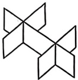

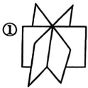

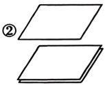

(A)①③ (C) $\textcircled{2}$④

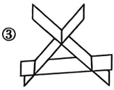

(B) $②③$

(D) $①③④$

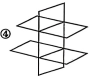

## 第6章 向量组

### 1.

设  $\alpha_{1}, \alpha_{2}, \cdots, \alpha_{s}$ 是 n 维列向量，A 是  $m \times n$ 矩阵，记向量组 (I) 为  $\alpha_{1}, \alpha_{2}, \cdots, \alpha_{s}$，向量组 (II) 为  $A\alpha_{1}, A\alpha_{2}, \cdots, A\alpha_{s}$，则下列命题正确的是 ( ).

(A) 若向量组(I)线性无关，则向量组(II)线性无关

(B)若向量组(Ⅱ)线性无关，则向量组(Ⅰ)线性无关

(C) 若向量组(Ⅱ)线性相关，则向量组(Ⅰ)线性相关

(D) 向量组(I)与向量组(II)具有不同的线性相关性

### 2.

设  $A = \begin{bmatrix} a & 1 & 1 \\ 1 & a & a \\ 1 & 1 & a \end{bmatrix}$ 可经初等列变换化成  $B = \begin{bmatrix} a & 1 & 1 \\ 1 & a & 1 \\ 1 & 1 & a \end{bmatrix}$，则  $a$ 的取值范围为（ ）。

(A)  $\{a | a \in \mathbb{R}, a \neq -2\}$

(B)  $\{a | a \in \mathbb{R}, a \neq -2, a \neq -1\}$

(C)  $\{a | a \in \mathbb{R}, a \neq 1, a \neq -1\}$

(D)  $\{a | a \in \mathbb{R}, a \neq -1\}$

### 3.

设3维向量组  $\alpha_1 = [1,1,0]^T$， $\alpha_2 = [5,3,2]^T$， $\alpha_3 = [1,3,-1]^T$， $\alpha_4 = [-2,2,-3]^T$。且  $A$ 是3阶矩阵，满足  $A\alpha_1 = \alpha_2$， $A\alpha_2 = \alpha_3$， $A\alpha_3 = \alpha_4$，则  $A\alpha_4 =\underline{\qquad}$。

### 4.

已知 $\begin{bmatrix}1&1&1\\ 1&2&1\\ 1&1&1\end{bmatrix}=\begin{bmatrix}1&1\\ 1&2\\ 1&1\end{bmatrix}A$，则 $A=(\quad)$.

(A) $\begin{bmatrix}1&0&1\\ 0&1&0\end{bmatrix}$ (B) $\begin{bmatrix}0&1&0\\ 1&0&1\end{bmatrix}$ (C) $\begin{bmatrix}1&1&0\\ 0&0&1\end{bmatrix}$ (D) $\begin{bmatrix}1&0&1\\ 0&0&1\end{bmatrix}$

### 5.

设  $\alpha_1 = \begin{bmatrix} 1 \\ -1 \\ 1 \end{bmatrix}$， $\alpha_2 = \begin{bmatrix} 1 \\ 1 \\ 0 \end{bmatrix}$， $\alpha_3 = \begin{bmatrix} 2 \\ 0 \\ 1 \end{bmatrix}$； $\beta_1 = \begin{bmatrix} a \\ -1 \\ 1 \end{bmatrix}$， $\beta_2 = \begin{bmatrix} 4 \\ 0 \\ b \end{bmatrix}$， $\beta_3 = \begin{bmatrix} 0 \\ c \\ 1 \end{bmatrix}$，问  $a$， $b$， $c$ 为何值时，向量组  $\alpha_1$， $\alpha_2$， $\alpha_3$ 与  $\beta_1$， $\beta_2$， $\beta_3$ 等价，且当向量组等价时，求  $\beta_1$ 由  $\alpha_1$， $\alpha_2$， $\alpha_3$ 的线性表示式及  $\alpha_1$ 由  $\beta_1$， $\beta_2$， $\beta_3$ 的线性表示式。

### 6.
$$\boldsymbol{\alpha}_{1}=\left[\begin{matrix}1\\ 0\\ 1\end{matrix}\right],\boldsymbol{\alpha}_{2}=\left[\begin{matrix}1\\ 1\\ 2\end{matrix}\right],\boldsymbol{\alpha}_{3}=\left[\begin{matrix}1\\ 2\\ a\end{matrix}\right],\boldsymbol{\beta}_{1}=\left[\begin{matrix}-1\\ 2\\ 1\end{matrix}\right],\boldsymbol{\beta}_{2}=\left[\begin{matrix}1\\ 0\\ b\end{matrix}\right],\boldsymbol{A}=\left[\boldsymbol{\alpha}_{1},\boldsymbol{\alpha}_{2},\boldsymbol{\alpha}_{3}\right],\boldsymbol{B}=\left[\boldsymbol{\beta}_{1},\boldsymbol{\beta}_{2}\right]$$

(1) a，b 为何值时， $\beta_{1}$， $\beta_{2}$ 能同时由  $a_{1}$， $a_{2}$， $a_{3}$ 线性表示？若能表示，写出其表示式；

(2) a, b 为何值时，矩阵方程 AX = B 有解？若有解，求出其全部解.

### 7.

设3维列向量  $\alpha_{1}$， $\alpha_{2}$ 线性无关， $\beta_{1}$， $\beta_{2}$ 线性无关.

(1) 证明：存在3维非零列向量  $\xi$， $\xi$ 既可由  $a_{1}$， $a_{2}$ 线性表示，也可由  $\beta_{1}$， $\beta_{2}$ 线性表示；

(2) 若  $\alpha_1 = [1, -2, 3]^T$， $\alpha_2 = [2, 1, 1]^T$， $\beta_1 = [-2, 1, 4]^T$， $\beta_2 = [-5, -3, 5]^T$，求既可由  $\alpha_1$， $\alpha_2$ 线性表示，也可由  $\beta_1$， $\beta_2$ 线性表示的所有非零列向量  $\xi$。

### 8.

设向量空间 V 满足  $x_{1}+x_{2}+x_{3}=0, -\infty<x_{i}<+\infty, i=1,2,3$ ，则 V 的一个基为() .

(A)

$$\begin{bmatrix}-1\\ 0\\ 1\end{bmatrix},\begin{bmatrix}-1\\ 1\\ 0\end{bmatrix},\begin{bmatrix}1\\ 1\\ 1\end{bmatrix}$$

(B)

$$\begin{bmatrix}1\\ 0\\ -1\end{bmatrix},\begin{bmatrix}-1\\ -1\\ 0\end{bmatrix}$$

(C)

$$\begin{bmatrix}1\\ 0\\ -1\end{bmatrix},\begin{bmatrix}-1\\ -1\\ 0\end{bmatrix},\begin{bmatrix}1\\ 1\\ 1\end{bmatrix}$$

(D)

$$\begin{bmatrix}-1\\ 0\\ 1\end{bmatrix},\begin{bmatrix}-1\\ 1\\ 0\end{bmatrix}$$

### 9.

向量空间  $V=\left\{(x,y,z)\mid(x,y,z)\in\mathbb{R}^3,x-2z=0\right\}$ 的一个基为___。

### 10.

设  $\beta_{1}$,  $\beta_{2}$,  $\beta_{3}$ 是 3 维向量空间  $R^{3}$ 的一个基，则基  $\beta_{1}$,  $2\beta_{2}$,  $3\beta_{3}$ 到基  $\beta_{1}-\beta_{2}$,  $\beta_{2}+\beta_{3}$,  $\beta_{3}-\beta_{1}$ 的过渡矩阵为().

(A)

$$\begin{bmatrix}0&-2&1\\ 3&0&-6\\ -8&4&0\end{bmatrix}$$

(B)

$$\begin{bmatrix}1&0&-1\\ -\frac{1}{2}&\frac{1}{2}&0\\ 0&\frac{1}{3}&\frac{1}{3}\end{bmatrix}$$

(C)

$$\begin{bmatrix}\frac{1}{2}&-\frac{1}{3}&\frac{1}{4}\\ 0&\frac{1}{2}&-\frac{1}{3}\\ -\frac{1}{3}&0&\frac{1}{4}\end{bmatrix}$$

(D)

$$\begin{bmatrix}\frac{1}{2}&0&-\frac{1}{3}\\ -\frac{1}{3}&\frac{1}{2}&0\\ \frac{1}{\dot{4}}&-\frac{1}{3}&\frac{1}{4}\end{bmatrix}$$

### 11.

由向量  $\boldsymbol{\alpha}_1 = [1, 0, 1]^T$， $\boldsymbol{\alpha}_2 = [1, 2, 3]^T$， $\boldsymbol{\alpha}_3 = [2, 2, 4]^T$ 生成的向量空间  $V = \text{span}\left\{\boldsymbol{\alpha}_1, \boldsymbol{\alpha}_2, \boldsymbol{\alpha}_3\right\} = \left\{k_1\boldsymbol{\alpha}_1 + k_2\boldsymbol{\alpha}_2 + k_3\boldsymbol{\alpha}_3 \mid k_1, k_2, k_3 \in \mathbb{R}\right\}$，则  $V$ 的一个规范正交基为___。
## 第7章 特征值与特征向量

### 1.

设  $A=\begin{bmatrix}1&0&a\\ b&2&0\\ 0&c&3\end{bmatrix}$，其中 abc = -6，则 A 的伴随矩阵  $A^{*}$ 有非零特征值（）.

(A)-8 (B)8 (C)-11 (D)11

### 2.

设矩阵  $A = \begin{bmatrix} 1 & -2 & 2 \\ a & 4 & b \\ -3 & -6 & 8 \end{bmatrix}$ 有三个线性无关的特征向量， $\lambda = 2$ 是 A 的二重特征值，则( ).

(A)a=1,b=-2 (B)a=-1,b=2 (C)a=2,b=-1 (D)a=-2,b=1

### 3.

设 A 是 3 阶矩阵，有特征值  $\lambda_{1}=0$， $\lambda_{2}=1$， $\lambda_{3}=-1$，对应的特征向量分别是  $\xi_{1}$， $\xi_{2}$， $\xi_{3}$，以下 k， $k_{1}$， $k_{2}$ 为任意常数，则非齐次线性方程组  $Ax=\xi_{2}+\xi_{3}$ 的通解是（）.

(A)  $k_{1}\xi_{1}+k_{2}\xi_{2}+\xi_{3}$

(B)  $k_{1}\xi_{1}+k_{2}\xi_{3}+\xi_{2}$

(C)  $k\xi_{1}-\xi_{2}+\xi_{3}$

(D)  $k\xi_{1}+\xi_{2}-\xi_{3}$

### 4.

设  $A$ 是 3 阶矩阵， $Ax=0$ 有通解  $k_1\xi_1+k_2\xi_2$ ( $k_1, k_2$ 为任意常数)， $A\xi_3=\xi_3$，则存在可逆矩阵  $P$，使得  $P^{-1}AP=\begin{bmatrix}0&0&0\\ 0&0&0\\ 0&0&1\end{bmatrix}$，其中  $P$ 是（）.

(A)  $\left[\xi_{1},\xi_{2},\xi_{1}+\xi_{3}\right]$ (B)  $\left[\xi_{2},\xi_{3},\xi_{1}\right]$

(C) $\left[\xi_{1}+\xi_{2},-\xi_{2},2\xi_{3}\right]$ (D) $\left[\xi_{1}+\xi_{2},\xi_{2}-\xi_{3},\xi_{3}\right]$

### 5.

设3阶矩阵 $A$的某一行元素全是1，且 $A$有3个特征向量 $\xi_1=\begin{bmatrix}1\\ 0\\ -1\end{bmatrix}$， $\xi_2=\begin{bmatrix}1\\ 0\\ 1\end{bmatrix}$， $\xi_3=\begin{bmatrix}1\\ -1\\ 1\end{bmatrix}$，则 $A$的迹 $\mathrm{tr}(A)=$___。

### 6.

设  $A = \begin{bmatrix} 1 & -2 & 3 \\ a_{21} & a_{22} & a_{23} \\ a_{31} & a_{32} & a_{33} \end{bmatrix}$ 有特征向量  $\xi_{1} = \begin{bmatrix} 1 \\ 2 \\ 1 \end{bmatrix}$， $\xi_{2} = \begin{bmatrix} -1 \\ 1 \\ 1 \end{bmatrix}$， $\xi_{3} = \begin{bmatrix} -1 \\ 2 \\ 2 \end{bmatrix}$.

(1) 求 A 的对应于  $\xi_{i} (i = 1, 2, 3)$ 的特征值；

(2) 求 Ax = 0 的通解；

(3) 求 A.

### 7.

设  $A$ 是 3 阶不可逆矩阵,  $\alpha$,  $\beta$ 是 3 维线性无关列向量, 满足  $A\alpha = \beta$,  $A\beta = \alpha$, 且  $A \sim A$, 则  $A =\underline{\qquad}$.

### 8.

设  $A, B$ 均为  $n$ 阶矩阵,  $|B| \neq 0$,  $\alpha$ 为  $n$ 维非零列向量, 则 “ $\alpha$ 是  $AB$ 的特征向量” 是 “ $B\alpha$ 是  $BA$ 的特征向量” 的 (    ).

(A) 充分必要条件

(C) 必要非充分条件

(B) 充分非必要条件

(D)既非充分又非必要条件

### 9.

设 $\begin{bmatrix} x_{n} \\ y_{n} \end{bmatrix}=\begin{bmatrix} 1 & 2 \\ 4 & 3 \end{bmatrix}\begin{bmatrix} x_{n-1} \\ y_{n-1} \end{bmatrix}$.

(1) 当  $\left\{\begin{array}{l}x_{0}=1,\\y_{0}=2\end{array}\right.$ 时，求  $x_{100}$， $y_{100}$;

(2) 当  $\left\{\begin{array}{l}x_{0}=1, \\ y_{0}=1\end{array}\right.$ 时，求  $x_{100}$.
## 第8章 相似理论

### 1.

设  $A, B, D$ 均为 2 阶矩阵， $|A| \neq |B|, |A| < 0, |B| < 0, C = \begin{bmatrix} A & D \\ O & B \end{bmatrix}$，则 “ $\mathrm{tr}(A) = \mathrm{tr}(B)$” 是 “C 可以相似对角化” 的（ ）。

(A) 充分非必要条件

(B) 必要非充分条件

(C) 充分必要条件

(D) 既非充分又非必要条件

### 2.

以下两个矩阵，可用同一可逆矩阵 P 相似对角化的是()。

(A) $\begin{bmatrix}1&1\\1&0\end{bmatrix},\begin{bmatrix}0&1\\1&1\end{bmatrix}$ (B) $\begin{bmatrix}1&1\\1&-1\end{bmatrix},\begin{bmatrix}-1&1\\1&1\end{bmatrix}$ (C) $\begin{bmatrix}0&1\\1&1\end{bmatrix},\begin{bmatrix}-1&1\\1&0\end{bmatrix}$ (D) $\begin{bmatrix}0&1\\1&-1\end{bmatrix},\begin{bmatrix}-1&1\\1&0\end{bmatrix}$

### 3.

(1)下列矩阵中与矩阵  $M = \begin{bmatrix} 1 & 2 & 3 \\ 0 & 0 & 0 \\ 0 & 0 & 0 \end{bmatrix}$ 相似的是( )。

$$\boldsymbol{A}=\begin{bmatrix}0&0&0\\ 1&2&3\\ 0&0&0\end{bmatrix}$$

$$\boldsymbol{B}=\left[\begin{array}{lll}0&0&0\\0&0&0\\1&2&3\end{array}\right]$$

$$\boldsymbol{C}=\begin{bmatrix}1&0&0\\ 2&0&0\\ 3&0&0\end{bmatrix}$$

$$\boldsymbol{D}=\begin{bmatrix}1&2&0\\ 0&0&3\\ 0&0&0\end{bmatrix}$$

(2)下列矩阵中，与 $\begin{bmatrix}1&0&0\\0&2&1\\0&0&2\end{bmatrix}$不相似的是().

$$\begin{bmatrix}2&0&-1\\ 0&1&0\\ 0&0&2\end{bmatrix}$$

$$\begin{bmatrix}2&0&0\\ -1&2&1\\ 0&0&1\end{bmatrix}$$

$$\begin{bmatrix}2&1&0\\ 0&1&1\\ 0&0&2\end{bmatrix}$$

$$\begin{bmatrix}2&-1&0\\ 1&2&0\\ 0&0&1\end{bmatrix}$$

### 4.

设  $A = \begin{bmatrix} a & 2 & 0 \\ 0 & 4 & 0 \\ 0 & 1 & 1 \end{bmatrix}$ 与  $B = \begin{bmatrix} 2 & b & c \\ c & 2 & b \\ b & c & 2 \end{bmatrix}$ 相似，则实向量  $[a, b, c] =\underline{\qquad}$.

### 5.

设3阶矩阵  $P = [a_1, a_2, a_3]$，其中  $a_1$， $a_2$ 分别是3阶矩阵 A 对应于特征值 -1 与 1 的特征向量，且  $(A - E)a_3 - a_2 = 0$。

(1)证明P可逆；

(2) 计算  $P^{-1} A^{*} P$

### 6.

设 A, P 均为 3 阶矩阵,  $P = [a_{1}, a_{2}, a_{3}]$, 其中  $a_{1}, a_{2}, a_{3}$ 为 3 维列向量组且线性无关,

若 $A[a_{1},a_{2},a_{3}]=[3a_{3},2a_{2},a_{1}]$

(1) 证明 A 可相似于对角矩阵 A；

(2) 若  $P = \begin{bmatrix} 1 & -1 & -1 \\ 0 & 1 & 0 \\ 0 & 3 & 1 \end{bmatrix}$，求可逆矩阵 C，使得  $C^{-1} AC = A$，并写出 A.

### 7.

设  $A = \begin{bmatrix} 1 & -2 & 1 \\ -2 & 1 & 1 \\ 1 & 1 & -2 \end{bmatrix}$，矩阵 B 满足 AB = A - B，求可逆矩阵 P，使  $P^{-1}(AB)P$ 为对角矩阵。并写出该对角矩阵.

### 8.

设  $A=\begin{bmatrix}2&1&0\\ 1&2&0\\ a&1&b\end{bmatrix}$ 恰有 2 个不同的特征值且可相似对角化， $a>0,(A+E)(E-B)=E$. 求：

(1) a, b 的值;

(2) 可以使 A, B 同时相似对角化的可逆矩阵 P

### 9.

若矩阵  $A$ 的伴随矩阵  $A^* = \begin{bmatrix} 3 & 2 & -2 \\ 0 & -1 & 0 \\ a & 2 & -3 \end{bmatrix}$ 相似于矩阵  $B = \begin{bmatrix} -1 & 0 & 0 \\ -2 & 1 & 0 \\ 0 & 0 & -1 \end{bmatrix}$，其中  $|A| > 0$。

(1) 求 a 的值;

(2) 求  $A^{99}$

### 10.

设矩阵  $A = \begin{bmatrix} -1 & 0 & 1 \\ 1 & 2 & 0 \\ a & 0 & 3 \end{bmatrix}$ 与  $B = \begin{bmatrix} 1 & b & 0 \\ 0 & 1 & 0 \\ 0 & 0 & 2 \end{bmatrix}$ 相似，且  $Ax = x + [b, -b, 2b]^{\mathrm{T}}$ 的一个解为  $[0, -1, 1]^{\mathrm{T}}$.

(1) 求 a, b 的值;

(2) 求  $A^{100}$

### 11.

设 A，B 是可逆矩阵，且 A 与 B 相似，则下列结论错误的是( ).

(A) $A^{T}$与 $B^{T}$相似 (B) $A^{2}+A^{-1}$与 $B^{2}+B^{-1}$相似

(C)  $A + A^{T}$ 与  $B + B^{T}$ 相似 (D)  $A^{*} - A^{-1}$ 与  $B^{*} - B^{-1}$ 相似

### 12.

设3阶矩阵 $A=\begin{bmatrix}2&1&0\\ 1&2&0\\ 0&1&t\end{bmatrix}$， $B=\begin{bmatrix}1&2&-1\\ 2&1&2\\ 3&3&1\end{bmatrix}$， $C=\begin{bmatrix}2&3&-1\\ 0&2&0\\ -1&3&2\end{bmatrix}$.

(1) t 为何值时，矩阵 A，B 等价？说明理由.

(2) t 为何值时，矩阵 A，C 相似？说明理由.

### 13.

设4阶实对称矩阵A满足 $A^{4}=O$，则 $r(A)=(\quad)$.

(A)0 (B)0或1 (C)1或2 (D)2或3
### 14.

设 A 是 3 阶实矩阵，则 “A 是实对称矩阵” 是 “A 有 3 个相互正交的特征向量” 的 ().

(A) 充分非必要条件 (B) 必要非充分条件

(C) 充分必要条件 (D) 既非充分又非必要条件

### 15.

设2阶实对称矩阵A的特征值为 $\lambda_{1}$， $\lambda_{2}$，且 $\lambda_{1}\neq\lambda_{2}$， $\alpha_{1}$， $\alpha_{2}$分别是A的对应于 $\lambda_{1}$， $\lambda_{2}$的单位特征向量，则与矩阵 $A+\alpha_{1}\alpha_{1}^{T}$相似的对角矩阵为().

(A) $\begin{bmatrix}\lambda_{1}&0\\0&\lambda_{2}\end{bmatrix}$ (B) $\begin{bmatrix}\lambda_{1}+1&0\\0&\lambda_{2}+1\end{bmatrix}$ (C) $\begin{bmatrix}\lambda_{1}&0\\0&\lambda_{2}+1\end{bmatrix}$ (D) $\begin{bmatrix}\lambda_{1}+1&0\\0&\lambda_{2}\end{bmatrix}$

### 16.

设向量组  $\alpha, A\alpha, A^2\alpha$ 线性无关，其中  $A$ 为 3 阶矩阵， $\alpha$ 为 3 维非零列向量，且  $A^3\alpha = 3A\alpha - 2A^2\alpha$，则  $A$ 的特征值为 ___。

### 17.

设  $A, B, C$ 是 n 阶方阵，满足  $(A+E)C=O, B(A^{\mathrm{T}}-2E)=O, r(C)+r(B)=n$. 证明  $A$ 相似于对角矩阵  $A$，并求  $A$.

### 18.

设  $A = \begin{bmatrix} -4 & 2 & 10 \\ -4 & 3 & a \\ -3 & 1 & 7 \end{bmatrix}$，且 A 的所有特征向量中只有一个线性无关的特征向量， $B = \begin{bmatrix} 2 & 1 & 0 \\ 0 & 2 & 1 \\ 0 & 0 & 2 \end{bmatrix}$.

(1) 求 a 的值.

(2)是否存在可逆矩阵P，使 $P^{-1}AP=B$？若存在，求出矩阵P；若不存在，说明理由.

### 19.

设  $A$ 为 3 阶实对称矩阵, 已知  $A$ 的各行元素之和及主对角线元素之和均为 2, 且  $\alpha = [2,1,0]^T$ 与  $\beta = [0,1,2]^T$ 是线性方程组  $(A - E)x = [1,1,1]^T$ 的两个解, 求矩阵  $A$.

### 20.

在某一核反应堆中有  $\alpha$ 与  $\beta$ 两种粒子，若每秒钟 1 个  $\alpha$ 粒子分裂成 3 个  $\beta$ 粒子，且 1 个  $\beta$ 粒子分裂成 2 个  $\beta$ 粒子与 1 个  $\alpha$ 粒子。设在 t=0 时刻，该反应堆中只有 1 个  $\alpha$ 粒子，记  $a_{n}$， $b_{n}$ 分别表示 t=n 秒时  $\alpha$ 粒子、 $\beta$ 粒子的个数。

(1)证明 $\begin{bmatrix}a_{n}\\a_{n-1}\end{bmatrix}=\begin{bmatrix}2&3\\1&0\end{bmatrix}^{n-1}\begin{bmatrix}0\\1\end{bmatrix};$

(2) 求 t = n 秒时反应堆中的粒子总数  $a_{n} + b_{n}$

### 21.

已知矩阵  $A = \begin{bmatrix} 1 & 1 & 1 & 1 \\ 1 & 1 & 1 & 1 \\ 2 & 1 & 0 & -1 \\ -1 & 0 & 1 & 2 \end{bmatrix}$， $B = \begin{bmatrix} 1 & 1 \\ 1 & 1 \\ 0 & 1 \\ 1 & 0 \end{bmatrix}$， $A = BC$.

(1) 求矩阵 C;

(2) 计算  $A^{10}$
## 第9章 二次型

### 1.

已知二次型  $f(x_1, x_2, x_3) = 4x_1^2 + x_2^2 + ax_3^2 + 2x_1x_2 - 4x_1x_3 + 2x_2x_3$ 可经可逆线性变换但不可经正交变换化为  $g(y_1, y_2, y_3) = by_1^2 + 6y_2^2$，则  $a + b$ 的取值范围为 ( )。

(A)  $(4, +\infty)$  (B)  $(7, +\infty)$  (C)  $[4, +\infty)$  (D)  $(4, 7) \cup (7, +\infty)$

### 2.

设 A 为 3 阶实对称方阵， $r(E - A) = 1$，且  $A^{2} + 2A = 3E$，则二次型  $f(x_{1}, x_{2}, x_{3}) = x^{T}Ax$ 的规范形为（）.

(A)  $z_{1}^{2}+z_{2}^{2}+z_{3}^{2}$

(B)  $z_{1}^{2}+z_{2}^{2}-z_{3}^{2}$

(C)  $z_{1}^{2}-z_{2}^{2}-z_{3}^{2}$

(D)  $-z_{1}^{2}-z_{2}^{2}-z_{3}^{2}$

### 3.

$f(x_{1},x_{2},x_{3})=x_{1}x_{2}+x_{1}x_{3}-3x_{2}x_{3}$ 的规范形为().

(A) $z_{1}^{2}+z_{2}^{2}-z_{3}^{2}$ (B) $z_{1}^{2}-z_{2}^{2}-z_{3}^{2}$ (C) $z_{1}^{2}+z_{2}^{2}+z_{3}^{2}$ (D) $-z_{1}^{2}-z_{2}^{2}-z_{3}^{2}$

### 4.

二次型  $f(x_{1},x_{2},x_{3})=(x_{1}+3x_{2}+ax_{3})(x_{1}+5x_{2}+bx_{3})$ 的正惯性指数 p() .

(A)与a有关，与b无关

(B)与a无关，与b有关

(C)与a，b均有关

(D)与a，b均无关

### 5.

二次型 $f(x_1,x_2,x_3)=\sum_{1\leq i,j\leq3}\left|i-j\right|x_i x_j$的规范形为___.

### 6.

设  $a_{1}$,  $a_{2}$,  $a_{3}$ 为一组不全为零的实数，则二次型  $f(x_{1}, x_{2}, x_{3}) = \sum_{i=1}^{3} \sum_{j=1}^{3} a_{i} a_{j} x_{i} x_{j}$ 的规范形为 ___.

### 7.

设  $A$ 是 3 阶实对称矩阵， $A$ 的每行元素之和为 3，则二次型  $f(x_1, x_2, x_3) = \boldsymbol{x}^{\mathrm{T}} \boldsymbol{A} \boldsymbol{x}$ 在  $\boldsymbol{x} = \boldsymbol{x}_0 = [1,1,1]^{\mathrm{T}}$ 处的值  $f(1,1,1) = \boldsymbol{x}_0^{\mathrm{T}} \boldsymbol{A} \boldsymbol{x}_0 =\underline{\qquad}$.

### 8.

二次型 $f(x_{1},x_{2},x_{3},x_{4})=(x_{1}+x_{2})^{2}+(x_{2}+x_{3})^{2}+(x_{3}+x_{4})^{2}+(x_{4}+x_{1})^{2}$的秩为___.

### 9.

已知二次型  $f(x_{1},x_{2},x_{3})=(1-a)x_{1}^{2}+(1-a)x_{2}^{2}+2x_{3}^{2}+2(1+a)x_{1}x_{2}$ 的秩为2，则  $f(x_{1},x_{2},x_{3})=0$ 的通解为 ___.

### 10.

设二次型  $f(x_1, x_2, x_3) = \boldsymbol{x}^{\mathrm{T}} \boldsymbol{A} \boldsymbol{x} = \left[ x_1, x_2, x_3 \right] \begin{pmatrix} a_{11} & a_{12} & a_{13} \\ a_{21} & a_{22} & a_{23} \\ a_{31} & a_{32} & a_{33} \end{pmatrix} \begin{pmatrix} x_1 \\ x_2 \\ x_3 \end{pmatrix}$，且  $\sum_{l=1}^{3} a_{ll} = 2$， $AB = O$，
其中 $B=\begin{bmatrix}1&-1&0\\ 1&1&2\\ 1&0&1\end{bmatrix}$

(1)用正交变换化二次型为标准形，并求所作的正交变换；

(2) 求该二次型；

(3) $f(x_{1},x_{2},x_{3})=1$表示什么曲面?

### 11.

已知矩阵  $A = \begin{bmatrix} 2 & -2 & 0 \\ -2 & 1 & -2 \\ 0 & -2 & 0 \end{bmatrix}$,  $\beta = \begin{bmatrix} -2 \\ 0 \\ 0 \end{bmatrix}$,  $A\eta + \beta = 0$,  $\eta$ 为 3 维列向量.

(1) 求  $\eta$;

(2) 求正交矩阵 P，使  $P^{T}AP = A$；

(3) 令  $x = Py + \eta$，其中  $x = [x, y, z]^{\mathrm{T}}$， $y = [x_1, y_1, z_1]^{\mathrm{T}}$，化简二次曲面方程  $2x^2 + y^2 - 4xy - 4yz - 4x - 5 = 0$，并说明它表示什么曲面.

### 12.

设二次型  $f(x_1, x_2, x_3) = \boldsymbol{x}^{\mathrm{T}} \begin{bmatrix} 1 & 0 & 6 \\ 4 & 4 & 4 \\ 0 & 8 & 9 \end{bmatrix} \boldsymbol{x}$，其中  $\boldsymbol{x} = \begin{bmatrix} x_1 \\ x_2 \\ x_3 \end{bmatrix}$.

(1)用正交变换x=Qy将其化为标准形，并求出Q

(2) 求  $g(x_{1}, x_{2}, x_{3}) = \frac{f(x_{1}, x_{2}, x_{3})}{x_{1}^{2} + x_{2}^{2} + x_{3}^{2}}$ 的最大值，并求出一个最大值点，其中  $x_{1}^{2} + x_{2}^{2} + x_{3}^{2} \neq 0$

### 13.

设 $f(x)=(\alpha^{\mathrm{T}}x)^{2}+k(\beta^{\mathrm{T}}x)^{2}$的二次型矩阵的迹为3，其中

$$\alpha=\left[\frac{1}{\sqrt{2}},0,-\frac{1}{\sqrt{2}}\right]^{\mathrm{T}},\beta=\left[\frac{1}{\sqrt{3}},\frac{1}{\sqrt{3}},\frac{1}{\sqrt{3}}\right]^{\mathrm{T}},\boldsymbol{x}=\left[x_{1},x_{2},x_{3}\right]^{\mathrm{T}}.$$

(1) 求 k 的值，并求正交矩阵 Q，将  $f(x)$ 化为标准形；

(2) 求一个实对称矩阵 P，使  $f(x) = (Px)^{\mathrm{T}}Px$.

### 14.

二次型 $f(x_{1},x_{2},x_{3})=x_{1}^{2}-x_{2}x_{3}$经正交变换x=Qy化为二次型 $g(y_{1},y_{2},y_{3})=y_{1}y_{2}+ay_{3}^{2}$

(1) 求 a 的值;

(2) 求正交矩阵 Q.

### 15.

设二次型  $f(x_{1}, x_{2}) = x_{1}^{2} - 4x_{1}x_{2} + 4x_{2}^{2}$， $g(x_{1}, x_{2})$ 的二次型矩阵为  $B = \begin{bmatrix} 1 & -1 \\ -1 & 2 \end{bmatrix}$.

(1)是否存在可逆矩阵D，使 $B=D^{T}D$?若存在，求出矩阵D，若不存在，说明理由.

(2) 求  $\max_{x \neq 0} \frac{f(x)}{g(x)}$，其中  $x = \begin{bmatrix} x_{1} \\ x_{2} \end{bmatrix}$.
### 16.

已知实矩阵  $A = \begin{bmatrix} 1 & 1 \\ 1 & a \end{bmatrix}$， $B = \begin{bmatrix} 4 & b \\ 3 & 1 \end{bmatrix}$，其中 a 为非负整数，且 A 与 B 合同.

(1) 求 a, b 的值;

(2) 求可逆矩阵 D，使得  $A = D^{T} B D$

### 17.

设矩阵  $A = \begin{bmatrix} 1 & 0 & 1 \\ 0 & -2 & 0 \\ 1 & 0 & a \end{bmatrix}$ 与矩阵  $B = \begin{bmatrix} 1 & 2 & 1 \\ 2 & -5 & 2 \\ 1 & 2 & 1 \end{bmatrix}$ 合同，求 a，并求可逆矩阵 P，使得  $P^{T} A P = B$.

### 18.

若可逆线性变换 x = Py 可将二次型  $f(x_{1}, x_{2}) = x_{1}^{2} + 2x_{2}^{2} + 2x_{1}x_{2}$ 化为规范形  $y_{1}^{2} + y_{2}^{2}$，同时将二次型  $g(x_{1}, x_{2}) = -x_{1}^{2} + 2x_{2}^{2} + 2x_{1}x_{2}$ 化为标准形  $k_{1}y_{1}^{2} + k_{2}y_{2}^{2}$，求可逆矩阵 P 及  $k_{1}$， $k_{2}$ 的值.

### 19.

已知  $f(x_1, x_2, x_3) = \mathbf{x}^\top \mathbf{A} \mathbf{x}$ 经正交变换  $\mathbf{x} = \mathbf{Q} \mathbf{y}$ 化为  $g(y_1, y_2, y_3) = y_1^2 + 2y_2^2 + ay_3^2 (\bar{a} \neq 0)$，且  $\mathbf{Q}^{-1} \mathbf{A}^* \mathbf{Q} = \begin{bmatrix} 1 & 0 & 0 \\ 0 & \frac{1}{2} & 0 \\ 0 & 0 & \frac{1}{a} \end{bmatrix}$，其中  $\mathbf{A}^*$ 是  $A$ 的伴随矩阵，则对任意  $\mathbf{x} \neq \mathbf{0}$，有（）.

(A)  $f(x_1, x_2, x_3) > 0$

(B)  $f(x_1, x_2, x_3) \geq 0$

(C)  $f(x_1, x_2, x_3) < 0$

(D)  $f(x_1, x_2, x_3) \leq 0$

### 20.

二次型  $f(x_{1}, x_{2}, x_{3}) = \sum_{i=1}^{3} x_{i}^{2} + \sum_{1 \leq i < j \leq 3} 2ax_{i}x_{j}$ 正定的充要条件为 ( ).

(A)a>0 (B)0<a<1 (C) $-1<a<1$ (D) $-\frac{1}{2}<a<1$

### 21.

设  $A$ 为  $m$ 阶正定矩阵， $B$ 为  $m \times n$ 实矩阵， $C = B^\mathrm{T} AB$，则  $C$ 与  $n$ 阶单位矩阵  $E$ 合同的充分必要条件为( )。

(A) 齐次线性方程组  $Bx = 0$ 只有零解

(B) 齐次线性方程组  $B^\mathrm{T} x = 0$ 有非零解

(C) 齐次线性方程组  $BB^\mathrm{T} x = 0$ 只有零解

(D) 齐次线性方程组  $B^\mathrm{T} Bx = 0$ 有非零解

### 22.

设二次型  $f(x_{1}, x_{2}, x_{3}) = (x_{1} + 2x_{2} + x_{3})^{2} + [-x_{1} + (a - 4)x_{2} + 2x_{3}]^{2} + (2x_{1} + x_{2} + ax_{3})^{2}$ 正定，则参数 a 的取值范围是().

(A)a=2 (B)a=-7 (C)a>0 (D)a为任意实数

### 23.

设  $\alpha, \beta, \gamma$ 为 3 维列向量，二次型  $f(x_1, x_2, x_3) = \boldsymbol{x}^{\mathrm{T}} (\boldsymbol{a}\boldsymbol{a}^{\mathrm{T}} + \boldsymbol{\beta}\boldsymbol{\beta}^{\mathrm{T}} + \boldsymbol{\gamma}\boldsymbol{\gamma}^{\mathrm{T}})\boldsymbol{x}$.

(1) 若  $\alpha, \beta, \gamma$ 线性无关，证明 f 为正定二次型；
第9章 二次型

(2) 若  $\alpha = \begin{bmatrix} 1 \\ -1 \\ 0 \end{bmatrix}$， $\beta = \begin{bmatrix} 1 \\ 1 \\ -2 \end{bmatrix}$， $\gamma = \begin{bmatrix} 1 \\ 0 \\ a \end{bmatrix}$，求  $f(x_1, x_2, x_3) = 0$ 的解，并求二次型的规范形.

### 24.

设  $A = \begin{bmatrix} 1 & 1 & 0 \\ 0 & 1 & 1 \\ 1 & 0 & 1 \end{bmatrix}$， $A^T A = B^2$，其中  $B$ 为正定矩阵。

(1) 求 B;

(2) 证明存在正交矩阵 C，使得 A = CB，并求出 C.

### 25.

设  $A$ 为  $n$ 阶矩阵，则以下不是 “ $A^\top A$ 正定” 的充要条件的是（ ）。

(A)  $A$ 为初等矩阵的乘积

(B)  $A$ 为  $\mathbb{R}^n$ 的某两个基之间的过渡矩阵

(C)  $A$ 的行向量组线性无关

(D)  $A$ 与  $n$ 阶单位矩阵  $E$ 相似

### 26.

设二次型  $f(x_{1}, x_{2}, x_{3}) = a(x_{1}^{2} + x_{2}^{2} + x_{3}^{2}) + 4x_{1}x_{2} + 4x_{1}x_{3} + 4x_{2}x_{3}$. 若方程  $f(x_{1}, x_{2}, x_{3}) = -1$ 表示的曲面为圆柱面，则( ).

(A)a=-4，且 $f(x_{1},x_{2},x_{3})$的规范形为 $-y_{1}^{2}-y_{2}^{2}-y_{3}^{2}$

(B)a=-4，且 $f(x_{1},x_{2},x_{3})$在正交变换下的标准形为 $-6y_{1}^{2}-6y_{2}^{2}$

(C)a=2，且 $f(x_{1},x_{2},x_{3})$的规范形为 $-y_{1}^{2}-y_{2}^{2}-y_{3}^{2}$

(D) a=2，且 $f(x_{1},x_{2},x_{3})$在正交变换下的标准形为 $-6y_{1}^{2}-6y_{2}^{2}$

### 27.

设  $f(x_{1}, x_{2}, x_{3}) = x_{1}^{2} + x_{2}^{2} + x_{3}^{2} + 2ax_{1}x_{2} + 2ax_{1}x_{3} + 2ax_{2}x_{3}$ 的正、负惯性指数分别为 p = 2，q = 0，则  $f(x_{1}, x_{2}, x_{3}) = 1$ 在点  $(0, 1, 1)$ 处的切平面方程为 ___。
## 第1章 随机事件和概率

### 1.

设口袋中有10个球，其中6个红球，4个白球，每次不放回地从中任取一个，取两次，若取出的两个球中有1个是白球，则两个都是白球的概率为( )。

(A)  $\frac{1}{3}$ (B)  $\frac{1}{5}$ (C)  $\frac{1}{4}$ (D)  $\frac{1}{6}$

### 2.

设 A, B 为随机事件，且  $0 < P(B) < 1$。下列命题中为假命题的是（）.

(A) 若  $P(A \mid B) > P(A)$，则  $P(\overline{A} \mid \overline{B}) > P(\overline{A})$

(B) 若  $P(A \mid B) = P(A)$，则  $P(A \mid \overline{B}) = P(A)$

(C) 若  $P(A \mid B) > P(A \mid \overline{B})$，则  $P(A \mid B) > P(A)$

(D) 若  $P(A \mid A \cup B) > P(\overline{A} \mid A \cup B)$，则  $P(A) > P(B)$

### 3.

设随机事件  $A$， $B$ 满足  $0 < P(A) < 1$， $0 < P(B) < 1$，则  $P(AB) > P(A)P(B)$ 的充要条件是（ ）。

(A)  $P(A\overline{B}) > P(A)P(\overline{B})$ (B)  $P(\overline{A}\overline{B}) > P(\overline{A})P(\overline{B})$ (C)  $P(B|\overline{A}) > P(B|A)$ (D)  $P(A|\overline{B}) > P(A|B)$

### 4.

对于下列命题：

①若事件A，B相互独立，且B，C相互独立，则A，C相互独立；

②若事件A，B相互独立，且 $C\subset A$， $D\subset B$，则C，D相互独立.

说法正确的是( )。

(A)①正确，②不正确 (B)②正确，①不正确 (C)①②都正确 (D)①②都不正确

### 5.

设有两批数量相同的零件，已知有一批产品全部合格，另一批产品有25%不合格，从这两批产品中任取1只，经检验是合格品，放回原处，并从原所在批次中再取1只，则这只产品是不合格品的概率为 ___.

### 6.

设 X, Y 为随机变量，且  $P\{X \geq 0, Y \geq 0\} = \frac{3}{7}$， $P\{X \geq 0\} = P\{Y \geq 0\} = \frac{4}{7}$，求下列事件的概率：(1)  $A = \{\max\{X, Y\} \geq 0\}$; (2)  $B = \{\max\{X, Y\} \geq 0, \min\{X, Y\} < 0\}$.
## 第2章 一维随机变量及其分布

### 1.

设X是随机变量，s，t是正数，m，n是正整数.

①若 $X\sim G(p)$，则 $P\left\{X>m+n\mid X>m\right\}$与m无关；

②若 $X\sim P\{X=k\}=\frac{1}{k(k+1)}$， $k=1,2,\cdots$，则 $P\{X\geq2n\mid X\geq n\}$与n无关；

③若 $X\sim E(\lambda)$，则 $P\left\{X>s+t\mid X>s\right\}$与s无关；

④若 $X \sim f(x) = \begin{cases} \frac{1}{x^2}, & x > 1, \\ 0, & \text{其他}, \end{cases}$则当 $t > 1$时， $P\{X \geq 2t \mid X \geq t\}$与 $t$无关。

上述结论中正确的个数为( )。

(A)1          (B)2          (C)3          (D)4

### 2.

设 X 服从参数为  $\lambda (\lambda > 0)$ 的泊松分布， $p_{1}, p_{2}, p_{3}$ 分别是 X 取整数、偶数与奇数的概率，则 ( ).

(A) $p_{1}=p_{2}=p_{3}$ (B) $p_{1}=p_{2}>p_{3}$ (C) $p_{1}>p_{2}>p_{3}$ (D) $p_{1}>p_{2}=p_{3}$

### 3.

设 X, Y 分别服从参数为 n, m 的泊松分布，且 n > m,  $F_{X}(x), F_{Y}(y)$ 分别是 X, Y 的分布函数， $-\infty < z < +\infty$，则( ).

(A)  $P\{X \geqslant Y\} = 1$

(B)  $P\{X \leqslant Y\} = 1$

(C)  $F_{X}(z) \geqslant F_{Y}(z)$

(D)  $F_{X}(z) \leqslant F_{Y}(z)$

### 4.

设随机变量  $X$ 的概率密度  $f(x) \neq 1 (x \in \mathbb{R})$，则  $X$ 不可能服从().

(A)  $N(1,1)$ 　 (B)  $N(0,2)$ \quad (C)  $E(2)$ \quad (D)  $(-1,1)$

### 5.

设有40个盒子，100个球，每个球等可能地放入任一盒子中，则指定某一个盒子中最有可能出现的球的个数为 ___.

### 6.

设随机变量  $X \sim N(0, \sigma^2)$， $\sigma > 0$，使得  $P\left\{\mathrm{e}^{\frac{1}{2}} < X < \mathrm{e}\right\}$ 最大的  $\sigma^2 =\underline{\qquad}$.

### 7.

设随机变量  $X$ 的概率分布为  $P\{X=1\}=a, P\{X=2\}=1-a$。在给定  $X=i$ 的条件下，随机变量  $Y$ 服从均匀分布  $U(0,i)(i=1,2)$，且当  $0 \leq y < 1$ 时， $Y$ 的分布函数为  $F_Y(y)=\frac{2}{3}y$，则  $a=$（ ）。

(A)  $\frac{1}{3}$  (B)  $\frac{2}{3}$  (C)  $\frac{1}{2}$  (D)  $\frac{1}{4}$

### 8.

设随机变量 X 的绝对值不大于 1， $P\{X = -1\} = \frac{1}{8}$， $P\{X = 1\} = \frac{1}{4}$. 在事件  $\{-1 < X < 1\}$ 发

生的条件下，X在 $(-1,1)$内任一子区间上取值的条件概率与该子区间长度成正比，求X的分布函数 $F(x)$.

### 9.

某人在超市里买了10节甲厂生产的电池，又买了5节乙厂生产的电池。这两种电池的寿命（以小时计）分别服从参数为 $\frac{1}{20}$和 $\frac{1}{40}$的指数分布。他任取一节电池装在相机里，求：

(1) 此电池寿命 X 的概率密度：

(2) 若用了40小时电池仍有电，还可以再用20小时以上的概率.
## 第3章 一维随机变量函数的分布

### 1.

设  $X \sim E(1)$， $Y = [X + 1]$，其中  $[\bullet]$ 表示取整符号，则 Y 服从().

(A) 参数为  $e^{-1}$ 的几何分布

(B) 参数为  $1 - e^{-1}$ 的几何分布

(C) 参数为  $e^{-1}$ 的泊松分布

(D) 参数为  $1 - e^{-1}$ 的泊松分布

### 2.

设 X, Y 与  $X + Y$ 均服从同一种分布，其中 X, Y 相互独立，则下列分布一定可以成立的是( )。

(A)均匀分布 (B)泊松分布

(C)指数分布 (D)二项分布

### 3.

设随机变量  $X \sim N(0,1)$，则与  $Y = \left\{ \begin{aligned} X, & \quad |X| \leq 1, \\ -X, & \quad |X| > 1 \end{aligned} \right.$ 同分布的是 ( ) .

(A) X          (B)  $2X$       (C)  $\frac{X+Y}{2}$     (D)  $X+Y$

### 4.

设随机变量 $X$的概率密度为 $f(x)=\begin{cases}\dfrac{x}{2}, & 0<x<2, \\ 0, & \text{其他},\end{cases}$， $F_X(x)$是 $X$的分布函数，若 $Y=-\ln[1-F_X(X)]$，则 $P\left\{Y>\dfrac{1}{2}\right\}=$___。

### 5.

设  $X \sim U(0,1)$，则  $Y = X^{\ln X}$ 的概率密度  $f_Y(y) =\underline{\qquad}$.

### 6.

假设随机变量X服从参数为 $\lambda$的指数分布， $G(x)$是区间 $[0,1]$上的均匀分布函数，求随机变量 $Y=G(X)$的分布函数 $H(y)$.

### 7.

将长度为1的铁丝沿其上任一点折成两段，较短的一段长度记为X，并以这两段作为矩形的两条边，记矩形面积为Z，求：

(1) X 的概率密度;

(2) $E(Z)$.
## 第4章 多维随机变量及其分布

### 1.

设 X，Y 独立同分布， $P\{X=k\}=\frac{1}{a^k}$， $k=1,2,\cdots$，则  $P\{X>Y\}=(\ )$.

(A) $\frac{1}{2}$ (B) $\frac{1}{2a}$ (C) $\frac{1}{3}$ (D) $\frac{1}{3a}$

### 2.

设随机变量 X，Y 相互独立，且  $X \sim U(-2,4)$， $Y \sim \begin{pmatrix}-2 & 2 \\ \frac{3}{4} & \frac{1}{4}\end{pmatrix}$，则  $P\{XY > 2\} = (\ )$.

(A) $\frac{1}{6}$ (B) $\frac{1}{4}$ (C) $\frac{1}{3}$ (D) $\frac{1}{2}$

### 3.

设二维随机变量  $(X,Y)$ 的概率密度为  $f(x,y)=\left\{\begin{aligned}&\frac{1}{4},&-1\leq x<1,0\leq y<2,\\&0,& 其他,\end{aligned}\right.$ 则二次型  $g(x_{1},x_{2},x_{3})=x_{1}^{2}+2x_{2}^{2}+Yx_{3}^{2}+2x_{1}x_{2}+2Xx_{1}x_{3}$ 正定的概率为() .

(A) $\frac{2}{3}$ (B) $\frac{1}{2}$ (C) $\frac{1}{3}$ (D) $\frac{1}{4}$

### 4.

设随机变量 X 在  $[0,2]$ 上服从均匀分布，Y 服从参数为  $\lambda=2$ 的指数分布，且 X，Y 相互独立，则关于 a 的方程  $a^{2}+Xa+Y=0$ 有实根的概率为 ___ （答案用标准正态分布的分布函数  $\Phi(x)$ 表示）.

### 5.

设二维正态随机变量  $(X,Y)$ 的概率密度为  $f(x,y)$，已知条件概率密度  $f_{X\mid Y}(x\mid y)=Ae^{-\frac{2}{3}\left(x-\frac{y}{2}\right)^2}$ 和  $f_{Y\mid X}(y\mid x)=Be^{-\frac{2}{3}\left(y-\frac{x}{2}\right)^2}$. 求：

(1) 常数 A 和 B;

(2) 边缘概率密度  $f_{X}(x)$ 和  $f_{Y}(y)$;

(3)  $f(x,y)$.

### 6.

设二维随机变量  $(U, V)$ 在以点  $(-2, 0)$， $(2, 0)$， $(0, 1)$， $(0, -1)$ 为顶点的四边形区域 D 上服从
第4章 多维随机变量及其分布

均匀分布，令 $X=\begin{cases}-1,&U\leq-1,\\1,&U>-1,\end{cases}Y=\begin{cases}-1,&V\leq\frac{1}{2},\\1,&V>\frac{1}{2}.\end{cases}$

(1) 求  $(X, Y)$ 的分布律；

(2) 求 X 和 Y 的相关系数  $\rho_{XY}$;

(3) 求 V 的边缘概率密度.

### 7.

设一组两台机器同时启动开始制作产品，其独立工作时间  $T_{1}, T_{2}$ 均服从参数为 1 的指数分布，X 表示两台机器较早出现故障的时间，且收益  $Y = \left\{ \begin{aligned} &X - 1, & X > 1, \\ &0, & X \leq 1. \end{aligned} \right.$

(1) 求  $P\{Y > 0\}$;

(2)若有N组机器承接制作产品的任务，收益大于0的组数记为M，记 $N\sim P(2\mathrm{e}^{2})$，在 $N=n(n\geqslant1)$的条件下， $M\sim B(n,P\{Y>0\})$，求M的概率分布.
## 第5章 多维随机变量函数的分布
### 1.

设  $X_1, X_2$ 是来自标准正态总体  $X$ 的简单随机样本，则  $Y = \frac{X_1}{X_2}$ 的概率密度  $f_Y(y) = ($

(A)  $\frac{1}{\pi(1+y^2)}$ (B)  $\frac{1}{\pi(1+y)}$ (C)  $\frac{1}{1+y^2}$ (D)  $\frac{1}{\sqrt{\pi}} e^{-y^2}$

### 2.

设  $X_1, X_2$ 相互独立， $X_1 \sim \begin{pmatrix} 1 & 0 \\ \frac{1}{2} & \frac{1}{2} \end{pmatrix}$， $X_2 \sim N(0,1)$， $Y = 2X_1X_2 - X_2$，则  $Y$ 的分布函数为（ ）。

(A)  $1 - \Phi(2y)$ (B)  $1 - \Phi(y)$ (C)  $\Phi(2y)$ (D)  $\Phi(y)$

### 3.

设 X，Y 独立同分布于参数为  $\lambda$ 的指数分布，令  $Z = \max\{X, Y\}$，则与 Z 同分布的是（ ）

(A)  $\frac{X + Y}{2}$ (B)  $\frac{2X + Y}{2}$ (C)  $\frac{2X + Y}{3}$ (D) Y

### 4.

设随机变量 X，Y 独立同分布于  $E(\lambda)$，其中  $\lambda > 0$， $F(x)$ 为 X 的分布函数，则与  $F(X)$ 同分布的是( )。

(A)  $\frac{2X}{X+Y}$ (B)  $\frac{X}{Y}$ (C)  $\frac{X+Y}{2X}$ (D)  $\frac{Y}{X+Y}$

### 5.

设  $X_1, X_2, \cdots, X_n$ 是来自总体  $X$ 的简单随机样本， $Y = \max_{2 \leq i \leq n} \{X_i\}$，已知  $X$ 的概率密度为  $f(x) = \begin{cases} \mathrm{e}^{-x}, & x > 0, \\ 0, & x \leq 0, \end{cases}$，则  $P\{X_1 Y - Y < 0\} =\underline{\qquad}$。

### 6.

设  $X \sim f_{X}(x) = \begin{cases} 2x, & 0 < x < 1, \\ 0, & \text{其他}, \end{cases}$ 在给定  $X = x (0 < x < 1)$ 的条件下， $Y \sim U(-x, x)$.

(1) 求  $(X, Y)$ 的概率密度  $f(x, y)$;

(2) 若  $[Y]$ 表示不超过 Y 的最大整数，求  $W = X + [Y]$ 的分布函数.

### 7.

设二维随机变量  $(X,Y)$ 在区域  $D=\left\{(x,y)\mid0<x<1,x^{2}<y<\sqrt{x}\right\}$ 上服从均匀分布，令  $U=\left\{\begin{aligned}&1,&X\leq Y,\\ &0,&X>Y.\end{aligned}\right.$

(1) 写出  $(X,Y)$ 的概率密度.

(2) U 与 X 是否相互独立？说明理由.
(3) 求  $Z = U + X$ 的分布函数  $F_{Z}(z)$.

### 8.

设  $X_{0}, X_{1}, X_{2}, \cdots, X_{n}$ 是来自总体 X 的简单随机样本， $Y = \frac{1}{\max_{1 \leq i \leq n} \{X_{i}\}}$，已知 X 的概率密度为  $f(x) = \left\{ \begin{aligned} & \mathrm{e}^{-x}, & x > 0, \\ & 0, & x \leq 0. \end{aligned} \right.$

(1) 求 Y 的分布函数；

(2) 求  $P\left\{X_{0}Y - X_{0} - Y + 1 < 0\right\}$.

### 9.

设二维随机变量  $(X,Y)$ 在区域 D 上服从均匀分布，其中  $D=\left\{(x,y)\mid|x|+|y|\leq1\right\}$.

令 $U=X+Y$，V=X-Y.求：

(1) U 与 V 的概率密度  $f_{U}(u)$ 与  $f_{V}(v)$;

(2) U 与 V 的协方差  $\mathrm{Cov}(U, V)$ 和相关系数  $\rho_{UV}$

### 10.

设随机变量  $X \sim B\left(2, \frac{1}{2}\right)$ 和随机变量  $Y \sim N(0,1)$，且 X 与 Y 相互独立。令  $Z = (X-1)Y$，记  $(Y, Z)$ 的分布函数为  $F(y, z)$。求：

(1) Z 的分布函数  $F_{Z}(z)$;

(2)  $F(1,1)$ 的值，已知  $\int_{-\infty}^{1}\frac{1}{\sqrt{2\pi}}e^{-\frac{t^2}{2}}dt=0.8413$

### 11.

设 X, Y 独立同分布于标准正态分布  $N(0,1)$，记  $Z = \begin{cases} X, & XY > 0, \\ 0, & XY = 0, \\ -X, & XY < 0. \end{cases}$

(1) 证明 Z 服从标准正态分布；

(2) $(Y,Z)$是否服从二维正态分布？说明理由.

### 12.

设某商品每天的供应量 X 的概率密度为

$$f(x)=\left\{\begin{aligned}&x\mathrm{e}^{-x},&x\geqslant0,\\ &0,&x<0.\end{aligned}\right.$$

若每天的供应量相互独立，求：

(1) 3 天总供应量的概率密度；

(2) 连续3天中最大供应量的概率密度.
## 第6章 数字特征

### 1.

将2个红球和1个白球随机放入3个盒子中，每个盒子可放任意多个球，记X为没有红球的盒子个数，则 $E(X)=\underline{\qquad}$.

(A) $\frac{17}{9}$ (B) $\frac{4}{9}$ (C) $\frac{3}{4}$ (D) $\frac{4}{3}$

### 2.

设X服从参数为1的泊松分布，则 $E\left(\frac{1}{X+1}\right)=$（）.

(A) $\frac{1}{e}$ (B) $1-\frac{1}{e}$ (C) $\frac{2}{e}$ (D) $1+\frac{1}{e}$

### 3.

设随机变量 X 服从参数为  $\mu, \sigma^{2}$ 的正态分布，其概率密度为  $f(x)$，则  $\int_{-\infty}^{+\infty} f(x) \ln f(x) \, dx$ () .

(A) 与  $\mu$ 有关，与  $\sigma$ 无关

(B) 与  $\mu$ 有关，与  $\sigma$ 有关

(C) 与  $\mu$ 无关，与  $\sigma$ 有关

(D) 与  $\mu$ 无关，与  $\sigma$ 无关

### 4.

假设某种试验只有成功与失败两种结果，并且每次试验的成功率都是 $p(0<p<1)$. 现进行重复独立试验直至成功与失败的结果都出现为止，已知试验次数X的数学期望 $E(X)=3$，则p= ___.

### 5.

设总体  $X$ 服从分布  $P\left\{X=k\right\}=p^k(1-p)^{1-k}$， $k=0,1,0<p<1$。 $X_1, X_2, \cdots, X_n$ 是来自总体  $X$ 的简单随机样本，记  $Y_1=\max_{1\leq i\leq n}\{X_i\}$， $Y_2=\min_{1\leq j\leq n}\{X_j\}$， $Y_3=Y_1-Y_2$，则  $E(Y_3)=$___。

### 6.

在区间 [0,1] 上任取一点，将其分为两个区间，留下其中任一区间记其长度为 X，再从留下的区间上任取一点，将其分为两个区间，并取其中任一区间，记其长度为 Y，则  $E(Y)=\underline{\qquad}$.

### 7.

设总体X服从参数为1的指数分布， $X_{1}, X_{2}, \cdots, X_{n}$ 为来自总体X的简单随机样本，记 $\nu_{n}(1)$ 为n个观测值中不大于1的个数，则 $\frac{\nu_{n}(1)}{n}$ 的方差为().

(A) $\frac{e-1}{ne^{2}}$ (B) $\frac{e-1}{ne}$ (C) $\frac{e(e-1)}{n}$ (D) $\frac{e-1}{n}$

### 8.

设  $(X,Y) \sim f(x,y) = \frac{1}{2\sqrt{2}\pi} e^{-\frac{x^2 + 2y^2}{4}}, -\infty < x, y < +\infty$,  $Z = X^2 - Y^2$, 则  $E(Z) =\underline{\qquad}$.

### 9.

已知  $(X,Y)$ 服从  $N(0,0;\sigma^{2},\sigma^{2};0)$， $\sigma>0$，若  $D(|X-Y|)=1-\frac{2}{\pi}$，则  $\sigma=\underline{\qquad}$.
### 10.

设随机变量  $X$ 的分布函数为  $F(x) = k\left(\frac{\pi}{2} + \arctan x\right), x \in \mathbb{R}$， $Y = \min\{1, |X|\}$，则  $E(Y) =\underline{\qquad}$.

### 11.

设随机变量  $X \sim B\left(1, \frac{1}{4}\right)$，随机变量  $Y \sim B\left(1, \frac{1}{6}\right)$，且  $\text{Cov}(X, Y) = \frac{1}{24}$. 求：

(1)二维随机变量 $(X,Y)$的概率分布；

(2) X 和 Y 的相关系数  $\rho_{XY}$;

(3)  $P\{XY=0\}$ 的值.

### 12.

设某营运车辆的使用寿命 X (天) 服从参数为  $\frac{1}{1000}$ 的指数分布，车辆的使用成本为 300 元/天，司机的报酬为 400 元/天，并约定按照 m 天支付报酬，车辆每天正常运营可获得 1000 元收益，求该营运车辆的期望利润最大时 m 的值 (m 为整数). ( $\ln 2$ 取 0.693， $\ln 7$ 取 1.946)

### 13.

已知两只灯泡的寿命独立同分布于期望为2的指数分布. 第一只灯泡先亮, 若1小时内第一只灯泡坏掉, 则在第1小时时第二只灯泡才亮; 若1小时内第一只灯泡未坏掉, 则在第一只灯泡坏掉时, 立即点亮第二只灯泡. 令T为从点亮第一只灯泡直到第二只灯泡坏掉的时间, 则  $E(T)=\underline{\qquad}$.

### 14.

设随机变量  $X$ 的概率密度为  $f_X(x)=\begin{cases}2x, & 0<x<1, \\ 0, & \text{其他},\end{cases}$ 在给定  $X=x(0<x<1)$ 的条件下，随机变量  $Y$ 在  $(-x,x)$ 上服从均匀分布。

(1) 求  $P\left\{\left.\frac{1}{2}<X<\frac{3}{2}\right|Y=E(Y)\right\}$;

(2) 判断 X 与 Y 的独立性、相关性，并给出理由；

(3) 令随机变量 Z = X - Y，求$f_{Z}(z)$

### 15.

独立重复抛掷一枚均匀硬币两次, 记$X_{i}=\left\{\begin{aligned}&1,& 出现正面,\\ &0,& 出现反面,\end{aligned}\right.$i=1,2, 则$X_{1}+X_{2}$与$X_{1}-X_{2}(\quad)$.

(A)独立, 不相关 (B)不独立, 不相关 (C)独立, 相关 (D)不独立, 相关

### 16.

设随机变量$(X,Y)$在椭圆域$\frac{x^{2}}{a^{2}}+\frac{y^{2}}{b^{2}}\leq1(a>0,b>0)$上服从均匀分布，则( ).

(A) X在区间$[-a,a]$上均匀分布 (B) X和Y必不相关

(C) Y在区间$[-b,b]$上均匀分布 (D) X和Y相互独立

### 17.

设连续型随机变量 X 与 Y 独立同分布，且其分布函数 F(x) 为严格单调增加函数，若 E(X) 存在，且 E(|X - Y|) = 1，则 X 与 F(X) 的协方差为( ).

(A)0 (B)$\frac{1}{4}$(C)$\frac{1}{2}$(D)1

### 18.

设随机变量$X$，$Y$独立同分布于参数为 1 的指数分布，令$Z = \max\{X, Y\}$，$W = \min\{X, Y\}$，则$Z$与$W$的相关系数为 (　).

(A)$\frac{\sqrt{2}}{2}$(B)$\frac{\sqrt{3}}{3}$(C)$\frac{\sqrt{5}}{5}$(D) 1

### 19.

设总体$X$服从参数为$\lambda (\lambda > 0)$的泊松分布，$X_1, X_2, \cdots, X_n$为来自总体$X$的简单随机样本，且对任意的正数$\varepsilon$，有$\lim_{n \to \infty} P\left\{\left|\frac{1}{n} \sum_{i=1}^{n} X_i^2 - 2\right| < \varepsilon\right\} = 1$，则$D\left[\left|X - D(X)\right|\right] = (\quad)$。

(A)$1 - \frac{2}{\mathrm{e}}$(B)$1 + \frac{2}{\mathrm{e}}$(C)$1 - \frac{4}{\mathrm{e}^2}$(D)$1 + \frac{4}{\mathrm{e}^2}$

### 20.

已知随机变量 X 在区间 (0,1) 上服从均匀分布，在 X = x (0 < x < 1) 的条件下，随机变量 Y 在区间 (0,x) 上服从均匀分布. 求：

(1) Y的概率密度$f_{Y}(y)$;

(2) X 与 Y 的相关系数$\rho_{XY}$

### 21.

设二维随机变量$(X,Y)$的概率密度为$f(x,y)=\left\{\begin{aligned}&ax^{2}y,&x^{2}\leqslant y\leqslant1,\\ &0,& 其他.\end{aligned}\right.$

(1) 求 a 的值;

(2) 求$Z = X^{2}Y$的概率密度；

(3) 求$E\left(Y\left|X=\frac{1}{2}\right.\right)$.

## 第7章 大数定律与中心极限定理

### 1.

设$X_1, X_2, \cdots, X_n$是来自总体$X \sim \begin{pmatrix} 0 & 1 & 2 & 3 \\ \frac{1}{16} & \frac{3}{8} & \frac{1}{16} & \frac{1}{2} \end{pmatrix}$的简单随机样本，若取值为 2 的样本个数$K$满足$\lim_{n \to \infty} P \left\{ \frac{K - a}{b} \leq x \right\} = \Phi(x)$，其中$\Phi(x)$为标准正态分布函数，则$a, b$分别是（ ）。

(A)$\frac{1}{16}, \frac{\sqrt{15}}{16}$(B)$\frac{n}{16}, \frac{\sqrt{15n}}{16}$(C)$\frac{1}{16}, \frac{\sqrt{15n}}{16}$(D)$\frac{n}{16}, \frac{\sqrt{15}}{16}$

### 2.

设$X \sim N(0,1)$，在 X = x 的条件下，总体$Y \sim N(x,1)$，记$Y_1, Y_2, \cdots, Y_n$，$\cdots$为取自总体 Y 的简单随机样本，则$\frac{1}{n} \sum_{i=1}^{n} Y_i^2$依概率收敛于 ___。

### 3.

设总体 X 服从参数为 1 的泊松分布，$X_{1}, X_{2}, \cdots, X_{n}$，…为来自总体 X 的简单随机样本。记$v_{n}(1)$为 n 个观测值中不大于 1 的个数，则$\frac{v_{n}(1)}{n}$依概率收敛于（）.

(A)$\frac{1}{e}$(B)$\frac{2}{e}$(C)$1-\frac{1}{e}$(D)$1-\frac{2}{e}$

### 4.

设$t(\geq0)$时刻已进入某商场的顾客人数是$N_{t}$，$N_{t}$服从参数为$\frac{t}{2}$的泊松分布，令 T 表示第 1 个顾客到来的时刻.

(1) 求 T 的概率密度;

(2)当$T_{1},T_{2},\cdots,T_{n},\cdots$独立同分布于总体T时，$\frac{1}{n}\sum_{i=1}^{n}T_{i}^{2}$在$n\to\infty$的条件下依概率收敛于a，求a的值.
## 第8章 统计量及其分布

### 1.

设$X \sim B\left(1, \frac{1}{2}\right)$，$X_1, X_2, X_3$为来自总体$X$的简单随机样本，$\bar{X}$为样本均值，则$P\left\{\bar{X} > \frac{1}{3}\right\} = (\ )$.

(A)$\frac{3}{8}$　 (B)$\frac{1}{2}$\quad (C)$\frac{5}{8}$\quad (D) $\frac{7}{8}$

### 2.

设$X_{1}, X_{2}, \cdots, X_{n}$是来自总体$X \sim B\left(1, \frac{1}{5}\right)$的简单随机样本，$\overline{X} = \frac{1}{n} \sum_{i=1}^{n} X_{i}$，若$E\left[\left(\overline{X} - \frac{1}{5}\right)^{2}\right] < 0.01$，则样本容量 n 的最小值为（）.

(A)17 (B)18 (C)19 (D)20

### 3.

设$X_1, \cdots, X_n$与$Y_1, \cdots, Y_n$是来自正态总体$N(\mu, \sigma^2)$的两个相互独立的简单随机样本，$\overline{X} = \frac{1}{n} \sum_{i=1}^{n} X_i$，$\overline{Y} = \frac{1}{n} \sum_{i=1}^{n} Y_i$，且满足$P\left\{\left|\overline{X} - \overline{Y}\right| > \sigma\right\} \leq 0.05$，$\Phi(1.96) = 0.975$，则样本容量$n$的最小值为（ ）。

(A) 7

(B) 8

(C) 9

(D) 10

### 4.

设$X_1, X_2, \cdots, X_n$是来自总体$N(0,1)$的简单随机样本，记$\overline{X} = \frac{1}{n} \sum_{i=1}^{n} X_i$，$S^2 = \frac{1}{n-1} \sum_{i=1}^{n} (X_i - \overline{X})^2$，$T = (\overline{X} + 1)(S^2 + 1)$，则$E(T)$的值为（ ）。

(A) 0

(B) 1

(C) 2

(D) 4

### 5.

设$X_1, X_2, \cdots, X_{10}$是来自标准正态总体$X$的简单随机样本，$Y = \frac{9}{10} \left( X_{10} - \frac{1}{9} \sum_{i=1}^{9} X_i \right)^2$，则$D(Y) =$( )。

(A) 2  

(B) 1  

(C)$\frac{1}{100}$

(D)$\frac{81}{100}$

### 6.

设$X_1, X_2, \cdots, X_n (n \geq 2)$为来自正态总体$X$的简单随机样本，$E(X) = \mu, D(X) = \sigma^2$，$\sigma > 0$，记$Y = \frac{1}{n} \sum_{i=1}^{n} |X_i - \mu|$，则$D(Y) = (\quad)$.
(A)$\frac{\sigma^{2}}{n}\left(1-\frac{2}{\pi}\right)$(B)$\frac{\sigma^{2}}{n}\left(1-\frac{\pi}{2}\right)$(C)$\frac{\sigma^{2}}{n^{2}}\left(1-\frac{2}{\pi}\right)$(D)$\frac{\sigma^{2}}{n^{2}}\left(1-\frac{\pi}{2}\right)$

### 7.

设$X_1, X_2$为来自总体$N(0,1)$的简单随机样本，记$\hat{\sigma} = a |X_1 - X_2| (a > 0)$，若$D(\hat{\sigma}) = 1$，则$a =$___.

### 8.

设总体$(X,Y)$服从$N(0,0;1,2;1)$，$(X_{1},Y_{1})$，$(X_{2},Y_{2})$是来自总体$(X,Y)$的简单随机样本，$\overline{X}=\frac{X_{1}+X_{2}}{2}$，$\overline{Y}=\frac{Y_{1}+Y_{2}}{2}$，则$E\left[\left(\overline{X}-\overline{Y}\right)^{2}\right]=$___.

(A)$\frac{3}{2}$(B)$\frac{3}{2}-\sqrt{2}$(C)$\frac{3}{2}-\frac{\sqrt{2}}{2}$(D)$\frac{3}{2}+\frac{\sqrt{2}}{2}$

### 9.

设随机变量$X \sim N(0,4)$，若$X_1, X_2, \cdots, X_n (n > 2)$是来自总体$X$的简单随机样本，则（ ）。

(A)$\frac{1}{2n} \left( \sum_{i=1}^{n} X_i \right)^2 \sim \chi^2(1)$

(B)$\frac{1}{16} \sum_{i=1}^{n} X_i^2 \sim \chi^2(n)$

(C)$\sqrt{\frac{(n-1)X_n^2}{\sum_{i=1}^{n} X_i^2}} \sim t(n-1)$

(D)$\frac{(n-1)X_1^2}{\sum_{i=2}^{n} X_i^2} \sim F(1, n-1)$

### 10.

已知随机变量 X, Y，且$(X,Y)$的概率密度为$f(x,y)=\frac{1}{4\pi}\mathrm{e}^{\frac{x^{2}}{2}\frac{(y-1)^{2}}{8}}$，则$\frac{4X^{2}}{(Y-1)^{2}}$服从 () .

(A)$\chi^{2}(2)$(B) t(1)

(C)$N(0,2^{2})$(D) F(1,1)

### 11.

设随机变量$X_{1}, X_{2}, X_{3}, X_{4}$相互独立且都服从标准正态分布$N(0,1)$，已知$Y = \frac{X_{1}^{2} + X_{2}^{2}}{X_{3}^{2} + X_{4}^{2}}$，对给定的$\alpha (0 < \alpha < 1)$，数$y_{\alpha}$满足$P\{Y > y_{\alpha}\} = \alpha$，则有（）.

(A)$y_{\alpha}y_{1-\alpha}=1$(B)$y_{\alpha}y_{\frac{\alpha}{1-\frac{\alpha}{2}}}=1$(C)$y_{\alpha}y_{1-\alpha}=\frac{1}{2}$(D)$y_{\alpha}y_{1-\frac{\alpha}{2}}=\frac{1}{2}$

### 12.

设$X_1, X_2, \cdots, X_9$是来自正态总体$X$的简单随机样本，记$Y_1 = \frac{1}{6}(X_1 + X_2 + \cdots + X_6)$，$Y_2 = \frac{1}{3}(X_7 + X_8 + X_9)$，$S^2 = \frac{1}{2} \sum_{i=7}^{9}(X_i - Y_2)^2$，$Z = \frac{\sqrt{2}(Y_1 - Y_2)}{|S|}$，证明统计量$Z$服从自由度为 2 的$t$分布。
## 第9章 参数估计与假设检验

### 1.

设$X_1, X_2, \cdots, X_n$是来自总体$X$的简单随机样本，总体$X$的概率分布为$P\{X = k\} = -\frac{\theta^k}{k \ln(1 - \theta)}$，$k = 1, 2, \cdots$，其中$\theta (0 < \theta < 1)$是未知参数，$\mu_m = \frac{1}{n} \sum_{i=1}^{n} X_i^m$，$m = 1, 2, 3$，则$\theta$的矩估计量为 (

(A)$1 + \frac{\mu_1}{\mu_2}$

(B)$1 - \frac{\mu_1}{\mu_2}$

(C)$1 + \frac{\mu_2}{\mu_3}$

(D)$1 - \frac{\mu_2}{\mu_3}$

### 2.

设袋中红球数与黑球数之比为 r，且无其他颜色的球，现有放回地抽取 n 次，每次取一球，共取出 k 个红球，则 r 的最大似然估计值为( )。

(A)$\frac{n}{k}$(B)$\frac{n-k}{k}$(C)$\frac{k}{n}$(D)$\frac{k}{n-k}$

### 3.

设$(X_1, Y_1), (X_2, Y_2), \cdots, (X_n, Y_n)$是来自总体$(X, Y)$的简单随机样本，且$(X, Y) \sim f(x, y) = \begin{cases} \dfrac{1}{2\theta^2} e^{\frac{2x + y}{2\theta}}, & x > 0, y > 0, \\ 0, & \text{其他}, \end{cases}$其中$\theta$为大于 0 的参数。记$\overline{X} = \dfrac{1}{n} \sum_{i=1}^{n} X_i, \overline{Y} = \dfrac{1}{n} \sum_{j=1}^{n} Y_j$，则$\theta$的最大似然估计量$\hat{\theta}$与$D(\hat{\theta})$分别为（ ）。

(A)$\overline{X} + \dfrac{\overline{Y}}{2}, \dfrac{\theta^2}{4n}$(B)$\dfrac{\overline{X}}{2} + \dfrac{\overline{Y}}{4}, \dfrac{\theta^2}{2n}$(C)$\dfrac{\overline{X}}{2} + \dfrac{\overline{Y}}{2}, \dfrac{\theta^2}{2n}$(D)$\dfrac{\overline{X}}{2} + \dfrac{\overline{Y}}{4}, \dfrac{\theta^2}{4n}$

### 4.

设总体 X 服从参数为$\lambda (\lambda > 0$未知) 的泊松分布,$X_{1}, X_{2}, \cdots, X_{n}$是来自总体 X 的一个简单随机样本, 则$P\{X = 0\}$的最大似然估计量为 ___.

### 5.

设总体$X$的概率密度为$f(x)=\begin{cases}\frac{\beta x}{\alpha^2}, & 0 \leq x \leq \alpha, \\ 0, & \text{其他},\end{cases}$其中$\alpha (\alpha > 1)$是未知参数，$X_1, X_2, \cdots, X_n$是来自总体$X$的简单随机样本，记$p = P\left\{0 < X < \sqrt{\alpha}\right\}$，$X_{(1)} = \min\left\{X_1, X_2, \cdots, X_n\right\}$，$X_{(n)} = \max\left\{X_1, X_2, \cdots, X_n\right\}$，则$p$的最大似然估计量$\hat{p}$为___。

### 6.

设$X_1, X_2, \cdots, X_n$是来自总体$X \sim N(1, \sigma^2)$的简单随机样本，$\sigma > 0$未知，记$\sigma^2$的最大似然估计量为$\hat{\sigma}^2$，则$D(\hat{\sigma}^2) =$___.

### 7.

设总体 X 的概率密度为$f(x; \theta) = \begin{cases} 1, & \theta - \frac{1}{2} \leq x \leq \theta + \frac{1}{2}, \\ 0, & \text{其他}, \end{cases}$，其中$-\infty < \theta < +\infty$。$X_1, X_2, \cdots, X_n$
$X_n$为取自总体$X$的简单随机样本，并记$X_{(1)} = \min\{X_1, X_2, \cdots, X_n\}$，$X_{(n)} = \max\{X_1, X_2, \cdots, X_n\}$。则参数$\theta$的最大似然估计量$\hat{\theta}_L$满足 ___

### 8.

设总体 X 服从区间$[- \theta, \theta] (\theta > 0)$上的均匀分布，$X_{1}, X_{2}, \cdots, X_{n}$为来自总体 X 的简单随机样本，求参数$\theta$的矩估计量和最大似然估计量.

### 9.

设总体 X 服从$\left(0, \frac{1}{\theta}\right]$上的均匀分布，$\theta > 0$为未知参数，$X_{1}, X_{2}, \cdots, X_{n}$为来自总体 X 的简单随机样本. 求：

(1)$\theta$的最大似然估计量$\hat{\theta}$;

(2)$\theta$的分布函数；

(3)$P\left\{\theta < \hat{\theta} \leq \theta + 1\right\}$.

### 10.

设总体$X \sim U\left[\theta_{0}, \theta_{0} + \theta\right]$，其中$\theta_{0}$是已知常数，$\theta > 0$是未知参数，$X_{1}, X_{2}, \cdots, X_{n}$是来自总体 X 的简单随机样本，求：

(1)$\theta$的矩估计量$\hat{\theta}_{1}$及$E(\hat{\theta}_{1})$;

(2)$\theta$的最大似然估计量$\hat{\theta}_{2}$及$E(\hat{\theta}_{2})$

### 11.

设总体 X 服从$(0, \theta]$上的均匀分布，$\theta > 0$，$X_1, X_2, \cdots, X_n$为来自总体 X 的简单随机样本，并记$X_{(1)} = \min\{X_1, X_2, \cdots, X_n\}$，$X_{(n)} = \max\{X_1, X_2, \cdots, X_n\}$。

(1) 求$\theta$的最大似然估计量$\hat{\theta}$;

(2) 求$Z = \frac{\hat{\theta}}{\theta}$的分布函数；

(3) 若$P\left\{\hat{\theta} < \theta < \theta_{0}\right\} = 1 - \alpha, 0 < \alpha < 1$，求$\theta_{0}$.

### 12.

设总体$X \sim f(x; \theta) = \begin{cases} \dfrac{x}{\theta} \mathrm{e}^{-\dfrac{x^2}{2\theta}}, & x > 0, \theta > 0 \text{ 未知}, \\ 0, & x \leqslant 0, \end{cases}$ $X_1, X_2, \cdots, X_n$为来自总体$X$的简单随

样本，记$\hat{\theta}_M$与$\hat{\theta}_L$分别是$\theta$的矩估计量和最大似然估计量，求$\hat{\theta}_M$，$\hat{\theta}_L$以及对应的均值.

### 13.

设总体 X 的概率密度为$f(x; b) = \begin{cases} a e^{-2(x-b)}, & x \geq b, \\ 0, & x < b, \end{cases}$其中$b > 0$，$X_1, X_2, \cdots, X_n$是来自总体 X 的简单随机样本.

(1) 求 a 的值;

(2) 求 b 的矩估计量$\hat{b}_{M}$与最大似然估计量$\hat{b}_{L}$

(3)$\hat{b}_{L}$是否为 b 的无偏估计量？

### 14.

设$X_1, X_2$为来自总体$X \sim U\left[0, 2\theta\right]$的简单随机样本，$Y_1, Y_2, Y_3$为来自总体$Y \sim U\left[0, 4\theta\right]$的简单随机样本，且两样本相互独立，其中$\theta (\theta > 0)$是未知参数。利用样本$X_1, X_2, Y_1, Y_2, Y_3$，求$\theta$的最大似然估计量$\hat{\theta}$，并求$D(\hat{\theta})$。

### 15.

设 X 服从参数为$\frac{2}{\theta}$的指数分布，在$X = x (x > 0)$的条件下，Y 的条件概率密度为

$$f_{Y\mid X}(y\mid x)=\left\{\begin{aligned}&\frac{1}{\theta}e^{\frac{y-x}{\theta}},&0<x<y,\\ &0,& 其他 ,\end{aligned}\right.$$

其中$\theta$为大于 0 的参数，$(X_{1},Y_{1}),(X_{2},Y_{2}),\cdots,(X_{n},Y_{n})$是来自总体$(X,Y)$的简单随机样本.

(1) 求$\theta$的最大似然估计量$\hat{\theta}$;

(2) 计算$D(\hat{\theta})$.

### 16.

设总体$X$的概率密度为$f(x, \alpha, \beta) = \begin{cases} \frac{\alpha \beta^\alpha}{x^{\alpha+1}}, & x \geq \beta, \\ 0, & x < \beta, \end{cases}$ $\alpha, \beta$均大于 0,$X_1, X_2, \cdots, X_n$为总体$X$的简单随机样本.

(1) 求$\alpha, \beta$的最大似然估计量$\hat{\alpha}, \hat{\beta}$.

(2)对任意的$\varepsilon>0$，是否存在常数a，使得$\lim_{n\to\infty}P\left\{\left|\hat{\beta}-a\right|\geq\varepsilon\right\}=0$？

(3) 求$E(\ln X_{1})$

| 17. 设总体X的概率分布为 | X | 0 | 1 |
| --- | --- | --- | --- |
| P | 1-p | p |   |

0<p<1 是未知参数，又设$X_{1}, X_{2}, \cdots, X_{n}$是 X 的简单随机样本，$x_{1}, x_{2}, \cdots, x_{n}$是一组样本观测值.

(1) 求参数 p 的矩估计量和最大似然估计量；

(2)验证相应两个估计量的无偏性.

### 17.

设总体 $X$ 的概率分布为

| $X$ | 0 | 1 |
| :--- | :--- | :--- |
| $P$ | $1-p$ | $p$ |

其中 $0<p<1$ 是未知参数, 又设 $X_1, X_2, \cdots, X_n$ 是 $X$ 的简单随机样本, $x_1, x_2, \cdots, x_n$ 是一组样本观测值.

(1) 求参数 $p$ 的矩估计量和最大似然估计量;

(2) 验证相应两个估计量的无偏性.

(2) 若 $n$ 个样本中有 $n_1$ 个观测值为 1, $n_2$ 个观测值为 0, 求 $\theta$ 的最大似然估计值 $\hat{\theta}_L$.

### 18.

设总体 X 的分布函数$F(x)=\left\{\begin{aligned}&0,&x<0,\\&\theta,&0\leq x<1,\\&1-2\theta,&1\leq x<\frac{3}{2},X_{1},X_{2},\cdots,X_{n} 是来自总体 X 的简单随 \\&1,&x\geq\frac{3}{2},\end{aligned}\right.$

机样本.

(1) 求$\theta$的矩估计量$\hat{\theta}_{M}$，并验证其是否有无偏性、一致性；
(2) 若 n 个样本中有$n_{1}$个观测值为 1,$n_{2}$个观测值为 0，求$\theta$的最大似然估计值$\hat{\theta}_{L}$

### 19.

设总体$X \sim \left( \begin{array}{ccc} 0 & 1 & 2 \\ \frac{\theta}{4N} & \frac{\theta}{2N} & \frac{4N - 3\theta}{4N} \end{array} \right)$，其中$N > 0$已知，$\theta > 0$未知，设$X_1, X_2, \cdots, X_n$是来自总体$X$的简单随机样本，取到 0 的个数为$n_0$，取到 1 的个数为$n_1$，取到 2 的个数为$n_2$，即$n_0 + n_1 + n_2 = n$。

(1) 求$\theta$的矩估计量$\hat{\theta}_{1}$和最大似然估计量$\hat{\theta}_{2}$

(2) 求$\hat{\theta}_{1}$和$\hat{\theta}_{2}$的数学期望；

(3) 求$\hat{\theta}_{1}$和$\hat{\theta}_{2}$的方差.

### 20.

设总体X的概率分布为

| X | 1 | 2 | 3 |
|---|---|---|---|
| P | $1-\theta$ | $\theta-\theta^{2}$ | $\theta^{2}$ |

其中参数$\theta \in (0,1)$未知. 以$N_i$表示来自总体$X$的简单随机样本（样本容量为$n$）中等于$i$的个数$(i=1,2,3)$. 求常数$a_1$,$a_2$,$a_3$, 使$T = \sum_{i=1}^{3} a_i N_i$为$\theta$的无偏估计量, 并求$T$的方差.

### 21.

对总体 X 进行简单随机抽样，得如下统计资料：

| k | 1 | 2 | 3 | 4 | 5 |
| --- | --- | --- | --- | --- | --- |
| X=k的次数 | 12 | 20 | 24 | 24 | 20 |

(1) 求总体 X 的数学期望 a 和方差 b 的无偏估计值；

(2) 根据以上计算结果, 分析能否用泊松分布描述总体 X 的概率分布.

### 22.

设总体 X 服从参数为$\lambda (\lambda > 0)$的泊松分布，取容量为 1 的简单随机样本$X_1$，其样本值$x_1 = 3$，则$e^{-2\lambda}$的无偏估计量与无偏估计值分别为().

(A)$e^{-2X_{1}}$,$e^{-6}$(B)$e^{-X_{1}}$,$e^{-3}$(C) 1, 1 (D)$(-1)^{X_{1}}$, -1

### 23.

设总体 X 的未知参数$\theta$有两个相互独立的无偏估计量$\hat{\theta}_{1}$与$\hat{\theta}_{2}$，且$D(\hat{\theta}_{2})=2D(\hat{\theta}_{1})$，记$\hat{\theta}=a\hat{\theta}_{1}+b\hat{\theta}_{2}$，则以下使得$\hat{\theta}$最有效的是( )。

(A)$a=\frac{1}{3}$,$b=\frac{1}{3}$

(B)$a=\frac{2}{3}$,$b=\frac{1}{3}$

(C)$a=\frac{1}{3}$,$b=\frac{2}{3}$(D)$a=\frac{2}{3}$,$b=\frac{2}{3}$

### 24.

设总体 X 的数学期望存在且方差为 1，根据来自 X 的容量为 16 的简单随机样本测得样本均值为 a，$\Phi(1.96)=0.975$，则 X 的数学期望的置信度等于 0.95 的置信区间为( )。

(A)$(a-0.49, a+0.49)$

(B)$(a-0.327, a+0.327)$

(C)$(a-0.196, a+0.196)$

(D)$(a-0.025, a+0.025)$

### 25.

设总体$X \sim N(\mu, 2^{2})$，其中$\mu$为未知参数，$X_{1}, X_{2}, \cdots, X_{9}$是来自总体 X 的简单随机样本，记关于$\mu$的置信度为 0.95 的置信区间长度为 L，则 L 的数学期望$E(L) = (\ )$.

(A)$\frac{2}{3}z_{0.025}$(B)$\frac{4}{3}z_{0.025}$(C)$\frac{2}{3}z_{0.05}$(D)$\frac{4}{3}z_{0.05}$

### 26.

设总体$X \sim N(\mu,1)$,$H_{0}: \mu = 0$,$H_{1}: \mu = 1$. 来自总体 X 的样本容量为 9 的简单随机样本均值为$\overline{X}$, 设拒绝域为$W = \left\{ \overline{X} \geq 0.55 \right\}$, 则不犯第二类错误的概率为().

(A)$1 - \Phi(1.35)$(B)$\Phi(1.35)$(C)$\Phi(1.65)$(D)$1 - \Phi(1.65)$

### 27.

设$X_1, X_2, \cdots, X_n$是来自均匀分布总体$U(0, \theta) (\theta > 0)$的简单随机样本，原假设$H_0: \theta \geq 2$，备择假设$H_1: \theta < 2$，拒绝域为$W = \{X_{(n)} \leq a\}$，其中$a > 0$，$X_{(n)} = \max\{X_1, X_2, \cdots, X_n\}$，若犯第一类错误的概率的最大值为$\frac{1}{3^n}$，则$a = (\quad)$.

(A)$\frac{4}{3}$(B)$\frac{2}{3}$(C)$\frac{3}{4}$(D)$\frac{3}{2}$

### 28.

设总体$X$的概率密度为$f(x, \theta) = \begin{cases} \frac{\theta}{x^2}, & x \geq \theta, \\ 0, & x < \theta, \end{cases}$其中$\theta > 0$为未知参数，$X_1, X_2, \cdots$，$X_n (n > 1)$为来自总体$X$的简单随机样本，$X_{(1)} = \min\{X_1, X_2, \cdots, X_n\}$。

(1) 求$\theta$的最大似然估计量$\hat{\theta}$，并求常数 a，使得$a\hat{\theta}$为$\theta$的无偏估计；

(2)对于原假设$H_{0}:\theta=2$与备择假设$H_{1}:\theta>2$，若$H_{0}$的拒绝域为$V=\left\{X_{(1)}\geq3\right\}$，求犯第一类错误的概率$\alpha$。

### 29.

设随机变量$X \sim N(\mu_1, \sigma_1^2)$和$Y \sim N(\mu_2, \sigma_2^2)$，现检验总体 X 的均值是否大于 Y 的均值，则应检验假设( )。

(A)$H_0: \mu_1 \leq \mu_2$;$H_1: \mu_1 > \mu_2$

(B)$H_0: \mu_1 \geq \mu_2$;$H_1: \mu_1 < \mu_2$

(C)$H_0: \mu_1 < \mu_2$;$H_1: \mu_1 \geq \mu_2$

(D)$H_0: \mu_1 > \mu_2$;$H_1: \mu_1 \leq \mu_2$

### 30.

关于总体 X 的假设 H 属于简单假设的是().

(A)已知X服从正态分布，$H:E(X)=0$

(B)已知X服从指数分布，$H:E(X)\geq1$

(C)已知X服从二项分布，$H:D(X)=5$

(D)已知X服从泊松分布，$H:D(X)=3$
# 综合篇
## 测试卷一

### 一、 选择题
1~10 小题，每小题 5 分，共 50 分。下列每题给出的四个选项中，只有一个选项是最符合题目要求的。

#### 1.

当$x \to 0^+$时，下列无穷小量中，最高阶的是 ( ).

(A)$\int_0^x (e^{t^2} + 1) dt$(B)$\int_0^x \ln(1 + \sqrt{t^3}) dt$(C)$\int_0^{\sin x} \cos t^2 dt$(D)$\int_0^{1-\cos x} \sqrt{\arcsin^3 t} dt$

#### 2.

若微分方程$y'' + ay' + by = 0$的解在$(-\infty, +\infty)$上必为周期函数，则 ( )。

(A)$a = 0, b > 0$(B)$a = 0, b < 0$(C)$a \neq 0, b < 0$(D)$a \neq 0, b > 0$

#### 3.

$\int_{\frac{1}{4}}^{\frac{1}{2}}\mathrm{d}y\int_{\frac{1}{2}}^{\sqrt{y}}\mathrm{e}^{\frac{y}{x}}\mathrm{d}x+\int_{\frac{1}{2}}^{1}\mathrm{d}y\int_{y}^{\sqrt{y}}\mathrm{e}^{\frac{y}{x}}\mathrm{d}x=$( ).

(A)$\frac{3e}{4} - \frac{\sqrt{e}}{2}$(B)$\frac{3e}{8} - \frac{\sqrt{e}}{2}$(C)$\frac{3e}{4} + \frac{\sqrt{e}}{2}$(D)$\frac{3e}{8} + \frac{\sqrt{e}}{2}$

#### 4.

设$f(x) = \arcsin x - \frac{x}{1 + ax^2}$，$f^m(0) = 2$，则$a = (\quad)$.

(A)$\frac{1}{6}$(B)$\frac{1}{4}$(C)$\frac{1}{3}$(D)$\frac{1}{2}$

#### 5.

设向量$\beta$可由向量组$\alpha_{1},\alpha_{2},\alpha_{3},\alpha_{4}$线性表示，但不可由向量组(I):$\alpha_{1},\alpha_{2},\alpha_{3}$线性表示，记向量组(II):$\alpha_{1},\alpha_{2},\alpha_{3},\beta$，则( ).

(A)$a_{4}$不可由向量组(I)线性表示，也不可由向量组(II)线性表示

(B)$a_{4}$不可由向量组(I)线性表示，但可由向量组(II)线性表示

(C)$\alpha_{4}$可由向量组(I)线性表示，也可由向量组(II)线性表示

(D)$\alpha_{4}$可由向量组(I)线性表示,但不可由向量组(II)线性表示

#### 6.

设$A$为$n$阶矩阵，$A^-$是$A$的伴随矩阵，齐次线性方程组$Ax = 0$有两个线性无关的解，则（ ）。

(A)$A^*x = 0$的解均是$Ax = 0$的解  

(B)$Ax = 0$的解均是$A^*x = 0$的解  

(C)$Ax = 0$与$A^*x = 0$没有非零公共解  

(D)$Ax = 0$与$A^*x = 0$仅有两个非零公共解

#### 7.

设矩阵$A = [a_{ij}]_{n \times n}$的元素全大于零，且每行元素之和等于1，以下结论：

①$\lambda=1$是 A 的特征值；

②$(\boldsymbol{A}-\boldsymbol{E})\boldsymbol{x}=\boldsymbol{0}$有非零解；

③A 的每一个特征值$\lambda$都满足$|\lambda| \leq 1$.

正确结论的个数为( ).

(A)0

(B)1

(C)2

(D)3

#### 8.

设总体X的概率分布如下.

| X | -1 | 0 | 1 |
|---|---|---|---|
| P | $\frac{1}{4}$ | $\frac{1}{2}$ | $\frac{1}{4}$ |

从总体 X 中抽取 n 个简单随机样本，$N_{1}$表示 n 个样本中取到 -1 的个数，$N_{2}$表示 n 个样本中取到 0 的个数，$N_{3}$表示 n 个样本中取到 1 的个数，则$N_{1}$与$N_{2}$的相关系数为( )。

(A)-1

(B)1

(C)$-\frac{\sqrt{3}}{3}$

(D)$\frac{\sqrt{3}}{3}$

#### 9.

设$X_1, X_2, \cdots, X_{25}$是来自总体$N(\mu, \sigma^2) (\sigma > 0)$的简单随机样本，$\Phi(x)$表示标准正态分布函数，考虑假设检验问题：$H_0: \mu \leq 10$，$H_1: \mu > 10$，若该检验问题的拒绝域为$W = \{\overline{X} > 20\}$，其中$\overline{X} = \frac{1}{25} \sum_{i=1}^{25} X_i$，当$\mu = 20.5$时，该检验犯第二类错误的概率为$1 - \Phi\left(\frac{1}{2}\right)$，则$\sigma = (\quad)$。

(A) 5

(B) 6

(C) 7

(D) 8

#### 10.

设总体$X \sim U(0, \alpha)$，$Y \sim U(\alpha, 2\alpha)$，$\alpha > 0$为未知参数。X, Y 相互独立。记$Z_{(a, b)} = aX + bY$，则当$Z_{(k_1, k_2)}$是$\alpha$的最有效的估计量时，有（）.

(A)$k_{1}=\frac{1}{3}$，$k_{2}=\frac{2}{3}$(B)$k_{1}=\frac{2}{3}$，$k_{2}=\frac{1}{3}$(C)$k_{1}=\frac{1}{5}$，$k_{2}=\frac{3}{5}$(D)$k_{1}=\frac{1}{2}$，$k_{2}=\frac{1}{2}$

### 二、 填空题
11～16 小题，每小题 5 分，共 30 分。

#### 11.

$\text{grad}\left(x^2y+\frac{z}{y}\right)|_{(1,1,2)}=$___.

#### 12.

曲线$y = xe^{\frac{1}{x+1}}$的斜渐近线方程为 ___.

#### 13.

$\sum_{n=0}^{\infty}(-1)^{n}\frac{2n}{(2n+1)!}=$___.

#### 14.

微分方程$(x - y - 1)dx + (x + 4y - 1)dy = 0$的通解为 ___.

#### 15.

已知方程组(I)$\left\{\begin{aligned}x_{2}+ax_{3}&=0,\\ x_{1}+x_{2}+(a+1)x_{3}&=0\end{aligned}\right.$的解均是方程组(Ⅱ)$\left\{\begin{aligned}x_{1}+x_{2}+2x_{3}&=0,\\ x_{1}+x_{2}+bx_{3}&=0\end{aligned}\right.$的解，但方程

组(I)与方程组(II)不同解.设矩阵$A$为方程组(I)的系数矩阵,矩阵$B$为方程组(II)的系数矩阵,则$B^T A =$___。

#### 16.

设总体$X$的概率密度$f(x) = \begin{cases} \mu x, & 0 \leq x < 1, \\ \theta x, & 1 \leq x \leq 2, \mu, & \theta \text{为未知参数且 } \mu > 0, \\ 0, & \text{其他}, \end{cases}$,$\theta > 0$,$Y = e^x$,$X$的样本观测值为 0.1, 0.9, 1.2, 1.2, 则$P\{Y < 4\}$的最大似然估计值为 ___.

### 三、 解答题
17～22 小题，共 70 分。解答应写出文字说明、证明过程或演算步骤。

#### 17 \. (本题满分10分)

设曲面$z = f(x, y)$过点$(0, 0, 2)$，且$\Delta z$关于 x 的偏增量$\Delta_x z = -2x e^{-y} \circ \Delta x + o(\Delta x)$，$\Delta z$关于 y 的偏增量$\Delta_y z = e^{-y} (x^2 - y - 1) \Delta y + o(\Delta y)$，求$z = f(x, y)$的表达式及 z 的极值.

#### 18. （本题满分12分）

设$f(x)=\begin{cases}x,&x<1,\\\ln x,&x>1,\end{cases}g(x)=\mathrm{e}^{x-1}$.

(1) 求$\varphi(x) = f[g(x)]$;

(2) 求在$(-∞,+∞)$内的连续函数 y，使之在$(-∞,1)$与$(1,+∞)$内满足微分方程$y'-y=\varphi(x)$，且$y(0)=0$.

#### 19. (本题满分12分)

(1)设$f(x)$在$[a,b]$上具有二阶连续导数，证明存在$\xi\in(a,b)$，使得

$$\int_{a}^{b}f(x)\mathrm{d}x=f\left(\frac{a+b}{2}\right)(b-a)+\frac{f^{\prime\prime}(\xi)}{24}(b-a)^{3}$$

(2) 设$g(x)$在$[-1,1]$上具有三阶连续导数，且$g(-1)=g(1), g'(0)=0$，证明存在$\eta \in (-1,1)$，使得$g^m(\eta)=0$。

#### 20. （本题满分12分）

设非负函数$f(x)$有连续的二阶导数，$f(x)$满足$f(0)=1$，$f'(0)=2$，对于任意的位于xOy面上方的分片光滑闭曲面$\Sigma$的内侧，都有$\iint_{\Sigma} z^2 f'(x) \, \mathrm{d}y \, \mathrm{d}z - 3yz^2 \sqrt{f(x)} \, \mathrm{d}z \, \mathrm{d}x = 0$。求$f(x)$。

#### 21. (本题满分12分)

设$A=\begin{bmatrix}1&1&1\\ 1&2&1\\ 1&1&2\end{bmatrix}$，$B=\begin{bmatrix}0&0&1\\ 0&2&1\\ 1&1&2\end{bmatrix}$.

(1)是否存在正交矩阵Q，使得$Q^{T}AQ=B$？若存在，求出Q；若不存在，说明理由.
“___”

(2) 求可逆矩阵 P，使得$P^{T}AP$，$P^{T}BP$均为对角矩阵.

#### 22. (本题满分12分)

设随机变量$(X,Y)$的概率密度为$f(x,y)=\left\{\begin{aligned}&a\left(x^{2}+\frac{xy}{2}\right),&0<x<1,0<y<2,\\ &0,& 其他.\end{aligned}\right.$

(1) 求 a 的值;

(2)X, Y是否相互独立，说明理由；

(3)计算$P\left\{Y>1\middle|X=\frac{1}{2}\right\}$.
## 测试卷二

### 一、 选择题
1～10 小题，每小题 5 分，共 50 分。下列每题给出的四个选项中，只有一个选项是最符合题目要求的。

#### 1.

函数$f(x)=\frac{\left(\mathrm{e}^{\frac{1}{x-1}}-1\right)\left|x\right|}{(x+1)\ln\left|x-1\right|}$的第一类间断点的个数为( ).

(A)0 (B)1 (C)2 (D)3

#### 2.

设$z = z(x, y)$是由方程$\int_{2x-3y}^{x} f(2x-3y + z - t) \, dt = \sin(2x - 3y + z)$所确定的函数，其中 f 为大于 1 的连续函数，则() .

(A)$3\frac{\partial z}{\partial x}+2\frac{\partial z}{\partial y}=0$(B)$3\frac{\partial z}{\partial x}-2\frac{\partial z}{\partial y}=0$(C)$2\frac{\partial z}{\partial x}+3\frac{\partial z}{\partial y}=0$(D)$2\frac{\partial z}{\partial x}-3\frac{\partial z}{\partial y}=0$

#### 3.

设$a$与$b$都是常数，若反常积分$\int_0^{+\infty} \frac{x^a(1-e^{-x})}{(1+x)^b} \, dx$收敛，则$a$与$b$的取值范围为（ ）。

(A)$a < -2$,$b > a + 1$

(B)$a < -2$,$b < a + 1$

(C)$a > -2$,$b < a + 1$

(D)$a > -2$,$b > a + 1$

#### 4.

设椭球面$\Sigma: x^2 + y^2 + z^2 - yz = 1$，则其在 xOy 面上的投影区域为( )。

(A)$x^2 + \frac{5}{4}y^2 \leq 1$(B)$\frac{3}{4}x^2 + y^2 \leq 1$(C)$x^2 + \frac{3}{4}y^2 \leq 1$(D)$\frac{5}{4}x^2 + y^2 \leq 1$

#### 5.

已知$\alpha_{1}=[1,2]^{\mathrm{T}}$，$\alpha_{2}=[a,1]^{\mathrm{T}}$，$x=[x_{1},x_{2}]^{\mathrm{T}}$，若二次型$f(x_{1},x_{2})=\sum_{i=1}^{2}(a_{i},x)^{2}$正定，其中$(\alpha_{i},x)$表示向量$\alpha_{i}$，x 的内积 (i=1,2)，则 a 的取值范围是 ( ).

(A)$\left(-\infty,\frac{1}{2}\right)\cup\left(\frac{1}{2},+\infty\right)$(B)$\left(-\infty,-\frac{1}{2}\right)\cup\left(-\frac{1}{2},+\infty\right)$(C)$\left(-\frac{1}{2},\frac{1}{2}\right)$(D)$\left\{\frac{1}{2}\right\}$

#### 6.

下列矩阵中，可以经过若干次初等行变换得到矩阵$\begin{bmatrix}1&1&0&1\\0&1&0&0\\0&0&0&0\end{bmatrix}$的是().

$$\begin{bmatrix}1&1&0&1\\ 1&2&1&3\\ 2&3&1&4\end{bmatrix}$$

$$\begin{bmatrix}1&1&0&1\\ 1&1&2&5\\ 1&1&1&3\end{bmatrix}$$

$$\begin{bmatrix}1&0&0&1\\ 0&1&0&3\\ 0&1&0&0\end{bmatrix}$$

$$\begin{bmatrix}1&1&0&1\\ 1&2&0&1\\ 2&3&0&2\end{bmatrix}$$

#### 7.

设$a_1 = [a_1, a_2, a_3]^T$,$a_2 = [b_1, b_2, b_3]^T$,$a_3 = [c_1, c_2, c_3]^T$(其中$a_1^2 + b_1^2 \neq 0$,$i=1,2,3$), 则三条直线$a_1x + b_1y + c_1 = 0$($i=1,2,3$) 交于一点的充分必要条件是( ).

(A)$a_1, a_2, a_3$线性相关

(B)$a_1, a_2, a_3$线性相关, 但$a_1, a_2$线性无关

(C) 向量组$a_1, a_2, a_3$的秩等于向量组$a_1, a_2$的秩

(D)$a_1, a_2, a_3$线性无关

#### 8.

设随机变量$X$服从参数为$\lambda(\lambda > 0)$的指数分布，若$P\{X > D(X)\} = [P\{X > E(X)\}]^3$，则$\lambda =$( )。

(A) 3  (B)$\frac{3}{2}$(C)$\frac{2}{3}$(D)$\frac{1}{3}$

#### 9.

设随机变量$X$与$Y$相互独立，$D(X) \cdot D(Y) \ne 0$，以下结论：

①$3X + 1$与$4Y - 2$相关； ②$X + Y$与$X - Y$不相关；

③$X + Y$与$2Y + 1$相互独立； ④$e^X$与$2Y + 1$相互独立。

正确结论的个数为( )。

(A) 1 (B) 2 (C) 3 (D) 4

#### 10.

设总体X服从$\begin{pmatrix}1 & 0 \\ p & 1-p\end{pmatrix}$，$p \in (0,1)$为未知参数.给出假设检验$H_0: p = k$，$H_1: p = 1-k$，k为常数，对样本$X_1$，$X_2$，拒绝域为$W = \{X_1 + X_2 < 1\}$，则犯第二类错误的概率为( )。

(A)$k^2$

(B)$(1-k)^2$

(C)$1-k^2$

(D)$1-(1-k)^2$

### 二、 填空题
11～16 小题，每小题 5 分，共 30 分。

#### 11.

$\lim_{x \to 0} \frac{(1 + \sin^2 x)^2 - \cos^2 x}{\ln(1 + x^2)} =$___.

#### 12.

微分方程$3(x + y - 1)dx + (x + y)dy = 0$的通解为 ___.

#### 13.

设连续函数$f(x)$满足$f(x+1)-f(x)=x^2$，$\int_0^1 f(x) \, dx=0$，则$\int_1^2 f(x) \, dx=$___。

#### 14.

设$L$是平面$x + y + z = 0$与球面$x^2 + y^2 + z^2 = 1$的交线，从$Oz$正向往下看为逆时针方向，则曲线积分$I = \oint_L \frac{(x+1)dx + (y+1)dy + zdz}{x^2 + y^2 + z^2} =$___.

#### 15.

设$A$为 3 阶矩阵, 若$|E - A| = |E + A| = 1$,$|2E - A| = 2$, 则$|3E - A| =$___.

#### 16.

设三个随机事件$A, B, C$两两独立且$P(A) = P(B) = P(C)$，若 ABC 为不可能事件，则$P(\overline{A}\overline{B}\overline{C})$的最小值为 ___。

### 三、 解答题
17～22 小题，共 70 分。解答应写出文字说明、证明过程或演算步骤。

#### 17\. (本题满分10分)

计算$\lim_{n\to\infty}\sum_{k=1}^{n}\frac{k}{n^{2}}\ln\left(1+\frac{k^{2}}{n^{2}}\right)$.

#### 18.（本题满分12分）

设$a_n$为$y=x|\sin x|$在$(0,n\pi)$上与$x$轴所围成的平面图形的面积，$n=1,2,\cdots$。

(1) 求$a_{n}$的表达式；

(2) 求$\sum_{n=1}^{\infty}\frac{\pi\cdot x^{2n}}{(2+\frac{1}{n})a_n}$的收敛域与和函数.

#### 19. (本题满分12分)

设$f(x)$是$[0,1]$上的正值连续函数，证明：

(1)存在唯一的$\xi\in(0,1)$，使得$\int_{0}^{\xi}f(t)dt=\int_{\xi}^{1}\frac{1}{f(t)}dt$；

(2)对任意自然数$n (n \geqslant 2)$，存在唯一的$x_n \in (0,1)$，使得$\int_{\frac{1}{n}}^{x_n} f(t) \, dt = \int_{x_n}^{1} \frac{1}{f(t)} \, dt$，且$\lim_{n \to \infty} x_n = \xi$。

#### 20. （本题满分12分）

设$\Sigma$是圆锥面，其顶点在原点，准线为点$P(0,0,1)$绕直线$\left\{\begin{aligned}x=t,\\ y=t,\\ z=t\end{aligned}\right.$(t 为参数) 旋转一周得到的圆，取外侧.

(1) 求$\Sigma$的方程；

(2)计算曲面积分$I=\iint_{\Sigma}x\mathrm{d}y\mathrm{d}z+y\mathrm{d}z\mathrm{d}x+z\mathrm{d}x\mathrm{d}y$.

#### 21. (本题满分12分)

设4阶实矩阵A与4维列向量$\alpha,\beta$满足$A(\alpha+\beta)=4\alpha+3\beta$，$A(\alpha-\beta)=2\alpha-3\beta$，$\alpha,\beta$线性无关.方程组Ax=0有两个线性无关的解向量$\eta_{1},\eta_{2}$.

(1) 证明$\alpha, \beta, \eta_{1}, \eta_{2}$线性无关；

(2) 判断矩阵 A 与$\begin{bmatrix}3 & 1 & 0 & 0 \\ 0 & 3 & 0 & 0 \\ 0 & 0 & 0 & 0 \\ 0 & 0 & 0 & 0\end{bmatrix}$是否相似，并说明理由.

#### 22. (本题满分12分)

设随机变量 X 与 Y 相互独立，且分别服从正态分布$N(\mu, \sigma^{2})$与$N(\mu, 2\sigma^{2})$，其中$\sigma$是未知参数且$\sigma > 0$。记 Z = X - Y。

(1) 求 Z 的概率密度$f(z; \sigma^{2})$;

(2)设$Z_{1},Z_{2},\cdots,Z_{n}$为来自总体Z的简单随机样本，求$\sigma^{2}$的最大似然估计量$\hat{\sigma}^{2}$;

(3)是否存在实数$a$，使得对任意的$\varepsilon > 0$，都有$\lim_{n \to \infty} P\{|\hat{\sigma}^2 - a| \geq \varepsilon\} = 0$?
## 测试卷三

### 一、 选择题
1~10 小题，每小题 5 分，共 50 分。下列每题给出的四个选项中，只有一个选项是最符合题目要求的。

#### 1.

设$f(x)=\int_{0}^{x}(x-2t)e^{-t^{2}}dt(x\geqslant0)$，$g(x)=\int_{0}^{x}(x-2t)\sin t^{2}dt$，则( )。

(A)$f(x)$单调增加，$g(x)$是奇函数

(B)$f(x)$单调增加，$g(x)$是偶函数

(C)$f(x)$单调减少，$g(x)$是奇函数

(D)$f(x)$单调减少，$g(x)$是偶函数

#### 2.

设函数$f(x)$在$[0,1]$上二阶可导，则( ).

(A) 当$f'(x)<0$时，$f\left(\frac{1}{2}\right)<\int_{0}^{1}f(x)dx$(B) 当$f'(x)>0$时，$f\left(\frac{1}{2}\right)<\int_{0}^{1}f(x)dx$

(C) 当$f''(x)<0$时，$f\left(\frac{1}{3}\right)<\int_{0}^{1}f(x^{2})dx$(D) 当$f''(x)>0$时，$f\left(\frac{1}{3}\right)<\int_{0}^{1}f(x^{2})dx$

#### 3.

已知函数$f(x,y)$满足$f(0,0)=0$，设$n=(f_{x}^{\prime}(0,0),f_{y}^{\prime}(0,0),-1)$，$\alpha=(x,y,f(x,y))$，则$n\cdot\alpha=0$是$f(x,y)$在点$(0,0)$处可微的（）.

(A) 充分非必要条件 (B) 必要非充分条件

(C) 充分必要条件 (D) 既非充分又非必要条件

#### 4.

设$f'(x)>0$,$f''(x)<0$, x>0, 对任意的正整数n, 记

$I_{1}=\frac{1}{2}[f(n+1)-f(n)]$,$I_{2}=f(n)-f\left(\frac{2n-1}{2}\right)$,$I_{3}=f\left(\frac{2n+1}{2}\right)-f(n)$,

则( ).

(A)$I_{1}>I_{2}>I_{3}$(B)$I_{1}>I_{3}>I_{2}$(C)$I_{2}>I_{1}>I_{3}$(D)$I_{2}>I_{3}>I_{1}$

#### 5.

设$n$阶矩阵$A, B, C$满足$r(ABC) + 2n = r(A) + r(B) + r(C)$，则（ ）。

(A)$r(A) + r(B) + r(C) = r(AB)$(B)$r(AB) + n = r(A) + r(B)$

(C)$r(ABC) > r(A) + r(BC) - n$(D)$r(AB) = r(BC) = n$

#### 6.

设矩阵$\begin{bmatrix}1&2&0\\ 2&a&1\\ 0&1&b\end{bmatrix}$有2个正特征值和1个负特征值，则().

(A)a>4, b>1 (B)a<4, b>1 (C)$(a-4)b>1$(D)$(a-4)b<1$

#### 7.

设$\alpha_{1}, \alpha_{2}, \alpha_{3}, \alpha_{4}$是 n 维非零列向量，$x_{1}\alpha_{1} + x_{2}\alpha_{2} = \alpha_{3}$有唯一解，且$\alpha_{1}, \alpha_{2}, \alpha_{4}$线性相关. 在

空间直角坐标系 O-xyz 中，关于 x, y, z 的方程组$x\alpha_{1} + y\alpha_{2} + z\alpha_{3} = \alpha_{4}$的几何图形是 ( )。

(A)过原点的一条直线 (B)过原点的一个平面

(C)不过原点的一条直线 (D)不过原点的一个平面

#### 8.

设随机变量 X 的概率密度为

$$f(x)=\frac{1}{2}\mathrm{e}^{-|x|},\;x\in(-\infty,+\infty)$$

则( )。

(A) X 与 |X| 不相关，X 与 |X| 不相互独立

(B) X 与 |X| 不相关，X 与 |X| 相互独立

(C) X 与 |X| 相关，X 与 |X| 不相互独立

(D) X 与 |X| 相关，X 与 |X| 相互独立

#### 9.

将2个球随机放入3个盒子，每个盒子可放任意个球. 设$X_{1}, X_{2}$分别表示第一个和第二个盒子中放入的球的个数，$Y_{1}=X_{1}+X_{2}$，$Y_{2}=X_{1}-X_{2}$，则$E(Y_{1})$与$E(Y_{2})$分别为().

(A)$\frac{2}{3},0$(B)$\frac{4}{3},0$(C)$\frac{2}{3},\frac{1}{3}$(D)$\frac{4}{3},\frac{1}{3}$

#### 10.

设总体X的概率密度为$f(x)=\begin{cases}6x(1-x), & 0<x<1, \\ 0, & \text{其他},\end{cases}$，$X_1, X_2, \cdots, X_n$，$\cdots$为来自总体X的简单随机样本，且对任意的$\varepsilon>0$，有$\lim_{n \to \infty} P\left\{\left|\sum_{i=1}^{n} \frac{X_{2i}}{n X_{2i-1}} - a\right| < \varepsilon\right\}=1$，则$a=(\quad)$。

(A)$\frac{1}{2}$(B) 1  (C)$\frac{3}{2}$(D)$\frac{5}{2}$

### 二、 填空题
11～16 小题，每小题 5 分，共 30 分。

#### 11.

$\int_{-\pi}^{\pi}(x+\cos x)^{3}dx=$___.

#### 12.

设$u = z \mathrm{e}^{\frac{z}{y}} \sin(x^2 + y^2)$，其中$z = z(x, y)$是由方程$3x^2 + 2y^2 + 2z = 7$确定的隐函数，则$\left.\frac{\partial u}{\partial x}\right|_{(1,1)} =\underline{\qquad}$.

#### 13.

当|x|<1时，$\ln\sqrt{\frac{1+x}{1-x}}$的幂级数展开式为___。

#### 14.

设$\Sigma: x^2 + y^2 + z^2 = 4 (z \geq 0)$，取上侧，则曲面积分$I = \iint_{\Sigma} \frac{x \mathrm{d}y \mathrm{d}z + y \mathrm{d}z \mathrm{d}x + z \mathrm{d}x \mathrm{d}y}{\sqrt{x^2 + (y-1)^2 + z^2}} =$___.

#### 15.

若二次曲面$x^{2}+(2+a)y^{2}+az^{2}+2xy-2xz-yz-5=0$为椭球面，则常数 a 的取值范围为 ___.
#### 16.

设总体X的概率密度为$f(x;\sigma^2)=\begin{cases}\dfrac{a}{\sigma}e^{\dfrac{x^2}{2\sigma^2}},&x\geq0,\\0,&x<0,\end{cases}$，其中$\sigma>0$为未知参数，$a$为常数。$X_1,X_2,\cdots,X_n$为来自总体X的简单随机样本，则$\sigma^2$的最大似然估计量为___。

### 三、 解答题
$17\sim22$小题，共70分.解答应写出文字说明、证明过程或演算步骤

#### 17. (本题满分10分)

求函数$z = \cos^{2} x + \cos^{2} y$在条件$x - y = \frac{\pi}{4}$下的极值.

#### 18. （本题满分12分）

设$f(x)$在$[0,1]$上可导，$F(x)$是$f(x)$的一个原函数，且$F(0)=0$。若$\int_{0}^{1}f(x)\mathrm{d}x=\int_{0}^{1}F(x)\mathrm{d}x=0$，证明：

(1)$\int_{0}^{1} xf(x) \, dx = 0$;

(2)存在$\xi\in(0,1)$，使得$f'(\xi)=0$。

#### 19. (本题满分12分)

设$u=\frac{x}{y}$，v=x，w=xz-y，z=z(x,y)具有二阶连续偏导数.

(1)将函数$z=z(x,y)$的方程$y\frac{\partial^{2}z}{\partial y^{2}}+x\frac{\partial^{2}z}{\partial x\partial y}+2\frac{\partial z}{\partial y}=\frac{1}{x}-\frac{x}{y}$化为$w=w(u,v)$的方程；

(2) 若$w_{u}^{\prime}(u,0) = 1$，$w(1,v) = v^{2}$，求$w = w(u,v)$的表达式.

#### 20. （本题满分12分）

设薄片形物体$\Sigma$是半球面$z = \sqrt{1 - x^2 - y^2}$被圆锥面$z = \sqrt{x^2 + y^2}$截下的上半部分，$\Sigma$上任一点的密度为该点到 xOy 平面距离的倒数，求$\Sigma$的质量 M.

#### 21. (本题满分12分)

设某高校每年有$\frac{1}{6}$的行政岗职工转为教师岗，有$\frac{1}{4}$的教师岗职工转为行政岗.若该高校职工总数不变，记n年后行政岗人数与教师岗人数占总职工人数的比例分别为$x_{n}$与$y_{n}$，$x_{n}+y_{n}=1$.

(1) 求关系式$\begin{bmatrix} x_{n+1} \\ y_{n+1} \end{bmatrix} = A \begin{bmatrix} x_{n} \\ y_{n} \end{bmatrix}$中的矩阵 A；

(2) 设$\begin{bmatrix} x_{0} \\ y_{0} \end{bmatrix} = \begin{bmatrix} \frac{1}{2} \\ \frac{1}{2} \end{bmatrix}$，求$\begin{bmatrix} x_{n} \\ y_{n} \end{bmatrix}$.

#### 22. (本题满分12分)

设随机变量$(X,Y)$服从区域$D=\left\{(x,y)\mid0\leqslant x\leqslant1,1-\sqrt{2x-x^{2}}\leqslant y\leqslant\sqrt{1-x^{2}}\right\}$上的均匀分布，记$Z=\left\{\begin{aligned}1,&X+Y>1,\\0,&X+Y\leqslant1,\end{aligned}\right.$U=XZ 的分布函数为$F_{U}(u)$.

(1) 证明 X 与 Z 不相互独立；

(2) 计算$F_{U}\left(\frac{1}{2}\right)$的值.
## 测试卷四

### 一、 选择题
1～10 小题，每小题 5 分，共 50 分。下列每题给出的四个选项中，只有一个选项是最符合题目要求的。

#### 1.

若函数$f(x)=\begin{cases}\dfrac{1-\cos\sqrt{x}}{a\ln(1+x)},&x>0,\\b,&x\leq0\end{cases}$，在x=0处连续，则()。

(A)$ab=\frac{1}{2}$(B)$ab=-\frac{1}{2}$(C) ab=0 (D) ab=2

#### 2.

设$f(x,y)=\begin{cases}\sin x\cos y, & x\neq0, \\ 1-\cos y, & x=0,\end{cases}$则 ( ).

(A)$f_{x}^{\prime}(0,0)=0$

(B)$\lim_{x\to0}\lim_{y\to0}f(x,y)=0$

(C)$f_{yx}^{\prime\prime}(0,0)=1$

(D)$f_{y}^{\prime}(0,0)=1$

#### 3.

已知$y_1 = x e^x + e^{2x}$和$y_2 = x e^x + e^{-x}$是二阶常系数非齐次线性微分方程的两个解，则此方程为（ ）。

(A)$y'' - y' + 2y = e^x + 2x e^x$(B)$y'' - y' - 2y = e^x - 2x e^x$(C)$y'' - y' + 2y = e^{2x} - e^{-x}$(D)$y'' - y' - 2y = x e^x + e^{2x}$

#### 4.

设$R$为幂级数$\sum_{n=1}^{\infty} a_n x^n$的收敛半径，$r$是实数，则（ ）。

(A) 当$\sum_{n=1}^{\infty} a_{2n+1} r^{2n+1}$发散时，$|r| \geq R$

(B) 当$\sum_{n=1}^{\infty} a_{2n} r^{2n}$收敛时，$|r| \leq R$

(C) 当$|r| \geq R$时，$\sum_{n=1}^{\infty} a_{2n+1} r^{2n+1}$发散  

(D) 当$|r| \leq R$时，$\sum_{n=1}^{\infty} a_{2n} r^{2n}$收敛

#### 5.

设$\alpha, \beta$是2阶实矩阵A的两个实特征向量，$\|\alpha + \beta\| = \|\alpha - \beta\|$，则矩阵A必为().

(A) 正定矩阵 (B) 单位矩阵

(C) 正交矩阵 (D) 对称矩阵

#### 6.

二次型$f(x_{1},x_{2},x_{3})=x_{1}^{2}+2x_{1}x_{2}+2x_{1}x_{3}$的符号差（正惯性指数 - 负惯性指数）为（）.

(A)2 (B)1 (C)0 (D)-1

#### 7.

若矩阵$A = [a_{ij}]_{n \times n}$，对$i=1,2,\cdots,n$，均有$|a_{ii}| > \sum_{j=1}^{i} |a_{ij}|$，其中$|a_{ij}|$表示元素$a_{ij}$的绝对值，$\beta$为任一 n 维列向量，则( ).

(A) Ax=0 有非零解 (B) Ax=$\beta$有唯一解

(C) Ax =$\beta$不一定有解 (D) Ax = 0 不一定有非零解

#### 8.

设随机变量$X \sim \begin{pmatrix} 1 & 0 \\ p & 1-p \end{pmatrix}$,$Y \sim B(2, p)$,$0 < p < 1$,$F_X(x)$,$F_Y(y)$分别为$X$,$Y$的分布函数，则( ).

(A)$P\{X \geqslant Y\} = 1$

(B)$P\{X \leqslant Y\} = 1$

(C)$F_{X}(z) \leqslant F_{Y}(z)$

(D)$F_{X}(z) \geqslant F_{Y}(z)$

#### 9.

设$(X,Y)$的概率密度为$f(x,y)=\left\{\begin{aligned}&\frac{1}{8}(y^{2}-x^{2})\mathrm{e}^{-y},&|x|<y,\\ &0,& \text{其他},\end{aligned}\right.$则$P\{0<X<2|Y=1\}=(\quad)$.

(A)$\frac{1}{4}$(B)$\frac{1}{3}$(C)$\frac{1}{2}$(D)$\frac{2}{3}$

#### 10.

设$(X,Y)$服从二维正态分布$N\left(0,0;1,4;\frac{1}{2}\right)$，则下列随机变量中与 X 相互独立且同分布的是 ( )。

(A)$\frac{\sqrt{3}}{3}(X+Y)$

(B)$\frac{\sqrt{5}}{5}(X+Y)$

(C)$\frac{\sqrt{3}}{3}(X-Y)$

(D)$\frac{\sqrt{5}}{5}(X-Y)$

### 二、 填空题
11～16 小题，每小题 5 分，共 30 分。

#### 11.

设函数$z = z(x, y)$由$e^z + yz = 2y - x$确定，则$\left. \frac{\partial^2 z}{\partial y^2} \right|_{(1,1)} =$___.

#### 12.

微分方程$y''-(y')^2 = 1$的通解为 ___.

#### 13.

设以$2\pi$为周期的周期函数$f(x)$在$[-\pi,\pi)$上的表达式$f(x)=\begin{cases}x+\pi, & -\pi \leq x < 0, \\ 0, & x=0, \\ 1, & 0 < x < \pi,\end{cases}$其傅里叶级数的和函数为$S(x)$，则$S(0)+S(-\pi)=$___.

#### 14.

设$L$是以$(1, -1)$，$(2, -1)$，$(2, 1)$，$(1, 1)$为顶点的矩形的边界构成的逆时针封闭曲线，则$\oint_L x e^{-y^2} \, dx + \left( \frac{1}{x^2 + y^2} - x^2 y e^{-y^2} \right) dy =$___.

#### 15.

设$a_1$,$a_2$,$a_3$,$a_4$是四元非齐次线性方程组$Ax = b$的 4 个解向量，且$a_1 + a_2 = (2,4,6,8)^\mathrm{T}$.$a_2 + a_3 + a_4 = (3,5,7,9)^\mathrm{T}$,$a_1 + 2a_2 - a_3 = (2,0,0,2)^\mathrm{T}$, 若秩$r(A) = 2$, 则方程组$Ax = b$的通解是___。

#### 16.

设事件$A, B, C$相互独立，$P(A) = \frac{1}{2}$，$P(B) = P(C) = \frac{3}{4}$，则$P(A \cup C \mid A \cup B) =$___.

### 三、 解答题
17～22 小题，共 70 分。解答应写出文字说明、证明过程或演算步骤。

#### 17 \. (本题满分10分)

计算$\int\frac{x^{3}+1}{x^{4}+2x^{2}+1}dx$.

#### 18. （本题满分12分）

求函数$z = e^{2x+3y} (8x^2 - 6xy + 3y^2)$的极值.

#### 19. (本题满分12分)

设$f(x)$在$[0,1]$上具有三阶连续导数，$f'(0) = f''(0) = 0$，证明存在$\xi, \eta, \zeta \in (0,1)$，使得$\mathrm{e}^{\xi} f^m(\eta) = 6\mathrm{e}^{\zeta} f'(\xi)$。

#### 20. （本题满分12分）

设有界曲面$\Sigma$为旋转抛物面$z = a - x^{2} - y^{2} (x \geq 0, y \geq 0)$被柱面$x^{2} + y^{2} = \frac{a}{2}$所截出部分的上侧，其中 a > 0，计算

$$I=\iint\limits_{\Sigma}xz\mathrm{d}y\mathrm{d}z+xy\mathrm{d}z\mathrm{d}x+yz\mathrm{d}x\mathrm{d}y.$$

#### 21. (本题满分12分)

$$\boldsymbol{A}=\left[\begin{matrix}{a}&{1}&{-1}\\ {1}&{a}&{-1}\\ {-1}&{-1}&{a}\\ \end{matrix}\right],\;\boldsymbol{B}^{2}=\left[\begin{matrix}{3}&{-1}&{1}\\ {-1}&{3}&{1}\\ {1}&{1}&{3}\\ \end{matrix}\right].$$

(1) 求正交矩阵 P，使$P^{T}AP = \Lambda$，并写出$\Lambda$；

(2) 若 B 为正定矩阵，求$B^{3}$

#### 22. (本题满分12分)

设某电池的使用寿命X服从参数为$\lambda$的指数分布，现有10件该种电池同时投入使用，记Y为10件由油在使用了200 h时失效的件数.

(1) 求 Y 的分布律；

(2)已知使用了200 h时，有2件电池失效，求电池平均寿命T的最大似然估计值.
