## 第0讲 零基础课——线性代数入门

本书是按照《全国硕士研究生招生考试数学考试大纲》编写的线性代数教材，是基础阶段用书。但事实上，学完本书，考生即学完了所谓“基础”和“强化”的内容，可以开始研究解题了。本书共分为6讲，可以按以下三大版块进行学习：

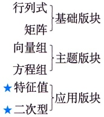

那么，究竟什么是线性代数呢？

线性代数是一种代数结构。通俗来讲，向量空间是这个结构的基石，我们要在向量空间中研究向量与向量的关系。

### 一 对象（元素）：向量

①定义：拼在一起的有序数组，如 $[-1,1]$

②维数：向量中数的个数，如 $[-1,1]$是2维向量.

③意义：数据可以表达信息．如下例：

假设一个人对于运动和音乐的兴趣程度均分为不喜欢、无所谓和喜欢三种，其中不喜欢用 -1 表示，无所谓用 0 表示，喜欢用 1 表示，则可用以下向量来表示某人对于运动和音乐的兴趣程度：

[运动兴趣程度，音乐兴趣程度].

那么，向量  $[-1,1]$ 代表不喜欢运动，喜欢音乐，即  $\begin{bmatrix} 运动: & -1 & 0 & 1 \\ 音乐: & -1 & 0 & 1 \end{bmatrix}$；

向量  $[0,1]$ 代表对运动无所谓，喜欢音乐，即  $\begin{bmatrix} 运动: & -1 & 0 & 1 \\ 音乐: & -1 & 0 & 1 \end{bmatrix}$.

### 二 运算

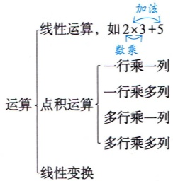

#### 1 线性运算

①加法： $a+b$

②数乘：ka

#### 2 点积运算

 $(a,\beta)$称为向量 $\alpha$与向量 $\beta$的点积运算，即将 $\alpha,\beta$的所有分量对应相乘再相加.

如  $\alpha = [-1, 1]$， $\beta = [0, -1]$，则  $(\alpha, \beta) = -1 \times 0 + 1 \times (-1) = -1$

①一行乘一列.

如

 $$[\boldsymbol{a}_{1},\boldsymbol{a}_{2}]\begin{bmatrix}\boldsymbol{b}_{1}\\ \boldsymbol{b}_{2}\end{bmatrix}=\boldsymbol{a}_{1}\boldsymbol{b}_{1}+\boldsymbol{a}_{2}\boldsymbol{b}_{2},$$

或

 $$[\boldsymbol{a}_{1},\boldsymbol{a}_{2}]\begin{bmatrix}c_{1}\\ c_{2}\end{bmatrix}=\boldsymbol{a}_{1}c_{1}+\boldsymbol{a}_{2}c_{2}.$$

②一行乘多列.

加法（本质还是线性运算）

如

 $$\left[a_{1},a_{2}\right]\left[\begin{aligned}b_{1}&c_{1}\\ b_{2}&c_{2}\end{aligned}\right]=\left[a_{1}b_{1}+a_{2}b_{2},a_{1}c_{1}+a_{2}c_{2}\right]$$

③多行乘一列.

如

 $$\begin{bmatrix}a_{1}&a_{2}\\ b_{1}&b_{2}\end{bmatrix}\begin{bmatrix}c_{1}\\ c_{2}\end{bmatrix}=\begin{bmatrix}a_{1}c_{1}+a_{2}c_{2}\\ b_{1}c_{1}+b_{2}c_{2}\end{bmatrix}.$$

④多行乘多列.

如

 $$\begin{bmatrix}a_{1}&a_{2}\\ b_{1}&b_{2}\end{bmatrix}\begin{bmatrix}c_{1}&d_{1}\\ c_{2}&d_{2}\end{bmatrix}=\begin{bmatrix}a_{11}&a_{12}\\ a_{21}&a_{22}\end{bmatrix},$$
其中， $a_{11}=a_{1}c_{1}+a_{2}c_{2}$， $a_{12}=a_{1}d_{1}+a_{2}d_{2}$， $a_{21}=b_{1}c_{1}+b_{2}c_{2}$， $a_{22}=b_{1}d_{1}+b_{2}d_{2}$，即

 $a_{ij} = (\text{第 } i \text{ 行}, \text{第 } j \text{ 列}).$

左边多行 右边多列

##### 练习：计算如下式子

①[1,1][ $\frac{1}{-1}$]=___.

②  $[2, 0]\begin{bmatrix}0\\ -2\end{bmatrix}=$ ___.

③[1,-1] $\begin{bmatrix}2&1\\ -1&3\end{bmatrix}$=___.

④$\begin{bmatrix}2&1\\ -1&3\end{bmatrix}\begin{bmatrix}1\\ -1\end{bmatrix}=$ ___.

⑤ $\begin{bmatrix}1\\ 1\end{bmatrix}[1,-1]=$ ___.

⑥ $\begin{bmatrix}2\\0\end{bmatrix}[0,-2]=$ ___.

⑦ $\begin{bmatrix}1&1\\ -1&1\end{bmatrix}\begin{bmatrix}2&1\\ -1&3\end{bmatrix}=$ ___.

⑧ $\begin{bmatrix}2&1\\ -1&3\end{bmatrix}\begin{bmatrix}1&1\\ -1&1\end{bmatrix}=$ ___.

答案：① 0. ② 0. ③  $[3, -2]$. ④  $\begin{bmatrix} 1 \\ -4 \end{bmatrix}$. ⑤  $\begin{bmatrix} 1 & -1 \\ 1 & -1 \end{bmatrix}$. ⑥  $\begin{bmatrix} 0 & -4 \\ 0 & 0 \end{bmatrix}$. ⑦  $\begin{bmatrix} 1 & 4 \\ -3 & 2 \end{bmatrix}$. ⑧  $\begin{bmatrix} 1 & 3 \\ -4 & 2 \end{bmatrix}$.

#### 3 线性变换

(1) 预备知识——矩阵：用于表达 **系统信息**.

如矩阵 $\begin{bmatrix}1&0\\ 0&-1\end{bmatrix}$

表达信息1.

若横着看，结合研究对象中的例子：

[1,0]可代表一个人喜欢运动，对音乐无所谓；

[0，-1]可代表一个人对运动无所谓，且不喜欢音乐。

表达信息2.

假设一个人投篮两次，投中记为1，未投中记为0，卡在篮筐上记为-1，则矩阵 $\begin{bmatrix}1&0\\0&-1\end{bmatrix}$也可理解为：

[1,0]代表一个人投篮，第一次投中，第二次未投中；

[0，-1]代表一个人投篮，第一次未投中，第二次卡在篮筐上.

需要注意的是：矩阵中数的位置不能随便改动，否则会影响信息的表达。

商品

价格 卡路里

如$\begin{bmatrix}40&15\\ 12&8\end{bmatrix}$ 可赋予如下信息：
[40,15]可表示商品价格为40，卡路里为15；

[12,8]可表示商品价格为12，卡路里为8.

商品

价格 卡路里

若调整为$\begin{bmatrix}40&12\\ 15&8\end{bmatrix}$，则

[40,12]可表示商品价格为40，卡路里为12；

[15,8]可表示商品价格为15，卡路里为8.

##### 练习：计算下列式子

①$\begin{bmatrix}0&1\\ 1&0\end{bmatrix}\begin{bmatrix}0&1&1&0\\ 1&1&0&0\end{bmatrix}=$___.

②$\begin{bmatrix}2&0\\ 0&1\end{bmatrix}\begin{bmatrix}0&1&1&0\\ 1&1&0&0\end{bmatrix}=$___.

答案：① $\begin{bmatrix}1&1&0&0\\0&1&1&0\end{bmatrix}$.② $\begin{bmatrix}0&2&2&0\\1&1&0&0\end{bmatrix}$.

(2) 线性变换举例.

理解为[1,1]或 $\begin{bmatrix}1\\ 1\end{bmatrix}$

 $$A\boldsymbol{\alpha}=\boldsymbol{\beta}$$

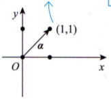

把A作用在 $\alpha$上输出一个 $\beta$

 $$\begin{bmatrix}1&0\\ 0&-1\end{bmatrix}\begin{bmatrix}1\\ 1\end{bmatrix}=\begin{bmatrix}1\\ -1\end{bmatrix}$$

 $$\begin{array}{ccc} f & (x)& = y \\ \downarrow & \downarrow & \downarrow \\ A & (a)& = \beta \end{array}$$

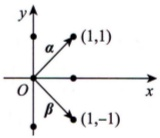

①对称变换.

a. $\begin{bmatrix}1&0\\0&-1\end{bmatrix}$

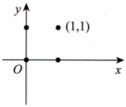

 $$\begin{bmatrix}{{{1}}}&{{{0}}} \\{{{0}}}&{{{-1}}}\end{bmatrix}\begin{bmatrix}{{{0}}}&{{{1}}}&{{{1}}}&{{{0}}} \\{{{1}}}&{{{1}}}&{{{0}}}&{{{0}}}\end{bmatrix}=\begin{bmatrix}{{{0}}}&{{{1}}}&{{{1}}}&{{{0}}} \\{{{-1}}}&{{{-1}}}&{{{0}}}&{{{0}}}\end{bmatrix}$$

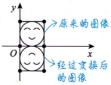

对称变换
 $$\begin{bmatrix}{{{-1}}}&{{{0}}} \\{{{0}}}&{{{1}}}\end{bmatrix}$$

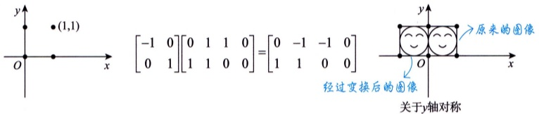

 $$\begin{bmatrix}{{{-1}}}&{{{0}}} \\{{{0}}}&{{{-1}}}\end{bmatrix}$$

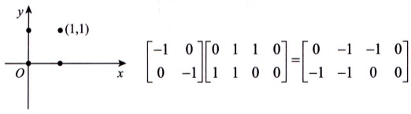

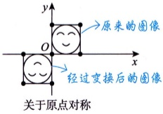

d.

 $$\begin{bmatrix}0&1\\ 1&0\end{bmatrix}.$$

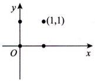

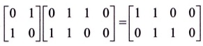

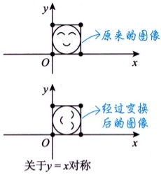

e. $\begin{bmatrix}0&-1\\ -1&0\end{bmatrix}$.

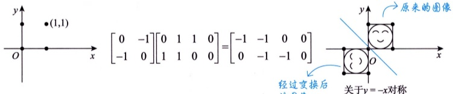

对称

变换
②伸缩变换.

a. $\begin{bmatrix}2&0\\0&1\end{bmatrix}$

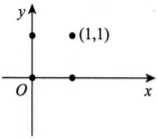

 $$\begin{bmatrix}{{{2}}}&{{{0}}} \\{{{0}}}&{{{1}}}\end{bmatrix}\begin{bmatrix}{{{0}}}&{{{1}}}&{{{1}}}&{{{0}}} \\{{{1}}}&{{{1}}}&{{{0}}}&{{{0}}}\end{bmatrix}=\begin{bmatrix}{{{0}}}&{{{2}}}&{{{2}}}&{{{0}}} \\{{{1}}}&{{{1}}}&{{{0}}}&{{{0}}}\end{bmatrix}$$

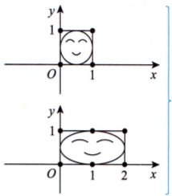

拉伸变换(横向)

b. $\begin{bmatrix}1&0\\0&2\end{bmatrix}$.

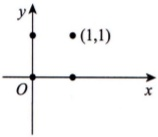

 $$\begin{bmatrix}{{{1}}}&{{{0}}} \\{{{0}}}&{{{2}}}\end{bmatrix}\begin{bmatrix}{{{0}}}&{{{1}}}&{{{1}}}&{{{0}}} \\{{{1}}}&{{{1}}}&{{{0}}}&{{{0}}}\end{bmatrix}=\begin{bmatrix}{{{0}}}&{{{1}}}&{{{1}}}&{{{0}}} \\{{{2}}}&{{{2}}}&{{{0}}}&{{{0}}}\end{bmatrix}$$

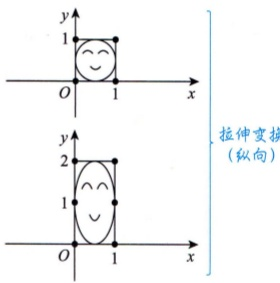

拉伸变换(纵向)

c. $\begin{bmatrix} \frac{1}{2} & 0 \\ 0 & 1 \end{bmatrix}.$

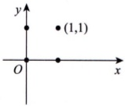

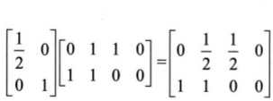

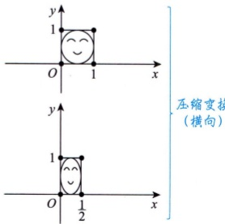

压缩变换

(横向)
d.

 $$\begin{bmatrix}1&0\\ 0&\frac{1}{2}\end{bmatrix}.$$

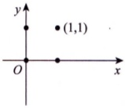

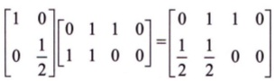

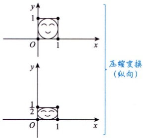

压缩变换(纵向)

③剪切变换.

 $$\begin{bmatrix}1&-1\\ 0&1\end{bmatrix}.$$

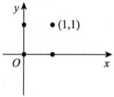

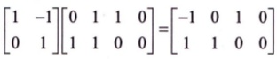

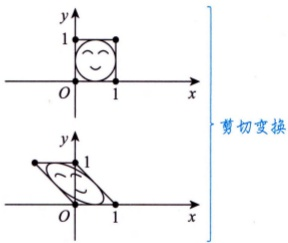

b.

 $$\begin{bmatrix}1&0\\ -1&1\end{bmatrix}.$$

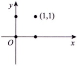

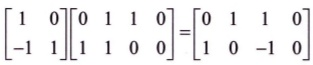

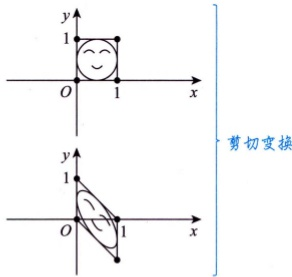

剪切变换

④旋转变换.

 $$\begin{bmatrix}\frac{\sqrt{2}}{2}&-\frac{\sqrt{2}}{2}\\ \frac{\sqrt{2}}{2}&\frac{\sqrt{2}}{2}\end{bmatrix}.$$

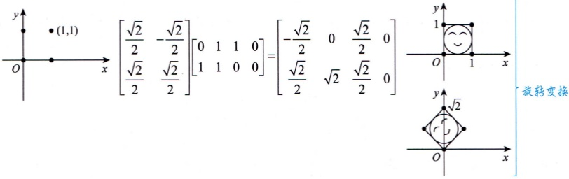

#### 4 方程组求解

线性代数主要是运用了线性变换这样一个对应法则来作运算。事实上，线性变换相当于高等数学中的对应法则，即函数 $f$，对应到线性代数里就是矩阵 $A$。

例如，对于一个方程组$\begin{cases}x_1+2x_2=3,\\4x_1+7x_2=10,\end{cases}$中学阶段的解法为高斯消元法，大学阶段的解法为线性变换法。

线性变换法中，把$x_1+2x_2$、$4x_1+7x_2$写为向量点积形式$1\cdot x_1+2\cdot x_2$、$4\cdot x_1+7\cdot x_2$，则方程改写为：

 $$\begin{bmatrix}1&2\\ 4&7\end{bmatrix}\begin{bmatrix}x_{1}\\ x_{2}\end{bmatrix}=\begin{bmatrix}3\\ 10\end{bmatrix},$$

 $$A\alpha = \beta$$

即已知一个矩阵 $A$，作用在某个向量 $\alpha$上，得到一个向量 $\beta$，那么如何反求出 $\alpha$呢？

类比中学阶段求  $2x = 3$ 的解的方法，两边乘以  $2^{-1}$，得  $2^{-1} \cdot 2x = 2^{-1} \cdot 3$，即  $x = \frac{3}{2}$，故大学阶段求  $\overrightarrow{A}$ 前提是  $A$ 可逆

 $Ax = \beta$ 的解，等式两端同时左边乘 “ $A^{-1}$”，得  $A^{-1}Ax = A^{-1}\beta$，即  $x = A^{-1}\beta$，如  $f(x) = y$，在  $f^{-1}$ 存在时，两边复合  $f^{-1}$，得  $f^{-1}[f(x)] = f^{-1}(y)$，即  $x = f^{-1}(y)$。

于是，计算“ $A^{-1}$”（叫作 $A$的逆矩阵）就成为了关键。中学知识告诉我们， $a \cdot a^{-1} = a^{-1} \cdot a = 1 (a \neq 0)$，那么，在矩阵运算中，有没有 $A \cdot A^{-1} = A^{-1} \cdot A = 1$呢？

事实上，记 $E_1=1$， $E_2=\begin{bmatrix}1&0\\ 0&1\end{bmatrix}$， $E_3=\begin{bmatrix}1&0&0\\ 0&1&0\\ 0&0&1\end{bmatrix}$， $\cdots$。

若  $A^{-1} \cdot A = 1$，则  $A = a$，此时称  $A$ 为一阶矩阵，就是代数中的一个数，而若  $A = \begin{bmatrix} 1 & 2 \\ 4 & 7 \end{bmatrix}$，则  $A^{-1}$ 是什么呢？请考生计算  $\begin{bmatrix} 1 & 2 \\ 4 & 7 \end{bmatrix} \begin{bmatrix} -7 & 2 \\ 4 & -1 \end{bmatrix}$ 的值。

计算可知， $\begin{bmatrix}1&2\\ 4&7\end{bmatrix}\begin{bmatrix}-7&2\\ 4&-1\end{bmatrix}=\begin{bmatrix}-7&2\\ 4&-1\end{bmatrix}\begin{bmatrix}1&2\\ 4&7\end{bmatrix}=\begin{bmatrix}1&0\\ 0&1\end{bmatrix}$，即 $AA^{-1}=E_{2}$
此时  $A^{-1}=\begin{bmatrix}-7&2\\ 4&-1\end{bmatrix}$ （至于这个  $A^{-1}$ 如何计算出来，留待后面的第 2 讲来揭晓），于是在下式两端左边同时乘以  $A^{-1}$，有

 $$\begin{bmatrix}-7&2\\ 4&-1\end{bmatrix}\begin{bmatrix}1&2\\ 4&7\end{bmatrix}\begin{bmatrix}x_{1}\\ x_{2}\end{bmatrix}=\begin{bmatrix}-7&2\\ 4&-1\end{bmatrix}\begin{bmatrix}3\\ 10\end{bmatrix},$$

于是可得 $\begin{bmatrix}x_1\\ x_2\end{bmatrix}=\begin{bmatrix}-1\\ 2\end{bmatrix}$，即方程组 $\begin{cases}x_1+2x_2=3,\\4x_1+7x_2=10\end{cases}$的解为 $x_1=-1$， $x_2=2$。

用 $A^{-1}$来求解方程组可称为“逆矩阵解法”.

##### 练习：按要求解下列方程组

（1）用高斯消元法解方程组 $\left\{\begin{aligned}x_{1}+2x_{2}&=3,\\ 4x_{1}+7x_{2}&=10,\end{aligned}\right.$并与前述逆矩阵解法做一下对比.

解：令

 $$\begin{cases}x_{1}+2x_{2}=3,\\4x_{1}+7x_{2}=10,\end{cases}$$

①×4-②，得 $(4-4)x_{1}+(8-7)x_{2}=3\times4-10$，即得 $x_{2}=2$

代回①得 $x_{1}=3-2\times2=-1$，即解为 $x_{1}=-1$， $x_{2}=2$

对比下来，前述逆矩阵法并未体现出简洁性。

（2）分别用高斯消元法和逆矩阵解法解方程组 $\left\{\begin{aligned}x_{1}+x_{2}+x_{3}&=2,\\ x_{1}+2x_{2}+4x_{3}&=3,\\ x_{1}+3x_{2}+9x_{3}&=5,\end{aligned}\right.$并将两种解法做一下对比.

解：高斯消元法：

 $$x_{1}+x_{2}+x_{3}=2,$$

令

 $$x_{1}+2x_{2}+4x_{3}=3,$$

 $$x_{1}+3x_{2}+9x_{3}=5,$$

② - ① 得

 $$x_{2}+3x_{3}=1,$$

③ - ② 得

 $$x_{2}+5x_{3}=2,$$

⑤ - ④ 得  $2x_{3}=1$，解得  $x_{3}=\frac{1}{2}$

代回④解得  $x_{2}=1-3x_{3}=-\frac{1}{2}$

将  $x_{3}=\frac{1}{2}$， $x_{2}=-\frac{1}{2}$ 代回①得， $x_{1}=2-x_{2}-x_{3}=2$，即解为  $x_{1}=2$， $x_{2}=-\frac{1}{2}$， $x_{3}=\frac{1}{2}$

逆矩阵解法：
由于

 $$\begin{bmatrix}{{{1}}}&{{{1}}}&{{{1}}} \\{{{1}}}&{{{2}}}&{{{4}}} \\{{{1}}}&{{{3}}}&{{{9}}}\end{bmatrix}\begin{bmatrix}{{{3}}}&{{{-3}}}&{{{1}}} \\{{{-\frac{5}{2}}}}&{{{4}}}&{{{-\frac{3}{2}}}} \\{{{\frac{1}{2}}}}&{{{-1}}}&{{{\frac{1}{2}}}}\end{bmatrix}=\begin{bmatrix}{{{3}}}&{{{-3}}}&{{{1}}} \\{{{-\frac{5}{2}}}}&{{{4}}}&{{{-\frac{3}{2}}}} \\{{{\frac{1}{2}}}}&{{{-1}}}&{{{\frac{1}{2}}}}\end{bmatrix}\begin{bmatrix}{{{1}}}&{{{1}}}&{{{1}}} \\{{{1}}}&{{{2}}}&{{{4}}} \\{{{1}}}&{{{3}}}&{{{9}}}\end{bmatrix}=\begin{bmatrix}{{{1}}}&{{{0}}}&{{{0}}} \\{{{0}}}&{{{1}}}&{{{0}}} \\{{{0}}}&{{{0}}}&{{{1}}}\end{bmatrix},$$

即  $AA^{-1} = A^{-1}A = E_{3}$，于是在

 $$\begin{bmatrix}1&1&1\\ 1&2&4\\ 1&3&9\end{bmatrix}\begin{bmatrix}x_{1}\\ x_{2}\\ x_{3}\end{bmatrix}=\begin{bmatrix}2\\ 3\\ 5\end{bmatrix}$$

两边的左边同时乘以 $A^{-1}$，得

 $$\begin{bmatrix}{{{3}}}&{{{-3}}}&{{{1}}} \\{{{-\frac{5}{2}}}}&{{{4}}}&{{{-\frac{3}{2}}}} \\{{{\frac{1}{2}}}}&{{{-1}}}&{{{\frac{1}{2}}}}\end{bmatrix}\begin{bmatrix}{{{1}}}&{{{1}}}&{{{1}}} \\{{{1}}}&{{{2}}}&{{{4}}} \\{{{1}}}&{{{3}}}&{{{9}}}\end{bmatrix}\begin{bmatrix}{{{x_{1}}}} \\{{{x_{2}}}} \\{{{x_{3}}}}\end{bmatrix}=\begin{bmatrix}{{{3}}}&{{{-3}}}&{{{1}}} \\{{{-\frac{5}{2}}}}&{{{4}}}&{{{-\frac{3}{2}}}} \\{{{\frac{1}{2}}}}&{{{-1}}}&{{{\frac{1}{2}}}}\end{bmatrix}\begin{bmatrix}{{{2}}} \\{{{3}}} \\{{{5}}}\end{bmatrix},$$

即 $\begin{bmatrix}x_{1}\\ x_{2}\\ x_{3}\end{bmatrix}=\begin{bmatrix}2\\ -\frac{1}{2}\\ \frac{1}{2}\end{bmatrix}$.

由此可以看出，当方程组未知数和方程个数越来越多时，高斯消元法将越来越难以求解。而逆矩阵解法则越来越体现其优越性。在现代科技中，“大型”方程组的求解越来越普遍且实用。学习线性代数，可以为学好现代科技打下良好的基础。
## 第1讲 行列式

### 基础知识结构


### 基础内容精讲

#### 一 行列式的本质定义（第一种定义）

大多数教材都是从“纯粹”的代数学角度来定义行列式的，较为抽象，难于理解和接受。我们先详细通俗地给出行列式的本质定义，并且告诉考生，我们将要开始的线性代数这门课程到底要学什么。

先看一个式子： $D_2 = \begin{vmatrix} a_{11} & a_{12} \\ a_{21} & a_{22} \end{vmatrix}$。我们称其为2阶行列式，其中 $a_{ij}$的第一个下标i表示此元素所在的行数，第二个下标j表示此元素所在的列数， $i=1,2,j=1,2$，于是此行列式中有四个元素，并且

 $a_{ij}$表示位于第i行、第j

 $\left| \begin{matrix} a_{11} & a_{12} \\ a_{21} & a_{22} \end{matrix} \right| = a_{11}a_{22} - a_{12}a_{21}$。这是一个什么样的计算规则？它背后有什么样的意义？列的元素，如 $a_{23}$位于第2行、第3列

将此行列式的第1行的两个元素  $a_{11}$， $a_{12}$ 看成一个2维向量  $[a_{11}$， $a_{12}]$ 记  $\alpha_{1}$ （线性代数中，向量不需要在字母上加箭头写成  $\overrightarrow{a_{1}}$，只要写  $\alpha_{1}$ 即可，此后类同，不再重复）. 将此行列式的第2行的两个元素  $a_{21}$， $a_{22}$ 看成另一个2维向量  $[a_{21}$， $a_{22}]$ 记  $\alpha_{2}$. 不失一般性，将这两个向量标在直角坐标系中，且以这两个向量为邻边作出一个 $\square OABC$，则  $S_{\square OABC}=$？

不妨设  $\alpha_{1}$ 的长度（模）为 l， $\alpha_{2}$ 的长度（模）为 m， $\alpha_{1}$ 与 x 轴正向的夹角为  $\alpha$， $\alpha_{2}$ 与 x 轴正向的夹角为  $\beta$，如图 1-1 所示.

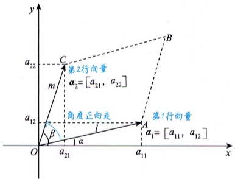

图 1-1

则

 $$\begin{aligned}S_{\triangle OABC}&=l\bullet m\bullet\sin(\beta-\alpha)\\&=l\bullet m(\sin\beta\cos\alpha-\cos\beta\sin\alpha)\\&=l\cos\alpha\bullet m\sin\beta-l\sin\alpha\bullet m\cos\beta\\&=a_{11}a_{22}-a_{12}a_{21},\\ \end{aligned}$$
于是

2阶行列式特殊算法（巧合）：

主对角线元素之积减去副对角线元素之积

 $\begin{vmatrix} a_{11} & a_{12} \\ a_{21} & a_{22} \end{vmatrix} = a_{11}a_{22} - a_{12}a_{21} = S_{\triangle OABC}$.

我们看到了一个极其直观有趣的结论： **2阶行列式是由两个2维向量组成的，其（运算规则的）结果为以这两个向量为邻边的平行四边形的面积**.这不仅得出了2阶行列式的计算规则，也能够清楚地看到其几何意义.

行列式的本质属性是测度——体积（面积是特殊的体积）

示例1 对于行列式 $\begin{vmatrix}1 & 2 \\ 2 & 5\end{vmatrix}$，利用2阶行列式计算方式，有

 $$5\times1-2\times2=1$$

也可画出以向量  $[1,2]$ 和  $[2,5]$ 为邻边的平行四边形，求其面积，即为行列式的值，如图1-2所示.（求面积较复杂）

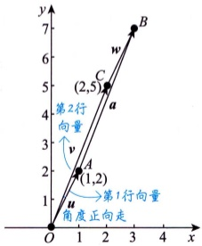

图 1-2

示例2 行列式 $\begin{vmatrix}1&2\\2&3\end{vmatrix}=-1$

向量  $[1,2]$， $[2,3]$ 如图 1-3 所示. 这里行列式是负值，因为从向量  $[1,2]$ 到  $[2,3]$ 是顺时针走的.

要注意，代数学里面积可以是负值.

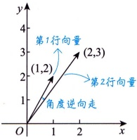

图 1-3

示例3 行列式 $\begin{vmatrix}1&2\\2&4\end{vmatrix}=0$

向量  $[1,2]$， $[2,4]$ 如图 1-4 所示，两个向量重合，夹角为 0，故平行四边形面积为 0.

这也反映了行列式的一个性质：若行列式两行成比例，则行列式为0.

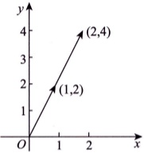

图1-4

示例4 行列式 $\begin{vmatrix}1&2\\0&0\end{vmatrix}=0$

从图 1-5 可以看出，图中只有一个向量 [1, 2]，另一个向量缩回原点，无法组成平行四边形，此时 2 维平面退化为 1 维直线段，是没有 2 维测度的。同样地，2 维平面无 3 维测度——体积。

也就是说，低维物体是不能用高维来衡量的，用高维测度低维必然为0.这也反映了行列式的一个性质：若行列式中有一行或一列为0，则行列式为0.

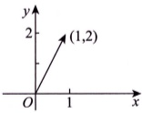

图 1-5

线性代数可以作“线性推广”——3阶行列式 $D_{3}=\begin{vmatrix}a_{11}&a_{12}&a_{13}\\a_{21}&a_{22}&a_{23}\\a_{31}&a_{32}&a_{33}\end{vmatrix}$是什么？我希望考生能够仿照上述定义回答出：3阶行列式是由三个3维向量 $a_{1}=[a_{11},a_{12},a_{13}]$， $a_{2}=[a_{21},a_{22},a_{23}]$， $a_{3}=[a_{31},a_{32},a_{33}]$组成的，其（运算规则的）结果为以这三个向量为邻边的平行六面体的体积.如图1-6所示.

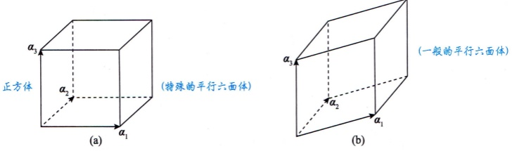

图1-6

拓展 计算3阶行列式：画线法（或沙路法）.

 $$\begin{aligned}\left|\begin{matrix}a_{11}&a_{12}&a_{13}\\a_{21}&a_{22}&a_{23}\\a_{31}&a_{32}&a_{33}\end{matrix}\right|&=a_{11}a_{22}a_{33}+a_{13}a_{21}a_{32}+a_{12}a_{23}a_{31}-a_{13}a_{22}a_{31}-a_{11}a_{23}a_{32}-a_{12}a_{21}a_{33}.\end{aligned}$$

如

 $$\begin{vmatrix}{{{5}}}&{{{2}}}&{{{1}}} \\{{{1}}}&{{{2}}}&{{{5}}} \\{{{34}}}&{{{1}}}&{{{34}}}\end{vmatrix}=5\times2\times34+1\times1\times1+2\times5\times34-1\times2\times34-5\times5\times1-2\times1\times34=520\ .$$

再如

 $$\begin{array}{l|c|c}{{{我}}}&{{{0}}}&{{{生}}} \\{{{0}}}&{{{有}}}&{{{0}}} \\{{{你}}}&{{{0}}}&{{{幸}}} \\\end{array}= 我有幸 - 生有你．\begin{array}{l} 若把减号“-”看为汉字“-”\\ 一个浪漫的公式便产生了 \\\end{array}$$

依次类推，我们便可以给出 n 阶行列式  $D_{n}=\begin{vmatrix}a_{11}&\cdots&a_{1n}\\ \vdots&&\vdots\\ a_{n1}&\cdots&a_{nn}\end{vmatrix}$ 的本质定义：

 $n(n \geq 3)$ 阶行列式是由 n 个 n 维向量  $a_1 = [a_{11}, a_{12}, \cdots, a_{1n}]$， $a_2 = [a_{21}, a_{22}, \cdots, a_{2n}]$， $\cdots$， $a_n = [a_{n1}, a_{n2}, \cdots, a_{nn}]$ 组成的，其（运算规则的）结果为以这 n 个向量为邻边的 n 维图形的体积。

由此看来，一个重要观点出现了：考生一开始就应该把行列式看作是由若干个向量拼成的，并且要把这些向量作运算。以3阶行列式为例，若 $D_{3}\neq0$，则意味着体积不为0，则称组成该行列式的三个向量线性无关；若 $D_{3}=0$，则称线性相关。行列式为0，向量组线性相关；行列式不为0，向量组线性无关。

拓展 行列式的概念由矩阵而来，是变换的一种性质。如何体现这种变换的性质呢？以线性变换  $A = \begin{bmatrix} 1 & 0 \\ 0 & -1 \end{bmatrix}$ 为例进行说明。
首先，明确矩阵A与行列式 $|A|$之间的区别与联系.

①矩阵A不表示数值，它只是在表达信息，只有作用在一个向量a时，它才会产生对这个向量的作用.

②行列式 $|A|$是将矩阵A放进两竖线后，计算矩阵A的某个性质或某个特点.

如  $A = \begin{bmatrix} 1 & 0 \\ 0 & -1 \end{bmatrix}$， $|A| = \begin{vmatrix} 1 & 0 \\ 0 & -1 \end{vmatrix} = 1 \times (-1) - 0 \times 0 = -1$。

对于线性变换 $A=\begin{bmatrix}1&0\\ 0&-1\end{bmatrix}$，将其作用在矩阵 $\begin{bmatrix}0&1&1&0\\ 1&1&0&0\end{bmatrix}$上，有

 $$\begin{bmatrix}1&0\\ 0&-1\end{bmatrix}\begin{bmatrix}0&1&1&0\\ 1&1&0&0\end{bmatrix}=\begin{bmatrix}0&1&1&0\\ -1&-1&0&0\end{bmatrix},$$

此线性变换A是关于x轴对称的变换，如图1-7所示.原来图像的面积是1，以常识来说，翻下去的图像面积是多少？是1还是-1呢？

联系高等数学中的内容，定积分与所围图像的面积是有区别的（见图1-8）。类比可知，原来图形的面积为1，翻转后的图形面积应为-1。从这个角度来看，行列式的值实际上是对变换的面积改变的一个度量。

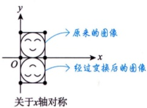

图 1-7

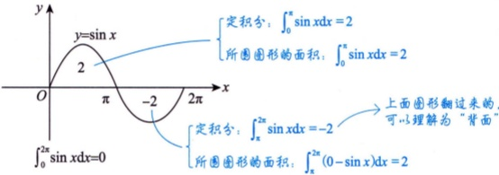

图 1-8

示例 线性变换 $\begin{bmatrix}-1 & 0 \\ 0 & -1\end{bmatrix}$作用在 $\begin{bmatrix}0 & 1 & 1 & 0 \\ 1 & 1 & 0 & 0\end{bmatrix}$上，有

 $$\begin{bmatrix}-1&0\\ 0&-1\end{bmatrix}\begin{bmatrix}0&1&1&0\\ 1&1&0&0\end{bmatrix}=\begin{bmatrix}0&-1&-1&0\\ -1&-1&0&0\end{bmatrix},$$

如图1-9所示.原来图像的面积为1，向下翻转面积变为-1，再向左翻转得到最终图像，面积变为1.故变换后原图像的面积未改变，不难发现 $\begin{vmatrix}-1&0\\0&-1\end{vmatrix}=1$

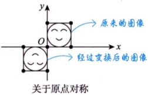

图 1-9

#### 二 行列式的性质

行列式的柯西定义法，主要结论：对n阶矩阵A的行列式 $|A|$，从测度的角度来看，表示的是n维体积

问：测度是什么？

答：曲边梯形的面积，旋转体的体积，曲线的弧长，旋转曲面的表面积，等等.一般用积分学研究.

问：性态是什么？

答：单调性，凹凸性，等等，一般用微分学研究.

著名的公式：若  $A$， $B$ 为  $n$ 阶矩阵，则  $|\underline{AB}| = |A||B| = |B||A| = |\underline{BA}|$.

##### 1 行列互换（转置），行列式不变

行列互换，其值不变，即 $|A| = |A^T|$。 $\Rightarrow$行列地位等价（行上成立的性质，列上也成立），因此下列性质只需证一组
注 该性质的几何意义是转置之后图形的测度保持不变.

示例1 把 $A=\begin{bmatrix}1&2\\ 2&5\end{bmatrix}$的行列互换，得 $A^{\mathrm{T}}=\begin{bmatrix}1&2\\ 2&5\end{bmatrix}$。 $\rightarrow A$的转置 $\rightarrow$新概念，字母T意为转置，指交换行与列一般地，n阶矩阵 $A$与 $A^{\mathrm{T}}$表达的系统信息不一定相同，即 $A\neq A^{\mathrm{T}}$，但 $|A|=|A^{\mathrm{T}}|$。但此例属于特殊

 $$\boldsymbol{A}=\boldsymbol{A}^{\mathrm{T}}$$

 $$\left|\boldsymbol{A}\right|=\left|\boldsymbol{A}^{\mathrm{T}}\right|$$

角度：$|A|$表示以$A$的两个行向量$[1,2]$，$[2,5]$为邻边拼成的平行四边形的面积，如图1-10所示。$|A^T|$也表示一个平行四边形的面积。如果换一个角度，把$A$的两列看成两个行向量，那这两个向量同样也是$[1,2]$，$[2,5]$。可知两个平行四边形面积一致，故$|A|=|A^T|$。

此例中，A满足 $A=A^{T}$，称A为对称矩阵. 常见于二次型大题中

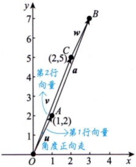

图 1-10

示例2  $A=\begin{bmatrix}1&2\\ 3&7\end{bmatrix}$，其转置矩阵为 $A^{T}=\begin{bmatrix}1&3\\ 2&7\end{bmatrix}$，它们的行向量组成的平行四边形如图1-11所示.

| Point | x | y |
| --- | --- | --- |
| O | 0 | 0 |
| B | 1 | 2 |
| F | 4 | 9 |
| a | 3 | 6 |
| B | 1 | 2 |
| E | 3 | 7 |
| F | 4 | 9 |

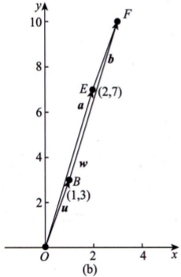

图 1-11

图 1-11(a)，1-11(b) 所示的平行四边形的面积分别为  $1 \times 7 - 3 \times 2$， $1 \times 7 - 2 \times 3$，即行列式行向量组成的平行四边形的面积和列向量组成的平行四边形的面积相等，故  $|A|=|A^T|$。

##### 2 某行（列）全为零，行列式为零

若行列式中某行（列）元素全为零，则行列式为零.  $\left|\begin{array}{ccc}0 & \cdots & 0 \\ & \vdots & \\ & & \text{用} \times \text{用} \\ \end{array}\right| = 0$ \rightarrow 至少有1个零行（列）

注 至少有1个零行（列）意味着n维空间图形至少降一维，故行列式直接为零. 因为高维空间中是测不出低维测度的. 比如，3维空间中测不出平面的体积，2维平面里测不出直线的面积.
示例 若三个向量线性无关，则一定能拼出有体积的平行六面体，如图1-12(a)所示. 若有一个向量为零，如图1-12(b)所示，则只能拼出平行四边形，是平面，无体积.

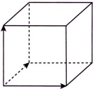

(a)

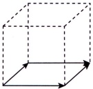

图1-12

(b)

##### 3 某行（列）的公因子可提出

若行列式中某行（列）元素有公因子 $k(k\neq0)$，则k可提到行列式外面，即

 $$\begin{vmatrix}a_{11}&a_{12}&\cdots&a_{1n}\\\vdots&\vdots&&\vdots\\ka_{i1}&ka_{i2}&\cdots&ka_{in}\\\vdots&\vdots&&\vdots\\a_{n1}&a_{n2}&\cdots&a_{nn}\end{vmatrix}=k\begin{vmatrix}a_{11}&a_{12}&\cdots&a_{1n}\\\vdots&\vdots&&\vdots\\a_{i1}&a_{i2}&\cdots&a_{in}\\\vdots&\vdots&&\vdots\\a_{n1}&a_{n2}&\cdots&a_{nn}\end{vmatrix}\xrightarrow{\bullet}\begin{vmatrix}*\\ ka_{ij}\\ *\end{vmatrix}=k\mid\boldsymbol{A}$$

逆用，若用k乘行列式 $|A|$，则k只能乘到其中某一行（列）上

注上述等式从右到左的运算称为“倍乘”性质.

示例  $\left|\frac{1}{3}\frac{5}{3}\right|=\frac{1}{3}\left|\frac{1}{5}\right|$. 逆用： $3\left|\frac{1}{3}\frac{5}{3}\right|=\left|\frac{1}{1}\frac{2}{5}\right|$.

提出公因子 $\frac{1}{3}$ 将3乘到第2行

从几何（面积）的角度来理解：将第2行乘以3是将平行四边形的一条边变成3倍，则其面积（即行列式）会相应变成原来的3倍. 如图1-13(a)，图1-13(b)所示. 逆用此性质时要注意：只能将k乘到其中某一行（列）上，而不能乘到每一行（列）上. 如该示例中，若将3也乘到第1行上，则平行四边形的两条边都变成原来的3倍，面积（即行列式）就会变成原来的 $3^{2}$倍了，如图1-13(c)所示.

第1、2行都乘3，面积扩大 $3^{2}$

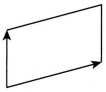

(a)

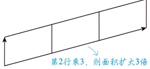

(b)

图1-13

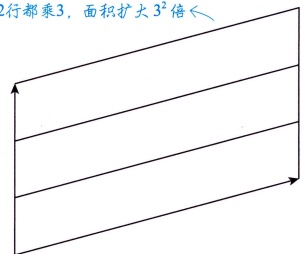

(c)

拓展 注意区别  $k|A|$ 与  $kA$： $k\begin{bmatrix}a&b\\c&d\end{bmatrix}=\begin{bmatrix}ka&kb\\kc&kd\end{bmatrix}$.

##### 4 某行（列）为两数之和，可拆成两个行列式

行列式中某行（列）元素均是两个数之和，则可拆成两个行列式之和，即

 $$\left|\begin{matrix}a_{11}&a_{12}&\cdots&a_{1n}\\\vdots&\vdots&&\vdots\\a_{i1}+b_{i1}&a_{i2}+b_{i2}&\cdots&a_{in}+b_{in}\\\vdots&\vdots&&\vdots\\a_{n1}&a_{n2}&\cdots&a_{nn}\\\end{matrix}\right|=\left|\begin{matrix}a_{11}&a_{12}&\cdots&a_{1n}\\\vdots&\vdots&&\vdots\\a_{i1}&a_{i2}&\cdots&a_{in}\\\vdots&\vdots&&\vdots\\a_{n1}&a_{n2}&\cdots&a_{nn}\\\end{matrix}\right|+\left|\begin{matrix}a_{11}&a_{12}&\cdots&a_{1n}\\\vdots&\vdots&&\vdots\\b_{i1}&b_{i2}&\cdots&b_{in}\\\vdots&\vdots&&\vdots\\a_{n1}&a_{n2}&\cdots&a_{nn}\\\end{matrix}\right|.$$

单行可拆（加）性 逆用 均要掌握

注 等式从右到左是两个行列式相加的运算. 如果两个行列式的其他元素对应相等, 只有一行（列）不同时, 可以相加, 相加时其他元素不变, 不同元素的行（列）对应相加即可.

示例  $\left|\begin{matrix}1&2&1\\ 2&1&4\\ 5&7&11\end{matrix}\right|=\left|\begin{matrix}1&2&1\\ -1&1&2\\ 5&7&11\end{matrix}\right|+\left|\begin{matrix}1&2&1\\ 3&0&2\\ 5&7&11\end{matrix}\right|$.

拆的形式有无数种，拆成哪些数由题决定

几何上理解：一个平行六面体的体积 **拆成**两个平行六面体的体积之和.

易错  $\left|A\right|+\left|B\right|\neq\left|A+B\right|$

拓展 注意与矩阵作区分.

 $\begin{bmatrix}1+2&3+4\\5+6&7+8\end{bmatrix}=\begin{bmatrix}1&3\\5&7\end{bmatrix}+\begin{bmatrix}2&4\\6&8\end{bmatrix}$，但 $\begin{vmatrix}1+2&3+4\\5+6&7+8\end{vmatrix}=\begin{vmatrix}1+2&3\\5+6&7\end{vmatrix}+\begin{vmatrix}1+2&4\\5+6&8\end{vmatrix}$.

##### 5 两行（列）互换，行列式变号

行列式中两行（列）互换，行列式变号.

注上述运算称为“互换”性质.

换奇数次，则行列式反号：换偶数次，则行列式不变.

若 $|A|$换行（列）n次，则行列式值为 $(-1)^{n}|A|$

 $\begin{vmatrix}1&2\\2&3\end{vmatrix}=-1$（负向面积），如图1-14(a)所示.

互换1.2行

 $\begin{vmatrix}2&3\\1&2\end{vmatrix}=1$（正向面积），如图1-14(b)所示.

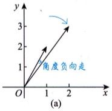

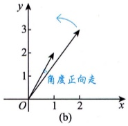

图1-14

代数学中，面积看方向，即面积有正负
##### 6 两行（列）相等或对应成比例，行列式为零

行列式中的两行（列）元素相等或对应成比例，则行列式为零.

示例  $\begin{vmatrix}1 & 2 \\ 2 & 4\end{vmatrix}=0$，如图1-15所示.

几何解释：共线的两个向量，未构成平行四边形，故面积为零.

##### 7 某行（列）的 k 倍加到另一行（列），行列式不变

行列式中某行（列）的k倍加到另一行（列），行列式不变.

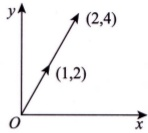

图 1-15

注上述运算称为“倍加”性质.

以2阶为例说明：

 $$\left|\begin{matrix}a_{11}&a_{12}\\ ka_{11}+a_{21}&ka_{12}+a_{22}\end{matrix}\right|\xrightarrow{ 性质 4}\left|\begin{matrix}a_{11}&a_{12}\\ ka_{11}&ka_{12}\end{matrix}\right|+\left|\begin{matrix}a_{11}&a_{12}\\ a_{21}&a_{22}\end{matrix}\right|\xrightarrow{ 性质 3}k\left|\begin{matrix}a_{11}&a_{12}\\ a_{11}&a_{12}\end{matrix}\right|+\left|\begin{matrix}a_{11}&a_{12}\\ a_{21}&a_{22}\end{matrix}\right|\xrightarrow{ 性质 6}\left|\begin{matrix}a_{11}&a_{12}\\ a_{21}&a_{22}\end{matrix}\right|.$$

示例  $\begin{vmatrix}1 & 2 \\ 2 & 3\end{vmatrix}=1 \times 3 - 2 \times 2 = -1$

 $\left|\begin{matrix}1&2\\ 2&3\end{matrix}\right|$ 第1行的-2倍  $\left|\begin{matrix}1&2\\ 0&-1\end{matrix}\right| = -1$ 加到第2行

目的：把0化出来

注可以看出，以上七个性质均可由“一、行列式的本质定义（第一种定义）”所介绍的行列式的几何背景直观地得到，而无须复杂抽象的分析.

#### 三 行列式的逆序数法定义（第二种定义）

##### 1 排列和逆序

排列 由 $n$ 个数 $1, 2, \cdots, n$ 组成的一个有序数组称为一个 $n$ 级排列，如 23145 是一个 5 级排列，41352 也是一个 5 级排列。$n$ 级排列共有 $n$ 个。排前面数大于排后面数

逆序 在一个 $n$ 级排列 $i_1i_2\cdots i_s\cdots i_t\cdots i_n$ 中，若 $\underline{i_s>i_t}$，且 $i_s$ 排在 $i_t$ 前面，则称这两个数构成一个逆序。顺序的对立 有1个比3小 有1个比5小 有1个比2小

逆序数 一个排列中，逆序的总数称为该排列的逆序数，记作  $\tau(i_1i_2\cdots i_n)$，如  $\tau(231546)=3$， $\tau(621534)=8$。由小到大顺排的排列称为自然排序，如 12345，显然，自然排序的逆序数为 0。 $1+1+1+5$ 个比 6 小  $5+1+2$ 有 1 个比 2 小  $2+3+5+1$

有1个比2小，有2个比5小

奇排列和偶排列 排列的逆序数为奇数时，该排列称为奇排列；排列的逆序数为偶数时，该排列称为偶排列。
##### 2 $n(n \geqslant 2)$ 阶行列式的定义

 $$\begin{aligned}\left|\begin{matrix}a_{11}&a_{12}&\cdots&a_{1n}\\a_{21}&a_{22}&\cdots&a_{2n}\\\vdots&\vdots&&\vdots\\a_{n1}&a_{n2}&\cdots&a_{nn}\end{matrix}\right|&=\sum_{j_{1},j_{2},\cdots,j_{n}}(-1)^{\tau(j_{1}j_{2}\cdots j_{n})}a_{1j_{1}}a_{2j_{2}}\cdots a_{nj_{n}}.\end{aligned}\begin{aligned}1\sim n 的 1 个 n 级排列．也意味着 j_{1},j_{2},\cdots,j_{n} 各不相同 \\\overset{ 第 1 行 }{\overset{ 第 2 行 }{\cdots}}\overset{ 第 n 行 }{\cdots} 取自不同行 \\\overset{ 第 2 行 }{\cdots}\overset{ 第 n 行 }{\cdots}\\a_{1j_{1}}a_{2j_{2}}\cdots a_{nj_{n}}.\end{aligned}$$

2阶行列式有2项：3阶行列式有3!=6项

这里  $\sum_{j_1,j_2,\cdots,j_n}$ 表示对所有  $n$ 个列下标排列求和，故为  $\underline{n!}$ 项之和。注意到行下标已经顺排，而列下标是任一个  $n$ 级排列，故每项由取自不同行、不同列的  $n$ 个元素的乘积组成，每项的正、负号取决于  $(-1)^{\tau(j_1,j_2,\cdots,j_n)}$。当列下标为奇排列时，应附加负号；当列下标为偶排列时，应附加正号。

示例

 $$a_{22}$$

 $$a_{11}$$

 $$\begin{aligned}\left|\begin{matrix}a_{11}&a_{12}\\ a_{21}&a_{22}\end{matrix}\right|&=+a_{11}a_{22}-a_{12}a_{21}\\&\tau(12)=0\tau(21)=1\end{aligned}$$

 $$\begin{vmatrix}a_{11}&a_{12}&a_{13}\\a_{21}&a_{22}&a_{23}\\a_{31}&a_{32}&a_{33}\end{vmatrix}=+a_{11}a_{22}a_{33}+a_{13}a_{21}a_{32}+a_{12}a_{23}a_{31}-a_{13}a_{22}a_{31}-a_{12}a_{21}a_{33}-a_{11}a_{23}a_{32}$$

注 (1) 规定 1 阶行列式  $\left|a_{11}\right|=a_{11}$. 如  $\left|-2\right|_{1\times1}=-2$.

特别注意，1阶行列式本身为一个数字 $|a|=a$，故可正可负，这点要与绝对值符号区分开。

(2) 如：请确定 “ $a_{12}a_{31}a_{54}a_{43}a_{25}$” 这一展开项前的正、负号.

答：首先将行下标顺排为  $a_{12}a_{25}a_{31}a_{43}a_{54}$，然后计算  $\tau(25134)=4$，为偶排列，故该项前为正号。有1个比2小，有3个比5小。

#### 四 行列式的展开定理（第三种定义）

“降阶”思想★

若有4阶，则降为3阶、2阶计算

若为n阶，则n阶要有规律，本质上用的是逆序数法

阶数超过3的行列式，若还用“一”“三”的方法，就太麻烦了，为此，提出行列式的展开定理.

##### 1 余子式

“子式 = 行列式”，子式是原行列式的一部分 “子矩阵 = 矩阵”，子矩阵是原矩阵的一部分

在 $n$ 阶行列式中，去掉元素 $a_{ij}$ 所在的第 $i$ 行、第 $j$ 列元素，由 **剩下的元素按原来的位置与顺序组成** 的 $n-1$ 阶行列式称为元素 $a_{ij}$ 的余子式，记作 $M_{ij}$，即相对位置，不能动顺序
 $$M_{ij}=\begin{vmatrix}a_{11}&\cdots&a_{1,j-1}&a_{1,j}&a_{1,j+1}&\cdots&a_{1n}\\\vdots&&\vdots&\vdots&\vdots&&\vdots\\a_{i-1,1}&\cdots&a_{i-1,j-1}&a_{i-1,j}&a_{i-1,j+1}&\cdots&a_{i-1,n}\\a_{i,1}&\cdots&a_{i,j-1}&a_{i,j}&a_{i,j+1}&\cdots&a_{i,n}\\a_{i+1,1}&\cdots&a_{i+1,j-1}&a_{i+1,j}&a_{i+1,j+1}&\cdots&a_{i+1,n}\\\vdots&&\vdots&\vdots&\vdots&&\vdots\\a_{n1}&\cdots&a_{n,j-1}&a_{n,j}&a_{n,j+1}&\cdots&a_{nn}\end{vmatrix}_{(n-1)\times(n-1)}$$

示例  $\begin{vmatrix}1 & 2 & 1 \\ 2 & 5 & 7 \\ -6 & 4 & 9\end{vmatrix}$， $a_{23}$ 的余子式  $M_{23}=\begin{vmatrix}1 & 2 \\ -6 & 4\end{vmatrix}$.

##### 2 代数余子式

$\begin{vmatrix}1 & 2 & 1 \\ 2 & 5 & 7 \\ -6 & 4 & 9\end{vmatrix}$

余子式  $M_{ij}$ 乘  $(-1)^{i+j}$ 后称为  $a_{ij}$ 的代数余子式，记作  $A_{ij}$，即

 $$\begin{aligned}A_{ij}=(-1)^{i+j}M_{ij},\xrightarrow{}& 两边同乘 (-1)^{i+j}\\&(-1)^{i+j}A_{ij}=(-1)^{2(i+j)}M_{ij}=M_{ij}\end{aligned}$$

显然也有  $M_{ij}=(-1)^{i+j}A_{ij}$

示例  $\begin{vmatrix}1 & 2 & 1 \\ 2 & 5 & 7 \\ -6 & 4 & 9\end{vmatrix}$， $a_{23}$ 的代数余子式  $A_{23}=(-1)^{2+3}M_{23}=-M_{23}$。

目的：降阶，即n阶降成n个n-1阶；

★展开原则：某一行（列）为0的元素越多越好

##### 3 行列式按某一行（列）展开的展开公式

行列式等于行列式的某行（列）元素分别乘其相应的代数余子式后再求和，即

 $$\left|\boldsymbol{A}\right|=\left\{\begin{aligned}&a_{i1}A_{i1}+a_{i2}A_{i2}+\cdots+a_{in}A_{in}=\sum_{j=1}^{n}a_{ij}A_{ij}(i=1,2,\cdots,n),\\ &a_{1j}A_{1j}+a_{2j}A_{2j}+\cdots+a_{nj}A_{nj}=\sum_{i=1}^{n}a_{ij}A_{ij}(j=1,2,\cdots,n).\end{aligned}\right.$$

示例  $\left|A\right|_{3\times3}$ 按第1行展开  $a_{11}A_{11}+a_{12}A_{12}+a_{13}A_{13}$

1个3阶$\underset{x\to\infty}{\overset{x\to\infty}{\longrightarrow}}$ 3个2阶．$\rightarrow$减少代价的办法：找0元素最多的行进行展开$|A|_{4\times4}$ 按第2行展开$a_{21}A_{21}+a_{22}A_{22}+a_{23}A_{23}+a_{24}A_{24}$

1个4阶 **代价：个数增多**4个3阶.

注 行列式的某行（列）元素分别乘另一行（列）元素的代数余子式后再求和，结果为零. 即

 $$a_{i1}A_{k1}+a_{i2}A_{k2}+\cdots+a_{in}A_{kn}=0\ ,\quad i\neq k\ ;$$

 $$a_{1j}A_{1k}+a_{2j}A_{2k}+\cdots+a_{nj}A_{nk}=0,j\neq k.$$
###### 例1.1

$D_{4}=\begin{vmatrix}2&-1&0&0\\0&2&-1&0\\0&0&2&-1\\-1&0&0&2\end{vmatrix}=$ ___.

(A)17

(B)15

(C)13

(D)11

解 应选(B).

按此列展开

 $$\begin{aligned}&D_{4}=\begin{vmatrix} \\{{{2}}}&{{{-1}}}&{{{0}}}&{{{0}}} \\{{{0}}}&{{{2}}}&{{{-1}}}&{{{0}}} \\{{{0}}}&{{{0}}}&{{{2}}}&{{{-1}}} \\{{{-1}}}&{{{0}}}&{{{0}}}&{{{2}}} \\\end{vmatrix}\\ &=2\begin{vmatrix} \\{{{2}}}&{{{-1}}}&{{{0}}} \\{{{0}}}&{{{2}}}&{{{-1}}} \\{{{0}}}&{{{0}}}&{{{2}}} \\\end{vmatrix}+0\times(-1)^{2+1}\begin{vmatrix} \\{{{-1}}}&{{{0}}}&{{{0}}} \\{{{0}}}&{{{2}}}&{{{-1}}} \\{{{0}}}&{{{0}}}&{{{2}}} \\\end{vmatrix}+0\times(-1)^{3+1}\begin{vmatrix} \\{{{-1}}}&{{{0}}}&{{{0}}} \\{{{2}}}&{{{-1}}}&{{{0}}} \\{{{0}}}&{{{0}}}&{{{2}}} \\\end{vmatrix}-1\times(-1)^{4+1}\begin{vmatrix} \\{{{-1}}}&{{{0}}}&{{{0}}} \\{{{2}}}&{{{-1}}}&{{{0}}} \\{{{0}}}&{{{2}}}&{{{-1}}} \\\end{vmatrix}\\ & 占上三角行列式 \\ &\end{aligned}$$

故选(B).

计算4阶具体型行列式，属于必会题目

 $\textcircled{1}$方法总结 高阶具体型行列式，通常找0元素最多的行（列），运用行列式的展开定理.当展开到“12+1”型行列式时，就不用再展开了，用“12+1”型行列式公式即可.

#### 五 几个重要的行列式  $\rightarrow$ “ $12+1$” 型行列式

##### 1 主对角线行列式（上（下）三角形行列式）

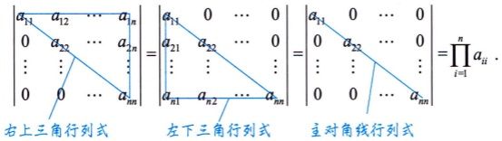

可用逆序数法证明：

 $$\sum_{j_{1}j_{2}\cdots j_{n}}(-1)^{\tau(j_{1}j_{2}\cdots j_{n})}a_{1j_{1}}a_{2j_{2}}\cdots a_{nj_{n}},$$

除了主对角线外，剩下所有的项，至少都会有1个0元素，故只有1项，且为

 $$a_{11}a_{22}\cdots a_{nn}=\prod_{i=1}^{n}a_{ii}.$$

以3阶为例：
 $$\begin{vmatrix}a_{11}&a_{12}&a_{13}\\0&a_{22}&a_{23}\\0&0&a_{33}\end{vmatrix}=+a_{11}a_{22}a_{33}+a_{12}a_{23}\cdot0+a_{13}\cdot0\cdot0-a_{13}a_{22}\cdot0-a_{12}\cdot0\cdot a_{33}-a_{11}\cdot a_{23}\cdot0=a_{11}a_{22}a_{33}$$

 $$\left|\begin{array}{ccc}a_{11}&0&0\\a_{21}&a_{22}&0\\a_{31}&a_{32}&a_{33}\end{array}\right|=+a_{11}a_{22}a_{33}+0\bullet0\bullet a_{31}+0\bullet a_{21}\bullet a_{32}-0\bullet a_{22}\bullet a_{31}-0\bullet a_{21}\bullet a_{33}-a_{11}\bullet0\bullet a_{32}=a_{11}a_{22}a_{33}.$$

 $$\begin{vmatrix}a_{11}&0&0\\0&a_{22}&0\\0&0&a_{33}\end{vmatrix}=+a_{11}a_{22}a_{33}+0\bullet0\bullet0+0\bullet0\bullet0-0\bullet a_{22}\bullet0-0\bullet0\bullet a_{33}-a_{11}\bullet0\bullet0=a_{11}a_{22}a_{33}.$$

##### 2 副对角线行列式

 $$\begin{aligned}\left|\begin{matrix}a_{11}&\cdots&a_{1,n-1}&a_{1n}\\a_{21}&\cdots&a_{2,n-1}&0\\\vdots&\vdots&\vdots&\vdots\\a_{n1}&\cdots&\downarrow0&0\\\end{matrix}\right|&=\left|\begin{matrix}0&\cdots&0&a_{1n}\\0&\cdots&a_{2,n-1}&a_{2n}\\\vdots&\vdots&\vdots&\vdots\\a_{n1}&\cdots&a_{n,n-1}&a_{nn}\\\end{matrix}\right|=\left|\begin{matrix}0&\cdots&0&a_{1n}\\0&\cdots&a_{2,n-1}&0\\\vdots&\vdots&\vdots&\vdots\\a_{n1}&\cdots&0&0\\\end{matrix}\right|=(-1)^{\frac{n(n-1)}{2}}a_{1n}a_{2,n-1}\cdots a_{n1}.\end{aligned}$$

同样，可用逆序数法证明.

除了副对角线外，剩下的所有项，至少都会有一个0元素，故只有一项，且为

 $$(-1)^{\tau(n(n-1)\cdots1)}a_{1n}a_{2,n-1}\cdots a_{n1}=(-1)^{\frac{n(n-1)}{2}}a_{1n}a_{2,n-1}\cdots a_{n1},$$

 $$\tau(n(n-1)\cdots1)=(n-1)+(n-2)+\cdots+1=\frac{(n-1+1)(n-1)}{2}=\frac{n(n-1)}{2}.$$

##### 3 拉普拉斯展开式  $\rightarrow$ 分块矩阵求行列式

设A为m阶矩阵，B为n阶矩阵，则

 $$\begin{vmatrix}\boldsymbol{A}&\boldsymbol{O}\\ \boldsymbol{O}&\boldsymbol{B}\end{vmatrix}=\begin{vmatrix}\boldsymbol{A}&\boldsymbol{C}\\ \boldsymbol{O}&\boldsymbol{B}\end{vmatrix}=\begin{vmatrix}\boldsymbol{A}&\boldsymbol{O}\\ \boldsymbol{C}&\boldsymbol{B}\end{vmatrix}=\left|\boldsymbol{A}\right|\left|\boldsymbol{B}\right|,$$

 $$\begin{aligned}\left|\begin{matrix}\boldsymbol{O}&\boldsymbol{A}\\\boldsymbol{B}&\boldsymbol{O}\end{matrix}\right|=\left|\begin{matrix}\boldsymbol{C}&\boldsymbol{A}\\\boldsymbol{B}&\boldsymbol{O}\end{matrix}\right|=\left|\begin{matrix}\boldsymbol{O}&\boldsymbol{A}\\\boldsymbol{B}&\boldsymbol{C}\end{matrix}\right|=(-1)^{mn}\left|\boldsymbol{A}\right|\left|\boldsymbol{B}\right|.\end{aligned}\xrightarrow{ 剖对角线上元素换到主对角线上 , 交换的次数 }$$

示例

 $$\begin{bmatrix}1&0\\ 0&2\end{bmatrix}$$

 $$\begin{bmatrix}A\\ 1&0&1&0&0\\ 2&0&4&0&0\\ 5&1&1&0&0\\ 0&0&0&\underbrace{2\ 3}_{}&\underbrace{7\ 9}_{} \\ 0&0&0&\underbrace{7\ 9}_{}&\end{bmatrix}=\begin{bmatrix}A_{3\times3}&\boldsymbol{O}\\ \boldsymbol{O}&\boldsymbol{B}_{2\times2}\end{bmatrix}.$$
注1  $\begin{bmatrix}0 & 0 & 0 \\ 0 & 0 & 0\end{bmatrix}$ 与  $\begin{bmatrix}0 & 0 \\ 0 & 0 \\ 0 & 0\end{bmatrix}$ 均可用矩阵 O 表示.

 **注2** 以后称以上12个行列式为“基本形”行列式，加上下面的“4.范德蒙德行列式”，简称为“12+1”型行列式.

##### 4 范德蒙德行列式

盯着第2行，后一项减  $\left|\begin{array}{cccc}1 & 1 & \cdots & 1 \\ x_{1} & x_{2} & \cdots & x_{n} \\ x_{1}^{2} & x_{2}^{2} & \cdots & x_{n}^{2} \\ \vdots & \vdots & & \vdots \\ x_{1}^{n-1} & x_{2}^{n-1} & \cdots & x_{n}^{n-1}\end{array}\right| = \prod_{1 \leq i < j \leq n}(x_{j} - x_{i})$.

示例1  $D_{3}=\begin{vmatrix}1&1&1\\x_{1}&x_{2}&x_{3}\\x_{1}^{2}&x_{2}^{2}&x_{3}^{2}\end{vmatrix}=\begin{vmatrix}x_{1}^{0}&x_{2}^{0}&x_{3}^{0}\\x_{1}^{1}&x_{2}^{1}&x_{3}^{1}\\x_{1}^{2}&x_{2}^{2}&x_{3}^{2}\end{vmatrix}=(x_{3}-x_{2})(x_{3}-x_{1})(x_{2}-x_{1})$

示例2  $\left|\begin{array}{ccc}1 & a & a^{2}\\1 & b & b^{2}\\1 & c & c^{2}\end{array}\right|$ 性质1  $\left|\begin{array}{ccc}1 & 1 & 1\\a & b & c \\a^{2} & b^{2} & c^{2}\end{array}\right|=(c-b)(c-a)(b-a)$.

(1) 几何画图，基本行不通，一般是定性分析。（不推荐）

(2) 行列式的七大性质.

总结 行列式的计算方法

(3) 逆序数法  \xrightarrow{ 化为 } 某一项.

①用性质：化出尽可能多的0；

②通过性质 + 展开公式  \xrightarrow{ 化为 } 基本形（“12+1”型）；

(4) 展开公式

③找差别不大的行作变换；

④找规律（比如范德蒙德行列式）；

⑤归纳法 / 递推法.

低阶→高阶 高阶→低阶

a. n=1  $D_{n}$ 与  $D_{n-1}$ 的关系

b. n=k

c. n = k + 1
#### 六 具体型行列式的计算

##### 1 化为基本形  $\rightarrow$ “ $12+1$”型

###### 例1.2

计算行列式  $\begin{vmatrix} 1 & 1 & 1 & 1 \\ 1 & 2 & 0 & 0 \\ 1 & 0 & 3 & 0 \\ 1 & 0 & 0 & 4 \end{vmatrix}$

分析 此为爪形行列式，与三角行列式相似，属于必会题目.

 $$\text{解 } \left|\begin{matrix}1&1&1&1\\ \frac{1}{2}&1&0&0\\ \frac{1}{3}&0&1&0\\ \frac{1}{4}&0&0&1\end{matrix}\right|=2\times3\times4\left(1-\frac{1}{2}-\frac{1}{3}-\frac{1}{4}\right)=24-12-8-6=-2\text{．}$$

方法总结 本题的行列式是“爪形行列式”(除了第1列、第1行及主对角线元素，其余元素均为零的行列式)，这种行列式都可以利用行列式的性质化为“基本形”行列式.  $\longrightarrow$ 利用斜爪消竖爪或平爪，即用 $a_{ii}$消 $a_{ii}$或 $a_{ii}$为0.

θ必背行列式 四种爪形行列式.  $\longrightarrow$ ✗, ∅, ℓ, ∧

###### 例1.3

行列式  $\begin{vmatrix} 1 & -1 & 1 & x-1 \\ 1 & -1 & x+1 & -1 \\ 1 & x-1 & 1 & -1 \\ x+1 & -1 & 1 & -1 \end{vmatrix} =$ ___.

分析 此行列式中虽包含未知数x，但仍可将其看作常数，计算此4阶具体型行列式.不难发现，此行列式非爪形行列式，且每行元素差别不大，可考虑用行列式“倍加”性质解题，属于必会题目.

解 应填 $x^{4}$

 $$\begin{aligned}\left|\begin{matrix}1&-1&1&x-1\\1&-1&x+1&-1\\1&x-1&1&-1\\x+1&-1&1&-1\end{matrix}\right|=\left|\begin{matrix}1&-1&1&x-1\\(-1)\text{倍加至}0&0&x&-x\\(-1)\text{倍加至}0&x&0&-x\\(-1)\text{倍加至}x&0&0&-x\end{matrix}\right|=\left|\begin{matrix}1&-1&1&x\\0&0&x&0\\0&x&0&0\\x&0&0&0\end{matrix}\right|\xrightarrow{(*)}(-1)^{\frac{4(4-1)}{2}}\cdot x^{4}=x^{4}.\end{aligned}$$

方法总结 当行列式的行元素差别不大，且第1列元素大部分相同时，则：

①将第1行的（-1）倍加至其余行，化简行列式；

②对化简整理后的行列式利用行列式的性质，将其化为“12+1”型行列式.
必背行列式 (*)处来自  $\begin{vmatrix} a_{11} & a_{12} & \cdots & a_{1, n-1} & a_{1n} \\ a_{21} & a_{22} & \cdots & a_{2, n-1} & 0 \\ \vdots & \vdots & & \vdots & \vdots \\ a_{n1} & 0 & \cdots & 0 & 0 \end{vmatrix} = (-1)^{\frac{n(n-1)}{2}} a_{1n} a_{2, n-1} \cdots a_{n1}$.

###### 例1.4

计算 n 阶行列式

 $$D_{n}=\begin{vmatrix}a&b&b&\cdots&b\\b&a&b&\cdots&b\\b&b&a&\cdots&b\\\vdots&\vdots&\vdots&&\vdots\\b&b&b&\cdots&a\end{vmatrix}.$$

(分析) 先找行列式规律. 不难发现, 此n阶行列式每行元素差别不大, 故可用上题思路解题. 但更精确一点, 会发现每行元素都是由1个a, n-1个b构成, 故每行元素相加, 和都相等, 即此为“行和相等”行列式.

解（主流方法）

 $$D_{n}=\begin{vmatrix}1 倍加至 \\ \overbrace{a}^{b}b^{}\quad b^{}\quad\cdots\quad b^{}\\ b^{}&\quad a\quad b\quad\cdots\quad b^{}\\ b\quad b\quad a\quad\cdots\quad b^{}\\ \vdots\quad\vdots\quad\vdots\quad\vdots\\ b^{}&\quad b\quad b\quad\cdots\quad a\end{vmatrix}=\begin{vmatrix}a+(n-1)b&b&b&\cdots&b\\ a+(n-1)b&a&b&\cdots&b\\ a+(n-1)b&b&a&\cdots&b\\ \vdots&\vdots&\vdots&\vdots&\\ a+(n-1)b&b&b&\cdots&a\end{vmatrix}=[a+(n-1)b]\begin{vmatrix}1&b&b&\cdots&b\\ 1&a&b&\cdots&b\\ 1&b&a&\cdots&b\\ \vdots&\vdots&\vdots&&\vdots\\ 1&b&b&\cdots&a\end{vmatrix}=\begin{vmatrix}-1\end{vmatrix} 倍加至 \begin{vmatrix}-1\\ -1\\ -1\\ -1\\ -1\end{vmatrix} 倍加至$$

 $$\begin{aligned}&=[a+(n-1)b]\begin{vmatrix}1&b&b&\cdots&b\\0&a-b&0&\cdots&0\\0&0&a-b&\cdots&0\\\vdots&\vdots&\vdots&&\vdots\\0&0&0&\cdots&a-b\end{vmatrix}=[a+(n-1)b](a-b)^{n-1}.\\ \end{aligned}$$

方法总结 当行列式中每行（列）元素之和相等时，将其余各列（行）加到第1列（行），然后提出公因子是可取的方法.

必背行列式 这类字母抽象型行列式具有代表性. 如

(1) 当 $a=0$, $b=1$ 时，$\begin{vmatrix}0&1&1&\cdots&1\\1&0&1&\cdots&1\\1&1&0&\cdots&1\\\vdots&\vdots&\vdots&&\vdots\\1&1&1&\cdots&0\end{vmatrix}_{n \times n}$ $\xrightarrow{}$ 以下方程组系数矩阵行列式

$\begin{cases}0 \cdot x_{1} + 1 \cdot x_{2} + 1 \cdot x_{3} + \cdots + 1 \cdot x_{n} = 0,\\1 \cdot x_{1} + 0 \cdot x_{2} + 1 \cdot x_{3} + \cdots + 1 \cdot x_{n} = 0,\\1 \cdot x_{1} + 1 \cdot x_{2} + 0 \cdot x_{3} + \cdots + 1 \cdot x_{n} = 0,\\\cdots\cdots\\1 \cdot x_{1} + 1 \cdot x_{2} + 1 \cdot x_{3} + \cdots + 0 \cdot x_{n} = 0.\end{cases}$

当 a=2, b=1 时， $\begin{vmatrix}2&1&1&\cdots&1\\1&2&1&\cdots&1\\1&1&2&\cdots&1\\\vdots&\vdots&\vdots&&\vdots\\1&1&1&\cdots&2\end{vmatrix}_{n \times n}=n+1$
(2) 当  $a = x$ 时， $\begin{vmatrix} x & b & b & \cdots & b \\ b & x & b & \cdots & b \\ b & b & x & \cdots & b \\ \vdots & \vdots & \vdots & & \vdots \\ b & b & b & \cdots & x \end{vmatrix}_{n \times n} = [x + (n-1)b](x - b)^{n-1}$.

若视x为变量，b为常数，则行列式是x的n次多项式，其根是 $x_{1}=x_{2}=\cdots=x_{n-1}=b$， $x_{n}=(1-n)b$．

当 $a$ 取 $\lambda-a$ 时，$\begin{vmatrix} \lambda-a & b & b & \cdots & b \\ b & \lambda-a & b & \cdots & b \\ b & b & \lambda-a & \cdots & b \\ \vdots & \vdots & \vdots & & \vdots \\ b & b & b & \cdots & \lambda-a \end{vmatrix}_{n \times n}$ 后续章节，求特征值。

若视  $\lambda$ 为变量，a, b 为常数，则行列式是  $\lambda$ 的 n 次多项式，其根是  $\lambda_{1} = \lambda_{2} = \cdots = \lambda_{n-1} = a + b, \lambda_{n} = a - (n-1)b$.

(3) 当 a 在副对角线上时，

 $$G_{n}=\begin{vmatrix}{{{b}}}&{{{b}}}&{{{\cdots}}}&{{{b}}}&{{{a}}} \\{{{b}}}&{{{b}}}&{{{\cdots}}}&{{{a}}}&{{{b}}} \\{{{\vdots}}}&{{{\vdots}}}&{{{\vdots}}}&{{{\vdots}}}&{{{\vdots}}} \\{{{b}}}&{{{a}}}&{{{\cdots}}}&{{{b}}}&{{{b}}} \\{{{a}}}&{{{b}}}&{{{\cdots}}}&{{{b}}}&{{{b}}}\end{vmatrix}\xrightarrow{(*)}(-1)^{\frac{n(n-1)}{2}}\begin{vmatrix}{{{\bar{a}}}}&{{{b}}}&{{{\cdots}}}&{{{b}}}&{{{b}}} \\{{{b}}}&{{{a}}}&{{{\cdots}}}&{{{b}}}&{{{b}}} \\{{{\vdots}}}&{{{\vdots}}}&{{{\vdots}}}&{{{\vdots}}} \\{{{b}}}&{{{b}}}&{{{\cdots}}}&{{{a}}}&{{{b}}} \\{{{b}}}&{{{b}}}&{{{\cdots}}}&{{{b}}}&{{{a}}}\end{vmatrix}\xrightarrow{ 将副对角线上元素换到主对角线上 }\\=(-1)^{\frac{n(n-1)}{2}}[a+(n-1)b](a-b)^{n-1}.$$

(*)处是将最后1列和前面相邻列对换，对换$n-1$次到第1列，再将最新的行列式的最后1列和相邻列对换，对换$n-2$次到第2列，……，直到换成$D_n$，共交换$(n-1)+(n-2)+\cdots+1=\frac{n(n-1)}{2}$次，故得

 $$G_{n}=(-1)^{\frac{n(n-1)}{2}}[a+(n-1)b](a-b)^{n-1}.$$

注意，上述结果不要当作公式去记忆，而是要学会分析行列式中元素分布的规律性，并掌握相应的计算方法。

①有规律的 考试考n阶（n可以很大）

行列式只有2个方面的问题：

 $\rightarrow$ 可总结规律  $\Rightarrow$ 得到公式

★所有有规律的行列式，将公式总结出来，记住即可，推理不用掌握

②无规律的以3阶为主，最多4阶

→不需要公式  $\Rightarrow$ 化为“ $12+1$”型即可

###### 例1.5

计算行列式

 $$D_{4}=\left|\begin{matrix}a_{1}&0&0&b_{1}\\ 0&a_{2}&b_{2}&0\\ 0&b_{3}&a_{3}&0\\ b_{4}&0&0&a_{4}\end{matrix}\right|.$$

 $^{①}$分析 此行列式属于“有规律的”，称为“X”型，属于必会题目.不难看出，“0”元素是分散的，想办法集中起来，方法不唯一.行列式的问题不必担心，要么有规律，要么低阶无规律，不会在行列式的计算上为难大家.
解

 $$\begin{aligned}D_{4}&=\begin{vmatrix}a_{1}&0&0&\overrightarrow{b_{1}}\\0&a_{2}&b_{2}&0\\0&b_{3}&a_{3}&0\\b_{4}&0&0&\overrightarrow{a_{4}}\end{vmatrix}=(-1)\begin{vmatrix}a_{1}&b_{1}&0&0\\0&0&b_{2}&a_{2}\\0&0&a_{3}&b_{3}\\b_{4}&a_{4}&0&0\end{vmatrix}=(-1)\times(-1)\begin{vmatrix}a_{1}&b_{1}&0&0\\b_{4}&a_{4}&0&0\\0&0&a_{3}&b_{3}\\0&0&b_{2}&a_{2}\end{vmatrix}\\&=\begin{vmatrix}a_{1}&b_{1}\\b_{4}&a_{4}\end{vmatrix}\begin{vmatrix}a_{3}&b_{3}\\b_{2}&a_{2}\end{vmatrix}=\underbrace{(a_{1}a_{4}-b_{1}b_{4})(a_{2}a_{3}-b_{2}b_{3})}_{ 互换 }\\&=a_{1}a_{2}a_{3}a_{4}+b_{1}b_{2}b_{3}b_{4}-a_{1}b_{2}b_{3}a_{4}-b_{1}a_{2}a_{3}b_{4}.\end{aligned}$$

注 注意，

 $$D_{4}=\left|\begin{matrix}{{{a_{1}}}}&{{{0}}}&{{{0}}}&{{{b_{1}}}} \\{{{0}}}&{{{a_{2}}}}&{{{b_{2}}}}&{{{0}}} \\{{{0}}}&{{{b_{3}}}}&{{{a_{3}}}}&{{{0}}} \\{{{b_{4}}}}&{{{0}}}&{{{0}}}&{{{a_{4}}}}\end{matrix}\right|=a_{1}a_{2}a_{3}a_{4}-b_{1}b_{2}b_{3}b_{4}$$

是错误的。不要当作2阶行列式计算。展开式共有4项，且副对角线元素乘积的那一项取正号。

总结 ①若行列式为“X”型，则

a. 主副对角线上元素相同.

 $$\begin{align*}\begin{vmatrix}a&&&&b\\&\ddots&&&\ddots\\&&a&b&\\&&b&a&\\&\ddots&&&\ddots\\b&&&&a\end{vmatrix}_{2n}=&(a^{2}-b^{2})^{n}\quad.\end{align*}$$

b. 主副对角线上元素不同.

 $$\begin{array}{c c c c|c}a_{1}&&&&b_{1}\\&&\ddots&&&\ddots\\&&&a_{k}&b_{k}&\\&&b_{k+1}&a_{k+1}&&\\&&\ddots&&&\ddots\\b_{2k}&&&&&a_{2k}\end{array}=\prod_{i=1}^{k}(a_{i}a_{2k+1-i}-b_{i}b_{2k+1-i})~.$$

当 $2k=4$，即 $k=2$ 时，$D_4=\prod_{i=1}^2(a_i a_{5-i}-b_i b_{5-i})=(a_1a_4-b_1b_4)(a_2a_3-b_2b_3)$。

以上两个公式通常用于后续矩阵的正定问题、二次型问题，而非只用于计算行列式。

②如类对称（主对角线元素相同，左下、右上各元素相同）行列式，可通过递推法、归纳法计算.

 $$\begin{aligned}&\left|\begin{matrix}a&b&\cdots&b\\c&a&\cdots&b\\\vdots&\vdots&&\vdots\\c&c&\cdots&a\end{matrix}\right|_{*}=\left\{\begin{matrix}\left[(a+(n-1)b](a-b)^{*-1},b=c,\right.\\\\\left.\frac{b(a-c)^{*}-c(a-b)^{*}}{b-c},b\neq c.\right.\end{matrix}\right.\\ \end{aligned}$$

行和相等：其余所有列加到第1列，提出公因式，然后从上面往下加，化为右上三角形行列式。

不需要背诵结果，多用几次就记住了

例如，当 $x+1\neq0$时，
 $$\left|\begin{matrix}1&x&\cdots&x\\ -1&1&\cdots&x\\ \vdots&\vdots&&\vdots\\ -1&-1&\cdots&1\end{matrix}\right|_{n}=\frac{x\bullet2^{n}+1\bullet(1-x)^{n}}{x+1}.$$

###### 例1.6

计算行列式  $\begin{vmatrix} a & b & c \\ a^{2} & b^{2} & c^{2} \\ b+c & a+c & a+b \end{vmatrix}$.

分析 将第1行加到第3行，即可产生规律.

解

1倍加至$\left|\begin{array}{ccc}a & b & c \\ a^{2} & b^{2} & c^{2} \\ b+c & a+c & a+b\end{array}\right|=\left|\begin{array}{ccc}a & b & c \\ a^{2} & b^{2} & c^{2} \\ a+b+c & a+b+c & a+b+c\end{array}\right|$

 $$\begin{aligned}&\begin{aligned}\\ & 提出 (a+b+c)\left|\begin{matrix}a&b&c\\a^{2}&b^{2}&c^{2}\\1&1&1\end{matrix}\right|\overset{“12+1”型 , 范德蒙德行列式是我们的目标 , 互换 , 行列式变换两行 , 添负号 }\\&=(a+b+c)(-1)\left|\begin{matrix}a&b&c\\1&1&1\\a^{2}&b^{2}&c^{2}\end{matrix}\right|\overset{“12+1”型 , 行列式变换两行 , 添负号 }\\&=(a+b+c)(-1)^{2}\left|\begin{matrix}1&1&1\\a&b&c\\a^{2}&b^{2}&c^{2}\end{matrix}\right|\overset{“12+1”型 , 行列式变换两行 , 添负号 }\\&=(a+b+c)(b-a)(c-b)(c-a).\\ &\end{aligned}\\ \end{aligned}$$

简单

应用

拓展 范德蒙德行列式实际用处：

研究二次函数 $f(x)$（可表示质点的运动轨迹、发射导弹的运动轨迹）的表达式.

转置

例如，已知质点  $(x, y)$ 的运动轨迹为  $f(x) = a + bx + cx^2$，现有 3 个点在曲线  $y = f(x)$ 上，求  $f(x)$ 表达式。

 $$(x_{1},y_{1})\stackrel{(x_{2},y_{2})}{\sim}(x_{3},y_{3})$$

代入 3 个点得到方程组：


 $$\boldsymbol{A}^{-1}$$

 $$\boldsymbol{A}^{-1}\boldsymbol{A}\boldsymbol{x}=\boldsymbol{A}^{-1}\boldsymbol{b}$$

其中系数行列式为 $\begin{vmatrix}1&x_{1}&x_{1}^{2}\\1&x_{2}&x_{2}^{2}\\1&x_{3}&x_{3}^{2}\end{vmatrix}$，且 $\begin{bmatrix}a\\b\\c\end{bmatrix}$相当于自变量.

##### 2 递推法

建立 $D_{n}$与 $D_{n-1}$的关系式，实现递推 $\left\{\begin{aligned}& \textcircled{1}\ 元素分布规律相同；\\ & \textcircled{2}\ D_{n-1} \text{比} D_{n} \text{少一阶} \end{aligned}\right.$

递推法（涉及更复杂的情况用此方法）：

给出n阶，推n-1阶，n-2阶，…，一直往下推，推到首项的表达式（即1阶的情况）

数学归纳法：

从1阶，2阶，…，找到基本规律，然后往上（即高阶）假设，假设命题对n=k-1时成立，最后证明命题对n=k时成立。

递推法和数学归纳法是两个方向。

除了这三条线上的元素，其余元素全为0

###### 例1.7

$$D_{4}=\left|\begin{matrix}1-a&a&0&0\\ -1&1-a&a&0\\ 0&-1&1-a&a\\ 0&0&-1&1-a\end{matrix}\right|\rightarrow 除了这三元素全为 a$$

元素全为-1 主对角线元素全为1-a

(A)

 $$a^{4}+2a^{3}+6a^{2}+2a+1$$

(B)

 $$a^{4}-2a^{3}+6a^{2}+a$$

(C)

 $$a^{4}+a^{3}+a^{2}+a+1$$

(D)

 $$a^{4}-a^{3}+a^{2}-a+1$$

分析称此类型行列式为宽对角行列式.

解 应选(D)

也可以直接展开

对这类行列式， **适宜采用递推法计算**.计算的关键是找到上、下阶行列式之间的关系式，即递推公式.

 $$\begin{aligned}D_{4}&=\begin{vmatrix}1-a&a&0&0\\-1&1-a&a&0\\0&-1&1-a&a\\0&0&-1&1-a\end{vmatrix}=\begin{vmatrix}1-a&a&0&0\\-1&1-a&a&0\\0&-1&1-a&a\\-a&0&0&1\end{vmatrix}\\ &=(-1)^{4+1}(-a)\cdot\begin{vmatrix}1-a&a&0\\-1&1-a&a\\0&-1&1-a\end{vmatrix}+D_{3}\\ &=a^{4}-(-1)^{3+1}a^{3}+D_{2}=a^{4}-a^{3}-(-1)^{2+1}a^{2}+D_{1}\\ &=a^{4}-a^{3}+a^{2}-a+D_{1}=a^{4}-a^{3}+a^{2}-a+1.\end{aligned}$$

故选(D).

注1 本题也可考虑用归纳法. 考虑到行列式排列有序，可以从低阶计算，逐步升阶找出规律. 由

 $$D_{1}=1-a,\;D_{2}=\left|\begin{matrix}{{{1-a}}}&{{{a}}} \\{{{-1}}}&{{{1-a}}}\end{matrix}\right|=1-a+a^{2},$$

按此列展开

 $$D_{3}=\left|\begin{matrix}1-a&a&0\\ -1&1-a&a\\ 0&-1&1-a\end{matrix}\right|=(1-a)D_{2}-1\times(-1)^{2+1}a(1-a)=1-a+a^{2}-a^{3},$$

可类推得 $D_{4}=a^{4}-a^{3}+a^{2}-a+1$，故选(D).
注2 对于 $n$ 阶行列式，记 $\triangle = k^{2} - 4bc$，有

 $$\left|\begin{matrix}{k}&{b}&{}\\ {c}&{\ddots}&{\ddots}&{}\\ {}&{\ddots}&{\ddots}&{b}\\ {}&{}&{c}&{k}\\ \end{matrix}\right|_{n}=\left\{\begin{matrix}{(n+1)\bullet\left(\displaystyle\frac{k}{2}\right)^{n}}&{,k^{2}=4b c,}&{}\\ {}&{}&{}\\ {\displaystyle\frac{(k+\sqrt{\triangle})^{n+1}-(k-\sqrt{\triangle})^{n+1}}{2^{n+1}\sqrt{\triangle}}}&{,k^{2}\neq4b c.}&{}\\ \end{matrix}\right.$$

将此结论用于例1.7，当a=-1时， $(1-a)^{2}=-4a$， $D_{4}=(4+1)\left(\frac{1-a}{2}\right)^{4}=5$。当 $a\neq-1$时， $(1-a)^{2}\neq-4a$， $\triangle=(1-a)^{2}+4a=(1+a)^{2}$，则

 $$D_{4}=\frac{(1-a+\left|1+a\right|)^{5}-(1-a-\left|1+a\right|)^{5}}{2^{5}\left|1+a\right|}=\frac{2^{5}+2^{5}a^{5}}{2^{5}(1+a)}=\frac{1+a^{5}}{1+a}.$$

再如（真题中考过），

 $$(2a)^{2}=4\cdot a^{2}\cdot1$$

 $$\left|\begin{matrix}2a&a^{2}\\ 1&\ddots&\ddots\\ &\ddots&\ddots&a^{2}\\ &&1&2a\end{matrix}\right|=(n+1)\bullet\left(\frac{2a}{2}\right)^{n}=(n+1)\bullet a^{n}.$$

##### 3 行列式表示的函数和方程

行列式在特殊情况下是数字，考研线代试题中大多是 $\lambda$的函数，即关于 $\lambda$的多项式.

这类问题的行列式元素  $a_{ij}$ 往往不是具体数值，而是含 x 或  $\lambda$ 等的函数，可能会在计算之外给考生带来新的困难和麻烦，自然也会给命题人带来新的角度。请考生重视对此类问题的研究。

 $a_{0}$ 是具体数值，则行列式也是一个具体数值.

 $a_{0}$ 是含有 x 或  $\lambda$ 等的函数，则行列式可能是自变量为 x 或  $\lambda$ 等的函数.

###### 例1.8

设 $f(x)=\begin{vmatrix}1 & 0 & x \\ 1 & 2 & x^2 \\ 1 & 3 & x^3\end{vmatrix}$，求 $f(x+1)-f(x)$.

分析 属于无规律的行列式.

将第3列的x都换为 $x+1$

解

 $$\begin{aligned}f(x+1)-f(x)=&\begin{vmatrix}1&0&x+1\\1&2&(x+1)^{2}\\1&3&(x+1)^{3}\end{vmatrix}-\begin{vmatrix}1&0&x\\1&2&x^{2}\\1&3&x^{3}\end{vmatrix}\\=&\begin{vmatrix}1&0&x+1\\1&2&x^{2}+2x+1\\1&3&x^{3}+3x^{2}+3x+1\end{vmatrix}-\begin{vmatrix}1&0&x\\1&2&x^{2}\\1&3&x^{3}\end{vmatrix}\\\end{aligned} 注意：行列式只有对应的某一列（行）不同时才可加减（单行（列）的可加/拆性 ).$$

(-1)倍加至

 $$\begin{aligned}&\text{前两列不动}\xrightarrow{(-1)\text{倍加至}}\\&\begin{vmatrix}1&0&1\\1&2&2x+1\\1&3&3x^{2}+3x+1\end{vmatrix}=\begin{vmatrix}1&0&0\\1&2&0\\1&3&3x^{2}\end{vmatrix}=6x^{2}.\end{aligned}$$
注 函数可以用含有变量的行列式表示，因此，对这类行列式当然也可以求极限、导数、积分等，如本题  $[f(x+1)-f(x)]'=(6x^2)'=12x$， $\int[f(x+1)-f(x)]dx=2x^3+C$。

###### 例1.9

设关于 $\lambda$的方程

 $$\begin{vmatrix}{{{\lambda-1}}}&{{{-2}}}&{{{3}}} \\{{{1}}}&{{{\lambda-4}}}&{{{3}}} \\{{{-1}}}&{{{a}}}&{{{\lambda-5}}}\end{vmatrix}=0$$

有二重根，求参数a的值.

此行列式是关于 $\lambda$的多项式，并且根据行列式的定义，行列式是来自不同行不同列元素之积再求和，故也能观察出此行列式为 $\lambda$的三次多项式，并且 $\lambda^{3}$的系数是1

分析 (1) 涉及后面矩阵关于特征值、特征向量的问题.

(2) 特征值、特征向量的出现才会真正展现线性代数的用途.

(3)3 阶无规律的行列式需要自己找相同的或相反的元素，优先处理变成 0.

解

 $$\begin{aligned}&(-1) 倍 \quad&\begin{vmatrix}{{{\lambda-1}}}&{{{-2}}}&{{{3}}} \\{{{1}}}&{{{\lambda-4}}}&{{{3}}} \\{{{-1}}}&{{{a}}}&{{{\lambda-5}}}\end{vmatrix}&=\begin{vmatrix}{{{\lambda-2}}}&{{{2-\lambda}}}&{{{0}}} \\{{{1}}}&{{{\lambda-4}}}&{{{3}}} \\{{{-1}}}&{{{a}}}&{{{\lambda-5}}}\end{vmatrix}\end{aligned}$$

 $a_{13}$ 和  $a_{23}$ 位置的无素相同，可将第2行 $(-1)$ 倍加至第1行

 $$\begin{aligned}&\xrightarrow{ 按此行展开 }\\=&\begin{vmatrix}\lambda-2&0&0\\1&\lambda-3&3\\-1&a-1&\lambda-5\end{vmatrix}\\=&(\lambda-2)[(\lambda-3)(\lambda-5)-3(a-1)]\\=&(\lambda-2)(\lambda^{2}-8\lambda+18-3a)=0.\end{aligned} 第 1 行中出现了两个“0”，所以按此行展开$$

①若 $\lambda=2$是二重根，则

 $$\left(\lambda^{2}-8\lambda+18-3a\right)\bigg|_{\lambda=2}=4-16+18-3a=0,$$

得a=2，经验证 $\lambda=2$是二重根.

②若  $\lambda = 2$ 不是二重根，则  $\lambda^2 - 8\lambda + 18 - 3a = 0$ 有两个相等的根，故  $\Delta = (-8)^2 - 4(18 - 3a) = 0$，得  $a = \frac{2}{3}$。此时， $\lambda = 4$ 是二重根。

综上所述，a=2或 $a=\frac{2}{3}$
七大性质（最主要的是三种变换的性质）

没有太多新的东西，主要是能够把 **前面讲的性质用好**。 [互换、倍乘、倍加]

①用性质

#### 七 抽象型行列式的计算

②用公式 $|AB|=|A||B|$

用性质解决问题，即把给出的表达式化简

一行乘一列多行乘一列一行乘多列多行乘多列

需做这种行列式运算的训练，利于学习第2讲

对于公式  $|AB| = |A||B|$，从变换的角度来看：

BX：B作用在X上，相当于作一次图像的变换；

 $A(BX)$：A作用在BX上，相当于再作一次图像的变换。

上述过程相似于高等数学中的复合函数 $f[g(x)]$：g先作用在x上，f再作用在 $g(x)$上，作用顺序都是从右向左。

示例1 对于第0讲中讲过的拉伸变换  $A=\begin{bmatrix}2 & 0 \\ 0 & 1\end{bmatrix}$ 和对称变换  $B=\begin{bmatrix}1 & 0 \\ 0 & -1\end{bmatrix}$，若先把B作用在图片X上，相当于作了一次对称变换，如图1-16(a)所示，再把A作用在图片BX上，相当于作了一次拉伸变换，如图1-16(b)所示。若调换作用顺序，先把A作用在X上，作一次拉伸变换，如图1-16(c)所示，再把B作用在AX上，作一次对称变换，如图1-16(d)所示。


(a)


(b)


(c)


(d)

图 1-16

比较图 1-16(b) 与图 1-16(d) 可以看出，两种变换顺序的效果是一样的，即  $ABX = BAX$，这是因为此时恰好有  $AB = BA$，即  $\begin{bmatrix} 2 & 0 \\ 0 & 1 \end{bmatrix} \begin{bmatrix} 1 & 0 \\ 0 & -1 \end{bmatrix} = \begin{bmatrix} 2 & 0 \\ 0 & -1 \end{bmatrix} = \begin{bmatrix} 1 & 0 \\ 0 & -1 \end{bmatrix} \begin{bmatrix} 2 & 0 \\ 0 & 1 \end{bmatrix}$。

那么，对于任意的两个变换，调整顺序前后，是不是都有相同的效果呢？当然不是了.

示例2 对于第0讲中讲过的拉伸变换 $A=\begin{bmatrix}2&0\\ 0&1\end{bmatrix}$和剪切变换 $B=\begin{bmatrix}1&0\\ -1&1\end{bmatrix}$，先剪切变换再拉伸变换（即AB）和先拉伸变换再剪切变换（即BA）的作用效果是不同的，如图1-17所示.这是因为

 $$A B=\left[\begin{array}{l l}{2}&{0}\\ {0}&{1}\end{array}\right]\left[\begin{array}{l l}{1}&{0}\\ {-1}&{1}\end{array}\right]=\left[\begin{array}{l l}{2}&{0}\\ {-1}&{1}\end{array}\right],$$
而

 $$BA=\begin{bmatrix}1&0\\ -1&1\end{bmatrix}\begin{bmatrix}2&0\\ 0&1\end{bmatrix}=\begin{bmatrix}2&0\\ -2&1\end{bmatrix},$$

显然 $AB \neq BA$


(a)


(b)


(c)


(d)

图1-17

总结 矩阵中的运算，AB=BA 不一定成立，这从变换的角度来看很容易理解。而中学代数中，ab=ba 一定成立。

若  $A$， $B$ 均为方阵，则  $|AB| = |A||B|$ 的意义为

 $$\begin{aligned} 复合变换之后的面积测度 \left|\boldsymbol{A}\boldsymbol{B}\right|&=\boldsymbol{A} 的面积值 \left|\boldsymbol{A}\right|\times\boldsymbol{B} 的面积值 \left|\boldsymbol{B}\right|\\&=\boldsymbol{B} 的面积值 \left|\boldsymbol{B}\right|\times\boldsymbol{A} 的面积值 \left|\boldsymbol{A}\right|\\&=\left|\boldsymbol{B}\boldsymbol{A}\right|.\end{aligned}$$

##### 例1.10

已知4阶行列式| $a_1$,  $a_2$,  $a_3$,  $\beta$|=a,  $|\beta+\gamma$,  $a_2$,  $a_3$,  $a_1$|=b, 则 $|a_2+a_3$,  $a_1$,  $a_3$,  $\gamma|$=___.

分析 此题为抽象型行列式（行列式中元素未知，仅仅把4个列用向量表示）.

已知两个抽象型行列式的值，去求另一个抽象型行列式的值，属于抽象型行列式的基本问题.

现在寻找列与列之间的关系，显然，所求的行列式可以利用行列式的单列可拆性。

解 应填  $a+b$

 $$|a_{2}+a_{3},a_{1},a_{3},\gamma|=|a_{2},a_{1},a_{3},\gamma|+|a_{3},a_{1},a_{3},\gamma|,$$

同理， $|\beta + \gamma$， $a_2$， $a_3$， $a_1| = |\beta$， $a_2$， $a_3$， $a_1| + |\gamma$， $a_2$， $a_3$， $a_1| = b$，其中  $|\beta$， $a_2$， $a_3$， $a_1|$ 与题干中  $|a_1$， $a_2$， $a_3$， $\beta|$ 的顺序不同，但可通过行列式性质把列互换。

对于 $\left|\beta, a_{2}, a_{3}, a_{1}\right| = -|a_{1}, a_{2}, a_{3}, \beta| = -a$，故有 $b = -a + |\gamma, a_{2}, a_{3}, a_{1}|$，即

 $$|\gamma,a_{2},a_{3},a_{1}|=a+b.$$

对 $^{(*)}$式等号右边第一个式子作列变换，

 $$\begin{aligned}\left|\alpha_{2},\alpha_{1},\alpha_{3},\gamma\right|=&-\left|\gamma,\alpha_{1},\alpha_{3},\alpha_{2}\right|=\left|\gamma,\alpha_{2},\alpha_{3},\alpha_{1}\right|.\xrightarrow{ 结合 (**) 式 }=a+b\\  互换 \quad& 加一个负号 \quad 互换 \quad& 交换 2 次 , 负负得正 \end{aligned}$$
然后，看 $(\ast)$式等号右边第二个式子 $\left|a_{3}, a_{1}, a_{3}, \gamma\right|$，第1,3列相等，根据行列式性质，两列成比例，行列式为0，故 $(\ast)$式等号右边第二个式子为0.

综上，本题结果为 $a+b$。

总结 线性代数比高等数学的解题方法更容易训练，盯住要求的，转化为与已知有联系的，一步步去解决。

注 高阶带字母行列式，通常指4阶及4阶以上带字母的行列式，比较抽象，有两种基本类型，一种与高阶数值型行列式类似，元素排列有序，有一定规律性，且计算有一定规律，可通过初等变换最终化为三角形行列式定值，这类题一般阶数不大，即使大一些，但计算量不大，大家通过一定练习即可掌握，另一种如本题，主要通过行、列变换，与已知行列式对应，代值计算。

##### 例1.11

设 $a_{1}$， $a_{2}$， $a_{3}$均为3维列向量，已知

 $$\boldsymbol{A}=[\boldsymbol{\alpha}_{1},\boldsymbol{\alpha}_{2},\boldsymbol{\alpha}_{3}],\boldsymbol{B}=[\boldsymbol{\alpha}_{1}-\boldsymbol{\alpha}_{2}+2\boldsymbol{\alpha}_{3},2\boldsymbol{\alpha}_{1}+3\boldsymbol{\alpha}_{2}-5\boldsymbol{\alpha}_{3},\boldsymbol{\alpha}_{1}+2\boldsymbol{\alpha}_{2}-\boldsymbol{\alpha}_{3}],$$

且|A|=2，则|B-A|=___。

♂分析 本题A，B都是3维列向量拼起来的矩阵，虽然也是抽象的列与列之间的关系，但与上题不同，本题希望考生掌握向量与向量之间点积（内积）的情况。来实践一下，如果能够凑出来两个方阵相乘，那么 $|AB|=|A|\cdot|B|$（此公式考试常用）。

解 应填 10.

此为所有对应的列相减

此运算要掌握第2讲所学的矩阵运算

 $$\textcircled{p}B-A=[-\alpha_{1}+2\alpha_{3},2\alpha_{1}+2\alpha_{2}-5\alpha_{3},\alpha_{1}+2\alpha_{2}-2\alpha_{3}]$$


矩阵实际上是一种数据的储存表格，表格相减，即表格对应的数据相减

 $^{*}$折分（组合矩阵拆成两个矩阵乘积，分块矩阵当作元素来运算）

←——乘积的运算

(多练)

 $$\left|\alpha_{1},\alpha_{2},\alpha_{3}\right|\left|\begin{matrix}0&2&1\\ -1&2&2\\ 2&-5&-2\end{matrix}\right|,$$

 $B^{1}=|A|\cdot|B|$ 意义：表示从一个坐标系到另一个坐标系变化的测度，等于分别的两个测度的乘积。（测度是数学专业“实变函数”课程中的名词，可简单理解为长度、面积、体积等。）


其中 $\left|a_{1},a_{2},a_{3}\right|=\left|A\right|=2$ .又

按此列展开

 $$2 倍加至 \left|\begin{matrix}0&2&1\\ -1&2&2\\ 2&-5&-2\end{matrix}\right|=\left|\begin{matrix}0&2&1\\ -1&2&2\\ 0&-1&2\end{matrix}\right|=\left|\begin{matrix}2&1\\ -1&2\end{matrix}\right|=5,$$

故 $|B-A|=10$
补充 设  $A = \begin{bmatrix} a & b \\ c & d \end{bmatrix}$， $B = \begin{bmatrix} x_1 & x_2 \\ x_3 & x_4 \end{bmatrix}$.

对于  $A$， $B$ 两个矩阵，若  $A = B$，则两个表格存储的数据相同，与  $A - B = O$ 相同，即  $A = B \Leftrightarrow A - B = O$，有

 $$\left\{\begin{array}{l}{a-x_{1}=0,}\\ {b-x_{2}=0,}\\ {c-x_{3}=0,}\\ {d-x_{4}=0,}\end{array}\right.$$

故  $A - B = \begin{bmatrix} a & b \\ c & d \end{bmatrix} - \begin{bmatrix} a & b \\ c & d \end{bmatrix} = \begin{bmatrix} 0 & 0 \\ 0 & 0 \end{bmatrix}$.

注意，要区别于矩阵的加减法，行列式加减要求两个行列式只有对应的某一行（列）不同，加减的是元素不同的行（列），其他元素不动.

注1 分块矩阵分成4块，每一块都是原来矩阵的子块

例： $\begin{bmatrix} \bullet\bullet\bullet\bullet \\ \bullet\bullet\bullet\bullet\bullet \\ \bullet\bullet\bullet\bullet\bullet\end{bmatrix}=\begin{bmatrix} A & B \\ C & D \end{bmatrix}$，当作 $\begin{bmatrix} 1 & 2 \\ 3 & 4 \end{bmatrix}$类似具体的数来计算.

当作元素 $a_{n}$来看待，进行计算.

要习惯这种记法，代数学有这种形式上运算的变化，跟高等数学的计算不是一个方向上的

本题中，向量  $\boldsymbol{a}_{1}$， $\boldsymbol{a}_{2}$， $\boldsymbol{a}_{3}$ 是列矩阵，即  $\left[\begin{array}{llll}\bullet & \bullet & \bullet & \bullet \\ \bullet & \bullet & \bullet & \bullet \\ \bullet & \bullet & \bullet & \bullet\end{array}\right]$，三个列分块。

★即 $^{*}$处的处理，一定要搞清楚，解释了背景，但没完全理解也正常，后边要讲线性空间，变换是它的主旋律

注2 能够熟练地将线性组合表示成矩阵乘积的形式：

 $$x_{1}\boldsymbol{a}_{1}+x_{2}\boldsymbol{a}_{2}+x_{3}\boldsymbol{a}_{3}=\left[\boldsymbol{a}_{1},\boldsymbol{a}_{2},\boldsymbol{a}_{3}\right]\left[\begin{array}{l}x_{1}\\ x_{2}\\ x_{3}\end{array}\right].$$

本题中，

 $$0\boldsymbol{a}_{1}-\boldsymbol{a}_{2}+2\boldsymbol{a}_{3}=[\boldsymbol{a}_{1},\boldsymbol{a}_{2},\boldsymbol{a}_{3}]\begin{bmatrix}0\\ -1\\ 2\end{bmatrix},2\boldsymbol{a}_{1}+2\boldsymbol{a}_{2}-5\boldsymbol{a}_{3}=[\boldsymbol{a}_{1},\boldsymbol{a}_{2},\boldsymbol{a}_{3}]\begin{bmatrix}2\\ 2\\ -5\end{bmatrix},$$

→掌握计算规则

 $$\boldsymbol{\alpha}_{1}+2\boldsymbol{\alpha}_{2}-2\boldsymbol{\alpha}_{3}=[\boldsymbol{\alpha}_{1},\boldsymbol{\alpha}_{2},\boldsymbol{\alpha}_{3}]\begin{bmatrix}1\\ 2\\ -2\end{bmatrix},$$

再合并成矩阵乘积的行列式， **其中**  $\underset{\cdot}{(*)}$处是解决此类问题的关键.

拓展 线性代数与高等数学学习思路和方法不一样，线性代数更多的是讲一种规则，每一个章节出现的概念和方法都是通过某种规则在处理数据，随着不断学习，处理数据的工具和方法会越来越多，那么对数据的处理就会越来越精彩，现在需掌握计算规则.
#### 八 余子式和代数余子式的线性组合的计算

（基础公式： $A_{ij}=(-1)^{i+j}M_{ij}$）

从左往右看，可考如下考题

①代数余子式线性组合 $A_{11}-2A_{12}+A_{13}$

②余子式组合 $M_{11}+2M_{12}+M_{13}$

③余子式和代数余子式混合组合

大A配小a，逆用展开式

 $$A_{11}+2M_{12}+M_{13}$$

由

 $$a_{i1}A_{i1}+a_{i2}A_{i2}+\cdots+a_{in}A_{in}=\left|a_{i1}\quad a_{i2}\quad\cdots\quad a_{in}\right|,$$

从右往左是展开

大A配小k，k把小a吃 此为降阶运算， $A_{1}, A_{2}, \cdots, A_{m}$ 为n个n-1阶行列式

则

 $$k_{1}A_{i1}+k_{2}A_{i2}+\cdots+k_{n}A_{i n}=\left|\begin{matrix}*&&&\\ &k_{2}&\cdots&k_{n}\\ &&\ast&\end{matrix}\right|,$$

其中 * 处表示元素不变，①，②的区别仅仅在于第 i 行的元素  $a_{i1}$， $a_{i2}$，…， $a_{in}$ 换成了  $k_1$， $k_2$，…， $k_n$，这样，给出不同的系数  $k_1$， $k_2$，…， $k_n$，即得到了不同的行列式。而若要求  $k_1M_{i1} + k_2M_{i2} + … + k_nM_{in}$，只需用  $M_{ij} = (-1)^{i+j}A_{ij}$ 化为关于  $A_{ij}$ 的线性组合即可。

##### 例1.12

设 $|A|=\begin{vmatrix}2&-1&2&3\\0&1&-1&0\\2&3&4&5\\1&1&1&1\end{vmatrix}$，则 $A_{31}+A_{32}+A_{33}+M_{34}=$（ ）。

(A)8 (B)6 (C)4 (D)2

 $\mathcal{P}$ 分析 本题代数余子式前面的系数与行列式第3行不一样，所以本题属于大A配小k，k把小a吃.

解 应选(B).

本题即计算 $A_{31}+A_{32}+A_{33}-A_{34}$，结果是将组合系数置换行列式中第3行元素后的行列式.

 $$A_{31}+A_{32}+A_{33}+M_{34}=A_{31}+A_{32}+A_{33}-A_{34}$$

(−2)倍加至

 $$\begin{vmatrix}

2 & -1 & 2 & 3 \\

0 & 1 & -1 & 0 \\

1 & 1 & 1 & -1 \\

1 & 1 & 1 & 1

\end{vmatrix}$$

=

$$\begin{vmatrix}

0 & -3 & 0 & 5 \\

0 & 1 & -1 & 0 \\

1 & 1 & 1 & -1 \\

0 & 0 & 0 & 2

\end{vmatrix}$$

=6,

属于大A配小k，k把小a吃

故选(B).

注与余子式、代数余子式相关的问题主要有两个角度：一是余子式与代数余子式之间的转换，注意符号上的变换；二是计算某行（列）的余子式或代数余子式的线性组合，关键查看其组合系数与其他行（列）的元素是否一致，若一致，则取值为零，否则，将代数余子式的线性组合系数置换行列式中对应行（列）的元素后计算行列式.
#### 九 克拉默法则

随着计算机的发展，克拉默法则的地位逐渐降低，能对结论作简单识记即可

(1) 对 n 个方程 n 个未知数（这是前提）的非齐次线性方程组

使用条件

指自由项 $b_{1}, b_{2}, \cdots, b_{n}$ 不全为0的线性方程组

 $\left\{\begin{array}{l}a_{11}x_{1}+a_{12}x_{2}+\cdots+a_{1n}x_{n}=b_{1},\\a_{21}x_{1}+a_{22}x_{2}+\cdots+a_{2n}x_{n}=b_{2},\\\cdots\cdots\\a_{n1}x_{1}+a_{n2}x_{2}+\cdots+a_{nn}x_{n}=b_{n},\end{array}\right.$

若系数行列式  $D = \begin{vmatrix} a_{11} & a_{12} & \cdots & a_{1n} \\ a_{21} & a_{22} & \cdots & a_{2n} \\ \vdots & \vdots & & \vdots \\ a_{n1} & a_{n2} & \cdots & a_{nn} \end{vmatrix} \neq 0$，则方程组有唯一解，且解为

 $x_i = \frac{D_i}{D}, i=1,2,\cdots,n,$

式中， D_i是由常数项 $b_1, b_2, \cdots, b_n$替换D中第 i列元素得到的行列式.

注 若行列式 D=0，则非齐次方程组无解或有无穷多解，这一点要切记.

示例  $\left\{\begin{aligned}x_{1}-2x_{2}+x_{3}&=1,\\ x_{1}+0x_{2}+0x_{3}&=2,\\ 0x_{1}+x_{2}+0x_{3}&=5,\end{aligned}\right. 这个题比较好的是可以口算验证  \left\{\begin{aligned}x_{1}&=2,\\ x_{2}&=5\end{aligned}\right.\Rightarrow x_{3}=9$

由  D = |A| $= \begin{vmatrix} 1 & -2 & 1 \\ 1 & 0 & 0 \\ 0 & 1 & 0 \end{vmatrix} = 1 \neq 0，推出这个方程组有唯一解  x_i = \frac{D_i}{D}$，则

克拉默法则的意义就在于无论这个方阵多么复杂，只要方阵的行列式不为0，就可以用这个法则求解未知数

 $x_{1}=\frac{D_{1}}{D}=\frac{\left|\begin{matrix}1&-2&1\\ 2&0&0\\ 5&1&0\end{matrix}\right|}{1}=\frac{2}{1}=2\ ,\ x_{2}=\frac{D_{2}}{D}=\frac{\left|\begin{matrix}1&1&1\\ 1&2&0\\ 0&5&0\end{matrix}\right|}{1}=\frac{5}{1}=5\ ,\ x_{3}=\frac{D_{3}}{D}=\frac{\left|\begin{matrix}1&-2&1\\ 1&0&2\\ 0&1&5\end{matrix}\right|}{1}=\frac{9}{1}=9\ .$

(2) 对 n 个方程 n 个未知数（这是前提）的齐次线性方程组

 $\left\{\begin{aligned}a_{11}x_{1}&+a_{12}x_{2}+\cdots+a_{1n}x_{n}=0,\\a_{21}x_{1}&+a_{22}x_{2}+\cdots+a_{2n}x_{n}=0,\\&\cdots\cdots\\a_{n1}x_{1}&+a_{n2}x_{2}+\cdots+a_{nn}x_{n}=0,\end{aligned}\right.\quad\begin{aligned}b_{r},b_{s},\cdots,b_{n} 都为 0\\  我们称这样的方程组为齐次线性方程组 \end{aligned}$

若 D\neq0，则齐次方程组只有零解；若D=0，则齐次方程组有非零解.

如果用克拉默法则： $x_{i}=\frac{D_{i}}{D} 中  D_{i} 的  \rightarrow$ 以后研究的问题（有无穷多解）

克拉默不解决它

第 i 列都为0，由行列式的线性性质

可知  $D_{i}=0 \Rightarrow x_{i}=0 \Rightarrow$ 只有零解
注 以上两个关于齐次方程组的结论实际上反过来也成立，也就是说它们之间是充分必要关系。就近几年考试风格来看，线性代数的考法越来越与现代技术发展相结合。

在学习线性代数时，要转变以往学习高等数学的学习方式，善用线性代数的技巧与思考方式。

##### 例1.13

已知3阶矩阵 $B\neq O$，且B的每一个列向量都是以下方程组的解：

B是非零矩阵

 $\begin{cases}x_{1}+2x_{2}-2x_{3}=0,\\2x_{1}-x_{2}+\lambda x_{3}=0,\\3x_{1}+x_{2}-x_{3}=0.\end{cases}$

像这样有9个元素的矩阵  $B = \begin{bmatrix} 1 & 0 & 0 \\ 0 & 1 & 0 \\ 0 & 0 & 1 \end{bmatrix}$

(1) 求  $\lambda$ 的值；

(2) 证明  $\left|B\right|$|=0.

每块都是一个列向量，且每个列向量都是方程组的解

 \textcircled{4}补充 解的概念：对于方程而言（无论方程、方程组、线性方程组、微分方程和积分方程），把解代入方程中，使得等式恒成立，就被称为解.

♀分析 由于B的每个列向量都是方程组的解，根据解的性质，把矩阵列分块代入方程组，方程组成立.

(1) 解 把齐次线性方程组记为  Ax = 0，并记  B = [\beta_1, \beta_2, \beta_3].

系数矩阵  $A = \begin{bmatrix} 1 & 2 & -2 \\ 2 & -1 & \lambda \\ 3 & 1 & -1 \end{bmatrix}， x = \begin{bmatrix} x_1 \\ x_2 \\ x_3 \end{bmatrix}，则  Ax = \begin{bmatrix} 1 & 2 & -2 \\ 2 & -1 & \lambda \\ 3 & 1 & -1 \end{bmatrix} \begin{bmatrix} x_1 \\ x_2 \\ x_3 \end{bmatrix} = \begin{bmatrix} 0 \\ 0 \\ 0 \end{bmatrix} = 0 \Rightarrow [1, 2, -2] \begin{bmatrix} x_1 \\ x_2 \\ x_3 \end{bmatrix} = 0$。

又 B 的每一列都是方程组 $A\begin{bmatrix} x_1 \\ x_2 \\ x_3 \end{bmatrix} = 0$ 的解，故应有 A\beta_i = 0 (i=1,2,3)．方程 x_1 + 2x_2 - 2x_3 = 0 代入 \beta_1, \beta_2, \beta_3 多行乘一列，得一个列向量．两个向量的内积，得到第1个

 $\boldsymbol{A}\boldsymbol{\beta}_{1}=\mathbf{0}．\boldsymbol{A}\boldsymbol{\beta}_{2}=\mathbf{0}．\boldsymbol{A}\boldsymbol{\beta}_{3}=\mathbf{0}$

 \downarrow

 $\left|\boldsymbol{A}\right|=\left|\begin{matrix}{{{1}}}&{{{2}}}&{{{-2}}} \\{{{2}}}&{{{-1}}}&{{{\lambda}}} \\{{{3}}}&{{{1}}}&{{{-1}}}\end{matrix}\right|=\left|\begin{matrix}{{{1}}}&{{{2}}}&{{{0}}} \\{{{2}}}&{{{-1}}}&{{{\lambda-1}}} \\{{{3}}}&{{{1}}}&{{{0}}}\end{matrix}\right|=(-1)^{2+3}(\lambda-1)(1-6)=5(\lambda-1)=0\ ,\\\overbrace{1 倍加至 }^{}\rightarrow\left|\begin{matrix}{{{0}}}&{{{0}}}&{{{0}}} \\{{{0}}}&{{{0}}}&{{{0}}} \\{{{0}}}&{{{0}}}&{{{0}}}\end{matrix}\right|=\boldsymbol{O}$

得  $\lambda = 1$

(2) 证  O = [A\beta_1, A\beta_2, A\beta_3] = A[\beta_1, \beta_2, \beta_3] = AB，即  AB = O。

（反证法）设 |B|\neq0，则 B可逆，在 AB=O的两端右边乘 B^{-1}，得 A=O，这与 $A=\begin{bmatrix}1 & 2 & -2 \\ 2 & -1 & 1 \\ 3 & 1 & -1\end{bmatrix}\neq O$类比数：若 b\neq0，则 bb^{-1}=1（1阶）

矛盾，可见必有 |B|=0

 $\because ab=0\Rightarrow ab\bullet b^{-1}=0\bullet b^{-1}=0\Rightarrow a=0$

对于矩阵：若  |B| \ne 0，则  BB^{-1} = E（ n 阶）

 $\Rightarrow AB = O \Rightarrow AB \cdot B^{-1} = O \cdot B^{-1} = O \Rightarrow A = O$（矛盾），所以  |B| = 0
注 ①  $A\beta 形状是一列，把矩阵当成作用于  \beta$ 上的函数（对应法则）.

②  |AB| $= 0 \Rightarrow$ |A||B| = 0，从正面解是解不出来的，因为  |A| = 0，无法判断  |B| 是否为 0. 当从正面无计可施时，不妨考虑反证法.


∅必背结论 ① $AB=O \Rightarrow B$的列向量均是方程组 Ax=0的解.

② $AB = O \Rightarrow 若  |B| \neq 0$，则 A = O.

### 基础习题精练

#### 习题

##### 1.1

设  $f(x)=\begin{vmatrix}x-2&x-1&x-2&x-3\\2x-2&2x-1&2x-2&2x-3\\3x-3&3x-2&4x-5&3x-5\\4x&4x-3&5x-7&4x-3\end{vmatrix}$，则方程  f(x)=0 的根的个数为（ ）。

(A) 1          (B) 2          (C) 3          (D) 4

##### 1.2

设  |A| $= \begin{vmatrix} 1 & -1 & 0 & 1 \\ -2 & 1 & -1 & 1 \\ 3 & -2 & 2 & -1 \\ 0 & 0 & 3 & 4 \end{vmatrix}， A_{1j} 是元素  a_{1j} (j=1,2,3,4) 的代数余子式，则  A_{11} - A_{12} = (\quad).$

(A)4 (B) -4 (C)2 (D) -2

##### 1.3

多项式 $f(x)=\begin{vmatrix} x & x & 1 & 2x \\ 1 & x & 2 & -1 \\ 2 & 1 & x & 1 \\ 2 & -1 & 1 & x \end{vmatrix}$中 x^{3}项的系数为___.

##### 1.4

行列式

 $D_{4}=\left|\begin{matrix}1&a&0&0\\ 0&1&a&0\\ 0&0&1&a\\ a&0&0&1\end{matrix}\right|=\underline{\quad}.$
##### 1.5

行列式

 $D_{4}=\left|\begin{matrix}{4}&{1}&{2}&{3}\\ {3}&{4}&{1}&{2}\\ {2}&{3}&{4}&{1}\\ {1}&{2}&{3}&{4}\\ \end{matrix}\right|=\underline{\quad\quad\quad}.$

##### 1.6

行列式

 $D_{4}=\left|\begin{matrix}{{{1}}}&{{{a}}}&{{{0}}}&{{{0}}} \\{{{-1}}}&{{{2-a}}}&{{{b}}}&{{{0}}} \\{{{0}}}&{{{-2}}}&{{{3-b}}}&{{{c}}} \\{{{0}}}&{{{0}}}&{{{-3}}}&{{{4-c}}}\end{matrix}\right|=\underline{\quad\quad}.$

##### 1.7

已知  $\begin{vmatrix}\lambda&2&2\\ -2&\lambda-2&2\\ 2&2&\lambda-2\end{vmatrix}=0，则  \lambda= \underline{\quad\quad}.$

##### 1.8

已知  $\alpha_{1}, \alpha_{2}, \alpha_{3}, \beta, \gamma$ 均为 4 维列向量，且

 $\left|\gamma,a_{1},a_{2},a_{3}\right|=n,\left|a_{1},\beta+\gamma,a_{2},a_{3}\right|$|=m,

则 |$a_1, a_2, a_3, 3\beta$| =___。

##### 1.9

已知  a_1, a_2, a_3 是 3 维列向量，且  |a_1, a_2, a_3| $\neq 0$， A 是 3 阶矩阵，满足

 Aa_{1}=a_{2}-2a_{3},Aa_{2}=a_{1}-a_{2}+2a_{3},Aa_{3}=2a_{1}+a_{2},

则 |A|= ___.

##### 1.10

若齐次线性方程组  $\begin{cases} \lambda x_{1} + x_{2} + x_{3} = 0, \\ x_{1} + \lambda x_{2} + x_{3} = 0, \\ x_{1} + x_{2} + x_{3} = 0 \end{cases} 只有零解，则  \lambda$ 应满足的条件是 ___.

##### 1.11

设线性方程组  $\left\{\begin{aligned}x_{1}+2x_{2}-2x_{3}&=0,\\ 2x_{1}-x_{2}+\lambda x_{3}&=0,\\ 3x_{1}+x_{2}-x_{3}&=0\end{aligned}\right.$，的系数矩阵为 A，3 阶矩阵  $B \neq O$，且 $AB = O$，则  $\lambda = \underline{\quad\quad}$.

#### 解答

##### 1.1

(B) 解 此题实质上是计算行列式，观察计算出的关于 x 的多项式的次数. 在计算过程中要充分运用行列式的性质.
考研数学基础30讲 · 线性代数分册

(-1)倍加至

 $\begin{aligned}f(x)&=\begin{vmatrix}{{{x-2}}}&{{{x-1}}}&{{{x-2}}}&{{{x-3}}} \\{{{2x-2}}}&{{{2x-1}}}&{{{2x-2}}}&{{{2x-3}}} \\{{{3x-3}}}&{{{3x-2}}}&{{{4x-5}}}&{{{3x-5}}} \\{{{4x}}}&{{{4x-3}}}&{{{5x-7}}}&{{{4x-3}}}\end{vmatrix}=\begin{vmatrix}{{{x-2}}}&{{{1}}}&{{{0}}}&{{{-1}}} \\{{{2x-2}}}&{{{1}}}&{{{0}}}&{{{-1}}} \\{{{3x-3}}}&{{{1}}}&{{{x-2}}}&{{{-2}}} \\{{{4x}}}&{{{-3}}}&{{{x-7}}}&{{{-3}}}\end{vmatrix}=\begin{vmatrix}{{{x-2}}}&{{{1}}}&{{{0}}}&{{{0}}} \\{{{2x-2}}}&{{{1}}}&{{{0}}}&{{{0}}} \\{{{3x-3}}}&{{{1}}}&{{{x-2}}}&{{{-1}}} \\{{{4x}}}&{{{-3}}}&{{{x-7}}}&{{{-6}}}\end{vmatrix}\\&=\begin{vmatrix}{{{x-2}}}&{{{1}}} \\{{{2x-2}}}&{{{1}}}\end{vmatrix}\begin{vmatrix}{{{x-2}}}&{{{-1}}} \\{{{x-7}}}&{{{-6}}}\end{vmatrix}=5x(x-1),\end{aligned}$

由此可知 f(x)是二次多项式，故应选(B).

注 不要错误地认为 f(x)一定是四次多项式.

##### 1.2

(B) 解

 $A_{11}-A_{12}=A_{11}-A_{12}+0A_{13}+0A_{14}=\begin{vmatrix}1&-1&0&0\\ -2&1&-1&1\\ 3&-2&2&-1\\ 0&0&3&4\end{vmatrix}=\begin{vmatrix}1&0&0&0\\ -2&-1&-1&1\\ 3&1&2&-1\\ 0&0&3&4\end{vmatrix}=\begin{vmatrix}-1&-1&1\\ 1&2&-1\\ 0&3&4\end{vmatrix}=-4$

##### 1.3

-5 解 将  f(x) 按第一行展开，有

 $f(x)=\left|\begin{matrix}{{{x}}}&{{{x}}}&{{{1}}}&{{{2x}}} \\{{{1}}}&{{{x}}}&{{{2}}}&{{{-1}}} \\{{{2}}}&{{{1}}}&{{{x}}}&{{{1}}} \\{{{2}}}&{{{-1}}}&{{{1}}}&{{{x}}}\end{matrix}\right|=x\left|\begin{matrix}{{{x}}}&{{{2}}}&{{{-1}}} \\{{{1}}}&{{{x}}}&{{{1}}} \\{{{-1}}}&{{{1}}}&{{{x}}}\end{matrix}\right|-x\left|\begin{matrix}{{{1}}}&{{{2}}}&{{{-1}}} \\{{{2}}}&{{{x}}}&{{{1}}} \\{{{2}}}&{{{1}}}&{{{x}}}\end{matrix}\right|+\left|\begin{matrix}{{{1}}}&{{{x}}}&{{{-1}}} \\{{{2}}}&{{{1}}}&{{{1}}} \\{{{2}}}&{{{-1}}}&{{{x}}}\end{matrix}\right|-2x\left|\begin{matrix}{{{1}}}&{{{x}}}&{{{2}}} \\{{{2}}}&{{{1}}}&{{{x}}} \\{{{2}}}&{{{-1}}}&{{{1}}}\end{matrix}\right|$|.

只有在第二项与第四项中含有 x^{3}的项，而

 $\begin{aligned}-x\left|\begin{matrix}1&2&-1\\2&x&1\\2&1&x\end{matrix}\right| 和 -2x\left|\begin{matrix}1&x&2\\2&1&x\\2&-1&1\end{matrix}\right|\end{aligned}$

中含有 x^{3}的项分别为 -x^{3}和 -4x^{3}，所以 f(x)中 x^{3}项的系数为-5.

##### 1.4

1-a^{4} 解

 $\begin{vmatrix}1&a&0&0\\0&1&a&0\\0&0&1&a\\a&0&0&1\end{vmatrix}=\begin{vmatrix}1&a&0\\0&1&a\\0&0&1\end{vmatrix}-a\begin{vmatrix}0&a&0\\0&1&a\\a&0&1\end{vmatrix}=1-a^{4}.$

##### 1.5

160 解

 $D_{4}=\left|\begin{matrix}4&1&2&3\\3&4&1&2\\2&3&4&1\\1&2&3&4\end{matrix}\right|=\left|\begin{matrix}10&1&2&3\\10&4&1&2\\10&3&4&1\\10&2&3&4\end{matrix}\right|=\left|\begin{matrix}1&1&2&3\\1&4&1&2\\1&3&4&1\\1&2&3&4\end{matrix}\right|=\left|\begin{matrix}1&1&2&3\\0&3&-1&-1\\0&2&2&-2\\0&1&1&1\end{matrix}\right|$|

1倍加至
 $=-10 \left| \begin{matrix} 1&1&2&3 \\ 0&1&1&1 \\ 0&2&2&-2 \\ 0&3&-1&-1 \end{matrix}\right| =10 \left| \begin{matrix} 1&1&2&3 \\ 0&1&1&1 \\ 0&3&-1&-1 \\ 0&2&2&-2 \end{matrix}\right| \xrightarrow{(-2) 倍加至 }=10 \left| \begin{matrix} 1&1&2&3 \\ 0&1&1&1 \\ 0&0&-4&-4 \\ 0&0&0&-4 \end{matrix}\right|$| =160.

##### 1.6

24 解

 $\begin{aligned}D_{4}&=\begin{vmatrix}{{{1}}}&{{{a}}}&{{{0}}}&{{{0}}} \\{{{-1}}}&{{{2-a}}}&{{{b}}}&{{{0}}} \\{{{0}}}&{{{-2}}}&{{{3-b}}}&{{{c}}} \\{{{0}}}&{{{0}}}&{{{-3}}}&{{{4-c}}}\end{vmatrix}\begin{vmatrix}{{{1 倍}}} \\{{{加至}}} \\{{{1 倍}}} \\{{{加至}}}\end{vmatrix}\begin{vmatrix}{{{1}}}&{{{a}}}&{{{0}}}&{{{0}}} \\{{{0}}}&{{{2}}}&{{{b}}}&{{{0}}} \\{{{0}}}&{{{-2}}}&{{{3-b}}}&{{{c}}} \\{{{0}}}&{{{0}}}&{{{-3}}}&{{{4-c}}}\end{vmatrix}\\&=\begin{vmatrix}{{{1}}}&{{{a}}}&{{{0}}}&{{{0}}} \\{{{0}}}&{{{2}}}&{{{b}}}&{{{0}}} \\{{{0}}}&{{{0}}}&{{{3}}}&{{{c}}} \\{{{0}}}&{{{0}}}&{{{-3}}}&{{{4-c}}}\end{vmatrix}\begin{vmatrix}{{{1 倍}}} \\{{{加至}}} \\{{{1 倍}}} \\{{{加至}}}\end{vmatrix}=\begin{vmatrix}{{{1}}}&{{{a}}}&{{{0}}}&{{{0}}} \\{{{0}}}&{{{2}}}&{{{b}}}&{{{0}}} \\{{{0}}}&{{{0}}}&{{{3}}}&{{{c}}} \\{{{0}}}&{{{0}}}&{{{0}}}&{{{4}}}\end{vmatrix}=24.\\ \end{aligned}$

##### 1.7

0 或 4 解

 $\left|\begin{matrix}{{{\lambda}}}&{{{2}}}&{{{2}}} \\{{{-2}}}&{{{\lambda-2}}}&{{{2}}} \\{{{2}}}&{{{2}}}&{{{\lambda-2}}}\end{matrix}\right|=\left|\begin{matrix}{{{\lambda}}}&{{{2}}}&{{{2}}} \\{{{0}}}&{{{\lambda}}}&{{{\lambda}}} \\{{{2}}}&{{{2}}}&{{{\lambda-2}}}\end{matrix}\right|=\lambda\left|\begin{matrix}{{{\lambda}}}&{{{2}}}&{{{2}}} \\{{{0}}}&{{{1}}}&{{{1}}} \\{{{2}}}&{{{2}}}&{{{\lambda-2}}}\end{matrix}\right|$|(-2) 倍加至

 $\begin{aligned} 按此行展开 &=\lambda\begin{vmatrix}{{{\lambda}}}&{{{0}}}&{{{0}}} \\{{{0}}}&{{{1}}}&{{{1}}} \\{{{2}}}&{{{2}}}&{{{\lambda-2}}}\end{vmatrix}=\lambda^{2}(\lambda-4)=0,\end{aligned}$

故 $\lambda=0$或4.

##### 1.8

3(m+n) 解 因为

 $\begin{aligned}m=&|\boldsymbol{a}_{1},\boldsymbol{\beta}+\boldsymbol{\gamma},\boldsymbol{a}_{2},\boldsymbol{a}_{3}|=|\boldsymbol{a}_{1},\boldsymbol{\beta},\boldsymbol{a}_{2},\boldsymbol{a}_{3}|+\stackrel{ 互换 }{\left|\boldsymbol{a}_{1},\boldsymbol{\gamma},\boldsymbol{a}_{2},\boldsymbol{a}_{3}\right|}\\=&-\stackrel{ 互换 }{\left|\boldsymbol{a}_{1},\boldsymbol{a}_{2},\boldsymbol{\beta},\boldsymbol{a}_{3}\right|}-\left|\boldsymbol{\gamma},\boldsymbol{a}_{1},\boldsymbol{a}_{2},\boldsymbol{a}_{3}\right|\\=&\left|\boldsymbol{a}_{1},\boldsymbol{a}_{2},\boldsymbol{a}_{3},\boldsymbol{\beta}\right|-\left|\boldsymbol{\gamma},\boldsymbol{a}_{1},\boldsymbol{a}_{2},\boldsymbol{a}_{3}\right|\\=&\left|\boldsymbol{a}_{1},\boldsymbol{a}_{2},\boldsymbol{a}_{3},\boldsymbol{\beta}\right|-n,\end{aligned}$

所以

 $\left|\alpha_{1},\alpha_{2},\alpha_{3},\beta\right|$|=m+n,

 |$\boldsymbol{\alpha}_{1},\boldsymbol{\alpha}_{2},\boldsymbol{\alpha}_{3},\mathbf{3}\boldsymbol{\beta}|=3|\boldsymbol{\alpha}_{1},\boldsymbol{\alpha}_{2},\boldsymbol{\alpha}_{3},\boldsymbol{\beta}$|=3(m+n)

故

注 利用行列式的性质将未知行列式化成已知行列式是解决此类问题的关键.

##### 1.9

-2 解

 A[a_{1},a_{2},a_{3}]=[A a_{1},A a_{2},A a_{3}]=[a_{2}-2a_{3},a_{1}-a_{2}+2a_{3},2a_{1}+a_{2}].

等式两边取行列式，有

 |A||a_{1},a_{2},a_{3}|=|a_{2}-2a_{3},a_{1}-a_{2}+2a_{3},2a_{1}+a_{2}|
 =|$\boldsymbol{\alpha}_{1},\boldsymbol{\alpha}_{2},\boldsymbol{\alpha}_{3}|\left|\begin{matrix}0&1&2\\ 1&-1&1\\ -2&2&0\end{matrix}\right|$|.

因 $\left|a_{1},a_{2},a_{3}\right|$|\neq0，故

 2 倍加至 $\left|\begin{aligned}\left|A\right|=&\left|\begin{aligned}\\ &0&1&2\\&1&-1&1\\&-2&2&0\\ &\end{aligned}\right|=&\left|\begin{aligned}\\ &0&1&2\\&1&-1&1\\&0&0&2\\ &\end{aligned}\right|=-2\ .\end{aligned}\right.$

##### 1.10

若齐次线性方程组 $\begin{cases}\lambda x_1+x_2+x_3=0, \\ x_1+\lambda x_2+x_3=0, \\ x_1+x_2+x_3=0\end{cases}$ 只有零解，则 $\lambda$ 应满足的条件是______。

$\lambda \neq 1$ 解 方程组的系数行列式为

 $D=\left|\begin{matrix}{{{\lambda}}}&{{{1}}}&{{{1}}} \\{{{1}}}&{{{\lambda}}}&{{{1}}} \\{{{1}}}&{{{1}}}&{{{1}}}\end{matrix}\right|=\left|\begin{matrix}{{{\lambda-1}}}&{{{0}}}&{{{0}}} \\{{{0}}}&{{{\lambda-1}}}&{{{0}}} \\{{{1}}}&{{{1}}}&{{{1}}}\end{matrix}\right|=(\lambda-1)^{2}.$

由于该齐次线性方程组只有零解  $\Leftrightarrow D \neq 0，故得  \lambda \neq 1$

##### 1.11

设线性方程组 $\begin{cases}x_1+2x_2-2x_3=0, \\ 2x_1-x_2+\lambda x_3=0, \\ 3x_1+x_2-x_3=0\end{cases}$ 的系数矩阵为 $A$，3 阶矩阵 $B \neq O$，且 $AB=O$，则 $\lambda$ = ______。

1 解 设  $B = \left[\beta_1, \beta_2, \beta_3\right]，其中  \beta_1, \beta_2, \beta_3 是 3 维列向量。由于  B \ne O，故至少存在一个非零的列向量，不妨设  \beta_1 \ne 0。由  AB = A\left[\beta_1, \beta_2, \beta_3\right] = O$，知  A\beta_1 = 0。因此线性方程组有非零解  \beta_1，所以

 $\left|\boldsymbol{A}\right|=\left|\begin{aligned}1&\quad2\quad-2\\ 2&\quad-1\quad\lambda\\ 3&\quad1\quad-1\end{aligned}\right|=5(\lambda-1)=0,$

从而解得  $\lambda=1$

## 第2讲 矩阵

### 基础知识结构


### 基础内容精讲

#### 一 矩阵的本质

假如英语系有98个女生，2个男生；机械系有95个男生，5个女生。你能把这个系统信息表达出来吗？这个问题的回答是显然而且简单的：

 $\begin{aligned}& 男生人数 \left[\begin{array}{cc}{{{2}}}&{{{95}}} \\{{{98}}}&{{{5}}}\end{array}\right]_{2\times2}.\end{aligned}$

在这个数表中，我们可以看到：第1列表表达了英语系的男、女生人数，第2列表表达了机械系的男、女生人数，而第1行表达了不同系的男生人数，第2行表达了不同系的女生人数。

这就是考生对矩阵的初步认识——表达系统信息★.

思考 如何体现“系统”两字？

示例 已知  $A = \begin{bmatrix} a_{11} & a_{12} \\ a_{21} & a_{22} \end{bmatrix}，则  kA = \begin{bmatrix} ka_{11} & ka_{12} \\ ka_{21} & ka_{22} \end{bmatrix}$

注（1）数乘矩阵要将矩阵中的每一个元素都乘 k，保证系统性不变，即两行、两列间比例未发生变化。故对矩阵  $A=(a_{ij})_{n\times n}$，则

先用数k乘矩阵 A，再求行列式

 $\left|k A\right|=\left|\begin{matrix}ka_{11}&ka_{12}&\cdots&ka_{1n}\\ka_{21}&ka_{22}&\cdots&ka_{2n}\\\vdots&\vdots&&\vdots\\ka_{n1}&ka_{n2}&\cdots&ka_{nn}\end{matrix}\right|=k^{n}\left|A\right|$

（2）数乘行列式只需将行列式的某一列（行）元素乘 k，即  k|A| $= \begin{vmatrix} ka_{11} & ka_{12} \\ a_{21} & a_{22} \end{vmatrix}$

##### 1  n 维向量空间中的一个基可表达所有信息

示例 现有两个研究指标  a, b，且取4组数据，构成矩阵  $A = \begin{bmatrix} 1 & 0 \\ 0 & 1 \\ 2 & 5 \\ 4 & 7 \end{bmatrix}_{4 \times 2}$

将  i=[1,0],  j=[0,1] 代入 2 维平面，i, j 为基，可以形成任何向量，即 i, j 张成一个 2 维平面（2 维空间），如图 2-1 所示.


图2-1

此时  $\overrightarrow{OP_1} = 2\mathbf{i} + 5\mathbf{j} = [2,5]， \overrightarrow{OP_2} = 4\mathbf{i} + 7\mathbf{j} = [4,7]$。

总结 ①只要平面上的两个向量是 **正交垂直**的，就可以作为2维平面上的一个基来表达平面上的所有向量.

后续学习中，会发现不需要正交垂直，只需要两个向量线性无关（不平行），就可以作为2维平面的一个基。垂直只是一种特殊的情况

②任何一个矩阵，一定可以通过代数的方法找到它的基，即可以找到一个矩阵中的一种信息（一组向量），这些向量（作为基）能张成一个空间，剩下的矩阵中的信息，都可以由这个基（向量）表示出来。

##### 2 矩阵信息表达中的关系

从实际问题来讲，一个矩阵具有奇奇怪怪的形状，不一定是方形，比如矩阵 A 与转置  A^{\top}


示例 现在取矩阵中的数据, 如何求图2-2曲边梯形的面积?

在高等数学中, 直接积分即可, 但牛顿—莱布尼茨公式往往只有理论上的意义

利用高等数学的方法我们直接用 $\int_{0}^{1}f(x)\mathrm{d}x=F(1)-F(0)$，但实际中并不是所有的函数都能找到原函数。


高等数学中还留有余地，能找到原函数

图2-2

①写出一个  $1\ 000 \times 2$ 的矩阵，将  x \in (0,1)， y \in (0,1) 的坐标放入矩阵，可得


②取1000个点 $(x_{i},y_{i})$，随机出现在 $[0,1]\times[0,1]$ 平面内，每个点等可能、均匀地分布（见图2-3），故 $\frac{\text{位于}f(x)\text{下方的点个数}}{\text{总点个数}}$ 就是曲边梯形的面积.（精度越高，越准确）

| x | y |
| --- | --- |
| 0.0 | 0.2 |
| 0.1 | 0.3 |
| 0.2 | 0.5 |
| 0.3 | 0.8 |
| 0.4 | 1.0 |
| 0.5 | 0.9 |
| 0.6 | 0.7 |
| 0.7 | 0.6 |
| 0.8 | 0.5 |
| 0.9 | 0.45 |
| 1.0 | 0.4 |

图2-3

 $\int_{0}^{1}f(x)\mathrm{d}x=F(1)-F(0)=1\bullet\frac{n}{1000}$

此种方法脱离了分析法，不用去找原函数，也不用去大量计算，交给计算机处理即可（数值模拟容易实现）。

思考 但有些时候，数据的出现我们要求它服从某种规律，并不要求是均匀的，这种情况就需要对矩阵表达式进行信息的转换和提取，可能会涉及矩阵中数据与数据之间的关系，那么怎么去找这个关系呢？

补充 Gram 矩阵（以下是最简单的矩阵）.

示例1 已知 $A=\begin{bmatrix}a\\ b\end{bmatrix}=a$，怎么进行研究呢？

不妨取一个转置 $A^{\mathrm{T}}=[a,b]=a^{\mathrm{T}}$，则

 $\begin{aligned}&\boldsymbol{A}^{\mathrm{T}}\boldsymbol{A}=[\boldsymbol{a},\ \boldsymbol{b}]\begin{bmatrix}\boldsymbol{a}\\ \boldsymbol{b}\end{bmatrix}=\boldsymbol{a}^{\mathrm{T}}\bullet\boldsymbol{a}=\|\boldsymbol{a}\|^{2}\longrightarrow 内积 \\ &\begin{aligned}\\ &\boldsymbol{a} 的模 \\&\Longrightarrow\|\boldsymbol{a}\|\|\boldsymbol{a}\|\bullet\cos\theta.\\&\downarrow\\&a 与 \boldsymbol{a} 之间的夹角的全称 \\ &\end{aligned}\\ \end{aligned}$

a与a之间的夹角的余弦，也可表示两个向量间的相关程度

示例2 若  $A=\begin{bmatrix} a_{1} & a_{2} \\ b_{1} & b_{2} \end{bmatrix}=[a_{1},a_{2}].$

则

 $\boldsymbol{A}^{\mathrm{T}}=\begin{bmatrix}\boldsymbol{a}_{1}^{\mathrm{T}}\\ \boldsymbol{a}_{2}^{\mathrm{T}}\end{bmatrix}=\begin{bmatrix}a_{1}&b_{1}\\ a_{2}&b_{2}\end{bmatrix},$

此时，

 $\boldsymbol{A}^{\mathrm{T}}\boldsymbol{A}=\left[\begin{matrix}{\boldsymbol{a}_{1}^{\mathrm{T}}}\\ {\boldsymbol{a}_{2}^{\mathrm{T}}}\\ \end{matrix}\right]\left[\boldsymbol{a}_{1},\boldsymbol{a}_{2}\right]=\left[\begin{matrix}{\Vert\boldsymbol{a}_{1}\Vert\Vert\boldsymbol{a}_{1}\Vert\operatorname{c o s}\theta_{11}}&{\Vert\boldsymbol{a}_{1}\Vert\Vert\boldsymbol{a}_{2}\Vert\operatorname{c o s}\theta_{12}}\\ {\Vert\boldsymbol{a}_{2}\Vert\Vert\boldsymbol{a}_{1}\Vert\operatorname{c o s}\theta_{21}}&{\Vert\boldsymbol{a}_{2}\Vert\Vert\boldsymbol{a}_{2}\Vert\operatorname{c o s}\theta_{22}}\\ \end{matrix}\right].$

注1 矩阵的转置与矩阵本身相乘，属于易考点.
注2 实际上， A^{T}A 是所要研究的这个矩阵信息中的一个非常典型的代表. 因为它们相乘后，丰富的信息就出来了. 我们可以知道，在这样一个矩阵中可以看到每个向量的长度，即每个向量的大小；每个向量之间的相关程度也找到了，即  $\cos\theta.$

其中， $\cos\theta$在分析学里叫位置关系；在代数里表示向量间的相关程度，或者叫相依程度，也称为余弦的相似度。

相似度很关键，坐标系中只能表示2维、3维向量的长度和方向，但实际数据一般会出现超过2维、3维的情况。

比如，数据指标多一点，4维、5维的情况就出现了，但4维情况下向量的大小是测量不出来的。而且，这两个向量之间的关系也是未知的，比如向量的方向是什么？向量的夹角是多少？在高维空间中是不可能画出这些的。

怎么研究呢？作一个矩阵的简单运算即可.把这些向量的模长划掉，就可以直接找到它们之间的相似度的一个矩阵.余弦相似度矩阵

 $\begin{bmatrix}\|\boldsymbol{a}_{1}\|\|\boldsymbol{a}_{1}\|\cos\theta_{11}&\|\boldsymbol{a}_{1}\|\|\boldsymbol{a}_{2}\|\cos\theta_{12}\\\|\boldsymbol{a}_{2}\|\|\boldsymbol{a}_{1}\|\cos\theta_{21}&\|\boldsymbol{a}_{2}\|\|\boldsymbol{a}_{2}\|\cos\theta_{22}\end{bmatrix}\quad\xrightarrow{ 模长划掉 }\begin{bmatrix}\cos\theta_{11}&\cos\theta_{12}\\\cos\theta_{21}&\cos\theta_{22}\end{bmatrix}$

此时，向量中数据之间的相关性就可以通过余弦相似度矩阵很好地分析出来了。

后续还会学习，为什么要求特征值与特征向量？因为一个矩阵，不仅可以如 A^{T}A  **这样乘**，还可以分解.一个矩阵分解后，就能看出哪些数据是主要的，这样可以作主成分分析，也可以去找这些数据中的最值.

在传统意义上，比如工程中的材料，它在各方向上的受力是不一样的。因为不同的材料，即使给它一个总的作用力，其内部各个方向上所产生的反应力都是不一样的。所以，其受力最值点的方向是我们最关注的。为什么呢？因为这个方向是材料最薄弱的方向，在加固材料时，要考虑怎样对它加强，而不是所有方向都要加强。有些方向加强是没有意义的，如果最弱的那个方向没有加强，则这个材料还是容易被破坏的。

同样地，经济上有经济量的最值的问题.

注 ^{(1)}正交矩阵其实就是作数据的一个旋转；

(2) 上三角矩阵、下三角矩阵，实际上是作数据的一个剪切变形；

(3) 矩阵  A + B 、矩阵 A - B ，实际上是作数据平移.

但考生对矩阵的认识不可止步于此. 再看一个矩阵：

 $\begin{bmatrix}1&2&3\\ 6&7&9\\ 2&4&6\end{bmatrix}.$

事实上，我们不必再给这个矩阵赋予具体背景了，因为可以抽象地认为这是一个系统信息的表达。以下两个重要观点，供大家在学习相关知识后参考。

重要观点1 矩阵是由若干行（列）向量拼成的——上面那个矩阵可以看作是由三个行向量 [1,2,3]，

[6，7，9]与[2，4，6]组成的，也可以看作是由三个列向量[1，6，2] ^{T}，[2，7，4] ^{T}与[3，9，6] ^{T}组成的.

重要观点2 矩阵不能运算，但是其若干行（列）向量之间可能存在着某种关系——你是否看到[1,2,3]与[2,4,6]这两个向量是平行的（存在线性关系），而[1,2,3]与[6,7,9]，[2,4,6]与[6,7,9]之间却不存在这种线性关系.这种关系反映了矩阵的本质——矩阵的秩——这个矩阵的秩是2.行列式的两竖线就相当于一个对应法则，但是矩阵没有，它只能表达系统信息，本身不涉及运算

#### 二 矩阵的定义及其基本运算

##### 1 矩阵的定义

由  $m \times n 个数  a_{ij}（i=1,2,\cdots,m;\ j=1,2,\cdots,n$）排成的 m 行 n 列的矩形表格

 $\begin{bmatrix}a_{11}&a_{12}&\cdots&a_{1n}\\a_{21}&a_{22}&\cdots&a_{2n}\\\vdots&\vdots&&\vdots\\a_{m1}&a_{m2}&\cdots&a_{mn}\end{bmatrix}\cdot m$ 行

称为一个 $m \times n矩阵，简记为 A或 (a_{ij})_{m \times n} ( i=1,2,\cdots,m;  j=1,2,\cdots,n). 当 m=n时，称 A为 n阶方阵.两个矩阵 A=(a_{ij})_{m \times n}， B=(b_{ij})_{s \times k}$，若 m=s， n=k，则称 A与 B为同型矩阵.（两个矩阵的行数、列数相等）

注意A、B不一定是方阵，但A^{T}A、B^{T}B一定是方阵

##### 2 矩阵的基本运算

反映出两个矩阵包含的信息完全一致

(1) 相等  $A = (a_{ij})_{m \times n} = B = (b_{ij})_{s \times k} \Leftrightarrow m = s, n = k，且  a_{ij} = b_{ij} (i=1,2,\cdots,m; j=1,2,\cdots,n)，即 A, B 是同型矩阵，且对应元素相等。 (a_{11} = b_{11}, a_{12} = b_{12}, \cdots)$

(2) 加法 两个矩阵是同型矩阵时，可以相加，即

 $\boldsymbol{C}=\boldsymbol{A}+\boldsymbol{B}=(a_{ij})_{m\times n}+(b_{ij})_{m\times n}=(c_{ij})_{m\times n},$

其中， $c_{ij}=a_{ij}+b_{ij}(i=1,2,\cdots,m;j=1,2,\cdots,n)$，即对应元素相加.

(3) 数乘矩阵 设 k 是一个数，A 是一个  $m \times n$ 矩阵. 数 k 和 A 的乘积称为数乘矩阵，即

 $\begin{aligned}&\boldsymbol{k}\boldsymbol{A}=\boldsymbol{A}\boldsymbol{k}=k\begin{bmatrix}a_{11}&a_{12}&\cdots&a_{1n}\\a_{21}&a_{22}&\cdots&a_{2n}\\\vdots&\vdots&&\vdots\\a_{m1}&a_{m2}&\cdots&a_{mn}\end{bmatrix}=\begin{bmatrix}ka_{11}&ka_{12}&\cdots&ka_{1n}\\ka_{21}&ka_{22}&\cdots&ka_{2n}\\\vdots&\vdots&&\vdots\\ka_{m1}&ka_{m2}&\cdots&ka_{mn}\end{bmatrix}\\ &=(ka_{ij})_{m\times n},\\ \end{aligned}$

即A的每个元素都乘以k.

加法运算和数乘运算统称为矩阵的线性运算，满足下列运算规律：

①交换律  A + B = B + A;

②结合律  (A+B)+C=A+(B+C);

③分配律  k(A+B)=kA+kB， (k+l)A=kA+lA；

基本运算（限中学代数计算无区别）

④数和矩阵相乘的结合律  k(lA)=(kl)A=l(kA).
其中， $\underline{A, B, C}$是同型矩阵，k,l是任意常数.（使用条件）

（作乘法的条件）

(4) 矩阵的乘法设  A 是  $\frac{m \times s}{m} 矩阵， B 是  s \times n 矩阵（ **矩阵A的列数必须与矩阵B的行数相等**），则  A， B 可以相乘，乘积  AB 是  m \times n 矩阵，记  C = AB = (c_{ij})_{m \times n}$。 C 的第  i 行第  j 列元素  c_{ij} 是  A 的第  i 行的  s 个元素与  B 的第  j 列的  s 个对应元素两两乘积之和，即

 $c_{i j}=\sum_{k=1}^{s}a_{i k}b_{k j}=a_{i1}b_{1j}+a_{i2}b_{2j}+\cdots+a_{i s}b_{s j}(i=1,2,\cdots,m;j=1,2,\cdots,n).$

 $\boldsymbol{C}=\boldsymbol{A}\times\boldsymbol{B}$

$[=\left[\begin{array}{c}\Box\end{array}\right]$

A的第1行乘B的第1列

多行乘多列

 $=\left[\begin{array}{l l l l}{c_{11}}&{c_{12}}&{c_{13}}&{c_{14}}\\ {c_{21}}&{c_{22}}&{c_{23}}&{c_{24}}\\ {c_{31}}&{c_{32}}&{c_{33}}&{c_{34}}\end{array}\right]_{3\times4},$

其中， c_{11} 代表 A 的第 1 行与 B 的第 1 列对应元素相乘之和， c_{ij} 代表 A 的第 i 行与 B 的第 j 列对应元素相乘之和。 $\rightarrow$ 行向量与列向量作内积

回想前面的 Gram 矩阵.

 $[\boldsymbol{a}_{1},\boldsymbol{a}_{2}]^{\mathrm{T}}[[\boldsymbol{a}_{1},\boldsymbol{a}_{2}]=[\boldsymbol{a}_{1}^{\mathrm{T}}][\boldsymbol{a}_{1},\boldsymbol{a}_{2}]=[\left(\boldsymbol{a}_{1},\boldsymbol{a}_{1}\right),\left(\boldsymbol{a}_{1},\boldsymbol{a}_{2}\right)]$

矩阵乘法满足下列运算规律：

乘法之后得到的每一个元素都是向量内积的结果

①结合律  $(A_{m\times s}B_{s\times r})C_{r\times n}=A_{m\times s}(B_{s\times r}C_{r\times n});$

②分配律  $A_{m\times s}(B_{s\times n}+C_{s\times n})=A_{m\times s}B_{s\times n}+A_{m\times s}C_{s\times n}$

 $(\boldsymbol{A}_{m\times s}+\boldsymbol{B}_{m\times s})\boldsymbol{C}_{s\times n}=\boldsymbol{A}_{m\times s}\boldsymbol{C}_{s\times n}+\boldsymbol{B}_{m\times s}\boldsymbol{C}_{s\times n};$

③数乘与矩阵乘积的结合律

 $({\bf\cal\Lambda}{\bf A}_{m\times s}){\bf\cal B}_{s\times n}={\bf A}_{m\times s}({\bf k}{\bf B}_{s\times n})={\bf k}({\bf A}_{m\times s}{\bf B}_{s\times n})~.$

注 (1) 矩阵的乘法一般情况下不满足交换律，即  $AB \neq BA$．★（一定要牢记，极易弄错）

例如

 $\boldsymbol{A}=\begin{bmatrix}1&1\\ -1&-1\end{bmatrix},\boldsymbol{B}=\begin{bmatrix}1&-1\\ -1&1\end{bmatrix},$

则

 $\boldsymbol{A}\boldsymbol{B}=\begin{bmatrix}1&1\\ -1&-1\end{bmatrix}\begin{bmatrix}1&-1\\ -1&1\end{bmatrix}=\begin{bmatrix}0&0\\ 0&0\end{bmatrix},$

 $\boldsymbol{B}\boldsymbol{A}=\begin{bmatrix}1&-1\\ -1&1\end{bmatrix}\begin{bmatrix}1&1\\ -1&-1\end{bmatrix}=\begin{bmatrix}2&2\\ -2&-2\end{bmatrix},\boldsymbol{A}\boldsymbol{B}\neq\boldsymbol{B}\boldsymbol{A}.$

(2) 由上面的例子知，存在  $A \neq O, B \neq O$，而 AB = O 的情况，故  AB = O \nRightarrow A = O 或  B = O
##### 3 不满足消去律

$(3)  \underline{AB}=AC\Rightarrow A(B-C)=O，此时即使有 A\neq O$，一般也得不出 B=C

(5) 转置矩阵 将  $m \times n 矩阵  A = (a_{ij})_{m \times n} 的行与列互换得到的  n \times m$ 矩阵，称为矩阵 A 的转置矩阵，记为  A^T，即

 $\boldsymbol{A}^{\mathrm{T}}=\begin{bmatrix}a_{11}&a_{21}&\cdots&a_{m1}\\ a_{12}&a_{22}&\cdots&a_{m2}\\ \vdots&\vdots&&\vdots\\ a_{1n}&a_{2n}&\cdots&a_{mn}\end{bmatrix}.$

 若 $\boldsymbol{A}=\begin{bmatrix}\boldsymbol{a}_{11}&\boldsymbol{a}_{12}&\boldsymbol{a}_{13}\\ \boldsymbol{a}_{21}&\boldsymbol{a}_{22}&\boldsymbol{a}_{23}\end{bmatrix}, 则 \boldsymbol{A}^{\mathrm{T}}=\begin{bmatrix}\boldsymbol{a}_{11}&\boldsymbol{a}_{21}\\ \boldsymbol{a}_{12}&\boldsymbol{a}_{22}\\ \boldsymbol{a}_{13}&\boldsymbol{a}_{23}\end{bmatrix},\boldsymbol{A}^{\mathrm{T}}\boldsymbol{A}=\begin{bmatrix}\boldsymbol{a}_{11}&\boldsymbol{a}_{21}\\ \boldsymbol{a}_{12}&\boldsymbol{a}_{22}\\ \boldsymbol{a}_{13}&\boldsymbol{a}_{23}\end{bmatrix}\begin{bmatrix}\boldsymbol{a}_{11}&\boldsymbol{a}_{22}&\boldsymbol{a}_{3}\\ \boldsymbol{a}_{12}&\boldsymbol{a}_{12}&\boldsymbol{a}_{13}\\ \boldsymbol{a}_{21}&\boldsymbol{a}_{22}&\boldsymbol{a}_{23}\end{bmatrix}=\begin{bmatrix}(\boldsymbol{a}_{1},\boldsymbol{a}_{1})&(\boldsymbol{a}_{1},\boldsymbol{a}_{2})&(\boldsymbol{a}_{1},\boldsymbol{a}_{3})\\ (\boldsymbol{a}_{2},\boldsymbol{a}_{1})&(\boldsymbol{a}_{2},\boldsymbol{a}_{2})&(\boldsymbol{a}_{2},\boldsymbol{a}_{3})\\ (\boldsymbol{a}_{3},\boldsymbol{a}_{1})&(\boldsymbol{a}_{3},\boldsymbol{a}_{2})&(\boldsymbol{a}_{3},\boldsymbol{a}_{3})\end{bmatrix}.$

转置矩阵满足下列运算规律：

 $\begin{aligned}\star(\boldsymbol{A}\boldsymbol{B}\boldsymbol{C})^{\mathrm{T}}=\boldsymbol{C}^{\mathrm{T}}\boldsymbol{B}^{\mathrm{T}}\boldsymbol{A}^{\mathrm{T}}\end{aligned}$

① $(\boldsymbol{A}^{\mathrm{T}})^{\mathrm{T}}=\boldsymbol{A}；② (k\boldsymbol{A})^{\mathrm{T}}=k\boldsymbol{A}^{\mathrm{T}}；③ (\boldsymbol{A}+\boldsymbol{B})^{\mathrm{T}}=\boldsymbol{A}^{\mathrm{T}}+\boldsymbol{B}^{\mathrm{T}}；④ (\boldsymbol{AB})^{\mathrm{T}}=\boldsymbol{B}^{\mathrm{T}}\boldsymbol{A}^{\mathrm{T}}$

(6) 方阵的幂 A 是一个 n 阶方阵， $A^{m}=\overbrace{AA\cdots A}^{m\text{个}}$ 称为 A 的 m 次幂.

“穿脱”原则：

先穿内再穿外，

先脱外再脱内.

注 ^{（1）}因矩阵乘法不满足交换律，故一般地，

 $(A+B)^{2}=(A+B)(A+B)=A^{2}+AB+BA+B^{2}\neq A^{2}+2AB+B^{2},$

 (A-B)^{2}=A^{2}-AB-BA+B^{2}\ne A^{2}-2AB+B^{2},

 (A+B)(A-B)=A^{2}+BA-AB-B^{2}\ne A^{2}-B^{2},

 AB\ne BA

 $(AB)^{m}=\overbrace{(AB)(AB)\cdots(AB)}^{m} \neq A^{m} B^{m}.$

★(2)若 $f(x)=a_{0}+a_{1}x+\cdots+a_{m}x^{m}$，则

 $\begin{aligned}f(A)=a_{0}E+a_{1}A+\cdots+a_{m}A^{m}.\end{aligned} 因为 AE=\begin{aligned}EA&=A\end{aligned},\quad$ 满足交换律

(7) 方阵的行列式.

当用 n 阶方阵 A 计算行列式时，记成  |A|.

注 ①  $\left|kA\right|=k^{n}\left|A\right|\neq k\left|A\right|(n\geqslant 2,k\neq 0,1);$

②一般地， |A+B|$\neq$|A|+|B|；

★★ ③ $A \neq O \Rightarrow |A| \neq 0$；理解：对应法则不相等，不能推出它们的某个测度不相等

④ $A \neq B \not\Rightarrow |A| \neq |B|$;

⑤ $\left|A^{\mathrm{T}}\right|=\left|A\right|$|;
⑥设 A, B是同阶方阵，则 |AB|=|A||B|

总结 矩阵的加减法需要是同型矩阵，数乘矩阵要乘到矩阵的每个元素上，加减法和数乘运算与中学的代数运算是一样的，都满足加法的交换律、结合律还有分配律，但矩阵乘法不满足交换律. AB 相当于 A 矩阵的每一行都要乘上 B 矩阵的每一列，而每一行乘每一列都是内积，结果体现出向量的大小，也体现出向量夹角的余弦（即位置关系）.

(8) 几种重要矩阵.

①零矩阵 每个元素均为零的矩阵，记为O.

 E_{n}：代表n阶单位矩阵

②单位矩阵 主对角线元素均为1，其余元素全为零的n阶方阵，称为n阶单位矩阵，记成 E（或I）.

③数量矩阵数 k和单位矩阵的乘积称为数量矩阵.（与任何矩阵相乘都可交换， kEA = AkE）

★★★④对角矩阵 非主对角线元素均为零的矩阵称为对角矩阵.

⑤上（下）三角矩阵 当 i>(<)j时， a_{ij}=0的矩阵称为上（下）三角矩阵.

 $\boldsymbol{A}=\begin{bmatrix}\lambda_{1}&&&\\ &\lambda_{2}&&\\ &\ddots&\\ &\ &\lambda_{n}\end{bmatrix}$


左下三角矩阵 右上三角矩阵


右下三角矩阵 左上三角矩阵

 如 $A=\begin{bmatrix}{{{1}}}&{{{-2}}}&{{{1}}} \\{{{-2}}}&{{{0}}}&{{{3}}} \\{{{1}}}&{{{3}}}&{{{-1}}}\end{bmatrix},$

 $(\boldsymbol{A}^{\top}\boldsymbol{A})^{\top}=\boldsymbol{A}^{\top}(\boldsymbol{A}^{\top})^{\top}=\boldsymbol{A}^{\top}\boldsymbol{A}.$

后面经常会遇到，有很多性质

 A^{T}A 必为对称矩阵，无论 A 是不是方阵

★★★⑥对称矩阵 满足条件 $A^{\mathrm{T}}=A的矩阵 A称为对称矩阵， A^{\mathrm{T}}=A\Leftrightarrow a_{ij}=a_{j}$

⑦反对称矩阵 满足条件 A^{T}=-A的矩阵A称为反对称矩阵，

 $\begin{aligned} 如 A=\begin{bmatrix}{{{0}}}&{{{-2}}}&{{{1}}} \\{{{2}}}&{{{0}}}&{{{3}}} \\{{{-1}}}&{{{-3}}}&{{{0}}}\end{bmatrix}.\end{aligned}$

 $\boldsymbol{A}^{\mathrm{T}}=-A\Leftrightarrow\left\{\begin{aligned}&a_{ij}=-a_{ji},i\neq j,\\ &a_{ii}=0.\end{aligned}\right.$

主对角线无素都是零，对称位置互为相反数

⑧行矩阵 只有一行元素的矩阵，也称行向量.

线性代数中，向量  $\alpha 一般为列向量， \alpha^{T}$ 为行向量


⑨列矩阵 只有一列元素的矩阵，也称列向量.

(9) 分块矩阵.


①矩阵的分块.

用几条纵线和横线把一个矩阵分成若干小块，每一小块称为原矩阵的子块。把子块看作原矩阵的一个元素，就得到了分块矩阵。

如A按行分块：

把子块当作元素 A_{i}看

 $\boldsymbol{A}=\begin{bmatrix}a_{11}&a_{12}&\cdots&a_{1n}\\ a_{21}&a_{22}&\cdots&a_{2n}\\ \vdots&\vdots&&\vdots\\ a_{m1}&a_{m2}&\cdots&a_{mn}\end{bmatrix}=\begin{bmatrix}A_{1}\\ A_{2}\\ \vdots\\ A_{m}\end{bmatrix},$
其中， $A_i = [a_{i1}, a_{i2}, \cdots, a_{in}] (i=1, 2, \cdots, m)$ 是  A 的一个子块。

B按列分块：

 $\boldsymbol{B}=\begin{bmatrix}b_{11}&b_{12}&\cdots&b_{1n}\\ b_{21}&b_{22}&\cdots&b_{2n}\\ \vdots&\vdots&&\vdots\\ b_{m1}&b_{m2}&\cdots&b_{mn}\end{bmatrix}=\left[\boldsymbol{B}_{1},\boldsymbol{B}_{2},\cdots,\boldsymbol{B}_{n}\right],$

其中， $\boldsymbol{B}_j = [b_{1j}, b_{2j}, \cdots, b_{mj}]^\mathrm{T} (j=1,2,\cdots,n) 是  \boldsymbol{B}$ 的一个子块.

②分块矩阵的基本运算（以2×2型分块矩阵为例）.

加法：同型，且 **分法一致**，则 $\left[\frac{A_{1}}{A_{3}} \quad \frac{A_{2}}{A_{4}}\right]+\left[\frac{B_{1}}{B_{3}} \quad \frac{B_{2}}{B_{4}}\right]=\left[\frac{A_{1}+B_{1}}{A_{3}+B_{3}} \quad \frac{A_{2}+B_{2}}{A_{4}+B_{4}}\right]$把 A_{1}, B_{1}当作元素相加各分块必须是是同型的

数乘： $k\begin{bmatrix}A&B\\ C&D\end{bmatrix}=\begin{bmatrix}kA&kB\\ kC&kD\end{bmatrix}.$

★★★乘法： $\left[\begin{array}{c} A \\ C \end{array}\right] \left[\begin{array}{c} B \\ D \end{array}\right]\left[\begin{array}{c} X \\ Z \end{array}\right] \left[\begin{array}{c} Y \\ W \end{array}\right]=\left[\begin{array}{l l}AX+BZ & AY+BW \\ CX+DZ & CY+DW\end{array}\right]$，要可乘、可加。

注意：对于乘法的运算要注意，分块相乘后，左边的矩阵仍在左边，右边的矩阵仍在右边。

若 A, B 分别为 m, n 阶方阵，则分块对角矩阵的幂为

 $\begin{bmatrix}\boldsymbol{A}&\boldsymbol{O}\\ \boldsymbol{O}&\boldsymbol{B}\end{bmatrix}^{n}=\begin{bmatrix}\boldsymbol{A}^{n}&\boldsymbol{O}\\ \boldsymbol{O}&\boldsymbol{B}^{n}\end{bmatrix}$

 $\boldsymbol{A}=\begin{bmatrix}a_{1}\\ a_{2}\\ a_{3}\end{bmatrix}\left[b_{1},b_{2},b_{3}\right]=\begin{bmatrix}a_{1}b_{1}&a_{1}b_{2}&a_{1}b_{3}\\ a_{2}b_{1}&a_{2}b_{2}&a_{2}b_{3}\\ a_{3}b_{1}&a_{3}b_{2}&a_{3}b_{3}\end{bmatrix}$

★★★A 是秩为1的方阵，几何意义是3

###### 例2.1

设  $\boldsymbol{a}=[a_1, a_2, a_3]^\mathrm{T}， \boldsymbol{\beta}=[b_1, b_2, b_3]^\mathrm{T}， \boldsymbol{A}=\boldsymbol{a}\boldsymbol{\beta}^\mathrm{T}，则  \boldsymbol{A}^n= \underline{\quad\quad}$。

 $\textcircled{l}\;[a_{1},\;a_{2},\;\stackrel{\left(\right)}{\cdots},\;a_{n}]_{1\times n}\left[\begin{matrix}b_{1}\\ b_{2}\\ \vdots\\ b_{n}\end{matrix}\right]_{n\times1}]=u_{1\times1}$

例2.1—例2.3. 求 A^{n}的基本功：

①  A 是方阵， $r(A)=1 \Rightarrow A^n = [\mathrm{tr}(A)]^{n-1} A$；

②试算 A^{2}， A^{3}等，归纳出结果：

 $\textcircled{2}\left[\begin{matrix}{b_{1}}\\ {b_{2}}\\ {\vdots}\\ {b_{n}}\\ \end{matrix}\right]_{n\times1}[a_{1},~a_{2},~\cdots,~a_{n}]_{1\times n}=A_{n\times n}$

③  A^n = (B + C)^n，且满足  BC = CB，用二项展开式.

解 应填 $\left(\sum_{i=1}^{3}a_{i}b_{i}\right)^{n-1}A$

 $\boldsymbol{\alpha}\boldsymbol{\beta}^{\mathrm{T}}$

 $\boldsymbol{\beta}^{\mathrm{T}}\boldsymbol{\alpha}$

 $\boldsymbol{A}^{n}=(\boldsymbol{a}\boldsymbol{\beta}^{\mathrm{T}})(\boldsymbol{a}\boldsymbol{\beta}^{\mathrm{T}})\cdots(\underline{\boldsymbol{a\beta}}^{\mathrm{T}})=\boldsymbol{a}(\underline{\boldsymbol{\beta}}^{\mathrm{T}}\underline{\boldsymbol{a}})(\boldsymbol{\beta}^{\mathrm{T}}\boldsymbol{a})\cdots(\boldsymbol{\beta}^{\mathrm{T}}\boldsymbol{a})\boldsymbol{\beta}^{\mathrm{T}}\\=(\boldsymbol{\beta}^{\mathrm{T}}\boldsymbol{a})^{n-1}\boldsymbol{a}\boldsymbol{\beta}^{\mathrm{T}}=\left(\left[b_{1},b_{2},b_{3}\right]\begin{bmatrix}a_{1}\\ a_{2}\\ a_{3}\end{bmatrix}\right)^{n-1}\boldsymbol{A}=\left(\sum_{i=1}^{3}a_{i}b_{i}\right)^{n-1}\boldsymbol{A}.$

公式：对秩为1的  m 阶方阵  A， $A^n = [\mathrm{tr}(A)]^{n-1}A = (\sum_{i=1}^{m} a_i b_i)^{n-1} \alpha \beta^\mathrm{T}，其中  A = \alpha \beta^\mathrm{T}$
注(1) 矩阵乘法没有交换律，但结合律、分配律是成立的，要充分运用.利用结合律是本题简化运算的关键，因 $\beta^{T}\alpha$是数（1阶矩阵），故可提到前面.

(2) 本题显然具有代表性.

若  $\alpha = [1, 2, 3]^{\mathrm{T}}， \beta = \left[1, \frac{1}{2}, \frac{1}{3}\right]^{\mathrm{T}}，则  (\alpha\beta^{\mathrm{T}})^{n} = (\beta^{\mathrm{T}}\alpha)^{n-1}\alpha\beta^{\mathrm{T}} = 3^{n-1}\begin{bmatrix}1&\frac{1}{2}&\frac{1}{3}\\ 2&1&\frac{2}{3}\\ 3&\frac{3}{2}&1\end{bmatrix}.$

若  $\alpha = \beta = [a_1, a_2, a_3]^\mathrm{T}，则  (\alpha\beta^\mathrm{T})^n = (\alpha^\mathrm{T}\alpha)^{n-1}\alpha\alpha^\mathrm{T} = \left(\sum_{i=1}^{3}a_i^2\right)^{n-1}\alpha\alpha^\mathrm{T}$。

$(3)  r(A)=r\begin{pmatrix}a_1b_1&a_1b_2&a_1b_3\\a_2b_1&a_2b_2&a_2b_3\\a_3b_1&a_3b_2&a_3b_3\end{pmatrix}=1，行向量（或列向量）成比例，列向量与  \alpha=[a_1,a_2,a_3]^T$ 成

列，比例系数为  b_1, b_2, b_3，提出比例系数，有

 $\boldsymbol{A}=\begin{bmatrix}a_{1}b_{1}&a_{1}b_{2}&a_{1}b_{3}\\ a_{2}b_{1}&a_{2}b_{2}&a_{2}b_{3}\\ a_{3}b_{1}&a_{3}b_{2}&a_{3}b_{3}\end{bmatrix}=\begin{bmatrix}a_{1}\\ a_{2}\\ a_{3}\end{bmatrix}\left[b_{1},b_{2},b_{3}\right].$

上式从右到左是作乘法，从左到右是将A分解.当 r(A)=1时，都可作这种分解.以后可以看到，众多题目用到这种分解方法，考生需牢记.

###### 例2.2

设 $A=\begin{bmatrix}1&-1&-1&-1\\-1&1&-1&-1\\-1&-1&1&-1\\-1&-1&-1&1\end{bmatrix}$，则 A^9=___。

分析 计算 A^2或 A^3等寻找规律。


如对于2阶矩阵 $\begin{bmatrix}0 & -1 \\ 1 & 0\end{bmatrix}，把它作用在向量 \begin{bmatrix}1 \\ 1\end{bmatrix}上可得  \begin{bmatrix}0 & -1 \\ 1 & 0\end{bmatrix}^2\begin{bmatrix}1 \\ 1\end{bmatrix}=\begin{bmatrix}-1 \\ -1\end{bmatrix}  \begin{bmatrix}0 & -1 \\ 1 & 0\end{bmatrix}^3\begin{bmatrix}1 \\ 1\end{bmatrix}=\begin{bmatrix}1 \\ -1\end{bmatrix}$

 $\begin{bmatrix}0 & -1 \\ 1 & 0\end{bmatrix}\begin{bmatrix}1 \\ 1\end{bmatrix}=\begin{bmatrix}-1 \\ 1\end{bmatrix}，即向量 \begin{bmatrix}1 \\ 1\end{bmatrix}经过变换 \begin{bmatrix}0 & -1 \\ 1 & 0\end{bmatrix}后旋转了 90^\circ，那么 \begin{bmatrix}0 & -1 \\ 1 & 0\end{bmatrix}^4的效果相当于旋转了4次 90^\circ，又回到原来的位置，所以 \begin{bmatrix}0 & -1 \\ 1 & 0\end{bmatrix}^4=\begin{bmatrix}1 & 0 \\ 0 & 1\end{bmatrix}$。

解 应填256A.

因为
 $\boldsymbol{A}^{2}=\boldsymbol{A}\boldsymbol{A}=\begin{bmatrix}1&-1&-1&-1\\ -1&1&-1&-1\\ -1&-1&1&-1\\ -1&-1&-1&1\end{bmatrix}\begin{bmatrix}1&-1&-1&-1\\ -1&1&-1&-1\\ -1&-1&1&-1\\ -1&-1&-1&1\end{bmatrix}=\begin{bmatrix}4&0&0&0\\ 0&4&0&0\\ 0&0&4&0\\ 0&0&0&4\end{bmatrix}=4\boldsymbol{E}$，

故有  A^{9}=(A^{2})^{4}A=4^{4}A=256A

###### 例2.3

已知 $A=\begin{bmatrix}1&1&0\\ 0&1&1\\ 0&0&1\end{bmatrix}$，求 A^{n}.

分析 通过计算  A^2 或  A^3 发现没有规律，但我们发现  $\begin{bmatrix} 1 & 1 & 0 \\ 0 & 1 & 1 \\ 0 & 0 & 1 \end{bmatrix} 可以拆成  \begin{bmatrix} 1 & 0 & 0 \\ 0 & 1 & 0 \\ 0 & 0 & 1 \end{bmatrix} + \begin{bmatrix} 0 & 1 & 0 \\ 0 & 0 & 1 \\ 0 & 0 & 0 \end{bmatrix}$，对这两个简单的矩阵，再利用二项式展开式求  A^*。

解

 $\boldsymbol{A}=\begin{bmatrix}{{{1}}}&{{{1}}}&{{{0}}} \\{{{0}}}&{{{1}}}&{{{1}}} \\{{{0}}}&{{{0}}}&{{{1}}}\end{bmatrix}=\begin{bmatrix}{{{1}}}&{{{0}}}&{{{0}}} \\{{{0}}}&{{{1}}}&{{{0}}} \\{{{0}}}&{{{0}}}&{{{1}}}\end{bmatrix}+\begin{bmatrix}{{{0}}}&{{{1}}}&{{{0}}} \\{{{0}}}&{{{0}}}&{{{1}}} \\{{{0}}}&{{{0}}}&{{{0}}}\end{bmatrix}=\boldsymbol{E}+\boldsymbol{B},\quad\begin{aligned}A^{n}&=(\boldsymbol{B}+\boldsymbol{C})^{n},& 当 C=kE 时 ,\\BC&=CB,& 是可交换的 \end{aligned}$

则

 $\boldsymbol{A}^{n}=(\boldsymbol{E}+\boldsymbol{B})^{n}=\boldsymbol{E}^{n}+n\boldsymbol{E}^{n-1}\boldsymbol{B}+\frac{n(n-1)}{2!}\boldsymbol{E}^{n-2}\boldsymbol{B}^{2}+\frac{n(n-1)(n-2)}{3!}\boldsymbol{E}^{n-3}\boldsymbol{B}^{3}+\cdots+\boldsymbol{B}^{n},$

因 E 和任何矩阵可交换，故展开式和初等代数中的展开式一样. 又因为

 $\boldsymbol{B}=\left[\begin{matrix}{0}&{1}&{0}\\ {0}&{0}&{1}\\ {0}&{0}&{0}\\ \end{matrix}\right],\boldsymbol{B}^{2}=\left[\begin{matrix}{0}&{1}&{0}\\ {0}&{0}&{1}\\ {0}&{0}&{0}\\ \end{matrix}\right]\left[\begin{matrix}{0}&{1}&{0}\\ {0}&{0}&{1}\\ {0}&{0}&{0}\\ \end{matrix}\right]=\left[\begin{matrix}{0}&{0}&{1}\\ {0}&{0}&{0}\\ {0}&{0}&{0}\\ \end{matrix}\right],$

 $\boldsymbol{B}^{3}=\boldsymbol{B}^{2}\boldsymbol{B}=\left[\begin{array}{l l l}{0}&{0}&{1}\\ {0}&{0}&{0}\\ {0}&{0}&{0}\end{array}\right]\left[\begin{array}{l l l}{0}&{1}&{0}\\ {0}&{0}&{1}\\ {0}&{0}&{0}\end{array}\right]=\left[\begin{array}{l l l}{0}&{0}&{0}\\ {0}&{0}&{0}\\ {0}&{0}&{0}\end{array}\right],$

故 B^{k}=O,k\geq3，所以

 $\boldsymbol{A}^{n}=\boldsymbol{E}+n\boldsymbol{B}+\frac{n(n-1)}{2}\boldsymbol{B}^{2}$

 $=\left[\begin{matrix}{1}&{0}&{0}\\ {0}&{1}&{0}\\ {0}&{0}&{1}\\ \end{matrix}\right]+\left[\begin{matrix}{0}&{n}&{0}\\ {0}&{0}&{n}\\ {0}&{0}&{0}\\ \end{matrix}\right]+\left[\begin{matrix}{0}&{0}&{\cfrac{n(n-1)}{2}}\\ {0}&{0}&{0}\\ {0}&{0}&{0}\\ \end{matrix}\right]=\left[\begin{matrix}{1}&{n}&{\cfrac{n(n-1)}{2}}\\ {0}&{1}&{n}\\ {0}&{0}&{1}\\ \end{matrix}\right].$

注 因单位矩阵和任何同阶方阵可交换，故本题将  A 分解成  A = E + B，再利用主对角线元素为零的上三角矩阵  B，有  $B^n = O(n \geq 3)$ 的特性，来求解  A^n 是非常方便的。
 $A_{m \times n} 可以作加法、减法、乘法，此时  m 不一定等于  n，但涉及逆矩阵时，必须满足矩阵  A 为方阵，即  A_{n \times n}$。

#### 三 逆矩阵的定义

$(1)  \underline{A, B} 是  n 阶方阵， E 是  n 阶单位矩阵，若  \underline{AB = BA = E}$，则称  A 是可逆矩阵，并称  B 是  A 的逆矩阵，且逆矩阵是唯一的，记作  A^{-1}．

 $\rightarrow A^{-1} = B, B^{-1} = A$

(2) A 可逆的充分必要条件是 |A| \ne 0．}|A| \ne 0．则 A 可逆 $\Rightarrow A^{-1} A = E$，AA^{-1} = E

##### 2 逆矩阵的性质与重要公式

设A, B是同阶可逆方阵，则

(1)  (A^{-1})^{-1} = A. 同记  $\begin{cases} (A^{\mathrm{T}})^{\mathrm{T}} = A, \\ (A^{-1})^{-1} = A, \\ \|A\| = |A| \end{cases}$

(2) 若  $k \neq 0，则  (kA)^{-1} = \frac{1}{k}A^{-1}。同记  \begin{cases}(kA)^{-1} = \frac{1}{k}A^{-1},\\|kA| = k^n |A|,\end{cases}  k \neq 0$，

$(3) \underline{AB} 也可逆，且 (AB)^{-1} = B^{-1}A^{-1}。 \xrightarrow{\text{“穿脱”}} \left\{\begin{aligned} (AB)^{\mathrm{T}} &= B^{\mathrm{T}} A^{\mathrm{T}}, \\ (AB)^{-1} &= B^{-1} A^{-1}, \\ |AB| &= |A||B| = |B||A| \end{aligned}\right.$

$(4) A^{\mathrm{T}} 也可逆，且 (A^{\mathrm{T}})^{-1} = (A^{-1})^{\mathrm{T}}$。

$(5)  \left|A^{-1}\right|=\left|A\right|^{-1}.  \Rightarrow A^{\mathrm{T}}\cdot\square=E, 因  (A^{-1}\cdot A)^{\mathrm{T}}=E, 故  A^{\mathrm{T}}(A^{-1})^{\mathrm{T}}=E$

注  A+B 不一定可逆，且  $(A+B)^{-1} \neq A^{-1} + B^{-1}。 \star (A+B)^{\mathrm{T}} = A^{\mathrm{T}} + B^{\mathrm{T}}  |A+B| \neq$ |A| + |B|

##### 3 用定义法求可逆矩阵的逆矩阵

方法一 定义法.依定义进行求解，即求一个矩阵B，使AB=E，则A可逆，且 A^{-1}=B

方法二 将A分解成 **若干个可逆矩阵的乘积**.因两个可逆矩阵的积仍是可逆矩阵，即若A=BC，其中，B，C均可逆，则A可逆，且 \rightarrow用“穿脱”原则.

 $\boldsymbol{A}^{-1}=(\boldsymbol{B}\boldsymbol{C})^{-1}=\boldsymbol{C}^{-1}\boldsymbol{B}^{-1}$

###### 例2.4

设A, B均是n阶矩阵，且 AB = A + B，则（）.

(A) A-E 为可逆矩阵 (B) A+E 为可逆矩阵

(C) A-2E 为可逆矩阵 (D) B+E 为可逆矩阵

♂分析  $ab = a + b \Rightarrow ab - a - b = 0 \Rightarrow a(b-1) - b = 0 \Rightarrow a(b-1) - (b-1) = 1 \Rightarrow (a-1)(b-1) = 1$

 $AB = A + B \Rightarrow AB - A - B = O \Rightarrow A(B - E) - B = O \Rightarrow A(B - E) - (B - E) = E \Rightarrow (A - E)(B - E) = E$

解 应选(A).
因 AB=A+B，即

 $\boldsymbol{A}\boldsymbol{B}-\boldsymbol{A}-\boldsymbol{B}=\boldsymbol{O},~\boldsymbol{A}\boldsymbol{B}-\boldsymbol{A}-\boldsymbol{B}+\boldsymbol{E}=\boldsymbol{E},$

 $\boldsymbol{A}(\boldsymbol{B}-\boldsymbol{E})-(\boldsymbol{B}-\boldsymbol{E})=\boldsymbol{E},$

即

 $(\boldsymbol{A}-\boldsymbol{E})(\boldsymbol{B}-\boldsymbol{E})=\boldsymbol{E},$

故 A-E 可逆，且  (A-E)^{-1}=B-E，应选 (A).

对于其他选项，可举反例排除.

取  $A = -E,  B = \frac{E}{2}$，则  AB = A + B，而  A + E 不是可逆矩阵，故 (B) 不成立。

取  A=2E, B=2E ，则  AB=A+B ，而 A-2E 不是可逆矩阵，故 (C) 不成立.

取 $A=\frac{E}{2}$，B=-E，则 AB=A+B，而 B+E不是可逆矩阵，故(D)不成立.

注 (1) 利用定义求逆矩阵，要求将矩阵满足的关系式  AB = A + B 作恒等变形，化成“左端为待求逆的矩阵与另一个矩阵的乘积，右端为单位矩阵”的形式.

(2) 把矩阵的和、差关系化成乘积的一种方法是提取公因子，提公因子时，左边的矩阵（如 A）往左边提，右边的矩阵（如 B-E）往右边提。

(3) 本题中 (*) 式成立已经说明  A-E 可逆，当然也可在 (*) 式两边取行列式，说明  |A-E| $\neq 0$，从而先证  A-E 可逆，再求  (A-E)^{-1}。

想办法联系起来

###### 例2.5

设A, B是同阶可逆方阵，且 A^{-1}+B^{-1}可逆，证明 A+B是可逆矩阵，并求 (A+B)^{-1}

分析  $a+b=a(1+a^{-1}b)=a(b^{-1}+a^{-1})b\Rightarrow A+B=A(E+A^{-1}B)=A(B^{-1}+A^{-1})B$

而

 $\left|\boldsymbol{A}+\boldsymbol{B}\right|=\left|\boldsymbol{A}\right|\left|\boldsymbol{B}^{-1}+\boldsymbol{A}^{-1}\right|\left|\boldsymbol{B}\right|\neq0\Rightarrow\left(\boldsymbol{A}+\boldsymbol{B}\right)^{-1}=\boldsymbol{B}^{-1}\left(\boldsymbol{B}^{-1}+\boldsymbol{A}^{-1}\right)^{-1}\boldsymbol{A}^{-1}.$

证 因 A, B 是可逆矩阵，故

 $\boldsymbol{A}+\boldsymbol{B}=\boldsymbol{A}(\boldsymbol{E}+\boldsymbol{A}^{-1}\boldsymbol{B})=\boldsymbol{A}(\boldsymbol{B}^{-1}+\boldsymbol{A}^{-1})\boldsymbol{B}.$

又因 A, A^{-1} + B^{-1}, B可逆，故 A + B可逆，且

 $\left(\boldsymbol{A}+\boldsymbol{B}\right)^{-1}=\left[\boldsymbol{A}\left(\boldsymbol{B}^{-1}+\boldsymbol{A}^{-1}\right)\boldsymbol{B}\right]^{-1}=\boldsymbol{B}^{-1}\left(\boldsymbol{A}^{-1}+\boldsymbol{B}^{-1}\right)^{-1}\boldsymbol{A}^{-1}.$

注(1)要证 A+B可逆，并求 (A+B)^{-1}，应设法将 A+B化成已知可逆矩阵 A, B, A^{-1}+B^{-1}的乘积。这里表面上 A+B没有公因子，但由于 A可逆，故有
 $\boldsymbol{A}+\boldsymbol{B}=\boldsymbol{A}+\boldsymbol{E}\boldsymbol{B}=\boldsymbol{A}+\boldsymbol{A}\boldsymbol{A}^{-1}\boldsymbol{B}=\boldsymbol{A}(\boldsymbol{E}+\boldsymbol{A}^{-1}\boldsymbol{B}).$

同理，B可逆，有

 $\boldsymbol{A}(\boldsymbol{E}+\boldsymbol{A}^{-1}\boldsymbol{B})=\boldsymbol{A}(\boldsymbol{B}^{-1}\boldsymbol{B}+\boldsymbol{A}^{-1}\boldsymbol{B})=\boldsymbol{A}(\boldsymbol{B}^{-1}+\boldsymbol{A}^{-1})\boldsymbol{B},$

从而将 A+B化成了已知可逆矩阵的乘积.提公因子是和、差化积的一个好办法.

(2) 由 A, B 均可逆，并不能得出 A + B 可逆，在增加条件  A^{-1} + B^{-1} 可逆时，才能保证 A + B 可逆.

#### 四 伴随矩阵

##### 1 伴随矩阵的定义

将行列式 |A|的 n^2个元素的代数余子式按如下形式排成的矩阵称为 A的伴随矩阵，记作 A^*，即
```c

注意下标$\leftarrow\begin{bmatrix}A_{11}&A_{21}&\cdots&A_{n1}\\A_{12}&A_{22}&\cdots&A_{n2}\\\vdots&\vdots&&\vdots\\A_{1n}&A_{2n}&\cdots&A_{nn}\end{bmatrix}$，
```

(1) A_{ij}=(-1)^{i+j}M_{ij}， M_{ij}是去掉i行j列的行列式.

(2) 注意  A_{ij} 在  A^{*} 中的位置：A 的第 i 行元素的代数余子式写在  A^{*} 的第 i 列上.

且有

 $\boldsymbol{A}\boldsymbol{A}^{*}=\boldsymbol{A}^{*}\boldsymbol{A}=|\boldsymbol{A}|\boldsymbol{E}.$

###### 例2.6

已知  $A = \begin{bmatrix} a_{11} & a_{12} \\ a_{21} & a_{22} \end{bmatrix}， A^* = \begin{bmatrix} A_{11} & A_{21} \\ A_{12} & A_{22} \end{bmatrix}$，计算  AA^*

解由行列式展开定理，有

 $\left\{\begin{aligned}a_{11}A_{11}+a_{12}A_{12}=&\left|\boldsymbol{A}\right|,\\ a_{21}A_{21}+a_{22}A_{22}=&\left|\boldsymbol{A}\right|\end{aligned}\right.$

又 $a_{11}A_{21}+a_{12}A_{22}=\left|\begin{matrix}a_{11}&a_{12}\\ a_{11}&a_{12}\end{matrix}\right|=0， a_{21}A_{11}+a_{22}A_{12}=\left|\begin{matrix}a_{21}&a_{22}\\ a_{21}&a_{22}\end{matrix}\right|$|=0，故

 $A A^{*}=\left[\begin{array}{c c}{|A|}&{0}\\ {0}&{|A|}\\ \end{array}\right]=\left|A\right|\left[\begin{array}{c c}{1}&{0}\\ {0}&{1}\\ \end{array}\right]=\left|A\right|$|E.

##### 2 伴随矩阵的性质与重要公式

(1) 对任意 n 阶方阵 A，都有伴随矩阵 A^*，且有公式可变换的公式 $\begin{cases} A \cdot kE = kE \cdot A, \\ AA^{-1} = A^{-1}A = E, \\ AA^* = A^*A = |A|E \end{cases}$

当 $\left|A\right|$|\neq0时，有

 $\underline{A A^{*}}=\overrightarrow{A A}=\left|\overrightarrow{A}\right|E,\left|\overrightarrow{A^{*}}\right|=\left|\overrightarrow{A}\right|^{n-1}.\left|\overrightarrow{A A^{*}}\right|=\left|\overrightarrow{A}\right|E=\left|\overrightarrow{A}\right|^{n}\Rightarrow\left|\overrightarrow{A^{*}}\right|=\left|\overrightarrow{A}\right|$|^{n-1}

当A可逆时， A^{*}与 A^{-1}只差了非零的倍数

 $\begin{array}{l}AA^{*}=A^{*}A\\\quad\Downarrow\\A^{-1}AA^{*}=A^{-1}A^{*}A\\\quad\Downarrow\\EA^{*}=|A|EA^{-1}\\\quad\Downarrow\\A^{*}=|A|A^{-1}\\\end{array}\left\{\begin{array}{l}AA^{*}=|A|E\\\quad\Downarrow\\AA^{*}A^{-1}=|A|EA^{-1}\\\quad\Downarrow\\A^{*}AA^{-1}=|A|EA^{-1}\\\quad\Downarrow\\A^{*}=|A|A^{-1}\\\end{array}\right.\left.\begin{array}{l}\underline{A^{*}=|A|A^{-1}},\quad A^{-1}=\frac{1}{|A|}\bar{A}^{*},\quad A=|A|(\bar{A}^{*})^{-1};\\\quad(kA)(kA)^{*}=|kA|E;\\\quad A^{\mathrm{T}}(\bar{A}^{\mathrm{T}})^{*}=\left|A^{\mathrm{T}}\right|E;\\\quad A^{-1}(\bar{A}^{-1})^{*}=\left|A^{-1}\right|E;\\\end{array}\right.\left\{\begin{array}{l}\left|kA\right|=k^{n}\left|A\right|,\\(kA)^{\mathrm{T}}=kA^{\mathrm{T}},\\\quad(kA)^{-1}=\frac{1}{k}A^{-1},\\\quad(kA)^{*}=k^{n-1}A^{*}\\\end{array}\right.$

 $\begin{aligned}&A^{\mathrm{T}}(A^{\mathrm{T}})^{*}=\left|A^{\mathrm{T}}\right|E,\quad (A^{\mathrm{T}})^{*}=\left(\left|A\right|A^{-1}\right)^{\mathrm{T}};\\&\left|AB\right|=\left|A\right|\left|B\right|,\quad (AB)^{\mathrm{T}}=B^{\mathrm{T}}A^{\mathrm{T}},\quad (AB)^{-1}=B^{-1}A^{-1},\quad (AB)^{*}=B^{*}A^{*};\\&\left|A^{\mathrm{T}}\right|=\left|A\right|,\quad (A^{\mathrm{T}})^{*}=A,\quad (A^{-1})^{*}=A;\\&(A^{\mathrm{T}})^{-1}=A,\quad (A^{\mathrm{T}})^{*}=A(A^{\mathrm{T}})^{n-1}.\end{aligned}$

 $\left(\boldsymbol{A}+\boldsymbol{B}\right)^{*}\neq\boldsymbol{A}^{*}+\boldsymbol{B}^{*},\quad\left|\boldsymbol{A}+\boldsymbol{B}\right|\neq\left|\boldsymbol{A}\right|+\left|\boldsymbol{B}\right|,\quad\left(\boldsymbol{A}+\boldsymbol{B}\right)^{-1}\neq\boldsymbol{A}^{-1}+\boldsymbol{B}^{-1},\quad\left(\boldsymbol{A}+\boldsymbol{B}\right)^{\mathrm{T}}=\boldsymbol{A}^{\mathrm{T}}+\boldsymbol{B}^{\mathrm{T}}$

##### 3 用伴随矩阵求可逆矩阵的逆矩阵

步骤：①判断 |A|是否为0；

②写出 $A^{\cdot};$

 $\textcircled{3}A^{-1}=\frac{1}{|A|}A^{*}=\frac{1}{|A|}\left[\begin{matrix}A_{11}&A_{21}&\cdots&A_{n1}\\ A_{12}&A_{22}&\cdots&A_{n2}\\ \vdots&\vdots&&\vdots\\ A_{1n}&A_{2n}&\cdots&A_{nn}\end{matrix}\right].$

注意 A_{ij}的位置及正、负号.

 $\left|\boldsymbol{A}\right|$|\neq0

###### 例2.7

已知 $A=\begin{bmatrix}a&b\\c&d\end{bmatrix}$，写出A可逆的一个充要条件，当A可逆时，求 A^{-1}

分析 利用  A 可逆  $\Leftrightarrow |A| \neq 0$ 解题即可.

解  A 可逆  $\Leftrightarrow |A| = \begin{vmatrix} a & b \\ c & d \end{vmatrix} = ad - bc \neq 0，且当  ad - bc \neq 0$ 时，

 $A_{11}=(-1)^{i+1}\left|d\right|$|=d,

 $A^{-1}=\frac{1}{\left|A\right|}A^{*}=\frac{1}{ad-bc}\left[\begin{array}{cc}d&-b\\ -c&a\end{array}\right].\quad\begin{aligned}A_{12}&=(-1)^{1+2}\left|c\right|=-c,\\ A_{21}&=(-1)^{2+1}\left|b\right|=-b,\end{aligned}$

 $A_{22}=(-1)^{2+2}\left|a\right|$|=a

注 利用公式  $A^{-1} = \frac{1}{|A|} A^*$ 求  A^{-1} 时，应注意：
(1) 不要忘记  A^{*} 要除以  |A|;

(2) A^{*}的元素是 $\left|A\right|$|中元素的代数余子式，注意正、负号；

(3)  A_{ij} 位于矩阵  A^{*} 中相对于矩阵 A 的元素  a_{ji} 的位置上.

对于2阶矩阵求 A^{*}，只需将 a_{11}, a_{22}互换， a_{12}, a_{21}上添加负号，所以对于2阶矩阵，有 (A^{*})^{*}=A

###### 例2.8

求矩阵  $A=\begin{bmatrix}1&0&1\\ 2&1&0\\ -3&2&-5\end{bmatrix}$ 的逆矩阵.

分析 利用公式  $A^{-1}=\frac{1}{|A|}A^{*}$ 解题即可.

解 由  $\left|A\right|=\left|\begin{matrix}1&0&1\\ 2&1&0\\ -3&2&-5\end{matrix}\right|$|=2\neq0，知 A 可逆.

伴随法求逆矩阵

的关键，求 A^{\circ}

 $A_{11}=\left|\begin{matrix}{{{1}}}&{{{0}}} \\{{{2}}}&{{{-5}}}\end{matrix}\right|=-5,\ A_{12}=-\left|\begin{matrix}{{{2}}}&{{{0}}} \\{{{-3}}}&{{{-5}}}\end{matrix}\right|=10,\ A_{13}=\left|\begin{matrix}{{{2}}}&{{{1}}} \\{{{-3}}}&{{{2}}}\end{matrix}\right|$|=7,

 $A_{21}=-\left|\begin{matrix}0&1\\ 2&-5\end{matrix}\right|=2,A_{22}=\left|\begin{matrix}1&1\\ -3&-5\end{matrix}\right|=-2,A_{23}=-\left|\begin{matrix}1&0\\ -3&2\end{matrix}\right|$|=-2,

 $A_{31}=\left|\begin{matrix}0&1\\ 1&0\end{matrix}\right|=-1,A_{32}=-\left|\begin{matrix}1&1\\ 2&0\end{matrix}\right|=2,A_{33}=\left|\begin{matrix}1&0\\ 2&1\end{matrix}\right|$|=1,

因此

 $\boldsymbol{A}^{-1}=\frac{1}{\left|\boldsymbol{A}\right|}\boldsymbol{A}^{*}=\frac{1}{2}\left[\begin{array}{ccc}{{{-5}}}&{{{2}}}&{{{-1}}} \\{{{10}}}&{{{-2}}}&{{{2}}} \\{{{7}}}&{{{-2}}}&{{{1}}}\end{array}\right]=\left[\begin{array}{ccc}{{{-\frac{5}{2}}}}&{{{1}}}&{{{-\frac{1}{2}}}} \\{{{5}}}&{{{-1}}}&{{{1}}} \\{{{\frac{7}{2}}}}&{{{-1}}}&{{{\frac{1}{2}}}}\end{array}\right].$

方法一 用定义. 先求  A_{ij}，再拼成  A^{*}

方法二 用公式.若A可逆，则 $\underline{A^*}=\left|A\right|\underline{A^{-1}}.  (A^*)^{-1}=\left(\left|A\right|A^{-1}\right)^{-1}=\frac{1}{|A|}A.$

###### 例2.9

设  $A = \begin{bmatrix} 1 & 2 & 0 \\ 2 & 2 & 0 \\ 3 & 4 & 5 \end{bmatrix}$， A^* 是  A 的伴随矩阵，则  (A^*)^{-1} = ___.

分析 利用公式  $AA^* = |A|E$。当  $|A| \neq 0$ 时，有  $\frac{A}{|A|}A^* = E$，故  $(A^*)^{-1} = \frac{A}{|A|}$，这样不需要先求出  $A^*$，再求  $(A^*)^{-1}$。
解 应填  $-\frac{1}{10}\begin{bmatrix}1&2&0\\ 2&2&0\\ 3&4&5\end{bmatrix}$

 $\left|\boldsymbol{A}\right|=\left|\begin{matrix}1&2&0\\ 2&2&0\\ 3&4&5\end{matrix}\right|$|=-10\neq0,

由公式  AA^* = |A|E，得  $\frac{A}{|A|}A^* = E，故  A^* 可逆，且  (A^*)^{-1} = \frac{A}{|A|} = -\frac{1}{10}\begin{bmatrix}1 & 2 & 0 \\ 2 & 2 & 0 \\ 3 & 4 & 5\end{bmatrix}.$

###### 例2.10

设  A, B 均为 2 阶方阵， A^{*}, B^{*} 分别为  A, B 的伴随矩阵，若  |A|=2, |B|=3，则分块矩阵  $\begin{bmatrix} O & A \\ B & O \end{bmatrix}$ 的伴随矩阵为（ ）。

$(A)  \begin{bmatrix} O & 3B^{*} \\ 2A^{*} & O \end{bmatrix}$

$(B)  \begin{bmatrix} O & 2B^{*} \\ 3A^{*} & O \end{bmatrix}$

$(C)  \begin{bmatrix} O & 3A^{*} \\ 2B^{*} & O \end{bmatrix}$

$(D)  \begin{bmatrix} O & 2A^{*} \\ 3B^{*} & O \end{bmatrix}$

分析 令  $C = \begin{bmatrix} O & A \\ B & O \end{bmatrix}，设  C^{-1} = \begin{bmatrix} X_1 & X_2 \\ X_3 & X_4 \end{bmatrix}，则  C^* = |C| \cdot C^{-1}$

① $\left|C\right|=(-1)^{2\times2}\left|A\right|\left|B\right|$|;

②由 $\begin{bmatrix}O&A\\ B&O\end{bmatrix}\begin{bmatrix}X_{1}&X_{2}\\ X_{3}&X_{4}\end{bmatrix}=\begin{bmatrix}E&O\\ O&E\end{bmatrix}，得 \begin{cases}AX_{3}=E,\\BX_{1}=O,\\AX_{4}=O,\\BX_{2}=E,\end{cases}则 \begin{cases}X_{1}=O,\\X_{2}=B^{-1},\\X_{3}=A^{-1},\\X_{4}=O,\end{cases}故 C^{-1}=\begin{bmatrix}O&B^{-1}\\ A^{-1}&O\end{bmatrix}.$

解 应选(B).

 $\begin{vmatrix} \boldsymbol{O} & \boldsymbol{A} \\ \boldsymbol{B} & \boldsymbol{O} \end{vmatrix} = (-1)^{2 \times 2} | \boldsymbol{A} | \cdot | \boldsymbol{B} | = 6，则  \begin{bmatrix} \boldsymbol{O} & \boldsymbol{A} \\ \boldsymbol{B} & \boldsymbol{O} \end{bmatrix}$ 可逆，于是

 $\begin{bmatrix} O & A \\ B & O \end{bmatrix}^* = \begin{vmatrix} O & A \\ B & O \end{vmatrix}^* \cdot \begin{bmatrix} O & A \\ B & O \end{bmatrix}^{-1} = 6 \begin{bmatrix} O & B^{-1} \\ A^{-1} & O \end{bmatrix} = \begin{bmatrix} O & \frac{2 \times 3 B^{-1}}{3 \times 2 A^{-1}} & O \\ \frac{3 \times 2 A^{-1}}{3 \times |A| A^{-1}} & O \end{bmatrix} = \begin{bmatrix} O & 2 B^* \\ 3 A^* & O \end{bmatrix},$

选(B).

###### 例2.11

设  A, B 是  \hat{n} 阶方阵， |A|=2, |B|=-4，则  $\left|2B^* A^{-1}\right|$|= ___.

解 应填 (-8)^{n-1}

因 $\left|kA\right|=k^{n}\left|A\right|,\left|AB\right|=\left|A\right|\left|B\right|,\left|A^{-1}\right|=\frac{1}{\left|A\right|},\left|B^{*}\right|=\left|B\right|$|^{n-1}，故

 $\left|2B^{*}A^{-1}\right|=2^{n}\left|B^{*}\right|\left|A^{-1}\right|=2^{n}\left|B\right|^{n-1}\bullet\frac{1}{\left|A\right|}=(-8)^{n-1}.$
#### 五 初等变换与初等矩阵

矩阵作用在一个向量或者一个矩阵上，相当于一个对应法则。这个对应法则，在代数学里是怎样提出来的呢？实际上，就像高等数学里学初等函数一样。初等函数是由基本初等函数（如常函数，三角函数，幂函数，对数函数，指数函数，反三角函数）经过有限次的四则运算或有限次的函数复合所构成，并可以用一个解析式表示的函数。那么，初等变换就是代数学里的对应法则，它也有最基本的三种初等变换。

##### 1 初等变换

(1) 一个非零常数乘矩阵的某一行（列）；

(2) 互换矩阵中某两行（列）的位置；

(3) 将矩阵的某一行（列）的 k 倍加到另一行（列）.

以上三种变换称为矩阵的初等行（列）变换，且分别称为倍乘、互换、倍加初等行（列）变换。

注 不要把矩阵的初等变换与矩阵的运算相混，也不要与行列式的性质、运算相混。要掌握矩阵的初等变换，应能熟练地用来求秩（行、列变换可混用），求逆矩阵（只用行或只用列变换），求线性方程组的解（只能用行变换）。

##### 2 初等矩阵的定义

作用在任何向量上，等于

无作用.如 $\begin{bmatrix}1&0\\0&1\end{bmatrix}\begin{bmatrix}1\\1\end{bmatrix}=\begin{bmatrix}1\\1\end{bmatrix}$

由单位矩阵经过一次初等变换得到的矩阵称为初等矩阵.以3阶矩阵为例.

$(1)  E_{2}(k)=\begin{bmatrix}1&0&0\\ 0&k&0\\ 0&0&1\end{bmatrix}$，E 的第 2 行（或第 2 列）乘 k 倍，称为倍乘初等矩阵.

定义： E_{i}(k)(k\neq0) 表示单位矩阵 E 的第 i 行（或第 i 列）乘以非零常数 k 所得的初等矩阵.

示例 ^{①}

 $\underbrace{\left[\begin{array}{cc}1&0\\ 0&2\end{array}\right]}_{\mathbb{K}}\underbrace{\left[\begin{array}{c}1\\ 1\end{array}\right]}_{\mathbb{K}}=\underbrace{\left[\begin{array}{c}1\\ 2\end{array}\right]}_{\mathbb{K}},$

乘在左边是行变换  f(x) y 将向量第2行，即第2个元素乘 $\cdot\cdot52$

②

 $\begin{bmatrix}1&0\\ 0&2\end{bmatrix}\begin{bmatrix}1&1\\ 1&1\end{bmatrix}=\begin{bmatrix}1&1\\ 2&2\end{bmatrix},$

乘在右边是列变换  \leftarrow 将矩阵的第2行，即两个列向量的第2个元素乘以2

③

 $\begin{bmatrix}1&1\\ 1&1\end{bmatrix}\begin{bmatrix}1&0\\ 0&2\end{bmatrix}=\begin{bmatrix}1&2\\ 1&2\end{bmatrix}$

将矩阵的第2列乘0.32

(2) 对 n 阶矩阵 A 进行初等行变换，相当于在矩阵 A 的左边乘相应的初等矩阵。同样，对 A 进行初等列变换，相当于在矩阵 A 的右边乘相应的初等矩阵。

$(3)  E_{12}=\begin{bmatrix}0&1&0\\ 1&0&0\\ 0&0&1\end{bmatrix}$，E 的第 1，2 行（或第 1，2 列）互换，称为互换初等矩阵.

定义： E_{ij} 表示单位矩阵 E 交换第 i 行与第 j 行（或交换第 i 列与第 j 列）所得的初等矩阵.
示例

 $\begin{bmatrix}0&1\\ 1&0\end{bmatrix}\begin{bmatrix}1&2\\ 3&4\end{bmatrix}=\begin{bmatrix}3&4\\ 1&2\end{bmatrix},\quad\begin{bmatrix}1&2\\ 3&4\end{bmatrix}\begin{bmatrix}0&1\\ 1&0\end{bmatrix}=\begin{bmatrix}2&1\\ 4&3\end{bmatrix},$

使右边矩阵的第1行与第2行互换

使左边矩阵的第1列与第2列互换

 $\begin{bmatrix}1&2&-4\\ 2&3&2\\ -1&-2&0\end{bmatrix}\begin{bmatrix}1&0&0\\ 0&0&1\\ 0&1&0\end{bmatrix}=\begin{bmatrix}1&-4&2\\ 2&2&3\\ -1&0&-2\end{bmatrix}.$

使左边矩阵的第2列

$(4)  E_{31}(k)=\begin{bmatrix}1&0&0\\ 0&1&0\\ k&0&1\end{bmatrix}$，E 的第 1 行的 k 倍加到第 3 行（或第 3 列的 k 倍加到第 1 列），称为倍加初

等矩阵.

定义： E_{ij}(k) 表示单位矩阵 E 的第 j 行的 k 倍加到第 i 行（或第 i 列的 k 倍加到第 j 列）所得的初等矩阵.

示例

 $\begin{bmatrix}1&0\\ -1&1\end{bmatrix}\begin{bmatrix}1&2\\ 3&4\end{bmatrix}=\begin{bmatrix}1&2\\ 2&2\end{bmatrix}.$

使右边矩阵的第1行的-1倍加到第2行

##### 3 初等矩阵的性质与重要公式

(1) 初等矩阵的转置仍是初等矩阵.

 $\nearrow\boldsymbol{E}_{ij}^{\mathrm{T}}=\boldsymbol{E}_{ij},\;\boldsymbol{E}_{i}^{\mathrm{T}}(k)=\boldsymbol{E}_{i}(k),\;\boldsymbol{E}_{ij}^{\mathrm{T}}(k)=\boldsymbol{E}_{ji}(k).$

 $\mathrm{ 如 }\begin{bmatrix}{{{0}}}&{{{1}}} \\{{{1}}}&{{{0}}}\end{bmatrix}^{\mathrm{T}}=\begin{bmatrix}{{{0}}}&{{{1}}} \\{{{1}}}&{{{0}}}\end{bmatrix},\quad\begin{bmatrix}{{{1}}}&{{{0}}} \\{{{0}}}&{{{2}}}\end{bmatrix}^{\mathrm{T}}=\begin{bmatrix}{{{1}}}&{{{0}}} \\{{{0}}}&{{{2}}}\end{bmatrix},\quad\begin{bmatrix}{{{1}}}&{{{0}}} \\{{{1}}}&{{{1}}}\end{bmatrix}^{\mathrm{T}}=\begin{bmatrix}{{{1}}}&{{{1}}} \\{{{0}}}&{{{1}}}\end{bmatrix}.$

(2) 因

 $\begin{array}{r}{\left|\underline{{\boldsymbol E}_{i}(k)}\right|=k\neq0,\underline{{\left|\boldsymbol E_{i j}\right|}}=-1\neq0,\underline{{\left|\boldsymbol E_{i j}(k)\right|}}=1\neq0,}\end{array}$

 $\mathcal{B}\left|\begin{matrix}1&0\\ 0&k\end{matrix}\right|=k\quad\mathcal{B}\left|\begin{matrix}0&1\\ 1&0\end{matrix}\right|=-1\quad\mathcal{B}\left|\begin{matrix}1&0\\ k&1\end{matrix}\right|$|=1

故初等矩阵都是可逆矩阵，且

 $\left[\boldsymbol{E}_{i}(k)\right]^{-1}=\boldsymbol{E}_{i}\left(\frac{1}{k}\right),\quad\boldsymbol{E}_{ij}^{-1}=\boldsymbol{E}_{ij},\quad\left[\boldsymbol{E}_{ij}(k)\right]^{-1}=\boldsymbol{E}_{ij}(-k),$

 $\mathrm{ 如 }\left[\begin{matrix}{{{1}}}&{{{0}}} \\{{{0}}}&{{{2}}}\end{matrix}\right]^{-1}=\frac{1}{2}\left[\begin{matrix}{{{2}}}&{{{0}}} \\{{{0}}}&{{{1}}}\end{matrix}\right]=\left[\begin{matrix}{{{1}}}&{{{0}}} \\{{{0}}}&{{{\frac{1}{2}}}}\end{matrix}\right]\quad\mathrm{ 如 }\left[\begin{matrix}{{{0}}}&{{{\check{1}}}} \\{{{1}}}&{{{0}}}\end{matrix}\right]^{-1}=\left[\begin{matrix}{{{0}}}&{{{1}}} \\{{{1}}}&{{{0}}}\end{matrix}\right]\quad\mathrm{ 如 }\left[\begin{matrix}{{{1}}}&{{{0}}} \\{{{k}}}&{{{1}}}\end{matrix}\right]^{-1}=\left[\begin{matrix}{{{1}}}&{{{0}}} \\{{{-k}}}&{{{1}}}\end{matrix}\right]$

其逆矩阵仍是同一类型的初等矩阵.

 $Aa = P_1P_2\cdots P_sa$，其中  P_i 结合，可产生对图形的各种变换手段，如剪切、旋转、平移、压缩

矩阵分解

(3) 若  A 是可逆矩阵，则  $\underline{A} 可以表示成有限个初等矩阵的乘积，即  \underline{A} = P_1 P_2 \cdots P_s，其中  P_1, P_2, \cdots, P_s$ 是初等矩阵．若  A 可逆，则  A 一定可以通过若干（有限）次初等行变换化为

##### 4 用初等变换求逆矩阵的方法

 $\begin{aligned}& 法 \\ &\begin{aligned}\\ &[A\vdots E]\xrightarrow{ 初等行变换 }[E\vdots A^{-1}]\\ &\end{aligned} \quad \begin{aligned}\\ &Q_{s}\cdots Q_{2}Q_{1}A=E<\\ &\Rightarrow Q_{s}\cdots Q_{2}Q_{1}AA^{-1}=A^{-1}\\ &\Rightarrow Q_{s}\cdots Q_{2}Q_{1}E=A^{-1}\\ &\end{aligned}\\ \end{aligned}$
 $\begin{bmatrix}\boldsymbol{A}\\ \boldsymbol{E}\end{bmatrix}\xrightarrow{ 初等列变换 }\begin{bmatrix}\boldsymbol{E}\\ \boldsymbol{A}^{-1}\end{bmatrix}.$

###### ★★★ 例2.12

设 $A=\begin{bmatrix}0&2&-1\\1&1&2\\-1&-1&-1\end{bmatrix}$，求 A^{-1}.

分析 利用  $[A:E]\xrightarrow{\text{初等行变换}}[E:A^{-1}]$ 解题即可.

解

 $$\left[A\dot{:}E\right]= 互换 \overbrace{\left[\begin{matrix}0&2&-1\vert&1&0&0\\ 1&1&2&\vert&0&1&0\\ -1&-1&-1\vert&0&0&1\end{matrix}\right]}^{}\rightarrow\overbrace{\left[\begin{matrix}1&1&2\vert&0&1&0\\ 0&2&-1\vert&1&0&0\\ -1&-1&-1\vert&0&0&1\end{matrix}\right]}^{}1 倍加至$$

 $$\begin{aligned}&(-2) 倍 \quad&1 倍 \quad&\rightarrow&\begin{bmatrix}1&1&2&0&1&0\end{bmatrix}\rightarrow&\begin{bmatrix}1&1&0&0&-1&-2\end{bmatrix}\\& 加至 \quad& 加至 \rightarrow&\begin{bmatrix}0&2&-1&1&0&0\end{bmatrix}&\rightarrow&\begin{bmatrix}0&2&0&1&1&1\end{bmatrix}\end{aligned}\xrightarrow{\times\frac{1}{2}}$$

 $$\begin{aligned}(-1) 倍 \xrightarrow{ 加至 }&\left[\begin{array}{ccc|ccc}1&1&0&0&-1&-2\\ \hline0&1&0&\frac{1}{2}&\frac{1}{2}&\frac{1}{2}\\ \hline0&0&1&0&1&1\end{array}\right]\rightarrow\left[\begin{array}{ccc|ccc}1&0&0&-\frac{1}{2}&-\frac{3}{2}&-\frac{5}{2}\\ \hline0&1&0&\frac{1}{2}&\frac{1}{2}&\frac{1}{2}\\ \hline0&0&1&0&1&1\end{array}\right],\end{aligned}$$

故

 $$\boldsymbol{A}^{-1}=\left[\begin{array}{ccc}-\frac{1}{2}&-\frac{3}{2}&-\frac{5}{2}\\\frac{1}{2}&\frac{1}{2}&\frac{1}{2}\\0&1&1\end{array}\right].$$

注 (1) 关于用公式求数值矩阵的逆矩阵，由于求解  $A^*$ 要计算  $n^2$ 个  $n-1$ 阶行列式，同时还要计算  $|A|$，计算量较大，一般只适用于一些特殊的或阶数较低的矩阵。但公式本身及矩阵可逆的充要条件在理论上很重要，要充分重视，且无论  $|A|$ 是否为零， $AA^* = |A|E$ 总是成立的。用初等行变换求逆矩阵则是一种更方便且实用的方法，应熟练掌握。注意运算正确，每年的试卷中这类数值运算的出错率是很高的。

(2) 为了保证计算正确，求出的逆矩阵应予以验证： $AA^{-1} = E$ 或  $A^{-1}A = E$

##### 5 行阶梯形矩阵与行最简阶梯形矩阵

(1) 具有如下特征的矩阵称为行阶梯形矩阵：

①若有零行（即元素全为零的行），则零行全都位于非零行的下方；

②各非零行左起第一个非零元素的列指标由上至下是严格增大的.

(2)一个行阶梯形矩阵称为 **行最简阶梯形矩阵**，如果其非零行的第一个非零元素为1，并且这些非零元素所在列的其他元素均为0.

在求线性方程组时，不必将系数矩阵化为行最简阶梯形矩阵，化为行阶梯形矩阵即可
注 对于任何非零矩阵 A，总可以经过有限次初等行变换把它化为行阶梯形矩阵和行最简阶梯形矩阵. 对于可逆矩阵，它的行最简阶梯形矩阵为单位矩阵.

考研要求较高

##### 6 简单分块矩阵的逆

若A, B均是可逆方阵，则

副对角线注意换位置

 $$\begin{bmatrix}\boldsymbol{A}&\boldsymbol{O}\\ \boldsymbol{O}&\boldsymbol{B}\end{bmatrix}^{-1}=\begin{bmatrix}\boldsymbol{A}^{-1}&\boldsymbol{O}\\ \boldsymbol{O}&\boldsymbol{B}^{-1}\end{bmatrix},\begin{bmatrix}\boldsymbol{O}&\boldsymbol{A}\\ \boldsymbol{B}&\boldsymbol{O}\end{bmatrix}^{-1}=\begin{bmatrix}\boldsymbol{O}&\boldsymbol{B}^{-1}\\ \boldsymbol{A}^{-1}&\boldsymbol{O}\end{bmatrix}.\\  验证 \begin{bmatrix}\boldsymbol{O}&\boldsymbol{A}\\ \boldsymbol{B}&\boldsymbol{O}\end{bmatrix}\begin{bmatrix}\boldsymbol{O}&\boldsymbol{B}^{-1}\\ \boldsymbol{A}^{-1}&\boldsymbol{O}\end{bmatrix}=\begin{bmatrix}\boldsymbol{E}&\boldsymbol{O}\\ \boldsymbol{O}&\boldsymbol{E}\end{bmatrix}$$

###### 例2.13

设  $A$ 是 3 阶可逆矩阵，将  $A$ 的第 1 行和第 2 行互换后得到矩阵  $B$，其中  $A^{-1} =$  $[a_{11} \quad a_{12} \quad a_{13}]$，则  $B^{-1} =$ ___.

分析 左乘是行变换，右乘是列变换.

解 应填  $\begin{bmatrix} a_{12} & a_{11} & a_{13} \\ a_{22} & a_{21} & a_{23} \\ a_{32} & a_{31} & a_{33} \end{bmatrix}$.

 $$A^{-1}$$

 $$\boldsymbol{B}^{-1}$$

因

1行，2行互换

 $B = E_{12}A$,

 $A^{-1}E_{12}$ 是  $A^{-1}$ 右乘  $E_{12}$，所以是  $A^{-1}$ 的第1，2列互换

其中  $E_{12} = \begin{bmatrix} 0 & 1 & 0 \\ 1 & 0 & 0 \\ 0 & 0 & 1 \end{bmatrix}$，故  $B^{-1} = (E_{12}A)^{-1} = A^{-1}E_{12}^{-1} = A^{-1}E_{12} = \begin{bmatrix} a_{12} & a_{11} & a_{13} \\ a_{22} & a_{21} & a_{23} \\ a_{32} & a_{31} & a_{33} \end{bmatrix}$.

###### 例2.14

设  $A$ 是 3 阶矩阵，将  $A$ 的第 1 列与第 2 列互换得到  $B$，再将  $B$ 的第 2 列加到第 3 列得到  $C$，则满足  $AQ = C$ 的可逆矩阵  $Q$ 为（ ）。

(A)

 $$\begin{bmatrix}0&1&0\\ 1&0&0\\ 1&0&1\end{bmatrix}$$

(B)

 $$\begin{bmatrix}0&1&0\\ 1&0&1\\ 0&0&1\end{bmatrix}$$

(C)

 $$\begin{bmatrix}0&1&0\\ 1&0&0\\ 0&1&1\end{bmatrix}$$

(D)

 $$\begin{bmatrix}0&1&1\\ 1&0&0\\ 0&0&1\end{bmatrix}$$

解 应选(D).

将A的第1列与第2列互换得到B，即

 $$\boldsymbol{AE}_{12}=\boldsymbol{A}\begin{bmatrix}0&1&0\\ 1&0&0\\ 0&0&1\end{bmatrix}=\boldsymbol{B}.$$

再将B的第2列加到第3列得到C，即

 $$\boldsymbol{B}\boldsymbol{E}_{23}(1)=\boldsymbol{B}\begin{bmatrix}{{{1}}}&{{{0}}}&{{{0}}} \\{{{0}}}&{{{1}}}&{{{1}}} \\{{{0}}}&{{{0}}}&{{{1}}}\end{bmatrix}=\boldsymbol{C},\quad\begin{aligned}\xrightarrow{}\boldsymbol{E}_{y}(k)&: 第 i 列的 k 倍加 \\  到第 j 列 ,& 或第 j 行的 k 倍加到第 i 行 \end{aligned}$$
从而有

 $$\left(\boldsymbol{A}\boldsymbol{E}_{12}\right)\boldsymbol{E}_{23}(1)=\boldsymbol{A}\boldsymbol{E}_{12}\boldsymbol{E}_{23}(1)=\boldsymbol{A}\begin{bmatrix}0&1&0\\ 1&0&0\\ 0&0&1\end{bmatrix}\begin{bmatrix}1&0&0\\ 0&1&1\\ 0&0&1\end{bmatrix}=\boldsymbol{A}\begin{bmatrix}0&1&1\\ 1&0&0\\ 0&0&1\end{bmatrix}=\boldsymbol{A}\boldsymbol{Q}=\boldsymbol{C},$$

其中  $Q = \begin{bmatrix} 0 & 1 & 1 \\ 1 & 0 & 0 \\ 0 & 0 & 1 \end{bmatrix}$，故应选 (D).

###### 例2.15

设

 $$\boldsymbol{A}=\begin{bmatrix}0&0&0&2&-1\\0&0&1&1&2\\0&0&-1&-1&-1\\1&3&0&0&0\\-1&2&0&0&0\end{bmatrix},$$

求 $A^{-1}$

(2) 分析 观察发现矩阵左上方一块和右下方一块都为零矩阵，我们可以运用分块矩阵的知识求逆，将矩阵分为  $\begin{bmatrix} O & B \\ C & O \end{bmatrix}$，则  $\begin{bmatrix} O & B \\ C & O \end{bmatrix}^{-1} = \begin{bmatrix} O & C^{-1} \\ B^{-1} & O \end{bmatrix}$。

解 将A分块如下，

 $$\boldsymbol{A}=\begin{bmatrix}0&0&0&2&-1\\0&0&1&1&2\\0&0&-1&-1&-1\\\hline1&3&0&0&0\\-1&2&0&0&0\end{bmatrix}\xrightarrow{ 记 }\begin{bmatrix}\boldsymbol{O}&\boldsymbol{B}\\ \boldsymbol{C}&\boldsymbol{O}\end{bmatrix},$$

其中，

 $$\boldsymbol{B}=\begin{bmatrix}0&2&-1\\ 1&1&2\\ -1&-1&-1\end{bmatrix},\boldsymbol{C}=\begin{bmatrix}1&3\\ -1&2\end{bmatrix}.$$

由例2.12知

 $$\boldsymbol{B}^{-1}=\begin{bmatrix}-\frac{1}{2}&-\frac{3}{2}&-\frac{5}{2}\\ \frac{1}{2}&\frac{1}{2}&\frac{1}{2}\\ 0&1&1\end{bmatrix},\quad 利用 \left[\boldsymbol{B}\vdots\boldsymbol{E}\right]\xrightarrow{ 将 \boldsymbol{B} 化成 \boldsymbol{E}}\left[\boldsymbol{E}\vdots\boldsymbol{B}^{-1}\right]$$

 $$\boldsymbol{C}^{-1}=\frac{\boldsymbol{C}^{*}}{|\boldsymbol{C}|}\quad\boldsymbol{C}^{-1}=\begin{bmatrix}\dfrac{2}{5}&-\dfrac{3}{5}\\ \dfrac{1}{5}&\dfrac{1}{5}\end{bmatrix},\quad\boldsymbol{C}^{-1}=\frac{1}{5}\begin{bmatrix}2&-3\\ 1&1\end{bmatrix}$$

又
故

 $$A^{-1}=\left[\begin{array}{cc}O&C^{-1}\\ B^{-1}&O\end{array}\right]=\left[\begin{array}{ccccc}0&0&0&\frac{2}{5}&-\frac{3}{5}\\ 0&0&0&\frac{1}{5}&\frac{1}{5}\\ -\frac{1}{2}&-\frac{3}{2}&-\frac{5}{2}&0&0\\ \frac{1}{2}&\frac{1}{2}&\frac{1}{2}&0&0\\ 0&1&1&0&0\end{array}\right].$$

注意零矩阵的形状

注 副对角线分块矩阵的逆，可推广如下：

 $$\begin{aligned}&\boldsymbol{A}=\begin{bmatrix}\\ &A_{1}&&&\\&A_{2}&&\\&\ddots&&\\&A_{s}&&\\ &\end{bmatrix},\\ \end{aligned}$$

其中 $A_{i}(i=1,2,\cdots,s)$可逆，则A可逆，且

 $$\begin{aligned}&\boldsymbol{A}^{-1}=\begin{bmatrix}\\ &A_{s}^{-1}\\&\ddots\\&A_{2}^{-1}\\ &\end{bmatrix}.\\ &\boldsymbol{A}_{1}^{-1}\\ \end{aligned}$$

若

 $$\begin{aligned}&\boldsymbol{A}=\begin{bmatrix}\boldsymbol{A}_{1}&&&\\&\boldsymbol{A}_{2}&&\\&&\ddots&\\&&&\boldsymbol{A}_{s}\end{bmatrix},\\ \end{aligned}$$

则

 $$\begin{array}{r}{A^{-1}=\left[\begin{array}{l l l l}{A_{1}^{-1}}&{}&{}&{}\\ {}&{A_{2}^{-1}}&{}&{}\\ {}&{}&{\ddots}&{}\\ {}&{}&{}&{A_{s}^{-1}}\end{array}\right].}\end{array}$$

###### 例2.16

已知 $A=\begin{bmatrix}B & 0 \\ D & C\end{bmatrix}$，其中B是 $r\times r$可逆矩阵，C是 $s\times s$可逆矩阵.证明A可逆，并求 $A^{-1}$.

分析 ①证明A可逆 口重证 $|A|=0$即可

♡分析 ①证明$A$可逆，只需证$|A| \ne 0$即可。

②用定义法求 $A^{-1}$，因为 $AA^{-1}=E$，即

 $$\begin{bmatrix}\boldsymbol{B}&\boldsymbol{O}\\ \boldsymbol{D}&\boldsymbol{C}\end{bmatrix}\boldsymbol{A}^{-1}=\begin{bmatrix}\boldsymbol{E}&\boldsymbol{O}\\ \boldsymbol{O}&\boldsymbol{E}\end{bmatrix},$$
所以只需设 $A^{-1}=\begin{bmatrix}X&Y\\ Z&W\end{bmatrix}$，上式左侧进行乘法运算，与右侧对应相等，即可求出 $A^{-1}$。

解 因  $|A| = \begin{vmatrix} B & O \\ D & C \end{vmatrix} = |B||C| \neq 0$，故  $A$ 可逆。设  $A^{-1} = \begin{bmatrix} X & Y \\ Z & W \end{bmatrix}$，由定义，有

矩阵乘法运算

 $$\boldsymbol{A}\boldsymbol{A}^{-1}=\begin{bmatrix}\boldsymbol{B}&\boldsymbol{O}\\ \boldsymbol{D}&\boldsymbol{C}\end{bmatrix}\begin{bmatrix}\boldsymbol{X}&\boldsymbol{Y}\\ \boldsymbol{Z}&\boldsymbol{W}\end{bmatrix}=\begin{bmatrix}\boldsymbol{B}\boldsymbol{X}&\boldsymbol{B}\boldsymbol{Y}\\ \boldsymbol{D}\boldsymbol{X}+\boldsymbol{C}\boldsymbol{Z}&\boldsymbol{D}\boldsymbol{Y}+\boldsymbol{C}\boldsymbol{W}\end{bmatrix}=\begin{bmatrix}\boldsymbol{E}&\boldsymbol{O}\\ \boldsymbol{O}&\boldsymbol{E}\end{bmatrix},$$

得

BX=E，即 $X=B^{-1}$，BY=O，即 Y=O(B^{可逆})

DX + CZ = O，即  $Z = -C^{-1}DB^{-1}(X = B^{-1})$，DY + CW = E，即  $W = C^{-1}(Y = O)$，

故

 $$\boldsymbol{A}^{-1}=\left[\begin{array}{c c}{\boldsymbol{B}^{-1}}&{\boldsymbol{O}}\\ {-\boldsymbol{C}^{-1}\boldsymbol{D}\boldsymbol{B}^{-1}}&{\boldsymbol{C}^{-1}}\\ \end{array}\right].$$

注 若

 $$\boldsymbol{A}_{1}=\begin{bmatrix}\boldsymbol{B}&\boldsymbol{D}\\ \boldsymbol{O}&\boldsymbol{C}\end{bmatrix},\;\boldsymbol{A}_{2}=\begin{bmatrix}\boldsymbol{O}&\boldsymbol{B}\\ \boldsymbol{C}&\boldsymbol{D}\end{bmatrix},\;\boldsymbol{A}_{3}=\begin{bmatrix}\boldsymbol{D}&\boldsymbol{B}\\ \boldsymbol{C}&\boldsymbol{O}\end{bmatrix},$$

其中B，C可逆，则有

 $$\boldsymbol{A}_{1}^{-1}=\left[\begin{matrix}\boldsymbol{B}^{-1}&-\boldsymbol{B}^{-1}\boldsymbol{D}\boldsymbol{C}^{-1}\\ \boldsymbol{O}&\boldsymbol{C}^{-1}\end{matrix}\right],\;\boldsymbol{A}_{2}^{-1}=\left[\begin{matrix}-\boldsymbol{C}^{-1}\boldsymbol{D}\boldsymbol{B}^{-1}&\boldsymbol{C}^{-1}\\ \boldsymbol{B}^{-1}&\boldsymbol{O}\end{matrix}\right],\;\boldsymbol{A}_{3}^{-1}=\left[\begin{matrix}\boldsymbol{O}&\boldsymbol{C}^{-1}\\ \boldsymbol{B}^{-1}&-\boldsymbol{B}^{-1}\boldsymbol{D}\boldsymbol{C}^{-1}\end{matrix}\right].$$

请考生用本题的方法推得此类求逆公式，不必记忆，但应理解推导方法，要用时，临时推导即可.

#### 六 矩阵方程

含有未知函数的，是函数方程；含有未知函数的导数，称为导数方程，导数也可以写成微分，所以我们也称之为微分方程。含有未知函数的积分的等式，称为积分方程；含有偏导函数的，称为偏导数方程，即偏微分方程。一个等式中未知对象是什么，就把那个等式称为未知对象的方程。

含有未知矩阵的方程称为矩阵方程.

解矩阵方程，应先根据题设条件和矩阵的运算规则，将方程进行恒等变形，使 **方程化成**  $AX=B$， **XA=B或**  $AXB=C$的形式．两边同时左乘 $A^{-1}$，右乘 $B^{-1}$，矩阵乘法没有交换律，若想求 $X$， $**←**$

 $$A^{-1}AXBB^{-1}=A^{-1}CB^{-1}\Rightarrow EXE=A^{-1}CB^{-1}$$

 $$\Rightarrow\boldsymbol{X}=\boldsymbol{A}^{-1}\boldsymbol{C}\boldsymbol{B}^{-1}$$

 $$\boldsymbol{A}^{-1}\boldsymbol{A}\boldsymbol{X}=\boldsymbol{A}^{-1}\boldsymbol{B}\Longrightarrow\boldsymbol{E}\boldsymbol{X}=\boldsymbol{A}^{-1}\boldsymbol{B}\Longrightarrow\boldsymbol{X}=\boldsymbol{A}^{-1}\boldsymbol{B}$$

 $$X A A^{-1}=B A^{-1}\Rightarrow X E=B A^{-1}\Rightarrow X=B A^{-1}.$$

若 $A$可逆，或 $A$， $B$均可逆，则分别可得解为 $X = A^{-1}B$， $X = BA^{-1}$， $X = A^{-1}CB^{-1}$

##### 例2.17

设矩阵A的伴随矩阵

现阶段遇到伴随矩阵应想到的公式

典型的矩阵方程问题，但是现在的考研中不可能当大题来出题，不过填空题是可以出的。

 $$\begin{aligned}&\boldsymbol{A}^{*}=\left|\boldsymbol{A}\right|\boldsymbol{A}^{-1},\\&\left|\boldsymbol{A}^{*}\right|=\left|\boldsymbol{A}\right|^{n-1},\\&\left(\boldsymbol{A}^{*}\right)^{-1}=\left(\boldsymbol{A}^{-1}\right)^{*},\\&\left(\boldsymbol{A}^{*}\right)^{\top}=\left(\boldsymbol{A}^{\top}\right)^{*},\\&\left(\boldsymbol{A}^{*}\right)^{*}=\left|\boldsymbol{A}\right|^{n-2}\boldsymbol{A},\\&\left(\boldsymbol{A}\boldsymbol{B}\right)^{*}=\boldsymbol{B}^{*}\boldsymbol{A},\\&\left(k\boldsymbol{A}\right)^{*}=k^{n-1}\boldsymbol{A}^{*}.\\ \end{aligned}$$
 $$\boldsymbol{A}^{*}=\begin{bmatrix}1&0&0&0\\ 0&1&0&0\\ 1&0&1&0\\ 0&-3&0&8\end{bmatrix},$$

且 $ABA^{-1}=BA^{-1}+3E$，其中E是4阶单位矩阵，求矩阵B.

分析 先化简再计算.

解 由题设条件得

 $$\begin{aligned}(\boldsymbol{A}-\boldsymbol{E})\boldsymbol{B}\boldsymbol{A}^{-1}&=3\boldsymbol{E},\\\boldsymbol{B}&=3(\boldsymbol{A}-\boldsymbol{E})^{-1}\boldsymbol{A}\\&=3(\boldsymbol{A}-\boldsymbol{E})^{-1}(\boldsymbol{A}^{-1})^{-1}\\&=3[\boldsymbol{A}^{-1}(\boldsymbol{A}-\boldsymbol{E})]^{-1}=3(\boldsymbol{E}-\boldsymbol{A}^{-1})^{-1}\\&=3\left(E-\frac{\boldsymbol{A}^{*}}{|\boldsymbol{A}|}\right)^{-1},\xrightarrow{\quad\boldsymbol{A}^{*}=|\boldsymbol{A}|\boldsymbol{A}^{-1}\quad}\frac{\boldsymbol{A}^{*}=|\boldsymbol{A}|\boldsymbol{A}^{-1}}{\boldsymbol{A}^{-1}=\frac{\boldsymbol{A}^{*}}{|\boldsymbol{A}|}}\xrightarrow{ 伴随矩阵和逆矩阵关系更紧密 }\end{aligned}$$

由  $AA^{*}=|A|E$， $|A^{*}|=|A|^{n-1}$，得  $|A|^{3}=|A^{*}|=8$，即  $|A|=2$，故  $B=3\left(E-\frac{A^{*}}{|A|}\right)^{-1}=6(2E-A^{*})^{-1}$。

由

 $$2\boldsymbol{E}-\boldsymbol{A}^{*}=\left[\begin{aligned}1&\quad0\quad0\quad0\\ 0&\quad1\quad0\quad0\\ -1&\quad0\quad1\quad0\\ 0&\quad3\quad0\quad-6\end{aligned}\right],(2\boldsymbol{E}-\boldsymbol{A}^{*})^{-1}=\left[\begin{aligned}1&\quad0\quad0\quad0\\ 0&\quad1\quad0\quad0\\ 1&\quad0\quad1\quad0\\ 0&\quad\frac{1}{2}\quad0\quad-\frac{1}{6}\end{aligned}\right],$$

可得

 $$\boldsymbol{B}=\begin{bmatrix}6&0&0&0\\ 0&6&0&0\\ 6&0&6&0\\ 0&3&0&-1\end{bmatrix}.$$

注 化简到表达式①或②，即可直接计算B，但要先求出A或 $A^{-1}$，此时还必须利用 $AA^{*}=|A|E$及 $|A|^{3}=|A^{*}|$求出|A|，并由 $A^{*}$求出A或 $A^{-1}$。

#### 七 等价矩阵和矩阵的等价标准形

A 经过初等变换后得到 B，则 A、B 等价

设$A,B$均是$m\times n$矩阵，若存在可逆矩阵$P_{m\times n}$，$Q_{m\times n}$，使得$PAQ=B$，则称$A,B$是等价矩阵，记作$A\cong B$。

量价标准形行变换列变换

A 是一个  $m \times n$ 矩阵，则 A 等价于形如  $\begin{bmatrix} E_r & O \\ O & O \end{bmatrix}$ 的““”称为 A 的等价
标准形. 等价标准形是唯一的，即若 $r(A)=r$，则存在可逆矩阵P，Q，使得

 $PAQ = \begin{bmatrix} E_r & O \\ O & O \end{bmatrix}$.

 $PAQ$ 不再看成3个矩阵相乘，而是看作将  $P$ 作用在  $A$ 上，使得  $A$ 作相应的初等行变换，得到新矩阵  $PA$，再将  $Q$ 作用在新矩阵  $PA$ 上，使得作了行变换的矩阵继续作列变换

示例 已知可逆矩阵  $P_1$， $P_2$， $P_3$， $Q_1$， $Q_2$， $Q_3$，若  $P_1AQ_1 = \begin{bmatrix} E_r & O \\ O & O \end{bmatrix}$，且  $P_2AQ_2 = B$， $P_3BQ_3 = \begin{bmatrix} E_r & O \\ O & O \end{bmatrix}$，则有

 $$\boldsymbol{P}_{1}\boldsymbol{A}\boldsymbol{Q}_{1}=\boldsymbol{P}_{3}\boldsymbol{B}\boldsymbol{Q}_{3}\Rightarrow\boldsymbol{P}_{3}^{-1}\boldsymbol{P}_{1}\boldsymbol{A}\boldsymbol{Q}_{1}\boldsymbol{Q}_{3}^{-1}=\boldsymbol{B}\Rightarrow\boldsymbol{P}_{2}=\boldsymbol{P}_{3}^{-1}\boldsymbol{P}_{1},\boldsymbol{Q}_{2}=\boldsymbol{Q}_{1}\boldsymbol{Q}_{3}^{-1}.$$

##### 例2.18

设矩阵

 $$\boldsymbol{A}=\begin{bmatrix}1&0&1\\ -1&-1&1\\ 0&2&a\end{bmatrix},\boldsymbol{B}=\begin{bmatrix}1&0&1\\ 0&-1&2\\ 0&0&0\end{bmatrix}.$$

(1) 当 a 为何值时，矩阵 A 和 B 等价；

(2) 当 A 和 B 等价时，求一个可逆矩阵 P，使得 PA = B.

分析 当A和B等价时，A的秩和B的秩相同.

我们可以算出  $B$ 的秩，发现  $r(B)=2$，则  $|B|=0$，故  $|A|=0$，计算  $A$ 的行列式，可以算出  $a$，再把  $a$ 代入  $A$，计算  $A$ 的秩，看是否符合  $r(A)=2$，有的题目会求出多个  $a$，但并不是每个  $a$ 都符合题目中的条件。

也可以利用等价标准形来求a.因为

 $$\boldsymbol{B}=\begin{bmatrix}1&0&1\\ 0&-1&2\\ 0&0&0\end{bmatrix}\rightarrow\begin{bmatrix}1&0&0\\ 0&1&0\\ 0&0&0\end{bmatrix}=\begin{bmatrix}\boldsymbol{E}_{2}&\boldsymbol{O}\\ \boldsymbol{O}&\boldsymbol{O}\end{bmatrix},$$

 $$\boldsymbol{A}=\begin{bmatrix}{{{1}}}&{{{0}}}&{{{1}}} \\{{{-1}}}&{{{-1}}}&{{{1}}} \\{{{0}}}&{{{2}}}&{{{a}}}\end{bmatrix}\rightarrow\begin{bmatrix}{{{1}}}&{{{0}}}&{{{0}}} \\{{{0}}}&{{{1}}}&{{{0}}} \\{{{0}}}&{{{0}}}&{{{a+4}}}\end{bmatrix},$$

所以 $a+4=0$，故a=-4

解 (1)  $A$,  $B$ 同型， $A$ 等价于  $B \Leftrightarrow r(A) = r(B)$.

对于B，显然有 $r(B)=2$

对于 $A$，因 $\begin{vmatrix}1 & 0 \\ -1 & -1\end{vmatrix} \neq 0$，要求 $r(A) = r(B) = 2$，故应有

→设 $A_{n+1}$，若 $r(A)<n$，则 $|A|=0$

 $$\left|\boldsymbol{A}\right|=\left|\begin{matrix}1&0&1\\ -1&-1&1\\ 0&2&a\end{matrix}\right|=\left|\begin{matrix}1&0&1\\ 0&-1&2\\ 0&2&a\end{matrix}\right|=\left|\begin{matrix}1&0&1\\ 0&-1&2\\ 0&0&a+4\end{matrix}\right|=-(a+4)=0,$$

解得a=-4
因此，当a=-4时，有 $r(A)=r(B)=2$，矩阵A和B等价.

(2) 当 a = -4 时，

 $$\boldsymbol{A}=\left[\begin{array}{ccc}1&0&1\\ -1&-1&1\\ 0&2&-4\end{array}\right].$$

对A作初等行变换，消 $a_{21}$， $a_{32}$为零.因

 $$\boldsymbol{E}_{21}(1)\boldsymbol{A}=\begin{bmatrix}{{{1}}}&{{{0}}}&{{{0}}} \\{{{1}}}&{{{1}}}&{{{0}}} \\{{{0}}}&{{{0}}}&{{{1}}}\end{bmatrix}\boldsymbol{A}=\begin{bmatrix}{{{1}}}&{{{0}}}&{{{0}}} \\{{{1}}}&{{{1}}}&{{{0}}} \\{{{0}}}&{{{0}}}&{{{1}}}\end{bmatrix}\begin{bmatrix}{{{1}}}&{{{0}}}&{{{1}}} \\{{{-1}}}&{{{-1}}}&{{{1}}} \\{{{0}}}&{{{2}}}&{{{-4}}}\end{bmatrix}$$

 $$=\begin{bmatrix}1&0&1\\ 0&-1&2\\ 0&2&-4\end{bmatrix}=\boldsymbol{C},$$

 $$\boldsymbol{E}_{32}(2)\boldsymbol{C}=\begin{bmatrix}1&0&0\\ 0&1&0\\ 0&2&1\end{bmatrix}\begin{bmatrix}1&0&1\\ 0&-1&2\\ 0&2&-4\end{bmatrix}=\begin{bmatrix}1&0&1\\ 0&-1&2\\ 0&0&0\end{bmatrix}=\boldsymbol{B},$$

故有

 $$\boldsymbol{B}=\boldsymbol{E}_{32}(2)\boldsymbol{C}=\boldsymbol{E}_{32}(2)\boldsymbol{E}_{21}(1)\boldsymbol{A}.$$

取

 $$\boldsymbol{P}=\boldsymbol{E}_{32}(2)\boldsymbol{E}_{21}(1)=\begin{bmatrix}1&0&0\\ 0&1&0\\ 0&2&1\end{bmatrix}\begin{bmatrix}1&0&0\\ 1&1&0\\ 0&0&1\end{bmatrix}=\begin{bmatrix}1&0&0\\ 1&1&0\\ 2&2&1\end{bmatrix},$$

使得PA=B

以后方程组再讲

注 本题(2)若改为求满足条件的全部可逆矩阵P，可用下述方法.

解 考虑  $A^{\mathrm{T}}P^{\mathrm{T}}=B^{\mathrm{T}}$，将  $P^{\mathrm{T}}$ 按列分块为  $[\xi_{1},\xi_{2},\xi_{3}]$

 $$\begin{aligned}\left[\boldsymbol{A}^{\mathrm{T}}\vdots\boldsymbol{B}^{\mathrm{T}}\right]&=\begin{bmatrix}1&-1&0&1&0&0\\0&-1&2&0&-1&0\\1&1&-4&1&2&0\end{bmatrix}\xrightarrow{ 行倍加至 }\begin{bmatrix}1&-1&0&1&0&0\\0&-1&2&0&-1&0\\0&2&-4&0&2&0\end{bmatrix}\xleftarrow{2 倍加至 }\\&\rightarrow\begin{bmatrix}1&-1&0&1&0&0\\0&-1&2&0&-1&0\\0&0&0&0&0&0\end{bmatrix}\xleftarrow{\leftarrow\times(-1)}\rightarrow\begin{bmatrix}1&-1&0&1&0&0\\0&1&-2&0&1&0\\0&0&0&0&0&0\end{bmatrix},\end{aligned}$$

解得

 $$\boldsymbol{\xi}_{1}=k_{1}\begin{bmatrix}2\\ 2\\ 1\end{bmatrix}+\begin{bmatrix}1\\ 0\\ 0\end{bmatrix},\boldsymbol{\xi}_{2}=k_{2}\begin{bmatrix}2\\ 2\\ 1\end{bmatrix}+\begin{bmatrix}1\\ 1\\ 0\end{bmatrix},\boldsymbol{\xi}_{3}=k_{3}\begin{bmatrix}2\\ 2\\ 1\end{bmatrix},$$
则有

 $$\boldsymbol{P}^{\mathrm{T}}=\begin{bmatrix}2k_{1}+1&2k_{2}+1&2k_{3}\\ 2k_{1}&2k_{2}+1&2k_{3}\\ k_{1}&k_{2}&k_{3}\end{bmatrix},$$

此时，

 $$\mathbf{P}=\begin{bmatrix}2k_{1}+1&2k_{1}&k_{1}\\ 2k_{2}+1&2k_{2}+1&k_{2}\\ 2k_{3}&2k_{3}&k_{3}\end{bmatrix},$$

其中，因为P可逆，则 $k_{3}\neq0$，即 $k_{1}$， $k_{2}$为任意常数， $k_{3}$为任意非零常数.

#### 八 矩阵的秩

##### 1 定义

只要有一个就行  $\rightarrow$ 住取k行、k列构成的k阶行列式

设 $A$是 $m\times n$矩阵，若存在 $\underline{k}$阶子式不为零，而任意 $k+1$阶子式（如果有的话） **全为零**，则 $r(A)=k$，且若 $A$为 $n\times n$矩阵，则换言之，若矩阵 $A$存在 $k$个线性无关的行（列）向量，任意 $k+1$个向量线性相

 $$r\left(\boldsymbol{A}_{n\times n}\right)=n\Leftrightarrow\left|\boldsymbol{A}\right|\neq0\Leftrightarrow\boldsymbol{A} 可逆 .$$

 $$r(\boldsymbol{A})=k, 故$$

##### 2 求法

 $$\boldsymbol{A}=\begin{bmatrix}{{{1}}}&{{{2}}}&{{{3}}} \\{{{4}}}&{{{5}}}&{{{6}}}\end{bmatrix},$$

阶梯数

将A用初等行变换化为行阶梯形矩阵，其非零行数便为A的秩.行，2列组成的行列式，A的2阶子式为

 $$\begin{vmatrix}{{{1}}}&{{{2}}} \\{{{4}}}&{{{5}}}\end{vmatrix},\quad\begin{vmatrix}{{{1}}}&{{{3}}} \\{{{4}}}&{{{6}}}\end{vmatrix},\quad\begin{vmatrix}{{{2}}}&{{{3}}} \\{{{5}}}&{{{6}}}\end{vmatrix}$$

##### 3 有关秩的几个重要式子

设 $A$是 $m \times n$矩阵， $B$是满足有关矩阵运算要求的矩阵，则

①  $0 \leq r(A) \leq \min\{m, n\}$ （由定义）； $r(A) = 0 \Leftrightarrow A = O$

② $r(kA)=r(A)(k\neq0)$（由定义）；

③ $r(AB) \leq \min\{r(A), r(B)\}$（见例3.9）；

④ $r(A+B)\leq r(A)+r(B)$（见例3.10）；

★⑤ $r(A^*)=\begin{cases}n,&r(A)=n,\\1,&r(A)=n-1,\\0,&r(A)<n-1,\end{cases}$其中 $A$为 $n(n\geqslant2)$阶方阵（见例3.11）； $\rightarrow AA' = |A|E, \frac{1}{|A|}AA' = E$，若 $A$可逆，则 $A'$可逆

⑥设A是 $m\times n$矩阵，P，Q分别是m阶、n阶可逆矩阵，则

 $$r(A)=r(PA)=r(AQ)=r(PAQ);$$
★⑦若 $A_{m\times n}B_{n\times s}=O$，则 $r(A)+r(B)\leq n$；

 $$r(A)=r(A^{\mathrm{T}})=r(A^{\mathrm{T}}A)=r(AA^{\mathrm{T}})$$

###### 例2.19

若矩阵 $\begin{bmatrix}1&2&-1&1\\ 2&0&t&0\\ 0&-4&5&-2\end{bmatrix}$的秩为2，则 $t=(\quad)$.

(A)0 (B)1 (C)2 (D)3

解 应选(D).

方法一 已知该矩阵的秩为2，因此，它的所有3阶子式都为零，于是只要计算出其中含待定常数t的一个3阶子式即可求出t的值.

由 $\begin{vmatrix}1&2&-1\\2&0&t\\0&-4&5\end{vmatrix}=-12+4t=0$，得 $t=3$．

方法二 对该矩阵作初等变换，有

(−2)倍加至 $\begin{bmatrix}1&2&-1&1\\ 2&0&t&0\\ 0&-4&5&-2\end{bmatrix}\rightarrow\begin{bmatrix}1&2&-1&1\\ 0&-4&t+2&-2\\ 0&-4&5&-2\end{bmatrix}\rightarrow\begin{bmatrix}1&2&-1&1\\ 0&-4&t+2&-2\\ 0&0&3-t&0\end{bmatrix}$，

t=3时，该矩阵的秩为2.

###### 例2.20

设  $A$ 为  $m \times n$ 矩阵， $B$ 为  $n \times m$ 矩阵， $E$ 为  $m$ 阶单位矩阵。若  $AB = E$，则（ ）。

(A)  $r(A) = m$， $r(B) = m$

(B)  $r(A) = m$， $r(B) = n$

(C)  $r(A) = n$， $r(B) = m$

(D)  $r(A) = n$， $r(B) = n$

不妨设  $A = [E_m \quad O]$， $B = \begin{bmatrix} E_m \\ O \end{bmatrix}$，则

解 应选 (A).  $AB = [E_m \quad O] \begin{bmatrix} E_m \\ O \end{bmatrix} = E_m \Rightarrow r(A) = m, r(B) = m$.

由已知可得  $r(A) \leq \min\{m, n\} \leq m$,  $r(B) \leq \min\{m, n\} \leq m$，又  $m = r(E) = r(AB) \leq \min\{r(A), r(B)\}$，即有  $r(A) \geq m$ 及  $r(B) \geq m$。所以  $r(A) = r(B) = m$，应选 (A).
### 基础习题精练

#### 习题

##### 2.1

设  $A = \begin{bmatrix} 3 & 4 \\ -1 & -2 \end{bmatrix}$,  $B = \begin{bmatrix} 1 & 1 \\ -3 & -2 \end{bmatrix}$，则  $A^2 - B^2$， $(A - B)(A + B)$ 的结果分别是（）.

(A) $\begin{bmatrix}7&5\\-4&-1\end{bmatrix},\left[\begin{array}{cc}7&5\\-4&-1\end{array}\right]$ (B) $\begin{bmatrix}-4&-2\\8&10\end{bmatrix},\left[\begin{array}{cc}-4&-2\\8&10\end{array}\right]$ (C) $\begin{bmatrix}7&5\\-4&-1\end{bmatrix},\left[\begin{array}{cc}-4&-2\\8&10\end{array}\right]$ (D) $\begin{bmatrix}-4&-2\\8&10\end{bmatrix},\left[\begin{array}{cc}7&5\\-4&-1\end{array}\right]$

##### 2.2

设  $f(x)=x^2 - 5x + 3$,  $A=\begin{bmatrix} 2 & -1 \\ -3 & 3 \end{bmatrix}$，定义  $f(A)=A^2 - 5A + 3E$，称其为矩阵  $A$ 的多项式，则  $f(A)=$（ ）。

(A)  $\begin{bmatrix} 3 & 0 \\ 0 & 2 \end{bmatrix}$

(B)  $\begin{bmatrix} 2 & 0 \\ 3 & 3 \end{bmatrix}$

(C)  $\begin{bmatrix} 0 & 0 \\ 0 & 0 \end{bmatrix}$

(D)  $\begin{bmatrix} 2 & 3 \\ -1 & 0 \end{bmatrix}$

##### 2.3

设 $n$ 阶方阵 $A$, $B$, $C$ 满足关系式 $ABC = E$，其中 $E$ 是 $n$ 阶单位阵，则必有（ ）。

(A) $ACB = E$

(B) $CBA = E$

(C) $BAC = E$

(D) $BCA = E$

##### 2.4

设 A 为 3 阶矩阵，将 A 的第 2 行加到第 1 行得到 B，再将 B 的第 1 列的 -1 倍加到第 2 列得到 C，记

 $$\boldsymbol{P}=\left[\begin{array}{lll}1&1&0\\0&1&0\\0&0&1\end{array}\right],$$

则（）.

(A)  $C = P^{-1}AP$ (B)  $C = PAP^{-1}$

(C)  $C = P^{T}AP$ (D)  $C = PAP^{T}$

##### 2.5

设 3 阶矩阵  $A = \begin{bmatrix} a & b & b \\ b & a & b \\ b & b & a \end{bmatrix}$，其中  $b \neq 0$，已知  $A$ 的伴随矩阵  $A^*$ 的秩为  $r(A^*) = 1$，则  $a, b$ 应满
足关系（）.

(A) a = b

(B) a = -2b

(C) a = 0

(D) a = 2b

##### 2.6

设  $A$ 是  $4 \times 3$ 矩阵， $B$ 是  $3 \times 4$ 的非零矩阵，且满足  $AB = O$，其中

 $$\begin{aligned}A&=\begin{bmatrix}1&2&t\\3&t&18\\2&4&2t\\1&8-t&4t-18\end{bmatrix},\end{aligned}$$

则（）.

(A) 当  $t \neq 6$ 时，必有  $r(B) = 1$

(B) 当  $t = 6$ 时，必有  $r(B) = 2$

(C) 当  $t \neq 6$ 时，必有  $r(B) = 2$

(D) 当  $t = 6$ 时，必有  $r(B) = 1$

##### 2.7

设  $A = \begin{bmatrix} 1 & 2 & -1 \\ -2 & -4 & 2 \\ 3 & 6 & -3 \end{bmatrix}$，则  $A^n =$ ___.

##### 2.8

设  $A = \begin{bmatrix} 0 & 1 & 0 \\ 1 & 0 & -1 \\ 0 & -1 & 0 \end{bmatrix}$，则当  $n \geq 2$ 时， $A^n =$ ___.

##### 2.9

设矩阵  $A$ 满足  $A^2 + A - 4E = O$，其中  $E$ 为单位矩阵，则  $(A - E)^{-1} =$ ___.

##### 2.10

设  $A = \begin{bmatrix} 1 & 0 & 0 & 0 \\ -2 & 3 & 0 & 0 \\ 0 & -4 & 5 & 0 \\ 0 & 0 & -6 & 7 \end{bmatrix}$， $E$ 为 4 阶单位矩阵，且  $\boldsymbol{B} = (\boldsymbol{E} + \boldsymbol{A})^{-1} (\boldsymbol{E} - \boldsymbol{A})$，则  $(\boldsymbol{E} + \boldsymbol{B})^{-1} =$ ___.

##### 2.11

设矩阵  $A = (a_{ij})_{3 \times 3}$ 满足  $A^* = A^\top$，其中  $A^*$ 为  $A$ 的伴随矩阵， $A^\top$ 为  $A$ 的转置矩阵。若  $a_{11}$， $a_{12}$， $a_{13}$ 为三个相等的正数，则  $a_{11} =$ ___。

##### 2.12

设矩阵  $\begin{bmatrix} a & -1 & -1 \\ -1 & a & -1 \\ -1 & -1 & a \end{bmatrix}$ 与  $\begin{bmatrix} 1 & 1 & 0 \\ 0 & -1 & 1 \\ 1 & 0 & 1 \end{bmatrix}$ 等价，则  $a =$ ___.

##### 2.13

设  $A = E - 2\xi\xi^{\mathrm{T}}$，其中  $\xi = [x_1, x_2, \cdots, x_n]^{\mathrm{T}}$，且  $\xi^{\mathrm{T}}\xi = 1$。证明：

(1) A 是对称矩阵；

(2) $A^{2}=E$

##### 2.14

设 3 阶方阵 A，B 满足  $A^{-1}BA = 6A + BA$，且
 $$\begin{array}{r}{A=\left[\begin{array}{l l l}{\displaystyle\frac{1}{3}}&{0}&{0}\\ {0}&{\displaystyle\frac{1}{4}}&{0}\\ {0}&{0}&{\displaystyle\frac{1}{5}}\end{array}\right],}\end{array}$$

求B.

##### 2.15

设4阶矩阵

 $$\boldsymbol{B}=\left[\begin{matrix}{0}&{-1}&{0}&{0}\\ {0}&{0}&{-1}&{0}\\ {0}&{0}&{0}&{-1}\\ {0}&{0}&{0}&{0}\\ \end{matrix}\right],\;\boldsymbol{C}=\left[\begin{matrix}{2}&{1}&{3}&{4}\\ {0}&{2}&{1}&{3}\\ {0}&{0}&{2}&{1}\\ {0}&{0}&{0}&{2}\\ \end{matrix}\right],$$

且矩阵  $A$ 满足关系式  $A(E - C^{-1}B)^{\mathrm{T}}C^{\mathrm{T}} = E + A$，求矩阵  $A$

#### 解答

##### 2.1

(C) 解 本题涉及矩阵的乘法运算，需严格按照相关的运算律进行，尤其要注意相乘时矩阵的左右位置.

 $$\begin{aligned}\boldsymbol{A}^{2}-\boldsymbol{B}^{2}=&\begin{bmatrix}3&4\\ -1&-2\end{bmatrix}\begin{bmatrix}3&4\\ -1&-2\end{bmatrix}-\begin{bmatrix}1&1\\ -3&-2\end{bmatrix}\begin{bmatrix}1&1\\ -3&-2\end{bmatrix}\\=&\begin{bmatrix}5&4\\ -1&0\end{bmatrix}-\begin{bmatrix}-2&-1\\ 3&1\end{bmatrix}=\begin{bmatrix}7&5\\ -4&-1\end{bmatrix},\end{aligned}$$

 $$\begin{aligned}(\boldsymbol{A}-\boldsymbol{B})(\boldsymbol{A}+\boldsymbol{B})=&\left(\begin{bmatrix}{{{3}}}&{{{4}}} \\{{{-1}}}&{{{-2}}}\end{bmatrix}-\begin{bmatrix}{{{1}}}&{{{1}}} \\{{{-3}}}&{{{-2}}}\end{bmatrix}\right)\left(\begin{bmatrix}{{{3}}}&{{{4}}} \\{{{-1}}}&{{{-2}}}\end{bmatrix}+\begin{bmatrix}{{{1}}}&{{{1}}} \\{{{-3}}}&{{{-2}}}\end{bmatrix}\right)\\=&\begin{bmatrix}{{{2}}}&{{{3}}} \\{{{2}}}&{{{0}}}\end{bmatrix}\begin{bmatrix}{{{4}}}&{{{5}}} \\{{{-4}}}&{{{-4}}}\end{bmatrix}=\begin{bmatrix}{{{-4}}}&{{{-2}}} \\{{{8}}}&{{{10}}}\end{bmatrix}.\end{aligned}$$

注 本题的结果表明  $A^{2}-B^{2}\neq(A-B)(A+B)$，这是因为由乘法的分配律，有

 $$(\boldsymbol{A}-\boldsymbol{B})(\boldsymbol{A}+\boldsymbol{B})=\boldsymbol{A}^{2}+\boldsymbol{A}\boldsymbol{B}-\boldsymbol{B}\boldsymbol{A}-\boldsymbol{B}^{2}.$$

由于矩阵乘法无交换律，即在一般情况下， $AB \neq BA$，故有上面不等式. 类似地，一般情况下，对于任意n阶矩阵A，B，有

 $$\left(\boldsymbol{A}\pm\boldsymbol{B}\right)^{2}\neq\boldsymbol{A}^{2}\pm2\boldsymbol{A}\boldsymbol{B}+\boldsymbol{B}^{2},$$

 $$(A\pm\boldsymbol{B})^{3}\neq A^{3}\pm3A^{2}\boldsymbol{B}+3A\boldsymbol{B}^{2}\pm\boldsymbol{B}^{3}.$$

但任意n阶矩阵A与n阶单位矩阵E可交换，故总有
 $$\boldsymbol{A}^{2}-\boldsymbol{E}=(\boldsymbol{A}-\boldsymbol{E})(\boldsymbol{A}+\boldsymbol{E}),$$

 $$\left(\boldsymbol{A}\pm\boldsymbol{E}\right)^{2}=\boldsymbol{A}^{2}\pm2\boldsymbol{A}+\boldsymbol{E},$$

 $$(A\pm E)^{3}=A^{3}\pm3A^{2}+3A\pm E.$$

##### 2.2

(C) 解 矩阵 A 的多项式是将多项式  $f(x)$ 中变量 x 用矩阵 A 置换得到，注意其中常数项改为  $3A^{0} = 3E$，计算要严格按照先做幂和数乘运算，再做加法运算的顺序.

 $$\begin{aligned}f(\boldsymbol{A})=&\begin{bmatrix}{{{2}}}&{{{-1}}} \\{{{-3}}}&{{{3}}}\end{bmatrix}\begin{bmatrix}{{{2}}}&{{{-1}}} \\{{{-3}}}&{{{3}}}\end{bmatrix}-5\begin{bmatrix}{{{2}}}&{{{-1}}} \\{{{-3}}}&{{{3}}}\end{bmatrix}+3\begin{bmatrix}{{{1}}}&{{{0}}} \\{{{0}}}&{{{1}}}\end{bmatrix}\\=&\begin{bmatrix}{{{7}}}&{{{-5}}} \\{{{-15}}}&{{{12}}}\end{bmatrix}-\begin{bmatrix}{{{10}}}&{{{-5}}} \\{{{-15}}}&{{{15}}}\end{bmatrix}+\begin{bmatrix}{{{3}}}&{{{0}}} \\{{{0}}}&{{{3}}}\end{bmatrix}=\begin{bmatrix}{{{0}}}&{{{0}}} \\{{{0}}}&{{{0}}}\end{bmatrix},\end{aligned}$$

故选(C).

##### 2.3

(D) 解 因为  $ABC = E$，即  $A(BC) = E$，故方阵 A 与 BC 互为逆矩阵，从而有  $(BC)A = E$，即  $BCA = E$。

注 实际上， $ABC = E \Leftrightarrow BCA = E \Leftrightarrow CAB = E$，把  $A, B, C$ 顺时针围成一圈，任意三者顺时针相乘都等于  $E$。

##### 2.4

(B) 解 将 A 的第 2 行加到第 1 行得到 B，即

 $$\boldsymbol{B}=\begin{bmatrix}1&1&0\\ 0&1&0\\ 0&0&1\end{bmatrix}\boldsymbol{A}=\boldsymbol{P}\boldsymbol{A}\text{．}$$

将B的第1列的-1倍加到第2列得到C，即

 $$\boldsymbol{C}=\boldsymbol{B}\begin{bmatrix}1&-1&0\\ 0&1&0\\ 0&0&1\end{bmatrix}\xrightarrow{ 记 }\boldsymbol{B}\boldsymbol{Q}.$$

因

 $$P Q=\begin{bmatrix}1&1&0\\ 0&1&0\\ 0&0&1\end{bmatrix}\begin{bmatrix}1&-1&0\\ 0&1&0\\ 0&0&1\end{bmatrix}=\begin{bmatrix}1&0&0\\ 0&1&0\\ 0&0&1\end{bmatrix}=E,$$

故  $Q = P^{-1}$，从而有  $C = BQ = BP^{-1} = PAP^{-1}$，故应选(B).

##### 2.5

(B) 解 由  $r(A^{*})=1$，则  $r(A)=2$。对 A 作初等变换，有
 $$\begin{aligned}(-1) 倍加至 \quad&\boldsymbol{A}=\begin{bmatrix}{{{a}}}&{{{b}}}&{{{b}}} \\{{{b}}}&{{{a}}}&{{{b}}} \\{{{b}}}&{{{b}}}&{{{a}}}\end{bmatrix}\rightarrow\begin{bmatrix}{{{a}}}&{{{b}}}&{{{b}}} \\{{{b-a}}}&{{{a-b}}}&{{{0}}} \\{{{b-a}}}&{{{0}}}&{{{a-b}}}\end{bmatrix}\rightarrow\begin{bmatrix}{{{a+2b}}}&{{{b}}}&{{{b}}} \\{{{0}}}&{{{a-b}}}&{{{0}}} \\{{{0}}}&{{{0}}}&{{{a-b}}}\end{bmatrix}.\end{aligned}$$

 $r(A)=2\Leftrightarrow a\neq b$ 且  $a=-2b$，因  $b\neq0$，故  $a=-2b(a\neq0)$。

##### 2.6

(A) 解 由 AB = O，得  $r(A) + r(B) \leq 3$，B 是非零矩阵，故  $r(B) \geq 1$

 $$\begin{aligned}&(-1) 倍 \\& 加至 \quad A=\begin{bmatrix}1&2&t\\ 3&t&18\\ 2&4&2t\\ 1&8-t&4t-18\end{bmatrix}\rightarrow\begin{bmatrix}1&2&t\\ 0&t-6&18-3t\\ 0&0&0\\ 0&6-t&3t-18\end{bmatrix}\rightarrow\begin{bmatrix}1&2&t\\ 0&t-6&18-3t\\ 0&0&0\\ 0&0&0\end{bmatrix}.\end{aligned}$$

当 $t\neq6$时， $r(A)=2$，则 $r(B)=1$，故(A)成立，(C)不成立；

1倍加至

当t=6时， $r(A)=1$，则 $r(B)=1$或 $r(B)=2$，故(B)，(D)不成立.

##### 2.7

$(-6)^{n-1}\begin{bmatrix}1&2&-1\\ -2&-4&2\\ 3&6&-3\end{bmatrix}$ 解

 $$\boldsymbol{A}=\begin{bmatrix}1&2&-1\\ -2&-4&2\\ 3&6&-3\end{bmatrix}=\begin{bmatrix}1\\ -2\\ 3\end{bmatrix}\left[1,2,-1\right]\xrightarrow{ 记 }\boldsymbol{a}\boldsymbol{\beta}^{\mathrm{T}},$$

则

 $$\boldsymbol{A}^{n}=(\boldsymbol{a}\boldsymbol{\beta}^{\mathrm{T}})^{n}=(\boldsymbol{a}\boldsymbol{\beta}^{\mathrm{T}})(\boldsymbol{a}\boldsymbol{\beta}^{\mathrm{T}})\cdots(\boldsymbol{a}\boldsymbol{\beta}^{\mathrm{T}})=\boldsymbol{a}(\boldsymbol{\beta}^{\mathrm{T}}\boldsymbol{a})\cdots(\boldsymbol{\beta}^{\mathrm{T}}\boldsymbol{a})\boldsymbol{\beta}^{\mathrm{T}}=(\boldsymbol{\beta}^{\mathrm{T}}\boldsymbol{a})^{n-1}\boldsymbol{a}\boldsymbol{\beta}^{\mathrm{T}},$$

其中  $\boldsymbol{\beta}^{\mathrm{T}}\boldsymbol{\alpha}=\left[1,2,-1\right]\left[\begin{array}{l}1\\-2\\3\end{array}\right]=-6$ ，故  $A^{n}=(-6)^{n-1}\left[\begin{array}{ccc}1&2&-1\\-2&-4&2\\3&6&-3\end{array}\right]$

##### 2.8

$\left\{\begin{aligned}&2^{k-1}\begin{bmatrix}1&0&-1\\ 0&2&0\\ -1&0&1\end{bmatrix},&n=2k,\\ &2^k\begin{bmatrix}0&1&0\\ 1&0&-1\\ 0&-1&0\end{bmatrix},&n=2k+1,\end{aligned}\right.$  $k=1,2,\cdots$ 解 因为

 $$\boldsymbol{A}^{2}=\boldsymbol{A}\boldsymbol{A}=\begin{bmatrix}0&1&0\\ 1&0&-1\\ 0&-1&0\end{bmatrix}\begin{bmatrix}0&1&0\\ 1&0&-1\\ 0&-1&0\end{bmatrix}=\begin{bmatrix}1&0&-1\\ 0&2&0\\ -1&0&1\end{bmatrix},$$

 $$\boldsymbol{A}^{3}=\boldsymbol{A}^{2}\boldsymbol{A}=\begin{bmatrix}{{{1}}}&{{{0}}}&{{{-1}}} \\{{{0}}}&{{{2}}}&{{{0}}} \\{{{-1}}}&{{{0}}}&{{{1}}}\end{bmatrix}\begin{bmatrix}{{{0}}}&{{{1}}}&{{{0}}} \\{{{1}}}&{{{0}}}&{{{-1}}} \\{{{0}}}&{{{-1}}}&{{{0}}}\end{bmatrix}=\begin{bmatrix}{{{0}}}&{{{2}}}&{{{0}}} \\{{{2}}}&{{{0}}}&{{{-2}}} \\{{{0}}}&{{{-2}}}&{{{0}}}\end{bmatrix}=2\boldsymbol{A},$$

 $$A^{4}=A^{3}A=2AA=2A^{2},$$
所以

 $$A^{n}=\left\{\begin{aligned}&2^{k-1}A^{2},&n=2k,\\ &2^{k}A,&n=2k+1,\end{aligned}\right.,\quad k=1,2,\cdots.$$

##### 2.9

$\frac{1}{2}(A+2E)$ 解 本题考查的要点是矩阵的简单运算. 给出某矩阵方程，来求某矩阵（或其逆矩阵）的表达式，或给出某数字矩阵，来求另一个与此相关的矩阵或其逆矩阵的具体答案，是常考题. 本题是其中比较容易的一种形式. 最简单的做法是，将一定倍数的E移到等号右边，使左边留下的项能提出因式 $A-E$. 按此思路，将原式写成 $A^{2}+A-2E=2E$，即 $(A-E)(A+2E)=2E$. 从而 $(A-E)^{-1}=\frac{1}{2}(A+2E)$.

##### 2.10

$ \begin{bmatrix}{{{1}}}&{{{0}}}&{{{0}}}&{{{0}}} \\{{{-1}}}&{{{2}}}&{{{0}}}&{{{0}}} \\{{{0}}}&{{{-2}}}&{{{3}}}&{{{0}}} \\{{{0}}}&{{{0}}}&{{{-3}}}&{{{4}}}\end{bmatrix}$ 解 因为

 $$\begin{aligned}\boldsymbol{B}+\boldsymbol{E}&=(\boldsymbol{E}+\boldsymbol{A})^{-1}(\boldsymbol{E}-\boldsymbol{A})+\boldsymbol{E}\\&=(\boldsymbol{E}+\boldsymbol{A})^{-1}(\boldsymbol{E}-\boldsymbol{A}+\boldsymbol{E}+\boldsymbol{A})\\&=2(\boldsymbol{E}+\boldsymbol{A})^{-1},\end{aligned}$$

所以

 $$\left(\boldsymbol{E}+\boldsymbol{B}\right)^{-1}=\frac{1}{2}\left(\boldsymbol{E}+\boldsymbol{A}\right)=\begin{bmatrix}{{{1}}}&{{{0}}}&{{{0}}}&{{{0}}} \\{{{-1}}}&{{{2}}}&{{{0}}}&{{{0}}} \\{{{0}}}&{{{-2}}}&{{{3}}}&{{{0}}} \\{{{0}}}&{{{0}}}&{{{-3}}}&{{{4}}}\end{bmatrix}.$$

##### 2.11

$\frac{\sqrt{3}}{3}$ 解 由矩阵  $A$ 与  $A^*$ 之间的关系，有  $AA^* = A^*A = |A|E$，其中  $E$ 为 3 阶单位矩阵。由题设  $A^* = A^\top$，得  $AA^\top = A^\top A = |A|E$。两边取行列式有  $|A|^2 = |A|^3$，从而  $|A| = 0$ 或 1。又由题设  $a_{11} = a_{12} = a_{13} > 0$ 知，将  $|A|$ 按第一行展开，得  $|A| = a_{11}^2 + a_{12}^2 + a_{13}^2 = 3a_{11}^2$，从而  $|A| \ne 0$，即  $|A| = 1$。故  $3a_{11}^2 = 1$，即  $a_{11} = \frac{\sqrt{3}}{3}$。

##### 2.12

2 解 矩阵  $A, B$ 等价  $\Leftrightarrow r(A) = r(B)$

因为 $r(\boldsymbol{B})=r\begin{pmatrix}1&1&0\\0&-1&1\\1&0&1\end{pmatrix}=2$，所以 $\left|A\right|=\left|\begin{matrix}a&-1&-1\\-1&a&-1\\-1&-1&a\end{matrix}\right|=(a-2)(a+1)^2=0$．

当a=-1时， $r(A)=1$；当a=2时， $r(A)=2$。所以当a=2时，矩阵A和B等价。

##### 2.13

证明 (1)  $A^{\mathrm{T}} = (E - 2\xi\xi^{\mathrm{T}})^{\mathrm{T}} = E^{\mathrm{T}} - 2(\xi\xi^{\mathrm{T}})^{\mathrm{T}} = E - 2\xi\xi^{\mathrm{T}} = A$，故  $A$ 是对称矩阵。

(2)

 $$\begin{aligned}\boldsymbol{A}^{2}&=(\boldsymbol{E}-2\xi\boldsymbol{\xi}^{\mathrm{T}})(\boldsymbol{E}-2\xi\xi^{\mathrm{T}})=\boldsymbol{E}-2\xi\xi^{\mathrm{T}}-2\xi\xi^{\mathrm{T}}+4\xi\xi^{\mathrm{T}}\xi\xi^{\mathrm{T}}\\&=\boldsymbol{E}-4\xi\xi^{\mathrm{T}}+4\xi(\xi^{\mathrm{T}}\xi)\xi^{\mathrm{T}}=\boldsymbol{E}\ .\end{aligned}$$
注 由这个例子知， $A^{T} = A$， $A^{2} = E$，得  $AA^{T} = E$，这便是第3讲中要介绍的正交矩阵。

##### 2.14

解 显然 A 可逆，在方程两端右边乘  $A^{-1}$，得

 $$\boldsymbol{A}^{-1}\boldsymbol{B}=6\boldsymbol{E}+\boldsymbol{B},$$

即

 $$(\boldsymbol{A}^{-1}-\boldsymbol{E})\boldsymbol{B}=6\boldsymbol{E},\boldsymbol{B}=6(\boldsymbol{A}^{-1}-\boldsymbol{E})^{-1}$$

又

 $$\boldsymbol{A}^{-1}=\begin{bmatrix}3&0&0\\ 0&4&0\\ 0&0&5\end{bmatrix},\boldsymbol{A}^{-1}-\boldsymbol{E}=\begin{bmatrix}2&0&0\\ 0&3&0\\ 0&0&4\end{bmatrix},(\boldsymbol{A}^{-1}-\boldsymbol{E})^{-1}=\begin{bmatrix}\frac{1}{2}&0&0\\ 0&\frac{1}{3}&0\\ 0&0&\frac{1}{4}\end{bmatrix},$$

故

 $$\boldsymbol{B}=6(\boldsymbol{A}^{-1}-\boldsymbol{E})^{-1}=\begin{bmatrix}3&0&0\\ 0&2&0\\ 0&0&\frac{3}{2}\end{bmatrix}.$$

##### 2.15

解 因  $(\boldsymbol{E}-\boldsymbol{C}^{-1}\boldsymbol{B})^{\mathrm{T}}\boldsymbol{C}^{\mathrm{T}}=\left[\boldsymbol{C}(\boldsymbol{E}-\boldsymbol{C}^{-1}\boldsymbol{B})\right]^{\mathrm{T}}=(\boldsymbol{C}-\boldsymbol{B})^{\mathrm{T}}$，故

 $$\boldsymbol{A}(\boldsymbol{E}-\boldsymbol{C}^{-1}\boldsymbol{B})^{\mathrm{T}}\boldsymbol{C}^{\mathrm{T}}=\boldsymbol{A}(\boldsymbol{C}-\boldsymbol{B})^{\mathrm{T}},$$

从而

 $$\boldsymbol{A}(\boldsymbol{C}-\boldsymbol{B})^{\mathrm{T}}-\boldsymbol{A}=\boldsymbol{E},$$

则

 $$\boldsymbol{A}[(\boldsymbol{C}-\boldsymbol{B})^{\mathrm{T}}-\boldsymbol{E}]=\boldsymbol{A}(\boldsymbol{C}-\boldsymbol{B}-\boldsymbol{E})^{\mathrm{T}}=\boldsymbol{E}$$

故

 $$\boldsymbol{A}=[(\boldsymbol{C}-\boldsymbol{B}-\boldsymbol{E})^{\mathrm{T}}]^{-1},$$

将C, B, E代入上式，得

 $$\boldsymbol{A}=\left[\left(\begin{bmatrix}2&1&3&4\\ 0&2&1&3\\ 0&0&2&1\\ 0&0&0&2\end{bmatrix}-\begin{bmatrix}0&-1&0&0\\ 0&0&-1&0\\ 0&0&0&-1\\ 0&0&0&0\end{bmatrix}-\begin{bmatrix}1&0&0&0\\ 0&1&0&0\\ 0&0&1&0\\ 0&0&0&1\end{bmatrix}\right)^{\mathrm{T}}\right]^{-1}$$

 $$=\left(\left[\begin{matrix}{1}&{2}&{3}&{4}\\ {0}&{1}&{2}&{3}\\ {0}&{0}&{1}&{2}\\ {0}&{0}&{0}&{1}\\ \end{matrix}\right]^{\mathrm{T}}\right)^{-1}=\left[\begin{matrix}{1}&{0}&{0}&{0}\\ {2}&{1}&{0}&{0}\\ {3}&{2}&{1}&{0}\\ {4}&{3}&{2}&{1}\\ \end{matrix}\right]^{-1}=\left[\begin{matrix}{1}&{0}&{0}&{0}\\ {-2}&{1}&{0}&{0}\\ {1}&{-2}&{1}&{0}\\ {0}&{1}&{-2}&{1}\\ \end{matrix}\right].$$

再次提醒考生：解这类矩阵方程，应先将方程变形，再化简，最后代入具体数值矩阵进行运算.因为通过化简可使步骤清晰，并减少计算量.评分标准也是化简有化简的分数，计算有计算的分数，按步骤给分.
## 第3讲 向量组

### 基础知识结构


### 基础内容精讲

#### 一 线性代数中的一号人物——向量

有了前面行列式和矩阵这两个话题的铺垫，可以让线性代数的主人翁——向量出场了。前面指出，矩阵中的若干个行（列）都是向量，它们之间存在着某种联系，这种联系说到底就是线性无关的向量个数（独立信息的个数）的问题，也就是在若干个向量组成的向量组中，其中的某几个就足够代表这个向量组了，其他的向量都可以由这几个向量线性表示出来。

示例 有这样的一个矩阵

 $$\begin{bmatrix}1&6&2\\ 2&7&4\\ 3&9&6\end{bmatrix},$$

 $$\alpha_{1}~\alpha_{2}~\alpha_{3}$$

把这些列定义为列向量，这一组向量  $\alpha_{1}, \alpha_{2}, \alpha_{3}$ 称为向量组.

向量组  $[1, 2, 3]^T$， $[6, 7, 9]^T$ 与  $[2, 4, 6]^T$ 是矩阵的三个成员，可是向量  $[2, 4, 6]^T$ 可以由向量  $[1, 2, 3]^T$ 的 2 倍来表示，于是向量  $[2, 4, 6]^T$ 就是“多余”的，不是独立的信息。

【问题1】向量研究什么?

答：要用相应的运算，研究数据和数据之间的关系，也就是研究向量和向量之间的关系。

在行列式的运算中，用初等变换，把一个行列式 $|A|$化成“12+1”型行列式。

注 (1) 从性质上来讲，用初等变换直接得出结果值，我们只在意这个值是否为零.

(2)  $|A|=0$，则向量组线性相关； $|A|\neq0$，则向量组线性无关.

在矩阵中：

(1) 用矩阵运算方法（加减、数乘等）研究矩阵 A 中向量与向量之间的关系；

(2) 用初等变换把矩阵化简. 研究在空间里这两个向量的位置关系（是否平行）.

在示例中，我们可以看出 $\underline{2a_{1}=a_{3}}$， $a_{3}$是 $a_{1}$的线性倍数，我们称 $a_{1}$， $a_{3}$线性相关，而 $\underline{a_{1}}$， $a_{2}$是线性无关的.是 $a_{1}$的线性运算a无论如何伸缩都表示不了a

 $a_{1}$ 无论如何伸缩都表示不了  $a_{2}$

【问题2】在向量中，第一个要研究什么？

答：要研究向量和向量之间能否线性表示.

从专业的角度来讲，一个向量  $\alpha$ 如果在另一个向量  $\beta$ 张成的空间上， $\alpha$ 就可以被  $\beta$ 线性表示；如果不在， $\alpha$ 就不可以被  $\beta$ 线性表示。

因此，首要任务是在一个矩阵或一个向量组中，找到这个向量组里所有能够表达其他向量的向量，然后剔除掉那些多余的向量．在示例中，可以剔除掉 $a_{1}$，只留下 $a_{1}$， $a_{2}$，即可构成一个平面（3维空间中跨某一个平面）故a属于这个平面

 $$\boldsymbol{\alpha}_{1}$$

进一步地，我们可以通过仔细排查，找到在一个向量组中，能够代表该向量组里所有成员的一组向量，比如示例的向量组的 $[1,2,3]^{T}$和 $[6,7,9]^{T}$，把它们组成的向量组叫作原向量组的 **极大线性无关组**，这个向量组就是原向量组的“代表”。往后会发现，这个“代表”中的向量的个数对于同一个向量组来说，是唯一的。事实上，“代表”中向量的个数就是独立信息的个数，这个个数叫作 **向量组的秩**。秩就是独立信息的个数，就是“代表”中这几个独立信息就足够表示所有的信息了。

因此，这个空间的维数，也就是剩下向量的个数，即这个空间是几维的，这个维数就是秩。

 $a_{1}$， $a_{2}$ 张成的空间就是我们讲的n维空间的一个子空间，或者是2维空间本身.那么这样←

一个空间表达的就是我们的最简向量组，称其为极大线性无关组。

极大线性无关组是向量组的“代表”，而矩阵是由向量组拼成的，所以矩阵的秩、向量组的秩都反映了“代表”中向量的个数，本质完全相同。

总结 从空间的角度：一组向量中能够张成空间的那几个向量，叫作向量组的极大线性无关组，同样，这几个向量的个数叫作向量组的秩.这些向量的信息代表了向量组的信息.

考生研读完这一部分就会得出下面这个重要结论：我们致力于搞清楚的就是向量与向量之间的关系——这种关系“非黑即白”——要么线性无关（“独立”），要么线性相关（“多余”）。在充斥着诸多抽象理论和方法的向量组问题上，只有把握住上述重要结论，才不会迷失方向。

实际上，代数学研究的主要是两个问题：

①要把握代数表达式与几何之间的关系.

理解清楚每个代数式及其背后的几何问题。

用几何这一条线贯穿整个代数学习过程。

②一定要有一个向量空间的思考方式：

#### 二 向量与向量组的线性相关性

##### 1 向量的概念和运算

n维向量  $n$ 个数构成的一个有序数组  $[a_1, a_2, \cdots, a_n]$ 称为一个  $n$ 维向量，记成  $\alpha = [a_1, a_2, \cdots, a_n]$，并称  $\alpha$ 为  \underline{n 维行向量}， $\alpha^{\mathrm{T}} = [a_1, a_2, \cdots, a_n]^{\mathrm{T}}$ 称为  \underline{n 维列向量}，其中  $a_i$ 称为向量  $\alpha$（或  $\alpha^{\mathrm{T}}$）的第  $i$ 个分量。

n 维行向量  $[a_1, a_2, \cdots, a_n]$ 可看成 1 行 n 列矩阵

 $$n 维列向量 \begin{bmatrix}a_{1}\\ a_{2}\\ \vdots\\ a_{n}\end{bmatrix}_{n\times1} 可看成 n 行 1 列矩阵$$

我们在研究2维、3维向量时，用空间的思想很好理解，而扩大到n维时我们很难去理解，但有这样的一个式子：

 $$\cos\theta=\frac{(a,\ \beta)}{\left\|\alpha\right\|\cdot\left\|\beta\right\|}\xrightarrow{\quad\longrightarrow\quad} 点积$$
其中  $\alpha = [a_1, a_2, \cdots, a_n]$,  $\beta = [b_1, b_2, \cdots, b_n]$, 则

 $$(a,\ \beta)=a_{1}b_{1}+a_{2}b_{2}+\cdots+a_{n}b_{n},$$

 $$\parallel\alpha\parallel=\sqrt{a_{1}^{2}+a_{2}^{2}+\cdots+a_{n}^{2}},$$

 $$\parallel\boldsymbol{\beta}\parallel=\sqrt{b_{1}^{2}+b_{2}^{2}+\cdots+b_{n}^{2}},$$

由此，两向量的夹角就得出了.

相等 若  $a=[a_1, a_2, \cdots, a_n]$,  $\beta=[b_1, b_2, \cdots, b_n]$ 都是  $n$ 维向量，则当且仅当  $a_i = b_i$ ( $i=1, 2, \cdots, n$) 时， $\alpha = \beta$。（对应元素都相等）

加法  $a + \beta = [a_1 + b_1, a_2 + b_2, \cdots, a_n + b_n]$ ( $\alpha, \beta$ 同上). (对应元素相加)

数乘  $ka = [ka_1, ka_2, \cdots, ka_n]$ (a 同上, k 为实数). (用常数乘向量中每一个元素)

注 可以把向量看成  $n \times 1$ 或  $1 \times n$ 的矩阵，当然这些性质也与矩阵类似.

##### 2 向量的内积与正交

内积 设  $\boldsymbol{a}=[a_1,a_2,\cdots,a_n]^\mathrm{T}$， $\boldsymbol{\beta}=[b_1,b_2,\cdots,b_n]^\mathrm{T}$，则称

 $$\left(\boldsymbol{\alpha},\boldsymbol{\beta}\right)=\boldsymbol{\alpha}^{\mathrm{T}}\boldsymbol{\beta}=\sum_{i=1}^{n}a_{i}b_{i}=a_{1}b_{1}+a_{2}b_{2}+\cdots+a_{n}b_{n}$$

为向量  $\alpha, \beta$ 的内积（或点积），记作  $(\alpha, \beta)$，即  $(\alpha, \beta) = \alpha^{\mathrm{T}} \beta$。可看成  $[a_1, a_2, \cdots, a_n]\begin{bmatrix} a_1 \\ b_2 \\ \vdots \\ b_n\end{bmatrix}$

 $\sum_{i=1}^{n}a_{i}b_{i}=(\alpha,\beta)=\|\alpha\|\cdot\|\beta\|\cos\theta\Rightarrow\cos\theta=\frac{(\alpha,\beta)}{\|\alpha\|\cdot\|\beta\|}$ 可研究向量之间的位置关系

这个在之前我们有提到过。

回顾知识 Gram 矩阵（以下是最简单的矩阵）.

①设矩阵 $A=\left[a,b\right]$，则

数与数之间夹角为0

 $$\boldsymbol{A}^{\mathrm{T}}\boldsymbol{A}=\left[\begin{array}{l}a\\ b\end{array}\right]\left[\begin{array}{l}a\cdot b\end{array}\right]=\left[\begin{array}{l}a\cdot a\\ a\cdot b\end{array}\right]\quad\left[\begin{array}{l}a\cdot b\\ b\end{array}\right].$$

②有这样一个非方阵  $A$，为了研究方便，我们对  $A$ 左边乘  $A^T$，则  $A^T A$ 是一个方阵。为了好理解，不妨设  $A = [\alpha, \beta] (\alpha, \beta$ 为 3 维列向量），则

 $$\begin{aligned}\boldsymbol{A}^{\mathrm{T}}\boldsymbol{A}=&\begin{bmatrix}\boldsymbol{\alpha}^{\mathrm{T}}\\\boldsymbol{\beta}^{\mathrm{T}}\end{bmatrix}\begin{bmatrix}\boldsymbol{\alpha},&\boldsymbol{\beta}\end{bmatrix}=\begin{bmatrix}\boldsymbol{\alpha}^{\mathrm{T}}\boldsymbol{\alpha}&\boldsymbol{\alpha}^{\mathrm{T}}\boldsymbol{\beta}\\\boldsymbol{\beta}^{\mathrm{T}}\boldsymbol{\alpha}&\boldsymbol{\beta}^{\mathrm{T}}\boldsymbol{\beta}\end{bmatrix}\\=&\begin{bmatrix}\|\boldsymbol{\alpha}\|^{2}&\|\boldsymbol{\alpha}\|\|\boldsymbol{\beta}\|\cos\theta\\\|\boldsymbol{\alpha}\|\|\boldsymbol{\beta}\|\cos\theta&\|\boldsymbol{\beta}\|^{2}\end{bmatrix}.\end{aligned}$$

正交 当  $\alpha^{T}\beta=0$ 时，称向量  $\alpha,\beta$ 是正交向量.

 $$\xrightarrow{} 一种位置关系 \xrightarrow{}\begin{cases}2 维 ,3 维：垂直 \\4 维及以上：正交 \end{cases}$$
设  $A = [\alpha, \beta]$，若  $\alpha \perp \beta$，则  $A^{\mathrm{T}} A = \begin{bmatrix} \|\alpha\|^2 & 0 \\ 0 & \|\beta\|^2 \end{bmatrix}$；又若  $\|\alpha\| = \|\beta\| = 1$，则  $A^{\mathrm{T}} A = \begin{bmatrix} 1 & 0 \\ 0 & 1 \end{bmatrix} = E$。

模  $\|\alpha\| = \sqrt{\sum_{i=1}^{n} a_i^2}$ 称为向量  $\alpha$ 的模（长度）。

当 $\|a\|=1$时，称a为单位向量.

标准正交向量组 若列向量组  $\alpha_{1}, \alpha_{2}, \cdots, \alpha_{s}$ 满足

比如  $\alpha_{1} = \begin{bmatrix} 1 \\ 0 \\ \vdots \\ 0 \end{bmatrix}$,  $\alpha_{2} = \begin{bmatrix} 0 \\ 1 \\ \vdots \\ 0 \end{bmatrix}$,  $\cdots$,  $\alpha_{s} = \begin{bmatrix} 0 \\ 0 \\ \vdots \\ 1 \end{bmatrix}$.

 $$\boldsymbol{a}_{i}^{\mathrm{T}}\boldsymbol{a}_{j}=\left\{\begin{aligned}&0,\quad&i\neq j,\\ &1,\quad&i=j,\end{aligned}\right.$$

则称 $a_{1}, a_{2}, \cdots, a_{s}$为 **标准或单位正交向量组**，也叫 **规范正交基**.

 $$\boldsymbol{a}_{i}^{\mathrm{T}}\boldsymbol{a}_{j}=\left\{\begin{aligned}&0,&&i\neq j,\\ &1,&&i=j.\end{aligned}\right.$$

##### 3 正交矩阵

行（列）向量长度为1的单位向量，且相互正交

设A是n阶方阵，满足 $A^{T}A=E$，则称A是正交矩阵.

A是正交矩阵 $\Leftrightarrow A^{T}A=E\Leftrightarrow A^{T}=A^{-1}\Leftrightarrow A$的行（列）向量组是规范正交基.

注 设  $A=\begin{bmatrix}a_{1}&a_{2}&a_{3}\\ b_{1}&b_{2}&b_{3}\\ c_{1}&c_{2}&c_{3}\end{bmatrix}$，且记

 $$\boldsymbol{a}=[a_{1},a_{2},a_{3}]^{\mathrm{T}},\boldsymbol{\beta}=[b_{1},b_{2},b_{3}]^{\mathrm{T}},\boldsymbol{\gamma}=[c_{1},c_{2},c_{3}]^{\mathrm{T}},$$

则由

 $$\boldsymbol{A}\boldsymbol{A}^{\mathrm{T}}=\begin{bmatrix}{{{a_{1}}}}&{{{a_{2}}}}&{{{a_{3}}}} \\{{{b_{1}}}}&{{{b_{2}}}}&{{{b_{3}}}} \\{{{c_{1}}}}&{{{c_{2}}}}&{{{c_{3}}}}\end{bmatrix}\begin{bmatrix}{{{a_{1}}}}&{{{b_{1}}}}&{{{c_{1}}}} \\{{{a_{2}}}}&{{{b_{2}}}}&{{{c_{2}}}} \\{{{a_{3}}}}&{{{b_{3}}}}&{{{c_{3}}}}\end{bmatrix}=\boldsymbol{E}=\begin{bmatrix}{{{1}}}&{{{0}}}&{{{0}}} \\{{{0}}}&{{{1}}}&{{{0}}} \\{{{0}}}&{{{0}}}&{{{1}}}\end{bmatrix},$$

可得

$$\begin{cases}a_1^2 + a_2^2 + a_3^2 = 1 \Rightarrow \|\alpha\| = 1, \\

b_1^2 + b_2^2 + b_3^2 = 1 \Rightarrow \|\beta\| = 1, \\

c_1^2 + c_2^2 + c_3^2 = 1 \Rightarrow \|\gamma\| = 1, \\

a_1 b_1 + a_2 b_2 + a_3 b_3 = 0 \Rightarrow (\alpha, \beta) = 0, \text{即 } \alpha \text{与 } \beta \text{正交}, \\

a_1 c_1 + a_2 c_2 + a_3 c_3 = 0 \Rightarrow (\alpha, \gamma) = 0, \text{即 } \alpha \text{与 } \gamma \text{正交}, \\

b_1 c_1 + b_2 c_2 + b_3 c_3 = 0 \Rightarrow (\beta, \gamma) = 0, \text{即 } \beta \text{与 } \gamma \text{正交},

\end{cases}$$

即 A 是由两两正交的单位向量组（称为规范正交基）组成的.

正交矩阵的作用：将数据进行旋转．不妨看正交矩阵 $\begin{bmatrix}\cos\theta & -\sin\theta \\ \sin\theta & \cos\theta\end{bmatrix}$，如果将此2阶正交矩阵作用在向量上，则可以理解为将向量旋转 $\theta$角．
示例1 若  $\theta=\frac{\pi}{4}$，则正交矩阵为  $\begin{bmatrix} \frac{\sqrt{2}}{2} & -\frac{\sqrt{2}}{2} \\ \frac{\sqrt{2}}{2} & \frac{\sqrt{2}}{2} \end{bmatrix}$，将  $\begin{bmatrix} \frac{\sqrt{2}}{2} & -\frac{\sqrt{2}}{2} \\ \frac{\sqrt{2}}{2} & \frac{\sqrt{2}}{2} \end{bmatrix}\begin{bmatrix} 1 \\ 1 \end{bmatrix}=\begin{bmatrix} 0 \\ \sqrt{2} \end{bmatrix}$ 形象表达，如图3-1

所示．可以看到将向量逆在正交矩阵作用下，向量模长不变，形状不变，仅


图3-1

示例2 如图3-2所示，黑色图形是一个平面曲线，通过正交矩阵的作用，旋转到恰当位置（蓝色图形），此时可以通过图形，观察出最值.


图3-2

注 (1)2 维坐标系下，两个坐标轴上的单位向量，同时朝着一个方向旋转，得到的仍是单位向量，且构成一个正交矩阵.

(2)3 维坐标系同理. 三个坐标轴上的单位向量，同时朝着一个方向旋转，得到的仍是单位向量，且构成一个正交矩阵.


##### 4 向量组的线性表示与线性相关的概念

线性组合 设有 m 个 n 维向量  $a_{1}, a_{2}, \cdots, a_{m}$ 及 m 个数  $k_{1}, k_{2}, \cdots, k_{m}$，则向量

 $$k_{1}\boldsymbol{a}_{1}+k_{2}\boldsymbol{a}_{2}+\cdots+k_{m}\boldsymbol{a}_{m}$$

称为向量组 $a_{1}, a_{2}, \cdots, a_{m}$的线性组合.

若有两个向量  $\alpha_1 = [1, 0]$， $\alpha_2 = [0, 1]$，对任意的  $k_1, k_2$，线性组合  $k_1\alpha_1 + k_2\alpha_2$ 是 2 维平面内的所有向量，也就表示了平面内的所有点，称  $\alpha_1, \alpha_2$ 张成一个 2 维平面。

线性表示 若向量 $\beta$能表示成向量组 $a_{1}, a_{2}, \cdots, a_{m}$的线性组合，即存在m个数 $k_{1}, k_{2}, \cdots, k_{m}$，使得

 $$\boldsymbol{\beta}=k_{1}\boldsymbol{\alpha}_{1}+k_{2}\boldsymbol{\alpha}_{2}+\cdots+k_{m}\boldsymbol{\alpha}_{m},$$

则称向量 $\beta$能被向量组 $a_{1},a_{2},\cdots,a_{m}$线性表示．即 $\beta$就在由 $a_{1},a_{2},\cdots,a_{m}$张成的空间中
线性相关 对于m个n维向量 $a_{1},a_{2},\cdots,a_{m}$，若存在一组不全为零的数 $k_{1},k_{2},\cdots,k_{m}$，使得

 $$k_{1}\boldsymbol{a}_{1}+k_{2}\boldsymbol{a}_{2}+\cdots+k_{m}\boldsymbol{a}_{m}=\boldsymbol{0},$$

则称向量组 $a_{1},a_{2},\cdots,a_{m}$线性相关.

含有零向量或有成比例的向量的向量组必线性相关.

为了更好理解线性相关，即张成空间为0这个概念，不妨设 $k_{i}\neq0$，于是

 $$-k_{i}\boldsymbol{a}_{i}=k_{1}\boldsymbol{a}_{1}+\cdots+k_{i-1}\boldsymbol{a}_{i-1}+k_{i+1}\boldsymbol{a}_{i+1}+\cdots+k_{m}\boldsymbol{a}_{m},$$

得

 $$\boldsymbol{a}_{i}=-\frac{k_{1}}{k_{i}}\boldsymbol{a}_{1}-\cdots-\frac{k_{i-1}}{k_{i}}\boldsymbol{a}_{i-1}-\frac{k_{i+1}}{k_{i}}\boldsymbol{a}_{i+1}-\cdots-\frac{k_{m}}{k_{i}}\boldsymbol{a}_{m},$$

则称  $a_{i}$ 是由  $a_{1}, \cdots, a_{i-1}, a_{i+1}, \cdots, a_{m}$ 张成空间中的一个向量，即  $a_{i}$ 可被表示，亦即至少有一个向量可由其他向量线性表示.

 $0 \times \alpha_1 + 0 \times \alpha_2 + \cdots + 1 \times 0 = 0$，则含有零向量的向量组一定线性相关。

 $\beta = k\alpha \Rightarrow k\alpha - \beta = 0$，则有成比例的向量的向量组线性相关。

更加重要

线性无关 若不存在不全为零的数  $k_1, k_2, \cdots, k_m$，使得  $k_1\alpha_1 + k_2\alpha_2 + \cdots + k_m\alpha_m = 0$ 成立，则称向量组  $\alpha_1, \alpha_2, \cdots, \alpha_m$ 线性无关；亦即  $\underline{\text{只有当 }k_1 = k_2 = \cdots = k_m = 0\text{ 时，才有 }k_1\alpha_1 + k_2\alpha_2 + \cdots + k_m\alpha_m = 0\text{成立}}$，则称向量组  $\alpha_1, \alpha_2, \cdots, \alpha_m$ 线性无关. 一个向量作为向量组的情形：

单个非零向量，两个不成比例的向量均线性无关.

②如果 $a\neq0$，叫作线性无关.

向量组或线性相关或线性无关，二者必居其一且仅居其一.

向量组中不存在任何一个向量可由其他向量线性表示的情况，则向量组线性无关。如果一组向量线性无关，说明这组向量没有一个是多余的，这些向量每一个都对它们张成的n维空间有贡献。

线性无关的向量张成空间，与这些向量线性相关的向量在张成的空间中.

##### 5 判别线性相关性的七大定理 ★（不需要掌握证明）

###### 定理 1

向量组  $\alpha_{1}, \alpha_{2}, \cdots, \alpha_{n} (n \geq 2)$ 线性相关的充要条件是向量组中至少有一个向量可由其余的 n-1 个向量线性表示.

注 证 先证必要性. 设向量组  $a_1, a_2, \cdots, a_n (n \geq 2)$ 线性相关，则存在  $n$ 个不全为零的数  $k_1, k_2, \cdots, k_n$，使得

 $$\begin{array}{r}{k_{1}\boldsymbol{a}_{1}+k_{2}\boldsymbol{a}_{2}+\cdots+k_{n}\boldsymbol{a}_{n}=\mathbf{0}}\end{array}.$$

不妨设 $k_{1}\neq0$，于是由向量的线性运算规则得
 $$\boldsymbol{\alpha}_{1}=-\frac{k_{2}}{k_{1}}\boldsymbol{\alpha}_{2}-\frac{k_{3}}{k_{1}}\boldsymbol{\alpha}_{3}-\cdots-\frac{k_{n}}{k_{1}}\boldsymbol{\alpha}_{n}.$$

再证充分性.不妨设 $a_{1}$可用 $a_{2},a_{3},\cdots,a_{n}$线性表示，即

 $$\boldsymbol{\alpha}_{1}=l_{2}\boldsymbol{\alpha}_{2}+l_{3}\boldsymbol{\alpha}_{3}+\cdots+l_{n}\boldsymbol{\alpha}_{n},$$

于是有

 $$1\boldsymbol{\alpha}_{1}-l_{2}\boldsymbol{\alpha}_{2}-l_{3}\boldsymbol{\alpha}_{3}-\cdots-l_{n}\boldsymbol{\alpha}_{n}=\mathbf{0},$$

显然  $1, -l_{2}, -l_{3}, \cdots, -l_{n}$ 不全为零，故向量组  $\alpha_{1}, \alpha_{2}, \cdots, \alpha_{n}$ 线性相关.

其逆否命题：向量组  $\alpha_1, \alpha_2, \cdots, \alpha_n (n \geq 2)$ 线性无关的充要条件是  $\alpha_1, \alpha_2, \cdots, \alpha_n$ 中任一向量都不能由其余的  $n-1$ 个向量线性表示。 $\longrightarrow \alpha_1, \alpha_2, \cdots, \alpha_n$ 刚好张成了某一个空间的子空间

设  $\alpha_{1}=\begin{bmatrix}a_{1}\\ a_{2}\\ \vdots\\ a_{n}\end{bmatrix}$ 是 n 维空间中的一个向量，若有  $\alpha_{1}=\begin{bmatrix}a_{1}\\ a_{2}\\ \vdots\\ a_{n}\end{bmatrix}$ 张成一个空间，则这个空间为 n 维空间里的 1

若有  $a_1 = \begin{bmatrix} a_{11} \\ a_{21} \\ \vdots \\ a_{n1} \end{bmatrix}$， $a_2 = \begin{bmatrix} a_{12} \\ a_{22} \\ \vdots \\ a_{n2} \end{bmatrix}$， $\cdots$， $a_m = \begin{bmatrix} a_{1m} \\ a_{2m} \\ \vdots \\ a_{nm} \end{bmatrix}$ (n  $\geq m$) 张成一个空间，则这个空间为 n 维空间中的维子空间.

###### 定理 2

若向量组  $\alpha_1, \alpha_2, \cdots, \alpha_n$ 线性无关，而  $\beta, \alpha_1, \alpha_2, \cdots, \alpha_n$ 线性相关，则  $\beta$ 可由  $\alpha_1, \alpha_2, \cdots, \alpha_n$ 线性表示，且表示法唯一。

至少有一个向量可由向量组中其他向量线性表示

把  $\beta$ 凑进来后这组向量线性相关，则  $\beta$ 可由向量组

中其他向量线性表示，即  $\beta = k_1 \alpha_1 + k_2 \alpha_2 + \cdots + k_n \alpha_n$。

其中  $k_1, k_2, \cdots, k_n$ 为  $\beta$ 在由  $\alpha_1, \alpha_2, \cdots, \alpha_n$ 张成的空间中的坐标。


 $$\begin{bmatrix}2\\ 3\end{bmatrix}=2\begin{bmatrix}1\\ 0\end{bmatrix}+3\begin{bmatrix}0\\ 1\end{bmatrix}$$

注 证 因为  $\beta, \alpha_{1}, \alpha_{2}, \cdots, \alpha_{n}$ 线性相关，所以存在不全为零的数  $k, k_{1}, k_{2}, \cdots, k_{n}$，使得

 $$\boldsymbol{k}\boldsymbol{\beta}+k_{1}\boldsymbol{\alpha}_{1}+k_{2}\boldsymbol{\alpha}_{2}+\cdots+k_{n}\boldsymbol{\alpha}_{n}=\mathbf{0},$$

其中  $k \neq 0$（如果 k = 0，则由  $\alpha_{1}, \alpha_{2}, \cdots, \alpha_{n}$ 线性无关，得  $k_{1}, k_{2}, \cdots, k_{n}$ 必须全为零，这与  $k, k_{1}, k_{2}, \cdots, k_{n}$ 不全为零矛盾），于是  $\beta$ 可由  $\alpha_{1}, \alpha_{2}, \cdots, \alpha_{n}$ 线性表示为

 $$\boldsymbol{\beta}=-\frac{k_{1}}{k}\boldsymbol{\alpha}_{1}-\frac{k_{2}}{k}\boldsymbol{\alpha}_{2}-\cdots-\frac{k_{n}}{k}\boldsymbol{\alpha}_{n}.$$

再证表示法唯一.设有两种不同的表示法，
 $$\begin{aligned}\boldsymbol{\beta}&=l_{1}\boldsymbol{\alpha}_{1}+l_{2}\boldsymbol{\alpha}_{2}+\cdots+l_{n}\boldsymbol{\alpha}_{n}\\&=h_{1}\boldsymbol{\alpha}_{1}+h_{2}\boldsymbol{\alpha}_{2}+\cdots+h_{n}\boldsymbol{\alpha}_{n},\end{aligned}$$

于是

 $$({\boldsymbol{l}}_{1}-{\boldsymbol{h}}_{1}){\boldsymbol{a}}_{1}+({\boldsymbol{l}}_{2}-{\boldsymbol{h}}_{2}){\boldsymbol{a}}_{2}+\cdots+({\boldsymbol{l}}_{n}-{\boldsymbol{h}}_{n}){\boldsymbol{a}}_{n}={\boldsymbol{0}},$$

因为 $a_{1}, a_{2}, \cdots, a_{n}$线性无关，所以必有

 $$l_{i}-h_{i}=0, 即 l_{i}=h_{i},i=1,2,\cdots,n,$$

与假设矛盾，故 $\beta$由 $a_{1}, a_{2}, \cdots, a_{n}$线性表示的表示法唯一.

###### 定理 3

如果向量组  $\beta_1, \beta_2, \cdots, \beta_t$ 可由向量组  $\alpha_1, \alpha_2, \cdots, \alpha_s$ 线性表示，且  $t > s$，则  $\beta_1, \beta_2, \cdots, \beta_t$ 线性相关（以少表多，多的相关）。多则可以由少的表示出来。不管  $\alpha_1, \alpha_2, \cdots, \alpha_s$ 是否线性相关

由定理条件可知，若有  $\beta_{1}, \beta_{2}, \beta_{3}; a_{1}, a_{2}$，且  $\beta_{1}, \beta_{2}, \beta_{3}$ 在  $a_{1}, a_{2}$ 张成的空间中，则在同一空间中的  $\beta_{1}, \beta_{2}, \beta_{3}$ 线性相关，无论  $a_{1}, a_{2}$ 是否线性相关.

若  $a_{1}, a_{2}$ 线性相关，则  $a_{1}, a_{2}$ 共线，那么由  $a_{1}, a_{2}$ 线性表示的  $\beta_{1}, \beta_{2}, \beta_{3}$ 也在这条线上，即  $\beta_{1}, \beta_{2}, \beta_{3}$ 线性相关.

| 注 以 t=3, s=2 来证明，便于考生理解. |
|---|
| 证 设 $\left\{\begin{array}{l}\beta_{1}=k_{11}\alpha_{1}+k_{21}\alpha_{2},\\\beta_{2}=k_{12}\alpha_{1}+k_{22}\alpha_{2},\end{array}\right.$ 证证 $\beta_{1}, \beta_{2}, \beta_{3}$ 线性相关，只需证存在不全为零的数 $l_{1}, l_{2}, l_{3}$，使得 $\beta_{3}=k_{13}\alpha_{1}+k_{23}\alpha_{2}$， $l_{1}\beta_{1}+l_{2}\beta_{2}+l_{3}\beta_{3}=0$， |
| 即 $l_{1}(k_{11}\alpha_{1}+k_{21}\alpha_{2})+l_{2}(k_{12}\alpha_{1}+k_{22}\alpha_{2})+l_{3}(k_{13}\alpha_{1}+k_{23}\alpha_{2})=0$， |
| 整理得 $(k_{11}l_{1}+k_{12}l_{2}+k_{13}l_{3})\alpha_{1}+(k_{21}l_{1}+k_{22}l_{2}+k_{23}l_{3})\alpha_{2}=0$. |
| 当 $\left\{\begin{array}{l}k_{11}l_{1}+k_{12}l_{2}+k_{13}l_{3}=0,\\k_{21}l_{1}+k_{22}l_{2}+k_{23}l_{3}=0\end{array}\right.$ 时，显然(*) 式成立，而这个方程组是 3 个未知数 $l_{1}, l_{2}, l_{3}$，2 个方程的情形， |
| 未知数个数大于方程个数，必有非零解，即存在不全为零的数 $l_{1}, l_{2}, l_{3}$，故 $\beta_{1}, \beta_{2}, \beta_{3}$ 线性相关. |

其等价命题：如果向量组 $\overrightarrow{\beta_1, \beta_2, \cdots, \beta_t}$可由向量组 $a_1, a_2, \cdots, a_s$线性表示，且 $\beta_1, \beta_2, \cdots, \beta_t$线性无关，则 $t \leq s$。

###### 定理 4

设 m 个 n 维向量  $a_{1}, a_{2}, \cdots, a_{m}$，其中

高维空间能表示低维空间，低维空间不能表示高维空间
 $$\boldsymbol{a}_{1}=[a_{11},a_{21},\cdots,a_{n1}]^{\mathrm{T}},$$

 $$\boldsymbol{a}_{2}=[a_{12},a_{22},\cdots,a_{n2}]^{\mathrm{T}},$$

方程组形式

 $$\boldsymbol{a}_{m}=[a_{1m},a_{2m},\cdots,a_{nm}]^{\mathrm{T}}.$$

 $$\left\{\begin{aligned}a_{11}x_{1}+a_{12}x_{2}+\cdots+a_{1m}x_{m}&=0,\\ a_{21}x_{1}+a_{22}x_{2}+\cdots+a_{2m}x_{m}&=0,\\ &\cdots\cdots\\ a_{n1}x_{1}+a_{n2}x_{2}+\cdots+a_{nm}x_{m}&=0.\end{aligned}\right.$$

n个方程，m个未知量的方程组

向量组  $a_{1}, a_{2}, \cdots, a_{m}$ 线性相关  $\Leftrightarrow$ 齐次线性方程组

 $$x_{1},x_{2},\cdots,x_{m}$$

 $$\left[\boldsymbol{\alpha}_{1},\boldsymbol{\alpha}_{2},\cdots,\boldsymbol{\alpha}_{m}\right]\begin{bmatrix}x_{1}\\ x_{2}\\ \vdots\\ x_{m}\end{bmatrix}=x_{1}\boldsymbol{\alpha}_{1}+x_{2}\boldsymbol{\alpha}_{2}+\cdots+x_{m}\boldsymbol{\alpha}_{m}=\mathbf{0}$$

真实的约束个数

有非零解  $\Leftrightarrow r\left(\left[\alpha_{1}, \alpha_{2}, \cdots, \alpha_{m}\right]\right) < m$.  $\leftarrow$ 未知数个数

作为方程组的解向量  $\begin{bmatrix} x_{1} \\ x_{2} \\ \vdots \\ x_{m} \end{bmatrix} \neq \begin{bmatrix} 0 \\ 0 \\ \vdots \\ 0 \end{bmatrix}$，方程组有非零解

 $$\begin{aligned}&x_{1}\begin{bmatrix}a_{11}\\a_{21}\\\vdots\\a_{n1}\end{bmatrix}+x_{2}\begin{bmatrix}a_{12}\\a_{22}\\\vdots\\a_{n2}\end{bmatrix}+\cdots+x_{m}\begin{bmatrix}a_{1m}\\a_{2m}\\\vdots\\a_{nm}\end{bmatrix}=\mathbf{0}\\&x_{1}\boldsymbol{\alpha}_{1}+x_{2}\boldsymbol{\alpha}_{2}+\cdots+x_{m}\boldsymbol{\alpha}_{m}=\mathbf{0}\\ \end{aligned}$$

 $x_{i}$ 在方程组里叫解，在向量组里叫组合的系数

定理4的等价命题： $\alpha_{1},\alpha_{2},\cdots,\alpha_{m}$ 线性无关的充分必要条件是齐次线性方程组 $(\ast)$ 只有零解向量组 $\alpha_{1},\alpha_{2},\cdots,\alpha_{m}$ 线性无关

⇔只有全为0的 $x_1, x_2, \cdots, x_m$，使 $x_1a_1 + x_2a_2 + \cdots + x_ma_m = 0$成立

$$\Leftrightarrow [\alpha_1, \alpha_2, \cdots, \alpha_m]\begin{bmatrix} x_1 \\ x_2 \\ \vdots \\ x_m \end{bmatrix} = 0 \text{ 只有零解}$$

$$\Leftrightarrow r([\alpha_1, \alpha_2, \cdots, \alpha_m]) = m.$$

注 (1) 如果 $n < m$，即方程个数小于未知数个数，则齐次线性方程组 (*) 求解时必有自由未知量，即必有非零解。因此，任何 $n+1$ 个 $n$ 维向量都是线性相关的。

(2)  $n$ 个  $n$ 维列向量  $\alpha_1, \alpha_2, \cdots, \alpha_n$ 线性相关  $\Leftrightarrow |\alpha_1, \alpha_2, \cdots, \alpha_n| = 0$.

如果  $n > m$，①见第4讲：

②用已知的结论解决.

（线性无关  $\Leftrightarrow |a_1, a_2, \cdots, a_n| \neq 0$）

总结 (1) 方程个数小于未知数个数.

→考试中都是（1）与（2）的出题形式

形如


 $$(m>n)$$

一定有非零解.

（2）方程个数等于未知数个数.

形如


取系数行列式，行列式为0，有非零解；行列式不为0，只有零解.

（3）方程个数大于未知数个数.

形如


这种形式的方程组是不存在的。

###### 定理 5

向量  $\beta$ 可由向量组  $a_{1}, a_{2}, \cdots, a_{s}$ 线性表示

 $\beta$ 在由  $a_{1}, a_{2}, \cdots, a_{s}$ 张成的空间中

⇔非齐次线性方程组  $[a_1, a_2, \cdots, a_s]\begin{bmatrix} x_1 \\ x_2 \\ \vdots \\ x_s \end{bmatrix} = x_1 a_1 + x_2 a_2 + \cdots + x_s a_s = \boldsymbol{\beta}$ 有解

 $$\Leftrightarrow r\underbrace{([\alpha_{1},\alpha_{2},\cdots,\alpha_{s}])}_{ 多种环环 }=r\underbrace{([\alpha_{1},\alpha_{2},\cdots,\alpha_{s},\beta])}_{ 增产环环 }.$$

 $\beta$ 的加入不影响  $a_{1}, a_{2}, \cdots, a_{s}$ 的秩

反之则有，向量 $\beta$不能由向量组 $a_{1}, a_{2}, \cdots, a_{s}$线性表示

 $$\Leftrightarrow\left[\boldsymbol{\alpha}_{1},\boldsymbol{\alpha}_{2},\cdots,\boldsymbol{\alpha}_{s}\right]\begin{bmatrix}x_{1}\\ x_{2}\\ \vdots\\ x_{s}\end{bmatrix}=x_{1}\boldsymbol{\alpha}_{1}+x_{2}\boldsymbol{\alpha}_{2}+\cdots+x_{s}\boldsymbol{\alpha}_{s}=\boldsymbol{\beta} 无解 \\\rightarrow\boldsymbol{\beta} 不在由 \boldsymbol{\alpha}_{1},\boldsymbol{\alpha}_{2},\cdots,\boldsymbol{\alpha}_{s} 张成的空间中$$

 $$\Leftrightarrow r([\alpha_{1},\alpha_{2},\cdots,\alpha_{s}])\neq r([\alpha_{1},\alpha_{2},\cdots,\alpha_{s},\beta])\\\therefore r([\alpha_{1},\alpha_{2},\cdots,\alpha_{s}])+1=r([\alpha_{1},\alpha_{2},\cdots,\alpha_{s},\beta])$$

###### 定理 6

如果向量组  $a_{1}, a_{2}, \cdots, a_{m}$ 中有一部分向量线性相关，则整个向量组也线性相关.

注 证 不妨设  $a_1, a_2, \cdots, a_j$ (j < m) 线性相关，于是有不全为零的数  $k_1, k_2, \cdots, k_j$，使

 $$\boldsymbol{k}_{1}\boldsymbol{a}_{1}+k_{2}\boldsymbol{a}_{2}+\cdots+k_{j}\boldsymbol{a}_{j}=\boldsymbol{0},$$

从而有不全为零的数 $k_{1}, k_{2}, \cdots, k_{i}, 0, \cdots, 0$，使

 $$k_{1}\boldsymbol{a}_{1}+k_{2}\boldsymbol{a}_{2}+\cdots+k_{j}\boldsymbol{a}_{j}+0\boldsymbol{a}_{j+1}+\cdots+0\boldsymbol{a}_{m}=\boldsymbol{0},$$

故  $a_{1}, a_{2}, \cdots, a_{m}$ 也线性相关.

其逆否命题：如果  $a_{1}, a_{2}, \cdots, a_{m}$ 线性无关，则其任一部分向量组都线性无关.
 $a_1, a_2, \cdots, a_m$ 线性无关，说明这  $m$ 个向量张成  $m$ 维空间，那么即使去掉  $n(n < m)$ 个向量，剩下的  $m - n$ 个向量依然张成  $m - n$ 维空间，即这  $m - n$ 个向量线性无关。

总结 部分相关，整体必相关；整体无关，部分必无关.

###### 定理 7

如果一组 $n$ 维向量 $\alpha_1, \alpha_2, \cdots, \alpha_s$ 线性无关，那么把这些向量各任意添加 $m$ 个分量所得到的新向量 $(n+m$ 维$)\text{组}\alpha_1^*, \alpha_2^*, \cdots, \alpha_s^*$ 也是线性无关的。

其逆否命题：如果  $a_{1}, a_{2}, \cdots, a_{s}$ 线性相关，那么它们各去掉相同的若干个分量所得到的新向量组也是线性相关的.

注 事实上，对于

 $$\boldsymbol{A}=[a_{1},a_{2},\cdots,a_{s}],\boldsymbol{B}=[a_{1}^{*},a_{2}^{*},\cdots,a_{s}^{*}],$$

其中  $a_1^*, a_2^*, \cdots, a_s^*$ 是分别在  $a_1, a_2, \cdots, a_s$ 后面任加  $m$ 个分量得到的。如果  $a_1, a_2, \cdots, a_s$ 线性无关，即齐次线性方程组  $Ax = 0$ 只有零解，则  $Bx = 0$ 显然也只有零解（即  $a_1^*, a_2^*, \cdots, a_s^*$ 也线性无关）；反之，如果  $a_1^*, a_2^*, \cdots, a_s^*$ 线性相关，即  $Bx = 0$ 有非零解，则  $Ax = 0$ 也有非零解（即  $a_1, a_2, \cdots, a_s$ 也线性相关）。

总结 原来无关，延长必无关；原来相关，缩短必相关。

###### 例3.1

已知  $\boldsymbol{a}_1 = [1, 4, 0, 2]^\mathrm{T}$， $\boldsymbol{a}_2 = [2, 7, 1, 3]^\mathrm{T}$， $\boldsymbol{a}_3 = [0, 1, -1, a]^\mathrm{T}$， $\boldsymbol{\beta} = [3, 10, b, 4]^\mathrm{T}$，问

(1)  $a, b$ 取何值时， $\beta$ 不能由  $\boldsymbol{a}_1, \boldsymbol{a}_2, \boldsymbol{a}_3$ 线性表示？ $\Rightarrow r([\boldsymbol{a}_1, \boldsymbol{a}_2, \boldsymbol{a}_3]) + 1 = r([\boldsymbol{a}_1, \boldsymbol{a}_2, \boldsymbol{a}_3, \boldsymbol{\beta}])$

(2)  $a$,  $b$ 取何值时,  $\beta$ 可由  $a_1$,  $a_2$,  $a_3$ 线性表示? 并写出此表达式.  $\Rightarrow r([a_1, a_2, a_3]) = r([a_1, a_2, a_3, \beta])$

分析  $\beta = x_1 a_1 + x_2 a_2 + x_3 a_3$.

若 $\beta$不能由 $a_{1},a_{2},a_{3}$线性表示，则 $\beta$不在由 $a_{1},a_{2},a_{3}$张成的空间中；

若 $\beta$可由 $a_{1},a_{2},a_{3}$线性表示，则 $\beta$在由 $a_{1},a_{2},a_{3}$张成的空间中.

 $$\begin{bmatrix}1&2&0&\vdots\\ 4&7&1&10\\ 0&1&-1&b\\ 2&3&a&4\end{bmatrix}\xrightarrow{ 化为行阶梯 }\begin{bmatrix}1&2&0&\vdots\\ 0&-1&1&\vdots\\ 0&0&a-1&0\\ 0&0&0&\vdots b-2\end{bmatrix},$$

再讨论a和b的取值.

解 因为

 $$\begin{aligned}&(2) 倍 \quad(-4) 倍 \\& 加至 \quad 加至 \quad\begin{bmatrix}1&2&0&3\\ 4&7&1&10\\ 0&1&-1&b\\ 2&3&a&4\end{bmatrix}\rightarrow\begin{bmatrix}1&2&0&3\\ 0&-1&1&-2\\ 0&1&-1&b\\ \underline{0}&-1&a&-2\end{bmatrix}\xrightarrow{ 互换 }\begin{bmatrix}1&2&0&3\\ 0&-1&1&-2\\ 0&-1&a&-2\\ 0&1&-1&b\end{bmatrix}\xrightarrow{1 倍加至 }\begin{bmatrix}1&2&0&3\\ 0&-1&1&-2\\ \underline{0}&-1&a&-2\\ 0&0&a-1&0\\ 0&0&0&b-2\end{bmatrix},\end{aligned}$$

所以
(1) 当  $b \neq 2$ 时，线性方程组  $[a_1, a_2, a_3]x = \beta$ 无解，此时  $\beta$ 不能由  $a_1, a_2, a_3$ 线性表示。若  $b \neq 2$，有  $r([a_1, a_2, a_3]) + 1 = r([a_1, a_2, a_3, \beta])$。即  $\beta$ 放入  $a_1, a_2, a_3$ 中不是多余的。

 $\Rightarrow [a_1, a_2, a_3]x = \beta$ 无解

 $\Rightarrow \beta$ 不能由  $a_{1}$,  $a_{2}$,  $a_{3}$ 线性表示.

$\beta$ 不能由 $\alpha_1, \alpha_2, \alpha_3$ 线性表示。

(2) 当 $b=2, a\neq1$ 时，线性方程组 $\left[\alpha_1, \alpha_2, \alpha_3\right]\mathbf{x}=\beta$ 有唯一解：$\Rightarrow\begin{bmatrix}1 & 2 & 0 & 3 \\ 0 & -1 & 1 & -2 \\ 0 & 0 & a-1 & 0 \\ 0 & 0 & 0 & 0\end{bmatrix}$

 $$\boldsymbol{x}=[x_{1},x_{2},x_{3}]^{\mathrm{T}}=[-1,2,0]^{\mathrm{T}}.$$

 $$\left\{\begin{aligned}x_{1}+2x_{2}&=3,\\-x_{2}+x_{3}&=-2,\\x_{3}&=0\end{aligned}\right.\Rightarrow\left[\begin{aligned}x_{1}\\x_{2}\\x_{3}\end{aligned}\right]=\left[\begin{aligned}-1\\2\\0\end{aligned}\right]r([\alpha_{1},\alpha_{2},\alpha_{3}])=r([\alpha_{1},\alpha_{2},\alpha_{3},\beta])=3$$

于是 $\beta$可唯一表示为 $\beta = -\alpha_{1} + 2\alpha_{2}$;

当$b=2, a=1$时，线性方程组$\left[\alpha_{1}, \alpha_{2}, \alpha_{3}\right]x=\beta$有无穷多解：

 $$\boldsymbol{x}=[x_{1},x_{2},x_{3}]^{\mathrm{T}}=k[-2,1,1]^{\mathrm{T}}+[-1,2,0]^{\mathrm{T}},$$

 $$\begin{aligned}&\Rightarrow\begin{bmatrix}1&2&0&3\\\overline{0}\overline{-1}&1&-2\\0&\overline{0}&0&0\\0&0&0&0\end{bmatrix}\\ &,r([\alpha_{1},\alpha_{2},\alpha_{3}])=r([\alpha_{1},\alpha_{2},\alpha_{3},\beta])=2\\ \end{aligned}$$

其中 k 为任意常数，这时  $\beta$ 可由  $a_{1}, a_{2}, a_{3}$

 $$\boldsymbol{\beta}=-(2k+1)\boldsymbol{\alpha}_{1}+(k+2)\boldsymbol{\alpha}_{2}+k\boldsymbol{\alpha}_{3}.$$

即 $\beta$放入 $a_{1},a_{2},a_{3}$中是多余的 $\Rightarrow\beta$可由 $a_{1},a_{2},a_{3}$线性表示.

###### 例3.2

设向量组  $a_{1}, a_{2}, \cdots, a_{s}$ 线性相关， $a_{2}, a_{3}, \cdots, a_{s}, a_{s+1}$ 线性无关，问：

(1)  $a_{1}$ 能否由  $a_{2}, a_{3}, \cdots, a_{s}$ 线性表示？证明你的结论；

(2) $a_{s+1}$能否由 $a_{1},a_{2},\cdots,a_{s}$线性表示？证明你的结论.

解 (1)  $a_{1}$ 能由  $a_{2}, a_{3}, \cdots, a_{s}$ 线性表示.

方法一 由已知  $\alpha_{2}, \alpha_{3}, \cdots, \alpha_{s}, \alpha_{s+1}$ 线性无关，得  $\alpha_{2}, \alpha_{3}, \cdots, \alpha_{s}$ 线性无关，而  $\alpha_{1}, \alpha_{2}, \cdots, \alpha_{s}$ 线性相关，故  $\alpha_{1}$ 可由  $\alpha_{2}, \alpha_{3}, \cdots, \alpha_{s}$ 线性表示（且表示法唯一）.

方法二 因  $a_{1}, a_{2}, \cdots, a_{s}$ 线性相关，故存在不全为零的数  $k_{1}, k_{2}, \cdots, k_{s}$，使得

 $$k_{1}\boldsymbol{\alpha}_{1}+k_{2}\boldsymbol{\alpha}_{2}+\cdots+k_{s}\boldsymbol{\alpha}_{s}=\mathbf{0},$$

其中  $k_1 \neq 0$，因为若  $k_1 = 0$，则  $k_2, k_3, \cdots, k_s$ 不全为零，可得  $\alpha_2, \alpha_3, \cdots, \alpha_s$ 线性相关，从而  $\alpha_2, \alpha_3, \cdots, \alpha_s, \alpha_{s+1}$ 线性相关，这和已知矛盾，故  $k_1 \neq 0$，则有

 $$\boldsymbol{a}_{1}=-\frac{1}{k_{1}}\left(k_{2}\boldsymbol{a}_{2}+k_{3}\boldsymbol{a}_{3}+\cdots+k_{s}\boldsymbol{a}_{s}\right)\xrightarrow{ 记 }l_{2}\boldsymbol{a}_{2}+l_{3}\boldsymbol{a}_{3}+\cdots+l_{s}\boldsymbol{a}_{s},$$

即  $a_{1}$ 可由  $a_{2}, a_{3}, \cdots, a_{s}$ 线性表示（且表示法唯一）.

(2) $a_{s+1}$ 不能由 $a_{1},a_{2},\cdots,a_{s}$ 线性表示.

用反证法. 设  $a_{s+1}$ 可由  $a_{1}, a_{2}, \cdots, a_{s}$ 线性表示，且
 $$\boldsymbol{\alpha}_{s+1}=\lambda_{1}\boldsymbol{\alpha}_{1}+\lambda_{2}\boldsymbol{\alpha}_{2}+\cdots+\lambda_{s}\boldsymbol{\alpha}_{s},$$

→当我们在证明时，若正着想不好想，可以用反证法

由(1)，将 $^{*}$式代入上式，得

 $$\boldsymbol{\alpha}_{s+1}=(\lambda_{1}l_{2}+\lambda_{2})\boldsymbol{\alpha}_{2}+(\lambda_{1}l_{3}+\lambda_{3})\boldsymbol{\alpha}_{3}+\cdots+(\lambda_{1}l_{s}+\lambda_{s})\boldsymbol{\alpha}_{s}$$

则  $a_2, a_3, \cdots, a_{s+1}$ 线性相关，这和已知矛盾，故  $a_{s+1}$ 不能由  $a_1, a_2, \cdots, a_s$ 线性表示。

注 考研真题“设向量组  $\alpha_{1}, \alpha_{2}, \alpha_{3}$ 线性相关，向量组  $\alpha_{2}, \alpha_{3}, \alpha_{4}$ 线性无关.问：(1)  $\alpha_{1}$ 能否由  $\alpha_{2}, \alpha_{3}$ 线性表示？证明你的结论.(2)  $\alpha_{4}$ 能否由  $\alpha_{1}, \alpha_{2}, \alpha_{3}$ 线性表示？证明你的结论.”是由本题改编而得，而考生做得并不理想.

###### 例3.3

设 $a_{1}, a_{2}, \cdots, a_{s}$是s个n维向量，下列论断正确的是（）.

(A) 若  $\alpha_{s}$ 不能由  $\alpha_{1}, \alpha_{2}, \cdots, \alpha_{s-1}$ 线性表示，则向量组  $\alpha_{1}, \alpha_{2}, \cdots, \alpha_{s}$ 线性无关

(B) 已知存在不全为零的数  $k_1, k_2, \cdots, k_{s-1}$，使得  $k_1\alpha_1 + k_2\alpha_2 + \cdots + k_{s-1}\alpha_{s-1} + 0\alpha_s = 0$，则  $\alpha_s$ 不能由  $\alpha_1, \alpha_2, \cdots, \alpha_{s-1}$ 线性表示

(C) 若  $a_{1}, a_{2}, \cdots, a_{s}$ 线性相关，则任一向量均可由其余向量线性表示

(D) 若  $a_1, a_2, \cdots, a_s$ 线性相关， $a_s$ 不能由  $a_1, a_2, \cdots, a_{s-1}$ 线性表示，则  $a_1, a_2, \cdots, a_{s-1}$ 线性相关解应选 (D).

(A) 不正确。因  $\alpha_s$ 不能由  $\alpha_1, \alpha_2, \cdots, \alpha_{s-1}$ 线性表示，并不能排除别的向量能由其余向量线性表示，如  $\alpha_1 = [1, 0], \alpha_2 = [2, 0], \alpha_3 = [0, 2]$，虽然  $\alpha_3$ 不能由  $\alpha_1, \alpha_2$ 线性表示，但  $\alpha_1, \alpha_2, \alpha_3$ 线性相关。

(B) 不正确. 因使  $\alpha_{1}, \alpha_{2}, \cdots, \alpha_{s}$ 线性相关的线性组合系数不唯一 (特别是  $\alpha_{s} = 0$ 时, 显然  $\alpha_{s}$ 仍可由  $\alpha_{1}, \alpha_{2}, \cdots, \alpha_{s-1}$ 线性表示). 当存在另一组不全为零的数  $l_{1}, l_{2}, \cdots, l_{s} (l_{s} \neq 0)$, 使等式

 $$\boldsymbol{l}_{1}\boldsymbol{\alpha}_{1}+\boldsymbol{l}_{2}\boldsymbol{\alpha}_{2}+\cdots+\boldsymbol{l}_{s}\boldsymbol{\alpha}_{s}=\boldsymbol{0}$$

成立时， $\alpha_s$仍可由 $\alpha_1, \alpha_2, \cdots, \alpha_{s-1}$线性表示。例如： $\alpha_1 = [1, 1], \alpha_2 = [2, 2], \alpha_3 = [3, 3]$，有 $2\alpha_1 - \alpha_2 + 0\alpha_3 = 0$，但又有 $\alpha_3 = \alpha_1 + \alpha_2$。

(C) 不正确. 例如  $a_1 = [0, 0]$,  $a_2 = [1, 0]$ 线性相关,  $a_1$ 可由  $a_2$ 线性表示, 但  $a_2$ 不能由  $a_1$ 线性表示.

(D) 正确. 因若  $\alpha_1, \alpha_2, \cdots, \alpha_{s-1}$ 线性无关，而已知  $\alpha_1, \alpha_2, \cdots, \alpha_s$ 线性相关，故由定理 2 知， $\alpha_s$ 必可由  $\alpha_1, \alpha_2, \cdots, \alpha_{s-1}$ 线性表示 (且表示法唯一)，这和已知矛盾，故  $\alpha_1, \alpha_2, \cdots, \alpha_{s-1}$ 线性相关.

4 个4维列向量→方阵→行列式←

###### 例3.4

已知4维列向量组 $a_{1}, a_{2}, a_{3}, a_{4}$ 线性无关，则下列向量组中线性无关的是（）.

(A) $a_{1}-a_{2}$， $a_{2}-a_{3}$， $a_{3}-a_{4}$， $a_{4}-a_{1}$

(B)

 $$\boldsymbol{a}_{1}+\boldsymbol{a}_{2},\boldsymbol{a}_{2}+\boldsymbol{a}_{3},\boldsymbol{a}_{3}+\boldsymbol{a}_{4},\boldsymbol{a}_{4}+\boldsymbol{a}_{1}$$

(C)

 $$\boldsymbol{a}_{1}+\boldsymbol{a}_{2},\boldsymbol{a}_{2}+\boldsymbol{a}_{3},\boldsymbol{a}_{3}-\boldsymbol{a}_{4},\boldsymbol{a}_{4}-\boldsymbol{a}_{1}$$

(D)

 $$\boldsymbol{a}_{1}+\boldsymbol{a}_{2},\boldsymbol{a}_{2}+\boldsymbol{a}_{3},\boldsymbol{a}_{3}+\boldsymbol{a}_{4},\boldsymbol{a}_{4}-\boldsymbol{a}_{1}$$
分析题目的意思是找出一个选项，它的4个向量也可以表示由 $a_{1}, a_{2}, a_{3}, a_{4}$张成的这个空间，即找出4维空间的另一个基.

解 应选(D).

方法一 排除法.

选项(A)， $(a_{1}-a_{2})+(a_{2}-a_{3})+(a_{3}-a_{4})+(a_{4}-a_{1})=0$;

选项(B)， $(a_{1}+a_{2})-(a_{2}+a_{3})+(a_{3}+a_{4})-(a_{4}+a_{1})=0$;

选项(C)， $(a_{1}+a_{2})-(a_{2}+a_{3})+(a_{3}-a_{4})+(a_{4}-a_{1})=0$

故选项(A)，(B)，(C)均是线性相关的向量组，由排除法，应选(D).

方法二

 $$[\boldsymbol{\alpha}_{1}+\boldsymbol{\alpha}_{2},\boldsymbol{\alpha}_{2}+\boldsymbol{\alpha}_{3},\boldsymbol{\alpha}_{3}+\boldsymbol{\alpha}_{4},\boldsymbol{\alpha}_{4}-\boldsymbol{\alpha}_{1}]=[\boldsymbol{\alpha}_{1},\boldsymbol{\alpha}_{2},\boldsymbol{\alpha}_{3},\boldsymbol{\alpha}_{4}]\begin{bmatrix}1&0&0&-1\\ 1&1&0&0\\ 0&1&1&0\\ 0&0&1&1\end{bmatrix},$$

两边取行列式，因 $a_{1}, a_{2}, a_{3}, a_{4}$线性无关，则 $\left|a_{1}, a_{2}, a_{3}, a_{4}\right| \neq 0$。又

 $$\begin{aligned}\left|\begin{matrix}1&0&0&-1\\1&1&0&0\\0&1&1&0\\0&0&1&1\end{matrix}\right|&=2\neq0,\end{aligned}$$

故 $\left|a_{1}+a_{2},a_{2}+a_{3},a_{3}+a_{4},a_{4}-a_{1}\right|\neq0$，向量组 $\alpha_{1}+a_{2},a_{2}+a_{3},a_{3}+a_{4},a_{4}-a_{1}$线性无关，应选(D).

###### 例3.5

设  $a_1, a_2, \cdots, a_s$ 是  $s$ 个互不相同的数，试讨论  $s$ 个  $n$ 维列向量  $\boldsymbol{a}_i = [1, a_i, a_i^2, \cdots, a_i^{n-1}]^\mathrm{T}$ ( $i=1, 2, \cdots, s$) 的线性相关性。

若  $s < n$，则  $A = \begin{bmatrix} 1 & 1 & \cdots & 1 \\ a_1 & a_2 & \cdots & a_s \\ a_1^2 & a_2^2 & \cdots & a_s^2 \\ \vdots & \vdots & & \vdots \\ a_1^{x-1} & a_2^{x-1} & \cdots & a_s^{x-1} \\ \vdots & \vdots & & \vdots \\ a_1^{n-1} & a_2^{n-1} & \cdots & a_s^{n-1} \end{bmatrix}$。范德蒙德行列式  $\prod_{k \in I < j \leq s} (a_j - a_i) \neq 0$

即  $\begin{bmatrix}1 \\ a_{1} \\ a_{1}^{2} \\ \vdots \\ a_{1}^{s-1}\end{bmatrix}, \begin{bmatrix}1 \\ a_{2} \\ a_{2}^{2} \\ \vdots \\ a_{2}^{s-1}\end{bmatrix}, \cdots, \begin{bmatrix}1 \\ a_{s} \\ a_{s}^{2} \\ \vdots \\ a_{s}^{s-1}\end{bmatrix}$ 线性无关  $\Rightarrow \begin{bmatrix}1 \\ a_{1} \\ a_{1}^{2} \\ \vdots \\ a_{1}^{s-1} \\ a_{1}^{n-1}\end{bmatrix}, \begin{bmatrix}1 \\ a_{2} \\ a_{2}^{2} \\ \vdots \\ a_{2}^{s-1} \\ a_{2}^{n-1}\end{bmatrix}, \cdots, \begin{bmatrix}1 \\ a_{s} \\ a_{s}^{2} \\ \vdots \\ a_{s}^{s-1} \\ a_{s}^{n-1}\end{bmatrix}$ 线性无关  $\Rightarrow \boldsymbol{a}_{1}, \boldsymbol{a}_{2}, \cdots, \boldsymbol{a}_{s}$ 线性无关.

解 若 $s > n$，则 $a_1, a_2, \cdots, a_s$ 线性相关（向量个数超过向量维数时，向量组必线性相关）。若 $s = n$，则由范德蒙德行列式
 $$\begin{aligned}\left|\boldsymbol{a}_{1},\boldsymbol{a}_{2},\cdots,\boldsymbol{a}_{n}\right|&=\left|\begin{matrix}1&1&\cdots&1\\a_{1}&a_{2}&\cdots&a_{n}\\\vdots&\vdots&&\vdots\\a_{1}^{n-1}&a_{2}^{n-1}&\cdots&a_{n}^{n-1}\end{matrix}\right|\\&=\prod_{1\leq j<i\leq n}(a_{i}-a_{j})\neq0\quad\text{and}a_{1},\ a_{2},\cdots,\ a_{n} 不可得 .\\ \end{aligned}$$

知，方程组 $x_1a_1+x_2a_2+\cdots+x_na_n=0$有唯一零解，故向量组 $a_1,a_2,\cdots,a_n$线性无关.

若s<n，则由 $\alpha_{1},\alpha_{2},\cdots,\alpha_{n}$线性无关（整体）知， $\alpha_{1},\alpha_{2},\cdots,\alpha_{s}(s<n)$线性无关（部分）.

综上，当 $s > n$ 时，$a_1, a_2, \cdots, a_s$ 线性相关；当 $s \leq n$ 时，$a_1, a_2, \cdots, a_s$ 线性无关。

###### 例3.6

设 $A$是 $n$阶矩阵，若存在正整数 $k$，使线性方程组 $A^k x = 0$有解向量 $\alpha$，且 $A^{k-1} \alpha \neq 0$，证明：向量组 $\alpha, A\alpha, \cdots, A^{k-1} \alpha$线性无关。（学习线性无关如何证明）

证设有一组常数 $\lambda_{1},\lambda_{2},\cdots,\lambda_{k}$，使得

 $$\lambda_{1}\boldsymbol{\alpha}+\lambda_{2}\boldsymbol{A}\boldsymbol{\alpha}+\cdots+\lambda_{k}\boldsymbol{A}^{k-1}\boldsymbol{\alpha}=\mathbf{0},$$

在式 $^{①}$的两端左边乘 $A^{k-1}$，得

 $$\lambda_{1}A^{k-1}\boldsymbol{\alpha}+\lambda_{2}A^{k}\boldsymbol{\alpha}+\cdots+\lambda_{k}A^{2k-2}\boldsymbol{\alpha}=\mathbf{0}.$$

由题设条件  $A^k\alpha=0$，知  $A^{k+1}\alpha=A^{k+2}\alpha=\cdots=A^{2k-2}\alpha=0$，从而得  $\lambda_1A^{k-1}\alpha=0$

由于 $A^{k-1}\alpha\neq0$，故 $\lambda_{1}=0$，代入式①得

 $$\lambda_{2}A\boldsymbol{a}+\lambda_{3}A^{2}\boldsymbol{a}+\cdots+\lambda_{k}A^{k-1}\boldsymbol{a}=\mathbf{0}.$$

在式②的两端左边乘  $A^{k-2}$，同上可证  $\lambda_2 = 0$。同理可证  $\lambda_3 = \lambda_4 = \cdots = \lambda_k = 0$，从而得证  $\alpha, A\alpha, A^2\alpha, \cdots, A^{k-1}\alpha$ 线性无关。

#### 三 极大线性无关组、等价向量组、向量组的秩

##### 1 极大线性无关组

在向量组  $\alpha_{1}, \alpha_{2}, \cdots, \alpha_{s}$ 中，若存在部分组  $\alpha_{i_{1}}, \alpha_{i_{2}}, \cdots, \alpha_{i_{s}}$ 满足：

① $a_{i_{1}}, a_{i_{2}}, \cdots, a_{i_{r}}$ 线性无关；

②向量组中任一向量  $\alpha_i$ ( $i=1,2,\cdots,s$) 均可由  $\alpha_{i_1}, \alpha_{i_2}, \cdots, \alpha_{i_r}$ 线性表示。则称向量组  $\alpha_{i_1}, \alpha_{i_2}, \cdots, \alpha_{i_r}$ 是原向量组的极大线性无关组。

一组向量中，找出“躺平”的向量，剩下的就是我们这里的极大线性无关组。在这其中向量的“身份”可能发生转变，即极大线性无关组不唯一。

向量组的极大线性无关组一般不唯一，只由一个零向量组成的向量组不存在极大线性无关组，一个线性无关向量组的极大线性无关组就是该向量组本身。

##### 2 等价向量组

不是所谓相等，是一组向量可由另一组向量线性表示，如  $\left\{\begin{array}{l}\alpha_{1}=k_{11}\beta_{1}+k_{12}\beta_{2}\\ \alpha_{2}=k_{21}\beta_{1}+k_{22}\beta_{2}\end{array}\right.$

设两个向量组：(I)  $\alpha_1, \alpha_2, \cdots, \alpha_s$，(II)  $\beta_1, \beta_2, \cdots, \beta_i$。若(I)中每个向量 $\alpha_i (i=1,2,\cdots,s)$均可由(II)中向量线性表示，则称向量组(I)可由向量组(II)线性表示；若向量组(I)，(II)可以相互线性表示，则称向量组(I)与向量组(II)是等价向量组，记作(I)  $\cong$ (II)。

充要条件：① $r(a_{1},a_{2},\cdots,a_{s})=r(\beta_{1},\beta_{2},\cdots,\beta_{t})$，且可单方向表示。

②与 $^{①}$思路相同.

 $$\begin{aligned}&\vec{\star}\textcircled{2} r(\alpha_{1},\alpha_{2},\cdots,\alpha_{s})=r(\beta_{1},\beta_{2},\cdots,\beta_{t})=r(\alpha_{1},\alpha_{2},\cdots,\alpha_{s},\beta_{1},\beta_{2},\cdots,\beta_{t})\end{aligned}$$

在学了极大线性无关组后，去掉向量组中“躺平”的向量，即两个向量组等价，意味着两个向量组的极大无关组等价。

 $$\begin{aligned} 不妨设 \boldsymbol{\alpha}_{i},\cdots,\boldsymbol{\alpha}_{i} 可由 \boldsymbol{\beta}_{i},\cdots,\boldsymbol{\beta}_{i} 表示 \Rightarrow r(\boldsymbol{\alpha}_{i},\cdots,\boldsymbol{\alpha}_{i},\boldsymbol{\beta}_{i},\cdots,\boldsymbol{\beta}_{i})&=r\left(\boldsymbol{\beta}_{i},\cdots,\boldsymbol{\beta}_{i}\right)_{,}\\&=r\left(\boldsymbol{\alpha}_{i},\cdots,\boldsymbol{\alpha}_{i}\right)\end{aligned}$$

这个式子意味着 $\beta$们加入a中，向量组的秩未改变 $\Rightarrow\beta_{1},\cdots,\beta$

 $$也可以由 \boldsymbol{a}_{i},\cdots,\boldsymbol{a}_{i} 表示 \Rightarrow\boldsymbol{a}_{i},\cdots,\boldsymbol{a}_{i} 与 \boldsymbol{\beta}_{i},\cdots,\boldsymbol{\beta}_{i} 等价$$

等价向量组满足：

①(I)  $\cong$ (I) (反身性);

②若(I)≡(Ⅱ)，则(Ⅱ)≡(I)（对称性）；

③若(I)≌(II)，(II)≌(III)，则(I)≌(III)（传递性）。矩阵等价要同型：A，B等价⇔ $r(A)=r(B)$。

向量组和它的极大线性无关组是等价向量组.

(I)，(Ⅱ)等价 $\Leftrightarrow r(I)=r(II)=r(I, II)$

注 考生应注意等价矩阵和等价向量组概念的区别。

定义： $PAQ = B(P, Q$ 可逆 $) \Rightarrow A, B$ 等价.

判别法： $A$与 $B$等价 $\Rightarrow r(A)=r(B)$.

##### 3 向量组的秩

向量组  $a_{1}, a_{2}, \cdots, a_{s}$ 的极大线性无关组  $a_{i_{1}}, a_{i_{2}}, \cdots, a_{i_{r}}$ 中所含向量的个数 r 称为向量组的秩，记作

 $$r(a_{1},a_{2},\cdots,a_{s})=r$$

向量组中极大线性无关组张成的空间维数

等价向量组具有相等的秩，反之未必成立.

示例  $\alpha_1 = \begin{bmatrix} 1 \\ 0 \end{bmatrix}$， $\alpha_2 = \begin{bmatrix} 0 \\ 1 \end{bmatrix}$， $r(\alpha_1) = r(\alpha_2) = 1$，但  $\alpha_1, \alpha_2$ 线性无关，即  $\alpha_1, \alpha_2$ 不能相互线性表示，不能推出等价．

##### 4 有关秩的重要定理和公式

(1) 三秩相等.

 $r(A)$（矩阵的秩）=A的行秩（A的行向量组的秩）=A的列秩（A的列向量组的秩）.

(2) 若  $A \xrightarrow{\text{初等行变换}} B$，则

①A的行向量组和B的行向量组是等价向量组；

②A 和 B 的任何相应的部分列向量组具有相同的线性相关性.
示例1

 $\begin{aligned}&\begin{bmatrix}\boldsymbol{\alpha}_{1}^{\mathrm{T}}\\\boldsymbol{\alpha}_{2}^{\mathrm{T}}\end{bmatrix}\xrightarrow{ 行 }\begin{bmatrix}\boldsymbol{\beta}_{1}^{\mathrm{T}}\\\boldsymbol{\beta}_{2}^{\mathrm{T}}\end{bmatrix}\\ &\Rightarrow r([\boldsymbol{\alpha}_{1},\boldsymbol{\alpha}_{2}])=r([\boldsymbol{\beta}_{1},\boldsymbol{\beta}_{2}])=r([\boldsymbol{\alpha}_{1},\boldsymbol{\alpha}_{2},\boldsymbol{\beta}_{1},\boldsymbol{\beta}_{2}]).\\ \end{aligned}$

 \beta_{1}^{T} 和  \beta_{2}^{T} 都是  \alpha_{1}^{T} 和  \alpha_{2}^{T} 经互换、倍乘、一行的 k 倍加到另一行而来的，而  \beta_{1}^{T} 和  \beta_{2}^{T} 又可以变回去，即可相互表示.
```c

示例2  [\gamma_{1}, \gamma_{2}] \xrightarrow{行}[\tau_{1}, \tau_{2}]
```

 $\left[\boldsymbol{\gamma}_{_{1}},\boldsymbol{\gamma}_{_{2}}\right]\left[\begin{matrix}{x_{_{1}}}\\ {x_{_{2}}}\\ \end{matrix}\right]=\mathbf{0},\left[\boldsymbol{\tau}_{^{1}},\boldsymbol{\tau}_{_{2}}\right]\left[\begin{matrix}{x_{_{1}}}\\ {x_{_{2}}}\\ \end{matrix}\right]=\mathbf{0}\Rightarrow x_{_{1}}\boldsymbol{\gamma}_{_{1}}+x_{_{2}}\boldsymbol{\gamma}_{_{2}}=x_{_{1}}\boldsymbol{\tau}_{_{1}}+x_{_{2}}\boldsymbol{\tau}_{_{2}}.$

两个方程组的解 $\begin{bmatrix} x_1 \\ x_2 \end{bmatrix}$是相同的，也就是说 \gamma_1, \gamma_2与 \tau_1, \tau_2前的系数相同，也就意味着它们拥有相同的线性相关性．

(3) 设向量组  $\alpha_{1}, \alpha_{2}, \cdots, \alpha_{s} 及  \beta_{1}, \beta_{2}, \cdots, \beta_{t}. 若任一  \beta_{i} (i=1,2,\cdots,t) 均可由  \alpha_{1}, \alpha_{2}, \cdots, \alpha_{s}$ 线性表示，则

 $r(\boldsymbol{\beta}_{1},\boldsymbol{\beta}_{2},\cdots,\boldsymbol{\beta}_{t})\leqslant r(\boldsymbol{a}_{1},\boldsymbol{a}_{2},\cdots,\boldsymbol{a}_{s}).$

###### 例3.7

设向量组

 $\boldsymbol{\alpha}_{1}=[1,-1,2,4]^{\mathrm{T}},\boldsymbol{\alpha}_{2}=[0,3,1,2]^{\mathrm{T}},\boldsymbol{\alpha}_{3}=[3,0,7,14]^{\mathrm{T}},\boldsymbol{\alpha}_{4}=[1,-2,2,0]^{\mathrm{T}},\boldsymbol{\alpha}_{5}=[2,1,5,10]^{\mathrm{T}}$，则该向量组的极大线性无关组是（）.

(A)  \alpha_{1}, \alpha_{2}, \alpha_{3} (B)  \alpha_{1}, \alpha_{2}, \alpha_{4} (C)  \alpha_{1}, \alpha_{2}, \alpha_{5} (D)  \alpha_{2}, \alpha_{3}, \alpha_{5}

分析 将  a_{1}, a_{2}, a_{3}, a_{4}, a_{5} 拼成四行五列的矩阵，化成行阶梯形矩阵.

解 应选(B).

将向量组合并成矩阵A，并作初等行变换，化成行阶梯形矩阵.（本题化成了行最简阶梯形矩阵）

 $A=[\alpha_{1},\alpha_{2},\alpha_{3},\alpha_{4},\alpha_{5}]=\begin{bmatrix}1&0&3&1&2\\ -1&3&0&-2&1\\ 2&1&7&2&5\\ 4&2&14&0&10\end{bmatrix}\xrightarrow{1 倍 \atop 加至 }\begin{bmatrix}1&0&3&1&2\\ 0&3&3&-1&3\\ 0&1&1&0&1\\ 0&2&2&-4&2\end{bmatrix}$ 互换

 $\begin{aligned}&\xrightarrow{}\begin{bmatrix}{{{1}}}&{{{0}}}&{{{3}}}&{{{1}}}&{{{2}}} \\{{{0}}}&{{{1}}}&{{{1}}}&{{{0}}}&{{{1}}} \\{{{0}}}&{{{3}}}&{{{3}}}&{{{-1}}}&{{{3}}} \\{{{0}}}&{{{2}}}&{{{2}}}&{{{-4}}}&{{{2}}}\end{bmatrix}\xrightarrow[ 加入至 (-2) 倍  加入至 ]{\begin{bmatrix}{{{1}}}&{{{0}}}&{{{3}}}&{{{1}}}&{{{2}}} \\{{{0}}}&{{{1}}}&{{{1}}}&{{{0}}}&{{{1}}} \\{{{0}}}&{{{0}}}&{{{0}}}&{{{-1}}}&{{{0}}} \\{{{0}}}&{{{0}}}&{{{0}}}&{{{-4}}}&{{{0}}}\end{bmatrix}}\begin{bmatrix}{{{1 倍}}} \\{{{1 倍}}} \\{{{0 倍}}} \\{{{(-4) 倍}}} \\{{{加至}}}\end{bmatrix}\end{aligned}$

求极大线性无关组的步骤：

 $\to\begin{bmatrix}1&0&3&0&2\\ 0&1&1&0&1\\ 0&0&0&-1&0\\ 0&0&0&0&0\end{bmatrix}\longleftarrow\times(-1)\to\begin{bmatrix}1&0&3&0&2\\ 0&1&1&0&1\\ 0&0&0&1&0\\ 0&0&0&0&0\end{bmatrix}$

①将列向量们组成矩阵A，作初等行变换，化为行阶梯形矩阵，并确定 r(A):

②按列找出一个秩为 r(A)的子矩阵，即为一个极大线性无关组.
 $=\left[\boldsymbol{\beta}_{1},\boldsymbol{\beta}_{2},\boldsymbol{\beta}_{3},\boldsymbol{\beta}_{4},\boldsymbol{\beta}_{5}\right]=\boldsymbol{B}.$

故  r(A)=3，又 B 的极大线性无关组为  \beta_{1}， \beta_{2}， \beta_{4} 或  \beta_{1}， \beta_{3}， \beta_{4} 或  \beta_{1}， \beta_{4}， \beta_{5} 或  \beta_{2}， \beta_{3}， \beta_{4} 或  \beta_{2}， \beta_{4}， \beta_{5} 或  \beta_{3}， \beta_{4}， \beta_{5}，故  \alpha_{1}， \alpha_{2}， \alpha_{3}， \alpha_{4}， \alpha_{5} 对应的极大线性无关组为  \alpha_{1}， \alpha_{2}， \alpha_{4} 或  \alpha_{1}， \alpha_{3}， \alpha_{4} 或  \alpha_{1}， \alpha_{4}， \alpha_{5} 或  \alpha_{2}， \alpha_{3}， \alpha_{4} 或  \alpha_{2}， \alpha_{4}， \alpha_{5} 或  \alpha_{3}， \alpha_{4}， \alpha_{5}。对照选项可知，应选 (B).

注 ^{(1)}列向量组经初等行变换，化成新的列向量组，即

 $[a_{1},a_{2},\cdots,a_{s}]\xrightarrow{ 初等行变换 }[\boldsymbol{\beta}_{1},\boldsymbol{\beta}_{2},\cdots,\boldsymbol{\beta}_{s}],$

有时 $[a_{1}, a_{2}, \cdots, a_{r}]看起来比较复杂，我们通过初等行变换化为较简单的 [\beta_{1}, \beta_{2}, \cdots, \beta_{r}]$

因  $[a_1, a_2, \cdots, a_s]  [x = 0 和  [\beta_1, \beta_2, \cdots, \beta_s]  [x = 0 是同解方程组，故  a_1, a_2, \cdots, a_s 和  \beta_1, \beta_2, \cdots, \beta_s$ 有相同的线性相关性。同样，任何对应的部分向量组

 $[\alpha_{i_{1}},\alpha_{i_{2}},\cdots,\alpha_{i_{r}}]\xrightarrow{ 初等行变换 }[\beta_{i_{1}},\beta_{i_{2}},\cdots,\beta_{i_{r}}],$

因  $[a_{i}, a_{i_2}, \cdots, a_{i_r}] x = 0 和  [\beta_{i_1}, \beta_{i_2}, \cdots, \beta_{i_r}] x = 0 同解，故  a_{i_1}, a_{i_2}, \cdots, a_{i_r} 和  \beta_{i_1}, \beta_{i_2}, \cdots, \beta_{i_r}$ 有相同的线性相关性.

(2) 将向量组处理成行向量并作初等列变换，其效果和将向量组处理成列向量并作初等行变换是一样的.

(3) 向量组 (或矩阵) 的秩是唯一的，其极大线性无关组可以是不唯一的。本题中除  a_{1}, a_{2}, a_{4} 之外， a_{1}, a_{3}, a_{4} 等均是向量组的极大线性无关组，其余向量由极大线性无关组表示时，表示法唯一。

(4) 求向量组的极大线性无关组时，只能都作初等 **行变换**(或都作初等列变换)， **不能既作初等行变换又作初等列变换**.

★★★ (5) 事实上，本题  $A = \begin{bmatrix} 1 & 0 & 1 \\ -1 & 3 & -2 \\ 2 & 1 & 2 \\ 4 & 2 & 0 \end{bmatrix} \begin{bmatrix} 1 & 0 & 3 & 0 & 2 \\ 0 & 1 & 1 & 0 & 1 \\ 0 & 0 & 0 & 1 & 0 \end{bmatrix}.$ 你是否看出来其中的道理了？若未

看出，请看例3.8. 对矩阵作分解，不仅可使矩阵变简单，方便运算，而且能够体现矩阵的关键信息

###### 例3.8

设  $A = \begin{bmatrix} 1 & -2 & -1 & 2 \\ 2 & -3 & -2 & 3 \\ 2 & -2 & -2 & 2 \\ 1 & -1 & -1 & 1 \end{bmatrix} = BC,  B = \begin{bmatrix} -1 & -2 \\ -2 & -3 \\ -2 & -2 \\ -1 & -1 \end{bmatrix}，则  CB = (\quad).$

若用待定系数法求矩阵  C，算起来很麻烦，我们只能去理解矩阵的含义

$(A)  \begin{bmatrix} 1 & 0 \\ -1 & 2 \end{bmatrix}$

$(B)  \begin{bmatrix} 1 & 0 \\ -1 & -2 \end{bmatrix}$

$(C)  \begin{bmatrix} -1 & 0 \\ -1 & 2 \end{bmatrix}$

$(D)  \begin{bmatrix} -1 & 0 \\ -1 & -2 \end{bmatrix}$
→4维空间中的2维子空间

分析  A = [\alpha_1, \alpha_2, \alpha_3, \alpha_4] = [\alpha_3, \alpha_2] C，则  $C = \begin{bmatrix} -1 & 0 & 1 & 0 \\ 0 & 1 & 0 & -1 \end{bmatrix}$

 a_{1}, a_{2}, a_{3}, a_{4} 在基  a_{1}, a_{2}

解 应选(D).

 $A \xrightarrow{\text{记}} [\alpha_1, \alpha_2, \alpha_3, \alpha_4] \xrightarrow{\\text{初等行变换}} \begin{bmatrix} 1 & 0 & -1 & 0 \\ 0 & 1 & 0 & -1 \\ 0 & 0 & 0 & 0 \\ 0 & 0 & 0 & 0 \end{bmatrix}$，由此可知  \alpha_3, \alpha_2 是  A 的一个极大线性无关组，且  \alpha_3 = -\alpha_1, \alpha_2 = -\alpha_4。故

 $$\begin{aligned}\boldsymbol{A}=&[\boldsymbol{\alpha}_{1},\boldsymbol{\alpha}_{2},\boldsymbol{\alpha}_{3},\boldsymbol{\alpha}_{4}]=[\boldsymbol{\alpha}_{3},\boldsymbol{\alpha}_{2}]\begin{bmatrix}-1&0&1&0\\ 0&1&0&-1\end{bmatrix}\\=&\begin{bmatrix}-1&-2\\ -2&-3\\ -2&-2\\ -1&-1\end{bmatrix}\begin{bmatrix}-1&0&1&0\\ 0&1&0&-1\end{bmatrix}=\boldsymbol{B}\boldsymbol{C},\end{aligned}$$

于是  $CB = \begin{bmatrix} -1 & 0 & 1 & 0 \\ 0 & 1 & 0 & -1 \end{bmatrix} \begin{bmatrix} -1 & -2 \\ -2 & -3 \\ -2 & -2 \\ -1 & -1 \end{bmatrix} = \begin{bmatrix} -1 & 0 \\ -1 & -2 \end{bmatrix}$，故选(D).

注 本题的新意在于表面上给出矩阵方程 A=BC，又告之A，B，让考生求出C，由于形状“怪异”，导致无从下手。但其实B是由A的极大线性无关组  $\alpha_{3}$， $\alpha_{2}$ 组成的，C的第 i(i=1,2,3,4)列是  $\alpha_{i}$ 由  $\alpha_{3}$， $\alpha_{2}$ 表示的系数。命题时未直接求C，是防止考生直接将选项代入，计算BC来排除，失去考查功能。更深层的，还可进一步考查

 $$\begin{aligned}\boldsymbol{A}^{9}&=(\boldsymbol{B}\boldsymbol{C})^{9}=\boldsymbol{B}(\boldsymbol{C}\boldsymbol{B})^{8}\boldsymbol{C}\\&=\boldsymbol{B}\begin{bmatrix}-1&0\\ -1&-2\end{bmatrix}^{8}\boldsymbol{C}.\end{aligned}$$

至此，例3.7的注(5)你也应该看懂了.至于如何求 $\begin{bmatrix}-1&0\\-1&-2\end{bmatrix}^{8}$，留到第5讲再研究.

###### ★ 例3.9

证明： $r(AB) \leq \min\{r(A), r(B)\}$。秩的不等式证明，结论要记住

♂分析 证明秩的不等式，一般用向量组作为载体。对于向量组  $a_1, a_2, \cdots, a_s$ 及  $\beta_1, \beta_2, \cdots, \beta_t$，若任一  $\beta_i (i=1,2,\cdots,t)$ 均可由  $a_1, a_2, \cdots, a_s$ 线性表示，则  $r(\beta_1, \beta_2, \cdots, \beta_t) \leq r(a_1, a_2, \cdots, a_s)$。这是本题证明的依据。
证 不妨设  $A_{m \times n}$， $B_{n \times s}$。将 B，AB 按行分块为  $B = \begin{bmatrix} \beta_1 \\ \beta_2 \\ \vdots \\ \beta_n \end{bmatrix}$， $AB = C = \begin{bmatrix} \gamma_1 \\ \gamma_2 \\ \vdots \\ \gamma_m \end{bmatrix}$，于是

 $$\begin{aligned}\boldsymbol{A}\boldsymbol{B}=&\begin{bmatrix}a_{11}&a_{12}&\cdots&a_{1n}\\a_{21}&a_{22}&\cdots&a_{2n}\\\vdots&\vdots&&\vdots\\a_{m1}&a_{m2}&\cdots&a_{mn}\end{bmatrix}\begin{bmatrix}\boldsymbol{\beta}_{1}\\\boldsymbol{\beta}_{2}\\\vdots\\\boldsymbol{\beta}_{n}\end{bmatrix}=\begin{bmatrix}a_{11}\boldsymbol{\beta}_{1}+a_{12}\boldsymbol{\beta}_{2}+\cdots+a_{1n}\boldsymbol{\beta}_{n}\\a_{21}\boldsymbol{\beta}_{1}+a_{22}\boldsymbol{\beta}_{2}+\cdots+a_{2n}\boldsymbol{\beta}_{n}\\\vdots\\a_{m1}\boldsymbol{\beta}_{1}+a_{m2}\boldsymbol{\beta}_{2}+\cdots+a_{mn}\boldsymbol{\beta}_{n}\end{bmatrix}=\begin{bmatrix}\boldsymbol{\gamma}_{1}\\\boldsymbol{\gamma}_{2}\\\vdots\\\boldsymbol{\gamma}_{m}\end{bmatrix},\end{aligned}$$

所以AB的行向量 $\gamma_{i}(i=1,2,\cdots,m)$均可由B的行向量线性表示，故

 $r(AB) \leq r(B)$.

为方便证明，有  $(AB)^{\top} = B^{\top} A^{\top}$，由原证明过程，

同理可证  $r(AB) \leq r(A)$，故有  $r(AB) \leq \min\{r(A), r(B)\}$. 有  $r(B^{\top} A^{\top}) \leq r(A^{\top})$，则  $r(AB) \leq r(A)$

###### 例3.10

设  $A, B$ 均是  $m \times s$ 矩阵，证明： $r(A + B) \leq r([A, B]) \leq r(A) + r(B)$。（不考证明，直接用）

分析 证明秩的不等式．一般用向量组作为载体．为方便理解，假设A，B为2个列向量组成的矩阵．

①令 $A+B=[a_{1},a_{2}]+[b_{1},b_{2}]=[a_{1}+b_{1},a_{2}+b_{2}]$， $[A,B]=[a_{1},a_{2},b_{1},b_{2}]$，且

 $$\begin{bmatrix}\boldsymbol{\alpha}_{1}+\boldsymbol{\beta}_{1},\boldsymbol{\alpha}_{2}+\boldsymbol{\beta}_{2}\\\boldsymbol{\alpha}_{1},\boldsymbol{\alpha}_{2},\boldsymbol{\beta}_{1},\boldsymbol{\beta}_{2}\end{bmatrix}\begin{bmatrix}1&0\\0&1\\1&0\\0&1\end{bmatrix},\quad\begin{aligned}&\boldsymbol{\alpha}_{1}=\boldsymbol{\alpha}_{2}=\begin{bmatrix}1\\0\\2\\-1\end{bmatrix},\boldsymbol{\beta}_{1}=\boldsymbol{\beta}_{2}=\begin{bmatrix}2\\0\\4\\-2\end{bmatrix}\end{aligned} 垡标$$

则

 $$r\left(\boldsymbol{A}+\boldsymbol{B}\right)\leqslant r\left(\left[\boldsymbol{A},\boldsymbol{B}\right]\right).$$

②秩的不等式的背景：本质上是空间维数的不等，因为空间中的向量间存在互相线性表示的关系。

若  $r(\alpha_1, \alpha_2, \beta_1, \beta_2) = r(\alpha_1, \alpha_2) + r(\beta_1, \beta_2)$，说明在  $\alpha_1, \alpha_2$ 的基础上添加  $\beta_1, \beta_2$ 两个向量，整体的秩就在原来的基础上增加了，说明  $\beta_1, \beta_2$ 独立于  $\alpha_1, \alpha_2$ 而存在。但更多的情况是添进来的  $\beta_1, \beta_2$ 与  $\alpha_1, \alpha_2$ 线性相关，即  $r(\alpha_1, \alpha_2, \beta_1, \beta_2) < r(\alpha_1, \alpha_2) + r(\beta_1, \beta_2) \Rightarrow r([A, B]) \leq r(A) + r(B)$。

证 设  $r(A)=p, r(B)=q$，将 A, B 按列分块为

 $$\begin{array}{l}A=[\alpha_{1},\alpha_{2},\cdots,\alpha_{s}],B=[\beta_{1},\beta_{2},\cdots,\beta_{s}],\\\left[A,B\right]=\left[\alpha_{1},\alpha_{2},\cdots,\alpha_{s},\beta_{1},\beta_{2},\cdots,\beta_{s}\right],\\\quad A+B=\left[\alpha_{1}+\beta_{1},\alpha_{2}+\beta_{2},\cdots,\alpha_{s}+\beta_{s}\right].\end{array}$$

于是

因  $\alpha_{i}+\beta_{i}(i=1,2,\cdots,s)$ 均可由向量组  $\alpha_{1},\alpha_{2},\cdots,\alpha_{s},\beta_{1},\beta_{2},\cdots,\beta_{s}$ 线性表示，故

 $$r(A+B)\leqslant r([A,B]).$$

不妨设A, B的列向量组的极大线性无关组分别为 $\alpha_{1}, \alpha_{2}, \cdots, \alpha_{p}$和 $\beta_{1}, \beta_{2}, \cdots, \beta_{q}$，将A的极大线性无关组 $\alpha_{1}, \alpha_{2}, \cdots, \alpha_{p}$扩充成[A, B]的极大线性无关组，不妨设为 $\alpha_{1}, \alpha_{2}, \cdots, \alpha_{p}, \beta_{1}, \beta_{2}, \cdots, \beta_{w}$，显
然 $w \leq q$，故有

 $$r([A,B])=p+w\leq p+q=r(A)+r(B),$$

故  $r(A+B)\leq r([A,B])\leq r(A)+r(B)$.

###### 例3.11

设 $A$是 $n(n \geq 2)$阶方阵， $A^*$是 $A$的伴随矩阵.证明：

 $$r\left(\boldsymbol{A}^{*}\right)=\left\{\begin{aligned}&n,&r(\boldsymbol{A})=n,\\ &1,&r(\boldsymbol{A})=n-1,\\ &0,&r(\boldsymbol{A})<n-1.\end{aligned}\right.$$

分析 运用  $AA^* = |A|E$ 证明.

证 当  $r(A)=n$ 时， $A$ 可逆， $|A|\neq 0$，由  $AA^{*}=|A|E$ 知， $A$ 和  $A^{*}$ 均是可逆矩阵，故  $r(A^{*})=n$。

（或两边取行列式，得  $|AA^{*}|=|A||A^{*}|=|A|E|=|A|^{n}$， $|A^{*}|=|A|^{n-1}\neq 0$， $r(A^{*})=n$。）

当  $r(A)=n-1$ 时，由矩阵的秩的定义知， $|A|$ 中存在  $\underline{n-1}$ 阶子式不等于零，而  $A^*$ 由  $|A|$ 的元素  $a_{ij}$ 的代数余子式  $A_{ij}$ 组成，故  $r(A^*) \geq 1$ 。又  $r(A)=n-1$， $|A|=0$， $\underline{AA^*}=|A|E=O$，得  $r(A)+r(A^*) \leq n$，而  $r(A)=n-1$，故  $r(A^*) \leq 1$ （或  $A^*$ 的每一列均是  $Ax=0$ 的解向量，因  $r(A)=n-1$，故  $r(A^*) \leq 1$ ），所以  $r(A^*)=1$ 。若  $AB=O$ ，则  $B$ 的列向量  $\beta_i$ 是  $Ax=0$ 的解向量，则由  $n-r(A)=s$ 可知全部线性无关解向量的个数为  $s$ 。其中  $s$ 也代表解向量张成的解空间的维数。由  $r(B) \leq s=n-r(A)$，则  $r(A)+r(B) \leq n$

当 $r(A)<n-1$时，由 $A$的秩的定义知， $|A|$的代数余子式全部为零，即 $A^*$的全部元素为零， $A^*=O$，故 $r(A^*)=0$。

注 (1) 上述过程是可逆的，即  $r(A)=n \Leftrightarrow r(A^{*})=n, r(A)=n-1 \Leftrightarrow r(A^{*})=1, r(A)<n-1 \Leftrightarrow r(A^{*})=0$。考研也考过这些。

(2) 由本题可知， $A^{*}$ 的秩只有三种情况：n, 1, 0. 对  $A^{*}$ 的行（列）向量组而言，只有三种情况：n 行（列）线性无关；n 行（列）两两成比例；行（列）向量全部是零向量.

记住结论

#### 四 等价矩阵和等价向量组

秩相同的同型矩阵，它们一定可以相互转化

(1) 向量组等价和矩阵等价是 **两个不同的概念**.矩阵等价要同型，当然行数、列数都要相等；向量组等价要同维，但向量个数可以不等.  $\rightarrow$ 判别法 B是由A经过若干次初等行变换初等列变换得到

(2)  $A$,  $B$ 同型时,  $A \cong B \Leftrightarrow r(A) = r(B) \Leftrightarrow PAQ = B$（$P, Q$ 是可逆矩阵）.

(3)$\alpha_{i}, \beta_{j}$(i=1,2,\cdots,s; j=1,2,\cdots,t) 同维，则
{a₁, a₂, …, aₛ} ≅ {β₁, β₂, …, βₜ}

两个向量组等价，实际上它们表示同一个向量空间

⇔ {a₁, a₂, …, aₛ} 与 {β₁, β₂, …, βₜ} 可以相互表示

前面证明过了

⇔ r(a₁, a₂, …, aₛ) = r(β₁, β₂, …, βₜ)，且可单方向表示，即只需知 a₁, a₂, …, aₛ 与 β₁, β₂, …, βₜ

这两个向量组中的某一个向量组可由另一个向量组线性表示

判别法

⇔ r(a₁, a₂, …, aₛ) = r(β₁, β₂, …, βₜ) = r(a₁, a₂, …, aₛ, β₁, β₂, …, βₜ) (三秩相同).

三秩相同，代表这三组向量表示同一个向量空间

##### 例3.12

设向量组 (I)$\alpha_1 = [1, 0, 2]^T$,$\alpha_2 = [0, 1, 1]^T$,$\alpha_3 = [2, -1, a+4]^T$, 向量组 (II)$\beta_1 = [1, 2, 4]^T$,$\beta_2 = [1, -1, a+2]^T$,$\beta_3 = [3, 3, 10]^T$, 矩阵$A = \begin{bmatrix} 1 & 0 & 2 \\ 0 & 1 & -1 \\ 2 & 1 & a+4 \end{bmatrix}$,$B = \begin{bmatrix} 1 & 1 & 3 \\ 2 & -1 & 3 \\ 4 & a+2 & 10 \end{bmatrix}$. 问：

问：$a_{1}$和$a_{2}$拼成的矩阵与矩阵 B 等价吗？

答：显然不等价，它们都不是同型矩阵.矩阵等价是将一个矩阵转化成它的等价标准形，此过程中的任何一个矩阵都是与原矩阵等价的矩阵，此过程中一个两列的矩阵不可能变成三列，三列的矩阵也不可能变成两列，但是此时可以讨论向量组等价

(1) A, B 是否等价？说明理由；

(2) 向量组 (I)$\alpha_{1}, \alpha_{2}, \alpha_{3}$与 (II)$\beta_{1}, \beta_{2}, \beta_{3}$是否等价？说明理由.

分析 (1) 矩阵是否等价，求$A$和$B$的秩即可，看$r(A)$与$r(B)$是否相等；

(2) 向量组 (I)，(Ⅱ) 要等价，需要$r(I)=r(II)=r(I,II)$.

解 将 A, B 合并，一起作初等行变换.

 $$\begin{aligned}\left[\boldsymbol{A}\vdots\boldsymbol{B}\right]&=\begin{bmatrix}{{{1}}}&{{{0}}}&{{{2}}}&{{{1}}}&{{{1}}}&{{{1}}}&{{{3}}} \\{{{0}}}&{{{1}}}&{{{-1}}}&{{{2}}}&{{{-1}}}&{{{3}}} \\{{{2}}}&{{{1}}}&{{{a+4}}}&{{{4}}}&{{{a+2}}}&{{{10}}}\end{bmatrix}\xrightarrow{}\begin{bmatrix}{{{1}}}&{{{0}}}&{{{2}}}&{{{1}}}&{{{1}}}&{{{1}}}&{{{3}}} \\{{{0}}}&{{{1}}}&{{{-1}}}&{{{2}}}&{{{-1}}}&{{{3}}} \\{{{0}}}&{{{1}}}&{{{a}}}&{{{2}}}&{{{a}}}&{{{4}}}\end{bmatrix}\xrightarrow{}(-1) 倍加至 \\&\xrightarrow{}\begin{bmatrix}{{{1}}}&{{{0}}}&{{{2}}}&{{{1}}}&{{{1}}}&{{{1}}}&{{{3}}} \\{{{0}}}&{{{1}}}&{{{-1}}}&{{{2}}}&{{{-1}}}&{{{3}}} \\{{{0}}}&{{{0}}}&{{{a+1}}}&{{{0}}}&{{{a+1}}}&{{{1}}}\end{bmatrix},\end{aligned}$$

 $$\begin{aligned}\left[\boldsymbol{B}\vdots\boldsymbol{A}\right]&=\begin{bmatrix}1&1&3&1&0&2\\2&-1&3&0&1&-1\\4&a+2&10&2&1&a+4\end{bmatrix}\\&\xrightarrow{\text{初等行变换}}\begin{bmatrix}1&1&3&1&0&2\\0&1&1&\frac{2}{3}&-\frac{1}{3}&\frac{5}{3}\\0&a&0&-\frac{2}{3}&\frac{1}{3}&a-\frac{2}{3}\end{bmatrix}.\end{aligned}$$

求秩可以列变换，两列互换后可能更清楚
(1) 当  $a \neq -1$ 且  $a \neq 0$ 时， $r(A) = r(B) = 3 \Leftrightarrow A \cong B$；

当a=-1时， $r(A)=2\neq r(B)=3$，A不等价于B；

当a=0时， $r(A)=3\neq r(B)=2$，A不等价于B.

(2) 当  $a \neq -1$ 且  $a \neq 0$ 时， $r(A) = r(B) = 3$，故由克拉默法则知  $[a_1, a_2, a_3] x = \beta_i (i = 1, 2, 3)$，以及  $[\beta_1, \beta_2, \beta_3] y = a_i (i = 1, 2, 3)$ 均有解，故 (I)，(II) 可相互表示，即 (I)  $\cong$ (II)；

当 a = -1 时， $r(\boldsymbol{\alpha}_{1}, \boldsymbol{\alpha}_{2}, \boldsymbol{\alpha}_{3}) = 2$， $r(\boldsymbol{\alpha}_{1}, \boldsymbol{\alpha}_{2}, \boldsymbol{\alpha}_{3}, \boldsymbol{\beta}_{3}) = 3$， $\beta_{3}$ 不能由  $\alpha_{1}, \alpha_{2}, \alpha_{3}$ 线性表示，（I）与（Ⅱ）不等价；

当 a=0 时， $r(\boldsymbol{\alpha}_{1}, \boldsymbol{\alpha}_{2}, \boldsymbol{\alpha}_{3})=3$， $r(\boldsymbol{\beta}_{1}, \boldsymbol{\beta}_{2}, \boldsymbol{\beta}_{3})=2$， $r(\boldsymbol{\beta}_{1}, \boldsymbol{\beta}_{2}, \boldsymbol{\beta}_{3}, \boldsymbol{\alpha}_{j})=3(j=1,2,3)$， $\alpha_{1}, \alpha_{2}, \alpha_{3}$ 均不能由  $\beta_{1}, \beta_{2}, \beta_{3}$ 线性表示，故 (I) 与 (II) 不等价。

#### 五 向量空间（仅数学一）（数学二、数学三的考生也要看）

##### 1 基本概念

确定唯一的过渡矩阵C

若  $\xi_1, \xi_2, \cdots, \xi_n$ 是  $n$ 维向量空间  $\mathbb{R}^n$ 中的线性无关的 **有序**向量组，则任一向量  $\alpha \in \mathbb{R}^n$ 均可由  $\xi_1, \xi_2, \cdots, \xi_n$ 线性表示，记为  $\beta$,  $\xi_1, \xi_2, \cdots, \xi_n$ 可以张成这个 $n$维空间  $\mathbb{R}^n$

 $$\alpha=a_{1}\xi_{1}+a_{2}\xi_{2}+\cdots+a_{n}\xi_{n},$$

称有序向量组  $\xi_1, \xi_2, \cdots, \xi_n$ 是  $\mathbb{R}^n$ 的一个基，基向量的个数  $n$ 称为向量空间的维数，而  $[a_1, a_2, \cdots, a_n]$  $[a_1, a_2, \cdots, a_n]^\top$ 称为向量  $\alpha$ 在基  $\xi_1, \xi_2, \cdots, \xi_n$ 下的坐标，或称为  $\alpha$ 的坐标行（列）向量。

##### 2 基变换、坐标变换

###### 定理 8

若  $\eta_1, \eta_2, \cdots, \eta_n$ 和  $\xi_1, \xi_2, \cdots, \xi_n$ 是  $\mathbb{R}^n$ 中的两个基，且有关系

 $$\begin{aligned}\left[\boldsymbol{\eta}_{1},\boldsymbol{\eta}_{2},\cdots,\boldsymbol{\eta}_{n}\right]=&[\xi_{1},\xi_{2},\cdots,\xi_{n}]\begin{bmatrix}c_{11}&c_{12}&\cdots&c_{1n}\\c_{21}&c_{22}&\cdots&c_{2n}\\\vdots&\vdots&&\vdots\\c_{n1}&c_{n2}&\cdots&c_{nn}\end{bmatrix}=[\xi_{1},\xi_{2},\cdots,\xi_{n}]\boldsymbol{C},\\\xrightarrow{}\&\left\{\begin{aligned}\eta_{1}&=c_{11}\xi_{1}+c_{21}\xi_{2}+\cdots+c_{n1}\xi_{n},&\left[c_{11},c_{21},\cdots,c_{n1}\right]& 为 \eta_{1}& 在 \xi_{1},\xi_{2},\cdots,\xi_{n}& 下的坐标 \\\eta_{2}&=c_{12}\xi_{1}+c_{22}\xi_{2}+\cdots+c_{n2}\xi_{n},&\left[c_{12},c_{22},\cdots,c_{n2}\right]& 为 \eta_{2}& 在 \xi_{1},\xi_{2},\cdots,\xi_{n}& 下的坐标 \\\cdots&\cdots&\cdots&\cdots\\\eta_{n}&=c_{1n}\xi_{1}+c_{2n}\xi_{2}+\cdots+c_{nn}\xi_{n},&\left[c_{1n},c_{2n},\cdots,c_{nn}\right]& 为 \eta_{n}& 在 \xi_{1},\xi_{2},\cdots,\xi_{n}& 下的坐标 \end{aligned}\right.\\& 也可理解为矩阵方程 A=BC\end{aligned}$$

则(*)式称为由基 $\xi_{1},\xi_{2},\cdots,\xi_{n}$到基 $\eta_{1},\eta_{2},\cdots,\eta_{n}$的基变换公式，矩阵C称为由基 $\xi_{1},\xi_{2},\cdots,\xi_{n}$到基 $\eta_{1},\eta_{2},\cdots,\eta_{n}$的过渡矩阵，C的第i列即是 $\eta_{i}$在基 $\xi_{1},\xi_{2},\cdots,\xi_{n}$下的坐标，且过渡矩阵C是可逆矩阵.
###### 定理 9

设  $a$ 在基  $\xi_1, \xi_2, \cdots, \xi_n$ 和基  $\eta_1, \eta_2, \cdots, \eta_n$ 下的坐标分别是  $x = [x_1, x_2, \cdots, x_n]^\top$,  $y = [y_1, y_2, \cdots, y_n]^\top$，即

 $$a=[\xi_{1},\xi_{2},\cdots,\xi_{n}]\boldsymbol{x}=[\eta_{1},\eta_{2},\cdots,\eta_{n}]\boldsymbol{y}.$$

又由基 $\xi_{1},\xi_{2},\cdots,\xi_{n}$到基 $\eta_{1},\eta_{2},\cdots,\eta_{n}$的过渡矩阵为C，即

 $$[\eta_{1},\eta_{2},\cdots,\eta_{n}]=[\xi_{1},\xi_{2},\cdots,\xi_{n}]C,$$

则

当使用新的基时，向量在不同基下的坐标发生改变

 $$\begin{aligned}a=[\xi_{1},\xi_{2},\cdots,\xi_{n}]x=[\eta_{1},\eta_{2},\cdots,\eta_{n}]\stackrel{\circ}{\boldsymbol{y}}=[\xi_{1},\xi_{2},\cdots,\xi_{n}]\boldsymbol{C}\boldsymbol{y},\\x=C\boldsymbol{y} 或 \boldsymbol{y}=\boldsymbol{C}^{-1}\boldsymbol{x}.\end{aligned}$$

得

(**)式称为坐标变换公式.

###### 例3.13

设  $\mathbf{R}^3$ 中两个基（Ⅰ） $\alpha_1 = [1, 1, 0]^\mathrm{T}$， $\alpha_2 = [0, 1, 1]^\mathrm{T}$， $\alpha_3 = [1, 0, 1]^\mathrm{T}$，（Ⅱ） $\beta_1 = [1, 0, 0]^\mathrm{T}$， $\beta_2 = [1, 1, 0]^\mathrm{T}$， $\beta_3 = [1, 1, 1]^\mathrm{T}$。

(1) 求由基  $\beta_{1}$， $\beta_{2}$， $\beta_{3}$ 到基  $a_{1}$， $a_{2}$， $a_{3}$ 的过渡矩阵；

(2) 已知  $\xi$ 在基 ( $\Pi$)  $\beta_1$,  $\beta_2$,  $\beta_3$ 下的坐标为 [1, 0, 2] $^T$，求  $\xi$ 在基 (I)  $a_1$,  $a_2$,  $a_3$ 下的坐标.

解 (1) 设  $[a_1, a_2, a_3] = [\beta_1, \beta_2, \beta_3]C$，其中  $C$ 是过渡矩阵，则

 $$\boldsymbol{C}=[\boldsymbol{\beta}_{1},\boldsymbol{\beta}_{2},\boldsymbol{\beta}_{3}]^{-1}[\boldsymbol{\alpha}_{1},\boldsymbol{\alpha}_{2},\boldsymbol{\alpha}_{3}]=\begin{bmatrix}1&1&1\\ 0&1&1\\ 0&0&1\end{bmatrix}^{-1}\begin{bmatrix}1&0&1\\ 1&1&0\\ 0&1&1\end{bmatrix}=\begin{bmatrix}0&-1&1\\ 1&0&-1\\ 0&1&1\end{bmatrix}.$$

(2) 设  $\boldsymbol{\xi} = [\alpha_1, \alpha_2, \alpha_3]\begin{bmatrix} x_1 \\ x_2 \\ x_3 \end{bmatrix} = [\beta_1, \beta_2, \beta_3]\begin{bmatrix} 1 \\ 0 \\ 2 \end{bmatrix}$，则

 $$\begin{aligned}\begin{bmatrix}x_{1}\\x_{2}\\x_{3}\end{bmatrix}=&\underline{\left[\boldsymbol{\alpha}_{1},\boldsymbol{\alpha}_{2},\boldsymbol{\alpha}_{3}\right]^{-1}}\left[\boldsymbol{\beta}_{1},\boldsymbol{\beta}_{2},\boldsymbol{\beta}_{3}\right]\begin{bmatrix}1\\0\\2\end{bmatrix}\\=&\begin{bmatrix}1&0&1\\1&1&0\\0&1&1\end{bmatrix}^{-1}\begin{bmatrix}1&1&1\\0&1&1\\0&0&1\end{bmatrix}\begin{bmatrix}1\\0\\2\end{bmatrix}\\=&\frac{1}{2}\begin{bmatrix}1&1&-1\\-1&1&1\\1&-1&1\end{bmatrix}\begin{bmatrix}1&1&1\\0&1&1\\0&0&1\end{bmatrix}\begin{bmatrix}1\\0\\2\end{bmatrix}=\frac{1}{2}\begin{bmatrix}3\\1\\3\end{bmatrix},\end{aligned}$$

得  $\xi$ 在基 (I)  $a_{1}, a_{2}, a_{3}$ 下的坐标为  $\left[\frac{3}{2}, \frac{1}{2}, \frac{3}{2}\right]^{\mathrm{T}}$
###### 例3.14

设向量空间  $V$ 是由向量  $\alpha_1 = \begin{bmatrix} 1 \\ 0 \\ 1 \end{bmatrix}$， $\alpha_2 = \begin{bmatrix} 2 \\ 3 \end{bmatrix}$， $\alpha_3 = \begin{bmatrix} 2 \\ 2 \\ 4 \end{bmatrix}$ 张成的，即  $V = \text{span}\{\alpha_1, \alpha_2, \alpha_3\} = \{k_1\alpha_1 + k_2\alpha_2 + k_3\alpha_3 \mid k_1, k_2, k_3 \in \mathbb{R}\}$，则  $V$ 的一个规范正交基为___。

分析  $a_{3}=a_{1}+a_{2}$，且  $a_{1},a_{2}$ 不成比例，则  $a_{1},a_{2},a_{3}$ 可张成 3 维空间中的 2 维子空间。

★施密特正交化：

 $$\boldsymbol{\beta}_{1}=\boldsymbol{\alpha}_{1},\boldsymbol{\beta}_{2}=\boldsymbol{\alpha}_{2}-\frac{\left(\boldsymbol{\alpha}_{2},\boldsymbol{\beta}_{1}\right)}{\left(\boldsymbol{\beta}_{1},\boldsymbol{\beta}_{1}\right)}\boldsymbol{\beta}_{1}.$$

如何理解施密特正交化的过程呢？给出两个原向量  $\alpha_1$,  $\alpha_2$，如何构造一个与  $\alpha_1$ 垂直的向量呢？可以结合向量内积的定义加以理解。如图 3-3 所示，从向量  $\alpha_2$ 向向量  $\alpha_1$ 作垂线，得向量  $\gamma$，则向量  $\gamma$ 的长度为  $\|\alpha_2\| \cdot \cos\theta$，方向为  $\frac{\alpha_1}{\|\alpha_1\|}$，故向量  $\gamma$ 为  $\|\alpha_2\| \cdot \cos\theta \cdot \frac{\alpha_1}{\|\alpha_1\|}$，向量  $\beta_2 = \alpha_2 - \gamma = \alpha_2 - \|\alpha_2\| \cos\theta \cdot \frac{\alpha_1}{\|\alpha_1\|}$ 即为与  $\alpha_1$ 垂直的向量，又因为

 $$\begin{aligned}\boldsymbol{\beta}_{2}&=\boldsymbol{\alpha}_{2}-\|\boldsymbol{\alpha}_{2}\|\cos\theta\bullet\frac{\boldsymbol{\alpha}_{1}}{\|\boldsymbol{\alpha}_{1}\|}\quad\frac{\boldsymbol{\beta}_{1}}{\|\boldsymbol{\beta}_{1}\|^{2}}\\&=\boldsymbol{\alpha}_{2}-\|\boldsymbol{\alpha}_{1}\|\|\boldsymbol{\alpha}_{2}\|\cos\theta\bullet\frac{\boldsymbol{\alpha}_{1}}{\|\boldsymbol{\alpha}_{1}\|^{2}}\\&=\boldsymbol{\alpha}_{2}-\frac{(\boldsymbol{\alpha}_{2},\boldsymbol{\beta}_{1})}{(\boldsymbol{\beta}_{1},\boldsymbol{\beta}_{1})}\boldsymbol{\beta}_{1},\\ \end{aligned}$$


图3-3

便得到了施密特正交化中的 $\beta_{2}$

长度： $\|a_2\| \cdot \cos\theta$

解 应填 $\frac{1}{\sqrt{2}}\begin{bmatrix}1\\ 0\\ 1\end{bmatrix}$， $\frac{1}{\sqrt{6}}\begin{bmatrix}-1\\ 2\\ 1\end{bmatrix}$.

加方向： $\|a_{2}\|\cdot\cos\theta\cdot\frac{a_{1}}{\|a_{1}\|}$

由题设可得  $\alpha_{3}=\alpha_{1}+\alpha_{2}$，所以 V 中的任意向量均可由  $\alpha_{1}, \alpha_{2}$ 线性表示，又  $\alpha_{1}, \alpha_{2}$ 线性无关，故  $\alpha_{1}, \alpha_{2}$ 为向量空间 V 的一个基，将其标准正交化，得

 $$\boldsymbol{\beta}_{1}=\boldsymbol{\alpha}_{1}=\begin{bmatrix}1\\ 0\\ 1\end{bmatrix},\boldsymbol{\beta}_{2}=\boldsymbol{\alpha}_{2}-\frac{(\boldsymbol{\beta}_{1},\boldsymbol{\alpha}_{2})}{(\boldsymbol{\beta}_{1},\boldsymbol{\beta}_{1})}\boldsymbol{\beta}_{1}=\begin{bmatrix}-1\\ 2\\ 1\end{bmatrix},$$

 $$\boldsymbol{\gamma}_{1}=\frac{1}{\left\|\boldsymbol{\beta}_{1}\right\|}\boldsymbol{\beta}_{1}=\frac{1}{\sqrt{2}}\begin{bmatrix}1\\ 0\\ 1\end{bmatrix},\boldsymbol{\gamma}_{2}=\frac{1}{\left\|\boldsymbol{\beta}_{2}\right\|}\boldsymbol{\beta}_{2}=\frac{1}{\sqrt{6}}\begin{bmatrix}-1\\ 2\\ 1\end{bmatrix},$$

从而 $\frac{1}{\sqrt{2}}\begin{bmatrix}1\\ 0\\ 1\end{bmatrix}$， $\frac{1}{\sqrt{6}}\begin{bmatrix}-1\\ 2\\ 1\end{bmatrix}$为向量空间V的一个规范正交基。这里填两个向量而不是三个向量，这是因为此向量空间的维数是2.

### 基础习题精练

#### 习题

##### 3.1

设  $A$ 是 4 阶矩阵，且  $|A| = 0$，则  $A$ 中（ ）。

(A) 必有一列元素全为 0

(B) 必有两列元素对应成比例

(C) 必有一列向量是其余列向量的线性组合

(D) 任一列向量是其余列向量的线性组合

##### 3.2

设  $\alpha_{1}=\begin{bmatrix}0\\ 0\\ c_{1}\end{bmatrix}$， $\alpha_{2}=\begin{bmatrix}0\\ 1\\ c_{2}\end{bmatrix}$， $\alpha_{3}=\begin{bmatrix}1\\ -1\\ c_{3}\end{bmatrix}$， $\alpha_{4}=\begin{bmatrix}-1\\ 1\\ c_{4}\end{bmatrix}$，其中  $c_{1}$， $c_{2}$， $c_{3}$， $c_{4}$ 为任意常数，则下列向量组线性相关的为（ ）。

(A)  $\alpha_{1}$,  $\alpha_{2}$,  $\alpha_{3}$

(B)  $\alpha_{1}$,  $\alpha_{2}$,  $\alpha_{4}$

(C)  $\alpha_{1}$,  $\alpha_{3}$,  $\alpha_{4}$

(D)  $\alpha_{2}$,  $\alpha_{3}$,  $\alpha_{4}$

##### 3.3

设  $\alpha_1 = \begin{bmatrix} \lambda \\ 1 \\ 1 \end{bmatrix}$,  $\alpha_2 = \begin{bmatrix} 1 \\ \lambda \\ 1 \end{bmatrix}$,  $\alpha_3 = \begin{bmatrix} 1 \\ 1 \\ \lambda \end{bmatrix}$,  $\alpha_4 = \begin{bmatrix} 1 \\ \lambda \\ \lambda^2 \end{bmatrix}$. 若向量组  $\alpha_1, \alpha_2, \alpha_3$ 可由  $\alpha_1, \alpha_2, \alpha_4$ 线性表示，则  $\lambda$ 的取值范围是（ ）。

(A) {1, -1} 　 $(B) \{\lambda \mid \lambda \in \mathbb{R}, \lambda \neq 1\} \quad \{\lambda \mid \lambda \in \mathbb{R}, \lambda \neq -1\} 　 (D) lambda \mid \lambda \in \mathbb{R}, \lambda \neq 1, \lambda \neq -1\}$

##### 3.4

设  $n(n \geq 3)$ 维向量组  $\alpha_1, \alpha_2, \alpha_3$ 线性无关，若向量组  $l\alpha_2 - \alpha_1, m\alpha_3 - 2\alpha_2, \alpha_1 - 3\alpha_3$ 线性相关，则  $m, l$ 应满足条件（ ）。

(A)  $lm = 6$  (B)  $lm = -6$

(C)  $l + m = 6$  (D)  $l + m = -6$

##### 3.5

设向量组 (I)  $\alpha_{1}, \alpha_{2}, \cdots, \alpha_{s}$ 的秩为  $r_{1}$，向量组 (II)  $\beta_{1}, \beta_{2}, \cdots, \beta_{t}$ 的秩为  $r_{2}$，向量组 (III)  $\alpha_{1}, \alpha_{2}, \cdots, \alpha_{s}, \beta_{1}, \beta_{2}, \cdots, \beta_{t}$ 的秩为  $r_{3}$，则下列结论不正确的是（）.

(A) 若 (I) 可由 (II) 线性表示，则  $r_{2}=r_{3}$

(B) 若（Ⅱ）可由（Ⅰ）线性表示，则  $r_{1}=r_{3}$

(C) 若  $r_{1}=r_{3}$，则  $r_{2}>r_{1}$

(D) 若  $r_{2}=r_{3}$，则  $r_{1}\leq r_{2}$
##### 3.6

设 n 维向量组 (I)  $a_{1}, a_{2}, \cdots, a_{s}$，(II)  $\beta_{1}, \beta_{2}, \cdots, \beta_{t}$，记

 $$\boldsymbol{A}=[\boldsymbol{\alpha}_{1},\boldsymbol{\alpha}_{2},\cdots,\boldsymbol{\alpha}_{s}],\boldsymbol{B}=[\boldsymbol{\beta}_{1},\boldsymbol{\beta}_{2},\cdots,\boldsymbol{\beta}_{t}].$$

则下列结论正确的是（）.

(A) 若  $r(I) = r(II)$，则  $A \cong B$

(B) 若 (I) 可由 (II) 线性表示，则 (I)  $\cong$ (II)

(C) 若  $r(A)=r(B)$，且 (Ⅱ) 可由 (Ⅰ) 线性表示，则 (Ⅰ)  $\cong$ (Ⅱ)

(D) 若  $r(A) = r(B)$，则 (I)  $\cong$ (II)

##### 3.7

设向量组  $\boldsymbol{\alpha}_{1}=[1,0,-1,2]^{\mathrm{T}}$,  $\boldsymbol{\alpha}_{2}=[2,-1,-2,6]^{\mathrm{T}}$,  $\boldsymbol{\alpha}_{3}=[3,1,t,4]^{\mathrm{T}}$ 线性无关，则参数 t 满足 ___.

##### 3.8

已知  $\alpha_1 = [1, 0, 2, 3]^T$,  $\alpha_2 = [1, 1, 3, 5]^T$,  $\alpha_3 = [1, -1, a+2, 1]^T$,  $\alpha_4 = [1, 2, 4, a+8]^T$ 及  $\beta_1 = [1, 1, b+3, 5]^T$.

(1) a, b 为何值时， $\beta$ 不能表示成  $a_{1}, a_{2}, a_{3}, a_{4}$ 的线性组合？

(2) a, b 为何值时， $\beta$ 有  $a_{1}, a_{2}, a_{3}, a_{4}$ 唯一的线性表示式？并写出该表示式.

##### 3.9

求向量组

 $$\boldsymbol{\alpha}_{1}=[1,2,-5]^{\mathrm{T}},\boldsymbol{\alpha}_{2}=[2,-1,2]^{\mathrm{T}},\boldsymbol{\alpha}_{3}=[4,3,-8]^{\mathrm{T}},\boldsymbol{\alpha}_{4}=[7,-1,1]^{\mathrm{T}}$$

的秩、极大线性无关组，并将其余向量由极大线性无关组线性表示.

##### 3.10

已知向量组  $\beta_{1}=\begin{bmatrix}0\\ 1\\ -1\end{bmatrix}$， $\beta_{2}=\begin{bmatrix}a\\ 2\\ 1\end{bmatrix}$， $\beta_{3}=\begin{bmatrix}b\\ 1\\ 0\end{bmatrix}$ 与向量组  $\alpha_{1}=\begin{bmatrix}1\\ 2\\ -3\end{bmatrix}$， $\alpha_{2}=\begin{bmatrix}3\\ 0\\ 1\end{bmatrix}$， $\alpha_{3}=\begin{bmatrix}9\\ 6\\ -7\end{bmatrix}$ 具有相同的秩，且  $\beta_{3}$ 可由  $\alpha_{1}$， $\alpha_{2}$， $\alpha_{3}$ 线性表示，求 a，b 的值.

##### 3.11

设  $a_{1}$,  $a_{2}$,  $a_{3}$ 为两两正交的非零向量，证明： $\alpha_{1}$,  $\alpha_{2}$,  $\alpha_{3}$ 线性无关.

##### 3.12

（仅数学一）已知  $\mathbf{R}^3$ 的两个基  $\boldsymbol{\alpha}_1 = [1, 0, -1]^\mathrm{T}$， $\boldsymbol{\alpha}_2 = [2, 1, 1]^\mathrm{T}$， $\boldsymbol{\alpha}_3 = [1, 1, 1]^\mathrm{T}$ 与  $\boldsymbol{\beta}_1 = [0, 1, 1]^\mathrm{T}$， $\boldsymbol{\beta}_2 = [-1, 1, 0]^\mathrm{T}$， $\boldsymbol{\beta}_3 = [1, 2, 1]^\mathrm{T}$。

(1) 求由基  $\alpha_{1}, \alpha_{2}, \alpha_{3}$ 到基  $\beta_{1}, \beta_{2}, \beta_{3}$ 的过渡矩阵；

(2) 求  $\gamma = [9, 6, 5]^{\mathrm{T}}$ 在这两个基下的坐标；

(3) 求向量  $\delta$，使它在这两个基下有相同的坐标.

#### 解答

##### 3.1

(C) 解 对于方阵  $A$，由于  $|A|=0 \Leftrightarrow A$ 的列（行）向量组线性相关，由向量组线性相关的充要条件即知 (C) 正确。
##### 3.2

(C) 解 首先，当  $c_1 = 1$ 时，行列式  $\left|a_1, a_2, a_3\right| = -1$， $\left|a_1, a_2, a_4\right| = 1$，所以此时向量组  $a_1, a_2, a_3$ 与  $a_1, a_2, a_4$ 都线性无关，即选项 (A) 与 (B) 排除。

其次，当  $c_2 = 0$， $c_3 = c_4 = 1$ 时，行列式  $|\alpha_2, \alpha_3, \alpha_4| = -2$，即此时向量组  $\alpha_2, \alpha_3, \alpha_4$ 也是线性无关的，选项 (D) 排除，故选 (C).

事实上，当 $c_{1}=0$时，知 $a_{1}$为零向量，故 $a_{1},a_{3},a_{4}$线性相关；当 $c_{1}\neq0$时，有

 $$\left(c_{3}+c_{4}\right)\boldsymbol{a}_{1}-c_{1}\left(\boldsymbol{a}_{3}+\boldsymbol{a}_{4}\right)=\mathbf{0},$$

所以，对任意的常数  $c_{1}, c_{3}, c_{4}$ 而言， $a_{1}, a_{3}, a_{4}$ 都是线性相关的。选 (C).

##### 3.3

(C) 解 若向量组  $\alpha_{1}, \alpha_{2}, \alpha_{3}$ 可由  $\alpha_{1}, \alpha_{2}, \alpha_{4}$ 线性表示，可知  $\alpha_{3}$ 可由  $\alpha_{1}, \alpha_{2}, \alpha_{4}$ 线性表示，所以方程组  $x_{1}\alpha_{1} + x_{2}\alpha_{2} + x_{3}\alpha_{4} = \alpha_{3}$ 有解，其系数行列式

 $$\left|\boldsymbol{\alpha}_{1},\boldsymbol{\alpha}_{2},\boldsymbol{\alpha}_{4}\right|=\left|\begin{matrix}\lambda&1&1\\ 1&\lambda&\lambda\\ 1&1&\lambda^{2}\end{matrix}\right|=(\lambda^{2}-1)^{2},$$

当 $\left|a_{1},a_{2},a_{4}\right|=(\lambda^{2}-1)^{2}\neq0$，即 $\lambda\neq1,\lambda\neq-1$时， $\alpha_{3}$可由 $\alpha_{1},\alpha_{2},\alpha_{4}$线性表示.

当  $\lambda=1$ 时，有  $a_1 = a_2 = a_3 = a_4 = \begin{bmatrix} 1 \\ 1 \\ 1 \end{bmatrix}$，可知  $a_3$ 仍可由  $a_1, a_2, a_4$ 线性表示；

当 $\lambda = -1$时，对增广矩阵 $\overline{A}$作初等行变换：

 $$\begin{aligned}&\overline{\boldsymbol{A}}=[\boldsymbol{\alpha}_{1},\boldsymbol{\alpha}_{2},\boldsymbol{\alpha}_{4};\boldsymbol{\alpha}_{3}]=\begin{bmatrix}{{{-1}}}&{{{1}}}&{{{1}}}&{{{1}}} \\{{{\frac{1}{1}}}}&{{{-1}}}&{{{-1}}}&{{{1}}} \\{{{1}}}&{{{1}}}&{{{1}}}&{{{-1}}}\end{bmatrix}\xrightarrow{ 互换 }\begin{bmatrix}{{{1}}}&{{{-1}}}&{{{-1}}}&{{{1}}} \\{{{-1}}}&{{{1}}}&{{{1}}}&{{{1}}} \\{{{1}}}&{{{1}}}&{{{1}}}&{{{-1}}}\end{bmatrix}\xrightarrow{ 倍加至 }\begin{bmatrix}{{{-1}}} \\{{{1}}}&{{{1}}}&{{{-1}}}&{{{1}}} \\{{{0}}}&{{{0}}}&{{{0}}}&{{{2}}} \\{{{\frac{0}{2}}}}&{{{\frac{0}{2}}}}&{{{2}}}&{{{-2}}}\end{bmatrix}\xleftarrow{ 互换 }\begin{matrix}{{{\times\frac{1}{2}}}} \\{{{\times\frac{1}{2}}}} \\{{{\times\frac{1}{2}}}}\end{matrix}\\&\rightarrow\begin{bmatrix}{{{1}}}&{{{-1}}}&{{{-1}}}&{{{1}}} \\{{{0}}}&{{{1}}}&{{{1}}}&{{{-1}}} \\{{{0}}}&{{{0}}}&{{{0}}}&{{{1}}}\end{bmatrix}\xrightarrow{1 倍加至 }\begin{bmatrix}{{{1}}}&{{{0}}}&{{{0}}}&{{{0}}} \\{{{0}}}&{{{1}}}&{{{1}}}&{{{0}}} \\{{{1}}}&{{{0}}}&{{{0}}}&{{{1}}}\end{bmatrix},\\ \end{aligned}$$

可知  $r(\overline{A})=3, r(A)=2$ ，此时  $a_{3}$ 不能由  $a_{1}, a_{2}, a_{4}$ 线性表示.

##### 3.4

(A) 解

 $$[l\alpha_{2}-\alpha_{1},m\alpha_{3}-2\alpha_{2},\alpha_{1}-3\alpha_{3}]=[\alpha_{1},\alpha_{2},\alpha_{3}]\begin{bmatrix}-1&0&1\\ l&-2&0\\ 0&m&-3\end{bmatrix}.$$

因为 $a_{1}, a_{2}, a_{3}$线性无关，所以 $r([a_{1}, a_{2}, a_{3}]) = 3$，则

 $$r\left(\left[l\boldsymbol{\alpha}_{2}-\boldsymbol{\alpha}_{1},m\boldsymbol{\alpha}_{3}-2\boldsymbol{\alpha}_{2},\boldsymbol{\alpha}_{1}-3\boldsymbol{\alpha}_{3}\right]\right)=r\left(\begin{bmatrix}{{{-1}}}&{{{0}}}&{{{1}}} \\{{{l}}}&{{{-2}}}&{{{0}}} \\{{{0}}}&{{{m}}}&{{{-3}}}\end{bmatrix}\right)<3( 相关 ),$$
所以 $\begin{vmatrix}-1&0&1\\l&-2&0\\0&m&-3\end{vmatrix}=0$，则lm=6．

注 本题与例 3.4 的方法二很相似，但这里  $a_{1}, a_{2}, a_{3}$ 是  $n (n \geqslant 3)$ 维列向量，故使用  $|a_{1}, a_{2}, a_{3}|$ 是不妥的，这里用到一个更一般的秩的结论：

若  $r(A_{m \times n}) = n$ （列满秩），则  $r(A_{m \times n} B_{n \times s}) = r(B_{n \times s})$.

##### 3.5

(C) 解 这里 (I) 显然可由 (Ⅲ) 线性表示，若再有  $r_1 = r_3$，则 (I) 和 (Ⅲ) 等价，此时 (Ⅲ) 便可由 (I) 线性表示，即此时 (II) 便可由 (I) 线性表示，则  $r_2 \leq r_1$，故 (C) 错误，同理可知 (D) 正确，而 (A) 和 (B) 显然是正确的。

##### 3.6

(C) 解  $A \cong B$ 有一个大前提，要求同型. 尽管  $r(A) = r$ (I),  $r(B) = r$ (II)，由  $r(I) = r$ (II) 可知  $r(A) = r(B)$，但 A, B 未必同型，所以 A, B 无等价可言，故 (A) 不成立.

(I)  $\cong$ (II)  $\Leftrightarrow$ (I), (II) 可以相互线性表示. 仅由 (I) 可由 (II) 线性表示不能说明 (I)  $\cong$ (II), 故 (B) 不成立.

取  $A = \begin{bmatrix} 1 & 0 \\ 0 & 1 \\ 0 & 0 \end{bmatrix} = [\alpha_1, \alpha_2]$,  $B = \begin{bmatrix} 0 & 1 & -1 \\ 0 & 0 & 0 \\ 1 & 1 & 1 \end{bmatrix} = [\beta_1, \beta_2, \beta_3]$,  $r(A) = r(B) = 2$，但  $\alpha_1, \alpha_2$ 和  $\beta_1, \beta_2, \beta_3$ 之间不能相互表示，故 (D) 不成立.

由排除法可知，应选(C).

对于(C)，由  $r(A)=r(B)$，知  $r(I)=r(II)$，并设其秩为 r，且设 (I)，(II) 的极大线性无关组分别为  $\alpha_1, \alpha_2, \cdots, \alpha_r$； $\beta_1, \beta_2, \cdots, \beta_r$。

记向量组（Ⅲ）为  $\alpha_1, \alpha_2, \cdots, \alpha_s, \beta_1, \beta_2, \cdots, \beta_t$。由于（Ⅱ）可由（Ⅰ）线性表示，故（Ⅰ）的极大线性无关组也是（Ⅲ）的极大线性无关组， $r(\text{Ⅲ}) = r$，又任意  $r$ 个线性无关的向量为向量组（Ⅲ）的一个极大线性无关组，则（Ⅱ）的极大线性无关组也是（Ⅲ）的极大线性无关组，故（Ⅰ）中任一向量均可由（Ⅱ）的极大线性无关组线性表示，故（Ⅰ），（Ⅱ）可相互表示，（Ⅰ） $\cong$（Ⅱ）得证。

##### 3.7

$t \neq -3$ 解

 $$\left[\alpha_{1},\alpha_{2},\alpha_{3}\right]=\left[\begin{matrix}1&2&3\\0&-1&1\end{matrix}\right]\xleftarrow{1\text{倍加至}}\left[\begin{matrix}1&2&3\\0&1&-1\\-1&-2&t\end{matrix}\right]\xrightarrow{}\left[\begin{matrix}1&2&3\\0&1&-1\\0&0&t+3\\0&2&-2\end{matrix}\right]\xrightarrow{}\left[\begin{matrix}1&2&3\\0&1&-1\\0&0&t+3\\0&0&0\end{matrix}\right],\alpha_{1},\alpha_{2},\alpha_{3}$$

线性无关  $\Leftrightarrow t \neq -3$

##### 3.8

解 设 $\beta = x_1\alpha_1 + x_2\alpha_2 + x_3\alpha_3 + x_4\alpha_4$，即
$$\begin{cases}x_1+x_2+x_3+x_4=1,\\x_2-x_3+2x_4=1,\\2x_1+3x_2+(a+2)x_3+4x_4=b+3,\\3x_1+5x_2+x_3+(a+8)x_4=5,\end{cases}$$
对方程组的增广矩阵作初等行变换
$$\begin{array}{l}(3)\text{倍加至}\left[\begin{array}{c c c c|c}1&1&1&1&1\\0&1&-1&2&1\\2&3&a+2&4&b+3\\3&5&1&a+8&5\end{array}\right]\xrightarrow{(-2)\text{倍}}\left[\begin{array}{c c c c|c}1&1&1&1&1\\0&1&-1&2&1\\0&1&a&2&b+1\\0&2&-2&a+5&2\end{array}\right]\xrightarrow{(-2)\text{倍}}\left[\begin{array}{c c c c|c}1&1&1&1&1\\0&1&-1&2&1\\0&0&a+1&0&b\\0&0&0&a+1&0\end{array}\right].\end{array}$$

(1) 当 $a=-1$ 且 $b=0$ 时，方程组有无穷多解，$\beta$ 可表示为 $\alpha_1, \alpha_2, \alpha_3, \alpha_4$ 的线性组合；
当 $a=-1$ 且 $b\neq 0$ 时，方程组无解，$\beta$ 不能表示为 $\alpha_1, \alpha_2, \alpha_3, \alpha_4$ 的线性组合。

(2) 当 $a\neq -1$ 时，方程组有唯一解，$\beta$ 有唯一的线性表示式。
由 $a+1=0$ 得 $a=-1$，由 $b=0$ 得 $b=0$。
此时方程组为
$$\begin{cases}x_1+x_2+x_3+x_4=1\\x_2-x_3+2x_4=1\\2x_1+3x_2+3x_3+4x_4=3\\3x_1+5x_2+x_3+7x_4=5\end{cases}$$
解得 $x_1=1, x_2=0, x_3=0, x_4=0$。
故 $\beta = \alpha_1$。

##### 3.9

解 $$[\boldsymbol{\alpha}_1,\boldsymbol{\alpha}_2,\boldsymbol{\alpha}_3,\boldsymbol{\alpha}_4]\xrightarrow[5\text{倍加至}]{\xrightarrow{\text{加入至}}}\begin{bmatrix}1&2&4&7\\2&-1&3&-1\\-5&2&-8&1\end{bmatrix}\xrightarrow{\text{记}\left(-\frac{1}{5}\right)}\times\left(-\frac{1}{5}\right)\xrightarrow{(-1)\text{倍}}\begin{bmatrix}1&2&4&7\\0&1&1&3\\0&1&1&3\end{bmatrix}\xrightarrow{}\begin{bmatrix}1&2&4&7\\0&1&1&3\\0&0&0&0\end{bmatrix}=\begin{bmatrix}\boldsymbol{\alpha}'_1,&\boldsymbol{\alpha}'_2,&\boldsymbol{\alpha}'_3,&\boldsymbol{\alpha}'_4\end{bmatrix}.$$
由 $\boldsymbol{\alpha}'_1, \boldsymbol{\alpha}'_2, \boldsymbol{\alpha}'_3, \boldsymbol{\alpha}'_4$ 知 $r(\boldsymbol{\alpha}_1, \boldsymbol{\alpha}_2, \boldsymbol{\alpha}_3, \boldsymbol{\alpha}_4) = 2$，极大线性无关组为 $\boldsymbol{\alpha}_1, \boldsymbol{\alpha}_2$。

(1) $r(\boldsymbol{\alpha}_1, \boldsymbol{\alpha}_2, \boldsymbol{\alpha}_3, \boldsymbol{\alpha}_4) = 2$。

(2) 极大线性无关组为 $\boldsymbol{\alpha}_1, \boldsymbol{\alpha}_2$。

(3) $\boldsymbol{\alpha}_3 = 4\boldsymbol{\alpha}_1 - 2\boldsymbol{\alpha}_2$，$\boldsymbol{\alpha}_4 = 7\boldsymbol{\alpha}_1 - 3\boldsymbol{\alpha}_2$。

##### 3.10

解 因为 $\alpha_1, \alpha_2$ 线性无关，$\alpha_3=3\alpha_1+2\alpha_2$，所以向量组 $\alpha_1, \alpha_2, \alpha_3$ 线性相关，且秩为2，$\alpha_1, \alpha_2$ 是它的一个极大线性无关组.

由于向量组 $\beta_1, \beta_2, \beta_3$ 与 $a_1, a_2, a_3$ 具有相同的秩，故 $\beta_1, \beta_2, \beta_3$ 线性相关，从而
$$\begin{vmatrix}0&a&b\\1&2&1\\-1&1&0\end{vmatrix}=0,$$
由此解得a=3b.

又 $\beta_3$可由 $a_1, a_2, a_3$线性表示，从而可由 $a_1, a_2$线性表示，所以 $a_1, a_2, \beta_3$线性相关.于是
$$\begin{vmatrix}1&3&b\\2&0&1\\-3&1&0\end{vmatrix}=0,$$
解得 2b-10=0，于是得 a=15, b=5.

故 a=15, b=5.

##### 3.11

证明 设有一组常数  $k_{1}, k_{2}, k_{3}$，使

 $$\boldsymbol{k}_{1}\boldsymbol{a}_{1}+k_{2}\boldsymbol{a}_{2}+k_{3}\boldsymbol{a}_{3}=\mathbf{0},$$

两边与  $\alpha_{1}$ 作内积，由  $(\alpha_{1}, \alpha_{2}) = 0$， $(\alpha_{1}, \alpha_{3}) = 0$ 得

 $$k_{1}(\boldsymbol{a}_{1},\boldsymbol{a}_{1})+k_{2}(\boldsymbol{a}_{1},\boldsymbol{a}_{2})+k_{3}(\boldsymbol{a}_{1},\boldsymbol{a}_{3})=k_{1}(\boldsymbol{a}_{1},\boldsymbol{a}_{1})=0,$$

又因为 $\boldsymbol{a}_{1}\neq\boldsymbol{0}$， $(\boldsymbol{a}_{1},\boldsymbol{a}_{1})>0$，故 $k_{1}=0$

同理可得  $k_{2}=0$， $k_{3}=0$，故  $\alpha_{1}$， $\alpha_{2}$， $\alpha_{3}$ 线性无关。

##### 3.12

解 (1) 设从基 $\alpha_1, \alpha_2, \alpha_3$ 到基 $\beta_1, \beta_2, \beta_3$ 的过渡矩阵是 C，则
$$[\boldsymbol{\beta}_1,\boldsymbol{\beta}_2,\boldsymbol{\beta}_3]=[\boldsymbol{\alpha}_1,\boldsymbol{\alpha}_2,\boldsymbol{\alpha}_3]\boldsymbol{C},$$
故
$$\boldsymbol{C}=[\boldsymbol{\alpha}_1,\boldsymbol{\alpha}_2,\boldsymbol{\alpha}_3]^{-1}[\boldsymbol{\beta}_1,\boldsymbol{\beta}_2,\boldsymbol{\beta}_3]$$
$$=\left[\begin{array}{r r r}1&2&1\\0&1&1\\-1&1&1\end{array}\right]^{-1}\left[\begin{array}{r r r}0&-1&1\\1&1&2\\1&0&1\end{array}\right]=\left[\begin{array}{r r r}0&1&1\\-1&-3&-2\\2&4&4\end{array}\right].$$

(2) 设 $\gamma$ 在基 $\beta_1, \beta_2, \beta_3$ 下的坐标是 $[y_1, y_2, y_3]^T$，即 $\gamma = y_1\beta_1 + y_2\beta_2 + y_3\beta_3$，代入 $\gamma=[9, 6, 5]^T$ 得
$$\begin{cases}y_1 - y_2 + y_3 = 9 \\ y_1 + y_2 + 2y_3 = 6 \\ y_1 + y_3 = 5\end{cases}$$
解得 $y_1=4, y_2=1, y_3=1$，故 $\gamma$ 在基 $\beta_1, \beta_2, \beta_3$ 下的坐标为 $[4, 1, 1]^T$。

(3) 设 $\delta$ 在两个基下的坐标相同，均为 $[x_1, x_2, x_3]^T$，则
$$\delta = x_1\alpha_1 + x_2\alpha_2 + x_3\alpha_3 = x_1\beta_1 + x_2\beta_2 + x_3\beta_3$$
即 $[\alpha_1, \alpha_2, \alpha_3][x_1, x_2, x_3]^T = [\beta_1, \beta_2, \beta_3][x_1, x_2, x_3]^T$，
所以 $C[x_1, x_2, x_3]^T = [x_1, x_2, x_3]^T$，即 $(C-I)[x_1, x_2, x_3]^T = 0$。
$$\left[\begin{array}{r r r}-1&1&1\\-1&-2&-2\\1&3&3\end{array}\right]\left[\begin{array}{l}x_1\\x_2\\x_3\end{array}\right]=\mathbf{0}$$
解得 $x_1=x_2=x_3$，故 $\delta = k(\alpha_1 + \alpha_2 + \alpha_3) = k(\beta_1 + \beta_2 + \beta_3)$，其中 $k$ 为任意常数。

## 第4讲 线性方程组

### 基础知识结构

这部分主要考查求解（平时多注意提升计算能力）


### 基础内容精讲

#### 一 线性方程组与向量组其实是一回事

我们来看一般的非齐次线性方程组

 $$\left\{\begin{aligned}a_{11}x_{1}&+a_{12}x_{2}+\cdots+a_{1n}x_{n}=b_{1},\\ a_{21}x_{1}&+a_{22}x_{2}+\cdots+a_{2n}x_{n}=b_{2},\\ &\cdots\cdots\\ a_{m1}x_{1}&+a_{m2}x_{2}+\cdots+a_{mn}x_{n}=b_{m},\end{aligned}\right.$$
该方程组的系数矩阵

由未知数 $x_{i}$前的系数 $a_{ij}$组成的矩阵

 $$\boldsymbol{A}=\begin{bmatrix}a_{11}&a_{12}&\cdots&a_{1n}\\a_{21}&a_{22}&\cdots&a_{2n}\\\vdots&\vdots&&\vdots\\a_{m1}&a_{m2}&\cdots&a_{mn}\end{bmatrix}$$

就是若干个列向量拼成的，且其增广矩阵系数矩阵自由项：由方程组等号右边的 $b_{i}$组成的列向量

 $$\begin{bmatrix}a_{11}&a_{12}&\cdots&a_{1n}\\ a_{21}&a_{22}&\cdots&a_{2n}\\ \vdots&\vdots&&\vdots\\ a_{m1}&a_{m2}&\cdots&a_{mn}\end{bmatrix}\begin{bmatrix}b_{1}\\ b_{2}\\ \vdots\\ b_{m}\end{bmatrix}$$

就是 **系数矩阵再添加一个列向量拼成的**.

 $$\longrightarrow 增广矩阵 =[\boldsymbol{A}\vdots\boldsymbol{b}]=[ 系数矩阵 : 自由项 ]$$

仔细观察，把上述方程组写成向量的形式便不难看出，该方程组的未知数就是向量组中各成员的系数：

 $$x_{1}\boldsymbol{\alpha}_{1}+x_{2}\boldsymbol{\alpha}_{2}+\cdots+x_{n}\boldsymbol{\alpha}_{n}=\boldsymbol{\beta},\quad\rightarrow$$

理解： $(x_{1},x_{2},\cdots,x_{n})^{\mathrm{T}}$ 为非齐次方程组的解向量.

则解向量的各分量 $x_{1}, x_{2}, \cdots, x_{n}$为向量组 $a_{1}, a_{2}, \cdots, a_{n}$表示向量 $\beta$的组合系数

其中

 $$\boldsymbol{\alpha}_{j}=\begin{bmatrix}a_{1j}\\ a_{2j}\\ \vdots\\ a_{mj}\end{bmatrix},j=1,2,\cdots,n,\boldsymbol{\beta}=\begin{bmatrix}b_{1}\\ b_{2}\\ \vdots\\ b_{m}\end{bmatrix}.$$

上一讲向量组已经解决了形式上的问题。这一讲主要落实到求解具体数字。

所以从本质上说，方程组问题就是向量组问题，方程组和向量组是同一个问题的 **两种表现形式**，其 **本质一样**，所以 **解决方法也一样**。

→实际问题

求解线性方程组，就是对增广矩阵作 **初等行变换**，化成 **行阶梯形矩阵**，然后求解.这个基本方法贯穿这门课程始终.方法目的

初等行变换，不改变未知数的值，属于同解变换

 $$\begin{array}{l}( 仅数学一 )\quad\uparrow\quad\uparrow\quad 用解空间表示 \\\uparrow\quad\downarrow\quad\downarrow\quad 用线性无关的向量 \quad( 在方程组中 ,\quad 称为“基础解系“)\quad 表示 \\\downarrow\quad\downarrow\quad\downarrow\quad( 仅数学一 )\quad 即向量空间中的基 \\\downarrow\quad\downarrow\quad\downarrow\quad 也为解向量的极大线性无关组 \end{array}$$

接下来，该方程组 **有无穷多解时，如何表示出所有的解？**这又是某个(无穷)向量组用什么“代表”来表示的问题，这个“代表”就是基础解系.于是，解线性方程组便成了这一部分的关键.希望考生能发现：解方程组所得到的解 $x_{1}$， $x_{2}$，…， $x_{n}$就是描述向量与向量之间关系的 **表示系数**.
①自由项 $\beta$被 $a_{1},a_{2},\cdots,a_{n}$线性表示的组合系数；

总结  $[x_{1}, x_{2}, \cdots, x_{n}]^{T}$ 表示

不同场合下，

有不同的名字

②（仅数学一） $a_{1}, a_{2}, \cdots, a_{n}$ 在基下的坐标；

③方程组的解.

#### 二 齐次线性方程组

方程组

 $$\left\{\begin{aligned}a_{11}x_{1}&+a_{12}x_{2}+\cdots+a_{1n}x_{n}=0,\\ a_{21}x_{1}&+a_{22}x_{2}+\cdots+a_{2n}x_{n}=0,\\ &\cdots\cdots\\ a_{m1}x_{1}&+a_{m2}x_{2}+\cdots+a_{mn}x_{n}=0\end{aligned}\right.$$

称为m个方程，n个未知量的齐次线性方程组.

其向量形式为

 $$x_{1}\boldsymbol{\alpha}_{1}+x_{2}\boldsymbol{\alpha}_{2}+\cdots+x_{n}\boldsymbol{\alpha}_{n}=\boldsymbol{0}.$$

向量组的线性组合为零向量.

其中

若只有  $x_{1}, x_{2}, \cdots, x_{n}$ 全为 0 时才为零向量，则称向量组  $\alpha_{1}, \alpha_{2}, \cdots, \alpha_{n}$ 线性无关. 反之，如果  $x_{1}, x_{2}, \cdots, x_{n}$ 存在一组不全为0的数，使等式成立，则称  $\alpha_{1}, \alpha_{2}, \cdots, \alpha_{n}$ 线性相关

 $$\boldsymbol{\alpha}_{j}=\begin{bmatrix}a_{1j}\\ a_{2j}\\ \vdots\\ a_{mj}\end{bmatrix},j=1,2,\cdots,n.$$

其矩阵形式为

 $$\boldsymbol{A}_{m\times n}\boldsymbol{x}=\mathbf{0},$$

其中

 $$\boldsymbol{A}_{m\times n}=\begin{bmatrix}a_{11}&a_{12}&\cdots&a_{1n}\\ a_{21}&a_{22}&\cdots&a_{2n}\\ \vdots&\vdots&&\vdots\\ a_{m1}&a_{m2}&\cdots&a_{mn}\end{bmatrix},\boldsymbol{x}=\begin{bmatrix}x_{1}\\ x_{2}\\ \vdots\\ x_{n}\end{bmatrix}.$$

##### 1 有解的条件

①当 $r(A)=n$（ $a_1,a_2,\cdots,a_n$线性无关）时，方程组（I）有唯一零解；

理解： $A_{m \times n}$（m行n列），当 $r(A)=n$时，A的列向量组满秩，所以Ax=0只有唯一解，又因为齐次方程组必有零解，故方程组Ax=0只有零解。此外，从向量组的线性表示的角度看， $\alpha_1, \alpha_2, \cdots, \alpha_n$是线性无关的，故只有组合系数 $x_1, x_2, \cdots, x_n$全为0时，才能表示零向量。
★★★★★②当 $r(A)=r<n$（ $a_1, a_2, \cdots, a_n$线性相关）时，方程组(I)  **有非零解(无穷多解)**，且有n-r个线性无关解.主要考查有非零解的情形

理解：当 $r(A)<n$时，列向量组 $\alpha_{1},\alpha_{2},\cdots,\alpha_{n}$是线性相关的， $\alpha_{1},\alpha_{2},\cdots,\alpha_{n}$在线性表示为零向量时， $x_{1},x_{2},\cdots,x_{n}$可以不全为零，即Ax=0存在非零解，而非零解一定有无穷多个，因为真实约束小于未知数的个数，所以有 $n-r(A)$个自由变量取值是不受限制的.

由由变量的个数  $s = n - r(A) \longrightarrow$ 真实约束的个数  $\longrightarrow$ 一个真实约束限制一个变量

(仅数学一)也称解空间的维数)

↓

基础解系所含向量的个数

##### 2 解的性质

①若 $A\xi_1=0$， $A\xi_2=0$，则 $A(k_1\xi_1+k_2\xi_2)=0$，其中 $k_1$， $k_2$是任意常数。

②类消去律：若 $A_{m\times n}$， $r(A)=n$，AB=AC，则B=C.

注 证 因  $r(A)=n$，A 列满秩，于是  $n-r(A)=0$，Ax=0 只有零解，故由 AB=AC，有  $A(B-C)=0$，于是 B=C。形式上好像在等号两边消去 A，故称类消去律。

##### 3 基础解系和解的结构

(1) 基础解系：设  $\xi_{1}, \xi_{2}, \cdots, \xi_{n-r}$ 满足

①是方程组Ax=0的解；

充要条件

②线性无关；

系数矩阵的秩（真实约束的个数）<未知数的个数时，出现了自由变量，即有无穷多解，这无穷多解无法一一列举，只有通过基础解系来表示。

③方程组  $Ax=0$ 的任一解均可由  $\xi_{1}, \xi_{2}, \cdots, \xi_{n-r}$ 线性表示，转化成求基础解系的问题

则称 $\xi_{1}, \xi_{2}, \cdots, \xi_{n-r}$为Ax=0的基础解系.

(仅数学一)表示“解空间”，Ax=0的所有解的集合构成一个“解空间”。

个数为  $s = n - r(A)$

(2) 通解：设  $\xi_1, \xi_2, \cdots, \xi_{n-r}$ 是 Ax = 0 的基础解系，则  $k_1\xi_1 + k_2\xi_2 + \cdots + k_{n-r}\xi_{n-r}$ 是方程组 Ax = 0 的通解，其中  $k_1, k_2, \cdots, k_{n-r}$ 是任意常数。

(仅数学一)  $\xi_{1}, \xi_{2}, \cdots, \xi_{n-r}$ 为解空间的基，解空间内的任意一个向量都可以通过基来线性表示，所以可用基础解系来表示方程组 Ax=0 的所有解向量，即

 $$\boldsymbol{x}=k_{1}\boldsymbol{\xi}_{1}+k_{2}\boldsymbol{\xi}_{2}+\cdots+k_{n-r}\boldsymbol{\xi}_{n-r}$$

##### 4 求解方法与步骤

必须是行变换，因为行变换不改变各向量间的系数，属于同解变换

①将系数矩阵 $A$作 **初等行变换**化成行阶梯形矩阵 $B$（或行最简阶梯形矩阵 $B$），（初等行变换将方程组化为同解方程组，故 $Ax=0$和 $Bx=0$同解，只需解 $Bx=0$即可）阶梯数为 $r$，并记 $r(A)=r$，
 $$A\xrightarrow{ 初等行变换 }B=\begin{cases}\begin{matrix}c_{11}&c_{12}&\cdots&c_{1r}\\0&c_{22}&\cdots&c_{2r}\\\vdots&\vdots&&\vdots\\0&0&\cdots&c_{rr}\\0&0&\cdots&0\\\vdots&\vdots&&\vdots\\0&0&\cdots&0\end{matrix}&\begin{matrix}\cdots&c_{1n}\\ \cdots&c_{2n}\\ &\vdots\\ \cdots&c_{rn}\end{matrix}\\\end{cases},$$

理解：矩阵的行向量组的秩与列向量组的秩是相等的，也等于矩阵的秩

系数为非自由变量 系数为自由变量

其中，m 是原方程组中方程个数，n 是未知量个数.

②按列找出一个秩为r的子矩阵，剩余列位置的未知数设为自由变量. $n-r(A)$个自由变量

③按基础解系定义求出 $\xi_{1},\xi_{2},\cdots,\xi_{n-r}$，并写出通解.

 $$x=k_{1}\xi_{1}+k_{2}\xi_{2}+\cdots+k_{n-r}\xi_{n-r}\quad(k_{1},k_{2},\cdots,k_{n-r}为任意常数)$$

###### 例4.1

求齐次线性方程组

 $$\begin{cases}x_{1}+x_{2}-3x_{4}-x_{5}=0,\\x_{1}-x_{2}+2x_{3}-x_{4}=0,\\4x_{1}-2x_{2}+6x_{3}+3x_{4}-4x_{5}=0,\\2x_{1}+4x_{2}-2x_{3}+4x_{4}-7x_{5}=0\end{cases}$$

注重掌握思路和方法，切忌用中学的消元代入法来做。

的通解.

解 将系数矩阵作初等行变换，化成行阶梯形矩阵.

 $$\begin{aligned}&(-1)\text{倍加至}\left\{\begin{array}{l}1\quad1\quad0\quad-3\quad-1\\1\quad-1\quad2\quad-1\quad0\\4\quad-2\quad6\quad3\quad-4\\2\quad4\quad-2\quad4\quad-7\end{array}\right\}\xrightarrow[加至]{(-4)\text{倍}}(-2)\text{倍加至}\left[\begin{array}{cccc}1&1&0&-3&-1\\0&-2&2&2&1\\0&-6&6&15&0\\0&2&-2&10&-5\end{array}\right]\xleftarrow[加至]{(-3)\text{倍}}1\text{倍加至}\\&\text{行变换, 矩阵}\end{aligned}$$

步骤1：初等行变换，化为行阶梯形矩阵

 $$步骤 2\rightarrow\begin{bmatrix}1&1&0&-3&-1\\ 0&-2&2&2&1\\ 0&0&0&3&-1\\ 0&0&0&0&0\end{bmatrix}=\boldsymbol{B},$$

确定秩为3后，按列找出一个秩为3的子矩阵，而其余列位置的未知数为自由变量。此阶梯数为3，为行向量的秩，也等于矩阵的秩。故自由变量的个数为 $5-r(A)=5-3=2$
则 Ax = 0 和 Bx = 0 是同解方程组，且  $r(A) = r(B) = 3$

按列找出一个秩为3的子矩阵，可取第一、二、四列，则剩余第三、五列位置的元素 $x_{3}$， $x_{5}$即设为自由未知量.

取自由未知量  $x_{3}=k_{1}, x_{5}=3k_{2}$，代入方程组得

步骤3： \left\{$\begin{array}{l}①s=n-r(A)　 \longrightarrow  确定基础解系中有几个向量  \\  ②线性无关 \\longrightarrow  取的\left|A_{x}\right|(s 阶子式) \neq0\end{array}\\right.$，即可确定线性无关的向量组 $\left(\xi_{1},\xi_{2}\right)$  \lef$\begin{array}{l}③是Ax=0 的解 \quad \longrightarrow \xi_{1},\xi_{2}\text{是与行向量垂直的向量}\end{array}$ay}\right.

 $$x_{4}=k_{2},$$

 $$x_{2}=x_{3}+x_{4}+\frac{1}{2}x_{5}=k_{1}+\frac{5}{2}k_{2},$$

 $$x_{1}=-x_{2}+3x_{4}+x_{5}=-k_{1}+\frac{7}{2}k_{2}.$$

由此得通解

 $$\begin{bmatrix}x_{1}\\x_{2}\\x_{3}\\x_{4}\\x_{5}\end{bmatrix}=\begin{bmatrix}-k_{1}+\dfrac{7}{2}k_{2}\\k_{1}+\dfrac{5}{2}k_{2}\\k_{1}+0\\0+k_{2}\\0+3k_{2}\end{bmatrix}=k_{1}\begin{bmatrix}-1\\1\\1\\0\\0\end{bmatrix}+k_{2}\begin{bmatrix}\dfrac{7}{2}\\\dfrac{5}{2}\\0\\1\\3\end{bmatrix},\ \underline{ 其中 k_{1},k_{2}} 是任意常数$$

自由变量的取值是随意的，但为保证基础解系是线性无关的，故 $x_{3}$， $x_{5}$的两次取值须不成比例，且为方便求解其他未知量，一般先定一个为1，其余为0，如

 $$\begin{array}{cccc}{{{\downarrow}}}&{{{\downarrow}}}&{{{x_{1}}}}&{{{x_{2}}}} \\{{{\xi_{1}}}}&{{{-1}}}&{{{1}}}&{{{1}}} \\{{{\xi_{2}}}}&{{{\displaystyle\frac{7}{6}}}}&{{{\displaystyle\frac{5}{6}}}}&{{{0}}} \\{{{\displaystyle\frac{1}{3}}}}&{{{\displaystyle1}}} \\\end{array}$$

注 (1) 由阶梯形矩阵 B 知，未知量  $x_{2}$， $x_{3}$ 地位等同，同样  $x_{4}$， $x_{5}$ 的地位也等同，自由未知量也可以取为  $x_{2}$， $x_{4}$ 或  $x_{2}$， $x_{5}$ 或  $x_{3}$， $x_{4}$。

(2) 方程组求解的回代过程也可以用初等行变换来实现，即对阶梯形矩阵 B 继续作初等行变换，化成行最简阶梯形矩阵。

 $$\boldsymbol{B}=\begin{bmatrix}1&1&0&-3&-1\\0&-2&2&2&1\\0&0&0&3&-1\\0&0&0&0&0\end{bmatrix}\xrightarrow{\times\left(-\frac{1}{2}\right)}\begin{pmatrix}1&1&0&-3&-1\\0&1&-1&-1&-\frac{1}{2}\\0&0&0&1&-\frac{1}{3}\\0&0&0&0&0\end{pmatrix}\overrightarrow{(-1)} 倍加至$$
 $$\begin{aligned}&\xrightarrow{}\begin{bmatrix}1&0&1&-2&-\frac{1}{2}\\0&1&-1&-1&-\frac{1}{2}\\0&0&0&1&-\frac{1}{3}\\0&0&0&0&0\end{bmatrix}\xleftarrow{2 倍 \begin{aligned} 加至 \end{aligned}}\xrightarrow{}\begin{bmatrix}1&0&1&0&-\frac{7}{6}\\0&1&-1&0&-\frac{5}{6}\\0&0&0&1&-\frac{1}{3}\\0&0&0&0&0\end{bmatrix}=C.\end{aligned}$$

取自由未知量 $x_{3}=k_{1}, x_{5}=3k_{2}$，则

 $$x_{4}=k_{2},x_{2}=\frac{5}{2}k_{2}+k_{1},x_{1}=\frac{7}{2}k_{2}-k_{1},$$

故通解为

 $$\begin{bmatrix}x_{1}\\x_{2}\\x_{3}\\x_{4}\\x_{5}\end{bmatrix}=\begin{bmatrix}\dfrac{7}{2}k_{2}-k_{1}\\\dfrac{5}{2}k_{2}+k_{1}\\k_{1}\\k_{2}\\3k_{2}\end{bmatrix}=k_{2}\begin{bmatrix}\dfrac{7}{2}\\\dfrac{5}{2}\\0\\1\\3\end{bmatrix}+k_{1}\begin{bmatrix}-1\\1\\1\\0\\0\end{bmatrix}, 其中 k_{1},k_{2} 是任意常数 .$$

或者取自由未知量 $x_{3}=1$， $x_{5}=0$及 $x_{3}=0$， $x_{5}=3$分别代入，求得基础解系

 $$\xi_{1}=[-1,1,1,0,0]^{\mathrm{T}},\xi_{2}=\left[\frac{7}{2},\frac{5}{2},0,1,3\right]^{\mathrm{T}},$$

故通解为  $k_{1}\xi_{1}+k_{2}\xi_{2}$，其中  $k_{1}, k_{2}$ 是任意常数.

###### 例4.2

与向量  $\alpha_{1}=[2,-1,-3]$,  $\alpha_{2}=[-3,1,5]$ 都正交的单位向量  $\beta^{\circ}=$ ___.

分析 要使  $\beta^{*}$ 与  $a_{1}, a_{2}$ 都正交，需满足  $\left\{\begin{aligned} (\alpha_{1}, \beta^{*}) = 0, \\ (\alpha_{2}, \beta^{*}) = 0. \end{aligned}\right.$

解 应填 $\pm\frac{1}{\sqrt{6}}[2,1,1]$.

设向量 $\boldsymbol{\beta}=[x_{1},x_{2},x_{3}]$与 $a_{1},a_{2}$都正交，则有

 $$\left\{\begin{aligned}(\boldsymbol{\alpha}_{1},\boldsymbol{\beta})&=2x_{1}-x_{2}-3x_{3}=0,\\ (\boldsymbol{\alpha}_{2},\boldsymbol{\beta})&=-3x_{1}+x_{2}+5x_{3}=0.\end{aligned}\right.$$

解方程组 (*)，由

①1倍加至 $\begin{bmatrix}2&-1&-3\\-3&1&5\end{bmatrix}\rightarrow\begin{bmatrix}-1&0&2\\-3&1&5\end{bmatrix}$加至 $\rightarrow\begin{bmatrix}-1&0&2\\0&1&-1\end{bmatrix}$，初等行变换后，确定矩阵的秩和自由变量

②求出基础解系 \left\{$\begin{array}{l}s=3-2=1 　 \longrightarrow  \\  线性无关 \\longrightarrow  \\  是方程组的解 \quad \longrightarrow \xi_{1}=\left[2,1,1\right]\end{array}\\right.$只有一个向量非零向量
解得  $\beta = k[2, 1, 1]$，k 是任意常数。

取 $\beta^{\circ}=\frac{\pm\beta}{\|\beta\|}=\pm\frac{1}{\sqrt{6}}[2,1,1]$，则 $\beta^{\circ}$为所求的与 $\alpha_{1},\alpha_{2}$都正交的单位向量.

这是我们的目标

注意：这里正交的单位向量 $\beta^{\circ}$有两个方向，别忘了加正负号.


注与 $a_{1}$， $a_{2}$都正交的单位向量有两个，即 $\beta^{\circ}=\pm\frac{\beta}{\|\beta\|}$

###### 例4.3

设  $A = \begin{bmatrix} a_{11} & a_{12} & a_{13} \\ a_{21} & a_{22} & a_{23} \end{bmatrix}$,  $B = \begin{bmatrix} b_{11} & b_{12} \\ b_{21} & b_{22} \\ b_{31} & b_{32} \end{bmatrix}$，若  $AB = \begin{bmatrix} 1 & 0 \\ 2 & 1 \end{bmatrix}$，则齐次线性方程组 Ax = 0，By = 0 线性无关解的个数分别是（ ）。

(A) 0, 1

(B) 1, 0

(C) 2, 1

(D) 2, 0

分析 应熟知的重要结论：

齐次线性方程组线性无关解的个数 s = 未知量个数 - 真实约束的个数 = n - r（系数矩阵的秩）.

解 应选(B).

齐次线性方程组线性无关解的个数取决于其系数矩阵的秩.

由  $AB = \begin{bmatrix} 1 & 0 \\ 2 & 1 \end{bmatrix}$，知  $r(AB) = 2$，即有

 $$2=r(A\boldsymbol{B})\leq\min\{r(A),~r(\boldsymbol{B})\}\leq\min\{2,~3\}~~.$$

因此  $r(A)=r(B)=2$，所以齐次线性方程组 Ax=0, By=0 线性无关解的个数分别为  $3-r(A)=1$,  $2-r(B)=0$，故本题应选 (B).

###### 例4.4

设  $A = [\alpha_1, \alpha_2, \alpha_3, \alpha_4]$ 是 4 阶矩阵， $A^*$ 为  $A$ 的伴随矩阵，若  $[1, 0, 1, 0]^T$ 是方程组  $Ax = 0$ 的一个基础解系，则  $A^*x = 0$ 的基础解系可以为（ ）。

(A)  $\alpha_1, \alpha_3$

(B)  $\alpha_1, \alpha_2$

(C)  $\alpha_1, \alpha_2, \alpha_3$

(D)  $\alpha_2, \alpha_3, \alpha_4$

♂分析 由题设，应想到一个重要结论： $AA^* = A^*A = |A|E$。

解 应选(D).

依题设，知  $r(A)=4-1=3$,  $|A|=0$，且  $r(A^{*})=1$

又由  $A^{*}A=|A|E=O$，知  $A$ 的列向量都为方程组  $A^{*}x=0$ 的解，由  $r(A^{*})=1$，知  $A^{*}x=0$ 的基础解
系由三个线性无关解构成. 又因  $[1, 0, 1, 0]^{\mathrm{T}}$ 是方程组  $Ax=0$ 的一个解，有  $1\alpha_{1}+0\alpha_{2}+1\alpha_{3}+0\alpha_{4}=0$，知  $\alpha_{1}, \alpha_{3}$ 线性相关，从而知  $\alpha_{2}, \alpha_{3}, \alpha_{4}$ 或  $\alpha_{1}, \alpha_{2}, \alpha_{4}$ 是  $A^{*}x=0$ 的一个基础解系，故选择 (D).

###### 例4.5

设  $\xi_{1}, \xi_{2}, \xi_{3}$ 是方程组 Ax=0 的基础解系，则下列向量组中也是方程组 Ax=0 的基础解系的是（ ）。

 $$\xi_{1}-\xi_{2},\xi_{2}-\xi_{3},\xi_{3}-\xi_{1}$$

 $$\xi_{1}+\xi_{2},\xi_{2}-\xi_{3},\xi_{3}+\xi_{1}$$

 $$\xi_{1}+\xi_{2}-\xi_{3},\xi_{1}+2\xi_{2}+\xi_{3},2\xi_{1}+3\xi_{2}$$

 $$\xi_{1}+\xi_{2},\xi_{2}+\xi_{3},\xi_{3}+\xi_{1}$$

分析 向量组作为基础解系要满足的3个条件： \left\{$\begin{array}{l} 向量个数 s=n-r(A);  \\  ★ ★★★ 线性无关;  \\  向量是方程组的解 .\end{array}\\right.$

本题基础解系应由三个线性无关的解向量组成，题设的四个选项，均是三个向量，且由解的性质知，三个向量均是解向量，故关键是看哪个选项是线性无关向量组.

解 应选(D).

 $$\left(\xi_{1}-\xi_{2}\right)+\left(\xi_{2}-\xi_{3}\right)+\left(\xi_{3}-\xi_{1}\right)=0;$$

 $$-(\xi_{1}+\xi_{2})+(\xi_{2}-\xi_{3})+(\xi_{3}+\xi_{1})=0;$$

 $$\left(\xi_{1}+\xi_{2}-\xi_{3}\right)+\left(\xi_{1}+2\xi_{2}+\xi_{3}\right)-\left(2\xi_{1}+3\xi_{2}\right)=\mathbf{0}.$$

故(A)，(B)，(C)中向量组都是线性相关的，由排除法，应选(D).

对于(D),

 $$[\xi_{1}+\xi_{2},\xi_{2}+\xi_{3},\xi_{3}+\xi_{1}]=[\xi_{1},\xi_{2},\xi_{3}]\begin{bmatrix}1&0&1\\ 1&1&0\\ 0&1&1\end{bmatrix},$$

其中 $\xi_{1},\xi_{2},\xi_{3}$线性无关，又

 $$\begin{aligned}\left|\begin{matrix}1&0&1\\1&1&0\\0&1&1\end{matrix}\right|&=2\neq0,\end{aligned}$$

因此 $\xi_{1}+\xi_{2},\xi_{2}+\xi_{3},\xi_{3}+\xi_{1}$是线性无关的，故应选(D).

#### 三 非齐次线性方程组

方程组

非齐次线性方程组的自由项不全为0

 $$\left\{\begin{array}{c}a_{11}x_{1}+a_{12}x_{2}+\cdots+a_{1n}x_{n}=b_{1},\\a_{21}x_{1}+a_{22}x_{2}+\cdots+a_{2n}x_{n}=b_{2},\\\cdots\cdots\\a_{m1}x_{1}+a_{m2}x_{2}+\cdots+a_{mn}x_{n}=b_{m}.\end{array}\right.$$

称为 m 个方程，n 个未知量的非齐次线性方程组.
其向量形式为  $x_1a_1 + x_2a_2 + \cdots + x_na_n = \boldsymbol{b}$，其中

 $$\boldsymbol{a}_{j}=\begin{bmatrix}a_{1j}\\ a_{2j}\\ \vdots\\ a_{mj}\end{bmatrix},j=1,2,\cdots,n;\boldsymbol{b}=\begin{bmatrix}b_{1}\\ b_{2}\\ \vdots\\ b_{m}\end{bmatrix}.$$

其矩阵形式为  $Ax = b$，其中系数矩阵

 $$\boldsymbol{A}=\begin{bmatrix}a_{11}&a_{12}&\cdots&a_{1n}\\ a_{21}&a_{22}&\cdots&a_{2n}\\ \vdots&\vdots&&\vdots\\ a_{m1}&a_{m2}&\cdots&a_{mn}\end{bmatrix},\boldsymbol{x}=\begin{bmatrix}x_{1}\\ x_{2}\\ \vdots\\ x_{n}\end{bmatrix}.$$

矩阵 $\begin{bmatrix} a_{11} & a_{12} & \cdots & a_{1n} & b_{1} \\ a_{21} & a_{22} & \cdots & a_{2n} & b_{2} \\ \vdots & \vdots & & \vdots & \vdots \\ a_{m1} & a_{m2} & \cdots & a_{mn} & b_{m} \end{bmatrix}$称为矩阵 $A$的增广矩阵，简记成 $[A:b]$.

##### 1 有解的条件

若  $r(A) \neq r([A, b])$ (b 不能由  $a_1, a_2, \cdots, a_n$ 线性表示)，则方程组 (Ⅱ) 无解；

若  $r(A)=r([A,b])=n$（即  $a_1, a_2, \cdots, a_n$ 线性无关， $a_1, a_2, \cdots, a_n, b$ 线性相关），则方程组（Ⅱ）有唯一解；

若  $r(A)=r([A,b])=r<n$，则方程组（Ⅱ）有无穷多解。

##### 2 解的性质

设  $\eta_1, \eta_2, \eta$ 是非齐次线性方程组  $Ax = b$ 的解， $\xi$ 是对应齐次线性方程组  $Ax = 0$ 的解，则：(1)  $\eta_1 - \eta_2$ 是  $Ax = 0$ 的解；(2)  $k\xi + \eta$ 是  $Ax = b$ 的解。

##### 3 求解方法与步骤

又称非齐次方程组的导出组

①写出  $Ax = b$ 的导出方程组  $Ax = 0$，并求  $Ax = 0$ 的通解  $k_1\xi_1 + k_2\xi_2 + \cdots + k_{n-r}\xi_{n-r}$。

非齐次通解等于齐次通解加非齐次的一个特解

① $A\rightarrow$ 行阶梯形矩阵

齐次通解

②确定矩阵的秩、自由变量和非自由变量

③求出基础解系

②求出Ax=b的一个特解 $\eta$

★★★③ $Ax = b$的通解为 $k_1\xi_1 + k_2\xi_2 + \cdots + k_{n-r}\xi_{n-r} + \eta$，其中 $k_1, k_2, \cdots, k_{n-r}$为任意常数。
示例

①  $[A:b]=\begin{bmatrix}1&2&0&3\\ 0&-1&1&-2\\ 0&0&0&0\\ 0&0&0&0\end{bmatrix}$，Ax=0 的通解为  $k\xi_1=k[-2,1,1]^T$，其中 k 为任意常数。

②求特解  $\eta = [3, \underline{0}, -2]^{\mathrm{T}}$．特解中令自由变量全为0

③非齐次线性方程组通解 $x = k\xi_1 + \eta$，其中 $k$为任意常数。

 $\begin{bmatrix} x_1 \\ x_2 \\ x_3 \end{bmatrix} = k \begin{bmatrix} -2 \\ 1 \\ 1 \end{bmatrix} + \begin{bmatrix} 3 \\ 0 \\ -2 \end{bmatrix} = \begin{bmatrix} -2k + 3 \\ k \\ k - 2 \end{bmatrix}$（k为任意常数）.

故  $b=(-2k+3)a_{1}+k a_{2}+(k-2)a_{3}$

###### 例4.6

设非齐次线性方程组为  $A_{m \times n} x = b$，则（ ）。

(A) 当  $r(A) = m$ 时，方程组有解

(B) 当  $r(A) = n$ 时，方程组有唯一解

(C) 当 m = n 时，方程组有唯一解

(D) 当  $r(A) < n$ 时，方程组有无穷多解

分析 考查非齐次线性方程组有解的条件： \left\{$\begin{array}{l}r(A)=r([A,b])=n,\text{ 唯一解};\\r(A)=r([A,b])<n,\text{ 无穷多解};\\r(A)\neq r([A,b]),\text{ 无解}.\end{array}\\right.$

Ax = b 有解（无解）  $\Leftrightarrow r(A) = r([A, b])(r(A) \neq r([A, b]))$

题设条件未提及  $r([A, b])$，这正是要求考生考虑的问题。

解 应选(A)

因  $r(A)=m$ 时，A 的行向量组线性无关，增广矩阵在 A 的基础上增加一列，即行向量增加一个分量，仍线性无关，故有  $r(A)=m=r([A,b])$，方程组有解，应选 (A).

选项(B)， $r(A)=n$ 时也可能无解；选项(C)，也可能无解或有无穷多解；选项(D)，也可能无解，均排除.

###### ★★★ 例4.7

设  $A$ 是  $m \times n$ 实矩阵，则对任意  $m$ 维列向量  $b$，线性方程组  $A^{\mathrm{T}}Ax = A^{\mathrm{T}}b$（ ）。

(A) 无解 (B) 有解

(C) 必有唯一解 (D) 必有无穷多解

解 应选(B)

对任意  $m$ 维列向量  $\boldsymbol{b}$，由于  $[A^\mathrm{T}A:A^\mathrm{T}\boldsymbol{b}]=A^\mathrm{T}[A\vdots\boldsymbol{b}]$，故

 $$r\left(\left[\boldsymbol{A}^{\mathrm{T}}\boldsymbol{A},\boldsymbol{A}^{\mathrm{T}}\boldsymbol{b}\right]\right)\leqslant r\left(\boldsymbol{A}^{\mathrm{T}}\right)=r\left(\boldsymbol{A}\right),$$

又  $r(A)=r(A^{\mathrm{T}}A)\leq r([A^{\mathrm{T}}A,A^{\mathrm{T}}b])$，故  $r(A^{\mathrm{T}}A)=r([A^{\mathrm{T}}A,A^{\mathrm{T}}b])$，因此  $A^{T}Ax=A^{T}b$ 有解。由于不知  $A^{T}A$ 是否满秩，故 (C)，(D) 不正确，选 (B)。
###### 例4.8

设  $A = \begin{bmatrix} \lambda & 1 & 1 \\ 0 & \lambda - 1 & 0 \\ 1 & 1 & \lambda \end{bmatrix}$,  $b = \begin{bmatrix} a \\ 1 \\ 1 \end{bmatrix}$. 已知线性方程组  $Ax = b$ 存在两个不同的解.

(1) 求  $\lambda$,  $a$ 的值;

说明  $Ax = b$ 有无穷多解

 $\Rightarrow r(A) = r([A, b]) < 3$

(2) 求方程组 Ax = b 的通解.

解 (1) 因为非齐次线性方程组 Ax=b 有两个不同的解，所以系数行列式

 $$\left|\boldsymbol{A}\right|=\left|\begin{matrix}{{{\lambda}}}&{{{1}}}&{{{1}}} \\{{{0}}}&{{{\lambda-1}}}&{{{0}}} \\{{{1}}}&{{{1}}}&{{{\lambda}}}\end{matrix}\right|=(\lambda-1)^{2}(\lambda+1)=0,$$

解得  $\lambda = -1$ 或 1.

当  $\lambda=1$ 时，对方程组 Ax=b 的增广矩阵作初等行变换，有

 $$\left[\boldsymbol{A}\vdots\boldsymbol{b}\right]=\left[\begin{matrix}{1}&{1}&{1}&{a}\\ {\overline{{0}}}&{0}&{0}&{1}\\ {1}&{1}&{1}&{1}\\ \end{matrix}\right]\stackrel{ 互换 }{\rightarrow}\left[\begin{matrix}{1}&{1}&{1}&{1}\\ {0}&{0}&{0}&{1}\\ {1}&{1}&{1}&{a}\\ \end{matrix}\right]\stackrel{(-1) 倍加至 }{\rightarrow}\left[\begin{matrix}{1}&{1}&{1}&{1}\\ {0}&{0}&{0}&{1}\\ {0}&{0}&{0}&{a-1}\\ \end{matrix}\right],$$

则其增广矩阵的秩为2，系数矩阵A的秩为1，方程组Ax=b无解，故 $\lambda=1$应舍去.

当  $\lambda = -1$ 时，对方程组 Ax = b 的增广矩阵作初等行变换，有

 $$\begin{aligned}\left[\boldsymbol{A}\vdots\boldsymbol{b}\right]&=\begin{bmatrix}{{{-1}}}&{{{1}}}&{{{1}}}&{{{a}}} \\{{{0}}}&{{{-2}}}&{{{0}}}&{{{1}}} \\{{{1}}}&{{{1}}}&{{{-1}}}&{{{1}}}\end{bmatrix}\xrightarrow{ 互换 }\begin{bmatrix}{{{1}}}&{{{1}}}&{{{-1}}}&{{{1}}} \\{{{0}}}&{{{-2}}}&{{{0}}}&{{{1}}} \\{{{-1}}}&{{{1}}}&{{{1}}}&{{{a}}}\end{bmatrix}\xrightarrow{1 倍加至 }\\&\xrightarrow{}\begin{bmatrix}{{{1}}}&{{{1}}}&{{{-1}}}&{{{1}}} \\{{{0}}}&{{{-2}}}&{{{0}}}&{{{1}}} \\{{{0}}}&{{{0}}}&{{{0}}}&{{{a+2}}}\end{bmatrix}\xleftarrow{}\times(-1)\xrightarrow{}\begin{bmatrix}{{{1}}}&{{{1}}}&{{{-1}}}&{{{1}}} \\{{{0}}}&{{{2}}}&{{{0}}}&{{{-1}}} \\{{{0}}}&{{{0}}}&{{{0}}}&{{{a+2}}}\end{bmatrix}=\boldsymbol{B}.\end{aligned}$$

因为方程组  $Ax = b$ 有解，所以  $a + 2 = 0$，即 a = -2。

综上， $\lambda = -1$，a = -2

(2) 当  $\lambda = -1, a = -2$ 时，继续对 (1) 中的矩阵 B 作初等行变换，得

 $$\begin{aligned}&\boldsymbol{B}\rightarrow\left[\begin{aligned}\\ &1&0&-1&\left|\begin{array}{c}\dfrac{3}{2}\\0&1&0&-\dfrac{1}{2}\\0&0&0&0\end{array}\right|\\ &\end{aligned}\right],\\ \end{aligned}$$

于是方程组 Ax = b 的通解为

 $$\boldsymbol{x}=\frac{1}{2}\left[\begin{array}{l}3\\ -1\\ 0\end{array}\right]+k\left[\begin{array}{l}1\\ 0\\ 1\end{array}\right],$$

其中 k 为任意常数.
###### 例4.9

设 $r(A_{4\times4})=2$， $\eta_1$， $\eta_2$， $\eta_3$是Ax=b的3个解向量，其中

 $$\left\{\begin{aligned}\eta_{1}-\eta_{2}=[-1,0,3,-4]^{\mathrm{T}},&\longrightarrow 为齐次方程组 Ax=0 的解 \\\eta_{1}+\eta_{2}=[3,2,1,-2]^{\mathrm{T}},&\\\eta_{3}+2\eta_{2}=[5,1,0,3]^{\mathrm{T}},&\end{aligned}\right.$$

则Ax=b的通解是___.

解 应填  $k_1[-1, 0, 3, -4]^T + k_2[-1, 4, 3, -12]^T + \left[\frac{3}{2}, 1, \frac{1}{2}, -1\right]^T$，其中  $k_1, k_2$ 是任意常数。

由题设Ax=b， $r(A)=2$，n=4，知Ax=b的通解结构为

 $$k_{1}\xi_{1}+k_{2}\xi_{2}+\eta,$$

其中  $\xi_{1}, \xi_{2}$ 是 Ax=0 的基础解系， $\eta$ 是 Ax=b 的一个特解.

因  $A(\eta_1 - \eta_2) = b - b = 0$， $A[3(\eta_1 + \eta_2) - 2(\eta_3 + 2\eta_2)] = 6b - 6b = 0$，故  $\eta_1 - \eta_2$， $3(\eta_1 + \eta_2) - 2(\eta_3 + 2\eta_2)$ 为 Ax = 0 的解向量，因此可取

 $$\xi_{1}=\eta_{1}-\eta_{2}=[-1,0,3,-4]^{\mathrm{T}},$$

 $$\xi_{2}=3(\eta_{1}+\eta_{2})-2(\eta_{3}+2\eta_{2})=[9,6,3,-6]^{\mathrm{T}}-[10,2,0,6]^{\mathrm{T}}=[-1,4,3,-12]^{\mathrm{T}},$$

显然  $\xi_{1}, \xi_{2}$ 线性无关.

又因 $A\left[\frac{1}{2}\left(\eta_{1}+\eta_{2}\right)\right]=\frac{1}{2}(b+b)=b$，故 $\frac{1}{2}\left(\eta_{1}+\eta_{2}\right)$为 $Ax=b$的一个特解，因此可取

 $$\eta=\frac{1}{2}(\eta_{1}+\eta_{2})=\left[\frac{3}{2},1,\frac{1}{2},-1\right]^{\mathrm{T}},$$

故Ax=b的通解为

 $$k_{1}\xi_{1}+k_{2}\xi_{2}+\boldsymbol{\eta}=k_{1}\left[-1,0,3,-4\right]^{\mathrm{T}}+k_{2}\left[-1,4,3,-12\right]^{\mathrm{T}}+\left[\frac{3}{2},1,\frac{1}{2},-1\right]^{\mathrm{T}},$$

其中 $k_{1}$， $k_{2}$是任意常数.

注 还可以尝试使用如下方法解答：

 $$\left[\boldsymbol{\eta}_{1}-\boldsymbol{\eta}_{2},\boldsymbol{\eta}_{1}+\boldsymbol{\eta}_{2},\boldsymbol{\eta}_{3}+2\boldsymbol{\eta}_{2}\right]=\left[\boldsymbol{\eta}_{1},\boldsymbol{\eta}_{2},\boldsymbol{\eta}_{3}\right]\begin{bmatrix}1&1&0\\ -1&1&2\\ 0&0&1\end{bmatrix},$$

 $$[\boldsymbol{\eta}_{1},\boldsymbol{\eta}_{2},\boldsymbol{\eta}_{3}]=[\boldsymbol{\eta}_{1}-\boldsymbol{\eta}_{2},\boldsymbol{\eta}_{1}+\boldsymbol{\eta}_{2},\boldsymbol{\eta}_{3}+2\boldsymbol{\eta}_{2}]\begin{bmatrix}1&1&0\\ -1&1&2\\ 0&0&1\end{bmatrix}^{-1},$$

由此可以直接求出  $\eta_{1}, \eta_{2}, \eta_{3}$，从而得到通解为  $k_{1}(\eta_{1}-\eta_{2})+k_{2}(\eta_{2}-\eta_{3})+\eta_{3}$，其中  $k_{1}, k_{2}$ 是任意常数。
###### 例4.10

已知  $A = [\alpha_1, \alpha_2, \alpha_3, \alpha_4]$，其中  $\alpha_1, \alpha_2, \alpha_3, \alpha_4$ 是 4 维列向量，且  $\alpha_1 = 2\alpha_2 + \alpha_3$， $r(A) = 3$。若  $\beta = \alpha_1 + 2\alpha_2 + 3\alpha_3 + 4\alpha_4$，则线性方程组  $Ax = \beta$ 的通解是___。

♂分析 属于抽象型方程组求解，考查向量间的表示关系和非齐次方程组解的结构.

解 应填  $k[1, -2, -1, 0]^{\mathrm{T}} + [1, 2, 3, 4]^{\mathrm{T}}$，其中 k 是任意常数.

因  $\alpha_1 - 2\alpha_2 - \alpha_3 = \alpha_1 - 2\alpha_2 - \alpha_3 + 0\alpha_4 = 0$，故  $\xi = [1, -2, -1, 0]^T$ 是对应齐次线性方程组的非零解，又  $\eta = [1, 2, 3, 4]^T$ 是  $Ax = \beta$ 的特解， $r(A) = 3$，故线性方程组  $Ax = \beta$ 的通解为  $k\xi + \eta$，其中  $k$ 是任意常数。

注 $^{1}$ 线性方程组系数矩阵列向量和解的关系.

(1) 齐次线性方程组

 $$\boldsymbol{\alpha}_{1}x_{1}+\boldsymbol{\alpha}_{2}x_{2}+\cdots+\boldsymbol{\alpha}_{n}x_{n}=\mathbf{0}$$

的解是使 $a_{1}, a_{2}, \cdots, a_{n}$的线性组合为零向量时的线性组合的系数.

(2) 非齐次线性方程组

 $$\alpha_{1}x_{1}+\alpha_{2}x_{2}+\cdots+\alpha_{n}x_{n}=\beta$$

的解是  $\beta$ 由  $a_{1}, a_{2}, \cdots, a_{n}$ 线性表示时的表示系数.

★★★★★简而言之，“方程组的解就是描述列向量组中各向量之间数量关系的系数。”这个观点对于解题很有用处。

###### 例4.11

已知线性方程组

 $$\boldsymbol{\alpha}_{1}x_{1}+\boldsymbol{\alpha}_{2}x_{2}+\boldsymbol{\alpha}_{3}x_{3}+\boldsymbol{\alpha}_{4}x_{4}=\boldsymbol{\alpha}_{5}$$

有通解  $[2,0,0,1]^{T}+k[1,-1,2,0]^{T}$，则下列说法正确的是（）.

 $$1=s=4-r([\alpha_{1},\alpha_{2},\alpha_{3},\alpha_{4}])\Rightarrow r([\alpha_{1},\alpha_{2},\alpha_{3},\alpha_{4}])=3$$

(A)  $a_{5}$ 可由  $a_{1}, a_{2}, a_{3}$ 线性表示 (B)  $a_{4}$ 不能由  $a_{1}, a_{2}, a_{3}$ 线性表示

(C)  $a_{5}$ 不能由  $a_{2}, a_{3}, a_{4}$ 线性表示 (D)  $a_{4}$ 不能由  $a_{1}, a_{2}, a_{5}$ 线性表示

解 应选(B)

由题设条件知

 $$\boldsymbol{\alpha}_{5}=(k+2)\boldsymbol{\alpha}_{1}-k\boldsymbol{\alpha}_{2}+2k\boldsymbol{\alpha}_{3}+\boldsymbol{\alpha}_{4}.$$

 $a_{5}$ 的表示式中必定有  $a_{4}$，故  $a_{5}$ 不可由  $a_{1}, a_{2}, a_{3}$ 线性表示，排除 (A);

 $a_{5}$ 可由  $a_{2}, a_{3}, a_{4}$ 线性表示，取 k = -2，即有  $a_{5} = 2a_{2} - 4a_{3} + a_{4}$，排除 (C);

 $a_{4}$ 可由  $a_{1}, a_{2}, a_{5}$ 线性表示，取 k=0，即有  $a_{4} = a_{5} - 2a_{1} + 0a_{2}$

由排除法，应选(B).

对于(B)，由题设条件知  $r([a_1, a_2, a_3, a_4]) = 3$。若  $a_4$ 可由  $a_1, a_2, a_3$ 线性表示，因  $a_1 - a_2 + 2a_3 = 0$
则 $r([a_1, a_2, a_3, a_4]) \leq 2$，这和 $r([a_1, a_2, a_3, a_4]) = 3$矛盾，故(B)成立。

#### 四 两个方程组的公共解

→将Ax=0，Bx=0联立求解即可

齐次线性方程组  $\underline{A_{m \times n}}x=0$ 和  $\underline{B_{m \times n}}x=0$ 的公共解是满足方程组  $\begin{pmatrix} A \\ B \end{pmatrix}x=0$ 的解，即联立求解. 同理，求新方程组的解

可求  $\underline{Ax}=\alpha$ 与  $\underline{Bx}=\beta$ 的公共解. 当给出 A, B,  $\alpha$,  $\beta$ 的具体表达式时，对考生的计算能力要求较高，理论上没有什么难点. 即求方程组  $\begin{cases} Ax=\alpha, \\ Bx=\beta \end{cases}\begin{pmatrix} A \\ B \end{pmatrix}x=\begin{bmatrix} \alpha \\ \beta \end{bmatrix}$ 的解

★★★方程组求解的思路比较简单，但对计算能力要求高，平时要勤做练习，加强计算能力。

注 还有两种考查 Ax=0 与 Bx=0 公共解的角度：

①若给出  $A_{m \times n} x = 0$ 的基础解系  $\xi_1, \xi_2, \cdots, \xi_s$ 和  $B$ 的具体表达式，则先写出  $Ax = 0$ 的通解  $k_1 \xi_1 + k_2 \xi_2 + \cdots + k_s \xi_s$，代入  $B_{m \times n} x = 0$，求出  $k_i$ ( $i = 1, 2, \cdots, s$) 之间的关系，代回  $A_{m \times n} x = 0$ 的通解，即可得  $Ax = 0$ 与  $Bx = 0$ 的公共解。

②若给出  $A_{m \times n} x = 0$ 的基础解系  $\xi_1, \xi_2, \cdots, \xi_s$ 与  $B_{m \times n} x = 0$ 的基础解系  $\eta_1, \eta_2, \cdots, \eta_t$，则 Ax = 0 与 Bx = 0 的公共解  $\gamma = k_1 \xi_1 + k_2 \xi_2 + \cdots + k_s \xi_s = l_1 \eta_1 + l_2 \eta_2 + \cdots + l_t \eta_t$，即

 $$\begin{array}{r}{k_{1}\xi_{1}+k_{2}\xi_{2}+\cdots+k_{s}\xi_{s}-l_{1}\boldsymbol{\eta}_{1}-l_{2}\boldsymbol{\eta}_{2}-\cdots-l_{t}\boldsymbol{\eta}_{t}=\mathbf{0},}\end{array}$$

解此式，求出 $k_{i}$或 $l_{j}$， $i=1,2,\cdots,s$； $j=1,2,\cdots,t$，即可求出 $\gamma$

##### 例4.12

已知线性方程组

(I)

 $$\left\{\begin{aligned}x_{1}+x_{2}&=0,\\ x_{2}-x_{4}&=0,\end{aligned}\right.\text{(Ⅱ)}\left\{\begin{aligned}x_{1}-x_{2}+x_{3}&=0,\\ x_{2}-x_{3}+x_{4}&=0.\end{aligned}\right.$$

(1) 分别求方程组 (I)，(Ⅱ) 的基础解系；

(2) 求方程组 (I)，(II) 的公共解.

解（1）由方程组（Ⅰ）得其系数矩阵为

 $$A=\begin{bmatrix}1&1&0&0\\ 0&1&0&-1\end{bmatrix},$$

解得其基础解系为

 $$\boldsymbol{\xi}_{1}=[0,0,1,0]^{\mathrm{T}},\boldsymbol{\xi}_{2}=[-1,1,0,1]^{\mathrm{T}}.$$

同理，方程组（Ⅱ）的系数矩阵为

 $$\boldsymbol{B}=\begin{bmatrix}1&-1&1&0\\ 0&1&-1&1\end{bmatrix},$$
其基础解系为

 $$\boldsymbol{\eta}_{1}=[0,1,1,0]^{\mathrm{T}},\boldsymbol{\eta}_{2}=[-1,-1,0,1]^{\mathrm{T}}$$

(2) 方法一 直接解 (I)，(Ⅱ) 的联立方程组，即求解  $\begin{bmatrix} A \\ B \end{bmatrix} x = 0$。因

 $$\begin{aligned}(-1) 倍 \\ 加至 (-1) 倍 \\ 加至 \begin{bmatrix}A\\ B\end{bmatrix}&=\begin{bmatrix}1&1&0&0\\ 0&1&0&-1\\ 1&-1&1&0\\ 0&1&-1&1\end{bmatrix}\rightarrow\begin{bmatrix}1&1&0&0\\ 0&1&0&-1\\ 0&-2&1&0\\ 0&0&-1&2\end{bmatrix}\begin{aligned}&2 倍 \\ & 加至 \end{aligned}\\ &\xrightarrow{1 倍 }\\ & 加至 \begin{bmatrix}1&1&0&0\\ 0&1&0&-1\\ 0&0&1&-2\\ 0&0&-1&2\end{bmatrix}\rightarrow\begin{bmatrix}1&1&0&0\\ 0&1&0&-1\\ 0&0&1&-2\\ 0&0&0&0\end{bmatrix}\begin{aligned}&(-1) 倍 \\ & 加至 \end{aligned}\begin{bmatrix}1&0&0&1\\ 0&1&0&-1\\ 0&0&1&-2\\ 0&0&0&0\end{bmatrix},\\ \end{aligned}$$

故得方程组（Ⅰ），（Ⅱ）的公共解为  $k[-1,1,2,1]^{T}$，其中 k 是任意常数。

方法二 在方程组(I)的通解中找出满足方程组(II)的解（或在(II)的通解中找出满足(I)的解），即是(I)，(II)的公共解.

方程组（Ⅰ）的通解为  $k_1\xi_1 + k_2\xi_2 = [-k_2, k_2, k_1, k_2]^\mathrm{T}$，代入方程组（Ⅱ），得

 $$\begin{cases}-k_{2}-k_{2}+k_{1}=0,\\k_{2}-k_{1}+k_{2}=0.\end{cases}$$

解得  $k_{1}=2k_{2}$，代入方程组（I）的通解，得方程组（I），（Ⅱ）的公共解是

 $$[-k_{2},k_{2},2k_{2},k_{2}]^{\mathrm{T}}=k_{2}[-1,1,2,1]^{\mathrm{T}},$$

其中 $k_{2}$是任意常数.

方法三 从方程组（I），（Ⅱ）的通解中找出公共解.

（Ⅰ）的通解为  $k_{1}\xi_{1}+k_{2}\xi_{2}$，（Ⅱ）的通解为  $l_{1}\eta_{1}+l_{2}\eta_{2}$，则公共解应满足  $k_{1}\xi_{1}+k_{2}\xi_{2}=l_{1}\eta_{1}+l_{2}\eta_{2}$，即

 $$\boldsymbol{k}_{1}\left[\begin{matrix}0\\ 0\\ 1\\ 0\end{matrix}\right]+\boldsymbol{k}_{2}\left[\begin{matrix}-1\\ 1\\ 0\\ 1\end{matrix}\right]=\boldsymbol{l}_{1}\left[\begin{matrix}0\\ 1\\ 1\\ 0\end{matrix}\right]+\boldsymbol{l}_{2}\left[\begin{matrix}-1\\ -1\\ 0\\ 1\end{matrix}\right].$$

由上式可得 $k_{2}=l_{2}$， $k_{2}=l_{1}-l_{2}$， $k_{1}=l_{1}$。故

 $$k_{2}=l_{1}-l_{2}=k_{1}-k_{2}, 得 k_{1}=2k_{2},$$

或

 $$k_{2}=l_{2}=l_{1}-l_{2}\ , 得 l_{1}=2l_{2}.$$

因此，公共解为

 $$2k_{2}\xi_{1}+k_{2}\xi_{2}=k_{2}(2\xi_{1}+\xi_{2})=k_{2}\left[-1,1,2,1\right]^{\mathrm{T}},$$

其中 $k_{2}$是任意常数；
或

 $$2l_{2}\boldsymbol{\eta}_{1}+l_{2}\boldsymbol{\eta}_{2}=l_{2}(2\boldsymbol{\eta}_{1}+\boldsymbol{\eta}_{2})=l_{2}[-1,1,2,1]^{\mathrm{T}},$$

其中 $l_{2}$是任意常数.

五 同解方程组 ★★★ 重要！！！经常用来证明秩相等的问题  \left\{$\begin{array}{l} 证 r(A) \leq r(B), \\  证 r(A) = r(B) \Rightarrow  证 a \leq \cdots \leq r(A) \leq r(B) \leq \cdots \leq a \\  或 Ax = 0 \text{ 与 } Bx = 0 \text{ 同解 } \end{array}\\right.$

若两个方程组  $A_{m \times n}x=0$ 和  $B_{s \times n}x=0$ 有完全相同的解，则称它们为同解方程组。

于是， $\boldsymbol{A}\boldsymbol{x}=\boldsymbol{0},\boldsymbol{B}\boldsymbol{x}=\boldsymbol{0}$ 是同解方程组

 $\Leftrightarrow Ax=0$ 的解满足  $Bx=0$，且  $Bx=0$ 的解满足  $Ax=0$（互相把解代入求出结果即可）

$\Leftrightarrow r(A)=r(B)$，且  $Ax=0$ 的解满足  $Bx=0$（或  $Bx=0$ 的解满足  $Ax=0$）

 $$\Leftrightarrow r(\boldsymbol{A})=r(\boldsymbol{B})=r\left(\begin{bmatrix}\boldsymbol{A}\\ \boldsymbol{B}\end{bmatrix}\right)( 三秩相同 ).\begin{aligned}&\uparrow\bullet\uparrow\bullet\\ &\downarrow\leftarrow\leftarrow\rightarrow\end{aligned} 此方法较方便$$

注 $^{（1）}$以上三条是理论分析，着眼于客观试题。

(2) 对于齐次线性方程组 Ax=0 和 Bx=0，因其必有零公共解，故要求公共解，主要着眼于求非零公共解，联立方程组求解是基本办法。

##### 例4.13

设线性方程组

 $$\begin{aligned}(I)\begin{cases}x_{1}+3x_{3}+5x_{4}=0,\\x_{1}-x_{2}-2x_{3}+2x_{4}=0,\\2x_{1}-x_{2}+x_{3}+3x_{4}=0.\end{cases}\end{aligned}$$

在（I）的基础上，添加一个方程 $4x_{1}+ax_{2}+bx_{3}+13x_{4}=0$，得

 $$\begin{cases}x_{1}+3x_{3}+5x_{4}=0,\\x_{1}-x_{2}-2x_{3}+2x_{4}=0,\\2x_{1}-x_{2}+x_{3}+3x_{4}=0,\\4x_{1}+ax_{2}+bx_{3}+13x_{4}=0.\end{cases}$$

(1) 求方程组 (I) 的通解；

(2) a, b 满足什么条件时，方程组 (I)，(II) 是同解方程组？

解 (1) 对方程组 (I) 的系数矩阵作初等行变换，即

 $$\begin{aligned}&(-2) 倍 \quad&(-1) 倍 \quad&\begin{bmatrix}1&0&3&5\\1&-1&-2&2\\2&-1&1&3\end{bmatrix}\rightarrow\begin{bmatrix}1&0&3&5\\0&-1&-5&-3\\0&-1&-5&-7\end{bmatrix}\overset{ 加入 }{\underset{ 加至 }{\rightarrow}}\begin{bmatrix}1&0&3&5\\0&-1&-5&-3\\0&0&0&-4\end{bmatrix}.\end{aligned}$$

将自由未知量  $x_3$ 赋值为 1，代回方程组，得基础解系  $\xi = [-3, -5, 1, 0]^T$，故方程组 (I) 的通解为  $k[-3, -5, 1, 0]^T$， $k$ 是任意常数。
(2) 由方程组 (I)，(II) 同解，知 (I) 的解应满足 (II). 因 (I)，(II) 前 3 个方程相同，故只需满足第 4 个方程即可，将 (I) 的通解代入 (II) 的第 4 个方程，得

 $$4(-3k)+a(-5k)+bk+13(0k)=0,$$

即 $(-12-5a+b)k=0$，k是任意常数。故a，b满足

 $$b-5a=12$$

当 b-5a=12 时，(I) 的解满足 (II)，又 (II) 的前 3 个方程即是 (I)，所以 (II) 的解也满足 (I)，方程组 (I)，(II) 是同解方程组。

##### 例4.14

设方程组  $Ax = b$ 有解，证明： $A^{\mathrm{T}}x = 0$ 和  $\begin{bmatrix} A^{\mathrm{T}} \\ b^{\mathrm{T}} \end{bmatrix}x = 0$ 是同解方程组.

证 ①显然  $\begin{bmatrix} A^{\mathrm{T}} \\ b^{\mathrm{T}} \end{bmatrix} x = 0$ 的解必满足  $A^{\mathrm{T}} x = 0$

②因  $Ax = b$ 有解，故  $r(A) = r([A, b])$，得  $r\left(\begin{bmatrix} A^{\mathrm{T}} \\ b^{\mathrm{T}} \end{bmatrix}\right) = r(A^{\mathrm{T}})$。故  $A^{\mathrm{T}}x = 0$ 和  $\begin{bmatrix} A^{\mathrm{T}} \\ b^{\mathrm{T}} \end{bmatrix} x = 0$ 的基础解系中所含解向量个数相等。

由①，②知，方程组 $A^{\mathrm{T}}x=0$和 $\begin{bmatrix} A^{\mathrm{T}} \\ b^{\mathrm{T}} \end{bmatrix} x=0$是同解方程组.

注 由  $r(A)=r([A,b])$，得  $r(A^{\mathrm{T}})=r\left(\begin{bmatrix} A^{\mathrm{T}} \\ b^{\mathrm{T}} \end{bmatrix}\right)$，此时 b 是一个列向量，但即便是  $r(A)=r([A,B])$，其中  $A_{m \times n}$， $B_{m \times s}$，也有  $r(A^{\mathrm{T}})=r\left(\begin{bmatrix} A^{\mathrm{T}} \\ B^{\mathrm{T}} \end{bmatrix}\right)$。由  $r(A)=r(A,B)$，知 B 的每一列均可由 A 的列向量线性表示，于是  $\begin{bmatrix} A^{\mathrm{T}} \\ B^{\mathrm{T}} \end{bmatrix}$ 表明  $B^{T}$ 的每一行均可由  $A^{T}$ 的行向量线性表示，故有  $r(A^{\mathrm{T}})=r\left(\begin{bmatrix} A^{\mathrm{T}} \\ B^{\mathrm{T}} \end{bmatrix}\right)$，由此， $r([A,B])=r\left(\begin{bmatrix} A^{\mathrm{T}} \\ B^{\mathrm{T}} \end{bmatrix}\right)$，但要注意， $r([A,B])$ 与  $r([A^{\mathrm{T}},B^{\mathrm{T}}])$ 却不一定相等。如  $A=\begin{bmatrix} 1 & 0 \\ 0 & 0 \end{bmatrix}$， $B=\begin{bmatrix} 0 & 1 \\ 0 & 0 \end{bmatrix}$，则  $r([A,B])=r\left(\begin{bmatrix} 1 & 0 & 1 \\ 0 & 0 & 0 \end{bmatrix}\right)=1$，而  $r([A^{\mathrm{T}},B^{\mathrm{T}}])=r\left(\begin{bmatrix} 1 & 0 & 0 \\ 0 & 0 & 1 \end{bmatrix}\right)=2$。究其原因， $[A^{\mathrm{T}}, B^{\mathrm{T}}]$ 并不是  $[A, B]^{\mathrm{T}}$，这一点可能会迷惑考生。

##### 例4.15

设  $A$ 是  $n$ 阶实矩阵， $A^\top$ 是  $A$ 的转置矩阵。证明：方程组（Ⅰ） $Ax = 0$ 和（Ⅱ） $A^\top Ax = 0$ 是同解方程组。

证 ①若存在x，使Ax=0，则在两端左边乘 $A^{T}$，得 $A^{T}Ax=0$，故方程组(I)的解必是方程组
(Ⅱ) 的解.

②若存在x，使 $A^{\top}Ax=0$，则在两端左边乘 $x^{\top}$，得 $x^{\top}A^{\top}Ax=(Ax)^{\top}Ax=0$。

因 $A$ 是实矩阵，故 $Ax$ 是实向量。设 $Ax = [a_1, a_2, \cdots, a_n]^\mathrm{T}$，则 $(Ax)^\mathrm{T}Ax = \sum_{i=1}^{n} a_i^2 = 0$，得 $a_i = 0 (i=1, 2, \cdots, n)$，故 $Ax = 0$，从而知方程组（Ⅱ）的解必是方程组（Ⅰ）的解。

由 $^{①}$，②知，方程组(I)，(Ⅱ)是同解方程组.

注 (1) 若  $A$ 是  $m \times n$ 实矩阵，则  $Ax = 0$ 和  $A^T Ax = 0$ 也是同解方程组。

(2) 方程组 Ax = 0 和  $A^{T}Ax = 0$ 是同解方程组，从而有  $r(A) = r(A^{T}A)$

★★★ (3) 因  $r(A)=r(A^{\mathrm{T}})$，故  $r(A)=r(A^{\mathrm{T}})=r(A^{\mathrm{T}}A)=r(AA^{\mathrm{T}})$ (四秩相同).

经常用到，要牢记

### 基础习题精练

#### 习题

##### 4.1

设线性方程组  $\begin{cases} x_1 + 2x_2 + \lambda x_3 = \mu + 1, \\ x_1 - 4x_3 = \mu - 1, \\ x_1 + 2x_2 - 2x_3 = 0 \end{cases}$ 无解，则  $\lambda$， $\mu$ 应满足条件（）.

(A)  $\lambda = -2$,  $\mu \neq -1$

(B)  $\mu = 0$,  $\lambda \neq 0$

(C)  $\lambda = 0$,  $\mu \neq 1$

(D)  $\lambda = 0$,  $\mu \neq -1$

##### 4.2

设  $A$ 是  $m \times n$ 矩阵， $Ax = 0$ 是非齐次线性方程组  $Ax = b$ 所对应的齐次线性方程组，则下列结论正确的是（ ）。

(A) 若 Ax = 0 仅有零解，则 Ax = b 有唯一解

(B) 若 Ax = 0 有非零解，则 Ax = b 有无穷多解

(C) 若 Ax = b 有无穷多解，则 Ax = 0 仅有零解

(D) 若 Ax = b 有无穷多解，则 Ax = 0 有非零解

##### 4.3

已知线性方程组  $A_{4\times4}x=0$ 有基础解系

 $$\xi_{1}=[1,2,-3,0]^{\mathrm{T}},\xi_{2}=[2,-1,0,1]^{\mathrm{T}},\xi_{3}=[1,0,-2,1]^{\mathrm{T}}$$

则下列向量是该方程组的解的是（）.

(A) $[-1,5,3,7]^{\mathrm{T}}$ (B) $[0,4,-9,1]^{\mathrm{T}}$ (C) $[1,2,-3,1]^{\mathrm{T}}$ (D) $[2,-1,-2,0]^{\mathrm{T}}$
##### 4.4

设  $\xi_{1}, \xi_{2}, \xi_{3}$ 是 Ax=0 的基础解系，则该方程组的基础解系还可以表示成（）.

(A)  $\xi_{1}$,  $\xi_{2}$,  $\xi_{3}$ 的一个等价向量组 (B)  $\xi_{1}$,  $\xi_{2}$,  $\xi_{3}$ 的一个等秩向量组

(C)  $\xi_{1}+\xi_{2},\quad\xi_{2}+\xi_{3},\quad\xi_{3}+\xi_{1}$

(D)  $\xi_{1}-\xi_{2},\quad\xi_{2}-\xi_{3},\quad\xi_{3}-\xi_{1}$

##### 4.5

设  $\alpha_1, \alpha_2, \alpha_3$ 是四元非齐次线性方程组  $Ax = b$ 的三个解向量，且  $r(A) = 3$， $\alpha_1 = [1, 2, 3, 4]^\top$， $\alpha_2 + \alpha_3 = [0, 1, 2, 3]^\top$， $C$ 表示任意常数，则线性方程组  $Ax = b$ 的通解  $x =$（ ）。

(A)

 $$\begin{bmatrix}1\\ 2\\ 3\\ 4\end{bmatrix}+C\begin{bmatrix}1\\ 1\\ 1\\ 1\end{bmatrix}$$

(B)

 $$\begin{bmatrix}1\\ 2\\ 3\\ 4\end{bmatrix}+C\begin{bmatrix}0\\ 1\\ 2\\ 3\end{bmatrix}$$

(C)

 $$\begin{bmatrix}1\\ 2\\ 3\\ 4\end{bmatrix}+C\begin{bmatrix}2\\ 3\\ 4\\ 5\end{bmatrix}$$

(D)

 $$\begin{bmatrix}1\\ 2\\ 3\\ 4\end{bmatrix}+C\begin{bmatrix}3\\ 4\\ 5\\ 6\end{bmatrix}$$

##### 4.6

已知  $\xi_1 = [-9, 1, 2, 11]^\mathrm{T}$， $\xi_2 = [1, -5, 13, 0]^\mathrm{T}$， $\xi_3 = [-7, -9, 24, 11]^\mathrm{T}$ 是方程组

 $$\begin{cases}2x_{1}+a_{2}x_{2}+3x_{3}+a_{4}x_{4}=d_{1},\\3x_{1}+b_{2}x_{2}+2x_{3}+b_{4}x_{4}=4,\\9x_{1}+4x_{2}+x_{3}+c_{4}x_{4}=d_{3}\end{cases}$$

的三个解，则此方程组的通解为 ___.

##### 4.7

设  $\xi_1 = [1, 3, -2]^\top$,  $\xi_2 = [2, -1, 3]^\top$ 是  $Ax = 0$ 的基础解系，已知  $\eta = [2, a, b]^\top$ 是方程组  $\begin{cases} Ax = 0, \\ x_1 + 2x_2 + x_3 = -2 \end{cases}$ 的解，则  $\eta =$ ___.

##### 4.8

求解非齐次线性方程组

 $$\left\{\begin{array}{l}x_{1}+5x_{2}-x_{3}-x_{4}=-1,\\ x_{1}-2x_{2}+x_{3}+3x_{4}=3,\\ 3x_{1}+8x_{2}-x_{3}+x_{4}=1,\\ x_{1}-9x_{2}+3x_{3}+7x_{4}=7,\end{array}\right.$$

并用对应的齐次线性方程组的基础解系表示通解.

##### 4.9

设

 $$\boldsymbol{A}=\begin{bmatrix}1&-1&-1\\ -1&1&1\\ 0&-4&-2\end{bmatrix},\boldsymbol{\xi}_{1}=\begin{bmatrix}-1\\ 1\\ -2\end{bmatrix}.$$

(1) 求满足  $A\xi_{2}=\xi_{1}$， $A^{2}\xi_{3}=\xi_{1}$ 的所有向量  $\xi_{2}$， $\xi_{3}$；

(2) 对(1)中的任意向量  $\xi_{2}, \xi_{3}$，证明  $\xi_{1}, \xi_{2}, \xi_{3}$ 线性无关.

##### 4.10

已知方程组 (I)  $\left\{\begin{aligned}x_{1}+x_{2}-2x_{4}&=-6,\\ 4x_{1}-x_{2}-x_{3}-x_{4}&=1,\\ 3x_{1}-x_{2}-x_{3}&=3\end{aligned}\right.$，和方程组 (II)  $\left\{\begin{aligned}x_{1}+mx_{2}-x_{3}-x_{4}&=-5,\\ nx_{2}-x_{3}-2x_{4}&=-11,\\ x_{3}-2x_{4}&=1-t.\end{aligned}\right.$
(1) 求解方程组 (I);

(2) 求 m, n, t 为何值时，方程组 (I) 与方程组 (II) 同解.

#### 解答

##### 4.1

(A) 分析 对方程组的增广矩阵施以初等行变换，在此基础上依据  $r([A, b]) \neq r(A)$ 确定  $\lambda, \mu$ 应满足的条件.

解 对方程组的增广矩阵施以初等行变换，有

 $$\begin{aligned}(-1) 倍加至 \begin{bmatrix}1&2&\lambda&\mu+1\\ 1&0&-4&\mu-1\\ 1&2&-2&0\end{bmatrix}\rightarrow\begin{bmatrix}1&2&\lambda&\mu+1\\ 0&-2&-4-\lambda&-2\\ 0&0&-2-\lambda&-\mu-1\end{bmatrix}\leftrightarrow\begin{bmatrix}-1&2&\lambda&\mu+1\\ 0&1&\frac{\lambda}{2}+2&1\\ 0&0&2+\lambda&\mu+1\end{bmatrix}.\end{aligned}$$

若方程组无解，则  $r([A, \boldsymbol{b}]) \neq r(A)$，故有  $\lambda = -2$，且  $\mu \neq -1$，故本题应选(A).

##### 4.2

(D) 解 若 Ax=0 仅有零解，则  $r(A)=n$，此时  $r([A,b])$ 可能是 n，也可能是 n+1，故 (A) 不成立；若 Ax=0 有非零解，则  $r(A)<n$，此时  $r([A,b])$ 可能等于  $r(A)$，也可能不等于  $r(A)$，故 (B) 不成立；

若  $Ax = b$ 有无穷多解，则  $r(A) = r([A, b]) < n$，故此时  $Ax = 0$ 有无穷多解，即有非零解，故 (C) 不成立．应选 (D).

注 (1) 若  $Ax = 0$ 只有零解，则  $r(A) = n$ (列满秩) 不能推出  $r([A, b]) = n$，故 Ax = b 可能有解，可能无解.

(2) 若  $Ax = 0$ 有无穷多解（有非零解），则  $r(A) < n$（列不满秩）不能推出  $r(A) = r([A, b])$，故  $Ax = b$ 可能有解，可能无解。

(3) 若  $A$ 行满秩，则  $r(A)=r([A,b])$，故  $Ax=b$ 必有解。

(4) 若  $Ax = b$ 有唯一解，则  $r(A) = r([A, b]) = A$ 的列数，故  $Ax = 0$ 只有零解.

(5) 若  $Ax = b$ 有无穷多解，则  $r(A) = r([A, b]) < A$ 的列数，故  $Ax = 0$ 有非零解。

由(1)，(2)可知，(4)，(5)不能倒推.

##### 4.3

(B) 解 Ax=0 的解向量可由基础解系线性表示，选项中的向量分别记为  $\beta_{1}$,  $\beta_{2}$,  $\beta_{3}$,  $\beta_{4}$. 对于  $\beta_{i}$ (i=1,2,3,4)，若存在  $x_{1}$,  $x_{2}$,  $x_{3}$，使得

 $$x_{1}\xi_{1}+x_{2}\xi_{2}+x_{3}\xi_{3}=\boldsymbol{\beta}_{i},$$

则 $\beta_{i}$可由 $\xi_{1},\xi_{2},\xi_{3}$线性表示，即是解向量.因

 $$\left[\boldsymbol{\xi}_{1},\boldsymbol{\xi}_{2},\boldsymbol{\xi}_{3}\vdots\boldsymbol{\beta}_{1},\boldsymbol{\beta}_{2},\boldsymbol{\beta}_{3},\boldsymbol{\beta}_{4}\right]=\begin{bmatrix}1&2&1&-1&0&1&2\\ 2&-1&0&5&4&2&-1\\ -3&0&-2&3&-9&-3&-2\\ 0&1&1&7&1&1&0\end{bmatrix}\begin{aligned}(-2) 倍 \\  加至 \\ 3 倍加至 \end{aligned}$$
 $$\begin{aligned}(-1) 倍 \underbrace{\rightarrow}_{ 加至 }&\underbrace{\left[\begin{matrix}1&2&1&-1&0&1&2\\ 0&-5&-2&7&4&0&-5\\ 0&6&1&0&-9&0&4\\ 0&1&1&7&1&1&0\end{matrix}\right]}_{ 加至 }&\xrightarrow{(-1) 倍 }\underbrace{\left[\begin{matrix}1&2&1&-1&0&1&2\\ 0&-5&-2&7&4&0&-5\\ 0&6&1&0&-9&0&4\\ 0&-5&0&7&10&1&-4\end{matrix}\right]}_{ 加至 }&\underbrace{1 倍 }_{\substack{ 加至 3 倍 }}\\&\xrightarrow{}\underbrace{\left[\begin{matrix}1&2&1&-1&0&1&2\\ 0&-5&-2&7&4&0&-5\\ \frac{0}{0}&1&-1&7&-5&0&-1\end{matrix}\right]}_{ 加至 3 倍 }&\xrightarrow{5 倍 }\underbrace{\left[\begin{matrix}1&2&1&-1&0&1&2\\ 0&1&-1&7&-5&0&-1\\ 0&-5&-2&7&4&0&-5\\ 0&0&2&0&6&1&1\end{matrix}\right]}_{ 加至 2 倍 }&\overbrace{3 倍 }^{ 3 倍 }\\&\xrightarrow{}\underbrace{\left[\begin{matrix}1&2&1&-1&0&1&2\\ 0&1&-1&7&-5&0&-1\\ 0&0&-1&42&-3&3&-7\\ 0&0&2&0&6&1&1\end{matrix}\right]}_{ 加至 2 倍 }&\xrightarrow{}\underbrace{\left[\begin{matrix}1&2&1&-1&0&1&2\\ 0&1&-1&7&-5&0&-1\\ 0&0&-1&42&-3&3&-7\\ 0&0&0&84&0&7&-13\end{matrix}\right]}_{ 加至 }\end{aligned}$$

故  $[\xi_1, \xi_2, \xi_3] \boldsymbol{x} = \boldsymbol{\beta}_2$ 有解，其他无解，应选 (B).

##### 4.4

(C) 解 和  $\xi_1, \xi_2, \xi_3$ 等价的向量组不一定线性无关（此时向量个数大于秩），和  $\xi_1, \xi_2, \xi_3$ 等秩的向量组中的向量不一定是解向量，由  $(\xi_1 - \xi_2) + (\xi_2 - \xi_3) + (\xi_3 - \xi_1) = 0$ ，知  $\xi_1 - \xi_2, \xi_2 - \xi_3, \xi_3 - \xi_1$ 线性相关，故 (A), (B), (D) 均应排除．而

 $$\left[\xi_{1}+\xi_{2},\xi_{2}+\xi_{3},\xi_{3}+\xi_{1}\right]=\left[\xi_{1},\xi_{2},\xi_{3}\right]\begin{bmatrix}{1}&{0}&{1}\\ {1}&{1}&{0}\\ {0}&{1}&{1}\end{bmatrix}, 其中 \begin{vmatrix}{1}&{0}&{1}\\ {1}&{1}&{0}\\ {0}&{1}&{1}\end{vmatrix}=2\neq0,$$

又  $\xi_{1},\xi_{2},\xi_{3}$ 线性无关，则  $\xi_{1}+\xi_{2},\xi_{2}+\xi_{3},\xi_{3}+\xi_{1}$ 线性无关，且均是解向量，故选 (C).

##### 4.5

(C) 解 由于  $r(A)=3$，故线性方程组 Ax=0 的基础解系的个数为 4-r(A)=1.

由于 $Aa_{1}=b,Aa_{2}=b,Aa_{3}=b$，故

 $$A\left(\boldsymbol{\alpha}_{1}-\frac{\boldsymbol{\alpha}_{2}+\boldsymbol{\alpha}_{3}}{2}\right)=\mathbf{0},$$

所以  $2\left(\alpha_{1}-\frac{\alpha_{2}+\alpha_{3}}{2}\right)=\left[2,3,4,5\right]^{\mathrm{T}}$ 是  $Ax=0$ 的解.

根据 Ax = b 的解的结构理论，选项 (C) 为 Ax = b 的通解.

##### 4.6

$[-9,1,2,11]^{\mathrm{T}}+k_{1}[-10,6,-11,11]^{\mathrm{T}}+k_{2}[8,4,-11,-11]^{\mathrm{T}}$，其中 $k_{1},k_{2}$为任意常数

分析 求 Ax = b 的通解关键是求 Ax = 0 的基础解系， $\xi_1 - \xi_2$， $\xi_2 - \xi_3$ 都是 Ax = 0 的解，关键是要求出  $r(A)$，以确定基础解系中解向量的个数。

解 系数矩阵 A 是  $3 \times 4$ 矩阵， $r(A) \leq 3$，由于 A 中第 2，3 行不成比例，故  $r(A) \geq 2$，又因

 $$\boldsymbol{\eta}_{1}=\boldsymbol{\xi}_{1}-\boldsymbol{\xi}_{2}=[-10,6,-11,11]^{\mathrm{T}},\boldsymbol{\eta}_{2}=\boldsymbol{\xi}_{2}-\boldsymbol{\xi}_{3}=[8,4,-11,-11]^{\mathrm{T}}$$

是  $Ax=0$ 的两个线性无关的解，于是  $4-r(A)\geq2$，因此  $r(A)=2$，所以  $\xi_{1}+k_{1}\eta_{1}+k_{2}\eta_{2}$ 是此方程组的通解，
其中 $k_{1}$， $k_{2}$为任意常数.

##### 4.7

$[2, -6, 8]^{\mathrm{T}}$ 解 将  $\eta = [2, a, b]^{\mathrm{T}}$ 代入  $x_{1} + 2x_{2} + x_{3} = -2$，得  $2 + 2a + b = -2$.

又  $\eta = [2, a, b]^{\mathrm{T}}$ 也是 Ax = 0 的解，于是  $\eta = [2, a, b]^{\mathrm{T}}$ 能由  $\xi_{1}, \xi_{2}$ 表示，于是  $\xi_{1}, \xi_{2}, \eta$ 线性相关，进而  $\left|\xi_{1}, \xi_{2}, \eta\right| = \left|\begin{matrix}1 & 2 & 2 \\ 3 & -1 & a \\ -2 & 3 & b\end{matrix}\right| = 0$。于是  $a + b - 2 = 0$，解得 a = -6, b = 8，从而  $\eta = [2, -6, 8]^{\mathrm{T}}$。

##### 4.8

解 对增广矩阵作初等行变换化成阶梯形矩阵.

$$\begin{aligned}&\xrightarrow[加至]{(-1)倍}\begin{bmatrix}1&5&-1&-1&|-1\\1&-2&1&3&|3\\3&8&-1&1&|1\\1&-9&3&7&|7\end{bmatrix}\xrightarrow[加至]{(-3)倍}\begin{bmatrix}1&5&-1&-1&|-1\\0&-7&2&4&|4\\0&-7&2&4&|4\\0&-14&4&8&|8\end{bmatrix}\xrightarrow[加至]{(-1)倍}\xrightarrow[加至]{(-2)倍}\begin{bmatrix}1&5&-1&-1&|-1\\0&-7&2&4&|4\\0&0&0&0&|0\\0&0&0&0&|0\end{bmatrix}.
\end{aligned}$$

取自由未知量 $x_{3}=k_{1}, x_{4}=k_{2}$，代入得

$$x_{2}=-\frac{1}{7}(4-2k_{1}-4k_{2})=-\frac{4}{7}+\frac{2}{7}k_{1}+\frac{4}{7}k_{2},$$

$$x_{1}=-1+k_{1}+k_{2}-5\left(-\frac{4}{7}+\frac{2}{7}k_{1}+\frac{4}{7}k_{2}\right)=\frac{13}{7}-\frac{3}{7}k_{1}-\frac{13}{7}k_{2}$$

得通解为

$$\left[\begin{array}{l}x_{1}\\x_{2}\\x_{3}\\x_{4}\end{array}\right]=\left[\begin{array}{c}\frac{13}{7}-\frac{3}{7}k_{1}-\frac{13}{7}k_{2}\\-\frac{4}{7}+\frac{2}{7}k_{1}+\frac{4}{7}k_{2}\\k_{1}\\k_{2}\end{array}\right]=\left[\begin{array}{c}\frac{13}{7}\\-\frac{4}{7}\\0\\0\end{array}\right]+k_{1}\left[\begin{array}{c}-\frac{3}{7}\\\frac{2}{7}\\1\\0\end{array}\right]+k_{2}\left[\begin{array}{c}-\frac{13}{7}\\\frac{4}{7}\\0\\1\end{array}\right],$$

其中 $k_{1}, k_{2}$ 是任意常数，$\left[-\frac{3}{7}, \frac{2}{7}, 1,0\right]^\mathrm{T},\left[-\frac{13}{7}, \frac{4}{7}, 0,1\right]^\mathrm{T}$ 为对应的齐次线性方程组的基础解系.

##### 4.9

(1) 解 首先, 对增广矩阵 $\left[A:\xi_{1}\right]$ 作初等行变换:

$$\left[A:\xi_{1}\right]=\left[\begin{array}{ccc|c}1 & -1 & -1 & -1 \\ -1 & 1 & 1 & 1 \\ 0 & -4 & -2 & -2\end{array}\right]\rightarrow\left[\begin{array}{ccc|c}1 & -1 & -1 & -1 \\ 0 & 2 & 1 & 1 \\ 0 & 0 & 0 & 0\end{array}\right],$$

故得其基础解系为 $[1,-1,2]^\mathrm{T}$, 一个特解为 $\left[-\frac{1}{2},\frac{1}{2},0\right]^\mathrm{T}$, 从而

$$\xi_{2}=\left[-\frac{1}{2},\frac{1}{2},0\right]^\mathrm{T}+C_{1}[1,-1,2]^\mathrm{T} \text { 或 } \xi_{2}=\left[\begin{aligned}-\frac{1}{2}+C_{1} \\ \frac{1}{2}-C_{1} \\ 2C_{1}\end{aligned}\right],$$

其中 $C_{1}$ 为任意常数.

其次, $A^{2}=\left[\begin{array}{ccc}2 & 2 & 0 \\ -2 & -2 & 0 \\ 4 & 4 & 0\end{array}\right]$, 对增广矩阵 $\left[A^{2}:\xi_{1}\right]$ 作初等行变换:

$$\left[A^{2}:\xi_{1}\right]=\left[\begin{array}{ccc|c}2 & 2 & 0 & -1 \\ -2 & -2 & 0 & 1 \\ 4 & 4 & 0 & -2\end{array}\right]\rightarrow\left[\begin{array}{ccc|c}1 & 1 & 0 & -\frac{1}{2} \\ 0 & 0 & 0 & 0 \\ 0 & 0 & 0 & 0\end{array}\right],$$

故得基础解系为 $[-1,1,0]^\mathrm{T},[0,0,1]^\mathrm{T}$, 一个特解为 $\left[-\frac{1}{2},0,0\right]^\mathrm{T}$, 从而

$$\xi_{3}=C_{2}[-1,1,0]^\mathrm{T}+C_{3}[0,0,1]^\mathrm{T}+\left[-\frac{1}{2},0,0\right]^\mathrm{T} \text { 或 } \xi_{3}=\left[\begin{aligned}-\frac{1}{2}-C_{2} \\ C_{2} \\ C_{3}\end{aligned}\right],$$

其中 $C_{2}, C_{3}$ 为任意常数.

(2) 证明 只需证明行列式 $\left|\xi_{1}, \xi_{2}, \xi_{3}\right| \neq 0$ 即可. 事实上,

$$\left|\xi_{1}, \xi_{2}, \xi_{3}\right|=\left|\begin{array}{ccc}-1 & -\frac{1}{2}+C_{1} & -\frac{1}{2}-C_{2} \\ 1 & \frac{1}{2}-C_{1} & C_{2} \\ -2 & 2C_{1} & C_{3}\end{array}\right|=\left|\begin{array}{ccc}-1 & -\frac{1}{2} & -\frac{1}{2}-C_{2} \\ 1 & \frac{1}{2} & C_{2} \\ -2 & 0 & C_{3}\end{array}\right|=\left|\begin{array}{ccc}0 & 0 & -\frac{1}{2} \\ 1 & \frac{1}{2} & C_{2} \\ -2 & 0 & C_{3}\end{array}\right|=-\frac{1}{2} \neq 0,$$

故 $\xi_{1}, \xi_{2}, \xi_{3}$ 线性无关.

##### 4.10

分析 (1) 对 (I) 的增广矩阵作初等行变换，计算它的通解.

(2) 将 (I) 的通解代入 (II) 的各个方程，即可得出参数 m, n, t 的值.

解 (1) 对 (I) 的增广矩阵  $\overline{A}$ 作初等行变换，有

 $$\overline{\boldsymbol{A}}=\begin{bmatrix}1&1&0&-2\vert&-6\\ 4&-1&-1&-1\vert&1\\ 3&-1&-1&0&\vert&3\end{bmatrix}\rightarrow\begin{bmatrix}1&0&0&-1\vert&-2\\ 0&1&0&-1\vert&-4\\ 0&0&1&-2\vert&-5\end{bmatrix},$$

所以（I）的通解为

 $$\left[x_{1},x_{2},x_{3},x_{4}\right]^{\mathrm{T}}=C\left[1,1,2,1\right]^{\mathrm{T}}+\left[-2,-4,-5,0\right]^{\mathrm{T}}.$$

其中 C 为任意常数.
(2) 由(1)知 $x_{1}=C-2$， $x_{2}=C-4$， $x_{3}=2C-5$， $x_{4}=C$，将其代入(Ⅱ)的各个方程，整理得

 $$\begin{cases}(m-2)C+(8-4m)=0,\\(n-4)C+(16-4n)=0,\\t-6=0,\end{cases}$$

令 C=0，解得 m=2, n=4, t=6.

当 m=2, n=4, t=6 时，代入方程组 (Ⅱ)，有

 $$\begin{cases}x_{1}+2x_{2}-x_{3}-x_{4}=-5,\\4x_{2}-x_{3}-2x_{4}=-11,\\x_{3}-2x_{4}=-5.\end{cases}$$

对其增广矩阵作初等行变换，有

 $$\begin{bmatrix}1&2&-1&-1\vert&-5\\ 0&4&-1&-2\vert&-11\\ 0&0&1&-2\vert&-5\end{bmatrix}\rightarrow\begin{bmatrix}1&0&0&-1\vert&-2\\ 0&1&0&-1\vert&-4\\ 0&0&1&-2\vert&-5\end{bmatrix},$$

由此可知，当 m=2, n=4, t=6 时，方程组 (I) 与 (II) 同解.
## 第5讲 特征值与特征向量

### 基础知识结构


①初等变换化标准形

 $$\boldsymbol{A}\rightarrow\boldsymbol{B}_{1}\rightarrow\boldsymbol{B}_{2}\rightarrow\cdots\rightarrow\begin{bmatrix}\boldsymbol{E}_{r}&\boldsymbol{O}\\ \boldsymbol{O}&\boldsymbol{O}\end{bmatrix}$$

②相似对角化

 $$\boldsymbol{A}\sim\boldsymbol{B}_{1}\sim\boldsymbol{B}_{2}\sim\left[\begin{array}{l l l}\lambda_{1}&&\\ &\ddots&\\ &&\lambda_{n}\end{array}\right]$$

### 基础内容精讲

#### 一 特征值与特征向量的定义

→要求是方阵，若非方阵，也可研究 $A^{T}A$

设 $A$是 $n$阶矩阵， $\lambda$是一个数，若存在 $n$维非零列向量 $\xi$，使得

 $A\xi=\lambda\xi$ 特征值反映矩阵特性，而这个特性能反映空间上数据的亲近程度或者数据的最值性质 $^{①}$

则称  $\lambda$ 是  $A$ 的特征值， $\xi$ 是  $A$ 的对应于特征值  $\lambda$ 的特征向量．$A\xi$ 等于  $\lambda\xi$，相当于对  $\xi$ 进行放缩（n阶矩阵有n个特征值）

#### 二 矩阵的特征值与特征向量的求法

由此可知，上、下三角矩阵与对角矩阵的特征值就是其主对角线元素

由①式，得$(\lambda E - A)\xi = 0$，

若$\xi = 0$，则体现不出$\lambda$的作用了

因$\xi \neq 0$，故齐次方程组$(\lambda E - A)x = 0$有非零解，于是

因有非零解，

故$\lambda E - A$的

列向量是线性

相关的

 $$\left|\lambda\boldsymbol{E}-\boldsymbol{A}\right|=\left|\begin{matrix}\lambda-a_{11}&-a_{12}&\cdots&-a_{1n}\\ -a_{21}&\lambda-a_{22}&\cdots&-a_{2n}\\ \vdots&\vdots&&\vdots\\ -a_{n1}&-a_{n2}&\cdots&\lambda-a_{nn}\\ \end{matrix}\right|=0.$$

②式称为 $A$的特征方程，是未知量 $\lambda$的 $n$次方程，有 $n$个根（重根按照重数计）， $\lambda E - A$称为特征矩阵， $|\lambda E - A|$称为特征多项式。

于是，求解具体型矩阵的特征值与特征向量，一般先用特征方程 $\left|\lambda E - A\right| = 0$求出 $\lambda$，再解齐次线性方程组 $(\lambda E - A)x = 0$，求出特征向量。

##### 例5.1

求矩阵  $A=\begin{bmatrix}2&2&-2\\ 2&5&-4\\ -2&-4&5\end{bmatrix}$ 的特征值与特征向量.

♀分析）考研中求特征值. 若矩阵无规律，基本上考2阶；若矩阵有规律，可考n阶（递推，数学归纳）.

设  $\alpha, \beta$ 为列向量，若  $A = \alpha\beta^{\mathrm{T}}$，则  $A$ 的特征值为  $\mathrm{tr}(A)$, 0,0

对于本题注意到  $A - E = \begin{bmatrix} 1 & 2 & -2 \\ 2 & 4 & -4 \\ -2 & -4 & 4 \end{bmatrix} = \begin{bmatrix} 1 \\ 2 \\ -2 \end{bmatrix} \left[ 1, 2, -2 \right]$.

则 A-E 的特征值为 9, 0, 0. A 的特征值为 10, 1, 1.
解 由特征方程

 $$\left|\lambda\boldsymbol{E}-\boldsymbol{A}\right|=\left|\begin{matrix}\lambda-2&-2&2\\ -2&\lambda-5&4\\ 2&4&\lambda-5\end{matrix}\right|=\left|\begin{matrix}\lambda-2&-2&0\\ -2&\lambda-5&\lambda-1\\ 2&4&\lambda-1\end{matrix}\right|(-1) 倍加至$$

求特征值时，

 $$\begin{aligned} 一般用 \left|\lambda\boldsymbol{E}-\boldsymbol{A}\right|=0\ ,&\\\text{ 也可  以  用 }\left|\boldsymbol{A}-\lambda\boldsymbol{E}\right|=0&\\&=\left|\begin{matrix}\lambda-2&-2&\boldsymbol{0}\\ -4&\lambda-9&\boldsymbol{0}\\ 2&4&\lambda-1\end{matrix}\right|\xrightarrow{ 按  此  列  展  开 }\\&=(\lambda-1)(\lambda^{2}-11\lambda+10)=(\lambda-1)^{2}(\lambda-10)=0\text{,}\end{aligned}$$

知A有特征值 $\lambda_{1}=\lambda_{2}=1,\lambda_{3}=10$

当 $\lambda_{1}=\lambda_{2}=1$时，有

因3行成比例，所以阶梯形为 $\begin{bmatrix}1&2&-2\\0&0&0\\0&0&0\end{bmatrix}$

 $$(\boldsymbol{E}-\boldsymbol{A})\boldsymbol{x}=\begin{bmatrix}-1&-2&2\\ -2&-4&4\\ 2&4&-4\end{bmatrix}\begin{bmatrix}x_{1}\\ x_{2}\\ x_{3}\end{bmatrix}=\mathbf{0},$$

解得基础解系为  $\boldsymbol{\xi}_{1}=[-2,1,0]^{\mathrm{T}}$， $\boldsymbol{\xi}_{2}=[2,0,1]^{\mathrm{T}}$，则  $k_{1}\xi_{1}+k_{2}\xi_{2}$ 即为  $\lambda_{1}=\lambda_{2}=1$ 的全部特征向量， $k_{1}, k_{2}$ 不全为 0.

当 $\lambda_{3}=10$时，有

化阶梯形的分析：

①因 $\left|10E-A\right|=0$，所以 $r(10E-A)<3$；

②划横线这两行不成比例，所以秩为2

 $$(10\boldsymbol{E}-\boldsymbol{A})\boldsymbol{x}=\left[\begin{array}{ccc}8&-2&2\\-2&5&4\\2&4&5\end{array}\right]\left[\begin{array}{c}x_{1}\\x_{2}\\x_{3}\end{array}\right]=\mathbf{0},$$

 $$\xi_{3}=[1,2,-2]^{\mathrm{T}}$$

 $$k_{3}\boldsymbol{\xi}_{3}$$

 $$\lambda_{3}=10$$

 $$k_{3}\neq0$$

此处需注意齐次方程的基础解系  $\xi_{3}$ 可以为0，但因为特征向量不可以为0，所以  $k_{3} \neq 0$

注1 解方程组 $(\ast)$的技巧：

 $\lambda_{3}=10$ 是单根，A 是实对称矩阵，必可相似对角化，故  $r(10E-A)=2$，必有一个方程是多余方程。因  $10E-A$ 中 3 行均不成比例，任一方程均是另外两个方程的线性组合，故可去除任一方程，例如去掉第一个方程，剩下的仍是同解方程组，

 $$\begin{bmatrix}-2&5&4\\ 2&4&5\\ 0&0&0\end{bmatrix}\xrightarrow{1 倍 }\begin{bmatrix}-2&5&4\\ 0&9&9\\ 0&0&0\end{bmatrix}\xleftarrow{}\times\frac{1}{9}\rightarrow\begin{bmatrix}-2&5&4\\ 0&1&1\\ 0&0&0\end{bmatrix}\xrightarrow{ 折 (-5) 倍 }\begin{bmatrix}-2&0&-1\\ 0&1&1\\ 0&0&0\end{bmatrix},$$

解得  $\xi_{3}=[1,2,-2]^{\mathrm{T}}$
例1.9讲过这样的行列式.

注2 用 $\left|\lambda E - A\right| = 0$求出全部的 $\lambda$是起步，也是关键。上面的例子都是用 **行列式的性质**写成了 $\left|\lambda E - A\right| = (\lambda - \lambda_{1})(\lambda - \lambda_{2}) \cdots (\lambda - \lambda_{n})$的形式，但如果有些技巧想不到，而直接展开成 $\lambda$的n次多项式 $f(\lambda)$，那又该如何求特征根呢？

例如，设 $A=\begin{bmatrix}2&-2&0\\ -2&1&-2\\ 0&-2&0\end{bmatrix}$，求矩阵 $A$的特征多项式 $\left|\lambda E-A\right|$及 $A$的全部特征值.

解

 $$\begin{aligned}\left|\lambda\boldsymbol{E}-\boldsymbol{A}\right|&=\left|\begin{matrix}\lambda-2&2&0\\ 2&\lambda-1&2\\ 0&2&\lambda\end{matrix}\right|=\left|\begin{matrix}\lambda+2&2&0\\ 2(\lambda+2)&\lambda-1&2\\ 2(\lambda+2)&2&\lambda\end{matrix}\right|\\&=(\lambda+2)\left|\begin{matrix}2&0\\ 2&\lambda-1&2\\ 2&2&\lambda\end{matrix}\right|=(\lambda+2)\left|\begin{matrix}1&0&0\\ 2&\lambda-5&2\\ 2&-2&\lambda\end{matrix}\right|\\&=(\lambda+2)\left|\begin{matrix}\lambda-5&2\\ -2&\lambda\end{matrix}\right|=(\lambda+2)(\lambda^{2}-5\lambda+4)\\&=(\lambda+2)(\lambda-1)(\lambda-4),\end{aligned}$$

所以A的特征值为-2,1,4.

但以上过程可能有的考生一时想不到，而直接展开：

 $$\begin{aligned}\begin{vmatrix}\lambda-2&2&0\\2&\lambda-1&2\\0&2&\lambda\end{vmatrix}&=\lambda(\lambda-1)(\lambda-2)-4(\lambda-2)-4\lambda\\&=\lambda^{3}-3\lambda^{2}-6\lambda+8.\end{aligned}$$

矩阵 $A$的特征多项式 $f(\lambda)=|\lambda E-A|$求出来了，但 $f(\lambda)$是 $\lambda$的三次多项式，求特征根有些困难。为此介绍三个简单而有效的k次多项式方程

 $$f(\lambda)=a_{k}\lambda^{k}+\cdots+a_{1}\lambda+a_{0}=0$$

的求根方法：

①若 $a_{0}=0$，则 $f(0)=0$，所以此时0是 $f(\lambda)=0$的根.

②若  $a_{k} + a_{k-1} + \cdots + a_{1} + a_{0} = 0$，则  $f(1) = 0$，所以此时 1 是  $f(\lambda) = 0$ 的根.

③若 $f(\lambda)$的偶次项（包括 $a_0$）系数之和等于奇次项系数之和，则 $f(-1)=0$，所以此时-1是 $f(\lambda)=0$的根。 $\rightarrow$例： $2\lambda^3+3\lambda^2-\lambda-2=0$
据此，在本例中 $f(\lambda)=\lambda^{3}-3\lambda^{2}-6\lambda+8$，因 $1+(-3)+(-6)+8=0$，所以1是 $f(\lambda)=0$的根。从而 $\lambda-1$是 $f(\lambda)$的一个因式，进一步分解 $f(\lambda)$，可用多项式的带余除法

 $$\begin{array}{r}\lambda^{2}-2\lambda-8\\\lambda-1\sqrt{\lambda^{3}-3\lambda^{2}-6\lambda+8}\\\lambda^{3}-\lambda^{2}\\\hline-2\lambda^{2}-6\lambda\\-2\lambda^{2}+2\lambda\\-8\lambda+8\\-8\lambda+8\end{array},$$

高中时学过：若缺位，要补位.比如多项式中没有 $-6\lambda$，那应该写成 $0\lambda$.

则 $f(\lambda)=(\lambda-1)(\lambda^{2}-2\lambda-8)$，而 $\lambda^{2}-2\lambda-8$作为二次三项式的因式分解考生是熟悉的，故有

 $$f(\lambda)=(\lambda-1)(\lambda+2)(\lambda-4),$$

所以A的3个特征值为-2,1,4.

这里所说的三个求根方法常称为试根法。多项式的带余除法和常数的带余除法形式上基本相同。上述这些原理浅显易懂，很容易掌握，且很实用，再看一题。

设

 $$\boldsymbol{A}=\begin{bmatrix}5&6&-10\\ -6&1&6\\ -2&3&0\end{bmatrix},$$

求矩阵A的特征多项式和全部特征值.

1倍加至

解

 $$\left|\lambda\boldsymbol{E}-\boldsymbol{A}\right|=\left|\begin{matrix}\lambda-5&-6&10\\ 6&\lambda-1&-6\\ 2&-3&\lambda\end{matrix}\right|=\left|\begin{matrix}\lambda-5&-6&\lambda+5\\ 6&\lambda-1&0\\ 2&-3&\lambda+2\end{matrix}\right|$$

 $\left(-\frac{1}{3}\right)$

 $$\begin{aligned}\frac{1}{3}) 倍加至 &\begin{vmatrix}\lambda-9&0&-\lambda+1\\6&\lambda-1&0\\2&-3&\lambda+2\end{vmatrix}=\begin{vmatrix}\lambda-9&0&-\lambda+1\\6&\lambda-1&0\\0&-\frac{\lambda}{3}-\frac{8}{3}&\lambda+2\end{vmatrix}“叉子法 \\&=(\lambda-9)(\lambda-1)(\lambda+2)+6(-\lambda+1)\left(-\frac{\lambda}{3}-\frac{8}{3}\right)\\&\xrightarrow{(*)}(\lambda-1)\left[(\lambda-9)(\lambda+2)+(2\lambda+16)\right]\\&=(\lambda-1)(\lambda^{2}-5\lambda-2) 利用求根公式 \\&=(\lambda-1)\left(\lambda-\frac{5+\sqrt{33}}{2}\right)\left(\lambda-\frac{5-\sqrt{33}}{2}\right).\end{aligned}$$

所以A的3个特征值为 $1,\frac{5+\sqrt{33}}{2},\frac{5-\sqrt{33}}{2}$
(*)处提出公因子 $\lambda-1$是重要的，有了这一步下面就能将特征多项式完全分解，从而求出 $A$的全部特征值.如有考生忽略了提出公因子，或在计算 $|\lambda E-A|$时用其他方法得出

 $$f(\lambda)=\left|\lambda\boldsymbol{E}-\boldsymbol{A}\right|=\lambda^{3}-6\lambda^{2}+3\lambda+2,$$

可利用上面介绍的试根法求根．因

 $$1+(-6)+3+2=0,$$

故1是 $f(\lambda)=0$的一个根，从而 $\lambda-1$是 $f(\lambda)$的一个因式。再用多项式的带余除法

试出了一个根后，也可以尝试这样的思路：在行列式 $\left|\lambda E - A\right| = 0$中凑出 $\lambda - 1$

 $$\begin{array}{r}{\lambda-1\sqrt{\lambda^{3}-6\lambda^{2}+3\lambda+2}}\\ {\frac{\lambda^{3}-\lambda^{2}}{-5\lambda^{2}+3\lambda}}\\ {\frac{-5\lambda^{2}+5\lambda}{-2\lambda+2}}\\ {\frac{-2\lambda+2}{0}}\end{array},$$

可得

 $$f(\lambda)=(\lambda-1)(\lambda^{2}-5\lambda-2),$$

同样可求得A的3个特征值为 $1,\frac{5+\sqrt{33}}{2},\frac{5-\sqrt{33}}{2}$

其实，还有一个定理可供考生试根：

定理 设

 $$f(x)=1\cdot x^{k}+a_{k-1}x^{k-1}+\cdots+a_{1}x+a_{0}$$

是系数  $a_{i}(i=0,1,2,\cdots,k-1)$ 都是整数的多项式，则  $f(x)=0$ 的有理根都是整数，且均是  $a_{0}$ 的因子。例如，设 3 阶方阵 A 的特征多项式为

 $$f(\lambda)=\left|\lambda\boldsymbol{E}-\boldsymbol{A}\right|=\lambda^{3}-4\lambda^{2}+3\lambda+2,$$

求矩阵A的特征值.

解 根据上述定理， $f(\lambda)=0$ 的有理根只可能是  $\pm1, \pm2$ 。计算得

 $$f(1)=2\neq0,f(-1)=-6\neq0,$$

 $$f(2)=0,\;f(-2)=-28\neq0,$$

故 $f(\lambda)=0$的有理根只有一个，即 $\lambda_{1}=2$．从而 $\lambda-2$是 $f(\lambda)$的一个因式．用多项式的带余除法可得

 $$f(\lambda)=(\lambda-2)(\lambda^{2}-2\lambda-1).$$

对二次多项式方程  $\lambda^{2}-2\lambda-1=0$ 用求根公式得出两个根为

 $$\lambda_{2}=1+\sqrt{2},\lambda_{3}=1-\sqrt{2}.$$

综上可知，A的3个特征值为 $2,1+\sqrt{2},1-\sqrt{2}$.
#### 三 特征值、特征向量的性质与重要结论

##### 1 特征值的性质与重要结论

→已知特征值，求参数

(1)  $\lambda_{0}$ 是 A 的特征值  $\Leftrightarrow |\lambda_{0}E - A| = 0$ （建立方程求参数或证明行列式  $|\lambda_{0}E - A| = 0$）；

 $\lambda_0$不是 $A$的特征值 $\Leftrightarrow |\lambda_0E - A| \neq 0$（矩阵可逆，满秩）。 $\rightarrow (\lambda_0E - A)^{-1}$存在

注 这里常见的命题方法：若  $\left|aA+bE\right|=0$ （或  $aA+bE$ 不可逆）， $a\neq0$，则  $-\frac{b}{a}$ 是 A 的特征值.

(2) 若  $\lambda_{1}, \lambda_{2}, \cdots, \lambda_{n}$ 是 A 的 n 个特征值，则

 $$\left|b\boldsymbol{E}-(-\boldsymbol{a}\boldsymbol{A})\right|=(-\boldsymbol{a})^{n}\left|-\frac{\boldsymbol{b}}{\boldsymbol{a}}\boldsymbol{E}-\boldsymbol{A}\right|=0$$

 $$\lambda_{0}=-\frac{b}{a}$$

 $$\left\{\begin{aligned}&\left|\boldsymbol{A}\right|=\lambda_{1}\lambda_{2}\cdots\lambda_{n},\\ &tr(\boldsymbol{A})=\lambda_{1}+\lambda_{2}+\cdots+\lambda_{n}.\end{aligned}\right.$$

 $$\Rightarrow\left|\boldsymbol{A}\right|=0\Rightarrow\boldsymbol{A}$$

注 以3阶矩阵为例，证明并作推广. 主子式：主对角线下标相同的行列式. 子式：下标任意的行列式.

设  $A = \begin{bmatrix} a_{11} & a_{12} & a_{13} \\ a_{21} & a_{22} & a_{23} \\ a_{31} & a_{32} & a_{33} \end{bmatrix}$，并定义 3 阶矩阵的 k 阶主子式为  $\begin{vmatrix} a_{i,j_k} & \cdots & a_{i,j_k} \\ \vdots & & \vdots \\ a_{i,j_k} & \cdots & a_{i,j_k} \end{vmatrix}$，则  $|\lambda E - A| =$

保证第1个元素两个下标相同，最后1个元素两个下标相同

 $\begin{vmatrix}\lambda-a_{11}&-a_{12}&-a_{13}\\-a_{21}&\lambda-a_{22}&-a_{23}\\-a_{31}&-a_{32}&\lambda-a_{33}\end{vmatrix}$是 $\lambda$的一元三次多项式，且1阶主子式为 $a_{11},a_{22},a_{33};2$阶主子式为 $\begin{vmatrix}a_{22}&a_{23}\\a_{32}&a_{33}\end{vmatrix}=$

 $A_{11},\left|\begin{matrix}a_{11}&a_{13}\\a_{31}&a_{33}\end{matrix}\right|=A_{22},\left|\begin{matrix}a_{11}&a_{12}\\a_{21}&a_{22}\end{matrix}\right|=A_{33};3$阶主子式为 $\left|A\right|$，则

 $$\left|\lambda\boldsymbol{E}-\boldsymbol{A}\right|=\left|\begin{matrix}\lambda-a_{11}&-a_{12}&-a_{13}\\ -a_{21}&\lambda-a_{22}&-a_{23}\\ -a_{31}&-a_{32}&\lambda-a_{33}\end{matrix}\right|=\left|\begin{matrix}\lambda-a_{11}&0-a_{12}&0-a_{13}\\ 0-a_{21}&\lambda-a_{22}&0-a_{23}\\ 0-a_{31}&0-a_{32}&\lambda-a_{33}\end{matrix}\right|,$$

任取3列里面的2列，

拼成8个行列式

将上述行列式全部拆开，得

按零元素最多的列进行代数余子式展开.

 $$\begin{aligned}\left|\lambda\boldsymbol{E}-\boldsymbol{A}\right|&=\left|\begin{matrix}\lambda&0&0\\ 0&\lambda&0\\ 0&0&\lambda\end{matrix}\right|+\left|\begin{matrix}\lambda&0&-a_{13}\\ 0&\lambda&-a_{23}\\ 0&0&-a_{33}\end{matrix}\right|+\left|\begin{matrix}\lambda&-a_{12}&0\\ 0&-a_{22}&0\\ 0&-a_{32}&\lambda\end{matrix}\right|+\left|\begin{matrix}\lambda&-a_{12}&-a_{13}\\ 0&+a_{22}&-a_{23}\\ 0&-a_{32}&-a_{33}\end{matrix}\right|+\\&\quad\left|\begin{matrix}-a_{11}&0&0\\ -a_{21}&\lambda&0\\ -a_{31}&0&\lambda\end{matrix}\right|+\left|\begin{matrix}-a_{11}&0&-a_{13}\\ -a_{21}&\lambda&-a_{23}\\ -a_{31}&0&-a_{33}\end{matrix}\right|+\left|\begin{matrix}-a_{11}&-a_{12}&0\\ -a_{21}&-a_{22}&0\\ -a_{31}&-a_{32}&\lambda\end{matrix}\right|+\left|\begin{matrix}-a_{11}&-a_{12}&-a_{13}\\ -a_{21}&-a_{22}&-a_{23}\\ -a_{31}&-a_{32}&-a_{33}\end{matrix}\right|\\&=\lambda^{3}-\underbrace{(a_{11}+a_{22}+a_{33})}_{1 阶主子式之和 }\lambda^{2}+\underbrace{(A_{11}+A_{22}+A_{33})}_{2 阶主子式之和 }\lambda-\left|\boldsymbol{A}\right|.\end{aligned}$$
设

 $$\begin{align*}|\lambda\boldsymbol{E}-\boldsymbol{A}|&=(\lambda-\lambda_{1})(\lambda-\lambda_{2})(\lambda-\lambda_{3})\\&=\lambda^{3}-(\lambda_{1}+\lambda_{2}+\lambda_{3})\lambda^{2}+(\lambda_{1}\lambda_{2}+\lambda_{1}\lambda_{3}+\lambda_{2}\lambda_{3})\lambda-\lambda_{1}\lambda_{2}\lambda_{3}.\end{align*}$$

比较①，②两式，得

 $$\begin{cases}a_{11}+a_{22}+a_{33}=\lambda_{1}+\lambda_{2}+\lambda_{3},\\A_{11}+A_{22}+A_{33}=\lambda_{1}\lambda_{2}+\lambda_{1}\lambda_{3}+\lambda_{2}\lambda_{3},(k 阶主子式之和 = 任意 k 个特征值乘积之和 )\\\left|\boldsymbol{A}\right|=\lambda_{1}\lambda_{2}\lambda_{3}.\end{cases}$$

以后会经常用到这里的结论。

##### 2 特征向量的性质与重要结论

(1)  $\xi(\neq0)$ 是  $A$ 的属于  $\lambda_0$ 的特征向量  $\Leftrightarrow \xi$ 是  $(\lambda_0E - A)x = 0$ 的非零解.

举个例子来说明.

(2) 重要结论.

设 $A_{3\times3}$， $\left|\lambda E - A\right| = 0 \Rightarrow \lambda_1 = \lambda_2 = 3$， $\lambda_3 = 7$

不可能为3：行列式为0，

说明不满秩。

不可能为0：否则是3重根。

 $$(3\boldsymbol{E}-\boldsymbol{A})\boldsymbol{x}=\boldsymbol{0}.$$

由 $s=n-r(3E-A)$.因为 $3E-A$的秩有可能为2或1.

所以无关特征向量可能有1个或2个.

① k 重特征值  $\lambda$ 至多只有 k 个线性无关的特征向量（不用证明）.

②若  $\xi_{1}, \xi_{2}$ 是 A 的属于不同特征值  $\lambda_{1}, \lambda_{2}$ 的特征向量，则  $\xi_{1}, \xi_{2}$ 线性无关.

 $$\left\{\begin{array}{l}\lambda_{1}\neq\lambda_{2}\Rightarrow\xi_{1},\xi_{2} 线性 \\ \lambda_{1}=\lambda_{2}\Rightarrow\xi_{1},\xi_{2} 可能 \end{array}\right.$$

线性相关

线性无关

(可能2维)

注 证明：n 阶方阵 A 的任意两个不同特征值  $\lambda_{1}, \lambda_{2}$ 对应的两个特征向量线性无关.

证 设  $A$ 的特征值  $\lambda_1$， $\lambda_2$ ( $\lambda_1 \ne \lambda_2$) 对应的特征向量分别是  $\xi_1$， $\xi_2$ ( $\xi_i \ne 0$， $i=1,2$），即

 $$A\xi_{1}=\lambda_{1}\xi_{1},A\xi_{2}=\lambda_{2}\xi_{2}.$$

考查

 $$\begin{array}{r}{k_{1}\mathbf{\xi}_{1}+k_{2}\mathbf{\xi}_{2}=\mathbf{0}.}\end{array}$$

式 $^{①}$两端左边乘A，得

 $$\boldsymbol{A}(k_{1}\boldsymbol{\xi}_{1}+k_{2}\boldsymbol{\xi}_{2})=k_{1}\boldsymbol{A}\boldsymbol{\xi}_{1}+k_{2}\boldsymbol{A}\boldsymbol{\xi}_{2}=k_{1}\lambda_{1}\boldsymbol{\xi}_{1}+k_{2}\lambda_{2}\boldsymbol{\xi}_{2}=\mathbf{0}.$$

式 $^{①}$两边乘 $\lambda_{1}$，得

 $$\begin{array}{r}{k_{1}\lambda_{1}\xi_{1}+k_{2}\lambda_{1}\xi_{2}={\bf0}.}\end{array}$$

式③减式②，得 $k_{2}(\lambda_{1}-\lambda_{2})\xi_{2}=0$．因 $\lambda_{1}\neq\lambda_{2},\xi_{2}\neq0$．故 $k_{2}=0$

将 $k_{2}=0$代入式①，因 $\xi_{1}\neq0$，得 $k_{1}=0$，故不同特征值 $\lambda_{1},\lambda_{2}$对应的特征向量线性无关.

拓展 从几何上来理解性质 $^{②}$.

(1) 若特征值  $\lambda$ 对应有 2 个线性无关的特征向量  $\xi_1, \xi_2$，则由  $\xi_1, \xi_2$ 张成的平面  $\pi$ 上的所有向量都是  $\lambda$ 对应的特征向量，即  $\xi = k_1 \xi_1 + k_2 \xi_2$ 也是  $\lambda$ 对应的特征向量。


假设  $\lambda=3$，即  $A\xi=3\xi$，从几何上来看，就是：线性变换  $A$ 作用到平面  $\pi$ 的向量  $\xi$ 上，其作用结果为将向量  $\xi$ 变为原来的 3 倍。

需要注意的是：线性变换A只有作用到这样一个特定的平面 $\pi$上时，才会有这样的效果，并不是作用到其他平面上时，都有这样的效果.

(2) 类似地，若特征值  $\lambda$ 对应 1 个线性无关的特征向量  $\xi$，则由  $\xi$ 张成一条线，此时  $A\xi = 3\xi$ 的几何意义为：线性变换  $A$ 作用到这条线上的向量上时，其作用结果为将向量  $\xi$ 变为原来的 3 倍。

同样地，A 只有作用到这样一个特定的直线上时，才会有这样的效果，并不是作用到其他直线上时，都有这样的效果.

(3)一个特征值 $\lambda$只能与自己对应的特定子空间（特征向量张成的子空间）配对，也就是说 $\lambda$只能作用到这个特定的子空间上，作用不到别的空间上.

(4) 至此，就可以从几何意义的角度来理解性质 $^{②}$了

设  $\lambda_1 = 2, \lambda_2 = 3$，若  $\xi_1, \xi_2$ 线性相关，则  $\lambda_1, \lambda_2$ 都能和  $\xi_1$ 配对了。这样，在线性变换  $A$ 的作用下， $\xi_1$ 既变为原来的 2 倍，又变为原来的 3 倍，这是不可能的。

③若  $\xi_{1},\xi_{2}$ 是 A 的属于同一特征值  $\lambda$ 的特征向量，则非零向量  $k_{1}\xi_{1}+k_{2}\xi_{2}$ 仍是 A 的属于特征值  $\lambda$ 的特征向量。（常考其中一个系数（如  $k_{2}$）等于 0 的情形）

④若  $\xi_1, \xi_2$ 是  $A$ 的属于不同特征值  $\lambda_1, \lambda_2$ 的特征向量，则当  $k_1 \neq 0, k_2 \neq 0$ 时， $k_1 \xi_1 + k_2 \xi_2$ 不是  $A$ 的任何特征值的特征向量。（常考  $k_1 = k_2 = 1$ 的情形）

从几何角度去理解.  $\xi_{1}$

 $A\xi=\lambda\xi,\ \lambda_{1}$ 对应  $\xi_{1},\ \lambda_{2}$ 对应  $\xi_{2}$

 $k_{1}\xi_{1}+k_{2}\xi_{2}$ 既不在  $\lambda_{1}$ 作用  $\xi_{1}$ 上，

也不在  $\lambda_{2}$ 作用  $\xi_{2}$ 上，所以它不是特征向量

注 证 反证法. 假设  $k_{1}\xi_{1}+k_{2}\xi_{2}$ 是 A 的特征向量, 则存在数  $\lambda$, 有

 $$A(k_{1}\xi_{1}+k_{2}\xi_{2})=\lambda(k_{1}\xi_{1}+k_{2}\xi_{2}),$$

 $$k_{1}A\xi_{1}+k_{2}A\xi_{2}=k_{1}\lambda\xi_{1}+k_{2}\lambda\xi_{2},$$

 $$k_{1}\lambda_{1}\xi_{1}+k_{2}\lambda_{2}\xi_{2}=k_{1}\lambda\xi_{1}+k_{2}\lambda\xi_{2},$$

 $$k_{1}(\lambda_{1}-\lambda)\boldsymbol{\xi}_{1}+k_{2}(\lambda_{2}-\lambda)\boldsymbol{\xi}_{2}=\mathbf{0}$$

由于 $\xi_{1}$， $\xi_{2}$线性无关，则

 $$\begin{cases}k_{1}(\lambda_{1}-\lambda)=0,\\k_{2}(\lambda_{2}-\lambda)=0.\end{cases}$$

又 $k_{1}\neq0,k_{2}\neq0$，则 $\lambda_{1}=\lambda_{2}=\lambda$，与 $\lambda_{1}\neq\lambda_{2}$矛盾，故 $k_{1}\xi_{1}+k_{2}\xi_{2}$不是A的任何特征值的特征向量.

↘给一个 $\lambda_{1}$→作用于 $\xi_{1}$;另给一个不同的 $\lambda_{2}$→作用于另一个空间向量 $\xi_{2}$

⑤设  $\lambda_{1}, \lambda_{2}$ 是 A 的两个不同的特征值， $\xi$ 是对应于  $\lambda_{1}$ 的特征向量，则  $\xi$ 不是对应于  $\lambda_{2}$ 的特征向量（即一个特征向量不能属于两个不同的特征值）.

不同特征值对应的特征向量是线性无关的。

注 证 用反证法.由题设知  $A\xi = \lambda_1\xi$. 若  $\xi$ 也是  $A$ 的对应于  $\lambda_2$ 的特征向量，则有  $A\xi = \lambda_2\xi$，即得  $\lambda_1\xi = \lambda_2\xi$，即  $(\lambda_1 - \lambda_2)\xi = 0$. 由于  $\xi \neq 0$，故  $\lambda_1 = \lambda_2$，这与已知  $\lambda_1 \neq \lambda_2$ 矛盾，故一个特征向量不能属于两个不同的特征值.

##### 3 常用矩阵的特征值与特征向量

A以及与A有关的常用矩阵的特征值和特征向量总结如下：

多项式函数 $f(a)$，比如 $f(a)=a^3-2a+5$则矩阵多项式 $f(A)=A^3-2A+5E$

| 矩阵 | A | kA | $A^{k}$ | f(A) | $A^{-1}$ | $A^{r}$ | $P^{-1}AP$ |
|---|---|---|---|---|---|---|---|
| 特征值 | $\lambda$ | $k\lambda$ | $\lambda^{k}$ | $f(\lambda)$ | $\frac{1}{\lambda}$ | $\frac{\lvert A \rvert}{\lambda}$ | $\lambda$ |
| 对应的特征向量 | $\xi$ | $\xi$ | $\xi$ | $\xi$ | $\xi$ | $\xi$ | $P^{-1}\xi$ |

注(1)表中若 $\lambda$在分母上，设 $\lambda\neq0$

(2) 第 3, 4, 5 列的证明. 设 n 阶矩阵 A 有特征值  $\lambda$，对应的特征向量为  $\xi$. 求 kA,  $A^k$,  $f(A)$ 的特征值和特征向量，其中  $f(x) = a_0 + a_1x + \cdots + a_nx^n$.

解 利用定义，由题设条件，有  $\xi \neq 0$，且

 $$A\xi=\lambda\xi~.$$

式 $^{①}$两端乘k，得

 $$k\boldsymbol{A}\boldsymbol{\xi}=k\boldsymbol{\lambda}\boldsymbol{\xi},(k\boldsymbol{A})\boldsymbol{\xi}=(k\boldsymbol{\lambda})\boldsymbol{\xi},$$

故由式②知，$kA$ 有特征值 $k\lambda$，对应的特征向量仍是 $\xi$

式 $^{①}$两端左边连着乘k-1个A，并逐个代入式 $^{①}$，得

 $$\boldsymbol{A}^{k}\boldsymbol{\xi}=\lambda\boldsymbol{A}^{k-1}\boldsymbol{\xi}=\lambda^{2}\boldsymbol{A}^{k-2}\boldsymbol{\xi}=\cdots=\lambda^{k}\boldsymbol{\xi},$$

由式③知， $A^k$有特征值 $\lambda^k$，对应的特征向量仍是 $\xi$。

由式①，②，③得

 $$\begin{aligned}f(A)\xi=&(a_{0}E+a_{1}A+a_{2}A^{2}+\cdots+a_{n}A^{n})\xi\\=&a_{0}\xi+a_{1}A\xi+a_{2}A^{2}\xi+\cdots+a_{n}A^{n}\xi\\=&a_{0}\xi+a_{1}\lambda\xi+a_{2}\lambda^{2}\xi+\cdots+a_{n}\lambda^{n}\xi=f(\lambda)\xi,\end{aligned}$$

由式④知， $f(A)$有特征值 $f(\lambda)$，对应的特征向量仍是 $\xi$
(3)第6,7,8列的证明.设n阶可逆矩阵A有特征值 $\lambda$,对应的特征向量为 $\xi$.求 $A^{-1},A^{*},P^{-1}AP$ (P为可逆矩阵)的特征值和特征向量.

解由题设条件知，

 $$\begin{array}{r}{A\xi=\lambda\xi,\xi\neq0.}\end{array}$$

(*) 式两端左边乘  $A^{-1}$，且由  $|A| = \lambda_1 \lambda_2 \cdots \lambda_n \neq 0$，知  $\lambda \neq 0$，得

 $$\boldsymbol{A}^{-1}\boldsymbol{A}\boldsymbol{\xi}=\boldsymbol{\xi}=\lambda\boldsymbol{A}^{-1}\boldsymbol{\xi},$$

 $$A^{-1}\xi=\frac{1}{\lambda}\xi,$$

故 $A^{-1}$有特征值 $\frac{1}{\lambda}$，对应的特征向量仍是 $\xi$。

 $^{*}$式两端左边乘 $A^{*}$，得

 $$\boldsymbol{A}^{*}\boldsymbol{A}\boldsymbol{\xi}=|\boldsymbol{A}|\boldsymbol{E}\boldsymbol{\xi}=\lambda\boldsymbol{A}^{*}\boldsymbol{\xi},$$

 $$A^{*}\xi=\frac{|A|}{\lambda}\xi,$$

故 $A^*$有特征值 $\frac{\lvert A \rvert}{\lambda}$，对应的特征向量仍是 $\xi$。(若 $A$有特征值 $\lambda_1, \lambda_2, \cdots, \lambda_n$，因 $|A| = \prod_{i=1}^{n} \lambda_i$，故 $A^*$的特征值为 $\lambda_2\lambda_3 \cdots \lambda_n$， $\lambda_1\lambda_3 \cdots \lambda_n$， $\cdots$， $\lambda_1\lambda_2 \cdots \lambda_{n-1}$。)

因为  $P^{-1}APP^{-1}\xi = \lambda P^{-1}\xi$，即  $P^{-1}AP(P^{-1}\xi) = \lambda(P^{-1}\xi)$，故  $\lambda$ 是  $P^{-1}AP$ 的特征值，对应的特征向量是  $P^{-1}\xi$。这是把单位矩阵 E 变成了  $PP^{-1}$

(4)  $f(x)$ 为多项式，若矩阵  $A$ 满足  $f(A)=O$， $\lambda$ 是  $A$ 的任一特征值，则  $\lambda$ 满足  $f(\lambda)=0$

 $\left|\lambda\boldsymbol{E}-\boldsymbol{A}^{\mathrm{T}}\right|=\left|(\lambda\boldsymbol{E}-\boldsymbol{A})^{\mathrm{T}}\right|=\left|\lambda\boldsymbol{E}-\boldsymbol{A}\right|$，故特征值相同，但 $(\lambda\boldsymbol{E}-\boldsymbol{A})\boldsymbol{x}=\boldsymbol{0}$与 $(\lambda\boldsymbol{E}-\boldsymbol{A}^{\mathrm{T}})\boldsymbol{x}=\boldsymbol{0}$是不同的方程组，故特征向量要单独计算才能得出。

(5) 虽然  $A^{T}$ 的特征值与 A 相同，但特征向量不再是  $\xi$

###### 例5.2

证明：对于秩为 1 的 n 阶矩阵  $A$ 或  $A = \alpha\beta^{\mathrm{T}}$（或  $\beta\alpha^{\mathrm{T}}$）（ $\alpha, \beta$ 都是 n 维非零列向量），其特征值为  $\lambda_1 = \lambda_2 = \cdots = \lambda_{n-1} = 0$， $\lambda_n = \sum_{i=1}^{n} a_{ii} = \beta^{\mathrm{T}}\alpha$（或  $\alpha^{\mathrm{T}}\beta$）。 $A_{n\times n} = \alpha\beta^{\mathrm{T}}$ 与  $r(A_{n\times n}) = 1$ 互为充要条件。

分析 因为  $r(A)=1$，所以  $|A|=0$，则  $|0E-A|=0$，故 0 为 A 的特征值.

 $s = n - r(0E - A) = n - 1$，运用前面特征向量的性质，可知0至少为 $n - 1$重特征值。又 $\lambda_1 + \lambda_2 + \cdots + \lambda_{n-1} + \lambda_n = \beta^\top \alpha$，假设前面 $n - 1$个特征值为0，则 $\lambda_n$是否为0取决于 $\beta^\top \alpha$。
证 由于  $r(A)=1$，则  $Ax=0$ 有  $n-1$ 个线性无关的解  $\alpha_1, \alpha_2, \cdots, \alpha_{n-1}$，于是  $A\alpha_1=0=0\alpha_1, A\alpha_2=0=0\alpha_2, \cdots, A\alpha_{n-1}=0=0\alpha_{n-1}$，故  $\lambda=0$ 至少是  $A$ 的  $n-1$ 重特征值，又  $\sum_{i=1}^{n}\lambda_i=\sum_{i=1}^{n}a_{ii}$，则  $\lambda_n=\sum_{i=1}^{n}a_{ii}=\beta^T\alpha$，故  $A$ 的特征值为  $\lambda_1=\lambda_2=\cdots=\lambda_{n-1}=0, \lambda_n=\sum_{i=1}^{n}a_{ii}=\beta^T\alpha$。

###### 例5.3

设A是n阶矩阵，且满足 $A^{2}=A$

 $$\begin{aligned}&\underset{f(A)}{\leftarrow}\quad\Rightarrow\\&\lambda^{2}-\lambda=0\end{aligned}\quad A\text{称为幂等矩阵}$$

(1) 求 A 的特征值可能的取值；

(2) 证明： $E + A$ 是可逆矩阵.

(1) 解 由  $A^2 = A$ 知  $A^2 - A = O$，设  $\lambda$ 是  $A$ 的特征值，由 “三、3” 的注 (4) 知， $\lambda^2 - \lambda = 0$，解得  $\lambda = 0$ 或  $\lambda = 1$。

因为这不是由 $\left|\lambda E - A\right| = 0$得到的特征方程，所以它仅是特征值约束

(2) 证 由 (1) 知，满足  $A^2 = A$ 的矩阵  $A$ 的特征值可能的取值是  $\lambda = 0$ 或  $\lambda = 1$，则  $E + A$ 的特征值可能的取值是 1 或 2，均不为 0，故  $|E + A| \ne 0$（或假设  $|E + A| = 0$，则 -1 是  $A$ 的特征值，这与 (1) 中的结论矛盾），则  $E + A$ 是可逆矩阵。

注 满足条件  $A^{2}=A$ 的矩阵有很多，例如， $A=\begin{bmatrix}1&0\\ 0&1\end{bmatrix}$ 或  $\begin{bmatrix}1&0\\ 0&0\end{bmatrix}$ 或  $\begin{bmatrix}0&0\\ 0&0\end{bmatrix}$，均有  $A^{2}=A$，而它们的特征值分别是 1, 1; 1, 0; 0, 0.

###### 例5.4

已知  $A$ 是 3 阶方阵，特征值为 1, 2, 3，则  $|A|$ 的元素  $a_{11}, a_{22}, a_{33}$ 的代数余子式  $A_{11}, A_{22}, A_{33}$ 的和  $\sum_{i=1}^{3} A_{ii} =$ ___。 本质上是  $A^*$ 的主对角线元素之和

分析  $\mathrm{tr}(A^*) = \lambda_1^* + \lambda_2^* + \lambda_3^*$，其中， $\lambda_1^* = \frac{|A|}{\lambda_1} = \lambda_2\lambda_3$， $\lambda_2^* = \frac{|A|}{\lambda_2} = \lambda_1\lambda_3$， $\lambda_3^* = \frac{|A|}{\lambda_3} = \lambda_1\lambda_2$。

解 应填 11.

3 阶矩阵 A 的特征值  $\lambda = 1, 2, 3$，由 2 阶主子式之和等于任意两个特征值乘积之和，得

 $$\sum_{i=1}^{3}A_{ii}=2\times3+1\times3+1\times2=11\ .$$

###### 例5.5

设  $A = (a_{ij})$ 为 3 阶矩阵， $A_{ij}$ 为元素  $a_{ij}$ 的代数余子式。若  $A$ 的每行元素之和均为 2，且  $|A| = 3$，则  $A_{11} + A_{21} + A_{31} =$ ___。

 $$\boldsymbol{A}\begin{bmatrix}1\\ 1\\ 1\end{bmatrix}=\begin{bmatrix}2\\ 2\\ 2\end{bmatrix}=2\begin{bmatrix}1\\ 1\\ 1\end{bmatrix}$$
解 应填 $\frac{3}{2}$

由  $A\begin{bmatrix}1\\ 1\\ 1\end{bmatrix}=2\begin{bmatrix}1\\ 1\\ 1\end{bmatrix}$，得  $A$ 的一个特征值  $\lambda=2$，其对应的特征向量为  $\alpha=\begin{bmatrix}1\\ 1\\ 1\end{bmatrix}$，则  $A^*$ 的一个特征值为  $\frac{\lvert A \rvert}{\lambda}$，其对应的特征向量也为  $\alpha=\begin{bmatrix}1\\ 1\\ 1\end{bmatrix}$。由  $A^*\alpha=\frac{|A|}{\lambda}\alpha$， $A^*=\begin{bmatrix}A_{11}&A_{21}&A_{31}\\ A_{12}&A_{22}&A_{32}\\ A_{13}&A_{23}&A_{33}\end{bmatrix}$，得  $A^*=\begin{bmatrix}1\\ 1\\ 1\end{bmatrix}=\begin{bmatrix}A_{11}+A_{21}+A_{31}\\ A_{12}+A_{22}+A_{32}\\ A_{13}+A_{23}+A_{33}\end{bmatrix}=\frac{|A|}{\lambda}\begin{bmatrix}1\\ 1\\ 1\end{bmatrix}$，即

 $$A_{11}+A_{21}+A_{31}=\frac{3}{2}.$$

#### 四 矩阵的相似

##### 1 定义

A与B等价：

等价的前提下P与Q没关系，

相似的前提下P与Q互为逆矩阵

A与B等价：

要求A与B同型， $QAP=B$

且Q与P是可逆矩阵.

现在我们将条件严格限制一下：

A与B不仅同型且是方阵，可以看出相似是特殊化的等价.

设 $A, B$是两个 $n$阶方阵，若存在 $n$阶可逆矩阵 $P$，使得 $P^{-1}AP = B$，则称 $A$相似于 $B$，记成 $A \sim B$

注(1) $A\sim A$;（反身性）

(2) 若  $A \sim B$，则  $B \sim A$；(对称性) 性质(3)最重要

如何证明矩阵相似？

①定义法：

②传递法

(3) 若  $A \sim B$,  $B \sim C$，则  $A \sim C$。（传递性）这个性质以后常用。

##### 2 相似矩阵的性质

考研中用传递性证明相似时一般证A相似于对角矩阵 $\Lambda_{1}$，B相似于对角矩阵 $\Lambda_{2}$，相似的对角矩阵 $\Lambda_{1}$与 $\Lambda_{2}$一样，则A与B相似。

若 $A\sim B$，则

① $|A|=|B|$。因为 $P^{-1}AP=B$，有 $|P^{-1}AP|=|B|$，从而 $|A|=|B|$。

② $r(A)=r(B)$  $\xrightarrow{}$ ①相似是特殊化等价，所以 $r(A)=r(B)$

③  $\mathrm{tr}(A)=\mathrm{tr}(B)$，——因为A与B的特征值一样，特征值之和等于主对角线元素之和.

④  $\lambda_{A} = \lambda_{B}$ (或  $|\lambda E - A| = |\lambda E - B|$).

 $$\begin{aligned}&\left|\lambda\boldsymbol{E}-\boldsymbol{B}\right|=\left|\lambda\boldsymbol{E}-\boldsymbol{P}^{-1}\boldsymbol{A}\boldsymbol{P}\right|\\=&\left|\boldsymbol{P}^{-1}\lambda\boldsymbol{E}\boldsymbol{P}-\boldsymbol{P}^{-1}\boldsymbol{A}\boldsymbol{P}\right|\\=&\left|\boldsymbol{P}^{-1}(\lambda\boldsymbol{E}-\boldsymbol{A})\boldsymbol{P}\right|\\=&\left|\lambda\boldsymbol{E}-\boldsymbol{A}\right|.\end{aligned}$$

⑤ $r(\lambda E - A) = r(\lambda E - B)$.  $\longrightarrow$ A与B相似，则 $\lambda E - A$与 $\lambda E - B$相似.

⑥A, B 的各阶主子式之和分别相等.
(1) 若①, ②, ③, ④, ⑤, ⑥中至少有一个不成立, 则A不相似于B

(2) 性质⑤的证明方法如下.

证 若  $A \sim B$，则  $\lambda E - A \sim \lambda E - B$，所以  $r(\lambda E - A) = r(\lambda E - B)$。事实上，由  $A \sim B$，知存在可逆矩阵  $P$，使得  $P^{-1}AP = B$，若  $A$ 属于  $\lambda$ 的线性无关的特征向量是  $\xi_1, \xi_2, \cdots, \xi_s$，则  $B$ 属于  $\lambda$ 的线性无关的特征向量是  $P^{-1}\xi_1, P^{-1}\xi_2, \cdots, P^{-1}\xi_s$，故  $A$ 和  $B$ 对应于特征值  $\lambda$ 的线性无关的特征向量的个数相同，即  $n - r(\lambda E - A) = n - r(\lambda E - B)$，也即  $r(\lambda E - A) = r(\lambda E - B)$。

(3) 性质⑥的说明：在 “三、1.(2)” 注中已经给出了  $A$ 的各阶主子式，由于  $A, B$ 相似，因此④成立，故⑥成立。这里也说明了一个深刻的事实：相似变换的不变量是 “各阶主子式之和”。如矩阵  $A = \begin{bmatrix} 1 & 1 & 0 \\ 0 & 1 & 1 \\ 1 & 0 & 1 \end{bmatrix}$，其 2 阶主子式之和为  $A_{11} + A_{22} + A_{33} = 1 + 1 + 1 = 3$； $B = \begin{bmatrix} 1 & 1 & -1 \\ 0 & 1 & 0 \\ 1 & 0 & 1 \end{bmatrix}$，其 2 阶主子式之和为  $\widetilde{A}_{11} + \widetilde{A}_{22} + \widetilde{A}_{33} = 1 + 2 + 1 = 4$，故  $A$ 与  $B$ 不相似。

但是，即使 $^{①}$～ $^{⑥}$全成立，也不能说A相似于B.如：

设  $A = \begin{bmatrix} 1 & 0 & 0 & 0 \\ 1 & 1 & 0 & 0 \\ 0 & 0 & 1 & 0 \\ 0 & 0 & 1 & 1 \end{bmatrix}$， $B = \begin{bmatrix} 1 & 0 & 0 & 0 \\ 0 & 1 & 0 & 0 \\ 0 & 1 & 1 & 0 \\ 0 & 0 & 1 & 1 \end{bmatrix}$，可轻易验证①～⑥均成立.

现设 $A\sim B$，则 $A-E\sim B-E$

记  $A-E=A_1$,  $B-E=B_1$, 即  $A_1 \sim B_1$, 也即存在可逆矩阵  $P$, 使得  $P^{-1}A_1P=B_1$, 于是  $A_1P=PB_1$。设  $P=(p_{ij}),1 \leq i, j \leq 4$, 故

 $$\begin{bmatrix}0&0&0&0\\1&0&0&0\\0&0&0&0\\0&0&1&0\end{bmatrix}\begin{bmatrix}p_{11}&p_{12}&p_{13}&p_{14}\\p_{21}&p_{22}&p_{23}&p_{24}\\p_{31}&p_{32}&p_{33}&p_{34}\\p_{41}&p_{42}&p_{43}&p_{44}\end{bmatrix}=\begin{bmatrix}p_{11}&p_{12}&p_{13}&p_{14}\\p_{21}&p_{22}&p_{23}&p_{24}\\p_{31}&p_{32}&p_{33}&p_{34}\\p_{41}&p_{42}&p_{43}&p_{44}\end{bmatrix}\begin{bmatrix}0&0&0&0\\0&0&0&0\\0&1&0&0\\0&0&1&0\end{bmatrix},$$

即

 $$\begin{bmatrix}0&0&0&0\\ p_{11}&p_{12}&p_{13}&p_{14}\\ 0&0&0&0\\ p_{31}&p_{32}&p_{33}&p_{34}\end{bmatrix}=\begin{bmatrix}0&p_{13}&p_{14}&0\\ 0&p_{23}&p_{24}&0\\ 0&p_{33}&p_{34}&0\\ 0&p_{43}&p_{44}&0\end{bmatrix},$$

得

 $$\left\{\begin{array}{l}p_{13}=p_{14}=0,\\ \\p_{13}=p_{24},\\p_{33}=p_{34}=0,\\p_{33}=p_{44},\end{array}\right.$$

解得  $p_{14}=0$,  $p_{24}=0$,  $p_{34}=0$,  $p_{44}=0$，即 P 的第 4 列元素全为 0，故  $|P|=0$，P 不可逆，矛盾。于是  $A_{1}$ 与  $B_{1}$ 不相似，即 A 与 B 不相似。
 $$\begin{array}{l}A^{2}-2A+3E\sim B^{2}-2B+3E\end{array}$$

(1) 若  $A \sim B$，则  $A^{k} \sim B^{k}$， $f(A) \sim f(B)$（其中  $f(x)$ 是多项式）.

注 证 ①因  $A, B$ 相似，故有可逆矩阵  $P$，使得  $P^{-1}AP = B$

由

 $$\begin{aligned}\boldsymbol{B}^{k}&=\overbrace{\boldsymbol{B}\boldsymbol{B}\cdots\boldsymbol{B}\boldsymbol{B}}^{k 个 }=(\overbrace{\boldsymbol{P}^{-1}\boldsymbol{A}\boldsymbol{P}})(\boldsymbol{P}^{-1}\boldsymbol{A}\boldsymbol{P})\cdots(\boldsymbol{P}^{-1}\boldsymbol{A}\boldsymbol{P})^{\stackrel{k 个 }{\longrightarrow}}&\boldsymbol{P}^{-1}\stackrel{\circ}{\boldsymbol{A}}\boldsymbol{P}&=\stackrel{\circ}{\boldsymbol{B}}\\&=\boldsymbol{P}^{-1}\boldsymbol{A}(\boldsymbol{P}\boldsymbol{P}^{-1})\boldsymbol{A}(\boldsymbol{P}\boldsymbol{P}^{-1})\cdots\boldsymbol{A}\boldsymbol{P}=\boldsymbol{P}^{-1}\boldsymbol{A}^{k}\boldsymbol{P},&\boldsymbol{A}^{*}&\stackrel{\circ}{\boldsymbol{B}}^{*}\\&=\boldsymbol{f}(\boldsymbol{A})\quad\boldsymbol{f}(\boldsymbol{B})\\ \end{aligned}$$

考虑相似手段

是否相同

知 $A^{k}\sim B^{k}$

 $$\boldsymbol{A}^{\mathrm{T}}\quad\boldsymbol{B}^{\mathrm{T}}$$

②设 $f(x)=a_{k}x^{k}+a_{k-1}x^{k-1}+\cdots+a_{1}x+a_{0}$，由于

 $$\boldsymbol{P}^{-1}(\boldsymbol{a}_{0}\boldsymbol{E})\boldsymbol{P}=\boldsymbol{a}_{0}\boldsymbol{E},$$

并且由 $^{①}$可知

 $$\mathbf{P}^{-1}(a_{1}\boldsymbol{A})\mathbf{P}=a_{1}\mathbf{B},\cdots,\mathbf{P}^{-1}(a_{k}\boldsymbol{A}^{k})\mathbf{P}=a_{k}\mathbf{B}^{k}.$$

等式两边全部相加，得

 $$\mathbf{P}^{-1}(a_{k}A^{k}+\cdots+a_{1}A+a_{0}E)\mathbf{P}=a_{k}\mathbf{B}^{k}+\cdots+a_{1}\mathbf{B}+a_{0}\mathbf{E},$$

 $$\boldsymbol{P}^{-1}f(\boldsymbol{A})\boldsymbol{P}=f(\boldsymbol{B})$$

 $$f(\boldsymbol{A})\sim f(\boldsymbol{B})$$

(2) 若  $A \sim B$，且 A 可逆，则  $A^{-1} \sim B^{-1}$， $f(A^{-1}) \sim f(B^{-1})$ （其中  $f(x)$ 是多项式）.

注证 若  $A \sim B$，则存在可逆矩阵  $P$，使得  $P^{-1}AP = B$，两边取逆，有  $P^{-1}A^{-1}P = B^{-1}$，故  $A^{-1} \sim B^{-1}$，由 (1) 知  $f(A^{-1}) \sim f(B^{-1})$。

(3) 若  $A \sim B$，则  $A^{*} \sim B^{*}$

这里用的是穿脱原则： $(AB)^{*} = B^{*} A^{*}$

注 ①证 若  $A \sim B$，则存在可逆矩阵  $P$，使得  $P^{-1}AP = B$，两边取伴随，有  $\boldsymbol{P}^{*}\boldsymbol{A}^{*}(\boldsymbol{P}^{-1})^{*}=\boldsymbol{B}^{*}$，即  $\boldsymbol{P}^{*}\boldsymbol{A}^{*}(\boldsymbol{P}^{*})^{-1}=\boldsymbol{B}^{*}$，故  $\boldsymbol{A}^{*} \sim \boldsymbol{B}^{*}$。事实上，由于  $\boldsymbol{P}^{*} = |\boldsymbol{P}|\boldsymbol{P}^{-1}$，即  $|P|\,\boldsymbol{P}^{-1}\boldsymbol{A}^{*}\frac{1}{|P|}\,\boldsymbol{P} = \boldsymbol{B}^{*}$，也即  $\boldsymbol{P}^{-1}\boldsymbol{A}^{*}\boldsymbol{P} = \boldsymbol{B}^{*}$。

看到伴随矩阵，大家得能想到逆矩阵，因为它们仅相差个行列式

②由(1)～(3)可知，若 $P^{-1}AP=B$，则 $P^{-1}f(A)P=f(B)$， $P^{-1}A^{-1}P=B^{-1}$， $P^{-1}A^{*}P=B^{*}$，即 $f(A)$与 $f(B)$， $A^{-1}$与 $B^{-1}$， $A^{*}$与 $B^{*}$相似的手段相同，也即 $P^{-1}[af(A)+bA^{-1}+cA^{*}]P=af(B)+bB^{-1}+cB^{*}$。

 $A^{T} - B^{T}$ 相似手段与上面不同

(4) 若  $A \sim B$，则  $A^{T} \sim B^{T}$

注 证 若  $A \sim B$，则存在可逆矩阵  $P$，使得  $P^{-1}AP = B$，两边取转置，有  $\boldsymbol{P}^{\mathrm{T}} \boldsymbol{A}^{\mathrm{T}} (\boldsymbol{P}^{-1})^{\mathrm{T}} = \boldsymbol{B}^{\mathrm{T}}$，即  $\boldsymbol{P}^{\mathrm{T}} \boldsymbol{A}^{\mathrm{T}} (\boldsymbol{P}^{\mathrm{T}})^{-1} = \boldsymbol{B}^{\mathrm{T}}$，故  $A^{\mathrm{T}} \sim B^{\mathrm{T}}$。由此可知， $A^{\mathrm{T}}$ 与  $B^{\mathrm{T}}$ 相似的手段与 (1) ~ (3) 不同。
(5) 若  $A \sim C$,  $B \sim D$, 则  $\begin{bmatrix} A & O \\ O & B \end{bmatrix} \sim \begin{bmatrix} C & O \\ O & D \end{bmatrix}$

注 证 若  $A \sim C$，则存在可逆矩阵  $P_1$，使得  $P_1^{-1}AP_1 = C$；若  $B \sim D$，则存在可逆矩阵  $P_2$，使得  $P_2^{-1}BP_2 = D$。

故 $\begin{bmatrix}P_{1}^{-1}&O\\O&P_{2}^{-1}\end{bmatrix}\begin{bmatrix}A&O\\O&B\end{bmatrix}\begin{bmatrix}P_{1}&O\\O&P_{2}\end{bmatrix}=\begin{bmatrix}C&O\\O&D\end{bmatrix}$，则 $\begin{bmatrix}A&O\\O&B\end{bmatrix}\sim\begin{bmatrix}C&O\\O&D\end{bmatrix}$

##### 3 两个矩阵是否相似的判别与证明

(1) 定义法. 若存在可逆矩阵 P，使得  $P^{-1}AP=B$，则  $A\sim B$

(2) 传递性. 若  $A \sim \varLambda$,  $A \sim B$, 则  $A \sim B$. (重点)

(3) 性质. 若  $A \sim B$，则  $r(A) = r(B)$， $|A| = |B|$， $\mathrm{tr}(A) = \mathrm{tr}(B)$， $\lambda_A = \lambda_B$， $r(\lambda E - A) = r(\lambda E - B)$， $A$ 与  $B$ 的各阶主子式之和分别相等．满足性质不一定相似，但不满足性质一定不相似

注 可在 $A\sim B$的条件下，用性质反求参数，但如前所述，所有的性质都只是 $A\sim B$的必要条件.

###### 例5.6

设  $W = \begin{bmatrix} 1 & 1 & 1 \\ 2 & 2 & 2 \\ 3 & 3 & 3 \end{bmatrix}$，则与 W 相似的矩阵是（ ）。

$\mathrm{tr}(A)=3$　

分析 判断两个矩阵是否相似：①用相似的性质进行排除；②用相似传递性验证两个矩阵是否相似。

解 应选(D).  $\rightarrow$ 因为W的秩为1，所以它有两个0特征值，另一个是tr(W).

 $r(W) = 1 \neq r(A) = 2$,  $W$ 与  $A$ 不相似，排除 (A);  $\left|W\right| = 0 \neq \left|B\right| = -6$,  $W$ 与  $B$ 不相似，排除 (B);  $\mathrm{tr}(W) = 6 \neq \mathrm{tr}(C) = 0$,  $W$ 与  $C$ 不相似，排除 (C). 由排除法知，应选 (D).

对于(D)， $r(W)=r(D)=1$， $\lambda=0$均为二重特征值， $r(0E-W)=r(0E-D)=1$，即它们均有2个线性无关的特征向量，又 $\lambda_{3}=\sum_{i=1}^{3}w_{ii}=\sum_{i=1}^{3}d_{ii}=6$，故 $W\sim D$，即重特征值0的重数等于对应线性无关特征向量个数时，矩阵一定可以相似对角化

 $$\begin{bmatrix}{{{1}}}&{{{1}}}&{{{1}}} \\{{{2}}}&{{{2}}}&{{{2}}} \\{{{3}}}&{{{3}}}&{{{3}}}\end{bmatrix}\sim\begin{bmatrix}{{{1}}}&{{{2}}}&{{{1}}} \\{{{2}}}&{{{4}}}&{{{2}}} \\{{{1}}}&{{{2}}}&{{{1}}}\end{bmatrix},$$

应选(D).
注选项(A)，(B)，(C)均不满足与W相似的必要条件，应排除，利用必要条件来排除不成立的结论是选择题常用的方法，此题在考场上不必验证(D).

###### 例5.7

已知

 $$\boldsymbol{A}=\begin{bmatrix}2&0&0\\ 0&0&1\\ 0&1&a\end{bmatrix},\boldsymbol{B}=\begin{bmatrix}2&&\\ &b&\\ &&-1\end{bmatrix},$$

且 $A\sim B$，则 $(a,b)=$___。

分析 由  $A \sim B$，利用  $\mathrm{tr}(A) = \mathrm{tr}(B)$， $|A| = |B|$ 来解决问题。

解 应填 $(0,1)$.

因为  $A \sim B$，所以  $|A| = |B|$， $\mathrm{tr}(A) = \mathrm{tr}(B)$，得  $|A| = -2 = |B| = -2b$，则  $b = 1$； $\mathrm{tr}(A) = 2 + a = \mathrm{tr}(B) = 1 + b$，则 a = 0。

###### 例5.8

已知可逆矩阵 A 相似于 B，则下列选项不正确的是（）.

(A) $A^{*} + A^{-1}$ 与  $B^{*} + B^{-1}$ 相似

(B) $A^{2}+A^{-1}$ 与 $B^{2}+B^{-1}$ 相似

(C)  $A^{2} + A^{*}$ 与  $B^{2} + B^{*}$ 相似

(D) $A^{2}+A^{T}$与 $B^{2}+B^{T}$相似

解 应选(D).

由 “四、3. 重要结论” 的 (1) ~ (4) 可知，选项 (A)，(B)，(C) 正确，(D) 不正确．故选 (D).

#### 五 矩阵的相似对角化

这里不要与我们前面学的等价标准形混了。

等价标准形  $PAQ = \begin{pmatrix} E_r & O \\ O & O \end{pmatrix}$，其中 P, Q 为可逆矩阵.

①等价标准形A可以不是方阵：

②手段不限制，只要左边乘P，右边乘Q就行.

##### 1 定义

→ 最“好看”的矩阵.

设 $A$为 $n$阶矩阵，若存在 $n$阶可逆矩阵 $P$，使得 $P^{-1}AP = A$，其中 $A$是对角矩阵，则称 $A$可相似对角化，记 $A \sim A$，称 $A$是 $A$的相似标准形。

##### 2 矩阵可相似对角化的条件

由定义可知，若 $A$ 可相似对角化，即 $P^{-1}AP = A$，其中 $P$ 可逆，等式两边同时左边乘 $P$，有 $AP = PA$，记

 $$\boldsymbol{P}=[\boldsymbol{\xi}_{1},\boldsymbol{\xi}_{2},\cdots,\boldsymbol{\xi}_{n}],\boldsymbol{A}=\begin{bmatrix}\lambda_{1}&&&\\ &\lambda_{2}&&\\ &&\ddots&\\ &&&\lambda_{n}\end{bmatrix},$$
则

 $$[\xi_{1},\xi_{2},\cdots,\xi_{n}]^{-1}A[\xi_{1},\xi_{2},\cdots,\xi_{n}]=$$

 $$\boldsymbol{A}[\boldsymbol{\xi}_{1},\boldsymbol{\xi}_{2},\cdots,\boldsymbol{\xi}_{n}]=[\boldsymbol{\xi}_{1},\boldsymbol{\xi}_{2},\cdots,\boldsymbol{\xi}_{n}]\begin{bmatrix}\lambda_{1}&&&\\ &\lambda_{2}&&\\ &&\ddots&\\ &&&\lambda_{n}\end{bmatrix},\quad\begin{bmatrix}\lambda_{1}&&&\\ &\lambda_{2}&&\\ &&\ddots&\\ &&&\lambda_{n}\end{bmatrix}. 记住这个形式 .$$

λ的位置与特征向量位置是对应的.

即

 $$[A\xi_{1},A\xi_{2},\cdots,A\xi_{n}]=[\lambda_{1}\xi_{1},\lambda_{2}\xi_{2},\cdots,\lambda_{n}\xi_{n}],$$

也即

 $$A\xi_{i}=\lambda_{i}\xi_{i},i=1,2,\cdots,n.$$

 $$\begin{aligned}&\flat A_{3\times3}\colon\lambda_{1}=\lambda_{2}=3,\ \lambda_{3}=7\\&\qquad\downarrow\quad\downarrow\quad\quad\downarrow\\&\qquad\xi_{1}\quad\xi_{2}\quad\quad\xi_{3}\\&\Rightarrow\left[\xi_{1},\xi_{2},\xi_{3}\right]^{-1}A\left[\xi_{1},\xi_{2},\xi_{3}\right]=\left[\begin{matrix}3\\&3\\&&7\end{matrix}\right],\end{aligned}$$

由P可逆，则 $\xi_{1},\xi_{2},\cdots,\xi_{n}$线性无关.上述过程可逆，于是

①n阶矩阵A可相似对角化 $\Leftrightarrow A$有n个线性无关的特征向量.

 $$\begin{aligned}&\left[\xi_{3},\xi_{2},\xi_{1}\right]^{-1}A\left[\xi_{3},\xi_{2},\xi_{1}\right]=\begin{bmatrix}7&&\\ &3&\\ &&3\end{bmatrix}.\\ & 量、得 \\ \end{aligned}$$

由 “三、2.(2)①”， k 重特征值  $\lambda$ 至多只有 k 个线性无关的特征向量，得

②n阶矩阵A可相似对角化⇔A对应于每个 $k_{i}$重特征值都有 $k_{i}$个线性无关的特征向量.

单根特征值一定会有一个线性无关的特征向量，重根特征值线性无关的特征向量有可能小于重数

 $$\mathrm{ 故 }\boldsymbol{A}_{5\times5},\quad\lambda_{1}=\lambda_{2}=7\quad\mathrm{ ∴}\quad\lambda_{3}=\lambda_{4}=\lambda_{5}=2\quad\mathrm{ ∴}\quad\xi_{1}\quad\mathrm{ ∴}\quad\xi_{2}\quad\mathrm{ ∴}\quad\xi_{3}\quad\mathrm{ ∴}\quad\xi_{4}\quad\mathrm{ ∴}\quad\xi_{5}$$

由“三、2.(2)②”，对应于不同特征值的特征向量线性无关，得  $2=5-r(7E-A)$  $3=5-r(2E-A)$

③n阶矩阵A有n个不同特征值 $\Rightarrow A$可相似对角化.

由下面的“六”可知：

④n阶矩阵A为实对称矩阵 $\Rightarrow$A可相似对角化.

以上 $^{①}$， $^{②}$为A可相似对角化的充要条件； $^{③}$， $^{④}$为A可相似对角化的充分条件.

##### 3 求可逆矩阵 P，使得  $P^{-1}AP = A$

在已知 n 阶矩阵 A 可相似对角化的条件下，其基本步骤如下.

①求A的特征值 $\lambda_{1},\lambda_{2},\cdots,\lambda_{n}$

②求A的对应于特征值 $\lambda_{1},\lambda_{2},\cdots,\lambda_{n}$的线性无关的特征向量 $\xi_{1},\xi_{2},\cdots,\xi_{n}$

③令  $P = [\xi_1, \xi_2, \cdots, \xi_n]$，则  $P^{-1}AP = A = \begin{bmatrix} \lambda_1 & & \\ & \lambda_2 & \\ & &\ddots \\ & & &\lambda_n \end{bmatrix}$.

需要注意的是，P 中特征向量  $\xi_{i}$ 与 A 中特征值  $\lambda_{i}$ 对应，且 P 没有唯一性.

##### 4 由特征值、特征向量反求 A

若有可逆矩阵  $P$，使得  $P^{-1}AP = A$，则  $A = PAP^{-1}$，这是反求  $A$ 的一个基本思路。

 $$\left[\xi_{1},\xi_{2}\right]^{-1}A\left[\xi_{1},\xi_{2}\right]=\left[\begin{matrix}\lambda_{1}\\ &\lambda_{2}\end{matrix}\right]\Rightarrow A=\left[\xi_{1},\xi_{2}\right]\left[\begin{matrix}\lambda_{1}\\ &\lambda_{2}\end{matrix}\right]\left[\xi_{1},\xi_{2}\right]^{-1}$$
##### 5 求  $A^{k}$ 及  $f(A)$

按照4，进一步地，当 $A \sim A = \begin{bmatrix} \lambda_{1} & & \\ & \lambda_{2} & \\ & & \ddots \\ & & & \lambda_{n} \end{bmatrix}$时，有

 $$\boldsymbol{P}^{-1}\boldsymbol{A}^{k}\boldsymbol{P}=\boldsymbol{\Lambda}^{k},\boldsymbol{A}^{k}=\boldsymbol{P}\boldsymbol{\Lambda}^{k}\boldsymbol{P}^{-1}=\boldsymbol{P}\begin{bmatrix}\lambda_{1}^{k}&&&\\ &\lambda_{2}^{k}&&\\ &&\ddots&\\ &&&\lambda_{n}^{k}\end{bmatrix}\boldsymbol{P}^{-1},$$

 $$\mathbf{P}^{-1}f(A)\mathbf{P}=f(A),~f(A)=\mathbf{P}f(A)\mathbf{P}^{-1}=\mathbf{P}\left[\begin{matrix}{f(\lambda_{1})}&{}&{}&{}\\ {}&{f(\lambda_{2})}&{}&{}\\ {}&{}&{\ddots}&{}\\ {}&{}&{}&{f(\lambda_{n})}\\ \end{matrix}\right]\mathbf{P}^{-1}~.$$

###### 例5.9

下列矩阵中，不能相似于对角矩阵的是（）.

(A)

 $$\boldsymbol{A}=\begin{bmatrix}0&0&1\\ 0&1&0\\ 1&0&0\end{bmatrix}$$

(B)

 $$\boldsymbol{B}=\begin{bmatrix}{{{1}}}&{{{1}}}&{{{1}}} \\{{{0}}}&{{{2}}}&{{{2}}} \\{{{0}}}&{{{0}}}&{{{3}}}\end{bmatrix}$$

(C)

 $$\boldsymbol{C}=\begin{bmatrix}1&-2&1\\ 2&-4&2\\ 1&-2&1\end{bmatrix}$$

(D)

 $$\boldsymbol{D}=\begin{bmatrix}{{{2}}}&{{{-1}}}&{{{2}}} \\{{{5}}}&{{{-3}}}&{{{3}}} \\{{{-1}}}&{{{0}}}&{{{-2}}}\end{bmatrix}$$

解 应选(D)

A 是实对称矩阵，必相似于对角矩阵．B 有 3 个不同的特征值  $\lambda_{1}=1,\lambda_{2}=2,\lambda_{3}=3$ ，能相似于对角矩阵．

 $r(C)=1$,  $\lambda=0$ 是二重特征值，有 2 个线性无关的特征向量，另一个特征值  $\lambda_{3}=-2$，故 C 能相似于对角矩阵。由排除法，应选 (D)。

对(D)，由

 $$\begin{aligned}\left|\lambda\boldsymbol{E}-\boldsymbol{D}\right|&=\left|\begin{matrix}\lambda-2&1&-2\\ -5&\lambda+3&-3\\ 1&0&\lambda+2\end{matrix}\right|=\left|\begin{matrix}\lambda+1&1&-2\\ \lambda+1&\lambda+3&-3\\ -\lambda-1&0&\lambda+2\end{matrix}\right|\\&=(\lambda+1)\left|\begin{matrix}1&1&-2\\ 1&\lambda+3&-3\\ -1&0&\lambda+2\end{matrix}\right|\left|\begin{matrix}-1\text{倍}&\text{倍}&\text{倍}&\text{倍}&\text{倍}&\text{倍}&\text{倍}\end{matrix}\right|\end{aligned}$$
 $$\begin{aligned}=(\lambda+1)\begin{vmatrix}1&1&-2\\0&\lambda+2&-1\\0&1&\lambda\end{vmatrix}=(\lambda+1)^{3}=0,\end{aligned}$$

知  $\lambda = -1$ 是三重特征值，但  $-E - D \neq O$，线性无关的特征向量最多有 2 个（实际上只有 1 个），故 D 不能相似于对角矩阵。

注 判别一个矩阵是否相似于对角矩阵的步骤如下：

(1) 是否是实对称矩阵，实对称矩阵必相似于对角矩阵 (如 (A)).

(2) 特征值是否都是实单根，若是，则相似于对角矩阵 (如 (B)).

(3) 特征值是 r 重根，若对应有 r 个线性无关的特征向量，则相似于对角矩阵 (如 (C))；若对应的线性无关的特征向量少于 r 个 (不可能多于 r 个)，则不能相似于对角矩阵 (如 (D)).

行列式为0的两个不同说法.

###### 例5.10

设  $A$ 是 3 阶矩阵，已知  $|E + A| = 0$， $(3E - A)x = 0$ 有非零解， $E - 3A$ 不可逆，问  $A$ 是否相似于对角矩阵，并说明理由。

解 A 相似于对角矩阵.

解 A 相似于对角矩阵.

由题意，知  $E+A, 3E-A, E-3A$ 均不可逆，即  $\left|aA+bE\right|=0 \Rightarrow \lambda = -\frac{b}{a}$

$\left|\boldsymbol{E}+\boldsymbol{A}\right|=0,\ \left|3\boldsymbol{E}-\boldsymbol{A}\right|=0,\ \left|\boldsymbol{E}-3\boldsymbol{A}\right|=0 \xleftarrow{\text{不可逆}}$

因此可知，A有3个不同的特征值： $-1,3,\frac{1}{3}$。从而A有3个线性无关的特征向量，故A相似于对角矩阵，即

 $$A\sim\begin{bmatrix}-1&&&\\ &3&&\\ &&\frac{1}{3}\end{bmatrix}.$$

注 回顾结论：若  $A$,  $B$ 可逆，则  $|A^*| = |A|^{n-1}$， $(AB)^* = B^*A^*$。

之前只针对A，B可逆时作了说明，其实，当A，B不可逆时，这两个结论依然成立，如何证明呢？这里给出一个能体现知识综合性的证明思路。

若 $|A|=0$， $\left|0\bullet E+A\right|=0\Rightarrow A$至少有一个特征值为0.不妨设 $A$的特征值为0,0,1.

若 $t>0$，则 $tE + A$ 的特征值为 $t$，$t$，$t+1$。$|tE + A| = t^2(t+1) \ne 0$，从而 $tE + A$ 可逆。当 $t$ 充分小时，总有 $|tE + A| \ne 0$，从而 $|(tE + A)^*| = |tE + A|^{n-1}$。令 $t \to 0^+$，得 $|A^*| = |A|^{n-1}$。$\to$ 扰动法

关于1的连续函数

类似地，有  $\left[(tE+A)(tE+B)\right]^{*}=\left(tE+B\right)^{*}\left(tE+A\right)^{*}$，令  $t\to0^{+}$，得  $(AB)^{*}=B^{*}A^{*}$
###### 例5.11

设  $A$ 为 3 阶矩阵， $\alpha_1, \alpha_2$ 为  $A$ 的属于特征值 1 的线性无关的特征向量， $\alpha_3$ 为  $A$ 的属于特征值 -1 的特征向量，则满足  $\boldsymbol{P}^{-1} A \boldsymbol{P} = \begin{bmatrix} 1 & 0 & 0 \\ 0 & -1 & 0 \\ 0 & 0 & 1 \end{bmatrix}$ 的可逆矩阵  $\boldsymbol{P}$ 可为（ ）。

(A)  $[\alpha_1 + \alpha_3, \alpha_2, -\alpha_3]$

(B)  $[\alpha_1 + \alpha_2, \alpha_2, -\alpha_3]$

(C)  $[\alpha_1 + \alpha_3, -\alpha_3, \alpha_2]$

(D)  $[\alpha_1 + \alpha_2, -\alpha_3, \alpha_2]$

解 应选(D)

因为  $\alpha_{1}, \alpha_{3}$ 是属于矩阵 A 的不同特征值的特征向量，故  $\alpha_{1} + \alpha_{3}$ 不是 A 的特征向量，所以可排除选项 (A)，(C).

若取  $P = [\alpha_1 + \alpha_2, \alpha_2, -\alpha_3]$，则由  $\alpha_1 + \alpha_2, \alpha_2, -\alpha_3$ 分别是  $A$ 的对应于特征值  $1, 1, -1$ 的特征向量，故  $P^{-1}AP = \begin{bmatrix} 1 & 0 & 0 \\ 0 & 1 & 0 \\ 0 & 0 & -1 \end{bmatrix}$，排除 (B);

若取  $P = [\alpha_1 + \alpha_2, -\alpha_3, \alpha_2]$，则由  $\alpha_1 + \alpha_2, -\alpha_3, \alpha_2$ 分别是  $A$ 的对应于特征值  $1, -1, 1$ 的特征向量，故  $P^{-1}AP = \begin{bmatrix} 1 & 0 & 0 \\ 0 & -1 & 0 \\ 0 & 0 & 1 \end{bmatrix}$。故选 (D).

###### 例5.12

设A为2阶矩阵且 $A^{2}-A=2E$， $P=\left[\alpha,A\alpha\right]$，其中 $\alpha$是非零向量且不是A的特征向量.

(1) 证明  $\left|P\right| \neq 0$;

 $$\boldsymbol{A}\boldsymbol{a}\neq\boldsymbol{k}\boldsymbol{a},\forall k\in\mathbf{R},\boldsymbol{a}\neq\mathbf{0}$$

(2) 求  $P^{-1}AP$，并判断 A 是否相似于对角矩阵.

(1) 证 若  $|P|=0$，即 P 为不可逆矩阵，则  $\alpha, A\alpha$ 线性相关，因为  $\alpha \neq 0$，所以存在数  $\lambda_0$，使得  $A\alpha = \lambda_0\alpha$。这与  $\alpha$ 不是 A 的特征向量矛盾，所以 P 为可逆矩阵，即  $|P| \neq 0$。

(2) 解 因为  $A^{2}-A-2E=O$，即  $A^{2}\alpha-A\alpha-2\alpha=0$， $A^{2}\alpha=2\alpha+A\alpha$，所以

 $$\boldsymbol{A}\boldsymbol{P}=[\boldsymbol{A}\boldsymbol{\alpha},\boldsymbol{A}^{2}\boldsymbol{\alpha}]=[\boldsymbol{A}\boldsymbol{\alpha},2\boldsymbol{\alpha}+\boldsymbol{A}\boldsymbol{\alpha}]=[\boldsymbol{\alpha},A\boldsymbol{\alpha}]\begin{bmatrix}0&2\\ 1&1\end{bmatrix}=\boldsymbol{P}\begin{bmatrix}0&2\\ 1&1\end{bmatrix},$$

故

 $$\boldsymbol{P}^{-1}\boldsymbol{A}\boldsymbol{P}=\begin{bmatrix}0&2\\ 1&1\end{bmatrix},$$

可知  $A$ 相似于  $\begin{bmatrix} 0 & 2 \\ 1 & 1 \end{bmatrix}$，故  $|\lambda E - A| = \begin{vmatrix} \lambda & -2 \\ -1 & \lambda - 1 \end{vmatrix} = (\lambda - 2)(\lambda + 1)$，得  $A$ 的特征值为 2, -1，所以  $A$ 相似于对角矩阵  $\begin{bmatrix} 2 & 0 \\ 0 & -1 \end{bmatrix}$。
考查概念与性质

###### 例5.13

设  $A$ 为 3 阶矩阵， $P$ 为 3 阶可逆矩阵，且  $P^{-1}AP=\begin{bmatrix}1&0&0\\ 0&1&0\\ 0&0&2\end{bmatrix}$。若  $P=[a_1,a_2,a_3]$，

 $Q=[a_1+a_2,a_2,a_3]$，则  $Q^{-1}AQ=(\quad)$。

(A) $\begin{bmatrix}1&0&0\\0&2&0\\0&0&1\end{bmatrix}$ (B) $\begin{bmatrix}1&0&0\\0&1&0\\0&0&2\end{bmatrix}$ (C) $\begin{bmatrix}2&0&0\\0&1&0\\0&0&2\end{bmatrix}$ (D) $\begin{bmatrix}2&0&0\\0&2&0\\0&0&1\end{bmatrix}$

解 应选(B)

由  $P^{-1}AP = \begin{bmatrix} 1 & 0 & 0 \\ 0 & 1 & 0 \\ 0 & 0 & 2 \end{bmatrix}$，知矩阵  $A$ 可相似对角化，因而其相似变换矩阵  $P$ 的列向量  $\alpha_1, \alpha_2, \alpha_3$ 是  $A$ 的分别属于特征值  $\lambda_1 = 1, \lambda_2 = 1, \lambda_3 = 2$ 的特征向量。由于  $\lambda_1 = \lambda_2 = 1$ 是  $A$ 的二重特征值，因此  $\alpha_1 + \alpha_2$ 仍是  $A$ 的属于特征值 1 的特征向量，即  $A(\alpha_1 + \alpha_2) = 1(\alpha_1 + \alpha_2)$，从而有

 $$\boldsymbol{Q}^{-1}\boldsymbol{A}\boldsymbol{Q}=[\boldsymbol{a}_{1}+\boldsymbol{a}_{2},\boldsymbol{a}_{2},\boldsymbol{a}_{3}]^{-1}\boldsymbol{A}[\boldsymbol{a}_{1}+\boldsymbol{a}_{2},\boldsymbol{a}_{2},\boldsymbol{a}_{3}]=\left[\begin{array}{l l l}{1}&{0}&{0}\\ {0}&{1}&{0}\\ {0}&{0}&{2}\end{array}\right].$$

###### 例5.14

设  $A$ 为 3 阶矩阵，已知  $a_1, a_2, a_3$ 是线性无关的 3 维列向量，且满足

 $$\boldsymbol{A}\boldsymbol{a}_{1}=\boldsymbol{a}_{1}+\boldsymbol{a}_{2}+\boldsymbol{a}_{3},\boldsymbol{A}\boldsymbol{a}_{2}=2\boldsymbol{a}_{2}+\boldsymbol{a}_{3},\boldsymbol{A}\boldsymbol{a}_{3}=2\boldsymbol{a}_{2}+3\boldsymbol{a}_{3}.$$

(1) 求矩阵  $B$，使得  $A[a_1, a_2, a_3] = [a_1, a_2, a_3]B$；

(2) 求矩阵 A 的特征值；

(3) 求可逆矩阵 P，使得  $P^{-1}AP$ 为对角矩阵.

解 (1) 将题设条件合并成矩阵形式有

 $$\begin{aligned}A[\boldsymbol{\alpha}_{1},\boldsymbol{\alpha}_{2},\boldsymbol{\alpha}_{3}]=&[A\boldsymbol{\alpha}_{1},A\boldsymbol{\alpha}_{2},A\boldsymbol{\alpha}_{3}]=[\boldsymbol{\alpha}_{1}+\boldsymbol{\alpha}_{2}+\boldsymbol{\alpha}_{3},2\boldsymbol{\alpha}_{2}+\boldsymbol{\alpha}_{3},2\boldsymbol{\alpha}_{2}+3\boldsymbol{\alpha}_{3}]\\=&[\boldsymbol{\alpha}_{1},\boldsymbol{\alpha}_{2},\boldsymbol{\alpha}_{3}]\begin{bmatrix}1&0&0\\1&2&2\\1&1&3\end{bmatrix},\end{aligned}$$

故

 $$\boldsymbol{B}=\begin{bmatrix}1&0&0\\ 1&2&2\\ 1&1&3\end{bmatrix}.$$

(2) 因  $\alpha_1, \alpha_2, \alpha_3$ 线性无关，故  $C = [\alpha_1, \alpha_2, \alpha_3]$ 是可逆矩阵，且有  $C^{-1}AC = B$，即  $A$ 和  $B$ 相似，相似矩阵有相同的特征值。因
 $$\left|\lambda\boldsymbol{E}-\boldsymbol{B}\right|=\left|\begin{matrix}{{{\lambda-1}}}&{{{0}}}&{{{0}}} \\{{{-1}}}&{{{\lambda-2}}}&{{{-2}}} \\{{{-1}}}&{{{-1}}}&{{{\lambda-3}}}\end{matrix}\right|=(\lambda-1)(\lambda^{2}-5\lambda+4)=(\lambda-1)^{2}(\lambda-4)=0,$$

故B的特征值为1，1，4，所以A的特征值也为1，1，4.

(3) 对于矩阵 B，当  $\lambda_{1} = \lambda_{2} = 1$ 时，由  $(\boldsymbol{E} - \boldsymbol{B})\boldsymbol{x} = \boldsymbol{0}$，即

 $$\begin{bmatrix}\boldsymbol{0}&\boldsymbol{0}&\boldsymbol{0}\\ -1&-1&-2\\ -1&-1&-2\end{bmatrix}\begin{bmatrix}x_{1}\\ x_{2}\\ x_{3}\end{bmatrix}=\begin{bmatrix}\boldsymbol{0}\\ \boldsymbol{0}\\ \boldsymbol{0}\end{bmatrix},$$

得基础解系  $\xi_{1}=[1,-1,0]^{\mathrm{T}}$， $\xi_{2}=[-2,0,1]^{\mathrm{T}}$；

当 $\lambda_{3}=4$时，由 $(4\boldsymbol{E}-\boldsymbol{B})\boldsymbol{x}=\boldsymbol{0}$，即

 $$\begin{bmatrix}3&0&0\\ -1&2&-2\\ -1&-1&1\end{bmatrix}\begin{bmatrix}x_{1}\\ x_{2}\\ x_{3}\end{bmatrix}=\begin{bmatrix}0\\ 0\\ 0\end{bmatrix},$$

得基础解系  $\xi_{3} = [0, 1, 1]^{\mathrm{T}}$

令  $Q = [\xi_1, \xi_2, \xi_3] = \begin{bmatrix} 1 & -2 & 0 \\ -1 & 0 & 1 \\ 0 & 1 & 1 \end{bmatrix}$，有  $Q^{-1} B Q = A = \begin{bmatrix} 1 & 0 & 0 \\ 0 & 1 & 0 \\ 0 & 0 & 4 \end{bmatrix}$，故有

 $$\boldsymbol{Q}^{-1}\boldsymbol{B}\boldsymbol{Q}=\boldsymbol{Q}^{-1}\boldsymbol{C}^{-1}\boldsymbol{A}\boldsymbol{C}\boldsymbol{Q}=\boldsymbol{A}=\begin{bmatrix}1&0&0\\ 0&1&0\\ 0&0&4\end{bmatrix}.$$

取  $P = CQ = [\alpha_1, \alpha_2, \alpha_3]\begin{bmatrix}1 & -2 & 0 \\ -1 & 0 & 1 \\ 0 & 1 & 1\end{bmatrix} = [\alpha_1 - \alpha_2, -2\alpha_1 + \alpha_3, \alpha_2 + \alpha_3]$，则有

 $$\boldsymbol{P}^{-1}\boldsymbol{A}\boldsymbol{P}=\begin{bmatrix}1&0&0\\ 0&1&0\\ 0&0&4\end{bmatrix}.$$

###### 例5.15

设  $A$ 是 3 阶矩阵，已知  $A\xi_i = i\xi_i$ ( $i=1,2,3$)，其中  $\xi_1 = [1,0,0]^T$， $\xi_2 = [1,1,0]^T$， $\xi_3 = [1,1,1]^T$，则矩阵  $A =$ ___.

解 应填  $\begin{bmatrix}1&1&1\\ 0&2&1\\ 0&0&3\end{bmatrix}$

方法一 由题设  $A\xi_i = i\xi_i$ ( $i=1,2,3$) 知，3 阶矩阵  $A$ 有 3 个互不相同的特征值，所以  $A$ 可以相似于对角矩阵，且  $\xi_1, \xi_2, \xi_3$ 是 3 个线性无关的特征向量，故存在可逆矩阵  $P = [\xi_1, \xi_2, \xi_3]$，使得
 $$\boldsymbol{P}^{-1}\boldsymbol{A}\boldsymbol{P}=\begin{bmatrix}1&&\\ &2&\\ &&3\end{bmatrix},$$

故

 $$\boldsymbol{A}=\boldsymbol{P}\begin{bmatrix}1&&\\ &2&\\ &&3\end{bmatrix}\boldsymbol{P}^{-1}=\begin{bmatrix}1&1&1\\ 0&1&1\\ 0&0&1\end{bmatrix}\begin{bmatrix}1&&\\ &2&\\ &&3\end{bmatrix}\begin{bmatrix}1&-1&0\\ 0&1&-1\\ 0&0&1\end{bmatrix}=\begin{bmatrix}1&1&1\\ 0&2&1\\ 0&0&3\end{bmatrix}.$$

方法二 由题设条件  $A\xi_{i}=i\xi_{i}(i=1,2,3)$，合并成矩阵形式，得

 $$[\boldsymbol{A}\boldsymbol{\xi}_{1},\boldsymbol{A}\boldsymbol{\xi}_{2},\boldsymbol{A}\boldsymbol{\xi}_{3}]=\boldsymbol{A}[\boldsymbol{\xi}_{1},\boldsymbol{\xi}_{2},\boldsymbol{\xi}_{3}]=[\boldsymbol{\xi}_{1},2\boldsymbol{\xi}_{2},3\boldsymbol{\xi}_{3}],$$

两端右边乘 $\left[\xi_{1},\xi_{2},\xi_{3}\right]^{-1}$，得

 $$\begin{aligned}\boldsymbol{A}&=[\boldsymbol{\xi}_{1},2\boldsymbol{\xi}_{2},3\boldsymbol{\xi}_{3}][\boldsymbol{\xi}_{1},\boldsymbol{\xi}_{2},\boldsymbol{\xi}_{3}]^{-1}\\&=\begin{bmatrix}1&2&3\\0&2&3\\0&0&3\end{bmatrix}\begin{bmatrix}1&1&1\\0&1&1\\0&0&1\end{bmatrix}^{-1}=\begin{bmatrix}1&2&3\\0&2&3\\0&0&3\end{bmatrix}\begin{bmatrix}1&-1&0\\0&1&-1\\0&0&1\end{bmatrix}=\begin{bmatrix}1&1&1\\0&2&1\\0&0&3\end{bmatrix}.\end{aligned}$$

###### 例5.16

已知 A 是 3 阶矩阵，且

 $$\boldsymbol{A}\sim\boldsymbol{A}=\begin{bmatrix}1&&\\ &2&\\ &&3\end{bmatrix}.$$

设 $B = A^3 - 6A^2 + 11A - 8E$，则 $B =$___。

分析  $P^{-1}AP = A = \begin{bmatrix} 1 & & \\ & 2 & \\ & & 3 \end{bmatrix}$， $B = f(A)$， $f(A) \sim f(A)$。

解 应填 -2E.

由  $A \sim A = \begin{bmatrix} 1 & & \\ & 2 & \\ & & 3 \end{bmatrix}$ 知，存在可逆矩阵  $P$，使  $P^{-1}AP = A$， $A = P\Lambda P^{-1}$，则

 $$\begin{aligned}\boldsymbol{B}&=\boldsymbol{A}^{3}-6\boldsymbol{A}^{2}+11\boldsymbol{A}-8\boldsymbol{E}=(\boldsymbol{P}\boldsymbol{A}\boldsymbol{P}^{-1})^{3}-6(\boldsymbol{P}\boldsymbol{A}\boldsymbol{P}^{-1})^{2}+11\boldsymbol{P}\boldsymbol{A}\boldsymbol{P}^{-1}-8\boldsymbol{E}\\&=\boldsymbol{P}(\boldsymbol{A}^{3}-6\boldsymbol{A}^{2}+11\boldsymbol{A}-8\boldsymbol{E})\boldsymbol{P}^{-1}\\&=\boldsymbol{P}\begin{pmatrix}1&&&\\&2&&\\&&3\end{pmatrix}^{3}-6\begin{bmatrix}1&&&\\&2&&\\&&3\end{bmatrix}^{2}+11\begin{bmatrix}1&&&\\&2&&\\&&3\end{bmatrix}-8\begin{bmatrix}1&&&\\&1&&\\&&1\end{bmatrix}\\\boldsymbol{P}^{-1}&=\\&=\boldsymbol{P}\begin{bmatrix}1-6+11-8&&&\\&8-24+22-8&&\\&&27-54+33-8\end{bmatrix}\boldsymbol{P}^{-1}\end{aligned}$$
 $$=\boldsymbol{P}\begin{bmatrix}-2&&\\ &-2&\\ &&-2\end{bmatrix}\boldsymbol{P}^{-1}=-2\boldsymbol{E}.$$

###### 例5.17

已知  $A = \begin{bmatrix} 2 & a & 1 \\ 0 & 3 & 0 \\ 3 & -6 & 0 \end{bmatrix}$ 能相似于对角矩阵.

(1) 求 a 的值;

(2) 求  $A^{100}$

解 (1) 因  $A=\begin{bmatrix}2&a&1\\ 0&3&0\\ 3&-6&0\end{bmatrix}$ 的特征方程为

 $$\left|\lambda\boldsymbol{E}-\boldsymbol{A}\right|=\left|\begin{matrix}{{{\lambda-2}}}&{{{-a}}}&{{{-1}}} \\{{{0}}}&{{{\lambda-3}}}&{{{0}}} \\{{{-3}}}&{{{6}}}&{{{\lambda}}}\end{matrix}\right|=(\lambda-3)(\lambda^{2}-2\lambda-3)=(\lambda-3)^{2}(\lambda+1)=0,$$

故有特征值  $\lambda_{1}=\lambda_{2}=3$,  $\lambda_{3}=-1$

已知A能相似于对角矩阵，故当 $\lambda=3$（二重根）时，应有 $r(3\boldsymbol{E}-\boldsymbol{A})=1$。又

 $$3\boldsymbol{E}-\boldsymbol{A}=\begin{bmatrix}1&-a&-1\\ 0&0&0\\ -3&6&3\end{bmatrix}\xrightarrow{3 倍 \begin{aligned}&\end{aligned} 加至 }\begin{bmatrix}1&-a&-1\\ 0&0&0\\ 0&6-3a&0\end{bmatrix},$$

所以 6-3a=0，即 a=2。

(2) 当  $\lambda_{1} = \lambda_{2} = 3$ 时， $(3E - A)x = 0$ 的同解方程为  $x_{1} - 2x_{2} - x_{3} = 0$，解得线性无关的特征向量

 $$\xi_{1}=[1,0,1]^{\mathrm{T}},\xi_{2}=[2,1,0]^{\mathrm{T}}$$

当 $\lambda_{3}=-1$时，

 $$\left(-\boldsymbol{E}-\boldsymbol{A}\right)\boldsymbol{x}=\begin{bmatrix}{{{-3}}}&{{{-2}}}&{{{-1}}} \\{{{0}}}&{{{-4}}}&{{{0}}} \\{{{-3}}}&{{{6}}}&{{{-1}}}\end{bmatrix}\begin{bmatrix}{{{x_{1}}}} \\{{{x_{2}}}} \\{{{x_{3}}}}\end{bmatrix}=\mathbf{0},$$

解得线性无关的特征向量  $\xi_{3}=[1,0,-3]^{\mathrm{T}}$

于是有可逆矩阵  $P = [\xi_1, \xi_2, \xi_3]$，使得  $P^{-1}AP = A = \begin{bmatrix} 3 \\ & 3 \\ & -1 \end{bmatrix}$，则  $A = PAP^{-1}$，故

 $$\boldsymbol{A}^{100}=\boldsymbol{P}\boldsymbol{A}^{100}\boldsymbol{P}^{-1}=\begin{bmatrix}{{{1}}}&{{{2}}}&{{{1}}} \\{{{0}}}&{{{1}}}&{{{0}}} \\{{{1}}}&{{{0}}}&{{{-3}}}\end{bmatrix}\begin{bmatrix}{{{3^{100}}}} \\{{{3^{100}}}} \\{{{(-1)^{100}}}}\end{bmatrix}\frac{1}{4}\begin{bmatrix}{{{3}}}&{{{-6}}}&{{{1}}} \\{{{0}}}&{{{4}}}&{{{0}}} \\{{{1}}}&{{{-2}}}&{{{-1}}}\end{bmatrix}$$
 $$=\frac{1}{4}\left[\begin{matrix}{3^{101}+1}&{2\times3^{100}-2}&{3^{100}-1}\\ {0}&{4\times3^{100}}&{0}\\ {3^{101}-3}&{-2\times3^{101}+6}&{3^{100}+3}\\ \end{matrix}\right].$$

注 至此，你能求出在例3.8注中所提及的 $(CB)^{8}$了吗？

解 已知  $CB = \begin{bmatrix} -1 & 0 \\ -1 & -2 \end{bmatrix}$，则  $|\lambda E - CB| = \begin{vmatrix} \lambda + 1 & 0 \\ 1 & \lambda + 2 \end{vmatrix} = (\lambda + 1)(\lambda + 2) = 0$，故有特征值  $\lambda_1 = -1$， $\lambda_2 = -2$。

当  $\lambda_{1} = -1$ 时，解得特征向量  $\xi_{1} = [1, -1]^{\mathrm{T}}$；

 $$\begin{aligned}A^{9}&=BC\cdots BC\\&=B\left(CB\right)^{8}C\end{aligned}$$

当  $\lambda_2 = -2$ 时，解得特征向量  $\xi_2 = [0, 1]^T$

于是有可逆矩阵  $P = [\xi_1, \xi_2]$，使得  $P^{-1}(CB)P = A = \begin{bmatrix} -1 & 0 \\ 0 & -2 \end{bmatrix}$，则  $CB = PAP^{-1}$，故

 $$(\mathbf{C}\mathbf{B})^{8}=\mathbf{P}\boldsymbol{A}^{8}\mathbf{P}^{-1}=\begin{bmatrix}1&0\\ -1&1\end{bmatrix}\begin{bmatrix}-1&0\\ 0&-2\end{bmatrix}^{8}\begin{bmatrix}1&0\\ 1&1\end{bmatrix}=\begin{bmatrix}1&0\\ 255&256\end{bmatrix}$$

#### 六 实对称矩阵的相似对角化

可相似对角化的充分条件

##### 1 实对称矩阵的性质

在第2讲中已经学过，若 $A^{T}=A$，则A为对称矩阵，进一步，若组成A的元素都是实数，则A为实对称矩阵.

(1) A 是实对称矩阵，则 A 的特征值是实数，特征向量是实向量（不用证明）.

(2) 实对称矩阵 A 的属于不同特征值的特征向量相互正交.

正交是比无关更强的条件。正交能推出线性无关，线性无关不一定正交

 $\Rightarrow$ 实对称矩阵  $A\left\{\begin{aligned}\lambda_{1}&\neq\lambda_{2}\Rightarrow\xi_{1}\perp\xi_{2}\\ \lambda_{1}&=\lambda_{2}\xrightarrow{\text{可能}}\left\{\begin{aligned}\xi_{1}&\perp\xi_{2}\\ \xi_{1}&与\xi_{2}线性无关\end{aligned}\right.\end{aligned}\right. 普通矩阵  A\left\{\begin{aligned}\lambda_{1}&\neq\lambda_{2}\Rightarrow\xi_{1}\text{与}\xi_{2}\text{线性无关}\\ \lambda_{1}&=\lambda_{2}\Rightarrow\left\{\begin{aligned}\xi_{1}&\text{与}\xi_{2}\text{可能线性无关}\\ \xi_{1}&\text{与}\xi_{2}\text{可能线性相关}\end{aligned}\right.\end{aligned}\right.$

注 证 设  $A\xi_i = \lambda_i\xi_i(\xi_i \neq 0, i=1,2)$,  $\lambda_1 \neq \lambda_2$,  $A^\mathrm{T} = A$，则

 $$\begin{aligned}\lambda_{1}\boldsymbol{\xi}_{2}^{\mathrm{T}}\boldsymbol{\xi}_{1}&=\boldsymbol{\xi}_{2}^{\mathrm{T}}\boldsymbol{A}\boldsymbol{\xi}_{1}=\boldsymbol{\xi}_{2}^{\mathrm{T}}\boldsymbol{A}^{\mathrm{T}}\boldsymbol{\xi}_{1}=(\boldsymbol{A}\boldsymbol{\xi}_{2})^{\mathrm{T}}\boldsymbol{\xi}_{1}\\&=(\lambda_{2}\boldsymbol{\xi}_{2})^{\mathrm{T}}\boldsymbol{\xi}_{1}=\lambda_{2}\boldsymbol{\xi}_{2}^{\mathrm{T}}\boldsymbol{\xi}_{1}\end{aligned}$$

由于  $\lambda_1 \neq \lambda_2$，因此  $\xi_2^\mathrm{T} \xi_1 = 0$，即  $(\xi_1, \xi_2) = 0$，故当  $\xi_1, \xi_2$ 为实对称矩阵  $A$ 对应于不同特征值的特征向量时， $\xi_1$ 与  $\xi_2$ 正交。
★普通矩阵不存在正交矩阵Q，使其相似对角化

[反证法]已知 $A^{T}\neq A$

设存在正交矩阵  $\boldsymbol{Q}$ （ $\boldsymbol{Q}^{\mathrm{T}} = \boldsymbol{Q}^{-1}$）

使 $Q^{\mathrm{T}}AQ=A$，则 $A=(\boldsymbol{Q}^{\mathrm{T}})^{-1}\Lambda\boldsymbol{Q}^{-1}=\boldsymbol{Q}\Lambda\boldsymbol{Q}^{\mathrm{T}}$

于是 $A^{\mathrm{T}}=(Q\Lambda Q^{\mathrm{T}})^{\mathrm{T}}=Q\Lambda Q^{\mathrm{T}}=A$.

矛盾，则不存在正交矩阵Q

使 $Q^{T}AQ=A$

(3) 对任意的  **n 阶实对称矩阵 A**，存在 n 阶 **正交矩阵 Q**，使得

 $$\textcircled{t}Q Q^{\mathrm{T}}=E,\;Q^{-1}=Q^{\mathrm{T}}.$$

②正交矩阵Q是由规范正交基组成的.

 $$\boldsymbol{Q}^{\mathrm{T}}\boldsymbol{A}\boldsymbol{Q}=\boldsymbol{Q}^{-1}\boldsymbol{A}\boldsymbol{Q}=\begin{bmatrix}\lambda_{1}&&&\\ &\lambda_{2}&&\\ &&\ddots&\\ &&&\lambda_{n}\end{bmatrix},$$

这里  $\lambda_{i}(1\leq i\leq n)$ 是 A 的全部特征值（不用说明）.
```c

 A \xrightarrow{n \text{ 个线性无关的 }\xi} A \sim A \Rightarrow [\xi_1, \xi_2, \xi_3]^{-1} A [\xi_1, \xi_2, \xi_3] = $\begin{bmatrix} \lambda_1 \\ \lambda_2 \\ \lambda_3 \end{bmatrix}$.
```

 $$\boldsymbol{A}^{\mathrm{T}}=\boldsymbol{A}\xrightarrow{ 无条件 }\boldsymbol{A}\sim\boldsymbol{A}\Rightarrow\left[\boldsymbol{\xi}_{1},\boldsymbol{\xi}_{2},\boldsymbol{\xi}_{3}\right]^{-1}\boldsymbol{A}\left[\boldsymbol{\xi}_{1},\boldsymbol{\xi}_{2},\boldsymbol{\xi}_{3}\right]=\left[\begin{aligned}\lambda_{1}\\\lambda_{2}\\\lambda_{3}\end{aligned}\right],\\  n 注  \left\|\right\|_{ 固 }$$

正交化单位化

 $$\left[\eta_{1},\eta_{2},\eta_{3}\right]^{-1}A\left[\eta_{1},\eta_{2},\eta_{3}\right]=\left[\begin{array}{c}\lambda_{1}\\ \lambda_{2}\\ \lambda_{3}\end{array}\right].$$

 $$\left[\boldsymbol{\eta}_{1},\boldsymbol{\eta}_{2},\boldsymbol{\eta}_{3}\right]^{\mathrm{T}}\boldsymbol{A}\left[\boldsymbol{\eta}_{1},\boldsymbol{\eta}_{2},\boldsymbol{\eta}_{3}\right]=\left[\begin{array}{c}\lambda_{1}\\ \lambda_{2}\\ \lambda_{3}\end{array}\right].$$

##### 2 实对称矩阵相似对角化的基本步骤

若A为n阶实对称矩阵，则其用正交矩阵Q相似对角化的基本步骤如下.

(1) 求 A 的特征值  $\lambda_{1}, \lambda_{2}, \cdots, \lambda_{n}$

(2) 求 A 的对应于特征值  $\lambda_{1}, \lambda_{2}, \cdots, \lambda_{n}$ 的特征向量  $\xi_{1}, \xi_{2}, \cdots, \xi_{n}$

→ 见下面的注

(3) 将  $\xi_{1}, \xi_{2}, \cdots, \xi_{n}$ 正交化（若需要的话）、单位化为  $\eta_{1}, \eta_{2}, \cdots, \eta_{n}$

→相同特征值对应的线性无关的特征向量才需要正交化

(4)令 $Q = [\eta_1, \eta_2, \cdots, \eta_n]$，则 $Q$为正交矩阵，且 $Q^{-1}AQ = Q^{\mathrm{T}}AQ = A$。
注 ①施密特正交化公式：

设 $a_{1}$， $a_{2}$， $a_{3}$线性无关但不正交，令

 $$\boldsymbol{\beta}_{1}=\boldsymbol{\alpha}_{1},\boldsymbol{\beta}_{2}=\boldsymbol{\alpha}_{2}-\frac{(\boldsymbol{\beta}_{1},\boldsymbol{\alpha}_{2})}{(\boldsymbol{\beta}_{1},\boldsymbol{\beta}_{1})}\boldsymbol{\beta}_{1},\boldsymbol{\beta}_{3}=\boldsymbol{\alpha}_{3}-\frac{(\boldsymbol{\beta}_{1},\boldsymbol{\alpha}_{3})}{(\boldsymbol{\beta}_{1},\boldsymbol{\beta}_{1})}\boldsymbol{\beta}_{1}-\frac{(\boldsymbol{\beta}_{2},\boldsymbol{\alpha}_{3})}{(\boldsymbol{\beta}_{2},\boldsymbol{\beta}_{2})}\boldsymbol{\beta}_{2},$$

则 $\beta_{1},\beta_{2},\beta_{3}$相互正交.

如  $\alpha_{1}=\begin{bmatrix}1\\ 0\\ 1\end{bmatrix},\alpha_{2}=\begin{bmatrix}1\\ 2\\ 1\end{bmatrix},\alpha_{3}=\begin{bmatrix}3\\ 1\\ 2\end{bmatrix}$，则施密特正交化过程如下：

令

 $$\boldsymbol{\beta}_{1}=\boldsymbol{\alpha}_{1}=[1,0,1]^{\mathrm{T}},$$

 $$\boldsymbol{\beta}_{2}=\boldsymbol{\alpha}_{2}-\frac{\left(\boldsymbol{\beta}_{1},\boldsymbol{\alpha}_{2}\right)}{\left(\boldsymbol{\beta}_{1},\boldsymbol{\beta}_{1}\right)}\boldsymbol{\beta}_{1}=[1,2,1]^{\mathrm{T}}-\frac{2}{2}[1,0,1]^{\mathrm{T}}=[0,2,0]^{\mathrm{T}},$$

 $$\begin{aligned}\boldsymbol{\beta}_{3}=&\boldsymbol{\alpha}_{3}-\frac{(\boldsymbol{\beta}_{1},\boldsymbol{\alpha}_{3})}{(\boldsymbol{\beta}_{1},\boldsymbol{\beta}_{1})}\boldsymbol{\beta}_{1}-\frac{(\boldsymbol{\beta}_{2},\boldsymbol{\alpha}_{3})}{(\boldsymbol{\beta}_{2},\boldsymbol{\beta}_{2})}\boldsymbol{\beta}_{2}\\=&[3,1,2]^{\mathrm{T}}-\frac{5}{2}[1,0,1]^{\mathrm{T}}-\frac{2}{4}[0,2,0]^{\mathrm{T}}\\=&\left[\frac{1}{2},0,-\frac{1}{2}\right]^{\mathrm{T}},\end{aligned}$$

此时 $\beta_{1},\beta_{2},\beta_{3}$相互正交.

需要注意的是，相同特征值对应的线性无关的特征向量才可以正交化，不同特征值对应的线性无关的特征向量无法正交化。


 $$a_{1},a_{2},a_{3}$$

进行施密特正变化，令

 $$\boldsymbol{\beta}_{1}=\boldsymbol{a}_{1},\longrightarrow 对应 \boldsymbol{\lambda}_{1}=\lambda_{2}$$

 $$\boldsymbol{\beta}_{2}=\boldsymbol{\alpha}_{2}-\frac{\left(\boldsymbol{\beta}_{1},\boldsymbol{\alpha}_{2}\right)}{\left(\boldsymbol{\beta}_{1},\boldsymbol{\beta}_{1}\right)}\boldsymbol{\beta}_{1}．\xrightarrow{\quad} 对应 \boldsymbol{\lambda}_{1}=\boldsymbol{\lambda}_{2}$$

对应  $\lambda_{3}$  $\beta_{3}=a_{3}-\frac{(\beta_{1},a_{3})}{(\beta_{1},\beta_{1})}\beta_{1}-\frac{(\beta_{2},a_{3})}{(\beta_{2},\beta_{2})}\beta_{2}$. 对应  $\lambda_{1}=\lambda_{2}$

故 $\beta_{3}$不对应任何特征值，即 $\left[\beta_{1},\beta_{2},\beta_{3}\right]^{-1}A\left[\beta_{1},\beta_{2},\beta_{3}\right]=\begin{bmatrix}\lambda_{1}\\ \lambda_{2}\\ \lambda_{3}\end{bmatrix}$

②Q中特征向量 $\eta_{i}$与Λ中特征值 $\lambda_{i}$对应，且Q不唯一.

###### 例5.18

设  $A = \begin{bmatrix} 0 & -1 & 4 \\ -1 & 3 & a \\ 4 & a & 0 \end{bmatrix}$，正交矩阵  $Q$ 使  $Q^T A Q$ 为对角矩阵，若  $Q$ 的第 1 列为  $\frac{1}{\sqrt{6}} [1, 2, 1]^T$，
求a,Q.

分析 显然 $A^{T}=A$．将对称矩阵A进行 $Q^{T}AQ$这样的处理，在几何意义上实现了正交旋转．


原本的图形


旋转后的图形

解 由于  $\frac{1}{\sqrt{6}}[1,2,1]^T$ 是正交矩阵  $Q$ 的第 1 列，因此  $[1,2,1]^T$ 是矩阵  $A$ 的一个特征向量。设其对应的特征值为  $\lambda_1$，于是有  $\begin{array}{c}1\\2\\1\end{array}$ 单位化后的形式

 $$\boldsymbol{A}\begin{bmatrix}1\\ 2\\ 1\end{bmatrix}=\begin{bmatrix}0&-1&4\\ -1&3&a\\ 4&a&0\end{bmatrix}\begin{bmatrix}1\\ 2\\ 1\end{bmatrix}=\lambda_{1}\begin{bmatrix}1\\ 2\\ 1\end{bmatrix},$$

即

 $$\left\{\begin{aligned}-2+4&=\lambda_{1},\\ 5+a&=2\lambda_{1},\\ 4+2a&=\lambda_{1},\end{aligned}\right.$$

解得a=-1, $\lambda_{1}=2$.由此可知

 $$\boldsymbol{A}=\left[\begin{array}{ccc}0&-1&4\\-1&3&-1\\4&-1&0\end{array}\right],$$

其特征多项式为

 $$\begin{aligned}\left|\lambda\boldsymbol{E}-\boldsymbol{A}\right|&=\left|\begin{matrix}{{{(-1) 倍加至}}} \\{{{\lambda}}}&{{{1}}} \\{{{1}}}&{{{\lambda-3}}}&{{{1}}} \\{{{-4}}}&{{{1}}}&{{{\lambda}}}\end{matrix}\right|=\left|\begin{matrix}{{{\lambda+4}}}&{{{1}}}&{{{-4}}} \\{{{0}}}&{{{\lambda-3}}}&{{{1}}} \\{{{-\lambda-4}}}&{{{1}}}&{{{\lambda}}}\end{matrix}\right|_{ 加入至 }=\left|\begin{matrix}{{{\lambda+4}}}&{{{1}}}&{{{-4}}} \\{{{0}}}&{{{\lambda-3}}}&{{{1}}} \\{{{0}}}&{{{2}}}&{{{\lambda-4}}}\end{matrix}\right|\\&=(\lambda+4)(\lambda^{2}-7\lambda+10)=(\lambda-2)(\lambda-5)(\lambda+4)\text{,}\end{aligned}$$

则A的特征值为 $\lambda_{1}=2,\lambda_{2}=5,\lambda_{3}=-4$

当 $\lambda_{2}=5$时，解齐次方程组

 $$\begin{aligned}&\begin{bmatrix}5&1&-4\\1&2&1\\-4&1&5\end{bmatrix}\begin{bmatrix}x_{1}\\x_{2}\\x_{3}\end{bmatrix}=\mathbf{0}．\end{aligned}\\\xrightarrow{\begin{bmatrix}5&1&-4\\1&2&1\\-4&1&5\end{bmatrix}}\begin{bmatrix}1&2&1\\0&-9&-9\\0&9&9\end{bmatrix}\rightarrow\begin{bmatrix}1&1&0\\0&1&1\\0&0&0\end{bmatrix}\\ ∴$$

得到属于  $\lambda_{2}$ 的一个特征向量  $\xi_{2}=[1,-1,1]^{T}$;

当 $\lambda_{3}=-4$时，解齐次方程组
 $$\begin{bmatrix} {-4}&{1}&{-4} \\ {1}&{-7}&{1} \\ {-4}&{1}&{-4} \end{bmatrix} \begin{bmatrix} {x_{1}} \\ {x_{2}} \\ {x_{3}} \end{bmatrix}=\mathbf{0} , \quad \begin{aligned} &\geq\\ &\begin{bmatrix} -4&1&-4 \\ 1&-7&1 \\ -4&1&-4 \end{bmatrix}\rightarrow\begin{bmatrix} 1&-7&1 \\ 0&-27&0 \\ 0&0&0 \end{bmatrix}\rightarrow\begin{bmatrix} 1&0&1 \\ 0&1&0 \\ 0&0&0 \end{bmatrix} \end{aligned}$$

得到属于 $\lambda_{3}$的一个特征向量 $\xi_{3}=[-1,0,1]^{\mathrm{T}}$

将 $\xi_{2}$， $\xi_{3}$单位化后分别作为Q的第2，3列，可得

 $$\begin{aligned}\boldsymbol{Q}=&\begin{bmatrix}\frac{1}{\sqrt{6}}&\frac{1}{\sqrt{3}}&-\frac{1}{\sqrt{2}}\\\frac{2}{\sqrt{6}}&-\frac{1}{\sqrt{3}}&0\\\frac{1}{\sqrt{6}}&\frac{1}{\sqrt{3}}&\frac{1}{\sqrt{2}}\end{bmatrix},\end{aligned}$$

且 $Q^{T}AQ=\begin{bmatrix}2&0&0\\ 0&5&0\\ 0&0&-4\end{bmatrix}$

###### 例5.19

设  $A = \begin{bmatrix} 0 & -1 & 4 \\ -1 & 3 & -1 \\ 4 & -1 & 0 \end{bmatrix}$,  $B = \begin{bmatrix} 5 & 0 & 0 \\ -5 & -1 & 3 \\ 4 & 3 & -1 \end{bmatrix}$，A, B 是否相似，说明理由.

分析 ①凑相似定义： $P^{-1}AP=B$，但P较难求.

②根据相似的传递性，若 $A\sim A$， $B\sim A$，则 $A\sim B$，故优先判断矩阵A，B是否可相似对角化.

解因

 $$\boldsymbol{A}=\left[\begin{array}{ccc}0&-1&4\\-1&3&-1\\4&-1&0\end{array}\right],$$

由例 5.18 知， $A$ 有 3 个不同的特征值  $\lambda_1=2$， $\lambda_2=5$， $\lambda_3=-4$，故  $A \sim A = \begin{bmatrix} 2 & 0 & 0 \\ 0 & 5 & 0 \\ 0 & 0 & -4 \end{bmatrix}$。

又

 $$\boldsymbol{B}=\left[\begin{array}{ccc}5&0&0\\-5&-1&3\\4&3&-1\end{array}\right],$$

有

 $$\left|\lambda\boldsymbol{E}-\boldsymbol{B}\right|=\left|\begin{matrix}{{{\lambda-5}}}&{{{0}}}&{{{0}}} \\{{{5}}}&{{{\lambda+1}}}&{{{-3}}} \\{{{-4}}}&{{{-3}}}&{{{\lambda+1}}}\end{matrix}\right|=(\lambda-5)(\lambda^{2}+2\lambda-8)=(\lambda-5)(\lambda+4)(\lambda-2)=0.$$

所以B有3个不同的特征值 $\lambda_{1}=2,\lambda_{2}=5,\lambda_{3}=-4$，故

 $$\boldsymbol{B}\sim\boldsymbol{A}=\begin{bmatrix}2&0&0\\ 0&5&0\\ 0&0&-4\end{bmatrix}.$$

由相似的传递性知， $A \sim B$
考研一般还会让求  $A$ 是如何变成  $B$ 的，即求使  $A$ 变成  $B$ 的可逆矩阵。

若  $P^{-1}AP = \Lambda = Q^{-1}BQ$，则  $QP^{-1}APQ^{-1} = B$，即  $(PQ^{-1})^{-1}A(PQ^{-1}) = B$，故令  $C = PQ^{-1}$ 即可。

注 特征值相同是两个矩阵相似的必要条件，如  $\begin{bmatrix}1 & 0 \\ 0 & 1\end{bmatrix}$ 与  $\begin{bmatrix}1 & 0 \\ 0 & 2\end{bmatrix}$ 的特征值不同，肯定不相似，但特征值相同的矩阵也不一定相似，如  $\begin{bmatrix}1 & 1 \\ 0 & 1\end{bmatrix}$ 与  $\begin{bmatrix}1 & 0 \\ 0 & 1\end{bmatrix}$ 的特征值相同，但并不相似。不过，当 A, B 均是实对称矩阵时，A, B 相似的充分必要条件是 A, B 有相同的特征值。

### 基础习题精练

#### 习题

##### 5.1

设  $\lambda = 2$ 是可逆矩阵 A 的一个特征值，则矩阵  $\left(\frac{1}{3}A^{2}\right)^{-1}$ 有一个特征值为（）.

(A) $\frac{4}{3}$ (B) $\frac{3}{4}$ (C) $\frac{1}{2}$ (D) $\frac{1}{4}$

##### 5.2

设  $A$ 是  $n$ 阶实对称矩阵， $P$ 是  $n$ 阶可逆矩阵。已知  $n$ 维列向量  $\alpha$ 是  $A$ 的属于特征值  $\lambda$ 的特征向量，则矩阵  $(P^{-1}AP)^{\mathrm{T}}$ 属于特征值  $\lambda$ 的特征向量是（ ）。

(A)  $P^{-1}\alpha$ (B)  $P^{T}\alpha$ (C)  $P\alpha$ (D)  $(P^{-1})^{\mathrm{T}}\alpha$

##### 5.3

已知矩阵  $A = \begin{bmatrix} 2 & 0 & 0 \\ 0 & 2 & 1 \\ 0 & 0 & 1 \end{bmatrix}$， $B = \begin{bmatrix} 2 & 1 & 0 \\ 0 & 2 & 0 \\ 0 & 0 & 1 \end{bmatrix}$， $C = \begin{bmatrix} 1 & 0 & 0 \\ 0 & 2 & 0 \\ 0 & 0 & 2 \end{bmatrix}$，则（ ）。

(A)  $A$ 与  $C$ 相似， $B$ 与  $C$ 相似

(B)  $A$ 与  $C$ 相似， $B$ 与  $C$ 不相似

(C)  $A$ 与  $C$ 不相似， $B$ 与  $C$ 相似

(D)  $A$ 与  $C$ 不相似， $B$ 与  $C$ 不相似

##### 5.4

设  $A = \begin{bmatrix} a_{11} & a_{12} & a_{13} \\ a_{21} & a_{22} & a_{23} \\ a_{31} & a_{32} & a_{33} \end{bmatrix}$ 是可逆矩阵， $BA = \begin{bmatrix} 2a_{11} & -a_{12} & 3a_{13} \\ 2a_{21} & -a_{22} & 3a_{23} \\ 2a_{31} & -a_{32} & 3a_{33} \end{bmatrix}$，则  $B$ 相似于（ ）。

(A)  $\begin{bmatrix} -1 & & \\ & 2 & \\ & & -3 \end{bmatrix}$

(B)  $\begin{bmatrix} 2 & & \\ & -1 & \\ & & 3 \end{bmatrix}$

(C)  $\begin{bmatrix} 3 & & \\ & -2 & \\ & & -1 \end{bmatrix}$

(D)  $\begin{bmatrix} 1 & & \\ & 3 & \\ & & 2 \end{bmatrix}$
##### 5.5

设  $A$ 是 3 阶矩阵，已知  $-3E + A$ 不可逆， $|2E + A| = 0$， $(E - A)x = 0$ 有非零解，则  $|A^* - E| =$ ___.

##### 5.6

设  $A$ 是 4 阶实矩阵， $A^*$ 是  $A$ 的伴随矩阵，已知  $A^*$ 有特征值 1, -1, 2, -4，则  $\left|A^3 + 2A^2 - A - 3E\right| =$ ___.

##### 5.7

设  $A = \begin{bmatrix} 0 & 0 & 1 \\ x & 1 & y \\ 1 & 0 & 0 \end{bmatrix}$，若 A 可相似于对角矩阵，则 x, y 应满足 ___.

##### 5.8

设  $A \sim \begin{bmatrix} 1 & & \\ & -1 & \\ & & 2 \end{bmatrix}$，则  $r(A - E) + r(A + E) =$ ___.

##### 5.9

已知  $\alpha = [1, k, 1]^{\mathrm{T}}$ 是  $A^{-1}$ 的特征向量，其中  $A = \begin{bmatrix} 2 & 1 & 1 \\ 1 & 2 & 1 \\ 1 & 1 & 2 \end{bmatrix}$，求 k 及  $\alpha$ 所对应的  $A^{-1}$ 的特征值.

##### 5.10

设  $A = \begin{bmatrix} a & -1 & c \\ 5 & b & 3 \\ 1-c & 0 & -a \end{bmatrix}$，且  $|A| = -1$， $A^*$ 是  $A$ 的伴随矩阵， $A^*$ 有特征值  $\lambda_0$，对应于  $\lambda_0$ 的特征向量为  $\xi = [-1, -1, 1]^\mathrm{T}$，求  $a, b, c$ 及  $\lambda_0$。

##### 5.11

设矩阵 A 满足对任意  $x_{1}, x_{2}, x_{3}$ 均有  $A\begin{bmatrix} x_{1} \\ x_{2} \\ x_{3} \end{bmatrix} = \begin{bmatrix} x_{1} + x_{2} + x_{3} \\ 2x_{1} - x_{2} + x_{3} \\ x_{2} - x_{3} \end{bmatrix}$.

(1) 求 A;

(2) 求可逆矩阵 P 与对角矩阵 A，使得  $P^{-1}AP = A$

##### 5.12

设矩阵  $A = \begin{bmatrix} 0 & 2 & -3 \\ -1 & 3 & -3 \\ 1 & -2 & a \end{bmatrix}$ 相似于矩阵  $B = \begin{bmatrix} 1 & -2 & 0 \\ 0 & b & 0 \\ 0 & 3 & 1 \end{bmatrix}$.

(1) 求 a, b 的值;

(2) 求可逆矩阵 P，使  $P^{-1}AP$ 为对角矩阵.

##### 5.13

设

 $$\boldsymbol{A}=\begin{bmatrix}1&-2&2\\ -2&-2&4\\ 2&4&-2\end{bmatrix},$$

求正交矩阵Q，使得 $Q^{-1}AQ$为对角矩阵.

##### 5.14

已知1, 1, -1是3阶实对称矩阵A的特征值，向量 $\boldsymbol{\xi}_{1}=[1,1,1]^{\mathrm{T}}$， $\boldsymbol{\xi}_{2}=[2,2,1]^{\mathrm{T}}$是A的对应于
特征值  $\lambda_{1}=\lambda_{2}=1$ 的特征向量，求矩阵 A.

##### 5.15

设  $A = \begin{bmatrix} 1 & -2 & 0 & 0 \\ -1 & 0 & 0 & 0 \\ 0 & 0 & 2 & 1 \\ 0 & 0 & 0 & 2 \end{bmatrix}$，求  $A^n (n \geq 2)$.

#### 解答

##### 5.1

(B) 解  $\frac{1}{3}A^{2}$ 有一个特征值为  $\frac{4}{3}$ (因为  $\frac{1}{3}\lambda^{2} = \frac{4}{3}$)，则  $\left(\frac{1}{3}A^{2}\right)^{-1}$ 有一个特征值为  $\frac{3}{4}$.

##### 5.2

(B) 解 因为  $\alpha$ 是  $A$ 的属于特征值  $\lambda$ 的特征向量，故  $A\alpha = \lambda\alpha$，矩阵  $(P^{-1}AP)^{\mathrm{T}}$ 属于特征值  $\lambda$ 的特征向量  $\beta$ 必须满足  $(P^{-1}AP)^{\mathrm{T}}\beta = \lambda\beta$.

将(A)，(B)，(C)，(D)中的四个向量分别代入 $(\boldsymbol{P}^{-1}\boldsymbol{A}\boldsymbol{P})^{\mathrm{T}}\boldsymbol{\beta}$，只有 $\beta=\boldsymbol{P}^{\mathrm{T}}\alpha$满足上式，即

 $$(\boldsymbol{P}^{-1}\boldsymbol{A}\boldsymbol{P})^{\mathrm{T}}(\boldsymbol{P}^{\mathrm{T}}\boldsymbol{a})=\boldsymbol{P}^{\mathrm{T}}\boldsymbol{A}^{\mathrm{T}}(\boldsymbol{P}^{-1})^{\mathrm{T}}\boldsymbol{P}^{\mathrm{T}}\boldsymbol{a}=\boldsymbol{P}^{\mathrm{T}}\boldsymbol{A}^{\mathrm{T}}(\boldsymbol{P}^{\mathrm{T}})^{-1}\boldsymbol{P}^{\mathrm{T}}\boldsymbol{a}=\boldsymbol{P}^{\mathrm{T}}\boldsymbol{A}\boldsymbol{a}=\lambda(\boldsymbol{P}^{\mathrm{T}}\boldsymbol{a}).$$

故选(B).

##### 5.3

(B) 解 A 和 B 都是上三角矩阵，特征值是对角线上的元素，都是 1, 2, 2. 判断它们是否与 C 相似，只看其是否可相似对角化即可.

对二重特征值2， $n-r(2\boldsymbol{E}-\boldsymbol{A})=3-1=2$（等于重数），于是A可相似对角化，A相似于C.

对二重特征值2， $n-r(2E-B)=3-2=1$（小于重数），于是B不可相似对角化，B不相似于C．故选(B).

##### 5.4

(B) 解 因

 $$\boldsymbol{B}\boldsymbol{A}=\begin{bmatrix}2a_{11}&-a_{12}&3a_{13}\\ 2a_{21}&-a_{22}&3a_{23}\\ 2a_{31}&-a_{32}&3a_{33}\end{bmatrix}=\begin{bmatrix}a_{11}&a_{12}&a_{13}\\ a_{21}&a_{22}&a_{23}\\ a_{31}&a_{32}&a_{33}\end{bmatrix}\begin{bmatrix}2&&\\ &-1&\\ &&3\end{bmatrix}=\boldsymbol{A}\begin{bmatrix}2&&\\ &-1&\\ &&3\end{bmatrix},$$

又 $A$ 可逆，故 $B = A$ $\begin{bmatrix} 2 & & \\ & -1 & \\ & & 3 \end{bmatrix} A^{-1} = (A^{-1})^{-1} \begin{bmatrix} 2 & & \\ & -1 & \\ & & 3 \end{bmatrix} A^{-1}$，故 $B \sim \begin{bmatrix} 2 & & \\ & -1 & \\ & & 3 \end{bmatrix}$。

##### 5.5

42 解 由题知， $-3E+A$ 不可逆，故  $\left|3E-A\right|=0$，则 A 有特征值  $\lambda_{1}=3$；

 $\left|2E+A\right|=0$，则A有特征值 $\lambda_{2}=-2$；

 $(E-A)x=0$ 有非零解，故  $|E-A|=0$，则  $A$ 有特征值  $\lambda_3=1$

综上，3 阶矩阵  $A$ 有特征值  $\lambda_1 = 3$， $\lambda_2 = -2$， $\lambda_3 = 1$，得  $|A| = \prod_{i=1}^{3} \lambda_i = -6$。则  $A^*$ 的特征值为

 $$\mu_{1}=\frac{-6}{3}=-2,\mu_{2}=\frac{-6}{-2}=3,\mu_{3}=-6.$$
则  $A^{*} - E$ 的特征值为  $m_{1} = -2 -1 = -3$,  $m_{2} = 3 -1 = 2$,  $m_{3} = -6 -1 = -7$，故

 $$\left|A^{*}-E\right|=(-3)\times2\times(-7)=42$$

##### 5.6

$-\frac{187}{8}$ 解  $A^*$ 有特征值 1, -1, 2, -4，则  $\left|A^*\right| = \prod_{i=1}^{4} \lambda_i = 8 \neq 0$，故  $A^*$ 可逆， $A$ 可逆。又  $\left|A^*\right| = \left|A\right|^{n-1} = \left|A\right|^3 = 8$，得  $\left|A\right| = 2$。故  $A$ 的特征值  $\lambda_A = \frac{\left|A\right|}{\lambda_A^*}$，即为 2, -2, 1, - $\frac{1}{2}$。

设 $f(A)=A^{3}+2A^{2}-A-3E$，则 $f(A)$的特征值为

 $$f(2)=2^{3}+2\times2^{2}-2-3=11,$$

 $$f(-2)=(-2)^{3}+2\times(-2)^{2}+2-3=-1,$$

 $$f(1)=1+2-1-3=-1,$$

 $$f\left(-\frac{1}{2}\right)=\left(-\frac{1}{2}\right)^{3}+2\times\left(-\frac{1}{2}\right)^{2}+\frac{1}{2}-3=-\frac{17}{8}$$

 $$\left|A^{3}+2A^{2}-A-3E\right|=f(2)\cdot f(-2)\cdot f(1)\cdot f\left(-\frac{1}{2}\right)=-\frac{187}{8}$$

##### 5.7

$x + y = 0$ 解 A 相似于对角矩阵，对角矩阵的对角元素是 A 的特征值，且应存在 3 个线性无关的特征向量. 因为

 $$\left|\lambda\boldsymbol{E}-\boldsymbol{A}\right|=\left|\begin{matrix}\lambda&0&-1\\ -x&\lambda-1&-y\\ -1&0&\lambda\end{matrix}\right|=(\lambda-1)(\lambda^{2}-1)=(\lambda-1)^{2}(\lambda+1)=0,$$

故无论x, y为何值，均有 $\lambda_{1}=\lambda_{2}=1$,  $\lambda_{3}=-1$

对于二重特征值  $\lambda_{1}=\lambda_{2}=1$，应有2个线性无关的特征向量，即方程组

 $$\left(\boldsymbol{E}-\boldsymbol{A}\right)\boldsymbol{x}=\boldsymbol{0}$$

应有2个线性无关的解向量.因

 $$\boldsymbol{E}-\boldsymbol{A}=\begin{bmatrix}1&0&-1\\ -x&0&-y\\ -1&0&1\end{bmatrix}\xrightarrow{x 倍 } \begin{bmatrix}1&0&-1\\ 0&0&-x-y\\ 0&0&0\end{bmatrix},$$

故当 $x+y=0$时，有 $r(E-A)=1$，从而 $(E-A)x=0$有2个线性无关的解向量，此时A相似于对角矩阵.

##### 5.8

4 解  $AP = A$，即  $A = P \Lambda P^{-1}$，故

 $$\begin{aligned}r(\boldsymbol{A}-\boldsymbol{E})+r(\boldsymbol{A}+\boldsymbol{E})&=r(\boldsymbol{P}\boldsymbol{A}\boldsymbol{P}^{-1}-\boldsymbol{E})+r(\boldsymbol{P}\boldsymbol{A}\boldsymbol{P}^{-1}+\boldsymbol{E})\\&=r(\boldsymbol{P}(\boldsymbol{A}-\boldsymbol{E})\boldsymbol{P}^{-1})+r(\boldsymbol{P}(\boldsymbol{A}+\boldsymbol{E})\boldsymbol{P}^{-1})=r(\boldsymbol{A}-\boldsymbol{E})+r(\boldsymbol{A}+\boldsymbol{E})\end{aligned}$$
 $$\begin{aligned}&=r\left(\begin{bmatrix}0&&\\ &-2&\\ &&1\end{bmatrix}\right)+r\left(\begin{bmatrix}2&&\\ &0&\\ &&3\end{bmatrix}\right)\\&=2+2=4.\\ \end{aligned}$$

##### 5.9

解 由题设知， $A^{-1}\alpha = \lambda\alpha$， $\lambda$ 是  $A^{-1}$ 的对应于  $\alpha$ 的特征值，两端左边乘  $A$，得  $\alpha = \lambda A\alpha$。因  $\alpha \neq 0$，故  $\lambda \neq 0$， $A\alpha = \frac{1}{\lambda}\alpha = \frac{1}{\lambda}\alpha = \mu\alpha$，即

 $$\begin{bmatrix}2&1&1\\ 1&2&1\\ 1&1&2\end{bmatrix}\begin{bmatrix}1\\ k\\ 1\end{bmatrix}=\mu\begin{bmatrix}1\\ k\\ 1\end{bmatrix}.$$

由对应分量相等，得

 $$\begin{cases}3+k=\mu,\\2+2k=k\mu,\\3+k=\mu,\end{cases}$$

得  $2+2k=k(3+k)$，即  $k^{2}+k-2=0$，故 k=1 或 k=-2。

当 $k=1$时， $\alpha=[1,1,1]^{\mathrm{T}}$， $\mu=4$， $\lambda=\frac{1}{\mu}=\frac{1}{4}$；当 $k=-2$时， $\alpha=[1,-2,1]^{\mathrm{T}}$， $\mu=1$， $\lambda=\frac{1}{\mu}=1$。

注 已知  $A^{-1}$ 的特征向量，因  $A, A^{-1}$ 有相同的特征向量，故不必求出  $A^{-1}$.

##### 5.10

解 由题知  $A^{*}\xi = \lambda_{0}\xi$，在等式两端左边乘 A， $AA^{*}\xi = \lambda_{0}A\xi = |A|\xi = -\xi$，即

 $$\lambda_{0}\left[\begin{matrix}{a}&{-1}&{c}\\ {5}&{b}&{3}\\ {1-c}&{0}&{-a}\\ \end{matrix}\right]\left[\begin{matrix}{-1}\\ {-1}\\ {1}\\ \end{matrix}\right]=\left[\begin{matrix}{1}\\ {1}\\ {-1}\\ \end{matrix}\right],$$

 $$\begin{cases}\lambda_{0}(-a+1+c)=1,\\\lambda_{0}(-5-b+3)=1,\\\lambda_{0}(-1+c-a)=-1,\end{cases}$$

得  $\lambda_{0}=1$,  $a=c$,  $b=-3$, 又  $\left|A\right|=\left|\begin{matrix}a&-1&a\\ 5&-3&3\\ 1-a&0&-a\end{matrix}\right|=a-3=-1$, 得 a=c=2.

##### 5.11

解 (1) 由题可知， $A\begin{bmatrix}x_{1}\\ x_{2}\\ x_{3}\end{bmatrix}=\begin{bmatrix}1&1&1\\ 2&-1&1\\ 0&1&-1\end{bmatrix}\begin{bmatrix}x_{1}\\ x_{2}\\ x_{3}\end{bmatrix}$，故  $A=\begin{bmatrix}1&1&1\\ 2&-1&1\\ 0&1&-1\end{bmatrix}$.

(2) 由  $\left|\lambda\boldsymbol{E}-\boldsymbol{A}\right|=(\lambda+2)(\lambda-2)(\lambda+1)=0$，得  $A$ 的特征值为  $\lambda_1=2$， $\lambda_2=-1$， $\lambda_3=-2$。由  $(2\boldsymbol{E}-\boldsymbol{A})\boldsymbol{x}=\boldsymbol{0}$ 得  $\lambda_1=2$ 对应的特征向量  $\boldsymbol{a}_1=[4,3,1]^\mathrm{T}$；
由  $(-E - A)x = 0$ 得  $\lambda_2 = -1$ 对应的特征向量  $\alpha_2 = \left[ -\frac{1}{2}, 0, 1 \right]^T$；

由  $(-2E - A)x = 0$ 得  $\lambda_3 = -2$ 对应的特征向量  $\alpha_3 = [0, -1, 1]^T$。

令  $P = [\alpha_1, \alpha_2, \alpha_3] = \begin{bmatrix} 4 & -\frac{1}{2} & 0 \\ 3 & 0 & -1 \\ 1 & 1 & 1 \end{bmatrix}$， $A = \begin{bmatrix} 2 & 0 & 0 \\ 0 & -1 & 0 \\ 0 & 0 & -2 \end{bmatrix}$，则有

 $$\boldsymbol{P}^{-1}\boldsymbol{A}\boldsymbol{P}=\begin{bmatrix}2&0&0\\ 0&-1&0\\ 0&0&-2\end{bmatrix}.$$

##### 5.12

解 (1) 由于矩阵 A 与矩阵 B 相似，因此

 $$\mathrm{tr}(\boldsymbol{A})=\mathrm{tr}(\boldsymbol{B}),|\boldsymbol{A}|=|\boldsymbol{B}|,$$

于是

 $$3+a=2+b,2a-3=b,$$

解得

 $$a=4,b=5$$

(2) 由 (1) 知  $A = \begin{bmatrix} 0 & 2 & -3 \\ -1 & 3 & -3 \\ 1 & -2 & 4 \end{bmatrix}$， $B = \begin{bmatrix} 1 & -2 & 0 \\ 0 & 5 & 0 \\ 0 & 3 & 1 \end{bmatrix}$。

由于矩阵A与矩阵B相似，因此

 $$\left|\lambda\boldsymbol{E}-\boldsymbol{A}\right|=\left|\lambda\boldsymbol{E}-\boldsymbol{B}\right|=(\lambda-1)^{2}(\lambda-5)$$

故A的特征值为 $\lambda_{1}=\lambda_{2}=1,\lambda_{3}=5$

当  $\lambda_1 = \lambda_2 = 1$ 时，解方程组  $(E - A)x = 0$，得线性无关的特征向量  $\xi_1 = \begin{bmatrix} 2 \\ 1 \\ 0 \end{bmatrix}$， $\xi_2 = \begin{bmatrix} -3 \\ 0 \\ 1 \end{bmatrix}$；

当  $\lambda_3 = 5$ 时，解方程组  $(5E - A)x = 0$，得特征向量  $\xi_3 = \begin{bmatrix} -1 \\ -1 \\ 1 \end{bmatrix}$。

令  $P = [\xi_1, \xi_2, \xi_3] = \begin{bmatrix} 2 & -3 & -1 \\ 1 & 0 & -1 \\ 0 & 1 & 1 \end{bmatrix}$，则  $P^{-1}AP = \begin{bmatrix} 1 & 0 & 0 \\ 0 & 1 & 0 \\ 0 & 0 & 5 \end{bmatrix}$，故  $P$ 为所求可逆矩阵。

##### 5.13

解由

(-1)倍加至

 $$\left|\lambda\boldsymbol{E}-\boldsymbol{A}\right|=\left|\begin{matrix}\lambda-1&2&-2\\ 2&\lambda+2&-4\\ -2&-4&\lambda+2\end{matrix}\right|=\left|\begin{matrix}\lambda-1&2&-2\\ 0&\lambda-2&\lambda-2\\ -2&-4&\lambda+2\end{matrix}\right|$$
 $$\begin{aligned} 按此行展开 \xleftarrow{}&=\begin{vmatrix}\lambda-1&2&-4\\0&\lambda-2&0\\-2&-4&\lambda+6\end{vmatrix}=(\lambda-2)\begin{vmatrix}\lambda-1&-4\\-2&\lambda+6\end{vmatrix}\\&=(\lambda-2)(\lambda^{2}+5\lambda-14)\\&=(\lambda-2)^{2}(\lambda+7)，\quad\\ \end{aligned}$$

令 $|\lambda E - A| = 0$，得 $\lambda_{1} = \lambda_{2} = 2$， $\lambda_{3} = -7$。

对于  $\lambda_{1}=\lambda_{2}=2$，由  $(\lambda_{1}E-A)x=0$，即

 $$\begin{bmatrix}1&2&-2\\ 2&4&-4\\ -2&-4&4\end{bmatrix}\begin{bmatrix}x_{1}\\ x_{2}\\ x_{3}\end{bmatrix}=\begin{bmatrix}0\\ 0\\ 0\end{bmatrix},$$

得  $\lambda_{1} = \lambda_{2} = 2$ 对应的线性无关的特征向量  $\xi_{1} = [2, -1, 0]^{\mathrm{T}}$， $\xi_{2} = [2, 0, 1]^{\mathrm{T}}$。

对于  $\lambda_{3} = -7$，由  $(\lambda_{3}E - A)x = 0$，即

 $$\begin{bmatrix}-8&2&-2\\ 2&-5&-4\\ -2&-4&-5\end{bmatrix}\begin{bmatrix}x_{1}\\ x_{2}\\ x_{3}\end{bmatrix}=\begin{bmatrix}0\\ 0\\ 0\end{bmatrix},$$

得  $\lambda_3 = -7$ 对应的特征向量  $\xi_3 = [1, 2, -2]^T$。

对于  $\lambda_{1} = \lambda_{2} = 2$ 对应的线性无关的特征向量  $\xi_{1} = [2, -1, 0]^{\mathrm{T}}$， $\xi_{2} = [2, 0, 1]^{\mathrm{T}}$。用施密特正交化公式，先正交化，得

 $$\begin{aligned}\boldsymbol{\beta}_{1}&=\boldsymbol{\xi}_{1},\\\boldsymbol{\beta}_{2}&=\boldsymbol{\xi}_{2}-\frac{(\boldsymbol{\beta}_{1},\boldsymbol{\xi}_{2})}{(\boldsymbol{\beta}_{1},\boldsymbol{\beta}_{1})}\boldsymbol{\beta}_{1}\\&=\begin{bmatrix}2\\0\\1\end{bmatrix}-\frac{4}{5}\begin{bmatrix}2\\-1\\0\end{bmatrix}=\frac{1}{5}\begin{bmatrix}2\\4\\5\end{bmatrix},\end{aligned}$$

再将 $\beta_{1},\beta_{2}$单位化，得

 $$\eta_{1}=\left[\frac{2\sqrt{5}}{5},-\frac{\sqrt{5}}{5},0\right]^{\mathrm{T}},$$

 $$\eta_{2}=\left[\frac{2\sqrt{5}}{15},\frac{4\sqrt{5}}{15},\frac{\sqrt{5}}{3}\right]^{\mathrm{T}}$$

对于  $\lambda_3 = -7$ 对应的特征向量  $\xi_3 = [1, 2, -2]^T$，单位化得  $\eta_3 = \left[\frac{1}{3}, \frac{2}{3}, -\frac{2}{3}\right]^T$，取正交矩阵
 $$Q=[\eta_{1},\eta_{2},\eta_{3}]=\left[\begin{array}{ccc}\displaystyle\frac{2\sqrt{5}}{5}&\frac{2\sqrt{5}}{15}&\frac{1}{3}\\ -\displaystyle\frac{\sqrt{5}}{5}&\frac{4\sqrt{5}}{15}&\frac{2}{3}\\ 0&\frac{\sqrt{5}}{3}&-\frac{2}{3}\end{array}\right],$$

则  $Q^{-1}AQ=\begin{bmatrix}2&&\\ &2&\\ &&-7\end{bmatrix}$.

##### 5.14

分析 因 A 是实对称矩阵，故 A 一定相似于对角矩阵，且不同的特征值对应的特征向量相互正交，故由此可求出  $\lambda_{3} = -1$ 对应的特征向量（和例 5.15 不同，在例 5.15 中，A 不是实对称矩阵，求 A 时，A 的 3 个特征向量必须全部给出）.

解 设  $\lambda_{3} = -1$ 对应的特征向量为  $\boldsymbol{\xi}_{3} = [x_{1}, x_{2}, x_{3}]^{T}$，则由 A 是实对称矩阵，有

 $$\left\{\begin{aligned}(\boldsymbol{\xi}_{1},\boldsymbol{\xi}_{3})&=x_{1}+x_{2}+x_{3}=0,\\ (\boldsymbol{\xi}_{2},\boldsymbol{\xi}_{3})&=2x_{1}+2x_{2}+x_{3}=0,\end{aligned}\right.$$

取  $\xi_3 = [-1, 1, 0]^\mathrm{T}$，从而得可逆矩阵  $P = [\xi_1, \xi_2, \xi_3]$，使得

则有

 $$\boldsymbol{P}^{-1}\boldsymbol{A}\boldsymbol{P}=\boldsymbol{A},$$

 $$\begin{aligned}\boldsymbol{A}&=\boldsymbol{P}\boldsymbol{A}\boldsymbol{P}^{-1}=\begin{bmatrix}1&2&-1\\1&2&1\\1&1&0\end{bmatrix}\begin{bmatrix}1&&&\\&1&&\\&&-1\end{bmatrix}\begin{bmatrix}1&2&-1\\1&2&1\\1&1&0\end{bmatrix}^{-1}\\&=\frac{1}{2}\begin{bmatrix}1&2&-1\\1&2&1\\1&1&0\end{bmatrix}\begin{bmatrix}1&&&\\&1&&\\&&-1\end{bmatrix}\begin{bmatrix}-1&-1&4\\1&1&-2\\-1&1&0\end{bmatrix}=\begin{bmatrix}0&1&0\\1&0&0\\0&0&1\end{bmatrix}.\end{aligned}$$

注 若将  $\xi_{1}, \xi_{2}, \xi_{3}$ 标准正交化，还可求得正交矩阵  $Q$，使得  $A = Q A Q^{-1} = Q A Q^{T}$，用转置来替代求逆运算，结果当然是一样的。

##### 5.15

解 A 是分块对角矩阵，记  $A=\begin{bmatrix} B & O \\ O & C \end{bmatrix}$，其中  $B=\begin{bmatrix} 1 & -2 \\ -1 & 0 \end{bmatrix}$， $C=\begin{bmatrix} 2 & 1 \\ 0 & 2 \end{bmatrix}$，则

 $$\boldsymbol{A}^{n}=\begin{bmatrix}\boldsymbol{B}&\boldsymbol{O}\\ \boldsymbol{O}&\boldsymbol{C}\end{bmatrix}^{n}=\begin{bmatrix}\boldsymbol{B}^{n}&\boldsymbol{O}\\ \boldsymbol{O}&\boldsymbol{C}^{n}\end{bmatrix}.$$

对于  $B = \begin{bmatrix} 1 & -2 \\ -1 & 0 \end{bmatrix}$，由  $| \lambda E - B | = \begin{vmatrix} \lambda - 1 & 2 \\ 1 & \lambda \end{vmatrix} = (\lambda + 1)(\lambda - 2) = 0$，得对应的特征值为  $\lambda_1 = -1, \lambda_2 = 2$。当  $\lambda_1 = -1$ 时，由  $(\lambda_1 E - B)x = 0$，得  $\xi_1 = [1, 1]^T$；当  $\lambda_2 = 2$ 时，由  $(\lambda_2 E - B)x = 0$，得  $\xi_2 = [-2, 1]^T$。于是有  $P^{-1}BP = \begin{bmatrix} -1 & 0 \\ 0 & 2 \end{bmatrix}$，其中  $P = \begin{bmatrix} 1 & -2 \\ 1 & 1 \end{bmatrix}$， $P^{-1} = \frac{1}{3} \begin{bmatrix} 1 & 2 \\ -1 & 1 \end{bmatrix}$，故
 $$\begin{aligned}\boldsymbol{B}^{n}=&\left(\boldsymbol{P}\begin{bmatrix}{{{-1}}}&{{{0}}} \\{{{0}}}&{{{2}}}\end{bmatrix}\boldsymbol{P}^{-1}\right)^{n}=\boldsymbol{P}\begin{bmatrix}{{{-1}}}&{{{0}}} \\{{{0}}}&{{{2}}}\end{bmatrix}^{n}\boldsymbol{P}^{-1}\\ =&\frac{1}{3}\begin{bmatrix}{{{1}}}&{{{-2}}} \\{{{1}}}&{{{1}}}\end{bmatrix}\begin{bmatrix}{{{(-1)^{n}}}}&{{{0}}} \\{{{0}}}&{{{2^{n}}}}\end{bmatrix}\begin{bmatrix}{{{1}}}&{{{2}}} \\{{{-1}}}&{{{1}}}\end{bmatrix}\\ =&\frac{1}{3}\begin{bmatrix}{{{(-1)^{n}+2^{n+1}}}}&{{{(-1)^{n}\bullet2-2^{n+1}}}} \\{{{(-1)^{n}-2^{n}}}}&{{{(-1)^{n}\bullet2+2^{n}}}}\end{bmatrix}.\end{aligned}$$

对于  $C=\begin{bmatrix}2&1\\ 0&2\end{bmatrix}$，因当  $n \geq 2$ 时， $\begin{bmatrix}0&1\\ 0&0\end{bmatrix}^n=O$，故

 $$\boldsymbol{C}^{n}=\left(2\boldsymbol{E}+\left[\begin{array}{ll}0&1\\ 0&0\end{array}\right]\right)^{n}=2^{n}\boldsymbol{E}^{n}+n\bullet2^{n-1}\boldsymbol{E}^{n-1}\left[\begin{array}{ll}0&1\\ 0&0\end{array}\right]=\left[\begin{array}{ll}2^{n}&n\bullet2^{n-1}\\ 0&2^{n}\end{array}\right].$$

因此，

 $$\begin{aligned}\boldsymbol{A}^{n}=&\begin{bmatrix}\boldsymbol{B}^{n}&\boldsymbol{O}\\\boldsymbol{O}&\boldsymbol{C}^{n}\end{bmatrix}=\begin{bmatrix}\frac{1}{3}(-1)^{n}+\frac{1}{3}\bullet2^{n+1}&\frac{2}{3}(-1)^{n}-\frac{1}{3}\bullet2^{n+1}&0&0\\\frac{1}{3}(-1)^{n}-\frac{1}{3}\bullet2^{n}&\frac{2}{3}(-1)^{n}+\frac{1}{3}\bullet2^{n}&0&0\\0&0&2^{n}&n\bullet2^{n-1}\\0&0&0&2^{n}\end{bmatrix}.\end{aligned}$$
## 第6讲 二次型

### 基础知识结构

对图形来说，封闭和非封闭都很重要。

二次型的定义与矩阵表示

凡是正定二次型，在3维空间中是抛物面形状的，用z=1去截，如图所示，截出来的是一条封闭的曲线

★化二次型为标准形与规范形

正交变换法

定义

正定二次型

充要条件

在4维空间中，用z=1去切，切成的是一个椭球面类的图形，如图所示

对于封闭曲面，具有重要的研究意义。比如，对于源的研究（这个源在不在封闭空间里面？里面是否有源头？）

这个问题用曲面积分就能解决


(也是封闭的)

### 基础内容精讲

二次型是将相似理论应用在一个重要的研究对象（二次齐次式）上

#### 一 二次型的定义及其矩阵表达式

$n$元变量$x_1, x_2, \cdots, x_n$的二次齐次多项式令$a_{12}=a_{21}$.故$a_{12}x_1x_2+a_{21}x_1x_2=2a_{12}x_1x_2$

 $$f(x_{1},x_{2},\cdots,x_{n})=a_{11}x_{1}^{2}+2a_{12}x_{1}x_{2}+\cdots+2a_{1n}x_{1}x_{n}$$

 $$x_{i}x_{j}\ ( 当 i=j=1 时 ,\ x_{i}x_{j}=x_{1}^{2})\xleftarrow{\quad}\begin{aligned}\\ &x_{i}x_{j}( 当 i=j=2 时 ,x_{i}x_{j}=x_{2}^{2})\\&+a_{22}x_{2}^{2}+\cdots+2a_{2n}x_{2}x_{n}\\ &\end{aligned}$$

 $$\overrightarrow{x_{i}x_{j}}( 当 i=j=n 时 ,x_{i}x_{j}=x_{n}^{2})$$

称为n元二次型，简称二次型.
考研只研究系数  $a_i \in \mathbf{R} (i \leq j;\, i, j = 1, 2, \cdots, n)$ 的情况，故称此二次型  $f$ 为实二次型。

因为 $x_{i}x_{j}=x_{j}x_{i}$，若令 $a_{ij}=a_{ji}(i,j=1,2,\cdots,n)$，则 $2a_{ij}x_{i}x_{j}=a_{ij}x_{i}x_{j}+a_{ji}x_{j}x_{i}$，于是

 $$f(x_{1},x_{2},\cdots,x_{n})=a_{11}x_{1}^{2}+a_{12}x_{1}x_{2}+\cdots+a_{1n}x_{1}x_{n}+a_{21}x_{2}x_{1}+a_{22}x_{2}^{2}+\cdots+a_{2n}x_{2}x_{n}+\cdots+$$

 $$a_{n1}x_{n}x_{1}+a_{n2}x_{n}x_{2}+\cdots+a_{nn}x_{n}^{2}$$

 $$\begin{aligned}=\sum_{i=1}^{n}\sum_{j=1}^{n}a_{ij}x_{i}x_{j},\end{aligned} 典型的二次齐次式$$

其中 $^{*}$式称为完全展开式， $^{**}$式称为和式.令

例如：两个变量 → 平分成两项，分别写在 $a_{ij}$和 $a_{ji}$的位置

 $$\boldsymbol{A}^{\mathrm{T}}=\boldsymbol{A}=\begin{bmatrix}a_{11}&a_{12}&\cdots&a_{1n}\\a_{21}&a_{22}&\cdots&a_{2n}\\\vdots&\vdots&\ddots&\vdots\\a_{n1}&a_{n2}&\cdots&a_{nn}\end{bmatrix},\boldsymbol{x}=\begin{bmatrix}x_{1}\\x_{2}\\\vdots\\x_{n}\end{bmatrix},\begin{aligned}f(x_{1},x_{2})&=a_{11}x_{1}^{*}+2a_{12}x_{1}x_{2}+a_{22}x_{2}^{*}\\& 以下标 i\neq j( 交叉项 )\\&=\begin{bmatrix}x_{1},x_{2}\end{bmatrix}\begin{bmatrix}a_{11}&a_{12}\\a_{12}&a_{22}\end{bmatrix}\begin{bmatrix}x_{1}\\x_{2}\end{bmatrix}\end{aligned}\\  将 f 写成矩阵形式 ( 此为对称矩阵 , 记为 \boldsymbol{A}$$

则二次型可表示为

 $$f(\boldsymbol{x})=\boldsymbol{x}^{\mathrm{T}}\boldsymbol{A}\boldsymbol{x}\text{．}\left(\biguplus_{i=1}^{\Box}\biguplus_{j=1}^{\Box}\biguplus_{i=1}^{\Box}=\Box_{1\times1}\right)\nearrow^{ 形式要记住 }(\ast\ast$$

(***)式称为二次型 $f(x_{1}, x_{2}, \cdots, x_{n})$的矩阵表达式，实对称矩阵A称为二次型 $f(x)$的矩阵.这里需要着重多说几句.

二次型的矩阵A是一个对称矩阵，其中 $A=(a_{ii})_{n\times n}$， $a_{ii}=a_{ii}$，即满足 $A^{T}=A$。为什么要强调这一点？

事实上，一个二次型可以有不同的写法，例如三元二次型

 $$f(x_{1},x_{2},x_{3})=x_{1}^{2}+x_{2}^{2}+x_{3}^{2}+4x_{1}x_{2},$$

可以写成

 $$f(x_{1},x_{2},x_{3})=x_{1}^{2}+x_{2}^{2}+x_{3}^{2}+x_{1}x_{2}+3x_{2}x_{1},$$

也可以写成

 $$f(x_{1},x_{2},x_{3})=x_{1}^{2}+x_{2}^{2}+x_{3}^{2}+2x_{1}x_{2}+2x_{2}x_{1}$$

等. 对应的用矩阵表示也有多种形式：

 $$\begin{aligned}f(x_{1},x_{2},x_{3})&=[x_{1},x_{2},x_{3}]\begin{bmatrix}1&4&0\\0&1&0\\0&0&1\end{bmatrix}\begin{bmatrix}x_{1}\\x_{2}\\x_{3}\end{bmatrix}=[x_{1},4x_{1}+x_{2},x_{3}]\begin{bmatrix}x_{1}\\x_{2}\\x_{3}\end{bmatrix}\\&=[x_{1},x_{2},x_{3}]\begin{bmatrix}1&1&0\\3&1&0\\0&0&1\end{bmatrix}\begin{bmatrix}x_{1}\\x_{2}\\x_{3}\end{bmatrix}\xrightarrow{故\frac{3+1}{2}=2}\xrightarrow{\text{对称化}}\\&x_{1}=\frac{1}{2}(A_{1}+A_{1}^{\mathrm{T}})\\&=[x_{1},x_{2},x_{3}]\begin{bmatrix}1&2&0\\2&1&0\\0&0&1\end{bmatrix}\begin{bmatrix}x_{1}\\x_{2}\\x_{3}\end{bmatrix}.\end{aligned}$$

今后研究的时候，f一定要写成对称矩阵，保证唯一性.

实对称矩阵一定可以相似对角化，即实对称矩阵一定可以用正交矩阵相似对角化.

这样，代表二次型的矩阵就不唯一了，不利于研究二次型问题. 现在我们立了“规矩”，规定二次型的矩阵必须是对称矩阵，代表二次型的矩阵就是唯一的. 所以只有对称矩阵才是二次型的矩阵，也只有用对称矩阵表达的式子才是二次型的矩阵表达式，上面第③种形式是按“规矩”写的.

##### 例6.1

写出三元二次型  $f(x_{1}, x_{2}, x_{3}) = 2x_{1}^{2} + 2x_{2}^{2} + 2x_{3}^{2} - 2x_{1}x_{2} - 2x_{2}x_{3} + 2x_{1}x_{3}$ 的二次型矩阵  $A$。

解 将二次型表示成矩阵形式是基本要求，方法： $A$ 的主对角线元素  $a_{ii}$ 是平方项  $x_{i}^{2}$ 的系数， $a_{ij}$ 是混合项  $x_{i}x_{j}$ 的系数的  $\frac{1}{2}$，即

 $$f(x_{1},x_{2},x_{3})=[x_{1},x_{2},x_{3}]\begin{bmatrix}2&-1&1\\ -1&2&-1\\ 1&-1&2\end{bmatrix}\begin{bmatrix}x_{1}\\ x_{2}\\ x_{3}\end{bmatrix},$$

 $A = \begin{bmatrix} 2 & -1 & 1 \\ -1 & 2 & -1 \\ 1 & -1 & 2 \end{bmatrix} \rightarrow A$ 的秩即为  $f$ 的秩

得

 $$\begin{array}{c} f\xrightarrow{\quad}A(=A^{\mathrm{T}})\\ 一一对应 \quad\downarrow\quad\\ 对称矩阵 \end{array}$$

注系数矩阵A的秩即为二次型 $f(x)$的秩.比如本题中， $A=\begin{bmatrix}2&-1&1\\ -1&2&-1\\ 1&-1&2\end{bmatrix}$，其秩 $r(A)=3$，故其对应的二次型的秩也是3.

#### 二 合同变换，二次型的合同标准形、规范形

##### 1 线性变换的定义

即n无函数

对于$n$元二次型$f(x_1, x_2, \cdots, x_n)$，若令

特殊的n元函数，每一项把所有x换成y，x可以用都是二次的 $y_{1},y_{2},\cdots,y_{n}$的线性组合表示

[补充]想到二重积分换元法中的线性变换

 $\left\{\begin{aligned}x&=a u+b v,\\ y&=c u+d v,\end{aligned}\right.$ 并且  $\left|\begin{array}{cc}a & b \\ c & d\end{array}\right|\neq0.$

 $\left\{\begin{aligned}x_{1}&=c_{11}y_{1}+c_{12}y_{2}+\cdots+c_{1n}y_{n},\\ x_{2}&=c_{21}y_{1}+c_{22}y_{2}+\cdots+c_{2n}y_{n},\\ \cdots\cdots\\ x_{n}&=c_{n1}y_{1}+c_{n2}y_{2}+\cdots+c_{nn}y_{n},\end{aligned}\right.$

若  $\left\{\begin{array}{l}x=a u+b v,\\ y=u v,\end{array}\right.$ 则不属于线性变换

这里是乘法（只能有加法和数乘）实数求变量
记  $\boldsymbol{x}=\begin{bmatrix}x_{1}\\ x_{2}\\ \vdots\\ x_{n}\end{bmatrix}$， $\boldsymbol{C}=\begin{bmatrix}c_{11}&c_{12}&\cdots&c_{1n}\\ c_{21}&c_{22}&\cdots&c_{2n}\\ \vdots&\vdots&&\vdots\\ c_{n1}&c_{n2}&\cdots&c_{nn}\end{bmatrix}$， $\boldsymbol{y}=\begin{bmatrix}y_{1}\\ y_{2}\\ \vdots\\ y_{n}\end{bmatrix}$，则  $(\cdot)$ 式可写为

 $$x=C y$$

其中 (*)式称为线性变换.若线性变换的系数矩阵 $C$可逆,即 $|C| \ne 0$,则称为可逆线性变换.现给出

 $f(x) = x^{\mathrm{T}} A x$，令 $x = C y$，则

→变换手段

用“穿脱原则”打开

通过线性变换（换元），将 $A$换成了 $C^{\mathrm{T}} A C$

 $x = 2 y$也为可逆线性变换

↓

看成一个1阶矩阵，是可逆的

 $$f(\boldsymbol{x})=(\boldsymbol{C}\boldsymbol{y})^{\mathrm{T}}\boldsymbol{A}(\boldsymbol{C}\boldsymbol{y})=\boldsymbol{y}^{\mathrm{T}}(\boldsymbol{C}^{\mathrm{T}}\boldsymbol{A}\boldsymbol{C})\boldsymbol{y}.$$

记 $B=C^{T}AC$，则

这个过程即为合同变换

 $$f(x)=y^{\mathrm{T}}\hat{B}y=g(y).$$

 $$\begin{aligned} 例如：&f(x)=3x^{2};\xrightarrow{ 照着二次型写 }\begin{aligned}&x^{n}( 因为 x 是 \\&\parallel_{x^{T}\cdot3\cdot x} 一个数 )\end{aligned}\\&=x^{2y}(2y)^{T}\cdot3\cdot2y\\&=y^{T}\cdot2\cdot3\cdot2\cdot y\\&=4\cdot3y^{2}\\&=12y^{2};\end{aligned} 通过线性变换 \begin{aligned}&x^{n}( 因为 x 是 \\&\parallel_{x^{T}\cdot3\cdot x} 一个数 )\\&=3x^{2}=12y^{2}\end{aligned}$$

当 x 取 2 时，即 y 取 1，实际上作的是“伸缩变换”（将 x 换到 y，从一元函数的角度来说，即换元法）

此时，二次型 $f(x)=x^{\mathrm{T}}Ax$通过线性变换x=Cy得到一个新二次型 $g(y)=y^{\mathrm{T}}By$

唯一对应二次型的矩阵A.

唯一对应二次型的矩阵B.

##### 2 矩阵合同的定义与性质

考生不难发现，上述二次型 $f(x)$与 $g(y)$的系数矩阵A与B有下述关系

 $$\boldsymbol{B}=\boldsymbol{C}^{\mathrm{T}}\boldsymbol{A}\boldsymbol{C},$$

这种关系叫什么呢？下面就给出数学上的描述。

定义 设 A, B 为 n 阶矩阵，若存在可逆矩阵 C，使得

 $$\boldsymbol{C}^{\mathrm{T}}\boldsymbol{A}\boldsymbol{C}=\boldsymbol{B},$$

则称  $A$ 与  $B$ 合同，记作  $A \equiv B$。此时称其对应的二次型  $f(x)$ 与  $g(y)$ 为合同二次型。

= 合同

 $\approx$ 等价

- 相似

二次型合同，也称矩阵合同。

例如，空间向量的伸缩：

从原来一个空间变成另一个空间，所有的向量都进行了伸缩。

再如：一个二次型从原来空间到另外一个新的空间作了旋转的变换，这两个二次型实际上是同一个二次型，这两个二次型为合同关系。

不是一个表达形式而已

即在一个新的坐标系下的状态

可以看出，在二次型背景下， $A$表征的是 $f(x) = x^{\mathrm{T}}Ax$的“形态”， $B$表征的是 $\underline{g(y) = y^{\mathrm{T}}By}$的“形态”，但是毕竟 $\underline{f(x) = g(y)}$是同一个东西，之所以 $A$， $B$分别表征了不同的“形态”，无非是因为在 $x = [x_1, x_2, \cdots, x_n]^{\mathrm{T}}$的参照系下与在 $y = [y_1, y_2, \cdots, y_n]^{\mathrm{T}}$的参照系下看到的是同一个事物的不同“形
态”罢了.

后面会知道，如果  $C^{-1} = C^T$，称  $C$ 为正交矩阵，这是一种特殊的可逆线性变换。在变换  $x = Cy$ 下，如果  $C^{-1} \neq C^T$，这种可逆线性变换一般会改变图形的形状，使其“扭曲”，但图形的类型不会变，比如  $f = 1$，原来是封闭曲面，可逆线性变换后仍是封闭曲面。若在  $x = [x_1, x_2, x_3]^T$ 的参照系下，“ $f(x) =$ 某常数  $a$”的图形是“正”着放的，如图6-1所示，则在  $y = [y_1, y_2, y_3]^T$ 的参照系下，“ $g(y) =$ 某常数  $a$”的图形是“歪”着放的，如图6-2所示（考生只需将头稍稍歪一下，使  $y_3$ 轴平行于你的鼻梁，即可看到图形在  $y = [y_1, y_2, y_3]^T$ 的参照系下的“歪”的形态）。


图6-1

图 6-2

二次齐次式等于1

上面这段分析让我们理解到：在二次型中，A 与 B 的合同，就是指同一个二次型在可逆线性变换下的两个不同状态的联系。

合同有以下三个性质：

(1) $A \simeq A$（反身性）；

(2) 若  $A \simeq B$，则  $B \simeq A$（对称性）；

(3) 若  $A \simeq B$，且  $B \simeq C$，则  $A \simeq C$（传递性） $\rightarrow$ 可逆矩阵

可逆矩阵的转置也是可逆矩阵 $\leftarrow C^{T}A C = B$（可逆矩阵乘上 $A$不改变 $A$的秩，故 $r(A) = r(B)$）

 $$\boldsymbol{\lambda}$$

特别需要指出的是，由矩阵合同的定义知，若  $A \simeq B$，则有  $r(A) = r(B)$，因此有重要结论：可逆线性变换不会改变二次型的秩。顺便再说一句，由于在二次型中，二次型的矩阵都是对称矩阵，因此和对称矩阵合同的矩阵也必是对称矩阵。这是因为若  $A \simeq B$，即存在可逆矩阵  $C$，使得  $C^{\mathrm{T}}AC = B$，其中  $A^{\mathrm{T}} = A$，则

 $$\boldsymbol{B}^{\mathrm{T}}=(\boldsymbol{C}^{\mathrm{T}}\boldsymbol{A}\boldsymbol{C})^{\mathrm{T}}=\boldsymbol{C}^{\mathrm{T}}\boldsymbol{A}^{\mathrm{T}}\boldsymbol{C}=\boldsymbol{C}^{\mathrm{T}}\boldsymbol{A}\boldsymbol{C}=\boldsymbol{B}.$$

穿脱原则 → 必须有的限制

①矩阵合同一定等价，

②矩阵相似一定等价.

等价的结论是最弱的

考研中，在A，B均为对称矩阵的条件下，研究合同.

合同是对二次型的关系来说的，且二次型矩阵一定是对称矩阵.

#### 三 二次型的标准形、规范形与惯性定理

##### 1 二次型的标准形、规范形

二次型什么时候的形态是“最佳”的呢？对于二次型来说，化成标准形是够了，但化成规范形更完美。

若二次型中只含有平方项，没有交叉项（即所有交叉项的系数全为零），即形如

 $$d_{1}x_{1}^{2}+d_{2}x_{2}^{2}+\cdots+d_{n}x_{n}^{2}$$
的二次型称为标准形．→一般不唯一．

若标准形中，系数  $d_i$ ( $i=1,2,\cdots,n$) 的取值范围为  $\{1,-1,0\}$，即形如  $x_1^2 + \cdots + x_p^2 - x_{p+1}^2 - \cdots - x_{p+q}^2$ 的如果  $d_i \neq 0,1,-1$，则可以通过伸缩变换将系数变为0， $\pm1$。例如  $f$ 中出现了  $\sqrt{d_1}x_1$，则  $\sqrt{d_1}x_1 = y_1 \Rightarrow (\sqrt{d_1}x_1)^2 = 1 \cdot y_1^2$ 二次型称为规范形。在不考虑  $d_i$ 顺序时，唯一。

给出一个二次型，如 $f(x_{1},x_{2})=\frac{x_{1}^{2}+2x_{1}x_{2}+3x_{2}^{2}}{2}$，既含平方项又含交叉项或不含平方项只含交叉项，叫作一般形，只含平方项，不含交叉项，叫作标准形。

对于一个二次型来说，不论怎么作可逆线性变换，只要是合同的状态，其规范形是一样的 C只保证可逆，达不到正交矩阵的标准

★定理1 任何二次型 $f(x)=x^{\mathrm{T}}Ax$均可通过配方法(作可逆线性变换 $x=Cy$)化成标准形及规范形，A合同于对角矩阵用矩阵语言表述：任何实对称矩阵A，必存在可逆矩阵C，使得 $C^{\mathrm{T}}AC=A$，其中


[注]并不是一定要按照“1.-1.0”这个顺序写，只是这个顺序较为美观.

（标准形）（规范形）

因为只要其他位置有不为0的数，就意味着一定含有交叉项

注此处C的列向量一般不是A的特征向量， $d_{i}(i=1,2,\cdots,n)$一般也不是A的特征值.

任何实对称矩阵 $A$，必存在可逆矩阵 $C$，使得 $\underline{C^{T}AC}=\underline{A}$（即 $A$和 $A$合同）

存在可逆矩阵 C，使得  $C^{-1}AC = A$，即  $\underline{A}$ 和  $\underline{A}$ 相似，记  $A \sim A$ 其中 C 是由 A 的特征向量拼成的。（或 A 可以相似对角化）A 是由 A 的特征值拼成的

其中  $C^{\top}$ 不一定是  $C^{-1}$. 若  $C^{\top}$ 和  $C^{-1}$ 不相同，则  $C^{\top}$ 中的 C 不是由 A 的特征向量拼成的. “ $C^{\top}AC = A$” 中的 “ $A$” 也不是由 A 的特征值拼成的；当 C 为正交矩阵时， $C^{\top} = C^{-1}$，即  $C^{\top}$

中的C也是由A的特征向量拼成的。（对于正交矩阵来说，合同跟相似是一回事）

★定理2 任何二次型 $f(x)=x^{\mathrm{T}}Ax$也可以通过正交变换x=Qy化成标准形，用矩阵语言表述：任何实对称矩阵A，一定存在正交矩阵Q，使得 $Q^{\mathrm{T}}=Q^{-1}$

 $$\begin{array}{r}\underbrace{Q^{-1}A Q}_{}=\underbrace{Q^{\mathrm{T}}A Q}_{}=\varLambda,\\\end{array}$$

当Q为正交矩阵时，A和A的合同与A和A的相似是一回事.

Q一定是由A的特征向量拼成的，

A一定是由A的特征值拼成的

正交矩阵Q不是唯一的
其中

 $$\boldsymbol{A}=\begin{bmatrix}\lambda_{1}&&&\\ &\lambda_{2}&&\\ &&\ddots&\\ &&&\lambda_{n}\end{bmatrix}.$$

 $$f(x)=\underbrace{x^{T}Ax}_{ 一般形 }\frac{x=Qy}{Q^{T}=Q^{-1}}(Qy)^{T}AQy=y\overbrace{Q^{T}AQ}^{ Ⅱ }y=\underbrace{y^{T}Ay}_{ 二次型的标准形 }$$

注 此处 Q 的列向量均是 A 的特征向量， $\lambda_{i}(i=1,2,\cdots,n)$ 均是 A 的特征值.

##### 2 惯性定理

合同变换下的不变量是正，负惯性指数

配方法、正交变换法、成对初等变换法等

无论选取什么样的 **可逆线性变换**，将二次型化成标准形或规范形，其 **正项个数p、负项个数q**都是不变的，p称为正惯性指数，q称为负惯性指数.

正的系数的项 负的系数的

的个数为p 项的个数为q

相似变换下的不变量是 **k阶主子式之和**

等于任意k个特征值乘积之和

注 若二次型的秩为 r，则  $r = p + q$，可逆线性变换不改变正、负惯性指数.

两个二次型（或实对称矩阵）合同的充要条件是有相同的正、负惯性指数，或有相同的秩及正（或负）惯性指数，或有相同的正、负特征值个数。

 $$在 A^{T}=A 的条件下 ,\ \overbrace{\frac{ 佝偻 }{ 佝偻 }}^{ 相似 }\neq\underbrace{ 合同 }_{ 佝偻 }$$

特征值相同.  $p_{A}=p_{B}, q_{A}=q_{B}$ 仅能得出  $p_{A}=p_{B}, q_{A}=q_{B}$

注

配方法（可逆线性变换）： $x = C y$，C可逆.

两种方法

一定要搞

清楚，不

要只会套  $A^{T}=A$ 条件下

公式

使得 $f\xrightarrow{x=Cy}y^{T}Ay$，其中 $C^{T}AC=A$（使A合同于对角矩阵）.

C不一定由A的特征向量拼成.

A也不一定是由A的特征值拼成的

正交变换法（可逆线性变换）： $x = Qy$（这里的 $Q$不仅可逆，还满足 $Q^{-1} = Q^{T}$），使得 $f \xrightarrow{x = Qy} y^{T}Ay$，其中 $Q^{T}AQ = Q^{-1}AQ = \Lambda$．

★二者区别：在配方法中，C只满足可逆，所以 $C^{-1}$不一定等于 $C^{T}$，但是在正交变换法中，变换手段 $\boldsymbol{Q}$满足 $\boldsymbol{Q}^{-1}=\boldsymbol{Q}^{T}$。

二者相同点：它们的正、负惯性指数是相同的。
###### 例6.2

化二次型


既含有平方项，又含有交叉项，故此二次型为一般形，即

 $$\boldsymbol{A}=\begin{bmatrix}{{{1}}}&{{{1}}}&{{{1}}} \\{{{1}}}&{{{-1}}}&{{{-1}}} \\{{{1}}}&{{{-1}}}&{{{-1}}}\end{bmatrix}$$

为标准形，并写出所作的可逆线性变换.

分析  $f=x_{1}^{2}+2x_{1}x_{2}+2x_{1}x_{3}-x_{2}^{2}-2x_{2}x_{3}-x_{3}^{2}$

这三项均有 $x_{1}$，配成此式

 $$=(x_{1}+x_{2}+x_{3})^{2}-2x_{2}^{2}-4x_{2}x_{3}-2x_{3}^{2}$$

拿此项跟原式作比较，缺什么补什么

这两项均有 $x_{2}$，继续配成完全平方

 $$=(x_{1}+x_{2}+x_{3})^{2}-2(x_{2}+x_{3})^{2}.$$

解 先对  $x_{1}^{2}$ 及所有含  $x_{1}$ 的混合项  $2x_{1}x_{2}$， $2x_{1}x_{3}$ 配完全平方，有

 $$\begin{aligned}f(x_{1},x_{2},x_{3})=&(x_{1}+x_{2}+x_{3})^{2}-x_{2}^{2}-x_{3}^{2}-2x_{2}x_{3}-x_{2}^{2}-2x_{2}x_{3}-x_{3}^{2}\\=&(x_{1}+x_{2}+x_{3})^{2}-2x_{2}^{2}-4x_{2}x_{3}-2x_{3}^{2}.\end{aligned}$$

再对  $2x_{2}^{2}$ 及所有含  $x_{2}$ 的混合项  $-4x_{2}x_{3}$ 配完全平方，有

作线性变换

 $$f(x_{1},x_{2},x_{3})=[(x_{1}+x_{2}+x_{3})^{2}-2(x_{2}+x_{3})^{2}]+0.x_{3}^{2}$$

要将三个变量改为另外三个变量，故此步必不可少

 $$\left\{\begin{aligned}y_{1}&=x_{1}+x_{2}+x_{3},\\ y_{2}&=x_{2}+x_{3},\\ y_{3}&=x_{3},\end{aligned}\right.\quad 即 \left\{\begin{aligned}x_{1}&=y_{1}-y_{2},\\ x_{2}&=y_{2}-y_{3},\\ x_{3}&=y_{3},\end{aligned}\right.$$

 $$\begin{bmatrix}1&1&1\\ 0&1&1\\ 0&0&1\end{bmatrix}\begin{bmatrix}x_{1}\\ x_{2}\\ x_{3}\end{bmatrix}=\begin{bmatrix}y_{1}\\ y_{2}\\ y_{3}\end{bmatrix}$$

保证变量的个数.

把二次型化为标准形 $f(x_1, x_2, x_3) \xrightarrow{\boldsymbol{x} = C\boldsymbol{y}} 1 \cdot y_1^2 - 2y_2^2 + 0 \cdot y_3^2$.

 $$\begin{aligned}\Rightarrow\begin{bmatrix}{{{x_{1}}}} \\{{{x_{2}}}} \\{{{x_{3}}}}\end{bmatrix}=&\begin{bmatrix}{{{1}}}&{{{1}}}&{{{1}}} \\{{{0}}}&{{{1}}}&{{{1}}} \\{{{0}}}&{{{0}}}&{{{1}}}\end{bmatrix}^{-1}\begin{bmatrix}{{{y_{1}}}} \\{{{y_{2}}}} \\{{{y_{3}}}}\end{bmatrix}\\\Rightarrow\begin{bmatrix}{{{x_{1}}}} \\{{{x_{2}}}} \\{{{x_{3}}}}\end{bmatrix}=&\begin{bmatrix}{{{1}}}&{{{-1}}}&{{{0}}} \\{{{0}}}&{{{1}}}&{{{-1}}} \\{{{0}}}&{{{0}}}&{{{1}}}\end{bmatrix}\begin{bmatrix}{{{y_{1}}}} \\{{{y_{2}}}} \\{{{y_{3}}}}\end{bmatrix}\end{aligned}$$

将线性变换表示成矩阵形式，即

1, -2, 0不一定是A的特征值

（正惯性指数 $p_{A}=1$，负惯性指数 $q_{A}=1$）

不一定是A的特征向量

 $$x=C y,$$

其中  $C = \begin{bmatrix} 1 & -1 & 0 \\ 0 & 1 & -1 \\ 0 & 0 & 1 \end{bmatrix}$. 由于  $|C| = \begin{vmatrix} 1 & -1 & 0 \\ 0 & 1 & -1 \\ 0 & 0 & 1 \end{vmatrix} = 1 \neq 0$，故所作变换是可逆线性变换.

注 (1) 用配方法化二次型为标准形时，要遵循“将某个变量的平方项及与其有关的混合项一次配完，配成一个完全平方，减少一个未配完全平方的变量，使得总的平方项的项数小于等于变量个数”。目的是保证所用变换是可逆的。
(2) 当总的完全平方项的项数小于变量个数时，例如本题是三元二次型，完全平方项个数是2，应视作

 $$f(x_{1},x_{2},x_{3})=(x_{1}+x_{2}+x_{3})^{2}-2(x_{2}+x_{3})^{2}+0x_{3}^{2},$$

变换为

 $$\begin{cases}y_{1}=x_{1}+x_{2}+x_{3},\\y_{2}=x_{2}+x_{3},\\y_{3}=x_{3}.\end{cases}$$

如变换为

 $$\left\{\begin{aligned}y_{1}&=x_{1}+x_{2}+x_{3},\\ y_{2}&=x_{2}+x_{3},\end{aligned}\right.$$

显然是不可逆的.

(3) 配方法中配方次序可以不同，故所作可逆线性变换不唯一，标准形不唯一，但标准形中不为零的项数  $(r(f))$、正项个数（正惯性指数）、负项个数（负惯性指数）是不变的。

(4)本题用矩阵语言表述：设 $A=\begin{bmatrix}1&1&1\\ 1&-1&-1\\ 1&-1&-1\end{bmatrix}$，求可逆矩阵 $C$，使得 $C^{T}AC=A$，并写出对角矩阵 $A$。

###### 例6.3

将二次型 $f(x_{1}, x_{2}, x_{3}) = x_{1}x_{2} + x_{1}x_{3} - x_{2}x_{3}$化为规范形，并求所用的可逆线性变换.

解令

变量有几个就作几次变换.

 $$\left\{\begin{aligned}x_{1}&=y_{1}+y_{2},\\ x_{2}&=y_{1}-y_{2},\\ x_{3}&=y_{3},\end{aligned}\right.\quad 一定要写出来，否则写不出来 3 阶矩阵$$

则

 $$f(x_{1},x_{2},x_{3})=\begin{aligned}&\text{∠}y_{1}^{2}-y_{2}^{2}+y_{1}y_{3}+y_{2}y_{3}-y_{1}y_{3}+y_{2}y_{3}&=y_{1}^{2}-y_{2}^{2}+2y_{2}y_{3}\\&=\text{∠}y_{1}^{2}-(y_{2}-y_{3})^{2}+y_{3}^{2}.\\&\text{∠}z_{1}&=y_{1},\\&\text{∠}z_{2}&=y_{2}-y_{3},\\&\text{∠}z_{3}&=y_{3},\end{aligned} 即 \left\{\begin{aligned}&y_{1}=z_{1},\\&y_{2}=z_{2}+z_{3},\\&y_{3}=z_{3},\end{aligned}\right.\begin{aligned}& 配 y_{2}, 写成 -(y_{2}-y_{3})^{2} 与原式差了一个 y_{3}^{2}, 故补一个 y_{3}^{2}\\&\end{aligned}$$

令

得二次型的规范形为

 $$f(x_{1},x_{2},x_{3})\xrightarrow{x=Cz}z_{1}^{2}-z_{2}^{2}+z_{3}^{2}.$$

所用线性变换为

既是标准形也是规范形。

1(二重)，-1不一定为二次型f对应矩阵的特征值，对应的变换手段也不一定是它的特征向量。
得

 $$\left\{\begin{aligned}x_{1}&=y_{1}+y_{2},\\ x_{2}&=y_{1}-y_{2},\\ x_{3}&=y_{3}\end{aligned}\right.\quad 与 \quad\left\{\begin{aligned}y_{1}&=z_{1},\\ y_{2}&=z_{2}+z_{3},\\ y_{3}&=z_{3},\end{aligned}\right.\quad\left[\begin{array}{l}x_{1}\\ x_{2}\\ x_{3}\end{array}\right]=\left[\begin{array}{ccc|c}1&1&0&y_{1}\\ 1&-1&0&y_{2}\\ 0&0&1&y_{3}\end{array}\right]\quad\left[\begin{array}{l}x_{1}\\ y_{1}\\ y_{2}\\ y_{3}\end{array}\right]=\left[\begin{array}{ccc|c}1&1&0&0\\ 1&-1&0&1&1\\ 0&0&1&0&1\end{array}\right]\left[\begin{array}{l}z_{1}\\ z_{2}\\ z_{3}\end{array}\right]$$

用矩阵表示为

 $$\begin{bmatrix}x_{1}\\ x_{2}\\ x_{3}\end{bmatrix}=\begin{bmatrix}1&1&1\\ 1&-1&-1\\ 0&0&1\end{bmatrix}\begin{bmatrix}z_{1}\\ z_{2}\\ z_{3}\end{bmatrix}\xrightarrow{ 记 }\mathbb{C}\mathbf{z},$$

 $$=\begin{bmatrix}1&1&1\\ 1&-1&-1\\ 0&0&1\end{bmatrix}\begin{bmatrix}z_{1}\\ z_{2}\\ z_{3}\end{bmatrix}$$

其中 $\left|C\right|=\left|\begin{matrix}1&1&1\\ 1&-1&-1\\ 0&0&1\end{matrix}\right|=-2\neq0$，故 $x=Cz$是可逆线性变换。

注 (1) 用配方法化二次型为标准形、规范形，若有平方项，应将平方项及其有关混合项配成完全平方（如例 6.2）。没有平方项时，作可逆线性变换  $\left\{\begin{aligned}x_{1}&=y_{1}+y_{2},\\ x_{2}&=y_{1}-y_{2},\end{aligned}\right.$，使其出现平方项，然后再配完全平方（如本题）。这样，任何二次型总可以用配方法化成标准形、规范形，且所作变换均是可逆线性变换。用矩阵的语言表述：任何实对称矩阵  $A$，必存在可逆矩阵  $C$，使得  $C^{T}AC=A$，其中  $A$ 是对角矩阵，或是对角元素取值范围为  $\{1,-1,0\}$ 的对角矩阵。

(2) 配方是中学已经掌握的内容，并不难，但为我们提供了①所作的可逆线性变换；②与 A 合同的对角矩阵；③二次型（或 A）的秩；④正、负惯性指数；⑤是否正定等二次型的重要信息，故在解决上述问题时，别忘了有一招是配方法。

###### 例6.4

用正交变换化二次型
 $f(x_{1},x_{2},x_{3})=2x_{1}^{2}+5x_{2}^{2}+5x_{3}^{2}+4x_{1}x_{2}-4x_{1}x_{3}-8x_{2}x_{3}$

为标准形，并求所作的正交变换.

解 二次型的对应矩阵为

②求 $A$的 $\lambda$与 $\xi$

①加头：写  $A=\begin{bmatrix}2&2&-2\\ 2&5&-4\\ -2&-4&5\end{bmatrix}$，
```c

③  $\xi_{1},\xi_{2},\cdots,\xi_{n}\xrightarrow[单值化]{正变化}\eta_{1},\eta_{2},\cdots,\eta_{n}$
```

令  $Q=[\eta_{1},\eta_{2},\cdots,\eta_{n}]$;

②求特征值、特征向量

由例 5.1 知  $A$ 有  **特征值**  $\lambda_{1} = \lambda_{2} = 1$,  $\lambda_{3} = 10$.

 $$\begin{aligned} \textcircled{4}  加尾：& 令 \boldsymbol{x}=\boldsymbol{Q}\boldsymbol{y}\Rightarrow\\f&=\boldsymbol{x}^{\mathrm{T}}\boldsymbol{A}\boldsymbol{x}=(\boldsymbol{Q}\boldsymbol{y})^{\mathrm{T}}\boldsymbol{A}\boldsymbol{Q}\boldsymbol{y}=\boldsymbol{y}^{\mathrm{T}}\boldsymbol{Q}^{\mathrm{T}}\boldsymbol{A}\boldsymbol{Q}\boldsymbol{y}\\&=\boldsymbol{y}^{\mathrm{T}}\boldsymbol{Q}^{-1}\boldsymbol{A}\boldsymbol{Q}\boldsymbol{y}=\boldsymbol{y}^{\mathrm{T}}\boldsymbol{A}\boldsymbol{y}\\&=\lambda_{1}y_{1}^{2}+\cdots+\lambda_{n}y_{n}^{2}.\end{aligned}$$
当  $\lambda_1 = \lambda_2 = 1$ 时，基础解系为  $\boldsymbol{\xi}_1 = [-2, 1, 0]^T$， $\boldsymbol{\xi}_2 = [2, 0, 1]^T$。 $\xi_1$ 与  $\xi_2$ 不正交，故作施密特正交化使二者正交。当  $\lambda_3 = 10$ 时，基础解系为  $\boldsymbol{\xi}_3 = [1, 2, -2]^T$。

将  $\lambda_{1}=\lambda_{2}=1$ 对应的特征向量  $\xi_{1}$， $\xi_{2}$ 标准正交化.

取

 $$\boldsymbol{\eta}_{1}=\boldsymbol{\xi}_{1}=[-2,1,0]^{\mathrm{T}},$$

③正变化、单位化

 $$\eta_{2}=\xi_{2}-\frac{\left(\eta_{1},\xi_{2}\right)}{\left(\eta_{1},\eta_{1}\right)}\eta_{1}=\left[2,0,1\right]^{\mathrm{T}}-\frac{-4}{5}\left[-2,1,0\right]^{\mathrm{T}}=\left[\frac{2}{5},\frac{4}{5},1\right]^{\mathrm{T}}$$

不妨取  $\eta_2 = [2, 4, 5]^\mathrm{T}$.

再将 $\eta_{1},\eta_{2},\xi_{3}$单位化，

 $$\boldsymbol{\eta}_{1}^{\circ}=\left[\begin{aligned}\frac{-2}{\sqrt{5}}\\ \frac{1}{\sqrt{5}}\\ 0\end{aligned}\right],\boldsymbol{\eta}_{2}^{\circ}=\left[\begin{aligned}\frac{2}{3\sqrt{5}}\\ \frac{4}{3\sqrt{5}}\\ \frac{5}{3\sqrt{5}}\end{aligned}\right],\boldsymbol{\eta}_{3}^{\circ}=\left[\begin{aligned}\frac{1}{3}\\ \frac{2}{3}\\ \frac{-2}{3}\end{aligned}\right],$$

④ 加尾

得正交矩阵  $Q = [\eta_1^\circ, \eta_2^\circ, \eta_3^\circ]$，令  $x = Qy$，则原二次型化为标准形

 $$f(x_{1},x_{2},x_{3})=\boldsymbol{x}^{\mathrm{T}}A\boldsymbol{x}\xrightarrow{\boldsymbol{x}=\boldsymbol{Q}\boldsymbol{y}}\boldsymbol{y}^{\mathrm{T}}\boldsymbol{Q}^{\mathrm{T}}A\boldsymbol{Q}\boldsymbol{y}=y_{1}^{2}+y_{2}^{2}+10y_{3}^{2}$$

其中正交变换为

 $$\mathbf{x}=\mathbf{Q}\mathbf{y}=\left[\begin{matrix}{\displaystyle\frac{-2}{\sqrt{5}}}&{\displaystyle\frac{2}{3\sqrt{5}}}&{\displaystyle\frac{1}{3}}\\ {\displaystyle\frac{1}{\sqrt{5}}}&{\displaystyle\frac{4}{3\sqrt{5}}}&{\displaystyle\frac{2}{3}}\\ {0}&{\displaystyle\frac{5}{3\sqrt{5}}}&{\displaystyle\frac{-2}{3}}\\ \end{matrix}\right]\left[\begin{matrix}{y_{1}}\\ {y_{2}}\\ {y_{3}}\\ \end{matrix}\right].$$

注 (1) 正交变换只能化二次型为标准形，不能化为规范形（除非特征值都属于  $\{1, -1, 0\}$）.

(2) 正交变换不唯一，但经正交变换所得标准形是唯一的（不考虑  $\lambda_{i}$ 的顺序），求得特征值后即可得标准形为

 $$\lambda_{1}y_{1}^{2}+\lambda_{2}y_{2}^{2}+\cdots+\lambda_{n}y_{n}^{2}.$$

(3)  $\lambda_{1}=\lambda_{2}=1$ 是二重根，方程组  $(E-A)x=\begin{bmatrix}-1&-2&2\\ -2&-4&4\\ 2&4&-4\end{bmatrix}\begin{bmatrix}x_{1}\\ x_{2}\\ x_{3}\end{bmatrix}=\mathbf{0}$ 有两个线性无关解，为避免后

面的正交化计算，可在解此方程组时，同时考虑正交化. $\lambda_{1}=\lambda_{2}=1$，对应特征向量应满足

 $$-x_{1}-2x_{2}+2x_{3}=0$$
取  $\xi_1 = [-2, 1, 0]^T$，再求  $\xi_2$ 时，可先令  $\xi_2$ 和  $\xi_1$ 正交，取  $\xi_2 = [1, 2, a]^T ((\xi_1, \xi_2) = 0, a$ 待定），再代入方程以确定  $a$，即  $-1 - 4 + 2a = 0$，得  $a = \frac{5}{2}$，则  $\xi_2 = \begin{bmatrix} 1, 2, \frac{5}{2} \end{bmatrix}^T$，取整数得  $\xi_2' = [2, 4, 5]^T$。

(4) 计算过程还可作如下验算: ①  $\sum_{i=1}^{3}\lambda_{i}=\sum_{i=1}^{3}a_{ii},\left|A\right|=\prod_{i=1}^{3}\lambda_{i}$; ② 当  $\lambda_{1}\neq\lambda_{3}$ 时,  $(\xi_{1},\xi_{3})=0$

(5)本题用矩阵语言表述：设 $A=\begin{bmatrix}2&2&-2\\ 2&5&-4\\ -2&-4&5\end{bmatrix}$，求正交矩阵 $Q$，使得 $Q^{-1}AQ=Q^{T}AQ=A$，并写对角矩阵 $A$。

看到正交变换一定要想到2.1.-1为二次型f对应矩阵的特征值

###### 例6.5

设二次型  $f(x_1, x_2, x_3)$ 在正交变换  $x = Py$ 下的标准形为  $2y_1^2 + y_2^2 - y_3^2$，其中  $P = P$ 为对应于特征值 2, 1, -1 的特征向量。

 $[e_1, e_2, e_3]$。若  $\mathcal{Q} = [e_1, -e_3, e_2]$，则  $f(x_1, x_2, x_3)$ 在正交变换  $x = Qy$ 下的标准形为（ ）。

(A)  $2y_1^2 - y_2^2 + y_3^2$ (B)  $2y_1^2 + y_2^2 - y_3^2$ (C)  $2y_1^2 - y_2^2 - y_3^2$ (D)  $2y_1^2 + y_2^2 + y_3^2$

还是 $e_1$，故对应的特征值不变

 $[e_1, e_2, e_3]^-A[e_1, e_2, e_3]=\begin{bmatrix}2&&\\ &1&\\ &&-1\end{bmatrix}$

因为 $e_3$的特征值为-1，

故 $-e_3$也为对应于特征

值为-1的特征向量。

解 应选(A)

设二次型矩阵为A，则

 $$\boldsymbol{P}^{-1}\boldsymbol{A}\boldsymbol{P}=\boldsymbol{P}^{\mathrm{T}}\boldsymbol{A}\boldsymbol{P}=\begin{bmatrix}2&0&0\\ 0&1&0\\ 0&0&-1\end{bmatrix},$$

则  $e_1, e_2, e_3$ 分别是  $A$ 的对应于特征值  $2, 1, -1$ 的特征向量，于是  $-e_3$ 也是  $A$ 的对应于特征值  $-1$ 的特征向量。因此

 $$\boldsymbol{Q}^{-1}\boldsymbol{A}\boldsymbol{Q}=\boldsymbol{Q}^{\mathrm{T}}\boldsymbol{A}\boldsymbol{Q}=\begin{bmatrix}2&0&0\\ 0&-1&0\\ 0&0&1\end{bmatrix},$$

从而f在正交变换x=Qy下的标准形为 $2y_{1}^{2}-y_{2}^{2}+y_{3}^{2}$

###### 例6.6

设二次型  $f(x_1, x_2) = \begin{bmatrix} A \\ x_1^2 - 4x_1x_2 + ax_2^2 \end{bmatrix}$ 经过正交变换  $\begin{bmatrix} x_1 \\ x_2 \end{bmatrix} = Q \begin{bmatrix} y_1 \\ y_2 \end{bmatrix}$ 化为二次型

因为是正交变换，所以

A. B既合同也相似

 $$g(y_{1},y_{2})=\frac{4y_{1}^{2}+4y_{1}y_{2}+by_{2}^{2}}{B}.$$

(1) 求 a, b 的值;

(2) 求正交矩阵 Q

解 (1) 由题意，二次型  $f(x_{1}, x_{2})$ 与  $g(y_{1}, y_{2})$ 的矩阵分别为

 $$\boldsymbol{A}=\begin{bmatrix}1&-2\\ -2&a\end{bmatrix},\boldsymbol{B}=\begin{bmatrix}4&2\\ 2&b\end{bmatrix},$$

且 $Q^{\mathrm{T}}AQ=B$。由于 $Q$为正交矩阵，于是 $Q^{-1}AQ=B$，因此 $\mathrm{tr}(A)=\mathrm{tr}(B),\ |A|=|B|$，即

 $$\begin{cases}1+a=4+b,\\a-4=4b-4,\end{cases}$$

解得a=4, b=1

(2) 由于  $|\lambda E - A| = |\lambda E - B| = \lambda (\lambda - 5)$，因此矩阵  $A, B$ 的特征值均为  $\lambda_1 = 0, \lambda_2 = 5$。因为  $A, B$ 相似，故特征值相同。

矩阵 $A$的属于特征值 $\lambda_{1}=0$的单位特征向量 $\alpha_{1}=\frac{1}{\sqrt{5}}\begin{bmatrix}2\\ 1\end{bmatrix}$;

矩阵 $A$的属于特征值 $\lambda_{2}=5$的单位特征向量 $a_{2}=\frac{1}{\sqrt{5}}\begin{bmatrix}1\\ -2\end{bmatrix}$.

令  $\boldsymbol{Q}_1 = [\boldsymbol{a}_1, \boldsymbol{a}_2] = \frac{1}{\sqrt{5}} \begin{bmatrix} 2 & 1 \\ 1 & -2 \end{bmatrix}$，则  $\boldsymbol{Q}_1$ 为正交矩阵，且  $\boldsymbol{Q}_1^\mathrm{T} A \boldsymbol{Q}_1 = \begin{bmatrix} 0 & 0 \\ 0 & 5 \end{bmatrix}$。

由(1)知，

 $$\boldsymbol{B}=\begin{bmatrix}4&2\\ 2&1\end{bmatrix}.$$

考纲中要求的（A直接化成标准形）

矩阵 $B$的属于特征值 $\lambda_1=0$的单位特征向量 $\beta_1=\frac{1}{\sqrt{5}}\begin{bmatrix}1\\ -2\end{bmatrix}$;


矩阵 $B$的属于特征值 $\lambda_{2}=5$的单位特征向量 $\beta_{2}=\frac{1}{\sqrt{5}}\begin{bmatrix}2\\ 1\end{bmatrix}$.

令  $Q_2 = [\boldsymbol{\beta}_1, \boldsymbol{\beta}_2] = \frac{1}{\sqrt{5}} \begin{bmatrix} 1 & 2 \\ -2 & 1 \end{bmatrix}$，则  $Q_2$ 为正交矩阵，且  $Q_2^\mathrm{T} B Q_2 = \begin{bmatrix} 0 & 0 \\ 0 & 5 \end{bmatrix}$。

由于 $\boldsymbol{Q}_{1}^{\mathrm{T}}\boldsymbol{A}\boldsymbol{Q}_{1}=\boldsymbol{Q}_{2}^{\mathrm{T}}\boldsymbol{B}\boldsymbol{Q}_{2}=\begin{bmatrix}0&0\\ 0&5\end{bmatrix}$，因此 $(\boldsymbol{Q}_{1}\boldsymbol{Q}_{2}^{\mathrm{T}})^{\mathrm{T}}\boldsymbol{A}(\boldsymbol{Q}_{1}\boldsymbol{Q}_{2}^{\mathrm{T}})=\boldsymbol{B}$，故 $\boldsymbol{Q}=\boldsymbol{Q}_{1}\boldsymbol{Q}_{2}^{\mathrm{T}}=\frac{1}{5}\begin{bmatrix}4&-3\\ -3&-4\end{bmatrix}$为所求矩阵.
###### 例6.7

设二次型  $f(x_{1}, x_{2}, x_{3}) = x_{1}^{2} - x_{2}^{2} + 2ax_{1}x_{3} + 4x_{2}x_{3}$ 的负惯性指数为 1，则 a 的取值范围对于此类型的题，有两个方法：

是___.

方法一：采用配方法，配平方之后只有1个平方项前的系数是负的：

方法二：写二次型矩阵A，求其特征值，保证只有1个负的特征值.

而对于本题来说，用配方法更好。

解 应填  $[-2, 2]$.

因为

 $$\begin{aligned}f(x_{1},x_{2},x_{3})&=x_{1}^{2}-x_{2}^{2}+2ax_{1}x_{3}+4x_{2}x_{3}\\&=x_{1}^{2}+2ax_{1}x_{3}+a^{2}x_{3}^{2}-x_{2}^{2}+4x_{2}x_{3}-4x_{3}^{2}+4x_{3}^{2}-a^{2}x_{3}^{2}\\&=(x_{1}+ax_{3})^{2}-(x_{2}-2x_{3})^{2}+(4-a^{2})x_{3}^{2},\\ \end{aligned}$$

又因为$f$的负惯性指数为1，所以$4-a^2\geq0$，故$-2\leq a\leq2$。

###### 例6.8

设  $A = \begin{bmatrix} 1 & 2 & 0 \\ 2 & 1 & 0 \\ 0 & 0 & 1 \end{bmatrix}$ 可以求  $A$ 的特征值，则下列矩阵中与  $A$ 相同的是（ ）。

(A)

 $$\begin{bmatrix}1&0&0\\ 0&1&0\\ 0&0&1\end{bmatrix}$$

(B)

 $$\begin{bmatrix}1&0&0\\ 0&1&0\\ 0&0&-1\end{bmatrix}$$

(C)

 $$\begin{bmatrix}{{{1}}}&{{{0}}}&{{{0}}} \\{{{0}}}&{{{-1}}}&{{{0}}} \\{{{0}}}&{{{0}}}&{{{-1}}}\end{bmatrix}$$

(D)

 $$\begin{bmatrix}{{{-1}}}&{{{0}}}&{{{0}}} \\{{{0}}}&{{{-1}}}&{{{0}}} \\{{{0}}}&{{{0}}}&{{{-1}}}\end{bmatrix}$$

♂分析 在“对称条件”下谈合同，知

 $$A\simeq B\Leftrightarrow p_{A}=p_{B}=2\;,\;q_{A}=q_{B}=1$$

解 应选(B).

方法一 A对应的二次型为

 $$f(x_{1},x_{2},x_{3})=x_{1}^{2}+x_{2}^{2}+x_{3}^{2}+4x_{1}x_{2},$$

经配方法化为

 $$f(x_{1},x_{2},x_{3})=x_{1}^{2}+x_{2}^{2}+x_{3}^{2}+4x_{1}x_{2}=(x_{1}+2x_{2})^{2}-3x_{2}^{2}+$$

知 $r(f)=3$，正惯性指数p=2，与选项(B)相同，故应选(B).

方法二 求 A 的特征值. 由

 $$\left|\lambda\boldsymbol{E}-\boldsymbol{A}\right|=\left|\begin{matrix}{{{\lambda-1}}}&{{{-2}}}&{{{0}}} \\{{{-2}}}&{{{\lambda-1}}}&{{{0}}} \\{{{0}}}&{{{0}}}&{{{\lambda-1}}}\end{matrix}\right|=((\lambda-1)(\lambda^{2}-2\lambda-3)=(\lambda-1)(\lambda-3)(\lambda+1)=0,\\ \rightarrow 按此行展开$$

知A的特征值为 $\lambda_{1}=1,\lambda_{2}=3,\lambda_{3}=-1$，且A对应的二次型在正交变换下化为标准形 $y_{1}^{2}+3y_{2}^{2}-y_{3}^{2}$，与选项(B)的正、负惯性指数相同，即

 $$\boldsymbol{A}\simeq\begin{bmatrix}1&0&0\\ 0&1&0\\ 0&0&-1\end{bmatrix},$$

故应选(B).
###### 例6.9

设  $A$ 为 3 阶实对称矩阵，互换  $A$ 的 1，2 行得到矩阵  $B$，再互换  $B$ 的 1，2 列得到矩阵  $C$，则矩阵  $A$ 与矩阵  $C$（ ）。

(A) 合同但不相似

(B) 相似但不合同

(C) 合同且相似

(D) 不合同也不相似

 $B = E_{12}A$

 $C = BE_{12} = E_{12}AE_{12}$

 $=E_{12}^{-1}AE_{12}$ （互换初等矩阵的逆是其自身：互换初等矩阵的转置是其自身）

解 应选(C).

由题设互换  $A$ 的 1, 2 行得到矩阵  $B$，则有  $PA = B$，其中  $P = \begin{bmatrix} 0 & 1 & 0 \\ 1 & 0 & 0 \\ 0 & 0 & 1 \end{bmatrix}$。再互换  $B$ 的 1, 2 列得

到矩阵  $C$，则有  $BP = C$，从而  $PAP = C$。由于初等矩阵  $P = \begin{bmatrix} 0 & 1 & 0 \\ 1 & 0 & 0 \\ 0 & 0 & 1 \end{bmatrix}$ 满足  $P^T = P$， $P^{-1} = P$，因此

 $P^{-1}AP = C$， $P^T AP = C$，即矩阵  $A$ 与矩阵  $C$ 合同且相似，故正确选项为 (C).

#### 四 正定二次型及其判别

##### 1 定义

$n$元二次型$f(x_1, x_2, \cdots, x_n) = \boldsymbol{x}^{\mathrm{T}} \boldsymbol{A} \boldsymbol{x}$。若对任意的$\boldsymbol{x} = [x_1, x_2, \cdots, x_n]^{\mathrm{T}} \neq \boldsymbol{0}$，均有$\boldsymbol{x}^{\mathrm{T}} \boldsymbol{A} \boldsymbol{x} > 0$，则称$f$为正定二次型，称二次型的对应矩阵$A$为正定矩阵。

在二元情况下， $z = f(x_1, x_2)$，形成了一个空间坐标系，若 $f$为正定二次型，并且 $f = 1$（不一定非得是1，可以是任何大于0的常数），则图形是封闭的


椭圆类（封闭曲线）


 $f(x_{1},x_{2},x_{3})=1$ 椭球面类（封闭曲线）

注 正定的f有一个特性：令f是一正的常数，其反映出来的几何图形是封闭的.
##### 2 二次型正定的充要条件

$n$元二次型$f = \boldsymbol{x}^{\mathrm{T}} \boldsymbol{A} \boldsymbol{x}$正定$\Leftrightarrow$对任意$\boldsymbol{x} \neq \boldsymbol{0}$，有$\boldsymbol{x}^{\mathrm{T}} \boldsymbol{A} \boldsymbol{x} > 0$（定义）

 $\Rightarrow f$的正惯性指数 $p=n$

用得较多

意味着系数全正，即特征值全正，故  $\lambda_{1} > 0$。

⇔存在可逆矩阵D，使 $A = D^{T}D$

 $$\boldsymbol{x}^{\mathrm{T}}A\boldsymbol{x}=\boldsymbol{y}^{\mathrm{T}}A\boldsymbol{y}$$

 $$\underline{\quad}=a_{1}y_{1}^{2}+\cdots+a_{n}y_{n}^{2}$$

要保证其始终大于0，要求 $a_{1}, a_{2}, \ldots, a_{n}$全是正的即可.

（理论价值大，抽象矩阵推导时用得偏多）

 $\Leftrightarrow A \simeq E$

$\Leftrightarrow A$ 的特征值 $\lambda_i > 0 (i=1,2,\cdots,n)$

通过伸缩变换成 $z_{1}^{+}+\cdots+z_{n}^{-}$（规范形，系数全为“1”），故存在可逆矩阵C，使得 $C^{T}AC=E$，即 $A=E$，则

 $\star\Leftrightarrow A$ 的全部顺序主子式均大于 0.

 $$\begin{aligned}\boldsymbol{A}&=(\boldsymbol{C}^{\mathrm{T}})^{-1}\boldsymbol{C}^{-1}\\&=(\boldsymbol{C}^{-1})^{\mathrm{T}}\boldsymbol{C}^{-1}\\&=\boldsymbol{D}^{\mathrm{T}}\boldsymbol{D}\end{aligned}$$

注 设  $A=(a_{ij})_{n\times n}$，则

1阶顺序主子式 2阶顺序主子式

 $$\left|\boldsymbol{A}_{k}\right|=\left|\begin{matrix}a_{11}&a_{12}&\cdots&a_{1k}\\ a_{21}&a_{22}&\cdots&a_{2k}\\ \vdots&\vdots&&\vdots\\ a_{k1}&a_{k2}&\cdots&a_{kk}\end{matrix}\right|-k 阶顺序主子式$$

称为n阶矩阵A的k阶顺序（或左上角）主子式. 当k取$1,2,\cdots,n$时，就得到A的n个顺序主子式.

##### 3 二次型正定的必要条件

(1)  $a_{ii} > 0 (i = 1, 2, \cdots, n)$.

(2) $|A|>0$

###### 例6.10

判别二次型

 $$f(x_{1},x_{2},x_{3})=2x_{1}^{2}+2x_{2}^{2}+2x_{3}^{2}+2x_{1}x_{2}+2x_{1}x_{3}+2x_{2}x_{3}$$

的正定性.

解

 $$f(x_{1},x_{2},x_{3})=[x_{1},x_{2},x_{3}]\begin{bmatrix}2&1&1\\ 1&2&1\\ 1&1&2\end{bmatrix}\begin{bmatrix}x_{1}\\ x_{2}\\ x_{3}\end{bmatrix},$$

故 $f(x_{1},x_{2},x_{3})$的对应矩阵是

 $$\boldsymbol{A}=\begin{bmatrix}2&1&1\\ 1&2&1\\ 1&1&2\end{bmatrix}.$$

方法一 判别对应矩阵A的各阶顺序主子式是否大于零.

（最常用）

1阶顺序主子式

 $$\begin{array}{l} 式 \downarrow2>0,\left|\begin{matrix}2&1\\ 1&2\end{matrix}\right|=3>0,\end{array}$$

由
3阶顺序主子式

 $$\left|\boldsymbol{A}\right|=\left|\begin{matrix}1 倍加至 \\ 2\quad1\quad1\\ 1\quad2\quad1\\ 1\quad1\quad2\end{matrix}\right|=\left|\begin{matrix}4\quad1\quad1\\ 4\quad2\quad1\\ 4\quad1\quad2\end{matrix}\right|=4\left|\begin{matrix}1\quad1\quad1\\ 1\quad2\quad1\\ 1\quad1\quad2\end{matrix}\right|\stackrel{(-1) 倍加至 }{\stackrel{(-1) 倍加至 }{\stackrel{\sim}{加至}}}=4\left|\begin{matrix}1\quad1\quad1\\ 0\quad1\quad0\\ 0\quad0\quad1\end{matrix}\right|=4>0,$$

故A正定，f是正定二次型.

方法二 判别对应矩阵 A 的特征值是否全部大于零.

由

 $$\begin{aligned}\left|\lambda\boldsymbol{E}-\boldsymbol{A}\right|&=\left|\begin{matrix}\lambda-2&-1&-1\\-1&\lambda-2&-1\\-1&-1&\lambda-2\end{matrix}\right|=\left|\begin{matrix}\lambda-4&-1&-1\\\lambda-4&\lambda-2&-1\\\lambda-4&-1&\lambda-2\end{matrix}\right|=(\lambda-4)\left|\begin{matrix}1&-1&-1\\1&\lambda-2&-1\\1&-1&\lambda-2\end{matrix}\right|_{(1-1) 倍加至 }\\&=(\lambda-4)\left|\begin{matrix}1&-1&-1\\0&\lambda-1&0\\0&0&\lambda-1\end{matrix}\right|=(\lambda-4)(\lambda-1)^{2}=0,\end{aligned}$$

知A的特征值 $\lambda_{1}=4,\lambda_{2}=\lambda_{3}=1$全部大于零，故A正定，f是正定二次型.

方法三 利用配方法化为标准形，判别f的正惯性指数p是否等于n（未知量个数）.

 $$\begin{aligned}f=&2x_{1}^{2}+2x_{2}^{2}+2x_{3}^{2}+2x_{1}x_{2}+2x_{1}x_{3}+2x_{2}x_{3}\\=&2\Bigg(x_{1}+\frac{x_{2}}{2}+\frac{x_{3}}{2}\Bigg)^{2}+\frac{3}{2}x_{2}^{2}+\frac{3}{2}x_{3}^{2}+x_{2}x_{3}\\=&2\Bigg(x_{1}+\frac{x_{2}}{2}+\frac{x_{3}}{2}\Bigg)^{2}+\frac{3}{2}\Bigg(x_{2}+\frac{1}{3}x_{3}\Bigg)^{2}+\frac{4}{3}x_{3}^{2},\end{aligned}$$

由二次型的标准形知，f的正惯性指数p=3=n，故f是正定二次型。

方法四 用定义，验证是否对任意的  $x = [x_1, x_2, x_3]^\top \neq \mathbf{0}$，有  $x^\top A x > 0$。将二次型配成完全平方和（注意：这里配完全平方和的做法与方法三中的配方法不同，这里没有要求将某平方项及与其有关的混合项一次配完），即

 $$\begin{aligned}f(x_{1},x_{2},x_{3})&=2x_{1}^{2}+2x_{2}^{2}+2x_{3}^{2}+2x_{1}x_{2}+2x_{1}x_{3}+2x_{2}x_{3}\\&=\underline{(x_{1}+x_{2})^{2}+(x_{2}+x_{3})^{2}+(x_{3}+x_{1})^{2}},\\& 注：这里不是配方法 \end{aligned}$$

故有 $f\geq0$，且

 $$f=0\Leftrightarrow\left\{\begin{aligned}x_{1}+x_{2}&=0,\\ x_{2}+x_{3}&=0,\\ x_{3}+x_{1}&=0.\end{aligned}\right.$$

因方程组 $^{*}$的系数行列式

 $$\begin{aligned}\left|\begin{matrix}1&1&0\\0&1&1\\1&0&1\end{matrix}\right|&=2\neq0,\end{aligned}$$
故方程组 (*) 只有零解，故  $f = 0 \Leftrightarrow x_1 = x_2 = x_3 = 0$。

因此，当 $x=[x_1,x_2,x_3]^\top\neq\mathbf{0}$时，恒有 $f(x_1,x_2,x_3)>0$，从而知 $f$是正定二次型。

方法五 由方法四知， $f(x_{1}, x_{2}, x_{3})$ 可配完全平方和

 $$f(x_{1},x_{2},x_{3})=(x_{1}+x_{2})^{2}+(x_{2}+x_{3})^{2}+(x_{3}+x_{1})^{2},$$

且利用内积可表示成如下矩阵形式

 $$\begin{aligned}f(x_{1},x_{2},x_{3})=&\left[x_{1}+x_{2},x_{2}+x_{3},x_{3}+x_{1}\right]\begin{bmatrix}x_{1}+x_{2}\\ x_{2}+x_{3}\\ x_{3}+x_{1}\end{bmatrix}\text{(写成内积的形式)}\\=&\left[x_{1},x_{2},x_{3}\right]\begin{bmatrix}1&0&1\\ 1&1&0\\ 0&1&1\end{bmatrix}\begin{bmatrix}1&1&0\\ 0&1&1\\ 1&0&1\end{bmatrix}\begin{bmatrix}x_{1}\\ x_{2}\\ x_{3}\end{bmatrix}\\&\xrightarrow{ 记 }\boldsymbol{x}^{\mathrm{T}}\boldsymbol{D}^{\mathrm{T}}\boldsymbol{D}\boldsymbol{x}\xrightarrow{ 记 }\boldsymbol{x}^{\mathrm{T}}\boldsymbol{A}\boldsymbol{x},\end{aligned}$$

其中  $A = D^T D$,  $|D| = \begin{vmatrix} 1 & 1 & 0 \\ 0 & 1 & 1 \\ 1 & 0 & 1 \end{vmatrix} = 2 \neq 0$,  $D$ 可逆，故  $A$ 合同于单位矩阵，是正定矩阵，即  $f(x_1, x_2, x_3)$ 是正定二次型。

注 以上五种方法利用定义及4个充要条件判别二次型是否正定. 对具体的数值二次型(或实对称矩阵)主要用方法一，即判别顺序主子式是否全部大于零，其他问题要具体分析并根据对这些充要条件的熟练程度作出选择.

有些学生看到这个式子觉得f一定正定，这个是错误的，必须用拉格朗日配方法配方成标准形式，才能说f正定，该式显然不是由拉格朗日配方法得到的，所以不能说它一定正定。

###### 例6.11

设二次型  $f(x_1, x_2, x_3) = (x_1 + x_2)^2 + (x_2 + x_3)^2 + (ax_3 + x_1)^2$ 正定，则  $a$ 的取值范围是 ___.

解 应填  $a \neq -1$.

如例 6.10 的方法四，由于  $f(x_{1}, x_{2}, x_{3}) \geq 0$，且

 $$f(x_{1},x_{2},x_{3})=0\Leftrightarrow\left\{\begin{aligned}x_{1}+x_{2}&=0,\\ x_{2}+x_{3}&=0,\\ ax_{3}+x_{1}&=0,\end{aligned}\right.$$

 $$\begin{aligned}f=&(\underline{x_{1}+x_{2}})^{2}+(\underline{x_{2}+x_{3}})^{2}+(\underline{x_{1}-x_{3}})^{2},\\ 令 \begin{cases}x_{1}+x_{2}=y_{1}\\x_{2}+x_{3}=y_{2}\\x_{1}-x_{3}=y_{3}\end{cases},& 即 \\&\begin{bmatrix}{{{1}}}&{{{1}}}&{{{0}}} \\{{{0}}}&{{{1}}}&{{{1}}} \\{{{1}}}&{{{0}}}&{{{-1}}}\end{bmatrix}\begin{bmatrix}{{{x_{1}}}} \\{{{x_{2}}}} \\{{{x_{3}}}}\end{bmatrix}=\begin{bmatrix}{{{y_{1}}}} \\{{{y_{2}}}} \\{{{y_{3}}}}\end{bmatrix},\end{aligned}$$

因方程组的系数行列式为

 $$\begin{aligned}(-1) 倍加至 \left|\begin{matrix}{{{1}}}&{{{1}}}&{{{0}}} \\{{{0}}}&{{{1}}}&{{{1}}} \\{{{1}}}&{{{0}}}&{{{a}}}\end{matrix}\right|=\left|\begin{matrix}{{{1}}}&{{{1}}}&{{{0}}} \\{{{0}}}&{{{1}}}&{{{1}}} \\{{{0}}}&{{{-1}}}&{{{a}}}\end{matrix}\right|=a+1\text{,}\end{aligned}$$

因为其行列式为0，所以此矩阵不可逆，故此变换为不可逆线性变换，会改变原图形的性质，也即原图形为非封闭的图形，但是通过这种不可逆的线性变换使图形变成封闭的了，也就是把整个问题的性质改变了。
①当 $a+1\neq0$时， $f(x_1,x_2,x_3)=0\Leftrightarrow x_1=x_2=x_3=0$，故当 $a\neq-1$时， $f(x_1,x_2,x_3)$正定。

 $(f>0\Leftrightarrow\begin{bmatrix}x_1\\ x_2\\ x_3\end{bmatrix}\neq0)$

②当 $a=-1$时，存在 $\begin{bmatrix}x_{1}\\ x_{2}\\ x_{3}\end{bmatrix}\neq\boldsymbol{0}$，使得 $f$等于 $0$（与 $f$正定的定义相悖）

注 对于 $f(x_{1},x_{2},x_{3})=(a_{1}x_{1}+a_{2}x_{2}+a_{3}x_{3})^{2}+(b_{1}x_{1}+b_{2}x_{2}+b_{3}x_{3})^{2}+(c_{1}x_{1}+c_{2}x_{2}+c_{3}x_{3})^{2}$的情形，可总结如下做题方法：

令 $f=0$，即 $\left\{\begin{aligned}&a_{1}x_{1}+a_{2}x_{2}+a_{3}x_{3}=0,\\&b_{1}x_{1}+b_{2}x_{2}+b_{3}x_{3}=0,\\&c_{1}x_{1}+c_{2}x_{2}+c_{3}x_{3}=0,\end{aligned}\right.$计算 $\left|A\right|=\left|\begin{matrix}a_{1}&a_{2}&a_{3}\\b_{1}&b_{2}&b_{3}\\c_{1}&c_{2}&c_{3}\end{matrix}\right|$，若 $\left|A\right|\neq0$，则f正定；若 $\left|A\right|=0$，则f不正定.

###### 例6.12

设实二次型  $f(x_1, x_2, \cdots, x_n) = \mathbf{x}^\top A \mathbf{x}$，其中  $A = (a_{ij})_{n \times n}$ 是实对称矩阵，则  $f(x_1, x_2, \cdots, x_n)$ 为正定二次型的充要条件是（ ）。

(A)  $A^*$ 是正定矩阵

(B)  $A^{-1}$ 是正定矩阵

(C)  $f(x_1, x_2, \cdots, x_n)$ 的负惯性指数为零

(D) 存在  $n$ 阶实矩阵  $C$，使得  $A = C^\top C$

分析 对于(A)： $①(A^*)^\top = (|A|A^{-1})^\top = |A| (A^\top)^{-1} = |A| A^{-1} = A^*$；

② $A$正定 $\Rightarrow \lambda > 0 \Rightarrow \frac{|A|}{\lambda} > 0 \Rightarrow A^*$正定。

解 应选(B)

因 $A$ 正定，且 $A$ 为实对称矩阵，有 $A^{\mathrm{T}} = A$，且 $A$ 的特征值 $\lambda > 0$。两边求逆，得 $(A^{\mathrm{T}})^{-1} = A^{-1} = (A^{-1})^{\mathrm{T}}$，所以 $A^{-1}$ 是实对称矩阵，且其特征值 $\frac{1}{\lambda} > 0$，故 $A^{-1}$ 是正定矩阵。

反之，因  $A^{-1}$ 正定，故  $(A^{-1})^{\mathrm{T}} = A^{-1}$，且  $A^{-1}$ 的特征值  $\frac{1}{\lambda} > 0$ 。两边求逆，得  $A^{\mathrm{T}} = A$ ，所以 A 为实对称矩阵，且 A 的特征值  $\lambda > 0$ ，故 A 是正定矩阵。

综上， $A$ 正定  $\Leftrightarrow A^{-1}$ 正定，应选 (B).

选项(A)， $A^{*}$ 正定是 A 正定的必要条件，但不充分，如

 $$\boldsymbol{A}=\begin{bmatrix}-1&0&0\\ 0&-1&0\\ 0&0&-1\end{bmatrix}=-\boldsymbol{E},\boldsymbol{A}^{*}=\left|\boldsymbol{A}\right|\boldsymbol{A}^{-1}=-1(-\boldsymbol{E})^{-1}=\boldsymbol{E}^{-1}=\boldsymbol{E},$$
 $A^{*}$是正定矩阵，但A不是正定矩阵，故(A)不成立；

选项(C)，f的负惯性指数为零，但正惯性指数p不一定为n，即可能 $p=r(f)<n$，故(C)不成立；

选项(D)， $A$ 正定  $\Leftrightarrow$ 存在  $n$ 阶实可逆矩阵  $C$，使  $A = C^{\mathrm{T}}C$，但(D)中没有要求  $C$ 可逆，故(D)不成立。例如取

 $$\boldsymbol{C}=\begin{bmatrix}1&1\\ 0&0\end{bmatrix},$$

此时，

 $$\boldsymbol{A}=\boldsymbol{C}^{\mathrm{T}}\boldsymbol{C}=\begin{bmatrix}1&0\\ 1&0\end{bmatrix}\begin{bmatrix}1&1\\ 0&0\end{bmatrix}=\begin{bmatrix}1&1\\ 1&1\end{bmatrix},$$

 $|A|=0$, A 不正定.

### 基础习题精练

#### 习题

##### 6.1

二次型  $f(x_{1}, x_{2}, x_{3}) = 2x_{2}^{2} + 2x_{3}^{2} + 4x_{1}x_{2} - 4x_{1}x_{3} + 8x_{2}x_{3}$ 的规范形为（）.

(A)  $y_{1}^{2}+y_{2}^{2}+y_{3}^{2}$ (B)  $y_{1}^{2}+y_{2}^{2}-y_{3}^{2}$ (C)  $y_{1}^{2}-y_{2}^{2}-y_{3}^{2}$ (D)  $y_{1}^{2}-y_{2}^{2}$

##### 6.2

设  $f(x_{1}, x_{2}) = x_{1}^{2} + 3x_{2}^{2} + 4x_{1}x_{2}$，则  $f(x_{1}, x_{2})$ 对应的矩阵与下列矩阵不合同的是（）

(A) $\begin{bmatrix}-1&1\\1&2\end{bmatrix}$ (B) $\begin{bmatrix}1&2\\2&1\end{bmatrix}$ (C) $\begin{bmatrix}0&-1\\-1&1\end{bmatrix}$ (D) $\begin{bmatrix}1&1\\1&2\end{bmatrix}$

##### 6.3

下列矩阵中，为正定矩阵的是（）.

(A)

 $$\begin{bmatrix}{{{4}}}&{{{2}}}&{{{3}}} \\{{{2}}}&{{{2}}}&{{{1}}} \\{{{3}}}&{{{1}}}&{{{-1}}}\end{bmatrix}$$

(B)

 $$\begin{bmatrix}1&2&2\\ 2&1&2\\ 2&2&4\end{bmatrix}$$

(C)

 $$\begin{bmatrix}1&2&2\\ 2&1&0\\ 2&0&2\end{bmatrix}$$

(D)

 $$\begin{bmatrix}3&0&1\\ 0&2&1\\ 1&1&2\end{bmatrix}$$

##### 6.4

设二次型  $f(x_1, x_2, x_3) = 2x_1^2 + 4x_2^2 + ax_3^2 + 4x_1x_2 + 4x_1x_3 + 4x_2x_3$ 的秩为 2，则参数  $a =$ ___.

##### 6.5

二次型 $f(x_{1}, x_{2}, x_{3})=(x_{1}+x_{2})^{2}+(x_{2}-x_{3})^{2}+(x_{3}+x_{1})^{2}$的秩为___.

##### 6.6

设二次型  $f(x_1, x_2, x_3) = x_1^2 + 3x_2^2 + x_3^2 + 2x_1x_2 + 2x_1x_3 + 2x_2x_3$，则  $f$ 的正惯性指数为 ___.

##### 6.7

$f(x_{1}, x_{2}, x_{3}) = x_{1}^{2} + 2tx_{1}x_{2} - 2x_{1}x_{3} + x_{2}^{2} + 4x_{2}x_{3} + 5x_{3}^{2}$ 正定，则 t 的取值范围是 ___.

##### 6.8

设矩阵

 $$\boldsymbol{B}=\left[\begin{array}{ccc}1&2&3\\ -2&0&1\\ 0&4&5\end{array}\right],\;\boldsymbol{x}=\left[\begin{array}{l}x_{1}\\ x_{2}\\ x_{3}\end{array}\right].$$
问 $f(x_{1},x_{2},x_{3})=\boldsymbol{x}^{\mathrm{T}}\boldsymbol{B}\boldsymbol{x}$是否为关于 $x_{1},x_{2},x_{3}$的二次型？B是否为f的矩阵？写出f的矩阵表达式.

##### 6.9

设二次型

 $$f(x_{1},x_{2},x_{3})=kx_{1}^{2}+2x_{2}^{2}-2x_{3}^{2}+2mx_{1}x_{3}(m>0),$$

其中二次型的矩阵的特征值之和为1，特征值之积为-12.

(1) 求 k, m 的值;

(2) 用正交变换化二次型为标准形，并求所作的正交变换及对应的正交矩阵.

##### 6.10

已知二次型  $f(x_{1}, x_{2}, x_{3}) = 5x_{1}^{2} + 5x_{2}^{2} + cx_{3}^{2} - 2x_{1}x_{2} + 6x_{1}x_{3} - 6x_{2}x_{3}$ 的秩为 2.

(1) 求参数 c 及此二次型对应矩阵的特征值；

(2)（仅数学一）指出方程 $f(x_{1},x_{2},x_{3})=1$表示何种二次曲面？

##### 6.11

已知二次型  $f(x_{1}, x_{2}, x_{3}) = 2x_{1}^{2} + 3x_{2}^{2} + 3x_{3}^{2} + 2ax_{2}x_{3} (a > 0)$，通过正交变换化为标准形  $f = y_{1}^{2} + 2y_{2}^{2} + 5y_{3}^{2}$，求参数 a 及所用的正交变换矩阵.

##### 6.12

已知二次型  $f(x_1, x_2, x_3) = \boldsymbol{x}^\mathrm{T} \boldsymbol{A} \boldsymbol{x}$ 在正交变换  $\boldsymbol{x} = \boldsymbol{Q} \boldsymbol{y}$ 下的标准形为  $y_1^2 + y_2^2$，且  $\boldsymbol{Q}$ 的第 3 列为  $\left[\frac{\sqrt{2}}{2}, 0, \frac{\sqrt{2}}{2}\right]^\mathrm{T}$.

(1) 求矩阵 A;

(2) 证明  $A + E$ 为正定矩阵，其中 E 为 3 阶单位矩阵.

##### 6.13

已知  $A$ 是  $n$ 阶实对称方阵，有特征值  $\lambda_1 < \lambda_2 < \cdots < \lambda_n$，问：

(1) a 满足什么条件时， $aE + A$ 正定？

(2) 正数  $\varepsilon$ 满足什么条件时， $E + \varepsilon A$ 正定？

#### 解答

##### 6.1

(B) 解 方法一

 $$\begin{aligned}f(x_{1},x_{2},x_{3})&=2x_{2}^{2}+2x_{3}^{2}+4x_{1}x_{2}-4x_{1}x_{3}+8x_{2}x_{3}=2(x_{1}+x_{2}+2x_{3})^{2}-2x_{1}^{2}-6x_{3}^{2}-12x_{1}x_{3}\\&=2(x_{1}+x_{2}+2x_{3})^{2}-2(x_{1}+3x_{3})^{2}+12x_{3}^{2},\end{aligned}$$

故f的规范形为 $y_{1}^{2}+y_{2}^{2}-y_{3}^{2}$

方法二 二次型$f$对应的矩阵为

 $$\boldsymbol{A}=\begin{bmatrix}0&2&-2\\ 2&2&4\\ -2&4&2\end{bmatrix}.$$
故

 $$\left|\lambda\boldsymbol{E}-\boldsymbol{A}\right|=\left|\begin{matrix}{{{\lambda}}}&{{{-2}}}&{{{2}}} \\{{{-2}}}&{{{\lambda-2}}}&{{{-4}}} \\{{{2}}}&{{{-4}}}&{{{\lambda-2}}}\end{matrix}\right|=(\lambda-6)(\lambda+4)(\lambda-2)=0,$$

得A的特征值为 $\lambda_{1}=6,\lambda_{2}=2,\lambda_{3}=-4$，故f的规范形为 $y_{1}^{2}+y_{2}^{2}-y_{3}^{2}$。故应选(B).

##### 6.2

(D) 解 由题设，二次型为  $f(x_1, x_2) = \boldsymbol{x}^{\mathrm{T}} \boldsymbol{A} \boldsymbol{x} = x_1^2 + 3x_2^2 + 4x_1x_2 = (x_1 + 2x_2)^2 - x_2^2$。可知二次型的正惯性指数 p = 1，负惯性指数 q = 1。

选项(A)对应的二次型为 $f = \boldsymbol{x}^{\mathrm{T}}\begin{bmatrix}-1&1\\ 1&2\end{bmatrix}\boldsymbol{x} = -x_{1}^{2} + 2x_{2}^{2} + 2x_{1}x_{2} = -(x_{1} - x_{2})^{2} + 3x_{2}^{2}$;

选项(B)对应的二次型为 $f = \boldsymbol{x}^{\mathrm{T}}\begin{bmatrix}1 & 2 \\ 2 & 1\end{bmatrix}\boldsymbol{x} = x_{1}^{2} + x_{2}^{2} + 4x_{1}x_{2} = (x_{1} + 2x_{2})^{2} - 3x_{2}^{2}$;

选项(C)对应的二次型为 $f = \boldsymbol{x}^{\mathrm{T}}\begin{bmatrix}0 & -1 \\ -1 & 1\end{bmatrix}\boldsymbol{x} = x_{2}^{2} - 2x_{1}x_{2} = (x_{2} - x_{1})^{2} - x_{1}^{2}$;

选项(D)对应的二次型为 $f = \boldsymbol{x}^{\mathrm{T}}\begin{bmatrix}1 & 1 \\ 1 & 2\end{bmatrix}\boldsymbol{x} = x_{1}^{2} + 2x_{2}^{2} + 2x_{1}x_{2} = (x_{1} + x_{2})^{2} + x_{2}^{2}$.

显然只有选项(D)对应的二次型与题干中二次型的正、负惯性指数不同.

故应选(D).

##### 6.3

(D) 解 利用正定矩阵的必要条件及顺序主子式判别.

选项(A) 中矩阵元素  $a_{33} = -1 < 0$，不正定.

选项(B)、选项(C)中矩阵2阶顺序主子式 $\begin{vmatrix}1&2\\2&1\end{vmatrix}=-3<0$，不正定.

由排除法，应选(D).

对选项(D)，各阶顺序主子式为

 $$\begin{aligned}\Delta_{1}=3>0,\quad\Delta_{2}=6>0,\quad\Delta_{3}=\left|\begin{matrix}3&0&1\\ 0&2&1\\ 1&1&2\end{matrix}\right|=\left|\begin{matrix}3&-2&1\\ 0&0&1\\ 1&-3&2\end{matrix}\right|=-\left|\begin{matrix}3&-2\\ 1&-3\end{matrix}\right|=7>0,\end{aligned}$$

故其是正定矩阵，应选(D).

##### 6.4

2 解 f对应的矩阵  $A=\begin{bmatrix}2&2&2\\ 2&4&2\\ 2&2&a\end{bmatrix}$，对 A 作初等行变换，

 $$\stackrel{(I-1) 倍 }{ 加至 }\xrightarrow{A=\begin{bmatrix}2&2&2\\ 2&4&2\\ 2&2&a\end{bmatrix}}\xrightarrow{(-1) 倍 }\begin{bmatrix}2&2&2\\ 0&2&0\\ 0&0&a-2\end{bmatrix},$$

于是  $r(A)=r(f)=2 \Leftrightarrow a=2$
##### 6.5

2 解 二次型  $f$ 的矩阵为  $A = \begin{bmatrix} 2 & 1 & 1 \\ 1 & 2 & -1 \\ 1 & -1 & 2 \end{bmatrix}$. 对  $A$ 作初等变换得  $A \to \begin{bmatrix} 1 & 0 & 0 \\ 0 & 1 & 0 \\ 0 & 0 & 0 \end{bmatrix}$，从而  $r(A) = 2$，即二次型的秩为 2.

注有些考生认为二次型的标准形是 $f=y_{1}^{2}+y_{2}^{2}+y_{3}^{2}$，从而得到秩是3，'这是错误的，因为 $\left\{\begin{aligned}y_{1}&=x_{1}+x_{2},\\ y_{2}&=x_{2}-x_{3},\\ y_{3}&=x_{1}+x_{3}\end{aligned}\right.$，这个变换并不是正交变换，因为 $C=\begin{bmatrix}1&1&0\\ 0&1&-1\\ 1&0&1\end{bmatrix}$不可逆。

##### 6.6

2 解 方法一 求二次型矩阵 A 的特征值.

因为

 $$A=\begin{bmatrix}1&1&1\\ 1&3&1\\ 1&1&1\end{bmatrix},$$

所以

 $$\begin{aligned}\left|\lambda\boldsymbol{E}-\boldsymbol{A}\right|&=\left|\begin{matrix}\lambda-1&-1&-1\\ -1&\lambda-3&-1\\ -1&-1&\lambda-1\end{matrix}\right|\\&=\lambda(\lambda-1)(\lambda-4),\end{aligned}$$

即A的特征值为 $\lambda_{1}=0,\lambda_{2}=1,\lambda_{3}=4$，原二次型的标准形为 $f=y_{2}^{2}+4y_{3}^{2}$，其正惯性指数p=2

方法二 配方法.

 $$\begin{aligned}f=&x_{1}^{2}+2x_{1}(x_{2}+x_{3})+(x_{2}+x_{3})^{2}+2x_{2}^{2}\\=&(x_{1}+x_{2}+x_{3})^{2}+2x_{2}^{2},\end{aligned}$$

因此原二次型的正惯性指数 p=2

##### 6.7

$-\frac{4}{5}<t<0$ 解 二次型的对应矩阵为

 $$\boldsymbol{A}=\begin{bmatrix}1&t&-1\\ t&1&2\\ -1&2&5\end{bmatrix}.$$

A 的各阶顺序主子式为

 $$4=1,$$

 $$\varDelta_{2}=\left|\begin{matrix}1&t\\ t&1\end{matrix}\right|=1-t^{2},$$

 $$\Delta_{3}=\left|\begin{matrix}1&t&-1\\ t&1&2\\ -1&2&5\end{matrix}\right|=\left|\begin{matrix}1&0&0\\ t&1-t^{2}&2+t\\ -1&2+t&4\end{matrix}\right|=4(1-t^{2})-(2+t)^{2}=-5t^{2}-4t.$$
于是， $f$正定 $\Leftrightarrow A$正定 $\Leftrightarrow \begin{cases} 1-t^2 > 0, \\ -t(5t+4) > 0 \end{cases} \Leftrightarrow \begin{cases} -1 < t < 1, \\ -\frac{4}{5} < t < 0 \end{cases} \Leftrightarrow -\frac{4}{5} < t < 0.$

##### 6.8

解 f 是关于  $x_{1}, x_{2}, x_{3}$ 的二次型，但 B 不是 f 的矩阵（因为 B 不是对称矩阵）。求 f 的矩阵有以下两种方法。

方法一 由于

 $$\begin{aligned}f(x_{1},x_{2},x_{3})=&[x_{1},x_{2},x_{3}]\begin{bmatrix}1&2&3\\ -2&0&1\\ 0&4&5\end{bmatrix}\begin{bmatrix}x_{1}\\ x_{2}\\ x_{3}\end{bmatrix}\\=&[x_{1},x_{2},x_{3}]\begin{bmatrix}x_{1}+2x_{2}+3x_{3}\\ -2x_{1}+x_{3}\\ 4x_{2}+5x_{3}\end{bmatrix}\\=&x_{1}^{2}+2x_{1}x_{2}+3x_{1}x_{3}-2x_{1}x_{2}+x_{2}x_{3}+4x_{2}x_{3}+5x_{3}^{2}\\=&x_{1}^{2}+5x_{3}^{2}+3x_{1}x_{3}+5x_{2}x_{3}．\end{aligned}$$

因此f的矩阵为

 $$\begin{aligned}&\boldsymbol{A}=\begin{bmatrix} \\{{{1}}}&{{{0}}}&{{{\frac{3}{2}}}} \\{{{0}}}&{{{0}}}&{{{\frac{5}{2}}}} \\{{{\frac{3}{2}}}}&{{{\frac{5}{2}}}}&{{{5}}} \\\end{bmatrix},\\ \end{aligned}$$

即 $f$的矩阵表达式为 $f(\boldsymbol{x})=\boldsymbol{x}^{\mathrm{T}} A \boldsymbol{x}$。

方法二 注意 $x^T B x$是 $1 \times 1$矩阵，故其转置不变，因而有

 $$\begin{aligned}f(\boldsymbol{x})&=\boldsymbol{x}^{\mathrm{T}}\boldsymbol{B}\boldsymbol{x}=(\boldsymbol{x}^{\mathrm{T}}\boldsymbol{B}\boldsymbol{x})^{\mathrm{T}}=\frac{1}{2}\Big[\boldsymbol{x}^{\mathrm{T}}\boldsymbol{B}\boldsymbol{x}+(\boldsymbol{x}^{\mathrm{T}}\boldsymbol{B}\boldsymbol{x})^{\mathrm{T}}\Big]\\&=\frac{1}{2}(\boldsymbol{x}^{\mathrm{T}}\boldsymbol{B}\boldsymbol{x}+\boldsymbol{x}^{\mathrm{T}}\boldsymbol{B}^{\mathrm{T}}\boldsymbol{x})=\frac{1}{2}\boldsymbol{x}^{\mathrm{T}}(\boldsymbol{B}+\boldsymbol{B}^{\mathrm{T}})\boldsymbol{x}=\boldsymbol{x}^{\mathrm{T}}\frac{\boldsymbol{B}+\boldsymbol{B}^{\mathrm{T}}}{2}\boldsymbol{x},\end{aligned}$$

由于 $\frac{1}{2}(\boldsymbol{B}+\boldsymbol{B}^{\mathrm{T}})$是对称矩阵，故 $f$的矩阵为

 $$\boldsymbol{A}=\frac{1}{2}(\boldsymbol{B}+\boldsymbol{B}^{\mathrm{T}})=\frac{1}{2}\left(\begin{bmatrix}1&2&3\\ -2&0&1\\ 0&4&5\end{bmatrix}+\begin{bmatrix}1&-2&0\\ 2&0&4\\ 3&1&5\end{bmatrix}\right)$$

 $$=\left[\begin{matrix}1&0&\displaystyle\frac{3}{2}\\0&0&\displaystyle\frac{5}{2}\\ \displaystyle\frac{3}{2}&\frac{5}{2}&5\end{matrix}\right],$$
f的矩阵表达式同方法一.

##### 6.9

解 (1) 二次型 f 的对应矩阵为

 $$\boldsymbol{A}=\left[\begin{array}{ccc}k&0&m\\0&2&0\\m&0&-2\end{array}\right].$$

设A的特征值为 $\lambda_{1},\lambda_{2},\lambda_{3}$，由题设条件，得

 $$\lambda_{1}+\lambda_{2}+\lambda_{3}=k+2-2=1,$$

 $$\lambda_{1}\lambda_{2}\lambda_{3}=\left|\boldsymbol{A}\right|=-4k-2m^{2}=-12,$$

解得 k=1, m= $\pm2$，已知 m>0，故 m=2，即 k=1, m=2

(2) 由矩阵 A 的特征方程

 $$\left|\lambda\boldsymbol{E}-\boldsymbol{A}\right|=\left|\begin{matrix}\lambda-1&0&-2\\ 0&\lambda-2&0\\ -2&0&\lambda+2\end{matrix}\right|=(\lambda-2)(\lambda^{2}+\lambda-6)=(\lambda-2)^{2}(\lambda+3)=0,$$

知A的特征值为 $\lambda_{1}=\lambda_{2}=2,\lambda_{3}=-3$，故二次型的标准形为 $2y_{1}^{2}+2y_{2}^{2}-3y_{3}^{2}$

对  $\lambda_{1}=\lambda_{2}=2$ ，由

 $$(2\boldsymbol{E}-\boldsymbol{A})\boldsymbol{x}=\left[\begin{array}{ccc}1&0&-2\\ 0&0&0\\ -2&0&4\end{array}\right]\left[\begin{array}{c}x_{1}\\ x_{2}\\ x_{3}\end{array}\right]=\mathbf{0},$$

解得基础解系为  $\xi_1 = [0, 1, 0]^\mathrm{T}$， $\xi_2 = [2, 0, 1]^\mathrm{T}$

对 $\lambda_{3}=-3$，由

 $$(-3\boldsymbol{E}-\boldsymbol{A})\boldsymbol{x}=\begin{bmatrix}-4&0&-2\\ 0&-5&0\\ -2&0&-1\end{bmatrix}\begin{bmatrix}x_{1}\\ x_{2}\\ x_{3}\end{bmatrix}=\mathbf{0},$$

解得基础解系为  $\xi_3 = [1, 0, -2]^\mathrm{T}$.

因  $\xi_{1}, \xi_{2}, \xi_{3}$ 已两两正交，故只需单位化，得

 $$\boldsymbol{\xi}_{1}^{\circ}=[0,1,0]^{\mathrm{T}},\boldsymbol{\xi}_{2}^{\circ}=\left[\frac{2}{\sqrt{5}},0,\frac{1}{\sqrt{5}}\right]^{\mathrm{T}},\boldsymbol{\xi}_{3}^{\circ}=\left[\frac{1}{\sqrt{5}},0,\frac{-2}{\sqrt{5}}\right]^{\mathrm{T}},$$

则所求正交矩阵

 $$\boldsymbol{Q}=[\boldsymbol{\xi}_{1}^{\circ},\boldsymbol{\xi}_{2}^{\circ},\boldsymbol{\xi}_{3}^{\circ}]=\left[\begin{array}{ccc}{{{0}}}&{{{\displaystyle\frac{2}{\sqrt{5}}}}}&{{{\displaystyle\frac{1}{\sqrt{5}}}}} \\{{{1}}}&{{{0}}}&{{{0}}} \\{{{0}}}&{{{\displaystyle\frac{1}{\sqrt{5}}}}}&{{{\displaystyle\frac{-2}{\sqrt{5}}}}}\end{array}\right],$$
故x=Qy即为所求正交变换，且有

 $$f=\boldsymbol{x}^{\mathrm{T}}\boldsymbol{A}\boldsymbol{x}\xrightarrow{\boldsymbol{x}=\boldsymbol{Q}\boldsymbol{y}}\boldsymbol{y}^{\mathrm{T}}\boldsymbol{Q}^{\mathrm{T}}\boldsymbol{A}\boldsymbol{Q}\boldsymbol{y}=\boldsymbol{y}^{\mathrm{T}}\begin{bmatrix}2&&\\ &2&\\ &&-3\end{bmatrix}\boldsymbol{y}=2y_{1}^{2}+2y_{2}^{2}-3y_{3}^{2}.$$

##### 6.10

解 (1) 二次型对应的矩阵为  $A=\begin{bmatrix}5&-1&3\\ -1&5&-3\\ 3&-3&c\end{bmatrix}$. 因  $r(A)=2$，故

 $$\left|\boldsymbol{A}\right|=\left|\begin{aligned}5&-1\quad3\\ -1&5\quad-3\\ 3&-3\quad c\end{aligned}\right|=0\ ,$$

解得 c=3，容易验证，此时 A 的秩是 2. A 的特征多项式为

 $$\left|\lambda\boldsymbol{E}-\boldsymbol{A}\right|=\left|\begin{matrix}\lambda-5&1&-3\\ 1&\lambda-5&3\\ -3&3&\lambda-3\end{matrix}\right|=\lambda(\lambda-4)(\lambda-9)，$$

故所求特征值为  $\lambda_{1}=0,\lambda_{2}=4,\lambda_{3}=9$

(2) 二次型  $f$ 的标准形为  $\quad f = 4y_2^2 + 9y_3^2$,

由此可知 $f(x_{1},x_{2},x_{3})=1$所表示的曲面是椭圆柱面.

##### 6.11

解 二次型  $f$ 的矩阵  $A = \begin{bmatrix} 2 & 0 & 0 \\ 0 & 3 & a \\ 0 & a & 3 \end{bmatrix}$，特征方程为

→ 按此行展开

 $$\left|\lambda\boldsymbol{E}-\boldsymbol{A}\right|=\left|\begin{matrix}\lambda-2&0&0\\ 0&\lambda-3&-a\\ 0&-a&\lambda-3\end{matrix}\right|=(\lambda-2)(\lambda^{2}-6\lambda+9-a^{2})=0$$

由二次型的标准形可知， $A$ 的特征值为  $\lambda_1=1$， $\lambda_2=2$， $\lambda_3=5$。将  $\lambda_1=1$（或  $\lambda_3=5$）代入特征方程，得  $a^2-4=0$， $a=\pm2$。由于  $a>0$，故  $a=2$。

此处也可根据 $|A|=\lambda_1\lambda_2\lambda_3$，得 $\begin{vmatrix}2&0&0\\0&3&a\\0&a&3\end{vmatrix}=1\times2\times5$，即 $9-a^2=5$，所以 $a=\pm2$，由于 $a>0$，故 $a=2$。此时，

 $$\boldsymbol{A}=\begin{bmatrix}2&0&0\\ 0&3&2\\ 0&2&3\end{bmatrix}.$$

以下逐一求出对应于每一特征值的特征向量，并将其单位化：

当 $\lambda_{1}=1$时，由 $(E-A)x=0$，即
 $$\begin{bmatrix}{{{-1}}}&{{{0}}}&{{{0}}} \\{{{0}}}&{{{-2}}}&{{{-2}}} \\{{{0}}}&{{{-2}}}&{{{-2}}}\end{bmatrix}\begin{bmatrix}{{{x_{1}}}} \\{{{x_{2}}}} \\{{{x_{3}}}}\end{bmatrix}=\begin{bmatrix}{{{0}}} \\{{{0}}} \\{{{0}}}\end{bmatrix},$$

解得对应的特征向量  $\xi_{1}=\begin{bmatrix}0\\1\\-1\end{bmatrix}$;

当 $\lambda_{2}=2$时，由 $(2\boldsymbol{E}-\boldsymbol{A})\boldsymbol{x}=\boldsymbol{0}$，即

 $$\begin{bmatrix}0&0&0\\ 0&-1&-2\\ 0&-2&-1\end{bmatrix}\begin{bmatrix}x_{1}\\ x_{2}\\ x_{3}\end{bmatrix}=\begin{bmatrix}0\\ 0\\ 0\end{bmatrix},$$

解得对应的特征向量  $\xi_{2}=\begin{bmatrix}1\\ 0\\ 0\end{bmatrix}$;

当 $\lambda_{3}=5$时，由 $(5E-A)x=0$，即

 $$\begin{bmatrix}3&0&0\\ 0&2&-2\\ 0&-2&2\end{bmatrix}\begin{bmatrix}x_{1}\\ x_{2}\\ x_{3}\end{bmatrix}=\begin{bmatrix}0\\ 0\\ 0\end{bmatrix},$$

解得对应的特征向量  $\xi_{3}=\begin{bmatrix}0\\ 1\\ 1\end{bmatrix}$

将 $\xi_{1},\xi_{2},\xi_{3}$单位化，得

 $$\boldsymbol{p}_{1}=\frac{\boldsymbol{\xi}_{1}}{\left\|\boldsymbol{\xi}_{1}\right\|}=\left[\begin{aligned}0\\ \frac{1}{\sqrt{2}}\\ \frac{-1}{\sqrt{2}}\end{aligned}\right],\boldsymbol{p}_{2}=\boldsymbol{\xi}_{2}=\left[\begin{aligned}1\\ 0\\ 0\end{aligned}\right],\boldsymbol{p}_{3}=\frac{\boldsymbol{\xi}_{3}}{\left\|\boldsymbol{\xi}_{3}\right\|}=\left[\begin{aligned}0\\ \frac{1}{\sqrt{2}}\\ \frac{1}{\sqrt{2}}\end{aligned}\right],$$

故所用的正交变换矩阵为

 $$\boldsymbol{P}=[\boldsymbol{p}_{1},\ \boldsymbol{p}_{2},\ \boldsymbol{p}_{3}]=\left[\begin{array}{ccc}0&1&0\\ \frac{1}{\sqrt{2}}&0&\frac{1}{\sqrt{2}}\\ \frac{-1}{\sqrt{2}}&0&\frac{1}{\sqrt{2}}\end{array}\right].$$

##### 6.12

6.12 已知二次型 $f(x_1, x_2, x_3) = x^T A x$ 在正交变换 $x = Qy$ 下的标准形为 $y_1^2 + y_2^2$，且 $Q$ 的第3列为 $\left[\frac{\sqrt{2}}{2}, 0, \frac{\sqrt{2}}{2}\right]^T$。

(1) 求矩阵 $A$；

(2) 证明 $A+E$ 为正定矩阵，其中 $E$ 为3阶单位矩阵。

解

因为二次型 $x^T A x$ 在正交变换 $x = Qy$ 下的标准形为 $y_1^2 + y_2^2$，所以其系数 $1, 1, 0$ 就是矩阵 $A$ 的特征值，即
$$
\begin{aligned}
&\boldsymbol{Q}^{-1}\boldsymbol{A}\boldsymbol{Q} = \boldsymbol{Q}^{\mathrm{T}}\boldsymbol{A}\boldsymbol{Q} = 
\begin{bmatrix}
1 & & \\
 & 1 & \\
 & & 0
\end{bmatrix},
\end{aligned}
$$

且矩阵 $Q$ 的第3列就是属于特征值0的特征向量。

设 $[x_1, x_2, x_3]^T$ 为 $A$ 的属于特征值1的特征向量。由于实对称矩阵属于不同特征值的特征向量是正交的，故有
$$
\left[\frac{\sqrt{2}}{2}, 0, \frac{\sqrt{2}}{2}\right]
\begin{bmatrix}x_1 \\x_2 \\x_3
\end{bmatrix} = 0,
$$

即 $x_1 + x_3 = 0$，解得 $\xi_2 = \left[\frac{\sqrt{2}}{2}, 0, -\frac{\sqrt{2}}{2}\right]^T$，

设 $[x_1, x_2, x_3]^T$ 为 $A$ 的属于特征值1的另一个特征向量。由于实对称矩阵属于不同特征值的特征向量是正交的，故有
$$
\left[\frac{\sqrt{2}}{2}, 0, \frac{\sqrt{2}}{2}\right]
\begin{bmatrix}x_1 \\x_2 \\x_3
\end{bmatrix} = 0,
$$

即 $x_1 + x_3 = 0$，解得 $\xi_3 = \left[\frac{1}{\sqrt{2}}, 0, -\frac{1}{\sqrt{2}}\right]^T$。

所以
$$
\boldsymbol{Q} = \begin{bmatrix}
\frac{\sqrt{2}}{2} & \frac{\sqrt{2}}{2} & \frac{1}{\sqrt{2}} \\
0 & 0 & 0 \\
\frac{\sqrt{2}}{2} & -\frac{\sqrt{2}}{2} & -\frac{1}{\sqrt{2}}
\end{bmatrix}.
$$

所以
$$
\boldsymbol{A} = \boldsymbol{Q} \begin{bmatrix}
1 & 0 & 0 \\
0 & 1 & 0 \\
0 & 0 & 0
\end{bmatrix} \boldsymbol{Q}^{\mathrm{T}} = \begin{bmatrix}
\frac{\sqrt{2}}{2} & \frac{\sqrt{2}}{2} & \frac{1}{\sqrt{2}} \\
0 & 0 & 0 \\
\frac{\sqrt{2}}{2} & -\frac{\sqrt{2}}{2} & -\frac{1}{\sqrt{2}}
\end{bmatrix} \begin{bmatrix}
1 & 0 & 0 \\
0 & 1 & 0 \\
0 & 0 & 0
\end{bmatrix} \begin{bmatrix}
\frac{\sqrt{2}}{2} & 0 & \frac{\sqrt{2}}{2} \\
\frac{\sqrt{2}}{2} & 0 & -\frac{\sqrt{2}}{2} \\
\frac{1}{\sqrt{2}} & 0 & -\frac{1}{\sqrt{2}}
\end{bmatrix} = \begin{bmatrix}
1 & 0 & 1 \\
0 & 0 & 0 \\
1 & 0 & 1
\end{bmatrix}.
$$

(2) 因为 $A$ 的特征值为 $1, 1, 0$，所以 $A+E$ 的特征值为 $2, 2, 1$。

因为 $A+E$ 的特征值都大于0，所以 $A+E$ 为正定矩阵。

##### 6.13

解 (1) A 有特征值  $\lambda_{i}(i=1,2,\cdots,n)$，则  $aE+A$ 有特征值  $a+\lambda_{i}(i=1,2,\cdots,n)$，由题设条件，知

 $$a+\lambda_{1}<a+\lambda_{2}<\cdots<a+\lambda_{n}.$$

当 $a+\lambda_{1}>0$，即 $a>-\lambda_{1}$时，有 $a+\lambda_{i}>0(i=1,2,\cdots,n)$， $aE+A$是正定矩阵。

(2) A有特征值  $\lambda_{i}(i=1,2,\cdots,n)$，则  $E+\varepsilon A$ 有特征值  $1+\varepsilon\lambda_{i}(i=1,2,\cdots,n)$。因  $\varepsilon>0$，由题设条件，知

 $$1+\varepsilon\lambda_{1}<1+\varepsilon\lambda_{2}<\cdots<1+\varepsilon\lambda_{n}.$$

当  $\lambda \geqslant 0$ 时，对任意的  $\varepsilon > 0$，有  $1 + \varepsilon \lambda_{i} > 0 (i = 1, 2, \cdots, n)$， $E + \varepsilon A$ 正定；

当  $\lambda_1 < 0$ 时，只需  $1 + \varepsilon\lambda_1 > 0$，即  $\varepsilon\lambda_1 > -1$， $0 < \varepsilon < \frac{-1}{\lambda_1}$，就有  $1 + \varepsilon\lambda_i > 0$ ( $i=1,2,\cdots,n$)，从而  $E + \varepsilon A$ 正定。
