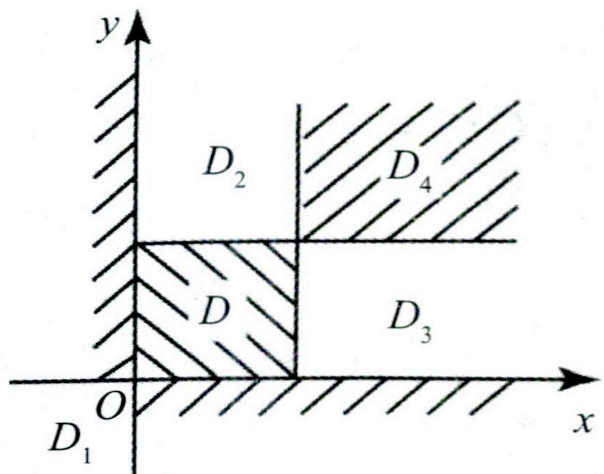
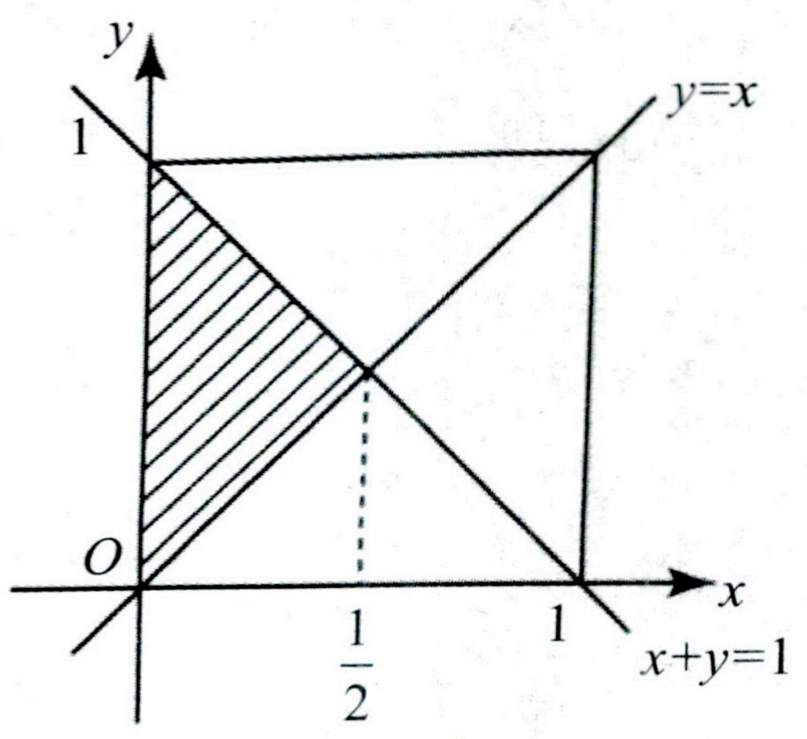
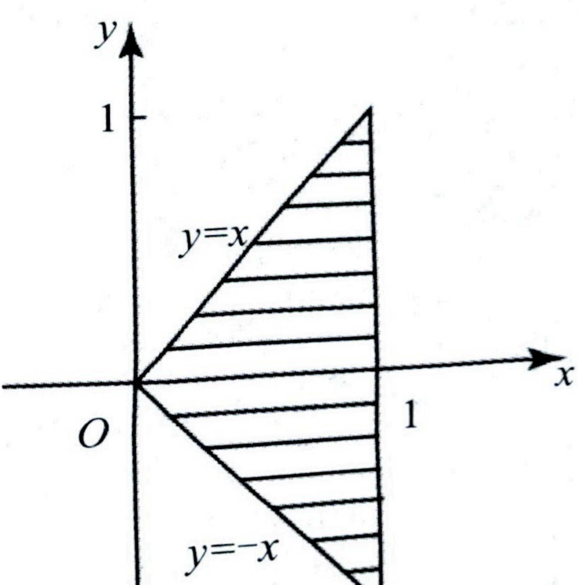

# 第三章 多维随机变量及其分布

## 本章配套习题《基础 700 题》P13-P19

## 【大纲要求】

(1)理解多维随机变量的概念,理解多维随机变量的分布的概念和性质.理解二维离散型随机变量的概率分布、边缘分布和条件分布,理解二维连续型随机变量的概率密度、边缘密度和条件密度,会求与二维随机变量相关事件的概率.

(2)理解随机变量的独立性及不相关性的概念, 掌握随机变量相互独立的条件.

(3)掌握二维均匀分布,了解二维正态分布  $N(\mu_{1},\mu_{2};\sigma_{1}^{2},\sigma_{2}^{2};\rho)$ 的概率密度,理解其中参数的概率意义.

(4)会求两个随机变量简单函数的分布,会求多个相互独立随机变量简单函数的分布.

## 【本章重点】

(1)两个随机变量独立性的判定.

(2)二维离散型随机变量的分布律、边缘分布律、条件分布律的求法.

(3)二维连续型随机变量的概率密度函数、边缘密度函数、条件密度函数的求法.

(4)两个离散型(连续型)随机变量函数的分布及一个离散型与一个连续型随机变量函数的分布.

(5)二维均匀分布的概率密度函数,二维正态分布的性质及其参数的意义.

## 【基础知识】

## 一、 二维随机变量的概念

设  $X = X(e)$,  $Y = Y(e)$ 是定义在样本空间  $\Omega = \{e\}$ 上的两个随机变量, 则称向量  $(X, Y)$ 为二维随机变量或二维随机向量.

## 二、 二维随机变量的分布函数及其性质

### （一） 分布函数定义

设 $(X,Y)$为二维随机变量,对于任意实数x,y,二元函数

 $$F(x,y)=P\left\{X\leq x,Y\leq y\right\},$$ 

称为二维随机变量  $(X,Y)$ 的分布函数,或称为随机变量 X 和 Y 的联合分布函数.

#### 例

设随机变量 $X$ 的概率密度为 $f_{X}(x)=\left\{\begin{aligned}&\frac{1}{2},&-1<x<0,\\&\frac{1}{4},&0\leq x<2,\\&0,& 其他.\end{aligned}\right.$，令 $Y=X^{2}, F(x,y)$ 为二维随机变量 $(X,Y)$ 的分布函数，求 $F\left(-\frac{1}{2},4\right)$。

【解析】由  $F(x,y)=P(X \leq x,Y \leq y)$，得

 $$\begin{aligned}F\left(-\frac{1}{2},4\right)&=P\left\{X\leq-\frac{1}{2},Y\leq4\right\}=P\left\{X\leq-\frac{1}{2},X^{2}\leq4\right\}\\&=P\left\{X\leq-\frac{1}{2},-2\leq X\leq2\right\}=P\left\{-2\leq X\leq-\frac{1}{2}\right\}\\&=\int_{-2}^{-\frac{1}{2}}f_{X}(x)dx=\int_{-1}^{-\frac{1}{2}}\frac{1}{2}dx=\frac{1}{4}.\end{aligned}$$ 

### （二） 分布函数的性质

①非负性:对于任意实数  $x, y \in \mathbb{R}$，有  $0 \leq F(x, y) \leq 1$.

②规范性：

 $$F(-\infty,y)=\lim_{x\to-\infty}F(x,y)=0;\;F(x,-\infty)=\lim_{y\to-\infty}F(x,y)=0;$$ 

 $$F(-\infty,-\infty)=\lim_{\substack{x\to-\infty\\ y\to-\infty}}F(x,y)=0;\quad F(+\infty,+\infty)=\lim_{\substack{x\to+\infty\\ y\to+\infty}}F(x,y)=1.$$ 

③单调不减性:  $F(x,y)$ 分别关于 x 和 y 单调不减.

④右连续性:  $F(x,y)$ 分别关于 x 和 y 具有右连续性, 即

 $$F(x,y)=F(x+0,y),F(x,y)=F(x,y+0),x,y\in\mathbf{R}.$$ 

## 三、 二维随机变量的边缘分布函数

若已知  $F(x,y)=P\left\{X\leq x,Y\leq y\right\}$，则称

 $$F_{x}(x)=F(x,+\infty)=\lim_{y\to+\infty}F(x,y)$$ 

 $$F_{Y}(y)=F(+\infty,y)=\lim_{x\to+\infty}F(x,y)$$ 

分别为二维随机变量  $(X,Y)$ 关于 X 和关于 Y 的边缘分布函数.

## 四、 随机变量X和Y的独立性

设二维随机变量  $(X,Y)$ 的分布函数为  $F(x,y)$，关于 X 与 Y 的分布函数分别为  $F_{X}(x)$ 和  $F_{Y}(y)$，如果对于所有的 x,y ，有

 $$P\left\{X\leq x,Y\leq y\right\}=P\left\{X\leq x\right\}P\left\{Y\leq y\right\},$$ 

即  $F(x,y)=F_{X}(x)F_{Y}(y)$，则称随机变量 X 和 Y 相互独立.

**良哥解读**

(1)若已知  $(X,Y)$ 的分布函数  $F(x,y)$，判定随机变量 X 和 Y 是否独立，只需先找到两个边缘分布函数  $F_{X}(x)$ 和  $F_{Y}(y)$，再判定等式  $F(x,y)=F_{X}(x)F_{Y}(y)$ 是否成立即可.

(2)若  $(X,Y)$ 的分布函数  $F(x,y)$ 未知，判定随机变量 X 和 Y 是否独立，通常先判定 X 和 Y 是否不独立。由于随机变量的独立需对所有的 x,y，使得  $P\{X \leq x,Y \leq y\} = P\{X \leq x\} P\{Y \leq y\}$ 均成立，故若能找到一对特殊的  $x_{0},y_{0}$，使得  $P\{X \leq x_{0},Y \leq y_{0}\} \neq P\{X \leq x_{0}\} P\{Y \leq y_{0}\}$，则 X 和 Y 不独立。

(3)若随机变量  $X_{1}, X_{2}, \cdots, X_{n}, Y_{1}, Y_{2}, \cdots, Y_{m}$ 相互独立，则  $f(X_{1}, X_{2}, \cdots, X_{n})$ 与  $g(Y_{1}, Y_{2}, \cdots, Y_{m})$ 也相互独立，其中  $f(\cdot)$ 与  $g(\cdot)$ 分别为 n 元和 m 元连续函数 ( $n \geq 1, m \geq 1$)。

#### 例

一电子仪器由两个部件构成,以 X 和 Y 分别表示两个部件的寿命(单位:千小时),已知 X 和 Y 的联合分布函数为

 $$F(x,y)=\begin{cases}1-e^{-0.5x}-e^{-0.5y}+e^{-0.5(x+y)},&x\geq0,y\geq0,\\0,& 其他 .\end{cases}$$ 

(1)问 X 和 Y 是否独立？

(2)求两个部件的寿命都超过 100 小时的概率  $\alpha$.

【解析】(1) X 和 Y 的边缘分布函数分别为

 $$F_{X}(x)=\lim_{y\to+\infty}F(x,y)=\begin{cases}1-e^{-0.5x},&x\geq0,\\0,& 其他 .\end{cases}$$ 

 $$F_{Y}(y)=\lim_{x\to+\infty}F(x,y)=\left\{\begin{aligned}&1-e^{-0.5y},&y\geq0,\\ &0,& 其他 .\end{aligned}\right.$$ 

因为  $F(x,y)=F_{X}(x)F_{Y}(y)$，对任意 x,y 成立，故 X 和 Y 相互独立.

(2)$$\begin{aligned}\alpha&=P\left\{X>0.1,Y>0.1\right\}=P\left\{X>0.1\right\}P\left\{Y>0.1\right\}\\&=[1-F_{X}\left(0.1\right)][1-F_{Y}\left(0.1\right)]\\&=\mathrm{e}^{-0.05}\cdot\mathrm{e}^{-0.05}=\mathrm{e}^{-0.1}.\end{aligned}$$ 

**良哥解读**

由于题干中指出(单位:千小时),故两个部件的寿命都超过100小时的事件不是 $\{X>100,Y>100\}$而是 $\{X>0.1,Y>0.1\}$.这是很多考生犯错误的一个地方,同时也告诉我们,做题时审题一定要细心.

#### 例

设随机变量 $X$ 的概率密度为 $f_{X}(x)=\left\{\begin{aligned}&\frac{1}{2},&-1<x<0,\\&\frac{1}{4},&0\leq x<2,\\&0,& 其他.\end{aligned}\right.$ 随机变量 $Y=X^{2}$, 试判断 $X$ 与 $Y$ 是否独立?

为什么？

【解析】因为

 $$P\left\{X<1,Y<1\right\}=P\left\{X<1,X^{2}<1\right\}=P\left\{-1<X<1\right\}=\int_{-1}^{0}\frac{1}{2}\mathrm{d}x+\int_{0}^{1}\frac{1}{4}\mathrm{d}x=\frac{3}{4},$$ 

 $$n(x-1)\quad f^{0}1_{d x},f^{1}1_{d x}=\frac{3}{2}$$

$$r\left\{1<1\right\}=P\left\{X^{2}<1\right\}=P\left\{-1<X<1\right\}=\int_{-1}^{0}\frac{1}{2}\mathrm{d}x+\int_{0}^{1}\frac{1}{4}\mathrm{d}x=\frac{3}{4},$$ 

故  $P\{X<1,Y<1\}\neq P\{X<1\}P\{Y<1\}$，从而随机变量 X 与 Y 不独立.

## 五、 二维离散型随机变量及其概率分布

### （一） 二维离散型随机变量的定义

若二维随机变量(X,Y)可能的取值为有限对或可列无穷多对实数,则称(X,Y)为二维离散型随机变量.

### （二） 二维离散型随机变量的分布律

设二维离散型随机量  $(X,Y)$ 所有可能的取值为  $(x_{i},y_{j}),i,j=1,2,\cdots$，且对应的概率为  $P\{X=x_{i},Y=y_{j}\}=p_{ij}$， $i,j=1,2,\cdots$，其中， $\textcircled{1}p_{ij}\geq0,i,j=1,2,\cdots$； $\textcircled{2}\sum_{i=1}^{+\infty}\sum_{j=1}^{+\infty}p_{ij}=1$；则称  $P\{X=x_{i},Y=y_{j}\}=p_{ij},i,j=1,2,\cdots$ 为二维离散型随机变量  $(X,Y)$ 的分布律或随机变量 X 和 Y 的联合分布律。通常也用如下表格形式表示。

| Y | $y_{1}$ | $y_{2}$ | ... | $y_{j}$ | ... |
| --- | --- | --- | --- | --- | --- |
| X |   |   |   |   |   |
| $x_{1}$ | $p_{11}$ | $p_{12}$ | ... | $p_{1j}$ | ... |
| $x_{2}$ | $p_{21}$ | $p_{22}$ | ... | $p_{2j}$ | ... |
| : | : | : | : | : | : |
| x: | $p_{i1}$ | $p_{i2}$ | ... | $p_{ij}$ | ... |
| : | : | : | : | : | : |

#### 例

已知$(X,Y)$的分布律为$(X,Y)\sim\begin{pmatrix}(0,0)&(0,1)&(1,1)\\\frac{1}{4}&\frac{1}{4}&\frac{2}{4}\end{pmatrix},(X,Y)$的分布函数为$F(x,y)$,则$F(\frac{1}{2},1)=$

【解析】(1)由分布函数定义得

 $$\begin{aligned}F\left(\frac{1}{2},1\right)&=P\{X\leq\frac{1}{2},Y\leq1\}=\sum_{x_{i}\leq\frac{1}{2},y_{j}\leq1}P\{X=x_{i},Y=y_{j}\}\\&=P\{X=0,Y=0\}+P\{X=0,Y=1\}=\frac{1}{2}.\end{aligned}$$ 

(2)$P\{X \geq 0, Y > \frac{1}{2}\} = P\{X = 0, Y = 1\} + P\{X = 1, Y = 1\} = \frac{3}{4}$.

#### 例

将两封信随意地投入3个邮筒，设X，Y分别表示投入第1，2号邮筒中信的数目，求(X，Y)的分布律.

【解析】由题意,随机变量X,Y的所有可能取值均为0,1,2.又

$$P\{X=0,Y=0\}=\frac{1}{3\times3}=\frac{1}{9},P\{X=0,Y=1\}=\frac{2\times1}{3\times3}=\frac{2}{9},$$ 

 $$P\{X=0,Y=2\}=\frac{1}{3\times3}=\frac{1}{9},P\{X=1,Y=0\}=\frac{2\times1}{3\times3}=\frac{2}{9},$$ 

 $$P\{X=1,Y=1\}=\frac{2\times1}{3\times3}=\frac{2}{9},P\{X=1,Y=2\}=0,$$ 

 $$P\{X=2,Y=0\}=\frac{1}{3\times3}=\frac{1}{9},P\{X=2,Y=1\}=0,$$ 

 $$P\{X=2,Y=2\}=0,$$ 

从而  $(X,Y)$ 的分布律为

| Y | 0 | 1 | 2 |
| --- | --- | --- | --- |
| X |   |   |   |
| 0 | $\frac{1}{9}$ | $\frac{2}{9}$ | $\frac{1}{9}$ |
| 1 | $\frac{2}{9}$ | $\frac{2}{9}$ | 0 |
| 2 | $\frac{1}{9}$ | 0 | 0 |

### （三） 边缘分布律

设二维离散型随机变量  $(X,Y)$ 的分布律为

 $$P\{X=x_{i},Y=y_{j}\}=p_{ij},\quad i,j=1,2,\cdots,$$ 

称  $P\{X=x_{i}\}=P\{X=x_{i},Y<+\infty\}=\sum_{j=1}^{+\infty}P\{X=x_{i},Y=y_{j}\}=\sum_{j=1}^{+\infty}p_{ij},i=1,2,\cdots$ 为 X 的边缘分布律，记为  $p_{i}$; 称  $P\{Y=y_{j}\}=P\{X<+\infty,Y=y_{j}\}=\sum_{i=1}^{+\infty}P\{X=x_{i},Y=y_{j}\}=\sum_{i=1}^{+\infty}p_{ij},j=1,2,\cdots$ 为 Y 的边缘分布律，记为  $p_{j}$.

### （四） 条件分布律

设二维离散型随机变量  $(X,Y)$ 的分布律为

 $$P\{X=x_{i},Y=y_{j}\}=p_{ij},\quad i,j=1,2,\cdots,$$ 

对于给定的 $j$, 若 $P\{Y = y_{j}\} > 0$, $j = 1, 2, \cdots$, 称

 $$P\{X=x_{i}\mid Y=y_{j}\}=\frac{P\{X=x_{i},Y=y_{j}\}}{P\{Y=y_{j}\}}=\frac{p_{ij}}{p_{.j}},\quad i=1,2,\cdots$$ 

为在  $Y = y_{j}$ 的条件下随机变量 X 的条件分布律.

对于给定的 i, 如果  $P\{X = x_{i}\} > 0$,  $i = 1, 2, \cdots$, 称

 $$P\{Y=y_{j}\mid X=x_{i}\}=\frac{P\{X=x_{i},Y=y_{j}\}}{P\{X=x_{i}\}}=\frac{p_{ij}}{p_{i}},\quad j=1,2,\cdots$$ 

为在  $X = x_{i}$ 的条件下随机变量 Y 的条件分布律.

**良哥解读**

若已知在  $X = x_{i}, i = 1, 2, \cdots$ 的条件下随机变量 Y 的条件分布律和 X 的分布律, 计算  $(X, Y)$ 的分布律, 可用 X 的分布律乘以在  $X = x_{i}, i = 1, 2, \cdots$ 条件下 Y 的条件分布律, 即

 $$P\{X=x_{i},Y=y_{j}\}=P\{Y=y_{j}\mid X=x_{i}\}P\{X=x_{i}\},\quad i,j=1,2,\cdots.$$ 

若已知  $Y = y_{j}$,  $j = 1, 2, \cdots$ 的条件下随机变量 X 的条件分布律和 Y 的分布律, 则

 $$P\{X=x_{i},Y=y_{j}\}=P\{X=x_{i}\mid Y=y_{j}\}P\{Y=y_{j}\},\quad i,j=1,2,\cdots.$$ 

#### 例

设某班车起点站上客人数 X 服从参数  $\lambda (\lambda > 0)$ 的泊松分布，每位乘客在中途下车的概率为  $p (0 < p < 1)$，且中途下车与否相互独立，以 Y 表示在中途下车的人数，求：

(1)在发车时有 n 个乘客的条件下, 中途有 m 人下车的概率（2）二维随机变量  $(X,Y)$ 的概率分布.

【解析】(1)由题意,当发车时有 n 个乘客的条件下,中途下车人数服从参数为 n,p 的二项分布,故所求概率为

 $$P\left\{Y=m\mid X=n\right\}=C_{n}^{m}p^{m}(1-p)^{n-m},\quad m=0,1,2\cdots,n;n=0,1,2\cdots.$$ 

(2)因 X 服从参数为  $\lambda (\lambda > 0)$ 的泊松分布, 故 X 的分布律为

 $$P\{X=n\}=\frac{\lambda^{n}\mathrm{e}^{-\lambda}}{n!},\quad n=0,1,2\cdots.$$ 

故  $(X,Y)$ 的概率分布为

 $$P\left\{X=n,Y=m\right\}=P\left\{Y=m\mid X=n\right\}P\left\{X=n\right\}=C_{n}^{m}p^{m}(1-p)^{n-m}\cdot\frac{\lambda^{n}\mathrm{e}^{-\lambda}}{n!},$$ 

其中,  $m=0,1,2\cdots,n$;  $n=0,1,2\cdots$.

**良哥解读**

当发车有 n 个乘客时,观察一位乘客是否下车相当于做了一次试验,观察 n 个乘客是否下车相当于做了 n 次试验,由于每位乘客下车与否相互独立,故可看成做了 n 次独立重复试验,从而在发车有 n 个乘客的条件下,中途下车人数服从二项分布.

### （五） 两个离散型随机变量的独立性

设二维离散型随机变量  $(X,Y)$ 的分布律为

 $$P\{X=x_{i},Y=y_{j}\}=p_{ij},\quad i,j=1,2,\cdots,$$ 

若对于任意  $i, j=1,2,\cdots$，有  $P\{X=x_{i},Y=y_{j}\}=P\{X=x_{i}\}P\{Y=y_{j}\}$，则称两个离散型随机变量 X 和 Y 相互独立.

**良哥解读**

(1)若已知  $(X,Y)$ 的分布律  $P\{X=x_{i},Y=y_{j}\}=p_{ij}, i,j=1,2,\cdots$，判定随机变量 X 和 Y 是否独立，则先求出两个边缘分布律  $P\{X=x_{i}\}=p_{i}$ 和  $P\{Y=y_{j}\}=p_{j}$，再判定等式  $P\{X=x_{i},Y=y_{j}\}=P\{X=x_{i}\}P\{Y=y_{j}\}$ 是否成立。若对所有的 i,j 均成立，则随机变量 X 和 Y 独立，若有一对 i,j 使得等式不成立，则 X 和 Y 不独立。

**良哥解读**

(2)若已知两个离散型随机变量 X 和 Y 相互独立, 求 X 和 Y 的联合分布律, 只需分别找到两个随机变量 X 和 Y 的分布律  $P\{X = x_{i}\} = p_{i}$ 和  $P\{Y = y_{j}\} = p_{j}$, 则有

 $$P\{X=x_{i},Y=y_{j}\}=P\{X=x_{i}\}P\{Y=y_{j}\}.$$ 

#### 例

已知随机变量  $X_{1}$ 和  $X_{2}$ 的概率分布

 $$X_{1}\sim\begin{pmatrix}-1&0&1\\\frac{1}{4}&\frac{1}{2}&\frac{1}{4}\end{pmatrix},X_{2}\sim\begin{pmatrix}0&1\\\frac{1}{2}&\frac{1}{2}\end{pmatrix},$$ 

而且  $P\{X_{1}X_{2}=0\}=1$.

(1)求  $X_{1}$ 和  $X_{2}$ 的联合分布.

(2)问  $X_{1}$ 和  $X_{2}$ 是否独立？为什么？

【解析】(1)因 $P\{X_{1}X_{2}=0\}=1$，故

 $$P\left\{X_{1}X_{2}\neq0\right\}=1-P\left\{X_{1}X_{2}=0\right\}=0.$$ 

即有  $P\{X_{1}=-1,X_{2}=1\}+P\{X_{1}=1,X_{2}=1\}=0$，由概率的非负性知

 $$P\left\{X_{1}=-1,X_{2}=1\right\}=P\left\{X_{1}=1,X_{2}=1\right\}=0,$$ 

从而容易得到  $X_{1}$ 与  $X_{2}$ 的联合分布律为

| $X_{1}$ | -1 | 0 | 1 | p.j |
| --- | --- | --- | --- | --- |
| $X_{2}$ |   |   |   |   |
| 0 | $\frac{1}{4}$ | 0 | $\frac{1}{4}$ | $\frac{1}{2}$ |
| 1 | 0 | $\frac{1}{2}$ | 0 | $\frac{1}{2}$ |
| p_{i}. | $\frac{1}{4}$ | $\frac{1}{2}$ | $\frac{1}{4}$ |   |

(2)因为

 $$P\left\{X_{1}=-1,X_{2}=0\right\}=\frac{1}{4},P\left\{X_{1}=-1\right\}=\frac{1}{4},P\left\{X_{2}=0\right\}=\frac{1}{2},$$ 

故  $P\{X_{1}=-1,X_{2}=0\} \neq P\{X_{1}=-1\} P\{X_{2}=0\}$，因此  $X_{1}$ 和  $X_{2}$ 不独立.

#### 例

设随机变量 X 与 Y 相互独立, 其概率分布为

| X | -1 | 1 |
| --- | --- | --- |
| P | 1/2 | 1/2 |
| Y | -1 | 1 |
| P | 1/2 | 1/2 |

则下列式子正确的是( ).

(A)X=Y

(B) $P\{X=Y\}=0$

(C) $P\{X=Y\}=\frac{1}{2}$

(D) $P\{X=Y\}=1$

【解析】因为 X 和 Y 相互独立,故

 $$\begin{aligned}P\left\{X=Y\right\}&=P\left\{X=-1,Y=-1\right\}+P\left\{X=1,Y=1\right\}\\&=P\left\{X=-1\right\}P\left\{Y=-1\right\}+P\left\{X=1\right\}P\left\{Y=1\right\}\\&=\frac{1}{2}\times\frac{1}{2}+\frac{1}{2}\times\frac{1}{2}=\frac{1}{2}.\end{aligned}$$ 

应选(C).

**良哥解读**

两个随机变量同分布只是说明分布相同，并不表示同一个随机变量，如此题中虽然 X 与 Y 的分布相同，但  $P\{X=Y\}=\frac{1}{2}$.

#### 例

设二维随机变量(X,Y)的概率分布为

| Y | 0 | 1 |
| --- | --- | --- |
| X |   |   |
| 0 | 0.4 | a |
| 1 | b | 0.1 |

已知随机事件  $\left\{X=0\right\}$ 与  $\left\{X+Y=1\right\}$ 相互独立，则（ ）.

(A)a=0.2,b=0.3

(B)a=0.4,b=0.1

(C)a=0.3,b=0.2

(D)a=0.1,b=0.4

【解析】由(X,Y)的概率分布得0.4+a+b+0.1=1，即有a+b=0.5.

因为  $\{X=0\}$ 与  $\{X+Y=1\}$ 相互独立，则有

 $$P\{X=0,X+Y=1\}=P\{X=0\}P\{X+Y=1\},$$ 

又

 $$P\{X=0,X+Y=1\}=P\{X=0,Y=1\}=a,$$ 

 $$P\{X=0\}=a+0.4,$$ 

 $$P\{X+Y=1\}=a+b=0.5,$$ 

故有  $a=(a+0.4)\times0.5$，解之得 a=0.4，从而 b=0.1。故应选(B)。

#### 例

甲乙两人独立地各进行两次射击，假设甲的命中率为 0.2，乙的命中率为 0.5，以 X 和 Y 分别表示甲和乙的命中次数，试求 X 和 Y 的联合分布律.

【解析】由题意知 X 和 Y 都服从二项分布, 且  $X \sim B(2,0.2)$,  $Y \sim B(2,0.5)$. 由于 X 和 Y 相互独立, 则它们的联合分布律为

 $$\begin{aligned}P\left\{X=i,Y=j\right\}&=P\left\{X=i\right\}\cdot P\left\{Y=j\right\}\\&=C_{2}^{i}\times0.2^{i}\times0.8^{2-i}\times C_{2}^{j}\times0.5^{j}\times0.5^{2-j}\\&=0.25\times C_{2}^{i}\times C_{2}^{j}\times0.2^{i}\times0.8^{2-i}(i,j=0,1,2),\end{aligned}$$ 

概率分布表如下

| Y | 0 | 1 | 2 |
| --- | --- | --- | --- |
| 0 | 0.16 | 0.32 | 0.16 |
| 1 | 0.08 | 0.16 | 0.08 |
| 2 | 0.01 | 0.02 | 0.01 |

## （六） 两个离散型随机变量函数的分布

设二维离散型随机变量  $(X,Y)$ 的分布律为

 $$P\{X=x_{i},Y=y_{j}\}=p_{ij},(i,j=1,2,\cdots),$$ 

随机变量  $Z = g(X, Y)$，则 Z 的分布律为

 $$P\{Z=z_{k}\}=P\{g(X,Y)=z_{k}\}=\sum_{\substack{g(x_{i},y_{j})=z_{k}}}P(X=x_{i},Y=y_{j}).$$ 

#### 例

设相互独立的两个随机变量 X、Y 服从同一分布, 且 X 的分布律为

| X | 0 | 1 |
| --- | --- | --- |
| P | $\frac{1}{2}$ | $\frac{1}{2}$ |

则随机变量  $Z = \max\{X, Y\}$ 的分布律为 ___.

【解析】由于 X 与 Y 相互独立且均服从 0-1 分布, 故  $Z = \max\{X, Y\}$ 的所有可能取值为 0,1,且

 $$P\left\{Z=0\right\}=P\left\{\max\left\{X,Y\right\}=0\right\}=P\left\{X=0,Y=0\right\}=P\left\{X=0\right\}\cdot P\left\{Y=0\right\}=\frac{1}{4},$$ 

 $$P\left\{Z=1\right\}=1-P\left\{Z=0\right\}=\frac{3}{4}.$$ 

所以  $Z = \max\{X, Y\}$ 的分布律为

| Z | 0 | 1 |
| --- | --- | --- |
| P | $\frac{1}{4}$ | $\frac{3}{4}$ |

#### 例

假设随机变量  $X_{1}, X_{2}, X_{3}, X_{4}$ 相互独立，且同分布， $P\{X_{i}=0\}=0.6, P\{X_{i}=1\}=0.4, i=1,2,3,4$. 求行列式  $X=\begin{vmatrix}X_{1}&X_{2}\\X_{3}&X_{4}\end{vmatrix}$ 的概率分布.

【解析】记  $Y_{1}=X_{1}X_{4}, Y_{2}=X_{2}X_{3}$，则  $X=Y_{1}-Y_{2}$。因  $X_{1}, X_{2}, X_{3}, X_{4}$ 相互独立且同分布，故有  $Y_{1}$ 与  $Y_{2}$ 相互独立且同分布。 $Y_{1}$ 的所有可能取值为 0,1，且

 $$\begin{aligned}P\left\{Y_{1}=1\right\}&=P\left\{X_{1}X_{4}=1\right\}=P\left\{X_{1}=1,X_{4}=1\right\}\\&=P\left\{X_{1}=1\right\}\cdot P\left\{X_{4}=1\right\}=0.4\times0.4=0.16,\end{aligned}$$ 

 $$P\left\{Y_{1}=0\right\}=1-P\left\{Y_{1}=1\right\}=0.84.$$ 

随机变量  $X = Y_{1} - Y_{2}$ 的所有可能取值为 -1, 0, 1.

 $$P\left\{X=-1\right\}=P\left\{Y_{1}=0,Y_{2}=1\right\}=P\left\{Y_{1}=0\right\}\cdot P\left\{Y_{2}=1\right\}=0.84\times0.16=0.1344,$$

$$P\left\{X=1\right\}=P\left\{Y_{1}=1,Y_{2}=0\right\}=P\left\{Y_{1}=1\right\}\cdot P\left\{Y_{2}=0\right\}=0.1344,$$ 

 $$P\left\{X=0\right\}=1-P\left\{X=-1\right\}-P\left\{X=1\right\}=0.7312.$$ 

故 X 的分布律为

| X | -1 | 0 | 1 |
| --- | --- | --- | --- |
| P | 0.1344 | 0.7312 | 0.1344 |

## 六、 二维连续型随机变量及其分布

### （一） 定义

设二维随机变量(X,Y)的分布函数为  $F(x,y)$，如果存在非负可积的二元函数  $f(x,y)$，使得对任意实数 x, y，有

 $$F(x,y)=\int_{-\infty}^{x}\int_{-\infty}^{y}f(u,v)\mathrm{d}u\mathrm{d}v,$$ 

则称  $(X,Y)$ 为二维连续型随机变量，函数  $f(x,y)$ 称为二维随机变量  $(X,Y)$ 的概率密度，或称为 X 与 Y 的联合概率密度.

**良哥解读**

定义中揭示了二维连续型随机变量(X,Y)的概率密度与分布函数的关系：

(1)若已知  $(X,Y)$ 概率密度求  $(X,Y)$ 的分布函数，用  $F(x,y)=\int_{-\infty}^{x}\int_{-\infty}^{y}f(u,v)dudv$ 解决（2）若已知  $(X,Y)$ 的分布函数  $F(x,y)$，求  $(X,Y)$ 的概率密度，用  $f(x,y)=\frac{\partial^{2}F(x,y)}{\partial x\partial y}$ 解决.

#### 例

已知随机变量X和Y的联合概率密度为

 $$f(x,y)=\begin{cases}4xy,&0\leq x\leq1,0\leq y\leq1,\\0,& 其他 ,\end{cases}$$ 

求 X 和 Y 联合分布函数  $F(x, y)$.

【解析】如图，将整个平面分为五个区域，由  $F(x,y)=\int_{-\infty}^{x}\int_{-\infty}^{y}f(u,v)du dv$，可得：

轴标注：$y \uparrow$，区域 $D_{1}, D_{2}, D_{3}, D_{4}$（图）

当 $(x,y)\in D_{1}$，即x<0或y<0时， $F(x,y)=0$；

当 $(x,y)\in D_{4}$，即 $x\geq1$且 $y\geq1$时， $F(x,y)=1$；

当 $(x,y)\in D_{2}$，即 $0\leq x<1,y\geq1$时， $F(x,y)=\int_{0}^{x}\mathrm{d}u\int_{0}^{1}4uv\mathrm{d}v=x^{2}$;

当 $(x,y)\in D$时，即 $0\leqslant x<1,0\leqslant y<1$时， $F(x,y)=\int_{0}^{x}\mathrm{d}u\int_{0}^{y}4uv\mathrm{d}v=x^{2}y^{2}$;

当  $(x, y) \in D_3$，即  $x \geqslant 1, 0 \leqslant y < 1$ 时， $F(x, y) = \int_{0}^{x} du \int_{0}^{y} 4uv dv = y^2$.

综上，有  $F(x, y) = \begin{cases} 0, & x < 0 \text{ 或 } y < 0, \\ x^{2}, & 0 \leq x < 1, y \geq 1, \\ x^{2} y^{2}, & 0 \leq x < 1, 0 \leq y < 1, \\ y^{2}, & x \geq 1, 0 \leq y < 1, \\ 1, & x \geq 1, y \geq 1. \end{cases}$

#### 例

设二维随机变量(X,Y)的分布函数为

 $$F(x,y)=\begin{cases}1-e^{-x}-e^{-y}+e^{-x-y},&x>0,y>0,\\0,& 其他 ,\end{cases}$$ 

求  $(X,Y)$ 的概率密度函数  $f(x,y)$.

【解析】因  $f(x, y) = \frac{\partial^{2} F(x, y)}{\partial x \partial y}$，故

 $$f(x,y)=\frac{\partial^{2}F(x,y)}{\partial x\partial y}=\left\{\begin{aligned}&\mathrm{e}^{-x-y},&x>0,y>0,\\ &0,& 其他 .\end{aligned}\right.$$ 

### （二） 概率密度函数的性质

①非负性:  $f(x, y) \geq 0, (-\infty < x < +\infty, -\infty < y < +\infty)$.

②规范性： $\int_{-\infty}^{+\infty}\int_{-\infty}^{+\infty}f(x,y)dxdy=1$

③设 D 是 xOy 平面上任一区域, 则点  $(x, y)$ 落在 D 内的概率为

 $$P\{(X,Y)\in D\}=\iint\limits_{D}f(x,y)\mathrm{d}x\mathrm{d}y.$$ 

④若  $f(x,y)$ 在点  $(x,y)$ 处连续，则有  $f(x,y)=\frac{\partial^{2}F(x,y)}{\partial x\partial y}$.

**良哥解读**

 $(X,Y)$ 的概率密度性质中包含两种类型题目的考查方式：

(1)求  $f(x, y)$ 中的未知参数，用  $\int_{-\infty}^{+\infty} \int_{-\infty}^{+\infty} f(x, y) \, dx \, dy = 1$ 解决（2）已知概率密度 $f(x,y)$计算事件的概率,用 $P\{(X,Y)\in D\}=\iint\limits_{D}f(x,y)\mathrm{d}x\mathrm{d}y$解决.

#### 例

设二维随机向量  $(X,Y)$ 的概率密度函数为

 $$f(x,y)=\begin{cases}ky(2-x),&0\leq x\leq1,0\leq y\leq x,\\0,& 其他 .\end{cases}$$ 

求常数 k.

【解析】由概率密度的性质有

 $$\begin{aligned}1&=\int_{-\infty}^{+\infty}\int_{-\infty}^{+\infty}f(x,y)\mathrm{d}x\mathrm{d}y=\iint\limits_{0\leq x\leq1}^{}ky(2-x)\mathrm{d}x\mathrm{d}y\\&=k\int_{0}^{1}\mathrm{d}x\int_{0}^{x}(2-x)y\mathrm{d}y=k\int_{0}^{1}(2-x)\times\frac{x^{2}}{2}\mathrm{d}x=\frac{5k}{24},\end{aligned}$$ 

从而  $k=\frac{24}{}$

#### 例

设二维随机变量(X,Y)的概率密度为

 $$f(x,y)=\begin{cases}6x,&0\leq x\leq y\leq1,\\0,& 其他 .\end{cases}$$ 

则  $P\{X + Y \leq 1\} = \underline{\qquad}$.

1

$\begin{array}{c} y \\ \uparrow \\ y=x \\ x \\ x+y=1 \end{array}$

$\frac{1}{2}$

$\frac{1}{2}$

【解析】由概率密度函数的性质  $P\{(X,Y)\in D\}=\iint\limits_{D}f(x,y)\mathrm{d}x\mathrm{d}y$，得

 $$\begin{aligned}P\{X+Y\leq1\}&=\iint\limits_{x+y\leq1}f(x,y)\mathrm{d}x\mathrm{d}y=\int_{0}^{\frac{1}{2}}\mathrm{d}x\int_{x}^{1-x}6x\mathrm{d}y\\&=\int_{0}^{\frac{1}{2}}6x(1-2x)\mathrm{d}x=\frac{1}{4}.\end{aligned}$$ 

其中,二重积分的积分区域为如图所示的阴影部分.

#### 例

设二维随机变量(X,Y)的概率密度为

 $$f(x,y)=\begin{cases}2\mathrm{e}^{-(2x+y)},&x>0,y>0,\\0,& 其他 .\end{cases}$$ 

求 $P\{Y \leq X\}$

【解析】由概率密度的性质,得

 $$\begin{aligned}P\{Y\leq X\}&=\iint\limits_{y\leq x}f(x,y)\mathrm{d}x\mathrm{d}y=\int_{0}^{+\infty}\mathrm{d}x\int_{0}^{x}2\mathrm{e}^{-(2x+y)}\mathrm{d}y=\int_{0}^{+\infty}2\mathrm{e}^{-2x}\mathrm{d}x\int_{0}^{x}\mathrm{e}^{-y}\mathrm{d}y\\&=-\int_{0}^{+\infty}2\mathrm{e}^{-2x}\mathrm{e}^{-y}\left|_{0}^{x}\right.\mathrm{d}x=\int_{0}^{+\infty}2\mathrm{e}^{-2x}(1-\mathrm{e}^{-x})\mathrm{d}x\\&=\int_{0}^{+\infty}2\mathrm{e}^{-2x}\mathrm{d}x-\int_{0}^{+\infty}2\mathrm{e}^{-3x}\mathrm{d}x=1-\frac{2}{3}=\frac{1}{3}.\end{aligned}$$ 

### （三） 边缘密度函数

若已知二维随机变量(X,Y)的概率密度函数为 $f(x,y)$，则称 $f_{X}(x)=\int_{-\infty}^{+\infty}f(x,y)dy$为关于随机变量的边缘密度函数，称 $f_{Y}(y)=\int_{-\infty}^{+\infty}f(x,y)dx$为关于随机变量Y的边缘密度函数.

#### 例

设二维随机变量(X,Y)的概率密度为

 $$f(x,y)=\begin{cases}1,&0<x<1,0<y<2x,\\0,& 其他 .\end{cases}$$ 

求  $(X,Y)$ 的边缘概率密度  $f_{X}(x)$,  $f_{Y}(y)$

【解析】因 X 的边缘概率密度函数为  $f_{X}(x)=\int_{-\infty}^{+\infty}f(x,y)\mathrm{d}y$，则：

当 0 < x < 1 时， $f_{X}(x) = \int_{0}^{2x} 1 \, \mathrm{d}y = 2x$;

当  $x \leq 0$ 或  $x \geq 1$ 时， $f_{X}(x) = 0$.

故

 $$f_{X}(x)=\begin{cases}2x,&0<x<1,\\0,& 其他 .\end{cases}$$ 

因 Y 的边缘密度函数为  $f_{Y}(y)=\int_{-\infty}^{+\infty}f(x,y)dx$，则：

当 0 < y < 2 时， $f_{Y}(y) = \int_{\frac{y}{2}}^{1} \mathrm{d}x = 1 - \frac{y}{2}$;

当  $y \leq 0$ 或 y  $\geq 2$ 时,  $f_{Y}(y) = 0$.

故

 $$f_{Y}(y)=\left\{\begin{aligned}&1-\frac{y}{2},&0<y<2,\\ &0,& 其他 .\end{aligned}\right.$$ 

**良哥解读**

已知二维随机变量的概率密度,求边缘密度函数时,可以按照如下步骤操作.

(1)先写出边缘密度函数的计算公式,例如要计算 X 的边缘密度函数,则有

 $$f_{X}(x)=\int_{-\infty}^{+\infty}f(x,y)d y.$$ 

(2)画出  $(X,Y)$ 的概率密度不为零的区域.

(3)求 X 的边缘密度函数时, 将 (X, Y) 的概率密度不为零的区域往 x 轴投影, 投影的范围即为 X 的边缘密度函数不为 0 的范围, 其他范围上 X 的概率密度为 0; 求 Y 的边缘密度函数, 将 (X, Y) 的概率密度不为零的区域往 y 轴投影, 投影的范围即为 Y 的边缘密度函数不为 0 的范围, 其他范围上 Y 的概率密度为 0.

(4)计算  $f_{x}(x)=\int_{-\infty}^{+\infty} f(x,y)dy$ 中需要确定 y 的上下限，只需在  $(X,Y)$ 的概率密度不为零的区域内从下往上穿条线，与该区域先交的为积分下限，后交的为积分上限，最后算出此积分；计算  $f_{y}(y)=\int_{-\infty}^{+\infty} f(x,y)dx$ 中需要确定 x 的上下限，只需在  $(X,Y)$ 的概率密度不为零的区域内从左往右穿条线，与该区域先交的为积分下限，后交的为积分上限，最后算出此积分.

#### 例

设二维随机变量(X,Y)的概率密度函数为 $f(x,y)=\left\{\begin{aligned}1,&0<x<1,|y|<x,\\ 0,& 其他.\end{aligned}\right.$ 分别求关于X、Y的边缘概率密度函数.

y
1
y=x
1
y=-x

【解析】由边缘密度函数的计算公式有

 $$f_{X}(x)=\int_{-\infty}^{+\infty}f(x,y)d y=\left\{\begin{aligned}&\int_{-x}^{x}1d y=2x,&0<x<1,\\ &0,& 其他 .\end{aligned}\right.$$ 

 $$f_{Y}(y)=\int_{-\infty}^{+\infty}f(x,y)\mathrm{d}x=\left\{\begin{aligned}&\int_{-y}^{1}1\mathrm{d}x=1+y,&-1<y<0,\\&\int_{y}^{1}1\mathrm{d}x=1-y,&0\leq y<1,\\&0,& 其他 .\end{aligned}\right.$$ 

### （四） 条件密度函数

当  $f_{Y}(y)>0$ 时, 称  $f_{X\mid Y}(x\mid y)=\frac{f(x,y)}{f_{Y}(y)}$ 为在 Y=y 的条件下 X 的条件密度函数.

当  $f_{X}(x)>0$ 时, 称  $f_{Y\mid X}(y\mid x)=\frac{f(x,y)}{f_{X}(x)}$ 为在 X=x 的条件下 Y 的条件密度函数.

**良哥解读**

(1)已知 X 与 Y 的联合密度函数,求条件密度函数时,关键是求出边缘密度函数,用联合密度函数除以边缘密度函数即可.

(2)求 X 与 Y 的联合密度时, 若已知一个边缘密度函数  $f_{X}(x)$ (或  $f_{Y}(y)$) 及在 X = x (或 Y = y) 的条件下 Y (或 X) 的条件密度函数  $f_{Y|X}(y|x)$ (或  $f_{X|Y}(x|y)$), 则

 $$f(x,y)=f_{X}(x)f_{Y|X}(y|x)( 或 f(x,y)=f_{Y}(y)f_{X|Y}(x|y)).$$ 

#### 例

设二维随机变量  $(X,Y)$ 的概率密度为  $f(x,y)=\begin{cases}e^{-x}, & 0<y<x, \\ 0, & \text{其他},\end{cases}$ 求条件概率密度  $f_{Y|X}(y|x)$.

【解析】因 X 的密度函数为  $f_{X}(x)=\int_{-\infty}^{+\infty}f(x,y)\mathrm{d}y$，则：

当x>0时, $f_{X}(x)=\int_{0}^{x}\mathrm{e}^{-x}\mathrm{d}y=x\mathrm{e}^{-x};$

当 $x \leq 0$时， $f_{X}(x) = 0$.

故

 $$f_{X}(x)=\begin{cases}x\mathrm{e}^{-x},&x>0,\\0,&x\leq0.\end{cases}$$ 

当 $f_{X}(x)>0$，即x>0时，Y的条件密度函数为

 $$f_{Y\mid X}\left(y\mid x\right)=\frac{f(x,y)}{f_{X}(x)}=\left\{\begin{aligned}&\frac{1}{x},&0<y<x,\\ &0,& 其他 .\end{aligned}\right.$$ 

#### 例

设 $(X,Y)$的概率密度函数为 $f(x,y)=\left\{\begin{aligned}&2xe^{-xy},&0<x<\frac{1}{2},&y>0,\\ &0,& 其他.\end{aligned}\right.$ 则在已知 $X=\frac{1}{4}$ 的条件下Y的条件概率密度函数的表达式为 ___.

【解析】因 X 的密度函数为  $f_{X}(x)=\int_{-\infty}^{+\infty}f(x,y)\mathrm{d}y$，则：

当  $0 < x < \frac{1}{2}$ 时， $f_{X}(x) = \int_{0}^{x} 2xe^{-xy} \, dy = 2$;

当  $x \leq 0$ 或  $x \geq \frac{1}{2}$ 时,  $f_{X}(x) = 0$.

故

 $$f_{X}(x)=\left\{\begin{aligned}&2,&0<x<\frac{1}{2},\\ &0,& 其他 .\end{aligned}\right.$$ 

当  $f_{X}(x)>0$ ，即 0<x<\frac{1}{2} 时，Y 的条件密度函数为

 $$f_{Y\mid X}\left(y\mid x\right)=\frac{f(x,y)}{f_{X}(x)}=\left\{\begin{aligned}x\mathrm{e}^{-xy},&\quad y>0,\\ 0,&\quad 其他 .\end{aligned}\right.$$ 

从而在已知  $X=\frac{1}{4}$ 的条件下, Y 的条件概率密度函数的表达式为

 $$f_{Y\mid X}(y\mid x=\frac{1}{4})=\left\{\begin{aligned}&\frac{1}{4}e^{-\frac{1}{4}y},&y>0,\\ &0,& 其他 .\end{aligned}\right.$$ 

#### 例

设随机变量X在区间(0,1)内服从均匀分布,在 $X=x(0<x<1)$的条件下,随机变量Y在区间(0,x)上服从均匀分布,求:

(1)随机变量X和Y的联合概率密度（2）Y的概率密度.

【解析】由题意知 X 的密度函数为  $f_{X}(x)=\begin{cases}1,&0<x<1,\\0,& \text{其他},\end{cases}$ 可得：

当 0 < x < 1 时，在 X = x 的条件下，Y 的条件密度函数为

 $$f_{Y\mid X}(y\mid x)=\left\{\begin{aligned}&\frac{1}{x},&0<&y<x,\\ &0,& 其他 .\end{aligned}\right.$$ 

(1)当 0 < x < 1 时,  $f(x, y) = f_{X}(x) f_{Y|X}(y|x) = \begin{cases} \frac{1}{x}, & 0 < y < x < 1, \\ 0, & \text{其他}. \end{cases}$

当  $x \leq 0$ 或  $x \geq 1$ 时， $f_{Y|X}(y|x)$ 无定义.

由于当 0 < x < 1 时， $\int_{0}^{1} \mathrm{d}x \int_{-\infty}^{+\infty} f(x, y) \mathrm{d}y = \int_{0}^{1} \mathrm{d}x \int_{0}^{x} \frac{1}{x} \mathrm{d}y = 1$，又  $\int_{-\infty}^{+\infty} \int_{-\infty}^{+\infty} f(x, y) \mathrm{d}x \mathrm{d}y = 1$，故可以认为  $x \leq 0$ 或  $x \geq 1$ 时， $f(x, y) = 0$.

综上有,  $f(x, y) = \begin{cases} \frac{1}{x}, & 0 < y < x < 1, \\ 0, & \text{其他}. \end{cases}$

(2)由 $f_{Y}(y)=\int_{-\infty}^{+\infty}f(x,y)dx$可得：

当 0 < y < 1 时， $f_{Y}(y) = \int_{y}^{1} \frac{1}{x} dx = \ln x|_{y}^{1} = -\ln y;$

当  $y \leq 0$ 或  $y \geq 1$ 时,  $f_{Y}(y) = 0$.

故 Y 的概率密度为

$$f_{Y}(y)=\left\{\begin{aligned}&-m y,&0<y<1,\\ &0,& 其他 .\end{aligned}\right.$$ 

### （五） 两个连续型随机变量的独立性

设  $(X,Y)$ 为二维连续型随机变量,  $f(x,y)$,  $f_{x}(x)$,  $f_{y}(y)$ 分别为  $(X,Y)$ 的概率密度和边缘概率密度, 若对于任意实数 x 与 v 均满足等式

 $$f(x,y)=f_{X}(x)f_{Y}(y),$$ 

则称两个连续型随机变量 X 与 Y 相互独立.

**良哥解读**

(1)若已知 X 与 Y 的联合密度函数  $f(x, y)$，判定 X 与 Y 是否相互独立，关键是求出两个边缘密度函数  $f_{X}(x)$ 与  $f_{Y}(y)$，再验证等式  $f(x, y) = f_{X}(x)f_{Y}(y)$ 是否成立即可.

(2)若已知 X 与 Y 相互独立, 求 X 与 Y 的联合密度函数, 往往根据已知条件找到两个边缘密度  $f_{X}(x)$ 与  $f_{Y}(y)$, 由  $f(x, y) = f_{X}(x)f_{Y}(y)$ 求出即可.

#### 例

设二维随机变量(X,Y)的概率密度为

 $$\begin{aligned}f(x,y)=\left\{\begin{aligned}&\frac{1}{2}(x+y)e^{-(x+y)},&x>0,y>0,\\ &0,& 其他 .\end{aligned}\right.\end{aligned}$$ 

问随机变量 X 与 Y 是否相互独立？

【解析】因  $f_{X}(x)=\int_{-\infty}^{+\infty}f(x,y)dy$，则

当x>0时，

 $$\begin{aligned}f_{x}\left(x\right)&=\int_{0}^{+\infty}\frac{1}{2}\left(x+y\right)\mathrm{e}^{-\left(x+y\right)}\mathrm{d}y=\frac{1}{2}\int_{x}^{+\infty}t\mathrm{e}^{-t}\mathrm{d}t\\&=-\frac{1}{2}\int_{x}^{+\infty}t\mathrm{d}\mathrm{e}^{-t}=-\frac{1}{2}t\mathrm{e}^{-t}\bigg|_{x}^{+\infty}+\frac{1}{2}\int_{x}^{+\infty}\mathrm{e}^{-t}\mathrm{d}t\\&=\frac{1}{2}x\mathrm{e}^{-x}-\frac{1}{2}\mathrm{e}^{-t}\bigg|_{x}^{+\infty}=\frac{1}{2}\left(x+1\right)\mathrm{e}^{-x};\end{aligned}$$ 

当 $x \leq 0$时， $f_{X}(x) = 0$.

从而  $f_{X}(x)=\left\{\begin{aligned}&\frac{1}{2}(x+1)e^{-x},&x>0,\\ &0,& 其他.\end{aligned}\right.$

又因  $f_{Y}(y)=\int_{-\infty}^{+\infty}f(x,y)\mathrm{d}x$，由对称性知，

 $$f_{Y}\left(y\right)=\left\{\begin{aligned}&\frac{1}{2}\left(y+1\right)\mathrm{e}^{-y},&y>0,\\ &0,& 其他 .\end{aligned}\right.$$ 

因为 $f(x,y)\neq f_{X}(x)f_{Y}(y)$，故X与Y不独立.

$$f_{Y}(y)=\left\{\begin{aligned}&\frac{1}{2}e^{-\frac{y}{2}},&y>0,\\ &0,& 其他 ,\end{aligned}\right.$$ 

(1)$(X,Y)$的概率密度函数（2）设含有 a 的二次方程  $a^{2}+2Xa+Y=0$，求 a 没有实根的概率（用标准正态的分布函数  $\Phi(x)$ 来表示）.

【解析】(1)因  $X \sim U(0,1)$，故  $f_{X}(x) = \begin{cases} 1, & 0 < x < 1, \\ 0, & \text{其他}. \end{cases}$

又因 X 与 Y 相互独立, 故

 $$f\left(x,y\right)=f_{X}\left(x\right)f_{Y}\left(y\right)=\left\{\begin{aligned}&\frac{1}{2}e^{-\frac{y}{2}},&&0<x<1,y>0,\\ &0,&& 其他 .\end{aligned}\right.$$ 

(2)二次方程  $a^{2}+2Xa+Y=0$ 无实根的概率为

 $$\begin{aligned}P\left\{\Delta<0\right\}&=P\left\{4X^{2}-4Y<0\right\}=P\left\{Y>X^{2}\right\}\\&=\iint\limits_{y>x^{2}}f(x,y)\mathrm{d}x\mathrm{d}y=\int_{0}^{1}\mathrm{d}x\int_{x^{2}}^{+\infty}\frac{1}{2}\mathrm{e}^{-\frac{y}{2}}\mathrm{d}y\\&=\int_{0}^{1}\mathrm{e}^{-\frac{x^{2}}{2}}\mathrm{d}x=\sqrt{2\pi}\int_{0}^{1}\frac{1}{\sqrt{2\pi}}\mathrm{e}^{-\frac{x^{2}}{2}}\mathrm{d}x\\&=\sqrt{2\pi}\left[\Phi(1)-\Phi(0)\right]=\sqrt{2\pi}\left[\Phi(1)-\frac{1}{2}\right].\end{aligned}$$ 

## 七、 两个常见的二维连续型分布

### （一） 二维均匀分布

#### 1. 定义

设 G 是平面上有界可求面积的区域, 其面积为  $\left|G\right|$, 若二维随机变量  $(X,Y)$ 具有密度函数

 $$f(x,y)=\left\{\begin{aligned}&\frac{1}{\left|G\right|},&(x,y)\in G,\\ &0,&(x,y)\notin G.\end{aligned}\right.$$ 

则称  $(X,Y)$ 服从区域 G 上的二维均匀分布.

#### 2. 性质

若二维随机变量  $(X,Y)$ 在矩形区域  $D=\{(x,y)|a\leq x\leq b,c\leq y\leq d\}$ 上服从二维均匀分布，则随机变量 X 和 Y 相互独立，并且 X 和 Y 分别服从区间  $[a,b]$， $[c,d]$ 上的一维均匀分布.

#### 例

设平面区域 D 由曲线  $y=\frac{1}{x}$ 及直线 y=0, x=1, x=e^{2} 所围成，二维随机变量 (X,Y) 在区域 D 上服从均匀分布，则 (X,Y) 关于 X 的边缘概率密度在 x=2 处的值为 ___.

【解析】由题意，$(X,Y)$ 在区域 $D=\left\{(x,y)\mid1\leq x\leq e^{2},0\leq y\leq\frac{1}{x}\right\}$ 上服从二维均匀分布，区域 $D$ 的面积 $S_{D}=\int_{1}^{e^{2}}\frac{1}{x}dx=\left.\ln x\right|_{1}^{e^{2}}=2$，故 $(X,Y)$ 的概率密度函数为

 $$f(x,y)=\left\{\begin{aligned}&\frac{1}{2},&(x,y)\in D,\\ &0,& 其他 .\end{aligned}\right.$$ 

则 X 的边缘密度函数为

 $$f_{X}(x)=\int_{-\infty}^{+\infty}f(x,y)d y=\left\{\begin{aligned}&\int_{0}^{\frac{1}{x}}\frac{1}{2}d y=\frac{1}{2x},&1\leq x\leq e^{2},\\&0,& 其他 .\end{aligned}\right.$$ 

所以  $f_{X}(2)=\frac{1}{4}$.

### （二） 二维正态分布

1. 定义

如果二维连续型随机变量  $(X,Y)$ 的概率密度为

 $f(x,y)=\frac{1}{2\pi\sigma_{1}\sigma_{2}\sqrt{1-\rho^{2}}}\exp\left\{\frac{-1}{2(1-\rho^{2})}\left[\frac{(x-\mu_{1})^{2}}{\sigma_{1}^{2}}-\frac{2\rho(x-\mu_{1})(y-\mu_{2})}{\sigma_{1}\sigma_{2}}+\frac{(y-\mu_{2})^{2}}{\sigma_{2}^{2}}\right]\right\},x,y\in\mathbf{R}$，其中 $\mu_{1},\mu_{2}$， $\sigma_{1}>0,\sigma_{2}>0,-1<\rho<1$均为常数，则称 $(X,Y)$服从参数为 $\mu_{1},\mu_{2},\sigma_{1},\sigma_{2}$和 $\rho$的二维正态分布，记作 $(X,Y)\sim N(\mu_{1},\mu_{2};\sigma_{1}^{2},\sigma_{2}^{2};\rho)$，也称 $(X,Y)$为二维正态随机变量.

#### 2. 性质

若  $(X,Y) \sim N(\mu_{1},\mu_{2};\sigma_{1}^{2},\sigma_{2}^{2};\rho)$，则

(1)X 和 Y 分别服从一维正态分布, 即  $X \sim N(\mu_{1}, \sigma_{1}^{2})$,  $Y \sim N(\mu_{2}, \sigma_{2}^{2})$（2）X 和 Y 不相关（或  $\rho = 0$）与 X 和 Y 相互独立等价
（3）X 与 Y 的非零线性组合仍服从一维正态分布, 即  $k_{1}X + k_{2}Y \sim N(\mu, \sigma^{2})$, 其中  $k_{1}, k_{2}$ 不全为零;

(4)若 $(X,Y)$服从二维正态分布，记 $X_{1}=a_{1}X+b_{1}Y,Y_{1}=a_{2}X+b_{2}Y$，则 $(X_{1},Y_{1})$也服从二维正态分布，其中 $\left|\begin{matrix}a_{1}&b_{1}\\ a_{2}&b_{2}\end{matrix}\right|\neq0$。

**良哥解读**

二维正态分布  $(X,Y)$ 有五个参数  $\mu_{1},\mu_{2},\sigma_{1}^{2},\sigma_{2}^{2},\rho$，其中  $\mu_{1},\sigma_{1}^{2}$ 表示随机变量 X 的期望和方差， $\mu_{2},\sigma_{2}^{2}$ 表示随机变量 Y 的期望和方差， $\rho$ 表示随机变量 X 与 Y 的相关系数.

对于二维正态分布的性质需要把握如下几点.

(1)由性质(2),若在题干中看到(X,Y)服从二维正态分布,并且X和Y不相关(或 $\rho=0$),则相当于已知X和Y相互独立,接下来用独立这个条件进一步解决问题.

(2)由性质(3),若在题干中看到(X,Y)服从二维正态分布,并且出现X和Y的线性组合,立即将线性组合部分当成一维正态分布,再结合一维正态分布的知识进一步解决问题.

(3)由性质（4），若在题干中看到（X，Y）服从二维正态分布，且 $X_{1},Y_{1}$均为X和Y的非零线性组合，则 $(X_{1},Y_{1})$服从二维正态分布.若要判定 $X_{1}$和 $Y_{1}$是否独立，只需再结合性质（2），判断 $X_{1}$与 $Y_{1}$的相关系数 $\rho$是否为0.若 $\rho=0$，则 $X_{1}$与 $Y_{1}$相互独立；若 $\rho\neq0$，则 $X_{1}$与 $Y_{1}$不独立.

#### 例

设二维随机变量  $(X,Y)\sim N(0,0;1,1;0)$，则概率  $P\left\{\frac{X}{Y}<0\right\}$ 为().

(A) $\frac{1}{4}$ (B) $\frac{1}{2}$ (C) $\frac{1}{3}$ (D) $\frac{1}{2\pi}$

【解析】因  $(X,Y)\sim N(0,0;1,1;0)$，故  $X\sim N(0,1)$， $Y\sim N(0,1)$，且 X 与 Y 相互独立。而  $\frac{X}{Y}<0$，即 X 与 Y 取值异号，从而

 $$\begin{aligned}P\left\{\frac{X}{Y}<0\right\}&=P\left\{X<0,Y>0\right\}+P\left\{X>0,Y<0\right\}\\&=P\left\{X<0\right\}P\left\{Y>0\right\}+P\left\{X>0\right\}P\left\{Y<0\right\}\\&=\frac{1}{2}\times\frac{1}{2}+\frac{1}{2}\times\frac{1}{2}=\frac{1}{2}.\end{aligned}$$ 

故应选(B).

#### 例

设随机变量(X,Y)服从二维正态分布,且X与Y不相关, $f_{X}(x)$, $f_{Y}(y)$分别表示X,Y的概率密度,则在Y=y条件下,X的条件概率密度 $f_{X\mid Y}(x\mid y)$为().

(A) $f_{X}(x)$ (B) $f_{Y}(y)$ (C) $f_{X}(x)f_{Y}(y)$ (D) $\frac{f_{X}(x)}{f_{Y}(v)}$

【解析】因(X,Y)服从二维正态分布,且不相关,则X与Y相互独立,于是

 $$f_{X\mid Y}(x\mid y)=\frac{f(x,y)}{f_{Y}(y)}=\frac{f_{X}(x)f_{Y}(y)}{f_{Y}(y)}=f_{X}(x).$$ 

故应选(A).

## 八、 两个连续型随机变量函数的分布

### （一） 分布函数法

设二维连续型随机变量  $(X,Y)$ 的概率密度为  $f(x,y)$，则随机变量  $Z = g(X,Y)$ 的分布函数为

 $$F_{z}(z)=P\{Z\leq z\}=P\{g(X,Y)\leq z\}=\iint\limits_{g(x,y)\leq z}f(x,y)\mathrm{d}x\mathrm{d}y,$$ 

若要计算 Z 的概率密度,有  $f_{z}(z)=F_{z}^{\prime}(z)$.

### （二） 卷积公式

#### 1. 两个连续型随机变量和的卷积公式

设二维连续型随机变量  $(X,Y)$ 的概率密度为  $f(x,y)$，则随机变量  $Z = X + Y$ 的密度函数为

 $f_{Z}(z) = \int_{0}^{+\infty} f(x,y) d(x-y)$ 或  $f(0,0) = f^{+\infty}$

这个公式称为卷积公式.

若 X 与 Y 相互独立，设 (X, Y) 关于 X 与 Y 的边缘密度分别为  $f_{x}(x)$,  $f_{y}(y)$，则上式公式可化为

 $$f_{Z}(z)=\int_{-\infty}^{+\infty}f_{X}(x)f_{Y}(z-x)\mathrm{d}x\mathrm{ 或 }f_{Z}(z)=\int_{-\infty}^{+\infty}f_{X}(z-y)f_{Y}(y)\mathrm{d}y,$$ 

此公式也称为独立和卷积公式.

#### 2. 两个连续型随机变量一般线性组合的卷积公式

设二维连续型随机变量  $(X,Y)$ 的概率密度为  $f(x,y)$，则随机变量  $Z = aX + bY$，其中  $a \neq 0, b \neq 0$ 的密度函数为

 $$f_{z}(z)=\frac{1}{|b|}\int_{-\infty}^{+\infty}f(x,\frac{z-ax}{b})dx\quad 或 \quad f_{z}(z)=\frac{1}{|a|}\int_{-\infty}^{+\infty}f\left(\frac{z-by}{a},y\right)dy.$$ 

3. 两个连续型随机变量乘积(商)的卷积公式

设二维连续型随机变量  $(X,Y)$ 的概率密度为  $f(x,y)$，则随机变量 Z = XY（或  $Z = \frac{Y}{X}$）的密度函数为：

当 Z = XY 时,  $f_{Z}(z) = \int_{-\infty}^{+\infty} f\left(x, \frac{z}{x}\right) \frac{1}{|x|} dx$ 或  $f_{Z}(z) = \int_{-\infty}^{+\infty} f\left(\frac{z}{y}, y\right) \frac{1}{|y|} dy$,

当  $Z = \frac{Y}{X}$ 时,  $f_{Z}(z) = \int_{-\infty}^{+\infty} |x| f(x, z x) \, dx$.

#### 例

设二维随机变量  $(X,Y)$ 在矩形  $G=\left\{(x,y)\mid0\leq x\leq2,0\leq y\leq1\right\}$ 上服从均匀分布，试求边长为 X 和 Y 的矩形面积 S 的概率密度  $f(s)$.

【解析】法一(分布函数法):因(X,Y)在区域G上服从均匀分布,故(X,Y)的概率密度为

 $$f(x,y)=\begin{cases}\dfrac{1}{2},&0\leq x\leq2,0\leq y\leq1,\\0,& 其他 .\end{cases}$$ 

由题意矩形面积 S = XY，则 S 的分布函数为  $F_{S}(s) = P\{S \leq s\} = P\{XY \leq s\} = \iint\limits_{xy \leq s} f(x, y) \, dx \, dy$，故：

当 $s \leq 0$时，

 $$F_{s}(s)=0;$$ 

当 $s \geqslant 2$时，

 $$F_{S}(s)=1;$$ 

当0<s<2时，

 $$\begin{aligned}F_{s}(s)&=\iint\limits_{xy\leq s}f(x,y)\mathrm{d}x\mathrm{d}y=1-\iint\limits_{xy>s}f(x,y)\mathrm{d}x\mathrm{d}y\\&=1-\int_{s}^{2}\mathrm{d}x\int_{\frac{s}{x}}^{1}\frac{1}{2}\mathrm{d}y=1-\frac{1}{2}\int_{s}^{2}\left(1-\frac{s}{x}\right)\mathrm{d}x\\&=\frac{s}{2}\left(1+\ln2-\ln s\right).\end{aligned}$$ 

故 S 的概率密度为

 $$f(s)=F_{s}^{\prime}(s)=\left\{\begin{aligned}&\frac{1}{2}(\ln2-\ln s),&0<s<2,\\ &0,& 其他 .\end{aligned}\right.$$ 

法二(卷积公式):由题意有, $(X,Y)$的概率密度为

$$f(x,y)=\left\{\begin{aligned}&\frac{1}{2},&0\leq x\leq2,0\leq y\leq1,\\ &0,& 其他 ,\end{aligned}\right.$$ 

且 S = XY.

由卷积公式  $f(s)=\int_{-\infty}^{+\infty}f\left(x,\frac{s}{x}\right)\frac{1}{|x|}dx$，其中， $f\left(x,\frac{s}{x}\right)=\left\{\begin{aligned}&\frac{1}{2},&0<x\leq2,0\leq s\leq x,\\ &0,& 其他,\end{aligned}\right.$ 故：

当  $s \leq 0$ 时,  $f(s) = 0$;

当 0 < s < 2 时,  $f(s) = \int_{s}^{2} \frac{1}{2} \cdot \frac{1}{x} \, \mathrm{d}x = \frac{1}{2} (\ln 2 - \ln s)$;

当  $s \geqslant 2$ 时,  $f(s) = 0$.

故 S 的概率密度为

 $$f(s)=\left\{\begin{aligned}&\frac{1}{2}(\ln2-\ln s),&0<s<2,\\ &0,& 其他 .\end{aligned}\right.$$ 

**良哥解读**

两个连续型随机变量函数的分布，关键在于计算积分  $\iint f(x, y) \, dx \, dy$。由于 z 的范围是  $(-\infty, +\infty)$，

 $g(x, y) \leq z$

所以当 z 变化时，区域  $g(x, y) \leq z$ 也在随之变化，故我们需要讨论 z 的范围。在此给大家介绍一个讨论 z

范围的小技巧，我们先画出  $(X, Y)$ 的概率密度不为零的区域，将区域的顶点坐标代入函数  $z = g(x, y)$，算

出 z 的值，再看函数  $z = g(x, y)$ 在  $(X, Y)$ 的概率密度不为零的区域内是否存在最大值与最小值，若有，

算出其值，最后用所有找到的值将数轴分开，即为 z 的范围。比如上题中  $(X, Y)$ 的概率密度不为零

的区域有四个顶点  $(0, 0)$， $(0, 1)$， $(2, 0)$， $(2, 1)$，将其代入函数  $s = xy$，算得 s 的值为 0，2，又函数  $s = xy$ 在  $(X, Y)$ 的概率密度不为零的区域内最大值为 2，最小值为 0，所以一共找到两个点，进而得 s 的范围

为： $s \leq 0, 0 < s < 2, s \geq 2$。

#### 例

设二维随机变量(X,Y)的概率密度为

 $$f(x,y)=\begin{cases}1,&0<x<1,0<y<2x,\\0,& 其他 .\end{cases}$$ 

求: (1) Z = 2X - Y 的概率密度  $f_{Z}(z)$;（2）$P\left\{Y\leq\frac{1}{2}\middle|X\leq\frac{1}{2}\right\}.$

【解析】(1)法一(分布函数法):由分布函数的定义  $F_{z}(z)=P\left\{Z \leq z\right\}=P\left\{2X-Y \leq z\right\}=\iint\limits_{2x-y \leq z} f(x,y)dxdy$, 则:当 z<0 时,

 $$F_{z}(z)=0;$$ 

当 $z \geqslant 2$时，

 $$F_{z}(z)=1;$$ 

当  $0 \leq z < 2$ 时，

$$\begin{aligned}F_{z}(z)&=\iint\limits_{2x-y\leq z}f(x,y)\mathrm{d}x\mathrm{d}y=1-\iint\limits_{2x-y>z}f(x,y)\mathrm{d}x\mathrm{d}y\\&=1-\int_{\frac{z}{2}}^{1}\mathrm{d}x\int_{0}^{2x-z}1\mathrm{d}y=1-\int_{\frac{z}{2}}^{1}(2x-z)\mathrm{d}x\\&=1-\left(1-z+\frac{z^{2}}{4}\right)=z-\frac{z^{2}}{4}.\end{aligned}$$ 

故 Z 的密度函数  $f_{z}(z)=F_{z}^{\prime}(z)=\left\{\begin{aligned}&1-\frac{z}{2},&0<z<2,\\ &0,& 其他.\end{aligned}\right.$

法二(卷积公式):由公式  $f_{z}(z)=\int_{-\infty}^{+\infty}f(x,2x-z)dx$, 又  $f(x,2x-z)=\left\{\begin{array}{ll}1,&x>\frac{z}{2}>0,0<x<1,\\0,& 其他,\end{array}\right.$ 故:当  $z\leq0$ 时,  $f_{z}(z)=0$;

当 0 < z < 2 时， $f_{Z}(z) = \int_{\frac{z}{2}}^{1} 1 \, dx = 1 - \frac{z}{2};$

当 $z \geqslant 2$时， $f_{Z}(z)=0$.

故 Z 的密度函数为  $f_{z}(z)=\left\{\begin{aligned}&1-\frac{z}{2},&0<z<2,\\ &0,& 其他.\end{aligned}\right.$

(2)$$P\left\{Y\leq\frac{1}{2}\middle|X\leq\frac{1}{2}\right\}=\frac{P\left\{X\leq\frac{1}{2},Y\leq\frac{1}{2}\right\}}{\begin{array}{c}P\left\{X\leq\frac{1}{2},Y\leq\frac{1}{2}\right\}\\P\left\{X\leq\frac{1}{2}\right\}\end{array}}=\frac{\iint\limits_{D}f(x,y)\mathrm{d}x\mathrm{d}y}{\frac{x\leq\frac{1}{2}}{y\leq\frac{1}{2}}}$$ 

#### 例

设随机变量 X 和 Y 相互独立,且具有相同的分布,它们的概率密度均为

 $$f(x)=\begin{cases}\mathrm{e}^{1-x},&x>1,\\ 0,& 其他 .\end{cases}$$ 

随机变量  $Z = X + Y$，求 Z 的概率密度.

【解析】因 X 与 Y 相互独立且同分布, 故  $(X,Y)$ 的概率密度为

 $$f\left(x,y\right)=f_{X}\left(x\right)f_{Y}\left(y\right)=\begin{cases}\mathrm{e}^{2-x-y},&x>1,y>1,\\0,& 其他 .\end{cases}$$ 

又  $Z = X + Y$，由卷积公式，得

 $$f_{Z}\left(z\right)=\int_{-\infty}^{+\infty}f\left(x,z-x\right)d x.$$ 

而  $f(x,z-x)=\left\{\begin{aligned}&\mathrm{e}^{2-x-(z-x)}=\mathrm{e}^{2-z},&x>1,z-x>1,\\ &0,& 其他 \end{aligned}\right.=\left\{\begin{aligned}&\mathrm{e}^{2-z},&x>1,x<z-1,\\ &0,& 其他 ,\end{aligned}\right.$ 则：

当z-1>1，即z>2时， $f_{z}(z)=\int_{1}^{z-1}\mathrm{e}^{2-z}dx=\left(z-2\right)\mathrm{e}^{2-z};$

当  $z-1 \leq 1$，即 z  $\leq$ 2 时， $f_{z}(z) = 0$.

综上，有  $f_{z}(z)=\left\{\begin{aligned}&\left(z-2\right)\mathrm{e}^{2-z},&z>2,\\ &0,& \text{其他}.\end{aligned}\right.$

#### 例

随机变量 X 与 Y 相互独立，且  $X \sim N(0,1)$， $Y \sim N(0,1)$，随机变量 Z = X + Y，证明 Z 服从 N(0,2). 【解析】因  $X \sim N(0,1)$， $Y \sim N(0,1)$，故

 $$f_{X}(x)=\frac{1}{\sqrt{2\pi}}\mathrm{e}^{-\frac{x^{2}}{2}},\quad-\infty<x<+\infty,$$ 

 $$f_{Y}(y)=\frac{1}{\sqrt{2\pi}}\mathrm{e}^{-\frac{y^{2}}{2}},\quad-\infty<y<+\infty.$$ 

由独立和卷积公式有

 $$f_{Z}(z)=\int_{-\infty}^{+\infty}f_{X}(x)f_{Y}(z-x)dx=\frac{1}{2\pi}\int_{-\infty}^{+\infty}e^{-\frac{x^{2}}{2}}\cdot e^{-\frac{(z-x)^{2}}{2}}dx=\frac{1}{2\pi}e^{-\frac{z^{2}}{4}}\int_{-\infty}^{+\infty}e^{-(x-\frac{z}{2})^{2}}dx$$ 

令  $t = x - \frac{z}{2}$，得

 $$f_{z}(z)=\frac{1}{2\pi}\mathrm{e}^{-\frac{z^{2}}{4}}\int_{-\infty}^{+\infty}\mathrm{e}^{-t^{2}}\mathrm{d}t=\frac{1}{2\pi}\mathrm{e}^{-\frac{z^{2}}{4}}\sqrt{\pi}=\frac{1}{2\sqrt{\pi}}\mathrm{e}^{-\frac{z^{2}}{4}}=\frac{1}{\sqrt{2\pi}\sqrt{2}}\mathrm{e}^{-\frac{z^{2}}{2(\sqrt{2})^{2}}}$$ 

故 Z 服从  $N(0,2)$.

**良哥解读**

一般地, 如果两个随机变量 X 与 Y 相互独立, 且  $X \sim N(\mu_{1}, \sigma_{1}^{2})$,  $Y \sim N(\mu_{2}, \sigma_{2}^{2})$, 对于不全为零的常数  $k_{1}, k_{2}$, 随机变量  $Z = k_{1}X \pm k_{2}Y$ 也服从一维正态分布, 即  $Z \sim N(\mu, \sigma^{2})$, 其中  $\mu = k_{1}\mu_{1} \pm k_{2}\mu_{2}, \sigma^{2} = k_{1}^{2}\sigma_{1}^{2} + k_{2}^{2}\sigma_{2}^{2}$. 此结论还可推广到有限个独立的正态分布, 即有限个独立正态分布的非零线性组合服从一维正态分布.

思维定势: 只要遇到独立正态分布的线性组合, 立即将其当成一维正态分布, 然后用一维正态分布的结论进一步解决.

#### 例

设两个相互独立的随机变量 X 和 Y 分别服从正态分布  $N(0,1)$ 和  $N(1,1)$，则( )。

(A)  $P\{X+Y \leq 0\} = \frac{1}{2}$

(B)  $P\{X+Y \leq 1\} = \frac{1}{2}$

(C)  $P\{X-Y \leq 0\} = \frac{1}{2}$

(D)  $P\{X-Y \leq 1\} = \frac{1}{2}$

【解析】因  $X \sim N(0,1)$,  $Y \sim N(1,1)$，且 X 与 Y 相互独立，故

 $$X+Y\sim N(1,2),X-Y\sim N(-1,2).$$ 

由于正态分布的密度函数图像关于期望  $x = \mu$ 对称, 故

 $$P\left\{X+Y\leq1\right\}=\frac{1}{2},P\left\{X-Y\leq-1\right\}=\frac{1}{2}.$$ 

故应选(B).

#### 例

设随机变量 X 和 Y 相互独立，且 X 服从均值为 1，标准差 (均万差) 为  $\sqrt{2}$ 的正态分布，而 Y 服从标准正态分布。试求随机变量 Z = 2X - Y 的概率密度函数。

【解析】由题意有,  $X \sim N(1,2)$,  $Y \sim N(0,1)$, 且 X 与 Y 独立.

由独立正态分布的线性组合仍服从正态分布，有  $Z = 2X - Y \sim N(\mu, \sigma^{2})$ 其中

$$\mu=E(Z)=E(2X-Y)=2E(X)-E(Y)=2,$$ 

 $$\sigma^{2}=D(Z)=D(2X-Y)=4D(X)+D(Y)=8+1=9,$$ 

故  $Z \sim N(2,9)$. 所以 Z 的密度函数为

 $$f_{z}(z)=\frac{1}{\sqrt{2\pi}\times3}\mathrm{e}^{-\frac{(z-2)^{2}}{2\times9}}=\frac{1}{3\sqrt{2\pi}}\mathrm{e}^{-\frac{(z-2)^{2}}{18}},\quad-\infty<z<+\infty.$$ 

### （三） 最大、最小分布 $(M=\max\{X,Y\}$及 $N=\min\{X,Y\}$的分布）

设 X, Y 是两个相互独立的随机变量, 它们的分布函数分别为  $F_{X}(x), F_{Y}(y)$, 求  $M = \max\{X, Y\}$ 及  $N = \min\{X, Y\}$ 的分布函数.

由  $F_{M}(z)=P\left\{\max(X,Y)\leq z\right\}=P\left\{X\leq z,Y\leq z\right\}$，又 X 和 Y 相互独立，故

 $$F_{M}\left(z\right)=P\left\{X\leq z,Y\leq z\right\}=P\left\{X\leq z\right\}P\left\{Y\leq z\right\},$$ 

即有  $F_{M}(z)=F_{X}(z)F_{Y}(z)$.

由  $F_{N}(z)=P\left\{\min(X,Y)\leq z\right\}=1-P\left\{\min(X,Y)>z\right\}=1-P\left\{X>z,Y>z\right\}$，又 X 和 Y 相互独立，故

 $$F_{N}(z)=1-P\left\{X>z,Y>z\right\}=1-P\left\{X>z\right\}P\left\{Y>z\right\},$$ 

即  $F_{N}(z)=1-[1-F_{X}(z)][1-F_{Y}(z)]$.

以上结果可推广到 n 个相互独立的随机变量的情况. 设  $X_{1}, X_{2}, \cdots, X_{n}$ 相互独立, 其分布函数分别为  $F_{X_{i}}(x_{i}), i=1,2,\cdots,n$, 则  $M=\max\{X_{1}, X_{2}, \cdots, X_{n}\}, N=\min\{X_{1}, X_{2}, \cdots, X_{n}\}$ 的分布函数分别为

 $$F_{M}(z)=F_{X_{1}}(z)F_{X_{2}}(z)\cdots F_{X_{n}}(z),$$ 

 $$F_{N}(z)=1-\left[1-F_{X_{1}}(z)\right]\left[1-F_{X_{2}}(z)\right]\cdots\left[1-F_{X_{n}}(z)\right].$$ 

特别地, 当  $X_{1}, X_{2}, \cdots, X_{n}$ 相互独立且具有相同的分布函数 F(x) 时有

 $$F_{M}(z)=[F(z)]^{n},$$ 

 $$F_{N}(z)=1-\left[1-F(z)\right]^{n}.$$ 

#### 例

设随机变量X与Y独立，且均服从[0,3]上的均匀分布，则 $P\{\max(X,Y)\leq1\}=$___， $P\{\min(X,Y)\leq1\}=$___。

【解析】因 X 与 Y 相互独立,且均服从 U(0,3),故

 $$P\left\{\max\left(X,Y\right)\leq1\right\}=P\left\{X\leq1,Y\leq1\right\}=P\left\{X\leq1\right\}P\left\{Y\leq1\right\}=\frac{1}{3}\times\frac{1}{3}=\frac{1}{9},$$ 

 $$\begin{aligned}P\left\{\min\left(X,Y\right)\leq1\right\}=1-P\left\{\min\left(X,Y\right)>1\right\}=1-P\left\{X>1,Y>1\right\}\\=1-P\left\{X>1\right\}P\left\{Y>1\right\}=1-\frac{2}{3}\times\frac{2}{3}=\frac{5}{9}.\end{aligned}$$ 

#### 例

随机变量X,Y独立同分布，且X的分布函数为 $F(x)$，则 $Z=\max\{X,Y\}$的分布函数为( A) $F^{2}(x)$ (B) $F(x)F(y)$ (C) $1-[1-F(x)]^{2}$ (D) $[1-F(x)][1-F(y)]$

【解析】因 X 与 Y 独立同分布,且分布函数为  $F(x)$,则由分布函数的定义有

 $$\begin{aligned}F_{Z}(x)&=P\{Z\leq x\}=P\{\max(X,Y)\leq x\}=P\{X\leq x,Y\leq x\}\\&=P\{X\leq x\}P\{Y\leq x\}=F^{2}(x).\end{aligned}$$

故应选(A).

**良哥解读**

函数只要定义域和对应法则一样，就表示同一个函数，至于自变量用哪个字母表示没有关系，所以在Z的分布函数中，自变量用z, x, y, t等均可以.

#### 例

设随机变量 X 和 Y 相互独立，且均服从参数为  $\lambda=1$ 的指数分布， $V=\min(X,Y)$，U= $\max(X,Y)$，分别求随机变量 U,V 的概率密度函数.

【解析】因 X, Y 均服从  $E(1)$，故其分布函数均为

 $$F\left(x\right)=\left\{\begin{aligned}&1-e^{-x},&x>0,\\ &0,& 其他 .\end{aligned}\right.$$ 

又 X 与 Y 相互独立,则

 $$\begin{aligned}F_{U}\left(u\right)&=P\left\{U\leq u\right\}=P\left\{\max\left(X,Y\right)\leq u\right\}\\&=P\left\{X\leq u,Y\leq u\right\}=P\left\{X\leq u\right\}P\left\{Y\leq u\right\}\\&=F\left(u\right)F\left(u\right)=F^{2}\left(u\right).\\ \end{aligned}$$ 

当 u > 0 时， $F_{U}(u) = (1 - e^{-u})^{2}$.

当  $u \leq 0$ 时， $F_{U}(u) = 0$.

从而  $f_{U}(u)=F_{U}^{\prime}(u)=\left\{\begin{aligned}&2(1-\mathrm{e}^{-u})\mathrm{e}^{-u},&u>0,\\ &0,& 其他.\end{aligned}\right.$

 $$\begin{aligned}F_{V}\left(v\right)&=P\left\{V\leq v\right\}=P\left\{\min\left(X,Y\right)\leq v\right\}=1-P\left\{\min\left(X,Y\right)>v\right\}\\&=1-P\left\{X>v,Y>v\right\}=1-P\left\{X>v\right\}P\left\{Y>v\right\}\\&=1-\left[1-F\left(v\right)\right]^{2}.\\ \end{aligned}$$ 

当 v>0 时， $F_{V}(v)=1-\mathrm{e}^{-2v}$

当  $v \leq 0$ 时， $F_{V}(v) = 0$.

从而  $f_{V}(v)=F_{V}^{\prime}(v)=\begin{cases}2e^{-2v},&v>0,\\0,&\text{其他}.\end{cases}$

## 九、 一个离散型与一个连续型随机变量函数的分布

设随机变量 X 的分布律为  $P\{X = x_{i}\} = p_{i}, i = 1, 2, \cdots, n$，随机变量 Y 的概率密度为  $f(y)$，求  $Z = g(X, Y)$ 的分布.

随机变量 Z 的分布函数

 $$F_{Z}(z)=P\{Z\leq z\}=P\{g(X,Y)\leq z\}=\sum_{i=1}^{n}P\{g(X,Y)\leq z,X=x_{i}\}.$$ 

**良哥解读**

离散型与连续型随机变量的函数分布, 关键在于计算概率  $P\{g(X, Y) \leq z\}$. 我们只需将离散型随机变量的所有可能取值看成完全事件组, 用全概率公式计算即可.

#### 例

设随机变量 X 与 Y 独立, 其中 X 的概率分布为  $X\sim\begin{pmatrix}1 & 2 \\ 0.3 & 0.7\end{pmatrix}$, 而 Y 的概率密度为  $f(y)$, 求随机变

量  $U = X + Y$ 的概率密度  $g(u)$.

【解析】由分布函数的定义，

 $$\begin{aligned}F_{U}(u)&=P\left\{U\leq u\right\}=P\left\{X+Y\leq u\right\}\\&=P\left\{X+Y\leq u,X=1\right\}+P\left\{X+Y\leq u,X=2\right\}\\&=P\left\{Y\leq u-1,X=1\right\}+P\left\{Y\leq u-2,X=2\right\},\end{aligned}$$ 

因 X 与 Y 相互独立,故

 $$\begin{aligned}F_{U}(u)&=P\left\{X=1\right\}P\left\{Y\leq u-1\right\}+P\left\{X=2\right\}P\left\{Y\leq u-2\right\}\\&=0.3P\left\{Y\leq u-1\right\}+0.7P\left\{Y\leq u-2\right\}\\&=0.3F_{Y}\left(u-1\right)+0.7F_{Y}\left(u-2\right),\\ \end{aligned}$$ 

从而,U 的概率密度为

 $$g(u)=F_{U}^{\prime}(u)=0.3f(u-1)+0.7f(u-2).$$ 

#### 例

设随机变量 X 与 Y 相互独立，且 X 服从标准正态分布  $N(0,1)$，Y 的概率分布为  $P\{Y=0\}=P\{Y=1\}=\frac{1}{2}$，记  $F_{z}(z)$ 为随机变量 Z=XY 的分布函数，则函数  $F_{z}(z)$ 的间断点个数为（ ）。

(A) 0 (B) 1 (C) 2 (D) 3

【解析】法一:根据分布函数的定义,有

 $$\begin{aligned}F_{Z}(z)&=P\left\{Z\leq z\right\}=P\left\{XY\leq z\right\}=P\left\{XY\leq z,Y=0\right\}+P\left\{XY\leq z,Y=1\right\}\\&=P\left\{0\leq z,Y=0\right\}+P\left\{X\leq z,Y=1\right\},\end{aligned}$$ 

因为 X, Y 相互独立, 所以

 $$F_{z}(z)=P\left\{0\leq z,Y=0\right\}+P\left\{X\leq z\right\}\\P\left\{Y=1\right\}=P\left\{0\leq z,Y=0\right\}+\frac{1}{2}\Phi(z).$$ 

当 z<0 时,  $F_{z}(z)=\frac{1}{2}\Phi(z)$.

当  $z \geqslant 0$ 时,  $F_{z}(z) = P\left\{Y = 0\right\} + \frac{1}{2}\Phi(z) = \frac{1}{2} + \frac{1}{2}\Phi(z)$.

可见 z=0 为唯一的间断点. 故应选(B).

法二: 分布函数  $F_{z}(z)$ 在  $z = z_{0}$ 处连续的充要条件是  $P\{Z = z_{0}\} = 0$.

当z=0时，

 $$\begin{aligned}P\left\{Z=0\right\}&=P\left\{XY=0\right\}=P\left\{X=0\cup Y=0\right\}\\&=P\left\{X=0\right\}+P\left\{Y=0\right\}-P\left\{X=0,Y=0\right\}=0+\frac{1}{2}-0=\frac{1}{2},\end{aligned}$$ 

可知  $F_{z}(z)$ 在 z=0 处不连续.

当 $z=z_{0}\neq0$时，

 $$P\left\{Z=z_{0}\right\}=P\left\{XY=z_{0}\right\}=P\left\{X=z_{0},Y=1\right\}=P\left\{X=z_{0}\right\}\cdot P\left\{Y=1\right\}=0,$$ 

可知  $F_{z}(z)$ 在  $z=z_{0}\neq0$ 处连续.

综上,z=0 是唯一的间断点. 故应选(B).