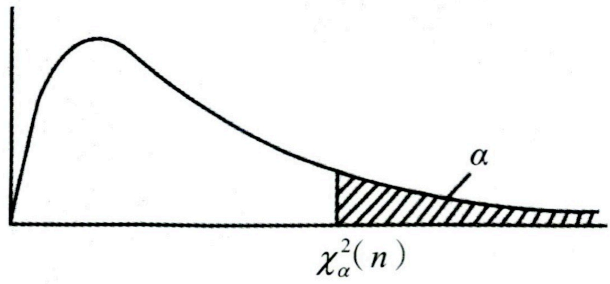
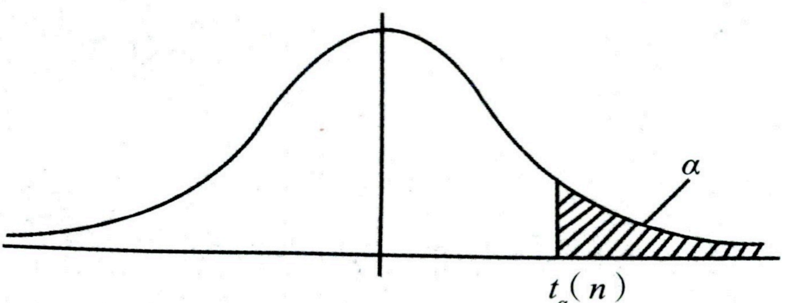
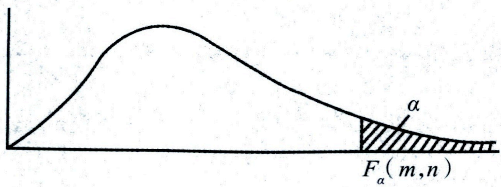

# 第六章 数理统计的基本概念

## 本章配套习题《基础 700 题》P28-P32

## 【大纲要求】

(1)理解总体、简单随机样本、统计量、样本均值、样本方差及样本矩的概念，其中样本方差定义为  $S^{2}=\frac{1}{n-1}\sum_{i=1}^{n}(X_{i}-\overline{X})^{2}$.

(2)了解  $\chi^{2}$ 分布、t 分布和 F 分布的概念及性质,了解上侧  $\alpha$ 分位数的概念并会查表计算.

(3)了解正态总体的常用抽样分布.

(4)掌握正态总体的样本均值、样本方差、样本矩的抽样分布.

(5)了解经验分布函数的概念和性质.(数三)

## 【本章重点】

(1)样本均值、样本方差的形式及其数字特征.

(2)$\chi^{2}$ 分布、t 分布和 F 分布的构成模式.

(3)正态总体的抽样分布.

## 【基础知识】

(1)总体:在数理统计中研究对象的某项数量指标 X 取值的全体称为总体. X 是一个随机变量, X 的分布函数和数字特征分别称为总体的分布函数和数字特征.

(2)个体:总体中的每个元素称为个体.

(3)总体容量:总体中个体的数量称为总体的容量.容量为有限的总体称为有限总体,容量为无限的总体称为无限总体.

(4)简单随机样本：与总体X具有相同的分布，并且每个个体 $X_{1}, X_{2}, \cdots, X_{n}$之间是相互独立，则称 $X_{1}, X_{2}, \cdots, X_{n}$为来自总体X的简单随机样本，n称为样本容量. 它们的观测值 $x_{1}, x_{2}, \cdots, x_{n}$称为样本观测值，简称为样本值.

**良哥解读**

设  $X, X_{1}, X_{2}, \cdots, X_{n}$ 为来自总体 X 的简单随机样本，对这个条件我们需要有两层理解：

(1)$X_{1},X_{2},\cdots,X_{n}$ 相互独立且同总体 X 分布（2）从总体 X 中抽出 n 个简单随机样本, 相当于对总体进行 n 次独立重复观测, 即做了 n 次独立重复试验, 此时可考虑结合二项分布进一步解决问题.

## 一、 样本的联合分布

### （一） 联合分布函数

设总体 X 的分布函数为  $F(x)$,  $X_{1}, X_{2}, \cdots, X_{n}$ 是来自总体 X 的简单随机样本, 则随机变量  $X_{1}, X_{2}, \cdots, X_{n}$ 的联合分布函数为

 $$F(t_{1},t_{2},\cdots,t_{n})=\prod_{i=1}^{n}F(t_{i}),\quad t_{i}\in\mathbf{R},i=1,2,\cdots,n.$$ 

### （二） 联合概率密度函数

设总体 X 的概率密度函数为  $f(x)$，则  $X_{1}, X_{2}, \cdots, X_{n}$ 的联合概率密度为

 $$f(t_{1},t_{2},\cdots,t_{n})=\prod_{i=1}^{n}f(t_{i}),\quad t_{i}\in\mathbf{R},i=1,2,\cdots,n.$$ 

### （三） 样本的经验分布函数（数三）

设  $X_{1}, X_{2}, \cdots, X_{n}$ 是来自总体 X 的简单随机样本，函数

 $$F_{n}(x)=\frac{1}{n}\left\{X_{1},X_{2},\cdots,X_{n}\text{ 中小于或等于 }x\text{ 的个数}\right\},\quad -\infty<x<+\infty$$ 

称为样本的经验分布函数. 当样本观测值  $x_{1}, x_{2}, \cdots, x_{n}$ 取定时,

 $$F_{n}(x)=\frac{1}{n}\left\{x_{1},x_{2},\cdots,x_{n}\right\} 中小于或等于 x 的个数 \int_{-\infty}^{+\infty}e^{-x}<x<+\infty$$ 

称为经验分布函数的观测值.

#### 例

(数三)设  $X_{1}, X_{2}, \cdots, X_{8}$ 是来自总体 X 的样本, 其样本值为: 1, 1, 2, 1, 3, 1, 2, 3. 求样本的经验分布函数的观测值.

【解析】由经验分布函数的定义有

 $$F_{8}(x)=\left\{\begin{array}{ll}0,&x<1,\\\frac{4}{8},&1\leq x<2,\\\frac{6}{8},&2\leq x<3,\\1,&x\geq3,\end{array}\right.\quad 即 F_{8}(x)=\left\{\begin{array}{ll}0,&x<1,\\\frac{1}{2},&1\leq x<2,\\\frac{3}{4},&2\leq x<3,\\1,&x\geq3.\end{array}\right.$$ 

**良哥解读**

计算经验分布函数时，可根据样本的不同取值将数轴分成若干个区间，然后在每个区间上计算经验分布函数值。此题中样本值有1,2,3，故将经验分布函数分成 $x<1,1\leq x<2,2\leq x<3,x\geq3$四段，为保证写出的函数具有右连续性，区间范围需左闭右开。计算经验分布函数的值时，用样本值中小于 $x$的个数除以样本的总个数，比如当 $1\leq x<2$时，小于等于 $x$的样本值为1，且有 $4$个，故 $F_{8}(x)=\frac{4}{8}=\frac{1}{2}$；当 $2\leq x<3$时，小于等于 $x$的样本值有1和2，故 $F_{8}(x)=\frac{6}{8}=\frac{3}{4}$，其他区间可类似计算。

#### 例

(数三)总体X的分布函数为 $F(x)$，设 $X_{1},X_{2},\cdots,X_{n}$为来自总体X的简单随机样本，样本的经验分布函数为 $F_{n}(x)$，对于给定的 $x(0<F(x)<1)$，则 $D(F_{n}(x))$为().

(A) $F(x)(1-F(x))$. (B) $F^{2}(x)$.

(C) $\frac{1}{n}F(x)(1-F(x))$. (D) $\frac{1}{n}F^{2}(x)$.

【解析】由经验分布函数的定义知,对于任意实数 x,

 $$F_{n}(x)=\frac{X_{1},X_{2},\cdots,X_{n} 中小于等于 x 的个数 }{n}.$$ 

记N为 $X_{1},X_{2},\cdots,X_{n}$中小于等于x的个数，则 $N\sim B(n,F(x))$，从而 $F_{n}(x)=\frac{N}{n}$.

 $$\begin{aligned}D(F_{n}(x))&=D(\frac{N}{n})=\frac{1}{n^{2}}D(N)=\frac{1}{n^{2}}\cdot nF(x)(1-F(x))\\&=\frac{1}{n}F(x)(1-F(x)).\end{aligned}$$ 

应选(C).

**良哥解读**

从总体X抽了n个简单随机样本,相当于对总体X进行了n次独立重复观测,每次观测样本是否小于等于x,而小于等于x的概率 $P\{X_{i} \leq x\} = P\{X \leq x\} = F(x)$,N表示样本中小于等于x的个数,由二项分布的背景得 $N \sim B(n, F(x))$.

## 二、 统计量

### （一） 定义

设  $X_{1}, X_{2}, \cdots, X_{n}$ 是来自总体 X 的样本,  $g(t_{1}, t_{2}, \cdots, t_{n})$ 是一个不含未知数的 n 元函数, 则称随机变量  $X_{1}, X_{2}, \cdots, X_{n}$ 的函数  $T = g(X_{1}, X_{2}, \cdots, X_{n})$ 为一个统计量. 设  $x_{1}, x_{2}, \cdots, x_{n}$ 是相应于  $X_{1}, X_{2}, \cdots, X_{n}$ 的样本值, 则称  $g(x_{1}, x_{2}, \cdots, x_{n})$ 为统计量  $T = g(X_{1}, X_{2}, \cdots, X_{n})$ 的观测值.

### （二） 几种常见的统计量

设  $X_{1}, X_{2}, \cdots, X_{n}$ 是来自总体 X 的简单随机样本,  $x_{1}, x_{2}, \cdots, x_{n}$ 是相应于  $X_{1}, X_{2}, \cdots, X_{n}$ 的观测值. 若总体的期望、方差都存在, 记  $E(X) = \mu, D(X) = \sigma^{2}$.

#### 1. 样本均值

称统计量  $\overline{X} = \frac{1}{n} \sum_{i=1}^{n} X_{i}$ 为样本均值, 其观测值为  $\overline{x} = \frac{1}{n} \sum_{i=1}^{n} x_{i}$.

样本本均值的数字特征:  $E(\overline{X}) = E(X) = \mu, D(\overline{X}) = \frac{D(X)}{n} = \frac{\sigma^{2}}{n}$.

#### 2. 样本方差

称统计量  $S^{2}=\frac{1}{2}\sum_{i}^{n}(X_{i}-\overline{X})^{2}$ 为样本方差，其观测值为  $s^{2}=\frac{1}{2}\sum_{i}^{n}(x_{i}-\overline{x})^{2}$

统计量  $S = \sqrt{\frac{1}{n-1}\sum_{i=1}^{n}(X_{i}-\overline{X})^{2}}$ 为样本标准差，其观测值为  $s = \sqrt{n-1}\sum_{i=1}^{n}$

 $$E(S^{2})=D(X)=\sigma^{2}.$$ 

**良哥解读**

(1)考生需要掌握  $E(S^{2}) = D(X) = \sigma^{2}$ 推导过程.

因  $E(S^{2})=E[\frac{1}{n-1}\sum_{i=1}^{n}(X_{i}-\overline{X})^{2}]=\frac{1}{n-1}\sum_{i=1}^{n}E(X_{i}-\overline{X})^{2}$，而

 $$E(X_{i}-\overline{X})^{2}=D(X_{i}-\overline{X})+[E(X_{i}-\overline{X})]^{2},$$ 

又

 $$E(X_{i}-\overline{X})=E(X_{i})-E(\overline{X})=0,$$ 

 $$D(X_{i}-\overline{X})=D(X_{i})+D(\overline{X})-2\operatorname{cov}(X_{i},\overline{X})=\sigma^{2}+\frac{\sigma^{2}}{n}-2\operatorname{cov}(X_{i},\overline{X}),$$ 

又

 $$\begin{aligned}\operatorname{cov}(X_{i},\overline{X})&=\operatorname{cov}(X_{i},\frac{1}{n}\sum_{i=1}^{n}X_{i})=\operatorname{cov}(X_{i},\frac{X_{i}}{n}+\frac{1}{n}\sum_{j=1}^{n}X_{j})\\&=\operatorname{cov}(X_{i},\frac{X_{i}}{n})+\operatorname{cov}(X_{i},\frac{1}{n}\sum_{j=1\atop j\neq i}^{n}X_{j})\\&=\frac{1}{n}\operatorname{cov}(X_{i},X_{i})+\operatorname{cov}(X_{i},\frac{1}{n}\sum_{j=1\atop j\neq i}^{n}X_{j})\\&=\frac{1}{n}D(X_{i})+\operatorname{cov}(X_{i},\frac{1}{n}\sum_{j=1\atop j\neq i}^{n}X_{j}),\end{aligned}$$ 

由于  $X_{i}$ 与  $\frac{1}{n}\sum_{j=1}^{n}X_{j}$ 相互独立，故  $\mathrm{cov}(X_{i},\frac{1}{n}\sum_{j=1}^{n}X_{j})=0$，所以  $\mathrm{cov}(X_{i},\overline{X})=\frac{\sigma^{2}}{n}+0=\frac{\sigma^{2}}{n}$，从而  $D(X_{i}-\overline{X})=\sigma^{2}+\frac{\sigma^{2}+2\sigma^{2}}{n}=\frac{(n-1)\sigma^{2}}{n}$，进而得

 $$E(S^{2})=\frac{1}{n-1}\sum_{i=1}^{n}\frac{(n-1)\sigma^{2}}{n}=\sigma^{2}.$$ 

(2)考生需熟记  $E(S^{2}) = D(X) = \sigma^{2}$ 这个结论并灵活应用. 若题目直接考查计算  $E(S^{2})$，则有  $E(S^{2}) = \sigma^{2}$; 若计算类似  $E[\sum_{i=1}^{n}(X_{i} - \overline{X})^{2}]$，则考虑将其凑成样本方差的形式，再用结论，即

 $$E[\sum_{i=1}^{n}(X_{i}-\overline{X})^{2}]=(n-1)E[\frac{1}{n-1}\sum_{i=1}^{n}(X_{i}-\overline{X})^{2}]=(n-1)\sigma^{2}.$$ 

#### 例

设总体X的概率密度为 $f(x)=\frac{1}{2}\mathrm{e}^{-|x|},-\infty<x<+\infty,X_{1},X_{2},\cdots,X_{n}$为总体的简单随机样本，其样本方差 $S^{2}$，则 $E(S^{2})=$ ___.

【解析】因  $E(S^{2})=D(X)$，又

 $$E(X)=\int_{-\infty}^{+\infty}x\cdot f(x)\mathrm{d}x=\int_{-\infty}^{+\infty}x\cdot\frac{1}{2}\mathrm{e}^{-|x|}\mathrm{d}x=0,$$ 

 $$E(X^{2})=\int_{1}^{+\infty}x^{2}\cdot f(x)dx=\int_{1}^{+\infty}x^{2}\cdot\frac{1}{1-e^{-|x|}}dx=\int_{1}^{+\infty}x^{2}e^{-x}dx=2.$$

故  $E(S^{2})=D(X)=E(X^{2})-[E(X)]^{2}=2$.

#### 例

设  $X_{1}, X_{2}, \cdots, X_{n}$ 是来自二项分布总体  $B(n, p)$ 的简单随机样本， $\overline{X}$ 和  $S^{2}$ 分别为样本均值和样本方差，记统计量  $T = \overline{X} - S^{2}$，则  $E(T) =$ ___.

【解析】因总体服从二项分布  $B(n,p)$，故  $E(\overline{X})=np$， $E(S^{2})=np(1-p)$，则

 $$E(T)=E(\overline{X}-S^{2})=E(\overline{X})-E(S^{2})=np-np(1-p)=np^{2}.$$ 

#### 例

设  $X_{1}, X_{2}, \cdots, X_{n}$ 是来自指数分布总体  $E(2)$ 的简单随机样本， $\overline{X}$ 和  $S^{2}$ 分别为样本均值和样本方差，记统计量  $T = 2\overline{X}^{2} - S^{2}$，则  $E(T) =$ ___.

【解析】因总体服从指数分布  $E(2)$，故  $E(\overline{X})=\frac{1}{2}$， $D(\overline{X})=\frac{D(X)}{n}=\frac{1}{4n}$， $E(S^{2})=\frac{1}{4}$，则

 $$\begin{aligned}E(T)&=E(2\overline{X}^{2}-S^{2})=2E(\overline{X}^{2})-E(S^{2})=2\{D(\overline{X})+[E(\overline{X})]^{2}\}-E(S^{2})\\&=2(\frac{1}{4n}+\frac{1}{4})-\frac{1}{4}=\frac{1}{2n}+\frac{1}{4}.\end{aligned}$$ 

#### 例

设总体X服从正态分布 $N(\mu_{1},\sigma^{2})$，总体Y服从正态分布 $N(\mu_{2},\sigma^{2})$， $X_{1},X_{2},\cdots,X_{n_{1}}$和 $Y_{1},Y_{2},\cdots,Y_{n_{2}}$分别是来自总体X和Y的简单随机样本，则 $E\left[\sum_{i=1}^{n_{1}}(X_{i}-\overline{X})^{2}+\sum_{j=1}^{n_{2}}(Y_{j}-\overline{Y})^{2}\right]=$

【解析】因

 $$E\left[\sum_{i=1}^{n_{1}}(X_{i}-\overline{X})^{2}\right]=(n_{1}-1)E\left[\frac{1}{n_{1}-1}\sum_{i=1}^{n_{1}}(X_{i}-\overline{X})^{2}\right]=(n_{1}-1)\sigma^{2},$$ 

 $$E\left[\sum_{j=1}^{n_{2}}(Y_{j}-\overline{Y})^{2}\right]=(n_{2}-1)E\left[\frac{1}{n_{2}-1}\sum_{j=1}^{n_{2}}(Y_{j}-\overline{Y})^{2}\right]=(n_{2}-1)\sigma^{2},$$ 

故

 $$\begin{aligned}&E\frac{\sum\limits_{i=1}^{n_{1}}(X_{i}-\overline{X})^{2}+\sum\limits_{j=1}^{n_{2}}(Y_{j}-\overline{Y})^{2}}{1}\\&\left.\quad n_{1}+n_{2}-2\quad\right.\\&\left.\quad n_{1}+n_{2}-2\quad\left\{\begin{array}{l}E\left[\sum\limits_{i=1}^{n_{1}}(X_{i}-\overline{X})^{2}\right]+E\left[\sum\limits_{j=1}^{n_{2}}(Y_{j}-\overline{Y})^{2}\right]\\E\left[\sum\limits_{j=1}^{n_{1}}(X_{i}-\overline{X})^{2}\right]+(n_{1}-1)E\left[\frac{1}{n_{2}-1}(Y_{j}-\overline{Y})^{2}\right]\end{array}\right]\right.\\&\left.\quad=\frac{1}{n_{1}+n_{2}-2}\quad\left\{\begin{array}{l}(n_{1}-1)E\left[\frac{1}{n_{1}-1}\sum\limits_{i=1}^{n_{1}}(X_{i}-\overline{X})^{2}\right]+(n_{2}-1)E\left[\frac{1}{n_{2}-1}\sum\limits_{j=1}^{n_{2}}(Y_{j}-\overline{Y})^{2}\right]\end{array}\right]\right.\\&\left.\quad=\frac{1}{n_{1}+n_{2}-2}\quad\left[(n_{1}-1)\sigma^{2}+(n_{2}-1)\sigma^{2}\right]=\sigma^{2}.\right.\end{aligned}$$ 

#### 例

设  $X_{1}, X_{2}, \cdots, X_{n} (n > 2)$ 为来自总体  $N(0, \sigma^{2})$ 的简单随机样本，其样本均值为  $\overline{X}$，记  $Y_{i} = X_{i} - \overline{X}$， $i = 1, 2, \cdots, n$。求  $D(Y_{i})$， $i = 1, 2, \cdots, n$。

【解析】法一:由题设知  $X_{1}, X_{2}, \cdots, X_{n} (n > 2)$ 相互独立,且均服从  $N(0, \sigma^{2})$,故

 $$D(X_{i})=\sigma^{2}\quad(i=1,2,\cdots,n),D(\overline{X})=\frac{\sigma^{2}}{n},$$ 

因为  $D(Y_{i})=D(X_{i}-\overline{X})=D(X_{i})+D(\overline{X})-2\mathrm{cov}(X_{i},\overline{X})$，又

$$\begin{aligned}\operatorname{cov}(X_{i},\overline{X})&=\operatorname{cov}(X_{i},\frac{1}{n}X_{i}+\frac{1}{n}\sum_{\substack{j=1\\ j\neq i}}^{n}X_{j})\\&=\frac{1}{n}\operatorname{cov}(X_{i},X_{i})+\operatorname{cov}(X_{i},\frac{1}{n}\sum_{\substack{j=1\\ j\neq i}}^{n}X_{j})\\&=\frac{1}{n}D(X_{i})+0=\frac{\sigma^{2}}{n},\end{aligned}$$ 

所以  $D(Y_{i})=\sigma^{2}+\frac{\sigma^{2}}{n}-\frac{2\sigma^{2}}{n}=\frac{n-1}{n}\sigma^{2}$.

法二: 可借助  $E(S^{2})=\sigma^{2}$ 这个结论解决.

 $$\begin{aligned}D(Y_{i})&=D(X_{i}-\overline{X})=E(X_{i}-\overline{X})^{2}-[E(X_{i}-\overline{X})]^{2}\\&=\frac{1}{n}\sum_{i=1}^{n}E(X_{i}-\overline{X})^{2}-[E(X_{i})-E(\overline{X})]^{2}\\&=\frac{1}{n}\sum_{i=1}^{n}E(X_{i}-\overline{X})^{2}-0=\frac{1}{n}E[\sum_{i=1}^{n}(X_{i}-\overline{X})^{2}]\\&=\frac{n-1}{n}E[\frac{1}{n-1}\sum_{i=1}^{n}(X_{i}-\overline{X})^{2}]=\frac{n-1}{n}\sigma^{2}.\end{aligned}$$ 

**良哥解读**

由于  $E(X_{1}-\overline{X})^{2}=E(X_{2}-\overline{X})^{2}=\cdots=E(X_{n}-\overline{X})^{2}$，故  $E(X_{i}-\overline{X})^{2}=\frac{1}{n}\sum_{i=1}^{n}E(X_{i}-\overline{X})^{2}$.

#### 3. 样本的 k 阶原点矩

称统计量  $A_{k}=\frac{1}{n}\sum_{i=1}^{n}X_{i}^{k}$ 为样本的 k 阶原点矩，其观测值为  $a_{k}=\frac{1}{n}\sum_{i=1}^{n}x_{i}^{k}, k=1,2,\cdots$.

如果总体的X的k阶原点矩 $E(X^{k})=\mu_{k}, k=1,2,\cdots$存在，则当 $n\to\infty$时，有 $A_{k}=\frac{1}{n}\sum_{i=1}^{n}X_{i}^{k}\xrightarrow{P}\mu_{k}$，k=1,2,\cdots，即样本的k阶原点矩依概率收敛到总体的k阶原点矩，这也是参数估计中矩估计的理论依据.

#### 4. 样本的 k 阶中心矩

称统计量  $B_{k}=\frac{1}{n}\sum_{i=1}^{n}(X_{i}-\overline{X})^{k}$ 为样本的 k 阶中心矩，其观测值为： $b_{k}=\frac{1}{n}\sum_{i=1}^{n}(x_{i}-\overline{x})^{k},k=2,3,\cdots$

5. 顺序统计量

称统计量  $X_{(1)}=\min(X_{1},X_{2},\cdots,X_{n})$ 为最小顺序统计量,  $X_{(n)}=\max(X_{1},X_{2},\cdots,X_{n})$ 为最大顺序统计量.

**良哥解读**

最大(最小)顺序统计量主要涉及两方面的考查.

(1)求最大(最小)顺序统计量的分布. 设总体 X 的分布函数为  $F(x)$,  $X_{1}, X_{2}, \cdots, X_{n}$ 是来自总体 X 的简单随机样本, 则统计量  $X_{(n)} = \max(X_{1}, X_{2}, \cdots, X_{n})$ 和  $X_{(1)} = \min(X_{1}, X_{2}, \cdots, X_{n})$ 的分布函数分别为

 $$F_{X_{(n)}}(x)=P\left\{\max(X_{1},X_{2},\cdots,X_{n})\leq x\right\}=\left[F(x)\right]^{n}$$ 

 $$F_{X_{(1)}}(x)=P\left\{\min(X_{1},X_{2},\cdots,X_{n})\leq x\right\}=1-\left[1-F(x)\right]^{n}$$ 

(2)求最大(最小)顺序统计量的期望、方差. 若总体为连续型总体, 由(1)可得其分布函数  $F_{X_{(n)}}(x)$,  $F_{X_{(1)}}(x)$, 进而可得概率密度为  $f_{X_{(n)}}(x) = F'_{X_{(n)}}(x)$,  $f_{X_{(1)}}' = F'_{X_{(1)}}(x)$, 再借助期望、方差的计算公式即可.

#### 例

设总体X的概率密度为

 $$f(x)=\left\{\begin{aligned}&2\mathrm{e}^{-2(x-\theta)},&x>\theta,\\ &0,&x\leq\theta,\end{aligned}\right.$$ 

其中  $\theta>0$ 是未知参数. 从总体 X 中抽取简单随机样本  $X_{1}, X_{2}, \cdots, X_{n}$，记  $\hat{\theta}=\min(X_{1}, X_{2}, \cdots, X_{n})$.

(1)求总体 X 的分布函数  $F(x)$.

(2)求统计量  $\hat{\theta}$ 的分布函数  $F_{\hat{\theta}}(x)$.

(3)求  $E(\hat{\theta})$.

【解析】(1)因  $F(x)=\int_{-\infty}^{x}f(t)dt$，则：

当 $x<\theta$时, $F(x)=0$;

当  $x \geq \theta$ 时,  $F(x) = \int_{-\infty}^{x} f(t) dt = \int_{\theta}^{x} 2e^{-2(t-\theta)} dt = 1 - e^{-2(x-\theta)}$.

故  $F(x)=\left\{\begin{aligned}&1-\mathrm{e}^{-2(x-\theta)},&x\geq\theta,\\ &0,&x<\theta.\end{aligned}\right.$

(2)由分布函数的定义有

 $$\begin{aligned}F_{\hat{\theta}}(x)&=P\{\hat{\theta}\leq x\}=P\{\min(X_1,X_2,\cdots,X_n)\leq x\}\\&=1-P\{\min(X_1,X_2,\cdots,X_n)>x\}\\&=1-P\{X_1>x,X_2>x,\cdots,X_n>x\}\\&=1-P\{X_1>x\}P\{X_2>x\}\cdots P\{X_n>x\}\\&=1-[1-F(x)]^n,\end{aligned}$$ 

当  $x < \theta$ 时， $F_{\hat{\theta}}(x) = 0$;

当  $x \geq \theta$ 时， $F_{\hat{\theta}}(x) = 1 - \left\{1 - [1 - e^{-2(x - \theta)}] \right\}^{n} = 1 - e^{-2n(x - \theta)}$.

故  $F_{\hat{\theta}}(x)=\left\{\begin{aligned}&1-\mathrm{e}^{-2n(x-\theta)},&&x\geq\theta,\\ &0,&&x<\theta.\end{aligned}\right.$

(3)由(2)得  $\hat{\theta}$ 的密度函数

 $$f_{\hat{\theta}}(x)=F_{\hat{\theta}}^{\prime}(x)=\begin{cases}2n\mathrm{e}^{-2n(x-\theta)},&x\geq\theta,\\ 0,& 其他 .\end{cases}$$ 

故

 $$\begin{aligned}E(\hat{\theta})&=\int_{-\infty}^{+\infty}x f_{\hat{\theta}}(x)\mathrm{d}x=\int_{\theta}^{+\infty}x\cdot2n\mathrm{e}^{-2n(x-\theta)}\mathrm{d}x\overset{ 令 t=x-\theta}{=}\int_{0}^{+\infty}(t+\theta)\cdot2n\cdot\mathrm{e}^{-2nt}\mathrm{d}t\\&=\int_{0}^{+\infty}t\cdot2n\cdot\mathrm{e}^{-2nt}\mathrm{d}t+\theta\int_{0}^{+\infty}2n\cdot\mathrm{e}^{-2nt}\mathrm{d}t=\frac{1}{2n}+\theta.\end{aligned}$$ 

## 三、 三大分布

### （一） $x^{2}$分布

#### 1. 典型模式

设随机变量  $X_{1}, X_{2}, \cdots, X_{n}$ 相互独立，都服从标准正态分布  $N(0,1)$，称随机变量  $\chi^{2}=X_{1}^{2}+X_{2}^{2}+\cdots+X_{n}^{2}$ 为服从自由度是 n 的  $\chi^{2}$ 分布，记作  $\chi^{2}\sim\chi^{2}(n)$.

#### 2. $x^{2}$ 分布的性质

设  $X \sim \chi^{2}(m)$,  $Y \sim \chi^{2}(n)$，且 X 和 Y 相互独立，则  $X + Y \sim \chi^{2}(m + n)$;

#### 3. 上  $\alpha$ 分位点  $\chi_{\alpha}^{2}(n)$

设  $X \sim \chi^{2}(n)$，对于任给定的  $\alpha (0 < \alpha < 1)$，称满足条件  $P\left\{X > \chi_{a}^{2}(n)\right\} = \alpha$ 的点  $\chi_{a}^{2}(n)$ 为 X 的上  $\alpha$ 分位点.

a

 $\chi_{\alpha}^{2}(n)$

 $\chi^{2}$ 分布上  $\alpha$ 分位点

#### 4. $\chi^{2}$ 分布的数字特征

设  $X \sim \chi^{2}(n)$，则有  $E(X) = n, D(X) = 2n$.

**良哥解读**

(1)若  $X \sim N(0,1)$，则  $X^{2} \sim \chi^{2}(1)$.

(2)若  $X \sim N(\mu, \sigma^{2})$，求  $D[(X - \mu)^{2}]$.

因 $\frac{X-\mu}{\sigma}\sim N(0,1)$，故 $\frac{(X-\mu)^{2}}{\sigma^{2}}\sim\chi^{2}(1)$。又 $D[\chi^{2}(1)]=2$，故有 $D[\frac{(X-\mu)^{2}}{\sigma^{2}}]=2$，从而得 $D[(X-\mu)^{2}]=2\sigma^{4}$。思维定势：若遇到正态分布的平方求方差，考虑用 $\chi^{2}$分布方差的结论计算。

（二）t 分布

#### 1. 典型模式

设随机变量  $X \sim N(0,1)$,  $Y \sim \chi^{2}(n)$, 且 X 和 Y 相互独立, 则随机变量  $t = \frac{X}{\sqrt{Y/n}}$ 服从自由度为 n 的 t 分布 (学生氏 t 分布), 记作  $t \sim t(n)$.

2. t 分布的性质

 $t(n)$ 分布的概率密度  $f(x)$ 是偶函数且有  $\lim_{n\to\infty}f(x)=\frac{1}{\sqrt{2\pi}}e^{-\frac{x^2}{2}}$，即当 n 充分大时， $t(n)$ 分布近似  $N(0,1)$ 分布.

#### 3. 上  $\alpha$ 分位点  $t_{\alpha}(n)$

设  $X \sim t(n)$，对于任给定的  $\alpha (0 < \alpha < 1)$，称满足条件  $P\{X > t_{\alpha}(n)\} = \alpha$ 的点  $t_{\alpha}(n)$ 为 t 分布的上  $\alpha$ 分位点。由于  $t(n)$ 分布的概率密度是偶函数，因此  $t_{1-\alpha}(n) = -t_{\alpha}(n)$。

 $\alpha$

 $t(n)$

### （三） F 分布

#### 1. 典型模式

设  $X \sim \chi^{2}(m)$,  $Y \sim \chi^{2}(n)$，且随机变量 X, Y 相互独立，则随机变量  $F = \frac{X/m}{Y/n}$ 服从自由度为  $(m, n)$ 的 F 分布，记作  $F \sim F(m, n)$.

#### 2. F 的分布性质

设  $F \sim F(m, n)$，则  $\frac{1}{F} \sim F(n, m)$.

【注】若  $F \sim F(n, n)$，则  $\frac{1}{F} \sim F(n, n)$，即 F 与  $\frac{1}{F}$ 同分布.

#### 3. 上  $\alpha$ 分位点  $F_{\alpha}(m, n)$

设  $F \sim F(m, n)$，对于任给定的  $\alpha (0 < \alpha < 1)$，称满足条件  $P\{F > F_{a}(m, n)\} = \alpha$ 的点  $F_{\alpha}(m, n)$ 为  $F(m, n)$ 的上  $\alpha$ 分位点，且有  $F_{1-\alpha}(m, n) = \frac{1}{F_{a}(n, m)}$.

 $f(x)$

 $F_{a}(m,n)$

F 分布上  $\alpha$ 分位点

#### 4. t 分布与 F 分布的关系

若  $T \sim t(n)$，则  $T^{2} \sim F(1, n)$.

因  $T \sim t(n)$，则存在  $X \sim N(0,1)$， $Y \sim \chi^{2}(n)$，且 X 和 Y 相互独立，有  $T = \frac{X}{\sqrt{Y/n}}$.

又  $T^{2} = \frac{X^{2}}{Y/n}$，而  $X^{2} \sim \chi^{2}(1)$，且  $X^{2}$ 和 Y 相互独立，故由 F 分布的典型模式有  $T^{2} = \frac{X^{2}/1}{Y/n} \sim F(1,n)$.

#### 例

设随机变量 X 和 Y 都服从标准正态分布，则 ( ).

(A)  $X + Y$ 服从正态分布 (B)  $X^{2} + Y^{2}$ 服从  $\chi^{2}(2)$

(C)  $X^{2}$ 和  $Y^{2}$ 都服从  $\chi^{2}(1)$ (D)  $X^{2}/Y^{2}$ 服从 F(1,1)

【解析】因  $X \sim N(0,1)$,  $Y \sim N(0,1)$, 故由  $\chi^{2}$ 的典型模式知  $X^{2}$ 与  $Y^{2}$ 均服从  $\chi^{2}(1)$, 所以选项(C)正确.

对于(A)选项:若 X 与 Y 相互独立或者 (X,Y) 服从二维正态分布,则 X+Y 服从正态分布,但这两个前提都没有,故 X+Y 是否服从正态分布不确定,所以(A)选项错误.

对于(B)、(D)选项:若X与Y相互独立,则 $X^{2}+Y^{2}$服从 $\chi^{2}(2)$, $X^{2}/Y^{2}\sim F(1,1)$,但条件没有X与Y相互独立,所以(B)(D)选项均错误.

#### 例

设  $X_{1}, X_{2}, X_{3}, X_{4}$ 是来自正态总体  $N(0,2^{2})$ 的简单随机样本,  $X = a(X_{1} - 2X_{2})^{2} + b(3X_{3} - 4X_{4})^{2}$，则当  $a = \underline{\qquad}$,  $b = \underline{\qquad}$时，统计量 X 服从  $\chi^{2}$ 分布，其自由度为 ___.

【解析】因 $X_{1}, X_{2}, X_{3}, X_{4}$为来自总体 $N(0,2^{2})$的简单随机样本，故 $X_{i}\sim N(0,2^{2})$， $(i=1,2,3,4)$，且

$X_{1}, X_{2}, X_{3}, X_{4}$ 相互独立，进而有  $X_{1}-2X_{2}\sim N(0,20)$， $3X_{3}-4X_{4}\sim N(0,100)$，且  $X_{1}-2X_{2}$ 与  $3X_{3}-4X_{4}$ 相互独立.

又  $\frac{X_{1}-2X_{2}-0}{\sqrt{20}}\sim N(0,1),\frac{3X_{3}-4X_{4}-0}{\sqrt{100}}\sim N(0,1)$，由  $\chi^{2}$ 分布的构成形式，有

 $$\frac{(X_{1}-2X_{2})^{2}}{20}+\frac{(3X_{3}-4X_{4})^{2}}{100}\sim\chi^{2}(2).$$ 

所以当  $a=\frac{1}{20}$,  $b=\frac{1}{100}$ 时, X 服从  $\chi^{2}$ 分布, 自由度为 2.

【注】事实上,此题当  $a=\frac{1}{20}$, b=0 时, X 服从自由度为 1 的  $\chi^{2}$ 分布; 当 a=0, b= $\frac{1}{100}$ 时, X 也服从自由度为 1 的  $\chi^{2}$ 分布.

#### 例

设随机变量 X 和 Y 相互独立且都服从于  $N(0,3^{2})$，而  $X_{1}, X_{2}, \cdots, X_{9}$ 和  $Y_{1}, Y_{2}, \cdots, Y_{9}$ 分别是来自总体 X 和 Y 的简单随机样本，则统计量  $U = \frac{X_{1} + X_{2} + \cdots + X_{9}}{\sqrt{Y_{1}^{2} + Y_{2}^{2} + \cdots + Y_{9}^{2}}}$ 服从 ___ 分布，参数为 ___.

【解析】由题意易得到  $X_{1},\cdots,X_{9}$ 相互独立，且均服从  $N(0,3^{2})$.  $Y_{1},\cdots,Y_{9}$ 相互独立，且均服从  $N(0,3^{2})$. 由相互独立的正态分布的线性组合服从一维正态分布，则

 $$X_{1}+\cdots+X_{9}\sim N(0,81).$$ 

将其标准化得

 $$\frac{X_{1}+\cdots+X_{9}-0}{\sqrt{81}}=\frac{X_{1}+\cdots+X_{9}}{9}\sim N(0,1).$$ 

将  $Y_{i}$ 标准化有

 $$\frac{Y_{i}-0}{3}=\frac{Y_{i}}{3}\sim N(0,1),\quad i=1,2,\cdots,9.$$ 

由  $\chi^{2}$ 的构成形式知

 $$\frac{Y_{1}^{2}+Y_{2}^{2}+\cdots+Y_{9}^{2}}{9}\sim\chi^{2}(9).$$ 

因总体 X 与 Y 相互独立,故  $\frac{X_{1}+\cdots+X_{9}}{9}$ 与  $\frac{Y_{1}^{2}+Y_{2}^{2}+\cdots Y_{9}^{2}}{9}$ 也相互独立,由 t 分布的构成形式,有

 $$\frac{\frac{X_{1}+\cdots+X_{9}}{9}}{\sqrt{\frac{(Y_{1}^{2}+\cdots+Y_{9}^{2})}{9}}}\sim t(9),$$ 

化简有

 $$\frac{X_{1}+\cdots+X_{9}}{\sqrt{Y_{1}^{2}+\cdots+Y_{9}^{2}}}\sim t(9).$$ 

所以 U 服从参数为 9 的 t 分布.

#### 例

设总体X服从正态分布 $N(0,2^{2})$，而 $X_{1},X_{2},\cdots,X_{15}$是来自总体X的简单随机样本，则随机变量 $Y=\frac{X_{1}^{2}+X_{2}^{2}+\cdots+X_{10}^{2}}{2(X_{11}^{2}+X_{12}^{2}+\cdots+X_{15}^{2})}$服从___分布，参数为___。

【解析】由题意有  $X_{1}, X_{2}, \cdots, X_{15}$ 相互独立，且均服从  $N(0,2^{2})$。将其标准化有

$$\frac{x_{i}-0}{2}\sim N(0,1),\quad i=1,2,\cdots,15.$$ 

由  $\chi^{2}$ 分布的构成形式有

 $$\sum_{i=1}^{10}\left(\frac{X_{i}}{2}\right)^{2}=\frac{X_{1}^{2}+\cdots+X_{10}^{2}}{4}\sim\chi^{2}(10),\quad\sum_{i=11}^{15}\left(\frac{X_{i}}{2}\right)^{2}=\frac{X_{11}^{2}+\cdots+X_{15}^{2}}{4}\sim\chi^{2}(5),$$ 

因  $X_{1}, X_{2}, \cdots, X_{15}$ 相互独立，故有  $\frac{X_{1}^{2} + \cdots + X_{10}^{2}}{4}$ 与  $\frac{X_{11}^{2} + \cdots + X_{15}^{2}}{4}$ 相互独立，由 F 分布的构成形式，有

 $$\frac{X_{1}^{2}+\cdots+X_{10}^{2}}{4}\bigg/10=\frac{X_{1}^{2}+\cdots+X_{10}^{2}}{2(X_{11}^{2}+\cdots+X_{15}^{2})}\sim F(10,5).$$ 

所以 Y 服从第一自由度为 10, 第二自由度为 5 的 F 分布.

#### 例

设随机变量  $X \sim t(n)(n > 1)$,  $Y = \frac{1}{X^{2}}$, 则 ( )。

(A)  $Y \sim \chi^{2}(n)$

(B)  $Y \sim \chi^{2}(n-1)$

(C)  $Y \sim F(n,1)$

(D)  $Y \sim F(1,n)$

【解析】因  $X \sim t(n)$，则由 t 分布的构成形式知，存在  $X_{1} \sim N(0,1)$， $X_{2} \sim \chi^{2}(n)$，且  $X_{1}$ 与  $X_{2}$ 相互独立， $X = \frac{X_{1}}{\sqrt{X_{2}/n}}$，故  $X^{2} = \frac{X_{1}^{2}}{X_{2}/n}$，则

 $$Y=\frac{1}{X^{2}}=\frac{X_{2}/n}{X_{1}^{2}}=\frac{X_{2}/n}{X_{1}^{2}/1},$$ 

因  $X_{1}$ 与  $X_{2}$ 相互独立,  $X_{1}^{2}$ 与 X, 也相互独立, 由 F 分布的构成形式有 Y~F(n,1). 故应选 (C).

## 四、 正态总体抽样分布

### （一） 一个正态总体的抽样分布

设  $X_{1}, X_{2}, \cdots, X_{n}$ 是来自正态总体  $X \sim N(\mu, \sigma^{2})$ 的简单随机样本,  $\overline{X}$ 是样本均值,  $S^{2}$ 是样本方差, 则有:

(1)$\overline{X} \sim N(\mu, \frac{\sigma^{2}}{n})$,  $U = \frac{\overline{X} - \mu}{\sigma / \sqrt{n}} \sim N(0,1)$（2）$\overline{X}$ 与  $S^{2}$ 相互独立，且  $\frac{(n-1)S^{2}}{\sigma^{2}}\sim\chi^{2}(n-1)$
（3）$t = \frac{\overline{X} - \mu}{S / \sqrt{n}} \sim t(n-1)$
（4）$\chi^{2} = \frac{1}{\sigma^{2}} \sum_{i=1}^{n} (X_{i} - \mu)^{2} \sim \chi^{2}(n)$.

**良哥解读**

(1)因  $\overline{X} = \frac{1}{n} \sum_{i=1}^{n} X_{i}$ 是由 n 个独立正态分布的线性性组合构成, 故  $\overline{X}$ 服从一维正态分布, 期望  $E(\overline{X}) = \mu$, 方差  $D(\overline{X}) = \frac{\sigma^{2}}{n}$, 从而  $\overline{X} \sim N(\mu, \frac{\sigma^{2}}{n})$, 将其标准化有  $\frac{\overline{X} - \mu}{\sigma / \sqrt{n}} \sim N(0,1)$.

(2)$\overline{X}$ 与  $S^{2}$ 相互独立,且  $\frac{(n-1)S^{2}}{\sigma^{2}}\sim\chi^{2}(n-1)$ 的证明考生不需要掌握,只需熟记结论,会用这两个结论解决问题即可.这两个结论常用于计算一个正态总体抽样的数字特征问题.

例如: 设  $X_{1}, X_{2}, \cdots, X_{n}$ 是来自正态总体  $X \sim N(\mu, \sigma^{2})$ 的简单随机样本,  $\overline{X}$ 是样本均值,  $S^{2}$ 是样本方差, 求: ①  $E(\overline{X}S^{2})$; ②  $D(S^{2})$.

① 由于  $\overline{X}$ 与  $S^{2}$ 相互独立，故  $E(\overline{X}S^{2})=E(\overline{X})E(S^{2})=\mu\sigma^{2}$;

② 由于  $\frac{(n-1)S^{2}}{\sigma^{2}}\sim\chi^{2}(n-1)$，故  $D\left[\frac{(n-1)S^{2}}{\sigma^{2}}\right]=2(n-1)$，利用方差的性质得  $\frac{(n-1)^{2}}{\sigma^{4}}D(S^{2})=2(n-1)$，从而有  $D(S^{2})=\frac{2\sigma^{4}}{n-1}$.

思维定势: 若题目是从一个正态总体抽样, 计算样本方差的方差 (或计算类似样本方差形式的质量, 比如  $\sum_{i=1}^{n} (X_{i} - \overline{X})^{2}$ 的方差), 用  $\chi^{2}$ 分布的方差结论计算.

(3)因  $\overline{X}$ 与  $S^{2}$ 相互独立，故  $\frac{\overline{X}-\mu}{\sigma/\sqrt{n}}$ 与  $\frac{(n-1)S^{2}}{\sigma^{2}}$ 也相互独立，又  $\frac{\overline{X}-\mu}{\sigma/\sqrt{n}}\sim N(0,1)$， $\frac{(n-1)S^{2}}{\sigma^{2}}\sim\chi^{2}(n-1)$，则由 t 分布的典型模式有

 $\frac{\overline{X}-\mu}{\sigma^{2}}/\sqrt{\frac{(n-1)S^{2}}{\sigma^{2}}}/n-1=\frac{\overline{X}-\mu}{s/\sqrt{n}}\sim t(n-1).$

(4)因  $X_{1}, X_{2}, \cdots, X_{n}$ 相互独立，且均服从  $N(\mu, \sigma^{2})$，故  $\frac{X_{i} - \mu}{\sigma} \sim N(0, 1)$， $i = 1, 2 \cdots n$，由  $\chi^{2}$ 分布的典型模式得  $\sum_{i=1}^{n} \left( \frac{X_{i} - \mu}{\sigma} \right)^{2} = \frac{1}{\sigma^{2}} \sum_{i=1}^{n} (X_{i} - \mu)^{2} \sim \chi^{2}(n)$.

#### 例

设  $X_{1}, X_{2}, \cdots, X_{n} (n \geq 2)$ 为来自总体  $N(0,1)$ 的简单随机样本， $\bar{X}$ 为样本本方差，则 ( )。

(A)  $n\bar{X} \sim N(0,1)$ (B)  $nS^{2} \sim \chi^{2}(n)$

(C)  $\frac{(n-1)\bar{X}}{S} \sim t(n-1)$

(D)  $\frac{(n-1)X_{1}^{2}}{\sum_{i=2}^{n}X_{i}^{2}} \sim F(1, n-1)$

【解析】因  $X_{1}, X_{2}, \cdots, X_{n}$ 为来自  $N(0,1)$ 的简单随机样本，故由一个正态总体抽样分布的结论知， $\frac{\overline{X}-\mu}{\sigma/\sqrt{n}}\sim N(0,1)$，即  $\frac{\overline{X}-0}{1/\sqrt{n}}=\sqrt{n}\overline{X}\sim N(0,1)$，排除(A).

由  $\frac{(n-1)S^{2}}{\sigma^{2}}\sim\chi^{2}(n-1)$，得  $(n-1)S^{2}\sim\chi^{2}(n-1)$，排除(B).

由  $\frac{\overline{X}-\mu}{S/\sqrt{n}}\sim t(n-1)$，即  $\frac{\overline{X}-0}{S/\sqrt{n}}=\frac{\sqrt{n}\overline{X}}{S}\sim t(n-1)$，排除(C).

事实上，对于(D)选项：因 $X_{1}^{2}\sim\chi^{2}(1),\sum_{i=2}^{}X_{i}^{2}\sim\chi^{2}(n-1)$。又 $X_{1}^{2}$与 $\sum_{i=2}^{}X_{i}^{2}$相互独立，由F分布的构成形式有 $\frac{X_{1}^{2}/1}{\sum_{i=2}^{}X_{i}^{2}/(n-1)}\sim F(1,n-1)$，化简有 $\frac{(n-1)X_{1}^{2}}{n}\sim F(1,n-1)$。

#### 例

设  $X_{1}, X_{2}, \cdots, X_{n}$ 是来自正态总体  $N(\mu, \sigma^{2})$ 的简单随机样本,  $\overline{X}$ 是样本均值, 记

 $$S_{1}^{2}=\frac{1}{n-1}\sum_{i=1}^{n}(X_{i}-\overline{X})^{2},\quad S_{2}^{2}=\frac{1}{n}\sum_{i=1}^{n}(X_{i}-\overline{X})^{2},$$ 

 $$S_{3}^{2}=\frac{1}{n-1}\sum_{i=1}^{n}(X_{i}-\mu)^{2},\quad S_{4}^{2}=\frac{1}{n}\sum_{i=1}^{n}(X_{i}-\mu)^{2},$$ 

则服从自由度为 $n-1$ 的 $t$ 分布的随机变量是( ).

(A) $t=\frac{\overline{X}-\mu}{S_{1}/\sqrt{n-1}}$

(B) $t=\frac{\overline{X}-\mu}{S_{2}/\sqrt{n-1}}$

(C) $t=\frac{\overline{X}-\mu}{S_{3}/\sqrt{n}}$

(D) $t=\frac{\overline{X}-\mu}{S_{4}/\sqrt{n}}$

【解析】由一个正态总体的抽样分布有  $\frac{\bar{X}-\mu}{S/\sqrt{n}}\sim t(n-1)$，其中  $S^{2}=\frac{1}{n-1}\sum_{i=1}^{n}(X_{i}-\bar{X})^{2}$。此题中  $S_{1}^{2}=S^{2}$，故排除（A）。

对于(B)选项，虽然  $S_{2}^{2}=\frac{1}{n}\sum_{i=1}^{n}(X_{i}-\overline{X})^{2}$ 不是  $S^{2}$，但有  $\frac{nS_{2}^{2}}{n-1}=\frac{1}{n-1}\sum_{i=1}^{n}(X_{i}-\overline{X})^{2}=S^{2}$。故有  $\frac{\bar{X}-\mu}{S/\sqrt{n}}=\frac{\bar{X}-\mu}{nS_{2}^{2}}\sim t(n-1)$，化简得  $\frac{\bar{X}-\mu}{S_{2}/\sqrt{n-1}}\sim t(n-1)$。

从而(B)选项正确,故应选(B).

**良哥解读**

(C)(D)选项对考生有一定的干扰性. 根据一个正态总体抽样分布知, 若要得到  $t(n-1)$, 需要用到样本方差  $S^{2}=\frac{1}{n-1}\sum_{i=1}^{n}(X_{i}-\overline{X})^{2}$, 但  $S_{3}^{2}=\frac{1}{n-1}\sum_{i=1}^{n}(X_{i}-\mu)^{2}$ 与  $S_{4}^{2}=\frac{1}{n}\sum_{i=1}^{n}(X_{i}-\mu)^{2}$ 都不能化为样本方差形式, 故可直接排除.

#### 例

已知总体X服从正态分布 $N(\mu,\sigma^{2}),X_{1},X_{2},\cdots,X_{n}$是来自总体的简单随机样本, $\overline{X}=\frac{1}{n}\sum_{i=1}^{n}X_{i}$, $S_{n}^{2}=\frac{1}{n}\sum_{i=1}^{n}(X_{i}-\overline{X})^{2}$,则 $E(\overline{X}S_{n}^{2})=$ ___.

【解析】因样本均值  $\overline{X}$ 与样本方差  $S^{2}$ 相互独立，虽然  $S_{n}^{2}=\frac{1}{n}\sum_{i=1}^{n}(X_{i}-\overline{X})^{2}$ 不是样本方差  $S^{2}$，但  $\frac{nS_{n}^{2}}{n-1}=\frac{1}{n-1}\sum_{i=1}^{n}(X_{i}-\overline{X})^{2}=S^{2}$，故  $E(\overline{X}S_{n}^{2})=\frac{n-1}{n}E(\overline{X}S_{n}^{2})=\frac{n-1}{n}E(\overline{X})E(S^{2})=\frac{n-1}{n}\mu\sigma^{2}$.

#### 例

设总体X服从 $N(0,1)$， $X_{1}$， $X_{2}$， $X_{3}$， $X_{4}$是取自总体的简单随机样本， $\overline{X}$， $S^{2}$分别为样本均值和样本方差， $T=5\overline{X}^{2}+\frac{1}{4}S^{2}$，求 $E(T)$， $D(T)$.

切与 $E(\overline{V}^{2})$， $D(\overline{V})+\left[E(\overline{X})\right]^{2}=\frac{1}{1}+0^{2}=\frac{1}{2}$， $E(S^{2})=D(X)=1$，所以

$$E(T)=5E(X^{2})+\frac{1}{4}E(S^{2})=\frac{3}{4}+\frac{1}{4}=\frac{3}{2}.$$ 

又  $\overline{X}$ 与  $S^{2}$ 相互独立，故  $D(T)=5^{2}D(\overline{X}^{2})+\frac{1}{4^{2}}D(S^{2})$.

因为 $\frac{(4-1)S^{2}}{1}\sim\chi^{2}(3)$，所以 $D(3S^{2})=2\times3=6$，从而得 $D(S^{2})=\frac{6}{9}=\frac{2}{3}$。

因为 $\frac{\bar{X}-0}{1/\sqrt{4}}=2\overline{X}\sim N(0,1)$，从而 $4(\overline{X})^{2}\sim\chi^{2}(1)$，则 $D[4(\overline{X})^{2}]=2$，从而有 $16D(\overline{X})^{2}=2\Rightarrow D(\overline{X})^{2}=\frac{1}{8}$

所以  $D(T)=5^{2}\times\frac{1}{8}+\frac{1}{4^{2}}\times\frac{2}{3}=\frac{19}{6}$

### （二） 两个正态总体的抽样分布

设  $X \sim N(\mu_{1}, \sigma_{1}^{2}), Y \sim N(\mu_{2}, \sigma_{2}^{2}), X_{1}, X_{2}, \cdots, X_{n_{1}}$ 和  $Y_{1}, Y_{2}, \cdots, Y_{n_{2}}$ 为分别来自总体 X 和 Y 的样本，且两个总体相互独立，则有：

(1)$U = \frac{(\overline{X} - \overline{Y}) - (\mu_1 - \mu_2)}{\sqrt{\frac{\sigma_1^2}{n_1} + \frac{\sigma_2^2}{n_2}}} \sim N(0,1)$

(2)如果  $\sigma_{1}^{2}=\sigma_{2}^{2}$ 则  $T=\frac{(\overline{X}-\overline{Y})-(\mu_{1}-\mu_{2})}{S_{w}\sqrt{\frac{1}{n_{1}}+\frac{1}{n_{2}}}}\sim t(n_{1}+n_{2}-2)$，其中  $S_{w}^{2}=\frac{(n_{1}-1)S_{1}^{2}+(n_{2}-1)S_{2}^{2}}{n_{1}+n_{2}-2}$ (2)如果  $\sigma_{1}^{2}=\sigma_{2}^{2}$ 则  $T=\frac{(\overline{X}-\overline{Y})-(\mu_{1}-\mu_{2})}{S_{w}\sqrt{\frac{1}{n_{1}}+\frac{1}{n_{2}}}}\sim t(n_{1}+n_{2}-2)$，其中  $S_{w}^{2}=\frac{(n_{1}-1)S_{1}^{2}+(n_{2}-1)S_{2}^{2}}{n_{1}+n_{2}-2}$（3）
$F = \frac{n_2 \sigma_2^2}{n_1 \sigma_1^2}$  $\sum_{i=1}^{n_1} (X_i - \mu_1)^2$  $\sim F(n_1, n_2)$;

 $\sum_{j=1}^{n_2} (Y_j - \mu_2)^2$

 $$(4)F=\frac{\sigma_{2}^{2}}{\sigma_{1}^{2}}\cdot\frac{S_{1}^{2}}{S_{2}^{2}}\sim F(n_{1}-1,n_{2}-1).$$ 

**良哥解读**

可通过下列推导过程记以上几个结论.

(1)因  $\overline{X} \sim N(\mu_{1}, \frac{\sigma_{1}^{2}}{n_{1}})$,  $\overline{Y} \sim N(\mu_{2}, \frac{\sigma_{2}^{2}}{n_{2}})$, 且两个总体  $X, Y$ 相互独立, 故  $\overline{X}$ 与  $\overline{Y}$ 相互独立, 从而有  $\overline{X} - \overline{Y} \sim N\left(\mu_{1} - \mu_{2}, \frac{\sigma_{1}^{2}}{n_{1}} + \frac{\sigma_{2}^{2}}{n_{2}}\right)$, 将其标准化有  $U = \frac{(\overline{X} - \overline{Y}) - (\mu_{1} - \mu_{2})}{\sqrt{\frac{\sigma_{1}^{2}}{n_{1}} + \frac{\sigma_{2}^{2}}{n_{2}}}} \sim N(0,1)$.

(2)因  $\frac{(n_{1}-1)S_{1}^{2}}{\sigma_{1}^{2}}\sim\chi^{2}(n_{1}-1)$， $\frac{(n_{2}-1)S_{2}^{2}}{\sigma_{2}^{2}}\sim\chi^{2}(n_{2}-1)$，且两个总体 X，Y 相互独立，故  $\frac{(n_{1}-1)S_{1}^{2}}{\sigma_{1}^{2}}$ 与  $\frac{(n_{2}-1)S_{2}^{2}}{\sigma_{2}^{2}}$ 相互独立，从而有  $\frac{(n_{1}-1)S_{1}^{2}}{\sigma_{1}^{2}}+\frac{(n_{2}-1)S_{2}^{2}}{\sigma_{2}^{2}}\sim\chi^{2}(n_{1}+n_{2}-2)$.

如果  $\sigma_{1}^{2}=\sigma_{2}^{2}$，则有  $\frac{(n_{1}-1)S_{1}^{2}+(n_{2}-1)S_{2}^{2}}{\sigma_{1}^{2}}\sim\chi^{2}(n_{1}+n_{2}-2)$， $\frac{(\overline{X}-\overline{Y})-(\mu_{1}-\mu_{2})}{\sqrt{\frac{\sigma_{1}^{2}}{n_{1}}+\frac{\sigma_{1}^{2}}{n_{2}}}}\sim N(0,1)$.

**良哥解读**

因样本均值与样本方差独立，则  $\frac{(\overline{X}-\overline{Y})-(\mu_1-\mu_2)}{2}$ 与  $\frac{(n_1-1)S_1^2+(n_2-1)S_2^2}{2}$ 相互独立，故由 t 分布的

 $\sigma_1^2 + \frac{\sigma_1^2}{n_1} + \frac{\sigma_1^2}{n_2}$

典型模式有  $\frac{(\overline{X}-\overline{Y})-(\mu_1-\mu_2)}{2} + \frac{(n_1-1)S_1^2+(n_2-1)S_2^2}{2} + \frac{n_1-2}{n_1+n_2} + \frac{n_1-2}{n_1+n_2}$

将上式化简有  $T = \frac{(\overline{X}-\overline{Y})-(\mu_1-\mu_2)}{2} + \frac{t(n_1+n_2-2)}{n_1+n_2}$

(3)因  $\frac{1}{\sigma_1^2}\sum_{i=1}^{n_1}(X_i - \mu_1)^2 \sim \chi^2(n_1)$,  $\frac{1}{\sigma_2^2}\sum_{j=1}^{n_2}(Y_j - \mu_2)^2 \sim \chi^2(n_2)$, 且两个总体  $X$,  $Y$ 相互独立，故

 $\frac{1}{\sigma_1^2}\sum_{i=1}^{n_1}(X_i - \mu_1)^2$ 与  $\frac{1}{\sigma_2^2}\sum_{j=1}^{n_2}(Y_j - \mu_2)^2$ 相互独立，则由 F 分布的典型模式有  $\frac{\frac{1}{\sigma_1^2}\sum_{i=1}^{n_1}(X_i - \mu_1)^2}{F(n_1, n_2)}$,  $\frac{1}{\sigma_2^2}\sum_{j=1}^{n_2}(Y_j - \mu_2)^2 / n_2$

整理得  $r = \frac{n_2 \sigma_2^2}{n_1 \sigma_1^2} \sum_{j=1}^{n_2}(X_i - \mu_1)^2 \sim F(n_1, n_2)$.

(4)因  $\frac{(n_1-1)S_1^2}{\sigma_1^2} \sim \chi^2 (n_1-1)$,  $\frac{(n_2-1)S_2^2}{\sigma_2^2} \sim \chi^2 (n_2-1)$, 且两个总体  $X$,  $Y$ 相互独立, 故  $\frac{(n_1-1)S_1^2}{\sigma_1^2}$ 与  $\frac{(n_2-1)S_2^2}{\sigma_2^2}$ 相互独立, 则由  $F$ 分布的典型模式有  $\frac{(n_1-1)S_1^2}{\sigma_1^2} \sim F(n_1-1, n_2-1)$, 整理得  $F = \frac{\sigma_2^2}{\sigma_1^2} \cdot \frac{S_1^2}{S_2^2} \sim \sigma_2^2$

 $F(n_1-1, n_2-1)$.