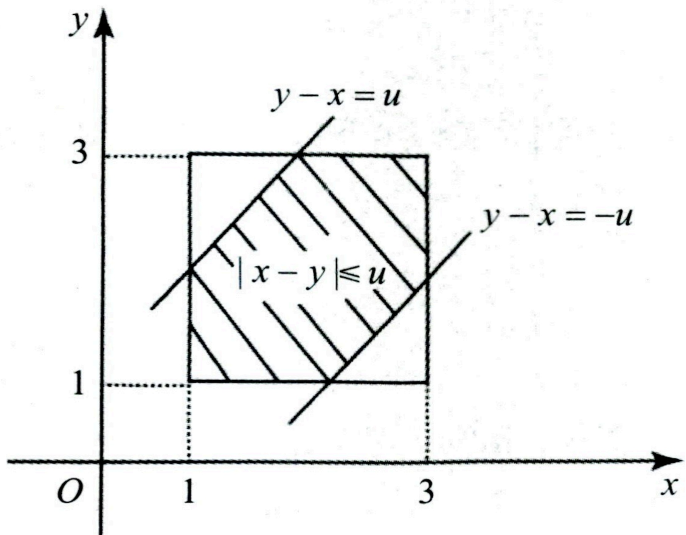

# 第三章 多维随机变量及其分布

## 题型一 二维离散型随机变量及其分布

### 基础知识回顾

### 一、 二维随机变量的概念及性质

#### （一） 二维随机变量的概念

设  $X = X(e)$,  $Y = Y(e)$ 是定义在样本空间  $\Omega = \{e\}$ 上的两个随机变量, 则称向量  $(X, Y)$ 为二维随机变量或二维随机向量.

#### （二） 二维随机变量的分布函数及其性质

1. 分布函数定义

设 $(X,Y)$为二维随机变量,对于任意实数x,y,二元函数

 $$F(x,y)=P\left\{X\leq x,Y\leq y\right\},$$ 

称为二维随机变量  $(X,Y)$ 的分布函数,或称为随机变量 X 和 Y 的联合分布函数.

2. 分布函数的性质

①非负性:对于任意实数  $x, y \in \mathbb{R}$，有  $0 \leq F(x, y) \leq 1$.

②规范性：

 $$F(-\infty,y)=\lim_{x\to-\infty}F(x,y)=0;\;F(x,-\infty)=\lim_{y\to-\infty}F(x,y)=0;$$ 

 $$F(-\infty,-\infty)=\lim_{\substack{x\to-\infty\\ y\to-\infty}}F(x,y)=0;F(+\infty,+\infty)=\lim_{\substack{x\to+\infty\\ y\to+\infty}}F(x,y)=1.$$ 

③单调不减性:  $F(x,y)$ 分别关于 x 和 y 单调不减.

④右连续性:  $F(x,y)$ 分别关于 x 和 y 具有右连续性, 即

 $$F(x,y)=F(x+0,y),F(x,y)=F(x,y+0),\quad x,y\in\mathbf{R}.$$ 

#### （三） 二维随机变量的边缘分布函数

若已知  $F(x,y)=P\left\{X\leq x,Y\leq y\right\}$，则称

$$F_{X}(x)=F(x,+\infty)=\lim_{y\to+\infty}F(x,y),$$ 

 $$F_{Y}(y)=F(+\infty,y)=\lim_{x\to+\infty}F(x,y)$$ 

分别为二维随机变量  $(X,Y)$ 关于 X 和 Y 的边缘分布函数.

#### （四） 随机变量 X 和 Y 的独立性

设二维随机变量  $(X,Y)$ 的分布函数为  $F(x,y)$，关于 X 和 Y 的分布函数分别为  $F_{X}(x)$ 和  $F_{Y}(y)$，如果对于所有的 x 和 y，都有

 $$P\left\{X\leq x,Y\leq y\right\}=P\left\{X\leq x\right\}P\left\{Y\leq y\right\},$$ 

即  $F(x,y)=F_{X}(x)F_{Y}(y)$，则称随机变量 X 和 Y 相互独立.

**考点及方法小结**

(1)若已知  $(X,Y)$ 的分布函数判定 X 和 Y 是否独立, 只需先计算两个边缘分布函数, 再验证联合分布函数是否等于两个边缘分布函数乘积即可.

(2)若  $(X,Y)$ 的分布函数未知, 判定 X 和 Y 是否独立, 通常判定其不独立. 我们只需找到特殊的点  $x_{0}$,  $y_{0}$, 使得  $P\{X \leq x_{0}, Y \leq y_{0}\} \neq P\{X \leq x_{0}\} P\{Y \leq y_{0}\}$ 即可判定不独立.

(3)若随机变量 $X, Y$ 相互独立，则 $f(X)$ 与 $g(Y)$ 也相互独立，其中 $f(\cdot)$ 与 $g(\cdot)$ 均为连续函数。比如当随机变量 $X, Y$ 相互独立时，有 $X^{2}$ 与 $Y$ 独立，$X^{2}$ 与 $Y^{3}$ 独立。（4）若随机变量  $X_{1}, X_{2}, \cdots, X_{n}, Y_{1}, Y_{2}, \cdots, Y_{m}$ 相互独立，则  $f(X_{1}, X_{2}, \cdots, X_{n})$ 与  $g(Y_{1}, Y_{2}, \cdots, Y_{m})$ 也相互独立，其中  $f(\cdot)$ 与  $g(\cdot)$ 分别为 n 元和 m 元连续函数 ( $n \geq 1, m \geq 1$).

比如当随机变量  $X_{1}, X_{2}, X_{3}, X_{4}$ 相互独立时，有  $2X_{1} + X_{2}$ 与  $3X_{3} - 4X_{4}$ 独立.

### 二、 二维离散型随机变量及其概率分布

#### （一） 二维离散型随机变量的定义

若二维随机变量(X,Y)可能的取值为有限对或可列无穷多对实数,则称(X,Y)为二维离散型随机变量.

#### （二） 二维离散型随机变量的分布律

设二维离散型随机变量(X,Y)所有可能的取值为 $(x_{i},y_{j}),i,j=1,2,\cdots$，且对应的概率为 $P\{X=x_{i},Y=y_{j}\}=p_{ij},i,j=1,2,\cdots$，其中 $p_{ij}\geq0,\sum_{i=1}^{+\infty}\sum_{j=1}^{+\infty}p_{ij}=1$，则称 $P\{X=x_{i},Y=y_{j}\}=p_{ij},i,j=1,2,\cdots$为二维离散型随机变量(X,Y)的分布律或随机变量X和Y的联合分布律.通常也用如下表格形式表示：

| X | y1 | y2 | ... | yj | ... |
| --- | --- | --- | --- | --- | --- |
| x1 | p11 | p12 | ... | p1j | ... |
| x2 | p21 | p22 | ... | p2j | ... |
| ... | : | : | : | : | : |
| x, | p11 | p12 | ... | p1j | ... |
| ... | : | : | : | : | : |

#### （三） 边缘分布律

设二维离散型随机变量  $(X,Y)$ 的分布律为

 $$P\{X=x_{i},Y=y_{j}\}=p_{ij},\quad i,j=1,2,\cdots,$$ 

称  $P\{X=x_{i}\}=P\{X=x_{i},Y<+\infty\}=\sum_{j=1}^{+\infty}P\{X=x_{i},Y=y_{j}\}=\sum_{j=1}^{+\infty}p_{ij},i=1,2,\cdots$ 为 X 的边缘分布律，记为  $p_{i}$; 称  $P\{Y=y_{j}\}=P\{X<+\infty,Y=y_{j}\}=\sum_{i=1}^{+\infty}P\{X=x_{i},Y=y_{j}\}=\sum_{i=1}^{+\infty}p_{ij},j=1,2,\cdots$ 为 Y 的边缘分布律，记为  $p_{j}$.

#### （四） 条件分布律

设二维离散型随机变量  $(X,Y)$ 的分布律为

 $$P\{X=x_{i},Y=y_{j}\}=p_{ij},\quad i,j=1,2,\cdots,$$ 

对于给定的 $j$, 若 $P\{Y=y_{j}\}>0(j=1,2,\cdots)$, 称

 $$P\{X=x_{i}\mid Y=y_{j}\}=\frac{P\{X=x_{i},Y=y_{j}\}}{P\{Y=y_{j}\}}=\frac{p_{ij}}{p_{.j}},\quad i=1,2,\cdots$$ 

为在  $Y = y_{i}$ 的条件下随机变量 X 的条件分布律.

对于给定的 i，如果  $P\{X = x_{i}\} > 0 (i = 1, 2, \cdots)$，称

 $$P\{Y=y_{j}\mid X=x_{i}\}=\frac{P\{X=x_{i},Y=y_{j}\}}{P\{X=x_{i}\}}=\frac{p_{ij}}{p_{i}},\quad j=1,2,\cdots$$ 

为在  $X = x_{i}$ 的条件下随机变量 Y 的条件分布律.

#### （五） 两个离散型随机变量的独立性

设二维离散型随机变量  $(X,Y)$ 的分布律为

 $$P\{X=x_{i},Y=y_{j}\}=p_{ij},\quad i,j=1,2,\cdots,$$ 

若对于任意  $i, j = 1, 2, \cdots$，有  $P\{X = x_i, Y = y_j\} = P\{X = x_i\} P\{Y = y_j\}$，则称两个离散型随机变量 X 和 Y 相互独立.

## （六） 两个离散型随机变量函数的分布

设二维离散型随机变量  $(X,Y)$ 的分布律为

 $$P\{X=x_{i},Y=y_{j}\}=p_{ij},\quad i,j=1,2,\cdots,$$ 

随机变量  $Z = g(X, Y)$，则 Z 的分布律为

 $$P\{Z=z_{k}\}=P\{g(X,Y)=z_{k}\}=\sum_{\substack{g(x_{i},y_{j})=z_{k}\\}}\ P\{X=x_{i},Y=y_{j}\}.$$ 

**考点及方法小结**

1. 计算  $(X,Y)$ 分布律

(1)若已知 X 和 Y 相互独立，则  $P\{X = x_i, Y = y_j\} = P\{X = x_i\}P\{Y = y_j\}$.

(2)若已知一个边缘分布律和一个条件分布律，则联合分布律

 $$P\{X=x_{i},Y=y_{j}\}=P\{Y=y_{j}\mid X=x_{i}\}\\P\{X=x_{i}\},\quad i,j=1,2,\cdots$$ 

或

 $$P\{X=x_{i},Y=y_{j}\}=P\{X=x_{i}\mid Y=y_{j}\}P\{Y=y_{j}\},\quad i,j=1,2,\cdots,$$ 

(3)若是应用问题,通常步骤为:定取值、算概率、验证 1.

2. 若已知  $(X,Y)$ 的分布律, 需会解决如下问题

(1)计算事件的概率.

(2)计算 X 和 Y 各自的分布律：

 $$P\{X=x_{i}\}=\sum_{j=1}^{+\infty}P\{X=x_{i},Y=y_{j}\},\quad i=1,2,\cdots,$$ 

 $$P\{Y=y_{j}\}=\sum_{i=1}^{+\infty}P\{X=x_{i},Y=y_{j}\},\quad j=1,2,\cdots.$$ 

(3)计算条件分布律：

 $$P\{X=x_{i}\mid Y=y_{j}\}=\frac{P\{X=x_{i},Y=y_{j}\}}{P\{Y=y_{j}\}},\quad i,j=1,2,\cdots,$$ 

 $$P\{Y=y_{j}\mid X=x_{i}\}=\frac{P\{X=x_{i},Y=y_{j}\}}{P\{X=x_{i}\}},i,j=1,2,\cdots.$$ 

(4)判定 X 和 Y 的独立性: 若  $P\{X = x_{i}, Y = y_{j}\} = P\{X = x_{i}\} P\{Y = y_{j}\}$ 对任意的 i, j 成立, 则 X 和 Y 独立, 否则不独立.

(5)计算函数的分布:  $P\{Z = z_k\} = P\{g(X, Y) = z_k\} = \sum_{g(x_i, y_j) = z_k} P\{X = x_i, Y = y_j\}$.

### 精选例题

#### 例3.1

设随机变量 X 在 1,2,3 三个数字中等可能取值,随机变量 Y 在 1 与 X 之间等可能取一整数值.

(1)求  $(X,Y)$ 的概率分布.

(2)求随机变量 Y 的概率分布.

(3)判断随机变量 X 和 Y 是否独立？为什么？

(4)设 Z = XY, 求随机变量 Z 的概率分布.

【解析】(1)由题意知,X的分布律为

 $$P\left\{X=i\right\}=\frac{1}{3},\quad i=1,2,3.$$ 

在事件  $\left\{X=i\right\}(i=1,2,3)$ 的条件下  $\left\{Y=j\right\}$ 的条件概率为

 $$P\left\{Y=j\mid X=i\right\}=\left\{\begin{array}{l}\frac{1}{i},\quad i,j=1,2,3,j\leq i,\\0,\quad i,j=1,2,3,j>i.\end{array}\right.$$ 

从而

 $$P\left\{X=i,Y=j\right\}=P\left\{Y=j\left|X=i\right.\right\}P\left\{X=i\right\}=\left\{\begin{array}{ll}\displaystyle\frac{1}{3i},&i,j=1,2,3,j\leq i,\\0,&i,j=1,2,3,j>i.\end{array}\right.$$ 

即  $(X,Y)$ 的分布律为

| X | 1 | 2 | 3 |
| --- | --- | --- | --- |
| 1 | $\frac{1}{3}$ | 0 | 0 |
| 2 | $\frac{1}{6}$ | $\frac{1}{6}$ | 0 |
| 3 | $\frac{1}{9}$ | $\frac{1}{9}$ | $\frac{1}{9}$ |

(2)由(1)易知,Y的分布律为

| Y | 1 | 2 | 3 |
| --- | --- | --- | --- |
| P | $\frac{11}{18}$ | $\frac{5}{18}$ | $\frac{1}{9}$ |

(3)因为

 $$P\left\{X=1,Y=1\right\}=\frac{1}{3}\neq P\left\{X=1\right\}P\left\{Y=1\right\}=\frac{1}{3}\times\frac{11}{18},$$ 

故 X 和 Y 不独立.

(4)由（1）易知，Z=XY 的分布律为

| $Z = XY$ | 1 | 2 | 3 | 4 | 6 | 9 |
| --- | --- | --- | --- | --- | --- | --- |
| P | $\frac{1}{3}$ | $\frac{1}{6}$ | $\frac{1}{9}$ | $\frac{1}{6}$ | $\frac{1}{9}$ | $\frac{1}{9}$ |

#### 例3.2

设相互独立的两随机变量 X 和 Y 均服从分布  $B\left(1, \frac{1}{3}\right)$，则  $P\{X \leq 2Y\} = (\quad)$.

(A)  $\frac{1}{2}$

(B)  $\frac{4}{9}$

(C)  $\frac{5}{9}$

(D)  $\frac{7}{9}$

【周年价】

 $$\begin{aligned}P\left\{X\leq2Y\right\}&=P\left\{X=0,Y=0\right\}+P\left\{X=0,Y=1\right\}+P\left\{X=1,Y=1\right\}\\&=P\left\{X=0\right\}+P\left\{X=1,Y=1\right\}\\&=\frac{2}{3}+P\left\{X=1\right\}P\left\{Y=1\right\}=\frac{2}{3}+\frac{1}{3}\cdot\frac{1}{3}=\frac{7}{9}.\end{aligned}$$ 

故应选(D).

#### 例3.3

设随机变量 X 和 Y 相互独立同分布. 已知 P\{X=k\}=pq^{k-1}, k=1,2,3,\cdots, 其中 0<p<1, q=1-p, 则 P\{X=Y\} 等于().

(A)  $\frac{p}{2-p}$ (B)  $\frac{1-p}{2-p}$ (C)  $\frac{p}{1-p}$ (D)  $\frac{2p}{1-p}$

【解析】

 $$\begin{aligned}P\left\{X=Y\right\}=&\sum_{k=1}^{\infty}P\left\{X=Y=k\right\}=\sum_{k=1}^{\infty}P\left\{X=k,Y=k\right\}\\=&\sum_{k=1}^{\infty}P\left\{X=k\right\}P\left\{Y=k\right\}=\sum_{k=1}^{\infty}p^{2}q^{2(k-1)}=p^{2}\sum_{k=1}^{\infty}(q^{2})^{(k-1)}\\=&p^{2}\cdot\frac{1}{1-q^{2}}=\frac{p^{2}}{(1+q)(1-q)}=\frac{p}{1+q}=\frac{p}{2-p}.\end{aligned}$$ 

故应选(A).

#### 例3.4

设随机变量X与Y的概率分布分别为

| X | 0 | 1 |
| --- | --- | --- |
| P | $\frac{1}{3}$ | $\frac{2}{3}$ |

| Y | -1 | 0 | 1 |
| --- | --- | --- | --- |
| P | $\frac{1}{3}$ | $\frac{1}{3}$ | $\frac{1}{3}$ |

且 $P\left\{X^{2}=Y^{2}\right\}=1$.

(1)求二维随机变量  $(X,Y)$ 的概率分布.

(2)求  $Z = XY$ 的概率分布.

【解析】(1)由 $P\left\{X^{2}=Y^{2}\right\}=1$，有 $P\left\{X^{2}\neq Y^{2}\right\}=0$，所以

 $$P\left\{X=0,Y=-1\right\}=P\left\{X=0,Y=1\right\}=P\left\{X=1,Y=0\right\}=0.$$ 

再结合 X 和 Y 的边缘概率分布即得  $(X,Y)$ 的联合概率分布为

| X | Y | -1 | 0 | 1 |
| --- | --- | --- | --- | --- |
| 0 | 0 | $\frac{1}{3}$ |   | 0 |
| 1 | $\frac{1}{3}$ | 0 | $\frac{1}{3}$ |   |

(2)Z = X Y 的所有可能取值为 -1, 0, 1，由（X, Y）的概率分布可得 Z = X Y 的概率分布为

| Z=XY | -1 | 0 | 1 |
| --- | --- | --- | --- |
| P | 1/3 | 1/3 | 1/3 |

#### 例3.5

设二维随机变量  $(X,Y)$ 在区域  $D=\left\{(x,y)\mid0<y<\sqrt{1-x^{2}}\right\}$ 上服从均匀分布，令

 $$Z_{1}=\begin{cases}1,&X-Y>0,\\ 0,&X-Y\leq0,\end{cases}\quad Z_{2}=\begin{cases}1,&X+Y>0,\\ 0,&X+Y\leq0.\end{cases}$$ 

求: (1) 二维随机变量  $(Z_{1}, Z_{2})$ 的概率分布 求: (1) 二维随机变量  $(Z_{1}, Z_{2})$ 的概率分布（2）
$Z_{1}$与 $Z_{2}$的相关系数.

【解析】(1) 因 (X,Y) 在区域  $D=\left\{(x,y)\mid0<y<\sqrt{1-x^{2}}\right\}$ 上服从均匀分布, 故

 $$P\{Z_{1}=0,Z_{2}=0\}=P\{X-Y\leq0,X+Y\leq0\}=\frac{1}{4},$$ 

 $$P\{Z_{1}=0,Z_{2}=1\}=P\{X-Y\leq0,X+Y>0\}=\frac{1}{2},$$ 

 $$P\{Z_{1}=1,Z_{2}=0\}=P\{X-Y>0,X+Y\leq0\}=0,$$ 

 $$P\{Z_{1}=1,Z_{2}=1\}=P\{X-Y>0,X+Y>0\}=\frac{1}{4}.$$ 

从而 $(Z_{1},Z_{2})$的概率分布为

| $Z_{2}$ | 0 | 1 |
| --- | --- | --- |
| $Z_{1}$ |   |   |
| 0 | $\frac{1}{4}$ | $\frac{1}{2}$ |
| 1 | 0 | $\frac{1}{4}$ |

(2)由(1)知，

| $Z_{1}Z_{2}$ | 0 | 1 |
| --- | --- | --- |
| P | $\frac{3}{4}$ | $\frac{1}{4}$ |

| $Z_{1}$ | 0 | 1 |
| --- | --- | --- |
| P | $\frac{3}{4}$ | $\frac{1}{4}$ |

| $Z_{2}$ | 0 | 1 |
| --- | --- | --- |
| P | $\frac{1}{4}$ | $\frac{3}{4}$ |

 $$E\left(Z_{1}Z_{2}\right)=\frac{1}{4},E\left(Z_{1}\right)=\frac{1}{4},E\left(Z_{2}\right)=\frac{3}{4},D\left(Z_{1}\right)=\frac{3}{16},D\left(Z_{2}\right)=\frac{3}{16}.$$ 

从而得  $Z_{1}$ 与  $Z_{2}$ 的相关系数

$$\rho=\frac{\operatorname{cov}(Z_{1},Z_{2})}{\sqrt{D(Z_{1})}\sqrt{D(Z_{2})}}=\frac{E(Z_{1}Z_{2})-E(Z_{1})E(Z_{2})}{\sqrt{D(Z_{1})}\sqrt{D(Z_{2})}}=\frac{\frac{1}{4}-\frac{1}{4}\cdot\frac{3}{4}}{\frac{1}{4}\cdot\sqrt{3}}=\frac{1}{3}$$ 

#### 例3.6

袋中有 1 个红色球，2 个黑色球与 3 个白球，现有回放地从袋中取两次，每次取一球，以 X，Y，Z 分别表示两次取球所取得的红球。黑球与白球的个数。（1）求  $P\{X=1 \mid Z=0\}$.

(2)求二维随机变量  $(X,Y)$ 概率分布.

(3)求在 X=1 的条件下 Y 的条件分布律.

【解析】(1)

 $$P\left\{X=1\mid Z=0\right\}=\frac{P\left\{X=1,Z=0\right\}}{P\left\{Z=0\right\}}=\frac{\frac{1\times2\times2}{6\times6}}{\frac{3\times3}{6\times6}}=\frac{4}{9}.$$ 

(2)由题意知 X 与 Y 的所有可能取值均为 0,1,2,且

 $$P\{X=0,Y=0\}=\frac{3\times3}{6\times6}=\frac{1}{4},P\{X=0,Y=1\}=\frac{2\times3\times2}{6\times6}=\frac{1}{3},$$ 

 $$P\{X=0,Y=2\}=\frac{2\times2}{6\times6}=\frac{1}{9},P\{X=1,Y=0\}=\frac{1\times3\times2}{6\times6}=\frac{1}{6},$$ 

 $$P\{X=1,Y=1\}=\frac{1\times2\times2}{6\times6}=\frac{1}{9},P\{X=1,Y=2\}=0,$$ 

 $$P\{X=2,Y=0\}=\frac{1\times1}{6\times6}=\frac{1}{36},P\{X=2,Y=1\}=P\{X=2,Y=2\}=0.$$ 

则  $(X,Y)$ 的概率分布为

| Y | 0 | 1 | 2 |
| --- | --- | --- | --- |
| X |   |   |   |
| 0 | $\frac{1}{4}$ | $\frac{1}{3}$ | $\frac{1}{9}$ |
| 1 | $\frac{1}{6}$ | $\frac{1}{9}$ | 0 |
| 2 | $\frac{1}{36}$ | 0 | 0 |

(3)由(2)有 $P\{X=1\}=\frac{5}{18}$，故在X=1的条件下Y的条件分布律为

 $$P\{Y=0\mid X=1\}=\frac{P\{X=1,Y=0\}}{P\{X=1\}}=\frac{1/6}{5/18}=\frac{3}{5},$$ 

 $$P\{Y=1\mid X=1\}=\frac{P\{X=1,Y=1\}}{P\{X=1\}}=\frac{1/9}{5/18}=\frac{2}{5},P\{Y=2\mid X=1\}=\frac{P\{X=1,Y=2\}}{P\{X=1\}}=\frac{0}{5/18}=0.$$ 

#### 例3.7

投保人的损失事件发生时，保险公司的赔付额 Y 与投保人损失额 X 的关系为：

 $Y = \left\{ \begin{array}{ll} 0, & X \leq 100, \\ X - 100, & X > 100. \end{array} \right.$ 设损失事件发生时，投保人的损失额 X 的概率密度为：

$$f(x)=\left\{\begin{aligned}&\frac{2\times100^{2}}{\left(100+x\right)^{3}},x>0,\\ &0,&x\leq0.\end{aligned}\right.$$ 

(1)求  $P\{Y > 0\}$ 及  $E(Y)$（2）这种损失事件在一年内发生的次数记为 N，保险公司在一年内就这种损失事件产生的理赔次数记为 M. 假设 N 服从参数 8 的泊松分布，在  $N = n (n \geq 1)$ 的条件下，M 服从二项分布  $B(n, p)$，其中  $p = P\{Y > 0\}$，求 M 的概率分布.

【解析】(1)

 $$\begin{aligned}P\{Y>0\}&=P\{X-100>0\}=P\{X>100\}\\&=\int_{100}^{+\infty}\frac{2\times100^{2}}{(100+x)^{3}}\mathrm{d}x=-\frac{100^{2}}{(100+x)^{2}}\bigg|_{100}^{+\infty}=\frac{1}{4}.\end{aligned}$$ 

 $$\begin{array}{c}E\left(Y\right)=\int_{100}^{+\infty}\left[\left(x-100\right)\cdot\frac{2\times100^{2}}{\left(100+x\right)^{3}}\right]\mathrm{d}x\\=2\times100^{2}\cdot\left[\int_{100}^{+\infty}\frac{x}{\left(100+x\right)^{3}}\mathrm{d}x-\int_{100}^{+\infty}\frac{100}{\left(100+x\right)^{3}}\mathrm{d}x\right]\\=2\times100^{2}\cdot\left[-\frac{1}{2}\int_{100}^{+\infty}x\mathrm{d}(100+x)^{-2}+100\times\frac{1}{2}(100+x)^{-2}\bigg|_{100}^{+\infty}\right]\\=2\times100^{2}\cdot\left[-\frac{1}{2}x(100+x)^{-2}\bigg|_{100}^{+\infty}+\frac{1}{2}\int_{100}^{+\infty}(100+x)^{-2}\mathrm{d}x-\frac{1}{800}\right]\\=2\times100^{2}\cdot\left[\frac{1}{800}-\frac{1}{2}\times\frac{1}{100+x}\bigg|_{100}^{+\infty}-\frac{1}{800}\right]\\=2\times100^{2}\times\frac{1}{400}=50.\end{array}$$ 

(2)由题意有，随机变量 M 的所有可能取值为 0,1,2, $\cdots$，

 $$P\left\{N=n\right\}=\frac{8^{n}}{n!}\cdot\mathrm{e}^{-8},n=0,1,2,\cdots,$$ 

 $$n\geqslant1$$ 

 $$\begin{aligned}P\left\{M=m\mid N=n\right\}&=C_{n}^{m}\left(\frac{1}{4}\right)^{m}\left(\frac{3}{4}\right)^{n-m}\\&=\frac{n!}{m!(n-m)!}\left(\frac{1}{4}\right)^{m}\left(\frac{3}{4}\right)^{n-m}\quad(0\leq m\leq n).\end{aligned}$$ 

对于非负整数 m，由全概率公式有

 $$\begin{aligned}P\left\{M=m\right\}&=\sum_{n=0}^{\infty}P\left\{N=n\right\}P\left\{M=m\left|N=n\right.\right\}.\\&=P\left\{N=0\right\}P\left\{M=m\left|N=0\right.\right\}+\sum_{n=1}^{\infty}P\left\{N=n\right\}P\left\{M=m\left|N=n\right.\right\},\\ \end{aligned}$$ 

当 m=0 时， $P\{M=0\}=P\{N=0\}P\{M=0\mid N=0\}+\sum_{n=1}^{\infty}P\{N=n\}P\{M=0\mid N=n\}$

因  $P\{M=0|N=0\}=1$，故

 $$\begin{aligned}P\left\{M=0\right\}=e^{-8}+\sum_{n=1}^{\infty}\left(\frac{3}{4}\right)^{n}\cdot\frac{8^{n}e^{-8}}{n!}=e^{-8}(1+\sum_{n=1}^{\infty}\frac{6^{n}}{n!}\\ =e^{-8}\cdot\sum_{n=1}^{\infty}\frac{6^{n}}{n}=e^{-8}\cdot e^{6}-e^{-2}.\end{aligned}$$

当 m=1,2, $\cdots$ 时，

 $$P\left\{M=m\right\}=P\left\{N=0\right\}P\left\{M=m\mid N=0\right\}+\sum_{n=1}^{\infty}P\left\{N=n\right\}P\left\{M=m\mid N=n\right\}$$ 

因  $P\{M=m|N=n\}=0$ (n=0,1,2, $\cdots$,m $\geq n+1$),故

 $$P\left\{M=m\right\}=\sum_{n=1}^{\infty}P\left\{N=n\right\}P\left\{M=m\mid N=n\right\}$$ 

综上得 M 的概率分布为  $P\{M=m\}=\frac{2^{m}}{m!}e^{-2}, m=0,1,2,\cdots$.

## 【题型二 二维连续型随机变量及其分布】

### 基础知识回顾

### 一、 二维连续型随机变量的定义

设二维随机变量  $(X,Y)$ 的分布函数为  $F(x,y)$，如果存在非负可积的二元函数  $f(x,y)$，使得对任意实数 x,y，有

 $$F(x,y)=\int_{-\infty}^{x}\int_{-\infty}^{y}f(u,v)\mathrm{d}u\mathrm{d}v,$$ 

则称  $(X,Y)$ 为二维连续型随机变量，函数  $f(x,y)$ 称为二维随机变量  $(X,Y)$ 的概率密度，或称为 X 与 Y 的联合概率密度.

### 二、 概率密度函数的性质

①非负性:  $f(x, y) \geq 0, -\infty < x < +\infty, -\infty < y < +\infty.$

②规范性： $\int_{-\infty}^{+\infty}\int_{-\infty}^{+\infty}f(x,y)dxdy=1$

③设 D 是 xOy 平面上任一区域, 则点  $(x, y)$ 落在 D 内的概率为

$$P\{(X,Y)\in D\}=\iint\limits_{D}f(x,y)\mathrm{d}\sigma.$$ 

④若  $f(x,y)$ 在点  $(x,y)$ 处连续，则有  $f(x,y)=\frac{\partial^{2}F(x,y)}{\partial x\partial y}$.

### 三、 边缘密度函数

若已知二维随机变量  $(X,Y)$ 的概率密度函数为  $f(x,y)$，则称  $f_{X}(x)=\int_{-\infty}^{+\infty}f(x,y)dy$ 为关于随机变量 X 的边缘密度函数，称  $f_{Y}(y)=\int_{-\infty}^{+\infty}f(x,y)dx$ 为关于随机变量 Y 的边缘密度函数.

### 四、 条件密度函数

当  $f_{Y}(y)>0$ 时, 称  $f_{X\mid Y}(x\mid y)=\frac{f(x,y)}{f_{Y}(y)}$ 为在 Y=y 的条件下 X 的条件密度函数.

当  $f_{X}(x)>0$ 时, 称  $f_{Y\mid X}(y\mid x)=\frac{f(x,y)}{f_{X}(x)}$ 为在 X=x 的条件下 Y 的条件密度函数.

### 五、 两个连续型随机变量的独立性

设  $(X,Y)$ 为二维连续型随机变量,  $f(x,y)$,  $f_{X}(x)$,  $f_{Y}(y)$ 分别为  $(X,Y)$ 的概率密度和边缘概率密度, 若对于任意实数 x 与 y 均满足等式  $f(x,y)=f_{X}(x)f_{Y}(y)$, 则称两个连续型随机变量 X 与 Y 相互独立.

### 六、 两个常见的二维连续型分布

#### （一） 二维均匀分布

### 1. 定义

设 G 是平面上有界可求面积的区域, 其面积为  $\left|G\right|$, 若二维随机变量  $(X,Y)$ 具有密度函数

 $$f(x,y)=\left\{\begin{aligned}&\frac{1}{\left|G\right|},&(x,y)\in G,\\ &0,&(x,y)\notin G,\end{aligned}\right.$$ 

则称  $(X,Y)$ 服从区域 G 上的二维均匀分布.

### 2. 性质

若二维随机变量  $(X,Y)$ 在矩形区域  $D=\{(x,y)|a\leq x\leq b,c\leq y\leq d\}$ 上服从二维均匀分布，则随机变量 X 和 Y 相互独立，并且 X 和 Y 分别服从区间  $[a,b]$， $[c,d]$ 上的一维均匀分布.

#### （二） 二维正态分布

### 1. 定义

如果二维连续型随机变量  $(X,Y)$ 的概率密度为

$$f(x,y)=\frac{1}{2\pi\sigma_1\sigma_2\sqrt{1-\rho^2}}\exp\left\{\frac{-1}{2(1-\rho^2)}\left[\frac{(x-\mu_1)^2}{\sigma_1^2}-\frac{2\rho(x-\mu_1)(y-\mu_2)}{\sigma_1\sigma_2}+\frac{(y-\mu_2)^2}{\sigma_2^2}\right]\right\},\quad x,y\in\mathbf{R},$$ 

其中, $\mu_{1},\mu_{2},\sigma_{1}>0,\sigma_{2}>0,-1<\rho<1$均为常数,则称 $(X,Y)$服从参数为 $\mu_{1},\mu_{2},\sigma_{1},\sigma_{2}$和 $\rho$的二维正态分布,记作 $(X,Y)\sim N(\mu_{1},\mu_{2};\sigma_{1}^{2},\sigma_{2}^{2};\rho)$,也称 $(X,Y)$为二维正态随机变量.

### 2. 性质

若  $(X,Y) \sim N(\mu_{1},\mu_{2};\sigma_{1}^{2},\sigma_{2}^{2};\rho)$，则

①X 和 Y 分别服从一维正态分布，即  $X \sim N(\mu_{1}, \sigma_{1}^{2})$， $Y \sim N(\mu_{2}, \sigma_{2}^{2})$；

②X 和 Y 不相关（或  $\rho = 0$）与 X 和 Y 相互独立等价；

③X 与 Y 的非零线性组合仍服从一维正态分布, 即  $k_{1}X + k_{2}Y \sim N(\mu, \sigma^{2})$, 其中  $k_{1}, k_{2}$ 不全为零;

④若 $(X,Y)$服从二维正态分布，记 $X_{1}=a_{1}X+b_{1}Y,Y_{1}=a_{2}X+b_{2}Y$，则 $(X_{1},Y_{1})$也服从二维正态分布，其中 $\left|\begin{matrix}a_{1}&b_{1}\\ a_{2}&b_{2}\end{matrix}\right|\neq0$。

**考点及方法小结**

(1)计算  $(X,Y)$ 的概率密度函数.

①若已知 X 与 Y 相互独立,则  $f(x,y)=f_{X}(x)f_{Y}(y)$.

②若已知一个边缘密度函数和一个条件密度函数，则联合密度函数  $f(x,y)=f_{X\mid Y}(x\mid y)f_{Y}(y)$ 或

 $$f(x,y)=f_{X}(x)f_{Y|X}(y|x).$$ 

③若已知 X 与 Y 的联合分布函数  $F(x,y)$，则  $f(x,y)=\frac{\partial^{2}F(x,y)}{\partial x\partial y}$.

④若已知 $(X,Y)$服从区域 $G$上的二维均匀分布，则 $f(x,y)=\begin{cases}\frac{1}{\left|G\right|},&(x,y)\in G,\\0,&(x,y)\notin G.\end{cases}$

(2)若联合密度函数  $f(x,y)$ 含有未知参数，通常利用  $\int_{-\infty}^{+\infty}\int_{-\infty}^{+\infty}f(x,y)dxdy=1$ 解决.

(3)若已知  $(X,Y)$ 的密度函数  $f(x,y)$，需会解决如下问题.

①计算事件的概率:  $P\{(X,Y)\in D\}=\iint\limits_{D}f(x,y)\mathrm{d}\sigma$.

②计算 X 与 Y 的联合分布函数:  $F(x, y) = \int_{-\infty}^{x} \int_{-\infty}^{y} f(u, v) \, \mathrm{d}u \, \mathrm{d}v$.

③计算边缘密度函数:  $f_{X}(x)=\int_{-\infty}^{+\infty}f(x,y)\mathrm{d}y,f_{Y}(y)=\int_{-\infty}^{+\infty}f(x,y)\mathrm{d}x.$

④计算条件密度函数: $f_{X|Y}(x|y)=\frac{f(x,y)}{f_{Y}(y)},f_{Y|X}(y|x)=\frac{f(x,y)}{f_{X}(x)}.$

⑤判定 X 与 Y 的独立性: 先求出两个边缘密度函数  $f_{X}(x)$,  $f_{Y}(y)$, 再判断等式  $f(x, y) = f_{X}(x)f_{Y}(y)$ 是否成立. 若成立, 则 X 与 Y 独立, 否则不独立.

### 精选例题

tel on 15 (x) 741-741-741-741 x)(x)

水：

(1)系数 A, B 和 C（2）$(X,Y)$ 的概率密度
（3）边缘分布函数及边缘概率密度,并判断 X 和 Y 是否相互独立?

(4)$P\left\{0 < X \leq 2\sqrt{3}, 0 < Y \leq 3\sqrt{3}\right\}$.

【解析】(1)由分布函数的性质知

 $$F(+\infty,+\infty)=A\left(B+\frac{\pi}{2}\right)\left(C+\frac{\pi}{2}\right)=1;$$ 

 $$F(x,-\infty)=A\left(B+\arctan\frac{x}{2}\right)\left(C-\frac{\pi}{2}\right)=0;$$ 

 $$F(-\infty,y)=A\left(B-\frac{\pi}{2}\right)\left(C+\arctan\frac{y}{3}\right)=0.$$ 

由上面三式可得  $A=\frac{1}{\pi^{2}}, B=C=\frac{\pi}{2}$，从而

 $$F(x,y)=\frac{1}{\pi^{2}}\left(\frac{\pi}{2}+\arctan\frac{x}{2}\right)\left(\frac{\pi}{2}+\arctan\frac{y}{3}\right),\quad-\infty<x<+\infty,$$ 

(2)由密度函数的性质,得 $(X,Y)$的概率密度为

 $$f(x,y)=\frac{\partial^{2}F(x,y)}{\partial x\partial y}=\frac{6}{\pi^{2}(x^{2}+4)(y^{2}+9)},\quad-\infty<x<+\infty,-\infty<y<+\infty.$$ 

(3)X,Y的边缘分布函数分别为

 $$F_{x}(x)=F(x,+\infty)=\frac{1}{2}+\frac{1}{\pi}\arctan\frac{x}{2},\quad-\infty<x<+\infty,$$ 

 $$F_{y}(y)=F(+\infty,y)=\frac{1}{2}+\frac{1}{\pi}\arctan\frac{y}{3},\quad-\infty<y<+\infty.$$ 

边缘密度函数分别为

 $$f_{x}(x)=F_{x}^{\prime}(x)=\frac{2}{\pi(4+x^{2})},\quad-\infty<x<+\infty,$$ 

 $$f_{Y}(y)=F_{Y}^{\prime}(y)=\frac{3}{\pi(9+y^{2})},\quad-\infty<y<+\infty.$$ 

因为  $f(x,y)=f_{X}(x)f_{Y}(y)$，故 X 和 Y 是相互独立的.

(4)由（3）知 X 和 Y 是相互独立，故

 $$\begin{aligned}P\left\{0<X\leq2\sqrt{3},0<Y\leq3\sqrt{3}\right\}&=P\left\{0<X\leq2\sqrt{3}\right\}P\left\{0<Y\leq3\sqrt{3}\right\}\\&=[F_{X}(2\sqrt{3})-F_{X}(0)][F_{Y}(3\sqrt{3})-F_{Y}(0)]\\&=[\frac{1}{2}+\frac{1}{\pi}\arctan\sqrt{3}-\frac{1}{2}][\frac{1}{2}+\frac{1}{\pi}\arctan\sqrt{3}-\frac{1}{2}]\\&=\frac{1}{3}\cdot\frac{1}{3}=\frac{1}{9}.\end{aligned}$$ 

#### 例3.9

设二维连续型随机变量  $(X,Y)$ 的概率密度为

 $$f(x,y)=\begin{cases}ke^{-(2x+y)},&x>0,y>0,\\0,& 其他 .\end{cases}$$ 

(1)求未知参数 k.

(2)判断随机变量 X, Y 是否独立？为什么？

(3)计算条件概率  $P\{X \leq 2 \mid Y \leq 1\}$.

【解析】(1)由 $\int_{-\infty}^{+\infty}\int_{-\infty}^{+\infty}f(x,y)\mathrm{d}x\mathrm{d}y=1$，有

 $$1=k\int_{0}^{+\infty}\mathrm{d}x\int_{0}^{+\infty}\mathrm{e}^{-(2x+y)}\mathrm{d}y=k\int_{0}^{+\infty}\mathrm{e}^{-2x}\mathrm{d}x\int_{0}^{+\infty}\mathrm{e}^{-y}\mathrm{d}y=\frac{k}{2},$$ 

得 k=2.

(2)因为

 $$f_{X}\left(x\right)=\int_{-\infty}^{+\infty}f\left(x,y\right)d y=\left\{\begin{aligned}&\int_{0}^{+\infty}2e^{-\left(2x+y\right)}d y=2e^{-2x},&x>0,\\ &0,& 其他 ,\end{aligned}\right.$$ 

 $$f_{Y}\left(y\right)=\int_{-\infty}^{+\infty}f\left(x,y\right)d x=\left\{\begin{aligned}&\int_{0}^{+\infty}2e^{-\left(2x+y\right)}d x=e^{-y},&y>0,\\ &0,& 其他 ,\end{aligned}\right.$$ 

 $$f(x,y)=f_{X}(x)f_{Y}(y)$$ 

(3)由（2）知，X与Y相互独立，故

 $$P\left\{X\leq2\mid Y\leq1\right\}=P\left\{X\leq2\right\}=\int_{-\infty}^{2}f_{X}\left(x\right)\mathrm{d}x=\int_{0}^{2}2\mathrm{e}^{-2x}\mathrm{d}x=1-\mathrm{e}^{-4}.$$ 

#### 例3.10

设二维随机变量  $(X,Y)$ 服从区域 G 上的均匀分布，其中 G 是由 x - y = 0, x + y = 2 与 y = 0 所围成的三角形区域.

(1)求 X 的概率密度  $f_{X}(x)$.

(2)求条件概率密度  $f_{X \mid Y}(x \mid y)$.

【解析】(1)因为(X,Y)在区域G上服从二维均匀分布,故(X,Y)的概率密度函数为

 $$f(x,y)=\left\{\begin{aligned}1,\quad&(x,y)\in G,\\ 0,\quad& 其他 .\end{aligned}\right.$$ 

X的边缘概率密度为

 $$\begin{aligned}f_{X}(x)&=\int_{-\infty}^{+\infty}f(x,y)d y\\&=\left\{\begin{aligned}&\int_{0}^{x}1d y,&0\leq x\leq1,\\&\int_{0}^{2-x}1d y,&1<x\leq2,\\&0,& 其他 .\end{aligned}\right.\end{aligned}=\left\{\begin{aligned}&x,&0\leq x\leq1,\\&2-x,&1<x\leq2,\\&0,& 其他 .\end{aligned}\right.$$ 

(2)因为 Y 的边缘概率密度

 $$f_{Y}(y)=\int_{-\infty}^{+\infty}f(x,y)d x=\left\{\begin{aligned}&\int_{y}^{2-y}1d x,&0\leq y\leq1,\\ &0,& 其他 .\end{aligned}\right.=\left\{\begin{aligned}&2-2y,&0\leq y\leq1,\\ &0,& 其他 .\end{aligned}\right.$$ 

当  $f_{Y}(y)>0$ 时，即 0  $\leq y<1$ 时，在 Y=y 的条件下 X 的条件概率密度为

 $$f_{X\mid Y}(x\mid y)=\frac{f(x,y)}{f_{Y}(y)}=\left\{\begin{aligned}&\frac{1}{2-2y},&&y<x<2-y,\\ &0,&& 其他 .\end{aligned}\right.$$ 

#### 例3.11

设二维随机变量  $(X,Y)$ 的概率密度为  $f(x,y)=Ae^{-2x^{2}+2xy-y^{2}},-\infty<x<+\infty,-\infty<y<+\infty$，求常

数 A 以及条件概率密度  $f_{Y|X}(y|x)$.

【解析】X的密度函数为

 $$f_{x}(x)=\int_{-\infty}^{+\infty}f(x,y)\mathrm{d}y=A\int_{-\infty}^{+\infty}\mathrm{e}^{-2x^{2}+2xy-y^{2}}\mathrm{d}y=A\mathrm{e}^{-x^{2}}\int_{-\infty}^{+\infty}\mathrm{e}^{-(y-x)^{2}}\mathrm{d}y,$$ 

因为 $\int_{-\infty}^{+\infty}e^{-(y-x)^{2}}dy=x\int_{-\infty}^{y-x}e^{-t^{2}}dt=\sqrt{\pi}$，故

 $$f_{X}(x)=A\sqrt{\pi}\mathrm{e}^{-x^{2}},\quad-\infty<x<+\infty.$$ 

由  $\int_{-\infty}^{+\infty} f_{X}(x) dx = 1$，有  $A\sqrt{\pi}\int_{-\infty}^{+\infty} e^{-x^{2}} dx = 1$，从而有  $A\pi = 1$，解之得  $A = \frac{1}{\pi}$.

当  $f_{X}(x)>0$，即  $-\infty<x<+\infty$ 时，有

 $$f_{Y\mid X}(y\mid x)=\frac{f(x,y)}{f_{X}(x)}=\frac{\frac{1}{\pi}\mathrm{e}^{-2x^{2}+2xy-y^{2}}}{\frac{1}{\pi}\sqrt{\pi}\cdot\mathrm{e}^{-x^{2}}}=\frac{1}{\sqrt{\pi}}\mathrm{e}^{-(y-x)^{2}},\quad-\infty<y<+\infty.$$ 

**良哥解读**

此题在求常数A时,也可用性质 $\int_{-\infty}^{+\infty}\int_{-\infty}^{+\infty}f(x,y)dxdy=1$解决.由于被积函数 $f(x,y)=Ae^{-2x^{2}+2xy-y^{2}}$比较复杂,直接算二重积分容易出错,考虑到求条件概率密度 $f_{y|x}(y|x)$时需要找到随机变量X的概率密度,故此题的解法中先通过求X的概率密度,再利用一维连续随机变量概率密度的性质 $\int_{-\infty}^{+\infty}f_{x}(x)dx=1$,求出常数A,相当于把直接算二重积分分解成两步,在计算中不易出错.在计算过程中泊松积分 $\int_{-\infty}^{+\infty}e^{-x^{2}}dx=\sqrt{\pi}$这个结论可以直接用.

#### 例3.12

设  $(X,Y)$ 是二维随机变量, X 的边缘概率密度为  $f_{X}(x)=\left\{\begin{aligned}&3x^{2},&0<x<1,\\ &0,& \text{其他}.\end{aligned}\right.$ 在给定  $X=x(0<x<1)$ 的条件下 Y 的条件概率密度为

 $$f_{Y\mid X}(y\mid x)=\left\{\begin{aligned}&\frac{3y^{2}}{x^{3}},&0<y<x,\\ &0,& 其他 .\end{aligned}\right.$$ 

(1)求  $(X,Y)$ 的概率密度  $f(x,y)$.

(2)求 Y 的边缘概率密度为  $f_{Y}(y)$.

(3)求  $P\{X > 2Y\}$.

【解析】(1)由题意知,当0<x<1时, $(X,Y)$的概率密度

 $$f(x,y)=f_{X}(x)f_{Y|X}(y|x)=\left\{\begin{aligned}&\frac{9y^{2}}{x},&0<y<x,\\ &0,& 其他 .\end{aligned}\right.$$ 

当  $x \leq 0$ 或  $x \geq 1$ 时， $f_{Y|X}(y|x)$ 无定义. 由于当 0 < x < 1 时，

 $$\int_{0}^{1}\mathrm{d}x\int_{-\infty}^{+\infty}f(x,y)\mathrm{d}y=\int_{0}^{1}\mathrm{d}x\int_{0}^{x}\frac{9y^{2}}{x}\mathrm{d}y=\int_{0}^{1}3x^{2}\mathrm{d}x=1,$$ 

又  $\int_{-\infty}^{+\infty}\int_{-\infty}^{+\infty}f(x,y)dx dy=1$，所以可以认为当  $x\leq0$ 或  $x\geq1$ 时， $f(x,y)=0$.

综上得（Y V）的概率为 $f(x)=\begin{cases}\dfrac{9y^{2}}{1},&0<y<x<1,\end{cases}$

(2)Y 的边缘概率密度为

 $$\begin{aligned}f_{Y}(y)&=\int_{-\infty}^{+\infty}f(x,y)d x=\left\{\begin{aligned}&\int_{y}^{1}\frac{9y^{2}}{x}d x,&0<y<1,\\&0,& 其他 .\end{aligned}\right.\\&=\left\{\begin{aligned}&-9y^{2}\ln y,&0<y<1,\\&0,& 其他 .\end{aligned}\right.\end{aligned}$$ 

(3)$P\{X > 2Y\} = \iint\limits_{x > 2y} f(x, y) \, \mathrm{d}x \, \mathrm{d}y = \int_{0}^{1} \mathrm{d}x \int_{0}^{\frac{x}{2}} \frac{9y^{2}}{x} \mathrm{d}y = \frac{1}{8}$.

#### 例3.13

设随机变量 X 与 Y 相互独立,且分别服从参数为 1 与参数 4 的指数分布.

(1)求 X 与 Y 的联合密度函数  $f(x, y)$.

(2)求  $P\{X < Y\}$.

【解析】(1)因  $X \sim E(1)$,  $Y \sim E(4)$, 故

 $$f_{x}(x)=\begin{cases}e^{-x},&x>0,\\ 0,& 其他 ,\end{cases}\\ f_{y}(y)=\begin{cases}4e^{-4y},&y>0,\\ 0,& 其他 .\end{cases}$$ 

又 X 与 Y 相互独立, 故  $(X,Y)$ 的概率密度为

 $$f(x,y)=f_{X}(x)f_{Y}(y)=\begin{cases}4\mathrm{e}^{-x-4y},&x>0,y>0,\\0,& 其他 .\end{cases}$$ 

 $$P\{X<Y\}=\iint\limits_{x<y}f(x,y)\mathrm{d}x\mathrm{d}y=\int_{0}^{+\infty}\mathrm{d}x\int_{x}^{+\infty}4\mathrm{e}^{-x-4y}\mathrm{d}y=\int_{0}^{+\infty}\mathrm{e}^{-5x}\mathrm{d}x=\frac{1}{5}$$ 

#### 例3.14

设随机变量X与Y相互独立，且都服从区间(0,1)上的均匀分布，则 $P\{X^{2}+Y^{2}\leq1\}=$ ___.

(A) $\frac{1}{4}$ (B) $\frac{1}{2}$ (C) $\frac{\pi}{8}$ (D) $\frac{\pi}{4}$

【解析】因 X 与 Y 相互独立，且均服从区间 (0,1) 上的均匀分布，故  $(X,Y)$ 在区域  $D=\{(x,y)|0<x<1,0<y<1\}$ 上服从二维均匀分布，则

 $$P\left\{X^{2}+Y^{2}\leq1\right\}=\iint\limits_{x^{2}+y^{2}\leq1}f(x,y)\mathrm{d}x\mathrm{d}y=\frac{S_{\{(x,y)\mid x^{2}+y^{2}\leq1\}\cap D}}{S_{D}}=\frac{\frac{\pi}{4}}{1}=\frac{\pi}{4},$$ 

其中  $S_{D}$ 表示所涉及区域的面积. 故应选(D).

#### 例3.15

设二维随机变量  $(X,Y)$ 服从正态分布  $N(1,0;1,1;0)$，则  $P\{XY-Y<0\}=$ ___.

【解析】因为  $(X,Y)\sim N(1,0;1,1;0)$，故由二维正态分布的性质知， $X\sim N(1,1)$， $Y\sim N(0,1)$，且 X,Y 相互独立，于是

 $$\begin{aligned}P\left\{XY-Y<0\right\}&=P\left\{(X-1)Y<0\right\}\\&=P\left\{X-1>0,Y<0\right\}+P\left\{X-1<0,Y>0\right\}\\&=P\left\{X>1\right\}P\left\{Y<0\right\}+P\left\{X<1\right\}P\left\{Y>0\right\}\\&=\frac{1}{2}\times\frac{1}{2}+\frac{1}{2}\times\frac{1}{2}=\frac{1}{2}.\end{aligned}$$ 

#### 例3.16

设随机变量  $(X,Y)$ 服从二维正态分布  $N\left(0,0;1,4;-\frac{1}{2}\right)$，下列随机变量中服从标准正态分布且与 X 独立的是( )。

(A)  $\frac{\sqrt{5}}{5}(X+Y)$

(B)  $\frac{\sqrt{5}}{5}(X-Y)$

(C) $\frac{\sqrt{3}}{3}(X+Y)$ (D) $\frac{\sqrt{3}}{3}(X-Y)$

【解析】由二维正态的性质知  $X + Y \sim N(\mu, \sigma^{2})$，因

 $$\begin{aligned}\mu&=E(X+Y)=E(X)+E(Y)=0,\\\sigma^{2}&=D(X+Y)=D(X)+D(Y)+2\operatorname{cov}(X,Y)\\&=1+4+2\cdot\rho_{XY}\cdot\sqrt{D(X)}\cdot\sqrt{D(Y)}\\&=1+4+2\cdot(-\frac{1}{2})\cdot1\cdot2=3,\end{aligned}$$ 

故  $\frac{X+Y-0}{\sqrt{3}}=\frac{\sqrt{3}}{3}(X+Y)\sim N(0,1).$

由二维正态分布的性质知， $\left(\frac{\sqrt{3}(X+Y)}{3},X\right)$ 服从二维正态分布，又

 $$\begin{aligned}\operatorname{cov}\left[\frac{\sqrt{3}(X+Y)}{3},X\right]&=\frac{\sqrt{3}}{3}\left[\operatorname{cov}(X,X)+\operatorname{cov}(X,Y)\right]\\&=\frac{\sqrt{3}}{3}\left[D(X)+\rho_{XY}\cdot\sqrt{D(X)}\cdot\sqrt{D(Y)}\right]\\&=\frac{\sqrt{3}}{3}\left[1+(-\frac{1}{2})\cdot1\cdot2\right]\\&=0,\end{aligned}$$ 

故  $\frac{\sqrt{3}(X+Y)}{3}$ 与 X 不相关，则由二维正态分布的性质得， $\frac{\sqrt{3}(X+Y)}{3}$ 与 X 独立。

故应选 (C).

## 题型三 两个连续型随机变量函数的分布

### 基础知识回顾

### 一、 分布函数法

设二维连续型随机变量  $(X,Y)$ 的概率密度为  $f(x,y)$，则随机变量  $Z = g(X,Y)$ 的分布函数为

 $$F_{z}(z)=P\{Z\leq z\}=P\{g(X,Y)\leq z\}=\iint\limits_{g(x,y)\leq z}f(x,y)\mathrm{d}x\mathrm{d}y,$$ 

若要计算 Z 的概率密度,有  $f_{z}(z)=F_{z}^{\prime}(z)$.

### 二、 卷积公式

#### （一） 两个连续型随机变量和的卷积公式

设一维连续随机变量  $(X,Y)$ 的概率密度为  $f(x,y)$，则随机变量  $Z = X + Y$ 的密度函数为

$$f_{z}(z)=\int_{-\infty}^{+\infty}f(x,z-x)\mathrm{d}x\text{ 或 }f_{z}(z)=\int_{-\infty}^{+\infty}f(z-y,x)\mathrm{d}y,$$ 

这个公式称为卷积公式.

若 X 与 Y 相互独立, 设 (X,Y) 关于 X 与 Y 的边缘密度分别为  $f_{X}(x)$,  $f_{Y}(y)$, 则上式公式可化为

 $$f_{Z}(z)=\int_{-\infty}^{+\infty}f_{X}(x)f_{Y}(z-x)d x\quad\text{ 或 }\quad f_{Z}(z)=\int_{-\infty}^{+\infty}f_{X}(z-y)f_{Y}(y)d y,$$ 

此公式也称为独立和卷积公式.

#### （二） 两个连续型随机变量一般线性组合的卷积公式

设二维连续型随机变量  $(X,Y)$ 的概率密度为  $f(x,y)$，则随机变量  $Z=aX+bY$，其中  $a\neq0, b\neq0$ 的密度函数为

 $$f_{z}(z)=\frac{1}{|b|}\int_{-\infty}^{+\infty}f(x,\frac{z-ax}{b})dx\quad 或 \quad f_{z}(z)=\frac{1}{|a|}\int_{-\infty}^{+\infty}f(\frac{z-by}{a},y)dy.$$ 

#### （三） 两个连续型随机变量乘积（商）的卷积公式

设二维连续随机变量  $(X,Y)$ 的概率密度为  $f(x,y)$，则随机变量  $Z=XY$ (或  $Z=\frac{Y}{X}$) 的密度函数为：

当  $Z=XY$ 时， $f_{z}(z)=\int_{-\infty}^{+\infty}f(x,\frac{z}{x})\frac{1}{|x|}dx$ 或  $f_{z}(z)=\int_{-\infty}^{+\infty}f(\frac{z}{y},y)\frac{1}{|y|}dy$;

当  $Z=\frac{Y}{X}$ 时， $f_{z}(z)=\int_{-\infty}^{+\infty}|x|f(x,zx)dx$.

### 三、 最大、最小分布 $(M=\max(X,Y)$ 及  $N=\min(X,Y)$ 的分布)

设X,Y是两个相互独立的随机变量,它们的分布函数分别为 $F_{X}(x),F_{Y}(y)$,求 $M=\max(X,Y)$及 $N=\min(X,Y)$的分布函数.

由  $F_{M}(z)=P\left\{\max(X,Y)\leq z\right\}=P\left\{X\leq z,Y\leq z\right\}$，又 X 和 Y 相互独立，故

 $$F_{M}(z)=P\left\{X\leq z,Y\leq z\right\}=P\left\{X\leq z\right\}P\left\{Y\leq z\right\},$$ 

即有  $F_{M}(z)=F_{X}(z)F_{Y}(z)$.

由  $F_{N}(z)=P\left\{\min(X,Y)\leq z\right\}=1-P\left\{\min(X,Y)>z\right\}=1-P\left\{X>z,Y>z\right\}$，又 X 和 Y 相互独立，故  $F_{N}(z)=1-P\left\{X>z,Y>z\right\}=1-P\left\{X>z\right\}P\left\{Y>z\right\}$，

即  $F_{N}(z)=1-[1-F_{X}(z)][1-F_{Y}(z)]$.

以上结果可推广到 n 个相互独立的随机变量的情况. 设  $X_{1}, X_{2}, \cdots, X_{n}$ 相互独立, 其分布函数分别为  $F_{X_{i}}(x) (i=1,2,\cdots,n)$, 则  $M = \max(X_{1}, X_{2}, \cdots, X_{n})$,  $N = \min(X_{1}, X_{2}, \cdots, X_{n})$ 的分布函数分别为

 $$F_{M}(z)=F_{X_{1}}(z)F_{X_{2}}(z)\cdots F_{X_{n}}(z),$$ 

 $$F_{N}(z)=1-\left[1-F_{X_{1}}(z)\right]\left[1-F_{X_{2}}(z)\right]\cdots\left[1-F_{X_{n}}(z)\right].$$ 

特别地, 当  $X_{1}, X_{2}, \cdots, X_{n}$ 相互独立且具有相同的分布函数  $F(x)$ 时有

 $$\begin{aligned}&F_{M}(z)=[F(z)]^{n},\\&F_{N}(z)=1-\left[1-F(z)\right]^{n}.\\ \end{aligned}$$

### 精选例题

#### 例3.17

设随机变量X和Y相互独立，且都服从正态分布 $N(\mu,\sigma^{2})$，则 $P\{|X-Y|<1\}$（ ）。

(A)与 $\mu$无关，而与 $\sigma^{2}$有关 (B)与 $\mu$有关，而与 $\sigma^{2}$无关

(C)与 $\mu,\sigma^{2}$都有关 (D)与 $\mu,\sigma^{2}$都无关

【解析】因 X 与 Y 相互独立,且均服从正态分布  $N(\mu,\sigma^{2})$, 故  $X-Y \sim N(0,2\sigma^{2})$. 则

 $$P\left\{\left|X-Y\right|<1\right\}=P\left\{\left|\frac{X-Y-0}{\sqrt{2}\sigma}\right|<\frac{1}{\sqrt{2}\sigma}\right\}=2\Phi\left(\frac{1}{\sqrt{2}\sigma}\right)-1,$$ 

故  $P\left\{\left|X-Y\right|<1\right\}$ 与  $\mu$ 无关，只与  $\sigma^{2}$ 有关.

故应选(A).

**良哥解读**

思维定势: 只要看到独立正态分布的线性组合, 立即将线性组合部分当成一维正态分布, 再借助一维正态分布的做题思维解决.

#### 例3.18

设随机变量X与Y相互独立，X是服从 $N(0,2)$的正态分布，Y是服从 $N(-2,2)$的正态分布，若 $P\{2X+Y<a\}=P\{X>Y\}$，则 $a=$ ___.

(A)  $-2-\sqrt{10}$. (B)  $-2+\sqrt{10}$. (C)  $-2-\sqrt{6}$. (D)  $-2+\sqrt{6}$.

【解析】因  $E(2X+Y)=2E(X)+E(Y)=-2,D(2X+Y)=4D(X)+D(Y)=10,$

 $$E(Y-X)=E(Y)-E(X)=-2,D(Y-X)=D(X)+D(Y)=4,$$ 

故由独立正态分布的性质得

 $$2X+Y\sim N(-2,10),Y-X\sim N(-2,4).$$ 

 $$P\left\{2X+Y<a\right\}=P\left\{\frac{2X+Y+2}{\sqrt{10}}<\frac{a+2}{\sqrt{10}}\right\}=\Phi\left(\frac{a+2}{\sqrt{10}}\right)$$ 

 $P\{X>Y\}=P\{Y-X<0\}=P\left\{\frac{Y-X-(-2)}{2}<\frac{0-(-2)}{2}\right\}=\Phi(1)$，则有

 $$\Phi\left(\frac{a+2}{\sqrt{10}}\right)=\Phi(1)$$ 

 $$\frac{a+2}{\sqrt{10}}=1$$ 

 $$a=-2+\sqrt{10}$$ 

#### 例3.19

设随机变量 X 和 Y 相互独立，且都服从参数为  $\lambda$ 的指数分布，令  $Z = |X - Y|$，则下列随机变量与 Z 同分布的是( )。

(A)  $X + Y$.

(B)  $\frac{X + Y}{2}$.

(C) 2X.

(D) X.

【解析】因 X 和 Y 相互独立，故  $f(x, y) = f_{X}(x)f_{Y}(y) = \left\{ \begin{array}{ll} \lambda^{2}e^{-\lambda(x+y)}, & x > 0, y > 0, \\ 0, & \text{其他}. \end{array} \right.$

由分布函数的定义有  $F_{z}(z)=P\left\{Z\leq z\right\}=P\left\{\left|X-Y\right|\leq z\right\}$,

当z<0时，有 $F_{z}(z)=0$;

当 $z \geqslant 0$时，有

 $$\begin{aligned}F_{Z}(z)&=P\left\{Z\leqslant z\right\}=P\left\{\mid X-Y\mid\leqslant z\right\}=1-P\left\{\mid X-Y\mid>z\right\}\\&=1-\iint\limits_{}^{}f(x,y)\mathrm{d}x\mathrm{d}y\end{aligned}$$

$$\begin{array}{l} = 1 - \iint\limits_{\substack{|x-y| > z \\ x \geqslant 0, y \geqslant 0}} \lambda^2 e^{-\lambda (x+y)} d x d y\\ = 1 - 2 \iint\limits_{\substack{\lambda^2 e^{-\lambda (x+y)} d x d y \\ x-y > z \\ x \geqslant 0, y \geqslant 0}}\\ = 1 - 2 \int_{0}^{+\infty} \lambda e^{-\lambda y} d y \int_{y+z}^{+\infty} \lambda e^{-\lambda x} d x\\ = 1 - 2 \int_{0}^{+\infty} \lambda e^{-\lambda y} e^{-\lambda (y+z)} d y\\ = 1 - 2 e^{-\lambda z} \int_{0}^{+\infty} \lambda e^{-2 \lambda y} d y\\ = 1 - e^{-\lambda z} \int_{0}^{+\infty} 2 \lambda e^{-2 \lambda y} d y = 1 - e^{-\lambda z}, \end{array}$$ 

则  $F_{z}(z)=\left\{\begin{array}{ll}0,&z<0,\\1-\mathrm{e}^{-\lambda z},&z\geqslant0.\end{array}\right.$ 故 Z 与 X 都服从参数为  $\lambda$ 的指数分布. 应选(D).

**良哥解读**

因积分区域  $\left|x-y\right|>z, x\geqslant0, y\geqslant0$ 与被积函数  $\lambda^{2}e^{-\lambda(x+y)}$ 均具有轮换对称性，故  $\iint_{\substack{\lambda^{2}e^{-\lambda(x+y)} \\ x\geqslant0, y\geqslant0}}\mathrm{d}x\mathrm{d}y=2\iint_{\substack{\lambda^{2}e^{-\lambda(x+y)} \\ x\geqslant0, y\geqslant0}}\mathrm{d}x\mathrm{d}y.$

 $\left|x-y\right|>z$

 $x-y>z$

#### 例3.20

设随机变量 X 和 Y 的联合概率密度为  $f(x, y) = \begin{cases} e^{-(x+y)}, & x > 0, y > 0, \\ 0, & \text{其他} \end{cases}$，则  $Z = \frac{X + Y}{2}$ 的概率密度为（ ）。

(A)  $f_Z(z) = \begin{cases} \frac{1}{2} e^{-(x+y)}, & x > 0, y > 0, \\ 0, & \text{其他}. \end{cases}$ (B)  $f_Z(z) = \begin{cases} e^{-\frac{x+y}{2}}, & x > 0, y > 0, \\ 0, & \text{其他}. \end{cases}$ (C)  $f_Z(z) = \begin{cases} 4ze^{-2z}, & z > 0, \\ 0, & z \leq 0. \end{cases}$ (D)  $f_Z(z) = \begin{cases} \frac{1}{2} e^{-z}, & z > 0, \\ 0, & z \neq 0. \end{cases}$

【解析】法一:分布函数法

 $$F_{z}(z)=P\{Z\leqslant z\}=P\{\frac{X+Y}{2}\leqslant z\}$$ 

当  $z \leq 0$ 时， $F_{z}(z) = 0$;

当z>0时，

 $$\begin{aligned}F_{z}(z)&=P(X+Y\leqslant2z)\\&=\iint\limits_{x+y\leqslant2z}f(x,y)\mathrm{d}x\mathrm{d}y=\int_{0}^{2z}\mathrm{d}x\int_{0}^{2z-x}\mathrm{e}^{-(x+y)}\mathrm{d}y\\&=1-\mathrm{e}^{-2z}-2z\mathrm{e}^{-2z}\end{aligned}$$ 

则 Z 的概率密度为  $f_{Z}(z)=F_{Z}^{\prime}(z)=\left\{\begin{aligned}&4ze^{-2z},&z>0,\\ &0,&z\leqslant0.\end{aligned}\right.$ 故应选(C).

## 法二:卷积公式

由卷积公式  $f_{z}(z)=2\int_{-\infty}^{+\infty}f(x,2z-x)\mathrm{d}x$，而

 $$f(x,2z-x)=\begin{cases}\mathrm{e}^{-2z},&x>0,x<2z,\\ 0,& 其他 .\end{cases}$$

当  $z \leq 0$ 时,  $f_{z}(z) = 0$;

当 z > 0 时,  $f_{z}(z) = 2 \int_{0}^{2z} e^{-2z} \, \mathrm{d}x = 4z e^{-2z}$,

故 Z 的密度函数为

 $$f_{z}(z)=\begin{cases}4z\mathrm{e}^{-2z},&z>0,\\0,&z\leqslant0.\end{cases}$$ 

应选(C).

#### 例3.21

设随机变量 X, Y 相互独立, 其概率密度函数分别为

 $$f_{x}(x)=\begin{cases}1,&0\leq x\leq1,\\ 0,& 其他 ,\end{cases}\\ f_{y}(y)=\begin{cases}\mathrm{e}^{-y},&y>0,\\ 0,&y\leq0.\end{cases}$$ 

求随机变量  $Z = 2X + Y$ 的概率密度函数.

【解析】因为X与Y独立,所以

 $$f(x,y)=f_{X}(x)\cdot f_{Y}(y)=\begin{cases}\mathrm{e}^{-y},&0\leq x\leq1,y>0,\\ 0,& 其他 .\end{cases}$$ 

法一（分布函数法）: $F_{z}(z)=P\left\{Z\leq z\right\}=P\left\{2X+Y\leq z\right\}=\iint\limits_{2x+y\leq z}f(x,y)\mathrm{d}x\mathrm{d}y$，则当z<0时, $F_{z}(z)=0$;

当  $0 \leq z < 2$ 时， $F_{z}(z) = \int_{0}^{\frac{z}{2}} dx \int_{0}^{z-2x} e^{-y} dy = \frac{1}{2}(z + e^{-z} - 1)$;

当  $z \geqslant 2$ 时， $F_{z}(z) = \int_{0}^{1} \mathrm{d}x \int_{0}^{z-2x} \mathrm{e}^{-y} \mathrm{d}y = 1 - \frac{1}{2}(e^{2}-1)e^{-z}$.

 $$\begin{aligned}f_{z}(z)&=F_{z}^{\prime}(z)=\left\{\begin{aligned}&\frac{1}{2}(1-e^{-z}),&0<&z<2,\\&\frac{1}{2}(e^{2}-1)e^{-z},&z\geq&2,\end{aligned}\right.\\&0,& 其他 .\end{aligned}$$ 

法二(卷积公式): 因为  $Z = 2X + Y$, 所以  $f_{z}(z) = \int_{-\infty}^{+\infty} f(x, z-2x) dx$.

又  $f(x,z-2x)=\left\{\begin{aligned}&e^{2x-z},&0\leq x\leq1,x<\frac{z}{2},\\ &0,& 其他 .\end{aligned}\right.$

当 $z \leq 0$时， $f_{Z}(z)=0$;

当 0 < z < 2 时， $f_{z}(z) = \int_{0}^{\frac{z}{2}} e^{2x - z} \, dx = \frac{1}{2}(1 - e^{-z})$;

当  $z \geqslant 2$ 时， $f_{Z}(z) = \int_{0}^{1} e^{2x - z} \, \mathrm{d}x = \frac{1}{2} (e^{2} - 1) e^{-z}$.

故  $f_{z}(z)=\left\{\begin{array}{ll}\frac{1}{2}(1-\mathrm{e}^{-z}), & 0<z<2, \\ \frac{1}{2}(\mathrm{e}^{2}-1)\mathrm{e}^{-z}, & z\geq2,\end{array}\right.$

0, 其他.

#### 例3.22

设二维随机变量  $(X,Y)$ 的概率密度为

$$f(x,y)=\begin{cases}2-x-y,&0<x<1,0<y<1,\\0,& 其他 .\end{cases}$$ 

(1)求  $P\{X > 2Y\}$.

(2)求  $Z = X + Y$ 的概率密度  $f_{Z}(z)$.

【解析】(1)

 $$P\left\{X>2Y\right\}=\iint\limits_{x>2y}^{}f(x,y)\mathrm{d}x\mathrm{d}y=\int_{0}^{1}\mathrm{d}x\int_{0}^{\frac{x}{2}}(2-x-y)\mathrm{d}y=\int_{0}^{1}\left(x-\frac{x^{2}}{2}-\frac{x^{2}}{8}\right)\mathrm{d}x=\frac{7}{24}.$$ 

(2)法一(分布函数法):由分布函数的定义

 $$F_{Z}(z)=P\left\{Z\leq z\right\}=P\left\{X+Y\leq z\right\}=\iint\limits_{x+y\leq z}^{}f(x,y)\mathrm{d}x\mathrm{d}y,$$ 

当z<0时, $F_{z}(z)=0$;

当 $z \geqslant 2$时， $F_{z}(z)=1$;

当  $0 \leq z < 1$ 时,  $F_{z}(z) = \iint\limits_{x+y \leq z} f(x, y) \, \mathrm{d}x \, \mathrm{d}y = \int_{0}^{z} \mathrm{d}x \int_{0}^{z-x} (2 - x - y) \, \mathrm{d}y = z^{2} - \frac{1}{3}z^{3}$;

 $$F_{z}(z)=\iint\limits_{x+y\leq z}f(x,y)\mathrm{d}x\mathrm{d}y=1-\iint\limits_{x+y>z}f(x,y)\mathrm{d}x\mathrm{d}y=1-\int_{z-1}^{1}\mathrm{d}x\int_{z-x}^{1}(2-x-y)\mathrm{d}y=1-\frac{(2-z)^{3}}{3}$$ 

故 Z 的密度函数为  $f_{z}(z)=F_{z}^{\prime}(z)=\left\{\begin{aligned}&2z-z^{2},&0<z<1,\\ &(2-z)^{2},&1\leq z<2,\\ &0,& 其他.\end{aligned}\right.$

法二(卷积公式):由卷积公式 $f_{z}(z)=\int_{-\infty}^{+\infty}f(x,z-x)dx$,其中,

 $$f(x,z-x)=\begin{cases}2-x-(z-x)=2-z,&0<x<1,z-1<x<z,\\0,& 其他 .\end{cases}$$ 

当  $z \leq 0$ 时， $f_{Z}(z) = 0$;

当 0 < z < 1 时， $f_{z}(z) = \int_{0}^{z} (2 - z) \, \mathrm{d}x = 2z - z^{2}$;

当  $1 \leq z < 2$ 时， $f_{z}(z) = \int_{z-1}^{1} (2 - z) \, \mathrm{d}x = (2 - z)^{2}$;

当 $z \geqslant 2$时， $f_{Z}(z)=0$.

故 Z 的密度函数为

 $$f_{z}(z)=\left\{\begin{aligned}&2z-z^{2},&0<z<1,\\ &(2-z)^{2},&1\leq z<2,\\ &0,& 其他 .\end{aligned}\right.$$ 

#### 例3.23

设二维随机变量  $(X,Y)$ 的概率密度为

 $$f(x,y)=\begin{cases}Axy,&0<x\leq1,0<y\leq1,\\0,& 其他 ,\end{cases}$$ 

随机变量 Z = XY.

(1)求参数 A 的值.

(2)求 Z 的概率密度函数.

【解析】(1)由 $\int_{-\infty}^{+\infty}\int_{-\infty}^{+\infty}f(x,y)\mathrm{d}x\mathrm{d}y=1$，有 $1=\int_{0}^{1}\mathrm{d}x\int_{0}^{1}Axy\mathrm{d}y=\frac{A}{4}$，故A=4.

(2)法一(分布函数法):由分布函数的定义  $F_{z}(z)=P\left\{Z \leq z\right\}=P\left\{XY \leq z\right\}=\iint\limits_{xy \leq z} f(x,y) \, dx \, dy$, 则当  $z \leq 0$ 时,  $F_{z}(z)=0$;

当 0 < z < 1 时,  $F_{z}(z) = 1 - 4\int_{z}^{1} \mathrm{d}x \int_{\frac{z}{x}}^{1} xy \mathrm{d}y = 1 - 2\int_{z}^{1} x - \frac{z^{2}}{x} \mathrm{d}x = z^{2} - 2z^{2} \ln z;$

当 $z\geq1$时， $F_{z}(z)=1$.

故 Z 的密度函数为  $f_{z}(z)=F_{z}^{\prime}(z)=\left\{\begin{aligned}-4z\ln z,&\quad0<z<1,\\ 0,&\quad \text{其他}.\end{aligned}\right.$

法二(卷积公式):由卷积公式 $f_{z}(z)=\int_{-\infty}^{+\infty}\frac{1}{|x|}f(x,\frac{z}{x})dx$,其中

 $$f(x,\frac{z}{x})=\begin{cases}4z,&0<x\leq1,0<z\leq x,\\0,& 其他 .\end{cases}$$ 

当 $z \leq 0$时， $f_{Z}(z)=0$;

当 0 < z < 1 时， $f_{z}(z) = 4z \int_{z}^{1} \frac{1}{x} \mathrm{d}x = -4z \ln z$;

当 $z\geqslant1$时， $f_{Z}(z)=0$.

故 Z 的密度函数为

 $$f_{z}(z)=\left\{\begin{aligned}-4z\ln z,&\quad0<z<1,\\ 0,&\quad 其他 .\end{aligned}\right.$$ 

#### 例3.24

设随机变量  $(X,Y)$ 服从正方形  $G=\left\{(x,y)\mid1\leq x\leq3,1\leq y\leq3\right\}$ 区域上的均匀分布，试求随机变量  $U=\left|X-Y\right|$ 的概率密度  $p(u)$.

y
y - x = u
3
y - x = -u
| x - y | ≤ u
1
0
1
3
x

【解析】因随机变量(X,Y)服从正方形 $G=\left\{(x,y)\mid1\leq x\leq3,1\leq y\leq3\right\}$区域上的均匀分布，故在计算(X,Y)在某区域上取值概率时，可当成几何概型，用面积比计算.

由分布函数的定义  $F_{U}(u)=P\left\{U\leq u\right\}=P\left\{\left|X-Y\right|\leq u\right\}$，则：

当 u<0 时， $F_{U}(u)=0$;

当  $u \geqslant 2$ 时， $F_{U}(u) = 1$;

当  $0 \leq u < 2$ 时， $F_{U}(u) = P\left\{\left|X - Y\right| \leq u\right\} = \frac{S_{\text{阴影面积}}}{S_{\text{总面积}}} = \frac{4 - (2 - u)^{2}}{4} = 1 - \frac{1}{4}(2 - u)^{2}$.

故 U 的密度函数为

 $$p(u)=F_{U}^{\prime}(u)=\left\{\begin{aligned}&\frac{1}{2}(2-u),&0<u<2,\\ &0,& 其他 .\end{aligned}\right.$$

#### 例3.25

设二维随机变量  $(X,Y)$ 的概率密度为  $f(x,y)=\left\{\begin{aligned}&2xe^{-y},&0\leq x\leq1,y\geq0,\\ &0,& 其他.\end{aligned}\right.$，求  $U=\max(X,Y)$ 与  $V=\min(X,Y)$ 的密度函数.

【解析】(1)由  $F_{U}(u)=P\{U \leq u\}=P\{\max(X,Y) \leq u\}=P\{X \leq u,Y \leq u\}$，则：当 u  $\leq$ 0 时， $F_{U}(u)=0$;

当  $0 < u \leq 1$ 时， $F_{U}(u) = \iint\limits_{x \leq u, y \leq u} f(x, y) \, \mathrm{d}x \, \mathrm{d}y = \int_{0}^{u} \mathrm{d}x \int_{0}^{u} 2x \mathrm{e}^{-y} \, \mathrm{d}y = u^{2} \left(1 - \mathrm{e}^{-u}\right)$;

当 u > 1 时， $F_{U}(u) = \iint\limits_{x \leq u, y \leq u} f(x, y) \, \mathrm{d}x \, \mathrm{d}y = \int_{0}^{1} \mathrm{d}x \int_{0}^{u} 2x \mathrm{e}^{-y} \, \mathrm{d}y = 1 - \mathrm{e}^{-u}$.

综上可知概率密度函数  $f_{U}(u)=F_{U}^{\prime}(u)=\left\{\begin{aligned}&2u\left(1-\mathrm{e}^{-u}\right)+u^{2}\mathrm{e}^{-u},&0<u<1,\\&\mathrm{e}^{-u},&u>1,\\&0,& 其他.\end{aligned}\right.$

(2)由  $F_{V}(v)=P\{V\leq v\}=P\{\min(X,Y)\leq v\}=1-P\{\min(X,Y)>v\}=1-P\{X>v,Y>v\}$，则：当  $v\leq0$ 时， $F_{V}(v)=0$；

当 $v\geq1$时， $F_{V}(v)=1$;

当  $0 < \nu < 1$ 时,  $F_{V}(\nu) = 1 - \iint\limits_{x > \nu, y > \nu} f(x, y) \, \mathrm{d}x \, \mathrm{d}y = 1 - \int_{\nu}^{1} \mathrm{d}x \int_{\nu}^{+\infty} 2x \mathrm{e}^{-y} \, \mathrm{d}y = 1 - \left(1 - \nu^{2}\right) \mathrm{e}^{-\nu}$.

综上可知概率密度函数  $f_{V}(v)=F_{V}^{\prime}(v)=\left\{\begin{aligned}&\left(1-v^{2}+2v\right)\mathrm{e}^{-v},&0<v<1,\\ &0,& 其他.\end{aligned}\right.$

#### 例3.26

假设一电路装有三个同种电器元件,其工作状态相互独立,且无故障工作时间都服从参数为  $\lambda > 0$ 的指数分布. 当三个元件都无故障工作时,电路正常工作,否则整个电路不能正常工作. 试求电路正常工作的时间 T 的概率分布.

【解析】设  $X_{i}$ 表示第 i 个电气元件无故障工作时间 (i=1,2,3)，由题意有  $X_{1}, X_{2}, X_{3}$ 相互独立，且均服从参数为  $\lambda$ 的指数分布. 其分布函数为

 $$F(x)=\begin{cases}1-\mathrm{e}^{-\lambda x},&x\geqslant0,\\0,&x<0.\end{cases}$$ 

由题意知,电路正常工作的时间为  $T=\min(X_{1},X_{2},X_{3})$, 则

 $$\begin{aligned}F_{T}(t)&=P\left\{T\leq t\right\}=P\left\{\min(X_{1},X_{2},X_{3})\leq t\right\}\\&=1-P\left\{\min(X_{1},X_{2},X_{3})>t\right\}\\&=1-P\left\{X_{1}>t,X_{2}>t,X_{3}>t\right\}\\&=1-P\left\{X_{1}>t\right\}\cdot P\left\{X_{2}>t\right\}\cdot P\left\{X_{3}>t\right\}\\&=1-\left[1-F(t)\right]^{3},\end{aligned}$$ 

当 t<0 时， $F_{T}(t)=0$;

当  $t \geqslant 0$ 时， $F_{T}(t) = 1 - [1 - (1 - e^{-\lambda t})]^{3} = 1 - e^{-3\lambda t}$.

故 T 的分布函数为  $F_{T}(t)=\left\{\begin{aligned}&1-e^{-3\lambda t},&t\geq0,\\ &0,&t<0.\end{aligned}\right.$ 即电路正常工作的时间 T 服从参数为  $3\lambda$ 的指数分布.

## 【题型四 一个离散型与一个连续型随机变量函数的分布】

### 基础知识回顾

设随机变量 X 的分布律为  $P\{X = x_{i}\} = p_{i}, i = 1, 2, \cdots, n$，随机变量 Y 的概率密度为  $f(y)$，求  $Z = g(X, Y)$ 的分布.

随机变量 Z 的分布函数  $F_{Z}(z)=P\{Z \leq z\}=P\{g(X,Y) \leq z\}=\sum_{i=1}^{n} P\{g(X,Y) \leq z, X=x_{i}\}$.

**良哥解读**

离散型与连续型随机变量相结合的函数分布问题,用分布函数法解决,求概率时往往将离散型随机变量的所有可能取值当成完全事件组用全概率公式计算.

### 精选例题

#### 例3.27

设随机变量 $X$ 与 $Y$ 相互独立, $X$ 的概率分布为 $P\{X=i\}=\frac{1}{3}(i=-1,0,1)$, $Y$ 的概率密度为 $f_{Y}(y)=\left\{\begin{array}{ll}1,&0\leq y<1,\\0,& 其他\end{array}\right.$ 记 $Z=X+Y$.

(1)求  $P\left\{Z \leq \frac{1}{2} \mid X = 0\right\}$.

(2)求 Z 的概率密度  $f_{Z}(z)$.

【解析】(1)  $P\left\{Z \leq \frac{1}{2} | X = 0\right\} = P\left\{X + Y \leq \frac{1}{2} | X = 0\right\} = P\left\{Y \leq \frac{1}{2} | X = 0\right\}$,

因 X 与 Y 相互独立，故  $P\left\{Y \leq \frac{1}{2} | X = 0\right\} = P\left\{Y \leq \frac{1}{2}\right\} = \int_{0}^{\frac{1}{2}} 1 \, \mathrm{d}y = \frac{1}{2}$，从而  $P\left\{Z \leq \frac{1}{2} | X = 0\right\} = \frac{1}{2}$.

(2)由分布函数的定义，

 $$\begin{aligned}&F_{z}(z)=P\{Z\leq z\}=P\{X+Y\leq z\}\\ &\quad=P\{X+Y\leq z,X=-1\}+P\{X+Y\leq z,X=0\}+P\{X+Y\leq z,X=1\}\\ &\quad=P\{Y\leq z+1,X=-1\}+P\{Y\leq z,X=0\}+P\{Y\leq z-1,X=1\}\\ &\quad=P\{Y\leq z+1\}P\{X=-1\}+P\{Y\leq z\}P\{X=0\}+P\{Y\leq z-1\}P\{X=1\}\\ &\quad=\frac{1}{3}[P\{Y\leq z+1\}+P\{Y\leq z\}+P\{Y\leq z-1\}],\\ \end{aligned}$$ 

当z<-1时, $F_{z}(z)=0$;

当 -1 \leqslant z < 0 时， $F_{z}(z) = \frac{1}{3}(z + 1 + 0 + 0) = \frac{1}{3}(z + 1)$;

当  $0 \leq z < 1$ 时， $F_{z}(z) = \frac{1}{3}(1 + z + 0) = \frac{1}{3}(z + 1)$;

当  $1 \leq z < 2$ 时， $F_{z}(z) = \frac{1}{3}(1 + 1 + z - 1) = \frac{1}{3}(z + 1)$;

当  $z \geq 2$ 时,  $F_{z}(z) = \frac{1}{3}(1 + 1 + 1) = 1$.

故 Z 的密度函数为  $f_{z}(z)=F_{z}^{\prime}(z)=\left\{\begin{aligned}&\frac{1}{3},&-1\leq z<2,\\&0,& 其他.\end{aligned}\right.$

**良哥解读**

一个离散型和一个连续型随机变量相结合的函数分布问题，在求其分布函数时需要讨论 z 的范围。这个也是历年考生的一个痛点。在此给大家介绍一个行之有效的小技巧：我们将离散型随机变量的所有可能取值点和连续型随机变量密度函数的分段点进行组合，将组合的点代入作用函数算出函数值，用这些函数值将数轴分成若干段就是我们讨论的范围。例如本题中离散型随机变量 X 的取值点有 -1, 0, 1，连续型随机变量 Y 的密度函数分段点有 0, 1，将它们进行组合得到 (-1, 0), (-1, 1), (0, 0), (0, 1), (1, 0), (1, 1)，再将这些点代入作用函数  $z = x + y$，算出函数值有  $z = -1$,  $z = 0$,  $z = 1$,  $z = 2$，这样就得到 z 的范围是  $z < -1$, -1 ≤ z < 0,  $0 \leq z < 1$,  $1 \leq z < 2$,  $z \geq 2$。

#### 例3.28

设二维随机变量(X,Y)在区域 $D=\left\{(x,y)\mid0<x<1,x^{2}<y<\sqrt{x}\right\}$上服从均匀分布，令 $U=\left\{\begin{array}{ll}1,&X\leq Y,\\0,&X>Y.\end{array}\right.$

(1)写出  $(X,Y)$ 的概率密度.

(2)问 U 与 X 是否相互独立？并说明理由.

(3)求  $Z = U + X$ 的分布函数  $F(z)$.

【解析】(1) 记区域 D 的面积为  $S_{D}$，则

 $$S_{D}=\int_{0}^{1}\left(\sqrt{x}-x^{2}\right)\mathrm{d}x=\left(\frac{2}{3}x^{\frac{3}{2}}-\frac{1}{3}x^{3}\right)\bigg|_{0}^{1}=\frac{1}{3}.$$ 

因 $(X,Y)$在区域D上服从均匀分布,所以 $(X,Y)$的概率密度为

 $$f(x,y)=\left\{\begin{aligned}&3,&0<x<1,x^{2}<y<\sqrt{x},\\ &0,& 其他 .\end{aligned}\right.$$ 

(2)因

 $$\begin{aligned}P\left\{U\leq\frac{1}{2},X\leq\frac{1}{2}\right\}&=P\left\{U=0,X\leq\frac{1}{2}\right\}=P\left\{X>Y,X\leq\frac{1}{2}\right\}\\&=\int_{0}^{\frac{1}{2}}\mathrm{d}x\int_{x^{2}}^{x}3\mathrm{d}y=\frac{1}{4},\end{aligned}$$ 

 $$P\left\{U\leq\frac{1}{2}\right\}=P\left\{U=0\right\}=P\left\{X>Y\right\}=\frac{1}{2},$$ 

 $$P\left\{X\leq\frac{1}{2}\right\}=\int_{0}^{\frac{1}{2}}\mathrm{d}x\int_{x^{2}}^{\sqrt{x}}3\mathrm{d}y=\frac{\sqrt{2}}{2}-\frac{1}{8},$$ 

故  $P\left\{U\leq\frac{1}{2},X\leq\frac{1}{2}\right\}\neq P\left\{U\leq\frac{1}{2}\right\}\cdot P\left\{X\leq\frac{1}{2}\right\}$，从而得 U 与 X 不独立.

(3)由分布函数的定义有

 $$\begin{aligned}F(z)&=P\left\{Z\leq z\right\}=P\left\{U+X\leq z\right\}=P\left\{U+X\leq z,U=0\right\}+P\left\{U+X\leq z,U=1\right\}\\&=P\left\{X\leq z,U=0\right\}+P\left\{X\leq z-1,U=1\right\}\end{aligned}$$

当z<0时, $F(z)=0$;

当  $0 \leq z < 1$ 时,  $F(z) = \int_{0}^{z} \mathrm{d}x \int_{x^{2}}^{x} 3 \mathrm{d}y + 0 = 3 \int_{0}^{z} (x - x^{2}) \mathrm{d}x = \frac{3}{2} z^{2} - z^{3}$;

当  $1 \leq z < 2$ 时,  $F(z) = \frac{1}{2} + \int_{0}^{z-1} dx \int_{x}^{\sqrt{x}} 3 dy = \frac{1}{2} + 3 \int_{0}^{z-1} (\sqrt{x} - x) dx = \frac{1}{2} + 2(z-1)^{\frac{3}{2}} - \frac{3}{2}(z-1)^{2}$;

当 $z \geqslant 2$时， $F(z) = 1$.

故 Z 的分布函数为

 $$F(z)=\left\{\begin{array}{ll}0,&z<0,\\\frac{3}{2}z^{2}-z^{3},&0\leq z<1,\\\frac{1}{2}+2(z-1)^{\frac{3}{2}}-\frac{3}{2}(z-1)^{2},&1\leq z<2,\\1,&z\geq2.\end{array}\right.$$ 

#### 例3.29

设随机变量  $X \sim U(0,2)$,  $Y = [X] + X$,  $[\cdot]$ 表示取整函数. 求随机变量 Y 的概率密度函数  $f_{Y}(y)$.

【解析】令  $Z = [X] = \left\{\begin{array}{ll}0, & 0 < X < 1, \\ 1, & 1 \leq X < 2.\end{array}\right.$，则  $P\{Z = 0\} = P\{0 < X < 1\} = \frac{1}{2}$， $P\{Z = 1\} = P\{1 \leq X < 2\} = \frac{1}{2}$，

 $$\begin{aligned}&F_{Y}(y)=P\left\{Y\leq y\right\}=P\left\{Z+X\leq y\right\}\\ &\quad=P\left\{Z+X\leq y\mid Z=0\right\}P\left\{Z=0\right\}+P\left\{Z+X\leq y\mid Z=1\right\}P\left\{Z=1\right\}\\ &\quad=\frac{1}{2}\left[P\left\{X\leq y\mid Z=0\right\}+P\left\{X\leq y-1\mid Z=1\right\}\right]\\ &\quad=\frac{1}{2}\left[P\left\{X\leq y\mid0<X<1\right\}+P\left\{X\leq y-1\mid1\leq X<2\right\}\right],\\ \end{aligned}$$ 

当 y<0 时， $F_{Y}(y)=0$;

当  $0 \leq y < 1$ 时， $F_{Y}(y) = \frac{1}{2} \left[ \frac{P\{0 < X \leq y\}}{P\{0 < X < 1\}} + 0 \right] = \frac{1}{2} y$;

当  $1 \leq y < 2$ 时， $F_{Y}(y) = \frac{1}{2}(1 + 0) = \frac{1}{2}$;

当2<y<3时, $F_{Y}(y)=\frac{1}{2}\left[1+\frac{P\left\{1\leq X\leq y-1\right\}}{P\left\{1\leq X\leq2\right\}}\right]=\frac{1}{2}(1+y-2)=\frac{1}{2}(y-1);$

当 $y\geq3$时， $F_{Y}(y)=1$.

故  $f_{Y}(y)=F_{Y}^{\prime}(y)=\left\{\begin{aligned}&\frac{1}{2},&0<y<1,\\&\frac{1}{2},&2<y<3,\\&0,& 其他.\end{aligned}\right.$

**良哥解读**

对一个随机变量取整,得到的一定是一个离散型随机变量,本题的问题即转化为离散型与连续型随机变量相结合的函数分布问题,再按照步骤解决即可.

#### 例3.30

设随机变量  $X_{1}, X_{2}, X_{3}$ 相互独立，其中  $X_{1}$ 和  $X_{2}$ 均服从标准正态分布， $X_{3}$ 的概率分布为  $P\{X_{3}=0\} = P\{X_{3}=1\}=\frac{1}{2}, Y=X_{3}X_{1}+(1-X_{3})X_{2}$.

(1)求二维随机变量  $(A_{1}, I)$ 的分布函数，结果用标准正态分布函数  $\Phi(x)$ 表示（2）证明随机变量 Y 服从标准正态分布.

【解析】(1)由

 $$\begin{aligned}F(x,y)&=P\{X_{1}\leq x,Y\leq y\}=P\{X_{1}\leq x,[X_{3}X_{1}+(1-X_{3})X_{2}]\leq y\}\\&=P\{X_{1}\leq x,[X_{3}X_{1}+(1-X_{3})X_{2}]\leq y,X_{3}=0\}\\&\quad+P\{X_{1}\leq x,[X_{3}X_{1}+(1-X_{3})X_{2}]\leq y,X_{3}=1\}\\&=P\{X_{1}\leq x,X_{2}\leq y,X_{3}=0\}+P\{X_{1}\leq x,X_{1}\leq y,X_{3}=1\},\end{aligned}$$ 

又  $X_{1}, X_{2}, X_{3}$ 相互独立，故  $F(x, y) = \frac{1}{2} \Phi(x) \cdot \Phi(y) + \frac{1}{2} P\{X_{1} \leq x, X_{1} \leq y\}$.

当  $x \geqslant y$ 时,  $F(x, y) = \frac{1}{2} \Phi(x) \cdot \Phi(y) + \frac{1}{2} \Phi(y) = \frac{1}{2} \Phi(y) \left[ \Phi(x) + 1 \right]$;

 $$F(x,y)=\frac{1}{2}\Phi(x)\cdot\Phi(y)+\frac{1}{2}\Phi(x)=\frac{1}{2}\Phi(x)\left[\Phi(y)+1\right].$$ 

综上， $F(x,y)=\left\{\begin{aligned}&\frac{1}{2}\Phi(y)\left[\Phi(x)+1\right],&x\geq y,\\ &\frac{1}{2}\Phi(x)\left[\Phi(y)+1\right],&x<y.\end{aligned}\right.$

(2)由(1)有，

 $$\begin{aligned}F_{Y}(y)&=\lim_{x\to+\infty}F(x,y)=\lim_{x\to+\infty}\left[\frac{1}{2}\Phi(x)\cdot\Phi(y)+\frac{1}{2}\Phi(y)\right]\\&=\frac{1}{2}\Phi(y)+\frac{1}{2}\Phi(y)=\Phi(y),-\infty<y<+\infty,\end{aligned}$$ 

故 Y 服从标准正态分布.