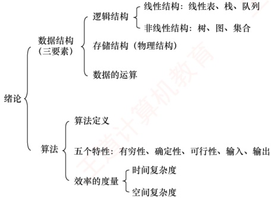

# 第1章 绪论

## 【考纲内容】

### （一）数据结构的基本概念

### （二） 算法的基本概念

算法的时间复杂度和空间复杂度非叶结点的 weight 域保存其孩子结点中 weight 域值的和，则树的 WPL 等于树中所有非叶结点 weight 域值之和。

视频讲解

**【知识框架】**

## 【复习提示】

本章概述数据结构，帮助读者整体认识数据结构，重点在于掌握算法时间复杂度和空间复杂度的分析方法。在统考真题中，无论是算法设计题还是选择题，通常都会要求分析算法的时间复杂度（有时也包括空间复杂度），因此要熟练掌握相关内容。
