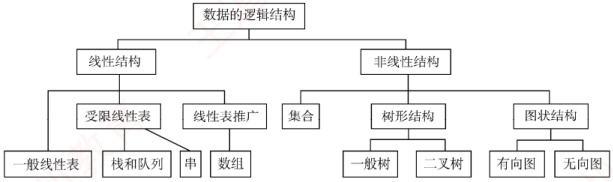
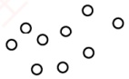
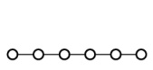
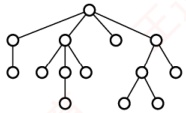
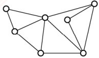

## 1.1 数据结构的基本概念

### 1.1.1 基本概念和术语

#### 1. 数据

数据是信息的载体，是描述客观事物属性的数、字符，以及所有能输入到计算机中并被计算机程序识别和处理的符号的集合。数据是计算机程序加工的原料。

#### 2. 数据元素

数据元素是数据的基本单位，通常作为一个整体进行考虑和处理。一个数据元素可由若干数据项组成，而数据项是构成数据元素的不可分割的最小单位。例如，一条学生记录就是一个数据元素，它由学号、姓名、性别等数据项组成。
#### 3. 数据对象

数据对象是具有相同性质的数据元素的集合，是数据的一个子集。例如，整数数据对象可表示为集合  $N = \{0, \pm1, \pm2, \cdots\}$。

#### 4. 数据类型

数据类型是一个值的集合以及定义在该集合上的一组操作的总称。

1）原子类型：其值不可再分的数据类型。

2）结构类型：其值可进一步分解为若干成分（分量）的数据类型。

3）抽象数据类型（ADT）：一个数学模型以及定义在该模型上的一组操作。它通常是对数据的某种抽象，规定了数据的取值范围、结构形式以及可执行的操作集合。

#### 5. 数据结构

数据结构是相互之间存在一种或多种特定关系的数据元素的集合。在任何问题中，数据元素都不是孤立存在的，它们之间存在某种关系，这种关系称为结构（Structure）。数据结构包括三方面的内容：逻辑结构、存储结构和数据的运算。

数据的逻辑结构与存储结构密不可分：算法的设计取决于所采用的逻辑结构，而算法的实现则依赖于所选择的存储结构 $^{①}$。

### 1.1.2 数据结构三要素

#### 1. 数据的逻辑结构

逻辑结构是指数据元素之间的逻辑关系，即从逻辑角度对数据的描述方式。它与数据在计算机中的存储方式无关，是独立于具体系统的。数据的逻辑结构可分为线性结构和非线性结构。例如，线性表是典型的线性结构；集合、树和图则是典型的非线性结构，如图1.1所示。

图 1.1 数据的逻辑结构分类

1）集合：结构中的数据元素之间除“同属一个集合”外，别无其他关系[见图1.2(a)]。

(a) 集合

(b) 线性结构

(c) 树形结构

(d) 网状结构

图 1.2 四类基本结构关系示例图

2）线性结构：结构中的数据元素之间仅存在一对一的关系 [见图1.2(b)]。

3）树形结构：结构中的数据元素之间存在一对多的关系 [见图1.2(c)]。
4）图状结构（或网状结构）：结构中的数据元素之间存在多对多的关系 [见图1.2(d)]。

#### 2. 数据的存储结构

存储结构是指数据结构在计算机中的表示形式，也称物理结构，包括数据元素的表示及其相互关系的表示。它是逻辑结构在计算机中的具体实现，依赖于所采用的编程语言。常见的存储结构有顺序存储、链式存储、索引存储和散列存储。

1）顺序存储：将逻辑上相邻的数据元素存储在物理位置也相邻的存储单元中，元素间的关系由存储单元的邻接关系体现。优点是可以实现随机存取，每个元素占用最少的存储空间；缺点是要求使用连续的存储空间，可能导致较多的外部碎片。

2）链式存储：不要求逻辑上相邻的元素在物理位置上也相邻，而是通过指针指示元素的存储地址来表示其逻辑关系。优点是不会出现碎片现象，能充分利用所有存储单元；缺点是每个元素因存储指针而额外占用存储空间，且只能顺序存取。

3）索引存储：在存储元素信息的同时，额外建立索引表。索引表中的每一项称为索引项，通常包含关键字和地址。优点是检索速度快；缺点是需要额外的存储空间用于索引表，且增加或删除数据时需更新索引表，带来额外的时间开销。

4）散列存储：根据元素的关键字直接计算出其存储地址，也称哈希（Hash）存储。优点是检索、插入和删除操作都非常快速；缺点是如果散列函数设计不当，可能会产生冲突（也称哈希冲突），解决冲突会增加时间和空间成本。

#### 3. 数据的运算

数据的运算包括定义与实现两个方面：定义针对逻辑结构，说明运算的功能；实现则基于存储结构，描述具体的操作步骤。
