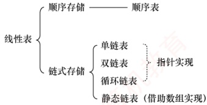

# 第2章 线性表

## 【考纲内容】

### （一）线性表的基本概念

### （二）线性表的实现

顺序存储：链式存储

### （三） 线性表的应用

视频讲解

**【知识框架】**

## 【复习提示】

线性表是算法命题命题的重点。应牢固掌握其在两种存储结构（顺序存储与链式存储）下的各种基本操作，并在平时的学习中注重动手能力的培养。另需提醒的是，算法最重要的是思想！考场时间紧迫，在试卷上并不要求代码具备实际可执行性，应着重清晰地表达出算法的核心思想与关键步骤，而不必过于拘泥于语法、边界等细节。此外，即使采用暴力法，通常也能获得大部分分数，因此在时间紧张时建议直接采用。注意，算法题只能使用C/C++语言实现。
