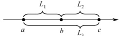

### 2.2.3 本节试题精选

#### 一、 单项选择题

##### 01

下列叙述中，（）是顺序存储结构的优点。

A. 存储密度大

B. 插入运算方便

C. 删除运算方便

D. 方便地运用于各种逻辑结构的存储表示

##### 02

下列关于顺序表的叙述中，正确的是（）。

A. 顺序表可以利用一维数组表示，因此顺序表与一维数组在逻辑结构上是相同的

B. 在顺序表中，逻辑上相邻的元素物理位置上不一定相邻

C. 顺序表和一维数组一样，都可以进行随机存取

D. 在顺序表中，每个元素的类型不必相同

##### 03

通常说顺序表具有随机存取的特性，指的是（）。
A. 查找值为 x 的元素的时间与顺序表中元素个数 n 无关

B. 查找值为 x 的元素的时间与顺序表中元素个数 n 有关

C. 查找序号为 i 的元素的时间与顺序表中元素个数 n 无关

D. 查找序号为 i 的元素的时间与顺序表中元素个数 n 有关

##### 04

一个顺序表所占用的存储空间大小与（）无关。

A. 表的长度

B. 元素的存放顺序

C. 元素的类型

D. 元素中各字段的类型

##### 05

若线性表最常用的操作是存取第 i 个元素及其前驱和后继元素的值，为了提高效率，应采用（ ）的存储方式。

A. 单链表

B. 双链表

C. 循环单链表

D. 顺序表

##### 06

一个线性表最常用的操作是存取任意一个指定序号的元素，并在最后进行插入、删除操作，则利用（ ）存储方式可以节省时间。

A. 顺序表

B. 双链表

C. 带头结点的循环双链表

D. 循环单链表

##### 07

在 n 个元素的线性表的数组表示中，时间复杂度为  $O(1)$ 的操作是（）。

I. 访问第  $i$ ( $1 \leq i \leq n$) 个结点和求第  $i$ ( $2 \leq i \leq n$) 个结点的直接前驱

II. 在最后一个结点后插入一个新的结点

III. 删除第 1 个结点

IV. 在第  $i$ ( $1 \leq i \leq n$) 个结点后插入一个结点

A. I

B. II、III

C. I、II

D. I、II、II

##### 08

设线性表有 n 个元素，严格说来，以下操作中，（）在顺序表上实现要比在链表上实现的效率高。

Ⅰ. 输出第  $i$（ $1 \leq i \leq n$）个元素值

II. 交换第3个元素与第4个元素的值

III. 顺序输出这 n 个元素的值

A. I B. I、III C. I、II D. II、III

##### 09

在一个长度为 n 的顺序表中删除第 i（1≤i≤n）个元素时，需向前移动（ ）个元素。

A. n B. i-1 C. n-i D. n-i+1

##### 10

对于顺序表，访问第 i 个位置的元素和在第 i 个位置插入一个元素的时间复杂度为（）。

A.  $O(n)$,  $O(n)$ B.  $O(n)$,  $O(1)$ C.  $O(1)$,  $O(n)$ D.  $O(1)$,  $O(1)$

##### 11

对于顺序存储的线性表，其算法时间复杂度为  $O(1)$ 的运算应该是（）。

A. 将  $n$ 个元素从小到大排序

B. 删除第  $i$（ $1 \leq i \leq n$）个元素

C. 改变第  $i$（ $1 \leq i \leq n$）个元素的值

D. 在第  $i$（ $1 \leq i \leq n$）个元素后插入一个新元素

##### 12

顺序表的插入算法中，当 n 个空间已满时，可再申请增加分配 m 个空间，若申请失败，则说明系统没有（ ）可分配的存储空间。

A. m 个

B. m 个连续

C.  $n + m$ 个

D.  $n + m$ 个连续

##### 13

【2023 统考真题】在下列对顺序存储的有序表（长度为 n）实现给定操作的算法中，平均时间复杂度为 O(1) 的是（）。
A. 查找包含指定值元素的算法 B. 插入包含指定值元素的算法

C. 删除第  $i$（ $1 \leq i \leq n$）个元素的算法 D. 获取第  $i$（ $1 \leq i \leq n$）个元素的算法

#### 二、 综合应用题

##### 01

从顺序表中删除具有最小值的元素（假设唯一）并由函数返回被删元素的值。空出的位置由最后一个元素填补，若顺序表为空，则显示出错信息并退出运行。

##### 02

设计一个高效算法，将顺序表 L 的所有元素逆置，要求算法的空间复杂度为 O(1)。

##### 03

对长度为 n 的顺序表 L，编写一个时间复杂度为  $O(n)$、空间复杂度为  $O(1)$ 的算法，该算法删除顺序表中所有值为 x 的数据元素。

##### 04

从顺序表中删除其值在给定值 s 和 t 之间（包含 s 和 t，要求 s < t）的所有元素，若 s 或 t 不合理或顺序表为空，则显示出错信息并退出运行。

##### 05

从有序顺序表中删除所有其值重复的元素，使表中所有元素的值均不同。

##### 06

将两个有序顺序表合并为一个新的有序顺序表，并由函数返回结果顺序表。

##### 07

已知在一维数组 A $[m+n]$ 中依次存放两个线性表  $(a_1, a_2, a_3, \cdots, a_m)$ 和  $(b_1, b_2, b_3, \cdots, b_n)$。编写一个函数，将数组中两个顺序表的位置互换，即将  $(b_1, b_2, b_3, \cdots, b_n)$ 放在  $(a_1, a_2, a_3, \cdots, a_m)$ 的前面。

##### 08

线性表  $(a_1, a_2, a_3, \cdots, a_n)$ 中的元素递增有序且按顺序存储于计算机内。要求设计一个算法，完成用最少时间在表中查找数值为  $x$ 的元素，若找到，则将其与后继元素位置相交换，若找不到，则将其插入表中并使表中元素仍然递增有序。

##### 09

给定三个序列 A、B、C，长度均为 n，且均为无重复元素的递增序列，请设计一个时间上尽可能高效的算法，逐行输出同时存在于这三个序列中的所有元素。例如，数组 A 为 {1,2,3}，数组 B 为 {2,3,4}，数组 C 为 {-1,0,2}，则输出 2。要求：

1）给出算法的基本设计思想。

2）根据设计思想，采用 C 或 C++语言描述算法，关键之处给出注释。

3）说明你的算法的时间复杂度和空间复杂度。

##### 10

【2010 统考真题】设将  $n$（ $n > 1$）个整数存放到一维数组 R 中。设计一个在时间和空间两方面都尽可能高效的算法。将 R 中保存的序列循环左移  $p$（ $0 < p < n$）个位置，即将 R 中的数据由 $(X_0, X_1, \cdots, X_{n-1})$变换为 $(X_p, X_{p+1}, \cdots, X_{n-1}, X_0, X_1, \cdots, X_{p-1})$。要求：

1）给出算法的基本设计思想。

2）根据设计思想，采用 C 或 C++ 或 Java 语言描述算法，关键之处给出注释。

3）说明你所设计算法的时间复杂度和空间复杂度。

##### 11

【2011 统考真题】一个长度为  $L$（ $L \geq 1$）的升序序列  $S$，处在第  $L/2$ 个位置的数称为  $S$ 的中位数。例如，若序列  $S_1 = (11, 13, 15, 17, 19)$，则  $S_1$ 的中位数是 15，两个序列的中位数是含它们所有元素的升序序列的中位数。例如，若  $S_2 = (2, 4, 6, 8, 20)$，则  $S_1$ 和  $S_2$ 的中位数是 11。现在有两个等长升序序列  $A$ 和  $B$，试设计一个在时间和空间两方面都尽可能高效的算法，找出两个序列  $A$ 和  $B$ 的中位数。要求：

1) 给出算法的基本设计思想。

2) 根据设计思想，采用  $C$ 或  $C++$ 或 Java 语言描述算法，关键之处给出注释。

3) 说明所设计算法的时间复杂度和空间复杂度。

##### 12

【2013 统考真题】已知一个整数序列  $A = (a_0, a_1, \cdots, a_{n-1})$，其中  $0 \leq a_i < n$（ $0 \leq i < n$）。若存在  $a_{p_1} = a_{p_2} = \cdots = a_{p_m} = x$ 且  $m > n/2$（ $0 \leq p_k < n, 1 \leq k \leq m$），则称  $x$ 为  $A$ 的主元素。例如  $A = (0, 5, 5, 3, 5, 7, 5, 5)$，则 5 为主元素；又如  $A = (0, 5, 5, 3, 5, 1, 5, 7)$，则  $A$ 中没有主元素。假设  $A$ 中的  $n$ 个元素保存在一个一维数组中，请设计一个尽可能高效的算法，
找出 A 的主元素。若存在主元素，则输出该元素；否则输出 -1。要求：

1）给出算法的基本设计思想。

2）根据设计思想，采用 C 或 C++ 或 Java 语言描述算法，关键之处给出注释。

3）说明你所设计算法的时间复杂度和空间复杂度。

##### 13

【2018 统考真题】给定一个含  $n$（ $n \geq 1$）个整数的数组，请设计一个在时间上尽可能高效的算法，找出数组中未出现的最小正整数。例如，数组  $\{-5, 3, 2, 3\}$ 中未出现的最小正整数是 1；数组  $\{1, 2, 3\}$ 中未出现的最小正整数是 4。要求：

1）给出算法的基本设计思想。

2）根据设计思想，采用 C 或 C++ 语言描述算法，关键之处给出注释。

3）说明你所设计算法的时间复杂度和空间复杂度。

##### 14

【2020 统考真题】定义三元组 $(a, b, c)$（$a, b, c$ 均为整数）的距离 $D = |a - b| + |b - c| + |c - a|$。给定3个非空整数集合$S_1$、$S_2$和$S_3$，按升序分别存储在3个数组中。请设计一个尽可能高效的算法，计算并输出所有可能的三元组$(a, b, c)$（$a \in S_1, b \in S_2, c \in S_3$）中的最小距离。例如$S_1 = \{-1, 0, 9\}$，$S_2 = \{-25, -10, 10, 11\}$，$S_3 = \{2, 9, 17, 30, 41\}$，则最小距离为2，相应的三元组为$(9, 10, 9)$。要求：

1）给出算法的基本设计思想。

2）根据设计思想，采用C语言或C++语言描述算法，关键之处给出注释。

3）说明你所设计算法的时间复杂度和空间复杂度。

##### 15

【2025统考真题】有两个长度均为$n$的一维整型数组A和res，对数组A中的每个元素A[i]，计算A[i]与A[j]（$0 \leq i \leq n-1$）乘积的最大值，并将其保存到res[i]中。例如，当A[i] = {1, 4, -9, 6}时，得到res[i] = {6, 24, 81, 36}。现给定数组A，设计一个时间和空间上尽可能高效的算法calMulMax，求res中各元素的值。函数原型为void calMulMax(int A),int res[],int n。要求如下：

1）给出算法的基本设计思想。

2）根据设计思想，采用 C 或 C++ 语言描述算法，关键之处给出注释。

3）说明你所设计算法的时间复杂度和空间复杂度。

### 2.2.4 答案与解析

#### 一、 单项选择题

##### 01

A

顺序表不像链表那样要在结点中存放指针域，因此存储密度大，选项 A 正确。选项 B 和 C 是链表的优点。选项 D 是错误的，比如对于树形结构，顺序表显然不如链表表示起来方便。

##### 02

C

顺序表是顺序存储的线性表，表中所有元素的类型必须相同，且必须连续存放。一维数组中的元素可以不连续存放；此外，栈、队列和树等逻辑结构也可利用一维数组表示，但它与顺序表不属于相同的逻辑结构。在顺序表中，逻辑上相邻的元素物理位置上也相邻。

##### 03

C

随机存取是指在$O(1)$的时间访问下标为 i 的元素，所需时间与顺序表中的元素个数 n 无关。

##### 04

B

顺序表所占的存储空间 = 表长×sizeof（元素的类型），表长和元素的类型显然会影响存储空间的大小。若元素为结构体类型，则元素中各字段的类型也会影响存储空间的大小。
##### 05

D

题干实际要求能最快存取第i-1、i和i+1个元素值。选项A、B、C都只能从头结点依次顺序查找，时间复杂度为$O(n)$；只有顺序表可以按序号随机存取，时间复杂度为$O(1)$。

##### 06

A

只有顺序表可以按序号随机存取，且在最后进行插入和删除操作时不需要移动任何元素。

##### 07

C

对说法 I，解析略；对说法 II，在最后位置插入新结点不需要移动元素，时间复杂度为$O(1)$;

对说法 III，被删结点后的结点需要依次前移，时间复杂度为$O(n)$; 对说法 IV，需要后移 n-i 个结点，时间复杂度为$O(n)$。

##### 08

C

对说法 II，顺序表只需 3 次交换操作；链表需要分别找到两个结点前驱，第 4 个结点断链后再插入到第 2 个结点后，效率较低。对说法 III，需要依次顺序访问每个元素，时间复杂度相同。

##### 09

C

需要将元素$a_{i+1} \sim a_n$依次前移一位，共移动$n - (i + 1) + 1 = n - i$个元素。

##### 10

C

在第 i 个位置插入一个元素，需要移动$n-i+1$个元素，时间复杂度为$O(n)$。

##### 11

C

对 n 个元素进行排序的时间复杂度最小也要$O(n)$（初始有序时），通常为$O(n\log_{2}n)$或$O(n^{2})$，通过第 8 章学习后会更容易理解。选项 B 和 D 显然错误。顺序表支持按序号的随机存取方式。

##### 12

D

顺序存储需要连续的存储空间，在申请时需申请$n+m$个连续的存储空间，然后将线性表原来的 n 个元素复制到新申请的$n+m$个连续的存储空间的前 n 个单元。

##### 13

D

对于顺序存储的有序表，查找指定值元素可以采用顺序查找法或折半查找法，平均时间复杂度最少为$O(\log_2 n)$。插入指定值元素需要先找到插入位置，然后将该位置及之后的元素依次后移一个位置，最后将指定值元素插入到该位置，平均时间复杂度为$O(n)$。删除第 i 个元素需要将该元素之后的全部元素依次前移一个位置，平均时间复杂度为$O(n)$。获取第 i 个元素只需直接根据下标读取对应的数组元素即可，时间复杂度为$O(1)$。

#### 二、 综合应用题

##### 01

【解答】

算法思想：搜索整个顺序表，查找最小值元素并记住其位置，搜索结束后用最后一个元素填补空出的原最小值元素的位置。

本题代码如下：

```c
bool Del_Min(SqList &L, ElemType &value) {
    //删除顺序表L中最小值元素结点，并通过引用型参数value返回其值
    //若删除成功，则返回true；否则返回false
    if (L.length==0)
        return false;
    //表空，中止操作返回
    value=L.data[0];
    int pos=0;
    for (int i=1;i<L.length;i++)
        //假定0号元素的值最小
        //循环，寻找具有最小值的元素
        if (L.data[i]<value){
            value=L.data[i];
pos=i;
}

L.data[pos]=L.data[L.length-1]; //空出的位置由最后一个元素填补
L.length--;
return true; //此时，value 为最小值
```

**注意**

本题也可用函数返回值返回，两者的区别是：函数返回值只能返回一个值，而参数返回（引用传参）可以返回多个值。

##### 02

【解答】

算法思想：扫描顺序表$L$的前半部分元素，对于元素$L.data[i] (0<=i<L.length/2)$，将其与后半部分的对应元素$L.data[L.length-i-1]$进行交换。

本题代码如下：

```c
void Reverse(SqList &L) {
    ElemType temp; //辅助变量
    for (int i=0; i<L.length/2; i++) {
        temp = L.data[i]; //交换 L.data[i] 与 L.data[L.length-i-1]
        L.data[i]=L.data[L.length-i-1];
        L.data[L.length-i-1]=temp;
    }
}
```

##### 03

【解答】

解法1：用 k 记录顺序表 L 中不等于 x 的元素个数（需要保存的元素个数），扫描时将不等于 x 的元素移动到下标 k 的位置，并更新 k 值。扫描结束后修改 L 的长度。

本题代码如下：

```c
void del x_1(SqList &L,ElemType x){
    //本算法实现删除顺序表L中所有值为x的数据元素
    int k=0,i;    //记录值不等于x的元素个数
    for(i=0;i<L.length;i++)
        if(L.data[i]!=x){
            L.data[k]=L.data[i];
            k++;     //不等于x的元素增1
        }
        L.length=k;     //顺序表L的长度等于k
    }
```

解法2：用 k 记录顺序表 L 中等于 x 的元素个数，一边扫描 L，一边统计 k，并将不等于 x 的元素前移 k 个位置。扫描结束后修改 L 的长度。

本题代码如下：
```c

void del_x_2(SqList &L,ElemType x){
```
```c
    int k=0,i=0; //k记录值等于x的元素个数
    while (i<L.length){
        if (L.data[i]==x)
            k++;
        else
            L.data[i-k]=L.data[i]; //当前元素前移k个位置
        i++;
    }
    L.length=L.length-k; //顺序表L的长度递减
}
```

此外，本题还可以考虑设头、尾两个指针（i=1,j=n），从两端向中间移动，在遇到最左端
值 x 的元素时，直接将最右端值非 x 的元素左移至值为 x 的数据元素位置，直到两指针相遇。但这种方法会改变原表中元素的相对位置。

##### 04

【解答】

算法思想：从前向后扫描顺序表 L，用 k 记录值在 s 和 t 之间的元素个数（初始时 k=0）。对于当前扫描的元素，若其值不在 s 和 t 之间，则前移 k 个位置；否则执行 k++。每个不在 s 和 t 之间的元素仅移动一次，因此算法效率高。

本题代码如下：
```c

bool Del_s_t (SqList &L,ElemType s,ElemType t){
//删除顺序表L中值在给定值s和t（要求s<t）之间的所有元素
int i,k=0;
if(L.length==0||s>=t)
```
```c
return false; //线性表为空或s、t不合法，返回
for(i=0;i<L.length;i++) {
if(L.data[i]>=s&&L.data[i]<=t)
k++;
else
L.data[i-k]=L.data[i]; //当前元素前移k个位置
} //for
L.length-=k; //长度减小
return true;
```

**注意**

本题也可从后向前扫描顺序表，每遇到一个值在s和t之间的元素，就删除该元素，其后的所有元素全部前移。但移动次数远大于前者，效率不够高。

##### 05

【解答】

算法思想：注意是有序顺序表，值相同的元素一定在连续的位置上，用类似于直接插入排序的思想，初始时将第一个元素视为非重复的有序表。之后依次判断后面的元素是否与前面非重复有序表的最后一个元素相同，若相同，则继续向后判断，若不同，则插入前面的非重复有序表的最后，直至判断到表尾为止。

本题代码如下：

```c
bool Delete Same(SeqList& L){
    if(L.length==0)
        return false;
    int i,j; //i存储第一个不相同的元素，j为工作指针
    for(i=0,j=1;j<L.length;j++)
        if(L.data[i]!=L.data[j]) //查找下一个与上一个元素值不同的元素
            L.data[++i]=L.data[j]; //找到后，将元素前移
    L.length=i+1;
    return true;
}
```

对于本题的算法，请读者用序列 1, 2, 2, 2, 2, 3, 3, 3, 4, 4, 5 来手动模拟算法的执行过程，在模拟过程中要标注 i 和 j 所指示的元素。

思考：若将本题中的有序表改为无序表，你能想到时间复杂度为$O(n)$的方法吗？

（提示：使用散列表。）

##### 06

【解答】

算法思想：首先，按顺序不断取下两个顺序表表头较小的结点存入新的顺序表中。然后，看哪个表还有剩余，将剩下的部分加到新的顺序表后面。
本题代码如下：

```c
bool Merge(SeqList A, SeqList B, SeqList &C) {
//将有序顺序表A与B合并为一个新的有序顺序表C
if (A.length+B.length>C.maxSize) {
//大于顺序表的最大长度
return false;
int i=0,j=0,k=0;
while (i<A.length&&j<B.length) {
//循环，两两比较，小者存入结果表
if (A.data[i]<=B.data[j])
    C.data[k++]=A.data[i++];
else
    C.data[k++]=B.data[j++];
}
while (i<A.length) {
//还剩一个没有比较完的顺序表
C.data[k++]=A.data[i++];
while (j<B.length)
    C.data[k++]=B.data[j++];
C.length=k;
return true;
}
```

注意
本算法的方法非常典型，需要牢固掌握。

##### 07

【解答】

算法思想：首先将数组 A[m+n] 中的全部元素$(a_1, a_2, a_3, \cdots, a_m, b_1, b_2, b_3, \cdots, b_n)$原地逆置为$(b_n, b_{n-1}, b_{n-2}, \cdots, b_1, a_m, a_{m-1}, a_{m-2}, \cdots, a_1)$，然后对前 n 个元素和后 m 个元素分别使用逆置算法，即可得到$(b_1, b_2, b_3, \cdots, b_n, a_1, a_2, a_3, \cdots, a_m)$，从而实现顺序表的位置互换。

本题代码如下：
```c

typedef int DataType;
void Reverse(DataType A[], int left, int right, int arraySize) {
    // 逆转 (aleft, aleft+1, aleft+2, …, aright) 为 (aright, aright-1, …, aleft)
    if (left >= right || right >= arraySize)
        return;
    int mid = (left + right) / 2;
    for (int i = 0; i <= mid - left; i++) {
        DataType temp = A[left + i];
        A[left + i] = A[right - i];
        A[right - i] = temp;
    }
}
void Exchange(DataType A[], int m, int n, int arraySize) {
    /*数组 A[m+n] 中，从 0 到 m-1 存放顺序表 (a1, a2, a3, …, am)，从 m 到 m+n-1 存放顺序表 (b1, b2, b3, …, bn)，算法将这两个表的位置互换*/
    Reverse(A, 0, m+n-1, arraySize);
    Reverse(A, 0, n-1, arraySize);
    Reverse(A, n, m+n-1, arraySize);
}
```

##### 08

【解答】

算法思想：顺序存储的线性表递增有序，可以顺序查找，也可以折半查找。题目要求“用最少的时间在表中查找数值为x的元素”，这里应使用折半查找法。

本题代码如下：

```c
void SearchExchangeInsert(ElemType A[], ElemType x) {
    int low=0, high=n-1, mid; //low 和 high 指向顺序表下界和上界的下标
    while (low<=high) {
mid=(low+high)/2; //找中间位置
if(A[mid]==x) break; //找到x，退出while循环
else if(A[mid]<x) low=mid+1; //到中点mid的右半部去查
else high=mid-1; //到中点mid的左半部去查
} //下面两个if语句只会执行一个
if(A[mid]==x&&mid!=n-1){ //若最后一个元素与x相等，则不存在与其后
    继续交换的操作
t=A[mid]; A[mid]=A[mid+1]; A[mid+1]=t;
}
if(low>high){ //查找失败，插入数据元素x
    for(i=n-1;i>high;i--) A[i+1]=A[i]; //后移元素
    A[i+1]=x; //插入x
}
//结束插入
```

本题的算法也可写成三个函数：查找函数、交换后继函数与插入函数。写成三个函数的优点是逻辑清晰且易读。

##### 09

【解析】

1）算法的基本设计思想。

使用三个下标变量从小到大遍历数组。当三个下标变量指向的元素相等时，输出并向前推进指针，否则仅移动小于最大元素的下标变量，直到某个下标变量移出数组范围，即可停止。

2）算法的实现。

```c
void samekey(int A[], int B[], int C[], int n) {
    int i=0, j=0, k=0; //定义三个工作指针
    while (i<n&j<n&k<n) {
        //相同则输出，并集体后移
        `if (A[i]==B[j]&&B[j]==C[k])` {
            printf("%d\n", A[i]);
            i++; j++; k++;
        } else {
            int maxNum=max(A[i], max(B[j], C[k]);
            if (A[i]<maxNum) i++;
            if (B[j]<maxNum) j++;
            if (C[k]<maxNum) k++;
        }
    }
}
```

3）每个指针移动的次数不超过 n，且每次循环至少有一个指针后移，故时间复杂度为$O(n)$，算法只用到了常数个变量，空间复杂度为$O(1)$。

##### 10

【解答】

1）算法的基本设计思想：

可将问题视为把数组$ab$转换成数组$ba$（$a$代表数组的前$p$个元素，$b$代表数组中余下的$n-p$个元素），先将$a$逆置得到$a^{-1}b$，再将$b$逆置得到$a^{-1}b^{-1}$，最后将整个$a^{-1}b^{-1}$逆置得到$(a^{-1}b^{-1})^{-1} = ba$。设 Reverse 函数执行将数组逆置的操作，对$abcdefgh$向左循环移动 3（$p=3$）个位置的过程如下：

Reverse$(0, p-1)$得到 cbadefgh;
Reverse$(p, n-1)$得到 cbahgfed;
Reverse$(0, n-1)$得到 defghabc.

注：在 Reverse 中，两个参数分别表示数组中待转换元素的始末位置。

2）使用 C 语言描述算法如下：

```c
void Reverse(int R[], int from, int to) {
    int i, temp;
for(i=0;i<({to-from+1})/2;i++)
{
    {temp=R[from+i];R[from+i]=R[to-i];R[to-i]=temp;}
}
void Converse(int R[], int n, int p) {
    Reverse(R, 0, p-1);
    Reverse(R, p, n-1);
    Reverse(R, 0, n-1);
}
```

3）上述算法中三个 Reverse 函数的时间复杂度分别为$O(p/2)$、$O((n-p)/2)$和$O(n/2)$，故所设计的算法的时间复杂度为$O(n)$，空间复杂度为$O(1)$。

【另解】借助辅助数组来实现。算法思想：创建大小为 p 的辅助数组 S，将 R 中前 p 个整数依次暂存在 S 中，同时将 R 中后 n-p 个整数左移，然后将 S 中暂存的 p 个数依次放回到 R 中的后续单元。时间复杂度为$O(n)$，空间复杂度为$O(p)$。

##### 11

【解答】

1）算法的基本设计思想如下。

分别求两个升序序列A、B的中位数，设为a和b，求序列A、B的中位数过程如下：

① 若 a=b，则 a 或 b 为所求中位数，算法结束。

② 若 a < b，则舍弃序列 A 中较小的一半，同时舍弃序列 B 中较大的一半，要求两次舍弃的长度相等。

③ 若 a > b，则舍弃序列 A 中较大的一半，同时舍弃序列 B 中较小的一半，要求两次舍弃的长度相等。

在保留的两个升序序列中，重复过程$^{①}$、$^{②}$、$^{③}$，直到两个序列中均只含一个元素时为止，较小者为所求的中位数。

2）本题代码如下：

```c
int M_Search(int A[], int B[], int n) {
    int s1, d1, m1, s2, d2, m2;
    s1=0; d1=n-1;
    s2=0; d2=n-1;
    while (s1 != d1 || s2 != d2) {
        m1 = (s1 + d1) / 2;
        m2 = (s2 + d2) / 2;
        if (A[m1] == B[m2])
            return A[m1];
        if (A[m1] < B[m2]) {
            if ((s1 + d1) % 2 == 0) {
                s1 = m1;
                d2 = m2;
            }
        else {
            s1 = m1 + 1;
            d2 = m2;
        }
    }
    else {
        if ((s1 + d1) % 2 == 0) {
            d1 = m1;
            s2 = m2;
        }
        else {
            d1 = m1;
            s2 = m2 + 1;
        }
    }
}
//满足条件①
//满足条件②
//若元素个数为奇数
//舍弃A中间点以外的部分，且保留中间点
//舍弃B中间点以后的部分，且保留中间点
//元素个数为偶数
//舍弃A的前半部分
//舍弃B的后半部分
//满足条件③
//若元素个数为奇数
//舍弃A中间点以后的部分，且保留中间点
//舍弃B中间点以前的部分，且保留中间点
//元素个数为偶数
//舍弃A的后半部分
//舍弃B的前半部分
}
}
return A[s1]<B[s2]? A[s1]:B[s2];
```

3）算法的时间复杂度为$O(\log_{2}n)$，空间复杂度为$O(1)$。

【另解】对两个长度为 n 的升序序列 A 和 B 中的元素按从小到大的顺序依次访问，这里访问的含义只是比较序列中两个元素的大小，并不实现两个序列的合并，因此空间复杂度为 O(1)。按照上述规则访问第 n 个元素时，这个元素为两个序列 A 和 B 的中位数。

##### 12

【解答】

1）算法的基本设计思想：算法的策略是从前向后扫描数组元素，标记出一个可能成为主元素的元素 Num。然后重新计数，确认 Num 是否是主元素。

算法可分为以下两步：

① 选取候选的主元素。依次扫描所给数组中的每个整数，将第一个遇到的整数 Num 保存到 c 中，记录 Num 的出现次数为 1；若遇到的下一个整数仍等于 Num，则计数加 1，否则计数减 1；当计数减到 0 时，将遇到的下一个整数保存到 c 中，计数重新记为 1，开始新一轮计数，即从当前位置开始重复上述过程，直到扫描完全部数组元素。

② 判断 c 中元素是否是真正的主元素。再次扫描该数组，统计 c 中元素出现的次数，若大于 n/2，则为主元素；否则，序列中不存在主元素。

2）算法实现如下：

```c
int Majority(int A[], int n) {
    int i, c, count=1; //c用来保存候选主元素，count用来计数
    c=A[0]; //设置A[0]为候选主元素
    for (i=1; i<n; i++) //查找候选主元素
        if (A[i]==c)
            count++; //对A中的候选主元素计数
    else
        if (count>0) //处理不是候选主元素的情况
            count--;
        else {
            c=A[i]; //更换候选主元素，重新计数
            count=1;
        }
        if (count>0)
            for (i=count=0; i<n; i++) //统计候选主元素的实际出现次数
            if (A[i]==c)
                count++;
        if (count>n/2) return c; //确认候选主元素
    else return -1; //不存在主元素
}
```

3）实现的程序的时间复杂度为$O(n)$，空间复杂度为$O(1)$。

**说明**

本题若采用先排好序再统计的方法 [时间复杂度为$O(n\log_{2}n)$]，则只要解答正确，最高就可拿 11 分。即便是写出$O(n^2)$的算法，最高也能拿 10 分，因此，对于统考算法题，花费大量时间去思考最优解法是得不偿失的。本算法的方法非常典型，需要牢固掌握。

##### 13

【解答】

1）算法的基本设计思想：
要求在时间上尽可能高效，因此采用空间换时间的办法。分配一个用于标记的数组B[n]，用来记录A中是否出现了1～n中的正整数，B[0]对应正整数1，B[n-1]对应正整数n，初始化B中全部为0。A中含有n个整数，因此可能返回的值是1～n+1，当A中n个数恰好为1~n时返回n+1。当数组A中出现了小于或等于0或大于n的值时，会导致1～n中出现空余位置，返回结果必然在1～n中，因此对于A中出现了小于或等于0或大于n的值，可以不采取任何操作。

经过以上分析可以得出算法流程：从A[0]开始遍历A，若0<A[i]<=n，则令B[A[i]-1]=1；否则不做操作。对A遍历结束后，开始遍历数组B，若能查找到第一个满足B[i]==0的下标i，返回i+1即为结果，此时说明A中未出现的最小正整数在1和n之间。若B[i]全部不为0，返回i+1（跳出循环时i=n，i+1等于n+1），此时说明A中未出现的最小正整数是n+1。

2 ）算法实现：
```c

int findMissMin(int A[], int n)
{
    int i, *B;
    //标记数组
    B = (int *)malloc(sizeof(int) *n); //分配空间
```
```c
    memset(B, 0, sizeof(int) *n); //赋初值为 0
    for (i = 0; i < n; i++)
        if (A[i] > 0 && A[i] <= n)
            B[A[i] - 1] = 1;
    for (i = 0; i < n; i++)
        if (B[i] == 0) break;
    return i + 1;
}
```

3）时间复杂度：遍历 A 一次，遍历 B 一次，两次循环内操作步骤为$O(1)$量级，因此时间复杂度为$O(n)$。空间复杂度：额外分配了 B[n]，空间复杂度为$O(n)$。

##### 14

【解答】

分析。由$D = |a - b| + |b - c| + |c - a| \geq 0$，有如下结论。

① 当 a = b = c 时，距离最小。

② 其余情况。不失一般性，假设$a \leq b \leq c$，观察下面的数轴：



 $$\begin{aligned}L_{1}=&\left|\boldsymbol{a}-\boldsymbol{b}\right|,\quad L_{2}=\left|\boldsymbol{b}-\boldsymbol{c}\right|,\quad L_{3}=\left|\boldsymbol{c}-\boldsymbol{a}\right|\\D=&\left|\boldsymbol{a}-\boldsymbol{b}\right|+\left|\boldsymbol{b}-\boldsymbol{c}\right|+\left|\boldsymbol{c}-\boldsymbol{a}\right|\geqslant0=L_{1}+L_{2}+L_{3}=2L_{3}\end{aligned}$$

由 $D$ 的表达式可知，事实上决定 $D$ 大小的关键是 $a$ 和 $c$ 之间的距离，于是问题就可以简化为每次固定 $c$ 找一个 $a$，使得 $L_3 = |c - a|$ 最小。

1）算法的基本设计思想：

① 使用  $D_{min}$ 记录所有已处理的三元组的最小距离，初值为一个足够大的整数。

② 集合  $S_1$、 $S_2$ 和  $S_3$ 分别保存在数组  $A$、 $B$、 $C$ 中。数组的下标变量  $i = j = k = 0$，当  $i < |S_1|$、 $j < |S_2|$ 且  $k < |S_3|$ 时（ $|S|$ 表示集合  $S$ 中的元素个数），循环执行下面的步骤  $a) \sim c)$。

a）计算( $A[i]$,  $B[j]$,  $C[k]$)的距离D；（计算D）

b）若  $D < D_{min}$，则  $D_{min} = D$；（更新 D）

c）将  $A[i]$、 $B[j]$、 $C[k]$ 中的最小值的下标+1；（对照分析：最小值为 a，最大值为 c，这里 c 不变而更新 a，试图寻找更小的距离 D）

③ 输出  $D_{min}$，结束。
2）算法实现：

```c
#define INT_MAX 0x7FFFFFFF
int abs_int(int a) { //计算绝对值
    if (a < 0) return -a;
    else return a;
}
bool xls_min(int a, int b, int c) { //a是否是三个数中的最小值
```
```c
    if (a <= b && a <= c) return true;
    return false;
}
int findMinofTrip(int A[], int n, int B[], int m, int C[], int p) {
    //D_min用于记录三元组的最小距离，初值赋为INT_MAX
    int i = 0, j = 0, k = 0, D_min = INT_MAX, D;
    while (i < n && j < m && k < p && D_min > 0) {
        D = abs_(A[i] - B[j]) + abs_(B[j] - C[k]) + abs_(C[k] - A[i]); //计算D
        if (D < D_min) D_min = D; //更新D
```
```c
        if (xls_min(A[i], B[j], C[k])) i++; //更新a
        else if (xls_min(B[j], C[k], A[i])) j++;
        else k++;
    }
    return D_min;
}
```

3）设  $n=(\left|S_{1}\right|+\left|S_{2}\right|+\left|S_{3}\right|)$，时间复杂度为  $O(n)$，空间复杂度为  $O(1)$。

##### 15

【解答】

1）算法的基本设计思想：

从后向前扫描一趟数组 A，对每个 A[i](0≤i≤n-1)，分别找到从 A[n-1]到 A[i]中的最大值 Max 和最小值 Min，然后分以下情况进行处理：① 若 A[i]≥0，则 A[i]与 Max 相乘；② 若 A[i]<0，则 A[i]与 Min 相乘。相乘的结果保存在 res[i]中。

2）算法实现：

```c
void calMulMax(int A[], int res[], int n)
{
    int i, Max, Min;
    Max=Min=A[n-1]
    for (i=n-1; i>=0; i--) //从后向前扫描一趟数组 A
    {
        if (A[i]>Max) Max=A[i];
        else if (A[i]<Min) Min = A[i];
        if (A[i]>=0) res[i] = A[i]*Max; //根据 A[i]的正负性分别处理
        else res[i]=A[i]*Min;
    }
}
```

3）算法的时间复杂度为  $O(n)$，空间复杂度为  $O(1)$。
