### 2.3.7 本节试题精选

#### 一、 单项选择题

##### 01

下列关于线性表的存储结构的描述中，正确的是（）。

Ⅰ. 线性表的顺序存储结构优于其链式存储结构

Ⅱ. 链式存储结构比顺序存储结构能更方便地表示各种逻辑结构

Ⅲ. 若频繁使用插入和删除结点操作，则顺序存储结构更优于链式存储结构

IV. 顺序存储结构和链式存储结构都可以进行顺序存取

A. I、II、III B. II、IV C. II、III D. III、IV

##### 02

对于一个线性表，既要求能进行较快速地插入和删除，又要求存储结构能反映数据之间的逻辑关系，则应该用（）。

A. 顺序存储方式 B. 链式存储方式 C. 散列存储方式 D. 以上均可以

##### 03

链式存储设计时，结点内的存储单元地址（）。
A. 一定连续

B. 一定不连续

C. 不一定连续

D. 部分连续，部分不连续

##### 04

下列关于线性表的说法中，正确的是（）。

I. 顺序存储方式只能用于存储线性结构

II. 在一个设有头指针和尾指针的单链表中，删除表尾元素的时间复杂度与表长无关

III. 带头结点的循环单链表中不存在空指针

IV. 在一个长度为 n 的有序单链表中插入一个新结点并仍保持有序的时间复杂度为  $O(n)$

V. 若用单链来表示队列，则应该选用带尾指针的循环链表

A. I、II

B. I、III、IV、V

C. IV、V

D. III、IV、V

##### 05

设线性表中有  $2n$ 个元素，（）在单链表上实现要比在顺序表上实现效率更高。

A. 删除所有值为  $x$ 的元素

B. 在最后一个元素的后面插入一个新元素

C. 顺序输出前  $k$ 个元素

D. 交换第  $i$ 个元素和第  $2n - i - 1$ 个元素的值（ $i = 0, \cdots, n - 1$）

##### 06

在一个单链表中，已知 q 所指结点是 p 所指结点的前驱结点，若在 q 和 p 之间插入结点 s，则执行（ ）。

A. s -> next = p -> next; p -> next = s;    B. p -> next = s -> next; s -> next = p;

C. q -> next = s; s -> next = p;          D. p -> next = s; s -> next = q;

##### 07

给定有 n 个元素的一维数组，建立一个有序单链表的最低时间复杂度是（）。

A.  $O(1)$ B.  $O(n)$ C.  $O(n^2)$ D.  $O(n\log_2 n)$

##### 08

将长度为 n 的单链表链接在长度为 m 的单链表后面，其算法的时间复杂度采用大 O 形式表示应该是（）。

A.  $O(1)$ B.  $O(n)$ C.  $O(m)$ D.  $O(n+m)$

##### 09

单链表中，增加一个头结点的目的是（）。

A. 使单链表至少有一个结点 B. 标识表结点中首结点的位置

C. 方便运算的实现 D. 说明单链表是线性表的链式存储

##### 10

在一个长度为 n 的带头结点的单链表 h 上，设有尾指针 r，则执行（）操作与链表的表长有关。

A. 删除单链表中的第一个元素

B. 删除单链表中的最后一个元素

C. 在单链表第一个元素前插入一个新元素

D. 在单链表最后一个元素后插入一个新元素

##### 11

对于一个头指针为head的带头结点的单链表，判定该表为空表的条件是（ ）；对于不带头结点的单链表，判定空表的条件为（ ）。

A. `head==NULL`

B. `head->next==NULL`

C. head->next==head

D. head!=NULL

##### 12

在线性表  $a_{0}, a_{1}, \cdots, a_{100}$ 中，删除元素 a_{50} 需要移动（）个元素。

A. 0 B. 50 C. 51 D. 0 或 50

##### 13

通过含有  $n (n > 1)$ 个元素的数组 a，采用头插法建立单链表 L，则 L 中的元素次序()。

A. 与数组 a 的元素次序相同 B. 与数组 a 的元素次序相反
C. 与数组 a 的元素次序无关 D. 以上都错误

##### 14

下面关于线性表的一些说法中，正确的是（）。

A. 对一个设有头指针和尾指针的单链表执行删除最后一个元素的操作与链表长度无关

B. 线性表中每个元素都有一个直接前驱和一个直接后继

C. 为了方便插入和删除数据，可以使用双链表存放数据

D. 取线性表第i个元素的时间与i的大小有关

##### 15

在双链表中向 p 所指的结点之前插入一个结点 q 的操作为（ ）。

A. p -> prior = q; q -> next = p; p -> prior -> next = q; q -> prior = p -> prior;

B. q -> prior = p -> prior; p -> prior -> next = q; q -> next = p; p -> prior = q -> next;

C. q -> next = p; p -> next = q; q -> prior -> next = q; q -> next = p;

D. p -> prior -> next = q; q -> next = p; q -> prior = p -> prior; p -> prior = q;

##### 16

在双链表存储结构中，删除 p 所指的结点时必须修改指针（）。

A. p->prior->next=p->next; p->next->prior=p->prior;

B. p->prior=p->prior->prior; p->prior->next=p;

C. p->next->prior=p; p->next=p->next->next;

D. p->next=p->prior->prior; p->prior=p->next->next;

##### 17

在如下图所示的双链表中，已知指针 p 指向结点 A，若要在结点 A 和 C 之间插入指针 q 所指的结点 B，则依次执行的语句序列可以是（）。

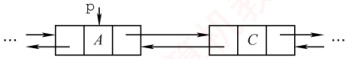

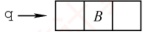

```c
① q->next=p->next; ② q->prior=p; ③ p->next=q; ④ p->next->prior=q;
```

A. ①②④③ B. ④③②① C. ③④①② D. ①③④②

##### 18

在双链表的两个结点之间插入一个新结点，需要修改（）个指针域。

A. 1          B. 3          C. 4          D. 2

##### 19

在长度为 n 的有序单链表中插入一个新结点，并仍然保持有序的时间复杂度是（）。

A.  $O(1)$ B.  $O(n)$ C.  $O(n^{2})$ D.  $O(n\log_{2}n)$

##### 20

与单链表相比，双链表的优点之一是（）。

A. 插入、删除操作更方便

B. 可以进行随机访问

C. 可以省略表头指针或表尾指针

D. 访问前后相邻结点更灵活

##### 21

对于一个带头结点的循环单链表 L，判断该表为空表的条件是（）。

A. 头结点的指针域为空

B. L的值为 NULL

C. 头结点的指针域与 L 的值相等

D. 头结点的指针域与 L 的地址相等

##### 22

对于一个带头结点的循环双链表 L，判断该表为空表的条件是（ ）。

A. `L->prior==L&L->next==NULL`

B. `L->prior==NULL&L->next==NULL`

C. `L->prior==NULL&L->next==L`

D. `L->prior==L&L->next==L`

##### 23

一个链表最常用的操作是在末尾插入结点和删除结点，则选用（）最节省时间。

A. 带头结点的循环双链表

B. 循环单链表

C. 带尾指针的循环单链表

D. 单链表

##### 24

设对  $n (n > 1)$ 个元素的线性表的运算只有4种：删除第一个元素；删除最后一个元素；在第一个元素之前插入新元素；在最后一个元素之后插入新元素，则最好使用（）。
A. 只有尾结点指针没有头结点指针的循环单链表

B. 只有尾结点指针没有头结点指针的非循环双链表

C. 只有头结点指针没有尾结点指针的循环双链表

D. 既有头结点指针又有尾结点指针的循环单链表

##### 25

有两个长度为 n 的循环单链表，若要求两个循环单链表头尾相接的时间复杂度为 O(1)，则对应两个循环单链表各设置一个指针，分别指向（）。

A. 各自的头结点

B. 各自的尾结点

C. 各自的首结点

D. 一个表的头结点，另一个表的尾结点

##### 26

有一个长度为 n 的循环单链表，若从表中删除首元结点的时间复杂度达到 O(n)，则此时采用的循环单链表的结构可能是（）。

A. 只有表头指针，没有头结点

B. 只有表尾指针，没有头结点

C. 只有表尾指针，带头结点

D. 只有表头指针，带头结点

##### 27

某线性表用带头结点的循环单链表存储，头指针为 head，当 head->next->next==head 成立时，线性表的长度可能是（）。

A. 0 B. 1 C. 2 D. 可能为 0 或 1

##### 28

有两个长度都为 n 的双链表，若以  $h_{1}$ 为头指针的双链表是非循环的，以  $h_{2}$ 为头指针的双链表是循环的，则下列叙述中正确的是（）。

A. 对于双链表  $h_{1}$，删除首结点的时间复杂度是 O(n)

B. 对于双链表  $h_{2}$，删除首结点的时间复杂度是 O(n)

C. 对于双链表  $h_{1}$，删除尾结点的时间复杂度是 O(1)

D. 对于双链表  $h_{2}$，删除尾结点的时间复杂度是 O(1)

##### 29

一个链表最常用的操作是在最后一个元素后插入一个元素和删除第一个元素，则选用（）最节省时间。

A. 不带头结点的循环单链表

B. 双链表

C. 单链表

D. 不带头结点且有尾指针的循环单链表

##### 30

需要分配较大连续空间，插入和删除不需要移动元素的线性表，其存储结构为（）。

A. 单链表 B. 静态链表 C. 顺序表 D. 双链表

##### 31

下列关于静态链表的说法中，正确的是（）。

I. 静态链表兼具顺序表和单链表的优点，因此存取表中第i个元素的时间与i无关

II. 静态链表能容纳的最大元素个数在表定义时就确定了，以后不能增加

III. 静态链表与动态链表在元素的插入、删除上类似，不需要移动元素

IV. 相比动态链表，静态链表可能浪费较多的存储空间

A. I、II、III

B. II、III、IV

C. I、III、IV

D. I、II、IV

##### 32

【2016 统考真题】已知一个带有表头结点的循环双链表 L，结点结构为  $\left| \text{prev} \mid \text{data} \mid \text{next} \right|$，其中 prev 和 next 分别是指向其直接前驱和直接后继结点的指针。现要删除指针 p 所指的结点，正确的语句序列是（）。

A. p->next->prev=p->prev; p->prev->next=p->prev; free(p);

B. p->next->prev=p->next; p->prev->next=p->next; free(p);

C. p->next->prev=p->next; p->prev->next=p->prev; free(p);

D. p->next->prev=p->prev; p->prev->next=p->next; free(p);

##### 33

【2016 统考真题】已知表头元素为 c 的单链表在内存中的存储状态如下表所示。

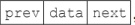

| 地址 | 元素 | 链接地址 |
| --- | --- | --- |
| 1000H | a | 1010H |
| 1004H | b | 100CH |
| 1008H | c | 1000H |
| 100CH | d | NULL |
| 1010H | e | 1004H |
| 1014H |   |   |

现将 f 存放于 1014H 处并插入单链表，若 f 在逻辑上位于 a 和 e 之间，则 a、e、f 的“链接地址”依次是（）。

A. 1010H、1014H、1004H

B. 1010H、1004H、1014H

C. 1014H、1010H、1004H

D. 1014H、1004H、1010H

##### 34

【2021 统考真题】已知头指针 h 指向一个带头结点的非空循环单链表，结点结构为 data | next，其中 next 是指向直接后继结点的指针，p 是尾指针，q 是临时指针。现要删除该链表的第一个元素，正确的语句序列是（）。

A. h->next=h->next->next; q=h->next; free(q);

B. q=h->next; h->next=h->next->next; free(q);

C. q=h->next; h->next=q->next; if(p!=q) p=h; free(q);

D. q=h->next; h->next=q->next; if(p==q) p=h; free(q);

##### 35

【2023 统考真题】现有非空双链表 L，其结点结构为  $\left| \text{prev} \mid \text{data} \mid \text{next} \right|$，prev 是指向直接前驱结点的指针，next 是指向直接后继结点的指针。若要在 L 中指针 p 所指向的结点（非尾结点）之后插入指针 s 指向的新结点，则在执行语句序列 “s->next=p->next; p->next=s;” 后，下列语句序列中还需要执行的是（）。

A. s->next->prev=p; s->prev=p;

B. p->next->prev=s; s->prev=p;

C. s->prev=s->next->prev; s->next->prev=s;

D. p->next->prev=s->prev; s->next->prev=p;

##### 36

【2024 统考真题】已知带头结点的非空单链表 L 的头指针为 h，结点结构为  $\boxed{data}$  $\boxed{next}$，其中 next 是指向直接后继结点的指针。现有指针 p 和 q，若 p 指向 L 中非首且非尾的任意一个结点，则执行语句序列 “q=p->next；p->next=q->next；q->next=h->next；h->next=q;” 的结果是（）。

A. 在 p 所指结点后插入 q 所指结点

B. 在 q 所指结点后插入 p 所指结点

C. 将 p 所指结点移至 L 的头结点之后

D. 将 q 所指结点移动到 L 的头结点之后

#### 二、 综合应用题

##### 01

在带头结点的单链表 L 中，删除所有值为 x 的结点，并释放其空间，假设值为 x 的结点不唯一，试编写算法以实现上述操作。

##### 02

试编写在带头结点的单链表 L 中删除一个最小值结点的高效算法（假设该结点唯一）。

##### 03

试编写算法将带头结点的单链表就地逆置，所谓“就地”是指辅助空间复杂度为 $O(1)$。

##### 04

设在一个带表头结点的单链表中，所有结点的元素值无序，试编写一个函数，删除表中所有处于给定的两个值（作为函数参数给出）之间的元素（若存在）。

##### 05

给定两个单链表，试分析找出两个链表的公共结点的思想（不用写代码）。

##### 06

设  $C=\{a_1,b_1,a_2,b_2,\cdots,a_n,b_n\}$ 为线性表，采用带头结点的单链表存放，设计一个就地算法，将其拆分为两个线性表，使得  $A=\{a_1,a_2,\cdots,a_n\}$， $B=\{b_n,\cdots,b_2,b_1\}$。

##### 07

在一个递增有序的单链表中，存在重复的元素。设计算法删除重复的元素，例如（7, 10,
10,21,30,42,42,42,51,70）将变为（7,10,21,30,42,51,70）。

##### 08

设 A 和 B 是两个单链表（带头结点），其中元素递增有序。设计一个算法从 A 和 B 中的公共元素产生单链表 C，要求不破坏 A、B 的结点。

##### 09

已知两个链表 A 和 B 分别表示两个集合，其元素递增排列。编制函数，求 A 与 B 的交集，并存放于 A 链表中。

##### 10

两个整数序列  $A=a_{1}, a_{2}, a_{3}, \cdots, a_{m}$ 和  $B=b_{1}, b_{2}, b_{3}, \cdots, b_{n}$ 已经存入两个单链表中，设计一个算法，判断序列 B 是否是序列 A 的连续子序列。

##### 11

设计一个算法用于判断带头结点的循环双链表是否对称。

##### 12

有两个循环单链表，链表头指针分别为  $h_1$ 和  $h_2$，编写一个函数将链表  $h_2$ 链接到链表  $h_1$ 之后，要求链接后的链表仍保持循环链表形式。

##### 13

设有一个带头结点的非循环双链表 L，其每个结点中除有 pre、data 和 next 域外，还有一个访问频度域 freq，其值均初始化为零。每当在链表中进行一次 Locate(L,x) 运算时，令值为 x 的结点中 freq 域的值增 1，并使此链表中的结点保持按访问频度递减的顺序排列，且最近访问的结点排在频度相同的结点之前，以便使频繁访问的结点总是靠近表头。试编写符合上述要求的 Locate(L,x) 函数，返回找到结点的地址，类型为指针型。

##### 14

设将  $n (n > 1)$ 个整数存放到不带头结点的单链表 L 中，设计算法将 L 中保存的序列循环右移  $k$（ $0 < k < n$）个位置。例如，若  $k = 1$，则将链表  $\{0, 1, 2, 3\}$ 变为  $\{3, 0, 1, 2\}$。要求：

1）给出算法的基本设计思想。

2）根据设计思想，采用 C 或 C++ 语言描述算法，关键之处给出注释。

3）说明你所设计算法的时间复杂度和空间复杂度。

##### 15

单链表有环，是指单链表的最后一个结点的指针指向了链表中的某个结点（通常单链表的最后一个结点的指针域是空的）。试编写算法判断单链表是否存在环。

1）给出算法的基本设计思想。

2）根据设计思想，采用 C 或 C++ 语言描述算法，关键之处给出注释

3）说明你所设计算法的时间复杂度和空间复杂度。

##### 16

设有一个长度  $n$（ $n$ 为偶数）的不带头结点的单链表，且结点值都大于 0，设计算法求这个单链表的最大孪生和。孪生和定义为一个结点值与其孪生结点值之和，对于第  $i$ 个结点（从 0 开始），其孪生结点为第  $n-i-1$ 个结点。要求：

1）给出算法的基本设计思想。

2）根据设计思想，采用 C 或 C++ 语言描述算法，关键之处给出注释。

3）说明你的算法的时间复杂度和空间复杂度。

##### 17

【2009 统考真题】已知一个带有表头结点的单链表，结点结构为

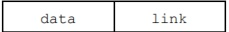

假设该链表只给出了头指针 list。在不改变链表的前提下，请设计一个尽可能高效的算法，查找链表中倒数第 k 个位置上的结点（k 为正整数）。若查找成功，算法输出该结点的 data 域的值，并返回 1；否则，只返回 0。要求：

1）描述算法的基本设计思想。

2）描述算法的详细实现步骤。

3）根据设计思想和实现步骤，采用程序设计语言描述算法（使用 C、C++ 或 Java 语言实现），关键之处请给出简要注释。
##### 18

【2012 统考真题】假定采用带头结点的单链表保存单词，当两个单词有相同的后缀时，可共享相同的后缀存储空间，例如，loading 和 being 的存储映像如下图所示。

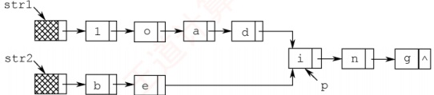

设 str1 和 str2 分别指向两个单词所在单链表的头结点，链表结点结构为  $\boxed{\text{data | next}}$，请设计一个时间上尽可能高效的算法，找出由 str1 和 str2 所指向两个链表共同后缀的起始位置（如图中字符 i 所在结点的位置 p）。要求：

1）给出算法的基本设计思想。

2）根据设计思想，采用 C 或 C++ 或 Java 语言描述算法，关键之处给出注释。

3）说明你所设计算法的时间复杂度。

##### 19

【2015 统考真题】用单链表保存  $m$ 个整数，结点的结构为  $[data][link]$，且  $|data| \leq n$（ $n$ 为正整数）。现要求设计一个时间上尽可能高效的算法，对于链表中 data 的绝对值相等的结点，仅保留第一次出现的结点而删除其余绝对值相等的结点。例如，若给定的单链表 head 如下：

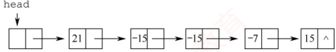

则删除结点后的 head 为

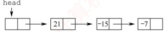

要求：

1）给出算法的基本设计思想。

2）使用 C 或 C++ 语言，给出单链表结点的数据类型定义。

3）根据设计思想，采用 C 或 C++ 语言描述算法，关键之处给出注释。

4）说明你所设计算法的时间复杂度和空间复杂度。

##### 20

【2019 统考真题】设线性表  $L=(a_{1},a_{2},a_{3},\cdots,a_{n-2},a_{n-1},a_{n})$ 采用带头结点的单链表保存，

链表中的结点定义如下：

```c
typedef struct node
{ int data;
    struct node*next;
} NODE;
```

请设计一个空间复杂度为  $O(1)$ 且时间上尽可能高效的算法，重新排列  $L$ 中的各结点，得到线性表  $L' = (a_1, a_n, a_2, a_{n-1}, a_3, a_{n-2}, \cdots)$。要求：

1）给出算法的基本设计思想。

2）根据设计思想，采用 C 或 C++ 语言描述算法，关键之处给出注释。

3）说明你所设计的算法的时间复杂度。

### 2.3.8 答案与解析

#### 一、 单项选择题

##### 01

B

两种存储结构适用于不同的场合，不能简单地说谁好谁坏，说法Ⅰ错误。链式存储用指针表
示逻辑结构，而指针的设置是任意的，因此比顺序存储结构能更方便地表示各种逻辑结构，说法Ⅱ正确。在顺序存储中，插入和删除结点需要移动大量元素，效率较低，说法Ⅲ的描述刚好相反。顺序存储结构既能随机存取又能顺序存取，而链式结构只能顺序存取，说法Ⅳ正确。

##### 02

B

首先直接排除选项 A 和 D。散列存储通过散列函数映射到物理空间，不能反映数据之间的逻辑关系，排除选项 C。链式存储能方便地表示各种逻辑关系，且插入和删除操作的时间复杂度为  $O(1)$。

##### 03

A

链式存储设计时，各个不同结点的存储空间可以不连续，但结点内的存储单元地址必须连续。

##### 04

D

顺序存储方式同样适用于存储图和树，说法Ⅰ错误。删除表尾结点时，必须从头开始找到表尾结点的前驱，其时间与表长有关，说法Ⅱ错误。循环单链表中最后一个结点的指针不是 NULL，而是指向头结点，整个链表形成一个环，因此不存在空指针，说法Ⅲ正确。有序单链表只能依次查找插入位置，时间复杂度为  $O(n)$，说法Ⅳ正确。队列需要在表头删除元素，表尾插入元素，采用带尾指针的循环链表较为方便，插入和删除的时间复杂度都为  $O(1)$，说法Ⅴ正确。

##### 05

A

对于选项 A，在单链表和顺序表上实现的时间复杂度都为  $O(n)$，但后者要移动很多元素，因此在单链表上实现效率更高。对于选项 B 和 D，顺序表的效率更高。C 无区别。

##### 06

C

s 插入后，q 成为 s 的前驱，而 p 成为 s 的后继，选择选项 C。

**注意**

可能有读者认为选项 C 中的两条语句交换后才正确。实际上，因为本题插入位置的前后结点都有指针指示（这与前面介绍的插入操作是不同的），所以选项 C 中的语句顺序并不会造成断链。在此提醒读者在学习过程中一定要多动脑思考，而不要生搬硬套。

##### 07

D

若先建立链表，然后依次插入建立有序表，则每插入一个元素就需遍历链表寻找插入位置，即直接插入排序，时间复杂度为  $O(n^2)$。若先将数组排好序，然后建立链表，建立链表的时间复杂度为  $O(n)$，数组排序的最好时间复杂度为  $O(n \log_2 n)$，总时间复杂度为  $O(n \log_2 n)$。故选择选项 D。

##### 08

C

先遍历长度为 m 的单链表，找到该单链表的尾结点，然后将其 next 域指向另一个单链表的首结点，其时间复杂度为  $O(m)$。

##### 09

C

单链表设置头结点的目的是方便运算的实现，主要好处体现在：第一，有头结点后，插入和删除数据元素的算法就统一了，不再需要判断是否在第一个元素之前插入或删除第一个元素；第二，不论链表是否为空，其头指针是指向头结点的非空指针，链表的头指针不变，因此空表和非空表的处理也就统一了。

##### 10

B

删除单链表的最后一个结点需置其前驱结点的指针域为 NULL，需要从头开始依次遍历找到该前驱结点，需要  $O(n)$ 的时间，与表长有关。其他操作均与表长无关，读者可自行模拟。

##### 11

B, A

在带头结点的单链表中，头指针 head 指向头结点，头结点的 next 域指向第一个元素结点，`head->next==NULL` 表示该单链表为空。在不带头结点的单链表中，head 直接指向第一个元素结点，`head==NULL` 表示该单链表为空。
##### 12

D

线性表有顺序存储和链式存储两种存储结构。若采用链式存储结构，则删除元素  $a_{50}$ 不需要移动元素；若采用顺序存储结构，则需要依次移动 50 个元素。

##### 13

B

当采用头插法建立单链表时，数组后面的元素插入到单链表 L 的最前端，所以 L 中的元素次序与数组 a 的元素次序相反。

##### 14

C

选项 A 显然错误。选项 B 中第一个元素和最后一个元素不满足题设要求。双链表能很方便地访问前驱和后继，故删除和插入数据较为方便，选项 C 正确。选项 D 未考虑顺序存储的情况。

##### 15

D

为了在 p 之前插入结点 q，可以将 p 的前一个结点的 next 域指向 q，将 q 的 next 域指向 p，将 q 的 prior 域指向 p 的前一个结点，将 p 的 prior 域指向 q。仅选项 D 满足条件。

##### 16

A

与上一题的分析基本类似，只不过这里是删除一个结点，注意将 p 的前、后两结点链接起来。关键是要保证在结点指针的修改过程中不断链！

注意，请读者仔细对比上述两题，弄清双链表的插入和删除方法。

##### 17

A

结点A和B分别由指针p和q指示，但结点C仅能由p->next间接指示，因此在改变p->next之前，必须先将q->next指向结点C，即①要在③前面，且④要在③前面（因为若先执行③，则④相当于q->prior指向其自身，显然矛盾）。故只能选择选项A。

##### 18

C

当在双链表的两个结点（分别用第一个、第二个结点表示）之间插入一个新结点时，需要修改四个指针域，分别是：新结点的前驱指针域，指向第一个结点；新结点的后继指针域，指向第二个结点；第一个结点的后继指针域，指向新结点；第二个结点的前驱指针域，指向新结点。

##### 19

B

设单链表递增有序，首先要在单链表中找到第一个大于 x 的结点的直接前驱 p，在 p 之后插入该结点。查找的时间复杂度为  $O(n)$，插入的时间复杂度为  $O(1)$，总时间复杂度为  $O(n)$。

##### 20

D

在插入和删除操作上，单链表和双链表都不用移动元素，都很方便，但双链表修改指针的操作更为复杂，选项A错误。双链表中可以快速访问任何一个结点的前驱和后继结点，选项D正确。

##### 21

C

带头结点的循环单链表 L 为空表时，满足  $L \rightarrow next == L$，即头结点的指针域与 L 的值相等，而不是头结点的指针域与 L 的地址相等。注意，带头结点的循环单链表中不存在空指针。

##### 22

D

循环双链表 L 判空的条件是头结点（头指针）的 prior 和 next 域都指向它自身。

##### 23

A

在链表的末尾插入和删除一个结点时，需要修改其相邻结点的指针域。而寻找尾结点及尾结点的前驱结点时，只有带头结点的循环双链表所需要的时间最少。

##### 24

C

对于选项 A，删除尾结点*p时，需要找到*p 的前一个结点，时间复杂度为  $O(n)$。对于选项 B，删除首结点*p时，需要找到*p 结点，这里没有直接给出头结点指针，而是通过尾结点的 prior 指针找到*p 结点的时间复杂度为  $O(n)$。对于选项 D，删除尾结点*p时，需要找到*p 的前一个结点，时间复杂度为  $O(n)$。对于 C，执行这四种算法的时间复杂度均为  $O(1)$。
##### 25

B

要求用 O(1) 的时间将两个循环单链表头尾相接，并未指明哪个链表接在另一个链表之后，所以对两个链表都要在 O(1) 的时间找到头结点和尾结点。因此，两个指针应都指向尾结点。

##### 26

A

在循环单链表中，删除首元结点后，要保持链表的循环性，因此需要找到首元结点的前驱。当链表带头结点时，其前驱就是头结点，因此不论是表头指针还是表尾指针，删除首元结点的时间都为 $O(1)$。当链表不带头结点时，其前驱是尾结点，因此，若有表尾指针，就可在 $O(1)$的时间找到尾结点；若只有表头指针，则需要遍历整个链表找到尾结点，时间为 $O(n)$。

##### 27

D

对一个空循环单链表，有 `head->next==head`，推理 `head->next->next==head->next==head`。对含有一个元素的循环单链表，头结点（头指针 head 指示）的 next 域指向这个唯一的元素结点，该元素结点的 next 域指向头结点，因此也有 head->next->next=head。

##### 28

D

对于两种双链表，删除首结点的时间复杂度都是  $O(1)$。对于非循环双链表，删除尾结点的时间复杂度是  $O(n)$；对于循环双链表，删除尾结点的时间复杂度是  $O(1)$。

##### 29

D

对于选项 A，在最后一个元素之后插入元素的情况与普通单链表相同，时间复杂度为  $O(n)$；而删除第一个元素时，为保持循环单链表的性质（尾结点指向第一个结点），要先遍历整个链表找到尾结点，再做删除操作，时间复杂度为  $O(n)$。对于选项 B，双链表的情况与单链表的相同，一个是  $O(n)$，一个是  $O(1)$。对于选项 C，在最后一个元素之后插入一个元素，要遍历整个链表才能找到插入位置，时间复杂度为  $O(n)$；删除第一个元素的时间复杂度为  $O(1)$。对于选项 D，与选项 A 的分析对比，有尾结点的指针，省去了遍历链表的过程，因此时间复杂度均为  $O(1)$。

##### 30

B

静态链表采用数组表示，因此需要预先分配较大的连续空间，静态链表同时还具有一般链表的特点，即插入和删除不需要移动元素。

##### 31

B

静态链表的存储空间虽然是顺序分配的，但元素的存储不是顺序的，查找时仍然需要按链依次进行，而插入、删除都不需要移动元素。静态链表的存储空间是一次性申请的，能容纳的最大元素个数在定义时就已确定。并非每个空间都存储了元素，因此会造成存储空间的浪费。

##### 32

D

选项 A 的第二句代码，相当于将 p 前驱结点的后继指针指向其自身，错误；选项 B 和 C 的第一句代码，相当于将 p 后继结点的前驱指针指向其自身，错误。只有选项 D 正确。

##### 33

D

根据存储状态，单链表的结构如下图所示。

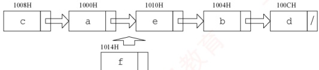

其中“链接地址”是指结点 next 所指的内存地址。当结点 f 插入后，a 指向 f，f 指向 e，e 指向 b。显然 a、e 和 f 的“链接地址”分别是 f、b 和 e 的内存地址，即 1014H、1004H 和 1010H。

##### 34

D

如图1所示，要删除带头结点的非空循环单链表中的第一个元素，就要先用临时指针q指向待
删结点，q=h->next；然后将 q 从链表中断开，h->next=q->next（这一步也可写成 h->next=h->next->next）；此时要考虑一种特殊情况，若待删结点是链表的尾结点，即循环单链表中只有一个元素(p 和 q 指向同一个结点)，如图2所示，则在删除后要将尾指针指向头结点，即 if (p==q) p=h；最后释放 q 结点即可，答案选择选项 D。

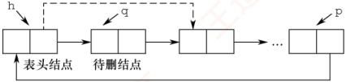

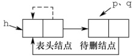

图1

图2

##### 35

C

链表的插入操作要保证不会造成断链，画图再依次判断选项。执行语句 “① s->next=p->next; ② p->next=s;” 后的结构如下图所示（虚线表示 prev，实线表示 next）。

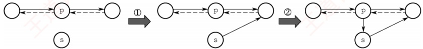

对于选项 A，s->next->prev=p，错误。对于选项 B，p->next->prev=s，让 s 的 prev 指向 s，错误。对于选项 D，两句代码均错误。对于选项 C，执行语句 “③s->prev=s->next->prev；④s->next->prev=s；” 后的结构如下图所示，满足插入的要求。

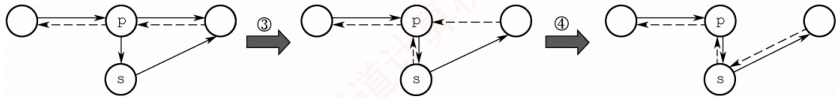

##### 36

D

假设单链表 L 的初始状态如图①所示。执行  $q = p \rightarrow next$ 后的状态如图②所示，q 指向 p 的后继结点。执行  $p \rightarrow next = q \rightarrow next$ 后的状态如图③所示，结点 p 的 next 指向 q 的后继结点。执行  $q \rightarrow next = h \rightarrow next$ 后的状态如图④所示，结点 q 的 next 指向 h 的后继结点。执行  $h \rightarrow next = q$ 后的状态如图⑤所示，q 所指结点移至 L 的头结点 h 之后，选项 D 正确。

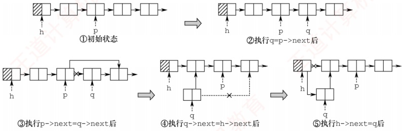

#### 二、 综合应用题

##### 01

【解答】

解法1：用p从头至尾扫描单链表，pre指向*p结点的前驱。若p所指结点的值为x，则删
除，并让 p 移向下一个结点，否则让 pre、p 指针同步后移一个结点。

本题代码如下:
```c

void Del_X_1(Linklist &L, ElemType x) {
    LNode *p = L->next, *pre = L, *q; //置 p 和 pre 的初始值
    while (p != NULL) {
        if (p -> data == x) {
            q = p;
            p = p -> next;
            pre -> next = p;
            free(q);
        }
        else {
            pre = p;
            p = p -> next;
        } //else
    } //while
}
```

本算法是在无序单链表中删除满足某种条件的所有结点，这里的条件是结点的值为 x。实际上，这个条件是可以任意指定的，只要修改 if 条件即可。比如，我们要求删除值介于 mink 和 maxk 之间的所有结点，只需将 if 语句修改为 if (p -> data > mink & p -> data < maxk)。

解法2：采用尾插法建立单链表。用p指针扫描L的所有结点，当其值不为x时，将其链接到L之后，否则将其释放。

本题代码如下：
```c

void Del_X_2(Linklist &L, ElemType x) {
    LNode *p = L -> next, *r = L, *q; //r 指向尾结点，其初值为头结点
    while (p != NULL) {
        if (p -> data != x) {
            r -> next;
            r = p;
            p = p -> next;
        }
        else {
            q = p;
            p = p -> next;
        }
        free(q);
    }
    } //while
    r -> next = NULL;
}
```

上述两个算法扫描一遍链表，时间复杂度为  $O(n)$，空间复杂度为  $O(1)$。

##### 02

【解答】
```c

算法思想：用 p 从头至尾扫描单链表，pre 指向*p 结点的前驱，用 minp 保存值最小的结点指针（初值为 p），minpre 指向*minp 结点的前驱（初值为 pre）。一边扫描，一边比较，若 p->data 小于 minp->data，则将 p、pre 分别赋值给 minp、minpre，如下图所示。当 p 扫描完毕时，minp 指向最小值结点，minpre 指向最小值结点的前驱结点，再将 minp 所指结点删除即可。
```

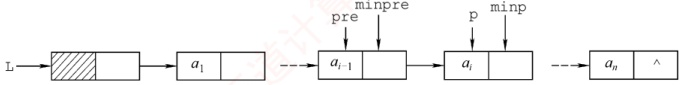

本题代码如下：
```c

LinkList Delete_Min(LinkList &L) {
    LNode *pre=L,*p=pre->next; //p为工作指针，pre指向其前驱
    LNode *minpre=pre,*minp=p; //保存最小值结点及其前驱
    while (p!=NULL) {
        if (p->data<minp->data) {
            minp=p;
            minpre=pre;
        }
        pre=p;
        p=p->next;
    }
```
```c
    minpre->next=minp->next; //删除最小值结点
    free(minp);
    return L;
}
```

算法需要从头至尾扫描链表，时间复杂度为  $O(n)$，空间复杂度为  $O(1)$。

若本题改为不带头结点的单链表，则实现上会有所不同，请读者自行思考。

##### 03

【解答】

解法1：将头结点摘下，然后从第一结点开始，依次插入到头结点的后面（头插法建立单链表），直到最后一个结点为止，这样就实现了链表的逆置，如下图所示。

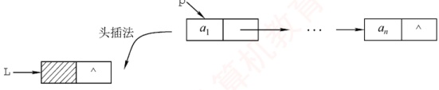

本题代码如下：
```c

LinkList Reverse_1(LinkList L){
    LNode *p, *r; //p 为工作指针，r 为 p 的后继，以防断链
```
```c
    p=L->next; //从第一个元素结点开始
    L->next=NULL; //先将头结点 L 的 next 域置为 NULL
    while (p != NULL) {
        r=p->next; //依次将元素结点摘下
        p->next=L->next; //暂存 p 的后继
        L->next=p;
        p=r;
    }
    return L;
}
```

解法2：大部分辅导书都只介绍解法1，这对读者的理解和思维是不利的。为了将调整指针这个复杂的过程分析清楚，我们借助图形来进行直观的分析。
```c

假设pre、p和r指向三个相邻的结点，如下图所示。假设经过若干操作后，*pre之前的结点的指针都已调整完毕，它们的next都指向其原前驱结点。现在令*p结点的next域指向*pre结点，注意到一旦调整指针的指向，*p的后继结点的链就会断开，为此需要用r来指向原*p的后继结点。处理时需要注意两点：一是在处理第一个结点时，应将其next域置为NULL，而不是指向头结点（因为它将作为新表的尾结点）；二是在处理完最后一个结点后，需要将头结点的指针指向它。
```

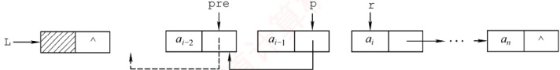

本题代码如下：
```c

LinkList Reverse_2(LinkList L){
    LNode *pre, *p = L->next, *r = p->next;
```
```c
    p->next = NULL; //处理第一个结点
    while (r != NULL) {
        //r 为空，则说明 p 为最后一个结点
        pre = p; //依次继续遍历
        p = r;
        r = r->next;
        p -> next = pre; //指针反转
    }
    L -> next = p; //处理最后一个结点
    return L;
}
```

上述两个算法的时间复杂度为  $O(n)$，空间复杂度为  $O(1)$。

##### 04

【解答】

因为链表是无序的，所以只能逐个结点进行检查，执行删除。

本题代码如下：
```c

void RangeDelete(LinkList &L, int min, int max) {
    LNode *pr = L, *p = L -> link; // p 是检测指针，pr 是其前驱
    while (p != NULL)
```
```c
        if (p -> data > min && p -> data < max) { // 寻找到被删结点，删除
            pr -> link = p -> link;
            free(p);
            p = pr -> link;
        }
        else {
            pr = p;
            p = p -> link;
        }
    }
```

##### 05

【解答】

两个单链表有公共结点，即两个链表从某一结点开始，它们的 next 都指向同一结点。每个单链表结点只有一个 next 域，因此从第一个公共结点开始，之后的所有结点都是重合的，不可能再出现分叉。所以两个有公共结点而部分重合的单链表，拓扑形状看起来像 Y，而不可能像 X。

本题极容易联想到“蛮”方法：在第一个链表上顺序遍历每个结点，每遍历一个结点，在第二个链表上顺序遍历所有结点，若找到两个相同的结点，则找到了它们的公共结点。显然，该算法的时间复杂度为  $O(len1 \cdot len2)$。

接下来我们试着去寻找一个线性时间复杂度的算法。先把问题简化：如何判断两个单链表有没有公共结点？应注意到这样一个事实：若两个链表有一个公共结点，则该公共结点之后的所有结点都是重合的，即它们的最后一个结点必然是重合的。因此，我们判断两个链表是不是有重合的部分时，只需要分别遍历两个链表到最后一个结点。若两个尾结点是一样的，则说明它们有公共结点，否则两个链表没有公共结点。

然而，在上面的思路中，顺序遍历两个链表到尾结点时，并不能保证在两个链表上同时到达尾结点。这是因为两个链表长度不一定一样。但假设一个链表比另一个长 k 个结点，我们先在长的链表上遍历 k 个结点，之后再同步遍历，此时我们就能保证同时到达最后一个结点。两个链表从第一个公共结点开始到链表的尾结点，这一部分是重合的，因此它们肯定也是同时到达第一公共结点的。于是在遍历中，第一个相同的结点就是第一个公共的结点。

根据这一思路中，我们先要分别遍历两个链表得到它们的长度，并求出两个长度之差。在长
的链表上先遍历长度之差个结点之后，再同步遍历两个链表，直到找到相同的结点，或者一直到链表结束。此时，该方法的时间复杂度为  $O(len1 + len2)$。

##### 06

【解答】

算法思想：循环遍历链表 C，采用 **尾插法**将一个结点插入表 A，这个结点为奇数号结点，这样建立的表 A 与原来的结点顺序相同；采用 **头插法**将下一结点插入表 B，这个结点为偶数号结点，这样建立的表 B 与原来的结点顺序正好相反。

本题代码如下：

```c
LinkList DisCreat_2(LinkList &A){
    LinkList B=(LinkList)malloc(sizeof(LNode));//创建B表表头
    B->next=NULL; //B表的初始化
```
```c
    LNode *p=A->next,*q; //p为工作指针
```
```c
    LNode *ra=A; //ra始终指向A的尾结点
    while(p!=NULL){
        ra->next=p; ra=p; //将*p链到A的表尾
```
```c
        p=p->next;
        if(p!=NULL){
            q=p->next; //头插后，*p将断链，因此用q记忆*p的后继
```
```c
            p->next=B->next; //将*p插入到B的前端
            B->next=p;
            p=q;
        }
    }
    ra->next=NULL; //A尾结点的next域置空
    return B;
}
```

要特别注意的是，该算法采用头插法插入结点后， $^{*}p$ 的指针域已改变，若不设变量保存其后继结点，则会引起断链，从而导致算法出错。

##### 07

【解答】

算法思想：题中链表是有序表，因此所有相同值域的结点都是相邻的。用 p 扫描递增单链表 L，若 *p 结点的值域等于其后继结点的值域，则删除后者，否则 p 移向下一个结点。

本题代码如下：
```c

void Del_Same(LinkList &L) {
    LNode *p = L->next, *q; //p 为扫描工作指针
    if (p == NULL)
        return;
    while (p->next != NULL) {
```
```c
        q = p->next; //q 指向 *p 的后继结点
        if (p->data == q->data) { //找到重复值的结点
            p->next = q->next; //释放 *q 结点
            free(q); //释放相同元素值的结点
        }
        else
            p = p->next;
    }
}
```

本算法的时间复杂度为  $O(n)$，空间复杂度为  $O(1)$。

本题也可采用尾插法，将头结点摘下，然后从第一结点开始，依次与已经插入结点的链表的最后一个结点比较，若不等则直接插入，否则将当前遍历的结点删除并处理下一个结点，直到最后一个结点为止。

##### 08

【解答】
算法思想：表 A、B 都有序，可从第一个元素起依次比较 A、B 两表的元素，若元素值不等，则值小的指针往后移，若元素值相等，则创建一个值等于两结点的元素值的新结点，使用尾插法插入到新的链表中，并将两个原表指针后移一位，直到其中一个链表遍历到表尾。

本题代码如下：
```c

void Get_Common(LinkList A, LinkList B) {
    LNode *p = A->next, *q = B->next, *r, *s;
```
```c
    LinkList C = (LinkList)malloc(sizeof(LNode)); //建立表C
    r = C; //r始终指向C的尾结点
    while (p != NULL && q != NULL) {
        //循环跳出条件
        if (p->data < q->data)
            p = p->next; //若A的当前元素较小，后移指针
        else if (p->data > q->data)
            q = q->next; //若B的当前元素较小，后移指针
        else {
            s = (LNode*)malloc(sizeof(LNode));
            s->data = p->data; //复制产生结点*s
            r->next = s; //将*s链接到C上（尾插法）
            r = s;
            p = p->next; //表A和B继续向后扫描
            q = q->next;
        }
    }
    r->next = NULL; //置C尾结点指针为空
```

##### 09

【解答】

算法思想：采用归并的思想，设置两个工作指针 pa 和 pb，对两个链表进行归并扫描，只有同时出现在两集合中的元素才链接到结果表中且仅保留一个，其他的结点全部释放。当一个链表遍历完毕后，释放另一个表中剩下的全部结点。

本题代码如下：

```c
LinkList Union(LinkList &la, LinkList &lb) {
    LNode *pa=la->next; //设工作指针分别为pa和pb
```
```c
    LNode *pb=lb->next;
    LNode *u, *pc=la; //结果表中当前合并结点的前驱指针pc
    while (pa&&pb) {
        if (pa->data==pb->data) {
```
```c
            pc->next=pa; //交集并入结果表中
            pc=pa;
            pa=pa->next;
            u=pb;
            pb=pb->next;
            free(u);
        }
        else if (pa->data<pb->data) {
            //若A中当前结点值小于B中当前结点值
            u=pa;
            pa=pa->next; //后移指针
            free(u); //释放A中当前结点
        }
        else {
            u=pb;
            pb=pb->next; //后移指针
            free(u); //释放B中当前结点
        }
    } //while 结束
while(pa){ //B 已遍历完，A 未完
    u=pa;
    pa=pa->next;
    free(u);
}
while(pb){ //A 已遍历完，B 未完
    u=pb;
    pb=pb->next;
    free(u);
}
pc->next=NULL; //置结果链表尾指针为 NULL
free(lb); //释放 B 表的头结点
return la;
}
```

链表归并类型的试题在各学校历年真题中出现的频率很高，故应扎实掌握解决此类问题的思想。该算法的时间复杂度为  $O(len1 + len2)$，空间复杂度为  $O(1)$。

##### 10

【解答】

算法思想：因为两个整数序列已存入两个链表中，操作从两个链表的第一个结点开始，若对应数据相等，则后移指针；若对应数据不等，则 A 链表从上次开始比较结点的后继开始，B 链表仍从第一个结点开始比较，直到 B 链表到尾表示匹配成功。A 链表到尾而 B 链表未到尾表示失败。操作中应记住 A 链表每次的开始结点，以便下次匹配时好从其后继开始。

本题代码如下：

```c
int Pattern(LinkList A, LinkList B) {
    LNode *p = A; //p 为 A 链表的工作指针，本题假定 A 和 B 均无头结点
    LNode *pre = p; //pre 记住每趟比较中 A 链表的开始结点
    LNode *q = B; //q 是 B 链表的工作指针
    while (p && q)
        if (p -> data == q -> data) { //结点值相同
            p = p -> next;
            q = q -> next;
        }
    else {
        pre = pre -> next;
        p = pre; //A 链表新的开始比较结点
        q = B; //q 从 B 链表第一个结点开始
    }
    if (q == NULL)
        return 1; //B 已经比较结束
    else
    return 0; //B 不是 A 的子序列
}
```

**注意**

该题其实是字符串模式匹配的链式表示形式，读者应该结合字符串模式匹配的内容重新考虑能否优化该算法。

##### 11

【解答】

算法思想：让 p 从左向右扫描，q 从右向左扫描，直到它们指向同一结点（p==q，当循环双链表中结点个数为奇数时）或相邻（p->next=q 或 q->prior=p，当循环双链表中结点个数为偶数时）为止，若它们所指结点值相同，则继续进行下去，否则返回 0。若比较全部相等，则返回 1。

本题代码如下：
```c
int Symmetry(DLinkList L) {
    DNode *p = L -> next, *q = L -> prior; //两头工作指针
```
```c
    while (p != q && p -> next != q) //循环跳出条件
        if (p -> data == q -> data) { //所指结点值相同则继续比较
            p = p -> next;
            q = q -> prior;
        }
    else
    return 0; //否则，返回0
    return 1; //比较结束后返回1
}

注意
while 循环第二个判断条件易误写成 q->next!=p，分析这样会产生什么问题。
```

##### 12

【解答】

算法思想：先找到两个链表的尾指针，将第一个链表的尾指针与第二个链表的头结点链接起来，再使之成为循环的。

本题代码如下：
```c

LinkList Link(LinkList &h1, LinkList &h2) {
//将循环链表 h2 链接到循环链表 h1 之后，使之仍保持循环链表的形式
LNode *p, *q; //分别指向两个链表的尾结点
p=h1;
```
```c
while (p->next != h1) //寻找 h1 的尾结点
    p=p->next;
q=h2;
while (q->next != h2) //寻找 h2 的尾结点
    q=q->next;
p->next=h2; //将 h2 链接到 h1 之后
q->next=h1; //令 h2 的尾结点指向 h1
return h1;
}
```

##### 13

【解答】

算法思想：首先在双链表中查找数据值为 x 的结点，查到后，将结点从链表上摘下，然后顺着结点的前驱链查找该结点的插入位置（频度递减，且排在同频度的第一个，即向前找到第一个比它的频度大的结点，插入位置为该结点之后），并插入到该位置。

本题代码如下：
```c

DLinkList Locate(DLinkList &L,ElemType x){
    DNode *p=L->next, *q; //p 为工作指针，q 为 p 的前驱，用于查找插入位置
    while (p&p->data != x)
```
```c
        p=p->next; //查找值为 x 的结点
    if (!p)
        exit(0); //不存在值为 x 的结点
    else{
        p->freq++; //令元素值为 x 的结点的 freq 域加 1
        if (p->pre==L||p->pre->freq>p->freq)
            return p; //p 是链表首结点，或 freq 值小于前驱
        if (p->next != NULL) p->next->pre=p->pre;
        p->pre->next=p->next; //将 p 结点从链表上摘下
        q=p->pre; //以下查找 p 结点的插入位置
        while (q!=L&&q->freq<=p->freq)
            q=q->pre;
        p->next=q->next;
if (q->next != NULL) q->next->pre=p; //将 p 结点排在同频率的第一个
p->pre=q;
q->next=p;
}
return p; //返回值为 x 的结点的指针
}
```

##### 14

【解答】

1 ）算法的基本设计思想：

首先，遍历链表计算表长 n，并找到链表的尾结点，将其与首结点相连，得到一个循环单链表。然后，找到新链表的尾结点，它为原链表的第 n-k 个结点，令 L 指向新链表尾结点的下一个结点，并将环断开，得到新链表。

2）本题代码如下：
```c

LNode *Converse(LNode *L, int k) {
```
```c
    int n=1; //n用来保存链表的长度
    LNode *p=L; //p为工作指针
    while (p->next != NULL) {
        //计算链表的长度
        p=p->next;
        n++;
    }
    p->next=L; //循环执行后，p指向链表尾结点
    for (int i=1; i<=n-k; i++)
        //将链表连成一个环
        p=p->next;
    L=p->next; //寻找链表的第n-k个结点
    p->next=NULL; //令L指向新链表尾结点的下一个结点
    return L;
}
```

3）本算法的时间复杂度为  $O(n)$，空间复杂度为  $O(1)$。

##### 15

【解答】

1 ）算法的基本设计思想：

设置快慢两个指针分别为fast和slow最初都指向链表头head。slow每次走一步，即slow=slow->next；fast每次走两步，即fast=fast->next->next。fast比slow走得快，若有环，则fast一定先进入环，而slow后进入环。两个指针都进入环后，经过若干操作后两个指针定能在环上相遇。这样就可以判断一个链表是否有环。

如下图所示，当slow刚进入环时，fast早已进入环。因为fast每次比slow多走一步且fast与slow的距离小于环的长度，所以fast与slow相遇时，slow所走的距离不超过环的长度。

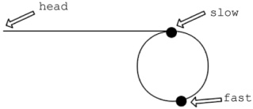

如下图所示，设头结点到环的入口点的距离为 a，环的入口点沿着环的方向到相遇点的距离为 x，环长为 r，相遇时 fast 绕过了 n 圈。

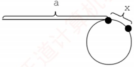

则有  $2(a+x)=a+n\cdot r+x$，即 a=nr-x。显然从头结点到环的入口点的距离等于 n 倍的环长减去环的入口点到相遇点的距离。因此可设置两个指针，一个指向 head，另一个指向相遇点，两个指针同步移动（均为一次走一步），相遇点即环的入口点。

2 ）本题代码如下：
```c

LNode* FindLoopStart(LNode *head) {
    LNode *fast=head, *slow=head; //设置快慢两个指针
    while (fast != NULL && fast->next != NULL) {
```
```c
        slow = slow->next; //每次走一步
        fast = fast->next->next; //每次走两步
        if (slow == fast) break; //相遇
    }
    `if (fast == NULL || fast->next == NULL)`
        return NULL; //没有环，返回 NULL
```
```c
    LNode *p1 = head, *p2 = slow; //分别指向开始点、相遇点
    while (p1 != p2) {
        p1 = p1->next;
        p2 = p2->next;
    }
```
```c
    return p1; //返回入口点
}
```

3）当 fast 与 slow 相遇时，slow 肯定没有遍历完链表，故算法的时间复杂度为  $O(n)$，空间复杂度为  $O(1)$。

##### 16

【解答】

1 ）算法的基本设计思想：

设置快、慢两个指针分别为 fast 和 slow，初始时 slow 指向 L（第一个结点），fast 指向 L->next（第二个结点），之后 slow 每次走一步，fast 每次走两步。当 fast 指向表尾（第 n 个结点）时，slow 正好指向链表的中间点（第 n/2 个结点），即 slow 正好指向链表前半部分的最后一个结点。将链表的后半部分逆置，然后设置两个指针分别指向链表前半部分和后半部分的首结点，在遍历过程中计算两个指针所指结点的元素之和，并维护最大值。

2 ）本题代码如下：
```c

int PairSum(LinkList L) {
    LNode *fast=L->next,*slow=L;//利用快慢双指针找到链表的中间点
    while(fast!=NULL&&fast->next!=NULL){
```
```c
        fast=fast->next->next; //快指针每次走两步
        slow=slow->next; //慢指针每次走一步
```
```c
}

LNode *newHead=NULL,*p=slow->next,*tmp;
while(p!=NULL){
```
```c
    tmp=p->next; //反转链表后一半部分的元素，采用头插法
    p->next=newHead; //将p所指结点插入到新链表的首结点之前
    newHead=p; //newHead指向刚才新插入的结点，作为新的首结点
    p=tmp; //当前待处理结点变为下一结点
}

int mx=0; p=L;
LNode *q=newHead;
while(q!=NULL){
    if((p->data+q->data)>mx) //用mx记录最大值
        mx=p->data+q->data;
        p=p->next;
        q=q->next;
    }
return mx;
```

3）本算法的时间复杂度为  $O(n)$，空间复杂度为  $O(1)$。

##### 17

【解答】

1）算法的基本设计思想：

问题的关键是设计一个尽可能高效的算法，通过链表的一次遍历，找到倒数第 k 个结点的位置。定义两个指针变量 p 和 q，初始时均指向头结点的下一个结点（链表的第一个结点），p 指针沿链表移动；当 p 指针移动到第 k 个结点时，q 指针开始与 p 指针同步移动；当 p 指针移动到最后一个结点时，q 指针所指示结点为倒数第 k 个结点。以上过程对链表仅进行一遍扫描。

2）算法的详细实现步骤如下：

① count=0, p 和 q 指向链表表头结点的下一个结点。

② 若 p 为空，转⑤。

③ 若 count 等于 k，则 q 指向下一个结点；否则，count=count+1。

④ p 指向下一个结点，转②。

⑤ 若 count 等于 k，则查找成功，输出该结点的 data 域的值，返回 1；否则，说明 k 值超过了线性表的长度，查找失败，返回 0。

⑥ 算法结束。

3）算法实现如下：

```c
typedef int ElemType; //链表数据的类型定义
typedef struct LNode{
    ElemType data; //链表结点的结构定义
    struct LNode *link; //结点数据
```
```c
} LNode, *LinkList;
int Search_k(LinkList list, int k) {
    LNode *p = list->link, *q = list->link; //指针 p、q 指示第一个结点
    int count = 0;
    while (p != NULL) {
        if (count < k) count++;
        else q = q -> link;
        p = p -> link;
    } //while
    if (count < k)
        return 0;
    else {
        printf("%d", q -> data);
    }
}
```

若所给算法采用一遍扫描方式就能得到正确结果，则可给满分15分；若采用两遍或多遍扫描才能得到正确结果，则最高分为10分。若采用递归算法得到正确结果，则最高给10分；若实现算法的空间复杂度过高（使用了大小与k有关的辅助数组），但结果正确，则最高给10分。

**评分说明**

##### 18

【解答】

顺序遍历两个链表到尾结点时，并不能保证两个链表同时到达尾结点。这是因为两个链表的长度不同。假设一个链表比另一个链表长 k 个结点，我们先在长链表上遍历 k 个结点，之后同步遍历两个链表，这样就能够保证它们同时到达最后一个结点。因为两个链表从第一个公共结点到
链表的尾结点都是重合的，所以它们肯定同时到达第一个公共结点。

1）算法的基本设计思想：

① 分别求出 str1 和 str2 所指的两个链表的长度 m 和 n。

② 将两个链表以表尾对齐：令指针 p、q 分别指向 str1 和 str2 的头结点，若  $m \geq n$，则指针 p 先走，使 p 指向链表中的第  $m-n+1$ 个结点；若  $m < n$，则使 q 指向链表中的第  $n-m+1$ 个结点，即使指针 p 和 q 所指的结点到表尾的长度相等。

③ 反复将指针 p 和 q 同步向后移动，并判断它们是否指向同一结点。当 p、q 指向同一结点，则该点即所求的共同后缀的起始地址。

2）本题代码如下：
```c

typedef struct Node{
    char data;
    struct Node *next;
} SNode;
/*求链表长度的函数*/
int listlen(SNode *head) {
    int len=0;
    while (head->next != NULL) {
        len++;
        head=head->next;
    }
    return len;
}
/*找出共同后缀的起始地址*/
SNode* find_list(SNode *str1, SNode *str2) {
    int m, n;
    SNode *p, *q;
```
    m=listlen(str1); //求 str1 的长度,  $O(m)$
    n=listlen(str2); //求 str2 的长度,  $O(n)$
```c
    for (p=str1; m>n; m--) //若 m>n, 使 p 指向链表中的第 m-n+1 个结点
        p=p->next;
    for (q=str2; m<n; n--) //若 m<n, 使 q 指向链表中的第 n-m+1 个结点
        q=q->next;
    while (p->next != NULL && p->next != q->next) { //查找共同后缀的起始地址
        p=p->next; //两个指针同步向后移动
        q=q->next;
    }
    return p->next; //返回共同后缀的起始地址
}
```

3）时间复杂度为  $O(len1 + len2)$ 或  $O(max(len1, len2))$，其中 len1、len2 分别为两个链表的长度。

##### 19

【解答】

1）算法的基本设计思想：

算法的核心思想是用空间换时间。使用辅助数组记录链表中已出现的数值，从而只需对链表进行一趟扫描。

- 因为  $|data| \leq n$，故辅助数组  $q$ 的大小为  $n+1$，各元素的初值均为 0。依次扫描链表中的各结点，同时检查  $q[|data|]$ 的值，若为 0 则保留该结点，并令  $q[|data|]=1$；否则将该结点从链表中删除。

2）使用 C 语言描述的单链表结点的数据类型定义：

```c
typedef struct node {
    int data;
    struct node *link;
}NODE;
Typedef NODE *PNODE;
```

3 ）算法实现如下：
```c

void func(PNODE h,int n) {
    PNODE p = h, r;
    int *q, m;
    q = (int *)malloc(sizeof(int) * (n + 1)); //申请 n+1 个位置的辅助空间
```
```c
    for (int i = 0; i < n + 1; i++) //数组元素初值置 0
        * (q + i) = 0;
    while (p -> link != NULL) {
        m = p -> link -> data > 0 ? p -> link -> data : p -> link -> data;
        if (*(q + m) == 0) { //判断该结点的 data 是否已出现过
            * (q + m) = 1; //首次出现
            p = p -> link; //保留
        }
        else {
            r = p -> link; //重复出现
            p -> link = r -> link;
            free(r);
        }
    }
    free(q);
}
```

4）参考答案所给算法的时间复杂度为  $O(m)$，空间复杂度为  $O(n)$。

##### 20

【解答】

1）算法的基本设计思想：

先观察  $L = (a_1, a_2, a_3, \cdots, a_{n-2}, a_{n-1}, a_n)$ 和  $L' = (a_1, a_n, a_2, a_{n-1}, a_3, a_{n-2}, \cdots)$，发现  $L'$ 是由L抽取第一个元素，再摘取倒数第一个元素……依次合并而成的。为了方便链表后半段取元素，需要先将L后半段原地逆置［题目要求空间复杂度为 $O(1)$，不能借助栈］，否则每取最后一个结点都需要遍历一次链表。① 先找出链表L的中间结点，为此设置两个指针p和q，指针p每次走一步，指针q每次走两步，当指针q到达链尾时，指针p正好在链表的中间结点；② 然后将L的后半段结点原地逆置。③ 从单链表前后两段中依次各取一个结点，按要求重排。

2 ）算法实现如下：
```c

void change_list(NODE*h) {
    NODE *p, *q, *r, *s;
    p=q=h;
    while (q->next != NULL) {
        //寻找中间结点
        p=p->next;
        q=q->next;
```
```c
        if (q->next != NULL) q=q->next; //q 走两步
    }
    q=p->next; //p 所指结点为中间结点，q 为后半段链表的首结点
    p->next NULL;
    while (q != NULL) {
        //将链表后半段逆置
        r=q->next;
        q->next=p->next;
        p->next=q;
        q=r;
    }
    s=h->next; //s 指向前半段的第一个数据结点，即插入点
    q=p->next; //q 指向后半段的第一个数据结点
    p->next NULL;
    while (q != NULL) {
        //将链表后半段的结点插入到指定位置
r=q->next; //r 指向后半段的下一个结点
q->next=s->next; //将 q 所指结点插入到 s 所指结点之后
s->next=q;
s=q->next; //s 指向前半段的下一个插入点
q=r;
```

3）第一步找中间结点的时间复杂度为  $O(n)$，第二步逆置的时间复杂度为  $O(n)$，第三步合并链表的时间复杂度为  $O(n)$，所以该算法的时间复杂度为  $O(n)$。

**归纳总结**

本章是算法设计题的重点考查内容。线性表相关的算法题通常代码量较小，却蕴含一定的设计技巧，非常适合用于笔试考查。此类题日常采用“三段式”结构命题。

在给出题目背景和具体要求的前提下：

① 给出算法的基本设计思想。

② 采用 C 或 C++ 语言描述算法，关键之处给出注释。

③ 分析所设计算法的时间复杂度和空间复杂度。

算法具体的设计思路灵活多变，难以一概而论。因此读者务必勤加练习，反复研读本章的典型例题，尝试用多种方法求解，并对比其时间与空间效率，从而逐步掌握各类题型的分析视角与最优解法。为此，编者整理了几种常用的算法设计技巧，供参考：针对链表，常用方法包括头插法、尾插法、逆置法、归并法、双指针法等，需根据具体问题灵活运用；针对顺序表，因其支持随机访问，常结合经典排序与查找策略进行设计，如归并排序、二分查找等。

**注意**

在算法设计题中，若能正确定义数据结构并清晰阐述算法思想，通常可获得至少一半的分数；若能进一步用规范代码实现，则得分更有保障；逻辑较复杂的部分可直接用文字说明，确保思路完整。

**思维拓展**

一个长度为 $n$ 的整型数组 $A[1\ldots n]$，给定整数 $x$，设计一个时间复杂度不超过 $O(n\log_2 n)$ 的算法，查找出这个数组中所有两两之和等于 $x$ 的整数对（每个元素只输出一次）。

提示：本题若想到排序，则问题便迎刃而解。先用一种时间复杂度为 $O(n\log_2n)$的排序算法将 $A[1...n]$从小到大排序，然后分别从数组的小端 $(i=1)$和大端 $(j=n)$开始查找：若 $A[i]+A[j]<x$， $i++$；若 $A[i]+A[j]>x$， $j--$；否则输出 $A[i]$、 $A[j]$，然后 $i++$， $j--$；直到 $i>=j$时停止。

请读者思考本题是否有其他求解算法。
