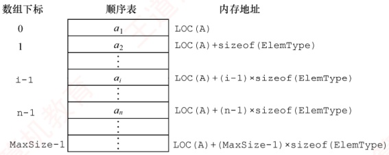
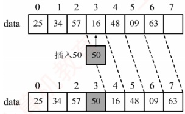
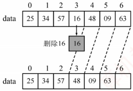

## 2.2 线性表的顺序表示

### 2.2.1 顺序表的定义

### 考点追踪（算法题）顺序表的应用（2010、2011、2018、2020、2025）

线性表的顺序存储也称顺序表。它是用一组地址连续的存储单元依次存储线性表中的数据元素，使得逻辑上相邻的元素在物理位置上也相邻。第1个元素存储在顺序表的起始位置，第i个元素的存储位置之后紧接着存放的是第 $i+1$个元素，称i为元素 $a_{i}$在顺序表中的位序。因此，顺序表的特点是：表中元素的逻辑顺序与其物理存储顺序完全一致。

设顺序表 L 的起始存储地址为 LOC(A)，每个数据元素占用的存储空间大小为 sizeof(ElemType)，则顺序表的存储结构如图 2.1 所示。



图2.1 线性表的顺序存储结构

由于任意数据元素的存储地址与顺序表起始地址之间的偏移量与其位序呈线性关系，因此可在O(1)时间内直接访问表中任意位置的元素，这种特性使得线性表的顺序存储结构属于随机存取。在高级程序设计语言中，通常使用数组来实现顺序表。

**注意**

线性表中元素的位序从1开始，而数组中元素的下标从0开始，注意二者之间的转换。

假定线性表的元素类型为ElemType，则静态分配的顺序表存储结构描述为
```c
#define MaxSize 50     //定义线性表的最大长度
typedef struct{
    ElemType data[MaxSize];     //顺序表的元素
int length;
}SqList;

//顺序表的当前长度

//顺序表的类型定义
```

一维数组既可以静态分配，也可以动态分配。静态分配时，数组的大小和存储空间在编译时已经固定，一旦空间占满，再插入新元素将导致溢出，进而可能引发程序异常。

动态分配时，存储数组的空间是在程序执行过程中通过动态存储分配语句申请的。当空间占满时，可以另行开辟一块更大的存储空间，将原表中的所有元素复制到新空间中，从而实现存储容量的扩充，而无须在初始化时为线性表一次性划分全部可能用到的空间。

动态分配的顺序表存储结构描述为

```c
#define InitSize 100 //表长度的初始定义
typedef struct{
    ElemType *data; //指示动态分配数组的指针
    int MaxSize, length; //数组的最大容量和当前个数
}SeqList; //动态分配数组顺序表的类型定义
```

C 的初始动态分配语句为

```c
L.data=(ElemType*)malloc(sizeof(ElemType)*InitSize);
```

C++的初始动态分配语句为

```c
L.data=new ElemType[InitSize];
```

**注意**

动态分配并不是链式存储，它同样属于顺序存储结构。其物理结构没有变化，依然支持随机存取，只是存储空间的大小可以在运行时动态调整。

顺序表的主要优点：①可进行随机访问，即通过首地址和元素序号可在O(1)时间内找到指定的元素；②存储密度高，每个结点仅存储数据元素，无额外指针开销。顺序表的缺点也很明显：①插入和删除操作效率较低，需要移动大量元素；②要求分配连续的存储空间，不够灵活。

### 2.2.2 顺序表上基本操作的实现

### 考点追踪 顺序表上操作的时间复杂度分析（2023）

本节仅讨论顺序表的初始化、插入、删除和按值查找，其他基本操作的实现都较为简单。

**注意**

在各种操作的实现中（包括严蔚敏老师的教材），通常可以忽略边界条件判断、变量定义、内存分配失败等实现细节，即 **不要求代码具有实际可执行性**，而应重点体现 **算法的核心思想与逻辑步骤**。

#### 1. 顺序表的初始化

静态分配和动态分配的顺序表在初始化时有所不同。静态分配：在声明顺序表时，数组空间已由编译器分配，因此初始化只需将当前长度置为0。

```c
//SqList L;
//声明一个顺序表
void InitList(SqList &L){
    L.length=0;
}
```

动态分配：需在运行时为顺序表分配初始大小的数组空间，并设置长度和容量。
```c

void InitList(SeqList &L){
    L.data=(ElemType *)malloc(InitSize*sizeof(ElemType));//分配存储空间
```
```c
L.length=0; //顺序表初始长度为0
L.MaxSize=InitSize; //初始存储容量
}
```

其中，MaxSize 表示当前分配的存储空间上限。当插入元素导致空间不足时，需要扩容。

#### 2. 插入操作

在顺序表 L 的第 i（1≤i≤L·length+1）个位置插入新元素 e。若 i 超出合法范围，或存储空间已满，则插入失败，返回 false；否则，将第 i 个元素及其后的所有元素依次后移一位，腾出一个空位置插入 e，表长加 1，返回 true。

```c
bool ListInsert(SqList &L, int i, ElemType e) {
    if (i<1||i>L.length+1) //判断 i 的范围是否有效
        return false;
    if (L.length>=MaxSize) //当前存储空间已满
        return false;
    for (int j=L.length; j>=i; j--) //将第 i 个元素及之后的元素后移
        L.data[j]=L.data[j-1];
    L.data[i-1]=e; //在位置 i 插入 e（注意下标转换）
    L.length++; //表长加 1
    return true;
}
```

**注意**

区分位序（从1开始）与数组下标（从0开始）。为什么判断插入位置时使用 length+1，而移动元素的 for 循环中使用 length？因为合法插入位置包括第  $n+1$ 位，但移动元素时最多从第 n 位开始后移。

最好情况：在表尾插入（i=n+1），无须移动元素，时间复杂度为  $O(1)$。

最坏情况：在表头插入（i=1），需移动全部n个元素，时间复杂度为 $O(n)$。

平均情况：设在第i个位置插入的概率为 $p_{i}=1/(n+1)$，则平均移动次数为

 $$\sum_{i=1}^{n+1}p_{i}(n-i+1)=\sum_{i=1}^{n+1}\frac{1}{n+1}(n-i+1)=\frac{1}{n+1}\sum_{i=1}^{n+1}(n-i+1)=\frac{1}{n+1}\frac{n(n+1)}{2}=\frac{n}{2}$$

因此，插入操作的平均时间复杂度为  $O(n)$。

#### 3. 删除操作

删除顺序表L中第i（1≤i≤L.length）个位置的元素，并通过引用参数e返回其值。若i非法，返回false；否则，保存被删元素，将其后所有元素前移一位，表长减1，返回true。

```c
bool ListDelete(SqList &L, int i, ElemType &e) {
    if (i<1||i>L.length) //判断 i 的范围是否有效
        return false;
    e=L.data[i-1]; //将被删除的元素赋给 e
    for (int j=i;j<L.length;j++) //将第 i 个位置后的元素前移
        L.data[j-1]=L.data[j];
    L.length--; //表长减 1
    return true;
}
```

最好情况：删除表尾元素（i=n），无须移动元素，时间复杂度为  $O(1)$。

最坏情况：删除表头元素（i=1），需移动其余n-1个元素，时间复杂度为 $O(n)$。

平均情况：设删除第i个元素的概率为 $p_{i}=1/n$，则平均移动次数为

 $$\sum_{i=1}^{n}p_{i}(n-i)=\sum_{i=1}^{n}\frac{1}{n}(n-i)=\frac{1}{n}\sum_{i=1}^{n}(n-i)=\frac{1}{n}\frac{n(n-1)}{2}=\frac{n-1}{2}$$
因此，删除操作的平均时间复杂度为  $O(n)$。

可见，顺序表的插入和删除操作的时间开销主要耗费在移动元素上，而移动元素的个数取决于操作位置。图2.2显示了顺序表插入和删除操作前、后的状态，以及数据元素在存储空间中的位置和表长变化。图2.2(a)将第4～7个元素从后往前依次后移一位，为新元素腾出位置。图2.2(b)将第5～7个元素从前往后依次前移一位，填补删除后的空缺。



(a) 插入新元素示例



(b) 删除表中元素示例

图2.2 顺序表的插入和删除

#### 4. 按值查找（顺序查找）

在顺序表 L 中查找第一个值等于 e 的元素，返回其位序；若未找到，则返回 0。

```c
int L,ElemType e {
    int i;
    for (i=0;i<L.length;i++)
        if (L.data[i]==e)
            return i+1;
    //下标为 i 的元素值等于 e，返回其位序 i+1
    return 0;
}
```

最好情况：目标元素在表头（i=1），比较1次，时间复杂度为 $O(1)$。

最坏情况：目标元素在表尾或不存在，需要比较 n 次，时间复杂度为  $O(n)$。

平均情况：设目标元素在第i位的概率为 $p_{i}=1/n$，则平均比较次数为

 $$\sum_{i=1}^{n}p_{i}\cdot i=\sum_{i=1}^{n}\frac{1}{n}\cdot i=\frac{1}{n}\frac{n(n+1)}{2}=\frac{n+1}{2}$$

因此，按值查找的平均时间复杂度为  $O(n)$。

顺序表的按序号查找非常简单，直接通过数组下标访问即可，时间复杂度为  $O(1)$。
