## 2.3 线性表的链式表示

顺序表支持随机存取任意元素，但插入和删除操作需要移动大量元素，效率较低。相比之下，链式存储的线性表不要求地址连续的存储单元，即逻辑上相邻的元素在物理位置上是可以不相邻的；它通过指针建立元素之间的逻辑关系，因此插入或删除操作无须移动元素，而只需修改相关指针，效率较高。然而，这样做的代价是失去了顺序表的随机存取能力，只能从头开始顺序访问。
### 2.3.1 单链表的定义

### 考点追踪 ▶ 单链表的应用（2009、2012、2013、2015、2016、2019）

线性表的链式存储也称单链表。它通过一组任意的存储单元（不要求地址连续）来存储线性表中的数据元素。为了建立数据元素之间的线性关系，每个链表结点除了存放元素自身的信息外，还需额外设置一个指向其后继结点的指针。单链表的结点结构如图2.3所示，其中data为数据域，用于存放数据元素；next为指针域，用于存放其后继结点的地址。


图2.3 单链表的结点结构

单链表结点类型的定义如下：

```c
typedef struct LNode{
    //定义单链表结点类型
    ElemType data;
    //数据域
    struct LNode *next;
    //指针域
} LNode, *LinkList;
```

单链表避免了顺序表对连续内存空间的依赖，但每个结点需要额外存储一个指针，带来了一定的存储开销。同时，由于其元素离散地分布在内存中，单链表是一种非随机存取的存储结构，即无法直接定位到表中的某个特定结点，查找时要从表头开始依次遍历。

通常使用头指针 L（或 head 等）来标识一个单链表，该指针指向链表的起始位置。当头指针为 NULL 时，表示链表为空。此外，为了简化操作，在单链表的第一个数据结点之前常附加一个特殊的结点，称为头结点。头结点的数据域一般不存放有效数据（但可用于记录表长等信息）。在带头结点的单链表中，头指针 L 指向头结点，而头结点的 next 指向第一个数据结点，如图 2.4(a) 所示。在不带头结点的单链表中，头指针 L 直接指向第一个数据结点，如图 2.4(b) 所示。无论哪种形式，表尾结点的指针域为 NULL（图中用 “^” 表示）。

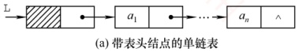

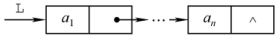

(b) 不带表头结点的单链表

图2.4 带头结点和不带头结点的单链表

头指针与头结点的关系：头指针始终指向链表的第一个结点（无论带不带头结点），而头结点仅存在于带头结点的链表中，它是链表的第一个结点，其数据域通常不存储实际数据。

引入头结点后，可带来以下两个主要优点：

① 操作统一性：第一个数据结点的位置存储在头结点的指针域中，因此在链表首部进行插入、删除等操作时，与其他位置的操作逻辑一致，无须特殊处理。

② 空表与非空表处理统一：无论链表是否为空，头指针始终是一个非空指针（指向头结点），而空表仅表现为头结点的 next 为 NULL，从而避免了对空表的单独判断。

### 2.3.2 单链表上基本操作的实现

带头结点单链表在操作实现上更为简便。如无特殊说明，本节算法均默认链表带头结点。

#### 1. 单链表的初始化

带头结点与个带头结点的单链表在初始化时有所不同。带头结点的单链表初始化时，需创建一个头结点，并令头指针L指向该头结点，其next指针初始化为NULL。

 $${\tt b o o l}{\tt~I n i t L i s t(L i n k L i s t~\&L)}$$

```c
//带头结点的单链表初始化
```
L=(LNode*)malloc(sizeof(LNode)); //创建头结点 $^{①}$
```c
L->next=NULL; //头结点之后暂无数据结点
return true;
```

不带头结点的单链表初始化时，只需将头指针 L 初始化为 NULL。

```c
bool InitList(LinkList &L){    //不带头结点的单链表初始化
    L=NULL;
    return true;
}
```

**注意**

设 p 为指向链表结点的结构体指针，则  $*p$ 表示该结点本身。可通过 p->data 或  $(p)$.data 访问其数据域，二者完全等价。成员运算符 (.) 左侧应为结构体变量，指向运算符 (->) 左侧应为结构体指针。例如，p->next->data 等价于  $( *(*p) .next ).data$，表示当前结点后继结点的数据。

#### 2. 求表长操作

求表长是指统计单链表中数据结点的个数（不包括头结点）。从第一个数据结点开始依次遍历，为此需要设置一个计数变量，每访问一个结点，其值加1，直到遇到NULL。

```c
int Length(LinkList L) {
    int len=0; //计数变量，初始为0
    LNode *p=L;
    while(p->next != NULL) {
        p=p->next;
        len++;
    }
    return len;
}
```

求表长操作的时间复杂度为  $O(n)$。

另外，需要注意的是，由于表长不包含头结点，带头结点与不带头结点的实现细节略有不同。

#### 3. 按序号查找结点

从单链表的第一个数据结点开始，沿 next 指针逐个查找，返回第 i 个结点的指针；若 i 超出表长，则返回 NULL。

```c
LNode *GetElem(LinkList L, int i) {
    LNode *p = L; //指针 p 指向当前扫描结点
    int j = 0; //j 记录当前位序，头结点为第 0 个结点
    while (p != NULL & & j < i) {
        //循环找到第 i 个结点
        p = p->next;
        j++;
    }
    return p; //返回第 i 个结点的指针或 NULL
}
```

按序号查找操作的时间复杂度为  $O(n)$。

#### 4. 按值查找表结点

从单链表的第一个数据结点开始，依次比较各结点的数据域，若等于给定值 e，则返回该结点指针；否则返回 NULL。

```c
LNode *LocateElem(LinkList L,ElemType e){
    LNode *p = L->next;
    while (p != NULL && p->data != e) // 从第一个结点开始查找数据域为 e 的结点
p=p->next;
return p;

//找到后返回该结点指针，否则返回 NULL
```

按值查找操作的时间复杂度为  $O(n)$。

#### 5. 插入结点操作

### 考点追踪 ▶ 单链表插入操作的过程（2016、2024）
```c

将值为 e 的新结点插入到第 i 个位置（成为新的第 i 个数据结点）。先检查 i 的合法性，然后找到第 i-1 个结点（前驱），再在其后插入新结点。假设找到的第 i-1 个结点为*p，然后令新结点*s 的 next 指向*p 的后继，再令*p 的 next 指向*s，如图 2.5 所示。
```

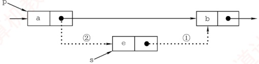

图2.5 单链表的插入操作

```c
bool ListInsert(LinkList &L,int i,ElemType e) {
    LNode *p = L; //p 指向当前扫描结点
    int j = 0; //j 记录当前位序，头结点为第 0 个结点
```
```c
    while (p != NULL & & j < i - 1) {
        //循环找到第 i - 1 个结点
        p = p->next;
        j++;
    }
    if (p == NULL) {
        //i 值不合法
        return false;
    }
    LNode *s = (LNode*)malloc(sizeof(LNode));
    s -> data = e;
```
```c
    s -> next = p -> next; //图 2.5 中操作步骤①
    p -> next = s; //图 2.5 中操作步骤②
    return true;
}
```

步骤①和②的顺序不可颠倒。若先执行 p->next=s，则原后继地址丢失，导致 s->next=p->next 实际变为 s->next=s，形成自环。该操作的时间复杂度为  $O(n)$，主要开销在于查找前驱结点。若已知某结点指针，则在其后插入新结点的时间复杂度为  $O(1)$。注意，当插入位置 i=1 时，不带头结点的单链表需要更新头指针 L 指向新首结点，而带头结点的则无须特殊处理。

扩展：对某个结点进行前插操作。

前插操作是指在某结点前插入一个新结点，与后插操作相反。任何前插操作均可转化为后插操作：只需从头结点开始顺序查找其前驱，时间复杂度为  $O(n)$。若对给定结点进行前插，则还可采用另一种技巧（适用于数据可复制的情况）：将新结点 *s 插入目标结点 *p 之后，再交换 *p 与 *s 的数据域。这种技巧逻辑上等效于前插，且时间复杂度为  $O(1)$。主要代码片段如下：

```c
s->next=p->next; //修改指针域，不能颠倒
p->next=s;
temp=p->data; //交换数据域部分
p->data=s->data;
s->data=temp;
```

#### 6. 删除结点操作

删除单链表的第 i 个数据结点。先检查 i 的合法性，然后找到第 i-1 个结点（前驱），再删
```c
除其后继结点，并释放内存。假设找到的第 i-1 个结点为*p，其后继为被删结点*q，先将*p 的 next 指向*q 的后继结点，然后释放*q 的存储空间，如图 2.6 所示。
```

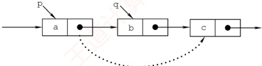

图2.6 单链表结点的删除

```c
bool ListDelete(LinkList &L, int i, ElemType &e) {
    LNode *p = L;
    int j = 0;
    while (p->next != NULL && j < i - 1) {
        // 循环找到第 i-1 个结点
        p = p->next;
        j++;
    }
    if (p->next == NULL || j > i - 1) {
        // i 值不合法
        return false;
        LNode *q = p->next;
        e = q->data;
        p->next = q->next;
        free(q);
        return true;
    }
}
```

类似于插入操作，该操作的主要耗时也在查找操作上，时间复杂度为  $O(n)$。

当链表不带头结点时，需判断被删结点是否为首结点，若是，则要做特殊处理，将头指针 L 指向新的首结点。当链表带头结点时，删除首结点和删除其他结点的操作是相同的。

扩展：删除给定结点 $^{*}p$。

常规方法需要从头遍历找到 $*p$ 的前驱，时间复杂度为  $O(n)$。若允许修改结点内容，则可采用一种  $O(1)$ 的技巧：将 $*p$ 的后继结点的数据复制到 $*p$ 中，然后删除其后继结点。该方法的局限性在于不能用于删除尾结点（因其无后继）。主要代码片段如下：
```c

LNode *q = p->next; // 令 q 指向 *p 的后继结点
```
```c
p->data = p->next->data; // 用后继结点的数据域覆盖
p->next = q->next; // 将 *q 结点从链中“断开”
free(q); // 释放后继结点的存储空间
```

#### 7. 采用头插法建立单链表
```c

该方法从一个空表开始，生成新结点*s，并将读取的数据存入其数据域。然后，令 s->next 指向头结点当前 next 所指的结点，再将头结点的 next 指向*s，如图 2.7 所示。重复此过程，新结点始终成为第一个数据结点，最终链表中的元素顺序与输入顺序相反。
```

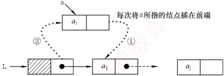

图2.7 采用头插法建立单链表

```c
LinkList List_HeadInsert(LinkList &L){ //逆向建立单链表
    LNode *s; int x; //设元素类型为整型
    L=(LNode*)malloc(sizeof(LNode)); //创建头结点
    L->next=NULL; //初始为空链表
    scanf("%d",&x); //输入结点的值
    while (x!=9999){
        s=(LNode*)malloc(sizeof(LNode)); //创建新结点
        s->data=x;
        s->next=L->next;
        L->next=s; //将新结点插入表中，L为头指针
        scanf("%d",&x);
    }
    return L;
}
```

每插入一个结点的时间复杂度为  $O(1)$，总时间复杂度为  $O(n)$。

**思考**

若单链表不带头结点，则上述代码中哪些地方需要修改？ $^{①}$

#### 8. 采用尾插法建立单链表

若希望输入顺序与链表中的元素顺序一致，则可采用尾插法。该方法将新结点插入当前链表的表尾。为此，需要维护一个尾指针 r，并且始终指向当前的尾结点；插入时，令 r -> next 指向新结点 * s，再将 r 更新为 s，使其继续指向新的尾结点，如图 2.8 所示。

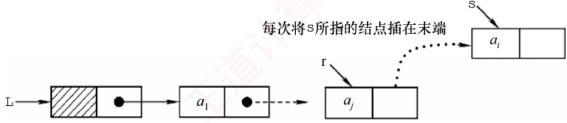

图2.8 采用尾插法建立单链表

```c
LinkList List_TailInsert(LinkList &L){ //正向建立单链表
    int x; //设元素类型为整型
    L=(LNode*)malloc(sizeof(LNode)); //创建头结点
```
```c
    LNode *s, *r = L; //r 为表尾指针
```
```c
    scanf("%d", &x); //输入结点的值
    while (x != 9999) { //输入 9999 表示结束
        s = (LNode *)malloc(sizeof(LNode));
        s -> data = x;
        r -> next = s;
        r = s;
        scanf("%d", &x);
    }
    r -> next = NULL; //尾结点指针置空
    return L;
}
```

因为附设了一个尾指针，故无须遍历查找尾部，总时间复杂度仍为  $O(n)$。
**注意**

单链表是链式存储结构的基础，建议读者熟练掌握其基本操作。在设计算法时，可先通过画图理清指针变化逻辑，再编写代码，有助于避免常见错误（如指针丢失、内存泄漏等）。

### 2.3.3 双链表

单链表的每个结点仅包含一个指向其后继的指针，故只能从前往后依次遍历。若需访问某结点的前驱（插入或删除操作时），则要从头开始遍历，时间复杂度为 $O(n)$。为了克服这一局限，引入了双链表，双链表中的每个结点包含两个指针prior和next，分别指向直接前驱和直接后继，如图2.9所示。其中，头结点的prior为NULL，尾结点的next也为NULL。

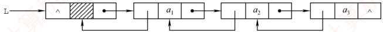

图2.9 双链表示意图

双链表结点类型的定义如下：
```c

typedef struct DNode{
    ElemType data;
    struct DNode *prior, *next;
}DNode, *DLinklist;

//定义双链表结点类型
//数据域
//前驱和后继指针
```

双链表的按值查找操作和按位查找操作与单链表的相同，通常也需要从头结点开始顺序查找。由于增加了指向前驱的指针，双链表在插入操作和删除操作中要同时维护前驱与后继两个方向的链接，因此其实现方式与单链表的有较大差异。关键在于：修改指针时不能造成断链。得益于对前驱结点的直接访问，在已知目标结点的前提下，双链表的插入和删除操作的时间复杂度可降至O(1)。

#### 1. 双链表的插入操作

### 考点追踪 双链表中插入操作的实现（2023）
```c

在双链表的结点*p之后插入新结点*s，其指针变化过程如图2.10所示。代码片段如下：
```

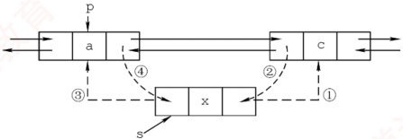

图 2.10 双链表插入结点过程

 $$\textcircled{1}\mathrm{~s->n e x t=p->n e x t};$$

 $$\textcircled{2}{\mathrm{~}}p->{\mathrm{n e x t->p r i o r}}={\mathrm{s}};$$
```c

上述语句的执行顺序并不是任意的：步骤①必须在步骤④之前，否则 p->next 被覆盖后，无法访问原后继结点，导致指针丢失，插入失败。其余步骤可在保证逻辑正确的前提下适当调整（例如③可在①前执行）。若问题改成要求在结点*p之前插入结点*s，则要如何处理？请读者自行推导操作步骤。
```
#### 2. 双链表的删除操作

### 考点追踪 双链表中删除操作的实现（2016）

删除双链表中结点 $^{*}p$的后继结点 $^{*}q$，其指针的变化过程如图2.11所示。

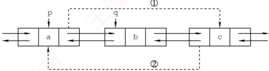

图2.11 双链表删除结点过程

| p -> next = q -> next; | // 图 2.11 中步骤① |
| --- | --- |
| q -> next -> prior = p; | // 图 2.11 中步骤② |
| free(q); | // 释放结点空间 |

若问题改成要求删除结点 $^{*}q$的前驱结点 $^{*}p$，请读者尝试写出对应的操作步骤。

建立双链表时，同样可以采用类似单链表的头插法或尾插法，但要注意：每次插入新结点时，要同时正确设置 next 和 prior 两个指针，以维持双向链接的完整性。

### 2.3.4 循环链表

#### 1. 循环单链表

循环单链表与普通单链表的主要区别在于：表中最后一个结点的`next`域不再为`NULL`，而是指向头结点，从而使整个链表形成一个环。这种结构使得从任意一个结点出发均可遍历整个循环单链表，而不仅限于从表头开始，如图2.12所示。

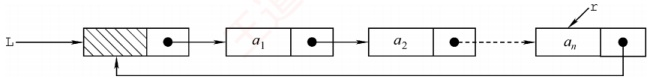

图 2.12 循环单链表

尾结点* $r$的next指向头结点，因此链表中不存在next为NULL的结点。判空条件不再是检查头指针L是否为空，而是检查头结点的next是否指向自身（L->next==L）。

### 考点追踪 循环单链表中删除首元素的操作（2021）

循环单链表的插入和删除操作与普通单链表基本相同，但有一个关键差异：在表尾进行操作时，需要特别处理以维持链表的循环特性。然而，正是因为循环单链表是一个环，在任何位置上的插入和删除操作都是等价的，因此无须判断是否到达表尾。

为了提高效率，循环单链表有时不设头指针，而仅设置尾指针  $\mathbf{r}$。此时，在表头或表尾插入元素的时间复杂度均为  $O(1)$。若使用头指针，则表尾插入需要遍历整个链表，时间复杂度为  $O(n)$。例如，在表尾插入新结点  $\star$ s 时，需要执行以下步骤：令  $\mathbf{s} \rightarrow \text{next} = \mathbf{r} \rightarrow \text{next}$（使新结点的后继指向头结点，以维持环状结构）；将  $\mathbf{r} \rightarrow \text{next}$ 指向新结点  $\star$ s；更新  $\mathbf{r}$ 为新结点  $\star$ s。

#### 2. 循环双链表

基于循环单链表的概念，不难推导出循环双链表。不同之处在于：循环双链表中的每个结点不仅包含指向下一个结点的next域，还包含指向前一个结点的prior域。特别地，头结点的prior
需要指向表尾结点，从而形成一个完整的环形结构，如图2.13所示。

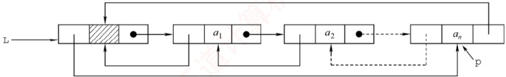

图2.13 循环双链表
```c

设尾结点为*p，则 p->next 应指向头结点 L；同时，L->prior 应指向*p。当循环双链表为空时，其头结点 L 的 prior 和 next 都指向自身（L->prior == L 且 L->next == L）。
```

### 2.3.5 静态链表

静态链表是用数组来模拟线性表的链式存储结构。每个结点都包含两个域：data 域和 next 域。与动态链表不同的是，这里的指针实际上是结点在数组中的相对地址（数组下标），也称游标。类似于顺序表，静态链表也需要预先分配一块连续的内存空间。

静态链表和单链表的对应关系如图2.14所示。

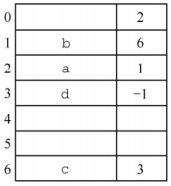

(a)静态链表示例

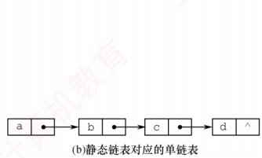

图2.14 静态链表和单链表的对应关系

静态链表的结构类型定义如下：

```c
#define MaxSize 50
typedef struct{
    ElemType data;
    int next;
} SLinkList[MaxSize];

//静态链表的最大长度

//静态链表的结构类型定义

//存储数据元素

//下一个元素的数组下标
```

静态链表以 next == -1 作为其结束标志。静态链表的插入、删除操作与动态链表类似，只需修改指针（数组下标），而无须移动元素。尽管静态链表在灵活性上不及动态链表，但在一些不支持指针的编程语言（如 Basic）中，它提供了一种巧妙的设计方案。

### 2.3.6 顺序表和链表的比较

#### 1. 存取（读/写）方式

顺序表支持随机存取，可通过下标直接访问任意位置元素，时间复杂度为  $O(1)$，同时也支持顺序存取。链表仅支持顺序存取，必须从头结点开始逐个遍历。例如，访问第 i 个元素时，顺序表只需一次操作；而链表需要遍历 i 个结点，平均时间复杂度为  $O(n)$。

#### 2. 逻辑结构与物理结构

顺序存储中，逻辑上相邻的元素在物理内存中也连续存放，其邻接关系由地址自然体现；链式存储中，逻辑相邻的元素在物理上未必相邻，其逻辑关系通过指针显式维护。
#### 3. 查找、插入和删除操作

对于按值查找，若表无序，则两者的时间复杂度均为  $O(n)$；若表有序，则顺序表可以采用折半查找，时间复杂度为  $O(\log_2 n)$。对于按序号查找，顺序表的时间复杂度为  $O(1)$，链表则为  $O(n)$。对于插入/删除操作，顺序表平均需移动约一半的元素，开销较大；链表只需修改指针，无须移动元素，但前提是已知操作位置（否则仍需  $O(n)$ 的时间定位）。

#### 4. 空间分配

顺序表在静态分配下需预先设定容量：过大造成内存浪费，过小则易在插入时溢出。动态分配虽支持运行时扩容，但需要申请新的连续内存块并复制全部原有数据，不仅耗时，还可能因系统缺乏足够连续空闲空间而失败。相比之下，链表采用动态结点分配，按需扩展，灵活性高，但每个结点需额外存储指针域，导致存储密度小于1，空间利用率较低。

在实际应用中，该如何选择合适的存储结构呢？

#### 1. 基于存储的考虑

当线性表的长度或规模难以预估时，顺序表因需预先分配固定容量而不适用；而链表无须预设容量，可按需动态扩展，但每个结点需额外存储指针，带来一定的空间开销。

#### 2. 基于运算的考虑

若应用中频繁进行按序号访问（随机访问），顺序表具有 O(1) 的优势，明显更高效；而对于以插入和删除为主的操作，链表在定位目标位置后仅需调整指针，开销较小。尽管定位过程本身仍需 O(n) 时间，但在增删密集的场景下，链表的整体性能通常更优。

#### 3. 基于环境的考虑

顺序表基于数组实现，几乎所有高级语言都支持，实现简单；链表则依赖指针操作，在部分环境中实现较为复杂。因此，开发语言和运行环境也是重要的考量因素。

综上所述，两种结构各有优劣。对于规模稳定、以随机访问为主的场景，宜采用顺序存储；而动态性强、频繁进行插入和删除操作的场景，则更适合链式存储。

注意

只有熟练掌握线性表的顺序存储和链式存储，才能深刻理解它们的优缺点。
