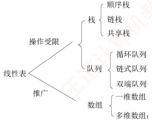

# 第3章  栈、队列和数组

## 【考纲内容】

### （一）栈和队列的基本概念

### （二）栈和队列的顺序存储结构

### （三）栈和队列的链式存储结构

### （四）多维数组的存储

### （五）特殊矩阵的压缩存储

### （六）栈、队列和数组的应用

视频讲解

**【知识框架】**

多维数组：压缩存储、稀疏矩阵

## 【复习提示】

本章通常以选择题形式考查，题目难度不大，但命题方式较为灵活。其中，栈（如入栈/出栈过程、出栈序列的合法性）和队列的操作及其特征是考查重点。由于二者都是线性表的典型应用与推广，也常出现在算法设计题中。此外，栈和队列的顺序存储与链式存储及其特点、双端队列的特性、栈和队列的常见应用，以及数组与特殊矩阵的压缩存储，均为必须掌握的内容。
