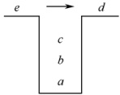
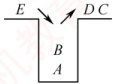

### 3.1.4 本节试题精选

#### 一、 单项选择题

##### 01

栈和队列具有相同的（）。

A. 抽象数据类型 B. 逻辑结构 C. 存储结构 D. 运算

##### 02

栈是一种（）。

A. 顺序存储的线性结构

B. 链式存储的非线性结构

C. 限制存取点的线性结构

D. 限制存取点的非线性结构

##### 03

下列选项中，（）不是栈的基本操作。

A. 删除栈顶元素 B. 删除栈底元素

C. 判断栈是否为空 D. 将栈置为空栈

##### 04

设用数组 a[n] 存储一个栈，初始栈顶指针 top = -1，则元素 x 入栈的操作是（）。

A. a[--top] = x    B. a[top--] = x    C. a[++top] = x    D. a[top++] = x

##### 05

设用数组 data[1...n] 存储一个栈，初始栈顶指针 top=1，则元素 x 入栈的操作是（）。

A. data[top--]=x

B. data[top++]=x

C. data[--top]=x

D. data[++top]=x

##### 06

设用数组 data[1...n] 存储一个栈，初始栈顶指针 top=n+1，则元素 x 入栈的操作是()。

A. data[--top]=x

B. data[top++]=x

C. data[top--]=x

D. data[++top]=x

##### 07

设有一个空栈，栈顶指针为 1000H，栈向高地址方向增长，每个元素占一个存储单元，执行 Push、Push、Pop、Push、Pop、Push、Pop、Push 操作后，栈顶指针为（）。

A. 1002H B. 1003H C. 1004H D. 1005H

##### 08

和顺序栈相比，链栈有一个比较明显的优势，即（）。

A. 通常不会出现栈满的情况 B. 通常不会出现栈空的情况

C. 插入操作更容易实现 D. 删除操作更容易实现

##### 09

设链表不带头结点且所有操作均在表头进行，则下列最不适合作为链栈的是（）。

A. 只有表头结点指针，没有表尾指针的双向循环链表

B. 只有表尾结点指针，没有表头指针的双向循环链表

C. 只有表头结点指针，没有表尾指针的单向循环链表

D. 只有表尾结点指针，没有表头指针的单向循环链表

##### 10

向一个栈顶指针为 top 的链栈（不带头结点）中插入一个 x 结点，则执行（）。

A. top->next=x

B. x->next=top->next; top->next=x

C. x->next=top; top=x

D. x->next=top; top=top->next

##### 11

链栈（不带头结点）执行 Pop 操作，并将出栈的元素存在 x 中，应该执行（）。

A. x=top; top=top->next

B. x=top->data

C. top=top->next; x=top->data

D. x=top->data; top=top->next

##### 12

经过以下栈的操作后，变量 x 的值为（）。

```c
InitStack(st); Push(st, a); Push(st, b); Pop(st, x); GetTop(st, x);
```

A. a B. b C. NULL D. false

##### 13

3个不同元素依次入栈，能得到（）种不同的出栈序列。
A. 4 B. 5 C. 6 D. 7

##### 14

设 a, b, c, d, e, f 以所给的次序入栈，若在入栈操作时，允许出栈操作，则下面不会出现的出栈序列为（）。

A. fedcba B. bcafed C. dcefba D. cabdef

##### 15

4个元素依次入栈的次序为 abcd，则以 cd 开头的出栈序列的个数为（）。

A. 1 B. 2 C. 3 D. 4

##### 16

用 S 表示入栈操作，用 X 表示出栈操作，若元素的入栈顺序是 1234，为了得到 1342 的出栈顺序，相应的 S 和 X 的操作序列为（）。

A. SXSXSXX B. SSSXXSXX C. SXSSSXSX D. SXSSXSXX

##### 17

若栈的输入序列是  $1,2,3,\cdots,n$，输出序列的第一个元素是 n，则第 i 个输出元素是（）。

A. 不确定 B. n-i C. n-i-1 D. n-i+1

##### 18

若栈的输入序列是  $1,2,3,\cdots,n$，输出序列的第一个元素是 i，则第 j 个输出元素是（）。

A. i - j - 1 B. i - j C. j - i + 1 D. 不确定

##### 19

某栈的输入序列为 a, b, c, d，下面的4个序列中，不可能为其输出序列的是（）。

A. a, b, c, d B. c, b, d, a C. d, c, a, b D. a, c, b, d

##### 20

若栈的输入序列是  $P_{1}, P_{2}, \cdots, P_{n}$，输出序列是 1, 2, 3,  $\cdots$, n，若  $P_{3}=1$，则  $P_{1}$ 的值（）。

A. 可能是2 B. 一定是2 C. 不可能是2 D. 不可能是3

##### 21

若栈的输入序列是  $P_{1}, P_{2}, \cdots, P_{n}$，输出序列是 1, 2, 3,  $\cdots$, n，若  $P_{3}=3$，则  $P_{1}$ 的值（）。

A. 可能是2 B. 不可能是1 C. 一定是1 D. 一定是2

##### 22

已知栈的入栈序列是1,2,3,4，其出栈序列为 $P_{1},P_{2},P_{3},P_{4}$，则 $P_{2},P_{4}$不可能是（）。

A. 2,4 B. 2,1 C. 4,3 D. 3,4

##### 23

设栈的初始状态为空，当字符序列 “n1_” 作为栈的输入时，输出长度为 3，且可用作 C 语言标识符的序列有（ ）个。

A. 4          B. 5          C. 3          D. 6

##### 24

采用共享栈的好处是（）。

A. 减少存取时间，降低发生上溢的可能

B. 节省存储空间，降低发生上溢的可能

C. 减少存取时间，降低发生下溢的可能

D. 节省存储空间，降低发生下溢的可能

##### 25

设有一个顺序共享栈 Share[0:n-1]，其中第一个栈顶指针 top1 的初值为 -1，第二个栈顶指针 top2 的初值为 n，则判断共享栈满的条件是（）。

A. top2-top1==1

B. top1-top2==1

C. top1==top2

D. 都不对

##### 26

【2009 统考真题】设栈 S 和队列 Q 的初始状态均为空，元素 abcdefg 依次入栈 S。若每个元素出栈后立即进入队列 Q，且 7 个元素出队的顺序是 bdcfeag，则栈 S 的容量至少是（）。

A. 1 B. 2 C. 3 D. 4

##### 27

【2010 统考真题】若元素 a, b, c, d, e, f 依次入栈，允许入栈、出栈操作交替进行，但不允许连续 3 次进行出栈操作，不可能得到的出栈序列是（）。

A. dcebfa B. cbdaef C. bcaefd D. afedcb

##### 28

【2011 统考真题】元素 a, b, c, d, e 依次进入初始为空的栈中，若元素入栈后可停留、可出栈，直到所有元素都出栈，则在所有可能的出栈序列中，以元素 d 开头的序列个数是（）。
A. 3 B. 4 C. 5 D. 6

##### 29

【2013 统考真题】一个栈的入栈序列为 1, 2, 3,  $\cdots$, n，出栈序列是  $P_{1}$,  $P_{2}$,  $P_{3}$,  $\cdots$,  $P_{n}$。若  $P_{2}=3$，则  $P_{3}$ 可能取值的个数是（）。

A. n - 3 B. n - 2 C. n - 1 D. 无法确定

##### 30

【2020 统考真题】对空栈 S 进行 Push 和 Pop 操作，入栈序列为 a, b, c, d, e，经过 Push、Push、Pop、Push、Pop、Push、Push、Push、Pop 操作后得到的出栈序列是（）。

A. b, a, c B. b, a, e C. b, c, a D. b, c, e

##### 31

【2022 统考真题】给定有限符号集 S，in 和 out 均为 S 中所有元素的任意排列。对于初始为空的栈 ST，下列叙述中，正确的是（）。

A. 若 in 是 ST 的入栈序列，则不能判断 out 是否为其可能的出栈序列

B. 若 out 是 ST 的出栈序列，则不能判断 in 是否为其可能的入栈序列

C. 若 in 是 ST 的入栈序列，out 是对应 in 的出栈序列，则 in 与 out 一定不同

D. 若 in 是 ST 的入栈序列，out 是对应 in 的出栈序列，则 in 与 out 可能互为倒序

#### 二、 综合应用题

##### 01

有5个元素，其入栈次序为A, B, C, D, E，在各种可能的出栈次序中，第一个出栈元素为C且第二个出栈元素为D的出栈序列有哪几个？

##### 02

若元素的入栈序列为 A, B, C, D, E，运用栈操作，能否得到出栈序列 B, C, A, E, D 和 D, B, A, C, E？为什么？

##### 03

栈的初态和终态均为空，以 I 和 O 分别表示入栈和出栈，则出入栈的操作序列可表示为由 I 和 O 组成的序列，可以操作的序列称为合法序列，否则称为非法序列。

1）下面所示的序列中哪些是合法的？

A. IOIIOIOO B. IOOIOIIO C. IIIOIOIO D. IIIOOIOO

2）通过对 1）的分析，写出一个算法，判定所给的操作序列是否合法。若合法，返回 true，否则返回 false（假定被判定的操作序列已存入一维数组中）。

##### 04

设单链表的表头指针为L，结点结构由data和next两个域构成，其中data域为字符型。设计算法判断该链表的全部n个字符是否中心对称。例如，xyx、xyyx都是中心对称的。

##### 05

设有两个栈 S1、S2 都采用顺序栈方式，并共享一个存储区 [0, ..., maxsize-1]，为了尽量利用空间，减少溢出的可能，可采用栈顶相向、迎面增长的存储方式。试设计 S1、S2 有关入栈和出栈的操作算法。

### 3.1.5 答案与解析

#### 一、 单项选择题

##### 01

B

栈和队列的逻辑结构都是相同的，都属于线性结构，只是它们对数据的运算不同。

##### 02

C

首先栈是一种线性表，所以选项B、D错。按存储结构的不同可分为顺序栈和链栈，但不可以把栈局限在某种存储结构上，所以选项A错。栈和队列都是限制存取点的线性结构。

##### 03

B

基本操作是指该结构最核心、最基本的运算，其他较复杂的操作可通过基本操作实现。删除栈底元素不属于栈的基本运算，但它可以通过调用栈的基本运算求得。
##### 04

C

数组下标范围为  $0 \sim n-1$，初始时 top 为 -1，第一个元素入栈后，top 为 0，即 top 指向栈顶元素。栈向高地址方向增长，所以入栈时应先将指针 top 加 1，然后存入元素 x，选项 C 正确。

##### 05

B

数组下标范围为  $1 \sim n$，初始时 top 为 1，表示 top 指向栈顶元素的下一个元素。栈向高地址方向增长，所以入栈时应先存入元素 x，然后将指针 top 加 1，选项 B 正确。

##### 06

A

数组下标范围为  $1 \sim n$，初始时 top 为  $n+1$，表示 top 指向栈顶元素。栈向低地址方向增长，所以入栈时应先将指针 top 减 1，然后存入元素 x，A 正确。

##### 07

A

每个元素需要1个存储单元，所以每入栈一次 top 加1，出栈一次 top 减1。指针 top 的值依次为 1001H, 1002H, 1001H, 1002H, 1001H, 1002H, 1001H, 1002H。

##### 08

A

顺序栈采用数组存储，数组的大小是固定的，不能动态地分配大小。和顺序栈相比，链栈的最大优势在于它可以动态地分配存储空间。

##### 09

C

对于双向循环链表，不管是表头指针还是表尾指针，都可以很方便地找到表头结点，方便在表头做插入或删除操作。而循环单链表通过尾指针可以很方便地找到表头结点，但通过头指针找尾结点需要遍历一次链表。对于选项C，插入和删除结点后，找尾结点所需的时间为 $O(n)$。

##### 10

C

链栈采用不带头结点的单链表表示时，入栈操作在首部插入一个结点 x（x -> next = top），插入完后需将 top 指向该插入的结点 x。请思考当链栈存在头结点时的情况。

##### 11

D

这里假设栈顶指针指向的是栈顶元素，所以选择选项 D；而选项 A 中首先将 top 指针赋予 x，错误；选项 B 中没有修改 top 指针的值；选项 C 为 top 指针指向栈顶元素的上一个元素时的答案。

##### 12

A

执行前 3 句后，栈 st 内的值为 a, b，其中 b 为栈顶元素；执行第 4 句后，栈顶元素 b 出栈，x 的值为 b；执行最后一句，读取栈顶元素的值，x 的值为 a。

##### 13

B

当n个不同元素入栈时，出栈序列的个数为

 $$\frac{1}{n+1}C_{2n}^{n}=\frac{1}{n+1}\frac{(2n)!}{n!\times n!}=\frac{6\times5\times4}{4\times3\times2\times1}=5$$

考题中给出的 n 值不会很大，可以根据栈的特点，若  $X_{i}$ 已经出栈，则  $X_{i}$ 前面的尚未出栈的元素一定逆置有序地出栈，因此，可以采用例举方法。如 a, b, c 依次入栈的出栈序列有 abc, acb, bac, bca, cba。另外，在一些考题中可能会问符合某个特定条件的出栈序列有多少种，比如此题中问以 b 开头的出栈序列有几种，这种类型的题目一般都使用穷举法。

##### 14

D

根据栈“先进后出”的特点，且在入栈操作的同时允许出栈操作，显然选项D中c最先出栈，则此时栈内必定为a和b，但因为a先于b入栈，所以要晚出栈。对于某个出栈的元素，在它之前入栈却晚出栈的元素必定是按逆序出栈的，其余答案均是可能出现的情况。
此题也可采用将各序列逐个代入的方法来确定是否有对应的进出栈序列（类似下题）。

##### 15

A

假设出栈序列为  $cd\ldots$，分析栈的操作序列：a入栈，b入栈，c入栈，d出栈，e入栈，f出栈，g出栈，h出栈和i出栈，j出栈和k出栈，l出栈和m出栈，n出栈和o出栈，p出栈和q出栈，r出栈和s出栈，t出栈和t出栈，u出栈和v出栈，w出栈和x出栈，y出栈和z出栈，z出栈和a出栈，bz出栈和bz。

##### 16

D

采用排除法，选项 A, B, C 得到的出栈序列分别为 1243, 3241, 1324。由 1234 得到 1342 的进出栈序列为：1 进，1 出，2 进，3 进，3 出，4 进，4 出，2 出，所以选择选项 D。

##### 17

D

第 n 个元素第一个出栈，说明前 n-1 个元素都已经按顺序入栈，由“先进后出”的特点可知，此时的输出序列一定是输入序列的逆序，所以答案选择选项 D。

##### 18

D

当第 i 个元素第一个出栈时，则 i 之前的元素可以依次排在 i 之后出栈，但剩余的元素可以在此时入栈，并且排在 i 之前的元素出栈，所以第 j 个出栈的元素是不确定的。

##### 19

C

对于选项 A，可能的顺序是 a 入，a 出，b 入，b 出，c 入，c 出，d 入，d 出。对于选项 B，可能的顺序是 a 入，b 入，c 入，c 出，b 出，d 入，d 出，a 出。对于选项 D，可能的顺序是 a 入，a 出，b 入，c 入，c 出，b 出，d 入，d 出。选项 C 没有对应的序列。

【另解】若出栈序列的第一个元素为 d，则出栈序列只能是 dcba。该思想通常也适用于出栈序列的局部分析：如 12345 入栈，问出栈序列 34152 是否正确？如何分析？若第一个出栈元素是 3，则此时 12 必停留在栈中，它们出栈的相对顺序只能是 21，所以 34152 错误。

##### 20

C

入栈序列是  $P_{1}, P_{2}, \cdots, P_{n}$。因为  $P_{3} = 1$，即  $P_{1}, P_{2}, P_{3}$ 连续入栈后，第一个出栈元素是  $P_{3}$，说明  $P_{1}, P_{2}$ 已经按序入栈，根据先进后出的特点可知， $P_{2}$ 必定在  $P_{1}$ 之前出栈，而第二个出栈元素是 2，而此时  $P_{1}$ 不是栈顶元素，所以  $P_{1}$ 的值不可能是 2。思考：哪些  $P_{i}$ 可能是 2？

##### 21

A

假设  $P_{1}$ 是 1，入栈后立即出栈， $P_{2}$ 是 2，入栈后立即出栈， $P_{3}$ 是 3，入栈后立即出栈，得到的序列符合题意。假设  $P_{1}$ 是 2， $P_{2}$ 是 1， $P_{1}$、 $P_{2}$ 依次入栈后全部出栈， $P_{3}$ 是 3，入栈后立即出栈，得到的序列符合题意。因此， $P_{1}$ 既可能是 1，又可能是 2。

##### 22

C

逐个判断每个选项可能的入栈出栈顺序。对于选项A，可能的顺序是1入，1出，2入，2出，3入，3出，4入，4出。对于选项B，可能的顺序是1入，2入，3入，3出，2出，4入，4出，1出。对于选项D，可能的顺序是1入，1出，2入，3入，3出，2出，4入，4出。选项C没有对应的序列，因为当4在栈中时，意味着前面的所有元素（1，2，3）都已在栈中或曾经入过栈，此时若4第二个出栈，即栈中还有两个元素，且这两个元素是有序的（对应入栈顺序），只能为(1,2)。(1,3),(2,3)，若是序列(1,2)，则3已在 $p_{1}$位置出栈，不可能再在 $p_{4}$位置出栈，若是(1,3)和(2,3)这种情况中的任意一种，则3一定是下一个出栈元素，即 $p_{3}$一定是3，所以 $p_{4}$不可能是3。

【另解】对于选项C， $p_{2}$ 为最后一个入栈元素4，则只有  $p_{1}$ 或  $p_{3}$ 出栈的元素有可能为3（请读者分两种情况自行思考），而  $p_{4}$ 绝不可能为3。读者在解答此类题时，一定要注意出栈序列中的“最后一个入栈元素”，这样可以节省答题的时间。

##### 23

C

标识符只能以英文字母或下划线开头，而不能以数字开头。于上，由n、1、_三个字符组合成
```c
的标识符有n1_、n_1、_1n和_n1四种。第一种：n入栈再出栈，1入栈再出栈，_入栈再出栈。第二种：n入栈再出栈，1入栈，_入栈，_出栈，1出栈。第三种：n入栈，1入栈，_入栈，_出栈，1出栈，n出栈。而根据栈的操作特性，_n1这种情况不可能出现。
```

##### 24

B

上溢是指存储器满，还往里写；下溢是指存储器空，还往外读。为了解决上溢，可给栈分配很大的存储空间，但这样又会造成存储空间的浪费。共享栈的提出就是为了在解决上溢的基础上节省存储空间，将两个栈放在同一段更大的存储空间内，这样，当一个栈的元素增加时，可使用另一个栈的空闲空间，从而降低发生上溢的可能性。

##### 25

A

这种情况就是前面我们所描述的，详细内容请参见本节考点精析部分对共享栈的讲解。另外，读者可以思考当 top1 的初值为 0，top2 的初值为 n-1 时栈满的条件。

**注意**

栈顶、队头与队尾的指针的定义是不唯一的，做题时务必仔细审题和思考。

##### 26

C

时刻注意栈的特点是先进后出，下表是出入栈的详细过程。

| 序号 | 说明 | 栈内 | 栈外 | 序号 | 说明 | 栈内 | 栈外 |
| --- | --- | --- | --- | --- | --- | --- | --- |
| 1 | a 入栈 | a |   | 8 | e 入栈 | ae | bdc |
| 2 | b 入栈 | ab |   | 9 | f 入栈 | aef | bdc |
| 3 | b 出栈 | a | b | 10 | f 出栈 | ae | bdcf |
| 4 | c 入栈 | ac | b | 11 | e 出栈 | a | bdcfe |
| 5 | d 入栈 | acd | b | 12 | a 出栈 |   | bdcfea |
| 6 | d 出栈 | ac | bd | 13 | g 入栈 | g | bdcfea |
| 7 | c 出栈 | a | bdc | 14 | g 出栈 |   | bdcfeag |

栈内的最大深度为3，所以栈S的容量至少是3。

【另解】因为元素的出队顺序和入队顺序相同，所以元素的出栈顺序就是 b, d, c, f, e, a, g，因此元素的出入栈次序为 Push(S, a), Push(S, b), Pop(S, b), Push(S, c), Push(S, d), Pop(S, d), Pop(S, c), Push(S, e), Push(S, f), Pop(S, f), Pop(S, e), Pop(S, a), Push(S, g), Pop(S, g)。初始所需容量为 0，每做一次 Push 操作，容量加 1；每做一次 Pop 操作，容量减 1，记录的容量最大值为 3。

##### 27

D

选项A由a入，b入，c入，d入，d出，c出，e入，e出，b出，f入，f出，a出得到；选项B由a入，b入，c入，c出，b出，d入，d出，a出，e入，e出，f入，f出得到；选项C由a入，b入，b出，c入，c出，a出，d入，e入，e出，f入，f出，d出得到；选项D由a入，a出，b入，c入，d入，e入，f入，f出，e出，d出，c出，b出得到，但题意要求不允许连续3次出栈操作，选项D不符。

【另解】先入栈的元素后出栈，入栈顺序为 a, b, c, d, e, f，所以连续出栈时的子序列必然是按字母表逆序的，若出栈序列中出现了长度大于或等于 3 的连续逆序子序列，则为所选序列。

##### 28

B

d 第一个出栈，则 c, b, a 出栈的相对顺序是确定的，出栈顺序必为  $d_{c}$ 、 $b_{a}$，e 的顺序不定，在任意一个“_”上都有可能。

【另解】d首先出栈，则abc停留在栈中，此时栈的状态如右图所示。



此时可以有如下4种操作：①e入栈后出栈，则出栈序列为decba；②c出栈，e入栈后出栈，出栈序列为dceba；③cb出栈，e入栈后出栈，出栈序列为dcbea；④cba出栈，e入栈后出栈，出栈序列为dcbea。思路和上面其实一样。

##### 29

C

显然，3之后的4,5, $\cdots$,n都是 $P_{3}$可取的数（一直入栈直到该数入栈后马上出栈）。接下来分析1和2是否可取： $P_{1}$可以是3之前入栈的数（可能是1或2），也可以是4，当 $P_{1}=1$时， $P_{3}$可取2；当 $P_{1}=2$时， $P_{3}$可取1。因此， $p_{3}$可能取除3外的所有数，个数为n-1。

##### 30

D

按题意，出入栈操作的过程如下：

| 操作 | 栈内元素 | 出栈元素 |
| --- | --- | --- |
| Push | a |   |
| Push | a b |   |
| Pop | a | b |
| Push | a c |   |
| Pop | a | c |
| Push | a d |   |
| Push | a d e |   |
| Pop | a d | e |

因此，出栈序列为 b, c, e。

##### 31

D

通过模拟出入栈操作，可以判断入栈序列 in 和出栈序列 out 是否合法。因此，已知 in 序列可以判断 out 序列是否为可能的出栈序列；已知 out 序列也可以判断 in 序列是否为可能的入栈序列，选项 A 和 B 错误。若每个元素入栈后立即出栈，则 in 序列和 out 序列相同，选项 C 错误。若所有元素都入栈后才依次出栈，则 in 序列和 out 序列互为倒序，选项 D 正确。

#### 二、 综合应用题

##### 01

【解答】

CD 出栈后的状态如右图所示。

此时有如下3种操作：① E入栈后出栈，出栈序列为CDEBA；② B出栈，E入栈后出栈，出栈序列为CDBEA；③ B出栈，A出栈，E入栈后出栈，出栈序列为CDBAE。



所以，以 CD 开头的出栈序列有 CDEBA、CDBEA、CDBAE 三种。

##### 02

【解答】

能得到出栈序列 BCAED。可由 A 入，B 入，B 出，C 入，C 出，A 出，D 入，E 入，E 出，D 出得到。不能得到出栈序列 DBACE。若出栈序列以 D 开头，说明在 D 之前的入栈元素是 A、B 和 C，三个元素中 C 是栈顶元素，B 和 A 不可能早于 C 出栈，所以不可能得到出栈序列 DBACE。

##### 03

【解答】

1）选项A、D合法，而选项B、C不合法。在B中，先入栈1次，再连续出栈2次，错误。在选项C中，入栈和出栈次数不一致，会导致最终的栈不空。选项A、D均为合法序列，请自行模拟。注意，在操作过程中，入栈次数一定大于或等于出栈次数；结束时，栈一定为空。

2）设被判定的操作序列已存入一维数组 A 中。算法的基本设计思想：依次逐一扫描入栈出栈序列（由 I 和 O 组成的字符串），每扫描至任意一个位置均需检查出栈次数（O 的个数）是否
小于入栈次数（I 的个数），若大于则为非法序列。扫描结束后，再判断入栈和出栈次数是否相等，若不相等则不合题意，为非法序列。

本题代码如下：

```c
bool Judge(char A[]) {
    int i=0;
    int j=k=0;
    while (A[i] != '0') {
        switch (A[i]) {
            case 'I': j++; break; //入栈次数增1
            case 'O': k++;
            if (k>j) {printf("序列非法\n"); exit(0); }
        }
        i++;
        //不论A[i]是I还是O，指针i均后移
    }
    if (j!=k) {
        printf("序列非法\n");
        return false;
    }
    else {
        printf("序列合法\n");
        return true;
    }
}
```

【另解】入栈后，栈内元素个数加1；出栈后，栈内元素个数减1，因此可将判定一组出入栈序列是否合法转化为一组由+1、-1组成的序列，它的任意前缀子序列的累加和不小于0（每次出栈或入栈操作后判断）则合法；否则非法。

##### 04

【解答】

算法思想：使用栈来判断链表中的数据是否中心对称。让链表的前一半元素依次入栈。在处理链表的后一半元素时，当访问到链表的一个元素后，就从栈中弹出一个元素，对两个元素进行比较，若相等，则将链表中的下一个元素与栈中再弹出的元素进行比较，直至链表到尾。这时若栈是空栈，则得出链表中心对称的结论；否则，当链表中的一个元素与栈中弹出元素不等时，结论为链表非中心对称，结束算法的执行。

本题代码如下：

```c
int dc(LinkList L, int n) {
    int i;
    char s[n/2]; //s 字符栈
    LNode *p = L->next; //工作指针 p，指向待处理的当前元素
    for (i = 0; i < n / 2; i++) {
        //链表前一半元素入栈
        s[i] = p->data;
        p = p->next;
    }
    i--; //恢复最后的 i 值
    if (n % 2 == 1) //若 n 是奇数，后移过中心结点
        p = p->next;
    while (p != NULL && p[i] == p->data) { //检测是否中心对称
        i++; //i 充当栈顶指针
        p = p->next;
    }
    if (i == -1) //栈为空栈
        return 1; //链表中心对称
    else
        return 0; //链表中心不对称
}
```
算法先将“链表的前一半”元素（字符）入栈。当 n 为偶数时，前一半和后一半的个数相同；当 n 为奇数时，链表中心结点字符不必比较，移动链表指针到下一字符开始比较。比较过程中遇到不相等时，立即退出 while 循环，不再进行比较。

本题也可以先将单链表中的元素全部入栈，然后扫描单链表L并比较，直到比较到单链表L尾为止，但算法需要两次扫描单链表L，效率不及上述算法高。

##### 05

【解答】

两个栈共享向量空间，将两个栈的栈底设在向量两端，初始时，S1 栈顶指针为 -1，S2 栈顶指针为 maxsize。两个栈顶指针相邻时为栈满。两个栈顶相向、迎面增长，栈顶指针指向栈顶元素。

本题代码如下：

```c
#define maxsize 100
//两个栈共享顺序存储空间所能达到的最多元素数，
//初始化为100
#define elemtp int
//假设元素类型为整型
typedef struct{
    elemtp stack[maxsize];
    //栈空间
    int top[2];
    //top 为两个栈顶指针
}stk;
stk s;
//s 是如上定义的结构类型变量，为全局变量
```

本题的关键在于，两个栈入栈和出栈时的栈顶指针的计算。S1 栈是通常意义下的栈；而 S2 栈入栈操作时，其栈顶指针左移（减 1），出栈时，栈顶指针右移（加 1）。

此外，对于所有栈的操作，都要注意“入栈判满、出栈判空”的检查。

###### （1） 入栈操作

代码如下：

```c
int Push(int i, elemtp x) {
    //入栈操作。i 为栈号，i=0 表示左边的 S1 栈，i=1 表示右边的 S2 栈，x 是入栈元素
    //入栈成功返回 1，否则返回 0
    if (i<0||i>1) {
        printf("栈号输入不对");
        exit(0);
    }
    if (s.top[1]-s.top[0]==1) {
        printf("栈已满\n");
        return 0;
    }
    switch(i) {
        case 0: s.stack[++s.top[0]]=x; return 1; break;
        case 1: s.stack[-s.top[1]]=x; return 1;
    }
}
```

###### （2） 出栈操作

代码如下：

```c
elempp Pop(int i){
    //出栈算法。i代表栈号，i=0时为S1栈，i=1时为S2栈
    //出栈成功返回出栈元素，否则返回-1
    if (i<0||i>1){
        printf("栈号输入错误\\n");
        exit(0);
    }
    switch(i){
        case 0:
            if (s.top[0]==-1){
printf("栈空\\n");
return -1;
}
else
return s.stack[s.top[0]--];
break;
case 1:
if(s.top[1]==maxsize) {
    printf("栈空\\n");
    return -1;
}
else
return s.stack[s.top[1]+];
break;
}//switch
}
```
