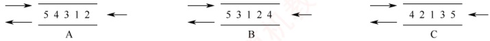
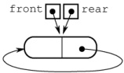
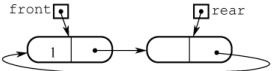

### 3.2.5 本节试题精选

#### 一、 单项选择题

##### 01

栈和队列的主要区别在于（）。

A. 它们的逻辑结构不一样

B. 它们的存储结构不一样

C. 所包含的元素不一样

D. 插入、删除操作的限定不一样

##### 02

队列的“先进先出”特性是指（）。

I. 最后插入队列中的元素总是最后被删除

II. 当同时进行插入、删除操作时，总是插入操作优先

III. 每当有删除操作时，总要先做一次插入操作

IV. 每次从队列中删除的总是最早插入的元素

A. I B. I 和 IV C. II 和 III D. IV

##### 03

允许对队列进行的操作有（）。

A. 对队列中的元素排序

B. 取出最近入队的元素

C. 在队列元素之间插入元素

D. 删除队首元素

##### 04

一个队列的入队顺序是 1, 2, 3, 4，则出队的输出顺序是（）。

A. 4, 3, 2, 1 B. 1, 2, 3, 4 C. 1, 4, 3, 2 D. 3, 2, 4, 1

##### 05

循环队列存储在数组 A[0..n] 中，入队时的操作为（）。

A. rear=rear+1

B. rear=(rear+1) mod (n-1)

C. rear=(rear+1) mod n

D. rear=(rear+1) mod (n+1)

##### 06

已知循环队列的存储空间为数组 A[21]，front 指向队首元素的前一个位置，rear 指向队尾元素，假设当前 front 和 rear 的值分别为 8 和 3，则该队列的长度为（）。

A. 5 B. 6 C. 16 D. 17

##### 07

若用数组 A[0..5] 实现循环队列，且当前 rear 和 front 的值分别为 1 和 5，当从队列中删除一个元素，再加入两个元素后，rear 和 front 的值分别为（）。

A. 3 和 4

B. 3 和 0

C. 5 和 0

D. 5 和 1

##### 08

假设用数组 Q[MaxSize] 实现循环队列，队首指针 front 指向队首元素的前位置，队尾指针 rear 指向队尾元素，则判断该队列为空的条件是（）。

A. Q.rear == (Q.front + 1) % MaxSize

B. (Q.rear + 1) % MaxSize == Q.front + 1

C. (Q.rear + 1) % MaxSize == Q.front

D. Q.rear == Q.front

##### 09

假设循环队列 Q[MaxSize] 的队首指针为 front，队尾指针为 rear，队列的最大容量为 MaxSize，此外，该队列再没有其他数据成员，则判断该队列已满的条件是（）。

A. Q.front==Q.rear

B. Q.front+Q.rear>=MaxSize

C. Q.front==(Q.rear+1)%MaxSize

D. Q.rear==(Q.front+1)%MaxSize

##### 10

假设用 A[0...n] 实现循环队列，front、rear 分别指向队首元素的前一个位置和队尾元素。若用 (rear+1) % (n+1) == front 作为队满标志，则（）。
A. 可用 front==rear 作为队空标志

B. 队列中最多可有 n+1 个元素

C. 可用 front>rear 作为队空标志

D. 可用  $(front+1)\%n+1=rear$ 作为队空标志

##### 11

与顺序队列相比，链式队列的（）。

A. 优点是队列的长度不受限制

B. 优点是入队和出队时间效率更高

C. 缺点是不能进行顺序访问

D. 缺点是不能根据队首指针和队尾指针计算队列的长度

##### 12

下列描述的几种链表中，最适合用作队列的是（）。

A. 带队首指针和队尾指针的循环单链表

B. 带队首指针和队尾指针的非循环单链表

C. 只带队首指针的非循环单链表

D. 只带队首指针的循环单链表

##### 13

下列描述的几种链表中，最不适合用作链式队列的是（）。

A. 只带队首指针的非循环双链表

B. 只带队首指针的循环双链表

C. 只带队尾指针的循环双链表

D. 只带队尾指针的循环单链表

##### 14

在用单链表实现队列时，队头设在链表的（）位置。

A. 链头          B. 链尾          C. 链中          D. 以上都可以

##### 15

用链式存储方式的队列进行删除操作时需要（）。

A. 仅修改头指针

B. 仅修改尾指针

C. 头尾指针都要修改

D. 头尾指针可能都要修改

##### 16

在一个链式队列中，假设队首指针为 front，队尾指针为 rear，x 所指向的元素需要入队，则需要执行的操作为（ ）。

A. front=x，front=front->next

B. x->next=front->next，front=x

C. rear->next=x，rear=x

D. rear->next=x，x->next=NULL，rear=x

##### 17

假设循环单链表表示的队列长度为 n，队头固定在链表尾，若只设头指针，则入队操作的时间复杂度为（）。

A.  $O(n)$ B.  $O(1)$ C.  $O(n^2)$ D.  $O(n \log_2 n)$

##### 18

假设输入序列为 1,2,3,4,5，利用两个队列进行出入队操作，不可能输出的序列是（）。

A. 1,2,3,4,5 B. 5,2,3,4,1 C. 1,3,2,4,5 D. 4,1,5,2,3

##### 19

若以 1,2,3,4 作为双端队列的输入序列，则既不能由输入受限的双端队列得到，又不能由输出受限的双端队列得到的输出序列是（）。

A. 1,2,3,4 B. 4,1,3,2 C. 4,2,3,1 D. 4,2,1,3

##### 20

【2010 统考真题】某队列允许在其两端进行入队操作，但仅允许在一端进行出队操作。若元素 a, b, c, d, e 依次入此队列后再进行出队操作，则不可能得到的出队序列是（）。

A. b, a, c, d, e

B. d, b, a, c, e

C. d, b, c, a, e

D. e, c, b, a, d

##### 21

【2011 统考真题】已知循环队列存储在一维数组 A[0...n-1] 中，且队列非空时 front 和 rear 分别指向队首元素和队尾元素。若初始时队列为空，且要求第一个进入队列的
元素存储在 A[0] 处，则初始时 front 和 rear 的值分别是（）。

A. 0, 0 B. 0, n-1 C. n-1, 0 D. n-1, n-1

##### 22

【2014 统考真题】循环队列放在一维数组 A[0...M-1] 中，end1 指向队首元素，end2 指向队尾元素的最后一个位置。假设队列两端均可进行入队和出队操作，队列中最多能容纳 M-1 个元素。初始时为空。下列判断队空和队满的条件中，正确的是（）。

A. 队空：`end1==end2`； 队满：`end1==(end2+1) mod M`

B. 队空：`end1==end2`； 队满：`end2==(end1+1) mod (M-1)`

C. 队空：`end2==(end1+1)mod M`； 队满：`end1==(end2+1) mod M`

D. 队空：`end1==(end2+1)mod M`； 队满：`end2==(end1+1) mod (M-1)`

##### 23

【2018 统考真题】现有队列 Q 与栈 S，初始时 Q 中的元素依次是 1, 2, 3, 4, 5, 6（1 在队头），S 为空。若仅允许下列 3 种操作：① 出队并输出出队元素；② 出队并将出队元素入栈；③ 出栈并输出出栈元素，则不能得到的输出序列是（）。

A. 1,2,5,6,4,3 B. 2,3,4,5,6,1 C. 3,4,5,6,1,2 D. 6,5,4,3,2,1

##### 24

【2021 统考真题】初始为空的队列 Q 的一端仅能进行入队操作，另外一端既能进行入队操作又能进行出队操作。若 Q 的入队序列是 1,2,3,4,5，则不能得到的出队序列是()。

A. 5,4,3,1,2

B. 5,3,1,2,4

C. 4,2,1,3,5

D. 4,1,3,2,5

#### 二、 综合应用题

##### 01

若希望循环队列中的元素都能得到利用，则需设置一个标志域 tag，并以 tag 的值为 0 或 1 来区分队首指针 front 和队尾指针 rear 相同时的队列状态是“空”还是“满”。试编写与此结构相应的入队和出队算法。

##### 02

Q 是一个队列，S 是一个空栈，实现将队列中的元素逆置的算法。

##### 03

利用两个栈 S1 和 S2 来模拟一个队列，已知栈的 4 个运算定义如下：

```c
Push(S, x); // 元素 x 入栈 S

Pop(S, x); // S 出栈并将出栈的值赋给 x

StackEmpty(S); // 判断栈是否为空

StackOverflow(S); // 判断栈是否为满
```

如何利用栈的运算来实现该队列的 3 个运算（形参由读者根据要求自己设计）？

```c
Enqueue; // 将元素 x 入队

Dequeue; // 出队，并将出队元素存储在 x 中

QueueEmpty; // 判断队列是否为空
```

##### 04

【2019 统考真题】请设计一个队列，要求满足：① 初始时队列为空；② 入队时，允许增加队列占用空间；③ 出队后，出队元素所占用的空间可重复使用，即整个队列所占用的空间只增不减；④ 入队操作和出队操作的时间复杂度始终保持为  $O(1)$。请回答：

1）该队列是应选择链式存储结构，还是应选择顺序存储结构？

2）画出队列的初始状态，并给出判断队空和队满的条件。

3）画出第一个元素入队后的队列状态。

4）给出入队操作和出队操作的基本过程。

### 3.2.6 答案与解析

#### 一、 单项选择题

##### 01

D

栈和队列的逻辑结构都是线性结构，都可以采用顺序存储或链式存储，选项 A 和 B 错误，
限定表中插入和删除操作位置的不同。

##### 02

B

队列 “先进先出” 的特性表现在：先入队列的元素先出队列，后入队列的元素后出队列，入队对应的是插入操作，出队对应的是删除操作。说法 I 和 IV 均正确。

##### 03

D

删除队首元素即出队，是队列的基本操作之一，所以选择选项D。

##### 04

B

队列的入队顺序和出队顺序是一致的，这是和栈不同的。

##### 05

D

数组下标范围为  $0 \sim n$，因此数组容量为  $n+1$。循环队列中元素入队的操作是  $\text{rear} = (\text{rear}+1) \mod \text{maxsize}$，题中  $\text{maxsize} = n+1$。因此入队操作应为  $\text{rear} = (\text{rear}+1) \mod (n+1)$。

##### 06

C

队列的长度为(rear-front+maxsize) %maxsize=(rear-front+21) %21=16。这种情况和 front 指向当前元素，rear 指向队尾元素的下一个元素的计算是相同的。

**注意**

数组 A[n] 的下标范围为  $0 \sim n-1$。若写成 A[0...n]，则说明下标范围为  $0 \sim n$。

##### 07

B

循环队列中，每删除一个元素，队首指针 front = (front + 1) % 6，每插入一个元素，队尾指针 rear = (rear + 1) % 6。上述操作后，front = 0，rear = 3。

##### 08

D

当队列中只有一个元素时，front 指向该元素的前一个位置，rear 指向该元素，因此当队列为空时，队首指针等于队尾指针，这样第一个元素入队后，才能符合题目要求。

##### 09

C

既然不能附加任何其他数据成员，只能采用牺牲一个存储单元的方法来区分是队空还是队满，约定以“队列头指针在队尾指针的下一位置作为队满的标志”，因此选择选项C。选项A是判断队列是否空的条件，选项B和D都是干扰项。

**注意**

对于这类具体问题，举一些特例判断往往比直接思考问题能更快得到答案。

##### 10

A

若用 $(rear+1)\%(n+1)==front$作为队满标志，则说明题目采用了牺牲一个存储单元的方法来区分队空和队满，因此可用 $front==rear$作为队空标志。

##### 11

D

虽然链式队列采用动态分配方式，但其长度也受内存空间的限制，不能无限制增长。顺序队列和链式队列的入队和出队时间复杂度均为  $O(1)$。顺序队列和链式队列都可以进行顺序访问。对于顺序队列，可通过队首指针和队尾指针计算队列中的元素个数，而链式队列则不能。

##### 12

B

因为队列需在双端进行操作，所以选项 C 和 D 的链表显然不太适合链队。对于选项 A，链表在完成入队和出队后还要修改为循环的，对于队列来讲这是多余的（画蛇添足）。对于选项 B，
因为有首指针，所以适合删除首结点；因为有队尾指针，所以适合在其后插入结点。

##### 13

A

因为非循环双链表只带队首指针，所以在执行入队操作时需要修改队尾结点的指针域，而查找队尾结点需要  $O(n)$ 的时间。选项 B、C 和 D 均可在  $O(1)$ 的时间内找到队首和队尾。

##### 14

A

因为在队头做出队操作，为便于删除队首元素，所以总是选择链头作为队头。

##### 15

D

队列采用链式存储时，删除元素要从表头删除，通常仅需修改头指针，但若队列中仅有一个元素，则队尾指针也需要被修改，仅有一个元素时，删除后队列为空，需要修改队尾指针为rear=front。

##### 16

D

插入操作时，先将结点 x 插入到链表尾部，再让 rear 指向这个结点 x。选项 C 的做法不够严密，因为是队尾，所以队尾 x -> next 必须置为空。

##### 17

A

依题意，入队操作是在队尾进行，即链表表头。题中已明确说明链表只设头指针，即没有头结点和尾指针，入队后，循环单链表必须保持循环的性质，在只带头指针的循环单链表中寻找表尾结点的时间复杂度为  $O(n)$，所以入队的时间复杂度为  $O(n)$。

##### 18

B

此类题可对各选项进行模拟，假设队列为  $Q_{1}$ 和  $Q_{2}$。对于选项 A，元素依次入队  $Q_{1}$，然后依次出队。对于选项 B，5 最先出队，只可能是 1,2,3,4 入队  $Q_{1}$，5 入队  $Q_{2}$，然后 5 出队，只能得到 5,1,2,3,4。对于选项 C，1,2,5 入队  $Q_{1}$，3,4 入队  $Q_{2}$，然后按要求出队。选项 D 的分析同选项 C。

##### 19

C

使用排除法。先看可由输入受限的双端队列产生的序列：设右端输入受限，1,2,3,4依次左入，则依次左出可得4,3,2,1，排除选项A；左出、右出、左出、左出可得到4,1,3,2，排除选项B；再看可由输出受限的双端队列产生的序列：设右端输出受限，1,2,3,4依次左入、左入、右入、左入，依次左出可得到4,2,1,3，排除选项D。

##### 20

C

本题的队列实际上是一个输出受限的双端队列，如图3.11所示。A操作：a左入（或右入）、b左入、c右入、d右入、e右入。B操作：a左入（或右入）、b左入、c右入、d左入、e右入。D操作：a左入（或右入）、b左入、c左入、d右入、e左入。C操作：a左入（或右入）、b右入、d右入、e右入，此时只能入队，c怎么进都不可能在b和a之间。

【另解】初始时队列为空，第1个元素a左入（或右入）后，第2个元素b无论是左入还是右入都必与a相邻，而选项C中a与b不相邻，不合题意。

##### 21

B

根据题意，第一个元素进入队列后存储在 A[0] 处，此时 front 和 rear 值都为 0。入队时因为要执行 (rear+1) %n 操作，所以若入队后指针指向 0，则 rear 初值为 n-1，而因为第一个元素在 A[0] 中，插入操作只改变 rear 指针，所以 front 为 0 不变。

**注意**

① 循环队列是指顺序存储的队列，而不是指逻辑上的循环，如循环单链表表示的队列不能称为循环队列。② front 和 rear 的初值并不是固定的。
##### 22

A

end1 指向队首元素，可知出队操作是先从 A[end1] 读数，然后 end1 再加 1。end2 指向队尾元素的后一个位置，可知入队操作是先存数到 A[end2]，然后 end2 再加 1。若用 A[0] 存储第一个元素，则队列初始时，入队操作先把数据放到 A[0] 中，然后 end2 自增，即可知 end2 初值为 0；而 end1 指向的是队首元素，队首元素在数组 A 中的下标为 0，所以得知 end1 的初值也为 0，可知队空条件为 `end1 == end2`；然后考虑队列满时，因为队列最多能容纳 M-1 个元素，假设队列存储在下标为 0 到 M-2 的 M-1 个区域，队头为 A[0]，队尾为 A[M-2]，此时队列满，考虑在这种情况下 end1 和 end2 的状态，end1 指向队首元素，可知 end1=0，end2 指向队尾元素的后一个位置，可知 end2=M-2+1=M-1，所以队满条件为 `end1 == (end2+1) mod M`。

##### 23

C

选项 A 的操作顺序为①②②①③③。选项 B 的操作顺序为②①①③。选项 D 的操作顺序为②②②③③④。对于选项 C：首先输出 3，说明 1 和 2 必须先依次入栈，而此后 2 肯定比 1 先输出，因此无法得到 1，2 的输出顺序。

##### 24

D

假设队列左端允许入队和出队，右端只能入队。对于选项A，依次从右端入队1,2，再从左端入队3,4,5。对于选项B，从右端入队1,2，然后从左端入队3，再从右端入队4，最后从左端入队5。对于选项C，从左端入队1,2，然后从右端入队3，再从左端入队4，最后从右端入队5。无法验证选项D的序列。



#### 二、 综合应用题

##### 01

【解答】

在循环队列的类型结构中，增设一个整型变量 tag，入队时置 tag 为 1，出队时置 tag 为 0（因为只有入队操作可能导致队满，也只有出队操作可能导致队空）。队列 Q 初始时，置 tag=0、front=rear=0。这样队列的 4 要素如下：

队空条件：`Q.front==Q.rear` 且 `Q.tag==0`。

队满条件：`Q.front==Q.rear` 且 `Q.tag==1`。

入队操作：Q.data[Q.rear]=x；Q.rear=(Q.rear+1) %MaxSize；Q.tag=1。

出队操作：x=Q.data[Q.front]; Q.front=(Q.front+1) %MaxSize; Q.tag=0.

1）设“tag”法的循环队列入队算法：

```c
int EnQueue1(SqQueue &Q, ElemType x) {
    if (Q.`front == Q.rear & Q.tag == 1)`
        return 0;
    //两个条件都满足时则队满
    Q.data[Q.rear] = x;
    Q.rear = (Q.rear + 1) % MaxSize;
    Q.tag = 1; //可能队满
    return 1;
}
```

2）设“tag”法的循环队列出队算法：

```c
int DeQueue1(SqQueue &Q, ElemType &x) {
    if (Q.`front == Q.rear & Q.tag == 0)`
        return 0;
    //两个条件都满足时则队空
    x = Q.data[Q.front];
    Q.front = (Q.front + 1) % MaxSize;
    Q.tag = 0; //可能队空
return 1;
```

##### 02

【解答】

本题主要考查大家对队列和栈的特性与操作的理解。因为对队列的一系列操作不可能将其中的元素逆置，而栈可以将入栈的元素逆序提取出来，所以我们可以让队列中的元素逐个地出队，入栈；全部入栈后再逐个出栈，入队。

算法的实现如下：

```c
void Inverser(Stack &S, Queue &Q) {
    //本算法实现将队列中的元素逆置
    while (!QueueEmpty(Q)) {
        x = DeQueue(Q);
        Push(S, x);
    }
    while (!StackEmpty(S)) {
        Pop(S, x);
        EnQueue(Q, x);
    }
}
```

##### 03

【解答】

利用两个栈 S1 和 S2 来模拟一个队列，当需要向队列中插入一个元素时，用 S1 来存放已输入的元素，即 S1 执行入栈操作。当需要出队时，则对 S2 执行出栈操作。因为从栈中取出元素的顺序是原顺序的逆序，所以必须先将 S1 中的所有元素全部出栈并入栈到 S2 中，再在 S2 中执行出栈操作，即可实现出队操作，而在执行此操作前必须判断 S2 是否为空，否则会导致顺序混乱。当栈 S1 和 S2 都为空时队列为空。

总结如下：

1）对 S2 的出栈操作用作出队，若 S2 为空，则先将 S1 中的所有元素送入 S2。

2）对 S1 的入栈操作用作入队，若 S1 为满，则必须先保证 S2 为空，才能将 S1 中的元素全部插入 S2 中。

入队算法：

```c
int EnQueue(Stack &S1, Stack &S2, ElemType e) {
    if (!StackOverflow(S1)) {
        Push(S1, e);
        return 1;
    }
    if (StackOverflow(S1) && !StackEmpty(S2)) {
        printf("队列为满");
        return 0;
    }
    if (StackOverflow(S1) && StackEmpty(S2)) {
        while (!StackEmpty(S1)) {
            Pop(S1, x);
            Push(S2, x);
        }
    }
    Push(S1, e);
    return 1;
}

出队算法：
void DeQueue(Stack &S1, Stack &S2, ElemType &x) {
    if (!StackEmpty(S2)) {
        Pop(S2, x);
    }
    else if (StackEmpty(S1)) {
printf("队列为空");
}
else{
    while(!StackEmpty(S1)) {
        Pop(S1, x);
        Push(S2, x);
    }
    Pop(S2, x);
}
```

判断队列为空的算法：
```c
int QueueEmpty(Stack S1, Stack S2) {
    if (StackEmpty(S1) && StackEmpty(S2))
        return 1;
    else
        return 0;
}
```

##### 04

【解答】

1）顺序存储无法满足要求②的队列占用空间随着入队操作而增加。根据要求来分析：要求①容易满足；链式存储方便开辟新空间，要求②容易满足；对于要求③，出队后的结点并不真正释放，用队首指针指向新的队头结点，新元素入队时，有空余结点则无须开辟新空间，赋值到队尾后的第一个空结点即可，然后用队尾指针指向新的队尾结点，这就需要设计成一个首尾相接的循环单链表，类似于循环队列的思想。设置队头、队尾指针后，链式队列的入队操作和出队操作的时间复杂度均为 $O(1)$，要求④可以满足。因此，采用链式存储结构（两段式单向循环链表），队首指针为front，队尾指针为rear。

2）该循环链式队列的实现可以参考循环队列，不同之处在于循环链式队列可以方便地增加空间，出队的结点可以循环利用，入队时空间不够也可以动态增加。同样，循环链式队列也

要区分队满和队空的情况，这里参考循环队列牺牲一个单元来判断。初始时，创建只有一个空结点的循环单链表，头指针 front 和尾指针 rear 均指向空结点，如右图所示。



队空的判定条件：front==rear。

队满的判定条件：front==rear->next。

3）插入第一个元素后的状态如下图所示。



4）操作的基本过程如下：

入队操作：
若（front==rear->next）/队满
则在rear后面插入一个新的空闲结点；
入队元素保存到rear所指结点中；rear=rear->next；返回。
出队操作：
若（front==rear）/队空
则出队失败，返回；
取 front 所指结点中的元素 e； $\text{front}=\text{front}-\text{next}$；返回 e。
