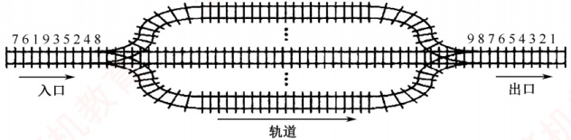
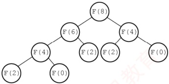
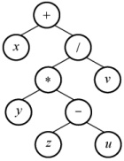

### 3.3.6 本节试题精选

#### 一、 单项选择题

##### 01

栈的应用不包括（）。

A. 递归 B. 表达式求值 C. 括号匹配 D. 缓冲区

##### 02

表达式  $a*(b+c)-d$ 的后缀表达式是（）。

A.  $abcd++$ B.  $abc+*d-$ C.  $abc*+d-$ D.  $-+*abcd$

##### 03

下面（）用到了队列。

A. 括号匹配 B. 表达式求值 C. 递归 D. FIFO 页面替换算法

##### 04

利用栈求表达式的值时，设立运算数栈 OPEN。假设 OPEN 只有两个存储单元，则在下列表达式中，不会发生溢出的是（）。

A. A - B * (C - D) B. (A - B) * C - D C. (A - B * C) - D D. (A - B) * (C - D)

##### 05

执行下列语句段后，i 的值为（）。

```c
int f(int x) {

    return ((x>0) ? x*f(x-1):2);

}

int i;

i = f(f(1));
```

A. 2 B. 4 C. 8 D. 无限递归
##### 06

设有如下递归函数，则计算 F(8) 需要调用该递归函数的次数为（ ）。

```c
int F(int n) {

    if (n<=3) return 1;

    else return F(n-2)+F(n-4)+1;

}
```

A. 7

B. 8

C. 9

D. 10

##### 07

设有如下递归函数，在  $\text{func}( \text{func}(5))$ 的执行过程中，第4个被执行的  $\text{func}$ 函数是()。

 $\text{int func}( \text{int } x ) \{$

 $\text{if } (x <= 3) \text{ return } 2 ;$

 $\text{else return \text{func}(x-2) + \text{func}(x-4) ;}$

\}

A.  $\text{func}(2)$ B.  $\text{func}(3)$ C.  $\text{func}(4)$ D.  $\text{func}(5)$

##### 08

对于一个问题的递归算法求解和其相对应的非递归算法求解，( )。

A. 递归算法通常效率高一些

B. 非递归算法通常效率高一些

C. 两者相同

D. 无法比较

##### 09

执行函数时，其局部变量一般采用（）进行存储。

A. 树形结构 B. 静态链表 C. 栈结构 D. 队列结构

##### 10

执行（）操作时，需要使用队列作为辅助存储空间。

A. 查找散列（哈希）表

B. 广度优先搜索图

C. 前序（根）遍历二叉树

D. 深度优先搜索图

##### 11

下列说法中，正确的是（）。

A. 消除递归不一定需要使用栈

B. 对同一输入序列进行两组不同的合法入栈和出栈组合操作，所得的输出序列也一定相同

C. 通常使用队列来处理函数或过程调用

D. 队列和栈都是运算受限的线性表，只允许在表的两端进行运算

##### 12

【2009 统考真题】为解决计算机主机与打印机之间速度不匹配的问题，通常设置一个打印数据缓冲区，主机将要输出的数据依次写入该缓冲区，而打印机则依次从该缓冲区中取出数据。该缓冲区的逻辑结构应该是（）。

A. 栈 B. 队列 C. 树 D. 图

##### 13

【2012 统考真题】已知操作符包括“+”“-”“*”“/”“(”和“)”。将中级表达式  $a + b - a \times ((c + d) / e - f) + g$ 转换为等价的后缀表达式  $ab + acd + e / f - x - g + t$，用栈来存放暂时还不能确定运算次序的操作符。栈初始时为空，转换过程中同时保存在栈中的操作符的最大个数是（）。

A. 5 B. 7 C. 8 D. 11

##### 14

【2014 统考真题】假设栈初始为空，将中级表达式  $a/b + (c \times d - e \times f)/g$ 转换为等价的后缀表达式的过程中，当扫描到 f 时，栈中的元素依次是（）。
```c

A. +(*- B. +(-* C. /+(*-*) D. /+-*)
```

##### 15

【2015统考真题】已知程序如下：

```c
int S(int n)

{

    return (n<=0) ? 0 : S(n-1) + n;

    void main()

{

        cout<<S(1);

    }

}
```

程序运行时使用栈来保存调用过程的信息，自栈底到栈顶保存的信息依次对应的是()。
A.  $\operatorname{main}()\to\mathrm{S}(1)\to\mathrm{S}(0)$

B.  $\mathrm{S}(0)\to\mathrm{S}(1)\to\operatorname{main}()$

C.  $\operatorname{main}()\to\mathrm{S}(0)\to\mathrm{S}(1)$

D.  $\mathrm{S}(1)\to\mathrm{S}(0)\to\operatorname{main}()$

##### 16

【2016 统考真题】设有如下图所示的火车车轨，入口和出口之间有 n 条轨道，列车的行进方向均为从左至右，列车可驶入任意一条轨道。现有编号为 1~9 的 9 列列车，驶入的次序依次是 8,4,2,5,3,9,1,6,7。若期望驶出的次序依次为 1~9，则 n 至少是（）。



A. 2 B. 3 C. 4 D. 5

##### 17

【2017 统考真题】下列关于栈的叙述中，错误的是（）。

I. 采用非递归方式重写递归程序时必须使用栈

II. 函数调用时，系统要用栈保存必要的信息

III. 只要确定了入栈次序，即可确定出栈次序

IV. 栈是一种受限的线性表，允许在其两端进行操作

A. 仅 I B. 仅 I、II、III C. 仅 I、III、IV D. 仅 II、III、IV

##### 18

【2018 统考真题】若栈 S1 中保存整数，栈 S2 中保存运算符，函数 F()依次执行下述各步操作：

1）从 S1 中依次弹出两个操作数 a 和 b。

2）从 S2 中弹出一个运算符 op。

3）执行相应的运算 b op a。

4）将运算结果压入 S1 中。

假定 S1 中的操作数依次是 5, 8, 3, 2（2 在栈顶），S2 中的运算符依次是 $^{*}$、–、+（+在栈顶）。调用 3 次 F() 后，S1 栈顶保存的值是（）。

A. -15 B. 15 C. -20 D. 20

##### 19

【2024 统考真题】与表达式  $x + y \cdot (z - u)/v$ 等价的后缀表达式是（）。

A.  $xyzu - *v/+$ B.  $xyzu - v/*+$ C.  $+x/*y - zuv$ D.  $+x*y / - zuv$

##### 20

【2025 统考真题】已知算法 A 用于检查字符串中各类括号是否匹配，A 执行过程中使用初始为空的栈保存遇到的括号。若栈的容量是 3，则下列选项中，A 不能处理的是（）。

A.  $(a+[b+(c+d)/e]+f)+g-h$ B.  $[a\times((b+c)/(d-e)+f/g)-h]$

C.  $[a\times(b-(c-d)\times e)/(f+g))-h]$ D.  $[a-(b+[c\times(d+e)-f]+g+h)]$

#### 二、 综合应用题

##### 01

假设一个算术表达式中包含圆括号、方括号和花括号 3 种类型的括号，编写一个算法来判别表达式中的括号是否配对，以字符“\0”作为算术表达式的结束符。

### 3.3.7 答案与解析

#### 一、 单项选择题

##### 01

D

缓冲区是用队列实现的，选项 A、B、C 都是栈的典型应用。
##### 02

B

后缀表达式中，每个运算符均直接位于其两个操作数的后面，按照这样的方式逐步根据计算的优先级将每个计算式进行变换，即可得到后缀表达式。

【另解】将两个直接操作数用括号括起来，再将操作符提到括号后，最后去掉括号。例如，对于 $(①(②a*(③b+c))-d)$，提出操作符并去掉括号后，可得后缀表达式为 $abc+*d-$。

学完第5章后，可将表达式画成二叉树的形式，再用后序遍历即可求得后缀表达式。

##### 03

D

FIFO 页面替换算法用到了队列。其余的都只用到了栈。

##### 04

B

利用栈求表达式的值时，可以分别设立运算符栈和运算数栈，其原理不变。选项 B 中 A 入栈，B 入栈，计算得 R1，C 入栈，计算得 R2，D 入栈，计算得 R3，由此得栈深为 2。选项 A、C、D 依次计算得栈深为 4、3、3。因此选择选项 B。

**技巧**
```c

根据运算符优先级，统计已依次入栈但还未参与计算的运算符数。以选项 C 为例，当 “（”“A”“-”入栈时，“（” 和 “-” 还未参与运算，此时运算符栈大小为 2，“B” 和 “*” 入栈时运算符大小为 3，“C” 入栈时 “B*C” 运算，运算符栈大小为 2，以此类推。
```

##### 05

B

栈与递归有着紧密的联系。递归模型包括递归出口和递归体两个方面。递归出口是递归算法的出口，即终止递归的条件。递归体是一个递推的关系式。根据题意有

 $f(0)=2$;

 $f(1)=1*f(0)=2$;

 $f(f(1))=f(2)=2*f(1)=4$。

##### 06

C

计算 F(8) 的递归调用树如右图所示：

由图可知，递归函数 F() 调用的次数为 9。



##### 07

C

首先，执行内层参数 func(5)=func(3)+

func(1)=4，共执行 3 次 func 函数。然后，执行 func(func(5))=func(4)=func(2)+ func(0)=4，因此第 4 个被执行的 func 函数是 func(4)。也可以采用画出递归调用树的方式，即某个函数的执行次序等于其在递归调用树的先序遍历中的次序。

##### 08

B

通常情况下，递归算法在计算机实际执行的过程中包含很多的重复计算，所以效率会低。

##### 09

C

调用函数时，系统会为调用者构造一个由参数表和返回地址组成的活动记录，并将记录压入系统提供的栈中，若被调用函数有局部变量，也要压入栈中。

##### 10

B

本题涉及第5章和第6章的内容，图的广度优先搜索类似于树的层序遍历，都要借助于队列。

##### 11

A

使用栈可以模拟递归的过程，以此来消除递归，但对于单向递归和尾递归而言，可以用迭代的方式来消除递归，选项 A 正确。不同的入栈和出栈组合操作，会产生许多不同的输出序列，B
错误。通常使用栈来处理函数或过程调用，选项C错误。队列和栈都是操作受限的线性表，但只有队列允许在表的两端进行运算，而栈只允许在栈顶方向进行操作，选项D错误。

##### 12

B

在提取数据时必须保持原来数据的顺序，所以缓冲区的特性是先进先出。

##### 13

A

在中缀表达式转后缀表达式的过程中，扫描到操作数时直接输出，扫描到操作符时根据其优先级进行相应的出入栈操作。有几点需要注意：①若遇到界限符“（”，则直接入栈；②若遇到界限符“）”，则不入栈，且依次弹出栈顶运算符，直到遇到“（”为止，并删除“（”；③若当前运算符的优先级高于栈顶运算符或遇到栈顶为“（”，则直接入栈；④若当前运算符的优先级低于或等于栈顶运算符，则依次弹出栈中的运算符并加入后缀表达式，直到遇到一个优先级低于它的运算符或遇到“（”或栈空为止，之后将当前运算符入栈。

求栈中操作符的最大个数时，为简单起见，可省略对操作数的处理。

| 步 | 待处理运算符 | 栈 | 扫描运算符 | 动作 |
| --- | --- | --- | --- | --- |
| 1 | +b-a*((c+d)/e-f)+g |   | + | +入栈 |
| 2 | -a*((c+d)/e-f)+g | + | - | -优先级等于栈顶+，弹出+，-入栈 |
| 3 | *((c+d)/e-f)+g | - | * | *优先级高于栈顶-，*入栈 |
| 4 | ((c+d)/e-f)+g | -* | ( | （直接入栈 |
| 5 | (c+d)/e-f)+g | -*(( | ( | （直接入栈 |
| 6 | +d)/e-f)+g | -*(( | + | 栈顶为（，+直接入栈 |
| 7 | )/e-f)+g | -*((+ | ) | 遇到)，弹出+，删除（ |
| 8 | /e-f)+g | -*(( | / | 栈顶为（，/直接入栈 |
| 9 | -f)+g | -*(( | - | -优先级低于栈顶/，弹出/，-入栈 |
| 10 | )+g | -*(- | ) | 遇到)，弹出-，删除（ |
| 11 | +g | -* | + | +优先级低于栈顶*，等于-，依次弹出*和-；+入栈 |
| 12 |   | + |   |   |

由上述过程可知，栈中操作符的最大个数为5。

##### 14

B
```c

中缀表达式 a/b+ (c*d-e*f) /g 转换为后缀表达式的过程如下：
```

| 步 | 待处理序列 | 栈 | 后缀表达式 | 扫描项 | 动作 |
| --- | --- | --- | --- | --- | --- |
| 1 | a/b+(c*d-e*f)/g |   |   | a | a加入后缀表达式 |
| 2 | /b+(c*d-e*f)/g |   | a | / | /入栈 |
| 3 | b+(c*d-e*f)/g | / | a | b | b加入后缀表达式 |
| 4 | +(c*d-e*f)/g | / | ab | + | +优先级低于栈顶的/,弹出/,+入栈 |
| 5 | (c*d-e*f)/g | + | ab/ | ( | （入栈 |
| 6 | c*d-e*f)/g | + | ab/ | c | c加入后缀表达式 |
| 7 | *d-e*f)/g | + | ab/c | * | 栈顶为（，*入栈 |
| 8 | d-e*f)/g | + | ab/c | d | d加入后缀表达式 |
| 9 | -e*f)/g | + | ab/cd | - | -优先级低于栈顶的*，弹出*，-入栈 |
| 10 | e*f)/g | + | ab/cd* | e | e加入后缀表达式 |
| 11 | *f)/g | + | ab/cd*e | * | *优先级高于栈顶的-，*入栈 |
| 12 | f)/g | + | ab/cd*e | f | f加入后缀表达式 |
| 13 | )/g | + | ab/cd*ef | ) | 遇到），依次弹出*、-加入表达式，删除（ |
| 14 | /g | + | ab/cd*ef*- | / | /优先级高于栈顶的+，/入栈 |
| 15 | g | + | ab/cd*ef*- | g | g加入后缀表达式 |
| 16 |   | + | ab/cd*ef*-g |   | 扫描完毕，运算符依次弹出加入表达式 |
| 17 |   |   | ab/cd*ef*-g/+ |   | 完成 |

由此可知，当扫描到 f 时，栈中的元素依次是+（-★。
```c

【另解】采用手算方法，得出中缀式 a/b+ (c*d-e*f)/g 对应的后缀式为 ab/cd*ef*-g/+。中缀表达式转后缀表达式时，操作数都直接输出，因此操作数的顺序是固定的。扫描到 f 时，在后缀表达式 f 后面的运算符要么还未入栈，要么还在栈中，需要结合中缀式来判断，f 后面依次出栈的运算符为*-/+，/在中缀表达式 f 之后，此时还未入栈，因此栈中的运算符（从栈底到栈顶）为+-*；此外，已入栈的界限符（此时还未消解，因此（也还在栈中，栈中的元素依次是+(-*。
```

##### 15

A

递归调用函数时，在系统栈中保存的函数信息需满足先进后出的特点，依次调用了main()，S(1)，S(0)，所以栈底到栈顶的信息依次是main()，S(1)，S(0)。

**注意**

在递归中，系统为每一层的返回点、局部变量、传入实参等开辟了递归工作栈来存储。

##### 16

C

根据题意：入队顺序为8,4,2,5,3,9,1,6,7，出队顺序为1~9。入口和出口之间有多个队列（n条轨道），且每个队列（轨道）可容纳多个元素（多列列车），为便于区分，队列用字母编号。分析如下：显然先入队的元素必须小于后入队的元素（否则，若8和4入同一个队列，8在4前面，则出队时也只能8在4前面），这样8入队列A，4入队列B，2入队列C，5入队列B（按照前述原则“大的元素在小的元素后面”也可将5入队列C，但这时剩下的元素3就必须放入一个新的队列中，无法确保“至少”），3入队列C，9入队列A，这时共占了3个队列，后面还有元素1，直接再用一个新的队列D，1从队列D出队后，剩下的元素6和7或入队列B，或入队列C。综上，共占用了4个队列。当然还有其他的入队、出队情况，请读者自己推演，但要确保满足：①队列中后面的元素大于前面的元素；②确保占用最少（满足题意中“至少”）的队列。

##### 17

C

说法Ⅰ的反馈：计算斐波那契数列迭代实现只需要一个循环即可实现。说法Ⅲ的反馈：入栈序列为1,2，进行Push，Push，Pop，Pop操作，出栈次序为2、1；进行Push，Pop，Push，Pop操作，出栈次序为1,2。说法Ⅳ，栈是一种受限的线性表，只允许在一端进行操作。说法Ⅱ正确。

##### 18

B
```c

第一次调用：①从 S1 中弹出 2 和 3；②从 S2 中弹出+；③执行 3+2=5；④将 5 压入 S1 中，第一次调用结束后 S1 中剩余 5、8、5（5 在栈顶），S2 中剩余*、-（-在栈顶）。第二次调用：①从 S1 中弹出 5 和 8；②从 S2 中弹出-；③执行 8-5=3；④将 3 压入 S1 中，第二次调用结束后 S1 中剩余 5、3（3 在栈顶），S2 中剩余*。第三次调用：①从 S1 中弹出 3 和 5；②从 S2 中弹出*；③执行 5*3=15；④将 15 压入 S1 中，第三次调用结束后 S1 中仅剩余 15，S2 为空。
```

##### 19

A

根据中缀表达式画出对应的二叉树如右图所示，对该二叉树进行后序遍历即可得到后缀表达式为  $xyzu-*v/+$。本题也可采用本书前面描述的手算方法。



##### 20

D

该算法利用栈来检查括号匹配：遇到左括号时入栈，遇到右括号时出栈并与之匹配。由于栈的容量为3，因此最多只能容纳3个未匹配的左括号，即最多支持3层嵌套的括号结构。逐项分析各选项的括号嵌套深度：对于选项A，括号序列为([()])，最大嵌套深度为3，依次入栈([
未超过栈容量。对于选项 B，括号序列为[(())]，最大深度为 3，依次入栈[((，栈容量足够。对于选项 C，括号序列为[(())]，同样最大深度为 3，栈容量足够。对于选项 D，括号序列为[([()]]，最大嵌套深度达到 4。扫描至*后的(时，栈中已存有[([三个左括号，此时，需要将第四个左括号(入栈，但栈容量仅为 3，无法继续入栈，因此该表达式无法被正确处理。

#### 二、 综合应用题

##### 01

【解答】

括号匹配是栈的一个典型应用，给出这道题是希望读者好好掌握栈的应用。算法的基本思想是扫描每个字符，遇到花、方、圆的左括号时入栈，遇到花、方、圆的右括号时检查栈顶元素是否为相应的左括号，若是，出栈，否则配对错误。最后栈若不为空也为错误。

```c
bool BracketsCheck(char *str) {
    InitStack(S); //初始化栈
    int i=0;
    while(str[i] != '0') {
        switch(str[i]) {
            //左括号入栈
            case ('(: Push(S,'('); break;
            case ['(: Push(S,'['); break;
            case ('(: Push(S,{'('); break;
            //遇到右括号，检测栈顶
            case ')：Pop(S,e);
                if(e!=('() return false;
            break;
            case ')：Pop(S,e);
                if(e!='() return false;
            break;
        }
        case ')：Pop(S,e);
        if(e!='() return false;
        break;
        if(e!='() return false;
        break;
```
        default:
```c
            break;
        } //switch
        i++;
        } //while
        if(!StackEmpty(S)) {
            printf("括号不匹配\n");
            return false;
        }
        else {
            printf("括号匹配\n");
            return true;
        }
    }
```
