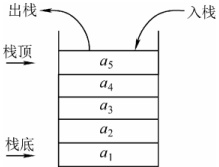
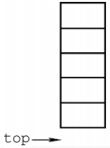
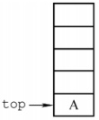
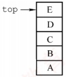
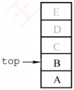
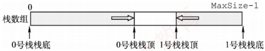
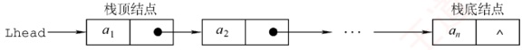

## 3.1 栈

### 3.1.1 栈的基本概念

#### 1. 栈的定义

### 考点追踪 栈的特点（2017）

栈（Stack）是仅允许在一端进行插入和删除操作的线性表。作为一种特殊的线性表，栈的插入（入栈）和删除（出栈）操作被限制在表的一端进行，如图3.1所示。
栈顶（Top）：允许进行插入和删除操作的一端。

栈底（Bottom）：固定不变、不允许进行插入和删除操作的另一端。

空栈：不含任何元素的栈。

### 考点追踪 出入栈序列的分析（2010、2011、2013、2018、2020、2022）

假设某栈  $S=(a_{1},a_{2},a_{3},a_{4},a_{5})$，如图3.1所示，其中  $a_{1}$ 为栈底元素， $a_{5}$ 为栈顶元素。栈的入栈和出栈操作只能在栈顶进行。若元素按顺序  $a_{1},a_{2},a_{3},a_{4},a_{5}$ 入栈，则出栈顺序为  $a_{5},a_{4},a_{3},a_{2},a_{1}$。由此可见，栈的操作特性可概括为后进先出（Last In First Out，LIFO）。



图3.1 栈的示意图

**注意**

每接触一种新的数据结构，都应从其逻辑结构、存储结构和基本运算三方面进行系统理解。

#### 2. 栈的基本操作

不同教材对基本操作的命名略有差异，但含义基本一致，本文采用严蔚敏教材的命名规范。

InitStack(&S): 初始化一个空栈 S。

• StackEmpty(S)：判断栈是否为空。若栈 S 为空，返回 true；否则返回 false。

```asm
Push(&S,x): 入栈操作；若栈未满，则x成为新的栈顶元素。

Pop（&S，&x）：出栈操作；若栈非空，则弹出栈顶元素，并通过 x 返回该值。
```

• GetTop(S, &x)：读取栈顶元素但不出栈；若栈非空，则通过 x 返回栈顶元素。

● DestroyStack(&S)：销毁栈 S，并释放其所占用的存储空间（&表示引用调用）。

在解答算法题时，若题目未作特殊限制，可直接使用上述基本操作函数。

### 考点追踪 Catalan 数的应用（2015）

栈的数学性质：当 n 个不同元素按固定次序入栈时，可能的出栈序列总数为  $\frac{1}{n+1}C_{2n}^{n}$。该数列称为卡特兰（Catalan）数，可通过数学归纳法证明，有兴趣的读者可参考组合数学教材。

### 3.1.2 栈的顺序存储结构

与线性表类似，栈也有两种基本的存储方式：顺序存储和链式存储。

#### 1. 顺序栈的实现

米用顺序存储的栈称为顺序栈，它利用一组地址连续的存储单元存放从栈底到栈顶的数据元素，并附设一个整型指针（top）指示当前栈顶元素的位置。

顺序栈的类型可定义如下

```c
#define MaxSize 50
typedef struct{
    Elemtype data[MaxSize];
    int top;
}SqStack;

//定义栈中元素的最大个数
//存放栈中元素
//栈顶指针
```

栈顶指针：S.top，初始时设为 S.top=-1；栈顶元素：S.data[S.top]。

入栈操作：当栈未满时，先将栈顶指针加1，再将元素存入栈顶。

出栈操作：当栈非空时，先取出栈顶元素，再将栈顶指针减1。

栈空条件：`S.top==-1`；栈满条件：`S.top==MaxSize-1`；栈长：`S.top+1`。

另一种常见的方式是：栈顶指针初始化为 s.top=0；入栈时先将元素存入栈顶，再将栈顶指针加 1；出栈时先将栈顶指针减 1，再取出栈顶元素；栈空条件为 s.top==0；栈满条件为
S.top==MaxSize.

顺序栈的入栈操作受数组上界约束。若对栈的最大使用空间估计不足，则可能发生栈上溢，此时，应向用户报告错误信息，以便及时处理，避免程序异常。

**注意**

栈和队列的判空、判满条件，会因实际给出的条件不同而变化，下面的代码实现是在栈顶指针初始化为-1的条件下的相应方法，而其他情况则需具体问题具体分析。

#### 2. 顺序栈的基本操作

### 考点追踪 出/入栈操作的模拟（2009）

栈操作的示意图如图3.2所示，图3.2(a)为空栈，图3.2(c)为A、B、C、D、E依次入栈后的状态，图3.2(d)为在图3.2(c)基础上E、D、C相继出栈后的结果，此时栈中剩余2个元素。尽管C、D、E可能仍保留在原存储单元中，但top指针已指向新的栈顶，因此它们已不属于当前栈的内容。读者应结合该图理解栈顶指针的作用：它标识了栈中有效元素的边界。



(a) 空栈



(b) 1 个元素



(c) 5 个元素



(d)2个元素

图3.2 栈顶指针和栈中元素之间的关系

以下是顺序栈常用基本操作的实现（基于 top=-1 初始化）。

（1）初始化

```c
void InitStack(SqStack &S) {
    S.top=-1;
    //初始化栈顶指针
}
```

（2）判栈空

```c
bool StackEmpty(SqStack S){
    if(S.top==-1) //栈空
        return true;
    else //不空
    return false;
}
```

（3）入栈

```c
bool Push(SqStack &S,ElemType x){
    if(S.top==MaxSize-1) //栈满，报错
        return false;
    S.data[++S.top]=x; //指针先加1，再入栈
    return true;
}
```

（4）出栈

```c
bool Pop(SqStack &S,ElemType &x){
    if(S.top==-1) //栈空，报错
        return false;
    x=S.data[S.top--]; //先出栈，指针再减1
    return true;
}
```
（5）读栈顶元素

```c
bool GetTop(SqStack S,ElemType &x){
    if(S.top==-1) //栈空，报错
        return false;
    x=S.data[S.top]; //x记录栈顶元素
    return true;
}
```

该操作不改变栈的状态，栈顶元素依然保留在栈中。

**注意**

此处，top指向栈顶元素本身。因此入栈为S.data[++S.top]=x，出栈为x=S.data[S.top--]。若top初始化为0（指向栈顶元素的下一个位置），则入栈变为S.data[S.top++]=x，出栈变为x=S.data[--S.top]，相应的判空、判满条件也随之改变。请读者仔细体会差异，做题时务必根据题目设定灵活应对。

#### 3. 共享栈

利用栈底位置相对固定的特性，可让两个顺序栈共享同一段一维数组空间，将两个栈的栈底分别置于数组两端，栈顶向中间延伸，如图3.3所示。



图3.3 两个顺序栈共享存储空间

0号栈栈顶指针为top0，1号栈栈顶指针为top1，均指向各自的栈顶元素；初始时top0=-1（0号栈空），top1=MaxSize（1号栈空）；栈满条件为top1-top0==1（两栈顶相邻）。当0号栈入栈时，top0先加1，再赋值；当1号栈入栈时，top1先减1，再赋值；出栈操作的顺序相反。

共享栈能更高效地利用存储空间，两个栈的空间可动态调节，仅当整个数组被占满时，才发生栈溢出。其存取数据的时间复杂度均为  $O(1)$，对存取效率无影响。

### 3.1.3 栈的链式存储结构

采用链式存储的栈称为链栈。其优点是便于动态分配存储空间，不存在栈满溢出的问题，且在多栈共存的场景下能更灵活地利用内存。通常使用单链表实现链栈，并且规定所有操作均在链表的表头进行。此处约定链栈不带头结点，栈顶指针 Lhead 直接指向栈顶元素，如图 3.4 所示。



图3.4 栈的链式存储

链栈的类型可定义为

```c
typedef struct LinkNode{
    ElemType data;
    struct LinkNode *next;
} LiStack;

//数据域
//指针域
//链栈类型定义
```

由于采用链式存储，结点的插入与删除操作非常高效。链栈的操作与单链表类似，入栈和出栈均在表头进行。注意，对于带头结点的链栈，其初始化、判空及操作细节会有所不同；而本节所述实现基于无头结点的设计，读者应根据实际需求灵活调整实现方式。
