## 3.2 队列

### 3.2.1 队列的基本概念

#### 1. 队列的定义

队列（Queue）简称队，也是一种操作受限的线性表，仅允许在表的一端进行插入，而在另一端进行删除。向队列中插入元素称为入队（或进队），删除元素称为出队（或离队）。这一规则符合日常排队“先到先服务”的原则，因此队列的操作特性为先进先出（First In First Out，FIFO），如图3.5所示。

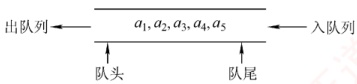

图3.5 队列示意图

队头（Front）：允许删除的一端，也称队首。队尾（Rear）：允许插入的一端。

空队列：不含任何元素的队列。

#### 2. 队列常见的基本操作

InitQueue(&Q)：初始化队列，构造一个空队列Q。

QueueEmpty(Q)：判队列空；若队列Q为空，返回true，否则返回false。

EnQueue(&Q,x)：入队操作；若队列Q未满，将x加入队尾。

DeQueue(&Q, &x)：出队操作；若队列Q非空，删除队首元素，并通过x返回其值。

GetHead(Q, &x)：读队首元素但不出队；若队列Q非空，将队首元素赋值给x。

需要注意的是，栈和队列均为操作受限的线性表，因此并非所有线性表的操作都适用于它们。例如，不允许直接访问或修改栈或队列中间的元素，这是由其逻辑特性所决定的。

### 3.2.2 队列的顺序存储结构

#### 1. 队列的顺序存储

队列的顺序实现是指分配一块连续的存储单元存放队列元素，并附设两个指针：队首指针front指向队首元素，队尾指针rear指向队尾元素的下一个位置。不同教材对front和rear指针含义的约定可能不同（例如，rear可能指向队尾元素或其下位置），这会导致入队和出队操作的具体实现不同。本节后附有相关习题，建议读者结合练习深入理解。
队列的顺序存储类型可定义为

```c
#define MaxSize 50
typedef struct{
    ElemType data[MaxSize];
    int front, rear;
} SqQueue;

//定义队列中元素的最大个数
//用数组存放队列元素
//队首指针和队尾指针
```

初始状态：Q.front=Q.rear=0。

入队操作：当队列未满时，先将元素存入队尾，再将队尾指针加1。

出队操作：当队列非空时，先取出队首元素，再将队首指针加1。

如图 3.6(a) 所示，初始时空队列满足 Q.`front == Q.rear == 0`，该条件可作为判空依据。

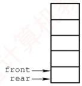

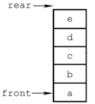

(b) 5 个元素入队

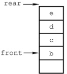

(c) 出队1次

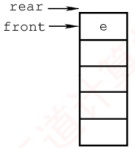

(d) 出队3次

图3.6 队列的操作

然而，能否以 Q.rear == MaxSize 作为队满条件呢？显然不能。如图 3.6(d) 所示，队列中仅剩一个元素，但 rear 已达 MaxSize，若此时继续入队，则会出现 “上溢”。但这种溢出并非真正溢出，实际上数组中仍有空闲单元，因此称此现象为假溢出。

#### 2. 循环队列

为了解决顺序队列的假溢出问题，引入循环队列：将顺序存储空间在逻辑上组织为环状结构。当指针到达数组末尾时，自动回到起始位置，这可通过取模运算（%）实现。

### 考点追踪 特定条件下循环队列队头/队尾指针的初值（2011）

初始状态：Q.front=Q.rear=0。

队首指针进1：Q.front=(Q.front+1)%MaxSize。

队尾指针进1：Q.rear=(Q.rear+1)%MaxSize。

队列长度：（Q.rear+MaxSize-Q.front）%MaxSize。

出入队操作：指针均按顺时针方向移动（见图3.7）。

### 考点追踪 循环队列判空/满的条件（2014）

那么，循环队列判空和判满的条件是什么呢？队空条件显然为  $Q.front == Q.rear$。但当入队速度远快于出队时，rear 会追上 front，此时同样满足  $Q.front == Q.rear$，却表示队满。因此，仅凭  $front == rear$ 无法区分队空与队满。循环队列出入队的示意图如图 3.7 所示。

为解决这一问题，常用以下三种方法：

1）牺牲一个存储单元：入队时少用一个存储单元，这是一种较为普遍的做法，约定以“队尾指针的下一位置为队首”作为队满标志，如图3.7(d2)所示。

队满条件：(Q.rear+1) %MaxSize==Q.front。

队空条件：Q.front==Q.rear。

队列中元素个数：（Q.rear-Q.front+MaxSize）%MaxSize。

2) 增设 size 成员: 记录当前元素个数。若入队成功, 则 size++, 若出队成功, 则 size--。队空条件: Q.size==0。

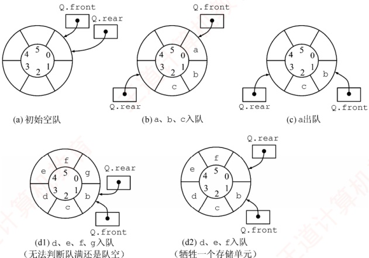

图3.7 循环队列出入队的示意图

队满条件：Q.size==MaxSize。

两种情形均有 Q.front == Q.rear，由 size 区分队空与队满。

3 ）增设 tag 标志位：

出队后置 tag=0，若此时 Q.front==Q.rear，则为队空。

入队后置 tag=1，若此时 Q.front==Q.rear，则为队满。

#### 3. 循环队列的操作（基于牺牲一个单元法）

(1) 初始化
```c
void InitQueue(SqQueue &Q) {
    Q.rear=Q.front=0; //初始化队首、队尾指针
}
```

(2) 判队空
```c
bool QueueEmpty(SqQueue Q) {
    if (Q.rear==Q.front) //队空条件
        return true;
    else
        return false;
}
```

(3) 入队
```c
bool EnQueue(SqQueue &Q, ElemType x) {
    if ((Q.rear+1) % MaxSize == Q.front) //队满则报错
        return false;
    Q.data[Q.rear]=x;
    Q.rear=(Q.rear+1) % MaxSize; //队尾指针加1取模
    return true;
}
```

(4) 出队
```c
bool DeQueue(SqQueue &Q, ElemType &x) {
    if (Q.rear==Q.front) //队空则报错
        return false;
    x=Q.data[Q.front];
Q.front=(Q.front+1)%MaxSize; //队首指针加1取模
return true;
```

### 3.2.3 队列的链式存储结构

#### 1. 队列的链式存储

### 考点追踪 链式队列的应用场景（2019）

队列的链式表示称为链式队列，本质上是一个同时带有队首指针和队尾指针的单链表，如图3.8所示。队首指针指向队头结点，队尾指针指向队尾结点，即单链表的最后一个结点。

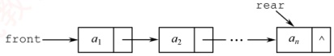

图3.8 不带队头结点的链式队列

链式队列的类型可定义为
```c

typedef struct LinkNode{
    ElemType data;
    struct LinkNode *next;
} LinkNode;
typedef struct{
    LinkNode *front, *rear;
} LinkQueue;

//链式队列结点
//链式队列
//队列的队头和队尾指针
```

当不带头结点时，若 `Q.front == NULL` 且 `Q.rear == NULL`，则链式队列为空队列。

### 考点追踪 链式队列判空的条件（2019）

入队操作：创建一个新结点，将其插入链表尾部，并令Q.rear指向该结点；若原队列为空，则同时令Q.front也指向该结点。

出队操作：先判断队列是否为空；若非空，则取出队首元素，删除对应结点，并令Q.front指向下一个结点；若被删结点是最后一个元素，则将Q.front和Q.rear均置为NULL。

不难发现，不带头结点的链式队列在边界处理上较为烦

琐。因此，通常将链式队列设计为带头结点的单链表，从而使插入与删除操作逻辑统一，如图3.9所示。

链式队列特别适用于元素数量频繁变化的场景，且不存在队满或溢出问题。此外，若程序中需使用多个队列（如同多个栈的情形），优先选用链式队列可避免存储分配不合理或溢出等问题。

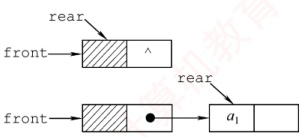

图3.9 带队头结点的链式队列

#### 2. 链式队列的基本操作

### 考点追踪 链式队列出队/入队操作的基本过程（2019）

（1）初始化

```c
void InitQueue(LinkQueue &Q) {
    //初始化带头结点的链式队列
    Q.front=Q.rear=(LinkNode*)malloc(sizeof(LinkNode)); //建立头结点
    Q.front->next=NULL; //初始为空
}
```

#### （2） 判队空

```c
bool QueueEmpty(LinkQueue Q){
if (Q.front == Q.rear) //判空条件
```
```c
    return true;
else
    return false;
}

void EnQueue(LinkQueue &Q,ElemType x){
    LinkNode *s=(LinkNode *)malloc(sizeof(LinkNode)); //创建新结点
    s->data=x;
    s->next=NULL;
```
```c
    Q.rear->next=s; //插入链尾
    Q.rear=s; //修改尾指针
}

bool DeQueue(LinkQueue &Q,ElemType &x){
    if(Q.front==Q.rear)
        return false;
    //空队
    LinkNode *p=Q.front->next;
    x=p->data;
    Q.front->next=p->next;
    if(Q.rear==p)
        Q.rear=Q.front; //若原队列中只有一个结点，删除后变空
    free(p);
    return true;
}
```

### 3.2.4 双端队列

双端队列是一种允许在两端进行插入和删除操作的线性表，如图3.10所示。双端队列两端的地位是平等的，为便于理解，可将左端视为前端，右端视为后端。

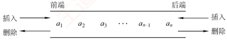

图 3.10 双端队列

在双端队列入队时：前端插入的元素排列在队列中后端插入的元素之前；后端插入的元素排列在队列中前端插入的元素之后。在双端队列出队时：无论是从前端还是后端出队，先出的元素总是排列在后出的元素之前。思考：如何由入队序列 a, b, c, d 得到出队序列 d, c, a, b?

### 考点追踪 双端队列出入队操作的分析（2010、2021）

输出受限的双端队列：允许在一端进行插入和删除，但在另一端仅允许插入的双端队列称为输出受限的双端队列，如图3.11所示。

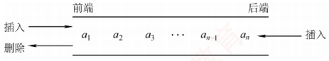

图3.11 输出受限的双端队列

输入受限的双端队列：允许在一端进行插入和删除，但在另一端仅允许删除的双端队列称为输入受限的双端队列，如图3.12所示。若限定双端队列从某个端点插入的元素只能从该端点删除，则该双端队列就蜕变为两个栈底相邻接的栈。

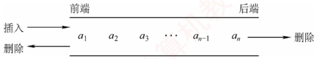

图 3.12 输入受限的双端队列

例 设有一个双端队列，输入序列为 1,2,3,4，试分别求出以下条件的输出序列。

（1）能由输入受限的双端队列得到，但不能由输出受限的双端队列得到的输出序列。

（2）能由输出受限的双端队列得到，但不能由输入受限的双端队列得到的输出序列。

（3）既不能由输入受限的双端队列得到，又不能由输出受限的双端队列得到的输出序列。

解：先看输入受限的双端队列，见图3.13。假设 end1 端输入 1, 2, 3, 4，则 end2 端的输出相当于普通队列的输出，即 1, 2, 3, 4；而 end1 端的输出相当于栈的输出，n=4 时仅通过 end1 端有 14 种输出序列（由 Catalan 公式得出），仅通过 end1 端不能得到的输出序列有 4!-14=10 种：

1, 4, 2, 3 2, 4, 1, 3 3, 4, 1, 2 3, 1, 4, 2 3, 1, 2, 4 4, 3, 1, 2 4, 1, 3, 2 4, 2, 3, 1 4, 2, 1, 3 4, 1, 2, 3

通过 end1 和 end2 端混合输出，可以输出这 10 种中的 8 种，参见下表。其中， $S_{L}, X_{L}$ 分别代表 end1 端的入队和出队， $X_{R}$ 代表 end2 端的出队。

| 输出序列 | 入队出队顺序 | 输出序列 | 入队出队顺序 |
|---|---|---|---|
| 1, 4, 2, 3 | $S_{L}X_{R}S_{L}S_{L}S_{L}X_{L}X_{R}X_{R}$ | 3, 1, 2, 4 | $S_{L}S_{L}S_{L}X_{L}S_{L}X_{R}X_{R}X_{R}$ |
| 2, 4, 1, 3 | $S_{L}S_{L}X_{L}S_{L}S_{L}X_{L}X_{R}X_{R}$ | 4, 1, 2, 3 | $S_{L}S_{L}S_{L}S_{L}X_{L}X_{R}X_{R}X_{R}$ |
| 3, 4, 1, 2 | $S_{L}S_{L}S_{L}X_{L}S_{L}X_{L}X_{R}X_{R}$ | 4, 1, 3, 2 | $S_{L}S_{L}S_{L}S_{L}X_{L}X_{R}X_{L}X_{R}$ |
| 3, 1, 4, 2 | $S_{L}S_{L}S_{L}X_{L}X_{R}S_{L}X_{L}X_{R}$ | 4, 3, 1, 2 | $S_{L}S_{L}S_{L}S_{L}X_{L}X_{L}X_{R}X_{R}$ |

剩下的两种是不能通过输入受限的双端队列输出的，即4,2,3,1和4,2,1,3。

再看输出受限的双端队列，见图3.14。假设 end1 和 end2 端都能输入，仅 end2 端可以输出。若都从 end2 端输入，则就是一个栈。当输入序列为 1, 2, 3, 4 时，输出序列有 14 种。对于其余 10 种不能得到的输出序列，通过交替从 end1 和 end2 端输入，还可以输出其中 8 种。设  $S_L$ 代表 end1 端的输入， $S_R$、 $X_R$ 分别代表 end2 端的输入和输出，则可能的输出序列见下表。

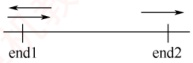

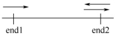

图 3.13 例题中输入受限的双端队列

| 输出序列 | 入队出队顺序 | 输出序列 | 入队出队顺序 |
|---|---|---|---|
| 1, 4, 2, 3 | $S_{L}X_{R}S_{L}S_{L}S_{R}X_{R}X_{R}X_{R}$ | 3, 1, 2, 4 | $S_{L}S_{L}S_{R}X_{R}X_{R}S_{L}X_{R}X_{R}$ |
| 2, 4, 1, 3 | $S_{L}S_{R}X_{R}S_{L}S_{R}X_{R}X_{R}X_{R}$ | 4, 1, 2, 3 | $S_{L}S_{L}S_{L}S_{R}X_{R}X_{R}X_{R}X_{R}$ |
| 3, 4, 1, 2 | $S_{L}S_{L}S_{R}X_{R}S_{R}X_{R}X_{R}X_{R}$ | 4, 2, 1, 3 | $S_{L}S_{R}S_{L}S_{R}X_{R}X_{R}X_{R}X_{R}$ |
| 3, 1, 4, 2 | $S_{L}S_{L}S_{R}X_{R}X_{R}S_{R}X_{R}X_{R}$ | 4, 3, 1, 2 | $S_{L}S_{L}S_{R}S_{R}X_{R}X_{R}X_{R}X_{R}$ |

通过输出受限的双端队列不能得到的两种输出序列是4,1,3,2和4,2,3,1。

综上所述：

1）能由输入受限的双端队列得到，但不能由输出受限的双端队列得到的是4,1,3,2。

2）能由输出受限的双端队列得到，但不能由输入受限的双端队列得到的是4,2,1,3。

3）既不能由输入受限的双端队列得到，又不能由输出受限的双端队列得到的是4,2,3,1。
**提示**

实际双端队列的考题不会如此复杂，通常只需判断序列是否满足题设条件，代入验证即可。
