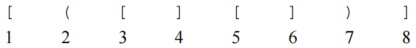
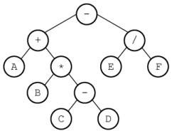
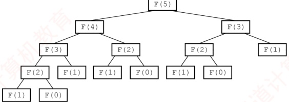
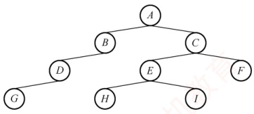

## 3.3 栈和队列的应用

要熟练掌握栈和队列，必须深入理解其典型应用场景，把握其中的规律，做到举一反三。接下来将简要介绍栈和队列的一些常见应用。

### 3.3.1 栈在括号匹配中的应用

假设表达式中允许包含两种括号：圆括号( ) 和方括号[ ]，其嵌套顺序任意。例如，([ ]()) 或 [([ ])] 均为合法格式，而 [([ ))、([( )) 或 (())] 均为非法格式。

考虑如下括号序列：



分析过程如下：

1）读入第1个括号“[”后，系统期待与之匹配的“]”（第8个）出现。

2）读入第2个括号“（”后，第1个括号“[”的期待暂时搁置，转而优先期待与“（”匹配的“）”（第7个）出现。

3）读入第3个括号“[”，当前最急迫的期待变为与之匹配的“]”（第4个）。该期待满足后，先前被搁置的第2个括号“（”的匹配任务重新成为当前最急迫事项。

4）以此类推，可见整个处理过程完全符合后进先出的栈行为。

算法思想如下：

1）初始化一个空栈，顺序扫描输入的括号序列。

2）若遇到左括号，将其压入栈中，表示新增一个待匹配的期待，且其优先级最高。

3）若遇到右括号，则检查栈是否为空：若栈非空且栈顶左括号与当前右括号匹配，则弹出栈顶，完成一次匹配；否则，括号序列非法，算法终止。

4）扫描结束后，若栈为空，则括号序列合法；否则，存在未匹配的左括号，序列非法。

### 3.3.2 栈在表达式求值中的应用

表达式求值是程序设计语言编译中的一个基本问题，也是栈应用的典型范例。

#### 1. 算术表达式

中缀表达式（如 3+4）是人们常用的算术表达式，其运算符位于两个操作数之间。与前缀表达式（如+34）或后缀表达式（如34+）相比，中缀表达式虽然符合人类阅读习惯，但不便于计算机直接求值，因此许多编程语言在内部仍需要将其转换为后缀或前缀形式进行求值。

与前缀或后缀表达式不同，中缀表达式必须依赖括号来明确运算次序。而后缀表达式的运算符置于操作数之后，其结构已隐含了运算顺序，因此无须括号，仅由操作数和运算符构成。

### 考点追踪 ▶ 表达式树的定义（2025）
```c

中缀表达式 A+B*(C-D)-E/F 对应的后缀表达式为 ABCD-*+EF/-，与该表达式对应的表达式树（见图 3.15）的后序遍历序列一致，体现了后缀表达式与树结构的内在联系。
```



图 3.15 A+B $^{*}$ (C-D)-E/F 对应的表达式树

#### 2. 中缀表达式转后缀表达式 $^{①}$

### 考点追踪 中缀表达式转后缀表达式的方法（2024）

下面先介绍一种手算转换方法。

1）按运算优先级对整个表达式逐层加括号。

2）将每个运算符移到其所在括号的右括号之后，形成“左操作数 右操作数 运算符”的结构。

3）删除所有括号，即得后缀表达式。

以  $A + B \times (C - D) - E / F$ 为例（下标表示运算顺序）：

1）加括号： $(A+③(B^{\star})②(C-①D)))-⑤(E/④F)$。

2）运算符后移： $(A(B(CD))^{-1})^{*}$ ② $+③(EF)/④)-⑤$

3）去括号后得到后缀表达式：ABCD- $^{①}$ $^{②}$+③EF/ $^{④}$-⑤。

在计算机中，该转换过程需借助一个运算符栈，用于暂存尚未确定输出时机的运算符。从左至右依次扫描中缀表达式的每一项，具体规则如下：

1）遇到操作数：直接加入后缀表达式。

2）遇到界限符：若为“（”，直接入栈；若为“）”，不入栈，且不断弹出栈顶运算符并加入后缀表达式，直到遇到“（”，将其弹出并丢弃。

3）遇到运算符：①若其优先级高于栈顶运算符，或栈顶为“（”，则直接入栈；②若其优先级低于或等于栈顶运算符，则依次弹出栈中运算符并加入后缀表达式，直到栈空，或栈顶为“（”，或遇到优先级更低的运算符为止，再将当前运算符入栈。

按上述方法扫描完所有字符后，将栈中剩余运算符依次弹出并加入后缀表达式。

例如，中缀表达式 A+B*(C-D)-E/F 转后缀表达式的过程如表 3.1 所示。

表3.1 中缀表达式 A+B* $(C-D)-E/F$ 转后缀表达式的过程

| 步 | 待处理序列 | 栈内 | 后缀表达式 | 扫描项 | 说明 |
| --- | --- | --- | --- | --- | --- |
| 1 | A+B*(C-D)-E/F |   |   | A | A加入后缀表达式 |
| 2 | +B*(C-D)-E/F |   | A | + | +入栈 |
| 3 | B*(C-D)-E/F | + | A | B | B加入后缀表达式 |
| 4 | *(C-D)-E/F | + | AB | * | *优先级高于栈顶，*入栈 |
| 5 | (C-D)-E/F | +*( | AB | ( | (直接入栈 |
| 6 | C-D)-E/F | +*( | AB | C | C加入后缀表达式 |
| 7 | -D)-E/F | +*( | ABC | - | 栈顶为(，-直接入栈 |
| 8 | D)-E/F | +*(- | ABC | D | D加入后缀表达式 |
| 9 | )-E/F | +*(- | ABCD | ) | 遇到)，弹出-，删除( |
| 10 | -E/F | +*( | ABCD- | - | -优先级低于栈顶，依次弹出*、+，-入栈 |
| 11 | E/F | - | ABCD-+* | E | E加入后缀表达式 |
| 12 | /F | - | ABCD-+E | / | /优先级高于栈顶，/入栈 |
| 13 | F | -/ | ABCD-+E | F | F加入后缀表达式 |
| 14 |   | -/ | ABCD-+EF |   | 扫描结束，弹出剩余运算符 |
| 15 |   |   | ABCD-+EF/- |   | 结束 |

### 考点追踪 栈的深度分析（2009、2012、2025）

所谓栈的深度，是指栈中元素最大个数。通常题目会给出入栈和出栈序列，要求计算栈所需
的最大容量（最大深度）。有时该信息以中级与后缀表达式的形式间接提供。掌握栈“后进先出”的特性，并通过手工模拟转换或求值过程，是解决此类问题的有效方法。

#### 3. 后缀表达式求值

### 考点追踪 用栈实现表达式求值的分析（2018）

后缀表达式的求值过程：从左至右依次扫描表达式，若当前项为操作数，则将其压入栈中；若为操作符<op>，则从栈中弹出两个操作数，先弹出的是右操作数Y，后弹出的是左操作数X，执行运算X<op>Y，并将结果压回栈中。所有项处理完毕后，栈顶元素即为最终计算结果。

例如，后缀表达式  $ABCD-\ast+EF/-$ 的求值过程共需 12 步，如表 3.2 所示。

表 3.2 后缀表达式 ABCD- $^{*}$+EF/−的求值过程

| 步 | 扫描项 | 项类型 | 动作 | 栈中内容 |
|---|---|---|---|---|
| 1 |  |  | 置空栈 | 空 |
| 2 | A | 操作数 | 入栈 | A |
| 3 | B | 操作数 | 入栈 | A B |
| 4 | C | 操作数 | 入栈 | A B C |
| 5 | D | 操作数 | 入栈 | A B C D |
| 6 | - | 操作符 | D、C出栈，计算C-D，结果 $R_1$入栈 | A B $R_1$ |
| 7 | * | 操作符 | $R_1$、B出栈，计算 $B \times R_1$，结果 $R_2$入栈 | A $R_2$ |
| 8 | + | 操作符 | $R_2$、A出栈，计算A+ $R_2$，结果 $R_3$入栈 | $R_3$ |
| 9 | E | 操作数 | 入栈 | $R_3$ E |
| 10 | F | 操作数 | 入栈 | $R_3$ E F |
| 11 | / | 操作符 | F、E出栈，计算E/F，结果 $R_4$入栈 | $R_3$ $R_4$ |
| 12 | - | 操作符 | $R_4$、 $R_3$出栈，计算 $R_3-R_4$，结果 $R_5$入栈 | $R_5$ |

### 3.3.3 栈在递归中的应用

递归是一种重要的程序设计方法。简单来说，若一个函数、过程或数据结构在其定义中直接或间接地引用了自身，则称其为递归定义，简称递归。递归通过将原问题逐层分解为规模更小但结构相同的子问题来求解。借助递归策略，仅需少量代码即可简洁地表达解题过程中反复出现的相同计算模式，显著减少程序代码量。然而，在一般情况下，递归的执行效率并不高。

以斐波那契数列为例，其数学定义为

 $$F(n)=\left\{\begin{aligned}&F(n-1)+F(n-2),n>1\\ &1,&n=1\\ &0,&n=0\end{aligned}\right.$$

这是递归的典型范例，其程序实现如下：

```c
int F(int n) {
    if (n==0)
        return 0;
    else if (n==1)
        return 1;
    else
    return F(n-1)+F(n-2);
}
```

必须注意，递归定义不能是循环或无终止的，必须满足以下两个条件：

- 递归体（递归表达式）：描述问题如何分解为更小规模的同类子问题。
边界条件（递归出口）：确保递归在有限步内终止。

递归的精髓在于能否将原问题转化为属性相同但规模更小的问题。

### 考点追踪 栈在函数调用中的作用和工作原理（2015、2017）

在递归调用过程中，系统为每一层调用的返回地址、局部变量及形参等信息分配存储空间，这些信息被保存在递归工作栈中。因此，递归深度过大时容易导致栈溢出。此外，递归效率低下的主要原因是存在大量重复计算。以 n=5 为例，其递归调用过程如图 3.16 所示。



图 3.16 F(5) 的递归执行过程

显然，在该过程中，F(3)被计算2次，F(2)被计算3次。F(1)被调用5次，F(0)被调用3次。由此可见，递归虽然代码简洁、易于理解，但存在明显的性能缺陷。在第5章讨论树的遍历时，采用递归可使代码极为简洁，但初学者往往难以清晰理解其执行过程。若希望深入理解递归的底层实现机制，可参考《编译原理》教材中关于运行时栈与活动记录的相关内容。

任何递归算法均可转换为非递归算法，通常需借助显式栈来模拟递归调用过程。

### 3.3.4 队列在层次遍历中的应用

在信息处理中，有一类典型问题需要逐层或逐行处理。解决这类问题的常用策略是：在处理当前层的同时，将下一层的元素按序加入待处理队列。队列正适用于此类场景，因其先进先出的特性，能够自然地保存后续待处理元素的顺序。以二叉树的层次遍历为例（见图3.17），可清晰体现队列的应用价值。表3.3展示了该遍历过程的具体执行步骤。



图3.17 二叉树

表3.3 层次遍历二叉树的过程

| 序号 | 说明 | 队内 | 队外 |
| --- | --- | --- | --- |
| 1 | A入 | A |   |
| 2 | A出，BC入 | BC | A |
| 3 | B出，D入 | CD | AB |
| 4 | C出，EF入 | DEF | ABC |
| 5 | D出，G入 | EFG | ABCD |
| 6 | E出，HI入 | FGHI | ABCDE |
| 7 | F出 | GHI | ABCDEF |
| 8 | GHI出 |   | ABCDEFGHI |

该过程可简要描述如下：

① 将根结点入队。
② 若队列为空（表示所有结点均已处理），则遍历结束；否则执行③。

③ 取出队首结点并访问；若其存在左孩子，则将左孩子入队；若其存在右孩子，则将右孩子入队；返回②继续执行。

### 3.3.5 队列在计算机系统中的应用

队列在计算机系统中的应用非常广泛，以下从两个主要方面进行阐述：第一个方面是解决主机与外部设备之间速度不匹配的问题，第二个方面是解决由多用户引起的资源竞争问题。

### 考点追踪 缓冲区的逻辑结构（2009）

以主机和打印机之间的速度不匹配为例。主机输出数据的速度远快于打印机处理数据的速度。若直接将数据发送给打印机，会导致数据丢失或打印错误。为此，通常设置一个打印数据缓冲区来缓解这一问题。具体实现如下：主机将待打印的数据依次写入缓冲区，当缓冲区满时，主机暂停输出并转向其他任务；打印机则从缓冲区中按先进先出原则逐个取出数据进行打印；打印完成后，打印机向主机发出请求，主机再次向缓冲区写入新的打印数据。这种方法不仅保证了数据的正确性，还提高了主机的整体效率。因此，打印数据缓冲区实际上就是一个队列。

### 考点追踪 多队列出队/入队操作的应用（2016）

在多用户环境下，CPU资源的竞争是一个典型场景。在一个多终端系统中，用户通过各自的终端向操作系统提出对CPU的请求。为公平分配CPU时间，操作系统通常按照请求的时间顺序，将这些请求排成一个队列。具体步骤如下：每次将CPU分配给队首用户的程序运行；当该程序运行结束或用完规定的时间片后，操作系统使其出队；然后将CPU分配给新的队首用户。这种方式既保证了请求的公平处理，又提升了CPU利用率。此外，在某些复杂系统中，可能还会引入多队列机制，以便根据不同的优先级或调度策略动态调整资源分配。
