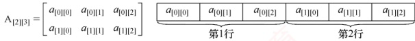
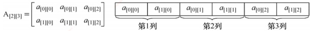
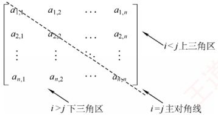
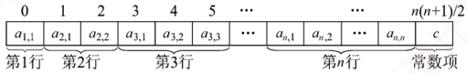
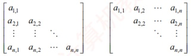
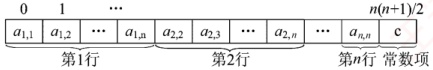
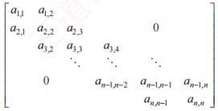
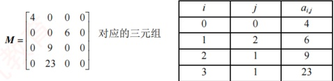

## 3.4 数组和特殊矩阵

矩阵在图形学、工程计算等领域占有重要地位。在数据结构中，关注的重点并非矩阵本身的数学性质及其运算，而是如何以最小的内存空间高效存储矩阵，并支持对元素的便捷访问。

### 3.4.1 数组的定义

数组是由  $n$（ $n \geq 1$）个相同类型的数据元素组成的有限序列。每个元素称为数组元素，其在线性序列中的位置由下标标识，下标的取值范围称为维界。
数组与线性表的关系：数组是线性表的推广。一维数组可视为一个线性表；二维数组可视为其元素为定长一维数组的线性表；更高维数组以此类推。数组一旦定义，其维数与维界即固定不变。因此，除初始化和销毁外，数组仅支持存取元素和修改元素两种基本操作。

### 3.4.2 数组的存储结构

大多数编程语言提供数组类型，逻辑上的数组通常映射为内存中一段连续的存储空间。以一维数组 A[0...n-1] 为例，设每个元素占 L 个存储单元，则元素 A[i] 的地址为

 $$LOC(a_{i})=LOC(a_{0})+iL\ (0\leq i<n)$$

### 考点追踪二维数组按行优先存储的下标对应关系（2021）

多维数组在内存中需按某种顺序展开为一维。常见方式有按行优先和按列优先。

按行优先：先行后列，先存储行号较小的元素；同一行内，先存储列号较小的元素。

设二维数组行下标与列下标范围分别为  $[0, h_1]$ 与  $[0, h_2]$，则元素 A[i][j] 的地址为

 $$LOC(a_{i,j})=LOC(a_{0,0})+[i(h_{2}+1)+j]L$$

例如，数组  $A_{[2][3]}$ 按行优先存储的形式如图 3.18 所示。

图 3.18 二维数组按行优先顺序存放

按列优先：先列后行，先存储列号较小的元素；同一列内，先存储行号较小的元素。其对应的地址公式为

 $$LOC(a_{i,j})=LOC(a_{0,0})+[j(h_{1}+1)+i]L$$

例如，数组  $A_{[2][3]}$ 按列优先存储的形式如图 3.19 所示。

图 3.19 二维数组按列优先顺序存放

### 3.4.3 特殊矩阵的压缩存储

压缩存储：为多个值相同的元素只分配一个存储空间，对零元素不分配存储空间。

特殊矩阵：指具有大量相同元素或零元素，且这些元素分布具有规律性的矩阵。常见的特殊矩阵有对称矩阵、上（下）三角矩阵、对角矩阵等。

特殊矩阵的压缩存储方法：通过分析矩阵中相同元素的分布规律，仅存储一份实际数据，其余的可通过下标映射访问，从而将原本冗余的数据压缩到一个共享的空间中，显著节省内存。

#### 1. 对称矩阵

### 考点追踪 对称矩阵压缩存储的下标对应关系（2018、2020）

若 $n$ 阶矩阵 $A$ 中任意元素 $a_{ij}$ 均满足 $a_{ij} = a_{j,i}$ ($1 \leq i, j \leq n$)，则称其为对称矩阵。其元素可分为三部分：上三角区、主对角线和下三角区，如图 3.20 所示。

由于上三角区与下三角区完全对称，若仍用二维数组存储，将近一半空间被浪费。为此可将n阶对称矩阵A压缩存储于一维数组 $\mathrm{B}[n(n+1)/2]$中，通常仅存放下三角部分（含主对角线）。

对于元素  $a_{ij}$ ( $i \geqslant j$)，其在数组 B 中的位置由其前方的元素个数决定

第1行：1个元素 $(a_{1,1})$。

图3.20 n阶矩阵的划分

第2行：2个元素 $(a_{2,1}, a_{2,2})$。

第 i-1 行：i-1 个元素  $(a_{i-1,1}, a_{i-1,2}, \cdots, a_{i-1,i-1})$。

第i行：j-1个元素 $(a_{i,1}, a_{i,2}, \cdots, a_{ij-1})$。

因此，元素  $a_{i,i}$ 在数组 B 中的下标  $k=1+2+\cdots+(i-1)+j-1=i(i-1)/2+j-1$（数组下标从0开始）。元素下标之间的对应关系如下：

 $$k=\left\{\begin{aligned}&\frac{i(i-1)}{2}+j-1,&\quad i\geqslant j\left( 下三角区和主对角线元素 \right)\\ &\frac{j(j-1)}{2}+i-1,&\quad i<j\left( 上三角区元素 a_{i,j}=a_{j,i}\right)\end{aligned}\right.$$

若数组下标从1开始，则可采用类似的推导方法，请读者自行思考。

**注意**

二维数组 A[n][n] 与 A[0...n-1][0...n-1] 写法等价，表示下标从 0 开始。若写作 A[1...n][1...n]，则表示下标从 1 开始。矩阵元素通常记为  $a_{i,j}$，其行号 i 和列号 j 通常从 1 开始。

#### 2. 三角矩阵

在下三角矩阵［见图3.22(a)］中，上三角区的所有元素均为同一常量。其存储思想与对称矩阵的类似，但是需要额外存储该常量一次。因此，可以将n阶下三角矩阵A压缩存储在B[n(n+1)/2+1]中。

对于元素  $a_{i,j}$ ( $i \geqslant j$)，其在数组 B 中的下标为

 $$k=\left\{\begin{aligned}&\frac{i(i-1)}{2}+j-1,&\quad&i\geqslant j\text{(下三角区和主对角线元素)}\\ &\frac{n(n+1)}{2},&\quad&i<j\text{(上三角区元素)}\end{aligned}\right.$$

下三角矩阵的压缩存储形式如图3.21所示。

图 3.21 下三角矩阵的压缩存储

### 考点追踪 上三角矩阵采用行优先存储的应用（2011）

在上三角矩阵 [见图3.22(b)] 中，下三角区所有元素均为同一常量。只需存储主对角线、上三角区上元素及该常量一次，同样将其压缩存储在 B[n(n+1)/2+1]中。

 $$\begin{bmatrix}a_{1,1}&&&\\ &a_{2,1}&a_{2,2}&&\\ &\vdots&\vdots&\ddots&\\ &a_{n,1}&a_{n,2}&\cdots&a_{n,n}\end{bmatrix}$$

(a) 下三角矩阵

 $$\begin{aligned}&\begin{bmatrix}\\ &a_{1,1}&a_{1,2}&\cdots&a_{1,n}\\&&a_{2,2}&\cdots&a_{2,n}\\&&&\ddots&\vdots\\&&&&a_{n,n}\\ &\end{bmatrix}\\ \end{aligned}$$

(b) 上三角矩阵

图 3.22 三角矩阵

对于元素  $a_{ij}$ ( $i \leq j$)，其在数组 B 中前方的元素个数为

第1行：n个元素

第2行：n-1个元素

第i-1行：n-i+2个元素

第i行：j-i个元素

故元素  $a_{ij}$ 在数组 B 中的下标  $k = n + (n-1) + \cdots + (n-i+2) + (j-i+1) - 1 = (i-1)(2n-i+2)/2 + (j-i)$。元素下标之间的对应关系如下：

 $$k=\left\{\begin{aligned}&\frac{(i-1)(2n-i+2)}{2}+(j-i),&\quad i\leqslant j( 上三角区和主对角线元素 )\\ &\frac{n(n+1)}{2},&\quad i>j( 下三角区元素 )\end{aligned}\right.$$

上三角矩阵的压缩存储形式如图3.23所示。

图 3.23 上三角矩阵的压缩存储

以上推导均假设数组下标从0开始。若下标指定从1开始，则要相应地调整映射关系。

#### 3. 三对角矩阵

若 $n$ 阶矩阵 $A$ 中的任意元素 $a_{ij}$，当 $|i-j| > 1$ 时均有 $a_{ij} = 0$（$1 \leq i, j \leq n$），则称为三对角矩阵，如图 3.24 所示。非零元素仅集中在以主对角线为中心的 3 条对角线的区域。

图 3.24 三对角矩阵 A

可将三对角上的元素按行优先顺序存入一维数组 B，且  $a_{1,1}$ 存于 B[0]，如图 3.25 所示。

| $a_{1,1}$ | $a_{1,2}$ | $a_{2,1}$ | $a_{2,2}$ | $a_{2,3}$ | ... | $a_{n-1,n}$ | $a_{n,n-1}$ | $a_{n,n}$ |
|---|---|---|---|---|---|---|---|---|

图 3.25 三对角矩阵的压缩存储

### 考点追踪三对角矩阵压缩存储的下标对应关系（2016）

三对角上的元素  $a_{ij}$（ $1 \leq i, j \leq n, |i-j| \leq 1$）在一维数组 B 中的下标  $k = 2i + j - 3$。

反之，已知元素存于B[k]中时， $i=\lfloor(k+1)/3\rfloor+1$， $j=k-2i+3$。例如，当 $k=0$时， $i=\lfloor(0+1)/3+1\rfloor=1$， $j=0-2\times1+3=1$，存放的是 $a_{1,1}$；当 $k=2$时， $i=\lfloor(2+1)/3+1\rfloor=2$， $j=2-2\times2+3=1$，存放的是 $a_{2,1}$；当 $k=4$时， $i=\lfloor(4+1)/3+1\rfloor=2$， $j=4-2\times2+3=3$，存放的是 $a_{2,3}$。

### 3.4.4 稀疏矩阵

若矩阵中非零元素的个数 t 相对于总元素个数 s 来说非常少，即  $t \ll s$，则称该矩阵为稀疏矩
阵。例如，一个  $100 \times 100$ 的矩阵中只有不到 100 个非零元素。

### 考点追踪 存储稀疏矩阵需要保存的信息（2023）

为避免空间浪费，稀疏矩阵通常仅存储非零元素。然而，由于非零元素的分布通常是无规律的，仅存储其值是不够的，还需记录它们所在的行和列。为此，将每个非零元素及其对应的行列位置组合成一个三元组（行标 i，列标 j，值  $a_{ij}$），如图 3.26 所示。这些三元组可以按某种顺序排列成线性表进行存储。稀疏矩阵压缩存储后便失去了随机存取特性。

图 3.26 稀疏矩阵及其对应的三元组

### 考点追踪 稀疏矩阵压缩存储的方式（2017）

稀疏矩阵的三元组表可通过多种方式存储，常见的有：数组存储将所有三元组按某种顺序存储在一维数组中，这种方式简单直接，但插入和删除操作的效率较低；十字链表存储（见6.2节）通过链表的方式组织三元组，适用于频繁插入和删除操作的场景。无论采用哪种方式，都需要额外保存稀疏矩阵的行数、列数和非零元素的个数，以便支持后续的各种操作。
