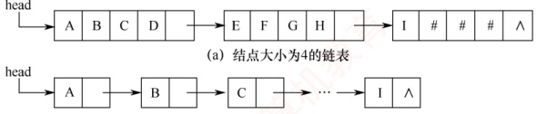

## 4.1 串的定义和实现

字符串简称串，计算机中非数值处理的对象基本上都是字符串数据。常见的信息检索系统（如搜索引擎）、文本编辑程序（如 Word）、问答系统、自然语言翻译系统等，均以字符串作为核心处理对象。本章将详细介绍字符串的存储结构及其相关操作。

### 4.1.1 串的定义

串（string）是由零个或多个字符组成的有限序列，通常记为

 $$S=^{\prime}a_{1}a_{2}\cdots a_{n}^{\prime}\quad(n\geqslant0)$$

其中，S 是串名，单引号括起的字符序列是串的值；每个  $a_i$ 可以是字母、数字或其他字符；串中字符的个数 n 称为串的长度。当 n=0 时，该串称为空串（用  $\varnothing$ 表示）。

串中任意多个连续字符组成的子序列称为该串的子串，而包含该子串的串称为主串。某个字符在串中的序号称为该字符在串中的位置；子串在主串中的位置以其第1个字符在主串中的位
置来标识。当两个串长度相等，且对应位置上的字符完全相同时，称这两个串相等。

例如，设串A='China Beijing'，B='Beijing'，C='China'，则它们的长度分别为13、7和5。其中，B和C都是A的子串，B在A中的位置为7，C在A中的位置为1。

需注意，由一个或多个空格（空格是一种特殊字符）组成的串称为空格串，空格串不是空串，其长度等于其中空格字符的个数。

串的逻辑结构与线性表极为相似，区别仅在于串的数据对象被限定为字符集。但在基本操作上，二者有显著差异：线性表的基本操作通常以单个元素为单位，如查找、插入或删除某个元素；而串的基本操作一般以子串为单位，如查找、插入或删除一个子串等。

### 4.1.2 串的基本操作

- StrAssign(&T,chars): 赋值操作。将串 T 赋值为 chars。

StrCopy(&T,S): 复制操作。将串 S 复制给串 T。

StrEmpty(S)：判空操作。若 S 为空串，则返回 TRUE，否则返回 FALSE。

- StrCompare(S,T)：比较操作。若 S>T，返回值>0；若 S=T，返回值=0；若 S<T，返回值<0。

- StrLength(S)：求串长操作。返回串 S 中字符的个数。

- SubString(&Sub,S,pos,len): 求子串操作。用 Sub 返回串 S 中从第 pos 个字符起、长度为 len 的子串。

• Concat(\&T, S1, S2)：串联接操作。用 T 返回由 S1 和 S2 联接而成的新串。

- Index $(S,T)$：定位操作。若主串 S 中存在与串 T 值相同的子串，则返回其在 S 中首次出现的位置；否则返回 0。

ClearString(&S): 清空操作。将串 S 置为空串。

DestroyString(&S): 销毁操作。将串 S 销毁。

不同的高级语言对串的基本操作集可能有不同的定义方式。在上述操作中，StrAssign（赋值）、StrCompare（比较）、StrLength（求长）、Concat（联接）和SubString（求子串）这五种操作构成了串类型的最小操作子集：它们无法通过其他串操作实现；而其余串操作（除ClearString和DestroyString外）均可基于该最小操作子集实现。

### 4.1.3 串的存储结构

#### 1. 定长顺序存储表示

类似于线性表的顺序存储结构，串的定长顺序存储使用一组地址连续的存储单元来存放串值的字符序列。系统为每个串变量预先分配一个固定长度的数组。

```c
#define MAXLEN 255 //预定义最大串长为255
typedef struct{
    char ch[MAXLEN]; //每个分量存储一个字符
    int length; //串的实际长度
} sString;
```

串的实际长度不得超过 MAXLEN，若超出，则多余部分被舍弃，称为截断。串长有两种表示方式：一种是如上述结构所示，用一个独立的整型变量 len 显式记录串的长度；另一种是在串值末尾添加一个不计入串长的结束标记符'\0'，此时串长为隐含值，需要通过遍历计算得出。

执行插入、联接等操作时，若结果串长度超过 MAXLEN，则通常按 “截断” 处理。要从根本上避免这一限制，需要取消对串长上限的硬性规定，转而采用动态分配的存储方式。
#### 2. 堆分配存储表示

堆分配存储仍以地址连续的存储单元存放串值字符序列，但其存储空间在程序运行过程中动态申请获得。

```c
typedef struct{
    char *ch;    //按串长分配存储区，ch 指向串的基地址
    int length;   //串的长度
}HString;
```

在 C 语言中，存在一个称为堆的自由存储区。可通过调用  $malloc()$ 为新生成的串动态分配一块大小等于串长的连续存储空间：若分配成功，返回指向该空间起始地址的指针，作为串的基地址（由指针 ch 指示）；若分配失败，则返回 NULL。已分配的空间可通过 free() 释放。

上述两种存储方式被大多数高级程序设计语言所采用。块链存储表示仅做简单介绍。

#### 3. 块链存储表示

类似于线性表的链式存储结构，串也可采用链表形式存储。考虑到串的特殊性（每个元素仅为单个字符），实际实现中，每个链表结点可存放一个或多个字符。每个结点称为一个块，整个链表称为块链结构。图4.1(a)显示了块大小为4的链表（每个结点存放4个字符），最后一块占不满时通常用“#”补齐；图4.1(b)则为块大小为1的链表（每个结点仅存1个字符）。



(b) 结点大小为1的链表

图 4.1 串值的链式存储方式
