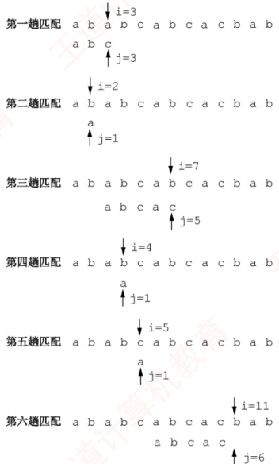
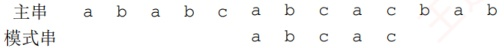
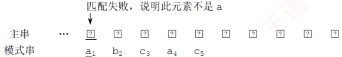
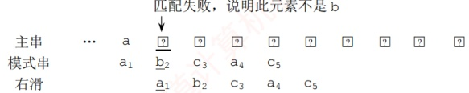
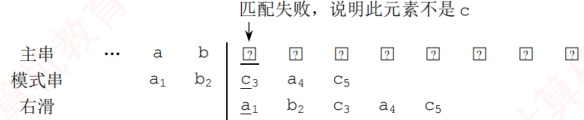
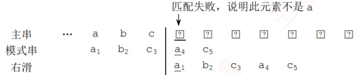
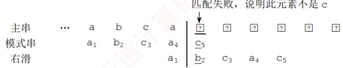
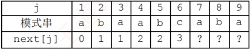

## 4.2 串的模式匹配

### 4.2.1 简单的模式匹配算法

模式匹配是指在主串中查找与模式串（待搜索的字符串）完全相同的子串，并返回其首次出现的位置。本节基于定长顺序存储结构，介绍一种不依赖其他串操作的暴力匹配算法。

```c
int Index(String S,String T) {
    int i=1, j=1;
    while (i<=S.length&&j<=T.length) {
        if (S.ch[i]==T.ch[j]) {
            ++i; ++j; //继续比较后继字符
        }
        else {
            i=i-j+2; j=1; //指针后退重新开始匹配
        }
    }
    if (j>T.length) return i-T.length; //匹配成功，返回起始位置
    else return 0; //匹配失败
}
```

在该算法中，计数指针 i 和 j 分别指示主串 S 和模式串 T 中当前待比较的字符位置。其基本思想是：从主串 S 的第一个字符开始，与模式串 T 的首字符比较。若相等，则继续比较后续字符；否则，将主串的比较起点后移一位，并重新从 T 的首字符开始比较；重复此过程，直至模式
串 T 的所有字符依次与主串 S 中某段连续字符完全匹配，则称匹配成功，函数返回该子串在主串中的起始位置；若遍历完主串仍未找到匹配，则返回 0，表示匹配失败。

图4.2 显示了模式串  $T='$ abcac' 和主串 S 中的匹配过程。



图4.2 简单模式匹配算法举例

在简单模式匹配算法中，设主串和模式串的长度分别为  $n$ 和  $m$（ $n \gg m$），则最多需进行  $n - m + 1$ 趟匹配，每趟最多比较  $m$ 次，因此最坏时间复杂度为  $O(nm)$。例如，当模式串为'0000001'，而主串为'000

### 4.2.2 串的模式匹配算法——KMP算法

在图 4.2 的第三趟匹配过程中，当 i=7、j=5 位置字符不相等时，通常会从 i=4、j=1 重新开始比较。然而，观察发现，i=4 和 j=1、i=5 和 j=1 以及 i=6 和 j=1 这三次比较都是不必要的。因为从第三趟部分匹配的结果可知，主串的第4、5、6个字符 ('b'、'c'、'a')，与模式串的第2、3、4 个字符相同，而模式串的首字符为 'a'，故这些重复比较是多余的。只需将模式串向右滑动三个字符的位置，然后从 i=7、j=2 继续比较即可。

在简单模式匹配中，每次匹配失败后都会将模式串向右滑动一位并从头开始比较。但是，某次已匹配成功的序列实际上是模式串的某个前缀，通过分析模式串本身的结构，若已匹配成功的序列中有后缀正好是模式串的前缀，则可直接将模式串右滑到与这些字符对齐的位置，而无须回溯主串指针 i，从而提高效率。这种优化策略正是 KMP 算法的核心。
#### 1. KMP 算法的原理

要理解模式串的结构，首先需明确几个概念：前缀、后缀和部分匹配值。前缀是指除最后一个字符外，字符串的所有头部子串；后缀是指除第一个字符外，字符串的所有尾部子串；部分匹配值则是指字符串的前缀和后缀的最长相等前后缀长度。下面以'ababa'为例进行说明：

• 'a'的前缀和后缀均为空集，最长相等前后缀长度为0。

• 'ab'的前缀为{a}，后缀为{b}，{a}∩{b} = ∅，最长相等前后缀长度为0。

• 'aba'的前缀{a,ab}∩后缀{a,ba}={a}，最长相等前后缀长度为1。

• 'abab'的前缀{a, ab, aba}∩后缀{b, ab, bab}={ab}，最长相等前后缀长度为2。

- 'ababa'的前缀{a, ab, aba, abab}∩后缀{a, ba, aba, baba}={a, aba}，交集有两个，最长相等前后缀长度为3。

因此，模式串'ababa'的部分匹配值为00123。

那么，这个部分匹配值有何作用？

回到最初的问题，主串为'ababcabcacbab'，模式串为'abcac'。

利用上述方法容易求得模式串'abcac'的部分匹配值为00010，将部分匹配值组织成数组的形式，即构成部分匹配值表（Partial Match Table，PM 表）。

| 编号 | 1 | 2 | 3 | 4 | 5 |
| --- | --- | --- | --- | --- | --- |
| S | a | b | c | a | c |
| PM | 0 | 0 | 0 | 1 | 0 |

下面利用 PM 表进行字符串匹配：

主串 a b a b c a b c a c b a b

模式串 a b c

第一趟匹配：

在第 3 位发生失配（c≠a），此前已匹配 2 个字符 'ab'。查表可知，最后一个匹配字符 b 对应的部分匹配值为 0，按照下面的公式计算模式串需要右滑的位数：

右滑位数 = 已匹配字符数 - 对应的部分匹配值

由于 2-0=2，将模式串向右滑动 2 位，进行第二趟匹配。

| 主串 | a | b | a | b | c | a | b | c | a | c | b | a | b |
| --- | --- | --- | --- | --- | --- | --- | --- | --- | --- | --- | --- | --- | --- |
| 模式串 |   |   | a | b | c | a | c |   |   |   |   |   |   |

第二趟匹配：

在第5位发生失配（c≠b），此前已匹配4个字符'abca'。查表可知，最后一个匹配字符a对应的部分匹配值为1，4-1=3，将模式串向右滑动3位，进行第三趟匹配。



模式串

第三趟匹配：

模式串全部字符匹配成功。

可见，部分匹配值的核心价值在于指导模式串在失配后的最优右移距离。整个过程中，主串指针始终未回溯，这使得 KMP 算法的时间复杂度稳定为  $O(n + m)$。

某趟匹配失败时：若已匹配序列中不存在相等的前后缀（PM值为0），则滑动位数最大，直接将模式串首字符对齐到主串当前失配位置；若存在最长相等前后缀（可理解为首尾重合），则将模式串向右滑动至与主串中该相等后缀对齐的位置，从而跳过已知相等的部分，避免重复比较。两种情形下，模式串右滑位数均为“已匹配字符数－对应的部分匹配值”。
还有一种特殊情况：若模式串的第一个字符即与主串当前字符失配，则已匹配字符数为0，按规则将模式串整体右移一位，并从主串下一个位置开始新一轮匹配。

#### 2. next 数组的手算方法

在实际匹配过程中，模式串在内存中的存储位置是固定的，并不会真正“滑动”；发生变化的只是指针。前文通过模拟滑动的方式，是为了直观地帮助读者理解 KMP 算法的匹配逻辑。

### 考点追踪 KMP 算法中指针变化/比较次数的分析（2015、2019）

KMP算法的核心特性是：每趟匹配失败时，主串指针i不回溯，仅模式串指针j调整。为此，可定义一个next数组，next[j]的含义是：当模式串的第j个字符失配时，下一轮应从模式串的第next[j]个位置继续与主串当前字符比较。

下面介绍一种手算 next 数组的方法，仍以模式串 'abcac' 为例。

第1个字符失配时：令 next[1]=0，然后指针 i 加 1，指针 j 重置为 1，即下一轮将模式串的第1个位置与主串当前位置的下一位置进行比较（注意，图中下标为字符编号）。



第2个字符失配时：令 next[2]=1，模式串下次的比较位置为1，相当于向右滑动1位（注，next[1]=0、next[2]=1是固定规则）。



在后续的手算过程中，可在失配位置前画一条分界线，尝试将模式串向右移动，直到分界线左侧的部分能够首尾对齐（存在相等的前后缀），或模式串完全跨过分界线为止。

第3个字符失配时：模式串下次的比较位置为1，即 $next[3]=1$，相当于向右滑动2位。



第4个字符失配时：模式串下次的比较位置为1，即 next[4]=1，相当于向右滑动3位。



第5个字符失配时：模式串下次的比较位置为2，即 next[5]=2，相当于向右滑动3位。



next 数组和 PM 表的关系是怎样的？

通过上述举例，可推导出 next 数组和 PM 表之间的关系：

 $$\begin{aligned}next\left[j\right]&=j- 右滑位数 =j-( 已匹配的字符数 ^{①}- 对应的部分匹配值 )\\&=j-\left[\left(j-1\right)-PM\left[j-1\right]\right]\\&=PM\left[j-1\right]+1\\ \end{aligned}$$

因此，next 数组等于将 PM 表右移一位，再整体加 1。经验证，该结论与手算结果一致。

| 编号 | 1 | 2 | 3 | 4 | 5 |
| --- | --- | --- | --- | --- | --- |
| S | a | b | c | a | c |
| next | 0 | 1 | 1 | 1 | 2 |

我们注意到：

1）PM 表右移后空出的第一个位置补 0，因为若模式串首字符失配，算法规定 next[j]=0，表示将主串和模式串同步右移一位。

2）PM 表最后一个元素右移后移出，因为原来的模式串中，最后一个字符的部分匹配值是供其下一个字符使用的，但显然其没有下一个字符，所以可以舍去。

**注意**

以上讨论均假设串的编号从1开始；若串的编号从0开始，则next数组需要整体减1。

#### 3. next 数组的推理公式

如何推理 next 数组的一般公式？设主串为's₁s₂⋯sn'，模式串为'p₁p₂⋯pₘ'。当主串的第 i 个字符与模式串的第 j 个字符失配时，应将主串当前位置与模式串的哪个字符进行比较？

假设此时应与模式串的第 k（k<j）个字符比较，则模式串的前 k-1 个字符的子串必须满足以下条件，且不存在更大的 k'>k 满足条件：

 $$\mathbf{p}_{1}\mathbf{p}_{2}\cdots\mathbf{p}_{k-1}=\mathbf{p}_{j-k+1}\mathbf{p}_{j-k+2}\cdots\mathbf{p}_{j-1}$$

若存在满足上述条件的子串，则发生失配时，仅需将模式串的第 k 个字符与主串的第 i 个字符对齐。此时，模式串的前 k-1 个字符必然与主串中第 i 个字符之前的 k-1 个字符相等，因此，可直接从模式串的第 k 个字符开始，与主串的第 i 个字符继续比较，如图 4.3 所示。

| 主串 | $s_{1}$ | ... | ... | ... | ... | ... | $s_{i-k+1}$ | ... | $s_{i-1}$ | $\underline{{s_{i}}}$ | ... | ... | ... | ... | $s_{n}$ |
|---|---|---|---|---|---|---|---|---|---|---|---|---|---|---|---|
| 子串 |  |  | $p_{1}$ | ... | $p_{k-1}$ | ... | $p_{j-k+1}$ | ... | $p_{j-1}$ | $\underline{{p_{i}}}$ | ... | $p_{m}$ |  |  |  |
| 右滑 |  |  |  |  |  |  | $p_{1}$ | ... | $p_{k-1}$ | $p_{k}$ | ... | ... | $p_{m}$ |  |  |

图 4.3 模式串右滑到合适位置（阴影对齐部分表示上下字符相等）

若在已匹配的序列中不存在满足上述条件的相等前后缀（可视为 k=1），则应让主串的第 i 个字符与模式串的第 1 个字符重新比较。

特别地，当模式串的第1个字符（j=1）与主串失配时，规定 next[1]=0。

通过上述分析可得出 next 函数的公式：

 $$next[j]=\left\{\begin{aligned}&0,&j=1\\&\max\{k\mid1<k<j 且 ^{\prime}p_{1}\cdots p_{k-1}^{\prime}=^{\prime}p_{j-k+1}\cdots p_{j-1}^{\prime}\},& 当此集合不为空时 \\&1,& 其他情况 \end{aligned}\right.$$

要用代码来实现，貌似难度不小，下面尝试推理求解的科学步骤。
首先由公式可知

 $$next\left[1\right]=0$$

设 next [j]=k，此时 k 应满足的条件在上文中已描述。

此时 next  $[j+1]=$？可能有两种情况：

（1）若 $p_{k}=p_{j}$，则表明在模式串中

 $$\mathbf{p}_{1}\cdots\mathbf{p}_{k-1}\mathbf{p}_{k}=\mathbf{p}_{j-k+1}\cdots\mathbf{p}_{j-1}\mathbf{p}_{j}$$

且不可能存在  $k' > k$ 满足上述条件，此时  $\text{next}[j+1] = k+1$，即

 $$next[j+1]=next[j]+1$$

（2）若  $p_{k} \neq p_{j}$，则表明在模式串中

 $$\mathbf{p}_{1}\cdots\mathbf{p}_{k-1}\mathbf{p}_{k}\neq\mathbf{p}_{j-k+1}\cdots\mathbf{p}_{j-1}\mathbf{p}_{j}$$

此时可将求 next 函数值的问题视为一个模式匹配问题。用前缀 p₁…pₖ 去与后缀 pₖ₋ₖ₊₁…pₖ 匹配，当 pₖ ≠ pₙ 时，应将 p₁…pₖ 向右滑动至用第 next [k] 个字符与 pₙ 进行比较，若 pₙ₊₁[k] 与 pₙ 仍不匹配，则需寻找长度更短的相等前后缀，下一步继续用 pₙ₊₁[next[k]] 与 pₙ 进行较，以此类推，直到找到某个更小的 k′=next[next⋯[k]]（1<k′<k<j），满足条件

 $$\mathbf{p}_{1}\cdots\mathbf{p}_{k},\mathbf{\Lambda}^{\prime}=\mathbf{p}_{j-k^{\prime}+1}\cdots\mathbf{p}_{j}$$

则 next [j+1]=k'+1。

也可能不存在任何  $k'$ 满足上述条件，即不存在长度更短的相等前后缀，令 next  $[j+1]=1$。理解起来可能有点抽象？下面通过一个具体例子说明。

图4.4 的模式串已求得6个字符的 next 值，现求 next[7]，因为 next[6]=3，又 p₆≠p₃，所以需比较 p₆ 与 p₁（因 next[3]=1），p₆≠p₁，而 next[1]=0，故 next[7]=1；求 next[8]，因为 p₇=p₁，所以 next[8]=next[7]+1=2；求 next[9]，因为 p₈=p₂，所以 next[9]=3。



图 4.4 求模式串的 next 值

#### 4. KMP 算法的实现

通过上述分析，可写出求解 next 数组的程序如下:

```c
void get_next(String T,int next[]) {
    int i=1, j=0;
    next[1]=0;
    while (i<T.length) {
        `if (j==0||T.ch[i]==T`.ch[j]) {
            ++i; ++j;
```
        next[i]=j; //若  $p_i=p_j$，则 next[j+1]=next[j]+1
```c
    }
    else
        j=next[j]; //否则令 j=next[j]，循环继续
}
```

计算机上执行的效率很高，但手工计算时，仍需采用前文介绍的直观方法。

与 next 数组的求解相比，KMP 算法的匹配过程相对简洁，其结构与简单模式匹配极为相似。关键区别在于：当发生失配时，主串指针 i 保持不变，仅将模式串指针 j 回退至 next[j] 所指示的位置，并继续比较；特别地，当 j=0 时，将 i 和 j 同时加 1。也就是说，若模式串首字符失配，则将模式串向右滑动一位，下一轮匹配从主串第 i+1 个位置开始。具体实现如下：
```c
int Index KMP(String S,String T,int next[])
int i=1, j=1;
while(i<=S.length&&j<=T.length){
    `if(j==0||S.ch[i]==T`.ch[j]){
        ++i; ++j;
    }
    else
        j=next[j];
    //模式串向右滑动
}
if(j>T.length)
    return i-T.length;
//匹配成功
else
return 0;
}
```

尽管简单模式匹配的最坏时间复杂度为  $O(mn)$，而 KMP 算法可达到  $O(m+n)$，但在一般情况下，简单模式匹配的平均执行时间往往接近  $O(m+n)$，因此至今仍被采用。KMP 算法仅在主串与模式串存在大量“部分匹配”时才显著优于暴力匹配，其核心优点在于主串指针不回溯。

### 4.2.3 KMP 算法的进一步优化

### 考点追踪 nextval 数组的计算（2024）

前面定义的 next 数组在某些情况下仍存在缺陷，还可进一步优化。图 4.5 展示了一个典型示例：模式串 'aaaaab' 与主串 'aaabaaaab' 进行匹配。

主串 a a a b a a a b
模式串 a a a a b
j 1 2 3 4 5
next[j] 0 1 2 3 4
nextval[j] 0 0 0 0 4

图 4.5 KMP 算法的进一步优化示例

当 i=4、j=4 时，主串字符  $s_4$ 与模式串字符  $p_4$（b≠a）失配。若使用之前的 next 数组，则还需依次进行  $s_4$ 与  $p_3$、 $s_4$ 与  $p_2$、 $s_4$ 与  $p_1$ 的三次比较。然而，由于 next[4]=3 且  $p_3=p_4=a$，同理 next[3]=2 且  $p_2=p_3=a$，next[2]=1 且  $p_1=p_2=a$，由于这些回退位置上的字符均与  $p_4$ 相同，继续比较只会重复同样的失配过程，造成不必要的开销。

问题根源在于：不应出现  $p_j = p_{next[j]}$。理由是：当  $p_j \neq s_i$ 时，下一轮将用  $p_{next[j]}$ 与  $s_i$ 比较；若  $p_{next[j]} = p_j$，则相当于用与  $p_j$ 相同的字符去匹配已知不等的  $s_i$，结果必定仍是失配。

那么，若出现  $p_j = p_{next[j]}$，应如何处理？

此时应不断将 next[j] 替换为 next[next[j]]，直到找到某个位置 k，使得  $p_j \neq p_k$ 或 k=0 为止，修正后的新数组称为 nextval 数组。计算 nextval 数组的算法如下（匹配算法不变）。

```c
void get_nextval(SString T,int nextval[]) {
    int i=1, j=0;
    nextval[1]=0;
    while (i<T.length) {
        `if (j==0||T.ch[i]==T`.ch[j]) {
            ++i; ++j;
            if (T.ch[i]!=T.ch[j]) nextval[i]=j;
            else nextval[i]=nextval[j];
        }
        else
            j=nextval[j];
    }
}
```
KMP 算法对于初学者来说可能不太容易掌握，强烈建议读者结合配套课程学习。
