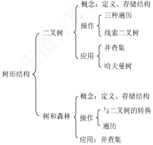

# 第5章 树与二叉树

## 【考纲内容】

### （一） 树的基本概念

### （二）二叉树

二叉树的定义及其主要特征：二叉树的顺序存储结构和链式存储结构；

二叉树的遍历；线索二叉树的基本概念和构造

视频讲解

### （三） 树、森林

树的存储结构；森林与二叉树的转换；树和森林的遍历

### （四）树与二叉树的应用

哈夫曼（Huffman）树和哈夫曼编码；并查集及其应用；堆及其应用

**【知识框架】**

## 【复习提示】

本章内容主要以选择题和综合题形式考查，统考中也可能出现与树遍历相关的算法题。树与二叉树的基本性质、遍历操作、相互转换、存储结构及操作特性，以及满二叉树、完全二叉树、线索二叉树和哈夫曼树的定义与性质，均为选择题的高频考点。
