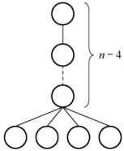
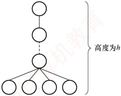
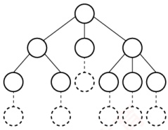

### 5.1.4 本节试题精选

#### 一、 单项选择题

##### 01

树最适合用来表示（）的数据。

A. 有序

B. 无序

C. 任意元素之间具有多种联系

D. 元素之间具有分支层次关系

##### 02

一棵有 n 个结点的树的所有结点的度数之和为（）。

A. n-1 B. n C.  $n+1$ D. 2n

##### 03

树的路径长度是从树根到每个结点的路径长度的（）。

A. 总和          B. 最小值        C. 最大值        D. 平均值
##### 04

对于一棵具有 n 个结点、度为 4 的树来说，( )。

A. 树的高度至多是 n-3

B. 树的高度至多是 n-4

C. 第 i 层上至多有 4(i-1) 个结点

D. 至少在某一层上正好有 4 个结点

##### 05

度为4、高度为h的树，( )。

A. 至少有 $h+3$个结点

B. 至多有 $4h-1$个结点

C. 至多有 $4h$个结点

D. 至少有 $h+4$个结点

##### 06

假定一棵度为3的树中，结点数为50，则其最小高度为（）。

A. 3

B. 4

C. 5

D. 6

##### 07

设有一棵度为 3 的树，其中度为 3 的结点数  $n_{3}=2$，度为 2 的结点数  $n_{2}=1$，叶结点数  $n_{0}=6$，则该树的结点总数为（）。

A. 12 B. 9 C. 10 D.  $\geq9$ 的任意整数

##### 08

设一棵 m 叉树中有  $N_{1}$ 个度数为 1 的结点， $N_{2}$ 个度数为 2 的结点…… $N_{m}$ 个度数为 m 的结点，则该树中共有（）个叶结点。

A.  $\sum_{i=1}^{m}(i-1)N_{i}$ B.  $\sum_{i=1}^{m}N_{i}$ C.  $\sum_{i=2}^{m}(i-1)N_{i}$ D.  $\sum_{i=2}^{m}(i-1)N_{i}+1$

##### 09

【2010 统考真题】在一棵度为 4 的树 T 中，若有 20 个度为 4 的结点，10 个度为 3 的结点，1 个度为 2 的结点，10 个度为 1 的结点，则树 T 的叶结点数是（）。

A. 41 B. 82 C. 113 D. 122

##### 10

【2016 统考真题】若森林 F 有 15 条边、25 个结点，则 F 包含树的个数是（）。

A. 8 B. 9 C. 10 D. 11

#### 二、 综合应用题

##### 01

含有 n 个结点的三叉树的最小高度是多少？

##### 02

已知一棵度为4的树中，度为0,1,2,3的结点数分别为14,4,3,2，求该树的结点总数n和度为4的结点数，并给出推导过程。

##### 03

已知一棵度为 m 的树中，有  $n_{1}$ 个度为 1 的结点，有  $n_{2}$ 个度为 2 的结点……有  $n_{m}$ 个度为 m 的结点，问该树有多少个叶结点？

### 5.1.5 答案与解析

#### 一、 单项选择题

##### 01

D

树是一种分层结构，它特别适合组织那些具有分支层次关系的数据。

##### 02

A

除根结点外，其他每个结点都是某个结点的孩子，因此树中所有结点的度数加1等于结点数，即所有结点的度数之和等于总结点数减1。这是一个重要的结论，做题时经常用到。

##### 03

A

树的路径长度是指树根到每个结点的路径长的总和，根到每个结点的路径长度的最大值应是树的高度减1。注意与哈夫曼树的带权路径长度相区别。
##### 04

A

要使得具有 n 个结点、度为 4 的树的高度最大，就要使得每层的结点数尽可能少，类似右图所示的树，除最后一层外，每层的结点数是 1，最终该树的高度为 n-3。树的度为 4 只能说明存在某结点正好（也最多）有 4 个孩子结点，选项 D 错误。

##### 05

A

要使得度为4、高度为h的树的总结点数最少，需要满足以下两个条件：

① 至少有一个结点有4个分支。

②每层的结点数尽可能少。

情况类似右图所示的树，结点数为 $h+3$。

要使得度为4、高度为h的树的总结点数最多，应使每个非叶结点的度均为4，即满树，总结点数最多为 $1+4+4^{2}+\cdots+4^{h-1}$。

对于上面的两题，应画出草图来求解，就能一目了然。

##### 06

C

要求满足条件的树，那么该树是一棵完全三叉树。在度为3的完全三叉树中，第1层有1个结点，第2层有 $3^{1}=3$个结点，第3层有 $3^{2}=9$个结点，第4层有 $3^{3}=27$个结点，因此结点数之和为 $1+3+9+27=40$，第5层的结点数=50-40=10个，因此最小高度为5。

##### 07

D

总结点数  $n = n_0 + n_1 + n_2 + n_3 = 6 + n_1 + 1 + 2 = n_1 + 9$，总度数  $n = -1 = n_1 + 2n_2 + 3n_3 = n_1 + 2 + 6 = n_1 + 8$，根据题目条件无法得出 n 的具体值，只能证明 n 是一个大于或等于 9 的任意整数。画出满足题目条件的树，可以是右图所示的一棵树，该树中无法确定 n 的具体数量。

##### 08

D

设叶结点数为  $N_0$，总结点数为  $N$，则  $N = N_1 + 2N_2 + 3N_3 + \cdots + mN_m + 1$，又因为  $N = N_0 + N_1 + N_2 + N_3 + \cdots + N_m$，所以  $N_0 = N_2 + 2N_3 + \cdots + (m-1)N_m + 1 = \sum_{i=2}^{m} (i-1)N_i + 1$。

##### 09

B

设树中度为  $i$ ( $i=0,1,2,3,4$) 的结点数分别为  $n_i$，树中结点总数为  $n$，则  $n =$ 分支数 + 1，而分支数又等于树中各结点的度之和，即  $n=1+n_1+2n_2+3n_3+4n_4=n_0+n_1+n_2+n_3+n_4$。依题意， $n_1+2n_2+3n_3+4n_4=10+2+30+80=122$， $n_1+n_2+n_3+n_4=10+1+10+20=41$，可得出  $n_0=82$，即树 T 的叶结点的个数是 82。

##### 10

C

解法1：树有一个重要性质，即在n个结点的树中有n-1条边，“那么对于每棵树，其结点数比边数多1”。本题森林中的结点数比边数多10（25-15=10），显然共有10棵树。

解法2：仔细分析后发现此题也是考查图的性质：生成树和生成森林。对于图的生成树有一个重要的性质，即图中顶点数若为n，则其生成树含有n-1条边。对比解法1中树的性质，不难发现两种解法都用到了性质“树中结点数比边数多1”，后面的分析如解法1。
#### 二、 综合应用题

##### 01

【解答】

要求含有 n 个结点的三叉树的最小高度，那么满足条件的一定是一棵完全三叉树，设含有 n 个结点的完全三叉树的高度为 h，第 h 层至少有 1 个结点，至多有  $3^{h-1}$ 个结点。则有

 $$1+3^{1}+3^{2}+\cdots+3^{h-2}<n\leqslant1+3^{1}+3^{2}+\cdots+3^{h-2}+3^{h-1}$$

即 $(3^{h-1}-1)/2 < n \leqslant (3^h-1)/2$，得  $3^{h-1} < 2n + 1 \leqslant 3^h$，即  $h < \log_3(2n+1) + 1$， $h \geqslant \log_3(2n+1)$。

因为 $h$ 只能为正整数，$h = \lceil \log_3(2n + 1) \rceil$，所这种三叉树的最小高度是 $\lceil \log_3(2n + 1) \rceil$。

##### 02

【解答】

设树中度为  $i (i=0,1,2,3,4)$ 的结点数为  $n_i$，则结点总数  $n = n_0 + n_1 + n_2 + n_3 + n_4$，即  $n = 23 + n_4$，根据“树中所有结点的度数加1等于结点数”的结论，有  $n = 0 + n_1 + 2n_2 + 3n_3 + 4n_4 + 1$，即有  $n = 17 + 4n_4$。

综合两式得  $n_{4}=2$，n=25。所以该树的结点总数为25，度为4的结点数为2。

##### 03

【解答】

树中的结点数等于所有结点的度数加 1，因此有  $n = \sum_{i=0}^{m} in_i + 1 = n_1 + 2n_2 + 3n_3 + \cdots + mn_m + 1$。

又有  $n = n_0 + n_1 + n_2 + \cdots + n_m$，所以

 $$\begin{aligned}n_{0}&=(n_{1}+2n_{2}+3n_{3}+\cdots+mn_{m}+1)-(n_{1}+n_{2}+\cdots+n_{m})\\&=n_{2}+2n_{3}+\cdots+(m-1)n_{m}+1=1+\sum_{i=2}^{m}(i-1)n_{i}\end{aligned}$$

**注意**

综合以上几题，常用于求解树结点与度之间关系的有：

① 总结点数  $n_{0} + n_{1} + n_{2} + \cdots + n_{m}$

② 总分支数  $=1n_{1}+2n_{2}+\cdots+mn_{m}$（度为 m 的结点引出 m 条分支）。

③ 总结点数 = 总分支数 + 1。

这类题目常在选择题中出现，读者对以上关系应当熟练掌握并灵活应用。
