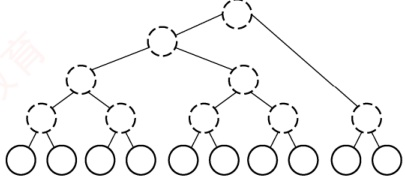
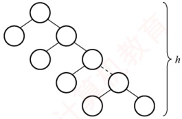
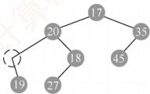

### 5.2.3 本节试题精选

#### 一、 单项选择题

##### 01

下列关于二叉树的说法中，正确的是（ ）。

A. 度为 2 的有序树就是二叉树

B. 含有 $n$ 个结点的二叉树的高度为 $\lfloor \log_2 n \rfloor + 1$

C. 在完全二叉树中，若一个结点没有左孩子，则它必是叶结点

D. 含有 $n$ 个结点的完全二叉树的高度为 $\lceil \log_2 n \rceil$

##### 02

“二叉树为空” 意味着二叉树（）。

A. 根结点没有子树

B. 不存在

C. 没有结点

D. 由一些没有赋值的空结点构成

##### 03

下列关于完全二叉树的说法中，正确的是（）。

A. 在完全二叉树中，叶结点的双亲的左兄弟（若存在）一定不是叶结点

B. 任何一棵二叉树中，叶结点数为2的结点数减1，即 $n_{0}=n_{2}-1$

C. 完全二叉树不适合顺序存储结构，只有满二叉树适合顺序存储结构

D. 结点按完全二叉树层序编号的二叉树中，第i个结点的左孩子的编号为

##### 04

具有 10 个叶结点的二叉树中有（）个度为 2 的结点。

A. 8 B. 9 C. 10 D. 11

##### 05

设高度为 h 的二叉树上只有度为 0 和度为 2 的结点，则此类二叉树中所包含的结点数至少为（）。

A. h B. 2h-1 C. 2h+1 D.  $h+1$

##### 06

具有 n 个结点且高度为 n 的二叉树的数目为（）。

A.  $\log_{2}n$ B. n/2 C. n D.  $2^{n-1}$

##### 07

假设一棵二叉树的结点数为50，则它的最小高度是（）。

A. 4 B. 5 C. 6 D. 7

##### 08

设二叉树有 2n 个结点，且 m < n，则不可能存在（ ）的结点。

A. n 个度为 0 B. 2m 个度为 0 C. 2m 个度为 1 D. 2m 个度为 2

##### 09

一个具有1025个结点的二叉树的高 h 为（）。

A. 11 B. 10 C. 11~1025 D. 10~1024

##### 10

设二叉树只有度为0和2的结点，其结点数为15，则该二叉树的最大深度为（）。

A. 4 B. 5 C. 8 D. 9

##### 11

高度为 h 的完全二叉树最少有 ___ 个结点。

A.  $2^{h}$ B.  $2^{h} + 1$ C.  $2^{h-1}$ D.  $2^{h} - 1$

##### 12

已知一棵完全二叉树的第6层（设根为第1层）有8个叶结点，则完全二叉树的结点数最少是（）。

A. 39 B. 52 C. 111 D. 119

##### 13

若一棵深度为6的完全二叉树的第6层有3个叶结点，则该二叉树共有（ ）个叶结点。

A. 17 B. 18 C. 19 D. 20
##### 14

一棵完全二叉树上有1001个结点，其中叶结点的个数是（）。

A. 250 B. 500 C. 254 D. 501

##### 15

若一棵二叉树有126个结点，在第7层（根结点在第1层）至多有（）个结点。

A. 32 B. 64 C. 63 D. 不存在第7层

##### 16

一棵有124个叶结点的完全二叉树，最多有（）个结点。

A. 247 B. 248 C. 249 D. 250

##### 17

某完全二叉树 T 中，结点数最大的层有 8 个结点，则 T 中至多有（ ）个结点。

A. 8 B. 15 C. 23 D. 31

##### 18

一棵有 n 个结点的二叉树采用二叉链存储结点，其中空指针数为（）。

A. n B.  $n+1$ C. n-1 D. 2n

##### 19

设有  $n (n \geq 1)$ 个结点的二叉树采用三叉链表表示，其中每个结点包含三个指针，分别指向其左孩子、右孩子及双亲（若不存在，则置为空），则下列说法中正确的是（）。

Ⅰ. 树中空指针的数量为  $n+2$

Ⅱ. 所有度为 2 的结点均被三个指针指向

Ⅲ. 每个叶结点均被一个指针所指向

A. I B. I. II C. I. III D. II. III

##### 20

在一棵完全二叉树中，其根的序号为 1，（ ）可判定序号为 p 和 q 的两个结点是否在同一层。

A.  $\lfloor \log_2 p \rfloor = \lfloor \log_2 q \rfloor$

B.  $\log_2 p = \log_2 q$

C.  $\lfloor \log_2 p \rfloor + 1 = \lfloor \log_2 q \rfloor$

D.  $\lfloor \log_2 p \rfloor = \lfloor \log_2 q \rfloor + 1$

##### 21

在一个用数组表示的完全二叉树中，根结点的下标为 1，那么下标为 17 和 19 的结点的最近公共祖先的下标是（）。

A. 1 B. 2 C. 4 D. 8

##### 22

假定一棵三叉树的结点数为 50，则它的最小高度为（）。

A. 3 B. 4 C. 5 D. 6

##### 23

具有 n 个结点的三叉树用三叉链表示，则树中空指针域的个数为（）。

A.  $3n+1$ B.  $2n+1$ C. 3n-1 D. 3n

##### 24

对于一棵满二叉树，共有 n 个结点和 m 个叶结点，高度为 h，则（）。

A.  $n = h + m$ B.  $n + m = 2h$ C. m = h - 1 D.  $n = 2^h - 1$

##### 25

【2009 统考真题】已知一棵完全二叉树的第 6 层（设根为第 1 层）有 8 个叶结点，则该完全二叉树的结点数最多是（）。

A. 39 B. 52 C. 111 D. 119

##### 26

【2011 统考真题】若一棵完全二叉树有 768 个结点，则该二叉树中叶结点的个数是（）。

A. 257 B. 258 C. 384 D. 385

##### 27

【2018 统考真题】设一棵非空完全二叉树 T 的所有叶结点均位于同一层，且每个非叶结点都有 2 个子结点。若 T 有 k 个叶结点，则 T 的结点总数是（）。

A. 2k-1 B. 2k C.  $k^{2}$ D.  $2^{k}-1$

##### 28

【2020 统考真题】对于任意一棵高度为 5 且有 10 个结点的二叉树，若采用顺序存储结构保存，每个结点占 1 个存储单元（仅存放结点的数据信息），则存放该二叉树需要的存储单元数量至少是（）。

A. 31 B. 16 C. 15 D. 10

##### 29

【2022 统考真题】若三叉树 T 中有 244 个结点（叶结点的高度为 1），则 T 的高度至少是（）。
A. 8 B. 7 C. 6 D. 5

##### 30

【2025 统考真题】若二叉树的结点值均为正整数，采用顺序存储方式保存在数组 R 中，用 -1 表示结点不存在，则下列数组中，不能表示一棵二叉树的是（）。

A. R[]={20,15,40,-1,-1,35} B. R[]= {15,40,10,18,35,-1,-1}

C. R[]={15,40,10,-1,-1,-1,12} D. R[]= {17,20,35,-1,18,45,-1,-1,19,27}

#### 二、 综合应用题

##### 01

在一棵完全二叉树中，含有  $n_{0}$ 个叶结点，当度为 1 的结点数为 1 时，该树的高度是多少？当度为 1 的结点数为 0 时，该树的高度是多少？

##### 02

一棵有n个结点的满二叉树有多少个分支结点和多少个叶结点？该满二叉树的高度是多少？

##### 03

已知完全二叉树的第9层有240个结点，则整个完全二叉树有多少个结点？有多少个叶结点？

##### 04

一棵高度为 h 的满 m 叉树有如下性质：根结点所在层次为第 1 层，第 h 层上的结点都是叶结点，其余各层上每个结点都有 m 棵非空子树，若按层次自顶向下，同一层自左向右，顺序从 1 开始对全部结点进行编号，试问：

1）各层的结点数是多少？

2）编号为i的结点的双亲结点（若存在）的编号是多少？

3）编号为i的结点的第k个孩子结点（若存在）的编号是多少？

4）编号为i的结点有右兄弟的条件是什么？其右兄弟结点的编号是多少？

##### 05

已知一棵二叉树按顺序存储结构进行存储，设计一个算法，求编号分别为 i 和 j 的两个结点的最近的公共祖先结点的值。

##### 06

【2016 统考真题】若一棵非空  $k(k \geqslant 2)$ 叉树 T 中的每个非叶结点都有 k 个孩子，则称 T 为正则 k 叉树。请回答下列问题并给出推导过程。

1）若 T 有 m 个非叶结点，则 T 中的叶结点有多少个？

2）若 T 的高度为 h（单结点的树 h=1），则 T 的结点数最多为多少个？最少为多少个？

### 5.2.4 答案与解析

#### 一、 单项选择题

##### 01

C

在二叉树中，若某个结点只有一个孩子，则这个孩子的左右次序是确定的；而在度为2的有序树中，若某个结点只有一个孩子，则这个孩子就无须区分其左右次序，选项A错误。选项B仅当是完全二叉树时才有意义，对于任意一棵二叉树，高度可能为 $\lfloor \log_2 n \rfloor + 1 \sim n$。在完全二叉树中，若有度为1的结点，则只可能有一个，且该结点只有左孩子而无右孩子，选项C正确。完全二叉树的高度为 $\lceil \log_2 (n+1) \rceil$或 $\lfloor \log_2 n \rfloor + 1$，也可通过举例n=4来排除，选项D错误。

##### 02

C

“二叉树为空”意味着二叉树中没有结点，但并不意味着二叉树不存在。注意，线性表可以是空表，树可以是空树，但图不能是空图（图中不能没有结点）。

##### 03

A

在完全二叉树中，叶结点的双亲的左兄弟的孩子一定在其前面（且一定存在），所以双亲的左兄弟（若存在）一定不是叶结点，选项 A 正确。 $n_{0}$ 应等于  $n_{2}+1$，选项 B 错误。完全二叉树和满二叉树均可以采用顺序存储结构，选项 C 错误。第 i 个结点的左孩子不一定存在，选项 D 错误。
选项 B 的这种通用公式适用于所有二叉树，我们应能立即联想到采用特殊值代入法验证，如画一个只含 3 个结点的满二叉树的草图来验证是否满足条件。

##### 04

B

由二叉树的性质  $n_{0}=n_{2}+1$，得  $n_{2}=n_{0}-1=10-1=9$。

【另解】画出草图，如下图所示。首先画出10个叶结点，然后每2个结点向上合并，构造一个新的度为2的分支结点，直到构成如下图所示的二叉树，其中度为2的分支结点数为9。



##### 05

B

结点最少的情况如下图所示。除根结点层只有1个结点外，其他h-1层均有两个结点，结点总数= $2(h-1)+1=2h-1$。



##### 06

D

除根结点外，在其余n-1个结点中，每个结点要么是其父结点的左孩子，要么是其父结点的右孩子，每个结点都有两种可能，n-1个结点共有 $2^{n-1}$种不同的组合形态。

##### 07

C

要求满足条件的树，分析可知当这50个结点构成一棵完全二叉树时高度最小， $h = \lfloor \log_2 n \rfloor + 1 = \lfloor \log_2 50 \rfloor + 1 = 6$。

【另解】第1层最多有1个结点，第2层最多有 $2^{1}$个结点，第3层最多有 $2^{2}$个结点，第4层最多有 $2^{3}$个结点，以此类推，可以得到h最少为6。

##### 08

C

由二叉树的性质1可知  $n_{0}=n_{2}+1$，结点总数$=2n=n_{0}+n_{1}+n_{2}=n_{1}+2n_{2}+1$，则  $n_{1}=2(n-n_{2})-1$，所以  $n_{1}$ 为奇数，说明该二叉树中不可能有 2m 个度为1的结点。

##### 09

C

当二义树为卑支树时具有最大高度，即每层上只有一个结点，最大高度为1025。而当树为完全二叉树时，其高度最小，最小高度为 $\lfloor \log_2 n \rfloor + 1 = 11$。

##### 10

C

建议画图，第一层有1个结点，其余$h-1$层各有2个结点，总结点数$=1+2(h-1)=15$，$h=8$。

##### 11

C

高度为 h 的完全二叉树中，第 1 层～第 h-1 层构成一个高度为 h-1 的满二叉树，结点数为  $2^{h-1}-1$。第 h 层至少有一个结点，所以最少的结点数  $=(2^{h-1}-1)+1=2^{h-1}$。
##### 12

A

第6层有叶结点说明完全二叉树的高度可能为6或7，显然树高为6时结点最少。若第6层上有8个叶结点，则前5层为满二叉树，所以完全二叉树的结点数最少为 $2^{5}-1+8=39$。

##### 13

A

深度为6的完全二叉树，第5层共有 $2^{4}=16$个结点。第6层最左边有3个叶结点，其对应的双亲结点为第5层最左边的两个结点，所以第5层剩余的结点均为叶结点，共有16-2=14个，加上第6层的3个叶结点，共有17个叶结点。

##### 14

D

由完全二叉树的性质，最后一个分支结点的序号为 $\lfloor1001/2\rfloor=500$，所以叶结点数为501。

【另解】 $n=n_{0}+n_{1}+n_{2}=n_{0}+n_{1}+(n_{0}-1)=2n_{0}+n_{1}-1$，因为 n=1001，而在完全二叉树中， $n_{1}$ 只能取 0 或 1。当  $n_{1}=1$ 时， $n_{0}$ 为小数，不符合题意。所以  $n_{1}=0$，于是有  $n_{0}=501$。

##### 15

C

要使二叉树第7层的结点数最多，只考虑树高为7层的情况，7层满二叉树有127个结点，126仅比127少1个结点，只能少在第7层，所以第7层最多有 $2^{6}-1=63$个结点。

##### 16

B

在非空的二叉树当中，由度为0和2的结点数的关系  $n_{0}=n_{2}+1$ 可知  $n_{2}=123$；总结点数  $n=n_{0}+n_{1}+n_{2}=247+n_{1}$，其最大值为248（ $n_{1}$ 的取值为1或0，当  $n_{1}=1$ 时结点最多）。注意，由完全二叉树总结点数的奇偶性可以确定  $n_{1}$ 的值，但不能根据  $n_{0}$ 来确定  $n_{1}$ 的值。

【另解】 $124 < 2^{7} = 128$，所以第8层没满，前7层为完全二叉树，由此可推算第8层可能有120个叶结点，第7层的最右4个为叶结点，考虑最多的情况，这4个叶结点中的最左边可以有1个左孩子（不改变叶结点数），因此结点总数 $=2^{7} - 1 + 120 + 1 = 248$。

##### 17

C

在完全二叉树中，第4层刚好最多有8个结点（前4层对应高度为4的满二叉树），若第5层也有8个结点，则对应于结点数最多的情况，此时树高为5，总结点数为 $15+8=23$。

##### 18

B

非空指针数 = 总分支数 = n - 1，空指针数 = 2 × 结点总数 - 非空指针数 = 2n - (n - 1) = n + 1。

【另解】在树中，1个指针对应1个分支，n个结点的树共有n-1个分支，即n-1个非空指针，每个结点都有2个指针域，所以空指针数= $2n-(n-1)=n+1$。

##### 19

A

二叉链表表示的二叉树中空指针的数量为  $n+1$，三叉链表表示的二叉树多了一个根结点指向双亲的空指针，所以树中空指针的数量为  $n+2$，说法 I 正确。若根结点的度为 2，则只有左右两个孩子指向它，说法 II 错误。若整棵树只有一个根结点，则没有指针指向它，说法 III 错误。

##### 20

A

由完全二叉树的性质，编号为  $i$（ $i \geq 1$）的结点所在的层次为 $\lfloor \log_2 i \rfloor + 1$，若两个结点位于同一层，则一定有 $\lfloor \log_2 p \rfloor + 1 = \lfloor \log_2 q \rfloor + 1$，因此有 $\lfloor \log_2 p \rfloor = \lfloor \log_2 q \rfloor$成立。

##### 21

C

当根结点下标为1时，下标为i的结点的父结点下标为 $\lfloor i/2\rfloor$，那么下标为17的祖先的下标有8,4,2,1，下标为19的祖先的下标有9,4,2,1，因此两者最近的公共祖先的下标是4。

##### 22

C

分析可知，满足条件的三叉树可以是完全三叉树，这棵树的第  $i$ ( $i \geq 1$) 层最多有  $3^{r-1}$ 个结点。设高度为  $h$，则  $3^0 + 3^1 + \cdots + 3^{r-1} = (3^h - 1)/2$ 是结点数的上限，问题是求解  $50 \leq (3^h - 1)/2$ 的最小  $h$ 值，即  $h \geq \log_3 101$，有  $h = \lceil \log_3 101 \rceil = 5$。
##### 23

B

三叉树采用三叉链表表示，每个结点均有3个指针域指向3个孩子，共有3n个指针域，但n个结点构成的一棵树中只需要n-1个指针（对于n-1条边），因此空指针域有 $2n+1$个。

##### 24

D

对于高度为 h 的满二叉树，结点总数  $n = 2^0 + 2^1 + \cdots + 2^{h-1} = 2^h - 1$，叶结点数  $m = 2^{h-1}$。

##### 25

C

第6层有叶结点，完全二叉树的高度可能为6或7，显然树高为7时结点最多。完全二叉树与满二叉树相比，只是在最下一层的右边缺少部分叶结点，而最后一层之上是个满二叉树，且只有最后两层上有叶结点。若第6层上有8个叶结点，则前6层为满二叉树，而第7层缺失 $8\times2=16$个叶结点，所以完全二叉树的结点数最多为 $2^7 - 1 - 16 = 111$。

##### 26

C

最后一个分支结点的编号为 ∨ 768/2 ∨ = 384，所以叶结点的个数为 768 - 384 = 384。

【另解】 $n=n_{0}+n_{1}+n_{2}=n_{0}+n_{1}+(n_{0}-1)=2n_{0}+n_{1}-1$，其中n=768，而在完全二叉树中， $n_{1}$只能取0或1，当 $n_{1}=0$时， $n_{0}$为小数，不符合题意。因此 $n_{1}=1$，所以 $n_{0}=384$。

##### 27

A

非叶结点的度均为2，且所有叶结点都位于同一层的完全二叉树就是满二叉树。对于一棵高度为h的满二叉树（空树h=0），其最后一层全部是叶结点，数目为 $2^{h-1}$；总结点数为 $2^h-1$。因此当 $2^{h-1}=k$时，可以得到 $2^h-1=2k-1$。

##### 28

A

二叉树采用顺序存储时，用数组下标来表示结点之间的父子关系。对于一棵高度为5的二叉树，为了满足任意性，其1～5层的所有结点都要被存储起来，即考虑为一棵高度为5的满二叉树，共需要存储单元的数量为 $1+2+4+8+16=31$。

##### 29

C

高度一定的三叉树中结点数最多的情况是满三叉树。高度为5的满三叉树的结点数= $3^{0}+3^{1}+3^{2}+3^{3}+3^{4}=121$，高度为6的满三叉树的结点数= $3^{0}+3^{1}+3^{2}+3^{3}+3^{4}+3^{5}=364$。三叉树T的结点数为244， $121<244<364$，因此T的高度至少为6。

##### 30

D

在二叉树的顺序存储结构中，结点按完全二叉树的层次顺序存放：根在下标0，对于任意非根结点R[i]，其父结点为R[(i-1)/2]。若某结点为空，则其所有后代位置必须也为空，否则将出现“空结点拥有非空子结点”的情况，违反二叉树的定义。在选项A、B、C中，所有非-1的元素，其从根到该结点的祖先路径上均不含-1，符合顺序存储规则。在选项D中，R[8]=19是一个有效结点，其父结点应为R[(8-1)/2]=R[3]，但R[3]=-1，表示该结点不存在，因此无法构成合法的二叉树。



#### 二、 综合应用题

##### 01

【解答】

在非空的二叉树中，由度为0和度为2的结点之间的关系 $n_{0}=n_{2}+1$，可知 $n_{2}=n_{0}-1$。因此总结点数 $n=n_{0}+n_{1}+n_{2}=2n_{0}+n_{1}-1$。

① 当  $n_1 = 1$ 时， $n = 2n_0$， $h = \lceil \log_2(n + 1) \rceil = \lceil \log_2(2n_0 + 1) \rceil$。

② 当  $n_1 = 0$ 时， $n = 2n_0 - 1$， $h = \lceil \log_2(n + 1) \rceil = \lceil \log_2(2n_0) \rceil = \lceil \log_2(n_0) \rceil + 1$。

##### 02

【解答】

满二叉树中  $n_{1}=0$ ，由二叉树的性质1可知  $n_{0}=n_{2}+1$ ，即  $n_{2}=n_{0}-1, n=n_{0}+n_{1}+n_{2}=2n_{0}-1$
则  $n_0 = (n+1)/2$。分支结点数  $n_2 = n - (n+1)/2 = (n-1)/2$。高度为  $h$ 的满二叉树的结点数  $n = 1 + 2^1 + 2^2 + \cdots + 2^{h-1} = 2^h - 1$，即高度  $h = \log_2(n+1)$。

##### 03

【解答】

在完全二叉树中，若第9层是满的，则结点数= $2^{9-1}=256$，而现在第9层只有240个结点，说明第9层未满，是最后一层。1～8层是满的，所以总结点数= $2^8 - 1 + 240 = 495$。

因为第9层是最后一层，所以第9层的结点都是叶结点。且第9层的240个结点的双亲在第8层中，其双亲个数为120，即第8层有120个分支结点，其余为叶结点，所以第8层的叶结点数为 $2^{8-1}-120=8$。因此，总的叶结点数=8+240=248。

【另解】总结点数  $n=n_{0}+n_{1}+n_{2}$， $n_{2}=n_{0}-1$， $n=n_{0}+n_{1}+n_{2}=2n_{0}+n_{1}-1$。若  $n_{1}=1$，则  $2n_{0}+n_{1}-1=2n_{0}=495$，不符合；若  $n_{1}=0$，则  $2n_{0}+n_{1}-1=2n_{0}-1=495$，则  $n_{0}=248$。

**注意**

对于本题，应理解完全二叉树中只有最底层的结点是不满的，其他各层的结点都是满的。

##### 04

【解答】

1）第1层有  $m^0 = 1$ 个结点，第2层有  $m^1$ 个结点，第3层有  $m^2$ 个结点……一般地，第 $i$层有  $m^{i-1}$ 个结点（ $1 \leq i \leq h$）。

2）在 $m$ 叉树的情形下，结点 $i$ 的第 1 个孩子编号为 $j = (i-1)m + 2$，反过来，结点 $i$ 的双亲的编号是 $\lfloor(i-2)/m\rfloor + 1$，根结点没有双亲，所以要求 $i > 1$。

3）因为结点  $i$ 的第 1 个孩子编号为  $(i-1)m+2$，若设该结点孩子的序号为  $k=1,2,\cdots,m$，则第  $k$ 个孩子结点的编号为  $(i-1)m+k+1$（ $1\leq k\leq m$）。

4）结点  $i$ 不是其双亲的第  $m$ 个孩子时才有右兄弟。设其双亲编号为  $j$，可得  $j = \lfloor (i + m - 2) / m \rfloor$，结点  $j$ 的第  $m$ 个孩子的编号为  $(j - 1) m + m + 1 = \lfloor (i + m - 2) / m \rfloor m + 1$，所以当结点的编号  $i \leq \lfloor (i + m - 2) / m \rfloor m$ 时才有右兄弟，右兄弟的编号为  $i + 1$。或者，对于任意一个双亲结点  $j$，其第  $m$ 个孩子结点的编号是  $j m + 1$，故若不为第  $m$ 个孩子结点，则  $(i - 1) \% m! = 0$。

##### 05

【解答】

首先，必须明确二叉树中任意两个结点必然存在最近的公共祖先结点，最坏的情况下是根结点（两个结点分别在根结点的左右分支中），而且从最近的公共祖先结点到根结点的全部祖先结点都是公共的。由二叉树顺序存储的性质可知，任意一个结点 i 的双亲结点的编号为 i/2。求解 i 和 j 最近公共祖先结点的算法步骤如下（设从数组下标 1 开始存储）：

1）若  $i > j$，则结点 i 所在层次大于或等于结点 j 所在层次。结点 i 的双亲结点为结点 i/2，若  $i/2 = j$，则结点 i/2 是原结点 i 和结点 j 的最近公共祖先结点，若  $i/2 \ne j$，则令  $i = i/2$，即以该结点 i 的双亲结点为起点，采用递归的方法继续查找。

2）若  $j > i$，则结点  $j$ 所在层次大于或等于结点  $i$ 所在层次。结点  $j$ 的双亲结点为结点  $j/2$，若  $j/2 = i$，则结点  $j/2$ 是原结点  $i$ 和结点  $j$ 的最近公共祖先结点，若  $j/2 \ne i$，则令  $j = j/2$。重复上述过程，直到找到它们最近的公共祖先结点为止。

本题代码如下：

```c
ElemType Comm_Ancestor(SqTree T, int i, int j){
//本算法在二叉树中查找结点 i 和结点 j 的最近公共祖先结点
if (T[i] != '#' &&T[j] != '#') { //结点存在
    while (i != j) { //两个编号不同时循环
        if (i > j)
            i = i / 2; //向上找 i 的祖先
        }
    }
}
```


由解题中算法的步骤描述可知，本题也很容易地联想到采用递归的方法求解。

##### 06

【解答】

1）正则 k 叉树中仅含有两类结点；叶结点（个数记为  $n_{0}$）和度为 k 的分支结点（个数记为  $n_{k}$）。树 T 中的结点总数  $n = n_{0} + n_{k} = n_{0} + m$。树中所含的边数 e = n - 1，这些边均是从 m 个度为 k 的结点发出的，即 e = mk。整理得  $n_{0} + m = mk + 1$，所以  $n_{0} = (k - 1)m + 1$。

2）高度为 h 的正则 k 叉树 T 中，含最多结点的树形为：除第 h 层外，第 1 到第 h-1 层的结点都是度为 k 的分支结点；而第 h 层均为叶结点，即树是“满”树。此时第  $j$（ $1 \leq j \leq h$）层的结点数为  $k^{j-1}$，结点总数  $M_1$ 为

 $$M_{1}=\sum_{j=1}^{h}k^{j-1}=\frac{k^{h}-1}{k-1}$$

含最少结点的正则 k 叉树的树形为：第 1 层只有根结点，第 2 到第 h-1 层仅含 1 个分支结点和 k-1 个叶结点，第 h 层有 k 个叶结点。也就是说，除根外，第 2 到第 h 层中每层的结点数均为 k，所以 T 中所含结点总数  $M_{2}$ 为

 $$M_{2}=1+(h-1)k$$
