### 5.3.3 本节试题精选

#### 一、 单项选择题

##### 01

在下列关于二叉树遍历的说法中，正确的是（）。
A. 若有一个结点是二叉树中某个子树的中序遍历结果序列的最后一个结点，则它一定是该子树的先序遍历结果序列的最后一个结点

B. 若有一个结点是二叉树中某个子树的先序遍历结果序列的最后一个结点，则它一定是该子树的中序遍历结果序列的最后一个结点

C. 若有一个叶结点是二叉树中某个子树的中序遍历结果序列的最后一个结点，则它一定是该子树的先序遍历结果序列的最后一个结点

D. 若有一个叶结点是二叉树中某个子树的先序遍历结果序列的最后一个结点，则它一定是该子树的中序遍历结果序列的最后一个结点

##### 02

在任何一棵二叉树中，若结点 a 有左孩子 b、右孩子 c，则在结点的先序序列、中序序列、后序序列中，( )。

A. 结点 b 一定在结点 a 的前面

B. 结点 a 一定在结点 c 的前面

C. 结点 b 一定在结点 c 的前面

D. 结点 a 一定在结点 b 的前面

##### 03

设 n, m 为一棵二叉树上的两个结点，在中序遍历时，n 在 m 前的条件是（）。

A. n 在 m 右方 B. n 是 m 祖先 C. n 在 m 左方 D. n 是 m 子孙

##### 04

设 n, m 为一棵二叉树上的两个结点，在后序遍历时，n 在 m 前的充分条件是（）。

A. n 在 m 右方 B. n 是 m 祖先 C. n 在 m 左方 D. n 是 m 子孙

##### 05

某非空二叉树采用顺序存储结构，树中的结点信息按完全二叉树的层次序列依次存放在如下所示的一维数组中，则该二叉树的后序遍历序列为（）。

| 0 | 1 | 2 | 3 | 4 | 5 | 6 | 7 | 8 | 9 | 10 | 11 | 12 |
| --- | --- | --- | --- | --- | --- | --- | --- | --- | --- | --- | --- | --- |
| a | b | c |   | d | e | f |   |   | g |   |   | h |

A. ghbefhca B. gbdehcfa C. gdbhefca D. bgdehcfa

##### 06

在二叉树的先序序列、中序序列和后序序列中，所有叶结点的先后顺序（）。

A. 都不相同

B. 完全相同

C. 先序和中序相同，而与后序不同

D. 中序和后序相同，而与先序不同

##### 07

对二叉树的结点从1开始进行连续编号，要求每个结点的编号大于其左右孩子的编号，同一结点的左右孩子中，其左孩子的编号小于其右孩子的编号，可采用（ ）次序的遍历实现编号。

A. 先序遍历 B. 中序遍历 C. 后序遍历 D. 层次遍历

##### 08

按某种顺序对二叉树的结点进行编号，编号为1,2, $\cdots$,n，规定：树中任一结点v，其编号等于v的左子树上的最小编号减1，而v的右子树中的最小编号等于v的左子树上的最大编号加1，则说明该二叉树是按（）次序编号的。

A. 中序遍历 B. 先序遍历 C. 后序遍历 D. 层次遍历

##### 09

先序序列为 A, B, C, 后序序列为 C, B, A 的二叉树共有（）。

A. 1 棵 B. 2 棵 C. 3 棵 D. 4 棵

##### 10

一棵完全二叉树的后序遍历序列为 CDBFGEA，则其先序遍历序列是（）。

A. CBDAFEG B. ABECDFG C. ABCDEFG D. 无法确定

##### 11

设结点 X 和 Y 是二叉树中任意的两个结点。在该二叉树的先序遍历序列中 X 在 Y 之前，而在其后序遍历序列中 X 在 Y 之后，则 X 和 Y 的关系是（）。

A. X 是 Y 的左兄弟

B. X 是 Y 的右兄弟

C. X 是 Y 的祖先

D. X 是 Y 的后裔
##### 12

若二叉树中结点的先序序列是 $\cdots a\cdots b\cdots$，中序序列是 $\cdots b\cdots a\cdots$，则（）。

A. 结点 a 和结点 b 分别在某结点的左子树和右子树中

B. 结点 b 在结点 a 的右子树中

C. 结点 b 在结点 a 的左子树中

D. 结点 a 和结点 b 分别在某结点的两棵非空子树中

##### 13

一棵二叉树的先序遍历序列为 1234567，它的中序遍历序列可能是（）。

A. 3124567 B. 1234567 C. 4135627 D. 1463572

##### 14

下列序列中，不能唯一地确定一棵二叉树的是（）。

A. 层次序列和中序序列

B. 先序序列和中序序列

C. 后序序列和中序序列

D. 先序序列和后序序列

##### 15

若一棵二叉树的中序序列和后序序列相同，则（）。

A. 二叉树为空树或二叉树任一结点没有左子树

B. 二叉树为空树或二叉树任一结点没有右子树

C. 二叉树为空树或二叉树中每个结点的度为1

D. 二叉树为空树或二叉树为满二叉树

##### 16

已知一棵二叉树的后序序列为 DABEC，中序序列为 DEBAC，则先序序列为（）。

A. ACBED B. DECAB C. DEABC D. CEDBA

##### 17

已知一棵二叉树的先序遍历结果为  $ABCDEF$，中序遍历结果为 CBAEDF，则后序遍历的结果为（）。

A. CBEFDA B. FEDCBA C. CBEDFA D. 不确定

##### 18

已知一棵二叉树的层次序列为 ABCDEF，中序序列为 BADCFE，则先序序列为（）。

A. ACBEDF B. ABCDEF C. BDFECA D. FCEDBA

##### 19

某二叉树中结点 x 在先序、中序、后序遍历序列中的编号分别为 pre(x)、in(x)、post(x)（假设都从 1 开始依次顺序编号），a 和 b 是该二叉树中的两个结点，其中 a 是 b 的祖先，则下列选项中不可能出现的是（）。

A.  $\operatorname{pre}(a) < \operatorname{pre}(b)$ B.  $\operatorname{post}(a) < \operatorname{post}(b)$ C.  $\operatorname{in}(a) < \operatorname{in}(b)$ D.  $\operatorname{in}(a) > \operatorname{in}(b)$

##### 20

某二叉树采用二叉链表存储结构，若要删除该二叉链表中的所有结点，并释放它们占用的存储空间，则采用（ ）遍历方法最合适。

A. 中序          B. 层次          C. 后序          D. 先序

##### 21

某二叉树 T 采用二叉链表存储结构，T 的中序遍历序列为一个升序序列，要求采用某种方法对 T 进行某种操作之后得到一棵新的二叉树  $T'$，要求  $T'$ 的中序遍历序列为一个降序序列，则下列关于该算法的叙述中，正确的是（）。

A. 采用中序遍历的方法最合适 B. 采用后序遍历的方法最合适

C.  $T'$ 中的根结点一定不是原 T 中的根结点 D.  $T'$ 中的叶结点不一定是原 T 中的叶结点

##### 22

引入线索二叉树的目的是（）。

A. 加快查找结点的前驱或后继的速度 B. 为了能在二叉树中方便插入和删除

C. 为了能方便找到双亲 D. 使二叉树的遍历结果唯一

##### 23

n个结点的线索二叉树上含有的线索数为（）。

A. 2n B. n-1 C.  $n+1$ D. n

##### 24

判断线索二叉树中 *p 结点有右孩子结点的条件是（ ）。

A. p!=NULL

B. p->rchild!=NULL
C. `p->rtag==0 D. p->rtag==1`

##### 25

一棵左子树为空的二叉树在先序线索化后，其中空的链域的个数是（）。

A. 不确定 B. 0 个 C. 1 个 D. 2 个

##### 26

在线索二叉树中，下列说法不正确的是（）。

A. 在中序线索树中，若某结点有右孩子，则其后继结点是它的右子树的最左下结点

B. 在中序线索树中，若某结点有左孩子，则其前驱结点是它的左子树的最右下结点

C. 线索二叉树是利用二叉树的  $n+1$ 个空指针来存放结点的前驱和后继信息的

D. 每个结点通过线索都可以直接找到它的前驱和后继

##### 27

二叉树在线索化后，仍不能有效求解的问题是（）。

A. 先序线索二叉树中求先序后继

B. 中序线索二叉树中求中序后继

C. 中序线索二叉树中求中序前驱

D. 后序线索二叉树中求后序后继

##### 28

若 X 是二叉中序线索树中一个有左孩子的结点，且 X 不为根，则 X 的前驱为（）。

A. X 的双亲

B. X 的右子树中最左的结点

C. X 的左子树中最右的结点

D. X 的左子树中最右的叶结点

##### 29

若 X 是后序线索二叉树中的叶结点，且 X 存在左兄弟 Y，则 X 的右线索指向的是（）。

A. X 的双亲

B. 以 Y 为根的子树的最左下结点

C. X 的左兄弟 Y

D. 以 Y 为根的子树的最右下结点

##### 30

某二叉树的先序序列和后序序列正好相反，则该二叉树一定是（）。

A. 空或只有一个结点

B. 高度等于其结点数

C. 任意一个结点无左孩子

D. 任意一个结点无右孩子

##### 31

某非空二叉树的先序序列和中序序列正好相反，则下列叙述中正确的是（）。

A. 该二叉树一定只有一个结点

B. 只有一个叶结点的二叉树一定满足条件

C. 任意一个结点无左孩子的二叉树一定满足条件

D. 任意一个结点无右孩子的二叉树一定满足条件

##### 32

【2009 统考真题】给定二叉树如右图所示。设 N 代表二叉树的根，L 代表根结点的左子树，R 代表根结点的右子树。若遍历后的结点序列是 3175624，则其遍历方式是（）。

A. LRN B. NRL C. RLN D. RNL

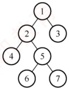

##### 33

【2010 统考真题】下列线索二叉树中（用虚线表示线索），符合后序线索树定义的是（）。

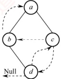

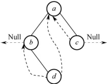

A.

B.

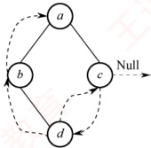

C.

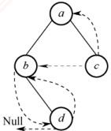

D.

##### 34

【2011 统考真题】一棵二叉树的先序遍历序列和后序遍历序列分别为 1,2,3,4 和 4,3,2,1，该二叉树的中序遍历序列不会是（）。

A. 1,2,3,4 B. 2,3,4,1 C. 3,2,4,1 D. 4,3,2,1
##### 35

【2012 统考真题】若一棵二叉树的先序遍历序列为 a, e, b, d, c, 后序遍历序列为 b, c, d, e, a，则根结点的孩子结点（）。

A. 只有 e

B. 有 e、b

C. 有 e、c

D. 无法确定

##### 36

【2013 统考真题】若 X 是后序线索二叉树中的叶结点，且 X 存在左兄弟结点 Y，则 X 的右线索指向的是（）。

A. X 的父结点

B. 以 Y 为根的子树的最左下结点

C. X 的左兄弟结点 Y

D. 以 Y 为根的子树的最右下结点

##### 37

【2014 统考真题】若对右图所示的二叉树进行中序线索化，则结点 X 的左右线索指向的结点分别是（）。

A. e, c B. e, a C. d, c D. b, a

##### 38

【2015 统考真题】先序序列为 a, b, c, d 的不同二叉树的个数是（）。

A. 13 B. 14 C. 15 D. 16

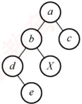

##### 39

【2017 统考真题】某二叉树的树形如右图所示，其后序序列为 e, a, c, b, d, g, f，树中与结点 a 同层的结点是（）。

A. c B. d C. f D. g

##### 40

【2017 统考真题】要使一棵非空二叉树的先序序列与中序序列相同，其所有非叶结点须满足的条件是（）。

A. 只有左子树

B. 只有右子树

C. 结点的度均为1

D. 结点的度均为2

##### 41

【2022 统考真题】若结点 p 与 q 在二叉树 T 的中序遍历序列中相邻，且 p 在 q 之前，则下列 p 与 q 的关系中， \underset{·}{不}可能的是（）。

I. q 是 p 的双亲

II. q 是 p 的右孩子

III. q 是 p 的右兄弟

IV. q 是 p 的双亲的双亲

A. 仅 I B. 仅 III C. 仅 II、III D. 仅 II、IV

##### 42

【2023 统考真题】已知一棵二叉树的树形如右图所示，若其后序遍历序列为 fdbeca，则其先（前）序遍历序列是（）。

A. aedfbc B. acebdf

C. cabefd D. dfebac

##### 43

【2024 统考真题】若 p、q 和 v 均为二叉树 T 中的结点，v 有两个孩子结点，T 的中序遍历序列形如 “⋯, p, v, q, ⋯”，则在下列叙述中，正确的是（）。

A. p 没有右孩子，q 没有左孩子 B. p 没有右孩子，q 有左孩子

C. p 有右孩子，q 没有左孩子 D. p 有右孩子，q 有左孩子

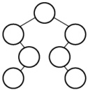

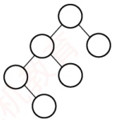

#### 二、 综合应用题

##### 01

若某非空二叉树的先序序列和后序序列正好相反，则该二叉树的形态是什么？

##### 02

若某非空二叉树的先序序列和后序序列正好相同，则该二叉树的形态是什么？

##### 03

假设二叉树采用二叉链表存储结构，设计一个非递归算法求二叉树的高度。

##### 04

二叉树按二叉链表形式存储，试编写一个判别给定二叉树是否是完全二叉树的算法。

##### 05

假设二叉树采用二叉链表存储结构存储，试设计一个算法，计算一棵给定二叉树的所有双分支结点数。

##### 06

设树 B 是一棵采用链式结构存储的二叉树，编写一个把树 B 中所有结点的左右子树进行交换的函数。
##### 07

假设二叉树采用二叉链存储结构存储，设计一个算法，求先序遍历序列中第  $k$（ $1 \leq k \leq$ 二叉树中结点数）个结点的值。

##### 08

已知二叉树以二叉链表存储，编写算法完成：对于树中每个元素值为 x 的结点，删除以它为根的子树，并释放相应的空间。

##### 09

在二叉树中查找值为 x 的结点，试编写算法（用 C 语言）打印值为 x 的结点的所有祖先，假设值为 x 的结点不多于一个。

##### 10

设一棵二叉树的结点结构为 (LLINK, INFO, RLINK)，ROOT为指向该二叉树根结点的指针，p 和 q 分别为指向该二叉树中任意两个结点的指针，试编写算法 ANCESTOR (ROOT, p, q, r)，找到 p 和 q 的最近公共祖先结点 r。

##### 11

假设二叉树采用二叉链表存储结构，设计一个算法，求非空二叉树b的宽度（具有结点数最多的那一层的结点数）。

##### 12

设有一棵满二叉树（所有结点值均不同），已知其先序序列为 pre，设计一个算法求其后序序列 post。

##### 13

设计一个算法将二叉树的叶结点按从左到右的顺序连成一个单链表，表头指针为 head。二叉树按二叉链表方式存储，链接时用叶结点的右指针域来存放单链表指针。

##### 14

试设计判断两棵二叉树是否相似的算法。所谓二叉树  $T_{1}$ 和  $T_{2}$ 相似，指的是  $T_{1}$ 和  $T_{2}$ 都是空的二叉树或都只有一个根结点；或者  $T_{1}$ 的左子树和  $T_{2}$ 的左子树是相似的，且  $T_{1}$ 的右子树和  $T_{2}$ 的右子树是相似的。

##### 15

【2014 统考真题】二叉树的带权路径长度（WPL）是二叉树中所有叶结点的带权路径长度之和。给定一棵二叉树 T，采用二叉链表存储，结点结构为

| left | weight | right |
| --- | --- | --- |

其中叶结点的 weight 域保存该结点的非负权值。设 root 为指向 T 的根结点的指针，请设计求 T 的 WPL 的算法，要求：

1）给出算法的基本设计思想。

2）使用 C 或 C++ 语言，给出二叉树结点的数据类型定义。

3）根据设计思想，采用 C 或 C++ 语言描述算法，关键之处给出注释。

##### 16

【2017 统考真题】请设计一个算法，将给定的表达式树（二叉树）转换为等价的中级表达式（通过括号反映操作符的计算次序）并输出。例如，当下列两棵表达式树作为算法的输入时：

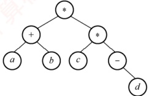

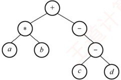

输出的等价中缀表达式分别为  $(a+b) \times (c \times (-d))$ 和  $(a \times b) + (-c - d)$。

二叉树结点定义如下：

```c
typedef struct node{
    char data[10]; //存储操作数或操作符
```
```c
    struct node *left, *right;
} BTree;
```

要求：

1）给出算法的基本设计思想。
2）根据设计思想，采用 C 或 C++ 语言描述算法，关键之处给出注释。

##### 17

【2022 统考真题】已知非空二叉树 T 的结点值均为正整数，采用顺序存储方式保存，数据结构定义如下：

```c
typedef struct {
    int SqBiTNode[MAX_SIZE];
    int ElemNum;
} SqBiTree;

//MAX_SIZE 为已定义常量
//保存二叉树结点值的数组
//实际占用的数组元素个数
```

T中不存在的结点在数组SqBiTNode中用-1表示。例如，对于下图所示的两棵非空二叉树 $T_{1}$和 $T_{2}$，

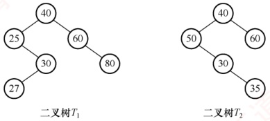

 $T_{1}$ 的存储结果如下：

T1.SqBiTNode
T1.ElemNum=10

| T1.SqBiTNode | 40 | 25 | 60 | -1 | 30 | -1 | 80 | -1 | -1 | 27 |
| --- | --- | --- | --- | --- | --- | --- | --- | --- | --- | --- |

 $T_{2}$ 的存储结果如下：

T2.SqBiTNode
T2.ElemNum=11

| 40 | 50 | 60 | -1 | 30 | -1 | -1 | -1 | -1 | -1 | 35 |
| --- | --- | --- | --- | --- | --- | --- | --- | --- | --- | --- |

请设计一个尽可能高效的算法，判定一棵采用这种方式存储的二叉树是否为二叉搜索树，若是，则返回 true，否则，返回 false。要求：

1）给出算法的基本设计思想。

2）根据设计思想，采用 C 或 C++ 语言描述算法，关键之处给出注释。

### 5.3.4 答案与解析

#### 一、 单项选择题

##### 01

C

二叉树中序遍历的最后一个结点一定是从根开始沿右孩子指针链走到底的结点，设用p指示。若结点p不是叶结点（其左子树非空），则先序遍历的最后一个结点在它的左子树中，选项A、B错误；若结点p是叶结点，则先序与中序遍历的最后一个结点就是它，选项C正确。若中序遍历的最后一个结点p不是叶结点，它还有一个左孩子q，结点q是叶结点，那么结点q是先序遍历的最后一个结点，但不是中序遍历的最后一个结点，选项D错误。

##### 02

C

三种遍历方式中，都先遍历左子树，再遍历右子树，因此 b 一定在 c 的前面访问。

##### 03

C

中序遍历时，先访问左子树，再访问根结点，后访问右子树。n 在 m 前的 3 种可能性如右图所示，从中看出 n 总是在 m 的左方。

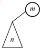

【另解】设 n 和 m 的最近公共祖先 p，则有以下可能：

(a)

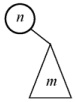

(b)

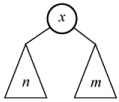

(c)

情形 1，m 和 n 分别在 p 的左右（右左）分支上；情形 2，m 或 n 为 p 结点，另一结点在 p
的分支上。只有 n 和 m 分别处于 p 的左右分支上，m 为祖先结点且 n 位于 m 的左分支，n 为祖先结点且 m 位于 n 的右分支，符合题意。

##### 04

D

后序遍历的顺序是 LRN，若 n 在 N 的左子树上，m 在 N 的右子树上，则在后序遍历的过程中 n 在 m 之前访问；若 n 是 m 的子孙，设 m 在 N 的位置，则 n 无论是在 m 的左子树还是在右子树，在后序遍历的过程中 n 都在 m 之前访问。其他都不可以。选项 C 要成立，就需加上两个结点位于同一层这个条件。

##### 05

C

在二叉树的数组存储结构中，下标为 i 的结点的左右孩子的下标分别为  $2i + 1$ 和  $2i + 2$（若存在），画出二叉树的形态如下右图所示，则后序遍历序列为 gdbhefca。

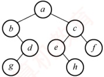

##### 06

B

三种遍历方式中，访问左右子树的先后顺序是不变的，只是访问根结点的顺序不同，因此叶结点的先后顺序完全相同。此外，读者可以采用特殊值法，画一个结点数为3的满二叉树，采用三种遍历方式来验证答案的正确性。

##### 07

C

对每个顶点从1开始按序编号，要求结点编号大于其左右孩子编号，并且左孩子编号小于右孩子编号。编号越大说明遍历顺序越靠后，因此，三者遍历顺序为先左子树、再右子树、后根结点。4个选项中仅后序遍历满足要求。

##### 08

B

结点 v 的编号比其左子树上的最小编号还小，而 v 的右子树中的最小编号大于 v 的左子树中的最大编号，因此 v 的编号比其左右子树上的所有编号都小，显然是按先序遍历次序。

##### 09

D

先序为 A、B、C 的不同二叉树共有 5 种，其中后序为 C、B、A 的有 4 种（前 4 种），都是单支树，如下图所示。

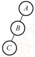

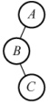

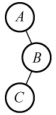

##### 10

C

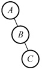

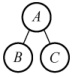

7 个结点的完全二叉树是一棵 3 层的满二叉树，画出相应二叉树的树形，根据后序遍历序列填入相应的结点，得到相应的完全二叉树，求得其先序遍历序列为 ABCDEFG。

##### 11

C

二叉树的先序遍历为 NLR，后序遍历为 LRN。根据题意，在先序序列中 X 在 Y 之前，在后序序列中 X 在 Y 之后，若设 X 在根的位置，Y 在其左子树或右子树中，即满足要求。

##### 12

C

先序序列是 $\cdots a\cdots b\cdots$，因此 $a$和 $b$结点的3种情况如下图(a)～(c)所示。中序序列是 $\cdots b\cdots a\cdots$，因此 $a$和 $b$结点的3种情况如下图(d)～(f)所示，相同部分是 $b$在 $a$的左子树中。

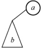

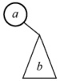

(a)

(b)

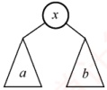

(c)

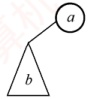

(d)

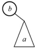

(e)

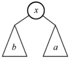

(f)

##### 13

B

解法1：由题可知，1为根结点，2为1的孩子。对于选项A，3应为1的左孩子，先序序列应为13…，不符题意。类似地，选项C也是错误的。对于选项B，2为1的右孩子，3为2的右孩子……满足题意。对于选项D，463572应为1的右子树，2为1的右孩子，46357为2的左子树，3为2的左孩子，46为3的左子树，57为3的右子树，先序序列4、6应相连，5、7应相连，不符题意。

解法 2：先序遍历时需要借助栈。二叉树的先序序列和中序序列的关系相当于以先序序列作为入栈次序，以中序序列作为出栈次序。题中以 1234567 入栈；对于选项 A，第一个出栈的是 3，所以 1 不可能在 2 之前出栈，错误。对于选项 C，1 不可能在 3 之前出栈，错误。对于选项 D，6 第三个出栈，此时栈顶元素是 5，不是 3，错误。选项 B 正确。

解法 3：因先序序列和中序序列可以确定一棵二叉树，所以可试着用题目中的序列构造出相应的二叉树，即可得知，只有选项 B 的序列可以构造出二叉树。

##### 14

D

先序序列为 NLR，后序序列为 LRN，虽然可以唯一确定树的根结点，但无法划分左右子树。例如，先序序列为 AB，后序序列为 BA，则其对应的二叉树如右图所示。

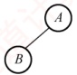

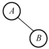

##### 15

B

中序遍历是“左根右”，后序遍历是“左右根”，当任一结点没有右子树时，两种遍历都是“左根”。显然，当二叉树为空树或只有根结点时，其中序序列和后序序列也相同。

##### 16

D

根据后序序列与中序序列可构造出二叉树，如下图所示。由图可知先序序列为 CEDBA。

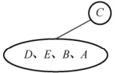

(a) 确定根结点

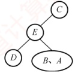

(b) 确定左子树根结点

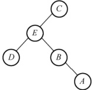

(c) 确定剩下的子树

##### 17

A

对于这种遍历序列问题，先根据遍历的性质排除若干项，若还无法确定答案，则再根据遍历结果得到二叉树，找到对应遍历序列。例如，在本题中，已知先序和中序遍历结果，可知本树的根结点为 A，左子树有 C 和 B，其余为右子树，则后序遍历结果中，A 一定在最后，并且 C 和 B 一定在前面，排除选项 B 和 D。又因先序中有 DEF，中序中有 EDF，则 D 为这个子树的根，所以 D 在后序中排在 EF 之后。

根据二叉树的递归定义，要确定二叉树，就要分别找到根结点和左右子树。因此，根据遍历结果，必定要确定根结点位置和如何划分左右子树，才可以确定最终的二叉树。因此，仅有先序和后序遍历不能唯一确定一棵二叉树，而二者之一加上中序遍历都可以唯一确定一棵二叉树。如在本题中，根据先序和中序遍历的结果确定二叉树的过程如下图所示。

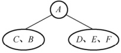

(a) 确定根结点

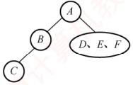

(b) 确定左子树

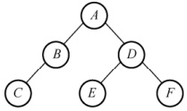

(c) 确定右子树

##### 18

B

可构造出二叉树如下图所示。因此，先序序列为 ABCDEF。

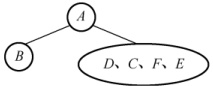

(a) 确定根结点

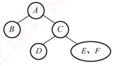

(b) 确定右子树的根结点

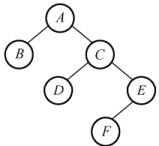

(c) 确定剩下的子树

##### 19

B

先序遍历是根左右，祖先 $a$ 先于子孙 $b$ 访问，即 $\text{pre}(a) < \text{pre}(b)$，因此选项 A 一定成立。后序遍历是左右根，子孙 $b$ 先于祖先 $a$ 访问，即 $\text{post}(b) < \text{post}(a)$，因此选项 B 一定不成立。中序遍历是左根右，左子树中的子孙先于祖先访问，右子树中的子孙后于祖先访问，因此子孙的编号可能小于祖先的编号，也可能大于祖先的编号，选项 C 和 D 都有可能。

##### 20

C

删除一个结点时，需要先递归地删除它的左右孩子，并释放它们所占的存储空间，然后删除该结点，并删除它所占的存储空间，这正好和后序遍历的访问顺序相吻合。

##### 21

B

只要交换 T 中所有分支结点的左右子树，就能得到一棵中序遍历序列为降序序列的树，而这并不会改变根结点，叶结点也仅仅交换位置，仍是原 T 中的叶结点，选项 C、D 错误。交换 T 中所有分支结点的左右子树，要么先处理根结点，然后递归地处理左右子树，即先序遍历；要么先处理左右子树，然后处理根结点，即后序遍历；中序遍历是不适合的。选项 A 错误，选项 B 正确。

##### 22

A

线索是前驱结点和后继结点的指针，引入线索的目的是加快对二叉树的遍历。

##### 23

C

n 个结点共有链域指针 2n 个，其中，除根结点外，每个结点都被一个指针指向。剩余的链域建立线索，共  $2n-(n-1)=n+1$ 个线索。

##### 24

C

线索二叉树中用 1tag/rtag 标识结点的左/右指针域是否为线索，其值为 1 时，对应指针域为线索，其值为 0 时，对应指针域为左/右孩子。

##### 25

D

对左子树为空的二叉树进行先序线索化，根结点的左子树为空并且也没有前驱结点（先遍历根结点），先序遍历的最后一个元素为叶结点，左右子树均为空且有前驱无后继结点，所以线索化后，树中空链域有2个。

##### 26

不是每个结点通过线索都可以直接找到它的前驱和后继。在先序线索二叉树中查找一个结点的先序后继很简单，而查找先序前驱必须知道该结点的双亲结点。同样，在后序线索二叉树中查找一个结点的后序前驱也很简单，而查找后序后继也必须知道该结点的双亲结点，二叉链表中没有存放双亲的指针。后序线索二叉树不能有效解决求后序后继的问题。如右图所示，结点 E 的右指针指向右孩子，而在后序序列中 E 的后继结点为 B，在查找 E 的后继时仍然只能按常规方法来查找。

##### 27

D

后序线索二叉树不能有效解决求后序后继的问题。如右图所示，结点 E 的右指针指向右孩子，而在后序序列中 E 的后继结点为 B，在查找

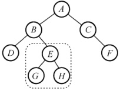

E 的后继时仍然只能按常规方法来查找。

##### 28

C

在二义中序线索树中，某结点若有左孩子，则按照中序“左根右”的顺序，该结点的前驱结点为左子树中最右的一个结点（注意，并不一定是最右叶结点）。

##### 29

A

在二义树的后序遍历中，叶结点 X 的后继是其双亲，因此 X 的右线索应指向该结点。

##### 30

B

非空二叉树的先序序列和后序序列相反，即“根左右”与“左右根”顺序相反，因此树只有根结点，或根结点只有左子树或右子树，其子树也有同样的性质，任意结点只有一个孩子，才能满足先序序列和后序序列正好相反。此时树形应为一个长链，树中仅有一个叶结点。

##### 31

D

非空二叉树的先序序列和中序序列相反，即“根左右”与“左根右”顺序相反，因此树只有根结点，或任意一个结点只有左孩子，此时树形应该是一棵向左倾斜的单支树，这棵单支树只有一个叶结点。但是，只有一个叶结点的二叉树不能保证任意一个结点无右孩子。

##### 32

D

分析遍历后的结点序列，可以看出根结点是在中间被访问的，而且右子树结点在左子树之前，则遍历的方法是 RNL。本题考查的遍历方法并不是二叉树遍历的 3 种基本遍历方法，对于考生而言，重要的是掌握遍历的思想。

##### 33

D

题中所给二叉树的后序序列为 dbca。结点 d 无前驱和左子树，左链域空，无右子树，右链域指向其后继结点 b；结点 b 无左子树，左链域指向其前驱结点 d；结点 c 无左子树，左链域指向其前驱结点 b，无右子树，右链域指向其后继结点 a。

##### 34

C

先序序列为 NLR，后序序列为 LRN，因为先序序列和后序序列刚好相反，所以不可能存在一个结点同时有左右孩子，即二叉树的高度为4。1为根结点，根结点只能有左孩子（或右孩子），因此在中序序列中，1或在序列首或在序列尾，选项A、B、C、D皆满足要求。仅考虑以1的孩子结点2为根结点的子树，它也只能有左孩子（或右孩子），因此在中序序列中，2或在序列首或在序列尾，选项A、B、D皆满足要求。

【另解】画出各选项与题干信息所对应的二叉树如下，所以选项A、B、D均满足。

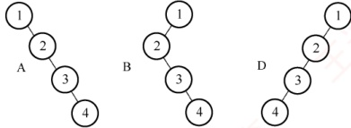

##### 35

A

先序序列和后序序列不能唯一确定一棵二叉树，但可以确定二叉树中结点的祖先关系：当两个结点的先序序列为 XY 与后序序列为 YX 时，则 X 为 Y 的祖先。考虑先序序列 a, e, b, d, c、后序序列 b, c, d, e, a，可知 a 为根结点，e 为 a 的孩子结点；此外，由 a 的孩子结点的先序序列 e, b, d, c、后序序列 b, c, d, e，可知 e 是 bcd 的祖先，所以根结点的孩子结点只有 e。

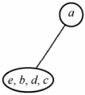

(a)

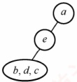

(b)

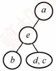

(c)

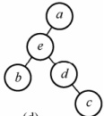

(d)

排除法：显然 a 为根结点，且确定 e 为 a 的孩子结点，排除选项 D。各种遍历算法中左右子树的遍历次序是固定的，若 b 也为 a 的孩子结点，则在先序序列和后序序列中 e、b 的相对次序应是不变的，所以排除选项 B，同理排除选项 C。

特殊法：先序序列和后序序列对应多棵不同的二叉树树形，我们只需画出满足该条件的任意一棵二叉树即可，任意一棵二叉树必定满足正确选项的要求。

显然选择选项 A，最终得到的二叉树满足题设中先序序列和后序序列的要求。

##### 36

A

根据后序线索二叉树的定义，X结点为叶结点且有左兄弟，因此这个结点为右孩子结点，利用后序遍历的方式可知 X 结点的后序后继是其父结点，即其右线索指向的是父结点。为了更加形象，在解题的过程中可以画出如右所示的草图。

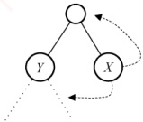

##### 37

D

线索二叉树的线索实际上指向的是相应遍历序列特定结点的前驱结点和后继结点，所以先写出二叉树的中序遍历序列 `dbxac`，中序遍历中在 x 左边和右边的字符，就是它在中序线索化的左右线索，即 b, a。

##### 38

根据二叉树先序遍历和中序遍历的递归算法中递归工作栈的状态变化得出：先序序列和中序序列的关系相当于以先序序列为入栈次序，以中序序列为出栈次序。因为先序序列和中序序列可以唯一地确定一棵二叉树，所以题意相当于“以序列 a, b, c, d 为入栈次序，则出栈序列的个数为？”，对于 n 个不同元素入栈，出栈序列的个数为 $\frac{1}{n+1}C_{2n}^{n}=14$。

##### 39

39. B

后序序列先访问左子树，接着访问右子树，最后访问父结点，递归进行。根结点左子树的叶结点首先被访问，它是 $e$。接下来是它的父结点 $a$，然后是 $a$ 的父结点 $c$。接着访问根结点的右子树。它的叶结点 $b$ 首先被访问，然后是 $b$ 的父结点 $d$，再后是 $d$ 的父结点 $g$，最后是根结点 $f$，如右图所示。因此 $d$ 与 $a$ 同层，选项 B 正确。

##### 40

A

B

先序序列先访问父结点，接着访问左子树，然后访问右子树。中序序列先访问左子树，接着访问父结点，然后访问右子树，递归进行。若所有非叶结点只有右子树，则先序序列和中序序列都先访问父结点，后访问右子树，递归进行。

##### 41

B

对于此类题，每种情况只需举出一个反例即可。如图1所示，q 是 p 的双亲，中序遍历序列为 $\{p, q\}$，说法I可能。如图2所示，q 是 p 的右孩子，中序遍历序列为 $\{p, q\}$，说法II可能。如图4所示，q 是 p 的双亲的双亲，中序遍历序列为 $\{x, p, q\}$，说法IV可能。如图3所示，q 是 p 的右兄弟，F 是 q 和 p 的父结点，中序遍历要求先遍历左子树，再访问根结点，最后遍历右子树，
因此一定先访问 p，再访问 F，最后访问 q，p 和 q 不可能相邻出现，说法 III 不可能。

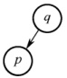

图1

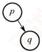

图2

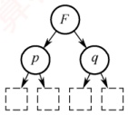

图3

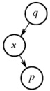

图4

##### 42

根据二叉树的树形和后序遍历序列，可以轻松地将各字母填入结点中，如右图所示。

然后对该二叉树进行先序遍历，得到序列 aedfbc。

##### 43

A

根据中序遍历的特点，v 有左右子树，以 v 为根的子树的中序序列为：v 的左子树的中序序列，v, v 的右子树的中序序列。又因为 T 的中序序列为 “⋯, p, v, q,⋯”，可知 p 属于 v 的左子树，q 属于 v 的右子树。在 v 的左子树的中序序列中：假设 p 有右孩子，则 p 的右孩子在中序序列中应在 p 之后，与 p 是最后一个遍历结点矛盾，因此 p 不存在右孩子。在 v 的右子树的中序序列中：假设 q 存在左孩子，则 q 的左孩子在中序序列中应在 q 之前，与 q 是第一个遍历结点矛盾，因此 q 不存在左孩子。

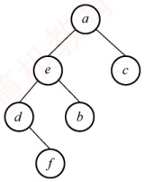

#### 二、 综合应用题

##### 01

【解答】

二叉树的先序序列是 NLR，后序序列是 LRN。要使 NLR = NRL（后序序列反序）成立，L 或 R 应为空，这样的二叉树每层只有一个结点，即二叉树的形态是其高度等于结点数。以 3 个结点 a, b, c 为例，其形态如下图所示。

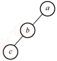


##### 02

【解答】

二叉树的先序序列是 NLR，后序序列是 LRN。要使 NLR = LRN 成立，L 和 R 均应为空，所以满足条件的二叉树只有一个根结点。

##### 03

【解答】

采用层次遍历的算法，设置变量 level 记录当前结点所在的层数，设置变量 last 指向当前层的最右结点，每次层次遍历出队时与 last 指针比较，若两者相等，则层数加 1，并让 last 指向下一层的最右结点，直到遍历完成。level 的值即二叉树的高度。

算法实现如下：

```c
int Btdepth(BiTree T){
//采用层次遍历的非递归方法求解二叉树的高度
if(!T)
    return 0; //树空，高度为0
int front=-1,rear=-1;
int last=0,level=0; //last指向当前层的最右结点
BiTree Q[MaxSize]; //设置队列 Q，元素是二叉树结点指针且容量足够
Q[++rear]=T; //将根结点入队
BiTree p;
while (front<rear) {
    p=Q[++front]; //队列元素出队，即正在访问的结点
    if (p->lchild)
        Q[++rear]=p->lchild; //左孩子入队
    if (p->rchild)
        Q[++rear]=p->rchild; //右孩子入队
    if (front==last) {
        level++;
        last=rear;
    }
    return level;
}
```

求某层的结点数、每层的结点数、树的最大宽度等，都可采用与此题类似的思想。当然，此题可编写为递归算法，其实现如下：

```c
int Btdepth2(BiTree T) {
    if (T==NULL)
        return 0;
    ldep=Btdepth2(T->lchild);
    rdep=Btdepth2(T->rchild);
    if (ldep>rdep)
        return ldep+1;
    else
        return rdep+1;
}
```

##### 04

【解答】

根据完全二叉树的定义，具有 n 个结点的完全二叉树与满二叉树中编号从  $1 \sim n$ 的结点一一对应。算法思想：采用层次遍历算法，将所有结点加入队列（包括空结点）。遇到空结点时，查看其后是否有非空结点。若有，则二叉树不是完全二叉树。

算法实现如下：

```c
bool IsComplete(BiTree T) {
    //本算法判断给定二叉树是否为完全二叉树
    InitQueue(Q);
    if (!T)
        return true; //空树为满二叉树
    EnQueue(Q, T);
    while (!IsEmpty(Q)) {
        DeQueue(Q, p);
        if (p) {
            EnQueue(Q, p -> lchild);
            EnQueue(Q, p -> rchild);
        }
        else {
            while (!IsEmpty(Q)) {
                DeQueue(Q, p);
                if (p) {
                    return false;
                }
            }
        return true;
    }
```
##### 05

【解答】

计算一棵二叉树 b 中所有双分支结点数的递归模型 f(b) 如下：

 $f(b)=0$ 若 b=NULL
 $f(b)=f(b->lchild)+f(b->rchild)+1$ 若 $^{*}b$为双分支结点
 $f(b)=f(b->lchild)+f(b->rchild)$ 其他情况（ $^{*}b$为单分支结点或叶结点）

具体算法实现如下：

```c
int DsonNodes(BiTree b) {
    if (b == NULL)
        return 0;
    else if (b -> lchild != NULL && b -> rchild != NULL) // 双分支结点
        return DsonNodes(b -> lchild) + DsonNodes(b -> rchild) + 1;
    else
        return DsonNodes(b -> lchild) + DsonNodes(b -> rchild);
}
```

当然，本题也可以设置一个全局变量 Num，每遍历到一个结点时，判断每个结点是否为分支结点（左右结点都不为空，注意是双分支），若是，则 Num++。

##### 06

【解答】

采用递归算法实现交换二叉树的左右子树，首先交换b结点的左孩子的左右子树，然后交换b结点的右孩子的左右子树，最后交换b结点的左右孩子，当结点为空时递归结束（后序遍历的思想）。算法实现如下：

```c
void swap(BiTree b) {
    //本算法递归地交换二叉树的左右子树
    if (b) {
        swap(b->lchild);
        swap(b->rchild);
        temp=b->lchild;
        b->lchild=b->rchild;
        b->rchild=temp;
    }
}
```

##### 07

【解答】

设置一个全局变量 i（初值为 1）来表示进行先序遍历时，当前访问的是第几个结点。然后可以借用先序遍历的代码模型，先序遍历二叉树。当二叉树 b 为空时，返回特殊字符 '#'；当 k==i 时，该结点即要找的结点，返回 b->data；当 k≠i 时，递归地在左子树中查找，若找到则返回该值，否则继续递归地在右子树中查找，并返回其结果。对应的递归模型如下：

f(b, k) = '#' 当 b = NULL 时
f(b, k) = b -> data 当 i = k 时
f(b, k) = ((ch = f(b -> lchild, k)) == '#'? f(b -> rchild, k) : ch) 其他情况

算法的实现如下：

```c
int i=1;
ElemType PreNode(BiTree b, int k) {
    //本算法查找二叉树先序遍历序列中第 k 个结点的值
    if (b==NULL)
        return '#';
    if (i==k)
        return b->data;
    i++;
    ch=PreNode(b->lchild, k);
//遍历序号的全局变量
//空结点，则返回特殊字符
//相等，则当前结点即第 k 个结点
//下一个结点
//左子树中递归寻找
if (ch != '#') //在左子树中，则返回该值
    return ch;
ch=PreNode (b->rchild, k); //在右子树中递归寻找
return ch;
```

本题实质上就是一个遍历算法的实现，只不过用一个全局变量来记录访问的序号，求其他遍历序列的第 k 个结点也采用相似的方法。二叉树的遍历算法可以引申出大量的算法题，因此考生务必要熟练掌握二叉树的遍历算法。

##### 08

【解答】

删除以元素值 x 为根的子树，只要能删除其左右子树，就可以释放值为 x 的根结点，因此宜采用后序遍历。算法思想：删除值为 x 的结点，意味着应将其父结点的左（右）孩子指针置空，用层次遍历易于找到某结点的父结点。本题要求删除树中每个元素值为 x 的结点的子树，因此要遍历完整棵二叉树。算法实现如下：

```c
void DeleteXTree(BiTree &bt) {
    //删除以bt为根的子树
    if (bt) {
        DeleteXTree(bt->lchild);
        DeleteXTree(bt->rchild); //删除bt的左子树、右子树
        free(bt); //释放被删结点所占的存储空间
    }
}
//在二叉树上查找所有以x为元素值的结点，并删除以其为根的子树
void Search(BiTree bt, ElemType x) {
    BiTree Q[]; //Q是存放二叉树结点指针的队列，容量足够大
    if (bt) {
        if (bt->data==x) { //若根结点值为x，则删除整棵树
            DeleteXTree(bt);
            exit(0);
        }
        InitQueue(Q);
        EnQueue(Q, bt);
        while (!IsEmpty(Q)) {
            DeQueue(Q, p);
            if (p->lchild) { //若左孩子非空
                if (p->lchild->data==x) { //左子树符合则删除左子树
                    DeleteXTree(p->lchild);
                    p->lchild=NULL;
                }
            else {
                EnQueue(Q, p->lchild); //左子树入队列
                if (p->rchild) { //若右孩子非空
                    if (p->rchild->data==x) { //右孩子符合则删除右子树
                        DeleteXTree(p->rchild);
                        p->rchild=NULL;
                }
            }
            else {
                EnQueue(Q, p->rchild); //右孩子入队列
        }
    }
}
```

##### 09

【解答】

算法思想：采用非递归后序遍历，最后访问根结点，访问到值为 x 的结点时，栈中所有元素均为该结点的祖先，依次出栈打印即可。算法实现如下：
```c
typedef struct{
    BiTree t;
    int tag;
}stack; //tag=0 表示左孩子被访问，tag=1 表示右孩子被访问
void Search(BiTree bt,ElemType x){
    //在二叉树 bt 中，查找值为 x 的结点，并打印其所有祖先
    stack s[];
    top=0;
    while(bt != NULL || top>0) {
        while(bt != NULL && bt->data != x) {
            s[++top].t=bt;
            s[top].tag=0;
            bt=bt->lchild;
        }
        if(bt != NULL && bt->data==x) {
            printf("所查结点的所有祖先结点的值为:\n"); //找到x
            for(i=1;i<=top;i++)
            printf("%d",s[i].t->data);
            exit(1);
        }
        while(top!=0&&s[top].tag==1)
            top--;
        if(top!=0) {
            s[top].tag=1;
            bt=s[top].t->rchild;
        }
    } //while(bt!=NULL || top>0)
}
```

因为查找的过程就是后序遍历的过程，所以使用的栈的深度不超过树的深度。

##### 10

【解答】

后序遍历最后访问根结点，即在递归算法中，根是压在栈底的。本题要找 p 和 q 的最近公共祖先结点 r，不失一般性，设 p 在 q 的左边。算法思想：采用后序非递归算法，栈中存放二叉树结点的指针，当访问到某结点时，栈中所有元素均为该结点的祖先。后序遍历必然先遍历到结点 p，栈中元素均为 p 的祖先。先将栈复制到另一辅助栈中。继续遍历到结点 q 时，将栈中元素从栈顶开始逐个到辅助栈中去匹配，第一个匹配（相等）的元素就是结点 p 和 q 的最近公共祖先。算法实现如下：

```c
typedef struct{
    BiTree t;
    int tag; //tag=0 表示左孩子已被访问，tag=1 表示右孩子已被访问
}stack;
stack s[],s1[]; //栈，容量足够大
```
```c
BiTree Ancestor(BiTree ROOT, BiNode *p, BiNode *q) {
    //本算法求二叉树中 p 和 q 指向结点的最近公共结点
    top=0;bt=ROOT;
    while (bt != NULL || top > 0) {
        while (bt != NULL) {
            s[++top].t=bt;
            s[top].tag=0;
            bt=bt->lchild;
        }
        while (top != 0 && s[top].tag==1) {
            //假定 p 在 q 的左侧，遇到 p 时，栈中元素均为 p 的祖先
            if (s[top].t==p) {
                for (i=1; i<=top; i++)
s1[i]=s[i];
top1=top;

//将栈 s 的元素转入辅助栈 s1 保存
if (s[top].t==q)
{
```
```c
    for (i=top;i>0;i--) {//将栈中元素的树结点到 s1 中去匹配
        for (j=top1;j>0;j--)
            if (s1[j].t==s[i].t)
                return s[i].t; //p 和 q 的最近公共祖先已找到
}
top--; //退栈

//while
if (top!=0) {
    s[top].tag=1;
    bt=s[top].t->rchild;
}

//while
return NULL;

//沿右分支向下遍历
//p 和 q 无公共祖先
```

##### 11

【解答】

采用层次遍历的方法求出所有结点的层次，并将所有结点和对应的层次放在一个队列中。然后通过扫描队列求出各层的结点总数，最大的层结点总数即二叉树的宽度。算法实现如下：

```c
BiTree data[MaxSize]; //保存队列中的结点指针
int level[MaxSize]; //保存 data 中相同下标结点的层次
int front,rear;
} Qu;
int BTWidth(BiTree b) {
    BiTree p;
    int k,max,i,n;
    Qu.front=Qu.rear=-1; //队列为空
    Qu.rear++;
    Qu.data[Qu.rear]=b; //根结点指针入队
    Qu.level[Qu.rear]=1; //根结点层次为1
    while (Qu.front<Qu.rear) {
        Qu.front++; //出队
        p=Qu.data[Qu.front]; //出队结点
        k=Qu.level[Qu.front]; //出队结点的层次
        if (p->lchild!=NULL) {
            Qu.rear++;
            Qu.data[Qu.rear]=p->lchild;
            Qu.level[Qu.rear]=k+1;
        }
        if (p->rchild!=NULL) {
            Qu.rear++;
            Qu.data[Qu.rear]=p->rchild;
            Qu.level[Qu.rear]=k+1;
        }
    }//while
    max=0; i=0; //max 保存同一层最多的结点数
    k=1; //k 表示从第一层开始查找
    while (i<=Qu.rear) {
        n=0; //n 统计第 k 层的结点数
        while (i<=Qu.rear&&Qu.level[i]==k) {
            n++;
            i++;
        }
    }
}

王道计算
}
k=Qu.level[i];
if (n>max) max=n; //保存最大的n
}
return max;
```

**注意**

本题队列中的结点，在出队后仍需要保留在队列中，以便求二叉树的宽度，所以设置的队列采用非环形队列，否则在出队后可能被其他结点覆盖，无法再求二叉树的宽度。

##### 12

【解答】

对一般二叉树，仅根据先序或后序序列，不能确定另一个遍历序列。但对满二叉树，任意一个结点的左右子树均含有相等的结点数，同时，先序序列的第一个结点作为后序序列的最后一个结点，由此得到将先序序列 pre[11..h1] 转换为后序序列 post[12..h2] 的递归模型如下：

f(pre,11,h1,post,12,h2)=不做任何事情 h1<11时
f(pre,11,h1,post,12,h2)=post[h2]=pre[11] 其他情况
```c
取中间位置 half=(h1-11)/2;
```
将 pre[11+1,11+half] 左子树转换为 post[12,12+half-1],
```c
即 f(pre,11+1,11+half,post,12,12+half-1);
```
将 pre[11+half+1,h1] 右子树转换为 post[12+half,h2-1],
即 f(pre,11+half+1,h1,post,12+half,h2-1)。

其中，post[h2]=pre[11]表示后序序列的最后一个结点（根结点）等于先序序列的第一个结点（根结点）。相应的算法实现如下：

```c
void PreToPost(ElemType pre[], int l1, int h1, ElemType post[], int l2, int h2) {
    int half;
    if (h1 >= l1) {
        post[h2] = pre[l1];
        half = (h1 - l1) / 2;
        PreToPost(pre, l1 + 1, l1 + half, post, l2, l2 + half - 1); //转换左子树
        PreToPost(pre, l1 + half + 1, h1, post, l2 + half, h2 - 1); //转换右子树
    }
}
```

例如，有以下代码：
```c
ElemType *pre = "ABCDEFG";
ElemType post[MaxSize];
PreToPost(pre, 0, 6, post, 0, 6);
printf("后序序列：");
for (int i = 0; i <= 6; i++)
    printf("%c", post[i]);
printf("\n");
```

执行结果如下：
后序序列：C DB F G E A

##### 13

【解答】

通常使用的先序、中序和后序遍历对于叶结点的访问顺序都是从左到右，这里选择中序递归遍历。算法思想：设置前驱结点指针 pre，初始为空。第一个叶结点由指针 head 指向，遍历到叶结点时，就将它前驱的 rchild 指针指向它，最后一个叶结点的 rchild 为空。算法实现如下：

```c
LinkedList head, pre=NULL;
LinkedList InOrder(BiTree bt){
    if(bt){
        InOrder(bt->lchild); //中序遍历左子树
        `if(bt->lchild==NULL&bt->rchild==NULL) //`叶结点
            if(pre==NULL){
                head=bt;
                pre=bt;
            }
        else{
            pre->rchild=bt;
            pre=bt;
        }
        InOrder(bt->rchild); //将叶结点链入链表
        pre->rchild=NULL; //中序遍历右子树
        return head;
    }
```

上述算法的时间复杂度为  $O(n)$，辅助变量使用 head 和 pre，栈空间复杂度为  $O(n)$。

##### 14

【解答】

本题采用递归的思想求解，若  $T_{1}$ 和  $T_{2}$ 都是空树，则相似；若有一个为空另一个不空，则必然不相似；否则递归地比较它们的左右子树是否相似。递归函数的定义如下：

1）f(T1,T2)=1；若`T1==T2==NULL`。

2） $f(T1,T2)=0$；若T1和T2之一为NULL，另一个不为NULL。

3) f(T1, T2) = f(T1 -> lchild, T2 -> lchild) && f(T1 -> rchild, T2 -> rchild); 若 T1 和 T2 均不为 NULL。

因此，算法实现如下：

```c
int similar(BiTree T1, BiTree T2) {
//采用递归的算法判断两棵二叉树是否相似
int leftS, rightS;
`if (T1==NULL&T2==NULL)` {
    return 1;
}
`else if (T1==NULL||T2==NULL)` {
    //只有一棵树为空
    return 0;
}
else {
    leftS=similar(T1->lchild, T2->lchild);
    rightS=similar(T1->rchild, T2->rchild);
    return leftS&rightS;
}
```

##### 15

【解答】

二叉树的带权路径长度有两种常见的计算方法：① 根据二叉树的带权路径长度的定义，二叉树的 WPL 值 = 树中全部叶结点的带权路径长度之和。② 根据带权二叉树的性质，二叉树的 WPL 值 = 树中所有非叶结点的权值之和（记住该结论即可，不要求证明）。根据两种常见的计算方法，本题不难写出下列两种解法。

1）算法的基本设计思想。

① 本问题可采用递归算法实现。根据定义：

 $$\begin{aligned} 二叉树的 WPL 值 &= 树中全部叶结点的带权路径长度之和 \\&= 根结点左子树中全部叶结点的带权路径长度之和 +\\&\quad 根结点右子树中全部叶结点的带权路径长度之和 \end{aligned}$$
叶结点的带权路径长度 = 该结点的 weight 域的值 × 该结点的深度

设根结点的深度为0，若某结点的深度为d时，则其孩子结点的深度为 $d+1$。

在递归遍历二叉树结点的过程中，若遍历到叶结点，则返回该结点的带权路径长度，否则返回其左右子树的带权路径长度之和。

② 若借用非叶结点的 weight 域保存其孩子结点中 weight 域值的和，则树的 WPL 等于树中所有非叶结点 weight 域值之和。

采用后序遍历策略，在遍历二叉树 T 时递归计算每个非叶结点的 weight 域的值，则树 T 的 WPL 等于根结点左子树的 WPL 加上右子树的 WPL，再加上根结点中 weight 域的值。在递归遍历二叉树结点的过程中，若遍历到叶结点，则 return 0 并且退出递归，否则递归计算其左右子树的 WPL 和自身结点的权值。

2）二叉树结点的数据类型定义如下。
```c

typedef struct node{
    int weight;
    struct node *left, *right;
}BTree;
```

3）算法的代码如下。

① 基于方法 1 的算法实现：

```c
int WPL(BTree *root) //根据WPL的定义采用递归算法实现
{
    return WPL1(root,0);
}
int WPL1(BTree *root,int d) //d为结点深度
{
    `if(root->left==NULL&&root->right==NULL)`
        return(root->weight*d);
    else
        return(WPL1(root->left,d+1)+WPL1(root->right,d+1));
}
```

② 基于方法 2 的算法实现：

```c
int WPL(BTree *root) //基于递归的后序遍历算法实现
```
```c
{
    int w_l, w_r;
    if (root->left==NULL&&root->right==NULL)
        return 0;
    else
    {
```
```c
        w_l=WPL(root->left); //计算左子树的 WPL
        w_r=WPL(root->right); //计算右子树的 WPL
```
```c
        root->weight=root->left->weight+root->right->weight;
        //填写非叶结点的 weight 域
        return (w_l+w_r+root->weight); //返回 WPL 值
    }
}
```

**注意**

上述两种算法为官方标准答案，当遍历到度为1的结点时，会传入空指针，导致空指针异常。但是，作为408考试的算法题，不要求考虑特殊的边界条件，只要算法思想正确，代码逻辑正确，即可得满分。因此，在复习过程中，无须花过多的时间抠代码的各种边界条件。

##### 16

【解答】

1）算法的基本设计思想。

表达式树的中序序列加上必要的括号即等价的中缀表达式。可以基于二叉树的中序遍历策略
得到所需的表达式。

表达式树中分支结点所对应的子表达式的计算次序，由该分支结点所处的位置决定。为得到正确的中缀表达式，需要在生成遍历序列的同时，在适当位置增加必要的括号。显然，表达式的最外层（对应根结点）和操作数（对应叶结点）不需要添加括号。

2 ）算法实现。

将二叉树的中序遍历递归算法稍加改造即可得本题的答案。除根结点和叶结点外，遍历到其他结点时在遍历其左子树之前加上左括号，遍历完右子树后加上右括号。

```c
void BtreeToE(BTree *root){
    BtreeToExp(root,1); //根的高度为1
}

void BtreeToExp(BTree *root,int deep){
    if(root==NULL) return; //空结点返回
    `else if(root->left==NULL&&root->right==NULL) //`若为叶结点
        printf("%s",root->data); //输出操作数，不加括号
    else{
        if(deep>1) printf("(); //若有子表达式则加一层括号
        BtreeToExp(root->left, deep+1);
        printf("%s",root->data); //输出操作符
        BtreeToExp(root->right, deep+1);
        if(deep>1) printf(""); //若有子表达式则加一层括号
    }
}
```

##### 17

【解答】

1 ）算法的基本设计思想。

对于采用顺序存储方式保存的二叉树，根结点保存在  $\text{SqBiTNode}[0]$ 中；当某结点保存在  $\text{SqBiTNode}[i]$ 中时，若有左孩子，则其值保存在  $\text{SqBiTNode}[2i+1]$ 中；若有右孩子，则其值保存在  $\text{SqBiTNode}[2i+2]$ 中；若有双亲结点，则其值保存在  $\text{SqBiTNode}[(i-1)/2]$ 中。

二叉搜索树需要满足的条件是：任意一个结点值大于其左子树中的全部结点值，小于其右子树中的全部结点值。中序遍历二叉搜索树得到一个升序序列。

使用整型变量 val 记录中序遍历过程中已遍历结点的最大值，初值为一个负整数。若当前遍历的结点值小于或等于 val，则算法返回 false，否则，将 val 的值更新为当前结点的值。

```c
#define false 0
#define true 1
typedef int bool;
bool judgeInOrderBST(SqBiTree bt, int k, int *val) {//初始调用时 k 的值是 0
    if (k < bt.ElemNum && bt.SqBiTNode[k] != -1) {
        if (!judgeInOrderBST(bt, 2*k+1, val)) return false;
        if (bt.SqBiTNode[k] <= *val) return false;
        *val = bt.SqBiTNode[k];
        if (!judgeInOrderBST(bt, 2*k+2, val)) return false;
    }
    return true;
}
```

【解答2】

1 ）算法的基本设计思想。

对于采用顺序存储方式保存的二叉树，根结点保存在  $SqBiTNode[0]$ 中；当某结点保存在  $SqBiTNode[i]$ 中时，若有左孩子，则其值保存在  $SqBiTNode[2i+1]$ 中；若有右孩子，则其值保存在  $SqBiTNode[2i+2]$ 中；若有双亲结点，则其值保存在  $SqBiTNode[(i-1)/2]$ 中。
二叉搜索树需要满足的条件是：任意一个结点值大于其左子树中的全部结点值，小于其右子树中的全部结点值。设置两个数组 pmax 和 pmin。根据二叉搜索树的定义，SqBiTNode[i] 中的值应该大于以 SqBiTNode[2i+1] 为根的子树中的最大值（保存在 pmax[2i+1] 中），小于以 SqBiTNode[2i+2] 为根的子树中的最小值（保存在 pmin[2i+1] 中）。初始时，用数组 SqBiTNode 中前 ElemNum 个元素的值对数组 pmax 和 pmin 初始化。

在数组 SqBiTNode 中从后向前扫描，扫描过程中逐一验证结点与子树之间是否满足上述的大小关系。

2）算法实现。

```c
#define false 0
#define true 1
```
```c
typedef int bool;
bool judgeBST(SqBiTree bt){
    int k,m, *pmin, *pmax;
    pmin = (int *)malloc(sizeof(int) * (bt.ElemNum));
    pmax = (int *)malloc(sizeof(int) * (bt.ElemNum));
```
```c
    for (k=0; k<bt.ElemNum; k++) //辅助数组初始化
        pmin[k] = pmax[k] = bt.SqBiTNode[k];
        for (k=bt.ElemNum-1; k>0; k--) { //从最后一个叶结点向根遍历
            if (bt.SqBiTNode[k] != -1) {
                m = (k-1) / 2;
                if (k % 2 == 1 && bt.SqBiTNode[m] > pmax[k]) {
                    //其为左孩子
                    pmin[m] = pmin[k];
                    else if (k % 2 == 0 && bt.SqBiTNode[m] < pmin[k]) {
                    //其为右孩子
                    pmax[m] = pmax[k];
                    else return false;
            }
        }
        return true;
    }
```
