### 5.4.4 本节试题精选

#### 一、 单项选择题

##### 01

下列关于树的说法中，正确的是（）。

I. 对于有 n 个结点的二叉树，其高度为  $\log_{2} n$

II. 完全二叉树中，若一个结点没有左孩子，则它必是叶结点

III. 高度为  $h$ ( $h > 0$) 的完全二叉树对应的森林所含的树的个数一定是 h

IV. 一棵树中的叶子数一定等于与其对应的二叉树的叶子数

A. I 和 III

B. IV

C. I 和 II

D. II

##### 02

利用二叉链表存储森林时，根结点的右指针是（）。

A. 指向最左兄弟 B. 指向最右兄弟 C. 一定为空 D. 不一定为空

##### 03

设森林 F 中有 3 棵树，第 1、2、3 棵树的结点数分别为  $M_{1}$,  $M_{2}$ 和  $M_{3}$，与森林 F 对应的二叉树根结点的右子树上的结点数是（）。

A.  $M_{1}$ B.  $M_{1} + M_{2}$ C.  $M_{3}$ D.  $M_{2} + M_{3}$

##### 04

设森林 F 中有 4 棵树，第 1、2、3、4 棵树的结点数分别为 a、b、c 和 d，与森林 F 对应的二叉树的根结点的左子树上的结点数是（）。

A. a B.  $b + c + d$ C. a - 1 D.  $a + b + c$

##### 05

设森林 F 对应的二叉树为 B，它有 m 个结点，B 的根为 p，p 的右子树结点数为 n，森林 F 中第一棵树的结点数是（）。
A. m-n B. m-n-1 C.  $n+1$ D. 条件不足，无法确定

##### 06

设森林 F 对应的二叉树是一棵具有 16 个结点的完全二叉树，则森林 F 中树的数目和结点最多的树的结点数分别是（）。

A. 2 和 8

B. 2 和 9

C. 4 和 8

D. 4 和 9

##### 07

森林  $T=(T_{1}, T_{2}, \cdots, T_{m})$ 转化为二叉树 BT 的过程为：若 m=0，则 BT 为空，若  $m \neq 0$，则（）。

A. 将中间子树  $T_{\mathrm{mid}}\left(\mathrm{mid}=(1+m)/2\right)$ 的根作为 BT 的根；将  $(T_{1}, T_{2}, \cdots, T_{\mathrm{mid}-1})$ 转换为 BT 的左子树；将  $(T_{\mathrm{mid}+1}, \cdots, T_{m})$ 转换为 BT 的右子树

B. 将子树  $T_{1}$ 的根作为 BT 的根；将  $T_{1}$ 的子树森林转换成 BT 的左子树；将  $(T_{2}, T_{3}, \cdots, T_{m})$ 转换成 BT 的右子树

C. 将子树  $T_{1}$ 的根作为 BT 的根；将  $T_{1}$ 的左子树森林转换成 BT 的左子树；将  $T_{1}$ 的右子树森林转换为 BT 的右子树；其他以此类推

D. 将森林 T 的根作为 BT 的根；将  $(T_{1}, T_{2}, \cdots, T_{m})$ 转化为该根下的结点，得到一棵树，然后将这棵树再转化为二叉树 BT

##### 08

设 F 是一个森林，B 是由 F 变换来的二叉树。若 F 中有 n 个非终端结点，则 B 中右指针域为空的结点有（ ）个。

A. n-1 B. n C.  $n+1$ D.  $n+2$

##### 09

设某树的孩子兄弟链表示中共有6个空的左指针域、7个空的右指针域，包括5个结点的左右指针域都为空，则该树中叶结点的个数是（）。

A. 7 B. 6 C. 5 D. 不能确定

##### 10

若  $T_{1}$ 是由有序树 T 转换而来的二叉树，则 T 中结点的后根序列就是  $T_{1}$ 中结点的（）序列。

A. 先序 B. 中序 C. 后序 D. 层序

##### 11

某二叉树结点的中序序列为 BDAECF，后序序列为 DBEFCA，则该二叉树对应的森林包括（）棵树。

A. 1 B. 2 C. 3 D. 4

##### 12

设 X 是树 T 中的一个非根结点，B 是 T 所对应的二叉树。在 B 中，X 是其双亲结点的右孩子，下列结论中正确的是（）。

A. 在树 T 中，X 是其双亲结点的第一个孩子

B. 在树 T 中，X 一定无右边兄弟

C. 在树 T 中，X 一定是叶结点

D. 在树 T 中，X 一定有左边兄弟

##### 13

右图是一棵逻辑上的树 T，则在关于该树的存储结构的叙述中，错误的是（）。

A. 若 T 采用双亲表示法，则有 9 个指向双亲的指针

B. 若 T 采用孩子表示法，则在 T 中查找某个结点的孩子比双亲表示法更方便

C. 若 T 采用孩子兄弟表示法，则在 T 中查找某个结点的双亲的时间复杂度为  $O(1)$

D. 双亲表示法是顺序存储结构，孩子表示法和孩子兄弟表示法是顺序存储结构，孩子表示法和孩子兄弟表示法是链式存储结构

##### 14

在森林的二叉树表示中，结点 M 和结点 N 是同一父结点的左孩子和右孩子，则在该森林中（）。

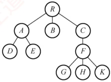

A. M 和 N 有同一双亲

B. M 和 N 可能无公共祖先

C. M 是 N 的孩子

D. M 是 N 的左兄弟

##### 15

【2009 统考真题】将森林转换为对应的二叉树，若在二叉树中，结点 u 是结点 v 的父结点的父结点，则在原来的森林中，u 和 v 可能具有的关系是（）。

I. 父子关系 II. 兄弟关系 III. u 的父结点与 v 的父结点是兄弟关系

A. 只有Ⅱ B. I 和Ⅱ C. I 和Ⅲ D. I、Ⅱ和Ⅲ

##### 16

【2011 统考真题】已知一棵有 2011 个结点的树，其叶结点数为 116，该树对应的二叉树中无右孩子的结点数是（）。

A. 115 B. 116 C. 1895 D. 1896

##### 17

【2014 统考真题】将森林 F 转换为对应的二叉树 T，F 中叶结点的个数等于（）。

A. T 中叶结点的个数

B. T 中度为 1 的结点数

C. T 中左孩子指针为空的结点数

D. T 中右孩子指针为空的结点数

##### 18

【2019 统考真题】若将一棵树 T 转化为对应的二叉树 BT，则下列对 BT 的遍历中，其遍历序列与 T 的后根遍历序列相同的是（）。

A. 先序遍历

B. 中序遍历

C. 后序遍历

D. 按层遍历

##### 19

【2020 统考真题】已知森林 F 及与之对应的二叉树 T，若 F 的先根遍历序列是 a, b, c, d, e, f，后根遍历序列是 b, a, d, f, e, c，则 T 的后序遍历序列是（）。

A. b, a, d, f, e, c

B. b, d, f, e, c, a

C. b, f, e, d, c, a

D. f, e, d, c, b, a

##### 20

【2021 统考真题】某森林 F 对应的二叉树为 T，若 T 的先序遍历序列是 a, b, d, c, e, g, f，中序遍历序列是 b, d, a, e, g, c, f，则 F 中树的棵数是（）。

A. 1 B. 2 C. 3 D. 4

##### 21

【2025 统考真题】下列关于二叉树及森林的叙述中，正确的是（）。

A. 完全二叉树中不存在度为1的结点

B. 任意一个森林都可以转换为一棵二叉树

C. 二叉树的分支结点数比叶结点数少

D. 表达式树的根中保存的是最先计算的运算符

#### 二、 综合应用题

##### 01

给定一棵树的先根遍历序列和后根遍历序列，能否唯一确定一棵树？若能，请举例说明；若不能，请给出反例。

##### 02

将下面一个由3棵树组成的森林转换为二叉树。

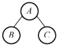

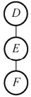

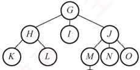

##### 03

已知某二叉树的先序序列和中序序列分别为 ABDEHCFIMGJKL 和 DBHEAIMFCGKLJ，请画出这棵二叉树，并画出二叉树对应的森林。

##### 04

编程求以孩子兄弟表示法存储的森林的叶结点数。

##### 05

以孩子兄弟链表为存储结构，请设计递归算法求树的深度。
### 5.4.5 答案与解析

#### 一、 单项选择题

##### 01

D

若 n 个结点的二叉树是一棵单支树，则其高度为 n。完全二叉树中最多存在一个度为 1 的结点且只有左孩子，若不存在左孩子，则一定也不存在右孩子，因此必是叶结点，说法 II 正确。只有满二叉树才具有性质 III，如下图所示。

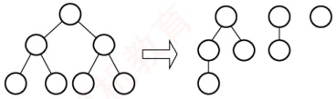

(a) 满二叉树转化为对应的森林

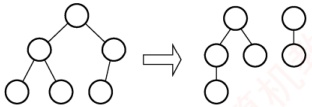

(b) 非满二叉树转化为对应的森林

在树转换为二叉树时，若有几个叶结点具有共同的双亲，则转换成二叉树后只有一个叶结点（最右边的叶结点），如下图所示，说法 IV 错误。注意，若树中的任意两个叶结点都不存在相同的双亲，则树中的叶子数才有可能与其对应的二叉树中的叶子数相等。

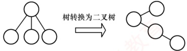

##### 02

D

森林与二叉树具有对应关系，因此，我们存储森林时应先将森林转换成二叉树，转换的方法就是“左孩子右兄弟”，与树不同的是，若存在第二棵树，则二叉链表的根结点的右指针指向的是森林中的第二棵树的根结点。若此森林只有一棵树，则根结点的右指针为空。因此，右指针可能为空也可能不为空。

##### 03

D

与树转换为二叉树不同，森林中的每棵树是独立的，因此先要将每棵树的根结点全部视为兄弟结点的关系。森林转换为二叉树后，树2作为树1的根结点的右子树，树3作为树2的根结点的右子树，因此森林F对应的二叉树根结点的右子树上的结点数是 $M_{2}+M_{3}$。

##### 04

C

森林转换为二叉树后，二叉树的根结点为第1棵树的根结点，二叉树的根结点的左子树包含第1棵树的所有孩子，因此森林F对应的二叉树的根结点的左子树上的结点数是a-1。

##### 05

A

森林转换成二叉树时采用孩子兄弟表示法，根结点及其左子树为森林中的第一棵树。右子树为其他剩余的树。所以，第一棵树的结点数为 m-n。

##### 06

D

森林转换为二叉树后，二叉树的根结点及其左子树由第1棵树转换得到，二叉树的根结点的右子树由剩余的森林转换得到，以此类推，可以划分出第2,3, $\cdots$棵树的结点。具有16个结点的完全二叉树的形态如右图所示，沿二叉树的根结点往右下遍历，共有4个结点，可知森林中有4棵树，其中第1棵树的结点数最多，

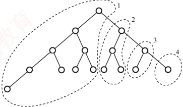

有9个。

##### 07

B

将森林中每棵树的根结点视为兄弟结点的关系，再按照“左孩子右兄弟”的规则来进行转化。

##### 08

C

根据森林与二叉树转换规则“左孩子右兄弟”。二叉树 B 中右指针域为空代表该结点没有兄弟结点。森林中每棵树的根结点从第二个开始依次连接到前一棵树的根的右孩子，因此最后一棵树的根结点的右指针为空。另外，每个非终端结点，其所有孩子结点在转换之后，最后一个孩子的右指针也为空，所以树 B 中右指针域为空的结点有  $n+1$ 个。

##### 09

B

在树的孩子兄弟表示法中，若一个结点没有孩子（叶结点），则表现为该结点的左指针域为空，因此本题答案为“6”。至于“5个结点的左右指针域都为空”，表示树中有5个结点既没有孩子又没有右兄弟，约束条件比题中的“求叶结点的个数”要求更严格。

##### 10

B

有序树 T 转换成二叉树  $T_{1}$ 时，T 的后根序列是对应  $T_{1}$ 的中序序列还是后序序列呢（显然树的后根序列不可能对应二叉树的先序序列和层序序列）？看右图所示的例子，在树 T 中，叶结点 B 应最先访问，在  $T_{1}$ 中，B 的右兄弟 C 转换为它的右孩子，若对应  $T_{1}$ 的后序序列，则 C 应在 B 的前面访问，所以 T 的后根序列不可能对应  $T_{1}$ 的后序序列。

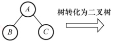

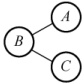

##### 11

C

根据二叉树的先序序列和中序序列可以确定一棵二叉树。根据后序序列，A 是二叉树的根结点。根据中序序列，二叉树的形态如下图(a)所示。对于 A 的左子树，根据后序序列，B 比 D 后被访问，因此 B 必为 D 的父结点，又根据中序序列，D 是 B 的右孩子。对于 A 的右子树，同理可确定结点 E、C、F 的关系。此二叉树的形态如下图(b)所示。

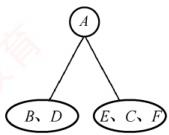

(a)

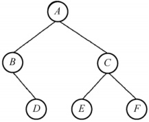

(b)

再根据二叉树与森林的对应关系，森林中树的棵数即其对应二叉树（向右上旋转 $45^{\circ}$后）的根结点A及其右兄弟数，或解释为：对应二叉树从根结点A开始不断往右孩子访问，所访问到的结点数。可知此森林中有3棵树，根结点分别为A、C和F。

##### 12

D

在二叉树 B 中，X 是其双亲的右孩子，因此在树 T 中，X 必是其双亲结点的右兄弟，换句话说，X 在树中必有左兄弟。

##### 13

C

若 T 采用双亲表示法存储，则除根结点外，其余每个结点都有指向其双亲的指针，T 共有 10 个结点，于是有 9 个指向双亲的指针，选项 A 正确。若 T 采用孩子表示法存储，则每个结点的孩子被视为一个线性表，且以单链表作为存储结构，只要遍历该单链表，就能找到某个结点的所有孩子，而双亲表示法要寻找某个结点的孩子，就必须遍历整棵树，选项 B 正确。若 T 采用孩子兄
弟表示法，则在 T 中查找某个结点的双亲也必须遍历整棵树，时间复杂度为  $O(n)$，选项 C 错误。选项 D 显然正确。

##### 14

B

在森林的二叉树表示中，当 M 和 N 的父结点是二叉树根结点时，M 和 N 在不同的树上。因此 M 和 N 可能无公共祖先。

##### 15

B

森林与二叉树的转换规则为“左孩子右兄弟”。在最后生成的二叉树中，父子关系在对应森林关系中可能是兄弟关系或者原本就是父子关系。

说法 I：若结点 v 是结点 u 的第二个孩子结点，转换时，结点 v 就变成结点 u 第一个孩子的右孩子，符合要求。说法 II：结点 u 和 v 是兄弟结点的关系，但二者之中还有一个兄弟结点 k，则转换后结点 v 就变为结点 k 的右孩子，而结点 k 则是结点 u 的右孩子，符合要求。

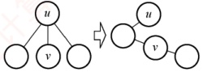

图1

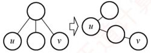

图 II

说法 III：若结点 u 的父结点与 v 的父结点是兄弟关系，则转换后，结点 u 和 v 分别在两者最左父结点的两棵子树中，不可能出现在同一条路径中。

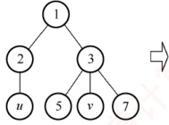

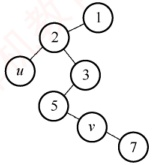

图 III

【另解】由题意可知 u 是 v 的父结点的父结点，如下图所示，有四种情况：

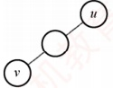

(1)

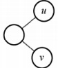

(2)

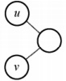

(3)

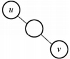

(4)

根据树与二叉树的转换规则，将这四种情况转换成树中结点的关系。（1）在原来的树中 u 是 v 的父结点的父结点；（2）在树中 u 是 v 的父结点；（3）在树中 u 是 v 的父结点的兄弟；（4）在树中 u 与 v 是兄弟关系。由此可知说法 I 和 II 正确。

##### 16

D

树转换为二叉树时，树的每个分支结点的所有子结点中的最右子结点无右孩子，根结点转换后也没有右孩子，因此，对应二叉树中无右孩子的结点数=分支结点数+1=2011-116+1=1896。

通常本题应采用特殊法求解，设题意中的树是如右图所示的结构，则对应的二叉树中仅有前115个叶结点有右孩子，所以无右孩子的结点数=2011-115=1896。

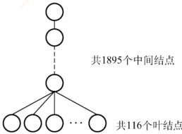

##### 17

C

将森林转化为二叉树相当于用孩子兄弟表示法来表示森林。在变化过程中，原森林某结点的
第一个孩子结点作为它的左子树，它的兄弟作为它的右子树。森林中的叶结点没有孩子结点，转化为二叉树时，该结点就没有左结点，因此 F 中叶结点的个数等于 T 中左孩子指针为空的结点数。此题还可通过一些特例来排除选项 A、B 和 D。

##### 18

B

后根遍历树可分为两步：① 从左到右访问双亲结点的每个孩子（转化为二叉树后，先访问根结点，再访问右子树）；② 访问完所有孩子后，再访问它们的双亲结点（转化为二叉树后，先访问左子树，再访问根结点），因此树的后根遍历序列与其相应二叉树的中序遍历序列相同。对于此类题，采用特殊值法求解通常会更便捷，左下图树 T 转换为二叉树 BT 的过程如下图所示，树的后序遍历序列显然和其相应二叉树的中序遍历序列相同，均为5,6,7,2,3,4,1。

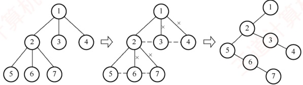

##### 19

C

森林 F 的先根遍历序列对应于其二叉树 T 的先序遍历序列，森林 F 的后根遍历序列对应于其二叉树 T 的中序遍历序列。即 T 的先序遍历序列为 a, b, c, d, e, f，中序遍历序列为 b, a, d, f, e, c。根据二叉树 T 的先序序列和中序序列可以唯一确定它的结构，构造过程如下：

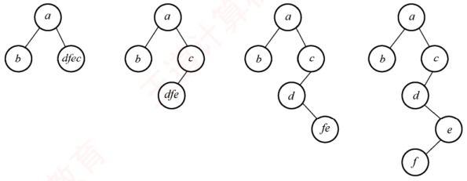

可以得到二叉树 T 的后序序列为 b, f, e, d, c, a。

##### 20

C

由二叉树 T 的先序序列和中序序列可以构造出 T，如右图所示。由森林转化成二叉树的规则可知，森林中每棵树的根结点以右子树的方式相连，所以 T 中的结点 a、c、f 为 F 中树的根结点，森林 F 中有 3 棵树。

##### 21

B

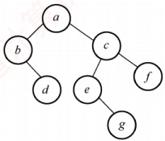

完全二叉树中至多存在一个度为1的结点（最后一个非叶结点仅当总结点数为偶数时出现），选项A错误。根据“左孩子右兄弟”表示法，任意森林均可唯一地转换为一棵二叉树，即将每棵树的根视为兄弟，各树内部按左孩子、右兄弟关系重构，选项B正确。在任意非空二叉树中，叶结点数 $n_{0}$等于度为2的结点数 $n_{2}$加1。但分支结点包括度为1和度为2的结点，其总数不一定少于叶结点数。例如，一条单支二叉树中，叶结点仅1个，而分支结点有n-1个，远多于叶结点。选项C错误。表达式树的结构体现运算优先级，根结点对应最后执行的运算符，而非最先计算的。最先计算的操作位于最深层的子树中，选项D错误。

#### 二、 综合应用题

##### 01

【解答】

一棵树的先根遍历结果与其对应二叉树的先序遍历结果相同，树的后根遍历结果与其对应二叉

树表示的中序遍历结果相同。二叉树的先序序列和中序序列能够唯一地确定这棵二叉树，因此，根据题目给出的条件，利用树的先根遍历序列和后根遍历序列能够唯一地确定这棵树。例如，对于右图所示的树，对应二叉树的先序序列为1,2,3,4,5,6,8,7，中序序列为3,4,8,6,7,5,2,1。原树的先根遍历序列为1,2,3,4,5,6,8,7，后根遍历序列为3,4,8,6,7,5,2,1。

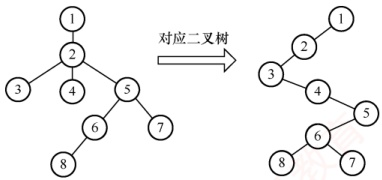

**注意**

树的先根遍历、后根遍历与对应二叉树的先序遍历、中序遍历对应。

##### 02

【解答】

根据树与二叉树 “左孩子右兄弟” 的转换规则，将森林转换为二叉树的过程如下：① 将每棵树的根结点也视为兄弟关系，在兄弟结点之间加一连线。② 对每个结点，只保留它与第一个子结点的连线，与其他子结点的连线全部抹掉。③ 以树根为轴心，顺时针旋转  $45^{\circ}$。结果如下图所示。

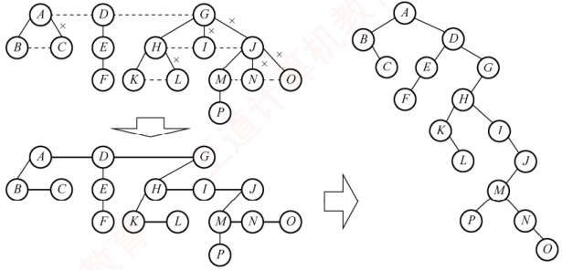

##### 03

【解答】

知道二叉树的先序和中序遍历后，可以唯一确定这棵树的结构。然后把二叉树转换到树和森林的方式是，若结点 x 是双亲 y 的左孩子，则把 x 的右孩子、右孩子的右孩子……都与 y 用连线连起来，最后去掉所有双亲到右孩子的连线。

得到的二叉树及对应的森林如下图所示。

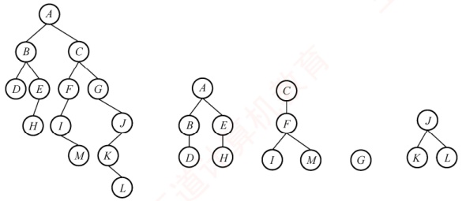

##### 04

【解答】

当森林（树）以孩子兄弟表示法存储时，若结点没有孩子（ $fch = NULL$），则它必是叶子，总的叶结点数是孩子子树（ $fch$）上的叶子数和兄弟子树（ $nsib$）上的叶结点数之和。

算法代码如下：

```c
typedef struct node
{
    ElemType data; //数据域
```
```c
    struct node *fch, *nsib; //孩子与兄弟域
} *Tree;
int Leaves(Tree t) {
    if (t == NULL)
        return 0;
    if (t->fch == NULL)
```
```c
        return 1 + Leaves(t->nsib); //返回叶结点和其兄弟子树中的叶结点数
    else
        return Leaves(t->fch) + Leaves(t->nsib);
}
```

##### 05

【解答】

由孩子兄弟链表表示的树，求高度的算法思想：采用递归算法，若树为空，高度为零；否则，高度为第一个孩子树高度加1和兄弟子树高度的大者。其非递归算法使用队列，逐层遍历树，取得树的高度。算法代码如下：

```c
int Height(CSTree bt) {
    //递归求以孩子兄弟链表表示的树的深度
    int hc, hs;
    if (bt == NULL)
        return 0;
    else { //否则，高度取孩子高度+1 和兄弟子树高度的大者
        hc = Height(bt->firstchild); //第一个孩子树高
        hs = Height(bt->nextsibling); //兄弟树高
        if (hc + 1 > hs)
            return hc + 1;
        else
            return hs;
    }
}
```
