### 5.5.3 本节试题精选

#### 一、 单项选择题

##### 01

在有 n 个叶结点的哈夫曼树中，非叶结点的总数是（）。

A. n-1 B. n C. 2n-1 D. 2n

##### 02

给定整数集合 $\{3,5,6,9,12\}$，与之对应的哈夫曼树是（）。

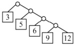

A.

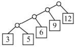

B.

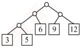

C.

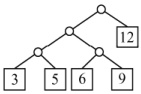

D.

##### 03

下列编码中，（）不是前缀码。

A. {00, 01, 10, 11} B. {0, 1, 00, 11}

C. {0, 10, 110, 111} D. {10, 110, 1110, 1111}

##### 04

设哈夫曼编码的长度不超过4，若已对两个字符编码为1和01，则还最多可对（ ）个字符编码。

A. 2 B. 3 C. 4 D. 5

##### 05

一棵哈夫曼树共有215个结点，对其进行哈夫曼编码，共能得到（）个不同的码字。

A. 107 B. 108 C. 214 D. 215

##### 06

设某哈夫曼树有 5 个叶结点，则该哈夫曼树的高度最高可以是（）。

A. 3 B. 4 C. 5 D. 6

##### 07

以下对于哈夫曼树的说法中，错误的是（）

A. 用一组权值构造出的哈夫曼树可能不唯一，但带权路径长度唯一

B. 哈夫曼树具有最小的带权路径长度

C. 哈夫曼树中没有度为1的结点

D. 哈夫曼树中除了度为1的结点，还有度为2的结点和叶结点

##### 08

下列关于哈夫曼树的说法中，错误的是（）。

Ⅰ. 哈夫曼树的总结点数不能是偶数

Ⅱ. 哈夫曼树中度为1的结点数等于度为2和0的结点数之差

Ⅲ. 哈夫曼树的带权路径长度等于其所有分支结点的权值之和

A. 仅 III

B. I 和 II

C. 仅 II

D. I、II 和 III
##### 09

若度为  $m$ 的哈夫曼树中，叶结点数为  $n$，则非叶结点的个数为（ ）。

A.  $n-1$

B.  $\lfloor n/m \rfloor - 1$

C.  $\lceil (n-1)/(m-1) \rceil$

D.  $\lceil n/(m-1) \rceil - 1$

##### 10

并查集的结构是一种（）。

A. 二叉链表存储的二叉树

B. 双亲表示法存储的树

C. 顺序存储的二叉树

D. 孩子表示法存储的树

##### 11

并查集中最核心的两个操作是：① 查找，查找两个元素是否属于同一个集合；② 合并，若两个元素不属于同一个集合，且所在的两个集合互不相交，则合并这两个集合。假设初始长度为10（0~9）的并查集，按1-2、3-4、5-6、7-8、8-9、1-8、0-5、1-9的顺序进行查找和合并操作，最终并查集共有（）个集合。

A. 1 B. 2 C. 3 D. 4

##### 12

下列关于并查集的说法中，正确的是（ ）（注，本题涉及图的考点）。

A. 并查集不能检测图中是否存在环路的问题

B. 通过路径优化后的并查集在最坏情况下的高度仍是  $O(n)$

C. Find 操作返回集合中元素个数的相反数，它用来作为某个集合的标志

D. Union 操作时可根据当前集合的规模，将小集合合并到大集合中

##### 13

下列关于并查集的叙述中，（）是错误的（注意，本题涉及图的考点）。

A. 并查集是用双亲表示法存储的树

B. 并查集可用于实现克鲁斯卡尔算法

C. 并查集可用于判断无向图的连通性

D. 在长度为 n 的并查集中进行查找操作的时间复杂度为  $O(\log_{2} n)$

##### 14

【2010 统考真题】 $n (n \geq 2)$ 个权值均不相同的字符构成哈夫曼树，关于该树的叙述中，错误的是（）。

A. 该树一定是一棵完全二叉树

B. 树中一定没有度为1的结点

C. 树中两个权值最小的结点一定是兄弟结点

D. 树中任意一个非叶结点的权值一定不小于下一层任意一个结点的权值

##### 15

【2014 统考真题】5 个字符有如下 4 种编码方案，不是前缀编码的是（）.

A. 01,0000,0001,001,1

B. 011,000,001,010,1

C. 000,001,010,011,100

D. 0,100,110,1110,1100

##### 16

【2015 统考真题】下列选项给出的是从根分别到达两个叶结点路径上的权值序列，能属于同一棵哈夫曼树的是（）。

A. 24, 10, 5 和 24, 10, 7

B. 24, 10, 5 和 24, 12, 7

C. 24, 10, 10 和 24, 14, 11

D. 24, 10, 5 和 24, 14, 6

##### 17

【2017 统考真题】已知字符集 {a, b, c, d, e, f, g, h}，各字符的哈夫曼编码依次是 0100, 10, 0000, 0101, 001, 011, 11, 0001，编码序列 0100011001001011110101 的译码结果是（）。

A. acgabfh

B. adbagbb

C. afbeagd

D. afeefgd

##### 18

【2018 统考真题】已知字符集 {a, b, c, d, e, f}，若各字符出现的次数分别为 6, 3, 8, 2, 10, 4，则对应字符集中各字符的哈夫曼编码可能是（）。

A. 00, 1011, 01, 1010, 11, 100

B. 00, 100, 110, 000, 0010, 01

C. 10, 1011, 11, 0011, 00, 010

D. 0011, 10, 11, 0010, 01, 000
##### 19

【2019 统考真题】对 n 个互不相同的符号进行哈夫曼编码。若生成的哈夫曼树共有 115 个结点，则 n 的值是（）。

A. 56 B. 57 C. 58 D. 60

##### 20

【2021 统考真题】若某二叉树有 5 个叶结点，其权值分别为 10, 12, 16, 21, 30，则其最小的带权路径长度（WPL）是（）。

A. 89 B. 200 C. 208 D. 289

##### 21

【2022 统考真题】对任意给定的含  $n (n > 2)$ 个字符的有限集 S，用二叉树表示 S 的哈夫曼编码集和定长编码集，分别得到二叉树  $T_1$ 和  $T_2$。下列叙述中，正确的是（）。

A.  $T_1$ 与  $T_2$ 的结点数相同

B.  $T_1$ 的高度大于  $T_2$ 的高度

C. 出现频次不同的字符在  $T_1$ 中处于不同的层

D. 出现频次不同的字符在  $T_2$ 中处于相同的层

##### 22

【2023 统考真题】在由 6 个字符组成的字符集 S 中，各字符出现的频次分别为 3, 4, 5, 6, 8, 10，为 S 构造的哈夫曼编码的加权平均长度为（）。

A. 2.4 B. 2.5 C. 2.67 D. 2.75

##### 23

【2025 统考真题】设字符集 S 中包含 7 个字符，各字符出现的频次分别为 2, 3, 4, 6, 8, 10, 11。现为 S 中的各字符构造哈夫曼编码，编码长度不小于 3 的字符数是（）。

A. 2 B. 3 C. 4 D. 5

#### 二、 综合应用题

##### 01

设给定权集  $w = \{5, 7, 2, 3, 6, 8, 9\}$，试构造关于 w 的一棵哈夫曼树，并求其加权路径长度 WPL。

##### 02

【2012 统考真题】设有 6 个有序表 A, B, C, D, E, F，分别含有 10, 35, 40, 50, 60 和 200 个数据元素，各表中的元素按升序排列。要求通过 5 次两两合并，将 6 个表最终合并为 1 个升序表，并使最坏情况下比较的总次数达到最小。请回答下列问题：

1）给出完整的合并过程，并求出最坏情况下比较的总次数。

2）根据你的合并过程，描述  $n(n \geq 2)$ 个不等长升序表的合并策略，并说明理由。

##### 03

【2020 统考真题】若任意一个字符的编码都不是其他字符编码的前缀，则称这种编码具有前缀特性。现有某字符集（字符个数 $\geq 2$）的不等长编码，每个字符的编码均为二进制的0、1序列，最长为L位，且具有前缀特性。请回答下列问题：

1）哪种数据结构适宜保存上述具有前缀特性的不等长编码？

2）基于你所设计的数据结构，简述从0/1串到字符串的译码过程。

3）简述判定某字符集的不等长编码是否具有前缀特性的过程。

### 5.5.4 答案与解析

#### 一、 单项选择题

##### 01

A

由哈夫曼树的构造过程可知，哈夫曼树中只有度为0和2的结点。在非空二叉树中，有 $n_{0}=n_{2}+1$，所以 $n_{2}=n-1$。

【另解】n个结点构造哈夫曼树需要n-1次合并过程，每次合并新建一个分支结点，所以选择选项A。

##### 02

C

首先，3 和 5 构造为一棵子树，其根权值为 8，然后该子树与 6 构造为一棵新子树，根权值
为 14，再后 9 与 12 构造为一棵子树，最后两棵子树共同构造为一棵哈夫曼树。

##### 03

B

若没有一个编码是另一个编码的前缀，则称这样的编码为前缀编码。在选项 B 中，0 是 00 的前缀，1 是 11 的前缀。

##### 04

C

在哈夫曼编码中，一个编码不能是任何其他编码的前缀。3位编码可能是001，对应的4位

编码只能是0000和0001。3位编码也可能是000，对应的4位编码只能是0010和0011。若全采用4位编码，则可以为0000，0001，0010和0011。题中问的是最多，所以选择选项C。

【另解】若哈夫曼编码的长度只允许小于或等于4，则哈夫曼树的高度最高是5，已知一个字符编码为1，另一个字符编码为01，这说明第二层和第三层各有一个叶结点，为使得该树从第3层起能够对尽可能多的字符编码，余下的二叉树应该是满二叉树，如右图所示，底层可以有4个叶结点，最多可以再对4个字符编码。

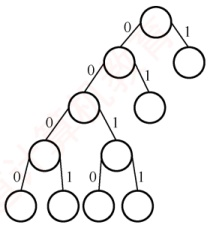

##### 05

B

根据上题的结论，叶结点数为 $(215+1)/2=108$，所以共有108个不同的码字。

【另解】在哈夫曼树中只有度为0和2的结点，结点总数 $n=n_{0}+n_{2}$，且 $n_{0}=n_{2}+1$，由题知n=215， $n_{0}=108$。

##### 06

C

在哈夫曼树的构造中，每个初始结点最终都成为叶结点，5个初始结点构造的哈夫曼树共新建4个双分支结点，4个双分支结点所构成的高度最高的哈夫曼树如右图所示，其高度为5。

##### 07

D

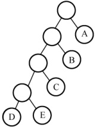

在哈夫曼树的构造过程中，每次选根的权值最小的两棵树，一棵作为左子树，一棵作为右子树，生成新的二叉树，新的二叉树根的权值应为其左右两棵子树根结点权值的和。至于谁做左子树，谁做右子树，没有限制，所以构造的哈夫曼树是不唯一的，但其带权路径长度是最小的和唯一的。哈夫曼树只有度为0和2的结点，度为0的结点是外结点，带有权值，没有度为1的结点。

##### 08

C

由 n 个初始结点构造的哈夫曼树，会新建 n-1 个双分支结点，因此总结点数为 2n-1，必为奇数，说法 I 正确。哈夫曼树中没有度为 1 的结点，说法 II 错误。哈夫曼的带权路径长度有两种计算方法：① 所有叶结点的带权路径长度之和；② 所有分支结点的权值之和，说法 III 正确。

##### 09

C

一棵度为 m 的哈夫曼树应只有度为 0 和 m 的结点，设度为 m 的结点有  $n_{m}$ 个，度为 0 的结点有  $n_{0}$ 个，又设结点总数为 N， $N = n_{0} + n_{m}$。因 N 个结点的哈夫曼树有 N-1 条分支，则  $mn_{m} = N - 1 = n_{m} + n_{0} - 1$，整理得  $(m-1)n_{m} = n_{0} - 1$， $n_{m} = (n_{0}-1)/(m-1)$。

##### 10

B

并查集的存储结构是用双亲表示法存储的树，主要是为了方便两个重要的操作。

##### 11

C

初始时，0～9各自成一个集合。查找1-2时，合并{1}和{2}；查找3-4时，合并{3}和{4}；
查找 5-6 时，合并{5}和{6}；查找 7-8 时，合并{7}和{8}；查找 8-9 时，合并{7,8}和{9}；查找 1-8 时，合并{1,2}和{7,8,9}；查找 0-5 时，合并{0}和{5,6}；查找 1-9 时，它们属于同一个集合。最终的集合为{0,5,6}、{1,2,7,8,9}和{3,4}，因此答案选择选项 C。

##### 12

D

依次探测图的各条边，用并查集检查该边依附的两个顶点是否已属于同一集合（两个顶点的根结点是否相同）。若是，则说明图中存在环路，选项A错误。经过路径优化后，并查集在最坏情况下的高度远小于 $O(n)$，选项B错误。Find操作总返回当前根结点作为集合的标志，选项C错误。

##### 13

D

在用并查集实现 Kruskal 算法求图的最小生成树时：判断是否加入一条边之前，先查找这条边关联的两个顶点是否属于同一个集合（判断加入这条边之后是否形成回路），若形成回路，则继续判断下一条边；若不形成回路，则将该边和边对应的顶点加入最小生成树 T，并继续判断下一条边，直到所有顶点都已加入最小生成树 T。选项 B 正确。用并查集判断无向图连通性的方法：遍历无向图的边，每遍历到一条边，就把这条边连接的两个顶点合并到同一个集合中，处理完所有边后，只要是相互连通的顶点都会被合并到同一个子集合中，相互不连通的顶点一定在不同的子集合中。选项 C 正确。未做路径优化的并查集在最坏情况下的高度为 n，此时查找操作的时间复杂度为  $O(n)$，时间复杂度通常指最坏情况下的时间复杂度。选项 D 错误。

##### 14

A

哈夫曼树为带权路径长度最小的二叉树，不一定是完全二叉树。哈夫曼树中没有度为1的结点，选项B正确。构造哈夫曼树时，最先选取两个权值最小的结点作为左右子树构造一棵新的二叉树，选项C正确。哈夫曼树中任意一个非叶结点的权值为其左右子树根结点的权值之和，可知，哈夫曼树中任意一个非叶结点的权值一定不小于下一层任意一个结点的权值。

##### 15

D

前缀编码的定义是在一个字符集中，任何一个字符的编码都不是另一个字符编码的前缀。选项D中的编码110是编码1100的前缀，违反了前缀编码的规则，所以选项D不是前缀编码。

##### 16

D

在哈夫曼树中，左右孩子权值之和为父结点权值。仅以分析选项A为例：若两个10分别属于两棵不同的子树，则根的权值不等于其孩子的权值和，不符；若两个10属同棵子树，则其权值不等于其两个孩子（叶结点）的权值和，不符。选项B、C选项的排除方法相同。

##### 17

D

哈夫曼编码是前缀编码，各个编码的前缀不同，因此直接拿编码序列与哈夫曼编码一一比对即可。序列可分割为 0100 011 001 001 011 11 0101，译码结果是 afefgd。选项 D 正确。

##### 18

A

根据各字符出现的次数构造的哈夫曼树如右图所示。由图可知，a、c和e的编码长度应该相同；a和c的第1个编码应该相同，且与e的第1个编码不同；b和d的前3个编码应该相同。

##### 19

C

n 个符号构成哈夫曼树的过程中，共新建了 n-1 个结点（双分支结点），因此哈夫曼树的结点总数为 2n-1=115，n 的值为 58。

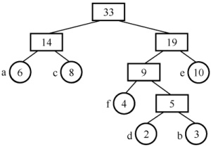

##### 20

B

对于带权值的结点，构造出哈夫曼树的带权路径长度（WPL）最小，哈夫曼树的构造过程如下图所示。求得其 WPL = (10 + 12)×3 + (30 + 16 + 21)×2 = 200。

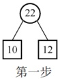

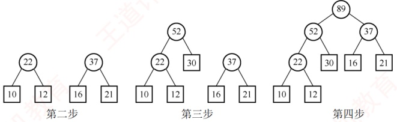

##### 21

D

可以画一个简单的特例来证明。图1是满足条件的二叉树 $T_{1}$，图2是满足条件的二叉树 $T_{2}$，结点中有值表示这个结点是编码字符。 $T_{1}$和 $T_{2}$的结点数不同，选项A错误。 $T_{1}$的高度等于 $T_{2}$的高度，选项B错误。出现频次不同的字符在 $T_{1}$中也可能处于相同的层，选项C错误。对于定长编码集，所有字符一定都在 $T_{2}$中处于相同的层，而且都是叶结点。

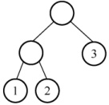

图1

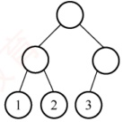

图2

##### 22

B

构建哈夫曼树的过程如下图所示。

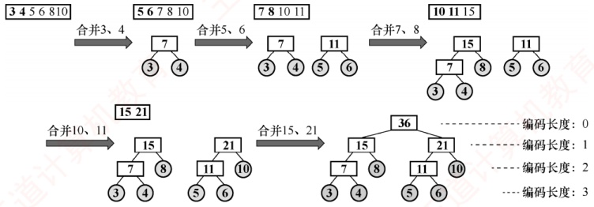

对叶结点的哈夫曼编码，共有4个长度为3的叶结点、2个长度为2的叶结点，编码的加权平均长度为 $[(3+4+5+6)\times3+(8+10)\times2]/(3+4+5+6+8+10)=2.5$。

##### 23

D

哈夫曼编码的编码长度等于该字符在哈夫曼树中的路径深度（从根到该叶结点的边数）。一个字符所在子树参与后续合并的轮数越多，其深度越大。合并过程如下：①合并2和3→新结点5；②合并4和5→新结点9；③合并6和8→新结点14；④合并9和10→新结点19；⑤合并11和14→新结点25；⑥合并19和25→根结点44。最终构建的哈夫曼树如右图所示。因此，编码长度不小于3的字符为4、2、3、6、8，共5个。

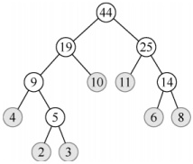

#### 二、 综合应用题

##### 01

【解答】

根据哈夫曼树的构造方法，每次从森林中选取两个根结点值最小的树合并成一棵树，将原先的两棵树作为左右子树，且新根结点的值为左右孩子关键字之和。构造过程如下图所示。

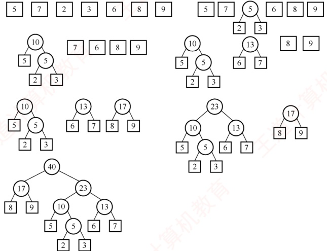

由构造出的哈夫曼树可得  $WPL = (2 + 3) \times 4 + (5 + 6 + 7) \times 3 + (8 + 9) \times 2 = 108$。

**注意**

哈夫曼树并不唯一，但带权路径长度一定是相同的。

##### 02

【解答】

1）最先合并的表中的元素在后续的每次合并中都会再次参与比较，因此求最小合并次数类似于求最小带权路径长度，此时可立即想到哈夫曼树。根据哈夫曼树的构造过程，每次选择表集合中长度最小的两个表进行合并。6个表的合并顺序如右图所示。根据图中的哈夫曼树，6个序列的合并过程如下：

① 在表集合{10,35,40,50,60,200}中，选择表A与表B合并，生成含45个元素的表AB。

② 在表集合{40,45,50,60,200}中，将表AB与表C合并，生成含85个元素的表ABC。

③ 在表集合{50,60,85,200}中，表D与表E合并，生成含110个元素的表DE。

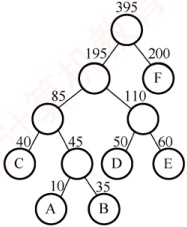

④ 在表集合{85, 110, 200}中，表 ABC 与表 DE 合并，生成含 195 个元素的表 ABCDE。

⑤ 当前表集合为{195, 200}，表 ABCDE 与表 F 合并，生成含 395 个元素的表 ABCDEF。因为合并两个长度分别为 m 和 n 的有序表，最坏情况下需要比较  $m + n - 1$ 次，所以最坏情况下比较的总次数计算如下：

第1次合并：最多比较次数=10+35-1=44。
第2次合并：最多比较次数=40+45-1=84。

第3次合并：最多比较次数=50+60-1=109。

第4次合并：最多比较次数=85+110-1=194。

第5次合并：最多比较次数=195+200-1=394。

比较的总次数最多为 $44+84+109+194+394=825$。

2）各表的合并策略是：对多个有序表进行两两合并时，若表长不同，则最坏情况下总的比较次数依赖于表的合并次序。可以借助哈夫曼树的构造思想，依次选择最短的两个表进行合并，此时可以获得最坏情况下的最佳合并效率。

##### 03

【解答】

1）使用一棵二叉树保存字符集中各字符的编码，每个编码对应于从根开始到达某叶结点的一条路径，路径长度等于编码位数，路径到达的叶结点中保存该编码对应的字符。

2）从左至右依次扫描0/1串中的各位。从根开始，根据串中当前位沿当前结点的左子指针或右子指针下移，直到移动到叶结点时为止。输出叶结点中保存的字符。然后从根开始重复这个过程，直到扫描到0/1串结束，译码完成。

3）二叉树既可用于保存各字符的编码，又可用于检测编码是否具有前缀特性。判定编码是否具有前缀特性的过程，也是构建二叉树的过程。初始时，二叉树中仅含有根结点，其左子指针和右子指针均为空。

依次读入每个编码 C，建立/寻找从根开始对应于该编码的一条路径，过程如下：

对每个编码，从左至右扫描 C 的各位，根据 C 的当前位（0 或 1）沿结点的指针（左子指针或右子指针）向下移动。当遇到空指针时，创建新结点，让空指针指向该新结点并继续移动。沿指针移动的过程中，可能遇到三种情况：

① 若遇到了叶结点（非根），则表明不具有前缀特性，返回。

② 若在处理 C 的所有位的过程中，均没有创建新结点，则表明不具有前缀特性，返回。

③ 若在处理 C 的最后一个编码位时创建了新结点，则继续验证下一个编码。

若所有编码均通过验证，则编码具有前缀特性。

**归纳总结**

本章内容较为丰富，其中二叉树是极其重要的考查重点。在历年统考真题中，已多次出现基于二叉树的算法设计题，考生需特别关注。

遍历是二叉树各类操作的基础，统考常结合遍历过程考查对结点的各种附加操作。建议读者重点掌握各种遍历方法的代码实现，并在此基础上灵活完成相关操作。其中，递归算法结构简洁、逻辑清晰，在考试中出现的概率较高，切勿掉以轻心。应熟练掌握先序、中序、后序遍历的程序模板，并通过足量习题训练，方能在考试中快速写出规范、高效的代码。

二叉树遍历的通用递归框架如下：

```c
void Track(BiTree *p){
    if(p!=NULL){
        //(1)
        Track(p->lchild);
        //(2)
        Track(p->rchild);
    }
}
```


将访问操作 visit() 放在位置(1)、(2)或(3)，分别对应先序遍历、中序遍历和后序遍历。但在具体题目中，需根据问题要求灵活调整和扩展该模板。

例如，设二叉树采用二叉链表存储结构，请编写有关二叉树的递归算法。

1）统计二叉树中度为1的结点数。

2）统计二叉树中度为2的结点数。

3）统计二叉树中度为0的结点（叶结点）个数。

4）求二叉树的高度。

5）求二叉树的宽度（各层中结点数的最大值）。

6）删除二叉树中的所有叶结点。

7）计算指定结点 $^{*}$p所在的层次。

8）求二叉树中所有结点数据值的最大值。

9）交换二叉树中每个结点的左右孩子。

10）以先序次序输出二叉树中每个结点的数据值及其所在层次。

**思维拓展**

输入一个整数 data 和一棵二元树。从树的根结点开始往下访问一直到叶结点，所经过的所有结点形成一条路径。打印出路径及与 data 相等的所有路径。例如，输入整数 22 和右图所示的二元树，则打印出两条路径 10, 12 和 10, 5, 7。

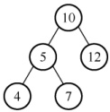

**注意**

使用数组或栈保存访问的路径，并记录当前路径上所有元素的和sum。若当前结点为叶结点，且当前结点值与sum的和等于data，则满足条件，打印当前路径。然后递归返回到父结点，注意在递归返回之前要先减去当前结点元素的值。使用先序遍历操作的递归算法模板可以简化程序。
