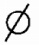
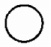
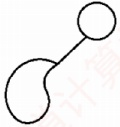
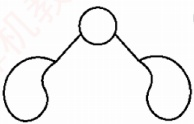
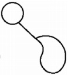
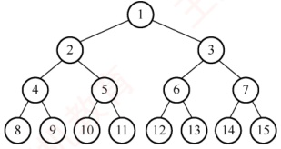
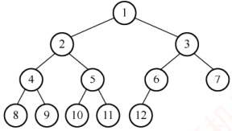
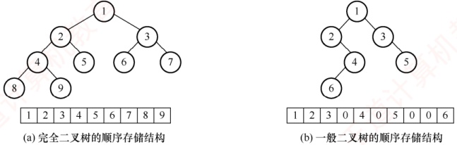
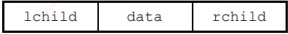
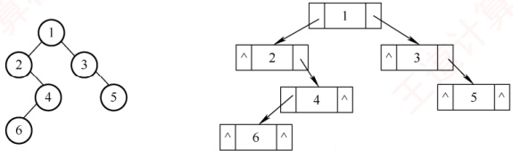

## 5.2 二叉树的概念

### 5.2.1 二叉树的定义及其主要特性

#### 1. 二叉树的定义

二叉树是一种特殊的树形结构，其核心特征在于：每个结点至多拥有两棵子树（不存在度大于2的结点），且这两棵子树具有明确的左右之分，其次序是固定的，不可交换。

与树类似，二叉树也以递归的方式定义。二叉树是包含  $n$（ $n \geq 0$）个结点的有限集合：

①或者为空二叉树，即n=0。

② 或者由一个根结点以及两棵互不相交的被称为根的左子树和右子树构成，且左右子树本身也均为二叉树。

二叉树属于有序树。即使某个结点仅有一棵子树，也要区分它是左子树还是右子树；若交换某结点的左右子树，则会得到另一棵不同的二叉树。二叉树的5种基本形态如图5.2所示。

(a) 空二叉树

(b) 只有根结点

(c) 只有左子树

(d) 左右子树都有

(e) 只有右子树

图5.2 二叉树的5种基本形态

注意，二叉树与度为2的有序树有本质区别：

① 度为2的树至少包含3个结点，而二叉树可以为空。

② 在度为2的有序树中，若某结点只有一个孩子，则无须区分左右次序（因为左右关系是相对于另一个孩子而言的）；而在二叉树中，无论结点是否拥有两个孩子，其子树的左右位置都是确定且不可省略的，这种次序并非相对概念，而是结构本身的固有属性。

#### 2. 几种特殊的二叉树

1）满二叉树。一棵高度为 h 且包含  $2^h-1$ 个结点的二叉树称为满二叉树，即每一层都含有该层所能容纳的最大结点数，如图 5.3(a) 所示。满二叉树的所有叶结点均位于最下一层，且除叶结点外，其余每个结点的度均为 2。

可对满二叉树按层序进行编号：约定根结点编号为1，自上而下，自左向右依次编号。在此编号规则下，对于编号为i的结点，若其存在双亲，则双亲编号为 $\lfloor i/2\rfloor$；若存在左孩子，则左孩子编号为2i；若存在右孩子，则右孩子编号为2i+1。

### 考点追踪 完全二叉树的特性（2009、2011、2018、2025）

2）完全二叉树。高度为 h 且包含 n 个结点的二叉树，当且仅当其每个结点与高度为 h 的满二叉树中编号为  $1 \sim n$ 的结点一一对应时，称为完全二叉树，如图 5.3(b) 所示。

(a) 满二叉树

(b) 完全二叉树

图 5.3 两种特殊形态的二叉树

3）二叉排序树。其左子树上所有结点的关键字均小于根结点的关键字；右子树上所有结点的关键字均大于根结点的关键字，且左子树和右子树本身也各是一棵二叉排序树。

4）平衡二叉树。树中任意一个结点的左子树和右子树的高度之差的绝对值不超过1。关于二叉排序树和平衡二叉树的详细介绍，见本书第7.3节。

### 考点追踪 正则 k 叉树树高和结点数的关系的应用（2016）

5）正则二叉树。树中每个分支结点均有2个孩子，即树中仅有度为0或2的结点。

#### 3. 二叉树的性质

### 考点追踪 二叉树中结点数的关系（2025）

1）非空二叉树的叶结点数等于度为2的结点数加1，即 $n_{0}=n_{2}+1$。
设度为0, 1和2的结点数分别为 $n_{0}, n_{1}$和 $n_{2}$，结点总数 $n = n_{0} + n_{1} + n_{2}$。

再考虑二叉树中的分支数，除根结点外，其余结点都有一个分支进入，设 B 为分支总数，则 n = B + 1。这些分支是由度为 1 或 2 的结点射出的，因此有  $B = n_{1} + 2n_{2}$。

由此得出  $n_{0}+n_{1}+n_{2}=n_{1}+2n_{2}+1$，从而得出  $n_{0}=n_{2}+1$。

**注意**

该性质在选择题中经常出现，希望读者牢记并灵活应用。

2）非空二叉树的第  $k$ 层最多有  $2^{k-1}$ 个结点（ $k \geq 1$）。

例如，第 1 层最多有  $2^{1-1} = 1$ 个结点（根），第 2 层最多有  $2^{2-1} = 2$ 个结点，以此类推，

这构成一个首项为 1、公比为 2 的等比数列，通项为  $2^{k-1}$。

3）高度为 h 的二叉树至多有  $2^n - 1$ 个结点（ $h \geq 1$）。

该性质可通过性质 2 求前 h 项的和得到，即等比数列求和的结果。

**注意**

性质2和3可拓展到m叉树的情况，即m叉树的第k层最多有 $m^{k-1}$个结点，高度为h的m叉树至多有 $(m^h-1)/(m-1)$个结点。

4）对完全二叉树按从上到下、从左到右的顺序依次编号 1,2, $\cdots$,n，则有以下关系：

① 最后一个分支结点的编号为 $[n/2]$，若  $i \leq [n/2]$，则结点  $i$ 为分支结点，否则为叶结点。

② 叶结点只可能出现在最后两层上（相当于在相同高度的满二叉树的最底层、最右侧减少一些连续叶结点；当减少两个及以上叶结点时，次底层将出现叶结点）。

③ 若存在度为1的结点，则最多只可能有一个，且该结点只有左孩子而无右孩子（度为1的分支结点只可能是最后一个分支结点，其结点编号为 $[n/2]$）。

④ 按层序编号后，一旦某个结点 i 为叶结点或仅有左孩子，则所有编号大于 i 的结点均为叶结点（与上述结论①和结论③一致）。

⑤ 若 n 为奇数，则每个分支结点都有左右孩子；若 n 为偶数，则编号最大的分支结点（编号为 n/2）只有左孩子，没有右孩子，其余分支结点都有左右孩子。

⑥ 当  $i > 1$ 时，结点  $i$ 的双亲结点的编号为  $\lfloor i/2 \rfloor$。

⑦ 若结点 i 有左右孩子，则左孩子编号为 2i，右孩子编号为  $2i+1$。

⑧ 结点  $i$ 所在层次（深度）为  $\lfloor \log_2 i \rfloor + 1$。

5）具有 $n$ 个 $(n>0)$ 结点的完全二叉树的高度为 $\left[\log_2(n+1)\right]$ 或 $\left[\log_2 n\right]+1$。设高度为 $h$，根据性质 3 和完全二叉树的定义有

 $$2^{h-1}-1<n\leqslant2^{h}-1\quad 或者 \quad2^{h-1}\leqslant n<2^{h}$$

得出  $2^{h-1}<n+1\leqslant2^h$，即  $h-1<\log_2(n+1)\leqslant h$，因为  $h$ 为正整数，所以  $h=\left\lceil\log_2(n+1)\right\rceil$，或者得出  $h-1\leqslant\log_2 n<h$，所以  $h=\left\lfloor\log_2 n\right\rfloor+1$。

### 5.2.2 二叉树的存储结构

#### 1. 顺序存储结构

二叉树的顺序存储是指使用一组连续的存储单元，按照自上而下、自左至右的层序，依次存储完全二叉树中的结点元素。即将编号为 i 的结点存储在一维数组下标为 i-1 的位置中。

依据二叉树的性质，完全二叉树和满二叉树特别适合采用顺序存储，其结点编号能够唯一反
映结点之间的逻辑关系，既能最大限度地节省存储空间，又可直接通过数组下标快速确定结点在二叉树中的位置及其父子、兄弟关系。

### 考点追踪 二叉树的顺序存储结构相关应用（2020、2025）

然而，对于一般的二叉树，若仍想通过数组下标反映逻辑结构，则需插入若干“空结点”，使其结构与同高度的完全二叉树一致，再将所有结点（包括空结点）按层序存入数组，这种做法在最坏情况下效率极低。例如，一个高度为 h 且仅有 h 个结点的单支树，却需要占用近  $2^{h}-1$ 个存储单元。图 5.4 展示了二叉树的顺序存储结构，其中用 0 表示空结点。

(b) 一般二叉树的顺序存储结构

图5.4 二叉树的顺序存储结构

**注意**

建议从数组下标1开始存储树中结点，保证数组下标与结点编号一致。

#### 2. 链式存储结构

由于顺序存储的空间利用率较低，二叉树通常采用链式存储结构，即使用链表结点来存储二叉树中的每个结点。在二叉树的链式存储中，每个结点通常包括若干数据域和指针域。二叉链表至少包含3个域：左指针域lchild、数据域data和右指针域rchild，如图5.5所示。

图 5.5 二叉树链式存储的结点结构

图 5.6 展示了一棵二叉树及其对应的二叉链表。在实际应用中，还可根据需要扩展结点结构，例如增加指向父结点的指针域，从而形成三叉链表的存储结构。

图 5.6 二叉链表的存储结构

二叉树的链式存储结构可定义如下：

 $$\begin{aligned}&typedef~struct~BiTNode\{\\&\quad ElemType~data;\quad&&// 数据域 \\&\quad struct~BiTNode~*lchild,*rchild;\quad&&// 分别指向左右孩子的指针 \\&\quad\}BiTNode,*BiTree;\end{aligned}$$

不同的存储结构会导致二叉树操作算法的实现不同，因此应根据实际应用场景（如二叉树的
形态特征及所需执行的运算类型）选择合适的存储方式。

容易验证，在含有 n 个结点的二叉链表中，共有  $n+1$ 个空链域（重要结论），常出现在选择题中。下一节将利用这些空链域构造一种新的链表结构——线索链表。
