## 5.3 二叉树的遍历和线索二叉树

### 5.3.1 二叉树的遍历

二叉树的遍历是指按照某种搜索路径访问树中的每个结点，使得每个结点均被访问一次且仅被访问一次。由于二叉树是一种非线性结构，每个结点最多有两棵子树，因此需要确定一种系统性的访问顺序，将树中结点排列成一个线性序列，以便于后续处理。

 $$考点追踪 \quad\rightarrow 二叉树遍历的相关分析 (2009、2011、2012)$$

 $$考点追踪 \quad\gg( 算法题 ) 二叉树遍历的应用 (2014、2017、2022)$$

根据二叉树的递归定义，遍历一棵二叉树的关键在于确定对根结点（N）、左子树（L）和右子树（R）的访问顺序。在遵循“先左后右”的原则下，常见的遍历方式有三种：先序遍历（NLR）、中序遍历（LNR）和后序遍历（LRN），其中“序”指的是根结点在遍历序列中的位置。

#### 1. 先序遍历（PreOrder）

若二叉树为空，则不执行任何操作；否则，

1）访问根结点：

2）先序遍历左子树：

3）先序遍历右子树。

图 5.7 中的虚线表示对该二叉树进行先序遍历的访问路径，所得先序遍历序列为 124635。

对应的递归算法如下：

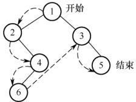

图5.7 二叉树的先序遍历

```c
void PreOrder(BiTree T) {
    if (T != NULL) {
        visit(T);
        PreOrder(T -> lchild);
        PreOrder(T -> rchild);
    }
}
```

#### 2. 中序遍历（InOrder）

若二叉树为空，则不执行任何操作；否则，

1）中序遍历左子树：

2）访问根结点：

3）中序遍历右子树。

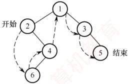

### 考点追踪 中序序列中结点关系的分析（2017、2024）

图5.8 二叉树的中序遍历

图5.8中的虚线表示对该二叉树进行中序遍历的访问路径，所得中序遍历序列为264135。

对应的递归算法如下：

```c
void InOrder(BiTree T) {
    if (T != NULL) {
        InOrder(T -> lchild); //递归遍历左子树
        visit(T); //访问根结点
        InOrder(T -> rchild); //递归遍历右子树
    }
}
```

#### 3. 后序遍历（PostOrder）

若二叉树为空，则不执行任何操作；否则，

1）后序遍历左子树：

2）后序遍历右子树；

3）访问根结点。

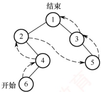

图5.9 中的虚线表示对该二叉树进行后序遍历的访问路径，所得后序遍历序列为642531。

图5.9 二叉树的后序遍历

对应的递归算法如下：

```c
void PostOrder(BiTree T) {
    if (T != NULL) {
        PostOrder(T -> lchild); //递归遍历左子树
        PostOrder(T -> rchild); //递归遍历右子树
        visit(T); //访问根结点
    }
}
```

上述三种遍历算法中，递归遍历左右子树的顺序都是固定的，区别仅在于访问根结点的时机

上述三种遍历算法中，递归遍历左右子树的顺序都是固定的，区别不同。不论采用哪种遍历方法，每个结点都被访问一次且仅一次，时间复杂度均为  $O(n)$。在递归实现中，系统工作栈的深度等于树的高度，在最坏情况下（如单支树），空间复杂度为  $O(n)$。

#### 4. 层次遍历

图 5.10 展示了二叉树的层次遍历过程，即按照 1,2,3,4 的层次顺序，以及箭头所指方向，从上到下、从左到右逐层访问二叉树中的各结点。

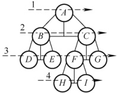

图 5.10 二叉树的层次遍历

层次遍历需要借助一个队列，其基本思想如下：首先将根结点入队，随后不断出队并访问队头结点，同时将其存在的左右孩子依次加入队尾，直至队列为空。

二叉树的层次遍历算法如下：

```c
void LevelOrder(BiTree T){
    InitQueue(Q); //初始化辅助队列
    BiTree p;
    EnQueue(Q,T); //将根结点入队
    while(!IsEmpty(Q)) {
        DeQueue(Q, p); //队列不空则循环
        visit(p); //队头结点出队
        if (p->lchild != NULL)
            EnQueue(Q, p->lchild); //若左孩子不空，则左孩子入队
        if (p->rchild != NULL)
            EnQueue(Q, p->rchild); //若右孩子不空，则右孩子入队
    }
}
```

读者可将上述层次遍历算法作为一个模板，熟练掌握其执行过程，并达到熟练手写的程度。

**注意**

 **遍历是二叉树各类操作的基础**。例如，对于一棵给定二叉树，求结点的双亲、查找孩子结点、计算树的深度、统计叶结点数、判断两棵二叉树是否相同等操作，本质上都是在某种遍历过程中完成的。因此，必须深入理解并灵活运用各种遍历方法，以解决实际问题。

#### 5. 由遍历序列构造二叉树

### 考点追踪 ▶ 先序序列对应的不同二叉树的分析（2015）

对于一棵给定的二叉树，其先序序列、中序序列、后序序列和层序序列都是唯一确定的。然而，仅凭这四种遍历序列中的任意一种，却无法唯一确定这棵二叉树。但若已知中序序列，并辅以其他三种遍历序列中的任意一种，则可以唯一地重构出该二叉树。

（1）由先序序列和中序序列构造二叉树

### 考点追踪 先序序列和中序序列相同时确定的二叉树（2017）
### 考点追踪 由先序序列和中序序列构造一棵二叉树（2020、2021）

在先序序列中，第一个结点必定是整棵二叉树的根结点；而在中序遍历中，根结点将中序列划分为两个子序列：左侧子序列为左子树的中序序列，右侧子序列为右子树的中序序列。由于左右子树的结点数在先序和中序序列中一致，因此可据此从先序序列中分离出左右子树各自的先序子序列，如图5.11所示。通过递归地对左右子树重复上述过程，即可唯一地确定整棵二叉树。

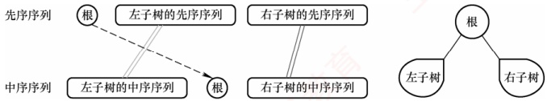

图 5.11 由先序序列和中序序列构造二叉树

例如，求先序序列（ $ABCDEFGHI$）和中序序列（ $BCAEDGHFI$）所确定的二叉树。首先，由先序序列可知 A 为根结点。在中序序列中，A 左侧的 BC 构成左子树的中序序列，右侧的 EDGHFI
构成右子树的中序序列。然后，由先序序列可知 B 是左子树的根结点，D 是右子树的根结点。以此类推，将剩余结点递归分解，最终构造出的二叉树如图 5.12(c) 所示。

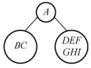

(a)

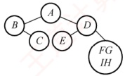

(b)

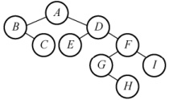

(c)

图 5.12 一棵二叉树的构造过程

#### （2） 由后序序列和中序序列构造二叉树

### 考点追踪 由后序序列和中序序列构造一棵二叉树（2017、2023）

同理，后序序列与中序序列也可唯一确定一棵二叉树。后序序列的最后一个结点即为整棵树的根结点，它同样能将中序序列划分为左右子树的中序序列。随后，根据左右子树的结点数，可从后序序列中分离出对应的左右子树的后序序列，并递归构造，如图5.13所示。

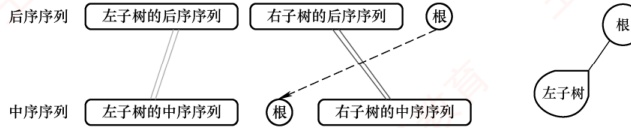

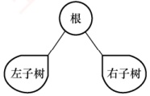

图 5.13 由后序序列和中序序列构造二叉树

请读者分析后序列（CBEHGIFDA）和中序序列（BCAEDGHFI）所确定的二叉树。

#### （3） 由层序序列和中序序列构造二叉树

在层序序列中，第一个结点必为二叉树的根结点，由此可在中序序列中划分出左右子树的中序序列。若存在左子树，则层序序列的第二个结点一定是左子树的根，可以进一步划分左子树；若存在右子树，则层序序列中紧接着的下一个结点一定是右子树的根，可以进一步划分右子树，如图5.14所示。通过逐层确定各子树的根结点并递归划分，即可唯一确定这棵二叉树。

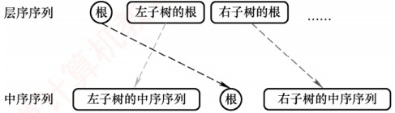

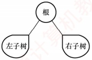

图 5.14 由层序序列和中序序列构造二叉树

请读者分析层序序列（ABDCEFGIH）和中序序列（BCAEDGHFI）所确定的二叉树。

注意，仅凭先序、后序和层序序列中的任意两种组合，通常无法唯一确定一棵二叉树。例如，图5.15所示的两棵二叉树的先序序列均为AB，后序序列均为BA，层序序列均为AB。

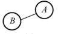

(a)

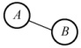

(b)

### 5.3.2 线索二叉树

图5.15 两棵不同的二叉树

#### 1. 线索二叉树的基本概念

遍历二叉树是按照特定规则将树中所有结点排列成一个线性序列，从而得到相应的遍历序
列。在该序列中，除首尾结点外，每个结点都有唯一的直接前驱和直接后继。

### 考点追踪 线索二叉树的定义（2010）

传统的二叉链表结构仅能反映父子关系，无法直接获取结点在某种遍历序列中的前驱或后继。前面提到，在含有n个结点的二叉树中，共有 $n+1$个空指针域：每个叶结点贡献2个空指针，每个度为1的结点贡献1个空指针，因此空指针总数为 $2n_0 + n_1$，又 $n_0 = n_2 + 1$，可得空指针总数为 $n_0 + n_1 + n_2 + 1 = n + 1$。由此，自然想到：可否利用这些空指针，直接指向结点在遍历序列中的前驱或后继？若能实现，便可像遍历链表一样高效地遍历二叉树，线索二叉树正是基于这一思想设计的。

具体规定如下：

若某结点无左子树，则将 lchild 指向其在指定遍历序列中的前驱结点。

若某结点无右子树，则将 rchild 指向其在指定遍历序列中的后继结点。

为区分指针域指向的是孩子还是线索，需在结点结构中增设两个标志域，如图5.16所示。

| lchild | ltag | data | rtag | rchild |
| --- | --- | --- | --- | --- |

图 5.16 线索二叉树的结点结构

标志域 ltag 和 rtag 的含义如下：

☑ ltag=0 表示 lchild 指向左孩子，ltag=1 表示 lchild 指向前驱。

rtag=0 表示 rchild 指向右孩子，rtag=1 表示 rchild 指向后继。

线索二叉树的存储结构可定义为：

```c
typedef struct ThreadNode{
    ElemType data; //数据元素
```
```c
    struct ThreadNode *lchild, *rchild; //左右孩子指针
```
```c
    int ltag, rtag; //左右线索标志
} ThreadNode, *ThreadTree;
```

采用上述结构的二叉链表称为线索链表，其中指向前驱或后继的指针称为线索。这种带有线索的二叉树称为线索二叉树。

#### 2. 中序线索二叉树的构造

二叉树的线索化是指将二叉链表中的空指针域替换为指向前驱或后继的线索。由于结点的前驱和后继关系只能在遍历过程中确定，因此线索化本质上就是对二叉树进行一次遍历。

### 考点追踪 中序线索二叉树中线索的指向（2014）

以中序线索二叉树的构造为例：设指针 pre 指向刚刚访问过的结点，指针 p 指向当前正在访问的结点，pre 即为 p 的中序前驱。在中序遍历过程中：检查 p 的左指针是否为空，若为空则令其指向 pre；检查 pre 的右指针是否为空，若为空则令其指向 p，如图 5.17 所示。

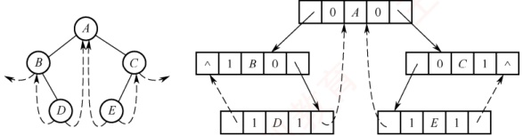

图 5.17 中序线索二叉树及其二叉链表示

通过中序遍历对二叉树线索化的递归算法如下：
```c
InThread(p->lchild, pre); //递归，线索化左子树
if (p->lchild==NULL) { //当前结点的左子树为空
    p->lchild=pre; //建立当前结点的前驱线索
    p->ltag=1;
}
if (pre!=NULL&&pre->rchild==NULL) { //前驱结点非空且其右子树为空
    pre->rchild=p; //建立前驱结点的后继线索
    pre->rtag=1;
}
pre=p; //标记当前结点成为刚刚访问过的结点
InThread(p->rchild, pre); //递归，线索化右子树
}
```

建立中序线索二叉树的主过程如下：

```c
void CreateInThread(ThreadTree T) {
    ThreadTree pre = NULL;
    if (T != NULL) {
        // 非空二叉树，线索化
        InThread(T, pre);
        pre->rchild = NULL;
        pre->rtag = 1;
    }
}
```

为方便遍历，可在线索链表上增设一个头结点：其 lchild 指向根结点；rchild 指向中序列的最后一个结点；中序列的第一个结点的 lchild 和最后一个结点的 rchild 均指向头结点。如此，便形成一个双向循环线索链表，从而支持正向与反向的高效遍历，如图 5.18 所示。

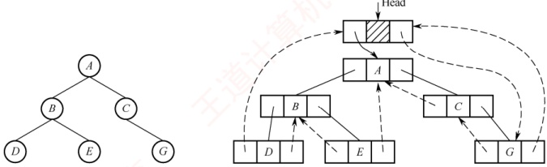

图 5.18 带头结点的中序线索二叉树

#### 3. 中序线索二叉树的遍历

中序线索二叉树的结点中已隐含前驱和后继信息，因此遍历时无须借助栈或递归。只需先找到中序序列的第一个结点，然后依次查找每个结点的后继，直至后继为空（或回到头结点）。在中序线索二叉树中，查找结点后继的规则如下：若结点的 rtag 为 1，则 rchild 直接指向其后继；若 rtag 为 0，则其后继为右子树中最左下结点（右子树的中序第一个结点）。

不含头结点的中序线索二叉树遍历相关算法如下。

1）求中序序列中的第一个结点：
```c

ThreadNode *Firstnode(ThreadNode *p) {
```
```c
    while (p->ltag==0) p=p->lchild; //沿左孩子链走到最左下结点
    return p;
}
```

2）求结点p在中序序列中的后继：
```c

ThreadNode *Nextnode(ThreadNode *p) {
```
```c
    if (p->rtag==0) return Firstnode(p->rchild); //右子树中最左下结点
    else return p->rchild; //若rtag==1则直接返回后继线索
}
```
请读者自行完成求中序列中的最后一个结点和结点 p 的中序前驱的运算 $^{①}$。

3）利用上面两个算法，可实现非递归的中序遍历：

```c
void Inorder(ThreadNode *T){
    for(ThreadNode *p=Firstnode(T);p!=NULL; p=Nextnode(p))
        visit(p);
}
```

#### 4. 先序线索二叉树和后序线索二叉树

建立先序或后序线索二叉树的方法与中序类似，只需调整递归调用顺序及线索建立的位置。以图 5.19(a) 的二叉树为例，手工构造先序线索二叉树的过程如下（先序序列为 ABCDF，依次处理每个结点，若其左或右指针为空，则将其替换为对应前驱或后继的线索）：

结点 A、B 均有左右孩子，无须修改指针；结点 C 无左孩子，将其 lchild 指向前驱 B，无右孩子，将其 rchild 指向后继 D；结点 D 无左孩子，将其 lchild 指向前驱 C，无右孩子，将其 rchild 指向后继 F；结点 F 无左孩子，将其 lchild 指向前驱 D，无右孩子且无后继，将其 rchild 置为空，最终得到的先序线索二叉树如图 5.19(b) 所示。

构造后序线索二叉树的过程类似（后序序列为CDBFA）：

结点 C 无左孩子且无前驱，将 lchild 置空，无右孩子，将 rchild 指向后继 D；结点 D 无左孩子，将 lchild 指向前驱 C，无右孩子，将 rchild 指向后继 B；结点 F 无左孩子，将 lchild 指向前驱 B，无右孩子，将 rchild 指向后继 A，得到的后序线索二叉树如图 5.19(c) 所示。

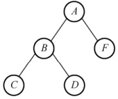

(a) 一颗二叉树

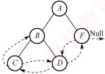

(b) 先序线索二叉树

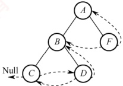

(c) 后序线索二叉树

图 5.19 先序线索二叉树和后序线索二叉树

在先序线索二叉树中查找某结点的后继较为直接：若该结点有左孩子，则左孩子为其后继；若无左孩子但有右孩子，则右孩子为其后继；若为叶结点，则其rchild直接指向后继。

### 考点追踪后序线索二叉树的特点（2013）

而在后序线索二叉树中查找后继则较为复杂，需要分以下三种情况：① 若结点 x 是整棵二叉树的根，则其后继为空；② 若结点 x 是其双亲的右孩子，或是其双亲的左孩子且该双亲无右子树，则 x 的后继即为其双亲；③ 若结点 x 是其双亲的左孩子，且该双亲存在右子树，则 x 的后继为该右子树中按后序遍历访问的第一个结点（右子树中最左下结点）。

值得注意的是，图5.19(c)中，结点B的后继是A，但无法直接通过线索找到后继，需要回溯到其双亲。因此，在后序线索二叉树中高效查找后继通常需要知道结点的父结点信息。为此，通常采用带父指针的三叉链表作为存储结构，而非标准的二叉线索链表。
