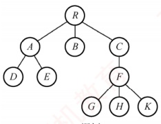
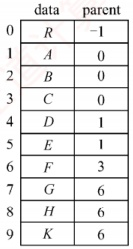
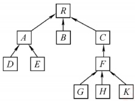
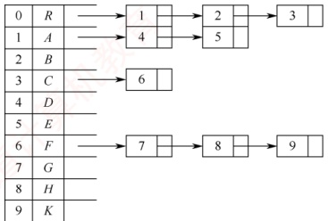
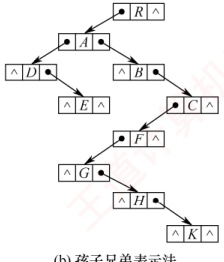
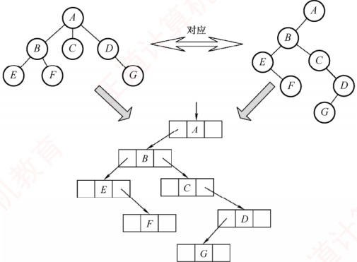
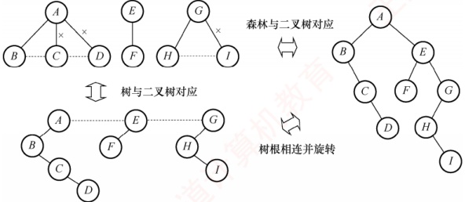

## 5.4 树、森林

### 5.4.1 树的存储结构

树的存储方式有多种，既可采用顺序存储结构，也可采用链式存储结构。无论采用何种方式，都必须能够唯一地反映树中各结点之间的逻辑关系。下面介绍三种常用的存储结构。

#### 1. 双亲表示法

双亲表示法使用一组连续的存储空间（如数组）来存放树中的所有结点。每个结点除包含数据域外，还增设一个“伪指针”域，用于指示其双亲结点在数组中的下标。如图5.20所示，根结点位于下标0处，其双亲域设为-1，表示无双亲。

双亲表示法的存储结构定义如下：
```c

#define MAX_TREE_SIZE 100
typedef struct{
    ElemType data;
    int parent;
} PTNode;
typedef struct{
    PTNode nodes[MAX_TREE_SIZE];
```
} //树中最多结点数
//树的结点定义
//数据元素
//双亲位置域
int n;

} PTree;



(a) 一棵树



(b) 双亲表示



(c) 双亲指针图示

图 5.20 树的双亲表示法

双亲表示法利用了每个结点（除根结点外）有且仅有一个双亲的性质。因此，查找任意结点的双亲非常高效；然而，查找某结点的孩子则需遍历整个数组，效率较低。

**注意**

区分树与二叉树的顺序存储结构。在树的双亲表示法中，数组下标用于标识结点，结点间的父子关系通过 parent 域显式记录。而在二叉树的顺序存储结构中（如完全二叉树的数组表示）， **下标隐含了父子关系**（例如，结点 i 的左孩子为  $2i+1$，右孩子为  $2i+2$）。二叉树是树的特例，因此可以使用树的存储结构表示。但是，一般的树不能直接使用二叉树的顺序存储方式。

#### 2. 孩子表示法

孩子表示法将每个结点的所有孩子视为一个线性表，并用单链表存储。整棵树则由n个这样的孩子链表组成（叶结点对应空链表）。为便于访问，所有孩子链表的头指针被集中存放在一个顺序表（如数组）中，每个位置对应一个结点。图5.21(a)展示了图5.20(a)中树的孩子表示法。



(a) 孩子表示法



(b) 孩子兄弟表示法

图 5.21 树的孩子表示法和孩子兄弟表示法

与双亲表示法相反，孩子表示法便于查找结点的孩子，但若要查找某结点的双亲，则需遍历所有孩子链表，检查是否包含该结点，效率较低。

#### 3. 孩子兄弟表示法

孩子兄弟表示法也称二叉树表示法，采用二叉链表作为树的存储结构。每个结点包含三部分：
数据域、指向第一个孩子的指针、指向下一个兄弟的指针（沿此指针可依次访问该结点的所有右侧兄弟），如图5.21(b)所示。这种结构以“左孩子-右兄弟”的方式，将树映射为二叉树形式。

孩子兄弟表示法的存储结构描述如下：
```c

typedef struct CSNode{
    ElemType data;
    struct CSNode *firstchild, *nextsibling;
} CSNode, *CSTree;

//数据域
//第一个孩子和右兄弟指针
```

孩子兄弟表示法具有良好的灵活性，其最大优点是能自然地将树转换为二叉树，从而复用二叉树的算法。查找孩子非常高效。然而，从当前结点高效回溯到其双亲较为困难。若在结点中增设一个parent指针域，则可高效查询双亲，形成一种三叉链表的存储结构。

### 5.4.2 树、森林与二叉树的转换

二叉树和树均可用二叉链表作为存储结构。从物理结构上看，树的孩子兄弟表示法与二叉树的二叉链表表示法完全相同，因此可以用同一存储结构的不同解释将一棵树转换为二叉树。

#### 1. 树转换为二叉树

### 考点追踪 树和二叉树的转换及相关性质的推理（2009、2011）

树转换为二叉树的规则：每个结点的左指针指向其第一个孩子；右指针指向其在原树中的下一个右兄弟，这个规则也被称为“左孩子-右兄弟”原则。由于根结点没有兄弟，因此由树转换而来的二叉树的根结点必无右子树，如图5.22所示。



图 5.22 树与二叉树的对应关系

树转换为二叉树的手工画法：

1）在所有兄弟结点之间添加连线：

2）对每个结点，仅保留其与第一个孩子的连线，删除与其他孩子的连线：

3）以树根为轴心，顺时针旋转 $45^{\circ}$，使其呈现二叉树形态。

#### 2. 森林转换为二叉树

### 考点追踪 森林和二叉树的转换及相关性质的推理（2014）

森林是若干棵树的集合，其转换基于单棵树的转换方法。首先将森林中的每棵树分别转换为
对应的二叉树；由于每棵转换后的二叉树根结点均无右子树，可将这些根结点视为兄弟；将第二棵二叉树作为第一棵二叉树根的右子树……以此类推，最终形成一棵完整的二叉树。

森林转换为二叉树的手工画法：

1）将森林中的每棵树转换为相应的二叉树；

2）每棵树的根也可视为兄弟关系，在各树的根之间依次添加连线；

3）以第一棵树的根为轴心，顺时针旋转 $45^{\circ}$。

等效做法是：先在各树的根之间添加连线，然后整体应用树转二叉树的方法处理。

#### 3. 二叉树转换为森林

### 考点追踪 由遍历序列构造一棵二叉树并转换为对应的森林（2020、2021）

若给定的二叉树非空，则其转换为森林的规则：二叉树的根及其左子树对应第一棵树的二叉树表示；将根的右指针断开，其右子树即代表剩余森林转换后的二叉树；对右子树递归应用相同规则，不断分离出下一棵树，直至右子树为空；最后将每棵分离出的二叉树还原为普通树，即可得到原始森林。此过程如图5.23所示。二叉树转换为树或森林的结果是唯一的。



图 5.23 森林与二叉树的对应关系

### 5.4.3 树和森林的遍历

#### 1. 树的遍历

### 考点追踪 树与二叉树遍历方法的对应关系（2019）

树的遍历是指以某种方式访问树中的每个结点，且仅访问一次。主要有两种方式：

1）先根遍历。若树非空，则按如下规则遍历：

先访问根结点。

再依次遍历根结点的每棵子树，遍历子树时仍遵循先根后子树的规则。其遍历序列与这棵树相应二叉树的先序序列相同。

2）后根遍历。若树非空，则按如下规则遍历：

先依次遍历根结点的每棵子树，遍历子树时仍遵循先子树后根的规则。

再访问根结点。

其遍历序列与这棵树相应二叉树的中序序列相同。

图 5.22 的树的先根遍历序列为 ABEFCDG，后根遍历序列为 EFBCGDA。

此外，树也支持层次遍历，与二叉树的层次遍历原理相似，即按层序依次访问各个结点。

#### 2. 森林的遍历

基于森林和树相互递归的定义，可得出森林的两种遍历方法。
1）先序遍历森林。若森林为非空，则按如下规则遍历：

访问森林中第一棵树的根结点。

先序遍历第一棵树中根结点的子树森林。

先序遍历除去第一棵树后的剩余森林。

2）中序遍历森林。若森林为非空，则按如下规则遍历：

中序遍历第一棵树中根结点的子树森林。

访问森林中第一棵树的根结点。

中序遍历除去第一棵树后的剩余森林。

图 5.23 的森林的先序遍历序列为 ABCDEFGHI，中序遍历序列为 BCDAFEHIG。

### 考点追踪 森林与二叉树遍历方法的对应关系（2020）

当森林转换成二叉树时，第一棵树的子树森林会转换为左子树，剩余森林则转换为右子树。因此，森林的先序、中序遍历与其对应二叉树的先序、中序遍历相同。

树和森林的遍历与二叉树的遍历关系见表5.1。

表5.1 树和森林的遍历与二叉树遍历的对应关系

| 树 | 森林 | 二叉树 |
| --- | --- | --- |
| 先根遍历 | 先序遍历 | 先序遍历 |
| 后根遍历 | 中序遍历 | 中序遍历 |

**注意**

森林遍历方法的命名按照严蔚敏老师的教材。有些教材也将森林的中序遍历称为后序遍历，称中序遍历是相对其二叉树而言的，称后序遍历是因为根确实是在最后才被访问的。
