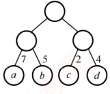
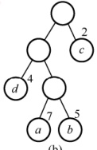
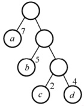
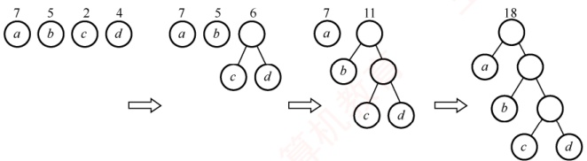
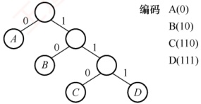
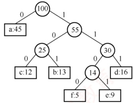
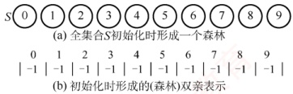
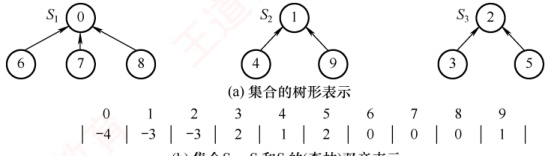
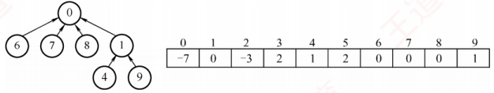

## 5.5 树与二叉树的应用

### 5.5.1 哈夫曼树和哈夫曼编码

#### 1. 哈夫曼树的定义

在介绍哈夫曼树之前，先明确几个相关概念：

在许多实际应用中，树中的结点常被赋予一个具有特定意义的数值，称为该结点的权。从树的根结点到某一结点的路径长度与该结点权值的乘积，称为该结点的带权路径长度。树中所有叶结点的带权路径长度之和称为该树的带权路径长度（WPL），记为

 $$\mathrm{WPL}=\sum_{i=1}^{n}w_{i} l_{i}$$

式中， $w_{i}$ 为第 i 个叶结点的权值， $l_{i}$ 为该叶结点到根结点的路径长度。
若将各叶结点的权值视为其出现的频度或概率，则每个叶结点的路径长度以其权值为权重所计算出的加权平均值称为加权平均长度，记为

 $$加权平均长度 = WPL/ 各叶结点的权值之和$$

在含有 n 个带权叶结点的二叉树中，WPL 最小的二叉树称为哈夫曼树，也称最优二叉树。图5.24 中的 3 棵二叉树均包含 4 个叶结点 a, b, c, d，权值分别为 7, 5, 2, 4，对应的 WPL 分别为



(a)



(b)



(c)

图 5.24 具有不同带权路径长度的二叉树

(a) WPL = 7×2 + 5×2 + 2×2 + 4×2 = 36。

(b) WPL = 4  $\times$ 2 + 7  $\times$ 3 + 5  $\times$ 3 + 2  $\times$ 1 = 46.

(c) WPL = 7×1 + 5×2 + 2×3 + 4×3 = 35。

其中，图5.24(c)树的WPL最小，可验证其恰好为对应权值集合的哈夫曼树。

#### 2. 哈夫曼树的构造

给定 n 个权值分别为  $w_{1}, w_{2}, \cdots, w_{n}$ 的结点，构造哈夫曼树的步骤如下：

1）将这 n 个结点分别视为 n 棵仅含一个结点的二叉树，构成森林 F。

### 考点追踪 分析哈夫曼树的路径上权值序列的合法性（2010）

2）构造一个新结点，从 F 中选取两棵根结点权值最小的树作为其左右子树，并将新结点的权值设为左右子树根结点的权值之和。

3）从 F 中删除所选的两棵树，并将新生成的树加入 F。

4）重复步骤2）和3），直至F中仅剩一棵树为止，最终得到的树即为哈夫曼树。

### 考点追踪 ▶ 哈夫曼树的性质（2010、2019）

由上述构造过程可归纳出哈夫曼树的以下性质：

1）每个初始结点最终都成为叶结点，且权值越小的结点，其到根的路径长度越大。

2）构造过程中共新建了n-1个结点（双分支结点），因此哈夫曼树的结点总数为2n-1。

3）每次合并均选取两棵树，故哈夫曼树中不存在度为1的结点（为严格二叉树）。例如，权值集合 $\{7,5,2,4\}$的哈夫曼树构造过程如图5.25所示。



(a)

(b)

(c)

(d)

图5.25 哈夫曼树的构造过程

#### 3. 哈夫曼编码

在数据通信中，若对每个字符使用相同长度的二进制位表示，称这种编码方式为固定长度编码；若允许不同字符使用不同长度的二进制位表示，则称为可变长度编码。合理的可变长度编码（如哈夫曼编码）比固定长度编码要好得多，其特点是对出现频率高的字符赋予较短编码，而对频率低的字符赋予较长编码，从而降低字符的平均编码长度，起到压缩数据的效果。

### 考点追踪 根据哈夫曼编码对编码序列进行译码（2017）

若一个编码集合中，没有任何一个编码是另一个编码的前缀，则称该编码为前缀编码。例如，为字符 A，B 和 C 分配编码 0，10 和 110，这是一个前缀编码。由于编码互不为前缀，解码过程简单且无歧义：从左到右扫描码串，一旦识别出一个有效编码，即可立即译出对应字符。例如，码串 0010110 可唯一译为 A ABC。反之，若再为字符 D 分配编码 11，则 11 是 110 的前缀，导致上述码串的后 3 位无法确定是 DA，还是直接表示 C，从而破坏唯一可译性。

 $$考点追踪 \quad\rightarrow\quad 哈夫曼树的构造及相关的分析 (2012、2018、2021、2023)$$

 $$考点追踪 \quad\rightarrow\quad 前缀编码的分析及应用 (2014、2020)$$

可利用二叉树设计二进制前缀编码。例如，为字符 A, B, C, D 设计前缀编码，可用图 5.26 所示的二叉树表示：四个叶结点分别对应这四个字符，并约定左分支标记为 0，右分支标记为 1。将根到各叶结点路径上的分支标记（0/1）拼接成的字符串，作为对应字符的编码，字符 A, B, C, D 的编码分别为 0, 10, 110, 111。可以证明，如此生成的编码必为前缀编码。



图 5.26 前缀编码示例

### 考点追踪 ▶ 哈夫曼编码和定长编码的差异（2022）

哈夫曼编码是一种非常高效的数据压缩编码方法。由哈夫曼树生成哈夫曼编码的过程十分自然。首先，将每个字符视为一个独立的叶结点，其权值为其出现的频度（或次数）；构造对应的哈夫曼树；然后，将从根到各叶结点路径上分支标记的字符串，作为该字符的编码。图5.27展示了一个由哈夫曼树构造哈夫曼编码的示例，图中矩形结点标注了字符及其出现频次。

该哈夫曼树的 WPL 为



图 5.27 由哈夫曼树构造哈夫曼编码

 $$WPL=1\times45+3\times(13+12+16)+4\times(5+9)=224$$

此处的 WPL 表示对 100 个字符编码后的二进制总长度，共 224 位。若采用 3 位固定长度编码（共 6 个不同字符，需至少 3 位），则总长度为  $3 \times 100 = 300$ 位。因此，哈夫曼编码实现了约 25% 的数据压缩率。由此可见，利用哈夫曼树可以设计出总长度最短的二进制前缀编码。

**注意**

左分支和右分支分别表示0还是1并无强制规定，因此 **构造出的哈夫曼树在形态上可能不唯一**。此外，当存在多个权值相同的结点时，合并顺序的不同也可能导致结构不同的哈夫曼树。但无论具体形态如何，其带权路径长度WPL始终相同且达到最小值，即最优性不受影响。
### 5.5.2 并查集

#### 1. 并查集的概念

并查集是一种处理不相交集合的合并与查询问题的树状数据结构，它支持三种基本操作：

1）Initial(S)：将集合 S 中的每个元素都初始化为一个独立的单元素子集合。

2）Union(S, Root1, Root2)：将集合S中的子集合Root2并入子集合Root1。要求Root1和Root2属于不同的子集合，否则不执行合并操作。

3）Find $(S,x)$：在集合S中查找单元素x所属的子集合，并返回该子集合的根结点。

#### 2. 并查集的存储结构

并查集通常采用树的双亲表示法作为其存储结构：每个子集合用一棵树来表示，所有子集合对应的树共同构成一个森林，并统一存储在一个数组中。在该数组中，数组下标代表集合中的元素编号，而每个元素所存的值为其双亲结点的下标；对于根结点，其双亲域设为负数——通常取该子集合元素数量的相反数，既标识其为根，又记录了集合的规模。

例如，设有一个全集合为  $S = \{0, 1, 2, 3, 4, 5, 6, 7, 8, 9\}$，初始化时每个元素自成一个单元素子集合，对应数组中每个位置的值均为 -1，如图 5.28 所示。



图 5.28 并查集的初始化

经过若干合并操作后，这些子集合可能被合并为三个更大的子集合： $S_1 = \{0, 6, 7, 8\}$， $S_2 = \{1, 4, 9\}$， $S_3 = \{2, 3, 5\}$，此时并查集的树形及其对应的数组存储形式如图 5.29 所示。



图 5.29 用树表示并查集

要实现两个子集合的并操作  $(S_1 \cup S_2)$，只需将其中一个子集合根结点在数组中的值设为另一个子集合的根结点下标。例如，将  $S_2$ 的根指向  $S_1$ 的根后，所得结构如图 5.30 所示。



图 5.30  $S_{1} \cup S_{2}$ 的表示方法

在该存储方案中，集合元素的编号从0到SIZE-1，其中SIZE表示集合中元素的最大数量。

#### 3. 并查集的基本实现

并查集的结构定义如下：

 $$\begin{array}{l}\#define~SIZE~100\\ int\quad UFSets[SIZE];\end{array}$$

```c
//集合元素数组（双亲指针数组）
```
下面是并查集主要运算的实现。

##### （1）并查集的初始化操作

```c
void Initial(int S[]) {
    for (int i=0; i<SIZE; i++)
        // S 即并查集
        S[i]=-1;
}
```

将每个元素对应的数组值设为-1，表示这些元素各自为根。

##### （2） 并查集的 Find 操作

在并查集中查找并返回包含元素 x 的树的根。

```c
int Find(int S[], int x) {
    while (S[x] >= 0)
        //循环寻找x的根
        x = S[x];
    return x;
}
```

判断两个元素是否属于同一集合，只需分别找到它们的根，再比较根是否相同即可。

##### （3） 并查集的 Union 操作

合并两个不相交子集合的操作。当要合并两个元素所在的集合时，需要先找到这两个元素的根，然后让一棵子集树的根指向另一棵子集树的根。

```c
void Union(int S[], int Root1, int Root2) {
    if (Root1 == Root2) return; //要求 Root1 与 Root2 是不同的集合
    S[Root2] = Root1; //将根 Root2 连接到另一根 Root1 下面
}
```

Find 和 Union 操作的时间复杂度分别为  $O(d)$ 和  $O(1)$，其中 d 为树的深度。

#### 4. 并查集实现的优化

在极端情况下，由 n 个元素构成的集合树可能退化为一条链，深度达到 n，此时 Find 操作的最坏时间复杂度为  $O(n)$。改进的办法是：在执行 Union 操作前先比较两个子集合的规模，将规模较小的树作为子树挂到规模较大的树的根下，即“小树并入大树”。为此，可利用根结点的绝对值（其绝对值即为集合大小）来记录该集合中包含的元素个数。

##### （1）改进的 Union 操作

```c
void Union(int S[], int Root1, int Root2) {
    if (Root1 == Root2) return;
    if (S[Root2] > S[Root1]) {
        //Root2 结点数更少
        S[Root1] += S[Root2];
        S[Root2] = Root1;
    }
    else {
        S[Root2] += S[Root1];
        S[Root1] = Root2;
    }
}
```

采用这种按集合大小合并的策略后，所构造的集合树深度不超过 $\lfloor \log_2 n \rfloor + 1$。

然而，随着子集不断合并，集合树的深度仍可能逐渐增大。为进一步缩短查找时间，还可对上述 Find 操作进一步优化：引入路径压缩机制——在找到根结点后，将从 x 到根路径上的所有中间结点直接挂接到根结点下，从而“压平”整条路径。

##### （2）改进的 Find 操作

```c
int Find(int S[], int x) {
    int root = x;
while(S[root]>=0)
    root = S[root];
while(x != root) {
    int t = S[x];
    S[x] = root;
    x = t;
}
return root;
//循环找到根
//压缩路径
//t 指向 x 的父结点
//x 直接挂到根结点下面
```

采用按大小合并与路径压缩两种优化后，并查集的操作效率得到极大提升，使得集合树的深度不超过  $O(\alpha(n))$，其中  $\alpha(n)$ 是一个增长极其缓慢的函数，对于常见的正整数 n，通常  $\alpha(n) \leq 4$。

关于并查集的实际应用示例，请参见本书配套视频。
