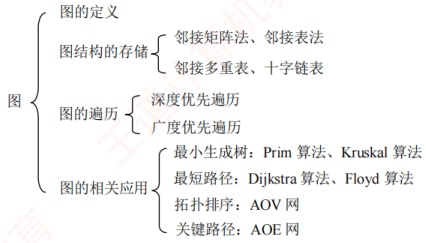

# 第6章 图

## 【考纲内容】

### （一）图的基本概念

### （二）图的存储及基本操作

邻接矩阵；邻接表；邻接多重表；十字链表

深度优先搜索：广度优先搜索

### （三） 图的遍历

视频讲解

### （四） 图的基本应用

最小（代价）生成树；最短路径；拓扑排序；关键路径

**【知识框架】**

## 【复习提示】

图算法整体难度较大，应重点掌握深度优先搜索与广度优先搜索。理解图的基本概念与性质，掌握邻接矩阵、邻接表、邻接多重表和十字链表等存储结构及其特点，并能进行结构间的转换。掌握基于这些结构的遍历操作及典型应用，如拓扑排序、最小生成树、最短路径和关键路径等。图算法较多，通常只需掌握其核心思想与实现步骤，代码实现并非重点。
