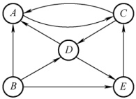
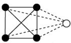
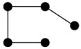
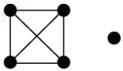

### 6.1.2 本节试题精选

#### 一、 单项选择题

##### 01

一个有 n 个顶点和 n 条边的无向图一定是（）。

A. 连通的 B. 不连通的 C. 无环的 D. 有环的
##### 02

若从无向图的任意顶点出发进行一次深度优先搜索即可访问所有顶点，则该图一定是（）。

A. 强连通图 B. 连通图 C. 有回路 D. 一棵树

##### 03

以下关于图的叙述中，正确的是（）。

A. 图与树的区别在于图的边数大于或等于顶点数

B. 假设有图  $G = \{V, \{E\}\}$，顶点集  $V \subseteq V$， $E' \subseteq E$，则  $V'$ 和  $\{E'\}$ 构成  $G$ 的子图

C. 无向图的连通分量是指无向图中的极大连通子图

D. 图的遍历就是从图中某一顶点出发访遍图中其余顶点

##### 04

以下关于图的叙述中，正确的是（）。

A. 强连通有向图的任何顶点到其他所有顶点都有弧

B. 图的任意顶点的入度等于出度

C. 有向完全图一定是强连通有向图

D. 有向图的边集的子集和顶点集的子集都构成原有向图的子图

##### 05

一个有28条边的非连通无向图至少有( )个顶点。

A. 7 B. 8 C. 9 D. 10

##### 06

对于一个有 n 个顶点的图：若是连通无向图，其边的个数至少为（ ）；若是强连通有向图，则其边的个数至少为（ ）。

A. n - 1, n

B. n - 1, n(n - 1)

C. n, n

D. n, n(n - 1)

##### 07

无向图 G 有 23 条边，度为 4 的顶点有 5 个，度为 3 的顶点有 4 个，其余都是度为 2 的顶点，则图 G 有（）个顶点。

A. 11 B. 12 C. 15 D. 16

##### 08

在有 n 个顶点的有向图中，顶点的度最大可达（）。

A. n B. n-1 C. 2n D. 2n-2

##### 09

具有6个顶点的无向图，当有（）条边时能确保是一个连通图。

A. 8 B. 9 C. 10 D. 11

##### 10

设有无向图  $G = (V, E)$ 和  $G' = (V', E')$，若  $G'$ 是 G 的生成树，则下列不正确的是（）。

I.  $G'$ 为 G 的连通分量

II.  $G'$ 为 G 的无环子图

III.  $G'$ 为 G 的极小连通子图且  $V' = V$

A. I、II B. 只有 III C. II、III D. 只有 I

##### 11

具有 51 个顶点和 21 条边的无向图的连通分量最多为（）。

A. 33          B. 34          C. 45          D. 32

##### 12

在右图所示的有向图中，共有（）个强连通分量。

A. 1

B. 2

C. 3

D. 4

##### 13

若具有 n 个顶点的图是一个环，则它有（）棵生成树。

A.  $n^{2}$ B. n

C. n-1 D. 1

##### 14

若一个具有 n 个顶点、e 条边的无向图是一个森林，则该森林中必有（）棵树。

A. n B. e C. n-e D. 1

##### 15

【2009 统考真题】下列关于无向连通图特性的叙述中，正确的是（）。

I. 所有顶点的度之和为偶数

II. 边数大于顶点个数减1

III. 至少有一个顶点的度为1

A. 只有 I

B. 只有 II

C. I 和 II

D. I 和 III

##### 16

【2010 统考真题】若无向图 G = (V, E) 中含有 7 个顶点，要保证图 G 在任何情况下都是连通的，则需要的边数最少是（）。

A. 6 B. 15 C. 16 D. 21

##### 17

【2017 统考真题】已知无向图 G 含有 16 条边，其中度为 4 的顶点个数为 3，度为 3 的顶点个数为 4，其他顶点的度均小于 3。图 G 所含的顶点个数至少是（）。

A. 10 B. 11 C. 13 D. 15

##### 18

【2022 统考真题】对于无向图  $G = (V, E)$，下列选项中，正确的是（）。

A. 当  $|V| > |E|$ 时，G 一定是连通的

B. 当  $|V| < |E|$ 时，G 一定是连通的

C. 当  $|V| = |E| - 1$ 时，G 一定是不连通的

D. 当  $|V| > |E| + 1$ 时，G 一定是不连通的

#### 二、 综合应用题

##### 01

图 G 是一个非连通无向图，共有 28 条边，该图至少有多少个顶点？

### 6.1.3 答案与解析

#### 一、 单项选择题

##### 01

D

若一个无向图有 n 个顶点和 n-1 条边，可以使它连通但没有环（生成树），但若再加一条边，在不考虑重边的情形下，则必然会构成环。

##### 02

B

强连通图是有向图，与题意矛盾，选项 A 错误；对无向连通图做一次深度优先搜索，可以访问到该连通图的所有顶点，选项 B 正确；有回路的无向图不一定是连通图，因为回路不一定包含图的所有顶点，选项 C 错误；连通图可能是树，也可能存在环，选项 D 错误。

##### 03

C

图与树的区别是逻辑上的区别，而不是边数的区别，图的边数也可能小于树的边数，选项A错误；若  $E'$ 中的边对应的顶点不是  $V'$ 的元素，则  $V'$ 和  $\{E'\}$ 无法构成图，选项B错误；无向图的极大连通子图称为连通分量，选项C正确；图的遍历要求每个顶点只能被访问一次，且若图非连通，则从某一顶点出发无法访问到其他全部顶点，选项D的说法不准确。

##### 04

C

强连通有向图的任何顶点到其他所有顶点都有路径，但未必有弧；无向图任意顶点的入度等于出度，但有向图未必满足；若边集中的某条边对应的某个顶点不在对应的顶点集中，则有向图的边集的子集和顶点集的子集无法构成子图。

##### 05

C

考查至少有多少个顶点的情形，我们考虑该非连通图最极端的情况，即它由一个完全图加一个独立的顶点构成，此时若再加一条边，则必然使图变成连通图。在  $28 = n(n-1)/2 = 8 \times 7/2$
条边的完全无向图中，总共有8个顶点，再加上1个不连通的顶点，共9个顶点。

##### 06

A

对于连通无向图，边最少即构成一棵树的情形；对于强连通有向图，边最少即构成一个有向环的情形。

##### 07

D

因为在具有 n 个顶点、e 条边的无向图中，有  $\sum_{i=1}^{n} \mathrm{TD}(v_{i}) = 2e$，所以求得度为 2 的顶点数为 7，从而共有 16 个顶点。

##### 08

D

在有向图中，顶点的度等于入度与出度之和。n个顶点的有向图中，任意一个顶点最多还可以与其他n-1个顶点有一对指向相反的边相连。 \underline{**注意，数据结构中仅讨论简单图**}。

##### 09

D

5 个顶点构成一个完全无向图，需要  $n(n-1)/2 = 10$ 条边；再加上 1 条边后，能保证第 6 个顶点必然与此完全无向图构成一个连通图，所以共需 11 条边。

##### 10

D

一个连通图的生成树是一个极小连通子图，显然它是无环的，因此说法 II、III 正确。极大连通子图称为连通分量， $G'$连通但非连通分量。这里再补充一下“极大连通子图”：若图本来就是连通的，且每个子部分包含其本身的所有顶点和边，则它就是极大连通子图。

##### 11

C

初始考虑只有51个顶点的无向图G，此时G中每个顶点都是连通分量，问题转化为向G中添加21条边，如何添加这21条边使得连通分量数目最多。若向两个不同的连通分量之间添加边，则连通分量数目会减1，所以应尽可能地将这21条边加入同一个连通分量且让其接近完全图，含有7个顶点的完全图有21条边，所以用7个顶点构成一个含有21条边的连通分量，剩下51-7=44个顶点对应44个连通分量，共有45个连通分量。

##### 12

B

强连通分量是极大强连通子图，任意两个顶点之间有方向相反的两条路径。由定义不难得出，若一个顶点只有出边或入边，则该顶点必定单独构成一个连通分量。图中，顶点 B 只有出边，其他所有顶点都不可能有到顶点 B 的路径，所以顶点 B 单独构成一个强连通分量。在顶点 A、C、D、E 中，任意两个顶点之间都有方向相反的两条路径，所以可构成一个强连通分量。

##### 13

B

n 个顶点的生成树是具有 n-1 条边的极小连通子图，因为 n 个顶点构成的环共有 n 条边，去掉任意一条边就是一棵生成树，所以共有 n 种情况，所以可以有 n 棵不同的生成树。

##### 14

C

n 个顶点的树有 n-1 条边，假设森林中有 x 棵树，将每棵树的根连到一个添加的顶点，则成为一棵树，顶点数是  $n+1$，边数是  $e+x$，从而可知 x=n-e。

【另解】设森林中有 x 棵树，则再用 x-1 条边就可将所有的树连接成一棵树，此时边数 +1 = 顶点数，即  $e + (x-1) + 1 = n$，所以 x = n - e。

##### 15

A

每条边都连接了两个顶点，在计算顶点的度之和时每条边都被计算了两次，所以所有顶点的度之和偶数。无向连通图对应的生成树也是无向连通图，但此时边数等于顶点数减1，说法Ⅱ错误。考虑2个或以上的顶点恰好构成一个环的情况，此时每个顶点的度都为2，说法Ⅲ错误。

##### 16

C

题干要求无论如何分配边，都能使7个顶点连通，这不同于只要6条边两两相连就能构成一
个连通图的情形。考虑最极端的情形，即图 G 的某 6 个顶点构成一个完全无向图，此时若再添加一条边，则都将连通第 7 个顶点，使该图变成一个连通图。所以最少边数 = 6×5/2 + 1 = 16。若边数 n 小于或等于 15，可以使这 n 条边仅连接图 G 中的某 6 个顶点，从而导致第 7 个顶点无法与这 6 个顶点构成连通图（不满足“在任何情况下”）。

为简单起见，以 5 个顶点为例，左边 4 个顶点和  $4 \times 3/2 = 6$ 条边构成一个完全图，此时若再添加一条边（可以是虚线中的任意一条），则能保证这 5 个顶点在任何情况下都是连通的，如右图所示。若边数小于 7，则不能保证 5 个顶点在任何情况下都是连通的。

##### 17

B

无向图边数的 2 倍等于各顶点度数的总和。要求至少的顶点数，应使每个顶点的度取最大，而其他顶点的度均小于 3，因此可设它们的度都为 2，并设它们的数量为 x，列出方程  $4 \times 3 + 3 \times 4 + 2x = 16 \times 2$，解得 x = 4。因此至少包含  $4 + 4 + 3 = 11$ 个顶点。

##### 18

D

对于此类分析图的边数、顶点数与连通性问题，思路是寻找临界情况，在临界情况下任意增加或减少一条边，都会改变图的连通性。第一种临界情况如图 1 所示，此时若减少任意一条边，图就由连通变为不连通，即无向图连通的最小边数是 $|V|-1$，因此，当 $|E|<|V|-1$时，图一定不连通，选项 C 错误，选项 D 正确。第二种临界情况如图 2 所示，此时若增加任意一条边，则图就由不连通变为连通，即无向图不连通的最大边数是 $(|V|-1)(|V|-2)/2$（此时 $|V|-1$个顶点构成一个完全图），因此，仅当 $|E|\geq(|V|-1)(|V|-2)/2+1$时才能保证无向图一定连通，选项 A、B 错误。

图1

图2

#### 二、 综合应用题

##### 01

【解答】

图 G 是一个非连通无向图，当边数固定时，顶点数最少的情况是该图由两个连通子图构成，且其中之一只含一个顶点，另一个为完全图。其中只含一个顶点的子图没有边，另一个完全图的边数为  $n(n-1)/2=28$，得 n=8。所以该图至少有  $1+8=9$ 个顶点。
