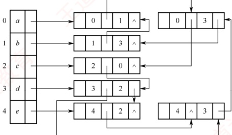
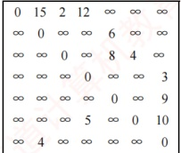
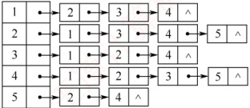
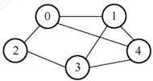
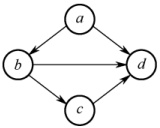
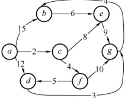
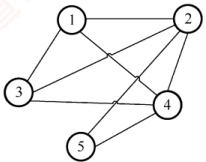

### 6.2.6 本节试题精选

#### 一、 单项选择题

##### 01

下列关于图的存储结构的说法中，错误的是（）。

A. 使用邻接矩阵存储一个图时，在不考虑压缩存储的情况下，所占用的存储空间大小只与图中的顶点数有关，与边数无关

B. 邻接表只用于有向图的存储，邻接矩阵适用于有向图和无向图

C. 若一个有向图的邻接矩阵的对角线以下的元素为0，则该图的拓扑序列必定存在

D. 存储无向图的邻接矩阵是对称的，所以只需存储邻接矩阵的下（或上）三角部分

##### 02

若图的邻接矩阵中主对角线上的元素皆为0，其余元素全为1，则该图一定（）。

A. 是无向图 B. 是有向图 C. 是完全图 D. 不是带权图
##### 03

在含有 n 个顶点和 e 条边的无向图的邻接矩阵中，零元素的个数为（）。

A. e

B. 2e

C.  $n^{2}-e$

D.  $n^{2}-2e$

##### 04

带权有向图 G 用邻接矩阵存储，则  $v_i$ 的入度等于邻接矩阵中（）。

A. 第  $i$ 行非 $\infty$ 的元素个数

B. 第  $i$ 列非 $\infty$ 的元素个数

C. 第  $i$ 行非 $\infty$ 且非 0 的元素个数

D. 第  $i$ 列非 $\infty$ 且非 0 的元素个数

##### 05

一个有 n 个顶点的图用邻接矩阵 A 表示，若图为有向图，顶点  $v_i$ 的入度是（ ）；若图为无向图，顶点  $v_i$ 的度是（ ）。

A.  $\sum_{i=1}^{n} A[i][j]$

B.  $\sum_{j=1}^{n} A[j][i]$

C.  $\sum_{i=1}^{n} A[j][i]$

D.  $\sum_{j=1}^{n} A[j][i]$ 或  $\sum_{j=1}^{n} A[i][j]$

##### 06

从邻接矩阵  $A = \begin{bmatrix} 0 & 1 & 0 \\ 1 & 0 & 1 \\ 0 & 1 & 0 \end{bmatrix}$ 可以看出，该图共有（①）个顶点；若是有向图，则该图共有（②）条弧；若是无向图，则共有（③）条边。

① A. 9 B. 3 C. 6 D. 1 E. 以上答案均不正确

② A. 5 B. 4 C. 3 D. 2 E. 以上答案均不正确

③ A. 5 B. 4 C. 3 D. 2 E. 以上答案均不正确

##### 07

以下关于图的存储结构的叙述中，正确的是（）。

A. 一个图的邻接矩阵表示唯一，邻接表示唯一

B. 一个图的邻接矩阵表示唯一，邻接表示不唯一

C. 一个图的邻接矩阵表示不唯一，邻接表示唯一

D. 一个图的邻接矩阵表示不唯一，邻接表示不唯一

##### 08

矩阵  $A$ 是有向图  $G$ 的邻接矩阵，若矩阵  $A^2$ 的某元素  $a_{i,j}^2 = 3$，则说明（）。

A. 从顶点  $i$ 到  $j$ 存在 3 条长度为 2 的路径

B. 从顶点  $i$ 到  $j$ 存在 3 条长度不超过 2 的路径

C. 从顶点  $i$ 到  $j$ 存在 2 条长度为 3 的路径

D. 从顶点  $i$ 到  $j$ 存在 2 条长度不超过 3 的路径

##### 09

用邻接表法存储图所用的空间大小（）。

A. 与图的顶点数和边数有关 B. 只与图的边数有关

C. 只与图的顶点数有关 D. 与边数的平方有关

##### 10

若邻接表中有奇数个边表结点，则（）。

A. 图中有奇数个顶点

B. 图中有偶数个顶点

C. 图为无向图

D. 图为有向图

##### 11

在有向图的邻接表存储结构中，顶点 v 在边表中出现的次数是（）。

A. 顶点 v 的度

B. 顶点 v 的出度

C. 顶点 v 的入度

D. 依附于顶点 v 的边数

##### 12

n个顶点的无向图的邻接表最多有（）个边表结点。

A.  $n^{2}$ B.  $n(n-1)$ C.  $n(n+1)$ D.  $n(n-1)/2$

##### 13

设某无向图中有 n 个顶点和 e 条边，则建立该图的邻接表的时间复杂度为（）。

A.  $O(n + e)$ B.  $O(n^2)$ C.  $O(ne)$ D.  $O(n^3)$
##### 14

假设有 n 个顶点、e 条边的有向图用邻接表表示，则删除与某个顶点 v 相关的所有边的时间复杂度为（）。

A.  $O(n)$ B.  $O(e)$ C.  $O(n + e)$ D.  $O(ne)$

##### 15

设 n 个顶点、e 条边的有向图用邻接表表示，则求某顶点 v 的入度的时间复杂度为（）。

A.  $O(n)$ B.  $O(e)$ C.  $O(n + e)$ D.  $O(ne)$

##### 16

对邻接表的叙述中，（）是正确的。

A. 无向图的邻接表中，第i个顶点的度为第i个链表中结点数的两倍

B. 邻接表比邻接矩阵的操作更简便

C. 邻接矩阵比邻接表的操作更简便

D. 求有向图顶点的度，必须遍历整个邻接表

##### 17

邻接多重表是（）的存储结构。

A. 无向图 B. 有向图 C. 无向图和有向图 D. 都不是

##### 18

十字链表是（）的存储结构。

A. 无向图 B. 有向图 C. 无向图和有向图 D. 都不是

##### 19

【2013 统考真题】设图的邻接矩阵 A 如下所示，各顶点的度依次是（）。

 $$\boldsymbol{A}=\begin{bmatrix}{{{0}}}&{{{1}}}&{{{0}}}&{{{1}}} \\{{{0}}}&{{{0}}}&{{{1}}}&{{{1}}} \\{{{0}}}&{{{1}}}&{{{0}}}&{{{0}}} \\{{{1}}}&{{{0}}}&{{{0}}}&{{{0}}}\end{bmatrix}$$

A. 1,2,1,2 B. 2,2,1,1 C. 3,4,2,3 D. 4,4,2,2

##### 20

【2024 统考真题】若无向图  $G=(V,E)$ 的邻接多重表如下图所示，则 G 中顶点 b 与 d 的度分别是（）。



A. 0, 2 B. 2, 4 C. 2, 5 D. 3, 4

#### 二、 综合应用题

##### 01

已知带权有向图 G 的邻接矩阵如下图所示，请画出该带权有向图 G。



##### 02

设图  $G=(V,E)$ 以邻接表存储，如下图所示。画出其邻接矩阵存储及图 G。



##### 03

对 n 个顶点的无向图和有向图，分别采用邻接矩阵和邻接时，试问：

1）如何判别图中有多少条边？

2）如何判别任意两个顶点 i 和 j 是否有边相连？

3）任意一个顶点的度是多少？

##### 04

如何对无环有向图中的顶点重新编号，使得该图的邻接矩阵中所有的1都集中到对角线以上？

##### 05

写出从图的邻接表表示转换成邻接矩阵表示的算法。

##### 06

【2015 统考真题】已知含有 5 个顶点的图 G 如右图所示。请回答下列问题：

1）写出图G的邻接矩阵A（行、列下标从0开始）。



2）求 $A^{2}$，矩阵 $A^{2}$中位于0行3列元素值的含义是什么？

3）若已知具有  $n (n \geqslant 2)$ 个顶点的图的邻接矩阵为 B，则  $B^{m} (2 \leqslant m \leqslant n)$ 中非零元素的含义是什么？

##### 07

【2021 统考真题】已知无向连通图 G 由顶点集 V 和边集 E 组成，|E| > 0，当 G 中度为奇数的顶点个数为不大于 2 的偶数时，G 存在包含所有边且长度为 |E| 的路径（称为 EL 路径）。设图 G 采用邻接矩阵存储，类型定义如下：

```c
typedef struct{
    int numVertices, numEdges;
    char VerticesList[MAXV];
    int Edge[MAXV][MAXV];
} MGraph;

//图的定义
//图中实际的顶点数和边数
//顶点表。MAXV 为已定义常量
//邻接矩阵
```

请设计算法 int IsExistEL(MGraph G)，判断 G 是否存在 EL 路径，若存在，则返回 1，否则返回 0。要求：

1）给出算法的基本设计思想。

2）根据设计思想，采用 C 或 C++ 语言描述算法，关键之处给出注释。

3）说明你所设计算法的时间复杂度和空间复杂度。

##### 08

【2023 统考真题】已知有向图 G 采用邻接矩阵存储，类型定义如下:

```c
typedef struct{
    int numVertices, numEdges;
    char VerticesList[MAXV];
    int Edge[MAXV][MAXV];
} MGraph;

//图的类型定义
//图的顶点数和有向边数
//顶点表，MAXV 为已定义常量
//邻接矩阵
```

将图中出度大于入度的顶点称为 K 顶点。例如，在右图中，顶点 a 和 b 为 K 顶点。

请设计算法 int printVertices(MGraph G)，对给定的任意非空有向图 G，输出 G 中所有的 K 顶点，并返回 K 顶点的个数。要求：



1）给出算法的基本设计思想。

2）根据设计思想，采用 C 或 C++ 语言描述算法，关键之处给出注释。

### 6.2.7 答案与解析

#### 一、 单项选择题

##### 01

B

对于有 $n$ 个顶点的图，若采用邻接矩阵表示，不考虑压缩存储，则存储空间大小为 $O(n^2)$，选项 A 正确。邻接表可用于存储无向图，只是把每条边都视为两条方向相反的有向边，因此需要存储两次，选项 B 错误。因为邻接矩阵中对角线以下的元素全为 $0$，所以若存在 $<i, j>$，则必有 $i < j$，由传递性可知图中路径的顶点编号是依次递增的，假设存在环 $k \to \cdots \to j \to k$，由题设可知 $k < j < k$，矛盾，所以不存在环，拓扑序列必定存在，选项 C 正确。选项 D 显然正确。

**注意**

若邻接矩阵对角线以下（或以上）的元素全为 0，则图中必然不存在环，即拓扑序列一定存在，但这并不能说明拓扑序列是唯一的。

##### 02

C

除主对角线上的元素外，其余元素全为1，说明任意两个顶点之间都有边相连，因此该图一定是完全图。

##### 03

D

在无向图的邻接矩阵中，矩阵大小为  $n^{2}$，非零元素的个数为 2e，所以零元素的个数为  $n^{2}-2e$。读者应掌握此题的变体，即当无向图变为有向图时，能够求出零的个数和非零的个数。

##### 04

D

带权有向图的邻接矩阵中，0 和  $\infty$ 表示的都不是有向边，而入度是由邻接矩阵的列中元素计算出来的；出度是由邻接矩阵的行中元素计算出来的。

##### 05

B、D

有向图的入度是其第i列的非0元素之和，无向图的度是第i行或第i列的非0元素之和。

##### 06

B、B、D

邻接矩阵的顶点数等于矩阵的行（列）数，有向图的边数等于矩阵中非零元素的个数，无向图的边数等于矩阵中非零元素个数的一半。

**注意**

本题中所给的矩阵为对称矩阵，若不是对称矩阵，则必然不可能是无向图。

##### 07

B

邻接矩阵表示唯一是因为图中边的信息在矩阵中有确定的位置，邻接表不唯一是因为邻接表的建立取决于读入边的顺序和边表中的插入算法。

##### 08

A

设图 G 的邻接矩阵为  $A$， $A^n$ 的元素  $a_{i,j}^n$ 等于从顶点 i 到 j 的长度为 n 的路径的数目，因此  $a_{i,j}^2 = 3$ 表示从顶点 i 到 j 存在 3 条长度为 2 的路径。该结论记住即可。

##### 09

A

邻接表存储时，顶点数 n 决定了顶点表的大小，边数 e 决定了边表结点的个数，且无向图的
每条边存储两次，总存储空间为  $O(n+2e)$。而邻接矩阵只与图的顶点数有关，为  $O(n^{2})$。

##### 10

D

无向图采用邻接表表示时，每条边存储两次，所以其边表结点的个数为偶数。题中边表结点为奇数个，所以必然是有向图，且有奇数条边。

##### 11

C

题中的边表是不包括顶点表的。因为任何顶点 u 对应的边表中存放的都是以 u 为起点的边所对应的另一个顶点 v。从而 v 在边表中出现的次数也就是它的入度。

##### 12

B

最多有  $n(n-1)/2$ 条边，每条边在邻接表中存储两次，因此边表结点最多为  $n(n-1)$ 个。

##### 13

A

建立图的邻接表需要遍历所有的顶点和边，每个顶点有一个顶点表结点，每条边需要创建一个边表结点并插入到相应的链表中。因此，共需  $n+2e$ 次操作，时间复杂度为  $O(n+e)$。

##### 14

C

与顶点 v 相关的边包括出边和入边，对于出边，只需遍历 v 的顶点表结点和其指向的边表；对于入边，则需遍历整个边表。先删除出边：删除 v 的顶点表结点的单链表，出边数最多为 n-1，时间复杂度为  $O(n)$；再删除入边：扫描整个边表（扫描剩余全部顶点表结点及其指向的边表），删除所有的顶点 v 的入边，时间复杂度为  $O(n+e)$。因此总时间复杂度为  $O(n+e)$。

##### 15

C

为了求顶点 v 的入度，只需要遍历邻接表中的所有边表，检查每条边是否指向顶点 v，这相当于遍历整个邻接表，因此算法的时间复杂度为  $O(n + e)$。

##### 16

D

无向图的邻接表中，第i个顶点的度为第i个链表中的结点数，所以选项A错。邻接表和邻接矩阵对于不同的操作各有优势，选项B和C都不准确。有向图顶点的度包括出度和入度，对于出度，需要遍历顶点表结点所对应的边表；对于入度，则需要遍历剩下的全部边表。

##### 17

A

邻接多重表是无向图的存储结构。

##### 18

B

十字链表是有向图的存储结构。

##### 19

C

邻接矩阵 A 为非对称矩阵，说明图是有向图，度为入度与出度之和。各顶点的度是矩阵中此顶点对应的行（对应出度）和列（对应入度）的非零元素之和。

##### 20

B

在邻接多重表中，统计一个顶点的入度、出度或度数（入度+出度）时，只需考虑所有的边结点。下图是邻接多重表的边结点的结构：

| ivex | ilink | j vex | j link | info |
| --- | --- | --- | --- | --- |

其中，ivex表示弧头的编号，ilink域指向下一个弧头相同的边结点，jvex表示弧尾的编号，jlink域指向下一个弧尾相同的边结点。根据定义可知：求x号顶点的入度时，只需统计jvex域等于x的边结点个数；求x号顶点的出度时，只需统计ivex域等于x的边结点个数；x号顶点的度
数为入度和出度之和。顶点b的编号为1，统计可知：入度为1，出度为1，度数为2。顶点d的编号为3，统计可知：入度为1，出度为3，度数为4。

#### 二、 综合应用题

##### 01

【解答】

带权有向图 G 如右图所示。

##### 02

【解答】



其邻接矩阵存储如下所示。

 $$\begin{bmatrix}0&1&1&1&0\\ 1&0&1&1&1\\ 1&1&0&1&0\\ 1&1&1&0&1\\ 0&1&0&1&0\end{bmatrix}$$

在邻接表中，每条边存储了 2 次，在没有特殊说明时，通常默认其为无向图（当然，无向图也可视为具有对边的有向图）。该邻接表对应的图 G 如右图所示。

##### 03

【解答】



1）对于邻接矩阵表示的无向图，边数等于矩阵中1的个数除以2；对于邻接表示的无向图，边数等于边结点的个数除以2。

对于邻接矩阵表示的有向图，边数等于矩阵中1的个数；对于邻接表示的有向图，边数等于边结点的个数。

2）在邻接矩阵表示的无向图或有向图中，对于任意两个顶点  $i$ 和  $j$，邻接矩阵中  $\operatorname{arcs}[i][j]$ 或  $\operatorname{arcs}[j][i]$ 为 1 表示有边相连，否则表示无边相连。在邻接表示的无向图或有向图中，对于任意两个顶点  $i$ 和  $j$，若从顶点表结点  $i$ 出发找到编号为  $j$ 的边表结点或从顶点表结点  $j$ 出发找到编号为  $i$ 的边表结点，表示有边相连；否则为无边相连。

3）对于邻接矩阵表示的无向图，顶点 i 的度等于第 i 行中 1 的个数；对于邻接矩阵表示的有向图，顶点 i 的出度等于第 i 行中 1 的个数；入度等于第 i 列中 1 的个数；度数等于它们的和。对于邻接表示的无向图，顶点 i 的度等于顶点表结点 i 的单链表中边表结点的个数；对于邻接表示的有向图，顶点 i 的出度等于顶点表结点 i 的单链表中边表结点的个数，顶点 i 的入度等于邻接表中所有编号为 i 的边表结点数；度数等于入度与出度之和。

##### 04

【解答】

按各顶点的出度进行排序。 $n$ 个顶点的有向图，其顶点的最大出度为  $n-1$，最小出度为 0。这样排序后，出度最大的顶点编号为 1，出度最小的顶点编号为  $n$。之后，进行调整，即只要存在弧  $\langle i, j\rangle$，就不管顶点  $j$ 的出度是否大于顶点  $i$ 的出度，都把  $i$ 编号在顶点  $j$ 的编号之前，因为只有  $i \leq j$，弧  $\langle i, j\rangle$ 对应的 1 才能出现在邻接矩阵的上三角。

通过后面小节的学习，会发现采用拓扑排序并依次编号是一种更为简便的方法。

##### 05

【解答】

算法思想：设图的顶点分别存储在数组 v[n] 中。首先初始化邻接矩阵。遍历邻接表，在依次遍历顶点 v[i] 的边链表时，修改邻接矩阵的第 i 行的元素值。若链表边结点的值为 j，则置 arcs[i][j]=1。遍历完邻接表时，整个转换过程结束。此算法对于无向图、有向图均适用。
算法的实现如下：

```c
void Convert(ALGraph &G,int arcs[M][N]) {
    //此算法将邻接表方式表示的图G转换为邻接矩阵 arcs
    for (i=0; i<n; i++) {
        //依次遍历各顶点表结点为头的边链表
        p = (G->v[i]).firstarc; //取出顶点 i 的第一条出边
        while (p != NULL) {
            arcs[i][p->adjvex] = 1;
            p = p->nextarc; //取下一条出边
        }
    }
}
```

##### 06

【解答】

考查图的邻接矩阵的性质。

1）图 G 的邻接矩阵 A 如下：

 $$\boldsymbol{A}=\begin{bmatrix}{{{0}}}&{{{1}}}&{{{1}}}&{{{0}}}&{{{1}}} \\{{{1}}}&{{{0}}}&{{{0}}}&{{{1}}}&{{{1}}} \\{{{1}}}&{{{0}}}&{{{0}}}&{{{1}}}&{{{0}}} \\{{{0}}}&{{{1}}}&{{{1}}}&{{{0}}}&{{{1}}} \\{{{1}}}&{{{1}}}&{{{0}}}&{{{1}}}&{{{0}}}\end{bmatrix}$$

2） $A^{2}$如下：

 $$\boldsymbol{A}^{2}=\begin{bmatrix}{{{3}}}&{{{1}}}&{{{0}}}&{{{3}}}&{{{1}}} \\{{{1}}}&{{{3}}}&{{{2}}}&{{{1}}}&{{{2}}} \\{{{0}}}&{{{2}}}&{{{2}}}&{{{0}}}&{{{2}}} \\{{{3}}}&{{{1}}}&{{{0}}}&{{{3}}}&{{{1}}} \\{{{1}}}&{{{2}}}&{{{2}}}&{{{1}}}&{{{3}}}\end{bmatrix}$$

0行3列的元素值3表示从顶点0到顶点3之间长度为2的路径共有3条。

3） $B^m$（ $2 \leq m \leq n$）中位于  $i$ 行  $j$ 列（ $0 \leq i, j \leq n-1$）的非零元素的含义是，图中从顶点  $i$ 到顶点  $j$ 的长度为  $m$ 的路径条数。

##### 07

【解答】

1）算法的基本设计思想：

本算法题属于送分题，题干已经告诉我们算法的思想。对于采用邻接矩阵存储的无向图，在邻接矩阵的每一行（列）中，非零元素的个数为本行（列）对应顶点的度。可以依次计算连通图G中各顶点的度，并记录度为奇数的顶点个数，若个数为0或2，则返回1，否则返回0。

2 ）算法实现

```c
int IsExistEL(MGraph G) {
    //采用邻接矩阵存储，判断图是否存在 EL 路径
    int degree, i, j, count = 0;
    for (i = 0; i < G.numVertices; i++) {
        degree = 0;
        for (j = 0; j < G.numVertices; j++)
            degree += G.Edge[i][j]; //依次计算各个顶点的度
        if (degree % 2 != 0)
            count++; //对度为奇数的顶点计数
    }
    `if (count == 0 || count == 2)`
        return 1; //存在 EL 路径，返回 1
    else
        return 0; //不存在 EL 路径，返回 0
}
```

3）时间复杂度和空间复杂度

算法需要遍历整个邻接矩阵，所以时间复杂度为  $O(n^{2})$，空间复杂度为  $O(1)$。
##### 08

【解答】

1 ）算法的基本设计思想：

采用邻接矩阵表示有向图时，一行中 1 的个数为该行对应顶点的出度，一列中 1 的个数为该列对应顶点的入度。使用一个初值为零的计数器记录 K 顶点的个数。对图 G 的每个顶点，根据邻接矩阵计算其出度 outdegree 和入度 indegree。若 outdegree-indegree > 0，则输出该顶点且计数器加 1。最后返回计数器的值。

2 ）用 C 语言描述的算法：

```c
int printVertices(MGraph G) {
//采用邻接矩阵存储，输出K顶点，返回个数
int indegree, outdegree, k, m, count=0;
for (k=0; k<G.numVertices; k++) {
    indegree=outdegree=0;
    for (m=0; m<G.numVertices; m++) {
        //计算顶点的出度
        outdegree+=G.Edge[k][m];
        for (m=0; m<G.numVertices; m++) {
            //计算顶点的入度
            indegree+=G.Edge[m][k];
            if (outdegree>indegree) {
                printf("%c", G.VerticesList[k]);
                count++;
            }
        }
    }
    return count; //返回K顶点的个数
}
```
