### 6.3.4 本节试题精选

#### 一、 单项选择题

##### 01

下列关于广度优先算法的说法中，正确的是（）。

I. 当各边的权值相等时，广度优先算法可以解决单源最短路径问题

Ⅱ. 当各边的权值不等时，广度优先算法可用来解决单源最短路径问题

III. 广度优先遍历算法类似于树中的后序遍历算法
IV. 实现图的广度优先算法时，使用的数据结构是队列

A. I、IV B. II、III、IV C. II、IV D. I、III、IV

##### 02

下列关于图的说法中，错误的是（）。

Ⅰ. 对一个无向图进行深度优先遍历时，得到的深度优先遍历序列是唯一的

Ⅱ. 若有向图不存在回路，即使不用访问标志位，同一顶点也不会被访问两次

Ⅲ. 采用深度优先遍历或拓扑排序算法可以判断一个有向图中是否有环（回路）

Ⅳ. 对任何非强连通图必须2次或以上调用广度优先遍历算法才可访问所有的顶点

A. I、II、III B. II、III C. I、II D. I、II、IV

##### 03

对于一个非连通无向图 G，采用深度优先遍历访问所有顶点，在 DFStraverse 函数（见考点讲解 DFS 部分）中调用 DFS 的次数正好等于（）。

A. 顶点数 B. 边数 C. 连通分量数 D. 不确定

##### 04

对一个有 n 个顶点、e 条边的图采用邻接表表示时，进行 DFS 遍历的时间复杂度为（），空间复杂度为（）；进行 BFS 遍历的时间复杂度为（），空间复杂度为（）。

A.  $O(n)$ B.  $O(e)$ C.  $O(n+e)$ D.  $O(1)$

##### 05

图的广度优先遍历算法中使用队列作为其辅助数据结构，那么在算法执行过程中，每个顶点的入队次数最多为（）。

A. 1 B. 2 C. 3 D. 4

##### 06

对有 n 个顶点、e 条边的图采用邻接矩阵表示时，进行 DFS 遍历的时间复杂度为（），进行 BFS 遍历的时间复杂度为（）。

A.  $O(n^{2})$ B.  $O(e)$ C.  $O(n+e)$ D.  $O(e^{2})$

##### 07

无向图  $G = (V, E)$，其中  $V = \{a, b, c, d, e, f\}$， $E = \{(a, b), (a, e), (a, c), (b, e), (c, f), (f, d), (e, d)\}$，对该图从 a 开始进行深度优先遍历，得到的顶点序列正确的是（）。

A. a, b, e, c, d, f    B. a, c, f, e, b, d    C. a, e, b, c, f, d    D. a, e, d, f, c, b

##### 08

如右图所示，在下面的 5 个序列中，符合深度优先遍历的序列个数是（）。

1. aebfdc  2. acfdebb  3. aedfcb  4. aefdbc  5. aecfdb

A. 5

B. 4

C. 3

D. 2

##### 09

用邻接表存储的图深度优先遍历算法类似于树的（），而其广度优先遍历算法类似于树的（）。

A. 中序遍历 B. 先序遍历 C. 后序遍历 D. 按层次遍历

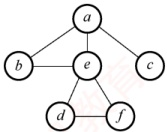

##### 10

一个有向图 G 的邻接表存储如下图所示，从顶点 1 出发，对图 G 调用深度优先遍历所得顶点序列是（）；按广度优先遍历所得顶点序列是（）。

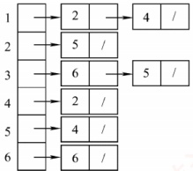

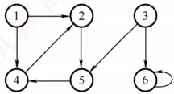

A. 125436 B. 124536 C. 124563 D. 362514
##### 11

无向图  $G = (V, E)$，其中  $V = \{a, b, c, d, e, f\}$， $E = \{(a, b), (a, e), (a, c), (b, e), (c, f), (f, d)\}$， $(e, d)$。对该图进行深度优先遍历，不能得到的序列是（）。

A. acfde b B. aebdfc C. aedfc b D. abecdf

##### 12

判断有向图中是否存在回路，除拓扑排序外，还可利用（）。（注：涉及下节内容）

A. 求关键路径的方法

B. 求最短路径的 Dijkstra 算法

C. 深度优先遍历算法

D. 广度优先遍历算法

##### 13

设无向图  $G = (V, E)$ 和  $G' = (V', E')$，若 G' 是 G 的生成树，则下列说法错误的是（）。

A.  $G'$ 为 G 的子图

B.  $G'$ 为 G 的连通分量

C.  $G'$ 为 G 的极小连通子图且  $V = V'$

D.  $G'$ 是 G 的一个无环子图

##### 14

图的厂度优先生成树的树高比深度优先生成树的树高（）。

A. 小或相等 B. 小 C. 大或相等 D. 大

##### 15

【2012 统考真题】对有 n 个顶点、e 条边且使用邻接表存储的有向图进行广度优先遍历，其算法的时间复杂度为（）。

A.  $O(n)$ B.  $O(e)$ C.  $O(n+e)$ D.  $O(ne)$

##### 16

【2013 统考真题】下列选项中，不是右图所示无向图的广度优先遍历序列的是（）。

A. h, c, a, b, d, e, g, f

B. e, a, f, g, b, h, c, d

C. d, b, c, a, h, e, f, g

D. a, b, c, d, h, e, f, g

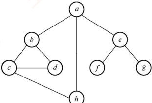

##### 17

【2015 统考真题】设有向图  $G = (V, E)$，顶点集  $V = \{V_0, V_1, V_2, V_3\}$，边集  $E = \{<v_0, v_1>, <v_0, v_2>, <v_0, v_3>\}$

<v_{1},v_{3}>。若从顶点 V_{0} 开始对图进行深度优先遍历，则可能得到的不同遍历序列个数是（）。

A. 2 B. 3 C. 4 D. 5

##### 18

【2016 统考真题】下列选项中，不是右图所示深度优先搜索序列的是（）。

A.  $V_{1}, V_{5}, V_{4}, V_{3}, V_{2}$ B.  $V_{1}, V_{3}, V_{2}, V_{5}, V_{4}$ C.  $V_{1}, V_{2}, V_{5}, V_{4}, V_{3}$ D.  $V_{1}, V_{2}, V_{3}, V_{4}, V_{5}$

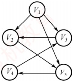

#### 二、 综合应用题

##### 01

图 G = (V, E) 以邻接表存储，如下图所示，试画出图 G 的深度优先生成树和广度优先生成树（假设从顶点 1 开始遍历）。

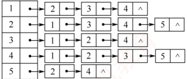

##### 02

给定一个连通无向图，采用邻接表存储，将图的所有顶点分别染成红色或蓝色，若存在一种染色方法使图中每条边的两个顶点的颜色都不相同，则称这个图能被二分。

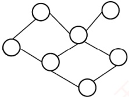

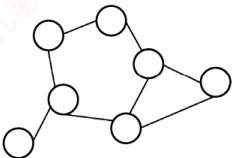

1）判断上面两个无向图是否能被二分，若能被二分，则请标出每个顶点的颜色。

2）请设计一种算法用来判断图是否能被二分，仅用语言描述算法的思想即可。

3）给出你设计的算法的时间复杂度和空间复杂度。

##### 03

试设计一个算法，判断一个无向图 G 是否为一棵树。若是一棵树，则算法返回 true，否则返回 false。

##### 04

分别采用基于深度优先遍历和广度优先遍历算法判别以邻接表方式存储的有向图中是否存在由顶点  $v_i$ 到顶点  $v_j$ 的路径 ( $i \neq j$)。注意，算法中涉及的图的基本操作必须在此存储结构上实现。

##### 05

假设图用邻接表表示，设计一个算法，输出从顶点  $V_{i}$ 到顶点  $V_{j}$ 的所有简单路径。

### 6.3.5 答案与解析

#### 一、 单项选择题

##### 01

A

广度优先搜索以起始顶点为中心，一层一层地向外层扩展遍历图的顶点，因此无法考虑到边权值，只适合求边权值相等的图的单源最短路径。广度优先搜索相当于树的层序遍历，说法Ⅲ错误。广度优先搜索需要用到队列，深度优先搜索需要用到栈，说法Ⅳ正确。

##### 02

D

图的深度优先遍历序列通常是不唯一的，说法Ⅰ错误。图1是一个不存在回路的有向图，从顶点1开始执行广度优先遍历，若不设置访问标志位，则会重复访问顶点3，说法Ⅱ错误。深度优先遍历（见本节后面习题的解析）或拓扑排序算法可以判断有向图中是否有环，说法Ⅲ正确。图2是一个非强连通图，但从顶点1开始调用一次广度优先遍历算法就可访问所有顶点，说法Ⅳ错误。

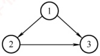

图1

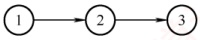

图2

##### 03

C

DFS（或 BFS）可用来计算无向图的连通分量数，因为一次遍历必然会将一个连通图中的所有顶点都访问到，所以计算图的连通分量数正好是 DFStraverse() 中 DFS 被调用的次数。

##### 04

C、A、C、A

深度优先遍历时，每个顶点表结点和每个边表结点均查找一次，每个顶点递归调用一次，需要借助一个递归工作栈；而广度优先遍历时，也是每个顶点表结点和每个边表结点均查找一次，需要借助一个辅助队列。因此，时间复杂度都为  $O(n+e)$，空间复杂度都为  $O(n)$。
##### 05

A

在图的广度优先遍历算法中，每个顶点被访问后立即做访问标记并入队。若队列不空，则队首顶点出队，若该顶点的邻接顶点未被访问，则访问之，做访问标记并入队；若被访问过，则跳过，如此反复，直至队空。因此，在广度优先遍历过程中，每个顶点最多入队一次。

##### 06

A、A

采用邻接矩阵表示时，查找一个顶点所有出边的时间复杂度为  $O(n)$，共有 n 个顶点，所以时间复杂度均为  $O(n^{2})$。

##### 07

D

画出草图后，此类题可以根据边的邻接关系快速排除错误选项。以选项 A 为例，在遍历到 e 之后，应该访问与 e 邻接但未被访问的顶点， $(e, c)$ 显然不在边集中。

##### 08

D

仅 1 和 4 正确。以 2 为例，遍历到 c 之后，与 c 邻接且未被访问的顶点为空集，所以应为 a 的邻接点 b 或 e 入栈。以 3 为例，因为遍历要按栈退回，所以是先 b 后 c，而不能先 c 后 b。

##### 09

B、D

图的深度优先搜索类似于树的先根遍历，即先访问顶点，再递归向外层顶点遍历，都采用回溯算法。图的广度优先搜索类似于树的层序遍历，即一层一层向外层扩展遍历，都需要采用队列来辅助算法的实现。

##### 10

A、B

DFS 序列产生的路径为<1, 2>, <2, 5>, <5, 4>, <3, 6>; BFS 序列产生的路径为<1, 2>, <1, 4>, <2, 5>, <3, 6>。

##### 11

D

画出 V 和 E 对应的图 G，然后根据搜索算法求解。

**注意**

为什么本题序列是不唯一的，而上题序列却是唯一的呢？

因为上题给出了具体的存储结构，此时就必须按照算法的过程来执行，每个顶点的邻接点的顺序已固定，但本题中每个顶点的邻接点的顺序是非固定的。

##### 12

C

利用深度优先遍历可以判断图 G 中是否存在回路。

对于无向图来说，若深度优先遍历过程中遇到了回边，则必定存在环；对于有向图来说，这条回边可能是指向深度优先森林中另一棵生成树上的顶点的弧；但是，从有向图的某个顶点 v 出发进行深度优先遍历时，若在 DFS(v)结束之前出现一条从顶点 u 到顶点 v 的回边，且 u 在生成树上是 v 的子孙，则有向图必定存在包含顶点 v 和顶点 u 的环。

##### 13

B

连通分量是无向图的极大连通子图，其中极大的含义是将依附于连通分量中顶点的所有边都加上，所以连通分量中可能存在回路，这样就不是生成树了。

**注意**

极大连通子图是 **无向图**（不一定连通）的连通分量，极小连通子图是 **连通无向图**的生成树。极小和极大是在满足连通的前提下，针对边的数目而言的。极大连通子图包含连通分量的全部边；极小连通子图（生成树）包含连通图的全部顶点，且使其连通的边数最少。
##### 14

A

对于无问图的广度优先搜索生成树，起点到其他顶点的路径是图中对应的最短路径，即所有生成树中树高最小。此外，深度优先总是尽可能“深”地搜索图，因此其路径也尽可能长，所以深度优先生成树的树高总是大于或等于广度优先生成树的树高。

##### 15

C

广度优先遍历需要借助队列实现。采用邻接表存储方式对图进行广度优先遍历时，每个顶点均需入队一次（顶点表遍历），所以时间复杂度为  $O(n)$，在搜索所有顶点的邻接点的过程中，每条边至少访问一次（出边表遍历），所以时间复杂度为  $O(e)$，算法总的时间复杂度为  $O(n+e)$。

##### 16

D

只要掌握 DFS 和 BFS 的遍历过程，便能轻易解决。逐个代入，手工模拟，选项 D 是深度优先遍历，而不是广度优先遍历。

##### 17

D

画出该有向图，如右图所示。采用图的深度优先遍历，共有5种可能： $\langle v_0, v_1, v_3, v_2 \rangle$， $\langle v_0, v_2, v_3, v_1 \rangle$， $\langle v_0, v_2, v_1, v_3 \rangle$， $\langle v_0, v_3, v_2, v_1 \rangle$， $\langle v_0, v_3, v_1, v_2 \rangle$。

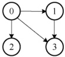

##### 18

D

按深度优先遍历的策略进行遍历。对于选项 A：先访问  $V_1$，然后访问与  $V_1$ 邻接且未被访问的任意一个顶点（满足的有  $V_2, V_3$ 和  $V_5$），此时访问  $V_5$，然后从  $V_5$ 出发，访问与  $V_5$ 邻接且未被访问的任意一个顶点（满足的只有  $V_4$），然后从  $V_4$ 出发，访问与  $V_4$ 邻接且未被访问的任意一个顶点（满足的只有  $V_3$），然后从  $V_3$ 出发，访问与  $V_3$ 邻接且未被访问的任意一个顶点（满足的只有  $V_2$），结束遍历。选项 B 和 C 的分析方法与 A 相同。对于选项 D，首先访问  $V_1$，然后从  $V_1$ 出发，访问与  $V_1$ 邻接且未被访问的任意一个顶点（满足的有  $V_2, V_3$ 和  $V_5$），然后从  $V_2$ 出发，访问与  $V_2$ 邻接且未被访问的任意一个顶点（满足的只有  $V_5$），按规则本应该访问  $V_5$，但选项 D 却访问了  $V_3$，错误。

#### 二、 综合应用题

##### 01

【解答】

根据 G 的邻接表不难画出图(a)。

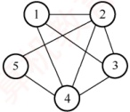

(a) 图G

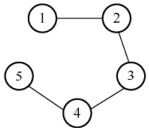

(b) 深度优先生成树

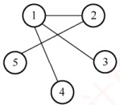

(c) 广度优先生成树

1）采用深度优先遍历。深度优先搜索总是尽可能“深”地搜索图，根据存储结构可知，深度优先搜索的路径次序为 $(1,2),(2,3),(3,4),(4,5)$，深度优先生成树如图(b)所示。需要注意的是，当存储结构固定时，生成树的树形也就固定了，因此不能先搜索 $(1,3)$。

2）采用广度优先遍历。广度优先搜索总是尽可能“广”地搜索图，一层一层地向外扩展，根据存储结构可知广度优先搜索的路径次序为(1,2)，(1,3),(1,4),(2,5)，广度优先生成树如图(c)所示。

##### 02

【解答】

1）右图不能被二分，左图能被二分，染色情况如右图所示。

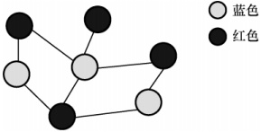

2）从任意一个顶点开始，将其染成红色，并从该顶点开
始对整个图进行遍历，在遍历过程中，若当前遍历的顶点 a 有一条边指向 b，则可能出现三种情况：① b 未被染色，将它染成与顶点 a 不同的颜色，并且继续遍历与 b 相连的顶点；② a 与 b 的颜色相同，说明该图不能被二分，直接返回；③ a 与 b 的颜色不同，跳过 b 点。

3）上述遍历无论是使用深度优先还是使用广度优先，时间复杂度都为  $O(n + m)$，其中的 n 和 m 分别是顶点数和边数。需要一个数组来存储各顶点的颜色及是否已访问，空间复杂度为  $O(n)$。

##### 03

【解答】

一个无向图 G 是一棵树的条件是，G 必须是无回路的连通图或有 n-1 条边的连通图。这里采用后者作为判断条件。对连通的判定，可以用能否一次遍历全部顶点来实现。可以采用深度优先搜索算法在遍历图的过程中统计可能访问到的顶点个数和边的条数，若一次遍历就能访问到 n 个顶点和 n-1 条边，则可断定此图是一棵树。算法实现如下：

```c
bool isTree(Graph& G){
    for(i=1;i<=G.vexnum;i++)
        visited[i]=FALSE; //访问标记 visited[]初始化
    int Vnum=0,Enum=0; //记录顶点数和边数
    DFS(G,1,Vnum,Enum,visited);
    `if(Vnum==G.vexnum&&Enum==2*(G`.vexnum-1))
        return true; //符合树的条件
    else
        return false; //不符合树的条件
}

void DFS(Graph& G,int v,int& Vnum,int& Enum,int visited[]){
    //深度优先遍历图G，统计访问过的顶点数和边数，通过Vnum和Enum返回
    visited[v]=TRUE;Vnum++; //作访问标记，顶点计数
    int w=FirstNeighbor(G,v); //取v的第一个邻接顶点
    while(w!=1){
        Enum++; //当邻接顶点存在
        if(!visited[w]) //当该邻接顶点未访问过
            DFS(G,w,Vnum,Enum,visited);
            w=NextNeighbor(G,v,w);
        }
    }
```

##### 04

【解答】

两个不同的遍历算法都采用从顶点  $v_{i}$ 出发，依次遍历图中每个顶点，直到搜索到顶点  $v_{j}$，若能够搜索到  $v_{j}$，则说明存在由顶点  $v_{i}$ 到顶点  $v_{j}$ 的路径。

深度优先遍历算法的实现如下：

```c
int visited[MAXSIZE]={0}; //访问标记数组
void DFS(ALGraph G,int i,int j,bool &can_reach){
```
//深度优先判断有向图G中顶点 $v_i$到顶点 $v_j$是否有路径，用 can_reach 来标识
```c
if(i==j){
    can_reach=true;
    return;
}

visited[i]=1; //置访问标记
for(int p=FirstNeighbor(G,i);p>=0;p=NextNeighbor(G,i,p))
    if(!visited[p]&&!can_reach) //递归检测邻接点
    DFS(G,p,j,can_reach);
}
```

广度优先遍历算法的实现如下：
```c
int visited[MAXSIZE]={0}; //访问标记数组
int BFS(ALGraph G,int i,int j){
```
//广度优先判断有向图G中顶点 $v_{i}$到顶点 $v_{j}$是否有路径，若是，则返回1，否则返回0
```c
InitQueue(Q); EnQueue(Q,i); //顶点i入队
while(!QueueEmpty(Q)) {
    DeQueue(Q,i);
    visited[i]=1;
    if(i==j) return 1;
    for(int p=FirstNeighbor(G,i);p;p=NextNeighbor(G,i,p)) {
        //检查所有邻接点
        if(p==j)
            return 1;
        if(!visited[p]) {
            EnQueue(Q,p);
            visited[p]=1;
        }
    }
}
return 0;
```

本题也可以这样解答：调用以 i 为参数的 DFS $(G,i)$ 或 BFS $(G,i)$，执行结束后判断 visited[j] 是否为 TRUE，若是，则说明  $v_j$ 已被遍历，图中必存在由  $v_i$ 到  $v_j$ 的路径。但此种解法每次都耗费最坏时间复杂度对应的时间，需要遍历与  $v_i$ 连通的所有顶点。

##### 05

【解答】

本题采用基于递归的深度优先遍历算法，从顶点 u 出发，递归深度优先遍历图中顶点，若访问到顶点 v，则输出该搜索路径上的顶点。为此，设置一个 path 数组来存放路径上的顶点（初始为空），d 表示路径长度（初始为-1）。查找从顶点 u 到 v 的简单路径过程说明如下（假设查找函数名为 FindPath()）：

1）FindPath(G,u,v,path,d):d++;path[d]=u；若找到 u 的未访问过的相邻顶点 u1，则继续下去，否则置 visited[u]=0 并返回。

2）FindPath(G,u1,v,path,d):d++;path[d]=u1；若找到 u1 的未访问过的相邻顶点 u2，则继续下去，否则置 visited[u1]=0。

3）以此类推，继续上述递归过程，直到ui=v，输出path。

算法实现如下：

```c
void FindPath(AGraph *G, int u, int v, int path[], int d) {
    int w;
    ArcNode *p;
    d++;
    path[d] = u;
    visited[u] = 1;
    if (u == v)
        print(path[]);
    p = G->adjlist[u].first;
    while (p != NULL) {
        w = p->adjvex;
        if (visited[w] == 0)
            FindPath(G, w, v, path, d);
        p = p->nextarc;
    }
    visited[u] = 0;
}
```
