### 6.4.6 本节试题精选

#### 一、 单项选择题

##### 01

任何一个无向连通图的最小生成树（）。

A. 有一棵或多棵

B. 只有一棵

C. 一定有多棵

D. 可能不存在

##### 02

用 Prim 算法和 Kruskal 算法构造图的最小生成树，所得到的最小生成树（）。

A. 相同 B. 不相同

C. 可能相同，可能不同 D. 无法比较

##### 03

下列关于图的生成树和最小生成树的叙述中，正确的是（）。

A. 只要无向连通图中没有权值相同的边，则其最小生成树唯一

B. 只要无向图中有权值相同的边，则其最小生成树一定不唯一

C．从 n 个顶点的连通图中选取 n-1 条权值最小的边，即可构成最小生成树

D．设连通图 G 含有 n 个顶点，则含有 n 个顶点、n-1 条边的子图一定是 G 的生

##### 04

设有 n 个顶点的无向连通图的最小生成树不唯一，则下列说法中正确的是（）。

A. 图的边数一定大于 n-1

B. 图的权值最小的边一定有多条

C. 图的最小生成树的代价不一定相等 D. 图的各条边的权值不相等

##### 05

用 Prim 算法求一个带权连通图的最小生成树，在算法执行的某个时刻，已选取的顶点集合  $U = \{1, 2, 3\}$，已选取的边集合  $TE = \{(1, 2), (2, 3)\}$，要选取下一条权值最小的边，应当从（）组中选取。

A.  $\{(1,4),(3,4),(3,5),(2,5)\}$ B.  $\{(3,4),(3,5),(4,5),(1,4)\}$ C.  $\{(1,2),(2,3),(3,5)\}$ D.  $\{(4,5),(1,3),(3,5)\}$

##### 06

用Kruskal算法求一个带权连通图的最小生成树，在算法执行的某个时刻，已选取的边集合TE= $\{(1,2),(2,3),(3,5)\}$，要选取下一条权值最小的边，不可能选取的边是（）。

A. (3,6) B. (2,4) C. (1,3) D. (1,4)

##### 07

下列关于图的最短路径的相关叙述中，正确的是（）。

A. 最短路径一定是简单路径

B. Dijkstra 算法不适合求有回路的带权图的最短路径

C. Dijkstra 算法不适合求任意两个顶点的最短路径
D. Dijkstra算法可以正确处理含有负权边的图

##### 08

下列关于图的最短路径的相关叙述中，正确的是（）。

I. Dijkstra 算法求单源最短路径不允许边的权为负

II. Dijkstra 算法求每对顶点间的最短路径的时间复杂度为  $O(n^{2})$

III. Floyd 算法求每对顶点间的最短路径允许边的权为负，但不允许含有负权的回路

A. I、II 和 III        B. 仅 I            C. I 和 III         D. II 和 III

##### 09

已知带权连通无向图  $G = (V, E)$，其中  $V = \{v_1, v_2, v_3, v_4, v_5, v_6, v_7\}$， $E = \{(v_1, v_2)10, (v_1, v_3)2, (v_3, v_4)2, (v_3, v_6)11, (v_2, v_5)1, (v_4, v_5)4, (v_4, v_6)6, (v_5, v_7)7, (v_6, v_7)3\}$（注：顶点偶对括号外的数据表示边上的权值），从源点  $v_1$ 到顶点  $v_7$ 的最短路径上经过的顶点序列是（）。

A.  $v_1, v_2, v_5, v_7$

B.  $v_1, v_3, v_4, v_6, v_7$

C.  $v_1, v_3, v_4, v_5, v_7$

D.  $v_1, v_2, v_5, v_4, v_6, v_7$

##### 10

用 Dijkstra 算法求一个带权有向图的从顶点 O 出发的最短路径，在算法执行的某个时刻，已求得的最短路径的顶点集合  $S = \{0, 2, 3, 4\}$，下一个选取的目标顶点是顶点 1，则可能修改的最短路径是（）。

A. 从顶点 O 到顶点 3 的最短路径

B. 从顶点 O 到顶点 2 的最短路径

C. 从顶点 2 到顶点 4 的最短路径

D. 从顶点 O 到顶点 1 的最短路径

##### 11

下面的（）方法可以判断出一个有向图是否有环（回路）。

Ⅰ. 深度优先遍历 Ⅱ. 拓扑排序 Ⅲ. 求最短路径 Ⅳ. 广度优先遍历

A. I、II、IV B. I、III、IV C. I、II、III D. 全部可以

##### 12

在有向图 G 的拓扑序列中，若顶点  $v_{i}$ 在顶点  $v_{j}$ 之前，则不可能出现的情形是（）。

A. G 中有弧  $v_{i}, v_{j}$

B. G 中有一条从  $v_{i}$ 到  $v_{j}$ 的路径

C. G 中没有弧  $\left\langle v_{i}, v_{j} \right\rangle$

D. G 中有一条从  $v_{j}$ 到  $v_{i}$ 的路径

##### 13

下列关于拓扑排序的说法中，错误的是（）。

Ⅰ. 若某有向图存在环路，则该有向图一定不存在拓扑排序

Ⅱ. 在拓扑排序算法中为暂存入度为零的顶点，可以使用栈，也可以使用队列

Ⅲ. 若有向图的拓扑有序序列唯一，则图中每个顶点的入度和出度最多为1

Ⅳ. 若有向图的拓扑有序序列唯一，则图中入度为0和出度为0的顶点都仅有1个

A. I、III、IV B. III、IV C. II、IV D. III

##### 14

下列关于拓扑排序的说法中，正确的是（）。

Ⅰ. 顶点数大于1的强连通图不能进行拓扑排序

II. 在一个有向图的拓扑序列中，若顶点 a 在顶点 b 之前，则图中必有一条弧  $<a, b>$

III. 若有向无环图的拓扑序列唯一，则可以唯一确定该图

A. I 和 II

B. I、II 和 III

C. 仅 I

D. I 和 III

##### 15

若一个有向图的顶点不能形成一个拓扑序列，则判定该有向图（）。

A. 含有多个出度为 0 的顶点

B. 是个强连通图

C. 含有多个入度为 0 的顶点

D. 含有顶点数大于 1 的强连通分量

##### 16

右图所示有向图的所有拓扑序列共有（）个。

A. 4 B. 6 C. 5 D. 7

##### 17

已知有向图  $G=(V,E)$，其中  $V=\{v_1,v_2,v_3,v_4,v_5,v_6,$

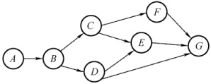

 $v_{7}$,  $E = \{v_1, v_2, <v_1, v_3, <v_1, v_4, <v_2, v_5, <v_3, v_5, <v_3, v_6, <v_5, v_7, <v_6, v_7, <v_4, v_6\}$, G 的拓扑序列是（）。

A.  $\{v_1, v_3, v_4, v_6, v_2, v_5, v_7\}$

B.  $\{v_1, v_3, v_2, v_6, v_4, v_5, v_7\}$

C.  $\{v_1, v_3, v_4, v_5, v_2, v_6, v_7\}$

D.  $\{v_1, v_2, v_5, v_3, v_4, v_6, v_7\}$

##### 18

下列哪种图的邻接矩阵是对称矩阵？（）

A. 有向网 B. 无向图 C. AOV网 D. AOE网

##### 19

若一个有向图具有有序的拓扑排序序列，则它的邻接矩阵必定为（）。

A. 对称

B. 稀疏

C. 三角

D. 一般

##### 20

用 DFS 算法遍历一个无环有向图，并在 DFS 算法退栈返回时输出相应的顶点，则输出的顶点序列是（）。

A. 逆拓扑有序 B. 拓扑有序 C. 无序的 D. 无法确定

##### 21

下列关于图的说法中，正确的是（）。

I. 有向图中顶点 V 的度等于其邻接矩阵中第 V 行中 1 的个数

II. 无向图的邻接矩阵一定是对称矩阵，有向图的邻接矩阵一定是非对称矩阵

III. 在带权图 G 的最小生成树  $G_1$ 中，某条边的权值可能会超过未选边的权值

IV. 若有向无环图的拓扑序列唯一，则可以唯一确定该图

A. I、II 和 III      B. III 和 IV      C. III       D. IV

##### 22

下图所示的 AOE 网中，关键路径长度为（）。

A. 16 B. 17 C. 18 D. 19

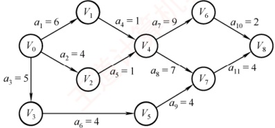

##### 23

若某带权图为  $G = (V, E)$，其中  $V = \{v_1, v_2, v_3, v_4, v_5, v_6, v_7, v_8, v_9, v_{10}\}$， $E = \{v_1, v_2 > 5, <v_1, v_3 > 6, <v_2, v_5 > 3, <v_3, v_5 > 6, <v_3, v_4 > 3, <v_4, v_5 > 3, <v_4, v_7 > 1, <v_4, v_8 > 4, <v_5, v_6 > 4, <v_5, v_7 > 2, <v_6, v_{10} > 4, <v_7, v_9 > 5, <v_8, v_9 > 2, <v_9, v_{10} > 2\}$（注：边括号外的数据表示边上的权值），则 G 的关键路径的长度为（）。

A. 19 B. 20 C. 21 D. 22

##### 24

下面关于求关键路径的说法中，不正确的是（）。

A. 求关键路径是以拓扑排序为基础的

B. 一个事件的最早发生时间与以该事件为始的弧的活动的最早开始时间相同

C. 一个事件的最迟发生时间是以该事件为尾的弧的活动的最迟开始时间与该活动的持续时间的差

D. 任何一个活动的持续时间的改变可能会影响关键路径的改变

##### 25

下列关于 AOE 网的关键路径的说法中，正确的是（）。

Ⅰ. 改变网上某一关键路径上的任意一个关键活动后，必将产生不同的关键路径

Ⅱ. 关键路径上活动的时间延长多少，整个工期也就随之延长多少

III. 缩短关键路径上任意一个关键活动的持续时间可缩短关键路径长度

IV. 缩短所有关键路径上共有的任意一个关键活动的持续时间可缩短关键路径长度
V. 缩短多条关键路径上共有的任意一个关键活动的持续时间可缩短关键路径长度

A. Ⅱ和 V B. I、Ⅱ和Ⅳ C. Ⅱ和Ⅳ D. I 和Ⅳ

##### 26

在求 AOE 网的关键路径时，若该有向图用邻接矩阵表示且第 i 列值全为  $\infty$，则（）。

A. 若关键路径存在，第 i 个顶点一定是起点

B. 若关键路径存在，第 i 个顶点一定是终点

C. 关键路径不存在

D. 该有向图对应的无向图存在多个连通分量

##### 27

【2010 统考真题】对右图进行拓扑排序，可得不同拓扑序列的个数是（）。

A. 4

B. 3

C. 2

D. 1

##### 28

【2012 统考真题】下列关于最小生成树的叙述中，正确的是（）。

Ⅰ. 最小生成树的代价唯一

Ⅱ. 所有权值最小的边一定会出现在所有的最小生成树中

Ⅲ. 使用 Prim 算法从不同顶点开始得到的最小生成树一定相同

Ⅳ. 使用 Prim 算法和 Kruskal 算法得到的最小生成树总不相同

A. 仅 I

B. 仅 II

C. 仅 I、III

D. 仅 II、IV

##### 29

【2012 统考真题】对右图所示的有向带权图，若采用 Dijkstra 算法求从源点 a 到其他各顶点的最短路径，则得到的第一条最短路径的目标顶点是 b，第二条最短路径的目标顶点是 c，后续得到的其余各最短路径的目标顶点依次是（）。

A. d, e, f

B. e, d, f

C. f, d, e

D. e, d, f

##### 30

【2012 统考真题】若用邻接矩阵存储有向图，矩阵中主对角线以下的元素均为零，则关于该图拓扑序列的结论是（）。

A. 存在，且唯一

B. 存在，且不唯一

C. 存在，可能不唯一

D. 无法确定是否存在

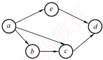

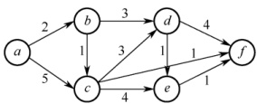

##### 31

【2013 统考真题】下列 AOE 网表示一项包含 8 个活动的工程。通过同时加快若干活动的进度，可缩短整个工程的工期。在下列选项中，加快其进度就可缩短工程工期的是（）。

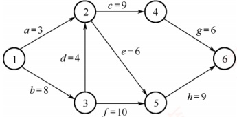

A. c 和 e

B. d 和 c

C. f 和 d

D. f 和 h

##### 32

【2014 统考真题】对右图所示的有向图进行拓扑排序，得到的拓扑序列可能是（）。

A. 3,1,2,4,5,6

B. 3,1,2,4,6,5

C. 3,1,4,2,5,6

D. 3,1,4,2,6,5

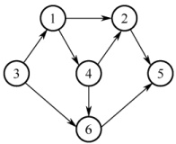

##### 33

【2015 统考真题】求右图所示带权图的最小（代价）生成树时，可能是 Kruskal 算法第 2 次选中但不是 Prim 算法（从  $V_{4}$ 开始）第 2 次选中的边是（）。

A.  $(V_{1}, V_{3})$ B.  $(V_{1}, V_{4})$ C.  $(V_{2}, V_{3})$ D.  $(V_{3}, V_{4})$

##### 34

【2011统考真题】下列关于图的叙述中，正确的是（）。

Ⅰ. 回路是简单路径

Ⅱ. 存储稀疏图，用邻接矩阵比邻接表更省空间

Ⅲ. 若有向图中存在拓扑序列，则该图不存在回路

A. 仅Ⅱ B. 仅I、Ⅱ C. 仅Ⅲ D. 仅I、Ⅲ

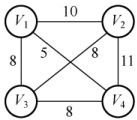

##### 35

【2016 统考真题】使用 Dijkstra 算法求下图中从顶点 1 到其他各顶点的最短路径，依次得到的各最短路径的目标顶点是（）。

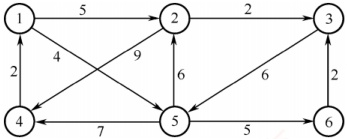

A. 5,2,3,4,6 B. 5,2,3,6,4 C. 5,2,4,3,6 D. 5,2,6,3,4

##### 36

【2016 统考真题】若对 n 个顶点、e 条弧的有向图采用邻接表存储，则拓扑排序算法的时间复杂度为（）。

A.  $O(n)$ B.  $O(n+e)$ C.  $O(n^2)$ D.  $O(ne)$

##### 37

【2018 统考真题】下列选项中，不是右侧有向图的拓扑序列的是（）。

A. 1,5,2,3,6,4

B. 5,1,2,6,3,4

C. 5,1,2,3,6,4

D. 5,2,1,6,3,4

##### 38

【2019 统考真题】下图所示的 AOE 网表示一项包含 8 个活动的工程。活动 d 的最早开始时间和最迟开始时间分别是（）。

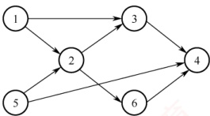

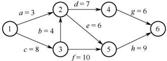

A. 3 和 7 B. 12 和 12 C. 12 和 14 D. 15 和 15

##### 39

【2019统考真题】用有向无环图描述表达式 $(x+y)((x+y)/x)$，需要的顶点个数至少是（）。

A. 5 B. 6 C. 8 D. 9

##### 40

【2020 统考真题】已知无向图 G 如右所示，使用 Kruskal 算法求图 G 的最小生成树，加

到最小生成树中的边依次是（）。

A.  $(b,f),(b,d),(a,e),(c,e),(b,e)$

B.  $(b,f),(b,d),(b,e),(a,e),(c,e)$

C.  $(a,e),(b,e),(c,e),(b,d),(b,f)$

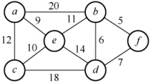

D.  $(a,e)$,  $(c,e)$,  $(b,e)$,  $(b,f)$,  $(b,d)$

##### 41

【2020 统考真题】修改递归方式实现的图的深度优先搜索（DFS）算法，将输出（访问）顶点信息的语句移到退出递归前（执行输出语句后立刻退出递归）。采用修改后的算法遍历有向无环图 G，若输出结果中包含 G 中的全部顶点，则输出的顶点序列是 G 的（）。

A. 拓扑有序序列

B. 逆拓扑有序序列

C. 广度优先搜索序列

D. 深度优先搜索序列

##### 42

【2020 统考真题】若使用 AOE 网估算工程进度，则下列叙述中正确的是（）。

A. 关键路径是从源点到汇点边数最多的一条路径

B. 关键路径是从源点到汇点路径长度最长的路径

C. 增加任意一个关键活动的时间不会延长工程的工期

D. 缩短任意一个关键活动的时间将会缩短工程的工期

##### 43

【2021 统考真题】给定右图所示有向图，该图的拓扑有序序列的个数是（）。

A. 1 B. 2 C. 3 D. 4

##### 44

【2021 统考真题】使用 Dijkstra 算法求下图中从顶点 1 到其余各顶点的最短路径，将当前找到的从顶点 1 到顶点 2, 3, 4, 5 的最短路径长度保存在数组 dist 中，求出第二条最短路径后，dist 中的内

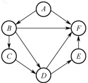

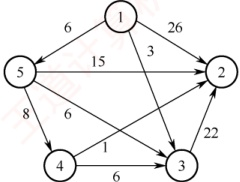

A. 26,3,14,6 B. 25,3,14,6 C. 21,3,14,6 D. 15,3,14,6

##### 45

【2022 统考真题】下图是一个有 10 个活动的 AOE 网，时间余量最大的活动是（）。

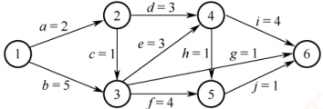

A. c B. g C. h D. j

##### 46

【2023 统考真题】已知无向连通图 G 中各边的权值均为 1。在下列算法中，一定能够求出图 G 中从某顶点到其余各顶点最短路径的是（）。

I. Prim 算法  II. Kruskal 算法  III. 图的广度优先搜索算法

A. 仅 I          B. 仅 III       C. 仅 I、II      D. I、II、III

##### 47

【2025 统考真题】下列关于图的叙述中，正确的是（）。

A. 有向图必存在入度为0的顶点

B. 有向无环图的拓扑有序序列存在且唯一
C. 各顶点的度均大于或等于2的无向图必有回路

D. 可用 BFS 算法求出带权图中每对顶点间的最短路径

#### 二、 综合应用题

##### 01

下面是一种称为“破圈法”的求解最小生成树的方法：所谓“破圈法”，是指“任取一圈，去掉圈上权最大的边”，反复执行这一步骤，直到没有圈为止。试判断这种方法是否正确。若正确，说明理由；若不正确，举出反例（注：圈就是回路）。

##### 02

已知有向图如右图所示。

1）写出该图的邻接矩阵表示并据此给出从顶点 1 出发的深度优先遍历序列。

2）求该有向图的强连通分量的数目。

3）给出该图的任意两个拓扑序列。

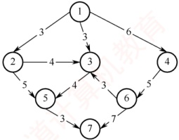

4）若将该图视为无向图，分别用 Prim 算法和 Kruskal 算法求最小生成树。

##### 03

对右图所示的无向图，按照 Dijkstra 算法，写出从顶点 1 到其他各个顶点的最短路径和最短路径长度（顺序不能颠倒）。

##### 04

下图所示为一个用 AOE 网表示的工程。

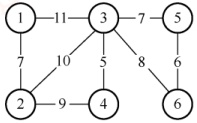

1）画出此图的邻接表表示。

2）完成此工程至少需要多少时间？

3）指出关键路径。

4）哪些活动加速可以缩短完成工程所需的时间？

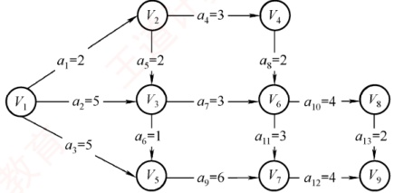

##### 05

下表给出了某工程各工序之间的优先关系和各工序所需的时间（其中“—”表示无先驱工序），请完成以下各题：

1）画出相应的 AOE 网。

2）列出各事件的最早发生时间和最迟发生时间。

3）求出关键路径并指明完成该工程所需的最短时间。

| 工序代号 | A | B | C | D | E | F | G | H |
| --- | --- | --- | --- | --- | --- | --- | --- | --- |
| 所需时间 | 3 | 2 | 2 | 3 | 4 | 3 | 2 | 1 |
| 先驱工序 | — | — | A | A | B | A | C、E | D |

##### 06

一连通无向图，边非负权值，问用 Dijkstra 最短路径算法能否给出一棵生成树，该树是否一定是最小生成树？说明理由。

##### 07

试编写利用 DFS 实现有向无环图拓扑排序的算法。

##### 08

【2009 统考真题】带权图（权值非负，表示边连接的两顶点间的距离）的最短路径问题是找出从初始顶点到目标顶点之间的一条最短路径。假设从初始顶点到目标顶点之
间存在路径，现有一种解决该问题的方法：

①设最短路径初始时仅包含初始顶点，令当前顶点 u 为初始顶点。

②选择离 u 最近且尚未在最短路径中的一个顶点 v，加入最短路径，修改当前顶点 u = v。

③重复步骤②，直到u是目标顶点时为止。

请问上述方法能否求得最短路径？若该方法可行，请证明；否则，请举例说明。

##### 09

【2011 统考真题】已知有 6 个顶点（顶点编号为 0~5）的有向带权图 G，其邻接矩阵 A 为上三角矩阵。按行为主序（行优先）保存在如下的一维数组中。

| 4 | 6 | $\infty$ | $\infty$ | $\infty$ | 5 | $\infty$ | $\infty$ | $\infty$ | 4 | 3 | $\infty$ | $\infty$ | 3 | 3 |
|---|---|---|---|---|---|---|---|---|---|---|---|---|---|---|

要求：

1）写出图G的邻接矩阵A。

2）画出有向带权图 G。

3）求图G的关键路径，并计算该关键路径的长度。

##### 10

【2014 统考真题】某网络中的路由器运行 OSPF 路由协议，下表是路由器 R1 维护的主要链路状态信息（LSI），R1 构造的网络拓扑图（见下图）是根据题下表及 R1 的接口名构造出来的网络拓扑。

|   |   | R1 的 LSI | R2 的 LSI | R3 的 LSI | R4 的 LSI | 备注 |
| --- | --- | --- | --- | --- | --- | --- |
| Router ID |   | 10.1.1.1 | 10.1.1.2 | 10.1.1.5 | 10.1.1.6 | 标识路由器的 IP 地址 |
| Link1 | ID | 10.1.1.2 | 10.1.1.1 | 10.1.1.6 | 10.1.1.5 | 所连路由器的 Router ID |
| IP | 10.1.1.1 | 10.1.1.2 | 10.1.1.5 | 10.1.1.6 | Link1 的本地 IP 地址 |   |
| Metric | 3 | 3 | 6 | 6 | Link1 的费用 |   |
| Link2 | ID | 10.1.1.5 | 10.1.1.6 | 10.1.1.1 | 10.1.1.2 | 所连路由器的 Router ID |
| IP | 10.1.1.9 | 10.1.1.13 | 10.1.1.10 | 10.1.1.14 | Link2 的本地 IP 地址 |   |
| Metric | 2 | 4 | 2 | 4 | Link2 的费用 |   |
| Net1 | Prefix | 192.1.1.0/24 | 192.1.6.0/24 | 192.1.5.0/24 | 192.1.7.0/24 | 直连网络 Net1 的网络前缀 |
| Metric | 1 | 1 | 1 | 1 | 到达直连网络 Net1 的费用 |   |

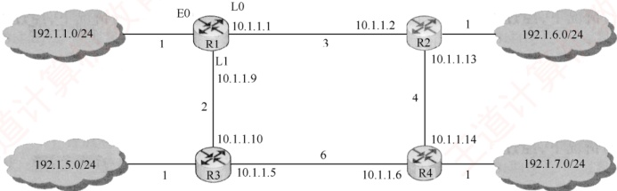

请回答下列问题。

1）本题中的网络可抽象为数据结构中的哪种逻辑结构？

2）针对表中的内容，设计合理的链式存储结构，以保存表中的链路状态信息（LSI）。要求给出链式存储结构的数据类型定义，并画出对应表的链式存储结构示意图（示意图中可仅以ID标识结点）。

3）按照 Dijkstra 算法的策略，依次给出 R1 到达子网 192.1.x.x 的最短路径及费用。

##### 11

【2017 统考真题】使用 Prim 算法求带权连通图的最小（代价）生成树（MST）。请回
答下列问题：

1）对右侧的图 G，从顶点 A 开始求 G 的 MST，依次给出按算法选出的边。

2）图 G 的 MST 是唯一的吗？

3）对任意的带权连通图，满足什么条件时，其MST是唯一的？

##### 12

【2018 统考真题】拟建设一个光通信骨干网络连通 BJ、CS、

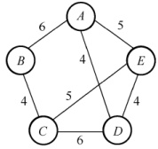

XA、QD、JN、NJ、TL和WH等8个城市，右图中无向边上的权值表示两个城市之间备选光缆的铺设费用。请回答下列问题：

1）仅从铺设费用角度出发，给出所有可能的最经济的光缆铺设方案（用带权图表示），并计算相应方案的总费用。

2）该图可采用图的哪种存储结构？给出求解问题 1）所

用的算法名称。

3）假设每个城市采用一个路由器按1）中得到的最经济方案组网，主机H1直接连接TL的路由器，主机H2直接连接BJ的路由器。若H1向H2发送一个TTL=5的IP分组，则H2是否可以收到该IP分组？

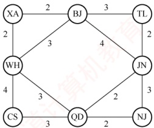

##### 13

【2024统考真题】2023年10月26日，神舟十七号载人飞船发射取得圆满成功，再次彰显了中国航天事业的辉煌成就。载人航天工程是包含众多子工程的复杂系统工程，为了保证工程的有序开展，需要明确各子工程的前导子工程，以协调各子工程的实施。该问题可以简化、抽象为有向图的拓扑序列问题。已知有向图G采用邻接矩阵存储，类型定义如下。

```c
typedef struct
{
    int numVertices, numEdges;
    char VerticesList[MAXV];
    int Edge[MAXV][MAXV];
} MGraph;

//图的类型定义
//图的顶点数和有向边数
//顶点表，MAXV 为已定义常量
//邻接矩阵
```

请设计算法：int uniquely(MGraqh G)，判定 G 是否存在唯一的拓扑序列，若是，则返回 1，否则返回 0。要求如下。

1）给出算法的基本设计思想。

2）根据设计思想，采用 C 或 C++ 语言描述算法，关键之处给出注释。

##### 14

【2025 统考真题】某工程包含 12 个活动，使用右图所示的 AOE 网描述，图中各边上标注了活动及其持续时间。

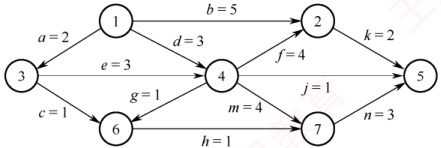

请回答下列问题（活动均用活动名表示）。

1）完成该工程的最短时间是多少？哪些活动是关键活动？

2）若以最短时间完成工程，则与活动e同时进行的活动可能有哪些？

3）时间余量最大的活动是哪个？其时间余量是多少？
4）假设工程从时刻 0 启动，因某种原因，活动 b 在时刻 6 开始。为了保证工程不延期，在其他活动持续时间均不变的情况下，b 的持续时间最多是多少？若不改变 b 的持续时间，则压缩哪个活动的持续时间也能保证工程不延期？

### 6.4.7 答案与解析

#### 一、 单项选择题

##### 01

A

当无向连通图存在权值相同的多条边时，最小生成树可能是不唯一的；另外，这是一个无向连通图，因此最小生成树必定存在，从而选择选项 A。

##### 02

C

因为无向连通图的最小生成树不一定唯一，所以用不同算法生成的最小生成树可能不同，但当无向连通图的最小生成树唯一时，不同算法生成的最小生成树必定是相同的。

##### 03

A

最小生成树算法是基于贪心策略的，每次总是选取权值最小且满足条件的边，若各边权值不同，则每次选择的新顶点也是唯一的，因此最小生成树唯一，选项 A 正确。对于选项 B，若无向图本身就是一棵树，则最小生成树就是它本身，这时就是唯一的。对于选项 C，选取的 n-1 条边可能构成回路。对于选项 D，含有 n 个顶点、n-1 条边的子图可能构成回路，也可能不连通。

##### 04

A

右图的边数小于n-1，则图不存在最小生成树；若无向连通图的边数等于n-1，则最小生成树唯一，即图本身，所以图的边数一定大于n-1，选项A正确。若最小生成树不唯一，则一定存在权值相等的边，但未必是权值最小的边，如右图所示。

选项 B 错误。最小生成树可能不唯一，但代价一定相同，选项 C 错误。当图的各边的权值互不相等时，图的最小生成树是唯一的，选项 D 错误。

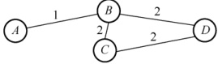

##### 05

A

 $U = \{1, 2, 3\}$， $V - U = \{4, 5, \cdots\}$，候选边只能是这两个顶点集之间的边，只有选项 A 符合题意。

##### 06

C

若选取边(1,3)则会构成回路。

##### 07

A

选项 A 正确，见严蔚敏老师的教材。Dijkstra 算法适合求解有回路的带权图的最短路径，也可以求任意两个顶点的最短路径，不适合求带负权值的最短路径问题。

##### 08

C

在负权图中，Dijkstra 算法既不能保证每次选出的顶点都是真正的最近顶点，又不能保证已确定的最短路径不再被改变，因此 Dijkstra 算法不允许边的权为负，说法 I 正确。求每对顶点间的最短路径需要调用 Dijkstra 算法 n 次，时间复杂度为  $O(n^{3})$，说法 II 错误。Floyd 算法求每对顶点间的最短路径允许有负边的存在，但不允许包含总权值为负的回路，说法 III 正确。

##### 09

B

题目所描述的图 G 如下图所示。A, B, C, D 对应的路径长度分别为 18, 13, 15, 24。应用 Dijkstra 算法不难求出最短路径为  $v_1 \to v_3 \to v_4 \to v_6 \to v_7$。

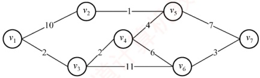

##### 10

D

在 Dijkstra 算法的执行过程中，只可能修改从源点 0 到集合 V-S 中某个顶点的最短路径。

##### 11

A

使用深度优先遍历，若从有向图上的某个顶点 u 出发，在 DFS(u) 结束之前出现一条从顶点 v 到 u 的边，v 在生成树上是 u 的子孙，图中必定存在包含 u 和 v 的环，因此深度优先遍历可以检测一个有向图是否有环。拓扑排序时，当某顶点不为任何边的头时才能加入序列，存在环时环中的顶点一直是某条边的头，不能加入拓扑序列。也就是说，还存在无法找到下一个可以加入拓扑序列的顶点，则说明此图存在回路。求最短路径是允许图有环的。广度优先遍历主要用于无权图求最短路径或层次遍历，不能直接用于判断有向图是否有环。

##### 12

D

若图 G 中存在一条从  $v_{j}$ 到  $v_{i}$ 的路径，说明  $V_{j}$ 是  $V_{i}$ 的前驱，则要把  $V_{j}$ 消去以后才能消去  $V_{i}$，从而拓扑序列中必然先输出  $v_{j}$，再输出  $v_{i}$，这显然与题意矛盾。

##### 13

D

对于说法 I，若有向图中存在环，运行拓扑排序算法后，肯定会剩下有环的子图，在此环中无法再找到入度为 0 的顶点，拓扑排序也就无法再运行。对于说法 II，若两个顶点之间不存在祖先或子孙关系，则它们在拓扑序列中的前后关系是任意的，因此使用栈和队列都可以，因为入栈或队列的都是入度为 0 的顶点。说法 III 是难点，若拓扑序列唯一，则很自然联想到一个线性的有向图，右图的拓扑序列也唯一，但却不满足该条件。对于说法 IV，若入度为 0 的顶点不唯一，则这些顶点均可作为拓扑序列的起点；若出度为 0 的顶点不唯一，则这些顶点均可作为拓扑序列的终点。

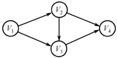

##### 14

C

强连通图是指有问图中任意顶点对之间都存在两条相反的路径，这意味着强连通图中一定存在环，因此不能进行拓扑排序，说法 I 正确。假设顶点 a 和 b 的入度均为 0，且分别有两条孤从 a 和 b 指向同一顶点 c，则产生的拓扑序列可以是 abc，但是此时并无一条弧 <a, b>，说法 II 错误。如图 1 和 2 所示的有向图对应的拓扑序列都是 abcd，且都是唯一的，说法 III 错误。

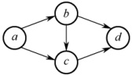

图1

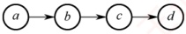

图2

##### 15

D

一个有向图中的顶点不能排成一个拓扑序列，表明其中存在一个顶点数目大于1的回路（环），该回路构成一个强连通分量，从而答案选择选项D。

##### 16

C

本图的拓扑排序序列有  $ABCFDEG$,  $ABCDFEG$,  $ABCDEFG$,  $ABDCFEG$ 和  $ABDCEFG$。读者应能把这一类经典习题的拓扑序列全部写出来。
##### 17

A

扣扑序列的过程：找到入度为 0 的顶点，删除该顶点及其所有出边，并将顶点加入拓扑序列，重复直至所有顶点都加入拓扑序列。选择入度为 0 的顶点  $v_1$，删除与  $v_1$ 有关的边；此时顶点  $v_3$ 的入度为 0，选择  $v_3$，删除与  $v_3$ 有关的边；以此类推，得出 G 的拓扑序列。

##### 18

B

无向图的邻接矩阵存储中，每条边存储两次，且  $A[i][j] = A[j][i]$。

##### 19

C

此题一直以来争议较大，因为有些书中漏掉了“有序”二字。可以证明，对有向图中的顶点适当地编号，使其邻接矩阵为三角矩阵且主对角元素全为零的充分必要条件是，该有向图可以进行拓扑排序。若这个题目把“有序”二字去掉，显然应选择选项 D。但此题题干中已经指出是“有序的拓扑序列”，因此应选选项 C。需要注意的是，若一个有向图的邻接矩阵为三角矩阵（对角线以上或以下的元素为 0），则图中必不存在环，因此其拓扑序列必然存在。

##### 20

A

设图中有顶点  $v_i$，它有后继顶点  $v_j$，即存在边  $<v_i, v_j>$。根据 DFS 的规则， $v_i$ 入栈后，必先遍历完其后继顶点后  $v_i$ 才会出栈，也就是说  $v_i$ 会在  $v_j$ 之后出栈，在如题所指的过程中， $v_i$ 在  $v_j$ 后打印。 $v_i$ 和  $v_j$ 具有任意性，因此由上面的规律看出，输出顶点的序列是逆拓扑有序序列。

对有向无环图利用深度优先搜索进行拓扑排序的例子

如下：如右图所示，退出 DFS 栈的顺序为  $efgdcahb$，此图的一个拓扑序列为  $bhacdgfe$。该方法的每一步均是先输出当前无后继的顶点，即对每个顶点  $v$，先递归地求出  $v$ 的每个后继的拓扑序列。

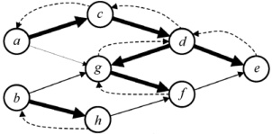

##### 21

C

有向图邻接矩阵的第 V 行中 1 的个数是顶点 V 的出度，而有向图中顶点的度为入度与出度之和，说法 I 错。无向图的邻接矩阵一定是对称矩阵，但当有向图中任意两个顶点之间有边相连，且是两条方向相反的有向边时，有向图的邻接矩阵也是一个对称矩阵，说法 II 错。最小生成树中的 n-1 条边不能保证是图中权值最小的 n-1 条边，因为权值最小的 n-1 条边并不一定能使图连通。在下图中，左图的最小生成树如下图所示，权值为 3 的边不在其最小生成树中。

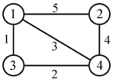

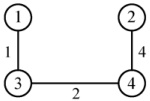

有向无环图的拓扑序列唯一并不能唯一确定该图。在下图所示的两个有向无环图中，拓扑序列都为  $V_{1}$,  $V_{2}$,  $V_{3}$,  $V_{4}$，Ⅳ错。注意，很多辅导书对该命题的判断是错误的。

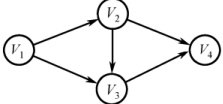

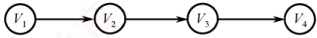

##### 22

C

观察题图，从  $V_0$ 到  $V_8$ 的最长路径为  $V_0 \to V_1 \to V_4 \to V_6 \to V_8$，长度为  $6 + 1 + 9 + 2 = 18$。

##### 23

C

题目描述的图如下，得到关键路径的长度为 21，图中画出的两条路径都是关键路径。

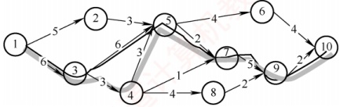

##### 24

C

一个事件的最迟发生时间 = min{以该事件为尾的弧的活动的最迟开始时间}，或 min{以该事件为尾的弧所指事件的最迟发生时间与该弧的活动的持续时间之差}。改变 AOE 网中任何一个活动的持续时间，需要重新计算关键活动，可能导致关键路径的改变。

##### 25

C

若改变的是所有关键路径上的公共活动，则不一定会产生不同的关键路径（延长必然不会导致，只有缩短才有可能导致）。根据关键路径的定义，可知说法Ⅱ正确。关键路径是源点到终点的最长路径，只有所有关键路径的长度都缩短时，整个图的关键路径才能有效缩短，但也不能任意缩短，一旦缩短到一定程度，该关键活动就有可能变成非关键活动。

##### 26

A

邻接矩阵第 i 列值全为 $\infty$，说明顶点 i 没有入边，为整个工程的开始，若关键路径存在，则该顶点一定是起点。不能确定关键路径是否存在，也不能确定其对应的无向图的连通分量个数。

##### 27

B

拓扑排序的过程如下图所示。

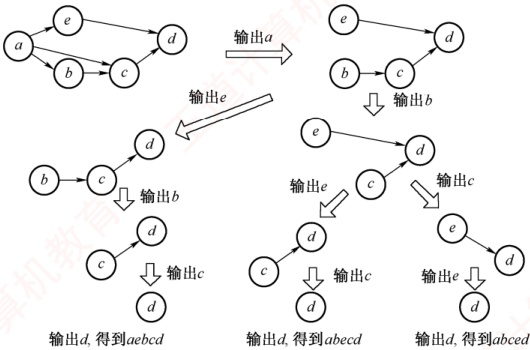

可以得到3种不同的拓扑序列，即abcd, abecd, abecd 和 aebcd。

##### 28

A

最小生成树的树形可能不唯一（因为可能存在权值相同的边），但代价一定是唯一的，说法Ⅰ正确。若权值最小的边有多条并且构成环状，则总有权值最小的边将不出现在某棵最小生成树中，说法Ⅱ错误。设 N 个顶点构成环，N 条边的权值相等，从不同的顶点开始执行 Prim 算法，只要选取任意不同的 N-1 条边，就能得到不同的最小生成树，说法Ⅲ错误。当最小生成树唯一时（各边的权值不同），Prim 算法和 Kruskal 算法得到的最小生成树相同，说法Ⅳ错误。

##### 29

C

从 a 到各顶点的最短路径的求解过程下：

| 顶点 | 第1轮 | 第2轮 | 第3轮 | 第4轮 | 第5轮 |
|---|---|---|---|---|---|
| b | $(a,b)$ $_{2}$ |  |  |  |  |
| c | $(a,c)$ $_{5}$ | $(a,b,c)$ $_{3}$ |  |  |  |
| d | $\infty$ | $(a,b,d)$ $_{5}$ | $(a,b,d)$ $_{5}$ | $(a,b,d)$ $_{5}$ |  |
| e | $\infty$ | $\infty$ | $(a,b,c,e)$ $_{7}$ | $(a,b,c,e)$ $_{7}$ | $(a,b,d,e)$ $_{6}$ |
| f | $\infty$ | $\infty$ | $(a,b,c,f)$ $_{4}$ |  |  |
| 集合S | $\{a,b\}$ | $\{a,b,c\}$ | $\{a,b,c,f\}$ | $\{a,b,c,f,d\}$ | $\{a,b,c,f,d,e\}$ |

后续目标顶点依次为 $f,d,e$。

本题也可用排除法：对于选项 A，若下一个顶点为 d，路径 a, b, d 的长度为 5，而 a, b, c, f 的长度仅为 4，显然错误。同理可排除选项 B。将 f 加入集合 S 后，采用上述方法也可排除选项 D。

##### 30

C

对角线以下元素均为零，表明只有顶点  $i$ 到  $j$ ( $i < j$) 可能有边，而顶点  $j$ 到  $i$ 一定没有边，即有向图是一个无环图，因此一定存在拓扑序列。对于拓扑序列是否唯一，试举一例：设有向图的邻接矩阵  $\begin{bmatrix} 0 & 1 & 1 \\ 0 & 0 & 0 \\ 0 & 0 & 0 \end{bmatrix}$，存在两个拓扑序列，因此该图存在可能不唯一的拓扑序列。

结论：对于任一有向图，若它的邻接矩阵中对角线以下（或以上）的元素均为零，则存在拓扑序列（可能不唯一）。反之，若图存在拓扑序列，却不一定能满足邻接矩阵中主对角线以下的元素均为零，但是可以通过适当地调整顶点编号，使其邻接矩阵满足前述性质。

##### 31

找出 AOE 网的全部关键路径为 bdcg、bdeh 和 bfh。根据性质，只有当所有关键路径的活动时间同时减少时，才能缩短工期。即正确选项中的路径必须能涵盖所有的关键路径。选项 A 和 B 不能涵盖 bfh 这条路径，选项 D 不能涵盖 bdcg 这条路径，只有选项 C 能涵盖所有关键路径，因此只有加快 f 和 d 的进度才能缩短工期（建议在图中检验）。

##### 32

32. D

按照拓扑排序的算法，每次都选择入度为0的顶点从图中删除，此图中一开始只有顶点3的入度为0；删除顶点3后，只有顶点1的入度为0；删除顶点1后，只有顶点4的入度为0；删除顶点4后，顶点2和顶点6的入度都为0，此时选择删除不同的顶点，会得出不同的拓扑序列，分别处理完毕后可知可能的拓扑序列为3,1,4,2,6,5和3,1,4,6,2,5。

##### 33

题目描述的图如下，得到关键路径的长度为 21，图中画出的两条路径都是关键路径。

##### 34

题目描述：
说法 I：第一个顶点和最后一个顶点相同的路径称为回路；序列中顶点不重复出现的路径称为简单路径；回路显然不是简单路径。
说法 II：稀疏图是边比较少的情况，邻接矩阵存储的空间复杂度为 $O(n^2)$，必将浪费大量的空间，而邻接表存储的空间复杂度为 $O(n+e)$，所以应选用邻接表。
说法 III：存在回路的有向图不存在拓扑序列，若拓扑排序输出结束后所余下的顶点都有前驱，则说明只得到了部分顶点的拓扑有序序列，图中存在回路。

请判断以上说法的正确性。

##### 35

35. B
根据 Dijkstra 算法，从顶点 1 到其余各顶点的最短路径如下表所示。

| 顶点 | 第 1 轮 | 第 2 轮 | 第 3 轮 | 第 4 轮 | 第 5 轮 |
|---|---|---|---|---|---|
| 2 | 5 $v_1 \rightarrow v_2$ | 5 $v_1 \rightarrow v_2$ |  |  |  |
| 3 | ∞ | ∞ | 7 $v_1 \rightarrow v_2 \rightarrow v_3$ |  |  |
| 4 | ∞ | 11 $v_1 \rightarrow v_5 \rightarrow v_4$ | 11 $v_1 \rightarrow v_5 \rightarrow v_4$ | 11 $v_1 \rightarrow v_5 \rightarrow v_4$ | 11 $v_1 \rightarrow v_5 \rightarrow v_4$ |
| 5 | 4 $v_1 \rightarrow v_5$ |  |  |  |  |
| 6 | ∞ | 9 $v_1 \rightarrow v_5 \rightarrow v_6$ | 9 $v_1 \rightarrow v_5 \rightarrow v_6$ | 9 $v_1 \rightarrow v_5 \rightarrow v_6$ |  |
| 集合 S | {1,5} | {1,5,2} | {1,5,2,3} | {1,5,2,3,6} | {1,5,2,3,6,4} |

快速解法。依次观察从顶点 1 到其他顶点的最短路径长度：顶点 1 到顶点 2 的最短路径长度为 5；顶点 1 到顶点 3 的最短路径长度为 $5 + 2 = 7$；顶点 1 到顶点 4 的最短路径长度为 11；顶点 1 到顶点 5 的最短路径长度为 4；顶点 1 到顶点 6 的最短路径长度为 $4 + 5 = 9$；最终 dist[]={0,5,7,11,4,9}，根据 dist 数组值从小到大选择顶点顺序为 1,5,2,3,6,4。

##### 36

B
采用邻接表作为 AOV 网的存储结构进行拓扑排序，需要对 n 个顶点做入栈、出栈、输出各一次，当处理 e 条边时，需要检测这 n 个顶点的边链表结点，共需要的时间为 $O(n + e)$。若采用邻接矩阵作为 AOV 网的存储结构进行拓扑排序，在处理 e 条边时需对每个顶点检测相应矩阵中的某一行，寻找与它相关联的边，以便对这些顶点的入度减 1，需要的时间代价为 $O(n^2)$。

【补充】有两种常用的拓扑排序算法：基于 BFS 的算法和基于 DFS 的算法。本题未指明采用哪种算法，因此只需验证一种算法即可（说明两种算法在对应条件下的时间复杂度相同）。

基于 BFS 的算法的思想：首先找到所有入度为 0 的顶点，将它们加入一个队列，并将它们作为拓扑序列的起始部分；然后依次从队列中取出顶点，并删除它们与后继顶点的所有边。若某个后继顶点的入度变为 0，则将它也加入队列，并将它加入拓扑序列，重复这个过程。

基于 DFS 的算法的思想：在 DFS 调用过程中设定一个时间标记，当 DFS 调用结束时，对各顶点计时，进而按结束时间从大到小排序，可以得到一个拓扑序列。

##### 37

拓扑排序每次选取入度为 0 的顶点输出，经观察不难发现拓扑序列前两位一定是 1, 5 或 5, 1（因为只有 1 和 5 的入度均为 0，且其他顶点都不满足仅有 1 或仅有 5 作为前驱）。

##### 38

活动 d 的最早开始时间等于该活动弧的起点所表示的事件的最早发生时间，活动 d 的最早开始时间等于事件 2 的最早发生时间 $\max\{a, b+c\} = \max\{3, 12\} = 12$。活动 d 的最迟开始时间等于该活动弧的终点所表示的事件的最迟发生时间与该活动所需时间之差，先算出图中关键路径长度为 27（对于不复杂的选择题，找出所有路径计算长度），那么事件 4 的最迟发生时间为 $\min\{27-g\} = \min\{27-6\} = 21$，活动 d 的最迟开始时间为 $21-d = 21-7 = 14$。

常规方法：按照关键路径算法算得到下表。

| | $v_{{1}}$ | $v_{{2}}$ | $v_{{3}}$ | $v_{{4}}$ | $v_{{5}}$ | $v_{{6}}$ |
|---|---|---|---|---|---|---|
| $v_{{e}}(i)$ | 0 | 12 | 8 | 19 | 18 | 27 |
| $v_{{l}}(i)$ | 0 | 12 | 8 | 21 | 18 | 27 |

| | a | b | c | d | e | f | g | h |
|---|---|---|---|---|---|---|---|---|
| $e(i)$ | 0 | 8 | 0 | 12 | 12 | 8 | 19 | 18 |
| $l(i)$ | 9 | 8 | 0 | 14 | 12 | 8 | 21 | 18 |
| $l(i) - e(i)$ | 9 | 0 | 0 | 2 | 0 | 0 | 2 | 0 |

从表中可知，活动 d 的最早开始时间和最迟开始时间分别为 12 和 14，所以选择选项 C。

##### 39

A
先将该表达式转换成有向二叉树，该二叉树中有些顶点是重复的，为了节省存储空间，去除重复的顶点，将有向二叉树去重转换成有向无环图，如下图所示。

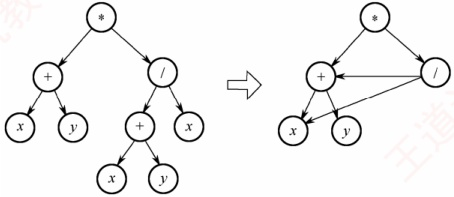

B. 将表达式转换为有向无环图后，该图存在环，无法进行拓扑排序。
C. 将表达式转换为有向无环图后，该图存在环，无法进行拓扑排序。
D. 将表达式转换为有向无环图后，该图存在环，无法进行拓扑排序。

故选A。

##### 40

A

Kruskal 算法：按权值递增顺序依次选取 n-1 条边，并保证这 n-1 条边不构成回路。初始构造一个仅含 n 个顶点的森林；第一步，选取权值最小的边 $(b, f)$加入最小生成树；第二步，剩余边中权值最小的边为 $(b, d)$，加入最小生成树，第二步操作后权值最小的边 $(d, f)$不能选，因为会与之前已选取的边形成回路；接下来依次选取权值 9、10、11 对应的边加入最小生成树，此时 6 个顶点形成了一棵树，最小生成树构造完成。按照上述过程，加到最小生成树的边依次为 $(b, f)$， $(b, d)$， $(a, e)$， $(c, e)$， $(b, e)$。其生成过程如下所示。

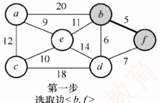

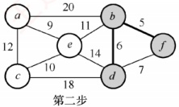

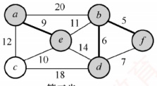

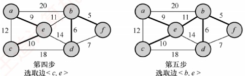

##### 41

根据题干所提供的信息可知：

① 图 G 为有向无环图，因此一定存在拓扑序列和逆拓扑序列。

② DFS 的性质是顶点 $v_i$ 的所有后继顶点 $v_j$ 出栈后，$v_i$ 才会出栈。

③ 本题要求执行输出语句后立刻退出递归，即执行完输出语句后立即出栈，因此后入栈的顶点先输出，结合②不难得出只有输出顶点 $v_i$ 的所有后继顶点 $v_j$ 后，$v_i$ 才会输出。

综合上述分析，输出的顶点序列是逆拓扑有序序列。

##### 42

A

B

关键路径是指权值之和最大而非边数最多的路径，选项 A 错误。选项 B 是关键路径的概念。无论是存在一条还是存在多条关键路径，增加任意一个关键活动的时间都会延长工程的工期，因为关键路径始终是权值之和最大的那条路径，选项 C 错误。仅有一条关键路径时，减少关键活动的时间会缩短工程的工期；存在多条关键路径时，缩短一条关键活动的时间不一定会缩短工程的工期，缩短了路径长度的那条关键路径不一定还是关键路径，选项 D 错误。

##### 43

求拓扑序列的过程：从图中选择无入边的顶点，输出该顶点并删除该顶点的所有出边，重复上述过程，直至全部顶点都已输出，这样求得的拓扑序列为 ABCDEF。每次输出一个顶点并删除该顶点的所有出边后，都发现有且仅有一个顶点无入边，因此该拓扑序列唯一。

##### 44

44. C

在执行 Dijkstra 算法时，首先初始化 dist[]，若顶点 1 到顶点 i (i = 2, 3, 4, 5) 有边，就初始化为边的权值；若无边，就初始化为∞；初始化顶点集 S 只含顶点 1。Dijkstra 算法每次选择一个到顶点 1 距离最近的顶点 j 加入顶点集 S，并判断由顶点 1 绕行顶点 j 后到任意一个顶点 k 是否距离更短，若距离更短（dist[j] + arcs[j][k] < dist[k]），则将 dist[x] 更新为 dist[j] + arcs[j][k]；重复该过程，直至所有顶点都加入顶点集 S。数组 dist 的变化过程如下图所示，可知将第二个顶点 5 加入顶点集 S 后，数组 dist 更新为 21, 3, 14, 6。


$$dist\{26,3,\infty,6\}\xrightarrow{ 顶点 3 入 S}\{25,3,\infty,6\}\xrightarrow{ 顶点 5 入 S}\{21,3,14,6\}$$

##### 45

B
在 AOE 网中，活动的时间余量=结束顶点的最迟开始时间-开始顶点的最早开始时间-该活动的持续时间。根据关键路径算法得到下表：

| 顶点编号 | 1 | 2 | 3 | 4 | 5 | 6 |
|---|---|---|---|---|---|---|
| 最早开始时间 $v_e(i)$ | 0 | 2 | 5 | 8 | 9 | 12 |
| 最迟开始时间 $v_i(i)$ | 0 | 4 | 5 | 8 | 11 | 12 |

c 的时间余量=$v_l(3)-v_e(2)-1=5-2-1=2$，g 的时间余量=$v_l(6)-v_e(3)-1=12-5-1=6$，h 的时间余量=$v_l(5)-v_e(4)-1=11-8-1=2$，j 的时间余量=$v_l(6)-v_e(5)-1=12-9-1=2$。

##### 46

B

Prim 算法和 Kruskal 算法用于求解最小生成树，最小生成树中某顶点到其余各顶点的路径不一定具有最短路径的性质。例如，在右图求得的最小生成树中，a 到 c 的路径长度为 2，但原图中 a 到 c 的最短路径长度为 1。

图的广度优先搜索算法总按距离由近到远来遍历图中的每个顶点，因此可用来求解非带权图（或各边权值均相同）的单源最短路径问题。

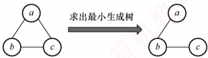

##### 47

C
若一个有向图构成环，则每个顶点的入度均不为0。有向无环图一定存在拓扑序列，但当存在多个入度为0的顶点时，其拓扑序列不唯一。在无向图中，若每个顶点的度都大于或等于2，说明从任意点出发，总能“一直走下去”（因为每到一个点，至少还有另一条边可走），由于顶点有限，走着走着必定会重复访问某个顶点，从而形成回路，选项C正确。BFS算法仅适用于求解无权图（或所有边权相等）的单源最短路径，不适用于带权图（边权不等）。

#### 二、 综合应用题

##### 01

【解答】

这种方法是正确的。
经过“破圈法”之后，最终没有回路，因此一定可以构造出一棵生成树。下面证明这棵生成树是最小生成树。记“破圈法”生成的树为 T，假设 T 不是最小生成树，则必然存在最小生成树  $T_{0}$，使得它与 T 的公共边尽可能多，则将  $T_{0}$ 与 T 取并集，得到一个图，此图中必然存在回路，“破圈法”的定义就是从回路中去除权最大的边，因此此时生成的 T 的权必然是最小的，这与原假设矛盾，从而 T 是最小生成树。下图说明了“破圈法”的过程：

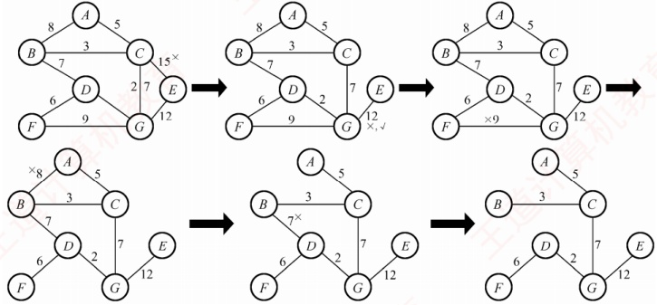

##### 02

【解答】

1）该图的邻接矩阵为

 $$A=\begin{bmatrix}1&2&3&4&5&6&7\\1&0&3&3&6&\infty&\infty&\infty\\2&\infty&0&4&\infty&5&\infty&\infty\\\vdots&\vdots&\vdots&\vdots&\vdots&\vdots&\vdots&4\\5&\vdots&\vdots&\vdots&\vdots&\vdots&5&\vdots\\6&\vdots&\vdots&\vdots&\vdots&\vdots&0&3\\7&\vdots&\vdots&\vdots&\vdots&\vdots&\vdots&0\end{bmatrix}$$

得到的深度优先遍历序列为1,2,3,5,7,4,6。

2）解题思路：当某个顶点只有出弧而没有入弧时，其他顶点无法到达这个顶点，不可能与其他顶点和边构成强连通分量（这个单独的顶点构成一个强连通分量）。

①顶点1无入弧构成第一个强连通分量。删除顶点1及所有以之为尾的弧。

②顶点2无入弧构成一个强连通分量。删除顶点2及所有以之为尾的弧。

③ .....

以此类推，最后得到每个顶点都是一个强连通分量，所以强连通分量数目为7。

3）该图的两个拓扑序列如下：

①1,2,4,6,3,5,7

②1,4,2,6,3,5,7

4）若视该图为无向图：

用 Prim 算法生成最小生成树的过程如下：

1-2，1-3，3-6，3-5，5-7，6-4（图略）。

用 Kruskal 算法生成最小生成树的过程如下图所示。

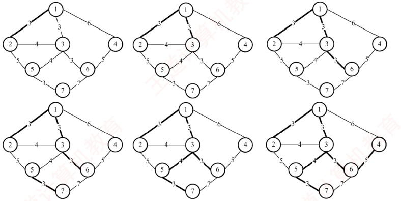

##### 03

【解答】

根据 Dijkstra 算法，求从顶点 1 到其余各顶点的最短路径如下表所示。

| 顶点 | 从顶点 1 到各终点的 dist 值 |   |   |   |   |
| --- | --- | --- | --- | --- | --- |
| 第 1 轮 | 第 2 轮 | 第 3 轮 | 第 4 轮 |   |   |
| 2 | 7 $v_1, v_2$ |   |   |   |   |
| 3 | 11 $v_1, v_3$ | 11 $v_1, v_3$ |   |   |   |
| 4 | ∞ | 16 $v_1, v_2, v_4$ | 16 $v_1, v_2, v_4$ |   |   |
| 5 | ∞ | ∞ | 18 $v_1, v_3, v_5$ | 18 $v_1, v_3, v_5$ |   |
| 6 | ∞ | ∞ | 19 $v_1, v_3, v_6$ | 19 $v_1, v_3, v_6$ | 19 $v_1, v_3, v_6$ |
| 集合 S | {1, 2} | {1, 2, 3} | {1, 2, 3, 4} | {1, 2, 3, 4, 5} | {1, 2, 3, 4, 5, 6} |

##### 04

【解答】

1）该图的邻接表表示如下图所示。

 $$V_{1}\xrightarrow{\quad}2\quad2\quad3\quad5\quad5\quad5\quad\wedge$$

 $$V_{2}\xrightarrow{\quad}3\quad2\quad\xrightarrow{\quad}4\quad3\quad\wedge$$

 $$V_{3}\xrightarrow{\quad}5\quad1\quad6\quad3\quad\wedge$$

 $$V_{4}\xrightarrow{\quad}6\quad2\quad\wedge$$

 $$V_{5}\xrightarrow{\quad}7\quad6\quad\wedge$$

 $$V_{6}\xrightarrow{\quad}7\quad3\quad\xrightarrow{\quad}8\quad4\quad\stackrel{\wedge}{\quad}$$

 $$V_{7}\xrightarrow{\quad}9\quad4\quad\wedge$$

 $$V_{8}\xrightarrow{\quad}9\quad2\quad\wedge$$

 $$\boxed{V_{9}}\quad\land$$
求关键路径的算法如下：

① 输入 e 条弧 <j, k>，建立 AOE 网的存储结构。

②从源点  $v_1$ 出发，令  $v_e(1) = 0$，求  $v_e(j)$， $2 \leq j \leq n$。

③从汇点  $v_{n}$ 出发，令  $v_{1}(n)=v_{e}(n)$，求  $v_{1}(i)$， $1 \leqslant i \leqslant n-1$。

④ 根据各顶点的  $v_{e}$ 和  $v_{1}$ 值，求每条弧 S（活动）的最早开始时间 e(s) 和最晚开始时间 l(s)，其中  $e(s) = l(s)$ 为关键活动。

2）根据以上算法可以得到至少需要时间16。

3）关键路径为 $(V_{1}, V_{3}, V_{5}, V_{7}, V_{9})$。

4）活动 $a_{2}, a_{6}, a_{9}, a_{12}$加速，可以缩短工程所需的时间。

##### 05

【解答】

1）根据题表可以画出 AOE 网如下图所示。

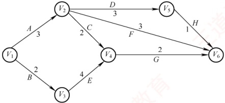

求解各事件和活动的最早发生时间与最迟发生时间公式分别如下：

①  $v_{e}$(源点) = 0,  $v_{e}(k) = \max\{v_{e}(j) + \text{Weight}(v_{j}, v_{k})\}$，Weight $(v_{j}, v_{k})$ 表示从  $v_{j}$ 指向  $v_{k}$ 的弧的权值。

②  $v_1$(汇点) =  $v_e$(汇点)， $v_1(j) = \text{Min}\{\{v_1(k) - \text{Weight}(v_j, v_k)\}$，Weight $(v_j, v_k)$表示从  $v_j$ 指向  $v_k$ 的弧的权值。

③ 若边 $\langle v_k, v_j \rangle$表示活动  $a_i$，则有  $e(i) = v_e(k)$。

④ 若边 $\langle v_{k}, v_{j} \rangle$表示活动  $a_{i}$，则有  $l(i) = v_{1}(j) - \text{Weight}(v_{k}, v_{j})$。

⑤  $d(i) = l(i) - e(i)$.

关键路径即由  $d(i)=0$ 的 i 构成。

2）根据上述公式，各事件的最早发生时间  $v_{e}$ 和最迟发生时间  $v_{l}$ 如下表所示。

|  | $v_1$ | $v_2$ | $v_3$ | $v_4$ | $v_5$ | $v_6$ |
|---|---|---|---|---|---|---|
| $v_e(t)$ | 0 | 3 | 2 | 6 | 6 | 8 |
| $v_f(t)$ | 0 | 4 | 2 | 6 | 7 | 8 |

3）根据上述公式，各活动最早发生时间 e、最迟发生时间 l 和时间余量  $d(i) = l(i) - e(i)$ 如下表所示。

|  | A | B | C | D | E | F | G | H |
|---|---|---|---|---|---|---|---|---|
| $e(i)$ | 0 | 0 | 3 | 3 | 2 | 3 | 6 | 6 |
| $l(i)$ | 1 | 0 | 4 | 4 | 2 | 5 | 6 | 7 |
| $l(i)-e(i)$ | 1 | 0 | 1 | 1 | 0 | 2 | 0 | 1 |

所以关键路径为 B、E、G，完成该工程最少需要 8（单位依题意而定）。
##### 06

【解答】

Dijkstra 算法每一步都会贪婪地选择与源点  $v_0$ 最近的下一条边，直到  $v_0$ 连接到图中所有顶点。Prim 算法（已知是最小生成树算法）与 Dijkstra 算法高度相似，但是在每个阶段，它贪婪地选择与该阶段已加入 MST 中任意一个顶点最近的下一条边。显然，Dijkstra 算法可以产生一棵生成树，但该树不一定是最小生成树，只需举出一个反例即可，以下图 G 为例（将 a 作为源点）。

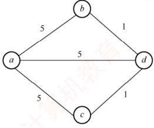

(a) 图 G

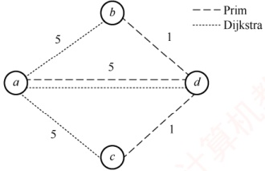

(b) 两种算法产生的生成树

Dijkstra 算法得到的路径集合为{(a, b), (a, c), (a, d)}，该生成树的总权值为  $5 + 5 + 5 = 15$。

Prim 算法得到的边集合为{(a, d), (b, d), (c, d)}，该最小生成树的总权值为  $5 + 1 + 1 = 7$。

显然，Dijkstra 算法得到的生成树不一定是最小生成树。

##### 07

【解答】

本节前面给出了 DFS 实现拓扑排序的思想，下面是利用 DFS 求各顶点结束时间的代码（在 DFS 的基础上加入了 time 变量）。将结束时间从大到小排序，即可得到拓扑序列。
```c

bool visited[MAX_VERTEX_NUM]; //访问标记数组
void DFSTraverse(Graph G) {
    for (v=0; v<G.vexnum; ++v)
```
```c
        visited[v]=FALSE; //初始化访问标记数组
    time=0;
    for (v=0; v<G.vexnum; ++v) //本代码从v=0开始遍历
        if (!visited[v]) DFS(G,v);
}
void DFS(Graph G,int v) {
    visited[v]=TRUE;
    visit(v);
    for (w=FirstNeighbor(G,v); w>=0; w=NextNeighbor(G,v,w))
        if (!visited[w]) {
            //w为v的尚未访问的邻接点
            DFS(G,w);
        }
        time=time+1; finishTime[v]=time;
}
```

##### 08

【解答】

该方法不一定能（或不能）求得最短路径。

例如，对于右图所示的带权图，若按照题中的原则，从 A 到 C 的最短路径是  $A \to B \to C$，事实上其最短路径是  $A \to D \to C$。

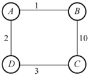

##### 09

【解答】

1）在上三角矩阵 A[6][6] 中，第 1 行至第 5 行主对角线上方的元素个数分别为 5, 4, 3, 2, 1，由此可以画出压缩存储数组中的元素所属行的情况，如下图所示。

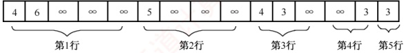

可以用 “平移” 的思想，将前5个、后4个、后3个、后2个、后1个元素，分别移动到矩阵对角线（“0”）右边的行上。图G的邻接矩阵A为

 $$\boldsymbol{A}=\begin{bmatrix}0&4&6&\infty&\infty&\infty\\\infty&0&5&\infty&\infty&\infty\\\infty&\infty&0&4&3&\infty\\\infty&\infty&\infty&0&\infty&3\\\infty&\infty&\infty&\infty&0&3\\\infty&\infty&\infty&\infty&\infty&0\end{bmatrix}$$

2）有向带权图 G 如下图所示。

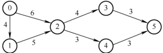

3）先计算各个事件的最早发生时间，得到 $v_{e}()$和 $v_{l}()$数组如下表所示。

| i | 0 | 1 | 2 | 3 | 4 | 5 |
|---|---|---|---|---|---|---|
| $v_e(i)$ | 0 | 4 | 9 | 13 | 12 | 16 |
| $v_f(i)$ | 0 | 4 | 9 | 13 | 13 | 16 |

接下来计算所有活动的最早和最迟发生时间  $e()$ 和  $l()$，如下表所示。

|  | $a_{0-1}$ | $a_{0-2}$ | $a_{1-2}$ | $a_{2-3}$ | $a_{2-4}$ | $a_{3-5}$ | $a_{4-5}$ |
|---|---|---|---|---|---|---|---|
| e() | 0 | 0 | 4 | 9 | 9 | 13 | 12 |
| l() | 0 | 3 | 4 | 9 | 10 | 13 | 13 |
| l()-e() | 0 | 3 | 0 | 0 | 1 | 0 | 1 |

满足  $l(-e)=0$ 的路径就是关键路径，所以关键路径为  $a_{0-1}, a_{1-2}, a_{2-3}, a_{3-5}$，如右图所示（双线箭头表示），长度为  $4+5+4+3=16$。

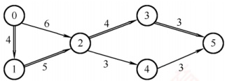

按求关键路径的公式计算较为复杂，建议考生面临此类题时直接穷举各条路径即可。

##### 10

【解答】

本题初看起来感觉难度较大，但仔细分析就可发现考查的其实是邻接表的数据结构。

1）图题中给出的是一个简单的网络拓扑图，可以抽象为无向图。

2）图的常用存储结构有邻接矩阵法和邻接表法，其中邻接表法属于链式存储结构，因此本题的基本思路就是写出邻接表的数据类型定义，并根据题意调整相应的边表结点和顶点表结点的成员变量。具体分析如下：邻接表由表头顶点和弧顶点组成。根据题目给出的图和表，可将顶点分为三类：路由器、网络和链路。路由器是连接网络和链路的载体，因此可将它作为表头顶点。网络和链路则是连接路由器的边，因此可将它们作为弧顶点。为了简化代码，可将网络和链路的结构合并为一个，用一个标志位来区分它们，这样就可用邻接表来实现图的存储。链式存储结构如下图所示。

弧结点的两种基本形态

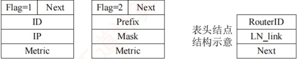

其数据类型定义如下：

```c
typedef struct{
    unsigned int ID, IP;
    }LinkNode; //Link 的结构
    typedef struct{
        unsigned int Prefix, Mask;
    }NetNode; //Net 的结构
    typedef struct Node{
        int Flag; //Flag=1 为 Link; Flag=2 为 Net union{
            LinkNode Lnode;
```
            NetNode Nnode
```c
        }LinkORNet;
    Unsigned int Metric;
    struct Node *next;
    }ArcNode; //弧结点
    typedef struct hNode{
        unsigned int RouterID;
        ArcNode *LN_link;
        Struct hNode *next;
    }HNODE; //表头结点
```

对应表的链式存储结构示意图如下所示。

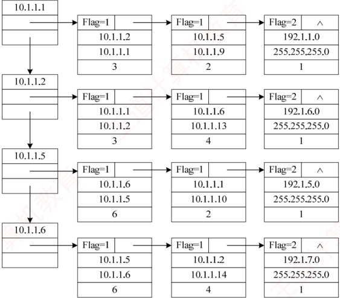

3 ）计算结果如下表所示。

|   | 目的网络 | 路径 | 代价（费用） |
| --- | --- | --- | --- |
| 步骤1 | 192.1.1.0/24 | 直接到达 | 1 |
| 步骤2 | 192.1.5.0/24 | R1→R3→192.1.5.0/24 | 3 |
| 步骤3 | 192.1.6.0/24 | R1→R2→192.1.6.0/24 | 4 |
| 步骤4 | 192.1.7.0/24 | R1→R2→R4→192.1.7.0/24 | 8 |

##### 11

【解答】

1）Prim算法属于贪心策略。算法从一个任意的顶点开始，一直长大到覆盖图中的所有顶点
为止。算法的每一步在连接树集合 S 的顶点和其他顶点的边中，选择一条使得树的总权重增加最小的边加入集合 S。当算法终止时，S 就是最小生成树。

① S 中顶点为 A，候选边为  $(A, D)$， $(A, B)$， $(A, E)$，选择  $(A, D)$ 加入 S。

②S中顶点为A,D，候选边为 $(A,B)$， $(A,E)$， $(D,E)$， $(C,D)$，选择 $(D,E)$，加入S。

③ S 中顶点为 A, D, E，候选边为 (A, B), (C, D), (C, E)，选择 (C, E) 加入 S。

④ S 中顶点为 A, D, E, C，候选边为 (A, B), (B, C)，选择 (B, C) 加入 S。

⑤ S 就是最小生成树。

依次选出的边为

 $$(A,D),(D,E),(C,E),(B,C)$$

2）图 G 的 MST 是唯一的。第一小题的最小生成树包括了图中权值最小的 4 条边，其他边除  $(A,E)$ 外都比这 4 条边大，但若用  $(A,E)$ 替换同权值的  $(C,E)$，A,D,E 三个顶点构成了回路，因此不能替换，所以此图的 MST 唯一。

3）当带权连通图的任意一个环中所包含的边的权值均不相同时，其 MST 是唯一的。此题不要求回答充分必要条件，所以回答一个限制边权值的充分条件即可。

##### 12

【解答】

1）为了求解最经济的方案，可把问题抽象为求无向带权图的最小生成树。可以采用手动Prim算法或Kruskal算法作图。注意本题的最小生成树有两种构造，如下图所示。


方案1


方案2

方案的总费用为16。

2）存储题中的图可采用邻接矩阵（或邻接表）。构造最小生成树采用 Prim 算法（或 Kruskal 算法）。

3）TTL = 5，即 IP 分组的生存时间（最大传递距离）为 5，方案 1 中 TL 和 BJ 的距离过远，TTL = 5 不足以让 IP 分组从 H1 传送到 H2，因此 H2 不能收到 IP 分组。而方案 2 中 TL 和 BJ 邻近，H2 可以收到 IP 分组。

##### 13

【解答】

1）算法的基本设计思想：建立图 G 各顶点的入度表 degree[]。选择入度为 0 的顶点 v，将 v 的所有邻接点的入度减 1，重复执行这个过程。若每次选中的入度为 0 的顶点有且仅有一个，且共进行了 G.numVertices 次，则意味着存在唯一的拓扑序列，返回 1，否则不存在拓扑序列，或者存在多个拓扑序列，返回 0。

2）用 C 语言描述的算法如下：

```c
int uniquely(MGraph G) {//判定有向图是否存在唯一的拓扑序列
```
```c
    int *degree, i, j, count=0, in0=-1, prev_in0;
    degree=(int*)malloc(G.numVertices*sizeof(int));
```
```c
    for (j=0;j<G.numVertices;j++) {//计算各顶点的入度
        degree[j]=0;
        for (i=0;i<G.numVertices;i++)
            degree[j]+=G.Edge[i][j];
        if (degree[j]=0) {
if (in0==_1) in0=j; //入度为0的顶点
else in0=-2; //有多个入度为0的顶点

while (in0>=0) {
    count++;
    prev_in0=in0;
    in0=-1;
    for (j=0; j<G.numVertices; j++)
        if (G.Edge[prev_in0][j]>0) {
            if (-degree[j]==0) {
                //邻接点入度值减1
                if (in0==_1) in0=j; //入度为0的顶点
                else in0=-2; //有多个入度为0的顶点
            }
        }
    }
    free(degree);
    if (count==G.numVertices) return 1;
    else return 0;
}
```

##### 14

【解答】

1）计算 AOE 网中各事件的最早发生时间  $v_{e}$ 和最晚发生时间  $v_{l}$，以确定关键路径。

① 求各事件的最早发生时间 v_{e}：从源点（事件 1）出发，按拓扑顺序递推。 $v_{e}(1)=0$;

 $$\begin{aligned}&v_{e}(3)=v_{e}(1)+a=0+2=2;\quad v_{e}(6)=v_{e}(3)+c=2+1=3;\quad v_{e}(4)=\max\{v_{e}(1)+d,v_{e}(3)+\\ &e,v_{e}(6)+g\}=\max\{0+3,2+3,3+1\}=5;\quad v_{e}(2)=\max\{v_{e}(1)+b,v_{e}(4)+f\}=\max\{0+5,\\ &5+4\}=9;\quad v_{e}(7)=\max\{v_{e}(6)+h,v_{e}(4)+m\}=\max\{5+4,3+1\}=9;\quad v_{e}(5)=\max\{v_{e}(2)\\ &+k,v_{e}(4)+j,v_{e}(7)+n\}=\max\{9+2,5+1,9+3\}=12。\\ \end{aligned}$$

汇点(5)的值就是完成工程的最短时间，即12。

② 求各事件的最晚发生时间  $v_{l}$：从汇点（事件 5）开始，按逆拓扑顺序反向递推。 $v_{l}(5)=$

 $$\begin{aligned}&v_{e}(5)=12;\quad v_{l}(2)=v_{l}(5)-k=12-2=10;\quad v_{l}(7)=v_{l}(5)-n=12-3=9;\quad v_{l}(6)=v_{l}(7)-h=\\&9-1=8;\quad v_{l}(4)=\min\{v(2)-f,v_{l}(5)-j,v_{l}(7)-m\}=\min\{10-4,12-1,9-4\}=5;\quad v_{l}(3)=\\&\min\{v_{l}(4)-e,v_{l}(6)-c\}=\min\{5-3,8-1\}=2;\quad v_{l}(1)=\min\{v_{l}(3)-a,v_{l}(2)-b,v_{l}(4)-d\}=\\&\min\{2-2,10-5,5-3\}=0。\\ \end{aligned}$$

③关键活动是满足  $v_{e}(i)=v_{l}(i)$、 $v_{e}(j)=v_{l}(j)$ 且  $v_{l}(j)-v_{e}(i)=$ duration  $(i,j)$ 的活动。满足条件的事件序列为 1,3,4,7,5，对应的活动为 a,e,m,n，它们构成了关键路径。

2）关键活动  $e(3 \rightarrow 4)$ 的最早开始时间  $v_e(3) = 2$，最早结束时间  $v_e(3) + 3 = 5$，执行时间窗口为  $[2, 5]$，因此与它同时进行的活动是其时间窗口与  $[2, 5]$ 有重叠的活动。活动 b 开始的时间窗口为  $[0, 5]$，有重叠；活动 c 开始的时间窗口为  $[2, 3]$，完全被包含；活动 d 开始的时间窗口为  $[0, 3]$，有重叠。因此，与活动 e 同时进行的活动可能有 b, c, d。

3）活动的时间余量  $d(i) = v(j) - v_e(i) - w(i, j)$。 $d(j) = v(5) - v_e(4) - 1 = 6$； $d(b) = v(2) - v_e(1) - 5 = 5$； $d(c) = v(6) - v_e(3) - 1 = 5$； $d(h) = v(7) - v_e(6) - 1 = 5$。其他非关键活动的时间余量更小。故时间余量最大的活动是  $j$，其时间余量是 6。

4）活动 b 的最晚开始时间为  $v(2)$-duration( $b=10-5=5$)。现于时刻 6 开始，已延迟 1 个单位时间，这将导致工程延期。为保证工程不延期，① 调整 b 的持续时间：若 b 在时刻 6 开始，则事件 2 的最早发生时间变为  $6+w(b)$。后续事件 5 的最早发生时间为  $6+w(b)+k=6+w(b)+2$。要使工程不延期，需满足  $6+w(b)+2 \leq 12$，解得  $w(b) \leq 4$。因此 b 的持续时间最多为 4。② 不调整 b 的持续时间：若 b 的持续时间仍为 5，它在时刻 6 开始，
则事件 2 在时刻 11 发生，事件 5 在时刻  $11 + k$ 发生。要使工程不延期，需要满足  $11 + w(k) \leq 12$，解得  $w(k) \leq 1$。因此，需压缩活动 k 的持续时间（从 2 压缩到 1）。

**归纳总结**

1. 关于图的基本操作

本章中介绍的多数图算法均可适配邻接矩阵或邻接表存储结构，主要原因是在图的基本操作函数中保持了相同的参数和返回值，封装了内部实现细节。例如，函数 NextNeighbor(G,x,y) 用于返回顶点 x 在邻接顶点 y 之后的下一个邻接顶点。

1 ）使用邻接矩阵作为存储结构

```c
int NextNeighbor(MGraph& G,int x,int y){
    if(x!=-1&&y!=-1){
        for(int col=y+1;col<G.vexnum;col++)
            if(G.Edge[x][col]>0 && G.Edge[x][col]<maxWeight)
                return col;
            //maxWeight 代表∞
        }
        return -1;
}

2 ）使用邻接表作为存储结构

int NextNeighbor(ALGraph& G,int x,int y){
    if(x!=-1){
        ArcNode *p=G.vertices[x].first;//对应边链表第一个边结点
        while(p!=NULL && p->data!=y) //寻找邻接顶点 y
            p=p->next;
        if(p!=NULL && p->next !=NULL)
            return p->next->data; //返回下一个邻接顶点
    }
    return -1;
}
```

2. 关于图的遍历、连通性、生成树、关键路径的几个要点

1）在执行图的遍历时，由于图中可能存在回路，且任意顶点都可能与其他顶点相连，访问完某个顶点后可能沿某些边回到已访问过的顶点。因此，需设置辅助数组 visited[]标记顶点是否已被访问，以避免重复访问。

2）深度优先搜索（DFS）采用回溯策略遍历图，通常通过递归实现。在递归访问某一邻接顶点前，必须先判断该顶点是否已被访问。此外，所有递归算法均可借助栈转换为非递归形式，DFS也不例外，具体实现参见6.3.4节综合应用题03。

3）广度优先搜索（BFS）是一种分层遍历过程，每向前推进一层可能访问一批顶点，不存在回退操作，因此它不是递归过程。

4）一个给定图的邻接矩阵表示是唯一的；但邻接表示则依赖于边的输入顺序，若输入次序不同，生成的邻接表也可能不同。

5）最小生成树针对带权连通无向图，是从图中选出n-1条边构成的连通无环子图，使得所有边的权值总和最小。

6）加速某一关键活动不一定能缩短整个工程的工期，因为 AOE 网中可能存在多条关键路径。只有那些出现在所有关键路径上的关键活动被加速时，才能有效缩短总工期。
**思维拓展**

【网易有道笔试题】求一个无向连通图的割点。割点的定义是，若除去此顶点和与其相关的边，无向图不再连通，描述算法。

**提 示**

要判断一个点是否为割点，最简单直接的方法是，先把这个点和所有与它相关的边从图中去掉，再用深搜或广搜来判断剩下的图的连通性，这种方法适合判断给定顶点是否为割点；还有一种比较复杂的方法可以快速找出所有割点，有兴趣的读者可自行搜索相关资料。
