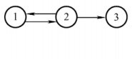
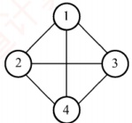
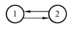
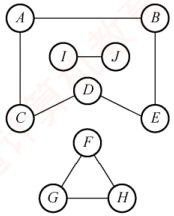
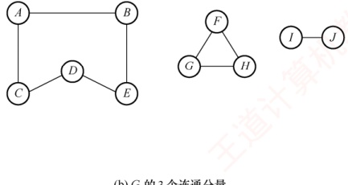
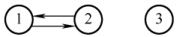
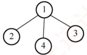

## 6.1 图的基本概念

### 6.1.1 图的定义

图 G 由顶点集 V 和边集 E 组成，记为  $G = (V, E)$。其中， $V(G)$ 表示图 G 中顶点的有限非空集； $E(G)$ 表示图 G 中顶点之间的关系（边）集合。若  $V = \{v_1, v_2, \cdots, v_n\}$，则用  $|V|$ 表示图 G 中顶点的数量， $E = \{(u, v) \mid u \in V, v \in V\}$，用  $|E|$ 表示图 G 中边的数量。
**注意**

线性表可以是空表，树可以是空树，但图不可以是空图。也就是说， **图中不能一个顶点也没有**，图的顶点集V必须是非空的，但边集E可以为空，此时图中只有顶点而无边。

下面是图的一些基本概念及术语。

#### 1. 有向图

若E是有向边（也称弧）的有限集合，则图G称为有向图。弧是顶点的有序对，记为 $\langle v, w \rangle$，其中，v称为弧尾，w称为弧头，表示从v到w的有向边，也称v邻接到w。

图 6.1(a) 所示的有向图  $G_{1}$ 可表示为

 $$\begin{aligned}G_{1}&=(V_{1},E_{1})\\V_{1}&=\left\{1,2,3\right\}\\E_{1}&=\left\{<1,2>,<2,1>,<2,3>\right\}\end{aligned}$$

#### 2. 无向图

若 E 是无向边（简称边）的有限集合，则图 G 称为无向图。边是顶点的无序对，记为  $(v, w)$ 或  $(w, v)$。可以说 w 和 v 互为邻接点，或称边  $(v, w)$ 和 v, w 相关联。

图 6.1(b) 所示的无向图  $G_{2}$ 可表示为

 $$G_{2}=(V_{2},E_{2})$$

 $$V_{2}=\left\{1,2,3,4\right\}$$

 $$E_{2}=\{(1,2),(1,3),(1,4),(2,3),(2,4),(3,4)\}$$

(a) 有向图 $G_{1}$

(b) 无向图 $G_{2}$

(c) 有向完全图 $G_{3}$

图 6.1 图的示例

#### 3. 简单图、多重图

若图 G 满足条件：① 不存在重复边；② 不存在顶点到自身的边，则称图 G 为简单图。图 6.1 中  $G_{1}$ 和  $G_{2}$ 均为简单图。若图 G 中某两个顶点之间的边数超过 1 条，并且允许顶点通过一条边与自身关联，则称图 G 为多重图。多重图和简单图的定义是相对的。本书仅讨论简单图。

#### 4. 顶点的度、入度和出度

### 考点追踪 无向图中顶点和边的关系（2009、2017）

在无向图中，顶点 v 的度是指依附于顶点 v 的边的数量，记为 TD(v)。图 6.1(b) 中，每个顶点的度均为 3。无向图的全部顶点的度之和等于边数的 2 倍，因为每条边与两个顶点相关联。

在有向图中，顶点 v 的度分为入度和出度，入度是以顶点 v 为终点的有向边的数量，记为 ID(v)；而出度是以顶点 v 为起点的有向边的数量，记为 OD(v)。图 6.1(a) 中，顶点 2 的出度为 2、入度为 1。顶点 v 的度等于其入度与出度之和，即  $\text{TD}(v) = \text{ID}(v) + \text{OD}(v)$。有向图的全部顶点的入度之和与出度之和相等，并且等于边数，这是因为每条有向边都有一个起点和终点。
#### 5. 路径、路径长度和回路

顶点 $v_p$到 $v_q$之间的一条路径是指顶点序列 $v_p, v_{i_1}, v_{i_2}, \cdots, v_{i_m}, v_q$。路径所含边的数量称为路径长度。第一个顶点和最后一个顶点相同的路径称为回路或环。若一个图有 $n$个顶点，且有大于 $n-1$条边，则此图一定有环。

#### 6. 简单路径、简单回路

### 考点追踪 路径、回路、简单路径、简单回路的定义（2011）

路径序列中顶点不重复出现的路径称为简单路径。除第一个顶点和最后一个顶点外，其余顶点不重复的回路称为简单回路。

#### 7. 距离

从顶点 u 到 v 的最短路径的长度称为从 u 到 v 的距离。若不存在路径，则距离为无穷大。

#### 8. 子图

设有两个图  $G = (V, E)$ 和  $G' = (V', E')$，若  $V'$ 是  $V$ 的子集，且  $E'$ 是  $E$ 的子集，则称  $G'$ 是  $G$ 的子图。若有满足  $V(G') = V(G)$ 的子图  $G'$，则称其为  $G$ 的生成子图。图 6.1 中  $G_3$ 为  $G_1$ 的子图。

**注意**

并非 V 和 E 的任何子集都能构成 G 的子图，因为这样的子集可能不是图，即 E 的子集中的某些边关联的顶点可能不在这个 V 的子集中。

#### 9. 连通、连通图和连通分量

### 考点追踪 图的连通性与边和顶点的关系（2010、2022）

在无向图中，若从顶点v到w存在路径，则称v和w是连通的。若图G中任意两个顶点都是连通的，则称图G为连通图；否则为非连通图。无向图中的极大连通子图称为连通分量，在图6.2(a)中，图G_4的3个连通分量如图6.2(b)所示。假设一个图有n个顶点，若边数少于n-1，则此图必然是非连通的。思考：在一个非连通图中，最多可能有多少条边？ $^{①}$

(a) 无向图 $G_{4}$

(b) $G_{4}$的3个连通分量

图 6.2 无向图及其连通分量

#### 10. 强连通图、强连通分量

在有向图中，如果一对顶点 v 和 w，从 v 到 w 和从 w 到 v 之间都有路径，则称这两个顶点是强连通的。如果图中任意一对顶点都是强连通的，则称此图为强连通图。有向图中的极大强
连通子图称为强连通分量，图  $G_{1}$ 的强连通分量如图 6.3 所示。思考，假设有向图拥有 n 个顶点，且该图是强连通的，则最少需要多少条边？ $^{①}$

**注意**

在无向图中讨论连通性，在有向图中讨论强连通性。

#### 11. 生成树、生成森林

连通图的生成树是一个包含所有顶点的极小连通子图。若图中有 n 个顶点，则其生成树恰好包含 n-1 条边。这样的子图仅通过最少数量的边保持连通。对生成树而言，若移除任意一条边，都会变成非连通图；添加任何一条边则会形成一个回路。在非连通图中，每个连通分量的生成树共同构成了该图的生成森林。图  $G_{2}$ 的一个生成树如图 6.4 所示。

图6.3 图 $G_{1}$的强连通分量

图6.4 图 $G_{2}$的一个生成树

**注意**

区分极大连通子图和极小连通子图。极大连通子图要求子图必须连通，而且包含尽可能多的顶点和边；极小连通子图是既要保持子图连通又要使得边数最少的子图。

#### 12. 边的权、网和带权路径长度

在一些图中，每条边可以被赋予一个代表某种意义的数值，称为该边的权值。这种边上带有权值的图称为带权图，也称网。路径上所有边的权值之和，称为该路径的带权路径长度。

#### 13. 完全图（也称简单完全图）

对于无向图，边的数量$|E|$范围是从0到$n(n-1)/2$。当边数达到最大值$n(n-1)/2$时，该无向图称为完全图，意味着任意两个顶点之间都有一条边相连。对于有向图，$|E|$的范围是从0到$n(n-1)$，有$n(n-1)$条弧的有向图称为有向完全图，即任意两个顶点之间都存在方向相反的两条弧。图6.1中$G_2$为无向完全图，而$G_3$为有向完全图。

#### 14. 稠密图、稀疏图

边数相对较少的图称为稀疏图，反之称为稠密图。这两个概念本身较为模糊，稀疏和稠密常常是相对而言的。一般认为，当图 $G$ 满足 $|E|<|V|\log_2|V|$ 时，可视为稀疏图。

#### 15. 有向树

一个顶点的入度为0、其余顶点的入度均为1的有向图，称为有向树。
