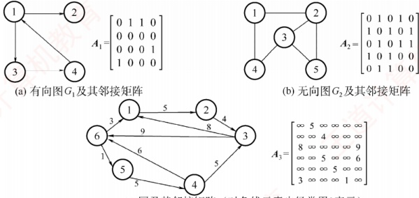
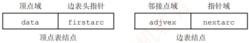
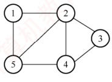
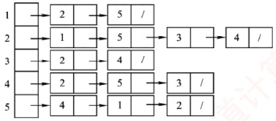
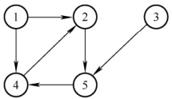
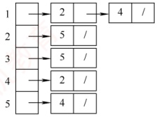
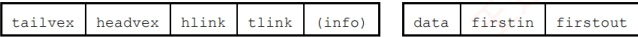
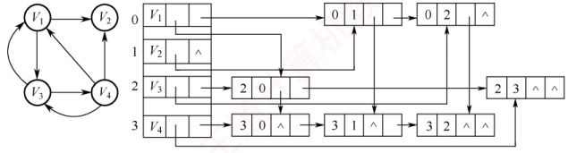
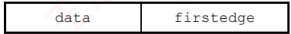
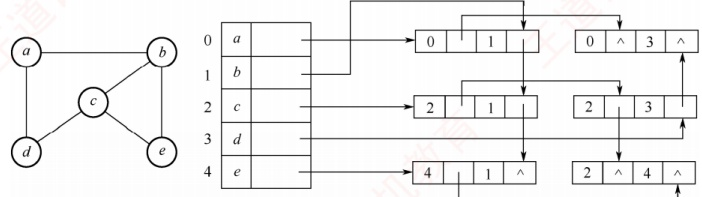

## 6.2 图的存储及基本操作

图的存储必须要完整、准确地反映顶点集和边集的信息。针对不同的图结构和算法需求，选择合适的存储方式将显著影响程序的效率，因此所采用的存储结构应与待求解的问题相适应。

### 6.2.1 邻接矩阵法

邻接矩阵存储方法通过一个一维数组存储图中顶点的信息，并用一个二维数组存储边的信息（各顶点之间的邻接关系）。这个用于存储邻接关系的二维数组称为邻接矩阵。

顶点数为 n 的图  $G = (V, E)$ 的邻接矩阵 A 是  $n \times n$ 的，将图 G 的顶点编号为  $v_1, v_2, \cdots, v_n$，则

 $$A[i][j]=\left\{\begin{aligned}&1,&(v_{i},v_{j}) 或 <v_{i},v_{j}> 是 E(G) 中的边 \\ &0,&(v_{i},v_{j}) 或 <v_{i},v_{j}> 不是 E(G) 中的边 \end{aligned}\right.$$
### 考点追踪 图的邻接矩阵存储及相互转换（2011、2015、2018）

对带权图而言，若顶点  $v_{i}$ 和  $v_{j}$ 之间有边相连，则邻接矩阵中对应位置存放该边的权值；若顶点  $v_{i}$ 和  $v_{j}$ 不相连，则通常用 0 或  $\infty$ 表示这两个顶点之间不存在边：

 $$A[i][j]=\left\{\begin{aligned}&w_{ij},&(v_{i},v_{j}) 或 \langle v_{i},v_{j}\rangle 是 E(G) 中的边 \\ &0 或 \infty,&(v_{i},v_{j}) 或 \langle v_{i},v_{j}\rangle 不是 E(G) 中的边 \end{aligned}\right.$$

图 6.5 展示了有向图、无向图及带权图（网）对应的邻接矩阵。

(a) 有向图 $G_{1}$及其邻接矩阵



(b) 无向图 $G_{2}$及其邻接矩阵

(c) 网及其邻接矩阵（对角线元素也经常用0表示）

图 6.5 有向图、无向图及网的邻接矩阵

### 考点追踪（算法题）邻接矩阵的遍历及顶点的度的计算（2021、2023）

图的邻接矩阵存储结构定义如下：

```c
#define MaxVertexNum 100
typedef char VertexType;
typedef int EdgeType;
typedef struct{
    VertexType vex[MaxVertexNum];
    EdgeType edge[MaxVertexNum][MaxVertexNum];
    int vexnum, arcnum;
} MGraph;

//顶点数目的最大值
//顶点对应的数据类型
//边对应的数据类型

//顶点表
//邻接矩阵，边表
//图的当前顶点数和边数
```

**注意**

① 在简单应用中，可以直接使用二维数组作为图的邻接矩阵（顶点信息等均可省略）。

② 当邻接矩阵元素仅表示相应边是否存在时，EdgeType 可用值为 0 和 1 的枚举类型。

③ 邻接矩阵表示法的空间复杂度为  $O(n^{2})$，其中 n 为图的顶点数  $|V|$。

### 考点追踪 邻接矩阵的遍历的时间复杂度（2021）

邻接矩阵表示法具有以下特点：

① 无向图的邻接矩阵一定是对称矩阵，因此实际存储时只需保存上（或下）三角部分。在顶点编号固定的条件下，该邻接矩阵是唯一的。

### 考点追踪 ▶ 基于邻接矩阵的顶点的度的计算（2013、2021、2023）

② 对于无向图，邻接矩阵第 i 行（或第 i 列）非零元素（或非 $\infty$元素）的数量正好是顶点 i 的度  $\text{TD}(v_i)$。
③ 对于有向图，邻接矩阵第 i 行非零元素（或非 $\infty$元素）的数量是顶点 i 的出度  $\mathrm{OD}(v_i)$；第 i 列非零元素（或非 $\infty$元素）的数量则是顶点 i 的入度  $\mathrm{ID}(v_i)$。

④ 使用邻接矩阵存储图时，很容易判断任意两个顶点之间是否有边相连，但要确定图中有多少条边，通常需要遍历整个矩阵，时间代价较大。

⑤稠密图（边数较多的图）更适合采用邻接矩阵存储。

### 考点追踪 计算 A2 并说明 An[i][j] 的含义（2015）

⑥ 设图 G 的邻接矩阵为  $A$， $A^n$ 的元素  $A^n[i][j]$ 代表从顶点 i 到顶点 j 长度为 n 的路径数量。这一结论了解即可，具体证明可参考离散数学教材。

### 6.2.2 邻接表法

当图为稀疏图时，使用邻接矩阵法显然会浪费大量存储空间。而邻接表法结合了顺序存储与链式存储的优点，能显著减少这种不必要的空间开销。

所谓邻接表，是指对图 G 中的每个顶点  $v_i$ 建立一个单链表。第 i 个单链表中的结点表示依附于顶点  $v_i$ 的边（对于有向图，这些边是以  $v_i$ 为尾的弧），该链表称为顶点  $v_i$ 的边表（有向图中也称出边表）。边表的头指针与顶点的数据信息采用顺序存储，称为顶点表。因此，邻接表中包含两类结点：顶点表结点和边表结点，如图 6.6 所示。



图 6.6 顶点表和边表结点结构

顶点表结点由两个域组成：顶点域（data）存储顶点  $v_i$ 的相关信息，边表头指针域（firstarc）指向其第一条邻接边的边表结点。边表结点至少包含两个域：邻接点域（adjvex）存储与该顶点邻接的另一顶点编号，指针域（nextarc）指向下一条边的边表结点。

### 考点追踪 图的邻接表存储的应用（2014）

无向图和有向图的邻接表表示分别如图6.7和图6.8所示。



(a)无向图G



(b)无向图G的邻接表的表示

图 6.7 无向图的邻接表表示



(a)有向图G



(b)有向图G的邻接表的表示

图6.8 有向图的邻接表表示

图的邻接表存储结构定义如下：

```c
#define MaxVertexNum 100
typedef struct ArcNode{
    int adjvex;
    struct ArcNode *nextarc;
    //InfoType info;
}ArcNode;
typedef struct VNode{
    VertexType data;
    ArcNode *firstarc;
}VNode, AdjList[MaxVertexNum];
typedef struct{
    AdjList vertices;
    int vexnum, arcnum;
}ALGraph;
//图中顶点数目的最大值
//边表结点
//该弧所指向的顶点的位置
//指向下一条弧的指针
//网的边权值

//顶点表结点
//顶点信息
//指向第一条依附该顶点的弧的指针

//邻接表
//图的顶点数和弧数
//ALGraph 是以邻接表存储的图类型
```

邻接表表示法具有以下特点：

① 若 $G$ 为无向图，所需存储空间为 $O(|V| + 2|E|)$；若为有向图，则为 $O(|V| + |E|)$。前者包含系数 2，是因为无向图中每条边在邻接表中会出现两次。

### 考点追踪 邻接矩阵法和邻接表法的适用性分析（2011）

②对于稀疏图（边数较少的图），采用邻接表表示能极大节省存储空间。

③ 在查找指定顶点的所有邻接点时，邻接表只需遍历对应的边表；而邻接矩阵则需扫描对应整行，效率较低。然而，若要判断两个顶点之间是否存在边，邻接矩阵支持 O(1) 的直接访问；而邻接表需要线性查找对应的边表，效率较低。

④ 在无向图的邻接表中，顶点的度等于其邻接表中边表结点的个数。对于有向图，顶点的出度等于其邻接表中边表结点的个数；而入度则需遍历所有顶点的边表，统计所有边表中（adjvex）域等于该顶点编号的结点总数。

⑤ 邻接表的表示不唯一，因为每个顶点对应的边表中，各边结点的链接顺序可以是任意的，它取决于建立邻接表的算法及输入边的次序。

### 6.2.3 十字链表

十字链表是有向图的一种链式存储结构。在十字链表中，每条弧用一个结点（称为弧结点）表示，每个顶点也用一个结点（称为顶点结点）表示。这两种结点的结构如下所示。



弧结点包含五个域：tailvex 和 headvex 域分别存放弧尾顶点和弧头顶点的编号；头链域 hlink 指向弧头相同的下一条弧；尾链域 tlink 指向弧尾相同的下一条弧；info 域存放该弧的相关信息。这样，弧头相同的弧在同一个链表上，弧尾相同的弧也在同一个链表上。

顶点结点包含三个域：data 域存放该顶点的数据信息，如顶点名称；firstin 域指向以该顶点为弧头的第一条弧；firstout 域指向以该顶点为弧尾的第一条弧。

图 6.9 为有向图的十字链表表示法。



图6.9 有向图的十字链表表示（弧结点省略 info 域）

注意，顶点结点之间是顺序存储的，弧结点省略了 info 域。

在十字链表中，既容易找到以  $V_{i}$ 为尾的弧，也容易找到以  $V_{i}$ 为头的弧。因此，很容易求得顶点的出度和入度。图的十字链表的表示形式不唯一，取决于弧的输入顺序。

### 6.2.4 邻接多重表

邻接多重表是无向图的一种链式存储结构。虽然邻接表可以方便地获取顶点和边的信息，但在执行如判断两个顶点之间是否存在边等操作时，需分别遍历两个顶点的边表，效率较低。邻接多重表通过将每条边仅用一个结点表示，从而在判断边时只需遍历一次，提升了效率。

与十字链表类似，在邻接多重表中，每条边用一个结点表示，其结构如下。

| ivex | ilink | j vex | j link | (info) |
| --- | --- | --- | --- | --- |

其中，ivex 和 jvex 域存放该边依附的两个顶点的编号；ilink 域指向依附于顶点 ivex 的下一条边；jlink 域指向依附于顶点 jvex 的下一条边，info 域存放该边的相关信息。

每个顶点也用一个结点表示，包含如下所示的两个域。



其中，data 域存放该顶点的相关信息，firstedge 域指向依附于该顶点的第一条边。

在邻接多重表中，所有依附于同一顶点的边串联在同一链表中。由于每条边依附于两个顶点，其对应的边结点同时链接在两个链表中。对无向图而言，其邻接多重表与邻接表的主要区别在于：邻接表用两个结点表示同一条无向边，而邻接多重表仅用一个。

### 考点追踪 图的邻接多重表表示的分析（2024）

图 6.10 为无向图的邻接多重表表示。邻接多重表的基本操作与邻接表类似。



图 6.10 无向图的邻接多重表表示（边结点省略 info 域）

图的四种存储方式的总结如表 6.1 所示。
表6.1 图的四种存储方式的总结

|  | 邻接矩阵 | 邻接表 | 十字链表 | 邻接多重表 |
|---|---|---|---|---|
| 空间复杂度 | $O(\lvert \mathcal{V} \rvert^{2})$ | 无向图： $O(\lvert \mathcal{V} \rvert+2\lvert E \rvert)$ 有向图： $O(\lvert \mathcal{V} \rvert+\lvert E \rvert)$ | $O(\lvert \mathcal{V} \rvert+\lvert E \rvert)$ | $O(\lvert \mathcal{V} \rvert+\lvert E \rvert)$ |
| 找相邻边 | 遍历对应行或列的时间复杂度为 $O(\lvert \mathcal{V} \rvert)$ | 找有向图的入度必须遍历整个邻接表 | 很方便 | 很方便 |
| 删除边或顶点 | 删除边很方便，删除顶点需要大量移动数据 | 无向图中删除边或顶点都不方便 | 很方便 | 很方便 |
| 适用于 | 稠密图 | 稀疏图和其他 | 只能存有向图 | 只能存无向图 |
| 表示方式 | 唯一 | 不唯一 | 不唯一 | 不唯一 |

### 6.2.5 图的基本操作

图的基本操作独立于其存储结构，但不同存储方式下的具体实现算法性能会有所不同。在设计具体算法时，应根据需求选择合适的存储方式以提高效率。

图的基本操作主要包括（仅抽象地考虑，所以忽略各变量的类型）：

- Adjacent (G, x, y)：判断图 G 中是否存在边 <x, y> 或 (x, y)。

• Neighbors(G,x)：列出图 G 中与顶点 x 邻接的所有边。

InsertVertex(G,x): 在图 G 中插入顶点 x。

DeleteVertex(G,x)：从图G中删除顶点x及其相关的所有边。

• AddEdge(G,x,y)：若无向边(x,y)或有向边<x,y>不存在，则将其添加到图G中。

RemoveEdge(G, x, y)：若无向边(x, y)或有向边<x, y>存在，则从图 G 中删除该边。

FirstNeighbor(G,x)：查找图 G 中顶点 x 的第一个邻接点。若存在则返回顶点号；若 x 没有邻接点或图中不存在 x，则返回 -1。

• NextNeighbor(G,x,y)：假设顶点 y 是顶点 x 的一个邻接点，返回除 y 外顶点 x 的下一个邻接点的顶点号。若 y 是 x 的最后一个邻接点，则返回 -1。
```c

• Get_edge_value(G, x, y): 获取图 G 中边 (x, y) 或 <x, y> 对应的权值。

- Set_edge_value(G, x, y, v): 设置图 G 中边 (x, y) 或 <x, y> 对应的权值为 v。
```

此外，还有图的遍历算法：按照某种顺序访问图中的每个顶点且仅访问一次。常见的图遍历算法包括深度优先遍历（DFS）和广度优先遍历（BFS），具体内容将在下一节详细讨论。
