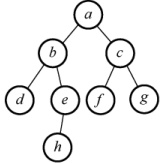
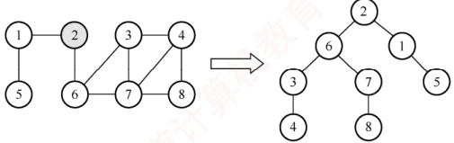
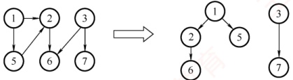

## 6.3 图的遍历

图的遍历是指从图中某一顶点出发，按照某种搜索策略，沿着图中的边访问所有顶点，且每个顶点仅被访问一次。注意到树是一种特殊的图，因此树的遍历可视为图遍历的一种特例。图的遍历算法是求解连通性问题、拓扑排序、关键路径等图算法的基础。

与树的遍历相比，图的遍历要复杂得多，因为图中任意一个顶点都可能与其余多个顶点相邻接。访问某个顶点后，沿着某条路径继续搜索时，可能再次回到该顶点。为避免重复访问，遍历过程中需记录已访问过的顶点，通常设置一个辅助数组 visited[] 来标记各顶点是否已被访问。图的遍历主要有两种基本算法：广度优先搜索和深度优先搜索。

### 6.3.1 广度优先搜索

广度优先搜索（Breadth-First-Search，BFS）类似于树的层序遍历。其基本思想是：首先访问起始顶点 v，然后从 v 出发，依次访问 v 的所有未被访问过的邻接顶点  $w_1, w_2, \cdots, w_i$；随后依次访问  $w_1, w_2, \cdots, w_i$ 的所有尚未访问过的邻接顶点；再从这些访问过的顶点出发，访问它们所有未被访问过的邻接顶点，直至图中所有可达顶点都被访问为止。若此时图中仍有未被访问的顶点，则另选一个未访问的顶点作为新的起始点，重复上述过程，直至图中所有顶点均被访问。Dijkstra 单源最短路径算法和 Prim 最小生成树算法也应用了类似的思想。

换句话说，广度优先搜索以起始顶点 v 为中心，按路径长度递增的顺序访问所有从 v 可达的顶点，即先访问距离为 1 的顶点，再访问距离为 2 的顶点，以此类推。BFS 是一种分层遍历过程：每完成一层的访问，便会处理下一层的所有顶点，而不会沿已访问路径回溯，因此通常以非递归方式实现。BFS 算法必须借助一个辅助队列，用于暂存当前层顶点的下一层邻接顶点。
广度优先搜索算法的实现如下：
```c

bool visited[MAX_VERTEX_NUM];
void BFSTraverse(Graph G) {
    for(i=0;i<G.vexnum;++i)
        visited[i]=FALSE;
    InitQueue(Q);
    for(i=0;i<G.vexnum;++i)
        if(!visited[i])
            BFS(G,i);
}
```

基于邻接表的广度优先搜索实现如下：

```c
void BFS(ALGraph G, int i) {
    visit(i); //访问初始顶点 i
    visited[i]=TRUE; //对 i 做已访问标记
    EnQueue(Q, i); //顶点 i 入队
    while (!QueueEmpty(Q)) {
        DeQueue(Q, v); //队首顶点 v 出队
        for (p = G.vertices[v].firstarc; p; p = p->nextarc) { //检测 v 的所有邻接点 w = p -> adjvex;
            if (visited[w] == FALSE) {
                visit(w); // w 为 v 的尚未访问的邻接点，访问 w
                visited[w] = TRUE; // 对 w 做已访问标记
                EnQueue(Q, w); // 顶点 w 入队
            }
        }
    }
}
```

基于邻接矩阵的广度优先搜索实现如下：

```c
void BFS(MGraph G, int i) {
    visit(i); //访问初始顶点 i
    visited[i]=TRUE; //对 i 做已访问标记
    EnQueue(Q, i); //顶点 i 入队
    while (!QueueEmpty(Q)) {
        DeQueue(Q, v); //队首顶点 v 出队
        for (w=0; w<G.vexnum; w++) //检测 v 的所有邻接点
            `if (visited[w]==FALSE&&G.edge[v][w]==1)` {
                visit(w); // w 为 v 的尚未访问的邻接点，访问 w
                visited[w]=TRUE; //对 w 做已访问标记
                EnQueue(Q, w); //顶点 w 入队
        }
    }
}
```

辅助数组 visited[]用于标记顶点是否已被访问，初始值均为 FALSE。在遍历过程中，一旦顶点  $v_i$ 被访问，立即置 visited[i] = TRUE，以防止重复访问。

### 考点追踪 广度优先遍历的过程（2013）

给定图 G 如图 6.11 所示，假设从顶点 a 开始遍历，BFS 的执行过程如下：a 先入队；队列非空，取出 a，发现其邻接点 b 和 c 均未访问，依次访问并入队；取出 b，访问其未访问的邻接点 d 和 e，并入队（a 虽与 b 也邻接，但已访问，故跳过）；取出 c，访问其未访问的邻接点 f 和 g，并入队；取出 d，其邻接点均已访问，无操作；取出 e，访问其未访问的邻接点 f 和 g，



图 6.11 一个无向图 G

接点 h，并入队；继续处理 f, g, h，均无新邻接点可访问；最终队列为空，遍历结束。遍历结果为 abcdefgh。

上述过程与二叉树的层序遍历完全一致，说明图的 BFS 是树层序遍历算法的自然推广。

#### 1. BFS 算法的性能分析

无论采用邻接表还是邻接矩阵存储，BFS 算法都需要借助一个辅助队列 Q 来实现逐层访问。每个顶点最多入队一次，在最坏的情况下，空间复杂度为  $O(|V|)$。

### 考点追踪 ▶ 基于邻接表存储的 BFS 的效率（2012）

遍历图的过程实质上是对每个顶点查找其邻接点的过程，耗费的时间取决于所采用的存储结构。采用邻接表存储时：每个顶点均需搜索（或入队）一次，时间复杂度为  $O(|V|)$；在搜索每个顶点的邻接点时，每条边均需访问一次，时间复杂度为  $O(|E|)$；总的时间复杂度为  $O(|V| + |E|)$。采用邻接矩阵存储时：查找每个顶点的邻接点所需的时间为  $O(|V|)$，总时间复杂度为  $O(|V|^2)$。

#### 2. BFS 算法求解单源最短路径问题

若图  $G = (V, E)$ 为非带权图，定义从顶点 u 到顶点 v 的最短路径  $d(u, v)$ 为所有从 u 到 v 的路径中所含边数的最小值；若从 u 到 v 不可达，则  $d(u, v) = \infty$。

利用 BFS 可求解非带权图的单源最短路径问题，这是因为广度优先搜索总是按照距离由近到远的顺序遍历图中顶点，从而保证每个顶点首次被访问时，所经过的路径即为最短路径。

BFS 求解单源最短路径的实现如下：

```c
void BFS MIN Distance(Graph G,int u){
    //d[i]表示从u到i的最短路径
    for(i=0;i<G.vexnum;++i)
```
        d[i]= $\infty$; //初始化路径长度
```c
    visited[u]=TRUE; d[u]=0;
    EnQueue(Q,u);
    while(!QueueEmpty(Q)) {
        DeQueue(Q,u); //BFS 算法主过程
        for(w=FirstNeighbor(G,u);w>=0;w=NextNeighbor(G,u,w)) if (!visited[w]) {
            visited[w]=TRUE; //w 为 u 的尚未访问的邻接顶点
            d[w]=d[u]+1; //路径长度加1
            EnQueue(Q,w); //顶点 w 入队
        }
    }
}
```

#### 3. 广度优先生成树

在广度优先遍历的过程中，所经过的边与访问的顶点共同构成一棵树，称为广度优先生成树，如图6.12所示。需要注意的是：若图采用邻接矩阵存储，由于其表示是唯一的，因此从同一源点出发得到的广度优先生成树也是唯一的。而若采用邻接表存储时，其表示不唯一，导致遍历时邻接点的访问顺序不确定，因此生成的广度优先生成树也可能不唯一。



图6.12 图的广度优先生成树

### 6.3.2 深度优先搜索

与广度优先搜索不同，深度优先搜索（Depth-First-Search，DFS）类似于树的先序遍历。正如其名称所暗示的那样，这种搜索算法遵循尽可能“深”地探索一个图的策略。

其基本思想是：首先访问图中的某一起始顶点 v，然后从 v 出发，访问 v 的一个未访问邻接顶点  $w_1$，再访问  $w_1$ 的一个未访问邻接顶点  $w_2$……以此类推。当无法继续向下访问时，回退至上一顶点（递归返回），检查其是否还有未访问的邻接顶点。若有，则从该顶点开始继续上述搜索过程，直到图中所有顶点均被访问为止。

一般而言，其递归形式的算法非常简洁，具体过程如下：
```c

bool visited[MAX_VERTEX_NUM]; //访问标记数组
```
```c
void DFSTreverse(Graph G){ //对图 G 进行深度优先遍历
    for(i=0;i<G.vexnum;i++)
        visited[i]=FALSE; //初始化已访问标记数组
```
    for(i=0;i<G.vexnum;i++) //本代码从  $v_0$ 开始遍历
```c
        if(!visited[i]) //对尚未访问的顶点调用 DFS()
            DFS(G,i);
}
```

基于邻接表的深度优先搜索实现如下：

```c
void DFS(ALGraph G,int i){
    visit(i); //访问初始顶点 i
    visited[i]=TRUE; //对 i 做已访问标记
    for(p=G.vertices[i].firstarc;p;p=p->nextarc){ //检测 i 的所有邻接点
        j=p->adjvex;
        if(visited[j]==FALSE)
            DFS(G,j); // j 为 i 的尚未访问的邻接点，递归访问 j
    }
}
```

基于邻接矩阵的深度优先搜索实现如下：

```c
void DFS(MGraph G,int i) {
    visit(i); //访问初始顶点 i
    visited[i]=TRUE; //对 i 做已访问标记
    for (j=0; j<G.vexnum; j++) {
        //检测 i 的所有邻接点
        `if (visited[j]==FALSE&G.edge[i][j]==1)`
            DFS(G,j); // j 为 i 的尚未访问的邻接点，递归访问 j
    }
}
```

### 考点追踪 深度优先遍历的过程（2015、2016）

以图 6.11 的图 G 为例，DFS 的执行过程如下：首先访问顶点 a，并置 a 访问标记。接着访问与 a 邻接且未被访问的 b，置 b 访问标记；随后访问与 b 邻接且未被访问的 d，置 d 访问标记。此时，由于 d 没有更多未被访问的邻接顶点，因此返回上一个访问的 b，继续访问其未被访问的邻接顶点 e，置 e 访问标记，以此类推，直至图中所有顶点都被访问一次。遍历结果为 abdehcfg。

**注意**

图的邻接矩阵表示是唯一的，这意味着基于邻接矩阵和同一源点出发遍历得到的 DFS 和 BFS 序列是唯一的。然而，对邻接表来说，若边的输入顺序不同，则生成的邻接表也会不同。因此，对同一个图，基于邻接表的遍历得到的 DFS 序列和 BFS 序列可能不是唯一的。
#### 1. DFS 算法的性能分析

DFS 算法通常以递归形式实现，其执行过程依赖系统提供的递归工作栈，在最坏情况下，递归深度可达  $|V|$，因此空间复杂度为  $O(|V|)$。

图的遍历本质上是通过边依次访问邻接点的过程。因此，无论是深度优先搜索还是广度优先搜索，其时间复杂度仅取决于图的存储结构，而与访问顺序无关。具体而言：采用邻接矩阵存储时，对每个顶点需扫描整行以查找邻接点，总时间复杂度为  $O(|V|^2)$；采用邻接表存储时，每个顶点和每条边均被访问常数次，总时间复杂度为  $O(|V| + |E|)$。

#### 2. 深度优先的生成树和生成森林

与广度优先搜索类似，深度优先搜索在遍历过程中也会形成一棵深度优先生成树。其存在的前提是图必须是连通的。只有对连通图调用 DFS 时，才能得到一棵覆盖所有顶点的生成树；若图是非连通的，DFS 将为每个连通分量分别生成一棵树，这些树共同构成深度优先生成森林，如图 6.13 所示。注意，不论是采用 DFS 还是采用 BFS 方法，基于邻接表得到的生成树是不唯一的，而基于邻接矩阵和同一源点所得到的生成树是唯一的。



图 6.13 图的深度优先生成森林

### 6.3.3 图的遍历与图的连通性

图的遍历算法可用于判断图的连通性。

为了确保遍历图中所有顶点（无论图是否连通），在BFSTaverse()和DFSTaverse()中均添加了一个外层for循环：从每个尚未被访问的顶点出发，启动一次新的BFS或DFS。

对于无向图，若图是连通的，则只需一次遍历即可访问所有顶点；若图是非连通的，则一次遍历仅能覆盖其所在连通分量的所有顶点。因此，调用BFS（G，i）或DFS（G，i）的次数恰好等于该图的连通分量数，因为每次调用都会遍历一个连通分量中的所有顶点。

对于有向图，情况略有不同。仅当从初始顶点到达图中每个顶点都存在路径时，才能通过一次遍历访问到所有顶点；否则，将不能访问所有顶点。即使整个图是弱连通的，也可能包含强连通分量和非强连通分量。在非强连通分量中，单次调用 BFS(G,i) 或 DFS(G,i) 不一定能访问到该子图的所有顶点。例如，某些顶点可能无法从初始顶点到达，尽管它们之间可能存在路径。因此，对于有向图，同样需要外层循环以确保所有顶点被覆盖，如图 6.14 所示。图 6.14 有向图的非强连通分量


