## 6.4 图的应用

本节是历年考查的重点，但直接考查算法设计题的概率偏小，更多是结合具体的图实例，考查算法的具体操作过程。读者必须掌握如何手工模拟各类图算法在给定图上的执行过程。此外，还需要具备将实际问题抽象为图模型，并据此构建合适的图结构以解决问题的能力。

### 6.4.1 最小生成树

一个连通图的生成树包含了图的所有顶点，并且仅包含尽可能少的边。对生成树来说，若移除一条边，则会使该生成树变成非连通图；若增加一条边，则会在图中形成一条回路。

对于带权连通无向图 G 而言，不同的生成树其总权重（树中所有边的权值之和）可能不同。具有最小总权重的生成树称为图 G 的最小生成树（Minimum-Spanning-Tree，MST）。

### 考点追踪 最小生成树的性质（2012、2017）

不难看出，最小生成树具有以下特性：

1）若图 G 中含有权值相同的边，则最小生成树可能不唯一，即可能存在多个不同的最小生成树。当图 G 中所有边的权值互不相同时，最小生成树是唯一的。此外，若无向连通图 G 本身的边数等于顶点数减 1（G 本身就是一棵树），则其最小生成树就是它本身。

2）虽然最小生成树可能不唯一，但所有最小生成树的总权重都是相同的，且为最小值。

3）最小生成树的边数等于顶点数减1。

### 考点追踪 最小生成树中某顶点到其他顶点是否具有最短路径的分析（2023）

**注意**

最小生成树中所有边的权值之和最小，但不能保证任意两个顶点之间的路径是最短路径。如下图所示，最小生成树中A到C的路径长度为5，但图中A到C的最短路径长度为4。

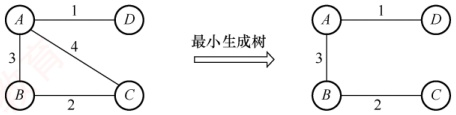

构造最小生成树的方法有多种，但大多数算法都基于这样一个核心性质：假设  $G = (V, E)$ 是一个带权连通无向图，U 是顶点集 V 的一个非空子集。若  $(u, v)$ 是一条权值最小的边，其中  $u \in U$， $v \in V - U$，则图 G 中必存在一棵包含边  $(u, v)$ 的最小生成树。

基于此原理的主要算法包括 Prim 算法和 Kruskal 算法，二者均采用贪心策略。对这两种算法，应重点掌握其本质含义与基本思想，并能动手模拟其执行过程。

以下是通用的最小生成树算法框架：

```c
GENERIC_MST(G) {
    T=NULL;
    while T 未形成一棵生成树;
    do 找到一条最小代价边 (u, v) 并且加入 T 后不会产生回路;
    T=T∪(u, v);
}
```

通过逐步添加边来逐渐构造一棵生成树，下面介绍实现上述框架的两种经典算法。
#### 1. Prim 算法

Prim（普里姆）算法在执行过程上与求解单源最短路径的 Dijkstra 算法较为相似。

### 考点追踪 Prim 算法构造最小生成树的实例（2015、2017、2018）

初始时，从图中任取一个顶点加入树 T，此时 T 仅包含该顶点。接着，选择一个与当前 T 中顶点集合距离最近的顶点，并将该顶点及其相连的最小权值边加入 T。每执行一次此操作，T 中的顶点数和边数各增加 1。重复这一过程，直到图中所有顶点都被并入 T 为止。最终得到的 T 即为最小生成树，且其中必然含有 n-1 条边。图 6.15 展示了 Prim 算法构造最小生成树的过程。

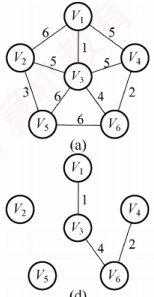

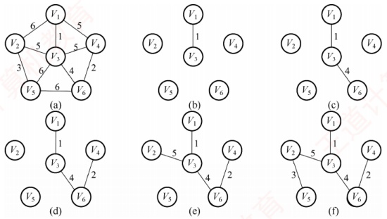

图 6.15 Prim 算法构造最小生成树的过程

Prim算法步骤如下：

假设  $G = \{V, E\}$ 是连通图，其最小生成树  $T = (U, E_T)$， $E_T$ 是 T 中的边集合。

初始化：向空树  $T=(U,E_{T})$ 中添加图 G 的任意一个顶点  $u_{0}$，使得  $U=\{u_{0}\}$， $E_{T}=\varnothing$。

循环（重复，直至  $U = V$）：从图  $G$ 中选择满足条件 $\{(u, v) | u \in U, v \in V - U\}$且具有最小权值的边 $(u, v)$，将其加入树  $T$，并更新  $U = U \cup \{v\}$， $E_T = E_T \cup \{(u, v)\}$。

Prim 算法的简单实现如下：

Prim算法的时间单实现如下：

```c
void Prim(G, T) {
    T = Ø; //初始化空树
    U = {w}; //添加任意一个顶点 w
    while ((V - U) != Ø) {
        //若树中不含全部顶点
        设(u, v)是使 u∈U 与 v∈(V - U)，且权值最小的边；
        T = T ∪ {(u, v)}; //边归入树
        U = ∪ ∪ {v}; //顶点归入树
    }
}
```

在 Prim 算法中，每步都从当前已构建的树向外扩展一条最短边，逐步生长出整棵最小生成树。该算法的时间复杂度为  $O(|V|^2)$，与边数  $|E|$ 无关，因此特别适用于求解边稠密图的最小生成树。虽然采用其他方法能改进 Prim 算法的时间复杂度，但会增加实现的复杂度。

#### 2. Kruskal 算法

与 Prim 算法从一个顶点开始扩展最小生成树的方式不同，Kruskal（克鲁斯卡尔）算法采用按边的权值递增次序选择合适的边来构造最小生成树的方法。

### 考点追踪 Kruskal 算法构造最小生成树的实例（2015、2018、2020）

初始时，图  $T = \{V, \{\}\}$ 包含全部 n 个顶点，但不含任何边，每个顶点自成一个连通分量。然后按照边的权值从小到大的顺序，依次考察各条边：如果当前边连接的两个顶点属于 T 中不
同的连通分量（可通过并查集判断），则将该边加入 T；否则，舍弃此边，继续考察下一条权值最小的边。重复这一过程，直到所有顶点都属于同一个连通分量，此时得到的 T 即为最小生成树。图 6.16 展示了 Kruskal 算法构造最小生成树的过程。

Kruskal 算法步骤如下：

假设  $G=(V,E)$ 是连通图，其最小生成树  $T=(U,E_{T})$， $E_{T}$ 是 T 中的边集合。

初始化： $U = V, E_T = \varnothing$。即每个顶点构成一棵独立的树，T此时是一个仅含 $|V|$个顶点的森林。

循环（重复，直至 T 成为一棵树）：按照边权值递增的顺序，从  $E-E_{T}$ 中选择一条边。若该边加入 T 后不构成回路，则将其加入  $E_{T}$；否则舍弃，直到  $E_{T}$ 包含 n-1 条边为止。

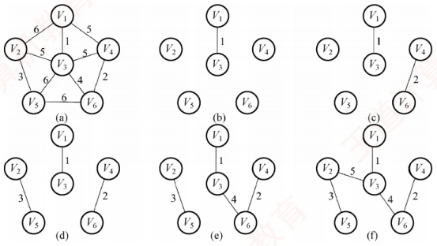

图 6.16 Kruskal 算法构造最小生成树的过程

Kruskal 算法的简单实现如下：

```c
void Kruskal(V,T){
    T=V; //初始化树T，仅含顶点
    numS=n; //连通分量数
    while(numS>1){ //若连通分量数大于1
        从E中取出权值最小的边(v,u);
        if(v和u属于T中不同的连通分量){
            T=T∪{(v,u)}}; //将此边加入生成树中
            numS--; //连通分量数减1
        }
    }
}
```

在 Kruskal 算法中，每当选择一条连接两棵不同树的边时，这两棵树将通过这条边合并为一棵更大的树，随着算法的进行，整个森林逐渐合并成一棵树。考虑到算法效率，在最坏情况下需要对所有的|E|条边各扫描一次。通常，边会存储在一个堆（见第 7 章）中，每次从中选出最小权值的边所需时间为  $O(\log_2|E|)$。同时，使用并查集来快速确定两个顶点是否属于同一集合的时间复杂度为  $O(\alpha(|V|))$，这里  $\alpha(|V|)$ 增长极其缓慢，可视为常数。因此，Kruskal 算法的总时间复杂度为  $O(|E|\log_2|E|)$，不依赖于|V|，这使得它特别适合于处理边稀疏但顶点较多的图。

### 6.4.2 最短路径

### 考点追踪 最短路径的分析与举例以及相关的算法（2009、2023）

在 6.3 节中讨论的广度优先搜索算法适用于求解无权图的最短路径。当图是带权图时，从一个顶点  $v_{0}$ 到图中任意另一个顶点  $v_{i}$ 的路径上所有边的权值之和，称为该路径的带权路径长度；其中，带权路径长度最小的路径（可能存在多条）称为最短路径。
求解最短路径问题的算法通常基于其最优子结构性质：两点间最短路径上的任意子路径，也是对应端点间的最短路径。图的最短路径问题一般可分为两类：一是单源最短路径——求图中某个顶点到其余各顶点的最短路径，可使用经典的 Dijkstra（迪杰斯特拉）算法求解；二是所有顶点对之间的最短路径，可使用 Floyd（弗洛伊德）算法求解。

#### 1. Dijkstra 算法求单源最短路径问题

Dijkstra 算法使用一个集合 S 记录已确定最短路径的顶点。初始时，将源点（顶点 0）放入 S；每当将一个新顶点 i 加入 S 后，需更新源点到所有尚未确定最短路径的顶点（集合 V-S 中的顶点）的当前最短路径长度。算法执行过程中维护以下三个辅助数组：

• final[]：标记各顶点是否已找到最短路径（是否属于集合 S）。

• dist[]：记录从源点到各顶点的当前最短路径长度。初始化时，若存在从源点到顶点 i 的直接边，则 dist[i]为该边的权值，否则置为∞。

- path[]: path[i]存储从源点到顶点 i 的最短路径。算法结束后，可通过 path[]数组回溯，重构出完整的最短路径。

假设源点为顶点 0，集合 S 初始仅含顶点 0。图以邻接矩阵 arcs 表示，其中 arcs[i][j]为有向边<i,j>的权值；若该边不存在，则 arcs[i][j]为∞。

Dijkstra 算法的步骤如下（暂不考虑对 path[] 的操作）：

1）初始化：集合  $S = \{0\}$，dist[] 的初始值为  $\text{dist}[i] = \arcsin[0][i]$， $i = 1, 2, \cdots, n-1$。

2）选择最短路径顶点：从不在 S 中的顶点集合（V-S）中选出顶点 j，使得  $\text{dist}[j]$ 最小，此时，顶点 j 即为当前从源点出发的最短路径的终点，将其加入集合 S。

3）松弛操作：对每个从顶点 j 出发的邻接顶点 k（ $\arcsin[j][k] \neq \infty$），若  $\text{dist}[j] + \arcsin[j][k] < \text{dist}[k]$，则更新  $\text{dist}[k] = \text{dist}[j] + \arcsin[j][k]$。

4）重复步骤2）～3）共n-1次，直至所有顶点都包含在集合S中。

每个新顶点 $^{+}$都可能发现到达其他尚未确定最短路径顶点的更短路径，从而需要更设源点为 $v_0$，初始时 $S = \{v_0\}$，dist[1] = 3，dist[2] = 7。将 $v_1$加入集合S后，发现路径 $v_0 \to v_1 \to v_2$的长度为4（dist[1] $^+$  $\operatorname{arcs}[1][2] = 3 + 1 = 4$），小于原来的7，因此将dist[2]更新为4。

思考：Dijkstra算法与Prim算法有何异同之处？ $^{①}$

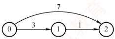

### 考点追踪 Dijkstra 算法求解最短路径的实例（2012、2014、2016、2021）

例如，对图 6.17 中的图应用 Dijkstra 算法求从顶点 1 出发到其余各顶点的最短路径的过程，如表 6.2 所示。算法执行过程的说明如下。

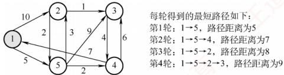

图 6.17 应用 Dijkstra 算法的图

表6.2 从  $v_{1}$ 到各终点的 dist 值和最短路径的求解过程

| 顶点 | 第1轮 | 第2轮 | 第3轮 | 第4轮 |
| --- | --- | --- | --- | --- |
| 2 | 10 | 8 | 8 |   |
| $v_1 \rightarrow v_2$ | $v_1 \rightarrow v_5 \rightarrow v_2$ | $v_1 \rightarrow v_5 \rightarrow v_2$ |   |   |
| 3 | ∞ | 14 | 13 | 9 |
| $v_1 \rightarrow v_5 \rightarrow v_3$ | $v_1 \rightarrow v_5 \rightarrow v_4 \rightarrow v_3$ | $v_1 \rightarrow v_5 \rightarrow v_2 \rightarrow v_3$ |   |   |
| 4 | ∞ | 7 |   |   |
| $v_1 \rightarrow v_5 \rightarrow v_4$ |   |   |   |   |
| 5 | 5 |   |   |   |
| $v_1 \rightarrow v_5$ |   |   |   |   |
| 集合S | {1,5} | {1,5,4} | {1,5,4,2} | {1,5,4,2,3} |

初始化：集合 $S$ 初始为 $\{v_1\}$，从 $v_1$ 可达 $v_2$ 和 $v_5$，不可达 $v_3$ 和 $v_4$，因此 $\text{dist}()$ 数组的初始值为 $\text{dist}[2]=10$，$\text{dist}[3]=\infty$，$\text{dist}[4]=\infty$，$\text{dist}[5]=5$。

第1轮：选出最小值  $\text{dist}[5]$，将  $v_5$ 加入集合  $S$，此时已确定  $v_1$ 到  $v_5$ 的最短路径。检查从  $v_5$ 出发的邻接边： $v_5$ 可达  $v_2$， $v_1 \to v_5 \to v_2$ 的长度为 8，小于当前  $\text{dist}[2] = 10$，更新  $\text{dist}[2] = 8$； $v_5$ 可达  $v_3$， $v_1 \to v_5 \to v_3$ 的长度为 14，更新  $\text{dist}[3] = 14$； $v_5$ 可达  $v_4$， $v_1 \to v_5 \to v_4$ 的长度为 7，更新  $\text{dist}[4] = 7$。

第2轮：选出最小值  $\text{dist}[4]$，将  $v_4$ 加入集合  $S$。检查从  $v_4$ 出发的邻接边： $v_4$ 不可达  $v_2$， $\text{dist}[2]$ 不变； $v_4$ 可达  $v_3$， $v_1 \to v_5 \to v_4 \to v_3$ 的长度为 13，小于当前  $\text{dist}[3] = 14$，更新  $\text{dist}[3] = 13$。

第 3 轮：选出最小值 dist[2]，将  $v_2$ 加入集合  $S$。检查从  $v_2$ 出发的邻接边： $v_2$ 可达  $v_3$， $v_1 \to v_5 \to v_2 \to v_3$ 的长度为 9，小于当前 dist[3] = 13，更新 dist[3] = 9。

第4轮：选出唯一最小值dist[3]，将 $v_{3}$加入集合S，此时，所有顶点均已包含在集合S中。

使用邻接矩阵表示图，并采用线性扫描  $\text{dist}()$ 查找最小值时，Dijkstra 算法的时间复杂度为  $O(|V|^2)$。若改用带权邻接表，虽然松弛操作的总代价可降至  $O(|E|)$，但由于查找最小  $\text{dist}()$ 值仍需  $O(|V|)$ 时间，总时间复杂度仍为  $O(|V|^2)$。即使只需求解从源点到某一个特定顶点的最短路径，在最坏情况下仍需处理所有顶点，因此时间复杂度不变，仍为  $O(|V|^2)$。

特别注意：Dijkstra 算法不适用于存在负权边的图。该算法基于贪心策略，一旦顶点被加入集合 S，便不再更新其最短路径。然而，若图中存在负权边，后续路径可能通过负权边 “绕回” 已确定的顶点，从而发现更短路径，而 Dijkstra 算法无法察觉这一变化，导致结果错误。例如，对于图 6.18 所示的带权有向图，Dijkstra 算法可能无法得到正确的最短路径。

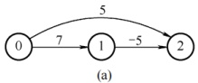

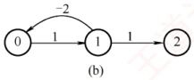

图 6.18 边上带有负权值的有向带权图

#### 2. Floyd 算法求各顶点之间最短路径问题

给定带权有向图，对任意两个不同顶点  $v_{i} \neq v_{j}$，求解从  $v_{i}$ 到  $v_{j}$ 的最短路径及其长度。

Floyd 算法的基本思想：迭代生成一系列 $n$ 阶方阵 $A^{(-1)}, A^{(0)}, \cdots, A^{(k)}, \cdots, A^{(n-1)}$，其中 $A^{(k)}[i][j]$ 表示从顶点 $v_i$ 到 $v_j$、仅允许使用编号不超过 $k$ 的顶点作为中间顶点时的最短路径长度。初始时 $(k = -1)$，若存在从 $v_i$ 到 $v_j$ 的直接边，则 $A^{(-1)}[i][j]$ 为该边的权值；否则设为 $\infty$。特别地，对所有 $i$，令 $A^{(-1)}[i][i] = 0$。随后，依次考虑顶点 $k$（$k = 0, 1, \cdots, n-1$）作为中间顶点，若经由 $v_k$ 的路径
比当前记录的路径更短，则更新对应的距离。算法的描述如下：

定义 n 阶方阵序列  $A^{(-1)}, A^{(0)}, \cdots, A^{(n-1)}$，其中，

 $$\begin{align*}A^{(-1)}[i][j]&=\operatorname{arcs}[i][j]\\A^{(k)}[i][j]=\mathrm{Min}\left\{A^{(k-1)}[i][j],\quad A^{(k-1)}[i][k]+A^{(k-1)}[k][j]\right\},k=0,1,\cdots,n-1\end{align*}$$

式中， $A^{(0)}[i][j]$表示从  $v_i$ 到  $v_j$、仅允许使用  $v_0$ 作为中间顶点的最短路径长度；一般地， $A^{(k)}[i][j]$表示从  $v_i$ 到  $v_j$、中间顶点编号不超过  $k$ 的最短路径长度。Floyd 算法是一个迭代过程，每完成一次迭代，便将下一个顶点纳入可选的中间顶点集合；经过  $n$ 次迭代后， $A^{(n-1)}[i][j]$即为  $v_i$ 到  $v_j$ 的最短路径长度。最终，矩阵  $A^{(n-1)}$ 中的每个元素即为对应顶点对的最短路径长度。

图 6.19 所示为一带权有向图 G 及其邻接矩阵。应用 Floyd 算法求解所有顶点对之间的最短路径长度的过程如表 6.3 所示。算法执行过程的说明如下。

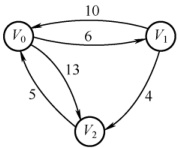

(a) 有向图 G

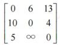

(b) G 的邻接矩阵

图 6.19 带权有向图 G 及其邻接矩阵

初始化：方阵  $A^{(-1)}[i][j] = \arcsin[i][j]$。

第1轮：以  $v_0$ 为中间顶点，检查全部顶点对  $\{i, j\}$。若  $A^{(-1)}[i][j] > A^{(-1)}[i][0] + A^{(-1)}[0][j]$，则将  $A^{(-1)}[i][j]$ 更新为  $A^{(-1)}[i][0] + A^{(-1)}[0][j]$。 $A^{(-1)}[2][1] = \infty$，而  $A^{(-1)}[2][0] + A^{(-1)}[0][1] = 11$，因  $\infty > 11$，故更新  $A^{(-1)}[2][1] = 11$。其余元素保持不变，得到方阵  $A^{(0)}$。

第2轮：以  $v_1$ 为中间顶点，检查全部顶点对  $\{i, j\}$。 $A^{(0)}[0][2] = 13$，而  $A^{(0)}[0][1] + A^{(0)}[1][2] = 10$，因  $13 > 10$，故更新  $A^{(0)}[0][2] = 10$，得到方阵  $A^{(1)}$。

第 3 轮：以  $v_2$ 为中间顶点，检查全部顶点对  $\{i, j\}$。 $A^{(1)}[1][0] = 10$，而  $A^{(1)}[1][2] + A^{(1)}[2][0] = 9$，更新  $A^{(1)}[1][0] = 9$，最终得到方阵  $A^{(2)}$，其中每个元素  $A^{(2)}[i][i]$ 即为 $v_i$ 到 $v_i$ 的最短路径长度。

表6.3 Floyd算法的执行过程

| A | $A^{(-1)}$ |   |   | $A^{(0)}$ |   |   | $A^{(1)}$ |   |   | $A^{(2)}$ |   |   |
| --- | --- | --- | --- | --- | --- | --- | --- | --- | --- | --- | --- | --- |
|   | $V_0$ | $V_1$ | $V_2$ | $V_0$ | $V_1$ | $V_2$ | $V_0$ | $V_1$ | $V_2$ | $V_0$ | $V_1$ | $V_2$ |
| $V_0$ | 0 | 6 | 13 | 0 | 6 | 13 | 0 | 6 | 10 | 0 | 6 | 10 |
| $V_1$ | 10 | 0 | 4 | 10 | 0 | 4 | 10 | 0 | 4 | 2 | 0 | 4 |
| $V_2$ | 5 | $\infty$ | 0 | 5 | 11 | 0 | 5 | 11 | 0 | 5 | 11 | 0 |

Floyd 算法的时间复杂度为  $O(|V|^{3})$。其代码结构紧凑，仅需一个三重循环，无须复杂数据结构，且常数因子较小，因此在中等规模图上实际运行效率较高。

Floyd 算法允许图中存在负权边，但不允许存在负权环。Floyd 算法同样适用于带权无向图——只需将每条无向边视为两条方向相反、权值相同的有向边。

此外，也可通过调用单源最短路径算法求解所有顶点对的最短路径：在边权非负的条件下，依次以每个顶点为源点运行 Dijkstra 算法。Dijkstra 算法的时间复杂度为  $O(|V|^2)$，因此共需执行  $|V|$ 次，总时间复杂度为  $O(|V|^3)$，与 Floyd 算法的相同。
BFS 算法、Dijkstra 算法和 Floyd 算法求最短路径的总结如表 6.4 所示。

表 6.4 BFS 算法、Dijkstra 算法和 Floyd 算法求最短路径的总结

|  | BFS 算法 | Dijkstra 算法 | Floyd 算法 |
|---|---|---|---|
| 用途 | 求单源最短路径 | 求单源最短路径 | 求各顶点之间的最短路径 |
| 无权图 | 适用 | 适用 | 适用 |
| 带权图 | 不适用 | 适用 | 适用 |
| 带负权值的图 | 不适用 | 不适用 | 适用 |
| 带负权回路的图 | 不适用 | 不适用 | 不适用 |
| 时间复杂度 | $O(\lvert V^2 \rvert)$或 $O(\lvert V \rvert + \lvert E \rvert)$ | $O(\lvert V^2 \rvert)$ | $O(\lvert V^2 \rvert)$ |

### 6.4.3 有向无环图描述表达式

有向无环图（简称DAG图）是指一个不含任何有向环路的有向图。

### 考点追踪 构建表达式的有向无环图（2019）

有向无环图是表示含有公共子表达式的代数表达式的有效工具。例如，表达式

 $$((a+b)^{*}(b^{*}(c+d))+(c+d)^{*}e)^{*}((c+d)^{*}e)$$

可用上一章介绍的二叉树表示，如图 6.20 所示。观察该表达式，可发现存在公共子表达式，如 $(c + d)$；该子表达式在多个位置被复用，如参与构成 $(c + d) * e$等。这些重复出现的子结构会被分别存储，造成空间浪费。若采用有向无环图，公共子表达式只需存储一次，并通过多个父结点的入边共享，从而显著节省存储空间。图 6.21 展示了该表达式的有向无环图表示。

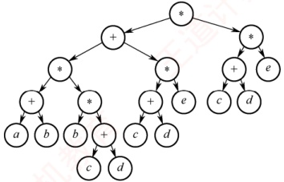

图 6.20 二叉树描述表达式

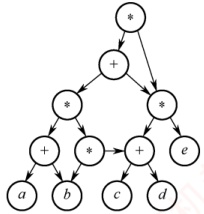

图 6.21 有向无环图描述表达式

关于有向无环图描述表达式的具体示例，可参考本书配套视频中的相关讲解。

**注意**

在表达式的有向无环图表示中，不会出现重复的操作数顶点。

### 6.4.4 拓扑排序

AOV 网：若用有向无环图表示一个工程，每个顶点代表一个活动，并用有向边 $<V_i, V_j\rangle$表示活动  $V_i$ 必须先于活动  $V_j$ 进行的关系，则称这种有向图为顶点表示活动的网络，简称 AOV 网。在此网络中，活动  $V_i$ 是活动  $V_j$ 的直接前驱，而  $V_j$ 则是  $V_i$ 的直接后继，这种关系具有传递性。此外，任何活动都不能成为自己的前驱或后继。

在图论中，拓扑排序指的是由有向无环图的顶点构成的一个线性序列，该序列满足条件：

1）每个顶点恰好出现一次。
2）若存在从顶点 A 到 B 的路径，则在排序后的序列中，B 必须排在 A 之后。每个 AOV 网都有一个或多个拓扑排序序列。

### 考点追踪 拓扑排序和回路的关系（2011）

下面介绍一种常用的拓扑排序方法步骤：

① 从 AOV 网中选择一个 **没有前驱**（入度为 0）的顶点并输出之。图中可能存在多个入度为 0 的顶点，随机选择一个输出，因此拓扑序列可能不唯一。

②从网中删除该顶点和所有以它为起点的有向边。

③ 重复步骤①和②，直到当前 AOV 网为空或无法找到新的入度为 0 的顶点为止。 **后一种情况表明有向图中必然存在环**。

### 考点追踪 拓扑排序的实例（2010、2014、2018、2021）

图 6.22 展示了拓扑排序的过程示例，每轮选择一个入度为 0 的顶点输出，然后删除该顶点和所有以它为起点的有向边，最终得到拓扑排序结果 $\{1,2,4,3,5\}$。

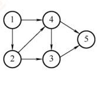

| 顶点号 | 1 | 2 | 3 | 4 | 5 |
| --- | --- | --- | --- | --- | --- |
| 初始入度 | 0 | 1 | 2 | 2 | 2 |
| 第1轮 |   | 0 | 2 | 1 | 2 |
| 第2轮 |   |   | 1 | 0 | 2 |
| 第3轮 |   |   | 0 |   | 1 |
| 第4轮 |   |   |   |   | 0 |
| 第5轮 |   |   |   |   |   |

(a)

图 6.22 有向无环图的拓扑排序过程

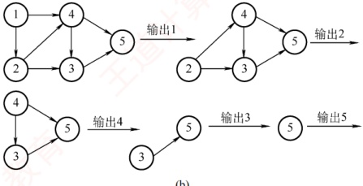

(b)

图 6.22 有向无环图的拓扑排序过程（续）

### 考点追踪（算法题）拓扑排序的实现（2024）

基于邻接表存储结构的拓扑排序算法的实现如下：

```c
bool TopologicalSort(Graph G) {
    InitStack(S); //初始化栈，存储入度为0的顶点
    int i;
    for(i=0;i<G.vexnum;i++)
        if(indegree[i]==0)
            Push(S, i); //将所有入度为0的顶点入栈
    int count=0; //计数，记录当前已经输出的顶点数
    while(!StackEmpty(S)) {
        Pop(S, i); //栈顶元素出栈
        print[count++]=i; //输出顶点i
        for(p=G.vertices[i].firstarc;p=p->nextarc) {
            //将所有i指向的顶点的入度减1，并且将入度减为0的顶点压入栈S
v=p->adjvex;
if(!(--indegree[v]))
    Push(S,v); //入度为0，则入栈
}

if(count<G.vexnum)
    return false; //排序失败，有向图中有回路
else
    return true; //拓扑排序成功
}
```

### 考点追踪 ▶️ 不同存储方式下的拓扑排序的效率（2016）

因为输出每个顶点的同时还要删除以它为起点的边，所以采用邻接表存储时，拓扑排序的时间复杂度为  $O(|V| + |E|)$；采用邻接矩阵存储时，时间复杂度为  $O(|V|^2)$。

### 考点追踪 DFS 实现拓扑排序的思想（2020）

通过深度优先搜索（DFS）也可以实现拓扑排序，其基本思路如下（具体实现见本节习题）。对于有向无环图 G 中的任意两个顶点 u 和 v，其关系必属于以下三种情形之一：

1）若 u 是 v 的祖先（存在从 u 到 v 的路径），则在 DFS 过程中会先访问 u，再递归访问 v；v 先完成回溯，因此 v 的结束时间早于 u，即 u 的结束时间大于 v 的结束时间。

2）若 u 是 v 的子孙，则 v 是 u 的祖先，因此 v 的结束时间大于 u 的结束时间。

3）若 u 和 v 之间不存在任何方向的路径，则它们在拓扑序列中的相对顺序可以任意。于是，将所有顶点按 DFS 结束时间降序排列，即可得到一个合法的拓扑排序序列。

对一个 AOV 网，若采用以下步骤进行排序，则称为逆拓扑排序：

①从AOV网中选择一个 **没有后继**（出度为0）的顶点并输出。

②从网中删除该顶点和所有以它为终点的有向边。

③ 重复步骤 $^{①}$和 $^{②}$，直到当前的 AOV 网变为空为止。

用拓扑排序算法处理 AOV 网时，应注意以下几点：

1）入度为零的顶点表示没有前驱活动，或其所有前驱活动均已执行完毕。工程可以从该顶点所代表的活动开始或继续推进。

### 考点追踪 拓扑排序序列的存在性和唯一性分析（2011、2024）

2）拓扑排序的结果可能不唯一。拓扑序列唯一的充要条件是：AOV网中任意两个顶点之间都存在单向路径（任意两个活动都有明确的先后顺序）。实际判断方法是：每次输出顶点时，若当前入度为0的顶点都恰好只有一个，则最终拓扑序列唯一。

3）AOV网中各顶点地位平等，其编号是人为设定的。因此，可根据拓扑排序的结果对顶点重新编号，使得新邻接矩阵成为上三角矩阵。对于一般的有向图而言，若其邻接矩阵可通过顶点重排转换为上三角矩阵，则该图一定是有向无环图，因而存在拓扑序列。

### 6.4.5 关键路径

在带权有向图中，若以顶点表示事件，以有向边表示活动，并以边上的权值表示完成该活动所需的开销（如时间），则称这种图为用边表示活动的网络，简称 AOE 网。AOE 网和 AOV 网同属有向无环图，但二者在定义上有本质区别：AOE 网的边带有权值，代表活动及其持续时间，而顶点表示事件；AOV 网的边无权值，仅用于表示顶点（活动）之间的前后关系。

AOE网具有以下两个基本性质：
①只有在某顶点所代表的事件发生后，从该顶点出发的各有向边所代表的活动才能开始；

②只有当进入某顶点的各有向边所代表的活动都已完成时，该顶点所代表的事件才能发生。

在 AOE 网中，通常仅有一个入度为 0 的顶点，称为开始顶点（源点），表示整个工程的起点；同时仅有一个出度为 0 的顶点，称为结束顶点（汇点），表示整个工程的终点。

### 考点追踪关键路径的性质与应用（2020、2025）

在 AOE 网中，有些活动可以并行进行。从源点到汇点可能存在多条有向路径，且这些路径的长度（路径上各边权值之和）可能不同。尽管不同路径上的活动所需时间各异，但只有在所有活动都完成后，整个工程才算结束。因此，在所有从源点到汇点的路径中，路径长度最大的那条路径被称为关键路径，而把关键路径上的活动称为关键活动。

完成整个工程所需的最短时间等于关键路径的长度，即该路径上所有活动持续时间之和。关键活动决定了工程的总工期，若任一关键活动延迟，整个工程的完成时间将随之推迟。因此，只要识别出关键活动，就能确定关键路径，并得出工程的最早完成时间。

下面给出在寻找关键活动时所用到的几个关键参量的定义。

#### 1. 事件  $v_{k}$ 的最早发生时间  $v_{e}(k)$

指从源点  $v_{1}$ 到顶点  $v_{k}$ 的最长路径长度。该值决定了所有从  $v_{k}$ 开始的活动能够开工的最早时间。可用以下递推公式计算：

 $v_{e}$(源点)=0

 $$v_{e}(k)=\operatorname{Max}\{v_{e}(j)+\operatorname{Weight}(v_{j},v_{k})\}$$

其中， $v_k$是 $v_j$的任意后继，Weight $(v_j, v_k)$表示有向边 $<v_j, v_k>$上的权值。

**注意**

计算  $v_{e}()$ 时，可在拓扑排序过程中同步进行：

① 初始时，令  $v_{e}[1\ldots n]=0$。

②每当输出一个入度为0的顶点  $v_j$，就计算其所有直接后继顶点  $v_k$ 的最早发生时间，若  $v_e[j] + \text{Weight}(v_j, v_k) > v_e[k]$，则更新  $v_e[k] = v_e[j] + \text{Weight}(v_j, v_k)$。重复此过程，直至输出全部顶点。

#### 2. 事件  $v_{k}$ 的最迟发生时间  $v_{l}(k)$

指在不推迟整个工程完成时间的前提下，事件  $v_{k}$ 必须发生的最晚时间，以保证其所有后继事件  $v_{j}$ 均不晚于各自的最迟发生时间  $v_{i}(j)$ 发生。可用以下递推公式计算：

 $$\mathbf{v}_{l}( 汇点 )=\mathbf{v}_{e}( 汇点 )$$

 $$v_{l}(k)=\mathrm{Min}\left\{v_{l}(j)-\mathrm{Weight}(v_{k},v_{j})\right\}$$

其中， $v_{k}$ 是  $v_{j}$ 的任意前驱。

**注意**

计算  $v_{1}(k)$ 时，需按逆拓扑顺序进行。可在拓扑排序时用栈记录顶点顺序，排序结束后从栈顶到栈底即为逆拓扑序列。

① 初始时，令  $v_l[1...n] = v_e[n]$。

②依次弹出栈顶顶点  $v_j$，计算其所有直接前驱顶点  $v_k$ 的最迟发生时间，若  $v_l[j] - \text{Weight}(v_k, v_j) < v_l[k]$，则更新  $v_l[k] = v_l[j] - \text{Weight}(v_k, v_j)$。重复此过程，直至栈空。

#### 3. 活动  $a_{i}$ 的最早开始时间  $e(i)$

指该活动所对应弧的起点事件的最早发生时间。若边 $\langle v_{k}, v_{j} \rangle$表示活动 $a_{i}$，则有
 $$e(i)=\mathbf{v}_{e}(k)_{\circ}$$

#### 4. 活动  $a_{i}$ 的最迟开始时间  $l(i)$

指在不延误工程总工期的前提下，活动 $a_i$ 最迟必须开始的时间，等于其终点事件的最迟发生时间与该活动所需时间之差。若边 $\leq v_k, v_j$ 表示活动 $a_i$，则有

 $$l(i)=v_{l}(j)-\mathrm{W e i g h t}(v_{k},v_{j})。$$

5. 一个活动  $a_{i}$ 的最迟开始时间  $l(i)$ 与其最早开始时间  $e(i)$ 的差额：

 $$d(i)=l(i)-e(i)$$

或称活动  $a_{i}$ 的时间余量。该值表示在不延长整个工程总工期的前提下，活动  $a_{i}$ 可以拖延的时间。若一个活动的时间余量为零，则该活动必须如期完成，否则将导致整个工程延期。因此，满足  $l(i)-e(i)=0$  [即 l(i)=e(i)] 的活动称为关键活动。

### 考点追踪 求关键路径的实例（2019、2022、2025）

求关键路径的算法步骤如下：

①从源点出发，令  $v_{e}$(源点)=0，按拓扑有序求其余顶点的最早发生时间  $v_{e}$。

②从汇点出发，令 v_{l}(汇点)=v_{e}(汇点)，按逆拓扑有序求其余顶点的最迟发生时间 $v_{l}()$。

③根据各顶点的  $v_{e}$()值，求所有弧的最早开始时间 e()。

④根据各顶点的  $v_{1}$ 值，求所有弧的最迟开始时间  $l()$

⑤求 AOE 网中所有活动的时间余量 d()，找出所有 d()=0 的活动构成关键路径。

图 6.23 所示为求解关键路径的具体过程，简单说明如下：

① 求  $v_e()$：初始时  $v_e(1) = 0$。在拓扑排序输出顶点的过程中，依次求得  $v_e(2) = 3$， $v_e(3) = 2$， $v_e(4) = \max\{v_e(2) + 2, v_e(3) + 4\} = \max\{5, 6\} = 6$， $v_e(5) = 6$， $v_e(6) = \max\{v_e(5) + 1, v_e(4) + 2$， $v_e(3) + 3\} = \max\{7, 8, 5\} = 8$。

若本题为选择题，仅凭上述  $v_{e}()$ 的计算过程，通常已可推断出关键路径。

② 求  $v_1$: 初始时  $v(6) = 8$。在逆拓扑排序（通过找回溯）过程中，依次求得  $v(5) = 7$， $v_1(4) = 6$， $v(3) = \min\{v(4) - 4, v_1(6) - 3\} = \min\{2, 5\} = 2$， $v_1(2) = \min\{v(5) - 3, v_1(4) - 2\} = \min\{4, 4\} = 4$， $v_1(1)$ 必然为 0，无须额外计算。

③弧的最早开始时间 e()等于该弧的起点顶点的  $v_{e}()$ 值，结果见下表。

④弧的最迟开始时间  $l(i)$ 等于该弧的终点顶点的  $v_{l}()$ 值减去该弧的权值，结果见下表。

⑤ 由  $l(i)-e(i)=0$ 可确定关键活动，最终得到的关键路径为  $(v_{1}, v_{3}, v_{4}, v_{6})$。

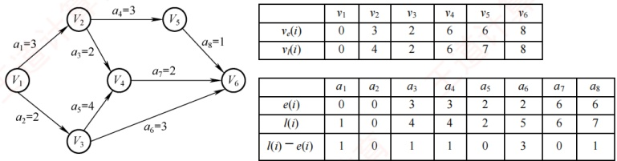

图 6.23 求解关键路径的过程

### 考点追踪 缩短工期的相关分析（2013、2025）

对于关键路径，需要注意以下几点：

1）关键路径上的所有活动均为关键活动，它们共同决定了整个工程的工期。因此，加快关
键活动的执行速度有可能缩短总工期。但不能任意缩短关键活动的持续时间，一旦过度缩短，原关键路径的长度可能小于其他路径，从而引发关键路径的转移。此时，即使继续压缩该活动，工程总工期已由新的最长路径决定，不再受其影响。

2）网中的关键路径可能不止一条。当存在多条关键路径时，仅提高其中某一条路径上的关键活动速度，并不能缩短整个工程的工期。只有加快那些同时出现在所有关键路径上的关键活动（公共关键活动），才能达到缩短工期的目的。

各种图算法在采用邻接矩阵或邻接表存储时的时间复杂度如表6.5所示。

表6.5 采用不同存储结构时各种图算法的时间复杂度

|  | Dijkstra | Floyd | Prim | Kruskal | DFS | BFS | 拓扑排序 | 关键路径 |
|---|---|---|---|---|---|---|---|---|
| 邻接矩阵 | $O(n^{2})$ | $O(n^{3})$ | $O(n^{2})$ | - | $O(n^{2})$ | $O(n^{2})$ | $O(n^{2})$ | $O(n^{2})$ |
| 邻接表 | - | - | - | O(elog2e) | O(n+e) | O(n+e) | O(n+e) | O(n+e) |
