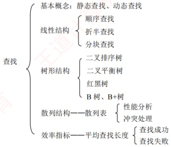

# 第7章 查找

## 【考纲内容】

### （一）查找的基本概念

### （二）顺序查找法

### （三）分块查找法

### （四）折半查找法

### （五）树形查找

二叉搜索树：平衡二叉树：红黑树

### （六）B树及其基本操作、B+树的基本概念

### （七）散列（Hash）表

### （八）查找算法的分析及应用

视频讲解

**【知识框架】**

## 【复习提示】

本章是考研命题的重点。对于折半查找，应掌握折半查找的过程、构造判定树、分析平均查找长度等。对于二叉排序树、二叉平衡树和红黑树，要了解它们的概念、性质和相关操作等。B 树和 B+树是本章的难点。对于 B 树，考研大纲要求掌握插入、删除和查找的操作过程；对于 B+树，仅要求了解其基本概念和性质。对于散列查找，应掌握散列表的构造、冲突处理方法（各种方法的处理过程）、查找成功和查找失败的平均查找长度、散列查找的特征和性能分析。
