### 7.2.4 本节试题精选

#### 一、 单项选择题

##### 01

顺序查找适合于存储结构为（）的线性表。

A. 顺序存储结构或链式存储结构 B. 散列存储结构

C. 索引存储结构 D. 压缩存储结构

##### 02

由 n 个数据元素组成的两个表：一个递增有序，一个无序。采用顺序查找算法，对有序表从头开始查找，发现当前元素已不小于待查元素时，停止查找，确定查找不成功，已知查找任意一个元素的概率是相同的，则在两种表中成功查找（）。

A. 平均时间后者小

B. 平均时间两者相同

C. 平均时间前者小

D. 无法确定

##### 03

对长度为 n 的有序单链表，若查找每个元素的概率相等，则顺序查找表中任意一个元素的查找成功的平均查找长度为（）。

A. n/2 B.  $(n+1)/2$ C.  $(n-1)/2$ D. n/4

##### 04

对长度为3的顺序表进行查找，若查找第一个元素的概率为1/2，查找第二个元素的概率为1/3，查找第三个元素的概率为1/6，则查找任意一个元素的平均查找长度为（）。

A. 5/3 B. 2 C. 7/3 D. 4/3

##### 05

下列关于二分查找的叙述中，正确的是（）。

A. 表必须有序，表可以顺序方式存储，也可以链表方式存储

B. 表必须有序且表中数据必须是整型、实型或字符型

C. 表必须有序，而且只能从小到大排列

D. 表必须有序，且表只能以顺序方式存储
##### 06

在一个顺序存储的有序线性表上查找一个数据时，既可以采用折半查找，也可以采用顺序查找，但前者比后者的查找速度（）。

A. 必然快

B. 取决于表是递增还是递减

C. 在大部分情况下要快

D. 必然不快

##### 07

折半查找过程所对应的判定树是一棵（）。

A. 最小生成树 B. 平衡二叉树 C. 完全二叉树 D. 满二叉树

##### 08

折半查找和二叉排序树的时间性能（）。

A. 相同 B. 有时不相同 C. 完全不同 D. 无法比较

##### 09

在有 11 个元素的有序表 A[1,2,\cdots,11] 中进行折半查找 ( $\left\lfloor\frac{\text{low}+\text{high}}{2}\right\rfloor$)，查找元素 A[11] 时，被比较的元素下标依次是（）。

A. 6,8,10,11 B. 6,9,10,11 C. 6,7,9,11 D. 6,8,9,11

##### 10

已知有序表(13, 18, 24, 35, 47, 50, 62, 83, 90, 115, 134)，当二分查找值为90的元素时，查找成功的元素比较次数为（）。

A. 1

B. 2

C. 4

D. 6

##### 11

若有序表的关键字序列为  $\{b, c, d, e, f, g, q, r, s, t\}$，则在二分查找关键字 b 的过程中，进行比较的关键字依次为（）。

A. f, c, b B. f, d, b C. g, c, b D. g, d, b

##### 12

对表长为 n 的有序表进行折半查找，其判定树的高度为（ ）。

A.  $\lceil \log_{2}(n+1) \rceil$    B.  $\lfloor \log_{2}(n+1) \rfloor - 1$    C.  $\lceil \log_{2} n \rceil$    D.  $\lfloor \log_{2} n \rfloor - 1$

##### 13

已知一个长度为 16 的顺序表，其元素按关键字有序排列，若采用折半查找算法查找一个不存在的元素，则比较的次数至少是（），至多是（）。

A. 4 B. 5 C. 6 D. 7

##### 14

具有 12 个关键字的有序表中，对每个关键字的查找概率相同，折半查找算法查找成功的平均查找长度为（），折半查找查找失败的平均查找长度为（）。

A. 37/12 B. 35/12 C. 39/13 D. 49/13

##### 15

下列关于查找的说法中，正确的是（）。(注，涉及下节内容)

A. 若数据元素保持有序，则查找时就可以采用折半查找法

B. 折半查找与二叉查找树的时间性能在最坏情况下是相同的

C. 折半查找法的平均查找长度一定小于顺序查找法

D. 折半查找法查找一个元素大约需要  $O(\log_{2}n)$ 次关键字比较

##### 16

采用分块查找时，数据的组织方式为（）。

A. 数据分成若干块，每块内数据有序

B. 数据分成若干块，每块内数据不必有序，但块间必须有序，每块内最大（或最小）的数据组成索引块

C. 数据分成若干块，每块内数据有序，每块内最大（或最小）的数据组成索引块

D. 数据分成若干块，每块（除最后一块外）中数据个数需相同

##### 17

对有 2500 个记录的索引顺序表（分块表）进行查找，最理想的块长为（）。

A. 50 B. 125 C. 500 D.  $\lceil \log_{2}2500 \rceil$

##### 18

设顺序存储的某线性表共有123个元素，按分块查找的要求等分为3块。若对索引表采用顺序查找法来确定子块，且在确定的子块中也采用顺序查找法，则在等概率情况下，分块查找成功的平均查找长度为（）。
A. 21 B. 23 C. 41 D. 62

##### 19

为提高查找效率，对有 65025 个元素的有序顺序表建立索引顺序结构，在最好情况下查找到表中已有元素最多需要执行（）次关键字比较。

A. 10 B. 14 C. 16 D. 21

##### 20

【2010 统考真题】已知一个长度为 16 的顺序表 L，其元素按关键字有序排列，若采用折半查找法查找一个 L 中不存在的元素，则关键字的比较次数最多是（）。

A. 4 B. 5 C. 6 D. 7

##### 21

【2015 统考真题】下列选项中，不能构成折半查找中关键字比较序列的是（）。

A. 500, 200, 450, 180

B. 500, 450, 200, 180

C. 180, 500, 200, 450

D. 180, 200, 500, 450

##### 22

【2016 统考真题】在有  $n (n > 1000)$ 个元素的升序数组 A 中查找关键字 x。查找算法的伪代码如下所示。

```c
k=0;

while(k<n 且 A[k]<x) k=k+3;

if(k<n 且 A[k]==x) 查找成功;

else if(k-1<n 且 A[k-1]==x) 查找成功;

else if(k-2<n 且 A[k-2]==x) 查找成功;

else 查找失败;
```

本算法与折半查找算法相比，有可能具有更少比较次的情形是（）。

A. 当 x 不在数组中

B. 当 x 接近数组开头处

C. 当 x 接近数组结尾处

D. 当 x 位于数组中间位置

##### 23

【2017 统考真题】下列二叉树中，可能成为折半查找判定树（不含外部结点）的是（）。

A.

B.

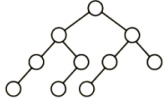

C.

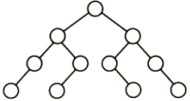

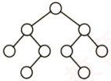

D.

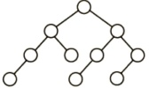

##### 24

【2023 统考真题】对含 600 个元素的有序顺序表进行折半查找，关键字间的比较次数最多是（）。

A. 9 B. 10 C. 30 D. 300

##### 25

【2024 统考真题】下列数据结构中，不适合直接使用折半查找的是（）。

I. 有序链表  II. 无序数组  III. 有序静态链表  IV. 无序静态链表

A. 仅 I、III B. 仅 II、IV C. 仅 II、III、IV D. I、II、III、IV

##### 26

【2025 统考真题】已知查找表中有 400 个元素，查找每个元素的概率相同。采用分块查找法进行查找，且均匀分块。若采用顺序查找法确定元素所在的块，且块内也采用顺序查找法，为使查找效率最高，则每块包含的元素个数应为（）。

A. 8 B. 10 C. 20 D. 25

#### 二、 综合应用题

##### 01

若对有 n 个元素的有序顺序表和无序顺序表进行顺序查找，试就下列三种情况分别讨论两者在相等查找概率时的平均查找长度是否相同。
1）查找失败。

2）查找成功，且表中只有一个关键字等于给定值 k 的元素。

3）查找成功，且表中有若干关键字等于给定值 k 的元素，要求一次查找能找出所有元素。

##### 02

有序顺序表中的元素依次为 017,094,154,170,275,503,509,512,553,612,677,765,897,908。

1）试画出对其进行折半查找的判定树。

2）若查找275或684的元素，将依次与表中的哪些元素比较？

3）计算查找成功的平均查找长度和查找不成功的平均查找长度。

##### 03

已知一个有序顺序表 A[0...8n-1]的表长为 8n，并且表中没有关键字相同的数据元素。假设按下述方法查找一个关键字值等于给定值 X 的数据元素：首先在 A[7], A[15], A[23], …, A[8k-1], …, A[8n-1]中进行顺序查找，若查找成功，则算法报告成功位置并返回；若不成功，则当 A[8k-1] < X < A[8 × (k+1)-1] 时，可确定一个缩小的查找范围 A[8k] ~ A[8 × (k+1)-2]，然后可在这个范围内执行折半查找。特殊情况：若 X > A[8n-1] 的关键字，则查找失败。

1) 画出描述上述查找过程的判定树。

2）计算相等查找概率下查找成功的平均查找长度。

##### 04

写出折半查找的递归算法。初始调用时，low为1，high为St.length。

##### 05

线性表中各结点的检索概率不等时，可用如下策略提高顺序检索的效率：若找到指定的结点，则将该结点和其前驱结点（若存在）交换，使得经常被检索的结点尽量位于表的前端。试设计在顺序结构和链式结构的线性表上实现上述策略的顺序检索算法。

##### 06

已知一个 $n$ 阶矩阵 $A$ 和一个目标值 $k$。该矩阵无重复元素，每行从左到右升序排列，每列从上到下升序排列。请设计一个在时间上尽可能高效的算法，判断矩阵中是否存在目标值 $k$。例如，矩阵为 $\begin{bmatrix} 1 & 4 & 7 \\ 2 & 5 & 8 \\ 3 & 6 & 9 \end{bmatrix}$，目标值为 8，判断存在。要求：

1）给出算法的基本设计思想。

2）根据设计思想，采用 C 或 C++ 语言描述算法，关键之处给出注释。

3）说明你的算法的时间复杂度和空间复杂度。

##### 07

【2013 统考真题】设包含 4 个数据元素的集合  $S = \{'do', 'for', 'repeat', 'while'\}$，各元素的查找概率依次为  $p_1 = 0.35, p_2 = 0.15, p_3 = 0.15, p_4 = 0.35$。将 S 保存在一个长度为 4 的顺序表中，采用折半查找法，查找成功时的平均查找长度为 2.2。

1）若采用顺序存储结构保存 S，且要求平均查找长度更短，则元素应如何排列？应使用何种查找方法？查找成功时的平均查找长度是多少？

2）若采用链式存储结构保存 S，且要求平均查找长度更短，则元素应如何排列？应使用何种查找方法？查找成功时的平均查找长度是多少？

### 7.2.5 答案与解析

#### 一、 单项选择题

##### 01

A

顺序查找是指从表的一端开始向另一端查找。它不要求查找表具有随机存取的特性，可以是顺序存储结构或链式存储结构。
##### 02

B

对于顺序查找，不管线性表是有序的还是无序的，成功查找第一个元素的比较次数为1，成功查找第二个元素的比较次数为2，以此类推，即每个元素查找成功的比较次数只与其位置有关（与是否有序无关），因此查找成功的平均时间两者相同。

##### 03

B

在有序单链表上做顺序查找，查找成功的平均查找长度与在无序顺序表或有序顺序表上做顺序查找的平均查找长度相同，都是 $(n+1)/2$。

##### 04

A

在长度为3的顺序表中，查找第一个元素的查找长度为1，查找第二个元素的查找长度为2，查找第三个元素的查找长度为3，所以有

 $$ASL_{ 成功 }=\frac{1}{2}\times1+\frac{1}{3}\times2+\frac{1}{6}\times3=\frac{5}{3}$$

##### 05

D

二分查找通过下标来定位中间位置元素，所以应采用顺序存储，且二分查找能够进行的前提是查找表是有序的，但具体是从大到小还是从小到大的顺序则不做要求。

##### 06

C

折半查找的快体现在一般情况下，在大部分情况下要快，但是对于某些特殊情况，顺序查找可能会快于折半查找。例如，查找一个含1000个元素的有序表中的第一个元素时，顺序查找的比较次数为1次，而折半查找的比较次数却将近10次。

##### 07

B

A 显然排除。对于选项 C，考点精析示例中的判定树就不是完全二叉树。由选项 C 也可排除选项 D，且满二叉树对结点数有要求。只可能选择选项 B。事实上，由折半查找的定义不难看出，每次把一个数组从中间结点分割时，总是把数组分为结点数相差最多不超过 1 的两个子数组，从而使得对应的判定树的两棵子树高度差的绝对值不超过 1，所以应是平衡二叉树。

##### 08

B

折半查找的性能分析可以用二叉判定树来衡量，平均查找长度和最大查找长度都是  $O(\log_2 n)$；二叉排序树的查找性能与数据的输入顺序有关，最好情况下的平均查找长度与折半查找相同，但最坏情况即形成单支树时，其查找长度为  $O(n)$。

##### 09

B

依据折半查找算法的思想，第一次  $\text{mid} = \lfloor (1 + 11) / 2 \rfloor = 6$，第二次  $\text{mid} = \lfloor [(6 + 1) + 11] / 2 \rfloor = 9$，第三次  $\text{mid} = \lfloor [(9 + 1) + 11] / 2 \rfloor = 10$，第四次  $\text{mid} = 11$。

##### 10

B

开始时 low 指向 13，high 指向 134，mid 指向 50，比较第一次 90 > 50，所以将 low 指向 62，high 指向 134，mid 指向 90，第二次比较找到 90。

##### 11

A

在折半查找算法中，mid取值的方式是确定的，要么采用向上取整，要么采用向下取整，而不能出现两种情况。对于选项A，第1次比较的元素是f，为向下取整；第2次比较的元素是c，为向下取整；第3次比较的元素是b，为向下取整，查找成功，符合二分查找。对于选项B，第1次比较的元素是f，为向下取整；第2次比较的元素是d，为向上取整，两次mid取值的方式不同，不符合二分查找。对于选项C，第1次比较的元素是g，为向上取整；第2次比较的元素是c，为向下取整，不符合二分查找。对于选项D，第1次比较的元素是g，为向上取整；第2次比较的元素是d，为正中间元素；第3次比较的元素为b，为向下取整，不符合二分查找。
##### 12

A

对 $n$ 个结点的判定树，设结点总数 $n = 2^h - 1$，则 $h = \lceil \log_2(n + 1) \rceil$。

【另解】特殊值代入法。直接将 n=1 和 n=2 的情况代入，仅有 A 满足要求。

##### 13

A、B

对于此类题，有两种做法：一种方法是，画出查找过程中构成的判定树，让最小的分支高度对应于最少的比较次数，让最大的分支高度对应于最多的比较次数，出现类似于长度为15的顺序表时，判定树刚好是一棵满树，此时最多比较次数与最少比较次数相等；另一种方法是，直接用公式求出最小的分支高度和最大分支高度，从前面的讲解不难看出最大分支高度为 $H = \lceil \log_2(n + 1) \rceil = 5$，这对应的就是最多比较次数，然后因为判定树不是一棵满树，所以至少应该是4（由判定树的各分支高度最多相差1得出）。

注意，若求查找成功或查找失败的平均查找长度，则需要画出判定树来求解。此外，对长度为 $n$ 的有序表，采用折半查找时，查找成功和查找失败的最多比较次数相同，均为 $\lceil \log_2(n+1) \rceil$。

##### 14

A, D

假设有序表中元素为 A[0..11]，不难画出对它进行折半查找的判定树如下图所示，圆圈是查找成功结点，方形是虚构的查找失败结点。从而可以求出查找成功的 ASL = (1 + 2×2 + 3×4 + 4×5)/12 = 37/12，查找失败的 ASL = (3×3 + 4×10)/13。

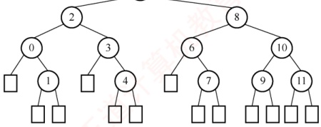

**注意**

对于本类题目，应先根据所给 n 的值，画出如上图所示的折半查找判定树。另外，查找失败结点的 ASL 不是到图中的方形结点，而是到方形结点上一层的圆形结点。

##### 15

D

折半查找法不仅要求数据元素有序，而且要求必须为顺序存储，选项A错误。折半查找法在最坏情况下的时间性能为  $O(\log_{2}n)$，二叉查找树在最坏情况下的时间性能为  $O(n)$，选项B错误。在每个元素查找概率不同的情况下，折半查找法的平均查找长度可能大于顺序查找法，选项C错误。

##### 16

B

通常情况下，在分块查找的结构中，不要求每个索引块中的元素个数都相等。

##### 17

A

设块长为 $b$，索引表包含 $n/b$ 项，索引表的 $\mathrm{ASL}=(n/b+1)/2$，块内的 $\mathrm{ASL}=(b+1)/2$，总 $\mathrm{ASL}=$ 索引表的 $\mathrm{ASL}+$ 块内的 $\mathrm{ASL}=(b+n/b+2)/2$，其中对于 $b+n/b$，由均值不等式可知，$b=n/b$ 时有最小值，此时 $b=\sqrt{n}$。则最理想块长为 $\sqrt{2500}=50$。

##### 18

B

根据公式ASL =  $L_{1} + L_{S} = \frac{b+1}{2} + \frac{s+1}{2} = \frac{s^{2} + 2s + n}{2s}$，其中  $b = n/s, s = 123/3, n = 123$，代入不难得出ASL为23。所以选择选项B。另一方面，可根据穷举法来一步步模拟。对于A块中的元素，查找
过程的第一步是先找到 A 块，由于是顺序查找，找到 A 块只需一步，然后在 A 块中顺序查找，因此 A 块内各元素查找长度分别为 2, 3, 4, …, 42。对于 B 块，采用类似的方法，但查找到 B 块要比查找到 A 块多一步，因此 B 块内各元素查找长度为 3, 4, 5, …, 43。同理，C 块中各个元素查找长度为 4, 5, 6, …, 44。所以平均查找长度为  $(2 + 3 + 4 + \cdots + 42 + 3 + 4 + 5 + \cdots + 43 + 4 + 5 + 6 + \cdots + 44) / 123 = 23$。

##### 19

C

为使查找效率最高，每个索引块的大小应是  $\sqrt{65025}=255$，为每个块建立索引，则索引表中索引项的个数为 255。若对索引项和索引块内部都采用折半查找，则查找效率最高，为  $\left[\log_2(255+1)\right]+\left[\log_2(255+1)\right]=16$。

##### 20

B

折半查找法在查找不成功时和给定值进行关键字的比较次数最多为树的高度，即 $\lfloor \log_2 n \rfloor + 1$或 $\lceil \log_2 (n + 1) \rceil$。在本题中， $n = 16$，所以比较次数最多为5。

**注意**

在折半查找判定树中的方形结点是虚构的，它不计入比较的次数。

##### 21

A

画出查找路径图，因为折半查找判定树是一棵二叉排序树，看其是否满足二叉排序树的要求。

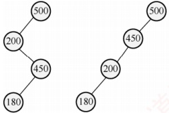

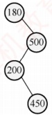

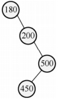

显然，选项 A 的查找路径不满足。

##### 22

B

本题为送分题。

该程序采用跳跃式的顺序查找法查找升序数组中的 x。显然，x 越靠前，比较次数越少。

##### 23

A

对于给定的一个有序查找表，其对应的折半查找判定树是确定且唯一的。在折半查找算法中， $\text{mid} = \lfloor (\text{low} + \text{high}) / 2 \rfloor$，因此若表中初始有  $2n + 1$ 个元素，则 mid 分割后，左右子树各有  $n$ 个元素；若表中初始有  $2n$ 个元素，则 mid 分割后，左子树有  $n - 1$ 个元素，右子树有  $n$ 个元素。即左子树的元素个数或者与右子树的元素个数相等，或者比右子树少一个。若令  $\text{mid} = \lceil (\text{low} + \text{high}) / 2 \rceil$，不难理解，左子树的元素个数或者与右子树的元素个数相等，或者比右子树多一个。对于选项 A，树中每个左子树都与右子树的结点个数相等，或者多一个结点，符合向上取整的规则。对于选项 B、C、D，存在有的左子树比右子树多一个结点，有的左子树比右子树少一个结点，不符合折半查找的规则。

##### 24

B

用折半查找法查找给定值的比较次数最多不超过折半查找判定树的高度。折半查找判定树的树高  $h = \lceil \log_2(n + 1) \rceil$，将  $n = 600$ 代入，结果为 10。

##### 25

D

折半查找必须满足两个条件：①数组（或顺序表），折半查找的上一次查找和本次查找可能相
隔很远的距离，如依次查找下标为  $n/2, n/4, n/8, \cdots$ 的元素，若采用链表（或静态链表），则会使得时间复杂度非常高。②有序，只有在有序的情况下才能根据上一次的比较情况舍弃一半的序列。

##### 26

C

本题可直接套用书中的结论“每块记录数= $\sqrt{n}$时，平均查找长度最小”。解释如下：分块查找的平均查找长度（ASL）等于查找索引表的ASL与块内查找的ASL之和。设每块含s个元素，则块数为 $k=400/s$。总ASL $=(k+1)/2+(s+1)/2=(k+s)/2+1$。要使ASL最小，需要最小化 $k+s=400/s+s$。根据均值不等式，当400/s=s时取最小值，解得s=20。

#### 二、 综合应用题

##### 01

【解答】

1）平均查找长度不同。因为有序顺序表查找到其关键字值比要查找值大的元素时就停止查找，并报告失败信息，不必查找到表尾；而无序顺序表必须查找到表尾才能确定查找失败。

2）平均查找长度相同。两者查找到表中元素的关键字值等于给定值时就停止查找。

3）平均查找长度不同。有序顺序表中关键字相等的元素相继排列在一起，只要查找到第一个就可以连续查找到其他关键字相同的元素。而无序顺序表必须查找全部表中的元素才能找出相同关键字的元素，因此所需的时间不同。

##### 02

【解答】

1）判定树如下图所示。

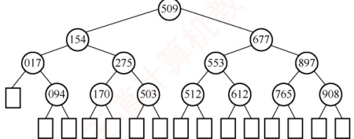

2）若查找275，依次与表中元素509,154,275进行比较，共比较3次。若查找684，依次与表中元素509,677,897,765进行比较，共比较4次。

3）在查找成功时，会找到图中的某个圆形结点，其平均查找长度为

 $$\mathrm{ASL}_{ 成功 }=\frac{1}{14}\sum_{i=1}^{14}C_{i}=\frac{1}{14}(1+2\times2+3\times4+4\times7)=\frac{45}{14}$$

在查找失败时，会找到图中的某个方形结点，但这个结点是虚构的，最后一次的比较元素为其父结点（圆形结点），所以其平均查找长度为

 $$ASL_{ 不成功 }=\frac{1}{15}\sum_{i=0}^{14}C_{i}^{\prime}=\frac{1}{15}(3\times1+4\times14)=\frac{59}{15}$$

##### 03

【解答】

1）先在 A[7], A[15], …, A[8n-1] 内顺序查找，再在区间内折半查找。相应的判定树如下图所示。其中，每个关键字下的数字为其查找成功时的关键字比较次数。

2）等查找概率下，平均每个关键字查找成功的概率为  $1/8n$；0～7 之间的关键字，顺序比较1 次后，进行折半查找，查找成功的平均查找长度为  $2 + 3 \times 2 + 4 \times 4$；8～15 之间的关键字，先顺序比较 2 次后，再进入折半查找；以此类推， $8(n-1) \sim 8n-1$ 之间的关键字，先顺序比较 n 次，再进入折半查找，如上图所示。因此，查找成功的平均查找长度为

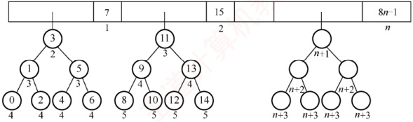

 $$\begin{aligned}ASL_{ 成功 }&=\frac{1}{8n}\sum_{i=0}^{8n-1}C_{i}=\frac{1}{8n}\Biggl(\sum_{i=1}^{n}i+\sum_{i=2}^{n+1}i+2\sum_{i=3}^{n+2}i+4\sum_{i=4}^{n+3}i\Biggr)\\&=\frac{1}{8n}\Biggl(\sum_{i=1}^{n}\left(i+(i+1)+2(i+2)+4(i+3)\right)\Biggr)\\&=\frac{1}{8n}\sum_{i=1}^{n}(8i+17)=\frac{1}{n}\sum_{i=1}^{n}i+\frac{17}{8}=\frac{n+1}{2}+\frac{17}{8}\\ \end{aligned}$$

##### 04

【解答】

算法的基本思想：根据查找的起始位置和终止位置，将查找序列一分为二，判断所查找的关键字在哪一部分，然后用新的序列的起始位置和终止位置递归求解。

算法代码如下：

```c
typedef struct{
    ElemType *elem; //存储空间基址，建表时按实际长度分配，0号留空
    int length; //表的长度
} SSTable;
int BinSearchRec(SSTable ST,ElemType key,int low,int high){
    if(low>high)
        return 0;
    mid=(low+high)/2; //取中间位置
    if(key>ST.elem[mid]) //向后半部分查找
        BinSearchRec(ST,key,mid+1,high);
    else if(key<ST.elem[mid]) //向前半部分查找
        BinSearchRec(ST,key,low,mid-1);
    else return mid;
}
```

算法把规模为 n 的复杂问题经过多次递归调用转化为规模减半的子问题求解。时间复杂度为  $O(\log_2 n)$，算法中用到了一个递归工作栈，其规模与递归深度有关，也是  $O(\log_2 n)$。

##### 05

【解答】

算法的基本思想：检索时可先从表头开始向后顺序扫描，若找到指定的结点，则将该结点和其前趋结点（若存在）交换。采用顺序表存储结构的算法实现如下：

```c
//顺序查找线性表，找到后和其前面的元素交换
int i=0;
while((R[i].key!=k)&&(i<n))
    i++;
if(i<n&&i>0){
    if(i<n&&i>0){
        temp=R[i];R[i]=R[i-1];R[i-1]=temp;
        return --i;
    }
    else return -1;
}
```

链表的实现方式请读者自行思考。注意，链表方式实现的基本思想与上述思想相似，但要注
意用链表实现时，在交换两个结点之前需要保存指向前一结点的指针。

##### 06

【解析】

1 ）算法的基本设计思想：

从矩阵 A 的右上角（最右列）开始比较，若当前元素小于目标值，则向下寻找下一个更大的元素；若当前元素大于目标值，则从右往左依次比较，若目标值存在，则只可能在该行中。

2 ）算法的实现：

```c
bool findkey(int A[][][, int n, int k) {
    int i=0, j=n-1;
    while (i<n&&j>=0) {
        if (A[i][j]==k) return true;
        else if (A[i][j]>k) j--;
        else i++;
    }
    return false;
}
```

3）比较次数不超过2n次，时间复杂度为 $O(n)$；空间复杂度为 $O(1)$。

##### 07

【解答】

1）折半查找要求元素有序顺序存储，字符串默认按字典序排序（字典序是一种比较两个字符串大小的方法，它按字母顺序从左到右逐个比较对应的字符，若某一位可以比较出大小，则不再继续比较后面的字符，如 `abd < acd`、`abc < abcd` 等），对本题来说 `do < for < repeat < while`。若各个元素的查找概率不同，折半查找的性能不一定优于顺序查找。采用顺序查找时，元素按其查找概率的降序排列时查找长度最小。

采用顺序存储结构，数据元素按其查找概率降序排列。采用顺序查找方法。查找成功时的平均查找长度 = 0.35×1 + 0.35×2 + 0.15×3 + 0.15×4 = 2.1。此时，显然查找长度比折半查找的更短。

2）答案1：采用链式存储结构时，只能采用顺序查找，其性能和顺序表一样，类似于上题。

数据元素按其查找概率降序排列，构成单链表。采用顺序查找方法。

查找成功时的平均查找长度 = 0.35×1 + 0.35×2 + 0.15×3 + 0.15×4 = 2.1。

答案2：还可以构造成二叉排序树的形式。采用二叉链表的存储结构，构造二叉排序树，元素的存储方式见下图。采用二叉排序树的查找方法。

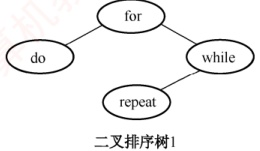

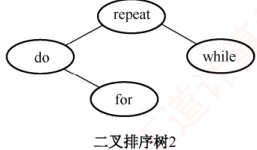

查找成功时的平均查找长度=0.15×1+0.35×2+0.35×2+0.15×3=2.0。
