### 7.3.4 本节试题精选

#### 一、 单项选择题

##### 01

对于二叉排序树，下面的说法中，（）是正确的。

A. 二叉排序树是动态树表，查找失败时插入新结点，会引起树的重新分裂和组合

B. 对二叉排序树进行层序遍历可得到有序序列

C. 用逐点插入法构造二叉排序树，若先后插入的关键字有序，二叉排序树的深度最大

D. 在二叉排序树中进行查找，关键字的比较次数不超过结点数的 1/2

##### 02

按（）遍历二叉排序树得到的序列是一个有序序列。

A. 先序 B. 中序 C. 后序 D. 层次

##### 03

在二叉排序树中进行查找的效率与（）有关。

A. 二叉排序树的深度

B. 二叉排序树的结点的个数

C. 被查找结点的度

D. 二叉排序树的存储结构

##### 04

在常用的描述二叉排序树的存储结构中，关键字值最大的结点（）。

A. 左指针一定为空

B. 右指针一定为空

C. 左右指针均为空

D. 左右指针均不为空

##### 05

设二叉排序树中关键字由1到1000的整数构成，现要查找关键字为363的结点，下述关键字序列中，不可能是在二叉排序树上查找的序列是（）。

A. 2,252,401,398,330,344,397,363 B. 924,220,911,244,898,258,362,363

C. 925,202,911,240,912,245,363 D. 2,399,387,219,266,382,381,278,363

##### 06

分别以下列序列构造二叉排序树，与用其他3个序列所构造的结果不同的是（）。

A. (100, 80, 90, 60, 120, 110, 130)

B. (100, 120, 110, 130, 80, 60, 90)

C. (100, 60, 80, 90, 120, 110, 130)

D. (100, 80, 60, 90, 120, 130, 110)

##### 07

从空树开始，依次插入元素 52, 26, 14, 32, 71, 60, 93, 58, 24 和 41 后构成了一棵二叉排序树。在该树查找 60，要进行比较的次数为（）。

A. 3 B. 4 C. 5 D. 6

##### 08

在含有 n 个结点的二叉排序树中查找某个关键字的结点时，最多进行（）次比较。
A. n/2 B.  $\log_{2}n$ C.  $\log_{2}n+1$ D. n

##### 09

五个不同结点构造的二叉查找树的形态共有（）种。

A. 20 B. 30 C. 32 D. 42

##### 10

构造一棵具有 n 个结点的二叉排序树时，最理想情况下的深度为（）。

A. n/2 B. n C.  $\lfloor \log_2(n+1) \rfloor$ D.  $\lceil \log_2(n+1) \rceil$

##### 11

含有 20 个结点的平衡二叉树的最大深度为（）。

A. 4 B. 5 C. 6 D. 7

##### 12

具有5层结点的平衡二叉树至少有___个结点。

A. 10 B. 12 C. 15 D. 17

##### 13

高度为3的平衡二叉排序树的形态共有（）种。

A. 13 B. 14 C. 16 D. 15

##### 14

在平衡二叉树的基本操作中，可能发生两次旋转的操作是（）。

A. 添加、删除结点 B. 仅删除结点 C. 仅添加结点 D. 都不会

##### 15

将关键字 1,2,3, $\cdots$,1024 依次插入到初始为空的平衡二叉树中，假设只有一个根结点的二叉树的高度为 0，则插入结束后的平衡二叉树的高度为（）。

A. 8 B. 9 C. 10 D. 11

##### 16

下列关于红黑树和 AVL 树的说法中，不正确的是（）。

I. 一棵含有 n 个结点的红黑树的高度至多为  $2\log_{2}(n+1)$

II. 若一个结点是红色的，则它的父结点和孩子结点都是黑色的

III. 红黑树的查询效率一般要优于含有相同结点数的 AVL 树

IV. 若 AVL 树的某结点的左右孩子的平衡因子都是零，则该结点的平衡因子也是零

A. I、III B. III C. II、IV D. III、IV

##### 17

下列关于红黑树和 AVL 树的描述中，不正确的是（）。

A. 两者都属于自平衡的二叉树

B．两者查找、插入、删除的时间复杂度都相同

C. 红黑树插入和删除过程至多有2次旋转操作

D．红黑树的任意一个结点的左右子树高度（含叶结点）之比不超过2

##### 18

下列关于红黑树的说法中，正确的是（）。

A. 红黑树的红结点的数目最多和黑结点的数目相同（不考虑虚构结点）

B. 若红黑树的所有结点都是黑色的，则它一定是一棵满二叉树

C. 红黑树的任何一个分支结点都有两个非空孩子结点

D. 红黑树的子树也一定是红黑树

##### 19

下列四个选项中，满足红黑树定义的是（）。

A. B. C.

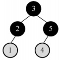

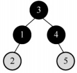

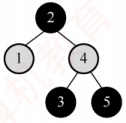

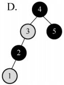

##### 20

将关键字 1,2,3,4,5,6,7 依次插入初始为空的红黑树 T，则 T 中红结点的个数是（）。

A. 1 B. 2 C. 3 D. 4
##### 21

将关键字 5, 4, 3, 2, 1 依次插入初始为空的红黑树 T，则 T 的最终形态是（）。

A.

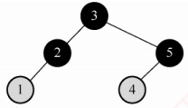

B.

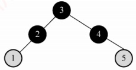

C.

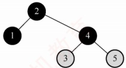

D.

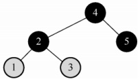

##### 22

在下图所示的红黑树中插入结点2且染成红色后，则下一步应进行的操作是（）。

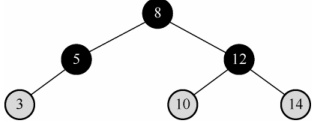

A. 左旋 B. 右旋 C. 变色 D. 无须调整

##### 23

【2009 统考真题】下列二叉排序树中，满足平衡二叉树定义的是（）。

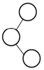

A.


B.

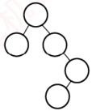

C.

D.

##### 24

【2010 统考真题】在下图所示的平衡二叉树中插入关键字 48 后得到一棵新平衡二叉树，在新平衡二叉树中，关键字 37 所在结点的左右子结点中保存的关键字分别是（）。

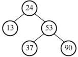

A. 13,48 B. 24,48 C. 24,53 D. 24,90

##### 25

【2011 统考真题】对下列关键字序列，不可能构成某二叉排序树中一条查找路径的是（）。

A. 95, 22, 91, 24, 94, 71

B. 92, 20, 91, 34, 88, 35

C. 21, 89, 77, 29, 36, 38

D. 12, 25, 71, 68, 33, 34

##### 26

【2012 统考真题】若平衡二叉树的高度为 6，且所有非叶结点的平衡因子均为 1，则该平衡二叉树的结点总数为（）。

A. 12 B. 20 C. 32 D. 33

##### 27

【2013 统考真题】在任意一棵非空二叉排序树  $T_{1}$ 中，删除某结点 v 之后形成二叉排序树  $T_{2}$，再将 v 插入  $T_{2}$ 形成二叉排序树  $T_{3}$。下列关于  $T_{1}$ 与  $T_{3}$ 的叙述中，正确的是（）。

I. 若 v 是  $T_{1}$ 的叶结点，则  $T_{1}$ 与  $T_{3}$ 不同
Ⅱ. 若 v 是  $T_{1}$ 的叶结点，则  $T_{1}$ 与  $T_{3}$ 相同

III. 若 v 不是  $T_{1}$ 的叶结点，则  $T_{1}$ 与  $T_{3}$ 不同

IV. 若 v 不是  $T_{1}$ 的叶结点，则  $T_{1}$ 与  $T_{3}$ 相同

A. 仅I、III B. 仅I、IV C. 仅II、III D. 仅II、IV

##### 28

【2013 统考真题】若将关键字 1, 2, 3, 4, 5, 6, 7 依次插入初始为空的平衡二叉树 T，则 T 中平衡因子为 0 的分支结点的个数是（）。

A. 0 B. 1 C. 2 D. 3

##### 29

【2015 统考真题】现有一棵无重复关键字的平衡二叉树（AVL），对其进行中序遍历可得到一个降序序列。下列关于该平衡二叉树的叙述中，正确的是（）。

A. 根结点的度一定为 2

B. 树中最小元素一定是叶结点

C. 最后插入的元素一定是叶结点

D. 树中最大元素一定是无左子树

##### 30

【2018 统考真题】已知二叉排序树如右图所示，元素之间应满足的大小关系是（）。

A.  $x_1 < x_2 < x_5$

B.  $x_1 < x_4 < x_5$

C.  $x_3 < x_5 < x_4$

D.  $x_4 < x_3 < x_5$

##### 31

【2019 统考真题】在任意一棵非空平衡二叉树（AVL 树） $T_{1}$ 中，删除某结点 v 之后形成平衡二叉树  $T_{2}$，再将 v 插入  $T_{2}$ 形成平衡二叉树  $T_{3}$。下列关于  $T_{1}$ 与  $T_{3}$ 的叙述中，正确的是（）。

I. 若 v 是  $T_{1}$ 的叶结点，则  $T_{1}$ 与  $T_{3}$ 可能不相同

II. 若 v 不是  $T_{1}$ 的叶结点，则  $T_{1}$ 与  $T_{3}$ 一定不相同

III. 若 v 不是  $T_{1}$ 的叶结点，则  $T_{1}$ 与  $T_{3}$ 一定相同

A. 仅 I

B. 仅 II

C. 仅 I、II

D. 仅 I、III

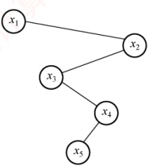

##### 32

【2020 统考真题】下列给定的关键字输入序列中，不能生成右边二叉排序树的是（）。

A. 4, 5, 2, 1, 3

B. 4, 5, 1, 2, 3

C. 4, 2, 5, 3, 1

D. 4, 2, 1, 3, 5

##### 33

【2021 统考真题】给定平衡二叉树如右图所示，插入关键字 23 后，根中的关键字是（）。

A. 16

B. 20

C. 23

D. 25

##### 34

【2024 统考真题】一棵二叉搜索树如右图所示， $k_{1}$、 $k_{2}$、 $k_{3}$ 分别是对应结点中保存的关键字。子树 T 的任一结点中保存的关键字 x 满足的是（）。

A.  $x<k_{1}$ B.  $x>k_{2}$ C.  $k_{1}<x<k_{3}$ D.  $k_{3}<x<k_{2}$

#### 二、 综合应用题

##### 01

一棵二叉排序树按先序遍历得到的序列为(50, 38, 30, 45, 40, 48, 70, 60, 75, 80)，试画出该二叉排序树，并求出等概率下查找成功和查找失败

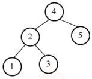

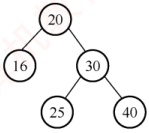

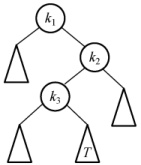

##### 02

按照序列(40, 72, 38, 35, 67, 51, 90, 8, 55, 21)建立一棵二叉排序树，画出该树，并求出在等概率的情况下，查找成功的平均查找长度。
##### 03

依次把结点(34, 23, 15, 98, 115, 28, 107)插入初始状态为空的平衡二叉排序树，使得在每次插入后保持该树仍然是平衡二叉树。请依次画出每次插入后所形成的平衡二叉排序树。

##### 04

给定一个关键字集合{25, 18, 34, 9, 14, 27, 42, 51, 38}，假定查找各关键字的概率相同，请画出其最佳二叉排序树。

##### 05

试编写一个算法，判断给定的二叉树是否是二叉排序树。

##### 06

设计一个算法，求出指定结点在给定二叉排序树中的层次。

##### 07

利用二叉树遍历的思想编写一个判断二叉树是否是平衡二叉树的算法。

##### 08

设计一个算法，求出给定二叉排序树中最小和最大的关键字。

##### 09

设计一个算法，从大到小输出二叉排序树中所有值不小于 k 的关键字。

##### 10

编写一个递归算法，在一棵有  $n$ 个结点的、随机建立的二叉排序树上查找第  $k$ ( $1 \leq k \leq n$) 小的元素，并返回指向该结点的指针。要求算法的平均时间复杂度为  $O(\log_2 n)$。

二叉排序树的每个结点中除 data、lchild、rchild 等数据成员外，增加一个 count 成员，保存以该结点为根的子树上的结点个数。

### 7.3.5 答案与解析

#### 一、 单项选择题

##### 01

C

二叉排序树插入新结点时不会引起树的分裂组合。对二叉排序树进行中序遍历可得到有序序列。当插入的关键字有序时，二叉排序树会形成一个长链，此时深度最大。在此种情况下进行查找，有可能需要比较每个结点的关键字，超过总结点数的1/2。

##### 02

B

由二叉排序树的定义不难得出中序遍历二叉树得到的序列是一个有序序列。

##### 03

A

二叉排序树的查找路径是自顶向下的，其平均查找长度主要取决于树的高度。

##### 04

B

在二叉排序树的存储结构中，每个结点由三部分构成，其中左（或右）指针指向比该结点的关键字值小（或大）的结点。关键字值最大的结点位于二叉排序树的最右位置，因此它的右指针一定为空（有可能不是叶结点）。还可用反证法，若右指针不为空，则右指针上的关键字肯定比原关键字大，所以原关键字结点一定不是值最大的，与条件矛盾，所以右指针一定为空。

##### 05

C

在二叉排序树上查找时，先与根结点值进行比较，若相同，则查找结束，否则根据比较结果，沿着左子树或右子树向下继续查找。根据二叉排序树的定义，有左子树结点值≤根结点值≤右子树结点值。C 序列中，比较 911 关键字后，应转向其左子树比较 240，左子树中不应出现比 911 更大的数值，但 240 竟有一个右孩子结点值为 912，所以不可能是正确的序列。

##### 06

C

按照二叉排序树的构造方法，不难得到 A, B, D 序列的构造结果相同。

##### 07

A

以第一个元素为根结点，依次将元素插入树，生成的二叉排序树如右图所示。进行查找时，先与根结点比较，然后根据比较结果，继续在左子树或右子树上进行查找。比较的结点依次为52,71,60。

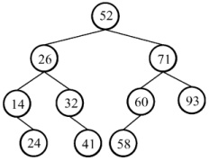

##### 08

D

当输入序列是一个有序序列时，构造的二叉排序树是一个单支树，当查找一个不存在的关键字值或最后一个结点的关键字值时，需要 n 次比较。

##### 09

D

五个不同结点构造的二叉查找树，中序列是确定的。先序序列的个数为 n=5 的卡特兰数，加上中序列和先序序列能唯一确定一棵二叉树，因此二叉排序树的形态共有 Catalan(5)=42 种。

##### 10

D

当二叉排序树的叶结点全部都在相邻的两层内时，深度最小。理想情况是从第一层到倒数第二层为满二叉树。类比完全二叉树，可得深度为 $\lceil \log_{2}(n + 1) \rceil$。

##### 11

C

平衡二叉树结点数的递推公式为  $n_{0}=0$,  $n_{1}=1$,  $n_{2}=2$,  $n_{h}=1+n_{h-1}+n_{h-2}$ (h 为平衡二叉树高度,  $n_{h}$ 为构造此高度的平衡二叉树所需的最少结点数)。通过递推公式可得, 构造 5 层平衡二叉树至少需 12 个结点, 构造 6 层至少需要 20 个结点。

##### 12

B

设  $n_h$ 表示高度为  $h$ 的平衡二叉树中含有的最少结点数，则有  $n_1 = 1, n_2 = 2, n_h = n_{h-1} + n_{h-2} + 1$，由此求出  $n_5 = 12$，对应的 AVL 如右图所示。

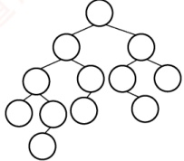

##### 13

D

高度为3的平衡二叉树的左右子树的高度共有三种情况：①左右子

树都是高度为2的平衡二叉树；② 左子树是高度为1的平衡二叉树，右子树是高度为2的平衡二叉树；③ 左子树是高度为2的平衡二叉树，右子树是高度为1的平衡二叉树。高度为1的平衡二叉树只有1种形态，即单个结点，如图1所示；高度为2的平衡二叉树有3种形态，如图2所示。


图1

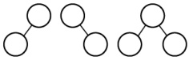

图2

因此，对于情况①，共有  $3 \times 3 = 9$ 种树形态；对于情况②，共有  $1 \times 3 = 3$ 种树形态；情况③和情况②类似，也有 3 种树形态，所以共有  $9 + 3 + 3 = 15$ 种树形态。

##### 14

A

插入和删除结点都有可能引起LR平衡旋转或者RL平衡旋转，发生两次旋转操作。

##### 15

C

当按关键字有序的顺序插入初始为空的平衡二叉树时，若关键字个数  $n = 2^k - 1$ 时，则该平衡二叉树一定是一棵满二叉树（可以用  $1 \sim 3$、 $1 \sim 7$ 手工验证）。当插入关键字 1023 时，平衡二叉树正好是一棵满二叉树，高度为 9。因此，插入关键字 1024 后，平衡二叉树的高度为 10。

##### 16

D

说法Ⅰ和Ⅱ都是红黑树的性质。AVL是高度平衡的二叉查找树，红黑树是适度平衡的二叉查找树，从这一点可以看出AVL的查询效率往往更优，说法Ⅲ错误。AVL的某结点的左右孩子的平衡因子都是零，并不能说明左右子树的高度相等，因此该结点的平衡因子不一定为零，说法Ⅳ错误。

##### 17

C

自平衡的二叉排序树是指在插入和删除时能自动调整以保持其所定义的平衡性，两者都属于
自平衡二叉树，选项 A 正确。两者的查找、插入、删除操作的时间复杂度都为  $O(\log_2 n)$，选项 B 正确。在红黑树中删除结点时，情况 1 可能变为情况 2、3 或 4，情况 2 会变为情况 3，可能会出现旋转次数超过 2 次的情况，选项 C 错误。从任一结点到每个叶结点的所有路径都包含相同数目的黑结点，没有两个连续的红结点，且叶结点是黑色的，这意味着在任一结点到其左右子树中最远和最近的叶结点之间，红结点的数目小于或等于黑结点的数目，路径长度之比不超过 2，选项 D 正确。

##### 18

B

红黑树的红结点数目最大可以是黑结点数目的2倍（如一棵有3个结点的红黑树，第1层为黑色，第2层为红色），选项A错误。从根结点出发到所有叶结点的黑结点数是相同的，若所有结点都是黑色，则一定是满二叉树，选项B正确。考虑某个黑结点，它可以有一个空叶结点孩子和一个非空红结点孩子，选项C错误。红黑树中可能存在红结点，根结点为红色的子树不是红黑树，选项D错误。

##### 19

A

红黑树是一种特殊的二叉排序树，选项B不满足二叉排序树的性质。选项C中，结点2的左右黑结点数不同。在选项D中，结点3的左右黑结点数不同。只有选项A满足红黑树的定义。

##### 20

C

关键字1,2,3,4,5,6,7依次插入红黑树后的形态变化如下：

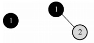

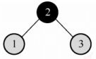

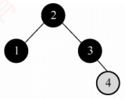

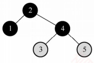

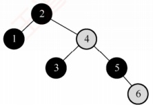

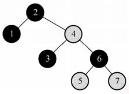

##### 21

D

关键字5,4,3,2,1依次插入红黑树后的形态变化如下：

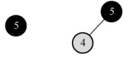

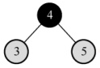

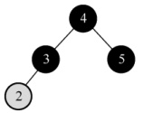

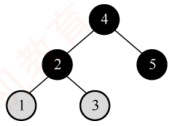

##### 22

B

插入结点2且将其染成红色后违反不红红原则，并且叔结点是黑色，应进行LL旋转，将结
点3右旋旋转到结点5的位置，结点2和结点5分别成为结点3的左右孩子，然后将结点3染成黑色，结点2和结点5染成红色。因此，下一步应进行右旋操作。

##### 23

B

根据平衡二叉树的定义，任意结点的左右子树高度差的绝对值不超过1。而其余3个答案均可以找到不满足条件的结点。答题时可以把每个非叶结点的平衡因子都写出来。

##### 24

C

插入 48 以后，该二叉树根结点的平衡因子由 -1 变为 -2，在最小不平衡子树根结点的右子树（R）的左子树（L）中插入新结点引起的不平衡属于 RL 型平衡旋转（先右旋后左旋）。

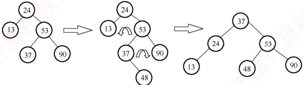

调整后，关键字37所在结点的左右子结点中保存的关键字分别是24、53。

##### 25

A

在二叉排序树中，左子树结点值小于根结点，右子树结点值大于根结点。在选项A中，当查找到91后再向24查找，说明这一条路径（左子树）之后查找的数都要比91小，而后面却查找到了94（解题过程中，建议配合画图），因此错误。

画图法：各选项对应的查找过如下图所示。选项 B、C、D 对应的查找树都是二叉排序树，选项 A 对应的查找树不是二叉排序树，因为在 91 为根的左子树中出现了比 91 大点的结点 94。

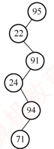

(a) 选项A的查找过程

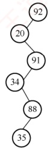

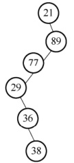

(b) 选项B的查找过程 (c) 选项C的查找过程

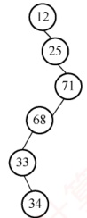

(d) 选项D的查找过程

##### 26

B

所有非叶结点的平衡因子均为1，即平衡二叉树满足平衡的最少结点情况，如下图所示。对于高度为n、左右子树的高度分别为n-1和n-2、所有非叶结点的平衡因子均为1的平衡二叉树，计算总结点数的公式为 $C_{n}=C_{n-1}+C_{n-2}+1$， $C_{1}=1$， $C_{2}=2$， $C_{3}=2+1+1=4$，可推出 $C_{6}=20$。

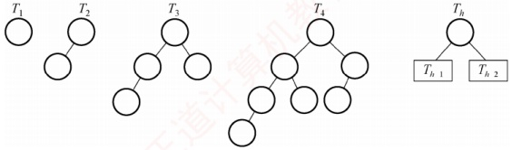

画图法：先画出  $T_{1}$ 和  $T_{2}$；然后新建一个根结点，连接  $T_{2}$、 $T_{1}$ 构成  $T_{3}$；新建一个根结点，连接  $T_{3}$、 $T_{2}$ 构成  $T_{4}$……直到画出  $T_{6}$，可知  $T_{6}$ 的结点数为 20。

排除法：对于选项 A，高度为 6、结点数为 12 的树怎么也无法达到平衡。对于选项 C，结点较多时，考虑较极端的情形，即第 6 层只有最左叶子的完全二叉树刚好有 32 个结点，虽然满足平衡的条件，但显然再删去部分结点依然不影响平衡，不是最少结点的情况。同理，选项 D 错误。

##### 27

C

由于在二叉排序树中插入结点的位置是一个新的叶结点，若删除的是叶结点，则重新插入后得到的二叉排序树与原来的二叉排序树相同。若删除的是非叶结点，在删除过程中会找其他结点填补，重新插入后变成叶结点，则得到的二叉排序树与原来的二叉排序树不同。

##### 28

D

利用 7 个关键字构建平衡二叉树 T，平衡因子为 0 的分支结点个数为 3，构建的平衡二叉树及构造与调整过程如下图所示。

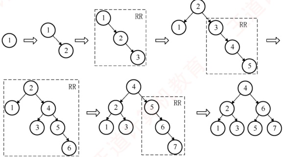

##### 29

D

大多数教材将平衡二叉树定义为一种高度平衡的二叉排序树，二叉排序树的中序序列是一个升序序列，而题意正好相反。由此可知，命题老师认为平衡二叉树仅为一棵满足高度平衡的二叉树，不一定是二叉排序树。只有两个结点的平衡二叉树的根结点的度为1，选项A错误。中序遍历后得到一个降序序列（与二叉排序树正好相反），树中最大元素一定无左子树（可能有右子树），这与二叉排序树也正好相反，也因此不一定是叶结点，选项B错误，选项D正确。最后插入的结点可能会导致平衡调整，而不一定是叶结点，选项C错误。

##### 30

C

根据二叉排序树的特性：中序遍历（LNR）得到的是一个递增序列。图中二叉排序树的中序遍历序列为  $x_1, x_3, x_5, x_4, x_2$，可知  $x_3 < x_5 < x_4$。

##### 31

A

在非空平衡二叉树中插入结点，在失去平衡调整前，一定插入在叶结点的位置。

若删除的是  $T_{1}$ 的叶结点，则删除后平衡二叉树可能不会失去平衡，即不会发生调整，再插入此结点得到的二叉平衡树  $T_{1}$ 与  $T_{3}$ 相同；若删除后平衡二叉树失去平衡而发生调整，再插入结点得到的二叉平衡树  $T_{3}$ 与  $T_{1}$ 可能不同。说法 I 正确。例如，如下图所示，删除结点 0，平衡二叉树失衡调整，再插入结点 0 后，平衡二叉树和以前不同。

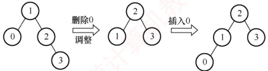

对于比较绝对的说法Ⅱ和Ⅲ，通常只需举出反例即可。

若删除的是  $T_{1}$ 的非叶结点，且删除和插入操作均没有导致平衡二叉树的调整（这时可以首先想到删除的结点只有一个孩子的情况），则该结点从非叶结点变成了叶结点， $T_{1}$ 与  $T_{3}$ 显然不同。例如，如下图所示，删除结点 2，用右孩子结点 3 填补，再插入结点 2，平衡二叉树和以前不同。

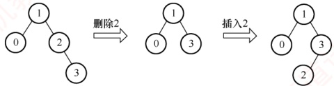

若删除的是  $T_{1}$ 的非叶结点，且删除和插入操作后导致了平衡二叉树的调整，则该结点有可能通过旋转后继续变成非叶结点， $T_{1}$ 与  $T_{3}$ 相同。例如，如下图所示，删除结点 2，用右孩子结点 3 填补，再插入结点 2，平衡二叉树失衡调整，调整后的平衡二叉树和以前相同。

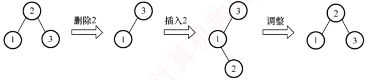

##### 32

B

每个选项都逐一验证，选项 B 生成二叉排序树的过程如下图所示，显然错误。

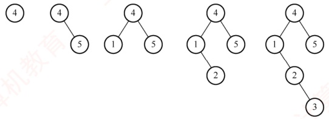

##### 33

D

关键字23的插入位置为25的左孩子，此时破坏了平衡的性质，需要对平衡二叉树进行调整。最小不平衡子树就是该树本身，插入位置在根结点的右子树的左子树上，因此需要进行RL旋转，RL旋转过程如下图所示，旋转完成后根结点的关键字为25，所以选择选项D。

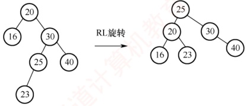

##### 34

D

在二叉搜索树中，每个结点的左子树中的所有关键字都小于该结点的关键字，右子树中的所有关键字都大于该结点的关键字。 $k_2$、 $k_3$ 所在结点都在  $k_1$ 所在结点的右子树中，因此  $k_2 > k_1$、 $k_3 > k_1$； $k_3$ 所在结点在  $k_2$ 所在结点的左子树中，因此  $k_3 < k_2$；子树 T 是  $k_3$ 所在结点的右子树，因此子树 T 中任意结点的关键字 x 满足  $x > k_3$。综合可得， $k_3 < x < k_2$。

#### 二、 综合应用题

##### 01

【解答】

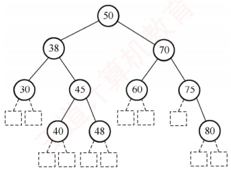

先序序列为(50, 38, 30, 45, 40, 48, 70, 60, 75, 80)，二叉树的中序序列是一个有序序列，所以为(30, 38, 40, 45, 48, 50, 60, 70, 75, 80)，由先序序列和中序序列可以构造出对应的二叉树，如左图所示。

查找成功的平均查找长度为

 $$ASL=(1{\times}1+2{\times}2+3{\times}4+4{\times}3)/10=2.9$$

图中的方块结点为虚构的查找失败结点，其查找路径为从根结点到其父结点（圆形结点）的结点序列，所以对应的查找失败平均长度为

 $$ASL=(3{\times}5+4{\times}6)/11=39/11$$

##### 02

【解答】

根据二叉排序树的定义，该序列所对应的二叉排序树如下图所示。

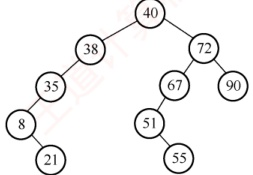

平均查找长度为  $ASL = (1 + 2 \times 2 + 3 \times 3 + 4 \times 2 + 5 \times 2) / 10 = 3.2$。

##### 03

【解答】

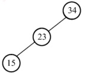

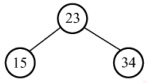

第一步：插入结点 34, 23, 15 后，需要根结点 34 的子树做 LL 调整。

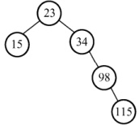

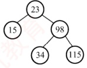

第二步：插入结点98,115后，需要根结点34的子树做RR调整。

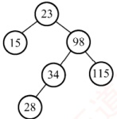

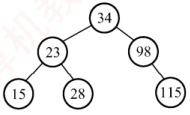

第三步：插入结点28后，需要根结点23的子树做RL调整。

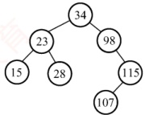


第四步：插入结点107后，需要根结点98的子树做RL调整。

##### 04

【解答】

当各关键字的查找概率相等时，最佳二叉排序树应是高度最小的二叉排序树。构造过程分两步走：首先对各关键字按值从小到大排序，然后仿照折半查找的判定树的构造方法构造二叉排序树。这样得到的就是最佳二叉排序树，结果如右图所示。


##### 05

【解答】

对二叉排序树来说，其中序遍历序列为一个递增有序序列。

因此，对给定的二叉树进行中序遍历，若始终能保持前一个值比后一个值小，则说明该二叉树是一棵二叉排序树。算法实现如下：

KeyType predt=-32767; //predt 为全局变量，保存当前结点中序前驱的值，初值为 $-\infty$
```c
int JudgeBST(BiTree bt){
    int b1,b2;
    if(bt==NULL) //空树
        return 1;
    else{
        b1=JudgeBST(bt->lchild); //判断左子树是否是二叉排序树
        if(b1==0||predt>=bt->data) //若左子树返回值为0或前驱大于或等于当前结点
            return 0; //则不是二叉排序树
        predt=bt->data; //保存当前结点的关键字
        b2=JudgeBST(bt->rchild); //判断右子树
        return b2; //返回右子树的结果
}
```

##### 06

【解答】

算法思想：设二叉树采用二叉链表存储结构。在二叉排序树中，查找一次就下降一层。因此，查找该结点所用的次数就是该结点在二叉排序树中的层次。采用二叉排序树非递归查找算法，用n保存查找层次，每查找一次，n就加1，直到找到相应的结点。算法如下：

```c
int level(BiTree bt, BSTNode *p) {
    int n=0; //统计查找次数
    BiTree t=bt;
    if (bt != NULL) {
        n++;
        while (t->data != p->data) {
if (p->data<t->data) //在左子树中查找
    t=t->lchild;
else
    t=t->rchild;
n++;

//在右子树中查找

//层次加1
}

return n;
```

##### 07

【解答】

设置二叉树的平衡标记 balance，以标记返回二叉树 bt 是否为平衡二叉树，若为平衡二叉树，则返回 1，否则返回 0；h 为二叉树 bt 的高度。采用后序遍历的递归算法：

1）若 bt 为空，则高度为 0，balance=1。

2）若 bt 仅有根结点，则高度为 1，balance=1。

3）否则，对 bt 的左右子树执行递归运算，返回左右子树的高度和平衡标记，bt 的高度为最高子树的高度加 1。若左右子树的高度差大于 1，则 balance=0；若左右子树的高度差小于或等于 1，且左右子树都平衡时，balance=1，否则 balance=0。

算法如下：

```c
void Judge_AVL(BiTree bt, int &balance, int &h) {
    int bl=0, br=0, hl=0, hr=0; //左右子树的平衡标记和高度
    if (bt == NULL) {
        h=0;
        balance=1;
    }
    `else if (bt->lchild==NULL&&bt->rchild==NULL)` { //仅有根结点，则高度为1
        h=1;
        balance=1;
    }
    else {
        Judge_AVL(bt->lchild, bl, hl); //递归判断左子树
        Judge_AVL(bt->rchild, br, hr); //递归判断右子树
        h = (hl > hr ? hl : hr) + 1;
        if (abs(hl - hr) < 2) //若子树高度差的绝对值<2，则看左右子树是否都平衡
            balance = bl && br; //&& 为逻辑与，即左右子树都平衡时，二叉树平衡
        else
            balance = 0;
    }
}
```

##### 08

【解答】

在一棵二叉排序树中，最左下结点即关键字最小的结点，最右下结点即关键字最大的结点，本算法只要找出这两个结点即可，而不需要比较关键字。算法如下：

```c
KeyType MinKey(BSTNode *bt) {
    while (bt->lchild!=NULL)
        bt=bt->lchild;
    return bt->data;
}

KeyType MaxKey(BSTNode *bt) {
    //求出二叉排序树中最大关键字结点
    while (bt->rchild!=NULL)
        bt=bt->rchild;
    return bt->data;
}
```
##### 09

【解答】

由二叉排序树的性质可知，右子树中所有的结点值均大于根结点值，左子树中所有的结点值均小于根结点值。为了从大到小输出，先遍历右子树，再访问根结点，后遍历左子树。算法如下：

```c
void OutPut(BSTNode *bt, KeyType k)

{
    //本算法从大到小输出二叉排序树中所有值不小于 k 的关键字
    if (bt == NULL)
        return;
    if (bt -> rchild != NULL)
        OutPut (bt -> rchild, k); //递归输出右子树结点
    if (bt -> data >= k)
        printf("%d", bt -> data); //只输出大于或等于 k 的结点值
    if (bt -> lchild != NULL)
        OutPut (bt -> lchild, k); //递归输出左子树的结点
}
```

本题也可采用中序遍历加辅助栈的方法实现。

##### 10

【解答】

设二叉排序树的根结点为 $^{*}t$，根据结点存储的信息，有以下几种情况：

当 t -> lchild 为空时，情况如下：

1）若 t -> rchild 非空且 k == 1，则 *t 即第 k 小的元素，查找成功。

2）若 t -> rchild 非空且 k!=1，则第 k 小的元素必在 *t 的右子树。

当 t -> lchild 非空时，情况如下：

1) t->lchild->count==k-1, *t 即第 k 小的元素，查找成功。
```c
2) t->lchild->count>k-1，第 k 小的元素必在*t 的左子树，继续到*t 的左子树中查找。
```
3) t->lchild->count<k-1，第 k 小的元素必在右子树，继续搜索右子树，寻找第 k-(t->lchild->count+1) 小的元素。

对左右子树的搜索采用相同的规则，递归实现的算法描述如下：
```c

BSTNode *Search Small(BSTNode*t,int k) {
    //在以t为根的子树上寻找第k小的元素，返回其所在结点的指针。k从11开始计算
    //在树结点中增加一个count数据成员，存储以该结点为根的子树的结点个数
    if (k<1||k>t->count) return NULL;
    if (t->lchild==NULL) {
        if (k==1) return t;
        else return Search_Small(t->rchild,k-1);
    }
    else {
        if (t->lchild->count==k-1) return t;
        if (t->lchild->count>k-1) return Search Small(t->lchild,k);
        if (t->lchild->count<k-1)
            return Search_Small(t->rchild, k-(t->lchild->count+1));
    }
}
```

最大查找长度取决于树的高度。由于二叉排序树是随机生成的，其高度应是  $O(\log_2 n)$，算法的时间复杂度为  $O(\log_2 n)$。
