### 7.4.3 本节试题精选

#### 一、 单项选择题

##### 01

右图所示是一棵（）。

A. 4 阶 B 树

B. 3 阶 B 树

C. 4 阶 B+树

D. 无法确定

##### 02

下列关于 m 阶 B 树的说法中，错误的是（）。

A. 根结点至多有 m 棵子树

B. 所有叶结点都在同一层次上

C. 非叶结点至少有  $\frac{m}{2} (m$ 为偶数 ) 或  $(m+1)/2 (m$ 为奇数 ) 棵子树

D. 根结点中的数据是有序的

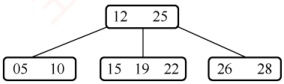

##### 03

下列关于高度为 3 的 3 阶 B 树的说法中，正确的是（）。

I. 每个内部结点至少有两棵非空子树

II. 树中每个结点至多有 2 个关键字

III. 树中最多能存储 26 个关键字

IV. 插入一个元素引起 B 树结点分裂后，树的高度变为 4

A. I、II B. I、II、III C. III、IV D. I、II、IV

##### 04

在一棵 $m$ 阶 B 树中做插入操作前，若一个结点中的关键字个数等于（），则插入操作后必须分裂成两个结点；在一棵 $m$ 阶 B 树中做删除操作前，若一个结点中的关键字个数等于（），则删除操作后可能需要同它的左兄弟或右兄弟结点合并成一个结点。

A. $m$, $\lceil m/2 \rceil - 2$

B. $m - 1$, $\lceil m/2 \rceil - 1$

C. $m + 1$, $\lceil m/2 \rceil$

D. $m/2$, $\lceil m/2 \rceil + 1$

##### 05

具有 n 个关键字的 m 阶 B 树，应有（）个叶结点。

A.  $n+1$ B. n-1 C. mn D. nm/2

##### 06

高度为5的3阶B树至少有（）个结点，至多有（）个结点。

A. 32 B. 31 C. 120 D. 121

##### 07

含有 n 个非叶结点的 m 阶 B 树中至少包含（ ）个关键字。

A.  $n(m+1)$ B. n C.  $n(\lceil m/2\rceil-1)$ D.  $(n-1)(\lceil m/2\rceil-1)+1$

##### 08

已知一棵5阶B树中共有53个关键字，则树的最大高度为（），最小高度为（）。

A. 2

B. 3

C. 4

D. 5
##### 09

已知一棵3阶B树中共有2047个关键字，则树的最大高度为（），最小高度为（）。

A. 11

B. 10

C. 8

D. 7

##### 10

在 7 阶 B 树中，按从上往下、从左往右的顺序搜索第 2016 个关键字，若根结点已读入内存，则最多需启动（）次 I/O。

A. 4 B. 5 C. 6 D. 7

##### 11

在一棵高度为 h 的 B 树中插入一个新关键字，假设在插入过程中读入的结点一直在内存中，根结点的高度为 1，且初始时未读入内存，则下列叙述中错误的是（）。（注意，本题中的新结点是指新产生的结点，如一次分裂才产生一个新结点。）

A. 若插入操作导致树的高度变为  $h+1$，则本次插入一定导致了根结点的分裂

B. 若插入操作导致旧结点的分裂，则树的高度一定会变为  $h+1$

C. 由于本次插入操作而产生的新结点的个数最多为  $h+1$

D. 由于本次插入操作而产生的读/写磁盘的次数最多为  $3h+1$

##### 12

下列关于 B 树和 B+树的叙述中，错误的是（）。

A. B 树和 B+树都能有效地支持顺序查找

B. B 树和 B+树都能有效地支持随机查找

C. B 树和 B+树都是平衡的多叉树

D. B 树和 B+树都可以用于文件索引结构

##### 13

下列关于 B 树和 B+树的查找操作的叙述中，错误的是（）。

A. B 树查找成功时，不一定需要查找到最后一层的内部结点

B. B 树查找失败时，一定需要查找到叶结点

C. B+树查找成功时，不一定需要查找到叶结点

D. B+树查找成功时，每次查找的长度都相等

##### 14

【2009 统考真题】下列叙述中，不符合 m 阶 B 树定义要求的是（）。

A. 根结点至多有 m 棵子树

B. 所有叶结点都在同一层上

C. 各结点内关键字均升序或降序排列

D. 叶结点之间通过指针链接

##### 15

【2012 统考真题】已知一棵 3 阶 B 树，如右图所示。删除关键字 78 得到一棵新 B 树，其最右叶结点中的关键字是（）。

A. 60 B. 60,62 C. 62,65 D. 65

##### 16

【2013 统考真题】在一棵高度为 2 的 5 阶 B 树中，所含关键字的个数至少是（）。

A. 5 B. 7 C. 8 D. 14

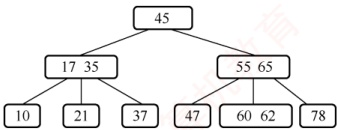

##### 17

【2014统考真题】在一棵有15个关键字的4阶B树中，含关键字的结点个数最多是（）。

A. 5 B. 6 C. 10 D. 15

##### 18

【2016 统考真题】B+树不同于 B 树的特点之一是（）。

A. 能支持顺序查找

B. 结点中含有关键字

C. 根结点至少有两个分支

D. 所有叶结点都在同一层上

##### 19

【2017 统考真题】下列应用中，适合使用 B+树的是（）。

A. 编译器中的词法分析

B. 关系数据库系统中的索引

C. 网络中的路由表快速查找

D. 操作系统的磁盘空闲块管理

##### 20

【2018 统考真题】高度为 5 的 3 阶 B 树含有的关键字个数至少是（）。
A. 15 B. 31 C. 62 D. 242

##### 21

【2020 统考真题】依次将关键字 5, 6, 9, 13, 8, 2, 12, 15 插入初始为空的 4 阶 B 树后，根结点中包含的关键字是（）。

A. 8 B. 6, 9 C. 8, 13 D. 9, 12

##### 22

【2021 统考真题】在一棵高度为 3 的 3 阶 B 树中，根为第 1 层，若第 2 层中有 4 个关键字，则该树的结点数最多是（）。

A. 11 B. 10 C. 9 D. 8

##### 23

【2022 统考真题】在下图所示的 5 阶 B 树 T 中，删除关键字 260 之后需要进行必要的调整，得到新的 B 树  $T_{1}$。下列选项中， \underset{·}{不}可能是  $T_{1}$ 根结点中关键字序列的是（）。

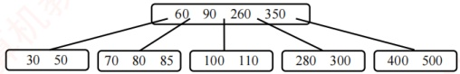

A. 60, 90, 280

B. 60, 90, 350

C. 60, 85, 110, 350

D. 60, 90, 110, 350

##### 24

【2023 统考真题】下列关于非空 B 树的叙述中，正确的是（）。

Ⅰ. 插入操作可能增加树的高度 Ⅱ. 删除操作一定会导致叶结点的变化

Ⅲ. 查找某关键字总是要查找到叶结点 Ⅳ. 插入的新关键字最终位于叶结点中

A. 仅 I B. 仅 I、II C. 仅 III、IV D. 仅 I、II、IV

##### 25

【2025 统考真题】给定 7 个不同的关键字，能构造的不同 4 阶 B 树的个数最多是（）。

A. 7 B. 8 C. 9 D. 10

#### 二、 综合应用题

##### 01

给定一组关键字{20,30,50,52,60,68,70}，给出创建一棵3阶B树的过程。

##### 02

对如右图所示的3阶B树，依次执行下列操作，画出各步操作的结果。

1) 插入90 2) 插入25 3) 插入45

4) 删除60 5) 删除80

##### 03

利用 B 树做文件索引时，若假设磁盘页块的大小是 4000B（实际应是 2 的次幂，此处是为了计算方便），

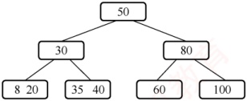

指示磁盘地址的指针需要 5B。现有 20000000 个记录构成的文件，每个记录为 200B，其中包括关键字 5B。

试问在这个采用 B 树作索引的文件中，B 树的阶数应为多少？假定文件数据部分未按关键字有序排列，则索引部分需要占用多少磁盘页块？

### 7.4.4 答案与解析

#### 一、 单项选择题

##### 01

D

关键字数目比子树数目少1，首先可排除B+树。对于4阶B树，根结点至少有2棵子树（关键字数至少为1），其他非叶结点至少有 $\lceil n/2 \rceil = 2$棵子树（关键字数至少为1）、至多有4棵子树（关键字数至多为3）。5阶B树和6阶B树的分析也类似。题目所示的B树，同时满足4阶B树、5阶B树和6阶B树的要求，因此不能确定是哪种类型的B树。
##### 02

C

除根结点外的所有非叶结点至少有 $\left[m/2\right]$棵子树。对于根结点，最多有 m 棵子树，若其不是叶结点，则至少有 2 棵子树。

##### 03

B

每个非根的内部结点必须至少有  $\left\lceil \frac{m}{2} \right\rceil$ 棵子树，而本题中的根结点不是叶结点，也至少要有两棵子树，说法 I 正确。每个结点至多有  $m-1=2$ 个关键字，说法 II 正确。在高度为  $h$ 的  $m$ 阶 B 树中，关键字个数至多为  $(m-1)(1+m+m^2+\cdots+m^{h-1})=m^h-1$，代入  $m=3$， $h=3$，即树中最多能存储 26 个关键字，说法 III 正确。对于说法 IV，插入一个元素引起 B 树结点分裂后，只要从根结点到该元素插入位置的路径上至少有一个结点未满，B 树就不会长高，如图 1 所示；只有当结点的分裂传到根结点，并使根结点也分裂时，才会导致树高增 1，如图 2 所示，说法 IV 错误。

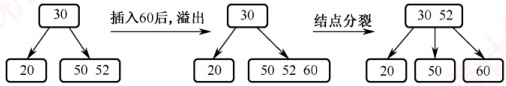

图1 结点分裂不导致树高增1（3阶B树）

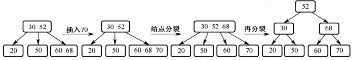

图2 结点分裂导致树高增1（3阶B树）

##### 04

B

因为B树每个结点内的关键字个数最多为 $m-1$，所以当关键字个数大于 $m-1$时，则应该分裂。每个结点内的关键字个数至少为 $\lceil m/2 \rceil - 1$个，所以当关键字个数少于 $\lceil m/2 \rceil - 1$时，则可能与其他结点合并（除非只有根结点）。若将本题题干改为B+树，请读者思考上述问题的解答。

##### 05

A

B 树的叶结点对应查找失败的情况，对有 n 个关键字的查找集合进行查找，失败的可能性有  $n+1$ 种。

##### 06

B、D

由 $m$ 阶 B 树的性质可知，根结点至少有 2 棵子树；根结点外的所有非终端结点至少有 $|m/2|$ 棵子树，结点数最少时，3 阶 B 树形状至少类似于一棵满二叉树，即高度为 5 的 B 树至少有 $2^5 - 1 = 31$ 个结点。因为每个结点最多有 $m$ 棵子树，所以当结点数最多时，3 阶 B 树形状类似于满三叉树，结点数为 $(3^5 - 1)/2 = 121$（注意，这里求的是结点数而非关键字数，若求的是关键字数，则还应把每个结点中关键字数的上下界确定出来）。

##### 07

D

除根结点外， $m$ 阶 B 树中的每个非叶结点至少有  $\lceil m/2 \rceil - 1$ 个关键字，根结点至少有一个关键字，所以总共包含的关键字最少个数  $= (n - 1)(\lceil m/2 \rceil - 1) + 1$。

**注意**

由以上题目可知 B 树和 B+树的定义与性质尤为重要，需要熟练掌握。

##### 08

C、B

5 阶 B 树中共有 53 个关键字，由最大高度公式  $H \leq \log_{\lceil m/2\rceil}((n+1)/2) + 1$ 得最大高度  $H \leq$
log₃[(53 + 1)/2] + 1 = 4，即最大高度为 4；由最小高度公式 h ≥ logₘ(n + 1) 得最小高度 h ≥ log₅54 ≈ 2.5，从而最小高度为 3。

##### 09

A、D

利用前面的公式即最小高度  $h \geq \log_m(n+1)$ 和最大高度  $H \leq \log_{\lceil ml/2\rceil}[(n+1)/2]+1$，易算出最大高度  $H \leq \log_2[(2047+1)/2]+1=11$，最小高度  $h \geq \log_3 2048=6.9$，从而最小高度取 7（注意，有些辅导书针对本题算出的高度要比这里给出的答案多 1，因为它们在对 B 树的高度定义中，把最底层不包含任何关键字的叶结点也算进去了）。

##### 10

B

本题要计算的是最坏情况下第2016个关键字在7阶B树中的最大深度，即考查B树结点中关键字数最少的情况。按照B树的定义，根结点至少有1个关键字，第二层至少有2个结点，即2×3个关键字；第三层至少有2×4个结点，即2×4×3个关键字；第四层至少有2×4²个结点，即2×4²×3个关键字；以此类推，第h层至少有2×4⁻²个结点，即2×4⁻²×3个关键字，故前h层的关键字总数 $n=1+2\times3\times(1+4+\cdots+4^{n-2})=1+2\times(4^{n-1}-1)$。故当h=5时，n=511；当h=6时，n=2047，说明5层高的7阶B树最少有511个关键字，而6层高的7阶B树最少有2047个关键字，故最坏情况下第2016个关键字在7阶B树的第6层，需启动5次I/O操作。

##### 11

B

考虑最坏情况，在待插入结点中插入一个关键码后，导致结点分裂，在该层分裂成2个结点，因此需要2次写磁盘操作；分裂操作逐层向上传导，导致每层都有结点分裂，因为结点分裂而导致的写磁盘操作共有2h次，加上最后一次结点分裂形成新根结点也需要1次写磁盘操作，写磁盘的总次数为 $2h+1$，即由于本次插入而产生的新结点个数为 $h+1$，加上寻找插入位置而引起的h次的读磁盘操作，整个过程中读/写磁盘的总次数为 $3h+1$次，选项C、D正确。若插入操作导致了B树的高度增加，则分裂操作一定是从最底层传导至根结点的，即前面分析的最坏情况，选项A正确。若分裂操作没有传导至根结点，则B树的高度不变，选项B错误。

##### 12

A

B 树和 B+树的差异主要体现在：① 结点关键字和子树的个数；② B+树非叶结点仅起索引作用；③ B 树叶结点关键字和其他结点包含的关键字是不重复的；④ B+树支持顺序查找和随机查找，而 B 树仅支持随机查找。B+树的所有叶结点中包含了全部的关键字信息，且叶结点本身依关键字从小到大顺序链接，因此可以进行顺序查找，而 B 树不支持顺序查找。B 树和 B+树都可用于文件索引结构，但 B+树更适合做数据库索引和文件索引，因为它的磁盘读/写代价更低。

##### 13

C

在 B 树的查找操作中，若目标元素在某个内部结点中，则查找结束，不需要进入叶结点；查找失败时，叶结点是所有路径的终点，选项 A、B 正确。B+树中仅叶结点包含信息，非叶结点仅起到索引作用，查找成功时一定会找到相应的叶结点，所经过的路径长度都相等，选项 C 错误，选项 D 正确。

##### 14

D

m 阶 B 树不要求将各叶结点之间用指针链接。选项 D 描述的实际上是 B+树。

##### 15

D

对于图中所示的 3 阶 B 树，被删关键字 78 所在的结点在删除前的关键字个数 = 1 = ⌈3/2⌉ - 1，且其左兄弟结点的关键字个数 = 2 ≥ ⌈3/2⌉，属于“兄弟够借”的情况，因此要把该结点的左兄弟结点中的最大关键字上移到父结点中，同时把父结点中大于上移关键字的关键字下移到要删除关键字的结点中，这样就达到了新的平衡，如下图所示。

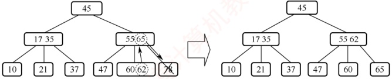

##### 16

A

对于 5 阶 B 树，根结点的分支数最少为 2（关键字数最少为 1），其他非叶结点的分支数最少为  $\lceil n/2 \rceil = 3$（关键字数最少为 2），因此关键字个数最少的情况如右图所示（叶结点不计入高度）。

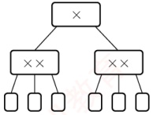

**注意**

一般来说，对于某个具体的B树图形，并不能确定是几阶B树。对于本题所述的5阶B树，不要误认为：“存在至少有一个含关键字结点中的关键字达到4”才符合5阶B树的要求，因为5阶B树中各个结点包含的关键字个数最少为2（ $\lceil 5/2 \rceil - 1 = 2$），最多为4（5 - 1 = 4）。当5阶B树中各个结点包含的关键字个数为2时，也满足5阶B树的要求。

##### 17

D

关键字数量不变，要求结点数量最多，即要求每个结点中含关键字的数量最少。根据4阶B 树的定义，根结点最少含1个关键字，非根结点中最少含[4/2]-1=1个关键字，所以每个结点中关键字数量最少都为1个，即每个结点都有2个分支，类似于排序二叉树，而15个结点正好可以构造一个4层的4阶B树，使得终端结点全在第四层，符合B树的定义。

##### 18

A

B+树的所有叶结点中包含了全部的关键字信息，且叶结点本身依关键字从小到大顺序链接，因此可以进行顺序查找，而B树不支持顺序查找（只支持多路查找）。

##### 19

B

B+树是应文件系统所需而产生的 B 树的变形，前者比后者更加适用于实际应用中的操作系统的文件索引和数据库索引，因为前者的磁盘读/写代价更低，查询效率更加稳定。编译器中的词法分析使用有穷自动机和语法树。网络中的路由表快速查找主要靠高速缓存、路由表压缩技术和快速查找算法。系统一般使用空闲空间链表管理磁盘空闲块。

##### 20

B

m 阶 B 树的基本性质：除根结点外的非叶结点最少含有  $\left\lceil m/2\right\rceil - 1$ 个关键字，代入 m = 3 得到每个非叶结点中最少包含 1 个关键字，而根结点含有 1 个关键字，因此所有非叶结点都有两个孩子。此时其树形与 h = 5 的满二叉树相同，可求得关键字最少为 31 个。

##### 21

B

一个4阶B树的任意非叶结点至多含有m-1=3个关键字，在关键字依次插入的过程中，会导致结点的不断分裂，插入过程如下图所示。得到根结点包含的关键字为6,9。

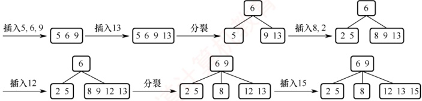

##### 22

A

在阶为3的B树中，每个结点至多含有2个关键字（至少1个），至多有3棵子树。本题规定第二层有4个关键字，欲使B树的结点数达到最多，则这4个关键字包含在3个结点中，B树树形如下图所示，其中A, B, C, …, M表示关键字，最多有11个结点。

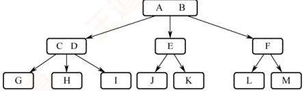

##### 23

D

在 5 阶 B 树中，除根结点外的非叶结点的关键字数 k 需要满足  $2 \leq k \leq 4$。当被删关键字 x 不在终端结点（最底层非叶结点）时，可以用 x 的前驱（或后继）关键字 y 来替代 x，然后在相应结点中删除 y。情况①：删除 260，将其前驱 110 放入 260 处，删除 110 后的结点<100>不满足 5 阶 B 树定义，从左兄弟中借 85，将 85 放入根中，将根中的 90 移入结点<100>变为<90, 100>。情况②：删除 260，将其后继 280 放入 260 处，结点<300>不满足 5 阶 B 树定义且左右兄弟都不够借，结点<300>可以和左兄弟<100, 110>以及关键字 280 合并成一个新的结点<100, 110, 280, 300>。情况③：在情况②中，结点<300>也可以和右兄弟<400, 500>以及关键字 350 合并成一个新的结点<300, 350, 400, 500>。综上， $T_1$ 根结点中的关键字序列可能是<60, 85, 110, 350>或<60, 90, 350>或<60, 90, 280>，仅选项 D 不可能。

快速解法：假如选项 D 的 60, 90, 110, 350 作为根结点，则在 90 和 110 之间只有 100 这一个数据，显然不符合 5 阶 B 树的定义，因此选项 D 不可能。

##### 24

B

B 树的插入操作可能导致叶结点分裂，叶结点分裂可能导致父结点分裂，甚至会传导到根结点，从而导致 B 树高度增 1，说法 I 正确。若被删结点是叶结点，则显然会导致叶结点变化；若被删结点不是叶结点，则要先将被删结点和它的前驱或后继交换，最终转换为删除叶结点，还是导致叶结点变化，说法 II 正确。若在非叶结点中查找到了给定的关键字，则不用向下继续查找，说法 III 错误。插入关键字的初始位置是最底层叶结点，但可能因结点分裂而被转移到父结点中，说法 IV 错误。

**注意**

由本题可知，与大多数教材不同，统考真题中称最底层终端结点为叶结点。

##### 25

C

对于 4 阶 B 树，每个结点包含 1～3 个关键字（根结点可为 1～3 个，非根结点至少 1 个）。给定 7 个不同关键字，按树高分类讨论：① 当树为 2 层时，若根含 1 个关键字，则其 2 个子结点需要分配 6 个关键字，唯一合法的分配为(3,3)，对应 1 种；若根含 2 个关键字，则 3 个子结点分配 5 个关键字，合法分配为(3,1,1)和(2,2,1)，考虑所有排列共 6 种；若根含 3 个关键字，则 4 个子结点各含 1 个关键字，对应 1 种；合计 8 种。② 当树为 3 层时，仅当根及其两个子结点均含 1 个关键字时，剩余 4 个关键字恰好分配给 4 个叶子结点（各 1 个），满足最小关键字数要求，仅 1 种。综上，共可构造  $8+1=9$ 种不同的 4 阶 B 树。

#### 二、 综合应用题

##### 01

【解答】

m=3，因此除根结点外，非叶结点关键字个数为1～2。

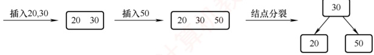

如上图所示，首先插入20, 30，结点内关键字个数不超过 $m-1=2$，不会引起分裂；插入50，插入20, 30所在的结点，引起分裂，结点内第 $\lceil m/2\rceil$个关键字30上升为父结点。

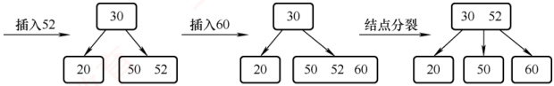

如上图所示，插入52，插入50所在的结点，不会引起分裂；继续插入60，插入50，52所在的结点，引起分裂，52上升到父结点中，不会引起父结点的分裂。

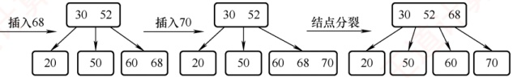

如上图所示，插入68，插入60所在的结点，不会引起分裂；继续插入70，插入60，68所在的结点，引起分裂，68上升为新的父结点，68上升到30，52所在的结点后，会继续引起该结点的分裂，所以52上升为新的根结点。最后得到的B树如右图所示。

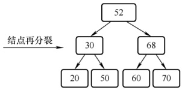

##### 02

【解答】

1）插入90：将90插入100所在的结点，插入90后该结点中的元素个数不超过 $\left[\frac{3}{2}\right]=2$，不会引起结点的分裂，插入后的B树如下图所示。

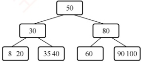

2）插入25：将25插入8，20所在的结点，插入后结点内的元素个数为3，引起分裂。所以将结点内的中间元素20上升到父结点中，此时父结点中的元素个数为2（元素20和30），不会引起继续分裂，插入25后的B树如右图所示。

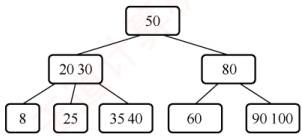

3）插入45：将45插入35,40所在的结点，引起分裂，

中间元素40上升到父结点（20，30所在的结点）中，引起父结点分裂，中间元素30上升到父结点（50所在的结点）中，两次分裂后的B树如下图所示。

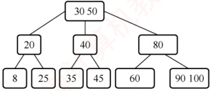

4）删除60：删除60后，其所在的结点元素为空，从而导致借用右兄弟结点的元素，调整后的B树如下图所示。

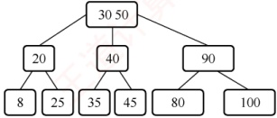

5）删除80：删除80后，导致80所在结点的父结点与其右兄弟结点合并，这时父结点元素个数为0，再次对父结点进行调整。将50与40合并成一个新结点，则90，100所在结点为这个结点的子结点。从而构造的B树如下图所示。注意，这次调整的过程实际上包含多次调整过程，希望读者对照考点讲解中的删除过程仔细思考。

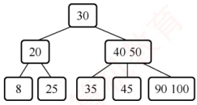

**注意**

B 树中结点的插入、删除操作（特别是插入、删除后的结点分裂与合并）是本节的重点，也是难点，请读者务必熟练掌握。

##### 03

【解答】

根据 B 树的概念，一个索引结点应适应操作系统一次读/写的物理记录大小，其大小应取不超过但最接近一个磁盘页块的大小。假设 B 树为 m 阶，一个 B 树结点最多存放 m-1 个关键字（5B）和对应的记录地址（5B）、m 个子树指针（5B）和 1 个指示结点中的实际关键字个数的整数（2B），则有

 $$(2\times(m-1)+m)\times5+2\leqslant4000$$

计算结果为  $m \leq 267$。

一个索引结点最多可以存放  $m-1=266$ 个索引项，最少可以存放  $\lceil m/2 \rceil-1=133$ 个索引项。全部有  $n=20000000$ 个记录，每个记录占用空间 200B，每个页块可以存放 4000/200=20 个记录，则全部记录分布在 20000000/20=1000000 个页块中，最多需要占用 1000000/133=7519 个磁盘页块作为 B 树索引，最少需要占用 1000000/266=3760 个磁盘页块作为 B 树索引（注意 B 树与 B+ 树的不同，B 树所有对数据记录的索引项分布在各个层次的结点中，B+树所有对数据记录的索引项都在叶结点中）。
