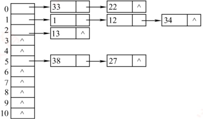
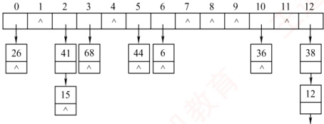

### 7.5.5 本节试题精选

#### 一、 单项选择题

##### 01

只能在顺序存储结构上进行的查找方法是（）。

A. 顺序查找法 B. 折半查找法 C. 树形查找法 D. 散列查找法

##### 02

散列查找一般适用于（）的情况下的查找。

A. 查找表为链表

B. 查找表为有序表

C. 关键字集合比地址集合大得多

D. 关键字集合与地址集合之间存在对应关系

##### 03

下列关于散列表的说法中，正确的是（）。

Ⅰ. 若散列表的填装因子  $\alpha<1$，则可避免碰撞的产生

Ⅱ. 散列表中不需要任何关键字的比较

Ⅲ. 散列表在查找成功时平均查找长度仅与表长有关

Ⅳ. 若在散列表中删除一个元素，不能简单地将该元素删除

A. I 和 IV B. II 和 III C. III D. IV

##### 04

在开放定址法中散列到同一个地址而引起的“堆积”问题是由（）引起的。

A. 同义词之间发生冲突

B. 非同义词之间发生冲突

C. 同义词之间或非同义词之间发生冲突

D. 散列表“溢出”

##### 05

下列关于散列冲突处理方法的说法中，正确的有（）。

I. 采用平方探测法处理冲突时不易产生聚集

II. 采用线性探测法处理冲突时，所有同义词在散列表中一定相邻

III. 采用链地址法处理冲突时，若限定在链首插入，则插入任意一个元素的时间相同

IV. 采用链地址法处理冲突易引起聚集现象

A. I 和 III B. I、II 和 III C. III 和 IV D. I 和 IV

##### 06

设有一个含有 200 个元素的散列表，用线性探测法解决冲突，按关键字查询时找到一个表项的平均探测次数不超过 1.5，则散列表应至少能够容纳（ ）个元素（设查找成功的平均查找长度为  $ASL = [1 + 1/(1 - \alpha)]/2$，其中  $\alpha$ 为装填因子）。

A. 400 B. 526 C. 624 D. 676

##### 07

假定有 K 个关键字互为同义词，若用线性探测法把这 K 个关键字填入散列表，至少要进行（ ）次探测。

A. K-1 B. K C.  $K+1$ D.  $K(K+1)/2$

##### 08

对包含 n 个元素的数列表进行查找，平均查找长度（）。

A. 为  $O(\log_{2}n)$ B. 为  $O(1)$ C. 不直接依赖于 n D. 直接依赖于表长 m

##### 09

采用开放定址法解决冲突的散列查找中，发生聚集的原因主要是（）。

A. 数据元素过多

B. 负载因子过大

C. 散列函数选择不当

D. 解决冲突的方法选择不当

##### 10

当用线性探测再散列法解决冲突时，计算出的一系列“下一个空位”的要求是（）。

A. 必须大于或等于原散列地址

B. 必须小于或等于原散列地址

C. 可以大于或小于但不等于原散列地址 D. 对地址在何处没有限制
##### 11

一组记录的关键字为{19, 14, 23, 1, 68, 20, 84, 27, 55, 11, 10, 79}，用链地址法构造散列表，散列函数为  $H(key) = \text{key mod } 13$，散列地址为 1 的链中有（ ）个记录。

A. 1

B. 2

C. 3

D. 4

##### 12

在采用链地址法处理冲突所构成的散列表上查找某一关键字，则在查找成功的情况下，所探测的这些位置上的关键字值（）；若采用线性探测法，则（）。

A. 一定都是同义词

B. 不一定都是同义词

C. 都相同

D. 一定都不是同义词

##### 13

若采用链地址法构造散列表，散列函数为  $H(key) = \text{key mod } 17$，则需（①）个链表。这些链的链首指针构成一个指针数组，数组的下标范围为（②）。

① A. 17          B. 13          C. 16          D. 任意

② A. 0～17        B. 1～17        C. 0～16        D. 1～16

##### 14

设散列表长 m=14，散列函数为  $H(key)=key\%11$，表中仅有 4 个结点  $H(15)=4$， $H(38)=5$， $H(61)=6$， $H(84)=7$，若采用线性探测法处理冲突，则关键字为 49 的结点地址是（）。

A. 8 B. 3 C. 5 D. 9

##### 15

现有长度为17、初始为空的散列表 HT，散列函数  $H(\text{key}) = \text{key}\%17$，用线性探查法解决冲突。将关键字序列 26, 25, 72, 38, 8, 18, 59 依次插入 HT 后，查找 59 需探查（ ）次。

A. 2

B. 3

C. 4

D. 5

##### 16

现有长度为17、初始为空的散列表 HT，散列函数  $H(\text{key}) = \text{key}\%17$，用平方探测法解决冲突： $H_i(\text{key}) = (H(\text{key}) \pm i^2)\%17$。将关键字序列 6, 22, 7, 26, 9, 23 依次插入 HT 后，则关键字 23 存放在散列表中的位置是（）。

A. 0

B. 2

C. 6

D. 15

##### 17

将10个元素散列到100000个单元的散列表中，则（）产生冲突。

A. 一定会 B. 一定不会 C. 仍可能会 D. 不确定

##### 18

【2011 统考真题】为提高散列表的查找效率，可以采取的正确措施是（）。

Ⅰ. 增大装填（载）因子

Ⅱ. 设计冲突（碰撞）少的散列函数

Ⅲ. 处理冲突（碰撞）时避免产生聚集（堆积）现象

A. 仅 I B. 仅 II C. 仅 I、II D. 仅 II、III

##### 19

【2014 统考真题】用哈希（散列）方法处理冲突（碰撞）时可能出现堆积（聚集）现象，下列选项中，会受堆积现象直接影响的是（）。

A. 存储效率

B. 散列函数

C. 装填（装载）因子

D. 平均查找长度

##### 20

【2018 统考真题】现有长度为 7、初始为空的散列表 HT，散列函数  $H(k) = k\%7$，用线性探测再散列法解决冲突。将关键字 22，43，15 依次插入 HT 后，查找成功的平均查找长度是（）。

A. 1.5 B. 1.6 C. 2 D. 3

##### 21

【2019 统考真题】现有长度为 11 且初始为空的散列表 HT，散列函数是  $H(\text{key}) = \text{key}\%7$，采用线性探查（线性探测再散列）法解决冲突。将关键字序列 87, 40, 30, 6, 11, 22, 98, 20依次插入 HT 后，HT 查找失败的平均查找长度是（）。

A. 4 B. 5.25 C. 6 D. 6.29

##### 22

【2022 统考真题】下列因素中，影响散列（哈希）方法平均查找长度的是（）。
Ⅰ. 装填因子 II. 散列函数 III. 冲突解决策略

A. 仅 I、II

B. 仅 I、III

C. 仅 II、III

D. I、II、III

##### 23

【2023 统考真题】现有长度为 5、初始为空的散列表 HT，散列函数  $H(k) = (k + 4)\%5$，用线性探查再散列法解决冲突。若将关键字序列 2022,12,25 依次插入 HT，然后删除关键字 25，则 HT 中查找失败的平均查找长度为（）。

A. 1 B. 1.6 C. 1.8 D. 2.2

##### 24

【2025 统考真题】下列关于散列方法处理冲突的叙述中，正确的是（）。

A. 只要散列表不满，线性探查再散列一定能找到一个空闲位置

B. 只要散列表不满，二次探查再散列一定能找到一个空闲位置

C. 线性探查再散列处理的冲突，一定是发生在同义词之间的冲突

D. 二次探查再散列处理的冲突，一定是发生在非同义词之间的冲突

#### 二、 综合应用题

##### 01

若要在散列表中删除一个记录，应如何操作？为什么？按照处理冲突的方法为开放地址法和拉链法分别说明。

##### 02

假定把关键字 key 散列到有 n 个表项（从 0 到 n-1 编址）的散列表中。对于下面的每个函数  $H(\text{key})$（key 为整数），这些函数能够当作散列函数吗？若能，它是一个好的散列函数吗？说明理由。设函数  $\text{random}(n)$ 返回一个 0 到 n-1 之间的随机整数（包括 0 与 n-1 在内）。

1)  $H(\text{key}) = \text{key}/n$。

2)  $H(\text{key}) = 1$。

3)  $H(\text{key}) = (\text{key} + \text{random}(n))\%n$。

4)  $H(\text{key}) = \text{key}\%p(n)$；其中  $p(n)$ 是不大于 n 的最大素数。

##### 03

使用散列函数  $H(\text{key}) = \text{key}\%11$，把一个整数值转换成散列表下标，散列表的长度为 11，现在要把数据  $\{1, 13, 12, 34, 38, 33, 27, 22\}$ 依次插入散列表。

1）使用线性探测法来构造散列表。

2）使用链地址法构造散列表。

试针对这两种情况，分别确定查找成功所需的平均查找长度，及查找不成功所需的平均查找长度。

##### 04

已知一组关键字为{26, 36, 41, 38, 44, 15, 68, 12, 6, 51, 25}，用链地址法解决冲突，假设装填因子 $\alpha = 0.73$，散列函数的形式为 $H(\text{key}) = \text{key}\%P$，P为不大于表长的最大素数，请回答以下问题：

1）构造出散列函数。

2）分别计算出等概率情况下查找成功和查找失败的平均查找长度（查找失败的计算中只将与关键字的比较次数计算在内即可）。

##### 05

设散列表为 HT[0...12]，即表的大小为 m = 13。现采用双散列法解决冲突，散列函数和再散列函数分别为：

 $H_0(key) = key\%13$ 注： %是取模运算（=mod）

 $H_i = (H_{i-1} + REV(key + 1)\%11 + 1)\%13$; i = 1, 2, 3, …, m - 1

其中，函数 REV(x)表示颠倒十进制数 x 的各位，如 REV(37) = 73、REV(7) = 7 等。若插入的关键码序列为(2, 8, 31, 20, 19, 18, 53, 27)，请回答：

1) 画出插入这 8 个关键码后的散列表。
2）计算查找成功的平均查找长度 ASL。

##### 06

【2010 统考真题】将关键字序列(7, 8, 30, 11, 18, 9, 14)散列存储到散列表中。散列表的存储空间是一个下标从 0 开始的一维数组，散列函数为  $H(\text{key}) = (\text{key} \times 3) \mod 7$，处理冲突采用线性探测再散列法，要求装填（载）因子为 0.7。

1）请画出所构造的散列表。

2）分别计算等概率情况下，查找成功和查找不成功的平均查找长度。

##### 07

【2024 统考真题】将关键字序列 20, 3, 11, 18, 9, 14, 7 依次存储到初始为空、长度为 11 的散列表 HT 中，散列函数  $H(\text{key}) = (\text{key} \times 3)\%11$。 $H(\text{key})$ 计算出的初始散列地址为  $H_0$，发生冲突时探查地址序列是  $H_1, H_2, H_3, \cdots$，其中  $H_k = (H_0 + k^2)\%11$， $k = 1, 2, 3, \cdots$。请回答下列问题：

1）画出所构造的 HT，并计算 HT 的装填因子。

2）给出在 HT 中查找关键字 14 的关键字比较序列。

3）在 HT 中查找关键字 8，确认查找失败时的散列地址是多少？

### 7.5.6 答案与解析

#### 一、 单项选择题

##### 01

B

顺序查找可以是顺序存储或链式存储；折半查找只能是顺序存储且要求关键字有序；树形查找法要求采用树的存储结构，既可以采用顺序存储也可以采用链式存储；散列查找中的链地址法解决冲突时，采用的是顺序存储与链式存储相结合的方式。

##### 02

D

关键字集合与地址集合之间存在对应关系时，通过散列函数表示这种关系。这样，查找以计算散列函数而非比较的方式进行查找。

##### 03

D

冲突（碰撞）是不可避免的，与装填因子无关，因此需要设计处理冲突的方法，说法Ⅰ错误。散列查找的思想是计算出散列地址来进行查找，然后比较关键字以确定是否查找成功，说法Ⅱ错误。散列查找成功的平均查找长度与装填因子有关，与表长无直接关系，说法Ⅲ错误。在开放定址的情形下，不能随便删除散列表中的某个元素，否则可能会导致搜索路径被中断（因此通常的做法是在要删除的地方做删除标记，而不是直接删除），说法Ⅳ正确。

##### 04

C

在开放定址法中散列到同一个地址而产生的“堆积”问题，是同义词冲突的探查序列和非同义词之间不同的探查序列交织在一起，导致关键字查询需要经过较长的探测距离，降低了散列的效率。因此要选择好的处理冲突的方法来避免“堆积”。

##### 05

A

平方探测法采用的增量序列是非线性的，它可以跳过一些已被占用的单元，而不是顺序地探测下一单元，这样能减小冲突的概率，说法Ⅰ正确。散列地址 i 的关键字，和为解决冲突形成的某次探测地址为 i 的关键字，都争夺地址 i, i + 1, …，因此不一定相邻，说法Ⅱ错误。说法Ⅲ正确。同义词冲突不等于聚集，链地址法处理冲突时将同义词放在同一个链表中，不会引起聚集现象，说法Ⅳ错误。

##### 06

A

若有200个元素要放入散列表，采用线性探测法解决冲突，限定查找成功的平均查找长度不
超过1.5，则

 $$\mathrm{ASL}_{ 成功 }=\frac{1}{2}\left(1+\frac{1}{1-\alpha}\right)\leqslant1.5\Rightarrow\alpha=\frac{200}{m}\leqslant\frac{1}{2}\Rightarrow m\geqslant400$$

##### 07

D

K 个关键字在依次填入的过程中，只有第一个不会发生冲突，所以探测次数为  $1+2+3+\cdots+K=K(K+1)/2$。

##### 08

C

散列表的平均查找长度与装填因子 $\alpha$直接相关，表的查找效率不直接依赖于表中已有表项个数n或表长m。若表中存放的记录全是某个地址的同义词，则平均查找长度为 $O(n)$而非 $O(1)$。

##### 09

D

聚集是因选取不当的处理冲突的方法，而导致不同关键字的元素对同一散列地址进行争夺的现象。用线性探查法时，容易引发聚集现象。

##### 10

C

“下一个空位”可以大于或小于但不等于原散列地址，等于原散列地址是没有意义的。

##### 11

D

由散列函数计算可知，14, 1, 27, 79 散列后的地址都是 1，所以有 4 个记录。

##### 12

A, B

因为在链地址法中，映射到同一地址的关键字都会链到与此地址相对应的链表上，所以探测过程一定是在此链表上进行的，从而这些位置上的关键字均为同义词；但在线性探测法中出现两个同义关键字时，会把该关键字对应地址的下一个地址也占用掉，两个地址分别记为 Addr、Addr + 1，查找一个满足  $H(\text{key}) = \text{Addr} + 1$ 的关键字 key 时，显然首次探测到的不是 key 的同义词。

##### 13

A, C

H 的取值有 17 种可能，对应到不同的链表中，所以链表的个数应为 17。因为  $H(\text{key})$ 的取值范围为 0～16，所以数组下标为 0～16。

##### 14

A

线性探测法的公式为  $H_i = (H(\text{key}) + d_i)\%m$，其中  $d_i = 1, 2, \cdots, m - 1$。 $H(49) = 49\%11 = 5$，有冲突； $H_1 = (H(49) + 1)\%14 = 6$，有冲突； $H_2 = (H(49) + 2)\%14 = 7$，有冲突； $H_3 = (H(49) + 3)\%14 = 8$，无冲突。

##### 15

C

插入过程如下： $H(26)=9$，不冲突； $H(25)=8$，不冲突； $H(72)=4$，不冲突； $H(38)=4$，不冲突，冲突处理后的地址为5； $H(8)=8$，冲突，冲突处理后的地址为10； $H(18)=1$，不冲突； $H(59)=8$，冲突，冲突处理后的地址为11。因此，在表中查找59需要探查4次。

##### 16

B

插入过程如下：6%17 = 6；22%17 = 5；7%17 = 7；26%17 = 9；9%17 = 9，冲突，平方探测法探测10（无冲突）；23%17 = 6，冲突，平方探测法探测7（冲突），探测5（冲突），探测10（冲突），探测2（无冲突）。因此，关键字23应放在位置2。构造的散列表如下表所示。

| 地址 | 0 | 1 | 2 | 3 | 4 | 5 | 6 | 7 | 8 | 9 | 10 | 11 | 12 | 13 | 14 | 15 | 16 |
| --- | --- | --- | --- | --- | --- | --- | --- | --- | --- | --- | --- | --- | --- | --- | --- | --- | --- |
| 元素 |   |   | 23 |   |   | 22 | 6 | 7 |   | 26 | 9 |   |   |   |   |   |   |

##### 17

C

由于散列函数的选取，仍然有可能产生地址冲突，冲突不能绝对地避免。

##### 18

D

散列表的查找效率取决于散列函数、处理冲突的方法和装填因子。显然，冲突的产生概率与
装填因子（表中记录数与表长之比）的大小成正比，说法Ⅰ与题意相反。说法Ⅱ显然正确。采用合适的冲突处理方法可避免聚集现象，也将提高查找效率，说法Ⅲ正确。例如，用链地址法处理冲突时不存在聚集现象，用线性探测法处理冲突时易引起聚集现象。

##### 19

D

堆积现象因冲突而产生，它对存储效率、散列函数和装填因子均不会有影响，而平均查找长度会因为堆积现象而增大。散列函数是指将关键字映射到哈希地址的函数。存储效率和装填（装载）因子的定义相同，指哈希表中已存储的元素个数与哈希表长度的比值。这些因素都与堆积现象无关，而只与哈希表的结构和设计有关。

##### 20

C

根据题意，得到的 HT 如下：

| 0 | 1 | 2 | 3 | 4 | 5 | 6 |
| --- | --- | --- | --- | --- | --- | --- |
|   | 22 | 43 | 15 |   |   |   |

 $$\mathrm{ASL}_{ 成功 }=(1+2+3)/3=2。$$

##### 21

C

采用线性探查法计算每个关键字的存放情况如下表所示。

| 散列地址 | 0 | 1 | 2 | 3 | 4 | 5 | 6 | 7 | 8 | 9 | 10 |
| --- | --- | --- | --- | --- | --- | --- | --- | --- | --- | --- | --- |
| 关键字 | 98 | 22 | 30 | 87 | 11 | 40 | 6 | 20 |   |   |   |

由于  $H(key) = 0 \sim 6$，查找失败时可能对应的地址有 7 个，对于计算出地址为 0 的关键字 key0，只有比较完 0～8 号地址后才能确定该关键字不在表中，比较次数为 9；对于计算出地址为 1 的关键字 key1，只有比较完 1～8 号地址后才能确定该关键字不在表中，比较次数为 8；以此类推。需要特别注意的是，散列函数不可能计算出地址 7，因此有

 $$\mathrm{ASL_{ 失败 }}=(\mathrm{9}+\mathrm{8}+\mathrm{7}+\mathrm{6}+\mathrm{5}+\mathrm{4}+\mathrm{3})/\mathrm{7}=\mathrm{6}$$

##### 22

D

原题再现。填装因子越大，说明哈希表中存储的元素越满，发生冲突的可能性就越高，导致平均查找长度越大。散列函数、冲突解决策略也会影响发生冲突的可能性。说法Ⅰ、Ⅱ、Ⅲ都正确。

##### 23

C

当采用开放定址法时，不能随便物理删除表中的已有元素，因为若删除元素，则可能截断其他具有相同散列地址的元素的查找地址。因此，当要删除一个元素时，可给它做一个删除标记。依次将2022,12,25插入散列表，然后删除25，得到的散列表如下：

| 地址 | 0 | 1 | 2 | 3 | 4 |
| --- | --- | --- | --- | --- | --- |
| 关键字 |   | 2022 | 12 |   | 25（删除） |
| 查找失败次数 | 1 | 3 | 2 | 1 | 2 |

当查找位置是删除标记时，应继续往后查找。

查找失败的平均查找长度为 $(1+3+2+1+2)/5=1.8$。

##### 24

A

线性探查法按顺序依次探查下一个地址，其探查序列覆盖整个散列表，因此只要表中尚有空闲位置，该方法就一定能找到一个空位，选项A正确。二次探查法的探查序列仅访问部分地址（取决于表长是否为质数等条件），即使表未满，也可能无法遍历所有位置，从而找不到空位，选项B错误。线性探查处理的冲突不仅限于同义词（散列地址相同的关键词），非同义词因探查路径重叠也
可能发生冲突，故选项C错误；同理，二次探查处理的冲突既可能来自同义词，又可能来自非同义词，选项D中“一定发生在非同义词之间”的说法同样错误。

#### 二、 综合应用题

##### 01

【解答】

在散列表中删除一个记录，在拉链法情况下可以物理地删除。但在开放定址法情况下，不能物理地删除，只能做删除标记。该地址可能是该记录的同义词查找路径上的地址，物理地删除就中断了查找路径，因为查找时碰到空地址就认为是查找失败。

##### 02

【解答】

1）不能作为散列函数，因为 key/n 可能大于 n，这样就无法找到适合的位置。

2）能够作为散列函数，但不是一个好的散列函数，因为所有关键字都映射到同一位置，造成大量的冲突机会。

3）不能当作散列函数，因为该函数的返回值不确定，这样无法进行正常的查找。

4）能够作为散列函数，是一个好的散列函数。

##### 03

【解答】

由散列函数可知散列地址的范围为0～10。

采用线性探测法构造散列表时，首先应计算出关键字对应的散列地址，然后检查散列表中对应的地址是否已经有元素。若没有元素，则直接将该关键字放入散列表对应的地址中；若有元素，则采用线性探测的方法查找下一个地址，从而决定该关键字的存放位置。

采用链地址法构造散列表时，在直接计算出关键字对应的散列地址后，将关键字结点插入此散列地址所在的链表。

具体解答如下。

1）线性探测法。

 $H(1)=1$，无冲突，地址1存放关键字1。 $H(13)=2$，无冲突，地址2存放关键字13。 $H(12)=1$，发生冲突，根据线性探测法： $H_{1}=2$，发生冲突，继续探测 $H_{2}=3$，无冲突，于是12存放在地址为3的表项中。 $H(34)=1$，发生冲突，根据线性探测法： $H_{1}=2$，发生冲突， $H_{2}=3$，发生冲突， $H_{3}=4$，没有冲突，于是34存放在地址为4的表项中。

同理，可以计算其他的数据存放情况，最后结果如下表所示。

| 散列地址 | 0 | 1 | 2 | 3 | 4 | 5 | 6 | 7 | 8 | 9 | 10 |
| --- | --- | --- | --- | --- | --- | --- | --- | --- | --- | --- | --- |
| 关键字 | 33 | 1 | 13 | 12 | 34 | 38 | 27 | 22 |   |   |   |
| 冲突次数 | 0 | 0 | 0 | 2 | 3 | 0 | 1 | 7 |   |   |   |

下面计算平均查找长度：

查找成功时，显然查找每个元素的概率都是1/8。对于33，因为冲突次数为0，所以仅需1次比较便可查找成功；对于22，因为计算出的地址为0，但需要8次比较才能查找成功，所以22的查找长度为8；其他元素的分析类似。因此有

 $$\mathrm{ASL}_{ 成功 }=(1+1+1+3+4+1+2+8)/8=21/8$$

查找失败时， $H(\text{key}) = 0 \sim 10$，因此对每个位置查找的概率都是 1/11，对于计算出的地址为 0 的关键字 key0，只有探测完 0～8 号地址后才能确定该元素不在表中，比较次数为 9；对于计算出的地址为 1 的关键字 key1，只有探测完 1～8 号地址后，才能确定该元素不在表中，比较次数为 8，以此类推。而对于计算出的地址为 8, 9, 10 的关键字，这些单元中没有存放元素，所以只需比较 1 次便可确定查找失败，因此有
 $$\mathrm{ASL_{ 失败 }}=(9+8+7+6+5+4+3+2+1+1+1)/11=47/11$$

2 ）链地址法构造的表如下：

在链地址表中查找成功时，查找关键字为 33 的记录需进行 1 次比较，查找关键字为 22 的记录需进行 2 次比较，以此类推。因此有

 $$\mathrm{ASL}_{ 成功 }=(1\times4+2\times3+3)/8=13/8$$

查找失败时，对于地址 0，比较 3 次后确定元素不在表中（空指针算 1 次），所以其查找长度为 3；对于地址 1，其查找长度为 4；对于地址 2，查找长度为 2；以此类推。因此有

 $$\mathrm{ASL}_{ 失败 }=(3+4+2+1+1+3+1+1+1+1+1)/11=19/11$$

**注意**

求查找失败的平均查找长度时有两种观点：其一，认为比较到空结点才算失败，所以比较次数等于冲突次数加1；其二，认为只有与关键字的比较才算比较次数。

##### 04

【解答】

由装填因子的计算公式  $\alpha = n/N$ （ $n$ 为关键字个数， $N$ 为表长），不难得出表长，而根据散列函数的选择要求， $P$ 应该取不大于表长的最大素数，从而可以确定  $P$ 的大小，也就构造出了散列函数。采用链地址法解决冲突。具体解答如下。

1）由 $\alpha=n/N$得 $N=n/\alpha$，即 $N=n/\alpha\approx15$，从而P=13。因此散列函数为 $H(\mathrm{key})=\mathrm{key}\%13$。

2）由1）求出的散列函数，计算各关键字对应的散列地址如下表所示。

| 关键字 | 26 | 36 | 41 | 38 | 44 | 15 | 68 | 12 | 6 | 51 | 25 |
| --- | --- | --- | --- | --- | --- | --- | --- | --- | --- | --- | --- |
| 散列地址 | 0 | 10 | 2 | 12 | 5 | 2 | 3 | 12 | 6 | 12 | 12 |

由此构造的链地址法处理冲突的散列表为

由上图不难计算出

 $$\mathrm{ASL_{ 成功 }}=(1\times7+2\times2+3\times1+4\times1)/11=18/11$$

 $$\mathrm{ASL_{ 失败 }}=(\mathrm{1+0+2+1+0+1+1+0+0+0+1+0+4})/13=11/13$$

##### 05

【解答】

1)  $H_0(2) = 2$,  $H_0(8) = 8$,  $H_0(31) = 5$,  $H_0(20) = 7$,  $H_0(19) = 6$, 没有冲突。 $H_0(18) = 5$, 发生冲突,  $H_1(18) = (H_0(18) + \text{REV}(18 + 1)\%11 + 1)\%13 = (5 + 3 + 1)\%13 = 9$, 没有冲突。 $H_0(53) = 1$, 没有冲突。 $H_0(27) = 1$, 发生冲突,  $H_1(27) = (H_0(27) + \text{REV}(27 + 1)\%11 + 1)\%13 = (1 + 5 + 1)\%13 = 7$, 发生冲突,  $H_2(27) = (H_1(27) + \text{REV}(27 + 1)\%11 + 1)\%13 = 0$, 没有冲突。构造的散列表如下：

| 散列地址 | 0 | 1 | 2 | 3 | 4 | 5 | 6 | 7 | 8 | 9 | 10 | 11 | 12 |
| --- | --- | --- | --- | --- | --- | --- | --- | --- | --- | --- | --- | --- | --- |
| 关键字 | 27 | 53 | 2 |   |   | 31 | 19 | 20 | 8 | 18 |   |   |   |
| 比较次数 | 3 | 1 | 1 |   |   | 1 | 1 | 1 | 1 | 2 |   |   |   |

2）由1）中散列表的构造过程，各个关键字查找成功的比较次数如上表所示，所以有

 $$ASL_{ 成功 }=(3+1+1+1+1+1+1+2)/8=11/8$$

##### 06

【解答】

1）由装填因子0.7和数据总数7，得一维数组大小为7/0.7=10，数组下标为0～9。所构造的散列函数值如下所示：

| key | 7 | 8 | 30 | 11 | 18 | 9 | 14 |
|---|---|---|---|---|---|---|---|
| $H(key)$ | 0 | 3 | 6 | 5 | 5 | 6 | 0 |

采用线性探测再散列法处理冲突，所构造的散列表为

| 地址 | 0 | 1 | 2 | 3 | 4 | 5 | 6 | 7 | 8 | 9 |
| --- | --- | --- | --- | --- | --- | --- | --- | --- | --- | --- |
| 关键字 | 7 | 14 |   | 8 |   | 11 | 30 | 18 | 9 |   |

2）查找成功时，在等概率情况下，查找每个表中元素的概率是相等的。因此，根据表中元素的个数来计算平均查找长度，各关键字的比较次数如下所示：

| key | 7 | 8 | 30 | 11 | 18 | 9 | 14 |
| --- | --- | --- | --- | --- | --- | --- | --- |
| 比较次数 | 1 | 1 | 1 | 1 | 3 | 3 | 2 |

所以  ASL_{成功} = 查找次数/元素个数  $=(1+2+1+1+1+3+3)/7=12/7$。

在计算查找失败时的平均查找长度时，要特别注意防止思维定式，在查找失败的情况下既不是根据表中的元素个数，也不是根据表长来计算平均查找长度的。

查找失败时，在等概率情况下，经过散列函数计算后只可能映射到表中的0～6位置，且映射到0～6中任意一个位置的概率是相等的。因此，是根据散列函数（mod后面的数字）来计算平均查找长度的。在等概率情况下，查找失败的比较次数如下所示：

| $H(key)$ | 0 | 1 | 2 | 3 | 4 | 5 | 6 |
|---|---|---|---|---|---|---|---|
| 比较次数 | 3 | 2 | 1 | 2 | 1 | 5 | 4 |

所以  ASL_{不成功} = 查找次数/散列后的地址个数  $=(3 + 2 + 1 + 2 + 1 + 5 + 4) / 7 = 18 / 7$。

1）①  $H(20)=5$，装入地址5；②  $H(3)=9$，装入地址9；③  $H(11)=0$，装入地址0；④  $H(18)=10$，装入地址10；⑤  $H(9)=5$，冲突， $H_{1}(9)=(5+1)\%11=6$，装入地址6；⑥  $H(14)=9$，冲突， $H_{1}(14)=(9+1)\%11=10$，冲突， $H_{2}(14)=(9+4)\%11=2$，装入地址2。散列表如下。

##### 07

【解答】

| 散列地址 | 0 | 1 | 2 | 3 | 4 | 5 | 6 | 7 | 8 | 9 | 10 |
| --- | --- | --- | --- | --- | --- | --- | --- | --- | --- | --- | --- |
| 关键字 | 11 |   | 14 | 7 |   | 20 | 9 |   |   | 3 | 18 |

装填因子 $\alpha=7/11$。

2） $H(14)=9$，和关键字3比较，不命中； $H_{1}(14)=(9+1)\%11=10$，和18比较，不命中； $H_{2}(14)=(9+4)\%11=2$，和14比较，命中。因此，关键字比较序列是3,18,14。

3） $H(8)=2$，和关键字14比较，不命中； $H_{1}(8)=(2+1)\%11=3$，和7比较，不命中； $H_{2}(8)=(2+4)\%11=6$，和9比较，不命中； $H_{3}(8)=(2+9)\%11=0$，和11比较，不命中； $H_{4}(8)=(2+16)\%11=7$，是空位置，确认查找失败。因此，确认查找失败时的散列地址是7。

**归纳总结**

本章的核心考点是平均查找长度（ASL），以度量各种查找算法的性能。查找算法依赖于特定的查找结构，而查找结构由相同数据类型的记录构成，因此其性能差异最终源于数据结构类型的不同。虽然各类查找算法的ASL都采用加权平均的形式，但其具体取值因结构而异。

查找成功的平均查找长度 ASL 成功  $=\sum_{i=1}^{n} p_{i} c_{i}$。

查找失败的平均查找长度 ASL 不成功  $=\sum_{j=0}^{n} q_{j} c_{j}$。

设一个查找集合中已有 $n$ 个数据元素，每个元素的查找概率为 $p_i$，查找成功的比较次数为 $c_i$ ($i=1,2,\cdots,n$）；不在此集合中的数据元素分布在由这 $n$ 个元素划分出的 $n+1$ 个失败区间内，每个区间的查找概率为 $q_j$，查找失败的比较次数为 $c_j$ ($j=0,1,\cdots,n$）。因此，对某一特定查找算法的查找成功的 $ASL$ 成功与查找失败的 $ASL$ 不成功，通常是综合考虑还是分开考虑呢？

若综合考虑，即 $\sum_{i=1}^{n}p_{i}+\sum_{j=0}^{n}q_{j}=1$，若所有元素查找概率相等，则有 $p_{i}=q_{j}=\frac{1}{2n+1}$；若分开考虑，即 $\sum_{i=1}^{n}p_{i}=1$， $\sum_{j=0}^{n}q_{j}=1$，若所有元素查找概率相等，则有 $p_{i}=\frac{1}{n}$， $q_{j}=\frac{1}{n+1}$。

虽然综合考虑更为全面，但在实际应用中大多是分开考虑的，通常分别计算 ASL ^{成功} 或 ASL ^{不成功}。这是因为查找失败的概率分布往往未被明确给出，容易被忽略。但读者仍需注意：两种计算方式的结果不同，考试中务必仔细审题，按要求作答，以免失误。

**思维拓展**

本章介绍了几种基本的查找算法，在实际中又会碰到怎样的查找问题呢？

题目：数组中有一个数字出现的次数超过了数组长度的一半，请找出这个数字。读者也许会想到先进行排序，位于位置 $(n+1)/2$ 的数即要找的数，这样最小时间复杂度就为  $O(n\log_2n)$；若进行散列查找，数字的范围又未知，则应如何将时间复杂度控制在  $O(n)$ 内呢？

**提 示**

出现的次数超过数组长度的一半，表明这个数字出现的次数比其他数字出现的次数的总和还多。所以我们可以考虑每次删除两个不同的数，则在剩下的数中，待查找数字出现的次数仍然超过总数的一半。通过不断重复这个过程，不断排除其他的数字，最终剩下的都为同一个数字，即要找的数字。
