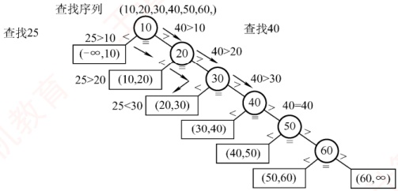
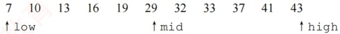
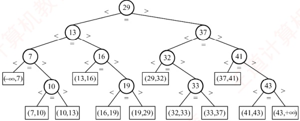
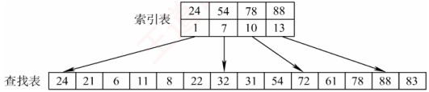

## 7.2 顺序查找和折半查找

### 7.2.1 顺序查找

顺序查找（又称线性查找）适用于顺序表和链表：对于顺序表，可通过递增数组下标依次访问每个元素；对于链表，则通过指针 `next` 逐个遍历结点。顺序查找可用于一般的无序线性表，也可用于按关键字有序的线性表。下面分别讨论其在无序表和有序表中的应用。

#### 1. 一般线性表的顺序查找

作为一种最直观的查找方法，顺序查找的基本思想：①从线性表的一端开始，逐个检查元素的关键字是否满足给定条件；②若查找到某个元素的关键字满足条件，则查找成功，返回该元素在线性表中的位置；③若已查至表的另一端仍未找到符合条件的元素，则返回查找失败的信息。下面给出其算法实现，后面说明其中“哨兵”的作用。

```c
typedef struct{
    ElemType *elem; //查找表的数据结构（顺序表）
    int TableLen; //动态数组基址
    } SSTable;
    int Search_Seq(SSTable ST, ElemType key) {
        ST.elem[0] = key; // “哨兵”
        for (int i = ST.TableLen; ST.elem[i] != key; --i); // 从后往前找 return i; // 若查找成功，则返回元素下标；若查找失败，则返回 0
    }
}
```

上述算法中，将 ST.elem[0] 称为哨兵。引入哨兵的目的是避免在循环中反复判断数组下标是否越界。算法从表尾（下标 TableLen）向前查找，一旦 `ST.elem[i]==key`，即返回 i，表示查找成功；否则，否则，循环最终会在 i=0 时终止（因为 `ST.elem[0]==key`），此时返回 0，表示查找失败。通过设置哨兵，可以省去边界判断，从而提高程序效率。

对于含 $n$ 个元素的表，若给定关键字 key 与表中第 $i$ 个元素相等，即定位第 $i$ 个元素时，需进行 $n-i+1$ 次关键字比较，即 $C_i = n-i+1$。查找成功的平均查找长度为
 $$ASL_{ 成功 }=\sum_{i=1}^{n}P_{i}(n-i+1)$$

当每个元素的查找概率相等（ $P_{i}=1/n$）时，有

 $$ASL_{ 成功 }=\sum_{i=1}^{n}P_{i}(n-i+1)=\frac{n+1}{2}$$

查找不成功时，与表中各关键字的比较次数显然是  $n+1$ 次，即 ASL 不成功  $=n+1$。

通常，查找表中记录的查找概率并不相等。若能预先获知各记录的查找概率，则应将记录按查找概率由大到小重新排列，使高频元素靠近查找起点，从而降低平均查找长度。

综上所述，顺序查找的主要缺点是当 n 较大时，平均查找长度较大，效率较低；其优点是对存储结构无要求——无论是顺序存储还是链式存储均可使用，且不要求表中记录按关键字有序。此外还需注意，链表只能采用顺序查找。

#### 2. 有序线性表的顺序查找

若在查找之前已知表是关键字有序的，则在查找失败时，无须继续比较到表的另一端即可提前返回查找失败的信息，从而降低查找失败的平均查找长度。假设表 L 按关键字从小到大排列，查找顺序为从前往后，待查元素的关键字为 key。当查找到第 i 个元素时，若发现该元素的关键字小于 key，而第 i+1 个元素的关键字大于 key，则可立即判定查找失败。因为表中第 i 个元素之后的所有元素关键字均大于 key，故表中不存在关键字等于 key 的元素。

### 考点追踪 ▶ 有序线性表的顺序查找的应用（2013）

可以用如图7.1所示的判定树来描述有序线性表的查找过程。树中的圆形结点表示表中实际存在的元素；矩形结点称为失败结点（若有n个结点，则相应的有 $n+1$个失败结点），它描述了那些不在表中的关键字范围的集合。若最终查找到某个矩形结点，则表示查找失败。



图 7.1 有序顺序表上的顺序查找判定树

而查找失败时，查找过程一定会走到某个失败结点。这些失败结点是虚构的空结点，实际并不存在。因此，到达某一失败结点时所经历的比较次数，等于其父结点（路径上最后一个真实元素结点）所在的层数。在等概率查找失败的情形下，查找失败的平均查找长度为：

在有序线性表的顺序查找中，查找成功的平均查找长度和一般线性表的顺序查找相同。

 $$\mathrm{ASL}_{ 失败 }=\sum_{j=1}^{n}q_{j}(l_{j}-1)=\frac{1+2+\cdots+n+n}{n+1}=\frac{n}{2}+\frac{n}{n+1}$$

其中， $q_{j}$ 是到达第 j 个失败结点的概率，在等概率假设下为  $1/(n+1)$； $l_{j}$ 是第 j 个失败结点所在的层数。例如，当 n=6 时， ASL_{失败}=6/2+6/7=3.86，比一般的顺序查找要好一些。

注意，有序线性表的顺序查找与后续介绍的折半查找在思想上有本质区别。此外，有序线性
表的顺序查找的线性表可以是链式存储结构，而折半查找的线性表只能是顺序存储结构。

### 7.2.2 折半查找

折半查找也称二分查找，它仅适用于关键字有序的顺序表。

### 考点追踪 分析对比给定查找算法与折半查找的效率（2016）

折半查找的基本思想：① 首先将给定值 key 与表中中间位置的元素进行比较，若相等，则查找成功，返回该元素的存储位置；② 若不相等，则待查元素只能位于中间元素以外的前半部分或后半部分（例如，当表按升序排列时，若 key 大于中间元素，则待查元素只可能在后半部分），随后在缩小的范围内重复上述过程，直到找到目标元素，或确定表中不存在该元素为止。此时返回查找失败信息。算法实现如下：

```c
int Binary_Search(SSTable L, ElemType key) {
    int low=0, high=L.TableLen-1, mid;
    while (low<=high) {
        mid = (low + high) / 2;
        if (L.elem[mid] == key)
            return mid;
        else if (L.elem[mid] > key)
            high = mid - 1;
        else
            low = mid + 1;
    }
    return -1;
}

//取中间位置
//查找成功则返回所在位置
//从前半部分继续查找
//从后半部分继续查找
//查找失败，返回-1
```

在选取中间结点时，既可以采用向下取整，也可以采用向上取整。但每次查找必须采用相同的取整方式。相关内容可结合本节习题进一步理解。

### 考点追踪 折半查找的查找路径的判断（2015）

例如，已知11个元素的有序表{7, 10, 13, 16, 19, 29, 32, 33, 37, 41, 43}，要查找值为11和32的元素，指针low和high分别指向当前查找区间的下界和上界，mid指向中间位置(low+high)/2⌋。

下面说明查找 11 的过程（查找 32 的过程请读者自行分析）：



第一次查找时，将中间位置元素与 key 比较。因为 11 < 29，故待查元素若存在，必在区间 [low, mid-1] 内，令 high=mid-1=5，mid=(1+5)/2=3，第二次查找区间为 [1,5]。

7 10 13 16 19 29 32 33 37 41 43

↑low ↑mid ↑high

第二次查找时，将中间位置元素与 key 比较。因为 11 < 13，故待查元素若存在，必在区间 [low, mid-1] 内，令 high=mid-1=2，mid=(1+2)/2=1，第三次查找区间为 [1,2]。

 $$\begin{aligned}& 7&&10&&13&&16&&19&&29&&32&&33&&37&&41&&43\\&low\uparrow&&\uparrow&high\end{aligned}$$

第三次查找时，将中间位置元素与 key 比较。因为 11 > 7，故待查元素若存在，必在区间 [mid+1, high] 内。令 low=mid+1=2，mid=(2+2)/2=2，第四次查找区间为 [2, 2]。

 $$\begin{array}{l} 7 \quad 10 \quad 13 \quad 16 \quad 19 \quad 29 \quad 32 \quad 33 \quad 37 \quad 41 \quad 43\\1ow\uparrow\uparrow high\\\uparrow mid \end{array}$$
第四次查找，此时子表仅含一个元素，且 $10\neq11$，因此表中不存在待查元素，查找失败。

### 考点追踪 分析给定二叉树树形能否构成折半查找判定树（2017）

折半查找的过程可用图 7.2 所示的判定树来描述，圆形结点表示表中存在的记录，结点值为其关键字；最底层的方形结点为失败结点，表示查找失败的区间。从判定树可以看出：查找成功时的查找长度等于从根结点到目的结点的路径上的结点数；查找失败时的查找长度等于从根结点到对应失败结点的父结点的路径上的结点数。该判定树满足性质：任一结点的值大于其左子树中所有结点的值，小于其右子树中所有结点的值。若有序表包含 n 个元素，则对应的判定树有 n 个圆形非叶结点和  $n+1$ 个方形叶结点。显然，该判定树是一棵平衡二叉树（见 7.3.2 节）。



图 7.2 描述折半查找过程的判定树

### 考点追踪 折半查找的最多比较次数的分析（2010、2023）

由上述分析可知，折半查找的比较次数最多不超过判定树的高度。在等概率查找的情况下，查找成功的平均查找长度为

 $$\mathrm{ASL}=\frac{1}{n}\sum_{i=1}^{n}l_{i}=\frac{1}{n}(1\times1+2\times2+\cdots+h\times2^{h-1})=\frac{n+1}{n}\log_{2}(n+1)-1\approx\log_{2}(n+1)-1$$

其中，$h$ 为树的高度。当元素个数为 $n$ 时，树高 $h = \lceil \log_2(n+1) \rceil$。因此，折半查找的时间复杂度为 $O(\log_2 n)$，平均效率显著高于顺序查找。

以图7.2所示的判定树为例（对应11个元素），查找成功的平均查找长度为 $ASL=(1\times1+2\times2+3\times4+4\times4)/11=3$，查找失败的平均查找长度为 $ASL=(3\times4+4\times8)/12=11/3$。

### 考点追踪 折半查找的适用场景（2024）

由于折半查找需要能够随机访问任意位置的元素，以便快速定位中间元素并缩小区间，因此它仅适用于顺序存储结构，不适用于链式存储结构，且要求表中元素按关键字有序排列。

### 7.2.3 分块查找

分块查找也称索引顺序查找，它吸取了顺序查找和折半查找各自的优点，既有良好的动态性，又支持较快的查找效率。

分块查找的基本思想是：将查找表划分为若干子块。块内元素可以无序，但块间必须有序，即任意前一块的最大关键字小于后一块中的所有关键字。同时，建立一个索引表，其中每个元素包含对应块的最大关键字和该块的起始地址，且索引表按最大关键字有序排列。

### 考点追踪分块查找的效率分析（2025）

分块查找过程分为两步：第一步在索引表中确定待查记录所在的块（可采用顺序查找或折半
查找）；第二步在目标块内进行顺序查找。

例如，关键码集合为{88, 24, 72, 61, 21, 6, 32, 11, 8, 31, 22, 83, 78, 54}，可按关键码值24, 54, 78, 88将其划分为4个块，并建立相应的索引表，如图7.3所示。



图 7.3 分块查找示意图

分块查找的平均查找长度等于索引查找的平均长度与块内查找的平均长度之和。设索引查找和块内查找的平均查找长度分别为  $L_{1}$ 和  $L_{s}$，则分块查找的平均查找长度为

 $$\mathrm{ASL}=L_{1}+L_{\mathrm{S}}$$

若将长度为 n 的查找表均匀地分为 b 块，每块包含 s 个记录  $(n = bs)$，并在等概率假设下对索引表和块内均采用顺序查找，则平均查找长度为

 $$\mathrm{ASL}=L_{1}+L_{\mathrm{S}}=\frac{b+1}{2}+\frac{s+1}{2}=\frac{s^{2}+2s+n}{2s}$$

此时，当块大小 s 取最优值  $(s = \sqrt{n})$，则平均查找长度达到最小值  $\sqrt{n} + 1$。

尽管索引表占用了额外的存储空间，且索引查找引入了一定的系统开销，但由于分块结构限制了块内查找的范围，分块查找的总体效率仍显著优于普通的顺序查找。
