## 7.3 树形查找

### 7.3.1 二叉排序树（BST）

构造一棵二叉排序树的主要目的并非直接输出有序序列，而是利用其有序结构支持高效的动态查找、插入和删除操作。这种非线性结构有利于实现快速的数据访问。
#### 1. 二叉排序树的定义

### 考点追踪 二叉排序树的应用（2013）

二叉排序树（也称二叉查找树）或者是一棵空树，或者是具有下列特性的二叉树：

1）若左子树非空，则左子树上所有结点的关键字均小于根结点的关键字。

2）若右子树非空，则右子树上所有结点的关键字均大于根结点的关键字。

3）左右子树也分别是一棵二叉排序树。

### 考点追踪 二叉排序树中结点值之间的关系（2015、2018、2024）

基于上述定义，对二叉排序树进行中序遍历可以得到一个递增的有序关键字序列。例如，图7.4所示二叉排序树的中序遍历序列为1,2,3,4,6,8。

#### 2. 二叉排序树的查找

二叉排序树的查找是从根结点开始，逐层向下比较并选择左/右子树的搜索过程。若二叉排序树非空，先将给定关键字与根结点的关键字比较：若相等，则查找成功；若不等，小于根结点的关键字，则在根结点的左子树上查找，否则在根结点的右子树上查找。这一过程具有天然的递归结构，也可以用循环实现。以下是用循环实现二叉排序树查找的代码示例：

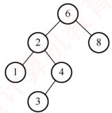

图 7.4 一棵二叉排序树

```c
BSTNode *BST_Search(BiTree T,ElemType key){
while(T!=NULL&key!=T->data){ //若树空或等于根结点值，则结束循环
    if(key<T->data) T=T->lchild; //小于，则在左子树上查找
    else T=T->rchild; //大于，则在右子树上查找
}
return T;
}
```

例如，在图7.4中查找关键字为4的结点。首先4与根结点6比较。因为4<6，所以在根结点6的左子树中继续查找。因为4>2，故在结点2的右子树中继续查找，该子树的根结点即为4，查找成功。

同样，二叉排序树的查找也可用递归算法实现，其实现较为简单，但由于递归可能导致较大的栈空间开销，执行效率较低。具体的代码实现留给读者思考。

#### 3. 二叉排序树的插入

二叉排序树作为一种动态树表，其结构通常不是一次性生成的，而是在查找过程中动态构建：当查找失败（树中不存在关键字等于给定值的结点）时，才执行插入操作。

插入结点的过程如下：若原二叉排序树为空，则将新结点作为根结点直接插入；否则，从根结点开始比较，若关键字 k 小于当前结点的关键字，则在左子树中继续查找并插入；若 k 大于当前结点的关键字，则在右子树中继续查找并插入。新插入的结点在插入完成后一定是一个叶结点，且恰好是查找失败时所访问的最后一个结点的左孩子或右孩子。如图 7.5 所示，在一棵二叉排序树中依次插入结点 28 和 58，虚线所示路径即为每次插入前的查找路径。

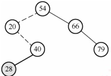

(a) 插入28

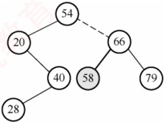

(b) 插入58

图 7.5 向二叉排序树中插入结点

二叉排序树插入操作的算法描述如下：

```c
int BST_Insert(BiTree &T,KeyType k) {
    if (T==NULL) {
        //原树为空，新插入的记录为根结点
        T=(BiTree)malloc(sizeof(BSTNode));
        T->data=k;
        T->lchild=T->rchild=NULL;
        return 1;
    }
    else if (k==T->data) {
        //树中存在相同关键字的结点，插入失败
        return 0;
        else if (k<T->data) {
            return BST_Insert(T->lchild,k);
        }
        else {
            return BST_Insert(T->rchild,k);
        }
    }
}
```

#### 4. 二叉排序树的构造

### 考点追踪 构造二叉排序树的过程（2020）

从一棵空树开始，依次将给定元素插入二叉排序树的合适位置（重复关键字将被忽略）。设插入的关键字序列为{45, 24, 53, 45, 12, 24}，则生成的二叉排序树如图7.6所示。

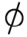


(a) 空树

(b) 插入45

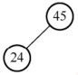

(c) 插入24

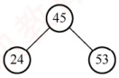

(d) 插入53

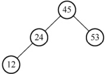

(e) 插入12

图 7.6 二叉排序树的构造过程

构造二叉排序树的算法描述如下：

```c
void Creat_BST(BiTree &T,KeyType str[],int n){
    T=NULL; //初始时T为空树
    int i=0;
    while (i<n) {
        //依次将每个关键字插入二叉排序树
        BST_Insert(T, str[i]);
        i++;
    }
}
```

#### 5. 二叉排序树的删除

在二叉排序树中删除一个结点时，不能把以该结点为根的子树都删除，而必须将该结点从存储结构中摘下，并重新连接因删除操作而断裂的链表，同时确保整棵树仍满足二叉排序树的性质。删除操作需根据被删结点的不同情况分别处理，具体分为以下三种情形：

① 若被删结点 z 是叶结点，则直接删除即可，不会破坏二叉排序树的性质。

② 若结点 z 仅有一棵非空子树（左子树或右子树），则将其唯一的子树上移，作为 z 的父结点的新子树，从而替代 z 的位置。

③ 若结点 z 同时具有左右两棵子树，则可用 z 的直接后继或直接前驱（分别为中序遍历中的下一个或上一个结点）来替代 z。替换完成后，再从树中删除该直接后继（或前驱）。由于直接后继（或前驱）至多只有一个子树，这样就转化为第①或第②种情况。
图 7.7 展示了分别删除结点 45, 78, 78 的过程。

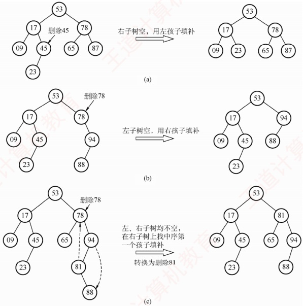

图 7.7 3 种情况下的删除过程

### 考点追踪 二叉排序树中删除并插入某结点的分析（2013）

思考：若在二叉排序树中删除某结点，再重新插入，所得的二叉排序树是否与原树相同？

#### 6. 二叉排序树的查找效率分析

二叉排序树的查找效率主要取决于树的高度。若左右子树高度之差的绝对值不超过1（见下一节的平衡二叉树），其平均查找长度为 $O(\log_2 n)$。在最坏情况下，若构造二叉排序树的输入序列是有序的，则会形成一个只有右孩子（或只有左孩子）的单支树，此时树的高度为n，性能显著下降，平均查找长度退化为 $(n+1)/2$，如图7.8(b)所示。

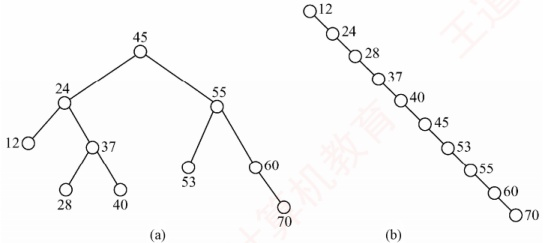

图 7.8 相同关键字组成的不同二叉排序树

在等概率情况下，图7.8(a)查找成功的平均查找长度为

 $$ASL_{a}=(1+2 \times 2+3 \times 4+4 \times 3)/10=2.9$$

而图7.8(b)查找成功的平均查找长度为

 $$ASL_{b}=(1+2+3+4+5+6+7+8+9+10)/10=5.5$$

从查找过程来看，二叉排序树与二分查找相似。就平均时间性能而言，二者相近。但二分查找所对应的判定树是唯一的，而由相同关键字集合可能生成不同的二叉排序树——其具体形态取决于关键字的插入顺序，如图7.8所示。

就维护表的有序性而言，二叉排序树无须移动结点，仅需修改指针即可完成插入和删除操作，平均时间复杂度为  $O(\log_2 n)$。而二分查找的对象是有序顺序表，若需执行插入或删除操作，必须移动大量元素，时间复杂度为  $O(n)$。因此，当表为静态查找表时，宜采用顺序表存储并使用二分查找；若表为动态查找表（需频繁插入或删除），则应选择二叉排序树作为其逻辑结构。

### 7.3.2 平衡二叉树

#### 1. 平衡二叉树的定义

为了避免树的高度增长过快而导致二叉排序树性能下降，在插入和删除结点时，需保证任意结点的左右子树高度差的绝对值不超过1。满足这一条件的二叉树称为平衡二叉树（Balanced Binary Tree），也称AVL树。定义结点左子树与右子树的高度差为该结点的平衡因子，则平衡二叉树中所有结点的平衡因子只能取-1、0或1。

### 考点追踪 平衡二叉树的定义（2009）

因此，平衡二叉树可形式化定义为：它或者是一棵空树，或者是具有下列性质的二叉树——其左子树和右子树均为平衡二叉树，且左右子树的高度差的绝对值不超过1。图7.9(a)是一棵平衡二叉树，图7.9(b)是一棵不平衡的二叉树。结点内的数字表示其平衡因子。

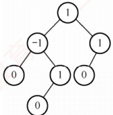

(a) 平衡二叉树

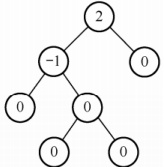

(b) 不平衡的二叉树

图 7.9 平衡二叉树和不平衡的二叉树

#### 2. 平衡二叉树的插入

平衡二叉树维持平衡的基本思想如下：每当插入一个结点后，沿查找路径向上检查各祖先结点是否因该操作而失去平衡。若存在失衡结点，则定位插入路径上离新结点最近、且平衡因子绝对值大于1的结点A，以A为根的子树即为最小不平衡子树。随后，在保持二叉排序树特性的前提下，通过旋转调整该子树的结构，使其重新达到平衡。

### 考点追踪平衡二叉树中插入操作的特点（2015）

每次调整的对象都是最小不平衡子树，图7.10中的虚线框内所示即为最小不平衡子树。

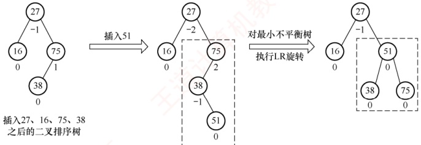

图 7.10 最小不平衡子树示意

### 考点追踪 平衡二叉树的插入及调整操作的实例（2010、2019、2021）

平衡二叉树的插入过程前半部分与普通二叉排序树相同；但在新结点插入后，若导致查找路径上的某个结点失去平衡，则需执行相应的调整。可将调整的规律归纳为下列4种情况：

1）LL 平衡旋转（右单旋转）。由于在结点 A 的左孩子（L）的左子树（L）上插入了新结点，A 的平衡因子由 1 增至 2，导致以 A 为根的子树失去平衡，需要一次向右的旋转操作。将 A 的左孩子 B 向右上旋转，使其代替 A 成为新的根结点；将 A 向右下旋转，成为 B 的右孩子；而 B 的原右子树则作为 A 的左子树。如图 7.11 所示，结点旁的数值代表结点的平衡因子，方块表示相应结点的子树，下方数值代表该子树的高度。

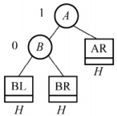

(a) 插入结点前

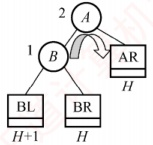

(b) 插入结点导致不平衡

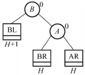

(c) LL旋转（右单旋转）

图 7.11 LL 平衡旋转

2）RR 平衡旋转（左单旋转）。由于在结点 A 的右孩子（R）的右子树（R）上插入了新结点，A 的平衡因子由 -1 减至 -2，导致以 A 为根的子树失去平衡，需要一次向左的旋转操作。将 A 的右孩子 B 向左上旋转，使其替代 A 成为新的根结点；将 A 向左下旋转，成为 B 的左孩子；而 B 的原左子树则作为 A 的右子树，如图 7.12 所示。

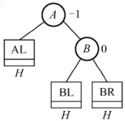

(a) 插入结点前

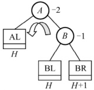

(b) 插入结点导致不平衡

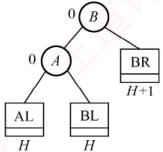

(c) RR旋转(左单旋转)

图 7.12 RR 平衡旋转

3）LR 平衡旋转（先左后右双旋转）。由于在结点 A 的左孩子（L）的右子树（R）上插入新结点，A 的平衡因子由 1 增至 2，导致以 A 为根的子树失去平衡，需要进行两次旋转操作，先左旋转后右旋转。先将 A 的左孩子 B 的右子树的根结点 C 向左上旋转，使其取代
B 的位置；然后将 C 向右上旋转，使其取代 A 的位置，如图 7.13 所示。

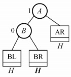

(a)

(a) 插入结点前

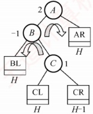

(b) 插入结点导致不平衡

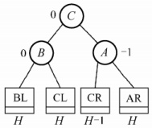

(c) LR旋转(双旋转)

图 7.13 LR 平衡旋转

4）RL 平衡旋转（先右后左双旋转）。由于在结点 A 的右孩子（R）的左子树（L）上插入新结点，A 的平衡因子由 -1 减至 -2，导致以 A 为根的子树失去平衡，需要进行两次旋转操作，先右旋转后左旋转。先将 A 的右孩子 B 的左子树的根结点 C 向右上旋转，使其取代 B 的位置；然后将 C 向左上旋转，使其取代 A 的位置，如图 7.14 所示。

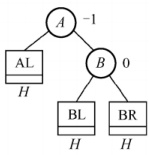

(a) 插入结点前

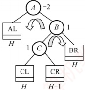

(b) 插入结点导致不平衡

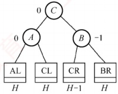

(c) RL旋转(双旋转)

图 7.14 RL 平衡旋转

**注意**

LR 和 RL 旋转时，新结点究竟是插入 C 的左子树还是右子树不影响旋转过程，而图 7.13 和图 7.14 中以插入 C 的左子树为例。

### 考点追踪 构造平衡二叉树的过程（2013）

以关键字序列{15, 3, 7, 10, 9, 8}构造一棵平衡二叉树的过程为例：图 7.15(d)插入 7 后导致不平衡，最小不平衡子树的根为 15，插入位置为其左孩子的右子树，因此需执行 LR 旋转，先左后右双旋转，调整后的结果如图 7.15(e)所示。图 7.15(g)插入 9 后导致不平衡，最小不平衡子树的根为 15，插入位置为其左孩子的左子树，需执行 LL 旋转，右单旋转，调整后的结果如图 7.15(h)所示。图 7.15(i)插入 8 后导致不平衡，最小不平衡子树的根为 7，插入位置为其右孩子的左子树，需执行 RL 旋转，先右后左双旋转，调整后的结果如图 7.15(j)所示。

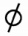


(a) 空树

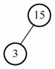

(b) 插入15

(c) 插入3

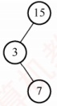

(d) 插入7

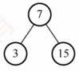

(e) LR旋转

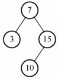

(f) 插入10

图 7.15 平衡二叉树的生成过程

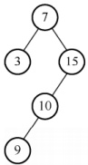

(g) 插入9

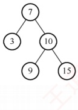

(h) LL 旋转

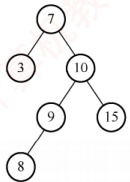

(i) 插入8

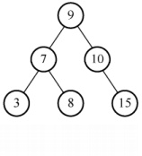

(i) RL 旋转

图 7.15 平衡二叉树的生成过程（续）

#### 3. 平衡二叉树的删除

与插入操作相似，以删除结点w为例说明平衡二叉树删除操作的步骤：

1）使用二叉排序树的方法删除结点w

2）若导致不平衡，则从结点 w 开始向上回溯，找到第一个不平衡的结点 z（最小不平衡子树的根）。设 y 是 z 的较高子树的根结点，x 是 y 的较高子树的根结点。

3）对以z为根的子树进行平衡调整，其中x、y和z的相对位置有以下四种情况：

• y 是 z 的左孩子，x 是 y 的左孩子（LL，右单旋转）；

• y 是 z 的左孩子，x 是 y 的右孩子（LR，先左后右双旋转）；

• y 是 z 的右孩子，x 是 y 的右孩子（RR，左单旋转）；

• y 是 z 的右孩子，x 是 y 的左孩子（RL，先右后左双旋转）。

这些调整方式与插入操作相同。不同之处在于：插入操作只需对以z为根的子树进行一次平衡调整，而删除操作则可能需要多次调整。若一次调整导致子树的高度减1，则可能还需对z的祖先结点进行平衡调整，甚至回溯到根结点（导致整棵树的高度减1）。

以删除图 7.16(a) 中的结点 32 为例，由于 32 是叶结点，直接删除即可。然后向上回溯，找到第一个不平衡结点 44（z），z 的较高子树的根为 78（y），y 的较高子树的根为 50（x），满足 RL 情况，需执行先右后左的双旋转。调整后的结果如图 7.16(c) 所示。

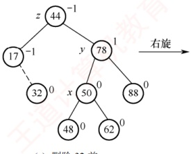

(a) 删除32前

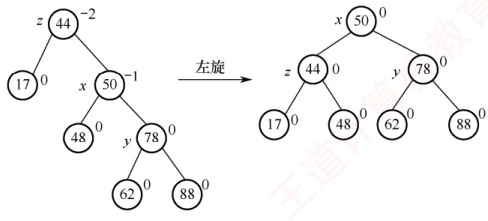

(b) 右旋

(c) 左旋

图 7.16 平衡二叉树的删除

#### 4. 平衡二叉树的查找

### 考点追踪 ▶️ 指定条件下平衡二叉树的结点数的分析（2012）

在平衡二叉树上进行查找的过程与普通二叉排序树相同，因此关键字的比较次数最多等于树的深度。设  $n_h$ 表示深度为  $h$（根结点深度为 1）的平衡二叉树中所含的最少结点数。显然有  $n_0 = 0$， $n_1 = 1$， $n_2 = 2$，且满足  $n_h = n_{h-2} + n_{h-1} + 1$，如图 7.17 所示，依次推出  $n_3 = 4$， $n_4 = 7$， $n_5 = 12$， $\cdots$。
有 n 个结点的平衡二叉树的最大深度为  $O(\log_2 n)$，因此平均查找时间复杂度为  $O(\log_2 n)$。

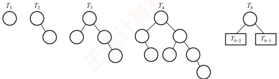

图 7.17 结点个数 n 最少的平衡二叉树

**注意**

该结论可用于求解给定结点数的平衡二叉树在查找时所需的最多比较次数（树的最大深度）。例如，含有12个结点的平衡二叉树中查找某个结点的最多比较次数？

深度为 h 的平衡二叉树中所含的最多结点数显然是满二叉树的情况。

### 7.3.3 红黑树

#### 1. 红黑树的定义

为了保持 AVL 树的平衡性，在插入和删除操作后，会非常频繁地调整全树的整体拓扑结构，代价较大。为此，在 AVL 树的平衡标准基础上进一步放宽条件，引入了红黑树的结构。

一棵红黑树是满足如下红黑性质的二叉排序树：

① 每个结点或是红色，或是黑色的。

②根结点是黑色的。

③ 叶结点（虚构的外部结点、NULL结点）都是黑色的。

④ 不存在两个相邻的红结点（红结点的父结点和孩子结点均是黑色的）。

⑤ 对每个结点，从该结点到任意一个叶结点的简单路径上，所含黑结点的数量相同。

与折半查找树和 B 树类似，为了便于对红黑树的实现和理解，引入了  $n+1$ 个外部叶结点，这些结点被视为黑色，以保证每个内部结点的左右子树均非空。图 7.18 所示是一棵红黑树。

从某个结点出发（不含该结点）到达一个叶结点的任意一个简单路径上的黑结点总数称为该结点的黑高（记为 bh），黑高的概念是由性质 $^{⑤}$确定的。根结点的黑高称为红黑树的黑高。

结论 1：从根到叶结点的最长路径不大于最短路径的2倍。

根据性质 $^{⑤}$，从根到任意一个叶结点的最短路径必然全由黑结点构成。根据性质 $^{④}$，当某条路径最长时，这条路径必然是由黑结点和红结点交替构成的，此时黑结点的数量固定，红结点的数量最多等于黑结点的数量。图7.18中的6-2和6-15-18-20就是这样的两条路径。

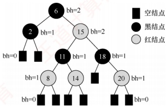

结论2：有 n 个内部结点的红黑树的高度  $h \leq 2\log_{2}(n+1)$。

图 7.18 一棵红黑树

证明：根据结论 1，从根到叶结点（不含叶结点）的任意一条简单路径上都至少有一半是黑结点，因此根的黑高至少为  $h/2$。由此得出  $n \geqslant 2^{h/2} - 1$，从而得到结论。

由结论2也可推出，黑高为 h 的红黑树的内部结点数最少是  $2^{h}-1$，最多是  $2^{2h}-1$。
可见，红黑树采用“适度平衡”策略——相比AVL树的“高度平衡”（左右子树高度差 $\leq$1），允许左右子树高度相差最多达2倍，显著降低了插入/删除时结构调整的频率。因此，对于动态查找表：若查找操作远多于插入/删除，采用AVL树更优（查找更快）；若插入/删除频繁，则采用红黑树更合适（调整开销小）。由于红黑树在实际应用中综合性能更优，它被广泛采用，例如C++中的map和set（Java中的TreeMap和TreeSet）均基于红黑树实现。

#### 2. 红黑树的插入

红黑树的插入过程与普通二叉查找树基本类似。不同之处在于，插入新结点后可能破坏红黑性质，因此需要通过重新着色或旋转操作进行调整，以恢复红黑树的基本性质。

结论 3：新插入的结点初始应着为红色。

假设将其染为黑色，则该结点所在路径的黑结点数将比其他路径的多1，几乎必然违反性质 $^{⑤}$（所有路径的黑结点数相等），且调整代价较高。而若染为红色，则所有路径的黑结点数保持不变，仅当出现父子均为红色时才违反性质 $^{④}$，此时，局部调整即可高效恢复平衡。

设新插入的结点为 z。插入与调整过程如下：

1）用二叉查找树规则插入 z，并将其染为红色。若 z 的父结点为黑色，则红黑性质未被破坏，插入结束。

2）若 z 为根结点，则将其染为黑色（满足性质②），树的黑高加 1，插入结束。

3）若 z 非根，且其父结点 z,p 为红色，则违反性质④。由于原树合法，根据性质②和④，z 的爷结点 z,p,p 必然存在且为黑色。此时，需要根据叔结点 y（z,p 的兄弟）的颜色分三种情形处理（此处假设 z,p 是 z,p,p 的左孩子，右孩子情形对称，后面会说明）。

情形1（LR型，先左旋再右旋）：z的叔结点y是黑色的，且z是其父结点的右孩子。

即 z 是其爷结点的左孩子的右孩子。先对 z,p 执行左旋，使 z 上升取代原父位置，转化为情形 2。此操作不改变任何路径的黑结点数（因 z 与 z,p 均为红色），故性质⑤不受影响。

情形2（LL型，右单旋）：z的叔结点y是黑色的，且z是其父结点的左孩子。

即 z 是其爷结点的左孩子的左孩子。对 z.p.p 执行右旋，并将原父结点染黑、原爷结点染红。此操作保持所有路径的黑结点数不变，同时消除连续红结点，恢复全部红黑性质，插入结束。

图 7.19 展示了情形 1（LR 型）和情形 2（LL 型）的调整过程。子树  $T_{1}$、 $T_{2}$、 $T_{3}$ 和  $T_{4}$ 均以黑色结点为根，且黑高相同，确保旋转前后性质⑤成立。

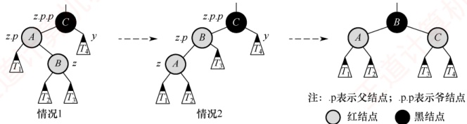

图 7.19 情况 1 和情况 2 的调整方式

对称情形：若 z.p 是 z.p.p 的右孩子，则对应 RL 型（先右旋后左旋）和 RR 型（左单旋），处理方式完全对称，此处不再赘述。可见，红黑树的调整方法与 AVL 树有异曲同工之妙。

情形3：z的叔结点y是红色的。

无论 z 是左孩子还是右孩子，均无影响。将 z、p 和 y 染为黑色，将 z、p、p 染为红色，以在局部恢复性质④（无连续红结点）和性质⑤（所有路径的黑结点数相等）。但 z、p、p 变红后，可能与其
父结点再次形成红-红冲突。因此，将 z.p.p 视为新的“待调整结点 z”，继续向上回溯检查。调整过程如图 7.20 所示。该过程可能多次重复，每次循环 z 都会上移两层，直至满足以下任何一个终止条件：z 成为根结点（此时染黑，结束）；进入情形 1 或情形 2（执行旋转后结束）。

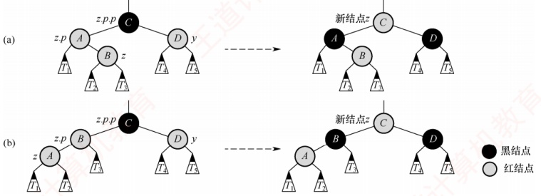

图 7.20 情况 3 的调整方式

补充说明：尽管新结点最初总是插入在某个叶结点位置，但在情形3的回溯过程中，指针z可能已上移至内部结点，从而拥有子树。因此，所有调整操作都必须考虑其子树的存在。

以图 7.21(a) 中的红黑树为例（虚线表示插入后的状态），依次插入 5、4 和 12 的过程如图 7.21 所示。插入 5，属于情形 3，将 5 的父结点 3 与叔结点 10 染黑，爷结点 7 染红；由于 7 是根结点，需将其重新染黑，树的黑高加 1，结束。插入 4，属于情形 1 的对称情形（RL 型），先对以 5 为根的子树执行右旋，转为情形 2 的对称情形（RR 型），交换 3 和 4 的颜色，再对以 4 为根的子树执行左旋，结束。插入 12，其父结点为黑色，无须调整，直接结束。

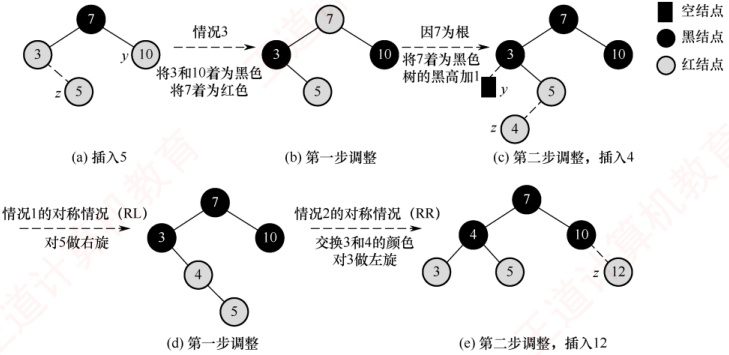

图 7.21 红黑树的插入过程

#### 3. 红黑树的删除

**注意**

本节内容难度较大，考查概率较低，读者可根据自身情况决定是否学习或学习的时机。

红黑树的插入操作可能破坏性质 $^{④}$（无连续红结点）。而删除操作则更易破坏性质 $^{⑤}$（所有路径的黑结点数相等），特别是当被删结点为黑色时，会导致经过该结点的所有路径黑高减1。
删除过程首先执行二叉查找树的标准删除。若待删结点有两个非空子树，不能直接删除，需用其中序后继（或前驱）替代之，即右子树中的最小结点，并转为删除该后继结点。由于中序后继在其子树中是最小值，因此至多只有一个右孩子。由此，删除操作最终都可归结为以下两种情形：

待删结点有一个孩子（左或右孩子）。

待删结点是终端结点（无孩子）。

1）若待删结点有一个孩子，则只有两种情况，如图7.22所示。

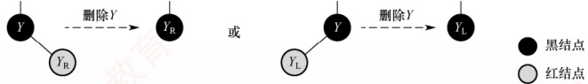

图 7.22 只有右子树或左子树的删除情况

且仅有这两种情况存在。则子树只有一个结点，且必然是红色，否则会破坏性质 $^{⑤}$。

2）待删结点无孩子，且该结点是红色的，此时可直接删除，而不需要做任何调整。

3）待删结点无孩子，且该结点是黑色的，此时设待删结点为y，x是用来替换y的结点（注意，当y是终端结点时，x是黑色的NULL结点）。删除y后将导致先前包含y的任何路径上的黑结点数量减1，因此y的任何祖先都不再满足性质⑤，简单的修正办法就是将替换y的结点x视为还有额外一重黑色，定义为双黑结点。也就是说，若将任何包含结点x的路径上的黑结点数量加1，则在此假设下，性质⑤得到满足，但破坏了性质①。于是，删除操作的任务就转化为将双黑结点恢复为普通结点。

分为以下四种情形，区别在于 x 的兄弟结点 w 及 w 的孩子结点的颜色不同。

情形1：x的兄弟结点w是红色的。

w 必须有黑色左右孩子和父结点。交换 w 和父结点 x,p 的颜色，然后对 x,p 做一次左旋，而不会破坏红黑树的任何规则。现在，x 的新兄弟结点是旋转之前 w 的某个孩子结点，其颜色为黑色，这样，就将情形 1 转换为情形 2、3 或 4 处理。调整方式如图 7.23 所示。

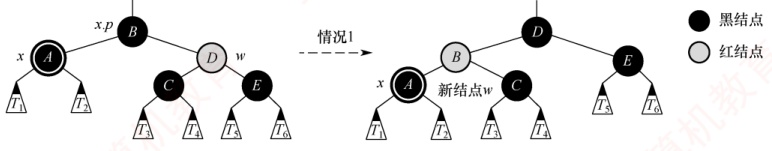

图 7.23 情形 1 的调整方式

情形2（RR型，左单旋）：x的兄弟结点w是黑色的，且w的右孩子是红色的。

即这个红结点是其爷结点的右孩子的右孩子。交换 w 和父结点 x.p 的颜色，把 w 的右孩子着为黑色，并对 x 的父结点 x.p 做一次左旋，将 x 变为单重黑色，此时不再破坏红黑树的任何性质，结束。调整方式如图 7.24 所示。

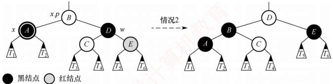

图 7.24 情形 2 的调整方式

情形3（RL型，先右旋再左旋）：x的兄弟结点w是黑色的，w的左孩子是红色的，w的右孩子是黑色的。

即这个红结点是其爷结点的右孩子的左孩子。交换w和其左孩子的颜色，然后对w做一次右旋，而不破坏红黑树的任何性质。现在，x的新兄弟结点w的右孩子是红色的，这样就将情形3转换为了情形2。调整方式如图7.25所示。

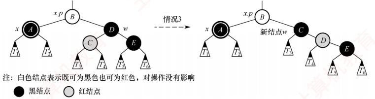

图 7.25 情形 3 的调整方式

情形4：x的兄弟结点w是黑色的，且w的两个孩子结点都是黑色的。

因为 w 也是黑色的，所以可从 x 和 w 上去掉一重黑色，使得 x 只有一重黑色而 w 变为红色。为了补偿从 x 和 w 中去掉的一重黑色，把 x 的父结点 x.p 额外着一层黑色，以保持局部的黑高不变。通过将 x.p 作为新结点 x 来循环，x 上升一层。若是通过情形 1 进入情形 4 的，因为原来的 x.p 是红色的，将新结点 x 变为黑色，终止循环，结束。调整方式如图 7.26 所示。

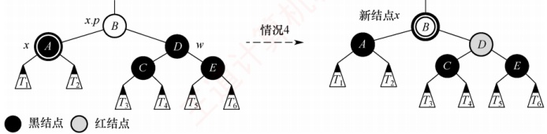

图 7.26 情形 4 的调整方式

若 x 是父结点 x.p 的右孩子，则还有四种对称的情形，处理方式类似，不再赘述。

归纳总结：在情形4中，因x的兄弟结点w及左右孩子都是黑色，可以从x和w中各提取一重黑色（以让x变为普通黑结点），不会破坏性质④，并把调整任务向上“推”给它们的父结点x,p。在情形1、2和3中，因为x的兄弟结点w或w左右孩子中有红结点，所以只能在x,p子树内用调整和重新着色的方式，且不能改变x原根结点的颜色（否则向上可能破坏性质④）。情形1虽可能会转为情形4，但因为新x的父结点x,p是红色的，所以执行一次情形4就会结束。情形1、2和3在各执行常数数的颜色改变和至多3次旋转后便终止，情形4是可能重复执行的唯一情形，每执行一次指针x上升一层，至多 $O(\log_2 n)$次。

以图 7.27(a) 所示的红黑树为例（虚线表示删除前的状态），依次删除 5 和 15 的过程如图 7.27 所示。删除 5，用虚构的黑色 NULL 结点（图中为 N 结点）替换，视为双黑 NULL 结点，属于情形 1，交换兄弟结点 12 和父结点 8 的颜色，对 8 执行左旋；转变为情形 4，从双黑 NULL 结点和 10 中各提取一重黑色（提取后，双黑 NULL 结点变为普通 NULL 结点，图中省略，10 变为红色），因原父结点 8 是红色，所以将 8 变为黑色，结束。删除 15，属于情形 3 的对称情形（LR 型），交换 8 和 10 的颜色，对 8 执行左旋；转变为情形 2 的对称情形（LL 型），交换 10 和 12 的颜色（两者颜色一样，无变化），将 10 的左孩子 8 视为黑色，对 12 执行右旋，结束。

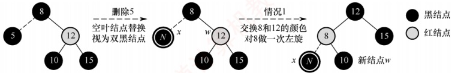

(a) 删除5

(b) 删除后，空叶结点替换

(c) 第一步调整后

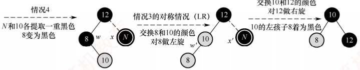

(d) 第二步调整后，删除15

(e) 第一步调整后

(f) 第二步调整后

图 7.27 红黑树的删除过程
